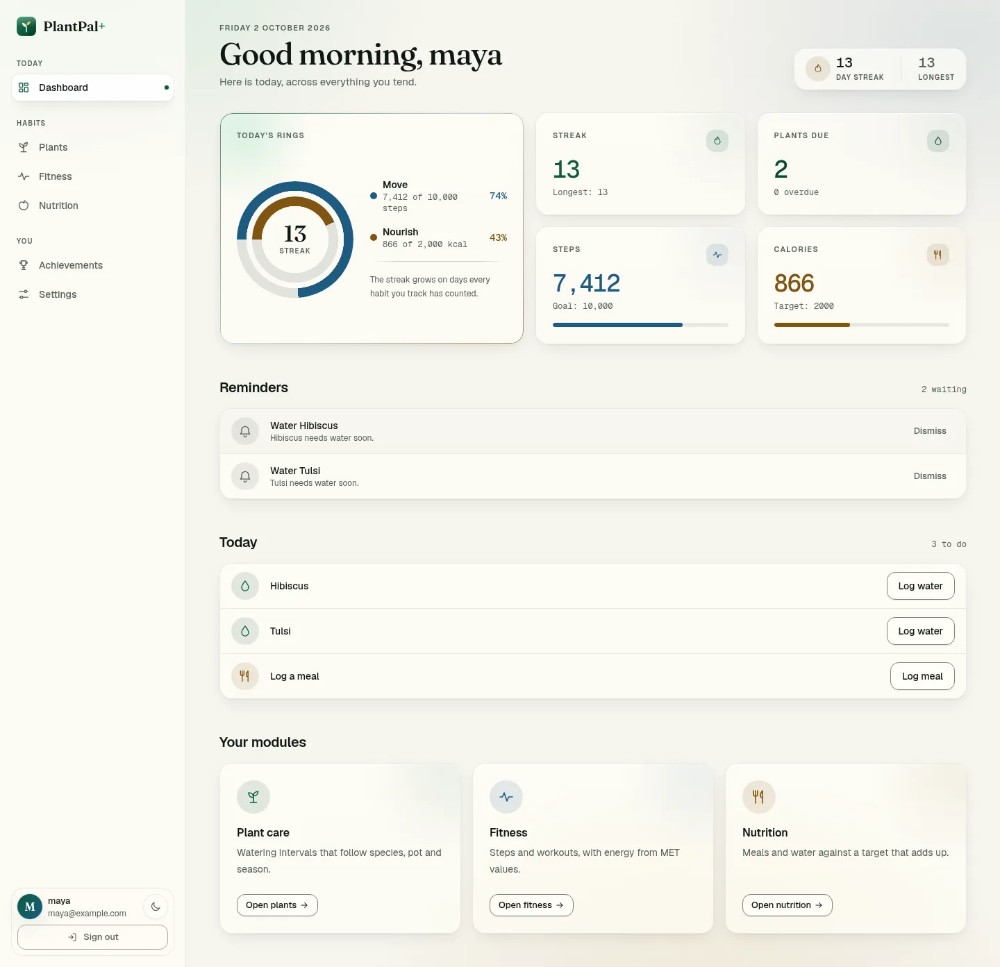
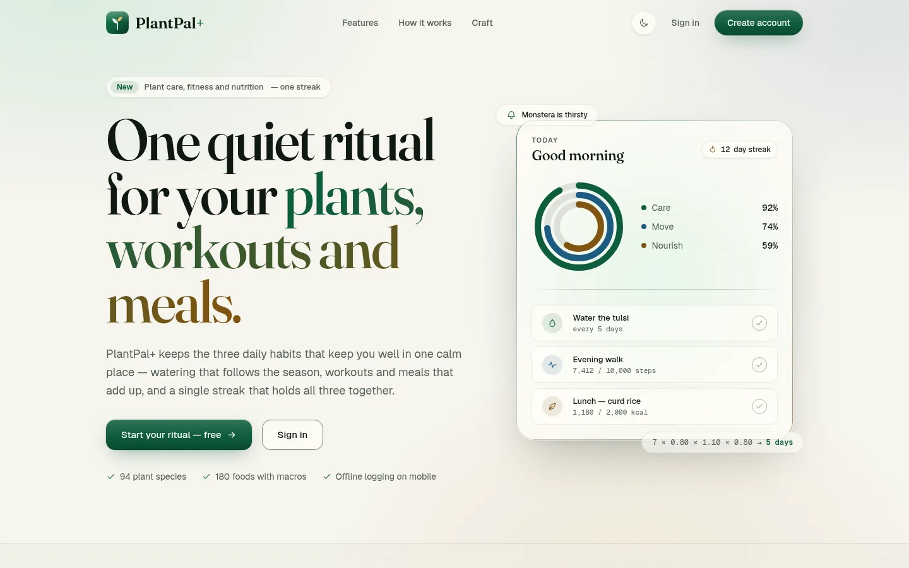
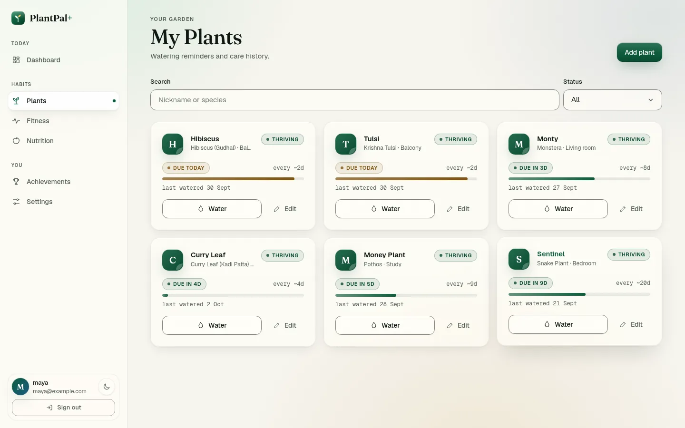
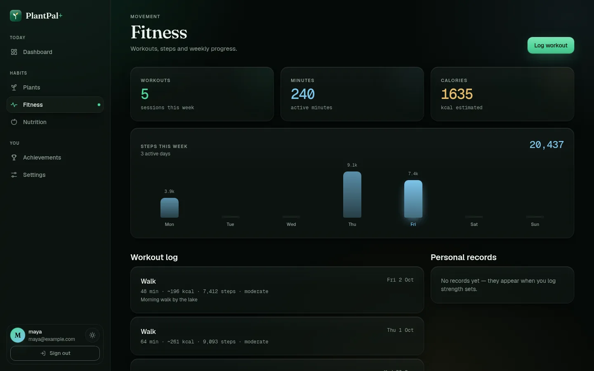
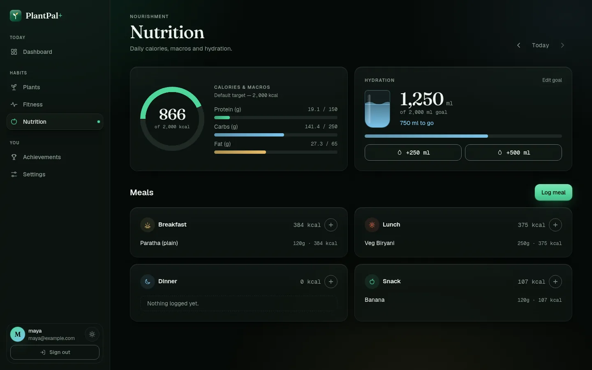
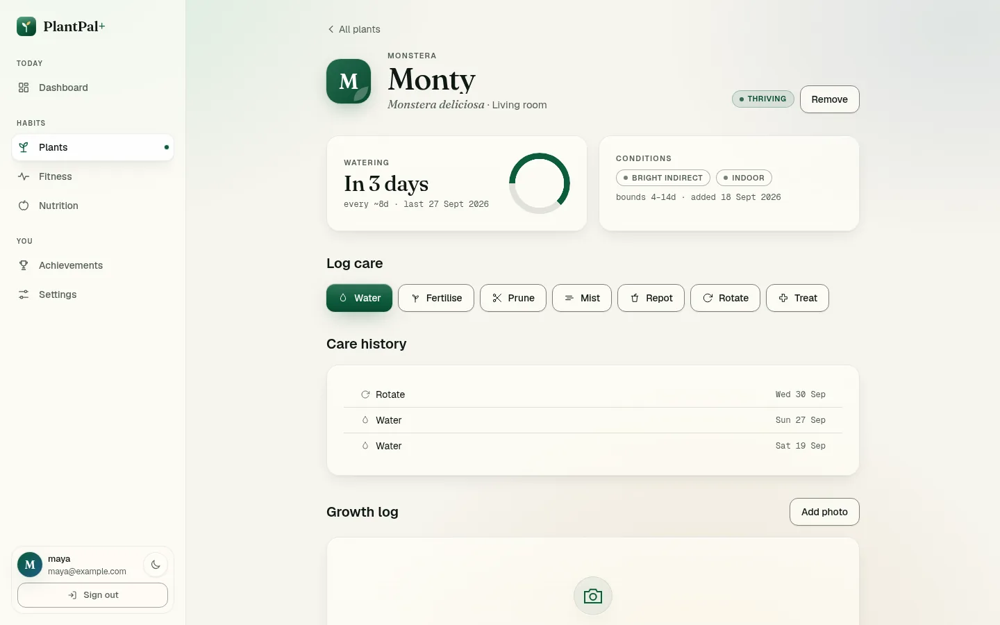
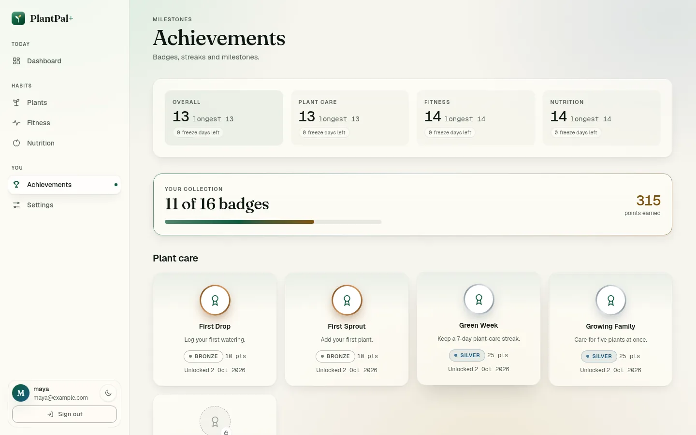
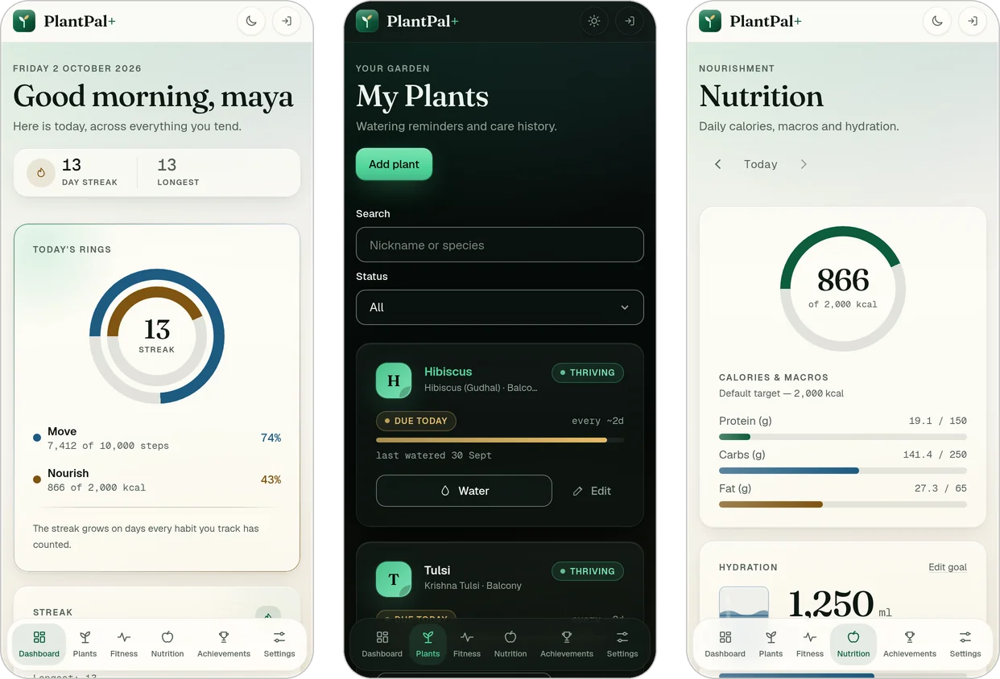
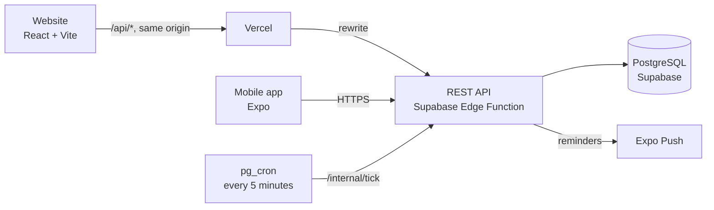

<div align="center">


# PlantPal+

**Plant care, fitness and nutrition in one daily ritual, with one streak.**

[](https://github.com/rakshit-737/PlantPal-Plus/actions/workflows/ci.yml)
[](https://github.com/rakshit-737/PlantPal-Plus/actions/workflows/deploy-web.yml)
[](LICENSE)
[](03_implementation/package.json)
[](03_implementation/tsconfig.base.json)

[**Open the live app**](https://plant-pal-plus.vercel.app) · [Documentation](05_documentation/README.md) · [API reference](05_documentation/api-reference.md) · [Report a bug](https://github.com/rakshit-737/PlantPal-Plus/issues/new?template=bug_report.yml)

</div>

<br>

<picture>
  <source media="(prefers-color-scheme: dark)" srcset="05_documentation/assets/screenshots/dashboard-dark.webp">
  
</picture>

## Why PlantPal+

Watering plants, moving every day and eating well are all daily habits that run on the same loop: **schedule, remind, log, keep the streak, look back**. Most people juggle three apps for them, with three logins and three streams of notifications. PlantPal+ builds the loop once and runs all three habits through it: one dashboard, one reminder engine and one streak that counts a day when every habit you track is done.

It is also a complete software-engineering project, built phase by phase from a 228-requirement specification. Code, tests and documents cite the identifiers of the requirements they implement, so each rule can be followed from the specification to the line that enforces it.

## Features

| | |
| --- | --- |
| **Plant care** | A catalogue of 94 species, Indian plants included. Watering intervals adapt to species, season, light, pot, soil, drainage and placement. Seven care actions, a full care history and a growth log with a photo timeline. |
| **Fitness** | Workouts and steps, with a MET energy estimate for every timed workout, strength sets with their total volume, and a weekly summary. |
| **Nutrition** | 180 foods with macros, plus your own custom foods. Meals by type, daily calorie and macro targets, and a hydration goal. |
| **One streak** | A dashboard for the whole day, reminders with quiet hours, a streak for each habit and an overall one, freeze days and 16 achievements. |
| **Web and mobile** | A responsive website with light and dark themes and three accessibility modes (reduced motion, larger text, high contrast), and an Expo app that keeps logging when you are offline. |
| **Private by design** | First-party accounts with Argon2id passwords, rotating refresh tokens with reuse detection, and account deletion with a 30-day grace window followed by erasure. |

> [!NOTE]
> PlantPal+ is a wellness tracker, not a medical device. Energy and body-composition figures are estimates.

## Screenshots

<table>
  <tr>
    <td width="50%"><p align="center"><sub>Landing page</sub></p></td>
    <td width="50%"><p align="center"><sub>Plants and their watering schedules</sub></p></td>
  </tr>
  <tr>
    <td width="50%"><p align="center"><sub>Fitness, in the dark theme</sub></p></td>
    <td width="50%"><p align="center"><sub>Nutrition, in the dark theme</sub></p></td>
  </tr>
  <tr>
    <td width="50%"><p align="center"><sub>A plant's care page</sub></p></td>
    <td width="50%"><p align="center"><sub>Streaks and achievements</sub></p></td>
  </tr>
</table>

<p align="center">
  
  <br>
  <sub>The website at phone width, with its tab dock</sub>
</p>

## Tech stack

| Layer | Technology |
| --- | --- |
| **Web** | React 18, Vite 6, TypeScript, Tailwind CSS 3, Motion, React Router 7 |
| **Mobile** | React Native 0.86 with Expo SDK 57, Expo Push, SecureStore and a durable offline outbox |
| **API** | Node.js, Express 4, Zod, Pino; also bundled for Deno on Supabase Edge Functions |
| **Database** | PostgreSQL 16 on Supabase, versioned SQL migrations, `pg_cron` for scheduled work |
| **Shared logic** | `@plantpal/shared`: pure TypeScript domain rules used by every app |
| **Quality** | Vitest, Testing Library, Supertest, real PostgreSQL in CI, ESLint, strict TypeScript |
| **Delivery** | GitHub Actions, Vercel, Supabase Edge Functions, GitHub Pages, EAS Build |

## Architecture



- **One origin for the website.** Vercel serves the site and forwards `/api/*` to the API, so the refresh-token cookie stays first-party and sessions survive a reload in every browser.
- **One codebase, two hosts.** The same Express app runs as a Node process locally and, bundled into a single file, as a Supabase Edge Function in production.
- **Scheduled work from the database.** `pg_cron` calls the API every five minutes to send due reminders and erase accounts whose deletion window has closed.
- **Offline without merge conflicts.** Only append-only events (a watering, a workout, a meal, a glass of water) can be queued offline. Each carries a client-generated key and the server applies it exactly once, so there is nothing to merge.
- **Every rule in one place.** Watering intervals, energy and nutrition maths and streak transitions live once in `@plantpal/shared`, and the API, the website and the mobile app all import them.

The [system architecture](02_design/architecture/01-system-architecture.md) has the C4 views, and the [architecture decision records](05_documentation/README.md#architecture-decision-records) explain the larger choices.

### Repository layout

The top-level folders follow the six phases of the project, in order:

```text
PlantPal-Plus/
├── 01_requirements/       Phase 1: the SRS, module specifications, user stories and use cases
├── 02_design/             Phase 2: architecture, ADRs, OpenAPI, UI design and ER diagrams
├── 03_implementation/     Phase 3: the code, an npm workspace
│   ├── api/               REST API: Express on Node, or bundled for Supabase Edge Functions
│   ├── web/               Website: React + Vite
│   ├── mobile/            Mobile app: React Native + Expo
│   └── shared/            Domain rules shared by all three apps
├── 04_testing/            Phase 4: the testing guide (tests live next to the code they test)
├── 05_documentation/      Phase 5: documentation index, API reference, changelog, screenshots
├── 06_deployment/         Phase 6: API bundle, scheduler SQL, Render blueprint, deployment guide
└── .github/               CI and deployment workflows, templates, contributing and security policies
```

Each numbered folder has a README that explains what is in it. Inside `03_implementation`, dependencies point one way: each app depends on `shared`, the apps never import one another, and `shared` has no runtime dependencies at all.

## Getting started

You need **Node.js 20.11 or newer** (22 recommended) and **PostgreSQL 15 or newer**, either local or a free [Supabase](https://supabase.com) project.

All the code lives in `03_implementation`, which is the npm workspace root, so every command below runs from there.

```bash
git clone https://github.com/rakshit-737/PlantPal-Plus.git
cd PlantPal-Plus/03_implementation
npm install                                  # every workspace, and builds shared/
```

**1. Start the API.** Set `DATABASE_URL` and `JWT_ACCESS_SECRET` (32+ characters) in `api/.env`. The API applies the migrations and loads the catalogues on start.

```bash
cp api/.env.example api/.env
npm run dev --workspace @plantpal/api        # http://localhost:4000
```

**2. Start the website.** The dev server forwards `/api` to the API, so no CORS setup is needed.

```bash
cp web/.env.example web/.env
npm run dev --workspace @plantpal/web        # http://localhost:5173
```

**3. Run the mobile app (optional).** Scan the QR code with [Expo Go](https://expo.dev/go); on a physical phone, set `EXPO_PUBLIC_API_URL` to your computer's LAN address.

```bash
cd mobile
npx expo start
```

The [API](03_implementation/api/README.md), [web](03_implementation/web/README.md) and [mobile](03_implementation/mobile/README.md) READMEs cover configuration in full.

### Commands

Run these from `03_implementation`:

| Command | What it does |
| --- | --- |
| `npm test` | Runs every workspace's tests |
| `npm run typecheck` | Strict TypeScript across every workspace |
| `npm run lint` | ESLint across the monorepo, failing on any warning |
| `npm run build` | Builds every workspace |
| `npm run format` | Formats with Prettier |

## Testing

**466 tests** across the four workspaces run on every push and pull request, on Node 20.11 and 22, using a real PostgreSQL 16 for the integration suites.

| Workspace | Tests | Focus |
| --- | ---: | --- |
| `03_implementation/shared` | 53 | Domain algorithms, checked against the worked examples in the requirements |
| `03_implementation/api` | 239 | Controllers, services, configuration, sync and erasure, plus 18 tests against real PostgreSQL |
| `03_implementation/mobile` | 24 | The offline outbox: ordering, retries, idempotency |
| `03_implementation/web` | 150 | Pages and components, the API client, contrast and token parity, code splitting |

Where the requirements publish a worked example, that example is the test: `7 × 0.80 × 1.10 × 0.80 × 1.00 = 4.928 → 5 days` for a watering interval, `1345 × 1.375 → 1849 kcal` for daily energy. The [testing guide](04_testing/README.md) covers running the suites and how they are written.

## Deployment

| | Where |
| --- | --- |
| **Website** | [plant-pal-plus.vercel.app](https://plant-pal-plus.vercel.app) on Vercel, redeployed on every push to `main` |
| **API** | Supabase Edge Function `plantpal-api`, with [`/healthz`](https://mmqqijfgtcjviogqporc.supabase.co/functions/v1/plantpal-api/healthz) and `/readyz` probes |
| **Database** | Supabase Postgres, with reminders and erasure driven by `pg_cron` |
| **Mirror** | [rakshit-737.github.io/PlantPal-Plus](https://rakshit-737.github.io/PlantPal-Plus/) on GitHub Pages |
| **Mobile** | Installable builds with [EAS](03_implementation/mobile/eas.json) (an Android APK from the `preview` profile), pointed at the live API |

Everything runs on free tiers. The [deployment guide](06_deployment/README.md) explains how each piece is built and configured; [`render.yaml`](06_deployment/render.yaml) can also run the API as a long-lived Node service.

## Documentation

| | |
| --- | --- |
| [Documentation index](05_documentation/README.md) | Everything below, organised by project phase |
| [Software Requirements Specification](01_requirements/SRS.md) · [Reading guide](01_requirements/README.md) | The complete Phase 1 specification and how to navigate it |
| [System architecture](02_design/architecture/01-system-architecture.md) · [Database schema](02_design/architecture/02-database-schema.md) | C4 views, the deployed topology, 28 tables |
| [API reference](05_documentation/api-reference.md) · [OpenAPI 3.1](02_design/architecture/openapi.yaml) | Every endpoint, its auth and its rules |
| [Design language](02_design/ui_design/01-design-language.md) · [Component inventory](02_design/ui_design/02-component-inventory.md) | The "Conservatory" design system and its accessibility contract |
| [Testing guide](04_testing/README.md) · [Deployment guide](06_deployment/README.md) · [Changelog](05_documentation/CHANGELOG.md) | Running, shipping and the history of changes |

## Project status

| Phase | Status |
| --- | --- |
| 1. Requirements | ✅ Baselined: [36 documents](01_requirements/), from stakeholders to use cases |
| 2. Design | ✅ Architecture, database schema, OpenAPI 3.1, sequence diagrams, ADRs and the design system |
| 3. Implementation | ✅ API, website and mobile app for all three habits, including the offline outbox and push reminders |
| 4. Testing | ✅ 466 automated tests, two adversarial audits whose critical and major findings are fixed |
| 5. Documentation | ✅ Requirements to deployment, plus a README for every workspace |
| 6. Deployment | ✅ Live on Vercel and Supabase, with CI on every change |

### Requirements at a glance

| Artefact | Count |
| --- | --- |
| Functional requirements | 228 |
| Business rules | 307 |
| Non-functional requirements | 111 across 13 quality attributes |
| User stories with Gherkin criteria | 119 |
| Use cases with full specifications | 89 |

The landing page quotes several of these figures, and a test fails if the two ever disagree.

### Known limitations

- **Photos are links, not uploads.** The growth log stores an image URL; there is no object storage yet.
- **No email.** No mail provider is wired, so there is no password reset or email verification, and account-deletion notices are not sent. New accounts are active at sign-up; `REQUIRE_EMAIL_VERIFICATION` restores the confirmation window once mail exists.
- **Personal records are not computed yet.** The table and the read endpoint exist, but nothing derives records from logged strength sets, so the fitness page's records panel stays empty.
- **A failed push is not retried.** The in-app reminder list is the delivery baseline.
- **The native app trails the website's design.** It shares the current palette, but its components still have the previous design's shapes.

## Contributing

Contributions are welcome. Read the [contributing guide](.github/CONTRIBUTING.md) for setup, conventions and the pull-request checklist, and follow the [code of conduct](.github/CODE_OF_CONDUCT.md). Report security issues privately, as described in the [security policy](.github/SECURITY.md).

## License

[MIT](LICENSE) © 2026 Rakshit. Third-party notices are in [THIRD_PARTY_LICENSES.md](05_documentation/THIRD_PARTY_LICENSES.md).
