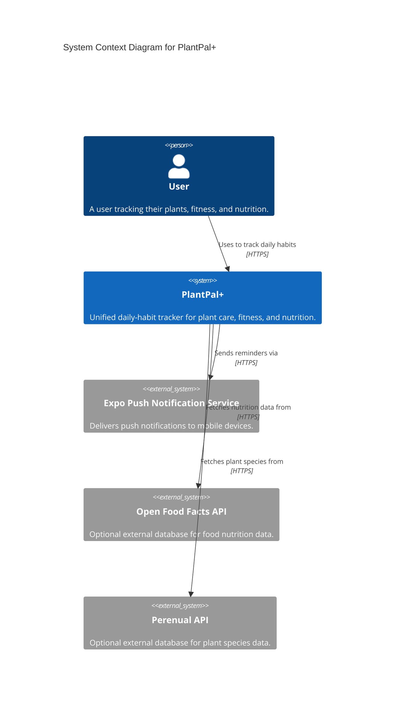
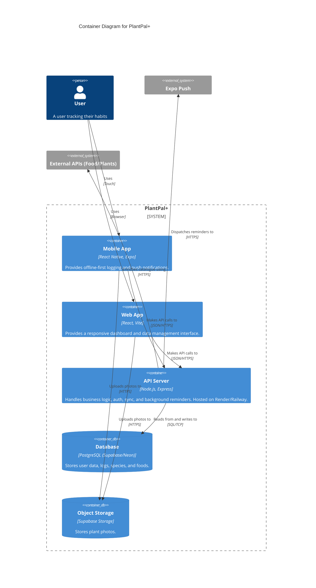
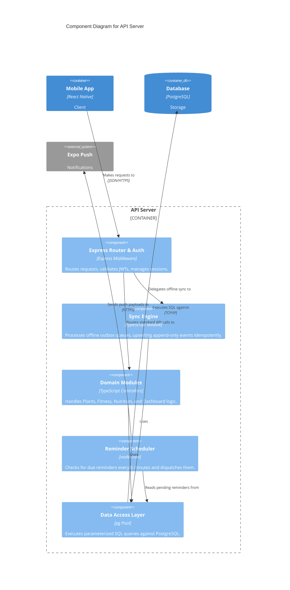

# PlantPal+ System Architecture

| Field | Value |
| --- | --- |
| Document | `01-system-architecture.md` — High-level system design (C4 Model) |
| Version | 1.1 |
| Owner | Rakshit |

## 1. Monorepo Structure (npm workspaces)
To enforce the "TypeScript everywhere" rule and share code seamlessly across web, mobile, and backend, we use an **npm workspaces** monorepo (the locked tooling decision — not Turborepo/Nx).

```text
/PlantPal+
├── apps/
│   ├── api/          # Node.js + Express backend
│   ├── web/          # React + Vite web application
│   └── mobile/       # React Native (Expo) mobile application
├── packages/
│   ├── shared/       # Domain logic, Zod schemas, constants, types
│   ├── ui/           # Shared UI components (NativeWind/Tailwind)
│   ├── tsconfig/     # Base TS configs
│   └── eslint-config/# Shared linting rules
```

## 2. System Architecture (C4 Model)

The architecture is documented following the C4 model (Context, Container, and Component levels) using Mermaid diagrams.

### 2.1 Context Diagram (Level 1)
Shows the system in its environment, interacting with users and external systems.



### 2.2 Container Diagram (Level 2)
Zooming into the `PlantPal+` system to show the high-level technical containers.



### 2.3 Component Diagram: API Server (Level 3)
Zooming into the `API Server` container to show its internal components.



> **Auth is first-party, not Supabase Auth.** Supabase here provides only managed PostgreSQL and object storage. Authentication (registration, login, JWT access tokens, opaque rotating refresh tokens, session cap) is implemented inside the Express API — see the API specification and the auth ADR. Consequently, per-row isolation is enforced in application queries scoped by `user_id`, **not** by Supabase Row-Level Security using `auth.uid()`.

## 3. Offline & Sync Strategy
- **Offline-Light:** Clients cache reads using TanStack Query (persisted to AsyncStorage / IndexedDB). 
- **Append-Only Write Outbox:** Log actions (watering, meals, workouts) are queued locally if offline.
- **Syncing:** When back online, the client pushes the queue to the `Sync Engine`. Each payload includes a `client_uuid` (idempotency key).
- **Conflict-Free:** Since log events are immutable events (append-only), there is no need for complex CRDTs or Last-Write-Wins merging. The server simply upserts by the idempotency key.

## 4. Reminder Engine
- A `node-cron` job runs every 5 minutes on the API server.
- It scans the PostgreSQL database for reminders due before `CURRENT_TIMESTAMP` that haven't been sent.
- Batches them and sends them to the **Expo Push Notification Service**.
- Records delivery status back in the DB to prevent duplicates.
- **Keep-Alive:** Because the server is hosted on a free tier (Render) which spins down, a ping service (e.g., cron-job.org) must hit the health endpoint every 14 minutes to ensure the reminder engine doesn't sleep.
