# PlantPal+ Database Schema

| Field | Value |
| --- | --- |
| Document | `02-database-schema.md` — Relational schema and ER diagrams |
| Version | 1.0 |
| Owner | Rakshit |

## 1. Global Standards
- **Primary Keys:** `UUID` (v4), generated on the server (or on the client as idempotency keys for outbox sync).
- **Timestamps:** Every table has `created_at` and `updated_at` (UTC).
- **Soft Deletes:** `deleted_at` timestamp on entities that shouldn't break historical logs (e.g., deleted foods or plants).
- **Timezones:** Log entries store both a UTC timestamp (`logged_at_utc`) and the user's localized date string (`local_date_str` e.g., '2026-07-21') to easily calculate streaks without heavy timezone math on read.

## 2. Entity-Relationship Diagram

```mermaid
erDiagram
    %% Core Auth & Profile
    USERS {
        uuid id PK
        string email
        string display_name
        string timezone
        string locale
        int height_cm
        float weight_kg
    }

    %% Plant Care
    PLANTS {
        uuid id PK
        uuid user_id FK
        uuid species_id FK "nullable"
        string nickname
        string room
        date acquisition_date
        string status "THRIVING, NEEDS_ATTENTION, CRITICAL"
    }
    PLANT_LOGS {
        uuid id PK
        uuid plant_id FK
        string action_type "WATER, FERTILIZE, PRUNE"
        timestamp logged_at_utc
        string local_date_str
    }
    
    %% Fitness
    WORKOUTS {
        uuid id PK
        uuid user_id FK
        string activity_type "RUN, CYCLE, LIFT, etc"
        int duration_mins
        int calories_burned
        timestamp logged_at_utc
        string local_date_str
    }
    
    %% Nutrition
    MEAL_LOGS {
        uuid id PK
        uuid user_id FK
        uuid food_id FK
        string meal_type "BREAKFAST, LUNCH, DINNER, SNACK"
        float quantity
        string serving_unit
        int computed_calories
        timestamp logged_at_utc
        string local_date_str
    }
    FOODS {
        uuid id PK
        string name
        float cal_per_100g
        float protein_per_100g
        float carbs_per_100g
        float fat_per_100g
        boolean is_custom
    }

    %% Relationships
    USERS ||--o{ PLANTS : owns
    PLANTS ||--o{ PLANT_LOGS : has
    USERS ||--o{ WORKOUTS : logs
    USERS ||--o{ MEAL_LOGS : logs
    FOODS ||--o{ MEAL_LOGS : references
```



## 3. Sync Outbox Table
Crucial for the offline-light architecture.

**Table: `sync_outbox`**
| Column | Type | Notes |
| --- | --- | --- |
| `id` | UUID | Primary Key |
| `user_id` | UUID | FK to Users |
| `client_idempotency_key` | UUID | Sent by client to prevent duplicate replays |
| `entity_type` | String | 'PLANT_LOG', 'WORKOUT', 'MEAL_LOG' |
| `payload` | JSONB | The actual data to insert |
| `status` | String | 'PENDING', 'PROCESSED', 'FAILED' |
| `created_at` | Timestamp | UTC |

## 4. Notifications Table
**Table: `scheduled_reminders`**
| Column | Type | Notes |
| --- | --- | --- |
| `id` | UUID | Primary Key |
| `user_id` | UUID | FK to Users |
| `reminder_type` | String | 'WATER_PLANT', 'LOG_MEAL' |
| `target_entity_id` | UUID | E.g., The specific Plant ID |
| `due_at_utc` | Timestamp | When the cron job should pick it up |
| `status` | String | 'PENDING', 'SENT', 'CANCELLED' |

## 5. Tenant Isolation
Auth is **first-party**, not Supabase Auth, so there is no `auth.uid()` session variable to key Row-Level Security on. Per-user isolation is enforced in the application layer: every query for a user-owned entity is scoped by `user_id`, taken from the verified JWT access token, and never from client input.

```sql
-- Every read/write of a user-owned row is parameterised on the authenticated user.
SELECT * FROM plants WHERE user_id = $1 AND deleted_at IS NULL;
```

RLS may be layered on later as defence-in-depth, but it would require issuing a request-scoped Postgres role or `SET LOCAL app.user_id`, since `auth.uid()` is unavailable under first-party auth. It is **not** the primary isolation mechanism.
