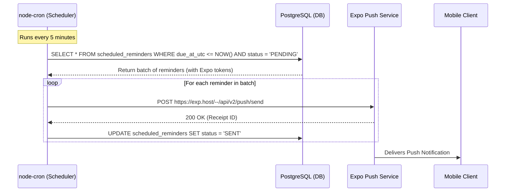
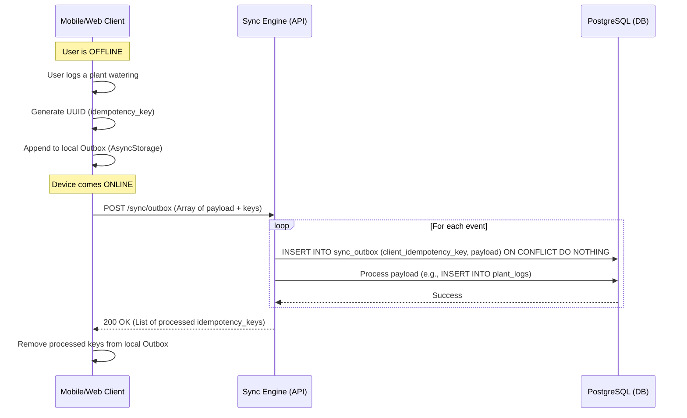
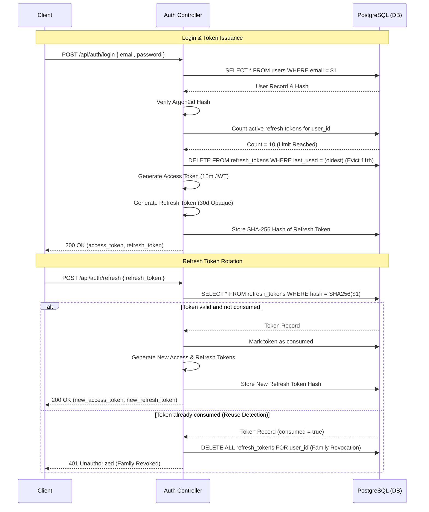
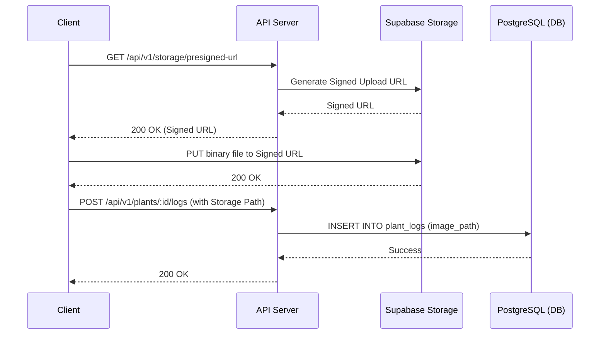
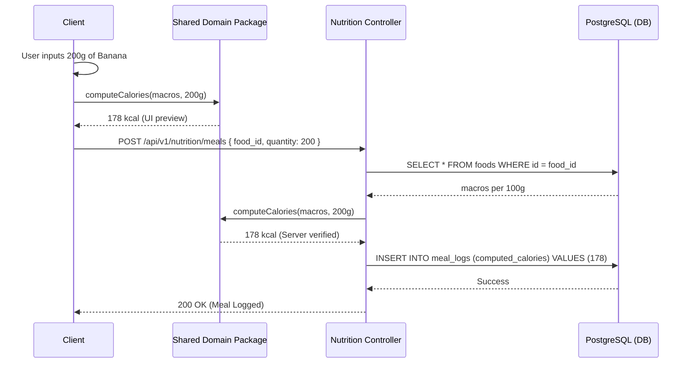

# PlantPal+ Sequence Diagrams

| Field | Value |
| --- | --- |
| Document | `04-sequence-diagrams.md` — Critical business flows |
| Version | 1.0 |
| Owner | Rakshit |

This document contains Mermaid sequence diagrams for the critical operations across PlantPal+, illustrating the interaction between the client, API, database, and external services.

## 1. Watering-Reminder Scheduling
Illustrates how the `node-cron` job picks up pending reminders and dispatches them via Expo Push Notification Service.

## 2. Offline Queue & Sync (Append-Only)
Demonstrates the conflict-free append-only outbox sync strategy (`ADR-0002`).

## 3. First-Party Authentication Flow
Covers Registration, Login (JWT issuance), Refresh Token Rotation, and Session Cap (10-session limit with eviction).

## 4. Photo Upload (Direct-to-Storage)
Shows how photos (e.g., plant growth timeline) are uploaded directly to Supabase Storage bypassing the API's memory limits.

## 5. Nutrition Atwater Calculation
How a meal log is processed to ensure the correct macro-to-calorie balance (Atwater general factor system).

