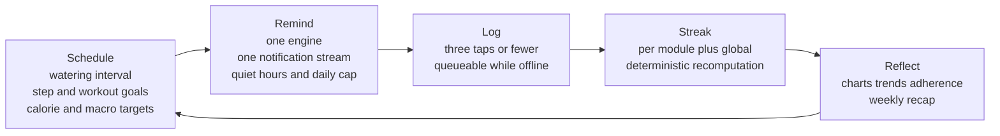
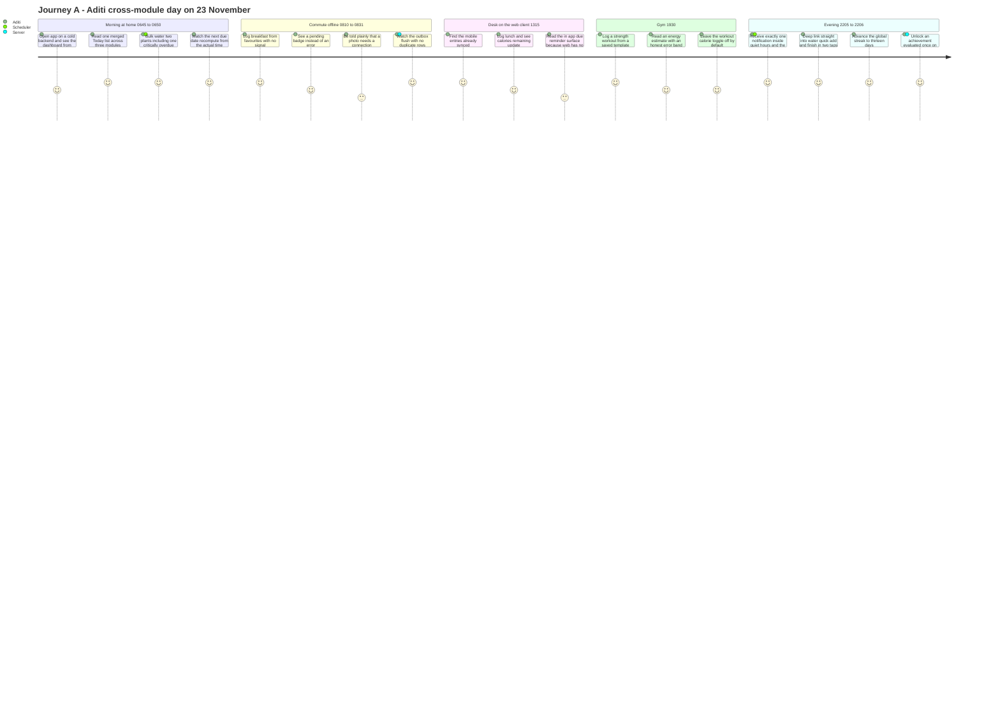
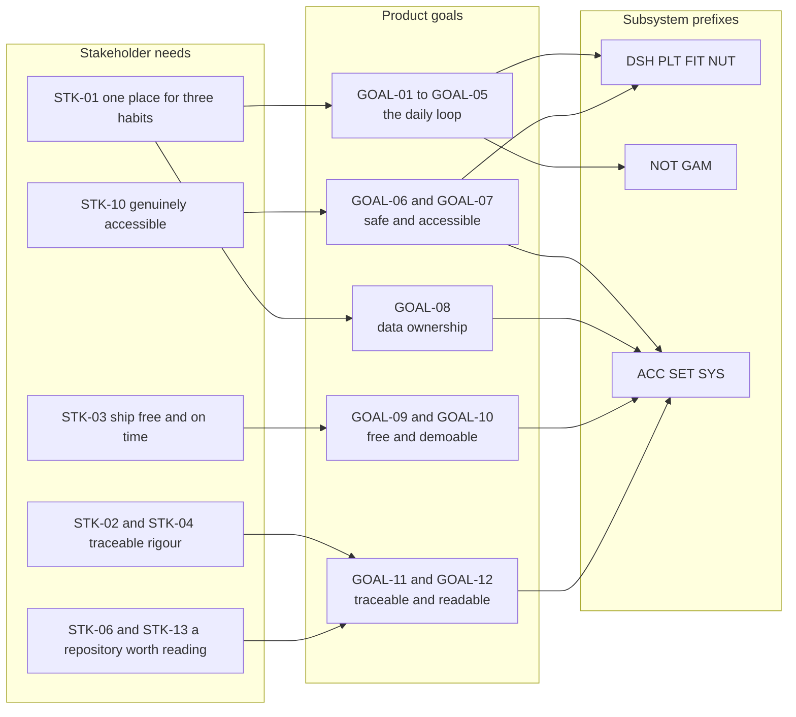

# 01 — Stakeholders, Personas, Goals and Positioning

| Field | Value |
| --- | --- |
| Document | 01-stakeholders-and-personas.md — Stakeholders, Personas, Goals and Positioning |
| Version | 1.0 |
| Date | 2026-07-21 |
| Status | Baselined for Phase 1 sign-off |
| Owner | Rakshit — Project Lead and sole developer |
| Parent | [SRS.md](./SRS.md) |
| Standard | IEEE 830-1998 section structure, modernised with ISO/IEC/IEEE 29148:2018 requirement-quality rules |
| Identifier prefixes owned | STK, PER, GOAL, MET |
| Identifier prefixes referenced only | FR, BR, US, UC, NFR, ASM, CON, RSK, DEP, OQ, ENT |
| Locked decisions applied | D-01 to D-11, stakeholder sign-off dated 2026-07-21 |

---

## Table of contents

1. [Purpose, ownership and how to read this document](#1-purpose-ownership-and-how-to-read-this-document)
2. [Problem statement and product vision](#2-problem-statement-and-product-vision)
3. [Stakeholder register](#3-stakeholder-register)
4. [User classes and characteristics — the IEEE 830 view](#4-user-classes-and-characteristics--the-ieee-830-view)
5. [Personas](#5-personas)
6. [User journeys](#6-user-journeys)
7. [The flagship journey, diagrammed](#7-the-flagship-journey-diagrammed)
8. [Product goals and success metrics](#8-product-goals-and-success-metrics)
9. [Competitive scan and positioning](#9-competitive-scan-and-positioning)
10. [Upward traceability from this document](#10-upward-traceability-from-this-document)
11. [Document control](#11-document-control)

---

## 1. Purpose, ownership and how to read this document

### 1.1 Purpose

This document establishes **who PlantPal+ is for, who can block or shape it, what success means in numbers, and where it sits against the market.** It is the top of the traceability chain. Every functional requirement minted in [03-functional-requirements.md](./03-functional-requirements.md) and the eight module specifications under [modules/](./modules/) must trace upward to at least one `GOAL-nn` identifier or one named stakeholder need recorded here. Every user story in [05-user-stories.md](./05-user-stories.md) must name one of the five personas defined here, verbatim.

It corresponds to IEEE 830-1998 sections 2.3 *User characteristics* and 2.1 *Product perspective*, extended with the stakeholder-identification and needs-elicitation activities that ISO/IEC/IEEE 29148:2018 clause 6.2 requires before requirements are written.

### 1.2 What this document owns

| Prefix | Register | Range minted here | Contiguity |
| --- | --- | --- | --- |
| STK-nn | Stakeholder register | STK-01 to STK-13 | Contiguous, no gaps |
| PER-nn | Personas | PER-01 to PER-05 | Contiguous, no gaps |
| GOAL-nn | Product goals | GOAL-01 to GOAL-12 | Contiguous, no gaps |
| MET-nn | Success metrics | MET-01 to MET-24 | Contiguous, no gaps |

It additionally owns, as narrative rather than as numbered identifiers: the problem statement, the vision statement, the user-class table, the anti-persona list, the five user journeys, the competitive scan and the positioning statement including the honest list of what the product will not win at.

### 1.3 What this document deliberately does not contain

| Not here | Reason | Where it lives |
| --- | --- | --- |
| Functional requirements `FR-<PREFIX>-nn` | This document is context. Context does not mint testable system behaviour. | [03-functional-requirements.md](./03-functional-requirements.md) and [modules/](./modules/) |
| Business rules `BR-<PREFIX>-nn` | A business-rule identifier is scoped to a subsystem prefix. This document owns no subsystem prefix. | The eight module specifications |
| User stories `US-<PREFIX>-nn`, use cases `UC-<PREFIX>-nn` | Same scoping reason. | [05-user-stories.md](./05-user-stories.md), [06-use-case-model.md](./06-use-case-model.md) |
| Non-functional requirements `NFR-<CAT>-nn` | This document states the *business target* a metric implies. The NFR document states the *engineering requirement*. Where both describe the same property they must agree, and **the NFR statement is authoritative for verification.** | [04-non-functional-requirements.md](./04-non-functional-requirements.md) |
| Entity definitions | The conceptual data model is owned elsewhere; this document uses that vocabulary without extending it. | [07-domain-model.md](./07-domain-model.md) |
| The full `ASM`, `CON`, `RSK`, `DEP` and `OQ` registers | Referenced here by identifier only, never restated in a way that could drift. | [09-assumptions-constraints-risks.md](./09-assumptions-constraints-risks.md) |
| Scope in/out lists, the MoSCoW policy, the release plan and its dates | Referenced here, defined there. | [02-scope-and-release-plan.md](./02-scope-and-release-plan.md) |
| Monetisation, pricing, go-to-market, app-store listing copy | D-01 and D-06 exclude commercial activity from the project entirely. | Not in project |
| A formal Data Protection Impact Assessment | D-01 fixes legal and privacy depth at good practice: privacy policy, terms, not-medical-advice disclaimer, GDPR-style export and delete. | Not in project |

### 1.4 How to read it

- An **academic evaluator** should read sections 2, 3, 4, 8 and 9. Section 8 carries the measurable definition of project success; section 9 carries the honest limitations statement that a capstone is expected to make.
- An **engineer implementing Phase 3** should read sections 4, 5 and 6. Section 4 fixes the privilege model, section 5 fixes the device and accessibility envelope that must be tested against, and section 6 is the acceptance narrative that the demo script is built from.
- Journey **A** in section 6 is the scripted 5-minute demonstration for every release gate. If a change would break Journey A, it is a Severity 1 defect.

### 1.5 Reading conventions used throughout

1. **Identifiers are immutable.** Once Phase 1 is signed off on 2026-07-26, no identifier in this document is renumbered, reused or deleted. A withdrawn item is marked withdrawn and keeps its number, because renumbering silently invalidates every row of [10-traceability-matrix.md](./10-traceability-matrix.md).
2. **Persona names are canonical strings.** "Aditi Sharma", "Marcus Oyelaran", "Mia Castellano", "Harold \"Hal\" Whitfield" and "Sofia Lindqvist" are used verbatim wherever a persona is named, including inside user-story titles.
3. **A day is always the user's local date**, derived from their IANA timezone, in every metric, every streak and every journey in this document. A figure computed on UTC days would misattribute the behaviour of PER-01 at UTC+05:30 and PER-03 at UTC+13:00 and is treated as a defect, not a rounding difference.
4. **Every number here is a commitment.** Where a target is uncertain, the uncertainty is named against an `OQ-nn` identifier rather than hidden behind a vague word.

---

## 2. Problem statement and product vision

### 2.1 Problem statement

A person who wants to look after their houseplants, stay physically active and eat within a calorie budget today runs three separate applications. Those three applications require three accounts, three passwords, three subscription decisions, three notification streams competing for the same attention budget, three different visual languages, three definitions of "today", and three unrelated streak counters. Nothing in any one of them knows that the user already did something useful in the other two. **The user pays the cognitive cost of the fragmentation and receives none of the benefit of the correlation.**

The fragmentation is not merely an inconvenience, it is an **adherence problem**. Habit formation depends on a short, predictable, low-friction loop. Splitting one daily loop across three applications multiplies the friction by three at exactly the moment the user is least motivated: the evening, when the day is nearly over and the reminders have already been dismissed once.

Three further failures compound it, and each is directly observable in the market products surveyed in section 9:

| Failure | How it presents to the user | Which persona reports it |
| --- | --- | --- |
| The scheduling is not actually domain-aware | A fixed weekly watering reminder overwaters in January and underwaters in July, and inverts entirely in the Southern hemisphere | PER-02, PER-03 |
| The parts that make the product work are paywalled | The adaptive care schedule and the barcode scanner — the two capabilities that remove the most friction — sit behind a subscription | PER-02, PER-05 |
| Correctness at the edges is treated as optional | Day boundaries, daylight-saving transitions, half-hour timezone offsets and shift-work sleep patterns silently break streaks and mis-time reminders | PER-01, PER-03 |

### 2.2 The insight that justifies one product rather than three

Plant care, fitness and nutrition are superficially unrelated domains. As **tracked habits** they are structurally identical. Each is an instance of the same five-step loop:

| Loop step | Plant care | Fitness | Nutrition |
| --- | --- | --- | --- |
| **Schedule** | Next watering due date, derived from species, season, light, pot and climate | Daily step target and weekly workout or active-minute target | Daily calorie and macro budget derived from BMR and TDEE |
| **Remind** | Watering due, care task due, critically overdue | Workout reminder, step-goal-at-risk nudge | Meal-logging reminder, water-intake nudge |
| **Log** | Log a watering, log a care task, log a growth entry | Log a workout, log steps | Log a meal, log water intake |
| **Streak** | A plant-care day counts when nothing is overdue | A fitness day counts when the daily goal is met | A nutrition day counts when the day is logged within the target band |
| **Reflect** | Watering history, adherence percentage, photo timeline | Progress charts, personal records | Weekly and monthly intake trends |

Because the loop is identical, exactly **one** scheduling engine, **one** notification pipeline, **one** streak and achievement engine, **one** offline outbox, **one** day-boundary rule, **one** units system and **one** dashboard serve all three domains.



Each module is an **adapter** that supplies exactly four things to this loop: what makes an item due, what a log entry looks like, what makes a day count, and what a reflection view shows. Nothing else in the loop is duplicated per module.

This is both the engineering argument and the product argument. The engineering argument: the shared engine is written once and amortised across three domains, so the marginal cost of the second and third module is far lower than the cost of the first — which is the only reason one developer with 360 hours can attempt three modules at all. The product argument: one login, one notification budget, one streak, one place to look in the morning.

> **PlantPal+ is not three apps stapled together. It is one habit engine with three domain adapters, and the unified daily dashboard is the proof of that claim.**

### 2.3 Vision statement

> For individuals who are trying to keep three daily habits alive at once — their plants, their body and their diet — **PlantPal+** is a single cross-platform habit tracker that replaces three fragmented apps with one account, one dashboard, one notification stream and one shared sense of progress. Unlike Planta, MyFitnessPal or Strava, which each own a single vertical and paywall the parts that matter, PlantPal+ treats **the daily loop itself** as the product and keeps every core capability free.

### 2.4 The product thesis, stated as a falsifiable claim

The thesis is falsifiable, and section 8 states the evidence that would falsify it:

| Claim | Falsified if | Metric |
| --- | --- | --- |
| Consolidation is what users actually want | Fewer than 60 percent of activated accounts enable 2 or more modules | MET-08 |
| A cross-module streak is a real motivator, not a gimmick | Median longest global streak is below 5 days | MET-13 |
| Domain-aware scheduling beats fixed intervals | Median per-plant watering adherence is below 75 percent | MET-14 |
| Friction is the binding constraint on adherence | Any of the seven logging actions cannot be reached in 3 taps or completed in a median of 10 seconds | MET-15, GOAL-02 |

### 2.5 Project context

PlantPal+ is an **academic capstone and a portfolio piece**, per D-01. It is delivered by one developer, working approximately 15 hours per week across 24 weeks — about 360 hours in total, of which roughly 270 hours precede the v1.0 feature freeze — on permanently free service tiers at a recurring cost of 0.00 USD per month, per D-06 and CON-01. Every stakeholder need, persona expectation and goal in this document is written to be satisfiable inside that envelope. A need that cannot be met inside it is recorded as out of scope with a reason in [02-scope-and-release-plan.md](./02-scope-and-release-plan.md), never quietly promised.

---

## 3. Stakeholder register

### 3.1 How this register is constructed

A **stakeholder** is any party who can affect the requirements, be affected by the delivered product, or judge whether the project succeeded. Thirteen are identified, covering the four categories ISO/IEC/IEEE 29148:2018 expects to see: users, acquirers and approvers, suppliers, and regulatory or policy bodies.

**Influence** is rated High, Medium or Low and means exactly one thing: *the degree to which this stakeholder can change the requirements or block delivery.* It is not a measure of how important they are, and it is not a measure of how much they care. STK-01, the end user, is the reason the product exists yet holds only High influence on *requirements* and Low influence on *schedule*, because no end user can move the academic submission date of 2026-12-18.

Every stakeholder carries a **success criterion** that is observable, so that at the v1.0 gate it is possible to state whether each party got what they needed rather than to assert it.

### 3.2 The register STK-01 to STK-13

| ID | Stakeholder | Role and category | Interest — what they want | Influence | Success criteria — how they judge the project | Engagement approach |
| --- | --- | --- | --- | --- | --- | --- |
| STK-01 | End user, the Registered User | Primary user, external | One place to keep three daily habits alive, with reminders that are correct and logging that costs almost nothing | High on requirements, Low on schedule | Logging an action takes 3 taps or fewer and under 10 seconds; reminders arrive at the right local time; the streak is never wrongly broken; data is exportable and deletable | Represented by personas PER-01 to PER-05, validated through the pilot cohort STK-05 and moderated usability sessions |
| STK-02 | Project supervisor and academic evaluator | Approver, internal to the institution | A rigorous, traceable, standards-conformant requirements and design record backed by a working system | High — can block phase sign-off | The SRS conforms to the IEEE 830-1998 structure with ISO/IEC/IEEE 29148:2018 quality rules; every requirement is uniquely identified, quantified, verifiable and traced; the demo works | Phase-gate reviews at the end of Phase 1, Phase 2 and Phase 3, with a written sign-off checklist; a response window of 5 working days is assumed in ASM-13 |
| STK-03 | Rakshit, Project Lead and sole developer | Owner, producer, decision maker | To ship all three modules on free tiers within the semester, and to end with an artefact worth showing | High — owns every decision | v1.0 tagged by 2026-11-29, all Musts delivered, zero monthly cost, zero open Severity-1 defects | Self-managed with a weekly burn-down review against the release plan and the change-control rule in [02-scope-and-release-plan.md](./02-scope-and-release-plan.md) |
| STK-04 | External examiner or second marker | Approver, external to the project | To assess the work independently from the documentation alone, possibly without a live demo | Medium — can require rework | The document set is self-contained and readable end-to-end; identifiers resolve; diagrams render on GitHub | The [README.md](./README.md) reading guide plus [10-traceability-matrix.md](./10-traceability-matrix.md); a recorded demo video of at most 5 minutes is the fallback if a live demo is impossible |
| STK-05 | Pilot cohort testers | Secondary users, external | An app that is worth the effort of testing, and to be heard when something is wrong | Medium — supply all empirical metric evidence | At least 12 testers retained through the 30-day pilot window; a System Usability Scale score of at least 72 | Recruited from the personal network before 2026-11-09; onboarded on 2026-11-16; a structured feedback form weekly plus an in-app feedback link |
| STK-06 | Prospective employers and technical reviewers of the public repository | Consumer of the artefact, external | To judge engineering capability in under 15 minutes | Medium — shapes documentation quality and repository hygiene | The README is understandable in 10 minutes; the architecture and the requirements traceability are visible; commit history is clean; CI is green | A README written for a first-time reader, a 5-minute demo video, architecture decision records, and a public repository after grading per OQ-10 |
| STK-07 | Infrastructure providers — Render or Railway, Neon or Supabase, Vercel or Netlify, Expo EAS, GitHub | Service provider, external | Fair use of their free tiers, adherence to their acceptable-use policies | High — can unilaterally change quotas or terminate the free tier | The project stays inside every free quota for the whole project window and never requires a paid plan | Quotas tracked in the free-tier operating envelope in [09-assumptions-constraints-risks.md](./09-assumptions-constraints-risks.md); RSK-04 covers a mid-project policy change; DEP-01 to DEP-06 record the fallbacks |
| STK-08 | Third-party data providers — the Open Food Facts community, Perenual | Data supplier, external | Correct attribution, adherence to licence terms, respectful request rates | Medium — can rate-limit or revoke access | Attribution is displayed wherever their data is shown; request rates stay within published limits; every result is cached so the same query is not repeated | Both integrations sit behind feature flags that are OFF by default; the product is fully functional with both disabled per D-03 |
| STK-09 | App distribution gatekeepers — Apple and Google | Regulator or gatekeeper, external | Compliance with store review policy if and when the product is published | Low in v1.0, High if published | Not applicable in v1.0 because store publication is out of scope; the app nonetheless avoids anything that would obviously fail review, in particular health claims | Recorded only. Distribution in v1.0 is Expo Go plus an internally distributed Android build, per CON-10 |
| STK-10 | Accessibility reviewers, standing proxy for users of assistive technology | Quality gate, advisory | An application that is genuinely operable with a screen reader and at 200 percent text scale, not one that merely passes an automated scan | Medium — can fail the accessibility acceptance gate | Zero critical automated violations on the 10 core screens, and 100 percent of core flows completable with VoiceOver and TalkBack | Persona PER-04 is the standing proxy; a manual screen-reader pass is an exit criterion of v1.0; the A11Y targets are owned by [04-non-functional-requirements.md](./04-non-functional-requirements.md) |
| STK-11 | University academic-integrity and IT policy office | Regulator, internal | That repository visibility, the use of third-party code and the handling of any personal data collected from testers follow institutional policy | Medium — can force the repository private or block the pilot | Repository visibility complies with policy; all pilot testers give informed consent; no personal data of testers is published | OQ-10 tracks the repository-visibility decision; pilot testers receive a plain-language consent notice and a privacy policy before onboarding |
| STK-12 | Open-source maintainers of the dependency tree | Supplier, external | Licence compliance and attribution | Low individually, High collectively — a licence breach is a hard failure | An open-source licence notice screen lists every direct dependency and its licence; no dependency with a copyleft licence incompatible with the project licence is used | An automated licence inventory generated in CI; the licences screen is a v1.0 Must under the LEGL non-functional category |
| STK-13 | Future maintainer, including the developer six months later | Successor, internal | To understand why the system is the way it is without re-deriving it | Low now, High later | Architecture decision records exist for every non-obvious choice; the traceability matrix connects code to requirements; the setup instructions work from a clean machine | Architecture decision records, a runnable seed and migration path, and the MET-19 requirement that every Must requirement is traced |

### 3.3 Influence-and-interest map

The map groups the register by how it must be managed. It is drawn as a flowchart because a quadrant chart is not on the allowed diagram list.

```mermaid
flowchart TB
  MC["Manage closely<br/>high influence and high interest"]
  KS["Keep satisfied<br/>high influence and lower day to day interest"]
  KI["Keep informed<br/>lower influence and high interest"]
  MON["Monitor<br/>lower influence and lower interest"]

  MC --> MC1["STK-03 Project Lead and sole developer"]
  MC --> MC2["STK-02 Supervisor and academic evaluator"]
  MC --> MC3["STK-01 End user represented by PER-01 to PER-05"]

  KS --> KS1["STK-07 Infrastructure providers"]
  KS --> KS2["STK-11 Academic integrity and IT policy office"]
  KS --> KS3["STK-04 External examiner"]

  KI --> KI1["STK-05 Pilot cohort testers"]
  KI --> KI2["STK-10 Accessibility reviewers"]
  KI --> KI3["STK-06 Prospective employers"]
  KI --> KI4["STK-13 Future maintainer"]

  MON --> MO1["STK-08 Open Food Facts and Perenual"]
  MON --> MO2["STK-09 Apple and Google as gatekeepers"]
  MON --> MO3["STK-12 Open source maintainers"]
```



### 3.4 Engagement calendar

Engagement is scheduled rather than improvised, because a solo developer with one approver has exactly one failure mode: discovering at the gate that the approver disagrees.

| When | Event | Stakeholders involved | Output |
| --- | --- | --- | --- |
| 2026-07-26 | Phase 1 requirement analysis sign-off | STK-02, STK-03, STK-11 | Signed sign-off checklist, OQ-09 and OQ-12 closed |
| 2026-08-09 | Phase 2 design sign-off | STK-02, STK-03 | Approved design record, OQ-01 and OQ-02 closed |
| 2026-08-30 | v0.1 Walking Skeleton gate | STK-02, STK-03, STK-07 | Tagged release, billing screenshots proving 0.00 USD, OQ-10 closed |
| 2026-10-11 | v0.5 Alpha gate | STK-02, STK-03, STK-05 alpha subset | Tagged release, at least 5 alpha testers onboarded, OQ-05 and OQ-13 closed |
| 2026-11-09 | Pilot recruitment deadline | STK-05, STK-11 | At least 20 invited, consent notices issued, OQ-06 closed |
| 2026-11-15 | v1.0 feature freeze | STK-03 | Change log entry; only defect, accessibility, copy, performance and documentation changes thereafter |
| 2026-11-16 to 2026-12-16 | Pilot measurement window | STK-05, STK-10 | Weekly 5-question feedback form, SUS questionnaire, 5 moderated sessions |
| 2026-11-29 | v1.0 MVP gate | STK-02, STK-03, STK-04, STK-10 | Tagged release, accessibility pass record, traceability audit |
| 2026-12-18 | Academic submission | STK-02, STK-04 | Full document set plus pilot report with stated sample sizes |
| 2026-12-27 | v1.1 Post-MVP gate | STK-03, STK-05, STK-06 | Tagged release, pilot findings responded to, repository prepared for STK-06 |

### 3.5 Conflicts between stakeholders, and how each is resolved

Recording the conflicts prevents them being rediscovered under deadline pressure.

| # | Conflict | Parties | Resolution rule |
| --- | --- | --- | --- |
| 1 | Users want maximum capability; the schedule permits about 270 hours before feature freeze | STK-01 versus STK-03 | The MoSCoW effort budget and the pre-agreed cut list in [02-scope-and-release-plan.md](./02-scope-and-release-plan.md) decide, in that order. Nothing enters without something of equal estimated effort leaving |
| 2 | The examiner values documented rigour; the user values a working product | STK-02 and STK-04 versus STK-01 | Not a real trade in this project: GOAL-11 makes the requirements record itself a deliverable, and every gate also requires a demoable slice under GOAL-10 |
| 3 | Unlimited CI minutes require a public repository; academic integrity policy may require it private until grading | STK-07 and STK-06 versus STK-11 | OQ-10. Working assumption is private until grading, then public, with CI budgeted to fit inside about 2,000 minutes per month per CON-11 |
| 4 | Users want passive automatic tracking; the fixed Expo managed workflow cannot provide it | STK-01 versus CON-04 | Refused honestly. Manual step entry is the v1.0 Must, and section 9.3 states the limitation publicly rather than implying parity with Google Fit or Apple Health |
| 5 | Richer food and species data would please users; both external providers have rate limits and may change terms | STK-01 versus STK-08 | D-03 settles it. Both integrations are optional, feature-flagged off by default, and every result is cached. The product must remain fully functional with both disabled |
| 6 | Accessibility work competes for the same hours as feature work | STK-10 versus STK-03 | Accessibility is a v1.0 exit criterion, not a backlog item, and PER-04 owns at least one story in every module. RSK-20 is the risk if this rule is relaxed |
| 7 | The pilot cohort wants fixes immediately; the measurement window must stay uncontaminated | STK-05 versus STK-03 | No user-facing change is deployed to the pilot environment between 2026-11-16 and 2026-12-16 except a Severity 1 defect fix |

---

## 4. User classes and characteristics — the IEEE 830 view

### 4.1 The user-class table

This is the IEEE 830-1998 section 2.3 view. A **user class** is a group distinguished by frequency of use, technical expertise, privilege level or the subset of the product they touch — not by demographics.

| User class | Frequency of use | Technical expertise | Privilege level | Modules typically enabled | Represented by |
| --- | --- | --- | --- | --- | --- |
| Unauthenticated visitor | Once per account lifetime, plus password recovery | Any | None. May reach only registration, login, password reset, email verification, privacy policy, terms and the not-medical-advice disclaimer | None | Every persona before onboarding |
| Registered User, multi-module daily user | 2 to 6 sessions per day | Medium to high | Full read and write on their own data only, enforced server-side on every endpoint | All three | PER-01, PER-05 |
| Registered User, single-module user | 1 to 3 sessions per day, or 1 to 2 per week for a plant-only user with few plants | Any | As above | One | PER-02 |
| Registered User, assistive-technology user | 1 to 3 sessions per day | Low to medium for apps, high with their own assistive technology | As above | One or two | PER-04 |
| Registered User with a low-end device on a metered connection | 1 to 4 sessions per day, frequently offline | Medium | As above | Two, rising to three | PER-05 |
| Developer and operator | Ad hoc | Expert | Operational access to hosting, database and monitoring dashboards only. **No in-application administrative role exists and no user-impersonation capability is built** | Not applicable | STK-03 |
| Pilot tester | Daily for 30 days | Mixed | Identical to a Registered User in every respect | Mixed, at least one | STK-05 |

### 4.2 The authorisation invariant

There is deliberately **no administrator user class inside the application.**

1. Seed catalogues — approximately 60 plant species and approximately 300 foods — are managed by versioned, reviewed migration and seed scripts in the repository. No CRUD administration user interface exists, because it would be pure cost with no user-facing value.
2. **No capability exists, under any circumstance, for one account to read or write another account's data.** This single sentence is the security invariant the whole backend is built on, it is why multi-user households and shared plants are out of scope, and it is verified at the v1.0 gate by a cross-account authorisation test suite that asserts a not-found or forbidden response for every endpoint given a foreign identifier. RSK-06 is the risk if it is violated.
3. The Project Lead as operator acts *outside* the application. Operational access to hosting and database consoles is not an in-application privilege and confers no ability to view a user's data through the product.

### 4.3 Access surface by user class

| Capability surface | Unauthenticated visitor | Registered User | Operator, outside the application |
| --- | --- | --- | --- |
| Registration, login, password reset, email verification | Yes | Not applicable once authenticated | No |
| Privacy policy, terms, not-medical-advice disclaimer, open-source licences | Yes | Yes | Yes |
| Own dashboard, own plants, own workouts, own meals, own photos | No | Yes, read and write | No |
| Another user's data of any kind | No | **No — architecturally impossible** | **No** |
| Seeded species and food catalogues | No | Yes, read only | Write, through reviewed migration scripts only |
| Own account export and own account deletion | No | Yes | No |
| Hosting, database and monitoring consoles | No | No | Yes |

### 4.4 Environment and device envelope the classes imply

Every persona is chosen to pin one axis of this envelope, so that the test matrix is derived from users rather than from convenience.

| Axis | Range that must be supported | Pinned by |
| --- | --- | --- |
| Mobile operating system | iOS 15 or later, Android 8 or later, per ASM-01 | PER-02 on iOS 17, PER-05 on Android 11 |
| Device capability | From a three-year-old budget Android phone with 3 GB of RAM upward | PER-05 |
| Connectivity | From frequently offline on a metered connection, through patchy campus Wi-Fi, to stable broadband | PER-05, PER-01 |
| Timezone | UTC+00:00 with DST, UTC+05:30 with no DST, UTC+12:00 or UTC+13:00 with DST | PER-02, PER-01, PER-03 |
| Hemisphere | NORTHERN, SOUTHERN and EQUATORIAL as a first-class value | PER-03 pins SOUTHERN |
| Units | Metric and imperial simultaneously in one account, since values are stored canonically in metric SI per D-09 | PER-02, PER-03, PER-04 |
| Text scaling and assistive technology | Up to 200 percent text scale, VoiceOver, TalkBack, NVDA, full keyboard navigation on web, reduce-motion honoured | PER-04 |
| Module count | One, two or three enabled modules, and the legal zero-module state | PER-02 one, PER-03 and PER-04 two, PER-01 three |
| Client | React Native Expo mobile and React with Vite responsive web, consuming one identical REST contract | PER-01 uses both daily |

---

## 5. Personas

### 5.0 How personas are used, and the rules they impose

Five personas cover the product. They are not decoration. Each one exists to pin a specific class of requirement that would otherwise be forgotten, and each imposes a binding rule on downstream authors.

| Persona | The axis it exists to pin | Binding rule it imposes |
| --- | --- | --- |
| PER-01 Aditi Sharma | Three modules at once, two clients, a cross-module day | She is the default protagonist for DSH, NOT and GAM stories, and she owns Journey A, the demo scenario |
| PER-02 Marcus Oyelaran | Deep single-module use, many entities, real horticultural correctness | He is the default protagonist for PLT stories and forces the single-module dashboard layout to exist |
| PER-03 Mia Castellano | Southern hemisphere, shift work, a non-midnight-shaped day, body-composition safety | She must own at least one Southern-hemisphere or timezone-sensitive story, because that is the class of defect most likely to ship unnoticed |
| PER-04 Harold "Hal" Whitfield | Assistive technology, 200 percent text, plain language, no colour-only meaning | He must own at least one accessibility-focused story **in every module**. Accessibility written only in the non-functional document does not get built |
| PER-05 Sofia Lindqvist | Offline, metered data, low-end hardware, cold starts, external-lookup failure | She must own at least one offline or degraded-connectivity story in every module that has a queueable log action, which is PLT, FIT and NUT |

Further rules that bind every user-story author, reproduced here because the personas are defined here:

1. **Persona names are used verbatim.** A story reads "As Aditi Sharma, I want …" or, where no specific persona is the natural owner, "As a Registered User, I want …". Never "As a user".
2. **Every persona owns at least one story per module they enable.** If a module has no story owned by any persona, either the module is unnecessary or a persona is missing. Both are Review-phase findings.
3. Acceptance criteria are strict Gherkin — Given, When, Then, And — numbered AC-1, AC-2 and so on within the story, covering at minimum the happy path, one alternate path, one validation or error path, and where relevant an offline, timezone or empty-state path.
4. No subjective wording appears in an acceptance criterion. "Then the list loads quickly" is invalid. "Then the list renders within 400 ms on a warm API" is valid.
5. Stories are estimated in Fibonacci points on the scale 1, 2, 3, 5, 8, 13. A story estimated above 13 is split.

Note on the "Requirement areas this persona enables" subsection under each persona: it names **subsystem prefixes and the specific capability areas within them**. Concrete `FR-<PREFIX>-nn`, `US-<PREFIX>-nn` and `UC-<PREFIX>-nn` identifiers are resolved in [10-traceability-matrix.md](./10-traceability-matrix.md), which is the single place where persona-to-requirement links are enumerated. This document deliberately does not restate module-owned numbers, because a restated number is a number that will drift.

---

### PER-01 — Aditi Sharma, the time-poor multi-module professional

| Attribute | Value |
| --- | --- |
| Persona identifier | PER-01 |
| Name | Aditi Sharma |
| Age | 27 |
| Occupation | Backend software engineer at a mid-size fintech company |
| Location and timezone | Bengaluru, India. IANA timezone `Asia/Kolkata`, UTC+05:30, no DST, Northern hemisphere |
| Household | Shares a two-bedroom flat with one flatmate. 11 houseplants, mostly in one bright room |
| Devices | Personal Android 14 phone, work MacBook, uses the web client at her desk during the day |
| Technology comfort | High. Comfortable with any app, impatient with any app that wastes her time |
| Modules enabled | Plant care, Fitness, Nutrition — all three |
| Units | Metric |
| Accessibility needs | None declared. Uses dark mode at night |
| Notification posture | Grants push permission, sets quiet hours from 22:30 to 07:30, and will uninstall anything that sends more than a handful of notifications per day |
| User class | Registered User, multi-module daily user |
| Sessions per day | 2 to 6 |
| Owns journey | Journey A, the flagship demo scenario |

**Motivations.** She wants the sense that she is keeping her life together on three fronts at once. She responds strongly to streaks and to a single glanceable "am I done for today" answer. She is the reason the unified dashboard exists, and she is the user for whom the marginal value of the third module is highest.

**Frustrations.**

1. Three apps means three logins in the morning and three notification streams during meetings.
2. Her fitness app thinks a day ends at midnight UTC, her nutrition app resets at local midnight, and her plant app reminds her at 09:00 on a workday when she is on the metro with no signal.
3. She has abandoned two calorie trackers because logging a meal took nine taps and a search that never found her actual food.
4. She once lost a 60-day streak because she logged dinner at 00:10 and the app filed it under the wrong day. She has not forgiven that app and will not install it again.

**Goals.**

| # | Goal in her words | What it demands of the product |
| --- | --- | --- |
| 1 | "Tell me in one screen what I still owe today." | One merged, prioritised Today list across all enabled modules, served by a single aggregate response |
| 2 | "Let me log breakfast on the metro without signal." | The offline outbox over the seven append-only log actions, with a visible pending state |
| 3 | "Do not make me choose between my laptop and my phone." | One account, one identical REST contract, two clients, delta sync with an `updated_at` cursor |
| 4 | "Never break my streak because of a timezone bug." | Local-date day boundary, a stored `local_date` on every log row, and deterministic streak recomputation |
| 5 | "Send me the smallest number of notifications that still works." | Per-category preferences, quiet hours, grouping, and a daily notification cap |

**Technology comfort.** High. She reads changelogs, notices when a screen makes two network round trips instead of one, and can articulate a defect precisely. She is the most likely persona to file a useful bug report and the least likely to tolerate a workaround.

**Accessibility needs.** None declared. She uses dark mode from 21:00, which means every screen must be legible in both themes and no information may depend on a colour that only works on a light background.

**Modules she enables, and why that matters.** All three. She is therefore the only persona who exercises the three-module dashboard layout, the global cross-module streak with three contributing modules, and the notification daily cap under genuine competition between three reminder sources.

**Requirement areas this persona enables.** DSH — merged Today list, ordering rule, three-module adaptive layout, date navigation to past dates, aggregate response, cached first paint. PLT — bulk watering, overdue recovery, schedule recomputation from actual watering time. FIT — workout templates, copy-yesterday, volume computation. NUT — favourites, recents, water-intake presets, remaining-calorie view. NOT — quiet hours, daily cap, grouping, deep links, evening streak-at-risk reminder. GAM — the global streak across three enabled modules. SYS — offline outbox, idempotency keys, sync state badges, delta sync. ACC — one account across mobile and web. SET — quiet hours, theme.

---

### PER-02 — Marcus Oyelaran, the plant-first hobbyist

| Attribute | Value |
| --- | --- |
| Persona identifier | PER-02 |
| Name | Marcus Oyelaran |
| Age | 34 |
| Occupation | Secondary-school geography teacher |
| Location and timezone | Manchester, United Kingdom. IANA timezone `Europe/London`, observes DST, Northern hemisphere |
| Household | Owns 38 plants across five rooms and a small balcony, including several that are outdoors from May to September and indoors the rest of the year |
| Devices | iPhone 13 running iOS 17, occasional iPad use |
| Technology comfort | Medium. Confident with consumer apps, not a technical user |
| Modules enabled | Plant care only at first. Enables Fitness in month two after seeing the streak mechanic |
| Units | Metric for plants, imperial for body mass out of habit |
| Accessibility needs | None declared |
| Notification posture | Grants push permission and wants watering reminders grouped, not one notification per plant |
| User class | Registered User, single-module user, becoming two-module |
| Sessions per day | 1 to 2 per week on weekdays, concentrated into a long Sunday session |
| Owns journey | Journey B |

**Motivations.** He genuinely enjoys the plants and wants to see them grow over time. The photo timeline and the growth chart are what make him care about the product rather than merely use it. He wants the schedule to be **right**, not merely regular — he knows that a fern in a terracotta pot in a south-facing window does not want the same interval in January as in July, and he will notice immediately if the product pretends otherwise.

**Frustrations.**

1. Existing plant apps put the actual adaptive care schedule behind a subscription, leaving a free tier that is barely more than a reminder list.
2. Those apps then send one notification per plant, so 38 plants means a wall of notifications and he silently disables them all.
3. Fixed weekly reminders overwater his plants in winter and underwater them in July.
4. When he goes away for two weeks nothing sensible happens: either the reminders pile up as overdue guilt on his return, or he turns them off and forgets to turn them back on.
5. Nothing lets him record that he watered something two days ago without either lying about the date or resetting the whole cycle.

**Goals.**

| # | Goal in his words | What it demands of the product |
| --- | --- | --- |
| 1 | "Tell me the right day, not the same day every week." | Species base interval multiplied by season, light, pot and climate factors, clamped to species-safe bounds |
| 2 | "One notification on Sunday, not thirty-eight." | Reminder grouping and a per-user daily notification cap |
| 3 | "Let me say I watered it on Friday and have the schedule believe me." | Back-dated watering with recomputation from the true watering time, plus retroactive streak repair |
| 4 | "Show me that the monstera actually grew." | Growth log with photos, photo timeline, before-and-after comparison, growth chart |
| 5 | "Handle my holiday like an adult." | Vacation mode with a stated catch-up policy and vacation days treated as neutral for the streak |
| 6 | "Do not guess when you do not know." | A custom species with no care profile shows an explicit no-profile state and a conservative default, never a fabricated interval |

**Technology comfort.** Medium. He will not read documentation, will not use a settings screen he was not led to, and judges correctness by whether his plants look healthy three months later. He is the persona most likely to be lost by an unexplained state change and most likely to be won by a visibly correct schedule.

**Accessibility needs.** None declared. He nevertheless benefits from the plain-language notification copy and the text alternatives specified for PER-04, and from grouped rather than repeated notifications.

**Modules he enables, and why that matters.** Plant care alone in month one. He is therefore the sole proof that the **single-module dashboard layout** is a first-class state and not a broken three-column grid with two empty cards. When he enables Fitness in month two he becomes the proof that **enabling a module mid-streak** has a stated, non-surprising effect.

**Requirement areas this persona enables.** PLT — seeded species catalogue, custom species with no care profile, the complete watering algorithm including the season factor across a DST boundary, back-dated watering, bulk watering, plant list search, filter, sort and both view modes, vacation mode, growth log, photo timeline, before-and-after comparison, growth chart, per-plant adherence, per-species care tips. NOT — grouping, the daily cap, DST correctness in `Europe/London`, catch-up after vacation. DSH — the single-module layout. GAM — the plant-care streak and streak repair by a retroactive entry. SET — hemisphere, module enablement, mixed metric and imperial units. SYS — the media pipeline, client-side resize, EXIF stripping, signed upload URLs.

---

### PER-03 — Mia Castellano, the body-composition-focused athlete

| Attribute | Value |
| --- | --- |
| Persona identifier | PER-03 |
| Name | Mia Castellano |
| Age | 33 |
| Occupation | Physiotherapy assistant, works rotating shifts including nights |
| Location and timezone | Auckland, New Zealand. IANA timezone `Pacific/Auckland`, observes DST, **Southern hemisphere** |
| Household | Lives alone. Two low-maintenance succulents she keeps out of mild guilt |
| Devices | iPhone 15, Android tablet at home |
| Technology comfort | High for fitness tooling specifically. Has used three tracking apps and has opinions |
| Modules enabled | Fitness and Nutrition. Plant care disabled at first, enabled in month three for the two succulents |
| Units | Metric, but reads distance in kilometres and body mass in kilograms while her training programme is written in pounds |
| Accessibility needs | None declared. Uses the app one-handed in the gym, so touch-target size and one-tap actions matter |
| Notification posture | Grants push permission. Wants a workout reminder but never a nudge during a night shift |
| User class | Registered User, multi-module daily user, two modules rising to three |
| Sessions per day | 3 to 5, clustered around the start and end of a shift |
| Owns journey | Journey C |

**Motivations.** She is in a deliberate 12-week body-recomposition block. She wants her calorie target to follow her body mass as it changes, her macro split to be protein-led, her personal records tracked per exercise, and the estimate of calories burned to be **honest about being an estimate**. She trusts a product that admits its error band far more than one that reports 327 kcal to the calorie.

**Frustrations.**

1. Her nutrition app double-counts exercise calories and silently inflates her daily budget, which is the exact failure that makes a deficit block fail.
2. Her training app resets weekly targets on Monday in a timezone that is not hers.
3. Rotating shifts mean her "day" sometimes runs 19:00 to 08:00, so a naive midnight boundary breaks her streak through no fault of her own.
4. She is in the Southern hemisphere, which almost every plant app gets wrong by assuming December is winter.
5. Daily body mass is noisy by plus or minus 0.8 kg, and an app that charts the raw value teaches her to distrust the chart.

**Goals.**

| # | Goal in her words | What it demands of the product |
| --- | --- | --- |
| 1 | "Show the trend, not the noise." | Body metrics with a 7-day moving average as the primary series |
| 2 | "Do not inflate my budget with a guess." | The workout-calorie toggle exists, defaults to **off**, and explains double counting once. Fixed by OQ-08 |
| 3 | "Track my lifts properly." | Strength workouts with sets, reps and weight, computed volume, and personal-record detection including an estimated one-rep max clearly labelled "estimated" |
| 4 | "A planned rest day is not a failure." | Rest days are a first-class concept, not an absence of data, and preserve the fitness streak |
| 5 | "Get my hemisphere and my timezone right." | `EQUATORIAL`, `NORTHERN` and `SOUTHERN` as first-class values, hemisphere defaulted from the IANA timezone but explicitly stored, and DST-correct evaluation in `Pacific/Auckland`. Fixed by OQ-14 |
| 6 | "Never guess my day boundary for me." | Local-date filing, and an explicit statement of which date an entry is being filed against whenever the local time is within 30 minutes of midnight |
| 7 | "Keep me safe from my own ambition." | Hard calorie floors, a weekly rate capped at 0.5 to 1.0 kg per week, and no shaming copy, per D-07 |

**Technology comfort.** High within her domain. She knows what a MET value is, knows the Epley formula by reputation if not by name, and will check the arithmetic. She is the persona most likely to detect a quietly wrong formula and least likely to accept "it is approximately right".

**Accessibility needs.** None declared, but her physical context is an accessibility constraint in itself: one-handed operation, sweaty hands, a phone at arm's length on a gym floor. Touch targets of at least 44 by 44 dp and one-tap primary actions are functional requirements for her, not courtesies.

**Modules she enables, and why that matters.** Fitness and Nutrition from the start, Plant care from month three. She is the two-module dashboard layout, the FIT-plus-NUT interaction where energy expenditure meets energy intake, and the only persona who proves that the season factor inverts correctly for the Southern hemisphere.

**Requirement areas this persona enables.** FIT — strength logging with sets, reps and weight, workout templates, personal records and the estimated one-rep max, MET-based energy estimation with a stated error band, body metrics with a moving average, versioned goals, rest days, manual step entry, progress charts over 7, 30, 90 day and all-time windows. NUT — Mifflin-St Jeor BMR, TDEE with activity factors, the calorie target with safety floors, custom macro splits, the workout-calorie toggle defaulting to off. PLT — hemisphere-driven season factor with the SOUTHERN mapping, light-user plant list. GAM — the fitness streak, the rest-day rule, day-boundary correctness. NOT — quiet hours configured 12:00 to 18:00 for daytime sleep, global do-not-disturb, DST correctness at UTC+12:00 and UTC+13:00. SET — hemisphere, timezone, units, mixed-unit reading.

---

### PER-04 — Harold "Hal" Whitfield, the assistive-technology user

| Attribute | Value |
| --- | --- |
| Persona identifier | PER-04 |
| Name | Harold "Hal" Whitfield |
| Age | 63 |
| Occupation | Retired civil-service archivist, now a part-time community-garden volunteer |
| Location and timezone | Sheffield, United Kingdom. IANA timezone `Europe/London`, observes DST, Northern hemisphere |
| Household | 14 houseplants, several inherited and sentimentally important |
| Devices | iPhone SE with iOS Dynamic Type set to the largest non-accessibility size, VoiceOver enabled for reading long text and used full-time on bad days. A Windows laptop with the browser zoomed to 175 percent and occasional NVDA use |
| Technology comfort | Low to medium for apps, high for his own assistive technology. He knows exactly what he needs and immediately abandons apps that do not provide it |
| Modules enabled | Plant care and Nutrition. Fitness disabled — he walks, but does not want to be measured |
| Units | Metric for plants, imperial for body mass and height |
| Accessibility needs | Macular degeneration in one eye. Requires text scaling to at least 200 percent without clipping or overlap, a text contrast ratio of at least 4.5 to 1, touch targets of at least 44 by 44 dp, screen-reader labels on every interactive element, a text alternative for every chart, honouring of the reduce-motion setting, and full keyboard navigation with a visible focus indicator on the web client |
| Notification posture | Grants push permission but wants few, clearly worded notifications with no reliance on colour or emoji to convey meaning |
| User class | Registered User, assistive-technology user |
| Sessions per day | 1 to 3 |
| Owns journey | Journey D |

**Motivations.** He wants to keep alive plants that matter to him personally, several of them inherited, and he wants a straightforward record of what he eats because his GP suggested he keep one. He values plain, unhurried language and predictability far more than density of information. He is not trying to optimise anything; he is trying to not lose track.

**Frustrations.**

1. Apps break entirely at 200 percent text: buttons overlap, labels truncate, and the confirm button slides off the bottom of the screen with no way to reach it.
2. Progress rings and charts convey their meaning only in colour, so he cannot read them at all.
3. Icon-only buttons announce as "button" with no label, leaving him to guess by position.
4. Animated celebrations make him feel physically unwell and there is never a way to turn them off.
5. Time-limited toasts vanish before he has finished reading them, so a confirmation he needed is simply gone.
6. Modal dialogs trap keyboard focus, and Escape does nothing.

**Goals.**

| # | Goal in his words | What it demands of the product |
| --- | --- | --- |
| 1 | "Read the whole screen to me correctly, in the order it is written." | An accessible label on every interactive element, focus order matching reading order, and a live region for confirmations |
| 2 | "Tell me in words what the picture says." | A text alternative for every chart and every progress ring, stating the same values the visual conveys |
| 3 | "Never tell me something only with a colour." | No information conveyed by colour alone anywhere, including overdue state, which is announced with the word "overdue" as well as an icon |
| 4 | "Let me read the confirmation at my own pace." | Confirmations persist rather than expiring on a timer, in addition to being announced |
| 5 | "Turn the animation off when I say so." | The reduce-motion setting is honoured, and an achievement unlock has a fully non-animated path with an equivalent text announcement |
| 6 | "Make it work at the text size I actually use." | 200 percent text scaling on all 10 core screens with no clipping and no overlap, and single-column reflow |
| 7 | "Let me use the laptop with the keyboard alone." | Full keyboard navigation, a visible focus indicator at every stop, no keyboard trap in any date picker or dialog, and Escape closing every dialog and returning focus to the control that opened it |

**Technology comfort.** Low to medium for applications, high for his own assistive technology. This asymmetry matters: he cannot be expected to discover a hidden setting, but he will use VoiceOver's rotor more competently than most sighted developers can.

**Accessibility needs.** The full list is in the profile table above and is normative, not aspirational. The 10 core screens against which conformance is measured are: dashboard, plant list, plant detail, log watering, meal log, food search, workout log, daily nutrition view, settings, onboarding. A screen that cannot meet the target ships with a documented, time-boxed exception recorded as a defect, **never as a silent omission**.

**Modules he enables, and why that matters.** Plant care and Nutrition, with Fitness deliberately disabled. He proves three things: that a two-module layout omitting the middle module renders correctly, that a user may decline a module for reasons of dignity rather than capability, and that the global streak counts only enabled modules — his global streak must never be blocked by a Fitness day he has chosen never to have.

**Requirement areas this persona enables.** Every requirement in the A11Y non-functional category, product-wide. DSH — text alternatives, single-column reflow, two-module layout. PLT — plant list, log watering with an explicit text confirmation naming the next due date, care tips. NUT — favourites, the daily view with a chart text alternative giving calories and all three macros in words. GAM — the trophy gallery in a non-animated form and the non-animated unlock path. SET — larger text, high contrast, reduced motion. NOT — plainly worded notification copy carrying no colour-only or emoji-only meaning. ACC — an onboarding wizard completable end-to-end by screen reader.

---

### PER-05 — Sofia Lindqvist, the budget-device student on a metered connection

| Attribute | Value |
| --- | --- |
| Persona identifier | PER-05 |
| Name | Sofia Lindqvist |
| Age | 21 |
| Occupation | Second-year undergraduate student, part-time café shifts |
| Location and timezone | Kraków, Poland. IANA timezone `Europe/Warsaw`, observes DST, Northern hemisphere |
| Household | Student accommodation. 3 plants on a shared windowsill |
| Devices | A three-year-old budget Android 11 phone with 3 GB of RAM and 12 GB of free storage. A shared library PC for the web client |
| Technology comfort | Medium to high as a user, cost-sensitive and storage-sensitive |
| Modules enabled | Nutrition and Fitness, Plant care enabled in week two |
| Units | Metric |
| Accessibility needs | None declared, but benefits from every performance and payload target |
| Notification posture | Grants push permission, and disables any app that drains her battery |
| User class | Registered User with a low-end device on a metered connection |
| Sessions per day | 1 to 4, frequently offline |
| Owns journey | Journey E |

**Motivations.** She wants to eat within a budget — both financial and calorific — and to keep a walking streak going. She has a limited mobile data allowance and a campus Wi-Fi network that works in some buildings and not others. She notices install size, payload size and battery drain, and she treats them as reasons to uninstall.

**Frustrations.**

1. Apps that show an infinite spinner the moment the connection drops, with no way to tell whether anything was saved.
2. Apps that lose what she typed when the request fails.
3. Apps that download a megabyte of JSON to render one screen on a metered connection.
4. Apps that refuse to let her log anything at all on the tram, which is exactly when she has time to log.
5. Barcode scanners that dead-end on "product not found" with no path forward.
6. Apps that quietly accept a photo while offline and then lose it, which is worse than refusing it.

**Goals.**

| # | Goal in her words | What it demands of the product |
| --- | --- | --- |
| 1 | "Let me log it now and sync it later." | The offline outbox over the seven append-only log actions, each carrying a client-generated UUID idempotency key and a client timestamp |
| 2 | "Tell me the truth about what has been saved." | A visible sync state of SYNCED, PENDING, SYNCING or FAILED per entry, and a permanently failing item that surfaces an actionable failure rather than being silently discarded |
| 3 | "Do not lose my entry because a reply got lost." | Server upsert by idempotency key, so a replayed write creates no duplicate |
| 4 | "Show me something instantly, even when the server is asleep." | Render from the persisted read cache first, then reconcile, with a determinate reconnecting state rather than a blocking spinner |
| 5 | "Do not dead-end me when the barcode is unknown." | A not-found state that offers the seeded catalogue and a custom-food creation path, with the new food appearing in Recents thereafter |
| 6 | "If you cannot do it offline, say so plainly." | Photo upload, registration, profile edits and entity create, edit and delete present a clear, actionable offline state, per D-04 and CON-21 |
| 7 | "Do not eat my data allowance." | Stated payload budgets per endpoint, pagination limits, thumbnails rather than originals, and a capped number of chart data points |

**Technology comfort.** Medium to high as a user. She will not diagnose a defect but she will describe its symptom precisely and she will uninstall rather than tolerate it. She is the persona whose device class the performance work must actually be tested on, rather than a fast developer phone.

**Accessibility needs.** None declared. She nevertheless receives the whole benefit of the performance, payload and empty-state requirements, and the loading skeletons specified for her are also what stop a screen reader announcing an empty screen as complete.

**Modules she enables, and why that matters.** Nutrition and Fitness from week one, Plant care from week two. She is the proof that **enabling a module later** is a supported, non-destructive act, and she is the only persona who routinely exercises the cold-start path caused by the free hosting tier spinning down after about 15 minutes of inactivity, per CON-05.

**Requirement areas this persona enables.** SYS — the offline outbox with ordered flush, retry with exponential backoff, idempotency, the sync state machine, cached reads with staleness handling, delta sync with an `updated_at` cursor and tombstones, payload budgets, and the explicit offline-blocked state for photo upload. NUT — barcode lookup behind the Open Food Facts feature flag, the not-found fallback to the seeded catalogue, custom food creation, recents. FIT — manual step entry. DSH — loading skeletons, the offline banner, cold-start behaviour, first paint from cache. NOT — push delivery on a low-end Android device and the keep-alive mitigation for CON-05. SET — feature-flag control for the optional integrations.

---

### 5.6 Anti-personas — who PlantPal+ is explicitly not for

Recording a rejection makes it reusable. Each row below is a request that will be made at least once and must be answered identically every time.

| Anti-persona | Why they are out of scope | Reference |
| --- | --- | --- |
| A commercial nursery or plant-shop manager tracking hundreds of plants across staff | Requires multi-user accounts, roles and inventory, which would break the single authorisation invariant in section 4.2 | Out-of-scope table, [02-scope-and-release-plan.md](./02-scope-and-release-plan.md) |
| A competitive endurance athlete needing GPS routes, segments, power meters and training-load models | Requires wearables, GPS, background location and sports science far beyond the project. Strava owns this space | CON-04, section 9.3 |
| A person in clinical dietetic treatment, or anyone needing condition-specific dietary rules | D-07. The product is a wellness tracker, is not a medical device, and must not read as one | CON-17 |
| A person seeking a rapid extreme-deficit weight-loss tool | D-07. Hard safety floors and a capped weight-change rate make the product deliberately unable to serve this | GOAL-06, RSK-15 |
| A household wanting to share plant-care duties between flatmates | Multi-user is excluded. Recorded because it is the most plausible future request | Section 4.2 |
| A user who requires the app to work fully offline including entity creation and photo upload | D-04 offline-light is a deliberate boundary, not an oversight. Queued events are append-only and therefore conflict-free by construction, so no merge algorithm, CRDT or last-write-wins rule exists to specify | CON-21 |
| A user who wants to compare their intake, body mass or streak against friends | D-07. Comparative ranking of calorie intake or body mass is eating-disorder-adjacent and is excluded permanently, not deferred | GOAL-06 |

### 5.7 Persona-to-module coverage map

This map is binding on every user-story author. "Primary" means the persona is the default protagonist for that module's stories.

| Persona | ACC | DSH | SET | PLT | FIT | NUT | NOT | GAM | SYS |
| --- | --- | --- | --- | --- | --- | --- | --- | --- | --- |
| PER-01 Aditi Sharma | Yes | Primary | Yes | Yes | Yes | Yes | Primary | Primary | Yes |
| PER-02 Marcus Oyelaran | Yes | Yes, single-module layout | Yes | Primary | Later adopter | No | Yes, grouping | Yes | Yes, photos |
| PER-03 Mia Castellano | Yes | Yes, two-module layout | Yes, hemisphere and units | Light user | Primary | Primary | Yes, quiet hours | Yes, rest days | Yes |
| PER-04 Harold "Hal" Whitfield | Yes | Yes, accessibility | Primary for accessibility settings | Yes | No, module disabled | Yes | Yes, plain copy | Yes, non-animated | Yes |
| PER-05 Sofia Lindqvist | Yes | Yes, offline states | Yes, feature flags | Yes | Yes | Primary for barcode and custom foods | Yes | Yes | Primary for offline and sync |

**Coverage check.** Every one of the nine subsystem prefixes has at least one "Primary" owner, and no persona is Primary for more than three prefixes. Fitness has PER-03 as Primary with PER-01 and PER-05 as secondary users and PER-02 as a later adopter; PER-04 declines it deliberately, which is itself a requirement about module enablement rather than a coverage gap.

### 5.8 Persona coverage of the environment envelope

| Envelope axis | PER-01 | PER-02 | PER-03 | PER-04 | PER-05 |
| --- | --- | --- | --- | --- | --- |
| Platform | Android 14 and web | iOS 17 and iPadOS | iOS 15 and Android tablet | iOS on iPhone SE and web with NVDA | Android 11 and shared-PC web |
| Device tier | Modern | Modern | Modern | Older but supported | Budget, 3 GB RAM |
| Timezone | `Asia/Kolkata`, UTC+05:30, no DST | `Europe/London`, DST | `Pacific/Auckland`, DST, UTC+12:00 or UTC+13:00 | `Europe/London`, DST | `Europe/Warsaw`, DST |
| Hemisphere | NORTHERN | NORTHERN | **SOUTHERN** | NORTHERN | NORTHERN |
| Units | Metric | Mixed metric and imperial | Metric with imperial reading | Mixed metric and imperial | Metric |
| Connectivity | Intermittent on transit | Stable | Stable | Stable | Frequently offline and metered |
| Assistive technology | None | None | None | VoiceOver, NVDA, 200 percent text, reduce motion | None |
| Modules enabled | 3 | 1 rising to 2 | 2 rising to 3 | 2 | 2 rising to 3 |
| Theme | Dark from 21:00 | Light | Light | High contrast | Light |

The `EQUATORIAL` hemisphere value is not held by any persona. It is nonetheless a first-class value with a flat season factor rather than a fallback to NORTHERN, and it is covered by a test fixture rather than by a persona. This is recorded explicitly so that its absence from the persona set is not read as an omission.

---

## 6. User journeys

### 6.0 How to read the journeys, and how they trace

Five narrative day-in-the-life journeys are recorded. They are labelled **A to E** rather than numbered, deliberately, so that a journey label can never collide with a numbered register identifier.

Each journey ends with a **Requirement coverage** block stating:

- the `GOAL-nn` identifiers the journey demonstrates, which are the upward trace targets;
- the `MET-nn` identifiers for which the journey produces evidence;
- the `PER-nn` and `STK-nn` identifiers the journey serves;
- the **subsystem prefixes and the named capability area inside each** that the journey exercises.

The last of these is stated as prefix-plus-capability rather than as a list of `FR-<PREFIX>-nn` numbers on purpose. Functional-requirement numbers are minted by the eight module analysts, and the single authoritative place where a journey is resolved into concrete `FR`, `US` and `UC` identifiers is [10-traceability-matrix.md](./10-traceability-matrix.md). Restating those numbers here would create a second source of truth that would drift. The rule the matrix enforces is absolute: **every capability area named in a journey below must resolve to at least one existing functional requirement, and any that does not is a blocking Phase 1 defect.**

Journey **A** has a further status: it is the scripted demonstration for every release gate and for the 5-minute demo video. A change that breaks Journey A is a Severity 1 defect regardless of what else it improves.

| Journey | Persona | Modules crossed | What it proves | Release from which it is fully demonstrable |
| --- | --- | --- | --- | --- |
| A — the flagship cross-module day | PER-01 Aditi Sharma | PLT, FIT, NUT, DSH, NOT, GAM, SYS, ACC | The whole product thesis: one account, one dashboard, one notification budget, one streak | v1.0, partially from v0.5 |
| B — the deep single-module Sunday | PER-02 Marcus Oyelaran | PLT, DSH, NOT, GAM, SYS | That domain-aware scheduling is real, and that one module alone is a coherent product | v1.0 |
| C — the Southern-hemisphere shift-work day | PER-03 Mia Castellano | FIT, NUT, PLT, NOT, GAM, SET | That the edges — hemisphere, DST, day boundary, safety floors — are correct rather than assumed | v1.0, DST and hemisphere cases from v0.5 |
| D — the entirely screen-reader evening | PER-04 Harold "Hal" Whitfield | DSH, PLT, NUT, GAM, SET, NOT | That accessibility is a delivered capability, not a backlog item | v1.0 |
| E — the offline and cold-start day | PER-05 Sofia Lindqvist | SYS, NUT, FIT, DSH, NOT | That offline-light logging, idempotency and free-tier cold starts are handled honestly | v0.5 for the outbox, v1.0 for barcode fallback |

---

### Journey A — Aditi's flagship cross-module day, the demo scenario

**Persona:** PER-01 Aditi Sharma. **Date in the narrative:** Monday 23 November. **Timezone:** `Asia/Kolkata`, UTC+05:30, no DST. **Modules enabled:** all three.

**06:45 — cold start, cached first paint.** Aditi unlocks her phone and opens PlantPal+. The app is cold and the backend has been asleep for six hours because the free instance spins down after about 15 minutes of inactivity. The dashboard paints in under one second from the persisted read cache with a subtle "updating" indicator, then reconciles when the aggregate dashboard response arrives. She sees "Good morning, Aditi. Monday, 23 November." A global streak chip reads "12 days". One merged Today list shows, in priority order: "Snake Plant — critically overdue, 4 days", "Pothos — due today", "Log breakfast", "0 of 8,000 steps", "0 of 2,600 ml water". Three module cards show progress rings at 0 percent, 40 percent and 0 percent.

**06:48 — bulk watering and honest recovery.** She taps the plant group header and uses bulk watering to log both plants in one action. The Snake Plant's next due date is recomputed from the **actual watering time** rather than from the missed due date, so it does not immediately reappear as overdue. Its health status moves from CRITICAL to THRIVING. Its adherence percentage drops from 92 to 89 percent, which is honest, and she does not mind — the product not flattering her is why she trusts the other numbers.

**08:10 — logging underground.** On the metro with no signal, she opens Nutrition, taps Favourites, and logs "Masala oats, 1 bowl" and "Filter coffee with milk, 1 cup". Both entries appear immediately with a PENDING sync badge and are written to the outbox, each carrying a client-generated UUID idempotency key and a client timestamp. The calorie ring updates locally from the cached daily total. She then tries to add a growth photo for her new fern, and the app tells her plainly that photos need a connection and offers to remind her later — rather than accepting the photo and losing it.

**08:31 — flush without duplication.** The train reaches the surface. The outbox flushes both entries in insertion order. One request's response is lost and the client retries; because the server upserts by idempotency key, nothing is duplicated. Both badges change to SYNCED.

**13:15 — the second client.** At her desk she opens the web client. Her session is already authenticated. The breakfast entries are there, having arrived by delta sync on an `updated_at` cursor. She logs lunch, and the remaining-calorie figure updates. A due-reminder surface in the web header shows the two reminders that fired on mobile, because web has no push in v1.0 per D-10 — and that surface is designed as a primary channel rather than a consolation prize.

**19:30 — the gym, and an honest estimate.** She logs a strength workout from her "Push A" template: four exercises with sets, reps and weights pre-filled from last time and adjusted in three taps. Total volume is computed. The estimated energy expenditure is displayed with an explicit note that it is an estimate with a stated error band, and it is **not** added to her calorie budget, because that toggle is off by default per OQ-08.

**22:05 — one notification, inside the budget.** A single evening notification arrives — before her quiet-hours boundary of 22:30 and within her daily notification cap: "One thing left today — 600 ml of water to hit your goal." She taps it. The deep link opens the water-intake quick-add directly, not the dashboard. Two taps of the 250 ml and 500 ml presets. The global streak advances to 13.

**22:06 — the payoff.** An achievement unlocks: "Consistency, Silver — 14 days of at least one log". A Lottie celebration plays, unless reduce-motion is enabled, and a notification-centre entry is written. The unlock is computed server-side and is idempotent, so re-running the evaluation never unlocks it twice.

**Requirement coverage — Journey A**

| Trace direction | Identifiers and capability areas |
| --- | --- |
| Goals demonstrated | GOAL-01, GOAL-02, GOAL-03, GOAL-04, GOAL-05, GOAL-06, GOAL-10 |
| Metrics evidenced | MET-07, MET-10, MET-12, MET-13, MET-15 |
| Personas and stakeholders served | PER-01, STK-01, STK-02, STK-03, STK-05 |
| DSH | Merged Today list, the priority ordering rule, the three-module adaptive layout, single aggregate API response, first paint from persisted cache, greeting, global streak chip, module progress rings, quick-add actions |
| PLT | Bulk watering, recomputation of the next due date from the actual watering time, overdue severity tiers, plant health status transition, per-plant adherence percentage |
| NUT | Favourites, meal logging by meal type, remaining-calorie view, water-intake container presets |
| FIT | Workout templates, sets, reps and weight capture, computed volume, MET-based energy estimation with a stated error band, the workout-calorie toggle defaulting to off |
| NOT | Quiet hours, the per-user daily notification cap, deep links to a quick-add surface, the achievement notification, the web in-app due-reminder surface |
| GAM | The global cross-module streak over three enabled modules, server-side idempotent achievement unlocking, the notification-centre entry |
| SYS | Offline outbox over append-only actions, client-generated UUID idempotency key plus client timestamp, server upsert by key, ordered flush with retry, sync state badges, delta sync on an `updated_at` cursor, the explicit offline-blocked state for photo upload |
| ACC | One account across two clients, an authenticated web session alongside a mobile session |
| SET | Quiet hours configuration, dark theme |
| Constraints exercised | CON-05 cold start, CON-21 offline-light, CON-22 no web push in v1.0 |

---

### Journey B — Marcus's Sunday plant day, including a back-date, a photo and a vacation

**Persona:** PER-02 Marcus Oyelaran. **Timezone:** `Europe/London`, observes DST. **Modules enabled:** Plant care only.

**09:15 — the single-module dashboard.** Marcus opens the app on his iPhone. Because only Plant care is enabled, the dashboard shows a **single-module layout** with no empty fitness or nutrition cards and no placeholder rings. Today's list shows 9 plants due of his 38.

**09:20 — filter, bulk log, and two honest corrections.** He filters the plant list to "needs water today" and switches from grid view to list view. He waters seven of them and logs them with one bulk action. For the two he actually watered on Friday evening he opens each plant, chooses "log a past watering", and sets the timestamp to Friday 19:00. The system recomputes each next due date from the **true** watering time, which pulls both due dates two days earlier than a naive reset would have, and it repairs the plant-care streak for Friday if that day had previously been counted as missed.

**09:40 — the growth log.** He selects his monstera and adds a growth entry with a photo taken on the spot, a height of 74 cm, a leaf count of 11, a health rating and a note. The photo is resized on the device to a maximum dimension of 1600 px before upload, EXIF metadata including GPS is stripped, a signed upload URL is requested, and a thumbnail appears in the timeline within the stated budget. He opens the before-and-after comparison against the entry from 2026-08-16 and reads 12 cm of growth on the chart.

**09:55 — the app refuses to guess.** A fern he created as a custom species has no care profile. The app does not invent one: it shows an explicit "no care profile" state, applies a conservative default interval, states plainly that the interval is a default, and offers to let him set the base interval himself.

**10:10 — vacation mode, stated in advance.** He sets vacation mode for 2026-10-24 to 2026-11-01. Before he confirms, the app states exactly what will happen: no watering reminders fire during the range; on return, any plant whose due date fell inside the range is presented **once** as a grouped catch-up rather than as nine separate overdue alerts; and the plant-care streak treats vacation days as neutral rather than missed.

**Late October — the DST boundary.** On 2026-10-25 the United Kingdom leaves British Summer Time. Marcus's preferred reminder time of 09:00 continues to fire at 09:00 **local**, not 08:00, because reminders are stored in UTC and evaluated against `Europe/London` using the IANA timezone database.

**Weekdays — the whole point.** On weekdays he does nothing at all in the app except tap one grouped notification. A product that demanded more of him than that would have been uninstalled by week three.

**Requirement coverage — Journey B**

| Trace direction | Identifiers and capability areas |
| --- | --- |
| Goals demonstrated | GOAL-01, GOAL-02, GOAL-03, GOAL-04, GOAL-10 |
| Metrics evidenced | MET-08 as the single-module denominator, MET-14, MET-15 |
| Personas and stakeholders served | PER-02, STK-01, STK-05 |
| PLT | Seeded species catalogue, custom species with an explicit no-care-profile state and a conservative default, the full watering algorithm with season, light, pot and climate factors, back-dated watering with recomputation from the true time, bulk watering, plant list search, filter, sort, grid and list view modes, growth log with photo, height and leaf count, photo timeline, before-and-after comparison, growth chart, vacation mode with a stated catch-up policy, per-plant adherence |
| DSH | The single-module adaptive layout with no empty module cards |
| NOT | Reminder grouping, the daily notification cap, DST correctness across a `Europe/London` transition, the catch-up sweep with a staleness cut-off after vacation |
| GAM | The plant-care streak, streak repair triggered by a retroactive entry, vacation days counted as neutral |
| SYS | Media pipeline with client-side resize to a maximum dimension of 1600 px, EXIF stripping including GPS, signed upload URL, thumbnail generation, per-user storage quota |
| SET | Hemisphere, per-module enablement when he later switches Fitness on, mixed metric and imperial units |
| Constraints exercised | CON-16 canonical metric storage with imperial display, ASM-05 catalogue coverage, ASM-18 photo storage envelope |

---

### Journey C — Mia's Southern-hemisphere training day with a shift-work day boundary

**Persona:** PER-03 Mia Castellano. **Date in the narrative:** 22 November, New Zealand Daylight Time. **Timezone:** `Pacific/Auckland`, UTC+13:00 on that date. **Hemisphere:** SOUTHERN. **Modules enabled:** Fitness and Nutrition, plus two succulents in Plant care.

**05:40 — trend, not noise.** Mia wakes for an early shift and logs body mass 63.4 kg. The chart shows the 7-day moving average falling by 0.35 kg per week — within her configured safe rate — rather than reacting to the daily noise of plus or minus 0.8 kg.

**05:45 — the hemisphere is right.** She notes the app is showing her hemisphere as SOUTHERN, defaulted from `Pacific/Auckland` during onboarding, presented pre-filled and clearly editable, and then stored explicitly rather than re-derived at evaluation time per OQ-14. Her two succulents are therefore on a growing-season interval in November rather than the dormancy interval that a Northern-hemisphere assumption would have applied.

**12:30 — the gym, and arithmetic she can check.** Back squat 4 sets of 5 at 82.5 kg. The app detects a personal record on estimated one-rep max using the Epley formula and shows both the previous and the new value with the word "estimated" attached to each. The MET-based energy estimate of about 320 kcal is displayed with its stated error band and an explicit statement that it is not medically accurate. The app offers **once, and only once**, to enable adding workout calories to her daily budget; the toggle stays off and a short explanation of the double-counting risk is shown. It is never offered again unsolicited.

**18:00 — quiet hours that fit a night shift.** Her night shift begins. Quiet hours are configured 12:00 to 18:00 to protect her daytime sleep — a window that does not cross midnight, which the engine must handle alongside windows that do — and she separately relies on the global do-not-disturb during handover.

**23:50 — the day boundary, stated out loud.** She logs dinner. The entry is filed against 22 November because the day boundary is her **local** date. Had she logged it at 00:10 it would have been filed against 23 November, and the app tells her which date an entry is being filed against whenever the local time is within 30 minutes of midnight, so the behaviour is never a surprise and never a silent streak break.

**Next day — a rest day is a decision, not an absence.** She marks a planned rest day. Her fitness streak is preserved because a rest day is a first-class concept rather than a gap in the data.

**Requirement coverage — Journey C**

| Trace direction | Identifiers and capability areas |
| --- | --- |
| Goals demonstrated | GOAL-02, GOAL-03, GOAL-04, GOAL-06, GOAL-10 |
| Metrics evidenced | MET-07, MET-12, MET-13 |
| Personas and stakeholders served | PER-03, STK-01, STK-05, STK-10 by proxy through plain labelling |
| FIT | Body metrics with a 7-day moving average as the primary series, strength logging with sets, reps and weight, personal-record detection, the estimated one-rep max via the Epley formula labelled "estimated", MET-based energy estimation with a stated error band, versioned goals, planned rest days, manual step entry, progress charts over 7, 30, 90 day and all-time windows |
| NUT | Mifflin-St Jeor BMR, TDEE with activity factors, the calorie target with hard safety floors, protein-led custom macro split, the workout-calorie toggle defaulting to off with a one-time double-counting explanation |
| PLT | Hemisphere-driven season factor with the SOUTHERN mapping, light-user plant list with two plants |
| NOT | Quiet hours including a window that does not cross midnight, global do-not-disturb, DST correctness in `Pacific/Auckland` at UTC+12:00 and UTC+13:00 |
| GAM | The fitness streak with the rest-day rule, local-date day boundary, deterministic recomputation |
| SET | Hemisphere defaulted from timezone and stored explicitly, timezone, unit system, quiet-hours configuration |
| Safety | D-07 applied end to end: no shaming copy, no target below the floor, every energy figure labelled an estimate, no comparison or ranking surface |
| Constraints exercised | CON-16 metric-canonical storage, CON-17 not a medical device, ASM-15 accurate IANA timezone reporting |

---

### Journey D — Hal's accessible evening, entirely by screen reader

**Persona:** PER-04 Harold "Hal" Whitfield. **Date in the narrative:** Wednesday 25 November. **Timezone:** `Europe/London`. **Modules enabled:** Plant care and Nutrition. **Assistive technology:** VoiceOver on iOS with Dynamic Type near maximum; later, keyboard-only navigation on a Windows laptop.

**19:40 — nothing is clipped.** Hal opens the app on his iPhone with VoiceOver active and Dynamic Type near maximum. Nothing on the dashboard is clipped or overlapping; the layout reflows to a single column and every touch target remains at least 44 by 44 dp.

**19:40 — the dashboard announces itself.** VoiceOver announces: "PlantPal Plus. Good evening, Hal. Wednesday, 25 November. Global streak, 6 days. Today, 3 items."

**19:41 — an action with a text confirmation.** He swipes to "Item 1 of 3. Water Pothos, kitchen. Due today. Button." Double tap. The system confirms in text, not only by colour or animation: "Watering logged for Pothos. Next watering due in 9 days, Wednesday 4 December." The confirmation is announced through an accessibility live region and is **not** a toast that disappears after two seconds; an equivalent persistent surface remains so he can read it at his own pace.

**19:44 — a chart he can actually read.** He swipes to the nutrition card. The calorie ring carries a text alternative: "Calories. 1,430 of 2,150 used. 720 remaining. Protein 64 of 108 grams. Carbohydrate 152 of 215 grams. Fat 44 of 72 grams." No information is conveyed by colour alone; an overdue state is announced with the word "overdue" as well as by an icon.

**19:47 — an unlock without an animation.** He logs porridge from favourites in three interactions. An achievement unlocks. Because reduce-motion is enabled, the Lottie animation does not play; instead a static badge appears and VoiceOver announces "Achievement unlocked. Consistency, Bronze. Seven days of logging." The non-animated path is a specified path, not a degraded one.

**21:10 — the laptop, keyboard only.** Later he tabs through the plant list on the web client. Focus is always visible, focus order matches reading order, no keyboard trap exists in the date picker or in any modal dialog, and Escape closes every dialog and returns focus to the control that opened it.

**Requirement coverage — Journey D**

| Trace direction | Identifiers and capability areas |
| --- | --- |
| Goals demonstrated | GOAL-01, GOAL-02, GOAL-04, GOAL-07, GOAL-10 |
| Metrics evidenced | MET-15, MET-16, MET-17 |
| Personas and stakeholders served | PER-04, STK-01, STK-10, STK-02 |
| Accessibility, product-wide | An accessible label on every interactive element, focus order matching reading order, a live region for confirmations, persistent rather than time-limited confirmations, a text alternative for every chart and progress ring, no information conveyed by colour alone, reduce-motion honoured, 200 percent text scaling with no clipping or overlap on all 10 core screens, touch targets of at least 44 by 44 dp, full keyboard navigation with a visible focus indicator, no keyboard trap, Escape closing every dialog and restoring focus |
| DSH | Text alternatives for the greeting, streak chip and module cards, single-column reflow, the two-module layout with Fitness deliberately absent |
| PLT | Plant list, log watering with an explicit spoken confirmation naming the next due date, per-species care tips |
| NUT | Favourites, the daily nutrition view with a chart text alternative covering calories and all three macros |
| GAM | The non-animated achievement unlock path, the trophy gallery in a non-animated form, streak announcement as text |
| SET | Larger text, high contrast, reduced motion, all reachable and operable by screen reader |
| NOT | Plainly worded notification copy that carries no colour-only or emoji-only meaning |
| ACC | An onboarding wizard completable end to end by screen reader |
| The 10 core screens in scope | dashboard, plant list, plant detail, log watering, meal log, food search, workout log, daily nutrition view, settings, onboarding |

---

### Journey E — Sofia's offline and cold-start day on a budget device

**Persona:** PER-05 Sofia Lindqvist. **Timezone:** `Europe/Warsaw`. **Device:** three-year-old Android 11, 3 GB RAM. **Modules enabled:** Nutrition, Fitness and Plant care.

**07:50 — the tram, no signal.** She opens the app. The dashboard renders from the persisted cache in under one second with an offline banner reading "Offline. Your logs will sync when you are back online." She logs breakfast, a water intake and her step count so far. Three items enter the outbox, each with a UUID idempotency key and a client timestamp.

**08:20 — campus Wi-Fi, ordered flush.** The outbox flushes in insertion order. One request times out and is retried with exponential backoff; because the server upserts by idempotency key, the retry does not create a duplicate row. All three badges go to SYNCED.

**12:40 — the supermarket, and a graceful miss.** She enables the Open Food Facts feature flag and scans a barcode. The product is not in the database. The app does not dead-end: it shows an explicit not-found state, offers a search of the seeded catalogue, and offers to save the result as a custom food. She creates "Campus canteen pierogi, 250 g" once, and it appears in Recents thereafter. Had the flag been off, the seeded catalogue path would have been the only path offered — the product is fully functional with every integration disabled, per D-03.

**18:05 — the cold start, handled honestly.** Nobody has hit the API for 20 minutes and the free hosting instance has spun down. Her first request takes 34 seconds. Because the client renders from cache first and shows a determinate "reconnecting" state rather than a blocking spinner, she does not perceive the app as broken. During waking hours the keep-alive ping that runs every 5 to 10 minutes normally prevents this state entirely; this instance occurred because the monitor itself was briefly down.

**21:15 — the photo, on Wi-Fi, by design.** At home she finally adds the plant photo she wanted to add in the morning, because photo upload requires connectivity by design and the app said so plainly at 07:50 rather than accepting the photo and losing it.

**Requirement coverage — Journey E**

| Trace direction | Identifiers and capability areas |
| --- | --- |
| Goals demonstrated | GOAL-01, GOAL-02, GOAL-05, GOAL-09, GOAL-10 |
| Metrics evidenced | MET-07, MET-11, MET-15 |
| Personas and stakeholders served | PER-05, STK-01, STK-05, STK-07 |
| SYS | The offline outbox restricted to the seven append-only log actions, client-generated UUID idempotency keys with client timestamps, ordered flush, retry with exponential backoff, a maximum retry count, server upsert by key, the sync state machine over SYNCED, PENDING, SYNCING and FAILED, an actionable permanent-failure state, a full-outbox block with an explicit message rather than dropping the oldest item, cached reads with staleness handling, delta sync on an `updated_at` cursor with tombstones, per-endpoint payload budgets, the explicit offline-blocked state for photo upload |
| NUT | Barcode lookup behind the Open Food Facts feature flag, the not-found fallback to the seeded catalogue, custom food creation, recents, plausibility validation of externally fetched macro data |
| FIT | Manual daily step entry |
| DSH | Loading skeletons, the offline banner, cold-start behaviour, first paint from the persisted cache, reconciliation after the aggregate response arrives |
| NOT | Push delivery to a low-end Android device, and the keep-alive ping that mitigates CON-05 |
| SET | Feature-flag control for the optional integrations |
| Constraints and risks exercised | CON-05 instance sleep and cold start, CON-21 offline-light, D-03 fully functional with every integration disabled, RSK-01, RSK-09, RSK-16 |

### 6.6 Journey-to-module coverage map

| Journey | ACC | DSH | SET | PLT | FIT | NUT | NOT | GAM | SYS |
| --- | --- | --- | --- | --- | --- | --- | --- | --- | --- |
| A — Aditi's cross-module day | Yes | Yes | Yes | Yes | Yes | Yes | Yes | Yes | Yes |
| B — Marcus's Sunday plant day | - | Yes | Yes | Yes | - | - | Yes | Yes | Yes |
| C — Mia's Southern-hemisphere training day | - | Yes | Yes | Yes | Yes | Yes | Yes | Yes | - |
| D — Hal's accessible evening | Yes | Yes | Yes | Yes | - | Yes | Yes | Yes | - |
| E — Sofia's offline and cold-start day | - | Yes | Yes | Yes | Yes | Yes | Yes | - | Yes |

Every subsystem prefix is exercised by at least two journeys, and Journey A alone exercises all nine. That is precisely why Journey A is the demo scenario and why breaking it is a Severity 1 defect.

---

## 7. The flagship journey, diagrammed

Two diagrams describe Journey A. The first is the required journey diagram, showing the emotional arc across a single day and which actors participate at each step. The second is a flowchart of the same day as an end-to-end system path, for readers who need the mechanism rather than the experience.

### 7.1 Journey A as a journey diagram

Satisfaction is scored 1 to 5, where 5 means the step felt effortless and 1 means the step would have caused an uninstall in a competing product.



### 7.2 Journey A as an end-to-end system path

```mermaid
flowchart TB
  START(["06:45 cold start on Android"])
  CACHE["Dashboard paints from the persisted read cache<br/>in under one second"]
  AGG["Aggregate dashboard response arrives<br/>and the screen reconciles"]
  TODAY["One merged Today list<br/>across the three enabled modules"]
  BULK["Bulk watering logs two plants in one action"]
  RECOMP["PLT recomputes the next due date<br/>from the actual watering time<br/>and updates health and adherence"]

  OFF(["08:10 offline on the metro"])
  QUEUE["Two meal entries enter the outbox<br/>each with a UUID idempotency key<br/>and a client timestamp"]
  BLOCK["Photo upload is refused with a clear<br/>actionable offline state"]
  FLUSH["08:31 ordered flush with retry"]
  UPSERT["Server upserts by idempotency key<br/>so the replay creates no duplicate"]

  WEB(["13:15 web client at her desk"])
  DELTA["Delta sync on an updated at cursor<br/>brings the morning entries across"]
  DUESURF["In app due reminder surface<br/>because web has no push in v1.0"]

  GYM(["19:30 strength workout from a template"])
  EST["MET based energy estimate shown<br/>with a stated error band<br/>and not added to the calorie budget"]

  EVE(["22:05 one evening notification"])
  QUIET["NOT applies quiet hours<br/>and the per user daily cap"]
  DEEP["Deep link opens water quick add directly"]
  STREAK["GAM advances the global streak to 13"]
  ACH["GAM unlocks an achievement<br/>server side and idempotently"]
  FINISH(["22:06 day complete"])

  START --> CACHE --> AGG --> TODAY --> BULK --> RECOMP
  RECOMP --> OFF
  OFF --> QUEUE --> BLOCK --> FLUSH --> UPSERT
  UPSERT --> WEB
  WEB --> DELTA --> DUESURF --> GYM
  GYM --> EST --> EVE
  EVE --> QUIET --> DEEP --> STREAK --> ACH --> FINISH
```



---

## 8. Product goals and success metrics

### 8.1 Why goals are written "The product shall" and requirements are written "The system shall"

A `GOAL-nn` is a **product-level commitment**: a single testable sentence about the product as a whole, carrying a MoSCoW priority, a target release, the actor it serves and a verification method. It is deliberately phrased "The product shall …" rather than "The system shall …" so that a goal can never be mistaken for an implementable requirement.

Two rules follow and are enforced in the Review phase:

1. **Every functional requirement minted anywhere in this package must trace upward to at least one GOAL-01 to GOAL-12, or to a named stakeholder need in section 3.** This is how the "traceable up" rule of the shared brief is satisfied.
2. **No author may copy a GOAL sentence into a functional requirement.** A goal is not testable at the granularity a developer needs; it is testable at the granularity a supervisor needs.

### 8.2 Product goals GOAL-01 to GOAL-12

| ID | Commitment — one testable sentence | MoSCoW | Release | Actor | Verification | Notes and trace |
| --- | --- | --- | --- | --- | --- | --- |
| GOAL-01 | The product shall let one user account cover plant care, fitness and nutrition, presenting all three on one unified daily dashboard with a single merged Today list. | Must | v1.0 | Registered User | Demonstration | The core product thesis. Traces to STK-01, PER-01, PER-05. Realised by DSH and ACC |
| GOAL-02 | The product shall make every one of the seven append-only logging actions reachable in 3 taps or fewer from the dashboard and completable in a median of 10 seconds or less. | Must | v1.0 | Registered User | Test and Demonstration | Measured by MET-15. The seven actions are fixed by D-04. Realised by DSH quick actions and each module |
| GOAL-03 | The product shall compute each plant's next watering date from species, season, hemisphere, light exposure, pot size, pot material and indoor climate rather than from a fixed calendar interval. | Must | v1.0 | Registered User | Test | The signature differentiator against fixed-interval competitors. Realised by PLT. Measured by MET-14 |
| GOAL-04 | The product shall maintain one global cross-module streak alongside per-module streaks, counting only modules the user has enabled. | Must | v1.0 | Registered User | Test | The motivational payoff of consolidation. Realised by GAM. Measured by MET-13 |
| GOAL-05 | The product shall accept all seven append-only logging actions while the device is offline and reconcile them without duplication when connectivity returns. | Must | v1.0 | Registered User | Test | D-04. Realised by SYS. Measured indirectly by MET-07 and verified by the SYS test suite |
| GOAL-06 | The product shall present all energy, body-mass and nutrition guidance as non-clinical estimates, refuse any calorie target below the stated safety floors, and use no shaming language anywhere in its copy. | Must | v1.0 | Registered User | Inspection and Test | D-07. Realised by NUT, FIT and the LEGL non-functional category. Verified by a copy-review checklist plus automated target-floor tests |
| GOAL-07 | The product shall be operable end-to-end by a user relying on a screen reader and 200 percent text scaling, on both mobile and web. | Must | v1.0 | Registered User using assistive technology | Test and Demonstration | Traces to PER-04 and STK-10. Measured by MET-17. Realised across every module and enforced by the A11Y non-functional category |
| GOAL-08 | The product shall let a user export their complete account data as a JSON archive with a photo manifest and delete their account with a stated grace period. | Must | v1.0 | Registered User | Demonstration | D-01 GDPR-style rights. Realised by ACC and SYS |
| GOAL-09 | The product shall operate for the entire project window at a total recurring monetary cost of 0.00 USD per month. | Must | v0.1 | Project Lead | Inspection | D-06. Measured by MET-18. Constrains every other decision through CON-01 |
| GOAL-10 | The product shall reach a demonstrable, runnable state at each of the four release gates v0.1, v0.5, v1.0 and v1.1, each with a scripted demo of at most 5 minutes. | Must | v0.1 | Project Lead, Supervisor | Demonstration | D-02. Measured by MET-20. Governs the release plan in [02-scope-and-release-plan.md](./02-scope-and-release-plan.md) |
| GOAL-11 | The product shall be accompanied by a requirements record in which every functional requirement carries a unique identifier, a MoSCoW priority, a target release, a verification method and a trace to at least one user story and one use case. | Must | v1.0 | Supervisor, External examiner | Inspection | D-01 and D-02. Measured by MET-19. This is the Phase 1 deliverable itself |
| GOAL-12 | The product shall be published as a repository whose README enables a first-time technical reader to understand the architecture and run the system locally within 30 minutes. | Should | v1.0 | Prospective employer | Inspection | Traces to STK-06 and STK-13. Measured by MET-24. Should rather than Must because it does not affect end-user function |

### 8.3 Per-goal detail

Each entry states the rationale, the inputs and their validation limits, the processing rules, the outputs and the error flows, so that a module analyst deriving requirements from a goal needs no further clarification.

**GOAL-01 — one account, three habits, one dashboard.**
*Rationale.* This is the only reason the product exists as one application rather than three. If a user cannot see and action all three modules from one screen, every other feature is redundant with an existing market product.
*Inputs and validation limits.* The user's enabled-module set, a subset of `{PLANT_CARE, FITNESS, NUTRITION}` with a minimum size of zero and a maximum of three; the dashboard's target local date.
*Processing rules.* The dashboard composes a single merged Today list ordered by the rule the DSH analyst specifies, drawing due items only from enabled modules; the layout adapts to one, two or three enabled modules; a zero-enabled-module state is a **legal** state and must present a constructive call to action rather than an error.
*Outputs.* One dashboard screen, one aggregate API response.
*Error flows.* Backend unreachable renders the persisted cache with an offline banner. A partially failing aggregate response renders the sections that succeeded and shows a per-card error state rather than failing the whole screen.

**GOAL-02 — logging costs almost nothing.**
*Rationale.* Adherence is a friction function. Every additional tap measurably reduces the probability that the log happens at all, and the seven append-only actions are the actions that must survive a distracted user on a moving train.
*Inputs and validation limits.* Tap count is counted from the dashboard **as rendered on first paint** to the confirmation of a persisted or queued write, excluding any keyboard entry of a free-text note. Median completion time is measured over at least 5 moderated participants performing each of the seven actions once.
*Processing rules.* Quick-add surfaces, favourites, recents, templates, copy-yesterday and bulk actions all exist to keep the tap count inside the budget.
*Outputs.* A tap-count table per action produced by inspection, and a timing table produced by moderated testing.
*Error flows.* If an action cannot be completed in 3 taps because a required field has no sensible default, **the action gains a default rather than the budget being relaxed.** Any relaxation is a change-control event.

**GOAL-03 — the watering schedule is genuinely adaptive.**
*Rationale.* A fixed weekly reminder is wrong in both directions across a year, and overwatering is the single most common cause of houseplant death. An adaptive interval is also the most defensible piece of domain logic in the project academically, because it is deterministic, fully specifiable and unit-testable.
*Inputs and validation limits.* Species base interval in days; hemisphere in `{NORTHERN, SOUTHERN, EQUATORIAL}`; current date in the user's local timezone; light exposure in `{LOW, MEDIUM, BRIGHT_INDIRECT, DIRECT_SUN}`; pot diameter in centimetres; pot material; indoor or outdoor placement. The exact multiplier tables and clamps are owned by the PLT analyst and are written out in full in [modules/plant-care.md](./modules/plant-care.md).
*Processing rules.* The effective interval is the base interval multiplied by the season, light, pot and climate factors, clamped to the species safe minimum and maximum; the next due date is the last watering date plus the effective interval, at the user's preferred reminder time in their timezone.
*Outputs.* A next-due date, an overdue severity tier, a derived plant health status.
*Error flows.* A species with no care profile falls back to a conservative default interval and states plainly that it is a default. A plant with no watering history has no due date until the first watering or an explicitly supplied last-watered date.

**GOAL-04 — one streak spanning the modules the user actually uses.**
*Rationale.* Three separate streaks would recreate the fragmentation the product exists to remove. A global streak that respects module enablement is the mechanic that makes the second and third module feel worth enabling.
*Inputs and validation limits.* Per-module day-completion flags for the user's local date; the enabled-module set.
*Processing rules.* A global day counts only when every enabled module's day counts; a user with zero enabled modules has **no** global streak rather than an infinite one; retroactive edits trigger deterministic recomputation over a bounded range.
*Outputs.* Current streak, longest streak and streak start date, per module and global.
*Error flows.* Disabling a module mid-streak must not silently break the global streak, and the exact rule is owned by the GAM analyst and stated in the UI before the change is confirmed. A timezone change mid-streak is handled by an explicit stated rule rather than by whatever the code happens to do.

**GOAL-05 — offline logging that never duplicates.**
*Rationale.* PER-01 logs breakfast underground and PER-05 lives on patchy campus Wi-Fi. If a log is refused because the network is absent, the habit breaks and the streak is lost through no fault of the user.
*Inputs and validation limits.* Each queued item carries a client-generated UUIDv4 idempotency key and a client timestamp. The outbox has a maximum size and a maximum retry count owned by the SYS analyst.
*Processing rules.* The server upserts by idempotency key so replays are safe. Queued events are append-only and therefore conflict-free, so **no merge algorithm, CRDT or last-write-wins rule exists to specify**, per D-04. Sync state is surfaced as one of SYNCED, PENDING, SYNCING, FAILED.
*Outputs.* A locally visible entry immediately, a server-confirmed entry after flush.
*Error flows.* A permanently failing item surfaces a user-actionable failure state and is never silently discarded. A full outbox blocks new queued writes with an explicit message rather than dropping the oldest.

**GOAL-06 — safe, non-clinical, non-shaming guidance.**
*Rationale.* D-07, and basic ethics. A calorie tracker that will happily set a 900 kcal target is actively dangerous, and a product that says "you went over" trains guilt rather than habit.
*Inputs and validation limits.* Sex, age, height, body mass and activity level for BMR and TDEE; a goal in `{LOSE, MAINTAIN, GAIN}`; a weekly rate capped at 0.5 to 1.0 kg per week; hard clinical floors owned by the NUT analyst and written out in full in [modules/nutrition.md](./modules/nutrition.md).
*Processing rules.* Any computed target below the floor is clamped to the floor and the clamp is explained plainly. The not-medical-advice disclaimer is shown at onboarding and is permanently reachable from Settings. Energy-burn estimates always carry the word "estimate" and a stated error band.
*Outputs.* A calorie target, macro targets, an estimate with an error band, a disclaimer surface.
*Error flows.* A user who declines to state biological sex receives a stated fallback formula rather than being blocked. A body mass or height outside the plausible range is rejected with a specific message rather than silently accepted.

**GOAL-07 — genuinely operable with assistive technology.**
*Rationale.* PER-04 exists because accessibility retrofitted at the end is accessibility that does not happen. Making it a release exit criterion rather than a backlog item is the only mechanism that works for a solo developer.
*Inputs and validation limits.* The 10 core screens are: dashboard, plant list, plant detail, log watering, meal log, food search, workout log, daily nutrition view, settings, onboarding.
*Processing rules.* Every interactive element carries an accessible label; every chart carries a text alternative; no information is conveyed by colour alone; reduce-motion is honoured; text scales to 200 percent without clipping or overlap; touch targets are at least 44 by 44 dp; the web client is fully keyboard navigable with a visible focus indicator.
*Outputs.* An automated scan report with zero critical violations, and a manual screen-reader pass record.
*Error flows.* A screen that cannot meet the target ships with a documented, time-boxed exception recorded as a defect, never as a silent omission.

**GOAL-08 — the user owns their data.**
*Rationale.* Ethically correct, academically demonstrable, and cheap to build if designed in from the start rather than bolted on.
*Inputs and validation limits.* An authenticated user requesting export or deletion of **their own account only**.
*Processing rules.* Export produces a JSON archive covering every entity owned by the user plus a photo manifest. Deletion has a stated grace period and states precisely what is hard-deleted and what is anonymised, cascading across all three modules.
*Outputs.* A downloadable archive, a deletion confirmation with an effective date.
*Error flows.* Deleting an account that still has queued offline writes has a stated behaviour: the write is rejected and the queue item is discarded with a user-visible outcome. An export that exceeds a size or time budget is produced asynchronously with a notification rather than timing out.

**GOAL-09 — permanently zero cost.**
*Rationale.* D-06 makes any requirement that needs a paid plan invalid. This is not a preference, it is a validity test applied to every other requirement in the document set.
*Inputs and validation limits.* Every service DEP-01 to DEP-17 with its free quota, tracked in the free-tier operating envelope in [09-assumptions-constraints-risks.md](./09-assumptions-constraints-risks.md).
*Processing rules.* Before a requirement is accepted it is checked against the envelope; a requirement that cannot be met inside it is rejected or re-scoped, and the rejection is recorded with the blocking quota named.
*Outputs.* A monthly cost of 0.00 USD, evidenced by billing screenshots at each release gate.
*Error flows.* A provider withdrawing or reducing a free tier triggers RSK-04 and its recorded fallback.

**GOAL-10 — every gate leaves something you can demo.**
*Rationale.* D-02. A solo developer with a fixed deadline needs the schedule to fail visibly and early, not silently at the end. A demoable slice at every gate is the mechanism.
*Inputs and validation limits.* The release exit criteria in [02-scope-and-release-plan.md](./02-scope-and-release-plan.md), each a binary checkbox.
*Processing rules.* A release is not declared complete until every exit-criterion box is ticked; an unticked box either moves to a named later release with a recorded decision, is demoted to Wont with a recorded reason, or holds the gate open.
*Outputs.* A tagged commit, a deployed environment and a scripted demo of at most 5 minutes per gate.
*Error flows.* If a gate slips, the pre-agreed cut list is applied before the deadline moves.

**GOAL-11 — a fully traceable requirements record.**
*Rationale.* This is the graded artefact. STK-02 and STK-04 judge the project substantially on it.
*Inputs and validation limits.* Every FR, NFR, US and UC identifier produced in Phase 1.
*Processing rules.* Every FR has a MoSCoW priority, a target release, a verification method, at least one upward trace to a GOAL or stakeholder need, and at least one downward trace to a US and a UC.
*Outputs.* [10-traceability-matrix.md](./10-traceability-matrix.md) with no orphans in either direction.
*Error flows.* An orphan detected in the audit is a blocking defect for Phase 1 sign-off.

**GOAL-12 — a repository worth showing.**
*Rationale.* STK-06. The project is a portfolio piece as well as a capstone, and a reviewer's attention budget is roughly 10 minutes.
*Inputs and validation limits.* The README, the architecture decision records, the demo video of at most 5 minutes, and a clean-machine setup path.
*Processing rules.* Three external technical readers attempt to understand the architecture from the README alone and to run the system locally, and their times are recorded.
*Outputs.* A recorded median comprehension time and setup time.
*Error flows.* Failure here does not block v1.0 because it is a Should, and it is the first thing cut if the schedule compresses.

### 8.4 How metrics are actually collected on a zero budget

This subsection is deliberately honest and must not be softened by any downstream document into implying an analytics stack the project does not have.

1. **No third-party analytics SDK ships in v1.0.** The privacy stance forbids third-party analytics without consent, and there is no budget for a paid product-analytics tool. Behavioural metrics are derived **server-side by SQL** over data the product already stores for functional reasons: account creation timestamps, session and refresh-token issuance, log-entry rows with their local dates, module-enablement flags, push-token registrations and notification delivery records.
2. **A saved analytics query set lives in the repository** at `analytics/*.sql`. It is read-only, is run manually by the Project Lead, and its outputs are pasted into the pilot report. There is no analytics dashboard, no scheduled ETL and no data warehouse. This is settled by OQ-13.
3. **Crash-free session rate comes from the Sentry free tier** if release health is available on that plan; otherwise it is derived from a self-reported session-start count compared with fatal-error events. The uncertainty is tracked as OQ-05 and must not be presented as settled.
4. **Qualitative metrics** — the System Usability Scale score, task completion times and the accessibility pass — come from moderated sessions with at least 5 participants plus a survey of the pilot cohort. Sample sizes are small and **every reported figure must state its `n`**.
5. **All targets are defined over the Pilot Cohort**, not over a hypothetical public user base. The Pilot Cohort is defined in [02-scope-and-release-plan.md](./02-scope-and-release-plan.md): at least 20 invited, at least 12 retained, window 2026-11-16 to 2026-12-16 inclusive.
6. **A day is the user's local date** for every behavioural metric, without exception.
7. **Honest limitation, stated once and repeated in the pilot report.** A cohort of 12 to 20 self-selected acquaintances is not a representative sample. Every retention and engagement figure is indicative, not statistically significant.

### 8.5 Success metrics MET-01 to MET-24

Measurement window unless stated otherwise: the 30-day pilot window from **2026-11-16 to 2026-12-16 inclusive**.

| ID | Metric | Precise definition | Target | Measurement method and instrument | Review cadence | Serves |
| --- | --- | --- | --- | --- | --- | --- |
| MET-01 | Activation rate | Percentage of accounts that complete the onboarding wizard **and** record at least 1 logging action within 24 hours of account creation, divided by all accounts created in the window | At least 70 percent | SQL over `user` creation timestamps joined to onboarding completion and the earliest log row | Weekly during the pilot | GOAL-01, GOAL-02 |
| MET-02 | Time to first log | Median elapsed seconds from the first successful authenticated session to the first persisted or queued logging action | Median at most 180 s, 75th percentile at most 300 s | SQL over session start and first log timestamps | Weekly during the pilot | GOAL-02 |
| MET-03 | Onboarding completion time | Elapsed seconds from starting the onboarding wizard to finishing it, excluding time spent on the not-medical-advice disclaimer screen | 75th percentile at most 90 s | Timestamped onboarding step records, corroborated by moderated timing with 5 participants | Once at v0.5, once at v1.0 | GOAL-02 and ACC onboarding |
| MET-04 | Day-1 retention | Percentage of activated accounts with at least 1 logging action on the local day after their activation day | At least 70 percent | SQL over log rows grouped by local date | Weekly during the pilot | GOAL-01 |
| MET-05 | Day-7 retention | Percentage of activated accounts with at least 1 logging action on local day 7 plus or minus 1 day after activation | At least 50 percent | Same instrument as MET-04 | Weekly during the pilot; first readable 2026-11-23 | GOAL-01, GOAL-04 |
| MET-06 | Day-30 retention | Percentage of activated accounts with at least 1 logging action on local day 30 plus or minus 2 days after activation | At least 35 percent | Same instrument as MET-04 | Once, readable 2026-12-16, after the academic submission date | GOAL-01, GOAL-04 |
| MET-07 | Logging actions per active day | Mean and median count of the seven append-only logging actions per account per active day, where an active day is a local date with at least 1 logging action | Mean at least 3.0, median at least 2.0 | SQL count over the seven log tables grouped by account and local date | Weekly during the pilot | GOAL-02, GOAL-05 |
| MET-08 | Multi-module adoption | Percentage of activated accounts with 2 or more modules enabled at the end of the window, and separately with all 3 enabled | At least 60 percent with 2 or more, at least 30 percent with all 3 | SQL over the module-enablement flags on the user profile | Weekly during the pilot | GOAL-01, GOAL-04 |
| MET-09 | Notification opt-in rate | Percentage of accounts with at least 1 registered and non-pruned Expo push token within 7 days of activation, over accounts that reached the operating-system permission prompt on mobile | At least 60 percent | SQL over the device push-token table | Weekly during the pilot | GOAL-04 and NOT |
| MET-10 | Reminder action rate | Percentage of delivered due-reminders followed by a matching logging action for the same subject within 4 hours | At least 40 percent | SQL joining notification delivery records to subsequent log rows | Weekly during the pilot | GOAL-04 and NOT |
| MET-11 | Crash-free session rate | 1 minus the ratio of sessions containing a fatal error to total sessions, reported separately for mobile and web | At least 99.0 percent mobile, at least 99.5 percent web | Sentry free tier, subject to OQ-05 | Weekly from v0.5 onward | GOAL-10 and the RELI category |
| MET-12 | Reminder delivery timeliness | Percentage of scheduled reminders dispatched to the push provider within 5 minutes of their due time, excluding device-side and provider-side delivery failures | At least 98 percent | SQL over scheduled reminder due time versus dispatch time | Weekly from v0.5 onward | GOAL-04 and NOT |
| MET-13 | Global streak depth | Median longest global streak, in days, achieved by activated accounts during the window | Median at least 5 days | SQL over the streak tables | Once at the end of the window | GOAL-04 |
| MET-14 | Plant watering adherence | Median per-plant adherence percentage, where adherence is waterings logged within the tolerance window divided by waterings due, across plants with at least 3 due events in the window | Median at least 75 percent | SQL over watering events versus computed due dates | Once at the end of the window | GOAL-03 |
| MET-15 | Log action tap count and duration | Maximum taps from the rendered dashboard to a confirmed log, per action, and median completion time | At most 3 taps for all 7 actions, median at most 10 s | Tap count by inspection against the built application; timing from moderated sessions with at least 5 participants | Once at v0.5, once at v1.0 | GOAL-02 |
| MET-16 | System Usability Scale | The standard 10-item SUS questionnaire administered to pilot testers at the end of the window | Score of at least 72 from at least 8 respondents | Survey form, scored by the standard SUS method | Once at the end of the window | GOAL-02 and the USAB category |
| MET-17 | Accessibility conformance | Count of critical and serious automated accessibility violations on the 10 core screens, and the percentage of core flows completable end-to-end with VoiceOver on iOS and TalkBack on Android | 0 critical and 0 serious automated violations, 100 percent of core flows completable | axe-core or an equivalent free automated scanner on web, plus a manual scripted screen-reader pass on mobile | Once at v1.0, re-run at every subsequent release | GOAL-07 and the A11Y category |
| MET-18 | Operating cost | Total recurring monetary cost of all hosting, database, storage, email, monitoring and build services per calendar month | 0.00 USD every month for the whole project | Inspection of each provider's billing page, screenshotted at every release gate | Monthly | GOAL-09 |
| MET-19 | Requirements traceability completeness | Percentage of functional requirements with at least 1 linked user story and at least 1 linked use case, and percentage of Must-priority functional requirements with at least 1 named verification artefact | 100 percent and 100 percent | Automated or scripted check over the traceability matrix during the Audit phase | At every phase gate | GOAL-11 |
| MET-20 | Delivery milestones | Count of release gates met on or before their planned date, out of the 5 gates: Phase 1 sign-off, v0.1, v0.5, v1.0 and academic submission | 5 of 5, with a permitted slip of at most 7 calendar days on at most 1 gate | Inspection of the git tag date against the planned date in the release plan | At every gate | GOAL-10, GOAL-11 |
| MET-21 | Domain-logic test coverage | Line coverage of the shared domain-logic package containing the watering algorithm, the nutrition mathematics, the streak evaluation and the day-boundary logic | At least 80 percent of lines, and 100 percent of the named business-rule formulas covered by at least 1 test | Coverage report produced in the GitHub Actions pipeline | Every pipeline run, gated at v0.5 and v1.0 | GOAL-11 and the MAIN category |
| MET-22 | Defect posture at release | Count of open defects by severity at the moment the v1.0 tag is created, where Severity 1 means data loss, a security defect or a completely blocked core flow | 0 open Severity 1, 0 open Severity 2, at most 5 open Severity 3 | The issue tracker, filtered by label | At every gate | GOAL-10 |
| MET-23 | Documentation completeness | Percentage of implemented user-facing Must capabilities that appear in the SRS with an identifier, and the count of SRS Must requirements with no corresponding implementation at v1.0 | 100 percent documented, 0 undocumented, 0 unimplemented Musts | Manual reconciliation of the traceability matrix against the built application during the Audit phase | Once at v1.0 | GOAL-11, GOAL-12 |
| MET-24 | Portfolio comprehension | Median minutes for an external technical reader to explain the system architecture back correctly after reading only the README, and median minutes to run the system locally from a clean machine | At most 10 minutes to comprehend, at most 30 minutes to run, with at least 3 reviewers | Timed observation with 3 external technical reviewers | Once after v1.0 | GOAL-12 |

### 8.6 Metric formulas, written out in full

These formulas are canonical. Downstream documents restate them without alteration.

```
LOCAL_DATE(event) = the calendar date of event.occurred_at
                    converted into the account's IANA timezone
                    as it was configured at the time the metric is computed.

ACTIVE_DAY(account, d) = TRUE if and only if
    COUNT of logging actions by `account` whose LOCAL_DATE equals `d` is >= 1.

LOGGING ACTION = exactly one row created in one of the seven append-only logs:
    WATERING_LOGGED, CARE_TASK_LOGGED, WORKOUT_LOGGED, STEPS_LOGGED,
    MEAL_LOGGED, WATER_INTAKE_LOGGED, GROWTH_ENTRY_LOGGED.
    Edits and deletions of an existing log row do NOT count as logging actions.

ACTIVATED(account) = TRUE if and only if
    onboarding_completed_at IS NOT NULL
    AND at least one logging action exists with
        occurred_at <= account.created_at + 24 hours.

MET-01 activation rate =
    100 * COUNT(accounts where ACTIVATED)
        / COUNT(accounts created within the measurement window).

MET-04 / MET-05 / MET-06 day-N retention =
    100 * COUNT(activated accounts a where EXISTS d in [A_a + N - w, A_a + N + w]
                with ACTIVE_DAY(a, d))
        / COUNT(activated accounts a where A_a + N + w <= window_end)
    where A_a = the account's activation local date,
          w = 0 for N = 1, w = 1 for N = 7, w = 2 for N = 30.
    Accounts that have not yet had the opportunity to reach day N are excluded
    from BOTH the numerator and the denominator.

MET-07 logging actions per active day =
    SUM(logging actions in the window) / COUNT(distinct account-active-day pairs).

MET-08 multi-module adoption =
    100 * COUNT(activated accounts with >= 2 enabled modules) / COUNT(activated accounts).

MET-09 notification opt-in rate =
    100 * COUNT(accounts with >= 1 active push token within 7 days of activation)
        / COUNT(accounts that reached the OS permission prompt on a mobile client).

MET-10 reminder action rate =
    100 * COUNT(deliveries d where a matching logging action for the same subject
                exists with occurred_at in [d.delivered_at, d.delivered_at + 4 hours])
        / COUNT(deliveries with status DELIVERED or SENT).

MET-11 crash-free session rate =
    100 * (1 - sessions_with_fatal_error / total_sessions).

MET-12 reminder delivery timeliness =
    100 * COUNT(reminders where dispatched_at - due_at <= 5 minutes)
        / COUNT(reminders whose due_at fell inside the window and whose status
                is not SUPPRESSED and not CANCELLED).

MET-14 per-plant adherence =
    100 * COUNT(waterings logged within the species tolerance window of a due event)
        / COUNT(due events for that plant in the window),
    evaluated only for plants with >= 3 due events; the reported figure is the
    median across qualifying plants.

MET-18 operating cost = SUM over all providers of the invoiced amount for the month.
    Target is exactly 0.00 USD. Any non-zero value is a Severity 1 project defect.

MET-21 coverage = lines executed / executable lines, in the shared domain package only.
```

### 8.7 Metric boundary cases that would otherwise corrupt the figures

| Case | Rule |
| --- | --- |
| A user completes onboarding but logs nothing at all | They are counted in registrations but not in activation. MET-01 is defined so that this user **reduces** the activation rate rather than being quietly excluded |
| A user deletes their account midway through the pilot window | Deleted accounts stay in the denominator for the periods they were present and are excluded from later periods. The pilot report states the count of such accounts |
| A pilot tester participates from a second device | All metrics are per **account**, never per device or per session, with the single exception of MET-11, which is explicitly per session |
| An account changes IANA timezone mid-window | Historical `local_date` values are never rewritten. LOCAL_DATE is evaluated against the timezone configured at the time the metric is computed, and the change is noted in the pilot report |
| The academic submission date arrives before day-30 retention is readable | MET-06 is reported as a dated addendum on 2026-12-16. The submitted document reports day-7 and day-14 instead. CON-18 |
| Fewer than 12 testers are retained | Every figure is reported with its actual `n` and an explicit statistical caveat, and the 5 moderated sessions carry proportionally more weight. RSK-13 |
| Sentry release health turns out to be unavailable on the free tier | MET-11 is derived from a self-reported session-start count against fatal-error events, and the derivation is stated in the report. OQ-05 |

### 8.8 Goal-to-metric-to-subsystem coverage

| GOAL | Primary metrics | Realised principally by prefixes |
| --- | --- | --- |
| GOAL-01 | MET-01, MET-04, MET-05, MET-06, MET-08 | DSH, ACC |
| GOAL-02 | MET-02, MET-03, MET-07, MET-15, MET-16 | DSH, PLT, FIT, NUT |
| GOAL-03 | MET-14 | PLT |
| GOAL-04 | MET-09, MET-10, MET-12, MET-13 | GAM, NOT |
| GOAL-05 | MET-07 | SYS |
| GOAL-06 | MET-16, MET-22 | NUT, FIT, and the LEGL non-functional category |
| GOAL-07 | MET-17 | every module, enforced by the A11Y non-functional category |
| GOAL-08 | MET-23 | ACC, SYS |
| GOAL-09 | MET-18 | SYS, and every constraint in the constraints register |
| GOAL-10 | MET-11, MET-20, MET-22 | the release plan in [02-scope-and-release-plan.md](./02-scope-and-release-plan.md) |
| GOAL-11 | MET-19, MET-21, MET-23 | the Phase 1 document set |
| GOAL-12 | MET-24 | the repository and its README |

**Orphan check.** Every GOAL has at least one metric and every MET serves at least one GOAL. There are no orphans in either direction.



---

## 9. Competitive scan and positioning

### 9.1 Method and its limits

The scan below is **qualitative and desk-based**, conducted against publicly documented feature sets and free-tier terms as observed on 2026-07-21. It is deliberately not a measured feature-by-feature benchmark, because a measured benchmark would require paid subscriptions to every competitor, which CON-13 forbids. This limitation is stated rather than hidden, and a reader should treat the "what it costs" column as an indication of where each product's paywall sits rather than as a price list.

The scan answers exactly one question: **is there a gap that justifies building PlantPal+ rather than telling the user to install three good existing apps?**

### 9.2 The landscape

| Product | Vertical | What it does very well | Where its paywall sits | Where it leaves a gap PlantPal+ fills |
| --- | --- | --- | --- | --- |
| Planta | Plant care | Species-aware, light-aware watering schedules, a plant-identification camera, a large species database, attractive design | The genuinely adaptive care schedule and identification sit behind a paid subscription; the free tier is close to a reminder list | The adaptive schedule **is** the point of a plant app, and PlantPal+ makes it free and fully specified. Planta also cannot know that the user already logged a workout, so it competes for the same daily attention with an unrelated notification stream |
| Vera and comparable plant apps | Plant care | Simple, pleasant reminder scheduling | Free with limits | Fixed intervals that ignore season, light, pot material and hemisphere. Southern-hemisphere seasonality is frequently wrong, which is exactly PER-03's complaint |
| MyFitnessPal | Nutrition | An enormous crowd-sourced food database, ubiquitous barcode coverage, strong recipe and restaurant coverage | Barcode scanning moved behind the paid tier in 2022; heavy advertising in the free tier | Barcode lookup via Open Food Facts stays free and, critically, **optional** — the seeded catalogue means the product still works with the integration switched off. PlantPal+ also refuses the shaming and comparison patterns that MyFitnessPal normalises |
| Cronometer | Nutrition | Micronutrient depth and data quality that PlantPal+ will not approach | Free tier is usable; advanced features paid | Depth is not the gap. Cronometer users still need a separate app for training and a third for plants |
| Strava | Fitness | GPS activity tracking, segments, social motivation, club culture | Core recording free; analysis and segments paid | PlantPal+ does not attempt GPS or social at all. The gap is the person who wants a simple daily activity and step log tied to the same streak as their diet and their plants |
| Google Fit and Apple Health | Fitness | Automatic passive step and activity collection from the phone and wearables, at zero user effort | Free | Passive collection is precisely what PlantPal+ cannot do inside the Expo managed workflow, and it says so: manual step entry is the Must. What Fit and Health do not do is give a plant a schedule or a meal a macro budget |
| Habitica, Streaks, Loop Habit Tracker | Generic habit tracking | Flexible, domain-agnostic streaks and gamification | Free or inexpensive | Generic trackers know nothing about the domain. They can remind you to water a plant but cannot compute **when**, and they cannot compute a calorie budget from body mass. PlantPal+ combines a generic loop with three domain-aware adapters |

### 9.3 The specific gap

> **No product on the market treats plant care, fitness and nutrition as three instances of a single daily habit loop under one account, one notification budget and one streak.**

Every competitor surveyed is single-vertical. The multi-habit user therefore pays a three-times friction tax: three logins, three notification streams, three definitions of "today", three unrelated streaks and three subscription decisions. PlantPal+ fills exactly that gap and nothing else. It does not attempt to out-feature any competitor inside that competitor's own vertical, and section 9.4 says so in detail.

### 9.4 What PlantPal+ will honestly not beat competitors at

This statement is a required part of the positioning and **must not be softened** by any downstream document, any README, any demo script or any submission narrative. A capstone that claims to beat MyFitnessPal on food data is a capstone that has stopped being credible.

| # | Where PlantPal+ loses | To whom | The honest number or reason | Why the loss is acceptable |
| --- | --- | --- | --- | --- |
| 1 | **Food database size** | MyFitnessPal | Approximately 300 seeded foods plus optional Open Food Facts lookups, against tens of millions of entries and deep restaurant coverage | ASM-06 assumes the seeded head covers about 60 percent of weekly logging, with custom foods and the optional lookup covering the tail. Coverage is measured during the pilot, not assumed forever |
| 2 | **Nutritional depth** | Cronometer | Energy plus three macros, with fibre, sugar and sodium as a Should. Cronometer tracks 80-plus micronutrients against curated laboratory data | The product's job is a daily budget, not a clinical nutrient audit. Attempting the latter would also collide with D-07 |
| 3 | **Plant species coverage and identification** | Planta | Approximately 60 curated species against tens of thousands, and **no** photo-based species identification and **no** disease diagnosis | Species identification needs a paid vision API, forbidden by CON-13. Disease diagnosis is refused on a harm argument as well as a cost one: a confident-looking wrong diagnosis is worse than no diagnosis |
| 4 | **Passive and automatic tracking** | Google Fit, Apple Health, every wearable | No wearable, no background step counting, no GPS, no heart rate, no sleep. Steps are entered by hand | CON-04. The Expo managed workflow provides no background execution or health-store access without a development build and config plugins. Google Fit and Apple Health win outright here and the SRS states it plainly rather than implying parity |
| 5 | **Social motivation** | Strava | No feed, no friends, no clubs, no leaderboards, no public profiles | Partly cost — moderation, abuse reporting and blocking would exceed the remaining budget — and partly principle: comparative ranking of calorie intake or body mass is eating-disorder-adjacent and is excluded permanently under D-07, not deferred |
| 6 | **Availability and operational maturity** | Every funded product | A free-tier instance that spins down after about 15 minutes of inactivity, with a cold start of roughly 30 to 60 seconds | CON-05 and CON-06. Mitigated by a keep-alive ping, a catch-up sweep on boot and cache-first rendering, but a funded product's uptime is not matched and is not claimed |
| 7 | **Content and expertise** | Planta, coaching apps, dietitian-authored platforms | No professional horticultural content library, no coaching programmes, no dietitian-authored plans | CON-13 and D-07. Contextual per-species care tips replace horticultural content; nothing replaces clinical advice, by design |
| 8 | **Platform reach and distribution** | Everyone | No App Store or Google Play presence in v1.0; distribution is Expo Go plus an internally shared Android build | CON-10. Both stores require a paid developer account, which CON-01 forbids |
| 9 | **Translated interface** | Most mature products | English only in v1.0 | D-08. The codebase is i18n-ready with no hard-coded user-facing strings outside the locale catalogue, so the gap is a catalogue, not a rewrite |

### 9.5 What PlantPal+ does win on

Each claim below is testable, and the identifier in the right-hand column is how it is tested.

| # | Claim | Evidence |
| --- | --- | --- |
| 1 | One account, one dashboard and one notification budget for three habits — a combination no surveyed product offers | GOAL-01, MET-08, Journey A |
| 2 | A genuinely adaptive, fully documented and free watering algorithm, including correct Southern-hemisphere and equatorial handling | GOAL-03, MET-14, Journeys B and C |
| 3 | A cross-module global streak that no single-vertical app can offer, counting only enabled modules | GOAL-04, MET-13 |
| 4 | An explicitly non-shaming, non-clinical nutrition experience with hard safety floors | GOAL-06, RSK-15, D-07 |
| 5 | Accessibility treated as a release exit criterion rather than a backlog item | GOAL-07, MET-17, PER-04, Journey D |
| 6 | Offline logging that is honest in both directions: the seven append-only actions queue, and everything else says plainly that it cannot | GOAL-05, Journey E, D-04 |
| 7 | Complete data portability — JSON export with a photo manifest, and deletion with a stated grace period | GOAL-08 |
| 8 | Every core capability free, permanently, with no paywall anywhere in the product | GOAL-09, MET-18, D-06 |
| 9 | Full functionality with every external integration disabled, proven at the v1.0 gate | D-03, Journey E |

### 9.6 Positioning statement

> **For** individuals keeping three daily habits alive at once — their plants, their body and their diet —
> **who** are currently paying a three-times friction tax across three single-vertical apps,
> **PlantPal+ is** a cross-platform daily habit tracker
> **that** unifies plant care, fitness and nutrition under one account, one dashboard, one notification budget and one streak, with domain-aware scheduling that is free rather than paywalled.
> **Unlike** Planta, MyFitnessPal, Cronometer and Strava, each of which owns one vertical and paywalls the capability that removes the most friction,
> **PlantPal+** treats the daily loop itself as the product, refuses social comparison and clinical framing on principle, and remains fully functional with every external integration switched off.

### 9.7 Anti-goals — things the product is deliberately worse at

An anti-goal is a capability the product could plausibly add and refuses. Recording them prevents each from being re-litigated under deadline pressure.

| Anti-goal | Refused because |
| --- | --- |
| Being the most complete food database | Depth here is unbounded and is not the gap. See 9.4 row 1 |
| Guessing a plant species or a disease from a photo | Requires a paid vision API, and a confident wrong answer causes real harm |
| Counting steps in the background | CON-04 makes it impossible in the fixed stack, and pretending otherwise would be dishonest |
| Any social, comparative or leaderboard surface | D-07 and the moderation cost. Excluded permanently, not deferred |
| Any clinical, diagnostic or condition-specific capability | D-07. It would create a regulatory obligation the project cannot meet |
| Full offline CRUD with conflict resolution | D-04 forbids it. Append-only queued events are conflict-free by construction, so there is no merge algorithm to specify — this is a design decision, not a deferral |
| Monetisation of any kind | D-01 and D-06 |

---

## 10. Upward traceability from this document

This section is the contract between this document and the rest of the package. [10-traceability-matrix.md](./10-traceability-matrix.md) is the authoritative expansion of it.

### 10.1 Stakeholder need to goal to subsystem

| Stakeholder need | Held by | Satisfied by goals | Realised by prefixes |
| --- | --- | --- | --- |
| One place to keep three daily habits alive | STK-01, PER-01, PER-05 | GOAL-01, GOAL-04 | DSH, ACC, GAM |
| Logging that costs almost nothing | STK-01, all personas | GOAL-02, GOAL-05 | DSH, PLT, FIT, NUT, SYS |
| Reminders that are correct at the local time | STK-01, PER-01, PER-02, PER-03 | GOAL-03, GOAL-04 | NOT, PLT, SET |
| A schedule that is right rather than merely regular | STK-01, PER-02 | GOAL-03 | PLT |
| Guidance that is safe, honest and never shaming | STK-01, PER-03, STK-11 | GOAL-06 | NUT, FIT, LEGL category |
| An application usable with assistive technology | STK-10, PER-04 | GOAL-07 | every prefix, A11Y category |
| Ownership and portability of personal data | STK-01, STK-11 | GOAL-08 | ACC, SYS |
| Zero recurring cost for the whole project | STK-03, STK-07 | GOAL-09 | SYS and every constraint |
| Something demonstrable at every gate | STK-02, STK-03 | GOAL-10 | the release plan |
| A rigorous, traceable requirements record | STK-02, STK-04 | GOAL-11 | the Phase 1 document set |
| A repository worth 10 minutes of a reviewer's time | STK-06, STK-13 | GOAL-12 | the repository and README |
| Licence compliance and correct attribution | STK-08, STK-12 | GOAL-09, GOAL-11 | SYS, SET, LEGL category |

### 10.2 What downstream documents must take from this file verbatim

| Consumer | What it must take verbatim |
| --- | --- |
| All eight module specifications under [modules/](./modules/) | The upward trace target for every functional requirement, which must be at least one of GOAL-01 to GOAL-12 or a named stakeholder need in section 3 |
| All eight documents under [user-stories/](./user-stories/) and [05-user-stories.md](./05-user-stories.md) | Persona names PER-01 Aditi Sharma, PER-02 Marcus Oyelaran, PER-03 Mia Castellano, PER-04 Harold "Hal" Whitfield and PER-05 Sofia Lindqvist, used verbatim; the persona-to-module coverage map in section 5.7; the binding persona rules in section 5.0 |
| All eight documents under [use-cases/](./use-cases/) and [06-use-case-model.md](./06-use-case-model.md) | The user classes and the authorisation invariant in section 4, in particular the explicit absence of any Administrator actor |
| [02-scope-and-release-plan.md](./02-scope-and-release-plan.md) | The GOAL table and its MoSCoW priorities and target releases; the journey set as the source of the demo scripts |
| [04-non-functional-requirements.md](./04-non-functional-requirements.md) | MET-11, MET-12, MET-15, MET-16, MET-17, MET-21 as the business-side statements of quality targets; the 10 core screens listed under GOAL-07; the accessibility envelope from PER-04 and the device envelope from PER-05 |
| [08-glossary.md](./08-glossary.md) | The definitions of Active Day, Activation, logging action, Pilot Cohort, global streak and the seven append-only logging actions |
| [10-traceability-matrix.md](./10-traceability-matrix.md) | GOAL-01 to GOAL-12 as the upward trace targets, and MET-19 as the completeness rule |
| [SRS.md](./SRS.md) | The problem statement, the vision statement, the user-class table, the positioning statement and the section 9.4 honesty list, all without softening |

### 10.3 What this document depends on from others

| This document needs | From | Why |
| --- | --- | --- |
| The precise definition of what makes a day count per module, and the global streak rule | GAM, in [modules/gamification.md](./modules/gamification.md) | MET-13 and Journeys A, B and C depend on it. This document deliberately does not define it |
| The watering algorithm, its multiplier tables and its tolerance window | PLT, in [modules/plant-care.md](./modules/plant-care.md) | MET-14 cannot be computed without the tolerance window that defines "watered on time" |
| The seven append-only log actions as implemented, with their idempotency-key semantics | SYS, in [modules/platform-and-sync.md](./modules/platform-and-sync.md) | The MET-07 formula and GOAL-05 both enumerate exactly these seven |
| Reminder due-time and dispatch-time fields and the delivery status enumeration | NOT, in [modules/notifications.md](./modules/notifications.md) | MET-10 and MET-12 are computed from them |
| The calorie safety floors, the maximum weight-change rate and the BMR fallback for a user who declines to state biological sex | NUT, in [modules/nutrition.md](./modules/nutrition.md) | GOAL-06 and RSK-15 depend on these numbers, which this document deliberately does not fix |
| `onboarding_completed_at` and the module-enablement flags | ACC, in [modules/accounts.md](./modules/accounts.md) | MET-01, MET-03 and MET-08 are unmeasurable without them |
| A stored `local_date` on every append-only log row | [07-domain-model.md](./07-domain-model.md) and SYS | Every behavioural metric and every streak calculation depends on it; computing local dates at query time from UTC is both slow and wrong after a timezone change |
| The 10 core screens as actually built, plus the accessibility scan results | DSH, SET and every module | MET-17 is scoped to exactly those 10 screens |
| Quantified performance, reliability and accessibility targets | [04-non-functional-requirements.md](./04-non-functional-requirements.md) | Where a MET target and an NFR target describe the same property, **the NFR statement is authoritative for verification** and the two must not contradict each other |

### 10.4 Known tensions flagged for the Review phase

| Tension | Between | Suggested resolution |
| --- | --- | --- |
| MET-15 requires all seven log actions in 3 taps or fewer, but a workout with sets, reps and weight cannot be fully specified in 3 taps | This document versus FIT | The 3-tap budget is measured to the point at which the log is persisted or queued with valid defaults. Refining a persisted workout with additional detail is a separate, uncounted interaction. FIT must state this explicitly |
| MET-12 requires dispatch within 5 minutes of the due time, while CON-05 permits a cold start of up to about 60 seconds and the cron tick has its own interval | This document versus NOT | The tick interval plus the worst-case cold start must fit inside the 5-minute budget. NOT must choose a tick interval that satisfies this and justify it explicitly |
| ASM-07 assumes at least 60 percent push opt-in, while D-10 gives web no push at all in v1.0 | This document versus NOT and DSH | The dashboard due-reminder surface must be strong enough to carry the loop unaided on web and must be designed as a primary surface rather than a fallback |
| GOAL-09 zero cost versus CON-11 CI minutes versus OQ-10 repository visibility | This document versus SYS | Either the repository is public, giving unlimited CI minutes, or CI is trimmed to fit about 2,000 minutes per month. OQ-10 must be closed before the v0.1 gate |
| The 30-day back-dating cap implied by ASM-02 versus the GAM anti-cheat cap versus the retroactive recomputation range | This document versus GAM | GAM owns the number. It must be a single value used consistently by PLT, FIT, NUT and GAM. This document assumes 30 days until GAM states otherwise |
| PER-02's growth-log expectations versus the photo storage envelope in ASM-18 and RSK-19 | This document versus PLT and SYS | The per-user quota must be high enough for a hobbyist with dozens of plants over a semester. SYS states the number and PLT surfaces remaining quota before the user reaches it |

---

## 11. Document control

### 11.1 Completeness self-check for this document

| Check | Status |
| --- | --- |
| Opens with a metadata table and a table of contents | Yes |
| STK-01 to STK-13 contiguous, no gaps, no duplicates | Yes, 13 entries |
| PER-01 to PER-05 contiguous, no gaps, no duplicates | Yes, 5 entries |
| GOAL-01 to GOAL-12 contiguous, each with MoSCoW, release, actor and verification method | Yes, 12 entries |
| MET-01 to MET-24 contiguous, each with a definition, target, measurement method and review cadence | Yes, 24 entries |
| Every GOAL has at least one MET, and every MET serves at least one GOAL | Yes, verified in section 8.8 |
| Every persona has a profile table, motivations, frustrations, goals, technology comfort, accessibility needs and enabled modules | Yes, all five |
| Every journey ends with its requirement coverage | Yes, Journeys A to E |
| A journey diagram exists for the flagship scenario | Yes, section 7.1, plus a system-path flowchart in 7.2 |
| Competitive scan includes an explicit statement of where the product loses | Yes, section 9.4, nine entries |
| All Mermaid diagrams use only allowed types with quoted labels and no forbidden characters | Yes: four `flowchart` and one `journey` |
| No HTML table anywhere | Yes, pipe tables only |
| No identifier from another owner is renumbered | Yes; FR, BR, US, UC, NFR, ASM, CON, RSK, DEP and OQ identifiers are referenced only |
| No requirement contradicts a locked decision D-01 to D-11 | Yes, verified item by item |

### 11.2 Locked decisions applied in this document

| Decision | Where it is applied |
| --- | --- |
| D-01 academic capstone, IEEE 830 plus ISO 29148, good-practice legal depth | Sections 1.1, 1.3, GOAL-08, GOAL-11 |
| D-02 all three modules in v1.0, MoSCoW plus target release, demoable slice per gate | GOAL-10, section 6 journey release column |
| D-03 hybrid data sources, integrations feature-flagged and optional | Sections 3.2 STK-08, 9.2, 9.5 row 9, Journey E |
| D-04 offline-light, seven append-only actions, idempotency keys, no merge algorithm | GOAL-05, PER-05, Journey E, section 9.7 |
| D-05 identity, version 1.0, 2026-07-21, Rakshit as Project Lead | Metadata table, STK-03 |
| D-06 permanently free tiers | GOAL-09, MET-18, STK-07, section 9.4 rows 3, 7 and 8 |
| D-07 wellness tracker, not a medical device, no eating-disorder-adjacent features | GOAL-06, PER-03, anti-personas, sections 9.4 row 5 and 9.7 |
| D-08 English only in v1.0, i18n-ready codebase | Section 9.4 row 9 |
| D-09 metric and imperial selectable, metric SI stored canonically | Section 4.4, PER-02, PER-03, PER-04 |
| D-10 Expo Push on mobile, in-app surfaces plus email digest on web, Web Push deferred | Journey A 13:15, section 10.4, PER-01 |
| D-11 email and password with JWT as the Must, OAuth a v1.1 Should | Section 4.3, STK-06 portfolio narrative |

### 11.3 Revision history

| Version | Date | Author | Change |
| --- | --- | --- | --- |
| 1.0 | 2026-07-21 | Rakshit, Project Lead and sole developer | Initial baseline for Phase 1 sign-off. STK-01 to STK-13, PER-01 to PER-05, GOAL-01 to GOAL-12 and MET-01 to MET-24 established |

### 11.4 Approval

| Role | Stakeholder | Decision | Date |
| --- | --- | --- | --- |
| Author and Project Lead | STK-03 Rakshit | Submitted for sign-off | 2026-07-21 |
| Approver | STK-02 Project supervisor | Pending Phase 1 sign-off | Target 2026-07-26 |

Identifiers in this document become immutable at Phase 1 sign-off on 2026-07-26. After that date a withdrawn item is marked withdrawn and keeps its number; no number is reused and no register is renumbered.

---

*End of 01-stakeholders-and-personas.md. Registers minted here are contiguous from 01: STK-01 to STK-13, PER-01 to PER-05, GOAL-01 to GOAL-12, MET-01 to MET-24.*


