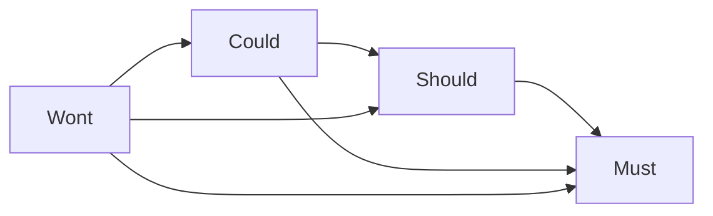
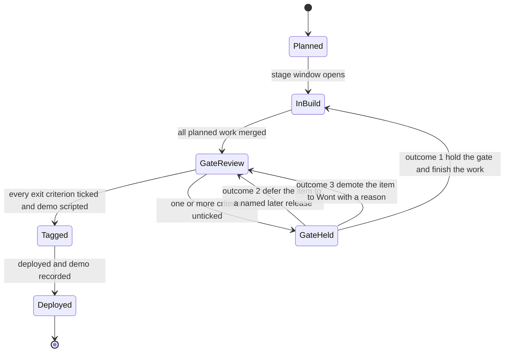
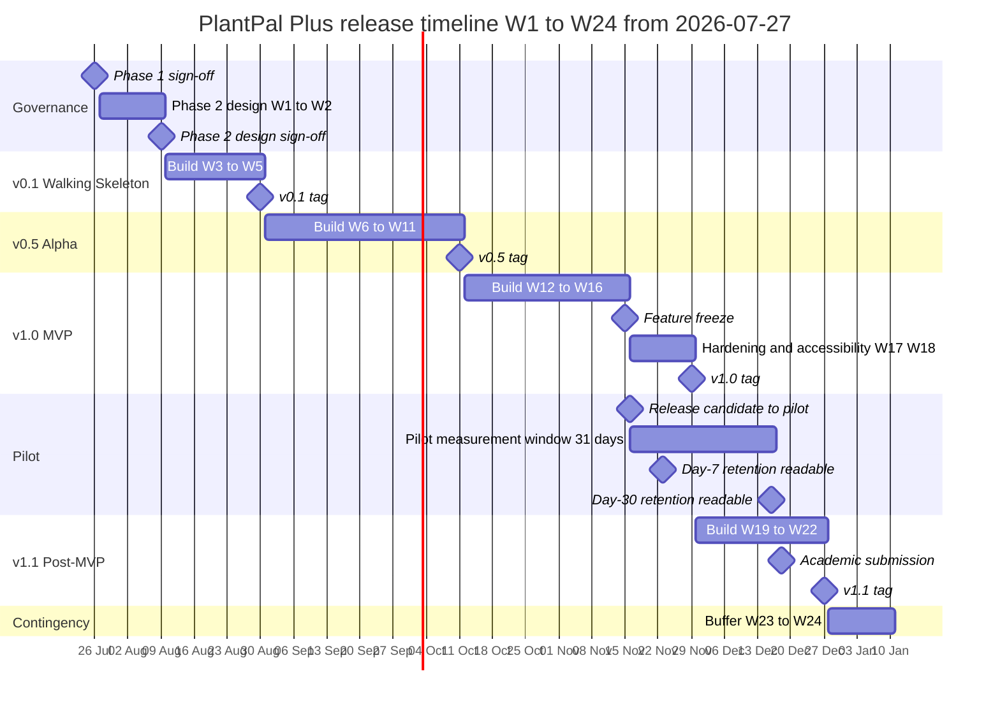

# 02 — Scope and Release Plan

| Field | Value |
| --- | --- |
| Document | `02-scope-and-release-plan.md` — product scope, MoSCoW prioritisation policy and release plan |
| Version | 1.0 |
| Date | 2026-07-21 |
| Status | Approved — baseline for Phase 2 design |
| Owner | Rakshit — Project Lead and sole developer |
| Parent | [SRS.md](./SRS.md) — PlantPal+ Software Requirements Specification |

---

## Table of contents

1. [Product scope statement](#1-product-scope-statement)
   - [1.1 Purpose and authority of this document](#11-purpose-and-authority-of-this-document)
   - [1.2 The scope statement](#12-the-scope-statement)
   - [1.3 The single architectural claim that defines the scope boundary](#13-the-single-architectural-claim-that-defines-the-scope-boundary)
   - [1.4 The four scope-boundary tests](#14-the-four-scope-boundary-tests)
   - [1.5 Locked decisions that bound scope](#15-locked-decisions-that-bound-scope)
   - [1.6 What this document governs and what it does not](#16-what-this-document-governs-and-what-it-does-not)
2. [In scope for v1.0](#2-in-scope-for-v10)
   - [2.1 How to read the capability tables](#21-how-to-read-the-capability-tables)
   - [2.2 Capability map](#22-capability-map)
   - [2.3 ACC — accounts, authentication and profile](#23-acc--accounts-authentication-and-profile)
   - [2.4 DSH — unified daily dashboard](#24-dsh--unified-daily-dashboard)
   - [2.5 SET — settings and preferences](#25-set--settings-and-preferences)
   - [2.6 PLT — plant care](#26-plt--plant-care)
   - [2.7 FIT — fitness](#27-fit--fitness)
   - [2.8 NUT — nutrition and calories](#28-nut--nutrition-and-calories)
   - [2.9 NOT — notifications and reminder engine](#29-not--notifications-and-reminder-engine)
   - [2.10 GAM — streaks and achievements](#210-gam--streaks-and-achievements)
   - [2.11 SYS — cross-cutting platform](#211-sys--cross-cutting-platform)
   - [2.12 Cross-platform delivery scope](#212-cross-platform-delivery-scope)
   - [2.13 Non-functional scope for v1.0](#213-non-functional-scope-for-v10)
   - [2.14 Seeded content and volumetric scope](#214-seeded-content-and-volumetric-scope)
3. [Explicitly out of scope](#3-explicitly-out-of-scope)
   - [3.1 How to read the exclusion table](#31-how-to-read-the-exclusion-table)
   - [3.2 The exclusion register](#32-the-exclusion-register)
   - [3.3 Permanent non-goals versus deferrals](#33-permanent-non-goals-versus-deferrals)
   - [3.4 The most likely scope-creep requests and the pre-agreed answer](#34-the-most-likely-scope-creep-requests-and-the-pre-agreed-answer)
4. [The MoSCoW prioritisation policy](#4-the-moscow-prioritisation-policy)
   - [4.1 Two independent axes: priority and target release](#41-two-independent-axes-priority-and-target-release)
   - [4.2 Must — qualification test](#42-must--qualification-test)
   - [4.3 Should — qualification test](#43-should--qualification-test)
   - [4.4 Could — qualification test](#44-could--qualification-test)
   - [4.5 Wont — qualification and recording](#45-wont--qualification-and-recording)
   - [4.6 The Minimum Usable Product test](#46-the-minimum-usable-product-test)
   - [4.7 The MoSCoW effort budget](#47-the-moscow-effort-budget)
   - [4.8 The dependency-direction rule](#48-the-dependency-direction-rule)
   - [4.9 Priority tie-breakers](#49-priority-tie-breakers)
   - [4.10 The free-tier validity test](#410-the-free-tier-validity-test)
   - [4.11 Change control after Phase 1 sign-off](#411-change-control-after-phase-1-sign-off)
   - [4.12 The pre-agreed cut list](#412-the-pre-agreed-cut-list)
   - [4.13 Release gating policy](#413-release-gating-policy)
   - [4.14 How priority is recorded on a requirement](#414-how-priority-is-recorded-on-a-requirement)
5. [The release plan](#5-the-release-plan)
   - [5.1 Baseline, capacity and fixed milestone dates](#51-baseline-capacity-and-fixed-milestone-dates)
   - [5.2 v0.1 Walking Skeleton](#52-v01-walking-skeleton)
   - [5.3 v0.5 Alpha](#53-v05-alpha)
   - [5.4 v1.0 MVP](#54-v10-mvp)
   - [5.5 v1.1 Post-MVP](#55-v11-post-mvp)
   - [5.6 The Pilot Cohort](#56-the-pilot-cohort)
   - [5.7 Release gate state model](#57-release-gate-state-model)
6. [Release timeline](#6-release-timeline)
7. [Release-to-module coverage matrix](#7-release-to-module-coverage-matrix)
   - [7.1 Subsystem coverage by release](#71-subsystem-coverage-by-release)
   - [7.2 Capability-level coverage by release](#72-capability-level-coverage-by-release)
   - [7.3 Non-functional category coverage by release](#73-non-functional-category-coverage-by-release)
   - [7.4 Goal coverage by release](#74-goal-coverage-by-release)
   - [7.5 Journey coverage by release](#75-journey-coverage-by-release)
8. [Phase 1 exit criteria and sign-off](#8-phase-1-exit-criteria-and-sign-off)
   - [8.1 Completeness](#81-completeness)
   - [8.2 Correctness and quality](#82-correctness-and-quality)
   - [8.3 Traceability](#83-traceability)
   - [8.4 Governance](#84-governance)
   - [8.5 Presentation](#85-presentation)
   - [8.6 Sign-off](#86-sign-off)
   - [8.7 What Phase 1 sign-off unblocks](#87-what-phase-1-sign-off-unblocks)
   - [8.8 What Phase 1 sign-off deliberately does not decide](#88-what-phase-1-sign-off-deliberately-does-not-decide)

---

## 1. Product scope statement

### 1.1 Purpose and authority of this document

This document fixes **what PlantPal+ is, what it is not, in what order it is built, and by what rule anything is allowed to change**. Three other documents depend on it directly and may not contradict it:

| Consumer document | What it takes from here |
| --- | --- |
| [03-functional-requirements.md](./03-functional-requirements.md) and every file under [modules/](./modules/) | The MoSCoW qualification tests, the four release names, the capability envelope of each subsystem, and the rule that no requirement may exist outside the in-scope capability tables of section 2 |
| [04-non-functional-requirements.md](./04-non-functional-requirements.md) | The release names and the free-tier validity test that bounds every quantified target |
| [09-assumptions-constraints-risks.md](./09-assumptions-constraints-risks.md) | The exclusion register of section 3, each row of which is a recorded Wont with a reason |
| [10-traceability-matrix.md](./10-traceability-matrix.md) | The requirement that every functional requirement carries exactly one MoSCoW priority and exactly one target release, both drawn from the closed sets defined here |

Where this document and a module document disagree about **whether a capability exists at all**, this document wins. Where they disagree about **the priority of an individual requirement inside a capability that this document places in scope**, the module document wins, because per-requirement priority is assigned by the requirement's owner. Any such disagreement discovered during the Review phase is a blocking finding, not a matter of interpretation.

### 1.2 The scope statement

> **PlantPal+ is one cross-platform habit-tracking product that replaces three fragmented daily-habit applications — a plant-care app, a fitness app and a calorie tracker — with one user account, one unified daily dashboard, one notification stream, one streak system and one cloud-synchronised data set, delivered as a React Native (Expo) mobile client and a React (Vite) web client over a single Node.js, Express and PostgreSQL REST backend, running end to end on permanently free hosting tiers.**

The product in scope for v1.0 consists of nine subsystems:

| Prefix | Subsystem | One-sentence scope |
| --- | --- | --- |
| ACC | Accounts, authentication and profile | Email-and-password identity with verified email, rotating refresh tokens, an onboarding wizard, the profile fields that drive scheduling and nutrition mathematics, data export and account deletion |
| DSH | Unified daily dashboard | One screen that merges every due item and every module summary for a chosen local date into a single prioritised list served by a single aggregate API response |
| SET | Settings and preferences | Every user-controllable preference, every module enable and disable switch, every accessibility preference, every feature flag and every legal surface |
| PLT | Plant care | A seeded species catalogue, plants with their physical context, an adaptive watering schedule, care tasks, a photographic growth log and per-plant adherence |
| FIT | Fitness | Workout logging, manual step logging, versioned goals, estimated energy expenditure, strength records, body metrics and progress charts |
| NUT | Nutrition and calories | Meal logging against a seeded food catalogue, BMR and TDEE derivation, safety-floored calorie and macro targets, water intake and intake trends |
| NOT | Notifications and reminder engine | One node-cron scheduling engine serving all three modules, with quiet hours, a daily cap, grouping, catch-up, deep links, Expo Push delivery and an in-app notification centre |
| GAM | Streaks and achievements | Per-module and global streaks with deterministic recomputation, a seeded achievement catalogue, idempotent server-side unlocking, a trophy gallery and a weekly recap |
| SYS | Cross-cutting platform | The offline outbox, idempotent writes, delta sync, the photo media pipeline, feature-flagged integrations, cross-module search, account export, seed data and migrations |

All three domain modules — plant care, fitness and nutrition — ship in v1.0. This is decision **D-02** and is not negotiable by any later document.

### 1.3 The single architectural claim that defines the scope boundary

PlantPal+ is **one habit engine with three domain adapters**, not three applications sharing a login screen. Plant care, fitness and nutrition are three instances of one five-step loop — *schedule, remind, log, streak, reflect*. Exactly one scheduling engine, one notification pipeline, one streak and achievement engine, one offline outbox, one day-boundary rule, one units system and one dashboard serve all three.

This claim is the scope boundary, because it produces a mechanical test for any proposed capability:

> **A capability belongs in PlantPal+ if it is either a step of the shared loop, or the domain-specific adapter data that a step of the loop needs. A capability that is neither is out of scope, however attractive it is.**

A social feed is neither. GPS route tracking is neither. Meal-photo recognition is neither. A fourth module — sleep, mood, medication — *would* be a legitimate adapter, and is excluded only on effort grounds, which is why section 3 records it as a v2.0 deferral rather than a permanent non-goal.

### 1.4 The four scope-boundary tests

Every capability, requirement and change request is checked against all four tests. Failing any one is disqualifying.

| # | Test | Statement | Source |
| --- | --- | --- | --- |
| 1 | **The loop test** | The capability is a step of the shared habit loop or the adapter data one of those steps needs. | Section 1.3 |
| 2 | **The Minimum Usable Product test** | Removing every Should, Could and Wont must still leave a coherent, shippable, usable product. See [section 4.6](#46-the-minimum-usable-product-test). | D-02 |
| 3 | **The free-tier validity test** | The capability is deliverable and operable at a recurring cost of 0.00 USD per month inside the free-tier operating envelope. A capability that needs a paid plan is invalid, not merely expensive. See [section 4.10](#410-the-free-tier-validity-test). | D-06, CON-01, GOAL-09 |
| 4 | **The integration-independence test** | With every external integration feature flag switched off, the capability still works, or the capability is itself the integration and its absence degrades nothing else. | D-03 |

Two further boundaries are stated here because they are the two most commonly misread:

- **The offline boundary (D-04).** Exactly seven append-only actions may be queued while offline: log watering, log care task, log workout, log steps, log meal, log water intake, log growth entry. Everything else — registration, profile edits, entity create, edit and delete, and photo upload — requires connectivity and must present a clear, actionable offline state. Because queued events are append-only they are conflict-free by construction, so there is deliberately **no merge algorithm, no CRDT and no last-write-wins resolution** anywhere in this product. That absence is a design decision, not an omission, and no later document may introduce one.
- **The safety boundary (D-07).** PlantPal+ is a wellness tracker and not a medical device. No diagnosis, no clinical threshold, no condition-specific diet, no calorie target below the stated safety floor, no weight-change rate above 1.0 kg per week, and no shaming, ranking or comparison of any body or intake metric.

### 1.5 Locked decisions that bound scope

These decisions were signed off on 2026-07-21 and are inputs to this document, not outputs of it. They are restated here so that a reader of the scope document alone can check any scope claim without opening another file.

| Decision | Effect on scope |
| --- | --- |
| D-01 | Academic capstone plus portfolio piece. IEEE 830-1998 structure with ISO/IEC/IEEE 29148:2018 quality rules. Legal and privacy at good-practice depth: privacy policy, terms, not-medical-advice disclaimer, GDPR-style export and delete. No DPIA. No monetisation. |
| D-02 | All three modules ship in v1.0. Every requirement carries a MoSCoW priority **and** a target release drawn from v0.1, v0.5, v1.0, v1.1+. Every release leaves a demoable slice. |
| D-03 | Curated catalogues seeded into PostgreSQL are canonical — approximately 60 plant species, approximately 300 foods. Open Food Facts and Perenual are optional, feature-flagged, cached locally, and the product is fully functional with every integration disabled. |
| D-04 | Offline-light. Cached reads everywhere; only the seven append-only log actions are queueable; UUID idempotency key plus client timestamp per queued write; server upserts by key; server is the source of truth; delta sync by `updated_at` cursor plus tombstones. |
| D-05 | Document version 1.0, dated 2026-07-21, authored by Rakshit, Project Lead and sole developer. |
| D-06 | Permanently free tiers only. A requirement that needs a paid plan is invalid. |
| D-07 | Wellness tracker, not a medical device. Not-medical-advice disclaimer. No eating-disorder-adjacent features. |
| D-08 | English only in v1.0; codebase i18n-ready with no hard-coded user-facing strings outside a locale catalogue. |
| D-09 | Metric and imperial both offered, user-selectable; all values stored canonically in metric SI. |
| D-10 | Mobile push via Expo Push is a Must for v1.0. Web v1.0 gets in-app due-reminder surfaces plus an optional email digest, priority Should. Web Push via service worker and VAPID is a Could deferred to v1.1. |
| D-11 | Email plus password with 15-minute JWT access tokens and 30-day rotating refresh tokens is the Must. Google and Apple OAuth is a Should for v1.1. |

### 1.6 What this document governs and what it does not

| This document governs | This document does not govern |
| --- | --- |
| Whether a capability is in scope at all | The individual functional requirements inside a capability, which are owned by the module documents under [modules/](./modules/) |
| The four release names, their dates, their contents and their exit criteria | The quantified value of any performance, security or accessibility target, which is owned by [04-non-functional-requirements.md](./04-non-functional-requirements.md) |
| The MoSCoW qualification tests and the effort budget | The Fibonacci story-point estimate of any individual story, which is owned by the files under [user-stories/](./user-stories/) |
| The rule that a Wont is recorded and never deleted | The domain semantics of any business rule, such as a watering multiplier or a BMR formula |
| The Phase 1 exit criteria and the sign-off checklist | Architecture, schema, API design, screen design and component selection, all of which are Phase 2 |

---

## 2. In scope for v1.0

Everything in the tables below is in scope for the project. The **Release** column resolves each row precisely:

- a row marked `v0.1` or `v0.5` ships **earlier** than v1.0 and remains present in v1.0;
- a row marked `v1.0` first ships **at** the v1.0 gate;
- a row marked `v1.1` is **deliberately outside v1.0 scope** and is planned into the v1.1 Post-MVP release of [section 5.5](#55-v11-post-mvp). There are exactly five such rows — ACC 15, PLT 20, FIT 13, NOT 14 and SYS 13 — and each one also appears in the exclusion register of [section 3.2](#32-the-exclusion-register) as a recorded v1.0 exclusion, so that a reader of either section reaches the same answer.

Read plainly: **120 of the 125 capability rows below constitute v1.0.** Nothing in these tables may be added, dropped or re-targeted without a change-control entry under [section 4.11](#411-change-control-after-phase-1-sign-off).

### 2.1 How to read the capability tables

| Column | Meaning |
| --- | --- |
| **#** | Row number inside the subsystem, for reference only. It is not an identifier and never appears in the traceability matrix. |
| **Capability** | A named unit of user-visible or system-visible function. One capability normally expands into between one and eight functional requirements in the owning module document. |
| **Scope statement** | Exactly what is included, stated so that a Phase 3 engineer can tell whether something is inside or outside the capability. |
| **MoSCoW** | The **capability-level** priority. `Must` means the capability contains at least one Must requirement and may never be cut in whole. `Should` and `Could` mean the whole capability is cuttable under [section 4.12](#412-the-pre-agreed-cut-list) without breaking any Must. Per-requirement priorities inside a Must capability may still be Should or Could. |
| **Release** | The release by which the capability is first demonstrable: one of `v0.1`, `v0.5`, `v1.0`, `v1.1`. |
| **Traces to** | The product goal or goals this capability serves, drawn from GOAL-01 to GOAL-12 in [01-stakeholders-and-personas.md](./01-stakeholders-and-personas.md). |

Legend used in the coverage matrices of [section 7](#7-release-to-module-coverage-matrix): **F** = fully present, **P** = partially present, **-** = absent.

### 2.2 Capability map

```mermaid
flowchart TB
  ROOT["PlantPal Plus v1.0"]

  ROOT --> SHARED["Shared habit engine"]
  ROOT --> DOMAIN["Domain adapters"]
  ROOT --> PLATFORM["Platform and delivery"]

  SHARED --> S1["ACC - accounts and identity"]
  SHARED --> S2["DSH - unified daily dashboard"]
  SHARED --> S3["SET - settings and preferences"]
  SHARED --> S4["NOT - scheduling and notifications"]
  SHARED --> S5["GAM - streaks and achievements"]

  DOMAIN --> D1["PLT - plant care"]
  DOMAIN --> D2["FIT - fitness"]
  DOMAIN --> D3["NUT - nutrition and calories"]

  PLATFORM --> P1["SYS - offline outbox and delta sync"]
  PLATFORM --> P2["SYS - photo media pipeline"]
  PLATFORM --> P3["SYS - feature-flagged integrations"]
  PLATFORM --> P4["SYS - API conventions and data hygiene"]
  PLATFORM --> P5["SYS - search and account export"]
```

### 2.3 ACC — accounts, authentication and profile

Owned by [modules/accounts.md](./modules/accounts.md).

| # | Capability | Scope statement | MoSCoW | Release | Traces to |
| --- | --- | --- | --- | --- | --- |
| 1 | Registration | Account creation with email address and password, an age affirmation of at least 16 years, and acceptance of terms and privacy policy recorded with their version | Must | v0.1 | GOAL-01 |
| 2 | Email verification | A single-use expiring verification link, a resend path with a per-account rate limit, and an explicit unverified-account capability restriction | Must | v0.5 | GOAL-01 |
| 3 | Login and logout | Credential authentication issuing a 15-minute JWT access token and a 30-day opaque refresh token, plus single-session logout | Must | v0.1 | GOAL-01 |
| 4 | Refresh-token rotation and reuse detection | Rotation of the refresh token on every use, and revocation of the entire token family on detection of a reused token | Must | v0.5 | GOAL-01 |
| 5 | Logout everywhere | Revocation of every refresh token belonging to the account in one action | Must | v1.0 | GOAL-01, GOAL-08 |
| 6 | Password reset | A single-use expiring reset link delivered by email, with a per-account request rate limit and session invalidation on success | Must | v0.5 | GOAL-01 |
| 7 | Change password | An authenticated password change requiring the current password, invalidating other sessions | Must | v0.5 | GOAL-01 |
| 8 | Account lockout with backoff | Progressive delay after repeated failed authentication attempts, with no permanent lock | Must | v0.5 | GOAL-01 |
| 9 | User profile | Display name, biological sex with a prefer-not-to-say path, date of birth or age, height, body mass, activity level, IANA timezone, hemisphere and unit system | Must | v0.5 | GOAL-03, GOAL-06 |
| 10 | Onboarding wizard | A skippable, resumable, revisitable first-run flow that collects the minimum profile needed to compute a watering schedule and a calorie target, and records `onboarding_completed_at` | Must | v0.5 | GOAL-01, GOAL-02 |
| 11 | Module enablement | Enabling and disabling each of PLANT_CARE, FITNESS and NUTRITION independently, including the legal zero-enabled state | Must | v0.5 | GOAL-01, GOAL-04 |
| 12 | Sessions and devices | A list of active sessions with device label, last-seen time and per-session revocation | Should | v1.0 | GOAL-01 |
| 13 | Account data export | A complete machine-readable export of the account's data as JSON with per-module CSV files and a photo manifest, delivered by a single-use expiring signed URL | Must | v1.0 | GOAL-08 |
| 14 | Account deletion | Self-service deletion with a stated recoverable grace period, followed by irreversible deletion of all records, photo objects and push tokens | Must | v1.0 | GOAL-08 |
| 15 | Google and Apple OAuth | Third-party sign-in with account linking by verified email address | Should | v1.1 | GOAL-01 |

### 2.4 DSH — unified daily dashboard

Owned by [modules/dashboard-and-settings.md](./modules/dashboard-and-settings.md).

| # | Capability | Scope statement | MoSCoW | Release | Traces to |
| --- | --- | --- | --- | --- | --- |
| 1 | Greeting and date header | A time-of-day greeting, the display name and the dashboard's target local date | Should | v0.5 | GOAL-01 |
| 2 | Merged Today list | One prioritised list merging due items from every enabled module for the target local date, ordered by a single deterministic rule | Must | v0.5 | GOAL-01, GOAL-02 |
| 3 | Module summary cards | One card per enabled module showing a progress indicator and one primary action, with a text alternative to any graphical progress indicator | Must | v0.5 | GOAL-01, GOAL-07 |
| 4 | Quick-add actions | Direct entry points from the dashboard to each of the seven append-only log actions within the 3-tap budget | Must | v0.5 | GOAL-02 |
| 5 | Global streak indicator | The current global streak surfaced on the dashboard | Must | v0.5 | GOAL-04 |
| 6 | Recent achievement surface | The most recent achievement unlocks presented on the dashboard | Should | v1.0 | GOAL-04 |
| 7 | Date navigation | Navigation to a past local date with the whole dashboard recomputed for that date, bounded by the back-dating cap | Should | v1.0 | GOAL-02 |
| 8 | Adaptive layout | A layout that adapts to zero, one, two or three enabled modules with no empty placeholder cards for disabled modules | Must | v0.5 | GOAL-01 |
| 9 | Empty and first-run states | An explanatory sentence and exactly one primary call to action on every zero-record surface, including the zero-enabled-module state | Must | v1.0 | GOAL-01, GOAL-02 |
| 10 | Single aggregate response | The whole dashboard composed from exactly one client HTTP round trip, with a per-module status object and a partial flag | Must | v0.5 | GOAL-01 |
| 11 | Offline and stale-data surfaces | A cached first paint, a persistent offline indicator, a pending-sync count and a reconciliation pass on reconnect | Must | v0.5 | GOAL-05 |
| 12 | Web due-reminder surface | An always-visible in-app surface on web listing reminders that have fallen due, standing in for push, which web does not have in v1.0 | Must | v1.0 | GOAL-04 |

### 2.5 SET — settings and preferences

Owned by [modules/dashboard-and-settings.md](./modules/dashboard-and-settings.md).

| # | Capability | Scope statement | MoSCoW | Release | Traces to |
| --- | --- | --- | --- | --- | --- |
| 1 | Profile editing | Editing every profile field collected at onboarding, with the downstream effect of each change stated before it is confirmed | Must | v0.5 | GOAL-06 |
| 2 | Unit system | A user-selectable metric or imperial display preference applied everywhere, with canonical metric SI storage untouched | Must | v0.5 | GOAL-06 |
| 3 | Timezone and hemisphere | An IANA timezone and a hemisphere of NORTHERN, SOUTHERN or EQUATORIAL, defaulted from the timezone at onboarding and always stored explicitly | Must | v0.5 | GOAL-03 |
| 4 | Module enable and disable | Per-module switches with an explicit statement of the effect on the global streak before confirmation | Must | v0.5 | GOAL-01, GOAL-04 |
| 5 | Notification preferences | Per-category enable and disable, per-category default reminder times, quiet hours including windows crossing midnight, and a global do-not-disturb | Must | v0.5 | GOAL-04 |
| 6 | Theme | Light, dark and system-follow appearance | Should | v1.0 | GOAL-07 |
| 7 | Accessibility preferences | Reduced motion, larger text and high contrast, each honouring the operating-system setting as its default | Must | v1.0 | GOAL-07 |
| 8 | Feature flags | User-visible switches for the Open Food Facts and Perenual integrations, both defaulting to off | Must | v1.0 | GOAL-09 |
| 9 | Legal surfaces | Privacy policy, terms of service, the not-medical-advice disclaimer and the open-source licence notice, all permanently reachable | Must | v1.0 | GOAL-06, GOAL-08 |
| 10 | Data export and account deletion entry points | The settings entry points for the ACC export and deletion capabilities | Must | v1.0 | GOAL-08 |
| 11 | Language placeholder | A language setting listing English only, present so that the i18n-ready architecture is visible and testable | Could | v1.0 | GOAL-11 |
| 12 | About screen | Application version, build commit, environment and a support or feedback link | Could | v1.0 | GOAL-12 |

### 2.6 PLT — plant care

Owned by [modules/plant-care.md](./modules/plant-care.md).

| # | Capability | Scope statement | MoSCoW | Release | Traces to |
| --- | --- | --- | --- | --- | --- |
| 1 | Seeded species catalogue | Approximately 60 species seeded into PostgreSQL by a versioned, deterministic seed script, each with a base watering interval, a safe minimum and maximum interval, light preference and care notes | Must | v0.5 | GOAL-03 |
| 2 | Custom species | User-created species used when the catalogue does not cover a plant, with an explicit no-care-profile state and a conservative default interval | Must | v0.5 | GOAL-03 |
| 3 | Add and edit a plant | A plant with a nickname, a species reference, a room or location label, light exposure, pot diameter, pot material and indoor or outdoor placement | Must | v0.1 | GOAL-03 |
| 4 | Adaptive watering schedule | The next watering date computed from the species base interval multiplied by season, light, pot and climate factors, clamped to the species safe range, evaluated in the user's timezone and hemisphere | Must | v0.5 | GOAL-03 |
| 5 | Log a watering | A one-action watering log that recomputes the next due date from the actual watering time | Must | v0.1 | GOAL-02, GOAL-03 |
| 6 | Back-dated watering | A watering logged against a past timestamp within the back-dating cap, recomputing the schedule from the true watering time rather than resetting it | Must | v0.5 | GOAL-03 |
| 7 | Snooze and skip | Deferring a due watering by a bounded interval, or marking it deliberately skipped without breaking the record | Should | v1.0 | GOAL-03 |
| 8 | Overdue severity tiers | A tiered overdue classification derived from days past due, expressed in text as well as any colour or icon | Must | v0.5 | GOAL-03, GOAL-07 |
| 9 | Plant health status | A derived status such as THRIVING or CRITICAL computed from overdue severity and recent care history | Should | v0.5 | GOAL-03 |
| 10 | Care tasks beyond watering | Recurring non-watering tasks — at minimum fertilise — with their own schedules and log actions | Must | v1.0 | GOAL-02, GOAL-03 |
| 11 | Growth log with photos | Dated growth entries carrying an optional photo, height, leaf count, a health rating and a note | Must | v1.0 | GOAL-02 |
| 12 | Photo timeline and comparison | A chronological photo timeline per plant and a before-and-after comparison between any two entries | Should | v1.0 | GOAL-02 |
| 13 | Growth chart | A chart of height or leaf count over time for one plant, with a text alternative | Should | v1.0 | GOAL-07 |
| 14 | Vacation mode | A user-defined date range that suppresses watering reminders, presents a single grouped catch-up on return, and treats the range as neutral rather than missed for the plant-care streak | Should | v1.0 | GOAL-04 |
| 15 | Bulk watering | Logging a watering for a multi-plant selection in one action | Should | v1.0 | GOAL-02 |
| 16 | Archive and delete | Archiving a plant with a reason, and soft deletion with a restore window before permanent purge | Must | v1.0 | GOAL-08 |
| 17 | Plant list | Search, filter, sort and both grid and list view modes over the user's plants | Must | v0.5 | GOAL-02 |
| 18 | Per-species care tips | Contextual care guidance drawn from the seeded catalogue, presented on the plant detail surface | Could | v1.0 | GOAL-03 |
| 19 | Watering history and adherence | A per-plant watering history chart and an adherence percentage computed over due events within the species tolerance window | Should | v1.0 | GOAL-03 |
| 20 | Perenual species enrichment | Optional, feature-flagged species enrichment whose every result is cached in PostgreSQL, defaulting to off | Should | v1.1 | GOAL-03, GOAL-09 |

### 2.7 FIT — fitness

Owned by [modules/fitness.md](./modules/fitness.md).

| # | Capability | Scope statement | MoSCoW | Release | Traces to |
| --- | --- | --- | --- | --- | --- |
| 1 | Seeded activity catalogue | A seeded catalogue of activity types, each carrying a MET value used for energy estimation | Must | v0.5 | GOAL-02 |
| 2 | Log a workout | A workout with an activity type, a start time, a duration and an optional intensity and note | Must | v0.5 | GOAL-02 |
| 3 | Custom activity types | User-created activity types with a user-supplied or defaulted MET value | Should | v1.0 | GOAL-02 |
| 4 | Estimated energy expenditure | A MET-based energy estimate presented with the word estimate and a stated error band, never as a precise figure | Must | v0.5 | GOAL-06 |
| 5 | Strength workouts | Exercises with sets, reps and weight, total volume, and personal-record detection including an estimated one-rep-max | Should | v1.0 | GOAL-02 |
| 6 | Manual step entry | A manually entered daily step count for a chosen local date | Must | v0.5 | GOAL-02 |
| 7 | Versioned goals | Daily step and weekly workout or active-minute goals that are versioned over time so that historical evaluation uses the goal in force on that date | Must | v0.5 | GOAL-04 |
| 8 | Progress charts | Charts over 7-day, 30-day, 90-day and all-time windows, each with a text alternative and a bounded plotted-point count | Should | v1.0 | GOAL-07 |
| 9 | Body metrics | Body mass and optional body-fat percentage entries with a 7-day moving average presented in preference to the raw daily value | Should | v1.0 | GOAL-06 |
| 10 | Rest days | A planned rest day as a first-class record that preserves the fitness streak rather than being an absence of data | Must | v1.0 | GOAL-04 |
| 11 | Workout templates | Saved workout definitions that pre-fill a new log | Should | v1.0 | GOAL-02 |
| 12 | Copy yesterday | One action that duplicates the previous day's workout entry into today | Should | v1.0 | GOAL-02 |
| 13 | Foreground pedometer read | A single foreground read of the device step count offered as a pre-fill for manual entry, available only where the Expo managed workflow supports it | Could | v1.1 | GOAL-02 |

### 2.8 NUT — nutrition and calories

Owned by [modules/nutrition.md](./modules/nutrition.md).

| # | Capability | Scope statement | MoSCoW | Release | Traces to |
| --- | --- | --- | --- | --- | --- |
| 1 | Seeded food catalogue | Approximately 300 common foods seeded into PostgreSQL with per-100 g energy and macronutrients | Must | v0.5 | GOAL-02 |
| 2 | Log a meal | A meal entry against one of BREAKFAST, LUNCH, DINNER or SNACK, with a food reference, a serving quantity and a serving unit | Must | v0.5 | GOAL-02 |
| 3 | Food search | Search across the seeded catalogue, the user's custom foods and their recents | Must | v0.5 | GOAL-02 |
| 4 | Serving units | Serving units with an exact grams-equivalent conversion so every entry resolves to grams before nutrition is computed | Must | v0.5 | GOAL-02 |
| 5 | Custom foods | User-created foods with per-100 g energy and macronutrients, private to the account | Must | v1.0 | GOAL-02 |
| 6 | Favourites and recents | Fast re-logging surfaces that keep the 3-tap budget reachable for repeat meals | Must | v1.0 | GOAL-02 |
| 7 | BMR and TDEE | Mifflin-St Jeor basal metabolic rate, a stated fallback formula for a user who declines to state biological sex, and a total daily energy expenditure derived by activity factor | Must | v0.5 | GOAL-06 |
| 8 | Calorie target with safety floors | A daily calorie target derived from TDEE and a goal of LOSE, MAINTAIN or GAIN, with a weekly rate capped at 1.0 kg per week and hard clinical floors that clamp and explain rather than refuse silently | Must | v0.5 | GOAL-06 |
| 9 | Macro targets | Protein, carbohydrate and fat targets from preset splits and a custom split that must sum to 100 percent | Must | v0.5 | GOAL-06 |
| 10 | Daily remaining view | A daily view of energy and macros consumed against target, with remaining values and a text alternative to every ring or bar | Must | v0.5 | GOAL-06, GOAL-07 |
| 11 | Water intake | Water intake logging with container presets and a default daily goal of 35 ml per kg of body mass | Must | v0.5 | GOAL-02 |
| 12 | Intake trends | Weekly and monthly energy and macro trend views with text alternatives | Should | v1.0 | GOAL-06 |
| 13 | Workout-calorie toggle | An explicit, default-off setting that adds estimated workout energy to the daily budget, with the double-counting risk explained once when first encountered | Should | v1.0 | GOAL-06 |
| 14 | Open Food Facts lookup | Optional, feature-flagged text and barcode lookup, defaulting to off, with every result validated for plausibility and cached in PostgreSQL, and a not-found fallback to catalogue search and custom-food creation | Should | v1.0 | GOAL-09 |
| 15 | Recipes and composite meals | Named ingredient lists that log as a single entry with computed aggregate nutrition | Should | v1.0 | GOAL-02 |
| 16 | Micronutrients | Fibre, sugar and sodium recorded and displayed alongside the three macronutrients | Should | v1.0 | GOAL-06 |

### 2.9 NOT — notifications and reminder engine

Owned by [modules/notifications.md](./modules/notifications.md).

| # | Capability | Scope statement | MoSCoW | Release | Traces to |
| --- | --- | --- | --- | --- | --- |
| 1 | Scheduling engine | One node-cron engine inside the single always-on backend process, ticking on a fixed interval and serving all three modules | Must | v0.1 | GOAL-04 |
| 2 | Reminder-type catalogue | The complete enumerated set of reminder types across plant care, fitness, nutrition and gamification | Must | v0.5 | GOAL-04 |
| 3 | Per-category preferences | Enable, disable and default reminder time per reminder category | Must | v0.5 | GOAL-04 |
| 4 | Quiet hours and do-not-disturb | Quiet-hours windows including windows that cross midnight, and a global do-not-disturb switch | Must | v0.5 | GOAL-04 |
| 5 | UTC storage with timezone evaluation | All scheduling stored in UTC and evaluated against the account's IANA timezone, correct across daylight-saving spring-forward and autumn-back transitions | Must | v0.5 | GOAL-04 |
| 6 | Expo Push registration and delivery | Device push-token registration, batched dispatch, receipt collection and automatic pruning of tokens reported as unregistered | Must | v0.5 | GOAL-04 |
| 7 | Delivery idempotency | A uniqueness guarantee that no reminder occurrence is dispatched more than once, enforced by a database constraint | Must | v0.5 | GOAL-04 |
| 8 | Catch-up policy | A bounded catch-up sweep after a process restart or an instance wake, with a staleness cut-off that suppresses reminders too old to be useful | Must | v1.0 | GOAL-04 |
| 9 | Daily cap and grouping | A per-account daily notification cap and grouping of several due items of the same category into a single notification | Must | v1.0 | GOAL-04 |
| 10 | Deep links | Every notification opening the exact action surface it refers to rather than the dashboard | Must | v1.0 | GOAL-02, GOAL-04 |
| 11 | In-app notification centre | A persistent in-app history of notifications with read and unread state | Must | v1.0 | GOAL-04 |
| 12 | Send a test notification | A user-triggered test notification from settings, used to verify permission and delivery | Could | v1.0 | GOAL-04 |
| 13 | Email digest for web | An optional daily email digest of due items for users of the web client, capped to stay inside the free email quota | Should | v1.0 | GOAL-04 |
| 14 | Web Push | Web push delivery via a service worker and VAPID | Could | v1.1 | GOAL-04 |

### 2.10 GAM — streaks and achievements

Owned by [modules/gamification.md](./modules/gamification.md).

| # | Capability | Scope statement | MoSCoW | Release | Traces to |
| --- | --- | --- | --- | --- | --- |
| 1 | Per-module streaks | A streak per enabled module, advanced when that module's day-completion condition is met on the user's local date | Must | v0.5 | GOAL-04 |
| 2 | Global streak | One cross-module streak that advances only when every enabled module's day counts, and that does not exist when zero modules are enabled | Must | v0.5 | GOAL-04 |
| 3 | Streak lifecycle rules | Explicit, stated rules for advancing, breaking, module disablement mid-streak and timezone change mid-streak | Must | v0.5 | GOAL-04 |
| 4 | Deterministic retroactive recomputation | Bounded recomputation over an affected date range after a retroactive log entry, edit or deletion, capable of both repairing and breaking a streak | Must | v1.0 | GOAL-04 |
| 5 | Seeded achievement catalogue | A seeded catalogue of achievements organised by category and tier, versioned with the seed data | Must | v1.0 | GOAL-04 |
| 6 | Server-side idempotent unlocking | Achievement evaluation performed on the server, with unlocking that never fires twice for the same achievement and account | Must | v1.0 | GOAL-04 |
| 7 | Achievement progress | Visible progress towards achievements that are not yet unlocked | Should | v1.0 | GOAL-04 |
| 8 | Trophy gallery | A gallery of unlocked and locked achievements, available in a non-animated form when reduced motion is enabled | Should | v1.0 | GOAL-04, GOAL-07 |
| 9 | Weekly recap | A weekly summary of activity, streaks and unlocks | Should | v1.0 | GOAL-04 |
| 10 | Streak grace mechanism | A capped freeze-token mechanism that protects the most recent missed day only, reported separately from the raw streak | Should | v1.0 | GOAL-04 |

### 2.11 SYS — cross-cutting platform

Owned by [modules/platform-and-sync.md](./modules/platform-and-sync.md).

| # | Capability | Scope statement | MoSCoW | Release | Traces to |
| --- | --- | --- | --- | --- | --- |
| 1 | Offline read cache | Persisted query caches on both clients so every previously loaded screen renders without a network round trip | Must | v0.5 | GOAL-05 |
| 2 | Offline write outbox | A durable outbox that accepts exactly the seven append-only log actions while offline and flushes them in insertion order | Must | v0.5 | GOAL-05 |
| 3 | Idempotency keys | A client-generated UUID idempotency key and a client timestamp on every queued write, with the server upserting by that key so a replay creates no additional record | Must | v0.5 | GOAL-05 |
| 4 | Sync state visibility | A per-entry sync state of SYNCED, PENDING, SYNCING or FAILED surfaced in the interface, plus a user-actionable terminal failure state | Must | v0.5 | GOAL-05 |
| 5 | Offline-blocked states | An explicit, actionable offline state on every action that is not queueable, including photo upload, entity creation, editing and deletion | Must | v0.5 | GOAL-05 |
| 6 | Delta sync | Incremental synchronisation using an `updated_at` cursor plus tombstones for deletions, with the server as the source of truth | Must | v0.5 | GOAL-05 |
| 7 | Photo media pipeline | Client-side downscale, EXIF and GPS stripping on client and server, signed upload URLs, thumbnail generation, a per-user storage quota and an orphan-cleanup job | Must | v1.0 | GOAL-08 |
| 8 | Feature-flagged integrations | A flag mechanism with per-integration timeout, retry cap and circuit breaker, local caching of every external result, and full product function with every flag off | Must | v1.0 | GOAL-09 |
| 9 | API conventions | One versioned REST contract with a uniform error envelope, request validation, keyset pagination and a correlation identifier, consumed identically by both clients | Must | v0.5 | GOAL-11 |
| 10 | Cross-module search | One search surface returning matches across plants, foods, workouts and notes | Should | v1.0 | GOAL-02 |
| 11 | Account export production | The server-side production of the export archive that ACC exposes | Must | v1.0 | GOAL-08 |
| 12 | Seed data and migrations | Deterministic, versioned, reversible migrations and seed scripts held in the repository, with no administrative user interface | Must | v0.1 | GOAL-09, GOAL-11 |
| 13 | Data import | Import of a previously exported archive into an empty account | Could | v1.1 | GOAL-08 |

### 2.12 Cross-platform delivery scope

| # | Deliverable | Scope statement | MoSCoW | Release |
| --- | --- | --- | --- | --- |
| 1 | Mobile client | React Native with Expo, running on the reference Android device and on iOS through Expo Go, consuming the same REST contract as web | Must | v0.1 |
| 2 | Web client | React with Vite, responsive from 320 px to 1920 px, consuming the same REST contract as mobile | Must | v0.1 |
| 3 | Backend API | Node.js, Express and TypeScript, deployed to a free hosting tier over HTTPS, hosting the node-cron engine in the same process | Must | v0.1 |
| 4 | Database | PostgreSQL on a free managed tier, with migrations and seeds run from the repository | Must | v0.1 |
| 5 | Object storage | Supabase Storage or Cloudinary for photo objects, accessed through signed upload URLs | Must | v1.0 |
| 6 | CI/CD | GitHub Actions running type-check, lint, format check, tests, coverage, dependency audit and secret scan, blocking merge on failure | Must | v0.1 |
| 7 | Android distribution | An internally distributed Android build produced by Expo EAS or locally | Must | v1.0 |
| 8 | iOS distribution | Expo Go on a physical device only. TestFlight and App Store distribution are out of scope under CON-10 | Must | v1.0 |

### 2.13 Non-functional scope for v1.0

The non-functional scope is owned in full by [04-non-functional-requirements.md](./04-non-functional-requirements.md). It is summarised here only so that the scope of v1.0 is complete on one page. All 111 non-functional requirements are in scope for v1.0 or earlier; none is deferred to v1.1.

| Category | Name | Count | First release in which the category is gated |
| --- | --- | --- | --- |
| PERF | Performance efficiency | 11 | v0.5 |
| SCAL | Capacity and scalability | 8 | v0.5 |
| RELI | Reliability and resilience | 8 | v1.0 |
| SEC | Security | 15 | v0.1 |
| PRIV | Privacy | 9 | v1.0 |
| USAB | Usability | 8 | v1.0 |
| A11Y | Accessibility | 10 | v1.0 |
| MAIN | Maintainability | 9 | v0.1 |
| PORT | Portability | 6 | v0.5 |
| OBSV | Observability | 7 | v0.1 |
| DATA | Data quality and integrity | 9 | v0.5 |
| I18N | Internationalisation readiness | 5 | v1.0 |
| LEGL | Legal and compliance | 6 | v1.0 |
| **Total** | | **111** | |

Distribution by target release: 5 non-functional requirements at v0.1, 29 at v0.5, 77 at v1.0, 0 at v1.1.

### 2.14 Seeded content and volumetric scope

These figures bound the content-authoring effort and are part of scope, not implementation detail.

| Seeded asset | Volume in scope for v1.0 | Owner | Notes |
| --- | --- | --- | --- |
| Plant species with care profiles | Approximately 60 | PLT | Canonical per D-03. Assumed to cover at least 80 percent of a typical hobbyist's plants per ASM-05 |
| Common foods with per-100 g macros | Approximately 300 | NUT | Canonical per D-03. Assumed to cover at least 60 percent of weekly logging per ASM-06 |
| Activity types with MET values | Approximately 40 | FIT | Sufficient for the activity range of the pilot cohort |
| Achievement definitions | Approximately 30 across categories and tiers | GAM | Versioned with the seed data so an unlock never becomes ambiguous |
| Reminder types | The complete enumerated catalogue across all modules | NOT | Enumerated in full in the NOT module document |
| Error-message catalogue entries | At least 30 | SYS | Every client error state must resolve to a catalogue entry |
| Locale catalogue | `en` only, fully populated | SYS | D-08. No user-facing string may exist outside it |

Per-account volumetric ceilings that scope must respect: at least 100 plants, 40 growth entries per plant, 500 photo assets, 5,000 log records per module per year and 20 concurrent goals, within a 50 MB per-user media quota and a 400 MB total database footprint for 200 accounts.

---

## 3. Explicitly out of scope

### 3.1 How to read the exclusion table

Every row below is a **recorded Wont**. Per [section 4.5](#45-wont--qualification-and-recording) a Wont is recorded and never deleted, carries a reason, and carries a possible future release. A Wont re-enters the product only through the change-control policy in [section 4.11](#411-change-control-after-phase-1-sign-off), never by quiet reinstatement.

The **Possible future release** column uses exactly these values:

| Value | Meaning |
| --- | --- |
| `v1.1` | Already planned into the v1.1 Post-MVP release described in [section 5.5](#55-v11-post-mvp) |
| `v1.2` | Plausible after the project window, requiring effort but no change of principle |
| `v2.0` | Plausible only as a substantially larger product, and not planned |
| `Never` | A permanent non-goal. Reinstating it would contradict a locked decision or the product's ethics |
| `Not planned` | Not forbidden, but no circumstance foreseen in which it becomes worthwhile |

### 3.2 The exclusion register

| # | Excluded capability | Reason for exclusion | Possible future release |
| --- | --- | --- | --- |
| 1 | Social feed, friend lists, following, public profiles, comments | Requires moderation, abuse reporting, blocking and a privacy model that alone would exceed the remaining project budget, and contradicts the stance of storing sensitive body-mass and nutrition data with no sharing surface | v2.0 |
| 2 | Leaderboards and friend comparison | As row 1, plus a direct conflict with D-07: comparative ranking of calorie intake or body mass is eating-disorder-adjacent | Never |
| 3 | Wearable integration — Apple Watch, Wear OS, Fitbit, Garmin | Requires a paid Apple Developer account for watchOS distribution, a custom Expo development build with config plugins, and physical devices the project cannot buy. CON-04, CON-10, CON-13 | v1.2 |
| 4 | HealthKit and Google Fit history sync, and background step counting | Unavailable in the Expo managed workflow without a development build and config plugins; background counting additionally requires background-execution entitlements. Manual daily step entry is the v1.0 Must. CON-04 | v1.2 |
| 5 | GPS route tracking, live activity, maps, segments | Battery cost, background-location permissions and map-tile costs. Strava owns this space and does it far better | Never |
| 6 | Meal-photo recognition by artificial intelligence | Requires a paid vision API or a self-hosted model, invalid under CON-01 and CON-13. Accuracy would also be poor enough to mislead a user, conflicting with D-07 | v2.0 |
| 7 | Plant-disease image diagnosis | Same cost problem, plus a real harm vector: a confident-looking wrong diagnosis is worse than no diagnosis. Contextual per-species care tips replace it | v2.0 |
| 8 | Plant species identification from a photo | Requires a paid vision API or purchased identification credits. Selection from the seeded catalogue plus optional Perenual text search replaces it | v1.2 |
| 9 | Monetisation — subscriptions, in-app purchase, advertising, paywalls | Excluded by D-01 and D-06, and would additionally require payment processing, tax handling and store billing | Never |
| 10 | Multi-user households, shared plants, family accounts, care delegation | Requires an authorisation model beyond the single invariant that a user reads and writes only their own data, which the whole backend is built on. Adding sharing would touch every endpoint | v2.0 |
| 11 | Offline photo upload and an offline photo-capture queue | D-04 restricts the outbox to seven append-only, small, text-only actions. Binary uploads need chunking, resumability, a local blob store with its own quota and orphan reconciliation. This is the single most requested addition and is deliberately refused | v1.2 |
| 12 | Medical or clinical features — diagnosis, medication reminders, clinical thresholds, condition-specific diets, health-record integration | D-07. Anything reading as clinical advice creates a regulatory obligation the project cannot meet | Never |
| 13 | Eating-disorder-adjacent features — targets below the safety floor, weight-loss rate above 1.0 kg per week, shaming copy, red over-budget alerts, body-mass-index grading, before-and-after body photos | D-07. Actively harmful | Never |
| 14 | Full offline-first create, read, update and delete with conflict resolution, CRDTs or last-write-wins merge | D-04 forbids it. Queued events are append-only and therefore conflict-free by construction, so no merge algorithm exists to specify | Never |
| 15 | Web Push via service worker and VAPID | D-10 defers it. Web v1.0 gets in-app due-reminder surfaces plus an optional email digest | v1.1 |
| 16 | Google and Apple OAuth sign-in | D-11 defers it. Email plus password with rotating refresh tokens is the Must | v1.1 |
| 17 | A translated user interface in any language other than English | D-08. The codebase is i18n-ready with no hard-coded user-facing strings, but only the `en` catalogue is populated | v1.2 |
| 18 | Native home-screen widgets, live activities, Siri or Assistant shortcuts | Require a development build and native code. CON-04 | v1.2 |
| 19 | Sleep tracking, mood tracking, menstrual-cycle tracking, medication tracking | Scope discipline. Each is a fourth adapter and the project already carries three. Recorded because they are the obvious next adapters for the same habit engine | v2.0 |
| 20 | Recipe import from a web address, grocery lists, meal planning ahead of time | Scope. Recipes as named ingredient lists are a Should for v1.0; importing and forward planning are not | v1.2 |
| 21 | Barcode scanning without the Open Food Facts feature flag, or any hard dependency on an external catalogue | D-03. The product must remain fully functional with every external integration disabled | Never |
| 22 | An administrative back-office or content-management interface for editing the seeded catalogues | Seed data is managed by versioned, reviewed migration and seed scripts in the repository. A create-read-update-delete administration interface is pure cost with no user-facing value, and no administrator actor exists in the product | Not planned |
| 23 | A public application programming interface for third-party developers, webhooks, or integration platforms such as Zapier or IFTTT | No consumer demand at pilot scale, and it would fix the API contract prematurely | Not planned |
| 24 | Real-time features — websockets, live coaching, chat, push-based dashboard updates | Free-tier hosting sleeps after inactivity, so a persistent socket cannot be relied upon. Pull-to-refresh plus cached reads is the specified model. CON-05 | Not planned |
| 25 | App Store and Google Play publication | Both require paid developer accounts, invalid under D-06 and CON-10. Distribution in v1.0 is Expo Go plus an internally distributed Android build | Not planned |
| 26 | Formal penetration testing, SOC 2, ISO 27001 or a third-party security audit | Cost. Replaced by an OWASP Application Security Verification Standard Level 1 self-assessment plus automated scanning | Not planned |
| 27 | Server-side rendering, search-engine optimisation, a marketing site or a blog | The web client is an authenticated application, not a public site | Not planned |
| 28 | A formal Data Protection Impact Assessment, records of processing, appointment of a data-protection officer, or a cookie-consent management platform | D-01 fixes legal and privacy depth at good practice: privacy policy, terms, not-medical-advice disclaimer, and export and delete | Not planned |
| 29 | Third-party product-analytics or behavioural-tracking software development kits | The privacy stance forbids them without explicit opt-in consent, and there is no budget for a paid analytics product. Behavioural metrics are derived server-side by a saved SQL query set. Permanent in the default configuration: any future analytics is gated behind an opt-in that defaults to off and is revocable, so the shipped default never changes | Never |
| 30 | Load testing above 50 concurrent users, horizontal scaling, autoscaling, multi-region deployment or edge compute | Free tiers are single-instance. Growth beyond the stated capacity ceiling is not a project concern | Not planned |
| 31 | Right-to-left layout support and field-collected web-vitals data | Deferred with the wider internationalisation and monitoring work; only logical-property discipline is required now | v1.2 |
| 32 | An in-application administrator role, user impersonation, or any capability for one account to read another account's data | The single security invariant of the backend is that a user reads and writes only their own data. There is deliberately no administrator actor | Never |

### 3.3 Permanent non-goals versus deferrals

Of the 32 exclusions, the following split matters for Phase 2, because a deferral must not be designed out of the architecture while a permanent non-goal may be:

| Class | Rows | Design consequence |
| --- | --- | --- |
| Permanent non-goals — `Never` | 2, 5, 9, 12, 13, 14, 21, 29, 32 | The architecture may assume these will never exist. In particular, the data model may assume single-owner records with no sharing, no merge metadata and no role column. |
| Planned for v1.1 | 15, 16 | The architecture must leave room: an authentication provider abstraction for OAuth, and a channel abstraction in the notification dispatcher so that a second delivery channel can be added without touching scheduling. |
| Plausible later — `v1.2` or `v2.0` | 1, 3, 4, 6, 7, 8, 10, 11, 17, 18, 19, 20, 31 | No accommodation is required, but no decision may make them impossible on principle. The clearest example is the locale catalogue, which exists in v1.0 precisely so that row 17 remains cheap. |
| Not planned | 22, 23, 24, 25, 26, 27, 28, 30 | No accommodation and no consideration. |

### 3.4 The most likely scope-creep requests and the pre-agreed answer

RSK-02 scores 20 out of 25 and is the joint-highest risk on the project. The answers below are agreed in advance so that the decision is never made under deadline pressure.

| Request likely to arrive | Pre-agreed answer | Register row |
| --- | --- | --- |
| "Let me take the photo now and upload it later" | No. The outbox carries text-only append-only actions. The app states the restriction plainly and offers a reminder instead | Row 11 |
| "Just add a simple friends list so we can compare streaks" | No. Comparison of intake or body metrics is forbidden by D-07 and the moderation surface is unaffordable | Rows 1 and 2 |
| "Pull my steps from the phone automatically" | No in v1.0. The Expo managed workflow cannot do it without a development build; a foreground pedometer pre-fill is a Could for v1.1 | Row 4 |
| "Scan the plant with the camera to identify it" | No. No free vision API with an adequate quota exists, and a confident wrong answer is worse than none | Rows 7 and 8 |
| "Share a plant with my flatmate" | No. It would require an authorisation model change touching every endpoint | Row 10 |
| "Add sleep tracking, it is only one more number" | No. It is a fourth adapter with its own schedule, reminder types, streak rule and dashboard card | Row 19 |
| "Publish it to the App Store for the demo" | No. A paid developer account is invalid under D-06 | Row 25 |

---

## 4. The MoSCoW prioritisation policy

### 4.1 Two independent axes: priority and target release

Per D-02, **every** requirement in the Phase 1 package — functional, non-functional, and every capability row in [section 2](#2-in-scope-for-v10) — carries exactly one MoSCoW priority and exactly one target release. The two are independent dimensions and neither implies the other:

| | v0.1 | v0.5 | v1.0 | v1.1 |
| --- | --- | --- | --- | --- |
| **Must** | Legal — a structural prerequisite proven early, such as deployed authentication | Legal and common — the domain core | Legal and common — the bulk of the product | Legal — a Must of the v1.1 scope, not of v1.0 |
| **Should** | Rare but legal | Legal | Legal — ships in v1.0 unless cut | Legal — the normal home of a deferred Should |
| **Could** | Not used | Rare | Legal — the contingency band | Legal |
| **Wont** | Recorded in [section 3](#3-explicitly-out-of-scope), never assigned a build release | | | |

The closed set of priorities is `Must`, `Should`, `Could`, `Wont`. The closed set of releases is `v0.1`, `v0.5`, `v1.0`, `v1.1+`. No other value may appear anywhere in the package.

**Notation rule for the fourth release.** The canonical token written in a requirement's Release column is `v1.1+`, because everything after the MVP shares one bucket and the project plans exactly one post-MVP release inside its window. The forms `v1.1` and `v1.1+` denote the **same** release and are interchangeable in prose, headings, capability tables and coverage matrices — this document uses the shorter `v1.1` in tables for column width and `v1.1+` when quoting the closed set. A requirement row that writes `v1.1` instead of `v1.1+` is a formatting nit, not a Review finding; a requirement row that writes `v1.2`, `v2.0` or any other value **is** a Review finding, because those are exclusion-register horizons in [section 3.1](#31-how-to-read-the-exclusion-table) and not build releases.

**Reading rule.** "Must, v1.1" does not mean the product is broken in v1.0. It means the requirement is mandatory *for the release it targets*. The Minimum Usable Product test in [section 4.6](#46-the-minimum-usable-product-test) is evaluated over the Must set **targeted at v1.0 or earlier** and nothing else.

### 4.2 Must — qualification test

> A requirement is **Must** if and only if at least one of the following five conditions is true. The condition that qualified it is recorded in the requirement's Notes field, by number.

| Condition | Statement | Typical evidence |
| --- | --- | --- |
| M1 — Goal-blocking | Without it, at least one of GOAL-01 to GOAL-11 cannot be demonstrated **at all**, not merely demonstrated less well | The goal's verification method cannot be executed |
| M2 — Journey-blocking | Without it, at least one of Journeys A to E cannot be completed end to end by the persona who owns it | The journey narrative in [01-stakeholders-and-personas.md](./01-stakeholders-and-personas.md) dead-ends |
| M3 — Safety, legal or ethical | It is required by D-07 safety, by the legal surfaces fixed in D-01, by the invariant that a user reads and writes only their own data, or by a licence or attribution obligation | A named decision, constraint or licence term |
| M4 — Structural prerequisite | At least one other Must depends on it and cannot be implemented without it | A dependency edge from another Must |
| M5 — Data integrity | Without it, data can be lost, silently corrupted, duplicated or mis-dated | A named failure mode, for example a duplicate row on retry |

**Anti-test.** "The product is much better with it" is *not* a Must condition. "A competitor has it" is *not* a Must condition. "It would be embarrassing to demo without it" is *not* a Must condition; it is at most a tie-breaker under [section 4.9](#49-priority-tie-breakers).

**Worked examples.**

| Requirement in words | Priority | Qualifying condition |
| --- | --- | --- |
| The system shall upsert a queued log write by its client-supplied idempotency key | Must | M5 — without it a lost response duplicates the row |
| The system shall clamp a computed calorie target to the stated safety floor | Must | M3 — D-07 |
| The system shall compose the dashboard from exactly one aggregate response | Must | M1 — GOAL-01 is the merged dashboard, and M4 for the performance budget that depends on it |
| The system shall present a before-and-after photo comparison | Should | Fails all five. Journey B is still completable using the timeline alone |
| The system shall provide a send-test-notification action in settings | Could | Fails all five, costs under 4 hours, and removing it leaves no incomplete state |

### 4.3 Should — qualification test

> A requirement is **Should** if **all four** of the following hold.

| Condition | Statement |
| --- | --- |
| S1 | Its absence is painful and visibly reduces quality, but a documented workaround exists that a user can actually perform |
| S2 | No Must requirement depends on it |
| S3 | Every journey that touches it can still be completed end to end, even if less pleasantly |
| S4 | It can be added after v1.0 without a data migration that would invalidate existing user data |

If S1 fails the requirement is a Could. If S2 fails, [section 4.8](#48-the-dependency-direction-rule) applies and either the requirement is promoted or its dependant is demoted. If S3 fails the requirement is a Must under condition M2. If S4 fails the requirement must be brought forward into v1.0 even at Should priority, because the migration cost is the real risk.

**The documented-workaround rule.** A Should is only a Should if the workaround is written down. "The user can do it another way" is not sufficient; the module document must state the other way. Example: if workout templates are cut, the workaround is "log the workout from scratch, or use copy-yesterday", and if copy-yesterday is cut too the workaround is "log from scratch", which is acceptable but must be stated.

### 4.4 Could — qualification test

> A requirement is **Could** if **all four** of the following hold.

| Condition | Statement |
| --- | --- |
| C1 | It is desirable and cheap, with an estimated cost of at most 4 hours of solo-developer effort |
| C2 | Nothing of Must or Should priority depends on it |
| C3 | It can be dropped at any point up to the release gate with no user-visible inconsistency and no incomplete state left behind |
| C4 | Its removal requires no change to any other requirement's text |

C3 is the condition most often violated in practice. A Could that leaves a dangling menu entry, an empty screen or an unreachable setting is not a Could; it is a Should that has been mislabelled, because dropping it now costs cleanup work.

The Could band is also the project's **schedule contingency**. It is expected to be partly or wholly consumed by overruns on Musts, and that is its designed purpose. Delivering every Could is not a success criterion.

### 4.5 Wont — qualification and recording

> A requirement is **Wont** for a given release when it has been **explicitly considered and explicitly excluded**.

Rules:

1. A Wont is **recorded, never deleted**. The exclusion register in [section 3.2](#32-the-exclusion-register) is the master list of product-level Wonts.
2. Every Wont carries a **reason** and a **possible future release**, both mandatory.
3. A Wont that later becomes desirable re-enters only through [section 4.11](#411-change-control-after-phase-1-sign-off), never by quiet reinstatement in a module document.
4. A Wont is never given a build release. `Wont` and a target release of `v1.0` is a contradiction and is a blocking Review finding.
5. A requirement that is Wont for v1.0 but planned for v1.1 is recorded as **Should or Could with a target release of v1.1**, not as a Wont. Wont means *not being built as part of this project's plan*. Rows 15 and 16 of the exclusion register are recorded as v1.1 items for exactly this reason: they are excluded from v1.0 scope, not from the project.

### 4.6 The Minimum Usable Product test

> **The set of all Must requirements targeted at v1.0 or earlier, taken alone with every Should, Could and Wont removed, must constitute a coherent, shippable, usable product.**

This is the single most important governance rule in the package. It is what makes the cut list in [section 4.12](#412-the-pre-agreed-cut-list) safe to execute under deadline pressure: cutting every Should and Could can never produce a broken product, only a plainer one.

**Concretely, the Must set alone must allow a new user to do all of the following, in order, with nothing dead-ending:**

| # | Capability the Must set alone must deliver |
| --- | --- |
| 1 | Create an account, verify the email address and log in on both clients |
| 2 | Complete onboarding to a usable dashboard, having supplied only the fields the schedule and the calorie target actually need |
| 3 | Enable any subset of the three modules, including exactly one, and including none |
| 4 | Add a plant, log a watering, and see a next due date recomputed from the species, the season, the hemisphere, the light, the pot and the climate |
| 5 | Log a workout and a daily step count against a goal |
| 6 | Log a meal against the seeded catalogue and log a water intake against a derived goal |
| 7 | See every one of the above merged onto one dashboard for one local date, in one round trip |
| 8 | Receive a correctly timed push reminder on mobile in their own timezone, across a daylight-saving transition |
| 9 | Hold a per-module streak and a global streak that advance and break by stated rules |
| 10 | Queue any of the seven append-only log actions while offline and have them reconcile with no duplicates |
| 11 | Export their complete account data and delete their account |

**Verification.** The test is verified twice: by **Inspection** at Phase 1 sign-off, by reading the Must set and confirming that each of the eleven rows above is covered; and by **Demonstration** at the v1.0 gate, by walking the eleven rows on a build with every non-Must feature hidden behind a configuration switch. Both results are recorded.

**Failure handling.** If removing all non-Must requirements would leave any of the eleven rows broken, incoherent or dead-ending, **the priorities are wrong and must be corrected before Phase 1 sign-off.** The correction is always to promote the missing capability to Must, never to weaken the test.

### 4.7 The MoSCoW effort budget

The v1.0 effort budget is **270 hours** of solo-developer time, derived in [section 5.1](#51-baseline-capacity-and-fixed-milestone-dates) as the sum of the Phase 2 design stage at 30 hours, the v0.1 stage at 45 hours, the v0.5 stage at 90 hours, the v1.0 build stage at 75 hours and the v1.0 hardening stage at 30 hours, all at a planned capacity of 15 hours per week.

| Priority | Maximum share of the 270-hour v1.0 budget | Maximum hours | Purpose of the band |
| --- | --- | --- | --- |
| Must | 60 percent | 162 | The shippable product |
| Should | 20 percent | 54 | Quality and completeness |
| Could | 20 percent | 54 | Polish, and deliberate schedule contingency |

Rules:

1. Estimates are re-totalled at the **weekly burn-down review**.
2. If the estimated Must total exceeds **162 hours** at any weekly review, requirements are re-scoped or demoted **before** the schedule is changed. Moving the date is the last resort, not the first.
3. The Could band is expected to be consumed by Must overrun. Consuming it is not a failure; consuming the Should band is a warning; exceeding 270 hours is a gate risk that triggers the cut list.
4. The 60 hours of v1.1 and the 30 hours of contingency buffer sit **outside** the 270-hour v1.0 budget, giving 360 planned hours across the 24-week plan.

### 4.8 The dependency-direction rule

> **A Must requirement may never depend on a Should, a Could or a Wont.**

Permitted dependency directions:

An arrow reads "may depend on". `Must` has no outgoing arrow, which is the whole rule: nothing a Must needs may be cuttable.

If such a dependency is discovered, exactly one of two corrections is applied and recorded:

1. the depended-upon requirement is **promoted to Must**, with its qualifying condition recorded as M4; or
2. the dependent requirement is **demoted** to the priority of the thing it depends on.

This is checked during the Review phase over the full dependency graph in [10-traceability-matrix.md](./10-traceability-matrix.md). A violation is a blocking finding for Phase 1 sign-off.

### 4.9 Priority tie-breakers

When two requirements compete for the same hours, they are ordered by the following criteria in strict sequence. A later criterion is consulted only when every earlier one ties.

| Order | Criterion | Rationale |
| --- | --- | --- |
| 1 | Safety, legal and ethical obligations | D-07 and the legal surfaces of D-01 are not tradeable against convenience |
| 2 | Data integrity and security | Anything preventing loss, corruption or cross-account exposure. A defect here is unrecoverable in a way a missing feature is not |
| 3 | Whatever unblocks the largest number of other requirements | Maximises throughput for a single serialised developer |
| 4 | Whatever appears in Journey A, the demo scenario | Journey A is the artefact the evaluation is judged on |
| 5 | Whatever serves the most personas | Breadth of benefit per hour |
| 6 | Whatever is cheapest per unit of goal coverage | The final economic tie-break |

### 4.10 The free-tier validity test

> **Before any requirement is accepted, reinstated or promoted, it is checked against the free-tier operating envelope. A requirement that cannot be satisfied inside a permanently free tier is invalid, and is either re-scoped until it fits or recorded as a Wont with the blocking quota named explicitly.**

This is a **validity test, not a preference**. An invalid requirement is not a low-priority requirement; it does not enter the package at all. D-06, CON-01 and GOAL-09 make zero recurring cost a property of the product, and MET-18 makes any non-zero monthly invoice a Severity 1 project defect.

The envelope is owned by [09-assumptions-constraints-risks.md](./09-assumptions-constraints-risks.md). The quotas that most often decide a scope question are:

| Resource | Assumed free quota | Scope consequence |
| --- | --- | --- |
| Backend instance-hours | About 750 per month across the account | A 31-day month is 744 hours, so **exactly one** service may be kept permanently awake. The API and the node-cron engine therefore share one process, and no second always-on service may be proposed. CON-06 |
| Backend idle behaviour | Spin-down after about 15 minutes idle, cold start about 30 to 60 seconds | A keep-alive ping, a catch-up sweep and a cached-first client render are mandatory, not optional. CON-05 |
| PostgreSQL storage | About 0.5 GB | Retention windows on tombstones and soft-deleted rows, no duplicated aggregate tables, pagination on every list endpoint. CON-07 |
| Object storage | About 1 GB stored, about 5 GB monthly egress | A per-user media quota of 50 MB, client-side downscale, thumbnails served instead of originals. CON-08 |
| Push delivery | 100 messages per request, no monetary charge at this volume | Batching, backoff, a daily per-account cap and grouping. DEP-06 |
| Transactional email | About 100 messages per day | Per-account rate limits on verification and reset, and a capped opt-in digest. CON-23 |
| CI minutes | Unlimited on public repositories, about 2,000 per month on private ones | Caching, path filters, and heavy jobs on the default branch only. CON-11, OQ-10 |
| Store distribution | Paid developer accounts required | Store publication is a permanent v1.0 exclusion. CON-10 |

### 4.11 Change control after Phase 1 sign-off

#### Policy: scope-change control

Any change that **adds a requirement, changes a MoSCoW priority, changes a target release, or alters a stated threshold, formula or enumeration** after Phase 1 sign-off requires a dated entry in the project change log recording all six of the following:

| Field | Content |
| --- | --- |
| 1 | What changed, stated as the before and after text |
| 2 | Why it changed |
| 3 | Which identifiers are affected, listed explicitly |
| 4 | The estimated effort delta in hours |
| 5 | What is being dropped to pay for it |
| 6 | The resulting position against the 270-hour effort budget of [section 4.7](#47-the-moscow-effort-budget) |

> **No new capability enters the project without something of equal estimated effort leaving it.**

This is stated as a hard rule, not a guideline. It is the single most important schedule-protection mechanism available to a solo developer, because it converts every "just one more thing" from a schedule decision into a trade decision made in the open.

#### Policy: requirement identifier immutability

Once Phase 1 is signed off, identifiers are **immutable**:

- A withdrawn requirement is marked withdrawn and **keeps its number**.
- A number is **never reused** and **never renumbered**.
- Renumbering silently invalidates every trace in [10-traceability-matrix.md](./10-traceability-matrix.md), which is why it is forbidden outright rather than discouraged.

#### Policy: what does not need change control

Correcting a typographical error, fixing a broken relative link, clarifying wording that does not alter meaning, and adding a worked example do not require a change-log entry. Everything else does.

### 4.12 The pre-agreed cut list

To avoid deciding what to drop under deadline pressure, the cut list is agreed **in advance** and applied **strictly in this order** whenever the weekly burn-down shows the v1.0 gate at risk.

| Cut order | What is cut | Consequence accepted | Where it goes |
| --- | --- | --- | --- |
| 1 | All Could-priority requirements across every module | Polish is lost, nothing breaks | v1.1 or dropped |
| 2 | Recipes and composite meals in NUT | Users log ingredients individually | v1.1 |
| 3 | The freeze-token streak grace mechanism in GAM | Streaks break strictly, which is defensible and simpler | v1.1 |
| 4 | Micronutrients — fibre, sugar and sodium — in NUT | Energy and the three macronutrients remain | v1.1 |
| 5 | Workout templates and copy-yesterday in FIT | Logging costs more taps, so MET-15 is at risk and is re-measured after the cut | v1.1 |
| 6 | The email digest for web in NOT | Web keeps its in-app due-reminder surfaces only | v1.1 |
| 7 | Care tasks beyond watering in PLT, reduced to fertilise only | Watering, the signature capability, is untouched | v1.1 |
| 8 | Cross-module search in SYS | Per-module search remains | v1.1 |

**The uncuttable floor.** Nothing above the line below may ever be cut, because cutting any of it fails the Minimum Usable Product test:

> the Must set of ACC, DSH, PLT, FIT, NUT, NOT core delivery, GAM streaks and SYS offline logging.

**Application rules.**

1. Cuts are applied in order. Cut 4 is not applied while any Could remains uncut.
2. Each applied cut is recorded as a change-log entry under [section 4.11](#411-change-control-after-phase-1-sign-off) with its date and the burn-down figure that triggered it.
3. A cut item is re-targeted to v1.1, not deleted. Its identifier, text and traces are untouched; only its target release changes.
4. If the entire cut list is exhausted and the v1.0 gate is still at risk, every module is reduced to its Must set and v1.1 is cancelled. The Minimum Usable Product test guarantees that this remains a shippable product.

### 4.13 Release gating policy

#### Policy: demoable slice

Per D-02, **every release must leave a demoable slice**: a deployed, runnable state with a scripted demonstration of at most **5 minutes** that a non-technical observer can follow. A release with completed code but no demonstrable path through it has not met its gate.

#### Policy: exit criteria are binary

Every exit criterion in [section 5](#5-the-release-plan) is a checkbox that is either ticked or not. **Partial credit does not exist.** An unticked box at a gate has exactly three legal outcomes, each recorded in the project change log with a date and a reason:

1. the gate is **held open** until the box is ticked;
2. the requirement is **explicitly deferred** to a named later release; or
3. the requirement is **explicitly demoted to Wont** with a recorded reason.

Declaring a gate met with an unticked box is not one of the three, and is a governance failure rather than a schedule decision.

#### Policy: feature freeze

**Feature freeze for v1.0 is 2026-11-15.** After that date **no new user-facing capability enters v1.0**. Only the following may be merged into the v1.0 line:

| Permitted after the freeze | Not permitted after the freeze |
| --- | --- |
| Defect fixes | Any new capability |
| Accessibility corrections | Any new screen, field or setting |
| Copy corrections, including the not-medical-advice and legal text | Any change to a stated threshold, formula or enumeration, unless it is a defect fix |
| Performance work with no behavioural change | Any refactor with user-visible effect |
| Documentation, including the SRS reconciliation pass | Any dependency upgrade that is not a security fix |

New capability goes to the v1.1 branch. Accessibility corrections are explicitly permitted after the freeze because accessibility is a Must and a legal-adjacent obligation.

#### Policy: pilot-window change freeze

**No user-facing change is deployed to the pilot environment between 2026-11-16 and 2026-12-16 except a Severity 1 defect fix.** The pilot cohort runs the v1.0 release candidate from a stable branch while v1.1 work proceeds on a separate branch, so that pilot metrics are never contaminated by mid-window feature changes.

### 4.14 How priority is recorded on a requirement

Every functional requirement row in a module document carries at minimum the following columns. This shape is binding, so that the traceability matrix can be generated mechanically.

| Column | Closed set or format | Notes |
| --- | --- | --- |
| ID | `FR-<PREFIX>-nn` | Two digits, zero-padded, contiguous from 01 inside its prefix |
| Requirement | A single sentence beginning "The system shall " | No compound and-or clause; no should, may, might or could inside the statement |
| MoSCoW | `Must`, `Should`, `Could`, `Wont` | Exactly one value |
| Release | `v0.1`, `v0.5`, `v1.0`, `v1.1+` | Exactly one value |
| Verification | `Test`, `Demonstration`, `Inspection`, `Analysis` | Exactly one value |
| Traces up | At least one of `GOAL-01` to `GOAL-12`, or a named stakeholder need | Never empty |
| Traces down | At least one `US-<PREFIX>-nn` and at least one `UC-<PREFIX>-nn` | Never empty |
| Notes | Free text, containing the Must qualifying condition `M1` to `M5` where the priority is Must | Mandatory for every Must |

---

## 5. The release plan

### 5.1 Baseline, capacity and fixed milestone dates

**Baseline start date: 2026-07-27, a Monday.** Weeks run Monday to Sunday and are numbered W1 onward from that date. Planned solo-developer capacity is **15 hours per week**, the realistic figure for a full-time student with other module commitments, giving **360 hours across the 24-week plan**.

#### 5.1.1 Stage timeline

| Stage | Weeks | Start | End | Duration | Effort at 15 h per week |
| --- | --- | --- | --- | --- | --- |
| Phase 2 Design | W1 to W2 | 2026-07-27 | 2026-08-09 | 2 weeks | 30 h |
| v0.1 Walking Skeleton | W3 to W5 | 2026-08-10 | 2026-08-30 | 3 weeks | 45 h |
| v0.5 Alpha | W6 to W11 | 2026-08-31 | 2026-10-11 | 6 weeks | 90 h |
| v1.0 MVP build | W12 to W16 | 2026-10-12 | 2026-11-15 | 5 weeks | 75 h |
| v1.0 hardening, accessibility pass and pilot launch | W17 to W18 | 2026-11-16 | 2026-11-29 | 2 weeks | 30 h |
| Pilot measurement window | W17 to W21 | 2026-11-16 | 2026-12-16 | 31 days | runs in parallel |
| v1.1 Post-MVP | W19 to W22 | 2026-11-30 | 2026-12-27 | 4 weeks | 60 h |
| Contingency buffer | W23 to W24 | 2026-12-28 | 2027-01-10 | 2 weeks | 30 h |

#### 5.1.2 Fixed milestone dates

Every other document in the package reproduces these dates exactly. Changing one is a change-control event.

| Milestone | Date | Gate type |
| --- | --- | --- |
| Phase 1 requirement analysis sign-off | 2026-07-26 | Approval by STK-02 and STK-03 |
| Phase 2 design sign-off | 2026-08-09 | Approval by STK-02 and STK-03 |
| v0.1 Walking Skeleton tag | 2026-08-30 | Demonstrated release gate |
| v0.5 Alpha tag | 2026-10-11 | Demonstrated release gate |
| v1.0 feature freeze | 2026-11-15 | Process gate |
| v1.0 release candidate published to the pilot cohort | 2026-11-16 | Deployment gate |
| v1.0 MVP tag | 2026-11-29 | Demonstrated release gate |
| Day-7 retention first readable | 2026-11-23 | Measurement point |
| Day-30 retention readable | 2026-12-16 | Measurement point |
| Academic submission | 2026-12-18 | Immovable, CON-18 |
| v1.1 Post-MVP tag | 2026-12-27 | Demonstrated release gate |

#### 5.1.3 Why v1.1 overlaps the pilot window

The v1.1 stage deliberately overlaps the pilot measurement window. The pilot cohort runs the v1.0 release candidate from a stable branch while v1.1 work proceeds on a separate branch. This is what keeps the metric set clean, and it is enforced by the pilot-window change freeze in [section 4.13](#413-release-gating-policy).

#### 5.1.4 Slip policy

MET-20 permits **5 of 5 gates met, with a permitted slip of at most 7 calendar days on at most 1 gate**. The 2-week contingency buffer in W23 to W24 absorbs up to 2 weeks of cumulative slip. Beyond that, the cut list in [section 4.12](#412-the-pre-agreed-cut-list) is applied before any date is moved. The academic submission date of 2026-12-18 is immovable under CON-18 and is never a candidate for slip.

---

### 5.2 v0.1 Walking Skeleton

| Field | Value |
| --- | --- |
| Window | 2026-08-10 to 2026-08-30 |
| Indicative duration for a solo developer | **3 weeks, 45 hours** |
| Tag date | 2026-08-30 |
| Preceded by | Phase 2 design sign-off on 2026-08-09 |

#### Goal of v0.1

Prove the whole pipe end to end with the thinnest possible slice: a real user, on a real device and in a real browser, creates a real record in a real hosted database through a real deployed API, and the reminder engine really fires. **Depth is irrelevant at this gate; connectivity is everything.** This is the release that de-risks the free-tier stack before any domain logic is written, and it exists because RSK-01, RSK-02 and RSK-03 — the three highest-scoring risks on the project — are all mitigated by mechanisms that must be proven before any further hours are spent.

#### Capability areas included in v0.1

| Area | What lands in v0.1 |
| --- | --- |
| Repository and tooling | Monorepo scaffold with TypeScript strict mode, the shared package boundary, lint and format configuration, and Conventional Commits |
| SYS | Express API deployed to the hosting provider and reachable over HTTPS, with a health endpoint and a readiness endpoint; PostgreSQL provisioned with migrations and a trivially small seed run from the repository |
| ACC | Registration and login issuing an access token and a refresh token. No email verification yet |
| PLT | One vertical slice: create a plant with a nickname only, list plants, log a watering. **No schedule computation** |
| NOT | Expo Push device-token registration and delivery of one hard-coded test notification triggered by a node-cron tick, not by hand |
| Cross-platform | The Expo application running on a physical Android device and in Expo Go on iOS, plus the React and Vite web client deployed |
| Operations | The keep-alive ping configured against the hosting provider and observed to prevent the instance sleeping |
| CI/CD | GitHub Actions running type-check, lint and a smoke test on every push |

Non-functional requirements first gated here: the 5 requirements targeted at v0.1, covering secret management, TypeScript strictness, lint and format cleanliness, the health and readiness endpoints, and Conventional Commits.

#### Exit criteria for v0.1

- [ ] A new account can be created from the mobile client and used to log in on the web client.
- [ ] A plant created on mobile appears on web within one manual refresh.
- [ ] A watering logged on web appears on mobile within one manual refresh.
- [ ] One push notification is received on a physical Android device, dispatched by the node-cron tick and not by hand.
- [ ] The API responds to its health endpoint from a public URL with no local tunnel.
- [ ] A migration can be applied and rolled back against the hosted database.
- [ ] The CI pipeline is green on the default branch.
- [ ] The keep-alive ping is proven to prevent the free instance sleeping over a 6-hour continuous observation.
- [ ] The repository-visibility decision OQ-10 is closed.
- [ ] Total recurring cost is 0.00 USD, evidenced by a billing screenshot from every provider.

#### Demo that proves v0.1 — at most 5 minutes

Register on the phone. Add a plant called "Kitchen Pothos". Open the laptop and see it. Log a watering on the laptop and see it on the phone. Wait for the scheduled tick and receive the push notification on the phone.

#### Explicitly not in v0.1

The watering algorithm, any nutrition or fitness domain logic, the offline outbox, photos, streaks, achievements, the notification centre, email verification, and the real dashboard.

---

### 5.3 v0.5 Alpha

| Field | Value |
| --- | --- |
| Window | 2026-08-31 to 2026-10-11 |
| Indicative duration for a solo developer | **6 weeks, 90 hours** |
| Tag date | 2026-10-11 |

#### Goal of v0.5

All three modules exist with their core logging loop and their signature domain logic. **The shared habit engine is real.** The application becomes genuinely usable by the developer as a daily driver, which is the fastest available way to find the defects that matter. This is the release at which the product thesis — one engine, three adapters — becomes falsifiable.

#### Capability areas included in v0.5

| Prefix | What lands in v0.5 |
| --- | --- |
| ACC | Email verification, password reset, change password, the onboarding wizard, and the full profile including timezone, hemisphere, units, biological sex with a prefer-not-to-say path, and module enablement |
| PLT | The seeded species catalogue, add and edit a plant with its physical context, the **complete smart watering algorithm with all multiplier tables**, water now, back-dated watering, overdue tiers, plant health status, and the plant list with search and filter |
| FIT | Workout logging against the seeded activity catalogue, MET-based energy estimation, manual step entry, and daily and weekly goals |
| NUT | The seeded food catalogue, meal logging by meal type, serving units and gram conversion, BMR and TDEE, the calorie target with safety floors, macro targets, and water intake |
| DSH | The unified dashboard with the merged Today list and three module cards, served by a single aggregate endpoint |
| NOT | The scheduling engine driving real reminders for all three modules, per-category preferences, quiet hours, and delivery idempotency |
| GAM | Per-module streaks and the global streak, with the day-boundary rule implemented in the user's timezone |
| SYS | The offline outbox for all seven append-only actions, idempotency keys, server upsert, sync state surfaced in the interface, and delta sync with an `updated_at` cursor and tombstones |
| SET | The settings surface for everything above |
| Quality | Unit tests over the shared domain package covering the watering algorithm, the nutrition mathematics and the streak evaluation |

Non-functional requirements first gated here: the 29 requirements targeted at v0.5, covering API latency and payload budgets, keyset pagination and the mandatory index set, password hashing and token rotation, transport security, request validation, rate limiting, object-level authorisation, structured logging with correlation identifiers, UTC storage with derived local dates, canonical unit storage, referential integrity, soft deletion with tombstones, reversible migrations, deterministic seeds and the blocking CI gate.

#### Exit criteria for v0.5

- [ ] All seven append-only logging actions work online and queue correctly offline, verified with the device in aeroplane mode.
- [ ] A replayed queued write, forced by killing the application mid-flush, creates no duplicate row.
- [ ] The watering algorithm produces the documented interval for every case in the plant-care worked-example table, including a Southern-hemisphere case and an equatorial case.
- [ ] Reminders fire at the correct local time for accounts in at least 3 distinct timezones, verified with test accounts in `Asia/Kolkata`, `Europe/London` and `Pacific/Auckland`.
- [ ] A streak advances and breaks correctly across a simulated daylight-saving transition in `Europe/London`.
- [ ] The dashboard renders from exactly one aggregate API response.
- [ ] Domain-package line coverage is at least 60 percent at this gate, on the way to the 80 percent required at v1.0.
- [ ] The developer has used the application as a daily driver for at least 14 consecutive days.
- [ ] At least 5 alpha testers have installed it and completed onboarding.
- [ ] The reminder tick has been load-tested with at least 20 synthetic accounts, closing ASM-17.
- [ ] Total recurring cost is 0.00 USD.

#### Demo that proves v0.5 — at most 5 minutes

A full Journey A morning: open the dashboard, bulk-water two plants, put the device into aeroplane mode and log a meal offline, restore connectivity and watch the entry sync with no duplicate, then receive a real scheduled reminder at its correct local time.

#### Explicitly not in v0.5

Photos and the growth log, achievements, the trophy gallery, the notification centre, vacation mode, recipes, personal records, the accessibility pass, data export, account deletion, Open Food Facts, Perenual, and charts.

---

### 5.4 v1.0 MVP

| Field | Value |
| --- | --- |
| Build window | 2026-10-12 to 2026-11-15 |
| Hardening, accessibility pass and pilot launch window | 2026-11-16 to 2026-11-29 |
| Indicative duration for a solo developer | **7 weeks total, 105 hours** — 5 weeks build at 75 hours plus 2 weeks hardening at 30 hours |
| Feature freeze | 2026-11-15 |
| Tag date | 2026-11-29 |

#### Goal of v1.0

The complete, safe, accessible, documented product described in [section 2](#2-in-scope-for-v10). **Everything a user needs, nothing a user does not, correct on the edges, and provably free to run.** This is the release the project is graded on and the release the pilot cohort uses.

#### Capability areas included in v1.0, on top of v0.5

| Prefix | What lands in v1.0 |
| --- | --- |
| PLT | Growth log with photos, photo timeline, before-and-after comparison, growth chart, care tasks beyond watering, vacation mode, bulk watering, archive and delete with a reason, per-species care tips, watering history chart, and per-plant adherence |
| FIT | Strength workouts with sets, reps, weight, volume and personal records including the estimated one-rep-max, body metrics with a 7-day moving average, progress charts over 7-day, 30-day, 90-day and all-time windows, rest days, templates and copy-yesterday |
| NUT | Favourites and recents, custom foods, Open Food Facts behind a feature flag with barcode lookup and a full offline fallback, the daily remaining-calorie view, weekly and monthly trends, and the workout-calorie toggle defaulting to off |
| NOT | The full reminder-type catalogue, grouping and the daily cap, the catch-up policy with a staleness cut-off, deep links, the in-app notification centre, send-a-test-notification, receipt checking and token pruning, and the email digest for web |
| GAM | The seeded achievement catalogue, server-side idempotent evaluation and unlocking, progress tracking, the trophy gallery, the weekly recap, and deterministic retroactive recomputation |
| SYS | The full media pipeline with client resize, EXIF stripping, signed upload URLs, thumbnails, the per-user storage quota and orphan cleanup; cross-module search; and full account export |
| ACC and SET | Sessions and devices with revocation, account deletion with a grace period, data export, the legal surfaces, reduced motion, larger text and high contrast |
| Quality | The accessibility pass across the 10 core screens, the OWASP ASVS Level 1 self-assessment, structured logging with correlation identifiers, error tracking, uptime monitoring, backups with a rehearsed restore, and the complete Phase 3 test suite |

Non-functional requirements first gated here: the 77 requirements targeted at v1.0, which is every remaining requirement across all 13 categories.

#### Exit criteria for v1.0

- [ ] Every Must requirement in the SRS is implemented and demonstrated, and the Minimum Usable Product test passes with all non-Must requirements hypothetically removed.
- [ ] Zero critical and zero serious automated accessibility violations on the 10 core screens, per MET-17.
- [ ] All core flows completable with VoiceOver on iOS and TalkBack on Android, per MET-17.
- [ ] Text scales to 200 percent on all 10 core screens with no clipping and no overlap.
- [ ] Domain-package line coverage is at least 80 percent, per MET-21.
- [ ] Zero open Severity 1 defects, zero open Severity 2 defects and at most 5 open Severity 3 defects, per MET-22.
- [ ] The OWASP ASVS Level 1 self-assessment is complete, with every item either passed or explicitly accepted with a recorded reason.
- [ ] A cross-account authorisation test suite proves that account A can never read or write account B's data on any endpoint.
- [ ] The product is fully functional with every feature flag turned off, proving D-03.
- [ ] An account export produces a valid JSON archive, and an account deletion cascades correctly across all three modules.
- [ ] Backups run on schedule and a restore has been performed successfully at least once into a scratch database.
- [ ] The traceability matrix shows 100 percent functional-requirement-to-user-story and functional-requirement-to-use-case coverage, per MET-19.
- [ ] The pilot cohort of at least 12 testers is recruited, consented and onboarded.
- [ ] Total recurring cost is 0.00 USD.

#### Demo that proves v1.0 — at most 5 minutes

Journey A end to end on a physical device, followed by the same account continued on the web client, followed by the screen-reader segment of Journey D.

#### Explicitly not in v1.0

Google and Apple OAuth, Web Push, Perenual species enrichment, and data import. Every item in the exclusion register of [section 3.2](#32-the-exclusion-register).

---

### 5.5 v1.1 Post-MVP

| Field | Value |
| --- | --- |
| Window | 2026-11-30 to 2026-12-27 |
| Indicative duration for a solo developer | **4 weeks, 60 hours** |
| Tag date | 2026-12-27 |

#### Goal of v1.1

Act on pilot feedback, and add the deferred capabilities that make the portfolio narrative stronger **without risking v1.0**. Pilot findings take precedence over every planned item, because a defect found by a real user in a real week is worth more than a planned feature.

#### Capability areas included in v1.1

| Prefix | What lands in v1.1 | Priority |
| --- | --- | --- |
| Any | Whatever the pilot's top defect and usability findings demand — **this takes precedence over every item below** | Must for this release |
| ACC | Google and Apple OAuth with account linking by verified email address, per D-11 | Should |
| NOT | Web Push via a service worker and VAPID, per D-10 | Could |
| PLT | Perenual species enrichment behind its feature flag | Should |
| NUT | Recipes and composite meals if cut from v1.0; micronutrients if cut from v1.0 | Should |
| GAM | The freeze-token grace mechanism if cut from v1.0 | Should |
| FIT | Workout templates and copy-yesterday if cut from v1.0; the foreground pedometer read | Should, then Could |
| SYS | Data import; cross-module search if cut from v1.0 | Could, then Should |

#### Exit criteria for v1.1

- [ ] Every Severity 1 and Severity 2 defect found in the pilot is fixed.
- [ ] The top 3 usability findings from the pilot survey have a recorded response, which may be a documented decision not to act.
- [ ] No regression in any v1.0 exit criterion, verified by re-running the complete v1.0 checklist.
- [ ] The pilot report with all measured MET figures and their sample sizes is written.
- [ ] Total recurring cost is 0.00 USD.

#### Demo that proves v1.1 — at most 5 minutes

Sign in with OAuth, receive a web push notification, and show one pilot-driven improvement before and after.

#### Cancellation rule

v1.1 is the first thing cancelled if v1.0 is at risk. Cancelling it costs the project nothing that is graded, because every v1.0 exit criterion is independent of v1.1.

---

### 5.6 The Pilot Cohort

The pilot is not a release, but it is a gate input: recruiting and onboarding it is a v1.0 exit criterion, and it is the sole source of empirical evidence for MET-01 to MET-16.

| Attribute | Value |
| --- | --- |
| Recruitment source | The Project Lead's personal and academic network |
| Recruitment target | At least 20 invited, aiming for at least 12 retained through the full window |
| Recruitment deadline | 2026-11-09, one week before the window opens |
| Composition target | At least 6 who intend to use 2 or more modules, at least 2 who intend to use plant care only, at least 1 who regularly uses a screen reader or large text, at least 2 on Android devices at least 3 years old, at least 2 outside the UTC+05:30 timezone, and at least 1 in the Southern hemisphere |
| Window | 2026-11-16 to 2026-12-16 inclusive, 31 days |
| Consent | A plain-language consent notice plus the privacy policy presented before account creation; participation withdrawable at any time by account deletion |
| Data handling | No tester's personal data appears in the repository, the report or any screenshot; every reported figure is aggregate and states its sample size |
| Feedback instruments | A weekly 5-question form, an in-application feedback link, the System Usability Scale questionnaire at the end, and 5 moderated task-based sessions |
| Honest limitation stated in the SRS | A cohort of 12 to 20 self-selected acquaintances is not a representative sample. Every retention and engagement figure is reported with its sample size and with an explicit statement that it is indicative and not statistically significant |

### 5.7 Release gate state model

Every release moves through the same states. The model is stated so that "done" is never a matter of opinion.

Each of the three outcomes from `GateHeld` requires a dated change-log entry under [section 4.11](#411-change-control-after-phase-1-sign-off). There is no transition from `GateReview` to `Tagged` that skips an unticked box.

---

## 6. Release timeline

Weeks are Monday to Sunday and are numbered W1 to W24 from the baseline start date of **2026-07-27**. Diamonds are milestones; bars are working stages.

Reading notes:

1. **The pilot window overlaps both the v1.0 hardening stage and the whole of v1.1.** That overlap is deliberate and is governed by the pilot-window change freeze in [section 4.13](#413-release-gating-policy).
2. **The academic submission on 2026-12-18 falls two days after day-30 retention becomes readable on 2026-12-16, and nine days before the v1.1 tag.** Two days is not enough to compute, interpret and integrate MET-06 into a submitted report, so the plan is fixed in advance rather than improvised: **the submitted body carries day-7 and day-14 retention, and MET-06 is delivered as a dated addendum.** CON-18 makes the submission date immovable, so the reporting plan bends and the date does not.
3. **The contingency buffer sits after the submission date.** It protects the v1.1 tag and absorbs cumulative slip from earlier gates; it does not protect the submission date, which is protected by the feature freeze and the cut list instead.

---

## 7. Release-to-module coverage matrix

### 7.1 Subsystem coverage by release

Legend: **F** = fully present, **P** = partially present, **-** = absent.

| Prefix | Subsystem | v0.1 | v0.5 | v1.0 | v1.1 |
| --- | --- | --- | --- | --- | --- |
| ACC | Accounts, authentication and profile | P | F | F | F plus OAuth |
| DSH | Unified daily dashboard | - | P | F | F |
| SET | Settings and preferences | - | P | F | F |
| PLT | Plant care | P | P | F | F plus Perenual |
| FIT | Fitness | - | P | F | F |
| NUT | Nutrition and calories | - | P | F | F |
| NOT | Notifications and reminder engine | P | P | F | F plus Web Push |
| GAM | Streaks and achievements | - | P | F | F |
| SYS | Cross-cutting platform | P | P | F | F plus import |

### 7.2 Capability-level coverage by release

Counts are of the capability rows enumerated in [section 2](#2-in-scope-for-v10). "First delivered in" means the release at which the capability first becomes demonstrable; capabilities are never removed in a later release.

| Prefix | Capabilities in total | First delivered in v0.1 | First delivered in v0.5 | First delivered in v1.0 | First delivered in v1.1 |
| --- | --- | --- | --- | --- | --- |
| ACC | 15 | 2 | 8 | 4 | 1 |
| DSH | 12 | 0 | 8 | 4 | 0 |
| SET | 12 | 0 | 5 | 7 | 0 |
| PLT | 20 | 2 | 7 | 10 | 1 |
| FIT | 13 | 0 | 5 | 7 | 1 |
| NUT | 16 | 0 | 9 | 7 | 0 |
| NOT | 14 | 1 | 6 | 6 | 1 |
| GAM | 10 | 0 | 3 | 7 | 0 |
| SYS | 13 | 1 | 7 | 4 | 1 |
| **Total** | **125** | **6** | **58** | **56** | **5** |
| **Cumulative** | | **6** | **64** | **120** | **125** |

Capability priority distribution, which is the input to the Minimum Usable Product test and to the effort budget:

| Prefix | Must | Should | Could | Total |
| --- | --- | --- | --- | --- |
| ACC | 13 | 2 | 0 | 15 |
| DSH | 9 | 3 | 0 | 12 |
| SET | 9 | 1 | 2 | 12 |
| PLT | 11 | 8 | 1 | 20 |
| FIT | 6 | 6 | 1 | 13 |
| NUT | 11 | 5 | 0 | 16 |
| NOT | 11 | 1 | 2 | 14 |
| GAM | 6 | 4 | 0 | 10 |
| SYS | 11 | 1 | 1 | 13 |
| **Total** | **87** | **31** | **7** | **125** |

**Reading the distribution.** 70 percent of capabilities are Must, which is expected for a product whose whole thesis is a shared engine: the engine itself cannot be partially built. The Should band is concentrated in PLT and FIT, which is exactly where the cut list draws from, and the Could band is deliberately thin at 7 capabilities so that the contingency in the effort budget comes from *scope* rather than from *unfinished work*.

### 7.3 Non-functional category coverage by release

Counts are of non-functional requirements first gated at each release. All 111 are in scope for v1.0 or earlier.

| Category | Total | v0.1 | v0.5 | v1.0 | v1.1 |
| --- | --- | --- | --- | --- | --- |
| PERF Performance efficiency | 11 | 0 | 5 | 6 | 0 |
| SCAL Capacity and scalability | 8 | 0 | 2 | 6 | 0 |
| RELI Reliability and resilience | 8 | 0 | 0 | 8 | 0 |
| SEC Security | 15 | 1 | 9 | 5 | 0 |
| PRIV Privacy | 9 | 0 | 0 | 9 | 0 |
| USAB Usability | 8 | 0 | 0 | 8 | 0 |
| A11Y Accessibility | 10 | 0 | 0 | 10 | 0 |
| MAIN Maintainability | 9 | 3 | 2 | 4 | 0 |
| PORT Portability | 6 | 0 | 1 | 5 | 0 |
| OBSV Observability | 7 | 1 | 3 | 3 | 0 |
| DATA Data quality and integrity | 9 | 0 | 7 | 2 | 0 |
| I18N Internationalisation readiness | 5 | 0 | 0 | 5 | 0 |
| LEGL Legal and compliance | 6 | 0 | 0 | 6 | 0 |
| **Total** | **111** | **5** | **29** | **77** | **0** |

**Reading the distribution.** Security, maintainability, observability and data integrity are front-loaded because they are cheap to establish and expensive to retrofit. Accessibility, privacy, usability and legal are gated at v1.0 because they are verified against the finished surface — but note that the accessibility *work* begins at v0.5, where automated scanning enters the pipeline, precisely so that RSK-20 does not materialise.

### 7.4 Goal coverage by release

| Goal | Commitment in short | v0.1 | v0.5 | v1.0 | v1.1 |
| --- | --- | --- | --- | --- | --- |
| GOAL-01 | One account, three modules, one dashboard | - | P | F | F |
| GOAL-02 | Every log action in 3 taps or fewer | - | P | F | F |
| GOAL-03 | Adaptive watering schedule | P | F | F | F |
| GOAL-04 | Global cross-module streak | - | P | F | F |
| GOAL-05 | Offline logging that never duplicates | - | F | F | F |
| GOAL-06 | Safe, non-clinical, non-shaming guidance | - | P | F | F |
| GOAL-07 | Operable with assistive technology | - | - | F | F |
| GOAL-08 | The user owns their data | - | - | F | F |
| GOAL-09 | Permanently zero cost | F | F | F | F |
| GOAL-10 | Every gate leaves a demoable slice | F | F | F | F |
| GOAL-11 | A fully traceable requirements record | P | P | F | F |
| GOAL-12 | A repository worth showing | - | P | F | F |

Every goal reaches **F** by v1.0, which is the definition of v1.0 being the MVP. GOAL-09 and GOAL-10 are **F** from v0.1 because they are properties of the process rather than of the product, and a gate that does not satisfy them has not been met.

### 7.5 Journey coverage by release

The five user journeys are defined in [01-stakeholders-and-personas.md](./01-stakeholders-and-personas.md). A journey is **F** only when its owning persona can complete it end to end without a workaround.

| Journey | Persona | v0.1 | v0.5 | v1.0 | What the last missing piece is before v1.0 |
| --- | --- | --- | --- | --- | --- |
| A — the cross-module day, the demo scenario | PER-01 Aditi Sharma | - | P | F | The achievement unlock and the deep-linked evening notification |
| B — the Sunday plant day | PER-02 Marcus Oyelaran | - | P | F | The growth log with photos, the timeline and vacation mode |
| C — the Southern-hemisphere training day | PER-03 Mia Castellano | - | P | F | Personal records, body metrics and the workout-calorie toggle |
| D — the accessible evening | PER-04 Harold "Hal" Whitfield | - | - | F | The whole accessibility pass, including chart text alternatives and reduce-motion |
| E — the offline and cold-start day | PER-05 Sofia Lindqvist | - | P | F | Barcode lookup with its not-found fallback and custom-food creation |

Journey A is **P** at v0.5 rather than **-** because the v0.5 demo is deliberately a Journey A morning: it is the earliest point at which the product thesis can be shown working.

---

## 8. Phase 1 exit criteria and sign-off

Phase 1 is complete, and Phase 2 design is unblocked, when **every** box below is ticked. Per [section 4.13](#413-release-gating-policy) each box is binary and partial credit does not exist.

### 8.1 Completeness

- [ ] All 24 deliverable files in the file map exist and are non-empty.
- [ ] Every one of the nine subsystem prefixes ACC, DSH, SET, PLT, FIT, NUT, NOT, GAM and SYS has a module specification with functional requirements inside its stated target range.
- [ ] Every module has a matching user-stories document and a matching use-case document.
- [ ] The non-functional document covers all 13 categories PERF, SCAL, RELI, SEC, PRIV, USAB, A11Y, MAIN, PORT, OBSV, DATA, I18N and LEGL.
- [ ] The domain model names every entity referenced by any module specification.
- [ ] The glossary defines every term listed in its required coverage list.

#### 8.1.1 The deliverable file inventory

The first checkbox above is reproduced verbatim from the signed-off governance source, which states the figure as 24. The file map it refers to enumerates **36** files. The inventory below is the authoritative count; the discrepancy is recorded here rather than silently corrected, because the checklist text is canonical and is raised as a Review-phase finding under the change-control policy of [section 4.11](#411-change-control-after-phase-1-sign-off).

| Location | Files | Count |
| --- | --- | --- |
| Root, index and master | `README.md`, `SRS.md` | 2 |
| Root, numbered chapters | `01-stakeholders-and-personas.md` through `10-traceability-matrix.md` | 10 |
| [modules/](./modules/) | `accounts`, `dashboard-and-settings`, `plant-care`, `fitness`, `nutrition`, `notifications`, `gamification`, `platform-and-sync` | 8 |
| [user-stories/](./user-stories/) | The same eight names | 8 |
| [use-cases/](./use-cases/) | The same eight names | 8 |
| **Total** | | **36** |

Note that nine subsystem prefixes are carried by eight module files, because DSH and SET share [modules/dashboard-and-settings.md](./modules/dashboard-and-settings.md). The second checkbox above is therefore satisfied by eight files covering nine prefixes, not by nine files.

### 8.2 Correctness and quality

- [ ] Every functional requirement is a single "The system shall …" sentence with no compound and-or clause.
- [ ] No functional requirement contains the words should, may, might or could inside its statement.
- [ ] No requirement contains a banned vague word such as fast, easy, user-friendly, efficient, robust or appropriate.
- [ ] Every requirement carries a MoSCoW priority, a target release and a verification method of Test, Demonstration, Inspection or Analysis.
- [ ] Every threshold, formula, multiplier table, enumeration and default value is written out in full, with no "to be decided" left in any requirement.
- [ ] Every non-functional requirement has a quantified target and a named measurement instrument.

### 8.3 Traceability

- [ ] Every functional requirement traces up to at least one GOAL or stakeholder need.
- [ ] Every functional requirement traces down to at least one user story and at least one use case.
- [ ] Every user story references at least one functional requirement that exists.
- [ ] Every use case references at least one functional requirement that exists.
- [ ] There are no duplicate identifiers anywhere in the package.
- [ ] Identifier numbering is contiguous from 01 with no gaps inside any prefix.
- [ ] No document references an identifier that does not exist.

### 8.4 Governance

- [ ] The Minimum Usable Product test passes: the Must set alone is a coherent, shippable product covering all eleven rows of [section 4.6](#46-the-minimum-usable-product-test).
- [ ] No Must requirement depends on a Should, a Could or a Wont.
- [ ] The estimated Must effort is within 162 hours, the estimated Should effort within 54 hours and the estimated Could effort within 54 hours.
- [ ] Every requirement passes the free-tier validity test of [section 4.10](#410-the-free-tier-validity-test).
- [ ] Every out-of-scope item carries a reason and a possible future release.
- [ ] The risk register contains at least 14 risks, each with a probability, an impact, a score, an owner, a mitigation and a contingency.
- [ ] Every open question carries an owner, the phase by which it must be answered, and a working assumption to proceed on in the meantime.

### 8.5 Presentation

- [ ] Every document opens with a metadata table and a table of contents.
- [ ] Every Mermaid diagram uses only the allowed diagram types and obeys the label safety rules.
- [ ] Every cross-document link is relative and resolves.
- [ ] No HTML table appears anywhere in the package.

### 8.6 Sign-off

- [ ] The Project Lead, STK-03, has reviewed the full package.
- [ ] The supervisor, STK-02, has reviewed and approved the package.
- [ ] The approved version 1.0 is tagged in the repository and dated 2026-07-26.

### 8.7 What Phase 1 sign-off unblocks

Sign-off is not ceremonial. Each of the following Phase 2 activities is blocked until it happens, because each consumes a Phase 1 artefact as its input.

| Phase 2 activity | Phase 1 artefact it consumes | Blocked until |
| --- | --- | --- |
| System architecture and monorepo package boundaries | The nine subsystem prefixes and the capability tables of [section 2](#2-in-scope-for-v10) | Sign-off |
| PostgreSQL physical schema | [07-domain-model.md](./07-domain-model.md) plus the volumetric ceilings of [section 2.14](#214-seeded-content-and-volumetric-scope) | Sign-off |
| REST API contract and the OpenAPI document | The functional requirements under [modules/](./modules/) and the API conventions capability in SYS | Sign-off |
| Screen inventory, navigation graph and component selection | The user stories under [user-stories/](./user-stories/) and the 3-tap budget of GOAL-02 | Sign-off |
| Reminder engine design, tick interval and catch-up policy | The NOT capability table and the timeliness target of MET-12 | Sign-off |
| Offline outbox and delta-sync design | The D-04 boundary restated in [section 1.4](#14-the-four-scope-boundary-tests) and the SYS capability table | Sign-off |
| Test strategy and the verification plan | The verification method recorded on every requirement | Sign-off |
| The v0.1 build itself | This release plan and the v0.1 exit criteria of [section 5.2](#52-v01-walking-skeleton) | Phase 2 design sign-off on 2026-08-09 |

### 8.8 What Phase 1 sign-off deliberately does not decide

Recorded so that no reader mistakes an open item for an omission. Each carries its working assumption and the date by which it must close.

The complete open-question register is **OQ-01 to OQ-16** and lives in [09-assumptions-constraints-risks.md](./09-assumptions-constraints-risks.md); the owner of every one of them is STK-03, the Project Lead. The table below extracts only the ten that bear on scope, priority or the release plan. The six not listed — OQ-06 pilot recruitment feasibility, OQ-11 app-store publication, OQ-12 the SRS template variant, OQ-13 metric collection without an analytics SDK, OQ-15 whether OAuth is needed for the portfolio narrative and OQ-16 which actions count as a logging action — are answered in full in that register and change nothing in this document.

| Open item | Working assumption to proceed on | Must close by |
| --- | --- | --- |
| OQ-01 PostgreSQL provider | Supabase, because it provides database and object storage on one free account. Nothing in the requirements depends on the choice, since both are standard PostgreSQL | Phase 2 design, 2026-08-09 |
| OQ-02 Photo storage provider | Supabase Storage, for the same single-provider reason. Media requirements are written against a generic signed-upload-URL model | Phase 2 design, 2026-08-09 |
| OQ-03 Transactional email provider | A free provider of about 100 messages per day, accessed through a single mail-adapter interface | v0.5 build start, 2026-08-31 |
| OQ-04 Perenual free-tier quota and caching terms | A low daily cap. The integration stays a Should behind a flag that is off by default, so a negative answer costs nothing | v1.0 build start, 2026-10-12 |
| OQ-05 Whether release health yields crash-free session rate directly | Assume it does not; derive MET-11 and state the derivation | v0.5 gate, 2026-10-11 |
| OQ-07 Streak grace mechanism | It exists, is a Should, is capped, applies only to the most recent missed day, and is item 3 on the cut list | v1.0 build start, 2026-10-12 |
| OQ-08 Whether workout calories raise the daily budget by default | No. The toggle exists and defaults to off | v1.0 build start, 2026-10-12 |
| OQ-09 Minimum age | 16, the strictest common threshold, avoiding any parental-consent obligation. **CLOSED on 2026-07-21 at 16**, as a product policy rather than a universal legal floor — some jurisdictions permit 13, and the terms of service state 16 as the global minimum | Phase 2 design, 2026-08-09; closed early on 2026-07-21 |
| OQ-10 Repository visibility | Private until grading, then public. CI is budgeted to fit inside about 2,000 minutes per month | v0.1 gate, 2026-08-30 |
| OQ-14 Whether hemisphere is derived or chosen | Derive a default from the timezone, present it as a pre-filled editable choice at onboarding, and always store the explicit value | v0.5 build, 2026-08-31 |

Design, schema, API shape, screen layout and component selection are **not** open questions. They are Phase 2 outputs, and a Phase 1 document that specified them would be specifying HOW rather than WHAT.

---

*End of `02-scope-and-release-plan.md`. This document mints no requirement identifiers of its own. It references STK, PER, GOAL, MET, ASM, CON, DEP, RSK and OQ identifiers owned by [01-stakeholders-and-personas.md](./01-stakeholders-and-personas.md) and [09-assumptions-constraints-risks.md](./09-assumptions-constraints-risks.md), and the nine subsystem prefixes owned by the documents under [modules/](./modules/). None of them may be renumbered.*
