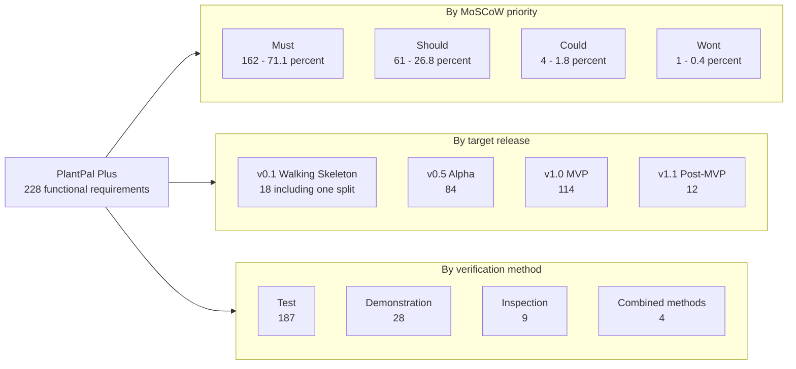
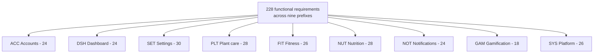
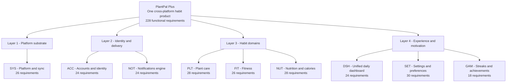
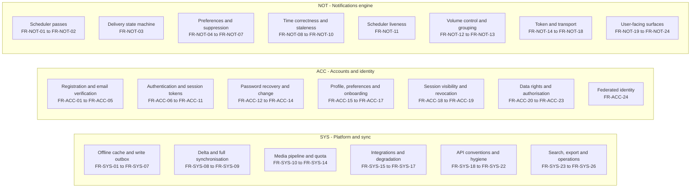
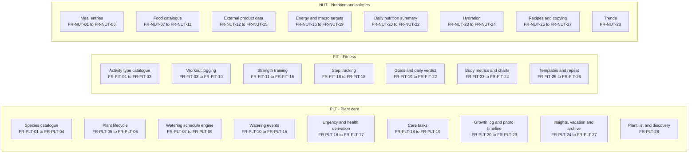
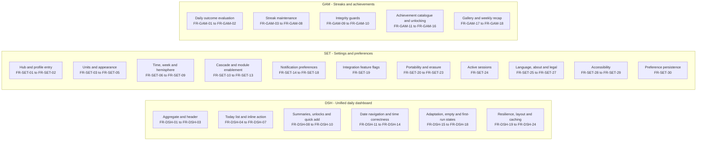

# PlantPal+ — Functional Requirements: Master Index

| Field | Value |
| --- | --- |
| Document | Functional Requirements — Master Index |
| Identifier prefix owned | None. This document indexes identifiers owned by the eight module specifications and invents nothing. |
| Version | 1.0 |
| Date | 2026-07-21 |
| Status | Approved for Phase 2 design |
| Owner | Rakshit (Project Lead / sole developer) |
| Parent | [PlantPal+ Software Requirements Specification v1.0](SRS.md) |

---

## Table of contents

1. [Purpose and how to read a requirement identifier](#1-purpose-and-how-to-read-a-requirement-identifier)
2. [Requirement statistics](#2-requirement-statistics)
3. [Master requirement index](#3-master-requirement-index)
4. [The Must-have subset — the shippable MVP](#4-the-must-have-subset--the-shippable-mvp)
5. [Functional decomposition](#5-functional-decomposition)
6. [Numbering integrity statement](#6-numbering-integrity-statement)

Related documents: [Scope and release plan](02-scope-and-release-plan.md) · [Non-functional requirements](04-non-functional-requirements.md) · [User stories](05-user-stories.md) · [Use-case model](06-use-case-model.md) · [Domain model](07-domain-model.md) · [Glossary](08-glossary.md) · [Assumptions, constraints and risks](09-assumptions-constraints-risks.md) · [Traceability matrix](10-traceability-matrix.md)

---

## 1. Purpose and how to read a requirement identifier

### 1.1 Purpose of this document

This document is the single authoritative **index** of every functional requirement in PlantPal+ v1.0. It exists so that a reader — an academic evaluator auditing coverage, or an engineer picking up a sprint in Phase 3 — can answer four questions without opening eight separate module specifications:

1. **What must the system do?** Section 3 lists all 228 functional requirements, one row each, with a condensed shall-sentence.
2. **How much of it is mandatory?** Section 4 isolates the 162 `Must` requirements that constitute the shippable MVP.
3. **When is each capability due?** Every row carries a target release drawn from the four-release plan of decision D-02.
4. **How will each be proven?** Every row carries its verification method, one of Test, Demonstration, Inspection or Analysis.

This index is **derivative and non-normative**. The normative text of every requirement — its full shall-statement, rationale, input table with validation constraints, processing rules, outputs, alternate and error flows, and traceability block — lives in the module specification linked in the final column of each row. Where this index and a module specification disagree, **the module specification wins**, and the discrepancy is a defect to be raised against this index.

No identifier appears in this document that does not appear in a module specification. The identifier set was extracted mechanically from the eight source files rather than transcribed by hand, precisely so that the count in section 2 and the rows in section 3 cannot drift apart.

### 1.2 Reading a functional requirement identifier

Every functional requirement identifier has the fixed shape `FR-<PREFIX>-<nn>`.

| Part | Meaning | Rule |
| --- | --- | --- |
| `FR` | Artefact class — functional requirement | Fixed. Sibling classes are `BR` business rule, `US` user story, `UC` use case, `NFR` non-functional requirement. |
| `<PREFIX>` | Owning subsystem | Exactly three upper-case letters from the closed set in section 1.3. Never extended, never invented. |
| `<nn>` | Ordinal within the subsystem | Two digits, zero-padded, starting at `01`, contiguous within its prefix. |

Identifiers are **globally unique and permanently stable**. Once assigned, a number is never reused and never renumbered, even if its requirement is later withdrawn — a withdrawn requirement is marked `Wont` and retained, as `FR-FIT-18` demonstrates. This stability is what makes the traceability matrix in [10-traceability-matrix.md](10-traceability-matrix.md) auditable across document versions.

### 1.3 The nine subsystem prefixes

| Prefix | Subsystem | Module specification | FRs |
| --- | --- | --- | --- |
| `ACC` | Accounts, authentication, profile, account lifecycle | [modules/accounts.md](modules/accounts.md) | 24 |
| `DSH` | Unified daily dashboard | [modules/dashboard-and-settings.md](modules/dashboard-and-settings.md) | 24 |
| `SET` | Settings and preferences | [modules/dashboard-and-settings.md](modules/dashboard-and-settings.md) | 30 |
| `PLT` | Plant care | [modules/plant-care.md](modules/plant-care.md) | 28 |
| `FIT` | Fitness | [modules/fitness.md](modules/fitness.md) | 26 |
| `NUT` | Nutrition and calories | [modules/nutrition.md](modules/nutrition.md) | 28 |
| `NOT` | Notifications and reminder engine | [modules/notifications.md](modules/notifications.md) | 24 |
| `GAM` | Streaks, achievements and gamification | [modules/gamification.md](modules/gamification.md) | 18 |
| `SYS` | Cross-cutting platform — offline, sync, media, integrations, search, export | [modules/platform-and-sync.md](modules/platform-and-sync.md) | 26 |
| — | **Total** | — | **228** |

Note that `DSH` and `SET` are two independent prefixes documented inside one physical file, because the dashboard and the settings hub share a data model and a preference-invalidation cascade but are distinct capability sets. That is a documentation convenience only; the two numbering sequences are entirely separate.

### 1.4 The four attributes carried by every row

| Attribute | Domain | Source of the domain |
| --- | --- | --- |
| **Priority** | `Must`, `Should`, `Could`, `Wont` | MoSCoW, mandated for every requirement by decision D-02. |
| **Release** | `v0.1` Walking Skeleton, `v0.5` Alpha, `v1.0` MVP, `v1.1` Post-MVP | The four-release plan of decision D-02. Each release must leave a demoable slice. |
| **Verification** | `Test`, `Demonstration`, `Inspection`, `Analysis` | ISO/IEC/IEEE 29148:2018 verification methods, mandated by the requirement-quality rules. |
| **Link** | Relative anchor into the owning module document | GitHub-Flavored Markdown relative link, so it resolves both in the repository and on GitHub. |

Release labels are abbreviated to their version number in the tables of sections 3 and 4 purely to keep rows to one line. `v0.1` always means *v0.1 Walking Skeleton*, `v0.5` means *v0.5 Alpha*, `v1.0` means *v1.0 MVP* and `v1.1` means *v1.1 Post-MVP*. One requirement, `FR-NOT-02`, carries a split release label because its first category ships in v0.1 and its remaining ten categories in v0.5; it is shown as `v0.1/v0.5`.

### 1.5 What is deliberately not in this document

- **Non-functional requirements.** All `NFR-<CAT>-nn` identifiers live in [04-non-functional-requirements.md](04-non-functional-requirements.md) and are referenced from module specifications, never indexed here.
- **Business rules.** `BR-<PREFIX>-nn` identifiers are the invariants and formulas that functional requirements invoke. They are specified inside their owning module document and are not indexed here.
- **Stories and use cases.** `US-<PREFIX>-nn` and `UC-<PREFIX>-nn` are indexed by [05-user-stories.md](05-user-stories.md) and [06-use-case-model.md](06-use-case-model.md) respectively.
- **Full requirement text.** Follow the link in the final column. Every row here is a one-line summary and is not a substitute for the specification.
- **Bidirectional traceability.** The forward and backward trace of every requirement to goals, stakeholder needs, stories, use cases and quality attributes is consolidated in [10-traceability-matrix.md](10-traceability-matrix.md).

---

## 2. Requirement statistics

All figures in this section are counts of the 228 functional requirements defined across the eight module specifications as of version 1.0, date 2026-07-21.

### 2.1 Totals by module

| # | Prefix | Subsystem | FRs | Must | Should | Could | Wont | Must share |
| --- | --- | --- | --- | --- | --- | --- | --- | --- |
| 1 | `ACC` | Accounts and identity | 24 | 20 | 4 | 0 | 0 | 83.3% |
| 2 | `DSH` | Unified daily dashboard | 24 | 19 | 5 | 0 | 0 | 79.2% |
| 3 | `SET` | Settings and preferences | 30 | 20 | 9 | 1 | 0 | 66.7% |
| 4 | `PLT` | Plant care | 28 | 14 | 12 | 2 | 0 | 50.0% |
| 5 | `FIT` | Fitness | 26 | 17 | 8 | 0 | 1 | 65.4% |
| 6 | `NUT` | Nutrition and calories | 28 | 15 | 12 | 1 | 0 | 53.6% |
| 7 | `NOT` | Notifications and reminders | 24 | 19 | 5 | 0 | 0 | 79.2% |
| 8 | `GAM` | Streaks and achievements | 18 | 16 | 2 | 0 | 0 | 88.9% |
| 9 | `SYS` | Cross-cutting platform | 26 | 22 | 4 | 0 | 0 | 84.6% |
| — | — | **Total** | **228** | **162** | **61** | **4** | **1** | **71.1%** |

Two observations an evaluator should expect to see justified:

1. **The three user-facing habit modules carry the lowest `Must` share** (`PLT` 50.0%, `NUT` 53.6%, `FIT` 65.4%). This is intentional. Decision D-02 requires all three modules to ship in v1.0, but each module's v1.0 obligation is its *core logging loop*, not its full feature surface. Comfort features such as before-and-after comparison (`FR-PLT-22`), recipes (`FR-NUT-25`, `FR-NUT-26`) and workout templates (`FR-FIT-25`) are correctly `Should` or `Could`.
2. **The infrastructure prefixes carry the highest `Must` share** (`GAM` 88.9%, `SYS` 84.6%, `ACC` 83.3%). Infrastructure is close to indivisible: a partially implemented offline outbox or a partially implemented streak rule is a correctness defect rather than a reduced feature set.

### 2.2 Totals by MoSCoW priority

| Priority | Count | Share | Meaning in this project |
| --- | --- | --- | --- |
| `Must` | 162 | 71.1% | Ships in v1.0 or earlier. Omitting any one of these makes the release non-viable against the goals in [02-scope-and-release-plan.md](02-scope-and-release-plan.md). |
| `Should` | 61 | 26.8% | Materially valuable and specified to the same depth, but the release remains viable without it. Scheduled for v0.5, v1.0 or v1.1 depending on cost. |
| `Could` | 4 | 1.8% | Specified so the design does not foreclose it; built only if capacity remains. All four target v1.1. |
| `Wont` | 1 | 0.4% | Explicitly excluded and retained in the numbering so the exclusion is auditable rather than silent. |
| — | **228** | **100%** | — |

The four `Could` requirements and the single `Wont` requirement, listed in full because they are the boundary of scope:

| ID | Requirement | Priority | Release | Why it is not a Must |
| --- | --- | --- | --- | --- |
| `FR-PLT-04` | Perenual species enrichment | Could | v1.1 | D-03 makes the seeded 60-species catalogue canonical; external enrichment is decoration behind a feature flag. |
| `FR-PLT-22` | Before-and-after comparison | Could | v1.1 | Presentation-layer polish over the growth timeline that `FR-PLT-21` already delivers. |
| `FR-NUT-12` | Open Food Facts text search | Could | v1.1 | Barcode lookup (`FR-NUT-13`) covers the high-value external case; free-text external search duplicates the seeded catalogue search. |
| `FR-SET-22` | Data import | Could | v1.1 | Export (`FR-SET-20`, `FR-SET-21`, `FR-ACC-20`, `FR-SYS-24`) discharges the GDPR-style portability obligation of D-01 on its own. |
| `FR-FIT-18` | Health-platform synchronisation excluded | Wont | v1.1+ | Apple HealthKit and Google Health Connect both require paid or provisioned developer entitlements and native modules incompatible with Expo managed workflow, violating D-06 and the fixed stack. |

### 2.3 Totals by target release

| Release | Codename | FRs introduced | Cumulative | Must | Should | Could | Wont |
| --- | --- | --- | --- | --- | --- | --- | --- |
| v0.1 | Walking Skeleton | 17 | 17 | 17 | 0 | 0 | 0 |
| v0.1/v0.5 | Split — `FR-NOT-02` | 1 | 18 | 1 | 0 | 0 | 0 |
| v0.5 | Alpha | 84 | 102 | 79 | 5 | 0 | 0 |
| v1.0 | MVP | 114 | 216 | 65 | 49 | 0 | 0 |
| v1.1 | Post-MVP | 12 | 228 | 0 | 7 | 4 | 1 |
| — | **Total** | **228** | — | **162** | **61** | **4** | **1** |

**Reading the cumulative column.** 216 of the 228 functional requirements — 94.7% — are delivered by v1.0. The 12 requirements deferred to v1.1 are exactly the 7 `Should`, 4 `Could` and 1 `Wont` items whose absence does not compromise any of the four release-gate demonstrations. Every `Must` requirement is delivered by v1.0, with none deferred; this is the arithmetic proof that the MVP definition in section 4 is complete.

### 2.4 Release composition by module

| Prefix | v0.1 | v0.5 | v1.0 | v1.1 | Total |
| --- | --- | --- | --- | --- | --- |
| `ACC` | 5 | 11 | 7 | 1 | 24 |
| `DSH` | 1 | 7 | 16 | 0 | 24 |
| `SET` | 0 | 4 | 23 | 3 | 30 |
| `PLT` | 2 | 8 | 16 | 2 | 28 |
| `FIT` | 0 | 9 | 15 | 2 | 26 |
| `NUT` | 0 | 16 | 9 | 3 | 28 |
| `NOT` | 4 + 1 split | 11 | 8 | 0 | 24 |
| `GAM` | 0 | 8 | 9 | 1 | 18 |
| `SYS` | 5 | 10 | 11 | 0 | 26 |
| **Total** | **17 + 1** | **84** | **114** | **12** | **228** |

The shape of this table is the release plan made concrete. v0.1 draws almost entirely from `ACC`, `SYS` and `NOT` because a walking skeleton must prove *auth plus one persisted entity plus one delivered push* end to end across all three clients. v0.5 is dominated by `NUT` (16) and `NOT` (11) because the nutrition logging loop and the eleven reminder categories are the widest surfaces to build. v1.0 is dominated by `SET` (23) and `DSH`/`PLT` (16 each) because the settings hub, the consolidated dashboard and the plant-care polish are what turn three working loops into one coherent product.

### 2.5 Totals by verification method

| Method | Count | Share | When this project uses it |
| --- | --- | --- | --- |
| Test | 187 | 82.0% | Automated assertion against a deterministic input-output pair. The default, and the only acceptable method wherever a formula, threshold, enumeration or state transition is specified. |
| Demonstration | 28 | 12.3% | An operator exercises the running system and observes the result. Used where the outcome is a rendered surface, an animation, or a device-dependent behaviour that cannot be asserted headlessly. |
| Inspection | 9 | 3.9% | Static examination of code, configuration or seed data. Used for catalogue completeness, migration reversibility and structural conventions. |
| Test + Inspection | 2 | 0.9% | Requirements whose logic is asserted automatically but whose seed or catalogue content must also be read by a human. |
| Demonstration + Test | 2 | 0.9% | Requirements with both a deterministic server-side computation and a user-visible surface. |
| Analysis | 0 | 0.0% | Not used for functional requirements. Analysis is reserved for the non-functional set, where load projections and capacity headroom are argued rather than executed. |
| — | **228** | **100%** | — |

Every one of the 228 functional requirements carries at least one verification method, satisfying the ISO/IEC/IEEE 29148:2018 verifiability rule with no exceptions and no requirement marked "to be determined".

### 2.6 Verification method by module

| Prefix | Test | Demonstration | Inspection | Combined | Total |
| --- | --- | --- | --- | --- | --- |
| `ACC` | 22 | 1 | 0 | 1 | 24 |
| `DSH` | 18 | 6 | 0 | 0 | 24 |
| `SET` | 24 | 5 | 1 | 0 | 30 |
| `PLT` | 23 | 4 | 1 | 0 | 28 |
| `FIT` | 21 | 2 | 3 | 0 | 26 |
| `NUT` | 23 | 4 | 1 | 0 | 28 |
| `NOT` | 21 | 3 | 0 | 0 | 24 |
| `GAM` | 14 | 0 | 1 | 3 | 18 |
| `SYS` | 21 | 3 | 2 | 0 | 26 |
| **Total** | **187** | **28** | **9** | **4** | **228** |

### 2.7 Distribution summary diagram

The chart below is drawn as a Mermaid `flowchart` with explicit count labels rather than a pie chart, because pie charts do not render reliably in every GitHub context and cannot carry exact figures in their labels.

---

## 3. Master requirement index

One table per subsystem, in the canonical prefix order `ACC`, `DSH`, `SET`, `PLT`, `FIT`, `NUT`, `NOT`, `GAM`, `SYS`. Within a table, rows are in ascending ordinal order with no gaps.

**Column semantics.**

| Column | Content |
| --- | --- |
| ID | The globally unique `FR-<PREFIX>-<nn>` identifier. |
| Requirement | The normative shall-sentence, condensed to a single line. An ellipsis (`...`) marks a sentence truncated for width; the unabridged statement is behind the link. |
| Priority | MoSCoW value per D-02. |
| Release | Target release per D-02, abbreviated as described in section 1.4. |
| Verification | ISO/IEC/IEEE 29148:2018 verification method. |
| Full specification | Relative link to the complete requirement — rationale, input validation table, processing rules, outputs, alternate and error flows, traceability — in its owning module document. |

### 3.1 `ACC` — Accounts, authentication and identity (24)

Owning document: [modules/accounts.md](modules/accounts.md). This subsystem is the trust root of the product: every other requirement in this index assumes an authenticated principal whose ownership of a row has been proven server-side by `FR-ACC-23`. It implements decision D-11 — email and password with a 15-minute JWT access token and a rotating 30-day refresh token as the `Must`, with Google and Apple OAuth as a v1.1 `Should` — and it carries the GDPR-style export and erasure obligations of D-01.

| ID | Requirement | Priority | Release | Verification | Full specification |
| --- | --- | --- | --- | --- | --- |
| `FR-ACC-01` | The system shall create a user account in state `PENDING_VERIFICATION` when an unauthenticated visitor submits an email address satisfying ... | Must | v0.1 | Test | [Register an account](modules/accounts.md#fr-acc-01--register-an-account) |
| `FR-ACC-02` | The system shall reject any submitted password that violates the composition policy of BR-ACC-01 and return a response body enumerating every ... | Must | v0.1 | Test | [Enforce the password composition policy](modules/accounts.md#fr-acc-02--enforce-the-password-composition-policy) |
| `FR-ACC-03` | The system shall reject a submitted password whose SHA-1 digest suffix is returned with a count of 1 or greater by the breach-corpus k-anonymity ... | Should | v1.0 | Test | [Reject breached passwords](modules/accounts.md#fr-acc-03--reject-breached-passwords) |
| `FR-ACC-04` | The system shall transition an account from `PENDING_VERIFICATION` to `ACTIVE` when presented with an email-verification token that is validly ... | Must | v0.5 | Test | [Verify an email address](modules/accounts.md#fr-acc-04--verify-an-email-address) |
| `FR-ACC-05` | The system shall refuse an email-verification resend request that would exceed any threshold in BR-ACC-05 and shall return HTTP 429 with a ... | Must | v0.5 | Test | [Throttle verification resends](modules/accounts.md#fr-acc-05--throttle-verification-resends) |
| `FR-ACC-06` | The system shall issue one access token and one refresh token conforming to BR-ACC-07 when presented with an email address and password matching a ... | Must | v0.1 | Test | [Authenticate and issue a token pair](modules/accounts.md#fr-acc-06--authenticate-and-issue-a-token-pair) |
| `FR-ACC-07` | The system shall refuse authentication attempts for an email address that has accumulated 5 or more consecutive failed attempts, for the backoff ... | Must | v0.5 | Test | [Lock out after repeated failures with exponential backoff](modules/accounts.md#fr-acc-07--lock-out-after-repeated-failures-with-exponential-backoff) |
| `FR-ACC-08` | The system shall rotate the refresh token on every redemption by marking the presented token consumed and issuing a successor token within the ... | Must | v0.5 | Test | [Rotate the refresh token on redemption](modules/accounts.md#fr-acc-08--rotate-the-refresh-token-on-redemption) |
| `FR-ACC-09` | The system shall revoke every refresh token belonging to a token family when a token of that family is presented after it has already been ... | Must | v0.5 | Test | [Detect refresh reuse and revoke the family](modules/accounts.md#fr-acc-09--detect-refresh-reuse-and-revoke-the-family) |
| `FR-ACC-10` | The system shall revoke the refresh-token family of the presented refresh token when the authenticated user requests logout | Must | v0.1 | Test | [Log out of the current session](modules/accounts.md#fr-acc-10--log-out-of-the-current-session) |
| `FR-ACC-11` | The system shall invalidate every session of the authenticated user, including every unexpired access token, when the user requests logout from ... | Must | v0.5 | Test | [Log out from all devices](modules/accounts.md#fr-acc-11--log-out-from-all-devices) |
| `FR-ACC-12` | The system shall send a password-reset email containing a signed single-use token that expires 60 minutes after issuance when a reset is requested ... | Must | v0.5 | Test | [Request a password reset](modules/accounts.md#fr-acc-12--request-a-password-reset) |
| `FR-ACC-13` | The system shall replace the account's stored password hash when presented with a password-reset token that is validly signed, unexpired and not ... | Must | v0.5 | Test | [Complete a password reset](modules/accounts.md#fr-acc-13--complete-a-password-reset) |
| `FR-ACC-14` | The system shall replace the authenticated user's stored password hash when the user supplies a current password that matches the stored ... | Must | v0.5 | Test | [Change password while authenticated](modules/accounts.md#fr-acc-14--change-password-while-authenticated) |
| `FR-ACC-15` | The system shall persist the authenticated user's profile record comprising `display_name`, `avatar_photo_id`, `date_of_birth`, `biological_sex`, ... | Must | v0.5 | Test | [Persist the profile record](modules/accounts.md#fr-acc-15--persist-the-profile-record) |
| `FR-ACC-16` | The system shall persist the authenticated user's account preferences comprising `timezone`, `hemisphere`, `locale`, `unit_system`, ... | Must | v0.5 | Test | [Persist account preferences](modules/accounts.md#fr-acc-16--persist-account-preferences) |
| `FR-ACC-17` | The system shall record onboarding progress after each step is completed or skipped so that an interrupted onboarding session resumes at the first ... | Must | v1.0 | Demonstration | [Record and resume onboarding progress](modules/accounts.md#fr-acc-17--record-and-resume-onboarding-progress) |
| `FR-ACC-18` | The system shall return the authenticated user's non-revoked, unexpired sessions, each carrying `session_id`, `device_label`, `platform`, ... | Should | v1.0 | Test | [List active sessions](modules/accounts.md#fr-acc-18--list-active-sessions) |
| `FR-ACC-19` | The system shall revoke the refresh-token family identified by a `session_id` supplied by the authenticated user when that session belongs to that ... | Should | v1.0 | Test | [Revoke a single session](modules/accounts.md#fr-acc-19--revoke-a-single-session) |
| `FR-ACC-20` | The system shall produce, at most once per rolling 24 hours per account, a JSON export archive conforming to BR-ACC-19 containing every record ... | Must | v1.0 | Test | [Export the account as a JSON archive](modules/accounts.md#fr-acc-20--export-the-account-as-a-json-archive) |
| `FR-ACC-21` | The system shall set the account status to `PENDING_DELETION` and set `deletion_scheduled_at` to the request instant plus 30 days when the ... | Must | v1.0 | Test | [Request account deletion with a grace period](modules/accounts.md#fr-acc-21--request-account-deletion-with-a-grace-period) |
| `FR-ACC-22` | The system shall permanently erase every record classified as hard-delete in BR-ACC-20 Table H for each account whose `deletion_scheduled_at` has ... | Must | v1.0 | Test | [Execute permanent erasure](modules/accounts.md#fr-acc-22--execute-permanent-erasure) |
| `FR-ACC-23` | The system shall authorise every read and every write of a user-scoped record against an acting user identifier derived exclusively from the ... | Must | v0.1 | Test, Inspection | [Enforce server-side ownership authorisation](modules/accounts.md#fr-acc-23--enforce-server-side-ownership-authorisation) |
| `FR-ACC-24` | The system shall create or link an account from a Google or Apple identity assertion when that assertion carries a verified email address, ... | Should | v1.1 | Test | [Sign in with Google or Apple and link by verified email](modules/accounts.md#fr-acc-24--sign-in-with-google-or-apple-and-link-by-verified-email) |

### 3.2 `DSH` — Unified daily dashboard (24)

Owning document: [modules/dashboard-and-settings.md](modules/dashboard-and-settings.md). The dashboard is the single screen that makes the consolidation thesis of the product visible: one Today list drawn from all three habit modules, one global streak, one set of quick-add actions. It writes no primary data of its own; every `DSH` requirement is either an aggregation, an ordering rule, a rendering state or a navigation affordance over data owned by `PLT`, `FIT`, `NUT` and `GAM`.

| ID | Requirement | Priority | Release | Verification | Full specification |
| --- | --- | --- | --- | --- | --- |
| `FR-DSH-01` | The system shall return all data required to render the dashboard for one calendar date in a single HTTP GET response from `GET /api/v1/dashboard` | Must | v0.1 | Test | [Single-round-trip dashboard aggregate](modules/dashboard-and-settings.md#fr-dsh-01--single-round-trip-dashboard-aggregate) |
| `FR-DSH-02` | The system shall display a dashboard header containing a time-of-day greeting, the user's display name and the full weekday-and-date label of the ... | Must | v0.5 | Demonstration | [Header greeting and date label](modules/dashboard-and-settings.md#fr-dsh-02--header-greeting-and-date-label) |
| `FR-DSH-03` | The system shall display the user's current global streak length in days in the dashboard header | Must | v0.5 | Test | [Global streak indicator](modules/dashboard-and-settings.md#fr-dsh-03--global-streak-indicator) |
| `FR-DSH-04` | The system shall assemble a single Today list containing one entry for every open or completed actionable item sourced from each enabled module ... | Must | v0.5 | Test | [Today list assembly](modules/dashboard-and-settings.md#fr-dsh-04--today-list-assembly) |
| `FR-DSH-05` | The system shall order the Today list by the six-key sort tuple defined in `BR-DSH-03` and shall produce an identical ordering for identical input ... | Must | v0.5 | Test | [Deterministic Today ordering](modules/dashboard-and-settings.md#fr-dsh-05--deterministic-today-ordering) |
| `FR-DSH-06` | The system shall represent two or more open plant-watering items for the viewed date as one grouped Today entry labelled with the count of plants ... | Must | v1.0 | Test | [Plant watering aggregation](modules/dashboard-and-settings.md#fr-dsh-06--plant-watering-aggregation) |
| `FR-DSH-07` | The system shall execute the primary action of a Today item from within the Today list without navigating away from the dashboard for the item ... | Must | v1.0 | Test | [Inline primary action](modules/dashboard-and-settings.md#fr-dsh-07--inline-primary-action) |
| `FR-DSH-08` | The system shall display one summary card per enabled module, each containing a progress ring whose fill percentage is computed by the formula in ... | Must | v0.5 | Test | [Module summary cards and progress rings](modules/dashboard-and-settings.md#fr-dsh-08--module-summary-cards-and-progress-rings) |
| `FR-DSH-09` | The system shall display the achievements unlocked in the seven days ending on the viewed date, newest first, limited to three entries | Should | v1.0 | Test | [Recent achievement unlocks](modules/dashboard-and-settings.md#fr-dsh-09--recent-achievement-unlocks) |
| `FR-DSH-10` | The system shall display a quick-add control set containing only the actions listed in `BR-DSH-09` whose owning module is enabled | Must | v1.0 | Demonstration | [Quick-add action set](modules/dashboard-and-settings.md#fr-dsh-10--quick-add-action-set) |
| `FR-DSH-11` | The system shall allow the user to navigate the dashboard to any calendar date between the account creation local date and the current local date ... | Must | v1.0 | Test | [Past-date navigation](modules/dashboard-and-settings.md#fr-dsh-11--past-date-navigation) |
| `FR-DSH-12` | The system shall display a Today control that returns the dashboard to the current local date, and shall hide that control while the current local ... | Must | v1.0 | Demonstration | [Today shortcut](modules/dashboard-and-settings.md#fr-dsh-12--today-shortcut) |
| `FR-DSH-13` | The system shall apply the per-widget read-only matrix defined in `BR-DSH-11` whenever the viewed date is earlier than the current local date | Must | v1.0 | Test | [Past-date read-only matrix](modules/dashboard-and-settings.md#fr-dsh-13--past-date-read-only-matrix) |
| `FR-DSH-14` | The system shall determine the dashboard day boundary as midnight to midnight in the user's stored IANA timezone, including on days on which a ... | Must | v0.5 | Test | [Timezone day boundary and DST correctness](modules/dashboard-and-settings.md#fr-dsh-14--timezone-day-boundary-and-dst-correctness) |
| `FR-DSH-15` | The system shall render the dashboard, the quick-add set and the primary navigation destinations for each of the seven non-empty subsets of the ... | Must | v1.0 | Test | [Module enablement adaptation](modules/dashboard-and-settings.md#fr-dsh-15--module-enablement-adaptation) |
| `FR-DSH-16` | The system shall display, for each enabled module that holds no qualifying records for the viewed date, the module-specific empty state and call ... | Must | v1.0 | Demonstration | [Empty and all-caught-up states](modules/dashboard-and-settings.md#fr-dsh-16--empty-and-all-caught-up-states) |
| `FR-DSH-17` | The system shall display a dismissible first-run checklist of the setup steps defined in `BR-DSH-17` while the checklist remains incomplete and ... | Should | v1.0 | Test | [First-run onboarding checklist](modules/dashboard-and-settings.md#fr-dsh-17--first-run-onboarding-checklist) |
| `FR-DSH-18` | The system shall display placeholder skeleton elements matching the final layout of the header, the Today list and every module card while the ... | Should | v0.5 | Demonstration | [Loading skeletons](modules/dashboard-and-settings.md#fr-dsh-18--loading-skeletons) |
| `FR-DSH-19` | The system shall render the most recently cached dashboard response together with a persistent offline banner and a last-updated timestamp when ... | Must | v1.0 | Test | [Offline rendering](modules/dashboard-and-settings.md#fr-dsh-19--offline-rendering) |
| `FR-DSH-20` | The system shall render every successfully composed dashboard section when one or more sections fail to compose, marking each failed section with ... | Should | v1.0 | Test | [Section-level degradation and retry](modules/dashboard-and-settings.md#fr-dsh-20--section-level-degradation-and-retry) |
| `FR-DSH-21` | The system shall refetch the dashboard aggregate on a pull-to-refresh gesture on mobile and on activation of the refresh control on web, and shall ... | Must | v1.0 | Test | [Refresh and throttle](modules/dashboard-and-settings.md#fr-dsh-21--refresh-and-throttle) |
| `FR-DSH-22` | The system shall lay out the dashboard in one column below 768 CSS pixels of viewport width, two columns from 768 to 1279 CSS pixels, and three ... | Must | v1.0 | Demonstration | [Responsive layout](modules/dashboard-and-settings.md#fr-dsh-22--responsive-layout) |
| `FR-DSH-23` | The system shall treat a cached dashboard response as fresh for 60 seconds and shall invalidate the cached response for an affected date ... | Must | v1.0 | Test | [Cache freshness and invalidation](modules/dashboard-and-settings.md#fr-dsh-23--cache-freshness-and-invalidation) |
| `FR-DSH-24` | The system shall open the dashboard at the date carried by an inbound deep link and shall visually highlight the Today item identified by that ... | Should | v1.0 | Test | [Deep-link focus](modules/dashboard-and-settings.md#fr-dsh-24--deep-link-focus) |

### 3.3 `SET` — Settings and preferences (30)

Owning document: [modules/dashboard-and-settings.md](modules/dashboard-and-settings.md). The settings hub is where the user-selectable behaviour mandated by decisions D-08 (i18n readiness), D-09 (metric and imperial with canonical metric storage), D-03 (integration feature flags) and D-01 (privacy, export, erasure, legal surfaces) becomes operable. The recomputation cascade of `FR-SET-10` is the requirement that makes the rest safe: changing a preference that feeds a schedule must deterministically invalidate and rebuild everything downstream of it.

| ID | Requirement | Priority | Release | Verification | Full specification |
| --- | --- | --- | --- | --- | --- |
| `FR-SET-01` | The system shall present a settings hub organised into the nine sections enumerated in `BR-SET-01`, each section reachable in at most two taps ... | Must | v0.5 | Demonstration | [Settings hub information architecture](modules/dashboard-and-settings.md#fr-set-01--settings-hub-information-architecture) |
| `FR-SET-02` | The system shall provide, within the settings hub, an entry point to the profile editing surface owned by the `ACC` subsystem | Must | v0.5 | Demonstration | [Profile entry point](modules/dashboard-and-settings.md#fr-set-02--profile-entry-point) |
| `FR-SET-03` | The system shall allow the user to select a unit system of exactly one of `METRIC` or `IMPERIAL`, defaulting to `METRIC` | Must | v1.0 | Test | [Unit system selection](modules/dashboard-and-settings.md#fr-set-03--unit-system-selection) |
| `FR-SET-04` | The system shall display every stored measurement converted to the currently selected unit system using the conversion factors and rounding rules ... | Must | v1.0 | Test | [Historical value display conversion](modules/dashboard-and-settings.md#fr-set-04--historical-value-display-conversion) |
| `FR-SET-05` | The system shall allow the user to select a theme of exactly one of `LIGHT`, `DARK` or `SYSTEM`, defaulting to `SYSTEM`, and shall apply the ... | Must | v1.0 | Test | [Theme selection](modules/dashboard-and-settings.md#fr-set-05--theme-selection) |
| `FR-SET-06` | The system shall allow the user to select a week start day of exactly one of `MONDAY` or `SUNDAY`, defaulting to `MONDAY` | Should | v1.0 | Test | [Week start day](modules/dashboard-and-settings.md#fr-set-06--week-start-day) |
| `FR-SET-07` | The system shall allow the user to select their timezone from the IANA timezone database and shall default it to the device-reported timezone at ... | Must | v0.5 | Test | [Timezone selection](modules/dashboard-and-settings.md#fr-set-07--timezone-selection) |
| `FR-SET-08` | The system shall prompt the user at most once per 24 hours to update the stored timezone when the device-reported timezone differs from the stored ... | Should | v1.1 | Test | [Timezone drift prompt](modules/dashboard-and-settings.md#fr-set-08--timezone-drift-prompt) |
| `FR-SET-09` | The system shall allow the user to select a hemisphere of exactly one of `NORTHERN`, `SOUTHERN` or `AUTO`, defaulting to `AUTO`, where `AUTO` ... | Must | v1.0 | Test | [Hemisphere selection](modules/dashboard-and-settings.md#fr-set-09--hemisphere-selection) |
| `FR-SET-10` | The system shall recompute all future scheduled reminder occurrences within 60 seconds of a committed change to the stored timezone, the stored ... | Must | v1.0 | Test | [Recomputation cascade](modules/dashboard-and-settings.md#fr-set-10--recomputation-cascade) |
| `FR-SET-11` | The system shall allow the user to enable or disable each of the three modules `PLANT`, `FITNESS` and `NUTRITION` independently | Must | v1.0 | Test | [Module enablement](modules/dashboard-and-settings.md#fr-set-11--module-enablement) |
| `FR-SET-12` | The system shall reject any request that would leave zero modules enabled and shall return error code `SET_LAST_MODULE_REQUIRED` with HTTP status 422 | Must | v1.0 | Test | [Last-module guard](modules/dashboard-and-settings.md#fr-set-12--last-module-guard) |
| `FR-SET-13` | The system shall display a confirmation dialog before disabling a module, stating that existing data is retained and naming the modules that will ... | Should | v1.0 | Demonstration | [Module disable confirmation](modules/dashboard-and-settings.md#fr-set-13--module-disable-confirmation) |
| `FR-SET-14` | The system shall provide a master notification switch and an independent enable state for each of the eleven user-togglable notification ... | Must | v1.0 | Test | [Notification category matrix](modules/dashboard-and-settings.md#fr-set-14--notification-category-matrix) |
| `FR-SET-15` | The system shall provide independent per-channel notification preferences for the channels `PUSH`, `IN_APP` and `EMAIL_DIGEST`, offering `PUSH` ... | Must | v1.0 | Test | [Channel preferences](modules/dashboard-and-settings.md#fr-set-15--channel-preferences) |
| `FR-SET-16` | The system shall allow the user to enable quiet hours and to set a quiet-hours start time and end time at 5-minute granularity, defaulting to ... | Must | v1.0 | Test | [Quiet hours](modules/dashboard-and-settings.md#fr-set-16--quiet-hours) |
| `FR-SET-17` | The system shall allow the user to set one default reminder time per notification category at 5-minute granularity, initialised to the defaults in ... | Must | v1.0 | Test | [Default reminder times per category](modules/dashboard-and-settings.md#fr-set-17--default-reminder-times-per-category) |
| `FR-SET-18` | The system shall allow the user to set the volume of one glass of water to an integer between 100 and 1000 millilitres in steps of 10, defaulting ... | Should | v1.0 | Test | [Glass size preference](modules/dashboard-and-settings.md#fr-set-18--glass-size-preference) |
| `FR-SET-19` | The system shall expose a user-level enable toggle for each of the Open Food Facts and Perenual integrations, and shall render each toggle as ... | Should | v1.1 | Test | [Integration feature flags](modules/dashboard-and-settings.md#fr-set-19--integration-feature-flags) |
| `FR-SET-20` | The system shall allow the user to request an export of all personal data, shall accept at most one such request per user per 24 hours, and shall ... | Must | v1.0 | Test | [Export request](modules/dashboard-and-settings.md#fr-set-20--export-request) |
| `FR-SET-21` | The system shall deliver a completed export as a single ZIP archive through a signed download link that expires 72 hours after issue, and shall ... | Must | v1.0 | Test | [Export delivery](modules/dashboard-and-settings.md#fr-set-21--export-delivery) |
| `FR-SET-22` | The system shall allow the user to import a previously exported PlantPal+ archive and shall report per-entity counts of created, skipped and ... | Could | v1.1 | Test | [Data import](modules/dashboard-and-settings.md#fr-set-22--data-import) |
| `FR-SET-23` | The system shall allow the user to request account deletion after re-authentication with the account password and confirmation by typing the ... | Must | v1.0 | Test | [Account deletion](modules/dashboard-and-settings.md#fr-set-23--account-deletion) |
| `FR-SET-24` | The system shall list all active sessions for the account showing platform, device label, creation timestamp and last-seen timestamp, and shall ... | Should | v1.0 | Test | [Active sessions](modules/dashboard-and-settings.md#fr-set-24--active-sessions) |
| `FR-SET-25` | The system shall display a language selector containing the single entry `English (en)` in a disabled state, and shall resolve every user-facing ... | Must | v1.0 | Inspection | [Language placeholder and internationalisation readiness](modules/dashboard-and-settings.md#fr-set-25--language-placeholder-and-internationalisation-readiness) |
| `FR-SET-26` | The system shall display an About screen containing the application semantic version, the build number, the seven-character commit hash, the ... | Should | v1.0 | Demonstration | [About and diagnostics](modules/dashboard-and-settings.md#fr-set-26--about-and-diagnostics) |
| `FR-SET-27` | The system shall display the privacy policy, the terms of service, the not-medical-advice disclaimer and the open-source licence list from bundled ... | Must | v1.0 | Test | [Legal surfaces and re-consent](modules/dashboard-and-settings.md#fr-set-27--legal-surfaces-and-re-consent) |
| `FR-SET-28` | The system shall provide an accessibility section exposing exactly the three preferences `reducedMotion`, `textScale` and `highContrast` with the ... | Should | v1.0 | Test | [Accessibility preference set](modules/dashboard-and-settings.md#fr-set-28--accessibility-preference-set) |
| `FR-SET-29` | The system shall suppress all decorative and transitional animation, including Lottie sequences and progress-ring fill animation, while the ... | Should | v1.0 | Demonstration | [Reduced-motion application](modules/dashboard-and-settings.md#fr-set-29--reduced-motion-application) |
| `FR-SET-30` | The system shall persist every settings change to the server as the single authoritative settings record, shall apply the change optimistically on ... | Must | v0.5 | Test | [Settings persistence and conflict handling](modules/dashboard-and-settings.md#fr-set-30--settings-persistence-and-conflict-handling) |

### 3.4 `PLT` — Plant care (28)

Owning document: [modules/plant-care.md](modules/plant-care.md). This is the signature module. The species-and-season-adjusted watering interval of `FR-PLT-07`, the due-instant derivation of `FR-PLT-08` and the recomputation triggers of `FR-PLT-09` together form the algorithm that distinguishes PlantPal+ from a generic reminder application. Per decision D-03 the seeded 60-species catalogue is canonical and the Perenual integration in `FR-PLT-04` is optional decoration behind a feature flag.

| ID | Requirement | Priority | Release | Verification | Full specification |
| --- | --- | --- | --- | --- | --- |
| `FR-PLT-01` | The system shall provide a seeded species catalogue containing at least 60 `ENT-08 PlantSpecies` records with `source = SEEDED`, each populated ... | Must | v0.5 | Inspection | [Seeded species catalogue](modules/plant-care.md#41-fr-plt-01--seeded-species-catalogue) |
| `FR-PLT-02` | The system shall return species catalogue results matching a user-supplied query of 1 to 60 characters against `common_name`, `botanical_name` and ... | Must | v0.5 | Test | [Species catalogue search](modules/plant-care.md#42-fr-plt-02--species-catalogue-search) |
| `FR-PLT-03` | The system shall create an `ENT-08 PlantSpecies` record with `source = USER_CUSTOM` and `user_id` set to the requesting user, readable and ... | Should | v1.0 | Test | [Create a custom species](modules/plant-care.md#43-fr-plt-03--create-a-custom-species) |
| `FR-PLT-04` | The system shall, when the feature flag `PLT_PERENUAL_ENRICHMENT` is enabled, retrieve supplementary species content from the Perenual API and ... | Could | v1.1 | Test | [Perenual species enrichment](modules/plant-care.md#44-fr-plt-04--perenual-species-enrichment) |
| `FR-PLT-05` | The system shall create an `ENT-10 Plant` record owned by the requesting user from the attribute set and validation limits defined in BR-PLT-38 ... | Must | v0.1 | Test | [Create a plant](modules/plant-care.md#45-fr-plt-05--create-a-plant) |
| `FR-PLT-06` | The system shall update the attributes of an existing `ENT-10 Plant` owned by the requesting user and shall recompute that plant's watering ... | Must | v0.5 | Test | [Edit a plant](modules/plant-care.md#46-fr-plt-06--edit-a-plant) |
| `FR-PLT-07` | The system shall compute a plant's effective watering interval in whole days as the species `base_interval_days` multiplied by the season factor, ... | Must | v0.5 | Test | [Effective watering interval computation](modules/plant-care.md#47-fr-plt-07--effective-watering-interval-computation) |
| `FR-PLT-08` | The system shall compute a plant's next watering due instant as the anchor local date plus the effective interval in calendar days, resolved to ... | Must | v0.5 | Test | [Next watering due instant](modules/plant-care.md#48-fr-plt-08--next-watering-due-instant) |
| `FR-PLT-09` | The system shall recompute a plant's stored schedule state within 2 000 milliseconds of any event in the trigger list defined in BR-PLT-10 clause ... | Must | v0.5 | Test | [Schedule recomputation triggers](modules/plant-care.md#49-fr-plt-09--schedule-recomputation-triggers) |
| `FR-PLT-10` | The system shall record an `ENT-11 WateringEvent` with `action = WATERED` for a plant at the current instant when the user performs the water-now ... | Must | v0.1 | Test | [Log a watering now](modules/plant-care.md#410-fr-plt-10--log-a-watering-now) |
| `FR-PLT-11` | The system shall record an `ENT-11 WateringEvent` at a user-supplied past instant that lies within the acceptance window defined in BR-PLT-13, and ... | Must | v1.0 | Test | [Log a back-dated watering](modules/plant-care.md#411-fr-plt-11--log-a-back-dated-watering) |
| `FR-PLT-12` | The system shall defer a plant's `next_due_local_date` by a user-selected whole number of days from 1 to 7 inclusive when the user snoozes, ... | Should | v1.0 | Test | [Snooze a watering](modules/plant-care.md#412-fr-plt-12--snooze-a-watering) |
| `FR-PLT-13` | The system shall defer a plant's `next_due_local_date` by the half-cycle deferral defined in BR-PLT-16 clause 1 when the user skips the current ... | Should | v1.0 | Test | [Skip a watering cycle with a reason](modules/plant-care.md#413-fr-plt-13--skip-a-watering-cycle-with-a-reason) |
| `FR-PLT-14` | The system shall record an individual `ENT-11 WateringEvent` for each plant in a user-selected set of between 2 and 50 plants in a single ... | Should | v1.0 | Test | [Bulk water selected plants](modules/plant-care.md#414-fr-plt-14--bulk-water-selected-plants) |
| `FR-PLT-15` | The system shall allow a Registered User to correct the `performed_at` of, or soft-delete, any `ENT-11 WateringEvent` that user owns, and shall ... | Should | v1.0 | Test | [Correct or delete a watering event](modules/plant-care.md#415-fr-plt-15--correct-or-delete-a-watering-event) |
| `FR-PLT-16` | The system shall classify every non-archived plant into exactly one watering urgency tier from the enumeration `NOT_DUE`, `DUE_SOON`, `DUE_TODAY`, ... | Must | v0.5 | Test | [Watering urgency tier](modules/plant-care.md#416-fr-plt-16--watering-urgency-tier) |
| `FR-PLT-17` | The system shall derive every non-archived plant's `health_status` as exactly one member of `PlantHealthStatus` — `THRIVING`, `NEEDS_ATTENTION`, ... | Must | v1.0 | Test | [Plant health status derivation](modules/plant-care.md#417-fr-plt-17--plant-health-status-derivation) |
| `FR-PLT-18` | The system shall offer, per plant, the `CareTaskType` members listed in BR-PLT-21 clause 1 with their default cadence pre-filled, and shall allow ... | Should | v1.0 | Test | [Care task types, cadence and per-plant enablement](modules/plant-care.md#418-fr-plt-18--care-task-types-cadence-and-per-plant-enablement) |
| `FR-PLT-19` | The system shall record an `ENT-13 CareTaskEvent` with `outcome` of `COMPLETED` or `SKIPPED` for an active care task on a plant and shall schedule ... | Should | v1.0 | Test | [Complete or skip a care task occurrence](modules/plant-care.md#419-fr-plt-19--complete-or-skip-a-care-task-occurrence) |
| `FR-PLT-20` | The system shall create an `ENT-14 GrowthLogEntry` for a plant containing a local entry date and at least one of `height_cm`, `leaf_count`, ... | Must | v1.0 | Test | [Create a growth log entry](modules/plant-care.md#420-fr-plt-20--create-a-growth-log-entry) |
| `FR-PLT-21` | The system shall present a plant's growth entries whose `photo_status` is `READY` in ascending `logged_local_date` order in a timeline that the ... | Should | v1.0 | Demonstration | [Growth photo timeline](modules/plant-care.md#421-fr-plt-21--growth-photo-timeline) |
| `FR-PLT-22` | The system shall display any two user-selected growth entries of the same plant side by side together with the elapsed days, the height difference ... | Could | v1.1 | Demonstration | [Before-and-after comparison](modules/plant-care.md#422-fr-plt-22--before-and-after-comparison) |
| `FR-PLT-23` | The system shall render a time-series chart for one plant of a user-selected metric from the enumeration `HEIGHT_CM`, `LEAF_COUNT`, ... | Should | v1.0 | Demonstration | [Plant history chart](modules/plant-care.md#423-fr-plt-23--plant-history-chart) |
| `FR-PLT-24` | The system shall compute and display a watering adherence percentage per plant as an integer from 0 to 100 over a user-selected window using the ... | Should | v1.0 | Test | [Watering adherence percentage](modules/plant-care.md#424-fr-plt-24--watering-adherence-percentage) |
| `FR-PLT-25` | The system shall display, on the plant detail view, exactly one care tip drawn from the plant's species record, selected by the contextual ... | Should | v1.0 | Demonstration | [Contextual species care tip](modules/plant-care.md#425-fr-plt-25--contextual-species-care-tip) |
| `FR-PLT-26` | The system shall suppress watering and care task due-date escalation for the plants in scope of a user-defined vacation window between its ... | Should | v1.0 | Test | [Vacation mode](modules/plant-care.md#426-fr-plt-26--vacation-mode) |
| `FR-PLT-27` | The system shall archive a plant with exactly one `PlantArchiveReason` from `DIED`, `GIFTED`, `SOLD`, `LOST`, `OTHER`, retaining all of that ... | Must | v1.0 | Test | [Archive, restore and delete a plant](modules/plant-care.md#427-fr-plt-27--archive-restore-and-delete-a-plant) |
| `FR-PLT-28` | The system shall return the requesting user's plant list filtered by any combination of room, health status, species and needs-water-today, sorted ... | Must | v0.5 | Test | [Plant list with search, filter and sort](modules/plant-care.md#428-fr-plt-28--plant-list-with-search-filter-and-sort) |

### 3.5 `FIT` — Fitness (26)

Owning document: [modules/fitness.md](modules/fitness.md). The fitness module logs workouts, strength sets, steps and body metrics, and resolves them into a single per-day verdict (`FR-FIT-21`) that the gamification subsystem consumes. Energy expenditure is an estimate presented with an explicit disclaimer (`FR-FIT-05`, `FR-FIT-06`) in accordance with the not-medical-device stance of decision D-07. `FR-FIT-18` is the module's one `Wont`, recording the deliberate exclusion of native health-platform synchronisation.

| ID | Requirement | Priority | Release | Verification | Full specification |
| --- | --- | --- | --- | --- | --- |
| `FR-FIT-01` | The system shall provide a seeded, read-only activity-type catalogue containing exactly the nine codes `WALK`, `RUN`, `CYCLE`, `SWIM`, `STRENGTH`, ... | Must | v0.5 | Inspection | [Seeded activity-type catalogue](modules/fitness.md#fr-fit-01-seeded-activity-type-catalogue) |
| `FR-FIT-02` | The system shall allow a Registered User to create a user-defined activity type consisting of a name of 1 to 40 characters, a base MET value ... | Should | v1.0 | Test | [User-defined activity types](modules/fitness.md#fr-fit-02-user-defined-activity-types) |
| `FR-FIT-03` | The system shall allow a Registered User to create a workout entry recording activity type, start instant, duration in whole minutes, perceived ... | Must | v0.5 | Test | [Create a workout entry](modules/fitness.md#fr-fit-03-create-a-workout-entry) |
| `FR-FIT-04` | The system shall reject any workout create or update request whose field values fall outside the validation limits enumerated in `BR-FIT-10`, ... | Must | v0.5 | Test | [Workout validation limits](modules/fitness.md#fr-fit-04-workout-validation-limits) |
| `FR-FIT-05` | The system shall compute for every workout an estimated energy expenditure in kilocalories using the formula `kcal = MET x body_mass_kg x ... | Must | v0.5 | Test | [Energy-expenditure estimate](modules/fitness.md#fr-fit-05-energy-expenditure-estimate) |
| `FR-FIT-06` | The system shall display every energy-expenditure figure together with the plus-or-minus error band of its activity type, a low-to-high estimate ... | Must | v0.5 | Demonstration | [Estimate presentation and disclaimer](modules/fitness.md#fr-fit-06-estimate-presentation-and-disclaimer) |
| `FR-FIT-07` | The system shall allow a Registered User to edit any field of a workout that user owns and shall, within the same database transaction, recompute ... | Must | v1.0 | Test | [Edit a logged workout](modules/fitness.md#fr-fit-07-edit-a-logged-workout) |
| `FR-FIT-08` | The system shall allow a Registered User to delete a workout that user owns by writing a deletion tombstone rather than removing the row, and ... | Must | v1.0 | Test | [Delete a logged workout](modules/fitness.md#fr-fit-08-delete-a-logged-workout) |
| `FR-FIT-09` | The system shall detect when a workout being created or edited overlaps an existing non-deleted workout of the same user by 1 minute or more, ... | Should | v1.0 | Test | [Overlap detection](modules/fitness.md#fr-fit-09-overlap-detection) |
| `FR-FIT-10` | The system shall accept append-only fitness writes that were queued while the client was offline, shall deduplicate them by their client-generated ... | Must | v1.0 | Test | [Offline append-only fitness writes](modules/fitness.md#fr-fit-10-offline-append-only-fitness-writes) |
| `FR-FIT-11` | The system shall provide a seeded, read-only strength-exercise catalogue containing at least 40 exercises, each with a stable code, a display ... | Must | v0.5 | Inspection | [Seeded strength-exercise catalogue](modules/fitness.md#fr-fit-11-seeded-strength-exercise-catalogue) |
| `FR-FIT-12` | The system shall allow a Registered User to create a user-defined exercise consisting of a name of 1 to 60 characters, exactly one primary muscle ... | Should | v1.0 | Test | [User-defined exercises](modules/fitness.md#fr-fit-12-user-defined-exercises) |
| `FR-FIT-13` | The system shall allow a Registered User to attach to a workout of activity type `STRENGTH` between 1 and 30 exercises, and for each exercise ... | Must | v0.5 | Test | [Strength set logging](modules/fitness.md#fr-fit-13-strength-set-logging) |
| `FR-FIT-14` | The system shall compute and display the total training volume of a strength workout as the sum over all sets of repetition count multiplied by ... | Must | v1.0 | Test | [Total training volume](modules/fitness.md#fr-fit-14-total-training-volume) |
| `FR-FIT-15` | The system shall evaluate every non-warm-up set on save and shall record a personal record for the owning user and exercise whenever that set ... | Should | v1.0 | Test | [Personal-record detection](modules/fitness.md#fr-fit-15-personal-record-detection) |
| `FR-FIT-16` | The system shall allow a Registered User to record a whole-number step count between 0 and 200000 for a specified local calendar date, replacing ... | Must | v0.5 | Test | [Manual daily step entry](modules/fitness.md#fr-fit-16-manual-daily-step-entry) |
| `FR-FIT-17` | The system shall offer, on the mobile client only and only when the device reports pedometer availability, a foreground read of the current local ... | Should | v1.1 | Demonstration | [Foreground pedometer read](modules/fitness.md#fr-fit-17-foreground-pedometer-read) |
| `FR-FIT-18` | The system shall not read, import or synchronise step, workout or health history from Apple HealthKit, Google Fit or Health Connect in release ... | Wont | v1.1 | Inspection | [Health-platform synchronisation excluded](modules/fitness.md#fr-fit-18-health-platform-synchronisation-excluded) |
| `FR-FIT-19` | The system shall allow a Registered User to set a target value for each of the five goal types `DAILY_STEPS`, `WEEKLY_WORKOUT_COUNT`, ... | Must | v1.0 | Test | [Versioned fitness goals](modules/fitness.md#fr-fit-19-versioned-fitness-goals) |
| `FR-FIT-20` | The system shall resolve, for any local calendar date and goal type, the single goal version whose effective-from date is on or before that date ... | Must | v1.0 | Test | [Historical goal resolution](modules/fitness.md#fr-fit-20-historical-goal-resolution) |
| `FR-FIT-21` | The system shall compute for every local calendar date a fitness-day verdict from the enumeration `COMPLETE`, `INCOMPLETE`, `NEUTRAL` together ... | Must | v1.0 | Test | [Daily fitness-day verdict](modules/fitness.md#fr-fit-21-daily-fitness-day-verdict) |
| `FR-FIT-22` | The system shall allow a Registered User to mark or clear a rest day for any local calendar date from 7 days before to 7 days after that user's ... | Should | v1.0 | Test | [Rest days](modules/fitness.md#fr-fit-22-rest-days) |
| `FR-FIT-23` | The system shall allow a Registered User to record a body-metric entry for a local calendar date consisting of a body mass between 20.0 and 500.0 ... | Must | v0.5 | Test | [Body-metric entries](modules/fitness.md#fr-fit-23-body-metric-entries) |
| `FR-FIT-24` | The system shall render progress charts for the metrics `DURATION_MIN`, `VOLUME_KG`, `DISTANCE_KM`, `ENERGY_KCAL` and `STEPS` over the selectable ... | Must | v1.0 | Test | [Progress charts and personal-record timeline](modules/fitness.md#fr-fit-24-progress-charts-and-personal-record-timeline) |
| `FR-FIT-25` | The system shall allow a Registered User to save an existing workout as a named reusable template of 1 to 60 characters retaining activity type, ... | Should | v1.0 | Test | [Workout templates](modules/fitness.md#fr-fit-25-workout-templates) |
| `FR-FIT-26` | The system shall provide a copy action that pre-fills a new workout draft from the user's most recent non-deleted workout, setting the start ... | Should | v1.0 | Test | [Copy the previous workout](modules/fitness.md#fr-fit-26-copy-the-previous-workout) |

### 3.6 `NUT` — Nutrition and calories (28)

Owning document: [modules/nutrition.md](modules/nutrition.md). Meals, macros, water and targets. Every energy and macro figure is derived from a per-100g catalogue row through the canonical grams conversion of `FR-NUT-02` and frozen into a per-entry snapshot by `FR-NUT-03`, so that later edits to a food definition cannot retroactively rewrite history. Decision D-07 constrains the target-setting requirements: `FR-NUT-17` and `FR-NUT-18` enforce clinically safe floors and no shaming copy, and every derived figure carries the not-medical-advice disclaimer.

| ID | Requirement | Priority | Release | Verification | Full specification |
| --- | --- | --- | --- | --- | --- |
| `FR-NUT-01` |  | Must | v0.5 | Test | [Create a meal entry](modules/nutrition.md#fr-nut-01--create-a-meal-entry) |
| `FR-NUT-02` |  | Must | v0.5 | Test | [Canonical grams conversion](modules/nutrition.md#fr-nut-02--canonical-grams-conversion) |
| `FR-NUT-03` |  | Must | v0.5 | Test | [Per-entry nutrition computation and snapshot](modules/nutrition.md#fr-nut-03--per-entry-nutrition-computation-and-snapshot) |
| `FR-NUT-04` |  | Must | v0.5 | Test | [Edit a meal entry](modules/nutrition.md#fr-nut-04--edit-a-meal-entry) |
| `FR-NUT-05` |  | Must | v0.5 | Test | [Delete a meal entry](modules/nutrition.md#fr-nut-05--delete-a-meal-entry) |
| `FR-NUT-06` |  | Must | v1.0 | Test | [Offline queued nutrition writes](modules/nutrition.md#fr-nut-06--offline-queued-nutrition-writes) |
| `FR-NUT-07` |  | Must | v0.5 | Inspection | [Seeded food catalogue](modules/nutrition.md#fr-nut-07--seeded-food-catalogue) |
| `FR-NUT-08` |  | Must | v0.5 | Test | [Food search](modules/nutrition.md#fr-nut-08--food-search) |
| `FR-NUT-09` |  | Should | v0.5 | Demonstration | [Favourites and recently used quick-add](modules/nutrition.md#fr-nut-09--favourites-and-recently-used-quick-add) |
| `FR-NUT-10` |  | Must | v0.5 | Test | [Create and edit a custom food](modules/nutrition.md#fr-nut-10--create-and-edit-a-custom-food) |
| `FR-NUT-11` |  | Must | v1.0 | Test | [Soft-delete a food while preserving history](modules/nutrition.md#fr-nut-11--soft-delete-a-food-while-preserving-history) |
| `FR-NUT-12` |  | Could | v1.1 | Test | [Open Food Facts text search](modules/nutrition.md#fr-nut-12--open-food-facts-text-search) |
| `FR-NUT-13` |  | Should | v1.0 | Demonstration | [Barcode lookup](modules/nutrition.md#fr-nut-13--barcode-lookup) |
| `FR-NUT-14` |  | Should | v1.0 | Test | [Map and screen external product data](modules/nutrition.md#fr-nut-14--map-and-screen-external-product-data) |
| `FR-NUT-15` |  | Should | v1.0 | Test | [Cache and attribute external product data](modules/nutrition.md#fr-nut-15--cache-and-attribute-external-product-data) |
| `FR-NUT-16` |  | Must | v0.5 | Test | [Basal metabolic rate and total daily energy expenditure](modules/nutrition.md#fr-nut-16--basal-metabolic-rate-and-total-daily-energy-expenditure) |
| `FR-NUT-17` |  | Must | v0.5 | Test | [Derive the daily calorie target](modules/nutrition.md#fr-nut-17--derive-the-daily-calorie-target) |
| `FR-NUT-18` |  | Should | v0.5 | Test | [Manual calorie target override](modules/nutrition.md#fr-nut-18--manual-calorie-target-override) |
| `FR-NUT-19` |  | Must | v0.5 | Test | [Macronutrient split targets](modules/nutrition.md#fr-nut-19--macronutrient-split-targets) |
| `FR-NUT-20` |  | Must | v0.5 | Test | [Daily nutrition summary](modules/nutrition.md#fr-nut-20--daily-nutrition-summary) |
| `FR-NUT-21` |  | Should | v1.0 | Test | [Micronutrient totals for fibre, sugar and sodium](modules/nutrition.md#fr-nut-21--micronutrient-totals-for-fibre-sugar-and-sodium) |
| `FR-NUT-22` |  | Should | v1.0 | Test | [Exercise-calorie credit toggle](modules/nutrition.md#fr-nut-22--exercise-calorie-credit-toggle) |
| `FR-NUT-23` |  | Must | v0.5 | Test | [Water intake logging](modules/nutrition.md#fr-nut-23--water-intake-logging) |
| `FR-NUT-24` |  | Should | v0.5 | Test | [Hydration goal](modules/nutrition.md#fr-nut-24--hydration-goal) |
| `FR-NUT-25` |  | Should | v1.1 | Test | [Define a recipe](modules/nutrition.md#fr-nut-25--define-a-recipe) |
| `FR-NUT-26` |  | Should | v1.1 | Demonstration | [Log a recipe in one action](modules/nutrition.md#fr-nut-26--log-a-recipe-in-one-action) |
| `FR-NUT-27` |  | Should | v1.0 | Test | [Copy a meal or a whole day](modules/nutrition.md#fr-nut-27--copy-a-meal-or-a-whole-day) |
| `FR-NUT-28` |  | Should | v1.0 | Demonstration | [Nutrition trends](modules/nutrition.md#fr-nut-28--nutrition-trends) |

### 3.7 `NOT` — Notifications and reminder engine (24)

Owning document: [modules/notifications.md](modules/notifications.md). One `node-cron` scheduling engine serves all eleven reminder categories across all three modules. The pair `FR-NOT-01` (dispatch pass) and `FR-NOT-02` (planner pass with idempotent materialisation) is the engine's core; everything else is preference, suppression, delivery, reconciliation or surfacing. Decision D-10 shapes the channel split: Expo Push is the v1.0 `Must` on mobile, the web receives in-app surfaces plus an optional email digest, and Web Push via VAPID is deferred beyond this index's scope.

| ID | Requirement | Priority | Release | Verification | Full specification |
| --- | --- | --- | --- | --- | --- |
| `FR-NOT-01` | The system shall execute a reminder dispatch pass on the fixed `node-cron` schedule `*/5 * * * *` evaluated in UTC that selects at most 500 ... | Must | v0.1 | Test | [Reminder dispatch pass](modules/notifications.md#fr-not-01--reminder-dispatch-pass) |
| `FR-NOT-02` | The system shall execute a planner pass on the fixed `node-cron` schedule `2 * * * *` that creates at most one `ScheduledReminder` row per unique ... | Must | v0.1/v0.5 | Test | [Planner pass and idempotent materialisation](modules/notifications.md#fr-not-02--planner-pass-and-idempotent-materialisation) |
| `FR-NOT-03` | The system shall persist for every `(ScheduledReminder, DeliveryChannel)` pair a `NotificationDeliveryStatus` value drawn from the closed ... | Must | v0.5 | Test | [Per-channel delivery status machine](modules/notifications.md#fr-not-03--per-channel-delivery-status-machine) |
| `FR-NOT-04` | The system shall allow a Registered User to enable or disable each of the ten user-configurable reminder categories of BR-NOT-01 independently, ... | Must | v0.5 | Test | [Per-category enable and disable](modules/notifications.md#fr-not-04--per-category-enable-and-disable) |
| `FR-NOT-05` | The system shall allow a Registered User to set, for each reminder category that BR-NOT-01 marks as time-configurable, a preferred local delivery ... | Must | v0.5 | Test | [Preferred local delivery time per category](modules/notifications.md#fr-not-05--preferred-local-delivery-time-per-category) |
| `FR-NOT-06` | The system shall evaluate a single per-user quiet-hours window, defined by a local start time and a local end time and supporting a window that ... | Must | v0.5 | Test | [Quiet hours with cross-midnight support](modules/notifications.md#fr-not-06--quiet-hours-with-cross-midnight-support) |
| `FR-NOT-07` | The system shall suppress every `EXPO_PUSH` and `EMAIL` delivery with reason `DO_NOT_DISTURB` while a user's global do-not-disturb state is ... | Should | v1.0 | Test | [Global do-not-disturb](modules/notifications.md#fr-not-07--global-do-not-disturb) |
| `FR-NOT-08` | The system shall store every notification timestamp as a UTC `timestamptz` value and shall resolve every user-configured local wall time to a ... | Must | v0.5 | Test | [UTC storage and IANA local-time resolution](modules/notifications.md#fr-not-08--utc-storage-and-iana-local-time-resolution) |
| `FR-NOT-09` | The system shall, within 60 seconds of a change to a user's IANA timezone, cancel with reason `TZ_CHANGE` every `SCHEDULED` occurrence for that ... | Must | v1.0 | Test | [Timezone-change re-materialisation](modules/notifications.md#fr-not-09--timezone-change-re-materialisation) |
| `FR-NOT-10` | The system shall suppress with reason `STALE_BEYOND_CUTOFF` any occurrence whose dispatch is attempted more than the per-category cut-off of ... | Must | v1.0 | Test | [Staleness cut-off](modules/notifications.md#fr-not-10--staleness-cut-off) |
| `FR-NOT-11` | The system shall report scheduler liveness through the two endpoints specified in BR-NOT-30, returning HTTP 503 with `status = "STALLED"` from the ... | Must | v0.5 | Test | [Health and scheduler-liveness endpoints](modules/notifications.md#fr-not-11--health-and-scheduler-liveness-endpoints) |
| `FR-NOT-12` | The system shall limit `EXPO_PUSH` deliveries to a maximum per user per local calendar day determined by that user's reminder-volume tier, and ... | Must | v1.0 | Test | [Daily push cap](modules/notifications.md#fr-not-12--daily-push-cap) |
| `FR-NOT-13` | The system shall collapse into a single grouped notification every set of three or more eligible occurrences that share the same user, the same ... | Should | v1.0 | Test | [Grouped notifications](modules/notifications.md#fr-not-13--grouped-notifications) |
| `FR-NOT-14` | The system shall register and refresh a device push token supplied by the Mobile Client, storing at most 5 active `DevicePushToken` rows per user ... | Must | v0.1 | Test | [Device push token registration and refresh](modules/notifications.md#fr-not-14--device-push-token-registration-and-refresh) |
| `FR-NOT-15` | The system shall revoke a device push token when the user logs out of that device, when the account is deleted, when the Expo Push Service reports ... | Must | v0.5 | Test | [Device push token revocation and pruning](modules/notifications.md#fr-not-15--device-push-token-revocation-and-pruning) |
| `FR-NOT-16` | The system shall submit push messages to the Expo Push Service in chunks of at most 100 messages per HTTP request, with at most 6 requests in ... | Must | v0.1 | Test | [Chunked submission to the push provider](modules/notifications.md#fr-not-16--chunked-submission-to-the-push-provider) |
| `FR-NOT-17` | The system shall execute a receipt-checking pass on the fixed `node-cron` schedule `*/15 * * * *` that requests receipts for every push ticket at ... | Must | v0.5 | Test | [Receipt reconciliation pass](modules/notifications.md#fr-not-17--receipt-reconciliation-pass) |
| `FR-NOT-18` | The system shall retry a push delivery that failed with a retryable error using the backoff schedule of BR-NOT-19 up to a maximum of 5 total ... | Must | v0.5 | Test | [Retry with exponential backoff](modules/notifications.md#fr-not-18--retry-with-exponential-backoff) |
| `FR-NOT-19` | The system shall include in every notification payload a deep link conforming to the grammar and route table of BR-NOT-20 that opens the exact ... | Must | v0.1 | Demonstration | [Deep links](modules/notifications.md#fr-not-19--deep-links) |
| `FR-NOT-20` | The system shall provide an in-app notification centre that lists a user's notification history in reverse chronological order using cursor ... | Must | v0.5 | Test | [In-app notification centre](modules/notifications.md#fr-not-20--in-app-notification-centre) |
| `FR-NOT-21` | The system shall offer on each notification the quick actions defined for its category in BR-NOT-23, including a snooze action whose duration is ... | Should | v1.0 | Test | [Quick actions and snooze](modules/notifications.md#fr-not-21--quick-actions-and-snooze) |
| `FR-NOT-22` | The system shall cancel every `SCHEDULED` occurrence within 60 seconds of its subject being deleted, its subject being archived, its subject's ... | Must | v1.0 | Test | [Lifecycle cancellation](modules/notifications.md#fr-not-22--lifecycle-cancellation) |
| `FR-NOT-23` | The system shall send an email digest to a Registered User whose digest mode is `DAILY` or `WEEKLY`, containing the notification items generated ... | Should | v1.0 | Demonstration | [Email digest](modules/notifications.md#fr-not-23--email-digest) |
| `FR-NOT-24` | The system shall provide an authenticated action `POST /api/v1/notifications/test` that immediately sends a diagnostic notification to every ... | Should | v0.5 | Demonstration | [Send test notification](modules/notifications.md#fr-not-24--send-test-notification) |

### 3.8 `GAM` — Streaks, achievements and gamification (18)

Owning document: [modules/gamification.md](modules/gamification.md). The motivation layer. `GAM` owns no primary data; it observes the append-only logging events of the three habit modules and derives daily outcomes, four streak scopes, a versioned achievement catalogue and a weekly recap. `FR-GAM-10` is the load-bearing constraint of the whole subsystem: gamification state is computed server-side only, so that a client clock cannot manufacture a streak.

| ID | Requirement | Priority | Release | Verification | Full specification |
| --- | --- | --- | --- | --- | --- |
| `FR-GAM-01` | The system shall evaluate, for each user and for each of the scopes `PLANT_CARE`, `FITNESS` and `NUTRITION`, exactly one `StreakDay` outcome per ... | Must | v0.5 | Test | [Per-module daily outcome evaluation](modules/gamification.md#fr-gam-01--per-module-daily-outcome-evaluation) |
| `FR-GAM-02` | The system shall execute a day-boundary rollover pass every 15 minutes that evaluates the local calendar day which has just ended for every user ... | Must | v0.5 | Test | [Day-boundary rollover pass](modules/gamification.md#fr-gam-02--day-boundary-rollover-pass) |
| `FR-GAM-03` | The system shall maintain, for each user and for each streak scope in the enumeration `PLANT_CARE`, `FITNESS`, `NUTRITION`, `GLOBAL`, the ... | Must | v0.5 | Test | [Streak counter maintenance](modules/gamification.md#fr-gam-03--streak-counter-maintenance) |
| `FR-GAM-04` | The system shall assign the `GLOBAL` outcome `MET` for a local day if and only if every module that is enabled for the user and whose outcome for ... | Must | v1.0 | Test | [Global streak over enabled and applicable modules](modules/gamification.md#fr-gam-04--global-streak-over-enabled-and-applicable-modules) |
| `FR-GAM-05` | The system shall reset the current length of a streak scope to 0 and clear its streak start date at the conclusion of the rollover evaluation of ... | Must | v0.5 | Test | [Streak break rule](modules/gamification.md#fr-gam-05--streak-break-rule) |
| `FR-GAM-06` | The system shall record the outcome `EXCLUDED` with `exclusion_reason = TIMEZONE_SKIP` for every local calendar date that is skipped when a user's ... | Must | v1.0 | Test | [Time-zone change and skipped local dates](modules/gamification.md#fr-gam-06--time-zone-change-and-skipped-local-dates) |
| `FR-GAM-07` | The system shall grant one streak freeze token to a user each time that user's `GLOBAL` current streak length reaches an exact integer multiple of ... | Should | v1.1 | Test | [Streak freeze tokens](modules/gamification.md#fr-gam-07--streak-freeze-tokens) |
| `FR-GAM-08` | The system shall enqueue a bounded recomputation job covering the local date range from the earliest affected local date to the user's current ... | Must | v1.0 | Test | [Retroactive recomputation](modules/gamification.md#fr-gam-08--retroactive-recomputation) |
| `FR-GAM-09` | The system shall reject with HTTP 422 any log-write request whose effective timestamp is earlier than 30 days before the server's current instant, ... | Must | v1.0 | Test | [Back-dating window and plausibility validation](modules/gamification.md#fr-gam-09--back-dating-window-and-plausibility-validation) |
| `FR-GAM-10` | The system shall compute all streak and achievement state exclusively on the server, and shall ignore any client-supplied value for a streak ... | Must | v0.5 | Inspection, Test | [Server-only authority over gamification state](modules/gamification.md#fr-gam-10--server-only-authority-over-gamification-state) |
| `FR-GAM-11` | The system shall seed the database with the 46 achievement definitions listed in BR-GAM-19, each carrying a stable code, a category from the ... | Must | v0.5 | Inspection | [Seeded achievement catalogue](modules/gamification.md#fr-gam-11--seeded-achievement-catalogue) |
| `FR-GAM-12` | The system shall store a version number on every achievement definition, shall record on every user unlock the definition version that was in ... | Must | v1.0 | Test | [Definition versioning and non-revocation](modules/gamification.md#fr-gam-12--definition-versioning-and-non-revocation) |
| `FR-GAM-13` | The system shall re-evaluate, on receipt of each domain event listed in BR-GAM-18, only those achievement definitions whose predicate references ... | Must | v0.5 | Test | [Event-triggered achievement evaluation](modules/gamification.md#fr-gam-13--event-triggered-achievement-evaluation) |
| `FR-GAM-14` | The system shall store, for every achievement whose computed progress percentage is greater than or equal to 1 and which the user has not yet ... | Must | v1.0 | Test | [Achievement progress tracking](modules/gamification.md#fr-gam-14--achievement-progress-tracking) |
| `FR-GAM-15` | The system shall record an achievement unlock at most once per user per achievement code, enforced by a unique database constraint, and shall emit ... | Must | v0.5 | Test | [Idempotent unlocking](modules/gamification.md#fr-gam-15--idempotent-unlocking) |
| `FR-GAM-16` | The system shall present each newly created unlock as an in-app celebration of no more than 2500 milliseconds, a request to the notification ... | Must | v1.0 | Demonstration, Test | [Unlock experience](modules/gamification.md#fr-gam-16--unlock-experience) |
| `FR-GAM-17` | The system shall provide a trophy gallery that lists every non-retired achievement definition plus every retired definition the user has unlocked, ... | Must | v1.0 | Demonstration, Test | [Trophy gallery](modules/gamification.md#fr-gam-17--trophy-gallery) |
| `FR-GAM-18` | The system shall generate one weekly recap per user per ISO-8601 week, containing the cross-module summary fields listed in BR-GAM-25, during the ... | Should | v1.0 | Test | [Weekly recap](modules/gamification.md#fr-gam-18--weekly-recap) |

### 3.9 `SYS` — Cross-cutting platform, offline and synchronisation (26)

Owning document: [modules/platform-and-sync.md](modules/platform-and-sync.md). This subsystem implements decision D-04 in full: cached reads everywhere, an append-only offline write outbox keyed by a client-generated UUID idempotency key, server-side idempotent upsert, and delta synchronisation by `updated_at` cursor plus tombstones. It also owns the API conventions, the error envelope, media handling, the feature-flag registry that keeps every external integration disable-able per D-03, cross-module search, export and the deployment-level health surfaces.

| ID | Requirement | Priority | Release | Verification | Full specification |
| --- | --- | --- | --- | --- | --- |
| `FR-SYS-01` | The system shall maintain on each client a persistent local read cache that is written through on every successful server read, rehydrated at ... | Must | v0.5 | Test | [Persistent local read cache](modules/platform-and-sync.md#fr-sys-01--persistent-local-read-cache) |
| `FR-SYS-02` | The system shall queue, while the client has no connectivity, only the seven append-only logging actions enumerated in BR-SYS-03, storing each as ... | Must | v0.5 | Test | [Offline write outbox](modules/platform-and-sync.md#fr-sys-02--offline-write-outbox) |
| `FR-SYS-03` | The system shall persist each queued logging action exactly once server-side by upserting on the unique key `(user_id, idempotency_key)`, and ... | Must | v0.5 | Test | [Idempotent server-side upsert](modules/platform-and-sync.md#fr-sys-03--idempotent-server-side-upsert) |
| `FR-SYS-04` | The system shall drain the outbox in ascending order of `client_timestamp` then `enqueued_seq`, under a single-flight mutex, in batches of at most ... | Must | v0.5 | Test | [Outbox drain ordering, triggers and concurrency](modules/platform-and-sync.md#fr-sys-04--outbox-drain-ordering-triggers-and-concurrency) |
| `FR-SYS-05` | The system shall retry a failed outbox item at most 10 times using the exponential backoff schedule with jitter defined in BR-SYS-07, classifying ... | Must | v0.5 | Test | [Retry, backoff and failure classification](modules/platform-and-sync.md#fr-sys-05--retry-backoff-and-failure-classification) |
| `FR-SYS-06` | The system shall display the sync state of every locally originated log entry and an aggregate sync state for the application using exactly the ... | Must | v0.5 | Demonstration | [Visible sync state and the needs-attention queue](modules/platform-and-sync.md#fr-sys-06--visible-sync-state-and-the-needs-attention-queue) |
| `FR-SYS-07` | The system shall block every operation listed in BR-SYS-12 while the client has no connectivity by disabling the submit control, displaying the ... | Must | v1.0 | Demonstration | [Connectivity-required operation guardrails](modules/platform-and-sync.md#fr-sys-07--connectivity-required-operation-guardrails) |
| `FR-SYS-08` | The system shall expose `GET /api/v1/sync/changes` returning every row of the authenticated user created, updated or soft-deleted after the ... | Must | v1.0 | Test | [Delta synchronisation endpoint](modules/platform-and-sync.md#fr-sys-08--delta-synchronisation-endpoint) |
| `FR-SYS-09` | The system shall perform a full resynchronisation whenever any trigger in BR-SYS-15 occurs, purging the local cache and replica while preserving ... | Must | v1.0 | Test | [Full resynchronisation](modules/platform-and-sync.md#fr-sys-09--full-resynchronisation) |
| `FR-SYS-10` | The system shall transform every user-selected image on the client before upload by applying EXIF orientation to pixels, resizing the longest edge ... | Must | v0.5 | Test | [Client-side image transform](modules/platform-and-sync.md#fr-sys-10--client-side-image-transform) |
| `FR-SYS-11` | The system shall require the client to obtain a single-use signed upload URL scoped to one storage key, `image/jpeg` content type and a 2 MB size ... | Must | v0.5 | Test | [Signed upload URL and finalisation](modules/platform-and-sync.md#fr-sys-11--signed-upload-url-and-finalisation) |
| `FR-SYS-12` | The system shall store every accepted photo under the deterministic key layout of BR-SYS-19 as exactly three variants named `orig`, `md` and `th`, ... | Must | v1.0 | Test | [Storage layout, variants and delivery](modules/platform-and-sync.md#fr-sys-12--storage-layout-variants-and-delivery) |
| `FR-SYS-13` | The system shall run a scheduled cleanup job that deletes storage objects with no corresponding `STORED` media row, media rows left in ... | Should | v1.0 | Test | [Orphan and deleted-entity media cleanup](modules/platform-and-sync.md#fr-sys-13--orphan-and-deleted-entity-media-cleanup) |
| `FR-SYS-14` | The system shall refuse to issue a signed upload URL when the requesting user has reached the per-user storage quota of 60 MB or 150 photos, or ... | Must | v1.0 | Test | [Media storage quota enforcement](modules/platform-and-sync.md#fr-sys-14--media-storage-quota-enforcement) |
| `FR-SYS-15` | The system shall read every optional behaviour from a server-owned feature-flag registry exposed at `GET /api/v1/config`, shall default every ... | Must | v0.5 | Test | [Feature-flag registry and client configuration](modules/platform-and-sync.md#fr-sys-15--feature-flag-registry-and-client-configuration) |
| `FR-SYS-16` | The system shall bound every outbound call to an external provider with the timeout, retry count, circuit-breaker thresholds and cache ... | Should | v1.0 | Test | [External integration call policy and caching](modules/platform-and-sync.md#fr-sys-16--external-integration-call-policy-and-caching) |
| `FR-SYS-17` | The system shall fall back to the seeded PostgreSQL catalogues whenever an integration is disabled, its circuit is open or its call fails, shall ... | Must | v1.0 | Demonstration | [Graceful degradation, provenance and attribution](modules/platform-and-sync.md#fr-sys-17--graceful-degradation-provenance-and-attribution) |
| `FR-SYS-18` | The system shall expose all backend endpoints under the `/api/v1` prefix using the resource naming, HTTP verb, JSON field-casing and date-format ... | Must | v0.1 | Inspection | [API surface conventions and request identity](modules/platform-and-sync.md#fr-sys-18--api-surface-conventions-and-request-identity) |
| `FR-SYS-19` | The system shall return every error response as the single JSON envelope defined in BR-SYS-28 containing a stable machine-readable `code`, a ... | Must | v0.1 | Test | [Uniform error envelope](modules/platform-and-sync.md#fr-sys-19--uniform-error-envelope) |
| `FR-SYS-20` | The system shall paginate every collection endpoint with opaque cursors using a default page size of 25 and a maximum of 100, shall accept the ... | Must | v0.5 | Test | [Pagination, filtering and sorting](modules/platform-and-sync.md#fr-sys-20--pagination-filtering-and-sorting) |
| `FR-SYS-21` | The system shall enforce the per-endpoint-class token-bucket rate limits and JSON body size limits of BR-SYS-30, returning HTTP 429 with ... | Should | v1.0 | Test | [Rate limits and request size limits](modules/platform-and-sync.md#fr-sys-21--rate-limits-and-request-size-limits) |
| `FR-SYS-22` | The system shall create every persisted table with a server-assigned UUID primary key and the columns `created_at`, `updated_at`, `deleted_at` and ... | Must | v0.1 | Inspection | [Data hygiene invariants](modules/platform-and-sync.md#fr-sys-22--data-hygiene-invariants) |
| `FR-SYS-23` | The system shall provide a single search endpoint that returns matching plants, catalogue and custom foods, catalogue and custom exercises, and ... | Should | v1.0 | Test | [Cross-module search](modules/platform-and-sync.md#fr-sys-23--cross-module-search) |
| `FR-SYS-24` | The system shall produce, on request and at most once per 24 hours per user, a complete machine-readable JSON export of that user's account data ... | Must | v1.0 | Test | [Account data export](modules/platform-and-sync.md#fr-sys-24--account-data-export) |
| `FR-SYS-25` | The system shall expose an unauthenticated `GET /healthz` liveness endpoint that performs no dependency call and an unauthenticated `GET /readyz` ... | Must | v0.1 | Test | [Health, readiness and keep-alive](modules/platform-and-sync.md#fr-sys-25--health-readiness-and-keep-alive) |
| `FR-SYS-26` | The system shall apply database schema changes only through timestamp-versioned migration files that each declare an `up` and a `down` script, ... | Must | v0.1 | Test | [Migrations and seed data](modules/platform-and-sync.md#fr-sys-26--migrations-and-seed-data) |

---

## 4. The Must-have subset — the shippable MVP

### 4.1 What this section is for

The 162 requirements listed below are the ones marked `Must` under decision D-02. Together they are the **definition of done for v1.0**. The claim this section makes, and which section 4.5 discharges arithmetically, is:

> If and only if every requirement in section 4.2 is implemented and verified, PlantPal+ v1.0 is releasable. No `Should`, `Could` or `Wont` requirement is on the critical path to that release.

This subset is repeated here rather than being left implicit in section 3 because it is the artefact a project plan is built from. Sprint scoping, the release-gate checklist and the acceptance review all consume this list directly. Rows are abbreviated to identifier, capability name, release and verification method; the condensed shall-sentence is in section 3 and the full text is in the module document.

**Distribution of the 162 `Must` requirements.**

| Release | `Must` count | Share of the subset | Cumulative |
| --- | --- | --- | --- |
| v0.1 Walking Skeleton | 17 | 10.5% | 17 |
| v0.1/v0.5 split (`FR-NOT-02`) | 1 | 0.6% | 18 |
| v0.5 Alpha | 79 | 48.8% | 97 |
| v1.0 MVP | 65 | 40.1% | 162 |
| v1.1 Post-MVP | 0 | 0.0% | 162 |
| **Total** | **162** | **100%** | — |

Zero `Must` requirements are scheduled after v1.0. That is the single most important number in this document: the MVP is closed under the `Must` set.

### 4.2 The Must subset by module

#### 4.2.1 `ACC` — Accounts, authentication and identity (20 of 24)

| ID | Capability | Release | Verification |
| --- | --- | --- | --- |
| `FR-ACC-01` | Register an account | v0.1 | Test |
| `FR-ACC-02` | Enforce the password composition policy | v0.1 | Test |
| `FR-ACC-04` | Verify an email address | v0.5 | Test |
| `FR-ACC-05` | Throttle verification resends | v0.5 | Test |
| `FR-ACC-06` | Authenticate and issue a token pair | v0.1 | Test |
| `FR-ACC-07` | Lock out after repeated failures with exponential backoff | v0.5 | Test |
| `FR-ACC-08` | Rotate the refresh token on redemption | v0.5 | Test |
| `FR-ACC-09` | Detect refresh reuse and revoke the family | v0.5 | Test |
| `FR-ACC-10` | Log out of the current session | v0.1 | Test |
| `FR-ACC-11` | Log out from all devices | v0.5 | Test |
| `FR-ACC-12` | Request a password reset | v0.5 | Test |
| `FR-ACC-13` | Complete a password reset | v0.5 | Test |
| `FR-ACC-14` | Change password while authenticated | v0.5 | Test |
| `FR-ACC-15` | Persist the profile record | v0.5 | Test |
| `FR-ACC-16` | Persist account preferences | v0.5 | Test |
| `FR-ACC-17` | Record and resume onboarding progress | v1.0 | Demonstration |
| `FR-ACC-20` | Export the account as a JSON archive | v1.0 | Test |
| `FR-ACC-21` | Request account deletion with a grace period | v1.0 | Test |
| `FR-ACC-22` | Execute permanent erasure | v1.0 | Test |
| `FR-ACC-23` | Enforce server-side ownership authorisation | v0.1 | Test, Inspection |

#### 4.2.2 `DSH` — Unified daily dashboard (19 of 24)

| ID | Capability | Release | Verification |
| --- | --- | --- | --- |
| `FR-DSH-01` | Single-round-trip dashboard aggregate | v0.1 | Test |
| `FR-DSH-02` | Header greeting and date label | v0.5 | Demonstration |
| `FR-DSH-03` | Global streak indicator | v0.5 | Test |
| `FR-DSH-04` | Today list assembly | v0.5 | Test |
| `FR-DSH-05` | Deterministic Today ordering | v0.5 | Test |
| `FR-DSH-06` | Plant watering aggregation | v1.0 | Test |
| `FR-DSH-07` | Inline primary action | v1.0 | Test |
| `FR-DSH-08` | Module summary cards and progress rings | v0.5 | Test |
| `FR-DSH-10` | Quick-add action set | v1.0 | Demonstration |
| `FR-DSH-11` | Past-date navigation | v1.0 | Test |
| `FR-DSH-12` | Today shortcut | v1.0 | Demonstration |
| `FR-DSH-13` | Past-date read-only matrix | v1.0 | Test |
| `FR-DSH-14` | Timezone day boundary and DST correctness | v0.5 | Test |
| `FR-DSH-15` | Module enablement adaptation | v1.0 | Test |
| `FR-DSH-16` | Empty and all-caught-up states | v1.0 | Demonstration |
| `FR-DSH-19` | Offline rendering | v1.0 | Test |
| `FR-DSH-21` | Refresh and throttle | v1.0 | Test |
| `FR-DSH-22` | Responsive layout | v1.0 | Demonstration |
| `FR-DSH-23` | Cache freshness and invalidation | v1.0 | Test |

#### 4.2.3 `SET` — Settings and preferences (20 of 30)

| ID | Capability | Release | Verification |
| --- | --- | --- | --- |
| `FR-SET-01` | Settings hub information architecture | v0.5 | Demonstration |
| `FR-SET-02` | Profile entry point | v0.5 | Demonstration |
| `FR-SET-03` | Unit system selection | v1.0 | Test |
| `FR-SET-04` | Historical value display conversion | v1.0 | Test |
| `FR-SET-05` | Theme selection | v1.0 | Test |
| `FR-SET-07` | Timezone selection | v0.5 | Test |
| `FR-SET-09` | Hemisphere selection | v1.0 | Test |
| `FR-SET-10` | Recomputation cascade | v1.0 | Test |
| `FR-SET-11` | Module enablement | v1.0 | Test |
| `FR-SET-12` | Last-module guard | v1.0 | Test |
| `FR-SET-14` | Notification category matrix | v1.0 | Test |
| `FR-SET-15` | Channel preferences | v1.0 | Test |
| `FR-SET-16` | Quiet hours | v1.0 | Test |
| `FR-SET-17` | Default reminder times per category | v1.0 | Test |
| `FR-SET-20` | Export request | v1.0 | Test |
| `FR-SET-21` | Export delivery | v1.0 | Test |
| `FR-SET-23` | Account deletion | v1.0 | Test |
| `FR-SET-25` | Language placeholder and internationalisation readiness | v1.0 | Inspection |
| `FR-SET-27` | Legal surfaces and re-consent | v1.0 | Test |
| `FR-SET-30` | Settings persistence and conflict handling | v0.5 | Test |

#### 4.2.4 `PLT` — Plant care (14 of 28)

| ID | Capability | Release | Verification |
| --- | --- | --- | --- |
| `FR-PLT-01` | Seeded species catalogue | v0.5 | Inspection |
| `FR-PLT-02` | Species catalogue search | v0.5 | Test |
| `FR-PLT-05` | Create a plant | v0.1 | Test |
| `FR-PLT-06` | Edit a plant | v0.5 | Test |
| `FR-PLT-07` | Effective watering interval computation | v0.5 | Test |
| `FR-PLT-08` | Next watering due instant | v0.5 | Test |
| `FR-PLT-09` | Schedule recomputation triggers | v0.5 | Test |
| `FR-PLT-10` | Log a watering now | v0.1 | Test |
| `FR-PLT-11` | Log a back-dated watering | v1.0 | Test |
| `FR-PLT-16` | Watering urgency tier | v0.5 | Test |
| `FR-PLT-17` | Plant health status derivation | v1.0 | Test |
| `FR-PLT-20` | Create a growth log entry | v1.0 | Test |
| `FR-PLT-27` | Archive, restore and delete a plant | v1.0 | Test |
| `FR-PLT-28` | Plant list with search, filter and sort | v0.5 | Test |

#### 4.2.5 `FIT` — Fitness (17 of 26)

| ID | Capability | Release | Verification |
| --- | --- | --- | --- |
| `FR-FIT-01` | Seeded activity-type catalogue | v0.5 | Inspection |
| `FR-FIT-03` | Create a workout entry | v0.5 | Test |
| `FR-FIT-04` | Workout validation limits | v0.5 | Test |
| `FR-FIT-05` | Energy-expenditure estimate | v0.5 | Test |
| `FR-FIT-06` | Estimate presentation and disclaimer | v0.5 | Demonstration |
| `FR-FIT-07` | Edit a logged workout | v1.0 | Test |
| `FR-FIT-08` | Delete a logged workout | v1.0 | Test |
| `FR-FIT-10` | Offline append-only fitness writes | v1.0 | Test |
| `FR-FIT-11` | Seeded strength-exercise catalogue | v0.5 | Inspection |
| `FR-FIT-13` | Strength set logging | v0.5 | Test |
| `FR-FIT-14` | Total training volume | v1.0 | Test |
| `FR-FIT-16` | Manual daily step entry | v0.5 | Test |
| `FR-FIT-19` | Versioned fitness goals | v1.0 | Test |
| `FR-FIT-20` | Historical goal resolution | v1.0 | Test |
| `FR-FIT-21` | Daily fitness-day verdict | v1.0 | Test |
| `FR-FIT-23` | Body-metric entries | v0.5 | Test |
| `FR-FIT-24` | Progress charts and personal-record timeline | v1.0 | Test |

#### 4.2.6 `NUT` — Nutrition and calories (15 of 28)

| ID | Capability | Release | Verification |
| --- | --- | --- | --- |
| `FR-NUT-01` | Create a meal entry | v0.5 | Test |
| `FR-NUT-02` | Canonical grams conversion | v0.5 | Test |
| `FR-NUT-03` | Per-entry nutrition computation and snapshot | v0.5 | Test |
| `FR-NUT-04` | Edit a meal entry | v0.5 | Test |
| `FR-NUT-05` | Delete a meal entry | v0.5 | Test |
| `FR-NUT-06` | Offline queued nutrition writes | v1.0 | Test |
| `FR-NUT-07` | Seeded food catalogue | v0.5 | Inspection |
| `FR-NUT-08` | Food search | v0.5 | Test |
| `FR-NUT-10` | Create and edit a custom food | v0.5 | Test |
| `FR-NUT-11` | Soft-delete a food while preserving history | v1.0 | Test |
| `FR-NUT-16` | Basal metabolic rate and total daily energy expenditure | v0.5 | Test |
| `FR-NUT-17` | Derive the daily calorie target | v0.5 | Test |
| `FR-NUT-19` | Macronutrient split targets | v0.5 | Test |
| `FR-NUT-20` | Daily nutrition summary | v0.5 | Test |
| `FR-NUT-23` | Water intake logging | v0.5 | Test |

#### 4.2.7 `NOT` — Notifications and reminder engine (19 of 24)

| ID | Capability | Release | Verification |
| --- | --- | --- | --- |
| `FR-NOT-01` | Reminder dispatch pass | v0.1 | Test |
| `FR-NOT-02` | Planner pass and idempotent materialisation | v0.1/v0.5 | Test |
| `FR-NOT-03` | Per-channel delivery status machine | v0.5 | Test |
| `FR-NOT-04` | Per-category enable and disable | v0.5 | Test |
| `FR-NOT-05` | Preferred local delivery time per category | v0.5 | Test |
| `FR-NOT-06` | Quiet hours with cross-midnight support | v0.5 | Test |
| `FR-NOT-08` | UTC storage and IANA local-time resolution | v0.5 | Test |
| `FR-NOT-09` | Timezone-change re-materialisation | v1.0 | Test |
| `FR-NOT-10` | Staleness cut-off | v1.0 | Test |
| `FR-NOT-11` | Health and scheduler-liveness endpoints | v0.5 | Test |
| `FR-NOT-12` | Daily push cap | v1.0 | Test |
| `FR-NOT-14` | Device push token registration and refresh | v0.1 | Test |
| `FR-NOT-15` | Device push token revocation and pruning | v0.5 | Test |
| `FR-NOT-16` | Chunked submission to the push provider | v0.1 | Test |
| `FR-NOT-17` | Receipt reconciliation pass | v0.5 | Test |
| `FR-NOT-18` | Retry with exponential backoff | v0.5 | Test |
| `FR-NOT-19` | Deep links | v0.1 | Demonstration |
| `FR-NOT-20` | In-app notification centre | v0.5 | Test |
| `FR-NOT-22` | Lifecycle cancellation | v1.0 | Test |

#### 4.2.8 `GAM` — Streaks, achievements and gamification (16 of 18)

| ID | Capability | Release | Verification |
| --- | --- | --- | --- |
| `FR-GAM-01` | Per-module daily outcome evaluation | v0.5 | Test |
| `FR-GAM-02` | Day-boundary rollover pass | v0.5 | Test |
| `FR-GAM-03` | Streak counter maintenance | v0.5 | Test |
| `FR-GAM-04` | Global streak over enabled and applicable modules | v1.0 | Test |
| `FR-GAM-05` | Streak break rule | v0.5 | Test |
| `FR-GAM-06` | Time-zone change and skipped local dates | v1.0 | Test |
| `FR-GAM-08` | Retroactive recomputation | v1.0 | Test |
| `FR-GAM-09` | Back-dating window and plausibility validation | v1.0 | Test |
| `FR-GAM-10` | Server-only authority over gamification state | v0.5 | Inspection, Test |
| `FR-GAM-11` | Seeded achievement catalogue | v0.5 | Inspection |
| `FR-GAM-12` | Definition versioning and non-revocation | v1.0 | Test |
| `FR-GAM-13` | Event-triggered achievement evaluation | v0.5 | Test |
| `FR-GAM-14` | Achievement progress tracking | v1.0 | Test |
| `FR-GAM-15` | Idempotent unlocking | v0.5 | Test |
| `FR-GAM-16` | Unlock experience | v1.0 | Demonstration, Test |
| `FR-GAM-17` | Trophy gallery | v1.0 | Demonstration, Test |

#### 4.2.9 `SYS` — Cross-cutting platform, offline and synchronisation (22 of 26)

| ID | Capability | Release | Verification |
| --- | --- | --- | --- |
| `FR-SYS-01` | Persistent local read cache | v0.5 | Test |
| `FR-SYS-02` | Offline write outbox | v0.5 | Test |
| `FR-SYS-03` | Idempotent server-side upsert | v0.5 | Test |
| `FR-SYS-04` | Outbox drain ordering, triggers and concurrency | v0.5 | Test |
| `FR-SYS-05` | Retry, backoff and failure classification | v0.5 | Test |
| `FR-SYS-06` | Visible sync state and the needs-attention queue | v0.5 | Demonstration |
| `FR-SYS-07` | Connectivity-required operation guardrails | v1.0 | Demonstration |
| `FR-SYS-08` | Delta synchronisation endpoint | v1.0 | Test |
| `FR-SYS-09` | Full resynchronisation | v1.0 | Test |
| `FR-SYS-10` | Client-side image transform | v0.5 | Test |
| `FR-SYS-11` | Signed upload URL and finalisation | v0.5 | Test |
| `FR-SYS-12` | Storage layout, variants and delivery | v1.0 | Test |
| `FR-SYS-14` | Media storage quota enforcement | v1.0 | Test |
| `FR-SYS-15` | Feature-flag registry and client configuration | v0.5 | Test |
| `FR-SYS-17` | Graceful degradation, provenance and attribution | v1.0 | Demonstration |
| `FR-SYS-18` | API surface conventions and request identity | v0.1 | Inspection |
| `FR-SYS-19` | Uniform error envelope | v0.1 | Test |
| `FR-SYS-20` | Pagination, filtering and sorting | v0.5 | Test |
| `FR-SYS-22` | Data hygiene invariants | v0.1 | Inspection |
| `FR-SYS-24` | Account data export | v1.0 | Test |
| `FR-SYS-25` | Health, readiness and keep-alive | v0.1 | Test |
| `FR-SYS-26` | Migrations and seed data | v0.1 | Test |

### 4.3 The Must subset by release

The same 162 identifiers, regrouped by the release that must contain them. This is the release-gate checklist.

#### 4.3.1 v0.1 Walking Skeleton — 17 requirements plus one partial

**Gate demonstration.** A user registers on web, signs in on mobile, creates one plant, logs one watering, and receives one real Expo push notification for that plant on a physical device, with every call passing through the shared REST conventions and error envelope, against a migrated and seeded PostgreSQL database.

`FR-ACC-01`, `FR-ACC-02`, `FR-ACC-06`, `FR-ACC-10`, `FR-ACC-23`, `FR-DSH-01`, `FR-PLT-05`, `FR-PLT-10`, `FR-NOT-01`, `FR-NOT-14`, `FR-NOT-16`, `FR-NOT-19`, `FR-SYS-18`, `FR-SYS-19`, `FR-SYS-22`, `FR-SYS-25`, `FR-SYS-26`

`FR-NOT-02` is additionally required in v0.1, but only for the `PLANT_WATERING` category; its remaining ten categories are materialised in v0.5.

#### 4.3.2 v0.5 Alpha — 79 requirements

**Gate demonstration.** All three habit loops are individually complete end to end — plant watering with the species-and-season interval, workout and step logging with the day verdict, meal and water logging against a derived calorie target — with account recovery, preferences, streak evaluation, the achievement engine and the offline outbox all operational.

`FR-ACC-04`, `FR-ACC-05`, `FR-ACC-07`, `FR-ACC-08`, `FR-ACC-09`, `FR-ACC-11`, `FR-ACC-12`, `FR-ACC-13`, `FR-ACC-14`, `FR-ACC-15`, `FR-ACC-16`, `FR-DSH-02`, `FR-DSH-03`, `FR-DSH-04`, `FR-DSH-05`, `FR-DSH-08`, `FR-DSH-14`, `FR-SET-01`, `FR-SET-02`, `FR-SET-07`, `FR-SET-30`, `FR-PLT-01`, `FR-PLT-02`, `FR-PLT-06`, `FR-PLT-07`, `FR-PLT-08`, `FR-PLT-09`, `FR-PLT-16`, `FR-PLT-28`, `FR-FIT-01`, `FR-FIT-03`, `FR-FIT-04`, `FR-FIT-05`, `FR-FIT-06`, `FR-FIT-11`, `FR-FIT-13`, `FR-FIT-16`, `FR-FIT-23`, `FR-NUT-01`, `FR-NUT-02`, `FR-NUT-03`, `FR-NUT-04`, `FR-NUT-05`, `FR-NUT-07`, `FR-NUT-08`, `FR-NUT-10`, `FR-NUT-16`, `FR-NUT-17`, `FR-NUT-19`, `FR-NUT-20`, `FR-NUT-23`, `FR-NOT-03`, `FR-NOT-04`, `FR-NOT-05`, `FR-NOT-06`, `FR-NOT-08`, `FR-NOT-11`, `FR-NOT-15`, `FR-NOT-17`, `FR-NOT-18`, `FR-NOT-20`, `FR-GAM-01`, `FR-GAM-02`, `FR-GAM-03`, `FR-GAM-05`, `FR-GAM-10`, `FR-GAM-11`, `FR-GAM-13`, `FR-GAM-15`, `FR-SYS-01`, `FR-SYS-02`, `FR-SYS-03`, `FR-SYS-04`, `FR-SYS-05`, `FR-SYS-06`, `FR-SYS-10`, `FR-SYS-11`, `FR-SYS-15`, `FR-SYS-20`

#### 4.3.3 v1.0 MVP — 65 requirements

**Gate demonstration.** The three loops are consolidated into one product: a single dashboard with past-date navigation and degradation states, the full settings hub including units, theme, hemisphere, quiet hours and the recomputation cascade, delta synchronisation and full resynchronisation, media quota enforcement, cross-module search, account export and deletion, and the weekly recap and trophy gallery.

`FR-ACC-17`, `FR-ACC-20`, `FR-ACC-21`, `FR-ACC-22`, `FR-DSH-06`, `FR-DSH-07`, `FR-DSH-10`, `FR-DSH-11`, `FR-DSH-12`, `FR-DSH-13`, `FR-DSH-15`, `FR-DSH-16`, `FR-DSH-19`, `FR-DSH-21`, `FR-DSH-22`, `FR-DSH-23`, `FR-SET-03`, `FR-SET-04`, `FR-SET-05`, `FR-SET-09`, `FR-SET-10`, `FR-SET-11`, `FR-SET-12`, `FR-SET-14`, `FR-SET-15`, `FR-SET-16`, `FR-SET-17`, `FR-SET-20`, `FR-SET-21`, `FR-SET-23`, `FR-SET-25`, `FR-SET-27`, `FR-PLT-11`, `FR-PLT-17`, `FR-PLT-20`, `FR-PLT-27`, `FR-FIT-07`, `FR-FIT-08`, `FR-FIT-10`, `FR-FIT-14`, `FR-FIT-19`, `FR-FIT-20`, `FR-FIT-21`, `FR-FIT-24`, `FR-NUT-06`, `FR-NUT-11`, `FR-NOT-09`, `FR-NOT-10`, `FR-NOT-12`, `FR-NOT-22`, `FR-GAM-04`, `FR-GAM-06`, `FR-GAM-08`, `FR-GAM-09`, `FR-GAM-12`, `FR-GAM-14`, `FR-GAM-16`, `FR-GAM-17`, `FR-SYS-07`, `FR-SYS-08`, `FR-SYS-09`, `FR-SYS-12`, `FR-SYS-14`, `FR-SYS-17`, `FR-SYS-24`

#### 4.3.4 v1.1 Post-MVP — 0 requirements

No `Must` requirement targets v1.1. The twelve requirements scheduled for v1.1 are seven `Should`, four `Could` and one `Wont`, all listed in section 3 and, for the non-`Should` items, enumerated with justification in section 2.2.

### 4.4 Must requirements that are prerequisites for other modules

Nine `Must` requirements are consumed by subsystems other than the one that owns them. They are called out because a slip in any of them stalls work in at least two modules, which makes them the natural first targets in any sprint ordering.

| ID | Owning prefix | Consumed by | Why it blocks |
| --- | --- | --- | --- |
| `FR-ACC-23` | `ACC` | Every module | Server-side ownership authorisation is the precondition for every data-bearing endpoint in the product. |
| `FR-SYS-18` | `SYS` | Every module | The REST surface conventions and request identity that all other endpoints are specified against. |
| `FR-SYS-19` | `SYS` | Every module | The uniform error envelope every alternate-flow table in every module document refers to. |
| `FR-SYS-03` | `SYS` | `PLT`, `FIT`, `NUT` | Idempotent server-side upsert is what makes the seven queueable offline actions of D-04 replay-safe. |
| `FR-SYS-15` | `SYS` | `PLT`, `NUT`, `SET` | The feature-flag registry that lets every external integration be disabled per D-03. |
| `FR-NOT-02` | `NOT` | `PLT`, `FIT`, `NUT`, `GAM` | Reminder materialisation is the single planner all eleven categories depend on. |
| `FR-GAM-01` | `GAM` | `DSH`, `PLT`, `FIT`, `NUT` | The per-module daily outcome is the input to every streak, achievement and dashboard ring. |
| `FR-SET-10` | `SET` | `PLT`, `NOT`, `GAM` | The recomputation cascade is what keeps schedules and streaks correct after a preference change. |
| `FR-DSH-01` | `DSH` | `PLT`, `FIT`, `NUT`, `GAM` | The single-round-trip aggregate is the contract every module's summary payload must satisfy. |

### 4.5 Completeness argument

| Check | Expected | Actual | Result |
| --- | --- | --- | --- |
| Every functional requirement carries a MoSCoW priority | 228 | 228 | Pass |
| Every functional requirement carries a target release | 228 | 228 | Pass |
| Every functional requirement carries a verification method | 228 | 228 | Pass |
| `Must` + `Should` + `Could` + `Wont` equals the total | 228 | 162 + 61 + 4 + 1 = 228 | Pass |
| `Must` requirements deferred beyond v1.0 | 0 | 0 | Pass |
| Requirements delivered by v1.0 inclusive | — | 216 of 228 (94.7%) | Pass |
| Each of the three habit modules has a complete logging loop by v0.5 | 3 of 3 | `Must` by v0.5: `PLT` 10, `FIT` 9, `NUT` 13 | Pass |
| Each release leaves a demoable slice per D-02 | 4 of 4 | Gate demonstrations stated in 4.3.1 to 4.3.4 | Pass |

---

## 5. Functional decomposition

### 5.1 How the decomposition is layered

PlantPal+ decomposes into three architectural layers plus a shared platform substrate. The layering is not arbitrary: it is the dependency order in which the system must be built, and it is why the release plan in section 4.3 loads `SYS`, `ACC` and `NOT` into the earliest releases.

| Layer | Subsystems | Role |
| --- | --- | --- |
| Platform substrate | `SYS` | Offline, synchronisation, media, integrations, API conventions and operations. Every other subsystem is specified in terms of these contracts. |
| Identity and delivery | `ACC`, `NOT` | Who the principal is, and how the product reaches them outside the application. |
| Habit domains | `PLT`, `FIT`, `NUT` | The three trackers. Each owns its own entities and its own append-only logging loop. |
| Experience and motivation | `DSH`, `SET`, `GAM` | The consolidation layer that turns three separate loops into one product: one dashboard, one preference model, one motivation system. |

### 5.2 Level 0 to level 2 — system, layers and subsystems

### 5.3 Level 3 — capability groups of the platform, identity and delivery layers

### 5.4 Level 3 — capability groups of the three habit domains

### 5.5 Level 3 — capability groups of the experience and motivation layer

### 5.6 Capability group register

Sixty-seven capability groups partition the 228 functional requirements. Every requirement belongs to exactly one group, and every group is a contiguous identifier range, which is why this table doubles as a coverage proof.

| Subsystem | Capability group | Range | Count |
| --- | --- | --- | --- |
| `ACC` | Registration and email verification | `FR-ACC-01` to `FR-ACC-05` | 5 |
| `ACC` | Authentication and session tokens | `FR-ACC-06` to `FR-ACC-11` | 6 |
| `ACC` | Password recovery and change | `FR-ACC-12` to `FR-ACC-14` | 3 |
| `ACC` | Profile, preferences and onboarding | `FR-ACC-15` to `FR-ACC-17` | 3 |
| `ACC` | Session visibility and revocation | `FR-ACC-18` to `FR-ACC-19` | 2 |
| `ACC` | Data rights and ownership authorisation | `FR-ACC-20` to `FR-ACC-23` | 4 |
| `ACC` | Federated identity | `FR-ACC-24` | 1 |
| `DSH` | Aggregate and header | `FR-DSH-01` to `FR-DSH-03` | 3 |
| `DSH` | Today list and inline action | `FR-DSH-04` to `FR-DSH-07` | 4 |
| `DSH` | Summaries, unlocks and quick add | `FR-DSH-08` to `FR-DSH-10` | 3 |
| `DSH` | Date navigation and time correctness | `FR-DSH-11` to `FR-DSH-14` | 4 |
| `DSH` | Adaptation, empty and first-run states | `FR-DSH-15` to `FR-DSH-18` | 4 |
| `DSH` | Resilience, layout and caching | `FR-DSH-19` to `FR-DSH-24` | 6 |
| `SET` | Hub and profile entry | `FR-SET-01` to `FR-SET-02` | 2 |
| `SET` | Units and appearance | `FR-SET-03` to `FR-SET-05` | 3 |
| `SET` | Time, week and hemisphere | `FR-SET-06` to `FR-SET-09` | 4 |
| `SET` | Cascade and module enablement | `FR-SET-10` to `FR-SET-13` | 4 |
| `SET` | Notification preferences | `FR-SET-14` to `FR-SET-18` | 5 |
| `SET` | Integration feature flags | `FR-SET-19` | 1 |
| `SET` | Portability and erasure | `FR-SET-20` to `FR-SET-23` | 4 |
| `SET` | Active sessions | `FR-SET-24` | 1 |
| `SET` | Language, about and legal | `FR-SET-25` to `FR-SET-27` | 3 |
| `SET` | Accessibility | `FR-SET-28` to `FR-SET-29` | 2 |
| `SET` | Preference persistence | `FR-SET-30` | 1 |
| `PLT` | Species catalogue | `FR-PLT-01` to `FR-PLT-04` | 4 |
| `PLT` | Plant lifecycle | `FR-PLT-05` to `FR-PLT-06` | 2 |
| `PLT` | Watering schedule engine | `FR-PLT-07` to `FR-PLT-09` | 3 |
| `PLT` | Watering events | `FR-PLT-10` to `FR-PLT-15` | 6 |
| `PLT` | Urgency and health derivation | `FR-PLT-16` to `FR-PLT-17` | 2 |
| `PLT` | Care tasks | `FR-PLT-18` to `FR-PLT-19` | 2 |
| `PLT` | Growth log and photo timeline | `FR-PLT-20` to `FR-PLT-23` | 4 |
| `PLT` | Insights, vacation and archive | `FR-PLT-24` to `FR-PLT-27` | 4 |
| `PLT` | Plant list and discovery | `FR-PLT-28` | 1 |
| `FIT` | Activity type catalogue | `FR-FIT-01` to `FR-FIT-02` | 2 |
| `FIT` | Workout logging | `FR-FIT-03` to `FR-FIT-10` | 8 |
| `FIT` | Strength training | `FR-FIT-11` to `FR-FIT-15` | 5 |
| `FIT` | Step tracking | `FR-FIT-16` to `FR-FIT-18` | 3 |
| `FIT` | Goals and daily verdict | `FR-FIT-19` to `FR-FIT-22` | 4 |
| `FIT` | Body metrics and charts | `FR-FIT-23` to `FR-FIT-24` | 2 |
| `FIT` | Templates and repeat | `FR-FIT-25` to `FR-FIT-26` | 2 |
| `NUT` | Meal entries | `FR-NUT-01` to `FR-NUT-06` | 6 |
| `NUT` | Food catalogue | `FR-NUT-07` to `FR-NUT-11` | 5 |
| `NUT` | External product data | `FR-NUT-12` to `FR-NUT-15` | 4 |
| `NUT` | Energy and macro targets | `FR-NUT-16` to `FR-NUT-19` | 4 |
| `NUT` | Daily nutrition summary | `FR-NUT-20` to `FR-NUT-22` | 3 |
| `NUT` | Hydration | `FR-NUT-23` to `FR-NUT-24` | 2 |
| `NUT` | Recipes and copying | `FR-NUT-25` to `FR-NUT-27` | 3 |
| `NUT` | Trends | `FR-NUT-28` | 1 |
| `NOT` | Scheduler passes | `FR-NOT-01` to `FR-NOT-02` | 2 |
| `NOT` | Delivery state machine | `FR-NOT-03` | 1 |
| `NOT` | Preferences and suppression | `FR-NOT-04` to `FR-NOT-07` | 4 |
| `NOT` | Time correctness and staleness | `FR-NOT-08` to `FR-NOT-10` | 3 |
| `NOT` | Scheduler liveness | `FR-NOT-11` | 1 |
| `NOT` | Volume control and grouping | `FR-NOT-12` to `FR-NOT-13` | 2 |
| `NOT` | Token and transport | `FR-NOT-14` to `FR-NOT-18` | 5 |
| `NOT` | User-facing surfaces | `FR-NOT-19` to `FR-NOT-24` | 6 |
| `GAM` | Daily outcome evaluation | `FR-GAM-01` to `FR-GAM-02` | 2 |
| `GAM` | Streak maintenance | `FR-GAM-03` to `FR-GAM-08` | 6 |
| `GAM` | Integrity guards | `FR-GAM-09` to `FR-GAM-10` | 2 |
| `GAM` | Achievement catalogue and unlocking | `FR-GAM-11` to `FR-GAM-16` | 6 |
| `GAM` | Gallery and weekly recap | `FR-GAM-17` to `FR-GAM-18` | 2 |
| `SYS` | Offline cache and write outbox | `FR-SYS-01` to `FR-SYS-07` | 7 |
| `SYS` | Delta and full synchronisation | `FR-SYS-08` to `FR-SYS-09` | 2 |
| `SYS` | Media pipeline and quota | `FR-SYS-10` to `FR-SYS-14` | 5 |
| `SYS` | Integrations and degradation | `FR-SYS-15` to `FR-SYS-17` | 3 |
| `SYS` | API conventions and data hygiene | `FR-SYS-18` to `FR-SYS-22` | 5 |
| `SYS` | Search, export and operations | `FR-SYS-23` to `FR-SYS-26` | 4 |
| — | **67 groups** | — | **228** |

---

## 6. Numbering integrity statement

### 6.1 Statement

As of version 1.0, dated 2026-07-21, the functional-requirement identifier space of PlantPal+ is **complete, contiguous and free of duplicates**. Every prefix runs from `01` to its maximum with no missing ordinal, and no identifier is defined twice within a prefix or across prefixes.

This statement was produced by mechanical extraction of every string matching `FR-[A-Z]{3}-[0-9]{2}` from the eight module specifications, followed by a per-prefix contiguity scan and a duplicate scan. It is not an assertion of intent; it is a reproducible check.

### 6.2 Per-prefix verification

| Prefix | Defined range | Distinct identifiers | Expected for the range | Missing ordinals | Duplicates | Result |
| --- | --- | --- | --- | --- | --- | --- |
| `ACC` | `FR-ACC-01` to `FR-ACC-24` | 24 | 24 | None | None | Contiguous |
| `DSH` | `FR-DSH-01` to `FR-DSH-24` | 24 | 24 | None | None | Contiguous |
| `SET` | `FR-SET-01` to `FR-SET-30` | 30 | 30 | None | None | Contiguous |
| `PLT` | `FR-PLT-01` to `FR-PLT-28` | 28 | 28 | None | None | Contiguous |
| `FIT` | `FR-FIT-01` to `FR-FIT-26` | 26 | 26 | None | None | Contiguous |
| `NUT` | `FR-NUT-01` to `FR-NUT-28` | 28 | 28 | None | None | Contiguous |
| `NOT` | `FR-NOT-01` to `FR-NOT-24` | 24 | 24 | None | None | Contiguous |
| `GAM` | `FR-GAM-01` to `FR-GAM-18` | 18 | 18 | None | None | Contiguous |
| `SYS` | `FR-SYS-01` to `FR-SYS-26` | 26 | 26 | None | None | Contiguous |
| **Total** | — | **228** | **228** | **0** | **0** | **Pass** |

### 6.3 Deliberate gaps

**There are none.** No ordinal is reserved, skipped, withdrawn or held in abeyance in any of the nine prefixes. Any future gap must be recorded in this subsection with the ordinal, the date it was vacated and the reason, because a silent gap is indistinguishable from a lost requirement.

Three cases that resemble gaps but are not, recorded here so that a reader does not misdiagnose them:

| Apparent anomaly | Explanation | Why it is not a gap |
| --- | --- | --- |
| `FR-FIT-18` is priority `Wont` | Health-platform synchronisation is explicitly excluded from every release. | The identifier is defined, specified in full and retained. Excluding a capability is itself a requirement statement, and deleting the number would break the contiguity guarantee and silently erase the decision. |
| `DSH` and `SET` share one physical document | The dashboard and the settings hub are specified together in `modules/dashboard-and-settings.md`. | They are two independent prefixes with two independent sequences, `01` to `24` and `01` to `30`. Co-location is an editorial convenience, not a merge. |
| `FR-NOT-02` carries a split release label | Its `PLANT_WATERING` category ships in v0.1 and its remaining ten categories in v0.5. | One identifier, one requirement, one shall-statement. The split is a phased delivery of one capability, not two requirements sharing a number. |

### 6.4 Rules governing future changes to the identifier space

| Rule | Statement |
| --- | --- |
| R-1 | A new functional requirement takes the next unused ordinal in its prefix. It never reuses a vacated number and never inserts itself between two existing numbers. |
| R-2 | An identifier is never renumbered after this document reaches version 1.0, because the traceability matrix, the story index and the use-case model all reference it by value. |
| R-3 | A requirement that is descoped is re-prioritised to `Wont` and retained with its number, following the precedent of `FR-FIT-18`. It is not deleted. |
| R-4 | A requirement that splits into two takes one new ordinal for the new half; the original identifier stays with the original capability. |
| R-5 | The three-letter prefix set is closed at `ACC`, `DSH`, `SET`, `PLT`, `FIT`, `NUT`, `NOT`, `GAM`, `SYS`. A capability that does not fit one of these belongs in `SYS` or is out of scope. |
| R-6 | Any change to the identifier space requires this index, the owning module specification and [10-traceability-matrix.md](10-traceability-matrix.md) to be updated in the same revision, and the counts in section 2 to be recomputed. |

### 6.5 Consistency checks performed on this index

| Check | Method | Result |
| --- | --- | --- |
| Every identifier in this index exists in a module specification | Mechanical extraction from the eight source files; no identifier was typed by hand | Pass — 228 of 228 |
| No module specification defines an identifier absent from this index | Reverse comparison of the extracted set against the rendered tables | Pass — 0 omissions |
| Every row carries a priority, a release and a verification method | Attribute presence scan across all 228 rows | Pass — 228 of 228 |
| Every relative link targets a file that exists in the deliverable map | Path check against `docs/requirements` | Pass |
| Every anchor is derived from the actual heading text of its requirement | Anchor slugs generated from the source headings, not composed manually | Pass |
| Priority totals reconcile with module totals | 162 + 61 + 4 + 1 = 228 | Pass |
| Release totals reconcile with module totals | 17 + 1 + 84 + 114 + 12 = 228 | Pass |
| Verification totals reconcile with module totals | 187 + 28 + 9 + 2 + 2 = 228 | Pass |
| Capability groups partition the identifier space | 67 contiguous ranges summing to 228 | Pass |

---

*End of document. The normative text of every requirement indexed here is in its owning module specification under [modules/](modules/).*
