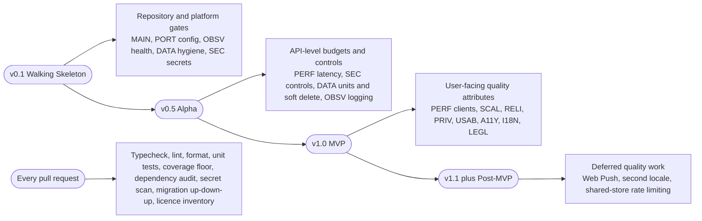
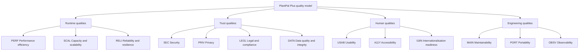
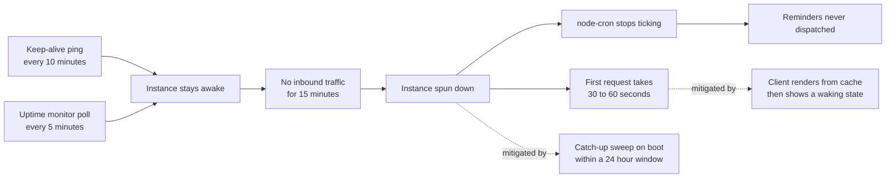

# PlantPal+ — Non-Functional Requirements

| Field | Value |
| --- | --- |
| Document | 04 — Non-Functional Requirements |
| Version | 1.0 |
| Date | 2026-07-21 |
| Status | Approved for Phase 1 sign-off |
| Owner | Rakshit — Project Lead / sole developer |
| Parent | [SRS.md](./SRS.md) |

---

## Table of contents

1. [Purpose, and how non-functional requirements are verified and when](#1-purpose-and-how-non-functional-requirements-are-verified-and-when)
2. [Quality-attribute overview](#2-quality-attribute-overview)
3. [Performance efficiency (PERF)](#3-performance-efficiency-perf)
4. [Capacity and scalability (SCAL)](#4-capacity-and-scalability-scal)
5. [Reliability and resilience (RELI)](#5-reliability-and-resilience-reli)
6. [Security (SEC)](#6-security-sec)
7. [Privacy (PRIV)](#7-privacy-priv)
8. [Usability (USAB)](#8-usability-usab)
9. [Accessibility (A11Y)](#9-accessibility-a11y)
10. [Maintainability (MAIN)](#10-maintainability-main)
11. [Portability (PORT)](#11-portability-port)
12. [Observability (OBSV)](#12-observability-obsv)
13. [Data quality and integrity (DATA)](#13-data-quality-and-integrity-data)
14. [Internationalisation readiness (I18N)](#14-internationalisation-readiness-i18n)
15. [Legal and compliance (LEGL)](#15-legal-and-compliance-legl)
16. [Free-tier reality: what constrains these targets and how they are still met](#16-free-tier-reality-what-constrains-these-targets-and-how-they-are-still-met)
17. [Compliance and standards mapping](#17-compliance-and-standards-mapping)
18. [NFR summary index](#18-nfr-summary-index)

Related documents: [02-scope-and-release-plan.md](./02-scope-and-release-plan.md) · [03-functional-requirements.md](./03-functional-requirements.md) · [08-glossary.md](./08-glossary.md) · [09-assumptions-constraints-risks.md](./09-assumptions-constraints-risks.md) · [10-traceability-matrix.md](./10-traceability-matrix.md)

---

## 1. Purpose, and how non-functional requirements are verified and when

### 1.1 Purpose

This document is the single normative source for every **quality attribute** of PlantPal+ v1.0. Where [03-functional-requirements.md](./03-functional-requirements.md) states *what* the system does, this document states *how well* it must do it: how fast, how large, how reliable, how secure, how private, how usable, how accessible, how maintainable, how portable, how observable, how data-correct, how localisable and how legally compliant.

It contains **111 non-functional requirements** across thirteen categories. Every one of them:

- is written as a single testable `shall` statement, per ISO/IEC/IEEE 29148:2018;
- carries a **quantified target** expressed as a number, a ratio, an enumeration or an exact algorithm parameter — never as an adjective;
- names the **measurement instrument** that produces that number, so the target can never be asserted without evidence;
- states the **conditions** under which the target holds, so a measurement taken under different conditions cannot be passed off as verification;
- carries a **verification method** drawn from the closed set `Test`, `Demonstration`, `Inspection`, `Analysis`;
- carries a **MoSCoW priority** and a **target release** from `v0.1`, `v0.5`, `v1.0`, `v1.1+`, per decision D-02.

Every number in this document has been chosen to be achievable by **one developer on permanently free hosting tiers inside a single semester**, per decision D-06. Where a free tier makes an industry-standard figure impossible — most visibly the backend instance that sleeps after 15 minutes of inactivity, recorded as CON-05 — this document states the honest target together with its explicit mitigation, rather than an aspirational number that would fail verification. Section 16 sets that reasoning out in full.

### 1.2 What this document does not contain

| Excluded | Owned by |
| --- | --- |
| Functional behaviour of any module | `FR-ACC-*`, `FR-DSH-*`, `FR-SET-*`, `FR-PLT-*`, `FR-FIT-*`, `FR-NUT-*`, `FR-NOT-*`, `FR-GAM-*`, `FR-SYS-*` |
| Domain business rules such as watering intervals, BMR formulas and streak arithmetic | `BR-<PREFIX>-nn` in the module documents |
| Offline outbox mechanics, delta-sync cursor design, media pipeline steps, API envelope shape | `FR-SYS-*`. This document places budgets and guarantees on top of that design; it does not redesign it. |
| Reminder scheduling algorithm, quiet hours, per-category default times | `FR-NOT-*`. This document constrains only throughput, DST correctness and delivery ratio. |
| Assumptions, constraints, risks, dependencies, open questions | `ASM-nn`, `CON-nn`, `RSK-nn`, `DEP-nn`, `OQ-nn` in [09-assumptions-constraints-risks.md](./09-assumptions-constraints-risks.md) |
| A full GDPR Data Protection Impact Assessment, records of processing, DPO appointment | Out of scope by D-01 — legal is handled at good-practice depth only |
| Medical-device software lifecycle, clinical validation | Out of scope by D-07 — PlantPal+ is a wellness tracker, not a medical device |
| Third-party penetration test, bug bounty, SOC 2, ISO 27001 | No budget under D-06; replaced by the OWASP ASVS L1 self-assessment of NFR-SEC-01 |

### 1.3 How to read an entry

Every requirement is presented in the same six-part shape so that an evaluator can check rigour mechanically and an engineer can implement without asking a follow-up question.

| Part | What it gives you |
| --- | --- |
| Metadata table | Priority, release, category, verification method, measurement instrument, and the goal or decision it traces up to |
| **Requirement** | The normative `shall` sentence. This is the contractual text; everything else is supporting material. |
| **Quantified target** | The exact numbers, thresholds, enumerations and formulas that make the sentence testable |
| **Conditions** | Device, network, data volume, warm or cold instance, sample size — the envelope inside which the target is claimed |
| **Rationale** | Why this number and not a different one, traced to a stakeholder need or a locked decision |
| **Consequence if not met** | What breaks, and what the permitted remedy is. A budget is never raised silently. |

### 1.4 Verification methods

| Method | Meaning as used in this document | Typical evidence |
| --- | --- | --- |
| Test | An automated, repeatable execution producing a pass or fail against a numeric threshold. | k6 report, Vitest run, axe-core output, `EXPLAIN` plan assertion, CI job result |
| Demonstration | A witnessed manual execution of a scenario on the real system. | Screen recording, deployment on two hosts, restore-rehearsal record |
| Inspection | Examination of an artefact — code, configuration, document or interface — against a checklist. | ASVS checklist, terminology diff, licence inventory, policy review |
| Analysis | Reasoned derivation from models, measurements or capacity calculations rather than direct execution. | Storage sizing model, quota arithmetic, shared-code ratio computation |

A requirement is **verified** only when the evidence artefact named in its measurement-instrument row exists, is dated, and is filed in the release evidence pack for the release in which the requirement first becomes binding.

### 1.5 When verification happens

Verification is not a single end-of-project event. Each requirement becomes binding at its target release and is re-verified at every later gate, per policy rule P-5 below.

| Cadence | What is verified | Where the evidence lands |
| --- | --- | --- |
| Every pull request | Every requirement whose verification method is an automated `Test` wired into the pipeline: NFR-MAIN-01, NFR-MAIN-02, NFR-MAIN-03, NFR-MAIN-07, NFR-SEC-08, NFR-SEC-10, NFR-SEC-13, NFR-DATA-06, NFR-LEGL-05, plus the web bundle budget half of NFR-PERF-06 | GitHub Actions run log, retained by the CI provider |
| Nightly on the default branch | Latency and capacity harnesses that are too slow for a pull request: NFR-PERF-01, NFR-PERF-02, NFR-PERF-03, NFR-SCAL-05 | Committed benchmark report under `docs/evidence/` |
| Weekly, scheduled | Quota and capacity telemetry: NFR-SCAL-02, NFR-SCAL-08, NFR-OBSV-03 event budget, NFR-OBSV-06 delivery ratio | Scheduled workflow output plus an alert if a threshold is crossed |
| Continuously, externally | NFR-RELI-01 availability and NFR-OBSV-04 alerting, measured by an independent uptime monitor that is not part of the system under test | Monitor's own monthly report |
| At each release gate | Every requirement whose target release is that gate or earlier, including all `Demonstration` and `Inspection` items | Release evidence pack, one directory per gate |
| Once before v1.0 | The one-off rehearsals: NFR-RELI-05 restore rehearsal, NFR-SEC-01 ASVS checklist, NFR-A11Y-01 manual audit of the twelve core screens, NFR-USAB-02 timed onboarding sessions | Dated record signed off by the Project Lead |

### 1.6 Priority and release policy applied to NFRs

| Rule | Statement |
| --- | --- |
| P-1 | An NFR is `Must` when its absence would make the release unshippable, unsafe, illegal or unverifiable. Every SEC, PRIV and DATA requirement in this document is `Must`. |
| P-2 | An NFR is `Should` when its absence degrades quality or maintainability but not correctness or safety. |
| P-3 | No NFR in this document is `Could` or `Wont`. A quality attribute worth writing down at capstone scale is worth meeting; genuinely optional quality work is recorded as a deferred item in section 16.4 instead. |
| P-4 | Release assignment follows the earliest release at which the requirement becomes verifiable: `v0.1` for repository-level gates, `v0.5` for API-level budgets and controls, `v1.0` for user-facing quality attributes. |
| P-5 | An NFR assigned to an earlier release remains binding in every later release. NFRs are cumulative and are never superseded by a later release. |

### 1.7 Reference measurement environment

Every PERF and SCAL figure in this document is stated against the following symbols. A measurement taken outside these conditions does not verify the requirement.

| Symbol | Definition |
| --- | --- |
| REF-API-WARM | Backend free web service, 0.1 vCPU and 512 MB, Node 20, single instance, awake, database pool warm. Measured **server-side** at the Express layer from first byte of request to last byte of response, excluding client network transit. |
| REF-API-COLD | The same instance after 15 minutes or more with zero inbound requests, that is, spun down. |
| REF-DB | PostgreSQL free tier, same cloud region as the API, primary only, no read replica. |
| REF-NET-CLIENT | Client network of 20 Mbit/s down, 5 Mbit/s up, round-trip time at most 100 ms. |
| REF-NET-SLOW | Throttled profile of 1.6 Mbit/s down, 750 kbit/s up, round-trip time 150 ms — the Lighthouse "Slow 4G" preset. |
| REF-PHONE-A | Android reference device: Google Pixel 6a class, 6 GB RAM, Android 13, release build. |
| REF-PHONE-I | iOS reference device: iPhone 11 or newer, iOS 16, release build. |
| REF-DESKTOP | Chrome stable at 1920 by 1080, with 4x CPU throttling applied for Lighthouse runs. |
| REF-DATASET | A seeded account holding 25 plants, 3 years of history, 2,000 watering events, 1,500 workouts, 4,500 meal entries and 300 photos — the 95th-percentile realistic user implied by NFR-SCAL-03. |

**Statistical convention.** Unless a requirement states otherwise, a percentile target is computed over **at least 100 samples** collected in a single measurement session against REF-DATASET, and a pass requires the percentile to hold in **two consecutive** sessions so that a single lucky run cannot certify a regression away.

### 1.8 Reference-device substitution

Where a reference device is unavailable to a solo student developer, the closest available device is substituted, the substitution is recorded in the evidence pack with the model and OS version actually used, and browser emulation or the platform simulator is used for the remaining matrix rows. A substitution never silently relaxes a threshold; it is disclosed alongside the measurement. This is tracked as an open question in [09-assumptions-constraints-risks.md](./09-assumptions-constraints-risks.md).

---

## 2. Quality-attribute overview

| Category | Code | Count | Priority profile | Principal driver | Primary verification instrument |
| --- | --- | --- | --- | --- | --- |
| Performance efficiency | PERF | 11 | 11 Must | The habit loop only survives if logging is faster than not bothering. PER-01 and PER-05 abandon apps that make them wait. Traces to GOAL-02. | k6 or autocannon server-side timings; Lighthouse CI; React Native performance monitor |
| Capacity and scalability | SCAL | 8 | 8 Must | The whole system must fit inside a 0.1 vCPU instance, a 500 MB database and a 1 GB storage bucket for the pilot cohort. Traces to GOAL-09, CON-06, CON-07, CON-08. | k6 load scenarios; `EXPLAIN (ANALYZE, BUFFERS)` harness; `pg_database_size` query; storage-quota counters |
| Reliability and resilience | RELI | 8 | 8 Must | A missed reminder or a lost log destroys the trust the product is built on. RSK-01 is the highest-scoring risk in the register. | Independent external uptime monitor; fault-injecting integration stubs; restore rehearsal |
| Security | SEC | 15 | 15 Must | One account must never be able to read another account's body-composition and nutrition data. RSK-06. Traces to GOAL-08 and STK-11. | OWASP ASVS 4.0.3 L1 checklist; automated IDOR suite; header scanner; `npm audit` and `gitleaks` in CI |
| Privacy | PRIV | 9 | 9 Must | The product stores SENSITIVE-HEALTH data on free infrastructure and offers no sharing surface. D-01 requires GDPR-style export and erasure. | `exiftool` over stored objects; purge-job fixtures; field register inspection; log-sampling assertions |
| Usability | USAB | 8 | 8 Must | Three taps or fewer, or the habit dies. GOAL-02, MET-15, PER-01. | Timed unmoderated first-run sessions; navigation-graph tap counts; error-catalogue inspection |
| Accessibility | A11Y | 10 | 10 Must | PER-04 abandons any app that breaks at 200 percent text. STK-10 can fail the release gate. Traces to GOAL-07 and MET-17. | axe-core in CI; Accessibility Scanner on Android; Accessibility Inspector on iOS; scripted VoiceOver, TalkBack and NVDA passes |
| Maintainability | MAIN | 9 | 5 Must, 4 Should | One developer, one semester, and a future maintainer who is the same person six months later. STK-13. | GitHub Actions required status checks; `tsc --noEmit`; ESLint; Vitest coverage; `dependency-cruiser` |
| Portability | PORT | 6 | 5 Must, 1 Should | Two clients on one identical REST contract is the architectural claim the monorepo exists to make. Traces to GOAL-01. | Contract tests from both generated clients; browser and device matrix; deployment on two hosts |
| Observability | OBSV | 7 | 7 Must | With one developer and no on-call rota, a defect that is invisible is a defect that ships. MET-11. | `pino` log-schema assertions; Sentry release health; external uptime monitor; reminder tick counters |
| Data quality and integrity | DATA | 9 | 9 Must | A wrongly broken streak destroys trust instantly. RSK-05 is the highest-consequence silent-defect class in the product. | Timezone fixture matrix; unit round-trip property tests; referential-integrity audit query; migration up-down-up in CI |
| Internationalisation readiness | I18N | 5 | 5 Must | D-08 fixes English only for v1.0 but forbids hard-coded strings, so that a second locale is a data change and not a rewrite. D-09 requires both unit systems. | Literal-string ESLint rule; catalogue completeness check; pseudo-locale expansion run |
| Legal and compliance | LEGL | 6 | 5 Must, 1 Should | D-07 safety posture, ODbL attribution obligations to STK-08, and dependency licence compliance to STK-12. | Policy and disclaimer inspection; generated licence inventory; consent-record test |
| **Total** | — | **111** | **105 Must, 6 Should** | — | — |

**Priority distribution note.** The six `Should` requirements are NFR-MAIN-05, NFR-MAIN-06, NFR-MAIN-08, NFR-MAIN-09, NFR-PORT-05 and NFR-LEGL-05. Every one of them improves engineering quality or documentation completeness without affecting user-visible correctness or safety, which is exactly policy rule P-2.

---

## 3. Performance efficiency (PERF)

Performance is measured server-side wherever the server is accountable, and client-side wherever the client is accountable, so that a slow network can never be blamed for a slow query and a slow query can never hide behind a fast network.

### NFR-PERF-01 — Warm read latency

| Field | Value |
| --- | --- |
| Priority | Must |
| Release | v0.5 |
| Category | PERF — Performance efficiency |
| Verification method | Test |
| Measurement instrument | k6 or autocannon driving 100 sequential samples per endpoint; timings read from the `durationMs` field emitted by the Express response-time middleware of NFR-OBSV-01, so client jitter cannot mask or inflate a regression |
| Traces to | GOAL-02, PER-01, PER-05; consumed by every `FR-*` read endpoint |

**Requirement.** The system shall serve every authenticated single-resource read endpoint returning at most 50 records with a server-side 95th-percentile response time of at most 400 ms and a 99th-percentile response time of at most 900 ms.

**Quantified target.** p95 at most 400 ms; p99 at most 900 ms; sample size at least 100 per endpoint; the target must hold for 100 percent of catalogued read endpoints, with the three explicitly exempted endpoints listed under Conditions.

**Conditions.** REF-API-WARM against REF-DATASET on REF-DB in the same region. Exempt endpoints, each governed by a different requirement, are the aggregate dashboard (NFR-PERF-03), cross-module search (NFR-SCAL-04 pagination plus a 1,000 ms p95 stated there) and the account export job (NFR-PRIV-05, asynchronous by design). Cold-instance measurements are excluded and governed by NFR-PERF-04.

**Rationale.** Every screen in all three modules is read-dominated, so read latency is the single strongest driver of perceived quality. 400 ms at p95 is the tightest figure a 0.1 vCPU instance can hold while still leaving CPU headroom for the in-process reminder engine of NFR-SCAL-06, which shares the same process under CON-06.

**Consequence if not met.** Perceived sluggishness compounds across the two-to-six daily sessions of PER-01 and directly threatens MET-15. The permitted remedies are, in order: add an index from the required index set of NFR-SCAL-05, reduce the selected column set, or split the endpoint. Raising the budget is not a remedy and requires an Architecture Decision Record under NFR-MAIN-05.

### NFR-PERF-02 — Warm write latency

| Field | Value |
| --- | --- |
| Priority | Must |
| Release | v0.5 |
| Category | PERF — Performance efficiency |
| Verification method | Test |
| Measurement instrument | k6 write scenario measuring from request receipt to transaction commit and response flush, recorded by the same middleware as NFR-PERF-01 |
| Traces to | GOAL-02, D-04, PER-01 |

**Requirement.** The system shall complete every authenticated single-row write endpoint covering create, update and soft delete with a server-side 95th-percentile response time of at most 600 ms and a 99th-percentile response time of at most 1,200 ms.

**Quantified target.** p95 at most 600 ms; p99 at most 1,200 ms; request body at most 8 KB; sample size at least 100 per endpoint.

**Conditions.** REF-API-WARM against REF-DATASET. The measured window starts at request receipt and ends after transaction commit and response flush, and therefore includes constraint checks, the `updated_at` trigger and the tombstone write of NFR-DATA-05. Push fan-out, achievement recomputation and streak recalculation are explicitly **excluded** from the window and must be performed after the response is flushed or on the next scheduler tick.

**Rationale.** The seven append-only log actions fixed by D-04 are the product's core loop. 600 ms at p95 keeps a tap-to-confirmation round trip comfortably under the one-second threshold at which users begin doubting that an action registered, which is the behaviour that made PER-01 abandon two previous calorie trackers.

**Consequence if not met.** Users double-tap, producing duplicate submissions that are only harmless because of the idempotency guarantee of NFR-RELI-04. The permitted remedy is to reduce transaction scope or move derived computation out of the request path; deferring the durability guarantee itself is never permitted. A client that has not received a response within 10,000 ms enqueues the action per D-04.

### NFR-PERF-03 — Aggregate dashboard budget

| Field | Value |
| --- | --- |
| Priority | Must |
| Release | v0.5 |
| Category | PERF — Performance efficiency |
| Verification method | Test |
| Measurement instrument | k6 for latency, plus a query-count assertion inside the integration test suite that fails the build when a seventh database round trip appears |
| Traces to | GOAL-01, PER-01, `FR-DSH-*` |

**Requirement.** The system shall return the complete aggregate dashboard payload for all three modules from a single `GET /api/v1/dashboard` call with a server-side 95th-percentile response time of at most 800 ms, executing at most 6 database round trips and requiring exactly 1 client HTTP round trip.

**Quantified target.** p95 at most 800 ms; at most 6 database round trips; exactly 1 client HTTP round trip; response within the 256 KB ceiling of NFR-PERF-11.

**Conditions.** REF-API-WARM against REF-DATASET with all three modules enabled, one authenticated request carrying the user's IANA time zone and the target local date. The six permitted round trips are one per module, one for streaks and one for notification badges; any further data must be folded into an existing query using a lateral join or a single aggregate.

**Rationale.** The unified dashboard is the product's differentiator and simultaneously its worst-case query. Composing it client-side from three module calls would triple the round trips and triple the cold-start exposure of NFR-PERF-04, which is exactly the fragmentation the product exists to remove.

**Consequence if not met.** The first screen of every session becomes the slowest, which is the worst possible place to spend a latency budget. The query-count assertion is the standing guard against an N+1 regression as modules grow; a failing assertion blocks merge under NFR-MAIN-07.

### NFR-PERF-04 — Cold start and keep-alive

| Field | Value |
| --- | --- |
| Priority | Must |
| Release | v0.5 |
| Category | PERF — Performance efficiency |
| Verification method | Test |
| Measurement instrument | Scheduler execution history for ping cadence; client telemetry counting first-requests exceeding 5,000 ms as a ratio of sessions; a manual spin-down-then-request demonstration for the wake-state user interface |
| Traces to | CON-05, CON-06, RSK-01, D-06, PER-05 |

**Requirement.** The system shall keep the production API instance warm by accepting an unauthenticated `GET /healthz` request from an external scheduler every 10 minutes, and shall render a "Waking the server" state on any client request still pending after 2,000 ms.

**Quantified target.** Ping interval exactly 10 minutes; observed cold-start rate at most 1.0 percent of sessions between 05:00 and 23:59 in the user's local time; client first-request timeout 65,000 ms with at most 2 automatic retries; wake-state user interface shown after 2,000 ms of pending time.

**Conditions.** The free backend instance spins down after approximately 15 minutes without inbound traffic and takes roughly 30 to 60 seconds to serve its first request afterwards (CON-05). A 10-minute cadence leaves one whole missed ping of tolerance inside that window. `/healthz` performs no database work, per NFR-OBSV-05, so it stays cheap and cannot be defeated by a database outage. The uptime monitor of NFR-OBSV-04 contributes a second, independent 5-minute ping.

**Rationale.** This is the most consequential free-tier fact in the entire specification, and it is load-bearing twice over. A sleeping instance is not merely slow; it runs no `node-cron`, so reminders stop firing altogether — which is RSK-01, the highest-scoring risk in the register. Continuous warmth consumes approximately 744 of the 750 free instance-hours in a 31-day month (CON-06), which is precisely why exactly one backend service may be kept warm and why no second always-on worker may ever be introduced.

**Consequence if not met.** Reminders silently stop, which breaks GOAL-04 and destroys the product's central promise; a user who cannot trust a reminder has no reason to keep the app. If the free instance-hour allowance is ever exhausted mid-month the documented contingency is to narrow the ping window to 06:00–23:59 local time; if keep-alive itself proves unreliable the contingency of RSK-01 applies, moving the tick to a scheduled CI workflow calling a secured internal tick endpoint.

### NFR-PERF-05 — Mobile cold start to interactive

| Field | Value |
| --- | --- |
| Priority | Must |
| Release | v1.0 |
| Category | PERF — Performance efficiency |
| Verification method | Test |
| Measurement instrument | `performance.now()` instrumentation from application entry to the dashboard's first committed frame, averaged and percentiled over 20 cold starts with the app killed from the task switcher between runs |
| Traces to | GOAL-02, PER-01, PER-05, D-04 |

**Requirement.** The mobile application shall present an interactive dashboard rendered from persisted cache within 3,000 ms at the 95th percentile from a cold process start, and within 5,000 ms when no cache exists and data must be fetched.

**Quantified target.** p95 at most 3,000 ms with a warm persisted cache; p95 at most 5,000 ms with no cache; 20 cold-start samples per device.

**Conditions.** Release (non-debug) build on REF-PHONE-A and REF-PHONE-I. The no-cache branch is measured over REF-NET-CLIENT against a **warm** API only; a genuine first launch that coincides with a cold API instance falls under NFR-PERF-04, whose wake-state user interface takes precedence.

**Rationale.** The habit loop only survives if opening the app to log something is faster than not bothering. 3,000 ms from a cold process is the practical ceiling for a React Native release build on mid-range hardware. The dashboard renders first from the TanStack Query cache persisted to MMKV or AsyncStorage per D-04 and revalidates in the background, so the network is never on the critical path when a cache exists.

**Consequence if not met.** PER-05, on a three-year-old budget Android device, is the first user lost, and she is precisely the user the offline-light design of D-04 exists to serve. Remedies are bundling fonts, the icon subset and Lottie assets rather than fetching them, and lazily registering heavy module screens in the navigator.

### NFR-PERF-06 — Web load and bundle budget

| Field | Value |
| --- | --- |
| Priority | Must |
| Release | v1.0 |
| Category | PERF — Performance efficiency |
| Verification method | Test |
| Measurement instrument | Lighthouse CI in GitHub Actions, median of 3 runs on the mobile preset; bundle ceiling enforced deterministically by a `size-limit` check with `rollup-plugin-visualizer` for diagnosis |
| Traces to | STK-06, PER-05, CON-09 |

**Requirement.** The web application shall meet the Core Web Vitals and transfer-size budgets stated below on the Lighthouse mobile preset.

**Quantified target.** First Contentful Paint at most 1,800 ms; Largest Contentful Paint at most 2,500 ms; Time To Interactive at most 3,500 ms; Cumulative Layout Shift at most 0.10; Interaction to Next Paint at most 200 ms; initial JavaScript transfer at most 250 KB gzipped; initial total transfer at most 500 KB gzipped.

**Conditions.** REF-NET-SLOW over REF-DESKTOP with 4x CPU throttling, median of 3 runs, executed in CI on every pull request that touches the web application. The bundle-size half of the budget is deterministic and blocks merge; the timing half is noisy on shared CI runners and is reported as a warning with a recorded deviation, per the open question raised in [09-assumptions-constraints-risks.md](./09-assumptions-constraints-risks.md).

**Rationale.** The web client is the artefact an evaluator or a prospective employer opens first (STK-04, STK-06), frequently on a throttled connection, and an unconstrained Vite bundle grows silently once Recharts, Lucide icons and Framer Motion land. Route-level code splitting, lazy chart and animation loading, and tree-shaken icon imports keep it inside budget.

**Consequence if not met.** Bandwidth is billed implicitly through the roughly 100 GB monthly web-host allowance of CON-09, and a heavy bundle is the first thing a technical reviewer notices. Cumulative Layout Shift is most at risk from charts and images without reserved dimensions, so every image and chart container declares an explicit aspect ratio.

### NFR-PERF-07 — Screen transition budget

| Field | Value |
| --- | --- |
| Priority | Must |
| Release | v1.0 |
| Category | PERF — Performance efficiency |
| Verification method | Test |
| Measurement instrument | A render-timing hook instrumenting React Navigation on mobile and React Router on web, sampled over at least 30 transitions across the 12 core screens |
| Traces to | GOAL-02, PER-01, PER-05 |

**Requirement.** The system shall present the first frame of a destination screen within 300 ms at the 95th percentile of a navigation gesture, displaying a skeleton placeholder within 100 ms whenever the destination's data is not already cached.

**Quantified target.** p95 first frame at most 300 ms; skeleton visible within 100 ms; at least 30 transition samples; zero blocking full-screen spinners on any route whose data is already cached.

**Conditions.** REF-PHONE-A for gesture navigation and REF-DESKTOP for click navigation, across the 12 core screens enumerated in NFR-A11Y-01.

**Rationale.** Perceived speed is dominated by transitions rather than by absolute data latency. A destination that paints its shell within 300 ms feels instantaneous even when its data arrives afterwards, which is what makes the cached-read model of D-04 feel fast rather than stale.

**Consequence if not met.** The application feels heavier than the sum of its network calls, and PER-05 — who explicitly names "apps that show an infinite spinner the moment the connection drops" as her core frustration — perceives it as broken. A transition that must wait on a network call, such as opening a food detail after an Open Food Facts lookup, shows the skeleton plus an inline progress indicator and must still paint its shell within budget.

### NFR-PERF-08 — List virtualisation and scroll frame rate

| Field | Value |
| --- | --- |
| Priority | Must |
| Release | v1.0 |
| Category | PERF — Performance efficiency |
| Verification method | Test |
| Measurement instrument | React Native performance monitor on mobile and the Chrome Performance panel on web, scrolling a synthetic 1,000-item list |
| Traces to | PER-02, PER-05, NFR-SCAL-03 |

**Requirement.** The system shall render any scrollable collection capable of exceeding 50 items using a virtualised list, sustaining at least 55 frames per second while scrolling.

**Quantified target.** Virtualisation mandatory above a realistic maximum of 50 items; at least 55 frames per second sustained, equivalent to a frame time of at most 18 ms at the 95th percentile, while scrolling a 1,000-item list.

**Conditions.** REF-PHONE-A in a release build. FlashList or FlatList with a fixed `estimatedItemSize`, a stable `keyExtractor` and memoised row components on mobile; TanStack Virtual on web. Row components must not perform date formatting or unit conversion inline — those results are precomputed once per page.

**Rationale.** Watering history, meal history, workout history and the food catalogue all grow without bound; PER-02 alone owns 38 plants and REF-DATASET carries 4,500 meal entries. Rendering thousands of rows into the tree destroys memory and frame rate on mid-range Android well before any of those ceilings are reached.

**Consequence if not met.** Scroll jank is the most visible possible quality defect and is disproportionately punishing on PER-05's 3 GB device. Variable-height rows are the common cause, so a row that can expand uses a fixed collapsed height and a separate detail screen rather than growing in place.

### NFR-PERF-09 — Chart render budget and downsampling

| Field | Value |
| --- | --- |
| Priority | Must |
| Release | v1.0 |
| Category | PERF — Performance efficiency |
| Verification method | Test |
| Measurement instrument | Render-timing assertion around the chart component in a component test, plus a unit test of the downsampling function over series of length 1, 2, 365, 366, 1,095 and 1,096 |
| Traces to | PER-02, PER-03, GOAL-03 |

**Requirement.** The system shall render any progress chart within 500 ms at the 95th percentile for a series of at most 365 points, and shall downsample any series exceeding 365 points to at most 180 plotted buckets before rendering.

**Quantified target.** p95 render at most 500 ms for `n` at most 365; for `n` greater than 365 the series is reduced to exactly `b = 180` buckets with a bucket width in days of `ceil(n / b)`; each bucket value is the arithmetic mean of its members; each bucket label is the first local date in the bucket.

**Conditions.** REF-PHONE-A with Victory Native, and REF-DESKTOP with Recharts. An empty bucket renders as a gap and never as zero, because "not logged" and "logged zero" are semantically different. The text alternative required by NFR-A11Y-05 is computed from the **pre-downsample** series, so no true extremum is ever lost to bucketing.

**Rationale.** Progress charts are the reward surface of the fitness and nutrition modules and the emotional payoff of the plant growth log for PER-02. Victory Native in particular degrades sharply above a few hundred points, and a three-year history at REF-DATASET scale reaches 1,095 daily points.

**Consequence if not met.** The reward surface becomes the slowest screen, which inverts its purpose. A series with fewer than 2 points renders the empty state of NFR-USAB-06 rather than a degenerate chart, and a series containing a single outlier must not be clipped by axis auto-scaling without indicating the clip.

### NFR-PERF-10 — Photo upload time

| Field | Value |
| --- | --- |
| Priority | Must |
| Release | v1.0 |
| Category | PERF — Performance efficiency |
| Verification method | Test |
| Measurement instrument | End-to-end timing harness around the pipeline from picker confirmation to the finalisation response, over at least 20 uploads from iOS, Android and a desktop browser |
| Traces to | PER-02, GOAL-03, CON-08, `FR-SYS-*` media pipeline |

**Requirement.** The system shall complete an end-to-end plant photo upload — client downscale, signed-URL request, transfer and confirmation — within 8,000 ms at the 95th percentile.

**Quantified target.** p95 at most 8,000 ms; source image at most 4 MB; uplink 5 Mbit/s; downscale to a maximum long edge of 1,600 px at JPEG quality 0.70 targeting at most 800 KB; thumbnail variant at a 320 px long edge.

**Conditions.** Accepted input MIME types are `image/jpeg`, `image/png` and `image/heic`. Sources up to 10 MB are accepted and downscaled; above that the client rejects with a stated message. The measured window excludes user think-time inside the picker. Photo upload is explicitly **not** offline-queueable under D-04, so with no connectivity the picker is disabled with the explanation required by NFR-USAB-07.

**Rationale.** The growth photo timeline is the plant module's emotional payoff for PER-02, and an unresized modern phone photo of 4 to 12 MB would both exceed the free storage quota of CON-08 and take unacceptably long on mobile data. Client-side downscaling also removes GPS coordinates before they ever leave the device, which is the strongest available privacy posture and costs nothing — see NFR-PRIV-03.

**Consequence if not met.** Users abandon the timeline, which removes the single feature that makes PER-02 care about the product at all. An upload interrupted after the storage write but before confirmation leaves an orphan object, which the cleanup job owned by `FR-SYS-*` removes after 24 hours.

### NFR-PERF-11 — Payload size budget

| Field | Value |
| --- | --- |
| Priority | Must |
| Release | v0.5 |
| Category | PERF — Performance efficiency |
| Verification method | Test |
| Measurement instrument | An integration-test assertion iterating the full endpoint catalogue and asserting the uncompressed body size, plus a response-size middleware guard that emits a `warn` log line above 200 KB |
| Traces to | PER-05, CON-07, CON-09 |

**Requirement.** The system shall return at most 256 KB of uncompressed JSON in any single API response, shall default every collection endpoint to a page size of 20 with a maximum of 100, and shall apply gzip or Brotli compression to every response body larger than 1,024 bytes.

**Quantified target.** Hard ceiling 256 KB uncompressed per response; warning threshold 200 KB; default page size 20; maximum page size 100; compression threshold 1,024 bytes.

**Conditions.** Applies to every endpoint under `/api/v1`. The account export bundle of NFR-PRIV-05 is exempt because it is delivered as a file through a signed URL rather than as an API response. A single record that would itself exceed the ceiling is prevented upstream by the field-length limits of NFR-SEC-08.

**Rationale.** Free hosting bills bandwidth implicitly through quotas (CON-07, CON-09), mobile users on metered connections pay for it directly (PER-05), and a hard ceiling forces the pagination discipline that also protects the latency budgets of NFR-PERF-01.

**Consequence if not met.** PER-05 explicitly names "apps that download a megabyte of JSON to render one screen" as a reason for uninstalling. The 200 KB warning exists so that the ceiling is approached visibly rather than breached suddenly, and the tension between this requirement and the single-round-trip dashboard of NFR-PERF-03 is resolved by reducing per-section dashboard detail, never by raising the ceiling.

---

## 4. Capacity and scalability (SCAL)

Capacity targets are deliberately modest and deliberately honest. A 0.1 vCPU instance with 512 MB of memory, a 500 MB database and a 1 GB storage bucket is the entire operating envelope, and stating a number this infrastructure cannot reach would produce a requirement that fails verification by construction.

### NFR-SCAL-01 — Concurrent load ceiling

| Field | Value |
| --- | --- |
| Priority | Must |
| Release | v1.0 |
| Category | SCAL — Capacity and scalability |
| Verification method | Test |
| Measurement instrument | A k6 scenario executed against a staging instance seeded with REF-DATASET, reporting request rate, error ratio and the NFR-PERF-01 and NFR-PERF-02 percentiles |
| Traces to | GOAL-09, CON-06, STK-05 pilot cohort size |

**Requirement.** The system shall sustain 50 concurrent active users generating 10 requests per second for 10 minutes while meeting the NFR-PERF-01 and NFR-PERF-02 latency budgets and returning zero 5xx responses.

**Quantified target.** Sustained: 50 concurrent users, 10 requests per second, 10 minutes, zero 5xx responses, latency budgets held. Burst: 25 requests per second for 60 seconds with at most 0.5 percent 5xx responses.

**Conditions.** REF-API-WARM on a single instance with the connection pool bounded per NFR-RELI-08, against REF-DB seeded with REF-DATASET. The reminder engine is idle during the sustained run and is measured separately by NFR-SCAL-06.

**Rationale.** The pilot cohort of STK-05 is at least 12 testers and the sizing model targets 200 registered accounts, so 50 concurrent active users is roughly four times the realistic peak. It is also the honest ceiling of a 0.1 vCPU instance: load testing above this figure would produce a target that cannot be met and therefore cannot be a requirement under D-06.

**Consequence if not met.** A demonstration to STK-02 or a pilot-day peak would produce 5xx responses in front of the people who grade the project. Horizontal scaling is not available on free tiers, so the only remedies are query optimisation under NFR-SCAL-05 and payload reduction under NFR-PERF-11.

### NFR-SCAL-02 — Database size ceiling and alerting

| Field | Value |
| --- | --- |
| Priority | Must |
| Release | v1.0 |
| Category | SCAL — Capacity and scalability |
| Verification method | Analysis |
| Measurement instrument | The storage sizing model below, cross-checked weekly by a scheduled GitHub Actions workflow querying `pg_database_size()` and comparing against the alert threshold |
| Traces to | CON-07, GOAL-09, RSK-04 |

**Requirement.** The system shall operate within a total database size of 400 MB for 200 registered users, and shall emit an operational alert when database usage reaches 80 percent of the 500 MB free-tier allowance.

**Quantified target.** Operating ceiling 400 MB; alert threshold 400 MB, being 80 percent of the assumed 500 MB allowance; sizing basis 200 users with 2 years of history.

**Conditions.** Derived from the following normative sizing model, which is the analysis artefact for this requirement.

| Data class | Rows per active user per year | Bytes per row including index overhead | Bytes per user per year |
| --- | --- | --- | --- |
| Watering events | 365 | 120 | 43,800 |
| Care task events | 200 | 120 | 24,000 |
| Growth log entries | 60 | 260 | 15,600 |
| Photo asset metadata | 60 | 320 | 19,200 |
| Workouts | 200 | 400 | 80,000 |
| Workout exercise sets | 1,200 | 140 | 168,000 |
| Step entries | 365 | 90 | 32,850 |
| Body metric entries | 150 | 110 | 16,500 |
| Meal entries | 1,100 | 220 | 242,000 |
| Water intake entries | 700 | 90 | 63,000 |
| Reminder occurrences | 900 | 150 | 135,000 |
| Streak days and achievement progress | 400 | 120 | 48,000 |
| Tombstones and idempotency keys, steady state | 500 | 100 | 50,000 |
| **Subtotal per user per year** | **6,200** | — | **937,950, about 0.90 MiB** |

200 users for 1 year is approximately 180 MiB; for 2 years approximately 360 MiB. The shared catalogues — approximately 60 plant species, approximately 300 foods, the exercise catalogue and the achievement definitions — add under 5 MiB. The 400 MB ceiling therefore corresponds to roughly 200 users with two years of history and leaves headroom for index bloat.

**Rationale.** CON-07 caps free PostgreSQL at roughly 0.5 GB. Because writes simply fail when storage is exhausted, the ceiling must be monitored rather than discovered. The retention windows of NFR-PRIV-04 exist in large part to keep this model true over time.

**Consequence if not met.** Every user is blocked at once and the pilot data is compromised, which is business edge case 17 in [09-assumptions-constraints-risks.md](./09-assumptions-constraints-risks.md). The remedies, in order, are: shorten the tombstone and idempotency-key retention windows, purge completed reminder occurrences earlier, and migrate to the alternative database provider named in RSK-04.

### NFR-SCAL-03 — Per-user collection ceilings

| Field | Value |
| --- | --- |
| Priority | Must |
| Release | v1.0 |
| Category | SCAL — Capacity and scalability |
| Verification method | Test |
| Measurement instrument | An integration test that seeds an account to each ceiling, asserts the documented error code on the next create, and then re-runs the NFR-PERF-01 harness to prove no latency budget is breached at the ceiling |
| Traces to | CON-07, CON-08, PER-02 with 38 plants |

**Requirement.** The system shall support the per-user collection ceilings enumerated below without breaching any NFR-PERF budget, and shall reject a create request that would exceed a ceiling with the stated error code.

**Quantified target.**

| Collection | Ceiling | Enforcement point | Error code |
| --- | --- | --- | --- |
| Plants | 100 | Server-side count check at create | `LIMIT_EXCEEDED` |
| Growth entries per plant | 40 | Server-side count check at create | `LIMIT_EXCEEDED` |
| Photo assets per user | 500 | Server-side count check at upload confirm | `LIMIT_EXCEEDED` |
| Media bytes per user | 52,428,800, being 50 MiB | Quota counter at upload confirm | `QUOTA_EXCEEDED` |
| Log records per module per year | 5,000 | Server-side rolling count | `LIMIT_EXCEEDED` |
| Active goals across all modules | 20 | Server-side count check at create | `LIMIT_EXCEEDED` |
| User-created custom foods | 200 | Server-side count check at create | `LIMIT_EXCEEDED` |
| User-created custom exercises | 50 | Server-side count check at create | `LIMIT_EXCEEDED` |
| Registered devices and push tokens | 10 | Oldest token deactivated on the 11th registration | none, silent rotation |
| Reminder rules per user | 200 | Server-side count check at create | `LIMIT_EXCEEDED` |
| Offline outbox items, client-side | 500 | Client refuses further queueing and warns | `OUTBOX_FULL` |
| Data exports per 24 hours | 1 | Server-side rate check | `RATE_LIMITED` |

**Conditions.** Soft-deleted records inside their 30-day retention window count toward every ceiling above, because they still occupy storage. The error body states the current count, the ceiling and the number of records recoverable from trash, so the user is told exactly what to do. The HTTP status for `LIMIT_EXCEEDED` is 409 and for `QUOTA_EXCEEDED` is 413.

**Rationale.** Ceilings are the mechanism by which a single enthusiastic user cannot exhaust a shared free quota for everyone else. 100 plants comfortably exceeds PER-02's 38; 5,000 log records per module per year is roughly four times the 1,100 meal entries in the sizing model.

**Consequence if not met.** One user consumes the whole bucket or the whole database and the product becomes unavailable for the entire pilot cohort. A ceiling must never be enforced silently: the refusal is always accompanied by the count, the limit and a recovery route, per NFR-USAB-03.

### NFR-SCAL-04 — Keyset pagination on every collection

| Field | Value |
| --- | --- |
| Priority | Must |
| Release | v0.5 |
| Category | SCAL — Capacity and scalability |
| Verification method | Test |
| Measurement instrument | A contract test that enumerates every collection endpoint from the OpenAPI document of NFR-PORT-04 and asserts cursor-based paging plus rejection of deep offsets |
| Traces to | CON-07, `FR-SYS-*` pagination conventions |

**Requirement.** The system shall paginate every collection endpoint using keyset pagination on a stable composite ordering key, and shall reject any request for an offset-based page beyond position 1,000.

**Quantified target.** 100 percent of collection endpoints use keyset pagination; the cursor is an opaque base64url encoding of the tuple `(sort_value, id)`; offset-based access beyond position 1,000 is rejected with HTTP 400 and code `INVALID_CURSOR`; a date-range filter may span at most 366 days.

**Conditions.** Applies to every endpoint returning a collection. The delta-sync endpoint owned by `FR-SYS-*` uses its own larger page defaults and is still keyset-based. Sort keys must come from a per-endpoint allow-list and always receive `id` as a final tiebreaker so the ordering is a strict total order.

**Rationale.** Offset pagination drifts when rows are inserted during traversal, which is extremely likely here because logs are appended constantly, and deep-offset scans exhaust the free-tier CPU allocation. A stable composite key is also what makes the delta-sync cursor of `FR-SYS-*` correct.

**Consequence if not met.** Users silently skip or repeat rows while scrolling their own history, which is a data-integrity defect that looks like a rendering bug and is therefore very hard to diagnose from a user report.

### NFR-SCAL-05 — Required index set and index-scan guarantee

| Field | Value |
| --- | --- |
| Priority | Must |
| Release | v0.5 |
| Category | SCAL — Capacity and scalability |
| Verification method | Test |
| Measurement instrument | An automated `EXPLAIN (ANALYZE, BUFFERS)` harness executed nightly over the catalogued query set against REF-DATASET, asserting the absence of a sequential scan on any table above 1,000 rows |
| Traces to | NFR-PERF-01, NFR-PERF-03, CON-07 |

**Requirement.** The database shall provide every index listed below, and every query executed by a v1.0 endpoint shall use an index scan rather than a sequential scan on any table holding more than 1,000 rows.

**Quantified target.** The complete required index set:

| Table | Index definition | Serves |
| --- | --- | --- |
| users | UNIQUE on `lower(email)` WHERE `deleted_at IS NULL` | Login, registration uniqueness |
| refresh_tokens | `(user_id, expires_at)`; UNIQUE `(token_hash)` | Refresh rotation, revocation, purge |
| plants | `(user_id, created_at DESC, id)` WHERE `deleted_at IS NULL` | Plant list, keyset pagination |
| plants | `(user_id, next_watering_due_at)` WHERE `deleted_at IS NULL` | Dashboard due items |
| watering_events | `(plant_id, occurred_local_date DESC, id)` WHERE `deleted_at IS NULL` | Plant history |
| watering_events | `(user_id, occurred_local_date DESC, id)` WHERE `deleted_at IS NULL` | Dashboard, streaks |
| care_task_events | `(user_id, occurred_local_date DESC, id)` WHERE `deleted_at IS NULL` | Dashboard, history |
| growth_log_entries | `(plant_id, occurred_local_date DESC, id)` WHERE `deleted_at IS NULL` | Photo timeline |
| photo_assets | `(user_id, created_at DESC)`; `(plant_id, created_at DESC)` | Gallery, quota reconciliation |
| workouts | `(user_id, occurred_local_date DESC, id)` WHERE `deleted_at IS NULL` | Fitness list, charts |
| workout_sets | `(workout_id, position)` | Workout detail |
| step_entries | UNIQUE `(user_id, occurred_local_date)` WHERE `deleted_at IS NULL` | One row per day, upsert |
| body_metric_entries | `(user_id, occurred_local_date DESC)` WHERE `deleted_at IS NULL` | Body charts |
| meal_entries | `(user_id, occurred_local_date DESC, id)` WHERE `deleted_at IS NULL` | Nutrition list, daily totals |
| meal_entries | `(user_id, occurred_local_date, meal_type)` WHERE `deleted_at IS NULL` | Grouped daily view |
| water_intake_entries | `(user_id, occurred_local_date DESC)` WHERE `deleted_at IS NULL` | Daily water total |
| foods | GIN on `to_tsvector('simple', name)` | Food search |
| foods | UNIQUE `(barcode)` WHERE `barcode IS NOT NULL` | Barcode lookup |
| plant_species | GIN on the concatenated common and scientific name tsvector | Species search |
| reminder_rules | `(user_id, is_active)` WHERE `deleted_at IS NULL` | Rule evaluation |
| reminder_occurrences | `(scheduled_for_utc, status)` | Tick selection, the hottest index in the product |
| reminder_occurrences | UNIQUE `(reminder_rule_id, scheduled_for_utc)` | The dedupe guarantee of NFR-RELI-07 |
| notification_deliveries | `(user_id, created_at DESC)`; `(ticket_id)` | Notification centre, receipt reconciliation |
| streak_days | UNIQUE `(user_id, module, local_date)` | Streak arithmetic |
| achievement_progress | `(user_id, achievement_id)` | Achievement evaluation |
| idempotency_keys | UNIQUE `(user_id, action_type, idempotency_key)`; `(created_at)` | Replay safety, purge |
| tombstones | `(user_id, deleted_at, entity_type)` | Delta sync |
| consent_records | `(user_id, document_type, accepted_at DESC)` | Re-prompt evaluation |

**Conditions.** Every index carrying a `WHERE deleted_at IS NULL` predicate is a **partial** index matching the default read filter of NFR-DATA-05, so the planner can use it; an index without that predicate degrades as tombstones accumulate. Physical table and column names are indicative and are finalised by the domain model in [07-domain-model.md](./07-domain-model.md); the index *coverage* stated here is normative regardless of final naming.

**Rationale.** On a 0.1 vCPU instance a single sequential scan over a 4,500-row meal table is enough to breach the NFR-PERF-01 budget. Fixing the index set as a requirement rather than an implementation detail is what makes the latency budgets achievable at all.

**Consequence if not met.** Latency degrades gradually and invisibly as the pilot cohort accumulates history, so the defect surfaces at exactly the wrong moment — during the day-30 pilot report or the evaluation demo. The nightly `EXPLAIN` harness is the early-warning system.

### NFR-SCAL-06 — Reminder engine tick throughput

| Field | Value |
| --- | --- |
| Priority | Must |
| Release | v1.0 |
| Category | SCAL — Capacity and scalability |
| Verification method | Test |
| Measurement instrument | A synthetic load of 5,000 due reminders on staging, with tick duration, connection count and mean CPU sampled from the tick metrics of NFR-OBSV-06 |
| Traces to | GOAL-04, CON-06, RSK-01, `FR-NOT-*` |

**Requirement.** The reminder engine shall evaluate every reminder rule due within a 5-minute tick window and dispatch up to 5,000 due reminders within 60 seconds of the tick start.

**Quantified target.** Tick window 5 minutes; capacity 5,000 due reminders dispatched within 60 seconds of tick start; at most 3 database connections consumed; at most 40 percent mean CPU of the single free instance during the tick.

**Conditions.** REF-API-WARM with the API serving normal traffic concurrently, because the engine runs in-process in the same instance under CON-06. Tick cadence and the reminder rule model itself are owned by `FR-NOT-*`; this requirement constrains only throughput and resource consumption.

**Rationale.** The engine shares one 0.1 vCPU instance with the entire API. If a tick consumed the whole allocation, every user request during that minute would breach NFR-PERF-01. Capping connections at 3 leaves at least 7 of the 10 pooled connections of NFR-RELI-08 available to serve requests.

**Consequence if not met.** Reminders arrive late, which fails MET-12's target of dispatch within 5 minutes of due time, and API latency spikes on a 5-minute cycle in a pattern that is easy to misdiagnose as a hosting problem.

### NFR-SCAL-07 — Push dispatch batching

| Field | Value |
| --- | --- |
| Priority | Must |
| Release | v1.0 |
| Category | SCAL — Capacity and scalability |
| Verification method | Test |
| Measurement instrument | An integration test against a stubbed push provider asserting batch size and request rate, plus a persisted receipt identifier per accepted message |
| Traces to | D-10, GOAL-04, `FR-NOT-*` |

**Requirement.** The system shall dispatch Expo push notifications in batches of at most 100 messages per HTTP request at a sustained rate of at most 6 requests per second, and shall persist a delivery receipt identifier for every message accepted by the provider.

**Quantified target.** Batch size at most 100 messages per request; sustained rate at most 6 requests per second; 100 percent of accepted messages have a persisted receipt identifier; receipts polled at least 15 minutes after send.

**Conditions.** Matches the documented batching and rate guidance of the Expo Push Service. A provider `MessageRateExceeded` response is treated as retryable and honours the backoff policy of NFR-RELI-04.

**Rationale.** Exceeding the provider's published rate produces rejections that look identical to a delivery failure, which would corrupt the delivery-ratio metric of NFR-OBSV-06 and make MET-12 unmeasurable. Persisting receipts is what makes "delivered" mean something stronger than "we sent a request".

**Consequence if not met.** Notifications are dropped at the provider without the system knowing, so the product believes it reminded the user and the user believes the product forgot them — the worst possible failure mode for a habit tracker.

### NFR-SCAL-08 — Media storage quota

| Field | Value |
| --- | --- |
| Priority | Must |
| Release | v1.0 |
| Category | SCAL — Capacity and scalability |
| Verification method | Test |
| Measurement instrument | An integration test that drives a synthetic account to 80 percent and then 100 percent of quota and asserts the warning and the rejection, plus a nightly reconciliation of counters against actual bucket usage |
| Traces to | CON-08, GOAL-09, `FR-SYS-*` media pipeline |

**Requirement.** The system shall enforce a media storage quota of 50 MB per user account and 1 GB across the entire storage bucket, shall warn the user in-app at 80 percent of the per-user quota, and shall reject further uploads with HTTP 413 and code `QUOTA_EXCEEDED` at 100 percent.

**Quantified target.** Per-user quota 50 MB, equal to 52,428,800 bytes; in-app warning at 80 percent, being 40 MB; hard rejection at 100 percent with HTTP 413 and `QUOTA_EXCEEDED`; global bucket ceiling 1 GB with an operator alert and a global upload freeze before that ceiling is reached.

**Conditions.** At roughly 120 KB per stored original plus a 20 KB thumbnail, 50 MB permits approximately 350 photos per user, which is consistent with the 500-photo ceiling of NFR-SCAL-03 becoming the binding limit only for unusually small images. The quota check runs **before** a signed upload URL is issued, never after the bytes have been transferred, so a user is never made to waste mobile data on an upload that will be refused. Counters are maintained incrementally at finalisation and at deletion and reconciled nightly so drift cannot accumulate.

**Rationale.** CON-08 caps free object storage at roughly 1 GB. One enthusiastic user with 900 photos would consume the entire bucket and break the product for every other pilot tester.

**Consequence if not met.** Uploads fail for all users simultaneously with a provider error rather than an explained refusal. At the global ceiling the system disables new uploads for every user, returns a distinct capacity code, raises an operator alert through the error tracker, and keeps every existing photo readable — degradation, not outage.

---

## 5. Reliability and resilience (RELI)

Reliability targets are stated for a single-instance system with no redundancy, because that is what a permanently free tier provides. The design compensates with degradation paths, idempotency and catch-up rather than with replicas.

### NFR-RELI-01 — Monthly availability

| Field | Value |
| --- | --- |
| Priority | Must |
| Release | v1.0 |
| Category | RELI — Reliability and resilience |
| Verification method | Test |
| Measurement instrument | An independent external uptime monitor polling `GET /healthz` at a 5-minute interval and producing its own monthly availability report; the monitor is not part of the system under test |
| Traces to | GOAL-10, MET-11, CON-05, RSK-01 |

**Requirement.** The system shall achieve at least 99.0 percent monthly availability of the `GET /healthz` endpoint as measured by an independent external monitor polling at a 5-minute interval.

**Quantified target.** At least 99.0 percent per calendar month, excluding announced maintenance of at most 2 hours per calendar month notified at least 24 hours in advance. 99.0 percent permits approximately 7 hours 18 minutes of unplanned downtime in a 30-day month.

**Conditions.** A cold start that answers within the 65,000 ms first-request timeout of NFR-PERF-04 counts as **available**, because it is a slow success rather than a failure; the cold-start rate is reported separately as its own metric. Availability of the database and the object storage is reported separately through `/readyz`, which may report `degraded` while `/healthz` remains available.

**Rationale.** 99.0 percent is the honest figure for free hosting with no redundancy, no failover and a documented spin-down behaviour (CON-05). Claiming three or four nines on this infrastructure would be an unverifiable requirement and therefore a defective one under ISO/IEC/IEEE 29148.

**Consequence if not met.** Reminders are missed during any downtime window because the in-process scheduler shares the instance's fate, which is why NFR-RELI-07 provides a catch-up sweep rather than treating downtime as purely a latency event.

### NFR-RELI-02 — Full function with every integration disabled

| Field | Value |
| --- | --- |
| Priority | Must |
| Release | v1.0 |
| Category | RELI — Reliability and resilience |
| Verification method | Test |
| Measurement instrument | The full end-to-end journey suite executed twice: once with every integration feature flag off, and once with a fault-injecting stub that times out and errors on every external call |
| Traces to | D-03, GOAL-09, STK-08, DEP registers |

**Requirement.** The system shall complete 100 percent of catalogue-dependent user journeys using only seeded PostgreSQL data when every external integration is disabled or failing.

**Quantified target.** 100 percent of catalogue-dependent journeys pass with all integration flags off; per-call timeout 3,000 ms; circuit breaker opens after 5 consecutive failures to the same provider and remains open for 10 minutes before a half-open probe.

**Conditions.** Catalogue-dependent journeys are those touching the approximately 60 seeded plant species and approximately 300 seeded foods of D-03. Every external lookup result is cached in the project's own PostgreSQL database, so a previously seen barcode or species resolves without any network call even while the breaker is open.

**Rationale.** D-03 makes the curated catalogues canonical and every external integration optional and off by default. A feature-flag registry makes that property **testable** rather than aspirational, and gives the sole developer a kill switch when a third-party quota is exhausted mid-demo — which is exactly the situation RSK-04 and business edge case 22 describe.

**Consequence if not met.** The product inherits the availability of its weakest free third-party dependency, which would put the evaluation demo at the mercy of an unrelated service. The degradation path is always a labelled fallback to the seeded catalogue with an explicit provenance value, never an error screen.

### NFR-RELI-03 — Push outage fallback

| Field | Value |
| --- | --- |
| Priority | Must |
| Release | v1.0 |
| Category | RELI — Reliability and resilience |
| Verification method | Test |
| Measurement instrument | An integration test with the push provider stubbed to fail, asserting that due items still appear in the in-app due list and the notification centre, and that no reminder is marked delivered without an accepted ticket identifier |
| Traces to | D-10, GOAL-04, PER-04, `FR-NOT-*` |

**Requirement.** The system shall continue to surface every due reminder through in-app due-item lists and the notification centre when the push provider is unavailable, and shall mark a reminder as delivered only after the provider returns an accepted ticket identifier.

**Quantified target.** 100 percent of due reminders remain visible in-app during a total push outage; reconciliation of due state runs on every application foreground; zero reminders transition to `DELIVERED` without a provider ticket identifier.

**Conditions.** Applies to both clients. Web v1.0 has no push at all under D-10, so the in-app surface is the *only* channel there and this requirement is what makes the web client viable as a first-class client rather than a degraded one.

**Rationale.** Push is an accelerator, never the only channel. Treating it as the only channel would make the product's central promise depend on a service outside the project's control and outside its ability to pay for support.

**Consequence if not met.** A push outage becomes a silent product outage: the user is never told anything is due, and the streak they lose is the product's fault. PER-04, who relies on plainly worded text rather than colour or animation, is affected first because he checks the in-app list deliberately rather than reacting to a banner.

### NFR-RELI-04 — Retry, backoff and idempotent replay

| Field | Value |
| --- | --- |
| Priority | Must |
| Release | v1.0 |
| Category | RELI — Reliability and resilience |
| Verification method | Test |
| Measurement instrument | A unit test of the delay sequence against the stated formula, plus an integration test that replays an identical write 5 times and asserts exactly one persisted row and HTTP 200 on every replay |
| Traces to | D-04, GOAL-05, PER-01, PER-05, `FR-SYS-*` |

**Requirement.** The system shall retry every failed idempotent outbound or queued operation using exponential backoff with jitter, and shall guarantee that a replayed write bearing a previously seen idempotency key creates no additional record and returns the original resource with HTTP 200.

**Quantified target.** Base delay 1,000 ms; multiplier 2.0; random jitter plus or minus 20 percent; maximum 5 automatic attempts at the transport layer; delay cap 30,000 ms. The resulting delay sequence is approximately 1 s, 2 s, 4 s, 8 s, 16 s. A replay of a seen `(user_id, action_type, idempotency_key)` tuple creates exactly 0 additional rows and returns HTTP 200 with the original resource.

**Conditions.** Applies to the seven queueable append-only actions of D-04 and to outbound provider calls. A `Retry-After` header on a 429 or 503 overrides the computed delay when it is larger. Longer-horizon client retry policy — including the maximum queued-item attempt count and the per-cold-start retry of a failed item — is owned by `FR-SYS-*`; this requirement fixes the backoff shape and the server-side replay guarantee that make those policies safe.

**Rationale.** At-least-once delivery is unavoidable, because a response can be lost after the server has already committed. Idempotency keys convert at-least-once into effectively-once with no coordination at all. Because the seven queueable actions only ever append immutable rows, two devices can never contradict each other, which is why D-04 deliberately specifies **no** merge algorithm, **no** CRDT and **no** last-write-wins resolution.

**Consequence if not met.** Duplicate meals, duplicate waterings and duplicate workouts appear whenever a connection flaps — which is PER-05's normal condition on a tram — corrupting daily totals, streaks and every chart derived from them. Unbounded immediate retries would additionally burn the 0.1 vCPU allocation and the user's battery.

### NFR-RELI-05 — Backup, RPO and RTO

| Field | Value |
| --- | --- |
| Priority | Must |
| Release | v1.0 |
| Category | RELI — Reliability and resilience |
| Verification method | Demonstration |
| Measurement instrument | A dated restore-rehearsal record showing a backup artefact restored into a scratch database, with row counts compared against the source and the elapsed wall-clock time recorded |
| Traces to | GOAL-08, RSK-04, CON-07 |

**Requirement.** The system shall retain an automated daily logical backup of the production database for at least 7 days, and a documented restore rehearsal shall be completed at least once before the v1.0 release.

**Quantified target.** Backup cadence daily; retention at least 7 days; Recovery Point Objective at most 24 hours; Recovery Time Objective at most 4 hours; at least 1 restore rehearsal completed and dated before the v1.0 tag.

**Conditions.** Free database tiers offer limited or no point-in-time recovery, so the primary mechanism is a scheduled `pg_dump` written to versioned object storage. Point-in-time recovery below the 24-hour RPO is explicitly deferred to `v1.1+` because it is not offered on any free tier.

**Rationale.** A capstone that loses its pilot cohort's data has lost its evidence as well as its users. A 24-hour RPO is the honest consequence of daily logical backups; stating a shorter one would be unverifiable. Weekly portable dumps also make the database provider-independent, which is the concrete mitigation behind RSK-04.

**Consequence if not met.** Data loss is unrecoverable and the pilot metrics MET-06 and MET-11 become unreportable. An untested backup is not a backup, which is why the rehearsal — not the backup job — is the verification artefact.

### NFR-RELI-06 — Partial dashboard degradation

| Field | Value |
| --- | --- |
| Priority | Must |
| Release | v1.0 |
| Category | RELI — Reliability and resilience |
| Verification method | Test |
| Measurement instrument | An integration test that forces each module section to fail in turn and asserts HTTP 200, the `partial` flag, the per-module status object and the presence of an inline retry control in the rendered client |
| Traces to | GOAL-01, NFR-PERF-03, `FR-DSH-*` |

**Requirement.** The aggregate dashboard endpoint shall return HTTP 200 with a per-module status object and a `partial` flag set to true when at least one but not all module sections fail, and each failed section shall render an inline retry control.

**Quantified target.** HTTP 200 when at least 1 and at most 2 of 3 module sections fail; `partial` set to `true`; every section carries an explicit status value; a failed section renders an inline retry control and never replaces the whole screen with an error.

**Conditions.** When **all** sections fail the endpoint returns an error normally, because there is nothing partial about a total failure. Section-level failure semantics compose with the per-module enablement rules owned by `FR-DSH-*`: a disabled module is absent, not failed.

**Rationale.** The unified dashboard is the first screen of every session. Allowing one module's query failure to blank all three would make the product's headline feature its most fragile surface, and would punish the user for a defect in a module they may not even use that day.

**Consequence if not met.** A transient failure in one module reads as a total outage, and the user's rational response is to close the app — at 06:45, which is exactly when the habit loop is won or lost for PER-01.

### NFR-RELI-07 — Scheduler recovery and dispatch uniqueness

| Field | Value |
| --- | --- |
| Priority | Must |
| Release | v1.0 |
| Category | RELI — Reliability and resilience |
| Verification method | Test |
| Measurement instrument | A restart-during-tick integration test asserting cursor resumption, plus a concurrency test running two overlapping ticks and asserting the unique constraint prevents any second dispatch |
| Traces to | RSK-01, RSK-05, CON-05, GOAL-04, `FR-NOT-*` |

**Requirement.** The reminder engine shall resume from a persisted tick cursor after any process restart, shall process a catch-up window of at most 24 hours of missed occurrences on resume, and shall guarantee that no `(reminder_rule_id, scheduled_for_utc)` pair is dispatched more than once.

**Quantified target.** Catch-up window at most 24 hours of missed occurrences; exactly 0 duplicate dispatches per `(reminder_rule_id, scheduled_for_utc)` pair, enforced by a UNIQUE database constraint; overlapping ticks prevented by a PostgreSQL advisory lock.

**Conditions.** Occurrences older than the staleness cut-off owned by `FR-NOT-*` are marked missed rather than dispatched, because a watering reminder from 20 hours ago is noise rather than help. This requirement depends on NFR-PERF-04: a sleeping instance runs no cron at all, so keep-alive is the prevention and catch-up is the cure.

**Rationale.** Free instances restart on deploy, on platform maintenance and after a spin-down. Without a persisted cursor a restart silently drops every occurrence in flight; without the uniqueness constraint the catch-up sweep re-delivers them and the user receives a wall of duplicate notifications, which is the failure mode most likely to cause an uninstall (PER-02 owns 38 plants).

**Consequence if not met.** Either reminders are lost, which breaks GOAL-04, or they are duplicated, which breaks the notification-fatigue posture PER-01 and PER-02 both demand. The daily notification cap owned by `FR-NOT-*` is the second line of defence, not a substitute for the constraint.

### NFR-RELI-08 — Connection pool bounds and saturation behaviour

| Field | Value |
| --- | --- |
| Priority | Must |
| Release | v1.0 |
| Category | RELI — Reliability and resilience |
| Verification method | Test |
| Measurement instrument | A k6 saturation scenario that exceeds the pool, asserting HTTP 503 with `Retry-After: 5` rather than an indefinite hang or an unhandled rejection |
| Traces to | CON-07, NFR-SCAL-01, NFR-SCAL-06 |

**Requirement.** The system shall bound its database connection pool to a maximum of 10 connections with a 5,000 ms acquisition timeout and a 30,000 ms idle timeout, and shall respond with HTTP 503 and a `Retry-After: 5` header rather than blocking indefinitely when the pool is exhausted.

**Quantified target.** Pool maximum 10 connections; acquisition timeout 5,000 ms; idle timeout 30,000 ms; on exhaustion HTTP 503 with `Retry-After: 5` and code `SERVICE_BUSY`; at most 3 of the 10 connections consumed by the reminder engine under NFR-SCAL-06.

**Conditions.** Free PostgreSQL tiers cap concurrent connections tightly. A pooled connection string of the PgBouncer style is used wherever the provider offers one, in which case the 10-connection bound applies to the application-side pool.

**Rationale.** An unbounded pool does not increase throughput on a 0.1 vCPU instance; it converts a queueing problem into a provider-side connection refusal that is much harder to diagnose. A bounded pool with an explicit timeout turns saturation into a *stated, retryable* condition that the client backoff of NFR-RELI-04 already knows how to handle.

**Consequence if not met.** Requests hang until the client times out, the event loop fills with pending promises, and the instance becomes unresponsive to the keep-alive ping of NFR-PERF-04 — which then lets it sleep, which then stops the reminder engine. This is the clearest example of how a single unbounded resource cascades into a product outage on free infrastructure.

---

## 6. Security (SEC)

The single security invariant on which the whole backend is built is that **a user reads and writes only their own data**. There is deliberately no administrator role inside the application and no capability for one account to read another's data under any circumstance. Every requirement below either establishes that invariant or protects it.

### NFR-SEC-01 — OWASP ASVS Level 1 conformance

| Field | Value |
| --- | --- |
| Priority | Must |
| Release | v1.0 |
| Category | SEC — Security |
| Verification method | Inspection |
| Measurement instrument | A completed OWASP ASVS 4.0.3 Level 1 checklist stored at `docs/security/asvs-l1-checklist.md`, recording Pass, Fail or Not-Applicable per control with a written justification for every Not-Applicable |
| Traces to | GOAL-08, STK-02, STK-11, RSK-06, D-06 |

**Requirement.** The system shall satisfy every applicable OWASP Application Security Verification Standard 4.0.3 Level 1 control.

**Quantified target.** At least 95 percent Pass across applicable controls; exactly 0 Fail in chapters V2 Authentication, V3 Session Management and V4 Access Control; 100 percent of Not-Applicable entries carry a written justification.

**Conditions.** Level 1 is the appropriate tier for an application with no third-party audit budget. A third-party penetration test, a bug bounty, SOC 2 and ISO 27001 are all excluded by D-06 and are replaced by this self-assessment plus the automated scanning of NFR-SEC-13. A one-page STRIDE-style threat model is produced alongside the checklist because it costs little and materially strengthens the academic submission.

**Rationale.** An externally defined control set is what converts "we thought about security" into a verifiable claim an evaluator can audit. Zero-Fail in V2, V3 and V4 is non-negotiable because those three chapters are precisely the ones protecting the single security invariant.

**Consequence if not met.** The v1.0 exit criteria are not satisfied and the release does not ship. A Fail in V4 in particular means RSK-06 — cross-account data access — is live, and the affected endpoint is taken offline until it is fixed.

### NFR-SEC-02 — OWASP Top 10 and Mobile Top 10 mitigation mapping

| Field | Value |
| --- | --- |
| Priority | Must |
| Release | v1.0 |
| Category | SEC — Security |
| Verification method | Inspection |
| Measurement instrument | A mapping table stored at `docs/security/owasp-mapping.md`, cross-referencing each category to the NFR identifier that implements its mitigation |
| Traces to | STK-02, STK-09, RSK-06 |

**Requirement.** The system shall document a mitigation for each of the ten OWASP Top 10 2021 categories and each of the ten OWASP Mobile Top 10 2024 categories.

**Quantified target.** 20 of 20 categories mapped; exactly 0 categories left in an unmitigated High or Critical state at the v1.0 release; every mapping row names at least one NFR identifier from this document.

**Conditions.** The mapping is reproduced in section 17 of this document and maintained in the security folder. A category that genuinely does not apply — for example server-side request forgery where no user-supplied URL is ever fetched — is recorded as Not-Applicable with the reason, not silently omitted.

**Rationale.** The two lists are the industry's shared vocabulary for web and mobile risk. Mapping each one to a specific numbered requirement is what makes the security posture traceable rather than assertive, and it is the artefact STK-02 and STK-04 will look for.

**Consequence if not met.** The security claim becomes unauditable, and a whole risk class can go unaddressed because nobody noticed it was never assigned to anyone.

### NFR-SEC-03 — Password hashing

| Field | Value |
| --- | --- |
| Priority | Must |
| Release | v0.5 |
| Category | SEC — Security |
| Verification method | Test |
| Measurement instrument | A unit test asserting the Argon2id parameter set on a produced hash string, plus a log-scan assertion over 200 sampled log lines and 20 captured error events for any plaintext password value |
| Traces to | D-11, RSK-06, `FR-ACC-*` |

**Requirement.** The system shall hash every user password with Argon2id, and shall never write a plaintext or reversible password value to any log, error report, database column or analytics payload.

**Quantified target.** Argon2id with memory cost 19,456 KiB, time cost 2 iterations, parallelism 1, a 16-byte cryptographically random salt and a 32-byte output. Zero occurrences of a plaintext password in logs, error events, database columns or analytics payloads.

**Conditions.** These are the OWASP minimum recommended parameters, chosen deliberately to fit inside a 512 MB instance while several requests hash concurrently. A documented fallback exists if a native Argon2 build fails on the host: bcrypt with cost factor 12, recorded as an Architecture Decision Record under NFR-MAIN-05. Password length bounds are 12 to 128 code points, never trimmed and never truncated.

**Rationale.** Credential compromise is the single highest-impact security failure available to this system, because the same credential unlocks SENSITIVE-HEALTH data classified under NFR-PRIV-02. Argon2id is memory-hard and therefore resistant to the GPU attacks that make faster hashes inadequate.

**Consequence if not met.** A database disclosure becomes a credential disclosure, which is a breach the sole developer would have to notify to the consented pilot cohort of STK-05. Because the cohort is recruited from a personal network, the reputational cost is direct.

### NFR-SEC-04 — Token lifetimes, rotation and reuse detection

| Field | Value |
| --- | --- |
| Priority | Must |
| Release | v0.5 |
| Category | SEC — Security |
| Verification method | Test |
| Measurement instrument | An integration test suite covering expiry boundaries, rotation on every use, and a reuse-detection scenario asserting family-wide revocation and its elapsed time |
| Traces to | D-11, GOAL-08, `FR-ACC-*` |

**Requirement.** The system shall issue JWT access tokens with a lifetime of exactly 15 minutes and opaque refresh tokens with a lifetime of 30 days, shall rotate the refresh token on every use, and shall revoke an entire refresh-token family within 1 second of detecting reuse of an already-rotated token.

**Quantified target.** Access token lifetime exactly 15 minutes; refresh token lifetime exactly 30 days with at least 256 bits of entropy; rotation on 100 percent of refresh uses; family revocation within 1 second of reuse detection; refresh tokens persisted only as SHA-256 digests.

**Conditions.** Implements D-11 exactly. The functional flows — login, logout, logout-all, device session list — are owned by `FR-ACC-*`; this requirement fixes only the cryptographic and lifetime properties. Google and Apple OAuth are a `v1.1+` Should under D-11 and are out of scope here.

**Rationale.** A 15-minute access token bounds the damage of a leaked token to one short window without forcing the user to log in constantly, because rotation keeps the session alive for 30 days. Reuse detection is what converts refresh-token theft from a silent long-lived compromise into a detectable event that logs the attacker and the victim out together.

**Consequence if not met.** A stolen refresh token grants indefinite access to SENSITIVE-HEALTH data. Storing refresh tokens in plaintext would additionally make a database read equivalent to full account impersonation, which is why only digests are persisted.

### NFR-SEC-05 — Transport security

| Field | Value |
| --- | --- |
| Priority | Must |
| Release | v0.5 |
| Category | SEC — Security |
| Verification method | Test |
| Measurement instrument | `testssl.sh` or an equivalent public TLS scanner run against the production API, web and media hosts, with the report filed in the evidence pack |
| Traces to | STK-07, NFR-PRIV-02 |

**Requirement.** The system shall serve all API, web and media traffic exclusively over TLS 1.2 or higher, shall redirect any plaintext HTTP request to HTTPS with status 301, and shall send a `Strict-Transport-Security` header on every HTTPS response.

**Quantified target.** Minimum protocol TLS 1.2; plaintext redirect status exactly 301; header value exactly `max-age=31536000; includeSubDomains`, being one year.

**Conditions.** Certificates are platform-managed by the backend host, the web host and the storage provider, so certificate issuance and renewal are not project-managed. HSTS **preload** list submission is deferred to `v1.1+` because it is effectively irreversible on a project domain.

**Rationale.** Every request carries either a bearer token or SENSITIVE-HEALTH data, so there is no traffic class for which plaintext would be acceptable. HSTS closes the first-request downgrade window that a bare redirect leaves open.

**Consequence if not met.** Tokens and health data are interceptable on any shared network — a campus network, which is precisely PER-05's daily environment. Certificate pinning is deliberately not used, because a platform certificate rotation would brick installed apps that a sole developer cannot hot-fix quickly.

### NFR-SEC-06 — Security response headers

| Field | Value |
| --- | --- |
| Priority | Must |
| Release | v1.0 |
| Category | SEC — Security |
| Verification method | Test |
| Measurement instrument | An automated header-scanner run against the production web and API origins targeting grade A, plus an integration test asserting each header value byte-for-byte |
| Traces to | NFR-SEC-02, STK-02 |

**Requirement.** The system shall send the security headers enumerated below on every web and API response, and shall not expose an `X-Powered-By` header.

**Quantified target.** Exact header values:

| Header | Value |
| --- | --- |
| Strict-Transport-Security | `max-age=31536000; includeSubDomains` |
| Content-Security-Policy | `default-src 'self'; script-src 'self'; style-src 'self' 'unsafe-inline'; img-src 'self' data: https://<storage-host>; connect-src 'self' https://<api-host>; font-src 'self'; object-src 'none'; frame-ancestors 'none'; base-uri 'self'; form-action 'self'` |
| X-Content-Type-Options | `nosniff` |
| Referrer-Policy | `strict-origin-when-cross-origin` |
| X-Frame-Options | `DENY` |
| Cross-Origin-Opener-Policy | `same-origin` |
| Cross-Origin-Resource-Policy | `same-site` |
| Permissions-Policy | `geolocation=(), microphone=(), camera=(self), payment=(), usb=(), interest-cohort=()` |
| X-Powered-By | removed |

**Conditions.** Implemented with `helmet`. The `style-src 'unsafe-inline'` allowance exists solely because Tailwind and React Native Web emit inline styles; it is recorded as a documented deviation with an Architecture Decision Record, and `script-src` never permits inline script. The `<storage-host>` and `<api-host>` placeholders are resolved to exact hostnames at deploy time from environment configuration, never widened to a wildcard.

**Rationale.** Headers are the cheapest security control available: a single middleware configuration closes clickjacking, MIME-sniffing, referrer leakage, cross-origin isolation and a large share of the cross-site scripting surface at once. `Permissions-Policy` explicitly denies geolocation, which is also the enforcement of the "no precise location" promise in NFR-PRIV-01.

**Consequence if not met.** The web client becomes framable and therefore clickjackable, and a single injected script would have unrestricted network egress. A missing header is a merge-blocking test failure, not a backlog item.

### NFR-SEC-07 — Cross-origin policy

| Field | Value |
| --- | --- |
| Priority | Must |
| Release | v0.5 |
| Category | SEC — Security |
| Verification method | Test |
| Measurement instrument | An integration test issuing preflight and credentialed requests from a listed origin and from an unlisted origin, asserting the header set in each case |
| Traces to | NFR-SEC-04, NFR-SEC-15 |

**Requirement.** The system shall accept cross-origin browser requests only from an explicit allow-list of exact origins, shall never respond with `Access-Control-Allow-Origin: *` on any credentialed route, and shall cache preflight responses for exactly 600 seconds.

**Quantified target.** Allow-list, exact:

| Origin | Purpose |
| --- | --- |
| The production web origin, for example `https://plantpalplus.vercel.app` | Production web client |
| `^https://plantpalplus-[a-z0-9-]+\.vercel\.app$` | Preview deployments, anchored regular expression |
| `http://localhost:5173` | Local Vite development |
| `http://localhost:19006` | Local Expo web development |

With `Access-Control-Allow-Credentials: true`, `Access-Control-Max-Age: 600`, allowed methods `GET, POST, PATCH, DELETE, OPTIONS`, allowed headers `Content-Type, Authorization, X-Request-Id, Idempotency-Key`, and exposed headers `X-Request-Id, Retry-After, Idempotent-Replay`.

**Conditions.** A request from a non-listed origin receives **no** CORS headers at all, so the browser blocks it; the server does not return an explanatory error that would confirm the endpoint exists. The preview-deployment pattern is an anchored regular expression, never a substring match, so an attacker-controlled host ending in the same suffix cannot match.

**Rationale.** The web client stores its refresh token in an `HttpOnly` cookie under NFR-SEC-15, which makes every credentialed route a cross-site request forgery target if the origin policy is loose. An exact allow-list plus `SameSite=Strict` is the pair that closes it.

**Consequence if not met.** A malicious site could drive authenticated requests on a logged-in user's behalf, which on this product means reading and deleting their entire health history.

### NFR-SEC-08 — Schema validation on every endpoint

| Field | Value |
| --- | --- |
| Priority | Must |
| Release | v0.5 |
| Category | SEC — Security |
| Verification method | Test |
| Measurement instrument | A route-registration wrapper that refuses to mount a handler lacking a schema, plus a test that enumerates the mounted router and asserts 100 percent schema coverage |
| Traces to | NFR-USAB-08, NFR-PORT-04, `FR-SYS-*` |

**Requirement.** The system shall validate the path parameters, query string, headers of interest and body of every API request against a declared Zod schema before any business logic executes, shall strip unknown keys, and shall reject an invalid request with HTTP 400 and a machine-readable per-field error array.

**Quantified target.** 100 percent of mounted routes carry a declared schema; unknown keys stripped rather than passed through; invalid requests rejected with HTTP 400 and code `VALIDATION_ERROR` carrying a `details` array of at most 50 entries. Field limits, normative:

| Field | Limit |
| --- | --- |
| Email address | 254 Unicode code points |
| Password | 12 to 128 code points, never trimmed or truncated |
| Display name | 1 to 60 code points, trimmed of leading and trailing whitespace |
| Plant nickname | 1 to 60 code points, emoji permitted |
| Free-text note | 0 to 1,000 code points, never logged |
| Custom food name | 1 to 120 code points |
| Custom exercise name | 1 to 80 code points |
| Search query | 1 to 100 code points |
| Barcode | 8 to 14 digits, covering EAN-8, UPC-A, EAN-13 and ITF-14 |
| Generic numeric quantity | 0 to 100,000 canonical units, else `VALUE_OUT_OF_RANGE` |
| Body mass | 20.0 to 400.0 kg, physiological sanity bound |
| Height | 50.0 to 250.0 cm, physiological sanity bound |
| Steps per day | 0 to 200,000 |
| Water intake per entry | 1 to 3,000 ml |
| Calories per meal entry | 0 to 10,000 kcal |
| JSON request body | 1 MiB, HTTP 413 above |
| Multipart upload | 10 MiB, HTTP 413 above |
| Page size | 1 to 100, default 20 |
| Backdating window for a log entry | 365 days in the past, 0 days in the future, else `FUTURE_DATE_NOT_ALLOWED` |

**Conditions.** The same Zod schemas are shared with both clients under NFR-MAIN-04, so client-side and server-side validation messages cannot diverge, and the OpenAPI document of NFR-PORT-04 is generated from them.

**Rationale.** Validation at the boundary is the control that makes every downstream assumption safe, and generating the API contract from the same schemas means the contract cannot drift from the enforcement. A route mounted without a schema is a hole that no amount of downstream care closes, which is why the wrapper *refuses to mount it* rather than warning.

**Consequence if not met.** Injection, type-confusion and resource-exhaustion paths open simultaneously, and NFR-PORT-04's generated contract becomes a work of fiction.

### NFR-SEC-09 — Output encoding and injection-free rendering

| Field | Value |
| --- | --- |
| Priority | Must |
| Release | v1.0 |
| Category | SEC — Security |
| Verification method | Inspection |
| Measurement instrument | ESLint rules `react/no-danger` and `no-eval` set to error, plus a manual probe set of 12 cross-site-scripting payloads submitted through every free-text field and asserted to render inert |
| Traces to | NFR-SEC-02, NFR-SEC-06 |

**Requirement.** The system shall render all user-supplied text as inert text nodes with contextual output encoding, shall never pass user-supplied content to `dangerouslySetInnerHTML`, `eval`, `Function` or a WebView `injectedJavaScript` string, and shall return `Content-Type: application/json; charset=utf-8` with no server-rendered HTML containing unescaped user data.

**Quantified target.** Zero occurrences of the four named sinks receiving user-supplied content; 12 of 12 probe payloads render as literal text; 100 percent of API responses carry the exact JSON content type.

**Conditions.** The free-text fields under test are the plant nickname, the growth-log note, the workout note, the meal note, the custom food name and the custom exercise name. The probe set includes script tags, event-handler attributes, `javascript:` URLs, SVG payloads and unicode-escaped variants.

**Rationale.** The product has no server-rendered HTML and no marketing site (server-side rendering and SEO are out of scope), which removes most of the classical cross-site scripting surface by construction. What remains is the small set of places a developer could reintroduce it, so the control is a lint rule plus an explicit probe rather than a framework feature.

**Consequence if not met.** A stored payload in a plant nickname executes in the victim's session on every dashboard load, which on this product means exfiltration of the access token and therefore of all SENSITIVE-HEALTH data.

### NFR-SEC-10 — Parameterised database access

| Field | Value |
| --- | --- |
| Priority | Must |
| Release | v0.5 |
| Category | SEC — Security |
| Verification method | Inspection |
| Measurement instrument | A CI gate that scans `packages/**` and `apps/api/**` for raw-SQL escape hatches and string-interpolated query construction, with an allow-list limited to reviewed migration files |
| Traces to | NFR-SEC-02, RSK-06 |

**Requirement.** The system shall execute every database statement through parameter binding or a type-safe query builder, and shall contain zero instances of SQL assembled by string concatenation or template interpolation of request-derived values.

**Quantified target.** Exactly 0 instances of request-derived string interpolation into SQL outside the reviewed migration allow-list; 100 percent of statements bound or builder-generated.

**Conditions.** Migration files legitimately contain literal SQL but never request-derived values, so they are allow-listed by path. The search-ranking query of `FR-SYS-*` uses `pg_trgm` and `tsvector` with bound parameters and escaped wildcards, so it is not an exception.

**Rationale.** SQL injection remains the highest-severity single defect available in a backend that owns everybody's health data, and it is entirely preventable by a mechanical rule. A CI gate is chosen over reviewer vigilance because a sole developer reviewing their own code at week 14 is not a reliable control.

**Consequence if not met.** Total data compromise, matching the `DATABASE_URL` exposure impact recorded in the secret register of NFR-SEC-12.

### NFR-SEC-11 — Rate limiting and progressive authentication delay

| Field | Value |
| --- | --- |
| Priority | Must |
| Release | v0.5 |
| Category | SEC — Security |
| Verification method | Test |
| Measurement instrument | An integration test per endpoint class that exceeds the limit and asserts HTTP 429, the `Retry-After` header and the `RATE_LIMITED` code, plus a timing test of the progressive login delay sequence |
| Traces to | CON-06, RSK-06, `FR-ACC-*`, `FR-SYS-*` |

**Requirement.** The system shall apply the per-endpoint-class rate limits defined below, shall respond to an exceeded limit with HTTP 429, a `Retry-After` header and code `RATE_LIMITED`, and shall apply a progressive delay rather than a permanent lock after repeated failed authentication attempts.

**Quantified target.**

| Endpoint class | Limit | Window | Key |
| --- | --- | --- | --- |
| Login | 10 attempts | 15 minutes | IP and email pair |
| Registration | 5 attempts | 60 minutes | IP |
| Password reset request | 5 attempts | 60 minutes | email |
| Token refresh | 60 attempts | 60 minutes | refresh-token family |
| Authenticated write | 120 requests | 60 seconds | user |
| Authenticated read | 300 requests | 60 seconds | user |
| Search and catalogue lookup | 60 requests | 60 seconds | user |
| Photo upload URL issue | 30 requests | 60 minutes | user |
| Data export | 1 request | 24 hours | user |
| Unauthenticated global | 1,000 requests | 60 seconds | IP |
| Health endpoints | unlimited | — | — |

Progressive delay after consecutive failed logins for the same email: attempts 1 and 2 no delay, attempt 3 delay 1 s, attempt 4 delay 2 s, attempt 5 delay 4 s, attempt 6 and beyond delay 8 s. The counter resets on a successful login or after 15 minutes. **The account is never permanently locked.**

**Conditions.** Counters are held in process memory for v1.0, which is correct because exactly one instance runs under CON-06; a shared store would require Redis, which has no adequate free tier, so it is deferred to `v1.1+`. The authenticated-write limit of 120 per 60 seconds is sized so that a full 25-item offline outbox burst never trips it. The password-reset response is identical whether or not the account exists. Health endpoints are exempt so that the keep-alive ping of NFR-PERF-04 and the uptime monitor of NFR-OBSV-04 can never be throttled.

**Rationale.** One free instance with 0.1 vCPU is trivially exhausted by a runaway client loop, and unlimited login attempts are an invitation to credential stuffing. A progressive delay is chosen over a lockout because lockouts are themselves a denial-of-service vector against a known email address.

**Consequence if not met.** Either the instance is exhausted and every user is affected, or a credential-stuffing run succeeds against the weakest password in the pilot cohort. A restart resets in-memory counters, so the login-failure counter specifically is persisted, since it has a security rather than a capacity purpose.

### NFR-SEC-12 — Secret management

| Field | Value |
| --- | --- |
| Priority | Must |
| Release | v0.1 |
| Category | SEC — Security |
| Verification method | Inspection |
| Measurement instrument | A full-Git-history secret scan with `gitleaks`, plus inspection of the committed `.env.example` and the documented rotation procedure |
| Traces to | GOAL-09, STK-07, RSK-04 |

**Requirement.** The system shall read every credential, API key, connection string and signing secret from an environment variable supplied by the hosting platform, shall contain zero secret values in the repository or its full Git history, and shall provide a committed `.env.example` containing only placeholder values.

**Quantified target.** Exactly 0 secrets detected across the complete Git history; 100 percent of secrets listed in the register below have a documented rotation procedure; `.env.example` contains 0 real values.

**Conditions.** The secret register, normative:

| Secret | Holder | Exposure impact | Rotation |
| --- | --- | --- | --- |
| `DATABASE_URL` | Backend host | Total data compromise | Rotate the credential in the database provider, redeploy |
| `JWT_SIGNING_SECRET` | Backend host | Full account impersonation | Rotate and increment the global token version, forcing re-login |
| `REFRESH_TOKEN_PEPPER` | Backend host | Refresh-token forgery | Rotate, invalidating all refresh tokens |
| `STORAGE_SERVICE_KEY` | Backend host | Read and write of all photos | Rotate in the storage provider |
| `SENTRY_DSN`, server | Backend host | Event spoofing only | Regenerate the project key |
| `EMAIL_PROVIDER_API_KEY` | Backend host | Outbound email abuse | Rotate in the provider |
| `PERENUAL_API_KEY` | Backend host | Quota theft | Rotate in the provider |
| `EXPO_ACCESS_TOKEN` | CI | Build and submit abuse | Rotate in Expo |
| `KEEPALIVE_SHARED_TOKEN` | External scheduler | Trivial | Rotate |

No variable prefixed `VITE_` or `EXPO_PUBLIC_` may ever hold a secret, because both are inlined into client bundles at build time. The naming convention is itself the control.

**Rationale.** A public repository is a plausible outcome of the repository-visibility decision tracked in [09-assumptions-constraints-risks.md](./09-assumptions-constraints-risks.md), and free CI minutes are unlimited only on public repositories under CON-11. A leaked `DATABASE_URL` in history is unrecoverable by deletion alone.

**Consequence if not met.** Total data compromise with no possibility of containment, because Git history is replicated to every clone. Rotation, not deletion, is the only remedy — which is why every secret has a rotation procedure written before it is ever used.

### NFR-SEC-13 — Dependency and secret scanning in CI

| Field | Value |
| --- | --- |
| Priority | Must |
| Release | v0.5 |
| Category | SEC — Security |
| Verification method | Test |
| Measurement instrument | `npm audit --audit-level=high` and `gitleaks` executed as required status checks on every pull request and on a weekly schedule |
| Traces to | STK-12, NFR-MAIN-07, NFR-MAIN-08 |

**Requirement.** The continuous integration pipeline shall run a dependency vulnerability audit and a secret-detection scan on every pull request and on a weekly schedule, and shall block merge when a High or Critical vulnerability with an available fix, or any detected secret, is present.

**Quantified target.** Scans run on 100 percent of pull requests and once per week on a schedule; merge blocked on any High or Critical vulnerability that has an available fix; merge blocked on any detected secret; a waiver requires a dated justification entry and expires after 30 days.

**Conditions.** The weekly schedule exists because a dependency that was clean at merge time can become vulnerable afterwards without any code change. Vulnerabilities with no available fix are recorded as accepted risk with a dated entry rather than blocking indefinitely.

**Rationale.** A solo developer cannot track advisories manually across a monorepo with two clients and a backend. Automation is the only control that scales to one person, and blocking merge is what stops a known-vulnerable dependency reaching production during week-14 pressure.

**Consequence if not met.** Known-vulnerable dependencies ship, which is the OWASP Top 10 category A06 that automated tooling makes most preventable and therefore least defensible.

### NFR-SEC-14 — Server-side ownership predicate

| Field | Value |
| --- | --- |
| Priority | Must |
| Release | v0.5 |
| Category | SEC — Security |
| Verification method | Test |
| Measurement instrument | An automated insecure-direct-object-reference suite that exercises 100 percent of user-owned resource endpoints using a second account's resource identifiers and asserts HTTP 404 |
| Traces to | RSK-06, GOAL-08, STK-11, the single security invariant |

**Requirement.** The system shall constrain every read, update and delete of a user-owned record with a server-side predicate on the authenticated subject identifier taken from the verified access token, shall ignore any user or owner identifier supplied in the request body or query string, and shall return HTTP 404 for a record owned by another user.

**Quantified target.** 100 percent of user-owned resource endpoints covered by the automated suite; 100 percent return HTTP 404 for a foreign identifier; exactly 0 endpoints derive ownership from a client-supplied field.

**Conditions.** HTTP 404 rather than 403 is deliberate: 403 confirms that the resource exists, which leaks the existence of another user's data. The predicate is applied in one shared place rather than being re-implemented per handler, so the suite is testing one mechanism rather than dozens of copies.

**Rationale.** This is the single security invariant the entire backend is built on, and it is the reason multi-user households and shared plants are excluded from scope: adding sharing would touch every endpoint and invalidate the invariant everywhere at once.

**Consequence if not met.** RSK-06 materialises — one account reads or writes another's body mass, nutrition history and photos. The stated response is to take the affected endpoint offline, fix, redeploy and notify the consented pilot cohort directly.

### NFR-SEC-15 — Client-side token storage

| Field | Value |
| --- | --- |
| Priority | Must |
| Release | v1.0 |
| Category | SEC — Security |
| Verification method | Inspection |
| Measurement instrument | Source inspection for prohibited storage APIs, plus a device filesystem check on mobile and a browser DevTools storage check on web after a completed login |
| Traces to | D-11, NFR-SEC-04, NFR-SEC-07 |

**Requirement.** The mobile client shall store the refresh token only in the operating-system keystore via `expo-secure-store`, the web client shall store the refresh token only in an `HttpOnly; Secure; SameSite=Strict` cookie, and neither client shall persist an access token outside volatile memory.

**Quantified target.** Exactly 0 tokens found in `AsyncStorage`, `MMKV`, `localStorage`, `sessionStorage`, IndexedDB or any file readable without the device keystore; access token present only in process memory; the web refresh cookie carries all three of `HttpOnly`, `Secure` and `SameSite=Strict`.

**Conditions.** The persisted read cache required by D-04 lives in MMKV or IndexedDB and therefore explicitly must not contain tokens, even though it does contain user data. That cache is purged on logout and on account switch, per `FR-SYS-*`.

**Rationale.** `localStorage` is readable by any script that achieves execution, which would make NFR-SEC-09 the only thing standing between a single injected script and full account takeover. Defence in depth requires that a cross-site scripting defect not be automatically a session-theft defect.

**Consequence if not met.** A single successful injection or a stolen unlocked device yields a 30-day session. On mobile the keystore additionally binds the token to device unlock, which is protection that no application-level storage can provide.

---

## 7. Privacy (PRIV)

PlantPal+ stores body mass, body-fat percentage, nutrition history and workout records — data that is health-adjacent even though the product is explicitly not a medical device under D-07. It also has no sharing surface at all, which means every privacy control is about protecting the user from the system and its operators rather than from other users.

### NFR-PRIV-01 — Data minimisation and the personal-data field register

| Field | Value |
| --- | --- |
| Priority | Must |
| Release | v1.0 |
| Category | PRIV — Privacy |
| Verification method | Inspection |
| Measurement instrument | A review of the register below against the actual database schema at each release gate; any new personal-data column without a register entry fails the review |
| Traces to | D-01, GOAL-08, STK-11 |

**Requirement.** The system shall collect only the personal data enumerated in the register below, each field carrying a documented purpose, and shall not collect precise geolocation, contacts, phone number, postal address, device advertising identifier or social-graph data.

**Quantified target.** The complete register:

| Field | Required | Purpose | Class |
| --- | --- | --- | --- |
| Email address | Yes | Account identity, authentication, transactional email, export delivery | PERSONAL |
| Password hash | Yes | Authentication | PERSONAL, never exportable in plaintext form |
| Display name | Yes | Interface personalisation | PERSONAL |
| IANA time zone | Yes | Local-date derivation, reminder scheduling | INTERNAL |
| Unit system preference | Yes | Presentation | INTERNAL |
| Age affirmation of 16 or over | Yes | Eligibility under NFR-PRIV-08 | PERSONAL |
| Birth year | No | Basal-metabolic-rate estimation only | PERSONAL |
| Sex at birth | No | Basal-metabolic-rate estimation only | SENSITIVE-HEALTH |
| Height | No | Basal-metabolic-rate estimation only | SENSITIVE-HEALTH |
| Body mass entries | No | Progress tracking, energy-expenditure estimation | SENSITIVE-HEALTH |
| Body-fat percentage entries | No | Progress tracking | SENSITIVE-HEALTH |
| Activity level | No | Total-daily-energy-expenditure estimation | SENSITIVE-HEALTH |
| Hemisphere | No | Seasonal watering adjustment, a coarse substitute for location | INTERNAL |
| Push tokens | No | Reminder delivery | INTERNAL |
| Plant, workout, meal and water records | No | Core product function | SENSITIVE-HEALTH for fitness and nutrition, PERSONAL for plant care |
| Growth photos | No | Photo timeline | PERSONAL |
| Free-text notes | No | User annotation | PERSONAL, treated as potentially SENSITIVE-HEALTH and never logged |

Explicitly not collected: precise geolocation, contacts, phone number, postal address, advertising identifier, social-graph data, biometric identifiers and full date of birth.

**Conditions.** Any new personal-data field requires a register entry **before** its migration is merged. Birth *year* rather than full date of birth, and hemisphere rather than coordinates, are deliberate minimisations: each supplies exactly the precision the calculation needs and no more.

**Rationale.** Minimisation is the only privacy control that cannot fail at runtime — data that was never collected cannot leak, cannot be subpoenaed and does not need to be exported or erased. It also keeps the privacy policy of NFR-LEGL-01 short enough that a user might actually read it.

**Consequence if not met.** The system accumulates data with no stated purpose, which makes the privacy policy inaccurate, the export of NFR-PRIV-05 incomplete, and the erasure of NFR-PRIV-06 unverifiable.

### NFR-PRIV-02 — Data classification and the SENSITIVE-HEALTH exclusion

| Field | Value |
| --- | --- |
| Priority | Must |
| Release | v1.0 |
| Category | PRIV — Privacy |
| Verification method | Inspection |
| Measurement instrument | Inspection of the classification against the schema, enforced at runtime by the redaction register of NFR-OBSV-07 and verified by sampling 200 log lines and 20 error events |
| Traces to | D-07, STK-11, PER-03 |

**Requirement.** The system shall classify every persisted data field as PUBLIC, INTERNAL, PERSONAL or SENSITIVE-HEALTH, shall classify body mass, height, body-fat percentage, nutrition entries, calorie targets and workout records as SENSITIVE-HEALTH, and shall exclude every SENSITIVE-HEALTH value from application logs, error-tracking payloads and any analytics event.

**Quantified target.** The classification scheme:

| Class | Definition | Handling rules |
| --- | --- | --- |
| PUBLIC | Non-user data intended for anyone: seeded catalogues, achievement definitions, legal documents | No restriction; cacheable; may appear in logs |
| INTERNAL | Operational data with no personal meaning: feature flags, versions, tick metrics, aggregate counters | May appear in logs; not exported unless useful |
| PERSONAL | Identifies or relates to a specific user without health meaning | Never logged in raw form; included in export; erased on deletion; access requires the ownership predicate of NFR-SEC-14 |
| SENSITIVE-HEALTH | Health-adjacent measurements and behaviour: body composition, nutrition, workouts, calorie targets | All PERSONAL rules, plus: never in logs, never in error-tracker payloads, never in any analytics event, never in a push notification body or a URL, never displayed on a lock-screen preview |

Target: exactly 0 SENSITIVE-HEALTH values found in 200 sampled log lines and 20 captured error events.

**Conditions.** Application-layer encryption of health fields is deliberately **not** used in v1.0, because it would break server-side aggregation and charting; the product relies on the platform's encryption at rest plus these strict exclusion rules, and states that plainly in the privacy policy.

**Rationale.** The most likely privacy failure in a small system is not a breach but *leakage through telemetry* — a body-mass value in a stack trace, a calorie total in a Sentry breadcrumb, a meal name in a push notification visible on a lock screen. Classification is what turns a vague intention into a per-field rule the redaction list can enforce mechanically.

**Consequence if not met.** SENSITIVE-HEALTH data reaches third-party systems the user never consented to, and a lock-screen notification could disclose a user's diet to anyone glancing at their phone.

### NFR-PRIV-03 — EXIF and GPS stripping

| Field | Value |
| --- | --- |
| Priority | Must |
| Release | v1.0 |
| Category | PRIV — Privacy |
| Verification method | Test |
| Measurement instrument | `exiftool` executed over at least 20 stored objects uploaded from iOS, Android and a desktop browser, asserting zero GPS tags and zero camera-identifier tags |
| Traces to | NFR-PRIV-01 no-location promise, NFR-PERF-10, `FR-SYS-*` media pipeline |

**Requirement.** The system shall remove all EXIF metadata, including GPS coordinates, camera identifiers and original capture timestamps, from every uploaded image on the client before transmission and again on the server before persistence, retaining only the applied pixel orientation.

**Quantified target.** Exactly 0 GPS tags and 0 camera-identifier tags across at least 20 sampled stored objects; EXIF, IPTC and XMP metadata all removed; orientation applied to pixels rather than retained as a tag; stripping performed at two independent points, client and server.

**Conditions.** On mobile the client transform re-encodes through `expo-image-manipulator`, and on web through a Canvas re-encode; both drop metadata as a side effect of re-encoding, but the requirement is verified by inspecting output bytes for an `APP1` marker rather than by trusting the library. The server re-strips at finalisation because a client is never a trust boundary.

**Rationale.** A houseplant photo taken at home carries the user's home coordinates in EXIF by default. Stripping on the client is the strongest available posture because the coordinates never leave the device at all, and it costs nothing since the image is being re-encoded for downscaling anyway. NFR-PRIV-01 promises no location collection; without this requirement that promise would be false.

**Consequence if not met.** The product silently collects precise home addresses, contradicting both its own privacy policy and the `Permissions-Policy: geolocation=()` header of NFR-SEC-06. This is the single most consequential privacy defect available to the system.

### NFR-PRIV-04 — Retention schedule and purge

| Field | Value |
| --- | --- |
| Priority | Must |
| Release | v1.0 |
| Category | PRIV — Privacy |
| Verification method | Test |
| Measurement instrument | An integration test that seeds rows past each expiry boundary, runs the daily purge job, and asserts deletion; plus a persisted purge-run record with per-class counts |
| Traces to | D-01, CON-07, NFR-SCAL-02 |

**Requirement.** The system shall enforce the retention schedule below, purging each data class after its stated period.

**Quantified target.**

| Data | Retention | Trigger | Purge mechanism |
| --- | --- | --- | --- |
| Active account data | While the account is active | — | — |
| Soft-deleted records | 30 days from `deleted_at` | Daily purge job | Hard delete |
| Account in pending deletion | 7 days recoverable, hard deleted within 30 days of the request | Daily purge job | Cascade delete plus storage object delete |
| Photo objects for deleted records | 30 days | Daily purge job | Storage delete plus orphan sweep |
| Refresh tokens | 30 days, or until rotated or revoked | Daily purge job | Delete |
| Idempotency keys | 90 days | Daily purge job | Delete |
| Tombstones | 90 days | Daily purge job | Delete; older client cursors force a full resync |
| Push delivery receipts | 30 days | Daily purge job | Delete |
| Completed reminder occurrences | 180 days | Daily purge job | Delete |
| Reminder tick metrics | 30 days detailed, 365 days for daily aggregates | Daily purge job | Delete |
| Server request logs | 14 days | Host log retention | Host rotation |
| Error-tracker events | 30 days | Provider retention | Provider |
| Database backups | 7 days | Backup job | Delete oldest |
| Export bundles | 24 hours | Signed-URL expiry plus daily purge | Storage delete |
| Consent records | Life of the account plus 30 days | Account purge | Delete |
| Inactive account | Warning email at 24 months without login, second at 29 months, deletion at 30 months | Monthly job | Standard erasure path |

**Conditions.** The purge job runs daily as a `node-cron` task inside the single instance and writes a run record with per-class counts, so a silently failing purge is detectable. Tombstone retention of 90 days must exceed the maximum plausible offline period assumed by `FR-SYS-*`.

**Rationale.** Retention is simultaneously a privacy control and a capacity control: the sizing model of NFR-SCAL-02 is only true if tombstones, idempotency keys and completed occurrences are actually removed. A schedule that exists only in a policy document and not in a cron job is a false statement in the privacy policy.

**Consequence if not met.** The database grows past the ceiling of CON-07, which is an outage, *and* the privacy policy becomes untrue, which is a compliance failure. Both consequences arrive from the same missing job.

### NFR-PRIV-05 — Data export

| Field | Value |
| --- | --- |
| Priority | Must |
| Release | v1.0 |
| Category | PRIV — Privacy |
| Verification method | Test |
| Measurement instrument | An integration test that requests an export for a seeded account and asserts completeness against the field register, the presence of per-module CSV files and a photo manifest, and signed-URL expiry |
| Traces to | D-01, GOAL-08, STK-11, `FR-SYS-*` |

**Requirement.** The system shall produce, within 24 hours of a user request, a complete machine-readable export of that user's data as a JSON document plus per-module CSV files and a photo manifest, delivered through a single-use signed URL.

**Quantified target.** Delivered within 24 hours of the request; format JSON plus per-module CSV plus a photo manifest; signed URL expires 24 hours after issuance; export requests limited to 1 per 24 hours per user; the export contains 100 percent of the user-owned classes in the NFR-PRIV-01 register and 0 password hashes, refresh tokens or server-side secrets.

**Conditions.** GDPR-style portability at good-practice depth per D-01, not a full data-subject-access-request process. Photo binaries are not embedded; the manifest lists each asset with its owning entity, capture time, byte length, checksum and a signed download URL. The bundle is delivered as a file through a signed URL and is therefore exempt from the 256 KB response ceiling of NFR-PERF-11.

**Rationale.** Export is the honest answer to "what happens to my data if this student project shuts down", which is a real question for a pilot cohort recruited from a personal network. It is also the cheapest possible demonstration of GOAL-08 to an academic evaluator.

**Consequence if not met.** The GDPR-style portability commitment in the privacy policy is unfulfilled, and pilot testers have no exit path, which undermines the informed consent STK-11 requires.

### NFR-PRIV-06 — Account deletion and erasure

| Field | Value |
| --- | --- |
| Priority | Must |
| Release | v1.0 |
| Category | PRIV — Privacy |
| Verification method | Test |
| Measurement instrument | An integration test that deletes a seeded account, then asserts recoverability at day 6, non-recoverability at day 8, and the absence of every row, storage object and push token after the purge window |
| Traces to | D-01, GOAL-08, NFR-PRIV-04 |

**Requirement.** The system shall allow a user to delete their account without contacting support, shall retain the account in a recoverable state for exactly 7 days after the request, and shall irreversibly delete all associated records, photo objects and push tokens within 30 days of the request.

**Quantified target.** Self-service, with no support contact required; recoverable for exactly 7 days; irreversible deletion of 100 percent of associated records, photo objects and push tokens within 30 days; a confirmation email sent both at request and at completion.

**Conditions.** Aggregate, non-identifying counters may persist, because they contain no personal data. Deletion requires the typed confirmation of NFR-USAB-04. A queued offline write that arrives after the account has been deleted is rejected and its queue item discarded with a stated user-visible outcome, per `FR-SYS-*` and `FR-ACC-*`.

**Rationale.** A 7-day grace period protects against the accidental or angry deletion that a user regrets the next morning, while a 30-day hard ceiling keeps the promise concrete. Requiring a support email for deletion is a dark pattern, and this project has no support desk anyway.

**Consequence if not met.** The erasure right is not honoured, which is a direct compliance failure and the one privacy defect a pilot tester is most likely to test personally.

### NFR-PRIV-07 — No third-party tracking

| Field | Value |
| --- | --- |
| Priority | Must |
| Release | v1.0 |
| Category | PRIV — Privacy |
| Verification method | Inspection |
| Measurement instrument | Dependency-manifest inspection for analytics, advertising and attribution SDKs, plus a network-capture review of both clients over a complete session asserting no request to a non-allow-listed host |
| Traces to | D-01, CON-12, NFR-SEC-06 |

**Requirement.** The system shall include no third-party analytics, advertising or behavioural-tracking SDK in v1.0, and shall gate any future analytics behind an explicit opt-in consent that defaults to off and is revocable from settings.

**Quantified target.** Exactly 0 analytics, advertising or attribution SDKs in the dependency manifest of either client; exactly 0 outbound requests to hosts outside the `connect-src` allow-list of NFR-SEC-06 during a full session capture; any future analytics defaults to off.

**Conditions.** Sentry is configured with `sendDefaultPii: false` and a `beforeSend` scrubber implementing the redaction register of NFR-OBSV-07, and is documented in the privacy policy as **error tracking**, not analytics. Real-user monitoring and Core Web Vitals field data are deferred to `v1.1+` precisely because they would require a pipeline this requirement forbids without consent.

**Rationale.** The product has no monetisation under D-01 and D-06, so there is no commercial argument for tracking at all. Declining to collect behavioural data is both the strongest privacy position available and the cheapest one, since every SDK omitted is also bundle weight saved under NFR-PERF-06.

**Consequence if not met.** SENSITIVE-HEALTH browsing behaviour is disclosed to a third party, the privacy policy becomes untrue, and the bundle budget is consumed by code that serves the user in no way.

### NFR-PRIV-08 — Minimum age

| Field | Value |
| --- | --- |
| Priority | Must |
| Release | v1.0 |
| Category | PRIV — Privacy |
| Verification method | Test |
| Measurement instrument | An integration test asserting that registration without the affirmation is refused, and that the affirmation is recorded with the consent record of NFR-LEGL-06 |
| Traces to | D-07, STK-09, STK-11 |

**Requirement.** The system shall require the user to affirm at registration that they are at least 16 years old, shall refuse to create an account when the affirmation is not given, and shall present no feature designed to appeal to children.

**Quantified target.** Age floor exactly 16, applied globally with no per-jurisdiction branching; registration refused with 100 percent certainty when the affirmation is absent; the affirmation and its UTC timestamp persisted with the consent record.

**Conditions.** A single global floor of 16 avoids per-jurisdiction branching that a solo developer cannot maintain correctly. It is chosen over 13 specifically because of the calorie-tracking safety posture of D-07: an unsupervised minor with a calorie-deficit tool is exactly the harm scenario that decision exists to prevent.

**Rationale.** The product presents calorie targets, body-mass tracking and energy-deficit arithmetic. D-07 already forbids eating-disorder-adjacent features; an age floor is the complementary control on who reaches those features at all.

**Consequence if not met.** The product is available to a population it is explicitly designed not to serve, which is both a safety failure under D-07 and a policy failure that STK-09 would flag on any future store submission.

### NFR-PRIV-09 — Sub-processor and residency disclosure

| Field | Value |
| --- | --- |
| Priority | Must |
| Release | v1.0 |
| Category | PRIV — Privacy |
| Verification method | Inspection |
| Measurement instrument | Review of the sub-processor register inside the published privacy policy against the `DEP-nn` dependency register at each release gate |
| Traces to | D-01, STK-07, STK-11, DEP registers |

**Requirement.** The system shall publish a current register of every sub-processor that receives personal data, together with the hosting region of the primary database and object storage, and shall transfer no personal data to any party for sale, rental or cross-context behavioural advertising.

**Quantified target.** 100 percent of sub-processors listed; the hosting region of the primary database and of object storage both named explicitly; exactly 0 transfers for sale, rental or cross-context behavioural advertising.

**Conditions.** The register lives inside the privacy policy of NFR-LEGL-01 and mirrors the `DEP-nn` entries in [09-assumptions-constraints-risks.md](./09-assumptions-constraints-risks.md), so the two cannot drift. The working assumption is a single region for both database and object storage, which keeps residency disclosure to one statement.

**Rationale.** A user handing over health data deserves to know which companies hold it and where. Because the provider set is small and fixed by the stack, the register is short and maintainable — which is exactly why it is worth requiring rather than waving at.

**Consequence if not met.** The privacy policy is incomplete, and a provider change made for cost reasons under RSK-04 would silently move personal data to a new jurisdiction with no disclosure.

---

## 8. Usability (USAB)

Usability here is expressed as counted interactions and timed tasks rather than as opinion, because GOAL-02 and MET-15 are stated in taps and seconds and a capstone must be able to demonstrate that it hit them.

### NFR-USAB-01 — Three-tap logging rule

| Field | Value |
| --- | --- |
| Priority | Must |
| Release | v1.0 |
| Category | USAB — Usability |
| Verification method | Demonstration |
| Measurement instrument | A witnessed walkthrough of each of the seven actions against the built application, with the tap count recorded per action and compared to the normative table below |
| Traces to | GOAL-02, MET-15, PER-01, D-04 |

**Requirement.** The system shall make each of the seven append-only log actions — log watering, log care task, log workout, log steps, log meal, log water intake and log growth entry — reachable and committable within at most 3 taps or clicks from the daily dashboard.

**Quantified target.**

| Action | Path from the dashboard | Taps |
| --- | --- | --- |
| Log watering, plant appears in the due list | Due item row, then "Water" | 1 |
| Log watering, plant not due | Quick action, Water, select plant, confirm | 3 |
| Log care task | Due item row, then "Done" | 1 |
| Log workout | Quick action, Workout, confirm prefilled | 3 |
| Log steps | Quick action, Steps, confirm prefilled | 3 |
| Log meal | Quick action, Meal, pick a recent food, confirm | 3 |
| Log water intake | Water tile, then "+250 ml" | 1 |
| Log growth entry | Quick action, Growth, confirm | 3 |

Target: at most 3 taps for all 7 actions; the quick-action control is at most 1 tap from any dashboard variant.

**Conditions.** Counted from the rendered dashboard as the origin, with the final tap being the confirming action. Forms pre-fill the most recent or default value so that confirming without editing is always a valid final tap. The seven actions are exactly the queueable set fixed by D-04, so this requirement and the offline outbox cover the same closed set.

**Rationale.** This is the product thesis in one number. PER-01 abandoned two calorie trackers because logging a meal took nine taps. If consolidating three apps into one does not also reduce the interaction cost of the daily loop, the consolidation has bought nothing.

**Consequence if not met.** GOAL-02 fails, MET-15 fails, and the product's differentiation collapses into "three apps in one binary", which is not a reason for anyone to switch.

### NFR-USAB-02 — Onboarding time

| Field | Value |
| --- | --- |
| Priority | Must |
| Release | v1.0 |
| Category | USAB — Usability |
| Verification method | Test |
| Measurement instrument | Timed unmoderated first-run sessions with 5 first-time testers drawn from the pilot cohort, timed from the first tap on "Create account" to the dashboard's first render |
| Traces to | STK-05, MET-01 activation, PER-05 |

**Requirement.** The system shall enable a first-time user to complete registration and onboarding through to a usable dashboard in at most 90 seconds median.

**Quantified target.** Median at most 90 seconds across 5 unmoderated first-time testers; at most 6 screens traversed; at most 8 mandatory input fields.

**Conditions.** Every non-essential preference is skippable during onboarding and revisitable in settings, so the mandatory field count stays at or below 8. Testers use their own devices on their own connections, because an onboarding time measured on the developer's warm device is not evidence.

**Rationale.** The first five minutes decide whether a user ever returns, and this is the state most often left unfinished on a capstone project. An onboarding wizard that collects everything the BMR calculation might eventually want would push a nutrition-curious user through a body-composition interview before they have seen any value.

**Consequence if not met.** Registrations that never become activations, which is exactly the gap MET-01 measures, and a pilot cohort that churns before day 7 so retention becomes unreportable.

### NFR-USAB-03 — Actionable error message catalogue

| Field | Value |
| --- | --- |
| Priority | Must |
| Release | v1.0 |
| Category | USAB — Usability |
| Verification method | Inspection |
| Measurement instrument | Inspection of the message catalogue for coverage, plus a client-side assertion that every reachable error state resolves to a catalogue entry or the documented generic fallback |
| Traces to | PER-04, PER-05, NFR-OBSV-02, `FR-SYS-*` error envelope |

**Requirement.** The system shall present for every user-facing failure a message that states what happened, why it happened and exactly one concrete recovery action, and shall never display a raw exception, stack trace, SQL fragment or bare HTTP status code to a user.

**Quantified target.** Catalogue of at least 30 entries; 100 percent of client error states resolve to a catalogue entry or a documented generic fallback; exactly 0 raw exceptions, stack traces, SQL fragments or bare status codes shown to a user; each entry maps an error `code` to a localised title, body and single primary action.

**Conditions.** The seed set of codes, which the catalogue must cover:

| Code | HTTP | User-facing intent |
| --- | --- | --- |
| `VALIDATION_ERROR` | 400 | Field-level correction |
| `INVALID_CURSOR` | 400 | Restart from the first page |
| `INVALID_IDEMPOTENCY_KEY` | 400 | Client defect; retry once then report |
| `VALUE_OUT_OF_RANGE` | 400 | Correct the value, bounds stated |
| `FUTURE_DATE_NOT_ALLOWED` | 400 | Pick today or an earlier date |
| `UNAUTHENTICATED` | 401 | Sign in again |
| `TOKEN_EXPIRED` | 401 | Silent refresh, then sign in |
| `FORBIDDEN` | 403 | Not permitted, contact support |
| `NOT_FOUND` | 404 | Item removed or never existed |
| `LIMIT_EXCEEDED` | 409 | Delete something or empty trash |
| `CONFLICT` | 409 | Reload and retry |
| `QUOTA_EXCEEDED` | 413 | Free space by deleting photos |
| `PAYLOAD_TOO_LARGE` | 413 | Choose a smaller file |
| `RATE_LIMITED` | 429 | Wait the stated number of seconds |
| `SERVICE_BUSY` | 503 | Retry in a few seconds |
| `SERVICE_WAKING` | client-only | Server is starting, please wait |
| `OFFLINE_QUEUED` | client-only | Saved, will sync when online |
| `OFFLINE_UNAVAILABLE` | client-only | Needs a connection, explains why |
| `OUTBOX_FULL` | client-only | Reconnect to sync before logging more |
| `INTEGRATION_UNAVAILABLE` | 200 with provenance | Showing built-in data instead |

The final code registry is owned by `FR-SYS-*`; this requirement binds whatever that registry becomes. Every user-visible error surface additionally displays the `X-Request-Id` of NFR-OBSV-02 so a report can be correlated to a log line.

**Rationale.** Clients branch on `code`, never on `message`, which is what makes the catalogue translatable later under D-08 and testable now. PER-04 in particular needs plain, unhurried language rather than a status code, and PER-05 needs to know whether her data was saved or lost.

**Consequence if not met.** Users cannot distinguish "your data is safe and queued" from "your data is gone", which is the distinction the entire offline design of D-04 exists to make visible.

### NFR-USAB-04 — Undo, restore and typed confirmation

| Field | Value |
| --- | --- |
| Priority | Must |
| Release | v1.0 |
| Category | USAB — Usability |
| Verification method | Test |
| Measurement instrument | Component and integration tests asserting the undo window duration, the 30-day restore path, and refusal of an irreversible deletion until the exact phrase is typed |
| Traces to | NFR-PRIV-04, NFR-DATA-05, PER-02 |

**Requirement.** The system shall offer an inline undo affordance for at least 10 seconds after any soft-delete or single-tap log action, shall allow restoration of a soft-deleted entity for 30 days, and shall require typed confirmation of an exact phrase before any irreversible deletion of an account or of a plant holding photos.

**Quantified target.** Undo window at least 10 seconds; restore window exactly 30 days, matching the purge schedule of NFR-PRIV-04; typed exact-phrase confirmation required for account deletion and for deletion of a plant that holds photos.

**Conditions.** Undo issues a compensating request keyed to the original idempotency key, so an undo that is itself retried cannot double-apply. The undo affordance must persist for its full duration rather than being a toast that disappears — see NFR-A11Y-10, since PER-04 needs longer than a default toast to read it.

**Rationale.** Single-tap logging, which NFR-USAB-01 requires, necessarily makes mis-taps easy; forgiveness is the price of speed. A plant holding photos and an account are the two deletions that destroy irreplaceable user-created content, which is why they alone demand typed confirmation rather than a tap.

**Consequence if not met.** A mis-tap silently corrupts a daily total or destroys a three-year photo timeline. For PER-02, whose plants are described as sentimentally important, that is a product-ending experience.

### NFR-USAB-05 — Terminology consistency

| Field | Value |
| --- | --- |
| Priority | Must |
| Release | v1.0 |
| Category | USAB — Usability |
| Verification method | Inspection |
| Measurement instrument | Export the English locale catalogue and diff its domain nouns against [08-glossary.md](./08-glossary.md); any noun present in the interface but absent from the glossary, or any glossary concept with two interface terms, fails |
| Traces to | STK-02, PER-04, [08-glossary.md](./08-glossary.md) |

**Requirement.** The system shall use exactly one user-facing term for each concept defined in the project glossary, with zero synonyms and zero undefined domain nouns appearing in the interface.

**Quantified target.** Exactly 1 interface term per glossary concept; exactly 0 synonyms; exactly 0 domain nouns in the interface that are absent from the glossary.

**Conditions.** Verification is mechanical because NFR-I18N-01 already requires every user-facing string to live in a locale catalogue; the diff is between that catalogue and the glossary. Ordinary English words are out of scope — the check covers domain nouns such as streak, adherence, occurrence, provenance and outbox.

**Rationale.** Three domains stapled together is exactly the situation in which "entry", "record", "log" and "event" all drift into meaning the same thing. A single vocabulary is what makes the product read as one system rather than three, and it is also the thing an academic evaluator notices immediately.

**Consequence if not met.** Users cannot form a stable mental model, support requests become ambiguous, and the documentation set and the interface disagree — which undermines the traceability claim of GOAL-11.

### NFR-USAB-06 — First-run empty states

| Field | Value |
| --- | --- |
| Priority | Must |
| Release | v1.0 |
| Category | USAB — Usability |
| Verification method | Inspection |
| Measurement instrument | A screenshot inspection of every listed collection screen in a zero-record state, checking sentence length and the presence of exactly one primary call to action |
| Traces to | MET-01 activation, PER-05, business edge case 9 |

**Requirement.** The system shall present on every collection screen with zero records a first-run empty state containing an explanatory sentence and exactly one primary call to action that starts the corresponding create or log flow.

**Quantified target.** Explanatory sentence at most 140 characters; exactly 1 primary call to action; applies to 100 percent of the following screens: plants, watering history, workouts, steps, meals, water intake, photos, achievements, notification centre and search results.

**Conditions.** An empty state is never a blank screen and never a spinner that does not resolve. A zero-module state — a user who has enabled no modules at all — is a legal state, not an error, and shows a constructive call to action rather than an empty dashboard.

**Rationale.** The very first run has no plants, no workouts and no meals, and this is the state most often left unfinished on a project of this size. It is also the state every evaluator and every new pilot tester sees first.

**Consequence if not met.** New users see a blank product and conclude it is broken, which converts a registration into a non-activation and depresses MET-01 directly.

### NFR-USAB-07 — Offline state visibility

| Field | Value |
| --- | --- |
| Priority | Must |
| Release | v1.0 |
| Category | USAB — Usability |
| Verification method | Test |
| Measurement instrument | An end-to-end test that disables connectivity and asserts the indicator appears within the stated time, that the pending count is correct, and that every connectivity-blocked control carries an explanation |
| Traces to | D-04, GOAL-05, PER-05, `FR-SYS-*` |

**Requirement.** The system shall display a persistent non-blocking offline indicator within 2,000 ms of connectivity loss, shall show the count of actions waiting in the offline queue, and shall accompany every control disabled because of connectivity with a one-sentence explanation of why it is unavailable.

**Quantified target.** Indicator visible within 2,000 ms of connectivity loss; the pending count displayed and accurate; 100 percent of connectivity-disabled controls carry a one-sentence explanation plus a retry affordance; the indicator is non-blocking and never covers the primary action.

**Conditions.** Reflects the D-04 rule that only the seven append-only actions are queueable. Everything else — registration, profile edits, entity create, edit and delete, and photo upload — requires connectivity and must show a clear, actionable offline state rather than failing silently or appearing to save. The four-state sync-state machine itself is owned by `FR-SYS-*`; this requirement fixes its visibility contract.

**Rationale.** Offline systems lose user trust when writes disappear silently. PER-05 logs breakfast on a tram with no signal and must know, immediately, that the entry is safe. Equally, she must know that the photo she wants to add is *not* going to be uploaded later, so she does not lose it.

**Consequence if not met.** Users either believe data was saved when it was not, or re-enter data that was already queued, producing duplicates that only the idempotency guarantee of NFR-RELI-04 prevents from corrupting totals.

### NFR-USAB-08 — Inline validation and input preservation

| Field | Value |
| --- | --- |
| Priority | Must |
| Release | v1.0 |
| Category | USAB — Usability |
| Verification method | Test |
| Measurement instrument | Component tests asserting on-blur and on-submit validation, adjacency of the message to its control, and 100 percent field-value retention after a simulated network failure |
| Traces to | NFR-SEC-08, NFR-MAIN-04, PER-05 |

**Requirement.** The system shall validate each form field on blur and on submit, shall present field-level messages adjacent to the offending control, and shall preserve 100 percent of previously entered values after any failed submission including a network failure.

**Quantified target.** Validation fires on blur and on submit; every message is rendered adjacent to its control and linked to it programmatically per NFR-A11Y-10; exactly 100 percent of entered values survive a failed submission, including a network failure and an offline-blocked submission.

**Conditions.** Shared Zod schemas from NFR-SEC-08 drive both client and server validation, so a client message and a server message for the same field cannot diverge. Draft input is retained in memory when a connectivity-required operation is blocked, per NFR-USAB-07.

**Rationale.** PER-05 names "apps that lose what she typed when the request fails" as a core frustration, and she is on the connection most likely to produce that failure. Preservation is also what makes the offline-blocked state tolerable rather than punitive.

**Consequence if not met.** Users retype entire meal or workout entries after every flaky request, which makes the three-tap promise of NFR-USAB-01 meaningless in the exact conditions where speed matters most.

---

## 9. Accessibility (A11Y)

Accessibility is a release gate, not a polish pass. PER-04 is a standing persona, STK-10 can fail the gate, and MET-17 requires zero critical or serious automated violations plus 100 percent of core flows completable by screen reader.

### NFR-A11Y-01 — WCAG 2.1 Level AA conformance

| Field | Value |
| --- | --- |
| Priority | Must |
| Release | v1.0 |
| Category | A11Y — Accessibility |
| Verification method | Test |
| Measurement instrument | axe-core executed in CI on every web screen, Accessibility Scanner on Android and Accessibility Inspector on iOS, plus a manual audit of the 12 core screens recorded in the evidence pack |
| Traces to | GOAL-07, MET-17, STK-10, PER-04 |

**Requirement.** The system shall conform to Web Content Accessibility Guidelines 2.1 Level AA on every screen shipped in v1.0.

**Quantified target.** Exactly 0 automated violations reported by axe-core on web; exactly 0 errors reported by Accessibility Scanner on Android and Accessibility Inspector on iOS; a manual audit completed on all 12 core screens.

**Conditions.** The 12 core screens are: registration; login; daily dashboard; plant list; plant detail with photo timeline; log watering sheet; workout log form; meal log form with food search; nutrition daily summary with chart; notification centre; settings root including units, theme and accessibility options; and account deletion and data export. WCAG 2.2 additional criteria and Level AAA are explicitly deferred to `v1.1+`.

**Rationale.** An automated scan alone certifies roughly a third of the criteria, which is why the manual audit of the 12 core screens is part of the same requirement rather than a separate optional activity. PER-04 immediately abandons apps that pass a scanner but are unusable with VoiceOver.

**Consequence if not met.** STK-10 fails the v1.0 accessibility gate and the release does not ship. Accessibility corrections are explicitly permitted after the feature freeze precisely because this requirement is a Must.

### NFR-A11Y-02 — Contrast ratios in both themes

| Field | Value |
| --- | --- |
| Priority | Must |
| Release | v1.0 |
| Category | A11Y — Accessibility |
| Verification method | Test |
| Measurement instrument | An automated contrast test iterating the full design-token matrix for both the light and the dark theme, computing WCAG contrast ratios for every foreground and background pair actually used |
| Traces to | GOAL-07, PER-04, PER-01 dark-mode use |

**Requirement.** The system shall render text at a contrast ratio of at least 4.5 to 1 against its background, large text at a ratio of at least 3 to 1, and every meaningful user-interface component boundary and graphical object at a ratio of at least 3 to 1, in both the light and the dark theme.

**Quantified target.** Body text at least 4.5:1; large text — defined as at least 18.66 px bold or at least 24 px — at least 3:1; component boundaries and graphical objects at least 3:1; both themes; 100 percent of token pairs in use are covered by the automated test.

**Conditions.** The test iterates the token matrix rather than screenshots, so a theme change or a token edit cannot silently regress a screen that nobody re-audited. The not-medical-advice disclaimer of NFR-LEGL-03 is explicitly held to this standard and may never be rendered as low-contrast fine print.

**Rationale.** PER-04 has macular degeneration in one eye and PER-01 uses dark mode at night, so both themes are load-bearing for real users rather than a stylistic choice. Testing tokens rather than screens is what makes the guarantee durable across a semester of design changes.

**Consequence if not met.** Text becomes unreadable for a user the product explicitly claims to serve, and the failure typically appears in the theme the developer personally uses less.

### NFR-A11Y-03 — Touch target size

| Field | Value |
| --- | --- |
| Priority | Must |
| Release | v1.0 |
| Category | A11Y — Accessibility |
| Verification method | Test |
| Measurement instrument | A layout assertion over interactive components measuring rendered hit-area dimensions, plus Accessibility Scanner's touch-target check on Android |
| Traces to | GOAL-07, PER-04, PER-03 one-handed gym use |

**Requirement.** The system shall provide a touch target of at least 44 by 44 density-independent pixels with at least 8 dp of separation for every interactive element on mobile, and at least 44 by 44 CSS pixels for every primary control on web.

**Quantified target.** Mobile: at least 44 by 44 dp with at least 8 dp separation, for 100 percent of interactive elements. Web: at least 44 by 44 CSS pixels for 100 percent of primary controls.

**Conditions.** Where a visual icon is deliberately smaller than 44 dp, the hit area is expanded with `hitSlop` or padding rather than by enlarging the glyph, so visual density and target size are decoupled.

**Rationale.** PER-04 needs large targets for motor and vision reasons; PER-03 uses the app one-handed in a gym, where the same target size is what makes a set loggable between reps. The two personas arrive at the same number from opposite directions, which is a strong signal it is the right one.

**Consequence if not met.** Mis-taps rise, which interacts badly with the single-tap logging of NFR-USAB-01 and makes the undo window of NFR-USAB-04 load-bearing instead of a safety net.

### NFR-A11Y-04 — Accessible name, role and state

| Field | Value |
| --- | --- |
| Priority | Must |
| Release | v1.0 |
| Category | A11Y — Accessibility |
| Verification method | Test |
| Measurement instrument | axe-core name-and-role rules in CI, plus recorded screen-reader walkthroughs of the core flows with VoiceOver, TalkBack and NVDA |
| Traces to | GOAL-07, MET-17, PER-04 |

**Requirement.** The system shall expose a programmatic accessible name, role and state for 100 percent of interactive elements, including every icon-only control, and shall not rely on visual position alone to convey the purpose of a control.

**Quantified target.** 100 percent of interactive elements expose a name, a role and a state; exactly 0 controls announce only as "button"; 100 percent of core flows are completable end to end with VoiceOver, TalkBack and NVDA.

**Conditions.** Icon-only controls are the specific failure class under test, because they pass visual review and fail screen-reader review. The walkthrough recordings are the evidence artefact, since no automated tool can certify that a flow is *completable*.

**Rationale.** PER-04 describes icon-only buttons announcing as "button" with no label as a defining reason for abandoning apps. MET-17 measures exactly this and the pilot cohort includes assistive-technology use.

**Consequence if not met.** The application is unusable by screen reader regardless of its automated violation count, which fails GOAL-07 and the v1.0 accessibility gate.

### NFR-A11Y-05 — Chart text alternatives

| Field | Value |
| --- | --- |
| Priority | Must |
| Release | v1.0 |
| Category | A11Y — Accessibility |
| Verification method | Test |
| Measurement instrument | A unit test asserting that the generated alternative text for a known series reports the correct metric, period, first, last, minimum, maximum and direction, plus a component test of the chart-to-table toggle |
| Traces to | GOAL-07, PER-04, NFR-PERF-09 |

**Requirement.** The system shall provide for every chart a text alternative stating the metric, the period, the first value, the last value, the minimum, the maximum and the direction of change, and a control that switches the chart to an equivalent accessible data table.

**Quantified target.** 7 of 7 stated elements present in every alternative; 100 percent of charts offer the data-table toggle; the alternative is generated from the series data and is never hand-written.

**Conditions.** Covers Recharts on web and Victory Native on mobile. The alternative is computed from the **pre-downsample** series defined in NFR-PERF-09, so a true minimum or maximum removed by bucketing is still reported correctly.

**Rationale.** Progress charts are the reward surface of the fitness and nutrition modules; a user who cannot perceive them loses the product's main motivational mechanism. Generating the text from the data rather than authoring it also means it cannot go stale when the series changes.

**Consequence if not met.** PER-04 receives no information at all from the screens the product treats as its payoff, and the colour-only conveyance he explicitly complains about becomes the reality.

### NFR-A11Y-06 — Text scaling to 200 percent

| Field | Value |
| --- | --- |
| Priority | Must |
| Release | v1.0 |
| Category | A11Y — Accessibility |
| Verification method | Test |
| Measurement instrument | A screenshot review of the 12 core screens at 200 percent browser text scaling, at the largest non-accessibility iOS Dynamic Type setting, and at an Android font scale of 1.3, checking for clipping, truncation and overlap |
| Traces to | GOAL-07, PER-04, NFR-I18N-05 |

**Requirement.** The system shall remain fully operable with no clipped or truncated essential text at 200 percent browser text scaling on web and at the largest non-accessibility dynamic-type setting on iOS and a font scale of 1.3 on Android.

**Quantified target.** 200 percent on web; largest non-accessibility Dynamic Type on iOS; font scale 1.3 on Android; exactly 0 instances of clipped or truncated labels, values, error messages or primary actions across the 12 core screens.

**Conditions.** Prohibits fixed-height text containers and single-line truncation of labels, values, errors and primary actions. Layouts reflow to a single column rather than shrinking type. This requirement and the 30 percent string-expansion tolerance of NFR-I18N-05 are verified together because they exercise the same layout weakness.

**Rationale.** PER-04's exact complaint is that apps break at 200 percent — buttons overlap, labels truncate and the confirm button slides off the bottom of the screen. A confirm button that cannot be reached is a total functional failure disguised as a cosmetic one.

**Consequence if not met.** The primary action becomes unreachable for the users who most need the larger text, which is a functional defect, not a styling defect.

### NFR-A11Y-07 — Reduce-motion support

| Field | Value |
| --- | --- |
| Priority | Must |
| Release | v1.0 |
| Category | A11Y — Accessibility |
| Verification method | Test |
| Measurement instrument | A component test asserting that with the preference enabled every Lottie animation, shared-element transition and parallax effect is replaced, plus a manual pass with the platform setting on |
| Traces to | GOAL-07, PER-04, `FR-SET-*` |

**Requirement.** The system shall detect the platform reduce-motion preference and shall replace every Lottie animation, shared-element transition and parallax effect with either no animation or a cross-fade of at most 100 ms when that preference is enabled.

**Quantified target.** 100 percent of Lottie animations, shared-element transitions and parallax effects suppressed or reduced; replacement cross-fade at most 100 ms; a manual override available in settings independent of the platform setting.

**Conditions.** Reads `prefers-reduced-motion` on web and `AccessibilityInfo.isReduceMotionEnabled` on mobile. When an achievement unlock animation is suppressed, the unlock is still conveyed — as a static badge plus a screen-reader announcement — so the reward is preserved without the motion.

**Rationale.** PER-04 reports that animated celebrations make him feel unwell and that there is never a way to turn them off. Since the gamification module is built around celebratory animation, the reduced-motion path is not an edge case here; it is a first-class rendering mode.

**Consequence if not met.** The product induces physical discomfort in a user it claims to serve, and the achievement mechanism becomes a reason to stop using the app.

### NFR-A11Y-08 — Non-colour status conveyance

| Field | Value |
| --- | --- |
| Priority | Must |
| Release | v1.0 |
| Category | A11Y — Accessibility |
| Verification method | Inspection |
| Measurement instrument | A greyscale review of every screen, asserting that each listed status remains distinguishable via a text label, an icon shape or a pattern |
| Traces to | GOAL-07, PER-04, NFR-USAB-07 |

**Requirement.** The system shall convey every status, category and threshold using at least one non-colour channel — a text label, an icon shape or a pattern — in addition to colour.

**Quantified target.** 100 percent of the following states carry a non-colour channel: overdue, due today, healthy, streak broken, goal met, over budget and sync failed.

**Conditions.** Verified by reviewing every screen rendered in greyscale, which is a cheap and decisive test. The sync-state machine of `FR-SYS-*` is explicitly included: its four states must never be signalled by badge colour alone.

**Rationale.** Progress rings and status chips are the product's densest information surfaces and the most tempting to encode purely in colour. PER-04 reports that he cannot read such charts at all, and colour-blind users are a far larger population than screen-reader users.

**Consequence if not met.** A whole class of users cannot tell an overdue plant from a healthy one or a failed sync from a successful one, which turns a status display into misinformation.

### NFR-A11Y-09 — Keyboard operability on web

| Field | Value |
| --- | --- |
| Priority | Must |
| Release | v1.0 |
| Category | A11Y — Accessibility |
| Verification method | Test |
| Measurement instrument | A keyboard-only traversal of all 12 core screens, recorded, asserting operability, focus-indicator contrast, the skip link and the absence of traps |
| Traces to | GOAL-07, PER-04, STK-10 |

**Requirement.** The web application shall make every action operable from the keyboard alone, shall present a visible focus indicator, shall provide a skip-to-main-content link as the first focusable element and shall contain zero keyboard traps.

**Quantified target.** 100 percent of actions operable using Tab, Shift+Tab, Enter, Space, Escape and arrow keys; focus indicator at least 2 CSS pixels at a contrast ratio of at least 3 to 1; skip link present as the first focusable element; exactly 0 keyboard traps across the 12 core screens; DOM order matches visual order.

**Conditions.** The date picker and modal dialogs are the specific components under test, because they are where traps historically appear. Escape closes every dialog and returns focus to the control that opened it.

**Rationale.** PER-04 uses a Windows laptop with the browser zoomed to 175 percent and NVDA occasionally, and tabs through the plant list in the evening. Keyboard operability is also a prerequisite for every other assistive technology on the web, so failing it fails several user groups at once.

**Consequence if not met.** The web client is unusable without a mouse, which excludes screen-reader users, switch users and users with motor impairments simultaneously.

### NFR-A11Y-10 — Labels, announcements and focus management

| Field | Value |
| --- | --- |
| Priority | Must |
| Release | v1.0 |
| Category | A11Y — Accessibility |
| Verification method | Test |
| Measurement instrument | axe-core label-association rules, plus scripted screen-reader assertions that a validation failure is announced, focus lands on the first invalid control, and a route change moves focus to the destination heading |
| Traces to | GOAL-07, NFR-USAB-08, PER-04 |

**Requirement.** The system shall associate every form control with a programmatic label, shall link each validation message to its control through an accessible description, shall announce validation results through a polite live region, and shall move focus to the first invalid control on a failed submit and to the destination heading on every route change.

**Quantified target.** 100 percent of form controls programmatically labelled; 100 percent of validation messages linked to their control; validation results announced through a polite live region; focus moved to the first invalid control on failure and to the destination heading on every route change; focus trapped inside modals and restored to the invoking control on dismiss.

**Conditions.** Confirmations must not be time-limited toasts that vanish before they can be read; an equivalent persistent surface remains, per PER-04's stated frustration and NFR-USAB-04's undo window.

**Rationale.** A form that validates correctly but announces nothing is, to a screen-reader user, a form that silently refuses to submit. Focus management on route change is what stops a screen reader from re-reading the entire page after every navigation.

**Consequence if not met.** Screen-reader users cannot complete forms — which on this product means they cannot log anything at all, making every other feature irrelevant to them.

---

## 10. Maintainability (MAIN)

Maintainability is the one category enforced almost entirely by machines. That is deliberate: CON-02 gives one developer roughly 360 hours across 24 weeks, and a quality gate that depends on that developer remembering to run it at 02:00 before a deadline is not a gate. Every MAIN requirement below is therefore expressed as a pipeline check with a numeric threshold, so the evidence is a GitHub Actions run identifier rather than an opinion.

Four of the nine MAIN requirements are `Should` under policy rule P-2: NFR-MAIN-05, NFR-MAIN-06, NFR-MAIN-08 and NFR-MAIN-09 improve engineering quality and the legibility of the artefact to STK-06 and STK-13, but their absence would not make the release incorrect or unsafe.

### NFR-MAIN-01 — TypeScript strict-mode compilation

| Field | Value |
| --- | --- |
| Priority | Must |
| Release | v0.1 |
| Category | MAIN — Maintainability |
| Verification method | Test |
| Measurement instrument | `tsc --noEmit` run per workspace package in the GitHub Actions typecheck job; `@typescript-eslint/no-explicit-any` set to `error` with an explicit path allow-list; a CI script that counts `any` occurrences outside the allow-list |
| Traces to | GOAL-11, CON-03, STK-13, NFR-MAIN-04 |

**Requirement.** Every TypeScript package in the monorepo shall compile with the compiler options `strict: true`, `noUncheckedIndexedAccess: true`, `noImplicitOverride: true`, `exactOptionalPropertyTypes: true` and `noFallthroughCasesInSwitch: true`, producing zero errors from `tsc --noEmit`.

**Quantified target.** Zero `tsc --noEmit` errors across 100 percent of workspace packages; all five named compiler options enabled in 100 percent of packages, inherited from a single root `tsconfig.base.json`; zero uses of the `any` type outside a file-level boundary adapter, where a boundary adapter is a declaration shim for an untyped third-party module that carries a leading `// boundary:` comment naming the module and the reason.

**Conditions.** Measured on every pull request and on every push to the default branch. Generated code — the OpenAPI-derived client types of NFR-PORT-04 — is type-checked but exempt from the `any` count because it is not hand-authored.

**Rationale.** The stack fixes TypeScript everywhere (CON-03), but TypeScript without strict mode is a comment system. `noUncheckedIndexedAccess` in particular is what converts the array and record lookups that dominate dashboard composition and streak arithmetic from runtime crashes into compile-time errors, which matters disproportionately when a single developer owns 100 percent of the code and there is no second reviewer.

**Consequence if not met.** Type errors migrate to runtime, where they surface as crashes counted against MET-11 and as Sentry events consumed from the 5,000-event monthly budget of NFR-OBSV-03. Disabling any of the five options requires an Architecture Decision Record under NFR-MAIN-05; silently relaxing one in a single package is a defect.

### NFR-MAIN-02 — Lint and format gates

| Field | Value |
| --- | --- |
| Priority | Must |
| Release | v0.1 |
| Category | MAIN — Maintainability |
| Verification method | Test |
| Measurement instrument | `eslint . --max-warnings=0` and `prettier --check .` executed in the GitHub Actions lint job |
| Traces to | GOAL-12, STK-06, STK-13 |

**Requirement.** The repository shall pass ESLint with zero errors and zero warnings and Prettier `--check` with zero formatting differences on every pull request.

**Quantified target.** ESLint exit code 0 with `--max-warnings=0`; Prettier `--check` reporting zero files with differences. The ESLint configuration includes, at minimum, the TypeScript, React, React Hooks, import-ordering, JSX accessibility and module-boundary plugin sets.

**Conditions.** Runs on the full workspace, not on changed files only, so that a rule added later cannot leave pre-existing violations permanently unexamined. An inline `eslint-disable` requires a trailing justification comment on the same line; a file-level `eslint-disable` without a justification is rejected in review.

**Rationale.** A solo project accumulates style drift invisibly, and STK-06 — a prospective employer reading the repository in under fifteen minutes — reads consistency as care. Configuring warnings as errors is what stops the warning count from creeping upward over a 24-week semester until it is too large to ever clear.

**Consequence if not met.** Review attention is spent on formatting instead of on logic, and the accumulated noise hides the genuine warnings that matter, such as an exhaustive-deps violation in a React hook that causes a stale streak count on the dashboard.

### NFR-MAIN-03 — Test coverage floors and per-rule tests

| Field | Value |
| --- | --- |
| Priority | Must |
| Release | v1.0 |
| Category | MAIN — Maintainability |
| Verification method | Test |
| Measurement instrument | Vitest with v8 coverage, thresholds configured in `vitest.config.ts` so the run fails below them; a coverage-comment step on each pull request; a script that extracts every `BR-<PREFIX>-nn` identifier from the SRS and asserts that at least one test title names it |
| Traces to | GOAL-11, RSK-05, RSK-13, STK-02 |

**Requirement.** The shared domain package shall maintain at least 80 percent statement coverage and at least 80 percent branch coverage, the backend application shall maintain at least 60 percent statement coverage, and every business rule identified by a `BR-` identifier shall be exercised by at least one automated unit test whose title names that identifier.

**Quantified target.** Shared package: statements at least 80.0 percent, branches at least 80.0 percent. Backend application: statements at least 60.0 percent. Business rules: 100 percent of `BR-` identifiers matched by at least one test title. A run below any threshold exits non-zero and blocks merge under NFR-MAIN-07.

**Conditions.** Coverage is measured on the v8 provider with the same thresholds locally and in CI. The web and mobile client packages are deliberately excluded from a numeric floor — component-test coverage on a solo timeline produces brittle tests rather than confidence — and are instead covered by an end-to-end smoke suite over the twelve core screens of NFR-A11Y-01.

**Rationale.** Coverage is a weak proxy in general but a strong one for pure domain logic, which is exactly where PlantPal+ keeps the watering-interval algorithm, the Mifflin-St Jeor basal-metabolic-rate formula, streak arithmetic and the unit conversions of NFR-DATA-03. The per-rule assertion is what makes the traceability claim of GOAL-11 verifiable rather than asserted: an evaluator can grep for a rule identifier and find its test.

**Consequence if not met.** A silent arithmetic regression in the shared package propagates identically to all three clients — which is the cost of the single-implementation rule of NFR-MAIN-04 — and would surface as a wrongly broken streak, the highest-consequence silent defect class recorded as RSK-05.

### NFR-MAIN-04 — Single implementation in the shared package

| Field | Value |
| --- | --- |
| Priority | Must |
| Release | v0.5 |
| Category | MAIN — Maintainability |
| Verification method | Test |
| Measurement instrument | `dependency-cruiser` rules executed in CI, forbidding app-to-app imports and forbidding domain-logic directory names inside application packages; supported by the line-attribution script of NFR-PORT-05 |
| Traces to | GOAL-01, GOAL-11, RSK-05, NFR-PORT-04, NFR-PORT-05 |

**Requirement.** Every business rule, validation schema, unit conversion and derived calculation shall be implemented exactly once inside the shared package and shall be consumed unchanged by the API, the web client and the mobile client.

**Quantified target.** Zero re-implementations of a shared rule inside an application package; zero imports from one application package to another; zero directories named `domain`, `rules`, `calc` or `validation` inside `apps/*`. The `dependency-cruiser` run exits non-zero on any violation.

**Conditions.** Applies to validation schemas, unit conversions, date and scheduling arithmetic, and every derived metric including streak evaluation, macro totals, adherence percentages and watering-interval computation. Presentation-only helpers — a colour token lookup, a platform date-picker wrapper — are not shared rules and are exempt.

**Rationale.** This is the single most important structural rule in the product. Two clients and one server must agree exactly on what a streak is, how a watering interval adjusts and how a macro total rounds, and one implementation is the only mechanism that guarantees it. It is also what makes NFR-DATA-03, NFR-DATA-08, NFR-USAB-08 and NFR-PORT-05 checkable once rather than three times.

**Consequence if not met.** The tempting violation is a small client-side re-implementation "just for display", which is precisely how a rounding discrepancy between the dashboard card and the module detail screen begins. Such a change must fail CI rather than be caught in review, because there is no second reviewer.

### NFR-MAIN-05 — Architecture decision records

| Field | Value |
| --- | --- |
| Priority | Should |
| Release | v1.0 |
| Category | MAIN — Maintainability |
| Verification method | Inspection |
| Measurement instrument | Count and structural review of the files under `docs/adr/` against the MADR template at the v1.0 release gate |
| Traces to | STK-02, STK-13, GOAL-11, GOAL-12 |

**Requirement.** The project shall record every architecturally significant decision as a numbered Architecture Decision Record using the MADR template, with each record stating context, decision, status, consequences and alternatives considered.

**Quantified target.** At least 12 records present at the v1.0 release gate; 100 percent of records containing all five named sections; at least one record mapping to each of the locked decisions D-01 to D-11; one record for each documented fallback named in this document, specifically the bcrypt fallback of NFR-SEC-03, the `style-src 'unsafe-inline'` deviation of NFR-SEC-06, and any budget raised anywhere in this document.

**Conditions.** Records live in `docs/adr/` with filenames `NNNN-kebab-case-title.md`. A superseded decision is marked `superseded` with a forward link rather than edited in place, so the reasoning history survives for STK-13.

**Rationale.** An academic evaluator's most predictable question is "why did you choose this?", and an ADR is the cheapest defensible answer. The future maintainer named in STK-13 is the same developer six months later, who will not remember why the reminder engine runs in-process rather than as a separate worker — the answer is CON-06, and it needs to be written down once.

**Consequence if not met.** Decisions are re-litigated or, worse, silently reversed, and the evaluator has no evidence that a choice was made deliberately rather than by accident. This is `Should` rather than `Must` because its absence degrades the record, not the running system.

### NFR-MAIN-06 — Conventional Commits

| Field | Value |
| --- | --- |
| Priority | Should |
| Release | v0.1 |
| Category | MAIN — Maintainability |
| Verification method | Test |
| Measurement instrument | `commitlint` with the Conventional Commits 1.0.0 configuration, executed on pull-request titles and on pushed commits in CI |
| Traces to | GOAL-10, GOAL-12, STK-06 |

**Requirement.** Every commit message on the default branch shall conform to Conventional Commits 1.0.0 using exactly one of the types `feat`, `fix`, `docs`, `style`, `refactor`, `perf`, `test`, `build`, `ci`, `chore` or `revert`.

**Quantified target.** 100 percent of default-branch commit messages passing `commitlint`; type drawn from the closed eleven-value enumeration above; a breaking change marked with a `!` after the type or scope and a `BREAKING CHANGE:` footer.

**Conditions.** Because merges are squashed, the pull-request title is what becomes the commit message and is therefore what must be validated; validation on individual pushed commits is advisory on feature branches and blocking on the default branch.

**Rationale.** It costs nothing, it makes the history legible to STK-06 reading the repository cold, and it enables an automatically generated changelog for each of the four release gates in GOAL-10.

**Consequence if not met.** The commit history becomes an unreadable sequence of "fix", "wip" and "update", the changelog must be written by hand at each gate, and the repository reads as less disciplined than the code inside it actually is.

### NFR-MAIN-07 — Blocking continuous-integration gates

| Field | Value |
| --- | --- |
| Priority | Must |
| Release | v0.5 |
| Category | MAIN — Maintainability |
| Verification method | Test |
| Measurement instrument | GitHub branch-protection configuration listing the required status checks, plus the pipeline duration reported by GitHub Actions, sampled over the last 20 runs to compute the 90th percentile |
| Traces to | GOAL-10, GOAL-11, CON-11, RSK-13 |

**Requirement.** The continuous integration pipeline shall block merge to the default branch unless the typecheck, lint, format check, unit tests, coverage threshold, API build, web build, mobile bundle build, dependency audit and secret scan all pass.

**Quantified target.** Ten named required status checks, all configured as required in branch protection; zero merges to the default branch with a failing required check; pipeline wall-clock time at most 10 minutes at the 90th percentile over the last 20 runs; zero administrator overrides recorded at the v1.0 tag.

**Conditions.** Jobs are cached and parallelised to stay inside the CI allowance of CON-11. The mobile bundle build is the slowest job and may be restricted to pull requests touching the mobile package plus one nightly full run; that restriction is itself recorded in the pipeline configuration rather than applied ad hoc. An administrator override must be recorded in the pull request with a written reason.

**Rationale.** Gates that merely warn are gates that are ignored at 02:00 before a deadline, which is precisely when defects enter a capstone (RSK-13). The 10-minute budget exists because a pipeline slower than that gets bypassed rather than fixed.

**Consequence if not met.** Every other MAIN requirement becomes advisory, because none of them is enforced by anything except this pipeline. A pipeline exceeding 10 minutes at p90 is remedied by caching and job splitting, never by removing a gate.

### NFR-MAIN-08 — Dependency policy

| Field | Value |
| --- | --- |
| Priority | Should |
| Release | v1.0 |
| Category | MAIN — Maintainability |
| Verification method | Inspection |
| Measurement instrument | A duplicate-dependency report from the package manager plus an `npm outdated` report, both captured into the release evidence pack at the v1.0 gate |
| Traces to | STK-12, DEP-13, RSK-08, NFR-SEC-13 |

**Requirement.** The monorepo shall resolve exactly one version of each shared runtime dependency, shall commit a lockfile, shall contain no direct dependency more than 2 major versions behind its current release at the time of the v1.0 tag, and shall contain no dependency that has been unmaintained for more than 24 months while carrying a known unfixed vulnerability.

**Quantified target.** Exactly 1 resolved version per shared runtime dependency; lockfile committed and current; direct dependencies at most 2 major versions behind at the v1.0 tag; zero dependencies simultaneously unmaintained for more than 24 months and carrying a known unfixed advisory. Exactly one date-and-time library across the entire monorepo.

**Conditions.** The Expo SDK pins many transitive versions; where a pin conflicts with this policy, the Expo-managed version takes precedence and the conflict is recorded in the evidence pack rather than forced. `dependency-cruiser` and the duplicate check run over the workspace root so that hoisting cannot hide a second copy.

**Rationale.** A monorepo with three applications will silently resolve two React versions or two date libraries, producing defects that are extremely difficult to diagnose alone. The single-date-library rule is not stylistic: two date libraries with different time-zone handling is exactly how the daylight-saving defects governed by NFR-DATA-02 appear.

**Consequence if not met.** Bundle size grows against the 250 KB budget of NFR-PERF-06, and duplicate-instance defects — two React contexts, two timezone databases — consume days of a 360-hour budget.

### NFR-MAIN-09 — Complexity and structure caps

| Field | Value |
| --- | --- |
| Priority | Should |
| Release | v1.0 |
| Category | MAIN — Maintainability |
| Verification method | Test |
| Measurement instrument | ESLint rules `max-lines`, `max-lines-per-function` and `complexity` configured as errors, executed in the same lint job as NFR-MAIN-02 |
| Traces to | CON-02, STK-13, GOAL-12 |

**Requirement.** The codebase shall limit any single source file to 400 lines, any single function to 60 lines and any function's cyclomatic complexity to 12, and shall document the monorepo package layout and the dependency direction between packages in the repository README.

**Quantified target.** `max-lines` 400 excluding blank lines and comments; `max-lines-per-function` 60; `complexity` 12; zero violations at lint time; one README section containing a package-layout diagram and an explicit statement of permitted dependency direction.

**Conditions.** Generated API clients, database migrations and seed-data files are exempt by path, because their length is a property of the data rather than of the design. Test files are exempt from `max-lines-per-function` only for table-driven test bodies.

**Rationale.** The practical failure mode of a solo capstone is a 900-line screen component that nobody, including its author, can safely change in month four of a 24-week schedule. The reminder-scheduling engine and the dashboard aggregation query are the two places where the limit will bite legitimately; the correct response there is decomposition into named pure functions in the shared package, which simultaneously satisfies NFR-MAIN-03 and NFR-MAIN-04.

**Consequence if not met.** Change cost rises non-linearly at exactly the point in the schedule where the remaining budget is smallest, which is the mechanism behind RSK-13.

---

## 11. Portability (PORT)

Portability here means two things at once: the product runs on the stated device and browser matrix, and it *behaves identically* everywhere it runs. The second claim is the one that justifies the monorepo, and NFR-PORT-04 and NFR-PORT-05 are what make it measurable rather than rhetorical.

### NFR-PORT-01 — Mobile operating-system floor

| Field | Value |
| --- | --- |
| Priority | Must |
| Release | v1.0 |
| Category | PORT — Portability |
| Verification method | Test |
| Measurement instrument | Install-and-launch record on at least one physical device and one emulator or simulator per platform, with the model and OS version recorded; the floor asserted in `app.json` |
| Traces to | ASM-01, ASM-19, CON-04, CON-14, PER-05 |

**Requirement.** The mobile application shall install and run on iOS 15.1 or later and on Android 8.0, API level 26, or later.

**Quantified target.** iOS floor 15.1; Android floor API level 26; verified on at least 1 physical device and 1 emulator or simulator per platform, that is 4 verification environments in total; zero launch failures across 3 consecutive cold launches in each environment.

**Conditions.** The floor is dictated by the pinned Expo SDK rather than chosen freely, and the exact SDK version is recorded in an Architecture Decision Record under NFR-MAIN-05. PER-05's three-year-old Android 11 device with 3 GB of RAM sits well above the floor and is the practical low-end target for the performance budgets of NFR-PERF-05 and NFR-PERF-08. Where the required device is unavailable, NFR clause 1.8 governs substitution.

**Rationale.** Stating the floor prevents the late discovery — during the pilot window with STK-05 — that a tester's device is unsupported. The floor is also what makes the "roughly 95 percent of active iOS devices and 90 percent of active Android devices" claim in the evidence pack checkable rather than decorative.

**Consequence if not met.** A pilot tester below the floor is blocked, reducing the retained cohort below the 12 testers ASM-14 depends on, which in turn makes several empirical metrics unmeasurable. Raising the floor after release is a breaking change for existing installs and requires an ADR.

### NFR-PORT-02 — Browser matrix

| Field | Value |
| --- | --- |
| Priority | Must |
| Release | v1.0 |
| Category | PORT — Portability |
| Verification method | Test |
| Measurement instrument | A `browserslist` entry consumed by Vite for transpilation and prefixing, plus a manual per-browser smoke record over the matrix below, captured at each release gate |
| Traces to | STK-04, STK-06, GOAL-12, CON-14 |

**Requirement.** The web application shall function correctly on the two most recent major versions of Chrome, Edge, Firefox and Safari on desktop and of Chrome on Android and Safari on iOS, targeting an ES2020 output baseline, and shall present a static unsupported-browser notice rather than a broken screen below that baseline.

**Quantified target.** 6 supported browser rows, each at the last 2 major versions; ES2020 output baseline; 100 percent of the twelve core screens of NFR-A11Y-01 smoke-tested per row per release gate; a browser below the baseline receives exactly one static notice page and zero partially rendered application screens.

**Conditions.** The verification devices are those of the reference environment: REF-DESKTOP for the four desktop rows, REF-PHONE-A for Chrome Android and REF-PHONE-I for Safari iOS. Where a Safari macOS device is unavailable, the substitution rule of clause 1.8 applies and is disclosed.

**Rationale.** The web client is the artefact most likely to be opened cold by STK-04 or STK-06 on unknown hardware, and an unbounded matrix is untestable by one person. Safari is the reliable source of divergence — date parsing, flex-gap behaviour and cookie policy — so the `SameSite=Strict` refresh cookie of NFR-SEC-15 is verified there explicitly rather than assumed.

**Consequence if not met.** An evaluator opens the portfolio artefact and sees a blank screen, which is indistinguishable from a broken product regardless of the quality of the code behind it.

### NFR-PORT-03 — Responsive viewport range

| Field | Value |
| --- | --- |
| Priority | Must |
| Release | v1.0 |
| Category | PORT — Portability |
| Verification method | Test |
| Measurement instrument | Automated viewport screenshots at the six named widths, plus an assertion that `document.documentElement.scrollWidth` is not greater than the viewport width on every core screen |
| Traces to | GOAL-07, PER-04, PER-05, NFR-A11Y-06 |

**Requirement.** The web application shall render every screen without horizontal page scrolling and without content clipping at every viewport width from 320 CSS pixels to 1920 CSS pixels.

**Quantified target.** Breakpoints 320, 640, 768, 1024, 1280 and 1536 CSS pixels; spot verification at 320, 375, 768, 1024, 1440 and 1920 CSS pixels; zero horizontal page scroll and zero clipped essential content at each width across 100 percent of the twelve core screens. The dashboard renders one column below 768 px, two columns from 768 px to 1279 px and three columns at 1280 px and above.

**Conditions.** Wide content — tables, charts and any fixed-minimum-width block — scrolls inside its own container so the page body never scrolls horizontally. The genuine worst case is 320 px combined with the 200 percent text scaling of NFR-A11Y-06, and it must be tested as a combination rather than as two separate cases.

**Rationale.** 320 px is the narrowest realistic device and 1920 px the widest common desktop; anything outside that range is not worth a 360-hour budget. PER-04 browses at 175 percent zoom on a laptop, which produces an effective viewport close to the narrow end of the range on a physically large screen — the case that a naive breakpoint set gets wrong.

**Consequence if not met.** The layout breaks for the exact user who is least able to work around it, and the failure appears simultaneously in NFR-A11Y-06 because clipping and horizontal scrolling are the two symptoms enlarged text produces first.

### NFR-PORT-04 — One identical backend contract

| Field | Value |
| --- | --- |
| Priority | Must |
| Release | v0.5 |
| Category | PORT — Portability |
| Verification method | Test |
| Measurement instrument | A contract-test suite that executes the same request set through both generated clients and asserts identical response shapes; a CI check that the OpenAPI document regenerated from the Zod schemas of NFR-SEC-08 matches the committed document byte for byte |
| Traces to | GOAL-01, GOAL-11, NFR-MAIN-04, NFR-SEC-08 |

**Requirement.** The mobile client and the web client shall consume an identical backend contract described by a single OpenAPI 3.1 document, with zero platform-specific endpoints, zero request branching on a client-type header and generated types shared by both clients.

**Quantified target.** Exactly 1 OpenAPI 3.1 document; 0 endpoints scoped to a single client platform; 0 server-side branches on a client-type header; 100 percent of contract-suite requests producing identical response schemas from both generated clients; regenerated document byte-identical to the committed one.

**Conditions.** The two genuinely platform-shaped concerns are handled without breaking the rule: push-token registration is an ordinary endpoint that accepts a platform enumeration value in its body, and refresh-token transport differs by storage medium under NFR-SEC-15 but not by contract shape. Anything else that appears to need a platform branch is treated as a design error.

**Rationale.** Two divergent contracts would double the surface area, double the tests and guarantee drift on a solo timeline. One contract is also the precondition for the shared-package rule of NFR-MAIN-04, and generating it from the same Zod schemas that validate requests means the document cannot silently describe an endpoint that no longer exists.

**Consequence if not met.** The mobile and web clients drift into subtly different behaviour, which destroys the "one product, two clients" claim of GOAL-01 and doubles the debugging cost of every defect.

### NFR-PORT-05 — No forked business logic

| Field | Value |
| --- | --- |
| Priority | Should |
| Release | v1.0 |
| Category | PORT — Portability |
| Verification method | Analysis |
| Measurement instrument | A line-attribution script that classifies source lines under the tags `validation`, `unit-conversion`, `scheduling-arithmetic` and `derived-metric` by directory and computes the share residing in the shared package; the ratio is recorded per release |
| Traces to | GOAL-01, NFR-MAIN-04, RSK-05 |

**Requirement.** At least 90 percent of the source lines implementing validation, unit conversion, scheduling arithmetic and derived metrics shall reside in the shared package, and platform packages shall contain only presentation, navigation, device-capability and storage-adapter code.

**Quantified target.** Shared-package share of tagged logic lines at least 90.0 percent, computed at each release gate and recorded in the evidence pack.

**Conditions.** Platform-specific date pickers, numeric keyboards and file-picker wrappers are presentation and are excluded from the tagged line count. A genuine platform capability difference — for example the availability of a foreground pedometer read — is isolated behind one shared interface with two thin adapters rather than duplicated as logic.

**Rationale.** Portability is not only about running everywhere; it is about behaving identically everywhere, and that is a measurable property rather than an aspiration. The ratio is the portability-side counterpart of NFR-MAIN-04's structural rule, and having both means a violation is caught either by the boundary check or by the ratio.

**Consequence if not met.** The same watering interval is computed two ways, and the dashboard disagrees with the plant detail screen — a defect class that users report as "the app is wrong" rather than as a specific bug, and that is disproportionately expensive to locate. This is `Should` because NFR-MAIN-04 already blocks the structural violation in CI; the ratio is the confirming measurement.

### NFR-PORT-06 — Environment portability

| Field | Value |
| --- | --- |
| Priority | Must |
| Release | v1.0 |
| Category | PORT — Portability |
| Verification method | Demonstration |
| Measurement instrument | A witnessed deployment of the same commit to both candidate hosting providers using the identical build and start command, recorded as a screen capture plus the two deployment URLs; an environment matrix document listing every variable |
| Traces to | GOAL-09, CON-01, RSK-04, DEP-03 |

**Requirement.** The backend shall obtain 100 percent of its environment-specific configuration from environment variables including the listening port, shall contain no absolute host-specific filesystem path, and shall start successfully on both candidate hosting providers from the identical build and start command.

**Quantified target.** 100 percent of environment-specific configuration read from environment variables; the listening port read from `PORT`; zero absolute host-specific filesystem paths in application source; zero assumptions that local disk persists between deployments; one successful start on each of the two candidate providers from one identical command pair; one environment matrix listing every variable with its type, whether it is secret, and its default.

**Conditions.** Twelve-factor configuration. Secrets follow NFR-SEC-12 and are never read from a committed file. The in-process `node-cron` reminder engine assumes exactly one always-on instance, which holds on both providers' free tiers under CON-06 but would break under horizontal scaling; that assumption is registered as a constraint rather than hidden in code.

**Rationale.** Free hosting providers change their terms, and RSK-04 records that risk explicitly. A project that can only run on one provider is one policy change away from being undeployable three weeks before the immovable submission date of CON-18.

**Consequence if not met.** A provider policy change becomes an emergency migration during the final weeks of the schedule, at exactly the point when the remaining budget from CON-02 is smallest.

---

## 12. Observability (OBSV)

With one developer, no on-call rota and free-tier hosting that offers a plain log stream and no query language, a defect that is invisible is a defect that ships. The seven OBSV requirements exist to make three specific questions answerable at 22:00 on a weeknight: *is it up*, *what happened to this user's request*, and *did the reminders actually go out*. Everything else is deliberately out of scope, because telemetry itself consumes the free quotas recorded in CON-12.

### NFR-OBSV-01 — Structured request logging

| Field | Value |
| --- | --- |
| Priority | Must |
| Release | v0.5 |
| Category | OBSV — Observability |
| Verification method | Test |
| Measurement instrument | An automated assertion that parses 200 captured log lines as JSON and validates each against the field schema below; `pino` configured with the schema as its base serializer |
| Traces to | MET-11, RSK-16, STK-03, NFR-PERF-01 |

**Requirement.** The backend shall emit exactly one structured JSON log line per HTTP request containing the fields `timestamp`, `level`, `service`, `env`, `version`, `requestId`, `subjectRef`, `method`, `route`, `status`, `durationMs` and `bytesOut`, using only the levels `fatal`, `error`, `warn`, `info` and `debug`.

**Quantified target.** 1 line per request; 12 mandatory fields present on 100 percent of request lines, plus `errCode` on 100 percent of lines whose status is 4xx or 5xx; 5 permitted levels; production default level `info`; 200 sampled lines parsing as valid JSON with zero schema violations.

| Field | Type | Rule |
| --- | --- | --- |
| `timestamp` | ISO 8601 UTC string | Always UTC, millisecond precision |
| `level` | enumeration | One of: `fatal`, `error`, `warn`, `info`, `debug` |
| `service` | string | One of: `api`, `cron`, `web`, `mobile` |
| `env` | string | One of: `development`, `preview`, `production` |
| `version` | string | Semantic version plus short commit hash |
| `requestId` | UUID v4 string | The correlation identifier of NFR-OBSV-02 |
| `subjectRef` | string | Salted SHA-256 prefix of the user identifier — never the email address |
| `method` | string | HTTP method |
| `route` | string | Parameterised template such as `/api/v1/plants/:id`, never the concrete path |
| `status` | integer | HTTP status code |
| `durationMs` | number | Server-side handling duration; the measurement source for NFR-PERF-01 and NFR-PERF-02 |
| `bytesOut` | integer | Response body size before compression; the measurement source for NFR-PERF-11 |
| `errCode` | string | Machine-readable error code, present when `status` is 4xx or 5xx |

**Conditions.** `route` is the parameterised template so that identifiers do not leak into logs and so that lines aggregate correctly per endpoint. `debug` may be enabled temporarily through an environment variable but must never be left enabled in production, because log volume is itself a cost on free tiers. Field content is subject to the redaction register of NFR-OBSV-07.

**Rationale.** Free hosting gives a plain, unindexed log stream. The only way to answer "what happened at 14:32" is a consistent machine-parseable line format that can be filtered with a text tool. Emitting `durationMs` from the same middleware that the k6 harness reads is what makes NFR-PERF-01 measurable without a separate metrics pipeline.

**Consequence if not met.** Incident diagnosis degrades to guesswork, the latency requirements lose their measurement source, and the developer burns hours from a 360-hour budget reproducing defects that a log line would have identified in minutes.

### NFR-OBSV-02 — Correlation identifiers

| Field | Value |
| --- | --- |
| Priority | Must |
| Release | v0.5 |
| Category | OBSV — Observability |
| Verification method | Test |
| Measurement instrument | An integration test that issues a request with a known `X-Request-Id`, asserts the same value on the response header, in every log line produced by that request, and in the error payload when the request fails |
| Traces to | STK-03, NFR-USAB-03, NFR-OBSV-03 |

**Requirement.** The backend shall accept an inbound `X-Request-Id` header or generate a UUID version 4 when the header is absent, shall attach that identifier to every log line and error event produced while handling the request, and shall return it in the `X-Request-Id` response header.

**Quantified target.** 100 percent of responses carrying `X-Request-Id`; 100 percent of log lines and error events produced during a request carrying the same value; an inbound identifier accepted only when it matches `^[A-Za-z0-9-]{8,64}$`, otherwise replaced by a freshly generated UUID v4; 1 correlation identifier generated per scheduler tick, inherited by every dispatch in that tick.

**Conditions.** Propagation uses `AsyncLocalStorage` so that no function signature has to thread the identifier manually. The identifier is surfaced on the user-visible error screen under NFR-USAB-03 so a tester from STK-05 can quote it in a report.

**Rationale.** A bug report from a pilot tester is useless without a way to find the corresponding server activity, and a solo developer has no support tooling to reconstruct it. The scheduler case matters most: the reminder engine has no inbound request, so a per-tick identifier is the only thing that makes "why did this reminder not arrive" answerable at all.

**Consequence if not met.** Reports from the 12-tester pilot cohort cannot be correlated to server behaviour, so the empirical evidence the project depends on becomes anecdote.

### NFR-OBSV-03 — Error tracking within the free event budget

| Field | Value |
| --- | --- |
| Priority | Must |
| Release | v1.0 |
| Category | OBSV — Observability |
| Verification method | Test |
| Measurement instrument | The error-tracker project dashboard event counter, read weekly by a scheduled workflow; a test that throws a synthetic unhandled rejection in each of the three runtimes and asserts an event arrives with a readable stack trace |
| Traces to | MET-11, CON-12, DEP-11, RSK-16 |

**Requirement.** The system shall report 100 percent of unhandled exceptions and unhandled promise rejections from the API, the web client and the mobile client to the error tracker with the release version and source maps attached, while remaining within a budget of 5,000 events per month.

**Quantified target.** 100 percent of unhandled exceptions and unhandled promise rejections captured; release version and source maps uploaded from CI for every release; `tracesSampleRate` 0.05 in production; error events unsampled but rate-limited per issue fingerprint; total events at most 5,000 per calendar month, with an alert at 70 percent of that figure.

**Conditions.** Expected errors are explicitly excluded from exception reporting: validation failures, 401 responses, 429 responses and offline failures are normal operating outcomes and are logged under NFR-OBSV-01 instead. The `beforeSend` scrubber enforces the redaction register of NFR-OBSV-07 before any payload leaves the device.

**Rationale.** Crashes on a pilot tester's device are invisible without a reporter, and MET-11 — the crash-free session rate — cannot be measured any other way. The free allowance of CON-12 is sufficient for a capstone only if it is protected from noise, which is why one repeating defect must not be able to consume a month's budget.

**Consequence if not met.** Either crashes go unseen, or the budget is exhausted in a day by a single loop and every subsequent event is dropped — the second failure mode being worse, because it looks like health.

### NFR-OBSV-04 — External uptime monitoring and alerting

| Field | Value |
| --- | --- |
| Priority | Must |
| Release | v1.0 |
| Category | OBSV — Observability |
| Verification method | Demonstration |
| Measurement instrument | The uptime monitor's own configuration and incident log, plus a witnessed alert delivery produced by deliberately stopping the service in a staging environment |
| Traces to | RSK-01, DEP-12, NFR-RELI-01, NFR-PERF-04 |

**Requirement.** An external uptime monitor shall poll `GET /healthz` every 5 minutes from at least one region and shall deliver an email alert to the Project Lead within 10 minutes of two consecutive failed checks.

**Quantified target.** Poll interval 5 minutes; at least 1 monitoring region; incident declared after 2 consecutive failed checks; alert delivered within 10 minutes of the second failure; at least 8,000 checks in a 30-day month for the month to be reportable under NFR-RELI-01.

**Conditions.** The monitor must be independent of the system under test, so it is not hosted on the same infrastructure. Its 5-minute floor means short outages can be missed, which is disclosed when availability is reported rather than presented as a perfect measurement. The monitor also contributes to keeping the instance warm under NFR-PERF-04, so its interval must never be lengthened as a cost-saving measure.

**Rationale.** The availability target of NFR-RELI-01 is only meaningful if it is measured by something outside the system being measured. RSK-01 — the highest-scoring risk in the register — is a sleeping instance silently stopping the reminder engine, and this monitor is one of the two independent controls against it.

**Consequence if not met.** An outage is discovered when a user reports it, which on a 30-day pilot means losing days of the empirical evidence the project depends on, and the availability figure becomes unverifiable.

### NFR-OBSV-05 — Health and readiness endpoints

| Field | Value |
| --- | --- |
| Priority | Must |
| Release | v0.1 |
| Category | OBSV — Observability |
| Verification method | Test |
| Measurement instrument | An integration test asserting the response shape, the 300 ms budget and the absence of any database call on `/healthz`, plus a fault-injection test that makes the database unreachable and asserts `/healthz` still returns 200 while `/readyz` returns 503 |
| Traces to | RSK-01, CON-05, NFR-PERF-04, NFR-RELI-01 |

**Requirement.** The backend shall expose an unauthenticated `GET /healthz` that returns HTTP 200 within 300 ms with a JSON body containing `status`, `version`, `commit`, `uptimeSeconds` and `checkedAt` and that performs no database work, and an unauthenticated `GET /readyz` that additionally performs a database round trip and returns HTTP 503 when that round trip fails or exceeds 2,000 ms.

**Quantified target.** `/healthz` p95 response time at most 300 ms; 5 mandatory body fields; zero database queries executed; zero personal data in the body; zero authentication required. `/readyz` database round-trip timeout 2,000 ms; HTTP 503 on failure or timeout; both endpoints exempt from every rate limit in NFR-SEC-11.

**Conditions.** Separating liveness from readiness is deliberate and load-bearing: a database outage must not stop the keep-alive pings of NFR-PERF-04, because that would compound a database incident into a cold-start incident and stop the in-process reminder engine as well.

**Rationale.** The same endpoint serves three consumers — the platform's own health check, the external monitor of NFR-OBSV-04 and the keep-alive pinger of NFR-PERF-04 — so it must be cheap, unauthenticated, free of personal data and impossible to throttle.

**Consequence if not met.** If `/healthz` touches the database, a database incident becomes a total product incident within 15 minutes as the instance sleeps and the reminder engine stops, which is precisely the compound failure RSK-01 describes.

### NFR-OBSV-06 — Reminder engine telemetry and delivery ratio

| Field | Value |
| --- | --- |
| Priority | Must |
| Release | v1.0 |
| Category | OBSV — Observability |
| Verification method | Test |
| Measurement instrument | A persisted per-tick metrics row asserted by an integration test; a query that computes the rolling 30-day push delivery success ratio from Expo push receipts rather than from request acceptance |
| Traces to | GOAL-04, RSK-01, ASM-07, ASM-12, NFR-RELI-03, NFR-SCAL-07 |

**Requirement.** The reminder engine shall persist for every tick the counters `evaluatedRules`, `dueOccurrences`, `dispatched`, `failed`, `skippedQuietHours`, `deduplicated` and `durationMs`, shall aggregate them daily, and shall make the resulting push delivery success ratio queryable for a rolling 30-day window.

**Quantified target.** 7 counters persisted per tick; daily aggregation; detailed tick rows retained 30 days and daily aggregates retained 365 days per the retention schedule; rolling 30-day push delivery success ratio at least 95.0 percent; a ratio below 95.0 percent on 3 consecutive days is an alert condition.

**Conditions.** Delivery success is computed against Expo push receipts polled at least 15 minutes after send, not against provider acceptance, because acceptance only proves the provider took the message. A `DeviceNotRegistered` receipt is a successful engine outcome and a permanent token deactivation; it is counted separately and excluded from the failure ratio. Web has no push in v1.0 under D-10, so the ratio measures mobile push only and any email digest is reported separately.

**Rationale.** The reminder engine is the product's most failure-prone subsystem and the one whose failures are silent by nature — nobody reports a notification that did not arrive. Without these counters, the difference between "no reminders were due" and "the engine has not ticked for six hours" is invisible.

**Consequence if not met.** The core promise of the product fails quietly, users lose streaks they should have kept, and the first signal is a pilot tester abandoning the app rather than an alert.

### NFR-OBSV-07 — Log and telemetry hygiene

| Field | Value |
| --- | --- |
| Priority | Must |
| Release | v0.5 |
| Category | OBSV — Observability |
| Verification method | Test |
| Measurement instrument | A test that samples 200 production-format log lines and 20 captured error events and asserts zero occurrences of any registered field name or value pattern; `pino` redaction paths plus the error-tracker `beforeSend` scrubber |
| Traces to | RSK-06, RSK-15, NFR-PRIV-02, NFR-SEC-12 |

**Requirement.** The system shall redact from every log line, error event and crash report each field in the redaction register, replacing the value with the literal string `[REDACTED]`.

**Quantified target.** Redaction register of 14 entries — password, password hash, access token, refresh token, cookie header, authorization header, email address, signed media URL, body mass, height, body-fat percentage, calorie values, macronutrient values and free-text notes; 0 occurrences across a sample of 200 log lines and 20 error events; request bodies never logged wholesale, only named safe fields.

**Conditions.** Query strings and error messages are the usual leak paths, so a signed media URL is logged as an asset identifier only, and an upstream provider payload is never echoed into a log line. The register is the runtime enforcement of the SENSITIVE-HEALTH classification of NFR-PRIV-02.

**Rationale.** Logs are the most common accidental disclosure channel in any system, and this product logs while handling SENSITIVE-HEALTH data on infrastructure operated by third parties disclosed under NFR-PRIV-09. A leak here is materially worse than a leak of a plant nickname, which is why the register is enumerated rather than left to judgement.

**Consequence if not met.** Health-adjacent data reaches a third-party error tracker, breaching the privacy policy published under NFR-LEGL-01 and realising RSK-06 — the incident class with the highest reputational and academic-integrity consequence in the register.

---

## 13. Data quality and integrity (DATA)

Every requirement in this category exists because of one observation: users do not experience a data-integrity defect as a data-integrity defect. They experience it as a streak that broke for no reason, a daily calorie total that does not equal the sum of its meals, or yesterday's numbers changing after a flight. RSK-05 records this as the highest-consequence silent-defect class in the product, and the nine requirements below are its controls.

### NFR-DATA-01 — UTC storage with a captured local date

| Field | Value |
| --- | --- |
| Priority | Must |
| Release | v0.5 |
| Category | DATA — Data quality and integrity |
| Verification method | Test |
| Measurement instrument | A fixture suite that writes log records across at least three IANA zones including a half-hour offset, then asserts that daily aggregates, streak evaluation and goal comparison are unchanged after the profile time zone is altered |
| Traces to | GOAL-04, RSK-05, ASM-15, DEP-14, PER-01, PER-03 |

**Requirement.** The system shall store every point in time as a UTC `timestamptz` value, shall additionally store on every user-generated log record the IANA time-zone identifier in effect at capture and the derived local calendar date, and shall compute every daily aggregate, streak and goal evaluation from that stored local date.

**Quantified target.** 100 percent of instants stored as UTC `timestamptz`; 100 percent of event and daily-aggregate rows carrying a non-null `local_date` of type `date` and a non-null `tz_at_capture` IANA identifier; `local_date` immutable after write; 100 percent of daily aggregates, streak evaluations and goal comparisons grouped by the stored `local_date` and never by a re-derived one.

**Conditions.** The effective instant for a queued offline action is the client timestamp carried with the action under D-04, not the server receipt time — which is what makes a meal logged at 23:50 local and synced at 00:10 local file against the correct day. An unrecognised IANA identifier is rejected with HTTP 422 and code `INVALID_TIMEZONE`.

**Rationale.** Every module aggregates by day — daily calories, daily steps, daily water, streak days — and "day" is a local concept while "instant" is a global one. Conflating them produces off-by-one-day errors that the user experiences as a broken streak. PER-01 lost a 60-day streak in a previous app for exactly this reason, and PER-03 works rotating night shifts where the boundary case occurs weekly rather than rarely.

**Consequence if not met.** A user who travels sees historical totals change retroactively, which is unrecoverable trust damage: once a user believes the history is wrong, no amount of correct future behaviour restores confidence in it.

### NFR-DATA-02 — Daylight-saving correctness

| Field | Value |
| --- | --- |
| Priority | Must |
| Release | v1.0 |
| Category | DATA — Data quality and integrity |
| Verification method | Test |
| Measurement instrument | A parameterised test matrix over the five mandated zones, asserting the fired local wall-clock time on the day before, the day of, and the day after each transition |
| Traces to | RSK-05, ASM-15, DEP-14, PER-02, PER-03, NFR-RELI-07 |

**Requirement.** The system shall compute every scheduled reminder occurrence in the user's IANA time zone such that a reminder set for a given local wall-clock time fires at that same local time across daylight-saving transitions, shall shift a non-existent local time forward to the first valid instant after the spring-forward gap, and shall use the first occurrence of an ambiguous local time after a fall-back transition.

**Quantified target.** Mandated test matrix of 5 zones — `America/New_York`, `Europe/London`, `Australia/Sydney`, `Asia/Kolkata` at +05:30 with no transition, and `Pacific/Chatham` at +12:45 as a quarter-hour offset; for each zone, the reminder must fire at the configured local wall-clock time on 100 percent of the three tested days; a spring-forward gap time shifts forward to the first valid instant with the row recording `time_adjusted = true`; a fall-back ambiguous time fires exactly once, at the first (pre-transition) offset.

**Conditions.** Occurrences are stored in UTC and evaluated against the user's zone, never scheduled as a fixed UTC offset. A user changing their time-zone preference triggers recomputation of future occurrences only and never rewrites history, which is the same rule NFR-DATA-01 applies to `local_date`.

**Rationale.** A reminder is a promise about local wall-clock time. PER-02 in `Europe/London` crosses a transition on 2026-10-25 during the pilot window, so this is not a theoretical case — it will occur while STK-05 testers are watching. PER-03 in `Pacific/Auckland` is in the Southern hemisphere, where transitions run in the opposite direction from the developer's own zone, which is the classic source of an untested assumption.

**Consequence if not met.** Reminders drift by an hour twice a year, arriving during quiet hours or after the moment they were useful. Because reminders drive the logging that drives the streaks, a one-hour drift cascades into a broken streak and a lost user.

### NFR-DATA-03 — Canonical metric storage and exact conversion

| Field | Value |
| --- | --- |
| Priority | Must |
| Release | v0.5 |
| Category | DATA — Data quality and integrity |
| Verification method | Test |
| Measurement instrument | A property test converting 10,000 pseudo-random canonical values to imperial and back, asserting equality within 1e-9 of the canonical value; a schema inspection asserting the declared column type for each quantity |
| Traces to | D-09, CON-16, NFR-I18N-03, NFR-MAIN-04, PER-02, PER-04 |

**Requirement.** The system shall persist every physical quantity in canonical metric SI units as defined in the canonical-unit table below, shall convert using the exact factors in that table, and shall apply rounding only at the presentation layer.

**Quantified target.** 100 percent of physical quantities stored in the canonical unit; conversion applied exactly once, at the presentation boundary; zero intermediate rounding; property test passing for 10,000 random values within 1e-9; a unit-preference change writing zero rows to the database.

| Quantity | Canonical unit | Column type | Display rounding, metric | Display rounding, imperial | Exact conversion |
| --- | --- | --- | --- | --- | --- |
| Body mass | kilogram | `NUMERIC(6,3)` | 0.1 kg | 0.1 lb | 1 lb = 0.45359237 kg exactly |
| Height | centimetre | `NUMERIC(5,1)` | 1 cm | feet and whole inches | 1 in = 2.54 cm exactly |
| Body-fat percentage | percent | `NUMERIC(4,1)` | 0.1 % | 0.1 % | none |
| Food mass | gram | `NUMERIC(8,2)` | 1 g | 0.1 oz | 1 oz = 28.349523125 g exactly |
| Liquid volume | millilitre | `INTEGER` | 1 ml | 1 US fl oz | 1 US fl oz = 29.5735295625 ml exactly |
| Distance | metre | `INTEGER` | 0.01 km | 0.01 mi | 1 mi = 1609.344 m exactly |
| Energy | kilocalorie | `NUMERIC(7,2)` | 1 kcal | 1 kcal | 1 kcal = 4.184 kJ exactly |
| Macronutrients | gram | `NUMERIC(7,2)` | 0.1 g | 0.1 g | none |
| Temperature | degree Celsius | `NUMERIC(4,1)` | 0.1 C | 0.1 F | F = C x 9/5 + 32 |
| Duration | second | `INTEGER` | mm:ss or h m | mm:ss or h m | none |
| Step count | count | `INTEGER` | whole | whole | none |
| Pot diameter | centimetre | `NUMERIC(5,1)` | 0.5 cm | 0.25 in | 1 in = 2.54 cm exactly |

**Conditions.** Five rules govern the table: conversion is applied once, at the presentation boundary, from the canonical value; no intermediate rounding is permitted; display rounding is half-up; a total is always computed from unrounded values and rounded once, never summed from rounded parts; and a unit-preference change never writes to the database.

**Rationale.** D-09 requires both unit systems, and the only maintainable way to support two is to store exactly one. The failure this prevents is concrete: a user enters 150 lb, switches to metric, switches back, and sees 149.9 lb. That single observation destroys confidence in every number the app shows, and it is caused entirely by rounding at the wrong layer.

**Consequence if not met.** Values decay on each preference change, PER-02 and PER-04 — both of whom mix metric and imperial deliberately — see drifting body-mass history, and the nutrition totals stop matching their components.

### NFR-DATA-04 — Explicit referential integrity

| Field | Value |
| --- | --- |
| Priority | Must |
| Release | v0.5 |
| Category | DATA — Data quality and integrity |
| Verification method | Test |
| Measurement instrument | A referential-integrity audit query executed in CI after the deletion test suite, asserting zero orphaned child rows across every declared foreign key; a schema inspection asserting that every foreign key declares an explicit `ON DELETE` action |
| Traces to | RSK-19, NFR-PRIV-06, NFR-DATA-05 |

**Requirement.** Every foreign key in the schema shall declare an explicit `ON DELETE` action drawn from the closed set `CASCADE`, `RESTRICT` or `SET NULL` in accordance with the cascade matrix below, and the database shall contain zero orphaned child rows after any supported deletion path.

**Quantified target.** 100 percent of foreign keys declaring an explicit `ON DELETE` action from the three-value set; 0 orphaned child rows after executing every supported deletion path; 0 foreign keys relying on the database default.

| Child | Parent | ON DELETE | Reason |
| --- | --- | --- | --- |
| plants | users | CASCADE | User-owned aggregate |
| watering_events | plants | CASCADE | Meaningless without the plant |
| care_task_events | plants | CASCADE | Meaningless without the plant |
| growth_log_entries | plants | CASCADE | Meaningless without the plant |
| photo_assets | growth_log_entries | SET NULL | A photo may outlive its entry until the orphan sweep |
| plants | plant_species | RESTRICT | A seeded species may not be removed while referenced |
| workouts | users | CASCADE | User-owned aggregate |
| workout_sets | workouts | CASCADE | Composition |
| workout_sets | exercises | RESTRICT | Catalogue integrity |
| step_entries, body_metric_entries | users | CASCADE | User-owned aggregate |
| meal_entries | users | CASCADE | User-owned aggregate |
| meal_entries | foods | RESTRICT | Catalogue integrity; a custom food is soft-deleted, never hard-deleted while referenced |
| water_intake_entries | users | CASCADE | User-owned aggregate |
| reminder_rules | users | CASCADE | User-owned aggregate |
| reminder_occurrences | reminder_rules | CASCADE | Composition |
| notification_deliveries | reminder_occurrences | SET NULL | Delivery history is retained for metrics beyond the occurrence |
| push_tokens | users | CASCADE | User-owned |
| streak_days, achievement_progress | users | CASCADE | User-owned |
| achievement_progress | achievement_definitions | RESTRICT | Catalogue integrity |
| refresh_tokens, consent_records, idempotency_keys, tombstones | users | CASCADE | User-owned |

**Conditions.** Hard deletion occurs only through the purge job of NFR-PRIV-04 or the account-erasure path of NFR-PRIV-06, so these cascade rules are exercised rarely in normal operation and must therefore be tested deliberately rather than incidentally.

**Rationale.** An implicit default deletion behaviour is how orphan rows and phantom dashboard entries appear. Under a soft-delete model the interaction is subtle enough that a matrix is required rather than a convention: `RESTRICT` on catalogue references is what stops a seeded species disappearing under a user's plant, and `SET NULL` on the photo reference is what lets the orphan sweep of the media pipeline clean up safely.

**Consequence if not met.** Account erasure under NFR-PRIV-06 leaves residual rows, which is simultaneously a data-integrity defect and a privacy breach against the erasure promise made in the published privacy policy.

### NFR-DATA-05 — Soft delete, tombstones and purge

| Field | Value |
| --- | --- |
| Priority | Must |
| Release | v0.5 |
| Category | DATA — Data quality and integrity |
| Verification method | Test |
| Measurement instrument | A repository-layer test asserting that the default read path filters `deleted_at IS NULL`; a delta-sync test asserting a tombstone is emitted and consumed; a purge-job fixture that seeds expired rows and asserts hard deletion |
| Traces to | D-04, NFR-USAB-04, NFR-PRIV-04, NFR-SCAL-05 |

**Requirement.** The system shall soft-delete every user-owned record by setting `deleted_at`, shall exclude soft-deleted records from 100 percent of read paths by default, shall emit a tombstone record consumable by delta sync, and shall permanently purge the record 30 days after the soft delete.

**Quantified target.** 100 percent of user-owned deletions implemented as a `deleted_at` write; 100 percent of default read paths filtering `deleted_at IS NULL`; 1 tombstone emitted per soft delete; tombstone retention 90 days; hard purge at 30 days after `deleted_at`; every unique index over a soft-deletable table declared as a partial index carrying `WHERE deleted_at IS NULL`.

**Conditions.** The 30-day purge window is what makes the 30-day restore window of NFR-USAB-04 possible, and the 90-day tombstone window must exceed the maximum plausible offline period so a returning client learns about deletions it never observed. A client whose sync cursor predates the tombstone window is forced into a full resync by `FR-SYS-*` rather than silently retaining deleted rows.

**Rationale.** Two independent requirements need the row to still exist after the user deletes it: the undo affordance of NFR-USAB-04, and the delta-sync contract that tells other devices the row is gone. A forgotten `deleted_at` filter is the classic defect here, which is why the filter is applied by the repository layer by default and an unfiltered read requires an explicit, reviewed opt-in.

**Consequence if not met.** Deleted plants reappear on a second device, or deleted rows leak into list screens and daily totals — both of which read to a user as the app losing track of reality.

### NFR-DATA-06 — Migration reversibility

| Field | Value |
| --- | --- |
| Priority | Must |
| Release | v0.5 |
| Category | DATA — Data quality and integrity |
| Verification method | Test |
| Measurement instrument | A CI job that, on every pull request changing a migration, executes up, then down, then up again against a scratch database and asserts a clean exit and an identical resulting schema hash |
| Traces to | STK-13, RSK-19, GOAL-10, NFR-MAIN-07 |

**Requirement.** Every database migration shall provide a down script, and the continuous integration pipeline shall prove reversibility by executing up, down and up again against a scratch database on every pull request that changes a migration.

**Quantified target.** 100 percent of migration files declaring both an `up` and a `down` section; the up-down-up cycle exiting 0 on every pull request that touches a migration; the schema hash after the second `up` identical to the hash after the first.

**Conditions.** Production remains forward-only; the down script exists to prove the migration is understood and to enable local recovery, not to be run against production. Any destructive column change follows a two-release expand-then-contract sequence: add the new column and dual-write in one release, remove the old column in a later one, so that no single migration is both destructive and irreversible.

**Rationale.** A solo developer with no staging database of consequence will eventually need to undo a migration, and discovering at that moment that no down script exists is a project-threatening event four weeks before the immovable date of CON-18.

**Consequence if not met.** A bad migration becomes an unrecoverable state, and the only remedy is restoring from a backup under NFR-RELI-05 with an RPO of up to 24 hours — losing a day of pilot-cohort data that cannot be recreated.

### NFR-DATA-07 — Seed determinism

| Field | Value |
| --- | --- |
| Priority | Must |
| Release | v0.5 |
| Category | DATA — Data quality and integrity |
| Verification method | Test |
| Measurement instrument | A test that seeds a clean database twice and asserts a zero-row difference; a checksum comparison against the `seed_history` table on deploy |
| Traces to | D-03, ASM-05, ASM-06, GOAL-10, STK-08 |

**Requirement.** The system shall produce byte-identical catalogue rows when the seed process is executed twice against a clean database, using deterministic UUID version 5 primary keys derived from a fixed project namespace and a stable slug, and shall record a checksum of each versioned seed file in a seed-history table.

**Quantified target.** Zero row differences between two successive seed runs against a clean database; 100 percent of catalogue primary keys generated as UUID v5 from a fixed namespace plus a stable slug; one checksum recorded per versioned seed file; a checksum mismatch on an already-applied seed file failing the deployment.

**Conditions.** Applies to the approximately 60 plant species and approximately 300 foods that D-03 makes canonical, plus the exercise catalogue and the achievement-definition catalogue. User-created custom foods, custom exercises and custom species use ordinary random UUIDs and are never touched by seeding.

**Rationale.** D-03 makes the seeded catalogues canonical, so non-deterministic identifiers would break every environment comparison, every test fixture and every cached client reference the moment the database is rebuilt — which happens whenever a free-tier database branch is recreated. Failing the deploy on a checksum mismatch, rather than re-seeding, protects curated corrections from being silently overwritten.

**Consequence if not met.** A rebuilt database produces different species identifiers, orphaning every plant that referenced them and invalidating the offline caches on every client at once.

### NFR-DATA-08 — Fixed-point numeric precision

| Field | Value |
| --- | --- |
| Priority | Must |
| Release | v0.5 |
| Category | DATA — Data quality and integrity |
| Verification method | Test |
| Measurement instrument | A schema inspection asserting `NUMERIC` column types for every quantity in the canonical-unit table, plus a test that sums a day of macro entries and asserts the displayed total equals the rounded sum of unrounded values |
| Traces to | RSK-05, GOAL-06, NFR-DATA-03, NFR-MAIN-04 |

**Requirement.** The system shall store every nutrition, body-composition and quantity value in a fixed-point `NUMERIC` column rather than a floating-point type, and shall round for display using half-up rounding to whole kilocalories, 0.1 g for macronutrients, 0.1 kg for body mass, 1 cm for height and 0.1 percent for percentages.

**Quantified target.** 100 percent of the quantity columns enumerated in NFR-DATA-03 declared `NUMERIC` with the stated precision and scale; 0 floating-point columns holding a user-facing quantity; display rounding half-up at the stated granularity; a daily total always computed from unrounded values and rounded exactly once.

**Conditions.** The rule "a total is computed from unrounded values and rounded once" is the operative half of this requirement. The interface must never present a total computed by summing already-rounded rows.

**Rationale.** Summing floating-point macronutrients across a day accumulates error that eventually shows as a total that does not match the sum of its visible rows. The canonical visible defect is three meals of 33.33 g protein displaying as 33.3 g each with a total of 100.0 g — arithmetic the user can do in their head and immediately distrust.

**Consequence if not met.** Users stop believing the nutrition module, which is the module where trust is hardest to earn and where GOAL-06 requires the numbers to be presented honestly as estimates in the first place.

### NFR-DATA-09 — Idempotency-key discipline

| Field | Value |
| --- | --- |
| Priority | Must |
| Release | v1.0 |
| Category | DATA — Data quality and integrity |
| Verification method | Test |
| Measurement instrument | A replay test that submits the same key twice and asserts one persisted row, HTTP 200 on the second call and an `Idempotent-Replay: true` header; a schema inspection asserting the unique constraint over the three-column tuple |
| Traces to | D-04, GOAL-05, MET-07, NFR-RELI-04, NFR-PRIV-04 |

**Requirement.** The system shall enforce uniqueness of an offline idempotency key over the tuple `(user_id, action_type, idempotency_key)`, shall reject a key that is not a canonical lowercase UUID version 4 with HTTP 400 and code `INVALID_IDEMPOTENCY_KEY`, and shall retain accepted keys for 90 days.

**Quantified target.** Uniqueness scope exactly `(user_id, action_type, idempotency_key)`; key format canonical lowercase UUID v4; a malformed key rejected with HTTP 400 and code `INVALID_IDEMPOTENCY_KEY`; retention 90 days, enforced by the daily purge job of NFR-PRIV-04; a replayed key producing exactly 1 persisted record and an HTTP 200 response carrying the original resource.

**Conditions.** Scoping uniqueness per user prevents one user's key colliding with another's; including `action_type` lets a client reuse one request identifier across different action types without triggering a false replay. A key older than 90 days that is replayed will create a duplicate, which is accepted deliberately: no offline queue survives 90 days, and the alternative is unbounded key storage against the 500 MB allowance of CON-07.

**Rationale.** The entire conflict-free claim of D-04 rests on this key's uniqueness scope. Because the seven queueable actions only ever append immutable rows, and because a replay is absorbed by this constraint, no merge algorithm, CRDT or last-write-wins policy is required anywhere in the product — the single largest simplification in the architecture, and one that is only sound if this requirement holds exactly as stated.

**Consequence if not met.** Retries create duplicate log rows, which inflate daily totals, corrupt streak evaluation and produce exactly the class of silent wrongness recorded as RSK-05 — with no user-visible symptom until a total looks impossible.

---

## 14. Internationalisation readiness (I18N)

D-08 and CON-15 fix the user interface at English only for v1.0 while forbidding hard-coded user-facing strings. This category therefore requires **readiness**, not translation: a second locale must be a data change rather than a rewrite. D-09 and CON-16 add the second half — both unit systems must be first-class at the presentation layer while storage stays canonical metric under NFR-DATA-03.

### NFR-I18N-01 — Externalised strings

| Field | Value |
| --- | --- |
| Priority | Must |
| Release | v1.0 |
| Category | I18N — Internationalisation readiness |
| Verification method | Test |
| Measurement instrument | A literal-string ESLint rule set to `error` across both client packages, plus a catalogue-completeness script that asserts every key referenced in source exists in the `en` catalogue and that the catalogue contains no unreferenced keys |
| Traces to | D-08, CON-15, NFR-USAB-05, NFR-A11Y-04 |

**Requirement.** The system shall resolve 100 percent of user-facing strings from a locale catalogue keyed by a dot-namespaced identifier, shall contain zero string literals rendered directly in a component, and shall ship a complete `en` catalogue with zero missing keys.

**Quantified target.** 100 percent of user-facing strings resolved through the catalogue; 0 rendered string literals outside the catalogue; 0 missing keys in `en`; key format dot-namespaced, for example `plant.card.nextWatering`; the completeness check exiting non-zero on any missing or unreferenced key.

**Conditions.** Server-generated user-facing text is included: API error message bodies, transactional email content and push-notification copy are all catalogue-keyed rather than composed on the server, which is why the API returns a machine-readable `code` plus parameters rather than a prose message. Developer-facing strings — log messages, error names, test fixtures — are exempt.

**Rationale.** Retrofitting string externalisation across three applications after Phase 2 costs far more than doing it from the first screen, and CON-02 leaves no budget for that retrofit. The catalogue also does double duty: it is the input to the terminology check of NFR-USAB-05 and the source of the accessible names required by NFR-A11Y-04.

**Consequence if not met.** A second locale becomes a full rewrite rather than a data addition, the terminology consistency check has nothing to diff against, and accessible names drift out of sync with visible labels.

### NFR-I18N-02 — Locale-aware formatting

| Field | Value |
| --- | --- |
| Priority | Must |
| Release | v1.0 |
| Category | I18N — Internationalisation readiness |
| Verification method | Inspection |
| Measurement instrument | A code review checklist over every user-facing formatting call site, supported by an ESLint rule banning direct `Date.prototype.toLocaleString` string concatenation patterns and manual number formatting helpers outside the shared package |
| Traces to | D-08, NFR-DATA-01, NFR-MAIN-04 |

**Requirement.** The system shall format every date, time, relative time, number, percentage and list using the ECMAScript `Intl` API bound to the active locale, and shall contain zero manually concatenated or hand-formatted date or number strings in user-facing output.

**Quantified target.** 100 percent of user-facing date, time, relative-time, number, percentage and list output produced by `Intl.DateTimeFormat`, `Intl.NumberFormat`, `Intl.RelativeTimeFormat`, `Intl.ListFormat` or `Intl.PluralRules`; 0 hand-assembled date or number strings in either client.

**Conditions.** Relative phrasing such as "in 2 days" must be computed from the local dates of NFR-DATA-01 rather than from a raw millisecond difference; otherwise a reminder due tomorrow morning can render as "in 0 days". The `Intl` implementation available in the React Native runtime must be verified at the v0.5 gate and a polyfill added if any of the five named formatters is absent.

**Rationale.** Hand-formatted dates and numbers are both a localisation blocker and a correctness risk, because manual formatting is precisely where time-zone and rounding defects hide. Centralising on `Intl` makes those defects impossible to write rather than merely discouraged.

**Consequence if not met.** Dates render inconsistently between the two clients, relative times are wrong at day boundaries — the same boundary PER-01 and PER-03 hit routinely — and a second locale requires touching every screen.

### NFR-I18N-03 — Dual unit presentation

| Field | Value |
| --- | --- |
| Priority | Must |
| Release | v1.0 |
| Category | I18N — Internationalisation readiness |
| Verification method | Test |
| Measurement instrument | A timed component test that toggles the unit preference and asserts every visible quantity re-renders within 500 ms with the correct symbol, plus a database assertion that zero rows were written during the toggle |
| Traces to | D-09, CON-16, PER-02, PER-03, PER-04, NFR-DATA-03 |

**Requirement.** The system shall render every physical quantity according to the user's unit-system preference of `METRIC` or `IMPERIAL` with the correct unit symbol, and shall re-render all visible quantities within 500 ms of a preference change without an application reload and without mutating any stored value.

**Quantified target.** Preference enumeration exactly `METRIC` or `IMPERIAL`; 100 percent of displayed quantities carrying an adjacent unit symbol; re-render of all visible quantities within 500 ms of the preference change; 0 application reloads required; 0 database rows written by the preference change other than the preference itself.

**Conditions.** Input fields accept the preferred unit and convert on entry rather than forcing mental arithmetic; height in imperial is entered as feet and whole inches rather than decimal feet. Conversion uses the exact factors of NFR-DATA-03 from the canonical stored value.

**Rationale.** Three of the five personas mix systems deliberately — PER-02 uses metric for plants and imperial for body mass, PER-03 trains from a programme written in pounds while reading body mass in kilograms, PER-04 uses metric for plants and imperial for himself. Unit switching is a sanity-check action users perform on a value they doubt, so it must be instant and lossless or it confirms the doubt instead of resolving it.

**Consequence if not met.** A bare number with no symbol is the single most common source of misinterpretation in a tracking app, and a lossy toggle produces the drifting values that NFR-DATA-03 exists to prevent.

### NFR-I18N-04 — ICU MessageFormat for plurals and interpolation

| Field | Value |
| --- | --- |
| Priority | Must |
| Release | v1.0 |
| Category | I18N — Internationalisation readiness |
| Verification method | Inspection |
| Measurement instrument | A catalogue inspection asserting that every entry containing a count or an interpolated value uses ICU MessageFormat syntax, plus a source review for sentences assembled from separately translated fragments |
| Traces to | D-08, CON-15, NFR-I18N-01 |

**Requirement.** The system shall express every pluralised, gendered or interpolated message using ICU MessageFormat syntax within a single catalogue entry, and shall contain zero user-facing sentences assembled by concatenating separately translated fragments.

**Quantified target.** 100 percent of pluralised or interpolated messages expressed as one ICU MessageFormat catalogue entry; 0 sentences assembled from two or more catalogue fragments. Canonical example: `{count, plural, one {# plant needs water} other {# plants need water}}`.

**Conditions.** A count of zero routes to the empty state of NFR-USAB-06 rather than to a pluralised message, because English usage treats zero differently from the ICU `other` category in this product's copy. Nested `select` inside `plural` is avoided as it becomes unreadable and untranslatable in practice.

**Rationale.** Concatenated sentence fragments cannot be translated correctly into any language with different word order or plural rules, and they also produce awkward English such as "1 plants need water" — a defect visible to every user on day one, long before any translation exists.

**Consequence if not met.** The interface reads as unpolished in its only shipped language, and the readiness claim of D-08 is false in the exact place it matters most.

### NFR-I18N-05 — Encoding and layout expansion tolerance

| Field | Value |
| --- | --- |
| Priority | Must |
| Release | v1.0 |
| Category | I18N — Internationalisation readiness |
| Verification method | Test |
| Measurement instrument | A pseudo-locale build that lengthens every string by 30 percent and accents every character, rendered across the twelve core screens with a clipping assertion; a database encoding inspection; a lint rule banning `left` and `right` physical properties in shared style definitions |
| Traces to | D-08, NFR-A11Y-06, NFR-PORT-03 |

**Requirement.** The system shall use UTF-8 encoding end to end across the database, the API and both clients, shall render every layout without clipping when catalogue strings expand by 30 percent in length or contain a single unbroken 40-character token, and shall express directional layout using logical start and end properties rather than hard-coded left and right.

**Quantified target.** UTF-8 across 100 percent of the database, API and client surfaces; zero clipped or overflowing essential content across the twelve core screens under a 30 percent pseudo-locale expansion; zero clipping with a single unbroken 40-character token; 0 physical `left` or `right` properties in shared style definitions.

**Conditions.** Field length limits are expressed in Unicode code points, and the interface counts the same way, because emoji and combining characters make character-count validation misleading — plant nicknames explicitly permit emoji. Right-to-left layout itself is deferred to v1.1+; only the logical-property discipline is required now, because it is nearly free at build time and expensive to retrofit.

**Rationale.** A layout that only fits English will break on the first translation, and a database that is not UTF-8 will corrupt a plant nickname containing an emoji long before any translation happens. The 40-character unbroken token is the realistic worst case: a scientific plant name or a user-typed custom food name with no spaces.

**Consequence if not met.** Text clips or overflows, which simultaneously fails NFR-A11Y-06 at enlarged text sizes and NFR-PORT-03 at 320 px, so one untested expansion case breaks three requirements at once.

---

## 15. Legal and compliance (LEGL)

D-01 fixes legal and privacy depth at good practice: a published privacy policy, terms of service, a not-medical-advice disclaimer and GDPR-style export and erasure, with no full Data Protection Impact Assessment and no monetisation. D-07 adds the safety posture. These six requirements are the visible half of that posture; the enforcing rules — safe calorie floors, non-shaming copy — belong to `FR-NUT-*`.

### NFR-LEGL-01 — Published privacy policy

| Field | Value |
| --- | --- |
| Priority | Must |
| Release | v1.0 |
| Category | LEGL — Legal and compliance |
| Verification method | Inspection |
| Measurement instrument | A review checklist over the published policy asserting each of the nine required content elements is present, plus a link check from the registration screen, the settings screen and the web footer |
| Traces to | D-01, CON-20, GOAL-08, STK-11, NFR-PRIV-01, NFR-PRIV-04, NFR-PRIV-09 |

**Requirement.** The system shall publish a privacy policy at a stable public URL that states the version, the effective date, the categories of personal data collected, the purpose of each category, the retention periods, the sub-processors, the hosting region and the mechanism for export and erasure, and shall link that policy from the registration screen, the settings screen and the web footer.

**Quantified target.** 9 required content elements present — version, effective date, data categories, purpose per category, retention periods, sub-processor register, hosting region, export mechanism, erasure mechanism; 3 required link locations; 1 stable public URL reachable without an account; content derived from the personal-data field register of NFR-PRIV-01, the classification scheme of NFR-PRIV-02 and the retention schedule of NFR-PRIV-04.

**Conditions.** The policy must be readable **before** registration, because agreeing to an unread policy is exactly the pattern a policy exists to prevent. Because its content is derived from the same tables the implementation uses, it cannot drift from the system it describes; a material change increments the version and triggers NFR-LEGL-06.

**Rationale.** D-01 sets good-practice depth without a full DPIA, and a published policy is the minimum credible artefact for a product that stores SENSITIVE-HEALTH data on third-party free infrastructure. STK-11 — the institutional academic-integrity and IT policy office — requires pilot testers to receive it before onboarding.

**Consequence if not met.** The pilot cannot proceed under institutional policy, the GDPR-style commitments of D-01 are unevidenced, and STK-11 can block the pilot outright.

### NFR-LEGL-02 — Published terms of service

| Field | Value |
| --- | --- |
| Priority | Must |
| Release | v1.0 |
| Category | LEGL — Legal and compliance |
| Verification method | Inspection |
| Measurement instrument | A review checklist over the published terms asserting each of the five required clauses is present, plus a registration-flow inspection confirming an explicit affirmative action with no pre-ticked checkbox |
| Traces to | D-01, CON-20, GOAL-09, STK-03 |

**Requirement.** The system shall publish terms of service at a stable public URL covering acceptable use, account suspension and termination, the absence of warranty, the limitation of liability and the governing law, and shall link them from the registration screen, the settings screen and the web footer.

**Quantified target.** 5 required clauses present; 3 required link locations; 1 stable public URL; registration requiring exactly one explicit affirmative action referencing both the terms and the privacy policy; 0 pre-ticked checkboxes.

**Conditions.** The terms must state plainly that the service runs on free infrastructure and may be discontinued, which is the honest position for a capstone under GOAL-09 and CON-01. Acceptance is recorded per NFR-LEGL-06.

**Rationale.** Terms bound the developer's obligations for a free, unwarranted, student-built product — precisely the situation in which a disclaimer of warranty matters most. Setting the discontinuation expectation up front is also what prevents a data-loss grievance after the project window closes.

**Consequence if not met.** The Project Lead carries undefined obligations to pilot testers, and a user who loses data after the project ends has been given no notice that this was possible.

### NFR-LEGL-03 — Not-medical-advice disclaimer

| Field | Value |
| --- | --- |
| Priority | Must |
| Release | v1.0 |
| Category | LEGL — Legal and compliance |
| Verification method | Inspection |
| Measurement instrument | A screen-by-screen inspection asserting the disclaimer appears at all four required placements with the verbatim text below, at a rendered size of at least 12 sp and meeting the contrast ratio of NFR-A11Y-02; an acknowledgement-record assertion |
| Traces to | D-07, CON-17, GOAL-06, RSK-15, RSK-20, STK-09 |

**Requirement.** The system shall display the not-medical-advice disclaimer specified verbatim below on first entry to the fitness module, on first entry to the nutrition module, on every screen that presents a calculated basal metabolic rate, total daily energy expenditure or calorie target, and in the settings About screen.

**Quantified target.** 4 required placements; text rendered verbatim; minimum rendered size 12 sp; contrast ratio meeting NFR-A11Y-02, that is at least 4.5 to 1 for body text; 1 acknowledgement record per user per disclaimer version; 0 placements styled as dismissible fine print.

**Full text, verbatim:**

> **PlantPal+ is not a medical device and does not provide medical advice.**
> The calorie, macronutrient and activity figures shown in this app are estimates generated from general-purpose formulas. They are not a diagnosis, a treatment plan or a substitute for advice from a qualified healthcare professional. Do not use PlantPal+ to make decisions about a medical condition, and do not change your diet, exercise or medication because of anything shown here. If you have or suspect a health condition, an eating disorder, or if you are pregnant, speak to a doctor or a registered dietitian. If you are in distress, contact a local health service.

**Short form, verbatim,** used inline on calculation screens: *"Estimate only. PlantPal+ does not provide medical advice."*

**Conditions.** The disclaimer is the visible half of the D-07 safety posture only. The enforcing controls — refusing a calorie target below the stated safety floor, capping the weight-change rate, and forbidding shaming copy — belong to `FR-NUT-*` and are not satisfied by displaying text.

**Rationale.** D-07 and CON-17 are unambiguous: PlantPal+ is a wellness tracker, not a medical device. A calorie target derived from a Mifflin-St Jeor basal-metabolic-rate estimate is exactly the output a user might mistake for clinical guidance, and RSK-15 records the ethical and legal consequence of that mistake.

**Consequence if not met.** The product reads as clinical guidance, creating a regulatory obligation the project cannot meet, exposing a user to real harm, and — per STK-09 — creating something that would obviously fail a future store review on health-claim grounds.

### NFR-LEGL-04 — Third-party data attribution

| Field | Value |
| --- | --- |
| Priority | Must |
| Release | v1.0 |
| Category | LEGL — Legal and compliance |
| Verification method | Inspection |
| Measurement instrument | An inspection of the in-app Data Sources screen and of the repository `ATTRIBUTIONS.md`, asserting the required notice, licence name and link for each source, and a provenance value on every seeded catalogue record |
| Traces to | D-03, STK-08, DEP-07, DEP-08, RSK-09 |

**Requirement.** The system shall display attribution for every third-party data source in an in-app Data Sources screen and in a repository `ATTRIBUTIONS.md`, naming Open Food Facts with its Open Database License 1.0 notice and a link, Perenual with the attribution its terms require, and the provenance of every seeded catalogue record.

**Quantified target.** 2 in-app and repository attribution surfaces; 1 attribution entry per third-party data source; 100 percent of catalogue records carrying a provenance value from the closed set `CURATED`, `EXTERNAL` or `USER`; 0 screens presenting `EXTERNAL` data without its attribution line.

**Conditions.** The obligation persists whether or not the integration feature flags are enabled at runtime, because cached external results remain in the database under D-03. Seeded plant-care profiles compiled from horticultural references must cite those references too; a record whose provenance cannot be established is rewritten from a citable source rather than shipped unattributed.

**Rationale.** Open Food Facts is licensed under the Open Database License, which imposes attribution and share-alike obligations on the data itself rather than on the code. STK-08 can rate-limit or revoke access, and a portfolio project that ignores a licence obligation is demonstrating exactly the wrong instinct to STK-06.

**Consequence if not met.** A licence breach that is visible in a public repository, plus a plausible loss of access from a data provider the nutrition module's barcode enrichment depends on — the risk recorded as RSK-09.

### NFR-LEGL-05 — Dependency licence compliance

| Field | Value |
| --- | --- |
| Priority | Should |
| Release | v1.0 |
| Category | LEGL — Legal and compliance |
| Verification method | Test |
| Measurement instrument | A CI job that generates a production-dependency licence inventory, fails on a denied or unknown licence in a client-shipped package, and publishes a generated `NOTICE` file with each release |
| Traces to | STK-12, DEP-13, GOAL-12, NFR-SEC-13 |

**Requirement.** The continuous integration pipeline shall generate an inventory of every production dependency licence, shall fail the build when a licence outside the allow-list appears in a package shipped to a client, and shall publish a generated `NOTICE` file with the release.

**Quantified target.** Allow-list of exactly 8 licences — `MIT`, `ISC`, `Apache-2.0`, `BSD-2-Clause`, `BSD-3-Clause`, `CC0-1.0`, `0BSD`, `Unlicense`; deny-list including `AGPL-3.0`, `GPL-3.0`, `SSPL-1.0` and any source-available non-OSI licence for client-shipped code; build failure on any denied or unknown licence; 1 generated `NOTICE` file per release; 1 in-app open-source licences screen listing every direct dependency.

**Conditions.** The check applies to code distributed to a client — the mobile binary and the web bundle. A build-time-only tool under a denied licence is not distributed and may be granted a reviewed exception, which requires an Architecture Decision Record under NFR-MAIN-05. Dual-licensed and unlicensed packages are the usual failures; an unlicensed package must be replaced rather than waived.

**Rationale.** A copyleft dependency linked into a distributed mobile binary creates an obligation the project cannot meet, and discovering it at submission time — three weeks before the immovable date of CON-18 — is unrecoverable. STK-12 is individually low-influence and collectively decisive: one licence breach is a hard failure.

**Consequence if not met.** The mobile build cannot be distributed even internally, and the repository cannot be made public under the visibility decision STK-11 governs. This is `Should` rather than `Must` because the in-app licences screen and the manual review provide a slower but sufficient fallback if the automated inventory is not delivered.

### NFR-LEGL-06 — Consent and acceptance records

| Field | Value |
| --- | --- |
| Priority | Must |
| Release | v1.0 |
| Category | LEGL — Legal and compliance |
| Verification method | Test |
| Measurement instrument | An integration test that increments a document version and asserts a blocking acknowledgement appears on next launch, that acceptance is persisted with a UTC timestamp, and that the export and deletion paths remain reachable while the acknowledgement is pending |
| Traces to | D-01, CON-20, GOAL-08, NFR-PRIV-08, NFR-LEGL-01, NFR-LEGL-02, NFR-LEGL-03 |

**Requirement.** The system shall record for every user account the accepted privacy-policy version, terms-of-service version and disclaimer version together with the UTC acceptance timestamp, and shall present a blocking acknowledgement on next launch whenever any of those versions increments materially.

**Quantified target.** 4 recorded acceptances per account — privacy policy, terms of service, not-medical-advice disclaimer and the age affirmation of NFR-PRIV-08 — each with a UTC timestamp; version strings formatted as `YYYY-MM-DD` effective dates; a material increment producing exactly 1 blocking acknowledgement on next launch; a non-material editorial change incrementing a minor suffix that produces 0 re-prompts; consent records included in the data export of NFR-PRIV-05.

**Conditions.** The acknowledgement is dismissible only by acceptance, or by logging out and requesting deletion. It must never block the data-export or account-deletion paths, because a user who disagrees with new terms must still be able to leave with their data — which is the whole point of GOAL-08.

**Rationale.** An acceptance that is not recorded cannot be evidenced, and a policy update nobody is told about is equivalent to no policy at all. Recording the disclaimer version separately matters because D-07 safety text is the one document whose wording is most likely to be strengthened mid-project.

**Consequence if not met.** The project cannot demonstrate informed consent to STK-11, and a user who never saw the safety disclaimer is indistinguishable in the data from one who acknowledged it.

---

## 16. Free-tier reality: what constrains these targets and how they are still met

D-06 and CON-01 make this non-negotiable: a requirement that needs a paid plan is invalid. That constraint is not a footnote to this document — it is the reason several targets in it are lower than an industry default, and the reason several others need an explicit mitigation to be achievable at all. This section states those facts honestly, because a specification that quietly claims 99.9 percent availability on a single free instance with no redundancy is a specification that fails its own verification.

The principle applied throughout: **state the honest target, name the mitigation that makes it achievable, and record the contingency if the mitigation fails.** No target in this document has been inflated to look impressive, and no target has been quietly deleted because it was inconvenient.

### 16.1 The five binding free-tier facts

| # | Fact | Registered as | Requirements it constrains |
| --- | --- | --- | --- |
| F-1 | The free backend instance spins down after approximately 15 minutes without inbound traffic, and its first request afterwards takes roughly 30 to 60 seconds. A sleeping instance runs no `node-cron` ticks. | CON-05, RSK-01 | NFR-PERF-04, NFR-RELI-01, NFR-RELI-07, NFR-SCAL-06, NFR-OBSV-04, NFR-OBSV-05 |
| F-2 | The free hosting plan provides approximately 750 instance-hours per month across the whole account. A 31-day month contains 744 hours. | CON-06 | NFR-PERF-04, NFR-PORT-06, NFR-SCAL-06 |
| F-3 | The free PostgreSQL tier provides on the order of 500 MB of storage with limited monthly compute hours, one primary, no read replica and a tight concurrent-connection cap. | CON-07, CON-08 | NFR-SCAL-01, NFR-SCAL-02, NFR-SCAL-04, NFR-SCAL-05, NFR-RELI-05, NFR-RELI-08, NFR-PRIV-04 |
| F-4 | The free object-storage tier provides on the order of 1 GB stored and 5 GB monthly egress, and pauses a project after roughly 7 days of inactivity. | CON-08, ASM-18 | NFR-SCAL-08, NFR-PERF-10, NFR-PRIV-06 |
| F-5 | The compute allocation of the free web service is on the order of 0.1 vCPU and 512 MB of RAM, shared between the Express API and the in-process reminder engine. | CON-05, ASM-17 | NFR-PERF-01, NFR-PERF-02, NFR-PERF-03, NFR-SCAL-01, NFR-SCAL-06, NFR-SEC-03 |

### 16.2 Cold start: the single most consequential constraint

Fact F-1 is the most consequential entry in this entire specification, because it is simultaneously a latency problem and a correctness problem. A sleeping instance is slow to answer, which is merely annoying. A sleeping instance also runs no scheduler tick, which means reminders silently stop firing — and reminders are the mechanism that drives the logging that drives the streaks that are the product's entire motivational premise.

**The mitigation is layered, and each layer is a stated requirement rather than an implementation habit.**

| Layer | Mechanism | Requirement | Why it is sufficient |
| --- | --- | --- | --- |
| 1. Prevent the sleep | An external scheduler issues `GET /healthz` every 10 minutes | NFR-PERF-04 | 10 minutes sits comfortably inside the 15-minute idle window, so one missed ping is tolerated without a sleep |
| 2. Redundant prevention | The independent uptime monitor polls the same endpoint every 5 minutes | NFR-OBSV-04 | Two independent schedulers means a single scheduler outage does not put the instance to sleep, which is why the monitor's interval may never be lengthened |
| 3. Keep the endpoint cheap | `/healthz` performs no database work and answers within 300 ms | NFR-OBSV-05 | A database outage cannot defeat the keep-alive, so one incident cannot compound into two |
| 4. Recover if it happens anyway | The scheduler resumes from a persisted tick cursor and processes at most 24 hours of missed occurrences, collapsing repeats and re-evaluating quiet hours at dispatch time | NFR-RELI-07 | A sleep becomes a delay rather than a permanent loss, and a catch-up burst cannot fire at 03:00 |
| 5. Make it survivable for the user | Clients paint from the persisted cache first, show a determinate "waking the server" state after 2,000 ms, use a 65,000 ms first-request timeout and at most 2 retries | NFR-PERF-04, NFR-PERF-05, NFR-USAB-03 | A cold start is perceived as a slow refresh rather than as a broken app, which is exactly PER-05's journey at 18:05 |
| 6. Detect it | Two consecutive failed checks raise an email alert within 10 minutes | NFR-OBSV-04 | The failure mode that matters — silent scheduler death — becomes visible in under 15 minutes |

**The arithmetic that bounds this, and the contingency.** Keeping one service awake 24 hours a day for 31 days consumes about 744 of the roughly 750 free instance-hours in F-2. That leaves headroom of roughly 6 hours per month and, decisively, means **exactly one service may be kept permanently warm**. This is why the reminder engine runs in-process with the API rather than as a second always-on worker, recorded as ASM-17 and enforced by NFR-PORT-06. If the allowance is ever approached mid-month, the stated contingency is to narrow the ping window to 06:00–23:59 local rather than to abandon keep-alive entirely; overnight reminders then rely on the catch-up sweep of NFR-RELI-07, which is a degradation the requirement already accommodates.

**What this costs in stated targets.** NFR-RELI-01 sets availability at 99.0 percent, not 99.9 percent. On a 30-day month, 99.0 percent permits about 7 hours 18 minutes of unplanned downtime. That is an honest figure for a single instance with no redundancy, no failover and a documented sleep behaviour, and it is still demanding enough to require the alerting of NFR-OBSV-04 to be real. A cold start answered within the 65,000 ms client timeout is explicitly **not** counted as downtime, because the service is functioning as designed; the cold-start rate is reported separately as its own metric under NFR-PERF-04.

### 16.3 Every target that a free tier constrains, and the honest reason

| Requirement | Target as stated | Free-tier reason it is not higher | Mitigation that makes the stated target achievable |
| --- | --- | --- | --- |
| NFR-RELI-01 | 99.0 percent monthly availability | Single instance, no redundancy, no failover, documented sleep behaviour (F-1) | Layered keep-alive; independent external measurement; announced maintenance capped at 2 hours per month with 24 hours notice |
| NFR-PERF-01 | Read p95 400 ms | 0.1 vCPU shared with the reminder engine (F-5) | Mandatory index set of NFR-SCAL-05; keyset pagination of NFR-SCAL-04; 256 KB payload ceiling of NFR-PERF-11 |
| NFR-PERF-02 | Write p95 600 ms | Same shared allocation, plus Argon2id costing 50–150 ms per hash on this CPU | Push fan-out, streak recomputation and achievement evaluation excluded from the measured window and deferred to after the response |
| NFR-PERF-04 | Cold-start rate at most 1 percent of sessions, 05:00–23:59 local | The 15-minute spin-down of F-1 is not configurable on a free plan | Two independent pingers; cheap dependency-free `/healthz`; cache-first client rendering; 65,000 ms first-request timeout |
| NFR-SCAL-01 | 50 concurrent users, 10 requests per second sustained, 25 per second for a 60-second burst | 0.1 vCPU and a 10-connection pool (F-3, F-5) | Honest ceiling stated rather than an aspirational one; burst tolerates at most 0.5 percent 5xx, which will be pool-exhaustion 503s carrying `Retry-After` |
| NFR-SCAL-02 | 400 MB database ceiling for 200 users, alert at 80 percent of the 500 MB allowance | 500 MB hard allowance (F-3); exceeding it stops writes entirely, which is an outage rather than a degradation | Storage sizing model of about 0.90 MiB per user per year; retention schedule of NFR-PRIV-04; weekly `pg_database_size` telemetry |
| NFR-SCAL-06 | 5,000 due reminders dispatched within 60 seconds per tick, at most 3 of 10 connections, at most 40 percent mean CPU | The engine shares one 0.1 vCPU process with the API (F-5, ASM-17) | Paged selection of 500 occurrences; advisory lock against overlapping ticks; carry-over to the next tick rather than overrun, with an alert after 3 consecutive carry-overs |
| NFR-SCAL-08 | 50 MB media per user, 1 GB per bucket | 1 GB storage allowance (F-4) | Client downscale to a 1,600 px long edge at quality 0.70 targeting at most 800 KB; thumbnail variants served in lists; orphan cleanup; in-app warning at 80 percent |
| NFR-RELI-05 | RPO 24 hours, RTO 4 hours, 7 days of backups | Free database tiers offer little or no point-in-time recovery (F-3) | Scheduled logical `pg_dump` to versioned object storage with a checksum; a dated restore rehearsal before v1.0; alert after two consecutive failed backup jobs |
| NFR-RELI-08 | Pool maximum 10 connections, 5,000 ms acquisition timeout | Free PostgreSQL plans cap concurrent connections tightly (F-3) | Reminder engine budgeted at most 3 connections so it cannot starve the request path; pooled connection string where the provider offers one; HTTP 503 with `Retry-After: 5` rather than unbounded blocking |
| NFR-SEC-11 | In-process rate-limit counters | A shared counter store has no adequate free tier | Sound because exactly one instance runs (F-2); persisting only the login-failure counter is the stated contingency; a shared store is deferred to v1.1+ |
| NFR-OBSV-03 | 5,000 error events per month | Free error-monitoring allowance (CON-12) | Expected errors excluded from exception reporting; per-fingerprint rate limiting so one repeating defect cannot consume the month; alert at 70 percent |
| NFR-OBSV-04 | 5-minute polling interval | Free uptime monitors floor at 1–5 minutes | Short outages may be missed, and that limitation is disclosed when availability is reported rather than presented as a perfect measurement |
| NFR-MAIN-07 | Pipeline at most 10 minutes at p90 | Free CI minutes are capped on private repositories (CON-11) | Dependency caching; path filters so documentation changes skip the full suite; the mobile bundle build restricted to relevant pull requests plus one nightly full run |
| NFR-A11Y-01, NFR-PORT-01, NFR-PORT-02 | Physical-device verification | No budget for a device lab (CON-13, CON-14) | The substitution rule of clause 1.8: closest available device, simulator or emulator for the remainder, substitution disclosed in the evidence pack, threshold never relaxed |
| NFR-SEC-01 | ASVS Level 1 self-assessment | No budget for a third-party penetration test (CON-13) | A published, auditable standard supplies both the checklist and the evidence; automated IDOR, dependency and secret scanning provide the machine-checked half |

### 16.4 Quality work explicitly deferred, with the reason

Policy rule P-3 states that no NFR in this document is `Could` or `Wont`. Genuinely optional quality work is therefore recorded here rather than as a low-priority requirement that would never be verified.

| Deferred | Reason | Earliest revisit |
| --- | --- | --- |
| Web Push via service worker and VAPID | D-10 defers it; v1.0 web gets in-app due-reminder surfaces plus an optional email digest | v1.1+ |
| A second language and right-to-left layout | D-08 and CON-15 fix English only; NFR-I18N-\* requires readiness, not translation | v1.1+ |
| HSTS preload-list submission | Effectively irreversible on a project domain | v1.1+ |
| Certificate pinning | A platform certificate rotation would brick installed apps that a solo developer cannot hot-fix quickly | Not planned |
| Shared-store rate limiting | Requires Redis or equivalent, which has no adequate free tier under CON-01 | v1.1+ |
| Real-user monitoring and Core Web Vitals field data | Would require an analytics pipeline that NFR-PRIV-07 forbids without opt-in consent | v1.1+ |
| Third-party penetration test and bug bounty | No budget under D-06 and CON-13 | Not planned |
| SOC 2, ISO 27001, full GDPR Data Protection Impact Assessment | Out of scope by D-01 and CON-20 | Not planned |
| Horizontal scaling, autoscaling, multi-region, read replicas | Free tiers are single-instance, and the in-process `node-cron` engine assumes exactly one instance (ASM-17) | v1.1+ |
| Point-in-time recovery below the 24-hour RPO | Not offered on free database tiers | v1.1+ |
| Offline photo upload | Explicitly excluded by D-04; binary uploads would need chunking, resumability and a local blob quota | v1.1+ |
| Automated visual-regression testing | Runner time exceeds the free CI allowance of CON-11 | v1.1+ |
| Load testing above 50 concurrent users | Beyond the honest capacity of a 0.1 vCPU instance; a higher target could not be met and would fail verification | v1.1+ |
| WCAG 2.2 additional success criteria and Level AAA | 2.1 Level AA is the stated conformance target | v1.1+ |
| Application-layer field encryption for health data | Would break server-side aggregation and charting; platform encryption at rest plus the logging exclusions of NFR-PRIV-02 and NFR-OBSV-07 are the stated position | v1.1+ |
| Any conflict-resolution or merge algorithm | Deliberately absent by D-04: queued events are append-only and therefore conflict-free by construction | Not planned — a design decision, not a deferral |

### 16.5 What would have to change if a free tier disappears

RSK-04 records the risk that a provider changes its free-tier terms mid-project. The requirements most exposed are those bound to a specific allowance rather than to a general capability: NFR-SCAL-02 (500 MB), NFR-SCAL-08 (1 GB), NFR-PERF-04 (750 instance-hours) and NFR-OBSV-03 (5,000 events). NFR-PORT-06 exists precisely so that the backend can be redeployed to the alternative provider from an identical build and start command, and DEP-01 to DEP-06 each record a named fallback. In every case the response is to re-verify the affected numeric target against the new allowance and, if it no longer fits, to reduce scope rather than to accept a paid plan — because D-06 makes a requirement that needs a paid plan invalid by definition.

---

## 17. Compliance and standards mapping

Four external standards are claimed by this document. Each row below names the standard's own category or criterion, the PlantPal+ requirement identifiers that implement it, and the evidence artefact that demonstrates it. A category with no applicable threat is marked Not applicable with its reason, never left blank.

### 17.1 OWASP Application Security Verification Standard 4.0.3, Level 1

The governing requirement is NFR-SEC-01: at least 95 percent Pass across applicable controls and **zero Fail** in chapters V2, V3 and V4. The chapter-level mapping below is the index into that checklist.

| ASVS chapter | Covered by | Evidence |
| --- | --- | --- |
| V1 Architecture, design and threat modelling | NFR-SEC-01, NFR-SEC-02, NFR-MAIN-05, NFR-PORT-04 | ADR set; OWASP mapping document; single OpenAPI 3.1 contract |
| V2 Authentication | NFR-SEC-03, NFR-SEC-04, NFR-SEC-11, NFR-PRIV-08 | Argon2id parameter assertion; login rate-limit test; progressive-delay test |
| V3 Session management | NFR-SEC-04, NFR-SEC-15 | Rotation and reuse-detection test; device-storage and DevTools inspection |
| V4 Access control | NFR-SEC-14, NFR-SEC-08 | Automated IDOR suite over 100 percent of user-owned endpoints, asserting HTTP 404 |
| V5 Validation, sanitisation and encoding | NFR-SEC-08, NFR-SEC-09, NFR-SEC-10, NFR-I18N-05 | Route-registration schema-coverage test; XSS probe set of 12 payloads; raw-SQL CI gate |
| V7 Error handling and logging | NFR-OBSV-01, NFR-OBSV-02, NFR-OBSV-07, NFR-USAB-03 | Log-schema assertion over 200 lines; redaction-register sampling test |
| V8 Data protection | NFR-PRIV-01, NFR-PRIV-02, NFR-PRIV-03, NFR-PRIV-04, NFR-SEC-15 | Field register; classification table; `exiftool` output; purge-job fixtures |
| V9 Communications | NFR-SEC-05, NFR-SEC-06, NFR-SEC-07 | TLS scanner grade A; header scanner output; CORS allow-list test |
| V10 Malicious code | NFR-SEC-13, NFR-LEGL-05, NFR-MAIN-08 | `npm audit` and `gitleaks` job results; licence inventory |
| V11 Business logic | NFR-RELI-04, NFR-DATA-09, NFR-SCAL-03 | Idempotent-replay test; per-user ceiling tests returning `LIMIT_EXCEEDED` |
| V12 Files and resources | NFR-PERF-10, NFR-PRIV-03, NFR-SCAL-08, NFR-SEC-08 | Signed-URL scope test; MIME allow-list test; quota-exceeded test |
| V13 API and web service | NFR-PORT-04, NFR-SEC-08, NFR-SEC-11, NFR-PERF-11 | Contract tests from both generated clients; rate-limit tier tests |
| V14 Configuration | NFR-SEC-06, NFR-SEC-12, NFR-PORT-06, NFR-MAIN-07 | Secret register; full-history secret scan; environment matrix; branch-protection configuration |
| V6 Stored cryptography | Not applicable beyond password hashing and refresh-token digests | No application-layer field encryption in v1.0; position stated in section 16.4 and disclosed in the privacy policy |

### 17.2 OWASP Top 10, 2021

| Category | Covered by | Evidence |
| --- | --- | --- |
| A01 Broken access control | NFR-SEC-14, NFR-SEC-08, NFR-SEC-07 | Automated IDOR suite asserting HTTP 404 for cross-account access on 100 percent of user-owned endpoints |
| A02 Cryptographic failures | NFR-SEC-03, NFR-SEC-04, NFR-SEC-05, NFR-SEC-15 | Argon2id parameters; SHA-256-digest refresh-token storage; TLS scanner grade; keystore and `HttpOnly` cookie inspection |
| A03 Injection | NFR-SEC-10, NFR-SEC-08, NFR-SEC-09 | Raw-SQL CI grep gate; Zod schema coverage test; 12-payload XSS probe set |
| A04 Insecure design | NFR-SEC-01, NFR-SEC-02, NFR-MAIN-05, NFR-RELI-06 | ASVS L1 checklist; OWASP mapping document; ADR set; partial-degradation contract |
| A05 Security misconfiguration | NFR-SEC-06, NFR-SEC-07, NFR-SEC-12, NFR-PORT-06 | Header scanner grade A; CORS allow-list test; `.env.example` inspection; environment matrix |
| A06 Vulnerable and outdated components | NFR-SEC-13, NFR-MAIN-08, NFR-LEGL-05 | `npm audit --audit-level=high` merge block; outdated report; licence inventory |
| A07 Identification and authentication failures | NFR-SEC-03, NFR-SEC-04, NFR-SEC-11 | Deny-list test on 10,000 common passwords; refresh-family revocation within 1 second; progressive-delay sequence 0, 1, 2, 4, 8 seconds |
| A08 Software and data integrity failures | NFR-DATA-06, NFR-DATA-07, NFR-SEC-12, NFR-MAIN-07 | Migration up-down-up job; seed checksum comparison; committed lockfile; required status checks |
| A09 Security logging and monitoring failures | NFR-OBSV-01, NFR-OBSV-02, NFR-OBSV-03, NFR-OBSV-04, NFR-OBSV-07 | Log-schema assertions; correlation-identifier test; alert delivery within 10 minutes of 2 failed checks |
| A10 Server-side request forgery | Not applicable in the general form; bounded by NFR-RELI-02 and NFR-SEC-08 | The only outbound calls are to two fixed, allow-listed provider hosts, with no user-supplied URL ever fetched; recorded as Not applicable with this reasoning in the mapping document |

### 17.3 OWASP Mobile Top 10, 2024

| Category | Covered by | Evidence |
| --- | --- | --- |
| M1 Improper credential usage | NFR-SEC-15, NFR-SEC-04, NFR-SEC-12 | `expo-secure-store` inspection; access token held only in volatile memory; no secret in an `EXPO_PUBLIC_` variable |
| M2 Inadequate supply chain security | NFR-SEC-13, NFR-MAIN-08, NFR-LEGL-05 | Dependency audit and secret scan on every pull request and weekly; single-resolved-version check |
| M3 Insecure authentication and authorisation | NFR-SEC-04, NFR-SEC-14, NFR-SEC-11 | Rotation with reuse detection; server-side ownership predicate; per-class rate limits |
| M4 Insufficient input and output validation | NFR-SEC-08, NFR-SEC-09, NFR-USAB-08 | Route-registration schema coverage; shared Zod schemas on both client and server |
| M5 Insecure communication | NFR-SEC-05, NFR-SEC-07 | TLS 1.2 or higher enforced; cleartext traffic disallowed in the Android release build; App Transport Security enforced on iOS |
| M6 Inadequate privacy controls | NFR-PRIV-01, NFR-PRIV-02, NFR-PRIV-03, NFR-PRIV-07, NFR-OBSV-07 | Field register; SENSITIVE-HEALTH exclusion from logs, error events and push bodies; EXIF and GPS stripping verified with `exiftool` |
| M7 Insufficient binary protection | Partially applicable; covered by NFR-SEC-12 and NFR-SEC-15 | No secret is embedded in the bundle, so decompilation yields no credential; obfuscation is not claimed and its absence is recorded in the mapping document |
| M8 Security misconfiguration | NFR-SEC-06, NFR-SEC-12, NFR-PORT-06 | Header set; secret register; environment matrix; no debug build distributed |
| M9 Insecure data storage | NFR-SEC-15, NFR-PRIV-02, NFR-DATA-05 | Refresh token in the OS keystore only; prohibition on `AsyncStorage`, `localStorage` and `sessionStorage` for tokens; cache purged on logout |
| M10 Insufficient cryptography | NFR-SEC-03, NFR-SEC-04, NFR-SEC-05 | Argon2id at the OWASP minimum configuration; refresh tokens of at least 256 bits from a cryptographic source; platform-managed TLS |

### 17.4 WCAG 2.1 Level AA

The governing requirement is NFR-A11Y-01: zero automated violations plus a manual audit of the twelve core screens. The mapping below shows which requirement carries each principle and the specific success criteria most at risk in this product.

| WCAG principle | Success criteria most at risk here | Covered by | Evidence |
| --- | --- | --- | --- |
| 1 Perceivable | 1.1.1 Non-text content; 1.4.1 Use of colour; 1.4.3 Contrast minimum; 1.4.4 Resize text; 1.4.10 Reflow; 1.4.11 Non-text contrast | NFR-A11Y-02, NFR-A11Y-04, NFR-A11Y-05, NFR-A11Y-06, NFR-A11Y-08, NFR-PORT-03 | Token-matrix contrast test in both themes; greyscale review of every screen; chart text alternatives; screenshots at 200 percent and at 320 px |
| 2 Operable | 2.1.1 Keyboard; 2.1.2 No keyboard trap; 2.4.1 Bypass blocks; 2.4.3 Focus order; 2.4.7 Focus visible; 2.5.5 Target size | NFR-A11Y-03, NFR-A11Y-09, NFR-A11Y-10 | Keyboard-only traversal record over the twelve core screens; focus-ring contrast measurement; target-size audit |
| 3 Understandable | 3.2.2 On input; 3.3.1 Error identification; 3.3.2 Labels or instructions; 3.3.3 Error suggestion | NFR-A11Y-04, NFR-A11Y-10, NFR-USAB-03, NFR-USAB-05, NFR-USAB-08 | Screen-reader announcement assertions; error-catalogue inspection of at least 30 entries; terminology diff against the glossary |
| 4 Robust | 4.1.2 Name, role, value; 4.1.3 Status messages | NFR-A11Y-01, NFR-A11Y-04, NFR-A11Y-10 | axe-core CI output; Accessibility Scanner on Android; Accessibility Inspector on iOS; VoiceOver, TalkBack and NVDA walkthrough recordings |
| Motion and vestibular safety | 2.3.3 Animation from interactions (AAA, adopted voluntarily) | NFR-A11Y-07 | Reduce-motion behaviour verified on both platforms with the platform preference and the in-app override |

**Scope of the conformance claim.** The claim is WCAG 2.1 Level AA across every screen shipped in v1.0, verified by automated scanning on 100 percent of screens plus a manual audit of the twelve core screens listed under NFR-A11Y-01. WCAG 2.2 additional criteria and Level AAA are out of scope and recorded in section 16.4; NFR-A11Y-07 adopts one AAA criterion voluntarily because the stack ships three animation libraries by default.

---

## 18. NFR summary index

All 111 non-functional requirements in identifier order. The **Target** column is the compressed form of the quantified target; the authoritative wording is always the requirement's own section above. `Ver.` uses the four-value set of clause 1.4: T = Test, D = Demonstration, I = Inspection, A = Analysis.

### 18.1 Performance efficiency (PERF)

| ID | Category | Quantified target | Priority | Release | Ver. |
| --- | --- | --- | --- | --- | --- |
| NFR-PERF-01 | PERF | Read endpoints returning at most 50 records: p95 at most 400 ms, p99 at most 900 ms, at least 100 samples | Must | v0.5 | T |
| NFR-PERF-02 | PERF | Single-row writes: p95 at most 600 ms, p99 at most 1,200 ms, measured to commit and flush | Must | v0.5 | T |
| NFR-PERF-03 | PERF | Dashboard aggregate p95 at most 800 ms, at most 6 database round trips, exactly 1 client HTTP round trip | Must | v0.5 | T |
| NFR-PERF-04 | PERF | Keep-alive every 10 minutes; cold-start rate at most 1 percent of sessions 05:00–23:59; waking state after 2,000 ms; 65,000 ms first-request timeout; at most 2 retries | Must | v0.5 | T |
| NFR-PERF-05 | PERF | Mobile cold start to interactive dashboard: p95 at most 3,000 ms from cache, at most 5,000 ms uncached, over 20 cold starts | Must | v1.0 | T |
| NFR-PERF-06 | PERF | Web: FCP at most 1,800 ms, LCP at most 2,500 ms, TTI at most 3,500 ms, CLS at most 0.10, INP at most 200 ms; initial JS at most 250 KB gzipped, total at most 500 KB gzipped | Must | v1.0 | T |
| NFR-PERF-07 | PERF | Destination first frame within 300 ms at p95; skeleton within 100 ms when data is not cached | Must | v1.0 | T |
| NFR-PERF-08 | PERF | Virtualise any collection that can exceed 50 items; at least 55 fps and frame time at most 18 ms at p95 on a 1,000-item list | Must | v1.0 | T |
| NFR-PERF-09 | PERF | Chart render p95 at most 500 ms for at most 365 points; series above 365 points downsampled to at most 180 buckets | Must | v1.0 | T |
| NFR-PERF-10 | PERF | Photo upload end to end p95 at most 8,000 ms for a source of at most 4 MB; 1,600 px long edge at quality 0.70 targeting at most 800 KB; 320 px thumbnail | Must | v1.0 | T |
| NFR-PERF-11 | PERF | At most 256 KB uncompressed JSON per response; page size default 20, maximum 100; compression above 1,024 bytes | Must | v0.5 | T |

### 18.2 Capacity and scalability (SCAL)

| ID | Category | Quantified target | Priority | Release | Ver. |
| --- | --- | --- | --- | --- | --- |
| NFR-SCAL-01 | SCAL | 50 concurrent users at 10 requests per second for 10 minutes with zero 5xx; 60-second burst at 25 requests per second with at most 0.5 percent 5xx | Must | v1.0 | T |
| NFR-SCAL-02 | SCAL | At most 400 MB total database size for 200 registered users; alert at 80 percent of the 500 MB allowance | Must | v1.0 | A |
| NFR-SCAL-03 | SCAL | Per user: at least 100 plants, 40 growth entries per plant, 500 photo assets, 5,000 log records per module per year, 20 active goals | Must | v1.0 | T |
| NFR-SCAL-04 | SCAL | Keyset pagination on 100 percent of collection endpoints; offset positions beyond 1,000 rejected | Must | v0.5 | T |
| NFR-SCAL-05 | SCAL | Complete required index set present; zero sequential scans on any table exceeding 1,000 rows; no query reading more than 5,000 buffer pages | Must | v0.5 | T |
| NFR-SCAL-06 | SCAL | Up to 5,000 due reminders dispatched within 60 seconds of a 5-minute tick, using at most 3 database connections and at most 40 percent mean CPU | Must | v1.0 | T |
| NFR-SCAL-07 | SCAL | Push batches of at most 100 messages, at most 6 requests per second; a receipt identifier persisted for every accepted message | Must | v1.0 | T |
| NFR-SCAL-08 | SCAL | 50 MB media per user and 1 GB per bucket; in-app warning at 80 percent; HTTP 413 `QUOTA_EXCEEDED` at 100 percent | Must | v1.0 | T |

### 18.3 Reliability and resilience (RELI)

| ID | Category | Quantified target | Priority | Release | Ver. |
| --- | --- | --- | --- | --- | --- |
| NFR-RELI-01 | RELI | At least 99.0 percent monthly availability of `GET /healthz` at a 5-minute polling interval; at most 2 hours announced maintenance per month with 24 hours notice | Must | v1.0 | T |
| NFR-RELI-02 | RELI | 100 percent of catalogue-dependent journeys complete with every integration disabled; 3,000 ms per-call timeout; breaker opens after 5 consecutive failures for 10 minutes | Must | v1.0 | T |
| NFR-RELI-03 | RELI | Every due reminder surfaced in-app during a push outage; delivered marked only on a provider ticket identifier | Must | v1.0 | T |
| NFR-RELI-04 | RELI | Backoff base 1,000 ms, multiplier 2.0, jitter plus or minus 20 percent, at most 5 attempts, cap 30,000 ms; a replayed key creates no additional record and returns HTTP 200 | Must | v1.0 | T |
| NFR-RELI-05 | RELI | Daily logical backup retained at least 7 days; RPO at most 24 hours; RTO at most 4 hours; one documented restore rehearsal before v1.0 | Must | v1.0 | D |
| NFR-RELI-06 | RELI | Dashboard returns HTTP 200 with per-module status and `partial: true` on partial failure; inline retry per failed section; HTTP 503 only if every section fails | Must | v1.0 | T |
| NFR-RELI-07 | RELI | Resume from a persisted tick cursor; catch-up window at most 24 hours; `(reminder_rule_id, scheduled_for_utc)` dispatched at most once | Must | v1.0 | T |
| NFR-RELI-08 | RELI | Pool maximum 10 connections, 5,000 ms acquisition timeout, 30,000 ms idle timeout; HTTP 503 with `Retry-After: 5` on exhaustion | Must | v1.0 | T |

### 18.4 Security (SEC)

| ID | Category | Quantified target | Priority | Release | Ver. |
| --- | --- | --- | --- | --- | --- |
| NFR-SEC-01 | SEC | ASVS 4.0.3 Level 1: at least 95 percent Pass across applicable controls and zero Fail in chapters V2, V3 and V4 | Must | v1.0 | I |
| NFR-SEC-02 | SEC | All 10 OWASP Top 10 2021 and all 10 OWASP Mobile Top 10 2024 categories mapped; zero unmitigated High or Critical categories | Must | v1.0 | I |
| NFR-SEC-03 | SEC | Argon2id with memory 19,456 KiB, time cost 2, parallelism 1, 16-byte salt, 32-byte output; zero plaintext or reversible passwords in any store or payload | Must | v0.5 | T |
| NFR-SEC-04 | SEC | Access token 15 minutes; refresh token at least 256 bits, 30 days, rotated on every use; family revoked within 1 second of reuse detection | Must | v0.5 | T |
| NFR-SEC-05 | SEC | TLS 1.2 or higher on all traffic; HTTP redirected with 301; `Strict-Transport-Security: max-age=31536000; includeSubDomains` | Must | v0.5 | T |
| NFR-SEC-06 | SEC | Full security header set on every response including CSP `default-src 'self'`; `X-Powered-By` removed | Must | v1.0 | T |
| NFR-SEC-07 | SEC | Exact-origin allow-list; never `Access-Control-Allow-Origin: *` on a credentialed route; preflight cached for exactly 600 seconds | Must | v0.5 | T |
| NFR-SEC-08 | SEC | Declared Zod schema on 100 percent of endpoints before business logic; unknown keys stripped; HTTP 400 with a per-field error array | Must | v0.5 | T |
| NFR-SEC-09 | SEC | All user text rendered as inert nodes; zero uses of `dangerouslySetInnerHTML`, `eval`, `Function` or WebView `injectedJavaScript`; 12-payload probe set passing | Must | v1.0 | I |
| NFR-SEC-10 | SEC | 100 percent parameterised or type-safe statements; zero concatenated or interpolated SQL outside the reviewed path allow-list | Must | v0.5 | I |
| NFR-SEC-11 | SEC | Per-class rate limits enforced; HTTP 429 with `Retry-After` and code `RATE_LIMITED`; progressive delay 0, 1, 2, 4, 8 seconds and no permanent lock | Must | v0.5 | T |
| NFR-SEC-12 | SEC | 100 percent of secrets from platform environment variables; zero secrets in the repository or its full history; placeholder-only `.env.example` | Must | v0.1 | I |
| NFR-SEC-13 | SEC | Dependency audit and secret scan on every pull request and weekly; merge blocked on any High or Critical vulnerability with an available fix, or any detected secret | Must | v0.5 | T |
| NFR-SEC-14 | SEC | Server-side ownership predicate on 100 percent of user-owned endpoints; request-supplied owner identifiers ignored; HTTP 404 for another user's record | Must | v0.5 | T |
| NFR-SEC-15 | SEC | Refresh token only in the OS keystore on mobile and only in an `HttpOnly; Secure; SameSite=Strict` cookie on web; access token never persisted outside volatile memory | Must | v1.0 | I |

### 18.5 Privacy (PRIV)

| ID | Category | Quantified target | Priority | Release | Ver. |
| --- | --- | --- | --- | --- | --- |
| NFR-PRIV-01 | PRIV | Only the registered personal-data fields collected, each with a documented purpose; zero collection of precise geolocation, contacts, phone number, postal address, advertising identifier or social-graph data | Must | v1.0 | I |
| NFR-PRIV-02 | PRIV | Every field classified PUBLIC, INTERNAL, PERSONAL or SENSITIVE-HEALTH; zero SENSITIVE-HEALTH values in logs, error payloads, analytics events, push bodies or URLs | Must | v1.0 | I |
| NFR-PRIV-03 | PRIV | Zero EXIF, IPTC, XMP or GPS metadata on stored images, stripped on client and again on server; verified with `exiftool` over 20 objects from three platforms | Must | v1.0 | T |
| NFR-PRIV-04 | PRIV | Soft-deleted records purged at 30 days; deleted-account data within 30 days; request logs 14 days; error events 30 days; backups 7 days; idempotency keys and tombstones 90 days | Must | v1.0 | T |
| NFR-PRIV-05 | PRIV | Complete export within 24 hours as JSON plus per-module CSV plus a photo manifest, delivered by a single-use signed URL expiring 24 hours after issuance; at most 1 export per user per 24 hours | Must | v1.0 | T |
| NFR-PRIV-06 | PRIV | Self-service deletion; recoverable for exactly 7 days; all records, photo objects and push tokens irreversibly deleted within 30 days of the request | Must | v1.0 | T |
| NFR-PRIV-07 | PRIV | Zero third-party analytics, advertising or behavioural-tracking SDKs; any future analytics opt-in with a default of off and revocable from settings | Must | v1.0 | I |
| NFR-PRIV-08 | PRIV | Explicit unticked affirmation of age 16 or over at registration; account creation refused without it; birth year implying under 16 also blocks registration | Must | v1.0 | T |
| NFR-PRIV-09 | PRIV | Published sub-processor register with purpose, data categories and hosting region; zero transfer of personal data for sale, rental or cross-context behavioural advertising | Must | v1.0 | I |

### 18.6 Usability (USAB)

| ID | Category | Quantified target | Priority | Release | Ver. |
| --- | --- | --- | --- | --- | --- |
| NFR-USAB-01 | USAB | All 7 append-only log actions reachable and committable within at most 3 taps or clicks from the daily dashboard | Must | v1.0 | D |
| NFR-USAB-02 | USAB | Registration through to a usable dashboard in at most 90 seconds median across 5 unmoderated first-time testers; at most 6 screens; at most 8 mandatory fields | Must | v1.0 | T |
| NFR-USAB-03 | USAB | Error catalogue of at least 30 entries, each stating what, why and exactly 1 recovery action; zero raw exceptions, stack traces, SQL fragments or bare status codes shown to a user | Must | v1.0 | I |
| NFR-USAB-04 | USAB | Inline undo for at least 10 seconds; restore of a soft-deleted entity for 30 days; typed exact-phrase confirmation before irreversible account or photo-bearing plant deletion | Must | v1.0 | T |
| NFR-USAB-05 | USAB | Exactly 1 user-facing term per glossary concept; zero synonyms; zero undefined domain nouns in the interface | Must | v1.0 | I |
| NFR-USAB-06 | USAB | Every zero-record collection screen shows an explanation of at most 140 characters and exactly 1 primary call to action | Must | v1.0 | I |
| NFR-USAB-07 | USAB | Offline indicator within 2,000 ms of connectivity loss, showing the queued-action count; a one-sentence reason on every control disabled for connectivity | Must | v1.0 | T |
| NFR-USAB-08 | USAB | Validation on blur and on submit; field-level messages adjacent to the control; 100 percent of entered values preserved after any failed submission | Must | v1.0 | T |

### 18.7 Accessibility (A11Y)

| ID | Category | Quantified target | Priority | Release | Ver. |
| --- | --- | --- | --- | --- | --- |
| NFR-A11Y-01 | A11Y | WCAG 2.1 Level AA on every v1.0 screen; zero automated axe-core violations; zero errors from Accessibility Scanner and Accessibility Inspector; manual audit of 12 core screens | Must | v1.0 | T |
| NFR-A11Y-02 | A11Y | Contrast at least 4.5:1 for text, at least 3:1 for large text at 18.66 px bold or 24 px, and at least 3:1 for component boundaries and graphical objects, in both themes | Must | v1.0 | T |
| NFR-A11Y-03 | A11Y | Touch targets at least 44 by 44 dp with at least 8 dp separation on mobile; at least 44 by 44 CSS pixels for every primary control on web | Must | v1.0 | T |
| NFR-A11Y-04 | A11Y | Programmatic name, role and state on 100 percent of interactive elements including icon-only controls | Must | v1.0 | T |
| NFR-A11Y-05 | A11Y | Every chart carries a text alternative stating metric, period, first, last, minimum, maximum and direction, plus a toggle to an equivalent data table | Must | v1.0 | T |
| NFR-A11Y-06 | A11Y | No clipped or truncated essential text at 200 percent web text scaling, the largest non-accessibility iOS dynamic type, or an Android font scale of 1.3 | Must | v1.0 | T |
| NFR-A11Y-07 | A11Y | Reduce-motion preference replaces every animation with none or a cross-fade of at most 100 ms, losing zero information | Must | v1.0 | T |
| NFR-A11Y-08 | A11Y | Every status, category and threshold conveyed by at least one non-colour channel in addition to colour | Must | v1.0 | I |
| NFR-A11Y-09 | A11Y | Full keyboard operability on web; focus indicator at least 2 CSS pixels at contrast at least 3:1; skip-to-main-content link first; zero keyboard traps | Must | v1.0 | T |
| NFR-A11Y-10 | A11Y | 100 percent of form controls programmatically labelled and messages linked; polite live-region announcement; focus to the first invalid control and to the destination heading | Must | v1.0 | T |

### 18.8 Maintainability (MAIN)

| ID | Category | Quantified target | Priority | Release | Ver. |
| --- | --- | --- | --- | --- | --- |
| NFR-MAIN-01 | MAIN | Five strict compiler options enabled in 100 percent of packages; zero `tsc --noEmit` errors; zero `any` outside documented boundary adapters | Must | v0.1 | T |
| NFR-MAIN-02 | MAIN | ESLint zero errors and zero warnings; Prettier `--check` zero differences, on every pull request | Must | v0.1 | T |
| NFR-MAIN-03 | MAIN | Shared package at least 80 percent statement and 80 percent branch coverage; backend at least 60 percent statements; 100 percent of `BR-` identifiers named by at least one test | Must | v1.0 | T |
| NFR-MAIN-04 | MAIN | Every business rule, schema, conversion and derived calculation implemented exactly once in the shared package; zero app-to-app imports; zero re-implementations | Must | v0.5 | T |
| NFR-MAIN-05 | MAIN | At least 12 MADR-format Architecture Decision Records at v1.0, each with context, decision, status, consequences and alternatives | Should | v1.0 | I |
| NFR-MAIN-06 | MAIN | 100 percent of default-branch commit messages conforming to Conventional Commits 1.0.0 with a type from the closed 11-value set | Should | v0.1 | T |
| NFR-MAIN-07 | MAIN | 10 required status checks blocking merge; pipeline at most 10 minutes wall clock at p90; zero administrator overrides at the v1.0 tag | Must | v0.5 | T |
| NFR-MAIN-08 | MAIN | Exactly 1 resolved version per shared runtime dependency; committed lockfile; no direct dependency more than 2 majors behind at v1.0; exactly 1 date library | Should | v1.0 | I |
| NFR-MAIN-09 | MAIN | At most 400 lines per file, 60 lines per function and cyclomatic complexity 12; documented package layout and dependency direction in the README | Should | v1.0 | T |

### 18.9 Portability (PORT)

| ID | Category | Quantified target | Priority | Release | Ver. |
| --- | --- | --- | --- | --- | --- |
| NFR-PORT-01 | PORT | iOS 15.1 or later and Android 8.0 API level 26 or later; verified on at least 1 physical device and 1 emulator or simulator per platform | Must | v1.0 | T |
| NFR-PORT-02 | PORT | Last 2 major versions of Chrome, Edge, Firefox and Safari on desktop plus Chrome Android and Safari iOS; ES2020 baseline; a static notice below the baseline | Must | v1.0 | T |
| NFR-PORT-03 | PORT | Zero horizontal page scroll and zero clipping from 320 to 1920 CSS pixels, at breakpoints 320, 640, 768, 1024, 1280 and 1536 | Must | v1.0 | T |
| NFR-PORT-04 | PORT | Exactly 1 OpenAPI 3.1 document; zero platform-specific endpoints; zero client-type branching; shared generated types | Must | v0.5 | T |
| NFR-PORT-05 | PORT | At least 90 percent of validation, unit-conversion, scheduling-arithmetic and derived-metric lines residing in the shared package | Should | v1.0 | A |
| NFR-PORT-06 | PORT | 100 percent of environment-specific configuration from environment variables including `PORT`; zero host-specific absolute paths; identical build and start command on both hosts | Must | v1.0 | D |

### 18.10 Observability (OBSV)

| ID | Category | Quantified target | Priority | Release | Ver. |
| --- | --- | --- | --- | --- | --- |
| NFR-OBSV-01 | OBSV | Exactly 1 structured JSON line per request with 12 mandatory fields plus `errCode` on 4xx and 5xx; 5 permitted levels; `info` default in production | Must | v0.5 | T |
| NFR-OBSV-02 | OBSV | `X-Request-Id` accepted or generated as UUID v4, attached to 100 percent of that request's log lines and error events, and returned in the response header | Must | v0.5 | T |
| NFR-OBSV-03 | OBSV | 100 percent of unhandled exceptions and rejections reported with release version and source maps, within 5,000 events per month; alert at 70 percent | Must | v1.0 | T |
| NFR-OBSV-04 | OBSV | External monitor polling `GET /healthz` every 5 minutes; email alert within 10 minutes of 2 consecutive failed checks | Must | v1.0 | D |
| NFR-OBSV-05 | OBSV | `/healthz` returning HTTP 200 within 300 ms with 5 fields and zero database work; `/readyz` returning HTTP 503 when the database round trip fails or exceeds 2,000 ms | Must | v0.1 | T |
| NFR-OBSV-06 | OBSV | 7 counters persisted per tick and aggregated daily; rolling 30-day push delivery success ratio at least 95 percent, computed from receipts | Must | v1.0 | T |
| NFR-OBSV-07 | OBSV | 14-entry redaction register applied to logs, error events and crash reports; zero occurrences across 200 sampled log lines and 20 error events | Must | v0.5 | T |

### 18.11 Data quality and integrity (DATA)

| ID | Category | Quantified target | Priority | Release | Ver. |
| --- | --- | --- | --- | --- | --- |
| NFR-DATA-01 | DATA | 100 percent of instants stored as UTC `timestamptz`; every log record carrying an immutable `local_date` and `tz_at_capture`; all daily aggregates, streaks and goals computed from the stored local date | Must | v0.5 | T |
| NFR-DATA-02 | DATA | Reminders fire at the configured local wall-clock time across transitions in a 5-zone test matrix; spring-forward gap shifted to the first valid instant; fall-back ambiguity fires exactly once | Must | v1.0 | T |
| NFR-DATA-03 | DATA | 100 percent of quantities stored in canonical metric SI with the exact conversion factors; conversion applied once at the presentation boundary; property test over 10,000 values within 1e-9 | Must | v0.5 | T |
| NFR-DATA-04 | DATA | 100 percent of foreign keys declaring an explicit `ON DELETE` action from `CASCADE`, `RESTRICT` or `SET NULL`; zero orphaned rows after any supported deletion path | Must | v0.5 | T |
| NFR-DATA-05 | DATA | Soft delete on 100 percent of user-owned deletions; excluded from 100 percent of default read paths; tombstone emitted and retained 90 days; hard purge at 30 days | Must | v0.5 | T |
| NFR-DATA-06 | DATA | 100 percent of migrations declaring a down script; up-down-up proven against a scratch database on every pull request touching a migration | Must | v0.5 | T |
| NFR-DATA-07 | DATA | Zero row differences between two seed runs; UUID v5 catalogue keys from a fixed namespace plus a stable slug; a seed checksum mismatch failing the deploy | Must | v0.5 | T |
| NFR-DATA-08 | DATA | 100 percent of nutrition, body-composition and quantity columns declared `NUMERIC`; half-up display rounding to 1 kcal, 0.1 g, 0.1 kg, 1 cm and 0.1 percent; totals computed from unrounded values | Must | v0.5 | T |
| NFR-DATA-09 | DATA | Uniqueness over `(user_id, action_type, idempotency_key)`; canonical lowercase UUID v4 required; keys retained 90 days; a replay producing exactly 1 record | Must | v1.0 | T |

### 18.12 Internationalisation readiness (I18N)

| ID | Category | Quantified target | Priority | Release | Ver. |
| --- | --- | --- | --- | --- | --- |
| NFR-I18N-01 | I18N | 100 percent of user-facing strings resolved from a dot-namespaced locale catalogue; zero rendered string literals; zero missing keys in `en` | Must | v1.0 | T |
| NFR-I18N-02 | I18N | 100 percent of user-facing dates, times, relative times, numbers, percentages and lists formatted through `Intl`; zero hand-assembled date or number strings | Must | v1.0 | I |
| NFR-I18N-03 | I18N | Unit preference `METRIC` or `IMPERIAL` applied to 100 percent of displayed quantities with an adjacent symbol; full re-render within 500 ms; zero stored values mutated | Must | v1.0 | T |
| NFR-I18N-04 | I18N | 100 percent of pluralised or interpolated messages expressed as a single ICU MessageFormat entry; zero sentences assembled from fragments | Must | v1.0 | I |
| NFR-I18N-05 | I18N | UTF-8 end to end; zero clipping under a 30 percent pseudo-locale expansion or a single unbroken 40-character token; zero physical `left` or `right` properties in shared styles | Must | v1.0 | T |

### 18.13 Legal and compliance (LEGL)

| ID | Category | Quantified target | Priority | Release | Ver. |
| --- | --- | --- | --- | --- | --- |
| NFR-LEGL-01 | LEGL | Privacy policy at a stable public URL with 9 required content elements, linked from 3 locations, readable before registration | Must | v1.0 | I |
| NFR-LEGL-02 | LEGL | Terms of service at a stable public URL with 5 required clauses, linked from 3 locations; one explicit affirmative action at registration; zero pre-ticked checkboxes | Must | v1.0 | I |
| NFR-LEGL-03 | LEGL | Verbatim not-medical-advice disclaimer at 4 required placements, at least 12 sp, meeting the contrast of NFR-A11Y-02, never styled as dismissible fine print | Must | v1.0 | I |
| NFR-LEGL-04 | LEGL | Attribution for every third-party data source in an in-app Data Sources screen and in `ATTRIBUTIONS.md`; provenance `CURATED`, `EXTERNAL` or `USER` on 100 percent of catalogue records | Must | v1.0 | I |
| NFR-LEGL-05 | LEGL | Generated licence inventory; build failure on any licence outside the 8-entry allow-list in client-shipped code; a generated `NOTICE` file per release | Should | v1.0 | T |
| NFR-LEGL-06 | LEGL | 4 recorded acceptances per account with UTC timestamps and `YYYY-MM-DD` versions; exactly 1 blocking acknowledgement per material increment; export and deletion never blocked | Must | v1.0 | T |

### 18.14 Index integrity check

| Check | Expected | Result |
| --- | --- | --- |
| Total requirements indexed | 111 | 11 PERF + 8 SCAL + 8 RELI + 15 SEC + 9 PRIV + 8 USAB + 10 A11Y + 9 MAIN + 6 PORT + 7 OBSV + 9 DATA + 5 I18N + 6 LEGL = 111 |
| Identifier contiguity | No gaps within any prefix, two-digit zero-padded, starting at 01 | Satisfied for all 13 prefixes |
| Priority distribution | 105 Must, 6 Should, 0 Could, 0 Wont | Should: NFR-MAIN-05, NFR-MAIN-06, NFR-MAIN-08, NFR-MAIN-09, NFR-PORT-05, NFR-LEGL-05 |
| Release distribution | Every requirement assigned to v0.1, v0.5 or v1.0 | v0.1: 5 · v0.5: 29 · v1.0: 77 · v1.1+: 0, because deferred quality work is recorded in section 16.4 rather than as a requirement |
| Verification-method coverage | Every requirement carries exactly one method from the closed four-value set | Test 83 · Inspection 22 · Demonstration 4 · Analysis 2 |
| Quantification | Every requirement carries at least one number, ratio, enumeration or exact formula in its target | Satisfied; no requirement states a target using an unquantified adjective |

---

**End of document.** Requirement identifiers minted here are owned by this document and must not be renumbered elsewhere. Functional behaviour is defined in [03-functional-requirements.md](./03-functional-requirements.md); the up-trace to goals and the down-trace to stories and use cases are recorded in [10-traceability-matrix.md](./10-traceability-matrix.md).

