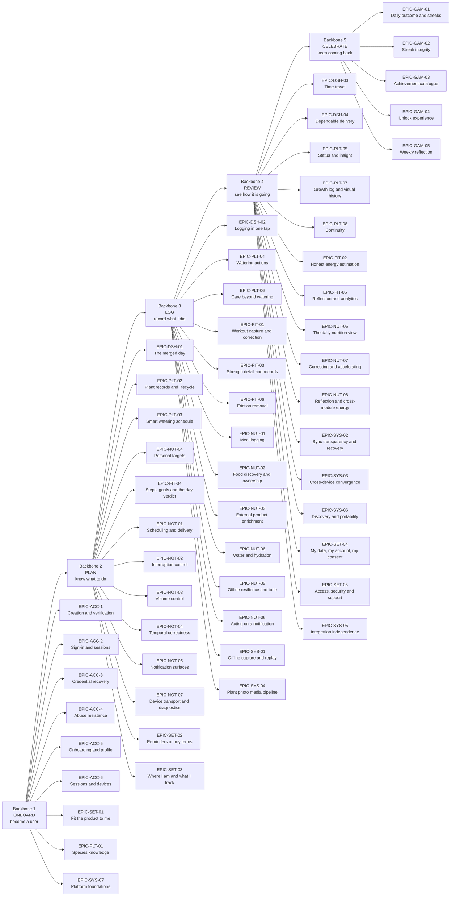

# PlantPal+ — User Stories: Epics and Master Story Index

| Field | Value |
| --- | --- |
| Document | `docs/requirements/05-user-stories.md` — master index and epic overview for every user story in the PlantPal+ Phase 1 package |
| Version | 1.0 |
| Date | 2026-07-21 |
| Status | Baselined for Phase 1 sign-off |
| Owner | Rakshit — Project Lead / sole developer (D-05, STK-03) |
| Parent | [PlantPal+ Software Requirements Specification v1.0](SRS.md) |

---

## Table of contents

1. [Purpose, story format, INVEST and acceptance criteria](#1-purpose-story-format-invest-and-acceptance-criteria)
2. [Epic catalogue](#2-epic-catalogue)
3. [User story map](#3-user-story-map)
4. [Master story index](#4-master-story-index)
5. [Release backlogs](#5-release-backlogs)
6. [Persona coverage](#6-persona-coverage)
7. [Acceptance-criteria conventions and a worked example](#7-acceptance-criteria-conventions-and-a-worked-example)

Related documents: [README.md](README.md) · [01-stakeholders-and-personas.md](01-stakeholders-and-personas.md) · [02-scope-and-release-plan.md](02-scope-and-release-plan.md) · [03-functional-requirements.md](03-functional-requirements.md) · [04-non-functional-requirements.md](04-non-functional-requirements.md) · [06-use-case-model.md](06-use-case-model.md) · [09-assumptions-constraints-risks.md](09-assumptions-constraints-risks.md) · [10-traceability-matrix.md](10-traceability-matrix.md)

---

## 1. Purpose, story format, INVEST and acceptance criteria

### 1.1 What this document is and is not

This document is the **agile face** of the requirement set. It is an index and an overview: it mints no functional requirement, no business rule, no use case and no non-functional requirement, and it defines no user story of its own. Every `US-` identifier listed here is defined in full — story statement, metadata table, acceptance criteria and Definition of Done — in one of the eight module story documents of the `user-stories/` folder, each of which is linked from its own table in [section 4](#4-master-story-index). Where this document and a module story document appear to disagree, the module document is authoritative and the disagreement is a defect in this index.

Three registers are read-only here and are referenced by identifier only: functional requirements (`FR-<PREFIX>-nn`), use cases (`UC-<PREFIX>-nn`) and personas (`PER-nn`). Stakeholders (`STK-nn`) appear where a story's beneficiary is the operator rather than an end user.

**Epic identifiers are local.** `EPIC-<PREFIX>-nn` is a delivery-grouping label owned by the module story document that declares it. It is not one of the numbered product registers of the identifier convention in the Phase 1 brief, no requirement ever references one, and nothing outside the story documents may depend on one. Section 2 aggregates them for planning convenience only.

### 1.2 The story format used

Every story in the package is written in the canonical role-benefit form, with the persona named verbatim from the persona register:

> As **&lt;persona name&gt;**, I want &lt;capability&gt;, so that &lt;benefit&gt;.

Each story carries a metadata table with a fixed set of fields:

| Field | Meaning |
| --- | --- |
| Epic | The local `EPIC-<PREFIX>-nn` grouping label the story belongs to |
| Persona | The primary persona — the protagonist of the story statement. Secondary personas, where they exist, are recorded in the story's own table |
| Priority | The MoSCoW priority: one of Must, Should, Could, Wont |
| Release | The release at which every acceptance criterion of the story passes: one of v0.1 Walking Skeleton, v0.5 Alpha, v1.0 MVP, v1.1 Post-MVP |
| Estimate | Story points on the Fibonacci scale 1, 2, 3, 5, 8, 13, 21 |
| Related FRs | The functional requirements the story realises |
| Related UCs | The use cases the story exercises |

Two derivation rules are applied uniformly across all eight documents and are never overridden at story level.

1. **Priority is inherited, not invented.** A story's MoSCoW priority is the strongest priority carried by any of its constituent functional requirements. A story containing at least one Must requirement is a Must.
2. **Release is the completion release.** A story's stated release is the release at which the story first delivers its stated benefit end to end and every one of its acceptance criteria passes. Where a criterion is governed by a requirement scheduled later, that criterion is tagged inside the story with the later release in square brackets, for example `[v1.1]`. Points are counted exactly once, in the story's stated release, so no point is double counted.

### 1.3 The INVEST criteria applied

Every story in the package was checked against INVEST before baselining, with the following module-specific interpretation.

| Letter | Criterion | How it is applied in PlantPal+ |
| --- | --- | --- |
| I | Independent | A story may depend on an earlier release, but no two stories inside one release are mutually blocking. Where a hard sequence exists it is expressed as a release assignment, not as an inter-story dependency. |
| N | Negotiable | The wording of an acceptance criterion is negotiable; the numeric threshold, enumeration member, error code or HTTP status inside it is not, because those are restated verbatim from the module specification. |
| V | Valuable | Every story states a benefit to a named persona, or — in the two operator stories `US-SYS-12` and `US-GAM-11` — to a named stakeholder. No story exists solely to build infrastructure without a stated beneficiary. |
| E | Estimable | Every story carries a Fibonacci estimate. A story that could not be estimated was split before baselining. |
| S | Small | The ceiling is 13 points, calibrated at roughly one focused working week for the sole developer. No story in the package is estimated at 21. A story that grows to 21 during Phase 3 must be split before it enters a sprint. |
| T | Testable | Every acceptance criterion is objectively verifiable: it names a status code, a state value, an enumeration member, a count, a duration, a percentage or a stored value. Subjective adjectives are prohibited inside a Then clause. |

### 1.4 How acceptance criteria are written

- Criteria are numbered `AC-1`, `AC-2`, … and are **scoped inside their own story**. `AC-3` of `US-ACC-01` and `AC-3` of `US-PLT-04` are unrelated identifiers.
- Every criterion is written in strict Gherkin with at least one `Given`, one `When` and one `Then`, using `And` where a step repeats.
- Every story covers, at minimum, one happy path, one alternate path and one validation or error path, plus an offline, timezone or empty-state path wherever the governing specification defines one.
- Literal strings shown in double quotes inside a scenario are the exact strings defined in the module's business rules and are sourced from the locale catalogue required by D-08.
- Every measurement asserted in a criterion is expressed in canonical metric SI (D-09); unit presentation is asserted separately in the unit-conversion stories.
- Section 7 states the full convention set and works one story through it end to end.

---

## 2. Epic catalogue

Fifty-eight epics group the 119 user stories of the package. Story counts and point totals are reproduced from the "totals per epic" table of each owning document; a divergence between a row below and its source document is a defect in this index.

| Epic | Name | Module | Goal | Stories | Points |
| --- | --- | --- | --- | --- | --- |
| EPIC-ACC-1 | Account creation and email verification | Accounts | Turn a visitor into a verified account holder with no operator intervention and a working self-service repair path | 2 | 13 |
| EPIC-ACC-2 | Sign-in and session lifecycle | Accounts | Establish a session on any device and keep it alive for 30 days without re-entering a password | 2 | 21 |
| EPIC-ACC-3 | Credential recovery and change | Accounts | Regain access after a forgotten password and rotate a known one, with the correct session consequences in each case | 2 | 13 |
| EPIC-ACC-4 | Abuse resistance and authorisation | Accounts | Make online password guessing uneconomic, make a stolen refresh token self-limiting, and guarantee no cross-tenant read | 1 | 13 |
| EPIC-ACC-5 | Onboarding, profile and preferences | Accounts | Capture in under 90 seconds the minimum data that makes all three trackers useful, and hold the canonical profile record | 3 | 24 |
| EPIC-ACC-6 | Sessions and devices | Accounts | Give the account holder visibility of where the account is signed in and a targeted way to remove one device | 1 | 5 |
| EPIC-ACC-7 | Data rights | Accounts | Deliver GDPR-style portability and erasure at the good-practice depth fixed by D-01 | 2 | 21 |
| EPIC-DSH-01 | The merged day | Dashboard | Present one prioritised, actionable and honest view of everything due on one local date across all enabled modules | 3 | 21 |
| EPIC-DSH-02 | Logging in one tap | Dashboard | Remove the navigation cost from the daily habit loop so the commonest logging actions complete inside the dashboard | 1 | 8 |
| EPIC-DSH-03 | Time travel | Dashboard | Let a user inspect and repair the recent past without the streak mechanic becoming punitive, in every timezone | 1 | 8 |
| EPIC-DSH-04 | Dependable delivery | Dashboard | Render correctly on any supported viewport, on any connection quality, and under partial backend failure | 3 | 21 |
| EPIC-SET-01 | Fit the product to me | Settings | Let a user set units, theme, week start, glass size and language, and have every choice persist across devices | 4 | 21 |
| EPIC-SET-02 | Reminders on my terms | Settings | Give complete control over which reminders arrive, on which channel and at which local hours | 2 | 13 |
| EPIC-SET-03 | Where I am and what I track | Settings | Keep day boundary, reminder schedule and growing season correct for the user's actual location and module set | 2 | 18 |
| EPIC-SET-04 | My data, my account, my consent | Settings | Deliver export, deletion with a grace period, informed consent and control over external lookups | 4 | 24 |
| EPIC-SET-05 | Access, security and support | Settings | Make the product operable by an assistive-technology user, revocable per device and diagnosable in support | 3 | 10 |
| EPIC-PLT-01 | Species knowledge | Plant care | Let the user name what they own, seeded species or not, so the watering engine always has a real care profile | 2 | 10 |
| EPIC-PLT-02 | Plant records and lifecycle | Plant care | Create a plant with a correct schedule from its first second, and retire it later without losing its history | 2 | 13 |
| EPIC-PLT-03 | Smart watering schedule | Plant care | Show in plain numbers why the app chose this interval and which single setting moves it — the module's differentiator | 1 | 13 |
| EPIC-PLT-04 | Watering actions | Plant care | Record what actually happened — watered, back-dated, snoozed, skipped or bulk — in three taps or fewer, online or offline | 5 | 29 |
| EPIC-PLT-05 | Status, discovery and insight | Plant care | Open one screen and know which plants need attention first, without day counts and without relying on colour | 2 | 13 |
| EPIC-PLT-06 | Care beyond watering | Plant care | Prompt fertilising and pest checks at horticulturally correct moments, never a dormant plant in January | 1 | 8 |
| EPIC-PLT-07 | Growth log and visual history | Plant care | Accumulate a dated photographic and numeric record of each plant, and replay it | 2 | 13 |
| EPIC-PLT-08 | Continuity | Plant care | Return after up to 90 days away to one grouped catch-up list rather than a wall of accumulated overdue guilt | 1 | 8 |
| EPIC-FIT-01 | Workout capture and correction | Fitness | Store a validated, date-attributed session in under 20 seconds and repair every derived value in one transaction | 3 | 34 |
| EPIC-FIT-02 | Honest energy estimation | Fitness | Quantify effort from the seeded MET table and body mass, freeze the inputs, and present the error band with the D-07 disclaimer | 1 | 8 |
| EPIC-FIT-03 | Strength detail and personal records | Fitness | Record sets, reps and weight at meaningful fidelity and detect the three record categories automatically | 2 | 21 |
| EPIC-FIT-04 | Steps, goals and the fitness-day verdict | Fitness | Capture steps, version a target over time, and derive exactly one authoritative verdict per local date for GAM and DSH | 4 | 29 |
| EPIC-FIT-05 | Reflection: body metrics and progress analytics | Fitness | Convert history into charts and a smoothed body-mass trend, identical on both clients and free of evaluative framing | 2 | 21 |
| EPIC-FIT-06 | Friction removal: repeats, offline and units | Fitness | Remove retyping a routine, losing a basement-gym session, and reading numbers in the wrong units | 3 | 21 |
| EPIC-NUT-01 | Meal logging | Nutrition | Make recording one food against one day cost three taps or fewer and produce a snapshotted, date-stable entry | 2 | 13 |
| EPIC-NUT-02 | Food discovery and ownership | Nutrition | Reach the right food from a seeded catalogue of at least 300 records, from ranked search, or from a private food record | 2 | 16 |
| EPIC-NUT-03 | External product enrichment | Nutrition | Turn a barcode or product query into a screened, cached, attributed candidate while the product stays fully functional without it | 1 | 13 |
| EPIC-NUT-04 | Personal targets and nutrition mathematics | Nutrition | Derive a credible, versioned, floor-protected calorie target and its macronutrient gram targets from held profile data | 2 | 18 |
| EPIC-NUT-05 | The daily nutrition view | Nutrition | Compute one server-side daily summary that mobile, web and the dashboard agree on, with honest completeness labelling | 1 | 8 |
| EPIC-NUT-06 | Water and hydration | Nutrition | Record water in a single interaction against a body-mass-derived goal, contributing zero energy to every total | 1 | 5 |
| EPIC-NUT-07 | Correcting and accelerating the log | Nutrition | Repair a past day and reproduce a previous day's eating without re-entry and without damaging history | 3 | 26 |
| EPIC-NUT-08 | Reflection and cross-module energy | Nutrition | Show rolling intake against the target active on each day, with an opt-in, default-off exercise-calorie credit | 2 | 13 |
| EPIC-NUT-09 | Offline resilience, safety and tone | Nutrition | Capture append-only nutrition logs offline and replay them exactly once, holding every surface to the clinical floor | 2 | 13 |
| EPIC-NOT-01 | Scheduling and reliable delivery | Notifications | A reminder materialised once, delivered once, at the configured local time, predictable after a sleeping free-tier backend | 2 | 26 |
| EPIC-NOT-02 | Interruption control | Notifications | The user decides which categories may interrupt, at what local time, and during which hours the product stays silent | 3 | 16 |
| EPIC-NOT-03 | Volume control | Notifications | A hard ceiling on daily interruptions and collapsing of same-category reminders, so a large collection is not noise | 2 | 10 |
| EPIC-NOT-04 | Temporal correctness | Notifications | Reminders follow the local wall clock across DST transitions and timezone changes, and never duplicate as a result | 1 | 13 |
| EPIC-NOT-05 | Notification surfaces | Notifications | Every notification is reachable and actionable: correct screen on tap, durable in-app history, web surface plus email digest | 2 | 21 |
| EPIC-NOT-06 | Acting on a notification | Notifications | Logging and postponement direct from the notification, with exactly-once semantics and a bounded snooze | 2 | 13 |
| EPIC-NOT-07 | Device transport and self-service diagnostics | Notifications | Push tokens registered, refreshed, reassigned and pruned correctly, and a self-service reason why a device is silent | 1 | 8 |
| EPIC-GAM-01 | Daily outcome and streak engine | Gamification | One auditable outcome per user, scope and local day, turned into four streak counters whose rule is legible | 3 | 23 |
| EPIC-GAM-02 | Streak integrity across time and connectivity | Gamification | Never wrongly break or extend a streak because of a late offline write, a timezone change, DST or one bad day | 3 | 29 |
| EPIC-GAM-03 | Achievement catalogue, evaluation and progress | Gamification | Hold 46 achievements as versioned data, evaluate only affected definitions, and expose a visible goal ladder | 3 | 18 |
| EPIC-GAM-04 | Unlock experience | Gamification | Make an unlock felt exactly once through three channels, with a full non-animated path | 1 | 8 |
| EPIC-GAM-05 | Weekly reflection | Gamification | One cross-module summary per ISO week that reuses computed data, reaches out without nagging and never shames | 1 | 8 |
| EPIC-SYS-01 | Offline capture and durable replay | Platform | Capture the seven append-only logging actions with no connectivity and deliver them exactly once, with no merge algorithm | 3 | 24 |
| EPIC-SYS-02 | Sync transparency and recovery | Platform | Make the state of every locally originated write visible in four states, with a confirmed path out of permanent failure | 2 | 10 |
| EPIC-SYS-03 | Cross-device convergence | Platform | Keep mobile and web in agreement through cursor-based delta sync, tombstones and a resumable full resynchronisation | 1 | 13 |
| EPIC-SYS-04 | Plant photo media pipeline | Platform | Move a photograph from camera to private object storage cheaply, privately and inside a permanently free quota | 2 | 18 |
| EPIC-SYS-05 | Integration independence, provenance and attribution | Platform | Keep every core journey working with every integration disabled, and label and attribute everything that came from outside | 1 | 8 |
| EPIC-SYS-06 | Unified discovery and data portability | Platform | Make three modules feel like one product through a single search box, and let the user take every byte with them | 2 | 16 |
| EPIC-SYS-07 | Platform foundations and free-tier operability | Platform | Provide API conventions, error envelope, pagination, limits, hygiene invariants, health, migrations and seeds at zero cost | 1 | 13 |
| **Total** | **58 epics** | **8 modules** | | **119** | **915** |

### 2.1 Epic and story totals by module

| Module | Story document | Prefixes | Epics | Stories | Points |
| --- | --- | --- | --- | --- | --- |
| Accounts, authentication and profile | [user-stories/accounts.md](user-stories/accounts.md) | `US-ACC` | 7 | 13 | 110 |
| Unified daily dashboard and settings | [user-stories/dashboard-and-settings.md](user-stories/dashboard-and-settings.md) | `US-DSH`, `US-SET` | 9 | 23 | 144 |
| Plant care | [user-stories/plant-care.md](user-stories/plant-care.md) | `US-PLT` | 8 | 16 | 107 |
| Fitness | [user-stories/fitness.md](user-stories/fitness.md) | `US-FIT` | 6 | 15 | 134 |
| Nutrition and calories | [user-stories/nutrition.md](user-stories/nutrition.md) | `US-NUT` | 9 | 16 | 125 |
| Notifications and reminder engine | [user-stories/notifications.md](user-stories/notifications.md) | `US-NOT` | 7 | 13 | 107 |
| Streaks and achievements | [user-stories/gamification.md](user-stories/gamification.md) | `US-GAM` | 5 | 11 | 86 |
| Cross-cutting platform and sync | [user-stories/platform-and-sync.md](user-stories/platform-and-sync.md) | `US-SYS` | 7 | 12 | 102 |
| **Total** | | **9 prefixes** | **58** | **119** | **915** |

Every prefix range is contiguous with no gaps: `US-ACC-01` to `US-ACC-13`, `US-DSH-01` to `US-DSH-08`, `US-SET-01` to `US-SET-15`, `US-PLT-01` to `US-PLT-16`, `US-FIT-01` to `US-FIT-15`, `US-NUT-01` to `US-NUT-16`, `US-NOT-01` to `US-NOT-13`, `US-GAM-01` to `US-GAM-11`, `US-SYS-01` to `US-SYS-12`.

---

## 3. User story map

The map organises all 58 epics into the five backbone activities of the PlantPal+ daily loop. An epic appears under the activity its stories principally serve; epics whose stories span two activities are placed under the earlier one, because the backbone reads left to right as the user's journey through a day.



**Reading the map.** The backbone is the product thesis in five words: a person becomes a user, learns what their day requires, records what they actually did, reviews the result honestly, and is given a reason to return tomorrow. The `LOG` activity carries the largest concentration of epics because it is the activity a user performs many times a day and the activity in which every offline, idempotency and date-attribution rule of D-04 is exercised. The `ONBOARD` activity is front-loaded into v0.1 and v0.5 because nothing else can be demonstrated until an authenticated user with a stored preference record exists.

---

## 4. Master story index

One table per module, in identifier order. Every row reproduces the identifier, title, primary persona, MoSCoW priority, release and estimate recorded in the story's own metadata table, and links to the full story — statement, acceptance criteria and Definition of Done — in the owning document. The **Related FRs** and **Related UCs** fields are deliberately not repeated here; they live in the story itself and in [10-traceability-matrix.md](10-traceability-matrix.md), and duplicating them in a third place would create a third thing to keep in step.

### 4.1 Accounts, authentication and profile — `US-ACC`

Source: [user-stories/accounts.md](user-stories/accounts.md) · Specification: [modules/accounts.md](modules/accounts.md) · Use cases: [use-cases/accounts.md](use-cases/accounts.md)

| ID | Title | Persona | Priority | Release | Points | Full story |
| --- | --- | --- | --- | --- | --- | --- |
| US-ACC-01 | Register with email and password | PER-01 Aditi Sharma | Must | v0.1 | 8 | [open](user-stories/accounts.md#us-acc-01--register-with-email-and-password) |
| US-ACC-02 | Verify my email address | PER-02 Marcus Oyelaran | Must | v0.5 | 5 | [open](user-stories/accounts.md#us-acc-02--verify-my-email-address) |
| US-ACC-03 | Sign in once and stay signed in | PER-01 Aditi Sharma | Must | v0.1 | 13 | [open](user-stories/accounts.md#us-acc-03--sign-in-once-and-stay-signed-in) |
| US-ACC-04 | Sign in with Google or Apple | PER-05 Sofia Lindqvist | Should | v1.1 | 8 | [open](user-stories/accounts.md#us-acc-04--sign-in-with-google-or-apple) |
| US-ACC-05 | Be protected from brute force and stolen tokens | PER-03 Mia Castellano | Must | v0.5 | 13 | [open](user-stories/accounts.md#us-acc-05--be-protected-from-brute-force-and-stolen-tokens) |
| US-ACC-06 | Reset a forgotten password | PER-04 Harold "Hal" Whitfield | Must | v0.5 | 8 | [open](user-stories/accounts.md#us-acc-06--reset-a-forgotten-password) |
| US-ACC-07 | Change my password and sign other devices out | PER-01 Aditi Sharma | Must | v0.5 | 5 | [open](user-stories/accounts.md#us-acc-07--change-my-password-and-sign-other-devices-out) |
| US-ACC-08 | Get set up in under 90 seconds | PER-02 Marcus Oyelaran | Must | v1.0 | 8 | [open](user-stories/accounts.md#us-acc-08--get-set-up-in-under-90-seconds) |
| US-ACC-09 | Give body details for a personalised energy estimate | PER-03 Mia Castellano | Must | v0.5 | 8 | [open](user-stories/accounts.md#us-acc-09--give-body-details-for-a-personalised-energy-estimate) |
| US-ACC-10 | Set my timezone, hemisphere and units correctly | PER-03 Mia Castellano | Must | v0.5 | 8 | [open](user-stories/accounts.md#us-acc-10--set-my-timezone-hemisphere-and-units-correctly) |
| US-ACC-11 | See and revoke my signed-in devices | PER-01 Aditi Sharma | Should | v1.0 | 5 | [open](user-stories/accounts.md#us-acc-11--see-and-revoke-my-signed-in-devices) |
| US-ACC-12 | Export everything the product holds about me | PER-04 Harold "Hal" Whitfield | Must | v1.0 | 8 | [open](user-stories/accounts.md#us-acc-12--export-everything-the-product-holds-about-me) |
| US-ACC-13 | Delete my account, with a chance to change my mind | PER-05 Sofia Lindqvist | Must | v1.0 | 13 | [open](user-stories/accounts.md#us-acc-13--delete-my-account-with-a-chance-to-change-my-mind) |
| **Subtotal** | **13 stories** | | 11 Must, 2 Should | | **110** | |

### 4.2 Unified daily dashboard — `US-DSH`

Source: [user-stories/dashboard-and-settings.md](user-stories/dashboard-and-settings.md) · Specification: [modules/dashboard-and-settings.md](modules/dashboard-and-settings.md) · Use cases: [use-cases/dashboard-and-settings.md](use-cases/dashboard-and-settings.md)

| ID | Title | Persona | Priority | Release | Points | Full story |
| --- | --- | --- | --- | --- | --- | --- |
| US-DSH-01 | One list of everything due today | PER-01 Aditi Sharma | Must | v0.5 | 13 | [open](user-stories/dashboard-and-settings.md#us-dsh-01--one-list-of-everything-due-today) |
| US-DSH-02 | Act without leaving the dashboard | PER-01 Aditi Sharma | Must | v1.0 | 8 | [open](user-stories/dashboard-and-settings.md#us-dsh-02--act-without-leaving-the-dashboard) |
| US-DSH-03 | See my streak and my recent wins on the landing screen | PER-01 Aditi Sharma | Must | v0.5 | 3 | [open](user-stories/dashboard-and-settings.md#us-dsh-03--see-my-streak-and-my-recent-wins-on-the-landing-screen) |
| US-DSH-04 | Fix yesterday | PER-02 Marcus Oyelaran | Must | v1.0 | 8 | [open](user-stories/dashboard-and-settings.md#us-dsh-04--fix-yesterday) |
| US-DSH-05 | Run only the modules I want | PER-02 Marcus Oyelaran | Must | v1.0 | 5 | [open](user-stories/dashboard-and-settings.md#us-dsh-05--run-only-the-modules-i-want) |
| US-DSH-06 | Know what to do on day one | PER-02 Marcus Oyelaran | Must | v1.0 | 5 | [open](user-stories/dashboard-and-settings.md#us-dsh-06--know-what-to-do-on-day-one) |
| US-DSH-07 | Use the dashboard with no signal | PER-05 Sofia Lindqvist | Must | v1.0 | 8 | [open](user-stories/dashboard-and-settings.md#us-dsh-07--use-the-dashboard-with-no-signal) |
| US-DSH-08 | A dashboard that fits every screen and stays current | PER-05 Sofia Lindqvist | Must | v1.0 | 8 | [open](user-stories/dashboard-and-settings.md#us-dsh-08--a-dashboard-that-fits-every-screen-and-stays-current) |
| **Subtotal** | **8 stories** | | 8 Must | | **58** | |

### 4.3 Settings and preferences — `US-SET`

Source: [user-stories/dashboard-and-settings.md](user-stories/dashboard-and-settings.md) · Specification: [modules/dashboard-and-settings.md](modules/dashboard-and-settings.md) · Use cases: [use-cases/dashboard-and-settings.md](use-cases/dashboard-and-settings.md)

| ID | Title | Persona | Priority | Release | Points | Full story |
| --- | --- | --- | --- | --- | --- | --- |
| US-SET-01 | Switch to the units I think in | PER-04 Harold "Hal" Whitfield | Must | v1.0 | 8 | [open](user-stories/dashboard-and-settings.md#us-set-01--switch-to-the-units-i-think-in) |
| US-SET-02 | Pick a theme that sticks | PER-01 Aditi Sharma | Must | v1.0 | 3 | [open](user-stories/dashboard-and-settings.md#us-set-02--pick-a-theme-that-sticks) |
| US-SET-03 | Do not wake me up | PER-03 Mia Castellano | Must | v1.0 | 8 | [open](user-stories/dashboard-and-settings.md#us-set-03--do-not-wake-me-up) |
| US-SET-04 | Reminders at hours that suit me | PER-03 Mia Castellano | Must | v1.0 | 5 | [open](user-stories/dashboard-and-settings.md#us-set-04--reminders-at-hours-that-suit-me) |
| US-SET-05 | Move to another country without breaking my history | PER-03 Mia Castellano | Must | v1.0 | 13 | [open](user-stories/dashboard-and-settings.md#us-set-05--move-to-another-country-without-breaking-my-history) |
| US-SET-06 | Turn a module off without losing anything | PER-04 Harold "Hal" Whitfield | Must | v1.0 | 5 | [open](user-stories/dashboard-and-settings.md#us-set-06--turn-a-module-off-without-losing-anything) |
| US-SET-07 | Take my data with me | PER-01 Aditi Sharma | Must | v1.0 | 8 | [open](user-stories/dashboard-and-settings.md#us-set-07--take-my-data-with-me) |
| US-SET-08 | Close my account for good, with a way back | PER-05 Sofia Lindqvist | Must | v1.0 | 8 | [open](user-stories/dashboard-and-settings.md#us-set-08--close-my-account-for-good-with-a-way-back) |
| US-SET-09 | Make the app usable for me | PER-04 Harold "Hal" Whitfield | Should | v1.0 | 5 | [open](user-stories/dashboard-and-settings.md#us-set-09--make-the-app-usable-for-me) |
| US-SET-10 | Sign out a device I no longer have | PER-01 Aditi Sharma | Should | v1.0 | 3 | [open](user-stories/dashboard-and-settings.md#us-set-10--sign-out-a-device-i-no-longer-have) |
| US-SET-11 | Find every setting in one place | PER-02 Marcus Oyelaran | Must | v0.5 | 5 | [open](user-stories/dashboard-and-settings.md#us-set-11--find-every-setting-in-one-place) |
| US-SET-12 | Know what I agreed to before I keep using the app | PER-04 Harold "Hal" Whitfield | Must | v1.0 | 5 | [open](user-stories/dashboard-and-settings.md#us-set-12--know-what-i-agreed-to-before-i-keep-using-the-app) |
| US-SET-13 | Report a problem with the exact build I am running | PER-05 Sofia Lindqvist | Should | v1.0 | 2 | [open](user-stories/dashboard-and-settings.md#us-set-13--report-a-problem-with-the-exact-build-i-am-running) |
| US-SET-14 | Decide whether the app talks to outside services | PER-05 Sofia Lindqvist | Should | v1.1 | 3 | [open](user-stories/dashboard-and-settings.md#us-set-14--decide-whether-the-app-talks-to-outside-services) |
| US-SET-15 | Change a setting once and have every device agree | PER-01 Aditi Sharma | Must | v0.5 | 5 | [open](user-stories/dashboard-and-settings.md#us-set-15--change-a-setting-once-and-have-every-device-agree) |
| **Subtotal** | **15 stories** | | 11 Must, 4 Should | | **86** | |

### 4.4 Plant care — `US-PLT`

Source: [user-stories/plant-care.md](user-stories/plant-care.md) · Specification: [modules/plant-care.md](modules/plant-care.md) · Use cases: [use-cases/plant-care.md](use-cases/plant-care.md)

| ID | Title | Persona | Priority | Release | Points | Full story |
| --- | --- | --- | --- | --- | --- | --- |
| US-PLT-01 | Add my first plant | PER-02 Marcus Oyelaran | Must | v0.1 | 8 | [open](user-stories/plant-care.md#us-plt-01--add-my-first-plant) |
| US-PLT-02 | Find the right species quickly | PER-02 Marcus Oyelaran | Must; Could for AC-8 | v0.5; v1.1 for AC-8 | 5 | [open](user-stories/plant-care.md#us-plt-02--find-the-right-species-quickly) |
| US-PLT-03 | Track a plant the catalogue does not know | PER-02 Marcus Oyelaran | Should | v1.0 | 5 | [open](user-stories/plant-care.md#us-plt-03--track-a-plant-the-catalogue-does-not-know) |
| US-PLT-04 | Water a plant in one tap | PER-01 Aditi Sharma | Must | v0.1 | 5 | [open](user-stories/plant-care.md#us-plt-04--water-a-plant-in-one-tap) |
| US-PLT-05 | Log a watering I did yesterday, and repair a mistake | PER-02 Marcus Oyelaran | Must | v1.0 | 8 | [open](user-stories/plant-care.md#us-plt-05--log-a-watering-i-did-yesterday-and-repair-a-mistake) |
| US-PLT-06 | Snooze when the soil is still damp | PER-02 Marcus Oyelaran | Should | v1.0 | 3 | [open](user-stories/plant-care.md#us-plt-06--snooze-when-the-soil-is-still-damp) |
| US-PLT-07 | Skip a cycle because it rained, and still be judged fairly | PER-02 Marcus Oyelaran | Should | v1.0 | 8 | [open](user-stories/plant-care.md#us-plt-07--skip-a-cycle-because-it-rained-and-still-be-judged-fairly) |
| US-PLT-08 | See what needs water today | PER-02 Marcus Oyelaran | Must | v0.5 | 8 | [open](user-stories/plant-care.md#us-plt-08--see-what-needs-water-today) |
| US-PLT-09 | Water everything in one go | PER-01 Aditi Sharma | Should | v1.0 | 5 | [open](user-stories/plant-care.md#us-plt-09--water-everything-in-one-go) |
| US-PLT-10 | Understand why a plant is on this schedule | PER-03 Mia Castellano | Must | v1.0 | 13 | [open](user-stories/plant-care.md#us-plt-10--understand-why-a-plant-is-on-this-schedule) |
| US-PLT-11 | Record how a plant is growing | PER-05 Sofia Lindqvist | Must | v1.0 | 8 | [open](user-stories/plant-care.md#us-plt-11--record-how-a-plant-is-growing) |
| US-PLT-12 | Watch a year of growth in ten seconds | PER-02 Marcus Oyelaran | Should; Could for AC-6 to AC-9 | v1.0; v1.1 for AC-6 to AC-9 | 5 | [open](user-stories/plant-care.md#us-plt-12--watch-a-year-of-growth-in-ten-seconds) |
| US-PLT-13 | Know at a glance whether a plant is doing well | PER-04 Harold "Hal" Whitfield | Must | v1.0 | 5 | [open](user-stories/plant-care.md#us-plt-13--know-at-a-glance-whether-a-plant-is-doing-well) |
| US-PLT-14 | Keep up with fertilising and pest checks | PER-02 Marcus Oyelaran | Should | v1.0 | 8 | [open](user-stories/plant-care.md#us-plt-14--keep-up-with-fertilising-and-pest-checks) |
| US-PLT-15 | Go on holiday without coming home to chaos | PER-02 Marcus Oyelaran | Should | v1.0 | 8 | [open](user-stories/plant-care.md#us-plt-15--go-on-holiday-without-coming-home-to-chaos) |
| US-PLT-16 | Retire a plant without losing its story | PER-04 Harold "Hal" Whitfield | Must | v1.0 | 5 | [open](user-stories/plant-care.md#us-plt-16--retire-a-plant-without-losing-its-story) |
| **Subtotal** | **16 stories** | | 9 Must, 7 Should, 2 Could criteria sets | | **107** | |

### 4.5 Fitness — `US-FIT`

Source: [user-stories/fitness.md](user-stories/fitness.md) · Specification: [modules/fitness.md](modules/fitness.md) · Use cases: [use-cases/fitness.md](use-cases/fitness.md)

| ID | Title | Persona | Priority | Release | Points | Full story |
| --- | --- | --- | --- | --- | --- | --- |
| US-FIT-01 | Log a cardio session in under twenty seconds | PER-01 Aditi Sharma | Must | v1.0 | 13 | [open](user-stories/fitness.md#us-fit-01--log-a-cardio-session-in-under-twenty-seconds) |
| US-FIT-02 | Understand my calorie burn as an estimate | PER-03 Mia Castellano | Must | v0.5 | 8 | [open](user-stories/fitness.md#us-fit-02--understand-my-calorie-burn-as-an-estimate) |
| US-FIT-03 | Log a strength session with sets, reps and weight | PER-03 Mia Castellano | Must | v1.0 | 13 | [open](user-stories/fitness.md#us-fit-03--log-a-strength-session-with-sets-reps-and-weight) |
| US-FIT-04 | Be told when I hit a personal record | PER-03 Mia Castellano | Should | v1.0 | 8 | [open](user-stories/fitness.md#us-fit-04--be-told-when-i-hit-a-personal-record) |
| US-FIT-05 | Record my daily steps by hand | PER-01 Aditi Sharma | Must | v1.0 | 8 | [open](user-stories/fitness.md#us-fit-05--record-my-daily-steps-by-hand) |
| US-FIT-06 | Set a daily step goal that judges each day fairly | PER-05 Sofia Lindqvist | Must | v1.0 | 8 | [open](user-stories/fitness.md#us-fit-06--set-a-daily-step-goal-that-judges-each-day-fairly) |
| US-FIT-07 | Set weekly training and body-mass targets | PER-03 Mia Castellano | Must | v1.0 | 8 | [open](user-stories/fitness.md#us-fit-07--set-weekly-training-and-body-mass-targets) |
| US-FIT-08 | Take a planned rest day without losing my streak | PER-03 Mia Castellano | Must | v1.0 | 5 | [open](user-stories/fitness.md#us-fit-08--take-a-planned-rest-day-without-losing-my-streak) |
| US-FIT-09 | Backfill a forgotten workout and repair my streak | PER-01 Aditi Sharma | Must | v1.0 | 8 | [open](user-stories/fitness.md#us-fit-09--backfill-a-forgotten-workout-and-repair-my-streak) |
| US-FIT-10 | Correct or remove a mistaken entry | PER-01 Aditi Sharma | Must | v1.0 | 13 | [open](user-stories/fitness.md#us-fit-10--correct-or-remove-a-mistaken-entry) |
| US-FIT-11 | See my progress over time | PER-03 Mia Castellano | Must | v1.0 | 13 | [open](user-stories/fitness.md#us-fit-11--see-my-progress-over-time) |
| US-FIT-12 | Track body mass with a smoothed trend | PER-03 Mia Castellano | Must | v1.0 | 8 | [open](user-stories/fitness.md#us-fit-12--track-body-mass-with-a-smoothed-trend) |
| US-FIT-13 | Reuse a routine instead of retyping it | PER-01 Aditi Sharma | Should | v1.0 | 8 | [open](user-stories/fitness.md#us-fit-13--reuse-a-routine-instead-of-retyping-it) |
| US-FIT-14 | Log at the gym with no signal | PER-05 Sofia Lindqvist | Must | v1.0 | 8 | [open](user-stories/fitness.md#us-fit-14--log-at-the-gym-with-no-signal) |
| US-FIT-15 | Work in the units I think in | PER-03 Mia Castellano | Must | v1.0 | 5 | [open](user-stories/fitness.md#us-fit-15--work-in-the-units-i-think-in) |
| **Subtotal** | **15 stories** | | 13 Must, 2 Should | | **134** | |

### 4.6 Nutrition and calories — `US-NUT`

Source: [user-stories/nutrition.md](user-stories/nutrition.md) · Specification: [modules/nutrition.md](modules/nutrition.md) · Use cases: [use-cases/nutrition.md](use-cases/nutrition.md)

| ID | Title | Persona | Priority | Release | Points | Full story |
| --- | --- | --- | --- | --- | --- | --- |
| US-NUT-01 | Log a meal in seconds | PER-01 Aditi Sharma | Must | v0.5 | 8 | [open](user-stories/nutrition.md#us-nut-01--log-a-meal-in-seconds) |
| US-NUT-02 | Find the food I mean | PER-01 Aditi Sharma | Must | v0.5 | 8 | [open](user-stories/nutrition.md#us-nut-02--find-the-food-i-mean) |
| US-NUT-03 | Re-log what I always eat with one tap | PER-01 Aditi Sharma | Should | v0.5 | 5 | [open](user-stories/nutrition.md#us-nut-03--re-log-what-i-always-eat-with-one-tap) |
| US-NUT-04 | Scan a barcode | PER-05 Sofia Lindqvist | Should | v1.0 | 13 | [open](user-stories/nutrition.md#us-nut-04--scan-a-barcode) |
| US-NUT-05 | Add a food that is not in the catalogue | PER-05 Sofia Lindqvist | Must | v1.0 | 8 | [open](user-stories/nutrition.md#us-nut-05--add-a-food-that-is-not-in-the-catalogue) |
| US-NUT-06 | Log while offline | PER-05 Sofia Lindqvist | Must | v1.0 | 8 | [open](user-stories/nutrition.md#us-nut-06--log-while-offline) |
| US-NUT-07 | See where I stand today | PER-04 Harold "Hal" Whitfield | Must | v1.0 | 8 | [open](user-stories/nutrition.md#us-nut-07--see-where-i-stand-today) |
| US-NUT-08 | Get a calorie goal that fits me | PER-03 Mia Castellano | Must | v0.5 | 13 | [open](user-stories/nutrition.md#us-nut-08--get-a-calorie-goal-that-fits-me) |
| US-NUT-09 | Set my macro split | PER-03 Mia Castellano | Must | v0.5 | 5 | [open](user-stories/nutrition.md#us-nut-09--set-my-macro-split) |
| US-NUT-10 | Fix a day I got wrong | PER-01 Aditi Sharma | Must | v1.0 | 8 | [open](user-stories/nutrition.md#us-nut-10--fix-a-day-i-got-wrong) |
| US-NUT-11 | Copy a meal I have eaten before | PER-01 Aditi Sharma | Should | v1.0 | 5 | [open](user-stories/nutrition.md#us-nut-11--copy-a-meal-i-have-eaten-before) |
| US-NUT-12 | Track my water | PER-01 Aditi Sharma | Must | v0.5 | 5 | [open](user-stories/nutrition.md#us-nut-12--track-my-water) |
| US-NUT-13 | Log a meal I cook regularly | PER-01 Aditi Sharma | Should | v1.1 | 13 | [open](user-stories/nutrition.md#us-nut-13--log-a-meal-i-cook-regularly) |
| US-NUT-14 | See how my week went | PER-03 Mia Castellano | Should | v1.0 | 8 | [open](user-stories/nutrition.md#us-nut-14--see-how-my-week-went) |
| US-NUT-15 | Count my workouts towards my food budget, carefully | PER-03 Mia Castellano | Should | v1.0 | 5 | [open](user-stories/nutrition.md#us-nut-15--count-my-workouts-towards-my-food-budget-carefully) |
| US-NUT-16 | Be kept safe and not judged | PER-03 Mia Castellano | Must | v0.5 | 5 | [open](user-stories/nutrition.md#us-nut-16--be-kept-safe-and-not-judged) |
| **Subtotal** | **16 stories** | | 10 Must, 6 Should | | **125** | |

### 4.7 Notifications and reminder engine — `US-NOT`

Source: [user-stories/notifications.md](user-stories/notifications.md) · Specification: [modules/notifications.md](modules/notifications.md) · Use cases: [use-cases/notifications.md](use-cases/notifications.md)

| ID | Title | Persona | Priority | Release | Points | Full story |
| --- | --- | --- | --- | --- | --- | --- |
| US-NOT-01 | Receive a watering reminder at the right local time | PER-02 Marcus Oyelaran | Must | v0.1 | 13 | [open](user-stories/notifications.md#us-not-01--receive-a-watering-reminder-at-the-right-local-time) |
| US-NOT-02 | Configure which reminders I get and when | PER-01 Aditi Sharma | Must | v0.5 | 8 | [open](user-stories/notifications.md#us-not-02--configure-which-reminders-i-get-and-when) |
| US-NOT-03 | Not be woken up at night | PER-01 Aditi Sharma | Must | v0.5 | 5 | [open](user-stories/notifications.md#us-not-03--not-be-woken-up-at-night) |
| US-NOT-04 | Pause every notification for a while | PER-03 Mia Castellano | Should | v1.0 | 3 | [open](user-stories/notifications.md#us-not-04--pause-every-notification-for-a-while) |
| US-NOT-05 | Not be flooded on a busy day | PER-01 Aditi Sharma | Must | v1.0 | 5 | [open](user-stories/notifications.md#us-not-05--not-be-flooded-on-a-busy-day) |
| US-NOT-06 | One notification for many due plants | PER-02 Marcus Oyelaran | Should | v1.0 | 5 | [open](user-stories/notifications.md#us-not-06--one-notification-for-many-due-plants) |
| US-NOT-07 | Tap a notification and land exactly where I need to be | PER-01 Aditi Sharma | Must | v0.1 | 8 | [open](user-stories/notifications.md#us-not-07--tap-a-notification-and-land-exactly-where-i-need-to-be) |
| US-NOT-08 | See what I would have been told, on the web | PER-04 Harold "Hal" Whitfield | Must | v0.5 | 13 | [open](user-stories/notifications.md#us-not-08--see-what-i-would-have-been-told-on-the-web) |
| US-NOT-09 | Act straight from the notification | PER-05 Sofia Lindqvist | Should | v1.0 | 8 | [open](user-stories/notifications.md#us-not-09--act-straight-from-the-notification) |
| US-NOT-10 | Postpone a reminder without losing it | PER-02 Marcus Oyelaran | Should | v1.0 | 5 | [open](user-stories/notifications.md#us-not-10--postpone-a-reminder-without-losing-it) |
| US-NOT-11 | Correct reminders when I travel or the clocks change | PER-01 Aditi Sharma | Must | v0.5 | 13 | [open](user-stories/notifications.md#us-not-11--correct-reminders-when-i-travel-or-the-clocks-change) |
| US-NOT-12 | Trust the system after an outage | PER-05 Sofia Lindqvist | Must | v0.5 | 13 | [open](user-stories/notifications.md#us-not-12--trust-the-system-after-an-outage) |
| US-NOT-13 | Diagnose why notifications are not arriving | PER-02 Marcus Oyelaran | Must | v0.5 | 8 | [open](user-stories/notifications.md#us-not-13--diagnose-why-notifications-are-not-arriving) |
| **Subtotal** | **13 stories** | | 9 Must, 4 Should | | **107** | |

### 4.8 Streaks and achievements — `US-GAM`

Source: [user-stories/gamification.md](user-stories/gamification.md) · Specification: [modules/gamification.md](modules/gamification.md) · Use cases: [use-cases/gamification.md](use-cases/gamification.md)

| ID | Title | Persona | Priority | Release | Points | Full story |
| --- | --- | --- | --- | --- | --- | --- |
| US-GAM-01 | See my streaks at a glance | PER-01 Aditi Sharma | Must | v1.0 | 13 | [open](user-stories/gamification.md#us-gam-01--see-my-streaks-at-a-glance) |
| US-GAM-02 | Understand why a day did or did not count | PER-02 Marcus Oyelaran | Must | v1.0 | 5 | [open](user-stories/gamification.md#us-gam-02--understand-why-a-day-did-or-did-not-count) |
| US-GAM-03 | Keep my streak when a log arrives late | PER-05 Sofia Lindqvist | Must | v1.0 | 13 | [open](user-stories/gamification.md#us-gam-03--keep-my-streak-when-a-log-arrives-late) |
| US-GAM-04 | Protect a missed day with an earned freeze | PER-01 Aditi Sharma | Should | v1.1 | 8 | [open](user-stories/gamification.md#us-gam-04--protect-a-missed-day-with-an-earned-freeze) |
| US-GAM-05 | Browse the trophy gallery | PER-01 Aditi Sharma | Must | v1.0 | 8 | [open](user-stories/gamification.md#us-gam-05--browse-the-trophy-gallery) |
| US-GAM-06 | Feel the moment I unlock something | PER-01 Aditi Sharma | Must | v1.0 | 8 | [open](user-stories/gamification.md#us-gam-06--feel-the-moment-i-unlock-something) |
| US-GAM-07 | See what I am closest to earning | PER-03 Mia Castellano | Should | v1.0 | 5 | [open](user-stories/gamification.md#us-gam-07--see-what-i-am-closest-to-earning) |
| US-GAM-08 | Receive a weekly recap | PER-03 Mia Castellano | Should | v1.0 | 8 | [open](user-stories/gamification.md#us-gam-08--receive-a-weekly-recap) |
| US-GAM-09 | Turn a module off without confusing my streaks | PER-02 Marcus Oyelaran | Must | v1.0 | 5 | [open](user-stories/gamification.md#us-gam-09--turn-a-module-off-without-confusing-my-streaks) |
| US-GAM-10 | Travel without losing my streak | PER-03 Mia Castellano | Must | v1.0 | 8 | [open](user-stories/gamification.md#us-gam-10--travel-without-losing-my-streak) |
| US-GAM-11 | Change an achievement definition without punishing anyone | STK-03 Rakshit, Catalogue Maintainer | Must | v1.0 | 5 | [open](user-stories/gamification.md#us-gam-11--change-an-achievement-definition-without-punishing-anyone) |
| **Subtotal** | **11 stories** | | 8 Must, 3 Should | | **86** | |

### 4.9 Cross-cutting platform and sync — `US-SYS`

Source: [user-stories/platform-and-sync.md](user-stories/platform-and-sync.md) · Specification: [modules/platform-and-sync.md](modules/platform-and-sync.md) · Use cases: [use-cases/platform-and-sync.md](use-cases/platform-and-sync.md)

| ID | Title | Persona | Priority | Release | Points | Full story |
| --- | --- | --- | --- | --- | --- | --- |
| US-SYS-01 | Log while offline | PER-01 Aditi Sharma | Must | v0.5 | 13 | [open](user-stories/platform-and-sync.md#us-sys-01--log-while-offline) |
| US-SYS-02 | Read my data with no connection | PER-05 Sofia Lindqvist | Must | v0.5 | 8 | [open](user-stories/platform-and-sync.md#us-sys-02--read-my-data-with-no-connection) |
| US-SYS-03 | See what is synced | PER-01 Aditi Sharma | Must | v0.5 | 5 | [open](user-stories/platform-and-sync.md#us-sys-03--see-what-is-synced) |
| US-SYS-04 | Recover a failed entry | PER-05 Sofia Lindqvist | Must | v0.5 | 5 | [open](user-stories/platform-and-sync.md#us-sys-04--recover-a-failed-entry) |
| US-SYS-05 | Understand what needs a connection | PER-05 Sofia Lindqvist | Must | v1.0 | 3 | [open](user-stories/platform-and-sync.md#us-sys-05--understand-what-needs-a-connection) |
| US-SYS-06 | Add a plant photo without waiting or leaking my location | PER-02 Marcus Oyelaran | Must | v1.0 | 13 | [open](user-stories/platform-and-sync.md#us-sys-06--add-a-plant-photo-without-waiting-or-leaking-my-location) |
| US-SYS-07 | Know my photo storage position | PER-02 Marcus Oyelaran | Must | v1.0 | 5 | [open](user-stories/platform-and-sync.md#us-sys-07--know-my-photo-storage-position) |
| US-SYS-08 | Keep working when an external service is off or down | PER-05 Sofia Lindqvist | Must | v1.0 | 8 | [open](user-stories/platform-and-sync.md#us-sys-08--keep-working-when-an-external-service-is-off-or-down) |
| US-SYS-09 | Find anything from one search box | PER-01 Aditi Sharma | Should | v1.0 | 8 | [open](user-stories/platform-and-sync.md#us-sys-09--find-anything-from-one-search-box) |
| US-SYS-10 | Export everything I have recorded | PER-02 Marcus Oyelaran | Must | v1.0 | 8 | [open](user-stories/platform-and-sync.md#us-sys-10--export-everything-i-have-recorded) |
| US-SYS-11 | Pick up on another device | PER-01 Aditi Sharma | Must | v1.0 | 13 | [open](user-stories/platform-and-sync.md#us-sys-11--pick-up-on-another-device) |
| US-SYS-12 | Keep the free-tier backend healthy and reproducible | STK-03 Rakshit, Project Lead | Must | v1.0 | 13 | [open](user-stories/platform-and-sync.md#us-sys-12--keep-the-free-tier-backend-healthy-and-reproducible) |
| **Subtotal** | **12 stories** | | 11 Must, 1 Should | | **102** | |

### 4.10 Priority distribution across the package

| Priority | Stories | Points | Share of points |
| --- | --- | --- | --- |
| Must | 90 | 731 | 79.9 percent |
| Should | 29 | 182 | 19.9 percent |
| Could | 0 stories; 2 release-tagged criteria sets inside US-PLT-02 and US-PLT-12 | 2 | 0.2 percent |
| Wont | 0 stories; the single Wont requirement FR-FIT-18 is carried as AC-8 of US-FIT-05 | 0 | 0 percent |
| **Total** | **119** | **915** | **100 percent** |

No story in the package carries a `Could` or `Wont` priority in its own right. Both dispositions exist only at criterion level, which is deliberate: a `Could` capability that cannot stand alone as a demoable slice is carried as a release-tagged acceptance criterion inside the story it extends, and a `Wont` requirement is carried as the criterion that makes the exclusion testable by inspection rather than merely asserted.

---

## 5. Release backlogs

### 5.1 Counting rule and velocity assumption

**Counting rule.** A story is listed in the backlog of the release at which **every** one of its acceptance criteria passes, and its points are counted exactly once, there. Several stories deliver a demoable slice earlier than that; those slices are named in the story's own release note and never move points between releases. The single exception in the package is `US-PLT-12`, whose owning document splits its 5 points explicitly — 3 at v1.0 MVP for the photo timeline and 2 at v1.1 Post-MVP for the comparison view — and that split is reproduced faithfully below.

**Velocity assumption.** The estimation scale is calibrated identically in every story document: **1 story point equals one focused half-day of work for the sole developer named in D-05**, inclusive of implementation, automated tests, accessibility work and documentation, as defined by that story's Definition of Done. The planning assumption used in this index is therefore:

| Planning parameter | Value | Basis |
| --- | --- | --- |
| Points per focused day | 2 | One point equals one focused half-day |
| Focused days per week available to the project | 4 | A capstone carried alongside other coursework by one person, per D-01 and D-06 |
| Nominal velocity | 8 points per week | 2 points per day multiplied by 4 days |
| Planning velocity used here | 10 points per week | Nominal 8 plus an allowance for the deliberate reuse designed into the package: one shared validation package, one shared mutation wrapper, one shared defaults module, one shared comparator and one locale catalogue serving both clients |
| Maximum story size permitted | 13 points | Roughly one focused working week; anything larger is split before it enters a sprint |

**The arithmetic this assumption produces must be stated plainly, because an evaluator will do it anyway.** At 10 points per week, the 915 points of the full package correspond to approximately 92 developer-weeks, and the 731 points of the Must subset to approximately 74 developer-weeks. Neither figure fits inside a single semester. Three consequences follow, and all three are planning matters owned by [02-scope-and-release-plan.md](02-scope-and-release-plan.md) and the risk and open-question registers in [09-assumptions-constraints-risks.md](09-assumptions-constraints-risks.md), not by this index:

1. The academic deliverable of the semester is the v0.1 plus v0.5 increment — 36 stories and 289 points, approximately 29 developer-weeks — with v1.0 completed beyond the taught period. This is the reading that keeps every release gate honest.
2. Alternatively, the v1.0 gate is met by a pre-agreed cut list. Each module document names its own cut candidates; the `GAM` document, for example, records `US-GAM-04` as item 3 on the v1.0 cut list, and the `Should` subset across the package is worth 182 points.
3. Point totals are relative sizes, not commitments. No release gate in this package is defined by a point total; every gate is defined by a demoable slice.

### 5.2 v0.1 Walking Skeleton

**6 stories, 55 points.** Every story here is a Must.

| Module | Stories | Points |
| --- | --- | --- |
| Accounts | US-ACC-01, US-ACC-03 | 21 |
| Plant care | US-PLT-01, US-PLT-04 | 13 |
| Notifications | US-NOT-01, US-NOT-07 | 21 |
| **Total** | **6 stories** | **55** |

**Demoable slice.** A visitor registers, signs in on a real device and receives a token pair; creates a plant against a seeded species and logs a watering, which computes and stores a real next-due date; a scheduled reminder for that plant is materialised, delivered by Expo Push at the configured local time, and tapping it lands on the correct screen. Every read is authorised server-side against the token subject. No `DSH`, `SET`, `FIT`, `NUT`, `GAM` or `SYS` story completes at this release; the `SYS` document records that five of its requirements — `FR-SYS-18`, `FR-SYS-19`, `FR-SYS-22`, `FR-SYS-25` and `FR-SYS-26` — are nevertheless v0.1 scope and are carried inside `US-SYS-12`, whose points are counted once at v1.0 MVP. The `DSH` document records the same arrangement for the `meta` and `header` sections of `GET /api/v1/dashboard` inside `US-DSH-01`.

### 5.3 v0.5 Alpha

**30 stories, 234 points.** Cumulative: 36 stories, 289 points.

| Module | Stories | Points |
| --- | --- | --- |
| Accounts | US-ACC-02, US-ACC-05, US-ACC-06, US-ACC-07, US-ACC-09, US-ACC-10 | 47 |
| Dashboard | US-DSH-01, US-DSH-03 | 16 |
| Settings | US-SET-11, US-SET-15 | 10 |
| Plant care | US-PLT-02, US-PLT-08 | 13 |
| Fitness | US-FIT-02 | 8 |
| Nutrition | US-NUT-01, US-NUT-02, US-NUT-03, US-NUT-08, US-NUT-09, US-NUT-12, US-NUT-16 | 49 |
| Notifications | US-NOT-02, US-NOT-03, US-NOT-08, US-NOT-11, US-NOT-12, US-NOT-13 | 60 |
| Platform and sync | US-SYS-01, US-SYS-02, US-SYS-03, US-SYS-04 | 31 |
| **Total** | **30 stories** | **234** |

**Demoable slice.** The account becomes durable — verified address, self-expiring lockout, rotating refresh with reuse detection, both password paths, and the profile and preference record every other module reads. The merged Today list and the streak indicator render from one aggregate response. The seeded plant catalogue is searchable and the four-factor watering algorithm is live. A meal is logged against a personalised, floor-protected calorie target. Reminders survive a daylight-saving transition, a timezone change and a sleeping free-tier backend, and the web client shows what the phone was told. Append-only writes are captured offline and replayed exactly once. No `GAM` story completes here, though the gamification document records that the first slices of eight of its stories are demoable at this release on requirement-level evidence.

### 5.4 v1.0 MVP

**79 stories, 592 points.** Cumulative: 115 stories, 881 points.

| Module | Stories | Points |
| --- | --- | --- |
| Accounts | US-ACC-08, US-ACC-11, US-ACC-12, US-ACC-13 | 34 |
| Dashboard | US-DSH-02, US-DSH-04, US-DSH-05, US-DSH-06, US-DSH-07, US-DSH-08 | 42 |
| Settings | US-SET-01, US-SET-02, US-SET-03, US-SET-04, US-SET-05, US-SET-06, US-SET-07, US-SET-08, US-SET-09, US-SET-10, US-SET-12, US-SET-13 | 73 |
| Plant care | US-PLT-03, US-PLT-05, US-PLT-06, US-PLT-07, US-PLT-09, US-PLT-10, US-PLT-11, US-PLT-12 (3 of its 5 points), US-PLT-13, US-PLT-14, US-PLT-15, US-PLT-16 | 79 |
| Fitness | US-FIT-01, US-FIT-03, US-FIT-04, US-FIT-05, US-FIT-06, US-FIT-07, US-FIT-08, US-FIT-09, US-FIT-10, US-FIT-11, US-FIT-12, US-FIT-13, US-FIT-14, US-FIT-15 | 126 |
| Nutrition | US-NUT-04, US-NUT-05, US-NUT-06, US-NUT-07, US-NUT-10, US-NUT-11, US-NUT-14, US-NUT-15 | 63 |
| Notifications | US-NOT-04, US-NOT-05, US-NOT-06, US-NOT-09, US-NOT-10 | 26 |
| Gamification | US-GAM-01, US-GAM-02, US-GAM-03, US-GAM-05, US-GAM-06, US-GAM-07, US-GAM-08, US-GAM-09, US-GAM-10, US-GAM-11 | 78 |
| Platform and sync | US-SYS-05, US-SYS-06, US-SYS-07, US-SYS-08, US-SYS-09, US-SYS-10, US-SYS-11, US-SYS-12 | 71 |
| **Total** | **79 stories** | **592** |

**Demoable slice.** All three trackers ship complete, sharing one dashboard, one notification engine, one streak and achievement engine, one offline outbox, one media pipeline, one search box and one export. A user completes or skips guided setup, logs and repairs plant, fitness and nutrition history in the past 30 days, sees an explainable watering schedule and an honest energy estimate, earns streaks and achievements that survive travel and late writes, exports everything and deletes the account. All 90 `Must` stories in the package have completed by the end of this release; the four stories that remain are `Should`.

### 5.5 v1.1 Post-MVP

**4 stories, 32 points, plus 2 carried points.** Cumulative: 119 stories, 915 points.

| Module | Stories and carried criteria | Points |
| --- | --- | --- |
| Accounts | US-ACC-04 | 8 |
| Settings | US-SET-14 | 3 |
| Nutrition | US-NUT-13 | 13 |
| Gamification | US-GAM-04 | 8 |
| Plant care | US-PLT-02 AC-8 and US-PLT-12 AC-6 to AC-9, the two carried `Could` criteria sets | 2 |
| **Total** | **4 completed stories plus 2 carried criteria sets** | **34** |

**Demoable slice.** One-tap sign-in with Google, and with Apple only if an Apple Developer Program membership already exists for the Expo EAS iOS build; a user-facing switch over external lookups; recipes and multi-ingredient meals; earned streak-freeze tokens; Perenual species enrichment behind its flag; and the before-and-after comparison of any two growth entries. One further item of work is performed at this release without moving a story: the fitness document records the foreground pedometer read of `FR-FIT-17`, carried as `AC-7` of `US-FIT-05`, as 3 points of work performed at v1.1 while the story itself completes at v1.0.

### 5.6 Release totals

| Release | Stories completed | Points counted | Cumulative points | Share of package |
| --- | --- | --- | --- | --- |
| v0.1 Walking Skeleton | 6 | 55 | 55 | 6.0 percent |
| v0.5 Alpha | 30 | 234 | 289 | 25.6 percent |
| v1.0 MVP | 79 | 592 | 881 | 64.7 percent |
| v1.1 Post-MVP | 4 | 34 | 915 | 3.7 percent |
| **Total** | **119** | **915** | **915** | **100 percent** |

The v1.1 row includes the 2 points carried from `US-PLT-12`, which is why 4 completed stories account for 34 rather than 32 points, and why the four rows reconcile to exactly 915.

---

## 6. Persona coverage

A story's persona is its **protagonist** — the persona named in the story statement. Secondary personas, recorded inside individual stories, are not counted here; counting them twice would overstate coverage. Two stories name a stakeholder rather than a persona, because their beneficiary is the operator rather than an end user.

### 6.1 Stories and points by protagonist

| Protagonist | ACC | DSH | SET | PLT | FIT | NUT | NOT | GAM | SYS | Stories | Points | Share of points |
| --- | --- | --- | --- | --- | --- | --- | --- | --- | --- | --- | --- | --- |
| PER-01 Aditi Sharma | 4 | 3 | 4 | 2 | 5 | 7 | 5 | 4 | 4 | 38 | 301 | 32.9 percent |
| PER-02 Marcus Oyelaran | 2 | 3 | 1 | 10 | 0 | 0 | 4 | 2 | 3 | 25 | 169 | 18.5 percent |
| PER-03 Mia Castellano | 3 | 0 | 3 | 1 | 8 | 5 | 1 | 3 | 0 | 24 | 196 | 21.4 percent |
| PER-04 Harold "Hal" Whitfield | 2 | 0 | 4 | 2 | 0 | 1 | 1 | 0 | 0 | 10 | 70 | 7.7 percent |
| PER-05 Sofia Lindqvist | 2 | 2 | 3 | 1 | 2 | 3 | 2 | 1 | 4 | 20 | 161 | 17.6 percent |
| STK-03 Rakshit (operator and maintainer) | 0 | 0 | 0 | 0 | 0 | 0 | 0 | 1 | 1 | 2 | 18 | 2.0 percent |
| **Total** | **13** | **8** | **15** | **16** | **15** | **16** | **13** | **11** | **12** | **119** | **915** | **100 percent** |

Both the story column totals and the point total reconcile to the package totals of section 2.1, which is the arithmetic check that this table is complete: no story has two protagonists and none has none. Percentage shares are rounded to one decimal place and therefore sum to 100.1 rather than exactly 100.

### 6.2 Coverage flags

| Flag | Protagonist | Observation | Disposition |
| --- | --- | --- | --- |
| F-1 — thin coverage | PER-04 Harold "Hal" Whitfield | 10 stories and 70 points, the thinnest of the five personas: 8.4 percent of stories against 7.7 percent of points. He is protagonist in five of the nine prefixes and in none of `DSH`, `FIT`, `GAM` or `SYS`. | **Flagged, with a documented and accepted reason in each case.** `DSH` and `SET` are one module and one document, in which `US-SET-09` is his dedicated accessibility story. His persona record has the fitness module disabled, so the fitness document names him secondary in `US-FIT-04`, `US-FIT-11` and `US-FIT-15` rather than primary anywhere. The gamification document states that no gamification capability exists solely for him and names him secondary in `US-GAM-02`, `US-GAM-05`, `US-GAM-06` and `US-GAM-08`. The platform document names `US-SYS-03` as his accessibility story in that module, with him as its secondary persona. His accessibility obligations are binding as acceptance criteria on every surface regardless of protagonist, and the accessibility non-functional requirements apply package-wide. |
| F-2 — module obligation | PER-04 Harold "Hal" Whitfield | The stakeholder analysis states that he must own at least one accessibility-focused story **in every module**. | **Satisfied as protagonist for accounts (US-ACC-06, US-ACC-12), dashboard and settings (US-SET-09), plant care (US-PLT-13, US-PLT-16), nutrition (US-NUT-07) and notifications (US-NOT-08); satisfied by a named secondary story for platform and sync (US-SYS-03); recorded as a deliberate, reasoned deviation for fitness and gamification.** This is the single persona-coverage item a reviewer should check first, and it is disclosed here rather than smoothed over. |
| F-3 — deliberate absence | PER-02 Marcus Oyelaran | Protagonist in no `FIT` and no `NUT` story. | **Accepted.** His persona record enables plant care first and fitness later; the nutrition document states the absence explicitly so that it is not read as an omission. He is protagonist of 10 of the 16 `PLT` stories, which matches his register entry as the plant-first hobbyist. |
| F-4 — deliberate absence | PER-03 Mia Castellano | Protagonist in no `DSH` and no `SYS` story. | **Accepted.** Her binding obligation is to own at least one Southern-hemisphere or timezone-sensitive story, which she does in `US-SET-05`, `US-ACC-10`, `US-GAM-10` and `US-NOT-04`, and she is the named secondary on the timezone criterion of `US-SYS-11`. |
| F-5 — offline obligation | PER-05 Sofia Lindqvist | Must own at least one offline or degraded-connectivity story in every module that has a queueable log action, which is `PLT`, `FIT` and `NUT`. | **Satisfied**: `US-PLT-11`, `US-FIT-14` and `US-NUT-06`, plus `US-DSH-07`, `US-SYS-02`, `US-SYS-04`, `US-SYS-05`, `US-SYS-08` and `US-NOT-12` beyond the obligation. |
| F-6 — operator protagonist | STK-03 Rakshit | 2 stories, 18 points, no persona. | **Accepted and deliberate.** `US-SYS-12` and `US-GAM-11` deliver value to the operator and the future maintainer (`STK-13` is the named secondary on `US-SYS-12`). Naming a persona as the protagonist of a migrations-and-seeds story would have been a fiction. |

### 6.3 Reading the distribution

`PER-01` Aditi Sharma carries 32.9 percent of the points because she is the only persona who runs all three modules on two clients, which makes her the protagonist of every cross-module story and of the demo journey. `PER-03` Mia Castellano carries 21.4 percent on 24 stories because the fitness and nutrition modules are the two largest by points and she is their primary. `PER-02` Marcus Oyelaran's 169 points are concentrated in `PLT`, which is intended: he is the reason the single-module dashboard layout exists at all. The distribution is a consequence of the persona register, not an accident of authorship, and every zero in the matrix above has a stated reason in the owning document.

---

## 7. Acceptance-criteria conventions and a worked example

### 7.1 The conventions in full

| # | Convention | Rationale |
| --- | --- | --- |
| C-1 | Criteria are numbered `AC-1`, `AC-2`, … contiguously and are scoped to their own story. The same `AC-n` in two different stories are unrelated identifiers. | Keeps a criterion citable as `US-DSH-03 AC-5` without a global register of criteria. |
| C-2 | Every criterion is strict Gherkin: at least one `Given`, one `When` and one `Then`, with `And` for repeated steps. `Scenario Outline` with an `Examples` table is used where one behaviour is asserted over a set of inputs. | A criterion that cannot be written as Given–When–Then is usually two criteria or a requirement in disguise. |
| C-3 | Every `Then` clause asserts something objectively observable: an HTTP status, an error code, an enumeration member, a count, a duration in milliseconds or seconds, a percentage, a stored field value or the presence or absence of a named element. | ISO/IEC/IEEE 29148:2018 verifiability. A criterion is the test. |
| C-4 | Banned inside a criterion: fast, easy, user-friendly, efficient, robust, appropriate, as needed, quickly, clearly, correctly, properly. Quantify instead. | The same vague-word ban that governs the functional requirements governs their acceptance. |
| C-5 | Every threshold, formula, enumeration and default quoted in a criterion is restated verbatim from the owning module specification and is never a new decision. | The story documents are a view over the specification, not a second source of truth. |
| C-6 | Each story covers at minimum one happy path, one alternate path and one validation or error path, plus an offline, timezone or empty-state path wherever the specification defines one. | These are the four defect classes most likely to reach a demo unnoticed in this product. |
| C-7 | A criterion governed by a requirement scheduled in a later release is tagged with that release in square brackets in its scenario name, for example `AC-6 — [v1.0] …`. The story is not fully accepted until that release. | Preserves single counting of points while keeping the full behaviour visible in one place. |
| C-8 | Literal user-facing strings appear in double quotes and are the exact strings recorded in the locale catalogue required by D-08. | Makes the string itself testable, and prevents a hard-coded literal being introduced during Phase 3. |
| C-9 | Every measurement asserted is in canonical metric SI, per D-09. Unit presentation is asserted separately, in the unit stories `US-SET-01`, `US-FIT-15` and `US-ACC-10`. | Separates storage correctness from display correctness so that one cannot mask the other. |
| C-10 | Accessibility, offline behaviour and non-judgemental copy are asserted as acceptance criteria inside the story, not deferred to the non-functional document alone. | Recorded reason from the persona register: accessibility written only in the non-functional document does not get built. |
| C-11 | Every story carries a Definition of Done checklist covering implementation, automated tests, accessibility and documentation, ending with the traceability row that must exist and resolve. | Makes the trace an exit condition of the story rather than a document-maintenance chore. |

### 7.2 A worked example of a well-formed story

`US-DSH-03` is reproduced here as the reference for how a story is composed. It is small (3 points), it has a single clear protagonist, and it exercises conventions C-1, C-2, C-3, C-6, C-7 and C-10 in six criteria. The full story, including its remaining criteria and its Definition of Done, is at [user-stories/dashboard-and-settings.md](user-stories/dashboard-and-settings.md#us-dsh-03--see-my-streak-and-my-recent-wins-on-the-landing-screen).

**Metadata.**

| Attribute | Value |
| --- | --- |
| Epic | `EPIC-DSH-01` The merged day |
| Persona | `PER-01` Aditi Sharma |
| Priority | Must |
| Release | v0.5 Alpha |
| Estimate | 3 story points |
| Related FRs | `FR-DSH-03`, `FR-DSH-09` |
| Related UCs | `UC-DSH-01` |

**Story statement.** As **Aditi Sharma**, a registered user motivated by visible progress, I want my current streak and my most recent achievement unlocks shown on the landing screen, so that the reinforcement reaches me without a single extra tap.

**Release note.** `AC-5` and `AC-6` depend on `FR-DSH-09`, scheduled for `v1.0 MVP`. The streak indicator itself is accepted at `v0.5 Alpha`.

**A happy-path criterion.**

```gherkin
AC-1  Scenario: The header states the streak in days
  Given my current global streak is 12 days
  And the viewed date is the current local date
  When the dashboard is rendered
  Then the header displays the integer 12
  And the indicator exposes the accessible label "Current streak: 12 days"
  And activating the indicator navigates to the streak detail screen
```

**A degraded-path criterion, which distinguishes absent from zero.**

```gherkin
AC-4  Scenario: An unavailable streak shows a placeholder, not a zero
  Given the streak section carries status "DEGRADED"
  When the dashboard is rendered
  Then the indicator displays a dash placeholder
  And the accessible label reads "Streak unavailable"
  And a retry control is offered
  And the value 0 is not displayed
```

**A release-tagged criterion, per convention C-7.**

```gherkin
AC-5  [v1.0] Scenario: The achievements strip selects and orders correctly
  Given 5 achievements were unlocked within the 7 local dates ending on the current local date
  And the viewed date is the current local date
  When the dashboard is rendered
  Then exactly 3 achievement tiles are shown
  And the tiles are ordered by unlockedAt descending then achievementCode ascending
  And each tile shows an icon, a title and a relative day label from the set "Today", "Yesterday" and "{n} days ago"
```

**Why this story is well formed.**

| Test | Evidence in `US-DSH-03` |
| --- | --- |
| Independent | It reads the `streak` and `achievements` sections of an aggregate response that `US-DSH-01` already delivers; it blocks nothing and is blocked by nothing inside its release. |
| Valuable | The benefit clause names the reinforcement and the cost saved — "without a single extra tap" — rather than describing a widget. |
| Estimable and small | 3 points: one read-only surface over data another requirement already persists, with no new table, no scheduling and no concurrency. |
| Testable | Every `Then` names an integer, a literal accessible label, an ordering rule with an explicit tiebreak, a count, or the explicit absence of a value. |
| Path coverage (C-6) | Happy path `AC-1`; alternate path `AC-3`, a past date; error or degraded path `AC-4`; empty state `AC-6`, where an empty result removes both the tiles and the heading. |
| Safety and accessibility (C-10) | `AC-2` requires a zero streak to read as an invitation with no wording implying loss, failure or shame, satisfying D-07; the Definition of Done requires status to be conveyed by text or icon shape in addition to colour, a contrast ratio of at least 4.5 to 1 in both themes, and a static badge replacing any celebration when reduced motion resolves to `ON`. |
| Traceable (C-11) | Up to `FR-DSH-03` and `FR-DSH-09`, across to `UC-DSH-01`, and down to a Definition of Done whose final items are the tests that prove the 7-day window, the descending order, the `achievementCode` tiebreak and the limit of 3. |

### 7.3 Anti-patterns rejected during authoring

| Anti-pattern | Why it was rejected | What was written instead |
| --- | --- | --- |
| "As a user, I want the app to be fast" | No protagonist, no benefit, and unverifiable — it violates C-3 and C-4 and is a non-functional requirement wearing a story's clothes. | Performance is specified as `NFR-PERF` requirements and asserted inside stories as explicit budgets, for example the at-most-8-query and at-most-120-kilobyte assertions of `US-DSH-01 AC-2`. |
| One story per CRUD verb | Four stories that individually demo nothing, violating INVEST's V and S at once. | One story per user-meaningful outcome, for example `US-FIT-10` "Correct or remove a mistaken entry", which covers edit and delete together because both must repair every derived value in one transaction. |
| A criterion reading "Then the schedule is recalculated correctly" | "Correctly" is banned by C-4 and the criterion is not a test. | The recalculation is asserted as a stored next-due date computed from the named four-factor formula, with the explanation surface asserted separately in `US-PLT-10`. |
| Deferring accessibility to a later story | Accessibility retrofitted after a surface ships is rework, and the persona register explicitly forbids it. | Accessibility criteria and Definition-of-Done items sit inside the story that builds the surface, per C-10. |

---

*End of `docs/requirements/05-user-stories.md`. This index covers 119 user stories, 58 epics and 915 story points across 9 identifier prefixes. It mints no identifier of its own: every `US-`, `FR-`, `UC-`, `PER-`, `STK-` and `EPIC-` identifier appearing above is defined in the document linked beside it, and every relative link resolves to a heading that exists in the referenced file. The owning story documents remain authoritative for behaviour, estimation and acceptance.*


