# PlantPal+ — Consolidated Use-Case Model

| Field | Value |
| --- | --- |
| Document | `06-use-case-model.md` — the consolidated actor catalogue and use-case model for the whole product |
| Version | 1.0 |
| Date | 2026-07-21 |
| Status | Baselined for Phase 1 sign-off |
| Owner | Rakshit — Project Lead / sole developer (D-05) |
| Parent | `SRS.md` — PlantPal+ Software Requirements Specification v1.0, in this directory |
| Scope | 89 use cases across 9 subsystem prefixes: `ACC` 11, `DSH` 5, `SET` 8, `PLT` 12, `FIT` 11, `NUT` 12, `NOT` 11, `GAM` 9, `SYS` 10 |
| Identifiers minted here | **None.** Every `UC-*` identifier in this document is owned by a module use-case document under [`use-cases/`](use-cases/) and is referenced only |
| Standards basis | IEEE 830-1998 section structure, ISO/IEC/IEEE 29148:2018 requirement-quality rules, Cockburn use-case levels, UML 2.5 `include` and `extend` semantics |

---

## Table of contents

1. [Purpose and notation guide](#1-purpose-and-notation-guide)
2. [System context](#2-system-context)
3. [Actor catalogue](#3-actor-catalogue)
4. [Top-level use-case model](#4-top-level-use-case-model)
5. [Module use-case models](#5-module-use-case-models)
   - [5.1 Accounts, authentication and profile — `ACC`](#51-accounts-authentication-and-profile--acc)
   - [5.2 Unified daily dashboard and settings — `DSH` and `SET`](#52-unified-daily-dashboard-and-settings--dsh-and-set)
   - [5.3 Plant care — `PLT`](#53-plant-care--plt)
   - [5.4 Fitness — `FIT`](#54-fitness--fit)
   - [5.5 Calorie and nutrition — `NUT`](#55-calorie-and-nutrition--nut)
   - [5.6 Notifications and the reminder engine — `NOT`](#56-notifications-and-the-reminder-engine--not)
   - [5.7 Streaks, achievements and gamification — `GAM`](#57-streaks-achievements-and-gamification--gam)
   - [5.8 Platform, offline and sync — `SYS`](#58-platform-offline-and-sync--sys)
6. [Include and extend relationship catalogue](#6-include-and-extend-relationship-catalogue)
7. [Use-case to actor coverage matrix](#7-use-case-to-actor-coverage-matrix)
8. [Use-case coverage of the functional requirements](#8-use-case-coverage-of-the-functional-requirements)

Related documents: [`01-stakeholders-and-personas.md`](01-stakeholders-and-personas.md) · [`02-scope-and-release-plan.md`](02-scope-and-release-plan.md) · [`04-non-functional-requirements.md`](04-non-functional-requirements.md) · [`07-domain-model.md`](07-domain-model.md) · [`08-glossary.md`](08-glossary.md) · [`09-assumptions-constraints-risks.md`](09-assumptions-constraints-risks.md)

---

## 1. Purpose and notation guide

### 1.1 What this document is

This is the **consolidated use-case model** of PlantPal+. It performs four jobs that no single module document can perform on its own.

1. It draws the **system boundary**: what is inside PlantPal+, what is an external service the product calls, and what is a human or a clock outside it.
2. It publishes the **one product-wide actor catalogue**. Every module document names its actors locally; this document reconciles those local names into a single closed set and assigns each a type.
3. It gives the **navigable index** of all 89 use cases, so a reader arriving with a use-case identifier can reach its full specification in one click.
4. It records the **cross-module relationship catalogue** and the **coverage argument** that every functional requirement in the product is exercised by at least one use case.

Full narrative specifications — main success scenario, extensions, exception flows, special requirements and sequence diagrams — live in the eight module documents under [`use-cases/`](use-cases/). This document deliberately does not duplicate them. It reproduces each module's diagram so that section 5 stands alone as a visual model, and links out for the prose.

### 1.2 Diagram idiom

Every use-case diagram in this package — here and in all eight module documents — uses one idiom, chosen because GitHub renders Mermaid natively and does not render UML use-case notation.

| Element | Notation | Mermaid form |
| --- | --- | --- |
| Actor | Circle | `A_USER(("Registered User"))` |
| Use case | Stadium, labelled with its identifier and name | `UC1(["UC-PLT-01 Add a plant"])` |
| System boundary | Named subgraph enclosing the use cases | `subgraph SYS["PlantPal Plus - Plant Care"]` |
| Association | Plain undirected line | `A_USER --- UC1` |
| Include | Dotted labelled arrow, base to included | `UC2 -.->|"include"| UC9` |
| Extend | Dotted labelled arrow, extending to base | `E3 -.->|"extend"| UC2` |

Two conventions bind every diagram in this package and must be read before interpreting any arrow.

- **`include` points from the base use case to the included use case.** The base cannot complete without it. Reading `UC-NOT-02 -.-> include -.-> UC-NOT-03` as "dispatching a reminder always evaluates eligibility" is correct.
- **`extend` points from the extending behaviour to the base use case**, which is the UML 2.5 direction. Reading `UC-NUT-03 -.-> extend -.-> UC-NUT-02` as "a barcode lookup is optional additional behaviour reached from an extension point in food search" is correct. The base is complete and useful without it.

Some module diagrams contain stadium nodes that carry **no `UC-` identifier**, labelled `Extension - ...` or named after the functional requirement that realises them. These are sub-flows specified inside the Extensions table of their base use case. They are deliberately unnumbered because each module's use-case series is closed at the count declared in its metadata table, and every `Traces to` field in the corresponding module specification references only the numbered use cases. Section 6 records where each unnumbered node is realised.

### 1.3 Actor types

Types come from the closed set below. A single actor may hold different types in different modules; where it does, the catalogue in section 3 states the dominant type and names the exception.

| Type | Meaning |
| --- | --- |
| Primary | Initiates a use case to obtain a goal of its own. May be human or, where a component acts autonomously, a system. |
| Secondary | Called upon by the system during a use case; supports the goal but does not initiate it. |
| System | An autonomous software component, internal to PlantPal+ or an external service, participating in its own right. |
| Time | A temporal trigger. A clock or scheduled job that starts a use case with no human present. |
| Offstage | Holds an interest in the behaviour but never interacts with the system during the flow. |

### 1.4 Use-case levels

Levels follow Cockburn. **User-goal** use cases deliver a complete goal to their primary actor in one sitting. **Subfunction** use cases exist because the same behaviour is reached from two or more bases and specifying it once is what stops the copies drifting apart — `UC-PLT-09`, `UC-NUT-05`, `UC-NUT-06`, `UC-NOT-03`, `UC-NOT-04`, `UC-GAM-02`, `UC-GAM-04`, `UC-FIT-03`, `UC-FIT-04`, `UC-FIT-07`, `UC-ACC-04`, `UC-DSH-05`, `UC-SET-08`, `UC-SYS-02`, `UC-SYS-04` and `UC-SYS-05` are the subfunctions of this product. There are no summary-level use cases; the product goals they would express are recorded as `GOAL-nn` in [`01-stakeholders-and-personas.md`](01-stakeholders-and-personas.md) instead.

### 1.5 How to read priority and release

Each index table in section 5 repeats the **Priority** field exactly as it is stated in the owning module document, including the compound forms such as "Must for X; Should for Y". Compound priorities are not a violation of the one-capability rule: they record that a single use case spans several functional requirements which were prioritised independently in [`02-scope-and-release-plan.md`](02-scope-and-release-plan.md). The authoritative MoSCoW priority and target release of any individual capability is the one carried by its `FR-` identifier, never the one carried by the use case.

---

## 2. System context

The diagram below fixes the system boundary. Everything inside `PP` is built by this project. Everything outside it is either a human, a device capability, or a third-party service reached over the network under decision D-03, which requires the product to remain fully functional with every external integration disabled.

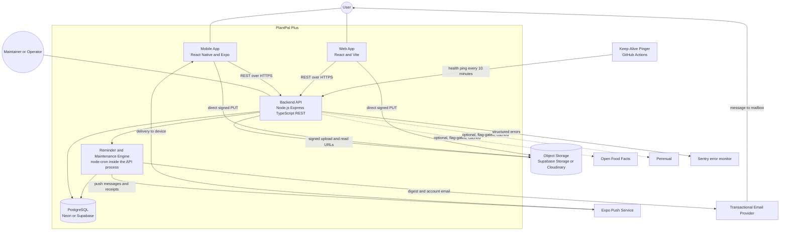

**Reading notes.**

1. **Both clients talk only to the backend, with two exceptions.** Photo bytes travel directly from the device to object storage using a single-use signed URL issued by the backend, and push notifications arrive at the mobile device from Expo. No client ever calls Open Food Facts or Perenual directly, so the feature flag, the request budget, the identifying `User-Agent` header and the cache are enforced in exactly one place.
2. **The reminder engine is not a separate service.** It is a set of `node-cron` entries inside the single Express process, because the free hosting tier permits one always-on instance. Its punctuality therefore depends on the Keep-Alive Pinger, which is a scheduled GitHub Actions workflow and is modelled as a time actor.
3. **The two dotted edges are the only optional ones.** Open Food Facts and Perenual are flag-gated and default to disabled. Every result they return is cached in PostgreSQL, which is canonical. Disabling both must leave the product passing its full acceptance suite.
4. **Sentry and the email provider are one-way.** Sentry receives structured errors that never carry a password, a push token, a notification title or a notification body. The email provider receives account messages and the optional digest and reports bounces and complaints back through its API, not through the user.

---

## 3. Actor catalogue

The catalogue is closed: no use case in this package involves an actor absent from this table. Names in the **Also known as** column are the local names used inside module documents; they denote the same actor.

### 3.1 Human actors

| Actor | Type | Also known as | Description | Goals |
| --- | --- | --- | --- | --- |
| Visitor | Primary | Unauthenticated Visitor, Guest | A person with no session. Reaches only the registration, verification, sign-in, password-reset and deep-link-capture surfaces. | Create an account, prove control of the mailbox, obtain a session, recover access after forgetting the password, resume a deep link after signing in. |
| Registered User | Primary | — | The authenticated account owner and the primary actor of 60 of the 89 use cases. | Track plants, workouts and meals in one product; see one unified daily dashboard; be reminded once at the right local time; keep streaks honest; log without connectivity; own, export and delete their data. |
| First-Run User | Primary | First-run User | A specialisation of Registered User: account younger than 24 hours with zero domain entities. | Reach a first created plant with a real due date, and a non-empty dashboard, inside the onboarding budget, guided by the first-run checklist and module empty states rather than by an empty screen. |
| Maintainer / Operator | Secondary | Operator, Catalogue Maintainer, Project Lead | Rakshit acting out of band. There is **no runtime administration interface and no Administrator role in v1.0**. | Flip server-side feature flags without a redeploy; run migrations and seeds; publish a new legal document version or achievement definition version; read the readiness endpoint; respond to quota alarms. |

**A binding consequence.** Because no Administrator actor exists, no flow may depend on an operator resetting a password, unlocking an account or reading a user's data. Every lockout self-expires and every blocked path has a self-service repair route.

### 3.2 Time actors

| Actor | Type | Also known as | Description | Goals |
| --- | --- | --- | --- | --- |
| Reminder Scheduler | Time | Notification Scheduler | Four `node-cron` entries inside the single Express process, each holding a distinct PostgreSQL advisory lock: the planner, the dispatcher, the receipt reconciler and the nightly retention pass. Runs one ordinary catch-up dispatch on boot so a cold start after a free-tier sleep is indistinguishable from a normal tick. | Materialise every occurrence exactly once; dispatch every due occurrence exactly once or record precisely why not; reconcile push receipts; expire tokens, exports and login-attempt rows. |
| Streak and Achievement Scheduler | Time | — | The `GAM` rollover worker. Fires at UTC minutes 2, 17, 32 and 47 and selects the users whose local day has just ended. | Judge each completed local day; update streak counters; run the catch-up pass after downtime; apply freeze tokens; generate the weekly recap on Monday morning local time. |
| Nightly Recompute Job | Time | — | The `PLT` daily pass. | Re-evaluate season, effective interval, urgency tier and health status once per user local day for every active and vacation-paused plant, so that state which changes only with the passage of time stays correct with no user action. |
| Maintenance Scheduler | Time | — | The `SYS` housekeeping `node-cron` entries. | Reclaim orphaned media, purge expired tombstones, caches and export objects, recompute storage usage, keep the storage provider warm. |
| Keep-Alive Pinger | Time, external | — | A scheduled GitHub Actions workflow calling the health endpoint every 10 minutes. Not a functional participant in any flow, but the deployment dependency on which the punctuality of `UC-NOT-02`, `UC-GAM-01` and `UC-SYS-07` rests. | Prevent the free backend instance from suspending, so the in-process cron entries keep firing. |
| System Clock and IANA Timezone Database | Time | System Clock / Day Roller | The single authoritative clock, read server-side, plus the offset rules. | Provide the current instant; drive local-date rollover in the user's IANA zone; supply every DST transition rule from which the day boundary is derived. |

### 3.3 Internal system actors

These are components of PlantPal+ modelled as actors because they act autonomously, on their own trigger, without a human present.

| Actor | Type | Also known as | Description | Goals |
| --- | --- | --- | --- | --- |
| Client Application | Primary, system | Mobile Client, Web Client, Client App | The Expo mobile app and the Vite web app acting without user interaction. Modelled outside the boundary for `ACC` because token storage differs by platform and that difference is a stated constraint. | Keep a session alive silently; hold and drain the offline outbox; page a delta sync; rebuild the replica on a full resync; render the four sync states accessibly; celebrate one unlock exactly once. |
| Dashboard Aggregation Service | System | Dashboard Aggregator — `DSH` | The backend composer of the single-round-trip dashboard aggregate. | Compose the aggregate from the `PLT`, `FIT`, `NUT` and `GAM` read models inside the query, latency and payload budgets, degrading per section rather than failing the whole response. |
| Sync Service | System | Sync Engine, Offline Sync Queue, Offline Write Queue | Owner of the outbox, the delta-sync cursor endpoint and the tombstone stream. | Replay queued append-only writes exactly once per idempotency key; validate the opaque cursor; emit tombstones; issue the cursor-expired directive that forces a full resynchronisation. |
| Media Service | System | — | Logical component of the API service. | Check quota before issuing anything; issue single-use signed upload URLs; validate and finalise uploads; generate the three image variants; maintain storage counters; never cause the loss of a growth entry when an upload fails. |
| Export Worker | System | — | A `node-cron` job on the same worker process. | Build the JSON archive and the photo manifest asynchronously and publish a signed download URL valid for 72 hours, then delete the archive at expiry. |
| Plant Care Scheduling Engine | System, primary for `UC-PLT-09` | — | The pure scheduling function of `PLT`. | Derive the effective interval, next due local date, urgency tier, health status and factor snapshot deterministically from stored inputs; remain idempotent and implemented exactly once in the shared package. |
| Fitness Evaluator | System, primary for `UC-FIT-03`, `UC-FIT-04`, `UC-FIT-07` | — | The pure evaluation function of `FIT`. | Freeze the energy estimate and its audit inputs at write time; derive personal records deterministically and revoke superseded ones; apply the ordered daily verdict procedure; remain fully rebuildable from stored rows. |
| Nutrition Calculation Engine | System, primary for `UC-NUT-05`, `UC-NUT-06` | — | The pure arithmetic function of `NUT`. | Convert a logged quantity to canonical grams; compute the per-entry snapshot, the basal metabolic rate, the total daily energy expenditure and the derived target; resolve the effective-dated target; aggregate a day and a rolling window identically on mobile, on web and in an export. |
| Achievement Evaluator | System, primary for `UC-GAM-04`, `UC-GAM-05` | — | The `GAM` progress engine. | Resolve an outbox event to its affected metric keys; refresh only those metrics; evaluate only the indexed definitions; write progress at or above 1 percent; attempt an idempotent unlock. |
| Recomputation Worker | System, primary for `UC-GAM-03` | — | The `GAM` retroactive job runner. | Execute bounded recomputation jobs serialised per user by an advisory lock; rebuild outcomes and streaks from scratch over the affected range; guarantee that a full rebuild and the incremental rollover path agree exactly. |
| Domain Event Publisher | System | — | Writes one gamification outbox row inside the same transaction as the domain change. | Ensure no domain write can succeed without its evaluation trigger. |
| Notification Dispatcher | System | Notification Dispatch Service | The `NOT` delivery component, consumed by `GAM`, `SET` and `SYS`. | Accept delivery requests; own quiet hours, the achievement push cap, token lifecycle and retries; deliver the export-ready notice, the deletion-scheduled confirmation and the pre-purge reminder. |
| Seed Data Loader | System, build time | Seed Loader, Food Catalogue Seeder | Deterministic catalogue loader run at migration time. | Load approximately 60 plant species with care profiles, approximately 300 foods with per-100g macros and their serving factors, the activity-type MET table and the exercise catalogue, idempotently and keyed by slug, asserting plausibility bounds at load time. |
| Platform Runtime | System | — | iOS, Android and the browser. | Supply the OS colour scheme, the reduce-motion signal, the dynamic-type scale, the network reachability signal, the application-foreground event and the device IANA timezone. |
| Device Camera | System, device capability | — | Expo Camera on mobile only. | Decode a barcode symbol on device and surface only the decoded digits. No image ever leaves the device. Absent on web in v1.0. |
| Device Pedometer | System, device capability | — | Mobile only, foreground only, behind a flag defaulting to false. | Return one integer step count for the interval from local midnight to now. The experience with the flag off must be complete. |
| Consuming Module | System, secondary | Dashboard Aggregator, Gamification Service, Nutrition Module, Fitness Module | One PlantPal+ module appearing as a secondary actor on another module's diagram, because it reads that module's published events or read model and owns none of its rules. | Consume, never compute: `DSH` consumes the daily tiles, `GAM` consumes the day-evaluated, record and day-changed events, `NUT` consumes the estimated energy expenditure, `FIT` supplies it and consumes nothing back. |
| Source Modules | System | Source Modules PLT FIT NUT GAM | The domain modules read by the reminder engine at planner time and re-read at the final eligibility gate. | Publish watering and care-task due state, the workout-logged flag and step totals, meals and water logged, and the streak-at-risk and achievement-unlocked signals. The engine never computes a domain schedule and never evaluates a domain goal. |

### 3.4 External system actors

| Actor | Type | Description | Goals | Fallback when unavailable |
| --- | --- | --- | --- | --- |
| PostgreSQL Database | System, secondary | Neon or Supabase free tier. The canonical store and the single authoritative clock. | Hold every entity and the seeded catalogues; enforce the uniqueness constraints that carry the at-most-once and idempotent-replay guarantees; grant and release advisory locks; supply the trigram and unaccent extensions used by search. | None. The database is a hard dependency; total unavailability returns a service-unavailable response with a retry-after value. |
| Object Storage and CDN | Secondary, external | Supabase Storage, with Cloudinary documented as the alternative. | Accept the direct signed upload, store the original, medium and thumbnail variants and the export objects, and serve time-limited signed read URLs. | A growth entry is never lost when an upload fails; the photo is retried or the entry stands without it. |
| Expo Push Service | System, external | Accepts chunks of at most 100 messages, returns one ticket per message and a receipt per ticket after a settle delay. | Deliver mobile push and report the token and rate errors that drive token pruning. | The in-app channel remains the channel of record; delivery is recorded as failed and the notification centre still shows the item. |
| Transactional Email Provider | System, external | A permanently free tier of roughly 100 messages per day. | Deliver the account messages and the optional digest, honour the unsubscribe headers, and report bounces and complaints. | Account flows commit regardless; the delivery failure is logged and the user recovers through a self-service resend. |
| Open Food Facts | System, external, flag-gated | Free, keyless barcode and food text lookup, reached only from the backend. Drawn as `External Data Provider` in the `SYS` diagram. | Enrich food search and turn a barcode into a confirmable food. Every result is cached in PostgreSQL. | Disabled by default. The seeded catalogue of approximately 300 foods plus custom foods is complete on its own. |
| Perenual | System, external, flag-gated | Species enrichment, reached only from the backend. Drawn as `Perenual API` in the `PLT` diagram and as `External Data Provider` in the `SYS` diagram. | Supply optional presentational species enrichment. Every result is cached. | Disabled by default. The experience with the flag off and with the provider down must be indistinguishable. |
| Breach Corpus Service | Secondary, external | The Have I Been Pwned range API, free and keyless. | Answer a 5-character SHA-1 prefix query with candidate suffixes and counts, so a breached password can be refused without transmitting it. | Fails open: the password is treated as not breached and a counter is incremented. |
| External Identity Provider | Secondary, external | Google and Apple. Deferred to v1.1. | Assert a verified email address and a stable subject identifier. | Absent in v1.0. Email and password with rotating refresh tokens is the whole of the v1.0 identity story. |
| Error Monitor | System, external | Sentry free tier. | Receive de-duplicated structured errors carrying a request identifier, never a password, a push token, a notification title or a notification body. | Errors are logged locally; no user-visible effect. |

---

## 4. Top-level use-case model

A single diagram containing 89 use cases and 30 actors would not be readable, so the top level is presented as one package diagram plus two grouped user-goal diagrams, and the full per-module diagrams follow in section 5.

### 4.1 Package overview

Each node is a subsystem. An edge means that use cases in the source package invoke, publish to or read from the target package. Edge labels state what crosses the boundary.

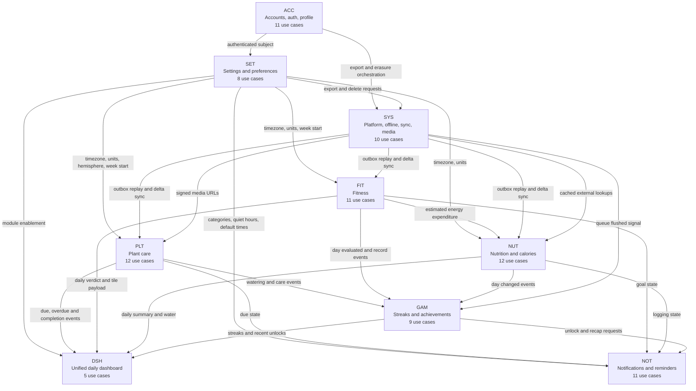

**Reading note.** `SET` is the widest fan-out in the product: a single preference change cascades into the plant schedule, the reminder schedule and the dashboard day boundary. That is why `UC-SET-08` exists as a subfunction — every settings write goes through one persistence and conflict path, and each cascade is then specified once against that path rather than once per setting. `GAM` is a pure consumer: it has no inbound edge from a client, because no client may write gamification state.

### 4.2 User-goal use cases, human-facing modules

Only user-goal level use cases appear below; subfunctions are shown in their module diagrams in section 5. Actor associations are drawn to the module subgraph's use cases individually.

```mermaid
flowchart LR
  A_VISITOR(("Visitor"))
  A_USER(("Registered User"))
  A_FIRST(("First-Run User"))

  subgraph ACC["PlantPal Plus - Accounts"]
    direction TB
    C1(["UC-ACC-01 Register an account"])
    C2(["UC-ACC-02 Verify email address"])
    C3(["UC-ACC-03 Log in"])
    C5(["UC-ACC-05 Manage sessions and devices"])
    C6(["UC-ACC-06 Reset a forgotten password"])
    C7(["UC-ACC-07 Change password"])
    C8(["UC-ACC-08 Complete onboarding"])
    C9(["UC-ACC-09 Manage profile and preferences"])
    C10(["UC-ACC-10 Export account data"])
    C11(["UC-ACC-11 Delete the account"])
  end

  subgraph DSHSET["PlantPal Plus - Dashboard and Settings"]
    direction TB
    D1(["UC-DSH-01 View the unified daily dashboard"])
    D2(["UC-DSH-02 Complete a due item"])
    D3(["UC-DSH-03 Browse a past date"])
    D4(["UC-DSH-04 Quick-add a log entry"])
    S1(["UC-SET-01 Update a presentation preference"])
    S2(["UC-SET-02 Configure notifications and quiet hours"])
    S3(["UC-SET-03 Change timezone or hemisphere"])
    S4(["UC-SET-04 Enable or disable a module"])
    S5(["UC-SET-05 Export personal data"])
    S6(["UC-SET-06 Delete the account"])
    S7(["UC-SET-07 Manage active sessions"])
  end

  subgraph PLT["PlantPal Plus - Plant Care"]
    direction TB
    P1(["UC-PLT-01 Add a plant"])
    P2(["UC-PLT-02 Log a watering"])
    P3(["UC-PLT-03 Snooze or skip a watering cycle"])
    P4(["UC-PLT-04 Bulk water selected plants"])
    P5(["UC-PLT-05 Browse and search the species catalogue"])
    P6(["UC-PLT-06 Browse filter and sort the plant list"])
    P7(["UC-PLT-07 Record a growth log entry"])
    P8(["UC-PLT-08 Review the growth timeline and chart"])
    P10(["UC-PLT-10 Complete or skip a care task"])
    P11(["UC-PLT-11 Enable or cancel vacation mode"])
    P12(["UC-PLT-12 Archive restore or delete a plant"])
  end

  A_VISITOR --- C1
  A_VISITOR --- C2
  A_VISITOR --- C3
  A_VISITOR --- C6
  A_USER --- C5
  A_USER --- C7
  A_USER --- C8
  A_USER --- C9
  A_USER --- C10
  A_USER --- C11

  A_USER --- D1
  A_USER --- D2
  A_USER --- D3
  A_USER --- D4
  A_FIRST --- D1
  A_USER --- S1
  A_USER --- S2
  A_USER --- S3
  A_USER --- S4
  A_USER --- S5
  A_USER --- S6
  A_USER --- S7

  A_USER --- P1
  A_USER --- P2
  A_USER --- P3
  A_USER --- P4
  A_USER --- P5
  A_USER --- P6
  A_USER --- P7
  A_USER --- P8
  A_USER --- P10
  A_USER --- P11
  A_USER --- P12
  A_FIRST --- P1
```

### 4.3 User-goal use cases, tracking and platform modules

```mermaid
flowchart LR
  A_USER(("Registered User"))
  A_SCHED(("Reminder Scheduler"))
  A_GSCHED(("Streak and Achievement Scheduler"))
  A_EVAL(("Achievement Evaluator"))
  A_RECOMP(("Recomputation Worker"))
  A_MSCHED(("Maintenance Scheduler"))
  A_MAINT(("Maintainer or Operator"))

  subgraph FIT["PlantPal Plus - Fitness"]
    direction TB
    F1(["UC-FIT-01 Log a cardio workout"])
    F2(["UC-FIT-02 Log a strength workout"])
    F5(["UC-FIT-05 Log a daily step count"])
    F6(["UC-FIT-06 Set or revise a fitness goal"])
    F8(["UC-FIT-08 Mark or clear a rest day"])
    F9(["UC-FIT-09 Edit or delete a logged workout"])
    F10(["UC-FIT-10 Log a body metric entry"])
    F11(["UC-FIT-11 View progress charts and records"])
  end

  subgraph NUT["PlantPal Plus - Nutrition"]
    direction TB
    N1(["UC-NUT-01 Log a meal entry"])
    N2(["UC-NUT-02 Find a food"])
    N3(["UC-NUT-03 Look up a product by barcode"])
    N4(["UC-NUT-04 Create a custom food"])
    N7(["UC-NUT-07 Configure nutrition targets"])
    N8(["UC-NUT-08 Amend a logged day"])
    N9(["UC-NUT-09 Copy a meal or a day"])
    N10(["UC-NUT-10 Log water intake"])
    N11(["UC-NUT-11 Review nutrition trends"])
  end

  subgraph NOT["PlantPal Plus - Notifications"]
    direction TB
    T1(["UC-NOT-01 Materialise reminder occurrences"])
    T2(["UC-NOT-02 Dispatch due reminders"])
    T5(["UC-NOT-05 Reconcile push receipts and prune tokens"])
    T6(["UC-NOT-06 Manage device push tokens"])
    T7(["UC-NOT-07 Configure notification preferences"])
    T8(["UC-NOT-08 Open a notification and deep-link"])
    T9(["UC-NOT-09 Snooze or act on a due reminder"])
    T10(["UC-NOT-10 Review notification centre history"])
    T11(["UC-NOT-11 Send a test notification"])
  end

  subgraph GAM["PlantPal Plus - Gamification"]
    direction TB
    G1(["UC-GAM-01 Evaluate end-of-day module completion"])
    G3(["UC-GAM-03 Recompute after a retroactive change"])
    G5(["UC-GAM-05 Unlock an achievement and deliver the reward"])
    G6(["UC-GAM-06 View the trophy gallery"])
    G8(["UC-GAM-08 Generate and deliver the weekly recap"])
    G9(["UC-GAM-09 Publish a new achievement definition version"])
  end

  subgraph SYS["PlantPal Plus - Platform and Sync"]
    direction TB
    Y1(["UC-SYS-01 Queue an append-only action while offline"])
    Y3(["UC-SYS-03 Resolve a permanently failed queued item"])
    Y6(["UC-SYS-06 Upload a plant photo"])
    Y7(["UC-SYS-07 Run scheduled platform housekeeping"])
    Y8(["UC-SYS-08 External lookup with degradation"])
    Y9(["UC-SYS-09 Search across modules"])
    Y10(["UC-SYS-10 Export account data"])
  end

  A_USER --- F1
  A_USER --- F2
  A_USER --- F5
  A_USER --- F6
  A_USER --- F8
  A_USER --- F9
  A_USER --- F10
  A_USER --- F11

  A_USER --- N1
  A_USER --- N2
  A_USER --- N3
  A_USER --- N4
  A_USER --- N7
  A_USER --- N8
  A_USER --- N9
  A_USER --- N10
  A_USER --- N11

  A_SCHED --- T1
  A_SCHED --- T2
  A_SCHED --- T5
  A_USER --- T6
  A_USER --- T7
  A_USER --- T8
  A_USER --- T9
  A_USER --- T10
  A_USER --- T11

  A_GSCHED --- G1
  A_GSCHED --- G8
  A_RECOMP --- G3
  A_USER --- G3
  A_EVAL --- G5
  A_USER --- G5
  A_USER --- G6
  A_MAINT --- G9

  A_USER --- Y1
  A_USER --- Y3
  A_USER --- Y6
  A_USER --- Y8
  A_USER --- Y9
  A_USER --- Y10
  A_MSCHED --- Y7
  A_MAINT --- Y7
```

**Reading note.** The asymmetry between 4.2 and 4.3 is the shape of the product, not an accident of drawing. In `PLT`, `FIT`, `NUT`, `DSH`, `SET` and `ACC` the human initiates almost everything. In `NOT` and `GAM` the human initiates almost nothing: five of eleven `NOT` use cases and seven of nine `GAM` use cases are driven by a clock or an internal component, because no client may create a scheduled reminder and no client may write gamification state. Modelling those engine passes as first-class use cases is what makes the two hardest correctness obligations in the product — a reminder arrives once, at the right local time, for something genuinely still outstanding, and a streak is never wrongly broken — reviewable and testable rather than buried in an implementation note.

---

## 5. Module use-case models

Each subsection reproduces the owning document's module diagram so that this model stands alone, then indexes every use case with its primary actor, level, priority and a link to its full specification. **Priority and level are reproduced verbatim from the owning document**; where a field is compound, the compound form is preserved rather than flattened, because flattening would lose the release boundary.

### 5.1 Accounts, authentication and profile — `ACC`

Source document: [`use-cases/accounts.md`](use-cases/accounts.md) · Specification: [`modules/accounts.md`](modules/accounts.md) · Stories: [`user-stories/accounts.md`](user-stories/accounts.md)

Eleven use cases, `UC-ACC-01` through `UC-ACC-11`. The stadium nodes carrying no `UC-ACC-nn` identifier are included or extending behaviours of those eleven, named after the functional requirement that realises them.

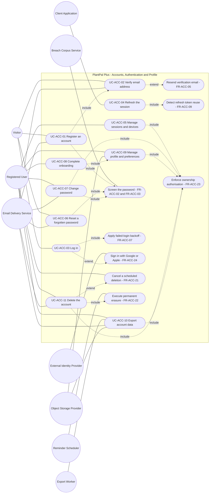

| ID | Name | Primary actor | Level | Priority | Specification |
| --- | --- | --- | --- | --- | --- |
| `UC-ACC-01` | Register an account | Visitor | User-goal | Must | [Open](use-cases/accounts.md#uc-acc-01--register-an-account) |
| `UC-ACC-02` | Verify email address | Visitor | User-goal | Must | [Open](use-cases/accounts.md#uc-acc-02--verify-email-address) |
| `UC-ACC-03` | Log in | Visitor | User-goal | Must | [Open](use-cases/accounts.md#uc-acc-03--log-in) |
| `UC-ACC-04` | Refresh the session | Client Application | Subfunction | Must | [Open](use-cases/accounts.md#uc-acc-04--refresh-the-session) |
| `UC-ACC-05` | Manage sessions and devices | Registered User | User-goal | Must for signing out of this device and signing out everywhere; Should for listing sessions and revoking a single session | [Open](use-cases/accounts.md#uc-acc-05--manage-sessions-and-devices) |
| `UC-ACC-06` | Reset a forgotten password | Visitor | User-goal | Must | [Open](use-cases/accounts.md#uc-acc-06--reset-a-forgotten-password) |
| `UC-ACC-07` | Change password | Registered User | User-goal | Must | [Open](use-cases/accounts.md#uc-acc-07--change-password) |
| `UC-ACC-08` | Complete onboarding | Registered User | User-goal | Must | [Open](use-cases/accounts.md#uc-acc-08--complete-onboarding) |
| `UC-ACC-09` | Manage profile and preferences | Registered User | User-goal | Must | [Open](use-cases/accounts.md#uc-acc-09--manage-profile-and-preferences) |
| `UC-ACC-10` | Export account data | Registered User | User-goal | Must | [Open](use-cases/accounts.md#uc-acc-10--export-account-data) |
| `UC-ACC-11` | Delete the account | Registered User | User-goal | Must | [Open](use-cases/accounts.md#uc-acc-11--delete-the-account) |

### 5.2 Unified daily dashboard and settings — `DSH` and `SET`

Source document: [`use-cases/dashboard-and-settings.md`](use-cases/dashboard-and-settings.md) · Specification: [`modules/dashboard-and-settings.md`](modules/dashboard-and-settings.md) · Stories: [`user-stories/dashboard-and-settings.md`](user-stories/dashboard-and-settings.md)

Thirteen use cases in two prefixes: `UC-DSH-01` … `UC-DSH-05` and `UC-SET-01` … `UC-SET-08`.

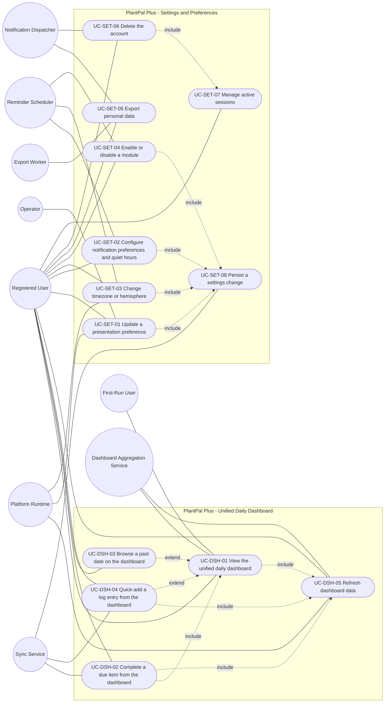

| ID | Name | Primary actor | Level | Priority | Specification |
| --- | --- | --- | --- | --- | --- |
| `UC-DSH-01` | View the unified daily dashboard | Registered User, also First-Run User | User-goal | Must | [Open](use-cases/dashboard-and-settings.md#uc-dsh-01--view-the-unified-daily-dashboard) |
| `UC-DSH-02` | Complete a due item from the dashboard | Registered User | User-goal | Must | [Open](use-cases/dashboard-and-settings.md#uc-dsh-02--complete-a-due-item-from-the-dashboard) |
| `UC-DSH-03` | Browse a past date on the dashboard | Registered User | User-goal | Must | [Open](use-cases/dashboard-and-settings.md#uc-dsh-03--browse-a-past-date-on-the-dashboard) |
| `UC-DSH-04` | Quick-add a log entry from the dashboard | Registered User | User-goal | Must | [Open](use-cases/dashboard-and-settings.md#uc-dsh-04--quick-add-a-log-entry-from-the-dashboard) |
| `UC-DSH-05` | Refresh dashboard data | Registered User | Subfunction | Must | [Open](use-cases/dashboard-and-settings.md#uc-dsh-05--refresh-dashboard-data) |
| `UC-SET-01` | Update a presentation preference | Registered User | User-goal | Must | [Open](use-cases/dashboard-and-settings.md#uc-set-01--update-a-presentation-preference) |
| `UC-SET-02` | Configure notification preferences and quiet hours | Registered User | User-goal | Must | [Open](use-cases/dashboard-and-settings.md#uc-set-02--configure-notification-preferences-and-quiet-hours) |
| `UC-SET-03` | Change timezone or hemisphere | Registered User | User-goal | Must for the timezone and hemisphere selections and their cascades; Should for the drift prompt, which is v1.1 | [Open](use-cases/dashboard-and-settings.md#uc-set-03--change-timezone-or-hemisphere) |
| `UC-SET-04` | Enable or disable a module | Registered User | User-goal | Must | [Open](use-cases/dashboard-and-settings.md#uc-set-04--enable-or-disable-a-module) |
| `UC-SET-05` | Export personal data | Registered User | User-goal | Must for the request and the delivery; Could for the import counterpart, which is v1.1 | [Open](use-cases/dashboard-and-settings.md#uc-set-05--export-personal-data) |
| `UC-SET-06` | Delete the account | Registered User | User-goal | Must | [Open](use-cases/dashboard-and-settings.md#uc-set-06--delete-the-account) |
| `UC-SET-07` | Manage active sessions | Registered User | User-goal | Should | [Open](use-cases/dashboard-and-settings.md#uc-set-07--manage-active-sessions) |
| `UC-SET-08` | Persist a settings change | Sync Service | Subfunction | Must | [Open](use-cases/dashboard-and-settings.md#uc-set-08--persist-a-settings-change) |

**Deliberate overlap with `ACC`.** `UC-SET-05`, `UC-SET-06` and `UC-SET-07` are the settings-surface entry points to capabilities specified end to end by `UC-ACC-10`, `UC-ACC-11` and `UC-ACC-05` respectively, and `UC-SET-05` also reaches the archive builder of `UC-SYS-10`. They are separate use cases rather than duplicates because the surface, its guard rails and its confirmation copy belong to `SET`, while the token, erasure and archive semantics belong to `ACC` and `SYS`. Section 6 records the relationships.

### 5.3 Plant care — `PLT`

Source document: [`use-cases/plant-care.md`](use-cases/plant-care.md) · Specification: [`modules/plant-care.md`](modules/plant-care.md) · Stories: [`user-stories/plant-care.md`](user-stories/plant-care.md)

Twelve use cases, `UC-PLT-01` through `UC-PLT-12`, plus five unnumbered extension nodes.

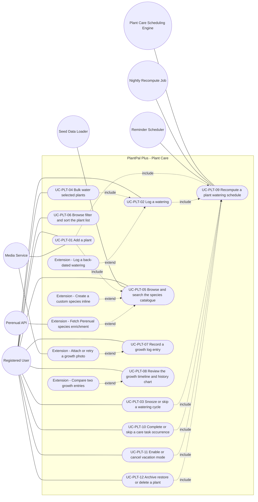

| ID | Name | Primary actor | Level | Priority | Specification |
| --- | --- | --- | --- | --- | --- |
| `UC-PLT-01` | Add a plant | Registered User, specialising to First-run User for the first plant | User-goal | Must | [Open](use-cases/plant-care.md#uc-plt-01--add-a-plant) |
| `UC-PLT-02` | Log a watering | Registered User | User-goal | Must | [Open](use-cases/plant-care.md#uc-plt-02--log-a-watering) |
| `UC-PLT-03` | Snooze or skip a watering cycle | Registered User | User-goal | Should | [Open](use-cases/plant-care.md#uc-plt-03--snooze-or-skip-a-watering-cycle) |
| `UC-PLT-04` | Bulk water selected plants | Registered User | User-goal | Should | [Open](use-cases/plant-care.md#uc-plt-04--bulk-water-selected-plants) |
| `UC-PLT-05` | Browse and search the species catalogue | Registered User | User-goal when entered directly; subfunction when included by `UC-PLT-01` | Must for FR-PLT-01 and FR-PLT-02; Should for the custom-species extension; Could for the enrichment extension | [Open](use-cases/plant-care.md#uc-plt-05--browse-and-search-the-species-catalogue) |
| `UC-PLT-06` | Browse, filter and sort the plant list | Registered User | User-goal | Must | [Open](use-cases/plant-care.md#uc-plt-06--browse-filter-and-sort-the-plant-list) |
| `UC-PLT-07` | Record a growth log entry | Registered User | User-goal | Must | [Open](use-cases/plant-care.md#uc-plt-07--record-a-growth-log-entry) |
| `UC-PLT-08` | Review the growth timeline and history chart | Registered User | User-goal | Should for the timeline and the chart; Could for the comparison extension | [Open](use-cases/plant-care.md#uc-plt-08--review-the-growth-timeline-and-history-chart) |
| `UC-PLT-09` | Recompute a plant watering schedule | Plant Care Scheduling Engine; Nightly Recompute Job for the daily trigger | Subfunction — the only one in this module | Must | [Open](use-cases/plant-care.md#uc-plt-09--recompute-a-plant-watering-schedule) |
| `UC-PLT-10` | Complete or skip a care task occurrence | Registered User | User-goal | Should | [Open](use-cases/plant-care.md#uc-plt-10--complete-or-skip-a-care-task-occurrence) |
| `UC-PLT-11` | Enable or cancel vacation mode | Registered User | User-goal | Should | [Open](use-cases/plant-care.md#uc-plt-11--enable-or-cancel-vacation-mode) |
| `UC-PLT-12` | Archive, restore or delete a plant | Registered User | User-goal | Must | [Open](use-cases/plant-care.md#uc-plt-12--archive-restore-or-delete-a-plant) |

**Structural note.** Every mutating flow in `PLT` funnels through `UC-PLT-09`, which is the module's only subfunction and has no user interface of its own. `UC-PLT-04` reaches the engine transitively through its inclusion of `UC-PLT-02`, because a bulk water is specified as exactly N independent single waterings and must not become a second code path.

### 5.4 Fitness — `FIT`

Source document: [`use-cases/fitness.md`](use-cases/fitness.md) · Specification: [`modules/fitness.md`](modules/fitness.md) · Stories: [`user-stories/fitness.md`](user-stories/fitness.md)

Eleven use cases, `UC-FIT-01` through `UC-FIT-11`, plus twelve unnumbered extension nodes.

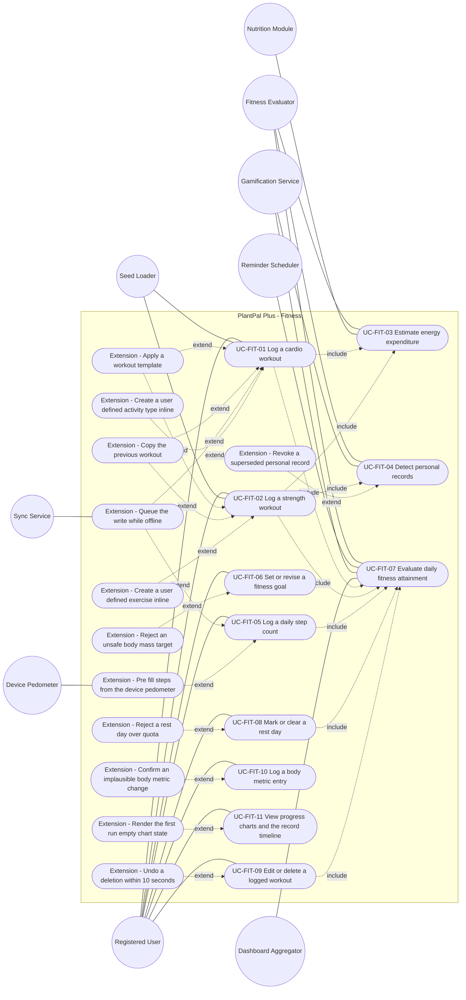

| ID | Name | Primary actor | Level | Priority | Specification |
| --- | --- | --- | --- | --- | --- |
| `UC-FIT-01` | Log a cardio workout | Registered User | User-goal | Must | [Open](use-cases/fitness.md#uc-fit-01--log-a-cardio-workout) |
| `UC-FIT-02` | Log a strength workout | Registered User | User-goal | Must | [Open](use-cases/fitness.md#uc-fit-02--log-a-strength-workout) |
| `UC-FIT-03` | Estimate energy expenditure | Fitness Evaluator | Subfunction | Must | [Open](use-cases/fitness.md#uc-fit-03--estimate-energy-expenditure) |
| `UC-FIT-04` | Detect personal records | Fitness Evaluator | Subfunction | Should | [Open](use-cases/fitness.md#uc-fit-04--detect-personal-records) |
| `UC-FIT-05` | Log a daily step count | Registered User | User-goal | Must | [Open](use-cases/fitness.md#uc-fit-05--log-a-daily-step-count) |
| `UC-FIT-06` | Set or revise a fitness goal | Registered User | User-goal | Must | [Open](use-cases/fitness.md#uc-fit-06--set-or-revise-a-fitness-goal) |
| `UC-FIT-07` | Evaluate daily fitness attainment | Fitness Evaluator; Reminder Scheduler for the nightly close-out | Subfunction | Must | [Open](use-cases/fitness.md#uc-fit-07--evaluate-daily-fitness-attainment) |
| `UC-FIT-08` | Mark or clear a rest day | Registered User | User-goal | Should | [Open](use-cases/fitness.md#uc-fit-08--mark-or-clear-a-rest-day) |
| `UC-FIT-09` | Edit or delete a logged workout | Registered User | User-goal | Must | [Open](use-cases/fitness.md#uc-fit-09--edit-or-delete-a-logged-workout) |
| `UC-FIT-10` | Log a body-metric entry | Registered User | User-goal | Must | [Open](use-cases/fitness.md#uc-fit-10--log-a-body-metric-entry) |
| `UC-FIT-11` | View progress charts and the record timeline | Registered User | User-goal | Must | [Open](use-cases/fitness.md#uc-fit-11--view-progress-charts-and-the-record-timeline) |

**Structural note.** `UC-FIT-07` is the convergence point of the module: every mutating flow reaches it, which is what lets `GAM` remain a pure consumer of the day-evaluated event. `UC-FIT-09` reaches `UC-FIT-03` and `UC-FIT-04` transitively through the recomputation cascade rather than re-specifying either, so an edit and a create can never diverge. `UC-FIT-11` is read-only and therefore includes nothing.

### 5.5 Calorie and nutrition — `NUT`

Source document: [`use-cases/nutrition.md`](use-cases/nutrition.md) · Specification: [`modules/nutrition.md`](modules/nutrition.md) · Stories: [`user-stories/nutrition.md`](user-stories/nutrition.md)

Twelve use cases, `UC-NUT-01` through `UC-NUT-12`, with no unnumbered extension nodes: every relationship in this module is between two identified use cases.

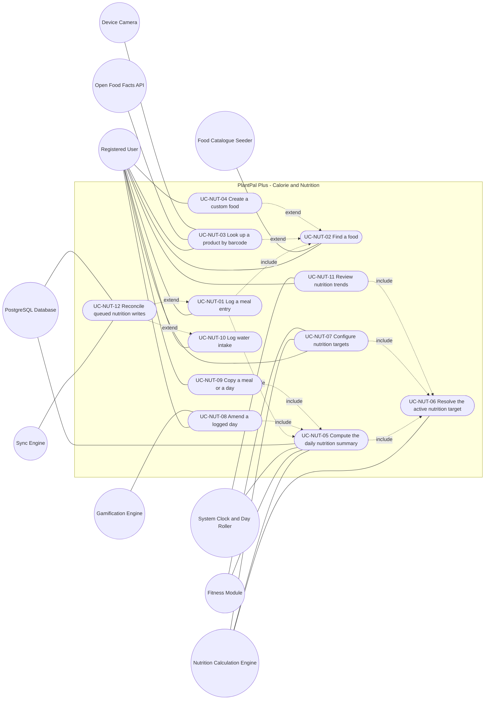

| ID | Name | Primary actor | Level | Priority | Specification |
| --- | --- | --- | --- | --- | --- |
| `UC-NUT-01` | Log a meal entry | Registered User | User-goal | Must | [Open](use-cases/nutrition.md#uc-nut-01--log-a-meal-entry) |
| `UC-NUT-02` | Find a food | Registered User | User-goal when performed on its own; subfunction when included by `UC-NUT-01` | Must | [Open](use-cases/nutrition.md#uc-nut-02--find-a-food) |
| `UC-NUT-03` | Look up a product by barcode | Registered User | User-goal | Should | [Open](use-cases/nutrition.md#uc-nut-03--look-up-a-product-by-barcode) |
| `UC-NUT-04` | Create a custom food | Registered User | User-goal | Must | [Open](use-cases/nutrition.md#uc-nut-04--create-a-custom-food) |
| `UC-NUT-05` | Compute the daily nutrition summary | Nutrition Calculation Engine | Subfunction — included by `UC-NUT-01`, `UC-NUT-08` and `UC-NUT-09` | Must | [Open](use-cases/nutrition.md#uc-nut-05--compute-the-daily-nutrition-summary) |
| `UC-NUT-06` | Resolve the active nutrition target | Nutrition Calculation Engine | Subfunction — included by `UC-NUT-05`, `UC-NUT-07` and `UC-NUT-11` | Must | [Open](use-cases/nutrition.md#uc-nut-06--resolve-the-active-nutrition-target) |
| `UC-NUT-07` | Configure nutrition targets | Registered User | User-goal | Must | [Open](use-cases/nutrition.md#uc-nut-07--configure-nutrition-targets) |
| `UC-NUT-08` | Amend a logged day | Registered User | User-goal | Must | [Open](use-cases/nutrition.md#uc-nut-08--amend-a-logged-day) |
| `UC-NUT-09` | Copy a meal or a day | Registered User | User-goal | Should | [Open](use-cases/nutrition.md#uc-nut-09--copy-a-meal-or-a-day) |
| `UC-NUT-10` | Log water intake | Registered User | User-goal | Must | [Open](use-cases/nutrition.md#uc-nut-10--log-water-intake) |
| `UC-NUT-11` | Review nutrition trends | Registered User | User-goal | Should | [Open](use-cases/nutrition.md#uc-nut-11--review-nutrition-trends) |
| `UC-NUT-12` | Reconcile queued nutrition writes | Sync Engine | Subfunction — extends `UC-NUT-01` and `UC-NUT-10` at their offline extension points | Must | [Open](use-cases/nutrition.md#uc-nut-12--reconcile-queued-nutrition-writes) |

**Structural note.** `UC-NUT-05` and `UC-NUT-06` are the only places where the daily arithmetic and the effective-dated target selection are specified, and both are reached from four different bases; specifying them once is what guarantees that a meal log, a day amendment, a copy and a trend query all agree on the same number. `UC-NUT-03` and `UC-NUT-04` **extend** `UC-NUT-02` rather than being included by it, because catalogue search is complete and useful on its own with every external integration disabled, which is the obligation D-03 imposes.

### 5.6 Notifications and the reminder engine — `NOT`

Source document: [`use-cases/notifications.md`](use-cases/notifications.md) · Specification: [`modules/notifications.md`](modules/notifications.md) · Stories: [`user-stories/notifications.md`](user-stories/notifications.md)

Eleven use cases, `UC-NOT-01` through `UC-NOT-11`.

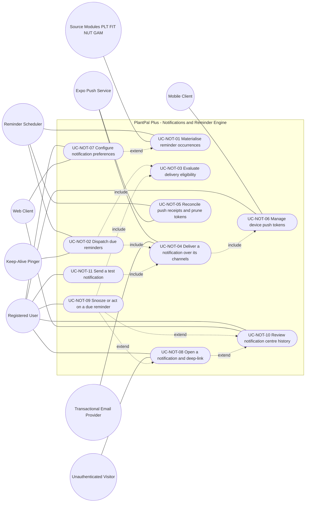

| ID | Name | Primary actor | Level | Priority | Specification |
| --- | --- | --- | --- | --- | --- |
| `UC-NOT-01` | Materialise reminder occurrences | Reminder Scheduler, time actor — the planner entry | User-goal | Must | [Open](use-cases/notifications.md#uc-not-01--materialise-reminder-occurrences) |
| `UC-NOT-02` | Dispatch due reminders | Reminder Scheduler, time actor — the dispatch entry | User-goal | Must | [Open](use-cases/notifications.md#uc-not-02--dispatch-due-reminders) |
| `UC-NOT-03` | Evaluate delivery eligibility for one occurrence | Reminder Scheduler, system actor | Subfunction — included by `UC-NOT-02` and `UC-NOT-09`; no actor edge of its own | Must | [Open](use-cases/notifications.md#uc-not-03--evaluate-delivery-eligibility-for-one-occurrence) |
| `UC-NOT-04` | Deliver a notification over its channels | Reminder Scheduler, system actor | Subfunction — included by `UC-NOT-02` and `UC-NOT-11`; includes the token-resolution segment of `UC-NOT-06` | Must | [Open](use-cases/notifications.md#uc-not-04--deliver-a-notification-over-its-channels) |
| `UC-NOT-05` | Reconcile push receipts and prune tokens | Reminder Scheduler, time actor — the receipt entry | User-goal | Must | [Open](use-cases/notifications.md#uc-not-05--reconcile-push-receipts-and-prune-tokens) |
| `UC-NOT-06` | Manage device push tokens | Registered User, acting through the Mobile Client | User-goal for registration, refresh and manual revocation; subfunction for the token-resolution segment included by `UC-NOT-04` | Must | [Open](use-cases/notifications.md#uc-not-06--manage-device-push-tokens) |
| `UC-NOT-07` | Configure notification preferences | Registered User | User-goal | Must | [Open](use-cases/notifications.md#uc-not-07--configure-notification-preferences) |
| `UC-NOT-08` | Open a notification and deep-link to its subject | Registered User | User-goal | Must | [Open](use-cases/notifications.md#uc-not-08--open-a-notification-and-deep-link-to-its-subject) |
| `UC-NOT-09` | Snooze or act on a due reminder | Registered User | User-goal | Should | [Open](use-cases/notifications.md#uc-not-09--snooze-or-act-on-a-due-reminder) |
| `UC-NOT-10` | Review notification centre history | Registered User | User-goal | Must | [Open](use-cases/notifications.md#uc-not-10--review-notification-centre-history) |
| `UC-NOT-11` | Send a test notification | Registered User | User-goal | Should | [Open](use-cases/notifications.md#uc-not-11--send-a-test-notification) |

**Structural note.** No client may create, mutate or cancel a scheduled reminder or a delivery record. A user never performs a dispatch; they configure a preference, register a device, open a notification, act on it or read their history, and the engine does the rest on a `node-cron` schedule inside the single Express process. `UC-NOT-03` and `UC-NOT-04` are subfunctions with no actor edge because the same eligibility decision and the same channel fan-out are reached from three different bases — the dispatch pass, a snooze that reschedules an occurrence, and the user-initiated diagnostic — and specifying them once is what stops three copies of the quiet-hours rule drifting apart.

### 5.7 Streaks, achievements and gamification — `GAM`

Source document: [`use-cases/gamification.md`](use-cases/gamification.md) · Specification: [`modules/gamification.md`](modules/gamification.md) · Stories: [`user-stories/gamification.md`](user-stories/gamification.md)

Nine use cases, `UC-GAM-01` through `UC-GAM-09`.

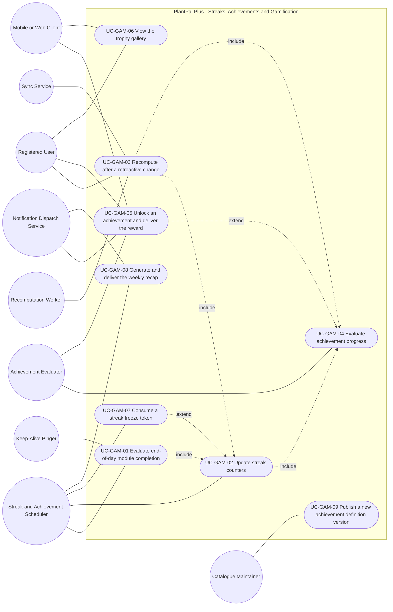

| ID | Name | Primary actor | Level | Priority | Specification |
| --- | --- | --- | --- | --- | --- |
| `UC-GAM-01` | Evaluate end-of-day module completion | Streak and Achievement Scheduler, time actor | User-goal | Must | [Open](use-cases/gamification.md#uc-gam-01--evaluate-end-of-day-module-completion) |
| `UC-GAM-02` | Update streak counters | Streak and Achievement Scheduler; the Recomputation Worker drives the identical flow from `UC-GAM-03` | Subfunction — included by `UC-GAM-01` and `UC-GAM-03`, extended by `UC-GAM-07` | Must | [Open](use-cases/gamification.md#uc-gam-02--update-streak-counters) |
| `UC-GAM-03` | Recompute streaks and achievements after a retroactive change | Recomputation Worker | User-goal | Must | [Open](use-cases/gamification.md#uc-gam-03--recompute-streaks-and-achievements-after-a-retroactive-change) |
| `UC-GAM-04` | Evaluate achievement progress for a domain event | Achievement Evaluator | Subfunction — included by `UC-GAM-02` and `UC-GAM-03`, extended by `UC-GAM-05` | Must | [Open](use-cases/gamification.md#uc-gam-04--evaluate-achievement-progress-for-a-domain-event) |
| `UC-GAM-05` | Unlock an achievement and deliver the reward | Achievement Evaluator | User-goal | Must | [Open](use-cases/gamification.md#uc-gam-05--unlock-an-achievement-and-deliver-the-reward) |
| `UC-GAM-06` | View the trophy gallery | Registered User | User-goal | Must | [Open](use-cases/gamification.md#uc-gam-06--view-the-trophy-gallery) |
| `UC-GAM-07` | Consume a streak freeze token | Streak and Achievement Scheduler, time actor | Subfunction — extends `UC-GAM-02` at the point where a break would otherwise be applied | Should | [Open](use-cases/gamification.md#uc-gam-07--consume-a-streak-freeze-token) |
| `UC-GAM-08` | Generate and deliver the weekly recap | Streak and Achievement Scheduler, time actor | User-goal | Should | [Open](use-cases/gamification.md#uc-gam-08--generate-and-deliver-the-weekly-recap) |
| `UC-GAM-09` | Publish a new achievement definition version | Catalogue Maintainer, out of band | User-goal | Must | [Open](use-cases/gamification.md#uc-gam-09--publish-a-new-achievement-definition-version) |

**Structural note.** Only `UC-GAM-06` and `UC-GAM-09` carry a human primary actor. The other seven are driven by a time actor or an internal system actor, which is the direct visible consequence of the rule that forbids any client from writing gamification state: a user performs a plant, fitness or nutrition action owned by another module, and this module observes the consequence.

### 5.8 Platform, offline and sync — `SYS`

Source document: [`use-cases/platform-and-sync.md`](use-cases/platform-and-sync.md) · Specification: [`modules/platform-and-sync.md`](modules/platform-and-sync.md) · Stories: [`user-stories/platform-and-sync.md`](user-stories/platform-and-sync.md)

Ten use cases, `UC-SYS-01` through `UC-SYS-10`.

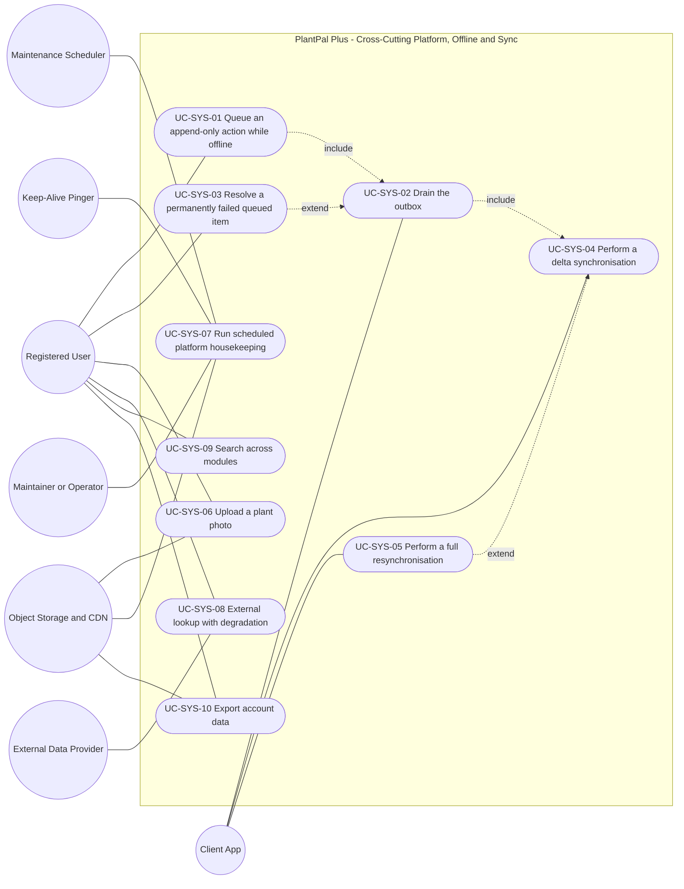

| ID | Name | Primary actor | Level | Priority | Specification |
| --- | --- | --- | --- | --- | --- |
| `UC-SYS-01` | Queue an append-only action while offline | Registered User | User-goal | Must | [Open](use-cases/platform-and-sync.md#uc-sys-01--queue-an-append-only-action-while-offline) |
| `UC-SYS-02` | Drain the outbox | Mobile Client or Web Client, acting autonomously | Subfunction — included by `UC-SYS-01` and additionally started by five autonomous triggers | Must | [Open](use-cases/platform-and-sync.md#uc-sys-02--drain-the-outbox) |
| `UC-SYS-03` | Resolve a permanently failed queued item | Registered User | User-goal | Must | [Open](use-cases/platform-and-sync.md#uc-sys-03--resolve-a-permanently-failed-queued-item) |
| `UC-SYS-04` | Perform a delta synchronisation | Mobile Client or Web Client, acting autonomously | Subfunction — included by `UC-SYS-02`, also started on foreground, on pull-to-refresh and on the periodic timer | Must | [Open](use-cases/platform-and-sync.md#uc-sys-04--perform-a-delta-synchronisation) |
| `UC-SYS-05` | Perform a full resynchronisation | Mobile Client or Web Client, acting autonomously | Subfunction — extends `UC-SYS-04` | Must | [Open](use-cases/platform-and-sync.md#uc-sys-05--perform-a-full-resynchronisation) |
| `UC-SYS-06` | Upload a plant photo | Registered User | User-goal | Must | [Open](use-cases/platform-and-sync.md#uc-sys-06--upload-a-plant-photo) |
| `UC-SYS-07` | Run scheduled platform housekeeping | Maintenance Scheduler, time actor | User-goal, at the operational goal level of the Maintainer | Must for the health, keep-alive, migration and seed duties of FR-SYS-25 and FR-SYS-26; Should for the media and cache cleanup passes of FR-SYS-13 | [Open](use-cases/platform-and-sync.md#uc-sys-07--run-scheduled-platform-housekeeping) |
| `UC-SYS-08` | Look up data from an external provider with degradation | Registered User | User-goal | Must for the flag registry, the degradation path and the attribution obligation of FR-SYS-15 and FR-SYS-17; Should for the outbound call policy of FR-SYS-16 | [Open](use-cases/platform-and-sync.md#uc-sys-08--look-up-data-from-an-external-provider-with-degradation) |
| `UC-SYS-09` | Search across modules | Registered User | User-goal | Should | [Open](use-cases/platform-and-sync.md#uc-sys-09--search-across-modules) |
| `UC-SYS-10` | Export account data | Registered User | User-goal | Must | [Open](use-cases/platform-and-sync.md#uc-sys-10--export-account-data) |

**Structural note.** Six of the ten are user-goal level with a human primary actor; `UC-SYS-02`, `UC-SYS-04` and `UC-SYS-05` are driven by the client acting as an autonomous system actor and `UC-SYS-07` by a time actor. That asymmetry is the direct consequence of D-04: the offline-light contract makes durability and convergence machinery visible as first-class behaviour rather than hiding it inside the modules that consume it. Because queued actions are append-only and carry a client-minted idempotency key, there is deliberately **no merge, no CRDT and no last-write-wins resolution** anywhere in this model.

---

## 6. Include and extend relationship catalogue

Ninety-three relationships are modelled across the eight module diagrams: 45 `include` edges and 48 `extend` edges. They are consolidated below in one direction convention, stated once and applied to every row.

- For an **include** row, the **Source** is the base use case and the **Target** is the behaviour it always performs.
- For an **extend** row, the **Source** is the extending behaviour and the **Target** is the base use case it enriches. This is the UML 2.5 direction. Where a module document tabulates the same relationship base-first — `use-cases/accounts.md` and `use-cases/plant-care.md` both do — the pair is identical; only the column order differs.
- A target written in prose rather than as a `UC-` identifier is an unnumbered extension node from its module diagram. It is specified inside the Extensions table of its base use case and realised by the functional requirement named in the Reason column.

### 6.1 Accounts — `ACC`

| Source | Relationship | Target | Reason |
| --- | --- | --- | --- |
| `UC-ACC-01` | include | Screen the password, FR-ACC-02 and FR-ACC-03 | Composition rules and the breach corpus are evaluated before any row is written, so a weak or breached credential can never be stored. |
| `UC-ACC-06` | include | Screen the password, FR-ACC-02 and FR-ACC-03 | The replacement credential is screened by exactly the same rules as the original, before the hash is replaced. |
| `UC-ACC-07` | include | Screen the password, FR-ACC-02 and FR-ACC-03 | Same screening, applied after the current password has been re-verified. |
| `UC-ACC-01` | include | `UC-ACC-02` | Verification is the mandatory follow-on that moves the account out of `PENDING_VERIFICATION`; registration is not complete without it. |
| Resend verification email, FR-ACC-05 | extend | `UC-ACC-02` | Runs only when the visitor cannot find the message, or the token is expired, invalid or superseded. |
| `UC-ACC-03` | include | Apply failed-login backoff, FR-ACC-07 | The backoff state is evaluated before the password is verified, on every attempt, so a locked account never reaches the hash comparison. |
| Sign in with Google or Apple, FR-ACC-24 | extend | `UC-ACC-03` | Runs only when the visitor selects an external identity provider instead of typing a password. v1.1 Post-MVP. |
| `UC-ACC-04` | include | Detect refresh token reuse, FR-ACC-09 | Always evaluated; it acts only when the presented token is already consumed and outside the 15-second replay grace, and then revokes the whole family. |
| `UC-ACC-05` | include | Enforce ownership authorisation, FR-ACC-23 | Applied on every listing and every revocation, so a session identifier belonging to another account is indistinguishable from one that does not exist. |
| `UC-ACC-07` | include | Enforce ownership authorisation, FR-ACC-23 | Applied before the credential is read or written; the acting user is taken only from the token subject. |
| `UC-ACC-09` | include | Enforce ownership authorisation, FR-ACC-23 | Applied on every profile and preference read and write. |
| `UC-ACC-10` | include | Enforce ownership authorisation, FR-ACC-23 | Applied on job creation and on every poll of the job status. |
| `UC-ACC-11` | include | Enforce ownership authorisation, FR-ACC-23 | Applied on the deletion request and on the cancellation. |
| `UC-ACC-08` | include | `UC-ACC-09` | The wizard steps are a different presentation of the same validated profile and preference writes, so onboarding cannot diverge from settings. |
| Cancel a scheduled deletion, FR-ACC-21 | extend | `UC-ACC-11` | Runs only when the authenticated owner cancels at any point before the erasure sweep completes. |
| `UC-ACC-11` | include | Execute permanent erasure, FR-ACC-22 | Always performed once the scheduled instant elapses without cancellation; executed by the Reminder Scheduler, not by the user. |

**Note.** *Enforce ownership authorisation* is universal. It is drawn against five `ACC` use cases, but every authenticated use case in every prefix includes it. It is specified once in FR-ACC-23 and referenced everywhere else, which is why the other seven module diagrams do not repeat the node.

### 6.2 Dashboard and settings — `DSH` and `SET`

| Source | Relationship | Target | Reason |
| --- | --- | --- | --- |
| `UC-DSH-01` | include | `UC-DSH-05` | Rendering always resolves data freshness; a persisted entry older than 60 seconds triggers the refresh behaviour as part of viewing. |
| `UC-DSH-02` | include | `UC-DSH-01` | Completion begins from a rendered Today list and ends by re-rendering that list, its counts, the owning card and the streak indicator. |
| `UC-DSH-02` | include | `UC-DSH-05` | Every successful completion invalidates the affected date's cache entry, and the current date's entry too when streak state can change. |
| `UC-DSH-04` | include | `UC-DSH-05` | A quick-add write invalidates the affected date's entry under the same rule, so the behaviour is shared rather than restated. |
| `UC-DSH-03` | extend | `UC-DSH-01` | The dashboard is complete for today alone; browsing history adds the read-only matrix, the suppressed greeting, the historical streak value and the collapsed achievements window. |
| `UC-DSH-04` | extend | `UC-DSH-01` | Quick-add is an optional creation affordance layered on the rendered dashboard. |
| `UC-SET-01` | include | `UC-SET-08` | Every presentation preference is written through the single authoritative settings record with one optimistic-apply, conflict-detect and revert contract. |
| `UC-SET-02` | include | `UC-SET-08` | Notification preferences, quiet hours and default reminder times live in the same record and follow the identical persistence contract. |
| `UC-SET-03` | include | `UC-SET-08` | Timezone and hemisphere are fields of the same record; the cascade runs only after this write commits. |
| `UC-SET-04` | include | `UC-SET-08` | Module enablement flags are part of the same record, and the at-least-one-module guard is enforced on this write path. |
| `UC-SET-06` | include | `UC-SET-07` | Entering the pending-deletion state revokes every token family and signs out every session, executed here without a further confirmation. |

### 6.3 Plant care — `PLT`

| Source | Relationship | Target | Reason |
| --- | --- | --- | --- |
| `UC-PLT-01` | include | `UC-PLT-05` | A species reference is a required attribute of a plant, so no plant can be created without resolving one from the catalogue. |
| `UC-PLT-01` | include | `UC-PLT-09` | The initial schedule is computed before the response returns, so the confirmation names a date rather than a spinner. |
| `UC-PLT-02` | include | `UC-PLT-09` | The anchor moves whenever the new event is a later watering, so the due date cannot be left stale. |
| `UC-PLT-03` | include | `UC-PLT-09` | Snooze and skip both shift the next due date directly, and both require the urgency tier and health status to be re-derived. |
| `UC-PLT-04` | include | `UC-PLT-02` | A bulk water is exactly N independent single waterings with per-plant atomicity, so it must not become a second code path; the engine is reached transitively. |
| `UC-PLT-10` | include | `UC-PLT-09` | Clearing or adding an overdue care task changes a health rule, so health status must be re-derived. |
| `UC-PLT-11` | include | `UC-PLT-09` | Opening, ending or cancelling a vacation window changes the urgency tier of every scoped plant and drives the deterministic catch-up rule. |
| `UC-PLT-12` | include | `UC-PLT-09` | On restore the anchor is re-established from the confirmed last-watered answer and a fresh schedule is computed. |
| Create a custom species inline, FR-PLT-03 | extend | `UC-PLT-05` | Runs when species search returns zero results or the user chooses to author a species, and the account holds fewer than 100 live custom species. v1.0 MVP. |
| Fetch Perenual species enrichment, FR-PLT-04 | extend | `UC-PLT-05` | Runs only when the enrichment flag is true, the species is seeded, the detail view is open and no cache row younger than 90 days exists. v1.1 Post-MVP. |
| Log a back-dated watering, FR-PLT-11 | extend | `UC-PLT-02` | Runs when the user supplies a performed-at other than now, inside the window of at most 5 minutes in the future and 30 calendar days in the past. |
| Attach or retry a growth photo, FR-PLT-20 | extend | `UC-PLT-07` | Runs when a photograph is attached, or an upload whose status is failed is retried. The pipeline itself is owned by `SYS`. |
| Compare two growth entries, FR-PLT-22 | extend | `UC-PLT-08` | Runs only when the plant holds at least two ready entries and the user selects two of them. v1.1 Post-MVP. |

### 6.4 Fitness — `FIT`

| Source | Relationship | Target | Reason |
| --- | --- | --- | --- |
| `UC-FIT-01` | include | `UC-FIT-03` | Every workout carries an estimate; modelling it once stops the create, edit and replay paths each re-specifying the formula. |
| `UC-FIT-01` | include | `UC-FIT-07` | A workout that did not re-score its day would leave the dashboard, the streak and the tile disagreeing with the database until the nightly tick. |
| `UC-FIT-02` | include | `UC-FIT-03` | A strength session has a duration and therefore an estimate, computed by exactly the same rule as a cardio session. |
| `UC-FIT-02` | include | `UC-FIT-04` | Record detection has no independent trigger and no independent actor goal; it is part of finishing a strength save. |
| `UC-FIT-02` | include | `UC-FIT-07` | As for cardio: every mutating flow re-scores its date. |
| `UC-FIT-05` | include | `UC-FIT-07` | Steps are one of the ways a day becomes complete, so a step write must re-score its date. |
| `UC-FIT-08` | include | `UC-FIT-07` | Rest is the third completion reason; clearing a rest day must be able to take a day back to incomplete. |
| `UC-FIT-09` | include | `UC-FIT-07` | An edit that crosses midnight re-scores both dates, which is why the inclusion is expressed over the union of the pre-change and post-change dates. |
| Apply a workout template, FR-FIT-25 | extend | `UC-FIT-01` and `UC-FIT-02` | Applying a template only pre-fills a draft and never writes a workout, so the base flow is complete without it. |
| Copy the previous workout, FR-FIT-26 | extend | `UC-FIT-01` and `UC-FIT-02` | Hidden entirely when the account has no previous workout; the copied draft is still subject to the full validation of the base flow. |
| Queue the write while offline, FR-FIT-10 | extend | `UC-FIT-01` and `UC-FIT-05` | These two actions are exactly the queue-eligible fitness set of D-04. Connectivity is a condition on an otherwise unchanged goal. |
| Create a user-defined activity type inline, FR-FIT-02 | extend | `UC-FIT-01` | Runs when the activity is absent from the nine seeded types; connectivity-required, capped at 20 per account. |
| Create a user-defined exercise inline, FR-FIT-12 | extend | `UC-FIT-02` | Runs when the exercise is absent from the seeded catalogue; capped at 100 per account. |
| Pre-fill steps from the device pedometer, FR-FIT-17 | extend | `UC-FIT-05` | Runs only with the sensor flag on, on mobile, with a pedometer present. The base goal is complete and shippable with the flag off, which is its default. |
| Revoke a superseded personal record | extend | `UC-FIT-04` | Runs only on a destructive change, so the common detection path does not carry it. `GAM` owns how a revoked achievement is displayed. |
| Reject an unsafe body-mass target | extend | `UC-FIT-06` | Applies to one of five goal types only; isolating it makes the D-07 safety obligation independently inspectable. |
| Reject a rest day over quota | extend | `UC-FIT-08` | The quota is what stops rest becoming a way to hold a streak indefinitely without training. |
| Undo a deletion within 10 seconds | extend | `UC-FIT-09` | Optional recovery behaviour with a human actor and a hard time bound; the deletion goal completes correctly without it. |
| Confirm an implausible body-metric change | extend | `UC-FIT-10` | A warn-level plausibility band that still stores the value on confirmation, which differs in kind from a rejection. |
| Render the first-run empty chart state | extend | `UC-FIT-11` | The empty state is a distinct rendering contract — one sentence, one primary action, no axes, no fabricated series — and is testable on its own. |

### 6.5 Nutrition — `NUT`

| Source | Relationship | Target | Reason |
| --- | --- | --- | --- |
| `UC-NUT-01` | include | `UC-NUT-02` | No meal entry can exist without a resolved food; modelling resolution once keeps the ranking formula, the favourites bonus and the soft-delete exclusion in exactly one place. |
| `UC-NUT-01` | include | `UC-NUT-05` | The recomputed daily summary is returned in the same response as the created entry, so the ring never costs a second round trip on the most frequent write in the product. |
| `UC-NUT-03` | extend | `UC-NUT-02` | Catalogue search is complete and correct with every external integration disabled; modelling barcode as an extension is what makes the D-03 claim structural. Unreachable when the flag is false, when offline, or on web in v1.0. |
| `UC-NUT-04` | extend | `UC-NUT-02` | Authoring a food is a separate goal with its own preconditions — it requires connectivity, which search does not — reached from the zero-result state or from a failed barcode lookup. |
| `UC-NUT-05` | include | `UC-NUT-06` | A day's remaining energy is meaningless without the target in force on that day; resolution returns an explicit no-target result rather than an error, so the inclusion never fails. |
| `UC-NUT-07` | include | `UC-NUT-06` | The user must see what they are changing from, computed by the same rule the day view uses. |
| `UC-NUT-08` | include | `UC-NUT-05` | An amendment whose totals do not visibly update is indistinguishable from one that failed; the inclusion also makes the two-date case explicit when an entry moves between days. |
| `UC-NUT-09` | include | `UC-NUT-05` | A copy can add up to 50 entries at once; returning the recomputed target-date summary keeps that change to one round trip. The source date is read, never written. |
| `UC-NUT-11` | include | `UC-NUT-06` | Adherence is defined against the target active on each individual day, so resolution runs once per logged day in the window. |
| `UC-NUT-12` | extend | `UC-NUT-01` | The base flow is complete online. Offline capture and later reconciliation is additional behaviour with a different primary actor. Only creations extend this way. |
| `UC-NUT-12` | extend | `UC-NUT-10` | Water logging is the second and last queueable nutrition action, on identical terms. |

### 6.6 Notifications — `NOT`

| Source | Relationship | Target | Reason |
| --- | --- | --- | --- |
| `UC-NOT-02` | include | `UC-NOT-03` | No occurrence may reach any channel without an outcome from the ordered eligibility gate, and the gate is total: every occurrence resolves to send, defer, suppress or cancel. |
| `UC-NOT-02` | include | `UC-NOT-04` | Dispatch is defined as selection plus delivery; a pass that selected and evaluated but never emitted would satisfy no requirement. |
| `UC-NOT-04` | include | `UC-NOT-06` | The push channel cannot address anything without active-token resolution and the not-registered revocation. Only the registry-resolution segment is included, never the user-facing registration flow. |
| `UC-NOT-11` | include | `UC-NOT-04` | The diagnostic must travel the same delivery path as a real notification, because a separate code path would not diagnose the path in use. |
| `UC-NOT-09` | include | `UC-NOT-03` | A snooze produces a new instant that must be re-tested against quiet hours and against the staleness bound measured from the original due instant. |
| `UC-NOT-09` | extend | `UC-NOT-08` | Runs when the user chooses a quick action or a snooze from the banner rather than tapping the body of the notification. |
| `UC-NOT-09` | extend | `UC-NOT-10` | Runs when the user acts on an item already in the notification centre, including a group member or an action the operating system could not render as a button. |
| `UC-NOT-08` | extend | `UC-NOT-10` | Runs when the user opens an item from the centre; resolution is byte-identical to a banner tap because the centre reuses the link the push carried. |
| `UC-NOT-07` | extend | `UC-NOT-01` | Runs when a preferred delivery time or the user's timezone changes: future pending occurrences are cancelled and re-created against the same frozen local date and the same occurrence key. |

### 6.7 Gamification — `GAM`

| Source | Relationship | Target | Reason |
| --- | --- | --- | --- |
| `UC-GAM-01` | include | `UC-GAM-02` | A judged day that never reached the counters would leave the read model permanently behind the outcome primitive. |
| `UC-GAM-02` | include | `UC-GAM-04` | Streak-based predicates exist, so every counter change must be offered to the evaluator, after the streak rows commit. |
| `UC-GAM-03` | include | `UC-GAM-02` | The rebuild reuses the identical transition table, which is what makes the incremental and rebuild paths provably equivalent. |
| `UC-GAM-03` | include | `UC-GAM-04` | A rebuild may move any metric, so affected definitions are re-evaluated. It may create unlocks and may never revoke one. |
| `UC-GAM-05` | extend | `UC-GAM-04` | Conditional on a predicate evaluating true for a definition the user does not already hold; most evaluations write progress only and never reach this extension. |
| `UC-GAM-07` | extend | `UC-GAM-02` | Conditional on a not-met outcome, an available token and every freeze limit passing. Absent from v1.0 entirely, which is why the base is complete without it. |

### 6.8 Platform and sync — `SYS`

| Source | Relationship | Target | Reason |
| --- | --- | --- | --- |
| `UC-SYS-01` | include | `UC-SYS-02` | Capture and delivery are separable concerns with different actors and failure modes; modelling delivery once prevents the seven module-owned logging flows from each re-specifying retry and idempotency. |
| `UC-SYS-02` | include | `UC-SYS-04` | A successful append changes server-derived state the client did not compute — a recomputed watering schedule, a streak increment, an unlock — so pulling it back is part of finishing a drain. Skipped when no item reached the synced state, purely to spare free-tier compute. |
| `UC-SYS-03` | extend | `UC-SYS-02` | The base flow completes correctly without it, because the remaining items still sync. Human recovery of a terminally failed item is optional additional behaviour with a human primary actor. |
| `UC-SYS-05` | extend | `UC-SYS-04` | A full rebuild replaces the normal path only when the cursor cannot be trusted: no stored cursor, an invalid cursor or an expired cursor. |

### 6.9 Cross-module relationships

These are recorded for traceability. Each row's source document references the target by identifier only and never defines or renumbers it.

| Source | Relationship | Target | Owning module | Reason |
| --- | --- | --- | --- | --- |
| `UC-DSH-02` | include | `UC-PLT-02`, `UC-PLT-10`, `UC-NUT-10` | `PLT`, `NUT` | An inline completion writes through the module that owns the record; the dashboard owns the surface and never the write semantics. |
| `UC-DSH-02` | include | `UC-SYS-01` and `UC-SYS-02` | `SYS` | While the device is offline the queue, the idempotency-key upsert and the replay policy are owned by `SYS`. |
| `UC-DSH-02` | extend | `UC-GAM-02` and `UC-GAM-04` | `GAM` | After a successful write, when the action changes streak state or advances an achievement. |
| `UC-DSH-04` | include | `UC-NUT-01`, `UC-FIT-01`, `UC-FIT-05`, `UC-PLT-02` | `NUT`, `FIT`, `PLT` | Every quick action other than the direct water write hands over to the owning module's create flow and returns to the dashboard. |
| `UC-DSH-01` | extend | `UC-NOT-08` | `NOT` | When the dashboard is opened from an inbound deep link carrying a date and a focus item. |
| `UC-SET-01` | include | `UC-ACC-09` | `ACC` | The Profile section is an entry point only and duplicates no validation. |
| `UC-SET-02` | include | `UC-NOT-01` | `NOT` | After a committed change to any notification preference, quiet-hours field or default reminder time, every future occurrence is regenerated within 60 seconds. |
| `UC-SET-03` | include | `UC-NOT-01` | `NOT` | After a committed timezone or hemisphere change, occurrences are regenerated at the same local wall-clock times. |
| `UC-SET-03` | include | `UC-PLT-09` | `PLT` | After a committed hemisphere change only, because the seasonal multiplier changes and every active plant's next watering date is recomputed. |
| `UC-SET-04` | include | `UC-NOT-01` | `NOT` | After a committed module enablement change, to cancel or regenerate that module's occurrences. |
| `UC-SET-05` | include | `UC-SYS-10` | `SYS` | For every accepted export request; `SET` owns the user-facing request and delivery contract only. |
| `UC-SET-05` | extend | `UC-NOT-04` | `NOT` | When the archive becomes available and the ready notice is delivered over the in-app and email channels. |
| `UC-SET-06` | include | `UC-ACC-11` | `ACC` | Re-authentication, the pending-deletion state, the cancellation window and the erasure sweep are all owned by `ACC`. |
| `UC-SET-07` | include | `UC-ACC-05` | `ACC` | `SET` owns the presentation and the revocation request, never the token mechanics. |
| `UC-SET-08` | include | `UC-SYS-04` | `SYS` | Propagation of the new update timestamp to every other signed-in device travels the ordinary delta-sync cursor. |
| `UC-PLT-07` | extend | `UC-SYS-06` | `SYS` | The growth-photo pipeline — signed upload URL, three variants, quota — is owned by `SYS`; a failed upload must never cost the growth entry. |
| `UC-PLT-05` | extend | `UC-SYS-08` | `SYS` | Species enrichment is one instance of the general flag-gated, cached, degradable external-lookup contract. |
| `UC-NUT-03` | extend | `UC-SYS-08` | `SYS` | The barcode path is the second instance of the same contract, with the same cooldown and cache obligations. |
| `UC-NUT-12` | include | `UC-SYS-02` | `SYS` | Nutrition reconciliation is the module-local view of the shared outbox drain, not a second queue. |
| `UC-GAM-05` | extend | `UC-NOT-04` | `NOT` | `GAM` composes the unlock content and requests delivery; `NOT` owns quiet hours, the achievement push cap and retries. |
| `UC-GAM-08` | extend | `UC-NOT-04` | `NOT` | The weekly recap is delivered over the same channels under the same gate. |
| `UC-GAM-03` | extend | `UC-SYS-02` | `SYS` | A completed outbox drain publishes the batch's minimum effective local date, which is the trigger that lets a late offline log repair a streak. |
| `UC-ACC-10` | include | `UC-SYS-10` | `SYS` | The archive builder, the signed download URL and the 72-hour expiry are owned by `SYS`; `ACC` owns the request, the authorisation and the notification. |
| `UC-FIT-07` | extend | `UC-NUT-05` | `NUT` | The estimated daily energy expenditure feeds the opt-in calorie credit, capped at 1000 kcal per day. `NUT` decides independently whether it affects any budget. |

### 6.10 Relationships deliberately not modelled

Recorded so that their absence is read as a decision rather than as a gap.

| Candidate | Decision | Reason |
| --- | --- | --- |
| `UC-PLT-06` includes `UC-PLT-09` | Not modelled | The plant list reads values the engine already persisted. Recomputing on read would make a read path mutating and break the engine's idempotency property. |
| `UC-PLT-07` includes `UC-PLT-09` | Not an include | The engine runs only when an optional health rating is supplied, so the relationship is conditional and is documented as a main-scenario consequence. |
| `UC-NOT-01` includes `UC-NOT-03` | Not modelled | The planner deliberately does not evaluate preferences, quiet hours or caps. Evaluating them at materialisation would break the case where a category re-enabled at 08:50 must still deliver at 09:00. The gate belongs at dispatch time only. |
| `UC-NOT-05` includes `UC-NOT-06` | Not an include | The receipt pass writes the token registry only as a side effect of a not-registered classification, and that revocation must occur in the same transaction as the delivery failure. A separate included use case would imply a separable step. |
| `UC-NOT-04` includes `UC-NOT-08` | Not modelled | Delivery composes the deep link; it never resolves it. Resolution happens on a client, minutes or hours later, and may never happen at all. |
| `UC-GAM-01` includes `UC-GAM-04` directly | Not modelled | The path runs through `UC-GAM-02`, because achievement evaluation must observe committed streak rows. A direct edge would permit an implementation that reads a stale streak length. |
| `UC-GAM-06` includes anything | Not modelled | The trophy gallery is a pure read that triggers no evaluation, which is the visible consequence of the no-client-writes rule. |
| A separate use case for the nightly retention pass | Not modelled | It performs no goal a stakeholder holds; its deletions are specified as an extension of `UC-NOT-05` and beside the data they bound. |
| A generalisation edge from First-Run User to Registered User | Documented, not drawn | The specialisation is stated in every actor table that uses it; drawing it would add an edge that changes no behaviour and would crowd the diagram on a phone screen. |
| Correcting or deleting a watering event as its own use case | Not modelled | It operates on the same entity, reaches the same recomputation trigger and shares the anchor-resolution rule, so it is specified inside `UC-PLT-02`. |

---

## 7. Use-case to actor coverage matrix

Every actor in section 3 participates in at least one use case, and every use case has at least one actor. The matrix below is derived from the eight module diagrams and from the primary and secondary actor fields of the 89 specifications. A cell entry is a use case in which that actor participates; **bold** marks the use cases for which the actor is primary.

| Actor | `ACC` | `DSH` and `SET` | `PLT` | `FIT` | `NUT` | `NOT` | `GAM` | `SYS` |
| --- | --- | --- | --- | --- | --- | --- | --- | --- |
| Visitor | **01, 02, 03, 06** | — | — | — | — | 08 | — | — |
| Registered User | **05, 07, 08, 09, 10, 11** | **DSH 01, 02, 03, 04, 05; SET 01, 02, 03, 04, 05, 06, 07** | **01, 02, 03, 04, 05, 06, 07, 08, 10, 11, 12** | **01, 02, 05, 06, 08, 09, 10, 11** | **01, 02, 03, 04, 07, 08, 09, 10, 11** | **06, 07, 08, 09, 10, 11** | 03, 05, **06** | **01, 03, 06, 08, 09, 10** |
| First-Run User | — | **DSH 01** | **01** | — | — | — | — | — |
| Maintainer / Operator | — | SET 01 | — | — | — | — | **09** | **07** |
| Client Application | **04** | — | — | — | — | 06, 07, 10 | 05, 06 | **02, 04, 05** |
| Reminder Scheduler | 11 erasure sweep | SET 02, 03, 04 | 09 | **07** | — | **01, 02, 03, 04, 05** | — | — |
| Streak and Achievement Scheduler | — | — | — | — | — | — | **01, 02, 07, 08** | — |
| Nightly Recompute Job | — | — | **09** | — | — | — | — | — |
| Maintenance Scheduler | — | — | — | — | — | — | — | **07** |
| Keep-Alive Pinger | — | — | — | — | — | 02 | 01 | 07 |
| System Clock and IANA Timezone Database | — | DSH 01, 03; SET 03 | — | — | 05, 11 | 01, 02 | 01 | — |
| Dashboard Aggregation Service | — | DSH 01, 02, 03, 05 | — | 07 | — | — | — | — |
| Sync Service | — | DSH 02, 04; **SET 08** | — | 01, 05 offline extension | **12** | 09 offline quick action | 03 | **02, 04, 05** |
| Media Service | — | — | 01, 07 photo extension | — | — | — | — | 06 |
| Export Worker | 10 | SET 05 | — | — | — | — | — | 10 |
| Plant Care Scheduling Engine | — | — | **09** | — | — | — | — | — |
| Fitness Evaluator | — | — | — | **03, 04, 07** | — | — | — | — |
| Nutrition Calculation Engine | — | — | — | — | **05, 06**, 07 | — | — | — |
| Achievement Evaluator | — | — | — | — | — | — | **04, 05** | — |
| Recomputation Worker | — | — | — | — | — | — | **03** | — |
| Domain Event Publisher | — | — | — | — | — | — | 04 | — |
| Notification Dispatcher | — | SET 05, 06 | — | — | — | 04 | 05, 08 | — |
| Seed Data Loader | — | — | 05 | 01, 02 | 02 | — | — | 07 |
| Platform Runtime | — | DSH 05; SET 01, 03 | — | — | — | — | — | — |
| Device Camera | — | — | — | — | 03 | — | — | — |
| Device Pedometer | — | — | — | 05 extension | — | — | — | — |
| Source Modules | — | — | — | — | — | 01 | — | — |
| Consuming Module | — | — | — | 04, 07 | 05, 07, 08 | — | — | — |
| PostgreSQL Database | every use case | every use case | every use case | every use case | 05, 12 and every other | every use case | every use case | every use case |
| Object Storage and CDN | 09, 10 | — | 01, 07 | — | — | — | — | 06, 07, 10 |
| Expo Push Service | — | — | — | — | — | 04, 05 | — | — |
| Transactional Email Provider | 01, 02, 06, 07, 10, 11 | SET 05 | — | — | — | 04 | 08 | — |
| Open Food Facts | — | — | — | — | 03 | — | — | 08 |
| Perenual | — | — | 05 enrichment extension | — | — | — | — | 08 |
| Breach Corpus Service | 01, 06, 07 | — | — | — | — | — | — | — |
| External Identity Provider | 03 extension, v1.1 | — | — | — | — | — | — | — |
| Error Monitor | every use case | every use case | every use case | every use case | every use case | every use case | every use case | every use case |

**Three readings the matrix is meant to support.**

1. **No orphan actors.** Every row has at least one entry. The Keep-Alive Pinger and the Error Monitor are the only actors with no primary cell anywhere; both are deployment dependencies rather than goal-holders, and both are retained because a named actor is what makes their failure modes traceable.
2. **No orphan use cases.** Every one of the 89 use cases appears in at least one cell. Cross-checking against section 5, the only use cases whose sole actor is an internal component are `UC-NOT-03`, `UC-NOT-04`, `UC-NUT-05`, `UC-NUT-06`, `UC-GAM-02`, `UC-GAM-04`, `UC-FIT-03`, `UC-FIT-04`, `UC-FIT-07`, `UC-PLT-09`, `UC-SET-08`, `UC-DSH-05` and `UC-ACC-04` — precisely the subfunction set of section 1.4.
3. **The Registered User row is the product.** It spans all eight columns and 60 use cases. Every other human row is narrow by design: the Visitor exists only until a session exists, the First-Run User only for the first day, and the Maintainer only out of band.

---

## 8. Use-case coverage of the functional requirements

### 8.1 The claim

> Every functional requirement specified in the eight module documents is exercised by at least one use case in this model.

### 8.2 The evidence

The eight module specifications under [`modules/`](modules/) define **228 functional requirements** across nine prefixes. Every one of the 228 appears in the `Related FRs` metadata field of at least one use-case specification under [`use-cases/`](use-cases/). The check was performed mechanically over the two directories, comparing the set of defined identifiers against the set that appears in a `Related FRs` field, and it returns an empty difference.

| Prefix | Functional requirements defined | Covered by at least one use case | Uncovered | Use cases in the prefix |
| --- | --- | --- | --- | --- |
| `FR-ACC` | 24 | 24 | 0 | 11 |
| `FR-DSH` | 24 | 24 | 0 | 5 |
| `FR-SET` | 30 | 30 | 0 | 8 |
| `FR-PLT` | 28 | 28 | 0 | 12 |
| `FR-FIT` | 26 | 26 | 0 | 11 |
| `FR-NUT` | 28 | 28 | 0 | 12 |
| `FR-NOT` | 24 | 24 | 0 | 11 |
| `FR-GAM` | 18 | 18 | 0 | 9 |
| `FR-SYS` | 26 | 26 | 0 | 10 |
| **Total** | **228** | **228** | **0** | **89** |

The converse also holds: every one of the 89 use cases names at least one functional requirement of its owning module in its `Related FRs` field, so there is no use case that specifies behaviour no requirement asked for.

### 8.3 Requirements exercised inside a use case rather than by a use case of their own

Coverage is not the same as visibility on a diagram. A number of requirements are exercised inside a use case's steps, extensions or exception flows without appearing as a stadium node. They are listed by category below so that a traceability reviewer does not read their absence from a diagram as a gap. Each module document records the same list in full, with the exact step references.

| Category | Representative requirements | Where exercised | Why it is not a use case of its own |
| --- | --- | --- | --- |
| Seeded catalogues | FR-PLT-01, FR-FIT-01, FR-FIT-11, FR-NUT-07, FR-SYS-26 | `UC-PLT-05`, `UC-FIT-01`, `UC-FIT-02`, `UC-NUT-02`, `UC-SYS-07` | The actor is the deployment pipeline. Verification is Inspection of a migration plus an automated load-time assertion. Nobody holds "load a catalogue" as a goal. |
| Validation limits and plausibility bands | FR-FIT-04, FR-NUT-09 and the composition rules of FR-ACC-02 | The logging and credential use cases of `FIT`, `NUT` and `ACC` | A guard on existing goals, enforced by one shared schema. Modelling it separately would duplicate every logging flow. |
| Derived values | FR-FIT-09, FR-FIT-14, FR-FIT-20, FR-NUT-02, FR-NUT-03 | Computed during the save or evaluation steps of their owning use cases | They have no independent trigger and no actor goal; they are the arithmetic that makes a stored row comparable. |
| Cross-cutting API invariants | FR-SYS-18, FR-SYS-19, FR-SYS-20, FR-SYS-21, FR-SYS-22 | Every use case in every module | Verified by Inspection and by contract tests, not by a behaviour with a trigger. |
| Presentation and safety obligations | FR-FIT-06, FR-FIT-18 | `UC-FIT-03`, `UC-FIT-05`, `UC-FIT-11` | An obligation attached to every surface that shows an energy figure, verified by Demonstration across surfaces rather than as one flow. |
| Universal authorisation | FR-ACC-23 | Every authenticated use case in every prefix | Specified once and referenced everywhere; drawing it on eight diagrams would add 89 identical edges and no information. |

### 8.4 Requirements with no use case at all

**There are none.** Had any existed they would be listed here with the reason, and the corresponding module document would carry the same entry. The nearest cases are the categories in section 8.3, which are covered but not drawn, and FR-FIT-18, which is a documented `Wont` — a deliberate exclusion of health-platform integration — that is nevertheless exercised inside `UC-FIT-05` so that the exclusion itself is traceable and inspectable.

### 8.5 What this document does not assert

This model asserts coverage of **functional requirements by use cases**. It does not assert the full traceability chain, which runs from stakeholder need through goal, requirement, story, use case and acceptance criterion to test. That chain is assembled in `10-traceability-matrix.md`, for which the eight per-module coverage tables in section 6 of each use-case document, and the table in section 8.2 above, are the inputs. Non-functional requirements are traced to use cases through the **Special requirements** field of each specification, not through this section.

