# PlantPal+ Conceptual Domain Model

| Field | Value |
| --- | --- |
| Document | 07 Domain Model — conceptual entities, relationships, enumerations, state machines and invariants |
| Version | 1.0 |
| Date | 2026-07-21 |
| Status | Baselined for Phase 1 sign-off |
| Owner | Rakshit — Project Lead / sole developer |
| Parent | [SRS.md](SRS.md) — PlantPal+ Software Requirements Specification v1.0 |

---

## Table of contents

1. [Purpose and standing of this document](#1-purpose-and-standing-of-this-document)
2. [Bounded-context map](#2-bounded-context-map)
3. [Entity catalogue](#3-entity-catalogue)
4. [Conceptual entity-relationship diagrams](#4-conceptual-entity-relationship-diagrams)
5. [Relationship matrix](#5-relationship-matrix)
6. [Enumeration catalogue](#6-enumeration-catalogue)
7. [State machines](#7-state-machines)
8. [Invariants](#8-invariants)
9. [Indicative data volumetrics](#9-indicative-data-volumetrics)
10. [Mapping note for Phase 2](#10-mapping-note-for-phase-2)

Related documents: [README.md](README.md) · [02-scope-and-release-plan.md](02-scope-and-release-plan.md) · [03-functional-requirements.md](03-functional-requirements.md) · [04-non-functional-requirements.md](04-non-functional-requirements.md) · [08-glossary.md](08-glossary.md) · [09-assumptions-constraints-risks.md](09-assumptions-constraints-risks.md) · [10-traceability-matrix.md](10-traceability-matrix.md)

---

## 1. Purpose and standing of this document

### 1.1 Purpose

PlantPal+ is one product assembled from three habit trackers (Plant Care, Fitness, Nutrition) and four shared engines (unified dashboard, notification and reminder engine, streaks and achievements, platform and sync). This document defines the **single conceptual vocabulary** that all seven of those parts must agree on.

It names every thing the product stores, states what each thing means, what it is made of, how it is identified, how it changes over time, how it relates to every other thing, and what must always be true about it. It is the narrowest document in Phase 1 in terms of behaviour and the broadest in terms of nouns.

It exists because without one authoritative noun list the plant module invents `waterDate`, the fitness module invents `logged_on`, the nutrition module invents `entryDay`, and the streak engine cannot compute anything. Every module specification in [modules/](modules/) uses the entity names, attribute names and enumeration members defined here **verbatim**.

| # | This document delivers | Section |
| --- | --- | --- |
| D-1 | The bounded-context map, the ownership rule and the aggregate list | [§2](#2-bounded-context-map) |
| D-2 | The complete entity catalogue: 50 entities across 6 bounded contexts | [§3](#3-entity-catalogue) |
| D-3 | Conceptual entity-relationship diagrams, one per bounded context | [§4](#4-conceptual-entity-relationship-diagrams) |
| D-4 | The relationship matrix: 70 relationships with exact cardinality, ownership and cascade | [§5](#5-relationship-matrix) |
| D-5 | The complete enumeration catalogue: every closed enumeration used anywhere in the product | [§6](#6-enumeration-catalogue) |
| D-6 | Eight state machines covering every entity with a non-trivial lifecycle | [§7](#7-state-machines) |
| D-7 | The invariants that must always hold across the whole model | [§8](#8-invariants) |
| D-8 | Indicative data volumetrics per user per year and the free-tier sizing envelope | [§9](#9-indicative-data-volumetrics) |
| D-9 | The mechanical derivation rules Phase 2 uses to produce tables, keys and indexes | [§10](#10-mapping-note-for-phase-2) |

### 1.2 This is the conceptual model; the physical schema is Phase 2

> **Explicit statement.** Everything in this document is a **conceptual model**. It describes *what* the product knows and *what must always be true of that knowledge*. It does not describe *how* PostgreSQL stores it.
>
> **The physical schema is a Phase 2 deliverable.** No `CREATE TABLE` statement, column type with precision syntax, index definition, partition strategy, constraint name, migration file, ORM mapping or seed-file format appears here or is implied to be final by anything here.

The model is nevertheless written to be transcribed **mechanically** into that schema: [§10](#10-mapping-note-for-phase-2) gives the derivation rules, and every type, range, default, uniqueness constraint and cascade needed to write the migration is stated in full somewhere in this document. Where the fixed technology stack already dictates a "how" — PostgreSQL, UUID keys, `timestamptz` semantics, Supabase Storage or Cloudinary for binaries — that is stated explicitly rather than hidden.

Deliberately **out of scope for this document**:

| # | Excluded | Where it lives instead |
| --- | --- | --- |
| X-01 | Physical schema, indexes, constraint names, migrations, ORM choice | Phase 2 |
| X-02 | Functional requirements — there is no `FR-ENT-nn` and there never will be | [03-functional-requirements.md](03-functional-requirements.md) and the per-module specifications in [modules/](modules/) |
| X-03 | User stories and use cases | [05-user-stories.md](05-user-stories.md), [06-use-case-model.md](06-use-case-model.md) |
| X-04 | API resource paths, request and response shapes, JSON field casing on the wire | [modules/platform-and-sync.md](modules/platform-and-sync.md) |
| X-05 | The watering-interval multiplier tables, MET tables, Mifflin-St Jeor constants, achievement unlock predicates | [modules/plant-care.md](modules/plant-care.md), [modules/fitness.md](modules/fitness.md), [modules/nutrition.md](modules/nutrition.md), [modules/gamification.md](modules/gamification.md) |
| X-06 | Access-control policy language and row-level-security expressions | [04-non-functional-requirements.md](04-non-functional-requirements.md), NFR-SEC series |
| X-07 | Caching keys, query plans and any denormalised read model beyond `ENT-49 DailySummary` | Phase 2 |

This document contributes **zero** `FR-`, `US-` and `UC-` identifiers by design. Its normative content is carried by the business rules `BR-ENT-01` … `BR-ENT-42` (cited throughout and collected as invariants in [§8](#8-invariants)) and by the entity, enumeration and relationship definitions themselves. Consequently [10-traceability-matrix.md](10-traceability-matrix.md) must not contain a row whose requirement identifier begins `FR-ENT-`; it instead carries an appendix mapping each `FR-*` to the `ENT-nn` entities it reads and writes.

### 1.3 How to read an entity entry

Every entity in [§3](#3-entity-catalogue) is presented as:

- **`ENT-nn EntityName`** — the canonical name. Downstream authors use this exact `PascalCase` name in prose and TypeScript types, and the equivalent `snake_case` singular name for tables and attributes (BR-ENT-37).
- **Purpose** — what real-world thing it represents and why it exists as a separate entity rather than as attributes of another.
- **Attributes** — a table of `Attribute | Type | Unit | Required | Default | Description`. `Required` is one of `Yes`, `No`, or `Cond` (conditionally required; the condition is stated in the description).
- **Identity** — the primary key and any natural or business uniqueness constraint.
- **Lifecycle** — how a row is created, how it changes, how it ends.
- **Classification** — tenancy class, sync class and sensitivity, taken from BR-ENT-02, BR-ENT-39 and BR-ENT-40.

### 1.4 Conceptual type vocabulary

Types below are conceptual. Phase 2 maps each to a PostgreSQL type ([§10.2](#102-type-mapping)).

| Conceptual type | Meaning |
| --- | --- |
| `uuid` | A version 4 UUID. Every primary key and every foreign key. |
| `text` | UTF-8 string of bounded length; the bound is always stated (BR-ENT-21). |
| `integer` | Whole number. |
| `bigint` | Whole number used only for the sync sequence. |
| `decimal` | Exact fixed-point number; the stored precision is always stated (BR-ENT-15). |
| `boolean` | True or false. Never nullable unless "unknown" is a distinct, documented third state. |
| `date` | A calendar date with no time and no zone, always a **user-local** date (BR-ENT-04). |
| `time` | A wall-clock time of day with no date and no zone, interpreted in the user's timezone. |
| `timestamptz` | An instant, stored normalised to UTC. |
| `enum<Name>` | A member of the closed enumeration `Name` defined in [§6](#6-enumeration-catalogue). |
| `enum<Name>[]`, `text[]` | An ordered collection of the element type. |
| `json` | A structured document whose shape is stated where it is used. |

### 1.5 Universal attributes carried by every entity

To keep the catalogue readable, the following attributes are **not repeated** in each entity table. Every entity carries them unless its entry says otherwise (BR-ENT-01, BR-ENT-03, BR-ENT-09).

| Attribute | Type | Unit | Required | Default | Description |
| --- | --- | --- | --- | --- | --- |
| `id` | uuid | — | Yes | generated UUIDv4 | Primary key. Generated by whichever party first creates the row; a row created offline on a client keeps its client-generated `id` permanently. No entity uses a composite, natural or auto-increment primary key. |
| `created_at` | timestamptz | UTC | Yes | server clock at insert | Instant the row first existed on the server. Never changed after insert. Never taken from a client. |
| `updated_at` | timestamptz | UTC | Yes | equal to `created_at` | Instant of the most recent server-side mutation. Half of the delta-sync cursor. |
| `deleted_at` | timestamptz | UTC | No | null | Non-null means soft-deleted. Omitted entirely on entities marked hard-delete-only. |
| `sync_seq` | bigint | — | Cond | next sequence value | Monotonic database-wide sequence value, assigned on every insert and update. Present only on entities whose sync class is `SYNCED`. The second half of the sync cursor. |

Entities that deviate:

| Entity | Deviation |
| --- | --- |
| `ENT-04 AuthSession`, `ENT-05 AuthToken` | No `deleted_at`; hard-deleted or expired. |
| `ENT-44 Tombstone` | Carries `deleted_at` and `sync_seq` as *content*, plus `created_at`; no `updated_at`. |
| `ENT-48 AuditEvent` | Carries `occurred_at` only. Append-only and immutable except for purge anonymisation. |
| `ENT-43 SyncOutboxItem` | Client-only; never exists on the server, therefore has no `sync_seq`. |
| `ENT-49 DailySummary` | No `deleted_at`; rebuilt rather than deleted. Sync class `DERIVED`. |
| `ENT-47 ExternalLookupCache` | No `deleted_at`; expires. |

---

## 2. Bounded-context map

### 2.1 The six contexts

| Context | Code | Entities | Owning modules | Responsibility |
| --- | --- | --- | --- | --- |
| Identity and Access | C1 | ENT-01 … ENT-07 | ACC, SET | Who the user is, how they prove it, what they have consented to, and how they are reachable. |
| Plant Care | C2 | ENT-08 … ENT-14 | PLT | Species knowledge, the user's plants, and the dated events performed on them. |
| Fitness | C3 | ENT-15 … ENT-23 | FIT | Movement catalogues, logged activity, body measurements and effective-dated goals. |
| Nutrition | C4 | ENT-24 … ENT-31 | NUT | Food knowledge, portioning, logged consumption and effective-dated targets. |
| Engagement | C5 | ENT-32 … ENT-41 | NOT, GAM | Turning dated domain events into reminders, streaks and achievements. |
| Platform | C6 | ENT-42 … ENT-50 | SYS, DSH | Cross-cutting machinery: media, offline sync, flags, audit, and the read model the dashboard renders from. |

**The three habit contexts C2, C3 and C4 never reference one another.** Every cross-module interaction is mediated by C5 (Engagement) or C6 (Platform). This is the single most important structural rule in the model. It is what makes per-module enablement — a user running only Fitness — a first-class case rather than a degraded one, without conditional logic scattered through the schema.

### 2.2 Context map diagram

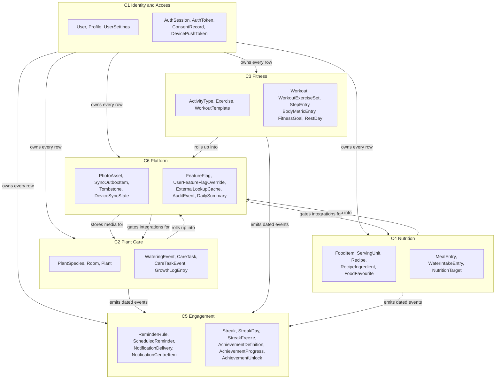
```mermaid
flowchart TB
  subgraph C1["C1 Identity and Access"]
    direction TB
    N1["User, Profile, UserSettings"]
    N2["AuthSession, AuthToken,<br/>ConsentRecord, DevicePushToken"]
  end

  subgraph C2["C2 Plant Care"]
    direction TB
    N3["PlantSpecies, Room, Plant"]
    N4["WateringEvent, CareTask,<br/>CareTaskEvent, GrowthLogEntry"]
  end

  subgraph C3["C3 Fitness"]
    direction TB
    N5["ActivityType, Exercise, WorkoutTemplate"]
    N6["Workout, WorkoutExerciseSet, StepEntry,<br/>BodyMetricEntry, FitnessGoal, RestDay"]
  end

  subgraph C4["C4 Nutrition"]
    direction TB
    N7["FoodItem, ServingUnit, Recipe,<br/>RecipeIngredient, FoodFavourite"]
    N8["MealEntry, WaterIntakeEntry, NutritionTarget"]
  end

  subgraph C5["C5 Engagement"]
    direction TB
    N9["ReminderRule, ScheduledReminder,<br/>NotificationDelivery, NotificationCentreItem"]
    N10["Streak, StreakDay, StreakFreeze,<br/>AchievementDefinition, AchievementProgress,<br/>AchievementUnlock"]
  end

  subgraph C6["C6 Platform"]
    direction TB
    N11["PhotoAsset, SyncOutboxItem,<br/>Tombstone, DeviceSyncState"]
    N12["FeatureFlag, UserFeatureFlagOverride,<br/>ExternalLookupCache, AuditEvent, DailySummary"]
  end

  C1 -->|"owns every row"| C2
  C1 -->|"owns every row"| C3
  C1 -->|"owns every row"| C4
  C1 -->|"owns every row"| C5
  C1 -->|"owns every row"| C6

  C2 -->|"emits dated events"| C5
  C3 -->|"emits dated events"| C5
  C4 -->|"emits dated events"| C5

  C2 -->|"rolls up into"| C6
  C3 -->|"rolls up into"| C6
  C4 -->|"rolls up into"| C6

  C6 -->|"stores media for"| C2
  C6 -->|"gates integrations for"| C2
  C6 -->|"gates integrations for"| C4
```

### 2.3 The ownership rule

> **Nearly everything hangs off `ENT-01 User`.** Of the 50 entities, 38 are `USER_SCOPED` and carry a non-null `user_id`, 4 are `HYBRID_CATALOGUE` and carry a nullable `user_id`, 2 are `GLOBAL_CATALOGUE`, 1 is client-only, and 5 are server-side machinery whose scope is stated individually.

Every entity is classified into exactly one **tenancy class**, and the class determines the mandatory authorisation check (BR-ENT-02).

| Tenancy class | Definition | `user_id` column | Authorisation rule |
| --- | --- | --- | --- |
| `USER_SCOPED` | The row belongs to exactly one user and is invisible to every other user. | Present, not null | Every read and every write is filtered by `user_id` equal to the authenticated subject, server-side. A route that accepts an `id` and does not also constrain `user_id` is a defect. |
| `GLOBAL_CATALOGUE` | Seeded reference data, identical for all users, read-only to users. | Absent or always null | Read allowed to any authenticated user. Write allowed only to a migration or seed job. |
| `HYBRID_CATALOGUE` | A catalogue whose rows are either global seeded entries or private user-created entries. | Present, nullable | Read allowed where `user_id` is null or equals the subject. Write allowed only where `user_id` equals the subject. |

Four practical consequences that every module author must respect:

1. **Deleting a user deletes almost the entire database for that user.** The cascade in [§5.4](#54-cascade-summary) is not an edge case; it is the normal shape of the model.
2. **No query ever crosses users.** There is no aggregate, no leaderboard, no comparison and no shared row in v1.0. Any future social feature is a *new* join entity, never a relaxation of this rule.
3. **Ownership is never inferred through a join at authorisation time.** Child rows of a user-scoped aggregate — for example `ENT-11 WateringEvent` under `ENT-10 Plant` — carry their own denormalised `user_id`, so the ownership predicate is a single indexed comparison and a forgotten join cannot silently widen access.
4. **Aggregate roots are the transaction boundary.** A write touches exactly one aggregate plus its derived rollups.

### 2.4 Aggregates and transaction boundaries

| Aggregate root | Members | Transaction rule |
| --- | --- | --- |
| `ENT-01 User` | `Profile`, `UserSettings`, `AuthSession`, `AuthToken`, `ConsentRecord`, `DevicePushToken`, `UserFeatureFlagOverride`, `DeviceSyncState` | Created together at registration. `Profile`, `UserSettings`, ten `ReminderRule` rows and four `Streak` rows are created in the same transaction as `User`, so no code path must handle a missing one. |
| `ENT-10 Plant` | `WateringEvent`, `CareTask`, `CareTaskEvent`, `GrowthLogEntry` | A watering write updates the event, the plant's `last_watered_at`, `next_due_at` and `health_status`, and that day's `DailySummary`, in one transaction. |
| `ENT-17 Workout` | `WorkoutExerciseSet` | A workout and all its sets are written atomically, including when replayed from the offline queue as one payload. |
| `ENT-28 Recipe` | `RecipeIngredient` | A recipe is never persisted without at least one ingredient. |
| `ENT-24 FoodItem` | `ServingUnit` | A food is never created without at least the implicit `GRAM` serving. |
| `ENT-33 ScheduledReminder` | `NotificationDelivery` | Fan-out to channels happens inside the dispatch transaction. |
| `ENT-36 Streak` | `StreakDay`, `StreakFreeze` | Streak recomputation for a date range is one transaction. |

Standalone `USER_SCOPED` entities with no parent aggregate: `Room`, `StepEntry`, `BodyMetricEntry`, `FitnessGoal`, `RestDay`, `WorkoutTemplate`, `MealEntry`, `WaterIntakeEntry`, `NutritionTarget`, `FoodFavourite`, `ReminderRule`, `AchievementProgress`, `AchievementUnlock`, `NotificationCentreItem`, `PhotoAsset`, `Tombstone`, `AuditEvent`, `DailySummary`.

---

## 3. Entity catalogue

### 3.0 Entity index

| ID | Entity | Context | Tenancy | Sync class | Sensitivity |
| --- | --- | --- | --- | --- | --- |
| [ENT-01](#ent-01-user) | `User` | C1 | USER_SCOPED | SESSION | Identifying |
| [ENT-02](#ent-02-profile) | `Profile` | C1 | USER_SCOPED | SESSION | Sensitive |
| [ENT-03](#ent-03-usersettings) | `UserSettings` | C1 | USER_SCOPED | SESSION | Ordinary |
| [ENT-04](#ent-04-authsession) | `AuthSession` | C1 | USER_SCOPED | SERVER_ONLY | Credential |
| [ENT-05](#ent-05-authtoken) | `AuthToken` | C1 | USER_SCOPED | SERVER_ONLY | Credential |
| [ENT-06](#ent-06-consentrecord) | `ConsentRecord` | C1 | USER_SCOPED | SERVER_ONLY | Ordinary |
| [ENT-07](#ent-07-devicepushtoken) | `DevicePushToken` | C1 | USER_SCOPED | SESSION | Credential-adjacent |
| [ENT-08](#ent-08-plantspecies) | `PlantSpecies` | C2 | HYBRID_CATALOGUE | CATALOGUE | Public |
| [ENT-09](#ent-09-room) | `Room` | C2 | USER_SCOPED | SYNCED | Ordinary |
| [ENT-10](#ent-10-plant) | `Plant` | C2 | USER_SCOPED | SYNCED | Ordinary |
| [ENT-11](#ent-11-wateringevent) | `WateringEvent` | C2 | USER_SCOPED | SYNCED | Ordinary |
| [ENT-12](#ent-12-caretask) | `CareTask` | C2 | USER_SCOPED | SYNCED | Ordinary |
| [ENT-13](#ent-13-caretaskevent) | `CareTaskEvent` | C2 | USER_SCOPED | SYNCED | Ordinary |
| [ENT-14](#ent-14-growthlogentry) | `GrowthLogEntry` | C2 | USER_SCOPED | SYNCED | Ordinary |
| [ENT-15](#ent-15-activitytype) | `ActivityType` | C3 | HYBRID_CATALOGUE | CATALOGUE | Public |
| [ENT-16](#ent-16-exercise) | `Exercise` | C3 | HYBRID_CATALOGUE | CATALOGUE | Public |
| [ENT-17](#ent-17-workout) | `Workout` | C3 | USER_SCOPED | SYNCED | Sensitive |
| [ENT-18](#ent-18-workoutexerciseset) | `WorkoutExerciseSet` | C3 | USER_SCOPED | SYNCED | Sensitive |
| [ENT-19](#ent-19-workouttemplate) | `WorkoutTemplate` | C3 | USER_SCOPED | SYNCED | Sensitive |
| [ENT-20](#ent-20-stepentry) | `StepEntry` | C3 | USER_SCOPED | SYNCED | Sensitive |
| [ENT-21](#ent-21-bodymetricentry) | `BodyMetricEntry` | C3 | USER_SCOPED | SYNCED | Sensitive |
| [ENT-22](#ent-22-fitnessgoal) | `FitnessGoal` | C3 | USER_SCOPED | SYNCED | Sensitive |
| [ENT-23](#ent-23-restday) | `RestDay` | C3 | USER_SCOPED | SYNCED | Sensitive |
| [ENT-24](#ent-24-fooditem) | `FoodItem` | C4 | HYBRID_CATALOGUE | CATALOGUE | Public |
| [ENT-25](#ent-25-servingunit) | `ServingUnit` | C4 | HYBRID_CATALOGUE | CATALOGUE | Public |
| [ENT-26](#ent-26-foodfavourite) | `FoodFavourite` | C4 | USER_SCOPED | SYNCED | Sensitive |
| [ENT-27](#ent-27-mealentry) | `MealEntry` | C4 | USER_SCOPED | SYNCED | Sensitive |
| [ENT-28](#ent-28-recipe) | `Recipe` | C4 | USER_SCOPED | SYNCED | Sensitive |
| [ENT-29](#ent-29-recipeingredient) | `RecipeIngredient` | C4 | USER_SCOPED | SYNCED | Sensitive |
| [ENT-30](#ent-30-waterintakeentry) | `WaterIntakeEntry` | C4 | USER_SCOPED | SYNCED | Sensitive |
| [ENT-31](#ent-31-nutritiontarget) | `NutritionTarget` | C4 | USER_SCOPED | SYNCED | Sensitive |
| [ENT-32](#ent-32-reminderrule) | `ReminderRule` | C5 | USER_SCOPED | SESSION | Ordinary |
| [ENT-33](#ent-33-scheduledreminder) | `ScheduledReminder` | C5 | USER_SCOPED | SERVER_ONLY | Ordinary |
| [ENT-34](#ent-34-notificationdelivery) | `NotificationDelivery` | C5 | USER_SCOPED | SERVER_ONLY | Ordinary |
| [ENT-35](#ent-35-notificationcentreitem) | `NotificationCentreItem` | C5 | USER_SCOPED | SYNCED | Ordinary |
| [ENT-36](#ent-36-streak) | `Streak` | C5 | USER_SCOPED | SYNCED | Ordinary |
| [ENT-37](#ent-37-streakday) | `StreakDay` | C5 | USER_SCOPED | SYNCED | Ordinary |
| [ENT-38](#ent-38-streakfreeze) | `StreakFreeze` | C5 | USER_SCOPED | SYNCED | Ordinary |
| [ENT-39](#ent-39-achievementdefinition) | `AchievementDefinition` | C5 | GLOBAL_CATALOGUE | CATALOGUE | Public |
| [ENT-40](#ent-40-achievementprogress) | `AchievementProgress` | C5 | USER_SCOPED | SYNCED | Ordinary |
| [ENT-41](#ent-41-achievementunlock) | `AchievementUnlock` | C5 | USER_SCOPED | SYNCED | Ordinary |
| [ENT-42](#ent-42-photoasset) | `PhotoAsset` | C6 | USER_SCOPED | SYNCED | Sensitive |
| [ENT-43](#ent-43-syncoutboxitem) | `SyncOutboxItem` | C6 | CLIENT_ONLY | CLIENT_ONLY | Mirrors payload |
| [ENT-44](#ent-44-tombstone) | `Tombstone` | C6 | USER_SCOPED | SERVER_ONLY | Ordinary |
| [ENT-45](#ent-45-featureflag) | `FeatureFlag` | C6 | GLOBAL_CATALOGUE | SESSION | Public |
| [ENT-46](#ent-46-userfeatureflagoverride) | `UserFeatureFlagOverride` | C6 | USER_SCOPED | SESSION | Ordinary |
| [ENT-47](#ent-47-externallookupcache) | `ExternalLookupCache` | C6 | GLOBAL_CATALOGUE | SERVER_ONLY | Public |
| [ENT-48](#ent-48-auditevent) | `AuditEvent` | C6 | USER_SCOPED | SERVER_ONLY | Security-relevant |
| [ENT-49](#ent-49-dailysummary) | `DailySummary` | C6 | USER_SCOPED | DERIVED | Sensitive |
| [ENT-50](#ent-50-devicesyncstate) | `DeviceSyncState` | C6 | USER_SCOPED | SERVER_ONLY | Ordinary |

### 3.1 Context C1 — Identity and Access

#### ENT-01 User

**Purpose.** The account: the single human principal and the root of every ownership chain. It holds only what authentication needs, so that the credential-bearing row stays small, rarely read and easy to protect; everything descriptive lives in `ENT-02 Profile` and everything preferential in `ENT-03 UserSettings`.

| Attribute | Type | Unit | Required | Default | Description |
| --- | --- | --- | --- | --- | --- |
| `email` | text | — | Yes | — | The address as typed. Original case retained for display. 5 to 254 characters. |
| `email_normalised` | text | — | Yes | derived | `lower(trim(email))`. The unique natural key and the value every lookup uses. |
| `password_hash` | text | — | Cond | — | Argon2id or bcrypt digest. Required unless the account is OAuth-only, which is a v1.1 case. Never exported. |
| `status` | enum`<AccountStatus>` | — | Yes | `PENDING_VERIFICATION` | Account lifecycle state; machine in [§7.1](#71-account-lifecycle-ent-01-userstatus). |
| `email_verified_at` | timestamptz | UTC | No | null | Non-null implies verification completed. |
| `failed_login_count` | integer | count | Yes | 0 | Consecutive failed authentication attempts. Reset to 0 on success and on lockout expiry. |
| `locked_until` | timestamptz | UTC | No | null | Non-null and in the future means the account is `LOCKED`. |
| `last_login_at` | timestamptz | UTC | No | null | Most recent successful authentication. |
| `password_changed_at` | timestamptz | UTC | No | null | Refresh tokens issued before this instant are invalid. |
| `deletion_requested_at` | timestamptz | UTC | No | null | Starts the 30-day deletion grace period. |
| `purge_after` | timestamptz | UTC | No | null | `deletion_requested_at` plus 30 days. The purge job reads this. |
| `minimum_age_confirmed` | boolean | — | Yes | false | Confirmed at registration. The minimum age is 16 years. |

*Identity.* PK `id`. Natural unique key `email_normalised`, **not** partial over `deleted_at` — a deleted account's address is released only at purge, so that deleting an account cannot be used to squat an address.

*Lifecycle.* Created by registration in `PENDING_VERIFICATION`. Moves to `ACTIVE` on email verification. May cycle through `LOCKED` on failed-login backoff. Moves to `PENDING_DELETION` on request and back to `ACTIVE` if the user logs in within 30 days. Hard-deleted by the purge job. Full machine in [§7.1](#71-account-lifecycle-ent-01-userstatus).

*Classification.* `USER_SCOPED`, sync class `SESSION`, sensitivity Identifying. Exported with credentials replaced by the literal string `REDACTED`.

#### ENT-02 Profile

**Purpose.** The person: the descriptive and biometric facts the nutrition and fitness calculations need, in exactly one row per user, created with defaults at registration so that no code path must handle a missing profile.

| Attribute | Type | Unit | Required | Default | Description |
| --- | --- | --- | --- | --- | --- |
| `user_id` | uuid | — | Yes | — | Owning user. Unique: exactly one profile per user. |
| `display_name` | text | — | Yes | local part of the email | Shown throughout the product. 1 to 60 characters. |
| `avatar_photo_id` | uuid | — | No | null | Reference to `ENT-42 PhotoAsset` with `owner_type = USER_AVATAR`. |
| `date_of_birth` | date | — | No | null | Required only when the Nutrition module is enabled, because age is a Mifflin-St Jeor input. Minimum age 16 years, maximum 120 years. |
| `biological_sex` | enum`<BiologicalSex>` | — | No | null | Required only when the Nutrition module is enabled. The field label must state why it is asked. |
| `height_cm` | decimal | cm | No | null | 50.0 to 272.0, 1 decimal place. |
| `activity_level` | enum`<ActivityLevel>` | — | No | `LIGHTLY_ACTIVE` when Nutrition is enabled | Selects the TDEE multiplier band. |
| `current_body_mass_kg` | decimal | kg | No | null | **Derived cache** of the most recent `ENT-21 BodyMetricEntry` of type `BODY_MASS`. Never edited directly. |
| `current_body_mass_recorded_at` | timestamptz | UTC | No | null | Staleness of the cached mass. The UI prompts for a fresh reading after 90 days. |
| `onboarding_completed_at` | timestamptz | UTC | No | null | Null means onboarding is resumable. |
| `onboarding_last_step` | integer | count | No | null | The step index to resume from. |

*Identity.* PK `id`; unique on `user_id`.

*Lifecycle.* Created with the user. Mutable in place; it is deliberately **not** effective-dated. Hard-deleted at purge. Historical body mass is not kept here but in the `ENT-21 BodyMetricEntry` series, because a single mutable field cannot answer "what did I weigh in March", which the fitness charts require.

*Classification.* `USER_SCOPED`, sync class `SESSION`, sensitivity **Sensitive** (date of birth, biological sex, height, body mass). Fully exported.

#### ENT-03 UserSettings

**Purpose.** Preferences and operating context: everything that changes how the product behaves for this user, in one row that is read on essentially every request. Kept separate from `Profile` because its read frequency, cache lifetime and sensitivity classification all differ.

| Attribute | Type | Unit | Required | Default | Description |
| --- | --- | --- | --- | --- | --- |
| `user_id` | uuid | — | Yes | — | Owning user. Unique: exactly one settings row per user. |
| `timezone` | text | IANA identifier | Yes | device zone at registration, else `UTC` | The zone every `local_date` is computed in at write time (BR-ENT-04). An unresolvable identifier is rejected; the fallback is `UTC`, recorded as an audit event. |
| `hemisphere` | enum`<Hemisphere>` | — | Yes | `NORTHERN` | Feeds season derivation ([§6.3](#63-plant-care-enumerations), `Season`). |
| `locale` | text | BCP 47 tag | Yes | `en` | Only `en` is accepted in v1.0 (D-08). The column is not constrained to one value so that adding a locale is data, not a migration. |
| `unit_system` | enum`<UnitSystem>` | — | Yes | `METRIC` | Display only. Storage is always canonical metric (D-09). |
| `theme` | enum`<ThemePreference>` | — | Yes | `SYSTEM` | Light, dark or follow the operating system. |
| `week_start_day` | enum`<WeekStartDay>` | — | Yes | `MONDAY` | The first day of a week for every weekly goal and chart bucket. |
| `plant_care_enabled` | boolean | — | Yes | true | Whether the Plant Care module is active for this user. |
| `fitness_enabled` | boolean | — | Yes | true | Whether the Fitness module is active for this user. |
| `nutrition_enabled` | boolean | — | Yes | true | Whether the Nutrition module is active for this user. |
| `quiet_hours_mode` | enum`<QuietHoursMode>` | — | Yes | `WINDOW` | How notification quiet hours are applied. |
| `quiet_start_time` | time | local wall clock | Cond | 22:00 | Required when `quiet_hours_mode = WINDOW`. |
| `quiet_end_time` | time | local wall clock | Cond | 07:00 | Required when `quiet_hours_mode = WINDOW`. An end earlier than the start means the window crosses midnight. Start equal to end is rejected. |
| `daily_notification_cap` | integer | count | Yes | 12 | Maximum notification deliveries per local date. Range 1 to 20. |
| `vacation_start_date` | date | user-local | No | null | Account-level vacation mode start, inclusive. |
| `vacation_end_date` | date | user-local | No | null | Inclusive. Must be on or after `vacation_start_date`. Maximum span 90 days. |
| `exercise_calories_in_budget_enabled` | boolean | — | Yes | false | Whether workout energy expenditure increases the daily food budget. Default false because of the double-counting risk. |
| `reduce_motion` | boolean | — | Yes | false | Honours the operating-system setting on first run. |
| `larger_text` | boolean | — | Yes | false | Accessibility preference. |
| `high_contrast` | boolean | — | Yes | false | Accessibility preference. |
| `analytics_opt_in` | boolean | — | Yes | false | No third-party analytics without explicit consent. |
| `flag_map_version` | integer | count | Yes | 1 | Bumped whenever a feature-flag override changes, so clients invalidate their cached flag map. |

*Identity.* PK `id`; unique on `user_id`.

*Lifecycle.* Created with the user with the defaults above. Mutable. Changing `timezone`, `hemisphere` or any module toggle emits an `ENT-48 AuditEvent` and triggers the bounded recomputations of BR-ENT-30. Hard-deleted at purge.

*Invariant.* At least one of `plant_care_enabled`, `fitness_enabled`, `nutrition_enabled` is true at all times; disabling the last enabled module is rejected (Invariant 34).

*Classification.* `USER_SCOPED`, sync class `SESSION`, sensitivity Ordinary. Fully exported.

#### ENT-04 AuthSession

**Purpose.** One refresh-token lineage on one device: it represents a logged-in device, backs the "active sessions" list, and implements rotating refresh tokens with reuse detection (D-11).

| Attribute | Type | Unit | Required | Default | Description |
| --- | --- | --- | --- | --- | --- |
| `user_id` | uuid | — | Yes | — | Owning user. |
| `token_family_id` | uuid | — | Yes | new UUIDv4 at login | Constant across every rotation of the same lineage. Reuse detection revokes the whole family. |
| `parent_session_id` | uuid | — | No | null | The session row this one rotated from; forms the rotation chain. |
| `refresh_token_hash` | text | — | Yes | — | SHA-256 of the refresh token. The token itself is never stored. Unique. |
| `status` | enum`<SessionStatus>` | — | Yes | `ACTIVE` | `ACTIVE`, `ROTATED`, `REVOKED` or `EXPIRED`. |
| `platform` | enum`<ClientPlatform>` | — | Yes | — | `IOS`, `ANDROID` or `WEB`. |
| `client_installation_id` | uuid | — | Yes | — | Stable per app installation. Correlates this session with `ENT-07 DevicePushToken` and `ENT-50 DeviceSyncState`. |
| `device_label` | text | — | No | derived from user agent | For example "Pixel 7" or "Chrome on Windows". User-editable, maximum 80 characters. |
| `ip_address_hash` | text | — | No | null | Hashed. Never stored in the clear. |
| `user_agent` | text | — | No | null | Truncated to 200 characters. |
| `issued_at` | timestamptz | UTC | Yes | server clock | When this refresh token was issued. |
| `expires_at` | timestamptz | UTC | Yes | `issued_at` plus 30 days | Refresh-token lifetime per D-11. |
| `last_used_at` | timestamptz | UTC | No | null | Powers the "last seen" column of the sessions list. |
| `revoked_at` | timestamptz | UTC | No | null | When the session was explicitly invalidated. |
| `revoke_reason` | text | — | No | null | One of `USER_LOGOUT`, `USER_LOGOUT_ALL`, `PASSWORD_CHANGED`, `REUSE_DETECTED`, `SESSION_LIMIT`, `ACCOUNT_DELETED`. |

*Identity.* PK `id`; unique on `refresh_token_hash`.

*Lifecycle.* Created at login. Each refresh inserts a **new** row with the same `token_family_id` and marks the old one `ROTATED`. Presenting a `ROTATED` token revokes the entire family — this is the reuse-detection mechanism. No `deleted_at`; rows are hard-deleted 90 days after leaving `ACTIVE`. At most 10 concurrently `ACTIVE` sessions per user; creating an eleventh revokes the oldest.

*Classification.* `USER_SCOPED`, sync class `SERVER_ONLY`, sensitivity **Credential**. Exported with `refresh_token_hash` redacted.

#### ENT-05 AuthToken

**Purpose.** A single-use, out-of-band token for email verification, password reset and email change. Kept separate from `AuthSession` because the lifetimes, delivery channel and threat model all differ.

| Attribute | Type | Unit | Required | Default | Description |
| --- | --- | --- | --- | --- | --- |
| `user_id` | uuid | — | Yes | — | Owning user. |
| `purpose` | enum`<AuthTokenPurpose>` | — | Yes | — | `EMAIL_VERIFICATION`, `PASSWORD_RESET` or `EMAIL_CHANGE`. |
| `token_hash` | text | — | Yes | — | SHA-256 of the emailed token. Unique. |
| `payload_json` | json | — | No | null | For `EMAIL_CHANGE`, the requested new address. |
| `expires_at` | timestamptz | UTC | Yes | purpose-dependent | Email verification 24 hours, password reset 1 hour, email change 24 hours. |
| `used_at` | timestamptz | UTC | No | null | Non-null makes the token dead. Single use is enforced here. |
| `requested_ip_hash` | text | — | No | null | Hashed origin of the request. |

*Identity.* PK `id`; unique on `token_hash`.

*Lifecycle.* Issued, optionally used once, then expires. Issuing a new token of the same purpose invalidates every outstanding token of that purpose for that user. Hard-deleted 7 days after expiry. No `deleted_at`.

*Classification.* `USER_SCOPED`, sync class `SERVER_ONLY`, sensitivity **Credential**. Excluded from export entirely.

#### ENT-06 ConsentRecord

**Purpose.** Evidence that a specific user accepted a specific version of a specific legal document at a specific time — which is the only form of consent record worth keeping (D-01).

| Attribute | Type | Unit | Required | Default | Description |
| --- | --- | --- | --- | --- | --- |
| `user_id` | uuid | — | Yes | — | Owning user. |
| `document_type` | enum`<ConsentDocumentType>` | — | Yes | — | `PRIVACY_POLICY`, `TERMS_OF_SERVICE` or `MEDICAL_DISCLAIMER`. |
| `document_version` | text | — | Yes | — | Semantic version of the published document, for example `1.0`. |
| `accepted_at` | timestamptz | UTC | Yes | server clock | When acceptance was recorded. |
| `ip_address_hash` | text | — | No | null | Hashed origin of the acceptance. |
| `acceptance_surface` | text | — | Yes | — | One of `REGISTRATION`, `SETTINGS`, `FORCED_REACCEPT`. |

*Identity.* PK `id`; unique on `(user_id, document_type, document_version)`.

*Lifecycle.* Append-only; never updated, never soft-deleted. When a document version is superseded the user is asked to re-accept on next launch and a **new** row is written. Hard-deleted at purge.

*Classification.* `USER_SCOPED`, sync class `SERVER_ONLY`, sensitivity Ordinary. Fully exported as legal evidence.

#### ENT-07 DevicePushToken

**Purpose.** A reachable device: where an Expo push notification can be delivered. Several rows per user is normal — phone, tablet, and a reinstall that has not yet been pruned.

| Attribute | Type | Unit | Required | Default | Description |
| --- | --- | --- | --- | --- | --- |
| `user_id` | uuid | — | Yes | — | Owning user. |
| `expo_push_token` | text | — | Yes | — | The provider token. Unique across the whole table, not merely per user, so that a device that changes account is never messaged for the old one. |
| `platform` | enum`<ClientPlatform>` | — | Yes | — | `IOS`, `ANDROID`, or `WEB` only once `CHANNEL_WEB_PUSH` is enabled in v1.1 (D-10). |
| `client_installation_id` | uuid | — | Yes | — | Correlates with `ENT-04 AuthSession` and `ENT-50 DeviceSyncState`. |
| `device_label` | text | — | No | derived | Human-readable device name, maximum 80 characters. |
| `is_active` | boolean | — | Yes | true | False means the token is not used for delivery. |
| `registered_at` | timestamptz | UTC | Yes | server clock | When permission was granted and the token first recorded. |
| `last_success_at` | timestamptz | UTC | No | null | Last confirmed delivery through this token. |
| `last_error_code` | text | — | No | null | Provider error, for example `DeviceNotRegistered` or `MessageRateExceeded`. |
| `consecutive_failure_count` | integer | count | Yes | 0 | Reset to 0 on success. Three consecutive failures prune the token. |
| `deregistered_at` | timestamptz | UTC | No | null | When the token was pruned or de-registered with the provider. |

*Identity.* PK `id`; unique on `expo_push_token`, partial over live rows.

*Lifecycle.* Registered on permission grant. When Expo issues a new token for the same installation the existing row is **updated**, not duplicated. Pruned — `is_active = false`, `deregistered_at` set — on a `DeviceNotRegistered` receipt or after 3 consecutive failures. The oldest token is pruned when an eleventh registers. Hard-deleted at purge, after de-registration with the provider.

*Classification.* `USER_SCOPED`, sync class `SESSION`, sensitivity **Credential-adjacent** — a push token is a capability to message the device. Redacted in export.

### 3.2 Context C2 — Plant Care

#### ENT-08 PlantSpecies

**Purpose.** The care knowledge base: everything the watering algorithm and the care-tips surface need to know about a kind of plant. It is the only place base care data exists — a `Plant` never carries species knowledge of its own, only overrides.

Approximately 60 rows are seeded (D-03), plus user-created species, plus rows cached from Perenual when `INTEGRATION_PERENUAL` is enabled.

| Attribute | Type | Unit | Required | Default | Description |
| --- | --- | --- | --- | --- | --- |
| `user_id` | uuid | — | No | null | Null means a global seeded or provider-cached row. Non-null means a user's private species. |
| `slug` | text | — | Cond | — | Required for global rows and unique among them. Pattern `^[a-z0-9]+(-[a-z0-9]+)*$`, 1 to 80 characters. |
| `source` | enum`<SpeciesSource>` | — | Yes | — | `SEEDED`, `USER_CUSTOM` or `PERENUAL_CACHED`. |
| `common_name` | text | — | Yes | — | 1 to 80 characters. |
| `botanical_name` | text | — | No | null | 0 to 120 characters. Optional for user-custom species. |
| `family` | text | — | No | null | 0 to 60 characters. |
| `base_interval_days` | integer | days | Yes | 7 for the fallback profile | The unmodified watering cadence before any multiplier. 1 to 365. |
| `min_interval_days` | integer | days | Yes | 3 for the fallback profile | Safe clamp floor; the computed interval is never shorter. |
| `max_interval_days` | integer | days | Yes | 21 for the fallback profile | Safe clamp ceiling; the computed interval is never longer. |
| `overdue_tolerance_days` | integer | days | Yes | 3 | Days past due before `health_status` becomes `CRITICAL`. |
| `is_winter_dormant` | boolean | — | Yes | false | True means the species is dormant in winter and renders as `DORMANT`. |
| `preferred_light` | enum`<LightExposure>` | — | No | null | Used to compute the light factor and to warn on placement mismatch. |
| `humidity_preference_level` | integer | 1 to 5 | No | null | 1 means arid-tolerant, 5 means needs high humidity. |
| `temperature_min_celsius` | decimal | °C | No | null | Tolerated minimum temperature. |
| `temperature_max_celsius` | decimal | °C | No | null | Tolerated maximum temperature. |
| `fertilise_interval_days` | integer | days | No | null | Seeds the default `FERTILISE` care task. |
| `repot_interval_days` | integer | days | No | null | Seeds the default `REPOT` care task. |
| `prune_interval_days` | integer | days | No | null | Seeds the default `PRUNE` care task. |
| `mist_interval_days` | integer | days | No | null | Seeds the default `MIST` care task. |
| `default_care_task_types` | enum`<CareTaskType>[]` | — | No | empty | Which care tasks to offer when a plant of this species is added. |
| `care_difficulty` | enum`<CareDifficulty>` | — | No | null | `BEGINNER`, `INTERMEDIATE` or `ADVANCED`. |
| `toxicity` | enum`<ToxicityFlag>` | — | Yes | `UNKNOWN` | Safety information surfaced on the species page. `UNKNOWN` must never be rendered as "safe". |
| `care_tip_keys` | text[] | i18n keys | No | empty | Keys into the locale catalogue, never literal English text (D-08). |
| `image_url` | text | — | No | null | Illustrative image. Not user content. Maximum 2048 characters. |
| `perenual_external_id` | text | — | No | null | Set on `PERENUAL_CACHED` rows. |
| `is_translatable` | boolean | — | Yes | true for seeded rows | Marks the literal English seed name for later translation. |
| `data_completeness_pct` | decimal | percent | No | null | How much of the care profile is populated. Drives the "unknown care data" UI path. |

*Identity.* PK `id`. Unique `slug` among global rows; unique `(user_id, lower(common_name))` among user rows, partial over live rows.

*Lifecycle.* Seeded deterministically, created by a user, or cached from Perenual on first successful lookup. Soft-deleted only; a species referenced by any plant is never hard-deleted and remains readable so that historical references resolve. Users cannot edit a global row; the offered path is "duplicate as my own species".

*Unknown-care-data path.* When `base_interval_days` cannot be established for a user-created species, the row is created with the **global fallback profile**: `base_interval_days = 7`, `min_interval_days = 3`, `max_interval_days = 21`, `overdue_tolerance_days = 3`, `toxicity = UNKNOWN`, `data_completeness_pct = 0`. The UI labels such a plant's schedule as an estimate and invites the user to adjust it.

*Classification.* `HYBRID_CATALOGUE`, sync class `CATALOGUE`, sensitivity Public. Only custom rows appear in export.

#### ENT-09 Room

**Purpose.** A named location in the user's home, used for grouping and filtering the plant list and as a proxy for micro-climate. Modelled as an entity rather than free text so that renaming a room updates every plant and so that the filter list is stable.

| Attribute | Type | Unit | Required | Default | Description |
| --- | --- | --- | --- | --- | --- |
| `user_id` | uuid | — | Yes | — | Owning user. |
| `name` | text | — | Yes | — | 1 to 40 characters, unique per user case-insensitively. |
| `sort_order` | integer | count | Yes | appended to the end | Display order in filters and pickers. |
| `icon_key` | text | — | No | null | Key into a fixed icon set. |

*Identity.* PK `id`; unique `(user_id, lower(name))`, partial over live rows so a name can be reused after deletion.

*Lifecycle.* Created on demand, including inline while adding a plant. Soft-deleted; plants in a deleted room have `room_id` set to null and appear under "Unassigned". Maximum 50 per user.

*Classification.* `USER_SCOPED`, sync class `SYNCED`, sensitivity Ordinary — room names can reveal home layout. Fully exported.

#### ENT-10 Plant

**Purpose.** An individual plant the user owns — the central noun of the plant module and an **aggregate root**. It holds the physical facts that modify the species base interval, the user's overrides, the derived schedule and the derived health status.

| Attribute | Type | Unit | Required | Default | Description |
| --- | --- | --- | --- | --- | --- |
| `user_id` | uuid | — | Yes | — | Owning user. |
| `species_id` | uuid | — | Yes | — | Reference to `ENT-08 PlantSpecies`. Never null; an unknown plant gets a user-custom species carrying the fallback profile. |
| `nickname` | text | — | Yes | — | 1 to 60 characters. Duplicates are permitted with a non-blocking warning. |
| `room_id` | uuid | — | No | null | Reference to `ENT-09 Room`. Null means unassigned. |
| `placement` | enum`<PlacementType>` | — | Yes | `INDOOR` | `INDOOR` or `OUTDOOR`. |
| `light_exposure` | enum`<LightExposure>` | — | Yes | `MEDIUM` | Actual light the plant receives, which drives the light multiplier. |
| `pot_diameter_cm` | decimal | cm | No | null | 2.0 to 200.0. Null means the pot-size factor is exactly 1.000. |
| `pot_material` | enum`<PotMaterial>` | — | No | null | Null means the material factor is exactly 1.000. |
| `pot_material_other` | text | — | Cond | null | Required when `pot_material = OTHER`. Maximum 40 characters. |
| `has_drainage` | boolean | — | No | null | Null means unknown, which is treated as true for the factor. |
| `soil_type` | enum`<SoilType>` | — | No | null | Substrate, which affects drying rate. |
| `soil_type_other` | text | — | Cond | null | Required when `soil_type = OTHER`. Maximum 40 characters. |
| `acquired_on` | date | user-local | No | null | May not be in the future. |
| `cover_photo_id` | uuid | — | No | null | Reference to `ENT-42 PhotoAsset` with `owner_type = PLANT_COVER`. |
| `lifecycle_status` | enum`<PlantLifecycleStatus>` | — | Yes | `ACTIVE` | Administrative state; machine in [§7.2](#72-plant-lifecycle-ent-10-plantlifecycle_status). |
| `health_status` | enum`<PlantHealthStatus>` | — | Yes | `THRIVING` | **Derived** care state, stored so the list can be sorted and filtered without recomputation. |
| `custom_interval_days` | integer | days | No | null | User override. When set it **replaces** the computed interval entirely and the multiplier chain is skipped. |
| `effective_interval_days` | integer | days | Yes | derived | **Derived**: the clamped result of the multiplier chain, or `custom_interval_days` when set. |
| `last_watered_at` | timestamptz | UTC | No | null | Null for a plant with no watering history. |
| `next_due_at` | timestamptz | UTC | No | null | **Derived**. Null only when `last_watered_at` is null and no start date was supplied. |
| `archive_reason` | enum`<PlantArchiveReason>` | — | Cond | null | Required when `lifecycle_status = ARCHIVED`. |
| `archive_reason_note` | text | — | Cond | null | Required when `archive_reason = OTHER`. Maximum 200 characters. |
| `archived_at` | timestamptz | UTC | No | null | When the plant was archived. |
| `note` | text | — | No | null | Free text, maximum 500 characters. |

*Identity.* PK `id`. No natural key — duplicate nicknames are legitimate.

*Lifecycle.* Created online only (D-04). `ACTIVE` becomes `VACATION_PAUSED` while an account vacation window covers today, `ARCHIVED` when the user archives it, then soft-deleted. Archiving retains all history and photos; deleting soft-deletes the whole aggregate and emits a tombstone for each child. Full machine in [§7.2](#72-plant-lifecycle-ent-10-plantlifecycle_status). Maximum 300 active and 300 archived plants per user.

*First-run rule.* A plant created with no watering history has `last_watered_at` and `next_due_at` null, and its `health_status` is `NEEDS_ATTENTION` with the specific copy "we do not know when this was last watered — log a watering to start the schedule". It is **never** shown as `CRITICAL`, because the product has no evidence of neglect. If the user supplies a "last watered" date at creation, a back-dated `ENT-11 WateringEvent` is written and the schedule starts normally.

*Classification.* `USER_SCOPED`, sync class `SYNCED`, sensitivity Ordinary. Fully exported.

#### ENT-11 WateringEvent

**Purpose.** A dated watering, skip or snooze — the complete interaction history for a plant's water cycle. **Append-only and offline-queueable.** Recording skips and snoozes here, not only waterings, is what makes the adherence percentage and the history chart meaningful and what lets the schedule be replayed deterministically.

| Attribute | Type | Unit | Required | Default | Description |
| --- | --- | --- | --- | --- | --- |
| `plant_id` | uuid | — | Yes | — | The plant the action was performed on. |
| `user_id` | uuid | — | Yes | — | Denormalised owner, so authorisation needs no join. |
| `action` | enum`<WateringActionType>` | — | Yes | — | `WATERED`, `SKIPPED` or `SNOOZED`. |
| `performed_at` | timestamptz | UTC | Yes | — | The instant the action refers to. May be back-dated up to 30 days. |
| `performed_local_date` | date | user-local | Yes | derived at write | The calendar date the event counts on, computed from `performed_at` in the user's timezone at write time. Immutable thereafter. |
| `volume_ml` | integer | ml | No | null | Optional; most users will not record it. 1 to 5000. |
| `skip_reason` | enum`<WateringSkipReason>` | — | Cond | null | Required when `action = SKIPPED`. |
| `skip_reason_note` | text | — | Cond | null | Required when `skip_reason = OTHER`. Maximum 200 characters. |
| `snooze_days` | integer | days | Cond | null | Required when `action = SNOOZED`. Range 1 to 30. |
| `interval_days_used` | integer | days | Yes | — | **Snapshot** of the plant's effective interval at the time of the event. |
| `next_due_at_after` | timestamptz | UTC | Yes | — | **Snapshot** of the resulting due instant, so the schedule is testable without replaying the multiplier chain. |
| `note` | text | — | No | null | Maximum 500 characters. |
| `idempotency_key` | uuid | — | No | null | Present for offline-queued writes. Makes replay safe. |
| `client_recorded_at` | timestamptz | UTC | No | null | When the client captured the action. |
| `time_was_clamped` | boolean | — | Yes | false | True when a client-supplied instant was clamped for clock skew. |

*Identity.* PK `id`; unique `(user_id, idempotency_key)` where the key is present.

*Lifecycle.* Inserted, possibly from the offline queue. Editable and deletable **online only**, within 365 days; either operation triggers recomputation of the plant's schedule from that event forward and of `DailySummary` and `StreakDay` for the affected range. Soft-deleted with a tombstone.

*Two waterings on one day.* Permitted and not an error — a user may top up. The second event becomes the latest and the schedule restarts from it. The UI shows a non-blocking "you already watered this plant today" note, never a rejection.

*Classification.* `USER_SCOPED`, sync class `SYNCED`, sensitivity Ordinary. Fully exported.

#### ENT-12 CareTask

**Purpose.** A recurring non-watering care schedule for one plant. Fertilising, repotting, pruning, rotating, misting and pest checks each have their own cadence and season sensitivity; modelling them as rows rather than as columns on `Plant` lets a user disable one, change its cadence, or add a custom task without a schema change.

| Attribute | Type | Unit | Required | Default | Description |
| --- | --- | --- | --- | --- | --- |
| `plant_id` | uuid | — | Yes | — | The plant this task belongs to. |
| `user_id` | uuid | — | Yes | — | Denormalised owner. |
| `task_type` | enum`<CareTaskType>` | — | Yes | — | `FERTILISE`, `REPOT`, `PRUNE`, `ROTATE`, `MIST`, `PEST_CHECK` or `CUSTOM`. Watering is deliberately not a member. |
| `custom_label` | text | — | Cond | null | Required when `task_type = CUSTOM`. Maximum 40 characters. |
| `interval_days` | integer | days | Yes | from species defaults | Cadence. Range 1 to 730. |
| `is_season_sensitive` | boolean | — | Yes | per the task-type table | Whether the derived season adjusts this task. |
| `pauses_in_winter` | boolean | — | Yes | true for `FERTILISE`, false otherwise | When true and the derived season is `WINTER`, no occurrence is opened. |
| `next_due_at` | timestamptz | UTC | No | null | **Derived** from the last event plus the interval. |
| `last_completed_at` | timestamptz | UTC | No | null | Most recent `COMPLETED` event. |
| `is_active` | boolean | — | Yes | true | False means the task exists but generates no occurrences. |
| `reminder_enabled` | boolean | — | Yes | true | Whether occurrences of this task produce reminders. |

*Identity.* PK `id`; unique `(plant_id, task_type)` for non-custom types and `(plant_id, lower(custom_label))` for custom ones, partial over live rows.

*Lifecycle.* Created automatically from `ENT-08 PlantSpecies.default_care_task_types` when a plant is added, or manually. Deactivated or soft-deleted. Cascades from the plant. Maximum 10 tasks per plant.

*Occurrence.* A `CareTask` does **not** materialise a row per occurrence. The current occurrence is derived from `next_due_at` and the latest `ENT-13 CareTaskEvent`; its state machine is [§7.3](#73-care-task-occurrence-derived-from-ent-12-and-ent-13) and its identity for reminder purposes is the occurrence key. Materialising every future occurrence would create unbounded rows for no query benefit.

*Classification.* `USER_SCOPED`, sync class `SYNCED`, sensitivity Ordinary. Fully exported.

#### ENT-13 CareTaskEvent

**Purpose.** A dated completion, skip or snooze of a care task. **Append-only and offline-queueable.** It is the care-task analogue of `ENT-11 WateringEvent` and feeds the same plant timeline.

| Attribute | Type | Unit | Required | Default | Description |
| --- | --- | --- | --- | --- | --- |
| `care_task_id` | uuid | — | Yes | — | The task this event closes an occurrence of. |
| `plant_id` | uuid | — | Yes | — | Denormalised parent, so the plant timeline needs no join. |
| `user_id` | uuid | — | Yes | — | Denormalised owner. |
| `task_type_snapshot` | enum`<CareTaskType>` | — | Yes | — | **Snapshot**, so the event survives deletion of the task. |
| `outcome` | enum`<CareTaskOccurrenceState>` | — | Yes | — | Constrained to `COMPLETED`, `SKIPPED` or `SNOOZED`. |
| `performed_at` | timestamptz | UTC | Yes | — | The instant the action refers to. |
| `performed_local_date` | date | user-local | Yes | derived at write | Calendar date the event counts on. Immutable thereafter. |
| `snooze_days` | integer | days | Cond | null | Required when `outcome = SNOOZED`. Range 1 to 30. |
| `next_due_at_after` | timestamptz | UTC | Yes | — | **Snapshot** of the resulting due instant. |
| `note` | text | — | No | null | Maximum 500 characters. |
| `idempotency_key` | uuid | — | No | null | Present for offline-queued writes. |
| `client_recorded_at` | timestamptz | UTC | No | null | When the client captured the action. |

*Identity.* PK `id`; unique `(user_id, idempotency_key)` where the key is present.

*Lifecycle.* As `ENT-11 WateringEvent`: inserted possibly offline, editable and deletable online within 365 days, soft-deleted with a tombstone, recomputation triggered on every change.

*Classification.* `USER_SCOPED`, sync class `SYNCED`, sensitivity Ordinary. Fully exported.

#### ENT-14 GrowthLogEntry

**Purpose.** A dated observation of a plant, optionally with a photo — the photo timeline and the growth chart. It is the emotional core of the plant module and the only entity in the product whose primary value is a memory rather than a metric. **Append-only and offline-queueable without its photo.**

| Attribute | Type | Unit | Required | Default | Description |
| --- | --- | --- | --- | --- | --- |
| `plant_id` | uuid | — | Yes | — | The plant observed. |
| `user_id` | uuid | — | Yes | — | Denormalised owner. |
| `logged_at` | timestamptz | UTC | Yes | — | The instant the observation refers to. |
| `logged_local_date` | date | user-local | Yes | derived at write | Drives timeline ordering and grouping. Immutable thereafter. |
| `height_cm` | decimal | cm | No | null | 0.1 to 1000.0, 1 decimal place. |
| `leaf_count` | integer | count | No | null | 0 to 10000. |
| `health_rating` | integer | 1 to 5 | No | null | 1 Struggling, 2 Poor, 3 Stable, 4 Healthy, 5 Thriving. |
| `note` | text | — | No | null | Maximum 500 characters. |
| `photo_id` | uuid | — | No | null | Reference to `ENT-42 PhotoAsset`. Attached in a second step when the entry was queued offline. |
| `idempotency_key` | uuid | — | No | null | Present for offline-queued writes. |
| `client_recorded_at` | timestamptz | UTC | No | null | When the client captured the observation. |

*Identity.* PK `id`; unique `(user_id, idempotency_key)` where the key is present.

*Lifecycle.* Inserted; the photo is attached later when the entry was created offline, because photo upload requires connectivity (D-04). Editable and deletable online. Deleting the entry moves its photo to `DELETED`. Maximum 1000 entries per plant.

*Minimum content rule.* An entry with a note alone, a photo alone or a single metric alone is **valid** — a note is a legitimate observation. An entry with every field empty is **rejected**.

*Classification.* `USER_SCOPED`, sync class `SYNCED`, sensitivity Ordinary; the referenced photo is Sensitive. Fully exported, photo as a manifest entry.

### 3.3 Context C3 — Fitness

#### ENT-15 ActivityType

**Purpose.** A kind of activity together with its MET values: it keys the energy-expenditure estimate and groups workouts. Nine rows are seeded plus any the user creates. Storing the three MET values on the row means a user-created activity needs no special case in the calorie estimator.

| Attribute | Type | Unit | Required | Default | Description |
| --- | --- | --- | --- | --- | --- |
| `user_id` | uuid | — | No | null | Null means a global seeded row. |
| `slug` | text | — | Cond | — | Required for global rows and unique among them. |
| `activity_key` | enum`<ActivityTypeKey>` | — | No | null | Set only on the nine seeded rows; the MET table is keyed by it. |
| `source` | enum`<CatalogueSource>` | — | Yes | — | `SEEDED` or `USER_CUSTOM`. |
| `name` | text | — | Yes | — | 1 to 40 characters. |
| `met_low` | decimal | MET | Yes | — | MET value at `LOW` intensity. |
| `met_moderate` | decimal | MET | Yes | — | MET value at `MODERATE` intensity. |
| `met_vigorous` | decimal | MET | Yes | — | MET value at `VIGOROUS` intensity. |
| `supports_distance` | boolean | — | Yes | false | Whether the log form offers a distance field. |
| `supports_exercise_sets` | boolean | — | Yes | false | True for `STRENGTH`; drives the sets UI. |
| `icon_key` | text | — | No | null | Key into a fixed icon set. |
| `is_active` | boolean | — | Yes | true | False hides the row from new selection lists. |

*Identity.* PK `id`; unique `slug` among global rows, `(user_id, lower(name))` among user rows, partial over live rows.

*Lifecycle.* Seeded or user-created. Soft-deleted; existing workouts retain `activity_type_name_snapshot` and continue to display correctly. Maximum 30 custom activity types per user.

*Ownership of the numbers.* The **numeric MET values** are owned by [modules/fitness.md](modules/fitness.md) and are seeded from that table. This entity owns only the fact that three values exist per activity and that they are per-row rather than looked up from hard-coded constants — which is what makes a user-defined activity type possible at all.

*Classification.* `HYBRID_CATALOGUE`, sync class `CATALOGUE`, sensitivity Public. Only custom rows appear in export.

#### ENT-16 Exercise

**Purpose.** A catalogue entry for a strength or conditioning movement, which tells the log form which inputs to capture and the personal-record engine what to compare. Approximately 60 rows are seeded plus any the user creates.

| Attribute | Type | Unit | Required | Default | Description |
| --- | --- | --- | --- | --- | --- |
| `user_id` | uuid | — | No | null | Null means a global seeded row. |
| `slug` | text | — | Cond | — | Required for global rows and unique among them. |
| `source` | enum`<CatalogueSource>` | — | Yes | — | `SEEDED` or `USER_CUSTOM`. |
| `name` | text | — | Yes | — | 1 to 80 characters. |
| `primary_muscle_group` | enum`<MuscleGroup>` | — | Yes | — | The main muscle group trained. |
| `secondary_muscle_groups` | enum`<MuscleGroup>[]` | — | No | empty | Additional groups trained. |
| `equipment_type` | enum`<EquipmentType>` | — | Yes | `BODYWEIGHT` | Equipment required. |
| `measurement_kind` | enum`<ExerciseMeasurementKind>` | — | Yes | — | Determines which set fields are captured and validated. |
| `is_unilateral` | boolean | — | Yes | false | Affects how volume is reported. |
| `instructions_key` | text | — | No | null | i18n key, never literal English text. |
| `is_active` | boolean | — | Yes | true | False hides the row from new selection lists. |

*Identity.* PK `id`; unique `slug` among global rows, `(user_id, lower(name))` among user rows, partial over live rows.

*Lifecycle.* Seeded or user-created. Soft-deleted; existing sets retain `exercise_name_snapshot`. Maximum 200 custom exercises per user.

*Classification.* `HYBRID_CATALOGUE`, sync class `CATALOGUE`, sensitivity Public. Only custom rows appear in export.

#### ENT-17 Workout

**Purpose.** One logged training session — an **aggregate root**, **append-only and offline-queueable together with its sets** in a single payload.

| Attribute | Type | Unit | Required | Default | Description |
| --- | --- | --- | --- | --- | --- |
| `user_id` | uuid | — | Yes | — | Owning user. |
| `activity_type_id` | uuid | — | No | null | Reference to `ENT-15 ActivityType`. Nullable so a purged custom type does not orphan the row. |
| `activity_type_name_snapshot` | text | — | Yes | — | **Snapshot** of the activity name at log time. |
| `started_at` | timestamptz | UTC | Yes | — | When the session began. |
| `started_local_date` | date | user-local | Yes | derived at write | **The workout counts entirely on its start date**, even if it crosses midnight. |
| `duration_seconds` | integer | s | Yes | — | 60 to 86400. |
| `intensity` | enum`<Intensity>` | — | Yes | `MODERATE` | Combined with the activity type it selects the MET value. |
| `distance_m` | integer | m | No | null | Only when the activity type supports distance. 0 to 500000. |
| `estimated_energy_kcal` | decimal | kcal | No | null | **Snapshot** of the computed expenditure. Null when body mass is unknown. |
| `met_value_used` | decimal | MET | No | null | **Snapshot** of the MET value applied. |
| `body_mass_kg_used` | decimal | kg | No | null | **Snapshot** of the body mass applied. |
| `perceived_exertion` | integer | 1 to 10 | No | null | Optional rate of perceived exertion. |
| `note` | text | — | No | null | Maximum 500 characters. |
| `template_id` | uuid | — | No | null | Reference to `ENT-19 WorkoutTemplate` when logged from one. Provenance only. |
| `implausible_flag` | boolean | — | Yes | false | True when a value inside the hard range but outside the plausible range was confirmed by the user. |
| `idempotency_key` | uuid | — | No | null | Present for offline-queued writes. |
| `client_recorded_at` | timestamptz | UTC | No | null | When the client captured the session. |

*Identity.* PK `id`; unique `(user_id, idempotency_key)` where the key is present.

*Lifecycle.* Inserted with all its sets in one transaction. Editable and deletable online within 365 days; either operation recomputes that day's `DailySummary` and the streak range from that date to today. Maximum 20 workouts per local date.

*Midnight and overlap rules.* A workout is attributed **wholly to `started_local_date`**, with no splitting of duration across days — splitting would make "minutes active on Tuesday" depend on an arbitrary convention and would break the sum of a week. Overlapping workouts are **permitted**; the system shows a non-blocking warning listing the overlap and lets the user proceed, because rejecting it would lose data the user is trying to record.

*Classification.* `USER_SCOPED`, sync class `SYNCED`, sensitivity **Sensitive** (behavioural health data). Fully exported.

#### ENT-18 WorkoutExerciseSet

**Purpose.** One set within a workout. The model is deliberately flattened: there is **no intermediate `WorkoutExercise` grouping entity**, because grouping for display is achievable with `exercise_id` plus `order_index`, one fewer table is a real saving for a solo developer, and no requirement needs per-exercise metadata within a workout.

| Attribute | Type | Unit | Required | Default | Description |
| --- | --- | --- | --- | --- | --- |
| `workout_id` | uuid | — | Yes | — | Parent workout. |
| `user_id` | uuid | — | Yes | — | Denormalised owner. |
| `exercise_id` | uuid | — | No | null | Reference to `ENT-16 Exercise`. Nullable so a purged custom exercise does not orphan the row. |
| `exercise_name_snapshot` | text | — | Yes | — | **Snapshot** of the exercise name at log time. |
| `order_index` | integer | count | Yes | — | Position within the workout, 0-based, unique per workout. |
| `set_index` | integer | count | Yes | — | Position within this exercise's run of sets, 1-based. |
| `reps` | integer | count | Cond | null | Required for `REPS_ONLY` and `REPS_AND_WEIGHT`. 1 to 1000. |
| `weight_kg` | decimal | kg | Cond | null | Required for `REPS_AND_WEIGHT` and `DURATION_AND_WEIGHT`. 0.00 to 1000.00; zero is valid and means bodyweight. |
| `duration_seconds` | integer | s | Cond | null | Required for `DURATION_ONLY`, `DURATION_AND_WEIGHT` and `DISTANCE_AND_DURATION`. |
| `distance_m` | integer | m | Cond | null | Required for `DISTANCE_AND_DURATION`. |
| `is_warmup` | boolean | — | Yes | false | Warm-up sets are excluded from personal records and from volume totals. |
| `rpe` | integer | 1 to 10 | No | null | Optional per-set rate of perceived exertion. |
| `volume_kg` | decimal | kg | No | derived | **Derived** as `reps` multiplied by `weight_kg`. Stored to avoid recomputation in charts. |

*Identity.* PK `id`; unique `(workout_id, order_index)`.

*Lifecycle.* Written and deleted with the parent workout; individually editable while editing that workout. Maximum 200 sets per workout across at most 30 distinct exercises.

*Classification.* `USER_SCOPED`, sync class `SYNCED`, sensitivity **Sensitive**. Fully exported.

#### ENT-19 WorkoutTemplate

**Purpose.** A saved routine that speeds up repeat logging, which is the single biggest friction point in fitness tracking.

| Attribute | Type | Unit | Required | Default | Description |
| --- | --- | --- | --- | --- | --- |
| `user_id` | uuid | — | Yes | — | Owning user. |
| `name` | text | — | Yes | — | 1 to 60 characters, unique per user case-insensitively. |
| `activity_type_id` | uuid | — | No | null | Default activity type for workouts created from this template. |
| `default_duration_seconds` | integer | s | No | null | Pre-filled duration. |
| `default_intensity` | enum`<Intensity>` | — | No | null | Pre-filled intensity. |
| `exercise_plan_json` | json | — | No | null | Ordered list of objects with `exercise_id`, `sets`, `target_reps` and `target_weight_kg`. |
| `times_used_count` | integer | count | Yes | 0 | Drives ordering of the template picker. |
| `last_used_at` | timestamptz | UTC | No | null | Most recent use. |

*Identity.* PK `id`; unique `(user_id, lower(name))`, partial over live rows.

*Lifecycle.* Created from scratch or saved from a completed workout. Soft-deleted; existing workouts keep `template_id` pointing at the soft-deleted row for provenance. Maximum 50 per user.

*Why JSON.* The plan is a *template*: never queried across users, never aggregated, and its shape changes with the exercise UI. A normalised child table would buy nothing and cost a migration. This is the **only** place in the model where a JSON column carries user-authored structure, and the decision is recorded here so that it does not read as an oversight.

*Classification.* `USER_SCOPED`, sync class `SYNCED`, sensitivity **Sensitive**. Fully exported.

#### ENT-20 StepEntry

**Purpose.** A day's step count. **Upsert-by-day and offline-queueable** — the one event entity with replace semantics rather than pure append, because summing repeated entries would double-count a user who re-enters a corrected figure.

| Attribute | Type | Unit | Required | Default | Description |
| --- | --- | --- | --- | --- | --- |
| `user_id` | uuid | — | Yes | — | Owning user. |
| `local_date` | date | user-local | Yes | — | The calendar day the steps count on. |
| `step_count` | integer | count | Yes | — | 0 to 200000. Zero is a meaningful recorded fact. |
| `source` | enum`<StepEntrySource>` | — | Yes | `MANUAL` | `MANUAL`, `DEVICE_PEDOMETER` or `IMPORTED`. |
| `distance_m` | integer | m | No | null | Only meaningful for `DEVICE_PEDOMETER`. |
| `recorded_at` | timestamptz | UTC | Yes | server clock | When the value was recorded. |
| `implausible_flag` | boolean | — | Yes | false | True when a confirmed value exceeds the plausible maximum of 50000. |
| `idempotency_key` | uuid | — | No | null | Present for offline-queued writes. |

*Identity.* PK `id`; unique `(user_id, local_date, source)`, partial over live rows.

*Lifecycle.* Upserted: a second entry for the same day **and the same source** replaces the first, and the replaced value is not retained. A `MANUAL` and a `DEVICE_PEDOMETER` entry may coexist for the same day; when both exist the **larger** value is used for goal evaluation and the UI shows which source won, because a pedometer only ever undercounts and a manual entry is an explicit user assertion.

*Zero versus absent.* A day with `step_count = 0` is a recorded fact ("I did not walk"); a day with no row is unrecorded. Both are representable and they are semantically different.

*Classification.* `USER_SCOPED`, sync class `SYNCED`, sensitivity **Sensitive**. Fully exported.

#### ENT-21 BodyMetricEntry

**Purpose.** A dated body measurement, which is where every historical body-composition question is answered — `ENT-02 Profile` holds only a cache of the latest body mass.

| Attribute | Type | Unit | Required | Default | Description |
| --- | --- | --- | --- | --- | --- |
| `user_id` | uuid | — | Yes | — | Owning user. |
| `metric_type` | enum`<BodyMetricType>` | — | Yes | — | `BODY_MASS`, `BODY_FAT_PCT` or `WAIST_CIRCUMFERENCE_CM`. |
| `value` | decimal | per metric type | Yes | — | Range depends on the metric type; see [§6.4](#64-fitness-enumerations). |
| `local_date` | date | user-local | Yes | — | The day the measurement counts on. |
| `recorded_at` | timestamptz | UTC | Yes | server clock | When the measurement was recorded. |
| `note` | text | — | No | null | Maximum 280 characters. |
| `implausible_flag` | boolean | — | Yes | false | True when a confirmed value is outside the plausible range. |

*Identity.* PK `id`; unique `(user_id, metric_type, local_date)` — one measurement per metric per day; later writes replace.

*Lifecycle.* Inserted or replaced. Writing a `BODY_MASS` entry refreshes `ENT-02 Profile.current_body_mass_kg` when it is the most recent one. Deleting the most recent one recomputes that cache from the next most recent, or nulls it.

*Safety.* Classified sensitive. The UI must never show an unsolicited trend judgement, a target-versus-actual gap framed negatively, or a comparison to a population norm (D-07). No attribute anywhere stores a target body-fat percentage or a goal BMI.

*Classification.* `USER_SCOPED`, sync class `SYNCED`, sensitivity **Sensitive**. Fully exported.

#### ENT-22 FitnessGoal

**Purpose.** An effective-dated fitness target. Goals are versioned rather than mutable so that a historical day is always evaluated against the goal that was actually in force on that day.

| Attribute | Type | Unit | Required | Default | Description |
| --- | --- | --- | --- | --- | --- |
| `user_id` | uuid | — | Yes | — | Owning user. |
| `goal_type` | enum`<FitnessGoalType>` | — | Yes | — | `DAILY_STEPS`, `WEEKLY_WORKOUT_COUNT`, `WEEKLY_ACTIVE_MINUTES`, `WEEKLY_DISTANCE` or `BODY_MASS_TARGET`. |
| `target_value` | decimal | per goal type | Yes | — | Canonical unit per goal type; see [§6.4](#64-fitness-enumerations). |
| `period` | enum`<GoalPeriod>` | — | Yes | derived from `goal_type` | `DAY`, `WEEK` or `NONE`. Stored explicitly so the streak evaluator needs no lookup table. |
| `effective_from` | date | user-local | Yes | today | Inclusive start of the range. May not be back-dated more than 30 days nor future-dated more than 365 days. |
| `effective_to` | date | user-local | No | null | Exclusive end of the range. Null means the row is current. |

*Identity.* PK `id`; unique `(user_id, goal_type, effective_from)`. For a given `(user_id, goal_type)` no two rows may have overlapping ranges.

*Lifecycle.* Insert-and-close: changing a goal never updates the current row; it closes the current row by setting `effective_to` to the new `effective_from` and inserts a new row. Never soft-deleted — a "deleted" goal is one whose range was closed with no successor, after which days are `EXCLUDED` from streak evaluation rather than `NOT_MET`. Superseded rows are retained forever because streak history depends on them.

*Classification.* `USER_SCOPED`, sync class `SYNCED`, sensitivity **Sensitive** — it reveals intent to lose or gain mass. Fully exported.

#### ENT-23 RestDay

**Purpose.** A declared rest day, which makes planned rest a first-class fact so that it preserves rather than breaks a fitness streak. Without this entity the only way to protect a streak is to fake a workout — exactly the behaviour D-07 wants not to encourage.

| Attribute | Type | Unit | Required | Default | Description |
| --- | --- | --- | --- | --- | --- |
| `user_id` | uuid | — | Yes | — | Owning user. |
| `local_date` | date | user-local | Yes | — | The day being declared as rest. Unique per user. |
| `reason` | enum`<RestDayReason>` | — | Yes | `PLANNED_REST` | `PLANNED_REST`, `ILLNESS`, `INJURY`, `TRAVEL` or `OTHER`. |
| `reason_note` | text | — | Cond | null | Required when `reason = OTHER`. Maximum 200 characters. |

*Identity.* PK `id`; unique `(user_id, local_date)`, partial over live rows.

*Lifecycle.* Created for today or any date within the 30-day back-date window, **or for up to 14 days in the future** — a planned rest day may legitimately be declared in advance, and this is the one place in the model where future-dating a user record is allowed. Deleting it re-evaluates that day's `StreakDay`.

*Anti-gaming limits.* At most **3** rest days may be declared in any rolling 7-day window and at most **104** per rolling 365 days. Days beyond those limits evaluate as `NOT_MET`.

*Classification.* `USER_SCOPED`, sync class `SYNCED`, sensitivity **Sensitive**. Fully exported.

### 3.4 Context C4 — Nutrition

#### ENT-24 FoodItem

**Purpose.** The nutrition knowledge base: a food with its nutrition expressed **per 100 grams**, which is the only representation that makes arbitrary serving conversion exact. An **aggregate root**. Approximately 300 rows are seeded (D-03), plus user-created foods, plus rows created from Open Food Facts when `INTEGRATION_OPEN_FOOD_FACTS` is enabled.

| Attribute | Type | Unit | Required | Default | Description |
| --- | --- | --- | --- | --- | --- |
| `user_id` | uuid | — | No | null | Null means a global seeded or provider-created row. |
| `slug` | text | — | Cond | — | Required for seeded rows and unique among global rows. |
| `source` | enum`<FoodSource>` | — | Yes | — | `SEEDED`, `USER_CUSTOM` or `OPEN_FOOD_FACTS`. Never null, because it drives the attribution obligation. |
| `name` | text | — | Yes | — | 1 to 120 characters. |
| `brand` | text | — | No | null | 0 to 80 characters. |
| `barcode` | text | — | No | null | 8 to 14 digits. EAN-8, UPC-A, EAN-13 or ITF-14. Unique among `OPEN_FOOD_FACTS` rows. |
| `energy_kcal_per_100g` | decimal | kcal | Yes | — | 0.0 to 900.0, 1 decimal place. |
| `protein_g_per_100g` | decimal | g | No | null | 0.00 to 100.00. |
| `carbohydrate_g_per_100g` | decimal | g | No | null | 0.00 to 100.00. |
| `fat_g_per_100g` | decimal | g | No | null | 0.00 to 100.00. |
| `fibre_g_per_100g` | decimal | g | No | null | 0.00 to 100.00. |
| `sugar_g_per_100g` | decimal | g | No | null | 0.00 to 100.00. Must not exceed `carbohydrate_g_per_100g`. |
| `sodium_mg_per_100g` | integer | mg | No | null | 0 to 100000. |
| `data_quality` | enum`<FoodDataQuality>` | — | Yes | computed on write | How much to trust the macros; see [§6.5](#65-nutrition-enumerations). |
| `is_liquid` | boolean | — | Yes | false | When true, `MILLILITRE` servings are offered and a density is required. |
| `density_g_per_ml` | decimal | g per ml | Cond | 1.000 | Required when `is_liquid` is true. |
| `default_serving_id` | uuid | — | No | null | Reference to the `ENT-25 ServingUnit` pre-selected in the log form. |
| `usage_count` | integer | count | Yes | 0 | Global counter that ranks seeded search results. Per-user usage is derived separately. |
| `off_external_id` | text | — | No | null | Open Food Facts product identifier. |
| `attribution_required` | boolean | — | Yes | false | True when `source = OPEN_FOOD_FACTS`; every surface displaying the food must render the Open Database Licence attribution. |
| `is_translatable` | boolean | — | Yes | true for seeded rows | Marks the literal English seed name for later translation. |
| `is_active` | boolean | — | Yes | true | False hides the row from new selection lists. |

*Identity.* PK `id`; unique `slug` among global rows, `(user_id, lower(name), lower(coalesce(brand,'')))` among user rows, `barcode` among provider rows.

*Lifecycle.* Seeded, user-created, or created lazily on a successful Open Food Facts lookup so that the data survives cache expiry. **Soft-deleted only.** A food referenced by any `ENT-27 MealEntry` continues to display through the meal's own snapshot, so deleting a food never corrupts history. Maximum 500 custom foods per user.

*Macro-sum invariant.* `protein_g_per_100g + carbohydrate_g_per_100g + fat_g_per_100g` must not exceed 100.00. A violation is **rejected** on a user-created food and **downgrades `data_quality` to `INCONSISTENT`** on a provider-sourced food, because rejecting the import would remove a food the user genuinely ate.

*Classification.* `HYBRID_CATALOGUE`, sync class `CATALOGUE`, sensitivity Public. Only custom rows appear in export.

#### ENT-25 ServingUnit

**Purpose.** A per-food serving definition — the bridge between how people describe food ("two slices", "a cup") and the grams the nutrition arithmetic needs. It is per-food, not global, because a cup of rice is roughly 185 g and a cup of spinach is roughly 30 g.

| Attribute | Type | Unit | Required | Default | Description |
| --- | --- | --- | --- | --- | --- |
| `food_item_id` | uuid | — | Yes | — | The food this serving describes. |
| `user_id` | uuid | — | No | null | Mirrors the parent food's scope. |
| `unit_kind` | enum`<ServingUnitKind>` | — | Yes | — | `GRAM`, `MILLILITRE`, `PIECE`, `CUP`, `TABLESPOON`, `SLICE` or `CUSTOM`. |
| `label` | text | — | Yes | — | The localised or user-entered display label. 1 to 40 characters. |
| `custom_label` | text | — | Cond | null | Required when `unit_kind = CUSTOM`, for example "one lunchbox portion". |
| `grams_equivalent` | decimal | g | Yes | 1.000 for `GRAM` | 0.10 to 5000.00. The multiplier that converts a serving to grams. |
| `is_default` | boolean | — | Yes | false | Exactly one serving per food has this set to true. |
| `sort_order` | integer | count | Yes | appended | Display order in the serving picker. |

*Identity.* PK `id`; unique `(food_item_id, lower(label))`, partial over live rows.

*Lifecycle.* Every food is created with an implicit `GRAM` serving of `grams_equivalent = 1.000` that **cannot be deleted**. Additional servings are seeded, provider-derived or user-added. Soft-deleted with the food.

*Invariant.* A food always has at least one live serving and exactly one with `is_default = true`.

*Classification.* `HYBRID_CATALOGUE`, sync class `CATALOGUE`, sensitivity Public. Only custom rows appear in export.

#### ENT-26 FoodFavourite

**Purpose.** A user's starred food, for fast re-logging. "Recently used" is deliberately **not** an entity: it is derived from `ENT-27 MealEntry` ordered by `logged_at` and de-duplicated by `food_item_id`, which is always correct and costs nothing to maintain.

| Attribute | Type | Unit | Required | Default | Description |
| --- | --- | --- | --- | --- | --- |
| `user_id` | uuid | — | Yes | — | Owning user. |
| `food_item_id` | uuid | — | Yes | — | The starred food. |
| `sort_order` | integer | count | Yes | appended | Display order in the favourites list. |
| `favourited_at` | timestamptz | UTC | Yes | server clock | When the food was starred. |

*Identity.* PK `id`; unique `(user_id, food_item_id)`, partial over live rows.

*Lifecycle.* Toggled on and off. A removed favourite is **hard-deleted** rather than soft-deleted because there is no history worth keeping.

*Classification.* `USER_SCOPED`, sync class `SYNCED`, sensitivity **Sensitive** (dietary data). Fully exported.

#### ENT-27 MealEntry

**Purpose.** One food logged into one meal — the nutrition module's atomic fact. **Append-only and offline-queueable.** One row per food per meal, not one row per meal, because a meal is a grouping concept and the user edits individual items.

| Attribute | Type | Unit | Required | Default | Description |
| --- | --- | --- | --- | --- | --- |
| `user_id` | uuid | — | Yes | — | Owning user. |
| `food_item_id` | uuid | — | No | null | Reference to `ENT-24 FoodItem`. Nullable so a purged food does not orphan the row. |
| `serving_unit_id` | uuid | — | No | null | Reference to `ENT-25 ServingUnit`. Nullable for the same reason. |
| `meal_type` | enum`<MealType>` | — | Yes | — | `BREAKFAST`, `LUNCH`, `DINNER` or `SNACK`. |
| `logged_at` | timestamptz | UTC | Yes | — | The instant the food was eaten or recorded as eaten. |
| `logged_local_date` | date | user-local | Yes | derived at write | The day the entry counts towards. Immutable thereafter. |
| `quantity` | decimal | multiplier | Yes | 1.00 | How many of the serving. 0.01 to 1000.00. |
| `grams_resolved` | decimal | g | Yes | computed | `quantity` multiplied by the serving's `grams_equivalent`, computed at write. 0.10 to 10000.00. |
| `food_name_snapshot` | text | — | Yes | — | **Snapshot** of the food name at log time. |
| `serving_label_snapshot` | text | — | Yes | — | **Snapshot** of the serving label at log time. |
| `energy_kcal` | decimal | kcal | Yes | computed | **Snapshot** of the computed energy for this entry. |
| `protein_g` | decimal | g | No | null | **Snapshot**. Null when the source food had no protein value. |
| `carbohydrate_g` | decimal | g | No | null | **Snapshot**. |
| `fat_g` | decimal | g | No | null | **Snapshot**. |
| `fibre_g` | decimal | g | No | null | **Snapshot**. |
| `sugar_g` | decimal | g | No | null | **Snapshot**. |
| `sodium_mg` | integer | mg | No | null | **Snapshot**. |
| `recipe_id` | uuid | — | No | null | Set when the entry came from expanding a recipe. |
| `note` | text | — | No | null | Maximum 280 characters. |
| `idempotency_key` | uuid | — | No | null | Present for offline-queued writes. |
| `client_recorded_at` | timestamptz | UTC | No | null | When the client captured the entry. |

*Identity.* PK `id`; unique `(user_id, idempotency_key)` where the key is present.

*Lifecycle.* Inserted, possibly offline. Editable and deletable online within 365 days; either operation recomputes that day's `DailySummary` and the streak range. Maximum 60 entries per local date.

*Recipe expansion.* Logging a recipe expands to **one `MealEntry` per ingredient**, each carrying `recipe_id`, so that a later edit of one ingredient's quantity behaves naturally and so that macro totals are exact rather than pre-aggregated.

*Classification.* `USER_SCOPED`, sync class `SYNCED`, sensitivity **Sensitive**. Fully exported.

#### ENT-28 Recipe

**Purpose.** A named composite of ingredients that can be logged in one action — an **aggregate root**, gated behind the `FEATURE_RECIPES` flag.

| Attribute | Type | Unit | Required | Default | Description |
| --- | --- | --- | --- | --- | --- |
| `user_id` | uuid | — | Yes | — | Owning user. |
| `name` | text | — | Yes | — | 1 to 80 characters, unique per user case-insensitively. |
| `serving_count` | decimal | count | Yes | 1.00 | How many servings the whole recipe makes. 0.25 to 100.00. |
| `visibility` | enum`<RecipeVisibility>` | — | Yes | `PRIVATE` | Always `PRIVATE` in v1.0; no sharing feature ships. |
| `note` | text | — | No | null | Maximum 500 characters. |
| `total_energy_kcal` | decimal | kcal | No | derived | **Derived** sum over ingredients. |
| `total_protein_g` | decimal | g | No | derived | **Derived** sum over ingredients. |
| `total_carbohydrate_g` | decimal | g | No | derived | **Derived** sum over ingredients. |
| `total_fat_g` | decimal | g | No | derived | **Derived** sum over ingredients. |
| `times_logged_count` | integer | count | Yes | 0 | Ranks the recipe picker. |
| `last_logged_at` | timestamptz | UTC | No | null | Most recent expansion into meal entries. |

*Identity.* PK `id`; unique `(user_id, lower(name))`, partial over live rows.

*Lifecycle.* Created, edited, soft-deleted. Editing a recipe **does not** change meals already logged from it, because those meal entries hold their own snapshots. Maximum 100 recipes per user.

*Classification.* `USER_SCOPED`, sync class `SYNCED`, sensitivity **Sensitive**. Fully exported.

#### ENT-29 RecipeIngredient

**Purpose.** One line of a recipe, resolved to grams at authoring time so that expansion into meal entries is pure arithmetic.

| Attribute | Type | Unit | Required | Default | Description |
| --- | --- | --- | --- | --- | --- |
| `recipe_id` | uuid | — | Yes | — | Parent recipe. |
| `user_id` | uuid | — | Yes | — | Denormalised owner. |
| `food_item_id` | uuid | — | No | null | Reference to `ENT-24 FoodItem`. Nullable so a purged food does not orphan the line. |
| `serving_unit_id` | uuid | — | No | null | Reference to `ENT-25 ServingUnit`. |
| `line_index` | integer | count | Yes | — | 0-based position, unique per recipe. |
| `quantity` | decimal | multiplier | Yes | — | How many of the serving. 0.01 to 1000.00. |
| `grams_resolved` | decimal | g | Yes | computed | `quantity` multiplied by the serving's `grams_equivalent`. |
| `food_name_snapshot` | text | — | Yes | — | **Snapshot** of the food name at authoring time. |

*Identity.* PK `id`; unique `(recipe_id, line_index)`, partial over live rows.

*Lifecycle.* Written with the recipe and cascaded from it. Maximum 50 lines per recipe.

*No nesting.* A recipe may not reference itself or another recipe. **Nesting is forbidden in v1.0**, which removes the need for cycle detection and for a recursive expansion algorithm.

*Classification.* `USER_SCOPED`, sync class `SYNCED`, sensitivity **Sensitive**. Fully exported.

#### ENT-30 WaterIntakeEntry

**Purpose.** A dated drink. **Append-only and offline-queueable**, typically created by a one-tap quick-add.

| Attribute | Type | Unit | Required | Default | Description |
| --- | --- | --- | --- | --- | --- |
| `user_id` | uuid | — | Yes | — | Owning user. |
| `volume_ml` | integer | ml | Yes | — | 1 to 5000. |
| `container_preset` | enum`<WaterContainerPreset>` | — | Yes | `GLASS_250ML` | `GLASS_250ML`, `BOTTLE_500ML` or `CUSTOM`. |
| `logged_at` | timestamptz | UTC | Yes | — | The instant the drink was recorded. |
| `logged_local_date` | date | user-local | Yes | derived at write | The day the volume counts towards. Immutable thereafter. |
| `note` | text | — | No | null | Maximum 280 characters. |
| `idempotency_key` | uuid | — | No | null | Present for offline-queued writes. |
| `client_recorded_at` | timestamptz | UTC | No | null | When the client captured the entry. |

*Identity.* PK `id`; unique `(user_id, idempotency_key)` where the key is present.

*Lifecycle.* Inserted. Undo within the UI window deletes the row outright if it has not yet synced, otherwise soft-deletes it. Maximum 40 entries per local date; the derived daily sum has a hard maximum of 20000 ml.

*Classification.* `USER_SCOPED`, sync class `SYNCED`, sensitivity **Sensitive**. Fully exported.

#### ENT-31 NutritionTarget

**Purpose.** An effective-dated daily nutrition target, carrying the full derivation snapshot so that a historical day can always be explained and re-checked without re-running the formula against today's inputs.

| Attribute | Type | Unit | Required | Default | Description |
| --- | --- | --- | --- | --- | --- |
| `user_id` | uuid | — | Yes | — | Owning user. |
| `effective_from` | date | user-local | Yes | today | Inclusive start of the range. |
| `effective_to` | date | user-local | No | null | Exclusive end. Null means the row is current. |
| `goal_direction` | enum`<NutritionGoalDirection>` | — | Yes | `MAINTAIN` | `LOSE`, `MAINTAIN` or `GAIN`. |
| `rate_kg_per_week` | decimal | kg per week | Cond | null | Required unless `MAINTAIN`. 0.25 to 1.00; the sign is implied by the direction. |
| `energy_kcal` | decimal | kcal | Yes | derived | The daily energy target. Never below the clinical floor. |
| `bmr_kcal_snapshot` | decimal | kcal | Yes | — | **Snapshot** of the basal metabolic rate used. |
| `tdee_kcal_snapshot` | decimal | kcal | Yes | — | **Snapshot** of the total daily energy expenditure used. |
| `activity_level_snapshot` | enum`<ActivityLevel>` | — | Yes | — | **Snapshot** of the activity band used. |
| `body_mass_kg_snapshot` | decimal | kg | Yes | — | **Snapshot** of the body mass used. |
| `macro_split_preset` | enum`<MacroSplitPreset>` | — | Yes | `BALANCED` | `BALANCED`, `HIGH_PROTEIN`, `LOW_CARB` or `CUSTOM`. |
| `protein_pct` | decimal | percent | Yes | 30.00 | Share of energy from protein. |
| `carbohydrate_pct` | decimal | percent | Yes | 40.00 | Share of energy from carbohydrate. |
| `fat_pct` | decimal | percent | Yes | 30.00 | Share of energy from fat. |
| `protein_g` | decimal | g | Yes | derived | Derived from the percentage and the energy target. |
| `carbohydrate_g` | decimal | g | Yes | derived | Derived. |
| `fat_g` | decimal | g | Yes | derived | Derived. |
| `water_goal_ml` | integer | ml | Yes | `round(35 * body_mass_kg)` | Clamped to the range 1000 to 6000. |
| `was_clamped_to_floor` | boolean | — | Yes | false | True when the computed target hit the clinical floor and was raised to it. |
| `fibre_goal_g` | decimal | g | No | null | Optional secondary target. |
| `sodium_limit_mg` | integer | mg | No | null | Optional secondary limit. |

*Identity.* PK `id`; unique `(user_id, effective_from)`. No two rows may have overlapping ranges.

*Lifecycle.* Insert-and-close, exactly as `ENT-22 FitnessGoal`. Created at onboarding when the Nutrition module is enabled, and re-derived whenever body mass, activity level or goal direction changes — each of which closes the current row and opens a new one, so that yesterday is still evaluated against yesterday's target.

*Invariants.* `protein_pct + carbohydrate_pct + fat_pct` equals exactly 100.00. `energy_kcal` is never below the clinical floor of 1200 kcal for `FEMALE` and `PREFER_NOT_TO_SAY` or 1500 kcal for `MALE` (D-07). The deficit `tdee_kcal_snapshot - energy_kcal` never exceeds 1100 kcal per day.

*Classification.* `USER_SCOPED`, sync class `SYNCED`, sensitivity **Sensitive**. Fully exported.

### 3.5 Context C5 — Engagement

#### ENT-32 ReminderRule

**Purpose.** A user's preference for one reminder category — one row per user per `ReminderCategory`, created with defaults at registration so that no code path has to handle a missing preference.

| Attribute | Type | Unit | Required | Default | Description |
| --- | --- | --- | --- | --- | --- |
| `user_id` | uuid | — | Yes | — | Owning user. |
| `category` | enum`<ReminderCategory>` | — | Yes | — | One of the ten categories in [§6.6](#66-engagement-enumerations-notifications). |
| `is_enabled` | boolean | — | Yes | per category default | Whether reminders of this category are generated at all. |
| `preferred_time` | time | local wall clock | Yes | per category default | The wall-clock time occurrences are due, interpreted in the user's timezone. |
| `preferred_weekday` | integer | 0 to 6 | Cond | 6 for `WEEKLY_RECAP` | Required for `WEEKLY_RECAP`. 0 is Monday. |
| `channels` | enum`<DeliveryChannel>[]` | — | Yes | `[EXPO_PUSH, IN_APP]` on mobile, `[IN_APP]` on web | Which channels this category may use. |
| `lead_time_minutes` | integer | minutes | No | null | For categories that fire ahead of a deadline, for example `STREAK_AT_RISK`. |

*Identity.* PK `id`; unique `(user_id, category)`.

*Lifecycle.* Ten rows created with the user. Mutable. Never deleted; disabling sets `is_enabled` to false.

*Classification.* `USER_SCOPED`, sync class `SESSION`, sensitivity Ordinary. Fully exported.

#### ENT-33 ScheduledReminder

**Purpose.** One due occurrence of one reminder — the materialised intention to remind. An **aggregate root**. It is created by the cron engine ahead of its due time so that dispatch is a cheap indexed read rather than a scan of every plant.

| Attribute | Type | Unit | Required | Default | Description |
| --- | --- | --- | --- | --- | --- |
| `user_id` | uuid | — | Yes | — | Owning user. |
| `category` | enum`<ReminderCategory>` | — | Yes | — | Which kind of reminder this is. |
| `subject_type` | enum`<ReminderSubjectType>` | — | Yes | — | Discriminator for the polymorphic `subject_id`. |
| `subject_id` | uuid | — | Yes | — | The plant, care task, goal, streak, achievement, or the user's own id for user-level reminders. Not a database foreign key. |
| `occurrence_key` | text | — | Yes | computed | The deterministic once-only key; see the composition rule below. Unique per user. |
| `due_at` | timestamptz | UTC | Yes | — | The instant to fire. |
| `due_local_date` | date | user-local | Yes | derived | The local date the occurrence belongs to. |
| `state` | enum`<ScheduledReminderState>` | — | Yes | `SCHEDULED` | Lifecycle state; machine in [§7.4](#74-scheduled-reminder-ent-33-scheduledreminderstate). |
| `snoozed_until` | timestamptz | UTC | No | null | Set while the occurrence is snoozed. |
| `snooze_count` | integer | count | Yes | 0 | Maximum 3 per occurrence. |
| `suppression_reason` | enum`<SuppressionReason>` | — | No | null | Set when `state = SUPPRESSED`. |
| `grouped_with_id` | uuid | — | No | null | When collapsed into a group, points at the leading reminder of that group. |
| `payload_json` | json | — | Yes | — | Deep-link target, i18n keys and interpolation parameters. Never literal English text. |
| `dispatched_at` | timestamptz | UTC | No | null | When the fan-out to deliveries completed. |

*Occurrence key composition.* `category` + `"|"` + `subject_type` + `"|"` + `subject_id` + `"|"` + `due_local_date` in `YYYY-MM-DD` form + `"|"` + `occurrence_index`, where `occurrence_index` is 0 for the first occurrence on that date and is incremented only by a snooze that pushes the occurrence to a later time on the **same** local date. A snooze to a later date produces a new key with `occurrence_index` 0.

*Identity.* PK `id`; unique `(user_id, occurrence_key)`. This single constraint is what makes the reminder engine safe to run at any tick frequency, safe to re-run after a crash, and safe after a free-tier cold start replays a missed window.

*Lifecycle.* Created by the scheduling pass at most **48 hours** ahead of the due instant, dispatched by the delivery pass, then terminal. Rows in a terminal state are purged after 90 days. Full machine in [§7.4](#74-scheduled-reminder-ent-33-scheduledreminderstate).

*Classification.* `USER_SCOPED`, sync class `SERVER_ONLY`, sensitivity Ordinary. Summarised, not fully reproduced, in export.

#### ENT-34 NotificationDelivery

**Purpose.** One attempt to deliver one reminder on one channel to one device, including the provider ticket and receipt needed to prove or disprove delivery.

| Attribute | Type | Unit | Required | Default | Description |
| --- | --- | --- | --- | --- | --- |
| `scheduled_reminder_id` | uuid | — | Yes | — | The reminder occurrence being delivered. |
| `user_id` | uuid | — | Yes | — | Denormalised owner. |
| `channel` | enum`<DeliveryChannel>` | — | Yes | — | `EXPO_PUSH`, `IN_APP`, `EMAIL` or `WEB_PUSH`. |
| `device_push_token_id` | uuid | — | No | null | The target device. Null for `IN_APP` and `EMAIL`. |
| `status` | enum`<NotificationDeliveryStatus>` | — | Yes | `PENDING` | Delivery outcome; machine in [§7.5](#75-notification-delivery-ent-34-notificationdeliverystatus). |
| `suppression_reason` | enum`<SuppressionReason>` | — | No | null | Set when `status = SUPPRESSED`. |
| `attempt_count` | integer | count | Yes | 0 | Maximum 5. Backoff in seconds is 30, 120, 600, 3600, 21600. |
| `next_attempt_at` | timestamptz | UTC | No | null | When the next retry becomes eligible. |
| `provider_ticket_id` | text | — | No | null | Expo push ticket identifier. |
| `provider_receipt_id` | text | — | No | null | Expo push receipt identifier. |
| `provider_error_code` | text | — | No | null | Provider error, for example `DeviceNotRegistered`. |
| `sent_at` | timestamptz | UTC | No | null | When the provider accepted the message. |
| `delivered_at` | timestamptz | UTC | No | null | When the receipt confirmed delivery. |

*Identity.* PK `id`; unique `(scheduled_reminder_id, channel, device_push_token_id)`. A retry updates the existing row's `attempt_count` and `status`; it never inserts a second row.

*Lifecycle.* `PENDING` to `SENT` to `DELIVERED`, or to `FAILED` after the retry budget, or to `SUPPRESSED` or `CANCELLED` without ever being sent. Purged 180 days after creation.

*Classification.* `USER_SCOPED`, sync class `SERVER_ONLY`, sensitivity Ordinary. Summarised in export.

#### ENT-35 NotificationCentreItem

**Purpose.** The in-app history entry. It is decoupled from `ENT-34 NotificationDelivery` on purpose: an item appears in the notification centre whether or not a push was ever sent. That is what makes the web experience of D-10 — in-app surfaces instead of push — a first-class path rather than a degraded one, and what makes a `SUPPRESSED` push non-lossy.

| Attribute | Type | Unit | Required | Default | Description |
| --- | --- | --- | --- | --- | --- |
| `user_id` | uuid | — | Yes | — | Owning user. |
| `scheduled_reminder_id` | uuid | — | No | null | Null for items that do not originate from a reminder, such as a system notice. |
| `category` | enum`<ReminderCategory>` | — | Yes | — | Used for grouping and filtering. |
| `title_key` | text | — | Yes | — | i18n key for the title. |
| `body_key` | text | — | Yes | — | i18n key for the body. |
| `params_json` | json | — | No | null | Interpolation parameters, for example plant nickname and count. |
| `deep_link_target` | enum`<DeepLinkTarget>` | — | Yes | `DASHBOARD` | Where tapping the item navigates. |
| `deep_link_params_json` | json | — | No | null | Parameters for the deep link, such as an entity id. |
| `primary_action` | enum`<NotificationActionType>` | — | No | null | The main offered action. |
| `secondary_action` | enum`<NotificationActionType>` | — | No | null | The secondary offered action. |
| `created_local_date` | date | user-local | Yes | derived | Grouping header in the list. |
| `read_at` | timestamptz | UTC | No | null | Null means unread. |
| `actioned_at` | timestamptz | UTC | No | null | When the user invoked one of the offered actions. |
| `is_pinned` | boolean | — | Yes | false | Used for `CRITICAL` plant states so they stay at the top. |

*Identity.* PK `id`; unique `(user_id, scheduled_reminder_id)` when the reminder id is present.

*Lifecycle.* Created at dispatch **or suppression** time. Marked read. Retained for 365 days or the 500 most recent per user, whichever binds first.

*Classification.* `USER_SCOPED`, sync class `SYNCED`, sensitivity Ordinary. Fully exported.

#### ENT-36 Streak

**Purpose.** The current and best run for one scope — an **aggregate root** holding the derived headline numbers that the dashboard and the achievement predicates read.

| Attribute | Type | Unit | Required | Default | Description |
| --- | --- | --- | --- | --- | --- |
| `user_id` | uuid | — | Yes | — | Owning user. |
| `scope` | enum`<StreakScope>` | — | Yes | — | `PLANT_CARE`, `FITNESS`, `NUTRITION` or `GLOBAL`. |
| `current_length_days` | integer | days | Yes | 0 | **Derived** length of the run in progress. |
| `current_started_local_date` | date | user-local | No | null | Null when the current length is 0. |
| `longest_length_days` | integer | days | Yes | 0 | **Derived** best run ever achieved. |
| `longest_started_local_date` | date | user-local | No | null | Start of the best run. |
| `longest_ended_local_date` | date | user-local | No | null | End of the best run. |
| `last_met_local_date` | date | user-local | No | null | Most recent day whose outcome was `MET`. |
| `total_met_days` | integer | days | Yes | 0 | Lifetime count of `MET` days; feeds achievement predicates. |
| `freeze_tokens_available` | integer | count | Yes | 0 | 0 to 2. |
| `last_evaluated_local_date` | date | user-local | No | null | Guards against double evaluation. |

*Identity.* PK `id`; unique `(user_id, scope)`.

*Lifecycle.* Four rows created with the user, one per scope. Recomputed from the `ENT-37 StreakDay` series whenever the affected range changes. Never deleted while the account lives.

*Classification.* `USER_SCOPED`, sync class `SYNCED`, sensitivity Ordinary. Fully exported.

#### ENT-37 StreakDay

**Purpose.** The resolved outcome of one calendar day for one scope — a derived, rebuildable materialisation that makes "is the streak broken" a single indexed lookup rather than a scan of raw logs.

| Attribute | Type | Unit | Required | Default | Description |
| --- | --- | --- | --- | --- | --- |
| `user_id` | uuid | — | Yes | — | Owning user. |
| `scope` | enum`<StreakScope>` | — | Yes | — | Which streak this day belongs to. |
| `local_date` | date | user-local | Yes | — | The calendar day. |
| `outcome` | enum`<StreakDayOutcome>` | — | Yes | `PENDING` | `MET`, `NOT_MET`, `REST_DAY`, `FROZEN`, `EXCLUDED` or `PENDING`. |
| `goal_snapshot_json` | json | — | No | null | **Snapshot** of the goal or target in force on that day. |
| `actual_value` | decimal | per scope | No | null | What the user achieved, for the "you were 400 steps short" affordance. |
| `target_value` | decimal | per scope | No | null | What was required on that day. |
| `freeze_id` | uuid | — | No | null | The `ENT-38 StreakFreeze` consumed, when `outcome = FROZEN`. |
| `resolved_at` | timestamptz | UTC | No | null | Null while the outcome is `PENDING`. |

*Identity.* PK `id`; unique `(user_id, scope, local_date)`.

*Lifecycle.* Created as `PENDING` when the local day begins and resolved when it ends, or earlier when a log write settles it. Rewritten by bounded recomputation after any retroactive edit. Exactly one row exists per scope per local date from the user's first logged day to today; days on which the relevant module was disabled are written with outcome `EXCLUDED`, **not omitted**, because an omitted day is indistinguishable from an unprocessed day.

*Derivability.* Given the raw log entities and the effective-dated goals, every `StreakDay` row must be reproducible by a pure function. No information exists only here.

*Classification.* `USER_SCOPED`, sync class `SYNCED`, sensitivity Ordinary. Fully exported.

#### ENT-38 StreakFreeze

**Purpose.** An earned grace token that protects one missed day without extending the streak. Gated behind the `FEATURE_STREAK_FREEZE` flag.

| Attribute | Type | Unit | Required | Default | Description |
| --- | --- | --- | --- | --- | --- |
| `user_id` | uuid | — | Yes | — | Owning user. |
| `scope` | enum`<StreakScope>` | — | Yes | — | Tokens are per-scope and are not fungible across modules. |
| `state` | enum`<StreakFreezeState>` | — | Yes | `EARNED` | `EARNED`, `CONSUMED` or `EXPIRED`. |
| `earned_local_date` | date | user-local | Yes | — | When the token was earned. |
| `earned_after_met_days` | integer | days | Yes | 10 | The rule is one token per 10 consecutive `MET` days. |
| `consumed_local_date` | date | user-local | No | null | The day the token protected. |
| `expires_local_date` | date | user-local | Yes | `earned_local_date` plus 90 days | Unused tokens expire. |

*Identity.* PK `id`. No natural key.

*Lifecycle.* `EARNED` becomes `CONSUMED` when auto-applied to the most recent missed day, or `EXPIRED` after 90 days. At most **2** tokens are held per scope; earning a third while two are held is a no-op. Auto-application happens at most **once per rolling 7 days** per scope, which is the anti-gaming limit. A declared rest day takes precedence over a freeze token for the same day, and the token is not consumed.

*Classification.* `USER_SCOPED`, sync class `SYNCED`, sensitivity Ordinary. Fully exported.

#### ENT-39 AchievementDefinition

**Purpose.** A badge that can be earned, expressed as a versioned, data-driven predicate so that the evaluator is one generic tested function rather than thirty bespoke ones. `GLOBAL_CATALOGUE`.

| Attribute | Type | Unit | Required | Default | Description |
| --- | --- | --- | --- | --- | --- |
| `code` | text | — | Yes | — | Stable unique identifier, for example `PLANT_WATER_50`. |
| `version` | integer | count | Yes | 1 | Incremented whenever the predicate, threshold or tier changes. |
| `category` | enum`<AchievementCategory>` | — | Yes | — | `PLANT`, `FITNESS`, `NUTRITION`, `CONSISTENCY`, `MILESTONE` or `DISCOVERY`. |
| `tier` | enum`<AchievementTier>` | — | Yes | — | `BRONZE`, `SILVER`, `GOLD` or `PLATINUM`. |
| `module` | enum`<ModuleKey>` | — | No | null | Null for `CONSISTENCY` and `MILESTONE` achievements that span modules. |
| `title_key` | text | — | Yes | — | i18n key for the title. |
| `description_key` | text | — | Yes | — | i18n key for the description. |
| `icon_key` | text | — | Yes | — | Key into the badge icon set. |
| `predicate_type` | enum`<AchievementPredicateType>` | — | Yes | — | One of the six permitted predicate shapes. |
| `predicate_json` | json | — | Yes | — | Field, filter and threshold. The shape is fixed per predicate type. |
| `target_value` | decimal | per predicate | Yes | — | The threshold, surfaced so progress can be shown as a percentage. |
| `trigger_events` | enum`<AchievementTriggerEvent>[]` | — | Yes | — | Which domain events cause re-evaluation. Bounding this list keeps evaluation cheap. |
| `is_secret` | boolean | — | Yes | false | Secret achievements are hidden from the gallery until unlocked. |
| `is_active` | boolean | — | Yes | true | False hides it from the locked list but keeps existing unlocks visible. |
| `sort_order` | integer | count | Yes | — | Display order within its category. |

*Identity.* PK `id`; unique `code`.

*Lifecycle.* Seeded, at least 30 rows across the six categories. **Never deleted**; deactivated or version-bumped instead. Changing an unlock predicate, threshold or tier requires incrementing `version`; the previous version's rows are not rewritten.

*Classification.* `GLOBAL_CATALOGUE`, sync class `CATALOGUE`, sensitivity Public. Appears in the referenced-catalogue section of an export.

#### ENT-40 AchievementProgress

**Purpose.** A user's progress towards one achievement, so the gallery can show a percentage and a "you are 12 waterings away" affordance without recomputing from raw logs on every render.

| Attribute | Type | Unit | Required | Default | Description |
| --- | --- | --- | --- | --- | --- |
| `user_id` | uuid | — | Yes | — | Owning user. |
| `achievement_definition_id` | uuid | — | Yes | — | The definition being progressed towards. |
| `definition_version` | integer | count | Yes | — | The version this progress was computed against. |
| `state` | enum`<AchievementProgressState>` | — | Yes | `LOCKED` | `LOCKED`, `IN_PROGRESS` or `UNLOCKED`; machine in [§7.6](#76-achievement-progress-ent-40-achievementprogressstate). |
| `current_value` | decimal | per predicate | Yes | 0 | **Derived** from the underlying event entities named by the predicate. |
| `target_value` | decimal | per predicate | Yes | — | Copied from the definition at evaluation time. |
| `progress_pct` | decimal | percent | Yes | 0.00 | `min(100, current_value / target_value * 100)`. |
| `last_evaluated_at` | timestamptz | UTC | Yes | server clock | When evaluation last ran for this pair. |

*Identity.* PK `id`; unique `(user_id, achievement_definition_id)`.

*Lifecycle.* Created lazily on first evaluation. Computed **server-side only**, never on a client. A retroactive delete can push `current_value` back below the target, and the state may fall back to `IN_PROGRESS` or `LOCKED` — but an existing `ENT-41 AchievementUnlock` is never removed.

*Classification.* `USER_SCOPED`, sync class `SYNCED`, sensitivity Ordinary. Fully exported.

#### ENT-41 AchievementUnlock

**Purpose.** The immutable fact that a badge was earned. Taking a badge away from a user who earned it under the rule as it then stood is a product behaviour the SRS explicitly rejects.

| Attribute | Type | Unit | Required | Default | Description |
| --- | --- | --- | --- | --- | --- |
| `user_id` | uuid | — | Yes | — | Owning user. |
| `achievement_definition_id` | uuid | — | Yes | — | The definition that was satisfied. |
| `definition_version` | integer | count | Yes | — | The version in force at the moment of unlock. |
| `unlocked_at` | timestamptz | UTC | Yes | server clock | The instant the threshold was crossed. |
| `unlocked_local_date` | date | user-local | Yes | derived | The local date of the unlock. |
| `achieving_value` | decimal | per predicate | Yes | — | The value that crossed the threshold. |
| `was_celebrated` | boolean | — | Yes | false | Whether the in-app celebration has been shown. False after an unlock earned while the client was offline. |

*Identity.* PK `id`; unique `(user_id, achievement_definition_id, definition_version)`. A user may legitimately hold two unlocks of the same achievement under two versions; the trophy gallery displays only the highest version held.

*Lifecycle.* Inserted once, **never updated except to set `was_celebrated`, and never deleted**. Hard-deleted only at account purge.

*Classification.* `USER_SCOPED`, sync class `SYNCED`, sensitivity Ordinary. Fully exported.

### 3.6 Context C6 — Platform

#### ENT-42 PhotoAsset

**Purpose.** A stored image and its metadata — the only binary content in the product. Modelled as a first-class entity rather than a URL column so that upload state, quota accounting, orphan cleanup and provider migration are all expressible.

| Attribute | Type | Unit | Required | Default | Description |
| --- | --- | --- | --- | --- | --- |
| `user_id` | uuid | — | Yes | — | Owning user. |
| `owner_type` | enum`<PhotoOwnerType>` | — | Yes | — | `PLANT_COVER`, `GROWTH_LOG_ENTRY` or `USER_AVATAR`. Discriminator for the polymorphic `owner_id`. |
| `owner_id` | uuid | — | No | null | Null while the asset is still `PENDING_UPLOAD` and the owner row does not yet exist. Not a database foreign key. |
| `status` | enum`<PhotoAssetStatus>` | — | Yes | `PENDING_UPLOAD` | Upload lifecycle; machine in [§7.8](#78-photo-asset-ent-42-photoassetstatus). |
| `storage_provider` | enum`<StorageProvider>` | — | Yes | — | `SUPABASE_STORAGE` or `CLOUDINARY`, stored per asset so a provider migration can proceed asset by asset. |
| `storage_path` | text | — | Yes | — | Layout `users/<user_id>/<owner_type>/<asset_id>.jpg`. Unique. Maximum 2048 characters. |
| `thumbnail_path` | text | — | No | null | Path of the generated thumbnail. |
| `content_type` | text | — | Yes | — | One of `image/jpeg`, `image/png`, `image/webp`, `image/heic`. |
| `byte_size` | integer | bytes | Yes | — | Size of the stored derivative. Maximum 1 MB after resize. |
| `width_px` | integer | px | No | null | Stored width. |
| `height_px` | integer | px | No | null | Stored height. |
| `taken_local_date` | date | user-local | No | null | Supplied by the user, never read from EXIF, which is stripped. |
| `uploaded_at` | timestamptz | UTC | No | null | When the upload was confirmed. |
| `exif_stripped` | boolean | — | Yes | false | Must be true before the asset may reach `STORED`. |
| `upload_error_code` | text | — | No | null | Reason the last upload attempt failed. |

*Identity.* PK `id`; unique `storage_path`.

*Lifecycle.* Created as `PENDING_UPLOAD` when a signed URL is issued, `UPLOADING` during transfer, `STORED` on confirmation, `ORPHANED` if no owner row references it after 24 hours, `DELETED` when the owner is deleted. The binary is removed from object storage 30 days after `DELETED`, which supports undo and the account-deletion grace period. Full machine in [§7.8](#78-photo-asset-ent-42-photoassetstatus).

*Media rules.* Client resizes to a longest edge of 1280 px at JPEG quality 0.7 before upload; thumbnails are 320 px at quality 0.6. All EXIF metadata, **including GPS**, is stripped client-side after orientation is applied to the pixels. Upload is **not permitted while offline**. Quota is 500 photos and 150 MB per user, enforced at signed-URL issue time so a user is told before spending bandwidth. Signed upload URLs expire after 10 minutes.

*Classification.* `USER_SCOPED`, sync class `SYNCED` (metadata only), sensitivity **Sensitive** — images of the user's home. Exported as a manifest with signed URLs valid for 7 days.

#### ENT-43 SyncOutboxItem

**Purpose.** A queued offline write. **`CLIENT_ONLY` — this row never exists on the server.** Making the offline queue an explicit, inspectable structure rather than an implicit side effect of a mutation library is what lets the UI show an honest per-item sync state.

| Attribute | Type | Unit | Required | Default | Description |
| --- | --- | --- | --- | --- | --- |
| `id` | uuid | — | Yes | client-generated | Local primary key. |
| `idempotency_key` | uuid | — | Yes | client-generated | The key sent to the server so that replay is safe. Unique on the device. |
| `action_type` | enum`<OutboxActionType>` | — | Yes | — | One of the seven permitted offline actions and no others. |
| `payload_json` | json | — | Yes | — | The full request body, self-contained so it needs no further lookup at drain time. |
| `target_entity_id` | uuid | — | Yes | client-generated | The client-generated id of the row being created. |
| `state` | enum`<OutboxItemState>` | — | Yes | `QUEUED` | Drain state; machine in [§7.7](#77-sync-outbox-item-ent-43-syncoutboxitemstate). |
| `queued_at` | timestamptz | UTC | Yes | device clock | Drain order is strictly ascending on this value. |
| `client_recorded_at` | timestamptz | UTC | Yes | device clock | When the user performed the action. |
| `attempt_count` | integer | count | Yes | 0 | Maximum 8. |
| `next_attempt_at` | timestamptz | UTC | No | null | Backoff in seconds is 5, 15, 60, 300, 900, 3600, 10800, 21600. |
| `last_error_code` | text | — | No | null | Reason the last attempt failed. |
| `expires_at` | timestamptz | UTC | Yes | `queued_at` plus 7 days | After expiry the item becomes `FAILED_PERMANENT`. |

*Identity.* PK `id`; unique `idempotency_key` on the device.

*Lifecycle.* Enqueued when a write is attempted while offline or when a write fails with a retryable error. Drained in **`queued_at` order, sequentially**, so that a watering and a subsequent skip of the same plant replay in the right order. Removed on success. Stored in AsyncStorage or MMKV on mobile and IndexedDB on web.

*Queue-full behaviour.* The cap is 500 items or 2 MB, whichever is reached first. When the cap is reached the **oldest item is not dropped**: new writes are refused with a clear message telling the user they must reconnect. Silently discarding logged data is never acceptable, and refusing at the front door is honest.

*Classification.* `CLIENT_ONLY`. Never leaves the device except as a normal API write. Not exported.

#### ENT-44 Tombstone

**Purpose.** The record that something was deleted, which is what allows a client that was offline to learn about deletions during a delta sync.

| Attribute | Type | Unit | Required | Default | Description |
| --- | --- | --- | --- | --- | --- |
| `entity_type` | enum`<TombstoneEntityType>` | — | Yes | — | Which kind of row was deleted. |
| `entity_id` | uuid | — | Yes | — | The identifier of the deleted row. |
| `user_id` | uuid | — | No | null | Null for global catalogue rows. |
| `deleted_at` | timestamptz | UTC | Yes | server clock | When the deletion happened. |
| `sync_seq` | bigint | — | Yes | next sequence value | Position in the delta feed. |

*Identity.* PK `id`; unique `(entity_type, entity_id)`. A repeated delete is a no-op.

*Lifecycle.* Inserted on every soft delete and on every hard delete of a row whose sync class is `SYNCED`. Purged **90 days** after `deleted_at`. Carries `created_at` only among the universal audit columns; it has no `updated_at` and no `deleted_at`.

*Consequence of the 90-day window.* A client whose sync cursor is older than 90 days cannot be brought up to date incrementally and must perform a full resync; the server signals this with a `RESYNC_REQUIRED` marker. Tombstones are never emitted for `ENT-48 AuditEvent`, `ENT-44 Tombstone` itself, `ENT-05 AuthToken`, `ENT-43 SyncOutboxItem` or `ENT-49 DailySummary`.

*Classification.* `USER_SCOPED`, sync class `SERVER_ONLY`, sensitivity Ordinary. Not exported.

#### ENT-45 FeatureFlag

**Purpose.** A switchable capability, which is how D-03's requirement that the product remain fully functional with every external integration disabled is made testable rather than aspirational. `GLOBAL_CATALOGUE`.

| Attribute | Type | Unit | Required | Default | Description |
| --- | --- | --- | --- | --- | --- |
| `key` | enum`<FeatureFlagKey>` | — | Yes | — | The stable flag identifier. Unique. |
| `label_key` | text | — | Yes | — | i18n key for the settings screen. |
| `description_key` | text | — | Yes | — | i18n key for the explanatory text. |
| `default_enabled` | boolean | — | Yes | **false** | False for every flag in v1.0, so that "off" is the state the test suite runs in. |
| `is_user_overridable` | boolean | — | Yes | true | Whether the flag is shown in user settings. |
| `kill_switch` | boolean | — | Yes | false | True forces the flag off for everyone regardless of overrides. The operator's emergency stop. |
| `minimum_release` | enum`<ReleaseTag>` | — | Yes | — | The release in which the flag becomes meaningful. |

*Identity.* PK `id`; unique `key`.

*Lifecycle.* Seeded, nine rows. Only an operator changes `default_enabled` or `kill_switch`.

*Resolution precedence.* For a given user the effective value is the first of: a live `ENT-46 UserFeatureFlagOverride` row, then `default_enabled`, then false — with `kill_switch` overriding everything. Evaluation is server-side and the resolved map is returned in the session bootstrap response so the client never guesses. Client-side cache lifetime is 300 seconds plus immediate invalidation when a newer flag-map version is observed.

*Classification.* `GLOBAL_CATALOGUE`, sync class `SESSION`, sensitivity Public. Not exported.

#### ENT-46 UserFeatureFlagOverride

**Purpose.** One user's explicit choice for one flag, which is how a user opts into an optional integration such as barcode lookup.

| Attribute | Type | Unit | Required | Default | Description |
| --- | --- | --- | --- | --- | --- |
| `user_id` | uuid | — | Yes | — | Owning user. |
| `feature_flag_id` | uuid | — | Yes | — | The flag being overridden. |
| `is_enabled` | boolean | — | Yes | — | The user's chosen value. |
| `set_at` | timestamptz | UTC | Yes | server clock | When the choice was made. |
| `expires_at` | timestamptz | UTC | No | null | Null means permanent. An expired override is ignored. |

*Identity.* PK `id`; unique `(user_id, feature_flag_id)`.

*Lifecycle.* Created when a user toggles a capability in settings. Deleting the row reverts to the flag default. Every change bumps `ENT-03 UserSettings.flag_map_version`.

*Classification.* `USER_SCOPED`, sync class `SESSION`, sensitivity Ordinary. Fully exported.

#### ENT-47 ExternalLookupCache

**Purpose.** A cached third-party response, which shields the free-tier provider quotas from repeated identical lookups. **The cache is a rate-limit shield, not the storage mechanism**: a successful lookup that yields usable data also creates a real `ENT-24 FoodItem` or `ENT-08 PlantSpecies` row so that the data survives cache expiry. `GLOBAL_CATALOGUE`.

| Attribute | Type | Unit | Required | Default | Description |
| --- | --- | --- | --- | --- | --- |
| `provider` | enum`<IntegrationProvider>` | — | Yes | — | `OPEN_FOOD_FACTS` or `PERENUAL` in v1.0. |
| `resource_type` | enum`<ExternalResourceType>` | — | Yes | — | `PRODUCT_BY_BARCODE`, `PRODUCT_SEARCH`, `SPECIES_BY_ID` or `SPECIES_SEARCH`. |
| `external_key` | text | — | Yes | — | Barcode digits, provider id, or a normalised lower-cased query string. |
| `payload_json` | json | — | No | null | The raw provider response, retained for debugging and re-mapping. Null for a cached negative result. |
| `is_negative` | boolean | — | Yes | false | True when the provider returned nothing, so that repeated scans of an unknown barcode do not hit the provider. |
| `http_status` | integer | — | No | null | The provider status code observed. |
| `fetched_at` | timestamptz | UTC | Yes | server clock | When the response was obtained. |
| `expires_at` | timestamptz | UTC | Yes | per the TTL table | Barcode 30 days, product search 7 days, species by id 90 days, species search 30 days; negative results 24 hours for Open Food Facts and 7 days for Perenual. |
| `hit_count` | integer | count | Yes | 0 | Evidence that the cache is doing its job. |

*Identity.* PK `id`; unique `(provider, resource_type, external_key)`.

*Lifecycle.* Written on every lookup, read before every lookup, purged after expiry. It contains **no personal data** — a normalised search string is not attributed to a user — so it survives account deletion. No `deleted_at`.

*Classification.* `GLOBAL_CATALOGUE`, sync class `SERVER_ONLY`, sensitivity Public. Not exported.

#### ENT-48 AuditEvent

**Purpose.** An immutable security or configuration record. Ordinary content writes — logging a meal, watering a plant — are deliberately **not** audited: it would roughly double row volume and buy nothing, because the log row is itself the record.

| Attribute | Type | Unit | Required | Default | Description |
| --- | --- | --- | --- | --- | --- |
| `event_type` | enum`<AuditEventType>` | — | Yes | — | The audited action; closed list in [§6.2](#62-identity-settings-and-platform-enumerations). |
| `actor_type` | enum`<ActorType>` | — | Yes | — | `USER`, `SYSTEM`, `OPERATOR` or `ANONYMOUS`. |
| `user_id` | uuid | — | No | null | Set to null at account purge so the event survives anonymised. |
| `actor_email_hash` | text | — | No | null | Survives purge and allows correlation without identification. |
| `subject_entity_type` | text | — | No | null | Type discriminator for the polymorphic subject reference. |
| `subject_entity_id` | uuid | — | No | null | The row the event is about. Not a database foreign key. |
| `occurred_at` | timestamptz | UTC | Yes | server clock | When the event happened. This entity carries no `created_at` or `updated_at`. |
| `ip_address_hash` | text | — | No | null | Cleared at purge. |
| `user_agent` | text | — | No | null | Cleared at purge. |
| `detail_json` | json | — | No | null | Before and after values for configuration changes. Never contains credentials or health data. |
| `request_id` | text | — | No | null | Correlates with structured application logs. |

*Identity.* PK `id`. No natural key; duplicates are meaningful.

*Lifecycle.* Append-only and immutable, except for the purge anonymisation described above. Deleted outright 365 days after `occurred_at`. Retained through account deletion in anonymised form, because security-relevant events such as repeated failed logins must survive deletion or deletion becomes an audit-evasion tool.

*Classification.* `USER_SCOPED`, sync class `SERVER_ONLY`, sensitivity **Security-relevant**. Exported with IP address and user agent redacted.

#### ENT-49 DailySummary

**Purpose.** The per-user, per-day rollup: one row answers every question the dashboard asks about a day and every question streak evaluation asks. It is the reason the dashboard can render from a **single** aggregate response. `DERIVED`.

| Attribute | Type | Unit | Required | Default | Description |
| --- | --- | --- | --- | --- | --- |
| `user_id` | uuid | — | Yes | — | Owning user. |
| `local_date` | date | user-local | Yes | — | The day summarised. |
| `plants_due_count` | integer | count | Yes | 0 | Plants whose `next_due_at` falls on or before the end of this day. |
| `plants_watered_count` | integer | count | Yes | 0 | Distinct plants watered on this day. |
| `plants_overdue_count` | integer | count | Yes | 0 | Plants overdue at the end of this day. |
| `care_tasks_due_count` | integer | count | Yes | 0 | Care-task occurrences due on this day. |
| `care_tasks_completed_count` | integer | count | Yes | 0 | Care-task occurrences completed on this day. |
| `growth_entries_count` | integer | count | Yes | 0 | Growth log entries recorded on this day. |
| `workouts_count` | integer | count | Yes | 0 | Workouts started on this day. |
| `active_seconds` | integer | s | Yes | 0 | Sum of workout durations attributed to this day. |
| `workout_energy_kcal` | decimal | kcal | Yes | 0.0 | Sum of workout energy snapshots. |
| `distance_m` | integer | m | Yes | 0 | Sum of workout distances. |
| `step_count` | integer | count | No | null | Null when no step entry exists for this day, which is different from zero. |
| `step_goal` | integer | count | No | null | The daily step goal in force on this day. |
| `meals_logged_count` | integer | count | Yes | 0 | Meal entries recorded on this day. |
| `energy_consumed_kcal` | decimal | kcal | Yes | 0.0 | Sum of meal-entry energy snapshots. |
| `protein_g` | decimal | g | Yes | 0.00 | Sum of meal-entry protein snapshots. |
| `carbohydrate_g` | decimal | g | Yes | 0.00 | Sum of meal-entry carbohydrate snapshots. |
| `fat_g` | decimal | g | Yes | 0.00 | Sum of meal-entry fat snapshots. |
| `energy_target_kcal` | decimal | kcal | No | null | The nutrition target in force on this day. |
| `water_ml` | integer | ml | Yes | 0 | Sum of water intake for this day. |
| `water_goal_ml` | integer | ml | No | null | The water goal in force on this day. |
| `plant_care_day_met` | boolean | — | No | null | Null while the day is unresolved. |
| `fitness_day_met` | boolean | — | No | null | Null while the day is unresolved. |
| `nutrition_day_met` | boolean | — | No | null | Null while the day is unresolved. |
| `global_day_met` | boolean | — | No | null | Null while the day is unresolved. |
| `is_rest_day` | boolean | — | Yes | false | Whether a `ENT-23 RestDay` exists for this day. |
| `computed_at` | timestamptz | UTC | Yes | server clock | When the row was last recomputed. |
| `source_version` | integer | count | Yes | 1 | Bumped when the derivation logic changes, so stale rows are detectable and rebuildable. |

*Identity.* PK `id`; unique `(user_id, local_date)`.

*Lifecycle.* Upserted **synchronously in the same transaction** as the log write that affects it — never eventually consistent, because a user who logs a meal and immediately opens the dashboard must see it. Fully rebuildable: deleting the whole table and rebuilding must produce identical rows. Hard-deleted at account purge; never soft-deleted.

*Bounded recomputation.* Any create, edit or delete of one of the seven event entities, any change to a `FitnessGoal` or `NutritionTarget` effective range, and any module enable or disable recomputes the affected `local_date` only, then re-evaluates `StreakDay` from that date forward to today — at most 366 days. It never recomputes the whole history, and running it twice changes nothing.

*Classification.* `USER_SCOPED`, sync class `DERIVED`, sensitivity **Sensitive**. Not exported, because it is derivable from exported data.

#### ENT-50 DeviceSyncState

**Purpose.** The server's record of what a client has seen, so that the server can answer "does this client need a full resync" without trusting the client's own cursor, and so that an operator can force a resync after a data-fixing migration.

| Attribute | Type | Unit | Required | Default | Description |
| --- | --- | --- | --- | --- | --- |
| `user_id` | uuid | — | Yes | — | Owning user. |
| `client_installation_id` | uuid | — | Yes | — | The installation this state belongs to. |
| `platform` | enum`<ClientPlatform>` | — | Yes | — | `IOS`, `ANDROID` or `WEB`. |
| `app_version` | text | — | No | null | Client build identifier, for diagnosing version-specific sync issues. |
| `last_cursor_updated_at` | timestamptz | UTC | No | null | First half of the last acknowledged cursor. |
| `last_cursor_sync_seq` | bigint | — | No | null | Second half of the last acknowledged cursor. |
| `last_synced_at` | timestamptz | UTC | No | null | When the last successful delta completed. |
| `full_resync_required` | boolean | — | Yes | true | True for a new installation. |
| `full_resync_reason` | text | — | No | `NEW_INSTALL` | One of `NEW_INSTALL`, `CURSOR_TOO_OLD`, `SCHEMA_MIGRATION`, `OPERATOR_FORCED`. |

*Identity.* PK `id`; unique `(user_id, client_installation_id)`.

*Lifecycle.* Created on first sync from an installation, updated on each successful delta. Hard-deleted at purge, or when the installation has not synced for 180 days.

*Classification.* `USER_SCOPED`, sync class `SERVER_ONLY`, sensitivity Ordinary. Not exported.

---

## 4. Conceptual entity-relationship diagrams

A single diagram of all 50 entities and 70 relationships is unreadable on a phone, in a PDF and in a GitHub preview. The model is therefore presented as the context map of [§2.2](#22-context-map-diagram) plus **six per-context diagrams**. Cross-context edges are shown by repeating the `USER` node in each diagram; that repetition is intentional and is the visual expression of the ownership rule of [§2.3](#23-the-ownership-rule).

Each diagram shows the discriminating attributes only. The authoritative attribute list for every entity is [§3](#3-entity-catalogue), and the authoritative cardinalities are [§5](#5-relationship-matrix).

### 4.1 C1 Identity and Access

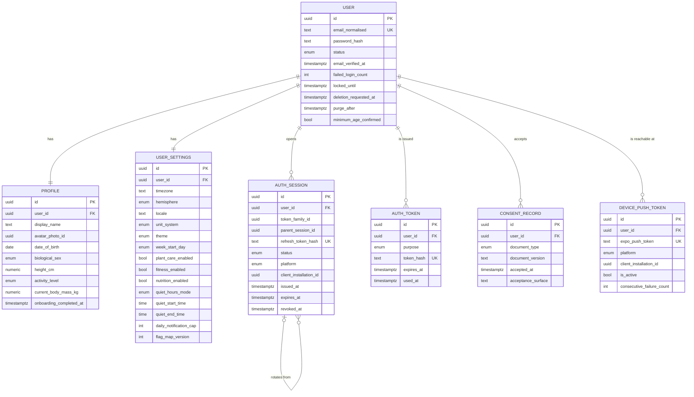
```mermaid
erDiagram
    USER ||--|| PROFILE : "has"
    USER ||--|| USER_SETTINGS : "has"
    USER ||--o{ AUTH_SESSION : "opens"
    USER ||--o{ AUTH_TOKEN : "is issued"
    USER ||--o{ CONSENT_RECORD : "accepts"
    USER ||--o{ DEVICE_PUSH_TOKEN : "is reachable at"
    AUTH_SESSION |o--o{ AUTH_SESSION : "rotates from"

    USER {
        uuid id PK
        text email_normalised UK
        text password_hash
        enum status
        timestamptz email_verified_at
        int failed_login_count
        timestamptz locked_until
        timestamptz deletion_requested_at
        timestamptz purge_after
        bool minimum_age_confirmed
    }
    PROFILE {
        uuid id PK
        uuid user_id FK
        text display_name
        uuid avatar_photo_id
        date date_of_birth
        enum biological_sex
        numeric height_cm
        enum activity_level
        numeric current_body_mass_kg
        timestamptz onboarding_completed_at
    }
    USER_SETTINGS {
        uuid id PK
        uuid user_id FK
        text timezone
        enum hemisphere
        text locale
        enum unit_system
        enum theme
        enum week_start_day
        bool plant_care_enabled
        bool fitness_enabled
        bool nutrition_enabled
        enum quiet_hours_mode
        time quiet_start_time
        time quiet_end_time
        int daily_notification_cap
        int flag_map_version
    }
    AUTH_SESSION {
        uuid id PK
        uuid user_id FK
        uuid token_family_id
        uuid parent_session_id
        text refresh_token_hash UK
        enum status
        enum platform
        uuid client_installation_id
        timestamptz issued_at
        timestamptz expires_at
        timestamptz revoked_at
    }
    AUTH_TOKEN {
        uuid id PK
        uuid user_id FK
        enum purpose
        text token_hash UK
        timestamptz expires_at
        timestamptz used_at
    }
    CONSENT_RECORD {
        uuid id PK
        uuid user_id FK
        enum document_type
        text document_version
        timestamptz accepted_at
        text acceptance_surface
    }
    DEVICE_PUSH_TOKEN {
        uuid id PK
        uuid user_id FK
        text expo_push_token UK
        enum platform
        uuid client_installation_id
        bool is_active
        int consecutive_failure_count
    }
```

### 4.2 C2 Plant Care

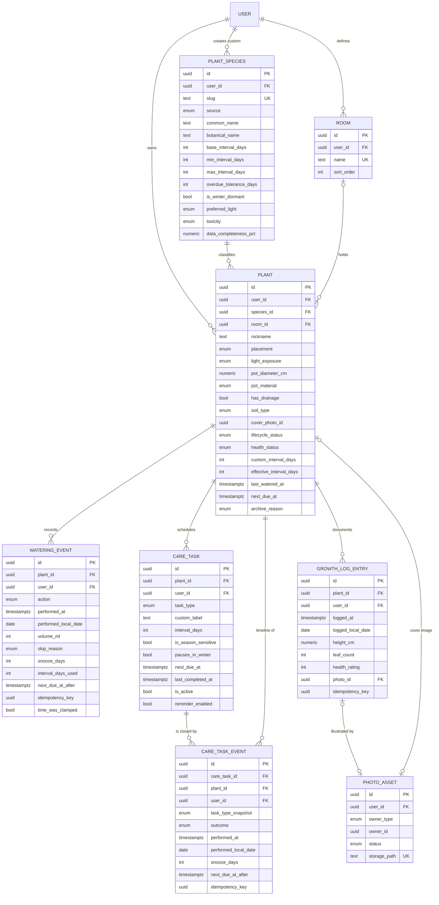
```mermaid
erDiagram
    USER ||--o{ PLANT : "owns"
    USER ||--o{ ROOM : "defines"
    USER ||--o{ PLANT_SPECIES : "creates custom"
    PLANT_SPECIES ||--o{ PLANT : "classifies"
    ROOM |o--o{ PLANT : "holds"
    PLANT ||--o{ WATERING_EVENT : "records"
    PLANT ||--o{ CARE_TASK : "schedules"
    CARE_TASK ||--o{ CARE_TASK_EVENT : "is closed by"
    PLANT ||--o{ CARE_TASK_EVENT : "timeline of"
    PLANT ||--o{ GROWTH_LOG_ENTRY : "documents"
    GROWTH_LOG_ENTRY |o--o| PHOTO_ASSET : "illustrated by"
    PLANT |o--o| PHOTO_ASSET : "cover image"

    PLANT_SPECIES {
        uuid id PK
        uuid user_id FK
        text slug UK
        enum source
        text common_name
        text botanical_name
        int base_interval_days
        int min_interval_days
        int max_interval_days
        int overdue_tolerance_days
        bool is_winter_dormant
        enum preferred_light
        enum toxicity
        numeric data_completeness_pct
    }
    ROOM {
        uuid id PK
        uuid user_id FK
        text name UK
        int sort_order
    }
    PLANT {
        uuid id PK
        uuid user_id FK
        uuid species_id FK
        uuid room_id FK
        text nickname
        enum placement
        enum light_exposure
        numeric pot_diameter_cm
        enum pot_material
        bool has_drainage
        enum soil_type
        uuid cover_photo_id
        enum lifecycle_status
        enum health_status
        int custom_interval_days
        int effective_interval_days
        timestamptz last_watered_at
        timestamptz next_due_at
        enum archive_reason
    }
    WATERING_EVENT {
        uuid id PK
        uuid plant_id FK
        uuid user_id FK
        enum action
        timestamptz performed_at
        date performed_local_date
        int volume_ml
        enum skip_reason
        int snooze_days
        int interval_days_used
        timestamptz next_due_at_after
        uuid idempotency_key
        bool time_was_clamped
    }
    CARE_TASK {
        uuid id PK
        uuid plant_id FK
        uuid user_id FK
        enum task_type
        text custom_label
        int interval_days
        bool is_season_sensitive
        bool pauses_in_winter
        timestamptz next_due_at
        timestamptz last_completed_at
        bool is_active
        bool reminder_enabled
    }
    CARE_TASK_EVENT {
        uuid id PK
        uuid care_task_id FK
        uuid plant_id FK
        uuid user_id FK
        enum task_type_snapshot
        enum outcome
        timestamptz performed_at
        date performed_local_date
        int snooze_days
        timestamptz next_due_at_after
        uuid idempotency_key
    }
    GROWTH_LOG_ENTRY {
        uuid id PK
        uuid plant_id FK
        uuid user_id FK
        timestamptz logged_at
        date logged_local_date
        numeric height_cm
        int leaf_count
        int health_rating
        uuid photo_id FK
        uuid idempotency_key
    }
    PHOTO_ASSET {
        uuid id PK
        uuid user_id FK
        enum owner_type
        uuid owner_id
        enum status
        text storage_path UK
    }
```

### 4.3 C3 Fitness

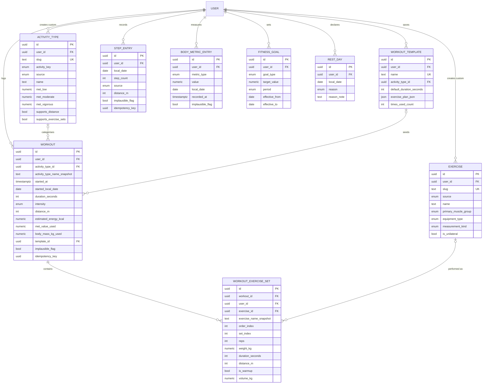
```mermaid
erDiagram
    USER ||--o{ WORKOUT : "logs"
    USER ||--o{ ACTIVITY_TYPE : "creates custom"
    USER ||--o{ EXERCISE : "creates custom"
    USER ||--o{ WORKOUT_TEMPLATE : "saves"
    USER ||--o{ STEP_ENTRY : "records"
    USER ||--o{ BODY_METRIC_ENTRY : "measures"
    USER ||--o{ FITNESS_GOAL : "sets"
    USER ||--o{ REST_DAY : "declares"
    ACTIVITY_TYPE |o--o{ WORKOUT : "categorises"
    WORKOUT_TEMPLATE |o--o{ WORKOUT : "seeds"
    WORKOUT ||--o{ WORKOUT_EXERCISE_SET : "contains"
    EXERCISE |o--o{ WORKOUT_EXERCISE_SET : "performed as"

    ACTIVITY_TYPE {
        uuid id PK
        uuid user_id FK
        text slug UK
        enum activity_key
        enum source
        text name
        numeric met_low
        numeric met_moderate
        numeric met_vigorous
        bool supports_distance
        bool supports_exercise_sets
    }
    EXERCISE {
        uuid id PK
        uuid user_id FK
        text slug UK
        enum source
        text name
        enum primary_muscle_group
        enum equipment_type
        enum measurement_kind
        bool is_unilateral
    }
    WORKOUT {
        uuid id PK
        uuid user_id FK
        uuid activity_type_id FK
        text activity_type_name_snapshot
        timestamptz started_at
        date started_local_date
        int duration_seconds
        enum intensity
        int distance_m
        numeric estimated_energy_kcal
        numeric met_value_used
        numeric body_mass_kg_used
        uuid template_id FK
        bool implausible_flag
        uuid idempotency_key
    }
    WORKOUT_EXERCISE_SET {
        uuid id PK
        uuid workout_id FK
        uuid user_id FK
        uuid exercise_id FK
        text exercise_name_snapshot
        int order_index
        int set_index
        int reps
        numeric weight_kg
        int duration_seconds
        int distance_m
        bool is_warmup
        numeric volume_kg
    }
    WORKOUT_TEMPLATE {
        uuid id PK
        uuid user_id FK
        text name UK
        uuid activity_type_id FK
        int default_duration_seconds
        json exercise_plan_json
        int times_used_count
    }
    STEP_ENTRY {
        uuid id PK
        uuid user_id FK
        date local_date
        int step_count
        enum source
        int distance_m
        bool implausible_flag
        uuid idempotency_key
    }
    BODY_METRIC_ENTRY {
        uuid id PK
        uuid user_id FK
        enum metric_type
        numeric value
        date local_date
        timestamptz recorded_at
        bool implausible_flag
    }
    FITNESS_GOAL {
        uuid id PK
        uuid user_id FK
        enum goal_type
        numeric target_value
        enum period
        date effective_from
        date effective_to
    }
    REST_DAY {
        uuid id PK
        uuid user_id FK
        date local_date
        enum reason
        text reason_note
    }
```

### 4.4 C4 Nutrition

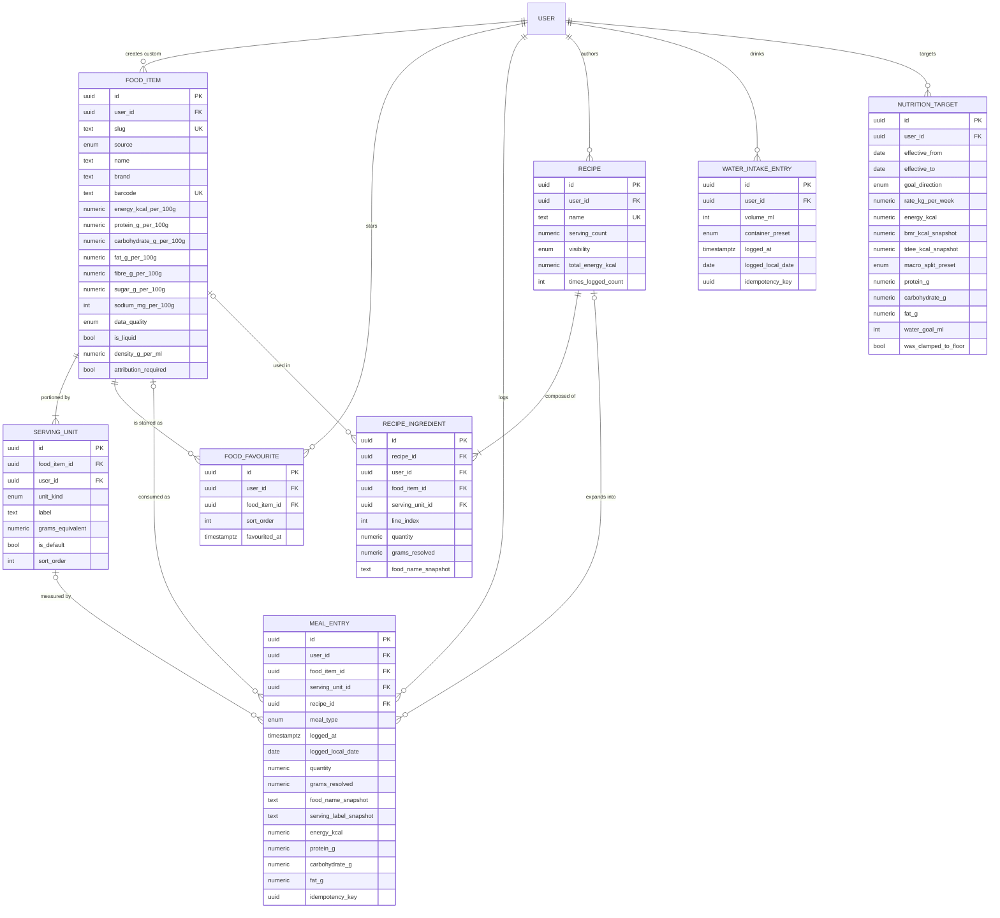
```mermaid
erDiagram
    USER ||--o{ FOOD_ITEM : "creates custom"
    USER ||--o{ FOOD_FAVOURITE : "stars"
    USER ||--o{ MEAL_ENTRY : "logs"
    USER ||--o{ RECIPE : "authors"
    USER ||--o{ WATER_INTAKE_ENTRY : "drinks"
    USER ||--o{ NUTRITION_TARGET : "targets"
    FOOD_ITEM ||--|{ SERVING_UNIT : "portioned by"
    FOOD_ITEM ||--o{ FOOD_FAVOURITE : "is starred as"
    FOOD_ITEM |o--o{ MEAL_ENTRY : "consumed as"
    SERVING_UNIT |o--o{ MEAL_ENTRY : "measured by"
    RECIPE ||--|{ RECIPE_INGREDIENT : "composed of"
    FOOD_ITEM |o--o{ RECIPE_INGREDIENT : "used in"
    RECIPE |o--o{ MEAL_ENTRY : "expands into"

    FOOD_ITEM {
        uuid id PK
        uuid user_id FK
        text slug UK
        enum source
        text name
        text brand
        text barcode UK
        numeric energy_kcal_per_100g
        numeric protein_g_per_100g
        numeric carbohydrate_g_per_100g
        numeric fat_g_per_100g
        numeric fibre_g_per_100g
        numeric sugar_g_per_100g
        int sodium_mg_per_100g
        enum data_quality
        bool is_liquid
        numeric density_g_per_ml
        bool attribution_required
    }
    SERVING_UNIT {
        uuid id PK
        uuid food_item_id FK
        uuid user_id FK
        enum unit_kind
        text label
        numeric grams_equivalent
        bool is_default
        int sort_order
    }
    FOOD_FAVOURITE {
        uuid id PK
        uuid user_id FK
        uuid food_item_id FK
        int sort_order
        timestamptz favourited_at
    }
    MEAL_ENTRY {
        uuid id PK
        uuid user_id FK
        uuid food_item_id FK
        uuid serving_unit_id FK
        uuid recipe_id FK
        enum meal_type
        timestamptz logged_at
        date logged_local_date
        numeric quantity
        numeric grams_resolved
        text food_name_snapshot
        text serving_label_snapshot
        numeric energy_kcal
        numeric protein_g
        numeric carbohydrate_g
        numeric fat_g
        uuid idempotency_key
    }
    RECIPE {
        uuid id PK
        uuid user_id FK
        text name UK
        numeric serving_count
        enum visibility
        numeric total_energy_kcal
        int times_logged_count
    }
    RECIPE_INGREDIENT {
        uuid id PK
        uuid recipe_id FK
        uuid user_id FK
        uuid food_item_id FK
        uuid serving_unit_id FK
        int line_index
        numeric quantity
        numeric grams_resolved
        text food_name_snapshot
    }
    WATER_INTAKE_ENTRY {
        uuid id PK
        uuid user_id FK
        int volume_ml
        enum container_preset
        timestamptz logged_at
        date logged_local_date
        uuid idempotency_key
    }
    NUTRITION_TARGET {
        uuid id PK
        uuid user_id FK
        date effective_from
        date effective_to
        enum goal_direction
        numeric rate_kg_per_week
        numeric energy_kcal
        numeric bmr_kcal_snapshot
        numeric tdee_kcal_snapshot
        enum macro_split_preset
        numeric protein_g
        numeric carbohydrate_g
        numeric fat_g
        int water_goal_ml
        bool was_clamped_to_floor
    }
```

### 4.5 C5 Engagement

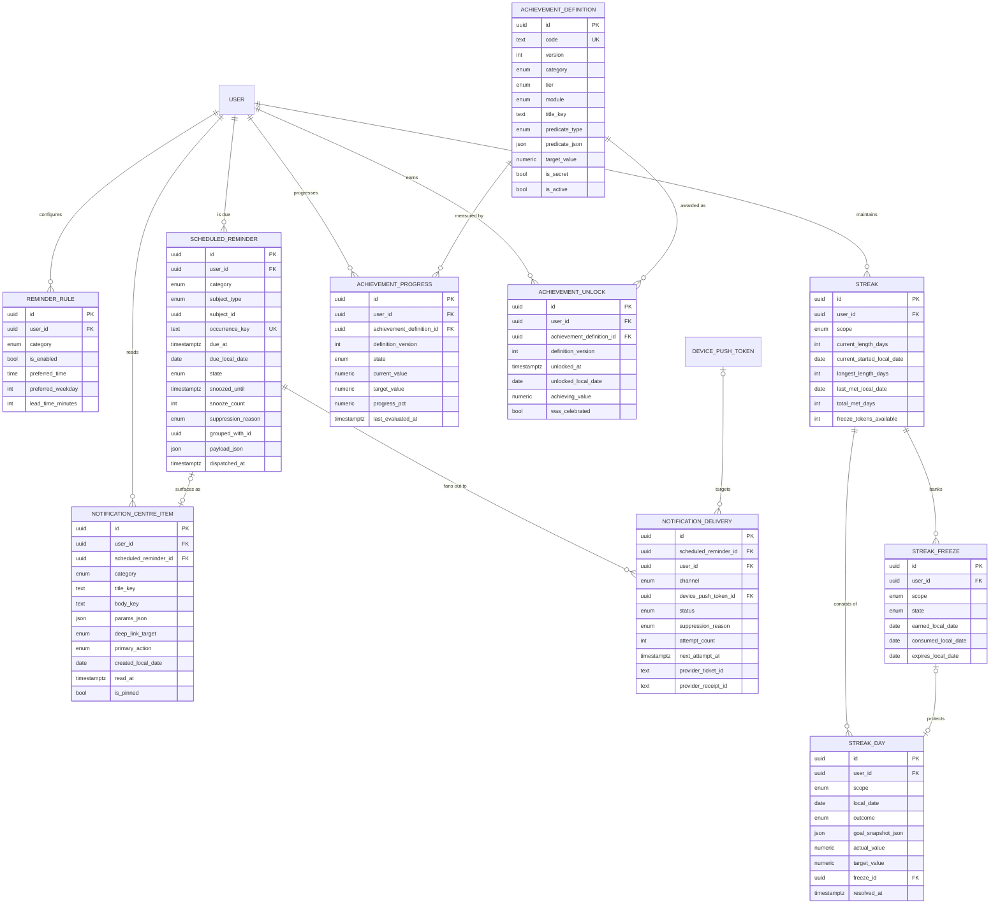
```mermaid
erDiagram
    USER ||--o{ REMINDER_RULE : "configures"
    USER ||--o{ SCHEDULED_REMINDER : "is due"
    USER ||--o{ NOTIFICATION_CENTRE_ITEM : "reads"
    USER ||--o{ STREAK : "maintains"
    USER ||--o{ ACHIEVEMENT_PROGRESS : "progresses"
    USER ||--o{ ACHIEVEMENT_UNLOCK : "earns"
    SCHEDULED_REMINDER ||--o{ NOTIFICATION_DELIVERY : "fans out to"
    SCHEDULED_REMINDER |o--o| NOTIFICATION_CENTRE_ITEM : "surfaces as"
    DEVICE_PUSH_TOKEN |o--o{ NOTIFICATION_DELIVERY : "targets"
    STREAK ||--o{ STREAK_DAY : "consists of"
    STREAK ||--o{ STREAK_FREEZE : "banks"
    STREAK_FREEZE |o--o| STREAK_DAY : "protects"
    ACHIEVEMENT_DEFINITION ||--o{ ACHIEVEMENT_PROGRESS : "measured by"
    ACHIEVEMENT_DEFINITION ||--o{ ACHIEVEMENT_UNLOCK : "awarded as"

    REMINDER_RULE {
        uuid id PK
        uuid user_id FK
        enum category
        bool is_enabled
        time preferred_time
        int preferred_weekday
        int lead_time_minutes
    }
    SCHEDULED_REMINDER {
        uuid id PK
        uuid user_id FK
        enum category
        enum subject_type
        uuid subject_id
        text occurrence_key UK
        timestamptz due_at
        date due_local_date
        enum state
        timestamptz snoozed_until
        int snooze_count
        enum suppression_reason
        uuid grouped_with_id
        json payload_json
        timestamptz dispatched_at
    }
    NOTIFICATION_DELIVERY {
        uuid id PK
        uuid scheduled_reminder_id FK
        uuid user_id FK
        enum channel
        uuid device_push_token_id FK
        enum status
        enum suppression_reason
        int attempt_count
        timestamptz next_attempt_at
        text provider_ticket_id
        text provider_receipt_id
    }
    NOTIFICATION_CENTRE_ITEM {
        uuid id PK
        uuid user_id FK
        uuid scheduled_reminder_id FK
        enum category
        text title_key
        text body_key
        json params_json
        enum deep_link_target
        enum primary_action
        date created_local_date
        timestamptz read_at
        bool is_pinned
    }
    STREAK {
        uuid id PK
        uuid user_id FK
        enum scope
        int current_length_days
        date current_started_local_date
        int longest_length_days
        date last_met_local_date
        int total_met_days
        int freeze_tokens_available
    }
    STREAK_DAY {
        uuid id PK
        uuid user_id FK
        enum scope
        date local_date
        enum outcome
        json goal_snapshot_json
        numeric actual_value
        numeric target_value
        uuid freeze_id FK
        timestamptz resolved_at
    }
    STREAK_FREEZE {
        uuid id PK
        uuid user_id FK
        enum scope
        enum state
        date earned_local_date
        date consumed_local_date
        date expires_local_date
    }
    ACHIEVEMENT_DEFINITION {
        uuid id PK
        text code UK
        int version
        enum category
        enum tier
        enum module
        text title_key
        enum predicate_type
        json predicate_json
        numeric target_value
        bool is_secret
        bool is_active
    }
    ACHIEVEMENT_PROGRESS {
        uuid id PK
        uuid user_id FK
        uuid achievement_definition_id FK
        int definition_version
        enum state
        numeric current_value
        numeric target_value
        numeric progress_pct
        timestamptz last_evaluated_at
    }
    ACHIEVEMENT_UNLOCK {
        uuid id PK
        uuid user_id FK
        uuid achievement_definition_id FK
        int definition_version
        timestamptz unlocked_at
        date unlocked_local_date
        numeric achieving_value
        bool was_celebrated
    }
```

### 4.6 C6 Platform

`SYNC_OUTBOX_ITEM` is drawn detached from `USER` deliberately: it exists only on the device and has no server-side owner row.

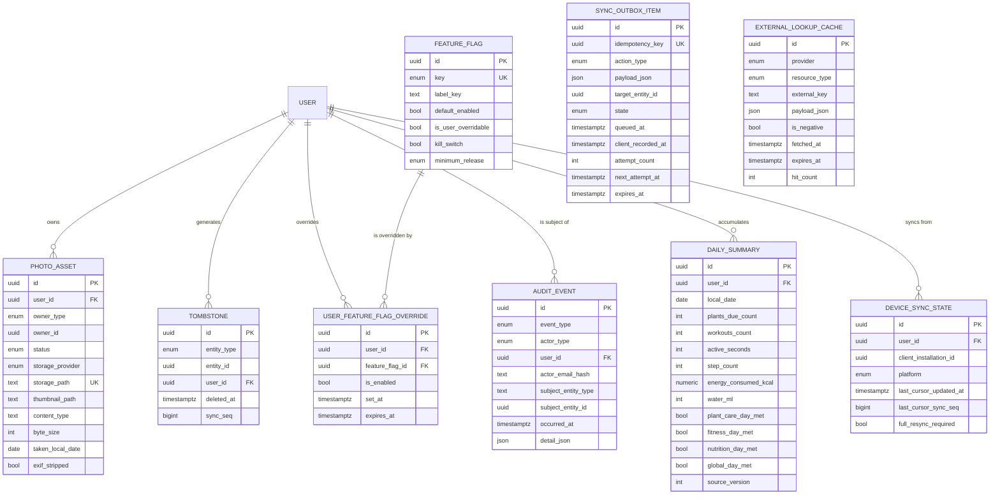
```mermaid
erDiagram
    USER ||--o{ PHOTO_ASSET : "owns"
    USER ||--o{ TOMBSTONE : "generates"
    USER ||--o{ USER_FEATURE_FLAG_OVERRIDE : "overrides"
    USER ||--o{ AUDIT_EVENT : "is subject of"
    USER ||--o{ DAILY_SUMMARY : "accumulates"
    USER ||--o{ DEVICE_SYNC_STATE : "syncs from"
    FEATURE_FLAG ||--o{ USER_FEATURE_FLAG_OVERRIDE : "is overridden by"

    PHOTO_ASSET {
        uuid id PK
        uuid user_id FK
        enum owner_type
        uuid owner_id
        enum status
        enum storage_provider
        text storage_path UK
        text thumbnail_path
        text content_type
        int byte_size
        date taken_local_date
        bool exif_stripped
    }
    SYNC_OUTBOX_ITEM {
        uuid id PK
        uuid idempotency_key UK
        enum action_type
        json payload_json
        uuid target_entity_id
        enum state
        timestamptz queued_at
        timestamptz client_recorded_at
        int attempt_count
        timestamptz next_attempt_at
        timestamptz expires_at
    }
    TOMBSTONE {
        uuid id PK
        enum entity_type
        uuid entity_id
        uuid user_id FK
        timestamptz deleted_at
        bigint sync_seq
    }
    FEATURE_FLAG {
        uuid id PK
        enum key UK
        text label_key
        bool default_enabled
        bool is_user_overridable
        bool kill_switch
        enum minimum_release
    }
    USER_FEATURE_FLAG_OVERRIDE {
        uuid id PK
        uuid user_id FK
        uuid feature_flag_id FK
        bool is_enabled
        timestamptz set_at
        timestamptz expires_at
    }
    EXTERNAL_LOOKUP_CACHE {
        uuid id PK
        enum provider
        enum resource_type
        text external_key
        json payload_json
        bool is_negative
        timestamptz fetched_at
        timestamptz expires_at
        int hit_count
    }
    AUDIT_EVENT {
        uuid id PK
        enum event_type
        enum actor_type
        uuid user_id FK
        text actor_email_hash
        text subject_entity_type
        uuid subject_entity_id
        timestamptz occurred_at
        json detail_json
    }
    DAILY_SUMMARY {
        uuid id PK
        uuid user_id FK
        date local_date
        int plants_due_count
        int workouts_count
        int active_seconds
        int step_count
        numeric energy_consumed_kcal
        int water_ml
        bool plant_care_day_met
        bool fitness_day_met
        bool nutrition_day_met
        bool global_day_met
        int source_version
    }
    DEVICE_SYNC_STATE {
        uuid id PK
        uuid user_id FK
        uuid client_installation_id
        enum platform
        timestamptz last_cursor_updated_at
        bigint last_cursor_sync_seq
        bool full_resync_required
    }
```

---

## 5. Relationship matrix

### 5.1 Notation and the ownership rule

Cardinality is written as `parent : child`.

| Symbol | Meaning |
| --- | --- |
| `1` | Exactly one |
| `0..1` | Optional one |
| `1..*` | One or more |
| `0..*` | Zero or more |
| `1 : 4`, `1 : 10` | An exact fixed count, created eagerly with the parent |

**Ownership** is one of three values, and this is the rule that decides cascade behaviour, export membership and transaction boundaries:

| Ownership | Definition | Consequence |
| --- | --- | --- |
| `COMPOSITION` | The child cannot exist without the parent and is deleted with it. | The child is inside the parent's aggregate. Deleting the parent soft-deletes the child in the same transaction and emits a tombstone for each child. |
| `AGGREGATION` | The child references the parent but outlives it. | Deleting the parent nulls the reference; the child remains a valid, readable row. |
| `REFERENCE` | The link is a lookup only. | Deleting the referenced row never deletes the referencing row. Where the referencing row needs the referenced values for history, it carries a snapshot and the reference is nulled. |

> **Ownership rule, stated once.** A row is owned by exactly one parent for the purposes of deletion. Every `USER_SCOPED` row is ultimately owned by `ENT-01 User`; every other ownership edge is a refinement inside that. No row is owned by two parents, and no row is left with no owner — which is why `ENT-42 PhotoAsset` carries an explicit `ORPHANED` state rather than relying on a dangling reference.

### 5.2 The matrix

| # | Parent | Child | Cardinality | Ownership | Child FK optional | On parent delete | Notes |
| --- | --- | --- | --- | --- | --- | --- | --- |
| R-01 | `User` | `Profile` | 1 : 1 | COMPOSITION | No | CASCADE | Created together; neither can exist alone |
| R-02 | `User` | `UserSettings` | 1 : 1 | COMPOSITION | No | CASCADE | Created together with defaults |
| R-03 | `User` | `AuthSession` | 1 : 0..* | COMPOSITION | No | CASCADE | At most 10 concurrently `ACTIVE` |
| R-04 | `User` | `AuthToken` | 1 : 0..* | COMPOSITION | No | CASCADE | At most one live token per purpose |
| R-05 | `User` | `ConsentRecord` | 1 : 1..* | COMPOSITION | No | CASCADE | At least privacy policy and terms at registration |
| R-06 | `User` | `DevicePushToken` | 1 : 0..* | COMPOSITION | No | CASCADE plus provider de-registration | Maximum 10 |
| R-07 | `AuthSession` | `AuthSession` | 0..1 : 0..1 | REFERENCE | Yes | SET NULL | Self-reference through `parent_session_id`, the rotation chain |
| R-08 | `User` | `Room` | 1 : 0..* | COMPOSITION | No | CASCADE | Maximum 50 |
| R-09 | `User` | `PlantSpecies` | 1 : 0..* | COMPOSITION | Yes, null means global | CASCADE for custom rows only | Maximum 100 custom |
| R-10 | `User` | `Plant` | 1 : 0..* | COMPOSITION | No | CASCADE | Maximum 300 active plus 300 archived |
| R-11 | `PlantSpecies` | `Plant` | 1 : 0..* | REFERENCE | No | RESTRICT | A soft-deleted species stays readable so plants still resolve care data |
| R-12 | `Room` | `Plant` | 0..1 : 0..* | AGGREGATION | Yes | SET NULL | The plant survives room deletion and shows as unassigned |
| R-13 | `Plant` | `WateringEvent` | 1 : 0..* | COMPOSITION | No | CASCADE | Zero for a new plant with no history |
| R-14 | `Plant` | `CareTask` | 1 : 0..* | COMPOSITION | No | CASCADE | Maximum 10 |
| R-15 | `CareTask` | `CareTaskEvent` | 1 : 0..* | COMPOSITION | No | CASCADE | One event per closed occurrence |
| R-16 | `Plant` | `CareTaskEvent` | 1 : 0..* | COMPOSITION | No | CASCADE | Denormalised parent so the plant timeline needs no join |
| R-17 | `Plant` | `GrowthLogEntry` | 1 : 0..* | COMPOSITION | No | CASCADE | Maximum 1000 |
| R-18 | `GrowthLogEntry` | `PhotoAsset` | 1 : 0..1 | COMPOSITION | Yes | CASCADE to `DELETED` | Photo optional and attached later when the entry was queued offline |
| R-19 | `Plant` | `PhotoAsset` | 1 : 0..1 | COMPOSITION | Yes | CASCADE to `DELETED` | The cover photo |
| R-20 | `Profile` | `PhotoAsset` | 1 : 0..1 | COMPOSITION | Yes | CASCADE to `DELETED` | The avatar |
| R-21 | `User` | `ActivityType` | 1 : 0..* | COMPOSITION | Yes, null means global | CASCADE for custom rows only | Maximum 30 custom |
| R-22 | `User` | `Exercise` | 1 : 0..* | COMPOSITION | Yes, null means global | CASCADE for custom rows only | Maximum 200 custom |
| R-23 | `User` | `Workout` | 1 : 0..* | COMPOSITION | No | CASCADE | Maximum 20 per local date |
| R-24 | `ActivityType` | `Workout` | 0..1 : 0..* | REFERENCE | Yes | SET NULL, snapshot retained | `activity_type_name_snapshot` preserves the display |
| R-25 | `Workout` | `WorkoutExerciseSet` | 1 : 0..* | COMPOSITION | No | CASCADE | Maximum 200 sets across at most 30 exercises |
| R-26 | `Exercise` | `WorkoutExerciseSet` | 0..1 : 0..* | REFERENCE | Yes | SET NULL, snapshot retained | `exercise_name_snapshot` preserves the display |
| R-27 | `User` | `WorkoutTemplate` | 1 : 0..* | COMPOSITION | No | CASCADE | Maximum 50 |
| R-28 | `WorkoutTemplate` | `Workout` | 0..1 : 0..* | REFERENCE | Yes | SET NULL | Provenance only |
| R-29 | `User` | `StepEntry` | 1 : 0..* | COMPOSITION | No | CASCADE | At most one per local date per source |
| R-30 | `User` | `BodyMetricEntry` | 1 : 0..* | COMPOSITION | No | CASCADE | At most one per metric type per local date |
| R-31 | `User` | `FitnessGoal` | 1 : 0..* | COMPOSITION | No | CASCADE | Effective-dated, non-overlapping per goal type |
| R-32 | `User` | `RestDay` | 1 : 0..* | COMPOSITION | No | CASCADE | At most one per local date |
| R-33 | `User` | `FoodItem` | 1 : 0..* | COMPOSITION | Yes, null means global | CASCADE for custom rows only | Maximum 500 custom |
| R-34 | `FoodItem` | `ServingUnit` | 1 : 1..* | COMPOSITION | No | CASCADE | Always at least the implicit `GRAM` serving |
| R-35 | `User` | `FoodFavourite` | 1 : 0..* | COMPOSITION | No | CASCADE | |
| R-36 | `FoodItem` | `FoodFavourite` | 1 : 0..* | REFERENCE | No | CASCADE hard delete | No history worth keeping |
| R-37 | `User` | `MealEntry` | 1 : 0..* | COMPOSITION | No | CASCADE | Maximum 60 per local date |
| R-38 | `FoodItem` | `MealEntry` | 0..1 : 0..* | REFERENCE | Yes | SET NULL, snapshot retained | **The critical soft-delete case**: a soft-deleted food leaves meal entries untouched and displaying from their snapshot |
| R-39 | `ServingUnit` | `MealEntry` | 0..1 : 0..* | REFERENCE | Yes | SET NULL, snapshot retained | `serving_label_snapshot` preserves the display |
| R-40 | `User` | `Recipe` | 1 : 0..* | COMPOSITION | No | CASCADE | Maximum 100 |
| R-41 | `Recipe` | `RecipeIngredient` | 1 : 1..* | COMPOSITION | No | CASCADE | Maximum 50; a recipe with zero ingredients is rejected |
| R-42 | `FoodItem` | `RecipeIngredient` | 0..1 : 0..* | REFERENCE | Yes | SET NULL, snapshot retained | |
| R-43 | `Recipe` | `MealEntry` | 0..1 : 0..* | REFERENCE | Yes | SET NULL | Provenance of an expanded recipe log |
| R-44 | `User` | `WaterIntakeEntry` | 1 : 0..* | COMPOSITION | No | CASCADE | Maximum 40 per local date |
| R-45 | `User` | `NutritionTarget` | 1 : 0..* | COMPOSITION | No | CASCADE | Effective-dated, non-overlapping |
| R-46 | `User` | `ReminderRule` | 1 : 10 | COMPOSITION | No | CASCADE | Exactly one row per `ReminderCategory` |
| R-47 | `User` | `ScheduledReminder` | 1 : 0..* | COMPOSITION | No | CASCADE | Materialised at most 48 hours ahead |
| R-48 | `ScheduledReminder` | `NotificationDelivery` | 1 : 0..* | COMPOSITION | No | CASCADE | One per channel per target device |
| R-49 | `DevicePushToken` | `NotificationDelivery` | 0..1 : 0..* | REFERENCE | Yes | SET NULL | Delivery history survives token pruning |
| R-50 | `ScheduledReminder` | `NotificationCentreItem` | 0..1 : 0..1 | AGGREGATION | Yes | SET NULL | The centre item deliberately outlives the reminder |
| R-51 | `User` | `NotificationCentreItem` | 1 : 0..* | COMPOSITION | No | CASCADE | 500 most recent or 365 days retained |
| R-52 | `Plant` | `ScheduledReminder` | 1 : 0..* | REFERENCE through `subject_id` | Polymorphic | Reminders cancelled with `SUBJECT_DELETED` | Not a database foreign key |
| R-53 | `CareTask` | `ScheduledReminder` | 1 : 0..* | REFERENCE through `subject_id` | Polymorphic | Reminders cancelled with `SUBJECT_DELETED` | Not a database foreign key |
| R-54 | `User` | `Streak` | 1 : 4 | COMPOSITION | No | CASCADE | Exactly one row per `StreakScope` |
| R-55 | `Streak` | `StreakDay` | 1 : 0..* | COMPOSITION | No | CASCADE | One per calendar day since first activity, including `EXCLUDED` days |
| R-56 | `Streak` | `StreakFreeze` | 1 : 0..* | COMPOSITION | No | CASCADE | At most 2 held per scope |
| R-57 | `StreakFreeze` | `StreakDay` | 0..1 : 0..1 | REFERENCE | Yes | SET NULL | Records which day a token protected |
| R-58 | `AchievementDefinition` | `AchievementProgress` | 1 : 0..* | REFERENCE | No | RESTRICT | Definitions are never deleted, only deactivated |
| R-59 | `AchievementDefinition` | `AchievementUnlock` | 1 : 0..* | REFERENCE | No | RESTRICT | An unlock is never revoked |
| R-60 | `User` | `AchievementProgress` | 1 : 0..* | COMPOSITION | No | CASCADE | At most one per definition |
| R-61 | `User` | `AchievementUnlock` | 1 : 0..* | COMPOSITION | No | CASCADE | At most one per definition version |
| R-62 | `User` | `PhotoAsset` | 1 : 0..* | COMPOSITION | No | CASCADE plus object-storage delete | Maximum 500 photos and 150 MB |
| R-63 | `User` | `Tombstone` | 1 : 0..* | COMPOSITION | Yes | CASCADE | Null user for global catalogue rows |
| R-64 | `FeatureFlag` | `UserFeatureFlagOverride` | 1 : 0..* | REFERENCE | No | CASCADE | |
| R-65 | `User` | `UserFeatureFlagOverride` | 1 : 0..* | COMPOSITION | No | CASCADE | |
| R-66 | `User` | `AuditEvent` | 1 : 0..* | AGGREGATION | Yes | SET NULL and anonymise | Survives purge so that deletion is not an audit-evasion tool |
| R-67 | `User` | `DailySummary` | 1 : 0..* | COMPOSITION | No | CASCADE | Exactly one per local date with activity |
| R-68 | `User` | `DeviceSyncState` | 1 : 0..* | COMPOSITION | No | CASCADE | One per client installation |
| R-69 | `AuthSession` | `DeviceSyncState` | 0..* : 0..1 | REFERENCE through `client_installation_id` | Yes | none | A shared correlation identifier, not a foreign key |
| R-70 | `AuthSession` | `DevicePushToken` | 0..* : 0..1 | REFERENCE through `client_installation_id` | Yes | none | The same correlation identifier |

### 5.3 Polymorphic references

Three links are polymorphic and are therefore **not** database foreign keys. Each is paired with a type discriminator column.

| Link | Discriminator | Points at |
| --- | --- | --- |
| `ENT-33 ScheduledReminder.subject_id` | `subject_type` (`ReminderSubjectType`) | `Plant`, `CareTask`, `FitnessGoal`, `NutritionTarget`, `Streak`, `AchievementDefinition` or `User` |
| `ENT-42 PhotoAsset.owner_id` | `owner_type` (`PhotoOwnerType`) | `Plant`, `GrowthLogEntry` or `Profile` |
| `ENT-48 AuditEvent.subject_entity_id` | `subject_entity_type` (text) | Any entity |

Phase 2 must enforce their integrity with application-level checks plus a periodic orphan-detection job, and must **not** attempt a polymorphic foreign key. This is a deliberate, recorded trade: three narrow, well-tested polymorphic links are cheaper for a solo developer than eleven nullable typed columns.

### 5.4 Cascade summary

| Parent action | Effect on `COMPOSITION` children | Effect on `AGGREGATION` children | Effect on `REFERENCE` children |
| --- | --- | --- | --- |
| Soft delete | Soft-deleted in the same transaction; one tombstone emitted per child | Reference nulled; child row untouched | Untouched; the referencing row keeps its snapshot and its foreign key |
| Hard delete at account purge | Hard-deleted | Reference nulled, or anonymised for `AuditEvent` | Reference nulled, snapshot retained; `RESTRICT` where the catalogue row must survive |
| Archive (`Plant` only) | Retained and readable; reminders cancelled | n/a | n/a |

Entities that are **hard-delete only** and therefore carry no `deleted_at`: `AuthSession`, `AuthToken`, `Tombstone`, `AuditEvent`, `SyncOutboxItem`, `DailySummary`, `ExternalLookupCache`.

---

## 6. Enumeration catalogue

### 6.1 Governance

This section is the **complete and authoritative list of every closed enumeration in PlantPal+**: 87 enumerations, grouped by bounded context, with every member and its meaning. Every module specification uses these member names verbatim.

| Rule | Statement |
| --- | --- |
| Closed by default | Every enumeration here is closed. A value outside the member list is rejected at the boundary — API, database and shared validation schema alike. |
| Additive change only | Members may be added in a later release. A member is **never renamed and never removed** while any row references it; it is marked deprecated in the catalogue and hidden from new selection lists. |
| Wire representation | `SCREAMING_SNAKE_CASE` ASCII, stable forever. The wire value is the contract. |
| Display representation | Never rendered directly. Every member maps to an i18n key of the form `enum.<EnumName>.<MEMBER>` in the locale catalogue (D-08). A screen that renders `BRIGHT_INDIRECT` to a user is a defect. |
| Ordering | Where an enumeration has a natural order — `AchievementTier`, `Intensity`, `LightExposure`, `CareDifficulty` — the member list below is given in that order and that order is the display order. Otherwise display order is alphabetical by localised label. |
| Extensibility escape hatch | Exactly three enumerations pair an `OTHER` or `CUSTOM` member with a free-text column: `PotMaterial` with `pot_material_other`, `SoilType` with `soil_type_other`, and `ServingUnitKind` with `custom_label`. Nothing else has one, because an `OTHER` member with nowhere to record what "other" was is useless. `PlantArchiveReason`, `WateringSkipReason` and `RestDayReason` likewise pair `OTHER` with their own reason-note column. |
| User-defined types | Where users need genuinely open extension — activity types, exercises, species, foods — the model uses a `HYBRID_CATALOGUE` entity, **not** an enumeration. |
| Storage | Phase 2 may implement an enumeration as a PostgreSQL `ENUM` type or as `text` with a `CHECK` constraint. This document does not decide; it requires only that the member list be enforced **in the database** and not only in application code. |

### 6.2 Identity, settings and platform enumerations

**`AccountStatus`** — the lifecycle state of `ENT-01 User`. Machine in [§7.1](#71-account-lifecycle-ent-01-userstatus).

| Member | Meaning |
| --- | --- |
| `PENDING_VERIFICATION` | Registered, email not yet verified. |
| `ACTIVE` | Normal operating state. |
| `LOCKED` | Temporarily locked by failed-login backoff. Self-clears when the lockout window expires. |
| `SUSPENDED` | Locked by an operator. Only an operator can clear it. Not exposed in the v1.0 user interface. |
| `PENDING_DELETION` | Deletion requested; the 30-day grace period is running. A successful login cancels it. |
| `DELETED` | Purged. The row is hard-deleted, so this member exists for the transient in-transaction state and for audit records only. |

**`BiologicalSex`** — required by the Mifflin-St Jeor basal metabolic rate formula.

| Member | Meaning |
| --- | --- |
| `MALE` | Uses the male constant. |
| `FEMALE` | Uses the female constant. |
| `PREFER_NOT_TO_SAY` | The user declines. A documented fallback applies — the mean of the two formulas — with the resulting target clamped to the 1200 kcal floor and the estimate labelled as lower-confidence. |

The attribute is optional at registration and is requested only when the Nutrition module is enabled. The field label must state why it is asked.

**`ActivityLevel`** — the total-daily-energy-expenditure multiplier band. The multiplier values are owned by [modules/nutrition.md](modules/nutrition.md); the members are owned here.

| Member | Description shown to the user |
| --- | --- |
| `SEDENTARY` | Little or no exercise, desk job |
| `LIGHTLY_ACTIVE` | Light exercise 1 to 3 days per week |
| `MODERATELY_ACTIVE` | Moderate exercise 3 to 5 days per week |
| `VERY_ACTIVE` | Hard exercise 6 to 7 days per week |
| `EXTRA_ACTIVE` | Very hard exercise plus a physical job |

**`UnitSystem`** — `METRIC`, `IMPERIAL`. Default `METRIC`. Display only; storage is always canonical metric.

**`Hemisphere`** — `NORTHERN`, `SOUTHERN`, `EQUATORIAL`. Default `NORTHERN`. Feeds season derivation.

**`ThemePreference`** — `LIGHT`, `DARK`, `SYSTEM`. Default `SYSTEM`.

**`ModuleKey`** — the three habit modules; drives per-module enablement everywhere: `PLANT_CARE`, `FITNESS`, `NUTRITION`. At least one module must be enabled at all times; disabling the last enabled module is rejected.

**`ClientPlatform`** — `IOS`, `ANDROID`, `WEB`. Recorded on `AuthSession`, `DevicePushToken` and `DeviceSyncState`.

**`SessionStatus`** — the state of one refresh-token lineage.

| Member | Meaning |
| --- | --- |
| `ACTIVE` | The current refresh token in a family. |
| `ROTATED` | Superseded by a newer token in the same family. Presenting it again is reuse and triggers revocation of the whole family. |
| `REVOKED` | Explicitly invalidated by logout, logout-all, password change, session limit, account deletion or reuse detection. |
| `EXPIRED` | Passed its 30-day expiry without being used. |

**`AuthTokenPurpose`** — `EMAIL_VERIFICATION`, `PASSWORD_RESET`, `EMAIL_CHANGE`.

**`ConsentDocumentType`** — `PRIVACY_POLICY`, `TERMS_OF_SERVICE`, `MEDICAL_DISCLAIMER`.

**`ActorType`** — who caused an `ENT-48 AuditEvent`: `USER`, `SYSTEM`, `OPERATOR`, `ANONYMOUS`.

**`AuditEventType`** — the closed list of audited actions. Ordinary content writes are deliberately not audited.

| Group | Members |
| --- | --- |
| Authentication | `AUTH_REGISTERED`, `AUTH_EMAIL_VERIFIED`, `AUTH_LOGIN_SUCCEEDED`, `AUTH_LOGIN_FAILED`, `AUTH_LOGGED_OUT`, `AUTH_LOGGED_OUT_ALL`, `AUTH_TOKEN_REFRESHED`, `AUTH_REFRESH_REUSE_DETECTED`, `AUTH_PASSWORD_CHANGED`, `AUTH_PASSWORD_RESET_REQUESTED`, `AUTH_PASSWORD_RESET_COMPLETED`, `AUTH_SESSION_REVOKED`, `AUTH_ACCOUNT_LOCKED`, `AUTH_ACCOUNT_UNLOCKED` |
| Account | `ACCOUNT_DELETION_REQUESTED`, `ACCOUNT_DELETION_CANCELLED`, `ACCOUNT_PURGED`, `CONSENT_RECORDED` |
| Configuration | `PROFILE_UPDATED`, `SETTINGS_UPDATED`, `MODULE_ENABLED`, `MODULE_DISABLED`, `TIMEZONE_CHANGED`, `TIMEZONE_FALLBACK_APPLIED`, `HEMISPHERE_CHANGED`, `UNIT_SYSTEM_CHANGED`, `FEATURE_FLAG_OVERRIDDEN` |
| Data rights | `DATA_EXPORT_REQUESTED`, `DATA_EXPORT_DOWNLOADED`, `DATA_IMPORT_ATTEMPTED` |
| Integrity | `ENTITY_HARD_DELETED`, `DERIVED_DATA_REBUILT`, `IMPLAUSIBLE_VALUE_CONFIRMED`, `BACKDATE_LIMIT_REJECTED`, `IDEMPOTENCY_CONFLICT_REJECTED` |
| Notifications | `PUSH_TOKEN_REGISTERED`, `PUSH_TOKEN_PRUNED`, `NOTIFICATION_CAP_REACHED` |

**`CatalogueSource`** — the generic provenance marker for hybrid catalogues with no external provider: `SEEDED`, `USER_CUSTOM`. Used by `ENT-15 ActivityType` and `ENT-16 Exercise`. The two catalogues that do have a provider use their own richer enumerations, `SpeciesSource` and `FoodSource`, rather than overloading this one.

### 6.3 Plant care enumerations

**`PlantLifecycleStatus`** — the administrative state of a plant. Machine in [§7.2](#72-plant-lifecycle-ent-10-plantlifecycle_status).

| Member | Meaning |
| --- | --- |
| `ACTIVE` | Normal. Generates reminders, appears in lists and on the dashboard. |
| `VACATION_PAUSED` | Inside a vacation window. Reminders suppressed; schedule arithmetic continues so that catch-up is deterministic. |
| `ARCHIVED` | No longer cared for. Read-only history retained. No reminders. Excluded from all counts and from streak evaluation. |
| `DELETED` | Soft-deleted. Hidden everywhere except export. |

**`PlantHealthStatus`** — the **derived** care state of a plant, recomputed on every relevant event.

| Member | Derivation |
| --- | --- |
| `THRIVING` | Not overdue: now is before `next_due_at`. |
| `NEEDS_ATTENTION` | Due today or overdue by less than the species tolerance. Also the state of a plant with no watering history. |
| `CRITICAL` | Overdue by at least `overdue_tolerance_days` beyond `next_due_at`. |
| `DORMANT` | The species is flagged winter-dormant and the derived season is `WINTER`. Overrides the other three for display; watering reminders continue at the dormant-season interval. |

**`PlantArchiveReason`** — `DIED`, `GIFTED`, `SOLD`, `LOST`, `OTHER`. `OTHER` pairs with `archive_reason_note`, maximum 200 characters.

**`PlacementType`** — `INDOOR`, `OUTDOOR`.

**`LightExposure`** — ordered from least to most light.

| Member | Description |
| --- | --- |
| `LOW` | More than 2 m from a window, or a north-facing room with no direct sky view |
| `MEDIUM` | Bright room, no direct sun on the plant |
| `BRIGHT_INDIRECT` | Within 1 m of a bright window, filtered or reflected light |
| `DIRECT_SUN` | Direct sunlight on the foliage for 4 or more hours per day |

**`PotMaterial`** — affects evaporation rate.

| Member | Note |
| --- | --- |
| `TERRACOTTA` | Porous, dries quickly |
| `PLASTIC` | Non-porous |
| `CERAMIC_GLAZED` | Non-porous |
| `METAL` | Non-porous, heats in sun |
| `CONCRETE` | Semi-porous |
| `FABRIC` | Highly porous, dries fastest of all |
| `OTHER` | Pairs with `pot_material_other` free text |

**`SoilType`** — `STANDARD_POTTING`, `CACTUS_SUCCULENT`, `ORCHID_BARK`, `PEAT_BASED`, `COCO_COIR`, `SEMI_HYDRO_LECA`, `GARDEN_SOIL`, `OTHER`. `OTHER` pairs with `soil_type_other`.

**`Season`** — `SPRING`, `SUMMER`, `AUTUMN`, `WINTER`, `YEAR_ROUND`. Derived, never stored on a log row. `YEAR_ROUND` is emitted only for `EQUATORIAL` users.

Season is derived **once**, here, so that the plant-care schedule and the seasonal achievement predicates cannot disagree. Meteorological seasons — whole calendar months — are used rather than astronomical, equinox-dated seasons, because the boundary must be computable without an ephemeris and a one-day difference is immaterial to a watering interval. The month used is the month of the **user-local date**, never UTC.

| Month | `NORTHERN` | `SOUTHERN` | `EQUATORIAL` |
| --- | --- | --- | --- |
| January | `WINTER` | `SUMMER` | `YEAR_ROUND` |
| February | `WINTER` | `SUMMER` | `YEAR_ROUND` |
| March | `SPRING` | `AUTUMN` | `YEAR_ROUND` |
| April | `SPRING` | `AUTUMN` | `YEAR_ROUND` |
| May | `SPRING` | `AUTUMN` | `YEAR_ROUND` |
| June | `SUMMER` | `WINTER` | `YEAR_ROUND` |
| July | `SUMMER` | `WINTER` | `YEAR_ROUND` |
| August | `SUMMER` | `WINTER` | `YEAR_ROUND` |
| September | `AUTUMN` | `SPRING` | `YEAR_ROUND` |
| October | `AUTUMN` | `SPRING` | `YEAR_ROUND` |
| November | `AUTUMN` | `SPRING` | `YEAR_ROUND` |
| December | `WINTER` | `SUMMER` | `YEAR_ROUND` |

**`WateringActionType`** — what a `ENT-11 WateringEvent` records.

| Member | Meaning |
| --- | --- |
| `WATERED` | Water was given. Resets the cycle from `performed_at`. |
| `SKIPPED` | The user consciously skipped this cycle. Pairs with `skip_reason`. Advances the schedule without recording water. |
| `SNOOZED` | The user postponed. Pairs with `snooze_days`. Moves `next_due_at` without ending the cycle. |

Recording `SKIPPED` and `SNOOZED` in the same stream as `WATERED` keeps the plant's full interaction history in one ordered sequence, which is what the adherence percentage and the watering-history chart both need.

**`WateringSkipReason`** — `SOIL_STILL_MOIST`, `PLANT_DORMANT`, `RECENTLY_REPOTTED`, `AWAY_FROM_HOME`, `RAINFALL`, `OTHER`. `OTHER` pairs with `skip_reason_note`.

**`CareTaskType`** — recurring non-watering care. **Watering is deliberately not a member**: it is modelled by the plant's own schedule and by `WateringEvent`, because the smart-interval algorithm applies only to watering and giving it a generic cadence field would be misleading.

| Member | Typical cadence | Season-sensitive |
| --- | --- | --- |
| `FERTILISE` | 14 to 30 days | Yes — paused in `WINTER` for most species |
| `REPOT` | 365 to 730 days | Yes — best in `SPRING` |
| `PRUNE` | 60 to 180 days | Yes |
| `ROTATE` | 7 to 14 days | No |
| `MIST` | 2 to 7 days | Yes — more often in `WINTER` with indoor heating |
| `PEST_CHECK` | 14 to 30 days | No |
| `CUSTOM` | user-defined | user-defined |

**`CareTaskOccurrenceState`** — the state of one due instance of a care task: `SCHEDULED`, `DUE`, `OVERDUE`, `COMPLETED`, `SKIPPED`, `SNOOZED`, `CANCELLED`. Machine in [§7.3](#73-care-task-occurrence-derived-from-ent-12-and-ent-13). The `outcome` column of `ENT-13 CareTaskEvent` is constrained to `COMPLETED`, `SKIPPED` and `SNOOZED`.

**`SpeciesSource`** — `SEEDED`, `USER_CUSTOM`, `PERENUAL_CACHED`.

**`CareDifficulty`** — ordered: `BEGINNER`, `INTERMEDIATE`, `ADVANCED`.

**`ToxicityFlag`** — safety information surfaced on the species page: `NON_TOXIC`, `TOXIC_TO_PETS`, `TOXIC_TO_HUMANS`, `TOXIC_TO_BOTH`, `UNKNOWN`. `UNKNOWN` is the default for user-created species and **must never be rendered as "safe"**.

**Growth health rating** — stored as `integer` 1 to 5 rather than as an enumeration type, but the labels are fixed and shared.

| Value | Label |
| --- | --- |
| 1 | Struggling |
| 2 | Poor |
| 3 | Stable |
| 4 | Healthy |
| 5 | Thriving |

**`PlantListSortKey`** — `NEXT_DUE_ASC`, `NAME_ASC`, `RECENTLY_ADDED_DESC`, `HEALTH_STATUS_DESC`, `ROOM_ASC`.

**`PlantListViewMode`** — `GRID`, `LIST`.

### 6.4 Fitness enumerations

**`ActivityTypeKey`** — the nine seeded activity types, which the MET table is keyed by: `WALK`, `RUN`, `CYCLE`, `SWIM`, `STRENGTH`, `YOGA`, `HIIT`, `SPORT`, `OTHER`. Users may add their own as `ENT-15 ActivityType` rows with `source = USER_CUSTOM`; those rows carry their own MET triple and therefore need no lookup.

**`Intensity`** — ordered: `LOW`, `MODERATE`, `VIGOROUS`. Combined with the activity type it selects the MET value.

**`MuscleGroup`** — `CHEST`, `BACK`, `SHOULDERS`, `BICEPS`, `TRICEPS`, `FOREARMS`, `CORE`, `GLUTES`, `QUADRICEPS`, `HAMSTRINGS`, `CALVES`, `FULL_BODY`, `CARDIO`. An `Exercise` carries one `primary_muscle_group` and zero or more `secondary_muscle_groups`.

**`EquipmentType`** — `BODYWEIGHT`, `BARBELL`, `DUMBBELL`, `KETTLEBELL`, `MACHINE`, `CABLE`, `RESISTANCE_BAND`, `OTHER`.

**`ExerciseMeasurementKind`** — how a set of this exercise is quantified, so that the log form knows which inputs to show and which to validate.

| Member | Inputs captured |
| --- | --- |
| `REPS_AND_WEIGHT` | `reps`, `weight_kg` |
| `REPS_ONLY` | `reps` |
| `DURATION_ONLY` | `duration_seconds` |
| `DURATION_AND_WEIGHT` | `duration_seconds`, `weight_kg` — for example a weighted plank |
| `DISTANCE_AND_DURATION` | `distance_m`, `duration_seconds` |

**`FitnessGoalType`**

| Member | Period | Canonical unit of `target_value` |
| --- | --- | --- |
| `DAILY_STEPS` | day | count |
| `WEEKLY_WORKOUT_COUNT` | week | count |
| `WEEKLY_ACTIVE_MINUTES` | week | seconds stored, minutes displayed |
| `WEEKLY_DISTANCE` | week | metres |
| `BODY_MASS_TARGET` | none — a target value, not a periodic goal | kilograms |

**`GoalPeriod`** — `DAY`, `WEEK`, `NONE`. Derived from `FitnessGoalType` but stored explicitly so that the streak evaluator needs no lookup table. A week starts on the day given by `UserSettings.week_start_day`.

**`WeekStartDay`** — `MONDAY`, `SUNDAY`. Default `MONDAY`.

**`StepEntrySource`** — `MANUAL`, `DEVICE_PEDOMETER`, `IMPORTED`. `DEVICE_PEDOMETER` is gated behind the `SENSOR_PEDOMETER` flag; `IMPORTED` is reserved and unused in v1.0, because health-platform synchronisation is a `Wont`.

**`BodyMetricType`**

| Member | Canonical unit | Hard range |
| --- | --- | --- |
| `BODY_MASS` | kg | 20.00 to 500.00 |
| `BODY_FAT_PCT` | percent | 3.00 to 70.00 |
| `WAIST_CIRCUMFERENCE_CM` | cm | 30.0 to 250.0 |

`WAIST_CIRCUMFERENCE_CM` has no user interface in v1.0; the member exists now so that adding it later is data, not a migration. There is deliberately **no `BMI` member** — BMI is derived for display where required, is never stored, and is never presented as a health judgement (D-07).

**`PersonalRecordType`** — derived at query time, not stored as rows in v1.0.

| Member | Applies to |
| --- | --- |
| `HEAVIEST_WEIGHT` | `REPS_AND_WEIGHT` and `DURATION_AND_WEIGHT` exercises |
| `BEST_ESTIMATED_1RM` | `REPS_AND_WEIGHT` exercises |
| `BEST_REP_COUNT` | `REPS_ONLY` and `REPS_AND_WEIGHT` exercises |
| `BEST_SESSION_VOLUME` | any strength exercise |
| `LONGEST_DISTANCE` | distance-bearing activity types |
| `LONGEST_DURATION` | any activity type |

**`RestDayReason`** — `PLANNED_REST`, `ILLNESS`, `INJURY`, `TRAVEL`, `OTHER`. `OTHER` pairs with `reason_note`.

**`ChartRange`** — shared by every progress chart in every module: `DAYS_7`, `DAYS_30`, `DAYS_90`, `ALL_TIME`.

**`ChartAggregation`** — `DAILY`, `WEEKLY`, `MONTHLY`. Defaults: `DAYS_7` and `DAYS_30` use `DAILY`, `DAYS_90` uses `WEEKLY`, `ALL_TIME` uses `MONTHLY`.

### 6.5 Nutrition enumerations

**`MealType`** — `BREAKFAST`, `LUNCH`, `DINNER`, `SNACK`. Displayed in exactly that order regardless of the times at which entries were logged.

**`ServingUnitKind`** — the seven serving kinds. Each `ENT-25 ServingUnit` row binds one kind to one food with a grams equivalent.

| Member | Note |
| --- | --- |
| `GRAM` | Present implicitly for every food, grams equivalent exactly 1.000, undeletable |
| `MILLILITRE` | Requires a density; the grams equivalent is per-food |
| `PIECE` | For example one banana |
| `CUP` | Per-food, because a cup of rice and a cup of spinach differ by roughly a factor of six |
| `TABLESPOON` | Per-food |
| `SLICE` | Per-food |
| `CUSTOM` | Pairs with `custom_label` free text, for example "one lunchbox portion" |

**`FoodSource`** — `SEEDED`, `USER_CUSTOM`, `OPEN_FOOD_FACTS`. Drives the attribution obligation and may never be null.

**`FoodDataQuality`** — how much to trust a food's macros. Needed because Open Food Facts data is crowd-sourced and frequently incomplete.

| Member | Meaning |
| --- | --- |
| `COMPLETE` | Energy and all three macros present and internally consistent within tolerance |
| `PARTIAL` | Energy present, at least one macro missing |
| `ENERGY_ONLY` | Only energy present |
| `INCONSISTENT` | Macro-derived energy differs from stated energy by more than the tolerance; the food is usable but flagged |
| `UNUSABLE` | No energy value; the food cannot be logged and is not offered in search |

The macro-consistency tolerance is: the absolute difference between the stated energy and `protein_g * 4 + carbohydrate_g * 4 + fat_g * 9` must not exceed the greater of 20 kcal and 20 percent of the stated energy.

**`NutritionGoalDirection`** — `LOSE`, `MAINTAIN`, `GAIN`.

**`MacroSplitPreset`** — the three numbers are always written in the order protein, carbohydrate, fat.

| Member | Protein percent | Carbohydrate percent | Fat percent |
| --- | --- | --- | --- |
| `BALANCED` | 30 | 40 | 30 |
| `HIGH_PROTEIN` | 40 | 30 | 30 |
| `LOW_CARB` | 35 | 20 | 45 |
| `CUSTOM` | user-entered | user-entered | user-entered |

`CUSTOM` percentages must sum to exactly 100.00.

**`WaterContainerPreset`** — `GLASS_250ML` (250 ml), `BOTTLE_500ML` (500 ml), `CUSTOM` (user-entered, 1 to 5000 ml).

**`MicronutrientKey`** — the only micronutrients tracked in v1.0: `FIBRE_G`, `SUGAR_G`, `SODIUM_MG`. A full micronutrient panel is a `Wont` for v1.0 because the seeded catalogue cannot supply reliable values for it.

**`RecipeVisibility`** — `PRIVATE` only in v1.0. The enumeration exists with a single member so that a future `SHARED` member is additive; no sharing feature ships in v1.0.

**`FoodSearchMatchKind`** — how a search result matched, used for ranking and for the "why is this here" affordance: `EXACT_NAME`, `PREFIX_NAME`, `FUZZY_NAME`, `BRAND`, `BARCODE`, `RECENTLY_USED`, `FAVOURITE`.

### 6.6 Engagement enumerations: notifications

**`ReminderCategory`** — the ten reminder kinds. Every one is independently toggleable and has its own preferred delivery time. These defaults are authoritative for the `ENT-32 ReminderRule` seed.

| Member | Subject type | Default delivery time | Default enabled |
| --- | --- | --- | --- |
| `PLANT_WATERING` | `PLANT` | 09:00 | Yes |
| `PLANT_CARE_TASK` | `CARE_TASK` | 09:00 | Yes |
| `PLANT_OVERDUE` | `PLANT` | 18:00 | Yes |
| `WORKOUT` | `USER` | 17:30 | No |
| `STEP_GOAL` | `USER` | 19:00 | No |
| `MEAL_LOG` | `USER` | 12:30 | No |
| `WATER_INTAKE` | `USER` | 14:00 | No |
| `STREAK_AT_RISK` | `STREAK` | 20:30 | Yes |
| `ACHIEVEMENT` | `ACHIEVEMENT` | immediate, not time-scheduled | Yes |
| `WEEKLY_RECAP` | `USER` | Sunday 18:00 | Yes |

**`ReminderSubjectType`** — `PLANT`, `CARE_TASK`, `FITNESS_GOAL`, `NUTRITION_TARGET`, `STREAK`, `ACHIEVEMENT`, `USER`.

**`DeliveryChannel`**

| Member | v1.0 status |
| --- | --- |
| `EXPO_PUSH` | Must, mobile only |
| `IN_APP` | Must, both platforms — the in-app due list and the notification centre |
| `EMAIL` | Should, web digest only (D-10) |
| `WEB_PUSH` | Could, deferred to v1.1 (D-10) |

**`ScheduledReminderState`** — the lifecycle of one reminder occurrence: `SCHEDULED`, `DISPATCHING`, `DISPATCHED`, `SNOOZED`, `SUPPRESSED`, `CANCELLED`, `SATISFIED`. Machine in [§7.4](#74-scheduled-reminder-ent-33-scheduledreminderstate).

`SATISFIED` means the underlying need was met before the reminder fired — the user watered the plant at 08:00 for a 09:00 reminder — and is deliberately distinct from `CANCELLED`, which means the subject went away.

**`NotificationDeliveryStatus`** — the per-channel, per-device outcome.

| Member | Meaning |
| --- | --- |
| `PENDING` | Created, not yet handed to the provider |
| `SENT` | Accepted by the provider; a ticket identifier was returned |
| `DELIVERED` | A provider receipt confirmed delivery |
| `FAILED` | Permanently failed after the retry budget, or a non-retryable provider error |
| `SUPPRESSED` | Not sent, by rule; `suppression_reason` explains which |
| `CANCELLED` | Not sent because the parent reminder was cancelled |

**`SuppressionReason`**

| Member | Meaning |
| --- | --- |
| `QUIET_HOURS` | Inside the user's quiet window |
| `DO_NOT_DISTURB` | Global do-not-disturb is on |
| `CATEGORY_DISABLED` | That `ReminderCategory` is switched off |
| `MODULE_DISABLED` | The owning `ModuleKey` is switched off |
| `DAILY_CAP_REACHED` | The per-day delivery cap was reached |
| `STALE_BEYOND_CUTOFF` | More than 6 hours past due at evaluation time |
| `SUBJECT_DELETED` | The plant, task or goal no longer exists |
| `SUBJECT_ARCHIVED` | The plant is archived or vacation-paused |
| `ALREADY_SATISFIED` | The need was met before dispatch |
| `NO_ACTIVE_DEVICE` | No valid push token and no other enabled channel |
| `USER_DELETED` | The account is in `PENDING_DELETION` or has been purged |

**`NotificationActionType`** — the action a notification or notification-centre item offers: `OPEN_ENTITY`, `WATER_NOW`, `WATER_ALL_DUE`, `COMPLETE_CARE_TASK`, `LOG_WORKOUT`, `LOG_STEPS`, `LOG_MEAL`, `LOG_WATER`, `SNOOZE`, `DISMISS`, `VIEW_ACHIEVEMENT`, `VIEW_RECAP`.

**`QuietHoursMode`** — `OFF`, `WINDOW`, `ALWAYS`. `WINDOW` uses `quiet_start_time` and `quiet_end_time`; a window whose end is earlier than its start crosses midnight and is interpreted as such, so a 22:00 to 07:00 window suppresses when the local time is at or after 22:00 **or** before 07:00. A window whose start equals its end is rejected at input. `ALWAYS` is the global do-not-disturb.

**`DeepLinkTarget`** — the closed set of destinations a notification payload may address. A payload naming anything else is a defect.

| Member | Path shape |
| --- | --- |
| `DASHBOARD` | `plantpal://dashboard` |
| `PLANT_DETAIL` | `plantpal://plants/<uuid>` |
| `PLANT_LIST` | `plantpal://plants` |
| `CARE_TASK_DETAIL` | `plantpal://plants/<uuid>/tasks/<uuid>` |
| `WORKOUT_LOG` | `plantpal://fitness/log` |
| `FITNESS_DASHBOARD` | `plantpal://fitness` |
| `MEAL_LOG` | `plantpal://nutrition/log?meal=<MealType>` |
| `NUTRITION_DASHBOARD` | `plantpal://nutrition` |
| `WATER_LOG` | `plantpal://nutrition/water` |
| `ACHIEVEMENT_DETAIL` | `plantpal://achievements/<uuid>` |
| `TROPHY_GALLERY` | `plantpal://achievements` |
| `WEEKLY_RECAP` | `plantpal://recap/<iso-week>` |
| `NOTIFICATION_CENTRE` | `plantpal://notifications` |

When the referenced entity no longer exists the client falls back to the nearest list screen and shows a neutral "that item is no longer available" state; it never shows an error dialogue.

### 6.7 Engagement enumerations: streaks and achievements

**`StreakScope`** — `PLANT_CARE`, `FITNESS`, `NUTRITION`, `GLOBAL`. `GLOBAL` for a date is `MET` only when every **enabled** module's scope for that date is `MET` or `EXCLUDED` and at least one is `MET`.

**`StreakDayOutcome`**

| Member | Meaning | Effect on the streak |
| --- | --- | --- |
| `MET` | The day's criterion was satisfied | Extends |
| `NOT_MET` | The criterion was not satisfied | Breaks |
| `REST_DAY` | A `ENT-23 RestDay` was recorded; fitness scope only | Preserves without extending |
| `FROZEN` | A `ENT-38 StreakFreeze` token was consumed for this day | Preserves without extending |
| `EXCLUDED` | The module was disabled, no goal was in effect, or the calendar date does not exist in the user's timeline | Neither extends nor breaks; the day is invisible to the streak |
| `PENDING` | Today, not yet resolved | Displayed as in progress |

**`StreakFreezeState`** — `EARNED`, `CONSUMED`, `EXPIRED`.

**`AchievementCategory`** — `PLANT`, `FITNESS`, `NUTRITION`, `CONSISTENCY`, `MILESTONE`, `DISCOVERY`.

**`AchievementTier`** — ordered: `BRONZE`, `SILVER`, `GOLD`, `PLATINUM`.

**`AchievementProgressState`** — `LOCKED`, `IN_PROGRESS`, `UNLOCKED`. Machine in [§7.6](#76-achievement-progress-ent-40-achievementprogressstate).

**`AchievementPredicateType`** — the closed set of unlock predicate shapes. Constraining this to six shapes is what allows the evaluator to be one generic, testable function instead of thirty bespoke ones.

| Member | Shape | Example |
| --- | --- | --- |
| `COUNT_THRESHOLD` | count of matching events reaches N | 50 waterings logged |
| `SUM_THRESHOLD` | sum of a numeric field reaches N | 100000 total steps |
| `STREAK_THRESHOLD` | a named streak scope reaches N days | a 30-day nutrition streak |
| `DISTINCT_COUNT_THRESHOLD` | distinct values of a field reach N | 10 different plant species owned |
| `SINGLE_EVENT_THRESHOLD` | one event whose field reaches N | a single workout of 120 minutes |
| `COMPOSITE_ALL` | every listed sub-predicate satisfied | all three modules used on the same day, 7 days running |

`COMPOSITE_ANY` is deliberately absent: an "any of" achievement is indistinguishable to the user from several separate achievements and complicates progress display.

**`AchievementTriggerEvent`** — the domain events that cause evaluation. Bounding this list keeps evaluation cheap on a free tier: `WATERING_LOGGED`, `CARE_TASK_COMPLETED`, `GROWTH_ENTRY_LOGGED`, `PLANT_ADDED`, `WORKOUT_LOGGED`, `STEPS_LOGGED`, `BODY_METRIC_LOGGED`, `MEAL_LOGGED`, `WATER_LOGGED`, `RECIPE_CREATED`, `DAY_ROLLED_OVER`, `STREAK_UPDATED`, `MODULE_ENABLED`, `PROFILE_COMPLETED`.

### 6.8 Platform enumerations

**`PhotoOwnerType`** — `PLANT_COVER`, `GROWTH_LOG_ENTRY`, `USER_AVATAR`.

**`PhotoAssetStatus`** — `PENDING_UPLOAD`, `UPLOADING`, `STORED`, `FAILED`, `ORPHANED`, `DELETED`. Machine in [§7.8](#78-photo-asset-ent-42-photoassetstatus).

**`StorageProvider`** — `SUPABASE_STORAGE`, `CLOUDINARY`. Stored per asset so that a migration between providers can proceed asset by asset without a flag day.

**`OutboxActionType`** — the seven and only seven actions permitted in the offline queue (D-04). Anything else requires connectivity.

| Member | Creates |
| --- | --- |
| `LOG_WATERING` | `ENT-11 WateringEvent` |
| `LOG_CARE_TASK` | `ENT-13 CareTaskEvent` |
| `LOG_WORKOUT` | `ENT-17 Workout` plus its `ENT-18 WorkoutExerciseSet` children in one payload |
| `LOG_STEPS` | `ENT-20 StepEntry` |
| `LOG_MEAL` | `ENT-27 MealEntry` |
| `LOG_WATER_INTAKE` | `ENT-30 WaterIntakeEntry` |
| `LOG_GROWTH_ENTRY` | `ENT-14 GrowthLogEntry` **without** a photo, because photo upload requires connectivity |

**`OutboxItemState`** — internal, on-device: `QUEUED`, `SENDING`, `SYNCED`, `FAILED_RETRYABLE`, `FAILED_PERMANENT`, `DISCARDED`. Machine in [§7.7](#77-sync-outbox-item-ent-43-syncoutboxitemstate).

**`SyncStatusIndicator`** — the four user-visible states, and their mapping from the six internal states.

| Indicator | Shown when |
| --- | --- |
| `SYNCED` | The outbox is empty and the last delta sync succeeded |
| `PENDING` | At least one item is `QUEUED` or `FAILED_RETRYABLE` and the device is offline |
| `SYNCING` | At least one item is `SENDING`, or a delta sync is in flight |
| `FAILED` | At least one item is `FAILED_PERMANENT`, or the last delta sync failed with a non-retryable error |

Precedence when several apply: `FAILED` then `SYNCING` then `PENDING` then `SYNCED`.

**`TombstoneEntityType`** — exactly the entity names whose sync class is `SYNCED`: `PLANT`, `WATERING_EVENT`, `CARE_TASK`, `CARE_TASK_EVENT`, `GROWTH_LOG_ENTRY`, `ROOM`, `WORKOUT`, `WORKOUT_EXERCISE_SET`, `WORKOUT_TEMPLATE`, `STEP_ENTRY`, `BODY_METRIC_ENTRY`, `FITNESS_GOAL`, `REST_DAY`, `MEAL_ENTRY`, `WATER_INTAKE_ENTRY`, `NUTRITION_TARGET`, `RECIPE`, `RECIPE_INGREDIENT`, `FOOD_FAVOURITE`, `NOTIFICATION_CENTRE_ITEM`, `PHOTO_ASSET`, `PLANT_SPECIES_CUSTOM`, `FOOD_ITEM_CUSTOM`, `ACTIVITY_TYPE_CUSTOM`, `EXERCISE_CUSTOM`.

**`FeatureFlagKey`** — the nine flags seeded in v1.0. All default to `false`.

| Member | Governs | v1.0 default |
| --- | --- | --- |
| `INTEGRATION_OPEN_FOOD_FACTS` | Open Food Facts text search and barcode lookup | `false` |
| `INTEGRATION_PERENUAL` | Perenual species enrichment | `false` |
| `CHANNEL_EMAIL_DIGEST` | The web email digest of D-10 | `false` |
| `CHANNEL_WEB_PUSH` | Web Push through a service worker, v1.1 | `false` |
| `SENSOR_PEDOMETER` | Foreground device step reads | `false` |
| `FEATURE_RECIPES` | Recipes and composite meals | `false` |
| `FEATURE_STREAK_FREEZE` | Streak freeze tokens | `false` |
| `FEATURE_EXERCISE_CALORIES_IN_BUDGET` | Adding burned calories to the daily food budget | `false` |
| `FEATURE_DATA_IMPORT` | JSON re-import of an export archive | `false` |

**`IntegrationProvider`** — `OPEN_FOOD_FACTS`, `PERENUAL`, `EXPO_PUSH`, `SUPABASE_STORAGE`, `CLOUDINARY`, `EMAIL_PROVIDER`, `SENTRY`.

**`ExternalResourceType`** — `PRODUCT_BY_BARCODE`, `PRODUCT_SEARCH`, `SPECIES_BY_ID`, `SPECIES_SEARCH`.

**`DataExportStatus`** — `REQUESTED`, `PROCESSING`, `READY`, `EXPIRED`, `FAILED`.

**`EmptyStateKey`** — the closed set of first-run and empty states. It is an enumeration because every module surface must render one of these and none may invent an unlisted variant.

| Member | Surface |
| --- | --- |
| `NO_PLANTS` | Plant list, dashboard plant card |
| `NO_PLANTS_DUE_TODAY` | Dashboard today list |
| `NO_GROWTH_ENTRIES` | Plant detail timeline |
| `NO_WORKOUTS_EVER` | Fitness list, dashboard fitness card |
| `NO_WORKOUTS_TODAY` | Dashboard today list |
| `NO_STEPS_TODAY` | Dashboard fitness card |
| `NO_MEALS_TODAY` | Nutrition day view, dashboard nutrition card |
| `NO_WATER_TODAY` | Hydration widget |
| `NO_GOALS_SET` | Fitness and nutrition dashboards |
| `NO_ACHIEVEMENTS_UNLOCKED` | Trophy gallery |
| `NO_NOTIFICATIONS` | Notification centre |
| `NO_SEARCH_RESULTS` | Any search surface |
| `MODULE_DISABLED` | Any module surface when that module is off |
| `ALL_MODULES_DISABLED` | Impossible by rule, retained as a guard |
| `OFFLINE_NO_CACHE` | Any surface with no cached data and no connectivity |
| `ARCHIVED_ONLY` | Plant list where every plant is archived |

### 6.9 Specification-internal enumerations

These three are used by the SRS documents themselves and are never stored as data.

| Enumeration | Members |
| --- | --- |
| `VerificationMethod` | `TEST`, `DEMONSTRATION`, `INSPECTION`, `ANALYSIS` |
| `MoscowPriority` | `MUST`, `SHOULD`, `COULD`, `WONT` |
| `ReleaseTag` | `V0_1` (v0.1 Walking Skeleton), `V0_5` (v0.5 Alpha), `V1_0` (v1.0 MVP), `V1_1` (v1.1 Post-MVP) |

---

## 7. State machines

Eight entities have a lifecycle that is more than "created, edited, deleted". Each machine below is normative: a transition not drawn is a transition that must not occur, and Phase 3 is expected to implement each as an explicit guarded transition rather than as free assignment to a status column.

### 7.1 Account lifecycle: `ENT-01 User.status`

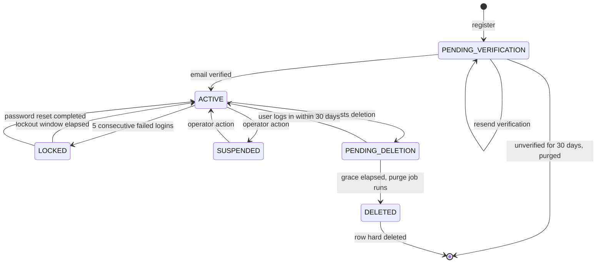
```mermaid
stateDiagram-v2
    [*] --> PENDING_VERIFICATION : register
    PENDING_VERIFICATION --> ACTIVE : email verified
    PENDING_VERIFICATION --> PENDING_VERIFICATION : resend verification
    PENDING_VERIFICATION --> [*] : unverified for 30 days, purged

    ACTIVE --> LOCKED : 5 consecutive failed logins
    LOCKED --> ACTIVE : lockout window elapsed
    LOCKED --> ACTIVE : password reset completed

    ACTIVE --> SUSPENDED : operator action
    SUSPENDED --> ACTIVE : operator action

    ACTIVE --> PENDING_DELETION : user requests deletion
    PENDING_DELETION --> ACTIVE : user logs in within 30 days
    PENDING_DELETION --> DELETED : grace elapsed, purge job runs
    DELETED --> [*] : row hard deleted
```

| Transition | Guard | Side effects |
| --- | --- | --- |
| register to `PENDING_VERIFICATION` | The normalised email is not already in use | `Profile`, `UserSettings`, ten `ReminderRule` rows and four `Streak` rows are created in the same transaction; a verification `AuthToken` is issued; `ConsentRecord` rows are written for the privacy policy and the terms |
| to `ACTIVE` | A valid, unused, unexpired verification token is presented | `email_verified_at` is set |
| `ACTIVE` to `LOCKED` | `failed_login_count` reaches 5 | `locked_until` is set to now plus the backoff: 1 minute, then 5, 15, 60, and 60 minutes thereafter |
| `LOCKED` to `ACTIVE` | Now is after `locked_until` | `failed_login_count` is reset to 0 |
| `ACTIVE` to `PENDING_DELETION` | Authenticated, and the password was re-entered | All sessions revoked, all push tokens de-registered with the provider, all future `ScheduledReminder` rows cancelled, `purge_after` set |
| `PENDING_DELETION` to `ACTIVE` | A successful login before `purge_after` | `deletion_requested_at` and `purge_after` cleared; reminders resume |
| `PENDING_DELETION` to `DELETED` | Now is at or after `purge_after` | The full purge cascade runs, including object-storage deletion and audit anonymisation |

Unverified accounts are purged after 30 days so that abandoned registrations do not hold an email address hostage.

### 7.2 Plant lifecycle: `ENT-10 Plant.lifecycle_status`

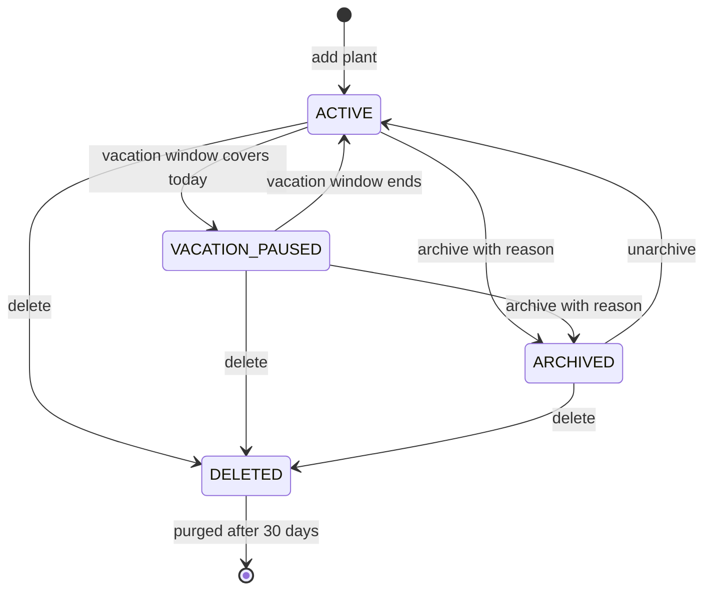
```mermaid
stateDiagram-v2
    [*] --> ACTIVE : add plant
    ACTIVE --> VACATION_PAUSED : vacation window covers today
    VACATION_PAUSED --> ACTIVE : vacation window ends
    ACTIVE --> ARCHIVED : archive with reason
    VACATION_PAUSED --> ARCHIVED : archive with reason
    ARCHIVED --> ACTIVE : unarchive
    ACTIVE --> DELETED : delete
    VACATION_PAUSED --> DELETED : delete
    ARCHIVED --> DELETED : delete
    DELETED --> [*] : purged after 30 days
```

| Transition | Effect on the schedule | Effect on reminders | Effect on history |
| --- | --- | --- | --- |
| to `ACTIVE` | `effective_interval_days` computed; `next_due_at` stays null until a first watering or a supplied last-watered date | none until due | — |
| `ACTIVE` to `VACATION_PAUSED` | Schedule arithmetic continues and `next_due_at` still advances | All pending reminders `SUPPRESSED` with reason `SUBJECT_ARCHIVED` | Retained |
| `VACATION_PAUSED` to `ACTIVE` | **Catch-up rule:** if `next_due_at` passed during the vacation it becomes the later of `next_due_at` and the first local day after the vacation ends at the preferred reminder time. Missed cycles are **not** replayed as separate reminders | Reminders resume from the recomputed `next_due_at` | Retained |
| to `ARCHIVED` | Schedule frozen; `next_due_at` nulled | All pending reminders cancelled | Retained and readable |
| `ARCHIVED` to `ACTIVE` | Schedule restarts from `last_watered_at`; if that is more than `max_interval_days` ago the plant becomes due immediately and its status is `NEEDS_ATTENTION`, never `CRITICAL` | Resume | Retained |
| to `DELETED` | The whole aggregate is soft-deleted and a tombstone is emitted for every child | All cancelled | Hidden from every surface except export until purge |

Derived `health_status` is orthogonal to `lifecycle_status` and is meaningful only while `ACTIVE`; an archived plant renders with no health badge at all.

### 7.3 Care task occurrence: derived from `ENT-12` and `ENT-13`

An occurrence is not a stored row. It is derived from `ENT-12 CareTask.next_due_at` plus the latest `ENT-13 CareTaskEvent`, and there is at most one live occurrence per care task at any time.

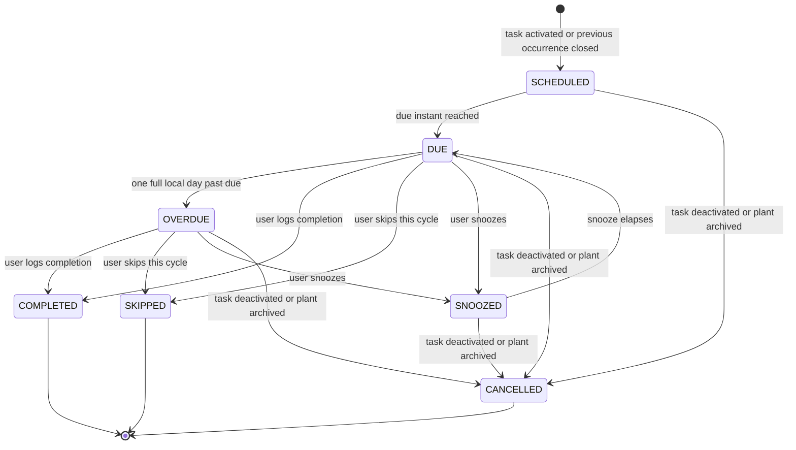
```mermaid
stateDiagram-v2
    [*] --> SCHEDULED : task activated or previous occurrence closed
    SCHEDULED --> DUE : due instant reached
    DUE --> OVERDUE : one full local day past due
    DUE --> COMPLETED : user logs completion
    OVERDUE --> COMPLETED : user logs completion
    DUE --> SKIPPED : user skips this cycle
    OVERDUE --> SKIPPED : user skips this cycle
    DUE --> SNOOZED : user snoozes
    OVERDUE --> SNOOZED : user snoozes
    SNOOZED --> DUE : snooze elapses
    SCHEDULED --> CANCELLED : task deactivated or plant archived
    DUE --> CANCELLED : task deactivated or plant archived
    OVERDUE --> CANCELLED : task deactivated or plant archived
    SNOOZED --> CANCELLED : task deactivated or plant archived
    COMPLETED --> [*]
    SKIPPED --> [*]
    CANCELLED --> [*]
```

| Rule | Statement |
| --- | --- |
| Occurrence identity | The occurrence key defined on `ENT-33 ScheduledReminder`. |
| `COMPLETED` | Writes a `CareTaskEvent` with outcome `COMPLETED`, sets `last_completed_at`, and opens the next occurrence at `performed_at` plus `interval_days`. |
| `SKIPPED` | Writes an event with outcome `SKIPPED` and opens the next occurrence at **the original due instant plus the interval**, not at the skip instant, so that a skipped cycle does not drift the schedule. |
| `SNOOZED` | Writes an event with outcome `SNOOZED` and moves the occurrence forward by `snooze_days`. Maximum 3 snoozes per occurrence, after which snooze is unavailable. |
| Winter pause | When `pauses_in_winter` is true and the derived season is `WINTER`, no occurrence is opened; the next occurrence opens on the first day of the following `SPRING`. |
| Retroactive completion | Logging a completion dated before the current due instant closes the current occurrence and recomputes the next one from the logged date. |

### 7.4 Scheduled reminder: `ENT-33 ScheduledReminder.state`

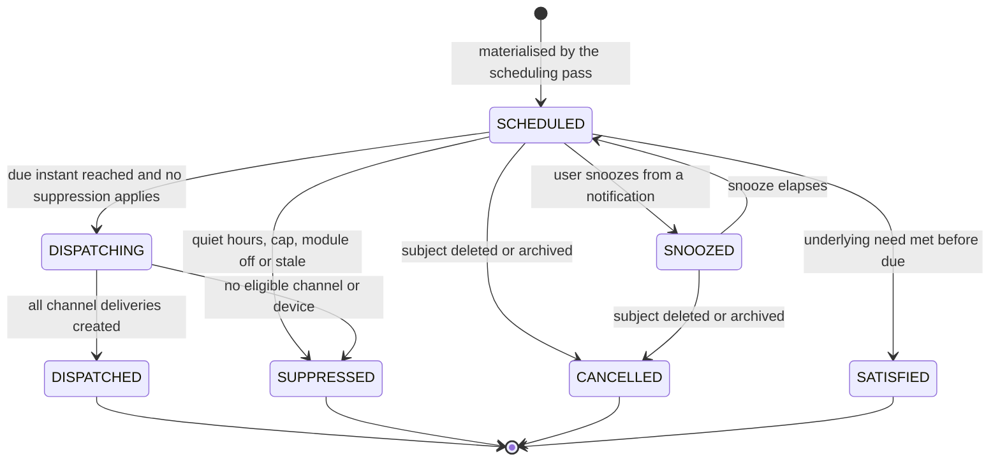
```mermaid
stateDiagram-v2
    [*] --> SCHEDULED : materialised by the scheduling pass
    SCHEDULED --> SNOOZED : user snoozes from a notification
    SNOOZED --> SCHEDULED : snooze elapses
    SCHEDULED --> SATISFIED : underlying need met before due
    SCHEDULED --> CANCELLED : subject deleted or archived
    SNOOZED --> CANCELLED : subject deleted or archived
    SCHEDULED --> SUPPRESSED : quiet hours, cap, module off or stale
    SCHEDULED --> DISPATCHING : due instant reached and no suppression applies
    DISPATCHING --> DISPATCHED : all channel deliveries created
    DISPATCHING --> SUPPRESSED : no eligible channel or device
    DISPATCHED --> [*]
    SUPPRESSED --> [*]
    CANCELLED --> [*]
    SATISFIED --> [*]
```

| Rule | Statement |
| --- | --- |
| Once-only guarantee | Enforced by the unique occurrence key. Every scheduling pass is therefore idempotent and safe to re-run at any tick frequency and after any crash. |
| Materialisation horizon | At most 48 hours ahead. A longer horizon would mean rewriting rows every time a plant is watered early; a shorter one would not survive an overnight outage of a sleeping free-tier host. |
| Staleness cut-off | A `SCHEDULED` reminder more than **6 hours** past due at evaluation moves to `SUPPRESSED` with `STALE_BEYOND_CUTOFF` and still produces a `NotificationCentreItem`. Nothing is lost — only the push. This is what stops a host that slept overnight from firing eleven overdue reminders at once on wake. |
| Grouping | When more than 3 occurrences of the same category are due for the same user within the same tick, they collapse into one grouped delivery listing the subject identifiers. Every underlying reminder is still marked dispatched, preserving the once-only guarantee. |
| Snooze cap | 3 per occurrence. A fourth attempt shows "snoozed as far as we can, this will stay in your list". |
| `SATISFIED` | Set when the user performs the action before the reminder fires. This is what stops "water your monstera" arriving at 09:00 after the user watered it at 08:15. |
| Retention | Rows in a terminal state are purged 90 days after `updated_at`. |

### 7.5 Notification delivery: `ENT-34 NotificationDelivery.status`

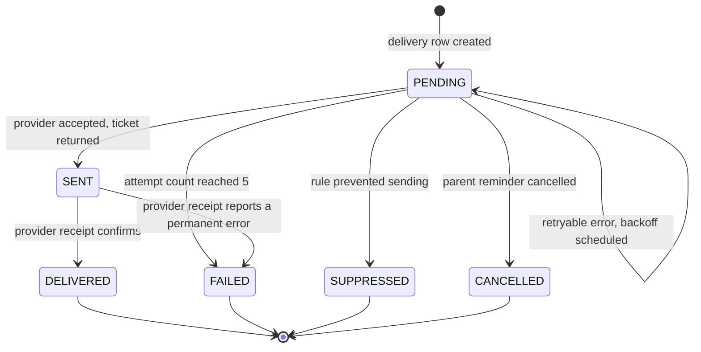
```mermaid
stateDiagram-v2
    [*] --> PENDING : delivery row created
    PENDING --> SENT : provider accepted, ticket returned
    PENDING --> SUPPRESSED : rule prevented sending
    PENDING --> CANCELLED : parent reminder cancelled
    PENDING --> PENDING : retryable error, backoff scheduled
    PENDING --> FAILED : attempt count reached 5
    SENT --> DELIVERED : provider receipt confirms
    SENT --> FAILED : provider receipt reports a permanent error
    DELIVERED --> [*]
    FAILED --> [*]
    SUPPRESSED --> [*]
    CANCELLED --> [*]
```

| Rule | Statement |
| --- | --- |
| Uniqueness | At most one row per `(scheduled_reminder_id, channel, device_push_token_id)`. A retry updates that row; it never inserts a second one. |
| Retry budget | Maximum 5 attempts. Backoff in seconds: 30, 120, 600, 3600, 21600. After the fifth failure the row is `FAILED` permanently. |
| Receipt pass | Runs on a delay after send, because provider receipts are not immediately available. A `DeviceNotRegistered` receipt prunes the push token and marks the delivery `FAILED` without further retry. |
| Cancellation | A delivery whose parent reminder becomes `CANCELLED` or `SUPPRESSED` before dispatch moves to the matching terminal state and is never sent. |
| Retention | Purged 180 days after creation. |

### 7.6 Achievement progress: `ENT-40 AchievementProgress.state`

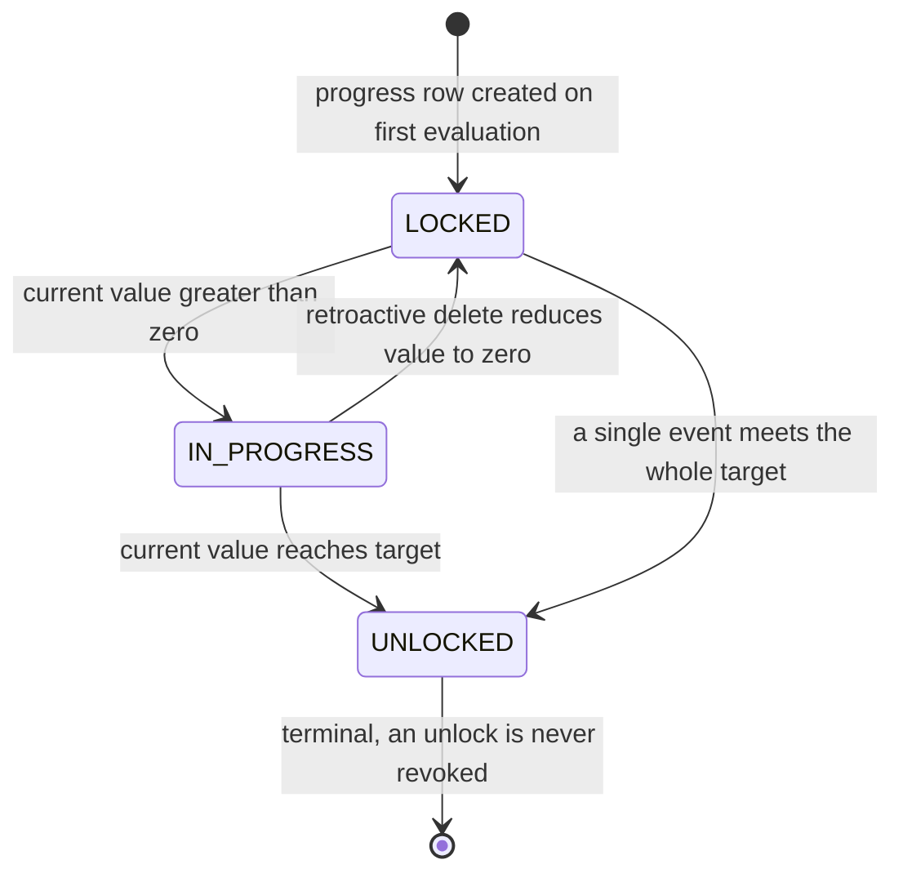
```mermaid
stateDiagram-v2
    [*] --> LOCKED : progress row created on first evaluation
    LOCKED --> IN_PROGRESS : current value greater than zero
    IN_PROGRESS --> LOCKED : retroactive delete reduces value to zero
    IN_PROGRESS --> UNLOCKED : current value reaches target
    LOCKED --> UNLOCKED : a single event meets the whole target
    UNLOCKED --> [*] : terminal, an unlock is never revoked
```

| Rule | Statement |
| --- | --- |
| Evaluation trigger | Only the events listed in the definition's `trigger_events`, which bounds the work per write to a handful of definitions. |
| Idempotency | Unlocking first checks for an existing `AchievementUnlock` on `(user_id, definition_id, version)` and does nothing if one exists. Re-running evaluation never produces a second unlock or a second celebration. |
| Server-side only | Progress and unlocks are computed on the server, never on a client. A client that has been offline sees unlocks appear on its next sync. |
| Retroactive reduction | Deleting a past log can push `current_value` back below the target. The **progress state may fall back to `IN_PROGRESS` or `LOCKED`, but an existing `AchievementUnlock` is never removed**; the gallery continues to show the badge as held. |
| Versioning | Changing a predicate, threshold or tier increments `AchievementDefinition.version`. Existing unlocks stand under their recorded version; progress is recomputed against the current active version. |
| Celebration | `was_celebrated` guards the celebration animation, so an unlock earned while the client was offline is celebrated exactly once, on the next foreground. |

### 7.7 Sync outbox item: `ENT-43 SyncOutboxItem.state`

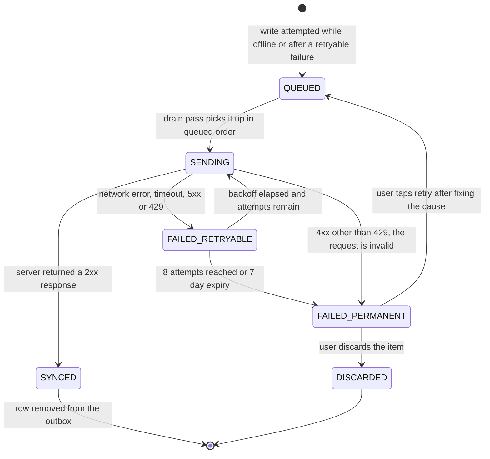
```mermaid
stateDiagram-v2
    [*] --> QUEUED : write attempted while offline or after a retryable failure
    QUEUED --> SENDING : drain pass picks it up in queued order
    SENDING --> SYNCED : server returned a 2xx response
    SENDING --> FAILED_RETRYABLE : network error, timeout, 5xx or 429
    FAILED_RETRYABLE --> SENDING : backoff elapsed and attempts remain
    FAILED_RETRYABLE --> FAILED_PERMANENT : 8 attempts reached or 7 day expiry
    SENDING --> FAILED_PERMANENT : 4xx other than 429, the request is invalid
    FAILED_PERMANENT --> QUEUED : user taps retry after fixing the cause
    FAILED_PERMANENT --> DISCARDED : user discards the item
    SYNCED --> [*] : row removed from the outbox
    DISCARDED --> [*]
```

| Rule | Statement |
| --- | --- |
| Order | Strictly ascending `queued_at`, one item at a time. Parallel draining could reorder a watering and a later skip of the same plant. |
| Head-of-line blocking | An item in `FAILED_RETRYABLE` **does not** block items behind it for a *different* target entity; it **does** block further items for the *same* `target_entity_id`. This keeps one bad item from freezing the whole queue while preserving per-entity order. |
| `FAILED_PERMANENT` | Surfaced to the user with the reason and two actions: retry, or discard. The application never silently discards a user's logged data. |
| Account deleted | A `404` or `ACCOUNT_NOT_FOUND` response moves every item to `FAILED_PERMANENT` and the user interface explains that the account no longer exists. |
| Idempotency | Every attempt sends the same `idempotency_key`, so a response lost in transit costs at most one duplicate request and never a duplicate row. |
| Storage | AsyncStorage or MMKV on mobile, IndexedDB on web, encrypted at rest where the platform provides it. |

### 7.8 Photo asset: `ENT-42 PhotoAsset.status`

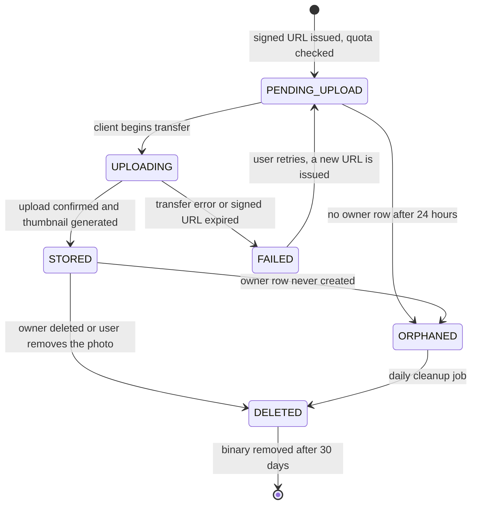
```mermaid
stateDiagram-v2
    [*] --> PENDING_UPLOAD : signed URL issued, quota checked
    PENDING_UPLOAD --> UPLOADING : client begins transfer
    UPLOADING --> STORED : upload confirmed and thumbnail generated
    UPLOADING --> FAILED : transfer error or signed URL expired
    FAILED --> PENDING_UPLOAD : user retries, a new URL is issued
    PENDING_UPLOAD --> ORPHANED : no owner row after 24 hours
    STORED --> ORPHANED : owner row never created
    STORED --> DELETED : owner deleted or user removes the photo
    ORPHANED --> DELETED : daily cleanup job
    DELETED --> [*] : binary removed after 30 days
```

| Rule | Statement |
| --- | --- |
| Quota check | Performed at signed-URL issue time, not at upload completion, so the user is told before spending bandwidth. |
| Signed URL expiry | 10 minutes: generous for a 250 KB file on a poor connection, short enough that a leaked URL is worthless. |
| EXIF | Orientation is applied to the pixels, then **all** metadata including GPS is stripped, client-side, before upload. `exif_stripped` must be true before the asset may reach `STORED`. |
| Orphan definition | An asset with no referencing row that is older than 24 hours. The cleanup job runs daily. |
| Deletion delay | The binary is removed from object storage 30 days after the row reaches `DELETED`, which supports undo and the account-deletion grace period. |
| Offline | Upload is not permitted while offline. A growth log entry may be queued without its photo and the photo attached later. |

---

## 8. Invariants

The following statements must be true of the model **at all times**. Each is testable, and each is the responsibility of the server, not of a client. Where a rule is enforceable in the database it should be enforced there as well as in application code. The parenthetical reference names the governing business rule from the Phase 1 analysis so that downstream documents can cite a stable identifier.

**Identity and tenancy**

1. Every row has a single-column primary key named `id` of type `uuid`, generated as UUID version 4. No entity uses a composite, natural or auto-incrementing primary key. (BR-ENT-01)
2. An `id` generated by a client while offline is permanent; the server never reassigns it. (BR-ENT-01)
3. Every entity belongs to exactly one tenancy class: `USER_SCOPED`, `GLOBAL_CATALOGUE` or `HYBRID_CATALOGUE`. (BR-ENT-02)
4. Every read and every write of a `USER_SCOPED` row is filtered server-side by `user_id` equal to the authenticated subject. A route that accepts an `id` without also constraining `user_id` is a defect. (BR-ENT-02)
5. Every child row of a user-scoped aggregate carries its own denormalised `user_id`; ownership is never inferred through a join at authorisation time. (BR-ENT-02)
6. A request for a row belonging to another user returns "not found", never "forbidden", because "forbidden" confirms the row exists. (BR-ENT-02)
7. No relationship in the model connects two different users. There is no cross-user row, aggregate, comparison or leaderboard. (§2.3)

**Time**

8. Every instant is stored as `timestamptz` normalised to UTC. No column stores a naive local timestamp. (BR-ENT-04)
9. `created_at` and `updated_at` are always written from the server clock and never from a client-supplied value. (BR-ENT-03)
10. Every entity participating in a daily aggregate stores a `date` column holding the user-local calendar date, computed at write time from the event instant and the user's timezone as it then was. (BR-ENT-04)
11. A stored `local_date` is immutable for the life of the row, except through an explicit, audited change to the event's own time. Changing `UserSettings.timezone` never rewrites any historical `local_date`. (BR-ENT-05)
12. A wall-clock preference such as `preferred_reminder_time` is stored as a naive `time` interpreted in the user's timezone, never as an instant. (BR-ENT-04)
13. On a "spring forward" transition, a time preference falling in the skipped hour materialises at the first valid instant at or after the nominal wall-clock time; on a "fall back" transition, a preference falling in the repeated hour materialises at the first, earlier occurrence only. Exactly one occurrence exists per local date either way. (BR-ENT-06)
14. A client-supplied instant no more than 5 minutes in the future is accepted as supplied; between 5 minutes and 24 hours in the future it is clamped to the server clock and `time_was_clamped` is set; beyond 24 hours it is rejected. (BR-ENT-11)
15. A new log row may be back-dated at most 30 calendar days. An existing log row may be edited or deleted for at most 365 calendar days. A `ScheduledReminder` may be materialised at most 365 days ahead. The single exception to the future-dating prohibition is `ENT-23 RestDay`, which may be declared up to 14 days ahead. (BR-ENT-12)

**Units, precision and nulls**

16. Every quantity is stored in exactly one canonical unit — kilogram, gram, centimetre, metre, millilitre, kilocalorie, second, degree Celsius, percent, day or a dimensionless count — regardless of the user's display preference. Conversion happens only at the presentation boundary. (BR-ENT-14)
17. Kilocalorie, not the SI joule, is the canonical energy unit. This is a deliberate, recorded exception to canonical metric SI. (BR-ENT-14)
18. An attribute name ends with the suffix of its canonical unit. An attribute whose name carries no such suffix is by definition unitless. (BR-ENT-14, BR-ENT-37)
19. Rounding is applied only at display. All intermediate arithmetic is performed at full stored precision and rounded once, at the end. A displayed daily total may therefore differ from the sum of the displayed line items by up to half of the display precision, and the user interface must not attempt to hide this. (BR-ENT-15)
20. A nullable numeric attribute that is null means "the user has not told us". It never means zero, is never coerced to zero for aggregation, is excluded from averages and their denominators, and renders as an em dash or "Not recorded". (BR-ENT-16)
21. Where zero is meaningful — 0 steps, 0 ml of water, 0 reps — a row exists with the value zero. The absence of a row and a row with value zero are semantically different and both are representable. (BR-ENT-16)

**Catalogues, snapshots and effective dating**

22. A global catalogue row has `user_id` null, is visible to every user and is editable by none. A private catalogue row has `user_id` set and is visible and editable only by that user. (BR-ENT-17)
23. Every seeded catalogue row has a stable slug and a deterministic identifier derived from it, so that re-running the seed on a fresh environment produces identical identifiers and no duplicates. (BR-ENT-17)
24. Every log row that references a catalogue entry stores a snapshot of the values used to compute its derived numbers. Editing or deleting the catalogue entry never changes an already-recorded log row. (BR-ENT-18)
25. A snapshot column is authoritative for display and for historical aggregation. The retained foreign key is used for navigation, grouping and "log this again", and is never re-read to recompute a past total. (BR-ENT-18)
26. `ENT-22 FitnessGoal` and `ENT-31 NutritionTarget` are effective-dated and never mutated in place. For a given user and goal type, no two rows have overlapping effective ranges, and exactly zero or one row is current on any date. (BR-ENT-19)
27. A historical day is always evaluated against the goal or target whose effective range contains that day, never against today's. Days with no goal in force are `EXCLUDED` from streak evaluation, not `NOT_MET`. (BR-ENT-19)
28. Superseded effective-dated rows are retained forever and are never soft-deleted, because streak history depends on them. (BR-ENT-19)

**Enumerations and validation**

29. Every enumeration is closed. A value outside its member list is rejected at the boundary and cannot be stored. (BR-ENT-20)
30. An enumeration member is never renamed and never removed while any row references it. (BR-ENT-20)
31. No entity stores a user-facing English string generated by the system; system-authored text is stored as an i18n key plus structured parameters. The single recorded exception is seeded catalogue *names*, which are stored as literal English text and flagged `is_translatable`. (BR-ENT-42)
32. Every user-supplied text field has a stated maximum length, measured in Unicode grapheme clusters and not bytes, and is trimmed of leading and trailing whitespace before validation. (BR-ENT-21)
33. Every numeric field has a stated hard range. A value outside it is rejected. A value inside the hard range but outside the stated plausible range is accepted only after explicit user confirmation and the row is marked `implausible_flag`. (BR-ENT-22)
34. At least one of the three module-enabled flags on `ENT-03 UserSettings` is true at all times. (`ENT-03`)
35. `NutritionTarget.energy_kcal` is never below the clinical floor of 1200 kcal per day for `FEMALE` and `PREFER_NOT_TO_SAY` or 1500 kcal per day for `MALE`; a computed target below the floor is clamped to it, `was_clamped_to_floor` is set, and neutral, non-judgemental copy plus the not-medical-advice disclaimer is shown. (BR-ENT-22, D-07)
36. The energy deficit below total daily energy expenditure never exceeds 1100 kcal per day, and the requested rate of body-mass change never exceeds 1.0 kg per week. (BR-ENT-22, D-07)
37. No attribute anywhere in the model stores a target body-fat percentage, a goal BMI, a comparison to another user, or any value that could be rendered as a judgement of the user. This is a structural guarantee, not a user-interface convention. (D-07)
38. `NutritionTarget.protein_pct + carbohydrate_pct + fat_pct` equals exactly 100.00. (`ENT-31`)
39. For a `FoodItem`, `protein_g_per_100g + carbohydrate_g_per_100g + fat_g_per_100g` does not exceed 100.00; a violation is rejected on a user-created food and downgrades `data_quality` to `INCONSISTENT` on a provider-sourced food. (`ENT-24`)
40. Every `FoodItem` has at least one live `ServingUnit`, exactly one of which has `is_default` true, and the implicit `GRAM` serving of grams-equivalent 1.000 cannot be deleted. (`ENT-25`)
41. Every per-user collection cap stated in this document is enforced, and reaching a cap produces a message naming the limit. Reaching a cap never silently discards data. (BR-ENT-23)

**Deletion, sync and derivation**

42. Soft delete sets `deleted_at`; the row is never physically removed by the application, and every default query filters on `deleted_at` being null. (BR-ENT-07)
43. Every soft delete, and every hard delete of a `SYNCED` row, emits exactly one `ENT-44 Tombstone` per `(entity_type, entity_id)`. A repeated delete is a no-op. (BR-ENT-08)
44. Tombstones are retained for 90 days. A client whose cursor is older than that must perform a full resync, and the server says so explicitly rather than silently returning an incomplete delta. (BR-ENT-08)
45. The delta-sync cursor is the pair `(updated_at, sync_seq)` compared lexicographically. `updated_at` alone is insufficient because two rows updated in the same millisecond would make the cursor non-deterministic; `sync_seq` alone is insufficient because it gives no measure of staleness comparable against the 90-day tombstone window. (BR-ENT-09)
46. Every write a client may queue offline carries a client-generated idempotency key, and the server upserts by `(user_id, entity_type, idempotency_key)`. A replay with identical content returns the existing row with a success status and creates nothing; a replay with different content under the same key is rejected as a client defect. (BR-ENT-10)
47. Exactly seven action types may be queued offline. Every other write — registration, profile edit, entity create, edit or delete, photo upload — requires connectivity and shows a clear, actionable offline state. (D-04)
48. Because all queued actions are append-only inserts, the model contains **no merge algorithm, no CRDT and no last-write-wins conflict resolution**, and no module may introduce one. (D-04, BR-ENT-10)
49. Wherever a value can be derived from raw event rows, the derived copy is a cache and the raw rows win on any disagreement. A "rebuild everything derived for this user" operation exists, is idempotent, and is exercised by an automated test that logs a year of synthetic data, rebuilds, and asserts identical output. (BR-ENT-41)
50. Snapshot and `_used` columns are exempt from rebuild: they record what was true at the time and are never recomputed. The rebuild routine must skip them. (BR-ENT-18, BR-ENT-41)
51. `ENT-49 DailySummary` is updated synchronously in the same transaction as the write that affects it, is never the source of truth for anything, and is fully reproducible by deleting and rebuilding. (BR-ENT-30)
52. Recomputation after a retroactive edit is bounded: the affected `local_date` for `DailySummary`, then `StreakDay` from that date forward to today, at most 366 days. The whole history is never recomputed. (BR-ENT-30)
53. Exactly one `ENT-37 StreakDay` row exists per user, scope and local date from the user's first logged day to today. Days on which the module was disabled are written with outcome `EXCLUDED`, never omitted. (BR-ENT-29)
54. A reminder is never delivered twice for the same subject and the same due occurrence; this is enforced by the unique occurrence key, which makes every scheduling pass idempotent. (BR-ENT-27)
55. An `ENT-41 AchievementUnlock` is immutable and is never revoked, even if the definition later becomes stricter or is deactivated. (BR-ENT-31)
56. Account deletion hard-deletes every user-scoped row and every stored object, and anonymises rather than deletes `ENT-48 AuditEvent`, because security-relevant events must survive deletion or deletion becomes an audit-evasion tool. (BR-ENT-35)
57. A full account export contains every row of every user-scoped entity for that user, including soft-deleted rows, with all credential material replaced by the literal string `REDACTED`, and is byte-identical between two exports taken with no intervening writes apart from the generation timestamp. (BR-ENT-36)
58. Every external integration defaults to disabled, and the product is fully functional against the seeded catalogues with every integration disabled. That is the default deployment state and the state the automated test suite runs in. (D-03, BR-ENT-32)
59. Every external lookup result, including a negative result, is cached in our own database, and a successful lookup that yields usable data also creates a durable catalogue row so that the data survives cache expiry. (D-03, BR-ENT-33)
60. Every food sourced from Open Food Facts is displayed with its licence attribution, which is why `FoodSource` may never be null. (BR-ENT-33)

**Aggregate idempotence, quotas and retention**

*These four statements are appended rather than interleaved into the groups above, because the module specifications in [modules/](modules/) cite invariants by their ordinal number and renumbering 1 to 60 would break those citations.*

61. A **daily-aggregate row** — one whose natural key is `user_id`, a user-local `date` and, where more than one origin is representable, a source discriminator — is written by upsert on that natural key. A later write **replaces** the stored value rather than accumulating onto it, and the replaced value is not retained; `ENT-20 StepEntry`, keyed `(user_id, local_date, source)`, is the reference case, so replaying the same figure any number of times leaves the row and every total derived from it identical. Such an insert-or-replace may be queued offline when it carries a client-generated UUID idempotency key. Correcting or deleting a row that already exists on the server may not: it requires connectivity and is refused offline with the state described in Invariant 47, because the queue admits append-only inserts alone. (BR-ENT-13, D-04, `ENT-20`)
62. The per-user media quota is **500 photo assets or 150 MB of stored bytes, whichever is reached first**, counted over that user's live `ENT-42 PhotoAsset` rows — those in `PENDING_UPLOAD`, `UPLOADING` or `STORED` — and enforced when the signed upload URL is requested, so the refusal precedes the transfer rather than following it. Reaching either limit refuses the new upload with a message naming the limit, and never deletes, re-compresses or overwrites an existing asset. This is the media instance of the collection cap of Invariant 41. (BR-ENT-24, BR-ENT-23, `ENT-42`)
63. A `SCHEDULED` reminder occurrence more than **6 hours** past its `due_at` at evaluation time moves to `SUPPRESSED` with `suppression_reason = STALE_BEYOND_CUTOFF` and is delivered on no push or email channel. The `ENT-35 NotificationCentreItem` is still written, so the cut-off costs the interruption and never the record, and a host that slept overnight cannot fire every overdue reminder at once on wake. (BR-ENT-28, `ENT-33`, [§7.4](#74-scheduled-reminder-ent-33-scheduledreminderstate))
    - *Refined by the notifications module.* [modules/notifications.md](modules/notifications.md) narrows this flat figure to a per-category table, `BR-NOT-12`, whose values range from 1 hour to 48 hours and which keeps 6 hours as the fallback for any category it does not list. The divergence is recorded there as reconciliation entry A-04. **Where the two differ, the module value governs implementation.** The 6 hours stated here is the domain default and the value inherited by any category or module that states none of its own.
64. An `ENT-35 NotificationCentreItem` is retained for **365 days from creation, or until it falls outside the 500 most recent items for that user, whichever binds first**, and is then hard-deleted by the retention pass. Both bounds are per user rather than per category, and an item is retained whether or not a push for it was ever sent. (BR-ENT-38, `ENT-35`)
    - *Refined by the notifications module.* [modules/notifications.md](modules/notifications.md) tightens this to **90 days from creation**, `BR-NOT-24`, because CON-07 caps the database at approximately 0.5 GB and the privacy policy must state exactly one retention figure. The divergence is recorded there as reconciliation entry A-10. **Where the two differ, the module value governs implementation**, so 90 days is the figure v1.0 builds and the figure the privacy policy states.

---

## 9. Indicative data volumetrics

These figures exist so that the NFR-SCAL and NFR-PERF series can be sized against real numbers and so that Phase 2 can choose indexes with evidence rather than intuition. They are **indicative**, not requirements.

### 9.1 The reference user

The **reference user** is moderately engaged, has all three modules enabled, and is in their second year of use. The **heavy user** column is roughly the 95th percentile and is what the free-tier envelope must survive. All figures are rows per user per year.

| Entity | Reference assumption | Reference rows/year | Heavy rows/year |
| --- | --- | --- | --- |
| `Plant` | 12 plants, 3 added per year | 3 | 40 |
| `WateringEvent` | 12 plants, mean effective interval 8 days | 548 | 2400 |
| `CareTask` | 1.5 tasks per plant, created once | 5 | 60 |
| `CareTaskEvent` | 12 tasks firing monthly | 144 | 600 |
| `GrowthLogEntry` | 6 per plant per year | 72 | 400 |
| `PhotoAsset` | 60 growth photos plus 12 covers | 72 | 400 |
| `Room` | created once | 1 | 12 |
| `Workout` | 3 per week | 156 | 400 |
| `WorkoutExerciseSet` | 40 percent strength sessions, 18 sets each | 1123 | 6000 |
| `StepEntry` | one per day | 365 | 365 |
| `BodyMetricEntry` | body mass twice weekly | 104 | 500 |
| `FitnessGoal` | 2 goals revised twice a year | 4 | 20 |
| `RestDay` | 1 per week | 52 | 104 |
| `WorkoutTemplate` | created once | 3 | 20 |
| `MealEntry` | 3 items per meal, 4 meals, 300 logged days | 3600 | 9000 |
| `FoodItem` custom | occasional | 10 | 200 |
| `ServingUnit` custom | 2 per custom food | 20 | 400 |
| `Recipe` plus `RecipeIngredient` | 5 recipes of 8 lines | 45 | 300 |
| `WaterIntakeEntry` | 6 per day, 300 days | 1800 | 3000 |
| `NutritionTarget` | revised 3 times a year | 3 | 12 |
| `FoodFavourite` | curated once, occasionally extended | 20 | 100 |
| `ScheduledReminder` | 4 per day | 1460 | 3000 |
| `NotificationDelivery` | 1.5 channels per dispatched reminder, 60 percent dispatched | 1314 | 3000 |
| `NotificationCentreItem` | one per reminder occurrence | 1460 | 3000 |
| `StreakDay` | 4 scopes times 365 days | 1460 | 1460 |
| `StreakFreeze` | one per 10 met days, capped | 30 | 36 |
| `AchievementProgress` | bounded by the catalogue size | 40 | 60 |
| `AchievementUnlock` | earned over the year | 12 | 40 |
| `DailySummary` | one per day | 365 | 365 |
| `AuditEvent` | logins and settings changes | 400 | 1200 |
| `Tombstone` | 2 percent of writes deleted | 220 | 600 |
| **Total rows per user per year** | | **approximately 14350** | **approximately 36450** |

### 9.2 Storage sizing

| Measure | Reference | Heavy | Basis |
| --- | --- | --- | --- |
| Mean row width including indexes | 260 bytes | 260 bytes | Narrow event rows dominate. `MealEntry` is the widest at roughly 400 bytes with its snapshot columns |
| Relational storage per user per year | approximately 3.7 MB | approximately 9.5 MB | rows multiplied by width |
| Photo storage per user per year | approximately 21 MB | approximately 116 MB | 72 photos at 250 KB plus thumbnails at 40 KB |
| JSON export size | approximately 4 MB | approximately 11 MB | roughly 280 bytes of JSON per row, uncompressed |

### 9.3 Free-tier envelope

| Free-tier resource | Stated limit | User-years supported | Binding? |
| --- | --- | --- | --- |
| Neon or Supabase PostgreSQL free storage | 0.5 GB | approximately 135 reference user-years, 52 heavy | No |
| Supabase Storage free tier | 1 GB | approximately 47 reference user-years, 8 heavy | **Yes — photos are the binding constraint** |
| Cloudinary free tier | roughly 25 GB of storage credit | approximately 1190 reference user-years | No |
| Render free instance | sleeps after 15 minutes idle | not a storage limit | Affects the reminder engine, mitigated by the staleness cut-off and a keep-alive |

### 9.4 Conclusions Phase 2 and the NFR series should take from this

1. **Photos are the only resource that binds on the free tier.** The per-user quota of 500 photos and 150 MB exists precisely to make the failure mode explicit and per-user rather than a silent project-wide outage. On Supabase's 1 GB the deployment supports approximately 6 quota-filling users or 47 reference users; if a demonstration needs more, `StorageProvider = CLOUDINARY` is the documented escape hatch and requires **no model change**.
2. **Relational storage is not a risk.** Fifty heavy users for a full year is still under 500 MB, and the capstone demonstration will have single-digit users.
3. **The largest single table is `MealEntry`**, at roughly a quarter of all rows and the widest rows. Indexing should start there; `(user_id, logged_local_date)` is the access path for essentially every nutrition read.
4. **The second largest is `WorkoutExerciseSet`**, which is only ever read filtered by `workout_id` or by `(user_id, exercise_id)` for personal records. Two indexes cover it.
5. **`StreakDay` grows at a fixed 1460 rows per user per year** regardless of engagement, because `EXCLUDED` and `NOT_MET` days are stored rather than omitted. That is a deliberate cost of correctness: at 260 bytes it is roughly 380 KB per user per year.
6. **The reminder engine is bounded by wake-up reliability, not throughput.** At 4 reminders per user per day, 100 users generate 400 occurrences per day; even a one-minute tick processes a handful of rows per pass.
7. **Delta-sync paging matters more than delta-sync volume.** At a page size of 200 rows, a first full sync for a two-year reference user is roughly 145 pages, so the client must show progress and be resumable.

---

## 10. Mapping note for Phase 2

This section states how the conceptual model above becomes a physical PostgreSQL schema. It is written so that the transcription is **mechanical**: a Phase 2 author who follows these rules should not need to make a design decision that is not already made here. Anything genuinely left open is listed in [§10.8](#108-what-phase-2-still-decides).

### 10.1 Table derivation

| Rule | Statement |
| --- | --- |
| One table per entity | Each of the 50 entities becomes exactly one table, except `ENT-43 SyncOutboxItem`, which is client-only and becomes an on-device store, not a server table. That leaves **49 server tables**. |
| Table name | The `snake_case`, **singular** form of the entity name: `growth_log_entry`, `workout_exercise_set`, `daily_summary`. |
| Reserved words | `ENT-01 User` becomes the table `app_user`, because `user` is reserved in PostgreSQL. It remains `User` conceptually and in TypeScript types. No other entity name collides. |
| Column name | The `snake_case` attribute name exactly as written in [§3](#3-entity-catalogue). Do not abbreviate, do not pluralise, do not rename. |
| Universal columns | Add `created_at`, `updated_at`, and — where the entity is not hard-delete-only — `deleted_at`, to every table, plus `sync_seq` on every `SYNCED` entity, per [§1.5](#15-universal-attributes-carried-by-every-entity). |
| No inheritance, no polymorphic FK | Do not use table inheritance. Do not attempt a polymorphic foreign key for the three links in [§5.3](#53-polymorphic-references). |

### 10.2 Type mapping

| Conceptual type | PostgreSQL type | Notes |
| --- | --- | --- |
| `uuid` | `uuid` | Generated as version 4. Seeded catalogue rows use a deterministic version 5 UUID over a fixed namespace plus the slug. |
| `text` | `text` with a `CHECK` on `char_length` | Use `text`, never `varchar(n)`; enforce the stated maximum with a check so that changing it is a cheap migration. |
| `integer` | `integer` | |
| `bigint` | `bigint` | Only `sync_seq`. |
| `decimal` | `numeric(p, s)` | Scale from the stated stored precision: 2 for mass, macros and percentages; 1 for height, energy and temperature; 3 for factors and densities. |
| `boolean` | `boolean` | `NOT NULL` unless "unknown" is a documented third state, which is true only for `Plant.has_drainage`. |
| `date` | `date` | Always a user-local date. Never derive it at query time. |
| `time` | `time` | Without time zone. A wall-clock preference. |
| `timestamptz` | `timestamptz` | Stored in UTC. |
| `enum<Name>` | Native `ENUM` type or `text` with a `CHECK` | Either is acceptable; the member list must be enforced in the database. Prefer a native `ENUM` for stable enumerations and `text` plus `CHECK` for the two that will grow fastest, `AuditEventType` and `EmptyStateKey`. |
| `enum<Name>[]`, `text[]` | Array of the element type | |
| `json` | `jsonb` | With a `CHECK` on the top-level shape where the shape is fixed, for example `AchievementDefinition.predicate_json`. |

### 10.3 Keys, uniqueness and foreign keys

| Rule | Statement |
| --- | --- |
| Primary key | `id uuid PRIMARY KEY`. Never a composite or surrogate integer. |
| Foreign key naming | `<referenced_table_singular>_id`: `plant_id`, `food_item_id`, `scheduled_reminder_id`. |
| Foreign key enforcement | Enforce every non-polymorphic relationship in [§5.2](#52-the-matrix) as a real foreign key with the stated `ON DELETE` behaviour. |
| Denormalised `user_id` | Every child of a user-scoped aggregate carries `user_id NOT NULL` with its own foreign key to `app_user`, in addition to its parent foreign key. This is intentional duplication and must not be normalised away. |
| Unique constraints | Name them `uq_<table>_<columns>`. Every uniqueness rule stated in an entity's *Identity* paragraph becomes a constraint. |
| Partial uniqueness | Where an entity's identity paragraph says "partial over live rows", implement as a unique index with `WHERE deleted_at IS NULL`, so that a name can be reused after deletion. This applies to `Room.name`, custom `PlantSpecies`, `ActivityType`, `Exercise` and `FoodItem` names, `ServingUnit.label`, `Recipe.name`, `WorkoutTemplate.name`, `DevicePushToken.expo_push_token`, `StepEntry`, `BodyMetricEntry`, `RestDay` and `FoodFavourite`. |
| Non-partial uniqueness | `app_user.email_normalised`, `AuthSession.refresh_token_hash`, `AuthToken.token_hash`, `ConsentRecord`, every `(user_id, idempotency_key)` pair, `ScheduledReminder.(user_id, occurrence_key)`, `Streak.(user_id, scope)`, `StreakDay.(user_id, scope, local_date)`, `AchievementDefinition.code`, `PhotoAsset.storage_path`, `Tombstone.(entity_type, entity_id)`, `FeatureFlag.key`, `ExternalLookupCache.(provider, resource_type, external_key)`, `DailySummary.(user_id, local_date)` and `DeviceSyncState.(user_id, client_installation_id)` are **not** partial. |
| Case-insensitive uniqueness | Implement as a unique index on `lower(column)`, not with a case-insensitive collation, so the behaviour is explicit in the schema. |

### 10.4 Indexes to create first

The volumetrics of [§9](#9-indicative-data-volumetrics) imply the following. Index names follow `ix_<table>_<columns>`.

| Table | Index | Serves |
| --- | --- | --- |
| `meal_entry` | `(user_id, logged_local_date)` | Every nutrition day read and every daily rollup |
| `meal_entry` | `(user_id, food_item_id, logged_at DESC)` | "Recently used foods", derived rather than stored |
| `watering_event` | `(plant_id, performed_at DESC)` | Plant timeline and schedule replay |
| `watering_event` | `(user_id, performed_local_date)` | Daily rollup and adherence |
| `workout` | `(user_id, started_local_date)` | Fitness day read and weekly goals |
| `workout_exercise_set` | `(workout_id, order_index)` | Rendering a workout |
| `workout_exercise_set` | `(user_id, exercise_id, weight_kg DESC)` | Personal records, which are derived not stored |
| `step_entry` | `(user_id, local_date)` | Daily goal evaluation |
| `growth_log_entry` | `(plant_id, logged_local_date DESC)` | Photo timeline |
| `plant` | `(user_id, lifecycle_status, next_due_at)` | The due list and the plant list default sort |
| `care_task` | `(user_id, is_active, next_due_at)` | Care-task due list |
| `scheduled_reminder` | `(state, due_at)` | The cron engine's only hot query |
| `scheduled_reminder` | `(user_id, due_local_date)` | The in-app due list |
| `notification_delivery` | `(status, next_attempt_at)` | The retry pass |
| `streak_day` | `(user_id, scope, local_date)` | Streak evaluation, already the unique constraint |
| `daily_summary` | `(user_id, local_date)` | The dashboard aggregate, already the unique constraint |
| `tombstone` | `(user_id, sync_seq)` | Delta sync |
| every `SYNCED` table | `(user_id, updated_at, sync_seq)` | Delta sync cursor scan |

### 10.5 Constraints to encode

1. Every stated hard numeric range becomes a `CHECK`.
2. Every stated text maximum length becomes a `CHECK` on `char_length`.
3. Every conditional-requirement rule — "required when `pot_material = OTHER`" — becomes a `CHECK` expressing the implication.
4. `NutritionTarget` gets a `CHECK` that the three macro percentages sum to exactly 100.00 and that `energy_kcal` is at or above the applicable clinical floor.
5. `FoodItem` gets a `CHECK` that the three macros per 100 g sum to at most 100.00 for rows whose `source` is `USER_CUSTOM`, and no such check for provider rows, which are flagged instead.
6. The effective-dated tables get an exclusion constraint preventing overlapping ranges per `(user_id, goal_type)` and per `user_id` respectively.
7. `ServingUnit` gets a partial unique index enforcing exactly one `is_default` per food.
8. `UserSettings` gets a `CHECK` that at least one module-enabled flag is true.
9. Every `local_date` column is `NOT NULL` on the entities listed in Invariant 10.

### 10.6 Sequences, triggers and derived data

| Concern | Approach |
| --- | --- |
| `sync_seq` | One database-wide `BIGSERIAL`-backed sequence. Assign on insert and on every update of a `SYNCED` row, in the same statement, so the cursor can never observe a gap it will not later see filled. |
| `updated_at` | Set explicitly in application code or by a trigger — but exactly one of the two, never both, and the choice recorded in the Phase 2 document. |
| `DailySummary` | Written by the same service-layer transaction as the log write. Do **not** implement it as a database trigger: the derivation reads effective-dated goals and module enablement, which is application logic. |
| `StreakDay` | Same treatment, recomputed from the affected date forward, bounded at 366 days. |
| Rebuild routine | A maintenance command that recomputes all derived data for one user, is idempotent, and skips every snapshot column. It must be covered by the synthetic-year test described in Invariant 49. |

### 10.7 Seed data

| Catalogue | Approximate row count | Notes |
| --- | --- | --- |
| `plant_species` | 60 | Global rows, deterministic identifiers from slugs |
| `food_item` | 300 | Global rows, each with at least the implicit `GRAM` serving |
| `serving_unit` | roughly 900 | 2 to 3 per seeded food |
| `activity_type` | 9 | Keyed by `ActivityTypeKey`, each with three MET values |
| `exercise` | 60 | Global rows |
| `achievement_definition` | at least 30 | Across all six categories, version 1 |
| `feature_flag` | 9 | Every one with `default_enabled = false` |

Seeds are idempotent: re-running a seed on a populated database updates in place by slug or code and never duplicates.

### 10.8 What Phase 2 still decides

1. Whether each enumeration is a native `ENUM` type or `text` plus `CHECK`, per enumeration.
2. The migration tool, the migration file format and the ORM or query-builder choice.
3. Whether `updated_at` is maintained by trigger or by application code.
4. Index tuning beyond the starting set in [§10.4](#104-indexes-to-create-first), driven by measurement rather than intuition.
5. Row-level-security policy expressions, if the deployment uses them in addition to application-level authorisation.
6. Connection pooling, statement timeouts and the read path for the dashboard aggregate.
7. The physical layout of object storage buckets and the signed-URL issuing mechanism.

None of these decisions may change an entity name, an attribute name, an enumeration member, a cardinality, a cascade rule or an invariant stated in this document. A Phase 2 discovery that genuinely requires such a change is a **change request against this document**, not a local deviation.

---

*End of 07-domain-model.md — PlantPal+ SRS v1.0, Phase 1.*

