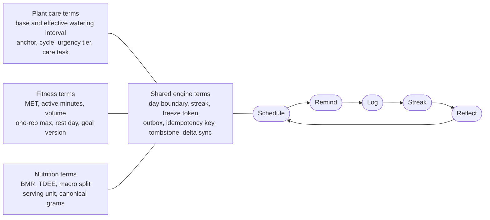
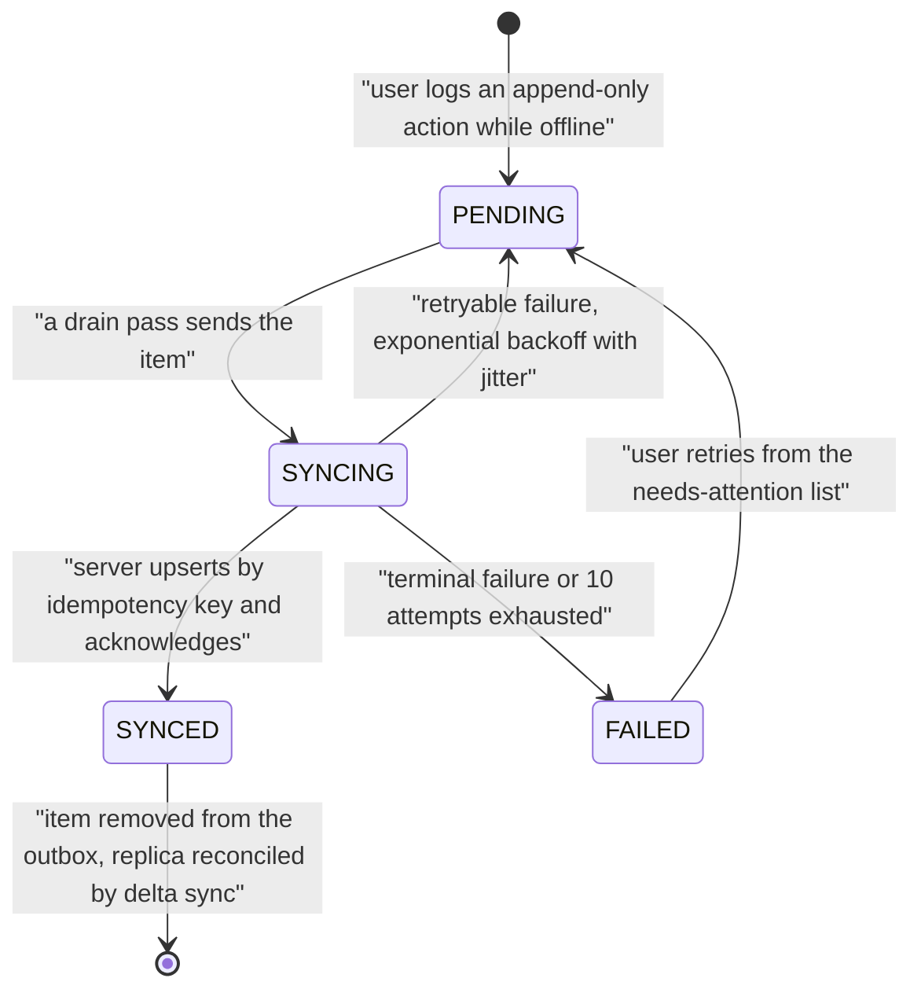

# 08 — Glossary

| Field | Value |
| --- | --- |
| Document | `08-glossary.md` — Glossary of Terms, Acronyms, Units and Prohibited Vocabulary |
| Version | 1.0 |
| Date | 2026-07-21 |
| Status | Baselined for Phase 1 review |
| Owner | Rakshit — Project Lead and sole developer |
| Parent | [`SRS.md`](./SRS.md) |

---

## Table of contents

1. [Purpose, scope and the single-vocabulary rule](#1-purpose-scope-and-the-single-vocabulary-rule)
   - [1.1 Why this document is binding](#11-why-this-document-is-binding)
   - [1.2 The single-vocabulary rule](#12-the-single-vocabulary-rule)
   - [1.3 How the vocabulary is organised](#13-how-the-vocabulary-is-organised)
   - [1.4 Identifier prefixes used across the package](#14-identifier-prefixes-used-across-the-package)
   - [1.5 Notation used in this glossary](#15-notation-used-in-this-glossary)
   - [1.6 Adding, changing or retiring a term](#16-adding-changing-or-retiring-a-term)
2. [Domain terms](#2-domain-terms)
   - [2.1 A to B](#21-a-to-b)
   - [2.2 C](#22-c)
   - [2.3 D to F](#23-d-to-f)
   - [2.4 G to L](#24-g-to-l)
   - [2.5 M to P](#25-m-to-p)
   - [2.6 Q to S](#26-q-to-s)
   - [2.7 T to Z](#27-t-to-z)
3. [Technical terms and acronyms](#3-technical-terms-and-acronyms)
   - [3.1 A to F](#31-a-to-f)
   - [3.2 G to O](#32-g-to-o)
   - [3.3 P to Z](#33-p-to-z)
4. [Units and their canonical storage form](#4-units-and-their-canonical-storage-form)
   - [4.1 Canonical storage table](#41-canonical-storage-table)
   - [4.2 Display conversion constants](#42-display-conversion-constants)
   - [4.3 Time, date and timezone units](#43-time-date-and-timezone-units)
   - [4.4 Rounding rules used across the product](#44-rounding-rules-used-across-the-product)
5. [Terms deliberately avoided in user-facing copy](#5-terms-deliberately-avoided-in-user-facing-copy)
   - [5.1 Why this section exists](#51-why-this-section-exists)
   - [5.2 Prohibited vocabulary and its replacement](#52-prohibited-vocabulary-and-its-replacement)
   - [5.3 Prohibited framing patterns, beyond individual words](#53-prohibited-framing-patterns-beyond-individual-words)
   - [5.4 Required disclaimers and neutral phrasings](#54-required-disclaimers-and-neutral-phrasings)
   - [5.5 Verification of this section](#55-verification-of-this-section)

---

## 1. Purpose, scope and the single-vocabulary rule

### 1.1 Why this document is binding

PlantPal+ specifies one habit engine serving three domains that each arrive with their own established folk vocabulary. Horticulture says "dormant", exercise science says "MET", dietetics says "TDEE", and distributed systems says "tombstone". A requirements package that lets those vocabularies drift produces ambiguity of exactly the kind ISO/IEC/IEEE 29148:2018 forbids: two readers agree on a sentence and disagree on the system.

This glossary is therefore the vocabulary authority for the entire Phase 1 package and for every phase that follows it. It exists so that:

- an academic evaluator can read any single requirement out of context and resolve every noun in it without guessing;
- an engineer in Phase 3 can name a database column, a TypeScript type, an API field and a locale key from the same source and get the same word every time;
- the not-medical-advice and non-shaming obligations of decision **D-07** are enforceable as a checklist rather than as a matter of taste.

### 1.2 The single-vocabulary rule

**Rule G-1 — one term, one meaning, everywhere.** Every term defined in section 2 or section 3 carries exactly the meaning given here, in every requirements document, in every user-facing string, in every identifier in the codebase, and in every diagram. A document may not redefine a defined term locally, and may not use a synonym of a defined term in its place.

**Rule G-2 — the definition travels into the product.** Where a term names a value the user sees, the locale catalogue key and the displayed English string use the term as written here. Where a term names a stored concept, the database column, the API field and the TypeScript type derive their name from it by the mechanical transformation in the table below. Decision **D-08** requires that no user-facing string is hard-coded outside the locale catalogue, so the glossary term and the catalogue value are the only two places a piece of user-visible wording may exist.

| Artefact | Derivation from the glossary term | Worked example for *effective watering interval* |
| --- | --- | --- |
| Requirement prose | The term verbatim, lower case unless it starts a sentence | "the effective watering interval" |
| Database column | `snake_case`, suffixed with its canonical unit | `effective_interval_days` |
| API field | `camelCase` of the column | `effectiveIntervalDays` |
| TypeScript type or enum member | `PascalCase` for a type, `SCREAMING_SNAKE_CASE` for an enumeration member | `EffectiveInterval`, `BRIGHT_INDIRECT` |
| Locale catalogue key | Dot-separated namespace, lower camel leaf | `plant.schedule.effectiveInterval` |

**Rule G-3 — enumerations are quoted, never paraphrased.** An enumeration member is written in `SCREAMING_SNAKE_CASE` and is never softened into prose. A requirement says "one of: `BREAKFAST`, `LUNCH`, `DINNER`, `SNACK`", never "any meal of the day".

**Rule G-4 — a term with a formula carries its formula.** Where a term is computed, the glossary entry names the business rule that owns the arithmetic. The glossary never restates a formula in a form that could drift from its owning rule; it points at it. If the two ever disagree, the owning business rule wins and the glossary is defective.

**Rule G-5 — section 5 is a hard constraint, not advice.** No string listed in section 5.2 may appear in any user-facing surface: screen copy, notification body, email digest, empty state, validation message, chart label, achievement description or error text. This is verified by Inspection of the complete locale catalogue before every release.

### 1.3 How the vocabulary is organised

The product's shared habit loop is the reason a single vocabulary is possible at all: the same five steps appear in all three modules with different nouns plugged in.

One cluster of shared-engine terms is read wrongly more often than any other, because four of them name states of the same object rather than four separate mechanisms. The lifecycle of a single queued write fixes them in relation to one another: an *outbox* item is minted with an *idempotency key*, moves through the *sync state* values, and is only ever removed after the server has acknowledged it.

Section 2 covers the domain vocabulary a user or a business reader would recognise. Section 3 covers implementation and standards vocabulary. Section 4 fixes units. Section 5 fixes what must never be said.

### 1.4 Identifier prefixes used across the package

These prefixes are fixed. No document may invent a new one, and no document may renumber an identifier it does not own. Numbers are two digits, zero-padded, contiguous from `01` inside each prefix.

| Prefix pattern | Register | Owner document family |
| --- | --- | --- |
| `FR--nn` | Functional requirement | [`03-functional-requirements.md`](./03-functional-requirements.md) and [`modules/`](./modules/) |
| `BR--nn` | Business rule | [`modules/`](./modules/) |
| `US--nn` | User story | [`05-user-stories.md`](./05-user-stories.md) and [`user-stories/`](./user-stories/) |
| `UC--nn` | Use case | [`06-use-case-model.md`](./06-use-case-model.md) and [`use-cases/`](./use-cases/) |
| `AC-n` | Acceptance criterion, scoped inside one user story | [`user-stories/`](./user-stories/) |
| `NFR-<CAT>-nn` | Non-functional requirement | [`04-non-functional-requirements.md`](./04-non-functional-requirements.md) |
| `ENT-nn` | Conceptual entity | [`07-domain-model.md`](./07-domain-model.md) |
| `STK-nn`, `PER-nn` | Stakeholder, persona | [`01-stakeholders-and-personas.md`](./01-stakeholders-and-personas.md) |
| `GOAL-nn`, `MET-nn` | Product goal, success metric | [`02-scope-and-release-plan.md`](./02-scope-and-release-plan.md) |
| `ASM-nn`, `CON-nn`, `RSK-nn`, `DEP-nn`, `OQ-nn` | Assumption, constraint, risk, external dependency, open question | [`09-assumptions-constraints-risks.md`](./09-assumptions-constraints-risks.md) |
| `D-nn` | Locked stakeholder decision, signed off 2026-07-21 | [`SRS.md`](./SRS.md) |

Subsystem prefixes `` are exactly: `ACC` accounts, authentication and profile; `DSH` unified daily dashboard; `SET` settings and preferences; `PLT` plant care; `FIT` fitness; `NUT` nutrition and calories; `NOT` notifications and the reminder engine; `GAM` streaks and achievements; `SYS` cross-cutting platform. Non-functional categories `<CAT>` are exactly: `PERF`, `SCAL`, `RELI`, `SEC`, `PRIV`, `USAB`, `A11Y`, `MAIN`, `PORT`, `OBSV`, `DATA`, `I18N`, `LEGL`.

### 1.5 Notation used in this glossary

| Notation | Meaning |
| --- | --- |
| `CODE_FONT_UPPER` | An enumeration member or a constant, written exactly as it appears in data and in code |
| `code_font_lower` | A stored field, column or JSON key |
| *Italic cross-reference* | Another term defined in this glossary; look it up in the same or an adjacent table |
| "Where used" column | The document, business rule or entity that owns the concept. `modules/x.md` means the file at [`modules/`](./modules/) |
| Derived | The value is computed on read and is never writable through the API |
| Persisted | The value is stored and is returned unchanged unless an owning rule recomputes it |
| Frozen | The value is captured once at write time and is never recomputed, so history cannot silently change |

### 1.6 Adding, changing or retiring a term

1. A new term enters this glossary only when it appears in at least one requirement, business rule, user story or entity definition. Vocabulary is never invented ahead of the specification that needs it.
2. Changing the meaning of an existing term is a specification change, not an editorial one. It requires the same change-control path as changing a requirement, and every document listed in that term's "Where used" column must be re-checked in the same change.
3. Retiring a term keeps the row with the definition replaced by "Retired in version *n*; use *replacement term*", so that older reviews and older commits remain readable.
4. A term used by the product but absent from this glossary is a documentation defect and is raised in the Review phase rather than silently added by a downstream author.

---

## 2. Domain terms

Terms are ordered alphabetically across sections 2.1 to 2.7, split into letter groups only so that individual tables stay readable. Every entry gives the meaning that is binding across the whole package, followed by the document or rule that owns the detail.

### 2.1 A to B

| Term | Definition | Where it is used |
| --- | --- | --- |
| **Achievement** | A named, one-off award unlocked when a published predicate over the user's *metric snapshot* becomes true. Each definition carries a code, a title, a category of `PLANT`, `FITNESS`, `NUTRITION`, `CONSISTENCY`, `MILESTONE` or `DISCOVERY`, a tier, a point value and an optional secret flag. The v1.0 seeded catalogue contains exactly 46 definitions worth 1295 points. An achievement is evaluated server-side and unlocked idempotently. | `modules/gamification.md`, BR-GAM-19, BR-GAM-21, `ENT-39`, `ENT-41` |
| **Achievement points** | The score attached to an unlocked achievement by its *tier*: `BRONZE` 10, `SILVER` 25, `GOLD` 50, `PLATINUM` 100. Points are a display total only; they buy nothing, and no monetisation of any kind exists under **D-01** and **D-06**. | `modules/gamification.md`, BR-GAM-19 |
| **Achievement progress** | The integer percentage, floored, of the way a locked achievement's predicate has advanced. An unlocked achievement always reports 100. Progress may decrease honestly when a log is deleted, whereas an unlock never revokes. | `modules/gamification.md`, BR-GAM-20, BR-GAM-21, `ENT-40` |
| **Achievement tier** | One of `BRONZE`, `SILVER`, `GOLD`, `PLATINUM`. The tier sets the point value and the visual treatment, never the difficulty formula. | `modules/gamification.md`, BR-GAM-19 |
| **Active minutes** | The total length, in whole minutes, of the **union** of the time intervals of a local date's qualifying workouts. A workout qualifies only when its perceived intensity is `MODERATE` or `VIGOROUS`; a `LOW` intensity session contributes to workout count, distance and energy but never to active minutes. Overlapping sessions are counted once, so duplicate logging cannot inflate the weekly active-minute goal. A vigorous minute counts as exactly one minute in v1.0; the public-health convention of double-counting vigorous minutes is deliberately not applied. | `modules/fitness.md`, BR-FIT-12, BR-FIT-13 |
| **Activity factor** | The multiplier applied to *BMR* to obtain *TDEE*, selected from the user's declared activity level: `SEDENTARY` 1.200, `LIGHTLY_ACTIVE` 1.375, `MODERATELY_ACTIVE` 1.550, `VERY_ACTIVE` 1.725, `EXTRA_ACTIVE` 1.900. Default for a new account is `SEDENTARY`. | `modules/nutrition.md`, BR-NUT-12 |
| **Activity type** | The classification of a workout, drawn from the seeded catalogue of exactly nine codes — `WALK`, `RUN`, `CYCLE`, `SWIM`, `STRENGTH`, `YOGA`, `HIIT`, `SPORT`, `OTHER` — or from a user-defined type. Each type carries a distance-capable flag, three *MET* values and an *error band* percentage. | `modules/fitness.md`, BR-FIT-02, BR-FIT-03, `ENT-15` |
| **Adherence** (watering adherence) | The percentage of *classifiable cycles* for one plant, in a stated window, that closed on time. A cycle is on time when the actual gap between two consecutive watering events does not exceed the scheduled interval plus a grace of `min(5, max(1, round(0.25 x target)))` days. Early watering is classified on time and counted separately. Vacation cycles, cycles closed by an environmental *skip*, and cycles during which the plant was archived are excluded from both numerator and denominator. Fewer than 3 classifiable cycles yields `null` and the label "Not enough data", never zero. Presentation bands are neutral: 85 to 100 "On track", 60 to 84 "Mostly on track", 0 to 59 "Often late". | `modules/plant-care.md`, BR-PLT-27 |
| **Anchor** | The single latest non-deleted *watering event* for a plant, compared by its UTC instant. Its *local date* is the arithmetic base from which the next due date is computed. Exactly one anchor exists at any time. Correcting or deleting the anchoring event re-derives the anchor as the latest survivor. | `modules/plant-care.md`, BR-PLT-09, BR-PLT-18 |
| **Anti-persona** | A user type the product deliberately does not serve, recorded so that a rejection is reusable and scope creep is resisted by citation rather than by argument. Examples include a commercial nursery manager and a person in clinical dietetic treatment. | [`01-stakeholders-and-personas.md`](./01-stakeholders-and-personas.md) |
| **Archive** (a plant) | A reversible lifecycle transition that retires a plant while preserving every watering event, care task event, growth entry, photo and the schedule state at the moment of archiving. Archiving requires exactly one reason from `DIED`, `GIFTED`, `SOLD`, `LOST`, `OTHER`, with a mandatory note for `OTHER`. An archived plant generates no reminders, contributes no due counts, earns no streak eligibility and is excluded from adherence recomputation. Archive is the recommended path and is presented as the primary action; *delete* is the secondary. | `modules/plant-care.md`, BR-PLT-29 |
| **Atwater factors** | The energy-per-gram constants used everywhere in the product: protein 4 kcal/g, carbohydrate 4 kcal/g, fat 9 kcal/g. Alcohol at 7 kcal/g is explicitly not modelled in v1.0. | `modules/nutrition.md`, BR-NUT-08 |
| **Back-dating** | Recording an event with a *local date* earlier than today. It is permitted, bounded and always explicit. Watering and care-task events may be back-dated by at most 90 days and never before the plant's acquisition date; growth entries by at most 365 days; meal and water entries by at most 365 days but never before the account creation local date; fitness data that affects a streak by at most 30 days, which is the *backfill window*. The per-module windows genuinely differ and the divergence is deliberate reporting, not an error in this glossary: the cross-cutting default is 30 days for creating a back-dated row and 365 days for editing an existing one, and any module stating a different bound overrides it for that module only. A back-dated event that becomes the *anchor* recomputes the schedule from the true event time rather than resetting it, which is why back-dating repairs a schedule instead of distorting it. Back-dating a log is allowed while offline; editing an existing log is not. | `modules/plant-care.md` BR-PLT-13, `modules/fitness.md` BR-FIT-24, `modules/platform-and-sync.md` BR-SYS-03 |
| **Backfill window** | The 30-day bound inside which a retroactive change re-opens streak evaluation. A change affecting a date within the window is emitted with `streak_eligible = true` and `GAM` recomputes forward from it; a change older than the window still appears in history, charts and records but never rewrites streak history. The bound exists so a single write cannot force an unbounded recomputation on a free-tier database. | `modules/fitness.md`, BR-FIT-24; `modules/gamification.md`, BR-GAM-12, BR-GAM-15 |
| **Base watering interval** | The species-level number of whole days between waterings, stated for the reference condition of `BRIGHT_INDIRECT` light, a glazed ceramic pot of 15.0 to 19.9 cm with drainage, standard potting mix, indoor placement and no special climate. It is the unmodified input to the smart watering algorithm. When a species record omits it, a category fallback applies — `FOLIAGE` 7, `SUCCULENT` 18, `CACTUS` 28, `FLOWERING` 6, `HERB` 3, `FERN` 3, `PALM` 6, `ORCHID` 8, `TREE_SHRUB` 9, `VEGETABLE` 2, `OTHER` 7 — and the plant's *schedule confidence* drops to `LOW`. | `modules/plant-care.md`, BR-PLT-01, BR-PLT-02, BR-PLT-08 |
| **Biological sex** | A profile field with exactly three values — `MALE`, `FEMALE`, `PREFER_NOT_TO_SAY` — used only as an input to the Mifflin-St Jeor *BMR* constant and to the calorie *safety floor*. `PREFER_NOT_TO_SAY` uses the documented constant −78 kcal, the arithmetic mean of +5 and −161, so that declining to answer never blocks a feature. | `modules/accounts.md`; `modules/nutrition.md`, BR-NUT-11, BR-NUT-15 |
| **BMR** (basal metabolic rate) | The estimated energy, in kilocalories per day, the body expends at complete rest. PlantPal+ computes it with the Mifflin-St Jeor equation over body mass in kilograms, height in centimetres and age in whole years, with a sex constant of `+5` for `MALE`, `−161` for `FEMALE` and `−78` for `PREFER_NOT_TO_SAY`, rounded to the nearest whole kilocalorie. Input bounds are mass 30 to 400 kg, height 100 to 250 cm, age 16 to 120 years. It is an estimate, is always displayed with the not-medical-advice disclaimer, and doubles as one half of the *effective floor*. | `modules/nutrition.md`, BR-NUT-11, BR-NUT-15 |
| **Body metric entry** | One dated observation of body mass, and optionally body-fat percentage, at most one per account per *local date*; a second entry for the same date replaces the first. Body metrics never retroactively rewrite a stored workout energy estimate, because the mass used in an estimate is *frozen* at write time. | `modules/fitness.md`, BR-FIT-32, `ENT-21` |
| **Bulk watering** | One request that logs a watering for between 2 and 50 distinct plants. Each plant receives its own event, its own *idempotency key*, its own *factor snapshot* and its own recompute, so a bulk action is exactly equivalent to N individual actions. Failures are reported per plant and never abort the batch. Performed offline it is queued as N independent items, so a partial replay is safe. | `modules/plant-care.md`, BR-PLT-17 |

### 2.2 C

| Term | Definition | Where it is used |
| --- | --- | --- |
| **Canonical grams** | The mass in grams that a logged food portion resolves to, computed as `round(quantity x factor, 3)` with half-away-from-zero rounding, where `factor` is the grams-equivalent of the chosen *serving unit*. Bounds are 0.1 g to 5000 g per entry; a value below 0.1 g is rejected rather than rounded to zero, because a zero-mass row would silently contribute nothing while appearing in the list. Both the grams value and the factor used are persisted on the entry. Canonical grams is the sole basis for every nutrient calculation. | `modules/nutrition.md`, BR-NUT-05, BR-NUT-06, BR-NUT-07 |
| **Care profile** | The quantified numeric part of a species record consumed by the watering engine: *base watering interval*, minimum and maximum interval, *overdue tolerance*, default light, humidity preference and the winter-dormancy flag. A species record without a complete care profile triggers the fallback of BR-PLT-02 and lowers *schedule confidence*. | `modules/plant-care.md`, BR-PLT-01, BR-PLT-02, `ENT-08` |
| **Care task** | A scheduled, repeating, non-watering plant chore. Watering is deliberately **not** a care task; it has its own engine. The v1.0 generic framework covers exactly six types: `FERTILISE`, `PEST_CHECK`, `ROTATE`, `PRUNE`, `MIST`, `REPOT`. Each carries a category default cadence, an optional per-plant override of 1 to 730 days, and a seasonal cadence multiplier. A care task occurrence is overdue when today is later than its next due date; there are no severity tiers for care tasks in v1.0. | `modules/plant-care.md`, BR-PLT-21, BR-PLT-23, `ENT-12`, `ENT-13` |
| **Catalogue version** | A monotonic version stamp per seeded catalogue, bumped whenever seed content changes, and used by clients as the sync cursor for catalogue data. Catalogues sync by this version, never by the per-user *delta sync* cursor. | `modules/platform-and-sync.md`, BR-SYS-13, BR-SYS-35 |
| **Catch-up** (notifications and streaks) | The behaviour when a scheduled pass did not run. The reminder engine re-evaluates missed occurrences and delivers only those still inside their *staleness cut-off*; the streak engine evaluates, in ascending date order, every local date strictly after the last evaluated date, bounded at 400 dates per pass. Catch-up never produces a duplicate, because occurrences are keyed and verdicts are written once per date. | `modules/notifications.md` BR-NOT-12, `modules/gamification.md` BR-GAM-10 |
| **Catch-up** (vacation) | The rule applied on the first local date after a *vacation window* ends: every scoped plant whose due date fell on or before the end date is moved to that first day back, so the collection surfaces together as one grouped card and one bulk-water action. No artificial staggering is applied, because a stagger would silently tell the user a thirsty plant can wait. | `modules/plant-care.md`, BR-PLT-28 |
| **Circuit breaker** | The per-integration state machine — `CLOSED`, `OPEN`, `HALF_OPEN` — that stops calling an external provider after a threshold of failures, serves the *degraded* path immediately while open, and closes again after one successful probe. State is persisted so it survives a free-tier cold start. | `modules/platform-and-sync.md`, BR-SYS-23 |
| **Clamping** | Constraining a computed value to a published range and recording that it happened. The *effective watering interval* is clamped to the species minimum and maximum with an absolute floor of 1 day, and the snapshot records `clamped: MIN` or `clamped: MAX`. The calorie target is clamped up to the *effective floor* and down to an absolute ceiling of 6000 kcal per day. | `modules/plant-care.md` BR-PLT-08, `modules/nutrition.md` BR-NUT-15 |
| **Classifiable cycle** | A watering *cycle* that counts towards *adherence*, being the sum of on-time, late and missed cycles after the exclusions of BR-PLT-27 clause 3 are applied. Below 3 classifiable cycles no adherence percentage is reported. | `modules/plant-care.md`, BR-PLT-27 |
| **Cold start** | The delay incurred when a free-tier backend instance has been suspended for inactivity and must resume before serving the first request. Clients render from the persisted read cache first and show a determinate reconnecting state rather than a blocking spinner; a 10-minute external keep-alive ping normally prevents the state entirely. | `modules/platform-and-sync.md`; `modules/notifications.md`, BR-NOT-02 |
| **Consent record** | A dated, versioned record that the user accepted the terms, the privacy policy or the not-medical-advice disclaimer. Acknowledgement of the disclaimer before a first manual calorie target is recorded with a timestamp as an audit trail. | `modules/accounts.md`, `ENT-06`; `modules/nutrition.md`, BR-NUT-16 |
| **Cover photo** | The single optional representative image of a plant. Setting a new one orphans the previous one for the cleanup job. A plant with no cover photo shows a species-derived placeholder illustration, never an empty box. | `modules/plant-care.md`, BR-PLT-25 |
| **Credited exercise energy** | The portion of estimated workout energy that is added to the daily calorie budget when the user has explicitly enabled it. It equals `min(round(credit_factor x exercise_kcal_raw), 1000, round(0.50 x base_budget_kcal))`, where the credit factor is 1.00 for `SEDENTARY`, 0.75 `LIGHTLY_ACTIVE`, 0.50 `MODERATELY_ACTIVE`, 0.25 `VERY_ACTIVE` and 0.00 `EXTRA_ACTIVE`. The toggle defaults to **false** on every account, the credited amount is displayed as its own labelled line and is never folded silently into the target. | `modules/nutrition.md`, BR-NUT-21; `modules/fitness.md`, BR-FIT-07 |
| **Custom food** | A food item created and owned by one user, carrying provenance `USER`. It is private, is never returned to another account, and takes display precedence over a curated or external record for the same food. Editing it never rewrites the nutrition snapshot of entries already logged from it. | `modules/nutrition.md`, BR-NUT-25, BR-NUT-26, `ENT-24` |
| **Custom species** | A species record created and owned by one user when the seeded catalogue does not cover their plant. A custom species with no care profile does not cause the system to guess: the plant shows an explicit no-care-profile state, receives a conservative default interval and offers the user a direct way to set the base interval. | `modules/plant-care.md`, BR-PLT-31 |
| **Cycle** (watering) | The interval between the *anchor* and the next due date, or between two consecutive surviving watering events when measuring *adherence*. A plant with `n` events in a window yields at most `n − 1` cycles. Watering early or late moves the start of the next cycle; it never changes the cycle length itself. | `modules/plant-care.md`, BR-PLT-12, BR-PLT-27 |

### 2.3 D to F

| Term | Definition | Where it is used |
| --- | --- | --- |
| **Daily push cap** | The maximum number of push notifications the system will send to one user in one of the user's *local dates*: `LOW` 4, `BALANCED` 8 (the default), `HIGH` 12. The counter increments once per accepted push regardless of how many devices it fans out to and regardless of how many subjects a *grouped* notification collapses. When the cap bites, remaining occurrences are suppressed in ascending *priority weight* order, so the critically-overdue plant survives and the water nudge is the first thing lost. | `modules/notifications.md`, BR-NOT-13 |
| **Daily summary** | The materialised per-user, per-*local date* read model that the dashboard, the charts and the streak engine read from, rather than each recomputing aggregates. It is rebuilt by the recomputation cascade whenever an underlying log changes. | `modules/platform-and-sync.md`, `ENT-49`; `modules/fitness.md`, BR-FIT-30 |
| **Day boundary** | The instant at which one of the user's *local days* ends and the next begins, evaluated as the half-open wall-clock interval `[D 00:00:00, D+1 00:00:00)` in the user's current IANA timezone. Consequences that are implemented rather than assumed: a local day may last 23, 24 or 25 hours; where local midnight does not exist because the zone springs forward across it, the boundary is the first instant that exists at or after nominal midnight; where local midnight occurs twice, the boundary is the earlier occurrence. No rule anywhere in the product may assume a day is 86 400 seconds long, and fixed numeric UTC offsets are forbidden. | `modules/gamification.md`, BR-GAM-01; `modules/nutrition.md`, BR-NUT-03; `modules/fitness.md`, BR-FIT-08 |
| **Deep link** | A URL that opens one specific destination inside the app rather than the home screen. The grammar is `plantpalplus://<path>?src=notif&nid=<notification_id>` on mobile and `https://<web_host>/<path>?src=notif&nid=<notification_id>` on web, with the web host also registered for iOS universal links and Android app links so a link in an *email digest* opens the installed app. Every reminder category has a published destination — for example a single watering reminder opens `plants/<plantId>` and a grouped one opens `plants?filter=due-today`. Missing, archived, unauthenticated, unknown-route and offline cases all have defined non-crashing fallbacks. | `modules/notifications.md`, BR-NOT-20, BR-NOT-21 |
| **Degradation** (graceful) | The defined behaviour when an optional external integration is unavailable, disabled by *feature flag*, or behind an open *circuit breaker*. The rule from **D-03** is absolute: the product remains fully functional with every external integration disabled. Barcode lookup falls back to the seeded catalogue and manual entry; species enrichment falls back to the 60-species seeded catalogue. Degradation is always stated to the user, never silent. | `modules/platform-and-sync.md`, BR-SYS-22, BR-SYS-23, BR-SYS-24 |
| **Delete** (hard) | Physical removal of rows and of the associated media objects. It occurs only through the scheduled purge jobs: 90 days after a *tombstone* is written, 30 days after a plant is soft-deleted, and after the account deletion *grace period* expires. No user action performs a hard delete synchronously. | `modules/platform-and-sync.md`, BR-SYS-14; `modules/accounts.md`, BR-ACC-20 |
| **Delete** (soft) | Setting `deleted_at`, refreshing `updated_at` and bumping the sync sequence so that the row stops being returned as data and starts being returned as a *tombstone*. Every user-initiated deletion in the product is a soft delete. | `modules/platform-and-sync.md`, BR-SYS-14; BR-ENT-07, BR-ENT-08 |
| **Delta sync** | The mechanism by which a client brings its local replica up to date without refetching everything: it presents a *cursor* and receives only rows whose `updated_at` is newer, plus *tombstones* for deletions. Ordering is `(updated_at ASC, sync_seq ASC)`, page size defaults to 200 and is capped at 500 and at 1 MB per body, and the client commits one page inside a single local transaction before persisting the next cursor. Rows are upserted by primary key, so re-applying a page is harmless. Sync is user-scoped: the endpoint accepts no user parameter and never emits another account's row. | `modules/platform-and-sync.md`, BR-SYS-13, BR-SYS-14, BR-SYS-15 |
| **Deviation** (watering) | The signed difference `watered_local_date − scheduled_due_local_date` in whole days, stored on every watering event alongside the scheduled due date and scheduled interval. Negative means early, positive means late. It is what makes *adherence* and the schedule-drift chart computable without recomputing history. | `modules/plant-care.md`, BR-PLT-12 |
| **Digest** | An optional email summarising what is due or what happened, sent in place of push on the web client per **D-10**. Modes are `OFF` (the default), `DAILY` at the user's digest time (default 07:30 local) and `WEEKLY` on Monday (default 08:00 local). An empty digest is not sent, at most 30 items are listed before "and N more", a verified email address is a prerequisite, one-click unsubscribe is signed and valid for 90 days, and the footer carries the not-medical-advice disclaimer. A global free-tier ceiling of 100 emails per day applies, with overflow deferred rather than dropped. | `modules/notifications.md`, BR-NOT-25 |
| **Dispatch pass** | The reminder engine's five-minutely tick that evaluates already-materialised occurrences against the twelve-gate eligibility sequence and sends those that survive. Its cadence is chosen to match the five-minute configuration granularity of preferred reminder times, so worst-case delivery latency equals the granularity the user can actually configure. | `modules/notifications.md`, BR-NOT-02, BR-NOT-05 |
| **Do not disturb** | A user-controlled global suppression of push and email for a chosen period — `1_HOUR`, `8_HOURS`, `24_HOURS`, `UNTIL_DATE` or indefinite. It does not cancel occurrences and does not stop materialisation; the backlog is simply suppressed as each item comes due, so switching it off never releases a flood. Distinct from *quiet hours*, which is a recurring daily window. | `modules/notifications.md`, BR-NOT-09 |
| **Dormancy** | The seasonal rest phase of a plant species, flagged on the species record as `dormant_in_winter`. Its consequences are exact: `FERTILISE` occurrences are suppressed while the derived *season* is `WINTER`, showing the status `PAUSED_SEASONAL` with the reason "paused until spring", and resuming automatically 7 days after the first local date whose season is `SPRING`; and the *health status* `DORMANT` is derived for a dormant species in winter that is not badly overdue. Dormancy is never immunity to drought — a dormant plant that is critically overdue is still `CRITICAL`. Equatorial users never enter `WINTER`, so suppression never applies to them. | `modules/plant-care.md`, BR-PLT-20, BR-PLT-21, BR-PLT-22 |
| **Drain** (the outbox) | One pass in which the client sends queued *outbox* items in ascending `(client_timestamp, enqueued_seq)` order, 25 per batch with a 500 ms yield between batches, under a mutex plus a persisted lock stamp so two browser tabs of the same account cannot drain in parallel. After a pass in which at least one item synced, the client runs *delta sync* so server-derived values are pulled back. | `modules/platform-and-sync.md`, BR-SYS-06 |
| **Due date** (watering) | The *local date* on which a plant next needs water, equal to `add_calendar_days(anchor.watered_local_date, effective_interval_days)`. The instant is resolved from that civil date plus the user's preferred reminder time in the user's timezone. Adding `N x 86 400` seconds to an instant is explicitly forbidden, so a DST transition inside a cycle never shifts the due calendar date. | `modules/plant-care.md`, BR-PLT-09 |
| **Effective cadence** | The care-task interval actually in force, equal to `round(base_cadence x m)` with a minimum of 1 day, where `m` is the seasonal multiplier for that task type. A per-plant override replaces the base cadence but not the multiplier, unless the user additionally sets `ignore_season = true`. | `modules/plant-care.md`, BR-PLT-21 |
| **Effective floor** | The lowest calorie target the product will ever hold active, equal to `max(absolute_floor(sex), round_to_nearest_10(BMR))`, where the absolute floors are `MALE` 1500, `FEMALE` 1200 and `PREFER_NOT_TO_SAY` 1400 kcal per day. No path — derived target, manual override, macro split, preset or removal of an exercise credit — may produce an active target below it. Flooring at *BMR* as well as at the absolute floor is deliberate: a target below resting requirement is not a wellness goal. Required by **D-07**. | `modules/nutrition.md`, BR-NUT-15, BR-NUT-16 |
| **Effective steps** | The step count that counts for a *local date*, resolved by source precedence rather than by summing: the `MANUAL` value when one exists, otherwise the `PEDOMETER_FOREGROUND` value, otherwise absent. Values from different sources are never summed and never averaged. Steps contribute zero kilocalories, because a walk logged both as steps and as a `WALK` workout would otherwise be double counted. | `modules/fitness.md`, BR-FIT-18 |
| **Effective watering interval** | The clamped, rounded output of the smart watering algorithm for one plant at one moment, in whole days. It is `min(max(round_half_up(base x f_season x f_light x f_pot x f_env), min_interval_days), max_interval_days)` with an absolute floor of 1 day. All multiplication happens in IEEE 754 double precision in a defined left-to-right order with a single rounding at the end, so mobile, web and server produce identical results. Every computation persists a *factor snapshot* so the number can be explained without recomputation. | `modules/plant-care.md`, BR-PLT-08 |
| **Environment factor** (`f_env`) | The multiplier `f_placement x f_soil x f_climate` applied to the *base watering interval*. Placement is `INDOOR` 1.00 or `OUTDOOR` 0.85. Soil ranges from `ORCHID_BARK` 0.75 to `SEMI_HYDRO_LECA` 1.30 with `STANDARD_POTTING_MIX` and `UNKNOWN` at 1.00. Indoor climate is `HEATED_DRY_WINTER` 0.85, `AIR_CONDITIONED` 0.90, `NONE` 1.00, `HUMID_ROOM` 1.20, and is forced to 1.00 whenever placement is `OUTDOOR`. | `modules/plant-care.md`, BR-PLT-07 |
| **Error band** | The published uncertainty attached to every estimated energy figure, expressed as a percentage of the point estimate and rendered as a range: `display_low = floor(estimate x (100 − band) / 100)` and `display_high = ceil(estimate x (100 + band) / 100)`. Each seeded *activity type* carries its own band; every user-defined type uses 35 percent. An aggregate uses the largest band of its contributing workouts. Both the point estimate and the range are always shown, and every surface showing an energy figure uses estimate wording. | `modules/fitness.md`, BR-FIT-06 |
| **Estimated one-rep max** | See *one-rep max*. |  |
| **Exercise** | A named strength movement inside a workout, drawn from a seeded catalogue of 40 rows or defined by the user, and classified by muscle group — `CHEST`, `BACK`, `SHOULDERS`, `BICEPS`, `TRICEPS`, `FOREARMS`, `CORE`, `GLUTES`, `QUADS`, `HAMSTRINGS`, `CALVES`, `FULL_BODY` — and by equipment — `BARBELL`, `DUMBBELL`, `MACHINE`, `CABLE`, `KETTLEBELL`, `BODYWEIGHT`, `OTHER`. | `modules/fitness.md`, BR-FIT-17, `ENT-16` |
| **Export package** | The complete machine-readable and human-readable copy of one account's data, produced on request under the GDPR-style obligations of **D-01**. `export.json` remains metric SI regardless of the display unit setting; the accompanying CSV files carry a `unit` column naming the canonical unit, not the display unit. Cached external records are included only where they are attached to the user's own entries, each carrying its source licence. | `modules/platform-and-sync.md`, BR-SYS-33; `modules/accounts.md` |
| **External cache** | The table in which every external lookup result is stored so the same query is never repeated against the provider. Required by **D-03**. Each entry carries provider, resource type, lookup key, payload, HTTP status, source URL, source licence, fetch time, freshness expiry and a stale-until instant. Fresh windows are 30 days for a barcode product, 7 days for a text search and 90 days for species detail, with longer stale-on-error windows and explicit negative caching of not-found results. | `modules/platform-and-sync.md`, BR-SYS-24, `ENT-47` |
| **Factor snapshot** | The JSON object persisted on a plant's schedule state at every recompute, recording the base interval, each of the four factors with the enumeration value that produced it, the raw product, the rounded value, any clamp, the resulting effective interval, the computation instant and the algorithm version. It is what allows the UI to explain a due date without recomputing it, and it is never rewritten for historical events. | `modules/plant-care.md`, BR-PLT-08 |
| **Favourite** | A user-marked food kept at the top of the logging surface so a repeated meal can be logged in two taps. Favourites survive a food being soft-deleted; the rows are filtered at read time rather than destroyed. | `modules/nutrition.md`, BR-NUT-26, `ENT-26` |
| **Feature flag** | A named, server-evaluated switch that turns an optional capability on or off without a redeploy, keyed by the pattern `^[a-z][a-z0-9_.]{2,63}$`, with precedence environment variable, then database row, then compiled-in default. Every external-integration flag defaults to `false`, so a clean deployment with no API keys is fully functional. No flag may gate a `Must`-priority v1.0 capability off by default. The v1.0 registry is `integration.openfoodfacts.enabled`, `integration.perenual.enabled`, `integration.email.enabled`, `media.uploads.enabled`, `sync.delta.enabled`, `search.global.enabled`, `export.enabled`, `sync.outbox.enabled` and `web.push.enabled`. | `modules/platform-and-sync.md`, BR-SYS-22, `ENT-45`, `ENT-46` |
| **Fitness day verdict** | The completeness classification of one *local date* for the fitness module, evaluated in a fixed order with the first match winning, over a marked *rest day*, the resolved daily step target, the *effective steps* and the *active minutes*, with a qualifying workout floor of 20 minutes. The verdict feeds the streak engine and carries a completion reason of `STEPS`, `WORKOUT`, `REST` or `NONE`. | `modules/fitness.md`, BR-FIT-22 |
| **Food item** | A record carrying per-100-gram energy and macros plus optional fibre, sugar and sodium, with a provenance of `USER`, `CURATED` or `EXTERNAL`. The seeded catalogue holds at least 300 curated foods. Seeded and cached external foods are shared and read-only; a user may hide a seeded food from their own search but may never delete it. | `modules/nutrition.md`, BR-NUT-09, BR-NUT-26, `ENT-24` |
| **Freeze token** | An earned, non-purchasable credit that converts one `MISSED` local day into `FROZEN`, preserving a *streak* without incrementing it. Scheduled for v1.1 with priority `Should`. One token is granted each time the *global streak* reaches an exact multiple of 10, at most 3 are held at once, overflow is discarded rather than queued, and consumption is limited to 1 per missed day, 1 per rolling 7 days and 5 per rolling 90 days, protecting a day at most 7 days old and never a day immediately following another `MISSED` or `FROZEN` day. Tokens never expire, may never be bought, gifted or granted by support, and a token returns exactly once if the protected day is later genuinely repaired. One token protects every scope missed on that date. | `modules/gamification.md`, BR-GAM-09, `ENT-38` |
| **Frozen value** | A field captured once at write time and never recomputed, so that later changes cannot silently rewrite history. The product freezes: the nutrition snapshot on a meal entry, the body mass and MET used in a workout energy estimate, the `local_date` and timezone on every logged event, the goal values used to judge a past day, and the `occurrence_date` on a scheduled reminder. | BR-NUT-25, BR-FIT-05, BR-FIT-08, BR-GAM-11, BR-NOT-03 |
| **Full resync** | The recovery procedure that discards the local replica and pages the whole user dataset from cursor `"0"`, triggered by first launch, an expired or invalid cursor, a local schema version behind the build, a user-initiated local reset, an account switch, or an integrity check failing by more than 2 percent. It preserves the *outbox* and local preferences, shows determinate progress from the second page, and is limited to 3 per device per hour. | `modules/platform-and-sync.md`, BR-SYS-15 |

### 2.4 G to L

| Term | Definition | Where it is used |
| --- | --- | --- |
| **Global streak** | The cross-module *streak* over the modules a user has enabled. A local date is `MET` for the global scope when every applicable enabled module is `MET` or `FROZEN` **and** at least one is `MET`; it is `NOT_APPLICABLE` when no module is enabled or none is applicable; otherwise it is `MISSED`. The "at least one `MET`" clause is the anti-vacuity guard: a user who archives every plant and disables the other two modules cannot accrue a streak by doing nothing. | `modules/gamification.md`, BR-GAM-06, `ENT-36` |
| **Goal version** | An immutable, effective-dated record of one goal target, so that a historical day is always judged against the target in force on that day. The tuple is user, goal type, target value, effective-from and effective-to, with at most one open version per goal type, no overlaps and contiguous boundaries. Changing a target today closes the open version yesterday and opens a new one today; repeated same-day edits update in place rather than creating zero-length versions. The same versioning discipline applies to the *nutrition target*. | `modules/fitness.md`, BR-FIT-19, BR-FIT-20, `ENT-22`; `modules/nutrition.md`, BR-NUT-18, `ENT-31` |
| **Goal snapshotting** | The rule that day completion for a past local date uses the goal values that were in force at the end of that date, never today's values. Lowering a step goal today therefore cannot turn last month's missed days into met days. Where no historical value exists, the earliest known value is used and the substitution is recorded in the criteria snapshot. | `modules/gamification.md`, BR-GAM-11 |
| **Grace days** | The tolerance added to a scheduled watering interval before a *cycle* is classified late, equal to `min(5, max(1, round(0.25 x target)))` days. Distinct from *overdue tolerance*, which drives urgency tiers rather than adherence. | `modules/plant-care.md`, BR-PLT-27 |
| **Grace period** (account deletion) | The 30 days between requesting account deletion and the irreversible purge, during which the account remains fully usable and every record is intact, while scheduled reminders and the email digest are suspended. Cancellation is self-service at any time before the purge. | `modules/accounts.md`, BR-ACC-20, BR-ACC-21 |
| **Grouping** | Collapsing three or more eligible occurrences of the same groupable reminder category for the same user in the same *dispatch pass* into one notification, so 38 plants never produce 38 alerts. A grouped notification increments the *daily push cap* by exactly 1 and deep links to a filtered list rather than to a single entity. Groupable categories are the three plant categories plus achievement unlocks. | `modules/notifications.md`, BR-NOT-01, BR-NOT-14 |
| **Growth entry** | One dated observation of a plant's development, requiring at least one of height in centimetres, leaf count, a note, a health rating or a photo. Field limits are height 0.1 to 1000.0 cm to one decimal, leaf count 0 to 10 000, note up to 1000 characters, health rating an integer 1 to 5 labelled 1 dying, 2 struggling, 3 stable, 4 healthy, 5 thriving. Volume limits are at most 5 entries per plant per local date and 500 per plant. Entries feed the *photo timeline*, the growth chart and the plant *health status*. | `modules/plant-care.md`, BR-PLT-24, `ENT-14` |
| **Health status** | A derived, non-persisted classification of overall plant condition — `THRIVING`, `NEEDS_ATTENTION`, `CRITICAL`, `DORMANT` — produced by an ordered rule list in which the first match wins. It is never writable through the API, is re-derived on every recompute, and is suppressed entirely for an archived plant, which shows its archive reason instead. | `modules/plant-care.md`, BR-PLT-20 |
| **Hemisphere** | A profile value of `NORTHERN`, `SOUTHERN` or `EQUATORIAL` that maps the user's local calendar month to a *season*. It is derived from the IANA timezone during onboarding and confirmed by the user. `EQUATORIAL` always resolves to the single season `YEAR_ROUND` with a flat factor of 1.00, because meteorological seasonality near the equator does not follow the temperate four-season model. | `modules/plant-care.md`, BR-PLT-03; `modules/dashboard-and-settings.md` |
| **Hydration goal** | The daily water target in millilitres, derived as `clamp(round_to_nearest_50(35 x body_mass_kg), 1500, 5000)`, falling back to 2000 ml labelled `goal_source = DEFAULT` when no body mass is known, and overridable manually between 500 and 6000 ml. It is stored on the *nutrition target* version and is therefore versioned identically to the calorie target. | `modules/nutrition.md`, BR-NUT-22 |
| **Idempotency key** | A client-generated UUID v4 that accompanies every queueable write and identifies that write for its whole life. It is sent as the `Idempotency-Key` header, is never reused and is never regenerated on retry. Each of the seven log tables carries the key plus a SHA-256 hash of the canonical request body, with a unique constraint on user plus key. An unseen key returns 201; a seen key with an identical payload hash returns 200 with `Idempotent-Replay: true` and the originally stored resource; a seen key with a different payload returns 409. This single mechanism is what makes replay of the offline *outbox* safe and is why **D-04** needs no merge algorithm. | `modules/platform-and-sync.md`, BR-SYS-04, BR-SYS-05; BR-ENT-10, BR-ENT-11 |
| **Intensity** (perceived) | The user's own rating of a workout — `LOW`, `MODERATE`, `VIGOROUS`, defaulting to `MODERATE` — which is the sole selector of the *MET* value in v1.0. Implied speed is used only for plausibility warnings and never alters MET selection. Only `MODERATE` and `VIGOROUS` sessions contribute to *active minutes*. | `modules/fitness.md`, BR-FIT-02, BR-FIT-11, BR-FIT-13 |
| **Keep-alive ping** | A scheduled external request, every 10 minutes, to a health endpoint, so that a free-tier backend does not suspend and miss a scheduler tick. It is a mitigation for the *cold start* constraint, not a feature. | `modules/notifications.md`, BR-NOT-02; `modules/gamification.md`, BR-GAM-10 |
| **Lifecycle state** (plant) | A persisted plant state of `ACTIVE`, `ARCHIVED` or `DELETED`. Distinct from *health status*, which is derived and describes condition rather than membership. | `modules/plant-care.md`, BR-PLT-29 |
| **Light exposure factor** (`f_light`) | The multiplier applied to the *base watering interval* for the plant's light position: `LOW` 1.25 meaning more than 2 m from a window or a north-facing room with no direct sky view, `MEDIUM` 1.10 meaning a bright room with no direct sun on the leaves, `BRIGHT_INDIRECT` 1.00 meaning filtered or reflected light for most of the day, and `DIRECT_SUN` 0.85 meaning 3 or more hours of unfiltered direct sun. `BRIGHT_INDIRECT` is the 1.00 reference because seeded base intervals are stated for that condition. | `modules/plant-care.md`, BR-PLT-05 |
| **Local date** | The calendar date in the user's IANA timezone at the moment an event was recorded, stored as a `DATE` alongside the UTC instant. It is the unit of every daily aggregate, every streak verdict and every chart bucket. It is *frozen* at write time: changing the profile timezone later never re-dates an existing entry, because a meal eaten at 8 pm in Delhi was a Tuesday dinner and flying to London must not retroactively make it a Tuesday lunch. | BR-ENT-05, BR-ENT-06; BR-NUT-01, BR-NUT-02; BR-FIT-08; BR-GAM-01 |
| **Local day** | The span between two consecutive *day boundaries* for one user. See *day boundary* for the DST-safe definition. | `modules/gamification.md`, BR-GAM-01 |
| **Longest streak** | The greatest value a *streak*'s current length has reached, always greater than or equal to the current length. It is monotonically non-decreasing except where a retroactive recomputation legitimately rebuilds it lower because a log was deleted; that is the only permitted decrease and it is recorded in the recomputation diff. | `modules/gamification.md`, BR-GAM-08 |

### 2.5 M to P

| Term | Definition | Where it is used |
| --- | --- | --- |
| **Macro split** | The division of the daily calorie target into percentages **of energy** across carbohydrate, protein and fat. Presets are `BALANCED` 40/30/30 (the default), `HIGH_PROTEIN` 35/40/25, `LOW_CARB` 20/35/45, plus `CUSTOM`. Custom values are three integers summing to exactly 100 with protein 10 to 60, carbohydrate 5 to 75 and fat 15 to 70; the 15 percent fat minimum is a nutritional safety guard and its validation message says so. Gram targets derive as `round(target_kcal x pct / 100 / 4)` for protein and carbohydrate and `/ 9` for fat, so the reconstructed energy may differ from the target by up to 6 kcal — the displayed target is always the calorie target, never the reconstructed sum. | `modules/nutrition.md`, BR-NUT-17 |
| **Manual target** | A user-entered daily calorie target, an integer between the *effective floor* and 6000 kcal, with `source = MANUAL`, superseding derived targets until cleared. Setting one for the first time requires an explicit, timestamped acknowledgement of the not-medical-advice disclaimer under **D-07**. | `modules/nutrition.md`, BR-NUT-16 |
| **Materialisation horizon** | The forward window, `[pass_start, pass_start + 26 hours]`, within which the reminder planner creates occurrence rows. Twenty-six hours means a completely missed planner hour is invisible to the user. | `modules/notifications.md`, BR-NOT-04 |
| **Meal entry** | One logged food portion, carrying its *meal type*, quantity, *serving unit*, unit factor, *canonical grams*, a *frozen* nutrition snapshot, the UTC instant, the *local date* and the timezone in force at logging. At most 100 meal entries exist per user per local date. | `modules/nutrition.md`, BR-NUT-01, BR-NUT-10, BR-NUT-25, `ENT-27` |
| **Meal type** | Exactly one of `BREAKFAST`, `LUNCH`, `DINNER`, `SNACK` per entry. There is no "other" and no user-defined meal type in v1.0. The default offered is chosen from the local wall-clock time — 04:00 to 10:59 `BREAKFAST`, 11:00 to 15:59 `LUNCH`, 16:00 to 21:59 `DINNER`, 22:00 to 03:59 `SNACK` — is overridable in one interaction, and is never enforced. | `modules/nutrition.md`, BR-NUT-04 |
| **MET** (metabolic equivalent of task) | The published ratio of an activity's energy cost to resting energy cost, used to estimate workout energy as `kcal = MET x body_mass_kg x duration_minutes / 60`. Each seeded *activity type* stores three MET values for `LOW`, `MODERATE` and `VIGOROUS` intensity; a user-defined type supplies a base MET of 1.0 to 20.0 from which `met_low = round(base x 0.7, 1)` and `met_vigorous = round(base x 1.4, 1)` derive, each clamped to 1.0 to 23.0. Values are stored as data, not code, and the MET used is *frozen* on the workout row. The estimate is gross energy expenditure, includes resting metabolism, and is always presented with its *error band*. **Disambiguation:** `MET-nn` is the identifier prefix for a product success metric, and `MET` is also a *streak verdict* value. Context always distinguishes them, and no document may use the bare word "MET" where a success metric is meant. | `modules/fitness.md`, BR-FIT-02, BR-FIT-03, BR-FIT-04 |
| **Metric snapshot** | The materialised per-user set of non-negative counters over which achievement predicates are evaluated — for example `WATERING_LOG_TOTAL`, `STEPS_MAX_SINGLE_DAY`, `GLOBAL_STREAK_LONGEST`, `ACCOUNT_AGE_DAYS`. Predicates are JSON validated against a schema at seed time, use the operators `GTE`, `GT` and `EQ`, and compose with `all` and `any` to a maximum nesting depth of 2. | `modules/gamification.md`, BR-GAM-19 |
| **Module** | One of the three domain trackers — plant care, fitness, nutrition — each independently enableable per user. The three never reference each other; every cross-module interaction is mediated by the engagement layer (notifications, streaks and achievements) or by the platform layer. Disabling a module retains all of its data, stops its reminders, and removes it from streak evaluation from that date forward. | [`07-domain-model.md`](./07-domain-model.md); `modules/dashboard-and-settings.md`, FR-SET-13; `modules/gamification.md`, BR-GAM-14 |
| **MoSCoW** | The prioritisation scheme mandated by **D-02**. Every requirement carries exactly one of `Must`, `Should`, `Could`, `Wont` **and** a target release. `Must` means v1.0 does not ship without it; `Wont` means a deliberate, recorded refusal rather than an omission. | [`02-scope-and-release-plan.md`](./02-scope-and-release-plan.md) |
| **Moving average** | The seven-day arithmetic mean of body-metric entries in the inclusive interval `[D − 6 days, D]`, emitted only when that window holds at least 3 entries and otherwise omitted rather than rendered as zero. It exists so a user reads a trend rather than daily noise of plus or minus 0.8 kg. The trend indicator is the difference between the latest point and the point 30 days earlier, shown with a neutral sign and no evaluative language. | `modules/fitness.md`, BR-FIT-26 |
| **Needs attention** | The user-visible list of *outbox* items that are `FAILED` or older than 30 days. Queued data is never discarded automatically; the only deletion paths are a successful sync, an explicit user discard, sign-out-and-discard, and uninstalling the app. | `modules/platform-and-sync.md`, BR-SYS-09, BR-SYS-10 |
| **Nightly recompute** | The job that runs once per user *local day* and re-evaluates *season*, *effective watering interval*, *urgency tier* and *health status* for every active plant. It exists because those values can change with nothing but the passage of time. It is a pure function of stored inputs, so two consecutive runs with no intervening change produce identical output. | `modules/plant-care.md`, BR-PLT-10 |
| **Notification centre** | The in-app record of everything the system decided to tell the user, including items that were suppressed by *quiet hours*, the *daily push cap* or *do not disturb*. Retention is 90 days, page size defaults to 20 and caps at 50, the unread badge displays at most `99+`, and opening an item marks it read. Because push-only gates never suppress the in-app record, the centre is a complete audit of the engine's decisions. | `modules/notifications.md`, BR-NOT-05, BR-NOT-24, `ENT-35` |
| **Nutrition target** | The append-only, effective-dated record holding the calorie target, macro percentages, *hydration goal* and the full input snapshot — body mass, height, age, sex, activity level, goal, rate, BMR, TDEE and the floor applied. The version active on a date is the one with the greatest effective-from on or before it. A new version is created on a profile change, an activity-level change, a goal or rate change, a macro-split change, setting or clearing a manual target, a body-mass change of 2.0 kg or more, or after 90 days with no other trigger. | `modules/nutrition.md`, BR-NUT-18, `ENT-31` |
| **Occurrence** (reminder) | One materialised, dated instance of a reminder category for one subject, which the *dispatch pass* later evaluates and either sends, defers, suppresses or cancels. | `modules/notifications.md`, BR-NOT-03, `ENT-33` |
| **Occurrence key** | The SHA-256 hash of user, category, subject type, subject identifier, *occurrence date* and sequence, carrying a unique index so that all inserts are `ON CONFLICT DO NOTHING`. Its consequence is exact: a reminder can never be delivered twice for the same subject and the same due occurrence, no matter how many times the planner runs, whether a process crashed mid-pass, or whether the user changed timezone. The occurrence date is *frozen* at materialisation, which is what makes the guarantee hold across a timezone change. | `modules/notifications.md`, BR-NOT-03, BR-NOT-11 |
| **Offline-light** | The offline posture fixed by **D-04**: cached reads everywhere, and only the seven append-only log actions queueable for later send. Everything else — registration, profile edits, entity create, edit or delete, photo upload — requires connectivity and shows a clear, actionable offline state. It is a deliberate boundary, not an unfinished feature. | `modules/platform-and-sync.md`, BR-SYS-03, BR-SYS-11, BR-SYS-12 |
| **One-rep max** (estimated, e1RM) | The estimated heaviest single repetition a user could perform, computed with the Epley formula: for reps greater than 1, `e1rm_kg = weight_kg x (1 + reps / 30)`; for exactly 1 rep, `e1rm_kg = weight_kg` exactly, which avoids the 3.3 percent inflation the unmodified formula introduces at a single repetition. Rounded half-up to one decimal. Treated as valid only for 1 to 12 repetitions; above 12 an estimate is still displayed but labelled low confidence and excluded from record detection, and a set at 0.0 kg produces 0.0 and is excluded. The word "estimated" is always attached in the interface. | `modules/fitness.md`, BR-FIT-15 |
| **Onboarding** | The first-run wizard that collects the minimum profile needed for scheduling and calorie derivation — timezone, hemisphere, unit system, and optionally the body data required for *BMR* — and lets the user choose which modules to enable. | `modules/accounts.md`; `modules/dashboard-and-settings.md` |
| **Outbox** | The client-side, persisted, ordered queue of writes made while offline. Exactly seven actions may enter it, per **D-04**: `LOG_WATERING`, `LOG_CARE_TASK`, `LOG_WORKOUT`, `LOG_STEPS`, `LOG_MEAL`, `LOG_WATER_INTAKE`, `LOG_GROWTH_ENTRY` (text and measurements only). Each item carries an *idempotency key*, the action code, method and path, the payload, the client timestamp, the client IANA timezone, a monotonic enqueue sequence, a device identifier, an envelope schema version and its retry state. Capacity is 200 items and 2 MB per device per user, with a 16 KB per-item payload limit; at the limit new offline actions are refused with an explanatory dialog and nothing is evicted. | `modules/platform-and-sync.md`, BR-SYS-03, BR-SYS-04, BR-SYS-09, `ENT-43` |
| **Overdue tolerance** | The species-level number of days past the due date at which a plant becomes `CRITICALLY_OVERDUE`. It varies by species precisely so that a fern reaching critical at 2 days late and a cactus tolerating far longer are both correct. When absent from the species record it defaults to `min(21, max(2, round(0.5 x base)))`. | `modules/plant-care.md`, BR-PLT-01, BR-PLT-02, BR-PLT-19 |
| **Overlap** (workouts) | Two workouts whose half-open UTC intervals intersect for 60 seconds or more. Overlap is advisory, is badged in the history list, and never blocks a save, because two genuinely distinct sessions may legitimately be adjacent. Its only hard consequence is that *active minutes* are computed over the union of intervals, so duplicate entries cannot inflate a weekly goal. | `modules/fitness.md`, BR-FIT-12 |
| **Personal record** | The best value a user has achieved for one exercise in one of exactly three categories: `WEIGHT`, the heaviest qualifying set; `E1RM`, the greatest estimated *one-rep max* over sets of 1 to 12 reps with non-zero weight; `REPS`, the greatest repetition count at any weight including bodyweight. A qualifying set is a non-warm-up set of a non-deleted workout. A new record requires strict improvement of at least 0.1 kg or 1 repetition; an exact tie retains the earlier holder. Editing or deleting the originating set re-derives the category and marks the superseded row revoked. | `modules/fitness.md`, BR-FIT-16 |
| **Photo timeline** | The chronological sequence of a plant's *growth entry* photos, supporting a before-and-after comparison between any two entries. Photos are resized on the device to a longest edge of at most 1600 px at JPEG quality 0.7, have all metadata including GPS stripped before upload, and are uploaded through a signed URL. Photo upload always requires connectivity. | `modules/plant-care.md`, BR-PLT-25; `modules/platform-and-sync.md`, BR-SYS-16 to BR-SYS-19 |
| **Planner pass** | The reminder engine's hourly job that evaluates per-user trigger predicates and materialises occurrences inside the *materialisation horizon*. Running it 24 times a day instead of 288 cuts the expensive per-user evaluation by 92 percent without any user-visible loss, because the *dispatch pass* still ticks every five minutes. | `modules/notifications.md`, BR-NOT-02, BR-NOT-04 |
| **Plant** | One instance owned by one user, never a species. It carries a nickname, a species reference, its physical context — light exposure, pot material, pot diameter, drainage, soil type, placement, indoor climate, room — an optional acquisition date, and a *lifecycle state*. | `modules/plant-care.md`, `ENT-10` |
| **Pot factor** (`f_pot`) | The multiplier `f_material x f_diameter x f_drainage` applied to the *base watering interval*. Material ranges from `FABRIC_GROW_BAG` 0.75 and `TERRACOTTA` 0.80 through `CERAMIC_GLAZED` and `UNKNOWN` at 1.00 to `PLASTIC` 1.10 and `SELF_WATERING` 1.60, the largest single multiplier in the model. Diameter bands run from below 10.0 cm at 0.80 to 40.0 cm and above at 1.45, with 1.00 when not supplied. Drainage is 1.00 when present and 1.15 when absent, and a pot with no drainage additionally shows a one-line root-rot advisory. | `modules/plant-care.md`, BR-PLT-06 |
| **Preferred reminder time** | The user's chosen local hour and minute for a reminder category, default 09:00 for plant watering at profile level and per-category defaults elsewhere, configurable at five-minute granularity. Plant care consumes it and never stores its own copy. Changing it moves the resolved instant of a due date without changing the due calendar date. | `modules/plant-care.md`, BR-PLT-09; `modules/notifications.md`, BR-NOT-01 |
| **Priority weight** | The ordering value that decides which reminders survive the *daily push cap*, where 1 is the most important. `PLANT_CRITICALLY_OVERDUE` is 1 and `WATER_INTAKE_NUDGE` is 10, which is why an overflowing day loses the water nudge and keeps the plant that is dying. | `modules/notifications.md`, BR-NOT-01, BR-NOT-13 |
| **Progress ring** | The circular progress indicator on a dashboard module card. Its fill is `min(100, max(0, round(consumed / budget x 100)))` for nutrition and the equivalent ratio elsewhere. Under **D-07** and the accessibility rules it is never the sole carrier of its meaning: every ring has a text alternative stating the numbers, and an over-budget state renders a neutral badge, never an alarm colour. | `modules/dashboard-and-settings.md`; `modules/nutrition.md`, BR-NUT-20, BR-NUT-37 |
| **Provenance** | The origin label on any catalogue-like record: `USER` created or edited by the account owner, `CURATED` a seeded row maintained by the project, `EXTERNAL` sourced from Open Food Facts or Perenual and cached. Precedence for display and calculation is `USER`, then `CURATED`, then `EXTERNAL`. An `EXTERNAL` record additionally carries its source, source URL, source licence and fetch time, and any calculation must state which provenance it used so a surprising number can be explained. | `modules/platform-and-sync.md`, BR-SYS-25, BR-SYS-26 |

### 2.6 Q to S

| Term | Definition | Where it is used |
| --- | --- | --- |
| **Quick action** | A one-tap action attached to a notification or a dashboard item that completes the intended task without navigating, for example `WATER_NOW` on a watering reminder or `ADD_WATER_250ML` on a hydration nudge. Headless write actions route through the same idempotent write path as the in-app equivalent, so an action taken with an expired session is queued and executes after the next successful sign-in. iOS renders at most 2 buttons on a collapsed banner and Android at most 3, so the first two actions in display order are always the highest-value ones and every action remains reachable from the *notification centre*. | `modules/notifications.md`, BR-NOT-23 |
| **Quiet hours** | A recurring daily local-time window during which push and email are not delivered. Evaluation is explicit about the midnight-crossing case: with start `s` and end `e` as minutes since local midnight, a window where `s < e` is `t >= s and t < e`, and a window where `s > e` is `t >= s or t < e`; `s == e` is rejected at write time. A suppressed occurrence is deferred to the next occurrence of the window's end plus a deterministic per-user jitter of 0 to 4 minutes, unless deferral would breach the category's *staleness cut-off* or push a same-day-only category past its *occurrence date*, in which case it is suppressed and only the in-app record survives. Quiet hours never suppress the in-app record. | `modules/notifications.md`, BR-NOT-08 |
| **Quota** | A published per-account or per-device ceiling that exists because of the free-tier constraint **D-06**. Examples: 500 growth photos plus 200 cover photos per user against the account storage quota, 200 *outbox* items per device, 100 meal entries and 100 water entries per local date, 50 workout templates, 20 user-defined activity types, 100 digest emails per day globally. Reaching a quota always produces an explanatory message naming the limit, never a silent failure. | `modules/plant-care.md` BR-PLT-38, `modules/platform-and-sync.md` BR-SYS-09 and BR-SYS-21, `modules/nutrition.md` BR-NUT-10 |
| **Recents** | The list of foods a user logged most recently, offered alongside *favourites* so that a repeat meal costs two taps. | `modules/nutrition.md` |
| **Recipe** | A named, ordered list of food ingredients with quantities that can be logged as one meal entry set. A recipe whose ingredient has been soft-deleted is flagged as having an unavailable ingredient, which blocks logging it until the ingredient is replaced but never deletes the recipe. Recipe import from a URL and meal planning are out of scope for v1.0. | `modules/nutrition.md`, BR-NUT-26, `ENT-28`, `ENT-29` |
| **Recomputation cascade** | The fixed, ordered sequence executed inside one database transaction after any create, edit, delete, undelete or replayed event: recompute workout-level derived values, re-derive personal records, recompute the daily summary for every affected local date, recompute the day verdict, emit the domain events, and republish the affected totals to consuming modules. If any step fails the whole transaction rolls back; partial cascades are never committed. | `modules/fitness.md`, BR-FIT-30 |
| **Release** | One of the four named delivery milestones fixed by **D-02**, each of which must leave a demoable slice: `v0.1` Walking Skeleton, `v0.5` Alpha, `v1.0` MVP, `v1.1+` Post-MVP. Every requirement carries a target release as well as a *MoSCoW* priority. | [`02-scope-and-release-plan.md`](./02-scope-and-release-plan.md) |
| **Remaining energy** | The signed difference `total_budget_kcal − consumed_kcal`, where the total budget is the calorie target plus any *credited exercise energy*. It is never clamped to zero: a negative value is shown factually, for example "180 kcal over your budget", in a neutral accent colour and never in an error colour. Per-macro remainders follow the same pattern but are never adjusted by the exercise credit. Water contributes nothing to consumed energy. | `modules/nutrition.md`, BR-NUT-20, BR-NUT-24, BR-NUT-37 |
| **Reminder category** | One member of the closed catalogue of reminder types: `PLANT_WATERING_DUE`, `PLANT_CARE_TASK_DUE`, `PLANT_CRITICALLY_OVERDUE`, `WORKOUT_REMINDER`, `STEP_GOAL_AT_RISK`, `MEAL_LOG_REMINDER`, `WATER_INTAKE_NUDGE`, `STREAK_AT_RISK`, `ACHIEVEMENT_UNLOCKED`, `WEEKLY_RECAP`, `SYSTEM_TEST`. Each carries a default enabled state, default local times, groupability, snoozeability, a *priority weight* and its permitted channels. Plant categories default on because a missed watering has an irreversible consequence; fitness and nutrition categories default off because an unrequested "you have not logged lunch" push is exactly the pressure **D-07** forbids. | `modules/notifications.md`, BR-NOT-01 |
| **Rest day** | A first-class, user-marked non-training day, so that a planned rest is a positive state rather than an absence of data. It may be set for any date from 7 days before to 7 days after today, with a quota of at most 2 in any rolling window of 7 consecutive dates. It is a state toggle rather than an append-only event, so it requires connectivity and is not queueable under **D-04**. It never suppresses workout logging. | `modules/fitness.md`, BR-FIT-23, `ENT-23` |
| **Rollover pass** | The scheduled job that closes out a completed *local day*, writes each module's verdict, applies the streak state transition and, from v1.1, applies any *freeze token*. It runs on a quarter-hourly cron and selects users whose local time is in `[00:05, 00:20)`, the five-minute settle delay existing so that offline writes flushed just before midnight land first. It is idempotent, catches up on missed dates in ascending order, and is serialised per user by an advisory lock. | `modules/gamification.md`, BR-GAM-10, BR-GAM-28 |
| **Room** | An optional user-defined grouping of plants by physical location, used for filtering and for the plant list. | `modules/plant-care.md`, `ENT-09` |
| **Schedule confidence** | A per-plant label of `NORMAL` or `LOW` stating how much the system trusts its own due date. It is `LOW` when a fallback care profile was used, when the anchor is synthetic because the user answered `UNKNOWN` to the last-watered question, or when no watering event has ever been logged. It is displayed rather than hidden, because an honest estimate is more trustworthy than a confident wrong date. | `modules/plant-care.md`, BR-PLT-11 |
| **Season** | The derived horticultural season for the user's current local month and *hemisphere*, one of `SPRING`, `SUMMER`, `AUTUMN`, `WINTER`, `YEAR_ROUND`. The mapping is whole-month rather than astronomical, deliberately, because the underlying horticultural guidance is coarse and a whole-month rule is testable at twelve points per hemisphere. It is always evaluated against the user's local month, never the server month. | `modules/plant-care.md`, BR-PLT-03 |
| **Season factor** (`f_season`) | The multiplier applied to the *base watering interval* for the derived *season*: `SPRING` 0.95, `SUMMER` 0.80, `AUTUMN` 1.15, `WINTER` 1.40, `YEAR_ROUND` 1.00. A factor below 1.00 shortens the interval and above 1.00 lengthens it. `WINTER` carries the largest deviation from the baseline because winter over-watering is the single most common houseplant killer. | `modules/plant-care.md`, BR-PLT-04 |
| **Secret achievement** | An achievement whose title and predicate are hidden in the trophy gallery until it unlocks. Exactly four exist in the v1.0 catalogue. Secrecy is a delight mechanic only and never hides a requirement a user needs in order to use the product. | `modules/gamification.md`, BR-GAM-19, BR-GAM-24 |
| **Seeded catalogue** | Reference data loaded into PostgreSQL by a versioned, reviewed migration and seed script, which **D-03** makes canonical. The v1.0 minimums are approximately 60 plant species with care profiles and approximately 300 common foods with per-100 g macros, plus the nine activity types, the 40-row exercise catalogue and the 46-definition achievement catalogue. Seeds use stable natural keys, are idempotent so re-running produces zero row differences, and are versioned by *catalogue version*. There is deliberately no in-app administrative UI for editing them. | `modules/platform-and-sync.md`, BR-SYS-35; BR-PLT-01; BR-FIT-02, BR-FIT-17; BR-GAM-19 |
| **Serving unit** | The portion unit a user selects when logging a food, from `GRAM`, `MILLILITRE`, `PIECE`, `CUP`, `TABLESPOON`, `SLICE`, `CUSTOM`. A unit is offered for a food only when a grams-equivalent factor exists for that food-and-unit pair, with the factor bounded to 0.1 to 2000 grams per unit. `GRAM` is always available at factor 1.000 and cannot be overridden; `CUP` defaults to 240.000 g for liquids and `TABLESPOON` to 15.000 g; `PIECE`, `SLICE` and `CUSTOM` must always be supplied per food, and at most 5 custom units exist per food. Every food designates exactly one default unit, pre-selected in the logging UI. | `modules/nutrition.md`, BR-NUT-05, `ENT-25` |
| **Skip** (a watering) | Recording that a due watering was deliberately not performed, with exactly one reason from `SOIL_STILL_WET`, `RAINFALL`, `PLANT_DORMANT`, `AWAY_FROM_HOME`, `WATERED_BY_SOMEONE_ELSE`, `OTHER`, a note being mandatory only for `OTHER`. It defers the due date by half a cycle, never moves the *anchor*, and is offered only when the plant is at least due soon. Environmental reasons and "watered by someone else" are excluded from *adherence* entirely; `AWAY_FROM_HOME` and `OTHER` count as a missed cycle. | `modules/plant-care.md`, BR-PLT-16 |
| **Snooze** | Deferring a due item without recording that it was done. For watering, allowed lengths are 1 to 7 whole days with a maximum of 3 snoozes per *cycle*, and the anchor and interval are untouched so a snooze can never compound into a permanently drifting schedule; snoozed days count as lateness for adherence, because a snooze is a deferral, not an excuse. For notifications, durations are `15_MIN`, `1_HOUR`, `3_HOURS`, `TOMORROW`, with a maximum of 3 per occurrence, *staleness* re-evaluated from the original scheduled instant so snoozing cannot extend a reminder's life indefinitely, and several categories are not snoozeable at all. | `modules/plant-care.md`, BR-PLT-15; `modules/notifications.md`, BR-NOT-22 |
| **Snapshot immutability** | The rule that a meal entry's stored energy, macros, grams, unit factor and food name are changed only by an explicit edit of that entry — never by editing the underlying food, correcting a serving factor, soft-deleting the food, editing the recipe it came from, or refreshing a cached external record. The custom-food editor states this in one sentence, and retroactive recomputation is explicitly not offered in v1.0. | `modules/nutrition.md`, BR-NUT-25 |
| **Species** | A catalogue record describing a kind of plant — common name, botanical name, category, *care profile* and care tips — either seeded and global or custom and private to one user. A species is never a *plant*; deleting a plant never deletes its species, because other plants may reference it. | `modules/plant-care.md`, BR-PLT-01, BR-PLT-31, `ENT-08` |
| **Staleness cut-off** | The maximum age at which a reminder is still worth delivering, per category: 12 hours for watering and care tasks, 24 hours for critically overdue and the weekly recap, 4 hours for a workout reminder, 2 hours for step-goal and meal reminders, 1 hour for water nudges and streak-at-risk, and 48 hours for an achievement unlock. Four categories additionally never deliver past local midnight. A suppressed-as-stale occurrence still writes its in-app record flagged stale, so a user waking a phone after an outage sees what happened without being interrupted eleven times. | `modules/notifications.md`, BR-NOT-12 |
| **Step entry** | An append-only record of steps for a *local date*, modelled as an increment rather than an absolute daily overwrite precisely so that queued offline entries remain conflict-free. The daily total is the sum of entries for that date, resolved against source precedence to give *effective steps*. | `modules/fitness.md`, BR-FIT-18; `modules/platform-and-sync.md`, BR-SYS-03, `ENT-20` |
| **Streak** | The count of consecutive qualifying *local days* in one scope. The four scopes are `PLANT`, `FITNESS`, `NUTRITION` and `GLOBAL`. Each streak row holds a current length, a longest length, a start date, a last-met date and a last-evaluated date. Verdicts are `MET` which increments, `MISSED` which resets to zero and records the break date, and `FROZEN`, `NOT_APPLICABLE` and `SKIPPED_TZ` which are all strictly neutral, so a streak may legitimately span a neutral gap. A streak breaks at the moment the *rollover pass* concludes a completed local day was missed and no *freeze token* covered it — never at the abstract stroke of midnight and never because the app was not opened. Unlike an *achievement*, a streak is recomputed honestly and may go down. | `modules/gamification.md`, BR-GAM-05 to BR-GAM-08, `ENT-36`, `ENT-37` |
| **Sync state** | The user-visible status of a queued write and of the queue as a whole. Item states are `PENDING`, `SYNCING`, `SYNCED` and `FAILED`. Aggregate display precedence is `FAILED` over `SYNCING` over `PENDING` over `SYNCED`, with the labels "All changes saved", "Syncing…", "N waiting to sync" and "N need your attention". Every state exposes an accessible text label and a distinct icon, never colour alone. | `modules/platform-and-sync.md`, BR-SYS-10 |

### 2.7 T to Z

| Term | Definition | Where it is used |
| --- | --- | --- |
| **TDEE** (total daily energy expenditure) | The estimated total energy a user expends in a day, computed as `round(BMR x activity_factor)`. It is the baseline from which a `LOSE`, `MAINTAIN` or `GAIN` goal delta is applied to reach the calorie target. Like *BMR* it is an estimate and always appears with the not-medical-advice disclaimer. | `modules/nutrition.md`, BR-NUT-13 |
| **Template** (workout) | A saved workout shape — name, activity type, default duration, default intensity and, for strength, an ordered exercise list each with ordered target sets. Applying a template never writes a workout; it opens a draft with the start time defaulted to now, which the user may change before saving. Editing a template never alters a workout previously created from it, and vice versa. Limits are 50 templates per account, 30 exercises per template and 20 target sets per exercise. | `modules/fitness.md`, BR-FIT-27, `ENT-19` |
| **Today list** | The single merged, prioritised list of everything outstanding across every enabled module on the dashboard for the viewed date. It is the visible proof of the product thesis that three habits share one loop, and it is served by one aggregate response rather than by three per-module calls. | `modules/dashboard-and-settings.md` |
| **Tombstone** | The record that a row was deleted, emitted by *delta sync* in place of the row's data so that a client can remove its local copy. Every deletion is soft, so a tombstone is a row with `deleted_at` set rather than a separate write. Retention is 90 days, after which a nightly purge hard-deletes the row and its media; a *cursor* older than 90 days is rejected with an expired-cursor error precisely because the tombstones that would have told the client about deletions may already be gone. Applying a tombstone for a row the client never saw is a harmless no-op. | `modules/platform-and-sync.md`, BR-SYS-13, BR-SYS-14, `ENT-44` |
| **Trophy gallery** | The screen listing every achievement definition with its unlock state and, for locked non-secret ones, its *achievement progress*. It is designed to make the next reachable achievement obvious without shaming the user about the ones not yet earned. | `modules/gamification.md`, BR-GAM-23 |
| **Unit system** | A single account-level preference of exactly `METRIC` or `IMPERIAL`, defaulting to `METRIC`, applied at render time to every measurement. Per-dimension overrides are deferred to v1.1. Switching it changes only presentation: no stored row is updated, no historical figure changes, and a goal entered under one system remains valid under the other because it is stored canonically. Required by **D-09**. See section 4. | `modules/dashboard-and-settings.md`, BR-SET-02, BR-SET-03 |
| **Urgency tier** | A derived, non-persisted classification of how close to or past due a plant is: `PAUSED`, `NOT_DUE`, `DUE_SOON`, `DUE_TODAY`, `OVERDUE_MINOR`, `OVERDUE_MAJOR`, `CRITICALLY_OVERDUE`. Rules are evaluated in a fixed order with the first match winning, and the critical test is evaluated **before** the minor and major tests so that a species with a tolerance of 1 day reaches critical at 2 days late. Colour is never the sole carrier of a tier; every tier also carries an icon and a text label. | `modules/plant-care.md`, BR-PLT-19 |
| **Vacation mode** | A dated window of 1 to 90 days, scoped to all plants or to 1 to 200 selected plants, during which scoped plants report the `PAUSED` urgency tier, generate no reminders, are excluded from due counts, do not escalate through overdue tiers and contribute no *adherence* cycles. At most one scheduled or active window exists per user and windows may not overlap. From two days before the start the client offers a pre-departure bulk-water action for plants due in the first three days; on return the *catch-up* rule applies. Vacation days are neutral for the plant streak, never missed. | `modules/plant-care.md`, BR-PLT-28 |
| **Verdict** | The per-module, per-*local date* completion classification produced by the streak engine: `MET`, `MISSED`, `FROZEN`, `NOT_APPLICABLE` or `SKIPPED_TZ`. See *streak* for the state transitions each verdict causes. | `modules/gamification.md`, BR-GAM-02 to BR-GAM-07, `ENT-37` |
| **Verification method** | The means by which a requirement will be shown to be satisfied, exactly one of `Test`, `Demonstration`, `Inspection` or `Analysis`, carried by every requirement in the package under the ISO/IEC/IEEE 29148 quality rules of **D-01**. | [`03-functional-requirements.md`](./03-functional-requirements.md), [`04-non-functional-requirements.md`](./04-non-functional-requirements.md), [`10-traceability-matrix.md`](./10-traceability-matrix.md) |
| **Volume** (strength) | The total mechanical work proxy of a strength session, computed as `set_volume_kg = reps x weight_kg`, summed to exercise level and then to workout level, rounded half-up to one decimal. Warm-up sets are included in volume and excluded from *personal records*. A bodyweight set is logged at 0.0 kg and contributes 0.0 to volume; no bodyweight-load multiplier is applied in v1.0. Volume is defined only for strength and user-defined activity types. | `modules/fitness.md`, BR-FIT-14 |
| **Walking Skeleton** | The `v0.1` release: the thinnest end-to-end slice that proves the whole architecture — client, API, database, migration, deploy and CI — works together, rather than a set of finished features. | [`02-scope-and-release-plan.md`](./02-scope-and-release-plan.md) |
| **Warm-up set** | A set explicitly flagged as preparatory. It counts towards *volume* and never towards a *personal record*. | `modules/fitness.md`, BR-FIT-14, BR-FIT-16 |
| **Water intake entry** | One logged volume of plain hydration in millilitres, bounded to 1 to 3000 per entry with at most 100 entries per user per local date, offered through the presets `GLASS` 250 ml, `BOTTLE` 500 ml and a remembered custom volume of 1 to 3000 ml, with a 10-second undo. A water entry contributes exactly zero energy and zero of every macro and micronutrient, on every screen, in every export and in every trend; drinks that do carry energy are logged as *meal entries* instead. | `modules/nutrition.md`, BR-NUT-23, BR-NUT-24, `ENT-30` |
| **Watering event** | An immutable, append-only record that a watering happened at a point in time, carrying its UTC instant, its *local date*, the scheduled due date and interval it closed, the resulting *deviation*, an optional amount in millilitres, and its *idempotency key*. Two events with different keys on the same local date are both stored; the *anchor* is the later of them, so the schedule is computed once, not twice. Deletion is soft and re-derives the anchor. | `modules/plant-care.md`, BR-PLT-14, BR-PLT-18, `ENT-11` |
| **Week boundary** | The start of a fitness or aggregation week, by default ISO-8601 Monday 00:00:00 local through Sunday 23:59:59.999 local, configurable to Sunday. Weekly buckets are labelled by the calendar date of the week start day, and an in-progress week is always displayed as progress towards the target, never as a failure, until it closes. | `modules/fitness.md`, BR-FIT-09; `modules/dashboard-and-settings.md`, BR-SET-05 |
| **Weekly recap** | The generated summary of one ISO week's activity across enabled modules, surfaced in-app and optionally by *digest*. Recap copy is subject to the same non-shaming rules as every other surface and carries the not-medical-advice disclaimer where it touches nutrition. | `modules/gamification.md`, BR-GAM-25 |
| **Workout** | One logged training session carrying an *activity type*, a start instant with the timezone in force, a duration in minutes, a perceived *intensity*, an optional distance, optional strength structure of exercises and sets, and a *frozen* energy estimate with its inputs. A workout is attributed in full to the *local date* of its start instant and is never split across two dates, so a session from 23:30 to 00:30 contributes all 60 minutes to the start date. | `modules/fitness.md`, BR-FIT-08, `ENT-17`, `ENT-18` |

---

## 3. Technical terms and acronyms

This section covers implementation, standards and process vocabulary. Where a term names a fixed technology it is listed because the stack is non-negotiable and requirements are permitted to say "how" only where the stack already dictates it.

### 3.1 A to F

| Term or acronym | Expansion | Meaning and use in PlantPal+ |
| --- | --- | --- |
| **A11Y** | Accessibility, "a" plus 11 letters plus "y" | The non-functional category covering screen-reader operability, text scaling to at least 200 percent, contrast, touch-target size, focus management, reduced motion and chart text alternatives. Owned by the `NFR-A11Y-nn` series; persona `PER-04` is the standing proxy for it. |
| **Analysis** | — | A *verification method*: satisfaction is argued from models, calculations or published data rather than by executing the system. Used for capacity, cost and free-tier headroom claims. |
| **API** | Application programming interface | The single versioned REST contract at base path `/api/v1`, consumed identically by the mobile and web clients. A breaking change requires `/api/v2`; additive changes are allowed in place. |
| **Argon2id** | — | The password-hashing algorithm used for credential storage, with a documented bcrypt fallback if the native binding cannot be installed on the free tier. |
| **AsyncStorage / MMKV** | — | The React Native persistence layers into which the TanStack Query cache and the *outbox* are persisted on mobile, per **D-04**. IndexedDB is the web equivalent. |
| **BCP 47** | IETF Best Current Practice 47 | The language-tag format used for the locale preference. English (`en`) is the only populated catalogue in v1.0 per **D-08**. |
| **CI/CD** | Continuous integration and continuous delivery | GitHub Actions workflows that run type checks, tests, migration up-and-down exercises, seed-idempotency verification, licence inventory and locale-catalogue checks on every pull request, and that deploy on merge. |
| **CRDT** | Conflict-free replicated data type | A class of merge algorithm that PlantPal+ deliberately does **not** implement. **D-04** makes every queueable write an append of an immutable row, so the set of conflicting states is empty by construction. The absence is verified by Inspection: a code search for merge, conflict, resolve, CRDT and last-write-wins strategies in the sync package must return no implementation. |
| **Cursor** | — | An opaque, base64url-encoded position marker used for *delta sync* paging and for notification-centre paging. The sync cursor encodes a version, an `updated_at` instant and a global sync sequence, and the literal string `"0"` means "from the beginning". |
| **Demonstration** | — | A *verification method*: satisfaction is shown by operating the system and observing the result, without instrumented measurement. Typically used for UI states and navigation. |
| **DST** | Daylight saving time | The seasonal clock shift that every date calculation in the product must survive. Rules are explicit: interval arithmetic runs on civil dates, a skipped local time resolves to the first instant that exists after the gap, an ambiguous local time resolves to the earlier occurrence, and fixed numeric UTC offsets are forbidden everywhere. |
| **EXIF** | Exchangeable image file format | The metadata block embedded in photographs, including GPS coordinates. All EXIF is stripped on the device before any upload, so the product never stores a location the user did not intend to share. |
| **Expo EAS** | Expo Application Services | The hosted build service used to produce mobile binaries. v1.0 distribution is Expo Go plus an internally distributed Android build, because app-store publication requires paid developer accounts and is invalid under **D-06**. |
| **Expo Push** | — | The push-delivery service fixed by **D-10** as the mobile channel for v1.0. Messages are sent in batches, produce a ticket on acceptance and a *receipt* on settlement, and error codes drive token pruning. |
| **Feature flag** | — | See the domain entry in section 2.3; the flag registry, precedence and defaults are technical but the concept is user-visible through *degradation*. |

### 3.2 G to O

| Term or acronym | Expansion | Meaning and use in PlantPal+ |
| --- | --- | --- |
| **GDPR-style export and delete** | General Data Protection Regulation | The good-practice depth fixed by **D-01**: a complete account *export package* and an account deletion path with a *grace period*. No formal Data Protection Impact Assessment is in scope. |
| **GFM** | GitHub-Flavored Markdown | The documentation format for this package. ATX headings, pipe tables only, relative links between documents, and Mermaid in fenced blocks because GitHub renders it natively. |
| **Gherkin** | — | The Given-When-Then syntax used for acceptance criteria inside user stories, where each criterion is identified `AC-n` scoped to its story. |
| **HMAC-SHA256** | Hash-based message authentication code | Used to sign the one-click unsubscribe token in the *digest* email, valid for 90 days and usable without authentication. |
| **IANA timezone database** | Internet Assigned Numbers Authority | The authoritative source of timezone rules, referenced by identifiers such as `Europe/London` and `Pacific/Auckland`. Every local-time conversion in the product goes through it via a timezone-aware date library. |
| **ICU message format** | International Components for Unicode | The pluralisation and interpolation syntax used by locale catalogue entries, for example the grouped watering title `{count, plural, other {# plants need water}}`. |
| **IEEE 830-1998** | — | The SRS section structure this package follows, per **D-01**. |
| **Inspection** | — | A *verification method*: satisfaction is shown by examining an artefact — source, configuration, seed file, locale catalogue or document — rather than by running it. It is the method for the prohibited-vocabulary check of section 5. |
| **ISO 8601** | — | The date and instant format used on the wire, for example `2026-07-21T09:00:00Z`, and the source of the default Monday-start *week boundary*. |
| **ISO/IEC/IEEE 29148:2018** | — | The requirement-quality standard whose rules this package applies over the IEEE 830 structure, per **D-01**: one testable capability per requirement, the "shall" form, no vague adjectives, quantified thresholds, and a verification method on every requirement. |
| **JWT / JWS** | JSON Web Token / JSON Web Signature | The access-token format fixed by **D-11**. Access tokens live 15 minutes; refresh tokens live 30 days and rotate on every redemption, with reuse detection revoking the whole token family. |
| **Lottie** | — | The vector-animation format used for achievement celebrations. Every animation has a static, reduced-motion fallback. |
| **Mermaid** | — | The text-to-diagram syntax used for every diagram in this package. Permitted types are `flowchart`, `sequenceDiagram`, `erDiagram`, `stateDiagram-v2`, `classDiagram`, `gantt` and `journey`; labels are always double-quoted, contain no brackets or pipes, use ` ` for line breaks and carry no custom colours so that dark mode is not broken. |
| **Neon / Supabase** | — | The candidate managed PostgreSQL providers, both used on their permanent free tiers under **D-06**. Supabase Storage is also a candidate photo store alongside Cloudinary. |
| **node-cron** | — | The in-process scheduler that drives every recurring job: the reminder planner and dispatch passes, the receipt check, the streak *rollover pass*, the *nightly recompute*, and the retention and purge jobs. |
| **ODbL 1.0** | Open Database License | The licence covering Open Food Facts product data, which obliges an attribution line on any screen displaying external food data. Open Food Facts product images are under CC-BY-SA and are therefore not displayed or stored at all in v1.0. |
| **Open Food Facts** | — | The free, no-API-key food database used for optional barcode and text enrichment behind the `integration.openfoodfacts.enabled` flag, which defaults to off. Every result is cached in the *external cache*. |
| **OWASP ASVS Level 1** | Open Worldwide Application Security Project Application Security Verification Standard | The self-assessment baseline the project measures its security posture against, in place of a third-party audit which is out of budget. |

### 3.3 P to Z

| Term or acronym | Expansion | Meaning and use in PlantPal+ |
| --- | --- | --- |
| **Perenual** | — | The plant-species API used for optional species enrichment behind the `integration.perenual.enabled` flag, which defaults to off. Its free key allows roughly 100 requests per day, so a global ceiling of 90 and long cache TTLs apply, and the key is held server-side only. |
| **PostgreSQL** | — | The single database, fixed by the stack. Instants are stored `TIMESTAMPTZ` in UTC and calendar days as `DATE`; UUID primary keys are used on every entity. |
| **Provenance** | — | See the domain entry in section 2.5. |
| **React Native (Expo) / React + Vite** | — | The two clients, fixed by the stack, consuming one identical REST contract. The Expo managed workflow is the reason wearables, background step counting and native widgets are out of scope for v1.0. |
| **Reanimated / Framer Motion** | — | The animation libraries on mobile and web respectively. Both must honour the reduced-motion preference. |
| **Receipt** (push) | — | The delayed delivery result returned by Expo Push after a message has been accepted, polled on a 15-minute cadence. Receipt error codes drive device-token pruning, so a reinstalled or revoked device stops being targeted. |
| **Recharts / Victory Native** | — | The charting libraries on web and mobile respectively. Every chart they render must also expose a text alternative naming the metric, the window, the first and last values, the direction of change and the number of points. |
| **Render / Railway** | — | The candidate backend hosts, used on free tiers that suspend after inactivity, which is the origin of the *cold start* behaviour and the *keep-alive ping*. |
| **REST** | Representational state transfer | The API style. Resources are plural lower-kebab-case, nesting is at most one level, `GET` reads, `POST` creates, `PATCH` partially updates and `DELETE` soft-deletes. |
| **Sentry** | — | The error-monitoring service, used on its free tier, into which invariant violations, poison events and job failures are reported. |
| **SHA-256** | Secure Hash Algorithm 256-bit | Used for the *occurrence key*, for the canonical payload hash that backs *idempotency key* conflict detection, and for hashing refresh tokens at rest. |
| **shadcn/ui + Tailwind / gluestack-ui / NativeWind / React Native Paper** | — | The already-chosen Phase 2 UI layer. Named here only so that Phase 1 requirements never propose an alternative. |
| **SUS** | System Usability Scale | The standard 10-item usability questionnaire used with the pilot cohort; the target score is recorded with the success metrics. |
| **Sync sequence** | — | A single global `BIGSERIAL` bumped by a trigger on every synced table, giving *delta sync* a strict total order across tables and removing millisecond-collision ambiguity from the `(updated_at, sync_seq)` ordering key. |
| **TanStack Query** | — | The client data-fetching and caching layer, persisted to AsyncStorage or MMKV on mobile and IndexedDB on web, which is what makes cached reads work everywhere under **D-04**. |
| **Test** | — | A *verification method*: satisfaction is shown by executing the system against defined inputs and asserting defined outputs, including automated unit, integration and end-to-end tests. |
| **Ticket** (push) | — | The immediate per-message acknowledgement returned by Expo Push when a batch is accepted, later resolved into a *receipt*. |
| **TIMESTAMPTZ / DATE** | — | The two PostgreSQL time types the model uses: `TIMESTAMPTZ` for every instant, always stored in UTC, and `DATE` for every *local date*. Storing one without the other is a data-hygiene defect. |
| **UUID v4** | Universally unique identifier, version 4 | The identifier format for every primary key and for every *idempotency key*. Client-generated UUIDs are what allow an offline write to be identified before the server has ever seen it. |
| **VAPID** | Voluntary Application Server Identification | The key scheme for the Web Push API, which **D-10** defers to v1.1 with priority `Could`. Recorded so that no v1.0 requirement depends on it. |
| **Vercel / Netlify** | — | The candidate web hosts, both on free tiers. The web client is an authenticated application, so server-side rendering, SEO and a marketing site are out of scope. |
| **WCAG 2.2 AA** | Web Content Accessibility Guidelines | The accessibility conformance target the `NFR-A11Y-nn` series is written against. |

---

## 4. Units and their canonical storage form

Decision **D-09** fixes the rule in one sentence: **every value is stored canonically in metric SI and converted only at the display layer.** Decision **D-08** adds that unit labels are locale-catalogue strings, never hard-coded. Consequently:

- switching the *unit system* rewrites nothing, migrates nothing and changes no historical figure;
- a goal entered in pounds and a goal entered in kilograms are the same stored row;
- `export.json` is always metric SI regardless of the display preference, and the human-readable CSV files carry a `unit` column naming the canonical unit, not the display unit;
- any requirement that states a threshold states it in the canonical unit.

### 4.1 Canonical storage table

| Dimension | Canonical unit | Storage type and precision | Metric display | Imperial display | Owning rule |
| --- | --- | --- | --- | --- | --- |
| Body mass | kilogram (kg) | `numeric(6,3)` | kg, 1 decimal | lb, 1 decimal | BR-SET-02, BR-FIT-25 |
| Food mass | gram (g) | `numeric(8,2)` | g below 1000, kg at and above | oz below 16, lb at and above | BR-SET-02 |
| Portion mass on a meal entry | gram (g) | `numeric` to 3 decimals, bounded 0.1 to 5000 | g | oz | BR-NUT-06 |
| Height (body) | centimetre (cm) | `numeric(5,1)` | cm, 0 decimals | feet and inches, inches 0 decimals | BR-SET-02 |
| Height (plant, growth entry) | centimetre (cm) | 1 decimal, bounded 0.1 to 1000.0 | cm, 1 decimal | inches, 1 decimal | BR-PLT-24, BR-PLT-35 |
| Pot diameter | centimetre (cm) | 1 decimal | cm, 0 decimals | inches, 1 decimal | BR-PLT-06 |
| Distance | see note below | `numeric(10,2)` | m below 1000, km at and above | ft below 160.934 m, mi at and above | BR-SET-02, BR-FIT-25 |
| Liquid volume | millilitre (ml) | `integer` | ml below 1000, L at and above | US fl oz below 32, US cups at and above | BR-SET-02, BR-NUT-23 |
| Watering amount | millilitre (ml) | `integer`, bounded 0 to 5000, optional | ml | fl oz | BR-PLT-14 |
| Energy | kilocalorie (kcal) | `integer` for targets, `numeric(10,2)` for a computed entry value | kcal | kcal — identical in both systems | BR-SET-02, BR-NUT-07 |
| Macronutrients (protein, carbohydrate, fat, fibre, sugar) | gram (g) | `numeric(10,3)` per entry, `numeric(7,2)` for targets | g | g — identical in both systems | BR-SET-02, BR-NUT-07 |
| Sodium | milligram (mg) | `numeric(10,2)` | mg | mg — identical in both systems | BR-NUT-07, BR-NUT-09 |
| Nutrient density on a food record | per 100 grams | as above, per 100 g | per 100 g | per 100 g | BR-NUT-09 |
| Temperature | degree Celsius (°C) | `numeric(4,1)` | °C, 0 decimals | °F, 0 decimals | BR-SET-02 |
| Duration (workout, active minutes) | minute | `integer` | minutes, or hours and minutes above 60 | identical | BR-FIT-10, BR-FIT-13 |
| Watering and care interval | whole day | `integer`, floor 1 | days | identical | BR-PLT-08, BR-PLT-21 |
| Steps | count | `integer` | count | identical | BR-FIT-18 |
| Repetitions | count | `integer` | count | identical | BR-FIT-10 |
| Training load (volume) | kilogram (kg) | `numeric`, 1 decimal | kg, 1 decimal | lb, 1 decimal | BR-FIT-14 |
| MET | dimensionless ratio | 1 decimal, bounded 1.0 to 23.0 | not displayed as a unit | not displayed as a unit | BR-FIT-02, BR-FIT-03 |
| Watering factors (`f_season`, `f_light`, `f_pot`, `f_env`) | dimensionless multiplier | 2 decimals in the published tables, full double precision in computation | shown in the schedule explanation | identical | BR-PLT-04 to BR-PLT-08 |
| Adherence, achievement progress, ring fill | percent | `integer` 0 to 100 | percent | identical | BR-PLT-27, BR-GAM-20 |
| Achievement points | point | `integer` | points | identical | BR-GAM-19 |
| Streak length | whole day | `integer`, displayed `9999+` above 9999 | days | identical | BR-GAM-30 |
| Storage and payload size | byte | `integer` | KB and MB at display | identical | BR-SYS-09, BR-SYS-21 |
| Instant | UTC | `TIMESTAMPTZ` | user's locale time format in the user's timezone | identical | BR-ENT-04 |
| Calendar day | user's local date | `DATE` | user's locale short-date format | identical | BR-ENT-05 |

**Note on distance.** [`modules/dashboard-and-settings.md`](./modules/dashboard-and-settings.md) BR-SET-02 states the canonical distance column as metres, `numeric(10,2)`, while [`modules/fitness.md`](./modules/fitness.md) BR-FIT-25 states fitness distance is stored in kilometres. Both are metric SI and both convert identically for display, but they are not the same column definition. This glossary records the divergence rather than resolving it, because resolving it is a specification change: it is raised as a finding for the Review phase, and the SRS baseline must state one canonical distance unit before Phase 2 begins.

### 4.2 Display conversion constants

Conversion is applied at render only, never on write, and never to a stored row.

| Conversion | Constant | Displayed rounding | Source |
| --- | --- | --- | --- |
| kilograms to pounds | `lb = kg x 2.2046226218` | 1 decimal | BR-SET-02 |
| grams to ounces | `oz = g x 0.0352739619` | 1 decimal | BR-SET-02 |
| centimetres to inches | `totalIn = cm x 0.3937007874`, then `ft = floor(totalIn / 12)` and `in = round(totalIn − ft x 12)`, carrying `in = 12` into `ft += 1, in = 0` | inches 0 decimals | BR-SET-02 |
| inches to centimetres | `cm = in x 2.54` exactly | storage precision | BR-FIT-25 |
| metres to miles | `mi = m x 0.0006213712` | 2 decimals | BR-SET-02 |
| kilometres to miles | `mi = km x 0.621371192` | 2 decimals | BR-FIT-25 |
| metres to feet | `ft = m x 3.280839895` | 0 decimals | BR-SET-02 |
| millilitres to US fluid ounces | `flOz = mL x 0.0338140227` | 0 decimals | BR-SET-02 |
| US fluid ounces to US cups | `cups = flOz / 8` | 1 decimal | BR-SET-02 |
| Celsius to Fahrenheit | `F = C x 9 / 5 + 32` | 0 decimals | BR-SET-02 |
| Energy and macronutrients | identity — kcal and grams in both systems, because imperial-region nutrition labelling also uses them | 0 decimals for kcal, 1 for grams | BR-SET-02 |

**Round-trip tolerance.** Entering a value in imperial, storing it in metric and re-displaying it in imperial may differ from the typed value by at most one half of the display rounding step for that dimension. This is accepted and documented, and no value is ever silently re-stored to remove the difference. The fitness module states the same rule as a hard bound: a round trip shall not change the stored value by more than 0.05 kg or 0.02 km.

### 4.3 Time, date and timezone units

| Concept | Canonical form | Rule |
| --- | --- | --- |
| Instant | UTC, `TIMESTAMPTZ`, ISO 8601 on the wire | Every instant in the system is UTC. No local-time instant is ever stored. |
| Calendar day | `DATE` holding the user's *local date* | Paired with the instant on every logged event and *frozen* at write time. |
| Timezone | IANA identifier, for example `Asia/Kolkata` | Stored on the profile and captured on each queued offline write as `client_timezone`. Fixed numeric UTC offsets are forbidden. |
| Wall-clock preference | local hour and minute, five-minute granularity | Preferred reminder times, quiet-hours boundaries and digest times. Resolved to a UTC instant through the IANA database at scheduling time. |
| Day length | 23, 24 or 25 hours | No computation may assume 86 400 seconds. Interval arithmetic runs on civil dates. |
| Week | ISO-8601 week, Monday to Sunday, configurable to Sunday start | Weekly buckets are labelled by the calendar date of the week start day. |
| Age | whole years elapsed between date of birth and the user's current local date | Input to *BMR*, bounded 16 to 120. |
| Retention windows | whole days | Tombstones 90 days, notification history 90 days, outbox item age flag 30 days, plant delete recovery 30 days, account deletion grace 30 days. |

### 4.4 Rounding rules used across the product

Rounding is never left to the language default. Every rule below is stated by an owning business rule and must be implemented explicitly.

| Rule | Where it applies | Owning rule |
| --- | --- | --- |
| Half-up to a whole number | Effective watering interval, workout energy estimate, TDEE, calorie targets, macro gram targets | BR-PLT-08, BR-FIT-04, BR-NUT-13, BR-NUT-17 |
| Half-up to one decimal | Derived MET values, estimated one-rep max, workout volume | BR-FIT-03, BR-FIT-14, BR-FIT-15 |
| Half-away-from-zero to three decimals | Canonical grams from quantity and unit factor | BR-NUT-06 |
| Half-away-from-zero to two decimals | Logged quantity before validation | BR-NUT-10 |
| Floor | Achievement progress percentage, so that 99.9 percent renders 99 and only a satisfied predicate renders 100; the lower bound of an energy error band | BR-GAM-20, BR-FIT-06 |
| Ceiling | The upper bound of an energy error band; the minimum permitted body-mass target implied by a BMI floor | BR-FIT-06, BR-FIT-21 |
| Round to the nearest 10 | The BMR component of the calorie *effective floor* | BR-NUT-15 |
| Round to the nearest 50 | The derived *hydration goal* before clamping | BR-NUT-22 |
| Round once, at the end | Every chained multiplication, including the four watering factors, computed in IEEE 754 double precision in a defined left-to-right order with no intermediate rounding, so that mobile, web and server agree exactly | BR-PLT-08 |

---

## 5. Terms deliberately avoided in user-facing copy

### 5.1 Why this section exists

Decision **D-07** states that PlantPal+ is a wellness tracker and not a medical device, that calorie and BMR guidance carries a not-medical-advice disclaimer, and that no eating-disorder-adjacent feature is permitted. Decision **D-01** fixes legal and privacy handling at good-practice depth. Those decisions are only partly satisfied by features such as the *effective floor*; the other half is vocabulary. A product can implement every safety floor correctly and still cause harm by calling a day "a cheat day" or a user "over".

This section therefore converts the safety posture into an enforceable word list. It binds **every** user-facing surface: screen copy, empty states, validation and error messages, chart and axis labels, notification titles and bodies, email digest text, achievement titles and descriptions, celebration lines, onboarding text, help articles and store-style descriptions. Because **D-08** requires all of it to live in the locale catalogue, the list can be checked mechanically against one file set.

Three product rules follow directly from it and are restated here because they are vocabulary decisions as much as behavioural ones:

1. **Nothing is conditioned on eating less.** No streak criterion, achievement predicate, recap field or celebration may reference being under a calorie target, a deficit, a rate of weight loss or a body-composition target. The nutrition day-met predicate measures *logging*, not intake, and every user-facing string must say so.
2. **No user is ever compared to another user or to a population norm.** There are no leaderboards, no percentile framing, and no BMI category labels.
3. **An unusually low intake day is never praised.** A day below 50 percent of the target shows no congratulation and no badge.

### 5.2 Prohibited vocabulary and its replacement

| Never write | Why it is prohibited | Write this instead |
| --- | --- | --- |
| "cheat", "cheat day", "cheat meal" | Frames eating as rule-breaking and creates a moral debt to repay. Directly eating-disorder-adjacent. | Name the thing factually: "Sunday", "your logged day", or nothing at all. |
| "sinful", "naughty", "guilty", "guilt-free", "indulgent" | Moralises food. | Describe the food: "high in fat", or simply the food's name and its figures. |
| "good food", "bad food", "clean eating", "junk" | Creates a food hierarchy the product is not qualified to assert and that harms restrictive users. | State the nutrient facts. "320 kcal, 12 g protein". |
| "burn it off", "earn your food", "work it off", "offset" | Ties exercise to eating as punishment and payment. Explicitly excluded from the fitness copy rules. | Report the two independently: "45-minute session, estimated 320 kcal" and "1430 of 2150 kcal logged". |
| "you failed", "you blew it", "you overate", "you went over" as an accusation | Assigns blame for a factual outcome. | "180 kcal over your budget" in a neutral accent, plus a forward-looking line such as "tomorrow is a fresh day". |
| "don't lose your progress", "you're about to lose your streak", "you let your plants down" | Loss framing and guilt as a retention mechanic. | "One thing left today" for an at-risk nudge; "Your 21-day streak ended on 12 March. Start a new one today." for a break. |
| "shame", "shameful", "lazy", "slacking", "excuses" | Shaming language, prohibited outright. | Factual state only: "No activity logged", "Goal not reached". |
| "fat", "obese", "overweight", "skinny", "ideal weight", "normal weight" | Body-judgement vocabulary and clinical categorisation the product is not licensed to make. | Report the number and the goal: "63.4 kg", "target 61.0 kg". Rejection messages state the applicable floor and never comment on the body. |
| BMI category labels of any kind | Categorising a person's body is a clinical act excluded by **D-07**, even though a BMI floor is used internally as a *safety* guard on goal validation. | Show only the permitted target range and the reason a value was refused. |
| "diagnose", "diagnosis", "treatment", "prescribe", "dosage", "cure", "clinically proven", "medically approved" | Would make PlantPal+ read as a medical device and create a regulatory obligation the project cannot meet. Also applies to plant-disease wording. | "Care tip", "general guidance", "estimate". For plants: "This looks like a common cause of yellowing leaves" from the tip catalogue, never a diagnosis. |
| "detox", "cleanse", "fat-burning", "metabolism-boosting", "superfood" | Pseudo-clinical marketing claims with no basis the product can support. | Omit. State the tracked numbers only. |
| "safe", "healthy", "unhealthy" as a verdict on a user's day or a food | An unqualified health verdict is a clinical claim. | "Within your target band", "above your target", or simply the figures. |
| "you should", "you must" addressed to the user about their body or diet | Turns guidance into instruction. | "You can", "if you want to", "your target is". |
| "accurate", "exact", "precise" applied to an energy estimate | Contradicts the *error band* requirement and overstates what a MET table can deliver. | "Estimated", always with the range: "about 320 kcal, roughly 240 to 400". |
| "guaranteed", "never fails", "always on time" applied to reminders | Overpromises across quiet hours, daily caps, device permissions and free-tier scheduling. | Describe the actual behaviour: "Reminders are quiet between 22:30 and 07:30." |
| "dead", "killed", "you killed it" about a plant | Blame for an outcome that is often environmental, applied to something the user cares about. | The neutral archive reason `DIED` rendered as "No longer with me", with the plant's history preserved and offered. |
| "sync failed", "error", "something went wrong" with no next step | Not a safety issue but a usability one: an unactionable message is functionally the same as a silent failure. | Name the cause and the action: "The plant this entry belongs to was deleted. Discard this entry?" |
| "premium", "upgrade", "pro", "unlock with…" | There is no monetisation under **D-01** and **D-06**; the vocabulary would imply one exists. | Omit entirely. Every core capability is free. |

### 5.3 Prohibited framing patterns, beyond individual words

A string can contain no prohibited word and still break the rules. These patterns are prohibited by construction.

| Pattern | Why | Required alternative |
| --- | --- | --- |
| Red, alarm or destructive styling attached to exceeding a calorie or macro target | Colour is copy. An alarm colour says "you did something wrong" without a word. | Neutral accent, an over-budget indicator rather than an alert, and a text label that reads factually. |
| Any notification, badge or dashboard card generated *because* a user exceeded a target | Creates surveillance pressure around eating. | No such trigger exists. Reminders are about logging, never about amounts eaten. |
| Congratulating an unusually low intake day | Reinforces restriction. | Silence. No praise, no badge, no streak bonus. |
| Countdown pressure — "3 hours left to save your streak" with escalating urgency | Manufactured anxiety as a retention device. | One neutral evening nudge, inside quiet hours and the daily cap: "One thing left today". |
| Comparison to other users, to an average, or to a population percentile | Excluded by scope and by **D-07**. | Compare only to the user's own history, and only factually. |
| Colour, emoji or an icon as the **sole** carrier of a state such as overdue, over budget or failed | Fails the accessibility requirements and disproportionately affects the users least able to work around it. | Always pair with a text label, for example the literal word "overdue" or "1 day late". |
| A time-limited toast as the only confirmation of a completed action | Disappears before a screen-reader or low-vision user has finished reading it. | An accessible live-region announcement plus a persistent surface that reflects the new state. |
| Presenting an estimate as a measurement | Misleads, and in the energy case is explicitly forbidden. | The word "estimated" plus the *error band*, on every surface, aggregate views included. |
| Presenting third-party data as PlantPal+'s own | A licensing and honesty failure. | The required attribution line and the *provenance* label. |

**Vocabulary banned in requirement prose, as opposed to product copy.** The ISO/IEC/IEEE 29148 quality rules of **D-01** prohibit a parallel list inside requirement statements, for a different reason — unverifiability rather than harm. A functional requirement shall not contain: *fast*, *quick*, *easy*, *simple*, *user-friendly*, *intuitive*, *efficient*, *robust*, *flexible*, *scalable* as an adjective, *appropriate*, *adequate*, *sufficient*, *as needed*, *if possible*, *where practical*, *etc.*, *and/or*, *support* used as a verb of intent, *handle*, *process* without an object, *minimal*, *maximal*, *state-of-the-art*, *modern*, *seamless*. Each is replaced by a quantity with a unit, an enumeration, or a named algorithm. Likewise, a functional requirement uses **shall** and never *should*, *may*, *might*, *could* or *will* inside its statement, because those words move the requirement out of the `Must` contract without saying so.

### 5.4 Required disclaimers and neutral phrasings

| Situation | Required treatment |
| --- | --- |
| Any screen presenting a calculated *BMR*, *TDEE*, calorie target or macro target | The not-medical-advice disclaimer, shown at least once per session, at a legible size meeting the contrast requirement, and never styled as dismissible fine print. |
| First entry to the fitness module and first entry to the nutrition module | The same disclaimer, with an acknowledgement recorded once per user per disclaimer version. |
| Setting a manual calorie target for the first time | An explicit, timestamped acknowledgement of the disclaimer before the target can be saved. |
| Every energy figure produced by the MET model | Estimate wording plus the range, with the full disclaimer sentence on workout detail and reachable within one interaction from any aggregate. |
| A refused goal — below the calorie floor, below the body-mass floor, or above the permitted rate of change | A factual message naming the applicable floor or cap, offering the nearest permitted value, and stating the reason. Never a comment about the user's body. |
| A GAIN rate above 0.50 kg per week | The factual explanation that a larger surplus is disproportionately stored as fat rather than lean mass, phrased without judgement. |
| Enabling the exercise-calorie credit above `LIGHTLY_ACTIVE` | A one-time notice explaining the double-counting hazard and recommending a lower activity level, with the estimate framing attached. |
| A broken streak | A neutral statement of fact plus a forward action, delivered as a notification-centre entry only, and only when the broken streak was 7 days or longer. No push notification for a break exists in v1.0. |
| Watering adherence | Only the neutral bands "On track", "Mostly on track", "Often late", with "Not enough data" below three classifiable cycles. No red styling, no streak-breaking language, no comparison. |
| A micronutrient with incomplete data | "Not enough data today" rather than a zero, and "based on N percent of what you logged" for partial coverage. Zero and unknown are different claims. |
| Any surface displaying external food or species data | The provider's required attribution line and licence, plus the *provenance* label. |
| Any blocked-while-offline action | A plain statement of what needs a connection, what will happen instead, and a retry affordance — never an infinite spinner and never a silent failure. |

### 5.5 Verification of this section

| # | Check | Method | When |
| --- | --- | --- | --- |
| 1 | No string in the complete locale catalogue matches the prohibited list of section 5.2, case-insensitively, including inside plural and interpolation variants | Inspection, executed as a checklist review | Before every release |
| 2 | No user-facing literal string exists outside the locale catalogue in any client or server source file | Inspection, enforced as a continuous-integration check | Every pull request |
| 3 | Every locale key referenced by a seeded achievement, notification template or empty state exists in the English catalogue | Inspection, enforced as a continuous-integration check | Every pull request |
| 4 | The not-medical-advice disclaimer appears on every surface listed in section 5.4 | Demonstration against the screen list | Release candidate |
| 5 | No achievement predicate, streak criterion or recap field references a calorie target, a deficit, a rate of weight change or a body-composition target | Inspection of the seeded catalogue and predicate definitions | Whenever the catalogue changes |
| 6 | No state in the product is conveyed by colour, emoji or icon alone | Inspection plus a screen-reader pass over the core screens | Release candidate |
| 7 | Every displayed energy figure carries estimate framing and a range | Test over the fitness and nutrition rendering paths | Every pull request |

Failure of any check in this table is treated as a defect of the same severity as a functional failure, because the vocabulary rules exist to satisfy **D-07**, and **D-07** is a locked stakeholder decision rather than a style preference.

---

*End of `08-glossary.md`. For the reading order of the whole package see [`README.md`](./README.md); for the requirement index see [`03-functional-requirements.md`](./03-functional-requirements.md); for the entity definitions behind the domain terms above see [`07-domain-model.md`](./07-domain-model.md).*
