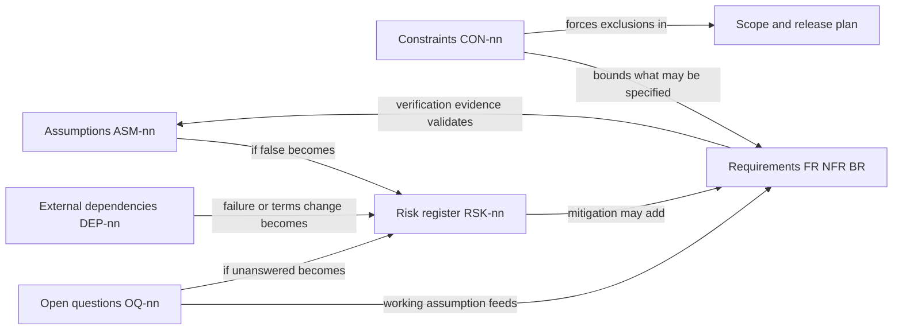
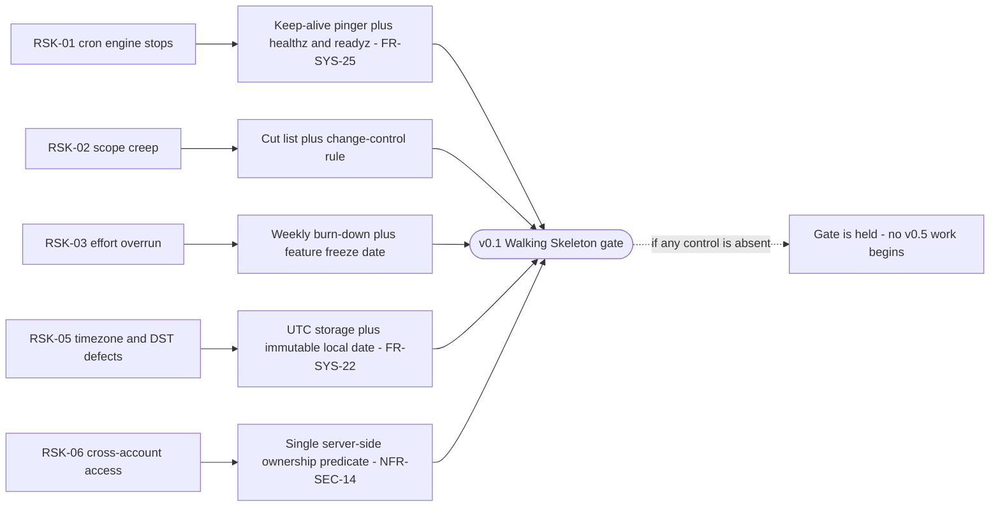

# PlantPal+ — Assumptions, Constraints, Dependencies, Risks and Open Questions

| Field | Value |
| --- | --- |
| Document | 09-assumptions-constraints-risks.md — the cross-cutting register of assumptions, constraints, external dependencies, risks, open questions and the free-tier operating envelope |
| Version | 1.0 |
| Date | 2026-07-21 |
| Status | Approved — baseline for Phase 2 |
| Owner | Rakshit — Project Lead and sole developer |
| Parent | [PlantPal+ Software Requirements Specification](./SRS.md) |
| Registers owned | `ASM-nn`, `CON-nn`, `DEP-nn`, `RSK-nn`, `OQ-nn` |
| Registers referenced but not owned | `STK-nn`, `PER-nn`, `GOAL-nn`, `MET-nn`, `FR-*`, `BR-*`, `NFR-*`, `US-*`, `UC-*` |
| Conforms to | IEEE 830-1998 section structure, ISO/IEC/IEEE 29148:2018 requirement-quality rules |

---

## Table of contents

0. [Purpose, ownership and how to read this document](#0-purpose-ownership-and-how-to-read-this-document)
1. [Assumptions ASM-nn](#1-assumptions-asm-nn)
2. [Constraints CON-nn](#2-constraints-con-nn)
3. [External dependencies DEP-nn](#3-external-dependencies-dep-nn)
4. [Risk register RSK-nn](#4-risk-register-rsk-nn)
5. [Risk visualisation](#5-risk-visualisation)
6. [Open questions OQ-nn](#6-open-questions-oq-nn)
7. [Free-tier operating envelope](#7-free-tier-operating-envelope)
8. [Register governance and cross-area reconciliation](#8-register-governance-and-cross-area-reconciliation)

---

## 0. Purpose, ownership and how to read this document

### 0.1 Why this document exists

An SRS states what the system shall do. It cannot be assessed honestly without also stating the things that were **believed rather than proved** (assumptions), the things that were **imposed rather than chosen** (constraints), the things the product **cannot deliver on its own** (external dependencies), the things that **might go wrong** (risks) and the things that are **still undecided** (open questions).

ISO/IEC/IEEE 29148:2018 requires that a requirement set be *complete*, *consistent* and *feasible*. Feasibility in particular cannot be judged from the requirements alone: a requirement that is perfectly written is still invalid if it needs a paid API (CON-01), a native module the Expo managed workflow cannot provide (CON-04) or an always-on second process the free hosting plan cannot fund (CON-06). This document is therefore the **feasibility evidence** for the whole requirement set, and it is the place a reviewer should look first when asking "could one developer really build this for nothing in one semester?".

### 0.2 Register ownership and the no-renumbering rule

| Register | Meaning | Range in v1.0 | Contiguous |
| --- | --- | --- | --- |
| `ASM-nn` | Assumption — believed true, acted upon, not proved | ASM-01 to ASM-28 | Yes |
| `CON-nn` | Constraint — a limit imposed on the project from outside the requirement set | CON-01 to CON-28 | Yes |
| `DEP-nn` | External dependency — a third-party service, data set or asset the product needs | DEP-01 to DEP-17 | Yes |
| `RSK-nn` | Risk — an uncertain event that would damage scope, schedule, quality, cost, safety or trust | RSK-01 to RSK-20 | Yes |
| `OQ-nn` | Open question — a decision not yet taken, each carrying a working assumption so nothing is blocked | OQ-01 to OQ-16 | Yes |

Identifiers are **immutable**. A retired entry is marked `WITHDRAWN` in place and its number is never reused, because other documents, commit messages and the traceability matrix cite these identifiers by number. New entries are appended at the next free number. No entry in this document may be renumbered by any downstream author.

### 0.3 How the registers relate to each other

Read that diagram as the working method of this document: **an assumption that fails becomes a risk, a dependency that fails becomes a risk, a constraint removes options from the requirement set, and an open question is a risk with a stated default already applied.**

### 0.4 Relationship to the locked decisions D-01 to D-11

The eleven stakeholder-signed decisions of 2026-07-21 are *not* repeated as constraints for their own sake. Where a decision imposes an external limit on the project it is recorded as a `CON` entry naming the decision as its source — for example D-06 becomes CON-01, D-04 becomes CON-21 and D-07 becomes CON-17. Nothing in this document may contradict D-01 to D-11; where this document appears to soften a decision, the decision wins and the entry is a defect to be raised in the Review phase.

### 0.5 Review cadence

| Register | Reviewed | Trigger for an out-of-cycle review |
| --- | --- | --- |
| `ASM` | At every release gate: v0.1 2026-08-30, v0.5 2026-10-11, v1.0 2026-11-29 | Any evidence that an assumption is false |
| `CON` | At every release gate | A provider changes a published limit |
| `DEP` | At every release gate, plus a published-limits re-verification per ASM-09 | A provider outage lasting more than 4 hours |
| `RSK` | Score 15 to 25 weekly, score 10 to 14 at every gate, score 1 to 9 at the v1.0 gate only | Any risk materialising, or any new risk scoring 12 or above |
| `OQ` | Weekly until closed | The "needed by" date arriving with the question still open |

---

## 1. Assumptions ASM-nn

### 1.1 How to read this register

An assumption is something believed true and acted upon, which has not been proved. Each entry states the **rationale** (why it is a reasonable belief), the **impact if false** (what breaks, and how badly) and the **validation method** (the specific evidence that would settle it). An assumption with no validation method is not an assumption, it is a guess, and none are recorded here.

Assumptions are deliberately written so that being wrong is survivable. Where an assumption could not be made survivable — ASM-09 on free-tier availability and ASM-15 on timezone correctness are the two clearest cases — a linked risk with a named contingency carries the exposure instead.

### 1.2 Assumption register

| ID | Assumption | Rationale | Impact if false | Validation method |
| --- | --- | --- | --- | --- |
| ASM-01 | Target users own a smartphone running iOS 15 or later, or Android 8 or later, with intermittent internet access | Matches the Expo SDK support floor and the realistic device base of the pilot cohort | Devices below the floor cannot run the app at all; the addressable cohort shrinks | Device audit of the pilot cohort at recruitment, before 2026-11-09 |
| ASM-02 | Users log most actions on the day they occur, and retroactive entries older than 30 days are rare | Habit trackers are used in the moment; a 30-day back-dating cap is the sanity boundary the GAM analyst enforces | A longer back-dating window would force unbounded streak and achievement recomputation, which is expensive and hard to bound | Measure the distribution of `occurred_at` minus `created_at` over the pilot |
| ASM-03 | The target user is an individual adult aged 16 or over tracking only their own habits | Multi-user is excluded, and a minimum age is required by the privacy stance | A younger user base would create a parental-consent obligation the project cannot meet | Age gate at registration; the exact minimum is 16, fixed by the closure of OQ-09 on 2026-07-21 and enforced by BR-ACC-13 |
| ASM-04 | Users can self-report height and body mass accurately to within about 2 kg and 2 cm | BMR, TDEE and the MET energy estimate all depend on self-reported values | Energy figures drift further from reality, which is tolerable because they are already presented as estimates with an error band | Not directly validatable; mitigated by never presenting the figures as precise |
| ASM-05 | A curated catalogue of approximately 60 species covers at least 80 percent of the plants a typical hobbyist actually owns | Common houseplants follow a long-tailed distribution with a very fat head | Users hit the custom-species path more often, which exists but is more work for them | Count the ratio of custom to catalogue species created during the pilot |
| ASM-06 | A curated catalogue of approximately 300 foods covers at least 60 percent of the items a typical user logs in a week, with Open Food Facts and custom foods covering the tail | Staple foods dominate everyday logging | Nutrition logging becomes tedious and MET-07 falls | Count the ratio of seeded to custom and Open Food Facts entries during the pilot |
| ASM-07 | At least 60 percent of mobile users who see the push permission prompt will grant it | Habit-tracker users are self-selected for wanting reminders | MET-09 fails and the reminder-driven part of the loop weakens; in-app due surfaces become the primary channel | MET-09 measured weekly during the pilot |
| ASM-08 | English is sufficient for the entire pilot cohort | The cohort is recruited from the Project Lead's network | Some testers are excluded or give poorer feedback; i18n readiness means only that a catalogue must be added, not rewritten code | Ask at recruitment |
| ASM-09 | The free tiers of the hosting, database, storage, build and CI providers remain available on substantially their current terms for the whole project window | All are long-standing free offerings from established providers | GOAL-09 fails, which is a project-level failure; RSK-04 carries the mitigation and fallbacks | Re-verify every provider's published limits at each release gate |
| ASM-10 | Open Food Facts remains freely queryable without an API key, subject to a fair-use rate policy and an identifying User-Agent | It is an open-data community project with a long history of free access | Barcode lookup is lost; the seeded catalogue and custom foods still work because the integration is behind a flag and the product must work without it per D-03 | Re-verify the published rate policy at the start of v1.0 build |
| ASM-11 | Perenual offers a free API tier sufficient for occasional species enrichment | It publishes a free developer tier | Species enrichment is dropped; the seeded catalogue is unaffected. This is why enrichment is a Should behind a flag that is off by default | Verify the exact quota, tracked as OQ-04 |
| ASM-12 | Expo Push remains free at the volume this project generates, which is under about 2,000 notifications per day at pilot scale | Expo Push has no charge for standard use | Mobile push is lost, which would be severe; the fallback is in-app due surfaces plus email, already built for web | Monitor Expo's published terms; measure actual daily volume during the pilot |
| ASM-13 | The supervisor responds to a phase-gate review request within 5 working days | Normal supervisory practice | Gates slip; the contingency buffer in W23 to W24 absorbs up to 2 weeks of cumulative slip | Agree the response window with the supervisor at Phase 1 sign-off |
| ASM-14 | At least 12 pilot testers can be recruited and retained through the 30-day window | 20 invitations at a 60 percent retention rate | MET-01 to MET-16 lose statistical weight; the report states the reduced `n` honestly and leans harder on the 5 moderated sessions | Recruitment completed by 2026-11-09; RSK-13 covers the shortfall |
| ASM-15 | The device operating system reports an accurate IANA timezone, and a maintained timezone-database library is available in both clients and the backend | Standard platform behaviour | Reminders and day boundaries would be wrong, which is the highest-consequence class of defect in the product; RSK-05 covers it | Timezone test accounts in `Asia/Kolkata`, `Europe/London` and `Pacific/Auckland` at the v0.5 gate |
| ASM-16 | Users accept an estimate-quality calorie-burn figure provided it is clearly labelled as an estimate | Every consumer fitness product does the same, and honesty is required by D-07 | Users distrust the figure; mitigated by always showing the error band and never using the figure to alter the calorie budget by default | Pilot feedback question |
| ASM-17 | A single free backend instance can host the Express API and the node-cron engine in one process at pilot scale | Pilot scale is at most about 20 concurrent users and a few thousand scheduled reminders per day | The cron engine would need separate hosting, which the free-tier instance-hour budget cannot afford; the fallback is CI-triggered ticks, recorded in RSK-01 | Load-test the reminder tick at the v0.5 gate with 20 synthetic accounts |
| ASM-18 | Total photo storage across all pilot users stays under 1 GB | A per-user quota plus client-side resize to a maximum dimension of 1600 px keeps a typical photo near 200 KB | The storage free tier is exhausted and uploads must be blocked; the per-user quota exists precisely to prevent this | Monitor the storage dashboard weekly during the pilot |
| ASM-19 | The Project Lead has continuous access to at least one physical Android device and can borrow or already owns an iOS device for Expo Go testing | Personal devices | iOS behaviour goes untested, which is unacceptable for a cross-platform claim; the fallback is the iOS simulator plus a borrowed device for gate testing | Confirm device availability before the v0.1 gate |
| ASM-20 | No commercial launch occurs during the project window, so there is no app-store review, no monetisation, no support SLA and no marketing obligation | D-01 and D-06 | The scope would expand far beyond the available hours | Fixed by decision, not subject to change without a change-control entry |
| ASM-21 | Per-user data volumes stay within the volumetrics stated by the domain model, which at pilot scale means at most about 50 plants, about 1,500 log rows and about 300 photos per user per year | Typical consumer behaviour, bounded by the pilot's 31-day window | Free database and storage quotas are exhausted sooner; the per-user quotas and pagination limits are the mitigation | Measure actual row counts per account at the end of the pilot |
| ASM-22 | Implementing GDPR-style export and erasure voluntarily, at good-practice depth, is sufficient for an academic project that is not a commercial data controller | D-01 fixes the depth explicitly, excluding a DPIA | If the institution demands a formal assessment, additional documentation is required but no code changes; the effort would come from the contingency buffer | Confirm with STK-02 and STK-11 at Phase 1 sign-off |
| ASM-23 | A durable client-side persistence layer is available on every supported client — MMKV on React Native, IndexedDB in the browser — so that the read cache and the offline outbox both survive a cold start | Both are standard on the platform floor of ASM-01 and are the persistence targets named by D-04 | Offline-light degrades to an in-memory cache on that device, offline queueing must be disabled and the user must be told plainly; the product still works whenever the device is online | Instrumented `PERSISTENCE_UNAVAILABLE` counter per platform during the pilot, plus an explicit test in Safari private browsing and on a storage-full Android device at the v0.5 gate |
| ASM-24 | Exactly one backend process instance runs at any moment, which makes an in-process node-cron scheduler, in-process token-bucket rate limiting and PostgreSQL advisory locks sufficient coordination | CON-06 funds only one always-on service, so a second instance cannot be afforded | Reminders could be dispatched twice, housekeeping jobs could overlap and rate limits would count only a fraction of traffic; a shared coordination store would be required and CON-27 records that none is free | Inspect the hosting configuration at every deploy; assert a single `scheduler_heartbeat` writer through the readiness check of `FR-SYS-25` at the v0.1 gate |
| ASM-25 | Re-encoding an image to JPEG on the client, with `expo-image-manipulator` on mobile or a Canvas re-encode on web, reliably discards all EXIF, IPTC and XMP metadata including GPS coordinates | Neither implementation carries metadata across a pixel-level re-encode | The strongest privacy claim the product makes would be silently false and `NFR-PRIV-03` would fail; the server-side re-strip at finalisation is the compensating second line of defence, so a single-layer regression still leaks nothing | Run `exiftool` over at least 20 stored objects uploaded from iOS, Android and desktop browsers and assert zero GPS and zero camera-identifier tags, at the v1.0 gate |
| ASM-26 | A transformed plant photo consumes about 200 KB across its three stored variants, so a per-user cap of 150 photos stays inside the per-user byte quota | Longest edge capped at 1600 px, the JPEG quality ladder 0.75 then 0.65 then 0.55, plus a 1024 px and a 320 px variant | The per-user quota is reached earlier than users expect and the global bucket guard trips sooner; the mitigation is to lower the cap, which degrades the growth log that PER-02 values most | Measure mean stored bytes per media asset weekly during the pilot and recompute the quota model at the v1.0 gate |
| ASM-27 | A free external scheduler can call `GET /healthz` at a 5 to 10 minute cadence for the whole project window, without charge and without silent throttling | Free uptime monitors publish 1 to 5 minute intervals and free cron services publish 10 minute intervals; DEP-12 provides two of them | RSK-01 materialises: the instance sleeps, node-cron stops ticking and reminders are missed, which is the largest single technical threat to the product promise | Two independent free monitors configured from the v0.1 gate; weekly review of the observed cold-start rate against the 1 percent ceiling of `NFR-PERF-04` |
| ASM-28 | The backend instance, the PostgreSQL database and the object-storage bucket are provisioned in the same or an adjacent cloud region, so the API-to-database round trip costs single-digit milliseconds | The free tiers of the candidate providers all offer at least one common region | The latency budgets of `NFR-PERF-01`, `NFR-PERF-02` and the 800 ms dashboard budget of `NFR-PERF-03` become unreachable, because the round trip would dominate them | Measure the median `SELECT 1` round-trip time from the deployed instance at the v0.1 gate; the region choice itself is item 1 of section 6.4 |

ASM-01 to ASM-22 are the business-context assumptions inherited from the stakeholder analysis. ASM-23 to ASM-28 are the platform and quality-attribute assumptions that the cross-cutting `SYS` and `NFR` analyses depend on; each was previously implicit in a requirement and is recorded here so that its failure has a named consequence and a named validation.

### 1.3 Assumption validation schedule

Every assumption is bound to a gate so that "we will validate it" cannot quietly become "we never validated it". The evidence artefact column names the file or record that must exist for the validation to count as done.

| Validate by | Assumptions due | Evidence artefact required |
| --- | --- | --- |
| Phase 1 sign-off, 2026-07-26 | ASM-13, ASM-20, ASM-22 | Signed Phase 1 checklist countersigned by STK-02, plus a written note from STK-11 on ASM-22 |
| v0.1 gate, 2026-08-30 | ASM-19, ASM-24, ASM-28 | Device inventory recorded in the project log, naming make, model and OS version; a deploy-configuration inspection showing a single instance and a single `scheduler_heartbeat` writer; a recorded median `SELECT 1` round-trip time from the deployed instance |
| v0.5 gate, 2026-10-11 | ASM-15, ASM-17, ASM-23, ASM-27 | Timezone fixture suite passing for `Asia/Kolkata`, `Europe/London` and `Pacific/Auckland`; reminder-tick load-test report for 20 synthetic accounts; a persistence-unavailable test result from Safari private browsing and a storage-full Android device; two configured uptime monitors with 4 weeks of history |
| v1.0 build start, 2026-10-12 | ASM-10, ASM-11 | Dated screenshot or saved copy of each provider's published rate policy, stored under `docs/evidence/` |
| Pilot recruitment, 2026-11-09 | ASM-01, ASM-03, ASM-08, ASM-14 | Anonymised recruitment sheet giving device class, OS version, age affirmation and language |
| v1.0 gate, 2026-11-29 | ASM-25 | `exiftool` report over at least 20 stored objects uploaded from iOS, Android and desktop browsers, asserting zero GPS and zero camera-identifier tags |
| Weekly during the pilot, 2026-11-16 to 2026-12-16 | ASM-07, ASM-12, ASM-18, ASM-26 | Weekly quota-and-metrics snapshot: push opt-in rate, notifications sent per day, storage bytes used, mean stored bytes per media asset |
| Pilot close, 2026-12-16 | ASM-02, ASM-05, ASM-06, ASM-16, ASM-21 | Saved analytics SQL output per OQ-13, plus the pilot feedback summary |
| Not directly validatable | ASM-04, ASM-09 | ASM-04 is mitigated by presentation, never by measurement. ASM-09 is re-verified at every gate but can never be proved forward |

### 1.4 Assumptions with a linked risk

An assumption whose failure would be materially damaging carries a named risk. The remaining assumptions fail gracefully, which is a design property, not luck.

| Assumption | Linked risk | Why the link exists |
| --- | --- | --- |
| ASM-09 free tiers persist | RSK-04 | The single most project-threatening assumption. Every DEP entry carries a fallback precisely because of it |
| ASM-12 Expo Push stays free and reliable | RSK-08 | Push is the only channel with no free equivalent inside the fixed stack |
| ASM-14 at least 12 pilot testers | RSK-13 | The entire empirical metric set depends on cohort size |
| ASM-15 accurate IANA timezone and a maintained tz database | RSK-05 | A wrong day boundary silently breaks streaks, which destroys trust faster than any visible bug |
| ASM-17 one instance hosts API and cron | RSK-01 | CON-06 makes a second always-on process unaffordable, so the cron engine has nowhere else to live |
| ASM-18 and ASM-21 volumetrics stay inside quota | RSK-19 | Quota exhaustion blocks writes for every user at once |
| ASM-10 and ASM-11 external catalogues remain queryable | RSK-09, RSK-18 | Mitigated by design: D-03 requires full functionality with both integrations disabled |
| ASM-13 supervisor responds in 5 working days | RSK-07 | Gate slip is absorbed by the same contingency buffer that absorbs lost developer capacity |
| ASM-24 exactly one instance runs | RSK-01 | The in-process cron engine has nowhere else to live under CON-06, and a second instance would double-dispatch rather than help |
| ASM-27 a free external pinger stays available | RSK-01 | The keep-alive is the only thing standing between CON-05 and a total reminder outage |
| ASM-26 a photo costs about 200 KB across its variants | RSK-19 | The per-user cap is derived from this figure; if the figure is wrong the cap is wrong and the bucket fills early |
| ASM-28 co-located instance, database and storage | RSK-16 | Every PERF budget is stated server-side and assumes the database round trip is negligible |

---

## 2. Constraints CON-nn

### 2.1 How to read this register

A constraint is a limit the project did not choose and cannot negotiate away inside the project window. Constraints are **inputs** to the requirement set, not requirements themselves: they explain why certain requirements are absent, why certain thresholds are set where they are, and why certain capabilities appear in the out-of-scope table of [02-scope-and-release-plan.md](./02-scope-and-release-plan.md) with a reason rather than a promise.

Type is one of **technical**, **budget**, **schedule**, **regulatory** or **organisational**. Several constraints carry two types, in which case both are named and the first is dominant.

The **free-tier validity test** applies to every requirement in the document set: a requirement that cannot be satisfied inside the quotas of section 7 is invalid under CON-01 and must be re-scoped, or recorded as a `Wont` with the blocking quota named.

### 2.2 Constraint register

| ID | Constraint | Type | Source | Consequence |
| --- | --- | --- | --- | --- |
| CON-01 | The entire product must run on permanently free tiers at a recurring cost of 0.00 USD per month | Budget | D-06, GOAL-09 | Any requirement that needs a paid plan is invalid and must be re-scoped or recorded as a Wont with the blocking quota named |
| CON-02 | One developer, working approximately 15 hours per week across 24 weeks, giving about 360 hours total | Schedule and organisational | D-05, STK-03 | Everything is serialised. There is no parallelism, no code review by a second person, and illness has no absorber other than the contingency buffer |
| CON-03 | The technology stack is fixed and non-negotiable: TypeScript monorepo, React Native with Expo, React with Vite, Node with Express, PostgreSQL, node-cron, Supabase or Cloudinary storage, Render or Railway, Vercel or Netlify, Expo EAS, GitHub Actions | Technical | Client brief section 2 | No alternative may be proposed anywhere in the document set. Where the stack dictates an implementation detail, requirements may state it explicitly and must say that the stack is the reason |
| CON-04 | The Expo managed workflow is used, so no custom native module is available without a development build and config plugins | Technical | Stack decision | Background step counting, HealthKit and Google Fit history, native widgets, watchOS apps and background geolocation are all unavailable. Manual step entry is the v1.0 Must and a foreground pedometer read is at most a Should |
| CON-05 | Free backend instances spin down after approximately 15 minutes without traffic, and a cold start takes roughly 30 to 60 seconds | Technical | Hosting provider free tier | node-cron does not tick while the instance is asleep, so reminders would be missed. A keep-alive ping and a catch-up sweep with a staleness cut-off are mandatory, not optional |
| CON-06 | The free hosting plan provides approximately 750 instance-hours per month across the whole account | Technical and budget | Hosting provider free tier | A 31-day month contains 744 hours, so only **one** service may be kept permanently awake. The API and the cron engine must therefore share a single process, and no second always-on service may exist |
| CON-07 | The free PostgreSQL tier provides on the order of 0.5 GB of storage with limited monthly compute hours and scale-to-zero after a few minutes of inactivity | Technical | Database provider free tier | Schema and retention must be economical: soft-deleted rows and tombstones need a retention window, aggregates should be computed rather than duplicated, and the first query after idle carries a resume penalty |
| CON-08 | The free storage and backend-as-a-service tier provides on the order of 500 MB of database, 1 GB of file storage and 5 GB of monthly egress, and pauses projects after about 7 days of inactivity | Technical | Storage provider free tier | Photo quotas per user are mandatory, thumbnails must be served rather than originals, and a weekly activity job is needed to prevent the project pausing before a demo |
| CON-09 | The free web-hosting tier is limited to non-commercial use with roughly 100 GB of monthly bandwidth | Technical and regulatory | Web host free tier and its acceptable use policy | No monetisation is possible on this plan, which aligns with D-01 anyway. Web bundle size must stay modest |
| CON-10 | Distributing an iOS build through TestFlight or the App Store requires a paid Apple Developer account, which CON-01 forbids | Technical and budget | Apple policy | iOS testing and demonstration happen through Expo Go on a physical device; Android is distributed as an internally shared build. Store publication is out of scope for v1.0 |
| CON-11 | The free CI tier provides unlimited minutes on public repositories but roughly 2,000 minutes per month on private ones | Technical | CI provider free tier | CI workflows must be economical, with caching and path filters, or the repository must be public. The visibility decision is OQ-10 |
| CON-12 | The free error-monitoring tier provides on the order of 5,000 errors per month with a single seat and limited retention | Technical | Monitoring provider free tier | Error reporting must be sampled and de-duplicated, and noisy non-actionable errors must be filtered client-side, or the quota is exhausted mid-month and MET-11 becomes unmeasurable |
| CON-13 | No budget exists for paid APIs, paid data sets, paid devices, paid fonts, paid icon sets or paid Lottie assets | Budget | D-06 | Every asset and integration must be free and licence-compatible, and the licences screen must prove it |
| CON-14 | The test device matrix is limited to devices the Project Lead owns or can borrow | Technical | CON-01, ASM-19 | Cross-device verification is narrow. The browser and OS support matrix must be stated conservatively and the untested range declared honestly |
| CON-15 | The user interface ships in English only in v1.0, while the codebase must be i18n-ready with no hard-coded user-facing strings outside a locale catalogue | Organisational | D-08 | Every user-facing string, including notification copy and error messages, goes through the locale catalogue from day one, which is cheap early and expensive to retrofit |
| CON-16 | All quantities are stored canonically in metric SI, with both metric and imperial offered as a user-selectable display preference | Technical | D-09 | Conversion happens at the presentation boundary only. No imperial value is ever persisted, and rounding rules must be stated so a value does not drift when converted back and forth |
| CON-17 | PlantPal+ is a wellness tracker and not a medical device, with a not-medical-advice disclaimer, no clinical thresholds and no eating-disorder-adjacent features | Regulatory | D-07 | Hard safety floors on calorie targets, a capped weight-change rate, no shaming copy, no diagnosis of any kind, and no feature that ranks users against each other |
| CON-18 | The academic submission date of 2026-12-18 is immovable | Schedule | Institution | The feature freeze of 2026-11-15 and the pre-agreed cut list exist to protect it. Day-30 retention is only readable on 2026-12-16, so the submitted report carries it as a late addendum or reports day-7 and day-14 instead |
| CON-19 | The documentation standard is fixed: the IEEE 830-1998 section structure with ISO/IEC/IEEE 29148:2018 requirement-quality rules | Organisational | D-01 | The document structure is not negotiable, and quality rules such as the single-shall-sentence form are gates, not preferences |
| CON-20 | Legal and privacy depth is fixed at good practice, which means a privacy policy, terms, a not-medical-advice disclaimer and GDPR-style export and delete, with no formal DPIA and no monetisation | Regulatory | D-01 | The legal surfaces are v1.0 Musts, and nothing beyond them is in scope |
| CON-21 | Offline support is offline-light: only the seven append-only logging actions may be queued while offline, and everything else requires connectivity | Technical | D-04 | Registration, profile edits, entity creation, editing, deletion and photo upload must present a clear, actionable offline state rather than optimistically accepting input. No merge or conflict-resolution algorithm exists |
| CON-22 | Web push is deferred to v1.1, so v1.0 web delivers in-app due-reminder surfaces plus an optional email digest | Technical | D-10 | The dashboard must carry a due-reminder surface strong enough to substitute for push on web, and it must be designed as a first-class surface rather than a consolation prize |
| CON-23 | Transactional email runs on a free provider with a cap on the order of 100 messages per day and a few thousand per month | Technical and budget | Email provider free tier | Verification and password-reset emails are rate-limited per account, and the optional daily digest must be capped or batched so a growing user base cannot exhaust the daily allowance |
| CON-24 | The reminder engine runs in-process with node-cron inside the single API instance, so the system may never be horizontally scaled, autoscaled or deployed to more than one replica in v1.0 | Technical | CON-03, CON-06, ASM-24 | Every coordination mechanism is single-instance: in-memory token buckets for rate limits, an in-memory drain mutex on each client, and PostgreSQL advisory locks for migrations and housekeeping jobs. Introducing a second replica is a breaking architectural change that would double-dispatch reminders, and `BR-SYS-30` must be revisited before it is ever attempted |
| CON-25 | The free PostgreSQL tier caps concurrent connections at a low ceiling, so the API connection pool is bounded to at most 10 connections with a 5,000 ms acquisition timeout | Technical | Database provider free tier | Saturation is answered with HTTP 503 and `Retry-After: 5` rather than by blocking indefinitely, and the reminder tick is limited to at most 3 connections so a large tick can never starve request handling |
| CON-26 | The deployment is single-region with no read replica, no failover and no point-in-time recovery below a 24-hour recovery point objective | Technical | Free tiers of the hosting, database and storage providers | Availability is stated honestly at 99.0 percent monthly rather than aspirationally, backups are a scheduled logical dump retained for 7 days, and the recovery time objective is 4 hours. Anything stronger requires a paid plan and is therefore invalid under CON-01 |
| CON-27 | No shared cache, message broker or distributed lock service is available, because none offers a permanently free tier adequate to this project | Technical and budget | D-06, free-tier market scan of 2026-07-21 | Rate-limit counters, circuit-breaker state and drain locks live in process memory or in PostgreSQL. A process restart resets the in-memory counters, which is accepted for v1.0 and recorded as item 15 of section 6.4 |
| CON-28 | No third-party analytics, advertising or behavioural-tracking SDK may ship in v1.0 | Regulatory and organisational | D-01, `NFR-PRIV-07` | Every behavioural success metric MET-01 to MET-24 must be derived by server-side SQL over data the product already stores for functional reasons, run manually from a saved query set. The derivation method is fixed by OQ-13 |

### 2.3 Constraint distribution by type

| Type | Constraints | Count | Dominant effect on the requirement set |
| --- | --- | --- | --- |
| Technical | CON-03, CON-04, CON-05, CON-06, CON-07, CON-08, CON-09, CON-10, CON-11, CON-12, CON-14, CON-16, CON-21, CON-22, CON-23, CON-24, CON-25, CON-26, CON-27 | 19 | Fixes the how where the stack dictates it, and removes whole capability classes such as wearables, background execution, offline CRUD and horizontal scaling |
| Budget | CON-01, CON-06, CON-10, CON-13, CON-23, CON-27 | 6 | Makes the free-tier validity test a hard gate on every requirement |
| Schedule | CON-02, CON-18 | 2 | Forces MoSCoW discipline, the cut list and the 2026-11-15 feature freeze |
| Regulatory | CON-09, CON-17, CON-20, CON-28 | 4 | Bans an entire class of otherwise-obvious features, imposes non-negotiable safety floors, forbids monetisation on the free web-hosting plan, and forbids behavioural tracking |
| Organisational | CON-02, CON-15, CON-19, CON-28 | 4 | Fixes the documentation standard, the i18n discipline, the measurement method and the single-developer working model |

Type values are drawn from the closed set **technical, budget, schedule, regulatory, organisational**. Seven constraints — CON-02, CON-06, CON-09, CON-10, CON-23, CON-27 and CON-28 — carry two types each, so the counts above are of *type memberships* and sum to 35, while the distinct total is 28. The arithmetic checks: 28 constraints plus 7 second memberships equals 35.

The distribution is itself a finding: **the dominant class is technical, and almost every technical constraint is downstream of a single budget decision.** CON-05, CON-06, CON-07, CON-08, CON-09, CON-11, CON-12, CON-23, CON-24, CON-25, CON-26 and CON-27 — twelve of the nineteen technical constraints — exist only because CON-01 fixes the recurring cost at zero. One decision, D-06, generates roughly two thirds of the technical constraint surface of the product, and it is the reason the architecture is a single process rather than a set of services.

### 2.4 The four constraints that shape the architecture most

| Constraint | Architectural consequence it forces | Where that consequence is specified |
| --- | --- | --- |
| CON-06 — one always-on service only | The Express API and the node-cron reminder engine must live in one process, in-memory rate-limit buckets are legitimate because exactly one instance runs, and no durable job queue or background worker may exist | `FR-SYS-21`, `FR-SYS-25`, `BR-SYS-30`, `BR-SYS-34`, `NFR-PERF-04` |
| CON-05 — instances sleep after 15 minutes | An external keep-alive pinger is mandatory, the reminder engine must query for due-and-unsent rather than trust tick punctuality, and clients must render from persisted cache before the server answers | `FR-SYS-01`, `FR-SYS-25`, `NFR-PERF-04`, `NFR-RELI-07` |
| CON-21 — offline-light only | The offline surface is a closed set of seven append-only actions with client-generated idempotency keys and server upsert, and there is deliberately no merge algorithm, no CRDT and no last-write-wins policy anywhere in the system | `FR-SYS-02`, `FR-SYS-03`, `FR-SYS-07`, `BR-SYS-11`, `BR-SYS-12` |
| CON-17 — wellness, not medical | Hard, untestable-to-override calorie floors, a capped weight-change rate, a permanent disclaimer surface, and a permanent ban on leaderboards, comparison and shaming copy | `FR-NUT-*`, `NFR-LEGL-*`, `NFR-PRIV-02` |

---

## 3. External dependencies DEP-nn

### 3.1 How to read this register

An external dependency is a third-party service, data set, library ecosystem or asset that PlantPal+ needs and does not control. Every entry names the **free-tier limit that actually binds this project** rather than the provider's full feature list, a **criticality** rating, and a **fallback** that is specific enough to be executed under pressure.

Criticality is one of:

| Criticality | Meaning | Number of dependencies |
| --- | --- | --- |
| **Critical** | The product does not function at all without it, or a headline promise is lost outright | 6 |
| **High** | A major capability is lost, and the degradation is visible to every user | 5 |
| **Medium** | A supporting capability or a measurement is lost; the user experience survives | 1 |
| **Low** | A convenience is lost and a substitute exists | 2 |
| **Optional by design** | The product is required by D-03 to be fully functional without it, and the integration ships behind a feature flag that is off by default | 2 |
| **Not used in v1.0** | Recorded so the exclusion is explicit rather than an oversight | 1 |

The design rule that makes this register survivable is stated once here and enforced by `FR-SYS-15` through `FR-SYS-17`: **no provider-specific concept leaks into the domain layer.** Storage sits behind one media adapter, email behind one mail adapter, external catalogues behind one integration adapter with a feature flag, a timeout, a circuit breaker and a mandatory database cache. Swapping a provider is therefore an adapter change, never a domain change.

### 3.2 Dependency register

| ID | Dependency | Provider | Free-tier limit relevant to this project | Criticality | Fallback if it fails or its terms change |
| --- | --- | --- | --- | --- | --- |
| DEP-01 | Managed PostgreSQL | Neon or Supabase | About 0.5 GB storage, limited monthly compute hours, scale-to-zero after a few minutes idle | Critical — nothing works without it | Migrate to the other provider; the schema is portable standard PostgreSQL and migrations are in the repository. A full `pg_dump` is taken weekly |
| DEP-02 | Object storage and CDN for photos | Supabase Storage or Cloudinary | About 1 GB stored and 5 GB monthly egress | High — the growth log depends on it, but nothing else does | Switch to the other provider; enforce a smaller per-user quota; in the worst case degrade the growth log to text-only entries, which is a documented degradation not a crash |
| DEP-03 | Backend hosting | Render or Railway | About 750 instance-hours per month, spin-down after about 15 minutes idle | Critical | Migrate to the other provider; both run a standard Node process from a Dockerfile or a build command |
| DEP-04 | Web hosting | Vercel or Netlify | About 100 GB monthly bandwidth, non-commercial use | High | Switch providers, or serve the built static bundle from the object-storage CDN |
| DEP-05 | Mobile build and distribution | Expo EAS | Limited monthly build quota with a single concurrent build and queue waits that can exceed 30 minutes | High | Build locally with the Expo CLI; distribute through Expo Go for testing and a directly shared Android build |
| DEP-06 | Push notification delivery | Expo Push | No monetary charge at this project's volume; 100 messages per request; receipts must be collected | Critical for the mobile reminder loop | No free equivalent exists inside the fixed stack. The degradation is in-app due-reminder surfaces plus email digest, which already exist for web |
| DEP-07 | Food and barcode data | Open Food Facts | Free, no API key, fair-use rate limits and a required identifying User-Agent | Optional by design — behind a feature flag that is off by default | Seeded catalogue of about 300 foods plus user-created custom foods. The product must be fully functional with this disabled, per D-03 |
| DEP-08 | Plant species enrichment | Perenual | A free developer tier with a low daily request cap, exact figure tracked as OQ-04 | Optional by design — behind a feature flag that is off by default | Seeded catalogue of about 60 species plus user-created custom species |
| DEP-09 | Transactional email | A free provider such as Resend or Brevo | On the order of 100 messages per day and a few thousand per month | High — account verification and password reset depend on it | Switch providers behind a single mail-adapter interface; in an outage, verification links can be issued manually for the pilot cohort |
| DEP-10 | Source control and CI | GitHub and GitHub Actions | Unlimited minutes on public repositories, about 2,000 minutes per month on private ones | Critical | Run the same checks locally with the same scripts; the pipeline is a convenience layer over npm scripts, never a hidden build step |
| DEP-11 | Error monitoring and session health | Sentry free tier | About 5,000 errors per month, 1 seat, limited retention | Medium — MET-11 depends on it | Structured server logs plus a manual client error report; MET-11 would then carry an explicit caveat. Tracked as OQ-05 |
| DEP-12 | Uptime monitoring and keep-alive pings | UptimeRobot, cron-job.org or an equivalent free monitor | Free monitors at a 1 to 5 minute interval | High — this is the mitigation for CON-05 | A scheduled CI workflow pinging the health endpoint, at the cost of CI minutes under CON-11 |
| DEP-13 | Open-source package ecosystem | npm registry and the maintainers of Expo SDK, Express, TanStack Query, React Native Paper, shadcn/ui, Recharts, Victory Native, Reanimated, Lottie and the rest | Free, subject to each package's licence | Critical | Lockfiles are committed, versions are pinned, and a licence inventory is generated in CI. A yanked package is replaced from the pinned tarball while a substitute is found |
| DEP-14 | IANA timezone database, consumed through a maintained date library | date-fns-tz, Luxon or the platform Intl API | Free | Critical — reminders, day boundaries and streaks all depend on it | Multiple interchangeable libraries exist. The dependency is on the data, and the data is universally available |
| DEP-15 | Breached-password check | The Pwned Passwords k-anonymity range API | Free, no key, k-anonymity so no password or full hash leaves the client boundary | Low — it is a Should | Skip the check and enforce the password-strength policy alone |
| DEP-16 | Icon, animation and font assets | Lucide icons, Lottie animation files, open-licence fonts | Free under their respective licences | Low | Substitute equivalent open-licence assets; the licences screen must always match what actually ships |
| DEP-17 | App distribution stores | Apple App Store and Google Play | Paid developer accounts, therefore excluded under CON-01 and CON-10 | Not used in v1.0 | Not applicable. Recorded so that the exclusion is explicit rather than an oversight |

### 3.3 Dependency criticality map

```mermaid
flowchart TB
  APP["PlantPal Plus v1.0"]

  APP --> CRIT["Critical - no product without it"]
  APP --> HIGH["High - a major capability is lost"]
  APP --> MEDLOW["Medium and Low - degraded but usable"]
  APP --> OPT["Optional by design - flag off by default"]

  CRIT --> C1["DEP-01 Managed PostgreSQL"]
  CRIT --> C2["DEP-03 Backend hosting"]
  CRIT --> C3["DEP-06 Expo Push for the mobile reminder loop"]
  CRIT --> C4["DEP-10 GitHub and GitHub Actions"]
  CRIT --> C5["DEP-13 npm package ecosystem"]
  CRIT --> C6["DEP-14 IANA timezone database"]

  HIGH --> H1["DEP-02 Object storage and CDN"]
  HIGH --> H2["DEP-04 Web hosting"]
  HIGH --> H3["DEP-05 Expo EAS build service"]
  HIGH --> H4["DEP-09 Transactional email"]
  HIGH --> H5["DEP-12 Uptime monitor and keep-alive"]

  MEDLOW --> M1["DEP-11 Sentry error monitoring"]
  MEDLOW --> M2["DEP-15 Pwned Passwords range API"]
  MEDLOW --> M3["DEP-16 Icon animation and font assets"]

  OPT --> O1["DEP-07 Open Food Facts"]
  OPT --> O2["DEP-08 Perenual"]

  APP -.->|"excluded by CON-01 and CON-10"| X1["DEP-17 App Store and Google Play"]
```

### 3.4 Dependencies that carry a licence or attribution obligation

A licence breach is a hard failure, not a defect to be triaged, so these obligations are listed separately and are v1.0 Musts.

| Dependency | Obligation | Where it is discharged |
| --- | --- | --- |
| DEP-07 Open Food Facts | ODbL 1.0 attribution wherever community-sourced food data is displayed; an identifying `User-Agent`; respect for published request rates; no bulk redistribution of the database | `FR-SYS-17`, `BR-SYS-26`, `NFR-LEGL-03`; the "Attributions and licences" settings screen |
| DEP-08 Perenual | Attribution on any externally sourced species detail; the API key held server-side only and never shipped in a client bundle; the daily request ceiling respected | `FR-SYS-16`, `FR-SYS-17`, `BR-SYS-23`, `BR-SYS-26` |
| DEP-13 npm ecosystem | Per-package licence notice; no dependency whose licence is incompatible with the project licence | `NFR-LEGL-04`, `NFR-LEGL-05`; automated licence inventory generated in CI; STK-12 |
| DEP-16 Icons, Lottie files and fonts | Licence notice matching what actually ships, not what was originally evaluated | `NFR-LEGL-04`; the same licences screen |
| DEP-01 and DEP-02 | Sub-processor disclosure and hosting-region disclosure in the privacy policy | `NFR-PRIV-09`, `NFR-LEGL-01` |

---

## 4. Risk register RSK-nn

### 4.1 Scoring scale

Probability and impact are each scored 1 to 5 on the anchored scales below, so that a score is reproducible by a reader rather than a private judgement. **Score = probability multiplied by impact**, giving a range of 1 to 25.

| Score | Probability — likelihood of occurring at least once inside the project window | Impact — consequence if it occurs |
| --- | --- | --- |
| 1 | Rare. No known precedent for this project shape | Negligible. Absorbed inside a normal working week |
| 2 | Unlikely. Plausible but no current indicator | Minor. Costs up to 8 hours or degrades one non-Must capability |
| 3 | Possible. Has happened on comparable student projects | Moderate. Costs 8 to 24 hours, or degrades a Should |
| 4 | Likely. Expected unless actively prevented | Major. Costs 24 to 60 hours, or a Must is delivered late or degraded |
| 5 | Almost certain. Will occur without a standing mitigation | Severe. A release gate is missed, a Must is lost, user data or user safety is affected, or the zero-cost commitment breaks |

| Band | Score | Review cadence | Standing expectation |
| --- | --- | --- | --- |
| **Severe** | 15 to 25 | Weekly | The mitigation must exist and be demonstrably working before the v0.1 gate closes |
| **Elevated** | 10 to 14 | At every release gate | The mitigation must exist by the v0.5 gate |
| **Watch** | 1 to 9 | At the v1.0 gate only | The mitigation is designed in, and is verified during the v1.0 hardening window |

The **owner** of every risk is STK-03, the Project Lead, because there is exactly one developer. The owner column therefore names *who must act first and when the trigger fires*, which is the only part of ownership that carries information on a single-person project.

### 4.2 Risk register, sorted by score descending

| ID | Category | Risk description | P | I | Score | Owner action | Mitigation | Contingency if it happens |
| --- | --- | --- | --- | --- | --- | --- | --- | --- |
| RSK-01 | Technical, third-party | The free backend instance sleeps after inactivity, so the node-cron reminder engine does not tick and reminders are missed or delivered hours late | 4 | 5 | 20 | Project Lead, at the v0.1 gate | An external uptime monitor pings the health endpoint every 5 to 10 minutes, which keeps the instance awake within the 750-hour budget of CON-06; on boot the engine runs a catch-up sweep; every reminder has a uniqueness key so a catch-up never double-delivers; a staleness cut-off suppresses reminders that are too old to be useful | Move the tick out of the instance entirely: a scheduled CI workflow calls a secured internal tick endpoint on a fixed interval, accepting the CI-minute cost under CON-11 |
| RSK-02 | Scope | Scope creep. Three modules is roughly three times the surface area of a normal capstone, and every module invites "just one more" features such as offline photos, wearables or social | 5 | 4 | 20 | Project Lead, weekly | The MoSCoW effort budget of 162 Must hours; the pre-agreed cut list; the change-control rule that nothing enters without something of equal effort leaving; the explicit out-of-scope table with a reason per exclusion | Apply the cut list strictly in order. If the whole cut list is exhausted and v1.0 is still at risk, reduce every module to its Must set and cancel v1.1 entirely |
| RSK-03 | Schedule, technical | Effort overrun. The realistic implementation cost of three modules exceeds the roughly 270 hours available before the feature freeze | 4 | 4 | 16 | Project Lead, weekly | A weekly burn-down against the release plan; a hard feature freeze on 2026-11-15; a 20 percent Could allocation that exists to be consumed; the 2-week contingency buffer in W23 to W24 | Apply the cut list; move Should items to v1.1; if necessary submit with v1.0 tagged at a reduced but still coherent Must set, since the Minimum Usable Product test guarantees that remains shippable |
| RSK-05 | Technical, data | Timezone and DST defects corrupt reminder timing, day boundaries and therefore streaks. This is the highest-consequence silent-defect class in the product because a wrongly broken streak destroys trust instantly | 4 | 4 | 16 | Project Lead, from v0.5 | All timestamps stored in UTC with a derived `local_date` written at insert time; all evaluation against the account's IANA timezone; a fixed table of test fixtures covering a spring-forward skipped hour, an autumn-back repeated hour, a UTC+05:30 half-hour offset, a UTC+13:00 offset, and a mid-streak timezone change; property tests over the day-boundary function; the DST cases are v0.5 exit criteria | Freeze streak evaluation, recompute affected accounts from the immutable log rows, and publish a correction. Because logs are append-only and carry both UTC and local dates, recomputation is always possible from source data |
| RSK-04 | Third-party, budget | A provider withdraws, reduces or paywalls a free tier mid-project, breaking GOAL-09 | 3 | 5 | 15 | Project Lead, at every gate | Every dependency in section 3.2 has a named fallback, and the two most critical have a like-for-like alternative already in the fixed stack; nothing provider-specific leaks into the domain layer; weekly `pg_dump` backups make the database portable | Migrate to the named alternative. The database and object storage are the only genuinely stateful dependencies and both have a documented migration path. Budget 8 to 12 hours from the contingency buffer per migration |
| RSK-06 | Data, security | A broken object-level authorisation defect lets one account read or write another account's data | 3 | 5 | 15 | Project Lead, at every endpoint | A single server-side ownership check applied in one place rather than per handler; an automated cross-account test suite that asserts a not-found or forbidden response for every endpoint with a foreign identifier; dependency and secret scanning in CI; the OWASP ASVS Level 1 self-assessment as a v1.0 exit criterion | Take the affected endpoint offline, fix, redeploy, and notify pilot testers. Because the pilot is a consented cohort of acquaintances the disclosure path is direct |
| RSK-07 | Schedule, organisational | Single-developer bus factor. Illness, exams, family events or a job search remove weeks of capacity with no absorber | 3 | 5 | 15 | Project Lead, continuously | Work in thin vertical slices so partial progress is always demoable; keep the default branch releasable at all times; front-load the highest-risk technical work into v0.1 and v0.5; hold a 2-week contingency buffer | Invoke the buffer, then the cut list. If more than 3 weeks are lost, negotiate a submission extension with STK-02 and reduce the pilot window from 31 days to 14, reporting day-7 retention only |
| RSK-08 | Third-party, technical | Expo Push delivery degrades: tokens go stale, `DeviceNotRegistered` accumulates, or rate limiting causes silent non-delivery, so the reminder loop quietly stops working | 4 | 3 | 12 | Project Lead, from v0.5 | A receipt-checking pass on a delay after dispatch; automatic pruning of tokens that return `DeviceNotRegistered`; exponential backoff on `MessageRateExceeded`; a maximum attempt count; per-user delivery metrics that make MET-12 visible weekly rather than discovered at the end | Fall back to in-app due-reminder surfaces plus the email digest already built for web, and state the degradation in the pilot report |
| RSK-09 | Third-party, data | Open Food Facts returns missing, implausible or contradictory macro data, and the app presents nonsense such as a 900 kcal per 100 g vegetable | 4 | 3 | 12 | Project Lead, during v1.0 build | Validate every fetched product against plausibility bounds before saving; reject or flag any product whose macro-derived energy differs from its stated energy by more than a stated tolerance; label community data as community-sourced; let the user correct a value into a private custom food; cache every fetch so a bad record is corrected once | Turn the feature flag off. The product remains fully functional on the seeded catalogue, which is exactly why D-03 requires that property |
| RSK-10 | Technical, third-party | The storage provider pauses the project after about 7 days of inactivity, and the demo or the pilot breaks at the worst moment | 3 | 4 | 12 | Project Lead, weekly | A weekly scheduled job that performs a trivial read against both the database and storage; a pre-demo wake-and-verify checklist executed at least 30 minutes before any demonstration | Wake the project manually and delay the demo by the resume time. Keep a recorded demo video as an unconditional fallback |
| RSK-11 | Schedule, quality | iOS cannot be properly tested or demonstrated because TestFlight requires a paid developer account | 4 | 3 | 12 | Project Lead, before v0.1 | Test through Expo Go on a physical iOS device throughout; use the iOS simulator for layout and accessibility passes; keep every capability inside what Expo Go supports, which the managed-workflow constraint CON-04 already forces | Demonstrate on Android with an iOS simulator recording alongside, and state the limitation explicitly in the SRS portability section rather than implying untested parity |
| RSK-12 | Quality, documentation | Documentation and implementation drift apart, so the SRS describes a product that no longer exists and MET-23 fails | 4 | 3 | 12 | Project Lead, every pull request | A pull-request template that requires the affected requirement identifiers; the traceability matrix lives in the repository beside the code; a reconciliation pass is a v1.0 exit criterion; identifiers are immutable so a trace never silently rots | Run a full reconciliation sweep during the contingency buffer and record every deviation as an explicit change-log entry rather than quietly editing the SRS |
| RSK-13 | Quality, schedule | The pilot cohort is smaller than 12 or drops out, leaving the metric set without evidence | 4 | 3 | 12 | Project Lead, by 2026-11-09 | Invite at least 20 to retain 12; recruit before the window opens rather than during it; keep the weekly feedback form to 5 questions; send a single weekly reminder and nothing more | Report every figure with its actual `n` and an explicit statistical caveat, and lean on the 5 moderated task-based sessions, which yield qualitative findings that do not depend on cohort size |
| RSK-14 | Data, operational | Data loss. Free database tiers provide no automated point-in-time backup that this project can rely on | 2 | 5 | 10 | Project Lead, from v0.5 | A weekly `pg_dump` executed by a scheduled CI workflow and stored as a private artefact; a written restore runbook; a restore rehearsed successfully at least once before the v1.0 gate; a stated recovery point objective of 7 days and a recovery time objective of 4 hours | Restore from the most recent dump and inform pilot testers of the data window lost. Because logs are append-only, users can re-enter recent entries, which is inconvenient rather than catastrophic |
| RSK-15 | Ethical, legal | A user is harmed by unsafe guidance: an aggressive calorie target, a shaming message, or a figure read as medical advice | 2 | 5 | 10 | Project Lead, during design and copy review | Hard calorie floors that cannot be overridden; a maximum weight-change rate of 1.0 kg per week; a not-medical-advice disclaimer at onboarding and permanently in settings; a copy review checklist that bans judgemental phrasing; no comparison, ranking or public sharing of any body or intake metric; automated tests asserting the floors | Remove the offending surface immediately, publish a corrected build, and record the incident. This risk can never be accepted, only mitigated |
| RSK-16 | Technical, performance | Performance on a low-end Android device falls below target: the dashboard is slow, charts jank, and lists stutter, damaging MET-15 and MET-16 | 3 | 3 | 9 | Project Lead, from v0.5 | A single aggregate dashboard endpoint so the screen renders in one round trip; list virtualisation above a stated item threshold; a cap on chart data points; payload budgets per endpoint; render from the persisted cache first and reconcile after; test on PER-05's device class rather than only on a fast phone | Reduce default chart windows, increase pagination aggressiveness, and defer non-critical dashboard sections to a second render pass |
| RSK-17 | Technical, third-party | The Expo SDK or a major dependency ships a breaking change mid-project and consumes days of unplanned upgrade work | 3 | 3 | 9 | Project Lead, at each gate | Pin the Expo SDK version for the whole project and upgrade only at a release gate, never mid-release; commit lockfiles; keep dependency surface small; read the changelog before any upgrade | Stay on the pinned version through submission. An unsupported-but-working version is preferable to an upgrade that consumes the contingency buffer |
| RSK-18 | Third-party, operational | An external integration is rate-limited, slow or down exactly during the live evaluation demo | 3 | 3 | 9 | Project Lead, before every demo | Demonstrate with every feature flag off by default, which is also the D-03 proof; every external result is cached locally so a repeat query needs no network; a per-integration timeout, retry cap and circuit breaker; a pre-demo dry run on the same network | Run the demo entirely on the seeded catalogues, which is the specified primary path, and show the integration separately from a cached result |
| RSK-19 | Technical, data | Storage or database quota exhaustion during the pilot blocks writes for every user at once | 3 | 3 | 9 | Project Lead, weekly during the pilot | A per-user photo quota and count cap; client-side resize to a maximum dimension of 1600 px; thumbnails served instead of originals; an orphan-cleanup job; a tombstone retention window; weekly quota monitoring with an alert threshold at 70 percent | Lower the per-user quota, purge orphaned media, and if necessary disable new photo uploads while keeping all other logging working, which is a graceful degradation rather than an outage |
| RSK-20 | Quality, ethical | Accessibility is left until the end, is found to require layout rework across every screen, and GOAL-07 fails at the v1.0 gate | 3 | 3 | 9 | Project Lead, from v0.5 | Accessibility is a v1.0 exit criterion rather than a backlog item; PER-04 owns stories in every module; automated scanning runs in CI from v0.5; a manual screen-reader pass is scheduled inside the 2-week hardening window; components come from libraries with accessibility support already built in | Fix the 10 core screens first, since MET-17 is scoped to them, and record any remaining screen as an explicit defect with a target release rather than silently shipping it |

### 4.3 Risk exposure summary

| Measure | Value |
| --- | --- |
| Risks on the register | 20 |
| Total exposure, the sum of all scores | 254 points |
| Theoretical maximum, 20 risks at 25 | 500 points |
| Mean risk score | 12.7 |
| Highest single score | 20, jointly RSK-01 and RSK-02 |
| Severe band, score 15 to 25, reviewed weekly | 7 risks — RSK-01, RSK-02, RSK-03, RSK-04, RSK-05, RSK-06, RSK-07 |
| Elevated band, score 10 to 14, reviewed at every gate | 8 risks — RSK-08, RSK-09, RSK-10, RSK-11, RSK-12, RSK-13, RSK-14, RSK-15 |
| Watch band, score 1 to 9, reviewed at the v1.0 gate | 5 risks — RSK-16, RSK-17, RSK-18, RSK-19, RSK-20 |
| Risks whose impact is scored 5 | 6 — RSK-01, RSK-04, RSK-06, RSK-07, RSK-14, RSK-15 |
| Risks that may never be accepted, only mitigated | 1 — RSK-15, under CON-17 and D-07 |

The three highest-scoring risks — RSK-01 free-instance sleep, RSK-02 scope creep and RSK-03 effort overrun — are all mitigated by mechanisms that **must exist before the v0.1 gate closes**. That is the reason the v0.1 Walking Skeleton release exists at all: it is not a demo milestone, it is the milestone at which the three most dangerous risks in the project are proved to be under control.

### 4.4 Risks grouped by category

Every risk in section 4.2 carries two category labels, except RSK-02 which carries one. A risk contributes its **full** score to every category it belongs to, so the memberships below sum to 488, which is exactly `2 × 254 − 20`. That identity is the arithmetic check on this table.

| Category | Risks | Combined exposure | Observation |
| --- | --- | --- | --- |
| Technical | RSK-01, RSK-03, RSK-05, RSK-08, RSK-10, RSK-16, RSK-17, RSK-19 | 103 | The largest category by exposure, and it is dominated by the free-tier operating envelope rather than by algorithmic difficulty. Not one entry here is hard computer science; every one is a consequence of CON-01 |
| Third-party | RSK-01, RSK-04, RSK-08, RSK-09, RSK-10, RSK-17, RSK-18 | 89 | Second largest, and every entry has a named fallback in section 3.2. This is the direct payoff of the adapter rule stated in section 3.1 |
| Data | RSK-05, RSK-06, RSK-09, RSK-14, RSK-19 | 62 | Split across correctness, confidentiality, plausibility and durability — four different failure modes that share no mitigation, which is why they are four separate entries |
| Schedule | RSK-03, RSK-07, RSK-11, RSK-13 | 55 | Concentrated in the second half of the project window, which is why the feature freeze and the contingency buffer are dated rather than notional |
| Quality | RSK-11, RSK-12, RSK-13, RSK-20 | 45 | Mitigated by making accessibility and traceability release-gate **exit criteria** rather than backlog items |
| Scope | RSK-02 | 20 | One entry, but the joint-highest score on the register. Three modules in one capstone is the defining scope risk of this project |
| Ethical | RSK-15, RSK-20 | 19 | Small by score, but RSK-15 is the one risk the project is forbidden to accept |
| Operational | RSK-14, RSK-18 | 19 | Both are "it will fail at the worst possible moment" risks, and both are answered with a rehearsed procedure rather than a code change |
| Budget | RSK-04 | 15 | The single risk that could invalidate GOAL-09 outright |
| Organisational | RSK-07 | 15 | The bus factor of one. No technical control can reduce it, only the delivery model can |
| Security | RSK-06 | 15 | Concentrated deliberately: one invariant, one automated test suite, one self-assessment |
| Documentation | RSK-12 | 12 | The risk that the SRS stops describing the product, which would defeat the purpose of Phase 1 |
| Legal | RSK-15 | 10 | Shares its entry with the ethical category, because under D-07 the two are the same obligation |
| Performance | RSK-16 | 9 | Bounded by measuring on PER-05's device class rather than on a fast phone |

### 4.5 Risk-to-mitigation trace

Every severe and elevated risk is discharged by named requirements, not by intention. This table is the evidence that the mitigation column above is implemented rather than merely written down, and it feeds the "risk" column of [10-traceability-matrix.md](./10-traceability-matrix.md).

| Risk | Requirements that implement the mitigation | Verification evidence |
| --- | --- | --- |
| RSK-01 | `FR-SYS-25` health, readiness and keep-alive; `FR-NOT-*` due-and-unsent query model; `NFR-PERF-04` keep-alive and wake-state UX; `NFR-RELI-07` tick cursor, 24-hour catch-up window and the unique `(reminder_rule_id, scheduled_for_utc)` constraint | Uptime-monitor history showing cold-start rate at most 1 percent of sessions; a test that kills the process mid-tick and asserts zero duplicate dispatches |
| RSK-02 | Governed by the MoSCoW policy and the cut list in [02-scope-and-release-plan.md](./02-scope-and-release-plan.md); the out-of-scope table with a reason per exclusion | Weekly burn-down record; a change-control log entry for every accepted change showing what left the scope |
| RSK-03 | Same governance as RSK-02, plus the release-gate exit criteria | Burn-down against the 270-hour pre-freeze budget |
| RSK-05 | `FR-SYS-22` UTC storage, immutable `local_date` and `tz_at_capture`; `BR-SYS-31`; `NFR-DATA-*` temporal correctness; `FR-NOT-*` DST dispatch rules; `FR-GAM-*` day-boundary rules | The fixed DST fixture table passing at the v0.5 gate: spring-forward skipped hour, autumn-back repeated hour, UTC+05:30, UTC+13:00, mid-streak timezone change |
| RSK-04 | `FR-SYS-15` server-owned feature-flag registry; `FR-SYS-16` and `FR-SYS-17` integration policy and degradation; the adapter rule of section 3.1; `NFR-PORT-*` environment parity | A documented migration path per stateful provider; a weekly `pg_dump` artefact |
| RSK-06 | `NFR-SEC-14` mandatory server-side ownership predicate with HTTP 404 on a foreign identifier; `NFR-SEC-01` ASVS L1 with zero Fail in V4 Access Control; `FR-SYS-18` request identity for incident correlation | The automated IDOR suite covering 100 percent of user-owned resource endpoints |
| RSK-07 | The vertical-slice delivery model and the always-releasable default branch, both fixed in [02-scope-and-release-plan.md](./02-scope-and-release-plan.md) | Every gate demonstrates a working end-to-end slice, so partial progress is never worthless |
| RSK-08 | `FR-NOT-*` receipt polling, token pruning on `DeviceNotRegistered`, backoff on `MessageRateExceeded`; `NFR-SCAL-07` batching at 100 messages per request; `NFR-RELI-03` in-app due surfaces as the always-present channel | Weekly delivery-ratio figure per MET-12, reported during the pilot rather than at the end |
| RSK-09 | `FR-NUT-*` plausibility validation of external food records; `FR-SYS-16` mandatory database caching; `FR-SYS-17` provenance labelling of `CURATED`, `EXTERNAL` and `USER` | A fixture set of deliberately implausible products that must be rejected or flagged |
| RSK-10 | `FR-SYS-13` and `FR-SYS-25` weekly storage keep-touch; the pre-demo wake-and-verify checklist | A storage request recorded at least once every 7 days in the maintenance job log |
| RSK-11 | `NFR-PORT-01` device floor stated conservatively; CON-04 keeps every capability inside Expo Go | The portability section states exactly what was tested on which physical device |
| RSK-12 | `NFR-MAIN-*` pull-request template requiring requirement identifiers; the traceability matrix stored beside the code | A reconciliation pass recorded as a v1.0 exit criterion |
| RSK-13 | Recruitment before the window opens; a 5-question weekly form | The recruitment sheet dated on or before 2026-11-09 |
| RSK-14 | `NFR-RELI-05` automated logical backup with a stated RPO and RTO and a rehearsed restore | A dated restore-rehearsal record completed before the v1.0 gate |
| RSK-15 | `FR-NUT-*` hard calorie floors and the 1.0 kg per week maximum change rate; `NFR-LEGL-02` verbatim not-medical-advice disclaimer with an acknowledgement record; the copy-review checklist | Automated tests asserting that a target below the floor is refused and clamped with a non-judgemental message |

### 4.6 Early-warning indicators

A risk register is only useful if the trigger is observable before the damage is done. Each severe and elevated risk has one indicator that is cheap to watch.

| Risk | Observable early-warning indicator | Where it is visible | Threshold that forces action |
| --- | --- | --- | --- |
| RSK-01 | Gap between consecutive `scheduler_heartbeat.last_tick_at` values | `GET /readyz` diagnostics | Any gap greater than 15 minutes |
| RSK-02 | Count of accepted changes in the change-control log with no matching removal | Change-control log | Any single entry with an unmatched trade |
| RSK-03 | Cumulative variance between planned and actual hours | Weekly burn-down | Variance exceeding 20 percent of the remaining budget |
| RSK-04 | A provider's published free-tier page differing from the copy stored under `docs/evidence/` | Gate re-verification per ASM-09 | Any material difference |
| RSK-05 | A DST or timezone fixture failing in CI | CI test report | Any single failure — this suite may never be marked flaky |
| RSK-06 | An IDOR suite case returning anything other than HTTP 404 | CI test report | Any single failure |
| RSK-07 | Consecutive weeks below 10 logged hours | Weekly burn-down | Two consecutive weeks |
| RSK-08 | Push delivery ratio per MET-12 | Weekly pilot metrics snapshot | Ratio below 90 percent in any week |
| RSK-09 | Count of external food records rejected by plausibility validation | Structured server log counters | More than 5 percent of fetched records rejected |
| RSK-10 | Days since the last successful storage request | Maintenance job log | 5 days, giving 2 days of margin before the 7-day pause |
| RSK-13 | Confirmed tester count against the target of 12 | Recruitment sheet | Fewer than 15 confirmed by 2026-11-02 |
| RSK-14 | Age of the most recent successful database dump artefact | CI artefact list | Older than 8 days |
| RSK-19 | Storage bytes used and database size against quota | Weekly quota snapshot | 70 percent of any quota |
| RSK-20 | Automated accessibility violations on the core screens | CI axe-core report | Any critical violation, from the v0.5 gate onward |

### 4.7 Residual concerns accepted without a register entry

The `SYS` and `NFR` analyses raised several technical concerns that were assessed and **deliberately not raised to the `RSK` register**, because each is either already covered by an existing entry or has a designed-in control that reduces its residual exposure below the threshold worth tracking weekly. They are recorded here so the assessment is visible rather than implicit.

| # | Concern | Assessment | Why it is not a separate register entry |
| --- | --- | --- | --- |
| 1 | A scheduled CI workflow used as the keep-alive pinger is throttled at peak and is auto-disabled after 60 days of repository inactivity, so the keep-alive silently stops | Real, and it is the failure mode that makes RSK-01 materialise | Covered by RSK-01. The control is redundancy: DEP-12 specifies two independent free monitors, and `GET /readyz` exposes the scheduler heartbeat so a gap greater than 15 minutes is detectable rather than silent |
| 2 | Client-side EXIF and GPS stripping regresses after a platform or library update, so location data leaves the device | Low probability, high consequence, and the strongest privacy claim the product makes | Controlled by defence in depth rather than by monitoring: `FR-SYS-10` strips on the client, `FR-SYS-11` re-validates and re-strips on the server at finalisation, and `NFR-PRIV-03` verifies both by running `exiftool` over 20 stored objects from iOS, Android and desktop. A regression in one layer cannot leak data on its own |
| 3 | Two API instances run simultaneously during a platform-initiated deploy overlap, so the in-process cron engine and the in-memory rate limiter both double up | Possible on any platform-managed deploy | Controlled by construction: `BR-SYS-34` permits exactly one instance, `FR-SYS-26` holds a PostgreSQL advisory lock across migrations, every housekeeping job holds its own advisory lock, and `NFR-RELI-07` makes a duplicate dispatch a database-constraint violation rather than a duplicate notification |
| 4 | Neon or Supabase autosuspend adds up to 5 seconds to the first query after idle | Certain to occur, but not damaging | It is a designed-for behaviour, not a risk: `FR-SYS-25` warms the pool through the readiness check and the clients render from persisted cache first, so the delay is never on the critical path of a first paint |
| 5 | A restored device backup replays a stale outbox containing items for a signed-out or deleted account | Rare, and bounded | Controlled by `FR-SYS-03` and `BR-SYS-12`: the outbox is scoped to `user_id`, restored items are re-validated on drain, and a write for a deleted account is rejected and discarded with a stated user-visible outcome |
| 6 | `pg_trgm` plus `tsvector` search degrades at very high note volumes | Not reachable at capstone scale | `NFR-SCAL-03` bounds per-user volumes well below the point at which this matters; the stated fallback is to cap note search at the most recent 5,000 notes, which is a one-line change |

---

## 5. Risk visualisation

`quadrantChart` is not on the approved Mermaid diagram list for this project, because its rendering on GitHub is less dependable than the core diagram types. The risk picture is therefore presented as a **plain probability-by-impact grid** followed by a **severity-band flowchart**, which together carry exactly the information a quadrant chart would.

### 5.1 Probability by impact grid

Read the grid as a heat map: exposure increases towards the bottom-right corner. Each cell lists the risks at that coordinate.

| Probability \ Impact | 1 Negligible | 2 Minor | 3 Moderate | 4 Major | 5 Severe |
| --- | --- | --- | --- | --- | --- |
| **5 Almost certain** | — | — | — | RSK-02 | — |
| **4 Likely** | — | — | RSK-08, RSK-09, RSK-11, RSK-12, RSK-13 | RSK-03, RSK-05 | RSK-01 |
| **3 Possible** | — | — | RSK-16, RSK-17, RSK-18, RSK-19, RSK-20 | RSK-10 | RSK-04, RSK-06, RSK-07 |
| **2 Unlikely** | — | — | — | — | RSK-14, RSK-15 |
| **1 Rare** | — | — | — | — | — |

Three readings follow directly from the grid:

1. **The register has no low-probability, low-impact filler.** Every entry sits at probability 2 or above and impact 3 or above, which is the intended shape: a register padded with trivia is a register nobody reads.
2. **The extreme cell, probability 5 with impact 5, is empty, and the impact-5 column is bottom-heavy.** The two most damaging risks — RSK-14 data loss and RSK-15 user harm — sit at probability 2, because both are controlled by construction rather than by vigilance: append-only logs plus a rehearsed restore for one, hard-coded safety floors plus automated tests for the other. A severity-5 risk that still sits at probability 4 or 5 would mean its control does not yet exist; only RSK-01 does, and discharging it is the reason the v0.1 gate exists.
3. **The heaviest cluster is at probability 4, impact 3.** Five risks live there, and all five are "it will quietly stop working and you will not notice" failures. Every one of them therefore carries an early-warning indicator in section 4.6 rather than a mitigation alone.

### 5.2 Severity bands and review cadence

```mermaid
flowchart TB
  TOP["Severe - score 15 to 25 - reviewed weekly"]
  MID["Elevated - score 10 to 14 - reviewed at every release gate"]
  LOW["Watch - score 1 to 9 - reviewed at the v1.0 gate only"]

  TOP --> T1["RSK-01 score 20 - free instance sleep stops the cron engine"]
  TOP --> T2["RSK-02 score 20 - scope creep across three modules"]
  TOP --> T3["RSK-03 score 16 - effort overrun against 270 hours"]
  TOP --> T4["RSK-05 score 16 - timezone and DST defects corrupt streaks"]
  TOP --> T5["RSK-04 score 15 - a free tier is withdrawn or reduced"]
  TOP --> T6["RSK-06 score 15 - cross-account authorisation defect"]
  TOP --> T7["RSK-07 score 15 - single developer loses capacity"]

  MID --> M1["RSK-08 score 12 - push delivery degrades silently"]
  MID --> M2["RSK-09 score 12 - external food data is implausible"]
  MID --> M3["RSK-10 score 12 - storage project auto-pauses"]
  MID --> M4["RSK-11 score 12 - iOS distribution needs a paid account"]
  MID --> M5["RSK-12 score 12 - documentation drifts from code"]
  MID --> M6["RSK-13 score 12 - pilot cohort too small"]
  MID --> M7["RSK-14 score 10 - data loss with no managed backups"]
  MID --> M8["RSK-15 score 10 - unsafe or shaming guidance harms a user"]

  LOW --> L1["RSK-16 score 9 - low-end device performance"]
  LOW --> L2["RSK-17 score 9 - breaking dependency upgrade"]
  LOW --> L3["RSK-18 score 9 - integration outage during the demo"]
  LOW --> L4["RSK-19 score 9 - quota exhaustion during the pilot"]
  LOW --> L5["RSK-20 score 9 - accessibility left too late"]
```

### 5.3 How the severe risks are discharged before the v0.1 gate

The rule expressed by that diagram is deliberately strict: **the v0.1 gate does not close on features, it closes on controls.** A Walking Skeleton that renders a dashboard but has no keep-alive, no immutable `local_date` and no ownership predicate has not reduced any of the risks that actually threaten this project.

---

## 6. Open questions OQ-nn

### 6.1 How to read this register

An open question is a decision that has not been taken. Every entry carries a **working assumption**, which is the answer the document set proceeds on until the question is formally closed. This is a deliberate discipline: **no downstream author is ever blocked by an open question**, and no requirement anywhere in the document set is written in the conditional. Where a requirement depends on an open question, it states the working assumption as the current decision and cites the `OQ` identifier beside it.

Closing a question is recorded in place: the entry gains a `CLOSED on <date>: <decision>` line, and the identifier is never removed, because requirements cite it.

### 6.2 Open-question register

| ID | Question | Owner | Needed by, phase and date | Working assumption in the meantime |
| --- | --- | --- | --- | --- |
| OQ-01 | Neon or Supabase for PostgreSQL | Project Lead | Phase 2 design, 2026-08-09 | Supabase, because it provides the database and the object storage on one free account, which reduces the number of providers to monitor and keeps CON-06 simpler. Nothing in the requirements depends on the choice, since both are standard PostgreSQL |
| OQ-02 | Supabase Storage or Cloudinary for photos | Project Lead | Phase 2 design, 2026-08-09 | Supabase Storage, for the same single-provider reason. The media requirements are written against a generic signed-upload-URL model so either satisfies them |
| OQ-03 | Which free transactional email provider, and its exact daily and monthly caps | Project Lead | Phase 3 build, v0.5 build start, 2026-08-31 | A free provider offering on the order of 100 messages per day and a few thousand per month, accessed through a single mail-adapter interface so the provider can be swapped without touching any requirement |
| OQ-04 | Perenual's exact free-tier request quota and its terms for caching responses in our own database | Project Lead | Phase 3 build, v1.0 build start, 2026-10-12 | A low daily request cap, on the order of 100 requests per day, with local caching permitted for a bounded period. The integration stays a Should behind a flag that is off by default, so a negative answer costs nothing |
| OQ-05 | Whether the free error-monitoring tier exposes release health well enough to compute crash-free session rate directly | Project Lead | Phase 3, v0.5 gate, 2026-10-11 | Assume it does not. Derive MET-11 from a self-reported session-start count compared with fatal-error events, and state the derivation in the pilot report |
| OQ-06 | Can at least 12 pilot testers realistically be recruited and retained | Project Lead | Phase 4 evaluation, 2026-11-09 | Yes, from 20 invitations. If recruitment falls short, RSK-13's contingency applies and every figure is reported with its actual `n` |
| OQ-07 | Is a streak grace mechanism acceptable, given that it makes the streak metric less honest, or does academic clarity favour strict streaks | Project Lead with GAM | Phase 3 build, v1.0 build start, 2026-10-12 | A grace mechanism exists but is a Should, is capped, is auto-applied only to the most recent missed day, and is reported separately in the metrics so raw and graced streaks are both visible. It is item 3 on the cut list |
| OQ-08 | Should calories burned from workouts increase the daily calorie budget by default | Project Lead with NUT and FIT | Phase 3 build, v1.0 build start, 2026-10-12 | No. The toggle exists, defaults to off, and the double-counting risk is explained once when the user first encounters it. Defaulting to on would inflate budgets on estimate-quality data, which conflicts with D-07 |
| OQ-09 | Minimum age: 13 or 16 | Project Lead with STK-11 | Phase 2 design, 2026-08-09 | 16, as the strictest common threshold, avoiding any parental-consent obligation. Stated in the terms and enforced at registration. **CLOSED on 2026-07-21: 16.** The strictest common threshold was chosen so the project carries no parental-consent obligation in any jurisdiction. This is a product policy rather than a universal legal floor — some jurisdictions permit 13 — so the terms of service state 16 as the single global minimum, enforced at registration by the attestation and the date-of-birth bound of BR-ACC-13 in `modules/accounts.md`, which now reads 16 throughout |
| OQ-10 | Must the repository be public before submission, given that public repositories get unlimited CI minutes and serve GOAL-12, while academic integrity policy may require it to stay private until grading | Project Lead with STK-11 | Phase 3, v0.1 gate, 2026-08-30 | Private until grading, then public. CI workflows are budgeted to fit inside about 2,000 minutes per month per CON-11, and the keep-alive ping runs on a free external uptime monitor rather than on CI minutes |
| OQ-11 | Should v1.1 attempt app-store publication | Project Lead | Phase 5 planning, v1.0 gate, 2026-11-29 | No. Both stores require a paid developer account, which CON-01 forbids |
| OQ-12 | Does the supervisor require a specific SRS template variant beyond the IEEE 830 structure fixed by D-01 | Project Lead with STK-02 | Phase 1 sign-off, 2026-07-26 | No. The IEEE 830-1998 section structure with ISO/IEC/IEEE 29148:2018 quality rules is the agreed format |
| OQ-13 | How are behavioural metrics collected without a third-party analytics SDK | Project Lead | Phase 3, v0.5 gate, 2026-10-11 | Server-side SQL over data the product already stores for functional reasons, run manually from a saved query set in `analytics/*.sql`. No analytics SDK ships in v1.0 |
| OQ-14 | Should hemisphere be derived automatically from the IANA timezone or always chosen explicitly by the user | Project Lead with PLT and ACC | Phase 3, v0.5 build, 2026-08-31 | Derive a default from the timezone, present it during onboarding as a pre-filled and clearly editable choice, and always store the explicit value. Never derive it silently at evaluation time |
| OQ-15 | Is OAuth needed for the portfolio narrative, or is a well-implemented email and password flow with rotating refresh tokens and reuse detection more impressive | Project Lead | Phase 5 planning, v1.1 planning, 2026-11-29 | The token implementation is the stronger portfolio signal. OAuth remains a v1.1 Should per D-11 and is dropped without regret if pilot findings need the hours |
| OQ-16 | Exactly which actions count as a "logging action" for MET-07 | Project Lead | Phase 3, v0.5 gate, 2026-10-11 | Exactly the seven append-only actions of D-04: log watering, log care task, log workout, log steps, log meal, log water intake, log growth entry. Edits and deletions of existing rows never count. This is fixed to prevent the metric being inflated later |

### 6.3 Open questions by the phase that must close them

| Phase | Questions due | Consequence of leaving them open |
| --- | --- | --- |
| Phase 1, requirement sign-off, by 2026-07-26 | OQ-12 | The document structure could require rework after Phase 1 is baselined |
| Phase 2, design, by 2026-08-09 | OQ-01, OQ-02, OQ-09 (closed early on 2026-07-21 at 16) | Provider choice affects the schema deployment target and the residency disclosure in the privacy policy; the age floor appears in the terms and in registration validation |
| Phase 3, v0.1 gate, by 2026-08-30 | OQ-10 | The keep-alive host and the whole CI budget depend on it, and RSK-01 cannot be closed without it |
| Phase 3, v0.5 build and gate, 2026-08-31 to 2026-10-11 | OQ-03, OQ-05, OQ-13, OQ-14, OQ-16 | Email, metric derivation, hemisphere defaults and the MET-07 definition all become retrofits rather than design decisions |
| Phase 3, v1.0 build start, by 2026-10-12 | OQ-04, OQ-07, OQ-08 | Each has a stated default that ships unchanged if the question is never answered, so the cost of leaving them open is low by design |
| Phase 4, evaluation, by 2026-11-09 | OQ-06 | Recruiting during the pilot window rather than before it is the direct cause of RSK-13 |
| Phase 5, planning, by 2026-11-29 | OQ-11, OQ-15 | Both are post-v1.0 planning questions with no effect on the v1.0 requirement set |

### 6.4 Area-level design questions closed by a stated default

The `SYS` platform analysis and the `NFR` quality analysis each raised further questions. Every one already has a stated default inside its owning analysis, none blocks a requirement, and none requires a project-level decision — so none is minted as an `OQ` identifier. They are listed here so the assessment is visible and so an evaluator can see that the `OQ` register is curated rather than exhaustive by accident.

| # | Question | Raised by | Default already applied | Escalates to an `OQ` entry only if |
| --- | --- | --- | --- | --- |
| 1 | Hosting region, and therefore data residency | NFR | A single EU region for database and storage, with the backend in the nearest free region; disclosed under `NFR-PRIV-09` | The institution or a pilot tester objects to the chosen region |
| 2 | Which scheduler performs the keep-alive ping | NFR, SYS | A free external uptime monitor at 5 minutes plus one free external cron at 10 minutes, giving redundancy at zero cost per DEP-12 | Both free monitor tiers become unavailable, which would reopen RSK-01 |
| 3 | Is 60 MB and 150 photos the right per-user media quota | SYS | Keep 60 MB and 150 photos with the 850 MB global bucket guard | Pilot usage shows a typical hobbyist reaching the cap, which would reopen item 1 of section 8.2 |
| 4 | Should the outbox survive a full application uninstall through a cloud device backup | SYS | Out of scope for v1.0; restored items are re-validated on drain and fail safely | A restored backup is observed to corrupt data rather than fail safely |
| 5 | One global delta-sync cursor, or a cursor per collection | SYS | One global cursor for v1.0; revisit if a page routinely exceeds 500 rows | Sync pages routinely saturate at the 500-row maximum |
| 6 | Should soft-deleted rows be visible in a "recently deleted" recovery screen | SYS | Deferred to v1.1; the 90-day tombstone window already retains the rows | A pilot tester loses data they cannot recover any other way |
| 7 | Is `pg_trgm` plus `tsvector` sufficient for cross-module search at scale | SYS | Yes at capstone scale; cap note search at the most recent 5,000 notes if the 400 ms budget is breached | `NFR-PERF-01` is breached by the search endpoint |
| 8 | Should `local_date` be recomputed if a user proves their timezone was wrong for a period | SYS | No recomputation in v1.0; immutability is the rule of `BR-SYS-31` | A pilot tester's streak is materially wrong because of it, which would reopen RSK-05 |
| 9 | Ship a manual "Reset local data" control in v1.0, or only in a debug build | SYS | Ship it in settings behind a confirmation, since it is the only user-accessible repair path | It is observed to be used accidentally |
| 10 | Is an ASVS L1 self-assessment sufficient evidence, or is a threat model also expected | NFR | Produce a one-page STRIDE-style threat model alongside the checklist; it costs little and strengthens the submission | STK-02 asks for a formal threat assessment |
| 11 | Application-layer encryption for body-composition data in addition to platform encryption at rest | NFR | Platform encryption only, stated plainly in the privacy policy, because application-layer encryption would break server-side aggregation and charting | STK-11 requires field-level encryption |
| 12 | Should Lighthouse CI block merge, or only report | NFR | Block on the deterministic bundle-size budget; warn on the noisy timing metrics; record the deviation | Timing regressions ship undetected |
| 13 | Should the web email digest count toward the push delivery ratio | NFR | No. The ratio measures push only; email delivery is reported separately | MET-12 is judged to be misleading without it |
| 14 | May an achievement unlock be revoked when a back-dated edit removes its basis | NFR, GAM | Unlocks are never revoked, and this is stated in the achievement copy | An unlock is shown to be reachable by an obvious exploit |
| 15 | Must rate-limit counters survive a process restart | NFR | Accept in-process counters for v1.0, since exactly one instance runs; persist only the login-failure counter, which has a security rather than a capacity purpose | A restart-based bypass of the login limiter is demonstrated |
| 16 | Should cold-start latency be excluded from the published availability figure | NFR | No. A cold start that answers inside the first-request timeout is a slow success, not an outage; cold-start rate is reported as a separate metric | The reported availability figure is judged misleading |

---

## 7. Free-tier operating envelope

### 7.1 Purpose of this envelope

CON-01 fixes the recurring cost of PlantPal+ at 0.00 USD per month, and GOAL-09 makes that a product goal rather than a preference. An envelope of quotas is therefore not background information: it is the **acceptance criterion for every requirement in the document set**. A requirement that cannot be satisfied inside these quotas is invalid.

Every figure below is the working assumption as of **2026-07-21** and must be re-verified at each release gate under ASM-09, with the evidence stored under `docs/evidence/`.

### 7.2 Service quotas, limit behaviour and mitigation

| Service | Free quota as assumed | What happens at the limit | Mitigation designed into the product |
| --- | --- | --- | --- |
| Backend hosting instance | About 750 instance-hours per month across the account; spin-down after about 15 minutes idle; cold start roughly 30 to 60 seconds | The instance sleeps and the cron engine stops ticking; exceeding the monthly hours suspends the service | Exactly one always-on service, per CON-06; a keep-alive ping every 5 to 10 minutes; a catch-up sweep on boot; a staleness cut-off; clients render from cache first so a cold start is not perceived as a failure |
| PostgreSQL | About 0.5 GB storage; limited monthly compute hours; scale-to-zero after a few minutes idle | Writes fail when storage is full; queries queue or fail when compute is exhausted | Tombstone and soft-delete retention windows; no duplicated aggregate tables; pagination limits on every list endpoint; per-user volumetrics stated in the domain model; weekly quota monitoring with a 70 percent alert threshold |
| Object storage | About 1 GB stored and about 5 GB monthly egress; project paused after about 7 days of inactivity | Uploads fail; a paused project makes photos unavailable | Per-user storage quota and photo count cap; client-side resize to a maximum dimension of 1600 px; thumbnails served instead of originals; orphan-cleanup job; weekly activity job to prevent pausing |
| Web hosting | About 100 GB monthly bandwidth; non-commercial use only | Bandwidth overage suspends or throttles the site | Small web bundle with code splitting; long-lived cache headers on immutable assets; images served from the object-storage CDN rather than the web host |
| Mobile build service | A limited monthly build quota with a single concurrent build and queue waits that can exceed 30 minutes | Builds queue for a long time or are refused | Build only at release gates, never per commit; use Expo Go for day-to-day testing; build locally when the queue is long |
| Push notifications | No monetary charge at this volume; 100 messages per request | Rate limiting returns `MessageRateExceeded` | Batch at 100 messages per request; exponential backoff; a per-user daily notification cap; group several due plants into one notification |
| Transactional email | On the order of 100 messages per day and a few thousand per month | Sending fails, so verification and reset emails do not arrive | Per-account rate limits on verification resend and password reset; the daily digest is opt-in and capped; verification failures surface a clear retry path with a stated wait |
| CI minutes | Unlimited on public repositories, about 2,000 minutes per month on private ones | Workflows are refused for the rest of the month | Aggressive dependency caching; path filters so documentation changes do not trigger the full suite; heavy jobs such as coverage and the licence inventory run on the default branch only; the repository-visibility decision is OQ-10 |
| Error monitoring | About 5,000 errors per month, 1 seat, limited retention | Events are dropped once the quota is exhausted, and MET-11 becomes unmeasurable | Client-side de-duplication and sampling; filter known non-actionable errors such as network aborts; alert at 70 percent of quota |
| Uptime monitoring | Free monitors at a 1 to 5 minute interval | Monitoring stops, so the keep-alive stops and RSK-01 materialises | Two independent monitors where the free tiers allow, so a single monitor outage does not put the cron engine to sleep |
| External food and species APIs | Fair-use rate limits, and a low daily cap on the species API | Requests are rejected | Both integrations are behind feature flags that are off by default; every result is cached locally; a circuit breaker opens after a stated failure count; the product is fully functional with both disabled, per D-03 |

### 7.3 Design budgets and alarm thresholds

The quota is what the provider allows. The **design budget** is what PlantPal+ permits itself to consume, and the difference between the two is the headroom that stops a quota breach becoming an outage. Alarm thresholds fire before the budget is reached, not after.

| Resource | Provider quota | Design budget | Alarm threshold | Guard that enforces the budget |
| --- | --- | --- | --- | --- |
| Backend instance-hours | About 750 per month | About 730 hours, one service only | Any second always-on service existing at all | CON-06; `BR-SYS-34` permits exactly one instance; no worker service and no durable job queue |
| Cold start after sleep | Up to 60 seconds | Expected zero sleeps while keep-alive runs | Cold-start rate above 1 percent of sessions | `NFR-PERF-04`; keep-alive every 10 minutes; clients call `GET /healthz` once at start to warm the instance ahead of the first real request |
| Database storage | About 0.5 GB | At most 350 MB, at most 0.75 MB per user | 70 percent of quota, per RSK-19 | Retention windows on tombstones and soft deletes; no duplicated aggregate tables; `NFR-SCAL-02` weekly `pg_database_size` check |
| Database connections | Provider-capped | Pool maximum 5 to 10 with a 5,000 ms acquisition timeout | Pool exhaustion returning HTTP 503 | `NFR-RELI-08`; pooled connection string where the provider offers one |
| Object storage bytes | About 1 GB | At most 850 MB across the whole bucket | 80 percent per user, 95 percent per user, and the global guard at 850 MB | `FR-SYS-14`; a signed upload URL is refused before any bytes are transferred, so mobile data is never wasted |
| Object storage per user | Shared bucket | 60 MB and 150 photos, whichever is reached first | 80 percent at 48 MB and 95 percent at 57 MB | `FR-SYS-14`; `FR-SYS-13` nightly orphan cleanup at 03:20 UTC reclaims abandoned uploads and deleted-entity variants |
| Storage inactivity | Project paused after about 7 days | One storage request at least every 7 days | 5 days since the last successful storage request | `FR-SYS-25` weekly keep-touch; RSK-10 early-warning indicator |
| Push notifications | 100 messages per request | At most 100 notifications per user per month | A per-user daily notification cap | `NFR-SCAL-07` batching at 100 per request and at most 6 requests per second |
| Transactional email | About 100 per day | Verification and reset only; the digest is opt-in | 70 percent of the daily cap | CON-23; per-account resend limits |
| CI minutes | 2,000 per month if private | Lint, type-check, test and build on pull requests only | 70 percent of the monthly allowance | CON-11; path filters and dependency caching; keep-alive runs on an external monitor, not on CI, so it consumes no minutes |
| Error events | About 5,000 per month | 100 percent error sampling, 10 percent trace sampling | 70 percent of quota | CON-12; health and readiness endpoints excluded from sampling; client network aborts filtered |
| Web bandwidth | About 100 GB per month | Static bundle under 2 MB gzipped, initial transfer at most 500 KB gzipped | Any bundle-size budget failure in CI | `NFR-PERF-06`; images served from the storage CDN, never from the web host |
| Mobile builds | About 30 per month | At most 10 per month | More than 2 builds in any single week | Build at release gates only; Expo Go for daily testing |
| External lookups | Fair use; roughly 90 to 100 Perenual requests per day | At most 60 externally backed lookups per user per hour | Circuit breaker opening | `BR-SYS-23` per-provider timeout, retry, breaker and TTL table; mandatory database caching of every result |

### 7.4 The instance-hour arithmetic, stated in full

The single most consequential number in the envelope is the instance-hour budget, because it is what forces the API and the reminder engine into one process. The arithmetic is written out so no developer has to re-derive it:

- A 31-day month contains **744 hours**.
- The free plan provides approximately **750 instance-hours per month across the whole account**.
- Keeping one service awake for a whole 31-day month therefore consumes about **744 of 750 hours**, leaving roughly **6 hours of headroom** for redeploys and restarts.
- Keeping a second service awake would require a further 744 hours, which is **not available at any price inside CON-01**.

Three consequences follow, and all three are binding on Phase 2 and Phase 3:

1. The `node-cron` reminder engine runs **in-process** with the Express API. There is no worker service.
2. Because exactly one instance runs, **in-memory rate-limit token buckets are correct**, not a compromise. If a second instance is ever introduced, `BR-SYS-30` must be revisited before anything else.
3. The keep-alive pinger must be **external** to the hosting account, because a pinger that runs on the instance it is meant to wake is useless. DEP-12 provides it, and OQ-10 must not be answered in a way that puts the pinger on CI minutes that CON-11 cannot fund.

### 7.5 Graceful-degradation ladder when a quota is reached

The product never fails wholesale at a quota boundary. The order in which capability is shed is decided here, in advance, rather than during an incident.

| Step | Quota under pressure | Capability shed | Capability preserved |
| --- | --- | --- | --- |
| 1 | External API rate limits | Enrichment lookups: barcode scanning and species enrichment | Every seeded catalogue path; custom foods and custom species; all logging |
| 2 | Object storage at the 850 MB global guard | New photo uploads for every user, with `STORAGE_CAPACITY_REACHED` and an operator alert | All existing photos remain readable; growth entries continue as text plus measurements |
| 3 | Object storage at a per-user quota | New photo uploads for that user only, with a precise message naming bytes and photo counts and a link to a photo-management screen | Everything else for that user |
| 4 | Transactional email daily cap | The optional daily digest | Verification and password reset, which are rate-limited per account and therefore never crowded out by the digest |
| 5 | Push provider rate limiting | Immediate push delivery, replaced by backoff and retry | In-app due-reminder surfaces and the notification centre, which `NFR-RELI-03` makes the always-present channel |
| 6 | Error-monitoring quota | Non-actionable and de-duplicated client events | Server-side structured logs, which are the primary diagnostic record |
| 7 | Database storage approaching 70 percent | Nothing user-facing; retention windows are tightened and orphaned media purged first | All logging and all reads |
| 8 | CI minutes | Coverage reporting and the licence inventory move to the default branch only | Lint, type-check, test and build on every pull request |

The ordering principle is stated once: **logging is the last thing to break.** Every degradation above protects the seven append-only log actions of D-04, because those seven actions are the product.

### 7.6 What would change if the budget constraint were lifted

CON-01 makes a paid-tier cost model hypothetical, and a full model is explicitly out of scope. For completeness, four things and only four would change on a paid tier: a second always-on process would host the reminder engine and remove RSK-01 entirely; managed point-in-time recovery would replace the scheduled logical dump and reduce the RPO from days to minutes, removing most of RSK-14; a shared rate-limit and cache store would allow more than one API instance, which would then require `BR-SYS-30` to move out of process memory; and a paid Apple Developer account would enable TestFlight, removing RSK-11 and reopening store publication under OQ-11. No functional requirement would change, which is itself a design result worth recording.

---

## 8. Register governance and cross-area reconciliation

### 8.1 Register completeness statement

| Register | First | Last | Count | Gaps | Withdrawn |
| --- | --- | --- | --- | --- | --- |
| `ASM` | ASM-01 | ASM-28 | 28 | None | None |
| `CON` | CON-01 | CON-28 | 28 | None | None |
| `DEP` | DEP-01 | DEP-17 | 17 | None | None |
| `RSK` | RSK-01 | RSK-20 | 20 | None | None |
| `OQ` | OQ-01 | OQ-16 | 16 | None | None |

The `RSK` table in section 4.2 is presented in **score order**, not identifier order, which is why RSK-05 appears before RSK-04. The identifier sequence is nevertheless contiguous from RSK-01 to RSK-20 with no gaps. Sorting by score is required by the document specification; sorting by identifier would hide the exposure profile, which is the whole point of the register.

Two arithmetic identities are stated so that a reviewer can check this document against itself without re-deriving anything:

| Identity | Statement | Where it is checked |
| --- | --- | --- |
| Constraint type memberships | 28 constraints, of which 7 carry two types, gives 35 type memberships | Section 2.3 |
| Risk category memberships | 20 risks, of which 19 carry two categories and 1 carries one, gives `2 × 254 − 20 = 488` category-weighted points | Section 4.4 |

The provenance of the later entries is recorded for the same reason. ASM-01 to ASM-22, CON-01 to CON-23, DEP-01 to DEP-17, RSK-01 to RSK-20 and OQ-01 to OQ-16 originate in the business-context analysis and are reproduced here without renumbering, as that analysis requires. ASM-23 to ASM-28 and CON-24 to CON-28 were minted in this document from the cross-cutting platform and quality-attribute analyses, where each was implicit in a requirement but carried no register entry, no stated consequence and no validation method.

### 8.2 Cross-area reconciliation items

Phase 1 was authored by several analysts working in parallel from the same locked decisions. Where two analyses state a different number for the same property, the discrepancy is recorded here rather than resolved silently, because silently picking one number is exactly how a specification stops being trustworthy. Each item names the proposed resolution, the owner who closes it and the gate by which it must be closed.

None of these items blocks any requirement: in every case both values satisfy the locked decisions D-01 to D-11 and both fit inside the free-tier envelope. They are precision defects, not feasibility defects.

| # | Property | Statement A | Statement B | Proposed resolution | Owner | Close by |
| --- | --- | --- | --- | --- | --- | --- |
| 1 | Per-user media storage quota | `FR-SYS-14`: 60 MB and 150 photos, global guard 850 MB of 1024 MB | `NFR-SCAL-08`: 50 MB per user, 1 GB bucket ceiling | Adopt the `SYS` figures, because the storage quota and photo cap are owned by `SYS` and the 850 MB global guard leaves deliberate headroom below the 1 GB quota. `NFR-SCAL-08` is amended to match | NFR author with SYS | v0.5 gate, 2026-10-11 |
| 2 | Photo assets per user ceiling | `FR-SYS-14`: 150 photos | `NFR-SCAL-03`: 500 photo assets per account | Adopt 150, which is what the byte quota actually permits at roughly 200 KB per stored photo plus variants. `NFR-SCAL-03` is amended | NFR author with SYS | v0.5 gate, 2026-10-11 |
| 3 | HTTP status when the media quota is exceeded | `FR-SYS-14`: HTTP 422 with `QUOTA_EXCEEDED` | `NFR-SCAL-08`: HTTP 413 with `QUOTA_EXCEEDED` | Adopt HTTP 422, because the request body is not too large — the account is at its quota — and HTTP 413 is reserved by `FR-SYS-21` for oversized bodies. The error `code` is identical either way, and clients branch on `code` | SYS with NFR | v0.5 gate, 2026-10-11 |
| 4 | Outbox retry policy | `FR-SYS-05` and `BR-SYS-07`: at most 10 attempts, base delay 2,000 ms, cap 3,600,000 ms | `NFR-RELI-04`: at most 5 attempts, base delay 1,000 ms, multiplier 2.0, cap 30,000 ms | Adopt the `SYS` schedule for the offline outbox, where a long tail of retries is the point, and read `NFR-RELI-04` as applying to synchronous outbound calls. Both documents must state which scope they govern | SYS with NFR | v0.5 build start, 2026-08-31 |
| 5 | Default collection page size | `FR-SYS-20`: default 25, maximum 100 | `NFR-PERF-11`: default 20, maximum 100 | Adopt 25, the value the API contract and the shared TypeScript client are written against. `NFR-PERF-11` is amended | NFR author | v0.5 gate, 2026-10-11 |
| 6 | Maximum JSON response size | `NFR-PERF-11`: at most 256 KB uncompressed per response | `FR-SYS-08`: the delta-sync page body is capped at 1 MB | Adopt 256 KB as the general ceiling with `/api/v1/sync/changes` named as an explicit, documented exception at 1 MB, mirroring the pagination exception already granted to that endpoint | NFR author with SYS | v0.5 gate, 2026-10-11 |
| 7 | Export availability window | `FR-SYS-24`: the signed export link expires 7 days after generation; photo manifest URLs valid 24 hours | `NFR-PRIV-05`: a single-use signed URL expiring 24 hours after issuance | Adopt 7 days for the export package with 24-hour photo URLs refreshed on demand, because a 24-hour package window is user-hostile for an export a person may request and then not open until the weekend | SYS with NFR | v1.0 build start, 2026-10-12 |
| 8 | Client image transform quality | `FR-SYS-10`: quality ladder 0.75 then 0.65 then 0.55 with an 800 KB target and a 2 MB hard ceiling | `NFR-PERF-10`: JPEG quality 0.70 targeting at most 800 KB | Adopt the `SYS` ladder, which reaches the same 800 KB target adaptively rather than fixing one quality value for every image. `NFR-PERF-10` keeps the 8,000 ms end-to-end budget and the 1,600 px long edge unchanged | NFR author with SYS | v0.5 gate, 2026-10-11 |
| 9 | Cold-start wake-state timing | `NFR-PERF-04`: show a waking state after 2,000 ms; first-request timeout 65,000 ms; at most 2 automatic retries | `BR-SYS-34`: show a waking state after 3,000 ms; first-request timeout 60,000 ms; one automatic retry | Adopt 3,000 ms and 60,000 ms with one retry, because a waking indicator at 2,000 ms would appear on ordinary slow-network requests that are not cold starts. `NFR-PERF-04` is amended | NFR author with SYS | v0.5 gate, 2026-10-11 |
| 10 | Backup cadence and recovery point objective | RSK-14 mitigation: weekly `pg_dump`, RPO 7 days, RTO 4 hours | `NFR-RELI-05`: daily logical backup retained 7 days, RPO 24 hours, RTO 4 hours | Adopt the `NFR` figures, which are the stronger commitment and are what is actually verified. RSK-14's mitigation text is read as the minimum acceptable floor, and the register entry is updated at the next baseline. The RTO of 4 hours is already identical in both | NFR author with Project Lead | v0.5 gate, 2026-10-11 |
| 11 | Database size design budget | `BR-SYS-34`: at most 350 MB, at most 0.75 MB per user | `NFR-SCAL-02`: at most 400 MB for 200 registered users, alert at 80 percent of 500 MB | Adopt 350 MB as the design budget and 400 MB as the alert-forcing ceiling, so the two numbers describe a budget and a threshold rather than contradicting each other. Both documents state which is which | NFR author with SYS | v0.5 gate, 2026-10-11 |
| 12 | Keep-alive host versus repository visibility | `BR-SYS-34`: a scheduled GitHub Actions workflow every 10 minutes, which requires a **public** repository, because roughly 4,320 runs per month would exceed the 2,000-minute private allowance | OQ-10 working assumption: the repository is **private** until grading | Resolved in favour of OQ-10: the repository stays private until grading, and the keep-alive runs on a free external uptime monitor per DEP-12, consuming no CI minutes. `BR-SYS-34` is amended to name the external monitor as the primary pinger and the CI workflow as the fallback | SYS with Project Lead | v0.1 gate, 2026-08-30 |
| 13 | Keep-alive interval | `FR-SYS-25` and `NFR-PERF-04`: every 10 minutes | Section 7.2 envelope: every 5 to 10 minutes | Adopt "at most every 10 minutes", which both satisfy. A 5-minute uptime monitor and a 10-minute cron together give redundancy without any conflict | SYS | v0.1 gate, 2026-08-30 |
| 14 | Integration circuit-breaker parameters | `NFR-RELI-02`: a single 3,000 ms per-call timeout, breaker opens after 5 consecutive failures and stays open 10 minutes | `BR-SYS-23`: per-provider values, for example Open Food Facts at 3,000 ms opening after 5 failures in 60 seconds for 300 seconds, Perenual for 600 seconds, Expo Push at 10,000 ms | Adopt the `BR-SYS-23` per-provider table, and restate `NFR-RELI-02` as the *minimum* guarantee that every provider is bounded by a timeout and a breaker, rather than as one universal parameter set | NFR author with SYS | v1.0 build start, 2026-10-12 |
| 15 | ASM-14 cross-reference | The source analysis cited RSK-15 as the risk covering a pilot-cohort shortfall | RSK-15 is the unsafe-guidance risk; RSK-13 is the pilot-cohort risk | Corrected in this baseline: ASM-14 now cites **RSK-13**. Recorded here so the change is visible rather than silent. No number, score or requirement changed | This document | Closed at v1.0 of this document |

### 8.3 Change control for this document

| Rule | Statement |
| --- | --- |
| Adding an entry | Append at the next free number in the relevant register. Never insert, never renumber |
| Retiring an entry | Mark it `WITHDRAWN` in place with a date and a one-line reason. Never delete the row, and never reuse the number |
| Changing a risk score | Permitted at any review. Record the previous score, the new score and the reason in the same row, so the trend is visible |
| Closing an open question | Append `CLOSED on <date>: <decision>` to the working-assumption cell. The identifier stays, because requirements cite it |
| Changing a quota figure | Only with dated evidence stored under `docs/evidence/`, because ASM-09 requires the envelope to be re-verified, not remembered |
| Contradicting a locked decision | Not permitted. D-01 to D-11 win. An entry that contradicts one is a defect to be raised in the Review phase |
| Scope-affecting change | Subject to the change-control rule of [02-scope-and-release-plan.md](./02-scope-and-release-plan.md): nothing enters without something of equal estimated effort leaving, and both sides of the trade are recorded |

### 8.4 Related documents

| Document | Relationship to this register |
| --- | --- |
| [README.md](./README.md) | Reading guide and index for the whole Phase 1 package |
| [SRS.md](./SRS.md) | The master specification; this document is its feasibility evidence |
| [01-stakeholders-and-personas.md](./01-stakeholders-and-personas.md) | Defines STK-01 to STK-13 and PER-01 to PER-05, cited throughout this register |
| [02-scope-and-release-plan.md](./02-scope-and-release-plan.md) | Owns the release names and dates, the MoSCoW policy, the cut list and the change-control rule cited by RSK-02 and RSK-03 |
| [03-functional-requirements.md](./03-functional-requirements.md) | Master index of every `FR`, including the `FR-SYS-*` requirements that discharge the technical risks |
| [04-non-functional-requirements.md](./04-non-functional-requirements.md) | Owns every `NFR`; consumes CON-05, CON-06, CON-07 and section 7 as the bounds on its PERF, SCAL and RELI targets |
| [07-domain-model.md](./07-domain-model.md) | Owns the per-user volumetrics that ASM-21 assumes |
| [08-glossary.md](./08-glossary.md) | Defines Pilot Cohort, Active Day, logging action, demoable slice, feature freeze and cut list, all used here |
| [10-traceability-matrix.md](./10-traceability-matrix.md) | Consumes section 4.5, the risk-to-mitigation trace |
| [modules/platform-and-sync.md](./modules/platform-and-sync.md) | Owns `FR-SYS-*` and `BR-SYS-*`, including the free-tier operating budget `BR-SYS-34` mirrored in section 7.3 |

---

*End of 09-assumptions-constraints-risks.md. Registers are contiguous and complete: ASM-01 to ASM-28, CON-01 to CON-28, DEP-01 to DEP-17, RSK-01 to RSK-20, OQ-01 to OQ-16. Version 1.0, 2026-07-21, Rakshit — Project Lead and sole developer.*
