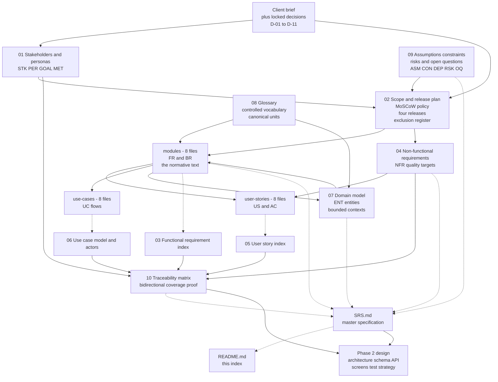

# PlantPal+ — Phase 1 Requirements Package

**One cross-platform habit engine with three domain adapters: plant care, fitness and nutrition.**

| Field | Value |
| --- | --- |
| Document | `README.md` — index and reading guide for the Phase 1 requirements package |
| Version | 1.0 |
| Date | 2026-07-21 |
| Status | Baselined for Phase 1 sign-off |
| Owner | Rakshit — Project Lead and sole developer (D-05, STK-03) |
| Parent | [`SRS.md`](./SRS.md) — the root specification. This document is the navigational index for the package and carries no normative content. |
| Identifiers minted here | **None.** Every identifier quoted below is owned by a child document and referenced by number only. |
| Governing decisions | D-01 to D-11, stakeholder sign-off dated 2026-07-21 |

---

## Table of contents

1. [What PlantPal+ is](#1-what-plantpal-is)
2. [Phase 1 status](#2-phase-1-status)
3. [Document map](#3-document-map)
4. [Where to start reading](#4-where-to-start-reading)
5. [Identifier cheat-sheet](#5-identifier-cheat-sheet)
6. [How the documents depend on each other](#6-how-the-documents-depend-on-each-other)
7. [Key decisions at a glance](#7-key-decisions-at-a-glance)
8. [Package statistics](#8-package-statistics)
9. [Feedback and change control](#9-feedback-and-change-control)

---

## 1. What PlantPal+ is

PlantPal+ is one cross-platform habit-tracking product that replaces three fragmented daily-habit applications — a plant-care app, a fitness app and a calorie tracker — with **one account, one unified daily dashboard, one notification stream, one streak system and one cloud-synchronised data set**, delivered as a React Native (Expo) mobile client and a React (Vite) web client over a single Node.js, Express and PostgreSQL REST backend, running end to end on permanently free hosting tiers. It is an academic capstone and a portfolio piece, built by one developer across a single semester at a recurring cost of 0.00 USD per month.

The product thesis is that the three domains are structurally identical as *tracked habits*. Each is an instance of the same five-step loop — **schedule, remind, log, streak, reflect** — so exactly one scheduling engine, one notification pipeline, one streak engine, one offline outbox, one day-boundary rule and one units system serve all three. Each module is an *adapter* that supplies four things to that loop: what makes an item due, what a log entry looks like, what makes a day count, and what a reflection view shows.

| Module | Value it delivers | What it contributes to the shared loop |
| --- | --- | --- |
| **Plant care** (`PLT`) | Never kill another houseplant. A seeded catalogue of approximately 60 species, a watering schedule that adapts to species, season, light, pot and climate rather than a fixed interval, and a photographic growth timeline that makes slow progress visible. | Due-date derivation from a species care profile, watering and care-task log entries, a day that counts when nothing is overdue, and per-plant adherence. |
| **Fitness** (`FIT`) | Keep moving, and be able to prove it. Workout and step logging against versioned goals, energy estimates from a published MET table, strength personal records, body-metric trends and progress charts over four windows. | Daily step and weekly workout targets, workout and step log entries, a day that counts when the daily goal is met, and progress charts. |
| **Nutrition** (`NUT`) | Eat inside a budget you can actually see. Meal logging against a seeded catalogue of approximately 300 foods with per-100 g macros, a Mifflin-St Jeor energy budget with hard safety floors, macro splits, water intake and intake trends. | Daily energy and macronutrient budgets, meal and water log entries, a day that counts when intake lands inside the target band, and weekly trends. |

> **PlantPal+ is not three apps stapled together. It is one habit engine with three domain adapters, and the unified daily dashboard is the proof of that claim.**

Everything in this package is a consequence of that sentence. The full scope statement, the problem framing and the four mechanical scope-boundary tests are in [`SRS.md` section 1.4](./SRS.md#14-product-scope).

---

## 2. Phase 1 status

**Phase 1 is requirement analysis only.** No application code exists yet, and none is specified here. The package is version **1.0**, dated **2026-07-21**, authored by Rakshit as Project Lead and sole developer (D-05), and baselined as the input to Phase 2 design.

### 2.1 What is complete

| Area | State |
| --- | --- |
| Standards basis | IEEE 830-1998 section structure, modernised with the requirement-quality rules of ISO/IEC/IEEE 29148:2018 (D-01) |
| Functional specification | 228 functional requirements and 268 business rules, fully specified across nine subsystem prefixes in eight module documents |
| Quality specification | 111 non-functional requirements across 13 categories, every one with a quantified target and a named measurement instrument |
| Agile view | 58 epics, 119 user stories, approximately 1,085 numbered acceptance criteria, 915 story points, mapped to four releases |
| Behavioural view | 89 use cases with main success scenarios, extensions, exception flows and include/extend relationships |
| Conceptual model | 50 entities across six bounded contexts, with enumeration catalogue, state machines and invariants |
| Context and feasibility | 13 stakeholders, 5 personas, 12 product goals, 24 success metrics, 28 assumptions, 28 constraints, 17 external dependencies, 20 risks and 16 open questions, each with an owner and a working assumption |
| Vocabulary | A controlled glossary of 216 domain and technical terms plus the canonical unit table |
| Diagrams | 128 Mermaid diagrams, all in the seven permitted types, all rendering natively on GitHub |
| Coverage | Every functional requirement carries a MoSCoW priority, a target release and a verification method. 216 of 228 requirements — 94.7 percent — ship at or before the v1.0 MVP gate, and every `Must` requirement is delivered by v1.0 with none deferred. |

### 2.2 What is outstanding

| Item | State | Effect |
| --- | --- | --- |
| `10-traceability-matrix.md` | Authoring in progress. It is the last artefact of the package; the link in the document map below activates on publication. | Phase 1 sign-off checkbox 8.1 of [`02-scope-and-release-plan.md`](./02-scope-and-release-plan.md#8-phase-1-exit-criteria-and-sign-off) is not yet tickable. Every trace it will consolidate is already present on the individual requirement, story and use-case entries. |
| Supervisor approval (STK-02) | Due 2026-07-26 | Phase 2 design is formally blocked until it happens. |

### 2.3 What Phase 2 will add

Phase 2 is **design**, runs from 2026-07-27 to 2026-08-09 at a budgeted 30 hours, and consumes this package as its input. Nothing below is decided here, and a Phase 2 artefact that contradicts a Phase 1 requirement is a defect in the design, not a correction to the requirement.

| Phase 2 deliverable | Phase 1 artefact it consumes |
| --- | --- |
| System architecture and monorepo package boundaries | The nine subsystem prefixes and the capability tables of [`02-scope-and-release-plan.md`](./02-scope-and-release-plan.md) |
| PostgreSQL physical schema, indexes and migrations | [`07-domain-model.md`](./07-domain-model.md) plus the volumetric ceilings |
| REST API contract and the OpenAPI 3.1 document | The functional requirements under [`modules/`](./modules/) and the `SYS` API-conventions capability |
| Screen inventory, navigation graph and component selection from the chosen UI layer | The stories under [`user-stories/`](./user-stories/) and the three-tap budget of GOAL-02 |
| Reminder engine design: tick interval, catch-up policy, advisory-lock plan | The `NOT` capability table and the timeliness target of MET-12 |
| Offline outbox and delta-sync design | The D-04 boundary and the `SYS` capability table |
| Test strategy and verification plan | The verification method recorded on every requirement |

Build work begins at v0.1 Walking Skeleton on 2026-08-10. The release calendar is v0.1 on 2026-08-30, v0.5 Alpha on 2026-10-11, v1.0 MVP on 2026-11-29 and v1.1 Post-MVP on 2026-12-27.

---

## 3. Document map

Times assume dense technical reading at roughly 200 words per minute. "Skim" means reading the metadata table, the table of contents and every summary table, which is enough to know what the document decides without reading the normative text.

### 3.1 Root documents

| File | What it contains | Read it if you are | Time |
| --- | --- | --- | --- |
| [`README.md`](./README.md) | This index, the reading paths and the package statistics | Anyone, first | 5 min |
| [`SRS.md`](./SRS.md) | The master specification. IEEE 830-1998 sections 1 to 6 plus five appendices: scope, product perspective, user classes, operating environment, every external interface, a summary of all nine subsystems, the quality model, data and legal requirements, analysis models, open issues and the traceability summary | Everyone. It is the single document that answers "what is this product" end to end | 25 min skim, 2 h full |
| [`01-stakeholders-and-personas.md`](./01-stakeholders-and-personas.md) | 13 stakeholders `STK-01` to `STK-13`, 5 personas `PER-01` to `PER-05`, 12 product goals `GOAL-01` to `GOAL-12`, 24 success metrics `MET-01` to `MET-24`, and the competitive position | Anyone asking who this is for, and how success is measured rather than asserted | 45 min |
| [`02-scope-and-release-plan.md`](./02-scope-and-release-plan.md) | The capability envelope, the 32-item exclusion register, the MoSCoW qualification tests, the four releases with dates and exit criteria, the pre-agreed cut list, the change-control policy and the Phase 1 exit criteria | Anyone asking whether a capability is in scope, when it ships, or by what rule anything may change | 40 min |
| [`03-functional-requirements.md`](./03-functional-requirements.md) | The master index of all 228 functional requirements: one line each with priority, target release and verification method, plus totals by module, priority, release and verification method, and the `Must` subset that defines the MVP | Anyone who wants the whole functional surface on a few screens before opening a module | 10 min skim, 30 min full |
| [`04-non-functional-requirements.md`](./04-non-functional-requirements.md) | All 111 `NFR` entries across 13 categories, each with a quantified target, the measurement instrument, the conditions and the reference environment | Anyone judging whether "quality" here is engineering or aspiration. The longest document in the package | 20 min skim, 90 min full |
| [`05-user-stories.md`](./05-user-stories.md) | The 58-epic catalogue, the story map, the master index of all 119 stories, the priority and points distribution, and the four release backlogs | A planner, a supervisor checking agile rigour, or a developer choosing what to build next | 25 min |
| [`06-use-case-model.md`](./06-use-case-model.md) | The closed actor catalogue — human, time, internal system and external system actors — the system context, the top-level and per-module use-case diagrams, and the include and extend relationship catalogue | Anyone who wants the behavioural view, especially the autonomous actors that act with no human present | 30 min |
| [`07-domain-model.md`](./07-domain-model.md) | 50 conceptual entities `ENT-01` to `ENT-50`, six bounded contexts, tenancy classes, entity-relationship diagrams, the enumeration catalogue, state machines, invariants and indicative data volumetrics | The engineer about to design the schema. This is the direct input to the Phase 2 physical model | 75 min |
| [`08-glossary.md`](./08-glossary.md) | 216 controlled terms — one permitted word per concept — the canonical unit table, and the list of terms deliberately avoided in user-facing copy | Everyone, as a reference. Read section 4 before writing any code that touches a physical quantity | 10 min skim, reference thereafter |
| [`09-assumptions-constraints-risks.md`](./09-assumptions-constraints-risks.md) | 28 assumptions, 28 constraints, 17 external dependencies with named fallbacks, 20 scored risks with mitigations and contingencies, and 16 open questions each with an owner, a due phase and a working assumption | Anyone asking whether this is actually buildable, and what happens when a free tier fails | 35 min |
| `10-traceability-matrix.md` | The bidirectional trace from goals through requirements to stories, use cases and verification. **Authoring in progress; the link activates on publication.** | An evaluator verifying coverage, or an engineer asking what breaks if a requirement changes | 20 min |

### 3.2 Module specifications — the normative requirement text

Eight files carry the nine subsystem prefixes. `DSH` and `SET` share one file because the dashboard and the settings hub share a data model and a preference-invalidation cascade; the two numbering sequences remain entirely separate. Each file specifies every `FR` in full — shall-statement, rationale, input validation, processing rules, outputs, alternate and error flows, and traceability — plus the `BR` invariants and formulas those requirements invoke.

| File | Prefix | Scope | FRs | BRs | Time |
| --- | --- | --- | --- | --- | --- |
| [`modules/accounts.md`](./modules/accounts.md) | `ACC` | Email-and-password identity, verified email, rotating refresh tokens, lockout, onboarding, the profile fields that drive scheduling and nutrition mathematics, session management, export and deletion | 24 | 27 | 80 min |
| [`modules/dashboard-and-settings.md`](./modules/dashboard-and-settings.md) | `DSH`, `SET` | The single-round-trip dashboard aggregate and the merged Today list, plus every user-controllable preference, module switch, accessibility preference, feature flag and legal surface | 54 | 35 | 80 min |
| [`modules/plant-care.md`](./modules/plant-care.md) | `PLT` | Species catalogue, plants and their physical context, the adaptive watering schedule, care tasks, the photographic growth log, vacation mode and per-plant adherence | 28 | 38 | 80 min |
| [`modules/fitness.md`](./modules/fitness.md) | `FIT` | Activity catalogue with MET values, workout and step logging, versioned goals, energy estimation with a stated error band, strength records, body metrics and progress charts | 26 | 32 | 70 min |
| [`modules/nutrition.md`](./modules/nutrition.md) | `NUT` | Food catalogue and search, meal logging with exact gram conversion, Mifflin-St Jeor BMR and TDEE, safety-floored targets, macro splits, water intake and intake trends | 28 | 40 | 75 min |
| [`modules/notifications.md`](./modules/notifications.md) | `NOT` | The single node-cron engine serving all three modules: reminder catalogue, quiet hours, DST-correct scheduling, Expo Push dispatch and receipts, delivery idempotency, catch-up, daily cap, grouping, deep links and the notification centre | 24 | 31 | 90 min |
| [`modules/gamification.md`](./modules/gamification.md) | `GAM` | Per-module and global streaks, the explicit streak lifecycle, bounded deterministic recomputation, the achievement catalogue, idempotent server-side unlocking, the trophy gallery and the weekly recap | 18 | 30 | 60 min |
| [`modules/platform-and-sync.md`](./modules/platform-and-sync.md) | `SYS` | The offline outbox over exactly seven actions, idempotent upsert, delta sync with tombstones, the photo media pipeline, feature-flagged integrations, API conventions, the error envelope, search, export, seeds and migrations | 26 | 35 | 75 min |

### 3.3 User stories — the acceptance criteria

Each file holds its module's epics, stories with persona, priority, release and estimate, numbered Gherkin acceptance criteria, and a Definition of Done checklist per story. `AC-n` is scoped inside its own story: `AC-3` of one story is unrelated to `AC-3` of another.

| File | Stories | Time |
| --- | --- | --- |
| [`user-stories/accounts.md`](./user-stories/accounts.md) | 13 | 35 min |
| [`user-stories/dashboard-and-settings.md`](./user-stories/dashboard-and-settings.md) | 23 | 45 min |
| [`user-stories/plant-care.md`](./user-stories/plant-care.md) | 16 | 40 min |
| [`user-stories/fitness.md`](./user-stories/fitness.md) | 15 | 40 min |
| [`user-stories/nutrition.md`](./user-stories/nutrition.md) | 16 | 35 min |
| [`user-stories/notifications.md`](./user-stories/notifications.md) | 13 | 35 min |
| [`user-stories/gamification.md`](./user-stories/gamification.md) | 11 | 30 min |
| [`user-stories/platform-and-sync.md`](./user-stories/platform-and-sync.md) | 12 | 35 min |

### 3.4 Use cases — the flows

Each file holds its module's use-case diagram in the package idiom, then every use case with preconditions, trigger, main success scenario, extensions, exception flows and postconditions.

| File | Use cases | Time |
| --- | --- | --- |
| [`use-cases/accounts.md`](./use-cases/accounts.md) | 11 | 35 min |
| [`use-cases/dashboard-and-settings.md`](./use-cases/dashboard-and-settings.md) | 13 | 35 min |
| [`use-cases/plant-care.md`](./use-cases/plant-care.md) | 12 | 45 min |
| [`use-cases/fitness.md`](./use-cases/fitness.md) | 11 | 40 min |
| [`use-cases/nutrition.md`](./use-cases/nutrition.md) | 12 | 50 min |
| [`use-cases/notifications.md`](./use-cases/notifications.md) | 11 | 50 min |
| [`use-cases/gamification.md`](./use-cases/gamification.md) | 9 | 35 min |
| [`use-cases/platform-and-sync.md`](./use-cases/platform-and-sync.md) | 10 | 35 min |

---

## 4. Where to start reading

Nobody should read this package in file order. Pick the path that matches why you are here.

### 4.1 Evaluator with thirty minutes

The goal is to judge rigour, completeness and traceability without reading normative text.

| # | Read | Minutes | What you are checking |
| --- | --- | --- | --- |
| 1 | [`SRS.md` section 1.4 — Product scope](./SRS.md#14-product-scope) | 6 | Is the boundary stated as a mechanical test rather than a wish list? Note the four disqualifying tests and the 32 recorded exclusions. |
| 2 | [`SRS.md` section 2.2 — Product functions](./SRS.md#22-product-functions) | 4 | The whole product on one screen: nine subsystems, 228 requirements, 268 rules, 89 use cases, 119 stories, and the `Must` share per module. |
| 3 | [`03-functional-requirements.md` section 2 — Requirement statistics](./03-functional-requirements.md) | 5 | Priority, release and verification-method distributions. Confirm every requirement carries all three, and that no `Must` is deferred past v1.0. |
| 4 | [`04-non-functional-requirements.md` section 2 — Quality-attribute overview](./04-non-functional-requirements.md) | 4 | 13 categories, 111 requirements, each with a named measurement instrument. Then open any two entries at random and check they are numbers, not adjectives. |
| 5 | Any one story in [`user-stories/accounts.md`](./user-stories/accounts.md) | 5 | Gherkin criteria specific enough to fail. `US-ACC-01` asserts a byte-identical response body between two paths, which is the standard the package holds itself to. |
| 6 | [`09-assumptions-constraints-risks.md`](./09-assumptions-constraints-risks.md), risk and open-question registers | 6 | Is feasibility argued or assumed? Every open question carries an owner, a due phase and a working assumption to proceed on. |

If you have longer, continue with `10-traceability-matrix.md`, then one complete module specification of your choosing — [`modules/notifications.md`](./modules/notifications.md) is the hardest engineering problem in the package and the fairest test of depth.

### 4.2 Developer about to implement

Read once, then per subsystem. Do not read the whole package before writing code.

**Read once, before anything:**

1. [`SRS.md` sections 2.4 and 2.5](./SRS.md#24-operating-environment) — the operating environment and the design constraints. One instance, 0.1 vCPU, 512 MB RAM, a 15-minute sleep timer and a 750-hour monthly budget shape every decision you are about to make.
2. [`SRS.md` section 3](./SRS.md#3-external-interface-requirements) — every interface across the system boundary, including the REST envelope, the error catalogue shape and the pagination model.
3. [`08-glossary.md` section 4](./08-glossary.md) — the canonical unit table. Everything is stored in metric SI; imperial exists only at the presentation boundary.
4. [`07-domain-model.md` sections 2 and 3](./07-domain-model.md) — the six bounded contexts and the entity catalogue. The rule that the three habit contexts never reference one another is the rule that makes per-module enablement cheap.
5. [`02-scope-and-release-plan.md` section 5](./02-scope-and-release-plan.md) — the four releases and their exit criteria, so you build in the order that leaves a demoable slice each time.

**Then, per subsystem, in this order:**

| # | Open | For |
| --- | --- | --- |
| 1 | The module file under [`modules/`](./modules/) | The normative shall-statements, the business rules, every formula and threshold written out in full, and the error flows |
| 2 | The matching file under [`user-stories/`](./user-stories/) | The acceptance criteria you must make pass, and the Definition of Done checklist that gates the pull request |
| 3 | The matching file under [`use-cases/`](./use-cases/) | The main success scenario, the extensions and the exception flows, including the autonomous system actors |
| 4 | [`04-non-functional-requirements.md`](./04-non-functional-requirements.md) | The latency, payload, accessibility and security budgets that bind that subsystem specifically |
| 5 | [`07-domain-model.md`](./07-domain-model.md), the relevant context | The entities, enumerations and state machines you are persisting |

Three rules that will save you a rewrite. **The server is always the source of truth**, and every day boundary is evaluated in the account's IANA timezone, never in UTC and never against a device clock. **Only the seven append-only logging actions may be queued offline**, each carrying a client-generated UUID idempotency key — there is deliberately no merge algorithm to implement. **Every external integration must be switchable off**, and the full acceptance suite must pass with all of them disabled.

### 4.3 Recruiter with five minutes

| # | Read | Minutes | Why |
| --- | --- | --- | --- |
| 1 | Section 1 of this page, above | 1 | What the product is, and the one-sentence argument for why it is one product rather than three. |
| 2 | [`SRS.md` section 1.4.3 — The insight that justifies one product](./SRS.md#14-product-scope) | 2 | The five-step loop table and the engine-plus-adapters claim. This is the engineering judgement the whole package rests on. |
| 3 | [`SRS.md` section 2.1.2 — System context diagram](./SRS.md#21-product-perspective) | 1 | One diagram: two clients, one backend, one contract, and every external service with the two optional ones drawn dotted. |
| 4 | [Section 8 of this page — Package statistics](#8-package-statistics) | 1 | The scale and rigour of the analysis, counted rather than claimed. |

If one thing is worth an extra two minutes, make it [`SRS.md` section 1.4.6](./SRS.md#14-product-scope) — the nine most consequential exclusions and why each one is refused. Deciding what not to build, and writing down why, is the part of the job that is hardest to fake.

---

## 5. Identifier cheat-sheet

Identifiers are **globally unique and permanently stable**. A number is never reused and never renumbered; a withdrawn item is marked withdrawn and keeps its number. Numbers are two digits, zero-padded, starting at `01`, contiguous with no gaps inside a prefix.

| Format | Class | Example | Owned by |
| --- | --- | --- | --- |
| `FR-<PREFIX>-nn` | Functional requirement — one testable capability | `FR-PLT-04` | The eight files under [`modules/`](./modules/) |
| `BR-<PREFIX>-nn` | Business rule — an invariant, formula, enumeration or threshold | `BR-NUT-12` | The eight files under [`modules/`](./modules/) |
| `NFR-<CAT>-nn` | Non-functional requirement — one quantified quality target | `NFR-PERF-03` | [`04-non-functional-requirements.md`](./04-non-functional-requirements.md) |
| `US-<PREFIX>-nn` | User story | `US-FIT-05` | The eight files under [`user-stories/`](./user-stories/) |
| `AC-n` | Acceptance criterion — **scoped inside its own story** | `AC-3` | The owning story |
| `UC-<PREFIX>-nn` | Use case | `UC-NOT-02` | The eight files under [`use-cases/`](./use-cases/) |
| `ENT-nn` | Conceptual entity | `ENT-17` | [`07-domain-model.md`](./07-domain-model.md) |
| `STK-nn` `PER-nn` `GOAL-nn` `MET-nn` | Stakeholder, persona, product goal, success metric | `PER-04` | [`01-stakeholders-and-personas.md`](./01-stakeholders-and-personas.md) |
| `ASM-nn` `CON-nn` `DEP-nn` `RSK-nn` `OQ-nn` | Assumption, constraint, external dependency, risk, open question | `RSK-01` | [`09-assumptions-constraints-risks.md`](./09-assumptions-constraints-risks.md) |
| `D-nn` | Locked stakeholder decision dated 2026-07-21 | `D-04` | The client brief, restated in [`02-scope-and-release-plan.md`](./02-scope-and-release-plan.md) |
| `EPIC-<PREFIX>-nn` | **Local delivery-grouping label only.** Mints nothing, appears in no register, referenced by no requirement | `EPIC-PLT-03` | The owning story document |

**Subsystem prefixes — a closed set of nine, never extended.**

| Prefix | Subsystem |
| --- | --- |
| `ACC` | Accounts, authentication and profile |
| `DSH` | Unified daily dashboard |
| `SET` | Settings and preferences |
| `PLT` | Plant care |
| `FIT` | Fitness |
| `NUT` | Nutrition and calories |
| `NOT` | Notifications and reminder engine |
| `GAM` | Streaks and achievements |
| `SYS` | Cross-cutting platform: offline, sync, media, integrations, search, export |

**Non-functional categories — a closed set of thirteen.** `PERF` performance, `SCAL` capacity and scalability, `RELI` reliability, `SEC` security, `PRIV` privacy, `USAB` usability, `A11Y` accessibility, `MAIN` maintainability, `PORT` portability, `OBSV` observability, `DATA` data quality and integrity, `I18N` internationalisation readiness, `LEGL` legal and compliance.

**Closed value sets.** Priority is one of `Must`, `Should`, `Could`, `Wont`. Target release is one of `v0.1` Walking Skeleton, `v0.5` Alpha, `v1.0` MVP, `v1.1+` Post-MVP. Verification method is one of `Test`, `Demonstration`, `Inspection`, `Analysis`. Priority and release are independent dimensions and neither implies the other.

---

## 6. How the documents depend on each other

Solid arrows mean "is an input to". Dotted arrows mean "indexes or summarises, and mints nothing of its own". Read the diagram top to bottom: context establishes need, scope decides what is built, the module specifications say exactly what, and the traceability matrix proves the chain closes.

**Authority order when two documents disagree.** Whether a capability exists at all and in which release: [`02-scope-and-release-plan.md`](./02-scope-and-release-plan.md). What a requirement says and what its priority is: the owning module file under [`modules/`](./modules/). The quantified value of a quality target: [`04-non-functional-requirements.md`](./04-non-functional-requirements.md). What a term means and what unit it is stored in: [`08-glossary.md`](./08-glossary.md). Which entity holds the data: [`07-domain-model.md`](./07-domain-model.md). Anything else, and the consolidated view: [`SRS.md`](./SRS.md). Any disagreement found during review is a blocking finding, not a matter of interpretation.

---

## 7. Key decisions at a glance

Eleven decisions were signed off on 2026-07-21. They are **inputs** to this package, not conclusions drawn from it, and no document may reopen one.

| ID | Decision | Rationale in one line |
| --- | --- | --- |
| **D-01** | Academic capstone and portfolio piece. IEEE 830-1998 structure with ISO/IEC/IEEE 29148:2018 quality rules. Legal and privacy at good-practice depth — privacy policy, terms, not-medical-advice disclaimer, GDPR-style export and delete. No DPIA, no monetisation. | The package is graded on rigour and traceability, so the standard is chosen up front rather than reverse-engineered; a full DPIA and a payments surface would consume budget that buys no marks and no portfolio value. |
| **D-02** | All three modules ship in v1.0. Every requirement carries a MoSCoW priority **and** a target release from `v0.1`, `v0.5`, `v1.0`, `v1.1+`. Every release leaves a demoable slice. | The consolidation claim is falsified if only one module ships, and two independent axes let scope be cut by priority without silently moving a delivery date. |
| **D-03** | Curated catalogues seeded into PostgreSQL are canonical — approximately 60 plant species, approximately 300 foods. Open Food Facts and Perenual are optional, feature-flagged and cached locally. The product is fully functional with every integration disabled. | A third-party outage, a quota change or a rate limit must never be able to break a demo or a release gate, so no external service is ever on the critical path. |
| **D-04** | Offline-light. Cached reads everywhere; only the seven append-only log actions are queueable; every queued write carries a UUID idempotency key plus a client timestamp; the server upserts by that key and is always the source of truth; clients delta-sync by `updated_at` cursor plus tombstones. | Append-only events are conflict-free by construction, so there is deliberately no merge algorithm, no CRDT and no last-write-wins rule to specify — the single largest complexity saving in the project. |
| **D-05** | Document version 1.0, dated 2026-07-21, authored by Rakshit, Project Lead and sole developer. | One author and one owner means no ambiguity about who approves a change and no coordination cost to model in the plan. |
| **D-06** | Permanently free tiers only. A requirement that needs a paid plan is invalid, not merely expensive. | A student project that stops working when a trial expires is not a portfolio piece; the constraint is enforced as a validity test on every requirement rather than as an aspiration. |
| **D-07** | Wellness tracker, not a medical device. Not-medical-advice disclaimer, hard safety floors on calorie goals, and no eating-disorder-adjacent features. | Clinical framing creates a regulatory obligation the project cannot meet, and comparative ranking of intake or body mass causes real harm — so leaderboards are refused permanently, not deferred. |
| **D-08** | English only in v1.0, but the codebase is i18n-ready: no hard-coded user-facing string outside a locale catalogue. | Retrofitting localisation touches every screen, whereas enforcing a catalogue from day one costs almost nothing and makes a second locale a data change. |
| **D-09** | Both metric and imperial, user-selectable, with every value stored canonically in metric SI. | Storing what the user typed makes every aggregate, chart and export ambiguous; converting only at the presentation boundary means a unit-preference change writes no domain row. |
| **D-10** | Mobile push via Expo Push is a `Must` for v1.0. Web v1.0 gets in-app due-reminder surfaces plus an optional email digest as a `Should`. Web Push via service worker and VAPID is a `Could` deferred to v1.1. | Expo Push is free and already in the fixed stack, while Web Push needs VAPID key management and a service worker for a platform where the user is already looking at the screen. |
| **D-11** | Email and password with 15-minute JWT access tokens and 30-day rotating refresh tokens is the `Must`. Google and Apple OAuth is a `Should` for v1.1. | Owning the identity flow end to end is the part that demonstrates security engineering; OAuth adds provider consoles and an Apple developer account, which D-06 forbids. |

---

## 8. Package statistics

Every count below was produced by pattern-matching the actual files in this folder on 2026-07-21, not estimated. Identifier counts are of **unique** identifiers matching their format across the owning documents; diagram counts are of fenced `mermaid` blocks; acceptance-criteria counts are of numbered `AC-n` criterion headings across the four criterion notations used in the story documents.

### 8.1 Headline

| Measure | Count |
| --- | --- |
| Markdown documents | 35 present of 36 planned — `10-traceability-matrix.md` outstanding |
| Total lines of Markdown | 61,135 |
| Total words | approximately 848,600 |
| Functional requirements `FR` | **228** |
| Business rules `BR` | **268** |
| Non-functional requirements `NFR` | **111** |
| User stories `US` | **119**, grouped into 58 epics, worth 915 story points |
| Acceptance criteria `AC` | approximately **1,085** |
| Use cases `UC` | **89** |
| Conceptual entities `ENT` | **50** |
| Mermaid diagrams | **128** |

### 8.2 Requirements, rules, stories and use cases by subsystem

| Prefix | FR | BR | US | UC |
| --- | --- | --- | --- | --- |
| `ACC` | 24 | 27 | 13 | 11 |
| `DSH` | 24 | 17 | 8 | 5 |
| `SET` | 30 | 18 | 15 | 8 |
| `PLT` | 28 | 38 | 16 | 12 |
| `FIT` | 26 | 32 | 15 | 11 |
| `NUT` | 28 | 40 | 16 | 12 |
| `NOT` | 24 | 31 | 13 | 11 |
| `GAM` | 18 | 30 | 11 | 9 |
| `SYS` | 26 | 35 | 12 | 10 |
| **Total** | **228** | **268** | **119** | **89** |

### 8.3 Functional requirements by priority, release and verification method

| Priority | Count | Share |
| --- | --- | --- |
| `Must` | 162 | 71.1 percent |
| `Should` | 61 | 26.8 percent |
| `Could` | 4 | 1.8 percent |
| `Wont` | 1 | 0.4 percent |

| Target release | Introduced | Cumulative |
| --- | --- | --- |
| `v0.1` Walking Skeleton | 17 | 17 |
| `v0.1` and `v0.5` split — `FR-NOT-02` | 1 | 18 |
| `v0.5` Alpha | 84 | 102 |
| `v1.0` MVP | 114 | 216 |
| `v1.1` Post-MVP | 12 | 228 |

216 of 228 requirements — 94.7 percent — are delivered by v1.0, and every `Must` requirement is delivered by v1.0 with none deferred.

| Verification method | Count | Share |
| --- | --- | --- |
| Test | 187 | 82.0 percent |
| Demonstration | 28 | 12.3 percent |
| Inspection | 9 | 3.9 percent |
| Test plus Inspection | 2 | 0.9 percent |
| Demonstration plus Test | 2 | 0.9 percent |

### 8.4 Non-functional requirements by category

| Category | Count | Category | Count |
| --- | --- | --- | --- |
| `SEC` Security | 15 | `MAIN` Maintainability | 9 |
| `PERF` Performance | 11 | `SCAL` Capacity and scalability | 8 |
| `A11Y` Accessibility | 10 | `RELI` Reliability | 8 |
| `PRIV` Privacy | 9 | `USAB` Usability | 8 |
| `DATA` Data quality | 9 | `OBSV` Observability | 7 |
| `PORT` Portability | 6 | `LEGL` Legal and compliance | 6 |
| `I18N` Internationalisation | 5 | **Total** | **111** |

105 of the 111 are `Must`; the six `Should` entries are engineering-quality and documentation targets that affect no user-visible correctness or safety.

### 8.5 Diagrams by type

| Mermaid type | Count | Principally used for |
| --- | --- | --- |
| `flowchart` | 72 | System context, use-case diagrams in the package idiom, decomposition trees, decision logic |
| `sequenceDiagram` | 28 | Interaction flows across client, API, scheduler, database and external services |
| `stateDiagram-v2` | 16 | Entity lifecycles: account status, reminder occurrence, outbox item, plant health, release gates |
| `erDiagram` | 10 | Entity relationships per bounded context |
| `gantt` | 1 | The release timeline |
| `journey` | 1 | The end-to-end user journey |
| **Total** | **128** | — |

All 128 are in the seven permitted types and obey the label-safety rules, so every one renders natively on GitHub in both light and dark themes.

### 8.6 Context and feasibility registers

| Register | Count | Register | Count |
| --- | --- | --- | --- |
| Stakeholders `STK` | 13 | Assumptions `ASM` | 28 |
| Personas `PER` | 5 | Constraints `CON` | 28 |
| Product goals `GOAL` | 12 | External dependencies `DEP` | 17 |
| Success metrics `MET` | 24 | Risks `RSK` | 20 |
| Conceptual entities `ENT` | 50 | Open questions `OQ` | 16 |
| Glossary terms | 216 | Recorded exclusions | 32 |

---

## 9. Feedback and change control

### 9.1 How to give feedback

| You are | Raise it as | Include |
| --- | --- | --- |
| The supervisor or examiner (STK-02, STK-04) | A comment against the Phase 1 sign-off checklist in [`02-scope-and-release-plan.md` section 8](./02-scope-and-release-plan.md#8-phase-1-exit-criteria-and-sign-off) | The checkbox you believe is not satisfied, and the identifier or file that fails it |
| A technical reviewer or engineer (STK-06, STK-13) | A repository issue | The exact identifier — `FR-PLT-04`, `NFR-SEC-11`, `US-NUT-07` — the file, and what you would expect instead |
| An accessibility reviewer (STK-10) | A repository issue tagged accessibility | The `NFR-A11Y` entry or the persona `PER-04` story affected, and the assistive technology used |
| A pilot tester (STK-05) | Plain prose, no identifier needed | What you were trying to do, what happened, and on which device |

**What makes a finding actionable.** Name one identifier, state the defect as a difference between what the document says and what it should say, and say which of the four categories it falls into: a **contradiction** between two documents, a **gap** where something required is absent, an **ambiguity** where two readings are both defensible, or an **unverifiable** requirement whose stated method cannot actually decide pass or fail. A finding that names no identifier cannot be traced and cannot be closed.

Contradictions between documents are resolved by the authority order in [section 6](#6-how-the-documents-depend-on-each-other), and any contradiction found during review is a **blocking finding**, not a matter of interpretation.

### 9.2 Change control after baseline

From Phase 1 sign-off on **2026-07-26**, nothing in this package changes without a dated entry in the change-control log defined in [`02-scope-and-release-plan.md` section 4.11](./02-scope-and-release-plan.md#411-change-control-after-phase-1-sign-off).

**A change-log entry is required** for anything that adds a requirement, changes a MoSCoW priority, changes a target release, or alters a stated threshold, formula or enumeration. Each entry records six things: the before and after text, why it changed, which identifiers are affected, the estimated effort delta in hours, what is being dropped to pay for it, and the resulting position against the 270-hour v1.0 effort budget.

> **No new capability enters the project without something of equal estimated effort leaving it.**

This is a hard rule, not a guideline. It converts every "just one more thing" from a schedule decision into a trade decision made in the open, which is the only schedule-protection mechanism available to a solo developer.

**Identifiers are immutable after baseline.** A withdrawn requirement is marked withdrawn and keeps its number. A number is never reused and never renumbered, because renumbering silently invalidates every row of the traceability matrix — which is why it is forbidden outright rather than discouraged.

**No change-log entry is needed** for correcting a typographical error, fixing a broken relative link, clarifying wording that does not alter meaning, or adding a worked example. Everything else needs one.

**If the schedule slips**, scope is not renegotiated ad hoc: the pre-agreed cut list in [`02-scope-and-release-plan.md` section 4.12](./02-scope-and-release-plan.md#412-the-pre-agreed-cut-list) is applied strictly in order, each cut is recorded as a change-log entry, and a cut item is re-targeted to v1.1 rather than deleted — its identifier, text and traces untouched, with only its target release changing.

**Review points.** Phase 1 sign-off on 2026-07-26, then at each release gate: 2026-08-30, 2026-10-11, 2026-11-29 and 2026-12-27.

---

## Document control

| Field | Value |
| --- | --- |
| Document | `README.md` — index and reading guide for the Phase 1 requirements package |
| Version | 1.0 |
| Date | 2026-07-21 |
| Status | Baselined for Phase 1 sign-off |
| Author and owner | Rakshit — Project Lead and sole developer (D-05, STK-03) |
| Parent | [`SRS.md`](./SRS.md) |
| Next review | Phase 1 sign-off, 2026-07-26 |
| Change control | From 2026-07-26, per [`02-scope-and-release-plan.md` section 4.11](./02-scope-and-release-plan.md#411-change-control-after-phase-1-sign-off) |
| Identifiers minted here | None |
| Statistics basis | Counts in [section 8](#8-package-statistics) were derived by pattern-matching the files in this folder on 2026-07-21 |
