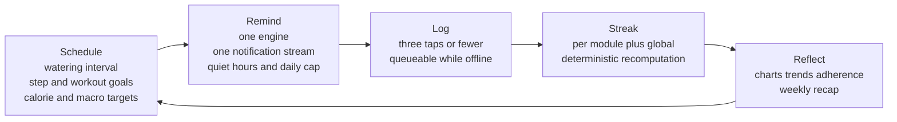
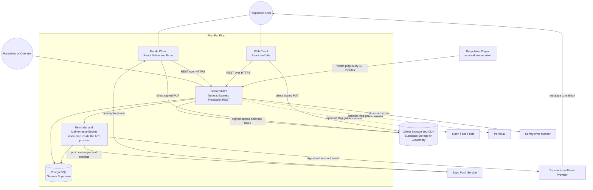
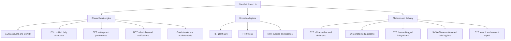
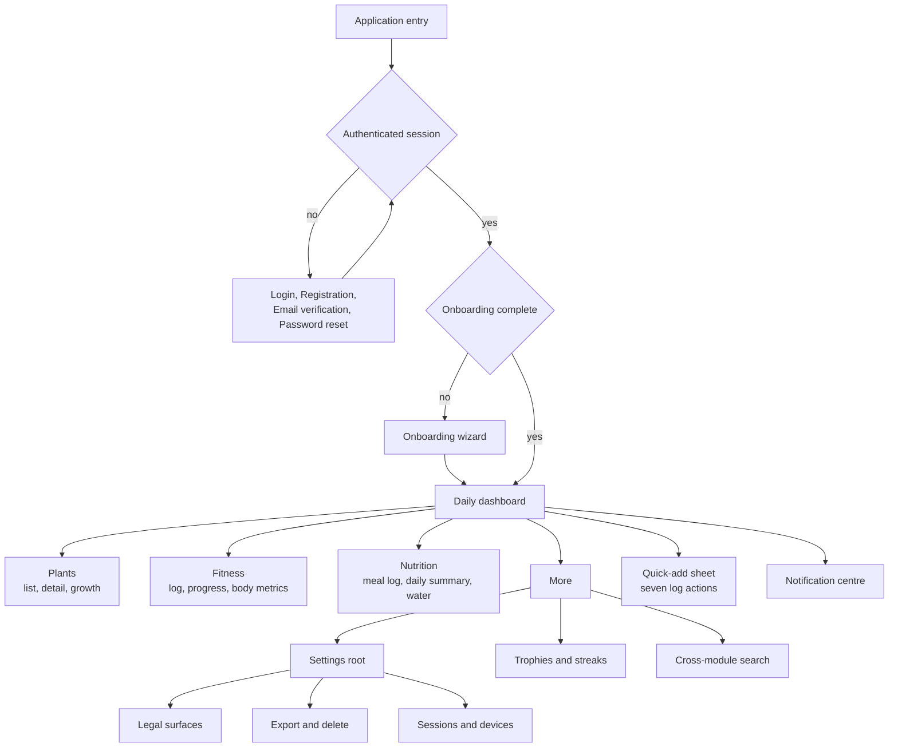
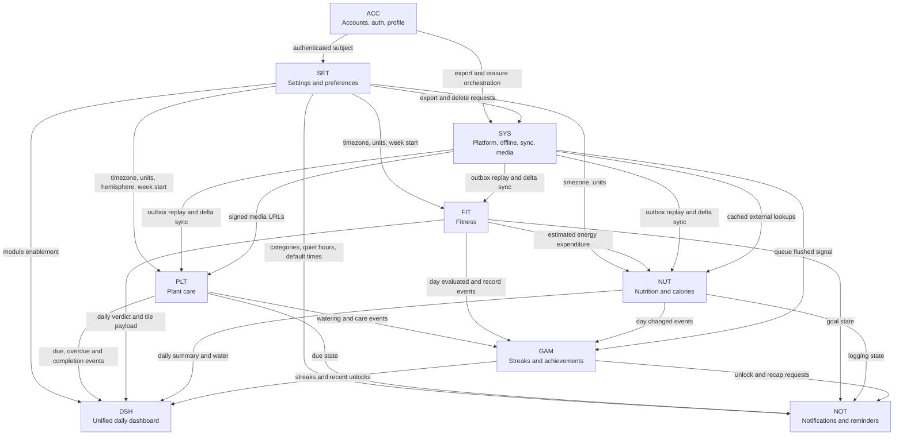
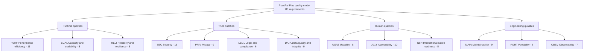
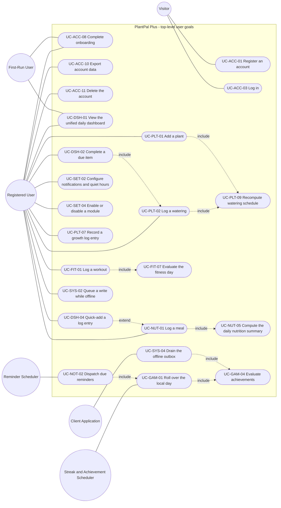
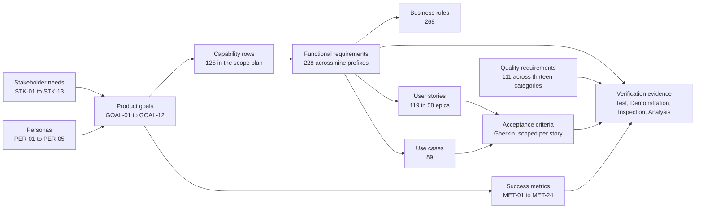

# PlantPal+ — Software Requirements Specification

**One cross-platform habit engine with three domain adapters: plant care, fitness and nutrition.**

| Field | Value |
| --- | --- |
| Document | `SRS.md` — PlantPal+ Software Requirements Specification |
| Version | 1.0 |
| Date | 2026-07-21 |
| Status | Baselined for Phase 1 sign-off |
| Owner | Rakshit — Project Lead and sole developer (D-05) |
| Parent | None. This is the root document of the Phase 1 requirements package. Every other document in [`docs/requirements/`](./) is a child of this one. |
| Standards basis | IEEE 830-1998 section structure, modernised with the requirement-quality rules of ISO/IEC/IEEE 29148:2018 |
| Scope of the product | PlantPal+ v1.0 MVP, all three habit modules, mobile and web clients, one REST backend |
| Identifiers minted here | **None.** This document indexes and summarises; every `FR`, `BR`, `NFR`, `US`, `UC`, `ENT`, `STK`, `PER`, `GOAL`, `MET`, `ASM`, `CON`, `DEP`, `RSK` and `OQ` identifier is owned by a child document and referenced here by number only. |
| Governing decisions | D-01 to D-11, stakeholder sign-off dated 2026-07-21 |

---

## Revision history

| Version | Date | Author | Status | Summary of change |
| --- | --- | --- | --- | --- |
| 0.1 | 2026-07-21 | Rakshit — Project Lead and sole developer | Draft | Initial draft of the IEEE 830-1998 skeleton. Sections 1 and 2 populated from the client brief and the eleven locked decisions D-01 to D-11. Sections 3 to 6 present as headings with placeholder content. No requirement identifiers minted. |
| 1.0 | 2026-07-21 | Rakshit — Project Lead and sole developer | Baselined | Complete specification. All nine subsystems summarised in section 4 against 228 functional requirements and 268 business rules held in the eight module specifications. Section 5 summarises 111 non-functional requirements across 13 categories. External interfaces, analysis models, open issues and the traceability summary added. Baseline for Phase 2 design. |

**Change control after baseline.** From Phase 1 sign-off on 2026-07-26, no content in this document or in any child document changes without a dated entry in the change-control log defined in [`02-scope-and-release-plan.md`](./02-scope-and-release-plan.md), section 4.11. Identifiers are immutable: a withdrawn item is marked withdrawn and keeps its number, because renumbering silently invalidates every row of [`10-traceability-matrix.md`](./10-traceability-matrix.md).

---

## Approval

| Role | Stakeholder | Identifier | Approval basis | Date |
| --- | --- | --- | --- | --- |
| Author and Project Lead | Rakshit | STK-03 | Authored and self-reviewed against the Phase 1 exit criteria of [`02-scope-and-release-plan.md`](./02-scope-and-release-plan.md), section 8 | 2026-07-21 |
| Project supervisor and academic evaluator | Supervisor of record | STK-02 | Phase 1 sign-off checklist: IEEE 830-1998 structure present, ISO/IEC/IEEE 29148:2018 quality rules applied, every requirement uniquely identified, quantified, verifiable and traced | Due 2026-07-26 |
| External examiner or second marker | Examiner of record | STK-04 | Reads the baselined package without a live demonstration. Approval is recorded at academic submission on 2026-12-18 | Due 2026-12-18 |
| Academic integrity and IT policy office | Institutional office | STK-11 | Confirms the repository-visibility position of OQ-10 and the tester-consent position of ASM-22 | Due 2026-07-26 |

Signature blocks are held in the physical sign-off record. This table states who must approve, on what basis and by when; it does not assert that an approval already exists.

---

## Table of contents

1. [Introduction](#1-introduction)
   - [1.1 Purpose](#11-purpose)
   - [1.2 Document conventions](#12-document-conventions)
   - [1.3 Intended audience and reading suggestions](#13-intended-audience-and-reading-suggestions)
   - [1.4 Product scope](#14-product-scope)
   - [1.5 References](#15-references)
2. [Overall description](#2-overall-description)
   - [2.1 Product perspective](#21-product-perspective)
   - [2.2 Product functions](#22-product-functions)
   - [2.3 User classes and characteristics](#23-user-classes-and-characteristics)
   - [2.4 Operating environment](#24-operating-environment)
   - [2.5 Design and implementation constraints](#25-design-and-implementation-constraints)
   - [2.6 User documentation](#26-user-documentation)
   - [2.7 Assumptions and dependencies](#27-assumptions-and-dependencies)
3. [External interface requirements](#3-external-interface-requirements)
   - [3.1 User interfaces](#31-user-interfaces)
   - [3.2 Hardware interfaces](#32-hardware-interfaces)
   - [3.3 Software interfaces](#33-software-interfaces)
   - [3.4 Communications interfaces](#34-communications-interfaces)
4. [System features](#4-system-features)
   - [4.0 How to read this section](#40-how-to-read-this-section)
   - [4.1 ACC — Accounts, authentication and profile](#41-acc--accounts-authentication-and-profile)
   - [4.2 DSH — Unified daily dashboard](#42-dsh--unified-daily-dashboard)
   - [4.3 SET — Settings and preferences](#43-set--settings-and-preferences)
   - [4.4 PLT — Plant care](#44-plt--plant-care)
   - [4.5 FIT — Fitness](#45-fit--fitness)
   - [4.6 NUT — Nutrition and calories](#46-nut--nutrition-and-calories)
   - [4.7 NOT — Notifications and reminder engine](#47-not--notifications-and-reminder-engine)
   - [4.8 GAM — Streaks and achievements](#48-gam--streaks-and-achievements)
   - [4.9 SYS — Cross-cutting platform](#49-sys--cross-cutting-platform)
   - [4.10 Feature interaction summary](#410-feature-interaction-summary)
5. [Non-functional requirements](#5-non-functional-requirements)
   - [5.1 How quality is governed](#51-how-quality-is-governed)
   - [5.2 Reference measurement environment](#52-reference-measurement-environment)
   - [5.3 Category summaries and headline targets](#53-category-summaries-and-headline-targets)
   - [5.4 The ten numbers that define quality in this product](#54-the-ten-numbers-that-define-quality-in-this-product)
6. [Other requirements](#6-other-requirements)
   - [6.1 Data requirements](#61-data-requirements)
   - [6.2 Legal and compliance requirements](#62-legal-and-compliance-requirements)
   - [6.3 Internationalisation requirements](#63-internationalisation-requirements)
   - [6.4 The not-medical-advice position](#64-the-not-medical-advice-position)
- [Appendix A. Glossary reference](#appendix-a-glossary-reference)
- [Appendix B. Analysis models](#appendix-b-analysis-models)
- [Appendix C. Open issues](#appendix-c-open-issues)
- [Appendix D. Traceability summary](#appendix-d-traceability-summary)
- [Appendix E. Document conventions and identifier scheme](#appendix-e-document-conventions-and-identifier-scheme)

---

## 1. Introduction

### 1.1 Purpose

This document specifies the complete software requirements for **PlantPal+ version 1.0**, a cross-platform daily-habit tracker that consolidates plant care, fitness and calorie tracking into one product with one account, one dashboard, one notification stream and one streak system.

It performs six jobs, and it is the only document in the package that performs all six at once.

| # | Job | Where it is discharged |
| --- | --- | --- |
| 1 | Fix the system boundary: what PlantPal+ is, what it talks to, and what it will never be | [Section 1.4](#14-product-scope), [section 2.1](#21-product-perspective) |
| 2 | State the operating envelope: users, devices, hosting, budget, and the constraints those impose | [Sections 2.3 to 2.5](#23-user-classes-and-characteristics) |
| 3 | Specify every interface across the system boundary, from screens to the REST envelope | [Section 3](#3-external-interface-requirements) |
| 4 | Summarise every system feature and route the reader to its normative specification | [Section 4](#4-system-features) |
| 5 | State how well the system must behave, in numbers that can be measured | [Section 5](#5-non-functional-requirements) |
| 6 | Prove that the requirement set is complete, consistent, traceable and feasible | [Appendices C and D](#appendix-c-open-issues) |

**The scope of this document is the whole product, not a release.** Where a capability is deferred, the deferral is stated with its target release rather than silently omitted; 216 of the 228 functional requirements — 94.7 percent — ship at or before the v1.0 MVP gate on 2026-11-29, and the remaining 12 are planned into v1.1 Post-MVP.

**This document links rather than duplicates.** It is deliberately not the longest document in the package. The normative text of a functional requirement — its shall-statement, rationale, input validation table, processing rules, outputs, alternate and error flows, and traceability block — lives in one of the eight module specifications under [`modules/`](./modules/). Where this document and a module specification disagree about a detail, **the module specification wins** and the discrepancy is a defect to be raised against this document. Where they disagree about whether a capability exists at all, [`02-scope-and-release-plan.md`](./02-scope-and-release-plan.md) wins.

The exception to the linking rule is deliberate: sections 2, 3 and 5 are written to be **self-contained**, because an external examiner (STK-04) or a technical reviewer (STK-06) may read only this document, and neither should have to open eight files to learn what the product runs on, what it talks to and how fast it must be.

### 1.2 Document conventions

The full identifier scheme, the requirement-writing rules and the diagram conventions are specified once, in [Appendix E](#appendix-e-document-conventions-and-identifier-scheme). The five conventions a reader needs immediately are these.

| # | Convention | Statement |
| --- | --- | --- |
| 1 | **The mandatory requirement form** | Every functional requirement is written as a single sentence beginning "The system shall …". The words *should*, *may*, *might* and *could* never appear inside a requirement statement; they carry MoSCoW meaning only in the Priority column. |
| 2 | **Goals versus requirements** | A product goal is written "The product shall …" and states a business outcome. A requirement is written "The system shall …" and states a testable system behaviour. `GOAL-nn` identifiers are aspirational targets with a verification method; `FR-` and `NFR-` identifiers are contractual. |
| 3 | **Quantification** | No requirement anywhere in the package uses *fast*, *easy*, *user-friendly*, *efficient*, *robust*, *appropriate*, *as needed* or any equivalent. Every threshold is a number with a unit, every set is an explicit enumeration, and every formula is written out in full. |
| 4 | **A day is a local date** | Every day boundary, streak evaluation, daily goal, daily aggregate and reminder time is evaluated as midnight-to-midnight in the account's stored IANA timezone, never in UTC. Instants are stored in UTC; the derived `local_date` is written at insert time and is immutable thereafter. |
| 5 | **Canonical units** | Every physical quantity is stored in metric SI. Imperial exists only at the presentation boundary. A unit-preference change writes no domain row. |

Typographic conventions: `FR-PLT-04` and other identifiers appear in code style; **bold** marks a normative statement inside otherwise explanatory prose; a blockquote marks a definitional statement that other documents depend on verbatim. Tables are GitHub-Flavored Markdown pipe tables throughout. All diagrams are Mermaid, in one of the seven permitted diagram types, because GitHub renders Mermaid natively and a diagram that does not render is not a diagram.

### 1.3 Intended audience and reading suggestions

Five audiences read this package, and none of them should read it in file order. The table below is the routing table; the ordering inside each row is a recommendation, not a partition.

| # | Audience | Stakeholder | What they are trying to decide | Read in this order | Time budget |
| --- | --- | --- | --- | --- | --- |
| 1 | **Academic evaluator / supervisor** | STK-02 | Is this rigorous, standards-conformant, complete and traceable? | This document sections 1, 2, 4, 5 → [`10-traceability-matrix.md`](./10-traceability-matrix.md) → [`03-functional-requirements.md`](./03-functional-requirements.md) sections 2 and 4 → [`04-non-functional-requirements.md`](./04-non-functional-requirements.md) section 2 → [`09-assumptions-constraints-risks.md`](./09-assumptions-constraints-risks.md) → one module specification of their choosing, in full | 2 to 3 hours |
| 2 | **External examiner / second marker** | STK-04 | Can I assess this from the documents alone, with no demonstration? | [`README.md`](./README.md) → this document end to end → [`01-stakeholders-and-personas.md`](./01-stakeholders-and-personas.md) sections 2, 8 and 9 → [`02-scope-and-release-plan.md`](./02-scope-and-release-plan.md) sections 1 to 3 → [Appendix D](#appendix-d-traceability-summary) | 1 to 2 hours |
| 3 | **Phase 3 implementing engineer** | STK-03, STK-13 | What exactly do I build, in what order, and how will it be judged done? | This document sections 2.4, 2.5, 3 and 4 → [`02-scope-and-release-plan.md`](./02-scope-and-release-plan.md) section 5 → the module specification for the subsystem in hand, in full → its file under [`user-stories/`](./user-stories/) for acceptance criteria → its file under [`use-cases/`](./use-cases/) for the flows → [`07-domain-model.md`](./07-domain-model.md) for the entities → [`04-non-functional-requirements.md`](./04-non-functional-requirements.md) for the budgets that bind that subsystem | Per subsystem, 45 to 90 minutes |
| 4 | **Prospective employer / technical reviewer** | STK-06 | Can this person engineer, and can they communicate? | This document sections 1.4, 2.1, 2.5 and 4 → [Appendix B](#appendix-b-analysis-models) → [`01-stakeholders-and-personas.md`](./01-stakeholders-and-personas.md) section 2 → [`09-assumptions-constraints-risks.md`](./09-assumptions-constraints-risks.md) sections 4 and 7 | 15 minutes |
| 5 | **Accessibility reviewer** | STK-10 | Is accessibility engineered in, or bolted on and asserted? | This document sections 3.1 and 5.3 → [`04-non-functional-requirements.md`](./04-non-functional-requirements.md) section 9, all ten A11Y requirements → PER-04 in [`01-stakeholders-and-personas.md`](./01-stakeholders-and-personas.md) → the PER-04 stories in every file under [`user-stories/`](./user-stories/) | 45 minutes |

**One shortcut for every audience.** If you have five minutes and one question — *what is this product and why is it one product rather than three?* — read [section 1.4](#14-product-scope) and the diagram in [section 2.1](#21-product-perspective). Everything else in the package is the consequence of those two.

### 1.4 Product scope

#### 1.4.1 The scope statement

> **PlantPal+ is one cross-platform habit-tracking product that replaces three fragmented daily-habit applications — a plant-care app, a fitness app and a calorie tracker — with one user account, one unified daily dashboard, one notification stream, one streak system and one cloud-synchronised data set, delivered as a React Native (Expo) mobile client and a React (Vite) web client over a single Node.js, Express and PostgreSQL REST backend, running end to end on permanently free hosting tiers.**

#### 1.4.2 The problem

A person who wants to look after their houseplants, stay physically active and eat within a calorie budget today runs three applications. That means three accounts, three passwords, three notification streams competing for one attention budget, three visual languages, three definitions of "today" and three unrelated streak counters. Nothing in any one of them knows that the user already did something useful in the other two. The user pays the cognitive cost of the fragmentation and receives none of the benefit of the correlation.

The fragmentation is an **adherence problem**, not merely an inconvenience. Habit formation depends on a short, predictable, low-friction loop; splitting one daily loop across three applications multiplies the friction by three at exactly the moment the user is least motivated. Three further failures compound it, and each is observable in the surveyed market: scheduling that is not genuinely domain-aware, the capabilities that remove the most friction sitting behind a subscription, and edge-case correctness — day boundaries, daylight saving, half-hour offsets — treated as optional.

#### 1.4.3 The insight that justifies one product

Plant care, fitness and nutrition are superficially unrelated domains. As **tracked habits** they are structurally identical: each is an instance of the same five-step loop.

| Loop step | Plant care | Fitness | Nutrition |
| --- | --- | --- | --- |
| **Schedule** | Next watering date from species, season, light, pot and climate | Daily step target and weekly workout or active-minute target | Daily energy and macronutrient budget from BMR and TDEE |
| **Remind** | Watering due, care task due, critically overdue | Workout reminder, step-goal-at-risk nudge | Meal-logging reminder, water-intake nudge |
| **Log** | Log a watering, a care task, a growth entry | Log a workout, log steps | Log a meal, log water intake |
| **Streak** | A day counts when nothing is overdue | A day counts when the daily goal is met | A day counts when the day is logged inside the target band |
| **Reflect** | Watering history, adherence percentage, photo timeline | Progress charts, personal records | Weekly and monthly intake trends |

Because the loop is identical, exactly **one** scheduling engine, **one** notification pipeline, **one** streak and achievement engine, **one** offline outbox, **one** day-boundary rule, **one** units system and **one** dashboard serve all three domains. Each module is an *adapter* supplying four things to that loop: what makes an item due, what a log entry looks like, what makes a day count, and what a reflection view shows. Nothing else is duplicated per module.



> **PlantPal+ is not three apps stapled together. It is one habit engine with three domain adapters, and the unified daily dashboard is the proof of that claim.**

This is simultaneously the engineering argument and the product argument. Engineering: the shared engine is written once and amortised across three domains, so the marginal cost of the second and third module is far below the cost of the first — the only reason one developer with 360 hours can attempt three modules at all. Product: one login, one notification budget, one streak, one place to look in the morning.

#### 1.4.4 The scope boundary, stated as a mechanical test

> **A capability belongs in PlantPal+ if it is either a step of the shared loop, or the domain-specific adapter data that a step of the loop needs. A capability that is neither is out of scope, however attractive it is.**

Four disqualifying tests are applied to every capability, requirement and change request. Failing any one is fatal.

| # | Test | Statement | Source |
| --- | --- | --- | --- |
| 1 | The loop test | The capability is a step of the shared habit loop, or the adapter data one of those steps needs | Section 1.4.3 |
| 2 | The Minimum Usable Product test | Removing every Should, Could and Wont still leaves a coherent, shippable, usable product | D-02 |
| 3 | The free-tier validity test | The capability is deliverable and operable at a recurring cost of 0.00 USD per month | D-06, CON-01, GOAL-09 |
| 4 | The integration-independence test | With every external integration flag off, the capability still works — or the capability *is* the integration and its absence degrades nothing else | D-03 |

A social feed fails test 1. GPS route tracking fails test 1. Meal-photo recognition fails tests 1 and 3. A fourth adapter — sleep, mood, medication — would *pass* test 1 and is excluded purely on effort grounds, which is why it is recorded as a v2.0 deferral rather than a permanent non-goal.

#### 1.4.5 In scope for v1.0

Nine subsystems constitute the product. Each owns one three-letter identifier prefix and one authoritative module specification.

| Prefix | Subsystem | One-sentence scope | Module specification |
| --- | --- | --- | --- |
| `ACC` | Accounts, authentication and profile | Email-and-password identity with verified email, rotating refresh tokens, an onboarding wizard, the profile fields that drive scheduling and nutrition mathematics, data export and account deletion | [`modules/accounts.md`](./modules/accounts.md) |
| `DSH` | Unified daily dashboard | One screen merging every due item and every module summary for a chosen local date into a single prioritised list served by one aggregate response | [`modules/dashboard-and-settings.md`](./modules/dashboard-and-settings.md) |
| `SET` | Settings and preferences | Every user-controllable preference, every module switch, every accessibility preference, every feature flag and every legal surface | [`modules/dashboard-and-settings.md`](./modules/dashboard-and-settings.md) |
| `PLT` | Plant care | A seeded species catalogue, plants with their physical context, an adaptive watering schedule, care tasks, a photographic growth log and per-plant adherence | [`modules/plant-care.md`](./modules/plant-care.md) |
| `FIT` | Fitness | Workout logging, manual step logging, versioned goals, estimated energy expenditure, strength records, body metrics and progress charts | [`modules/fitness.md`](./modules/fitness.md) |
| `NUT` | Nutrition and calories | Meal logging against a seeded food catalogue, BMR and TDEE derivation, safety-floored calorie and macro targets, water intake and intake trends | [`modules/nutrition.md`](./modules/nutrition.md) |
| `NOT` | Notifications and reminder engine | One node-cron scheduling engine serving all three modules, with quiet hours, a daily cap, grouping, catch-up, deep links, Expo Push delivery and an in-app notification centre | [`modules/notifications.md`](./modules/notifications.md) |
| `GAM` | Streaks and achievements | Per-module and global streaks with deterministic recomputation, a seeded achievement catalogue, idempotent server-side unlocking, a trophy gallery and a weekly recap | [`modules/gamification.md`](./modules/gamification.md) |
| `SYS` | Cross-cutting platform | The offline outbox, idempotent writes, delta sync, the photo media pipeline, feature-flagged integrations, cross-module search, account export, seed data and migrations | [`modules/platform-and-sync.md`](./modules/platform-and-sync.md) |

All three domain modules ship in v1.0. This is decision **D-02** and is not negotiable by any later document.

#### 1.4.6 Out of scope, and why it matters that this is written down

Thirty-two capabilities are recorded as explicit exclusions in [`02-scope-and-release-plan.md`](./02-scope-and-release-plan.md), section 3.2, each with a reason and a possible future release drawn from the closed set `v1.1`, `v1.2`, `v2.0`, `Never`, `Not planned`. The nine most consequential are summarised here so that a reader of this document alone cannot mistake an omission for an oversight.

| Excluded | Reason | Horizon |
| --- | --- | --- |
| Social feed, friend lists, public profiles | Moderation, abuse reporting and blocking would alone exceed the remaining budget, and it contradicts storing sensitive body-mass data with no sharing surface | v2.0 |
| Leaderboards and friend comparison | Comparative ranking of calorie intake or body mass is eating-disorder-adjacent under D-07 | **Never** |
| Wearables, HealthKit, Google Fit, background step counting | Unavailable in the Expo managed workflow without a development build and paid entitlements. Manual step entry is the v1.0 Must | v1.2 |
| Meal-photo recognition, plant-disease diagnosis, plant identification from a photo | All require a paid vision API, invalid under CON-01. A confidently wrong diagnosis is also worse than none | v2.0 / v1.2 |
| Multi-user households, shared plants, care delegation | Would require relaxing the single security invariant that a user reads and writes only their own data, touching every endpoint | v2.0 |
| Offline photo upload and an offline photo-capture queue | D-04 limits the outbox to seven small, text-only, append-only actions. This is the single most requested addition and is deliberately refused | v1.2 |
| Full offline-first CRUD with conflict resolution, CRDTs or last-write-wins merge | D-04 forbids it. Queued events are append-only and therefore conflict-free by construction, so there is no merge algorithm to specify | **Never** |
| Medical or clinical features, and any eating-disorder-adjacent feature | D-07. Anything reading as clinical advice creates a regulatory obligation the project cannot meet | **Never** |
| An in-application administrator role, user impersonation, or cross-account data access | The single security invariant of the backend. There is deliberately no Administrator actor | **Never** |

#### 1.4.7 Project context and success

PlantPal+ is an **academic capstone and a portfolio piece** (D-01), delivered by one developer working approximately 15 hours per week across 24 weeks — about 360 hours, of which roughly 270 precede the v1.0 feature freeze — at a recurring cost of 0.00 USD per month (D-06, CON-01). Twelve product goals `GOAL-01` to `GOAL-12` and twenty-four success metrics `MET-01` to `MET-24` are specified in [`01-stakeholders-and-personas.md`](./01-stakeholders-and-personas.md), section 8. The four that define the product thesis, and would falsify it if missed, are these.

| Claim | Falsified if | Metric |
| --- | --- | --- |
| Consolidation is what users actually want | Fewer than 60 percent of activated accounts enable 2 or more modules | MET-08 |
| A cross-module streak is a real motivator, not a gimmick | Median longest global streak is below 5 days | MET-13 |
| Domain-aware scheduling beats fixed intervals | Median per-plant watering adherence is below 75 percent | MET-14 |
| Friction is the binding constraint on adherence | Any of the seven logging actions cannot be reached in 3 taps or completed in a median of 10 seconds | MET-15 |

### 1.5 References

#### 1.5.1 Standards and external references

| # | Reference | Use in this package |
| --- | --- | --- |
| R-01 | IEEE Std 830-1998, *IEEE Recommended Practice for Software Requirements Specifications* | Fixes the section structure of this document, mandated by D-01 and CON-19 |
| R-02 | ISO/IEC/IEEE 29148:2018, *Systems and software engineering — Life cycle processes — Requirements engineering* | Fixes the requirement-quality rules: single-shall form, verifiability, unambiguity, the closed verification-method set, and the stakeholder-identification activity of clause 6.2 |
| R-03 | ISO/IEC 25010:2011, *Systems and software Quality Requirements and Evaluation — Quality models* | Supplies the quality-attribute vocabulary organising the thirteen non-functional categories |
| R-04 | W3C Web Content Accessibility Guidelines (WCAG) 2.1, Level AA | The accessibility conformance target of NFR-A11Y-01 |
| R-05 | OWASP Application Security Verification Standard 4.0.3, Level 1 | The security self-assessment target of NFR-SEC-01, replacing a third-party penetration test the project cannot fund |
| R-06 | OWASP Top 10 (2021) and OWASP Mobile Top 10 | The mitigation-mapping obligation of NFR-SEC-02 |
| R-07 | IANA Time Zone Database, consumed through a maintained date library | The authority for every day boundary, DST transition and reminder time. DEP-14 |
| R-08 | RFC 9110 *HTTP Semantics*, RFC 8259 *JSON*, RFC 3339 / ISO 8601 date-time formats | The REST, envelope and timestamp conventions of section 3.4 |
| R-09 | RFC 7519 *JSON Web Token*, RFC 6749 *OAuth 2.0* refresh-token semantics | The token model of D-11 and NFR-SEC-04 |
| R-10 | Open Database License (ODbL) 1.0 | The attribution obligation attaching to Open Food Facts data, DEP-07 and NFR-LEGL-04 |
| R-11 | Regulation (EU) 2016/679 (GDPR), articles 15, 17 and 20 | The good-practice depth of the export and erasure obligations fixed by D-01. **No formal Data Protection Impact Assessment is in scope** |
| R-12 | Mifflin, M. D. et al. (1990), *A new predictive equation for resting energy expenditure in healthy individuals* | The BMR formula used by `NUT`. Cited because the arithmetic must be auditable, not because the product offers clinical guidance |
| R-13 | Ainsworth, B. E. et al., *Compendium of Physical Activities* | The provenance of the MET values in the seeded activity catalogue used by `FIT` |
| R-14 | Cockburn, A. (2000), *Writing Effective Use Cases*, and UML 2.5 `include` / `extend` semantics | The use-case levels and relationship semantics of [`06-use-case-model.md`](./06-use-case-model.md) |
| R-15 | Expo SDK documentation, React Native, React, Vite, Express, PostgreSQL and node-cron official documentation | The fixed technology stack of CON-03. Version pinning is recorded per RSK-17 |

#### 1.5.2 Documents in this package

Every path below is relative to `docs/requirements/` and resolves both in the repository and on GitHub.

| Document | Owns | Read it for |
| --- | --- | --- |
| [`README.md`](./README.md) | Nothing | The index and reading guide for the whole package |
| **`SRS.md`** (this document) | Nothing | The consolidated specification and the routing table |
| [`01-stakeholders-and-personas.md`](./01-stakeholders-and-personas.md) | `STK`, `PER`, `GOAL`, `MET` | Who the product is for, who can block it, what success means in numbers, and the competitive position |
| [`02-scope-and-release-plan.md`](./02-scope-and-release-plan.md) | The capability envelope, the MoSCoW policy, the four releases, the exclusion register | Whether a capability is in scope at all, when it ships, and by what rule anything may change |
| [`03-functional-requirements.md`](./03-functional-requirements.md) | Nothing — it is an index | A one-line summary of all 228 functional requirements with priority, release and verification method |
| [`04-non-functional-requirements.md`](./04-non-functional-requirements.md) | `NFR` | All 111 quality requirements with quantified targets, measurement instruments and conditions |
| [`05-user-stories.md`](./05-user-stories.md) | Nothing — it is an index | The 58 epics and 119 stories, the story map and the release backlogs |
| [`06-use-case-model.md`](./06-use-case-model.md) | Nothing — it is an index | The actor catalogue, the system context and all 89 use-case diagrams |
| [`07-domain-model.md`](./07-domain-model.md) | `ENT` | The 50 conceptual entities, six bounded contexts, tenancy classes and entity-relationship diagrams |
| [`08-glossary.md`](./08-glossary.md) | The controlled vocabulary | The one permitted term per concept, the canonical unit table and the prohibited-vocabulary list |
| [`09-assumptions-constraints-risks.md`](./09-assumptions-constraints-risks.md) | `ASM`, `CON`, `DEP`, `RSK`, `OQ` | The feasibility evidence: what is believed, what is imposed, what could fail and what is still undecided |
| [`10-traceability-matrix.md`](./10-traceability-matrix.md) | Nothing — it is a matrix | The bidirectional trace from goals through requirements to stories, use cases and verification |
| [`modules/`](./modules/) — 8 files | `FR`, `BR` | The normative specification of every functional requirement and business rule |
| [`user-stories/`](./user-stories/) — 8 files | `US` | Every story with its Gherkin acceptance criteria and Definition of Done |
| [`use-cases/`](./use-cases/) — 8 files | `UC` | Every use case with its main success scenario, extensions and exception flows |

---

## 2. Overall description

### 2.1 Product perspective

#### 2.1.1 Origin and standing
PlantPal+ is a **new, self-contained product**. It is not a component of a larger system, it replaces no existing system of the author's, and it inherits no legacy data. It has exactly one runtime dependency class it does not own — the free-tier services enumerated in `DEP-01` to `DEP-17` — and every one of those carries a named fallback, because the free-tier envelope is the defining constraint of the project rather than an incidental one.

Two structural claims define the perspective, and everything in sections 3 to 6 follows from them.

> **Claim 1 — one backend, two clients, one contract.** The mobile and web clients consume one identical REST contract described by one OpenAPI 3.1 document. No endpoint is scoped to a platform, no server-side branch inspects a client-type header, and at least 90 percent of tagged business-logic lines live in the shared monorepo package (NFR-PORT-04, NFR-PORT-05).
>
> **Claim 2 — one process.** The Express API and the node-cron reminder engine run in a single always-on instance, because the free hosting plan funds approximately 750 instance-hours per month across the whole account and a 31-day month contains 744 hours (CON-06). This is not a simplification; it is a hard limit that shapes rate limiting, locking, scheduling and the deployment model, and it forbids a second replica in v1.0 (CON-24, ASM-24).

#### 2.1.2 System context

Everything inside the `PP` boundary is built by this project. Everything outside it is a human, a device capability, a clock or a third-party service. The two dotted edges are the only optional ones: both are flag-gated, default to off, and the product must pass its full acceptance suite with both disabled (D-03).



**Five reading notes, each of which is load-bearing.**

1. **Both clients talk only to the backend, with two exceptions.** Photo bytes travel directly from the device to object storage using a single-use signed URL issued by the backend, and push notifications reach the device from Expo. No client ever calls Open Food Facts or Perenual directly, so the feature flag, the request budget, the identifying `User-Agent` header, the circuit breaker and the cache are enforced in exactly one place.
2. **The reminder engine is not a separate service.** It is a set of node-cron entries inside the single Express process. Its punctuality therefore depends on the Keep-Alive Pinger, which is the mitigation for CON-05 and the discharge of RSK-01 — the joint-highest-scoring risk on the project.
3. **The database is the single authoritative clock.** Every day boundary and every scheduled instant is resolved server-side against the account's IANA timezone, never against a device clock the user can change.
4. **Sentry and the email provider are one-way.** Sentry receives structured errors that never carry a password, a token, a notification title or a notification body (NFR-OBSV-07). The email provider receives account messages and the optional digest.
5. **There is no administrative surface inside the boundary.** The Maintainer/Operator edge reaches the hosting, database and monitoring consoles and the server-side feature-flag registry — never a user's data through the product.

#### 2.1.3 Logical structure: one engine, three adapters, six contexts

The nine subsystems group into three architectural layers, and the fifty conceptual entities group into six bounded contexts. The single most important structural rule is that **the three habit contexts never reference one another**: every cross-module interaction is mediated by the Engagement context (reminders, streaks, achievements) or the Platform context (media, sync, flags, the dashboard read model). That rule is what makes per-module enablement a first-class case rather than a degraded one, with no conditional logic scattered through the schema.



#### 2.1.4 What the product deliberately has no interface to

Recording the absent interfaces prevents them being assumed. PlantPal+ has **no** interface to: a wearable device or health platform; a payment processor; an advertising or analytics network; a social network; a map or geolocation service; a machine-vision service; a message broker, shared cache or distributed lock service (CON-27); or a second instance of itself (CON-24).

### 2.2 Product functions

The table below is the complete function summary at capability level. It answers "what does this product do" in one screen. Counts are of functional requirements as indexed in [`03-functional-requirements.md`](./03-functional-requirements.md); business-rule counts are of the invariants and formulas those requirements invoke, specified in the module documents.

| Prefix | Principal functions | FRs | BRs | UCs | Stories | Must share |
| --- | --- | --- | --- | --- | --- | --- |
| `ACC` | Register, verify email, authenticate, rotate and revoke tokens, lock out with backoff, reset and change password, hold profile and preferences, onboard, list and revoke sessions, export the account, delete the account, enforce server-side ownership on every read and write | 24 | 27 | 11 | 13 | 83.3% |
| `DSH` | Compose the whole dashboard in one aggregate response, assemble and deterministically order the merged Today list, group watering items, execute inline primary actions, render module summary cards with progress rings and text alternatives, surface recent unlocks, quick-add, navigate to past dates with a read-only matrix, resolve the day boundary including DST, adapt to all seven module subsets, render empty and offline states, carry the web due-reminder surface | 24 | 17 | 5 | 8 | 79.2% |
| `SET` | Edit every profile field with its downstream effect stated before confirmation, switch unit system, set timezone and hemisphere, enable and disable modules, configure notification categories, quiet hours and do-not-disturb, choose theme, set accessibility preferences, toggle integration feature flags, present every legal surface, expose export and deletion entry points, language placeholder, About | 30 | 18 | 8 | 15 | 66.7% |
| `PLT` | Seeded species catalogue and custom species, add and edit plants with their physical context, compute the adaptive watering schedule, log a watering, back-date a watering, snooze and skip, classify overdue severity, derive health status, schedule and log non-watering care tasks, growth log with photos, photo timeline and comparison, growth chart, vacation mode, bulk watering, archive and delete, search filter and sort the plant list, per-species care tips, watering history and adherence, optional Perenual enrichment | 28 | 38 | 12 | 16 | 50.0% |
| `FIT` | Seeded activity catalogue with MET values, log a workout, custom activity types, estimate energy expenditure with a stated error band, strength workouts with sets reps and weight plus personal records, manual step entry, versioned goals, progress charts over four windows, body metrics with a moving average, rest days, workout templates, copy-yesterday, optional foreground pedometer read | 26 | 32 | 11 | 15 | 65.4% |
| `NUT` | Seeded food catalogue, log a meal against a meal type, food search across catalogue custom and recents, serving units with exact gram conversion, custom foods, favourites and recents, Mifflin-St Jeor BMR and TDEE, calorie target with hard safety floors, macro targets from preset or custom splits, the daily remaining view, water intake with presets and a body-mass-derived goal, intake trends, the default-off workout-calorie toggle, optional Open Food Facts lookup, recipes, micronutrients | 28 | 40 | 12 | 16 | 53.6% |
| `NOT` | One node-cron scheduling engine, the complete reminder-type catalogue, per-category preferences and default times, quiet hours across midnight and global do-not-disturb, UTC storage with IANA evaluation and DST correctness, Expo Push registration dispatch and receipt reconciliation, delivery idempotency enforced by a database constraint, bounded catch-up with a staleness cut-off, a daily cap and same-category grouping, deep links, the in-app notification centre, a test notification, the web email digest | 24 | 31 | 11 | 13 | 79.2% |
| `GAM` | Per-module streaks and one global streak counting only enabled modules, explicit streak lifecycle rules for advance, break, module disablement and timezone change, bounded deterministic retroactive recomputation, the seeded achievement catalogue, server-side idempotent unlocking, achievement progress, the trophy gallery with a non-animated path, the weekly recap, a capped streak-freeze mechanism reported separately | 18 | 30 | 9 | 11 | 88.9% |
| `SYS` | Persistent client read cache, the offline write outbox over exactly seven actions, idempotent server upsert, drain ordering and retry classification, visible sync state, offline-blocked guardrails, delta sync by cursor plus tombstones, full resync, client and server image transform with EXIF stripping, signed upload URLs and variants, media quota and orphan cleanup, the feature-flag registry, integration call policy with caching and circuit breaking, provenance and attribution, API conventions and request identity, the uniform error envelope, keyset pagination, rate and size limits, data-hygiene invariants, cross-module search, asynchronous account export, health readiness and keep-alive, migrations and deterministic seeds | 26 | 35 | 10 | 12 | 84.6% |
| — | **Total** | **228** | **268** | **89** | **119** | **71.1%** |

**Two observations an evaluator should expect to see justified.**

1. **The three user-facing habit modules carry the lowest Must share** — `PLT` 50.0 percent, `NUT` 53.6 percent, `FIT` 65.4 percent. This is intentional. D-02 requires all three to ship in v1.0, but each module's v1.0 obligation is its *core logging loop*, not its full feature surface. Comfort features such as before-and-after comparison, recipes and workout templates are correctly Should or Could.
2. **The infrastructure prefixes carry the highest Must share** — `GAM` 88.9 percent, `SYS` 84.6 percent, `ACC` 83.3 percent. Infrastructure is close to indivisible: a partially implemented offline outbox or a partially implemented streak rule is a correctness defect, not a reduced feature set.

**Release distribution.** 17 functional requirements are introduced at v0.1 Walking Skeleton, 84 at v0.5 Alpha, 114 at v1.0 MVP and 12 at v1.1 Post-MVP, with one requirement (`FR-NOT-02`) split across v0.1 and v0.5. Every Must requirement is delivered by v1.0 with none deferred — the arithmetic proof that the MVP definition is complete.

### 2.3 User classes and characteristics

#### 2.3.1 The user-class table

A **user class** is distinguished by frequency of use, technical expertise, privilege level or the subset of the product it touches — never by demographics. Seven classes exist. Full persona detail for PER-01 to PER-05 is in [`01-stakeholders-and-personas.md`](./01-stakeholders-and-personas.md), section 5.

| User class | Frequency of use | Technical expertise | Privilege level | Modules typically enabled | Represented by |
| --- | --- | --- | --- | --- | --- |
| Unauthenticated visitor | Once per account lifetime, plus password recovery | Any | None. Reaches only registration, login, password reset, email verification, privacy policy, terms and the not-medical-advice disclaimer | None | Every persona before onboarding |
| Registered User, multi-module daily user | 2 to 6 sessions per day | Medium to high | Full read and write on their own data only, enforced server-side on every endpoint | All three | PER-01 Aditi Sharma, PER-05 Sofia Lindqvist |
| Registered User, single-module user | 1 to 3 sessions per day, or 1 to 2 per week for a plant-only user | Any | As above | One | PER-02 Marcus Oyelaran |
| Registered User, assistive-technology user | 1 to 3 sessions per day | Low to medium for apps, high with their own assistive technology | As above | One or two | PER-04 Harold "Hal" Whitfield |
| Registered User, low-end device on a metered connection | 1 to 4 sessions per day, frequently offline | Medium | As above | Two, rising to three | PER-05 Sofia Lindqvist |
| Developer and operator | Ad hoc | Expert | Operational access to hosting, database and monitoring consoles only. **No in-application administrative role exists and no user-impersonation capability is built** | Not applicable | STK-03 |
| Pilot tester | Daily for 30 days | Mixed | Identical to a Registered User in every respect | Mixed, at least one | STK-05 |

#### 2.3.2 The authorisation invariant

There is deliberately **no administrator user class inside the application**, and this single fact shapes the whole backend.

1. Seed catalogues — approximately 60 plant species, approximately 300 foods, approximately 40 activity types, approximately 30 achievement definitions — are managed by versioned, reviewed, deterministic migration and seed scripts in the repository. No CRUD administration interface exists, because it would be pure cost with no user-facing value.
2. **No capability exists, under any circumstance, for one account to read or write another account's data.** This is why multi-user households and shared plants are out of scope. It is verified at the v1.0 gate by a cross-account authorisation suite that asserts HTTP 404 for every user-owned endpoint given a foreign identifier (NFR-SEC-14). RSK-06 is the risk if it is violated.
3. The Project Lead as operator acts *outside* the application. Operational console access is not an in-application privilege and confers no ability to view a user's data through the product.

| Capability surface | Unauthenticated visitor | Registered User | Operator, outside the application |
| --- | --- | --- | --- |
| Registration, login, password reset, email verification | Yes | Not applicable once authenticated | No |
| Privacy policy, terms, not-medical-advice disclaimer, open-source licences | Yes | Yes | Yes |
| Own dashboard, plants, workouts, meals, photos | No | Yes, read and write | No |
| Another user's data of any kind | No | **No — architecturally impossible** | **No** |
| Seeded species, food, activity and achievement catalogues | No | Yes, read only | Write, through reviewed migration scripts only |
| Own account export and own account deletion | No | Yes | No |
| Hosting, database and monitoring consoles; server-side feature flags | No | No | Yes |

#### 2.3.3 The device and environment envelope the classes imply

Each persona exists to pin one axis of this envelope, so that the test matrix is derived from users rather than from convenience.

| Axis | Range that must be supported | Pinned by |
| --- | --- | --- |
| Mobile operating system | iOS 15.1 or later, Android API level 26 (Android 8) or later | PER-02 on iOS 17, PER-05 on Android 11 |
| Device capability | From a three-year-old budget Android phone with 3 GB of RAM upward | PER-05 |
| Connectivity | From frequently offline on a metered connection, through patchy campus Wi-Fi, to stable broadband | PER-05, PER-01 |
| Timezone | UTC+00:00 with DST, UTC+05:30 with no DST, UTC+12:00 or UTC+13:00 with DST, and a quarter-hour offset in the test matrix | PER-02, PER-01, PER-03 |
| Hemisphere | `NORTHERN`, `SOUTHERN` and `EQUATORIAL` as first-class values | PER-03 pins `SOUTHERN` |
| Units | Metric and imperial simultaneously within one account, since storage is canonical metric SI | PER-02, PER-03, PER-04 |
| Assistive technology | Up to 200 percent text scale, VoiceOver, TalkBack, NVDA, full keyboard navigation on web, reduce-motion honoured | PER-04 |
| Module count | One, two or three enabled modules. At least one module is always enabled, enforced by a database `CHECK` constraint | PER-02 one, PER-03 and PER-04 two, PER-01 three |
| Client | Expo mobile and Vite web, consuming one identical REST contract | PER-01 uses both daily |

### 2.4 Operating environment

#### 2.4.1 Mobile client

| Property | Value |
| --- | --- |
| Framework | React Native under the **Expo managed workflow**, TypeScript, from the monorepo |
| Operating-system floor | iOS 15.1 or later; Android API level 26 (Android 8.0) or later. NFR-PORT-01 |
| Reference devices | REF-PHONE-A: Google Pixel 6a class, 6 GB RAM, Android 13, release build. REF-PHONE-I: iPhone 11 or newer, iOS 16, release build. A substitution is disclosed in the evidence pack, never used to relax a threshold |
| Verification environments | At least one physical device and one emulator or simulator per platform — four environments in total — with zero launch failures across three consecutive cold launches in each |
| Local persistence | MMKV for the persisted TanStack Query cache and the offline outbox; the OS keystore for the refresh token. Access tokens live in process memory only (NFR-SEC-15) |
| Distribution | Expo Go on a physical iOS device, and an internally distributed Android build produced by Expo EAS or locally. **TestFlight and App Store publication are out of scope under CON-10**, because both require a paid developer account |
| Notification transport | Expo Push (D-10) |
| Device capabilities used | Camera for growth photos and, on mobile only, barcode decoding; optional foreground pedometer read behind a flag defaulting to off |
| Cold-start budget | p95 at most 3,000 ms to interactive with a warm persisted cache; at most 5,000 ms with no cache (NFR-PERF-05) |

#### 2.4.2 Web client

| Property | Value |
| --- | --- |
| Framework | React with Vite, TypeScript, from the same monorepo and the same shared package |
| Browser matrix | Six supported rows, each at the last two major versions: Chrome, Edge, Firefox, Safari on macOS, Safari on iOS and Chrome on Android. ES2020 output baseline. A browser below the baseline receives exactly one static notice page and zero partially rendered application screens (NFR-PORT-02) |
| Viewport range | 320 to 2560 CSS pixels with zero horizontal page scroll. Breakpoints 320, 640, 768, 1024, 1280 and 1536. The dashboard renders one column below 768 px, two columns from 768 to 1279 px and three columns at 1280 px and above (NFR-PORT-03, BR-DSH-15) |
| Local persistence | IndexedDB for the persisted query cache and, where available, the outbox. The refresh token is an `HttpOnly; Secure; SameSite=Strict` cookie; the access token is held in memory only |
| Performance budget | First Contentful Paint at most 1,800 ms, Largest Contentful Paint at most 2,500 ms, Time To Interactive at most 3,500 ms, Cumulative Layout Shift at most 0.10, Interaction to Next Paint at most 200 ms, initial JavaScript transfer at most 250 KB gzipped (NFR-PERF-06) |
| Notification transport in v1.0 | **None.** Web receives an always-visible in-app due-reminder surface plus an optional daily email digest. Web Push via service worker and VAPID is a Could deferred to v1.1 (D-10, CON-22) |
| Hosting | Vercel or Netlify free tier, non-commercial use, approximately 100 GB monthly bandwidth (CON-09) |

#### 2.4.3 Backend

| Property | Value |
| --- | --- |
| Runtime | Node.js 20, Express, TypeScript, compiled from the monorepo |
| Deployment | One free web service on Render or Railway, over HTTPS, **exactly one instance** (ASM-24, CON-24) |
| Instance size | Approximately 0.1 vCPU and 512 MB RAM — the REF-API-WARM reference |
| Instance-hour budget | Approximately 750 hours per month across the whole account, against 744 hours in a 31-day month. Only one service may be kept permanently awake (CON-06) |
| Sleep behaviour | The instance spins down after approximately 15 minutes without traffic and takes roughly 30 to 60 seconds to cold-start (CON-05). An external free monitor pings `GET /healthz` every 10 minutes; the observed cold-start rate must stay at or below 1.0 percent of sessions between 05:00 and 23:59 local time (NFR-PERF-04) |
| Scheduling | node-cron entries **inside the same process**: the reminder planner, the dispatcher, the receipt reconciler, the nightly retention pass, the `GAM` rollover worker at UTC minutes 2, 17, 32 and 47, the `PLT` nightly recompute, and the `SYS` maintenance jobs. Each holds a distinct PostgreSQL advisory lock |
| Coordination model | Single-instance by construction. In-process token buckets for rate limiting, an in-memory drain mutex per client, PostgreSQL advisory locks for migrations and housekeeping. No shared cache, message broker or distributed lock service exists, because none has an adequate permanently free tier (CON-27) |
| Connection pool | Maximum 10 connections, 5,000 ms acquisition timeout, 30,000 ms idle timeout. On exhaustion the API returns HTTP 503 with `Retry-After: 5` and code `SERVICE_BUSY`. The reminder engine may consume at most 3 of the 10 (CON-25, NFR-RELI-08) |
| Availability target | At least 99.0 percent per calendar month, excluding announced maintenance of at most 2 hours per month notified 24 hours in advance. This permits approximately 7 hours 18 minutes of unplanned downtime in a 30-day month, and it is stated honestly rather than aspirationally because CON-26 forbids failover (NFR-RELI-01) |

#### 2.4.4 Database and object storage

| Property | Value |
| --- | --- |
| Database | PostgreSQL on a free managed tier — Neon or Supabase, working assumption Supabase per OQ-01. Single region, primary only, no read replica, no point-in-time recovery below a 24-hour objective (CON-26) |
| Storage allowance | On the order of 0.5 GB. Operating ceiling 400 MB with an alert at that figure, sized for 200 users holding 2 years of history (CON-07, NFR-SCAL-02) |
| Idle behaviour | Scale-to-zero after a few minutes of inactivity, adding up to about 5 seconds to the first query after idle. This is designed for rather than mitigated: clients render from persisted cache first and the readiness check warms the pool |
| Extensions used | `pg_trgm` and `unaccent` for search; standard `uuid` generation. No search engine outside PostgreSQL exists |
| Locality | The instance, the database and the storage bucket are provisioned in the same or an adjacent cloud region, so the API-to-database round trip costs single-digit milliseconds (ASM-28) |
| Object storage | Supabase Storage, with Cloudinary documented as the alternative (OQ-02). Approximately 1 GB stored and 5 GB monthly egress (CON-08) |
| Media quotas | Per-user quota 50 MB, being 52,428,800 bytes, with an in-app warning at 80 percent and hard rejection at 100 percent returning HTTP 413 and `QUOTA_EXCEEDED`. Global bucket ceiling 1 GB with an operator alert and a global upload freeze before it is reached (NFR-SCAL-08) |
| Media pipeline | Client-side downscale to a maximum long edge of 1,600 px at JPEG quality 0.70 targeting at most 800 KB, plus 1024 px and 320 px variants; EXIF, IPTC, XMP and GPS metadata stripped at two independent points, client and server (NFR-PRIV-03) |
| Backup | Daily logical dump retained at least 7 days. Recovery Point Objective at most 24 hours, Recovery Time Objective at most 4 hours, with at least one dated restore rehearsal completed before the v1.0 tag (NFR-RELI-05) |
| Inactivity guard | A weekly scheduled job performs a trivial read against both the database and the storage bucket, because the storage provider pauses projects after about 7 days of inactivity (CON-08, RSK-10) |

#### 2.4.5 Build, delivery and monitoring

| Property | Value |
| --- | --- |
| Repository | One TypeScript monorepo containing the shared package, the backend, the mobile app and the web app. Lockfiles committed, versions pinned, exactly one date-and-time library across the whole monorepo (NFR-MAIN-08) |
| Continuous integration | GitHub Actions running type-check, lint, format check, unit tests, coverage floors, migration up-down-up, dependency audit, secret scan and licence inventory. Ten required status checks; merge is blocked on any failure; pipeline wall-clock time at most 10 minutes at the 90th percentile (NFR-MAIN-07) |
| CI budget | Unlimited minutes on a public repository, approximately 2,000 minutes per month on a private one. Working assumption is private until grading and public thereafter (CON-11, OQ-10) |
| Mobile build | Expo EAS free tier, limited monthly builds with a single concurrent build and queue waits that can exceed 30 minutes; local builds are the fallback (DEP-05) |
| Error monitoring | Sentry free tier, approximately 5,000 events per month with one seat. `tracesSampleRate` 0.05 in production, errors unsampled but rate-limited per issue fingerprint, alert at 70 percent of the monthly budget (CON-12, NFR-OBSV-03) |
| Uptime monitoring | At least two independent free monitors polling every 5 minutes from at least one region, declaring an incident after two consecutive failed checks and alerting within 10 minutes. At least 8,000 checks in a 30-day month for that month to be reportable (DEP-12, NFR-OBSV-04) |
| Transactional email | A free provider such as Resend or Brevo, on the order of 100 messages per day and a few thousand per month, behind one mail-adapter interface so the provider can be swapped without touching a requirement (CON-23, OQ-03) |

### 2.5 Design and implementation constraints

#### 2.5.1 The fixed technology stack

The stack is fixed by the client brief and recorded as CON-03. **No alternative may be proposed anywhere in this package.** Where the stack dictates an implementation detail, a requirement may state that detail explicitly and must say that the stack is the reason.

| Layer | Fixed choice | What it dictates downstream |
| --- | --- | --- |
| Repository | TypeScript monorepo | One shared package holding every business rule; `dependency-cruiser` forbids an application package importing another (NFR-MAIN-04) |
| Mobile | React Native under Expo, plus Expo Push Notifications | No custom native module without a development build, so no background step counting, no HealthKit, no Google Fit, no native widgets, no watchOS (CON-04) |
| Web | React with Vite, responsive | One bundle, no server-side rendering, no marketing site |
| Backend | Node.js, Express, TypeScript, REST | One versioned contract under `/api/v1`, one OpenAPI 3.1 document |
| Database | PostgreSQL on Neon or Supabase | Standard portable SQL, migrations in the repository, no proprietary features that would block the DEP-01 fallback |
| Photo storage | Supabase Storage or Cloudinary | One media adapter, signed upload URLs, no provider concept in the domain layer |
| Scheduling | node-cron | In-process scheduling, therefore single-instance, therefore advisory locks and a keep-alive ping |
| Hosting | Render or Railway (backend), Vercel or Netlify (web), Expo EAS (mobile build) | The instance-hour, sleep, bandwidth and build-queue limits of section 2.4 |
| CI/CD | GitHub Actions | Every quality gate is a CI job, budgeted to fit the free minute allowance |
| UI layer, chosen for Phase 2 | gluestack-ui or NativeWind shared components, shadcn/ui with Tailwind on web, React Native Paper on mobile, Lucide icons, Lottie with Reanimated and Framer Motion, Recharts on web and Victory Native on mobile | Component libraries with accessibility support already built in, which is part of the RSK-20 mitigation |
| Approved integrations, and no others | Open Food Facts, Perenual, Expo Push, Supabase or Cloudinary, Sentry free tier, one free transactional email provider | Anything else is out of stack and therefore invalid |

#### 2.5.2 Constraints imposed on the requirement set

Twenty-eight constraints `CON-01` to `CON-28` are specified in [`09-assumptions-constraints-risks.md`](./09-assumptions-constraints-risks.md), section 2. Nineteen are technical, six budget, two schedule, four regulatory and four organisational, with seven carrying two types. **Twelve of the nineteen technical constraints exist only because CON-01 fixes the recurring cost at zero.** One decision, D-06, generates roughly two thirds of the technical constraint surface of the product, and it is the reason the architecture is a single process rather than a set of services.

The ten that most directly bound what may be specified:

| ID | Constraint | Consequence for the requirement set |
| --- | --- | --- |
| CON-01 | Recurring cost must be 0.00 USD per month | Any requirement needing a paid plan is **invalid**, not merely expensive. This is a hard gate applied to every requirement in the package |
| CON-02 | One developer, approximately 15 hours per week over 24 weeks, about 360 hours | Everything is serialised. No parallelism, no second reviewer, and illness has no absorber but the 2-week contingency buffer |
| CON-04 | Expo managed workflow, so no custom native module | Removes wearables, background execution, health-platform sync and native widgets from the possible requirement space entirely |
| CON-05 | Free instances sleep after about 15 minutes and cold-start in 30 to 60 seconds | A keep-alive ping and a bounded catch-up sweep with a staleness cut-off are mandatory, not optional |
| CON-06 | Approximately 750 instance-hours per month | Exactly one always-on service. The API and the cron engine share one process |
| CON-17 | Wellness tracker, not a medical device | Hard calorie floors, a capped weight-change rate, a permanent disclaimer surface, no diagnosis, no ranking or comparison of any body or intake metric |
| CON-19 | IEEE 830-1998 structure with ISO/IEC/IEEE 29148:2018 quality rules | The document structure and the single-shall-sentence form are gates, not preferences |
| CON-21 | Offline-light only | Exactly seven queueable append-only actions. Everything else requires connectivity and shows an actionable offline state. **No merge algorithm, no CRDT, no last-write-wins policy exists anywhere in this product** |
| CON-24 | node-cron in-process, so never more than one replica in v1.0 | Every coordination mechanism is single-instance. Introducing a second replica is a breaking architectural change that would double-dispatch reminders |
| CON-28 | No third-party analytics, advertising or behavioural-tracking SDK | Every behavioural metric MET-01 to MET-24 is derived by server-side SQL over data the product already stores for functional reasons, run manually from a saved query set (OQ-13) |

#### 2.5.3 The free-tier operating envelope

Every quantified target in section 5 is bounded by these figures. A requirement that cannot be satisfied inside them is invalid under CON-01.

| Resource | Free-tier allowance | Operating ceiling this project holds itself to | Guard |
| --- | --- | --- | --- |
| Backend instance | approx. 750 hours per month, 0.1 vCPU, 512 MB | One always-awake service, kept awake by a 10-minute ping | NFR-PERF-04 |
| Database storage | approx. 500 MB | 400 MB, with an alert at that figure | NFR-SCAL-02 |
| Database connections | Low ceiling | Pool maximum 10, of which the reminder engine may use 3 | NFR-RELI-08 |
| Object storage | approx. 1 GB stored, 5 GB monthly egress | 50 MB per user, global freeze before 1 GB | NFR-SCAL-08 |
| Web bandwidth | approx. 100 GB per month | 250 KB gzipped initial JavaScript, 500 KB total | NFR-PERF-06 |
| CI minutes | approx. 2,000 per month while private | Pipeline at most 10 minutes at p90, with caching and path filters | NFR-MAIN-07 |
| Error events | approx. 5,000 per month | Alert at 70 percent, de-duplicated and rate-limited per fingerprint | NFR-OBSV-03 |
| Transactional email | approx. 100 per day | Per-account rate limits on verification and reset; the digest capped and batched | CON-23 |
| Push notifications | No charge at this volume | Batches of at most 100 messages, at most 6 requests per second | NFR-SCAL-07 |
| Concurrent load | Not applicable | 50 concurrent users sustained at 10 requests per second for 10 minutes with zero 5xx responses | NFR-SCAL-01 |

#### 2.5.4 Non-negotiable design decisions carried into Phase 2

These are recorded here because a Phase 2 designer must not re-open them.

1. **The server is the source of truth.** Clients hold a cache and an outbox, never authority. Delta sync uses an `updated_at` cursor plus tombstones (D-04).
2. **Append-only queued writes, and therefore no conflict resolution.** The seven queueable actions each carry a client-generated UUID idempotency key and a client timestamp; the server upserts by `(user_id, action_type, idempotency_key)` so a replay creates exactly zero additional rows. Because these events are append-only they are conflict-free by construction. **The absence of a merge algorithm is a design decision, not an omission, and no later document may introduce one.**
3. **UTC storage with an immutable captured local date.** Every instant is `timestamptz` in UTC; every event and daily-aggregate row carries a non-null `local_date` and the `tz_at_capture` IANA identifier, written at insert and immutable thereafter. Every aggregate, streak evaluation and goal comparison groups by the stored `local_date` and never by a re-derived one.
4. **Canonical metric SI storage with presentation-boundary conversion.** Conversion is applied exactly once, at the boundary, with no intermediate rounding. A unit-preference change writes no domain row.
5. **One ownership predicate.** Ownership is checked server-side in one place from the authenticated subject, never inferred through a join and never derived from a client-supplied field. Child rows carry their own denormalised `user_id`.
6. **Soft delete with tombstones.** User-owned deletions write `deleted_at`, emit one tombstone, retain the tombstone 90 days and hard-purge the row 30 days after `deleted_at`. Every unique index over a soft-deletable table is partial on `WHERE deleted_at IS NULL`.
7. **Every external result is cached in PostgreSQL**, and every integration sits behind a flag defaulting to off, a 3,000 ms timeout, a retry cap and a circuit breaker that opens after 5 consecutive failures and stays open for 10 minutes.

### 2.6 User documentation

Documentation is a deliverable, not an afterthought, because STK-06 and STK-13 judge the project partly on it and GOAL-12 measures it. All of it lives in the repository and is versioned with the code.

| # | Artefact | Audience | Content and acceptance condition | Release |
| --- | --- | --- | --- | --- |
| 1 | In-app onboarding wizard | First-run user | Skippable, resumable and revisitable; collects at most 8 mandatory fields across at most 6 screens; median completion to a usable dashboard at most 90 seconds (NFR-USAB-02) | v0.5 |
| 2 | In-app empty states and first-run checklist | Every user | Every zero-record surface carries an explanatory sentence of at most 140 characters and exactly one primary call to action, across all ten named screens (NFR-USAB-06) | v1.0 |
| 3 | Contextual help and effect statements | Every user | Every settings change that cascades — timezone, hemisphere, units, module enablement, goal change — states its downstream effect before confirmation | v1.0 |
| 4 | Error-message catalogue | Every user | At least 30 entries; every client error state resolves to a catalogue entry or a documented generic fallback; each entry states what happened, why, and one concrete recovery action; zero raw exceptions, stack traces, SQL fragments or bare status codes reach a user (NFR-USAB-03) | v1.0 |
| 5 | Notification copy catalogue | Every user | Plain language, no reliance on colour or emoji to convey meaning, ICU MessageFormat for every plural, sourced entirely from the `en` locale catalogue | v0.5 |
| 6 | Privacy policy | Every user, STK-11 | Names every sub-processor and the hosting region of the primary database and of object storage; states retention per data class; states that no data is sold, rented or used for cross-context behavioural advertising (NFR-PRIV-09, NFR-LEGL-01) | v1.0 |
| 7 | Terms of service | Every user | States the minimum age of 16, acceptable use, and the absence of any warranty. Acceptance recorded with its version (NFR-LEGL-02, NFR-LEGL-06) | v1.0 |
| 8 | Not-medical-advice disclaimer | Every user | The verbatim text of NFR-LEGL-03, at four required placements, at a rendered size of at least 12 sp, never styled as dismissible fine print | v1.0 |
| 9 | Open-source licences and data attributions screen | STK-08, STK-12 | Every direct dependency with its licence, generated in CI; Open Food Facts with its ODbL 1.0 notice; Perenual with the attribution its terms require; a provenance value of `CURATED`, `EXTERNAL` or `USER` on every catalogue record (NFR-LEGL-04, NFR-LEGL-05) | v1.0 |
| 10 | Repository `README.md` | STK-06, STK-13 | Enables a first-time technical reader to understand the architecture and run the system locally within 30 minutes (GOAL-12, MET-24) | v1.0 |
| 11 | Architecture decision records | STK-13 | At least 12 records at the v1.0 gate, each with all five named sections, at least one mapping to each of D-01 to D-11, and one for every documented fallback and every raised budget (NFR-MAIN-05) | v1.0 |
| 12 | Environment matrix and setup instructions | STK-13 | Every environment variable with its type, whether it is secret, and its default; verified from a clean machine (NFR-PORT-06) | v0.1 |
| 13 | Requirements package | STK-02, STK-04 | This document and its fifteen siblings, with every identifier resolving and every diagram rendering on GitHub (GOAL-11, MET-19) | v1.0 |
| 14 | Five-minute demonstration script and recording | STK-02, STK-04, STK-06 | One scripted demo per release gate, at most 5 minutes, plus a recorded fallback if a live demonstration is impossible (GOAL-10, MET-20) | Every gate |

**No printed manual, no help centre and no support desk is in scope.** The product is expected to be self-explanatory, and NFR-USAB-02, NFR-USAB-03 and NFR-USAB-06 are the requirements that make that expectation testable rather than hopeful.

### 2.7 Assumptions and dependencies

The full registers are in [`09-assumptions-constraints-risks.md`](./09-assumptions-constraints-risks.md): 28 assumptions `ASM-01` to `ASM-28`, 17 external dependencies `DEP-01` to `DEP-17`, 20 risks `RSK-01` to `RSK-20` and 16 open questions `OQ-01` to `OQ-16`. That document is the **feasibility evidence** for the whole requirement set, and it is where a reviewer should look first when asking whether one developer could really build this for nothing in one semester.

#### 2.7.1 The assumptions that matter most

Each is written so that being wrong is survivable; where it could not be made survivable, a linked risk carries the exposure.

| ID | Assumption | Impact if false | Linked risk |
| --- | --- | --- | --- |
| ASM-09 | The free tiers of the hosting, database, storage, build and CI providers remain available on substantially current terms for the whole project window | GOAL-09 fails, which is a project-level failure. Every DEP entry carries a named fallback precisely because of this | RSK-04 |
| ASM-15 | The device operating system reports an accurate IANA timezone and a maintained tz-database library is available in both clients and the backend | Reminders and day boundaries would be wrong — the highest-consequence silent-defect class in the product | RSK-05 |
| ASM-17 / ASM-24 | One free backend instance can host the Express API and the node-cron engine in one process, and exactly one instance runs at any moment | The cron engine has nowhere else to live under CON-06, and a second instance would double-dispatch rather than help | RSK-01 |
| ASM-27 | A free external scheduler can call `GET /healthz` every 5 to 10 minutes for the whole project window | The instance sleeps, node-cron stops ticking and reminders are missed — the largest single technical threat to the product promise | RSK-01 |
| ASM-12 | Expo Push remains free at this project's volume, under about 2,000 notifications per day at pilot scale | Mobile push is lost. The fallback is in-app due surfaces plus email, already built for web | RSK-08 |
| ASM-05 / ASM-06 | Approximately 60 seeded species cover at least 80 percent of a hobbyist's plants, and approximately 300 seeded foods cover at least 60 percent of weekly logging | Users hit the custom-entity path more often; logging becomes tedious and MET-07 falls | — |
| ASM-14 | At least 12 pilot testers can be recruited and retained through the 30-day window | The empirical metric set loses statistical weight; every figure is then reported with its actual `n` and an explicit caveat | RSK-13 |
| ASM-25 | Re-encoding an image to JPEG on the client reliably discards all EXIF, IPTC and XMP metadata including GPS | The strongest privacy claim the product makes would be silently false; the server-side re-strip is the compensating second line of defence | — |

Every assumption is bound to a validation gate with a named evidence artefact, so that "we will validate it" cannot quietly become "we never validated it".

#### 2.7.2 External dependencies and their fallbacks

The design rule that makes this register survivable is stated once: **no provider-specific concept leaks into the domain layer.** Storage sits behind one media adapter, email behind one mail adapter, external catalogues behind one integration adapter with a flag, a timeout, a circuit breaker and a mandatory database cache. Swapping a provider is an adapter change, never a domain change.

| ID | Dependency | Criticality | Fallback if it fails or its terms change |
| --- | --- | --- | --- |
| DEP-01 | Managed PostgreSQL — Neon or Supabase | Critical | Migrate to the other provider; the schema is portable standard PostgreSQL and a full dump is taken weekly |
| DEP-03 | Backend hosting — Render or Railway | Critical | Migrate to the other provider; both run a standard Node process |
| DEP-06 | Expo Push | Critical for the mobile reminder loop | No free equivalent exists inside the fixed stack. Degrade to in-app due surfaces plus the email digest already built for web |
| DEP-10 | GitHub and GitHub Actions | Critical | Run the same checks locally; the pipeline is a convenience layer over npm scripts, never a hidden build step |
| DEP-13 | npm ecosystem | Critical | Lockfiles committed, versions pinned, licence inventory generated in CI |
| DEP-14 | IANA timezone database via a maintained date library | Critical | Multiple interchangeable libraries exist; the dependency is on the data, and the data is universally available |
| DEP-02 | Object storage and CDN | High | Switch providers; in the worst case degrade the growth log to text-only entries, which is a documented degradation, not a crash |
| DEP-04 | Web hosting | High | Switch providers, or serve the built static bundle from the storage CDN |
| DEP-05 | Expo EAS build service | High | Build locally with the Expo CLI |
| DEP-09 | Transactional email | High | Switch providers behind the single mail adapter |
| DEP-12 | Uptime monitor and keep-alive pinger | High | A scheduled CI workflow pinging the health endpoint, at the cost of CI minutes |
| DEP-11 | Sentry error monitoring | Medium | Structured server logs plus manual client error reports; MET-11 then carries an explicit caveat |
| DEP-15 | Breached-password range API | Low | Fails open; the password-strength policy alone applies |
| DEP-16 | Icon, animation and font assets | Low | Substitute equivalent open-licence assets; the licences screen must always match what actually ships |
| DEP-07 | Open Food Facts | **Optional by design** | Disabled by default. The seeded catalogue plus custom foods is complete on its own |
| DEP-08 | Perenual | **Optional by design** | Disabled by default. The experience with the flag off and with the provider down must be indistinguishable |
| DEP-17 | Apple App Store and Google Play | Not used in v1.0 | Excluded under CON-01 and CON-10. Recorded so the exclusion is explicit rather than an oversight |

#### 2.7.3 The risk picture in one paragraph

Twenty risks carry a total exposure of 254 points out of a theoretical 500, with a mean score of 12.7. Seven sit in the Severe band and are reviewed weekly: RSK-01 free-instance sleep stopping the cron engine and RSK-02 scope creep both score 20; RSK-03 effort overrun and RSK-05 timezone and DST defects both score 16; RSK-04 a withdrawn free tier, RSK-06 a cross-account authorisation defect and RSK-07 single-developer capacity loss each score 15. The register contains no low-probability, low-impact filler — every entry sits at probability 2 or above and impact 3 or above. The two most damaging risks, RSK-14 data loss and RSK-15 user harm, sit at probability 2 because both are controlled by construction rather than by vigilance: append-only logs plus a rehearsed restore for one, hard-coded safety floors plus automated tests for the other. **RSK-15 is the one risk the project is forbidden to accept; it may only be mitigated.**

> **The v0.1 gate does not close on features, it closes on controls.** A Walking Skeleton that renders a dashboard but has no keep-alive ping, no immutable `local_date` and no server-side ownership predicate has not reduced any of the risks that actually threaten this project.

---

## 3. External interface requirements

This section specifies every interface that crosses the system boundary drawn in [section 2.1](#21-product-perspective): the human interface, the device interface, the third-party service interface and the network interface between the clients and the backend. It is written to be self-contained, because an engineer implementing any module needs all four and should not have to assemble them from eight files.

### 3.1 User interfaces

#### 3.1.1 Interface principles that bind every screen

| # | Principle | Normative consequence | Governed by |
| --- | --- | --- | --- |
| 1 | **Three taps or fewer** | Each of the seven append-only log actions is reachable and committable within at most 3 taps or clicks from the rendered dashboard, with the final tap being the confirming action. Forms pre-fill the most recent or default value so that confirming without editing is always a valid final tap | NFR-USAB-01 |
| 2 | **Nothing is conveyed by colour alone** | Overdue, due today, healthy, streak broken, goal met, over budget and sync failed each carry a non-colour channel — text, icon or shape | NFR-A11Y-08 |
| 3 | **Every graphical value has a text equivalent** | Every chart and every progress ring exposes a text alternative stating the same values, generated from the series data and never hand-written, plus a data-table toggle | NFR-A11Y-05 |
| 4 | **Nothing clips at 200 percent text** | 200 percent on web, largest non-accessibility Dynamic Type on iOS, font scale 1.3 on Android, with zero clipped or truncated labels, values, error messages or primary actions across the twelve core screens | NFR-A11Y-06 |
| 5 | **Every screen renders in both themes** | Body text at 4.5:1, large text and component boundaries at 3:1, in both light and dark. The token matrix is tested, not screenshots | NFR-A11Y-02 |
| 6 | **Offline is a visible state, not a failure** | The offline indicator appears within 2,000 ms of connectivity loss, shows the pending count, never covers the primary action, and every connectivity-disabled control carries a one-sentence explanation plus a retry affordance | NFR-USAB-07 |
| 7 | **Input is never lost** | 100 percent of entered values survive a failed submission, including a network failure and an offline-blocked submission. Validation fires on blur and on submit, adjacent to and programmatically linked with its control | NFR-USAB-08 |
| 8 | **One term per concept** | Exactly one interface term per glossary concept, zero synonyms, and zero domain nouns in the interface that are absent from [`08-glossary.md`](./08-glossary.md) | NFR-USAB-05 |
| 9 | **No user-facing string is hard-coded** | Every string resolves from the `en` locale catalogue by a dot-namespaced key; every plural or interpolation is one ICU MessageFormat entry, never assembled from fragments | NFR-I18N-01, NFR-I18N-04 |
| 10 | **Destructive actions are reversible or confirmed** | Undo window at least 10 seconds; restore window exactly 30 days; typed exact-phrase confirmation for account deletion and for deleting a plant that holds photos | NFR-USAB-04 |

#### 3.1.2 Screen inventory

Screens are listed by owning subsystem. **The twelve marked C are the core screens** against which WCAG 2.1 AA conformance, 200 percent text scaling, keyboard operability and the browser matrix are formally verified (NFR-A11Y-01, NFR-A11Y-06, NFR-A11Y-09, NFR-PORT-02, NFR-PORT-03).

| # | Screen | Owner | Core | Mobile | Web | Primary purpose |
| --- | --- | --- | --- | --- | --- | --- |
| 1 | Registration | ACC | **C** | Yes | Yes | Create an account with email, password, age affirmation and recorded consent |
| 2 | Login | ACC | **C** | Yes | Yes | Authenticate and obtain a token pair |
| 3 | Email verification landing | ACC | — | Yes | Yes | Consume a single-use verification token; offer a throttled resend |
| 4 | Forgot password and reset | ACC | — | Yes | Yes | Request and complete a single-use, 60-minute reset |
| 5 | Onboarding wizard | ACC | — | Yes | Yes | Collect the minimum profile that makes all three trackers useful, in at most 6 screens and 8 mandatory fields |
| 6 | Daily dashboard | DSH | **C** | Yes | Yes | The merged Today list, module cards, quick-add, global streak, date navigation, offline and partial states |
| 7 | Notification centre | NOT | **C** | Yes | Yes | Durable in-app notification history with read and unread state |
| 8 | Web due-reminder surface | DSH | — | — | Yes | The always-visible standing-in-for-push surface on web |
| 9 | Plant list | PLT | **C** | Yes | Yes | Search, filter, sort, grid and list view over the user's plants |
| 10 | Plant detail with photo timeline | PLT | **C** | Yes | Yes | Schedule explanation, watering history, care tasks, growth entries, adherence, care tips |
| 11 | Log watering sheet | PLT | **C** | Yes | Yes | The one-action watering log, including back-dating, snooze and skip |
| 12 | Add or edit plant | PLT | — | Yes | Yes | Nickname, species, room, light exposure, pot diameter, pot material, indoor or outdoor |
| 13 | Species catalogue browser | PLT | — | Yes | Yes | Browse and search seeded species; create a custom species |
| 14 | Growth entry and timeline | PLT | — | Yes | Yes | Dated entry with optional photo, height, leaf count, health rating and note |
| 15 | Vacation mode | PLT | — | Yes | Yes | Define a suppression range and preview the catch-up policy |
| 16 | Workout log form | FIT | **C** | Yes | Yes | Activity type, start time, duration, intensity, note, and strength sets |
| 17 | Fitness overview and progress charts | FIT | — | Yes | Yes | Steps, goals, records, body-metric trend and charts over four windows |
| 18 | Body metrics entry | FIT | — | Yes | Yes | Body mass and optional body-fat percentage with a 7-day moving average |
| 19 | Meal log form with food search | NUT | **C** | Yes | Yes | Meal type, food, serving quantity and unit, favourites and recents |
| 20 | Nutrition daily summary with chart | NUT | **C** | Yes | Yes | Energy and macros consumed against target, remaining values, water intake |
| 21 | Custom food editor | NUT | — | Yes | Yes | Per-100 g energy and macronutrients, private to the account |
| 22 | Barcode scan | NUT | — | Yes | — | Mobile-only, flag-gated. Absent on web in v1.0 |
| 23 | Trophy gallery and streak detail | GAM | — | Yes | Yes | Unlocked and locked achievements, streak history, weekly recap, non-animated path |
| 24 | Settings root | SET | **C** | Yes | Yes | Units, theme, week start, accessibility options and every settings destination |
| 25 | Notification settings | SET | — | Yes | Yes | Per-category switches, default times, quiet hours across midnight, global do-not-disturb, test notification |
| 26 | Profile and preferences | SET | — | Yes | Yes | Every onboarding field, timezone, hemisphere, module enablement, each with its effect stated before confirmation |
| 27 | Data export and account deletion | SET | **C** | Yes | Yes | Request the archive; request deletion with a stated grace period and typed confirmation |
| 28 | Legal surfaces | SET | — | Yes | Yes | Privacy policy, terms, not-medical-advice disclaimer, data sources and attributions, open-source licences, About |
| 29 | Active sessions and devices | SET | — | Yes | Yes | Device label, last-seen time, per-session revocation, log out everywhere |
| 30 | Cross-module search | SYS | — | Yes | Yes | One ranked surface over plants, foods, workouts and notes |
| 31 | Sync needs-attention queue | SYS | — | Yes | Yes | Terminal-failure outbox items with a user-actionable resolution |

#### 3.1.3 Navigation model

The shell is **adaptive to the enabled-module set**. All seven non-empty subsets of `{PLANT_CARE, FITNESS, NUTRITION}` are a required test matrix; a disabled module contributes no card, no Today item, no quick action and no navigation destination, and a deep link into a disabled module resolves to the settings Modules section rather than to a dead end (FR-DSH-15).

| Property | Mobile | Web |
| --- | --- | --- |
| Shell | Bottom tab bar | Persistent sidebar at 1024 px and above; collapsible drawer below |
| Destination count | 3 to 5, being Dashboard, one per enabled module, and More | Identical set, identically ordered |
| Fixed destinations | Dashboard first, More last | Dashboard first, More last |
| Module destinations | Plants, Fitness, Nutrition, in that fixed order, present only when enabled | Same |
| Quick-add | A dashboard control at most 1 tap from any dashboard variant | Same control, plus keyboard access |
| Layout | Single column | 1 column below 768 px, 2 columns from 768 to 1279 px, 3 columns at 1280 px and above |
| Modal pattern | Bottom sheet for every log action | Dialog with focus trapped inside and restored to the invoking control on dismiss |
| Back behaviour | Platform back gesture and hardware back button both return to the previous destination without losing entered input | Browser back and Escape both close a dialog and return focus to the control that opened it |



**Deep links.** Every notification opens the exact action surface it refers to rather than the dashboard (FR-NOT-*). A deep link captured while unauthenticated is preserved across the login flow and resumed afterwards. A deep link addressing a disabled module resolves to settings with an offer to re-enable, never to an empty screen.

**Read-only past dates.** Navigating the dashboard to a past local date applies a per-widget read-only matrix: some widgets remain interactive because back-dating is legitimate, others become read-only because they describe a moment that has passed. The matrix is normative and is specified in `BR-DSH-11`.

### 3.2 Hardware interfaces

PlantPal+ is a data-entry and scheduling product, not a device-integration product. It touches exactly four hardware capabilities, and every one of them is optional in the sense that the product remains complete without it.

| # | Capability | Platform | Purpose | Data exchanged | Behaviour when absent, denied or failing |
| --- | --- | --- | --- | --- | --- |
| 1 | **Camera** | Mobile only, via Expo Camera | Capture a growth-log photo | Image bytes, in-process, transformed on device before any upload. **No image ever leaves the device un-transformed** | Permission denied, hardware absent or capture cancelled: the growth entry is created without a photo and the user is told so plainly. **A failed photo never causes the loss of a growth entry.** Web uploads from the file picker instead |
| 2 | **Camera as a barcode reader** | Mobile only, flag-gated | Decode a product barcode for the optional Open Food Facts lookup | Only the decoded digit string leaves the decoder. **The image itself never leaves the device and is never transmitted** | Flag off, permission denied or no camera: the user falls back to catalogue search and custom-food creation, which is the specified primary path in any case. Absent on web in v1.0 |
| 3 | **Pedometer / step counter** | Mobile only, foreground only, behind a flag defaulting to `false`, Could, v1.1 | Offer a single foreground read of the device step count as a **pre-fill** for manual entry | One integer step count for the interval from local midnight to the moment of the read | The experience with the flag off must be complete. **Manual daily step entry is the v1.0 Must**, because CON-04 makes background counting impossible under the Expo managed workflow. The product never claims parity with a health platform |
| 4 | **Device storage** | Both clients | Persist the read cache and the offline outbox across cold starts — MMKV on mobile, IndexedDB on web | Serialised query cache and outbox rows, stamped with `user_id`, schema version, data version and persistence timestamp | If durable persistence is unavailable — Safari private browsing, a storage-full Android device — the cache degrades to in-memory, **offline queueing is disabled**, and the user is told plainly. The product still works whenever the device is online. A `PERSISTENCE_UNAVAILABLE` counter is instrumented per platform (ASM-23) |

**Not interfaced with, and deliberately so:** GPS and location services, Bluetooth, wearables, heart-rate sensors, health platforms, NFC, biometric hardware beyond the OS keystore, and any background execution capability. Every one is excluded by CON-04, CON-10 or CON-13, and each is recorded with a reason in the exclusion register.

### 3.3 Software interfaces

Every external service is reached through exactly one adapter, so that swapping a provider is an adapter change and never a domain change. No client ever calls an external data provider directly.

#### 3.3.1 PostgreSQL — the system of record

| Field | Value |
| --- | --- |
| Interface | SQL over TLS from the backend only. Parameterised statements or a query builder exclusively; zero request-derived string interpolation outside a reviewed migration allow-list (NFR-SEC-10) |
| Purpose | Hold all 50 entities and every seeded catalogue; enforce the uniqueness constraints that carry the at-most-once and idempotent-replay guarantees; grant and release advisory locks; supply `pg_trgm` and `unaccent` for search |
| Data exchanged | Every user-owned row, every catalogue row, tombstones, scheduler heartbeat and telemetry counters |
| Connection model | Pool maximum 10, acquisition timeout 5,000 ms, idle timeout 30,000 ms, of which the reminder engine may hold at most 3 |
| Failure behaviour | Pool exhaustion returns HTTP 503 with `Retry-After: 5` and code `SERVICE_BUSY` rather than blocking indefinitely. Total unavailability returns HTTP 503 with a retry-after value. **There is no fallback store**: PostgreSQL is a hard dependency (DEP-01) |
| Migration contract | Every migration file declares both `up` and `down`; the up-down-up cycle runs on every pull request that touches a migration, and the schema hash after the second `up` must equal the hash after the first (NFR-DATA-06). Seeds are deterministic, with catalogue primary keys generated as UUID v5 from a fixed namespace plus a stable slug (NFR-DATA-07) |

#### 3.3.2 Object storage and CDN — photo media

| Field | Value |
| --- | --- |
| Interface | Backend issues a **single-use signed upload URL**; the client `PUT`s bytes directly to the provider; the client then calls a finalisation endpoint on the backend. Reads use time-limited signed URLs, which are never persisted in any client cache |
| Provider | Supabase Storage, with Cloudinary documented as the alternative (OQ-02, DEP-02) |
| Purpose | Store the original, medium (1024 px) and thumbnail (320 px) variants of each growth photo, and the account-export archive |
| Data exchanged | Transformed JPEG bytes only. **EXIF, IPTC, XMP and GPS metadata are stripped at two independent points**, client and server, and orientation is applied to pixels rather than retained as a tag (NFR-PRIV-03) |
| Quotas | 50 MB per user with an 80 percent warning and hard rejection at 100 percent returning HTTP 413 `QUOTA_EXCEEDED`; global bucket ceiling 1 GB with an operator alert and a global upload freeze before it is reached |
| Failure behaviour | An upload failure never causes the loss of the growth entry it belongs to: the entry stands without a photo, or the photo is retried. Orphaned objects are reclaimed by a scheduled cleanup job. If the provider is lost entirely, the documented degradation is a text-only growth log |
| Inactivity guard | A weekly maintenance job performs a trivial read, because the provider pauses projects after about 7 days of inactivity |

#### 3.3.3 Expo Push — mobile notification delivery

| Field | Value |
| --- | --- |
| Interface | HTTPS from the backend only. Messages sent in chunks of **at most 100 per request** at a sustained rate of at most 6 requests per second; one ticket returned per message; receipts polled at least 15 minutes after send (NFR-SCAL-07) |
| Purpose | Deliver every mobile reminder and every achievement or streak notification. Mobile push is a Must for v1.0 (D-10) |
| Data exchanged | Expo push token, notification title, body, category, deep-link target and a delivery identifier. **No body-mass, calorie, macronutrient or free-text note value is ever placed in a notification payload** |
| Idempotency | No reminder occurrence is dispatched more than once, enforced by a `UNIQUE` database constraint on `(reminder_rule_id, scheduled_for_utc)` rather than by application logic (NFR-RELI-07) |
| Failure behaviour | A token returning `DeviceNotRegistered` is pruned automatically. `MessageRateExceeded` triggers exponential backoff with a maximum attempt count. **During a total push outage, 100 percent of due reminders remain visible in-app**, due state is reconciled on every application foreground, and no notification transitions to `DELIVERED` without a provider ticket identifier (NFR-RELI-03). The rolling 30-day delivery success ratio must stay at or above 95.0 percent |

#### 3.3.4 Open Food Facts — optional food and barcode enrichment

| Field | Value |
| --- | --- |
| Interface | HTTPS GET from the backend only, keyless, with an identifying `User-Agent` header and adherence to the published fair-use rate policy (DEP-07, ASM-10) |
| Feature flag | **Off by default.** Barcode lookup is a Should for v1.0; external free-text search is a Could deferred to v1.1 |
| Purpose | Turn a scanned barcode, or a product query, into a confirmable candidate food record |
| Data exchanged | Outbound: a barcode digit string or a search term. Inbound: product name, brand and per-100 g energy and macronutrients. **No user identifier, no account data and no image is ever transmitted** |
| Validation | Every fetched record is screened against plausibility bounds before it is offered, and a record whose macro-derived energy differs from its stated energy by more than the stated tolerance is rejected or flagged. Community-sourced data is labelled as such with provenance `EXTERNAL` |
| Caching | **Every result is cached in PostgreSQL**, which is canonical. A repeat query needs no network call |
| Failure behaviour | Timeout 3,000 ms; a circuit breaker opens after 5 consecutive failures and stays open for 10 minutes before a half-open probe. On any failure the user falls back to catalogue search and custom-food creation with the message "Showing our built-in catalogue." **The product must pass its full acceptance suite with this integration disabled** (D-03, NFR-RELI-02) |
| Licence obligation | ODbL 1.0 attribution wherever community-sourced data is displayed, plus an entry on the Data Sources screen and in `ATTRIBUTIONS.md` (NFR-LEGL-04) |

#### 3.3.5 Perenual — optional species enrichment

| Field | Value |
| --- | --- |
| Interface | HTTPS GET from the backend only, with the API key held server-side and **never shipped in a client bundle** (DEP-08) |
| Feature flag | **Off by default.** Should, deferred to v1.1 |
| Purpose | Supply optional presentational enrichment for a species already present in the seeded catalogue |
| Data exchanged | Outbound: a species name or identifier. Inbound: descriptive species detail. **No user data is ever transmitted** |
| Quota | A low daily request cap, exact figure tracked as OQ-04. Every result is cached in PostgreSQL |
| Failure behaviour | Identical policy to Open Food Facts: 3,000 ms timeout, retry cap, circuit breaker, cached-first. **The experience with the flag off and with the provider down must be indistinguishable.** The seeded catalogue of approximately 60 species with full care profiles is canonical and complete on its own |
| Licence obligation | Attribution on any externally sourced species detail, and adherence to the daily request ceiling |

#### 3.3.6 Transactional email

| Field | Value |
| --- | --- |
| Interface | HTTPS API from the backend only, behind one mail-adapter interface (DEP-09, OQ-03) |
| Purpose | Email verification, password reset, account-deletion confirmations, export-ready notice, and the optional daily digest that stands in for push on web |
| Data exchanged | Recipient address, subject, body and a single-use signed token where applicable. **No body-mass, calorie or macronutrient value appears in any email**, and the digest carries counts and item names only |
| Quota | On the order of 100 messages per day and a few thousand per month. Verification and reset are rate-limited per account; the digest is capped and batched so a growing user base cannot exhaust the daily allowance (CON-23) |
| Failure behaviour | **Account flows commit regardless of delivery.** A delivery failure is logged with its request identifier and the user recovers through a self-service, throttled resend. Bounces and complaints are consumed from the provider API, never surfaced to the user |

#### 3.3.7 Supporting services

| Service | Purpose | Data exchanged | Failure behaviour |
| --- | --- | --- | --- |
| **Sentry** (DEP-11) | Error tracking and release health within approximately 5,000 events per month | De-duplicated structured errors carrying `request_id` and release version. A 14-entry redaction register forbids password, password hash, access token, refresh token, cookie header, authorization header, email address, signed media URL, body mass, height, body-fat percentage, calorie values, macronutrient values and free-text notes | Errors are logged locally; there is no user-visible effect. MET-11 then carries an explicit caveat |
| **External uptime monitor and keep-alive pinger** (DEP-12) | Poll `GET /healthz` every 5 to 10 minutes, keeping the instance awake and measuring availability independently of the system under test | An unauthenticated health request and its response | At least two independent monitors are configured. If both fail, a scheduled CI workflow pings instead, at the cost of CI minutes. `GET /readyz` exposes the scheduler heartbeat so a tick gap greater than 15 minutes is detectable rather than silent |
| **Breached-password range API** (DEP-15) | Refuse a password known to appear in a breach corpus, without transmitting the password | A 5-character SHA-1 prefix outbound; candidate suffixes and counts inbound. **No password and no full hash ever leaves the boundary** | **Fails open**: the password is treated as not breached, a counter is incremented, and the composition policy alone applies. The check is a Should, not a Must |
| **External identity providers** — Google and Apple (DEP-15 adjacent) | Third-party sign-in with account linking by verified email | Deferred to v1.1 | **Absent in v1.0.** Email and password with rotating refresh tokens is the whole of the v1.0 identity story (D-11) |

### 3.4 Communications interfaces

#### 3.4.1 Transport

| Property | Value |
| --- | --- |
| Protocol | HTTPS only. Minimum TLS 1.2. Any plaintext request is answered with a **301** redirect to the HTTPS equivalent |
| Strict transport security | `Strict-Transport-Security: max-age=31536000; includeSubDomains` — one year |
| Content type | `application/json; charset=utf-8` on every request and every response, with the single exception of the direct signed `PUT` of image bytes to object storage |
| Compression | `gzip` response compression above 1,024 bytes |
| Cross-origin policy | An exact allow-list of origins. No wildcard origin is permitted on any credentialed route |
| Real-time transport | **None.** No WebSocket, no server-sent events, no push-based dashboard update. A free instance that sleeps cannot hold a persistent socket, so the specified model is pull-to-refresh over cached reads (CON-05) |
| Client-to-provider traffic | Exactly two exceptions to "clients talk only to the backend": the signed `PUT` of photo bytes to object storage, and Expo Push delivery arriving at the mobile device |

#### 3.4.2 Resource and versioning conventions

| Convention | Rule |
| --- | --- |
| Base path | Every endpoint is mounted under `/api/v1` |
| Versioning | A **breaking** change requires `/api/v2`. Additive changes are permitted in place. A deprecated field carries a `Deprecation` header plus a `Sunset` date and remains available for at least 90 days |
| Resource naming | Plural, lower kebab-case, nesting at most one level deep. A trailing slash is rejected with HTTP 404 rather than redirected |
| Path identifiers | Every path segment naming a resource is a UUID |
| Verbs | `GET`, `POST`, `PATCH`, `DELETE`. **`PUT` is used only against the storage provider's signed URL and never against the PlantPal+ API** |
| Action sub-resources | Exactly three are permitted: `/media/{id}/finalize`, `/account/export` and `/sync/changes`. Everything else is a resource, not a verb |
| Deletion semantics | `DELETE` performs a **soft delete**. It writes `deleted_at`, emits one tombstone and never removes a row |
| Field casing | `snake_case` in JSON bodies, matching PostgreSQL column names. An unknown field is rejected with `VALIDATION_FAILED` naming that field; unknown keys are never silently passed through |
| Timestamps | ISO-8601 with milliseconds and a `Z` suffix, always UTC. Local dates are `YYYY-MM-DD` and never carry a time component |
| Units in field names | Durations are integer seconds with names ending `_s`; volumes `_ml`; masses `_g`; distances `_m` — all metric, per D-09 |
| Contract artefact | Exactly **one** OpenAPI 3.1 document, regenerated in CI and required to be byte-identical to the committed copy. Zero endpoints are scoped to a single client platform and zero server-side branches inspect a client-type header (NFR-PORT-04) |

#### 3.4.3 Authentication and authorisation headers

| Header or credential | Value and rule |
| --- | --- |
| `Authorization: Bearer <access_token>` | A JWT with a lifetime of exactly **15 minutes**, sent on every authenticated request. Held in process memory only on both clients — never in `AsyncStorage`, MMKV, `localStorage`, `sessionStorage`, IndexedDB or any file readable without the device keystore (NFR-SEC-15) |
| Refresh token | Opaque, at least 256 bits of entropy, lifetime exactly **30 days**, persisted server-side only as a SHA-256 digest. Stored in the OS keystore on mobile and as an `HttpOnly; Secure; SameSite=Strict` cookie on web |
| Rotation | The refresh token is rotated on **100 percent** of redemptions. Presenting an already-consumed token revokes the entire token family within 1 second — the reuse-detection rule of D-11 and NFR-SEC-04 |
| `X-Request-Id` | Accepted inbound only when it matches `^[A-Za-z0-9-]{8,64}$`, otherwise replaced by a freshly generated UUID v4. **Echoed on every response and present in every log line, every error payload and every error-monitor event** |
| `Idempotency-Key` | A canonical lowercase UUID v4 accompanying each of the seven queueable append-only writes. Uniqueness scope is exactly `(user_id, action_type, idempotency_key)`; a malformed key is rejected with HTTP 400 and `INVALID_IDEMPOTENCY_KEY`; keys are retained 90 days |
| Ownership | Every read and every write of a user-scoped record is authorised against an acting user identifier derived **exclusively** from the verified access token. A foreign identifier returns HTTP **404**, never 403, so existence is not disclosed. Zero endpoints derive ownership from a client-supplied field (NFR-SEC-14) |

#### 3.4.4 The response envelope

**Success responses** return the resource or collection directly. Collections use **keyset pagination** on 100 percent of collection endpoints: the cursor is an opaque base64url encoding of the tuple `(sort_value, id)`, the default page size is 20 and the maximum is 100, offset-based access beyond position 1,000 is rejected with HTTP 400 and `INVALID_CURSOR`, and a date-range filter may span at most 366 days. No response body exceeds a hard ceiling of 256 KB uncompressed, with a warning threshold at 200 KB.

**Error responses** always use one envelope, defined once and consumed identically by both clients.

```json
{
  "error": {
    "code": "VALIDATION_FAILED",
    "message": "volume_ml must be between 1 and 5000",
    "message_key": "errors.validation_failed",
    "details": [ { "field": "volume_ml", "issue": "out_of_range", "min": 1, "max": 5000 } ],
    "request_id": "5f1a9a2c-2c56-4a2e-9f0a-6a1c7b23dd10",
    "timestamp": "2026-07-21T04:12:07.331Z"
  }
}
```

| Field | Rule |
| --- | --- |
| `code` | `SCREAMING_SNAKE_CASE`, drawn only from a closed registry of 38 codes spanning HTTP 400, 401, 403, 404, 409, 410, 413, 415, 422, 429, 500, 502, 503 and 504. Stable for the life of `/api/v1` and never repurposed. **Clients branch on `code` only, never on `message`** |
| `message` | English only in v1.0. Never contains a stack trace, SQL text or a raw upstream body |
| `message_key` | A dot-namespaced i18n key, **always present**, so a second locale is a catalogue change with no server change |
| `details` | Present only for validation failures; at most 50 entries, each naming the offending field and the issue; a longer list is truncated and marked as truncated |
| `request_id` | The `X-Request-Id` value. If an error occurs before one is assigned, a UUID v4 is generated at envelope construction so this field is never absent |
| `timestamp` | Server time at error construction, ISO-8601 UTC |

Every `code` maps to a client-side message catalogue entry stating what happened, why, and one concrete recovery action. A client receiving an unrecognised `code` falls back to a documented generic message keyed by HTTP status. If envelope serialisation itself fails, a static minimal JSON body carrying `INTERNAL_ERROR` is returned, so **a client never receives an HTML error page**.

#### 3.4.5 Synchronisation protocol

| Element | Rule |
| --- | --- |
| Delta sync | `GET /api/v1/sync/changes` takes an opaque cursor encoding an `updated_at` position and returns created, updated and **tombstoned** rows since that point, in pages. The server is the source of truth |
| Cursor expiry | An expired or unparseable cursor returns a **full-resynchronisation directive**; the client rebuilds its replica rather than silently diverging |
| Outbox drain | Queued writes flush in insertion order, one drain at a time per client, guarded by an in-memory mutex. Each item carries its idempotency key and client timestamp |
| Retry policy | Base delay 1,000 ms, multiplier 2.0, jitter plus or minus 20 percent, cap 30,000 ms, at most 5 automatic transport attempts — approximately 1 s, 2 s, 4 s, 8 s, 16 s. Beyond that the item enters a terminal, user-actionable failure state surfaced in the needs-attention queue |
| Replay guarantee | A replay of a seen `(user_id, action_type, idempotency_key)` tuple creates exactly **0** additional rows and returns HTTP 200 carrying the original resource |
| Queueable set | Exactly seven actions, and no others: log watering, log care task, log workout, log steps, log meal, log water intake, log growth entry |
| Everything else | Registration, profile edits, entity create, edit and delete, and photo upload require connectivity and must present a clear, actionable offline state — never optimistic acceptance |

---

## 4. System features

### 4.0 How to read this section

One subsection per subsystem, in the canonical order `ACC`, `DSH`, `SET`, `PLT`, `FIT`, `NUT`, `NOT`, `GAM`, `SYS`. Each subsection has the same four parts.

| Part | Content |
| --- | --- |
| **4.n.1 Description and priority** | What the subsystem is for, why it exists, its capability-level priority, and the goals and personas it serves |
| **4.n.2 Stimulus and response sequences** | The principal interactions: what triggers the subsystem and how it responds, including at least one failure or degraded path |
| **4.n.3 Associated functional requirements** | A table of the subsystem's requirement groups with counts, priorities, releases and a link to the owning module document |
| **4.n.4 Key business rules** | The named invariants and formulas that the requirements invoke, summarised in one line each |

**This section summarises and links; it never duplicates the full requirement text.** The complete shall-statement, input validation table, processing rules, outputs, alternate and error flows, and traceability block for every requirement live in the linked module specification. The one-line condensed statement of all 228 requirements is in [`03-functional-requirements.md`](./03-functional-requirements.md), section 3.

Two conventions apply throughout. **Priority** is the capability-level MoSCoW value: `Must` means the group contains at least one Must requirement and may never be cut in whole; individual requirements inside a Must group may still be Should or Could. **Release** is the release by which the group is first demonstrable, drawn from `v0.1` Walking Skeleton, `v0.5` Alpha, `v1.0` MVP and `v1.1` Post-MVP.

### 4.1 ACC — Accounts, authentication and profile

#### 4.1.1 Description and priority

| Field | Value |
| --- | --- |
| Purpose | The trust root of the product. `ACC` owns the account row from which every other row hangs, and answers four questions on behalf of the whole product: who is this, is this still them, what do we know about them that other modules need, and what can they take away or destroy |
| Capability priority | **Must** |
| First demonstrable | v0.1 Walking Skeleton — registration and login issuing a token pair |
| Functional requirements | 24 (`FR-ACC-01` to `FR-ACC-24`): 20 Must, 4 Should |
| Business rules | 27 (`BR-ACC-01` to `BR-ACC-27`) |
| Use cases | 11 (`UC-ACC-01` to `UC-ACC-11`) |
| User stories | 13 (`US-ACC-01` to `US-ACC-13`) across 7 epics |
| Goals served | GOAL-01, GOAL-03, GOAL-06, GOAL-08 |
| Personas | All five. PER-04 owns the requirement that the onboarding wizard be completable end to end by screen reader |
| Module specification | [`modules/accounts.md`](./modules/accounts.md) |

`ACC` implements decision **D-11**: email and password with a 15-minute JWT access token and a rotating 30-day opaque refresh token is the Must; Google and Apple OAuth is a Should deferred to v1.1. It also carries the GDPR-style export and erasure obligations fixed by **D-01**, and it holds the profile fields that make the rest of the product work — biological sex, date of birth, height, body mass and activity level drive the BMR and TDEE mathematics in `NUT` and the MET energy estimate in `FIT`, while timezone, hemisphere, locale, unit system and module enablement drive day boundaries in `GAM`, seasonal watering in `PLT`, reminder times in `NOT` and unit rendering everywhere.

#### 4.1.2 Stimulus and response sequences

| # | Stimulus | System response |
| --- | --- | --- |
| 1 | A visitor submits an email address, a password, an age affirmation and consent acceptance | The system validates the password against the composition policy, returns a response body enumerating **every** violated rule rather than the first, creates the account in state `PENDING_VERIFICATION`, records the consent with its document version, creates `Profile`, `UserSettings`, ten `ReminderRule` rows and four `Streak` rows **in the same transaction**, and sends a verification email |
| 2 | A visitor presents a valid, unexpired, unconsumed verification token | The account transitions to `ACTIVE` and the token is consumed. A resend request that would exceed the throttle returns HTTP 429 with a stated retry interval |
| 3 | A visitor submits matching credentials | One 15-minute access token and one 30-day refresh token are issued, and an `AuthSession` row records device label, platform and installation identifier |
| 4 | A client presents a refresh token | The presented token is marked consumed and a successor is issued in the same transaction. **If the presented token was already consumed, the entire token family is revoked within 1 second** and the client must re-authenticate |
| 5 | Five or more consecutive failed authentication attempts accumulate for one email address | Progressive backoff is applied. **No permanent lock exists**, because there is no operator to unlock it — every lockout self-expires |
| 6 | A user completes or skips an onboarding step | Progress is recorded so that an interrupted session resumes at the first incomplete step rather than restarting |
| 7 | A user requests their data | An export archive is produced asynchronously, at most once per rolling 24 hours per account, containing 100 percent of user-owned classes and **zero** password hashes, refresh tokens or server-side secrets, delivered by a signed URL that expires 24 hours after issuance |
| 8 | A user requests deletion | Status becomes `PENDING_DELETION` with `deletion_scheduled_at` set to the request instant plus 30 days, recoverable for exactly 7 days, with a confirmation email at request and at completion. After the grace period every hard-delete-classified record, every photo object and every push token is irreversibly erased |
| 9 | **Any** authenticated request touching a user-scoped record | Ownership is enforced server-side from the token subject alone. A foreign identifier returns HTTP 404 |

#### 4.1.3 Associated functional requirements

| Group | Requirements | Priority | Release | Verification |
| --- | --- | --- | --- | --- |
| Registration and password policy | `FR-ACC-01`, `FR-ACC-02` | Must | v0.1 | Test |
| Breached-password rejection | `FR-ACC-03` | Should | v1.0 | Test |
| Email verification and resend throttling | `FR-ACC-04`, `FR-ACC-05` | Must | v0.5 | Test |
| Authentication and token issue | `FR-ACC-06` | Must | v0.1 | Test |
| Lockout with exponential backoff | `FR-ACC-07` | Must | v0.5 | Test |
| Refresh rotation and reuse detection | `FR-ACC-08`, `FR-ACC-09` | Must | v0.5 | Test |
| Logout and logout everywhere | `FR-ACC-10`, `FR-ACC-11` | Must | v0.1, v0.5 | Test |
| Password reset and change | `FR-ACC-12`, `FR-ACC-13`, `FR-ACC-14` | Must | v0.5 | Test |
| Profile and preference persistence | `FR-ACC-15`, `FR-ACC-16` | Must | v0.5 | Test |
| Onboarding progress and resumption | `FR-ACC-17` | Must | v1.0 | Demonstration |
| Session listing and revocation | `FR-ACC-18`, `FR-ACC-19` | Should | v1.0 | Test |
| Account export | `FR-ACC-20` | Must | v1.0 | Test |
| Deletion with grace period and erasure | `FR-ACC-21`, `FR-ACC-22` | Must | v1.0 | Test |
| Server-side ownership authorisation | `FR-ACC-23` | Must | v0.1 | Test, Inspection |
| Google and Apple sign-in | `FR-ACC-24` | Should | v1.1 | Test |

Full specification: [`modules/accounts.md`](./modules/accounts.md). Stories: [`user-stories/accounts.md`](./user-stories/accounts.md). Use cases: [`use-cases/accounts.md`](./use-cases/accounts.md).

#### 4.1.4 Key business rules

`BR-ACC-01` password composition policy. `BR-ACC-05` verification-resend thresholds. `BR-ACC-07` token-pair shape and lifetimes. `BR-ACC-13` the minimum age of 16 and its date-of-birth bound, closed by OQ-09 on 2026-07-21. `BR-ACC-19` the export archive structure. `BR-ACC-20` Table H, the hard-delete versus retain classification that governs erasure.

### 4.2 DSH — Unified daily dashboard

#### 4.2.1 Description and priority

| Field | Value |
| --- | --- |
| Purpose | The landing surface after authentication, and the single justification for merging three habit trackers into one product. If the dashboard does not produce a genuinely merged, prioritised, actionable view of the user's day, PlantPal+ is three applications sharing a login and `GOAL-01` fails |
| Capability priority | **Must** |
| First demonstrable | v0.1 — the single-round-trip aggregate endpoint |
| Functional requirements | 24 (`FR-DSH-01` to `FR-DSH-24`): 19 Must, 5 Should |
| Business rules | 17 (`BR-DSH-01` to `BR-DSH-17`) |
| Use cases | 5 (`UC-DSH-01` to `UC-DSH-05`) |
| User stories | 8 across 4 epics |
| Goals served | GOAL-01, GOAL-02, GOAL-04, GOAL-05, GOAL-07 |
| Personas | PER-01 owns the three-module layout and the merged Today list; PER-02 proves the single-module layout is first-class; PER-04 owns the text alternatives and single-column reflow; PER-05 owns the cached first paint |
| Module specification | [`modules/dashboard-and-settings.md`](./modules/dashboard-and-settings.md) |

`DSH` **writes no primary data of its own.** Every requirement is an aggregation, an ordering rule, a rendering state or a navigation affordance over data owned by `PLT`, `FIT`, `NUT` and `GAM`. That separation is deliberate: it is what allows a module to be disabled without leaving a hole in the dashboard, and it is why the dashboard can be recomputed for any past date from the same read models.

#### 4.2.2 Stimulus and response sequences

| # | Stimulus | System response |
| --- | --- | --- |
| 1 | A user opens the application | The client paints from its persisted cache **before** any network round trip, then issues exactly **one** `GET /api/v1/dashboard` request carrying the target local date. The response contains everything needed to render, with a per-module status object and a `partial` flag |
| 2 | The aggregate response arrives | The Today list is assembled from every enabled module and ordered by a **six-key deterministic sort tuple**, producing an identical ordering for identical input every time. Two or more open watering items collapse into one grouped entry labelled with the plant count |
| 3 | A user taps the primary action of a Today item | For the eligible item types the action completes **inline, without navigating away from the dashboard** |
| 4 | A user taps quick-add | Only the actions whose owning module is enabled are offered, each within the three-tap budget |
| 5 | A user navigates to a past date | The whole dashboard is recomputed for that local date, bounded below by the account creation date and above by today, with the per-widget read-only matrix applied. A Today control returns to the current date and is hidden while already there |
| 6 | The local date rolls over, including across a DST transition | The day boundary is resolved as midnight-to-midnight in the account's stored IANA timezone. A 23-hour or 25-hour day is still exactly one day |
| 7 | A module is enabled or disabled | The dashboard, the quick-add set and the navigation destinations re-render for the new subset with **no empty placeholder card** for the disabled module, and the effect on the global streak is stated before the change is confirmed |
| 8 | One or two of the three module sections fail server-side | The response is still **HTTP 200** with `partial` set to `true`, every section carrying an explicit status. The failed section renders inline with a retry control and never replaces the whole screen with an error |
| 9 | The device goes offline | The cached dashboard remains rendered, a persistent offline indicator appears within 2,000 ms with the pending-sync count, and a reconciliation pass runs on reconnect |

#### 4.2.3 Associated functional requirements

| Group | Requirements | Priority | Release | Verification |
| --- | --- | --- | --- | --- |
| Single-round-trip aggregate | `FR-DSH-01` | Must | v0.1 | Test |
| Header, greeting, date label and global streak | `FR-DSH-02`, `FR-DSH-03` | Must | v0.5 | Demonstration, Test |
| Today list assembly and deterministic ordering | `FR-DSH-04`, `FR-DSH-05` | Must | v0.5 | Test |
| Watering aggregation and inline primary action | `FR-DSH-06`, `FR-DSH-07` | Must | v1.0 | Test |
| Module summary cards and progress rings | `FR-DSH-08` | Must | v0.5 | Test |
| Recent achievement unlocks | `FR-DSH-09` | Should | v1.0 | Test |
| Quick-add action set | `FR-DSH-10` | Must | v1.0 | Demonstration |
| Past-date navigation, Today shortcut, read-only matrix | `FR-DSH-11`, `FR-DSH-12`, `FR-DSH-13` | Must | v1.0 | Test, Demonstration |
| Timezone day boundary and DST correctness | `FR-DSH-14` | Must | v0.5 | Test |
| Module-enablement adaptation across all seven subsets | `FR-DSH-15` | Must | v1.0 | Test |
| Empty and all-caught-up states | `FR-DSH-16` | Must | v1.0 | Demonstration |
| First-run onboarding checklist and loading skeletons | `FR-DSH-17`, `FR-DSH-18` | Should | v1.0, v0.5 | Test, Demonstration |
| Offline rendering and section-level degradation with retry | `FR-DSH-19`, `FR-DSH-20` | Must, Should | v1.0 | Test |
| Refresh and throttle, responsive layout | `FR-DSH-21`, `FR-DSH-22` | Must | v1.0 | Test, Demonstration |
| Cache freshness and invalidation, deep-link focus | `FR-DSH-23`, `FR-DSH-24` | Must, Should | v1.0 | Test |

Full specification: [`modules/dashboard-and-settings.md`](./modules/dashboard-and-settings.md), section 4.1. Stories: [`user-stories/dashboard-and-settings.md`](./user-stories/dashboard-and-settings.md). Use cases: [`use-cases/dashboard-and-settings.md`](./use-cases/dashboard-and-settings.md).

#### 4.2.4 Key business rules

`BR-DSH-03` the six-key Today sort tuple. `BR-DSH-09` the closed quick-action set and its per-module gating. `BR-DSH-11` the per-widget read-only matrix for past dates. `BR-DSH-15` the responsive breakpoints at 768 px and 1280 px with one, two and three columns. `BR-DSH-16` the refresh throttle: a manual refresh is ignored within 5,000 ms of the previous one, and three consecutive failures within 60 seconds suppress automatic refetch for 5 minutes while leaving manual refresh available. `BR-DSH-17` the first-run checklist definition. The dashboard aggregate additionally carries its own budget: **at most 8 database queries, p95 at most 800 ms, at most 120 KB uncompressed, and exactly 0 external network calls per request.**

### 4.3 SET — Settings and preferences

#### 4.3.1 Description and priority

| Field | Value |
| --- | --- |
| Purpose | Every user-controllable preference in the product, and every legal surface. `SET` is the widest fan-out in the system: one preference change cascades into the plant schedule, the reminder schedule, the streak day boundary and the dashboard layout |
| Capability priority | **Must** |
| First demonstrable | v0.5 — profile editing, units, timezone, hemisphere, module enablement and notification preferences |
| Functional requirements | 30 (`FR-SET-01` to `FR-SET-30`): 20 Must, 9 Should, 1 Could |
| Business rules | 18 (`BR-SET-01` to `BR-SET-18`) |
| Use cases | 8 (`UC-SET-01` to `UC-SET-08`) |
| User stories | 15 across 5 epics |
| Goals served | GOAL-01, GOAL-03, GOAL-04, GOAL-06, GOAL-07, GOAL-08, GOAL-09, GOAL-11 |
| Personas | PER-03 owns timezone and hemisphere; PER-04 owns larger text, high contrast and reduced motion; PER-02 owns mixed metric and imperial units |
| Module specification | [`modules/dashboard-and-settings.md`](./modules/dashboard-and-settings.md) |

Every settings write goes through **one** persistence and conflict path — the subfunction `UC-SET-08` — and each cascade is then specified once against that path rather than once per setting. That is the structural reason a single settings change can safely invalidate a plant schedule, re-materialise a reminder and change a day boundary without three separate code paths drifting apart.

#### 4.3.2 Stimulus and response sequences

| # | Stimulus | System response |
| --- | --- | --- |
| 1 | A user changes the unit system | Every visible quantity re-renders within 500 ms with the correct unit symbol, with **no application reload** and **zero domain rows written**. Canonical metric storage is untouched |
| 2 | A user changes the timezone | The change is persisted explicitly. Scheduled reminders are re-materialised against the new zone without duplication, and the day boundary moves from the change date forward — **never retroactively** |
| 3 | A user changes hemisphere | The stored value is replaced. `PLT` recomputes the season factor for every active plant on the next nightly pass. The default was derived from the IANA timezone at onboarding and presented as a pre-filled, clearly editable choice; it is **never** derived silently at evaluation time (OQ-14) |
| 4 | A user disables a module | The effect on the global streak is stated **before** confirmation. From the change local date forward, that module no longer contributes to the streak-qualifying action set; history is not rewritten. The database `CHECK` constraint guarantees at least one module remains enabled |
| 5 | A user sets quiet hours that cross midnight | The window is stored and evaluated correctly across the wrap, and a reminder falling inside it is deferred or suppressed per the category policy |
| 6 | A user toggles an integration feature flag | The flag is applied per user over the server-owned registry. Both integration flags default to **off** |
| 7 | A user enables reduced motion, larger text or high contrast | The preference is honoured immediately and overrides nothing the operating system already asserts; the OS setting is the default, and the in-app control is an independent manual override |
| 8 | A user opens a legal surface | Privacy policy, terms, the not-medical-advice disclaimer, data sources and attributions, and open-source licences are permanently reachable. A material version increment produces exactly one blocking acknowledgement on next launch |

#### 4.3.3 Associated functional requirements

| Group | Requirements | Priority | Release | Verification |
| --- | --- | --- | --- | --- |
| Settings hub information architecture and profile entry point | `FR-SET-01`, `FR-SET-02` | Must | v0.5 | Demonstration |
| Unit system selection and historical value conversion | `FR-SET-03`, `FR-SET-04` | Must | v1.0 | Test |
| Theme and week start day | `FR-SET-05`, `FR-SET-06` | Must, Should | v1.0 | Test |
| Timezone selection, drift prompt and hemisphere selection | `FR-SET-07`, `FR-SET-08`, `FR-SET-09` | Must, Should | v0.5, v1.0, v1.1 | Test |
| Recomputation cascade after a preference change | `FR-SET-10` | Must | v1.0 | Test |
| Module enablement, last-module guard and disable confirmation | `FR-SET-11`, `FR-SET-12`, `FR-SET-13` | Must, Should | v1.0 | Test, Demonstration |
| Notification category matrix, channels, quiet hours and default times | `FR-SET-14` to `FR-SET-17` | Must | v1.0 | Test |
| Glass-size preference and integration feature flags | `FR-SET-18`, `FR-SET-19` | Should | v1.0, v1.1 | Test |
| Export request and delivery | `FR-SET-20`, `FR-SET-21` | Must | v1.0 | Test |
| Data import | `FR-SET-22` | Could | v1.1 | Test |
| Account deletion and active sessions | `FR-SET-23`, `FR-SET-24` | Must, Should | v1.0 | Test |
| Language placeholder, About and diagnostics | `FR-SET-25`, `FR-SET-26` | Must, Should | v1.0 | Inspection, Demonstration |
| Legal surfaces and re-consent | `FR-SET-27` | Must | v1.0 | Test |
| Accessibility preference set and reduced-motion application | `FR-SET-28`, `FR-SET-29` | Should | v1.0 | Test, Demonstration |
| Settings persistence and conflict handling | `FR-SET-30` | Must | v0.5 | Test |

Full specification: [`modules/dashboard-and-settings.md`](./modules/dashboard-and-settings.md), section 4.2.

#### 4.3.4 Key business rules

`BR-SET-01` the nine settings sections and their reachability budget. `BR-SET-*` additionally fix: the eleven user-togglable notification categories and the three channels `PUSH`, `IN_APP` and `EMAIL_DIGEST`; the quiet-hours cross-midnight evaluation at 5-minute granularity; the module-disablement rule, under which exclusion applies from the change local date forward and never retroactively; the last-module guard returning `SET_LAST_MODULE_REQUIRED`; the conversion factors and rounding rules for every displayed measurement; and the rule that a preference change writes no domain row.

### 4.4 PLT — Plant care

#### 4.4.1 Description and priority

| Field | Value |
| --- | --- |
| Purpose | Everything from "what species is this plant" through "when must it next be watered" to "how has it grown over a year". `PLT` carries **GOAL-03**, the product's signature differentiator |
| Capability priority | **Must** |
| First demonstrable | v0.1 — create a plant, list plants, log a watering, with no schedule computation |
| Functional requirements | 28 (`FR-PLT-01` to `FR-PLT-28`): 14 Must, 12 Should, 2 Could |
| Business rules | 38 (`BR-PLT-01` to `BR-PLT-38`) |
| Use cases | 12 (`UC-PLT-01` to `UC-PLT-12`) |
| User stories | 16 across 8 epics |
| Goals served | GOAL-02, GOAL-03, GOAL-04, GOAL-07, GOAL-08, GOAL-09 |
| Personas | PER-02 is the protagonist; PER-03 pins the Southern-hemisphere season inversion; PER-04 pins the non-colour overdue conveyance; PER-05 pins offline watering |
| Module specification | [`modules/plant-care.md`](./modules/plant-care.md) |

> **GOAL-03: the product shall compute each plant's next watering date from species, season, hemisphere, light exposure, pot size, pot material and indoor climate rather than from a fixed calendar interval.**

That computation is the single most heavily specified item in the package — `BR-PLT-04` through `BR-PLT-09` — because it is the capability competitors paywall and the capability that makes the difference between a reminder list and a care system. Every threshold, multiplier and rounding rule is written out so that a Phase 3 implementer needs no further clarification and an evaluator can verify the model without inference. Two properties of the specification matter more than the numbers themselves: the computed interval is **clamped to the species-safe minimum and maximum**, so a stacked set of factors can never produce a horticulturally dangerous interval; and a custom species with no care profile shows an **explicit no-profile state with a conservative default**, never a fabricated interval.

#### 4.4.2 Stimulus and response sequences

| # | Stimulus | System response |
| --- | --- | --- |
| 1 | A user adds a plant with a nickname, species, room, light exposure, pot diameter, pot material and placement | The plant is created and the scheduling engine derives the effective interval, the next due local date, the urgency tier, the health status and a **factor snapshot** recording every input that produced them, so the schedule can always be explained and audited |
| 2 | A user logs a watering | The next due date is recomputed **from the actual watering time**, not from the previously scheduled date. The plant's `last_watered_at`, `next_due_at`, `health_status` and that day's daily summary are updated in one transaction, and a gamification event is written in the same transaction |
| 3 | A user back-dates a watering within the back-dating cap | The schedule is recomputed from the **true** watering time rather than reset from now, and any streak affected by the retroactive entry is recomputed over the bounded affected range — capable of both repairing and breaking it |
| 4 | A user selects several plants and waters them in one action | One bulk action produces one watering event per plant, each idempotent and each recomputing its own schedule |
| 5 | A user snoozes or skips a due watering | Snooze defers by a bounded interval; skip records a deliberate skip that does not break the record. Neither fabricates a watering that did not happen |
| 6 | The local day rolls over | The nightly recompute pass re-evaluates season, effective interval, urgency tier and health status for every active and vacation-paused plant, so state that changes only with the passage of time stays correct with no user action |
| 7 | A user enables vacation mode for a date range | Watering reminders are suppressed for the range, a **single grouped catch-up** is presented on return, and the range is treated as neutral rather than missed for the plant-care streak |
| 8 | A user records a growth entry with a photo | The entry carries a date, an optional photo, height, leaf count, a health rating and a note. **If the photo upload fails, the entry still stands** |
| 9 | A plant becomes overdue | A tiered overdue classification derived from days past due is expressed **in text as well as any colour or icon**, so PER-04 can read it |
| 10 | A user archives or deletes a plant | Archiving records a reason and preserves history. Deletion is soft, with a 30-day restore window before permanent purge, and a typed exact-phrase confirmation is required when the plant holds photos |

#### 4.4.3 Associated functional requirements

| Group | Requirements | Priority | Release | Verification |
| --- | --- | --- | --- | --- |
| Seeded species catalogue, search and custom species | `FR-PLT-01`, `FR-PLT-02`, `FR-PLT-03` | Must, Should | v0.5, v1.0 | Inspection, Test |
| Perenual species enrichment | `FR-PLT-04` | Could | v1.1 | Test |
| Create and edit a plant | `FR-PLT-05`, `FR-PLT-06` | Must | v0.1, v0.5 | Test |
| Effective watering interval, next due instant and recomputation triggers | `FR-PLT-07`, `FR-PLT-08`, `FR-PLT-09` | Must | v0.5 | Test |
| Log a watering now and back-dated | `FR-PLT-10`, `FR-PLT-11` | Must | v0.1, v1.0 | Test |
| Snooze, skip with a reason, bulk water, correct or delete an event | `FR-PLT-12` to `FR-PLT-15` | Should | v1.0 | Test |
| Watering urgency tier and health status derivation | `FR-PLT-16`, `FR-PLT-17` | Must | v0.5, v1.0 | Test |
| Care task types, cadence and completion | `FR-PLT-18`, `FR-PLT-19` | Should | v1.0 | Test |
| Growth log entry and photo timeline | `FR-PLT-20`, `FR-PLT-21` | Must, Should | v1.0 | Test, Demonstration |
| Before-and-after comparison | `FR-PLT-22` | Could | v1.1 | Demonstration |
| Plant history chart and watering adherence percentage | `FR-PLT-23`, `FR-PLT-24` | Should | v1.0 | Demonstration, Test |
| Contextual species care tip | `FR-PLT-25` | Should | v1.0 | Demonstration |
| Vacation mode | `FR-PLT-26` | Should | v1.0 | Test |
| Archive, restore and delete a plant | `FR-PLT-27` | Must | v1.0 | Test |
| Plant list with search, filter and sort | `FR-PLT-28` | Must | v0.5 | Test |

Full specification: [`modules/plant-care.md`](./modules/plant-care.md). Stories: [`user-stories/plant-care.md`](./user-stories/plant-care.md). Use cases: [`use-cases/plant-care.md`](./use-cases/plant-care.md).

#### 4.4.4 Key business rules

`BR-PLT-04` the season factor, including the `NORTHERN`, `SOUTHERN` and `EQUATORIAL` mapping that PER-03 exists to prove. `BR-PLT-05` to `BR-PLT-08` the light, pot-size, pot-material and indoor-climate factors. `BR-PLT-09` the anchor rule for the next due date and its DST correctness. `BR-PLT-16` the half-cycle deferral applied by a skip. `BR-PLT-21` the care-task type set and default cadences. The species-safe clamp, the urgency-tier boundaries over the enumeration `NOT_DUE`, `DUE_SOON`, `DUE_TODAY` and the overdue tiers, the `PlantHealthStatus` derivation, the back-dating acceptance window, the vacation catch-up policy and the adherence formula are each a separately named rule, with the complete set of 38 in the module document.

### 4.5 FIT — Fitness

#### 4.5.1 Description and priority

| Field | Value |
| --- | --- |
| Purpose | Every capability by which a Registered User records, quantifies, targets and reviews physical activity — and the **per-day fitness verdict** that `GAM` and `DSH` consume |
| Capability priority | **Must** |
| First demonstrable | v0.5 — the seeded activity catalogue and workout creation |
| Functional requirements | 26 (`FR-FIT-01` to `FR-FIT-26`): 17 Must, 8 Should, 1 Wont |
| Business rules | 32 (`BR-FIT-01` to `BR-FIT-32`) |
| Use cases | 11 (`UC-FIT-01` to `UC-FIT-11`) |
| User stories | 15 across 6 epics |
| Goals served | GOAL-02, GOAL-04, GOAL-06, GOAL-07 |
| Personas | PER-03 is the protagonist; PER-01 owns copy-yesterday and templates; PER-05 owns offline workout logging |
| Module specification | [`modules/fitness.md`](./modules/fitness.md) |

`FIT` carries the product's **honesty obligation about estimates**. Energy expenditure is derived from a seeded MET table and the user's body mass, and it is presented with the word *estimate*, a stated error band and the short-form not-medical-advice disclaimer — never as a precise figure. The inputs to every estimate are **frozen at write time** in an audit snapshot, so a later change of body mass never silently rewrites history. `FR-FIT-18` is the single `Wont` requirement in the entire package: health-platform synchronisation with Apple HealthKit and Google Health Connect is explicitly excluded and **retained in the numbering so the exclusion is auditable rather than silent**, because both require paid or provisioned developer entitlements and native modules incompatible with the Expo managed workflow.

#### 4.5.2 Stimulus and response sequences

| # | Stimulus | System response |
| --- | --- | --- |
| 1 | A user logs a workout with an activity type, start time and duration | The entry is validated against the stated limits, filed against the local date derived from its start instant, and an energy estimate is computed from the activity MET value and the body mass in force at that moment, then frozen with its inputs |
| 2 | The estimate is displayed | It is shown with the word "estimate", its error band, and the short-form disclaimer. **It never alters the calorie budget in `NUT` unless the user has explicitly enabled the default-off exercise-calorie credit** |
| 3 | A user logs strength sets with reps and weight | Total training volume is computed, and personal records are detected across the three record categories, including an estimated one-rep maximum clearly labelled "estimated". A superseded record is revoked deterministically rather than left stale |
| 4 | A user enters a daily step count for a chosen local date | The count is stored against that local date. **Manual entry is the v1.0 Must**; a foreground pedometer read is at most a pre-fill, behind a flag, deferred to v1.1 |
| 5 | A user changes a goal | The new goal is stored as a **new version with an effective date**. Historical evaluation always uses the goal that was in force on the date being evaluated, never today's goal |
| 6 | The local day ends | An ordered daily verdict procedure produces exactly **one** authoritative fitness-day verdict per local date, which `GAM` consumes for the fitness streak and `DSH` renders on the module card |
| 7 | A user records a rest day | The rest day is a **first-class record**, not an absence of data, and it preserves the fitness streak |
| 8 | A user logs while offline | The workout and the step entry are queued in the outbox with an idempotency key and replayed exactly once on reconnect. A workout and all of its sets are written atomically as one payload |
| 9 | A user edits or deletes a logged workout | Every derived value — volume, records, the daily verdict, the streak — is repaired in one transaction rather than left inconsistent |
| 10 | A user opens progress charts | Charts are rendered over 7-day, 30-day, 90-day and all-time windows, each with a text alternative and a bounded plotted-point count, with body mass shown as a **7-day moving average in preference to the raw daily value** |

#### 4.5.3 Associated functional requirements

| Group | Requirements | Priority | Release | Verification |
| --- | --- | --- | --- | --- |
| Seeded activity-type catalogue and user-defined types | `FR-FIT-01`, `FR-FIT-02` | Must, Should | v0.5, v1.0 | Inspection, Test |
| Create a workout and its validation limits | `FR-FIT-03`, `FR-FIT-04` | Must | v0.5 | Test |
| Energy-expenditure estimate and its presentation with the disclaimer | `FR-FIT-05`, `FR-FIT-06` | Must | v0.5 | Test, Demonstration |
| Edit, delete and overlap detection | `FR-FIT-07`, `FR-FIT-08`, `FR-FIT-09` | Must, Should | v1.0 | Test |
| Offline append-only fitness writes | `FR-FIT-10` | Must | v1.0 | Test |
| Seeded strength-exercise catalogue and user-defined exercises | `FR-FIT-11`, `FR-FIT-12` | Must, Should | v0.5, v1.0 | Inspection, Test |
| Strength set logging, total volume and personal-record detection | `FR-FIT-13`, `FR-FIT-14`, `FR-FIT-15` | Must, Should | v0.5, v1.0 | Test |
| Manual daily step entry | `FR-FIT-16` | Must | v0.5 | Test |
| Foreground pedometer read | `FR-FIT-17` | Should | v1.1 | Demonstration |
| **Health-platform synchronisation excluded** | `FR-FIT-18` | **Wont** | v1.1+ | Inspection |
| Versioned goals and historical goal resolution | `FR-FIT-19`, `FR-FIT-20` | Must | v1.0 | Test |
| Daily fitness-day verdict and rest days | `FR-FIT-21`, `FR-FIT-22` | Must, Should | v1.0 | Test |
| Body-metric entries with a moving average | `FR-FIT-23` | Must | v0.5 | Test |
| Progress charts and the personal-record timeline | `FR-FIT-24` | Must | v1.0 | Test |
| Workout templates and copy the previous workout | `FR-FIT-25`, `FR-FIT-26` | Should | v1.0 | Test |

Full specification: [`modules/fitness.md`](./modules/fitness.md). Stories: [`user-stories/fitness.md`](./user-stories/fitness.md). Use cases: [`use-cases/fitness.md`](./use-cases/fitness.md).

#### 4.5.4 Key business rules

The MET-based energy formula and its stated error band; the frozen audit-input snapshot taken at write time; the Epley-family estimated one-rep-maximum formula and its mandatory "estimated" label; the three personal-record categories and the deterministic revocation of a superseded record; the ordered daily-verdict procedure that yields exactly one verdict per local date; the effective-dated goal-resolution rule; the rest-day rule; and the 7-day moving average as the primary body-mass series. All 32 are specified in the module document.

### 4.6 NUT — Nutrition and calories

#### 4.6.1 Description and priority

| Field | Value |
| --- | --- |
| Purpose | Every capability by which a user records what they eat and drink, every value the product computes from that record, and every rule that keeps those computations correct, safe and reproducible |
| Capability priority | **Must** |
| First demonstrable | v0.5 — the seeded food catalogue, meal logging, search, BMR and TDEE, the calorie target and the daily summary |
| Functional requirements | 28 (`FR-NUT-01` to `FR-NUT-28`): 15 Must, 12 Should, 1 Could |
| Business rules | 40 (`BR-NUT-01` to `BR-NUT-40`) |
| Use cases | 12 (`UC-NUT-01` to `UC-NUT-12`) |
| User stories | 16 across 9 epics |
| Goals served | GOAL-02, GOAL-06, GOAL-07, GOAL-09 |
| Personas | PER-03 owns the target mathematics and the safety floors; PER-01 owns favourites, recents and the three-tap meal log; PER-04 owns the chart text alternative; PER-05 owns offline meal logging |
| Module specification | [`modules/nutrition.md`](./modules/nutrition.md) |

`NUT` is where **D-07 becomes code rather than copy**. The daily calorie target is derived from a Mifflin-St Jeor basal metabolic rate, an activity-factor total daily energy expenditure and a goal of `LOSE`, `MAINTAIN` or `GAIN`, with a weekly rate capped at 1.0 kg per week and **hard clinical floors that clamp and explain rather than refuse silently**. A user who declines to state biological sex receives a stated fallback formula rather than an error. The exercise-calorie credit exists, **defaults to off**, and explains the double-counting risk once when first encountered — the resolution of OQ-08, chosen because defaulting to on would inflate budgets on estimate-quality data.

Every logged entry resolves to **canonical grams before nutrition is computed**, and the computed values are **snapshotted onto the entry**, so that a later correction to a catalogue food never silently rewrites a past day.

#### 4.6.2 Stimulus and response sequences

| # | Stimulus | System response |
| --- | --- | --- |
| 1 | A user logs a meal against one of `BREAKFAST`, `LUNCH`, `DINNER` or `SNACK` with a food, a quantity and a serving unit | The serving unit is converted to grams by an exact factor, per-entry energy and macronutrients are computed and **snapshotted onto the entry**, and the entry is filed against the local date |
| 2 | A user searches for a food | The seeded catalogue of approximately 300 foods, the user's custom foods and their recents are searched and ranked. Favourites and recents keep the three-tap budget reachable for a repeat meal |
| 3 | A user scans a barcode with the Open Food Facts flag on | The decoded digits are sent from the backend; the returned record is screened against plausibility bounds, labelled with provenance `EXTERNAL`, cached in PostgreSQL and offered for confirmation. **With the flag off, or the provider down, the user falls back to catalogue search and custom-food creation**, which is the specified primary path |
| 4 | A user's profile supplies sex, age, height, body mass and activity level | BMR is computed by Mifflin-St Jeor, TDEE by activity factor, and the daily calorie target from TDEE and the chosen goal — then **clamped to the hard floor**, with the clamp explained in non-judgemental language |
| 5 | A user chooses or customises a macro split | Protein, carbohydrate and fat gram targets are derived. A custom split must sum to exactly 100 percent |
| 6 | A user opens the daily view | One **server-side** daily summary is returned, so mobile, web, the dashboard and the export all agree exactly. Energy and all three macronutrients are shown against target with remaining values, and every ring or bar carries a text alternative |
| 7 | A user logs water | Intake is recorded against a default daily goal of **35 ml per kg of body mass**, using container presets. Water contributes exactly **zero** energy to every total |
| 8 | A user enables the exercise-calorie credit | The double-counting risk is explained once. Only then does estimated workout energy from `FIT` affect the budget |
| 9 | A user logs while offline | The meal and the water entry queue in the outbox with an idempotency key and replay exactly once |
| 10 | A user attempts a target below the safety floor | The system **clamps and explains**. No shaming copy, no red over-budget alarm, no ranking, no comparison |

#### 4.6.3 Associated functional requirements

| Group | Requirements | Priority | Release | Verification |
| --- | --- | --- | --- | --- |
| Create a meal entry, canonical grams conversion, per-entry snapshot | `FR-NUT-01`, `FR-NUT-02`, `FR-NUT-03` | Must | v0.5 | Test |
| Edit and delete a meal entry | `FR-NUT-04`, `FR-NUT-05` | Must | v0.5 | Test |
| Offline queued nutrition writes | `FR-NUT-06` | Must | v1.0 | Test |
| Seeded food catalogue and food search | `FR-NUT-07`, `FR-NUT-08` | Must | v0.5 | Inspection, Test |
| Favourites and recently used quick-add | `FR-NUT-09` | Should | v0.5 | Demonstration |
| Custom foods and soft delete preserving history | `FR-NUT-10`, `FR-NUT-11` | Must | v0.5, v1.0 | Test |
| Open Food Facts text search | `FR-NUT-12` | Could | v1.1 | Test |
| Barcode lookup, external screening, caching and attribution | `FR-NUT-13`, `FR-NUT-14`, `FR-NUT-15` | Should | v1.0 | Demonstration, Test |
| BMR, TDEE and the derived daily calorie target | `FR-NUT-16`, `FR-NUT-17` | Must | v0.5 | Test |
| Manual target override within the safety floors | `FR-NUT-18` | Should | v0.5 | Test |
| Macronutrient split targets | `FR-NUT-19` | Must | v0.5 | Test |
| Daily nutrition summary | `FR-NUT-20` | Must | v0.5 | Test |
| Micronutrient totals for fibre, sugar and sodium | `FR-NUT-21` | Should | v1.0 | Test |
| Exercise-calorie credit toggle, default off | `FR-NUT-22` | Should | v1.0 | Test |
| Water intake logging and the hydration goal | `FR-NUT-23`, `FR-NUT-24` | Must, Should | v0.5 | Test |
| Recipes and one-action recipe logging | `FR-NUT-25`, `FR-NUT-26` | Should | v1.1 | Test, Demonstration |
| Copy a meal or a whole day | `FR-NUT-27` | Should | v1.0 | Test |
| Nutrition trends | `FR-NUT-28` | Should | v1.0 | Demonstration |

Full specification: [`modules/nutrition.md`](./modules/nutrition.md). Stories: [`user-stories/nutrition.md`](./user-stories/nutrition.md). Use cases: [`use-cases/nutrition.md`](./use-cases/nutrition.md).

#### 4.6.4 Key business rules

The Mifflin-St Jeor equation and its stated fallback for a user who declines to state biological sex; the activity-factor table producing TDEE; the goal-to-deficit mapping with the 1.0 kg per week ceiling; the **hard calorie floors** and the clamp-and-explain behaviour; the macro-split presets and the exact-100-percent rule for a custom split; the serving-unit-to-gram conversion table; the per-entry snapshot rule; the plausibility bounds applied to every external food record and the energy-versus-macro tolerance test; the provenance enumeration `CURATED`, `EXTERNAL`, `USER`; and the 35 ml per kg hydration goal. All 40 are in the module document.

### 4.7 NOT — Notifications and reminder engine

#### 4.7.1 Description and priority

| Field | Value |
| --- | --- |
| Purpose | One scheduling, delivery and notification-centre engine serving all three modules. Its promise is narrow and absolute: **the right reminder, once, at the right local time** |
| Capability priority | **Must** |
| First demonstrable | v0.1 — token registration and one node-cron-dispatched push to a physical device |
| Functional requirements | 24 (`FR-NOT-01` to `FR-NOT-24`): 19 Must, 5 Should |
| Business rules | 31 (`BR-NOT-01` to `BR-NOT-31`) |
| Use cases | 11 (`UC-NOT-01` to `UC-NOT-11`) |
| User stories | 13 across 7 epics |
| Goals served | GOAL-02, GOAL-04 |
| Personas | PER-02 owns grouping and the daily cap across 38 plants; PER-03 owns quiet hours for night shifts and DST at UTC+12:00 and UTC+13:00; PER-04 owns plainly worded copy carrying no colour-only meaning; PER-01 owns the daily cap under genuine three-module competition |
| Module specification | [`modules/notifications.md`](./modules/notifications.md) |

`NOT` **computes no domain schedule and evaluates no domain goal.** It reads published due state from `PLT`, `FIT`, `NUT` and `GAM` at planner time and re-reads it at a final eligibility gate immediately before dispatch, so a reminder for something the user has already done is suppressed rather than sent. It is also the subsystem most exposed to the free-tier envelope: CON-05 makes the instance sleep, CON-06 forbids a second process, and CON-23 caps email — which is why the engine queries for *due-and-unsent* rather than trusting tick punctuality, and why every occurrence carries a uniqueness key.

#### 4.7.2 Stimulus and response sequences

| # | Stimulus | System response |
| --- | --- | --- |
| 1 | The planner tick fires | Reminder occurrences are materialised **idempotently** from the reminder rules and the modules' published due state, each keyed by `(reminder_rule_id, scheduled_for_utc)` under a `UNIQUE` database constraint |
| 2 | The dispatch tick fires | Due-and-unsent occurrences are selected, re-checked against the final eligibility gate, filtered by category preference, quiet hours, do-not-disturb and the daily cap, grouped where several of the same category are due, and dispatched in chunks of at most 100 messages |
| 3 | The instance was asleep and wakes | A **bounded catch-up sweep** runs on boot, covering at most 24 hours of missed occurrences, with a staleness cut-off suppressing reminders too old to be useful. The uniqueness constraint guarantees a catch-up never double-delivers |
| 4 | A user is inside quiet hours, including a window crossing midnight | The occurrence is deferred or suppressed per the category policy. Quiet hours are set at 5-minute granularity |
| 5 | The daily cap is reached | Further notifications for that local day are suppressed, and the surplus remains visible in the in-app notification centre. A large plant collection produces one grouped notification, never one per plant |
| 6 | A DST transition occurs | The reminder fires at the configured local **wall-clock** time. A spring-forward gap time shifts forward to the first valid instant and records `time_adjusted = true`; a fall-back ambiguous time fires **exactly once**, at the pre-transition offset |
| 7 | The user changes timezone | Future occurrences are re-materialised against the new zone within 60 seconds, without duplication |
| 8 | Expo returns a ticket | The ticket is persisted and receipts are reconciled at least 15 minutes later. `DeviceNotRegistered` prunes the token; `MessageRateExceeded` triggers exponential backoff with a maximum attempt count |
| 9 | Push delivery is entirely unavailable | **100 percent of due reminders remain visible in-app.** Due state is reconciled on every application foreground, and no item transitions to `DELIVERED` without a provider ticket |
| 10 | A user taps a notification | The deep link opens the exact action surface it refers to, not the dashboard. Quick actions allow logging or a bounded snooze directly from the notification, with exactly-once semantics |
| 11 | The user is on web | The always-visible in-app due-reminder surface, plus the optional capped daily email digest, stand in for push. **Web Push is deferred to v1.1** |

#### 4.7.3 Associated functional requirements

| Group | Requirements | Priority | Release | Verification |
| --- | --- | --- | --- | --- |
| Dispatch pass, idempotent planner materialisation, delivery status machine | `FR-NOT-01`, `FR-NOT-02`, `FR-NOT-03` | Must | v0.1, v0.1/v0.5, v0.5 | Test |
| Per-category enable and disable, preferred local time | `FR-NOT-04`, `FR-NOT-05` | Must | v0.5 | Test |
| Quiet hours with cross-midnight support, global do-not-disturb | `FR-NOT-06`, `FR-NOT-07` | Must, Should | v0.5, v1.0 | Test |
| UTC storage with IANA resolution, timezone-change re-materialisation, staleness cut-off | `FR-NOT-08`, `FR-NOT-09`, `FR-NOT-10` | Must | v0.5, v1.0 | Test |
| Health and scheduler-liveness endpoints | `FR-NOT-11` | Must | v0.5 | Test |
| Daily push cap and grouped notifications | `FR-NOT-12`, `FR-NOT-13` | Must, Should | v1.0 | Test |
| Push-token registration, refresh, revocation and pruning | `FR-NOT-14`, `FR-NOT-15` | Must | v0.1, v0.5 | Test |
| Chunked submission, receipt reconciliation, retry with backoff | `FR-NOT-16`, `FR-NOT-17`, `FR-NOT-18` | Must | v0.1, v0.5 | Test |
| Deep links and the in-app notification centre | `FR-NOT-19`, `FR-NOT-20` | Must | v0.1, v0.5 | Demonstration, Test |
| Quick actions, snooze and lifecycle cancellation | `FR-NOT-21`, `FR-NOT-22` | Should, Must | v1.0 | Test |
| Email digest for web and the test notification | `FR-NOT-23`, `FR-NOT-24` | Should | v1.0, v0.5 | Demonstration |

Full specification: [`modules/notifications.md`](./modules/notifications.md). Stories: [`user-stories/notifications.md`](./user-stories/notifications.md). Use cases: [`use-cases/notifications.md`](./use-cases/notifications.md).

#### 4.7.4 Key business rules

The complete enumerated reminder-type catalogue across the eleven user-togglable categories; the final eligibility gate re-read immediately before dispatch; the quiet-hours cross-midnight evaluation; the grouping rule and its labelling; the per-account daily cap; the staleness cut-off and the 24-hour catch-up window; the DST gap and ambiguity rules; and the token-lifecycle state machine. All 31 are in the module document.

### 4.8 GAM — Streaks and achievements

#### 4.8.1 Description and priority

| Field | Value |
| --- | --- |
| Purpose | The cross-module motivation layer. `GAM` is the direct realisation of **GOAL-04** and the mechanism by which the consolidation thesis of GOAL-01 becomes something a user can *feel* rather than merely read |
| Capability priority | **Must** |
| First demonstrable | v0.5 — daily outcome evaluation, per-module streaks and the global streak |
| Functional requirements | 18 (`FR-GAM-01` to `FR-GAM-18`): 16 Must, 2 Should |
| Business rules | 30 (`BR-GAM-01` to `BR-GAM-30`) |
| Use cases | 9 (`UC-GAM-01` to `UC-GAM-09`) |
| User stories | 11 across 5 epics |
| Goals served | GOAL-01, GOAL-04, GOAL-07 |
| Personas | PER-01 owns the three-module global streak; PER-03 owns the shift-work day boundary and the rest-day rule; PER-04 owns the non-animated unlock path; PER-02 owns retroactive streak repair |
| Module specification | [`modules/gamification.md`](./modules/gamification.md) |

`GAM` **writes no primary data of its own** and is a pure consumer: no client may write gamification state, and every value is derived server-side from the append-only logging events of `PLT`, `FIT` and `NUT`. That is the whole defence against the class of defect that destroys trust fastest — a wrongly broken streak. Because logs are append-only and carry both a UTC instant and an immutable `local_date`, every streak is **fully rebuildable from source data**, and a full rebuild must agree exactly with the incremental rollover path.

The global streak counts **only enabled modules** and does not exist at all when zero modules are enabled — the rule that guarantees PER-04's global streak is never blocked by a Fitness day he has chosen never to have.

#### 4.8.2 Stimulus and response sequences

| # | Stimulus | System response |
| --- | --- | --- |
| 1 | A domain module writes a log event | A gamification outbox row is written **in the same transaction**, so no domain write can succeed without its evaluation trigger |
| 2 | The rollover worker fires at UTC minutes 2, 17, 32 and 47 | It selects the users whose local day has just ended, evaluates a deterministic per-user, per-scope, per-local-day outcome, and updates the streak counters |
| 3 | Every enabled module's day counts | The global streak advances. If any enabled module's day does not count, it does not |
| 4 | A day is missed | The streak breaks according to an explicit, stated rule. A capped freeze token may protect **only the most recent missed day**, and the graced streak is reported **separately** from the raw streak so the metric stays honest (OQ-07) |
| 5 | A user disables a module mid-streak | The stated lifecycle rule applies from the change local date forward; history is never rewritten |
| 6 | A user changes timezone mid-streak | The skipped or repeated local date is handled by an explicit rule rather than by accident |
| 7 | A retroactive entry, edit or deletion lands | A **bounded** recomputation job runs over the affected date range, serialised per user by an advisory lock, rebuilding outcomes and streaks from scratch. It is capable of both **repairing and breaking** a streak, because honesty requires both |
| 8 | An outbox event is processed | The affected metric keys are resolved, only those metrics are refreshed, only the indexed achievement definitions are evaluated, progress is written at or above 1 percent, and an **idempotent** unlock is attempted that can never fire twice for the same achievement and account |
| 9 | An achievement unlocks | The unlock is felt exactly once through three channels. **A fully non-animated path exists** with an equivalent text announcement, honouring reduce-motion |
| 10 | Monday morning arrives in the user's local time | A weekly recap of activity, streaks and unlocks is generated |

#### 4.8.3 Associated functional requirements

| Group | Requirements | Priority | Release | Verification |
| --- | --- | --- | --- | --- |
| Per-module daily outcome evaluation and the rollover pass | `FR-GAM-01`, `FR-GAM-02` | Must | v0.5 | Test |
| Streak counter maintenance and the global streak over enabled modules | `FR-GAM-03`, `FR-GAM-04` | Must | v0.5, v1.0 | Test |
| Streak break rule, timezone change and skipped local dates | `FR-GAM-05`, `FR-GAM-06` | Must | v0.5, v1.0 | Test |
| Streak freeze tokens | `FR-GAM-07` | Should | v1.1 | Test |
| Retroactive recomputation, back-dating window and plausibility validation | `FR-GAM-08`, `FR-GAM-09` | Must | v1.0 | Test |
| Server-only authority over gamification state | `FR-GAM-10` | Must | v0.5 | Inspection, Test |
| Seeded achievement catalogue, definition versioning and non-revocation | `FR-GAM-11`, `FR-GAM-12` | Must | v0.5, v1.0 | Inspection, Test |
| Event-triggered evaluation, progress tracking and idempotent unlocking | `FR-GAM-13`, `FR-GAM-14`, `FR-GAM-15` | Must | v0.5, v1.0 | Test |
| Unlock experience and the trophy gallery | `FR-GAM-16`, `FR-GAM-17` | Must | v1.0 | Demonstration, Test |
| Weekly recap | `FR-GAM-18` | Should | v1.0 | Test |

Full specification: [`modules/gamification.md`](./modules/gamification.md). Stories: [`user-stories/gamification.md`](./user-stories/gamification.md). Use cases: [`use-cases/gamification.md`](./use-cases/gamification.md).

#### 4.8.4 Key business rules

The per-module day-completion condition for each of `PLT`, `FIT` and `NUT`; the global-streak conjunction over enabled modules only; the break, advance, module-disablement and timezone-change lifecycle rules; the bounded recomputation range and its advisory-lock serialisation; the rule that a full rebuild and the incremental path must agree exactly; the achievement definition-versioning and **non-revocation** rule, which guarantees an unlock is never taken away by a later catalogue edit; and the idempotent unlock key. All 30 are in the module document.

### 4.9 SYS — Cross-cutting platform

#### 4.9.1 Description and priority

| Field | Value |
| --- | --- |
| Purpose | The machinery every other subsystem stands on: offline behaviour, synchronisation, media, integrations, API conventions, data hygiene, search, export, health and seeding |
| Capability priority | **Must** |
| First demonstrable | v0.1 — API conventions, the error envelope, data-hygiene invariants, health and readiness, migrations and seeds |
| Functional requirements | 26 (`FR-SYS-01` to `FR-SYS-26`): 22 Must, 4 Should |
| Business rules | 35 (`BR-SYS-01` to `BR-SYS-35`) |
| Use cases | 10 (`UC-SYS-01` to `UC-SYS-10`) |
| User stories | 12 across 7 epics |
| Goals served | GOAL-02, GOAL-05, GOAL-08, GOAL-09, GOAL-11 |
| Personas | PER-05 is the protagonist for offline, cold starts and metered data; PER-02 owns the media pipeline; PER-01 owns delta sync across two clients |
| Module specification | [`modules/platform-and-sync.md`](./modules/platform-and-sync.md) |

`SYS` contains the three largest engineering items in the project and consumes most of the free-tier budget. It also contains the package's most academically defensible argument: **the designed absence of conflict resolution.** Because the queueable set is closed at seven append-only actions, each carrying a client-generated idempotency key that the server upserts by, replays are safe and concurrent writes cannot conflict. `BR-SYS-11` records this as a designed absence with a proof sketch, not as an omission, and no later document may introduce a merge algorithm, a CRDT or a last-write-wins policy.

#### 4.9.2 Stimulus and response sequences

| # | Stimulus | System response |
| --- | --- | --- |
| 1 | The application starts | The persisted read cache rehydrates before the first render of any authenticated screen, within a 1,500 ms budget; on expiry the application renders skeletons and hydrates late queries as they arrive. The cache blob is discarded outright on any mismatch of `user_id`, schema version, data version or a 30-day age bound |
| 2 | A user performs one of the seven queueable actions while offline | It is appended to a durable outbox with a UUID idempotency key and a client timestamp, and the entry renders immediately in a `PENDING` state |
| 3 | Connectivity returns | The outbox drains in insertion order under a single-drain mutex. The server upserts by `(user_id, action_type, idempotency_key)`, so **a replay creates exactly zero additional rows** and returns HTTP 200 with the original resource |
| 4 | A drain item fails | Failures are classified. Transient failures retry with exponential backoff — approximately 1 s, 2 s, 4 s, 8 s, 16 s, capped at 30,000 ms and 5 attempts. A terminal failure enters a **user-actionable** needs-attention queue rather than disappearing |
| 5 | A user attempts a non-queueable action while offline | The control is disabled with a one-sentence explanation and a retry affordance. **Nothing is optimistically accepted** |
| 6 | A client syncs | `GET /api/v1/sync/changes` returns created, updated and tombstoned rows since an opaque `updated_at` cursor. An expired cursor returns a full-resynchronisation directive so the replica is rebuilt rather than silently divergent |
| 7 | A user attaches a photo | The client downscales to a maximum long edge of 1,600 px and re-encodes, **stripping EXIF, IPTC, XMP and GPS metadata**. The backend issues a single-use signed upload URL, the client `PUT`s directly to storage, and finalisation re-validates and re-strips server-side before generating the 1024 px and 320 px variants |
| 8 | Storage quota is reached | An in-app warning appears at 80 percent of 50 MB; at 100 percent an upload is rejected with HTTP 413 `QUOTA_EXCEEDED`. A global bucket guard freezes uploads before the 1 GB ceiling |
| 9 | An external integration is called | The server-owned flag registry is consulted, a 3,000 ms timeout applies, a circuit breaker opens after 5 consecutive failures for 10 minutes, and **every result is cached in PostgreSQL**. Degradation is visible and attributed, never silent |
| 10 | Any request arrives | It is mounted under `/api/v1`, schema-validated with unknown keys rejected, assigned or given an `X-Request-Id` echoed everywhere, paginated by keyset where it returns a collection, and answered with the uniform error envelope on failure |
| 11 | The instance is pinged on `/healthz` | It responds within a 300 ms p95 budget with zero database queries and zero personal data. `/readyz` performs a bounded database round trip and exposes the scheduler heartbeat, so a tick gap greater than 15 minutes is detectable |
| 12 | A migration or a seed runs | It runs under a PostgreSQL advisory lock. Migrations declare both `up` and `down` and survive an up-down-up cycle with an identical schema hash. Seeds are deterministic, keyed by UUID v5 from a fixed namespace plus a stable slug, and checksum-verified |

#### 4.9.3 Associated functional requirements

| Group | Requirements | Priority | Release | Verification |
| --- | --- | --- | --- | --- |
| Persistent local read cache | `FR-SYS-01` | Must | v0.5 | Test |
| Offline write outbox and idempotent server-side upsert | `FR-SYS-02`, `FR-SYS-03` | Must | v0.5 | Test |
| Drain ordering and concurrency; retry, backoff and failure classification | `FR-SYS-04`, `FR-SYS-05` | Must | v0.5 | Test |
| Visible sync state and the needs-attention queue | `FR-SYS-06` | Must | v0.5 | Demonstration |
| Connectivity-required operation guardrails | `FR-SYS-07` | Must | v1.0 | Demonstration |
| Delta synchronisation and full resynchronisation | `FR-SYS-08`, `FR-SYS-09` | Must | v1.0 | Test |
| Client-side image transform, signed upload URL and finalisation | `FR-SYS-10`, `FR-SYS-11` | Must | v0.5 | Test |
| Storage layout and variants; orphan cleanup; quota enforcement | `FR-SYS-12`, `FR-SYS-13`, `FR-SYS-14` | Must, Should | v1.0 | Test |
| Feature-flag registry and client configuration | `FR-SYS-15` | Must | v0.5 | Test |
| Integration call policy with caching; degradation, provenance and attribution | `FR-SYS-16`, `FR-SYS-17` | Should, Must | v1.0 | Test, Demonstration |
| API surface conventions and request identity; uniform error envelope | `FR-SYS-18`, `FR-SYS-19` | Must | v0.1 | Inspection, Test |
| Pagination, filtering and sorting; rate and request-size limits | `FR-SYS-20`, `FR-SYS-21` | Must, Should | v0.5, v1.0 | Test |
| Data hygiene invariants — UUID keys, audit columns, UTC instants, immutable local date | `FR-SYS-22` | Must | v0.1 | Inspection |
| Cross-module search | `FR-SYS-23` | Should | v1.0 | Test |
| Account data export | `FR-SYS-24` | Must | v1.0 | Test |
| Health, readiness and keep-alive; migrations and seed data | `FR-SYS-25`, `FR-SYS-26` | Must | v0.1 | Test |

Full specification: [`modules/platform-and-sync.md`](./modules/platform-and-sync.md). Stories: [`user-stories/platform-and-sync.md`](./user-stories/platform-and-sync.md). Use cases: [`use-cases/platform-and-sync.md`](./use-cases/platform-and-sync.md).

#### 4.9.4 Key business rules

`BR-SYS-01` per-resource-class cache freshness and `BR-SYS-02` eviction, under which the outbox namespace is **never** evicted. `BR-SYS-11` the conflict-resolution absence proof. `BR-SYS-12` the closed queueable set and the rules for a restored device replaying a stale outbox. `BR-SYS-23` and `BR-SYS-26` the integration call policy, caching obligation and attribution obligation. `BR-SYS-27` the API conventions table. `BR-SYS-28` the closed registry of 38 error codes. `BR-SYS-30` and `BR-SYS-34` the single-instance coordination rules. `BR-SYS-31` UTC storage with an immutable `local_date` and `tz_at_capture`.

### 4.10 Feature interaction summary

The nine subsystems are not independent. This diagram states what actually crosses each boundary, and it is the map an engineer needs before changing anything.



**Four properties of this graph are normative, not incidental.**

1. **`PLT`, `FIT` and `NUT` have no edge to one another.** The single apparent exception, the estimated energy expenditure that `FIT` supplies to `NUT`, is a one-way published value consumed only when the user has explicitly enabled the default-off exercise-calorie credit. This absence of coupling is what makes single-module use a first-class case.
2. **`SET` has the widest fan-out.** One preference change cascades into the plant schedule, the reminder schedule, the streak day boundary and the dashboard layout. That is why every settings write goes through one persistence path.
3. **`GAM` has no inbound edge from a client.** No client may write gamification state; every value is derived server-side.
4. **`DSH` has no outbound edge at all.** It only reads. A dashboard that wrote domain data would be a second source of truth, and there is exactly one.

---

## 5. Non-functional requirements

### 5.1 How quality is governed

[`04-non-functional-requirements.md`](./04-non-functional-requirements.md) is the single normative source for every quality attribute of PlantPal+. It contains **111 non-functional requirements across thirteen categories**, and every one of them:

- is a single testable `shall` statement, per ISO/IEC/IEEE 29148:2018;
- carries a **quantified target** expressed as a number, a ratio, an enumeration or an exact algorithm parameter — never as an adjective;
- names the **measurement instrument** that produces that number, so a target can never be asserted without evidence;
- states the **conditions** under which the target holds, so a measurement taken elsewhere cannot be passed off as verification;
- carries a verification method from the closed set `Test`, `Demonstration`, `Inspection`, `Analysis`;
- carries a MoSCoW priority and a target release.

**105 are Must and 6 are Should.** No non-functional requirement is Could or Wont: a quality attribute worth writing down at capstone scale is worth meeting, and genuinely optional quality work is recorded as a deferred item rather than given a weak priority. The six Should items are NFR-MAIN-05, NFR-MAIN-06, NFR-MAIN-08, NFR-MAIN-09, NFR-PORT-05 and NFR-LEGL-05 — each improves engineering quality or documentation completeness without affecting user-visible correctness or safety.

**Every number in that document was chosen to be achievable by one developer on permanently free tiers inside a single semester.** Where a free tier makes an industry-standard figure impossible — most visibly the backend instance that sleeps after 15 minutes, CON-05 — the honest target is stated together with its explicit mitigation, rather than an aspirational number that would fail verification. The clearest instance is availability: **99.0 percent monthly, not 99.9 percent**, because CON-26 forbids failover and a target that cannot be met is worse than a modest one that can.

Verification is continuous, not an end-of-project event. Automated `Test` items run on every pull request; latency and capacity harnesses run nightly; quota and delivery telemetry run weekly; availability is measured continuously by an **independent** monitor that is not part of the system under test; every item whose release has arrived is re-verified at each gate; and four one-off rehearsals — the restore rehearsal, the ASVS checklist, the manual accessibility audit of the twelve core screens and the timed onboarding sessions — are completed once before v1.0.

### 5.2 Reference measurement environment

Every performance and capacity figure in section 5.3 is stated against these symbols. **A measurement taken outside these conditions does not verify the requirement.**

| Symbol | Definition |
| --- | --- |
| REF-API-WARM | Backend free web service, 0.1 vCPU and 512 MB, Node 20, single instance, awake, database pool warm. Measured **server-side** at the Express layer from first byte of request to last byte of response, excluding client network transit |
| REF-API-COLD | The same instance after 15 minutes or more with zero inbound requests, that is, spun down |
| REF-DB | PostgreSQL free tier, same cloud region as the API, primary only, no read replica |
| REF-NET-CLIENT | 20 Mbit/s down, 5 Mbit/s up, round-trip time at most 100 ms |
| REF-NET-SLOW | 1.6 Mbit/s down, 750 kbit/s up, round-trip time 150 ms — the Lighthouse "Slow 4G" preset |
| REF-PHONE-A | Android reference device: Google Pixel 6a class, 6 GB RAM, Android 13, release build |
| REF-PHONE-I | iOS reference device: iPhone 11 or newer, iOS 16, release build |
| REF-DESKTOP | Chrome stable at 1920 by 1080, with 4x CPU throttling applied for Lighthouse runs |
| REF-DATASET | A seeded account holding 25 plants, 3 years of history, 2,000 watering events, 1,500 workouts, 4,500 meal entries and 300 photos — the 95th-percentile realistic user |

**Statistical convention.** Unless a requirement states otherwise, a percentile target is computed over at least **100 samples** in one measurement session against REF-DATASET, and a pass requires the percentile to hold in **two consecutive** sessions, so a single lucky run cannot certify a regression away.

### 5.3 Category summaries and headline targets



#### 5.3.1 PERF — Performance efficiency (11 requirements, all Must)

*Driver: the habit loop only survives if logging is faster than not bothering.*

| Requirement | Headline quantified target |
| --- | --- |
| NFR-PERF-01 Warm read latency | Server-side p95 at most **400 ms**, p99 at most 900 ms, for every authenticated single-resource read returning at most 50 records |
| NFR-PERF-02 Warm write latency | Server-side p95 at most **600 ms**, p99 at most 1,200 ms, measured to transaction commit and response flush. Push fan-out, achievement recomputation and streak recalculation are explicitly excluded from the window |
| NFR-PERF-03 Aggregate dashboard budget | p95 at most **800 ms**, at most 6 database round trips, exactly **1** client HTTP round trip |
| NFR-PERF-04 Cold start and keep-alive | Ping interval exactly 10 minutes; observed cold-start rate at most **1.0 percent** of sessions between 05:00 and 23:59 local; wake-state UI shown after 2,000 ms |
| NFR-PERF-05 Mobile cold start | p95 at most **3,000 ms** to interactive with a warm cache, 5,000 ms with none |
| NFR-PERF-06 Web load and bundle | FCP 1,800 ms, LCP 2,500 ms, TTI 3,500 ms, CLS 0.10, INP 200 ms, initial JavaScript at most **250 KB gzipped** |
| NFR-PERF-07 Screen transition | p95 first frame at most **300 ms**; skeleton within 100 ms; zero blocking full-screen spinners on cached routes |
| NFR-PERF-08 List virtualisation | Virtualisation mandatory above 50 items; at least **55 frames per second** sustained on a 1,000-item list |
| NFR-PERF-09 Chart render and downsampling | p95 at most 500 ms for `n` at most 365; above that, exactly **180 buckets** of width `ceil(n / 180)` days, each the arithmetic mean of its members |
| NFR-PERF-10 Photo upload | p95 at most **8,000 ms** from a source of at most 4 MB on a 5 Mbit/s uplink |
| NFR-PERF-11 Payload size | Hard ceiling **256 KB** uncompressed per response; default page size 20, maximum 100 |

#### 5.3.2 SCAL — Capacity and scalability (8 requirements, all Must)

*Driver: the whole system must fit inside a 0.1 vCPU instance, a 500 MB database and a 1 GB bucket.*

| Requirement | Headline quantified target |
| --- | --- |
| NFR-SCAL-01 Concurrent load ceiling | **50 concurrent users** at 10 requests per second for 10 minutes with zero 5xx; burst 25 requests per second for 60 seconds at at most 0.5 percent 5xx |
| NFR-SCAL-02 Database size ceiling | Operating ceiling **400 MB** with an alert at that figure, sized for 200 users and 2 years of history |
| NFR-SCAL-03 Per-user collection ceilings | Explicit per-entity ceilings, at least 100 plants, 40 growth entries per plant and 5,000 log records per module per year |
| NFR-SCAL-04 Keyset pagination | **100 percent** of collection endpoints; opaque `(sort_value, id)` cursor; offset access beyond position 1,000 rejected; date ranges at most 366 days |
| NFR-SCAL-05 Required index set | A named required index set with an `EXPLAIN` assertion that every catalogued query uses an index scan |
| NFR-SCAL-06 Reminder tick throughput | **5,000 due reminders dispatched within 60 seconds** of tick start, using at most 3 database connections and at most 40 percent mean CPU |
| NFR-SCAL-07 Push dispatch batching | At most **100 messages per request**, at most 6 requests per second, 100 percent of accepted messages with a persisted receipt identifier |
| NFR-SCAL-08 Media storage quota | **50 MB per user**, warning at 80 percent, HTTP 413 at 100 percent, global freeze before 1 GB |

#### 5.3.3 RELI — Reliability and resilience (8 requirements, all Must)

*Driver: a missed reminder or a lost log destroys the trust the product is built on.*

| Requirement | Headline quantified target |
| --- | --- |
| NFR-RELI-01 Monthly availability | At least **99.0 percent** per calendar month, excluding at most 2 hours of announced maintenance notified 24 hours ahead |
| NFR-RELI-02 Full function with integrations off | **100 percent** of catalogue-dependent journeys pass with every flag off; 3,000 ms timeout; breaker opens after 5 consecutive failures for 10 minutes |
| NFR-RELI-03 Push outage fallback | **100 percent** of due reminders remain visible in-app; reconciliation on every foreground; zero items marked `DELIVERED` without a provider ticket |
| NFR-RELI-04 Retry, backoff and idempotent replay | 1 s, 2 s, 4 s, 8 s, 16 s with plus or minus 20 percent jitter, 5 attempts, 30,000 ms cap. A replayed key creates exactly **0** additional rows |
| NFR-RELI-05 Backup, RPO and RTO | Daily backup, 7-day retention, **RPO at most 24 hours, RTO at most 4 hours**, one dated restore rehearsal before v1.0 |
| NFR-RELI-06 Partial dashboard degradation | HTTP **200** with `partial: true` when 1 or 2 of 3 sections fail; inline retry per section; never a whole-screen error |
| NFR-RELI-07 Scheduler recovery and dispatch uniqueness | Catch-up at most 24 hours; **exactly 0** duplicate dispatches per `(reminder_rule_id, scheduled_for_utc)`, enforced by a `UNIQUE` constraint; overlapping ticks prevented by an advisory lock |
| NFR-RELI-08 Connection pool bounds | Pool max 10, acquisition timeout 5,000 ms, HTTP 503 with `Retry-After: 5` on exhaustion, at most 3 connections for the reminder engine |

#### 5.3.4 SEC — Security (15 requirements, all Must)

*Driver: one account must never be able to read another account's body-composition and nutrition data.*

| Requirement | Headline quantified target |
| --- | --- |
| NFR-SEC-01 OWASP ASVS L1 | At least **95 percent Pass**, and **exactly 0 Fail** in V2 Authentication, V3 Session Management and V4 Access Control |
| NFR-SEC-02 Top 10 mapping | 20 of 20 categories mapped, zero left unmitigated at High or Critical |
| NFR-SEC-03 Password hashing | **Argon2id**, memory 19,456 KiB, time cost 2, parallelism 1, 16-byte salt, 32-byte output. Zero plaintext passwords anywhere |
| NFR-SEC-04 Token lifetimes and rotation | Access **15 minutes**; refresh **30 days** at at least 256 bits; rotation on 100 percent of uses; family revoked within 1 second of reuse; refresh stored only as a SHA-256 digest |
| NFR-SEC-05 Transport security | TLS 1.2 minimum; 301 redirect from plaintext; HSTS `max-age=31536000; includeSubDomains` |
| NFR-SEC-06 / 07 Headers and CORS | Exact header values; an exact origin allow-list with no wildcard on a credentialed route |
| NFR-SEC-08 Schema validation | **100 percent** of mounted routes carry a declared schema; unknown keys stripped; HTTP 400 with at most 50 `details` entries |
| NFR-SEC-09 / 10 Injection resistance | Zero occurrences of the four named unsafe sinks; 12 of 12 probe payloads render as literal text; **exactly 0** request-derived string interpolation into SQL |
| NFR-SEC-11 Rate limiting | Per-route token buckets plus progressive authentication delay |
| NFR-SEC-12 / 13 Secrets and scanning | **Exactly 0** secrets across the complete Git history; scans on 100 percent of pull requests and weekly; merge blocked on any High or Critical with a fix available |
| NFR-SEC-14 Ownership predicate | **100 percent** of user-owned endpoints return HTTP **404** for a foreign identifier; exactly 0 derive ownership from a client-supplied field |
| NFR-SEC-15 Client token storage | **Exactly 0** tokens in `AsyncStorage`, MMKV, `localStorage`, `sessionStorage`, IndexedDB or any file readable without the keystore |

#### 5.3.5 PRIV — Privacy (9 requirements, all Must)

*Driver: the product stores health-adjacent data on free infrastructure and offers no sharing surface.*

| Requirement | Headline quantified target |
| --- | --- |
| NFR-PRIV-01 / 02 Minimisation and classification | A complete personal-data field register and a classification scheme, with a stated `SENSITIVE-HEALTH` exclusion boundary |
| NFR-PRIV-03 EXIF and GPS stripping | **Exactly 0** GPS tags and 0 camera-identifier tags across at least 20 sampled stored objects, stripped at **two** independent points |
| NFR-PRIV-04 Retention and purge | A published retention schedule per data class with a daily purge job |
| NFR-PRIV-05 Data export | Delivered within **24 hours**; JSON plus per-module CSV plus a photo manifest; signed URL expiring in 24 hours; 1 request per 24 hours per user; **0** password hashes, refresh tokens or secrets included |
| NFR-PRIV-06 Deletion and erasure | Self-service, no support contact; recoverable for exactly **7 days**; 100 percent of records, photo objects and push tokens irreversibly erased within 30 days; confirmation email at request and at completion |
| NFR-PRIV-07 No third-party tracking | **Exactly 0** analytics, advertising or attribution SDKs in either client, and 0 outbound requests outside the `connect-src` allow-list during a full session capture |
| NFR-PRIV-08 Minimum age | Age floor exactly **16**, applied globally with no per-jurisdiction branching, with the affirmation and its UTC timestamp persisted |
| NFR-PRIV-09 Sub-processor and residency disclosure | 100 percent of sub-processors listed; database and storage regions named; **exactly 0** transfers for sale, rental or cross-context behavioural advertising |

#### 5.3.6 USAB — Usability (8 requirements, all Must)

*Driver: three taps or fewer, or the habit dies.*

| Requirement | Headline quantified target |
| --- | --- |
| NFR-USAB-01 Three-tap logging | All **7** append-only log actions reachable and committable in at most **3 taps** from the rendered dashboard; the quick-action control at most 1 tap from any dashboard variant |
| NFR-USAB-02 Onboarding time | Median at most **90 seconds** across 5 unmoderated first-time testers, at most 6 screens and 8 mandatory fields |
| NFR-USAB-03 Error catalogue | At least **30 entries**; 100 percent of client error states resolve to an entry or a documented fallback; **exactly 0** raw exceptions, stack traces, SQL fragments or bare status codes shown to a user |
| NFR-USAB-04 Undo, restore, typed confirmation | Undo at least **10 seconds**; restore exactly **30 days**; typed exact-phrase confirmation for account deletion and for deleting a plant that holds photos |
| NFR-USAB-05 Terminology consistency | Exactly **1** interface term per glossary concept; **0** synonyms; 0 domain nouns absent from the glossary |
| NFR-USAB-06 First-run empty states | Explanatory sentence at most **140 characters**, exactly **1** primary call to action, on 100 percent of ten named screens |
| NFR-USAB-07 Offline state visibility | Indicator within **2,000 ms** of connectivity loss, with an accurate pending count, never covering the primary action |
| NFR-USAB-08 Inline validation | Validation on blur and on submit; **exactly 100 percent** of entered values survive a failed submission, including offline-blocked submissions |

#### 5.3.7 A11Y — Accessibility (10 requirements, all Must)

*Driver: PER-04 abandons any app that breaks at 200 percent text, and STK-10 can fail the release gate.*

| Requirement | Headline quantified target |
| --- | --- |
| NFR-A11Y-01 WCAG 2.1 AA | **Exactly 0** axe-core violations on web, 0 errors from Accessibility Scanner and Accessibility Inspector, plus a manual audit of all **12 core screens** |
| NFR-A11Y-02 Contrast | Body text **4.5:1**, large text and component boundaries **3:1**, in both themes, tested over the token matrix rather than screenshots |
| NFR-A11Y-03 Touch targets | At least **44 by 44 dp** with 8 dp separation on mobile, 44 by 44 CSS pixels on web, for 100 percent of interactive elements |
| NFR-A11Y-04 Name, role, state | 100 percent of interactive elements expose all three; **exactly 0** controls announce only as "button"; 100 percent of core flows completable with VoiceOver, TalkBack and NVDA |
| NFR-A11Y-05 Chart text alternatives | 7 of 7 stated elements present in every alternative, generated from the series data and **never hand-written**, plus a data-table toggle on 100 percent of charts |
| NFR-A11Y-06 200 percent text | **Exactly 0** clipped or truncated labels, values, error messages or primary actions across the 12 core screens |
| NFR-A11Y-07 Reduce motion | 100 percent of Lottie animations, shared-element transitions and parallax suppressed or reduced; replacement cross-fade at most 100 ms; a manual override independent of the platform setting |
| NFR-A11Y-08 Non-colour status | 100 percent of overdue, due today, healthy, streak broken, goal met, over budget and sync failed carry a non-colour channel |
| NFR-A11Y-09 Keyboard operability | 100 percent of actions operable by keyboard; focus indicator at least 2 CSS pixels at 3:1; a skip link first; **exactly 0** keyboard traps |
| NFR-A11Y-10 Labels and focus management | 100 percent of controls labelled and validation messages linked; polite live-region announcements; focus moved to the first invalid control, to the destination heading on route change, trapped in modals and restored on dismiss |

#### 5.3.8 MAIN — Maintainability (9: 5 Must, 4 Should)

*Driver: one developer, one semester, and a future maintainer who is the same person six months later.*

| Requirement | Headline quantified target |
| --- | --- |
| NFR-MAIN-01 TypeScript strict mode | **Zero** `tsc --noEmit` errors across 100 percent of packages; zero `any` outside a commented boundary adapter |
| NFR-MAIN-02 Lint and format | ESLint exit 0 with `--max-warnings=0`; Prettier `--check` reporting zero differences |
| NFR-MAIN-03 Coverage floors | Shared package at least **80 percent** statements and branches; backend at least 60 percent statements; **100 percent of `BR-` identifiers matched by at least one test title** |
| NFR-MAIN-04 Single implementation | **Zero** re-implementations of a shared rule inside an application package; zero cross-application imports |
| NFR-MAIN-05 Architecture decision records | At least **12** records, each with all five sections, at least one per locked decision D-01 to D-11 |
| NFR-MAIN-06 Conventional Commits | 100 percent of default-branch commits pass `commitlint` against a closed eleven-value type set |
| NFR-MAIN-07 Blocking CI gates | **Ten** required status checks; zero merges with a failing check; pipeline at most **10 minutes** at p90 |
| NFR-MAIN-08 Dependency policy | Exactly **1** resolved version per shared runtime dependency; exactly one date-and-time library across the monorepo |
| NFR-MAIN-09 Complexity caps | `max-lines` 400, `max-lines-per-function` 60, cyclomatic `complexity` 12, zero violations at lint time |

#### 5.3.9 PORT — Portability (6: 5 Must, 1 Should)

*Driver: two clients on one identical REST contract is the architectural claim the monorepo exists to make.*

| Requirement | Headline quantified target |
| --- | --- |
| NFR-PORT-01 Mobile OS floor | iOS **15.1**, Android API **26**; four verification environments; zero launch failures across 3 consecutive cold launches each |
| NFR-PORT-02 Browser matrix | **6** browser rows at the last 2 major versions, ES2020 baseline; 100 percent of the 12 core screens smoke-tested per row per gate |
| NFR-PORT-03 Responsive range | Breakpoints 320, 640, 768, 1024, 1280, 1536; **zero** horizontal page scroll and zero clipped essential content at every spot-checked width |
| NFR-PORT-04 One contract | Exactly **1** OpenAPI 3.1 document; **0** platform-scoped endpoints; 0 server-side branches on a client-type header; the regenerated document byte-identical to the committed one |
| NFR-PORT-05 No forked logic | Shared-package share of tagged logic lines at least **90.0 percent**, computed at each gate |
| NFR-PORT-06 Environment portability | 100 percent of environment-specific configuration from environment variables; one successful start on **each of the two candidate hosts** from an identical command pair |

#### 5.3.10 OBSV — Observability (7 requirements, all Must)

*Driver: with one developer and no on-call rota, a defect that is invisible is a defect that ships.*

| Requirement | Headline quantified target |
| --- | --- |
| NFR-OBSV-01 Structured request logging | **1 line per request**, 12 mandatory fields on 100 percent of lines, plus `errCode` on every 4xx and 5xx; 200 sampled lines parse as valid JSON with zero schema violations |
| NFR-OBSV-02 Correlation identifiers | 100 percent of responses carry `X-Request-Id`; 100 percent of log lines and error events in that request carry the same value; 1 correlation identifier per scheduler tick, inherited by every dispatch |
| NFR-OBSV-03 Error tracking in budget | 100 percent of unhandled exceptions and rejections captured; `tracesSampleRate` 0.05; at most **5,000 events per month** with an alert at 70 percent |
| NFR-OBSV-04 External uptime monitoring | Poll every **5 minutes**; incident after 2 consecutive failures; alert within 10 minutes; at least 8,000 checks in a 30-day month for that month to be reportable |
| NFR-OBSV-05 Health and readiness | `/healthz` p95 at most **300 ms** with zero database queries and zero personal data; `/readyz` with a 2,000 ms database timeout; both exempt from rate limiting |
| NFR-OBSV-06 Reminder telemetry | **7 counters per tick**; rolling 30-day push delivery success ratio at least **95.0 percent**; three consecutive days below that is an alert condition |
| NFR-OBSV-07 Log hygiene | A **14-entry redaction register**; **0** occurrences across a sample of 200 log lines and 20 error events; request bodies never logged wholesale |

#### 5.3.11 DATA — Data quality and integrity (9 requirements, all Must)

*Driver: a wrongly broken streak destroys trust instantly. RSK-05 is the highest-consequence silent-defect class in the product.*

| Requirement | Headline quantified target |
| --- | --- |
| NFR-DATA-01 UTC storage with a captured local date | 100 percent of instants as UTC `timestamptz`; 100 percent of event and daily-aggregate rows carrying a non-null immutable `local_date` and `tz_at_capture`; **100 percent of aggregates grouped by the stored `local_date`, never a re-derived one** |
| NFR-DATA-02 Daylight-saving correctness | A mandated **5-zone matrix**: `America/New_York`, `Europe/London`, `Australia/Sydney`, `Asia/Kolkata` at +05:30, and `Pacific/Chatham` at +12:45. A spring-forward gap shifts forward and records `time_adjusted = true`; a fall-back ambiguity fires **exactly once** at the pre-transition offset |
| NFR-DATA-03 Canonical metric storage | 100 percent of quantities in the canonical unit; conversion exactly once at the presentation boundary; **zero** intermediate rounding; a property test passing for 10,000 random values within 1e-9; a unit-preference change writing **zero** rows |
| NFR-DATA-04 Referential integrity | 100 percent of foreign keys declaring an explicit `ON DELETE` action from a three-value set; **0** orphaned child rows after every supported deletion path |
| NFR-DATA-05 Soft delete and tombstones | 100 percent of user-owned deletions as a `deleted_at` write; 1 tombstone per soft delete; tombstone retention **90 days**; hard purge **30 days** after `deleted_at`; every unique index partial on `WHERE deleted_at IS NULL` |
| NFR-DATA-06 Migration reversibility | 100 percent of migrations declaring `up` and `down`; the up-down-up cycle exiting 0 on every pull request that touches one; identical schema hash |
| NFR-DATA-07 Seed determinism | **Zero** row differences between two successive seed runs; catalogue keys as UUID v5 from a fixed namespace plus a stable slug; a checksum mismatch failing the deployment |
| NFR-DATA-08 Fixed-point precision | 100 percent of quantity columns `NUMERIC` at a stated precision and scale; **0** floating-point columns holding a user-facing quantity; a daily total computed from unrounded values and rounded exactly once |
| NFR-DATA-09 Idempotency-key discipline | Uniqueness scope exactly `(user_id, action_type, idempotency_key)`; canonical lowercase UUID v4; 90-day retention; a replayed key producing exactly **1** persisted record and HTTP 200 with the original resource |

#### 5.3.12 I18N — Internationalisation readiness (5 requirements, all Must)

*Driver: D-08 fixes English only for v1.0 but forbids hard-coded strings, so a second locale is a data change and not a rewrite.*

| Requirement | Headline quantified target |
| --- | --- |
| NFR-I18N-01 Externalised strings | **100 percent** of user-facing strings from the catalogue; **0** rendered string literals; 0 missing keys in `en`; the completeness check exits non-zero on any missing or unreferenced key |
| NFR-I18N-02 Locale-aware formatting | 100 percent of dates, times, relative times, numbers, percentages and lists produced by the `Intl` API; **0** hand-assembled date or number strings |
| NFR-I18N-03 Dual unit presentation | Exactly `METRIC` or `IMPERIAL`; 100 percent of quantities carrying a unit symbol; re-render within **500 ms**; **0** application reloads and 0 database rows written beyond the preference itself |
| NFR-I18N-04 ICU MessageFormat | 100 percent of pluralised or interpolated messages as **one** catalogue entry; **0** sentences assembled from two or more fragments |
| NFR-I18N-05 Encoding and expansion tolerance | UTF-8 end to end; **zero** clipping under a 30 percent pseudo-locale expansion or a single unbroken 40-character token; **0** physical `left` or `right` properties in shared styles |

#### 5.3.13 LEGL — Legal and compliance (6: 5 Must, 1 Should)

*Driver: the D-07 safety posture, the ODbL attribution obligation to STK-08, and dependency licence compliance to STK-12.*

| Requirement | Headline quantified target |
| --- | --- |
| NFR-LEGL-01 Privacy policy | Published, naming every sub-processor and both hosting regions, with retention stated per data class |
| NFR-LEGL-02 Terms of service | Published, stating the minimum age of 16, with acceptance recorded against its version |
| NFR-LEGL-03 Not-medical-advice disclaimer | **4 required placements**, verbatim text, minimum rendered size 12 sp, contrast at least 4.5:1, 1 acknowledgement record per user per version, **0** placements styled as dismissible fine print |
| NFR-LEGL-04 Third-party attribution | 2 attribution surfaces — in-app and repository; 1 entry per data source; **100 percent** of catalogue records carrying provenance from `CURATED`, `EXTERNAL`, `USER`; **0** screens showing `EXTERNAL` data without its attribution line |
| NFR-LEGL-05 Dependency licence compliance | An allow-list of exactly **8** licences; a deny-list including AGPL-3.0, GPL-3.0 and SSPL-1.0 for client-shipped code; build failure on any denied or unknown licence; 1 generated `NOTICE` per release |
| NFR-LEGL-06 Consent records | **4** recorded acceptances per account — privacy policy, terms, disclaimer and the age affirmation — each with a UTC timestamp; a material version increment producing exactly **1** blocking acknowledgement on next launch; consent records included in the export |

### 5.4 The ten numbers that define quality in this product

If a reader remembers ten figures from this section, these are the ten, because each is a place where a failure changes what the product *is* rather than how polished it feels.

| # | Number | Why it is the one that matters |
| --- | --- | --- |
| 1 | **3 taps** for all seven log actions | The product thesis in one number. If consolidating three apps does not also cut the interaction cost, the consolidation has bought nothing |
| 2 | **1** HTTP round trip for the whole dashboard | The merged dashboard is GOAL-01. Three round trips would make it three apps behind one screen |
| 3 | **0** duplicate dispatches per reminder occurrence | Enforced by a database constraint, not by application logic, so a catch-up sweep after a free-tier sleep can never double-deliver |
| 4 | **0** additional rows on an idempotent replay | The entire offline story rests on this. It is why no conflict-resolution algorithm is needed |
| 5 | **100 percent** of aggregates grouped by the stored `local_date` | A wrongly broken streak destroys trust faster than any visible bug, and this is the rule that prevents it |
| 6 | **404**, never 403, for a foreign identifier | The single security invariant, stated as an observable behaviour that a test suite can assert on every endpoint |
| 7 | **0** clipped elements at 200 percent text across 12 core screens | The difference between claiming accessibility and having it |
| 8 | **99.0 percent** monthly availability | The honest figure a single free instance with no failover can hold. Stating 99.9 percent would be a fiction |
| 9 | **0.00 USD** per month, permanently | GOAL-09. Every other constraint in section 2.5 is downstream of this one |
| 10 | **1.0 kg per week** maximum weight-change rate, with hard calorie floors | The one limit the product enforces against its own user's ambition, and the one risk it is forbidden to accept |

---

## 6. Other requirements

### 6.1 Data requirements

#### 6.1.1 The conceptual data model

The conceptual model is specified in full in [`07-domain-model.md`](./07-domain-model.md): **50 entities `ENT-01` to `ENT-50`, grouped into six bounded contexts.** The physical schema is a Phase 2 deliverable; this section states the properties that Phase 2 may not violate.

| Context | Code | Entities | Owning subsystems | Responsibility |
| --- | --- | --- | --- | --- |
| Identity and Access | C1 | ENT-01 to ENT-07 | ACC, SET | Who the user is, how they prove it, what they have consented to, how they are reachable |
| Plant Care | C2 | ENT-08 to ENT-14 | PLT | Species knowledge, the user's plants, and the dated events performed on them |
| Fitness | C3 | ENT-15 to ENT-23 | FIT | Movement catalogues, logged activity, body measurements, effective-dated goals |
| Nutrition | C4 | ENT-24 to ENT-31 | NUT | Food knowledge, portioning, logged consumption, effective-dated targets |
| Engagement | C5 | ENT-32 to ENT-41 | NOT, GAM | Turning dated domain events into reminders, streaks and achievements |
| Platform | C6 | ENT-42 to ENT-50 | SYS, DSH | Media, offline sync, flags, audit, and the read model the dashboard renders from |

> **The three habit contexts C2, C3 and C4 never reference one another.** Every cross-module interaction is mediated by C5 or C6. This is the single most important structural rule in the model, and it is what makes per-module enablement a first-class case rather than a degraded one.

#### 6.1.2 Tenancy and the ownership rule

Of the 50 entities, **38 are `USER_SCOPED`** and carry a non-null `user_id`, 4 are `HYBRID_CATALOGUE` with a nullable `user_id`, 2 are `GLOBAL_CATALOGUE`, 1 is client-only, and 5 are server-side machinery whose scope is stated individually.

| Tenancy class | Definition | `user_id` | Authorisation rule |
| --- | --- | --- | --- |
| `USER_SCOPED` | The row belongs to exactly one user and is invisible to every other user | Present, not null | Every read and write is filtered by `user_id` equal to the authenticated subject, server-side. A route that accepts an `id` and does not also constrain `user_id` is a defect |
| `GLOBAL_CATALOGUE` | Seeded reference data, identical for all users, read-only to users | Absent or always null | Read allowed to any authenticated user. Write allowed only to a migration or seed job |
| `HYBRID_CATALOGUE` | Rows are either global seeded entries or private user-created entries | Present, nullable | Read where `user_id` is null or equals the subject. Write only where `user_id` equals the subject |

Four consequences bind every implementer. **Deleting a user deletes almost the entire database for that user** — the cascade is the normal shape of the model, not an edge case. **No query ever crosses users**: there is no aggregate, no leaderboard, no comparison and no shared row in v1.0. **Ownership is never inferred through a join at authorisation time**; child rows carry their own denormalised `user_id`, so a forgotten join cannot silently widen access. **Aggregate roots are the transaction boundary**: a write touches exactly one aggregate plus its derived rollups.

#### 6.1.3 Temporal, unit and precision requirements

| # | Requirement | Governed by |
| --- | --- | --- |
| 1 | Every instant is stored as UTC `timestamptz`. **No local-time instant is ever stored** | NFR-DATA-01, BR-ENT-04 |
| 2 | Every event and daily-aggregate row carries a non-null `local_date` of type `date` and a non-null `tz_at_capture` IANA identifier, written at insert and **immutable thereafter** | NFR-DATA-01 |
| 3 | Every daily aggregate, streak evaluation and goal comparison groups by the **stored** `local_date`, never by a re-derived one | NFR-DATA-01 |
| 4 | A day is 23, 24 or 25 hours. **No computation may assume 86,400 seconds**; interval arithmetic runs on civil dates | Glossary section 4.3 |
| 5 | Every physical quantity is stored in the canonical SI unit of the glossary table, in a `NUMERIC` column at a stated precision and scale. **Zero floating-point columns hold a user-facing quantity** | NFR-DATA-03, NFR-DATA-08 |
| 6 | Conversion is applied **exactly once**, at the presentation boundary, with zero intermediate rounding, using the published conversion constants | NFR-DATA-03 |
| 7 | Rounding is never left to a language default. Each rounding rule — half-up, half-away-from-zero, floor, ceiling, nearest 10, nearest 50 — is named by an owning business rule, and every chained multiplication rounds **once, at the end**, in a defined left-to-right order so that mobile, web and server agree exactly | Glossary section 4.4 |
| 8 | A daily total is always computed from unrounded values and rounded exactly once | NFR-DATA-08 |

**Canonical units, in brief:** body mass in kilograms; food and macronutrient mass in grams; sodium in milligrams; height and pot diameter in centimetres; liquid volume in millilitres; energy in kilocalories; duration in minutes; watering and care intervals in whole days; steps, repetitions and points as integers; percentages as integers 0 to 100; instants in UTC; calendar days as the user's local date. The complete table with storage types, display forms in both unit systems and the owning rule for each dimension is glossary section 4.1.

> **Recorded inconsistency, raised for the Review phase.** [`08-glossary.md`](./08-glossary.md) section 4.1 notes that `BR-SET-02` defines the canonical distance column as **metres**, `numeric(10,2)`, while `BR-FIT-25` states fitness distance in **kilometres**. Both are metric SI and both convert identically for display, but they are not the same column definition, and the glossary explicitly asks the SRS baseline to settle it. **This baseline states metres as the single canonical storage unit for distance**, with kilometres treated as a display and validation convenience over the same dimension. Reconciling the wording of `BR-FIT-25` is a Review-phase action item recorded in [Appendix C](#appendix-c-open-issues); it is a documentation correction, not a specification change, because no stored value differs.

#### 6.1.4 Volumetric and seeded-content requirements

| Seeded asset | Volume in scope for v1.0 | Owner |
| --- | --- | --- |
| Plant species with full care profiles | Approximately **60** | PLT |
| Common foods with per-100 g energy and macronutrients | Approximately **300** | NUT |
| Activity types with MET values | Approximately **40** | FIT |
| Achievement definitions across categories and tiers | Approximately **30**, versioned with the seed data | GAM |
| Reminder types | The complete enumerated catalogue across all modules | NOT |
| Error-message catalogue entries | At least **30** | SYS |
| Locale catalogue | `en` only, fully populated. **No user-facing string may exist outside it** | SYS |

Per-account volumetric ceilings that the schema must respect: at least **100 plants**, 40 growth entries per plant, 500 photo assets, 5,000 log records per module per year and 20 concurrent goals, within a **50 MB per-user media quota** and a **400 MB total database footprint for 200 accounts**.

#### 6.1.5 Retention, deletion and integrity

| Data class | Retention rule |
| --- | --- |
| Soft-deleted user rows | `deleted_at` written; hard purge **30 days** after `deleted_at` |
| Tombstones | **90 days**, then purged |
| Notification history | **90 days** |
| Idempotency keys | **90 days** |
| Outbox item age flag | **30 days** |
| Plant delete recovery window | **30 days** |
| Account deletion grace | Recoverable for **7 days**; irreversible erasure of 100 percent of records, photo objects and push tokens within **30 days** |
| Export archives | Signed URL expires **24 hours** after issue; the archive object is deleted at expiry |
| Reminder tick telemetry | Detailed rows **30 days**, daily aggregates **365 days** |
| Backups | Daily logical dump retained at least **7 days** |

Integrity requirements: 100 percent of foreign keys declare an explicit `ON DELETE` action from a three-value set, with **zero** orphaned child rows after every supported deletion path; every unique index over a soft-deletable table is partial on `WHERE deleted_at IS NULL`; migrations are reversible and verified by an up-down-up cycle with an identical schema hash; seeds are deterministic, keyed by UUID v5 from a fixed namespace plus a stable slug, and checksum-verified so that a mismatch on an already-applied seed file fails the deployment.

#### 6.1.6 Export and portability

The account export is produced asynchronously, delivered within 24 hours, at most once per rolling 24 hours per account. It contains **JSON plus per-module CSV files plus a photo manifest**, covering 100 percent of the user-owned classes in the personal-data field register, and **zero** password hashes, refresh tokens or server-side secrets. Data import of a previously exported archive into an empty account is a `Could` deferred to v1.1 (`FR-SET-22`), because export alone discharges the portability obligation of D-01.

### 6.2 Legal and compliance requirements

Legal and privacy depth is fixed by **D-01 at good practice**: a privacy policy, terms of service, a not-medical-advice disclaimer, and GDPR-style export and erasure. **No formal Data Protection Impact Assessment, no records of processing, no data-protection officer and no cookie-consent management platform is in scope**, and no monetisation of any kind exists.

| # | Obligation | Requirement | Evidence at the v1.0 gate |
| --- | --- | --- | --- |
| 1 | Published privacy policy naming every sub-processor and both hosting regions, with retention stated per data class | NFR-LEGL-01, NFR-PRIV-09 | Policy inspection record |
| 2 | Published terms of service stating the minimum age of 16, with acceptance recorded against its version | NFR-LEGL-02, NFR-PRIV-08 | Consent-record test |
| 3 | Not-medical-advice disclaimer at four required placements, verbatim, never as dismissible fine print | NFR-LEGL-03 | Screen-by-screen inspection |
| 4 | Third-party data attribution: Open Food Facts under ODbL 1.0 and Perenual per its terms, in-app and in `ATTRIBUTIONS.md`, with provenance `CURATED`, `EXTERNAL` or `USER` on every catalogue record | NFR-LEGL-04, DEP-07, DEP-08, STK-08 | Attribution screen and generated file |
| 5 | Dependency licence compliance: an 8-licence allow-list, a deny-list including AGPL-3.0, GPL-3.0 and SSPL-1.0 for client-shipped code, a build failure on any denied or unknown licence, and a generated `NOTICE` per release | NFR-LEGL-05, STK-12 | CI licence inventory |
| 6 | Consent and acceptance records: four per account — privacy policy, terms, disclaimer and the age affirmation — each with a UTC timestamp, with a material version increment producing exactly one blocking acknowledgement on next launch | NFR-LEGL-06 | Consent-record test and the export contents |
| 7 | GDPR-style access and portability: a complete machine-readable export within 24 hours | NFR-PRIV-05, GOAL-08 | Export archive inspection |
| 8 | GDPR-style erasure: self-service deletion, no support contact, 7-day recovery, complete erasure within 30 days, confirmation email at request and at completion | NFR-PRIV-06, GOAL-08 | Purge-job fixtures |
| 9 | No third-party tracking: zero analytics, advertising or attribution SDKs in either client and zero outbound requests outside the allow-list during a full session capture | NFR-PRIV-07, CON-28 | Dependency manifest and session capture |
| 10 | Minimum age 16, applied globally with no per-jurisdiction branching | NFR-PRIV-08, OQ-09 closed 2026-07-21 | Registration validation test |

**Two positions stated explicitly so they cannot be misread.** First, **the minimum age of 16 is a product policy, not a claim about a universal legal floor.** Some jurisdictions permit 13; the terms state 16 as a single global minimum so that the project carries no parental-consent obligation anywhere. Second, **store publication is out of scope for v1.0** under CON-10 and CON-01, so no App Store or Google Play review obligation applies — though the product deliberately avoids anything that would obviously fail such a review, in particular any health claim.

### 6.3 Internationalisation requirements

D-08 fixes the interface at **English only in v1.0** while forbidding hard-coded user-facing strings, and D-09 requires both unit systems. The category therefore specifies **readiness**, not translation: adding a second locale must be a data change, never a rewrite.

| # | Requirement | Quantified target |
| --- | --- | --- |
| 1 | Every user-facing string resolves from a locale catalogue by a dot-namespaced key such as `plant.card.nextWatering` | 100 percent resolved; **0** rendered string literals; **0** missing keys in `en`; the completeness check exits non-zero on any missing or unreferenced key |
| 2 | Every date, time, relative time, number, percentage and list is formatted by the ECMAScript `Intl` API bound to the active locale | 100 percent; **0** hand-assembled date or number strings in either client |
| 3 | Every pluralised, gendered or interpolated message is a single ICU MessageFormat catalogue entry | 100 percent; **0** sentences assembled from two or more fragments. Canonical example: `{count, plural, one {# plant needs water} other {# plants need water}}` |
| 4 | Both unit systems are first-class at the presentation layer, with canonical metric storage untouched | `METRIC` or `IMPERIAL` exactly; 100 percent of quantities carry a unit symbol; re-render within **500 ms**; **0** reloads; **0** rows written beyond the preference |
| 5 | UTF-8 end to end, with layouts that survive expansion | **0** clipping across the twelve core screens under a 30 percent pseudo-locale expansion or a single unbroken 40-character token; **0** physical `left` or `right` properties in shared styles |

Three deliberate boundaries. **A count of zero routes to an empty state**, not to a pluralised message, because English usage treats zero differently from the ICU `other` category in this product's copy. **Field length limits are expressed in Unicode code points** and the interface counts the same way, because emoji and combining characters make character-count validation misleading — plant nicknames explicitly permit emoji. **Right-to-left layout itself is deferred to v1.1**; only the logical-property discipline is required now, because it is nearly free at build time and expensive to retrofit.

Where imperial input is accepted, the field accepts the preferred unit and converts on entry rather than forcing mental arithmetic; height in imperial is entered as feet and whole inches, never decimal feet. A round trip from imperial to metric storage and back may differ from the typed value by at most one half of the display rounding step for that dimension. **This is accepted and documented, and no value is ever silently re-stored to remove the difference.**

### 6.4 The not-medical-advice position

This section exists because D-07 and CON-17 are the only place in the package where the product constrains itself **against** its own user's stated wishes, and the reasoning must be visible rather than buried in a disclaimer.

#### 6.4.1 The position

> **PlantPal+ is a wellness tracker and not a medical device.** It performs no diagnosis, applies no clinical threshold, offers no condition-specific diet, and provides no guidance that should be acted on in place of advice from a qualified healthcare professional.

#### 6.4.2 What the position forbids outright

| # | Forbidden | Status |
| --- | --- | --- |
| 1 | A calorie target below the stated hard clinical floor | **Never.** The system clamps and explains rather than refusing silently or complying |
| 2 | A weight-change rate above **1.0 kg per week** | **Never.** Capped in the target derivation |
| 3 | Shaming, judgemental or alarming copy — including red over-budget alerts, body-mass-index grading and before-and-after body photos | **Never.** A copy-review checklist bans the vocabulary, and [`08-glossary.md`](./08-glossary.md) section 5 lists the prohibited words and framing patterns with their required replacements |
| 4 | Leaderboards, ranking or any comparison of one user's body or intake metric with another's | **Never.** It is eating-disorder-adjacent and is also architecturally impossible under the ownership invariant |
| 5 | Diagnosis of a plant disease, a nutritional deficiency or any human condition | **Never.** A confident-looking wrong diagnosis is worse than no diagnosis |
| 6 | Presenting an estimate as a precise measurement | **Never.** Energy figures always carry the word "estimate" and a stated error band |
| 7 | Medication reminders, clinical thresholds, health-record integration | **Never.** Each would create a regulatory obligation the project cannot meet |

#### 6.4.3 What the position requires

| # | Required | Requirement |
| --- | --- | --- |
| 1 | The disclaimer appears at **four** placements: first entry to the fitness module, first entry to the nutrition module, every screen presenting a computed BMR, TDEE or calorie target, and the settings About screen | NFR-LEGL-03 |
| 2 | It is rendered at a minimum of **12 sp** at a contrast ratio of at least 4.5:1, and **never styled as dismissible fine print** | NFR-LEGL-03, NFR-A11Y-02 |
| 3 | One acknowledgement record is stored per user per disclaimer version | NFR-LEGL-03, NFR-LEGL-06 |
| 4 | The short inline form appears on every calculation screen: *"Estimate only. PlantPal+ does not provide medical advice."* | NFR-LEGL-03 |
| 5 | The exercise-calorie credit defaults to **off**, and the double-counting risk is explained once when first encountered | `FR-NUT-22`, OQ-08 |
| 6 | Automated tests assert that a target below the floor is refused and clamped, with a non-judgemental message | RSK-15 mitigation |

#### 6.4.4 The disclaimer, verbatim

The following text is normative. It is reproduced here so that the SRS itself carries the commitment, and it must appear character-identical wherever it is displayed.

> **PlantPal+ is not a medical device and does not provide medical advice.**
> The calorie, macronutrient and activity figures shown in this app are estimates generated from general-purpose formulas. They are not a diagnosis, a treatment plan or a substitute for advice from a qualified healthcare professional. Do not use PlantPal+ to make decisions about a medical condition, and do not change your diet, exercise or medication because of anything shown here. If you have or suspect a health condition, an eating disorder, or if you are pregnant, speak to a doctor or a registered dietitian. If you are in distress, contact a local health service.

**The disclaimer is the visible half of the safety posture only.** The enforcing controls — the hard floors, the capped rate and the banned vocabulary — belong to `FR-NUT-*` and the copy-review checklist, and **are not satisfied by displaying text.** RSK-15, harm to a user through unsafe guidance, is the one risk on the register the project is forbidden to accept; it may only be mitigated.

---

## Appendix A. Glossary reference

The controlled vocabulary of PlantPal+ is owned by [`08-glossary.md`](./08-glossary.md) and is **binding, not advisory**. This appendix states only the rules the glossary imposes on every other document and on the interface; it does not restate the terms, because a restated definition is a definition that will drift.

| # | Rule | Consequence |
| --- | --- | --- |
| 1 | **The single-vocabulary rule** | Exactly one term per concept across the entire package and the entire interface. Zero synonyms. A second word for an existing concept is a defect, not a stylistic choice (NFR-USAB-05) |
| 2 | **No interface noun outside the glossary** | Zero domain nouns appear in the product that are absent from the glossary. A new noun requires a glossary entry first |
| 3 | **Canonical units are glossary-owned** | Section 4.1 of the glossary is the authority for every dimension's canonical unit, storage type and precision, and both display forms. Section 4.2 owns the conversion constants; section 4.4 owns the rounding rules |
| 4 | **Time vocabulary is glossary-owned** | Instant, calendar day, timezone, wall-clock preference, day length, week, age and every retention window are defined once, in section 4.3 |
| 5 | **Prohibited vocabulary is enforced** | Section 5 lists the words and framing patterns banned from user-facing copy under D-07, each with its required replacement, plus the required disclaimers and neutral phrasings. This is verified by a copy-review checklist, not by intention |
| 6 | **Identifier prefixes are glossary-registered** | Section 1.4 lists every identifier prefix used across the package. No prefix exists that is not registered there |
| 7 | **Terms are versioned, not silently edited** | Adding, changing or retiring a term follows the stated procedure, so a change to a definition is visible to every document that relies on it |

The glossary is organised as: domain terms (A to Z), technical terms and acronyms, units and canonical storage, and the prohibited-vocabulary list. **An engineer who reads only one thing before writing user-facing copy should read glossary section 5.**

## Appendix B. Analysis models

Two models are reproduced here so that this document carries a complete analytical picture without requiring another file to be opened. The full sets — 89 use-case diagrams and six per-context entity-relationship diagrams — are in [`06-use-case-model.md`](./06-use-case-model.md) and [`07-domain-model.md`](./07-domain-model.md).

### B.1 Top-level use-case model

The model contains **89 use cases and 30 actors**: `ACC` 11, `DSH` 5, `SET` 8, `PLT` 12, `FIT` 11, `NUT` 12, `NOT` 11, `GAM` 9, `SYS` 10. A single diagram of all 89 would be unreadable, so the top level below shows the **user-goal** use cases only, grouped by subsystem; subfunction use cases appear in the per-module diagrams.

**Notation.** Actors are circles. Use cases are stadium nodes labelled with their identifier and name. The named subgraph is the system boundary. A plain line is an association. A dotted labelled arrow is an `include` (base to included, the base cannot complete without it) or an `extend` (extending behaviour to base, the base is complete and useful without it).



**Three properties of this model matter.** First, **the Registered User is the primary actor of 60 of the 89 use cases**; the remainder belong to time actors and internal system actors, which is the visible consequence of a product whose scheduling, streaks and achievements are all server-derived. Second, **`GAM` has no use case initiated by a client** — no client may write gamification state. Third, **there is no Administrator actor anywhere in the model**, so no flow may depend on an operator resetting a password, unlocking an account or reading a user's data: every lockout self-expires and every blocked path has a self-service repair route.

### B.2 Conceptual entity-relationship model

The diagram below is a **condensed** top-level view showing the principal entities of all six contexts and the relationships that cross them. Discriminating attributes only are shown; the authoritative attribute list for every one of the 50 entities is [`07-domain-model.md`](./07-domain-model.md) section 3, and the authoritative cardinalities are its section 5.

```mermaid
erDiagram
    USER ||--|| PROFILE : "has"
    USER ||--|| USER_SETTINGS : "has"
    USER ||--o{ AUTH_SESSION : "opens"
    USER ||--o{ CONSENT_RECORD : "accepts"
    USER ||--o{ DEVICE_PUSH_TOKEN : "is reachable at"

    USER ||--o{ PLANT : "owns"
    PLANT_SPECIES ||--o{ PLANT : "classifies"
    PLANT ||--o{ WATERING_EVENT : "receives"
    PLANT ||--o{ CARE_TASK : "schedules"
    PLANT ||--o{ GROWTH_LOG_ENTRY : "records"

    USER ||--o{ WORKOUT : "logs"
    ACTIVITY_TYPE ||--o{ WORKOUT : "types"
    WORKOUT ||--o{ WORKOUT_EXERCISE_SET : "contains"
    USER ||--o{ STEP_ENTRY : "logs"
    USER ||--o{ BODY_METRIC_ENTRY : "records"
    USER ||--o{ FITNESS_GOAL : "versions"
    USER ||--o{ REST_DAY : "declares"

    USER ||--o{ MEAL_ENTRY : "logs"
    FOOD_ITEM ||--o{ MEAL_ENTRY : "is consumed in"
    FOOD_ITEM ||--o{ SERVING_UNIT : "is portioned by"
    USER ||--o{ WATER_INTAKE_ENTRY : "logs"
    USER ||--o{ NUTRITION_TARGET : "versions"

    USER ||--o{ REMINDER_RULE : "configures"
    REMINDER_RULE ||--o{ SCHEDULED_REMINDER : "materialises"
    SCHEDULED_REMINDER ||--o{ NOTIFICATION_DELIVERY : "fans out to"
    USER ||--o{ STREAK : "accrues"
    STREAK ||--o{ STREAK_DAY : "is built from"
    ACHIEVEMENT_DEFINITION ||--o{ ACHIEVEMENT_UNLOCK : "is unlocked as"
    USER ||--o{ ACHIEVEMENT_UNLOCK : "earns"

    USER ||--o{ PHOTO_ASSET : "stores"
    GROWTH_LOG_ENTRY |o--o| PHOTO_ASSET : "illustrated by"
    USER ||--o{ DAILY_SUMMARY : "rolls up into"
    USER ||--o{ TOMBSTONE : "emits on delete"

    USER {
        uuid id PK
        text email_normalised UK
        enum status
        timestamptz email_verified_at
        timestamptz deletion_requested_at
        bool minimum_age_confirmed
    }
    PROFILE {
        uuid user_id FK
        enum biological_sex
        date date_of_birth
        numeric height_cm
        numeric current_body_mass_kg
        enum activity_level
    }
    USER_SETTINGS {
        uuid user_id FK
        text timezone
        enum hemisphere
        enum unit_system
        bool plant_care_enabled
        bool fitness_enabled
        bool nutrition_enabled
        int daily_notification_cap
    }
    PLANT {
        uuid id PK
        uuid user_id FK
        uuid species_id FK
        text nickname
        enum light_exposure
        numeric pot_diameter_cm
        enum pot_material
        date next_due_local_date
        enum health_status
    }
    WATERING_EVENT {
        uuid id PK
        uuid user_id FK
        uuid plant_id FK
        timestamptz performed_at
        date local_date
        text tz_at_capture
        uuid idempotency_key UK
    }
    WORKOUT {
        uuid id PK
        uuid user_id FK
        uuid activity_type_id FK
        timestamptz started_at
        date local_date
        int duration_min
        numeric energy_kcal_estimate
        uuid idempotency_key UK
    }
    MEAL_ENTRY {
        uuid id PK
        uuid user_id FK
        uuid food_item_id FK
        enum meal_type
        date local_date
        numeric quantity_g
        numeric energy_kcal_snapshot
        uuid idempotency_key UK
    }
    STREAK {
        uuid id PK
        uuid user_id FK
        enum scope
        int current_length_days
        int longest_length_days
        date last_counted_local_date
    }
    DAILY_SUMMARY {
        uuid id PK
        uuid user_id FK
        date local_date
        bool plant_day_counts
        bool fitness_day_counts
        bool nutrition_day_counts
    }
```



**Reading the model.** `USER` appears at the centre of every context because **38 of the 50 entities are user-scoped**; that repetition is the visual expression of the ownership rule. Every logged event carries three fields that together make the temporal guarantees testable: a UTC `performed_at` or `started_at`, an immutable `local_date`, and the `tz_at_capture` that produced it. Every queueable log entity carries a unique `idempotency_key`, which is the whole of the offline-safety argument. `DAILY_SUMMARY` is the derived read model the dashboard and the streak engine share, so that "does today count" is answered in exactly one place.

## Appendix C. Open issues

Sixteen open questions `OQ-01` to `OQ-16` are recorded in [`09-assumptions-constraints-risks.md`](./09-assumptions-constraints-risks.md), section 6. The governing discipline is deliberate:

> **No downstream author is ever blocked by an open question, and no requirement anywhere in the package is written in the conditional.** Every open question carries a **working assumption**, which is the answer the document set proceeds on until the question is formally closed. Where a requirement depends on an open question, it states the working assumption as the current decision and cites the `OQ` identifier beside it.

| ID | Question | Working assumption applied throughout this baseline | Needed by |
| --- | --- | --- | --- |
| OQ-01 | Neon or Supabase for PostgreSQL | **Supabase**, because it supplies database and object storage on one free account, reducing the number of providers to monitor. Nothing in the requirements depends on the choice | Phase 2 design, 2026-08-09 |
| OQ-02 | Supabase Storage or Cloudinary for photos | **Supabase Storage**, for the same single-provider reason. Media requirements are written against a generic signed-upload-URL model, so either satisfies them | Phase 2 design, 2026-08-09 |
| OQ-03 | Which free transactional email provider, and its exact caps | A provider offering approximately 100 messages per day, reached through one mail adapter so it can be swapped without touching a requirement | v0.5 build start, 2026-08-31 |
| OQ-04 | Perenual's exact free quota and its terms for caching responses | A low daily cap, on the order of 100 requests per day, with local caching permitted. The integration remains a Should behind a flag that is off by default, so a negative answer costs nothing | v1.0 build start, 2026-10-12 |
| OQ-05 | Whether the free error-monitoring tier exposes release health well enough to compute crash-free session rate | **Assume it does not.** Derive MET-11 from a self-reported session-start count compared with fatal-error events, and state the derivation in the pilot report | v0.5 gate, 2026-10-11 |
| OQ-06 | Can at least 12 pilot testers be recruited and retained | Yes, from 20 invitations. If recruitment falls short, every figure is reported with its actual `n` | 2026-11-09 |
| OQ-07 | Is a streak grace mechanism acceptable, or does academic clarity favour strict streaks | A grace mechanism exists, is a Should, is capped, auto-applies only to the most recent missed day, and is **reported separately** so raw and graced streaks are both visible. It is item 3 on the cut list | v1.0 build start, 2026-10-12 |
| OQ-08 | Should workout calories increase the daily calorie budget by default | **No.** The toggle exists, defaults to off, and the double-counting risk is explained once. Defaulting to on would inflate budgets on estimate-quality data, conflicting with D-07 | v1.0 build start, 2026-10-12 |
| OQ-09 | Minimum age: 13 or 16 | **CLOSED on 2026-07-21: 16.** The strictest common threshold, chosen so the project carries no parental-consent obligation in any jurisdiction. Stated in the terms and enforced at registration | Closed |
| OQ-10 | Must the repository be public before submission | **Private until grading, then public.** CI workflows are budgeted to fit approximately 2,000 minutes per month, and the keep-alive ping runs on a free external monitor rather than on CI minutes | v0.1 gate, 2026-08-30 |
| OQ-11 | Should v1.1 attempt app-store publication | **No.** Both stores require a paid developer account, which CON-01 forbids | v1.0 gate, 2026-11-29 |
| OQ-12 | Does the supervisor require a specific SRS template variant beyond IEEE 830 | **No.** The IEEE 830-1998 structure with ISO/IEC/IEEE 29148:2018 quality rules is the agreed format — the format of this document | Phase 1 sign-off, 2026-07-26 |
| OQ-13 | How are behavioural metrics collected without an analytics SDK | Server-side SQL over data the product already stores for functional reasons, run manually from a saved query set. **No analytics SDK ships in v1.0** | v0.5 gate, 2026-10-11 |
| OQ-14 | Should hemisphere be derived from the timezone or chosen explicitly | Derive a default from the timezone, present it at onboarding as a pre-filled and clearly editable choice, and **always store the explicit value**. Never derive it silently at evaluation time | v0.5 build, 2026-08-31 |
| OQ-15 | Is OAuth needed for the portfolio narrative | The rotating-refresh-token implementation is the stronger portfolio signal. OAuth remains a v1.1 Should and is dropped without regret if pilot findings need the hours | v1.1 planning, 2026-11-29 |
| OQ-16 | Exactly which actions count as a logging action for MET-07 | Exactly the seven append-only actions of D-04. Edits and deletions never count. Fixed now to prevent the metric being inflated later | v0.5 gate, 2026-10-11 |

### C.1 Review-phase action items raised by this baseline

These are not open questions in the `OQ` sense — none blocks a requirement and none requires a project-level decision. They are documentation reconciliations that the Review phase must close.

| # | Item | Position taken in this baseline | Action |
| --- | --- | --- | --- |
| 1 | `BR-SET-02` states canonical distance in metres, `numeric(10,2)`; `BR-FIT-25` states fitness distance in kilometres | **Metres is the single canonical storage unit for distance.** Kilometres is a display and validation convenience over the same SI dimension | Reconcile the wording of `BR-FIT-25` in [`modules/fitness.md`](./modules/fitness.md). No stored value changes |
| 2 | `FR-NOT-02` carries a split release label `v0.1/v0.5` | Accepted. Its first reminder category ships at v0.1 and the remaining ten at v0.5 | Retain the split label; it is the honest description of a phased requirement |
| 3 | `FR-FIT-18` is a `Wont` requirement that nonetheless occupies a number | **Correct and deliberate.** The exclusion is retained in the numbering so that it is auditable rather than silent | No action. Confirm the convention is stated in [Appendix E](#appendix-e-document-conventions-and-identifier-scheme) |
| 4 | Several module use-case diagrams contain unnumbered stadium nodes labelled "Extension - …" | These are sub-flows specified inside the Extensions table of their base use case, deliberately unnumbered because each module's use-case series is closed at its declared count | No action. The mapping is recorded in [`06-use-case-model.md`](./06-use-case-model.md), section 6 |
| 5 | `README.md` and `10-traceability-matrix.md` are referenced throughout this document | Both are declared members of the Phase 1 package | Confirm both exist and that every link in this document resolves, as part of the Phase 1 exit criteria |

## Appendix D. Traceability summary

Full bidirectional traceability is owned by [`10-traceability-matrix.md`](./10-traceability-matrix.md). This appendix states the **trace model** — what must trace to what, and what the completeness rule is — so that a reader can judge the matrix rather than merely read it.

### D.1 The trace chain



### D.2 The completeness rules

| # | Rule | Consequence of a violation |
| --- | --- | --- |
| 1 | Every functional requirement traces **up** to at least one `GOAL-nn` or a named stakeholder need. The field is never empty | A requirement with no upward trace is unjustified scope and is a blocking Review finding |
| 2 | Every functional requirement traces **down** to at least one `US-<PREFIX>-nn` and at least one `UC-<PREFIX>-nn`. Both fields are never empty | A requirement no story and no use case exercises has no acceptance path |
| 3 | Every requirement carries exactly one MoSCoW priority and exactly one target release, both from the closed sets | A missing or out-of-set value is a blocking finding |
| 4 | Every requirement carries at least one verification method from `Test`, `Demonstration`, `Inspection`, `Analysis`. **All 228 do; none is marked "to be determined"** | An unverifiable requirement fails the ISO/IEC/IEEE 29148 verifiability rule |
| 5 | Every `Must` requirement records the qualifying condition `M1` to `M5` that made it a Must | A Must with no qualifying condition is priority inflation |
| 6 | Every persona owns at least one story in every module they enable, and PER-04 owns at least one accessibility story **in every module** | Accessibility written only in the non-functional document does not get built |
| 7 | Every business rule identifier is matched by at least one test title | An unstated rule is an untested rule (NFR-MAIN-03) |
| 8 | Every severe and elevated risk is discharged by named requirements, not by intention | A mitigation with no requirement is a hope |
| 9 | Identifiers are immutable. A withdrawn item keeps its number and is marked withdrawn | Renumbering silently invalidates every row of the matrix |

### D.3 Coverage at baseline

| Dimension | Figure |
| --- | --- |
| Functional requirements | **228** — ACC 24, DSH 24, SET 30, PLT 28, FIT 26, NUT 28, NOT 24, GAM 18, SYS 26 |
| Priority distribution | 162 Must (71.1 percent), 61 Should (26.8 percent), 4 Could (1.8 percent), 1 Wont (0.4 percent) |
| Release distribution | v0.1: 17 plus one split; v0.5: 84; v1.0: 114; v1.1: 12. **216 of 228 — 94.7 percent — ship by v1.0, and every Must ships by v1.0 with none deferred** |
| Verification distribution | Test 187, Demonstration 28, Inspection 9, combined methods 4. Analysis is used only for non-functional requirements |
| Business rules | **268** — ACC 27, DSH 17, SET 18, PLT 38, FIT 32, NUT 40, NOT 31, GAM 30, SYS 35 |
| Non-functional requirements | **111** across 13 categories: 105 Must, 6 Should. 5 gated at v0.1, 29 at v0.5, 77 at v1.0, 0 deferred to v1.1 |
| Use cases | **89** — ACC 11, DSH 5, SET 8, PLT 12, FIT 11, NUT 12, NOT 11, GAM 9, SYS 10 |
| User stories | **119** in **58** epics, all estimated on the Fibonacci scale with a ceiling of 13 points |
| Conceptual entities | **50** across 6 bounded contexts |
| Cross-cutting registers | STK 13, PER 5, GOAL 12, MET 24, ASM 28, CON 28, DEP 17, RSK 20, OQ 16 |
| Capability rows in scope | **125**, of which **120 constitute v1.0**; 32 exclusions recorded with a reason and a horizon |

**The single arithmetic proof an evaluator should check first:** every `Must` functional requirement targets v1.0 or earlier. Because the Minimum Usable Product test requires that the Must set alone constitutes a coherent, shippable product, and because no Must is deferred, the v1.0 definition is complete by construction rather than by assertion.

## Appendix E. Document conventions and identifier scheme

### E.1 Identifier scheme

Identifiers are **globally unique and permanently stable**. Once assigned, a number is never reused and never renumbered, even if its item is later withdrawn — a withdrawn item is marked withdrawn and keeps its number. Numbers are two digits, zero-padded, starting at `01`, contiguous with no gaps inside a prefix.

| Class | Format | Meaning | Owned by |
| --- | --- | --- | --- |
| Functional requirement | `FR-<PREFIX>-nn` | One testable system capability | The eight module specifications |
| Business rule | `BR-<PREFIX>-nn` | An invariant, formula, enumeration or threshold that requirements invoke | The eight module specifications |
| Non-functional requirement | `NFR-<CAT>-nn` | One quantified quality target | [`04-non-functional-requirements.md`](./04-non-functional-requirements.md) |
| User story | `US-<PREFIX>-nn` | One increment of user-visible value with a named persona | The eight files under [`user-stories/`](./user-stories/) |
| Acceptance criterion | `AC-n` | Gherkin criterion, **scoped inside its own story**. `AC-3` of one story is unrelated to `AC-3` of another | The owning story |
| Use case | `UC-<PREFIX>-nn` | One goal-level or subfunction interaction | The eight files under [`use-cases/`](./use-cases/) |
| Entity | `ENT-nn` | One conceptual entity | [`07-domain-model.md`](./07-domain-model.md) |
| Stakeholder, persona, goal, metric | `STK-nn`, `PER-nn`, `GOAL-nn`, `MET-nn` | Context registers | [`01-stakeholders-and-personas.md`](./01-stakeholders-and-personas.md) |
| Assumption, constraint, dependency, risk, open question | `ASM-nn`, `CON-nn`, `DEP-nn`, `RSK-nn`, `OQ-nn` | Feasibility registers | [`09-assumptions-constraints-risks.md`](./09-assumptions-constraints-risks.md) |
| Locked decision | `D-nn` | A stakeholder-signed decision dated 2026-07-21 | The client brief; restated in [`02-scope-and-release-plan.md`](./02-scope-and-release-plan.md), section 1.5 |
| Epic | `EPIC-<PREFIX>-nn` | **A local delivery-grouping label only.** It is not a numbered product register, no requirement references one, and nothing outside the story documents may depend on one | The owning story document |

The nine subsystem prefixes form a **closed set** and are never extended or invented: `ACC`, `DSH`, `SET`, `PLT`, `FIT`, `NUT`, `NOT`, `GAM`, `SYS`. The thirteen non-functional categories likewise: `PERF`, `SCAL`, `RELI`, `SEC`, `PRIV`, `USAB`, `A11Y`, `MAIN`, `PORT`, `OBSV`, `DATA`, `I18N`, `LEGL`.

Note that `DSH` and `SET` are two independent prefixes documented inside one physical file, because the dashboard and the settings hub share a data model and a preference-invalidation cascade but are distinct capability sets. That is a documentation convenience only; the two numbering sequences are entirely separate.

### E.2 Requirement-writing rules

| # | Rule |
| --- | --- |
| 1 | **One requirement, one testable capability.** No compound "and/or" requirements |
| 2 | **Mandatory form**: "The system shall …". Never *should*, *may*, *might* or *could* inside a requirement statement |
| 3 | **Banned vague words**: fast, easy, user-friendly, efficient, robust, appropriate, as needed, and every equivalent. Quantify instead, in milliseconds, counts, percentages or ratios |
| 4 | **Every requirement is verifiable** and carries a verification method from `Test`, `Demonstration`, `Inspection`, `Analysis` |
| 5 | **State WHAT, not HOW** — except where the fixed stack already dictates the how, in which case the requirement says so explicitly and names the constraint |
| 6 | **Every threshold, formula, enumeration and default value is written out in full**, so a developer needs no further clarification |
| 7 | **Prefer explicit enumerations over prose lists**: "one of: `BREAKFAST`, `LUNCH`, `DINNER`, `SNACK`" |
| 8 | **Every requirement traces up and down**: to a goal or stakeholder need, and to at least one story and one use case |
| 9 | **A `Wont` is recorded, never deleted**, and keeps its number so the exclusion is auditable |
| 10 | **A requirement that cannot be met on a free tier is invalid**, not merely expensive |

### E.3 Priority and release values

The closed set of priorities is `Must`, `Should`, `Could`, `Wont`. The closed set of releases is `v0.1` Walking Skeleton, `v0.5` Alpha, `v1.0` MVP and `v1.1+` Post-MVP. The forms `v1.1` and `v1.1+` denote the same release and are interchangeable. **No other value may appear anywhere in the package**; `v1.2` and `v2.0` are exclusion-register horizons, not build releases, and a requirement row carrying one is a Review finding.

Priority and release are **independent dimensions**, and neither implies the other. "Must, v1.1" does not mean the product is broken in v1.0; it means the requirement is mandatory *for the release it targets*. The Minimum Usable Product test is evaluated over the Must set targeted at v1.0 or earlier and nothing else.

### E.4 Markdown and diagram conventions

| # | Convention |
| --- | --- |
| 1 | GitHub-Flavored Markdown with ATX headings. **Pipe tables only, never HTML tables** |
| 2 | Every document opens with a metadata table — Document, Version, Date, Status, Owner, Parent — followed by a table of contents |
| 3 | Links between documents are **relative**, so they resolve both in the repository and on GitHub |
| 4 | Diagrams are Mermaid in fenced blocks, because GitHub renders Mermaid natively. Permitted types only: `flowchart`, `sequenceDiagram`, `erDiagram`, `stateDiagram-v2`, `classDiagram`, `gantt`, `journey` |
| 5 | **Mermaid safety rules**, because violating them breaks the renderer: wrap every node label in double quotes; never place parentheses, square brackets, braces, pipes, semicolons or hashes inside a label; use `<br/>` for line breaks; use plain ASCII node identifiers; apply no custom colours or styles, because they break dark mode |
| 6 | Use-case diagrams use one idiom throughout: actors as circles, use cases as stadium nodes, plain undirected associations, and dotted labelled `include` and `extend` arrows. `include` points from base to included; `extend` points from the extending behaviour to the base, per UML 2.5 |
| 7 | Identifiers appear in code style. **Bold** marks a normative statement inside explanatory prose. A blockquote marks a definitional statement other documents depend on verbatim |
| 8 | No emoji appears in any document or in any user-facing string, because meaning must never depend on an emoji that a screen reader announces differently or not at all |

### E.5 Authority order when documents disagree

| Question in dispute | Authoritative document |
| --- | --- |
| Does this capability exist at all, and in which release | [`02-scope-and-release-plan.md`](./02-scope-and-release-plan.md) |
| What exactly does this requirement say | The owning module specification under [`modules/`](./modules/) |
| What is the priority of an individual requirement inside an in-scope capability | The owning module specification |
| What is the quantified value of a quality target | [`04-non-functional-requirements.md`](./04-non-functional-requirements.md) |
| What does this term mean, and what unit is it stored in | [`08-glossary.md`](./08-glossary.md) |
| What entity holds this data, and who owns the row | [`07-domain-model.md`](./07-domain-model.md) |
| What is assumed, constrained, depended on, risked or undecided | [`09-assumptions-constraints-risks.md`](./09-assumptions-constraints-risks.md) |
| What traces to what | [`10-traceability-matrix.md`](./10-traceability-matrix.md) |
| Anything else, and the consolidated view | This document |

Any disagreement discovered during the Review phase is a **blocking finding**, not a matter of interpretation.

---

## Document control

| Field | Value |
| --- | --- |
| Document | `SRS.md` — PlantPal+ Software Requirements Specification |
| Version | 1.0 |
| Date | 2026-07-21 |
| Status | Baselined for Phase 1 sign-off |
| Author and owner | Rakshit — Project Lead and sole developer (D-05, STK-03) |
| Next review | Phase 1 sign-off, 2026-07-26. Thereafter at each release gate: 2026-08-30, 2026-10-11, 2026-11-29, 2026-12-27 |
| Change control | From 2026-07-26, no change without a dated entry in the change-control log of [`02-scope-and-release-plan.md`](./02-scope-and-release-plan.md), section 4.11, and nothing enters scope without something of equal estimated effort leaving |
| Locked decisions applied | D-01 to D-11, stakeholder sign-off dated 2026-07-21 |
| Identifiers minted here | None |


