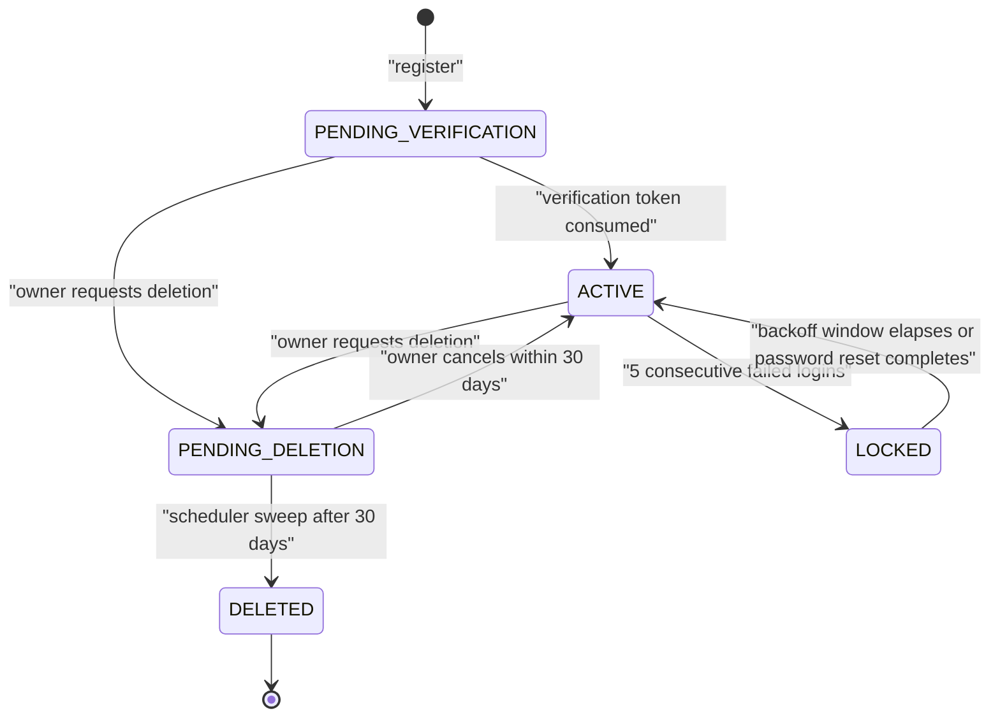
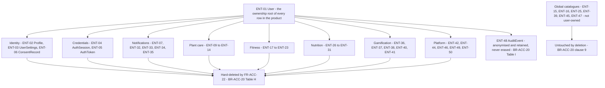

# Module Specification — Accounts, Authentication and Profile (ACC)

| Field | Value |
| --- | --- |
| Document | `modules/accounts.md` — authoritative functional specification for the ACC subsystem |
| Version | 1.0 |
| Date | 2026-07-21 |
| Status | Baselined for Phase 1 sign-off |
| Owner | Rakshit — Project Lead / sole developer (STK-03) |
| Parent | [PlantPal+ Software Requirements Specification v1.0](../SRS.md) |

---

## Table of contents

1. [Purpose and scope](#1-purpose-and-scope)
2. [Actors and stakeholders](#2-actors-and-stakeholders)
3. [Capability overview](#3-capability-overview)
4. [Functional requirements](#4-functional-requirements)
5. [Business rules](#5-business-rules)
6. [Data entities touched](#6-data-entities-touched)
7. [External interfaces](#7-external-interfaces)
8. [Edge cases and boundary conditions](#8-edge-cases-and-boundary-conditions)
9. [Deferred and out of scope for v1.0](#9-deferred-and-out-of-scope-for-v10)
10. [Traceability stub](#10-traceability-stub)

Related documents: [03-functional-requirements.md](../03-functional-requirements.md) · [04-non-functional-requirements.md](../04-non-functional-requirements.md) · [07-domain-model.md](../07-domain-model.md) · [user-stories/accounts.md](../user-stories/accounts.md) · [use-cases/accounts.md](../use-cases/accounts.md) · [10-traceability-matrix.md](../10-traceability-matrix.md)

---

## 1. Purpose and scope

### 1.1 Purpose

The ACC subsystem owns **the account** — the single row from which every other row in PlantPal+ hangs. It answers four questions on behalf of the whole product.

1. **Who is this?** Registration, email verification, credential storage, external identity linking.
2. **Is this still them?** Session establishment, access and refresh token lifecycle, rotation, reuse detection, revocation, lockout.
3. **What do we know about them that other modules need?** The profile (identity attributes and body metrics that drive BMR and TDEE) and the preference set (timezone, hemisphere, locale, unit system, module enablement) that drives day boundaries, seasonal watering and unit rendering everywhere else.
4. **What can they take away or destroy?** The GDPR-style export archive and the account deletion cascade, including how both interact with the offline write queue defined by decision D-04.

ACC is also the **authorisation anchor** of the product. Every user-scoped requirement in every other prefix inherits one rule from here: a principal may read and write only rows whose `user_id` equals the subject of the presented access token, enforced server-side on every endpoint (FR-ACC-23, BR-ACC-23).

### 1.2 In scope

| # | In scope | Delivered by |
| --- | --- | --- |
| S-01 | Email and password registration, password composition policy, breached-password screening | FR-ACC-01, FR-ACC-02, FR-ACC-03, BR-ACC-01 |
| S-02 | Email verification by signed single-use token, expiry, resend throttling | FR-ACC-04, FR-ACC-05, BR-ACC-04, BR-ACC-05, BR-ACC-06 |
| S-03 | Login, access and refresh token issuance, rotation, reuse detection, family revocation | FR-ACC-06, FR-ACC-08, FR-ACC-09, BR-ACC-07, BR-ACC-08 |
| S-04 | Logout, logout-everywhere, per-session revocation, session and device inventory | FR-ACC-10, FR-ACC-11, FR-ACC-18, FR-ACC-19, BR-ACC-18 |
| S-05 | Brute-force lockout with exponential backoff and enumeration-safe responses | FR-ACC-07, BR-ACC-09, BR-ACC-10 |
| S-06 | Forgotten-password reset and authenticated password change, with session consequences | FR-ACC-12, FR-ACC-13, FR-ACC-14, BR-ACC-11 |
| S-07 | Profile record: display name, avatar reference, date of birth, biological sex, height, body mass, activity level | FR-ACC-15, BR-ACC-12, BR-ACC-13, BR-ACC-14, BR-ACC-27 |
| S-08 | BMR and TDEE derivation, including the prefer-not-to-say fallback formula and clinically safe floors | BR-ACC-12 |
| S-09 | Account preferences: IANA timezone, hemisphere, locale, unit system, per-module enablement | FR-ACC-16, BR-ACC-15, BR-ACC-27 |
| S-10 | Local-date stamping, mid-day timezone change semantics, DST correctness, clock-skew tolerance | BR-ACC-16, BR-ACC-17 |
| S-11 | Onboarding wizard: step set, defaults, skip path, resumability, 90-second budget | FR-ACC-17, BR-ACC-22 |
| S-12 | Data export archive (JSON plus photo manifest) and account deletion with grace period and cascade | FR-ACC-20, FR-ACC-21, FR-ACC-22, BR-ACC-19, BR-ACC-20, BR-ACC-21 |
| S-13 | Server-side ownership authorisation, applied to every endpoint in every prefix | FR-ACC-23, BR-ACC-23 |
| S-14 | Google and Apple OAuth with linking by verified email | FR-ACC-24, BR-ACC-24 |
| S-15 | Auth-endpoint rate limits and the transactional email catalogue | BR-ACC-25, BR-ACC-26 |

### 1.3 Explicitly excluded

| # | Excluded from ACC | Owner and reason |
| --- | --- | --- |
| X-01 | The settings **screens** — how preferences are laid out, grouped and rendered | SET series in [dashboard-and-settings.md](dashboard-and-settings.md). ACC owns the canonical record, its validation and its API; SET owns presentation and every preference not listed in S-09. |
| X-02 | Notification channel preferences, quiet hours, digest opt-in, push-token registration | NOT series in [notifications.md](notifications.md). ACC stores no push tokens; `ENT-07 DevicePushToken` is NOT-owned and merely carries `user_id`. |
| X-03 | The media upload pipeline — signed upload URLs, downscaling, EXIF stripping, CDN delivery, storage-provider selection | SYS series in [platform-and-sync.md](platform-and-sync.md). ACC references an avatar by `ENT-42 PhotoAsset` identifier only (BR-ACC-27 clause 2). |
| X-04 | Offline outbox mechanics — queue storage, replay ordering, idempotency-key generation, delta-sync cursor | SYS series. ACC specifies only the **account-lifecycle interaction** with that queue (BR-ACC-21). |
| X-05 | Calorie and macro goal derivation, and the daily nutrition targets themselves | NUT series in [nutrition.md](nutrition.md). ACC supplies BMR, TDEE and the safe floor; NUT decides the goal and owns the disclaimer surface. |
| X-06 | Streak computation, freezes, achievement grants | GAM series in [gamification.md](gamification.md). ACC supplies the local-date rule those computations run on (BR-ACC-16). |
| X-07 | Physical schema, indexes, ORM choice, migration files | Phase 2. Entities named in section 6 are conceptual and align to the `ENT-nn` catalogue. |
| X-08 | Admin tooling, moderation, support impersonation, multi-user households, sharing | Not in v1.0. `role` is fixed at `USER`; `ADMIN` is a reserved value only (BR-ACC-23 clause 5). |
| X-09 | A full Data Protection Impact Assessment, records of processing, DSAR case-management workflow | Decision D-01 caps legal work at good-practice depth. |
| X-10 | Monetisation, plan tiers, billing, entitlements | Decisions D-01 and D-06 — no monetisation, free tiers only. |
| X-11 | Passkeys and WebAuthn, TOTP or SMS multi-factor authentication | Deferred, see section 9. Not buildable to a defensible standard by one developer in one semester alongside three habit modules. |

### 1.4 Locked decisions this module is bound by

| Decision | Consequence for ACC |
| --- | --- |
| D-01 | IEEE 830-1998 structure with ISO/IEC/IEEE 29148:2018 quality rules; GDPR-style export and delete are Must; no DPIA. |
| D-02 | Every requirement carries a MoSCoW priority and a target release; v0.1 must already be demoable, so register, login, logout and ownership land at v0.1. |
| D-04 | Registration, profile edits, preference edits, password changes, avatar changes and deletion **require connectivity** and are never queued offline. Only append-only logging actions queue, and none of those belong to ACC. |
| D-05 | Document identity metadata as recorded in the header table above. |
| D-06 | Everything fits permanently free tiers: Neon or Supabase PostgreSQL, Render or Railway backend, a free transactional email tier, the keyless Have I Been Pwned range API. No paid SMS and no paid identity provider. |
| D-07 | BMR and TDEE output is an estimate carrying the not-medical-advice disclaimer; clinically safe floors are enforced at the source (BR-ACC-12 clauses 7 to 9). |
| D-08 | Every user-facing string emitted by ACC, including email templates and validation messages, resolves from a locale catalogue keyed by message identifier. |
| D-09 | Height and body mass are stored canonically in metric SI; imperial is a display transform only. |
| D-11 | Email and password with a 15-minute access token and a 30-day rotating refresh token is the Must; OAuth is a Should for v1.1. |

---

## 2. Actors and stakeholders

### 2.1 Actors

| Actor | Type | Role in this module | Appears in |
| --- | --- | --- | --- |
| Visitor | Human, unauthenticated | Submits registration, requests a password reset, consumes verification and reset links, signs in | UC-ACC-01, UC-ACC-02, UC-ACC-03, UC-ACC-06 |
| Registered User | Human, authenticated account owner | Everything else — the only principal that can read or write account-scoped data | UC-ACC-04 through UC-ACC-11 |
| Client Application | System — React Native (Expo) mobile app, React (Vite) web app | Stores tokens per the platform storage constraint, performs silent refresh, detects clock skew, clears local state on account deletion | UC-ACC-03, UC-ACC-04, UC-ACC-11 |
| Reminder Scheduler | System — node-cron worker | Executes the deletion sweep, expires stale tokens and export archives, ages out login-attempt rows | UC-ACC-11, FR-ACC-22 |
| Export Worker | System — node-cron job on the same worker process | Builds the JSON archive and the photo manifest asynchronously | UC-ACC-10, FR-ACC-20 |
| Email Delivery Service | External — free transactional tier | Delivers the ten account emails enumerated in BR-ACC-26 | UC-ACC-01, UC-ACC-02, UC-ACC-06, UC-ACC-10, UC-ACC-11 |
| Breach Corpus Service | External — Have I Been Pwned range API, free, no key | Answers a k-anonymity 5-character SHA-1 prefix query | FR-ACC-03 |
| External Identity Provider | External — Google, Apple | Asserts a verified email address and a stable subject identifier | FR-ACC-24, UC-ACC-03 extension |
| Object Storage Provider | External — Supabase Storage or Cloudinary | Holds avatar renditions and export archives; issues time-limited signed URLs | FR-ACC-15, FR-ACC-20 |

**There is no Administrator actor in v1.0.** Nothing in ACC may be designed around an operator resetting a password, unlocking an account or reading a user's data. Lockouts therefore always self-expire (BR-ACC-09) and verification always has a self-service resend path (FR-ACC-05).

`Client Application` is modelled as an actor rather than as part of the system boundary specifically because token storage differs by platform, and that difference is a **constraint** the specification must state (BR-ACC-07 clause 7).

`Reminder Scheduler` is the same node-cron process the NOT series owns. ACC contributes jobs to it; it does not own it.

### 2.2 Stakeholders with an interest in this module

| Stakeholder | Interest in ACC |
| --- | --- |
| STK-01 End user (Registered User) | One account that unifies three trackers across devices; data that is exportable and deletable without contacting anyone |
| STK-02 Project supervisor and academic evaluator | Evidence of rigour in the security-sensitive part of the system: stated policies, quantified thresholds, verifiable requirements |
| STK-03 Project Lead and sole developer | Every mechanism must be self-service and self-expiring, because there is no operator to intervene |
| STK-04 External examiner | The specification must stand alone; the error catalogue and boundary tables make ACC assessable without a demo |
| STK-05 Pilot cohort testers | Registration and onboarding that do not block a first session; a working reset path |
| STK-07 Infrastructure providers | Auth write volume, email volume and storage must stay inside free quotas (D-06) |
| STK-11 University policy office | Consent capture, retention limits and erasure evidence for pilot testers |

Personas most affected: **PER-01 Aditi Sharma** (multi-module daily user, needs one account across phone and web), **PER-03 Mia Castellano** (Southern-hemisphere and timezone-sensitive), **PER-04 Harold Whitfield** (form accessibility and plain error copy), **PER-05 Sofia Lindqvist** (metered connection, must be told clearly when an action needs connectivity).

---

## 3. Capability overview

```mermaid
flowchart TB
  ROOT["ACC - Accounts, authentication, profile, data rights"]

  ROOT --> C1["C1 Registration and email verification"]
  ROOT --> C2["C2 Authentication and session lifecycle"]
  ROOT --> C3["C3 Credential recovery and change"]
  ROOT --> C4["C4 Profile and body metrics"]
  ROOT --> C5["C5 Account preferences"]
  ROOT --> C6["C6 Onboarding"]
  ROOT --> C7["C7 Sessions and devices"]
  ROOT --> C8["C8 Data rights"]
  ROOT --> C9["C9 Authorisation and abuse control"]

  C1 --> C1A["Create account with email and password"]
  C1 --> C1B["Password composition policy"]
  C1 --> C1C["Breached password screening"]
  C1 --> C1D["Signed single-use verification token"]
  C1 --> C1E["Resend throttling"]
  C1 --> C1F["Unverified grace window of 168 hours"]

  C2 --> C2A["Password login"]
  C2 --> C2B["Access token of 15 minutes"]
  C2 --> C2C["Refresh token of 30 days, rotating"]
  C2 --> C2D["Reuse detection and family revocation"]
  C2 --> C2E["Logout and logout everywhere"]
  C2 --> C2F["External identity sign-in - v1.1"]
  C2 --> C2G["Per-platform token storage constraint"]

  C3 --> C3A["Forgotten password reset by email token"]
  C3 --> C3B["Authenticated password change"]
  C3 --> C3C["Session consequences of a credential change"]

  C4 --> C4A["Display name and avatar"]
  C4 --> C4B["Date of birth and minimum age"]
  C4 --> C4C["Biological sex with prefer-not-to-say"]
  C4 --> C4D["Height and body mass in canonical metric"]
  C4 --> C4E["Activity level"]
  C4 --> C4F["BMR and TDEE with clinically safe floors"]

  C5 --> C5A["IANA timezone"]
  C5 --> C5B["Hemisphere derivation and override"]
  C5 --> C5C["Locale - English only in v1.0"]
  C5 --> C5D["Unit system metric or imperial"]
  C5 --> C5E["Per-module enablement flags"]
  C5 --> C5F["Local-date stamping and DST correctness"]

  C6 --> C6A["Six-step wizard under 90 seconds"]
  C6 --> C6B["Skip with sensible defaults"]
  C6 --> C6C["Resume at first incomplete step"]
  C6 --> C6D["Re-entry from settings"]

  C7 --> C7A["List active sessions with device label"]
  C7 --> C7B["Last-seen tracking"]
  C7 --> C7C["Revoke a single session"]

  C8 --> C8A["JSON export archive"]
  C8 --> C8B["Photo manifest with signed URLs"]
  C8 --> C8C["Deletion request with 30-day grace"]
  C8 --> C8D["Cancel deletion"]
  C8 --> C8E["Hard delete versus anonymise"]
  C8 --> C8F["Cascade across all three modules"]
  C8 --> C8G["Offline queue interaction"]

  C9 --> C9A["Ownership check on every endpoint"]
  C9 --> C9B["Exponential backoff lockout"]
  C9 --> C9C["User-enumeration safety"]
  C9 --> C9D["Endpoint rate limits"]
  C9 --> C9E["Security event audit trail"]
```



### 3.1 Account lifecycle state machine



`LOCKED` is a **derived, self-expiring** state computed from login-attempt rows rather than a sticky flag, so that no operator intervention is ever required. An account that was in `PENDING_VERIFICATION` when deletion was requested returns to `PENDING_VERIFICATION`, not `ACTIVE`, if the deletion is cancelled — the machine restores `state_before_deletion` (BR-ACC-20 clause 3). The `SUSPENDED` member of the `AccountStatus` enumeration is reserved by the domain model and is unreachable in v1.0 because no operator role exists.

### 3.2 Requirement index

| ID | Title | MoSCoW | Release | Verification |
| --- | --- | --- | --- | --- |
| FR-ACC-01 | Register an account | Must | v0.1 | Test |
| FR-ACC-02 | Enforce the password composition policy | Must | v0.1 | Test |
| FR-ACC-03 | Reject breached passwords | Should | v1.0 | Test |
| FR-ACC-04 | Verify an email address | Must | v0.5 | Test |
| FR-ACC-05 | Throttle verification resends | Must | v0.5 | Test |
| FR-ACC-06 | Authenticate and issue a token pair | Must | v0.1 | Test |
| FR-ACC-07 | Lock out after repeated failures with exponential backoff | Must | v0.5 | Test |
| FR-ACC-08 | Rotate the refresh token on redemption | Must | v0.5 | Test |
| FR-ACC-09 | Detect refresh reuse and revoke the family | Must | v0.5 | Test |
| FR-ACC-10 | Log out of the current session | Must | v0.1 | Test |
| FR-ACC-11 | Log out from all devices | Must | v0.5 | Test |
| FR-ACC-12 | Request a password reset | Must | v0.5 | Test |
| FR-ACC-13 | Complete a password reset | Must | v0.5 | Test |
| FR-ACC-14 | Change password while authenticated | Must | v0.5 | Test |
| FR-ACC-15 | Persist the profile record | Must | v0.5 | Test |
| FR-ACC-16 | Persist account preferences | Must | v0.5 | Test |
| FR-ACC-17 | Record and resume onboarding progress | Must | v1.0 | Demonstration |
| FR-ACC-18 | List active sessions | Should | v1.0 | Test |
| FR-ACC-19 | Revoke a single session | Should | v1.0 | Test |
| FR-ACC-20 | Export the account as a JSON archive | Must | v1.0 | Test |
| FR-ACC-21 | Request account deletion with a grace period | Must | v1.0 | Test |
| FR-ACC-22 | Execute permanent erasure | Must | v1.0 | Test |
| FR-ACC-23 | Enforce server-side ownership authorisation | Must | v0.1 | Test, Inspection |
| FR-ACC-24 | Sign in with Google or Apple and link by verified email | Should | v1.1 | Test |

---

## 4. Functional requirements

Twenty-four requirements, `FR-ACC-01` through `FR-ACC-24`, contiguous with no gaps. Unless stated otherwise in a subsection:

- every requirement is served over HTTPS by the Node.js and Express REST API, which is dictated by the fixed technology stack rather than chosen here;
- every authenticated requirement enforces FR-ACC-23;
- every failure response body carries a stable machine-readable `code` drawn from the error catalogue in section 8.10, and the human sentence shown to the user resolves from the locale catalogue by that code (D-08, NFR-I18N-01);
- verification method abbreviations are **T** Test, **D** Demonstration, **I** Inspection, **A** Analysis.

---

### FR-ACC-01 — Register an account

| Field | Value |
| --- | --- |
| Priority | Must |
| Release | v0.1 Walking Skeleton |
| Actor | Visitor |
| Verification | Test |
| Traces to | GOAL-01, STK-01, US-ACC-01, UC-ACC-01, NFR-SEC-03, NFR-SEC-08, NFR-LEGL-02, NFR-LEGL-06 |

**Requirement.** The system shall create a user account in state `PENDING_VERIFICATION` when an unauthenticated visitor submits an email address satisfying BR-ACC-02 together with a password satisfying BR-ACC-01.

**Rationale.** Nothing in PlantPal+ is usable without an account, this is the first screen of the walking skeleton, and the resulting row is the root of every foreign key in the schema.

**Inputs and validation.**

| Field | Type | Constraints | Required |
| --- | --- | --- | --- |
| `email` | string | 6 to 254 characters; BR-ACC-02 clauses 1 to 3; normalised to `email_normalised` | Yes |
| `password` | string | BR-ACC-01 clauses 1 to 8; never trimmed, never logged | Yes |
| `accepted_terms` | boolean | Must equal `true`; records a `ENT-06 ConsentRecord` of `document_type = TERMS_OF_SERVICE` | Yes |
| `accepted_privacy` | boolean | Must equal `true`; records a `ENT-06 ConsentRecord` of `document_type = PRIVACY_POLICY` | Yes |
| `minimum_age_confirmed` | boolean | Must equal `true`; self-attestation of age 16 or over, BR-ACC-13 clause 4 | Yes |
| `client_timezone` | string | Valid IANA identifier; falls back to `UTC` when absent or invalid (BR-ACC-15 clause 1) | No |
| `client_locale` | string | BCP 47; silently defaulted to `en-US` when outside the accepted set (BR-ACC-15 clause 8) | No |
| `display_name` | string | 1 to 40 characters after trim, BR-ACC-27 clause 1; defaults to the email local part truncated to 40 characters | No |

**Processing rules.**

1. Normalise the address: `email_normalised = lower(trim(email))` (BR-ACC-02 clause 4).
2. Validate composition (FR-ACC-02) and breach status (FR-ACC-03), collecting all failures before responding.
3. Hash the password with Argon2id at the parameters fixed in BR-ACC-01 clause 9.
4. In one transaction insert `ENT-01 User` with `status = PENDING_VERIFICATION`, `role = USER`, `token_version = 0`, `failed_login_count = 0`, `minimum_age_confirmed = true`; insert `ENT-02 Profile` with `display_name` defaulted per BR-ACC-27 clause 1 and every other descriptive field null; insert `ENT-03 UserSettings` with the defaults of BR-ACC-22 Table D; insert the onboarding record at step 1; insert one `ENT-06 ConsentRecord` per accepted document with `acceptance_surface = REGISTRATION`.
5. Issue and dispatch a verification token and email (BR-ACC-04, BR-ACC-26 template `VERIFY_EMAIL`).
6. Apply the registration rate limits of BR-ACC-25: 5 per rolling hour and 20 per rolling 24 hours per truncated IP prefix.
7. When the address already has an account, create no row and instead dispatch template `EMAIL_ALREADY_REGISTERED` to that address (BR-ACC-10 clause 2).

**Outputs.** HTTP 202 with body `{ "status": "verification_sent", "email": "<echoed input>" }`. The status is deliberately 202 rather than 201, and the body deliberately contains no user identifier, so that the duplicate-address response is byte-identical to the fresh-registration response.

**Alternate and error flows.**

| Condition | System response | User-visible message |
| --- | --- | --- |
| Email fails BR-ACC-02 | HTTP 422, `ACC_EMAIL_INVALID` | "That does not look like an email address we can use. Check it and try again." |
| Password fails BR-ACC-01 | HTTP 422, `ACC_WEAK_PASSWORD` with `unmet_rules[]` | "Your password needs a few changes." followed by one line per unmet rule. |
| Password found in the breach corpus | HTTP 422, `ACC_PASSWORD_BREACHED` | "That password has appeared in a public data breach. Choose a different one." |
| Terms, privacy or age not affirmed | HTTP 422, `ACC_TERMS_NOT_ACCEPTED` | "Please confirm you are 16 or older and accept the terms and privacy policy to continue." |
| Address already registered | HTTP 202, identical body; no row created; `EMAIL_ALREADY_REGISTERED` email sent | "Check your inbox — we have sent you a message about this address." |
| Registration rate limit exceeded | HTTP 429, `ACC_RATE_LIMITED` with `Retry-After` | "Too many sign-up attempts from this connection. Try again in {minutes} minutes." |
| Device is offline | Request is not sent and is not queued (D-04) | "Creating an account needs an internet connection. We will not lose what you typed." |
| Email dispatch fails | Account still created; failure logged; response unchanged (BR-ACC-26 clause 3) | "Check your inbox — we have sent you a message about this address." |

---

### FR-ACC-02 — Enforce the password composition policy

| Field | Value |
| --- | --- |
| Priority | Must |
| Release | v0.1 Walking Skeleton |
| Actor | Visitor, Registered User |
| Verification | Test |
| Traces to | GOAL-01, STK-02, US-ACC-01, UC-ACC-01, NFR-SEC-03, NFR-USAB-03, NFR-USAB-08, NFR-MAIN-04 |

**Requirement.** The system shall reject any submitted password that violates the composition policy of BR-ACC-01 and return a response body enumerating every individual policy rule that was not met.

**Rationale.** One stated, testable policy prevents the three password-writing surfaces — registration, reset and change — from drifting apart, and returning every failure in one round trip is what makes the form usable rather than a guessing game.

**Inputs and validation.**

| Field | Type | Constraints | Required |
| --- | --- | --- | --- |
| `password` | string | The candidate secret, evaluated after NFKC normalisation and never trimmed | Yes |
| `email_normalised` | string | Supplied by the caller when known; enables the `CONTAINS_EMAIL` check | No |
| `display_name` | string | Supplied by the caller when known; enables the `CONTAINS_DISPLAY_NAME` check | No |

**Processing rules.**

1. Apply the eight clauses of BR-ACC-01 in order, collecting every failure rather than short-circuiting on the first.
2. Compare on the NFKC-normalised string; never trim, log, echo or include the password in any error message, telemetry event or Sentry payload (BR-ACC-01 clause 11, NFR-OBSV-07).
3. Evaluate the identical rule set client-side from the shared validation package for live feedback (NFR-MAIN-04); client-side evaluation is advisory and the server decision is authoritative.
4. Treat a missing common-password asset as a pass for the `COMMON_PASSWORD` clause only, and log that degradation.

**Outputs.** On success, nothing — the caller proceeds. On failure, HTTP 422 with body `{ "code": "ACC_WEAK_PASSWORD", "unmet_rules": ["MIN_LENGTH", "CHARACTER_CLASSES"] }`, where each member is drawn from the closed enumeration `MIN_LENGTH`, `MAX_LENGTH`, `CHARACTER_CLASSES`, `COMMON_PASSWORD`, `CONTAINS_EMAIL`, `CONTAINS_DISPLAY_NAME`, `WHITESPACE_ONLY`, `REPEATED_CHARACTERS`.

**Alternate and error flows.**

| Condition | System response | User-visible message |
| --- | --- | --- |
| Fewer than 12 code points | `MIN_LENGTH` in `unmet_rules` | "Use at least 12 characters." |
| More than 128 code points | `MAX_LENGTH`; input rejected, never truncated | "Use at most 128 characters." |
| Fewer than 3 of the 4 character classes | `CHARACTER_CLASSES` | "Mix at least three of: lowercase, uppercase, digits, symbols." |
| Password is only whitespace | `WHITESPACE_ONLY` | "A password cannot be only spaces." |
| A character repeats 5 or more times consecutively | `REPEATED_CHARACTERS` | "Avoid repeating the same character five times in a row." |
| Contains the email local part, 4 or more characters | `CONTAINS_EMAIL` | "Do not use your email address inside your password." |
| Contains the display name, 4 or more characters | `CONTAINS_DISPLAY_NAME` | "Do not use your name inside your password." |
| Appears in the seeded 10 000 most common passwords | `COMMON_PASSWORD` | "That password is too common. Choose something less predictable." |
| Common-password asset missing at runtime | Clause treated as passed; warning logged | No user-visible message. |

---

### FR-ACC-03 — Reject breached passwords

| Field | Value |
| --- | --- |
| Priority | Should |
| Release | v1.0 MVP |
| Actor | Visitor, Registered User |
| Verification | Test |
| Traces to | GOAL-09, STK-01, US-ACC-01, UC-ACC-01, NFR-SEC-02, NFR-RELI-02, NFR-OBSV-01 |

**Requirement.** The system shall reject a submitted password whose SHA-1 digest suffix is returned with a count of 1 or greater by the breach-corpus k-anonymity range lookup defined in BR-ACC-01 clause 8.

**Rationale.** Credential stuffing is the realistic threat against a small portfolio product. The range API is free, keyless and privacy-preserving, which makes this high value at zero budget under D-06.

**Inputs and validation.**

| Field | Type | Constraints | Required |
| --- | --- | --- | --- |
| `password` | string | The candidate secret; only a 5-character hash prefix ever leaves the server | Yes |
| `integration.breach_check.enabled` | boolean | Feature flag, default `true`; when `false` the check returns "not breached" | Yes |

**Processing rules.**

1. Compute the uppercase hexadecimal SHA-1 digest of the UTF-8 password.
2. Send only the first 5 hexadecimal characters to `https://api.pwnedpasswords.com/range/{prefix}` with the request header `Add-Padding: true` so that response size leaks nothing.
3. Compare the remaining 35 characters against the returned `SUFFIX:COUNT` lines locally. The full password and the full digest never leave the server.
4. Apply a request timeout of 800 ms with no retry. On timeout, connection error, non-200 status or a disabled feature flag, return "not breached" (fail-open) and increment the observability counter `acc.breach_check.fail_open` (NFR-OBSV-01).
5. Do not cache and do not persist the negative decision. The D-03 caching rule targets catalogue lookups; caching a password-hash prefix result has no value and the response is already anonymised.

**Outputs.** A boolean consumed by FR-ACC-01, FR-ACC-13 and FR-ACC-14.

**Alternate and error flows.**

| Condition | System response | User-visible message |
| --- | --- | --- |
| Suffix present with count 1 or greater | HTTP 422, `ACC_PASSWORD_BREACHED`; the count is never disclosed | "That password has appeared in a public data breach. Choose a different one." |
| Service does not respond within 800 ms | Fail open, counter incremented, submission proceeds | No user-visible message. |
| Service returns a non-200 status | Fail open, counter incremented, submission proceeds | No user-visible message. |
| Feature flag `integration.breach_check.enabled` is `false` | Check skipped entirely; the product remains fully functional (D-03) | No user-visible message. |

---

### FR-ACC-04 — Verify an email address

| Field | Value |
| --- | --- |
| Priority | Must |
| Release | v0.5 Alpha |
| Actor | Visitor |
| Verification | Test |
| Traces to | GOAL-01, STK-01, US-ACC-02, UC-ACC-02, NFR-SEC-01, NFR-USAB-03 |

**Requirement.** The system shall transition an account from `PENDING_VERIFICATION` to `ACTIVE` when presented with an email-verification token that is validly signed, unexpired and not previously consumed, as defined in BR-ACC-04.

**Rationale.** An unverified address makes password reset, the optional email digest and the export-ready notification undeliverable, so verification gates the account's long-term usability rather than its first session.

**Inputs and validation.**

| Field | Type | Constraints | Required |
| --- | --- | --- | --- |
| `token` | string | Compact JWS from the email link; HS256; `typ` must equal `email_verify`; `aud` must equal `account-verification` | Yes |

**Processing rules.**

1. Verify the HS256 signature against the dedicated 256-bit verification secret, which is used for no other purpose.
2. Verify `typ`, `iss = plantpal-plus` and `aud = account-verification`; verify `exp` is in the future allowing 60 seconds of clock skew (BR-ACC-17 clause 3).
3. Look up the companion token row by `jti`; require `consumed_at IS NULL` and `invalidated_at IS NULL` and `purpose = EMAIL_VERIFICATION`.
4. In one transaction set `consumed_at = now()`, set `ENT-01 User.email_verified_at = now()`, and set `status = ACTIVE` when the current status is `PENDING_VERIFICATION`.
5. Do not create a session. The user is directed to sign in; on mobile an existing valid session simply refreshes its profile.
6. Dispatch template `WELCOME` (BR-ACC-26).
7. Re-presenting the same token within 10 minutes of its own consumption returns success rather than an error, because mail clients and link scanners routinely fetch a link twice (BR-ACC-04 clause 7).

**Outputs.** HTTP 200 with body `{ "status": "verified" }`, or `{ "status": "already_verified" }` inside the 10-minute replay window.

**Alternate and error flows.**

| Condition | System response | User-visible message |
| --- | --- | --- |
| Signature, `typ`, `iss` or `aud` invalid, or no token row | HTTP 400, `ACC_TOKEN_INVALID` | "This link is not valid. Open the most recent email we sent you, or ask for a new link." |
| `exp` in the past beyond the 60-second leeway | HTTP 410, `ACC_TOKEN_EXPIRED`, body carries a resend affordance | "This link has expired. Send me a new one." |
| Token consumed more than 10 minutes ago | HTTP 409, `ACC_TOKEN_CONSUMED` | "This address is already confirmed. You can sign in." |
| Token consumed within the last 10 minutes | HTTP 200, `{ "status": "already_verified" }` | "Your email address is confirmed." |
| Token superseded by a newer send | HTTP 400, `ACC_TOKEN_INVALID` | "Use the newest email we sent you — older links stop working." |
| Account already erased | HTTP 410, `ACC_ACCOUNT_DELETED` | "This account no longer exists." |

---

### FR-ACC-05 — Throttle verification resends

| Field | Value |
| --- | --- |
| Priority | Must |
| Release | v0.5 Alpha |
| Actor | Visitor, Registered User |
| Verification | Test |
| Traces to | GOAL-09, STK-07, US-ACC-02, UC-ACC-02, NFR-SEC-11, NFR-USAB-03 |

**Requirement.** The system shall refuse an email-verification resend request that would exceed any threshold in BR-ACC-05 and shall return HTTP 429 with a `Retry-After` header expressed in seconds.

**Rationale.** The resend button is the only self-service repair path for a lost or expired verification email, which makes it the obvious vector for using PlantPal+ as an email-bombing relay against a third party, and the obvious way to exhaust a free email quota.

**Inputs and validation.**

| Field | Type | Constraints | Required |
| --- | --- | --- | --- |
| `email` | string | Required when the caller is unauthenticated; validated by BR-ACC-02 | Conditional |
| Access token | string | Used instead of `email` when the caller is authenticated | Conditional |

**Processing rules.**

1. Count verification tokens issued to that `email_normalised` in the preceding 60 seconds, 60 minutes and 24 hours, including the send performed by registration itself.
2. Refuse when any threshold in BR-ACC-05 is met: 1 per 60 seconds, 3 per rolling hour, 10 per rolling 24 hours per address, and 20 per rolling hour per truncated IP prefix.
3. Otherwise invalidate every previously issued unconsumed verification token for that address, issue a fresh one, and dispatch template `VERIFY_EMAIL`.
4. Return an identical body and status whether the address exists, does not exist, or is already verified (BR-ACC-10 clause 4).

**Outputs.** HTTP 202 with body `{ "status": "verification_sent" }`.

**Alternate and error flows.**

| Condition | System response | User-visible message |
| --- | --- | --- |
| Fewer than 60 seconds since the previous send | HTTP 429, `ACC_RATE_LIMITED`, `retry_after_seconds` = remainder | "Please wait {seconds} seconds before asking for another email." |
| More than 3 sends in the rolling hour | HTTP 429, `ACC_RATE_LIMITED` | "You have asked for several emails already. Try again in {minutes} minutes." |
| More than 10 sends in the rolling 24 hours | HTTP 429, `ACC_RATE_LIMITED` | "Too many requests today. Try again tomorrow, or contact us through the website." |
| More than 20 sends per hour from one IP prefix | HTTP 429, `ACC_RATE_LIMITED` | "Too many requests from this connection. Try again later." |
| Address has no account, or is already verified | HTTP 202, identical body | "If that address needs confirming, we have sent a new link." |
| An older link is clicked afterwards | Older token is invalid; FR-ACC-04 returns `ACC_TOKEN_INVALID` | "Use the newest email we sent you — older links stop working." |

---

### FR-ACC-06 — Authenticate and issue a token pair

| Field | Value |
| --- | --- |
| Priority | Must |
| Release | v0.1 Walking Skeleton |
| Actor | Visitor |
| Verification | Test |
| Traces to | GOAL-01, STK-01, US-ACC-03, UC-ACC-03, NFR-SEC-04, NFR-SEC-15, NFR-PERF-01, NFR-PERF-04 |

**Requirement.** The system shall issue one access token and one refresh token conforming to BR-ACC-07 when presented with an email address and password matching a stored credential of an account whose status is `ACTIVE`, or `PENDING_VERIFICATION` within the grace window of BR-ACC-06.

**Rationale.** The session is the product's front door. D-11 fixes the token shapes, so this requirement's job is to state exactly which account states authenticate successfully and exactly which artefacts are produced.

**Inputs and validation.**

| Field | Type | Constraints | Required |
| --- | --- | --- | --- |
| `email` | string | BR-ACC-02; matched on `email_normalised` | Yes |
| `password` | string | Compared against the stored Argon2id hash; never logged | Yes |
| `X-PlantPal-Device` | header, string | At most 120 characters; sanitised per BR-ACC-18 clause 1; advisory only, never used for a security decision | No |
| `X-PlantPal-Client` | header, enum | One of `IOS`, `ANDROID`, `WEB` | No |

**Processing rules.**

1. Look up by `email_normalised`. When no row exists, still perform an Argon2id verification against a fixed dummy hash generated at boot so that the response-time distribution does not disclose account existence, and pad the response to a floor of 250 ms (BR-ACC-10 clause 5).
2. Evaluate the backoff state of FR-ACC-07 before verifying the password.
3. Verify the password. On success create one session row and a first-generation refresh token with a new `token_family_id`, reset `failed_login_count` to 0, and set `last_login_at`. When the account already holds 10 `ACTIVE` sessions, the new session is still created and the least recently used existing session and its family are revoked with `revoke_reason = FAMILY_CAP_REACHED`, per the cap of BR-ACC-07 clause 12.
4. Rehash the password with current parameters inside the same request when the stored hash uses weaker parameters than the current policy (BR-ACC-01 clause 10).
5. Apply state handling exactly as follows: `ACTIVE` proceeds; `PENDING_VERIFICATION` proceeds while within 168 hours of `created_at` and is refused afterwards; `PENDING_DELETION` proceeds and the response carries the restore prompt data; `DELETED` and non-existent are indistinguishable.
6. Return the refresh token in the response body on mobile and as an `HttpOnly; Secure; SameSite=None; Path=/api/auth; Max-Age=2592000` cookie on web (BR-ACC-07 clause 7).

**Outputs.** HTTP 200 with body `{ "access_token": "<jws>", "expires_in": 900, "token_type": "Bearer", "user": { "id", "email", "display_name", "avatar_url", "status" }, "onboarding_completed": <boolean> }`, plus `account_pending_deletion` and `deletion_scheduled_at` when the account is `PENDING_DELETION`.

**Alternate and error flows.**

| Condition | System response | User-visible message |
| --- | --- | --- |
| Wrong password | HTTP 401, `ACC_INVALID_CREDENTIALS`; failure counter incremented | "That email or password is not right." |
| No account for that address | HTTP 401, `ACC_INVALID_CREDENTIALS`, byte-identical to the wrong-password body | "That email or password is not right." |
| Backoff window active | HTTP 429, `ACC_ACCOUNT_LOCKED` with `retry_after_seconds` | "Too many attempts. Try again in {minutes} minutes, or reset your password now." |
| Unverified, inside the 168-hour grace | HTTP 200 with a countdown banner payload | "Confirm your email within {days} days to keep your account." |
| Unverified, beyond the 168-hour grace | HTTP 403, `ACC_EMAIL_UNVERIFIED`, body carries `resend_available: true` | "Confirm your email address to sign in. Send me a new link." |
| Account is `PENDING_DELETION` | HTTP 200 with `account_pending_deletion: true` | "Your account is scheduled for deletion on {date}. Keep my account." |
| Account erased | HTTP 401, `ACC_INVALID_CREDENTIALS` | "That email or password is not right." |
| Backend cold start exceeds 2 000 ms | Client shows the waking state and retries per NFR-PERF-04 | "Waking the server — this takes a few seconds on the free plan." |

---

### FR-ACC-07 — Lock out after repeated failures with exponential backoff

| Field | Value |
| --- | --- |
| Priority | Must |
| Release | v0.5 Alpha |
| Actor | Visitor |
| Verification | Test |
| Traces to | GOAL-09, STK-01, STK-02, US-ACC-05, UC-ACC-03, NFR-SEC-11, NFR-PRIV-04 |

**Requirement.** The system shall refuse authentication attempts for an email address that has accumulated 5 or more consecutive failed attempts, for the backoff duration computed by the formula in BR-ACC-09 clause 2.

**Rationale.** An online password-guessing attack must become uneconomic without ever requiring an operator to unlock an account, and without letting an attacker lock a victim out permanently.

**Inputs and validation.**

| Field | Type | Constraints | Required |
| --- | --- | --- | --- |
| `email_normalised` | string | The address under attempt; a counter is maintained even when no account exists | Yes |
| Source IP | string | Truncated to a /24 prefix for IPv4 and a /48 prefix for IPv6 before storage (BR-ACC-18 clause 4) | Yes |

**Processing rules.**

1. Insert one login-attempt row per attempt with `outcome` drawn from `SUCCESS`, `BAD_PASSWORD`, `NO_ACCOUNT`, `LOCKED_OUT`, `UNVERIFIED`.
2. Compute `failures` as the number of consecutive failed attempts for that `email_normalised` since the later of the most recent successful authentication and the most recent 30-minute gap in attempts.
3. When `failures >= 5`, compute `lock_seconds = min(60 * 2^(failures - 5), 1800)` and refuse until `last_failure_at + lock_seconds`.
4. Measure the window from `last_failure_at`; an attempt made during the window is refused and **does not** extend the window, so the maximum denial is 30 minutes after the attacker stops (BR-ACC-09 clause 3).
5. Refuse all authentication endpoints for 60 minutes for any IP prefix exceeding 50 failed attempts per rolling 60 minutes.
6. Clear the per-address counter on a successful authentication or on a completed password reset (FR-ACC-13), which is the documented self-service unlock path.
7. Maintain the counter and produce a byte-identical 429 body for addresses with no account, so that lockout behaviour cannot be used to enumerate accounts (BR-ACC-09 clause 6).
8. Write a security event of type `LOCKOUT_TRIGGERED` on the transition into a locked window.

**Outputs.** HTTP 429 with body `{ "code": "ACC_ACCOUNT_LOCKED", "retry_after_seconds": <integer> }` and a `Retry-After` header.

**Alternate and error flows.**

| Condition | System response | User-visible message |
| --- | --- | --- |
| 1 to 4 consecutive failures | Normal `ACC_INVALID_CREDENTIALS`, no delay | "That email or password is not right." |
| Exactly 5 consecutive failures | 429 with `retry_after_seconds = 60` | "Too many attempts. Try again in 1 minute, or reset your password now." |
| 10 or more consecutive failures | 429 with `retry_after_seconds = 1800`, the cap | "Too many attempts. Try again in 30 minutes, or reset your password now." |
| Attempt made while locked | 429, window not extended, attempt recorded as `LOCKED_OUT` | "Too many attempts. Try again in {minutes} minutes, or reset your password now." |
| Address has no account | Identical 429 schedule and body | "Too many attempts. Try again in {minutes} minutes, or reset your password now." |
| IP prefix exceeds 50 failures per hour | 429 on every authentication endpoint for 60 minutes | "Too many attempts from this connection. Try again later." |
| Password reset completed while locked | Counter cleared, account immediately usable | "Your password is updated. You can sign in now." |

---

### FR-ACC-08 — Rotate the refresh token on redemption

| Field | Value |
| --- | --- |
| Priority | Must |
| Release | v0.5 Alpha |
| Actor | Registered User, Client Application |
| Verification | Test |
| Traces to | GOAL-01, STK-01, US-ACC-03, UC-ACC-04, NFR-SEC-04, NFR-SEC-15, NFR-PERF-01 |

**Requirement.** The system shall rotate the refresh token on every redemption by marking the presented token consumed and issuing a successor token within the same token family.

**Rationale.** Rotation converts a stolen long-lived credential into a detectable event. Without it, a leaked 30-day token is a 30-day compromise with no signal.

**Inputs and validation.**

| Field | Type | Constraints | Required |
| --- | --- | --- | --- |
| `refresh_token` | string | 43-character base64url opaque value; in the request body on mobile, in the `HttpOnly` cookie on web | Yes |
| CSRF token | string | Double-submit value required on web because the cookie is cross-site (BR-ACC-07 clause 9) | Conditional |
| `Origin` | header | Must match the configured web origin allow-list on web (NFR-SEC-07) | Conditional |
| `X-PlantPal-Device` | header, string | At most 120 characters; refreshes the stored device label | No |

**Processing rules.**

1. Hash the presented token with SHA-256 and look up the stored digest. The raw token is never stored.
2. Verify the row is unconsumed, unrevoked and unexpired, and that its owning account is not erased.
3. In one serialisable transaction, mark the row `consumed_at = now()` under a conditional update on `consumed_at IS NULL`, then insert a successor row with the same `token_family_id`, `parent_id` set to the presented row, `generation = parent.generation + 1` and `expires_at = now() + 30 days`.
4. Enforce the absolute family cap of 180 days measured from `family_created_at` (BR-ACC-07 clause 6).
5. Update the session `last_used_at` subject to the 60-second amortisation of BR-ACC-18 clause 3.
6. Issue a new access token with a 900-second lifetime carrying the account's current `token_version`.
7. Include the full profile in the response only when the profile's `updated_at` is newer than the client-supplied freshness hint, so clients stay in step without a second request.

**Outputs.** HTTP 200 with body `{ "access_token": "<jws>", "expires_in": 900, "token_type": "Bearer" }`, plus the refresh token in the body on mobile or the rotated cookie on web, plus an optional `user` object per rule 7.

**Alternate and error flows.**

| Condition | System response | User-visible message |
| --- | --- | --- |
| Token unknown or malformed | HTTP 401, `ACC_TOKEN_INVALID` | "Please sign in again." |
| Token past its 30-day expiry | HTTP 401, `ACC_TOKEN_EXPIRED` with `reason: "refresh_expired"` | "Your session has expired. Please sign in again." |
| Family older than 180 days | HTTP 401, `ACC_TOKEN_EXPIRED` with `reason: "family_cap"` | "For security, please sign in again." |
| Session revoked by FR-ACC-19 or a credential change | HTTP 401, `ACC_SESSION_REVOKED` | "You were signed out on this device. Please sign in again." |
| Token already consumed, outside the 15-second grace | HTTP 401, `ACC_REUSE_DETECTED`; FR-ACC-09 applies | "For your security we signed this device out. Please sign in again." |
| Token already consumed, inside the 15-second grace | HTTP 200 returning the successor pair already issued | No user-visible message. |
| `token_version` no longer matches | HTTP 401, `ACC_UNAUTHENTICATED` | "Please sign in again." |
| Account erased | HTTP 410, `ACC_ACCOUNT_DELETED`; client purges outbox, cache and tokens | "This account no longer exists on this device." |
| Two concurrent refreshes from one client | Client must single-flight; the grace window of BR-ACC-08 clause 3 absorbs the race | No user-visible message. |

---

### FR-ACC-09 — Detect refresh reuse and revoke the family

| Field | Value |
| --- | --- |
| Priority | Must |
| Release | v0.5 Alpha |
| Actor | Client Application |
| Verification | Test |
| Traces to | GOAL-09, STK-01, US-ACC-05, UC-ACC-04, NFR-SEC-04, NFR-OBSV-01, NFR-PRIV-04 |

**Requirement.** The system shall revoke every refresh token belonging to a token family when a token of that family is presented after it has already been consumed and outside the 15-second replay grace window defined in BR-ACC-08 clause 3.

**Rationale.** Rotation is only useful if replay of a consumed token is treated as evidence of theft. Family revocation is the mechanism that actually evicts the attacker.

**Inputs and validation.**

| Field | Type | Constraints | Required |
| --- | --- | --- | --- |
| `refresh_token` | string | Resolves to a stored row whose `consumed_at` is not null | Yes |

**Processing rules.**

1. When the presentation occurs within 15 seconds of that row's `consumed_at` **and** its direct successor is still the newest generation in the family, return the successor's already-issued pair instead of revoking. This pattern is overwhelmingly a mobile network retry rather than an attack.
2. Otherwise set `revoked_at = now()` and `revoke_reason = REUSE_DETECTED` on every row sharing that `token_family_id`, and mark the owning session `REVOKED`.
3. Write a security event of type `REFRESH_REUSE_DETECTED` carrying `token_family_id`, presented generation, newest generation, truncated IP prefix and device label, retained 90 days.
4. Revoke only the affected family. Other families of the same account are untouched, so a compromise on one device does not sign the user out everywhere without evidence.
5. Dispatch no email in v1.0; template `NEW_DEVICE_SIGN_IN` is reserved for v1.1 (BR-ACC-26).

**Outputs.** HTTP 401 with body `{ "code": "ACC_REUSE_DETECTED" }`. The client clears its stored tokens, purges the persisted query cache for user-scoped keys, and routes to the sign-in screen with an explanation.

**Alternate and error flows.**

| Condition | System response | User-visible message |
| --- | --- | --- |
| Consumed token presented within 15 seconds, successor still newest | HTTP 200 returning the successor pair; no revocation | No user-visible message. |
| Consumed token presented after 15 seconds | Family revoked; HTTP 401, `ACC_REUSE_DETECTED` | "For your security we signed this device out. Please sign in again." |
| Consumed token presented within 15 seconds but the successor is itself consumed | Family revoked; HTTP 401, `ACC_REUSE_DETECTED` | "For your security we signed this device out. Please sign in again." |
| Revoked family presented again | HTTP 401, `ACC_SESSION_REVOKED` | "Please sign in again." |
| Security event write fails | Revocation still commits; failure logged at `error` level | No user-visible message. |

---

### FR-ACC-10 — Log out of the current session

| Field | Value |
| --- | --- |
| Priority | Must |
| Release | v0.1 Walking Skeleton |
| Actor | Registered User |
| Verification | Test |
| Traces to | GOAL-01, STK-01, US-ACC-03, UC-ACC-05, NFR-SEC-04, NFR-SEC-15 |

**Requirement.** The system shall revoke the refresh-token family of the presented refresh token when the authenticated user requests logout.

**Rationale.** A shared or borrowed device needs a one-tap exit, and the server must be told so that the refresh token dies immediately rather than in 30 days.

**Inputs and validation.**

| Field | Type | Constraints | Required |
| --- | --- | --- | --- |
| `refresh_token` | string | Request body on mobile, `HttpOnly` cookie on web; an unknown or absent value is tolerated | No |
| Access token | string | Optional; used only to identify the caller for logging | No |
| CSRF token | string | Double-submit value required on web (BR-ACC-07 clause 9) | Conditional |

**Processing rules.**

1. Revoke every row in the presented token's family with `revoke_reason = USER_LOGOUT` and mark the session `REVOKED`.
2. On web, clear the refresh cookie by setting an empty value with `Max-Age=0`.
3. Instruct the client to discard its in-memory access token and purge every persisted TanStack Query cache entry under a user-scoped key.
4. Treat the operation as idempotent: an already-revoked, unknown or absent refresh token still returns success, because a failed logout leaves a user believing they are signed out when they are not.
5. Do not maintain an access-token denylist. The already-issued access token remains cryptographically valid for at most its remaining 15 minutes; this residual risk is stated explicitly and FR-ACC-11 is the immediate-kill path.

**Outputs.** HTTP 204 with no body.

**Alternate and error flows.**

| Condition | System response | User-visible message |
| --- | --- | --- |
| Valid refresh token presented | HTTP 204; family revoked | "You are signed out." |
| Refresh token already revoked | HTTP 204; no change | "You are signed out." |
| Refresh token absent or unknown | HTTP 204; local state cleared anyway | "You are signed out." |
| Device is offline | Local tokens and caches cleared immediately; revocation retried on next connectivity | "You are signed out on this device. We will finish signing you out everywhere when you are back online." |
| CSRF token missing on web | HTTP 403 from the platform CSRF guard; client retries after refetching the token | "Something went wrong. Try again." |

---

### FR-ACC-11 — Log out from all devices

| Field | Value |
| --- | --- |
| Priority | Must |
| Release | v0.5 Alpha |
| Actor | Registered User |
| Verification | Test |
| Traces to | GOAL-01, STK-01, US-ACC-07, UC-ACC-05, NFR-SEC-04, NFR-SEC-14 |

**Requirement.** The system shall invalidate every session of the authenticated user, including every unexpired access token, when the user requests logout from all devices.

**Rationale.** This is the "I lost my phone" control, and it is the mandated consequence of a completed password reset.

**Inputs and validation.**

| Field | Type | Constraints | Required |
| --- | --- | --- | --- |
| Access token | string | Identifies the calling session through its `sid` claim | Yes |
| `keep_current_session` | boolean | Default `true`; when `true` a fresh token pair is issued for the calling device | No |

**Processing rules.**

1. Increment `ENT-01 User.token_version` by 1.
2. Revoke every non-revoked refresh token and session of the account with `revoke_reason = USER_LOGOUT_ALL`.
3. Because every access-token validation compares the token's `ver` claim against the stored `token_version` (BR-ACC-07 clause 4), all outstanding access tokens — including the caller's — become invalid inside the same request.
4. When `keep_current_session` is `true`, create a new session and a first-generation refresh token for the calling device and return a fresh access token, so the user is not signed out of the device in their hand.
5. Write a security event of type `LOGOUT_ALL`.
6. Do not delete push registrations. Whether a revoked device stops receiving pushes is decided by the NOT series; the dependency is recorded in section 7.

**Outputs.** HTTP 200 with body `{ "revoked_sessions": <integer>, "access_token": "<jws>", "expires_in": 900 }` when `keep_current_session` is `true`; HTTP 204 otherwise.

**Alternate and error flows.**

| Condition | System response | User-visible message |
| --- | --- | --- |
| No valid access token | HTTP 401, `ACC_UNAUTHENTICATED` | "Please sign in again." |
| `keep_current_session` is `false` | HTTP 204; the calling device is also signed out | "You are signed out everywhere." |
| Another device makes a request afterwards | Its access token fails the `ver` check with HTTP 401 at its next call | "You were signed out. Please sign in again." |
| Zero other sessions existed | HTTP 200 with `revoked_sessions: 0` | "You are signed out everywhere. No other devices were signed in." |
| Device is offline | Request refused; not queued (D-04) | "Signing out everywhere needs an internet connection." |

---

### FR-ACC-12 — Request a password reset

| Field | Value |
| --- | --- |
| Priority | Must |
| Release | v0.5 Alpha |
| Actor | Visitor |
| Verification | Test |
| Traces to | GOAL-01, STK-01, US-ACC-06, UC-ACC-06, NFR-SEC-11, NFR-USAB-03 |

**Requirement.** The system shall send a password-reset email containing a signed single-use token that expires 60 minutes after issuance when a reset is requested for the address of an existing account whose status is not `DELETED`.

**Rationale.** This is the only recovery route in a self-service product with no support desk, and it is also the documented self-service unlock for FR-ACC-07.

**Inputs and validation.**

| Field | Type | Constraints | Required |
| --- | --- | --- | --- |
| `email` | string | BR-ACC-02; matched on `email_normalised` | Yes |

**Processing rules.**

1. Look up `email_normalised`. When an account exists and is not erased, invalidate its outstanding unconsumed reset tokens, issue a new one with `exp = iat + 60 minutes`, and dispatch template `PASSWORD_RESET`.
2. Use 60 minutes rather than the 1440 minutes of the verification token because the consequence of interception is higher.
3. When no account exists, perform an equivalent amount of work, dispatch nothing, and return the identical response (BR-ACC-10 clause 3).
4. Make reset available to accounts in `PENDING_VERIFICATION`. A successful reset does **not** verify the address, because the token proves mailbox control only at the moment of use and conflating the two would let a mistyped address self-verify.
5. Make reset available to accounts in `PENDING_DELETION`, and do not cancel the scheduled deletion.
6. Apply the rate limits of BR-ACC-25: 3 per rolling hour per address and 10 per rolling hour per truncated IP prefix.

**Outputs.** HTTP 202 with body `{ "status": "reset_email_sent_if_account_exists" }`.

**Alternate and error flows.**

| Condition | System response | User-visible message |
| --- | --- | --- |
| Account exists | HTTP 202; reset email dispatched | "If that address has an account, we have sent a reset link. It expires in 60 minutes." |
| Address has no account | HTTP 202; identical body; no email | "If that address has an account, we have sent a reset link. It expires in 60 minutes." |
| Account is `PENDING_VERIFICATION` | HTTP 202; reset proceeds; verification state unchanged | "If that address has an account, we have sent a reset link. It expires in 60 minutes." |
| Account is `PENDING_DELETION` | HTTP 202; deletion schedule unchanged | "If that address has an account, we have sent a reset link. It expires in 60 minutes." |
| More than 3 requests per hour for one address | HTTP 429, `ACC_RATE_LIMITED` | "Too many reset requests. Try again in {minutes} minutes." |
| More than 10 requests per hour from one IP prefix | HTTP 429, `ACC_RATE_LIMITED` | "Too many requests from this connection. Try again later." |
| Email provider unavailable | Logged and retried per BR-ACC-26 clause 2; response unchanged | "If that address has an account, we have sent a reset link. It expires in 60 minutes." |

---

### FR-ACC-13 — Complete a password reset

| Field | Value |
| --- | --- |
| Priority | Must |
| Release | v0.5 Alpha |
| Actor | Visitor |
| Verification | Test |
| Traces to | GOAL-01, STK-01, US-ACC-06, UC-ACC-06, NFR-SEC-03, NFR-SEC-04, NFR-USAB-08 |

**Requirement.** The system shall replace the account's stored password hash when presented with a password-reset token that is validly signed, unexpired and not previously consumed, together with a new password satisfying BR-ACC-01.

**Rationale.** This closes the recovery loop, and its post-conditions are the reason a reset is a genuine security control rather than a convenience: every session dies and the lockout clears.

**Inputs and validation.**

| Field | Type | Constraints | Required |
| --- | --- | --- | --- |
| `token` | string | Compact JWS; `typ` must equal `password_reset`; `aud` must equal `account-reset`; `exp = iat + 60 minutes` | Yes |
| `new_password` | string | BR-ACC-01 clauses 1 to 8; must differ from the current password | Yes |

**Processing rules.**

1. Validate the token exactly as in FR-ACC-04 but with `typ = password_reset`, `aud = account-reset` and the 60-minute lifetime. The 10-minute replay grace of BR-ACC-04 clause 7 does **not** apply to reset tokens (BR-ACC-11 clause 3).
2. Validate `new_password` against FR-ACC-02 and FR-ACC-03.
3. Reject a new password identical to the current one.
4. In one transaction: write the new Argon2id hash; set `password_changed_at`; mark the token consumed; invalidate every other outstanding reset token for the account; increment `token_version`; revoke every refresh token and session with `revoke_reason = PASSWORD_CHANGED`; clear the failed-login counter so the account is immediately unlocked.
5. Dispatch template `PASSWORD_CHANGED` as a security notification stating the local time of the change in the account's timezone and the device label that performed it (BR-ACC-11 clause 6).
6. Do not touch `email_verified_at` (BR-ACC-11 clause 7).
7. Write a security event of type `PASSWORD_RESET_COMPLETED`.

**Outputs.** HTTP 200 with body `{ "status": "password_reset" }` and **no session**. The user must sign in with the new password, which confirms they memorised or stored it.

**Alternate and error flows.**

| Condition | System response | User-visible message |
| --- | --- | --- |
| Signature, `typ` or `aud` invalid | HTTP 400, `ACC_TOKEN_INVALID` | "This reset link is not valid. Request a new one." |
| Token older than 60 minutes | HTTP 410, `ACC_TOKEN_EXPIRED` | "This reset link has expired. Request a new one." |
| Token already consumed | HTTP 409, `ACC_TOKEN_CONSUMED` | "This link has already been used. Request a new one if you still need it." |
| Token superseded by a newer request | HTTP 400, `ACC_TOKEN_INVALID` | "Use the newest email we sent you — older links stop working." |
| New password fails BR-ACC-01 | HTTP 422, `ACC_WEAK_PASSWORD` with `unmet_rules[]` | "Your password needs a few changes." |
| New password found in the breach corpus | HTTP 422, `ACC_PASSWORD_BREACHED` | "That password has appeared in a public data breach. Choose a different one." |
| New password equals the current one | HTTP 422, `ACC_PASSWORD_UNCHANGED` | "Choose a password you have not used here before." |
| Account already erased | HTTP 410, `ACC_ACCOUNT_DELETED` | "This account no longer exists." |
| Account was locked | Counter cleared; account usable immediately | "Your password is updated. You can sign in now." |

---

### FR-ACC-14 — Change password while authenticated

| Field | Value |
| --- | --- |
| Priority | Must |
| Release | v0.5 Alpha |
| Actor | Registered User |
| Verification | Test |
| Traces to | GOAL-01, STK-01, US-ACC-07, UC-ACC-07, NFR-SEC-03, NFR-SEC-04, NFR-USAB-08 |

**Requirement.** The system shall replace the authenticated user's stored password hash when the user supplies a current password that matches the stored credential together with a new password that satisfies BR-ACC-01 and differs from the current password.

**Rationale.** Routine hygiene, and the correct response to "someone might have seen my password" without losing the session on the device in hand.

**Inputs and validation.**

| Field | Type | Constraints | Required |
| --- | --- | --- | --- |
| `current_password` | string | Must match the stored hash; omitted only for an OAuth-only account (BR-ACC-24 clause 6) | Conditional |
| `new_password` | string | BR-ACC-01 clauses 1 to 8; must differ from `current_password` | Yes |

**Processing rules.**

1. Verify `current_password` against the stored hash. This re-authentication is mandatory and is **not** satisfied by holding a valid access token, because an unattended unlocked device would otherwise permit silent account takeover.
2. Apply FR-ACC-02 and FR-ACC-03 to `new_password`, and reject when it equals `current_password`.
3. Write the new hash and set `password_changed_at`.
4. Increment `token_version`.
5. Revoke every session **except** the calling session with `revoke_reason = PASSWORD_CHANGED`; rotate rather than revoke the calling session's family and reissue its access token with the new `token_version` (BR-ACC-11 clause 5).
6. Dispatch template `PASSWORD_CHANGED` and write a security event of type `PASSWORD_CHANGED`.
7. Count a failed `current_password` attempt toward the FR-ACC-07 backoff schedule for that account.
8. For an account created purely from an OAuth identity and holding no password, behave as "set a password": omit the `current_password` requirement and instead require a provider re-authentication no older than 5 minutes.
9. Apply the rate limit of 5 changes per rolling hour per user (BR-ACC-25).

**Outputs.** HTTP 200 with body `{ "revoked_sessions": <integer>, "access_token": "<jws>", "expires_in": 900 }`.

**Alternate and error flows.**

| Condition | System response | User-visible message |
| --- | --- | --- |
| `current_password` wrong | HTTP 401, `ACC_INVALID_CREDENTIALS`; counts toward backoff | "That is not your current password." |
| Repeated wrong `current_password` reaching 5 failures | HTTP 429, `ACC_ACCOUNT_LOCKED` | "Too many attempts. Try again in {minutes} minutes." |
| `new_password` fails BR-ACC-01 | HTTP 422, `ACC_WEAK_PASSWORD` with `unmet_rules[]` | "Your password needs a few changes." |
| `new_password` found in the breach corpus | HTTP 422, `ACC_PASSWORD_BREACHED` | "That password has appeared in a public data breach. Choose a different one." |
| `new_password` equals `current_password` | HTTP 422, `ACC_PASSWORD_UNCHANGED` | "Choose a password you have not used here before." |
| OAuth-only account with no re-authentication in the last 5 minutes | HTTP 401, `ACC_UNAUTHENTICATED` | "Confirm it is you with {provider} before setting a password." |
| Device is offline | Request refused; not queued (D-04) | "Changing your password needs an internet connection." |
| Another device is mid-request | That device's next call fails the `ver` check with HTTP 401 | "You were signed out. Please sign in again." |

---

### FR-ACC-15 — Persist the profile record

| Field | Value |
| --- | --- |
| Priority | Must |
| Release | v0.5 Alpha |
| Actor | Registered User |
| Verification | Test |
| Traces to | GOAL-01, GOAL-06, STK-01, US-ACC-09, UC-ACC-09, NFR-SEC-14, NFR-PRIV-02, NFR-DATA-03, NFR-DATA-08, NFR-LEGL-03, NFR-USAB-07 |

**Requirement.** The system shall persist the authenticated user's profile record comprising `display_name`, `avatar_photo_id`, `date_of_birth`, `biological_sex`, `height_cm`, `current_body_mass_kg` and `activity_level`, rejecting any field value that violates BR-ACC-12, BR-ACC-13, BR-ACC-14 or BR-ACC-27.

**Rationale.** Three downstream modules read this row: NUT needs sex, height, mass, age and activity level for energy estimates; FIT needs mass for load and burn estimates; DSH and GAM need the display name and avatar. One canonical record with one validation table prevents three divergent copies.

**Inputs and validation.** All fields are optional; the endpoint has partial-update semantics.

| Field | Type | Constraints | Required |
| --- | --- | --- | --- |
| `display_name` | string | 1 to 40 characters after trim; permitted characters per BR-ACC-27 clause 1; no more than 2 consecutive spaces | No |
| `avatar_photo_id` | uuid or null | Must reference an `ENT-42 PhotoAsset` owned by the caller; `null` removes the avatar | No |
| `date_of_birth` | date `YYYY-MM-DD` | `1900-01-01` to `today_local − 16 years` inclusive (BR-ACC-13 clause 2) | No |
| `biological_sex` | enum | One of `MALE`, `FEMALE`, `PREFER_NOT_TO_SAY` | No |
| `height_cm` | decimal | 50.0 to 272.0 inclusive, exactly 1 decimal place | No |
| `current_body_mass_kg` | decimal | 20.00 to 635.00 inclusive, exactly 2 decimal places; read-only when the fitness module is enabled (BR-ACC-14 clause 8) | No |
| `activity_level` | enum | One of `SEDENTARY`, `LIGHTLY_ACTIVE`, `MODERATELY_ACTIVE`, `VERY_ACTIVE`, `EXTRA_ACTIVE` | No |

**Processing rules.**

1. Leave absent keys unchanged; treat an explicit `null` as clearing an optional field.
2. Accept metric SI only. Clients convert imperial input before submitting, and the server rejects any payload carrying `height_in`, `height_ft`, `body_mass_lb` or `body_mass_st` (D-09, BR-ACC-14 clause 4).
3. Reject out-of-range values rather than clamping them, so that a unit-confusion typo such as `5.9` for height is caught rather than silently stored (BR-ACC-14 clause 2).
4. Emit the domain event `profile.energy_inputs_changed`, which NUT and FIT subscribe to, whenever `date_of_birth`, `biological_sex`, `height_cm`, `current_body_mass_kg` or `activity_level` changes.
5. Treat body mass as a **profile attribute, not a measurement history**. When the fitness module is enabled the field mirrors the most recent dated body-mass entry owned by FIT and is not directly editable here; when the fitness module is disabled the profile field is authoritative and directly editable.
6. Compute the derived energy block on read and never store it, so that it can never go stale relative to the profile (BR-ACC-12 clause 10).
7. Require connectivity; never queue the edit offline (D-04).

**Outputs.** HTTP 200 with the complete profile plus a derived block:

```json
{
  "age_years": 29,
  "bmr_kcal": 1543,
  "tdee_kcal": 2392,
  "energy_formula": "MIFFLIN_ST_JEOR_FEMALE",
  "minimum_safe_kcal": 1200,
  "estimate_disclaimer_id": "legal.not_medical_advice"
}
```

Every derived value is `null` whenever any of `date_of_birth`, `height_cm` or `current_body_mass_kg` is missing.

**Alternate and error flows.**

| Condition | System response | User-visible message |
| --- | --- | --- |
| Any field outside its stated range | HTTP 422, `ACC_VALIDATION_FAILED` with a per-field list | One message per field, naming the expected range and unit. |
| `date_of_birth` implies an age below 16 | HTTP 422, `ACC_UNDERAGE`; the field is not written | "You need to be at least 16 to use PlantPal+." |
| `date_of_birth` in the future or malformed | HTTP 422, `ACC_VALIDATION_FAILED` | "Enter a date of birth in the past, as YYYY-MM-DD." |
| `avatar_photo_id` missing or owned by another user | HTTP 404, `ACC_ASSET_NOT_FOUND` | "We could not find that photo. Try uploading it again." |
| Payload carries an imperial field name | HTTP 422, `ACC_VALIDATION_FAILED` | "Send height in centimetres and mass in kilograms." |
| `current_body_mass_kg` sent while fitness is enabled | HTTP 422, `ACC_VALIDATION_FAILED` | "Record your weight in the Fitness module — it updates your profile automatically." |
| Height entered as `5.9` in the belief it is feet | HTTP 422, `ACC_VALIDATION_FAILED`; not clamped | "Height must be between 50.0 and 272.0 cm. Did you mean 175.3 cm?" |
| Any of date of birth, height or mass missing | HTTP 200 with a null derived block | "Complete your profile for a personalised estimate." |
| More than 60 profile writes per hour | HTTP 429, `ACC_RATE_LIMITED` | "Too many changes at once. Try again in a moment." |
| Device is offline | Form disabled; request not queued (D-04) | "Editing your profile needs an internet connection. Your changes are still here." |

---

### FR-ACC-16 — Persist account preferences

| Field | Value |
| --- | --- |
| Priority | Must |
| Release | v0.5 Alpha |
| Actor | Registered User |
| Verification | Test |
| Traces to | GOAL-01, GOAL-03, STK-01, US-ACC-10, UC-ACC-09, NFR-DATA-01, NFR-DATA-02, NFR-I18N-02, NFR-I18N-03, NFR-SEC-14 |

**Requirement.** The system shall persist the authenticated user's account preferences comprising `timezone`, `hemisphere`, `locale`, `unit_system`, `plant_care_enabled`, `fitness_enabled` and `nutrition_enabled`, rejecting any value outside the enumerations of BR-ACC-15 and BR-ACC-27.

**Rationale.** These settings change the meaning of nearly every other screen. `timezone` defines the day boundary used by the dashboard, streaks and the reminder engine; `hemisphere` flips the seasonal watering multiplier; `unit_system` re-renders every number; the module flags decide what exists at all.

**Inputs and validation.** All fields are optional; the endpoint has partial-update semantics.

| Field | Type | Constraints | Required |
| --- | --- | --- | --- |
| `timezone` | string | IANA identifier present in the runtime tz database; three-letter aliases such as `EST` and the string `Local` are rejected | No |
| `hemisphere` | enum | One of `NORTHERN`, `SOUTHERN`, `EQUATORIAL`; setting it explicitly sets `hemisphere_source = USER` | No |
| `locale` | string | One of `en-US`, `en-GB`, `en-IN`, `en-AU`, `en-CA` | No |
| `unit_system` | enum | One of `METRIC`, `IMPERIAL`; presentation only, never mutates a stored value | No |
| `plant_care_enabled` | boolean | At least one module flag must remain `true` | No |
| `fitness_enabled` | boolean | At least one module flag must remain `true` | No |
| `nutrition_enabled` | boolean | At least one module flag must remain `true` | No |

**Processing rules.**

1. Validate the timezone by attempting to construct an `Intl.DateTimeFormat` with it, and reject anything the runtime does not recognise.
2. Apply the change-rate cap of BR-ACC-15 clause 6 — at most 3 accepted timezone changes per rolling 7 days — because a timezone hop is the cheapest way to fabricate an extra day boundary and farm streaks.
3. Write an audit event of type `TIMEZONE_CHANGED_SIGNIFICANT` when the UTC-offset delta at the moment of change is 4 hours or more.
4. Recompute today's dashboard boundary immediately, and leave every historical `local_date` untouched (BR-ACC-16 clauses 2 and 3).
5. Re-derive the hemisphere from the seeded zone-to-latitude lookup when the timezone changes and `hemisphere_source` is `AUTO`; leave it alone when `hemisphere_source` is `USER`.
6. On disabling a module: hide its surfaces, suspend its reminders and exclude it from streak evaluation, but **delete nothing**. Re-enabling restores the data unchanged.
7. Reject any change that would leave all three module flags `false`, because an account with nothing enabled is not a product.
8. Apply the rate limit of 60 preference writes per rolling hour per user (BR-ACC-25).

**Outputs.** HTTP 200 with the full preference set plus `{ "hemisphere_source": "AUTO" }` and `{ "today_local_date": "YYYY-MM-DD" }`, so the client can reconcile its day boundary without a second request.

**Alternate and error flows.**

| Condition | System response | User-visible message |
| --- | --- | --- |
| Timezone not in the runtime tz database | HTTP 422, `ACC_TIMEZONE_INVALID` | "We do not recognise that time zone. Pick one from the list." |
| 4th timezone change inside 7 days | HTTP 429, `ACC_TIMEZONE_CHANGE_LIMIT` | "You can change your time zone 3 times a week. Try again on {date}." |
| Locale outside the v1.0 accepted set | HTTP 422, `ACC_LOCALE_UNSUPPORTED` | "PlantPal+ is available in English only for now." |
| All three module flags set to `false` | HTTP 422, `ACC_NO_MODULE_ENABLED` | "Keep at least one tracker switched on." |
| Timezone moved backwards across midnight | Existing local day reopened; entries merge by upsert on the day key | "Today has been reopened for your new time zone." |
| Timezone moved forwards across midnight | Skipped date treated as a no-activity day; GAM decides freeze handling | "Changing time zone skipped {date}. Your streak rules still apply." |
| UTC-offset delta of 4 hours or more | Change accepted; audit event written | "Time zone updated. Your reminders now follow {zone}." |
| Module disabled then re-enabled | Nothing deleted; all data reappears unchanged | "Your {module} data is back exactly as you left it." |
| Device is offline | Request refused; not queued (D-04) | "Changing settings needs an internet connection." |

---

### FR-ACC-17 — Record and resume onboarding progress

| Field | Value |
| --- | --- |
| Priority | Must |
| Release | v1.0 MVP |
| Actor | Registered User |
| Verification | Demonstration |
| Traces to | GOAL-02, STK-01, STK-05, US-ACC-08, UC-ACC-08, NFR-USAB-02, NFR-USAB-06, MET-03 |

**Requirement.** The system shall record onboarding progress after each step is completed or skipped so that an interrupted onboarding session resumes at the first step that is neither completed nor skipped.

**Rationale.** The product's first-run problem is unusual: three trackers must each be useful on day one, which is a lot to ask before the user has seen any value. The wizard exists to collect the minimum viable inputs in under 90 seconds and to be abandonable without penalty.

**Inputs and validation.**

| Field | Type | Constraints | Required |
| --- | --- | --- | --- |
| `step_id` | enum | One of `WELCOME_UNITS`, `MODULE_SELECT`, `PROFILE_BASICS`, `GOALS_QUICKSET`, `FIRST_PLANT`, `NOTIFICATIONS` | Yes |
| `action` | enum | One of `COMPLETE`, `SKIP` | Yes |
| `payload` | object | The step's data; validated by the same schema the equivalent standalone endpoint uses | Conditional |
| `skip_all` | boolean | Default `false`; when `true`, marks every remaining step skipped in one request | No |

**Processing rules.**

1. Validate the payload with the same shared schema the equivalent standalone endpoint uses. The wizard is a different presentation of FR-ACC-15, FR-ACC-16 and the goal-setting requirements of FIT and NUT, never a second validation regime (NFR-MAIN-04).
2. Append the step to `completed_steps` or `skipped_steps`.
3. Apply the default from BR-ACC-22 Table D for every field a skipped step would otherwise have set.
4. Set `current_step` to the first step in canonical order appearing in neither list; when none remains, set `completed_at` and emit `onboarding.completed`.
5. Store progress server-side so that a user who starts on the phone and finishes on the web resumes at the correct step.
6. On `SKIP`, always advance. On `COMPLETE` with a validation failure, do not advance.
7. Allow re-entry from settings, which clears `completed_at` and pre-fills every previously captured value.
8. Never gate the dashboard on onboarding. The dashboard is reachable at any time.
9. Restart an in-flight wizard at the first incomplete step of the new order when the stored `version` is lower than the current step-set version (BR-ACC-22 clause 9).

**Outputs.** HTTP 200 with body `{ "current_step": "<enum or null>", "completed_steps": ["..."], "skipped_steps": ["..."], "percent_complete": <integer 0 to 100>, "completed_at": "<timestamp or null>" }`.

**Alternate and error flows.**

| Condition | System response | User-visible message |
| --- | --- | --- |
| `step_id` outside the enumeration | HTTP 422, `ACC_STEP_UNKNOWN` | "Something went wrong. Restart setup." |
| `COMPLETE` with an invalid payload | HTTP 422, `ACC_VALIDATION_FAILED`; step not advanced | Field-level messages beside the offending controls. |
| `SKIP` on any step | HTTP 200; defaults applied; step advanced | "Skipped — you can set this later in Settings." |
| `skip_all` requested | HTTP 200; every remaining step marked skipped; `completed_at` set | "All set. You can change any of this in Settings." |
| Wizard abandoned mid-way | Progress retained; resumes at the same step on any device | "Pick up where you left off." |
| Wizard re-entered from settings | `completed_at` cleared; previous values pre-filled | "Run through setup again — your answers are already filled in." |
| Onboarding fully skipped | Every module renders its first-run empty state with one primary action | Per-module empty-state copy of at most 140 characters (NFR-USAB-06). |
| Stored `version` lower than the current step set | Wizard restarts at the first incomplete step of the new order | "We have added a step since you last visited setup." |

---

### FR-ACC-18 — List active sessions

| Field | Value |
| --- | --- |
| Priority | Should |
| Release | v1.0 MVP |
| Actor | Registered User |
| Verification | Test |
| Traces to | GOAL-08, STK-01, US-ACC-11, UC-ACC-05, NFR-SEC-14, NFR-PRIV-04, NFR-PERF-01 |

**Requirement.** The system shall return the authenticated user's non-revoked, unexpired sessions, each carrying `session_id`, `device_label`, `platform`, `created_at`, `last_used_at`, a truncated IP prefix and an `is_current` flag, ordered by `last_used_at` descending.

**Rationale.** Users cannot act on a suspicious sign-in they cannot see, and this list is the evidence surface for FR-ACC-09 and the action surface for FR-ACC-19.

**Inputs and validation.**

| Field | Type | Constraints | Required |
| --- | --- | --- | --- |
| Access token | string | Supplies both the acting `user_id` and the `sid` claim used for `is_current` | Yes |

**Processing rules.**

1. Select non-revoked, unexpired session rows for the caller, ordered by `last_used_at` descending, limited to 50 rows. At most 10 of those are `ACTIVE`, per the concurrent-session cap of BR-ACC-07 clause 12; the 50-row limit is a defensive bound that also covers revoked rows still inside the 24-hour visibility window of rule 5.
2. Derive `device_label` per BR-ACC-18 clause 1, always rendering it as escaped text because the source header is attacker-controllable.
3. Mark the row whose `session_id` equals the caller's `sid` claim as `is_current`.
4. Render IP addresses truncated to a /24 prefix for IPv4 and a /48 prefix for IPv6, and never derive or display a geolocation in v1.0, because no free, reliable, privacy-acceptable geo-IP source exists inside the fixed stack.
5. Continue to show revoked sessions for 24 hours marked `revoked`, so the user can see that their action took effect, then omit them (BR-ACC-18 clause 7).
6. Apply the rate limit of 60 listings per rolling hour per user (BR-ACC-25).

**Outputs.** HTTP 200 with an array of `{ "session_id", "device_label", "platform", "created_at", "last_used_at", "ip_prefix", "is_current", "revoked" }`.

**Alternate and error flows.**

| Condition | System response | User-visible message |
| --- | --- | --- |
| No valid access token | HTTP 401, `ACC_UNAUTHENTICATED` | "Please sign in again." |
| `X-PlantPal-Device` header was absent at sign-in | Label is the literal `Unknown device` | "Unknown device" |
| More than 50 rows fall inside the listing window | The 50 most recently seen are returned. Active sessions are capped at 10 by BR-ACC-07 clause 12, so this can only arise from revoked rows still inside their 24-hour visibility window | "Showing your 50 most recent devices." |
| A sign-in evicts the least recently used session | The evicted row appears marked `revoked` for 24 hours, so the user can see which device lost access and why | "Signed out on your least recently used device — you can be signed in on 10 devices at a time." |
| `last_used_at` is up to 60 seconds stale | Value returned as stored; amortised per BR-ACC-18 clause 3 | Rendered in relative minutes, so the lag is not observable. |
| Session revoked within the last 24 hours | Row returned with `revoked: true` | "Signed out — this device will lose access within 15 minutes." |
| Device is offline | Cached list rendered from the persisted query cache with a staleness note | "Showing the last list we downloaded. Reconnect to refresh." |

---

### FR-ACC-19 — Revoke a single session

| Field | Value |
| --- | --- |
| Priority | Should |
| Release | v1.0 MVP |
| Actor | Registered User |
| Verification | Test |
| Traces to | GOAL-08, STK-01, US-ACC-11, UC-ACC-05, NFR-SEC-04, NFR-SEC-14 |

**Requirement.** The system shall revoke the refresh-token family identified by a `session_id` supplied by the authenticated user when that session belongs to that user.

**Rationale.** This is the targeted counterpart to FR-ACC-11 — sign out the tablet you left at a friend's house without signing out the phone in your hand.

**Inputs and validation.**

| Field | Type | Constraints | Required |
| --- | --- | --- | --- |
| `session_id` | uuid | Path parameter; resolved **scoped to the caller's `user_id`** | Yes |

**Processing rules.**

1. Resolve the session with the ownership predicate applied, never by identifier alone (FR-ACC-23, BR-ACC-23 clause 2).
2. Revoke every refresh token in that family with `revoke_reason = USER_REVOKED_SESSION` and mark the session `REVOKED`.
3. Write a security event of type `SESSION_REVOKED`.
4. Permit revoking the current session; the behaviour is then identical to FR-ACC-10.
5. Do not increment `token_version`. Access tokens already issued to the revoked session remain valid until they expire, at most 15 minutes, and the interface states this plainly rather than implying instant effect. A user who needs instant effect is offered FR-ACC-11.
6. Return HTTP 404 for a `session_id` owned by another user, using the same body as a genuinely missing record (BR-ACC-23 clause 4).

**Outputs.** HTTP 204 with no body.

**Alternate and error flows.**

| Condition | System response | User-visible message |
| --- | --- | --- |
| Session exists and belongs to the caller | HTTP 204; family revoked | "Signed out. That device will lose access within 15 minutes." |
| `session_id` does not exist | HTTP 404, `ACC_SESSION_NOT_FOUND` | "We could not find that device. Refresh the list." |
| `session_id` belongs to another user | HTTP 404, `ACC_SESSION_NOT_FOUND`, byte-identical to the previous row | "We could not find that device. Refresh the list." |
| Session already revoked | HTTP 204; no change | "That device is already signed out." |
| Caller revokes their own current session | HTTP 204; behaves as logout | "You are signed out." |
| User expects instant effect | Access token survives up to 15 minutes; FR-ACC-11 offered as the alternative | "Need it gone right now? Sign out everywhere." |
| No valid access token | HTTP 401, `ACC_UNAUTHENTICATED` | "Please sign in again." |

---

### FR-ACC-20 — Export the account as a JSON archive

| Field | Value |
| --- | --- |
| Priority | Must |
| Release | v1.0 MVP |
| Actor | Registered User, Export Worker |
| Verification | Test |
| Traces to | GOAL-08, STK-01, STK-11, US-ACC-12, UC-ACC-10, NFR-PRIV-05, NFR-SEC-14, NFR-SCAL-08, NFR-PERF-11 |

**Requirement.** The system shall produce, at most once per rolling 24 hours per account, a JSON export archive conforming to BR-ACC-19 containing every record owned by the requesting account together with a photo manifest.

**Rationale.** Decision D-01 requires GDPR-style portability at good-practice depth, and an export is also the honest answer to "what does this app actually know about me?" for a portfolio reviewer.

**Inputs and validation.**

| Field | Type | Constraints | Required |
| --- | --- | --- | --- |
| Access token | string | Supplies the acting `user_id`; the account's email must be verified (BR-ACC-06 clause 3) | Yes |
| `include_photos` | boolean | Default `true`; when `false`, the manifest is emitted with signed URLs omitted | No |
| `export_job_id` | uuid | Path parameter on the polling endpoint; job-bound and user-bound | Conditional |

**Processing rules.**

1. Refuse when an export for this account is already `QUEUED` or `RUNNING`, or when one completed within the preceding 24 hours.
2. Insert an export job with `status = QUEUED` and write a security event of type `EXPORT_REQUESTED`.
3. The Export Worker streams every user-scoped table in the fixed key order of BR-ACC-19 clause 3 into a single UTF-8 JSON document, never loading the whole result set into memory, because the free-tier container has 512 MiB.
4. Do not embed photo binaries. The manifest lists each asset with its checksum and a signed URL valid for 24 hours, which keeps the archive small and stays inside free storage egress.
5. Write the archive to object storage under a path that is unguessable by construction, and record `expires_at = completed_at + 7 days`.
6. Split archives exceeding 100 MiB into sequentially numbered parts, each part stating the total part count.
7. On completion, raise an in-app notification and dispatch template `EXPORT_READY`.
8. Exclude password hashes, refresh-token digests, email-token digests, CSRF secrets, internal security-event rows and anything owned by another user (BR-ACC-19 clause 10).
9. Retry a failed job automatically once; a second failure sets `status = FAILED` with an error code.

**Outputs.** HTTP 202 with body `{ "export_job_id": "<uuid>", "status": "QUEUED", "estimated_ready_within_minutes": 15 }`. Polling returns `{ "status": "QUEUED|RUNNING|READY|FAILED|EXPIRED", "download_url": "<signed url or null>", "expires_at", "size_bytes", "part_count", "schema_version" }`.

**Alternate and error flows.**

| Condition | System response | User-visible message |
| --- | --- | --- |
| An export completed within 24 hours | HTTP 429, `ACC_EXPORT_THROTTLED` with `retry_after_seconds` | "You can request one export a day. Try again after {time}." |
| A job is already `QUEUED` or `RUNNING` | HTTP 409, `ACC_EXPORT_IN_PROGRESS` | "Your export is already being prepared. We will email you when it is ready." |
| Worker fails on the first attempt | Retried once automatically; status stays `RUNNING` | "Still preparing your export." |
| Worker fails twice | `status = FAILED`, `ACC_EXPORT_FAILED` recorded on the job | "We could not build your export. Try again, and tell us if it keeps failing." |
| Archive larger than 100 MiB | Split into `part01`, `part02`, and so on; every part lists the total | "Your export is split into {n} files. Download all of them." |
| Download opened after 7 days | `status = EXPIRED`; object deleted | "That export has expired. Request a fresh one." |
| Signed photo URL opened after 24 hours | Storage returns an authorisation failure | "Photo links expire after 24 hours. Request a fresh export." |
| `export_job_id` belongs to another user | HTTP 404, `ACC_NOT_FOUND` | "We could not find that export." |
| Email address not verified | HTTP 403, `ACC_EMAIL_UNVERIFIED` | "Confirm your email address before exporting your data." |

---

### FR-ACC-21 — Request account deletion with a grace period

| Field | Value |
| --- | --- |
| Priority | Must |
| Release | v1.0 MVP |
| Actor | Registered User |
| Verification | Test |
| Traces to | GOAL-08, STK-01, STK-11, US-ACC-13, UC-ACC-11, NFR-PRIV-06, NFR-USAB-04, NFR-LEGL-01 |

**Requirement.** The system shall set the account status to `PENDING_DELETION` and set `deletion_scheduled_at` to the request instant plus 30 days when the authenticated owner confirms a deletion request.

**Rationale.** Erasure must be genuinely available and genuinely reversible for a short window, because accidental and rage-quit deletions are common and irreversible data loss in a habit tracker destroys months of streaks.

**Inputs and validation.**

| Field | Type | Constraints | Required |
| --- | --- | --- | --- |
| `password` | string | Mandatory re-authentication; for an OAuth-only account, a provider re-authentication no older than 5 minutes | Yes |
| `confirmation_phrase` | string | Must equal the literal `DELETE`; resolved from the message catalogue with the English v1.0 value fixed | Yes |
| `reason` | enum | One of `NOT_USEFUL`, `TOO_COMPLEX`, `PRIVACY`, `DUPLICATE_ACCOUNT`, `OTHER`; retained anonymously | No |
| `reason_text` | string | At most 500 characters; discarded at erasure if it contains an `@` or a digit run of 6 or more | No |
| `acknowledge_unsynced` | boolean | Required `true` when the calling client holds unsynchronised queued writes (BR-ACC-21 clause 5) | Conditional |

**Processing rules.**

1. Verify the password before anything else.
2. Set `status = PENDING_DELETION`, record `state_before_deletion`, set `deletion_requested_at = now()` and `deletion_scheduled_at = now() + 30 days`.
3. Revoke every session except the calling one, so the decision cannot be made on one device and silently ignored on another.
4. Suspend every scheduled reminder and the optional email digest for the duration of the grace period.
5. Dispatch template `DELETION_SCHEDULED` stating the exact date and the cancellation route, and write a security event of type `DELETION_REQUESTED`.
6. Keep the account fully usable during the grace period, including acceptance of queued offline writes, so that a user who changes their mind finds their data exactly as they left it (BR-ACC-21 clause 2).
7. Offer cancellation to the authenticated owner at any time before the sweep completes; cancellation restores `state_before_deletion`, clears the deletion timestamps, resumes reminders, dispatches template `DELETION_CANCELLED` and writes a security event of type `DELETION_CANCELLED`.
8. State the count of unsynchronised queued writes held by the requesting client at confirmation time, and state plainly that queues on other devices cannot be counted.
9. Apply the rate limit of 3 deletion requests per rolling 24 hours per user (BR-ACC-25).

**Outputs.** HTTP 200 with body `{ "state": "PENDING_DELETION", "deletion_scheduled_at": "<timestamp>", "cancel_before": "<timestamp>" }`.

**Alternate and error flows.**

| Condition | System response | User-visible message |
| --- | --- | --- |
| Password wrong | HTTP 401, `ACC_INVALID_CREDENTIALS` | "That password is not right." |
| Confirmation phrase not exactly `DELETE` | HTTP 422, `ACC_CONFIRMATION_MISMATCH` | "Type DELETE exactly to confirm." |
| Deletion already scheduled | HTTP 409, `ACC_ALREADY_PENDING_DELETION` | "Your account is already scheduled for deletion on {date}." |
| More than 3 requests in 24 hours | HTTP 429, `ACC_RATE_LIMITED` | "Too many requests. Try again later." |
| Client holds unsynchronised queued writes | Confirmation blocked until `acknowledge_unsynced` is `true` | "{n} entries on this device are not saved to the cloud yet. Sync now, or continue and lose them." |
| Owner cancels before the sweep | HTTP 200; previous status restored; reminders resumed | "Welcome back. Your account and all your data are safe." |
| Owner signs in during the grace period | Full access with a persistent banner | "Your account will be deleted on {date}. Keep my account." |
| Queued write arrives during the grace period | Accepted normally; deletion is not cancelled | No user-visible message. |
| OAuth-only account with stale re-authentication | HTTP 401, `ACC_UNAUTHENTICATED` | "Confirm it is you with {provider} before deleting your account." |

---

### FR-ACC-22 — Execute permanent erasure

| Field | Value |
| --- | --- |
| Priority | Must |
| Release | v1.0 MVP |
| Actor | Reminder Scheduler |
| Verification | Test |
| Traces to | GOAL-08, STK-11, US-ACC-13, UC-ACC-11, NFR-PRIV-04, NFR-PRIV-06, NFR-DATA-04, NFR-OBSV-01, NFR-RELI-07 |

**Requirement.** The system shall permanently erase every record classified as hard-delete in BR-ACC-20 Table H for each account whose `deletion_scheduled_at` has elapsed and whose deletion has not been cancelled.

**Rationale.** A deletion promise that is not mechanically executed is not a deletion promise.

**Inputs and validation.**

| Field | Type | Constraints | Required |
| --- | --- | --- | --- |
| Scheduler tick | none | Runs hourly on the node-cron worker; requires no request input | Yes |
| Batch ceiling | integer | At most 100 accounts per run, oldest `deletion_scheduled_at` first | Yes |

**Processing rules.**

1. Select accounts where `status = PENDING_DELETION` and `deletion_scheduled_at <= now()`, ordered oldest first, processing at most 100 per run to stay inside the free tier's CPU envelope.
2. Dispatch template `DELETION_COMPLETED` **before** the email address is erased; it is the last message that address will ever receive from PlantPal+.
3. For each account, in one transaction, hard-delete every row enumerated in BR-ACC-20 Table H through the declared `ON DELETE CASCADE` chain.
4. Enqueue every owned object-storage key — avatar renditions, growth photos, export archives — for deletion, and verify removal on the next run.
5. Write one audit event of type `ACCOUNT_ERASED` whose subject is `HMAC-SHA256(server_pepper, user_id)` rather than the identifier itself, carrying only the timestamp and per-table row counts, retained 24 months.
6. Retain the anonymised tombstone described in BR-ACC-20 Table I; retain nothing listed in BR-ACC-20 clause 7.
7. Be idempotent and resumable after a crash, and log per-table removal counts for the observability requirement (NFR-OBSV-01).
8. Retry a failed object-storage deletion on every subsequent run for 7 days, then raise an alert.
9. Answer any queued write bearing an idempotency key for an erased account with HTTP 410 and code `ACC_ACCOUNT_DELETED` (BR-ACC-21 clause 3).
10. Release the email address for re-registration; the new account shares nothing with the old one.

**Outputs.** No user-facing response. The job emits structured log lines carrying the run identifier, the account count, per-table row counts and the duration.

**Alternate and error flows.**

| Condition | System response | User-visible message |
| --- | --- | --- |
| Deletion cancelled before the tick | Account skipped; no erasure | Handled by FR-ACC-21. |
| Transaction fails partway | Rolled back; `deletion_failed_at` recorded with the error; retried next hour; other accounts unaffected | None — no user remains to inform. |
| Object-storage delete fails after row erasure | Retried on every subsequent run for 7 days, then alerted to the Project Lead | None. |
| More than 100 accounts due | The oldest 100 processed; the remainder processed on the next hourly run | None. |
| Scheduler process restarted mid-run | Job resumes from the persisted cursor; no account erased twice | None. |
| Queued write arrives after erasure | HTTP 410, `ACC_ACCOUNT_DELETED`; client purges outbox, cache and tokens | "This account no longer exists. We have cleared it from this device." |
| Same address registers again | A brand-new empty account with no link to the previous one | Standard registration flow. |

---

### FR-ACC-23 — Enforce server-side ownership authorisation

| Field | Value |
| --- | --- |
| Priority | Must |
| Release | v0.1 Walking Skeleton |
| Actor | Registered User |
| Verification | Test, Inspection |
| Traces to | GOAL-01, GOAL-08, STK-01, STK-02, US-ACC-05, UC-ACC-05, UC-ACC-09, UC-ACC-10, NFR-SEC-01, NFR-SEC-14, NFR-SEC-08 |

**Requirement.** The system shall authorise every read and every write of a user-scoped record against an acting user identifier derived exclusively from the subject claim of the verified access token.

**Rationale.** This is the single most important security property of a multi-tenant product built by one developer, and it is the requirement every other prefix cites rather than restates.

**Inputs and validation.**

| Field | Type | Constraints | Required |
| --- | --- | --- | --- |
| `Authorization` | header, string | `Bearer <jws>`; HS256; `iss = plantpal-plus`; `aud = plantpal-api`; `exp` with 60 seconds of leeway | Yes |
| `sub` claim | uuid | Becomes the acting `user_id`; no other source is accepted | Yes |
| `ver` claim | integer | Must equal the account's current `token_version` | Yes |
| `sid` claim | uuid | Identifies the session for `is_current` and last-seen amortisation | Yes |

**Processing rules.**

1. Verify the token signature, `exp` with 60 seconds of leeway, `iss`, `aud`, and that `ver` equals the account's current `token_version`.
2. Bind `user_id = token.sub` into the request context.
3. Require every repository function touching a user-scoped table to accept that `user_id` as a mandatory argument, so that omitting it is a compile-time error rather than a review oversight, and include it in the `WHERE` clause of every read, update and delete.
4. Accept no owner identifier from a path parameter, query string, request body or header for authorisation purposes.
5. Return HTTP 404 with the same body as a genuinely missing record when a record exists but belongs to another user, so that the API discloses nothing about the existence of other users' data.
6. Treat seeded global catalogues — approximately 60 plant species and approximately 300 foods per D-03 — as readable by any authenticated user and writable by nobody through the API.
7. Issue signed object-storage URLs only for assets owned by the caller, time-limited to 24 hours for export manifests and 60 minutes for avatar and growth-photo reads.
8. Fix `role` at `USER` in v1.0. The `ADMIN` value exists in the enumeration but no code path grants or honours it.

**Outputs.** The acting `user_id`, `session_id` and `role`, available to every route handler through the request context.

**Alternate and error flows.**

| Condition | System response | User-visible message |
| --- | --- | --- |
| Header missing or malformed | HTTP 401, `ACC_UNAUTHENTICATED` | "Please sign in again." |
| Signature invalid | HTTP 401, `ACC_UNAUTHENTICATED` | "Please sign in again." |
| Token past `exp` beyond the 60-second leeway | HTTP 401, `ACC_UNAUTHENTICATED`; client performs one silent refresh | No user-visible message when the refresh succeeds. |
| `ver` does not match `token_version` | HTTP 401, `ACC_UNAUTHENTICATED` | "You were signed out. Please sign in again." |
| Record belongs to another user | HTTP 404, `ACC_NOT_FOUND`, byte-identical to a genuine miss | "We could not find that." |
| Body or query supplies a `user_id` | Value ignored for authorisation; request proceeds under the token subject | No user-visible message. |
| Email unverified beyond the 168-hour grace | HTTP 403, `ACC_EMAIL_UNVERIFIED` | "Confirm your email address to continue." |
| Handler bypasses the repository layer | Caught by the inspection checklist before merge | Not user-visible. |

**Verification detail.** Two complementary methods. **Test:** a fixture creates two accounts and asserts that every user-scoped endpoint returns HTTP 404 when accessed with the other account's identifiers (the IDOR suite of NFR-SEC-14). **Inspection:** a checklist confirming that no route handler queries a user-scoped table without the ownership predicate.

---

### FR-ACC-24 — Sign in with Google or Apple and link by verified email

| Field | Value |
| --- | --- |
| Priority | Should |
| Release | v1.1 Post-MVP |
| Actor | Visitor, External Identity Provider |
| Verification | Test |
| Traces to | GOAL-01, STK-01, US-ACC-04, UC-ACC-03 (extension), NFR-SEC-01, NFR-SEC-04, NFR-PRIV-01 |

**Requirement.** The system shall create or link an account from a Google or Apple identity assertion when that assertion carries a verified email address, applying the linking rules of BR-ACC-24.

**Rationale.** External sign-in removes the largest single drop-off in registration, and Apple's guidelines effectively require Sign in with Apple once any third-party sign-in exists on iOS — which is precisely why both are scoped together and deferred to v1.1 rather than half-shipped in v1.0.

**Inputs and validation.**

| Field | Type | Constraints | Required |
| --- | --- | --- | --- |
| `provider` | enum | One of `GOOGLE`, `APPLE` | Yes |
| `authorization_code` | string | Exchanged server-side under an authorisation-code flow with PKCE | Yes |
| `code_verifier` | string | PKCE verifier matching the challenge sent to the provider | Yes |
| `state` | string | Must match the value the server issued for this attempt | Yes |
| `nonce` | string | Must match the `nonce` claim echoed in the provider's ID token | Yes |

**Processing rules.**

1. Verify the ID token signature against the provider's published JWKS, cached for 24 hours; verify the audience against our client identifier, the issuer, and the echoed nonce.
2. Extract `sub`, `email` and `email_verified`. Ignore every other provider profile field; in particular do not import the provider's name or picture, so display name and avatar remain user-controlled.
3. When an identity row exists for `(provider, provider_subject)`, authenticate that account and issue a token pair identical in shape to FR-ACC-06.
4. When `email_verified` is `true` and an account exists with the same `email_normalised`, link the identity to it and set `email_verified_at` if it was null.
5. When `email_verified` is `false` or absent, refuse linking; the user must sign in with a password first and initiate the link from settings, which proves control of both credentials.
6. When no account exists, create one with `status = ACTIVE`, `email_verified_at = now()`, no password hash, defaults per BR-ACC-22 Table D, and route the user into onboarding.
7. Accept Apple private-relay addresses ending `@privaterelay.appleid.com`, treat them as verified for the new-account path, and **never** auto-link them to an existing account, because a relay address cannot prove control of the user's real mailbox.
8. Refuse unlinking when it would leave the account with neither a password nor another linked identity.
9. Write security events of type `OAUTH_LINKED` and `OAUTH_UNLINKED`.

**Outputs.** The token pair of FR-ACC-06 plus `{ "is_new_account": <boolean>, "linked_to_existing": <boolean> }`.

**Alternate and error flows.**

| Condition | System response | User-visible message |
| --- | --- | --- |
| ID token signature, audience, issuer or nonce invalid | HTTP 401, `ACC_OAUTH_TOKEN_INVALID` | "We could not confirm your {provider} sign-in. Try again." |
| `state` mismatch | HTTP 401, `ACC_OAUTH_TOKEN_INVALID` | "That sign-in attempt has expired. Start again." |
| Provider reports `email_verified` false | HTTP 409, `ACC_OAUTH_EMAIL_UNVERIFIED` with linking guidance | "{provider} has not confirmed that address. Sign in with your password, then link {provider} in Settings." |
| Identity already linked to a different account | HTTP 409, `ACC_OAUTH_ALREADY_LINKED` | "That {provider} account is already connected to another PlantPal+ account." |
| Apple private-relay address matching an existing account | New account created; no auto-link | "We have created a new account for your Apple private address. Link your existing account in Settings." |
| Unlinking the only remaining credential | HTTP 409, `ACC_OAUTH_LAST_CREDENTIAL` | "Set a password before disconnecting {provider}, or you will not be able to sign in." |
| No Apple Developer Program membership available | Apple sign-in is not shipped; Google-only ships (BR-ACC-24 clause 10) | Apple button is absent, not disabled. |
| Provider JWKS endpoint unreachable | Cached keys used; HTTP 503 once the cache is older than 24 hours | "{provider} sign-in is unavailable right now. Use your password instead." |

---

## 5. Business rules

Twenty-seven rules, `BR-ACC-01` through `BR-ACC-27`. Every threshold, formula, multiplier, default and enumeration is written out in full so that no developer needs a follow-up conversation. Downstream documents must copy these values verbatim rather than paraphrase them.

### BR-ACC-01 — Password composition and hashing policy

1. **Minimum length:** 12 Unicode code points after NFKC normalisation. Rule id `MIN_LENGTH`.
2. **Maximum length:** 128 code points. Rule id `MAX_LENGTH`. Longer input is rejected, never silently truncated.
3. **Character classes:** the password must contain characters from at least **3 of these 4** classes. Rule id `CHARACTER_CLASSES`.

| Class | Definition |
| --- | --- |
| Lowercase | Unicode general category Ll |
| Uppercase | Unicode general category Lu |
| Digit | Unicode general category Nd |
| Symbol | Any printable character that is not a letter, mark or digit, including ASCII 33 to 47, 58 to 64, 91 to 96, 123 to 126, and the space character |

4. **Whitespace:** a password consisting only of whitespace is rejected, rule id `WHITESPACE_ONLY`. Leading and trailing whitespace is **preserved, not trimmed**, because trimming silently changes the secret.
5. **Repetition:** rejected when a single character repeats 5 or more times consecutively, for example `aaaaa`. Rule id `REPEATED_CHARACTERS`.
6. **Similarity:** rejected when the NFKC-casefolded password contains the account's email local part, or contains the display name, where either is 4 or more characters long. Rule ids `CONTAINS_EMAIL` and `CONTAINS_DISPLAY_NAME`.
7. **Common-password list:** rejected when the casefolded password appears in a locally seeded list of the 10 000 most common passwords, shipped as a static asset in the repository with no network call. Rule id `COMMON_PASSWORD`.
8. **Breach corpus (FR-ACC-03, Should):** compute the uppercase hexadecimal SHA-1 of the UTF-8 password; send the first 5 hexadecimal characters to `https://api.pwnedpasswords.com/range/{prefix}` with the request header `Add-Padding: true`; a match of the remaining 35 characters with a count of 1 or greater rejects the password. Timeout 800 ms, no retry, fail open.
9. **Hashing:** Argon2id with memory 19 456 KiB, iterations 2, parallelism 1, 32-byte output, and a 16-byte cryptographically random salt per password, encoded in the standard PHC string so that parameters can be upgraded per credential. Documented fallback when the native binding cannot be installed on the free tier: bcrypt with cost factor 12, in which case the password is pre-hashed with SHA-256 and base64-encoded before hashing, to defeat bcrypt's 72-byte truncation.
10. **Rehash on login:** when a successful authentication finds a hash whose parameters are weaker than the current policy, the password is rehashed with current parameters inside the same request.
11. **Never logged:** passwords, password hashes and reset tokens are excluded from all logs, error reports and Sentry payloads by an explicit scrubbing list (NFR-OBSV-07).

### BR-ACC-02 — Email address validation and normalisation

1. Total length 6 to 254 characters; local part 1 to 64 characters; domain part 4 to 255 characters.
2. Exactly one `@`. The domain must contain at least one `.`, and the final label must be 2 to 63 characters of ASCII letters only.
3. Validation uses a practical RFC 5322 subset rather than the full grammar: the local part may contain `A` to `Z`, `a` to `z`, `0` to `9`, `.`, `_`, `%`, `+` and `-`, and may neither start nor end with `.` nor contain `..`.
4. `email_normalised = lower(trim(email))`, with uniqueness enforced on that column by a case-insensitive unique index.
5. Provider-specific normalisation is **deliberately not applied**: `a.b@gmail.com` and `ab@gmail.com` are treated as different accounts. A false negative on duplicate detection is far less harmful than merging two people's data because of a provider rule that may change.
6. Plus-addressing such as `user+tag@example.com` is accepted and treated as a distinct address.
7. Internationalised domain names are accepted only in their Punycode `xn--` form in v1.0.
8. Disposable-domain blocking is **not** performed in v1.0 (section 9).
9. Email address change after registration is **not supported in v1.0** (section 9); the address is immutable for the account's lifetime.

### BR-ACC-03 — Account lifecycle states

Enumeration `AccountStatus`, owned by the domain model: `PENDING_VERIFICATION`, `ACTIVE`, `LOCKED`, `SUSPENDED`, `PENDING_DELETION`, `DELETED`. ACC uses every member except `SUSPENDED`, which is reserved because no operator role exists in v1.0.

| From | To | Trigger | Side effects |
| --- | --- | --- | --- |
| — | `PENDING_VERIFICATION` | FR-ACC-01 registration | Verification email dispatched |
| `PENDING_VERIFICATION` | `ACTIVE` | FR-ACC-04 token consumed | `email_verified_at` set, `WELCOME` email |
| `PENDING_VERIFICATION` | `ACTIVE` | FR-ACC-24 OAuth with a verified email | `email_verified_at` set |
| `ACTIVE` or `PENDING_VERIFICATION` | `LOCKED` (derived) | 5 consecutive failed logins | Backoff per BR-ACC-09 |
| `LOCKED` | previous state | Backoff window elapses, or FR-ACC-13 reset completes | Failure counter cleared |
| `ACTIVE` or `PENDING_VERIFICATION` | `PENDING_DELETION` | FR-ACC-21 | `state_before_deletion` recorded, sessions revoked, reminders suspended |
| `PENDING_DELETION` | `state_before_deletion` | Owner cancels before the sweep | Reminders resumed, `DELETION_CANCELLED` email |
| `PENDING_DELETION` | `DELETED` | FR-ACC-22 sweep | Hard delete per BR-ACC-20 |

`LOCKED` is computed from login-attempt rows rather than stored as a sticky column, so it always self-expires. `DELETED` exists only long enough to complete the erasure transaction; afterwards no user row remains, only the anonymised tombstone of BR-ACC-20 Table I.

### BR-ACC-04 — Email-verification token

1. **Form:** a compact JWS (JWT) signed HS256 with a dedicated 256-bit secret used for no other purpose.
2. **Claims:** `sub` = user id; `typ` = `"email_verify"`; `jti` = UUID v4; `iat`; `exp`; `iss` = `"plantpal-plus"`; `aud` = `"account-verification"`; `eml` = SHA-256 of `email_normalised`, so that a token cannot be used after a hypothetical future address change.
3. **Lifetime:** `exp = iat + 1440 minutes` (24 hours).
4. **Single use:** a companion token row keyed by `jti` stores `purpose`, `user_id`, `issued_at`, `expires_at`, `consumed_at` and `invalidated_at`. Validation requires the row to exist with `consumed_at IS NULL` and `invalidated_at IS NULL`.
5. **Link format:** `https://<web-app-host>/verify?token=<jws>`; the web page posts the token to the API. The mobile deep link `plantpalplus://verify?token=<jws>` is registered as a universal link and an app link so that the same email works on either platform.
6. **Superseding:** issuing a new verification token sets `invalidated_at` on every previous unconsumed verification token for that user.
7. **Replay window:** re-presenting a token within 10 minutes of its own consumption returns success with `already_verified` rather than an error, to tolerate mail-client link prefetching. After 10 minutes it returns `ACC_TOKEN_CONSUMED`.
8. **Cleanup:** the scheduler deletes token rows older than 30 days.

### BR-ACC-05 — Verification resend limits

| Limit | Threshold | Scope | Response |
| --- | --- | --- | --- |
| Minimum interval | 60 seconds | per `email_normalised` | 429 with `retry_after_seconds` equal to the remainder |
| Rolling hour | 3 sends | per `email_normalised` | 429 |
| Rolling 24 hours | 10 sends | per `email_normalised` | 429 |
| Per IP prefix | 20 sends per rolling hour | per truncated IP prefix | 429 |

The counters include the send performed by registration itself. The response body and status are identical whether the address exists, does not exist, or is already verified.

### BR-ACC-06 — Unverified-account grace window

1. A newly registered account may sign in and use every enabled module for **168 hours (7 days)** from `created_at` without verifying its email address, so that a reviewer or a user with a slow mail provider is never blocked at the first screen.
2. After 168 hours, authentication is refused with `ACC_EMAIL_UNVERIFIED` (HTTP 403) and a body containing `{ "resend_available": true }`.
3. During the grace window every API surface is available **except** the email digest opt-in (NOT series), the data export (FR-ACC-20) and OAuth linking by email (FR-ACC-24) — each of which requires a proven mailbox.
4. Password reset (FR-ACC-12) remains available throughout, and completing a reset does **not** verify the address.
5. The client displays a persistent, dismissible banner counting down the remaining days, with a one-tap resend.
6. Data created during the grace window is retained in full when verification later succeeds; nothing is discarded.

### BR-ACC-07 — Session and token structure

1. **Access token:** JWT signed HS256 with a 256-bit secret. Claims: `sub` (user id), `sid` (session id), `jti`, `ver` (account `token_version`), `iat`, `exp`, `iss` = `"plantpal-plus"`, `aud` = `"plantpal-api"`, `rol` = `"USER"`. Lifetime exactly **900 seconds (15 minutes)** per D-11.
2. **Refresh token:** an opaque 32-byte CSPRNG value rendered base64url as 43 characters. Only its SHA-256 digest is stored. Lifetime **2 592 000 seconds (30 days)** from issuance per D-11.
3. **Never a JWT:** the refresh token is deliberately opaque so that revocation is a database fact rather than a cryptographic hope.
4. **Version check:** every access-token validation compares `ver` against the stored `token_version`; a mismatch fails with HTTP 401. Incrementing `token_version` is therefore the only instant global kill switch, used by FR-ACC-11, FR-ACC-13 and FR-ACC-14.
5. **Family:** every refresh token carries `token_family_id`, `parent_id` and `generation`. A login creates generation 1 with a new family; each rotation increments the generation.
6. **Absolute family cap:** 180 days from `family_created_at`. Beyond it, refresh fails with `ACC_TOKEN_EXPIRED` and the user must sign in again. This bounds the lifetime of an unnoticed compromise for a user who never signs out.
7. **Storage constraints, per client.** These are constraints, not implementation freedom.

| Client | Access token | Refresh token | Rationale |
| --- | --- | --- | --- |
| Mobile (Expo) | In-memory only, never persisted | `expo-secure-store`, backed by the iOS Keychain and the Android Keystore, with `WHEN_UNLOCKED_THIS_DEVICE_ONLY` accessibility | Survives an app restart; excluded from device backups; unavailable while the device is locked |
| Web (React and Vite) | In-memory JavaScript variable only | `HttpOnly; Secure; SameSite=None; Path=/api/auth; Max-Age=2592000` cookie | Cross-site scripting cannot read either token; `SameSite=None` is forced because the web app and the API sit on different hosts on free tiers |
| Web fallback | In-memory | In-memory only; the session is lost on tab reload | Applies when the browser blocks third-party cookies, notably Safari Intelligent Tracking Prevention |

8. **Never used:** `localStorage`, `sessionStorage`, `AsyncStorage` and IndexedDB must never hold a token of either kind. The persisted TanStack Query cache required by D-04 must never contain a token, and it is purged on logout and on account deletion.
9. **CSRF:** because the web refresh cookie is sent cross-site, `/api/auth/refresh` and `/api/auth/logout` additionally require a double-submit CSRF token and an `Origin` header matching the configured web origin allow-list.
10. **Session row:** one session per token family, carrying device label, client platform, truncated IP prefix, `created_at`, `last_used_at`, `revoked_at` and `revoke_reason`.
11. **Revocation reason enumeration:** `USER_LOGOUT`, `USER_LOGOUT_ALL`, `USER_REVOKED_SESSION`, `PASSWORD_CHANGED`, `PASSWORD_RESET`, `REUSE_DETECTED`, `EXPIRED`, `FAMILY_CAP_REACHED`, `ACCOUNT_DELETED`, `ADMIN_REVOKED` (reserved, unused in v1.0).
12. **Concurrent sessions:** at most **10** concurrently `ACTIVE` sessions, equivalently 10 live token families, per user. Creating an eleventh succeeds and evicts the least recently used `ACTIVE` session — the lowest `last_used_at` — revoking it and its whole token family with `revoke_reason = FAMILY_CAP_REACHED`. The cap is a deliberate bound on how many credentials can be live for one account at once, and 10 is generous against the handful of devices a single user actually carries. The listing of FR-ACC-18 remains bounded at 50 rows, which an account inside the cap never reaches, because that listing also carries revoked rows still inside their 24-hour visibility window. Revoked rows are pruned by the scheduler after 90 days.

### BR-ACC-08 — Rotation, reuse detection and family revocation

1. Redeeming a refresh token consumes it atomically. The same token can never mint two successors, enforced by a conditional update on `consumed_at IS NULL` inside a serialisable transaction.
2. Presenting a token whose `consumed_at` is not null is **reuse**.
3. **Replay grace window: 15 seconds.** When a consumed token is presented within 15 seconds of its own `consumed_at`, and its direct successor is still the newest unconsumed generation in the family, the server returns the successor pair already issued for that rotation instead of revoking the family. Beyond 15 seconds, or when the successor has itself been consumed, the family is revoked.
4. **Family revocation** sets `revoked_at` and `revoke_reason = REUSE_DETECTED` on every row sharing the `token_family_id`, and revokes the owning session.
5. Only the affected family is revoked; other families of the same account are untouched.
6. A security event is written with `event_type = REFRESH_REUSE_DETECTED` and payload `{ token_family_id, presented_generation, newest_generation, ip_prefix, device_label }`, retained 90 days.
7. Clients must single-flight refresh requests per session: at most one refresh in flight, with all other pending requests awaiting its result.
8. Clock skew has no effect here, because refresh validity is a database fact rather than a claim comparison.

### BR-ACC-09 — Failed-login lockout and exponential backoff

1. `failures` is the count of consecutive failed authentication attempts for an `email_normalised` since the later of the most recent successful authentication and the most recent 30-minute gap in attempts.
2. Backoff applies from the 5th consecutive failure: `lock_seconds = min(60 * 2^(failures - 5), 1800)`.

| Consecutive failures | `lock_seconds` | Human-readable |
| --- | --- | --- |
| 1 to 4 | 0 | no delay |
| 5 | 60 | 1 minute |
| 6 | 120 | 2 minutes |
| 7 | 240 | 4 minutes |
| 8 | 480 | 8 minutes |
| 9 | 960 | 16 minutes |
| 10 | 1800 (capped) | 30 minutes |
| 11 and above | 1800 | 30 minutes |

3. The lock window is measured from `last_failure_at`. An attempt made during the window is itself refused and **does not** extend the window, so an attacker cannot keep a victim locked out indefinitely by hammering the endpoint. The maximum denial is 30 minutes after the attacker stops.
4. **Per-IP rule:** an IP prefix exceeding **50 failed attempts per rolling 60 minutes** receives HTTP 429 on all authentication endpoints for 60 minutes.
5. Counters are cleared by a successful authentication or by completing a password reset (FR-ACC-13).
6. **Anti-oracle:** the counter is maintained for addresses with no account, and the 429 response for such an address is byte-identical, so lockout behaviour cannot be used to enumerate accounts.
7. Login-attempt rows retain `email_normalised`, the truncated IP prefix, `attempted_at` and `outcome` drawn from `SUCCESS`, `BAD_PASSWORD`, `NO_ACCOUNT`, `LOCKED_OUT`, `UNVERIFIED`, and are deleted by the scheduler after 30 days.
8. No CAPTCHA ships in v1.0, because no free, privacy-acceptable option exists inside the fixed stack. Rate limits plus backoff are the v1.0 answer.

### BR-ACC-10 — User-enumeration safety

1. **Principle:** no unauthenticated endpoint may reveal whether an email address has an account, through status code, body, headers or response time.
2. **Registration with an existing address:** returns the same HTTP 202 body as a fresh registration; no row is created; template `EMAIL_ALREADY_REGISTERED` is sent to that address containing a sign-in link and a password-reset link.
3. **Password reset:** always HTTP 202 with `{ "status": "reset_email_sent_if_account_exists" }`.
4. **Verification resend:** always HTTP 202 with `{ "status": "verification_sent" }`.
5. **Timing equalisation:** when no account exists, the server performs an Argon2id verification against a fixed dummy hash generated at boot, so the password-verification cost is paid on both branches. These endpoints additionally pad to a response-time floor of 250 ms.
6. **Login:** a wrong password and a non-existent account both return HTTP 401 `ACC_INVALID_CREDENTIALS` with an identical body.
7. **Accepted leak:** `ACC_EMAIL_UNVERIFIED` (HTTP 403) does disclose that the address has an unverified account. This is accepted deliberately, because the alternative — silently failing a legitimate sign-in with no explanation — is a worse product. It is carried as a known, accepted residual risk.
8. Signup forms must not offer an "is this email available?" check of any kind.

### BR-ACC-11 — Password-reset token and post-credential-change session policy

1. **Reset token form:** identical to BR-ACC-04 except `typ = "password_reset"`, `aud = "account-reset"` and `exp = iat + 60 minutes`.
2. Issuing a reset token invalidates every previously issued unconsumed reset token for that account.
3. A reset token is consumed on successful use and cannot be reused. The 10-minute replay grace of BR-ACC-04 clause 7 does **not** apply to reset tokens.
4. **After a completed reset (FR-ACC-13):** `token_version` is incremented; **every** session including the requesting browser is revoked with `revoke_reason = PASSWORD_CHANGED`; the failed-login counter is cleared; `password_changed_at` is set; template `PASSWORD_CHANGED` is dispatched.
5. **After an authenticated change (FR-ACC-14):** `token_version` is incremented; every session **except the calling session** is revoked with `revoke_reason = PASSWORD_CHANGED`; the calling session's family is rotated and reissued so that the user stays signed in.
6. `PASSWORD_CHANGED` emails state the local time of the change in the account's timezone and the device label that performed it, and link to the password-reset flow with the sentence "if this was not you".
7. Neither flow touches `email_verified_at`.

### BR-ACC-12 — Energy expenditure: BMR, TDEE, fallback and safe floors

1. **Formula:** Mifflin-St Jeor, using canonical metric inputs.

| `biological_sex` | BMR in kcal per day | Formula identifier |
| --- | --- | --- |
| `MALE` | `10 x mass_kg + 6.25 x height_cm − 5 x age_years + 5` | `MIFFLIN_ST_JEOR_MALE` |
| `FEMALE` | `10 x mass_kg + 6.25 x height_cm − 5 x age_years − 161` | `MIFFLIN_ST_JEOR_FEMALE` |
| `PREFER_NOT_TO_SAY` or null | `10 x mass_kg + 6.25 x height_cm − 5 x age_years − 78` | `MIFFLIN_ST_JEOR_UNSPECIFIED` |

2. **Fallback derivation, stated explicitly:** the unspecified constant −78 is the arithmetic mean of the male constant +5 and the female constant −161, that is `(5 + (−161)) / 2 = −78`. This is a documented approximation, not a clinical standard, and the interface states so wherever the estimate appears.
3. **Age:** `age_years` is the number of complete years between `date_of_birth` and the **current local date in the account's timezone**, computed as the floor of the elapsed years. A user whose birthday is today has already aged.
4. **TDEE:** `tdee_kcal = bmr_kcal x activity_multiplier`.

| `activity_level` | Multiplier | Plain-language definition shown in the interface |
| --- | --- | --- |
| `SEDENTARY` | 1.200 | Little or no exercise, desk-based day |
| `LIGHTLY_ACTIVE` | 1.375 | Light exercise or sport 1 to 3 days per week |
| `MODERATELY_ACTIVE` | 1.550 | Moderate exercise or sport 3 to 5 days per week |
| `VERY_ACTIVE` | 1.725 | Hard exercise or sport 6 to 7 days per week |
| `EXTRA_ACTIVE` | 1.900 | Very hard exercise, a physical job, or training twice a day |

5. **Rounding:** BMR and TDEE are each rounded half-up to the nearest whole kilocalorie at the point of presentation. Intermediate arithmetic is performed at full precision.
6. **Null propagation:** if any of `date_of_birth`, `height_cm` or `current_body_mass_kg` is null, both `bmr_kcal` and `tdee_kcal` are null, and the interface shows a "complete your profile for a personalised estimate" state with the module still fully usable against the default goal from BR-ACC-22 Table D.
7. **Clinically safe floors (D-07):** any calorie goal derived anywhere in the product from these figures is clamped to a floor of **1200 kcal per day** when `biological_sex` is `FEMALE` or `PREFER_NOT_TO_SAY`, and **1500 kcal per day** when `MALE`. ACC exposes the floor as `minimum_safe_kcal` alongside the estimate; NUT enforces it on the goal.
8. **Disclaimer (D-07):** every surface that displays BMR, TDEE or a derived goal displays message id `legal.not_medical_advice`, whose English v1.0 text is: "PlantPal+ is a wellness tracker, not a medical device. These figures are estimates and are not medical advice. Talk to a qualified professional before making significant changes to your diet or exercise."
9. **Prohibited (D-07):** no goal below the floors above may be offered or accepted; there is no body-composition scoring, no BMI category labelling with judgemental wording, and no copy anywhere in the product that shames a missed goal.
10. **Caching:** the derived block is computed on read and never stored, so it can never go stale relative to the profile.

### BR-ACC-13 — Date of birth and minimum age

1. `date_of_birth` is optional. When absent, energy estimates are null per BR-ACC-12 clause 6, and no age gate is applied beyond the registration attestation.
2. Accepted range: `1900-01-01` to `today_local − 16 years` inclusive, evaluated against the current date in the account's timezone.
3. **Minimum age 16.** A date of birth implying an age below 16 is rejected with `ACC_UNDERAGE`, and the account is not created or, if it already exists, the field is not written.
4. Registration displays a self-attestation that the user is 16 or older, recorded as `minimum_age_confirmed`. No document verification is performed, which is carried as an assumption.
5. Rationale for 16 rather than 13 (OQ-09, resolved 2026-07-21): 16 is the strictest common threshold, and adopting it globally means the project carries no parental-consent obligation anywhere it is used. This is a **product policy, not a universal legal floor** — some jurisdictions permit 13 — so the figure is stated as a single global minimum in the terms of service rather than branched per jurisdiction, which a solo developer could not maintain correctly. It is also the complement to the calorie-safety posture of D-07: an unsupervised minor with a calorie-deficit tool is the harm scenario that decision exists to prevent.
6. Age is recomputed on every read; no birthday job exists in v1.0.
7. A date of birth in the future, or a malformed date, is rejected with `ACC_VALIDATION_FAILED`.
8. Leap-day birthdays on 29 February are treated as having their anniversary on 1 March in non-leap years for age computation.

### BR-ACC-14 — Body metrics, canonical units and conversions

1. **Canonical storage (D-09):** `height_cm` is a decimal in centimetres with **1 decimal place**; `current_body_mass_kg` is a decimal in kilograms with **2 decimal places**. No imperial value is ever stored. The asymmetry is deliberate and is required by clause 6: 0.1 cm is finer than the 1-inch display step, but 0.1 kg is *coarser* than the 0.1 lb display step, so kilograms need the extra digit for the round trip to hold.
2. **Accepted ranges:** `height_cm` 50.0 to 272.0 inclusive; `current_body_mass_kg` 20.00 to 635.00 inclusive. Values outside these bounds are rejected with `ACC_VALIDATION_FAILED`, never clamped. The bounds are the documented human extremes plus headroom, chosen to catch unit-confusion typos such as entering 5.9 for height.
3. **Exact conversion factors:** `1 in = 2.54 cm` exactly; `1 ft = 30.48 cm` exactly; `1 lb = 0.45359237 kg` exactly; `1 st = 6.35029318 kg` exactly.
4. **Direction of conversion:** clients convert imperial input to metric before submitting; the API accepts and returns metric only. A payload containing `height_in`, `height_ft`, `body_mass_lb` or `body_mass_st` is rejected with `ACC_VALIDATION_FAILED`.
5. **Display rounding when `unit_system = IMPERIAL`:** height is shown as whole feet plus whole inches, rounding the inch component half-up; body mass is shown in pounds to 1 decimal place. Stones-and-pounds is not offered in v1.0.
6. **Round-trip stability:** a value entered in imperial, converted to metric for storage and rendered back to imperial must display the originally entered value. Worked examples: 5 ft 9 in gives 175.26, stored as 175.3 cm, which is 69.02 in, displayed as 5 ft 9 in; 154.0 lb gives 69.8532, stored as 69.85 kg, which is 154.011 lb, displayed as 154.0 lb. This is a testable property and it is what fixes the storage precisions of clause 1.
7. `unit_system` affects presentation only and never changes a stored value, a goal or a computed estimate.
8. Body mass in the profile mirrors the most recent dated body-mass entry owned by FIT when the fitness module is enabled. When it is disabled, the profile field is authoritative and directly editable. The reconciliation direction is FIT to ACC.

### BR-ACC-15 — Timezone, hemisphere and locale

1. **Timezone:** a valid IANA identifier present in the server runtime's tz database, validated by attempting to construct an `Intl.DateTimeFormat` with it. Deprecated three-letter aliases such as `EST`, and the string `Local`, are rejected. Default at registration is the client-supplied `client_timezone`, falling back to `UTC`.
2. **Hemisphere enumeration:** `NORTHERN`, `SOUTHERN`, `EQUATORIAL`.
3. **Auto-derivation:** hemisphere defaults from a static seeded lookup mapping each IANA zone to a representative latitude. Rule: latitude of +10.0 degrees or greater gives `NORTHERN`; latitude of −10.0 degrees or less gives `SOUTHERN`; anything between gives `EQUATORIAL`. Fallback when the zone is absent from the table: `NORTHERN`.
4. **Semantics of `EQUATORIAL`:** the plant-care seasonal multiplier is not applied and the year is treated as one continuous growing season. PLT consumes this and owns the multiplier table.
5. **Override:** the user may set the hemisphere explicitly, which sets `hemisphere_source = USER`; subsequent timezone changes then leave it alone. While `hemisphere_source = AUTO`, a timezone change re-derives it.
6. **Timezone change rate cap:** at most **3 accepted timezone changes per rolling 7 days**. The 4th is refused with `ACC_TIMEZONE_CHANGE_LIMIT` (HTTP 429). A timezone hop is the cheapest way to fabricate an extra day boundary and farm streaks, and 3 changes per week comfortably covers genuine travel.
7. A timezone change whose UTC-offset delta at the moment of change is 4 hours or more writes an audit event of type `TIMEZONE_CHANGED_SIGNIFICANT`.
8. **Locale:** stored as BCP 47. Accepted set in v1.0: `en-US`, `en-GB`, `en-IN`, `en-AU`, `en-CA` — D-08 keeps the product English-only, but the catalogue mechanism and the region variants for date and number formatting exist from day one. Anything else is rejected with `ACC_LOCALE_UNSUPPORTED`; a client sending an unsupported locale at registration is silently defaulted to `en-US` rather than blocked.
9. **Unit-system default:** `IMPERIAL` when `locale = en-US`, otherwise `METRIC`. The user may change it at any time.
10. **First day of week** derives from locale: `en-US` and `en-CA` give `SUNDAY`; `en-GB`, `en-IN` and `en-AU` give `MONDAY`. DSH and GAM consume this for week grids and weekly streak views.

### BR-ACC-16 — Local-date stamping, timezone changes and DST

1. **Dual stamping:** every dated user event anywhere in PlantPal+ stores both `occurred_at` (a UTC `timestamptz` instant) and `local_date` (a calendar date), where `local_date` is computed **at write time** from `occurred_at` in the account's then-current timezone.
2. **Immutability of the past:** changing the timezone never rewrites a historical `local_date`. A logged breakfast belongs to the day the user experienced, and retroactively moving thousands of rows would silently rewrite streak history and daily totals. This is a deliberate design decision, stated so that no reviewer mistakes it for an oversight.
3. **Forward effect:** from the instant of the change, the dashboard's "today", the daily totals, the reminder schedule and the streak evaluation all use the new timezone.
4. **Day repeated:** if the change moves the local date backwards so that a date already recorded becomes "today" again, the existing day is reopened. All daily aggregates are keyed `(user_id, local_date)` and upserted, so additional entries merge into that day. No duplicate day row is ever created.
5. **Day skipped:** if the change moves the local date forwards so that a date is never experienced, that date is treated as a day with no activity for streak purposes, subject to whatever freeze or grace rule the GAM series defines. ACC does not silently award it.
6. **Day boundary:** a local day runs from `00:00:00` inclusive to the next `00:00:00` exclusive in the account's timezone. Because of daylight saving, a local day may be 23, 24 or 25 hours long, so every range query is constructed by converting the local midnight boundaries to instants rather than by adding 86 400 seconds.
7. **Non-existent local times** in the spring-forward gap — for example 02:30 where the clock jumps from 02:00 to 03:00 — resolve forward to the first valid instant after the gap.
8. **Ambiguous local times** in the autumn fall-back, where a local time occurs twice, resolve to the **earlier** instant.
9. **Retroactive edits:** when a user back-dates an entry by choosing a date, `local_date` is the chosen date and `occurred_at` is set to that local date at 12:00:00 local time as the canonical time of day, unless a time is supplied. This keeps a back-dated entry inside the intended day under any subsequent timezone reading.
10. **Client responsibility:** offline-queued writes carry the client's local date and IANA timezone alongside the client timestamp. The server records the client's local date when it falls within the tolerance of BR-ACC-17; otherwise the server recomputes it.

### BR-ACC-17 — Clock skew and time authority

1. **The server clock is authoritative** for every stored timestamp, every token validity decision and every streak boundary.
2. **Client timestamps on queued writes (D-04)** are accepted when they fall within `[server_now − 30 days, server_now + 5 minutes]`. Outside that window the value is clamped to `server_now` and the row is flagged `client_timestamp_clamped = true`, so the anomaly is visible rather than hidden.
3. **JWT validation leeway:** 60 seconds on `exp`, `nbf` and `iat`.
4. **Skew detection:** every API response carries the standard HTTP `Date` header. The client compares it with its own clock and, when the absolute difference exceeds **120 seconds**, displays a non-blocking warning that reminders and daily totals may appear at the wrong time, with a link to the device date-and-time settings.
5. The client stores the computed offset and applies it when rendering relative times, but never when generating stored timestamps.
6. Refresh-token validity is a database fact and is therefore immune to client clock manipulation.
7. A device whose clock is wrong cannot gain a streak, because streak evaluation runs server-side against server-recorded `local_date` values.

### BR-ACC-18 — Session and device labelling

1. **Device label** is derived from the optional `X-PlantPal-Device` request header, whose value is a client-generated string of at most 120 characters composed of platform, operating-system version and model — for example `iPhone 14 - iOS 18.2` or `Chrome 131 - Windows`. The server sanitises it by stripping control characters and collapsing whitespace, then truncates to 120 characters. A missing or empty header gives the literal `Unknown device`.
2. **Client platform** enumeration: `IOS`, `ANDROID`, `WEB`.
3. **Last-seen amortisation:** the session `last_used_at` is written at most once per **60 seconds** per session, on refresh and on any authenticated request, to avoid one row write per API call on a free-tier database. The displayed value may therefore lag by up to 60 seconds, which is why the interface states "last seen" in relative minutes rather than seconds.
4. **IP truncation:** IPv4 is stored as the /24 prefix with the final octet zeroed; IPv6 is stored as the /48 prefix. Full addresses are never stored. Retention is 90 days.
5. **Listing:** the 50 most recently seen non-revoked sessions, ordered by `last_used_at` descending. The concurrent-session cap of BR-ACC-07 clause 12 holds `ACTIVE` sessions at 10 or fewer, so this bound is defensive rather than routinely binding.
6. **No geolocation** is derived or displayed in v1.0.
7. Revoked sessions remain visible in the listing for 24 hours marked `revoked`, so the user sees that their action took effect, then disappear. The rows are pruned after 90 days.
8. `X-PlantPal-Device` is advisory and attacker-controllable. It is never used for any security decision and is always rendered as escaped text.

### BR-ACC-19 — Export archive structure

1. **Format:** a single UTF-8 JSON document conforming to RFC 8259, named `plantpal-export-<user_id>-<YYYYMMDD>.json`. It is not a ZIP, because binaries are referenced rather than embedded.
2. **`schema_version`:** integer, `1` for v1.0. Any structural change increments it.
3. **Top-level keys, in this fixed order:**

| Key | Contents |
| --- | --- |
| `schema_version` | integer |
| `exported_at` | ISO 8601 timestamp with an explicit offset |
| `export_job_id` | uuid |
| `account` | id, email, status, created_at, email_verified_at, last_login_at, OAuth identities as provider and subject only |
| `profile` | every field of FR-ACC-15 plus the derived energy block |
| `preferences` | every field of FR-ACC-16, plus notification preferences supplied by NOT |
| `onboarding` | the onboarding progress record |
| `sessions` | non-revoked and revoked sessions for the preceding 90 days, with truncated IP prefixes |
| `consents` | every `ENT-06 ConsentRecord` row |
| `plants` | PLT-owned |
| `plant_care_events` | PLT-owned |
| `growth_entries` | PLT-owned, photo binaries referenced by manifest id |
| `workouts` | FIT-owned |
| `step_days` | FIT-owned |
| `body_measurements` | FIT-owned |
| `meals` | NUT-owned |
| `meal_items` | NUT-owned |
| `water_entries` | NUT-owned |
| `goals` | FIT-owned and NUT-owned effective-dated goals |
| `streaks` | GAM-owned |
| `achievements` | GAM-owned grants |
| `reminders` | NOT-owned schedules and delivery history for the preceding 90 days |
| `photo_manifest` | array, see clause 4 |

4. **Photo manifest entry:** `{ "manifest_id", "entity_type", "entity_id", "original_filename", "content_type", "bytes", "sha256", "captured_at", "signed_url", "url_expires_at" }`, where `entity_type` is one of `AVATAR`, `GROWTH_ENTRY`.
5. **Signed URL lifetime:** 24 hours from archive completion. After expiry the archive remains readable, but the photo URLs must be refreshed by requesting a new export.
6. **Archive retention:** 7 days from completion, after which the object and the job row are deleted by the scheduler and the job moves to status `EXPIRED`.
7. **Throttle:** at most 1 completed export per rolling 24 hours per account, and at most 1 concurrent job.
8. **Size:** target ceiling 100 MiB per part. Larger exports are split into `...-part01.json`, `...-part02.json` and so on, with every part stating the total part count.
9. **Target latency:** `READY` within 15 minutes of the request for an account holding up to 10 000 user-owned rows. This is a target consumed by the PERF category rather than enforced here.
10. **Exclusions:** password hashes, refresh-token digests, email-token digests, CSRF secrets, internal security-event rows and anything owned by another user are never exported.
11. **Status enumeration:** `QUEUED`, `RUNNING`, `READY`, `FAILED`, `EXPIRED`.
12. **Authorisation:** the download URL is unguessable and job-bound; the job is user-bound; another user's job identifier returns HTTP 404.

### BR-ACC-20 — Deletion: grace period, hard delete versus anonymise, cascade

1. **Grace period:** exactly **30 days (2 592 000 seconds)** from `deletion_requested_at`.
2. **During the grace period** the account is fully usable and all data is intact, offline writes are still accepted, but every scheduled reminder and the email digest are suspended.
3. **Cancellation** is available to the authenticated owner at any time before the sweep completes, and restores `state_before_deletion`.
4. **Sweep:** hourly, at most 100 accounts per run.
5. **Table H — hard-deleted, row removed entirely:**

| Domain | Tables and objects removed |
| --- | --- |
| Identity | `ENT-01 User`, `ENT-02 Profile`, `ENT-03 UserSettings`, `ENT-06 ConsentRecord`, the onboarding record, the stored credential, OAuth identities |
| Sessions | `ENT-04 AuthSession`, refresh tokens, `ENT-05 AuthToken`, login-attempt rows for that address |
| Notifications | `ENT-07 DevicePushToken`, notification preferences, `ENT-33 ScheduledReminder`, delivery history |
| Plant care | plants, plant care events, growth log entries, all growth `ENT-42 PhotoAsset` rows and their storage objects |
| Fitness | workouts, step entries, body metric entries, rest days, fitness goals |
| Nutrition | meal entries, meal items, water intake entries, nutrition goals, user-created custom foods |
| Gamification | streak state, streak days, achievement grants, daily summary rollups |
| Platform | `ENT-50 DeviceSyncState`, offline write receipts, `ENT-44 Tombstone` rows, export job rows and their archive objects, avatar renditions |

6. **Table I — retained in anonymised form:**

| Retained item | Anonymisation | Retention | Why |
| --- | --- | --- | --- |
| Security-event rows | `user_id` replaced by `HMAC-SHA256(server_pepper, user_id)`; the IP prefix is already truncated; the email is removed | 90 days | Abuse investigation across accounts remains possible without holding personal data |
| `ENT-48 AuditEvent` of type `ACCOUNT_ERASED` | Subject is the same salted hash; carries only a timestamp and row counts | 24 months | Evidence that the erasure was executed |
| Aggregate product counters | No user linkage at all, integers only | Indefinite | Capacity planning on a free tier |
| Deletion-reason code and free text | Detached from any identifier; the free text is discarded if it contains an `@` or a digit run of 6 or more | 24 months | Product learning |
| Email-delivery provider logs | Outside our control, subject to the provider's own retention | Provider-defined | Stated as a dependency, not a promise |

7. **Never retained:** email address, password hash, display name, avatar, date of birth, biological sex, height, body mass, activity level, timezone, any photo, any log entry, any note text.
8. **Cascade mechanism:** every user-scoped table declares `user_id` with `ON DELETE CASCADE` to the user row, so the erasure is a single delete plus the object-storage sweep. Tables that must be deleted before the user row for referential reasons are enumerated in the Phase 2 schema.
9. **Seeded catalogue rows** — approximately 60 plant species and approximately 300 foods per D-03 — are global, never user-owned, and are untouched by deletion.
10. **Email address reuse:** after erasure the address is free to register again, and the new account shares nothing with the old one.
11. **Emails:** `DELETION_SCHEDULED` at request, `DELETION_CANCELLED` on cancellation, `DELETION_COMPLETED` immediately before the address is erased.

### BR-ACC-21 — Deletion and the offline write queue

1. **Reminder of D-04:** only append-only logging actions may be queued offline, each carrying a client-generated UUID idempotency key and a client timestamp, upserted server-side by that key. None of those actions belong to ACC.
2. **During the grace period** queued writes are accepted normally. A user who deletes on Monday, logs three workouts offline on Tuesday and cancels on Wednesday finds all three present.
3. **After erasure** any queued write whose idempotency key arrives for a deleted account is answered HTTP 410 with `{ "code": "ACC_ACCOUNT_DELETED" }`. The account no longer exists, so the write cannot be attributed and is discarded.
4. **Client obligation on `ACC_ACCOUNT_DELETED`:** the client purges its offline outbox, its persisted query cache and its stored tokens, and routes to the signed-out state with an explanation. This obligation is inherited by the SYS series.
5. **Warning at request time:** when the requesting client holds unsynchronised queued writes, the deletion confirmation screen states the count and requires the user either to sync first or to acknowledge that those writes will be lost. Other devices' queues cannot be counted, and the copy says so.
6. **Idempotency keys are not retained** after erasure; the tombstone of Table I holds no keys. Replay protection after erasure is unnecessary because the account is gone.
7. A queued write arriving during the grace period **does not** cancel the deletion. Cancellation is always an explicit, authenticated act.

### BR-ACC-22 — Onboarding: steps, defaults and budget

1. **Step enumeration, in canonical order:** `WELCOME_UNITS`, `MODULE_SELECT`, `PROFILE_BASICS`, `GOALS_QUICKSET`, `FIRST_PLANT`, `NOTIFICATIONS`.
2. **Table S — step definitions:**

| Order | Step id | Captures | Skippable | Target seconds |
| --- | --- | --- | --- | --- |
| 1 | `WELCOME_UNITS` | Confirm the auto-detected timezone, locale and unit system | Yes | 10 |
| 2 | `MODULE_SELECT` | Which of plant care, fitness and nutrition are enabled, all pre-checked | Yes | 10 |
| 3 | `PROFILE_BASICS` | Display name, date of birth, biological sex, height, body mass, activity level | Yes, per field | 30 |
| 4 | `GOALS_QUICKSET` | Daily step goal, daily calorie goal, daily water goal | Yes | 20 |
| 5 | `FIRST_PLANT` | Optionally add one plant from the 12 most common seeded species | Yes | 15 |
| 6 | `NOTIFICATIONS` | Request the operating-system push permission and set the default reminder hour | Yes | 5 |

3. **Budget:** the target seconds sum to 90. The measured completion target is the **median** time for a user who completes every step, and the skip-everything path must be reachable in at most 3 interactions and 20 seconds. Measured by MET-03 and NFR-USAB-02.
4. **Table D — defaults applied when a step or a field is skipped:**

| Field | Default | Source |
| --- | --- | --- |
| `timezone` | Client-reported IANA zone, else `UTC` | BR-ACC-15 clause 1 |
| `hemisphere` | Derived from the timezone, else `NORTHERN` | BR-ACC-15 clause 3 |
| `locale` | Client-reported if inside the accepted set, else `en-US` | BR-ACC-15 clause 8 |
| `unit_system` | `IMPERIAL` if the locale is `en-US`, else `METRIC` | BR-ACC-15 clause 9 |
| `plant_care_enabled` | `true` | D-02 |
| `fitness_enabled` | `true` | D-02 |
| `nutrition_enabled` | `true` | D-02 |
| `display_name` | Email local part, truncated to 40 characters | BR-ACC-27 clause 1 |
| `date_of_birth` | `null` | BR-ACC-13 clause 1 |
| `biological_sex` | `PREFER_NOT_TO_SAY` | BR-ACC-12 |
| `height_cm` | `null` | — |
| `current_body_mass_kg` | `null` | — |
| `activity_level` | `LIGHTLY_ACTIVE` | Conservative default, BR-ACC-12 |
| Daily step goal | 8 000 steps | Supplied to FIT |
| Daily calorie goal | Rounded TDEE clamped to the safe floor when metrics are complete, else 2 000 kcal | Supplied to NUT, BR-ACC-12 clause 7 |
| Daily water goal | 2 000 mL | Supplied to NUT |
| Default reminder hour | 09:00 local | Supplied to NOT |
| Quiet hours | 22:00 to 07:00 local | Supplied to NOT |
| First plant | none | — |

5. **Resumability:** progress is stored server-side as `{ version, current_step, completed_steps[], skipped_steps[], started_at, completed_at }`, so a wizard begun on mobile resumes on web at the same step.
6. **Completion:** `completed_at` is set when no step remains in neither list. The dashboard is reachable at any time; onboarding is never a hard gate.
7. **Re-entry:** available from settings. It clears `completed_at` and pre-fills every previously captured value.
8. **Empty-state guarantee:** an account that skipped everything still renders a usable dashboard for all three enabled modules using the defaults above, with each module showing its own first-run empty state and exactly one primary call to action (NFR-USAB-06).
9. **Version:** the onboarding record's `version` is `1` in v1.0. Adding or reordering steps increments it, and an in-flight wizard at an older version restarts at the first incomplete step of the new order.

### BR-ACC-23 — Ownership authorisation

1. The acting principal is `token.sub`, resolved from the verified access token, and nothing else.
2. Every user-scoped read, update and delete includes `user_id = <acting principal>` in its predicate. Repository functions take the acting `user_id` as a mandatory argument so that omitting it is a compile-time error rather than a review oversight.
3. No endpoint accepts a `user_id` from a path, query string, body or header for authorisation purposes.
4. **Cross-tenant references return HTTP 404**, never 403, with a body identical to a genuine miss, so that no endpoint discloses the existence of another user's record.
5. Role enumeration: `USER` only in v1.0. `ADMIN` is reserved and unused.
6. Seeded global catalogues of species and foods are readable by any authenticated user and writable by nobody through the API.
7. Signed object-storage URLs are issued only for assets owned by the caller and are time-limited: 24 hours for export manifests, 60 minutes for avatar and growth-photo reads.
8. Verification: an automated cross-tenant fixture creates two accounts and asserts HTTP 404 for every user-scoped endpoint accessed with the other account's identifiers, plus an inspection checklist confirming that no handler queries a user-scoped table without the ownership predicate.

### BR-ACC-24 — External identity providers and linking

1. **Provider enumeration:** `GOOGLE`, `APPLE`.
2. Identity is keyed by `(provider, provider_subject)`, which is stable and never reused by the provider.
3. **Linking by verified email** is permitted only when the assertion carries `email_verified = true` and an existing account matches on `email_normalised`. The link is then created and `email_verified_at` is set if it was null.
4. **Apple private relay:** addresses ending `@privaterelay.appleid.com` are accepted, treated as verified for the new-account path, and **never** auto-linked to an existing account, because the relay address is not the user's real mailbox and cannot prove control of it.
5. **Unverified provider email:** linking is refused with `ACC_OAUTH_EMAIL_UNVERIFIED`. The user must sign in with their password and initiate the link from settings, which proves control of both credentials.
6. **Password on an OAuth-only account:** FR-ACC-14 acts as "set a password" and requires a provider re-authentication no older than 5 minutes instead of a current password.
7. **Unlinking** is refused with `ACC_OAUTH_LAST_CREDENTIAL` when it would leave the account with neither a password nor another linked identity.
8. **Flow:** authorisation-code flow with PKCE, server-side code exchange, `state` and `nonce` validated, provider JWKS cached for 24 hours.
9. Provider profile fields other than `sub`, `email` and `email_verified` are ignored. In particular the provider's name and picture are **not** imported, so the display name and avatar remain user-controlled.
10. **Budget caveat (D-06):** Google's OAuth is free; Apple sign-in requires a paid Apple Developer Program membership, so FR-ACC-24's Apple half is conditional on that membership already existing for the Expo EAS iOS build. If it does not exist, Apple sign-in drops out of scope and Google-only ships.

### BR-ACC-25 — Rate limits for account endpoints

| Endpoint | Limit | Scope | Response |
| --- | --- | --- | --- |
| Register | 5 per rolling hour | Truncated IP prefix | 429 with `Retry-After` |
| Register | 20 per rolling 24 hours | Truncated IP prefix | 429 |
| Login | Per the BR-ACC-09 backoff schedule | Email, plus 50 failures per hour per IP prefix | 429 |
| Verify email | 20 per rolling hour | Truncated IP prefix | 429 |
| Resend verification | Per BR-ACC-05 | Email and IP prefix | 429 |
| Request password reset | 3 per rolling hour | Email | 429 |
| Request password reset | 10 per rolling hour | Truncated IP prefix | 429 |
| Complete password reset | 10 per rolling hour | Truncated IP prefix | 429 |
| Change password | 5 per rolling hour | User | 429 |
| Refresh | 60 per rolling hour | Session | 429 |
| Profile or preference write | 60 per rolling hour | User | 429 |
| List sessions | 60 per rolling hour | User | 429 |
| Request export | 1 per rolling 24 hours | User | 429 |
| Request deletion | 3 per rolling 24 hours | User | 429 |

Every 429 carries a `Retry-After` header in seconds and a body `{ "code": "ACC_RATE_LIMITED", "retry_after_seconds": <integer> }`. Counters are held in PostgreSQL as rolling-window counts rather than in Redis, because no free managed Redis exists inside the fixed stack. The counting table is pruned by the scheduler.

### BR-ACC-26 — Transactional email catalogue

| Template id | Trigger | Contains | Blocking? |
| --- | --- | --- | --- |
| `VERIFY_EMAIL` | FR-ACC-01, FR-ACC-05 | 24-hour verification link | Yes — the account is unusable after the grace window without it |
| `WELCOME` | FR-ACC-04 success | Orientation, link into onboarding | No |
| `EMAIL_ALREADY_REGISTERED` | FR-ACC-01 duplicate | Sign-in link and reset link, no token | No |
| `PASSWORD_RESET` | FR-ACC-12 | 60-minute reset link | Yes |
| `PASSWORD_CHANGED` | FR-ACC-13, FR-ACC-14 | Local time, device label, "if this was not you" reset link | No |
| `EXPORT_READY` | FR-ACC-20 | Link to the archive, expiry date | No |
| `DELETION_SCHEDULED` | FR-ACC-21 | Exact deletion date, cancellation route | No |
| `DELETION_CANCELLED` | FR-ACC-21 cancellation | Confirmation | No |
| `DELETION_COMPLETED` | FR-ACC-22 | Final confirmation, sent before the address is erased | No |
| `NEW_DEVICE_SIGN_IN` | Reserved for v1.1 | Device label and local time | No |

1. All ten are transactional, none are marketing, and none carry an unsubscribe requirement. The optional email digest of D-10 is a separate NOT-owned surface with its own opt-out.
2. **Delivery:** a free transactional tier inside the approved integration list. Retry on transient failure 3 times, at 30 seconds, 2 minutes and 10 minutes.
3. **Never surfaced as a user-facing error:** on enumeration-sensitive endpoints, a delivery failure is logged and the endpoint still returns its uniform success response.
4. All copy lives in the locale catalogue keyed by template id and message id per D-08. No user-facing string is inline.
5. Every email states the product name, the account's email address, and a plain-text fallback body.

### BR-ACC-27 — Field constraints for display name, avatar and remaining profile fields

1. **Display name:** 1 to 40 characters after trimming. Permitted characters are Unicode letters, marks, digits, space, apostrophe, hyphen, underscore and full stop; no control characters; no leading or trailing whitespace; no more than 2 consecutive spaces. The default at registration is the email local part truncated to 40 characters. Uniqueness is **not** required.
2. **Avatar:** referenced by `avatar_photo_id` pointing at an `ENT-42 PhotoAsset` owned by the caller. Accepted upload types are `image/jpeg`, `image/png` and `image/webp`; maximum 5 MiB; minimum dimensions 128 by 128; stored as a 512 by 512 cover-cropped WebP at quality 80 plus a 128 by 128 thumbnail. Setting the field to `null` removes it, and the storage objects are swept within 24 hours. The upload transport itself belongs to the SYS media pipeline.
3. **Biological sex** enumeration: `MALE`, `FEMALE`, `PREFER_NOT_TO_SAY`. The field label reads "biological sex, used only to estimate energy needs", with `PREFER_NOT_TO_SAY` always presented as an equal, non-penalised option and the fallback formula named in the help text.
4. **Activity level** enumeration and multipliers: BR-ACC-12 clause 4.
5. **Deletion reason** enumeration: `NOT_USEFUL`, `TOO_COMPLEX`, `PRIVACY`, `DUPLICATE_ACCOUNT`, `OTHER`; free text at most 500 characters.
6. **All free-text fields** are stored as entered and escaped at render time. No HTML is permitted or interpreted anywhere in ACC.
7. **Timestamps** exposed by the API are ISO 8601 with an explicit UTC offset; dates are `YYYY-MM-DD`.

---

## 6. Data entities touched

Entity names, attribute names and enumeration members are reused **verbatim** from the conceptual domain model, [`07-domain-model.md`](../07-domain-model.md). The physical PostgreSQL schema belongs to Phase 2. Every entity carries the domain-wide identity and hygiene columns — a UUID primary key, `created_at`, `updated_at`, `deleted_at` in UTC, and `sync_seq` — except where that document states otherwise, which for ACC means `ENT-04 AuthSession`, `ENT-05 AuthToken` and `ENT-48 AuditEvent`.

**Access vocabulary.** Every access cell uses these five letters and nothing else.

| Letter | Meaning |
| --- | --- |
| C | Create — ACC inserts the row |
| R | Read — ACC selects the row under the ownership predicate of BR-ACC-23 |
| U | Update — ACC mutates one or more attributes in place |
| S | Soft-delete — ACC sets `deleted_at`, leaving the row readable to the owner |
| X | Hard-delete — the row is removed entirely by the FR-ACC-22 erasure cascade or by a scheduler retention sweep |

**No entity in ACC is ever soft-deleted.** Identity, credential and consent rows are either present or erased, because a tombstoned credential is a credential that still exists. `S` therefore appears nowhere in section 6.1 and nowhere in section 6.2, and that absence is a deliberate design statement rather than an omission.

### 6.1 Entities this module owns

| Entity | ENT identifier | Access | ACC requirements that touch it |
| --- | --- | --- | --- |
| `User` | `ENT-01` | C R U X | **C** FR-ACC-01, FR-ACC-24 · **R** FR-ACC-04, FR-ACC-05, FR-ACC-06, FR-ACC-07, FR-ACC-12, FR-ACC-18, FR-ACC-20, FR-ACC-23 · **U** FR-ACC-04 sets `email_verified_at` and `status`, FR-ACC-06 sets `last_login_at` and clears `failed_login_count`, FR-ACC-11, FR-ACC-13 and FR-ACC-14 increment `token_version`, FR-ACC-13 and FR-ACC-14 write the hash and `password_changed_at`, FR-ACC-21 sets `PENDING_DELETION` and the deletion instants · **X** FR-ACC-22 |
| `Profile` | `ENT-02` | C R U X | **C** FR-ACC-01 · **R** FR-ACC-06, FR-ACC-08, FR-ACC-15, FR-ACC-20 · **U** FR-ACC-15, FR-ACC-17 · **X** FR-ACC-22 |
| `UserSettings` | `ENT-03` | C R U X | **C** FR-ACC-01 · **R** FR-ACC-15, FR-ACC-16, FR-ACC-20 · **U** FR-ACC-16, FR-ACC-17 · **X** FR-ACC-22 |
| `AuthSession` | `ENT-04` | C R U X | **C** FR-ACC-06, FR-ACC-08, FR-ACC-11, FR-ACC-24 · **R** FR-ACC-08, FR-ACC-18, FR-ACC-19, FR-ACC-23 · **U** rotation and revocation by FR-ACC-08, FR-ACC-09, FR-ACC-10, FR-ACC-11, FR-ACC-13, FR-ACC-14, FR-ACC-19, FR-ACC-21 · **X** FR-ACC-22, plus the 90-day prune of BR-ACC-07 clause 12 |
| `AuthToken` | `ENT-05` | C R U X | **C** FR-ACC-01, FR-ACC-05, FR-ACC-12 · **R** FR-ACC-04, FR-ACC-13 · **U** consumption and supersession by FR-ACC-04, FR-ACC-05, FR-ACC-12, FR-ACC-13 · **X** FR-ACC-22, plus the 30-day cleanup of BR-ACC-04 clause 8 |
| `ConsentRecord` | `ENT-06` | C R X | **C** FR-ACC-01, one row per accepted document with `acceptance_surface = REGISTRATION` · **R** FR-ACC-20 · **X** FR-ACC-22. Never updated: a superseded document version produces a new row |

### 6.2 Entities this module reads, references or erases but does not own

| Entity | ENT identifier | Access | Owner | ACC requirements that touch it |
| --- | --- | --- | --- | --- |
| `PhotoAsset` | `ENT-42` | R U X | `SYS` | **R** FR-ACC-15 resolves `avatar_photo_id` and asserts caller ownership, FR-ACC-20 builds the manifest entry · **U** binding `owner_type = USER_AVATAR` and `owner_id` to the profile · **X** FR-ACC-22 erases the row and enqueues the storage object. ACC never uploads, downscales or strips EXIF — that pipeline is SYS-owned per X-03 |
| `AuditEvent` | `ENT-48` | C R U | `SYS` | **C** FR-ACC-07, FR-ACC-09, FR-ACC-11, FR-ACC-13, FR-ACC-14, FR-ACC-16, FR-ACC-19, FR-ACC-20, FR-ACC-21, FR-ACC-22, FR-ACC-24 · **R** never exported in raw form per BR-ACC-19 clause 10 · **U** FR-ACC-22 nulls `user_id`, clears `ip_address_hash` and `user_agent`, and substitutes the salted subject hash of BR-ACC-20 Table I. Retained, never erased |
| `BodyMetricEntry` | `ENT-21` | R | `FIT` | **R** FR-ACC-15 rule 5 — `Profile.current_body_mass_kg` mirrors the most recent entry of type `BODY_MASS` while the fitness module is enabled. The reconciliation direction is FIT to ACC and never the reverse |
| `DevicePushToken` | `ENT-07` | R X | `NOT` | **R** FR-ACC-11 rule 6 leaves registrations intact deliberately · **X** FR-ACC-22, after de-registration with the provider |
| `ScheduledReminder` | `ENT-33` | R U X | `NOT` | **U** FR-ACC-21 rule 4 suspends every scheduled reminder for the grace period and cancellation resumes them · **X** FR-ACC-22 |
| `SyncOutboxItem` | `ENT-43` | R | `SYS`, client-only | **R** FR-ACC-21 rule 8 counts the requesting client's unsynchronised writes. The entity never exists server-side, which is exactly why other devices' queues cannot be counted |
| `Tombstone` | `ENT-44` | X | `SYS` | **X** FR-ACC-22. ACC emits no tombstones of its own, because it soft-deletes nothing |
| `DeviceSyncState` | `ENT-50` | X | `SYS` | **X** FR-ACC-22 |
| `DailySummary` | `ENT-49` | X | `SYS` | **X** FR-ACC-22. Not exported by FR-ACC-20, because it is derivable from exported data |
| `FeatureFlag` | `ENT-45` | R | `SYS` | **R** FR-ACC-03 evaluates `integration.breach_check.enabled`, default `true`, server-side |
| `UserFeatureFlagOverride` | `ENT-46` | R X | `SYS` | **R** FR-ACC-03 · **X** FR-ACC-22 |

### 6.3 The export and erasure cascade set

FR-ACC-20 reads and FR-ACC-22 erases every user-scoped row in the product, not only the rows ACC owns. The set below is BR-ACC-20 Table H and BR-ACC-19 clause 3 restated against the entity catalogue, so that no table can be forgotten at implementation time.

| Owning module | Entities | Export key in BR-ACC-19 clause 3 | FR-ACC-20 | FR-ACC-22 |
| --- | --- | --- | --- | --- |
| `ACC` | `ENT-01 User`, `ENT-02 Profile`, `ENT-03 UserSettings`, `ENT-04 AuthSession`, `ENT-06 ConsentRecord` | `account`, `profile`, `preferences`, `onboarding`, `sessions`, `consents` | R | X |
| `ACC`, excluded from export | `ENT-05 AuthToken`, stored credential, refresh-token digests | none — BR-ACC-19 clause 10 | none | X |
| `PLT` | `ENT-09 Room`, `ENT-10 Plant`, `ENT-11 WateringEvent`, `ENT-12 CareTask`, `ENT-13 CareTaskEvent`, `ENT-14 GrowthLogEntry`, plus `ENT-08 PlantSpecies` rows with `source = USER_CUSTOM` | `plants`, `plant_care_events`, `growth_entries` | R | X |
| `FIT` | `ENT-17 Workout`, `ENT-18 WorkoutExerciseSet`, `ENT-19 WorkoutTemplate`, `ENT-20 StepEntry`, `ENT-21 BodyMetricEntry`, `ENT-22 FitnessGoal`, `ENT-23 RestDay` | `workouts`, `step_days`, `body_measurements`, `goals` | R | X |
| `NUT` | `ENT-26 FoodFavourite`, `ENT-27 MealEntry`, `ENT-28 Recipe`, `ENT-29 RecipeIngredient`, `ENT-30 WaterIntakeEntry`, `ENT-31 NutritionTarget`, plus `ENT-24 FoodItem` rows the caller authored | `meals`, `meal_items`, `water_entries`, `goals` | R | X |
| `GAM` | `ENT-36 Streak`, `ENT-37 StreakDay`, `ENT-38 StreakFreeze`, `ENT-40 AchievementProgress`, `ENT-41 AchievementUnlock` | `streaks`, `achievements` | R | X |
| `NOT` | `ENT-32 ReminderRule`, `ENT-33 ScheduledReminder`, `ENT-34 NotificationDelivery`, `ENT-35 NotificationCentreItem`, `ENT-07 DevicePushToken` | `reminders`, and the notification half of `preferences` | R, limited to the preceding 90 days | X |
| `SYS` | `ENT-42 PhotoAsset` | `photo_manifest` | R, as manifest entries with 24-hour signed URLs | X |
| `SYS`, derived or internal | `ENT-44 Tombstone`, `ENT-46 UserFeatureFlagOverride`, `ENT-49 DailySummary`, `ENT-50 DeviceSyncState` | none | none | X |
| Global catalogues, never user-owned | `ENT-08 PlantSpecies` with `source = SEEDED`, `ENT-15 ActivityType`, `ENT-16 Exercise`, seeded `ENT-24 FoodItem`, `ENT-25 ServingUnit`, `ENT-39 AchievementDefinition`, `ENT-45 FeatureFlag`, `ENT-47 ExternalLookupCache` | none | none | untouched — BR-ACC-20 clause 9 |



### 6.4 Attributes and row sets this module requires that the catalogue does not yet carry

These are declared here, are `ACC`-owned, and are proposed to the domain-model author as **additive** for Phase 2. None changes the meaning of an existing attribute, and none mints a new `ENT` identifier — assigning those is the domain-model author's decision.

| Entity | Proposed attribute or row set | Type | Why it is required |
| --- | --- | --- | --- |
| `ENT-01 User` | `token_version` | integer, default 0 | BR-ACC-07 clause 4 makes it the only instant global kill switch. FR-ACC-11, FR-ACC-13 and FR-ACC-14 increment it, and every access-token validation compares it against the `ver` claim |
| `ENT-01 User` | `role` | enum with the single live member `USER` and the reserved member `ADMIN` | BR-ACC-23 clause 5. The access token carries it as the `rol` claim per BR-ACC-07 clause 1 |
| `ENT-01 User` | `deletion_scheduled_at` | timestamptz, UTC | FR-ACC-21. The catalogue carries `purge_after`, which is the same instant under a different name; one of the two names must win in Phase 2 |
| `ENT-01 User` | `state_before_deletion` | enum `AccountStatus` | BR-ACC-20 clause 3 restores it on cancellation, which is what keeps a cancelled `PENDING_VERIFICATION` account out of `ACTIVE` |
| `ENT-03 UserSettings` | `hemisphere_source` | enum with members `AUTO` and `USER` | BR-ACC-15 clause 5. Without it, a user's explicit hemisphere override is silently undone by the next timezone change |
| `ENT-02 Profile` | `onboarding_completed_steps`, `onboarding_skipped_steps`, `onboarding_version` | array of enum, array of enum, integer | BR-ACC-22 clauses 5 and 9. The catalogue carries `onboarding_completed_at` and `onboarding_last_step` only, which cannot express the difference between a completed step and a skipped one, and cannot restart an in-flight wizard on a version bump |
| No entity yet | Login-attempt rows | `email_normalised`, truncated IP prefix, `attempted_at`, `outcome` from `SUCCESS`, `BAD_PASSWORD`, `NO_ACCOUNT`, `LOCKED_OUT`, `UNVERIFIED` | BR-ACC-09 clauses 1 and 7 and FR-ACC-07. `LOCKED` is derived from these rows rather than stored, so they are load-bearing rather than diagnostic. Retained 30 days |
| No entity yet | Export job rows | `status` from `QUEUED`, `RUNNING`, `READY`, `FAILED`, `EXPIRED`, plus `requested_at`, `completed_at`, `expires_at`, `size_bytes`, `part_count`, `schema_version` | BR-ACC-19 clauses 6 and 11 and FR-ACC-20. The job is user-bound and the download URL is job-bound |
| No entity yet | External identity rows | `provider` from `GOOGLE`, `APPLE`, plus `provider_subject`, `linked_at` | BR-ACC-24 clause 2 and FR-ACC-24. Keyed on `provider` and `provider_subject`. Required only at v1.1 |
| No entity yet | Rate-limit counter rows | scope key, window start, count | BR-ACC-25. Counters are held in PostgreSQL as rolling-window counts because no free managed Redis exists inside the fixed stack |

**Security events map onto `ENT-48 AuditEvent`.** ACC names thirteen security event types across section 4. Eleven already have a member in the `AuditEventType` enumeration and must reuse it rather than introducing a parallel vocabulary; two do not and are proposed as additive.

| ACC event named in section 4 | `AuditEventType` member | Status |
| --- | --- | --- |
| `LOCKOUT_TRIGGERED` (FR-ACC-07 rule 8) | `AUTH_ACCOUNT_LOCKED` | Reuse |
| `REFRESH_REUSE_DETECTED` (FR-ACC-09 rule 3) | `AUTH_REFRESH_REUSE_DETECTED` | Reuse |
| `LOGOUT_ALL` (FR-ACC-11 rule 5) | `AUTH_LOGGED_OUT_ALL` | Reuse |
| `PASSWORD_RESET_COMPLETED` (FR-ACC-13 rule 7) | `AUTH_PASSWORD_RESET_COMPLETED` | Reuse |
| `PASSWORD_CHANGED` (FR-ACC-14 rule 6) | `AUTH_PASSWORD_CHANGED` | Reuse |
| `SESSION_REVOKED` (FR-ACC-19 rule 3) | `AUTH_SESSION_REVOKED` | Reuse |
| `EXPORT_REQUESTED` (FR-ACC-20 rule 2) | `DATA_EXPORT_REQUESTED` | Reuse |
| `DELETION_REQUESTED` (FR-ACC-21 rule 5) | `ACCOUNT_DELETION_REQUESTED` | Reuse |
| `DELETION_CANCELLED` (FR-ACC-21 rule 7) | `ACCOUNT_DELETION_CANCELLED` | Reuse |
| `ACCOUNT_ERASED` (FR-ACC-22 rule 5) | `ACCOUNT_PURGED` | Reuse |
| `TIMEZONE_CHANGED_SIGNIFICANT` (FR-ACC-16 rule 3, BR-ACC-15 clause 7) | `TIMEZONE_CHANGED` | Reuse, with the 4-hour offset delta carried in `detail_json` rather than in a second member |
| `OAUTH_LINKED` (FR-ACC-24 rule 9) | none | Additive, v1.1 |
| `OAUTH_UNLINKED` (FR-ACC-24 rule 9) | none | Additive, v1.1 |

### 6.5 Invariants

1. Exactly one `ENT-02 Profile` and exactly one `ENT-03 UserSettings` exist per `ENT-01 User`, created inside the same transaction as the user, so no code path handles a missing one (FR-ACC-01 processing rule 4).
2. `email_normalised` is unique across every non-erased account, including accounts in `PENDING_DELETION`. The address is released only at erasure, so requesting deletion can never be used to squat an address (BR-ACC-02 clause 4, BR-ACC-20 clause 10).
3. No raw secret is ever stored: refresh tokens are held as a SHA-256 digest, emailed tokens as a digest keyed by `jti`, and passwords as an Argon2id PHC string (BR-ACC-01 clause 9, BR-ACC-04 clause 4, BR-ACC-07 clause 2).
4. A refresh-token family has at most one unconsumed generation at any instant, enforced by a conditional update on `consumed_at IS NULL` inside a serialisable transaction (BR-ACC-08 clause 1).
5. `LOCKED` is derived from login-attempt rows and is never a stored sticky flag, so it always self-expires without operator action (BR-ACC-03, BR-ACC-09 clause 3).
6. The derived energy block — `age_years`, `bmr_kcal`, `tdee_kcal`, `energy_formula`, `minimum_safe_kcal` — is computed on read and never stored, so it can never go stale relative to the profile (BR-ACC-12 clause 10).
7. `height_cm` and `current_body_mass_kg` are stored in canonical metric SI only, to 1 and 2 decimal places respectively. No imperial value is ever persisted (D-09, BR-ACC-14 clause 1).
8. Every dated user event carries both `occurred_at` in UTC and `local_date` computed at write time, and a historical `local_date` is never rewritten by a later timezone change (BR-ACC-16 clauses 1 and 2).
9. At least one of `plant_care_enabled`, `fitness_enabled` and `nutrition_enabled` is `true` at all times (FR-ACC-16 processing rule 7).
10. `role` equals `USER` for every row in v1.0, and `status` is never `SUSPENDED`, because no operator role exists (BR-ACC-23 clause 5, BR-ACC-03).
11. Every user-scoped read, update and delete carries `user_id = token.sub` in its predicate, taken from the verified access token and from no other source (FR-ACC-23, BR-ACC-23 clause 2).
12. A `NULL` profile attribute means "the user has not told us", never zero, and propagates a `null` derived value rather than a coerced estimate (BR-ACC-12 clause 6).

### 6.6 Discrepancies to reconcile with the domain model before Phase 2

Seven values differ between this document and [`07-domain-model.md`](../07-domain-model.md). Each is recorded rather than silently resolved, because either document could be the one that is wrong. **R-03, R-06 and R-07 were closed by the stakeholder on 2026-07-21** and now read the same on both sides; their rows are kept, with the ruling stated, so the history of the disagreement stays visible to a reviewer.

| # | Item | This document | `07-domain-model.md` | Proposed resolution |
| --- | --- | --- | --- | --- |
| R-01 | `display_name` length | 1 to 40 characters (BR-ACC-27 clause 1) | 1 to 60 characters (`ENT-02`) | Adopt 40. The registration default is the email local part truncated to 40, and a 60-character field would render inconsistently against that default |
| R-02 | Accepted locale set | `en-US`, `en-GB`, `en-IN`, `en-AU`, `en-CA` (BR-ACC-15 clause 8) | default `en`, only `en` accepted (`ENT-03`) | Adopt the five region variants. A bare `en` cannot select a date format, a number format or a first day of week, all of which BR-ACC-15 clause 10 derives from locale |
| R-03 | Concurrent session cap | At most 10 concurrently `ACTIVE`; an eleventh revokes the least recently used (BR-ACC-07 clause 12) | At most 10 concurrently `ACTIVE`; an eleventh revokes the oldest (`ENT-04` lifecycle) | **RESOLVED 2026-07-21 — the 10-session cap wins.** This document previously modelled sessions as unlimited in count with 50 shown in the listing; the catalogue value is adopted instead, because a bounded set of `ACTIVE` families is deliberate security design and is what the rest of the package already assumes. Eviction is by least-recently-used `last_used_at`, and FR-ACC-18 keeps its 50-row listing bound as a defensive limit that a compliant account never reaches |
| R-04 | Revoke-reason set | 10 members (BR-ACC-07 clause 11) | 6 members (`ENT-04.revoke_reason`) | Adopt the 10-member set. The catalogue lacks `USER_REVOKED_SESSION`, `PASSWORD_RESET`, `EXPIRED` and `FAMILY_CAP_REACHED`, all four of which FR-ACC-08, FR-ACC-13 and FR-ACC-19 produce |
| R-05 | Avatar owner discriminator | `AVATAR` in the manifest (BR-ACC-19 clause 4) | `USER_AVATAR` in `PhotoOwnerType` | The enumeration member is canonical; the manifest value is a presentational alias. State the one-line mapping in the export schema rather than changing either |
| R-06 | Date-of-birth bounds | `1900-01-01` to `today_local − 16 years` (BR-ACC-13 clause 2) | minimum 16 years, maximum 120 years (`ENT-02`) | **RESOLVED 2026-07-21.** Equivalent for every age below 120, now that both sides read 16 following the OQ-09 ruling recorded in R-07. Adopt the explicit dates, which are directly testable |
| R-07 | Minimum age | 16 years, self-attested (BR-ACC-13 clauses 3 and 4) | ASM-03 describes the target user as aged 16 or over | **RESOLVED 2026-07-21 — OQ-09 closed at 16.** The contested values were 13 (this document, as first drafted) and 16 (ASM-03). 16 wins as the strictest common threshold, so the project carries no parental-consent obligation in any jurisdiction. It is a product policy rather than a universal legal floor — some jurisdictions permit 13 — and the terms of service state 16 as a single global minimum. BR-ACC-13 clauses 2 to 5 now read 16 throughout |

---

## 7. External interfaces

### 7.1 Summary of the four third-party interfaces

| Interface | Provider | Dependency | Criticality to ACC | Posture when absent |
| --- | --- | --- | --- | --- |
| Transactional email | A free tier such as Resend or Brevo | DEP-09 | High — FR-ACC-04, FR-ACC-05, FR-ACC-12 and FR-ACC-22 all depend on delivery | Registration stays usable for 168 hours through BR-ACC-06; password reset has no substitute |
| Breached-password range lookup | Pwned Passwords k-anonymity range API | DEP-15 | Low — FR-ACC-03 is a Should | Fail open in 800 ms; BR-ACC-01 clauses 1 to 7 still run |
| Object storage and CDN | Supabase Storage or Cloudinary | DEP-02 | Medium — avatars and export archives | Avatar renders a placeholder; an export cannot complete and reports `FAILED` |
| External identity providers | Google, Apple | **pending** — no `DEP` identifier is assigned | None in v1.0 — FR-ACC-24 is v1.1 | Email and password is the Must under D-11 and is unaffected |

### 7.2 Transactional email — DEP-09

| Attribute | Value |
| --- | --- |
| Provider | A permanently free transactional tier inside the approved integration list, such as Resend or Brevo (DEP-09, D-06) |
| Purpose | Deliver the ten templates catalogued in BR-ACC-26, of which `VERIFY_EMAIL` and `PASSWORD_RESET` are blocking and the other eight are informational |
| Consumed by | FR-ACC-01, FR-ACC-04, FR-ACC-05, FR-ACC-12, FR-ACC-13, FR-ACC-14, FR-ACC-20, FR-ACC-21, FR-ACC-22 |
| Data sent outbound | Recipient address, template identifier, locale tag, and per-template merge values only: a verification link, a reset link, a deletion date, a device label, a local time, an export download link, a part count |
| Data never sent | A password, a password hash, a token digest, a date of birth, a biological sex, a height, a body mass, a BMR or TDEE figure, or any row belonging to another user |
| Data received inbound | Provider message identifier, accepted or rejected status, and a transient-versus-permanent failure code. No inbound mail is parsed and no webhook is required in v1.0 |
| Free-tier limit | DEP-09 records the order of 100 messages per day and a few thousand per month. BR-ACC-05 and BR-ACC-25 are the mechanisms that hold ACC inside that envelope: 3 verification resends per address per hour, 10 per address per 24 hours, 3 reset requests per address per hour |
| Failure behaviour | Retry on transient failure exactly 3 times, at 30 seconds, 2 minutes and 10 minutes (BR-ACC-26 clause 2). A permanent failure is logged and abandoned. On every enumeration-sensitive endpoint the endpoint still returns its uniform success response and the user sees no error, because an error would disclose which addresses have accounts (BR-ACC-26 clause 3, BR-ACC-10 clauses 2, 3 and 4) |
| Consequence of a sustained outage | A new account remains fully usable for 168 hours under BR-ACC-06 clause 1, so registration does not stop. Password reset has no substitute and becomes unavailable, which is why DEP-09 is classified High rather than Medium |
| Documented fallback | DEP-09 records switching providers behind a single mail-adapter interface, and issuing verification links manually for the pilot cohort during an outage |
| Secrets | The provider API key is held in an environment variable per NFR-SEC-12 and never committed |
| Localisation | Every subject line and body string resolves from the locale catalogue keyed by template identifier and message identifier; no user-facing literal appears inline (D-08, BR-ACC-26 clause 4) |

### 7.3 Breached-password k-anonymity range lookup — DEP-15

| Attribute | Value |
| --- | --- |
| Provider | The Pwned Passwords range API at `https://api.pwnedpasswords.com/range/{prefix}` (DEP-15) |
| Purpose | Satisfy FR-ACC-03 — reject a password whose SHA-1 digest suffix is returned with a count of 1 or greater |
| Consumed by | FR-ACC-01, FR-ACC-13, FR-ACC-14, all through FR-ACC-03 |
| Data sent outbound | Exactly 5 uppercase hexadecimal characters of the SHA-1 digest, plus the request header `Add-Padding: true` so that response size discloses nothing. No password, no full digest, no email address, no account identifier and no IP-linked identifier ever leaves the server |
| Data received inbound | A list of `SUFFIX:COUNT` lines, compared against the remaining 35 hexadecimal characters locally |
| Free-tier limit | Keyless, unregistered and free of charge (DEP-15). There is no quota to exhaust and therefore no rate budget to police, which is the specific reason this integration survives D-06 where a paid breach corpus would not |
| Failure behaviour | Request timeout 800 ms with no retry. On timeout, connection error, non-200 status or a disabled feature flag, return "not breached" — fail open — and increment the observability counter `acc.breach_check.fail_open` (FR-ACC-03 rule 4). The count returned by the provider is never disclosed to the user |
| Feature flag | `integration.breach_check.enabled`, default `true`, evaluated server-side through `ENT-45 FeatureFlag`. Set to `false`, the check is skipped entirely and the product stays fully functional (D-03) |
| Caching | None. The decision is not cached and not persisted; the request is already anonymised, and caching a password-hash prefix result buys nothing (FR-ACC-03 rule 5) |
| Criticality | Low. FR-ACC-03 is a Should, and BR-ACC-01 clauses 1 to 7 — length, character classes, repetition, similarity and the locally seeded 10 000-entry common-password list — run with no network call at all |
| Absence test | The registration, reset and change flows must each complete with the flag off and with the endpoint unreachable, which is the ACC instance of NFR-RELI-02 |

### 7.4 Object storage and CDN for avatars and export archives — DEP-02

| Attribute | Value |
| --- | --- |
| Provider | Supabase Storage or Cloudinary (DEP-02) |
| Purpose | Hold the 512 by 512 cover-cropped WebP avatar rendition and its 128 by 128 thumbnail (BR-ACC-27 clause 2), and the JSON export archive and its parts (BR-ACC-19) |
| Consumed by | FR-ACC-15, FR-ACC-20, FR-ACC-22 |
| Data sent outbound | Image bytes whose EXIF and GPS data were stripped upstream by the SYS media pipeline, JSON archive bytes streamed rather than buffered, object keys that are unguessable by construction, and signed-URL requests |
| Data received inbound | Object key, byte count, SHA-256 checksum, and a time-limited signed URL |
| Signed-URL lifetimes | 24 hours for export manifests and archive parts; 60 minutes for avatar reads. Issued only for assets owned by the caller (BR-ACC-23 clause 7, BR-ACC-19 clause 5) |
| Retention | Export archive 7 days from completion, after which the object and the job row are deleted and the job moves to `EXPIRED` (BR-ACC-19 clause 6). A removed avatar's objects are swept within 24 hours (BR-ACC-27 clause 2) |
| Free-tier limit | DEP-02 records approximately 1 GB stored and approximately 5 GB of monthly egress. Two design choices hold ACC inside it: FR-ACC-20 rule 4 never embeds photo binaries in the archive, and BR-ACC-19 clause 7 permits at most 1 completed export per account per rolling 24 hours |
| Failure behaviour | An avatar read failure renders the initial-letter placeholder and leaves the profile unaffected. An avatar write failure leaves `avatar_photo_id` unchanged and the previous rendition in place. An archive write failure is retried once automatically and a second failure sets the job to `FAILED` with an error code (FR-ACC-20 rule 9). An object deletion failure during erasure is retried on every subsequent hourly run for 7 days and then alerted to the Project Lead (FR-ACC-22 rule 8) |
| Boundary | ACC never performs an upload, never downscales, never strips EXIF and never selects a storage provider. It references an avatar by `ENT-42 PhotoAsset` identifier only. The transport is SYS-owned per X-03 |
| Erasure obligation | Every owned object key — avatar renditions, growth photos, export archives — is enqueued for deletion by FR-ACC-22 rule 4 and removal is verified on the next run, so a deleted account leaves no orphaned object behind |

### 7.5 External identity providers, deferred to v1.1 — dependency identifier pending

| Attribute | Value |
| --- | --- |
| Providers | Google and Apple, enumeration `GOOGLE`, `APPLE` (BR-ACC-24 clause 1) |
| Dependency identifier | **Pending.** The dependency register in [`09-assumptions-constraints-risks.md`](../09-assumptions-constraints-risks.md) carries no entry for an external identity provider. One is proposed to the register's author; until it is minted no `DEP` identifier is cited here, because a fabricated one would be a defect |
| Purpose | Satisfy FR-ACC-24 — create or link an account from a provider assertion carrying a verified email address |
| Consumed by | FR-ACC-24 only, at v1.1. Nothing in v1.0 depends on it |
| Data sent outbound | The authorisation code, the PKCE `code_verifier`, `state`, `nonce` and our client identifier. No PlantPal+ user data, no profile attribute and no body metric is ever sent to a provider |
| Data received inbound | An ID token from which exactly three claims are extracted — `sub`, `email`, `email_verified` — after verifying the signature against the provider's JWKS, the audience, the issuer and the echoed nonce. Every other provider profile field, including name and picture, is discarded so that display name and avatar stay user-controlled (BR-ACC-24 clause 9) |
| Free-tier limit | Google's OAuth is free of charge and has no quota that this project's volume approaches. **Sign in with Apple requires a paid Apple Developer Program membership**, which CON-01 forbids purchasing and which CON-10 already records as blocking iOS store distribution. Apple's half therefore ships only if that membership already exists for the Expo EAS iOS build; otherwise Google-only ships and the Apple button is absent rather than disabled (BR-ACC-24 clause 10) |
| Failure behaviour | Provider JWKS cached for 24 hours; while the cache is live an unreachable JWKS endpoint has no effect. Once the cache is older than 24 hours the endpoint returns HTTP 503 and the interface offers the password path instead. A `state`, `nonce`, audience or signature mismatch returns HTTP 401 `ACC_OAUTH_TOKEN_INVALID`. An unverified provider email refuses linking with HTTP 409 `ACC_OAUTH_EMAIL_UNVERIFIED` and directs the user to sign in with a password and link from settings |
| Degradation posture | Total. Email and password with a 15-minute access token and a 30-day rotating refresh token is the Must under D-11; external sign-in is additive and its complete absence is the v1.0 state |
| Open question | OQ-15 records that the rotating-refresh token implementation is the stronger portfolio signal and that OAuth is dropped without regret if pilot findings need the hours |

### 7.6 Internal interfaces this module consumes

| Interface | Owner | Direction | Contract and failure posture |
| --- | --- | --- | --- |
| Media upload pipeline: signed upload URLs, downscaling, EXIF stripping, CDN delivery | `SYS`, DEP-02 | Consumed | ACC states only the avatar limits of BR-ACC-27 clause 2. A media failure never blocks a profile save |
| Offline outbox, idempotency-key transport, delta-sync cursor, tombstones | `SYS`, `ENT-43`, `ENT-44` | Consumed | ACC queues nothing itself (D-04). It specifies only the account-lifecycle interaction in BR-ACC-21, including the HTTP 410 contract |
| The node-cron worker tick | `NOT` | Consumed | ACC contributes four jobs: the hourly deletion sweep of FR-ACC-22, export-archive expiry, token-row cleanup after 30 days, and login-attempt ageing after 30 days. NFR-RELI-07 governs resume behaviour |
| Feature-flag evaluation | `SYS`, `ENT-45`, `ENT-46` | Consumed | Supplies `integration.breach_check.enabled`, default `true` |
| Locale catalogue | `SYS`, D-08 | Consumed | Every validation message, error sentence and email template string resolves by a stable key. No literal appears in a component |
| Rate-limit counting | `SYS` | Consumed | BR-ACC-25 counters are rolling-window counts held in PostgreSQL, not Redis, because no free managed Redis exists inside the fixed stack. The counting table is pruned by the scheduler |
| REST conventions: the JSON error envelope, `Retry-After` headers, request-size limits, CSRF double-submit | `SYS`, NFR-SEC-07, NFR-SEC-11 | Consumed | Every `ACC_` code named in section 4 is carried inside that envelope |
| IANA timezone database through a maintained date library | DEP-14 | Consumed | Critical. BR-ACC-15 clause 1, BR-ACC-16 clauses 6 to 8 and the whole of BR-ACC-17 depend on it entirely |
| Managed PostgreSQL | DEP-01 | Consumed | Critical. Refresh-token validity is a database fact rather than a cryptographic claim (BR-ACC-08 clause 8), so an unavailable database means no session can be refreshed |
| Backend hosting with scale-to-zero | DEP-03, CON-05 | Consumed | A cold start above 2 000 ms surfaces as the waking state on the sign-in screen; NFR-PERF-04 governs the keep-alive that minimises it |

### 7.7 Interfaces this module publishes

| Published | Consumed by | Shape |
| --- | --- | --- |
| The acting principal | Every prefix | `user_id` from `token.sub`, `session_id` from `token.sid`, `role`, bound into the request context by FR-ACC-23 |
| Operating context | `PLT`, `FIT`, `NUT`, `DSH`, `GAM`, `NOT` | `timezone`, `hemisphere`, `locale`, `unit_system`, first day of week, and the three module-enablement flags |
| The local-date rule | `GAM`, `DSH`, `NOT` | BR-ACC-16 — dual stamping, day-repeat by upsert, day-skip as no activity, the 23-, 24- or 25-hour local day |
| The energy block | `NUT`, `FIT` | `age_years`, `bmr_kcal`, `tdee_kcal`, `energy_formula`, `minimum_safe_kcal`, `estimate_disclaimer_id`, all null when an input is missing |
| `profile.energy_inputs_changed` | `NUT`, `FIT` | Emitted whenever `date_of_birth`, `biological_sex`, `height_cm`, `current_body_mass_kg` or `activity_level` changes (FR-ACC-15 rule 4) |
| `onboarding.completed` | `DSH`, `NOT` | Emitted when no step remains in either list (FR-ACC-17 rule 4) |
| Account lifecycle transitions | `NOT`, `SYS` | `PENDING_DELETION` suspends reminders and the digest; cancellation resumes them; erasure removes every downstream row |
| The `ACC_ACCOUNT_DELETED` contract | `SYS` client outbox | HTTP 410 obliges the client to purge its outbox, its persisted query cache and its stored tokens (BR-ACC-21 clause 4) |
| The export archive envelope | Every module | BR-ACC-19 clause 3 fixes the key order; each module supplies the contents of its own keys |

---

## 8. Edge cases and boundary conditions

Sixty-eight catalogued cases. Each names the required behaviour and the rule that governs it, so that no case is resolved by implementer judgement. Cases E-01 to E-08 and E-23 to E-28 are the enumeration-safety group and correspond to BR-ACC-10; E-16 to E-22 and E-62 to E-63 are the module-level instance of RSK-06; E-34 to E-42 are the module-level instance of RSK-05. Section 8.10 then closes the set with the module's complete error-code catalogue, and section 8.11 with the boundary values that every threshold in this document must be tested at.

### 8.1 Registration, verification and enumeration safety

| # | Condition | Expected system behaviour | Governing requirement or rule |
| --- | --- | --- | --- |
| E-01 | An address that already has an account is submitted to registration | HTTP 202 with a body byte-identical to a fresh registration, no row created, and template `EMAIL_ALREADY_REGISTERED` dispatched to that address carrying a sign-in link and a reset link | FR-ACC-01 rule 7, BR-ACC-10 clause 2 |
| E-02 | That duplicate registration coincides with an email-provider outage | The 202 and its body are unchanged; the delivery failure is logged and never surfaced, so an outage cannot be used as an existence oracle | BR-ACC-26 clause 3, BR-ACC-10 clause 1 |
| E-03 | `a.b@gmail.com` is registered while `ab@gmail.com` already exists | Two distinct accounts. Provider-specific normalisation is deliberately not applied, because merging two people's data is worse than a missed duplicate | BR-ACC-02 clause 5 |
| E-04 | An unverified user signs in 100 hours after registering | Sign-in succeeds with HTTP 200 and the response carries the countdown banner payload naming the days remaining | FR-ACC-06 rule 5, BR-ACC-06 clause 1 |
| E-05 | The same user signs in 169 hours after registering | HTTP 403 `ACC_EMAIL_UNVERIFIED` with `resend_available: true`. This response does disclose that the address has an unverified account, and that leak is a recorded, accepted residual risk rather than an oversight | FR-ACC-06, BR-ACC-06 clause 2, BR-ACC-10 clause 7 |
| E-06 | An unverified user requests a data export inside the 168-hour grace | HTTP 403 `ACC_EMAIL_UNVERIFIED`. Export, the email digest opt-in and OAuth linking each require a proven mailbox; everything else is available | BR-ACC-06 clause 3, FR-ACC-20 |
| E-07 | A password reset completes for an account still in `PENDING_VERIFICATION` | The password changes, `email_verified_at` stays null and the status stays `PENDING_VERIFICATION`. A reset token proves mailbox control at one instant only, and conflating the two would let a mistyped address self-verify | FR-ACC-12 rule 4, BR-ACC-11 clause 7 |
| E-08 | Registration is attempted with no connectivity | The request is neither sent nor queued, and every typed value is preserved on screen with the reason stated | D-04, FR-ACC-01, NFR-USAB-08 |

### 8.2 Single-use tokens: expiry, supersession and replay

| # | Condition | Expected system behaviour | Governing requirement or rule |
| --- | --- | --- | --- |
| E-09 | A verification link is opened more than 24 hours after issuance | HTTP 410 `ACC_TOKEN_EXPIRED`, with a resend affordance carried in the body | BR-ACC-04 clause 3, FR-ACC-04 |
| E-10 | A mail client prefetches the verification link and the user clicks it 8 seconds later | Both requests return success; the second returns `{ "status": "already_verified" }`. The 10-minute replay window exists precisely for link scanners | BR-ACC-04 clause 7 |
| E-11 | The same verification link is opened 11 minutes after it was consumed | HTTP 409 `ACC_TOKEN_CONSUMED`, directing the user to sign in | BR-ACC-04 clause 7, FR-ACC-04 |
| E-12 | An older verification link is clicked after a resend has been issued | HTTP 400 `ACC_TOKEN_INVALID`. Issuing a new token sets `invalidated_at` on every previous unconsumed one, so only the newest link works | BR-ACC-04 clause 6, FR-ACC-05 |
| E-13 | A password-reset link is opened a second time, 30 seconds after use | HTTP 409 `ACC_TOKEN_CONSUMED`. The 10-minute replay grace applies to verification tokens only and never to reset tokens, because the consequence of interception is higher | BR-ACC-11 clause 3, FR-ACC-13 |
| E-14 | A token is presented 45 seconds after its `exp` | Accepted. JWT validation allows exactly 60 seconds of leeway on `exp`, `nbf` and `iat` | BR-ACC-17 clause 3, FR-ACC-04 rule 2 |
| E-15 | A valid, unexpired token is presented for an account that has already been erased | HTTP 410 `ACC_ACCOUNT_DELETED` | FR-ACC-04, FR-ACC-13, BR-ACC-20 |

### 8.3 Refresh rotation, reuse detection and concurrent sessions

| # | Condition | Expected system behaviour | Governing requirement or rule |
| --- | --- | --- | --- |
| E-16 | Two browser tabs redeem the same refresh token in the same instant | One redemption wins. The loser presents a consumed token inside the 15-second grace while its direct successor is still the newest unconsumed generation, so it receives the successor pair already issued and no family is revoked. Clients must additionally single-flight refresh per session | BR-ACC-08 clauses 3 and 7, FR-ACC-08 |
| E-17 | A stolen refresh token is replayed 4 hours after the legitimate device rotated it | Every row sharing the `token_family_id` is set `revoked_at` with `revoke_reason = REUSE_DETECTED`, the owning session is revoked, and a security event carrying the family identifier, the presented generation, the newest generation, the truncated IP prefix and the device label is written and retained 90 days | BR-ACC-08 clauses 2, 4 and 6, FR-ACC-09 |
| E-18 | A consumed token is replayed inside 15 seconds, but its successor has itself already been consumed | The family is revoked. The grace window protects a single network retry, never a chain of them | BR-ACC-08 clause 3, FR-ACC-09 |
| E-19 | One user is signed in on a phone, a tablet and two browsers at once | Four independent token families and four session rows coexist, well inside the cap of 10 concurrently `ACTIVE` sessions. Were an eleventh session created, the least recently used one would be revoked with `revoke_reason = FAMILY_CAP_REACHED` | BR-ACC-07 clauses 5 and 12, BR-ACC-18 clause 5 |
| E-20 | One of those four devices is compromised and its family is revoked by reuse detection | Only that family is revoked. The other three continue working, because signing a user out everywhere without evidence is itself a harm. The revoked row stays visible in the listing for 24 hours marked `revoked`, then disappears | FR-ACC-09 rule 4, BR-ACC-08 clause 5, BR-ACC-18 clause 7 |
| E-21 | A refresh family reaches 180 days without the user ever signing out | Refresh fails with HTTP 401 `ACC_TOKEN_EXPIRED` and `reason: "family_cap"`, and the user signs in again. This bounds the lifetime of an unnoticed compromise | BR-ACC-07 clause 6, FR-ACC-08 |
| E-22 | A browser blocks the cross-site refresh cookie, for example under Safari Intelligent Tracking Prevention | The web client falls back to holding the refresh token in memory only, and the session ends at tab reload. Neither token is ever written to `localStorage`, `sessionStorage`, `AsyncStorage` or IndexedDB | BR-ACC-07 clauses 7 and 8 |

### 8.4 Lockout, rate limits and abuse control

| # | Condition | Expected system behaviour | Governing requirement or rule |
| --- | --- | --- | --- |
| E-23 | An attacker submits 30 wrong passwords for a victim's address and then stops | The lock window is computed from `last_failure_at` and capped at 1 800 seconds. Attempts made during a window are refused and do **not** extend it, so the maximum denial is 30 minutes after the attacker stops and a victim can never be locked out indefinitely | BR-ACC-09 clauses 2 and 3, FR-ACC-07 |
| E-24 | The victim completes a password reset while the account is inside a lock window | The consecutive-failure counter clears and the account is usable immediately. This is the documented self-service unlock, and it exists because there is no operator to unlock anything | BR-ACC-09 clause 5, FR-ACC-13 rule 4 |
| E-25 | An attacker probes lockout behaviour against an address that has no account | The counter is maintained for that address and the 429 body and schedule are byte-identical to a real account's, so lockout cannot be used to enumerate accounts | BR-ACC-09 clause 6, FR-ACC-07 rule 7 |
| E-26 | Login is attempted against an address with no account | Argon2id verification runs against a fixed dummy hash generated at boot and the response is padded to a floor of 250 ms, so the response-time distribution discloses nothing. The body is identical to a wrong-password response | BR-ACC-10 clauses 5 and 6, FR-ACC-06 rule 1 |
| E-27 | One truncated IP prefix accumulates 51 failed attempts inside a rolling 60 minutes | Every authentication endpoint returns HTTP 429 for that prefix for 60 minutes, with a `Retry-After` header | BR-ACC-09 clause 4, BR-ACC-25 |
| E-28 | The resend button is pressed twice inside 60 seconds | The second press returns HTTP 429 `ACC_RATE_LIMITED` with `retry_after_seconds` equal to the remainder. The account and its outstanding token are unaffected | BR-ACC-05, FR-ACC-05 |

### 8.5 Credential change and its session consequences

| # | Condition | Expected system behaviour | Governing requirement or rule |
| --- | --- | --- | --- |
| E-29 | An authenticated user changes their password on their phone while also signed in on a laptop and a tablet | `token_version` is incremented; every session **except the calling one** is revoked with `revoke_reason = PASSWORD_CHANGED`; the phone's family is rotated and reissued so it stays signed in. The laptop and tablet fail their next call on the `ver` comparison | BR-ACC-11 clause 5, FR-ACC-14 rule 5, BR-ACC-07 clause 4 |
| E-30 | The laptop has a request already in flight when that change commits | That request completes or fails on its own merits. The next call returns HTTP 401 `ACC_UNAUTHENTICATED` because `ver` no longer matches the stored `token_version`. There is no access-token denylist | BR-ACC-07 clause 4, FR-ACC-10 rule 5 |
| E-31 | A forgotten-password reset completes rather than an authenticated change | **Every** session including the requesting browser is revoked, and no session is issued. The user must sign in with the new password, which confirms they memorised or stored it | BR-ACC-11 clause 4, FR-ACC-13 rule 4 |
| E-32 | A holder of a valid access token attempts a password change without supplying the current password | Refused with HTTP 401 `ACC_INVALID_CREDENTIALS`, and the failure counts toward the FR-ACC-07 backoff schedule. Holding a valid access token is not re-authentication, because an unattended unlocked device would otherwise permit silent takeover | FR-ACC-14 rules 1 and 7 |
| E-33 | A single session is revoked while its access token still has 12 minutes of life | The access token remains cryptographically valid for up to those 12 minutes, `token_version` is deliberately not incremented, and the interface states the delay plainly rather than implying instant effect. FR-ACC-11 is offered to a user who needs immediate revocation | FR-ACC-19 rule 5 |

### 8.6 Time, timezone, daylight saving and clock skew

| # | Condition | Expected system behaviour | Governing requirement or rule |
| --- | --- | --- | --- |
| E-34 | The device clock is 3 minutes ahead of the server clock | The client compares the HTTP `Date` header against its own clock and, above a 120-second absolute difference, shows a non-blocking warning linking to the device date-and-time settings. The computed offset is applied to relative rendering only and never to a generated timestamp | BR-ACC-17 clauses 4 and 5 |
| E-35 | A queued offline write carries a client timestamp 6 minutes in the future | The value is clamped to `server_now` and the row is flagged `client_timestamp_clamped = true`, so the anomaly is visible rather than hidden. The acceptance ceiling is `server_now + 5 minutes` | BR-ACC-17 clause 2 |
| E-36 | A queued offline write carries a client timestamp 40 days old | Clamped to `server_now` and flagged. The acceptance floor is `server_now − 30 days` | BR-ACC-17 clause 2 |
| E-37 | A user flies from `Europe/London` to `America/Los_Angeles`, changes their timezone at 14:00 local, and has already logged entries earlier that day | No historical `local_date` is rewritten — a logged breakfast belongs to the day the user experienced. From the instant of the change, the dashboard's today, the daily totals, the reminder schedule and the streak evaluation all use the new zone | BR-ACC-16 clauses 2 and 3 |
| E-38 | That change moves the local date **backwards**, so a date already recorded becomes "today" again | The existing day is reopened. Every daily aggregate is keyed `(user_id, local_date)` and upserted, so later entries merge into that day and no duplicate day row is ever created | BR-ACC-16 clause 4, FR-ACC-16 |
| E-39 | A change moves the local date **forwards**, so a calendar date is never experienced | That date counts as a day with no activity for streak purposes. ACC does not silently award it; whether a freeze or grace applies is a GAM decision | BR-ACC-16 clause 5, FR-ACC-16 |
| E-40 | A user attempts a 4th timezone change inside a rolling 7 days | HTTP 429 `ACC_TIMEZONE_CHANGE_LIMIT` naming the date the cap resets. A timezone hop is the cheapest way to fabricate an extra day boundary and farm streaks, and 3 changes per week covers genuine travel | BR-ACC-15 clause 6, FR-ACC-16 rule 2 |
| E-41 | A local day contains a spring-forward gap or an autumn-fallback repeat | A local day runs from `00:00:00` inclusive to the next `00:00:00` exclusive and may be 23, 24 or 25 hours long, so every range query converts local midnight boundaries to instants rather than adding 86 400 seconds. Non-existent local times resolve forward to the first valid instant after the gap; ambiguous local times resolve to the earlier instant | BR-ACC-16 clauses 6, 7 and 8 |
| E-42 | A user back-dates an entry by choosing a date and supplying no time | `local_date` is the chosen date and `occurred_at` is that date at 12:00:00 local, which keeps the entry inside the intended day under any later timezone reading | BR-ACC-16 clause 9 |

### 8.7 Profile, preferences and derived values

| # | Condition | Expected system behaviour | Governing requirement or rule |
| --- | --- | --- | --- |
| E-43 | Height is submitted as `5.9` in the belief the field is feet | HTTP 422 `ACC_VALIDATION_FAILED` naming the 50.0 to 272.0 cm range and suggesting 175.3 cm. The value is rejected, never clamped, because clamping would silently store a wrong number | BR-ACC-14 clause 2, FR-ACC-15 rule 3 |
| E-44 | A payload carries `body_mass_lb`, `height_in`, `height_ft` or `body_mass_st` | HTTP 422 `ACC_VALIDATION_FAILED`. Clients convert imperial input before submitting; the API accepts and returns canonical metric only | BR-ACC-14 clause 4, D-09 |
| E-45 | 5 ft 9 in is entered under `unit_system = IMPERIAL`, stored, and rendered back | 175.26 cm is stored as 175.3 cm, which is 69.02 in and displays as 5 ft 9 in. The round trip is a testable property and it is what fixes the storage precisions of 1 and 2 decimal places | BR-ACC-14 clauses 1 and 6 |
| E-46 | `biological_sex` is `PREFER_NOT_TO_SAY` or null | The `MIFFLIN_ST_JEOR_UNSPECIFIED` constant of −78 applies, the estimate is labelled as a documented approximation rather than a clinical standard, and `minimum_safe_kcal` is 1 200 | BR-ACC-12 clauses 1, 2 and 7 |
| E-47 | Any of `date_of_birth`, `height_cm` or `current_body_mass_kg` is missing | Both `bmr_kcal` and `tdee_kcal` are null, the interface shows a complete-your-profile state, and the nutrition module stays fully usable against the 2 000 kcal default of BR-ACC-22 Table D | BR-ACC-12 clause 6 |
| E-48 | A user sets all three module-enablement flags to `false` | HTTP 422 `ACC_NO_MODULE_ENABLED`. An account with nothing enabled is not a product | FR-ACC-16 rule 7 |
| E-49 | A module is disabled and re-enabled a month later | Nothing was deleted while it was off — only surfaces hidden, reminders suspended and streak evaluation excluded — so every row reappears unchanged | FR-ACC-16 rule 6 |
| E-50 | A 29 February birthday is evaluated in a non-leap year | The anniversary is treated as 1 March for age computation, and age is recomputed on every read rather than by a birthday job | BR-ACC-13 clauses 6 and 8 |

### 8.8 Data rights, deletion and the offline write queue

| # | Condition | Expected system behaviour | Governing requirement or rule |
| --- | --- | --- | --- |
| E-51 | Deletion is confirmed while the requesting device still holds 12 unsynchronised queued writes | Confirmation is blocked until `acknowledge_unsynced` is `true`. The screen states the count, offers syncing first, and states plainly that queues held on other devices cannot be counted | BR-ACC-21 clause 5, FR-ACC-21 rule 8 |
| E-52 | A user requests deletion on Monday, logs three workouts offline on Tuesday, and cancels on Wednesday | All three writes are present. Queued writes are accepted normally throughout the grace period and all data stays intact | BR-ACC-21 clause 2, FR-ACC-21 rule 6 |
| E-53 | A queued write bearing an idempotency key arrives for an account that has already been erased | HTTP 410 with `{ "code": "ACC_ACCOUNT_DELETED" }`. The client must purge its offline outbox, its persisted query cache and its stored tokens and route to the signed-out state with an explanation. The write is discarded, because it cannot be attributed to anyone | BR-ACC-21 clauses 3 and 4, FR-ACC-22 rule 9 |
| E-54 | A queued write arrives during the grace period | Accepted normally. It does **not** cancel the deletion; cancellation is always an explicit, authenticated act | BR-ACC-21 clause 7 |
| E-55 | An account in `PENDING_VERIFICATION` requests deletion and then cancels | It returns to `PENDING_VERIFICATION`, not `ACTIVE`, because `state_before_deletion` is restored | BR-ACC-20 clause 3, BR-ACC-03 |
| E-56 | A second export is requested 3 hours after one completed | HTTP 429 `ACC_EXPORT_THROTTLED` with `retry_after_seconds`, naming the time the window reopens. At most 1 completed export per rolling 24 hours and at most 1 concurrent job | BR-ACC-19 clause 7, FR-ACC-20 rule 1 |
| E-57 | An export archive exceeds 100 MiB | It is split into sequentially numbered parts `...-part01.json`, `...-part02.json` and so on, each part stating the total part count | BR-ACC-19 clause 8, FR-ACC-20 rule 6 |
| E-58 | A photo link inside a downloaded archive is opened 25 hours after the archive completed | Object storage refuses the request. The archive document itself stays readable for its full 7 days; refreshing the photo URLs requires a new export | BR-ACC-19 clauses 5 and 6 |
| E-59 | The erasure transaction fails partway through one account | It is rolled back, `deletion_failed_at` is recorded with the error, the account is retried on the next hourly run, and every other account in the batch is unaffected | FR-ACC-22 |
| E-60 | The scheduler process restarts mid-sweep | The job resumes from its persisted cursor and no account is erased twice. The job is idempotent by construction | FR-ACC-22 rule 7, NFR-RELI-07 |
| E-61 | The erased address is used to register again | A brand-new empty account is created that shares nothing at all with the old one. The address is released for reuse only at erasure, never at deletion request | BR-ACC-20 clause 10, FR-ACC-22 rule 10 |

### 8.9 Authorisation, device labelling and platform

| # | Condition | Expected system behaviour | Governing requirement or rule |
| --- | --- | --- | --- |
| E-62 | A user requests another user's session, export job, photo asset or profile by identifier | HTTP 404 with a body byte-identical to a genuine miss, never HTTP 403, so no endpoint discloses that another user's record exists | BR-ACC-23 clause 4, FR-ACC-23 rule 5 |
| E-63 | A request body, query string, path parameter or header supplies a `user_id` | The value is ignored for authorisation and the request proceeds under `token.sub`. No other source of an owner identifier is accepted anywhere | BR-ACC-23 clause 3, FR-ACC-23 rule 4 |
| E-64 | `X-PlantPal-Device` carries control characters or script markup | Control characters are stripped, whitespace is collapsed, the value is truncated to 120 characters, and it is rendered as escaped text. It is advisory and attacker-controllable, and is never used for any security decision | BR-ACC-18 clauses 1 and 8 |
| E-65 | The free backend instance is cold when a sign-in is attempted | The client shows the waking state and retries; the keep-alive of NFR-PERF-04 minimises how often this occurs. The sign-in is not failed and the entered values are not lost | CON-05, NFR-PERF-04, FR-ACC-06 |
| E-66 | The seeded 10 000-entry common-password asset is missing at runtime | The `COMMON_PASSWORD` clause alone is treated as passed, the degradation is logged, and the other seven composition clauses still run | FR-ACC-02 rule 4, BR-ACC-01 clause 7 |
| E-67 | The breach range lookup does not answer within 800 ms | Fail open, increment `acc.breach_check.fail_open`, and let the submission proceed. The user sees no message, because a network condition is not their problem to solve | FR-ACC-03 rule 4, DEP-15 |
| E-68 | A locale outside the accepted five-variant set is sent at registration | Silently defaulted to `en-US` rather than blocking the registration. Sent through the preferences endpoint instead, it is rejected with `ACC_LOCALE_UNSUPPORTED` — the asymmetry is deliberate, because a first-run block is a lost account | BR-ACC-15 clause 8, FR-ACC-01, FR-ACC-16 |

### 8.10 Error code catalogue

Every failure raised by this module carries exactly one `code` from the closed set below. Codes are
machine-readable, stable across releases and **never localised**; the human sentence shown to the user
resolves from the locale catalogue by that code (D-08, NFR-I18N-01), and the English v1.0 wording of
each sentence is given in the *Alternate and error flows* table of the requirement that raises it. Two
codes carry a mandatory extra field: `ACC_WEAK_PASSWORD` carries `unmet_rules[]`, and every HTTP 429
carries `retry_after_seconds` together with a `Retry-After` header expressed in seconds.

| Code | HTTP | Raised by | Meaning |
| --- | --- | --- | --- |
| `ACC_EMAIL_INVALID` | 422 | FR-ACC-01 | The submitted address fails a clause of BR-ACC-02 |
| `ACC_WEAK_PASSWORD` | 422 | FR-ACC-02 | Composition policy not met; body carries `unmet_rules[]` |
| `ACC_PASSWORD_BREACHED` | 422 | FR-ACC-03 | Digest suffix found in the breach corpus; the count is never disclosed |
| `ACC_PASSWORD_UNCHANGED` | 422 | FR-ACC-13, FR-ACC-14 | The new password equals the current one |
| `ACC_TERMS_NOT_ACCEPTED` | 422 | FR-ACC-01 | Terms, privacy policy or age attestation not accepted |
| `ACC_INVALID_CREDENTIALS` | 401 | FR-ACC-06, FR-ACC-14 | Generic; byte-identical for a wrong password and an address with no account |
| `ACC_ACCOUNT_LOCKED` | 429 | FR-ACC-07 | Backoff window active; carries `retry_after_seconds` |
| `ACC_EMAIL_UNVERIFIED` | 403 | FR-ACC-06, FR-ACC-20, FR-ACC-23 | The 168-hour grace window has lapsed, or the surface requires a proven mailbox; carries `resend_available` |
| `ACC_TOKEN_INVALID` | 400 or 401 | FR-ACC-04, FR-ACC-08, FR-ACC-13 | Signature, issuer, audience, type or lookup failure. 400 for an emailed token, 401 for a refresh token |
| `ACC_TOKEN_EXPIRED` | 410 or 401 | FR-ACC-04, FR-ACC-08, FR-ACC-13 | Past `exp`, or the 180-day refresh family cap reached. 410 for an emailed token, 401 for a refresh token, which carries `reason` |
| `ACC_TOKEN_CONSUMED` | 409 | FR-ACC-04, FR-ACC-13 | A single-use token has already been used and is outside any replay grace |
| `ACC_REUSE_DETECTED` | 401 | FR-ACC-09 | A consumed refresh token was replayed; the whole family is now revoked |
| `ACC_SESSION_REVOKED` | 401 | FR-ACC-08 | The session was revoked by logout, logout-all, a session revocation or a credential change |
| `ACC_SESSION_NOT_FOUND` | 404 | FR-ACC-19 | Unknown session identifier; returned identically for another user's session |
| `ACC_UNAUTHENTICATED` | 401 | FR-ACC-23 | Missing, malformed, expired or version-stale access token, or a failed origin or CSRF check |
| `ACC_NOT_FOUND` | 404 | FR-ACC-23 | Cross-tenant reference, indistinguishable from a genuine miss |
| `ACC_VALIDATION_FAILED` | 422 | FR-ACC-15, FR-ACC-16, FR-ACC-17 | Field-level validation failure; body carries a per-field list |
| `ACC_UNDERAGE` | 422 | FR-ACC-15 | The submitted date of birth implies an age below 16 |
| `ACC_ASSET_NOT_FOUND` | 404 | FR-ACC-15 | The avatar asset does not exist or is not owned by the caller |
| `ACC_TIMEZONE_INVALID` | 422 | FR-ACC-16 | Identifier absent from the runtime tz database, or a deprecated alias |
| `ACC_TIMEZONE_CHANGE_LIMIT` | 429 | FR-ACC-16 | More than 3 accepted timezone changes in a rolling 7 days |
| `ACC_LOCALE_UNSUPPORTED` | 422 | FR-ACC-16 | Locale outside the accepted v1.0 set of BR-ACC-15 clause 8 |
| `ACC_NO_MODULE_ENABLED` | 422 | FR-ACC-16 | The request would leave all three modules disabled |
| `ACC_STEP_UNKNOWN` | 422 | FR-ACC-17 | Step identifier outside the six-member onboarding enumeration |
| `ACC_EXPORT_THROTTLED` | 429 | FR-ACC-20 | One completed export per rolling 24 hours per account |
| `ACC_EXPORT_IN_PROGRESS` | 409 | FR-ACC-20 | A job for this account is already `QUEUED` or `RUNNING` |
| `ACC_EXPORT_FAILED` | 500 | FR-ACC-20 | Recorded on the job and retried once automatically |
| `ACC_CONFIRMATION_MISMATCH` | 422 | FR-ACC-21 | The typed confirmation phrase does not match |
| `ACC_ALREADY_PENDING_DELETION` | 409 | FR-ACC-21 | A deletion is already scheduled for this account |
| `ACC_ACCOUNT_DELETED` | 410 | FR-ACC-22, BR-ACC-21 | The account has been erased; the client must purge its outbox, cache and tokens |
| `ACC_RATE_LIMITED` | 429 | BR-ACC-25 | An endpoint rate limit was exceeded; carries `retry_after_seconds` |
| `ACC_OAUTH_TOKEN_INVALID` | 401 | FR-ACC-24 | The provider assertion failed signature, audience, issuer or nonce validation |
| `ACC_OAUTH_EMAIL_UNVERIFIED` | 409 | FR-ACC-24 | The provider will not vouch for the address, so linking is refused |
| `ACC_OAUTH_ALREADY_LINKED` | 409 | FR-ACC-24 | That provider identity is already linked to a different account |
| `ACC_OAUTH_LAST_CREDENTIAL` | 409 | FR-ACC-24 | Unlinking would leave the account with no usable credential |

Three catalogue-wide rules are normative. First, no code discloses whether an email address has an
account, with the single accepted exception of `ACC_EMAIL_UNVERIFIED` recorded in BR-ACC-10 clause 7.
Second, a cross-tenant reference always resolves to `ACC_NOT_FOUND` or `ACC_SESSION_NOT_FOUND` with the
body of a genuine miss, never to a 403, per BR-ACC-23 clause 4. Third, no error body ever echoes a
password, a token, a full IP address or a password hash (BR-ACC-01 clause 11, NFR-OBSV-07).

### 8.11 Boundary values to be tested explicitly

Each row is a directly executable test case. Values at a boundary are accepted or rejected exactly as
stated; there is no tolerance band and no clamping except where a row says so.

| Quantity | Just below the boundary | At the boundary | Just above the boundary | Rule |
| --- | --- | --- | --- | --- |
| Password length | 11 code points rejected | 12 accepted, 128 accepted | 129 rejected, never truncated | BR-ACC-01 clauses 1 and 2 |
| Character classes | 2 of 4 rejected | 3 of 4 accepted | 4 of 4 accepted | BR-ACC-01 clause 3 |
| Consecutive repeats | 4 identical characters accepted | 5 identical characters rejected | 6 rejected | BR-ACC-01 clause 5 |
| Email total length | — | 254 characters accepted | 255 rejected | BR-ACC-02 clause 1 |
| Display name after trim | 0 characters rejected | 1 accepted, 40 accepted | 41 rejected | BR-ACC-27 clause 1 |
| Height | 49.9 cm rejected | 50.0 and 272.0 accepted | 272.1 rejected, never clamped | BR-ACC-14 clause 2 |
| Body mass | 19.99 kg rejected | 20.00 and 635.00 accepted | 635.01 rejected, never clamped | BR-ACC-14 clause 2 |
| Age | 15 years 364 days rejected | exactly 16 years accepted | older accepted | BR-ACC-13 clauses 2 and 3 |
| Verification token age | 1 439 minutes accepted | 1 440 minutes accepted | 1 441 minutes rejected | BR-ACC-04 clause 3 |
| Reset token age | 59 minutes accepted | 60 minutes accepted | 61 minutes rejected | BR-ACC-11 clause 1 |
| Verification replay grace | 9 minutes returns `already_verified` | 10 minutes returns `already_verified` | 11 minutes returns `ACC_TOKEN_CONSUMED` | BR-ACC-04 clause 7 |
| Access token age | 899 seconds accepted | 900 seconds accepted, plus 60 seconds of leeway | 961 seconds rejected | BR-ACC-07 clause 1, BR-ACC-17 clause 3 |
| Refresh token age | 29 days accepted | exactly 30 days accepted | 30 days plus 1 second rejected | BR-ACC-07 clause 2 |
| Refresh family age | 179 days accepted | 180 days accepted | 181 days rejected | BR-ACC-07 clause 6 |
| Refresh replay grace | 14 seconds returns the successor pair | 15 seconds returns the successor pair | 16 seconds revokes the family | BR-ACC-08 clause 3 |
| Consecutive failed logins | 4 give no delay | 5 give 60 seconds | 10 and beyond give 1 800 seconds | BR-ACC-09 clause 2 |
| Failed logins per IP prefix | 49 in a rolling hour accepted | 50 accepted | 51 refused for 60 minutes | BR-ACC-09 clause 4 |
| Verification resends per hour | 2 accepted | 3 accepted | 4 rejected | BR-ACC-05 |
| Resend minimum interval | 59 seconds rejected | 60 seconds accepted | 61 seconds accepted | BR-ACC-05 |
| Timezone changes | 2 in a rolling 7 days accepted | 3 accepted | 4 rejected | BR-ACC-15 clause 6 |
| Audited offset delta | 3 h 59 m not audited | 4 h 00 m audited | larger audited | BR-ACC-15 clause 7 |
| Clock-skew warning | 119 seconds silent | 120 seconds silent | 121 seconds warns | BR-ACC-17 clause 4 |
| Client timestamp window | 30 days old accepted | exactly 30 days accepted, and `server_now + 5 minutes` accepted | 30 days plus 1 second clamped, `+6 minutes` clamped | BR-ACC-17 clause 2 |
| Last-seen amortisation | 59 seconds since the last write skips the write | 60 seconds writes | later writes | BR-ACC-18 clause 3 |
| Export throttle | 23 h 59 m rejected | 24 h accepted | later accepted | BR-ACC-19 clause 7 |
| Export part size | 99 MiB stays one part | 100 MiB stays one part | 100 MiB plus 1 byte splits into numbered parts | BR-ACC-19 clause 8 |
| Export archive retention | day 6 downloadable | day 7 downloadable | day 8 reports `EXPIRED` | BR-ACC-19 clause 6 |
| Deletion grace | day 29 cancellable | day 30 exactly, the sweep may run | day 31 erased | BR-ACC-20 clause 1 |
| Concurrent active sessions | a 9th sign-in evicts nothing | a 10th sign-in evicts nothing | an 11th sign-in succeeds and revokes the least recently used session with `FAMILY_CAP_REACHED` | BR-ACC-07 clause 12 |
| Session listing | 50 rows returned | 50 rows returned | the 51st is not listed | BR-ACC-18 clause 5 |
| Device label | 119 characters kept | 120 characters kept | 121 characters truncated to 120 | BR-ACC-18 clause 1 |
| Avatar file size | 5 MiB minus 1 byte accepted | exactly 5 MiB accepted | 5 MiB plus 1 byte rejected | BR-ACC-27 clause 2 |
| Avatar dimensions | 127 x 127 rejected | 128 x 128 accepted | larger accepted | BR-ACC-27 clause 2 |
| Deletion reason free text | 499 characters accepted | 500 accepted | 501 rejected | BR-ACC-27 clause 5 |

---

## 9. Deferred and out of scope for v1.0

### 9.1 Deferred to v1.1 or later

| Capability | Reason | Target release |
| --- | --- | --- |
| Google and Apple external sign-in | Specified in full as FR-ACC-24 and BR-ACC-24 but not built for v1.0. D-11 fixes email and password with a 15-minute access token and a 30-day rotating refresh token as the Must and makes OAuth a Should. Apple's half additionally requires a paid Apple Developer Program membership, which CON-01 forbids purchasing. OQ-15 records that the rotating-token implementation is the stronger portfolio signal | v1.1 — Google first, Apple only if the membership already exists for the Expo EAS iOS build |
| Linking and unlinking an external identity from settings | Depends entirely on the capability above. BR-ACC-24 clauses 5 and 7 already fix the rules, including the refusal to unlink the last remaining credential | v1.1 |
| Two-factor authentication by TOTP, with recovery codes | Correct TOTP needs enrolment, QR provisioning, drift tolerance, rate-limited verification, recovery-code generation and single-use recovery consumption — a second complete credential lifecycle. X-11 records that it is not buildable to a defensible standard by one developer in one semester alongside three habit modules | v1.1 at the earliest |
| Two-factor authentication by SMS | Excluded on cost, not on time. Every SMS gateway charges per message, which CON-01 and D-06 forbid outright. It is recorded here so the exclusion is explicit rather than an oversight | Not planned |
| Passkeys and WebAuthn | X-11. Attractive and modern, but it multiplies the credential lifecycle rather than replacing it, because a password path must remain for browsers and devices without an authenticator | Post-v1.1 |
| Changing the email address after registration | BR-ACC-02 clause 9 makes the address immutable for the account's lifetime in v1.0. The schema is already prepared — `AuthTokenPurpose` reserves `EMAIL_CHANGE` and `ENT-05 AuthToken` reserves `payload_json` for the requested address — but the double-verification flow, the collision handling against an existing account and the re-invalidation of outstanding tokens are not specified | v1.1 |
| The `NEW_DEVICE_SIGN_IN` security email | Already reserved as the tenth row of the BR-ACC-26 catalogue. It needs a definition of "new device" that does not fire on every browser-profile change, which would train users to ignore it | v1.1 |
| Disposable-domain blocking at registration | BR-ACC-02 clause 8. Every usable blocklist is either a paid service or a stale repository, and a false positive blocks a legitimate account at the first screen — the most costly moment to be wrong | v1.1 |
| A CAPTCHA or proof-of-work challenge on authentication endpoints | BR-ACC-09 clause 8 records that no free, privacy-acceptable option exists inside the fixed stack. Rate limits plus exponential backoff are the v1.0 answer | Post-v1.1, and only if a keyless privacy-preserving option becomes available |
| Geolocation or a city label on the session list | BR-ACC-18 clause 6. No free, reliable, privacy-acceptable geo-IP source exists inside the fixed stack, and NFR-PRIV-01 excludes precise location data. The truncated /24 and /48 prefixes carry all the signal a user can act on | Not planned |
| User-editable session device labels | The label already derives from a client header and is rendered as escaped text. Making it editable adds a write surface, a length policy and a moderation question for a cosmetic gain | v1.1 |
| Locales other than English | D-08 keeps v1.0 English-only. The locale catalogue, the message-identifier discipline and the five region variants of BR-ACC-15 clause 8 exist from day one, so adding a language is data rather than a refactor | Post-v1.1 |
| Account import — the inverse of FR-ACC-20 | An import needs conflict resolution across seven event entities, a trust model for user-supplied JSON and a schema-version migration path. The export alone discharges the D-01 portability obligation | Post-v1.1 |
| Configurable grace periods | The 30-day deletion grace and the 168-hour verification grace are fixed constants in v1.0, so that every message about them can be a single translated string with one number in it | Post-v1.1 |
| Account merge | Requires import, conflict resolution and a second identity model simultaneously. Every constituent part is already deferred | Post-v1.1 |

### 9.2 Product-level Wont for v1.0

| Capability | Reason | Target release |
| --- | --- | --- |
| Household, family or multi-user accounts, shared data, carer access and delegation | ASM-03 assumes single-user ownership product-wide, and X-08 excludes it here. A second ownership model would have to sit alongside BR-ACC-23's single predicate, and RSK-06 — unauthorised cross-account access — is the risk in the register with the highest stated consequence. Doubling that attack surface for a capability no persona asked for is not a trade this project makes | Not planned |
| Username-based login | The account's natural key is `email_normalised`, which is already required for verification, password reset and all ten templates of BR-ACC-26. A username adds a second unique namespace, a squatting and reservation policy, a reclamation policy after erasure, and a second enumeration surface that BR-ACC-10 would then have to defend — while removing nothing. It buys this product no capability it does not already have | Not planned |
| An Administrator role, support impersonation, operator unlock and moderation tooling | Section 2.1 states there is no Administrator actor in v1.0, and that is a design constraint rather than a gap. Every mechanism in ACC is self-expiring or self-service precisely because no operator exists to intervene: BR-ACC-09 lockouts expire on their own, FR-ACC-05 provides self-service resend, FR-ACC-12 provides self-service recovery. `ADMIN` stays a reserved enumeration value and `SUSPENDED` stays unreachable | Not planned |
| Plan tiers, billing, entitlements and any monetisation surface | D-01 and D-06 exclude monetisation entirely, and X-10 records it. Nothing in ACC may branch on an entitlement | Not planned |
| Public profiles, follower graphs, social sign-in walls, leaderboards or any cross-account comparison | CON-17 bans comparison and shaming across the product, and BR-ACC-23 clause 4 requires that no endpoint disclose that another user's record exists. A public profile would contradict both | Not planned |
| A full Data Protection Impact Assessment, records of processing, and a DSAR case-management workflow | D-01 caps legal work at good-practice depth, and X-09 records it. FR-ACC-20 and FR-ACC-21 discharge the substance of portability and erasure; the paperwork around them is out of scope for an academic capstone | Not planned |
| Password expiry, forced rotation and password history beyond "not the current one" | Scheduled expiry drives users toward predictable increments and is contrary to current guidance. FR-ACC-13 and FR-ACC-14 reject only a new password equal to the current one; the composition policy, the common-password list and the breach corpus of BR-ACC-01 do the real work | Not planned |
| Security questions as a recovery factor | They are a weaker shared secret with a permanent lifetime, and they cannot be revoked once answered. Mailbox control through FR-ACC-12 is the only recovery route | Not planned |

### 9.3 Assumptions this module makes, proposed for the cross-cutting `ASM` register

This module does not mint `ASM` identifiers. The following are submitted to the business-context author for the register.

1. A user controls the mailbox they register with, and mailbox control is a sufficient proof of identity for account recovery. There is no second factor anywhere in v1.0, so a compromised mailbox is a compromised account.
2. Self-attestation of age 16 or over is sufficient and no document verification is performed (BR-ACC-13 clause 4). The value itself is settled — R-07 in section 6.6 records the 2026-07-21 resolution of OQ-09 in favour of 16, matching ASM-03 — so what remains an assumption here is the sufficiency of self-attestation, not the threshold.
3. The free transactional tier of DEP-09 delivers to the pilot cohort's mail providers at a spam-placement rate that does not block registration. The 168-hour grace of BR-ACC-06 is the hedge against this assumption failing.
4. A user changes timezone at most 3 times in any rolling 7 days in genuine use, so the cap of BR-ACC-15 clause 6 constrains streak farming without constraining travel.
5. The Argon2id parameters of BR-ACC-01 clause 9 — 19 456 KiB of memory, 2 iterations, parallelism 1 — fit inside the free-tier container alongside concurrent requests. The documented bcrypt fallback exists precisely because this assumption may fail on a 512 MiB instance.
6. A single account is used on at most a handful of devices at once, so the cap of 10 concurrently `ACTIVE` sessions in BR-ACC-07 clause 12 is never reached in genuine use, and its least-recently-used eviction never signs out a device the user is still using.

### 9.4 Risks this module introduces, proposed for the cross-cutting `RSK` register

1. **ACC is the module-level home of RSK-06.** One missing ownership predicate in one handler exposes another user's account data, and unlike a wrong watering date it is invisible until it is exploited. *Mitigation:* the mandatory repository argument of BR-ACC-23 clause 2, which makes omission a compile-time error rather than a review oversight; the uniform HTTP 404; and the two-account IDOR fixture plus inspection checklist of FR-ACC-23.
2. **Enumeration safety is a whole-surface property, not a single check.** Registration, resend, reset and login must all stay uniform in status, body, headers and response time simultaneously, and BR-ACC-10 clause 7 already records one accepted leak. A later change to any one of the four can silently break the property. *Mitigation:* byte-identical bodies, the 250 ms floor, the dummy-hash verification, and a test group that asserts all four endpoints together rather than separately.
3. **Free-tier email quota exhaustion would silently break verification and reset**, which are the two blocking templates. *Mitigation:* the per-address and per-IP limits of BR-ACC-05 and BR-ACC-25, and the 168-hour grace window that keeps a new account usable while mail is delayed.
4. **The Argon2id native binding may not install on the free tier**, which would leave passwords hashed by whatever the runtime falls back to. *Mitigation:* the fallback is specified rather than improvised — bcrypt at cost factor 12 with SHA-256 pre-hashing to defeat the 72-byte truncation (BR-ACC-01 clause 9) — plus rehash-on-login so credentials upgrade themselves once the binding is available.
5. **Timezone and daylight-saving correctness is the module-level instance of RSK-05**, and here it reaches streaks and daily totals through BR-ACC-16 rather than only reminders. A defect is invisible until a user travels or a transition week arrives. *Mitigation:* dual stamping at write time, the immutability of historical `local_date`, the explicit day-repeat and day-skip rules, the change-rate cap, and dedicated fixtures at both transitions.
6. **The 15-minute residual validity of an access token after a session is revoked** is a stated, accepted gap rather than a defect, and it will be questioned by any reviewer. *Mitigation:* it is documented in FR-ACC-19 rule 5 and FR-ACC-10 rule 5, stated plainly in the interface copy, and FR-ACC-11 is offered as the instant-kill path through `token_version`.

### 9.5 Open questions raised by this module, proposed for the cross-cutting `OQ` register

1. **RESOLVED 2026-07-21 (OQ-09).** The minimum age was 13 in BR-ACC-13 as first drafted, against ASM-03's target user aged 16 or over. The stakeholder ruled **16**, the strictest common threshold, so the project carries no parental-consent obligation. It is a product policy rather than a universal legal floor — some jurisdictions permit 13 — and the terms of service state 16 as the single global minimum. BR-ACC-13, FR-ACC-01 and FR-ACC-15 now read 16 throughout; see R-07 in section 6.6.
2. **RESOLVED 2026-07-21.** Whether the uncapped concurrent-session model of BR-ACC-07 clause 12 or the 10-session cap of the `ENT-04 AuthSession` lifecycle should win. The stakeholder ruled the **cap**: at most 10 concurrently `ACTIVE` sessions per user, with the eleventh sign-in revoking the least recently used one. The cap is deliberate security design and is already what the rest of the package assumes. FR-ACC-18 keeps its 50-row listing bound, which now serves only as a defensive limit, so its premise as an evidence surface is intact. Recorded as R-03 in section 6.6.
3. Should the accepted enumeration leak of BR-ACC-10 clause 7 be closed by hiding `ACC_EMAIL_UNVERIFIED` behind a generic sign-in failure? Closing it removes the only explanation a blocked legitimate user would receive, which is why it is currently accepted.
4. OQ-15 already asks whether OAuth is needed for the portfolio narrative at all. Its resolution decides whether section 7.5 ever acquires a `DEP` identifier.
5. Should `PASSWORD_CHANGED` emails name the truncated IP prefix alongside the device label? It helps a user recognise an unfamiliar sign-in, and it also puts a network identifier into an inbox this project does not control.

---

## 10. Traceability stub

Every functional requirement in this module traces upward to at least one product goal and downward to at least one user story and one use case, satisfying GOAL-11. The table below is the authoritative source for this module's rows and is reproduced without alteration from the **Traces to** row of each requirement in [section 4](#4-functional-requirements); it introduces no identifier that section 4 does not already assert.

> **Status of the linked source documents.** `user-stories/accounts.md` and `use-cases/accounts.md` are **pending authorship**. The `US-ACC` and `UC-ACC` identifiers below are therefore reserved by this document rather than resolvable in a sibling document, and they must be adopted verbatim when those documents are written. No identifier in this table was minted here.

| FR | Title | Goal | User story | Use case | Non-functional requirements |
| --- | --- | --- | --- | --- | --- |
| FR-ACC-01 | Register an account | GOAL-01 | US-ACC-01 | UC-ACC-01 | NFR-SEC-03, NFR-SEC-08, NFR-LEGL-02, NFR-LEGL-06 |
| FR-ACC-02 | Enforce the password composition policy | GOAL-01 | US-ACC-01 | UC-ACC-01 | NFR-SEC-03, NFR-USAB-03, NFR-USAB-08, NFR-MAIN-04 |
| FR-ACC-03 | Reject breached passwords | GOAL-09 | US-ACC-01 | UC-ACC-01 | NFR-SEC-02, NFR-RELI-02, NFR-OBSV-01 |
| FR-ACC-04 | Verify an email address | GOAL-01 | US-ACC-02 | UC-ACC-02 | NFR-SEC-01, NFR-USAB-03 |
| FR-ACC-05 | Throttle verification resends | GOAL-09 | US-ACC-02 | UC-ACC-02 | NFR-SEC-11, NFR-USAB-03 |
| FR-ACC-06 | Authenticate and issue a token pair | GOAL-01 | US-ACC-03 | UC-ACC-03 | NFR-SEC-04, NFR-SEC-15, NFR-PERF-01, NFR-PERF-04 |
| FR-ACC-07 | Lock out after repeated failures with exponential backoff | GOAL-09 | US-ACC-05 | UC-ACC-03 | NFR-SEC-11, NFR-PRIV-04 |
| FR-ACC-08 | Rotate the refresh token on redemption | GOAL-01 | US-ACC-03 | UC-ACC-04 | NFR-SEC-04, NFR-SEC-15, NFR-PERF-01 |
| FR-ACC-09 | Detect refresh reuse and revoke the family | GOAL-09 | US-ACC-05 | UC-ACC-04 | NFR-SEC-04, NFR-OBSV-01, NFR-PRIV-04 |
| FR-ACC-10 | Log out of the current session | GOAL-01 | US-ACC-03 | UC-ACC-05 | NFR-SEC-04, NFR-SEC-15 |
| FR-ACC-11 | Log out from all devices | GOAL-01 | US-ACC-07 | UC-ACC-05 | NFR-SEC-04, NFR-SEC-14 |
| FR-ACC-12 | Request a password reset | GOAL-01 | US-ACC-06 | UC-ACC-06 | NFR-SEC-11, NFR-USAB-03 |
| FR-ACC-13 | Complete a password reset | GOAL-01 | US-ACC-06 | UC-ACC-06 | NFR-SEC-03, NFR-SEC-04, NFR-USAB-08 |
| FR-ACC-14 | Change password while authenticated | GOAL-01 | US-ACC-07 | UC-ACC-07 | NFR-SEC-03, NFR-SEC-04, NFR-USAB-08 |
| FR-ACC-15 | Persist the profile record | GOAL-01, GOAL-06 | US-ACC-09 | UC-ACC-09 | NFR-SEC-14, NFR-PRIV-02, NFR-DATA-03, NFR-DATA-08, NFR-LEGL-03, NFR-USAB-07 |
| FR-ACC-16 | Persist account preferences | GOAL-01, GOAL-03 | US-ACC-10 | UC-ACC-09 | NFR-DATA-01, NFR-DATA-02, NFR-I18N-02, NFR-I18N-03, NFR-SEC-14 |
| FR-ACC-17 | Record and resume onboarding progress | GOAL-02 | US-ACC-08 | UC-ACC-08 | NFR-USAB-02, NFR-USAB-06, MET-03 |
| FR-ACC-18 | List active sessions | GOAL-08 | US-ACC-11 | UC-ACC-05 | NFR-SEC-14, NFR-PRIV-04, NFR-PERF-01 |
| FR-ACC-19 | Revoke a single session | GOAL-08 | US-ACC-11 | UC-ACC-05 | NFR-SEC-04, NFR-SEC-14 |
| FR-ACC-20 | Export the account as a JSON archive | GOAL-08 | US-ACC-12 | UC-ACC-10 | NFR-PRIV-05, NFR-SEC-14, NFR-SCAL-08, NFR-PERF-11 |
| FR-ACC-21 | Request account deletion with a grace period | GOAL-08 | US-ACC-13 | UC-ACC-11 | NFR-PRIV-06, NFR-USAB-04, NFR-LEGL-01 |
| FR-ACC-22 | Execute permanent erasure | GOAL-08 | US-ACC-13 | UC-ACC-11 | NFR-PRIV-04, NFR-PRIV-06, NFR-DATA-04, NFR-OBSV-01, NFR-RELI-07 |
| FR-ACC-23 | Enforce server-side ownership authorisation | GOAL-01, GOAL-08 | US-ACC-05 | UC-ACC-05, UC-ACC-09, UC-ACC-10 | NFR-SEC-01, NFR-SEC-14, NFR-SEC-08 |
| FR-ACC-24 | Sign in with Google or Apple and link by verified email | GOAL-01 | US-ACC-04 | UC-ACC-03, as an extension | NFR-SEC-01, NFR-SEC-04, NFR-PRIV-01 |

Stakeholder traces are carried on each requirement in section 4 and are not repeated here: STK-01 appears on 22 of the 24 requirements, STK-02 on FR-ACC-02, FR-ACC-07 and FR-ACC-23, STK-05 on FR-ACC-17, STK-07 on FR-ACC-05, and STK-11 on FR-ACC-20, FR-ACC-21 and FR-ACC-22.

### 10.1 Coverage summary

| Check | Result |
| --- | --- |
| Functional requirements defined by this document | 24, `FR-ACC-01` to `FR-ACC-24`, contiguous with no gaps |
| Functional requirements appearing exactly once in the table above | 24 of 24, 100 percent |
| Functional requirements with at least one linked product goal | 24 of 24, 100 percent |
| Functional requirements with at least one linked user story | 24 of 24, 100 percent |
| Functional requirements with at least one linked use case | 24 of 24, 100 percent |
| Functional requirements with at least one linked non-functional requirement | 23 of 24. FR-ACC-17 links to NFR-USAB-02, NFR-USAB-06 and additionally to the metric MET-03 |
| User stories referenced by at least one requirement | US-ACC-01 to US-ACC-13, all 13 |
| Use cases referenced by at least one requirement | UC-ACC-01 to UC-ACC-11, all 11 |
| Business rules referenced by at least one requirement, edge case or state machine | BR-ACC-01 to BR-ACC-27, all 27. BR-ACC-03 is referenced by the state machine in section 3.1 and by edge case E-55 rather than by a requirement, because it defines states rather than behaviour |
| Goals covered | GOAL-01, GOAL-02, GOAL-03, GOAL-06, GOAL-08, GOAL-09 |
| Domain entities touched | 6 owned, 11 referenced, plus the full cascade set of section 6.3 |
| MoSCoW distribution | 20 Must, 4 Should, 0 Could, 0 Wont |
| Release distribution | v0.1 — 5 requirements; v0.5 — 11; v1.0 — 7; v1.1 — 1 |
| Verification-method distribution | 22 Test, 1 Demonstration, 1 Test plus Inspection |

The 20 Musts alone constitute a shippable account subsystem: a user can register, verify, sign in, stay signed in across devices, recover a forgotten password, change a known one, hold a profile and a preference set, complete or skip onboarding, export everything and delete everything — with every access authorised server-side.

### 10.2 Documents this stub depends on

| Document | Status | What this module takes from it |
| --- | --- | --- |
| [`01-stakeholders-and-personas.md`](../01-stakeholders-and-personas.md) | Written | `GOAL`, `STK`, `PER` and `MET` identifiers |
| [`02-scope-and-release-plan.md`](../02-scope-and-release-plan.md) | Written | The four release gates and the MoSCoW discipline of D-02 |
| [`04-non-functional-requirements.md`](../04-non-functional-requirements.md) | Written for the PERF, SCAL, RELI, SEC, PRIV, USAB and A11Y categories | Every `NFR-SEC`, `NFR-PRIV`, `NFR-USAB`, `NFR-PERF`, `NFR-SCAL` and `NFR-RELI` identifier cited above |
| [`04-non-functional-requirements.md`](../04-non-functional-requirements.md), MAIN, DATA, OBSV, LEGL, I18N and PORT categories | **Pending** | `NFR-MAIN-04`, `NFR-DATA-01` to `NFR-DATA-04`, `NFR-DATA-08`, `NFR-OBSV-01`, `NFR-OBSV-07`, `NFR-LEGL-01` to `NFR-LEGL-03`, `NFR-LEGL-06`, `NFR-I18N-01` to `NFR-I18N-03` are cited by section 4 and are not yet defined as entries. They must be authored before the traceability matrix can close |
| [`07-domain-model.md`](../07-domain-model.md) | Written | Every `ENT` identifier and every enumeration member reused in section 6. Seven reconciliation items are recorded as R-01 to R-07 |
| [`09-assumptions-constraints-risks.md`](../09-assumptions-constraints-risks.md) | Written | `DEP-01`, `DEP-02`, `DEP-03`, `DEP-09`, `DEP-14`, `DEP-15`, `CON-01`, `CON-05`, `CON-10`, `CON-17`, `ASM-03`, `RSK-05`, `RSK-06`, `OQ-09`, `OQ-15` |
| [`user-stories/accounts.md`](../user-stories/accounts.md) | **Pending** | `US-ACC-01` to `US-ACC-13`, reserved by this document |
| [`use-cases/accounts.md`](../use-cases/accounts.md) | **Pending** | `UC-ACC-01` to `UC-ACC-11`, reserved by this document |
| [`03-functional-requirements.md`](../03-functional-requirements.md) | **Pending** | The cross-module functional index that lists `FR-ACC-01` to `FR-ACC-24` |
| [`10-traceability-matrix.md`](../10-traceability-matrix.md) | **Pending** | The full bidirectional matrix, of which section 10 above is this module's authoritative contribution |

---

*End of `modules/accounts.md`. Identifier ranges owned by this document are contiguous and complete: `FR-ACC-01` to `FR-ACC-24` and `BR-ACC-01` to `BR-ACC-27`.*


