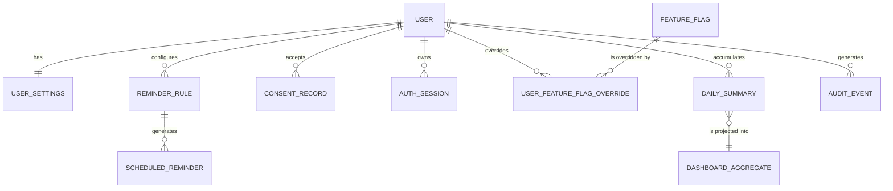

# Module Specification — Unified Daily Dashboard and Settings

| Field | Value |
| --- | --- |
| Document | `docs/requirements/modules/dashboard-and-settings.md` — authoritative functional specification for the Unified Daily Dashboard (`DSH`) and Settings and Preferences (`SET`) subsystems |
| Version | 1.0 |
| Date | 2026-07-21 |
| Status | Baselined for Phase 1 sign-off |
| Owner | Rakshit — Project Lead / sole developer (D-05) |
| Parent | [`../SRS.md`](../SRS.md) — PlantPal+ Software Requirements Specification |
| Owned prefixes | `DSH` (24 functional requirements, 17 business rules), `SET` (30 functional requirements, 18 business rules) |
| Conformance | IEEE 830-1998 section structure, ISO/IEC/IEEE 29148:2018 requirement-quality rules |

---

## Table of contents

1. [Purpose and scope](#1-purpose-and-scope)
2. [Actors and stakeholders](#2-actors-and-stakeholders)
3. [Capability overview](#3-capability-overview)
4. [Functional requirements](#4-functional-requirements)
   - [4.1 Unified Daily Dashboard requirements](#41-unified-daily-dashboard-requirements)
   - [4.2 Settings and Preferences requirements](#42-settings-and-preferences-requirements)
5. [Business rules](#5-business-rules)
   - [5.1 Dashboard business rules](#51-dashboard-business-rules)
   - [5.2 Settings business rules](#52-settings-business-rules)
6. [Data entities touched](#6-data-entities-touched)
7. [External interfaces](#7-external-interfaces)
8. [Edge cases and boundary conditions](#8-edge-cases-and-boundary-conditions)
9. [Deferred and out of scope for v1.0](#9-deferred-and-out-of-scope-for-v10)
10. [Traceability stub](#10-traceability-stub)

---

## 1. Purpose and scope

### 1.1 Purpose

The unified daily dashboard is the landing surface after authentication and the single justification for merging three habit trackers into one product. If the dashboard does not produce a genuinely merged, prioritised, actionable view of the user's day, PlantPal+ is three applications sharing a login rather than one product, and `GOAL-01` fails.

Settings is the control surface that makes the merged product tolerable for a user who wants only part of it, correct for a user who is not in the northern hemisphere or on a 24-hour UTC day, and lawful under the good-practice legal depth fixed by `D-01`. It is also the single authoritative source of the preference values that the reminder engine (`NOT`), the watering algorithm (`PLT`), the energy formulas (`NUT`) and the streak evaluator (`GAM`) all read.

This document is the definitive statement of *what* both subsystems must do. It is written for two readers at once: an academic evaluator checking rigour and traceability, and the Phase 3 implementer, who must be able to build every rule stated here without asking a follow-up question.

### 1.2 In scope — `DSH`, the unified daily dashboard

| # | Capability | Requirements |
| --- | --- | --- |
| 1 | The dashboard aggregate contract: one REST resource returning everything the screen needs in exactly one network round trip | `FR-DSH-01` |
| 2 | The header: time-of-day greeting, display name, human-readable date label | `FR-DSH-02` |
| 3 | The global streak indicator, display only; the value is computed by `GAM` | `FR-DSH-03` |
| 4 | The merged Today list: one prioritised, actionable list interleaving Plant Care, Fitness and Nutrition, with a deterministic ordering rule and a grouping rule | `FR-DSH-04`, `FR-DSH-05`, `FR-DSH-06`, `FR-DSH-07` |
| 5 | Three module summary cards, each with a progress ring, a numeric value pair and exactly one primary action | `FR-DSH-08` |
| 6 | The recent achievement unlocks strip, display only; unlock logic is `GAM` | `FR-DSH-09` |
| 7 | The quick-add action set | `FR-DSH-10` |
| 8 | Date navigation: past dates, the Today shortcut, the per-widget read-only matrix, and the timezone-derived day boundary including DST | `FR-DSH-11`, `FR-DSH-12`, `FR-DSH-13`, `FR-DSH-14` |
| 9 | Per-module adaptation across all seven non-empty subsets of `{PLANT, FITNESS, NUTRITION}` | `FR-DSH-15` |
| 10 | Every empty, first-run, loading, offline, degraded and error state | `FR-DSH-16`, `FR-DSH-17`, `FR-DSH-18`, `FR-DSH-19`, `FR-DSH-20` |
| 11 | Refresh semantics, throttling, cache freshness and cross-screen invalidation | `FR-DSH-21`, `FR-DSH-23` |
| 12 | Responsive layout at one, two and three columns | `FR-DSH-22` |
| 13 | Deep-link focus arriving from a push notification or an email digest | `FR-DSH-24` |

### 1.3 In scope — `SET`, settings and preferences

| # | Capability | Requirements |
| --- | --- | --- |
| 1 | The settings hub information architecture and its closed section catalogue | `FR-SET-01`, `FR-SET-02` |
| 2 | Presentation preferences: unit system, theme, week start day, language placeholder | `FR-SET-03`, `FR-SET-04`, `FR-SET-05`, `FR-SET-06`, `FR-SET-25` |
| 3 | Locale and season: IANA timezone, hemisphere, and the recomputation cascades each triggers | `FR-SET-07`, `FR-SET-08`, `FR-SET-09`, `FR-SET-10` |
| 4 | Module enablement, the at-least-one guard, and the streak-impact confirmation | `FR-SET-11`, `FR-SET-12`, `FR-SET-13` |
| 5 | Notification preferences: master switch, category matrix, channel preferences, quiet hours, default reminder times | `FR-SET-14`, `FR-SET-15`, `FR-SET-16`, `FR-SET-17` |
| 6 | The glass-size preference consumed by the water quick action | `FR-SET-18` |
| 7 | Integration feature flags for Open Food Facts and Perenual, with server-side gating and provider cooldown | `FR-SET-19` |
| 8 | Data rights: export request and delivery, import (deferred), account deletion with a grace period | `FR-SET-20`, `FR-SET-21`, `FR-SET-22`, `FR-SET-23` |
| 9 | Security surfaces: the active session list and revocation, presentation layer only | `FR-SET-24` |
| 10 | Accessibility preferences and their application | `FR-SET-28`, `FR-SET-29` |
| 11 | About, diagnostics, legal surfaces and re-consent on a version bump | `FR-SET-26`, `FR-SET-27` |
| 12 | Settings persistence semantics: server-authoritative single row, optimistic client update, conflict detection, cross-device propagation | `FR-SET-30` |

### 1.4 Explicitly excluded from this module

Everything in this table is referenced by identifier only. This document never redefines, renumbers or duplicates it.

| Excluded topic | Owning prefix | Note |
| --- | --- | --- |
| Registration, login, logout, password reset, email change, JWT issue, refresh-token rotation | `ACC` | `SET` links to these surfaces and renders the session list. It never defines token mechanics. |
| Field-level validation of profile identity fields — display name, avatar, date of birth, biological sex, height, body mass | `ACC` | `FR-SET-02` provides the entry point only. Body metrics feed `FIT` and `NUT` energy formulas. |
| Plant entities, species catalogue, watering-interval formula, seasonal multipliers, care-task generation | `PLT` | The dashboard consumes derived due-task rows. A hemisphere change *triggers* `PLT` recomputation but does not define it. |
| Workout entities, step sources, fitness goals, progress charts | `FIT` | The dashboard consumes derived daily aggregates. |
| Meals, foods, macros, calorie and water goals, barcode lookup, BMR and TDEE formulas, disclaimer wording | `NUT` | `SET` owns the *toggle* for Open Food Facts, not the lookup behaviour. |
| Reminder scheduling engine, node-cron tick, Expo Push delivery, retries, notification payloads, snooze | `NOT` | `SET` owns the *preferences* the engine reads. `NOT` owns evaluation and delivery. |
| Streak computation, freeze rules, achievement definitions, unlock evaluation | `GAM` | The dashboard displays. `GAM` computes. |
| Offline write queue, idempotency-key upsert, delta-sync cursor, tombstones, media upload pipeline, global search, the server-side export worker | `SYS` | `FR-SET-20` and `FR-SET-21` define the *user-facing* export contract. `SYS` owns the worker. |
| Primary navigation shell chrome, tab bar and sidebar visual design | Phase 2 UI/UX | This module specifies only *which destinations exist* for a given enabled-module subset, never how they look. |
| Monetisation, billing, admin console, multi-user households, plant sharing | Out of product scope | `D-01`, `D-06`. |

### 1.5 Conventions used in this document

- Every functional requirement is a single testable capability expressed as one `The system shall …` sentence. Compound requirements are split.
- Verification methods are drawn from exactly `Test`, `Demonstration`, `Inspection`, `Analysis`.
- Releases are `v0.1 Walking Skeleton`, `v0.5 Alpha`, `v1.0 MVP`, `v1.1 Post-MVP`.
- All times written as `HH:MM` are local wall-clock times in the user's stored IANA timezone unless the text says UTC.
- All stored measurements are canonical metric SI (`D-09`); imperial appears only at render time.
- A `†` beside a user-story identifier in section 10 marks a provisional trace: the requirement is real, but a dedicated user story is recommended to the owner of [`../user-stories/dashboard-and-settings.md`](../user-stories/dashboard-and-settings.md).

---

## 2. Actors and stakeholders

### 2.1 Actors

| Actor | Type | Relationship to this module |
| --- | --- | --- |
| Registered User | Human, primary | Views the dashboard, acts on Today items, navigates dates, changes every setting. The only actor permitted to write `SET` data. |
| First-Run User | Human, specialisation of Registered User | Account age under 24 hours with zero domain entities. Sees the onboarding checklist and every empty state. |
| Reminder Scheduler | System, node-cron on the backend | Reads the notification preferences, quiet hours and default reminder times owned by `SET`. Re-triggered by timezone and hemisphere changes. Owned by `NOT`. |
| Dashboard Aggregation Service | System, backend | Composes the single aggregate response from the `PLT`, `FIT`, `NUT` and `GAM` read models. |
| Sync Service | System, backend and client | Delta-syncs the settings row and replays queued append-only writes originating from dashboard quick actions. Owned by `SYS`. |
| Export Worker | System, backend job | Builds the export bundle requested through `SET`. Owned by `SYS`. |
| Notification Dispatcher | System, Expo Push and transactional email | Delivers reminders, export-ready notices and deletion-scheduled emails. Owned by `NOT`. |
| Platform Runtime | System, iOS / Android / browser | Supplies the OS colour scheme, the reduce-motion signal, the dynamic-type scale and the device IANA timezone. |
| Open Food Facts | External system | Gated by a `SET` feature flag. Never required for correct operation (`D-03`). |
| Perenual | External system | Gated by a `SET` feature flag. Never required for correct operation (`D-03`). |
| Operator | Human, the sole developer in an operational role | Owns the server-side feature flags that gate the user-facing integration toggles, and publishes new legal document versions. |
| System Clock and IANA Timezone Database | System | Source of truth for local-date derivation and DST offsets. |

### 2.2 Stakeholders with an interest in this module

| Stakeholder | Interest in `DSH` / `SET` |
| --- | --- |
| `STK-01` End user | The dashboard is the product they see every day; settings is where they make it fit their life. |
| `STK-02` Project supervisor and academic evaluator | The merged Today list ordering rule and the day-boundary rule are the two most rigour-sensitive specifications in the SRS. |
| `STK-03` Project Lead / sole developer | The single-aggregate contract is the architectural decision that keeps the dashboard inside the free-tier request and latency budget. |
| `STK-05` Pilot cohort testers | Supply the empirical evidence for `MET-01`, `MET-02`, `MET-07`, `MET-08`, `MET-15` and `MET-16`, all of which are measured at the dashboard. |
| `STK-10` Accessibility reviewers | `FR-SET-28` and `FR-SET-29` are the user-controllable half of `GOAL-07`. |
| `STK-11` Academic-integrity and IT policy office | `FR-SET-20`, `FR-SET-23` and `FR-SET-27` are the surfaces that make pilot-tester data handling defensible. |

### 2.3 Personas this module must satisfy

| Persona | What this module must get right for them |
| --- | --- |
| `PER-01` Aditi Sharma | The three-module merged dashboard, streak visibility and one-tap logging. |
| `PER-02` Marcus Oyelaran | A single-module layout that shows no fitness or nutrition chrome, and plant-watering grouping. |
| `PER-03` Mia Castellano | Southern-hemisphere derivation, imperial-to-metric switching and quiet hours. |
| `PER-04` Harold Whitfield | Reduced motion, larger text, high contrast, plain non-shaming copy, and no colour-only status. |
| `PER-05` Sofia Lindqvist | Offline dashboard rendering, queued writes and visible integration feature-flag state. |

---

## 3. Capability overview

```mermaid
flowchart TB
  ROOT["Dashboard and Settings module"]

  ROOT --> D["DSH - Unified Daily Dashboard"]
  ROOT --> S["SET - Settings and Preferences"]

  D --> D1["Aggregate contract - one round trip"]
  D --> D2["Header - greeting, date, streak"]
  D --> D3["Merged Today list"]
  D --> D4["Module summary cards"]
  D --> D5["Achievements strip"]
  D --> D6["Quick add actions"]
  D --> D7["Date navigation"]
  D --> D8["Module enablement adaptation"]
  D --> D9["States - empty, first run, loading, offline, degraded"]
  D --> D10["Refresh, cache and layout"]

  D3 --> D3a["Item collection from PLT, FIT, NUT"]
  D3 --> D3b["Bucket classification"]
  D3 --> D3c["Deterministic ordering"]
  D3 --> D3d["Plant watering grouping"]
  D3 --> D3e["Inline primary action"]
  D3 --> D3f["Overflow and cap"]

  D4 --> D4a["Plant card and ring"]
  D4 --> D4b["Fitness card and ring"]
  D4 --> D4c["Nutrition card, ring and water sub meter"]

  D7 --> D7a["Past date browsing"]
  D7 --> D7b["Today shortcut"]
  D7 --> D7c["Read only matrix"]
  D7 --> D7d["Timezone day boundary and DST"]

  D10 --> D10a["Pull to refresh and manual refresh"]
  D10 --> D10b["Freshness and invalidation"]
  D10 --> D10c["Responsive grid"]
  D10 --> D10d["Deep link focus"]

  S --> S1["Settings hub information architecture"]
  S --> S2["Presentation preferences"]
  S --> S3["Locale and season"]
  S --> S4["Module enablement"]
  S --> S5["Notification preferences"]
  S --> S6["Integrations"]
  S --> S7["Data rights"]
  S --> S8["Security surfaces"]
  S --> S9["Accessibility"]
  S --> S10["About and legal"]
  S --> S11["Persistence and sync"]

  S2 --> S2a["Unit system"]
  S2 --> S2b["Theme"]
  S2 --> S2c["Week start day"]
  S2 --> S2d["Language placeholder"]

  S3 --> S3a["Timezone and drift prompt"]
  S3 --> S3b["Hemisphere and auto derivation"]
  S3 --> S3c["Recompute cascade"]

  S5 --> S5a["Master switch"]
  S5 --> S5b["Category matrix"]
  S5 --> S5c["Channel preferences"]
  S5 --> S5d["Quiet hours"]
  S5 --> S5e["Default reminder times"]

  S7 --> S7a["Export request and delivery"]
  S7 --> S7b["Import - deferred to v1.1"]
  S7 --> S7c["Account deletion and grace period"]

  S10 --> S10a["Version, build, diagnostics"]
  S10 --> S10b["Privacy, terms, disclaimer, licences"]
  S10 --> S10c["Re-consent on version bump"]
```



### 3.1 Requirement inventory at a glance

| Prefix | Must | Should | Could | Wont | Total |
| --- | --- | --- | --- | --- | --- |
| `FR-DSH` | 19 | 5 | 0 | 0 | 24 |
| `FR-SET` | 20 | 9 | 1 | 0 | 30 |
| **Total** | **39** | **14** | **1** | **0** | **54** |

| Release | `FR-DSH` | `FR-SET` |
| --- | --- | --- |
| v0.1 Walking Skeleton | `FR-DSH-01` | — |
| v0.5 Alpha | `FR-DSH-02` … `FR-DSH-05`, `FR-DSH-08`, `FR-DSH-14`, `FR-DSH-18` | `FR-SET-01`, `FR-SET-02`, `FR-SET-07`, `FR-SET-30` |
| v1.0 MVP | `FR-DSH-06`, `FR-DSH-07`, `FR-DSH-09` … `FR-DSH-13`, `FR-DSH-15` … `FR-DSH-17`, `FR-DSH-19` … `FR-DSH-24` | `FR-SET-03` … `FR-SET-06`, `FR-SET-09` … `FR-SET-18`, `FR-SET-20`, `FR-SET-21`, `FR-SET-23` … `FR-SET-29` |
| v1.1 Post-MVP | — | `FR-SET-08`, `FR-SET-19`, `FR-SET-22` |

---

## 4. Functional requirements

Each requirement below carries a metadata table, a single normative shall-sentence, its rationale, an inputs-and-validation table, processing rules referencing the business rules of section 5, outputs, and an alternate-and-error-flow table. Error codes are the machine-readable `code` field of the API error envelope owned by `SYS`.

### 4.1 Unified Daily Dashboard requirements

Requirements `FR-DSH-01` through `FR-DSH-24`.

#### FR-DSH-01 — Single-round-trip dashboard aggregate

| Attribute | Value |
| --- | --- |
| Priority | Must |
| Release | v0.1 Walking Skeleton |
| Actor | Dashboard Aggregation Service |
| Verification | Test |
| Traces to | `GOAL-01`, `STK-01`, `STK-03`; `US-DSH-01`, `US-DSH-08`; `UC-DSH-01`; `NFR-PERF-03`, `NFR-PERF-11`, `NFR-SCAL-05`, `NFR-RELI-06` |

**Requirement.** The system shall return all data required to render the dashboard for one calendar date in a single HTTP GET response from `GET /api/v1/dashboard`.

**Rationale.** The dashboard reads from four subsystems. Issuing four to seven parallel requests against a free-tier backend that suffers cold starts produces visible waterfall latency and consumes the request budget for no benefit. A composed read model is the architectural decision that makes a merged dashboard viable at zero cost, and it is therefore stated as a requirement rather than left to implementation.

**Inputs and validation.**

| Field | Type | Constraints | Required |
| --- | --- | --- | --- |
| `date` | query string | Matches `^\d{4}-\d{2}-\d{2}$` and is a real calendar date. Defaults to the caller's current local date when absent. Must not be later than the caller's current local date. Must not be earlier than the account creation local date. | No |
| `X-Client-Timezone` | request header | A valid IANA timezone identifier. Advisory only; the stored timezone of `FR-SET-07` remains authoritative. | No |
| `Authorization` | request header | `Bearer <access token>`, a valid unexpired JWT access token. | Yes |

**Processing rules.**

1. Resolve the local day window per `BR-DSH-01`.
2. Compose the sections `meta`, `header`, `streak`, `modules`, `moduleCards`, `todayItems`, `todayCounts`, `achievements`, `quickActions` and `onboarding` into the contract of `BR-DSH-14`.
3. Execute at most 8 database queries and zero external network calls per request.
4. Assign each composable section an independent status from `OK`, `EMPTY`, `DEGRADED`, `DISABLED` per `BR-DSH-14` and `FR-DSH-20`.
5. Emit every timestamp both as an ISO-8601 UTC instant and as a `localDate` plus `localTime` pair.

**Outputs.** HTTP 200 with the JSON document of `BR-DSH-14`. The uncompressed payload shall not exceed 120 kilobytes for a reference profile of 60 plants, 20 workouts per week and 8 meals per day.

**Alternate and error flows.**

| Condition | System response | User-visible message |
| --- | --- | --- |
| `date` fails the pattern or is not a real calendar date | HTTP 400, code `DSH_DATE_MALFORMED`; no composition is attempted | `That date could not be read. Returning you to today.` |
| `date` is later than the current local date | HTTP 422, code `DSH_DATE_IN_FUTURE` | `Future days cannot be opened yet.` |
| `date` is earlier than the account creation local date | HTTP 422, code `DSH_DATE_BEFORE_ACCOUNT` | `Your history starts on {accountCreatedDate}.` |
| One or more sections fail to compose | HTTP 200 with those sections marked `DEGRADED`; never a global 5xx | `Some of today could not be loaded.` with a section-scoped retry |
| Access token missing, invalid or expired | HTTP 401, code `AUTH_REQUIRED` | `Please sign in again.` |
| Database completely unavailable | HTTP 503 with `Retry-After: 5` | `PlantPal+ is waking up. Trying again shortly.` |

#### FR-DSH-02 — Header greeting and date label

| Attribute | Value |
| --- | --- |
| Priority | Must |
| Release | v0.5 Alpha |
| Actor | Registered User |
| Verification | Demonstration |
| Traces to | `GOAL-01`, `PER-01`; `US-DSH-04`; `UC-DSH-01`; `NFR-I18N-02`, `NFR-USAB-05` |

**Requirement.** The system shall display a dashboard header containing a time-of-day greeting, the user's display name and the full weekday-and-date label of the currently viewed date.

**Rationale.** The greeting is the personalisation cue that makes a merged tracker feel like one product rather than three bolted together, and the date label is the anchor for the entire date-navigation model. Without an explicit date label a user browsing history cannot tell which day they are looking at.

**Inputs and validation.**

| Field | Type | Constraints | Required |
| --- | --- | --- | --- |
| `displayName` | string | Supplied by `ACC`. The first whitespace-delimited token is used, truncated to 20 characters with a single-character ellipsis when longer. Empty, absent or whitespace-only resolves to the literal `there`. | No |
| `viewedLocalDate` | date | Within `[accountCreatedLocalDate, todayLocalDate]` per `BR-DSH-12`. | Yes |
| `currentLocalTime` | time | The current wall-clock time in the stored timezone. Drives band selection. | Yes |

**Processing rules.**

1. Select the greeting band from the **current** local time per `BR-DSH-07`, never from the viewed date.
2. When `viewedLocalDate` is not the current local date, omit the greeting line entirely and render only the date label (`BR-DSH-11`, greeting row `HIDDEN`).
3. Format the date label per the four-row table in `BR-DSH-07` using `Intl` bound to locale `en`.

**Outputs.** A header line of the form `Good morning, Rakshit` and a date line of the form `Today · Tuesday, 21 July 2026`.

**Alternate and error flows.**

| Condition | System response | User-visible message |
| --- | --- | --- |
| The profile section is `DEGRADED` so the display name is unresolvable | Render the greeting with the `there` fallback; raise no error | `Good morning, there` |
| Display name is longer than 20 characters in its first token | Truncate to 20 characters plus a single-character ellipsis | `Good afternoon, Bartholomewwwwwwwww…` |
| Viewed date is in the past | Suppress the greeting line; render the date label alone | `Yesterday · Monday, 20 July 2026` |

#### FR-DSH-03 — Global streak indicator

| Attribute | Value |
| --- | --- |
| Priority | Must |
| Release | v0.5 Alpha |
| Actor | Registered User |
| Verification | Test |
| Traces to | `GOAL-04`, `STK-01`; `US-DSH-03`; `UC-DSH-01`; `NFR-A11Y-04`, `NFR-A11Y-08`, `NFR-USAB-03` |

**Requirement.** The system shall display the user's current global streak length in days in the dashboard header.

**Rationale.** The streak is the primary retention mechanic of the product and the motivational payoff of consolidating three trackers. It must be visible on the landing screen without a tap, or it cannot influence behaviour.

**Inputs and validation.**

| Field | Type | Constraints | Required |
| --- | --- | --- | --- |
| `currentStreakDays` | integer | Non-negative. Supplied by `GAM`. A value of 0 renders a neutral start-your-streak state, never a hidden indicator. | Yes |
| `atRisk` | boolean | Supplied by `GAM`. Rendered only when the viewed date is the current local date. | Yes |
| `viewedLocalDate` | date | Determines live versus historical presentation. | Yes |

**Processing rules.**

1. When the viewed date is today, show the live streak value and, when `atRisk` is true, an at-risk affordance.
2. When the viewed date is in the past, show the streak length as it stood at the end of that local date and suppress the at-risk affordance (`BR-DSH-11`).
3. Convey status by at least one non-colour channel — a text label or an icon shape — never by colour alone.
4. Use neutral copy in every state. No loss framing, no countdown pressure, no shaming language (`D-07`).

**Outputs.** An integer day count, an accessible label of the form `Current streak: 12 days`, and a tap target that navigates to the `GAM` streak detail screen.

**Alternate and error flows.**

| Condition | System response | User-visible message |
| --- | --- | --- |
| `streak` section status is `DEGRADED` | Render a dash placeholder plus a retry control; do not render zero | `Streak unavailable` |
| `currentStreakDays` is 0 | Render the neutral zero state with an inviting, non-judgemental caption | `Start your streak today` |
| Streak is at risk and the viewed date is today | Render the at-risk affordance with neutral wording | `Log anything today to keep your streak` |
| Viewed date is in the past | Render the historical value, read only | `Streak on 20 July: 11 days` |

#### FR-DSH-04 — Today list assembly

| Attribute | Value |
| --- | --- |
| Priority | Must |
| Release | v0.5 Alpha |
| Actor | Dashboard Aggregation Service |
| Verification | Test |
| Traces to | `GOAL-01`, `GOAL-02`, `STK-01`; `US-DSH-01`; `UC-DSH-01`; `NFR-PERF-03`, `NFR-RELI-06` |

**Requirement.** The system shall assemble a single Today list containing one entry for every open or completed actionable item sourced from each enabled module for the viewed date.

**Rationale.** The merged actionable list is the single feature no standalone tracker provides. It is the product's differentiator and the direct realisation of `GOAL-01`.

**Inputs and validation.**

| Field | Type | Constraints | Required |
| --- | --- | --- | --- |
| `viewedLocalDate` | date | Within the navigable range of `BR-DSH-12`. | Yes |
| `enabledModules` | set of `ModuleKey` | Non-empty, guaranteed by `FR-SET-12`. Only enabled modules contribute items. | Yes |
| Plant watering tasks | collection | From `PLT`. Admitted when `dueLocalDate <= viewedLocalDate` and not dismissed. | No |
| Plant care tasks | collection | From `PLT`, types fertilise, repot, prune. Same admission rule. | No |
| Meal slots | enumeration | `BREAKFAST`, `LUNCH`, `DINNER` only. `SNACK` never generates an item (`BR-DSH-02`). | No |
| Water intake state | record | From `NUT`. Admitted while the daily water goal is unmet. | No |
| Workout and step goal state | records | From `FIT`. Admitted while the respective goal is unmet. | No |

**Processing rules.**

1. Admit an item only when its owning module is enabled, its due local date is on or before the viewed date, and it has not been dismissed. Exclude any item whose due date is after the viewed date.
2. Project every admitted source row onto the canonical Today item shape of `BR-DSH-02` with the fields `itemId`, `category`, `bucket`, `title`, `subtitle`, `scheduledLocalTime`, `dueLocalDate`, `daysOverdue`, `status`, `primaryAction`, `entityIds`, `deepLink`.
3. Classify each item into a bucket by the first-match-wins table of `BR-DSH-02`.
4. Apply the cap and overflow rule of `BR-DSH-05`.

**Outputs.** An ordered array of Today items plus a companion `todayCounts` object giving `open`, `done` and `overdue` totals.

**Alternate and error flows.**

| Condition | System response | User-visible message |
| --- | --- | --- |
| Exactly one module's projection fails | Omit its items, mark its module card `DEGRADED`, render the remainder | `Fitness items could not be loaded.` with a retry |
| Every module projection fails | Mark `todayItems` `DEGRADED`; the header, streak and cards still render | `Your Today list could not be loaded.` |
| Zero items after assembly while every enabled module holds at least one record | Render the all-caught-up state of `BR-DSH-10`, not an empty state | `All caught up` |
| More than 200 items are produced | Truncate at 200 and set `truncated: true` (`BR-DSH-05`) | `Showing the first 200 items for this day.` |

#### FR-DSH-05 — Deterministic Today ordering

| Attribute | Value |
| --- | --- |
| Priority | Must |
| Release | v0.5 Alpha |
| Actor | Dashboard Aggregation Service |
| Verification | Test |
| Traces to | `GOAL-01`, `STK-02`; `US-DSH-01`; `UC-DSH-01`; `NFR-MAIN-03`, `NFR-MAIN-04` |

**Requirement.** The system shall order the Today list by the six-key sort tuple defined in `BR-DSH-03` and shall produce an identical ordering for identical input data.

**Rationale.** A prioritised list is only trustworthy if it is stable. A list that reshuffles between refreshes destroys the user's spatial memory and cannot be asserted in an automated test, which would leave the product's single most opinionated design decision unverifiable.

**Inputs and validation.**

| Field | Type | Constraints | Required |
| --- | --- | --- | --- |
| `bucket` | integer | One of 0, 1, 2, 3 per `BR-DSH-02`. Non-null. | Yes |
| `daysOverdue` | integer | Minimum 0. Non-null. | Yes |
| `categoryWeight` | integer | From the fixed weight table in `BR-DSH-03`. Non-null. | Yes |
| `effectiveTime` | integer | Minutes since local midnight, 0 to 1439. A null `scheduledLocalTime` normalises to the category default of `BR-SET-06`, and failing that to 1439 (23:59). | Yes |
| `title` | string | Non-empty. Folded with the `en-US` collator at `sensitivity: 'base'` for comparison. | Yes |
| `itemId` | string | Lowercase hexadecimal UUID, or the literal group identifier of `BR-DSH-04`. Guarantees a total order. | Yes |

**Processing rules.**

1. Sort with a stable sort by the ordered tuple of `BR-DSH-03`: `bucket` ascending, `daysOverdue` descending, `categoryWeight` ascending, `effectiveTime` ascending, `titleFoldedCase` ascending, `itemId` ascending.
2. Because `itemId` is unique, the tuple is a total order; two executions over identical input therefore produce identical sequences.
3. Emit a `sortKey` string per item echoing the tuple, so an integration test can assert the ordering without re-implementing the comparator.

**Outputs.** The ordered array, each element carrying its `sortKey`, for example `0|002|10|0540|water 3 plants|grp-plant-watering`.

**Alternate and error flows.**

| Condition | System response | User-visible message |
| --- | --- | --- |
| An item is missing a sort input | Normalise per the validation table and place it in the last bucket; never drop it | none |
| Two items are identical in every key except `itemId` | The `itemId` tiebreak yields a stable, reproducible order | none |
| The sort executes | It cannot fail; no error path exists | none |

#### FR-DSH-06 — Plant watering aggregation

| Attribute | Value |
| --- | --- |
| Priority | Must |
| Release | v1.0 MVP |
| Actor | Dashboard Aggregation Service |
| Verification | Test |
| Traces to | `GOAL-01`, `PER-02`; `US-DSH-01`; `UC-DSH-01`; `NFR-PERF-08`, `NFR-USAB-01` |

**Requirement.** The system shall represent two or more open plant-watering items for the viewed date as one grouped Today entry labelled with the count of plants and expandable to the individual plants.

**Rationale.** A user with 25 plants would otherwise see 25 near-identical rows that swamp every fitness and nutrition item, defeating the purpose of the merged list. Grouping preserves the merge.

**Inputs and validation.**

| Field | Type | Constraints | Required |
| --- | --- | --- | --- |
| `openWateringItems` | array | Aggregation applies when the count is 2 or more. A count of 1 renders individually with the plant's own name and thumbnail. A count of 0 produces no item. | Yes |
| `memberBucket` | integer | The group bucket is the minimum across members. | Yes |
| `memberDaysOverdue` | integer | The group value is the maximum across members. | Yes |
| `memberEffectiveTime` | integer | The group value is the minimum across members. | Yes |

**Processing rules.**

1. Compute the group fields exactly as specified in `BR-DSH-04`; the group `itemId` is the literal `grp-plant-watering`.
2. Order member rows on expansion by `daysOverdue` descending, then plant name ascending.
3. Complete the group as a batch of individual idempotent writes, one per member, never as a single compound write, so a partial failure leaves a coherent state.
4. Apply the same rule to `PLANT_CARE` items with the title template `{N} plant care tasks`.
5. Never group completed watering items; render them individually in bucket `DONE`, capped at the three most recent with a `+K more` affordance.

**Outputs.** One grouped Today item carrying `title` of the form `Water 3 plants`, a `memberCount` integer and the ordered `entityIds` array.

**Alternate and error flows.**

| Condition | System response | User-visible message |
| --- | --- | --- |
| Exactly one plant is due | Render the individual item with the plant's own name and thumbnail | `Water Monstera` |
| A subset of member completions fails | Keep succeeded members completed, re-render failed members as open with an inline retry; never roll back, because the writes are append-only | `2 of 3 saved. Tap to retry the rest.` |
| 40 plants are all overdue | One group titled `Water 40 plants` with `daysOverdue` equal to the worst member | `Water 40 plants — 6 days overdue` |
| The group is completed while offline | Enqueue one queued write per member and badge the group as pending | `Queued. Will sync when you are back online.` |

#### FR-DSH-07 — Inline primary action

| Attribute | Value |
| --- | --- |
| Priority | Must |
| Release | v1.0 MVP |
| Actor | Registered User |
| Verification | Test |
| Traces to | `GOAL-02`, `GOAL-05`, `MET-15`; `US-DSH-02`; `UC-DSH-02`; `NFR-USAB-01`, `NFR-USAB-04`, `NFR-RELI-04`, `NFR-DATA-09` |

**Requirement.** The system shall execute the primary action of a Today item from within the Today list without navigating away from the dashboard for the item categories `PLANT_WATERING`, `PLANT_CARE` and `WATER_INTAKE`.

**Rationale.** The shortest possible path from opening the app to a logged action is the core habit loop. Requiring navigation to a module screen for a one-tap event is precisely the friction the merged dashboard exists to remove, and `GOAL-02` fixes the budget at three taps.

**Inputs and validation.**

| Field | Type | Constraints | Required |
| --- | --- | --- | --- |
| `actionType` | enumeration | `INLINE_COMPLETE` for `PLANT_WATERING`, `PLANT_CARE` and `WATER_INTAKE`; `NAVIGATE` for `MEAL_SLOT`, `WORKOUT` and `STEPS`, which require user-supplied detail. | Yes |
| `targetEntityId` | uuid | Must reference a record owned by the authenticated user. | Yes |
| `payload` | object | Fixed per action, for example the water increment equal to `glass_size_ml` from `FR-SET-18`. | No |
| `idempotencyKey` | uuid | Client-generated canonical lowercase UUID version 4 (`D-04`, `NFR-DATA-09`). | Yes |
| `clientTimestamp` | timestamp | ISO-8601 UTC instant recorded on the device at the moment of the tap. | Yes |

**Processing rules.**

1. Apply the completion optimistically on the client, then post to the owning module's endpoint with the idempotency key and client timestamp.
2. While offline, enqueue the write per `D-04` and render the item in a pending state with a queued badge.
3. On success, transition the item to `status = DONE`, recompute the owning module card ring locally, and invalidate the affected cache keys per `FR-DSH-23`.
4. Categories carrying a `NAVIGATE` action open the owning module's create form pre-filled with the viewed date.

**Outputs.** An item in `status = DONE`, a locally recomputed module ring, and a refreshed streak indicator on the next successful aggregate fetch.

**Alternate and error flows.**

| Condition | System response | User-visible message |
| --- | --- | --- |
| Server returns 4xx | Revert the optimistic state and offer retry | `That watering could not be saved. Tap to try again.` |
| Server returns 5xx or the network fails | Keep the write queued and retry per the `SYS` replay policy | `Saved on this device. It will sync automatically.` |
| The same idempotency key is replayed | The server returns the original record; the item simply stays completed and no duplicate is created | none |
| The viewed date is beyond the 30-day retroactive window | The control is `READ_ONLY` per `BR-DSH-11`; a stale client receives 422 `SYS_RETRO_WINDOW_EXCEEDED` | `Entries older than 30 days cannot be changed.` |
| The category carries a `NAVIGATE` action | Open the module create form pre-filled with the viewed date | none |

#### FR-DSH-08 — Module summary cards and progress rings

| Attribute | Value |
| --- | --- |
| Priority | Must |
| Release | v0.5 Alpha |
| Actor | Registered User |
| Verification | Test |
| Traces to | `GOAL-01`, `GOAL-06`, `PER-01`; `US-DSH-01`, `US-DSH-05`; `UC-DSH-01`; `NFR-A11Y-08`, `NFR-I18N-03`, `NFR-RELI-06` |

**Requirement.** The system shall display one summary card per enabled module, each containing a progress ring whose fill percentage is computed by the formula in `BR-DSH-06`, a numeric current-versus-target pair and exactly one primary action control.

**Rationale.** The ring gives an at-a-glance completeness signal per module, and exactly one primary action per card keeps the card actionable rather than decorative. More than one action per card would reintroduce the navigation cost the dashboard exists to remove.

**Inputs and validation.**

| Field | Type | Constraints | Required |
| --- | --- | --- | --- |
| `numerator` | number | Per-card definition in `BR-DSH-06`. Non-negative. | Yes |
| `denominator` | number | Per-card definition in `BR-DSH-06`. A value of 0 is never divided by; it triggers the documented zero-denominator behaviour. A stored goal of 0 is treated as no goal. | Yes |
| `unitSystem` | enumeration | `METRIC` or `IMPERIAL` from `FR-SET-03`; drives display conversion only. | Yes |
| `glassSizeMillilitres` | integer | 100 to 1000, step 10, from `FR-SET-18`. Used by the water sub-meter. | Yes |

**Processing rules.**

1. Compute `fillPercent = min(100, round(numerator / denominator * 100))` with half-up rounding on the first decimal (`BR-DSH-06`).
2. Display the uncapped true values beside the ring, so an over-goal day reads for example `2 340 / 2 000 kcal` with a neutral over-goal badge.
3. Resolve the fitness primary metric by the four-step precedence of `BR-DSH-06`.
4. Render the nutrition card's secondary water meter as `glassesLogged / glassesGoal` where `glassesLogged = floor(totalMillilitres / glassSizeMillilitres)`.
5. Convey ring status with a value label or pattern in addition to colour (`NFR-A11Y-08`, and `high_contrast` per `BR-SET-15`).
6. Use neutral treatment for both over-goal and under-goal days. No alarm colour, warning icon or judgemental wording is permitted (`D-07`).

**Outputs.** Between one and three cards, each with a ring percentage, a numeric pair, a caption and exactly one primary control.

**Alternate and error flows.**

| Condition | System response | User-visible message |
| --- | --- | --- |
| Plant denominator is 0 | Render 100 percent | `All caught up` |
| Fitness or nutrition denominator is 0 | Render 0 percent with a goal-setting call to action; perform no division | `Set a goal` |
| Consumed kilocalories exceed the goal | Fill the ring to 100 percent and show a neutral badge | `340 kcal over` |
| The module aggregate failed | Render the card frame in a `DEGRADED` state with a retry control; never a zeroed ring, because a false zero misinforms | `Could not load your nutrition summary.` |
| The unit system is `IMPERIAL` | Convert display values per `BR-SET-02`; energy and macronutrients remain kcal and g | `5.2 mi of 6.2 mi` |

#### FR-DSH-09 — Recent achievement unlocks

| Attribute | Value |
| --- | --- |
| Priority | Should |
| Release | v1.0 MVP |
| Actor | Registered User |
| Verification | Test |
| Traces to | `GOAL-04`, `PER-01`; `US-DSH-03`; `UC-DSH-01`; `NFR-USAB-06`, `NFR-A11Y-07` |

**Requirement.** The system shall display the achievements unlocked in the seven days ending on the viewed date, newest first, limited to three entries.

**Rationale.** Surfacing recent wins on the landing screen is the cheapest available reinforcement mechanic in the product and requires no new subsystem, since `GAM` already computes unlocks.

**Inputs and validation.**

| Field | Type | Constraints | Required |
| --- | --- | --- | --- |
| `unlockedLocalDate` | date | Within the selection window of `BR-DSH-08`: the 7 local dates ending on the viewed date when the viewed date is today, or exactly the viewed date when it is in the past. | Yes |
| `unlockedAt` | timestamp | ISO-8601 UTC. Primary sort key, descending. | Yes |
| `achievementCode` | string | Secondary sort key, ascending. Stable tiebreak. | Yes |
| `limit` | integer | Fixed at 3. Not user-configurable in v1.0. | Yes |

**Processing rules.**

1. Select and order per `BR-DSH-08`.
2. When the viewed date is in the past, collapse the window to that single date so the strip reflects what was actually unlocked that day.
3. Render each tile with the achievement icon, its title and a relative day label from `Today`, `Yesterday`, `{n} days ago`.
4. Replace any Lottie celebration with a static badge carrying identical information when effective reduced motion is `ON` (`FR-SET-29`).

**Outputs.** Up to three badge tiles, each navigating to the `GAM` achievement detail screen.

**Alternate and error flows.**

| Condition | System response | User-visible message |
| --- | --- | --- |
| The result set is empty | Hide the entire strip including its heading; this is deliberately not an empty state, because an empty-achievements placeholder on day one would be discouraging | none |
| The `achievements` section is `DEGRADED` | Render the strip frame with a retry control and no tiles | `Achievements could not be loaded.` |
| More than three achievements were unlocked in the window | Show the three newest only; no overflow control in v1.0 | none |

#### FR-DSH-10 — Quick-add action set

| Attribute | Value |
| --- | --- |
| Priority | Must |
| Release | v1.0 MVP |
| Actor | Registered User |
| Verification | Demonstration |
| Traces to | `GOAL-02`, `MET-15`; `US-DSH-02`; `UC-DSH-04`; `NFR-USAB-01`, `NFR-A11Y-03` |

**Requirement.** The system shall display a quick-add control set containing only the actions listed in `BR-DSH-09` whose owning module is enabled.

**Rationale.** Not every logging action corresponds to something due today. Without an always-available creation affordance a user who wants to log an unplanned workout would have to navigate, breaking the three-tap budget of `GOAL-02`.

**Inputs and validation.**

| Field | Type | Constraints | Required |
| --- | --- | --- | --- |
| `enabledModules` | set of `ModuleKey` | Non-empty. Filters the catalogue. | Yes |
| `quickActionCatalogue` | ordered list | Closed and fixed by `BR-DSH-09`. The rendered set is capped at 5 entries in catalogue order. | Yes |
| `viewedLocalDate` | date | Pre-fills the created record. Outside the 30-day retroactive window the controls render disabled. | Yes |

**Processing rules.**

1. Filter the closed catalogue of `BR-DSH-09` to enabled modules, preserve catalogue order, and cap at 5 entries.
2. On mobile present the set as a floating action button expanding to a bottom sheet; on web present it as a horizontal control row above the Today list.
3. Execute `Log water +1 glass` as a direct write of `glass_size_ml` with no intermediate screen. Every other action opens the owning module's create form pre-filled with the viewed date.
4. When only one module is enabled, render at most 3 entries inline rather than behind a floating action button on mobile (`BR-DSH-09`).
5. Invalidate the cache for the affected date on success per `FR-DSH-23`.

**Outputs.** The created record, a success toast carrying an undo affordance for at least 10 seconds (`NFR-USAB-04`), and an invalidated cache key for the affected date.

**Alternate and error flows.**

| Condition | System response | User-visible message |
| --- | --- | --- |
| The viewed date lies outside the 30-day retroactive window | Render the quick-add controls disabled with an explanatory label | `Entries older than 30 days cannot be added` |
| The device is offline and the action is queueable | Enqueue and badge the pending write | `Queued. Will sync when you are back online.` |
| The device is offline and the action is not queueable until submitted | Open the form; block submission with an explanation | `Needs internet` |
| The viewed date is in the past and within 30 days | Pre-fill the entry at 12:00 local on that date (`BR-DSH-11`) | `Logging for Monday, 20 July` |

#### FR-DSH-11 — Past-date navigation

| Attribute | Value |
| --- | --- |
| Priority | Must |
| Release | v1.0 MVP |
| Actor | Registered User |
| Verification | Test |
| Traces to | `GOAL-04`, `D-07`; `US-DSH-04`; `UC-DSH-03`; `NFR-A11Y-10`, `NFR-USAB-03` |

**Requirement.** The system shall allow the user to navigate the dashboard to any calendar date between the account creation local date and the current local date inclusive, and shall reject navigation to any date after the current local date.

**Rationale.** Users forget to log and need to correct yesterday. Without retroactive access the streak mechanic becomes punitive, which conflicts directly with `D-07`.

**Inputs and validation.**

| Field | Type | Constraints | Required |
| --- | --- | --- | --- |
| `targetLocalDate` | date | Must lie within `[accountCreatedLocalDate, todayLocalDate]` inclusive (`BR-DSH-12`). | Yes |
| Entry mechanism | enumeration | One of: previous-day control, next-day control, horizontal swipe gesture on mobile, date picker. | Yes |

**Processing rules.**

1. Disable the previous-day control at the lower bound and the next-day control at the upper bound; the date picker disallows selection outside the range.
2. Issue a new aggregate request for the target date; retain the previously viewed date's cached response.
3. Preserve scroll position at the top of the list and announce the new date to assistive technology through a polite live region.
4. Apply the read-only matrix of `BR-DSH-11` to the rendered result.

**Outputs.** A fully re-rendered dashboard for the requested date with the read-only matrix applied.

**Alternate and error flows.**

| Condition | System response | User-visible message |
| --- | --- | --- |
| A date outside the range reaches the server, for example via a hand-crafted deep link | HTTP 422; the client clamps to the nearest valid date | `That day is outside your history. Showing {clampedDate}.` |
| The account was created today | The previous-day control is disabled | `Your history starts today.` |
| The requested date has no cached entry and the device is offline | Render the offline empty state of `BR-DSH-10` | `No offline data for this day` |
| The user's local date rolls over while browsing | Re-evaluate the range; clamp the viewed date if it is now invalid | `It is now {newDate}.` |

#### FR-DSH-12 — Today shortcut

| Attribute | Value |
| --- | --- |
| Priority | Must |
| Release | v1.0 MVP |
| Actor | Registered User |
| Verification | Demonstration |
| Traces to | `GOAL-01`; `US-DSH-04`; `UC-DSH-03`; `NFR-USAB-03` |

**Requirement.** The system shall display a Today control that returns the dashboard to the current local date, and shall hide that control while the current local date is being viewed.

**Rationale.** After browsing history the user needs a single deterministic route back to the live screen, and the control's presence or absence is itself a reliable state indicator of whether the user is looking at live or historical data.

**Inputs and validation.**

| Field | Type | Constraints | Required |
| --- | --- | --- | --- |
| `viewedLocalDate` | date | The control renders if and only if this differs from `todayLocalDate`. | Yes |
| `todayLocalDate` | date | Derived from the stored IANA timezone per `BR-DSH-01`. | Yes |
| Foreground event | event | Application return to foreground; triggers a rollover check. | No |

**Processing rules.**

1. On activation, set the viewed date to the current local date and refetch when the cached entry for today is stale per `FR-DSH-23`.
2. Restore full interactivity, replacing the read-only matrix with the today column of `BR-DSH-11`.
3. Activate automatically when the application returns to the foreground after the local date has rolled over while it was backgrounded.

**Outputs.** The live dashboard for the current local date.

**Alternate and error flows.**

| Condition | System response | User-visible message |
| --- | --- | --- |
| The refetch fails | Show the cached today response with the offline or degraded treatment; never strand the user on a past date | `Showing your last saved view of today.` |
| The application is backgrounded at 23:58 and foregrounded at 00:03 | Detect the rollover and move to the new today automatically | `It is now Wednesday, 22 July.` |
| The viewed date is already today | The control is not rendered at all | none |

#### FR-DSH-13 — Past-date read-only matrix

| Attribute | Value |
| --- | --- |
| Priority | Must |
| Release | v1.0 MVP |
| Actor | Registered User |
| Verification | Test |
| Traces to | `GOAL-04`, `STK-02`; `US-DSH-04`; `UC-DSH-03`; `NFR-A11Y-04`, `NFR-USAB-03` |

**Requirement.** The system shall apply the per-widget read-only matrix defined in `BR-DSH-11` whenever the viewed date is earlier than the current local date.

**Rationale.** A past date must be honestly historical. Showing a live at-risk streak chip or a snooze control on a date that has already closed would be actively misleading, and silently inert controls are worse than visibly disabled ones.

**Inputs and validation.**

| Field | Type | Constraints | Required |
| --- | --- | --- | --- |
| `viewedLocalDate` | date | Compared against `todayLocalDate`. | Yes |
| `retroWindowDays` | integer | Fixed constant of 30 calendar days, counted in local dates, boundary inclusive at 30 (`BR-DSH-12`). | Yes |
| Widget identity | enumeration | Each widget resolves to exactly one of `INTERACTIVE`, `RETRO_WRITE`, `READ_ONLY`, `HIDDEN`. | Yes |

**Processing rules.**

1. Resolve every widget against the matrix of `BR-DSH-11`.
2. Render reminder-lifecycle controls owned by `NOT` — snooze, dismiss, remind later — as `HIDDEN` on past dates, because they act on future deliveries.
3. Render append-only logging controls as `RETRO_WRITE` while the viewed date is within 30 days of today, and `READ_ONLY` beyond it.
4. Render the onboarding checklist as `HIDDEN` on any past date. Keep the offline banner and refresh `INTERACTIVE` on every date.
5. Give every disabled control both a visual disabled state and a programmatic accessible explanation. No silently inert control is permitted.

**Outputs.** A dashboard whose interactivity matches the historical status of the viewed date.

**Alternate and error flows.**

| Condition | System response | User-visible message |
| --- | --- | --- |
| A stale client attempts a `READ_ONLY` write | HTTP 422, code `SYS_RETRO_WINDOW_EXCEEDED`; the client refreshes its matrix | `Entries older than 30 days cannot be changed.` |
| The viewed date is exactly 30 days old | The write is allowed; the boundary is inclusive at 30 | none |
| The viewed date is 31 days old | The write is refused | `Entries older than 30 days cannot be changed.` |
| A module card primary action is `RETRO_WRITE` | Relabel the control with the viewed date | `Log for 20 July` |

#### FR-DSH-14 — Timezone day boundary and DST correctness

| Attribute | Value |
| --- | --- |
| Priority | Must |
| Release | v0.5 Alpha |
| Actor | Dashboard Aggregation Service |
| Verification | Test |
| Traces to | `GOAL-01`, `GOAL-04`, `STK-02`; `US-DSH-04`, `US-SET-05`; `UC-DSH-01`, `UC-SET-03`; `NFR-DATA-01`, `NFR-DATA-02` |

**Requirement.** The system shall determine the dashboard day boundary as midnight to midnight in the user's stored IANA timezone, including on days on which a daylight-saving transition makes the local day 23 or 25 hours long.

**Rationale.** Every streak, goal and due-date decision in the product depends on one shared definition of "today". An implicit UTC day would silently break every user west of UTC and would double-count or skip a day at each DST transition. This is the single most load-bearing rule in the specification, and every other module consumes it.

**Inputs and validation.**

| Field | Type | Constraints | Required |
| --- | --- | --- | --- |
| `timezone` | text | A valid IANA identifier from `FR-SET-07`. Missing or unrecognised falls back to `UTC` and raises an operational warning. | Yes |
| `serverClockUtc` | timestamp | The authoritative instant. The server value always wins over a client value. | Yes |
| `viewedLocalDate` | date | The date whose window is being computed. | Yes |

**Processing rules.**

1. Compute the local day window as the half-open interval `[localDate 00:00:00 in tz, nextLocalDate 00:00:00 in tz)` per `BR-DSH-01`, evaluated with PostgreSQL `AT TIME ZONE` on the server and `date-fns-tz` on the clients; the two must agree.
2. Accept a 23-hour or 25-hour local day without special-casing. No rule anywhere in the product may assume 86 400 seconds per day.
3. Resolve a non-existent local wall-clock time on a spring-forward day forward to the first valid instant.
4. Resolve an ambiguous local wall-clock time on a fall-back day to the first, earlier occurrence.
5. Emit every timestamp in the aggregate response as both an ISO-8601 UTC instant and a `localDate` plus `localTime` pair.

**Outputs.** A UTC instant pair bounding the viewed local day, and a response in which every date is unambiguous.

**Alternate and error flows.**

| Condition | System response | User-visible message |
| --- | --- | --- |
| The stored timezone is missing or invalid | Fall back to `UTC`, log an operational warning, and flag the timezone setting as needing attention | `Your time zone needs attention.` with a link to settings |
| A reminder time of 02:30 does not exist on a spring-forward day | Resolve forward to 03:00; exactly one occurrence | none |
| A reminder time of 01:30 occurs twice on a fall-back day | Deliver on the first, earlier occurrence only | none |
| The device timezone disagrees with the stored timezone | Render the server-computed local dates, never the device's, and raise the prompt of `FR-SET-08` | `Your device says {deviceZone}. Update PlantPal+?` |

#### FR-DSH-15 — Module enablement adaptation

| Attribute | Value |
| --- | --- |
| Priority | Must |
| Release | v1.0 MVP |
| Actor | Registered User |
| Verification | Test |
| Traces to | `GOAL-01`, `PER-02`, `MET-08`; `US-DSH-05`; `UC-DSH-01`, `UC-SET-04`; `NFR-USAB-06`, `NFR-PORT-03` |

**Requirement.** The system shall render the dashboard, the quick-add set and the primary navigation destinations for each of the seven non-empty subsets of the module set `{PLANT, FITNESS, NUTRITION}` without displaying any control belonging to a disabled module.

**Rationale.** `D-02` ships three modules, but a real user may want only one. A dashboard that renders dead cards for unused modules makes a combined product feel like bloatware, which is the exact failure mode this product must avoid.

**Inputs and validation.**

| Field | Type | Constraints | Required |
| --- | --- | --- | --- |
| `plantEnabled` | boolean | From `FR-SET-11`. | Yes |
| `fitnessEnabled` | boolean | From `FR-SET-11`. | Yes |
| `nutritionEnabled` | boolean | From `FR-SET-11`. | Yes |
| Combined state | invariant | At least one flag is true at all times, guaranteed by `FR-SET-12` and a database `CHECK` constraint. The seven non-empty subsets form the required test matrix. | Yes |

**Processing rules.**

1. For each disabled module, omit its summary card, its Today items, its quick-add actions and its primary navigation destination.
2. Exclude the disabled module from the streak-qualifying action set from the change local date forward, never retroactively (`BR-SET-10`).
3. Reflow the remaining cards to fill the responsive grid rather than leaving a gap.
4. Resolve a deep link into a disabled module's screen to the settings Modules section rather than to a dead end.

**Outputs.** A dashboard containing between one and three cards, and a navigation shell containing between three and five destinations.

**Alternate and error flows.**

| Condition | System response | User-visible message |
| --- | --- | --- |
| A deep link addresses a disabled module | Resolve to the settings Modules section with an offer to re-enable | `Fitness is currently off. Turn it back on?` |
| All three modules are enabled | Render three cards and five navigation destinations | none |
| Exactly one module is enabled | Render one card, three navigation destinations, and at most three inline quick actions (`BR-DSH-09`) | none |
| A module is re-enabled | Restore visibility and re-arm notifications from stored preferences; backfill nothing | `Fitness is back on.` |

#### FR-DSH-16 — Empty and all-caught-up states

| Attribute | Value |
| --- | --- |
| Priority | Must |
| Release | v1.0 MVP |
| Actor | Registered User |
| Verification | Demonstration |
| Traces to | `GOAL-01`, `MET-01`, `PER-01`; `US-DSH-06`; `UC-DSH-01`; `NFR-USAB-06`, `NFR-USAB-03` |

**Requirement.** The system shall display, for each enabled module that holds no qualifying records for the viewed date, the module-specific empty state and call to action defined in `BR-DSH-10`.

**Rationale.** The emptiest the product will ever look is the first minute of use, which is exactly the moment a new user decides whether to continue. Every empty region must therefore carry a constructive next step rather than blank space.

**Inputs and validation.**

| Field | Type | Constraints | Required |
| --- | --- | --- | --- |
| `lifetimeRecordCount` | integer | Per module. Distinguishes "never any records" from "none on this date". | Yes |
| `viewedDateRecordCount` | integer | Per module, for the viewed local date. | Yes |
| `sectionStatus` | enumeration | Must be `OK`. A `DEGRADED` section never renders an empty state. | Yes |
| `currentLocalTime` | time | Selects the time-appropriate nutrition call to action per `BR-DSH-10`. | Yes |

**Processing rules.**

1. Select an empty state only when the section status is `OK` and the record count is zero. Absence of data caused by failure must never be presented as absence of data in fact.
2. Map each condition to its exact headline, body and call-to-action strings using the catalogue in `BR-DSH-10`.
3. Choose the nutrition call to action by current local time: `Log breakfast` before 11:00, `Log lunch` from 11:00 to 15:59, `Log dinner` from 16:00 to 21:59, `Log a meal` from 22:00 to 04:59.
4. Render the all-caught-up state, not an empty state, when zero open items remain and every enabled module holds at least one record.
5. Keep every explanatory sentence at or below 140 characters and provide exactly one primary call to action (`NFR-USAB-06`).

**Outputs.** An illustrated empty block with exactly one primary call to action and at most one secondary text link.

**Alternate and error flows.**

| Condition | System response | User-visible message |
| --- | --- | --- |
| The section status is `DEGRADED` | Render the degraded state, never the empty state | `Could not load your plants.` |
| Zero plants have ever existed | Render the first-run plant empty state | `No plants yet` with `Add a plant` |
| Plants exist but none are due on the viewed date | Render the next-watering empty state | `Nothing to water today` |
| Zero open items and every module has data | Render the all-caught-up state | `All caught up` |
| Offline with no cached entry for the date | Render the offline empty state offering the most recent cached date | `No offline data for this day` |

#### FR-DSH-17 — First-run onboarding checklist

| Attribute | Value |
| --- | --- |
| Priority | Should |
| Release | v1.0 MVP |
| Actor | First-Run User |
| Verification | Test |
| Traces to | `GOAL-01`, `MET-01`, `MET-02`; `US-DSH-06`; `UC-DSH-01`; `NFR-USAB-02`, `NFR-USAB-06` |

**Requirement.** The system shall display a dismissible first-run checklist of the setup steps defined in `BR-DSH-17` while the checklist remains incomplete and undismissed and the account is younger than seven days.

**Rationale.** A three-module product has three separate first actions. A checklist converts an intimidating blank slate into a bounded task list and is the mechanism by which `MET-01` activation is achieved.

**Inputs and validation.**

| Field | Type | Constraints | Required |
| --- | --- | --- | --- |
| `enabledModules` | set of `ModuleKey` | Steps are generated only for enabled modules, in the fixed order of `BR-DSH-17`. | Yes |
| `lifetimeCounts` | object | Per-module lifetime record counts. Step completion is derived from these counts, never stored, so it can never disagree with the data. | Yes |
| `accountCreatedAt` | timestamp | The checklist renders only while `now - accountCreatedAt < 7 days`. | Yes |
| `onboardingDismissedAt` | timestamp | Nullable. A non-null value permanently suppresses the checklist. Stored server-side so dismissal follows the user across devices. | No |

**Processing rules.**

1. Render the checklist only when all of the following hold: at least one applicable step is incomplete, `onboardingDismissedAt` is null, and the account is younger than 7 days.
2. Generate steps for enabled modules only, in the fixed order of `BR-DSH-17`, each deep-linking to its creation flow.
3. Remove the checklist permanently once every applicable step is complete.
4. Treat dismissal as a one-way user action written to the server.

**Outputs.** A card with a progress caption of the form `1 of 3 done` and up to four tappable steps.

**Alternate and error flows.**

| Condition | System response | User-visible message |
| --- | --- | --- |
| Checklist state cannot be loaded | Omit the card entirely rather than render it empty | none |
| The account is 7 days old or older | Suppress the checklist regardless of completion | none |
| The viewed date is in the past | The checklist is `HIDDEN` per `BR-DSH-11` | none |
| The user dismisses the checklist | Persist `onboardingDismissedAt` server-side; never re-display it on any device | `Checklist hidden. You can still add anything from Quick add.` |

#### FR-DSH-18 — Loading skeletons

| Attribute | Value |
| --- | --- |
| Priority | Should |
| Release | v0.5 Alpha |
| Actor | Registered User |
| Verification | Demonstration |
| Traces to | `GOAL-01`, `PER-05`; `US-DSH-08`; `UC-DSH-01`; `NFR-PERF-06`, `NFR-PERF-07`, `NFR-A11Y-07` |

**Requirement.** The system shall display placeholder skeleton elements matching the final layout of the header, the Today list and every module card while the dashboard request is in flight and no cached response is available.

**Rationale.** A spinner on a composite screen gives no sense of what is coming and produces a jarring layout jump on resolve. Skeletons matching the final geometry eliminate cumulative layout shift, which is a measured budget under `NFR-PERF-06`.

**Inputs and validation.**

| Field | Type | Constraints | Required |
| --- | --- | --- | --- |
| `requestInFlight` | boolean | Skeletons render only while true. | Yes |
| `cachedResponseExists` | boolean | When true, render the cached response immediately and refresh in the background instead of showing skeletons. | Yes |
| `effectiveReducedMotion` | boolean | Resolved per `BR-SET-15`. When true, skeleton shimmer is disabled. | Yes |

**Processing rules.**

1. Render skeleton blocks for the header, three Today rows and each enabled module card, using the same box dimensions as the resolved components.
2. Show the skeleton within 100 milliseconds of navigation whenever data is not already cached (`NFR-PERF-07`).
3. Suppress shimmer animation when effective reduced motion resolves to `ON` (`FR-SET-29`).
4. Replace the skeleton in place, producing no layout shift on resolve.

**Outputs.** A skeleton screen replaced in place by real content with zero cumulative layout shift attributable to the swap.

**Alternate and error flows.**

| Condition | System response | User-visible message |
| --- | --- | --- |
| A cached response exists | Render it immediately with a subtle background-refresh affordance; show no skeleton | none |
| The request exceeds 10 seconds | Replace the skeleton with the error state of `FR-DSH-20` and a retry control | `This is taking longer than usual.` with `Try again` |
| The request is still pending after 2 000 milliseconds on a cold backend | Render the waking-server state defined by `NFR-PERF-04` | `Waking the server…` |
| Reduced motion is effective | Render static skeleton blocks with no shimmer | none |

#### FR-DSH-19 — Offline rendering

| Attribute | Value |
| --- | --- |
| Priority | Must |
| Release | v1.0 MVP |
| Actor | Registered User |
| Verification | Test |
| Traces to | `GOAL-05`, `D-04`, `PER-05`; `US-DSH-07`; `UC-DSH-01`; `NFR-USAB-07`, `NFR-RELI-04` |

**Requirement.** The system shall render the most recently cached dashboard response together with a persistent offline banner and a last-updated timestamp when the device has no network connectivity.

**Rationale.** `D-04` mandates cached reads everywhere, and the dashboard is the screen most likely to be opened on a commute. A blank screen offline would make the product feel broken at precisely the moment the habit loop matters most.

**Inputs and validation.**

| Field | Type | Constraints | Required |
| --- | --- | --- | --- |
| `connectivityState` | boolean | The offline indicator must appear within 2 000 milliseconds of connectivity loss (`NFR-USAB-07`). | Yes |
| `cacheEntry` | object | Usable regardless of age. Freshness is communicated, never enforced by hiding data. | No |
| `fetchedAt` | timestamp | Drives the staleness presentation thresholds of `BR-DSH-13`. | Yes when a cache entry exists |
| `queuedWriteCount` | integer | Non-negative. Displayed whenever greater than zero. | Yes |

**Processing rules.**

1. Pin an offline banner below the header reading `You are offline. Showing data from {relative time}`.
2. Render disabled, with the label `Needs internet`, every control that requires connectivity under `D-04` — that is, any create, edit or delete other than the seven append-only logging actions.
3. Keep the seven append-only logging actions enabled; they enqueue with an idempotency key.
4. Apply the staleness presentation thresholds of `BR-DSH-13`: no marker under 15 minutes, a `Last updated {relative}` line from 15 minutes to 24 hours, and an amber marker beyond 24 hours.
5. Accompany every connectivity-disabled control with a one-sentence explanation of why it is unavailable.

**Outputs.** A fully rendered cached dashboard, a queued-writes count when the queue is non-empty, and a staleness marker appropriate to the cache age.

**Alternate and error flows.**

| Condition | System response | User-visible message |
| --- | --- | --- |
| No cache entry exists for the requested date | Render the offline empty state offering navigation to the most recent cached date | `No offline data for this day` with `Go to 19 July` |
| The cache entry is older than 24 hours | Render the amber staleness marker | `Data may be out of date` |
| A queueable action is taken offline | Enqueue, badge the item, and increment the queued count | `1 action waiting to sync` |
| A non-queueable control is tapped offline | Keep it disabled; explain rather than fail | `Needs internet` |
| Connectivity returns mid-refresh | Let the in-flight request complete or be superseded; never blank the screen | none |

#### FR-DSH-20 — Section-level degradation and retry

| Attribute | Value |
| --- | --- |
| Priority | Should |
| Release | v1.0 MVP |
| Actor | Dashboard Aggregation Service |
| Verification | Test |
| Traces to | `GOAL-01`, `STK-03`; `US-DSH-08`; `UC-DSH-01`; `NFR-RELI-06`, `NFR-OBSV-02`, `NFR-OBSV-03` |

**Requirement.** The system shall render every successfully composed dashboard section when one or more sections fail to compose, marking each failed section with status `DEGRADED` and a section-scoped retry control.

**Rationale.** Three modules composed into one response create three independent failure domains. Failing the whole screen because one read model timed out would make the merged dashboard strictly less reliable than three separate screens, which would invalidate the architecture the product is built on.

**Inputs and validation.**

| Field | Type | Constraints | Required |
| --- | --- | --- | --- |
| Section identity | enumeration | Each of `streak`, `todayItems`, `moduleCards.plant`, `moduleCards.fitness`, `moduleCards.nutrition` and `achievements` carries an independent status. | Yes |
| `status` | enumeration | Exactly one of `OK`, `EMPTY`, `DEGRADED`, `DISABLED`. | Yes |
| `correlationId` | string | The `X-Request-Id` value, attached to every logged failure and shown in the error surface. | Yes |
| `consecutiveFailures` | integer | Counted per section within a rolling 60-second window. | Yes |

**Processing rules.**

1. Return HTTP 200 with a `partial` indication when at least one but not all sections fail.
2. Render a `DEGRADED` section as its frame plus an inline explanatory line and a retry control that refetches only that section through its module endpoint.
3. Log each failure to the free Sentry tier with the section name and the correlation identifier.
4. After three consecutive `DEGRADED` results for the same section within 60 seconds, replace the retry control with a `Try again later` message, to avoid a retry storm against a free-tier backend.

**Outputs.** A partially populated but fully usable dashboard, plus one structured log line and one error event per failed section.

**Alternate and error flows.**

| Condition | System response | User-visible message |
| --- | --- | --- |
| One module aggregate times out | Mark that card `DEGRADED`; other cards and the Today list still render | `Fitness could not be loaded.` with `Retry` |
| Three consecutive failures for one section within 60 seconds | Replace the retry control with a cool-down message | `Try again later` |
| Every section fails but the request itself succeeds | Render the frame of each section in `DEGRADED` state; do not show a full-screen error | `Some parts of your dashboard are unavailable.` |
| A section is `DISABLED` because its module is off | Render nothing for it; this is not an error state | none |

#### FR-DSH-21 — Refresh and throttle

| Attribute | Value |
| --- | --- |
| Priority | Must |
| Release | v1.0 MVP |
| Actor | Registered User |
| Verification | Test |
| Traces to | `GOAL-09`, `STK-03`, `STK-07`; `US-DSH-08`; `UC-DSH-05`; `NFR-SCAL-01`, `NFR-RELI-08` |

**Requirement.** The system shall refetch the dashboard aggregate on a pull-to-refresh gesture on mobile and on activation of the refresh control on web, and shall ignore any such request issued within 5 000 milliseconds of the completion of the previous one.

**Rationale.** Users expect pull-to-refresh on mobile, and an unthrottled refresh against a free-tier backend with a 10-connection pool is a self-inflicted denial of service.

**Inputs and validation.**

| Field | Type | Constraints | Required |
| --- | --- | --- | --- |
| Trigger | enumeration | One of: pull-to-refresh gesture, web refresh control activation, window focus event, application foreground event. | Yes |
| `msSinceLastRefreshCompleted` | integer | A manual refresh is ignored below 5 000 milliseconds (`BR-DSH-16`). | Yes |
| `cacheAgeSeconds` | integer | Automatic focus refetch fires only above 60 seconds. | Yes |

**Processing rules.**

1. Refetch the aggregate for the currently viewed date only.
2. Preserve scroll position and expanded-group state across the refresh.
3. Never clear the cache before the new response arrives.
4. Animate the refresh indicator for at least 400 milliseconds even when the request is throttled, so the gesture is acknowledged.
5. After three consecutive failed refreshes within 60 seconds, suppress automatic refetch for 5 minutes while leaving manual refresh available (`BR-DSH-16`).

**Outputs.** An updated aggregate and an updated `Last updated` timestamp.

**Alternate and error flows.**

| Condition | System response | User-visible message |
| --- | --- | --- |
| A refresh is requested inside the 5 000 millisecond window | Ignore it, issue no network call, animate the indicator for 400 milliseconds | none |
| The refresh fails | Leave the previous data intact and show a non-blocking toast; never blank the screen | `Could not refresh. Showing your last update.` |
| Focus occurs while the cache entry is fresher than 60 seconds | Do not refetch | none |
| Three consecutive refresh failures within 60 seconds | Suppress automatic refetch for 5 minutes; keep manual refresh available | `Automatic refresh paused for a few minutes.` |

#### FR-DSH-22 — Responsive layout

| Attribute | Value |
| --- | --- |
| Priority | Must |
| Release | v1.0 MVP |
| Actor | Registered User |
| Verification | Demonstration |
| Traces to | `GOAL-01`, `GOAL-12`; `US-DSH-08`; `UC-DSH-01`; `NFR-PORT-03`, `NFR-A11Y-06`, `NFR-I18N-05` |

**Requirement.** The system shall lay out the dashboard in one column below 768 CSS pixels of viewport width, two columns from 768 to 1279 CSS pixels, and three columns at 1280 CSS pixels and above.

**Rationale.** One codebase serves phone and desktop. A single-column desktop dashboard would waste the screen on which the merged view is most compelling, and a horizontally scrolling phone layout would fail `NFR-PORT-03`.

**Inputs and validation.**

| Field | Type | Constraints | Required |
| --- | --- | --- | --- |
| `viewportWidthCssPx` | integer | Breakpoints are exactly 768 and 1280 (`BR-DSH-15`). Layout must not scroll horizontally at any width from 320 to 2560 CSS pixels. | Yes |
| `textScale` | integer | One of 100, 115, 130, 150 from `FR-SET-28`. No layout may clip or truncate content at 150 percent. | Yes |

**Processing rules.**

1. Below 768 pixels stack everything in one column in the order header, Today list, module cards, achievements.
2. From 768 to 1279 pixels span the Today list across both columns and place the module cards side by side beneath it, with achievements full width.
3. At 1280 pixels and above place the Today list in columns one and two, stack the module cards in column three, and span achievements across all columns.
4. Present an equivalent information set at every width. No content may be available at one breakpoint and absent at another.
5. Scroll any wide element — a table or a chart — inside its own container rather than scrolling the page.

**Outputs.** A layout meeting the column rule at every tested width with no horizontal page scroll.

**Alternate and error flows.**

| Condition | System response | User-visible message |
| --- | --- | --- |
| Viewport is 320 CSS pixels wide | One column, no horizontal page scroll, no clipped text | none |
| Text scale is 150 percent | Content reflows; nothing is clipped or truncated. This is an explicit acceptance condition | none |
| A wide element exceeds the column width | The element scrolls inside its own container | none |
| Layout computation | Presentational only; it cannot fail independently and has no error path | none |

#### FR-DSH-23 — Cache freshness and invalidation

| Attribute | Value |
| --- | --- |
| Priority | Must |
| Release | v1.0 MVP |
| Actor | Sync Service |
| Verification | Test |
| Traces to | `GOAL-05`, `D-04`, `PER-05`; `US-DSH-07`; `UC-DSH-05`; `NFR-RELI-04`, `NFR-DATA-09`, `NFR-SCAL-02` |

**Requirement.** The system shall treat a cached dashboard response as fresh for 60 seconds and shall invalidate the cached response for an affected date immediately after any successful create, update or delete of a record that contributes to that date's dashboard.

**Rationale.** The dashboard aggregates data mutated from six other screens. Without explicit invalidation a user would log a meal and return to a dashboard that still reads zero, which is indistinguishable from data loss and destroys trust in the merged view.

**Inputs and validation.**

| Field | Type | Constraints | Required |
| --- | --- | --- | --- |
| Cache key | tuple | Exactly `['dashboard', userId, localDate]` (`BR-DSH-13`). | Yes |
| `staleTime` | integer | Fixed at 60 seconds. | Yes |
| `gcTime` | integer | Fixed at 24 hours. | Yes |
| Persisted entry budget | integer | Today plus the 7 most recently viewed dates; least-recently-used eviction beyond that, to bound AsyncStorage, MMKV and IndexedDB usage. | Yes |
| Mutation event | event | Carries the affected local date and whether it can change streak state. | Yes |

**Processing rules.**

1. On a successful mutation affecting local date `D`, invalidate `['dashboard', userId, D]` and refetch in the background.
2. When the mutation can change streak state, additionally invalidate today's key.
3. Invalidate a queued offline write on successful replay, not at enqueue time; apply the optimistic local state at enqueue time.
4. Persist at most today plus the 7 most recently viewed dates and evict least-recently-used beyond that.

**Outputs.** A dashboard consistent with the last successful write within one refetch cycle.

**Alternate and error flows.**

| Condition | System response | User-visible message |
| --- | --- | --- |
| The invalidation refetch fails | Keep the optimistic local state and reconcile at the next successful fetch, since all queued actions are append-only and therefore conflict-free by construction (`D-04`) | none |
| The cache holds 8 dates and a ninth is viewed | Evict least-recently-used, always retaining today | none |
| The same watering is completed on two devices while both are offline | Both replay with different idempotency keys and are accepted as two events; `PLT` decides whether a duplicate same-day watering is meaningful. Documented as an accepted consequence of the append-only model | none |
| A replay presents a previously seen idempotency key | The server returns the original record with HTTP 200; no additional record is created | none |

#### FR-DSH-24 — Deep-link focus

| Attribute | Value |
| --- | --- |
| Priority | Should |
| Release | v1.0 MVP |
| Actor | Registered User |
| Verification | Test |
| Traces to | `GOAL-02`, `GOAL-04`, `MET-10`; `US-DSH-08`; `UC-DSH-01`; `NFR-A11Y-07`, `NFR-A11Y-10` |

**Requirement.** The system shall open the dashboard at the date carried by an inbound deep link and shall visually highlight the Today item identified by that link for 3 seconds.

**Rationale.** A reminder that opens a generic dashboard forces the user to re-find the item the notification was about, wasting the highest-intent moment in the entire product and depressing `MET-10`.

**Inputs and validation.**

| Field | Type | Constraints | Required |
| --- | --- | --- | --- |
| Link | string | `plantpal://dashboard?date=YYYY-MM-DD&focus=<itemId>` on mobile, `/dashboard?date=YYYY-MM-DD&focus=<itemId>` on web. The scheme and the `DASHBOARD` target are fixed by the `DeepLinkTarget` enumeration owned by the domain model. | Yes |
| `date` | date | Validated as in `FR-DSH-01`, then clamped into the navigable range of `BR-DSH-12`. | No |
| `focus` | string | An item identifier. An unknown or already-completed value is ignored without error. | No |

**Processing rules.**

1. Load the dashboard for the given date, scroll the referenced item into view, and move accessibility focus to it with an announcement.
2. Apply the highlight treatment for exactly 3 seconds.
3. Use a static outline rather than a pulse when effective reduced motion resolves to `ON` (`FR-SET-29`).
4. Preserve the link through the login flow when the user is unauthenticated and replay it after successful authentication.

**Outputs.** The dashboard for the linked date with the target item visible, highlighted and announced.

**Alternate and error flows.**

| Condition | System response | User-visible message |
| --- | --- | --- |
| `focus` refers to an unknown or completed item | Open the dashboard normally for the given date and raise no error | none |
| `date` is outside the navigable range | Clamp to the nearest valid date with an informational toast | `Showing {clampedDate}.` |
| The user is unauthenticated | Preserve the link, complete sign-in, then replay it | none |
| The deep link addresses a disabled module's item | Resolve to the settings Modules section per `FR-DSH-15` | `Fitness is currently off. Turn it back on?` |

### 4.2 Settings and Preferences requirements

Requirements `FR-SET-01` through `FR-SET-30`.

#### FR-SET-01 — Settings hub information architecture

| Attribute | Value |
| --- | --- |
| Priority | Must |
| Release | v0.5 Alpha |
| Actor | Registered User |
| Verification | Demonstration |
| Traces to | `GOAL-01`, `STK-01`; `US-SET-01`; `UC-SET-01`; `NFR-USAB-01`, `NFR-USAB-05` |

**Requirement.** The system shall present a settings hub organised into the nine sections enumerated in `BR-SET-01`, each section reachable in at most two taps from the dashboard.

**Rationale.** This module concentrates more than twenty preferences that would otherwise scatter across the product. A fixed, shallow, closed section catalogue keeps every control discoverable and gives the SRS a stable place to hang each requirement.

**Inputs and validation.**

| Field | Type | Constraints | Required |
| --- | --- | --- | --- |
| `enabledModules` | set of `ModuleKey` | Rows belonging to a disabled module render inactive with a stated reason, never hidden without explanation. | Yes |
| `platform` | enumeration | `IOS`, `ANDROID` or `WEB`. A section whose every control is platform-inapplicable is hidden entirely. | Yes |
| `emailVerified` | boolean | Gates the email-digest row of `FR-SET-15`. | Yes |
| Section catalogue | ordered list | Closed at exactly nine members in the fixed order of `BR-SET-01`. No section may be empty. | Yes |

**Processing rules.**

1. Render the nine sections in the fixed catalogue order of `BR-SET-01`.
2. Show a one-line current-value summary on each row, for example `Units — Metric`.
3. Keep the depth from the dashboard to any individual control at two taps or fewer.
4. Use exactly one user-facing term per concept, matching the project glossary (`NFR-USAB-05`).

**Outputs.** A scrollable settings hub with section headers and per-row value summaries.

**Alternate and error flows.**

| Condition | System response | User-visible message |
| --- | --- | --- |
| The settings record cannot be loaded | Render the hub as a read-only skeleton with a retry control; accept no input, so no write can occur against unknown prior state | `Settings could not be loaded.` with `Retry` |
| Every control in a section is platform-inapplicable | Hide the whole section | none |
| The device is offline | Render current values from cache; disable every control | `Needs internet` |

#### FR-SET-02 — Profile entry point

| Attribute | Value |
| --- | --- |
| Priority | Must |
| Release | v0.5 Alpha |
| Actor | Registered User |
| Verification | Demonstration |
| Traces to | `STK-01`; `US-SET-01` †; `UC-SET-01`; `NFR-USAB-05`, `NFR-SEC-14` |

**Requirement.** The system shall provide, within the settings hub, an entry point to the profile editing surface owned by the `ACC` subsystem.

**Rationale.** Users look for profile editing inside settings, but duplicating field-level rules here would create two competing sources of truth with `ACC` and guarantee divergence.

**Inputs and validation.**

| Field | Type | Constraints | Required |
| --- | --- | --- | --- |
| `avatarUrl` | string | Supplied by `ACC`. A placeholder is used when unavailable. | No |
| `displayName` | string | Supplied by `ACC`. Displayed, never validated here. | No |
| `email` | string | Displayed masked. Never editable from this surface. | Yes |

**Processing rules.**

1. Render a profile row showing avatar, display name and masked email, navigating to the `ACC`-owned profile screen.
2. Perform no field-level validation in this module; all such rules belong to `FR-ACC-*`.
3. Reach body metrics used by energy formulas from the `NUT` and `FIT` goal screens, not from here, so one value never has two edit paths.

**Outputs.** Navigation to the `ACC` profile surface.

**Alternate and error flows.**

| Condition | System response | User-visible message |
| --- | --- | --- |
| The profile fetch is degraded | Render the row with a placeholder avatar and a status label; leave every other setting usable | `Profile unavailable` |
| The avatar image fails to load | Render the initials placeholder | none |

#### FR-SET-03 — Unit system selection

| Attribute | Value |
| --- | --- |
| Priority | Must |
| Release | v1.0 MVP |
| Actor | Registered User |
| Verification | Test |
| Traces to | `D-09`, `PER-03`; `US-SET-01`; `UC-SET-01`; `NFR-I18N-03`, `NFR-DATA-03` |

**Requirement.** The system shall allow the user to select a unit system of exactly one of `METRIC` or `IMPERIAL`, defaulting to `METRIC`.

**Rationale.** `D-09` requires both unit systems. A single global switch is the smallest control surface that satisfies it without a per-dimension matrix that a solo developer could not adequately test inside one semester.

**Inputs and validation.**

| Field | Type | Constraints | Required |
| --- | --- | --- | --- |
| `unit_system` | enumeration `UnitSystem` | Exactly one of `METRIC`, `IMPERIAL`. Any other value returns HTTP 422 with code `SET_INVALID_ENUM`. Default `METRIC`. | Yes |

**Processing rules.**

1. Write the value to the authoritative settings record and propagate it through the shared settings context.
2. Apply it to every rendered measurement immediately, with no navigation and no application reload, within 500 milliseconds (`NFR-I18N-03`).
3. Defer per-dimension overrides explicitly to v1.1 (section 9).

**Outputs.** The persisted value and an application-wide re-render of every measurement display.

**Alternate and error flows.**

| Condition | System response | User-visible message |
| --- | --- | --- |
| The value is not a declared member | HTTP 422, code `SET_INVALID_ENUM`; the stored value is unchanged | `That option is not available.` |
| The write fails | Revert the toggle per `FR-SET-30` and offer retry | `Units could not be saved. Tap to try again.` |
| The device is offline | Disable the control; settings are never queued (`BR-SET-18`) | `Needs internet` |

#### FR-SET-04 — Historical value display conversion

| Attribute | Value |
| --- | --- |
| Priority | Must |
| Release | v1.0 MVP |
| Actor | Registered User |
| Verification | Test |
| Traces to | `D-09`, `PER-03`; `US-SET-01`; `UC-SET-01`; `NFR-DATA-03`, `NFR-DATA-08`, `NFR-I18N-03` |

**Requirement.** The system shall display every stored measurement converted to the currently selected unit system using the conversion factors and rounding rules in `BR-SET-02`, without modifying any stored canonical value.

**Rationale.** Changing units must never mutate history. Rewriting stored values would corrupt the append-only log model, make exports non-reproducible, and silently alter charts the user has already seen.

**Inputs and validation.**

| Field | Type | Constraints | Required |
| --- | --- | --- | --- |
| Canonical value | numeric | Stored in metric SI at the column precision given in `BR-SET-02`. Never rewritten by a unit change. | Yes |
| `unit_system` | enumeration | Selects the display column of `BR-SET-02`. | Yes |
| Dimension | enumeration | One of: body mass, food mass, height, distance, volume, temperature, energy, macronutrients. An unknown dimension renders canonical metric with its symbol. | Yes |

**Processing rules.**

1. Convert at render time only, using the exact factors of `BR-SET-02`, and round by the per-dimension rule stated there. All rounding is half-up.
2. Convert imperial entry to metric before storage. A round trip may therefore differ from the typed value by at most one half of the display rounding step for that dimension; this tolerance is documented in the About screen's units help text and the value is never re-stored to hide it.
3. Express energy in kilocalories and macronutrients in grams under both systems, because imperial-region nutrition labelling also uses those units.
4. Keep `export.json` in canonical metric SI regardless of the setting (`BR-SET-03`).

**Outputs.** Every chart axis, list row, goal readout and display column expressed in the selected system, with canonical storage unchanged.

**Alternate and error flows.**

| Condition | System response | User-visible message |
| --- | --- | --- |
| The dimension is unknown | Render the canonical metric value with its unit symbol rather than mislabelling it | none |
| A unit switch occurs while charts are open | Re-label axes and re-scale ticks live; change no stored value; require no refetch | none |
| An imperial entry round-trips imprecisely | Accept it within the documented half-step tolerance | none |
| A goal was entered under the other system | Remain valid, because the goal is stored canonically | none |

#### FR-SET-05 — Theme selection

| Attribute | Value |
| --- | --- |
| Priority | Must |
| Release | v1.0 MVP |
| Actor | Registered User |
| Verification | Test |
| Traces to | `STK-01`, `PER-01`; `US-SET-02`; `UC-SET-01`; `NFR-A11Y-02`, `NFR-PERF-07` |

**Requirement.** The system shall allow the user to select a theme of exactly one of `LIGHT`, `DARK` or `SYSTEM`, defaulting to `SYSTEM`, and shall apply the selection to the running application within 200 milliseconds without a page reload or application restart.

**Rationale.** Dark mode is a baseline expectation of a daily-use application, and a theme change that requires a restart is perceived as a defect rather than a preference.

**Inputs and validation.**

| Field | Type | Constraints | Required |
| --- | --- | --- | --- |
| `theme` | enumeration `ThemePreference` | Exactly one of `LIGHT`, `DARK`, `SYSTEM`. Any other value returns HTTP 422 with code `SET_INVALID_ENUM`. Default `SYSTEM`. | Yes |
| `osColourScheme` | enumeration | `LIGHT` or `DARK` from the Platform Runtime. Resolves to `LIGHT` when unavailable. | No |

**Processing rules.**

1. Resolve the effective theme per `BR-SET-04`: `resolvedTheme = theme = 'SYSTEM' ? osColourScheme : theme`.
2. Apply the resolved theme through the shared theming context so that no component tree remounts.
3. While `SYSTEM` is selected, subscribe to OS colour-scheme change events and re-resolve live.
4. Persist the selection server-side so it follows the user to another device, and mirror it to local storage or MMKV so the first paint after a cold launch uses the correct theme with no light-to-dark flash.
5. Meet the contrast ratios of `NFR-A11Y-02` in both resolved themes.

**Outputs.** The persisted preference and a visual change measured at 200 milliseconds or less.

**Alternate and error flows.**

| Condition | System response | User-visible message |
| --- | --- | --- |
| The OS colour-scheme signal is unavailable | `SYSTEM` resolves to `LIGHT` | none |
| The OS scheme changes while `SYSTEM` is selected | Re-resolve live with no remount | none |
| The write fails | Revert per `FR-SET-30` and offer retry | `Theme could not be saved. Tap to try again.` |
| The application cold-starts | Paint from the mirrored local value; reconcile with the server value on first fetch | none |

#### FR-SET-06 — Week start day

| Attribute | Value |
| --- | --- |
| Priority | Should |
| Release | v1.0 MVP |
| Actor | Registered User |
| Verification | Test |
| Traces to | `GOAL-04`, `PER-03`; `US-SET-01` †; `UC-SET-01`; `NFR-I18N-02` |

**Requirement.** The system shall allow the user to select a week start day of exactly one of `MONDAY` or `SUNDAY`, defaulting to `MONDAY`.

**Rationale.** Weekly streak windows and progress charts must agree on where a week begins, and the correct answer is regional rather than universal.

**Inputs and validation.**

| Field | Type | Constraints | Required |
| --- | --- | --- | --- |
| `week_start_day` | enumeration `WeekStartDay` | Exactly one of `MONDAY`, `SUNDAY`. Any other value returns HTTP 422 with code `SET_INVALID_ENUM`. Default `MONDAY`. | Yes |

**Processing rules.**

1. Apply the effects listed in `BR-SET-05`: `MONDAY` selects ISO week numbering with weekday indices 1 to 7; `SUNDAY` selects indices 0 to 6 with Sunday first.
2. Feed the value to `GAM` weekly aggregations and to `FIT` and `NUT` chart bucketing, and to the column order of any calendar heat map.
3. Re-bucket displayed aggregates on change. Never rewrite a stored record and never alter a stored `local_date`.

**Outputs.** The persisted value and re-bucketed weekly views.

**Alternate and error flows.**

| Condition | System response | User-visible message |
| --- | --- | --- |
| The value is not a declared member | HTTP 422, code `SET_INVALID_ENUM` | `That option is not available.` |
| The write fails | The generic settings failure path of `FR-SET-30` applies | `Week start could not be saved.` |
| A weekly fitness goal is in progress | Re-bucket the display only; the goal record itself is unchanged | none |

#### FR-SET-07 — Timezone selection

| Attribute | Value |
| --- | --- |
| Priority | Must |
| Release | v0.5 Alpha |
| Actor | Registered User |
| Verification | Test |
| Traces to | `GOAL-01`, `GOAL-04`, `PER-03`; `US-SET-05`; `UC-SET-03`; `NFR-DATA-01`, `NFR-DATA-02` |

**Requirement.** The system shall allow the user to select their timezone from the IANA timezone database and shall default it to the device-reported timezone at account creation.

**Rationale.** The timezone is the single most consequential setting in the product, because `FR-DSH-14` derives every local date — and therefore every streak, goal window and due date — from it.

**Inputs and validation.**

| Field | Type | Constraints | Required |
| --- | --- | --- | --- |
| `timezone` | text | Must be present in the runtime IANA set, verified server-side. An unknown identifier returns HTTP 422 with code `SET_TIMEZONE_UNKNOWN`. Seeded from the device at registration, else `UTC`. | Yes |

**Processing rules.**

1. Present the list grouped by region, showing the current UTC offset and the current local time beside each entry, and make it searchable.
2. Write the value to the authoritative settings record and emit a settings-changed event that triggers the cascade of `FR-SET-10`.
3. Apply the change effects table of `BR-SET-08` in full, including the immutability of historical `local_date` values.

**Outputs.** The persisted identifier plus an informational summary of exactly what will be recomputed.

**Alternate and error flows.**

| Condition | System response | User-visible message |
| --- | --- | --- |
| The identifier is unknown | HTTP 422, code `SET_TIMEZONE_UNKNOWN`; the stored value is unchanged | `That time zone was not recognised.` |
| The write fails | Leave the previous timezone in force and trigger no recomputation, so the system never runs half-applied | `Time zone could not be saved.` |
| The new local today is one day behind the previously viewed today | Clamp the viewed date per `BR-SET-08` | `It is now {newDate} where you are.` |
| The change succeeds | Regenerate all future occurrences within 60 seconds per `FR-SET-10` | `Reminders updated` |

#### FR-SET-08 — Timezone drift prompt

| Attribute | Value |
| --- | --- |
| Priority | Should |
| Release | v1.1 Post-MVP |
| Actor | Platform Runtime |
| Verification | Test |
| Traces to | `PER-03`; `US-SET-05`; `UC-SET-03`; `NFR-DATA-02`, `NFR-USAB-03` |

**Requirement.** The system shall prompt the user at most once per 24 hours to update the stored timezone when the device-reported timezone differs from the stored timezone, and shall suppress the prompt for 30 days after the user declines.

**Rationale.** A traveller or relocator whose stored timezone is stale sees reminders at the wrong hour and a day boundary that feels broken. Silently overwriting the setting would be worse for someone on a short trip, so an explicit, rate-limited prompt is the correct compromise.

**Inputs and validation.**

| Field | Type | Constraints | Required |
| --- | --- | --- | --- |
| `deviceTimezone` | text | Read at application launch via the runtime. When unreadable, the prompt is skipped entirely. | No |
| `storedTimezone` | text | The current value of `FR-SET-07`. | Yes |
| `lastPromptedAt` | timestamp | The prompt appears at most once per 24 hours. | No |
| `suppressedUntil` | timestamp | Set to `now + 30 days` when the user declines. | No |

**Processing rules.**

1. Compare the device-reported timezone with the stored timezone at each application launch.
2. Present a non-blocking sheet naming both zones and the resulting shift in reminder times.
3. On acceptance, perform exactly the same write and cascade as `FR-SET-07`.
4. Never present the prompt while a modal or the re-consent gate of `FR-SET-27` is open.

**Outputs.** Either an updated stored timezone or a recorded suppression timestamp.

**Alternate and error flows.**

| Condition | System response | User-visible message |
| --- | --- | --- |
| The device timezone cannot be read | Skip the prompt entirely | none |
| The user declines | Record `suppressedUntil = now + 30 days` | none |
| The prompt already appeared within 24 hours | Do not present it again | none |
| The re-consent gate is open | Defer the prompt until the gate clears | none |

#### FR-SET-09 — Hemisphere selection

| Attribute | Value |
| --- | --- |
| Priority | Must |
| Release | v1.0 MVP |
| Actor | Registered User |
| Verification | Test |
| Traces to | `GOAL-03`, `PER-03`; `US-SET-05`; `UC-SET-03`; `NFR-DATA-01`, `NFR-USAB-03` |

**Requirement.** The system shall allow the user to select a hemisphere of exactly one of `NORTHERN`, `SOUTHERN` or `AUTO`, defaulting to `AUTO`, where `AUTO` resolves through the timezone-to-hemisphere map in `BR-SET-09`.

**Rationale.** The seasonal watering multipliers owned by `PLT` invert between hemispheres. An implicit northern assumption would give every southern-hemisphere user a wrong watering schedule for six months of every year, defeating `GOAL-03`.

**Inputs and validation.**

| Field | Type | Constraints | Required |
| --- | --- | --- | --- |
| `hemisphere_mode` | enumeration | Exactly one of `NORTHERN`, `SOUTHERN`, `AUTO`. Any other value returns HTTP 422 with code `SET_INVALID_ENUM`. Default `AUTO`. | Yes |
| `timezone` | text | Consulted only while the mode is `AUTO`. | Yes |

**Processing rules.**

1. Resolve `AUTO` through the seeded timezone-to-hemisphere map of `BR-SET-09`, falling back to `NORTHERN` for any unmapped zone.
2. Display both the resolved value and its source, `AUTO` or `MANUAL`, so the user can see why a value was chosen.
3. Let an explicit `NORTHERN` or `SOUTHERN` selection always override the map.
4. Trigger the `PLT` recomputation described in `BR-SET-09` and `FR-SET-10` on any change to the resolved value.
5. Display the currently derived season name as confirmation.

**Outputs.** The persisted preference, the resolved hemisphere, its source, and a caption naming the current derived season.

**Alternate and error flows.**

| Condition | System response | User-visible message |
| --- | --- | --- |
| The timezone is not present in the map under `AUTO` | Resolve `NORTHERN` and surface an inline hint | `We could not work out your hemisphere. Set it manually?` |
| A watering task is already overdue at the moment of the change | Never move it later (`BR-SET-09`) | none |
| A not-yet-due task would move earlier than the current instant | Clamp it to the current instant | none |
| The write fails | Leave the previous hemisphere in force and trigger no recomputation | `Hemisphere could not be saved.` |

#### FR-SET-10 — Recomputation cascade

| Attribute | Value |
| --- | --- |
| Priority | Must |
| Release | v1.0 MVP |
| Actor | Reminder Scheduler |
| Verification | Test |
| Traces to | `GOAL-03`, `GOAL-04`, `MET-12`; `US-SET-04`, `US-SET-05`; `UC-SET-02`, `UC-SET-03`; `NFR-DATA-02`, `NFR-SCAL-06`, `NFR-RELI-07` |

**Requirement.** The system shall recompute all future scheduled reminder occurrences within 60 seconds of a committed change to the stored timezone, the stored hemisphere, the quiet-hours configuration, any default reminder time, any notification category toggle or any module enablement flag.

**Rationale.** Preferences that change *when* things happen are worthless if already-scheduled work keeps the old values. The cascade is precisely what makes the settings screen trustworthy rather than decorative.

**Inputs and validation.**

| Field | Type | Constraints | Required |
| --- | --- | --- | --- |
| Change event | enumeration | One of: timezone, hemisphere, quiet hours, a default reminder time, a notification category toggle, a module enablement flag. | Yes |
| Commit state | boolean | The cascade runs only after the settings write has committed. | Yes |
| Occurrence horizon | scope | Future occurrences only. Already-delivered notifications are never touched. | Yes |

**Processing rules.**

1. Delete and regenerate all future scheduled occurrences for the affected user within 60 seconds, through the engine owned by `NOT`.
2. Leave already-delivered notifications untouched.
3. Never fire retroactively an occurrence whose recomputed time is now in the past; reschedule it to the next matching local time.
4. On a hemisphere change, have `PLT` recompute `next_due_date` for every active plant, never moving an already-overdue task later and never moving an on-schedule task earlier than the current instant.
5. Confirm completion on the settings screen.

**Outputs.** A regenerated schedule and a settings-screen confirmation reading `Reminders updated`.

**Alternate and error flows.**

| Condition | System response | User-visible message |
| --- | --- | --- |
| The cascade fails | Retry up to 3 times with 30-second backoff, log to Sentry, and raise an in-app notice | `Your reminder times may be out of date until the next sync.` |
| The settings write did not commit | Do not run the cascade at all | none |
| A recomputed occurrence time is already past | Reschedule to the next matching local time; never fire retroactively | none |
| A module was disabled | Cancel that module's future occurrences as part of the same cascade | none |

#### FR-SET-11 — Module enablement

| Attribute | Value |
| --- | --- |
| Priority | Must |
| Release | v1.0 MVP |
| Actor | Registered User |
| Verification | Test |
| Traces to | `GOAL-01`, `MET-08`, `PER-02`; `US-SET-06`, `US-DSH-05`; `UC-SET-04`; `NFR-USAB-06`, `NFR-DATA-05` |

**Requirement.** The system shall allow the user to enable or disable each of the three modules `PLANT`, `FITNESS` and `NUTRITION` independently.

**Rationale.** `D-02` ships all three modules, but forcing all three on every user is the fastest way to make a combined product feel like bloatware. Per-module enablement is what lets one product serve three distinct audiences.

**Inputs and validation.**

| Field | Type | Constraints | Required |
| --- | --- | --- | --- |
| `module` | enumeration `ModuleKey` | Exactly one of `PLANT`, `FITNESS`, `NUTRITION`. | Yes |
| `enabled` | boolean | Subject to the at-least-one guard of `FR-SET-12`, enforced by both a client guard and a database `CHECK` constraint. | Yes |
| `effectiveLocalDate` | date | The local date from which the change applies. Written to the append-only change log. | Yes |

**Processing rules.**

1. On disable, hide the module everywhere per `FR-DSH-15`, cancel its future scheduled notifications, and remove it from the streak-qualifying set from the change local date forward (`BR-SET-10`).
2. Retain every record of a disabled module and keep it in exports.
3. On re-enable, restore visibility and re-arm notifications from stored preferences, backfilling nothing.
4. Write an append-only change-log row carrying the module, the new state and the effective local date, so `GAM` can evaluate which modules qualified on a historical date.

**Outputs.** The persisted flags, a change-log row with the effective local date, and an immediate dashboard re-render.

**Alternate and error flows.**

| Condition | System response | User-visible message |
| --- | --- | --- |
| The change would leave zero modules enabled | Refuse per `FR-SET-12` | `At least one module must stay on` |
| The settings write succeeds but the notification cascade fails | Leave the module disabled and retry the cascade; never the reverse | `Reminders are still updating.` |
| A module is re-enabled after a gap | Resume contribution from the re-enable date forward; backfill no historical day | none |
| Records exist in a disabled module | Retain them and keep them exportable | none |

#### FR-SET-12 — Last-module guard

| Attribute | Value |
| --- | --- |
| Priority | Must |
| Release | v1.0 MVP |
| Actor | Registered User |
| Verification | Test |
| Traces to | `GOAL-01`; `US-SET-06`; `UC-SET-04`; `NFR-SEC-08`, `NFR-USAB-03` |

**Requirement.** The system shall reject any request that would leave zero modules enabled and shall return error code `SET_LAST_MODULE_REQUIRED` with HTTP status 422.

**Rationale.** Zero enabled modules would produce an empty dashboard with no path forward — an unrecoverable dead end reachable in two taps.

**Inputs and validation.**

| Field | Type | Constraints | Required |
| --- | --- | --- | --- |
| Proposed flag set | object | The request is rejected when the resulting count of enabled modules is zero. | Yes |

**Processing rules.**

1. Disable the last remaining module's toggle pre-emptively on the client and show the explanatory label.
2. Enforce the same rule independently on the server, so a crafted request cannot bypass the client guard.
3. Back the invariant with a database `CHECK` constraint, so no code path can violate it.

**Outputs.** HTTP 422 with code `SET_LAST_MODULE_REQUIRED` and an unchanged settings record.

**Alternate and error flows.**

| Condition | System response | User-visible message |
| --- | --- | --- |
| The user taps the last enabled module's toggle | The control is already disabled; explain why | `At least one module must stay on` |
| A crafted request reaches the server | HTTP 422, code `SET_LAST_MODULE_REQUIRED`; no state change | `At least one module must stay on` |

#### FR-SET-13 — Module disable confirmation

| Attribute | Value |
| --- | --- |
| Priority | Should |
| Release | v1.0 MVP |
| Actor | Registered User |
| Verification | Demonstration |
| Traces to | `GOAL-04`, `GOAL-06`, `D-07`; `US-SET-06`; `UC-SET-04`; `NFR-USAB-03`, `NFR-USAB-04` |

**Requirement.** The system shall display a confirmation dialog before disabling a module, stating that existing data is retained and naming the modules that will continue to qualify for the global streak.

**Rationale.** Users fear two things when switching a module off: losing their data and losing their streak. Naming both outcomes up front prevents both the fear and the support question, and satisfies the non-shaming requirement of `D-07`.

**Inputs and validation.**

| Field | Type | Constraints | Required |
| --- | --- | --- | --- |
| `module` | enumeration `ModuleKey` | The module being disabled. The dialog is mandatory for disabling and is never shown for enabling. | Yes |
| `currentStreakDays` | integer | Supplied by `GAM`. When unavailable the streak sentence is omitted rather than shown with a placeholder. | No |
| `remainingModules` | set of `ModuleKey` | Named explicitly in the copy. | Yes |

**Processing rules.**

1. State that all existing records are kept and remain exportable.
2. State that reminders for the module will stop.
3. State that the current streak of `N` days will continue to count through the named remaining modules (`BR-SET-10`).
4. Contain no loss-framed language, no shaming language and no countdown pressure (`D-07`).

**Outputs.** A confirmed or cancelled disable action.

**Alternate and error flows.**

| Condition | System response | User-visible message |
| --- | --- | --- |
| The streak value is unavailable | Omit the streak sentence entirely rather than display a placeholder number | `Your nutrition data is kept and stays exportable. Nutrition reminders will stop.` |
| The user cancels | Make no change at all | none |
| The user is enabling rather than disabling | Do not show the dialog | none |
| The module holds the current streak | Confirm the streak is preserved and name which modules now qualify | `Your 12-day streak continues through Plant Care and Fitness.` |

#### FR-SET-14 — Notification category matrix

| Attribute | Value |
| --- | --- |
| Priority | Must |
| Release | v1.0 MVP |
| Actor | Registered User |
| Verification | Test |
| Traces to | `GOAL-04`, `MET-09`, `PER-03`; `US-SET-03`; `UC-SET-02`; `NFR-SCAL-06`, `NFR-USAB-03` |

**Requirement.** The system shall provide a master notification switch and an independent enable state for each of the eleven user-togglable notification categories enumerated in `BR-SET-06`.

**Rationale.** A single global notification switch drives users to disable everything at the operating-system level after one unwanted alert. Per-category control is what keeps the reminder engine's permission intact, which `MET-09` measures directly.

**Inputs and validation.**

| Field | Type | Constraints | Required |
| --- | --- | --- | --- |
| `notifications_master_enabled` | boolean | When false, suppresses every outbound notification regardless of category state, while preserving per-category values. Default true. | Yes |
| `category` | enumeration | Closed to the eleven user-togglable members of `BR-SET-06`. The twelfth row, `DAILY_DIGEST_EMAIL`, is a channel-scoped digest governed by `FR-SET-15` and is not part of this matrix. | Yes |
| `enabled` | boolean | Independent per category. Defaults per `BR-SET-06`. | Yes |

**Processing rules.**

1. Render a category belonging to a disabled module, but mark it inactive with the stated reason `Module is off`.
2. Preserve per-category values while the master switch is off, so they are restored intact when it is switched back on.
3. Trigger the cascade of `FR-SET-10` on any category toggle change.
4. Keep the enumeration closed. A payload naming an unlisted category is a defect, not a user error.

**Outputs.** The persisted preference rows and a regenerated schedule.

**Alternate and error flows.**

| Condition | System response | User-visible message |
| --- | --- | --- |
| OS-level notification permission is denied | Allow preferences to be edited for later; show a persistent banner and a shortcut to OS settings | `Notifications are blocked in your device settings.` with `Open settings` |
| The category belongs to a disabled module | Render it inactive with the reason | `Module is off` |
| The master switch is turned off then on | Restore every per-category value exactly as it was | none |
| An unknown category identifier is submitted | HTTP 422, code `SET_INVALID_ENUM` | `That option is not available.` |

#### FR-SET-15 — Channel preferences

| Attribute | Value |
| --- | --- |
| Priority | Must |
| Release | v1.0 MVP |
| Actor | Registered User |
| Verification | Test |
| Traces to | `GOAL-04`, `D-10`, `MET-09`; `US-SET-03`; `UC-SET-02`; `NFR-RELI-03`, `NFR-PORT-04` |

**Requirement.** The system shall provide independent per-channel notification preferences for the channels `PUSH`, `IN_APP` and `EMAIL_DIGEST`, offering `PUSH` only on mobile clients and `EMAIL_DIGEST` only where the user holds a verified email address.

**Rationale.** `D-10` gives mobile push, web in-app surfaces and an optional email digest. Each carries a different interruption cost and must therefore be independently controllable, or the user's only recourse is to silence everything.

**Inputs and validation.**

| Field | Type | Constraints | Required |
| --- | --- | --- | --- |
| `channel_push_enabled` | boolean | Offered only when the client is a mobile build holding a registered Expo push token. Default true. | Yes |
| `channel_in_app_enabled` | boolean | Always true. Cannot be disabled, because in-app is the fallback channel of record (`NFR-RELI-03`). | Yes |
| `channel_email_digest_enabled` | boolean | Offered only when the account email is verified; otherwise the control is disabled with a stated reason. Default false. | Yes |

**Processing rules.**

1. Evaluate channel preferences in `NOT` at dispatch time, after category evaluation and after quiet-hours evaluation.
2. Keep Web Push through a service worker and VAPID explicitly out of v1.0; render it, if rendered at all, as a disabled row labelled `Coming later` (`D-10`).
3. Continue to surface every due reminder through in-app due lists and the notification centre when push is unavailable.

**Outputs.** Persisted channel booleans consumed by the `NOT` dispatch evaluation.

**Alternate and error flows.**

| Condition | System response | User-visible message |
| --- | --- | --- |
| The account email is not verified | Disable the digest control and state the reason | `Verify your email to enable` |
| The OS push permission is revoked | Flip the effective push state to off at next launch and record the reason, without altering the stored preference | `Push is blocked in your device settings.` |
| The client is a web build | Do not offer the `PUSH` row at all | none |
| The user attempts to disable `IN_APP` | Refuse; the control is not interactive | `In-app reminders always stay on.` |

#### FR-SET-16 — Quiet hours

| Attribute | Value |
| --- | --- |
| Priority | Must |
| Release | v1.0 MVP |
| Actor | Registered User |
| Verification | Test |
| Traces to | `GOAL-04`, `MET-09`, `PER-03`; `US-SET-03`; `UC-SET-02`; `NFR-DATA-02`, `NFR-SCAL-06` |

**Requirement.** The system shall allow the user to enable quiet hours and to set a quiet-hours start time and end time at 5-minute granularity, defaulting to enabled from 22:00 to 07:00 local time.

**Rationale.** A watering reminder at 03:00 will get the entire product's notifications muted at the operating-system level. Quiet hours are the cheapest available protection for the notification permission the product depends on.

**Inputs and validation.**

| Field | Type | Constraints | Required |
| --- | --- | --- | --- |
| `quiet_hours_enabled` | boolean | Default true. | Yes |
| `quiet_hours_start` | time | Must match `^([01]\d\|2[0-3]):(00\|05\|10\|15\|20\|25\|30\|35\|40\|45\|50\|55)$`. Default `22:00`. Must not equal the end time. | Yes |
| `quiet_hours_end` | time | Same pattern. Default `07:00`. Must not equal the start time. | Yes |
| `quiet_hours_behaviour` | enumeration | `DEFER` or `SUPPRESS`. Default `DEFER`. | Yes |

**Processing rules.**

1. Evaluate the window per `BR-SET-07`, including the overnight wrap where the start is later than the end.
2. Under `DEFER`, reschedule a notification falling inside the window to the window end rather than dropping it. Under `SUPPRESS`, cancel the occurrence and record the reason.
3. Release at most 10 deferred notifications at the window end, and collapse them into one summary notification when more than 3 are pending.
4. Always treat `ACHIEVEMENT_UNLOCK` as `DEFER` and never suppress it, because it is positive reinforcement.
5. Accept a DST transition inside the window without special handling; evaluation is on local wall-clock time.

**Outputs.** The persisted quiet-hours configuration and a plain-language preview reading `Quiet from 22:00 to 07:00. Reminders will arrive at 07:00.`

**Alternate and error flows.**

| Condition | System response | User-visible message |
| --- | --- | --- |
| Start equals end | HTTP 422, code `SET_QUIET_HOURS_EQUAL`; no state change | `Start and end cannot be the same time.` |
| A time is off the 5-minute grid | HTTP 422, code `SET_TIME_GRANULARITY`; the client rounds to the nearest 5 minutes before submitting, so this is defence in depth | `Times must be on a 5-minute step.` |
| 20 reminders are deferred to the window end | Release at most 10 and collapse them into one summary | `You have 10 reminders` |
| A DST transition falls inside the window | The window is 1 hour shorter or longer that day; this is accepted without error | none |

#### FR-SET-17 — Default reminder times per category

| Attribute | Value |
| --- | --- |
| Priority | Must |
| Release | v1.0 MVP |
| Actor | Registered User |
| Verification | Test |
| Traces to | `GOAL-04`, `MET-10`, `MET-12`; `US-SET-04`; `UC-SET-02`; `NFR-SCAL-06`, `NFR-DATA-02` |

**Requirement.** The system shall allow the user to set one default reminder time per notification category at 5-minute granularity, initialised to the defaults in `BR-SET-06`.

**Rationale.** Every category has a different natural hour, and defaults a user never has to touch are the difference between a reminder system that is kept and one that is switched off within a week.

**Inputs and validation.**

| Field | Type | Constraints | Required |
| --- | --- | --- | --- |
| `default_time` | time | Must match `^([01]\d\|2[0-3]):(00\|05\|10\|15\|20\|25\|30\|35\|40\|45\|50\|55)$`. Initialised per `BR-SET-06`. | Yes for every time-configurable category |
| `window_start`, `window_end` | time | `WATER_INTAKE` only. Same pattern. Defaults `09:00` and `21:00`. | Conditional |
| `interval_hours` | integer | `WATER_INTAKE` only. Whole hours 1 to 6 inclusive; out of range returns HTTP 422 with code `SET_WATER_INTERVAL_RANGE`. Default 3. Capped at 5 deliveries per day. | Conditional |

**Processing rules.**

1. Initialise every value from the table in `BR-SET-06`.
2. Let per-plant overrides owned by `PLT` take precedence over the `PLANT_WATERING` default.
3. Trigger the cascade of `FR-SET-10` on any change.
4. Keep granularity at 5 minutes, which bounds the node-cron fan-out to 288 slots per day and keeps the reminder engine inside the free-tier compute budget.

**Outputs.** Persisted per-category default times and a regenerated schedule.

**Alternate and error flows.**

| Condition | System response | User-visible message |
| --- | --- | --- |
| The submitted time is off the 5-minute grid | HTTP 422, code `SET_TIME_GRANULARITY` | `Times must be on a 5-minute step.` |
| The water interval is outside 1 to 6 hours | HTTP 422, code `SET_WATER_INTERVAL_RANGE` | `Choose a reminder gap between 1 and 6 hours.` |
| The chosen time falls inside quiet hours | Accept the setting; `BR-SET-07` defers delivery to the window end | `Reminders in your quiet hours will arrive at 07:00.` |
| A per-plant override exists | The override wins for that plant; the default still governs the rest | none |

#### FR-SET-18 — Glass size preference

| Attribute | Value |
| --- | --- |
| Priority | Should |
| Release | v1.0 MVP |
| Actor | Registered User |
| Verification | Test |
| Traces to | `GOAL-02`, `D-09`; `US-SET-01`, `US-DSH-02`; `UC-SET-01`; `NFR-DATA-03`, `NFR-I18N-03` |

**Requirement.** The system shall allow the user to set the volume of one glass of water to an integer between 100 and 1000 millilitres in steps of 10, defaulting to 250 millilitres.

**Rationale.** The one-tap water quick action needs a defined increment, and glass and bottle sizes differ by region and by household. Without this the `+1 glass` action is meaningless.

**Inputs and validation.**

| Field | Type | Constraints | Required |
| --- | --- | --- | --- |
| `glass_size_ml` | integer | 100 to 1000 inclusive, step 10. Out of range or off-step returns HTTP 422 with code `SET_GLASS_SIZE_RANGE`. Default 250. | Yes |

**Processing rules.**

1. Store the value canonically in millilitres regardless of the unit system.
2. Display it as `250 mL` under `METRIC` and as the converted US fluid-ounce value under `IMPERIAL`, using `BR-SET-02`.
3. Apply changes only to future quick-action writes. Never rewrite historical water entries, which carry their own millilitre amount.
4. Feed the value to `NUT` water logging and to the nutrition card's water sub-meter in `BR-DSH-06`.

**Outputs.** The persisted value and an updated quick-action label.

**Alternate and error flows.**

| Condition | System response | User-visible message |
| --- | --- | --- |
| The value is outside 100 to 1000 | HTTP 422, code `SET_GLASS_SIZE_RANGE` | `Choose a glass size between 100 and 1000 mL.` |
| The value is off the 10 mL step | HTTP 422, code `SET_GLASS_SIZE_RANGE` | `Glass size must be a multiple of 10 mL.` |
| The write fails | The generic settings failure path of `FR-SET-30` applies | `Glass size could not be saved.` |
| Historical water entries exist | Leave them unchanged at their own recorded amounts | none |

#### FR-SET-19 — Integration feature flags

| Attribute | Value |
| --- | --- |
| Priority | Should |
| Release | v1.1 Post-MVP |
| Actor | Operator |
| Verification | Test |
| Traces to | `D-03`, `STK-08`, `PER-05`; `US-SET-01` †; `UC-SET-01`; `NFR-RELI-02`, `NFR-LEGL-04` |

**Requirement.** The system shall expose a user-level enable toggle for each of the Open Food Facts and Perenual integrations, and shall render each toggle as unavailable while its server-side feature flag is disabled.

**Rationale.** `D-03` requires the product to remain fully functional with every integration disabled. Integrations must therefore be switchable at both the operator and the user level, and the user must be able to see which state they are in rather than guess why a lookup returned nothing.

**Inputs and validation.**

| Field | Type | Constraints | Required |
| --- | --- | --- | --- |
| `integration_off_enabled` | boolean | User preference for Open Food Facts. Default false. | Yes |
| `integration_perenual_enabled` | boolean | User preference for Perenual. Default false. | Yes |
| `serverFlagEnabled` | boolean | Operator-controlled per integration. When false the user control renders disabled and the stored user preference is left untouched. | Yes |
| `inCooldown` | boolean | True while the provider cooldown of `BR-SET-11` is active. | Yes |

**Processing rules.**

1. Resolve the effective state as `effectiveEnabled = serverFlagEnabled AND userFlagEnabled AND NOT inCooldown` (`BR-SET-11`).
2. Permit barcode and remote food lookup in `NUT` while Open Food Facts is effectively enabled, and species enrichment in `PLT` while Perenual is effectively enabled.
3. Write every successful external lookup to a first-party cache table with a 30-day time to live.
4. Never remove previously cached results when an integration is disabled, because cached results are first-party data (`D-03`).
5. Display attribution for every third-party data source whether or not the flag is enabled at runtime (`NFR-LEGL-04`).

**Outputs.** Persisted user preferences plus a visible effective-state indicator per integration.

**Alternate and error flows.**

| Condition | System response | User-visible message |
| --- | --- | --- |
| The server flag is off while the user preference is on | Effective state is off; the control renders disabled; the preference is preserved | `Currently unavailable` |
| Five consecutive provider failures occur | Enter a 30-minute cooldown with effective state off; do not change the stored preference | `Temporarily unavailable` |
| Both integrations are off | The product remains fully functional against the seeded catalogues; this is the default state and the state the acceptance suite runs in | none |
| A cached result exists from a now-disabled integration | Continue to serve it; it is first-party data | none |

#### FR-SET-20 — Export request

| Attribute | Value |
| --- | --- |
| Priority | Must |
| Release | v1.0 MVP |
| Actor | Registered User |
| Verification | Test |
| Traces to | `GOAL-08`, `D-01`, `STK-11`; `US-SET-07`; `UC-SET-05`; `NFR-PRIV-05`, `NFR-SEC-11` |

**Requirement.** The system shall allow the user to request an export of all personal data, shall accept at most one such request per user per 24 hours, and shall return error code `SET_EXPORT_RATE_LIMITED` for any further request within that window.

**Rationale.** `D-01` requires GDPR-style portability at good-practice depth. An export is also the user's insurance policy against a free-tier outage, which materially raises trust in a product with no paid support channel.

**Inputs and validation.**

| Field | Type | Constraints | Required |
| --- | --- | --- | --- |
| Authenticated subject | uuid | Taken from the verified access token. Any user identifier in the body or query string is ignored (`NFR-SEC-14`). | Yes |
| Rate window | interval | At most 1 request per user per 24 hours, evaluated against the most recent job's `requestedAt`. | Yes |
| Existing job state | enumeration | A request made while a job is `QUEUED` or `RUNNING` returns the existing job rather than creating a duplicate. | Yes |

**Processing rules.**

1. Create a data-export job row in state `QUEUED`; the worker owned by `SYS` transitions it through `RUNNING` to `READY` or `FAILED`.
2. Poll the job state from the settings screen at 10-second intervals for at most 10 minutes, and thereafter rely on the completion notification.
3. Enforce a maximum runtime of 10 minutes and a maximum output size of 100 megabytes (`BR-SET-12`).
4. Prevent more than one `QUEUED` or `RUNNING` job per user with a partial unique index.

**Outputs.** HTTP 202 carrying the job identifier and its current state.

**Alternate and error flows.**

| Condition | System response | User-visible message |
| --- | --- | --- |
| A second request inside 24 hours | HTTP 429, code `SET_EXPORT_RATE_LIMITED`, with the timestamp at which a new request becomes possible | `You can request another export after {time}.` |
| A request while a job is already running | Return the existing job; create no duplicate | `Your export is already being prepared.` |
| The job exceeds 10 minutes or 100 megabytes | Mark the job `FAILED` with a user-visible reason and do not consume the daily allowance | `Your export could not be completed. You can try again now.` |
| The user is offline | Disable the request control | `Needs internet` |

#### FR-SET-21 — Export delivery

| Attribute | Value |
| --- | --- |
| Priority | Must |
| Release | v1.0 MVP |
| Actor | Export Worker |
| Verification | Test |
| Traces to | `GOAL-08`, `D-01`, `D-06`; `US-SET-07`; `UC-SET-05`; `NFR-PRIV-05`, `NFR-SCAL-08`, `NFR-SEC-14` |

**Requirement.** The system shall deliver a completed export as a single ZIP archive through a signed download link that expires 72 hours after issue, and shall notify the user by in-app notification and by email when the archive becomes available.

**Rationale.** An export the user cannot retrieve is not an export. The delivery contract is as much a requirement as the generation, and its expiry bounds the storage the free tier must hold.

**Inputs and validation.**

| Field | Type | Constraints | Required |
| --- | --- | --- | --- |
| `jobId` | uuid | Must be in state `READY` and owned by the requesting user; a job owned by another user returns HTTP 404 (`NFR-SEC-14`). | Yes |
| Download link | string | Signed, single-account scoped, expiring 72 hours after issue. An expired link returns HTTP 410 with code `SET_EXPORT_EXPIRED`. | Yes |

**Processing rules.**

1. Assemble the archive exactly as specified in `BR-SET-12`, named `plantpal-export-{userId}-{YYYYMMDD}.zip`.
2. Represent photographs by signed URLs valid for 7 days rather than embedded binaries, because embedding them would exceed the free-tier storage and egress limits fixed by `D-06`.
3. Encode every CSV as UTF-8 with a byte-order mark, comma-delimited, with RFC 4180 quoting.
4. Raise both an in-app notification and a transactional email on completion; the in-app notification is the channel of record when email quota is exhausted.
5. Delete the archive from storage at link expiry.

**Outputs.** One ZIP archive per job, retrievable until expiry.

**Alternate and error flows.**

| Condition | System response | User-visible message |
| --- | --- | --- |
| Download is attempted after 72 hours | HTTP 410, code `SET_EXPORT_EXPIRED`, with an offer to request a fresh export | `That download link has expired. Request a new export?` |
| A download fails part-way | Permit retry until expiry; do not regenerate the job | none |
| The email cannot be sent | Still raise the in-app notification, which is the channel of record | `Your export is ready.` |
| A different user presents the link | HTTP 404 | `Not found.` |

#### FR-SET-22 — Data import

| Attribute | Value |
| --- | --- |
| Priority | Could |
| Release | v1.1 Post-MVP |
| Actor | Registered User |
| Verification | Test |
| Traces to | `GOAL-08`; `US-SET-07`; `UC-SET-05`; `NFR-DATA-09`, `NFR-SEC-08` |

**Requirement.** The system shall allow the user to import a previously exported PlantPal+ archive and shall report per-entity counts of created, skipped and rejected records.

**Rationale.** Import closes the portability loop and enables account migration, but it requires conflict handling, schema-version negotiation and a preview step that cannot be built to an acceptable standard inside the v1.0 budget. It is therefore scoped as `Could` and scheduled for v1.1; it must not be counted in the v1.0 acceptance set.

**Inputs and validation.**

| Field | Type | Constraints | Required |
| --- | --- | --- | --- |
| Archive | file | A ZIP previously produced by `FR-SET-21`. Larger than 25 megabytes is rejected with HTTP 422 and code `SET_IMPORT_UNSUPPORTED`. | Yes |
| `manifest.json` `schemaVersion` | integer | Must be a version the running server supports; otherwise HTTP 422 with code `SET_IMPORT_UNSUPPORTED`. | Yes |

**Processing rules.**

1. Match records on their original identifier and skip any already present, so an import is idempotent.
2. Report every rejected record with a machine-readable reason.
3. Execute the whole import in a single transaction, so any validation failure leaves no partial state.

**Outputs.** Per-entity counts of created, skipped and rejected records.

**Alternate and error flows.**

| Condition | System response | User-visible message |
| --- | --- | --- |
| The schema version is unsupported | HTTP 422, code `SET_IMPORT_UNSUPPORTED`; nothing is written | `This archive was made by a different version of PlantPal+.` |
| The archive exceeds 25 megabytes | HTTP 422, code `SET_IMPORT_UNSUPPORTED` | `That file is too large to import.` |
| A record already exists | Skip it and count it as skipped; the import stays idempotent | none |
| Any validation failure occurs | Abort the entire import in one transaction | `Nothing was imported. {reason}` |

#### FR-SET-23 — Account deletion

| Attribute | Value |
| --- | --- |
| Priority | Must |
| Release | v1.0 MVP |
| Actor | Registered User |
| Verification | Test |
| Traces to | `GOAL-08`, `D-01`, `STK-11`; `US-SET-08`; `UC-SET-06`; `NFR-PRIV-04`, `NFR-PRIV-06`, `NFR-USAB-04`, `NFR-SEC-04` |

**Requirement.** The system shall allow the user to request account deletion after re-authentication with the account password and confirmation by typing the literal string `DELETE`, and shall permanently erase all personal data 30 calendar days after the request unless the user cancels it.

**Rationale.** `D-01` requires a GDPR-style delete that the user can perform without contacting support. A grace period protects the user from an irreversible action taken in frustration, which is the most common cause of regretted deletion.

**Inputs and validation.**

| Field | Type | Constraints | Required |
| --- | --- | --- | --- |
| `password` | string | Must verify against `ACC`. Failure returns HTTP 422 with code `SET_DELETE_CONFIRMATION_INVALID` and changes no state. | Yes |
| `confirmation` | string | Must equal the literal `DELETE` exactly, including case. `delete` is refused. | Yes |
| Explicit confirmation | user action | A deliberate confirming tap distinct from the typed string. | Yes |

**Processing rules.**

1. Transition the account to `PENDING_DELETION`, setting `deletion_requested_at = now` and `deletion_scheduled_at = now + 30 days` (`BR-SET-13`).
2. Immediately revoke every refresh-token family, sign out every session, and cancel every future scheduled notification.
3. Send an immediate confirmation email and raise an in-app notice; send a reminder email 3 days before the scheduled purge.
4. Present a restore prompt on a successful sign-in during the grace period; accepting returns the account to `ACTIVE` and re-arms notifications from stored preferences.
5. At `deletion_scheduled_at`, run a node-cron job that permanently deletes all personal rows and all stored photographs, retaining only a non-identifying audit record containing a surrogate identifier, the request timestamp and the purge timestamp.
6. State on the confirmation screen that purge is irreversible, and prompt the user to export first.

**Outputs.** A confirmation screen, a confirmation email, a reminder email at 3 days before purge, and eventual permanent erasure.

**Alternate and error flows.**

| Condition | System response | User-visible message |
| --- | --- | --- |
| The typed string is `delete` in lower case | Refuse; the match is case sensitive | `Type DELETE exactly to confirm.` |
| The password does not verify | HTTP 422, code `SET_DELETE_CONFIRMATION_INVALID`; no state change | `That password did not match.` |
| The user signs in during the grace period | Offer the restore prompt; accepting returns the account to `ACTIVE` | `Welcome back. Cancel the deletion?` |
| The purge job fails | Retry daily and alert the operator; keep the account inaccessible throughout so the user never perceives a reversal | none |
| A queued offline write arrives for a purged account | Reject it; the client discards it locally and explains | `This account no longer exists.` |

#### FR-SET-24 — Active sessions

| Attribute | Value |
| --- | --- |
| Priority | Should |
| Release | v1.0 MVP |
| Actor | Registered User |
| Verification | Test |
| Traces to | `D-11`, `STK-01`; `US-SET-10`; `UC-SET-07`; `NFR-SEC-04`, `NFR-SEC-15`, `NFR-PRIV-01` |

**Requirement.** The system shall list all active sessions for the account showing platform, device label, creation timestamp and last-seen timestamp, and shall allow the user to revoke any individual session or all sessions other than the current one.

**Rationale.** A rotating 30-day refresh token fixed by `D-11` means a lost phone stays signed in for a month unless the user can see and revoke it. Visibility is the control that makes the long refresh lifetime acceptable.

**Inputs and validation.**

| Field | Type | Constraints | Required |
| --- | --- | --- | --- |
| `platform` | enumeration `ClientPlatform` | One of `IOS`, `ANDROID`, `WEB`. | Yes |
| `device_label` | text | User-supplied or platform-derived, maximum 80 characters. Never used for a security decision. | No |
| `created_at` | timestamp | Session creation instant. | Yes |
| `last_seen_at` | timestamp | Primary sort key, descending. | No |
| `isCurrent` | boolean | The current session is always identified and cannot be revoked from this screen; signing out is the separate `ACC` action. | Yes |

**Processing rules.**

1. Order rows by `last_seen_at` descending.
2. Revoke a session by invalidating its entire token family immediately, so a stolen refresh token cannot be rotated.
3. Implement `Sign out all other devices` as revocation of every family except the current one.
4. Display no IP address and no geolocation, to avoid collecting data the product does not otherwise need (`NFR-PRIV-01`).
5. Display, but do not enforce here, the maximum of 10 concurrent families and the oldest-eviction rule owned by `ACC`.

**Outputs.** The session list and the outcome of any revocation.

**Alternate and error flows.**

| Condition | System response | User-visible message |
| --- | --- | --- |
| An already-expired session is revoked | Succeed idempotently with no error | `That device is signed out.` |
| The user attempts to revoke the current session | The control is not offered; direct the user to sign out instead | `Use Sign out to end this session.` |
| The list cannot be loaded | Render a retry control and leave every other setting usable | `Devices could not be loaded.` |
| An eleventh device signs in | `ACC` evicts the least recently used family; this screen reflects the result | none |

#### FR-SET-25 — Language placeholder and internationalisation readiness

| Attribute | Value |
| --- | --- |
| Priority | Must |
| Release | v1.0 MVP |
| Actor | Registered User |
| Verification | Inspection |
| Traces to | `D-08`, `GOAL-11`; `US-SET-01` †; `UC-SET-01`; `NFR-I18N-01`, `NFR-I18N-02`, `NFR-I18N-04`, `NFR-USAB-05` |

**Requirement.** The system shall display a language selector containing the single entry `English (en)` in a disabled state, and shall resolve every user-facing string in this module from a locale catalogue rather than from a literal in application code.

**Rationale.** `D-08` fixes English for v1.0 but forbids hard-coded strings. An explicit disabled selector both communicates the roadmap and forces the locale catalogue to exist from day one, which is the only way retrofitting is avoided.

**Inputs and validation.**

| Field | Type | Constraints | Required |
| --- | --- | --- | --- |
| `language` | text | BCP 47 tag. Only `en` is accepted in v1.0. The selector is read-only. | Yes |
| Catalogue coverage | invariant | The catalogue must contain a key for every user-facing string in the `DSH` and `SET` surfaces. A build-time check fails the GitHub Actions pipeline when a user-facing literal is detected outside the catalogue. | Yes |

**Processing rules.**

1. Display `English (en)` with the caption `More languages are planned`.
2. Route every date, number, relative time and unit format through `Intl` with an explicit locale argument rather than the ambient default, so a future locale changes formatting as well as strings.
3. Express every pluralised or interpolated message with ICU MessageFormat inside a single catalogue entry; assemble no user-facing sentence by concatenating fragments.
4. Use exactly one user-facing term per glossary concept (`NFR-USAB-05`).

**Outputs.** A disabled selector and a lint-enforced, complete `en` catalogue.

**Alternate and error flows.**

| Condition | System response | User-visible message |
| --- | --- | --- |
| A catalogue key is missing | Render the key name in development builds and the English fallback in production builds; never render an empty string | none |
| A user-facing literal is found outside the catalogue | Fail the continuous-integration pipeline | none |
| The user taps the selector | It is disabled; explain the roadmap | `More languages are planned` |

#### FR-SET-26 — About and diagnostics

| Attribute | Value |
| --- | --- |
| Priority | Should |
| Release | v1.0 MVP |
| Actor | Registered User |
| Verification | Demonstration |
| Traces to | `GOAL-12`, `STK-02`, `STK-04`; `US-SET-01` †; `UC-SET-01`; `NFR-OBSV-02`, `NFR-OBSV-05`, `NFR-PRIV-02` |

**Requirement.** The system shall display an About screen containing the application semantic version, the build number, the seven-character commit hash, the environment name and the API base host, and shall provide a control that copies those five values to the clipboard as plain text.

**Rationale.** An academic evaluator and a support conversation both need to know exactly which build is running. A copy-to-clipboard control removes transcription error from every bug report.

**Inputs and validation.**

| Field | Type | Constraints | Required |
| --- | --- | --- | --- |
| `appVersion` | string | Must match `^\d+\.\d+\.\d+$`. Injected at build time by the Expo EAS and Vercel pipelines. | Yes |
| `buildNumber` | string | Platform build identifier. | Yes |
| `commitHash` | string | The first 7 characters of the commit SHA. | Yes |
| `environment` | enumeration | One of `DEVELOPMENT`, `STAGING`, `PRODUCTION`. | Yes |
| `apiBaseHost` | string | Host only. No credential material of any kind is displayed. | Yes |

**Processing rules.**

1. Display the five values plus the current user identifier.
2. Produce a fixed-format plain-text block from the copy control, suitable for pasting directly into an issue.
3. Include the units round-trip tolerance help text referenced by `FR-SET-04`, and the not-medical-advice disclaimer link required by `NFR-LEGL-03`.
4. Contain no personal data beyond the user identifier and no `SENSITIVE-HEALTH` value (`NFR-PRIV-02`).

**Outputs.** The About screen and a clipboard payload.

**Alternate and error flows.**

| Condition | System response | User-visible message |
| --- | --- | --- |
| A build constant is missing | Render `unknown` for that field rather than hiding the row | `Commit: unknown` |
| The clipboard is unavailable | Keep the values selectable on screen | `Copy is unavailable on this device.` |

#### FR-SET-27 — Legal surfaces and re-consent

| Attribute | Value |
| --- | --- |
| Priority | Must |
| Release | v1.0 MVP |
| Actor | Registered User |
| Verification | Test |
| Traces to | `D-01`, `D-07`, `STK-11`; `US-SET-08` †; `UC-SET-06` †; `NFR-LEGL-01`, `NFR-LEGL-02`, `NFR-LEGL-03`, `NFR-LEGL-06` |

**Requirement.** The system shall display the privacy policy, the terms of service, the not-medical-advice disclaimer and the open-source licence list from bundled content requiring no network request, and shall block application use with a re-consent prompt whenever the stored accepted version of the privacy policy or the terms of service is lower than the current published version.

**Rationale.** `D-01` fixes good-practice legal depth and `D-07` fixes the not-medical-advice position. Bundling the documents guarantees they remain readable offline and cannot break because a marketing site moved, which is a real failure mode for a free-tier project.

**Inputs and validation.**

| Field | Type | Constraints | Required |
| --- | --- | --- | --- |
| `documentType` | enumeration `ConsentDocumentType` | One of `PRIVACY_POLICY`, `TERMS_OF_SERVICE`, `MEDICAL_DISCLAIMER`. The licence list is generated at build time and requires no consent. | Yes |
| `currentVersion` | integer | Starts at 1 and increments per published revision. | Yes |
| `acceptedVersion` | integer | The version the user has accepted. A value lower than `currentVersion` raises the gate. | No |
| `acceptanceSurface` | enumeration | One of `REGISTRATION`, `SETTINGS`, `FORCED_REACCEPT`. | Yes |

**Processing rules.**

1. Compare accepted versions with current versions on launch, and when either consent-bearing document is behind, present a blocking sheet permitting only reading the documents, accepting, or signing out.
2. Show the not-medical-advice disclaimer additionally on first entry to the nutrition module, and link it permanently from the settings hub and the About screen.
3. Write a consent row carrying the document type, the version, the acceptance timestamp and the acceptance surface on acceptance.
4. Ensure the disclaimer text states that PlantPal+ is a wellness tracker and not a medical device, that calorie and BMR figures are estimates, and that a qualified professional should be consulted before changing diet or exercise (`D-07`).
5. Render the disclaimer at readable size and at the contrast ratio of `NFR-A11Y-02`, never as low-contrast fine print.

**Outputs.** Rendered legal documents and stored consent rows.

**Alternate and error flows.**

| Condition | System response | User-visible message |
| --- | --- | --- |
| A document version increments while the user is signed in | Present the re-consent gate at next launch and block use until accepted or the user signs out | `We have updated our terms.` |
| The consent row cannot be written | Keep the sheet open with a retry; proceeding without recorded consent is not permitted | `We could not record your acceptance. Try again.` |
| The device is offline | Render the bundled documents; the acceptance write still requires connectivity | `Needs internet to continue` |
| A non-material editorial revision is published | Increment the minor suffix, which does not re-prompt (`NFR-LEGL-06`) | none |

#### FR-SET-28 — Accessibility preference set

| Attribute | Value |
| --- | --- |
| Priority | Should |
| Release | v1.0 MVP |
| Actor | Registered User |
| Verification | Test |
| Traces to | `GOAL-07`, `STK-10`, `PER-04`; `US-SET-09`; `UC-SET-01`; `NFR-A11Y-02`, `NFR-A11Y-06`, `NFR-A11Y-08` |

**Requirement.** The system shall provide an accessibility section exposing exactly the three preferences `reducedMotion`, `textScale` and `highContrast` with the allowed values and defaults specified in `BR-SET-15`.

**Rationale.** WCAG-aligned behaviour is a non-functional requirement, but the three preferences users actually control need a functional home, and this is it. Without them the product depends entirely on OS-level settings a user may not want applied globally.

**Inputs and validation.**

| Field | Type | Constraints | Required |
| --- | --- | --- | --- |
| `reduced_motion` | enumeration | One of `OFF`, `ON`, `SYSTEM`. Default `SYSTEM`. | Yes |
| `text_scale` | integer | Exactly one of 100, 115, 130, 150. Any other value returns HTTP 422 with code `SET_INVALID_ENUM`. Default 100. | Yes |
| `high_contrast` | boolean | Default false. | Yes |

**Processing rules.**

1. On mobile, default `textScale` to following the OS dynamic-type setting and treat the in-app control as an additional multiplier, capping the composed effective scale at 200 percent.
2. On web, apply the four discrete steps directly.
3. When `highContrast` is on, raise body-text contrast to at least 7:1 and control-boundary contrast to at least 3:1 in both resolved themes, and give progress rings a pattern or a value label so status is never conveyed by colour alone.
4. Apply every preference application-wide without an application restart.

**Outputs.** Persisted preferences applied application-wide with no restart.

**Alternate and error flows.**

| Condition | System response | User-visible message |
| --- | --- | --- |
| A text scale would cause truncation | Reflow instead. No layout may clip content at 150 percent, which is an explicit acceptance condition | none |
| An undeclared `text_scale` value is submitted | HTTP 422, code `SET_INVALID_ENUM` | `That option is not available.` |
| The OS dynamic-type setting is already large | Compose the two and cap the effective scale at 200 percent | none |
| High contrast is enabled | Re-render both themes at the raised ratios | none |

#### FR-SET-29 — Reduced-motion application

| Attribute | Value |
| --- | --- |
| Priority | Should |
| Release | v1.0 MVP |
| Actor | Platform Runtime |
| Verification | Demonstration |
| Traces to | `GOAL-07`, `STK-10`, `PER-04`; `US-SET-09`; `UC-SET-01`; `NFR-A11Y-07` |

**Requirement.** The system shall suppress all decorative and transitional animation, including Lottie sequences and progress-ring fill animation, while the effective reduced-motion preference resolves to `ON`.

**Rationale.** Lottie celebrations and animated progress rings are core to the product's feel but are exactly the motion that triggers vestibular discomfort. Suppression must be complete, or the preference is cosmetic.

**Inputs and validation.**

| Field | Type | Constraints | Required |
| --- | --- | --- | --- |
| `reduced_motion` | enumeration | `OFF`, `ON` or `SYSTEM` from `FR-SET-28`. | Yes |
| `osReduceMotionSignal` | boolean | Read from `prefers-reduced-motion` on web and `AccessibilityInfo.isReduceMotionEnabled` on mobile. Resolves to false when unavailable. | No |
| Effective value | boolean | `reduced_motion = 'SYSTEM' ? osReduceMotionSignal : reduced_motion = 'ON'`. | Yes |

**Processing rules.**

1. Replace Lottie achievement celebrations with a static badge carrying identical information.
2. Render progress rings at their final value with no fill transition.
3. Limit list and screen transitions to opacity with a duration of at most 100 milliseconds.
4. Render the deep-link highlight of `FR-DSH-24` as a static outline.
5. Disable skeleton shimmer.
6. Retain essential motion that conveys state, such as the pull-to-refresh indicator.

**Outputs.** An application containing no decorative motion.

**Alternate and error flows.**

| Condition | System response | User-visible message |
| --- | --- | --- |
| The OS reduce-motion signal is unavailable | `SYSTEM` resolves to `OFF` | none |
| An achievement unlocks while reduced motion is on | Show the static badge with identical information | `Achievement unlocked: 7-day streak` |
| The OS signal changes at runtime | Re-resolve live without a restart | none |

#### FR-SET-30 — Settings persistence and conflict handling

| Attribute | Value |
| --- | --- |
| Priority | Must |
| Release | v0.5 Alpha |
| Actor | Sync Service |
| Verification | Test |
| Traces to | `D-04`, `GOAL-05`, `STK-01`; `US-SET-01`; `UC-SET-08`; `NFR-USAB-07`, `NFR-RELI-04`, `NFR-DATA-05` |

**Requirement.** The system shall persist every settings change to the server as the single authoritative settings record, shall apply the change optimistically on the client, and shall revert the client to the last server-confirmed value and display an error message when the server rejects the change.

**Rationale.** Settings are read by the reminder engine on the server, so the server row must be authoritative. A settings screen that waits for a round trip on every toggle nonetheless feels broken on a mobile connection, so an optimistic apply with a clean revert is the only acceptable compromise.

**Inputs and validation.**

| Field | Type | Constraints | Required |
| --- | --- | --- | --- |
| Patch body | object | A `PATCH` carrying only changed fields. Unknown keys are stripped before business logic executes (`NFR-SEC-08`). | Yes |
| `expectedUpdatedAt` | timestamp | Must match the stored `updated_at`. A mismatch returns HTTP 409 with code `SET_CONFLICT`. | Yes |
| Connectivity | boolean | Settings are excluded from the offline write queue, because `D-04` restricts queuing to the seven append-only logging actions. | Yes |

**Processing rules.**

1. Apply the change optimistically on the client, then send the patch.
2. On HTTP 409, refetch the server row, re-apply only the field the user just changed, and retry once. A second conflict surfaces an error and reloads the screen.
3. Specify no merge algorithm, no CRDT and no last-write-wins resolver, because the settings record is a single row owned by exactly one user and therefore has no multi-writer merge problem (`D-04`, `BR-SET-18`).
4. Disable every settings control while offline with the label `Needs internet`, keeping current values readable from cache.
5. Propagate the new `updated_at` to other devices through the `SYS` delta-sync cursor.

**Outputs.** The persisted settings row with a new `updated_at`, propagated to other devices on their next delta sync.

**Alternate and error flows.**

| Condition | System response | User-visible message |
| --- | --- | --- |
| `expectedUpdatedAt` does not match | HTTP 409, code `SET_CONFLICT`; refetch, re-apply the single changed field, retry once | none on the first attempt |
| A second conflict occurs | Surface an error and reload the screen from the server | `Your settings changed on another device. Reloaded.` |
| Any 4xx or 5xx response | Revert the optimistic value and offer retry, naming the setting that failed | `Theme could not be saved. Tap to try again.` |
| The device is offline | Disable every control; keep values readable | `Needs internet` |
| Two devices change settings in the same second | The second write receives 409 and follows the single-retry path | none |

---

## 5. Business rules

Every formula, multiplier, threshold, enumeration and default value in this section is written out in full. A developer implementing Phase 3 should need no further clarification from this section.

### 5.1 Dashboard business rules

Rules `BR-DSH-01` through `BR-DSH-17`.

#### BR-DSH-01 — Dashboard day boundary

The dashboard day for a user is the calendar date in that user's stored IANA timezone. The day window is the half-open interval `[D 00:00:00 local, D+1 00:00:00 local)`, converted to UTC instants for querying.

- A day is therefore 23, 24 or 25 hours long depending on daylight-saving transitions. **No rule anywhere in this product may assume 86 400 seconds per day.**
- Every stored log record persists both `occurred_at timestamptz` and `local_date date`. `local_date` is computed once at write time from the timezone in force at that moment and is **immutable** thereafter.
- A non-existent local time on a spring-forward day resolves forward to the first valid instant.
- An ambiguous local time on a fall-back day resolves to the earlier occurrence.
- Reference implementation: `(occurred_at AT TIME ZONE 'UTC' AT TIME ZONE :tz)::date` in PostgreSQL on the server, and `date-fns-tz` on both clients. The two implementations must agree, and an automated fixture set spanning at least `America/New_York`, `Europe/London`, `Australia/Sydney`, `Asia/Kolkata` and `Pacific/Chatham` proves it.

#### BR-DSH-02 — Today item taxonomy and bucket classification

The Today list admits exactly these seven item categories and no others.

| Category | Owning module | Source | Inline completable | Nominal time source |
| --- | --- | --- | --- | --- |
| `PLANT_WATERING` | PLANT | open or completed watering task | Yes | per-plant override, else the `PLANT_WATERING` default time |
| `PLANT_CARE` | PLANT | open or completed fertilise, repot or prune task | Yes | the `PLANT_CARE` default time |
| `MEAL_SLOT` | NUTRITION | an unlogged slot from `BREAKFAST`, `LUNCH`, `DINNER` | No | the corresponding meal default time |
| `WATER_INTAKE` | NUTRITION | daily water goal not yet met | Yes | the `WATER_INTAKE` window start |
| `WORKOUT` | FITNESS | daily or weekly workout goal not yet met | No | the `FITNESS_WORKOUT` default time |
| `STEPS` | FITNESS | daily step goal not yet met | No | the `FITNESS_STEPS` default time |
| `SETUP` | any | a first-run checklist step surfaced as an item | No | `00:00` |

Bucket classification is evaluated in order; the first match wins.

| Bucket | Value | Condition |
| --- | --- | --- |
| `OVERDUE` | 0 | status is open and `dueLocalDate < viewedDate` |
| `DUE_NOW` | 1 | status is open, `dueLocalDate = viewedDate`, and either `nominalTime <= currentLocalTime` or the viewed date is in the past |
| `DUE_LATER` | 2 | status is open, `dueLocalDate = viewedDate`, and `nominalTime > currentLocalTime` |
| `DONE` | 3 | status is completed, skipped or goal-met |

`daysOverdue = viewedDate - dueLocalDate` counted in whole local days, minimum 0.

The `SNACK` meal slot never generates a Today item, because it is optional by default.

#### BR-DSH-03 — Today list ordering algorithm

The list is sorted ascending with a **stable** sort by this ordered key tuple:

1. `bucket` ascending — `OVERDUE` (0), `DUE_NOW` (1), `DUE_LATER` (2), `DONE` (3).
2. `daysOverdue` **descending** — most overdue first. Non-overdue items all carry 0, so this key is inert outside bucket 0.
3. `categoryWeight` ascending, from the fixed table below.
4. `effectiveTime` ascending, expressed as minutes since local midnight, where `effectiveTime` is `nominalTime` when present, else the category default from `BR-SET-06`, else `1439` (23:59).
5. `titleFoldedCase` ascending — the title lower-cased with the `en-US` collator at `sensitivity: 'base'`.
6. `itemId` ascending — the UUID as a lowercase hexadecimal string. **This key guarantees a total order, so the ordering is fully deterministic.**

Category weight table. A lower value sorts earlier. The ordering principle is irreversibility of harm first, then time-boundedness.

| Category | Weight | Rationale |
| --- | --- | --- |
| `PLANT_WATERING` | 10 | A missed watering can kill a plant; the damage is irreversible. |
| `PLANT_CARE` | 20 | Time-sensitive but tolerant of a few days' slip. |
| `MEAL_SLOT` | 30 | Time-bound to a specific part of the day and hardest to reconstruct later. |
| `WATER_INTAKE` | 40 | Spread across the day and partially recoverable. |
| `WORKOUT` | 50 | Recoverable within the day and often already planned. |
| `STEPS` | 60 | Accumulates passively; least likely to need a prompt. |
| `SETUP` | 70 | Onboarding items sit last so they never displace real due work. |

User-defined reordering of these weights is deferred to v1.1 and is recorded in section 9.

#### BR-DSH-04 — Plant watering aggregation

Let `N` be the count of **open** `PLANT_WATERING` items for the viewed date.

- If `N >= 2`, replace the items with one grouped item where:
  - `title = "Water " + N + " plants"`
  - `bucket = min(member buckets)`
  - `daysOverdue = max(member daysOverdue)`
  - `effectiveTime = min(member effectiveTime)`
  - `itemId = "grp-plant-watering"`
  - `entityIds` is the ordered array of member plant identifiers sorted by `daysOverdue` descending, then plant name ascending.
- If `N = 1`, render the single item with the plant's own name and thumbnail.
- If `N = 0`, produce no watering item.
- Completed watering items are **never** grouped. They render individually in bucket `DONE`, capped at the three most recent, with a `+K more` affordance.
- The same rule applies to `PLANT_CARE` items with the title template `"{N} plant care tasks"`.

#### BR-DSH-05 — Today list cap and overflow

- The server composes at most **200** Today items and truncates beyond that, setting `truncated: true`.
- The client renders the first **20** items and, when more exist, a `Show {K} more` control that expands the remainder in place.
- Completed items collapse behind a `Done ({K})` disclosure that is **closed by default** when three or more completed items exist.
- When the list contains zero items after assembly and every enabled module has at least one record, render the all-caught-up state of `BR-DSH-10`.

#### BR-DSH-06 — Progress ring formulas

Every ring renders `fillPercent = min(100, round(numerator / denominator * 100))`, and displays the **uncapped** numeric values beside the ring. `round` is half-up on the first decimal.

| Card | Numerator | Denominator | Zero-denominator behaviour | Caption template |
| --- | --- | --- | --- | --- |
| Plant | count of plant tasks with `dueLocalDate <= viewedDate` completed on `viewedDate` | that same count plus the count of tasks still open at the end of `viewedDate` | render 100 percent, caption `All caught up` | `{done} of {total} tasks` |
| Fitness | the resolved primary metric value for `viewedDate` | the resolved primary metric goal | render 0 percent, caption `Set a goal`, call to action to `FIT` goals | `{value} of {goal} {unit}` |
| Nutrition | kilocalories consumed on `viewedDate` | the daily kilocalorie goal | render 0 percent, caption `Set a daily goal` | `{kcal} of {goal} kcal` |

Fitness primary-metric resolution order, first available wins:

1. Daily step goal, unit `steps`.
2. Daily active-minutes goal, unit `min`.
3. Weekly workout-count goal, numerator being workouts completed in the week containing `viewedDate` under the user's `week_start_day`, unit `workouts`.
4. None, which triggers the zero-denominator behaviour.

The nutrition card additionally renders a secondary water meter as `glassesLogged / glassesGoal`, where `glassesLogged = floor(totalMillilitres / glassSizeMillilitres)`.

When consumed kilocalories exceed the goal, the ring fills to 100 percent and a **neutral** badge reads `{delta} kcal over`. Per `D-07` no red alarm colour, no warning icon and no judgemental wording is permitted, and the same neutral treatment applies to an under-goal day. A stored goal of 0 is treated as no goal, and no division is performed.

#### BR-DSH-07 — Greeting bands and date label format

Greeting bands are evaluated against the **current** local time, never against the viewed date.

| Band | Local time range | Greeting |
| --- | --- | --- |
| Morning | 05:00:00 to 11:59:59 | `Good morning` |
| Afternoon | 12:00:00 to 16:59:59 | `Good afternoon` |
| Evening | 17:00:00 to 04:59:59, wrapping midnight | `Good evening` |

The greeting renders as `{greeting}, {firstName}`, where `firstName` is the first whitespace-delimited token of the display name truncated to 20 characters, or the literal `there` when unavailable.

Date label formats, all in locale `en`:

| Viewed date | Label |
| --- | --- |
| Today | `Today · {EEEE, d MMMM yyyy}` |
| Yesterday | `Yesterday · {EEEE, d MMMM yyyy}` |
| 2 to 6 days ago | `{EEEE} · {d MMMM yyyy}` |
| 7 or more days ago | `{EEEE, d MMMM yyyy}` |

When the viewed date is not today, the greeting line is omitted entirely.

#### BR-DSH-08 — Achievement strip selection

- Selection window: the 7 local dates ending on and including the viewed date when the viewed date is today; exactly the viewed date when it is in the past.
- Ordering: `unlockedAt` descending, then `achievementCode` ascending.
- Limit: 3 records.
- An empty result hides the strip **and its heading**.
- Each tile shows the achievement icon, its title, and a relative day label from the closed set `Today`, `Yesterday`, `{n} days ago`.

#### BR-DSH-09 — Quick-action catalogue

The catalogue is closed and ordered. The rendered set is this list filtered by enabled module, capped at 5 entries, in catalogue order.

| Order | Action | Module | Behaviour | Offline |
| --- | --- | --- | --- | --- |
| 1 | `Log water +1 glass` | NUTRITION | direct write of `glass_size_ml`, no intermediate screen | queueable |
| 2 | `Log a meal` | NUTRITION | opens the `NUT` meal form pre-filled with the viewed date and the time-appropriate slot | not queueable until submitted |
| 3 | `Log a workout` | FITNESS | opens the `FIT` workout form pre-filled with the viewed date | not queueable until submitted |
| 4 | `Water a plant` | PLANT | opens a plant picker, then performs a direct write | queueable |
| 5 | `Log steps` | FITNESS | opens `FIT` step entry pre-filled with the viewed date | not queueable until submitted |

When only one module is enabled, the set contains at most 3 entries and is rendered inline rather than behind a floating action button on mobile.

#### BR-DSH-10 — Empty-state catalogue

Each row applies only when the owning module is enabled **and** the section status is `OK`.

| Condition | Headline | Body | Primary call to action | Target |
| --- | --- | --- | --- | --- |
| Zero plants ever | `No plants yet` | `Add your first plant and we will work out when to water it.` | `Add a plant` | `UC-PLT-01` |
| Plants exist, none due on the viewed date | `Nothing to water today` | `Next watering is {date}.` | `View plants` | `PLT` list |
| Zero workouts ever | `No workouts logged` | `Log your first session to start your progress chart.` | `Log a workout` | `FIT` create |
| Workouts exist, none on the viewed date | `No workout on this day` | none | `Log a workout` | `FIT` create |
| Zero meals ever | `No meals logged` | `Log a meal to see calories and macros for the day.` | `Log breakfast` before 11:00, `Log lunch` from 11:00 to 15:59, `Log dinner` from 16:00 to 21:59, `Log a meal` from 22:00 to 04:59 | `NUT` create |
| Meals exist, none on the viewed date | `Nothing logged on this day` | none | the time-appropriate meal call to action | `NUT` create |
| All enabled modules have data and zero open Today items | `All caught up` | `Everything for {date} is done.` | none | none |
| Offline with no cached entry for the date | `No offline data for this day` | `Connect to the internet to load {date}.` | `Go to {most recent cached date}` | dashboard |

Every body sentence is at or below 140 characters, and each row carries exactly one primary call to action (`NFR-USAB-06`).

#### BR-DSH-11 — Past-date read-only matrix

`INTERACTIVE` means fully usable. `RETRO_WRITE` means usable but pre-filled with the viewed date and subject to the 30-day retroactive window. `READ_ONLY` means displayed without controls. `HIDDEN` means not rendered at all.

| Widget | Viewed date = today | Viewed date in past, within 30 days | Viewed date in past, beyond 30 days |
| --- | --- | --- | --- |
| Greeting line | INTERACTIVE | HIDDEN | HIDDEN |
| Date label and navigation | INTERACTIVE | INTERACTIVE | INTERACTIVE |
| Today shortcut | HIDDEN | INTERACTIVE | INTERACTIVE |
| Global streak indicator | INTERACTIVE, at-risk chip allowed | READ_ONLY, value as at the end of that date | READ_ONLY |
| Today items, inline-completable categories | INTERACTIVE | RETRO_WRITE | READ_ONLY |
| Today items, navigating categories | INTERACTIVE | RETRO_WRITE | READ_ONLY |
| Reminder lifecycle controls — snooze, dismiss, remind later | INTERACTIVE | HIDDEN | HIDDEN |
| Module card primary action | INTERACTIVE | RETRO_WRITE, label becomes `Log for {date}` | READ_ONLY |
| Module card rings | INTERACTIVE | READ_ONLY, computed for that date | READ_ONLY |
| Achievements strip | last 7 days | that date only | that date only |
| Quick-add set | INTERACTIVE, defaults to now | RETRO_WRITE, defaults to 12:00 local on that date | READ_ONLY with a reason label |
| First-run checklist | INTERACTIVE when applicable | HIDDEN | HIDDEN |
| Offline banner and refresh | INTERACTIVE | INTERACTIVE | INTERACTIVE |

Every disabled control carries both a visual disabled state and a programmatic accessible explanation. A silently inert control is a defect.

#### BR-DSH-12 — Navigable range and retroactive window

- The navigable range is `[accountCreatedLocalDate, todayLocalDate]` inclusive.
- Future dates are unreachable through every entry point, including deep links.
- The retroactive write window is **30 calendar days**, counted in local dates. A write whose target `local_date` is earlier than `todayLocalDate - 30 days` is rejected server-side with code `SYS_RETRO_WINDOW_EXCEEDED`. The boundary is **inclusive at 30**: a write exactly 30 days old is allowed, a write 31 days old is refused.
- Retroactive writes recompute the affected dates' streak state through `GAM`. A retroactive write can therefore extend or repair a streak, and this is intended behaviour, not a loophole.

#### BR-DSH-13 — Cache freshness and invalidation

- Cache key: `['dashboard', userId, localDate]`.
- `staleTime` is 60 seconds. `gcTime` is 24 hours.
- The persisted cache retains today plus the 7 most recently viewed dates and evicts least-recently-used beyond that, which bounds AsyncStorage, MMKV and IndexedDB usage.
- Refetch triggers: window or application focus while the entry is stale; a manual refresh subject to `BR-DSH-16`; and invalidation after a successful mutation.
- A mutation affecting local date `D` invalidates `['dashboard', userId, D]`. A mutation that can change streak state additionally invalidates today's key.
- Offline staleness presentation: age under 15 minutes shows no marker; age from 15 minutes to 24 hours shows `Last updated {relative}`; age over 24 hours shows an amber `Data may be out of date` marker.

#### BR-DSH-14 — Aggregate response contract and section status

The section status enumeration is exactly `OK`, `EMPTY`, `DEGRADED`, `DISABLED`.

```json
{
  "meta": {
    "viewedLocalDate": "2026-07-21",
    "todayLocalDate": "2026-07-21",
    "timezone": "Asia/Kolkata",
    "generatedAt": "2026-07-21T04:15:22.000Z",
    "schemaVersion": 1,
    "truncated": false
  },
  "header": { "status": "OK", "greetingBand": "MORNING", "displayName": "Rakshit" },
  "streak": { "status": "OK", "currentStreakDays": 12, "atRisk": false },
  "modules": { "plant": true, "fitness": true, "nutrition": false },
  "moduleCards": [
    { "module": "PLANT", "status": "OK", "fillPercent": 40, "value": 2, "target": 5, "unit": "tasks",
      "caption": "2 of 5 tasks", "primaryAction": { "type": "NAVIGATE", "target": "plants" } }
  ],
  "todayItems": [
    { "itemId": "grp-plant-watering", "category": "PLANT_WATERING", "bucket": 0, "daysOverdue": 2,
      "categoryWeight": 10, "effectiveTime": 540, "title": "Water 3 plants", "subtitle": "2 days overdue",
      "status": "OPEN", "memberCount": 3, "entityIds": ["...", "...", "..."],
      "primaryAction": { "type": "INLINE_COMPLETE", "endpoint": "/api/v1/plants/watering" },
      "deepLink": "plantpal://dashboard?date=2026-07-21&focus=grp-plant-watering",
      "sortKey": "0|002|10|0540|water 3 plants|grp-plant-watering" }
  ],
  "todayCounts": { "open": 4, "done": 2, "overdue": 1 },
  "achievements": { "status": "EMPTY", "items": [] },
  "quickActions": [ { "code": "WATER_PLUS_ONE", "label": "Log water +1 glass", "enabled": true } ],
  "onboarding": { "status": "DISABLED" }
}
```

Budgets, all normative:

| Budget | Value | Measurement condition |
| --- | --- | --- |
| Database queries per request | at most 8 | asserted by a query-count integration test |
| Server response time, 95th percentile | at most 800 ms | warm free-tier Neon instance, seeded profile of 60 plants, 200 workouts, 1 500 meals |
| Server response time, 99th percentile | at most 1 500 ms | same condition |
| Uncompressed payload | at most 120 KB | same seeded profile |
| External network calls | exactly 0 | per request |

#### BR-DSH-15 — Responsive breakpoints

| Breakpoint | Viewport width | Columns | Layout |
| --- | --- | --- | --- |
| Compact | below 768 px | 1 | header, Today list, module cards stacked, achievements |
| Medium | 768 px to 1279 px | 2 | Today list spans both columns; module cards side by side below; achievements full width |
| Expanded | 1280 px and above | 3 | Today list occupies columns 1 and 2; module cards stack in column 3; achievements span all columns |

No horizontal page scroll is permitted from 320 px to 2560 px. Any table, chart or wide element scrolls inside its own container.

#### BR-DSH-16 — Refresh throttle

- A manual refresh is ignored when fewer than **5 000 milliseconds** have elapsed since the previous refresh completed.
- The refresh indicator animates for at least **400 milliseconds** before returning, so the gesture is acknowledged even when throttled.
- Automatic focus refetch fires only when the cache entry is older than **60 seconds**.
- Three consecutive failed refreshes within 60 seconds suppress automatic refetch for **5 minutes**, while leaving manual refresh available.

#### BR-DSH-17 — First-run checklist definition

Steps are generated only for enabled modules, in this fixed order. A step is complete when its condition holds.

| Order | Step label | Module | Complete when |
| --- | --- | --- | --- |
| 1 | `Add your first plant` | PLANT | lifetime plant count is 1 or more |
| 2 | `Log your first meal` | NUTRITION | lifetime meal count is 1 or more |
| 3 | `Log your first workout` | FITNESS | lifetime workout count is 1 or more |
| 4 | `Set your daily goals` | NUTRITION or FITNESS | at least one goal record exists |

Display conditions, all of which must hold: at least one applicable step is incomplete; the dismissal timestamp is null; and `now - accountCreatedAt < 7 days`. The card caption is `{completed} of {total} done`. Step completion is **derived** from lifetime record counts and never stored, so it can never disagree with the data. Dismissal is permanent and stored server-side.

### 5.2 Settings business rules

Rules `BR-SET-01` through `BR-SET-18`.

#### BR-SET-01 — Settings section catalogue and the complete settings record

The hub contains exactly these nine sections in this order:

| Order | Section |
| --- | --- |
| 1 | `Profile` |
| 2 | `Preferences` |
| 3 | `Modules` |
| 4 | `Notifications` |
| 5 | `Integrations` |
| 6 | `Accessibility` |
| 7 | `Your data` |
| 8 | `Security` |
| 9 | `About and legal` |

The authoritative settings record is one row per user. The logical field set owned by this module is the following. Physical column naming is reconciled against `ENT-03 UserSettings` in section 6.2.

| Field | Type | Allowed values | Default | Owner |
| --- | --- | --- | --- | --- |
| `unit_system` | enum | `METRIC`, `IMPERIAL` | `METRIC` | SET |
| `theme` | enum | `LIGHT`, `DARK`, `SYSTEM` | `SYSTEM` | SET |
| `week_start_day` | enum | `MONDAY`, `SUNDAY` | `MONDAY` | SET |
| `language` | text | `en` | `en` | SET |
| `timezone` | text | any IANA identifier | device zone at signup, else `UTC` | SET |
| `hemisphere_mode` | enum | `NORTHERN`, `SOUTHERN`, `AUTO` | `AUTO` | SET |
| `module_plant_enabled` | boolean | true, false | true | SET |
| `module_fitness_enabled` | boolean | true, false | true | SET |
| `module_nutrition_enabled` | boolean | true, false | true | SET |
| `notifications_master_enabled` | boolean | true, false | true | SET |
| `channel_push_enabled` | boolean | true, false | true | SET |
| `channel_in_app_enabled` | boolean | always true | true | SET |
| `channel_email_digest_enabled` | boolean | true, false | false | SET |
| `quiet_hours_enabled` | boolean | true, false | true | SET |
| `quiet_hours_start` | time | 5-minute granularity | `22:00` | SET |
| `quiet_hours_end` | time | 5-minute granularity | `07:00` | SET |
| `quiet_hours_behaviour` | enum | `DEFER`, `SUPPRESS` | `DEFER` | SET |
| `glass_size_ml` | integer | 100 to 1000, step 10 | 250 | SET |
| `integration_off_enabled` | boolean | true, false | false | SET |
| `integration_perenual_enabled` | boolean | true, false | false | SET |
| `reduced_motion` | enum | `OFF`, `ON`, `SYSTEM` | `SYSTEM` | SET |
| `text_scale` | integer | 100, 115, 130, 150 | 100 | SET |
| `high_contrast` | boolean | true, false | false | SET |
| `onboarding_dismissed_at` | timestamptz | nullable | null | DSH |
| `updated_at` | timestamptz | server-set | now | SET |

No section may be empty. A section whose every control is platform-inapplicable is hidden entirely.

#### BR-SET-02 — Unit conversion and rounding table

Canonical storage is always metric SI (`D-09`). Conversion is applied at render only.

| Dimension | Canonical column and precision | Metric display | Imperial display | Conversion formula | Display rounding |
| --- | --- | --- | --- | --- | --- |
| Body mass | `numeric(6,3)` kilograms | kg | lb | `lb = kg × 2.2046226218` | 1 decimal place |
| Food mass | `numeric(8,2)` grams | g, switching to kg at 1 000 g and above | oz, switching to lb at 16 oz and above | `oz = g × 0.0352739619` | g 0 dp, oz 1 dp |
| Height | `numeric(5,1)` centimetres | cm | ft and in | `totalIn = cm × 0.3937007874`; `ft = floor(totalIn / 12)`; `in = round(totalIn − ft × 12)`; if `in = 12` then `ft += 1` and `in = 0` | in 0 dp |
| Distance | `numeric(10,2)` metres | m below 1 000, km at and above | ft below 160.934 m, mi at and above | `mi = m × 0.0006213712`; `ft = m × 3.280839895` | km 2 dp, mi 2 dp, m and ft 0 dp |
| Volume | `integer` millilitres | mL below 1 000, L at and above | US fl oz below 32, US cups at and above | `flOz = mL × 0.0338140227`; `cups = flOz / 8` | fl oz 0 dp, cups 1 dp |
| Temperature | `numeric(4,1)` degrees Celsius | °C | °F | `F = C × 9 / 5 + 32` | 0 dp |
| Energy | `integer` kilocalories | kcal | kcal | identity | 0 dp |
| Macronutrients | `numeric(7,2)` grams | g | g | identity | 1 dp |

Energy and macronutrients are displayed in kilocalories and grams under both systems, because imperial-region nutrition labelling also uses those units.

All rounding is **half-up**. Round-trip tolerance: entering a value in imperial, storing metric and re-displaying imperial may differ from the typed value by at most one half of the display rounding step for that dimension. This is accepted, documented in the About screen's units help text, and the value is **never** re-stored to remove the difference.

#### BR-SET-03 — Historical value display

Switching `unit_system` changes presentation only.

- No stored row is updated, no migration runs, and no audit entry is written against a domain record.
- Charts re-label axes and re-scale tick values live.
- `export.json` remains canonical metric SI regardless of the setting, while the human-readable CSV files carry a `unit` column reflecting the **canonical** unit, not the display unit.
- A goal value entered under one system remains valid under the other, because the goal is stored canonically.

#### BR-SET-04 — Theme resolution

`resolvedTheme = theme = 'SYSTEM' ? osColourScheme : theme`, where `osColourScheme` resolves to `LIGHT` when the OS signal is unavailable.

- The resolved theme is applied through a shared context so no component tree remounts.
- The selection is persisted server-side and mirrored to local storage or MMKV, so the first paint after a cold launch uses the correct theme with no light-to-dark flash.
- Both resolved themes must satisfy the contrast requirements of `NFR-A11Y-02`.

#### BR-SET-05 — Week start effects

- `MONDAY` selects ISO week numbering with weekday indices 1 to 7.
- `SUNDAY` selects weekday indices 0 to 6 with Sunday first.
- The setting affects weekly streak windows in `GAM`, weekly aggregation buckets in `FIT` and `NUT` charts, and the column order of any calendar heat map.
- It **never** affects a stored `local_date` value.

#### BR-SET-06 — Notification category enumeration and default reminder times

Rows 1 to 11 are the user-togglable categories governed by the matrix of `FR-SET-14`. Row 12, `DAILY_DIGEST_EMAIL`, is a channel-scoped digest governed by `FR-SET-15` and is deliberately **not** part of the category matrix.

| # | Category | Module | Default local time | Default enabled | Configurable | Notes |
| --- | --- | --- | --- | --- | --- | --- |
| 1 | `PLANT_WATERING` | PLANT | `09:00` | true | time | a per-plant override in `PLT` wins |
| 2 | `PLANT_CARE` | PLANT | `09:30` | true | time | fertilise, repot, prune |
| 3 | `MEAL_BREAKFAST` | NUTRITION | `08:00` | true | time | |
| 4 | `MEAL_LUNCH` | NUTRITION | `13:00` | true | time | |
| 5 | `MEAL_DINNER` | NUTRITION | `19:30` | true | time | |
| 6 | `MEAL_SNACK` | NUTRITION | `16:00` | false | time | off by default |
| 7 | `WATER_INTAKE` | NUTRITION | window `09:00` to `21:00`, interval 3 hours | true | window and interval, 1 to 6 hours | maximum 5 deliveries per day |
| 8 | `FITNESS_WORKOUT` | FITNESS | `18:00` | true | time | |
| 9 | `FITNESS_STEPS` | FITNESS | `20:00` | true | time | fires only when the step goal is unmet |
| 10 | `STREAK_RISK` | GAM | `20:30` | true | time | fires only when the streak is at risk; neutral copy per `D-07` |
| 11 | `ACHIEVEMENT_UNLOCK` | GAM | event-driven | true | none | delivered at unlock, subject to quiet hours |
| 12 | `DAILY_DIGEST_EMAIL` | cross-module | `07:30` | false | time | email channel only, `Should`, `D-10` |

Time granularity is **5 minutes** for every configurable time. This bounds the node-cron fan-out to 288 slots per day and keeps the reminder engine inside the free-tier compute budget.

> **Reconciliation note.** The shared `ReminderCategory` enumeration in the domain model currently carries ten members with partly different names and default times. This module's catalogue is the `SET`-owned preference surface. The mapping and the outstanding reconciliation are recorded in section 6.3, and the divergence is raised to the owners of `07-domain-model.md` and the `NOT` module rather than resolved unilaterally here.

#### BR-SET-07 — Quiet-hours evaluation

Let `s` and `e` be the quiet-hours start and end expressed as minutes since local midnight, and `t` the candidate delivery time in the same terms.

- If `s < e`, the window is `s <= t < e`.
- If `s > e`, the window wraps midnight and is `t >= s OR t < e`.
- If `s = e`, the configuration is invalid and is rejected at write time with `SET_QUIET_HOURS_EQUAL`.

Behaviour when `t` falls inside the window:

| Behaviour | Rule |
| --- | --- |
| `DEFER` (default) | Reschedule delivery to `e` on the same local day when `t < e`, or to `e` on the next local day when the window wrapped. |
| `SUPPRESS` | Cancel the occurrence and record the reason. |

At most **10** deferred notifications are released at the window end. When more than **3** are pending, they collapse into one summary notification titled `You have {N} reminders`.

A DST transition inside the window makes the window 1 hour shorter or longer for that day. This is accepted without special handling, because evaluation is on local wall-clock time.

`ACHIEVEMENT_UNLOCK` is always `DEFER` and is never suppressed, since it is positive reinforcement.

#### BR-SET-08 — Timezone change effects

| Effect | Rule |
| --- | --- |
| Dashboard day boundary | Changes immediately on the next render. |
| Future scheduled occurrences | Fully regenerated within 60 seconds at the same local wall-clock times. |
| Already-delivered notifications | Untouched. |
| Historical `local_date` values | **Immutable.** Never re-bucketed, so charts and streaks do not shift under the user. |
| Streak evaluation | Unaffected, because it reads the stored `local_date`. |
| An occurrence whose recomputed time is already past | Not fired retroactively; rescheduled to the next matching local time. |
| Navigable date range | Recomputed. If the new local today is one day behind the previously viewed today, the viewed date is clamped. |

#### BR-SET-09 — Hemisphere derivation and change effects

`AUTO` resolves through a seeded timezone-to-hemisphere map. Zones resolving to `SOUTHERN` include, at minimum:

- every `Australia/*` zone
- `Pacific/Auckland`, `Pacific/Chatham`, `Pacific/Fiji`, `Pacific/Port_Moresby`, `Pacific/Noumea`, `Pacific/Tongatapu`
- every `America/Argentina/*` zone
- `America/Santiago`, `America/Punta_Arenas`, `America/Sao_Paulo`, `America/Montevideo`, `America/Asuncion`, `America/La_Paz`, `America/Lima`
- `Africa/Johannesburg`, `Africa/Windhoek`, `Africa/Gaborone`, `Africa/Harare`, `Africa/Lusaka`, `Africa/Maputo`, `Africa/Nairobi`
- `Indian/Antananarivo`, `Indian/Mauritius`
- every `Antarctica/*` zone

Every other zone resolves to `NORTHERN`. An unmapped zone resolves to `NORTHERN` and surfaces a hint inviting manual selection. An explicit `NORTHERN` or `SOUTHERN` selection always overrides the map.

Change effects:

- `PLT` recomputes `next_due_date` for every active plant within 60 seconds, using the seasonal multiplier for the new hemisphere.
- A task already overdue is **never** moved later.
- A task not yet due is **never** moved earlier than the current instant.
- Growth-log entries, watering history and streaks are untouched.
- The settings screen displays the derived season name for confirmation.

#### BR-SET-10 — Module enablement and streak impact

**Invariant.** `module_plant_enabled OR module_fitness_enabled OR module_nutrition_enabled` must be true at all times, enforced by both a client guard and a database `CHECK` constraint.

Disabling module `M` on local date `D`:

- From `D` inclusive forward, `M` no longer contributes qualifying actions to the global daily-active test.
- The dashboard card, Today items, quick actions and navigation destination for `M` are hidden.
- Future scheduled occurrences for `M`'s categories are cancelled.
- All `M` records are retained, remain in exports, and are restored on re-enable.
- Local dates before `D` keep their previously recorded outcome, so **disabling a module can never retroactively break an existing streak**.

The global daily-active test remains "at least one qualifying action in at least one enabled module on that local date". A streak sustained solely by `M` therefore simply requires a different module's action from `D` forward, and the confirmation dialog of `FR-SET-13` states this in plain language with no loss framing.

Re-enabling on date `E` resumes contribution from `E` forward and backfills nothing.

#### BR-SET-11 — Feature-flag resolution and provider cooldown

`effectiveEnabled = serverFlagEnabled AND userFlagEnabled AND NOT inCooldown`.

- `serverFlagEnabled` is operator-controlled per integration.
- **Cooldown:** 5 consecutive provider failures — an HTTP 5xx, an HTTP 429, or a timeout beyond 4 000 milliseconds — place the integration in cooldown for 30 minutes. The counter resets on any success.
- During cooldown the settings row shows `Temporarily unavailable` and the stored user preference is **not** modified.
- Every successful external lookup is written to a first-party cache table with a 30-day time to live and remains usable after the integration is disabled, because cached results are first-party data (`D-03`).
- The product must pass its full acceptance suite with both integrations disabled.

#### BR-SET-12 — Export bundle contents and limits

Archive name: `plantpal-export-{userId}-{YYYYMMDD}.zip`.

| Entry | Format | Contents |
| --- | --- | --- |
| `manifest.json` | JSON | `schemaVersion`, `generatedAt` UTC, `userId`, per-entity record counts, `appVersion` |
| `export.json` | JSON | every entity in canonical metric SI, timestamps as ISO-8601 UTC plus `local_date` |
| `profile.csv` | CSV | identity and profile fields |
| `settings.csv` | CSV | the full settings row |
| `plants.csv`, `plant_care_log.csv`, `growth_entries.csv` | CSV | `PLT` data |
| `workouts.csv`, `step_entries.csv`, `fitness_goals.csv` | CSV | `FIT` data |
| `meals.csv`, `meal_items.csv`, `water_log.csv`, `custom_foods.csv`, `nutrition_goals.csv` | CSV | `NUT` data |
| `streaks.csv`, `achievements.csv` | CSV | `GAM` data |
| `photos.csv` | CSV | photo identifier, entity reference, capture timestamp, signed URL valid 7 days |
| `README.txt` | text | column dictionary, unit statement, licence and re-import note |

Limits:

| Limit | Value |
| --- | --- |
| Requests per user | 1 per 24 hours |
| Job states | `QUEUED`, `RUNNING`, `READY`, `FAILED`, `EXPIRED` |
| Maximum runtime | 10 minutes |
| Maximum archive size | 100 megabytes |
| Download link lifetime | 72 hours after issue |
| Archive retention | deleted from storage at link expiry |
| CSV encoding | UTF-8 with a byte-order mark, comma-delimited, RFC 4180 quoting |

Credential material — password hashes, refresh-token hashes and any other secret — is replaced by the literal `REDACTED` and never exported.

#### BR-SET-13 — Account deletion lifecycle

States: `ACTIVE` → `PENDING_DELETION` → `PURGED`.

- The transition to `PENDING_DELETION` requires password re-authentication **and** the exact typed string `DELETE`, and sets `deletion_requested_at = now` and `deletion_scheduled_at = now + 30 days`.
- Immediate effects: all refresh-token families revoked; all sessions signed out; all future scheduled notifications cancelled; an in-app notice and a confirmation email sent.
- During the grace period a successful sign-in presents a restore prompt. Accepting returns the account to `ACTIVE` and re-arms notifications from stored preferences.
- A reminder email is sent 3 days before the scheduled purge.
- At `deletion_scheduled_at` a node-cron job permanently deletes all personal rows and all stored photographs, retaining only a non-identifying audit record containing a surrogate identifier, the request timestamp and the purge timestamp.
- Purge is irreversible and is stated as such on the confirmation screen, together with a prompt to export first.

#### BR-SET-14 — Session limits

Displayed by this module, enforced by `ACC`:

| Rule | Value |
| --- | --- |
| Concurrent refresh-token families per account | at most 10, least recently used evicted on the eleventh sign-in |
| Access-token lifetime | 15 minutes |
| Refresh-token lifetime | 30 days, rotating (`D-11`) |
| Revocation semantics | revoking a session invalidates its whole family, so a leaked refresh token cannot be rotated |
| Device labels | user-supplied or platform-derived; never used for a security decision |
| IP address and geolocation | never displayed, to avoid collecting data the product does not otherwise need |

#### BR-SET-15 — Accessibility preference effects

| Preference | Values | Default | Effect |
| --- | --- | --- | --- |
| `reduced_motion` | `OFF`, `ON`, `SYSTEM` | `SYSTEM` | When effective `ON`: Lottie celebrations are replaced by static badges carrying identical information; progress rings render their final value with no fill transition; screen and list transitions are limited to opacity for at most 100 milliseconds; the deep-link highlight becomes a static outline; skeleton shimmer is disabled. State-conveying motion such as the refresh indicator is retained. |
| `text_scale` | `100`, `115`, `130`, `150` | `100` | Multiplies the base type scale. On mobile it composes with the OS dynamic-type setting and the composed effective scale is capped at 200 percent. No layout may clip or truncate content at 150 percent, which is an acceptance condition. |
| `high_contrast` | `OFF`, `ON` | `OFF` | Raises body-text contrast to at least 7:1 and control-boundary contrast to at least 3:1 in both resolved themes. Progress rings gain a pattern or a value label, so status is never conveyed by colour alone. |

Effective reduced motion resolves as `reduced_motion = 'SYSTEM' ? osReduceMotionSignal : reduced_motion = 'ON'`, with `false` when the OS signal is unavailable.

#### BR-SET-16 — Legal document versions and re-consent

Four bundled documents with the types `PRIVACY_POLICY`, `TERMS_OF_SERVICE`, `MEDICAL_DISCLAIMER` and `OPEN_SOURCE_LICENCES`.

| Document | Consent required | Versioning | Presentation |
| --- | --- | --- | --- |
| `PRIVACY_POLICY` | Yes | integer version starting at 1 | Re-consent gate on version increment |
| `TERMS_OF_SERVICE` | Yes | integer version starting at 1 | Re-consent gate on version increment |
| `MEDICAL_DISCLAIMER` | Acknowledged once | integer version starting at 1 | Shown at first entry to the nutrition module; permanently linked from settings |
| `OPEN_SOURCE_LICENCES` | No | generated at build time from the dependency manifest | Read-only list |

**Re-consent gate.** On launch, if `acceptedVersion < currentVersion` for either consent-bearing document, a blocking sheet permits only reading the documents, accepting, or signing out. Acceptance writes a consent row carrying the document type, the version, the acceptance timestamp and the acceptance surface.

The medical disclaimer text must state that PlantPal+ is a wellness tracker and not a medical device, that calorie and BMR figures are estimates, and that a qualified professional should be consulted before changing diet or exercise (`D-07`).

#### BR-SET-17 — Validation limits and error codes

| Setting | Rule | Error code | HTTP |
| --- | --- | --- | --- |
| any enum field | value must be a declared member | `SET_INVALID_ENUM` | 422 |
| `timezone` | must exist in the IANA database | `SET_TIMEZONE_UNKNOWN` | 422 |
| any time field | `^([01]\d\|2[0-3]):(00\|05\|10\|15\|20\|25\|30\|35\|40\|45\|50\|55)$` | `SET_TIME_GRANULARITY` | 422 |
| quiet hours | start must not equal end | `SET_QUIET_HOURS_EQUAL` | 422 |
| water interval | integer hours 1 to 6 | `SET_WATER_INTERVAL_RANGE` | 422 |
| `glass_size_ml` | integer 100 to 1000, step 10 | `SET_GLASS_SIZE_RANGE` | 422 |
| module flags | at least one enabled | `SET_LAST_MODULE_REQUIRED` | 422 |
| `text_scale` | one of 100, 115, 130, 150 | `SET_INVALID_ENUM` | 422 |
| export request | at most 1 per 24 hours | `SET_EXPORT_RATE_LIMITED` | 429 |
| export download | link not expired | `SET_EXPORT_EXPIRED` | 410 |
| deletion | password valid and typed string equals `DELETE` | `SET_DELETE_CONFIRMATION_INVALID` | 422 |
| settings patch | `expectedUpdatedAt` matches the stored `updated_at` | `SET_CONFLICT` | 409 |
| import archive | `schemaVersion` supported and size at most 25 MB | `SET_IMPORT_UNSUPPORTED` | 422 |

Dashboard-scoped codes used by section 4.1: `DSH_DATE_MALFORMED` (400), `DSH_DATE_IN_FUTURE` (422), `DSH_DATE_BEFORE_ACCOUNT` (422). The retroactive-window code `SYS_RETRO_WINDOW_EXCEEDED` (422) is owned by `SYS` and consumed here.

#### BR-SET-18 — Settings concurrency and cross-device sync

The settings record is a single row owned by exactly one user, so there is no multi-writer merge problem. Consistent with `D-04`, **no merge algorithm, no CRDT and no last-write-wins resolver is specified**.

- Writes are `PATCH` requests carrying only the changed fields plus `expectedUpdatedAt`.
- The server compares `expectedUpdatedAt` with the stored `updated_at` and returns 409 `SET_CONFLICT` on mismatch.
- On 409 the client refetches, re-applies only the field the user just changed, and retries **once**. A second conflict surfaces an error and reloads the screen.
- Other devices pick up the change through the `SYS` delta-sync cursor on `updated_at`.
- Settings are **never** placed in the offline write queue, since `D-04` restricts queuing to the seven append-only logging actions. Every settings control is therefore disabled with the label `Needs internet` while offline, and current values remain readable from cache.

---

## 6. Data entities touched

Entity names and identifiers below are reused verbatim from [`../07-domain-model.md`](../07-domain-model.md). This module defines no new entity. Where the entity catalogue and this module's field-level specification differ, the divergence is recorded in sections 6.2 and 6.3 for the domain-model owner to resolve; it is never resolved unilaterally here.

### 6.1 Entity usage

| Entity | Access by this module | Purpose |
| --- | --- | --- |
| `ENT-01 User` | Read | Account creation local date for the navigable range (`BR-DSH-12`); account status for the deletion lifecycle (`BR-SET-13`). |
| `ENT-02 Profile` | Read | Display name and avatar for the header (`FR-DSH-02`) and the settings profile row (`FR-SET-02`). |
| `ENT-03 UserSettings` | **Read and write — this module is the owner** | Every preference in `BR-SET-01`. Written by `FR-SET-03` … `FR-SET-30`, read by every other subsystem. |
| `ENT-04 AuthSession` | Read, and revoke through `ACC` | The active session list of `FR-SET-24`. Token mechanics remain `ACC`. |
| `ENT-06 ConsentRecord` | Write | Acceptance rows written by the re-consent gate of `FR-SET-27`. |
| `ENT-07 DevicePushToken` | Read | Determines whether the `PUSH` channel row is offered by `FR-SET-15`. |
| `ENT-10 Plant` | Read | Plant names and thumbnails for Today items and the plant card. |
| `ENT-11 WateringEvent` | Write through `PLT` | Created by the inline primary action of `FR-DSH-07` and by the `Water a plant` quick action. |
| `ENT-12 CareTask` | Read | Open and completed care tasks projected into `PLANT_CARE` Today items. |
| `ENT-13 CareTaskEvent` | Write through `PLT` | Created by the inline primary action of `FR-DSH-07`. |
| `ENT-17 Workout` | Read | Daily and weekly workout counts for the fitness ring and the `WORKOUT` Today item. |
| `ENT-20 StepEntry` | Read | Daily step totals for the fitness ring and the `STEPS` Today item. |
| `ENT-22 FitnessGoal` | Read | The denominator and unit of the fitness ring under the precedence of `BR-DSH-06`. |
| `ENT-27 MealEntry` | Read | Kilocalories consumed and logged meal slots for the nutrition ring and `MEAL_SLOT` items. |
| `ENT-30 WaterIntakeEntry` | Read, and write through `NUT` | The water sub-meter, the `WATER_INTAKE` Today item, and the `+1 glass` quick action. |
| `ENT-31 NutritionTarget` | Read | The daily kilocalorie goal and the water goal used as ring denominators. |
| `ENT-32 ReminderRule` | **Write** | One row per user per notification category: enable state, default time, and the `WATER_INTAKE` window and interval (`FR-SET-14`, `FR-SET-16`, `FR-SET-17`). |
| `ENT-33 ScheduledReminder` | Trigger regeneration | Deleted and regenerated by the cascade of `FR-SET-10`. The engine itself is `NOT`. |
| `ENT-35 NotificationCentreItem` | Read | The in-app channel of record, and the export-ready and deletion notices. |
| `ENT-36 Streak` | Read | `currentStreakDays` and the at-risk flag for `FR-DSH-03`. |
| `ENT-37 StreakDay` | Read | The historical streak value shown for a past viewed date. |
| `ENT-39 AchievementDefinition` | Read | Icon and title for each achievement tile. |
| `ENT-41 AchievementUnlock` | Read | The selection window of `BR-DSH-08`. |
| `ENT-42 PhotoAsset` | Read | Signed URLs listed in `photos.csv` within the export bundle (`BR-SET-12`). |
| `ENT-43 SyncOutboxItem` | Read | The queued-write count shown by the offline banner of `FR-DSH-19`. |
| `ENT-45 FeatureFlag` | Read | The operator-controlled server flag half of `BR-SET-11`. |
| `ENT-46 UserFeatureFlagOverride` | **Write** | The user-preference half of `FR-SET-19`. |
| `ENT-47 ExternalLookupCache` | Read | Cached provider results that remain usable after an integration is disabled (`D-03`). |
| `ENT-48 AuditEvent` | Write | `SETTINGS_UPDATED`, `MODULE_ENABLED`, `MODULE_DISABLED`, `TIMEZONE_CHANGED`, `TIMEZONE_FALLBACK_APPLIED`, `HEMISPHERE_CHANGED`, `UNIT_SYSTEM_CHANGED`, `FEATURE_FLAG_OVERRIDDEN`, `CONSENT_RECORDED`, `DATA_EXPORT_REQUESTED`, `DATA_EXPORT_DOWNLOADED`, `ACCOUNT_DELETION_REQUESTED`, `ACCOUNT_DELETION_CANCELLED`, `ACCOUNT_PURGED`. |
| `ENT-49 DailySummary` | Read | The per-user, per-local-date rollup that makes the single-round-trip aggregate of `FR-DSH-01` affordable. |
| `ENT-50 DeviceSyncState` | Read | The delta-sync cursor that propagates a settings change to other devices (`BR-SET-18`). |

Two transient data-transfer objects exist only inside the response of `FR-DSH-01` and are never persisted:

| DTO | Shape |
| --- | --- |
| `DashboardAggregate` | The contract of `BR-DSH-14`. Composed per request. Never cached server-side in v1.0, because a free-tier deployment has no Redis (`D-06`). Client-side persistence is handled by the TanStack Query persister per `BR-DSH-13`. |
| `DashboardTodayItem` | `itemId`, `category`, `bucket`, `daysOverdue`, `categoryWeight`, `effectiveTime`, `title`, `subtitle`, `status`, `memberCount`, `entityIds`, `primaryAction`, `deepLink`, `sortKey`. |



### 6.2 Field-name reconciliation against `ENT-03 UserSettings`

This module specifies preference semantics; the domain model specifies physical attributes. The two must agree before the Phase 3 migration is written. The recommended resolution in every row is to widen `ENT-03` to the richer type, because the richer type is what the requirements demand.

| `BR-SET-01` field | `ENT-03 UserSettings` attribute | Status | Recommended resolution |
| --- | --- | --- | --- |
| `unit_system`, `theme`, `week_start_day`, `timezone` | identical names | Aligned | none |
| `language` | `locale` | Naming only | Adopt `locale`, since it stores a BCP 47 tag rather than a language name. |
| `hemisphere_mode` | `hemisphere` | Complementary | Keep both: `hemisphere_mode` stores the user's `NORTHERN`, `SOUTHERN` or `AUTO` selection, and `hemisphere` stores the resolved `Hemisphere` value written by `BR-SET-09`. |
| `module_plant_enabled` | `plant_care_enabled` | Naming only | Adopt the domain-model column names and treat `PLANT` in this document as the display label of `ModuleKey.PLANT_CARE`. |
| `module_fitness_enabled`, `module_nutrition_enabled` | `fitness_enabled`, `nutrition_enabled` | Naming only | Adopt the domain-model column names. |
| `quiet_hours_enabled` plus `quiet_hours_behaviour` | `quiet_hours_mode` of `OFF`, `WINDOW`, `ALWAYS` | Overlapping | Map `enabled = false` to `OFF` and `enabled = true` to `WINDOW`. `ALWAYS` is a global do-not-disturb and is expressed by `notifications_master_enabled = false`. `quiet_hours_behaviour` remains a separate column, since `DEFER` versus `SUPPRESS` is orthogonal to the window. |
| `quiet_hours_start`, `quiet_hours_end` | `quiet_start_time`, `quiet_end_time` | Naming only | Adopt the domain-model column names. |
| `reduced_motion` enum | `reduce_motion` boolean | Type conflict | Widen `ENT-03` to the three-member enumeration, because `SYSTEM` is required by `FR-SET-28` and cannot be expressed as a boolean. |
| `text_scale` integer | `larger_text` boolean | Type conflict | Widen `ENT-03` to the four-step integer, because `FR-SET-28` fixes exactly 100, 115, 130 and 150. |
| `high_contrast` | identical name | Aligned | none |
| `glass_size_ml` | not present | Missing | Add to `ENT-03`; required by `FR-SET-18` and consumed by `NUT`. |
| `integration_off_enabled`, `integration_perenual_enabled` | modelled as `ENT-46 UserFeatureFlagOverride` rows | Structural | Adopt `ENT-46` rows as the physical store and treat the two `BR-SET-01` fields as the logical view over them. |
| `onboarding_dismissed_at` | not present | Missing | Add to `ENT-03`; required by `FR-DSH-17` and must be server-side so dismissal follows the user across devices. |
| `daily_notification_cap`, `vacation_start_date`, `vacation_end_date`, `exercise_calories_in_budget_enabled`, `analytics_opt_in`, `flag_map_version` | present on `ENT-03`, owned elsewhere | Out of scope here | Surfaced by `NOT`, `PLT` and `NUT`; this module renders no control for them in v1.0. |

### 6.3 Open cross-document conflicts raised by this module

These are stated, not silently resolved. Each needs an `OQ-nn` entry from the owner of [`../09-assumptions-constraints-risks.md`](../09-assumptions-constraints-risks.md).

| # | Conflict | This module | Other document | Suggested resolution |
| --- | --- | --- | --- | --- |
| C-1 | Notification category enumeration | `BR-SET-06` defines 11 togglable categories plus an email digest | `ReminderCategory` in the domain model defines 10 members with partly different names and default times | The domain model and `NOT` own the shared enumeration. Align `BR-SET-06` member names to `ReminderCategory` once `NOT` has published its final list; the *preference semantics* specified here are unaffected by the renaming. |
| C-2 | Dashboard query budget | `BR-DSH-14` permits at most 8 database queries | `NFR-PERF-03` permits at most 6 database round trips | Adopt the stricter figure, 6, as the acceptance threshold and treat 8 as the hard ceiling that fails the build. |
| C-3 | Export download link lifetime | `BR-SET-12` sets 72 hours | `NFR-PRIV-05` sets 24 hours | Adopt 24 hours to match the privacy non-functional requirement, and shorten `BR-SET-12` accordingly at the next baseline. |
| C-4 | Export request rate | `FR-SET-20` allows 1 request per 24 hours | The domain-model volumetrics table allows 3 per 24 hours | Adopt 1, which is the tighter free-tier-safe figure, and record 3 as the ceiling the schema must tolerate. |
| C-5 | Deletion grace period | `FR-SET-23` and `BR-SET-13` set 30 days | `NFR-PRIV-06` sets a 7-day recoverable window with erasure within 30 days | Reconcile to a single figure before v1.0; the safer user-facing choice is a 30-day recoverable window with erasure at day 30. |
| C-6 | Export job state enumeration | `BR-SET-12` uses `QUEUED`, `RUNNING`, `READY`, `FAILED`, `EXPIRED` | `DataExportStatus` uses `REQUESTED`, `PROCESSING`, `READY`, `EXPIRED`, `FAILED` | Adopt `DataExportStatus` verbatim, since the domain model owns enumerations; the state semantics are identical. |
| C-7 | Deep-link scheme | This document uses `plantpal://`, matching `DeepLinkTarget` | The raw analysis used `plantpalplus://` | Already resolved in favour of `plantpal://`; recorded here so the change is visible. |

---

## 7. External interfaces

### 7.1 Interfaces this module exposes

| Interface | Direction | Contract |
| --- | --- | --- |
| `GET /api/v1/dashboard` | Inbound, both clients | The aggregate of `FR-DSH-01` and `BR-DSH-14`. Query parameter `date`, optional header `X-Client-Timezone`, bearer access token. |
| `GET /api/v1/settings` | Inbound, both clients | The full settings record of `BR-SET-01` plus `updated_at`. |
| `PATCH /api/v1/settings` | Inbound, both clients | The partial patch of `FR-SET-30`, carrying only changed fields plus `expectedUpdatedAt`. |
| `GET` and `PATCH /api/v1/settings/notifications` | Inbound, both clients | The category matrix, channel preferences, quiet hours and default times of `FR-SET-14` … `FR-SET-17`. |
| `POST /api/v1/exports` | Inbound, both clients | The export request of `FR-SET-20`. Returns HTTP 202 with a job identifier. |
| `GET /api/v1/exports/{jobId}` | Inbound, both clients | Job state polling and the signed download link of `FR-SET-21`. |
| `POST /api/v1/account/deletion` | Inbound, both clients | The deletion request of `FR-SET-23`. |
| `GET /api/v1/sessions` and `DELETE /api/v1/sessions/{id}` | Inbound, both clients | The session list and revocation surfaces of `FR-SET-24`. Enforcement is `ACC`. |
| Settings-changed domain event | Outbound, internal | Consumed by `NOT` to trigger the cascade of `FR-SET-10`, and by `PLT` on a hemisphere change. |

All of the above are described by the single OpenAPI 3.1 document required by `NFR-PORT-04`, with zero platform-specific endpoints and zero branching on a client-type header.

### 7.2 Interfaces this module consumes

| Interface | Provider | Use | Failure behaviour |
| --- | --- | --- | --- |
| Plant, fitness and nutrition read models | `PLT`, `FIT`, `NUT` | Today items and module cards | Section-level `DEGRADED` per `FR-DSH-20`; never a whole-screen failure. |
| Streak and achievement read models | `GAM` | Header streak, achievements strip, module-disable confirmation copy | Streak renders a dash placeholder; the achievements strip hides. |
| Reminder engine | `NOT` | Occurrence regeneration after any cascade-triggering settings change | Retry 3 times with 30-second backoff, log to Sentry, warn the user. |
| Offline write queue and delta-sync cursor | `SYS` | Queued append-only writes from dashboard quick actions; cross-device settings propagation | Optimistic state persists; replay is idempotent per `NFR-RELI-04`. |
| Export worker and object storage | `SYS`, Supabase Storage or Cloudinary | Export bundle generation and signed download links | Job marked `FAILED`; the daily allowance is not consumed. |
| Expo Push | Expo | Delivery of reminders whose channel preference is `PUSH` | In-app due lists and the notification centre remain the channel of record (`NFR-RELI-03`). |
| Transactional email provider | Free-tier provider | Export-ready notice, deletion confirmation, deletion reminder, optional daily digest | In-app notification is the channel of record when quota is exhausted. |
| Open Food Facts | External | Gated by `FR-SET-19`. Never required for correct operation. | Cooldown per `BR-SET-11`; the product remains fully functional. |
| Perenual | External | Gated by `FR-SET-19`. Never required for correct operation. | Cooldown per `BR-SET-11`; the product remains fully functional. |
| Sentry free tier | External | Section-failure events with the section name and correlation identifier | Logging failure never affects the user-facing path. |
| Platform Runtime | iOS, Android, browser | OS colour scheme, reduce-motion signal, dynamic-type scale, device IANA timezone, clipboard | Each signal has a documented fallback: `LIGHT`, `OFF`, scale 100, skip the drift prompt, keep values selectable. |
| IANA timezone database | Runtime | Timezone validation, offset resolution, DST arithmetic | An unknown identifier falls back to `UTC` with an operational warning. |

---

## 8. Edge cases and boundary conditions

### 8.1 Time, timezone and DST

| # | Case | Required behaviour |
| --- | --- | --- |
| E-01 | Local day is 23 hours because of a spring-forward transition | The dashboard day remains one calendar date. No item is skipped and no streak day is lost. |
| E-02 | Local day is 25 hours because of a fall-back transition | The dashboard day remains one calendar date. No item is duplicated and no streak day is double-counted. |
| E-03 | A reminder time of 02:30 does not exist on a spring-forward day | Resolve forward to the first valid instant, 03:00. Exactly one occurrence. |
| E-04 | A reminder time of 01:30 occurs twice on a fall-back day | Deliver on the first, earlier occurrence only. |
| E-05 | The app is backgrounded at 23:58 and foregrounded at 00:03 | On foreground, detect the local date rollover and move to the new today automatically. |
| E-06 | The user's timezone changes while the app is open | Re-evaluate the viewed date. If the new local today differs, clamp and show an informational message. |
| E-07 | The stored timezone is missing or invalid | Fall back to `UTC`, log an operational warning, and surface the timezone setting as needing attention. |
| E-08 | Server and client disagree on today's local date | The server value is authoritative. The client renders server-computed `localDate` values. |
| E-09 | The account was created today and the user navigates to the previous day | The previous-day control is disabled at the account creation date. |
| E-10 | A retroactive write is exactly 30 days old | Allowed. A write 31 days old is refused. The boundary is inclusive at 30. |

### 8.2 Dashboard composition and state

| # | Case | Required behaviour |
| --- | --- | --- |
| E-11 | All three modules enabled but zero records anywhere | Three empty-state cards plus the first-run checklist. The Today list shows only `SETUP` items. |
| E-12 | Zero open items but records exist | Render the all-caught-up state, not an empty state. |
| E-13 | 200 or more Today items | The server truncates at 200 and sets `truncated: true`. The client shows the first 20 with a `Show more` control. |
| E-14 | 40 plants are all overdue | One grouped item titled `Water 40 plants` with `daysOverdue` equal to the worst member. |
| E-15 | Exactly 1 plant is due | No grouping. The plant's own name is used. |
| E-16 | Two items are identical in every sort key except the identifier | The UUID tiebreak produces a stable, reproducible order. |
| E-17 | A module aggregate times out | That card is `DEGRADED`. Other cards and the Today list still render. |
| E-18 | Three consecutive `DEGRADED` results within 60 seconds | Replace the retry control with `Try again later` to protect the free-tier backend. |
| E-19 | The achievement strip has zero entries | Strip and heading are hidden entirely, not rendered empty. |
| E-20 | A goal exists but its value is zero | Treated as no goal. The zero-denominator behaviour applies and no division occurs. |
| E-21 | Calories consumed exceed the goal | Ring fills to 100 percent with a neutral `over` badge. No alarm colour, icon or judgemental copy (`D-07`). |
| E-22 | A plant or workout name is very long | Truncate to two lines with an ellipsis. The full name remains available to assistive technology. |
| E-23 | The payload would exceed 120 KB | Reduce completed-item detail first, then truncate the Today list, before exceeding the budget. |

### 8.3 Offline, sync and concurrency

| # | Case | Required behaviour |
| --- | --- | --- |
| E-24 | The same watering is completed on two devices while both are offline | Both replay with different idempotency keys. The second is accepted as a second watering event on the same day, and `PLT` decides whether a duplicate same-day watering is meaningful. Documented as an accepted consequence of the append-only model (`D-04`). |
| E-25 | A queued write is replayed twice with the same key | The server upsert returns the original record. No duplication. |
| E-26 | A queued write targets a date that has since passed the retro window | Rejected with `SYS_RETRO_WINDOW_EXCEEDED`. The client surfaces the failure with the entry's details so the user can decide. |
| E-27 | Settings are changed on two devices in the same second | The second write receives 409 `SET_CONFLICT`, refetches, re-applies its single field and retries once. |
| E-28 | The cache holds 8 dates and a ninth is viewed | Least-recently-used eviction keeps today plus the 7 most recent. |
| E-29 | The device is offline with the settings screen open | Every control is disabled with `Needs internet`. Current values remain readable. |
| E-30 | Connectivity returns mid-refresh | The in-flight request completes or is superseded. The screen is never blanked. |

### 8.4 Settings-specific

| # | Case | Required behaviour |
| --- | --- | --- |
| E-31 | The user disables the module holding the current streak | The streak is preserved. The confirmation names which modules now qualify (`BR-SET-10`). |
| E-32 | The user attempts to disable the last module | Refused at client and server with `SET_LAST_MODULE_REQUIRED`. |
| E-33 | Quiet-hours start equals end | Rejected with `SET_QUIET_HOURS_EQUAL`. |
| E-34 | Quiet hours span midnight | Wrap evaluation per `BR-SET-07`. Correctness must be tested at 23:59 and at 00:01. |
| E-35 | 20 reminders are deferred to the end of quiet hours | At most 10 released, collapsed into one summary notification. |
| E-36 | OS notification permission is revoked after push was enabled | Effective push state becomes off at next launch. The stored preference is unchanged. A banner explains and links to OS settings. |
| E-37 | Email is not verified but the digest was previously enabled | The digest is suppressed and the control is disabled with `Verify your email to enable`. |
| E-38 | The unit system is switched mid-session with charts open | Axes re-label live. No stored value changes. No refetch is required. |
| E-39 | An imperial entry round-trips imprecisely | Accepted within the documented half-step tolerance. Never re-stored to hide the difference. |
| E-40 | The timezone is not present in the map under `AUTO` hemisphere | Resolve `NORTHERN` and show a hint to set it manually. |
| E-41 | The hemisphere changes while a watering task is overdue | The task is not moved later. Not-yet-due tasks are never moved earlier than now. |
| E-42 | An export is requested while one is running | Return the existing job rather than creating a duplicate. |
| E-43 | An export exceeds 100 MB or 10 minutes | The job is marked `FAILED` with a reason. The daily allowance is not consumed. |
| E-44 | A download is attempted after the link lifetime | HTTP 410 `SET_EXPORT_EXPIRED` with an offer to request a new export. |
| E-45 | The deletion confirmation is typed as `delete` | Refused. The match is case sensitive. |
| E-46 | The user signs in during the deletion grace period | A restore prompt is offered. Accepting returns the account to `ACTIVE` and re-arms reminders. |
| E-47 | The purge job fails | Retry daily and alert the operator. The account remains inaccessible throughout. |
| E-48 | An already-expired session is revoked | Succeeds idempotently. |
| E-49 | A legal document version is incremented while the user is signed in | The re-consent gate appears at next launch and blocks use until accepted or the user signs out. |
| E-50 | Text scale is 150 percent on the settings hub and the Today list | No clipping and no truncation. This is an explicit acceptance condition. |
| E-51 | An integration provider fails 5 times consecutively | 30-minute cooldown. Effective state off. Stored preference untouched. The product remains fully functional (`D-03`). |
| E-52 | A server feature flag is disabled while the user preference is on | Effective state is off. The control renders disabled with `Currently unavailable`. The preference is preserved for when the flag returns. |

---

## 9. Deferred and out of scope for v1.0

| Item | Decision | Target | Reason |
| --- | --- | --- | --- |
| Web Push through a service worker and VAPID | Deferred | v1.1, `Could` | `D-10` fixes mobile Expo Push plus web in-app surfaces for v1.0. Adding a service worker, VAPID key management and a second delivery path triples the notification test matrix for a channel the web pilot cohort will barely exercise. |
| Data import, `FR-SET-22` | Deferred | v1.1, `Could` | Export ships first because it is the right that `D-01` actually requires. Import needs conflict handling, schema-version negotiation and a preview step that will not fit the v1.0 budget at acceptable quality. |
| Google and Apple OAuth in the account section | Deferred | v1.1, `Should` | `D-11` fixes email and password with rotating refresh tokens as the v1.0 Must. |
| User-defined dashboard widget order and Today category weights | Deferred | v1.1, `Could` | The fixed weights of `BR-DSH-03` are what make the ordering deterministic and testable. Configurable weights would let a user hide urgent plant tasks and would weaken the single-prioritised-list promise; `OQ` entry recommended. |
| Per-dimension unit overrides, for example metric distance with imperial body mass | Deferred | v1.1, `Could` | A single global switch satisfies `D-09` with one control instead of an eight-dimension matrix a solo developer cannot adequately test in one semester. |
| Additional languages | Deferred | v1.1 and later, `Could` | `D-08` fixes English for v1.0. The locale catalogue and `Intl` plumbing ship in v1.0 under `FR-SET-25`, so adding a language later is data rather than a refactor. |
| Home-screen and lock-screen widgets summarising the Today list | Not started | v1.1 and later, `Wont` for v1.0 | Requires native modules beyond the Expo managed workflow, which would force an ejection the free-tier build pipeline cannot absorb. |
| Server-side dashboard cache such as Redis | Excluded | `Wont` | No free tier fits the budget fixed by `D-06`. The client-side persisted cache of `BR-DSH-13` covers the same user-visible need. |
| Household or shared accounts, plant sharing | Out of product scope | `Wont` | Multi-user data ownership changes every authorisation predicate in the system, which `D-01` and `D-06` place outside the capstone envelope. |
| Full DPIA and formal privacy governance | Excluded | `Wont` | `D-01` fixes legal handling at good-practice depth: a privacy policy, terms, the not-medical-advice disclaimer, and GDPR-style export and delete. |
| Monetisation, paid tiers, in-app purchase | Excluded | `Wont` | `D-01` and `D-06`. Any paid dependency invalidates the requirement by definition. |
| Dashboard personalisation by machine learning or "smart ordering" | Excluded | `Wont` | The ordering rule must remain inspectable and testable, which is the whole basis on which `FR-DSH-05` is verifiable. |
| A weekly or monthly dashboard view | Excluded from `DSH` | `Wont` for v1.0 | Per-module progress screens owned by `PLT`, `FIT` and `NUT` already carry range selection; duplicating it on the dashboard would fragment the concept. |
| Per-item dismissal on the dashboard, distinct from `NOT` snooze | Not specified | `Wont` for v1.0 | Ownership is unresolved between `DSH` and `NOT`; recorded as an open question rather than half-specified. |
| Quiet-hours `SUPPRESS` behaviour as a user-facing choice | Specified but not surfaced by default | v1.0 `DEFER` only | `SUPPRESS` silently loses reminders. The field exists in `BR-SET-01` so the engine can express it, but `DEFER` is the default and the only value the v1.0 UI offers. |

---

## 10. Traceability stub

Upward traces are to `GOAL-nn` product goals and `STK-nn` stakeholders. Downward traces are to user stories in [`../user-stories/dashboard-and-settings.md`](../user-stories/dashboard-and-settings.md) and use cases in [`../use-cases/dashboard-and-settings.md`](../use-cases/dashboard-and-settings.md). The full matrix lives in [`../10-traceability-matrix.md`](../10-traceability-matrix.md); this section is the module-local stub it consumes.

A `†` marks a provisional story trace: the requirement is real and testable, but no dedicated story exists yet and one is recommended to the user-story author.

### 10.1 `FR-DSH-*`

| FR | Goal | User story | Use case | Business rules | Non-functional |
| --- | --- | --- | --- | --- | --- |
| FR-DSH-01 | GOAL-01 | US-DSH-01, US-DSH-08 | UC-DSH-01 | BR-DSH-01, BR-DSH-14 | NFR-PERF-03, NFR-PERF-11, NFR-SCAL-05, NFR-RELI-06 |
| FR-DSH-02 | GOAL-01 | US-DSH-04 | UC-DSH-01 | BR-DSH-07, BR-DSH-11 | NFR-I18N-02, NFR-USAB-05 |
| FR-DSH-03 | GOAL-04 | US-DSH-03 | UC-DSH-01 | BR-DSH-11 | NFR-A11Y-04, NFR-A11Y-08, NFR-USAB-03 |
| FR-DSH-04 | GOAL-01, GOAL-02 | US-DSH-01 | UC-DSH-01 | BR-DSH-02, BR-DSH-05 | NFR-PERF-03, NFR-RELI-06 |
| FR-DSH-05 | GOAL-01 | US-DSH-01 | UC-DSH-01 | BR-DSH-03 | NFR-MAIN-03, NFR-MAIN-04 |
| FR-DSH-06 | GOAL-01 | US-DSH-01 | UC-DSH-01 | BR-DSH-04 | NFR-PERF-08, NFR-USAB-01 |
| FR-DSH-07 | GOAL-02, GOAL-05 | US-DSH-02 | UC-DSH-02 | BR-DSH-02, BR-DSH-11, BR-DSH-12 | NFR-USAB-01, NFR-USAB-04, NFR-RELI-04, NFR-DATA-09 |
| FR-DSH-08 | GOAL-01, GOAL-06 | US-DSH-01, US-DSH-05 | UC-DSH-01 | BR-DSH-06 | NFR-A11Y-08, NFR-I18N-03, NFR-RELI-06 |
| FR-DSH-09 | GOAL-04 | US-DSH-03 | UC-DSH-01 | BR-DSH-08 | NFR-USAB-06, NFR-A11Y-07 |
| FR-DSH-10 | GOAL-02 | US-DSH-02 | UC-DSH-04 | BR-DSH-09, BR-DSH-11 | NFR-USAB-01, NFR-A11Y-03 |
| FR-DSH-11 | GOAL-04 | US-DSH-04 | UC-DSH-03 | BR-DSH-12 | NFR-A11Y-10, NFR-USAB-03 |
| FR-DSH-12 | GOAL-01 | US-DSH-04 | UC-DSH-03 | BR-DSH-01, BR-DSH-11 | NFR-USAB-03 |
| FR-DSH-13 | GOAL-04 | US-DSH-04 | UC-DSH-03 | BR-DSH-11, BR-DSH-12 | NFR-A11Y-04, NFR-USAB-03 |
| FR-DSH-14 | GOAL-01, GOAL-04 | US-DSH-04, US-SET-05 | UC-DSH-01, UC-SET-03 | BR-DSH-01, BR-SET-08 | NFR-DATA-01, NFR-DATA-02 |
| FR-DSH-15 | GOAL-01 | US-DSH-05 | UC-DSH-01, UC-SET-04 | BR-SET-10 | NFR-USAB-06, NFR-PORT-03 |
| FR-DSH-16 | GOAL-01 | US-DSH-06 | UC-DSH-01 | BR-DSH-10 | NFR-USAB-06, NFR-USAB-03 |
| FR-DSH-17 | GOAL-01 | US-DSH-06 | UC-DSH-01 | BR-DSH-17 | NFR-USAB-02, NFR-USAB-06 |
| FR-DSH-18 | GOAL-01 | US-DSH-08 | UC-DSH-01 | BR-SET-15 | NFR-PERF-06, NFR-PERF-07, NFR-A11Y-07 |
| FR-DSH-19 | GOAL-05 | US-DSH-07 | UC-DSH-01 | BR-DSH-10, BR-DSH-13 | NFR-USAB-07, NFR-RELI-04 |
| FR-DSH-20 | GOAL-01 | US-DSH-08 | UC-DSH-01 | BR-DSH-14 | NFR-RELI-06, NFR-OBSV-02, NFR-OBSV-03 |
| FR-DSH-21 | GOAL-09 | US-DSH-08 | UC-DSH-05 | BR-DSH-16 | NFR-SCAL-01, NFR-RELI-08 |
| FR-DSH-22 | GOAL-01, GOAL-12 | US-DSH-08 | UC-DSH-01 | BR-DSH-15 | NFR-PORT-03, NFR-A11Y-06, NFR-I18N-05 |
| FR-DSH-23 | GOAL-05 | US-DSH-07 | UC-DSH-05 | BR-DSH-13 | NFR-RELI-04, NFR-DATA-09, NFR-SCAL-02 |
| FR-DSH-24 | GOAL-02, GOAL-04 | US-DSH-08 | UC-DSH-01 | BR-DSH-12 | NFR-A11Y-07, NFR-A11Y-10 |

### 10.2 `FR-SET-*`

| FR | Goal | User story | Use case | Business rules | Non-functional |
| --- | --- | --- | --- | --- | --- |
| FR-SET-01 | GOAL-01 | US-SET-01 | UC-SET-01 | BR-SET-01 | NFR-USAB-01, NFR-USAB-05 |
| FR-SET-02 | GOAL-01 | US-SET-01 † | UC-SET-01 | BR-SET-01 | NFR-USAB-05, NFR-SEC-14 |
| FR-SET-03 | GOAL-01 | US-SET-01 | UC-SET-01 | BR-SET-02, BR-SET-17 | NFR-I18N-03, NFR-DATA-03 |
| FR-SET-04 | GOAL-01 | US-SET-01 | UC-SET-01 | BR-SET-02, BR-SET-03 | NFR-DATA-03, NFR-DATA-08, NFR-I18N-03 |
| FR-SET-05 | GOAL-07 | US-SET-02 | UC-SET-01 | BR-SET-04 | NFR-A11Y-02, NFR-PERF-07 |
| FR-SET-06 | GOAL-04 | US-SET-01 † | UC-SET-01 | BR-SET-05 | NFR-I18N-02 |
| FR-SET-07 | GOAL-01, GOAL-04 | US-SET-05 | UC-SET-03 | BR-SET-08, BR-SET-17, BR-DSH-01 | NFR-DATA-01, NFR-DATA-02 |
| FR-SET-08 | GOAL-04 | US-SET-05 | UC-SET-03 | BR-SET-08 | NFR-DATA-02, NFR-USAB-03 |
| FR-SET-09 | GOAL-03 | US-SET-05 | UC-SET-03 | BR-SET-09 | NFR-DATA-01, NFR-USAB-03 |
| FR-SET-10 | GOAL-03, GOAL-04 | US-SET-04, US-SET-05 | UC-SET-02, UC-SET-03 | BR-SET-08, BR-SET-09 | NFR-DATA-02, NFR-SCAL-06, NFR-RELI-07 |
| FR-SET-11 | GOAL-01, GOAL-04 | US-SET-06, US-DSH-05 | UC-SET-04 | BR-SET-10 | NFR-USAB-06, NFR-DATA-05 |
| FR-SET-12 | GOAL-01 | US-SET-06 | UC-SET-04 | BR-SET-10, BR-SET-17 | NFR-SEC-08, NFR-USAB-03 |
| FR-SET-13 | GOAL-04, GOAL-06 | US-SET-06 | UC-SET-04 | BR-SET-10 | NFR-USAB-03, NFR-USAB-04 |
| FR-SET-14 | GOAL-04 | US-SET-03 | UC-SET-02 | BR-SET-06 | NFR-SCAL-06, NFR-USAB-03 |
| FR-SET-15 | GOAL-04 | US-SET-03 | UC-SET-02 | BR-SET-06 | NFR-RELI-03, NFR-PORT-04 |
| FR-SET-16 | GOAL-04 | US-SET-03 | UC-SET-02 | BR-SET-07, BR-SET-17 | NFR-DATA-02, NFR-SCAL-06 |
| FR-SET-17 | GOAL-04 | US-SET-04 | UC-SET-02 | BR-SET-06, BR-SET-17 | NFR-SCAL-06, NFR-DATA-02 |
| FR-SET-18 | GOAL-02 | US-SET-01, US-DSH-02 | UC-SET-01 | BR-SET-02, BR-SET-17, BR-DSH-06 | NFR-DATA-03, NFR-I18N-03 |
| FR-SET-19 | GOAL-09 | US-SET-01 † | UC-SET-01 | BR-SET-11 | NFR-RELI-02, NFR-LEGL-04 |
| FR-SET-20 | GOAL-08 | US-SET-07 | UC-SET-05 | BR-SET-12, BR-SET-17 | NFR-PRIV-05, NFR-SEC-11 |
| FR-SET-21 | GOAL-08 | US-SET-07 | UC-SET-05 | BR-SET-12, BR-SET-17 | NFR-PRIV-05, NFR-SCAL-08, NFR-SEC-14 |
| FR-SET-22 | GOAL-08 | US-SET-07 | UC-SET-05 | BR-SET-12, BR-SET-17 | NFR-DATA-09, NFR-SEC-08 |
| FR-SET-23 | GOAL-08 | US-SET-08 | UC-SET-06 | BR-SET-13, BR-SET-17 | NFR-PRIV-04, NFR-PRIV-06, NFR-USAB-04, NFR-SEC-04 |
| FR-SET-24 | GOAL-08 | US-SET-10 | UC-SET-07 | BR-SET-14 | NFR-SEC-04, NFR-SEC-15, NFR-PRIV-01 |
| FR-SET-25 | GOAL-11 | US-SET-01 † | UC-SET-01 | BR-SET-01 | NFR-I18N-01, NFR-I18N-02, NFR-I18N-04, NFR-USAB-05 |
| FR-SET-26 | GOAL-12 | US-SET-01 † | UC-SET-01 | BR-SET-02 | NFR-OBSV-02, NFR-OBSV-05, NFR-PRIV-02 |
| FR-SET-27 | GOAL-06, GOAL-08 | US-SET-08 † | UC-SET-06 † | BR-SET-16 | NFR-LEGL-01, NFR-LEGL-02, NFR-LEGL-03, NFR-LEGL-06 |
| FR-SET-28 | GOAL-07 | US-SET-09 | UC-SET-01 | BR-SET-15 | NFR-A11Y-02, NFR-A11Y-06, NFR-A11Y-08 |
| FR-SET-29 | GOAL-07 | US-SET-09 | UC-SET-01 | BR-SET-15 | NFR-A11Y-07 |
| FR-SET-30 | GOAL-05 | US-SET-01 | UC-SET-08 | BR-SET-17, BR-SET-18 | NFR-USAB-07, NFR-RELI-04, NFR-DATA-05 |

### 10.3 Coverage gaps to close

The following requirements currently carry a provisional story trace. The owner of [`../user-stories/dashboard-and-settings.md`](../user-stories/dashboard-and-settings.md) should add a dedicated story for each, so that `MET-19` reaches 100 percent.

| Requirement | Suggested story | Why a dedicated story is warranted |
| --- | --- | --- |
| FR-SET-02 | A profile entry-point story | Users look for profile editing in settings; the navigation contract deserves its own acceptance criteria. |
| FR-SET-06 | A week-start story | The setting changes how three other modules bucket their charts, which is worth an explicit narrative. |
| FR-SET-19 | An integration feature-flag story | `D-03` requires that the product be demonstrably functional with both integrations disabled; that is a story-shaped claim. |
| FR-SET-25 | An internationalisation-readiness story | `D-08` compliance is currently traceable only through a non-functional requirement. |
| FR-SET-26 | An About and diagnostics story | `STK-02` and `STK-04` both need to identify the running build; the copy-to-clipboard contract is user-facing. |
| FR-SET-27 | A legal and re-consent story | The blocking gate is the only interaction in the product that can prevent all use, and it has no story of its own. |

---

*End of `docs/requirements/modules/dashboard-and-settings.md`. Version 1.0, baselined 2026-07-21.*


