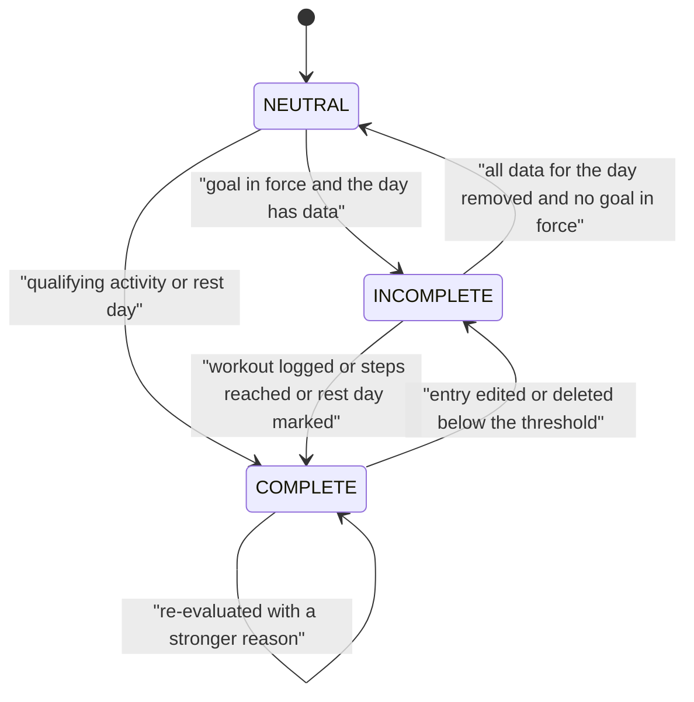
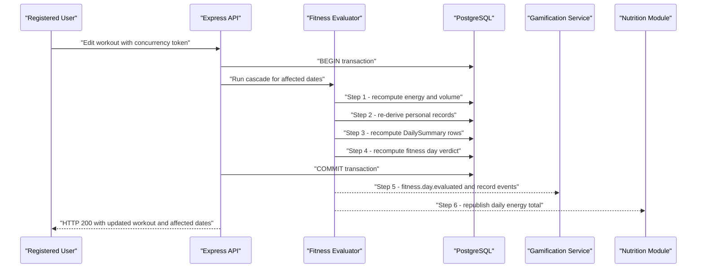
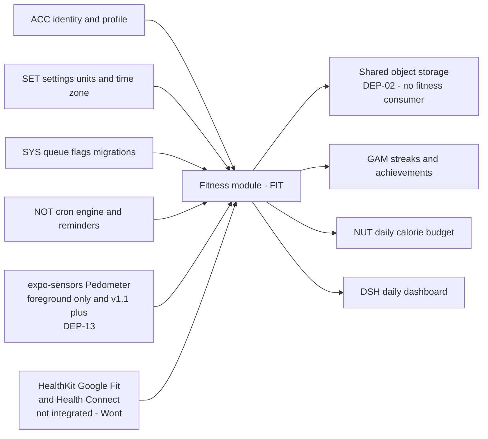

# Module Specification: Fitness

| Field | Value |
| --- | --- |
| Document | Module Specification - Fitness (prefix `FIT`) |
| Version | 1.0 |
| Date | 2026-07-21 |
| Status | Approved for Phase 2 |
| Owner | Rakshit - Project Lead / sole developer (STK-03) |
| Parent | [SRS.md](../SRS.md) |

Related documents: [03-functional-requirements.md](../03-functional-requirements.md) (master FR index), [04-non-functional-requirements.md](../04-non-functional-requirements.md), [05-user-stories.md](../05-user-stories.md), [user-stories/fitness.md](../user-stories/fitness.md), [06-use-case-model.md](../06-use-case-model.md), [use-cases/fitness.md](../use-cases/fitness.md), [07-domain-model.md](../07-domain-model.md), [08-glossary.md](../08-glossary.md), [09-assumptions-constraints-risks.md](../09-assumptions-constraints-risks.md), [10-traceability-matrix.md](../10-traceability-matrix.md).

## Table of contents

1. [Purpose and scope](#1-purpose-and-scope)
2. [Actors and stakeholders](#2-actors-and-stakeholders)
3. [Capability overview](#3-capability-overview)
4. [Functional requirements](#4-functional-requirements)
5. [Business rules](#5-business-rules)
6. [Data entities touched](#6-data-entities-touched)
7. [External interfaces](#7-external-interfaces)
8. [Edge cases and boundary conditions](#8-edge-cases-and-boundary-conditions)
9. [Deferred and out of scope for v1.0](#9-deferred-and-out-of-scope-for-v10)
10. [Traceability stub](#10-traceability-stub)

---

## 1. Purpose and scope

### 1.1 Purpose

This document is the authoritative functional specification for the Fitness module of PlantPal+, which owns the identifier prefix `FIT`. It defines every capability by which a Registered User records, quantifies, targets and reviews physical activity, and it defines the per-day fitness verdict that the gamification area (`GAM`) and the unified daily dashboard (`DSH`) consume.

The module is one of the three habit-tracking modules named in the client brief. It ships in full in release v1.0 per decision D-02, and its first demonstrable slice - the seeded activity catalogue and workout creation - lands at the v0.5 Alpha gate, which is the earliest release at which [02-scope-and-release-plan.md](../02-scope-and-release-plan.md) admits any fitness capability. Alignment note ALN-3 in section 1.4 records that decision.

### 1.2 In scope

| # | Capability area | Summary |
| --- | --- | --- |
| S-1 | Workout logging | Create, read, edit and delete workout entries against a seeded activity-type catalogue plus user-defined types, capturing start time, duration, perceived intensity, optional distance and optional notes. |
| S-2 | Energy expenditure estimation | Derive an estimated kilocalorie burn from a published MET table, the user body mass and the workout duration, always presented as an estimate with a stated error band and a not-medical-advice disclaimer. |
| S-3 | Strength training detail | Per-exercise sets, reps and weight against a seeded exercise catalogue with muscle groups, plus user-defined exercises, total training volume and personal-record detection. |
| S-4 | Step tracking | Manual daily step entry as the canonical v1.0 mechanism, with an optional foreground pedometer read as a post-MVP enhancement. |
| S-5 | Goals | Five goal types, each versioned over time so that a historical day is judged against the goal that was in force on that day. |
| S-6 | Daily fitness-day evaluation | The deterministic rule that decides whether a given local calendar date counts as a completed fitness day, and the publication of that verdict to `GAM` and `DSH`. |
| S-7 | Rest days | A first-class planned-rest concept that satisfies a fitness day without a workout, subject to a quota. |
| S-8 | Body metrics | Body mass and optional body-fat percentage logged over time, with a trend line and a seven-day moving average. |
| S-9 | Progress analytics | Seven-day, thirty-day, ninety-day and all-time views of duration, volume, distance, energy and steps, weekly aggregation buckets, and a personal-record timeline. |
| S-10 | Repeat-logging accelerators | Named workout templates and a one-tap copy of the most recent workout. |
| S-11 | Fitness-side offline behaviour | The append-only fitness writes that D-04 permits to be queued offline, and their idempotent replay contract. |
| S-12 | Fitness-side data contracts | The event and payload shapes the module publishes to `GAM`, `NOT`, `NUT`, `DSH` and `SYS`. |

### 1.3 Explicitly excluded from this module

| # | Exclusion | Reason and owning area |
| --- | --- | --- |
| X-1 | Background or continuous step counting, and any read of Apple HealthKit, Google Fit or Health Connect. | The Expo managed workflow cannot reach these APIs without a config plugin and a custom development build; background pedometer tasks additionally require background-execution entitlements. Both exceed a single-semester solo build on free tiers (D-06). Recorded as `FR-FIT-18` with MoSCoW `Wont`. |
| X-2 | Wearable, chest-strap, ANT+ or BLE heart-rate integration, GPS route capture, live activity tracking and map rendering. | Requires native modules, continuous location permission and paid map tiles at scale. Out of budget per D-06. |
| X-3 | Training-plan generation, coaching, periodisation, adaptive load management or injury advice. | Crosses into clinical guidance, forbidden by D-07. |
| X-4 | Body-composition inference beyond user-entered numbers: no bioimpedance, no photo-based estimation, no body-fat calculation from measurements. | Accuracy cannot be defended; D-07 safety posture. |
| X-5 | Streak counting, streak-freeze economics, badge definitions, achievement award and revocation policy. | Owned by `GAM`. Fitness publishes only the per-day verdict and the personal-record events that `GAM` consumes. |
| X-6 | Push delivery, notification scheduling, quiet hours, digest composition and device-token management. | Owned by `NOT`. Fitness declares trigger conditions and payload fields only. |
| X-7 | Calorie intake, macronutrient tracking, basal metabolic rate and total daily energy expenditure calculation, and the daily calorie budget itself. | Owned by `NUT`. Fitness publishes an estimated burn per date; `NUT` decides how that value affects any budget, subject to `BR-FIT-07`. |
| X-8 | Account creation, login, JWT issuance, profile fields such as height, sex, date of birth and IANA time zone, and the metric/imperial unit-preference switch itself. | Owned by `ACC` and `SET`. Fitness consumes these values and applies them per `BR-FIT-25`. |
| X-9 | The generic offline queue transport, delta-sync cursor, tombstone propagation, media upload pipeline and GDPR-style export/delete machinery. | Owned by `SYS`. Fitness declares which of its writes are queue-eligible and what its idempotency key looks like. |
| X-10 | The unified daily dashboard layout and card ordering. | Owned by `DSH`. Fitness supplies the tile payload defined in section 7. |
| X-11 | Social features: friends, leaderboards, challenges, sharing of workouts. | Not in the client brief. No v1.0 or v1.1 commitment. |
| X-12 | Photo attachments on workouts. | Free-tier photo storage is reserved for the plant growth timeline owned by `PLT`. Recorded in section 9. |
| X-13 | Monetisation, premium tiers, paid analytics. | Forbidden by D-01 and D-06. |

### 1.4 Canonical units, entity names and enumeration alignment

Entity names and enumeration members in this document are taken verbatim from [07-domain-model.md](../07-domain-model.md). Where the fitness working vocabulary differs from the canonical model vocabulary, the canonical form governs and the mapping is recorded here so that no downstream author has to guess.

| Fitness working term | Canonical domain-model term | Note |
| --- | --- | --- |
| Workout duration in minutes | `ENT-17 Workout.duration_seconds` | Captured from the user in whole minutes; stored in seconds as `duration_min x 60` per `BR-ENT-14` and `NFR-DATA-03`. |
| Workout distance in kilometres | `ENT-17 Workout.distance_m` | Captured in kilometres to two decimal places; stored in metres as `round(distance_km x 1000)`. |
| Daily active minutes | `ENT-49 DailySummary.active_seconds` | Computed in seconds, displayed in whole minutes. |
| `WEEKLY_WORKOUTS` | `WEEKLY_WORKOUT_COUNT` | Member of `FitnessGoalType`. |
| `WEEKLY_DISTANCE_KM` | `WEEKLY_DISTANCE` | Member of `FitnessGoalType`; canonical unit metres. |
| `BODY_MASS_KG` goal | `BODY_MASS_TARGET` | Member of `FitnessGoalType`; canonical unit kilograms. |
| `QUADS` | `QUADRICEPS` | Member of `MuscleGroup`. |
| `PEDOMETER_FOREGROUND` | `DEVICE_PEDOMETER` | Member of `StepEntrySource`. |
| Rest reason `RECOVERY` | `PLANNED_REST`, `ILLNESS`, `INJURY`, `TRAVEL`, `OTHER` | Full `RestDayReason` enumeration; `RECOVERY` is not a member and maps to `PLANNED_REST`. |
| Chart ranges `7D`, `30D`, `90D`, `ALL` | `DAYS_7`, `DAYS_30`, `DAYS_90`, `ALL_TIME` | Members of `ChartRange`. |
| Bucket granularity | `DAILY`, `WEEKLY`, `MONTHLY` | Members of `ChartAggregation`. |
| Record categories `WEIGHT`, `E1RM`, `REPS` | `HEAVIEST_WEIGHT`, `BEST_ESTIMATED_1RM`, `BEST_REP_COUNT` | Members of `PersonalRecordType`. v1.0 implements exactly these three; `BEST_SESSION_VOLUME`, `LONGEST_DISTANCE` and `LONGEST_DURATION` are deferred per section 9. |
| `workout_exercise` grouping row | none | The domain model deliberately flattens sets into `ENT-18 WorkoutExerciseSet`; grouping for display uses `exercise_id` plus `order_index`. This module adopts the flattened shape. |
| `fitness_daily_summary` | `ENT-49 DailySummary` | The fitness columns of the shared per-day rollup. |
| `personal_record` table | derived projection over `ENT-18 WorkoutExerciseSet` | Personal records are a derived, fully rebuildable projection in the sense of `BR-ENT-41`, materialised for query speed exactly as `ENT-49 DailySummary` is. |

Three divergences are recorded openly rather than silently resolved:

| # | Divergence | Resolution in this module |
| --- | --- | --- |
| ALN-1 | `ENT-18` notes that warm-up sets are excluded from volume; `BR-FIT-14` includes them in volume and excludes them only from personal records. | This module governs: warm-up sets are included in volume and excluded from personal records. Volume answers "how much work did I move"; a warm-up set is still work. The domain-model note is to be aligned to this rule. |
| ALN-2 | `ENT-23` permits at most 3 rest days per rolling 7 days and rest declaration up to 14 days ahead; `BR-FIT-23` permits at most 2 per rolling 7 days and 7 days ahead. | This module narrows within the model invariant and is therefore compatible: 2 is within 3, and 7 days ahead is within 14. The additional `ENT-23` cap of 104 rest days per rolling 365 days is adopted unchanged. |
| ALN-3 | The fitness requirement inventory provisionally targeted `FR-FIT-01` and `FR-FIT-03` at release v0.1, whereas [02-scope-and-release-plan.md](../02-scope-and-release-plan.md) gates the Walking Skeleton on a single plant-care vertical slice, records `FIT` as absent at v0.1 and counts 0 fitness capabilities as first delivered there. | The release plan governs. Both requirements are baselined at v0.5 Alpha, the release in which that plan first delivers workout logging against the seeded activity catalogue and MET-based energy estimation. No requirement is dropped, renumbered or reprioritised by this alignment, and the MoSCoW distribution in section 10.1 is unchanged. |

---

## 2. Actors and stakeholders

### 2.1 Actors

| Actor | Type | Role in this module |
| --- | --- | --- |
| Registered User | Primary human | The only actor permitted to create, read, edit or delete fitness data. Every fitness record is owned by exactly one user account. |
| Unauthenticated Visitor | Secondary human | Has no access to any fitness endpoint or screen. Every fitness route is authentication-gated per `BR-FIT-01`. Listed so that authorisation negative tests are traceable. |
| Fitness Evaluator | Internal system | Server-side component that recomputes derived values and the fitness-day verdict after any write, edit, delete or replayed offline event. |
| Reminder Scheduler | Internal system | The shared `node-cron` engine owned by `NOT`. Wakes the Fitness Evaluator for the nightly close-out of each represented time zone and evaluates fitness-derived reminder triggers. |
| Gamification Service | Internal system consumer | Consumes `fitness.day.evaluated`, `fitness.pr.achieved` and `fitness.pr.revoked`. Owned by `GAM`. |
| Nutrition Module | Internal system consumer | Consumes the daily estimated-burn total. Owned by `NUT`. |
| Dashboard Aggregator | Internal system consumer | Consumes the fitness daily tile payload. Owned by `DSH`. |
| Device Pedometer | External device service | `expo-sensors` `Pedometer` on the mobile client, foreground only, optional and feature-flagged. |
| Sync Service | Internal system | The `SYS`-owned offline queue and delta-sync cursor that replays queued fitness writes. |
| Seed Loader | Internal system, build time | Loads the activity-type catalogue, the exercise catalogue and the MET table into PostgreSQL at migration time. |
| Solo Developer / Maintainer | Human, out of band | Curates seed data and adjusts MET values and exercise entries through migrations only. There is no in-app administration surface in v1.0. |

### 2.2 Stakeholders and personas served

| Identifier | Interest in this module |
| --- | --- |
| STK-01 End user | Wants logging that costs less effort than the workout itself, and numbers that can be trusted. |
| STK-02 Project supervisor and academic evaluator | Assesses requirement quality, traceability and the defensibility of every threshold in section 5. |
| STK-03 Project Lead and sole developer | Must be able to build this module unaided on free tiers within one semester. |
| STK-04 External examiner | Reviews the same evidence as STK-02. |
| STK-05 Pilot cohort testers | Exercise the rest-day quota, the backfill window and the offline queue in real use. |
| PER-01 Aditi Sharma, time-poor multi-module professional | Needs the sub-20-second cardio log of `FR-FIT-03` and the copy-previous action of `FR-FIT-26`. |
| PER-03 Mia Castellano, body-composition-focused athlete | Primary persona for strength logging, personal records, volume charts and body-metric trends. |
| PER-04 Harold Whitfield, assistive-technology user | Requires the chart text alternatives and non-colour encodings of `FR-FIT-24`, per NFR-A11Y-05 and NFR-A11Y-08. |
| PER-05 Sofia Lindqvist, budget-device student on metered data | Primary persona for the offline queue of `FR-FIT-10` and for bounded payload sizes. |

---

## 3. Capability overview

The module decomposes into ten capability groups. Workout logging is the trunk: energy estimation and strength detail hang off it, steps and goals feed the daily evaluation, and the daily evaluation plus strength detail feed analytics and the events published to `GAM`.

```mermaid
flowchart TB
  ROOT["Fitness module - FIT"]
  A["FIT-1 Workout logging"]
  A1["Seeded and custom activity types"]
  A2["Create, edit, delete with cascade"]
  A3["Local-date attribution and overlap"]
  B["FIT-2 Energy expenditure"]
  B1["MET table and body-mass resolution"]
  B2["Error band and disclaimer"]
  C["FIT-3 Strength training"]
  C1["Exercise catalogue and custom exercises"]
  C2["Sets, reps, weight and volume"]
  C3["Personal records and revocation"]
  D["FIT-4 Step tracking"]
  D1["Manual daily entry"]
  D2["Foreground pedometer - deferred"]
  E["FIT-5 Goals"]
  E1["Five goal types with ranges"]
  E2["Effective-dated versioning"]
  F["FIT-6 Daily evaluation and rest days"]
  F1["Fitness-day verdict"]
  F2["Rest days and quota"]
  F3["Retroactive re-evaluation"]
  G["FIT-7 Body metrics"]
  H["FIT-8 Progress analytics"]
  I["FIT-9 Repeat-logging accelerators"]
  J["FIT-10 Cross-cutting concerns"]
  J1["Ownership and authorisation"]
  J2["Units and canonical storage"]
  J3["Offline append-only writes"]
  J4["Published contracts"]
  ROOT --> A
  ROOT --> B
  ROOT --> C
  ROOT --> D
  ROOT --> E
  ROOT --> F
  ROOT --> G
  ROOT --> H
  ROOT --> I
  ROOT --> J
  A --> A1
  A --> A2
  A --> A3
  B --> B1
  B --> B2
  C --> C1
  C --> C2
  C --> C3
  D --> D1
  D --> D2
  E --> E1
  E --> E2
  F --> F1
  F --> F2
  F --> F3
  J --> J1
  J --> J2
  J --> J3
  J --> J4
  A --> B
  A --> C
  G --> B
  D --> F
  E --> F
  F --> H
  C --> H
```

---

## 4. Functional requirements

Twenty-six functional requirements carry the prefix `FIT`, numbered `FR-FIT-01` to `FR-FIT-26` with no gaps. MoSCoW values are `Must`, `Should`, `Could` and `Wont`. Releases are v0.1 Walking Skeleton, v0.5 Alpha, v1.0 MVP and v1.1+ Post-MVP. Verification methods are Test, Demonstration, Inspection and Analysis.

### 4.1 Requirement index

| ID | Title | Priority | Release | Verification |
| --- | --- | --- | --- | --- |
| FR-FIT-01 | Seeded activity-type catalogue | Must | v0.5 | Inspection |
| FR-FIT-02 | User-defined activity types | Should | v1.0 | Test |
| FR-FIT-03 | Create a workout entry | Must | v0.5 | Test |
| FR-FIT-04 | Workout validation limits | Must | v0.5 | Test |
| FR-FIT-05 | Energy-expenditure estimate | Must | v0.5 | Test |
| FR-FIT-06 | Estimate presentation and disclaimer | Must | v0.5 | Demonstration |
| FR-FIT-07 | Edit a logged workout | Must | v1.0 | Test |
| FR-FIT-08 | Delete a logged workout | Must | v1.0 | Test |
| FR-FIT-09 | Overlap detection | Should | v1.0 | Test |
| FR-FIT-10 | Offline append-only fitness writes | Must | v1.0 | Test |
| FR-FIT-11 | Seeded strength-exercise catalogue | Must | v0.5 | Inspection |
| FR-FIT-12 | User-defined exercises | Should | v1.0 | Test |
| FR-FIT-13 | Strength set logging | Must | v0.5 | Test |
| FR-FIT-14 | Total training volume | Must | v1.0 | Test |
| FR-FIT-15 | Personal-record detection | Should | v1.0 | Test |
| FR-FIT-16 | Manual daily step entry | Must | v0.5 | Test |
| FR-FIT-17 | Foreground pedometer read | Should | v1.1+ | Demonstration |
| FR-FIT-18 | Health-platform synchronisation excluded | Wont | v1.1+ | Inspection |
| FR-FIT-19 | Versioned fitness goals | Must | v1.0 | Test |
| FR-FIT-20 | Historical goal resolution | Must | v1.0 | Test |
| FR-FIT-21 | Daily fitness-day verdict | Must | v1.0 | Test |
| FR-FIT-22 | Rest days | Should | v1.0 | Test |
| FR-FIT-23 | Body-metric entries | Must | v0.5 | Test |
| FR-FIT-24 | Progress charts and personal-record timeline | Must | v1.0 | Test |
| FR-FIT-25 | Workout templates | Should | v1.0 | Test |
| FR-FIT-26 | Copy the previous workout | Should | v1.0 | Test |

### FR-FIT-01 Seeded activity-type catalogue

| Attribute | Value |
| --- | --- |
| Priority | Must |
| Release | v0.5 Alpha |
| Actor | Seed Loader |
| Verification | Inspection |
| Traces to | Up: GOAL-02, D-03, STK-01. Down: US-FIT-01, UC-FIT-01, UC-FIT-02. Constrains: `BR-FIT-02`. |

**Requirement.** The system shall provide a seeded, read-only activity-type catalogue containing exactly the nine codes `WALK`, `RUN`, `CYCLE`, `SWIM`, `STRENGTH`, `YOGA`, `HIIT`, `SPORT` and `OTHER`, each carrying a display name, a distance-capable flag, three MET values and an error-band percentage as defined in `BR-FIT-02`.

**Rationale.** Decision D-03 makes curated PostgreSQL catalogues canonical, and every downstream calculation - energy estimate, distance capability, chart grouping - depends on a stable activity vocabulary that exists with every external integration disabled.

**Inputs and validation**

| Field | Type | Constraints | Required |
| --- | --- | --- | --- |
| `activity_key` | enum `ActivityTypeKey` | Exactly the nine members listed above; the migration fails if any is absent | Yes |
| `slug` | text | Lowercase, globally unique, 1 to 40 characters | Yes |
| `name` | text | 1 to 40 characters, resolved through the locale catalogue per D-08 | Yes |
| `met_low`, `met_moderate`, `met_vigorous` | decimal, 1 dp | Each within 1.0 to 23.0 inclusive; `met_low <= met_moderate <= met_vigorous` | Yes |
| `supports_distance` | boolean | Per the table in `BR-FIT-02` | Yes |
| `supports_exercise_sets` | boolean | True only for `STRENGTH` | Yes |
| `error_band_pct` | integer | One of 25, 30, 35 | Yes |
| `icon_key`, `sort_order` | text, integer | Presentation only; `sort_order` unique | Yes |

**Processing rules**

- The catalogue is loaded by a database migration from a version-controlled seed file; rows are immutable at runtime and no application code path writes them (`BR-FIT-02`).
- A revision of any MET value ships as a new migration and does not retroactively alter any stored workout estimate, because `FR-FIT-05` freezes the MET value onto the workout row.
- The seed process is idempotent and produces byte-identical rows on repeated execution against a clean database, per NFR-DATA-07.
- Rows carry `source = SEEDED` and `user_id = NULL` per `BR-ENT-17`.

**Outputs**

- An ordered list of activity types with `activity_key`, display name, `icon_key`, `supports_distance`, `supports_exercise_sets`, three MET values, `error_band_pct` and `sort_order`.
- The picker data source for the workout form on both clients.

**Alternate and error flows**

| Condition | System response | User-visible message |
| --- | --- | --- |
| Catalogue table returns zero rows at runtime | The workout form renders a blocking data-seed error state instead of an empty picker; the event is logged at level `error` with the request identifier per NFR-OBSV-02 | `Activity types could not be loaded. This is a problem on our side, not with your data. Try again in a moment.` |
| Migration finds fewer than nine codes, a duplicate slug, or a MET value outside 1.0 to 23.0 | The migration aborts and the deployment fails | Not user-facing; the failure appears in the deployment log |
| Migration finds `met_low > met_moderate` or `met_moderate > met_vigorous` | The migration aborts | Not user-facing |

### FR-FIT-02 User-defined activity types

| Attribute | Value |
| --- | --- |
| Priority | Should |
| Release | v1.0 MVP |
| Actor | Registered User |
| Verification | Test |
| Traces to | Up: GOAL-02, PER-03, D-03. Down: US-FIT-01, US-FIT-14, UC-FIT-01. Constrains: `BR-FIT-03`, `BR-FIT-10`. |

**Requirement.** The system shall allow a Registered User to create a user-defined activity type consisting of a name of 1 to 40 characters, a base MET value between 1.0 and 20.0 inclusive and a distance-capable flag, up to a maximum of 20 user-defined activity types per account.

**Rationale.** Nine seeded types cannot cover every hobby, and D-03 forbids depending on an external activity taxonomy service. A per-account cap of 20 bounds the picker length and the free-tier row count under D-06.

**Inputs and validation**

| Field | Type | Constraints | Required |
| --- | --- | --- | --- |
| `name` | text | 1 to 40 characters after trimming and whitespace collapse; unique per account, case-insensitive; rejected when it collides with a seeded display name | Yes |
| `base_met` | decimal, 1 dp | 1.0 to 20.0 inclusive; form default 4.5 | Yes |
| `supports_distance` | boolean | Free choice; default false | Yes |
| account type count | integer | At most 20 non-deleted user-defined activity types per account | Derived |

**Processing rules**

- `met_moderate`, `met_low` and `met_vigorous` are derived and stored at creation time per `BR-FIT-03`, so a later edit of `base_met` never silently rewrites the MET values frozen onto existing workouts.
- `error_band_pct` is fixed at 35 for every user-defined activity type (`BR-FIT-03`).
- The row is written with `source = USER_CUSTOM` and a non-null `user_id` per `BR-ENT-17`; ownership scoping follows `BR-FIT-01`.
- This write is not queue-eligible under D-04 and requires connectivity.

**Outputs**

- The created activity type, immediately selectable in the workout form beneath the seeded types, inside a labelled group headed `Your activities`.
- Cardinality counter `n of 20 used` on the management screen.

**Alternate and error flows**

| Condition | System response | User-visible message |
| --- | --- | --- |
| Name duplicates an existing user-defined or seeded name, case-insensitively | HTTP 409, no row written | `You already have an activity called "Trail run". Pick a different name or use the existing one.` |
| `base_met` outside 1.0 to 20.0 | HTTP 422 with field code `base_met.out_of_range` | `MET must be between 1.0 and 20.0. Walking is about 3.5 and running is about 9.8.` |
| Account already holds 20 user-defined activity types | HTTP 422 with field code `activity_type.limit_reached` | `You can keep up to 20 of your own activities. Delete one you no longer use to add another.` |
| Request references an activity type owned by another account | HTTP 404, never 403, per `BR-FIT-01` | `That activity type could not be found.` |
| Device is offline | The action is blocked before submission with a retry affordance, per NFR-USAB-07 | `Creating an activity needs a connection. Logging a workout and logging steps still work offline.` |

### FR-FIT-03 Create a workout entry

| Attribute | Value |
| --- | --- |
| Priority | Must |
| Release | v0.5 Alpha |
| Actor | Registered User |
| Verification | Test |
| Traces to | Up: GOAL-01, GOAL-02, PER-01, STK-01. Down: US-FIT-01, US-FIT-09, US-FIT-14, UC-FIT-01, UC-FIT-02. Constrains: `BR-FIT-08`, `BR-FIT-10`. |

**Requirement.** The system shall allow a Registered User to create a workout entry recording activity type, start instant, duration in whole minutes, perceived intensity from the enumeration `LOW`, `MODERATE`, `VIGOROUS`, an optional distance and an optional note of at most 500 characters.

**Rationale.** This is the atomic unit of the module and the v0.5 vertical slice that proves the monorepo, the Express API, the PostgreSQL schema and both clients end to end for fitness while leaving a demoable result, as D-02 requires of every release gate.

**Inputs and validation**

| Field | Type | Constraints | Required |
| --- | --- | --- | --- |
| `activity_type_id` | uuid | Must reference a seeded row or a user-defined row owned by the caller | Yes |
| `started_at` | ISO-8601 instant with offset | Not earlier than now minus 1825 days; not later than now plus 15 minutes (`BR-FIT-10`) | Yes |
| `duration_min` | integer | 1 to 600 inclusive; stored as `duration_seconds = duration_min x 60` | Yes |
| `intensity` | enum `Intensity` | One of `LOW`, `MODERATE`, `VIGOROUS`; default `MODERATE` | Yes |
| `distance_km` | decimal, 2 dp | 0.01 to 500.00 inclusive; rejected outright when the activity type has `supports_distance` false; stored as `distance_m` | No |
| `note` | text | At most 500 characters | No |
| `idempotency_key` | uuid v4 | Unique per account per `BR-FIT-29` and NFR-DATA-09 | Yes |
| `client_recorded_at` | ISO-8601 instant with offset | Used for queue ordering and display only; the server clock is authoritative for `created_at` | Yes |

**Processing rules**

- The server derives `started_local_date` from `started_at` and the user IANA time zone in force at write time, per `BR-FIT-08`, and freezes it.
- The energy estimate is computed and frozen per `FR-FIT-05` and `BR-FIT-04`, including `met_value_used`, `body_mass_kg_used` and the mass source.
- Overlap is evaluated per `FR-FIT-09` and `BR-FIT-12`, and the resulting flag is persisted on the newly created entry.
- The daily re-evaluation of `FR-FIT-21` runs for `started_local_date` inside the same transaction, in the cascade order of `BR-FIT-30`.
- The write is queue-eligible offline per D-04 and `FR-FIT-10`.

**Outputs**

- HTTP 201 with the created workout including `started_local_date`, `estimated_energy_kcal`, `met_value_used`, `body_mass_kg_used`, `error_band_pct`, `volume_kg` and `overlaps_existing`.
- An updated `ENT-49 DailySummary` row and a `fitness.day.evaluated` event for the affected date.
- A refreshed dashboard tile and weekly goal-progress figure in the same client response cycle.

**Alternate and error flows**

| Condition | System response | User-visible message |
| --- | --- | --- |
| No valid access token | HTTP 401; the draft is preserved locally and the user is routed to sign-in | `Please sign in again to save this workout. Your entry has been kept.` |
| One or more validation limits breached | HTTP 422 listing every violation at once per `FR-FIT-04` | Field-level messages adjacent to each offending field, per NFR-USAB-08 |
| Distance supplied for an activity type with `supports_distance` false | HTTP 422 with field code `distance.not_supported` | `Distance is not recorded for strength sessions.` |
| Device is offline | The entry is queued locally with a pending indicator and no error state, per `FR-FIT-10` | `Saved on this device. It will sync when you are back online.` |
| `idempotency_key` absent or not a UUID version 4 | HTTP 400 with field code `idempotency_key.invalid` | `Something went wrong saving this workout. Please try again.` |
| Replay of an `idempotency_key` already stored for this account | HTTP 200 with the originally created workout and no second row | No message; the pending indicator simply clears |

### FR-FIT-04 Workout validation limits

| Attribute | Value |
| --- | --- |
| Priority | Must |
| Release | v0.5 Alpha |
| Actor | Registered User |
| Verification | Test |
| Traces to | Up: GOAL-11, STK-02, ISO/IEC/IEEE 29148 verifiability. Down: US-FIT-01, US-FIT-03, UC-FIT-01, UC-FIT-02. Constrains: `BR-FIT-10`, `BR-FIT-11`. |

**Requirement.** The system shall reject any workout create or update request whose field values fall outside the validation limits enumerated in `BR-FIT-10`, returning HTTP 422 with a machine-readable field-level error code and a human-readable message for each violated field.

**Rationale.** The client brief names implausible entries such as a 24-hour workout and a 500-kilogram lift as explicit edge cases. Rejecting them at a stated boundary is what makes every downstream aggregate defensible, and stating the boundary as data makes the requirement testable.

**Inputs and validation**

| Field | Type | Constraints | Required |
| --- | --- | --- | --- |
| Full workout payload | object | Every field limit in `BR-FIT-10` applies | Yes |
| Full strength structure | array | Cardinality and per-set limits in `BR-FIT-10` apply | No |
| `distance_km` with `duration_min` | derived | Implied-speed plausibility bands of `BR-FIT-11` apply | No |

**Processing rules**

- Validation executes on the client for immediate feedback and again on the server as the authority. Both use one shared TypeScript schema module published from the monorepo, so the two can never drift. The shared module is a how that the fixed stack dictates and is stated here deliberately.
- Limits marked `Reject` in `BR-FIT-10` produce HTTP 422. Limits marked `Warn` produce a dismissible client confirmation and are stored on confirmation with `implausible_flag` set true on the persisted row.
- A request violating more than one limit returns every violation in one response rather than the first, so a form can highlight all offending fields in a single pass.
- The same schema governs create and update, so an edit cannot introduce a value that a create would refuse.

**Outputs**

- On failure, HTTP 422 with body `{ "errors": [ { "field": "duration_min", "code": "duration.out_of_range", "message": "..." } ] }`.
- On warn-level plausibility, a confirmation prompt and, after confirmation, a stored row with `implausible_flag = true`.
- On success, nothing beyond the created or updated resource.

**Alternate and error flows**

| Condition | System response | User-visible message |
| --- | --- | --- |
| `duration_min` is 601 or greater | HTTP 422; entered values are retained in the form | `A workout can be up to 600 minutes, which is 10 hours. Please check the duration.` |
| `duration_min` is 0 or negative | HTTP 422 | `A workout needs to be at least 1 minute long.` |
| `started_at` earlier than now minus 1825 days | HTTP 422 | `You can log workouts up to 5 years back.` |
| `started_at` later than now plus 15 minutes | HTTP 422 | `That start time is in the future. Check your device clock.` |
| `weight_kg` above 300.00 but at most 500.00 | Warn; stored on confirmation with `implausible_flag = true` | `That is a heavy set. Tap confirm if 320 kg is right.` |
| `weight_kg` above 500.00 | HTTP 422 | `Set weight can be up to 500.0 kg.` |
| Implied speed above the activity warn threshold of `BR-FIT-11` | Warn; stored on confirmation with `implausible_flag = true` | `That works out at 90 km/h. Tap confirm if the distance is right.` |
| Implied speed above 150.0 km/h for any activity type | HTTP 422 | `That distance and duration do not go together. Please check both.` |

### FR-FIT-05 Energy-expenditure estimate

| Attribute | Value |
| --- | --- |
| Priority | Must |
| Release | v0.5 Alpha |
| Actor | Fitness Evaluator |
| Verification | Test |
| Traces to | Up: GOAL-01, client brief clause B, PER-03. Down: US-FIT-02, UC-FIT-03. Constrains: `BR-FIT-04`, `BR-FIT-05`. |

**Requirement.** The system shall compute for every workout an estimated energy expenditure in kilocalories using the formula `kcal = MET x body_mass_kg x duration_minutes / 60` and shall persist the computed value together with the MET value, the body mass and the body-mass source used in that computation.

**Rationale.** The brief mandates a MET-based estimate, and users expect effort to be quantified. Freezing the three inputs onto the row is what makes a historical figure stable: recording a new body mass today must not silently rewrite last month's numbers.

**Inputs and validation**

| Field | Type | Constraints | Required |
| --- | --- | --- | --- |
| `met_value_used` | decimal, 1 dp | Selected from `BR-FIT-02` or `BR-FIT-03` by the pair of activity type and `intensity`; 1.0 to 23.0 | Yes |
| `body_mass_kg_used` | decimal, 2 dp | Resolved by the precedence chain of `BR-FIT-05`; 20.00 to 500.00 | Yes |
| `mass_source` | enum | One of `BODY_METRIC`, `PROFILE`, `DEFAULT` | Yes |
| `duration_min` | integer | 1 to 600, taken from the workout | Yes |
| `error_band_pct` | integer | 25, 30 or 35, copied from the activity type | Yes |

**Processing rules**

- `energy_kcal_raw = met_value_used x body_mass_kg_used x duration_min / 60` (`BR-FIT-04`).
- The stored `estimated_energy_kcal` is `energy_kcal_raw` rounded half-up to a whole number, floored at 0, and raised to 1 whenever `energy_kcal_raw` lies strictly between 0.5 and 1.0.
- The figure is gross energy expenditure and therefore includes resting metabolism; it is not net-of-rest expenditure.
- `met_value_used`, `body_mass_kg_used`, `mass_source` and `error_band_pct` are copied onto the workout at write time and are never recomputed by a later catalogue revision or body-mass entry.
- Steps contribute zero kilocalories, per `BR-FIT-18`, so a walk logged both as steps and as a `WALK` workout is not double counted.

**Outputs**

- `estimated_energy_kcal` as an integer on the workout row.
- The four frozen inputs, exposed for audit and for the chart tooltip.
- A contribution to `ENT-49 DailySummary.workout_energy_kcal` and to the value published to `NUT` per `BR-FIT-07`.

**Alternate and error flows**

| Condition | System response | User-visible message |
| --- | --- | --- |
| No body-metric entry and no profile body mass | `DEFAULT_BODY_MASS_KG = 70.0` is used, `mass_source = DEFAULT`, and the client surfaces a one-tap prompt | `This estimate uses an average body mass of 70 kg. Add your weight for a closer figure.` |
| Activity type is user-defined | The stored MET triple of that type is used and `error_band_pct` is 35, per `BR-FIT-03` | No message |
| `duration_min` changed by a later edit | The estimate is recomputed inside the cascade of `BR-FIT-30` using the same body mass already frozen on the row | No message |
| Computed value would be negative through a data fault | The value is floored at 0 and an `error`-level log line is emitted with the workout identifier | No message |

### FR-FIT-06 Estimate presentation and disclaimer

| Attribute | Value |
| --- | --- |
| Priority | Must |
| Release | v0.5 Alpha |
| Actor | Registered User |
| Verification | Demonstration |
| Traces to | Up: D-07, GOAL-06, STK-02. Down: US-FIT-02, UC-FIT-03. Constrains: `BR-FIT-06`, `BR-FIT-31`. |

**Requirement.** The system shall display every energy-expenditure figure together with the plus-or-minus error band of its activity type, a low-to-high estimate range computed per `BR-FIT-06`, and the fixed disclaimer text identifying the value as a non-medical estimate.

**Rationale.** Decision D-07 forbids presenting wellness numbers as medically accurate. A MET-based estimate carries a real error of tens of percent, and showing the band is the honest way to present it. NFR-LEGL-03 governs where the disclaimer must appear across the product.

**Inputs and validation**

| Field | Type | Constraints | Required |
| --- | --- | --- | --- |
| `estimated_energy_kcal` | integer | 0 or greater | Yes |
| `error_band_pct` | integer | 25, 30 or 35; falls back to 35 when absent | Yes |
| Locale key `fitness.energy.disclaimer` | text | Resolved from the locale catalogue, never hard-coded, per D-08 and NFR-I18N-01 | Yes |

**Processing rules**

- `display_low = floor(estimated_energy_kcal x (100 - error_band_pct) / 100)` and `display_high = ceil(estimated_energy_kcal x (100 + error_band_pct) / 100)` (`BR-FIT-06`).
- Aggregated figures sum the point estimates and display a single aggregate band equal to the maximum `error_band_pct` among contributing workouts.
- The disclaimer is visible without interaction on the workout detail screen and reachable within one interaction from any aggregated burn figure.
- The estimate wording accompanies every surface that shows an energy figure, including the dashboard tile and every chart axis label.
- The band is conveyed by text as well as by any visual treatment, per NFR-A11Y-08.

**Outputs**

- The point estimate, the range rendered as `low to high kcal`, the word `estimate`, and the disclaimer sentence whose English value under key `fitness.energy.disclaimer` is exactly: `Calorie burn is an estimate based on average values. It is not medical advice and should not be used to diagnose, treat or manage any health condition.`

**Alternate and error flows**

| Condition | System response | User-visible message |
| --- | --- | --- |
| `error_band_pct` missing on the row | The client falls back to 35 and still renders the range and the disclaimer | The standard disclaimer sentence |
| Locale key fails to resolve | The English source string is rendered; the disclaimer is never suppressed, and a `warn`-level log line records the missing key | The standard disclaimer sentence in English |
| Estimate is 0 kilocalories | The range renders as `0 to 0 kcal` and the disclaimer still appears | The standard disclaimer sentence |
| Aggregate covers workouts with bands 25 and 35 | The aggregate band shown is 35 | `Estimated total, plus or minus 35 percent` |

### FR-FIT-07 Edit a logged workout

| Attribute | Value |
| --- | --- |
| Priority | Must |
| Release | v1.0 MVP |
| Actor | Registered User |
| Verification | Test |
| Traces to | Up: GOAL-02, STK-01, PER-01. Down: US-FIT-10, UC-FIT-09. Constrains: `BR-FIT-30`. |

**Requirement.** The system shall allow a Registered User to edit any field of a workout that user owns and shall, within the same database transaction, recompute the workout energy estimate, the workout total volume, the personal records for every affected exercise, and the daily aggregates and fitness-day verdict for every affected local date, in the order defined by `BR-FIT-30`.

**Rationale.** Users mistype durations and pick the wrong activity. Without a correction path every aggregate, chart and streak inherits the error and the analytics lose credibility. Running the whole cascade inside one transaction is what prevents a half-corrected history.

**Inputs and validation**

| Field | Type | Constraints | Required |
| --- | --- | --- | --- |
| `workout_id` | uuid | Must reference a non-tombstoned workout owned by the caller | Yes |
| Editable fields | object | Any subset of `activity_type_id`, `started_at`, `duration_min`, `intensity`, `distance_km`, `note` and the full strength structure; each subject to `FR-FIT-04` | Yes |
| `updated_at` | ISO-8601 instant | Optimistic-concurrency token; must equal the stored value | Yes |

**Processing rules**

- The affected-date set is the union of the pre-change and post-change `started_local_date` values, so an edit that moves the start instant across midnight re-evaluates two dates.
- Personal records are re-derived for every exercise present in either the pre-change or the post-change version of the workout, per `BR-FIT-16`.
- The cascade runs in the exact order of `BR-FIT-30`, steps 1 to 6, inside one transaction; a failure at any step rolls the whole transaction back.
- `body_mass_kg_used` stays frozen unless the activity type, intensity or duration changed, in which case only the MET-derived part of the estimate is recomputed with the already-frozen mass.
- Editing is not queue-eligible under D-04 and requires connectivity.

**Outputs**

- HTTP 200 with the updated workout and its recomputed derived fields.
- The list of affected local dates.
- Re-emitted `fitness.day.evaluated` events for every affected date, and `fitness.pr.achieved` or `fitness.pr.revoked` for every record change.

**Alternate and error flows**

| Condition | System response | User-visible message |
| --- | --- | --- |
| Workout belongs to another account or is tombstoned | HTTP 404, never 403, per `BR-FIT-01` | `That workout could not be found.` |
| Supplied `updated_at` does not match the stored value | HTTP 409 and the current server version is returned in the body | `This workout changed on another device. Here is the current version - choose which to keep.` |
| Any cascade step fails | The transaction rolls back entirely and HTTP 500 is returned with a correlation identifier | `We could not save that change. Nothing was altered. Please try again.` |
| Device is offline | The edit is blocked before submission, with no local mutation applied | `Editing a workout needs a connection. Logging a workout and logging steps still work offline.` |
| Edit reduces duration below the 20-minute qualifying threshold | The day verdict may fall from `COMPLETE` with reason `WORKOUT` to `INCOMPLETE`, unless steps or a rest day still qualify it | `Updated. This day no longer meets your movement goal.` |

### FR-FIT-08 Delete a logged workout

| Attribute | Value |
| --- | --- |
| Priority | Must |
| Release | v1.0 MVP |
| Actor | Registered User |
| Verification | Test |
| Traces to | Up: GOAL-05, GOAL-08, D-04. Down: US-FIT-10, UC-FIT-09. Constrains: `BR-FIT-30`, `BR-FIT-16`. |

**Requirement.** The system shall allow a Registered User to delete a workout that user owns by writing a deletion tombstone rather than removing the row, and shall run the recomputation cascade defined by `BR-FIT-30` for every affected local date and exercise.

**Rationale.** Delta-sync under D-04 requires other devices to learn that a record disappeared, which a physical delete cannot express. Soft deletion with a tombstone is the platform-wide rule of `BR-ENT-07` and `BR-ENT-08` and NFR-DATA-05.

**Inputs and validation**

| Field | Type | Constraints | Required |
| --- | --- | --- | --- |
| `workout_id` | uuid | Must reference a workout owned by the caller | Yes |

**Processing rules**

- `deleted_at` is set to the current server instant; the row is retained and a `ENT-44 Tombstone` record is emitted for the delta-sync cursor.
- The workout and all of its `ENT-18 WorkoutExerciseSet` children are excluded from every aggregate and from every personal-record candidate set from that instant onward.
- The cascade of `BR-FIT-30` runs for the workout `started_local_date`.
- Any personal record whose originating set belonged to the deleted workout is re-derived over the remaining qualifying sets; if the record no longer stands it is marked `revoked_at` and `fitness.pr.revoked` is emitted to `GAM`.
- Deleting an already-deleted workout is idempotent.

**Outputs**

- HTTP 204 with no body.
- A tombstone visible to the `SYS` delta-sync cursor.
- The recomputed `ENT-49 DailySummary` row and a re-emitted `fitness.day.evaluated` event.

**Alternate and error flows**

| Condition | System response | User-visible message |
| --- | --- | --- |
| Workout already tombstoned | HTTP 204; no second tombstone, no second cascade | No message |
| Workout owned by another account | HTTP 404 | `That workout could not be found.` |
| User taps undo within 10 seconds, per NFR-USAB-04 | `deleted_at` is cleared, the tombstone is superseded and the cascade reruns | `Workout restored.` |
| User attempts undo after 10 seconds | The undo affordance is gone; the entry must be re-created | `Deleted. You can log it again from your history if you need it back.` |
| Deleted workout is more than 30 days old | The verdict event is emitted with `streak_eligible` false per `BR-FIT-24` | `Deleted. Your streak history is not affected for days over 30 days old.` |
| Device is offline | The delete is blocked before submission | `Deleting a workout needs a connection.` |

### FR-FIT-09 Overlap detection

| Attribute | Value |
| --- | --- |
| Priority | Should |
| Release | v1.0 MVP |
| Actor | Registered User |
| Verification | Test |
| Traces to | Up: GOAL-02, client brief edge case. Down: US-FIT-01, UC-FIT-01, UC-FIT-02. Constrains: `BR-FIT-12`. |

**Requirement.** The system shall detect when a workout being created or edited overlaps an existing non-deleted workout of the same user by 1 minute or more, shall persist an overlap flag on the newer entry, and shall present a non-blocking warning offering to continue or to amend the entry.

**Rationale.** Double-logging the same session inflates every aggregate, and the client brief names overlapping workouts as an explicit edge case. Blocking the save would lose data the user is deliberately trying to record, so the flag is advisory and the de-duplication happens where it matters, in the active-minute union of `BR-FIT-12`.

**Inputs and validation**

| Field | Type | Constraints | Required |
| --- | --- | --- | --- |
| Candidate interval | pair of instants | `[started_at, started_at + duration_seconds)`, half-open, in UTC | Yes |
| Existing intervals | set | All non-deleted workouts of the same account whose intervals could intersect the candidate | Derived |

**Processing rules**

- Two workouts overlap when their half-open UTC intervals intersect for 60 seconds or more; 59 seconds is not an overlap (`BR-FIT-12`).
- Comparison is performed on absolute UTC instants, so a time-zone change can neither create nor hide an overlap.
- The flag `overlaps_existing` is persisted on the newer entry only; the earlier entry is left untouched.
- Workout count, distance and energy totals remain plain sums; only `active_seconds` is de-duplicated, by taking the length of the union of qualifying intervals (`BR-FIT-12`, `BR-FIT-13`).
- Entries carrying the flag are badged in the history list so the user can correct them later.

**Outputs**

- Boolean `overlaps_existing` on the created or edited workout.
- A client warning naming the conflicting workout by its activity display name and local start time.
- A badge on the history-list row, conveyed by text as well as by icon per NFR-A11Y-08.

**Alternate and error flows**

| Condition | System response | User-visible message |
| --- | --- | --- |
| Overlap of 60 seconds or more detected on create | Dismissible warning; the save proceeds on confirmation with the flag set | `This overlaps your 07:00 Running session. Save anyway or change the time.` |
| Overlap of 59 seconds or less | No warning, no flag | No message |
| User chooses to amend | The form returns focus to the start-time field with the conflicting interval shown | `Pick a start time outside 07:00 to 07:45.` |
| Overlap arises only after an edit moves the start time | The flag is recomputed on the edited entry inside the `BR-FIT-30` cascade | `This now overlaps your 07:00 Running session.` |
| Overlap arises on an offline-queued entry replayed later | The flag is computed at replay time and the entry is badged in the history list; no blocking prompt is shown for a completed action | `Two of your synced workouts overlap. Tap to review.` |

### FR-FIT-10 Offline append-only fitness writes

| Attribute | Value |
| --- | --- |
| Priority | Must |
| Release | v1.0 MVP |
| Actor | Sync Service |
| Verification | Test |
| Traces to | Up: GOAL-05, D-04, PER-05. Down: US-FIT-14, UC-FIT-01, UC-FIT-05. Constrains: `BR-FIT-29`. |

**Requirement.** The system shall accept append-only fitness writes that were queued while the client was offline, shall deduplicate them by their client-generated UUID idempotency key, and shall return the originally created resource without creating a duplicate when the same key is replayed.

**Rationale.** Decision D-04 permits exactly two fitness actions to be queued offline - log workout and log steps - and gyms and basements are exactly where connectivity fails. Because both actions are append-only they are conflict-free by construction, so this module deliberately specifies no merge algorithm, no CRDT and no last-write-wins rule.

**Inputs and validation**

| Field | Type | Constraints | Required |
| --- | --- | --- | --- |
| `action_type` | enum | Exactly one of `LOG_WORKOUT`, `LOG_STEPS`; any other fitness action is refused at enqueue time | Yes |
| Queued payload | object | The full `FR-FIT-03` or `FR-FIT-16` payload, validated again server-side on replay | Yes |
| `idempotency_key` | uuid v4 | Unique over `(user_id, action_type, idempotency_key)` per NFR-DATA-09 | Yes |
| `client_recorded_at` | ISO-8601 instant with offset | Clamped per `BR-ENT-11`; used for ordering and display only | Yes |

**Processing rules**

- The server upserts on the unique constraint over `user_id`, `action_type` and `idempotency_key`. A first delivery returns HTTP 201; a replay returns HTTP 200 with the originally created resource.
- The server clock is authoritative for `created_at`; `client_recorded_at` never overrides it.
- Queue caps, expiry and rate limits are specified in `BR-FIT-29`: at most 200 pending fitness items per client, needs-attention promotion after 30 days, and 300 fitness write requests per account per rolling hour.
- Replayed writes trigger the same `BR-FIT-30` cascade as an online write, including retroactive `fitness.day.evaluated` emission per `BR-FIT-24`.
- A replayed step event that arrives after a newer manual edit for the same date is resolved by comparing `client_recorded_at` and keeping the later value (`BR-FIT-18`).

**Outputs**

- The created or previously created resource.
- A queue-drained signal to the client that clears the pending indicator.
- A needs-attention list entry for any item that fails validation on replay.

**Alternate and error flows**

| Condition | System response | User-visible message |
| --- | --- | --- |
| Same key replayed after a successful first delivery | HTTP 200 with the original resource; exactly one row exists | No message; the pending indicator clears |
| Payload fails validation on replay | The item moves to a user-visible failed-items list and is never silently dropped | `One queued workout could not be saved. Tap to fix and retry.` |
| Client queue already holds 200 pending fitness items | The new action is refused at enqueue time; no queued item is dropped | `Your offline queue is full at 200 items. Connect to sync before logging more.` |
| Queued item older than 30 days | The item moves to a needs-attention list | `A workout has been waiting to sync for over 30 days. Review it here.` |
| Account exceeds 300 fitness writes in a rolling hour | HTTP 429 with a `Retry-After` header, per NFR-SEC-11 | `Too many saves in a short time. Please wait a minute and try again.` |
| User attempts an action outside the two queue-eligible types while offline | The action is blocked before submission | `Only logging a workout and logging steps work offline.` |

### FR-FIT-11 Seeded strength-exercise catalogue

| Attribute | Value |
| --- | --- |
| Priority | Must |
| Release | v0.5 Alpha |
| Actor | Seed Loader |
| Verification | Inspection |
| Traces to | Up: D-03, GOAL-09, PER-03. Down: US-FIT-03, UC-FIT-02. Constrains: `BR-FIT-17`. |

**Requirement.** The system shall provide a seeded, read-only strength-exercise catalogue containing at least 40 exercises, each with a stable code, a display name, exactly one primary muscle group, zero or more secondary muscle groups drawn from the enumeration in `BR-FIT-17`, an equipment tag and a bodyweight flag.

**Rationale.** Personal records are only comparable over time if the exercise vocabulary is stable, and D-03 keeps that vocabulary in our own PostgreSQL rather than in an external service. Forty rows is the tested floor; the domain model anticipates growth toward approximately 60 rows, which is a seed-file change and not a migration of shape.

**Inputs and validation**

| Field | Type | Constraints | Required |
| --- | --- | --- | --- |
| `slug` | text | Lowercase, globally unique; the migration fails on a duplicate | Yes |
| `name` | text | 1 to 80 characters | Yes |
| `primary_muscle_group` | enum `MuscleGroup` | Exactly one member; the migration fails on a value outside the enumeration | Yes |
| `secondary_muscle_groups` | array of enum `MuscleGroup` | At most 3 members, none equal to the primary | No |
| `equipment_type` | enum `EquipmentType` | One of `BODYWEIGHT`, `BARBELL`, `DUMBBELL`, `KETTLEBELL`, `MACHINE`, `CABLE`, `RESISTANCE_BAND`, `OTHER` | Yes |
| `measurement_kind` | enum `ExerciseMeasurementKind` | v1.0 seeds only `REPS_AND_WEIGHT` and `REPS_ONLY` | Yes |
| `is_bodyweight` | boolean | Derived from `equipment_type = BODYWEIGHT` in the seed data | Yes |
| Row count | integer | At least 40; the migration fails below that | Yes |

**Processing rules**

- Rows are loaded by migration from a version-controlled seed file with `source = SEEDED` and `user_id = NULL`, and are immutable at runtime.
- The catalogue is searchable by name, case-insensitively and diacritic-insensitively, and filterable by `primary_muscle_group` and by `equipment_type`.
- The full 40-row seed set is written out in `BR-FIT-17` so that no developer needs a further source.
- The seed is deterministic and byte-identical on repeated execution, per NFR-DATA-07.

**Outputs**

- An exercise list with `slug`, display name, primary and secondary muscle groups, equipment tag, measurement kind and bodyweight flag.
- The picker and search data source for the strength section of the workout form.

**Alternate and error flows**

| Condition | System response | User-visible message |
| --- | --- | --- |
| Catalogue returns zero rows at runtime | A blocking data-seed error state replaces the exercise picker, mirroring `FR-FIT-01` | `Exercises could not be loaded. This is a problem on our side. Try again in a moment.` |
| Fewer than 40 rows load during migration | The migration aborts and the deployment fails | Not user-facing |
| A `primary_muscle_group` outside the enumeration | The migration aborts | Not user-facing |
| Duplicate `slug` in the seed file | The migration aborts | Not user-facing |
| Search returns no match | An empty-result state offers creating a custom exercise, per `FR-FIT-12` and NFR-USAB-06 | `No exercise matches "hack squat". Add it as your own exercise.` |

### FR-FIT-12 User-defined exercises

| Attribute | Value |
| --- | --- |
| Priority | Should |
| Release | v1.0 MVP |
| Actor | Registered User |
| Verification | Test |
| Traces to | Up: GOAL-02, PER-03, STK-05. Down: US-FIT-03, US-FIT-14, UC-FIT-02. Constrains: `BR-FIT-10`, `BR-FIT-17`. |

**Requirement.** The system shall allow a Registered User to create a user-defined exercise consisting of a name of 1 to 60 characters, exactly one primary muscle group, zero or more secondary muscle groups and a bodyweight flag, up to a maximum of 100 user-defined exercises per account.

**Rationale.** No 40-item catalogue survives contact with a real gym: machine names, regional variants and coach-specific movements all differ. A cap of 100 per account bounds the picker and the free-tier row count, and sits inside the collection caps of `BR-ENT-23`.

**Inputs and validation**

| Field | Type | Constraints | Required |
| --- | --- | --- | --- |
| `name` | text | 1 to 60 characters after trimming; unique per account, case-insensitive; rejected when it collides with a seeded display name | Yes |
| `primary_muscle_group` | enum `MuscleGroup` | Exactly one member | Yes |
| `secondary_muscle_groups` | array of enum `MuscleGroup` | At most 3 members, none equal to the primary | No |
| `is_bodyweight` | boolean | Default false | Yes |
| `equipment_type` | enum `EquipmentType` | Default `OTHER` | Yes |
| Account exercise count | integer | At most 100 non-deleted user-defined exercises | Derived |

**Processing rules**

- The row is written to `ENT-16 Exercise` with `source = USER_CUSTOM` and a non-null `user_id`.
- User-defined exercises participate in volume computation and personal-record detection exactly like seeded ones.
- Personal records are keyed by the exercise reference, so a seeded exercise and a similarly named custom one keep separate record histories, which is stated explicitly because it surprises users who expect a merge.
- Soft-deleting a user-defined exercise leaves historical sets intact through `exercise_name_snapshot`, per `BR-ENT-18`.
- This write is not queue-eligible under D-04.

**Outputs**

- The created exercise, immediately selectable in the current workout draft without a reload.
- A counter `n of 100 used` on the exercise management screen.

**Alternate and error flows**

| Condition | System response | User-visible message |
| --- | --- | --- |
| Name duplicates an existing custom exercise, case-insensitively | HTTP 409 | `You already have an exercise called "Hack squat".` |
| Name duplicates a seeded display name | HTTP 409 with a pointer to the seeded entry | `"Barbell back squat" already exists in the exercise list. Use that one so your records stay together.` |
| `primary_muscle_group` outside the enumeration, or a secondary equal to the primary | HTTP 422 | `Choose one main muscle group, and different secondary ones.` |
| Account already holds 100 user-defined exercises | HTTP 422 | `You can keep up to 100 of your own exercises. Delete one to add another.` |
| Exercise belongs to another account | HTTP 404 | `That exercise could not be found.` |
| Device is offline | The action is blocked before submission | `Creating an exercise needs a connection. Logging a workout and logging steps still work offline.` |

### FR-FIT-13 Strength set logging

| Attribute | Value |
| --- | --- |
| Priority | Must |
| Release | v0.5 Alpha |
| Actor | Registered User |
| Verification | Test |
| Traces to | Up: client brief clause B, PER-03, GOAL-02. Down: US-FIT-03, US-FIT-15, UC-FIT-02. Constrains: `BR-FIT-10`, `BR-FIT-14`. |

**Requirement.** The system shall allow a Registered User to attach to a workout of activity type `STRENGTH` between 1 and 30 exercises, and for each exercise between 1 and 20 sets, each set recording a repetition count between 1 and 100, a weight between 0.0 and 500.0 kilograms and a warm-up flag.

**Rationale.** Sets, reps and weight are the minimum fidelity at which volume and personal records mean anything. The caps bound the payload size under NFR-PERF-11 and keep a single workout write inside the free-tier write budget of D-06.

**Inputs and validation**

| Field | Type | Constraints | Required |
| --- | --- | --- | --- |
| Exercise list | ordered array | 0 to 30 entries; each references a seeded or owned custom exercise | No |
| `order_index` | integer | Assigned server-side from array position, 0-based, unique per workout | Derived |
| Set list per exercise | ordered array | 1 to 20 entries | Yes when the exercise is present |
| `set_index` | integer | Assigned server-side from array position, 1-based within that exercise run | Derived |
| `reps` | integer | 1 to 100 inclusive | Yes |
| `weight_kg` | decimal, 2 dp | 0.00 to 500.00 inclusive; warn above 300.00 per `BR-FIT-10`; 0.00 means bodyweight | Yes |
| `is_warmup` | boolean | Default false | Yes |
| `exercise_name_snapshot` | text | Copied from the exercise at write time per `BR-ENT-18` | Derived |

**Processing rules**

- Sets are stored as individual `ENT-18 WorkoutExerciseSet` rows, never as a JSON blob, so that personal-record queries can be indexed per NFR-SCAL-05.
- Warm-up sets are included in volume and excluded from personal-record detection (`BR-FIT-14`, `BR-FIT-16`, and alignment note ALN-1).
- `volume_kg` is derived and stored per set as `reps x weight_kg`, per `BR-FIT-14`.
- Weight is captured in the user's display unit and converted to kilograms before storage using the exact constants of `BR-FIT-25`.
- A strength workout submitted with zero exercises is accepted and behaves as a duration-only workout with volume 0.0, because partial logging beats abandonment.

**Outputs**

- The persisted exercise and set structure, ordered by `order_index` then `set_index`.
- Derived per-set `volume_kg`, per-exercise subtotal and workout total from `FR-FIT-14`.
- Any new personal records from `FR-FIT-15`.

**Alternate and error flows**

| Condition | System response | User-visible message |
| --- | --- | --- |
| More than 30 exercises submitted | HTTP 422 | `A workout can hold up to 30 exercises.` |
| Zero or more than 20 sets submitted for an exercise | HTTP 422 | `Each exercise can hold 1 to 20 sets.` |
| `reps` outside 1 to 100 | HTTP 422 | `Reps must be between 1 and 100.` |
| `weight_kg` above 500.00 | HTTP 422 | `Set weight can be up to 500.0 kg.` |
| `weight_kg` above 300.00 and at most 500.00 | Dismissible confirmation; stored on confirmation with `implausible_flag = true` | `That is a heavy set. Tap confirm if 320 kg is right.` |
| Strength workout saved with zero exercises | Accepted with `volume_kg = 0.0` and a non-blocking hint | `Saved as a 45-minute strength session. Add exercises any time to track volume.` |
| Set recorded at 0.00 kilograms | Accepted; labelled as bodyweight rather than as zero weight so the figure is not read as a data error | `Bodyweight` |

### FR-FIT-14 Total training volume

| Attribute | Value |
| --- | --- |
| Priority | Must |
| Release | v1.0 MVP |
| Actor | Fitness Evaluator |
| Verification | Test |
| Traces to | Up: PER-03, GOAL-01. Down: US-FIT-03, US-FIT-11, UC-FIT-02. Constrains: `BR-FIT-14`. |

**Requirement.** The system shall compute and display the total training volume of a strength workout as the sum over all sets of repetition count multiplied by set weight in kilograms, and shall additionally expose the per-exercise subtotal.

**Rationale.** Volume is the single most useful progressive-overload signal available without heart-rate data, and computing it once server-side means the mobile chart and the web chart can never disagree.

**Inputs and validation**

| Field | Type | Constraints | Required |
| --- | --- | --- | --- |
| Set rows | collection | Every non-deleted `ENT-18 WorkoutExerciseSet` of the workout, warm-up sets included | Yes |
| `reps` | integer | 1 to 100 | Yes |
| `weight_kg` | decimal, 2 dp | 0.00 to 500.00 | Yes |

**Processing rules**

- `set_volume_kg = reps x weight_kg`; `exercise_volume_kg` is the sum over that exercise's sets; `workout_volume_kg` is the sum over all exercises, rounded half-up to one decimal place (`BR-FIT-14`).
- The workout total is stored denormalised on the workout row so that chart queries never aggregate set rows, supporting NFR-PERF-09.
- Volume is defined for activity type `STRENGTH` and for user-defined activity types that carry sets; for every other activity type the stored value is 0.0.
- Sets recorded at `weight_kg = 0.00` contribute 0.0; no bodyweight-load multiplier is applied in v1.0, and that decision is recorded in section 9.
- The value is recomputed inside the `BR-FIT-30` cascade whenever sets change.

**Outputs**

- `workout_volume_kg` on the workout row, to one decimal place.
- Per-exercise subtotals in the workout detail response.
- The `VOLUME_KG` chart series of `FR-FIT-24`.

**Alternate and error flows**

| Condition | System response | User-visible message |
| --- | --- | --- |
| Workout has no sets | 0.0 is stored rather than null, so no chart series contains a gap that would render as a broken line | `No volume recorded` |
| All sets are bodyweight at 0.00 kilograms | Volume is 0.0; sets are labelled bodyweight, not zero-weight | `Bodyweight session - volume is not tracked for bodyweight sets` |
| Unit preference is imperial | The stored kilogram value is unchanged; display converts per `BR-FIT-25` | `3,307 lb total volume` |
| A set is removed by an edit | The totals are recomputed in the same transaction per `BR-FIT-30` | No message |

### FR-FIT-15 Personal-record detection

| Attribute | Value |
| --- | --- |
| Priority | Should |
| Release | v1.0 MVP |
| Actor | Fitness Evaluator |
| Verification | Test |
| Traces to | Up: GOAL-04, PER-03, client brief clause B. Down: US-FIT-04, UC-FIT-04. Constrains: `BR-FIT-15`, `BR-FIT-16`. |

**Requirement.** The system shall evaluate every non-warm-up set on save and shall record a personal record for the owning user and exercise whenever that set establishes a new maximum in any of the three categories `HEAVIEST_WEIGHT`, `BEST_ESTIMATED_1RM` and `BEST_REP_COUNT`, applying the thresholds, tie-break and validity rules of `BR-FIT-15` and `BR-FIT-16`.

**Rationale.** Personal records are the module's main intrinsic reward and its main hook into `GAM`. They also replace the spreadsheet that serious lifters otherwise keep alongside any tracker, which is the difference between a tool that is used and one that is abandoned.

**Inputs and validation**

| Field | Type | Constraints | Required |
| --- | --- | --- | --- |
| Candidate sets | collection | Every non-warm-up set of the saved workout belonging to a non-deleted workout | Yes |
| Existing record set | collection | The current records for the same `user_id` and exercise reference | Derived |
| `reps` | integer | 1 to 100; `BEST_ESTIMATED_1RM` considers only 1 to 12 | Yes |
| `weight_kg` | decimal, 2 dp | 0.00 to 500.00; `HEAVIEST_WEIGHT` and `BEST_ESTIMATED_1RM` require a value above 0.00 | Yes |

**Processing rules**

- Three independent categories are evaluated per `BR-FIT-16`: `HEAVIEST_WEIGHT` on `weight_kg`, `BEST_ESTIMATED_1RM` on the Epley estimate of `BR-FIT-15` restricted to sets of 1 to 12 repetitions, and `BEST_REP_COUNT` on `reps` at any weight including bodyweight.
- A new record requires strict improvement of at least 0.1 kilograms for `HEAVIEST_WEIGHT` and `BEST_ESTIMATED_1RM`, and at least 1 repetition for `BEST_REP_COUNT`. On an exact tie the earlier holder is retained and no event is emitted.
- Each record stores `achieved_at` equal to the workout `started_at`, the originating set reference and `is_current`.
- Detection is idempotent: re-running it over unchanged data produces no new records and emits no events.
- On an edit or delete, records are re-derived per `BR-FIT-16` and superseded rows are marked `revoked_at` with `fitness.pr.revoked` emitted.
- The record projection is fully rebuildable from `ENT-18 WorkoutExerciseSet` at any time, per `BR-ENT-41`.

**Outputs**

- Zero to three new personal-record rows per exercise per save.
- One `fitness.pr.achieved` event per new record, carrying `user_id`, exercise reference, `pr_type`, `value`, `unit` and `achieved_at`.
- An in-app celebration surface shown once per record.
- The personal-record timeline data source of `FR-FIT-24`.

**Alternate and error flows**

| Condition | System response | User-visible message |
| --- | --- | --- |
| Set exactly ties the existing record | No record, no event; the original achievement date is retained | No message |
| Set has 13 or more repetitions | Excluded from `BEST_ESTIMATED_1RM`; a `BEST_REP_COUNT` record is still possible | `Estimated 1RM is shown for up to 12 reps only.` |
| Set is at 0.00 kilograms | Excluded from `HEAVIEST_WEIGHT` and `BEST_ESTIMATED_1RM`; a `BEST_REP_COUNT` record is still possible | No message |
| Set is flagged as a warm-up | Excluded from all three categories; still counted in volume | No message |
| The set that held a current record is deleted or edited away | The category is re-derived, the superseded row is marked `revoked_at`, and `fitness.pr.revoked` is emitted to `GAM` | `Your bench press record was updated after that change.` |
| Device reduce-motion preference is on | The celebration renders without the Lottie animation, per NFR-A11Y-07 | `New personal record: 92.5 kg bench press.` |

### FR-FIT-16 Manual daily step entry

| Attribute | Value |
| --- | --- |
| Priority | Must |
| Release | v0.5 Alpha |
| Actor | Registered User |
| Verification | Test |
| Traces to | Up: client brief clause B, D-03, GOAL-02, PER-01. Down: US-FIT-05, US-FIT-14, UC-FIT-05. Constrains: `BR-FIT-18`. |

**Requirement.** The system shall allow a Registered User to record a whole-number step count between 0 and 200000 for a specified local calendar date, replacing any previous manual value for that same date rather than adding to it.

**Rationale.** The Expo managed-workflow constraint of `FR-FIT-18` makes manual entry the only universally available step source, so it is the `Must` rather than a fallback. Replace-rather-accumulate is what users expect when correcting a typo, and it makes the write idempotent by construction.

**Inputs and validation**

| Field | Type | Constraints | Required |
| --- | --- | --- | --- |
| `local_date` | ISO calendar date | Not earlier than today minus 1825 days and not later than the user's current local date; future dates rejected | Yes |
| `step_count` | integer | 0 to 200000 inclusive; dismissible confirmation above 100000 | Yes |
| `source` | enum `StepEntrySource` | `MANUAL` for this requirement | Yes |
| `idempotency_key` | uuid v4 | Unique over `(user_id, action_type, idempotency_key)` | Yes |
| `client_recorded_at` | ISO-8601 instant with offset | Used for conflict ordering per `BR-FIT-18` | Yes |

**Processing rules**

- The write upserts on `(user_id, local_date, source)`, replacing the previous value rather than accumulating, per `BR-ENT-13` and `ENT-20`.
- A step count of 0 is a recorded fact, not an absence, per `BR-ENT-16`; a date with no row is unrecorded.
- The fitness-day verdict of `FR-FIT-21` is re-evaluated for that date inside the same transaction.
- This write is queue-eligible offline per D-04 and `FR-FIT-10`.
- Steps contribute zero kilocalories to any energy total, per `BR-FIT-18`, and are not converted to a distance in v1.0.

**Outputs**

- The stored `ENT-20 StepEntry` row.
- A re-evaluated `ENT-49 DailySummary` row with `step_count` and `step_goal`, and a re-emitted `fitness.day.evaluated` event.
- Updated step progress on the dashboard tile.

**Alternate and error flows**

| Condition | System response | User-visible message |
| --- | --- | --- |
| `local_date` in the future | HTTP 422 | `You can only log steps up to today.` |
| `local_date` more than 1825 days in the past | HTTP 422 | `You can log steps up to 5 years back.` |
| `step_count` above 200000 or negative | HTTP 422 | `Steps must be between 0 and 200,000.` |
| `step_count` above 100000 and at most 200000 | Dismissible confirmation; stored on confirmation with `implausible_flag = true` | `That is a very high count. Tap confirm if 120,000 steps is right.` |
| Second entry for the same date | The stored value is replaced, never summed | `Updated to 12,000 steps for today.` |
| Device is offline | The entry is queued locally with a pending indicator | `Saved on this device. It will sync when you are back online.` |
| Replayed queued entry arrives after a newer manual edit for the same date | The later `client_recorded_at` wins per `BR-FIT-18`; no duplicate row is created | No message |

### FR-FIT-17 Foreground pedometer read

| Attribute | Value |
| --- | --- |
| Priority | Should |
| Release | v1.1+ Post-MVP |
| Actor | Device Pedometer |
| Verification | Demonstration |
| Traces to | Up: GOAL-02, D-03, PER-01. Down: US-FIT-05, UC-FIT-05. Constrains: `BR-FIT-18`. |

**Requirement.** The system shall offer, on the mobile client only and only when the device reports pedometer availability, a foreground read of the current local date step count from `expo-sensors` that pre-fills the manual step-entry field for the user to confirm before storage.

**Rationale.** Manual entry is tedious, and `expo-sensors` `Pedometer` is the only health-adjacent capability reachable from the Expo managed workflow without a custom development build. Because it is optional, it sits behind a feature flag and the product remains fully functional with the flag off, as D-03 requires of every optional enrichment.

**Inputs and validation**

| Field | Type | Constraints | Required |
| --- | --- | --- | --- |
| Feature flag `fitness.pedometer.foreground` | boolean | Default off; resolved per `BR-ENT-32` | Yes |
| Pedometer availability | boolean | `Pedometer.isAvailableAsync` must return true | Yes |
| Motion permission | permission state | On iOS the motion permission must be granted; a denial is not re-prompted more than once per 30 days | Yes |
| Read interval | pair of instants | Local midnight of the current local date to the current instant | Derived |
| Returned count | integer | 0 to 200000; subject to the same limits as `FR-FIT-16` | Yes |

**Processing rules**

- Availability is checked first; permission is requested only after the user taps the read action, never on screen entry.
- The returned count pre-fills the manual field and is stored only after explicit user confirmation, with `source = DEVICE_PEDOMETER`.
- A stored value is never overwritten without explicit confirmation.
- Source precedence when a `MANUAL` and a `DEVICE_PEDOMETER` row coexist for one date is specified in `BR-FIT-18`.
- The feature is unavailable on the web client and the action is not rendered there.

**Outputs**

- A pre-filled step field carrying a visible provenance label naming the device as the source.
- On confirmation, an `ENT-20 StepEntry` row with `source = DEVICE_PEDOMETER`.

**Alternate and error flows**

| Condition | System response | User-visible message |
| --- | --- | --- |
| Feature flag off | The read action is not rendered; manual entry is unaffected | No message |
| Device reports no pedometer | The action degrades silently to plain manual entry with an explanatory line | `This device does not report step counts. Enter them yourself below.` |
| Motion permission denied | Degrades to manual entry; not re-prompted for 30 days | `Step reading needs motion permission. You can still enter steps yourself.` |
| Native call throws | Degrades to manual entry; the error is reported to Sentry per NFR-OBSV-03 | `We could not read steps from your device. Enter them yourself below.` |
| User does not confirm the pre-filled value | Nothing is stored | No message |
| Both a `MANUAL` and a `DEVICE_PEDOMETER` row exist for the date | The greater of the two values is effective and the winning source is labelled, per `BR-FIT-18` | `Using 11,400 steps from this device.` |

### FR-FIT-18 Health-platform synchronisation excluded

| Attribute | Value |
| --- | --- |
| Priority | Wont |
| Release | v1.1+ Post-MVP |
| Actor | Registered User |
| Verification | Inspection |
| Traces to | Up: D-06, CON on the Expo managed workflow, GOAL-09. Down: US-FIT-05, UC-FIT-05. Constrains: section 9. |

**Requirement.** The system shall not read, import or synchronise step, workout or health history from Apple HealthKit, Google Fit or Health Connect in release v1.0, and shall present an in-app explanation on the step-entry screen stating that step counts are entered manually.

**Rationale.** Honest scoping, recorded as a requirement so that the exclusion is traceable and testable rather than an omission. All three platforms require native configuration that the Expo managed workflow does not provide out of the box, and background accumulation additionally requires background-execution entitlements plus app-store justification. Both exceed the solo, free-tier, single-semester constraints of D-06.

**Inputs and validation**

| Field | Type | Constraints | Required |
| --- | --- | --- | --- |
| Locale key `fitness.steps.manualOnly` | text | Resolved from the locale catalogue per D-08 | Yes |
| Dependency manifest | file | Must contain no health-platform package | Yes |

**Processing rules**

- No runtime processing exists; this requirement constrains what the system must not do and what it must state.
- Verification is by inspection of the step-entry screen and of the dependency manifest of both the mobile and the backend workspaces.
- Reconsideration is scheduled for v1.1 only if an Expo Application Services development build becomes necessary for an unrelated reason.

**Outputs**

- An informational line on the step-entry screen whose English value under key `fitness.steps.manualOnly` is exactly: `Step counts are entered by you. PlantPal Plus does not read Apple Health, Google Fit or Health Connect in this version.`

**Alternate and error flows**

| Condition | System response | User-visible message |
| --- | --- | --- |
| User asks where their Apple Health steps are | The informational line answers the question in place; no support contact is required | The `fitness.steps.manualOnly` sentence |
| A dependency audit finds a health-platform package | The continuous integration inspection check fails the build | Not user-facing |
| The `StepEntrySource` member `IMPORTED` appears on any row in v1.0 | The value is rejected at the API boundary as out of contract | `That step source is not supported.` |

### FR-FIT-19 Versioned fitness goals

| Attribute | Value |
| --- | --- |
| Priority | Must |
| Release | v1.0 MVP |
| Actor | Registered User |
| Verification | Test |
| Traces to | Up: client brief clause B, GOAL-04, D-07. Down: US-FIT-06, US-FIT-07, UC-FIT-06. Constrains: `BR-FIT-19`, `BR-FIT-20`, `BR-FIT-21`. |

**Requirement.** The system shall allow a Registered User to set a target value for each of the five goal types `DAILY_STEPS`, `WEEKLY_WORKOUT_COUNT`, `WEEKLY_ACTIVE_MINUTES`, `WEEKLY_DISTANCE` and `BODY_MASS_TARGET`, storing each change as a new immutable goal version carrying an effective-from local date, per `BR-FIT-19` and `BR-FIT-20`.

**Rationale.** Without versioning, raising a step goal would retroactively invalidate every past success, which is both factually wrong and demotivating in exactly the way D-07 forbids. Effective dating is the platform-wide pattern of `BR-ENT-19`.

**Inputs and validation**

| Field | Type | Constraints | Required |
| --- | --- | --- | --- |
| `goal_type` | enum `FitnessGoalType` | One of the five members listed above | Yes |
| `target_value` | decimal | Range, unit and default per goal type as tabulated in `BR-FIT-19` | Yes |
| `effective_from` | date | The user's current local date; not user-supplied in v1.0 | Derived |
| `target_date` | date | Optional and only for `BODY_MASS_TARGET`; must be later than `effective_from` | No |
| Body-mass safety floors | derived | The three rejection tests of `BR-FIT-21` apply to `BODY_MASS_TARGET` | Derived |

**Processing rules**

- Setting a goal on local date `D` closes the open version by setting `effective_to` to `D`, exclusive, and inserts a new version with `effective_from = D` (`BR-FIT-20`).
- A second change on the same local date updates in place the version created that day, so repeated same-day edits never create a zero-length version.
- At most one version per `user_id` and `goal_type` has a null `effective_to`; the schema enforces non-overlap.
- Deleting a goal closes the open version and inserts no successor, after which later dates resolve to `UNSET`.
- Targets are stored in canonical metric units per `BR-FIT-25`, independent of the entry unit.
- Only the current local date's verdict is re-evaluated on a goal change; historical dates keep the version that was in force.

**Outputs**

- The new `ENT-22 FitnessGoal` version with its `effective_from`, `effective_to` and `period`.
- A re-evaluated verdict for the current local date only.
- Updated goal-progress figures on the dashboard tile.

**Alternate and error flows**

| Condition | System response | User-visible message |
| --- | --- | --- |
| `target_value` outside the range of `BR-FIT-19` | HTTP 422 naming the applicable bound | `A daily step goal is between 1,000 and 50,000 steps.` |
| `BODY_MASS_TARGET` below the absolute floor of 40.0 kg | HTTP 422 naming the floor and offering the nearest permitted value, with no comment on the user's body | `The lowest target we support is 40.0 kg.` |
| `BODY_MASS_TARGET` implies a body-mass index below 18.5 for the recorded height | HTTP 422 naming the minimum permitted target | `With your recorded height, the lowest target we support is 56.7 kg.` |
| `target_date` implies a rate above 1.0 kg per week | HTTP 422 naming the limit | `That timeline works out at 2.5 kg per week. We support up to 1.0 kg per week. Try a later date.` |
| Goal deleted | The open version closes with no successor; later dates resolve to `UNSET` | `Goal removed. Days from today will not be scored against a step target.` |
| Device is offline | The action is blocked before submission | `Changing a goal needs a connection.` |

### FR-FIT-20 Historical goal resolution

| Attribute | Value |
| --- | --- |
| Priority | Must |
| Release | v1.0 MVP |
| Actor | Fitness Evaluator |
| Verification | Test |
| Traces to | Up: GOAL-04, GOAL-11, STK-02. Down: US-FIT-06, US-FIT-07, UC-FIT-06, UC-FIT-07. Constrains: `BR-FIT-20`, `BR-FIT-22`. |

**Requirement.** The system shall resolve, for any local calendar date and goal type, the single goal version whose effective-from date is on or before that date and whose effective-to date is absent or after that date, and shall evaluate that date exclusively against that version.

**Rationale.** The correctness of every historical statistic, every streak repair and every chart depends on one unambiguous lookup rule, stated once and used everywhere. Failing loudly on ambiguity is deliberate: silently choosing one of two overlapping versions would produce a wrong number that nobody could reproduce.

**Inputs and validation**

| Field | Type | Constraints | Required |
| --- | --- | --- | --- |
| `user_id` | uuid | From the JWT subject claim | Yes |
| `goal_type` | enum `FitnessGoalType` | One of the five members | Yes |
| `local_date` | date | Any date, past, present or future | Yes |

**Processing rules**

- Selection predicate: `effective_from <= local_date` and `(effective_to IS NULL OR effective_to > local_date)`.
- The schema guarantees at most one match through the non-overlapping-range constraint of `BR-ENT-19`; the resolver asserts this rather than trusting it.
- A date with no covering version resolves to the sentinel `UNSET`, which is neither a success nor a failure and is excluded from both counts.
- The resolver is a pure function of stored data and is therefore safe to call repeatedly during a rebuild of `ENT-49 DailySummary`.
- The lookup is served by the index on `(user_id, goal_type, effective_from)` required by NFR-SCAL-05.

**Outputs**

- The `target_value` with its canonical unit and `period`, or the sentinel `UNSET`.

**Alternate and error flows**

| Condition | System response | User-visible message |
| --- | --- | --- |
| No version covers the date | `UNSET` is returned and rendered as a neutral invitation, never as a failure | `No step goal was set for this day.` |
| More than one version matches | HTTP 500 with a correlation identifier; an `error`-level log line and a Sentry event are raised, because overlap means data corruption | `We could not read your goal for that day. We have logged the problem.` |
| Date is before the account creation date | `UNSET` is returned and the day is `NEUTRAL` per `BR-FIT-22` | No message |
| Goal was deleted and later re-created | Dates between the closure and the re-creation resolve to `UNSET`; dates on either side resolve to their own version | No message |

### FR-FIT-21 Daily fitness-day verdict

| Attribute | Value |
| --- | --- |
| Priority | Must |
| Release | v1.0 MVP |
| Actor | Fitness Evaluator |
| Verification | Test |
| Traces to | Up: GOAL-04, GOAL-01, client brief shared-streaks clause. Down: US-FIT-06, US-FIT-08, US-FIT-09, UC-FIT-07. Constrains: `BR-FIT-22`, `BR-FIT-24`. |

**Requirement.** The system shall compute for every local calendar date a fitness-day verdict from the enumeration `COMPLETE`, `INCOMPLETE`, `NEUTRAL` together with a completion reason from the enumeration `STEPS`, `WORKOUT`, `REST`, `NONE`, applying `BR-FIT-22`, and shall publish that verdict as a `fitness.day.evaluated` event.

**Rationale.** Streaks and achievements need exactly one authoritative definition of a good day, and that definition must live with the fitness data rather than inside `GAM`, so that `GAM` can remain a pure consumer and so that a change to what counts as active is a one-place change.

**Inputs and validation**

| Field | Type | Constraints | Required |
| --- | --- | --- | --- |
| `local_date` | date | The date being evaluated, in the user's IANA time zone | Yes |
| Rest-day flag | boolean | True when a non-deleted `ENT-23 RestDay` row exists for the date | Derived |
| Effective step count | integer or absent | Per `BR-FIT-18` | Derived |
| `DAILY_STEPS` target | integer or `UNSET` | Resolved by `FR-FIT-20` for that date | Derived |
| Qualifying active minutes | integer | The union length of qualifying workout intervals, per `BR-FIT-12` and `BR-FIT-13` | Derived |
| Account creation local date | date | From `ACC`; bounds the `NEUTRAL` rule | Derived |

**Processing rules**

- The verdict follows the seven-step ordered decision procedure of `BR-FIT-22`; the first matching step wins. The constant `MIN_QUALIFYING_WORKOUT_MINUTES` is 20.
- Evaluation runs on every relevant write and additionally as a nightly close-out at 00:15 local time in each represented user time zone, driven by the `NOT`-owned `node-cron` engine per NFR-DATA-02 and NFR-RELI-07.
- Re-evaluation is idempotent; an event for an unchanged verdict is still emitted so that consumers can be replayed safely.
- Retroactive re-evaluation sets `retroactive` true and computes `streak_eligible` from the 30-day backfill window of `BR-FIT-24`.
- The verdict is written to `ENT-49 DailySummary.fitness_day_met` together with `is_rest_day` and the counters used to reach it.

**Outputs**

- An upserted `ENT-49 DailySummary` row for the user and date.
- A `fitness.day.evaluated` event carrying `user_id`, `local_date`, `state`, `reason`, `retroactive` and `streak_eligible`.
- The fitness portion of the `DSH` daily tile payload.

**Alternate and error flows**

| Condition | System response | User-visible message |
| --- | --- | --- |
| Date is later than the user's current local date | `NEUTRAL` with reason `NONE`; future days are never scored | No message |
| Date is earlier than the account creation local date | `NEUTRAL` with reason `NONE` | No message |
| No goal, no workout, no steps and no rest day for the date | `NEUTRAL` with reason `NONE`, so a first-run history never reads as a wall of failures | `Nothing logged` |
| Day qualifies through both a workout and steps | `COMPLETE` with reason `WORKOUT`; the stronger reason wins per the ordered procedure | `Movement goal met` |
| Rest day marked on a date that already qualifies through a workout | `COMPLETE` with reason `WORKOUT`; the rest-day row is retained for the user's own reference | `Rest day noted. This day already counts from your run.` |
| Two overlapping goal versions found | The evaluation aborts with HTTP 500 and a correlation identifier per `FR-FIT-20` | `We could not score that day. We have logged the problem.` |
| Nightly close-out misses a tick because the process restarted | The engine resumes from its persisted cursor and processes the catch-up window per NFR-RELI-07 | No message |

### FR-FIT-22 Rest days

| Attribute | Value |
| --- | --- |
| Priority | Should |
| Release | v1.0 MVP |
| Actor | Registered User |
| Verification | Test |
| Traces to | Up: D-07, GOAL-06, GOAL-04, PER-03. Down: US-FIT-08, UC-FIT-08. Constrains: `BR-FIT-23`, `BR-FIT-22`. |

**Requirement.** The system shall allow a Registered User to mark or clear a rest day for any local calendar date from 7 days before to 7 days after that user's current local date, subject to a maximum of 2 rest days within any rolling 7-day window.

**Rationale.** The brief makes planned rest first-class so that a sensible training week does not read as a failed one. It is also the D-07 anti-shaming measure that removes the incentive to fake a workout in order to protect a streak. The quota exists so that rest cannot become a way to hold a streak indefinitely without training.

**Inputs and validation**

| Field | Type | Constraints | Required |
| --- | --- | --- | --- |
| `local_date` | date | Inclusive interval from today minus 7 days to today plus 7 days, in the user's time zone | Yes |
| `reason` | enum `RestDayReason` | One of `PLANNED_REST`, `ILLNESS`, `INJURY`, `TRAVEL`, `OTHER`; default `PLANNED_REST` | Yes |
| `reason_note` | text | At most 200 characters; required when `reason = OTHER` | Conditional |
| Rolling-window quota | derived | At most 2 non-deleted rest days in any 7-consecutive-date window containing the candidate date | Derived |
| Annual quota | derived | At most 104 non-deleted rest days per rolling 365 days, per `ENT-23` | Derived |

**Processing rules**

- The quota check evaluates all 7 rolling windows that contain the candidate date, not only the trailing one (`BR-FIT-23`).
- Marking a rest day sets the verdict of that date to `COMPLETE` with reason `REST`, unless the date already qualifies through steps or a workout, in which case the stronger reason is retained per `BR-FIT-22`.
- Clearing a rest day is always permitted and re-runs the verdict.
- A rest day never suppresses workout logging; logging a qualifying workout on a rest day changes the reason to `WORKOUT` while leaving the rest-day row intact.
- A rest day is a state toggle rather than an append-only event, so it is not offline-queueable under D-04.
- Uniqueness is enforced on `(user_id, local_date)` among non-deleted rows.

**Outputs**

- The `ENT-23 RestDay` row.
- A re-emitted `fitness.day.evaluated` event for that date.
- A rest-day badge on the calendar and history surfaces, conveyed by text as well as by colour per NFR-A11Y-08.

**Alternate and error flows**

| Condition | System response | User-visible message |
| --- | --- | --- |
| Quota of 2 in a rolling 7-day window would be exceeded | HTTP 422 naming the quota and the two conflicting dates | `You already have rest days on 12 and 15 July. Up to 2 rest days fit in any 7 days.` |
| Date more than 7 days ahead | HTTP 422 | `You can plan rest days up to 7 days ahead.` |
| Date more than 7 days in the past | HTTP 422 | `You can mark rest days up to 7 days back.` |
| `reason = OTHER` with no note | HTTP 422 with field code `reason_note.required` | `Add a short note for this rest day.` |
| Annual cap of 104 rest days reached | HTTP 422 | `You have used all 104 rest days for this year.` |
| Device is offline | The action is blocked before submission with a retry affordance | `Marking a rest day needs a connection. Logging a workout and logging steps still work offline.` |
| A qualifying workout is logged on a marked rest day | The completion reason becomes `WORKOUT`; the rest-day row remains | `Nice one. This day now counts from your workout.` |

### FR-FIT-23 Body-metric entries

| Attribute | Value |
| --- | --- |
| Priority | Must |
| Release | v0.5 Alpha |
| Actor | Registered User |
| Verification | Test |
| Traces to | Up: PER-03, GOAL-06, D-07. Down: US-FIT-12, UC-FIT-10. Constrains: `BR-FIT-32`, `BR-FIT-05`, `BR-FIT-31`. |

**Requirement.** The system shall allow a Registered User to record a body-metric entry for a local calendar date consisting of a body mass between 20.0 and 500.0 kilograms and an optional body-fat percentage between 3.0 and 70.0, replacing any existing entry for that date.

**Rationale.** Body mass is a required input to the energy estimate of `FR-FIT-05` and the subject of one goal type, and a smoothed trend is far more useful than a single number because daily fluctuation of one to two kilograms is normal and meaningless. The whole surface is classified sensitive and is governed by the non-shaming rules of `BR-FIT-31`.

**Inputs and validation**

| Field | Type | Constraints | Required |
| --- | --- | --- | --- |
| `local_date` | date | Not in the future and not more than 1825 days in the past | Yes |
| `metric_type` | enum `BodyMetricType` | `BODY_MASS` or `BODY_FAT_PCT`; `WAIST_CIRCUMFERENCE_CM` is not offered in v1.0 | Yes |
| Body mass `value` | decimal, 2 dp | 20.00 to 500.00 kilograms inclusive | Yes |
| Body-fat `value` | decimal, 1 dp | 3.0 to 70.0 percent inclusive | No |
| `note` | text | At most 280 characters | No |
| Change plausibility | derived | A change of more than 5.0 kilograms from the previous entry within 7 days triggers a dismissible confirmation | Derived |

**Processing rules**

- The write upserts on `(user_id, metric_type, local_date)`; a second entry for the same date and metric replaces the first, preserving `created_at` and updating `updated_at` (`BR-FIT-32`).
- Recording a new body mass never retroactively changes any stored workout energy estimate, because `FR-FIT-05` freezes `body_mass_kg_used`.
- Writing the most recent `BODY_MASS` entry refreshes the `ACC`-owned profile cache of current body mass; deleting the most recent one recomputes that cache from the next most recent, or nulls it.
- Deleting a body-metric entry writes a tombstone rather than removing the row.
- Body-fat percentage is optional everywhere and its absence is never rendered as zero, per `BR-ENT-16`.
- This write is not queue-eligible under D-04.

**Outputs**

- The stored `ENT-21 BodyMetricEntry` row.
- The recomputed seven-day moving average and trend indicator of `BR-FIT-26`.
- The latest body-mass value on the dashboard tile and against any `BODY_MASS_TARGET` goal.

**Alternate and error flows**

| Condition | System response | User-visible message |
| --- | --- | --- |
| Body mass outside 20.00 to 500.00 kilograms | HTTP 422 stating the bound only, with no comment on the user's body | `Weight must be between 20.0 and 500.0 kg.` |
| Body fat outside 3.0 to 70.0 percent | HTTP 422 | `Body fat must be between 3.0 and 70.0 percent.` |
| Date in the future | HTTP 422 | `You can only record measurements up to today.` |
| Change greater than 5.0 kilograms within 7 days | Dismissible confirmation; stored on confirmation with `implausible_flag = true` | `That is 6.0 kg different from your last entry. Tap confirm if it is right.` |
| Second entry for the same date | The existing entry is replaced rather than duplicated | `Updated today's weight.` |
| Device is offline | The action is blocked before submission | `Recording a measurement needs a connection.` |
| Any body-metric surface renders | No body-mass index category label, no population comparison and no evaluative wording appears anywhere, per `BR-FIT-31` | Neutral factual copy only |

### FR-FIT-24 Progress charts and personal-record timeline

| Attribute | Value |
| --- | --- |
| Priority | Must |
| Release | v1.0 MVP |
| Actor | Registered User |
| Verification | Test |
| Traces to | Up: client brief clause B, GOAL-01, PER-03, PER-04. Down: US-FIT-04, US-FIT-11, US-FIT-12, US-FIT-15, UC-FIT-11. Constrains: `BR-FIT-26`. |

**Requirement.** The system shall render progress charts for the metrics `DURATION_MIN`, `VOLUME_KG`, `DISTANCE_KM`, `ENERGY_KCAL` and `STEPS` over the selectable ranges `DAYS_7`, `DAYS_30`, `DAYS_90` and `ALL_TIME`, plus a body-metric chart carrying a seven-day moving average and a personal-record timeline view, using the bucket granularity rules of `BR-FIT-26`.

**Rationale.** Visible progress is the retention mechanism the brief asks for in all three modules. Computing the series server-side and returning them pre-bucketed means Recharts on web and Victory Native on mobile render identical numbers from one implementation, which is the fixed stack dictating the how.

**Inputs and validation**

| Field | Type | Constraints | Required |
| --- | --- | --- | --- |
| `metric` | enum | One of `DURATION_MIN`, `VOLUME_KG`, `DISTANCE_KM`, `ENERGY_KCAL`, `STEPS`, `BODY_MASS` | Yes |
| `range` | enum `ChartRange` | One of `DAYS_7`, `DAYS_30`, `DAYS_90`, `ALL_TIME` | Yes |
| `aggregation` | enum `ChartAggregation` | Derived from `range` per `BR-FIT-26`; not user-supplied in v1.0 | Derived |
| Series length | integer | At most 365 points per NFR-PERF-09; longer spans are bucketed to `MONTHLY` | Derived |

**Processing rules**

- Bucket granularity is: `DAYS_7` daily, `DAYS_30` daily, `DAYS_90` weekly, and `ALL_TIME` weekly when the span is 730 days or fewer and monthly otherwise (`BR-FIT-26`).
- Weekly buckets follow the ISO week rule of `BR-FIT-09` and are labelled by the calendar date of the week-start day.
- Dates inside the range with no data return an explicit zero; dates before the account creation date are omitted entirely rather than returned as zero.
- The body-metric chart plots raw entries plus a seven-day moving average emitted only when the window holds at least 3 entries, per `BR-FIT-26`.
- The personal-record timeline returns records ordered by `achieved_at` descending with exercise name, category, value and current-or-superseded state.
- Values are stored metric and converted for display per `BR-FIT-25` and NFR-I18N-03.
- Every chart carries a text alternative stating the metric, the period, the first value, the last value, the minimum and the maximum, per NFR-A11Y-05.

**Outputs**

- An array of buckets, each carrying `bucket_start`, `value` and `sample_count`.
- The moving-average series for the body-metric chart, and a neutral trend indicator computed as the difference between the latest moving-average point and the moving-average point 30 days earlier.
- The personal-record timeline collection.

**Alternate and error flows**

| Condition | System response | User-visible message |
| --- | --- | --- |
| Range contains zero data points | A first-run empty state with one primary action; no axes and no fabricated zero series are drawn, per NFR-USAB-06 | `No workouts yet. Log your first one to start your chart.` |
| Account is younger than the selected range | Only dates from the account creation date onward are plotted | `Showing 5 days since you joined.` |
| Fewer than 3 body-metric entries in a 7-day window | Raw points are drawn and no moving-average point is emitted for that window | `Add a few more weigh-ins to see your trend line.` |
| Unit preference is imperial | Distances render in miles to two decimal places and masses in pounds to one decimal place; stored values are unchanged | `3.11 mi` |
| Series would exceed 365 points | The range is bucketed to `MONTHLY` before the response is built | No message |
| A chart is read by a screen reader | The text alternative is announced in place of the visual series | `Duration, last 30 days. First value 0 minutes, last value 45 minutes, minimum 0, maximum 90.` |

### FR-FIT-25 Workout templates

| Attribute | Value |
| --- | --- |
| Priority | Should |
| Release | v1.0 MVP |
| Actor | Registered User |
| Verification | Test |
| Traces to | Up: GOAL-02, PER-01, PER-03. Down: US-FIT-13, UC-FIT-01, UC-FIT-02. Constrains: `BR-FIT-27`. |

**Requirement.** The system shall allow a Registered User to save an existing workout as a named reusable template of 1 to 60 characters retaining activity type, duration, intensity and, for strength workouts, the exercise list with target sets, reps and weights, up to a maximum of 50 templates per account.

**Rationale.** Repeat sessions dominate real usage, and re-entering eight exercises by hand is the fastest route to abandonment. This is the direct answer to the sub-20-second logging goal for PER-03, whose sessions are the most field-heavy in the product.

**Inputs and validation**

| Field | Type | Constraints | Required |
| --- | --- | --- | --- |
| `name` | text | 1 to 60 characters after trimming; unique per account, case-insensitive | Yes |
| Source workout | uuid | Must reference a non-deleted workout owned by the caller | Yes |
| `default_duration_seconds` | integer | Copied from the source workout | Derived |
| `default_intensity` | enum `Intensity` | Copied from the source workout | Derived |
| `exercise_plan_json` | json | At most 30 exercises, each with at most 20 target sets of `reps` and `weight_kg` | No |
| Account template count | integer | At most 50 non-deleted templates | Derived |

**Processing rules**

- The template stores activity type, default duration, default intensity and, for strength, an ordered exercise list each with an ordered target-set list (`BR-FIT-27`).
- Applying a template never writes a workout; it opens a pre-filled draft with `started_at` defaulted to the current instant truncated to the minute, which the user may change before an explicit save.
- Editing a template never alters any workout previously created from it, and editing a workout never alters the template.
- `times_used_count` and `last_used_at` are updated on application and order the template list descending by `last_used_at`.
- A template that references a soft-deleted user-defined exercise drops that exercise from the draft and names it in a warning rather than failing the whole application.
- Workouts created from a template retain `template_id` for provenance even after the template is soft-deleted.

**Outputs**

- The created `ENT-19 WorkoutTemplate` row.
- On application, a pre-filled unsaved workout draft.
- An ordered template picker with usage counts.

**Alternate and error flows**

| Condition | System response | User-visible message |
| --- | --- | --- |
| Name duplicates an existing template, case-insensitively | HTTP 409 | `You already have a template called "Push day".` |
| Account already holds 50 templates | HTTP 422 | `You can keep up to 50 templates. Delete one to add another.` |
| Source workout holds more than 30 exercises | HTTP 422 | `A template can hold up to 30 exercises.` |
| Template references a deleted custom exercise | The remaining exercises pre-fill and a named warning is shown | `"Hack squat" was removed from your exercises, so it is not in this draft.` |
| Applied template is opened but never saved | Nothing is stored, and `times_used_count` is still incremented because the template was applied | No message |
| Device is offline | Creating or editing a template is blocked; applying an already-cached template to a draft still works because the resulting workout write is queue-eligible | `Saving a template needs a connection.` |

### FR-FIT-26 Copy the previous workout

| Attribute | Value |
| --- | --- |
| Priority | Should |
| Release | v1.0 MVP |
| Actor | Registered User |
| Verification | Test |
| Traces to | Up: GOAL-02, PER-01. Down: US-FIT-13, UC-FIT-01, UC-FIT-02. Constrains: `BR-FIT-28`. |

**Requirement.** The system shall provide a copy action that pre-fills a new workout draft from the user's most recent non-deleted workout, setting the start instant to the current instant truncated to the minute and retaining activity type, duration, intensity and the full strength-exercise structure with reps and weights.

**Rationale.** The fastest possible path for the most common case, and explicitly requested in the brief as a copy-yesterday action. Sourcing from the most recent workout rather than from yesterday means the action still works after a break, which is when re-starting most needs to be frictionless.

**Inputs and validation**

| Field | Type | Constraints | Required |
| --- | --- | --- | --- |
| Source workout | derived | The most recent non-deleted workout of the account ordered by `started_at` descending | Derived |
| `started_at` | instant | Set to the current instant truncated to the minute | Derived |

**Processing rules**

- Copied fields are activity type, `duration_seconds`, `intensity` and the complete strength structure of exercises, sets, reps and weights, with warm-up flags preserved (`BR-FIT-28`).
- Deliberately not copied are `distance_m`, `note`, `idempotency_key`, `overlaps_existing` and every derived field, because those are session-specific and silently copying them would produce false data.
- The result is an unsaved draft subject to the full validation of `FR-FIT-04` on save, including the overlap detection of `FR-FIT-09`.
- A fresh `idempotency_key` is generated for the draft at save time.

**Outputs**

- A pre-filled unsaved workout draft with distance and note fields empty.

**Alternate and error flows**

| Condition | System response | User-visible message |
| --- | --- | --- |
| Account has no previous workout | The action is hidden rather than disabled, and the empty state offers template creation instead | `Log your first workout to unlock one-tap repeats.` |
| Most recent workout is many weeks old | The action still works and copies it unchanged | `Copied from your session on 3 June.` |
| Copy is made immediately after the source session | The overlap warning of `FR-FIT-09` fires as expected rather than producing a silent duplicate | `This overlaps your 07:00 Running session. Save anyway or change the time.` |
| Source workout referenced a since-deleted custom exercise | That exercise is dropped from the draft and named in a warning | `"Hack squat" was removed from your exercises, so it is not in this draft.` |

---

## 5. Business rules

Thirty-two business rules carry the prefix `FIT`, numbered `BR-FIT-01` to `BR-FIT-32` with no gaps. Every formula, multiplier table, threshold, enumeration and default value is written out in full so that no developer needs a further clarification.

### BR-FIT-01 Ownership and authorisation

Every fitness resource - workout, workout exercise set, user activity type, user exercise, daily step entry, fitness goal version, rest day, body-metric entry, workout template, personal-record projection row and daily summary - carries a non-null `user_id`. Every read and write is filtered by the subject claim of the JWT access token, enforced by a server-side predicate per NFR-SEC-14. A request for a resource owned by a different account returns HTTP 404 and never HTTP 403, so that resource identifiers cannot be enumerated. Unauthenticated requests return HTTP 401. There is no administrative role and no shared-access role over fitness data in v1.0.

### BR-FIT-02 Activity-type catalogue and MET table

The seeded catalogue is exactly these nine rows. `Dist` is the distance-capable flag. `Band` is the error-band percentage used by `BR-FIT-06`.

| Code | Display name | Dist | MET `LOW` | MET `MODERATE` | MET `VIGOROUS` | Band |
| --- | --- | --- | --- | --- | --- | --- |
| `WALK` | Walking | yes | 2.8 | 3.5 | 5.0 | 25 |
| `RUN` | Running | yes | 6.0 | 9.8 | 12.3 | 25 |
| `CYCLE` | Cycling | yes | 4.0 | 8.0 | 12.0 | 25 |
| `SWIM` | Swimming | yes | 4.8 | 7.0 | 10.0 | 30 |
| `STRENGTH` | Strength training | no | 3.5 | 5.0 | 6.0 | 35 |
| `YOGA` | Yoga and mobility | no | 2.5 | 3.0 | 4.0 | 30 |
| `HIIT` | High-intensity intervals | no | 6.0 | 8.0 | 10.0 | 35 |
| `SPORT` | Team or racket sport | yes | 4.0 | 6.5 | 9.0 | 35 |
| `OTHER` | Other activity | yes | 3.0 | 4.5 | 6.0 | 35 |

`supports_exercise_sets` is true only for `STRENGTH`. MET values are drawn from the published Compendium of Physical Activities and are stored as data rather than as code, so a future migration can revise them without touching application logic. The perceived-intensity enumeration is exactly `LOW`, `MODERATE`, `VIGOROUS`, with `MODERATE` as the default on every new workout form.

### BR-FIT-03 Derived MET values for user-defined activity types

Given a user-supplied `base_met` in the closed interval 1.0 to 20.0, the stored values are `met_moderate = base_met`, `met_low = round(base_met x 0.7, 1)` and `met_vigorous = round(base_met x 1.4, 1)`, each then clamped to the closed interval 1.0 to 23.0. The error band for every user-defined activity type is fixed at 35 percent. The default `base_met` presented in the form is 4.5. Rounding is half-up to one decimal place. Worked example: `base_met = 6.0` stores `met_low = 4.2`, `met_moderate = 6.0`, `met_vigorous = 8.4`.

### BR-FIT-04 Energy-expenditure formula

`energy_kcal_raw = met x body_mass_kg x duration_minutes / 60`, where `met` is selected from `BR-FIT-02` or `BR-FIT-03` by the pair of activity type and perceived intensity. The stored `estimated_energy_kcal` is `energy_kcal_raw` rounded half-up to a whole number, floored at 0, and raised to 1 when `energy_kcal_raw` lies strictly between 0.5 and 1.0. The figure is gross energy expenditure and therefore includes resting metabolism; it is not net-of-rest expenditure. Steps contribute no energy per `BR-FIT-18`. Worked example: `RUN` at `MODERATE` for 45 minutes at 72.0 kilograms gives `9.8 x 72.0 x 0.75 = 529.2`, stored as 529.

### BR-FIT-05 Body-mass resolution for the estimate

The mass used is resolved in this precedence order and recorded in `mass_source`:

1. `BODY_METRIC` - the `value` of the most recent non-deleted `ENT-21 BodyMetricEntry` with `metric_type = BODY_MASS` whose `local_date` is on or before the workout `started_local_date`.
2. `PROFILE` - the body mass captured during onboarding, owned by the `ACC` area.
3. `DEFAULT` - the constant `DEFAULT_BODY_MASS_KG = 70.0`.

The resolved value is copied onto the workout row at write time and is never recomputed afterwards, so recording a new body mass today does not silently rewrite last month's energy figures. When `mass_source` is `DEFAULT` the client displays an inline prompt to record a real body mass, and the prompt uses no evaluative language.

### BR-FIT-06 Error band, display range and rounding

`band_pct` is taken from `BR-FIT-02`, or is 35 for a user-defined activity type. `display_low = floor(estimated_energy_kcal x (100 - band_pct) / 100)` and `display_high = ceil(estimated_energy_kcal x (100 + band_pct) / 100)`. Both the point estimate and the range are shown. Aggregated figures - daily, weekly and chart buckets - sum the point estimates and display a single aggregate band computed with the maximum `band_pct` of the contributing workouts. Every surface that shows an energy figure shows the estimate wording; the full disclaimer sentence of `FR-FIT-06` is shown on workout detail and is reachable within one interaction from any aggregate. Worked example: 529 kilocalories at band 25 displays as `529 kcal, 396 to 662`.

### BR-FIT-07 Interaction with the nutrition daily budget

The fitness module publishes, per user and local date, `estimated_energy_kcal_total` as the plain sum of the point estimates of all non-deleted workouts attributed to that date, together with the maximum contributing `error_band_pct`. Whether that figure adjusts any calorie budget is a `NUT` decision, governed by the user preference `add_exercise_calories_to_budget`, which is owned by the `SET` area and whose default is `false` for safety under D-07. When the preference is enabled, this module recommends and `NUT` enforces a cap of 1000 kilocalories per day sourced from fitness, and labels the added amount as an estimate. Any create, edit or delete of a workout republishes the total for the affected dates through the cascade of `BR-FIT-30`. No fitness surface ever suggests an exercise volume needed to offset a specific food, per `BR-FIT-31`.

### BR-FIT-08 Local-date attribution, midnight crossing and DST

Every workout stores `started_at` as an absolute UTC instant plus the IANA time zone in force at write time. The attributed date is `started_local_date = (started_at at time zone tz_at_write)::date`. A workout is attributed in full to the local date of its start instant and is never split across two dates, even when it crosses midnight: a session from 23:30 to 00:30 contributes all 60 minutes to the start date. Because the client always transmits an absolute instant, a spring-forward gap cannot be represented and a fall-back ambiguity is resolved by the instant itself, so date attribution is always unambiguous. A local day is defined by its calendar date and therefore lasts 23, 24 or 25 hours across a DST transition; no rule in this module assumes a fixed 86400-second day. `started_local_date` is frozen at write time per `BR-ENT-05`; changing the profile time zone later affects only subsequent writes. Worked DST example in `America/New_York`: `2026-11-01T05:30:00Z` maps to 01:30 EDT and `2026-11-01T06:30:00Z` maps to 01:30 EST, and both attribute to `2026-11-01`.

### BR-FIT-09 Week boundary rule

A fitness week runs from Monday 00:00:00 local time to Sunday 23:59:59.999 local time inclusive, in the user's time zone, following ISO-8601. The week-start day is configurable to `SUNDAY` through the `SET` area using the `WeekStartDay` enumeration; when it is `SUNDAY` the same rule applies shifted by one day. Weekly buckets are labelled by the calendar date of the week-start day. Weekly goals are evaluated over completed and in-progress weeks alike, without proration for a partial week at the start of the account history; an in-progress week is displayed as progress toward the target and never as a failure until the week closes.

### BR-FIT-10 Validation limits

All limits are inclusive unless stated. `Reject` yields HTTP 422. `Warn` yields a dismissible client confirmation and the value is still stored, with `implausible_flag` set true on the persisted row.

| Field | Type | Minimum | Maximum | Rule |
| --- | --- | --- | --- | --- |
| `duration_min` | integer | 1 | 600 | Reject outside. 600 minutes is 10 hours, so a 24-hour workout is rejected. |
| `started_at` | instant | now minus 1825 days | now plus 15 minutes | Reject outside. The 15-minute forward tolerance absorbs device clock skew. |
| `distance_km` | decimal, 2 dp | 0.01 | 500.00 | Reject outside. Rejected entirely for an activity type with `supports_distance` false. |
| `note` | text | 0 | 500 characters | Reject longer. |
| `intensity` | enum | - | - | One of `LOW`, `MODERATE`, `VIGOROUS`. Reject anything else. Default `MODERATE`. |
| exercises per workout | integer | 0 | 30 | Reject more than 30. |
| sets per exercise | integer | 1 | 20 | Reject outside. |
| `reps` | integer | 1 | 100 | Reject outside. |
| `weight_kg` | decimal, 2 dp | 0.00 | 500.00 | Reject above 500.00. Warn above 300.00. Two decimal places are required so that an imperial entry round-trips within the tolerance of `BR-FIT-25`. |
| `step_count` | integer | 0 | 200000 | Reject outside. Warn above 100000. |
| step `local_date` | date | today minus 1825 days | today | Reject future dates. |
| body mass `value` | decimal, 2 dp | 20.00 | 500.00 | Reject outside. Warn on a change greater than 5.0 kilograms within 7 days. |
| body-fat `value` | decimal, 1 dp | 3.0 | 70.0 | Reject outside. Optional field. |
| custom activity `name` | text | 1 | 40 characters | Reject outside. Unique per account, case-insensitive. |
| custom activity `base_met` | decimal, 1 dp | 1.0 | 20.0 | Reject outside. |
| custom exercise `name` | text | 1 | 60 characters | Reject outside. Unique per account, case-insensitive. |
| template `name` | text | 1 | 60 characters | Reject outside. Unique per account, case-insensitive. |
| rest-day `reason_note` | text | 0 | 200 characters | Reject longer. Required when `reason = OTHER`. |
| body-metric `note` | text | 0 | 280 characters | Reject longer. |
| custom activity types per account | integer | 0 | 20 | Reject creation beyond the cap. |
| custom exercises per account | integer | 0 | 100 | Reject creation beyond the cap. |
| templates per account | integer | 0 | 50 | Reject creation beyond the cap. |

### BR-FIT-11 Implied-speed plausibility bands

For any workout carrying a distance, `implied_speed_kmh = distance_km / (duration_min / 60)`. If `implied_speed_kmh` exceeds the warn threshold for the activity type the client shows a dismissible confirmation; if it exceeds 150.0 for any activity type the request is rejected outright.

| Activity type | Warn above |
| --- | --- |
| `WALK` | 12.0 km/h |
| `RUN` | 30.0 km/h |
| `CYCLE` | 80.0 km/h |
| `SWIM` | 10.0 km/h |
| `SPORT` | 45.0 km/h |
| `OTHER` | 80.0 km/h |
| Any distance-capable user-defined type | 80.0 km/h |

Speeds are never used to alter the MET selection in v1.0; perceived intensity remains the sole MET selector, which is a deliberate simplification recorded in section 9.

### BR-FIT-12 Overlap definition and active-minute de-duplication

Two workouts overlap when the half-open UTC intervals `[started_at, started_at + duration_seconds)` intersect for 60 seconds or more. Overlap is advisory and never blocks a save. Daily active time is computed as the total length of the union of the intervals of that date's qualifying workouts, so overlapping entries cannot inflate the weekly active-minute goal. Workout count, distance and energy totals are plain sums and are not de-duplicated, because two genuinely distinct sessions may legitimately be logged with adjacent or overlapping times; entries flagged `overlaps_existing` are badged in the history list so the user can correct them. Worked example: two qualifying 30-minute workouts intersecting for 15 minutes yield 45 active minutes, a workout count of 2, and the plain sum of both energy estimates.

### BR-FIT-13 Active-minute definition

Only workouts whose perceived intensity is `MODERATE` or `VIGOROUS` contribute to active time; a workout logged as `LOW` contributes to workout count, distance and energy but not to active minutes. Moderate and vigorous minutes each count once, at a one-to-one rate. The public-health convention of counting a vigorous minute as two moderate minutes is deliberately not applied in v1.0, because it would make the displayed number diverge from the raw duration chart; the decision is recorded in section 9. The interval union of `BR-FIT-12` is applied over qualifying workouts only. Active time is stored in seconds as `ENT-49 DailySummary.active_seconds` and displayed in whole minutes, rounded down.

### BR-FIT-14 Volume formula

`set_volume_kg = reps x weight_kg`. `exercise_volume_kg` is the sum of `set_volume_kg` over the sets of that exercise. `workout_volume_kg` is the sum of `exercise_volume_kg` over the exercises of that workout, rounded half-up to one decimal place. Warm-up sets are included in volume and excluded from personal records, per alignment note ALN-1. Sets recorded at `weight_kg = 0.00`, which is how bodyweight work is logged in v1.0, contribute 0.0; no bodyweight-load multiplier is applied and that decision is recorded in section 9. Volume is defined for activity type `STRENGTH` and for user-defined activity types that carry sets; for every other activity type `workout_volume_kg` is 0.0 rather than null, so that no chart series contains a gap. Worked example: three sets of 5 repetitions at 100.0 kilograms give `3 x 5 x 100.0 = 1500.0` kilograms.

### BR-FIT-15 Estimated one-repetition maximum

The Epley formula is used. For `reps` greater than 1, `e1rm_kg = weight_kg x (1 + reps / 30)`. For `reps` equal to 1, `e1rm_kg = weight_kg` exactly, which avoids the 3.3 percent inflation that the unmodified formula would introduce at a single repetition. The result is rounded half-up to one decimal place. The estimate is treated as valid only for `reps` between 1 and 12 inclusive; a set above 12 repetitions still displays an estimate labelled low confidence but is excluded from `BEST_ESTIMATED_1RM` record detection. A set with `weight_kg` equal to 0.00 produces `e1rm_kg` of 0.0 and is excluded from `BEST_ESTIMATED_1RM` detection. Worked example: 100.0 kilograms for 5 repetitions gives `100.0 x (1 + 5 / 30) = 116.7` kilograms.

### BR-FIT-16 Personal-record categories, tie-break and revocation

Records are keyed by `user_id` and exercise reference, and exist in exactly three categories:

| Category | Definition | Qualifying set requirement |
| --- | --- | --- |
| `HEAVIEST_WEIGHT` | The greatest `weight_kg` of any qualifying set | `weight_kg` above 0.00 |
| `BEST_ESTIMATED_1RM` | The greatest `e1rm_kg` of any qualifying set | `reps` between 1 and 12 and `weight_kg` above 0.00 |
| `BEST_REP_COUNT` | The greatest `reps` of any qualifying set at any weight | Any weight, including 0.00 |

A qualifying set is a non-warm-up set belonging to a non-deleted workout. A new record requires strict improvement: at least 0.1 kilograms for `HEAVIEST_WEIGHT` and `BEST_ESTIMATED_1RM`, and at least 1 repetition for `BEST_REP_COUNT`. On an exact tie the earlier holder is retained and no event is emitted. Each record row stores `achieved_at` equal to the workout `started_at`, the originating set reference and `is_current`. When an edit or a deletion removes the set that held a current record, the category is re-derived over the remaining qualifying sets, the superseded row is marked with `revoked_at`, and `fitness.pr.revoked` is emitted. The visual treatment of a revoked achievement is a `GAM` policy decision and not a fitness one. The whole record projection is rebuildable from `ENT-18 WorkoutExerciseSet` at any time, per `BR-ENT-41`.

### BR-FIT-17 Muscle groups, equipment and the seeded exercise catalogue

The `MuscleGroup` enumeration is exactly: `CHEST`, `BACK`, `SHOULDERS`, `BICEPS`, `TRICEPS`, `FOREARMS`, `CORE`, `GLUTES`, `QUADRICEPS`, `HAMSTRINGS`, `CALVES`, `FULL_BODY`, `CARDIO`. The `EquipmentType` enumeration is exactly: `BODYWEIGHT`, `BARBELL`, `DUMBBELL`, `KETTLEBELL`, `MACHINE`, `CABLE`, `RESISTANCE_BAND`, `OTHER`. The v1.0 seeded catalogue is these 40 rows; every row has `measurement_kind = REPS_AND_WEIGHT` except the bodyweight rows, which use `REPS_ONLY`.

| Slug | Display name | Primary | Secondary | Equipment | Bodyweight |
| --- | --- | --- | --- | --- | --- |
| `barbell-back-squat` | Barbell back squat | `QUADRICEPS` | `GLUTES`, `CORE` | `BARBELL` | no |
| `barbell-front-squat` | Barbell front squat | `QUADRICEPS` | `CORE`, `GLUTES` | `BARBELL` | no |
| `goblet-squat` | Goblet squat | `QUADRICEPS` | `GLUTES` | `DUMBBELL` | no |
| `leg-press` | Leg press | `QUADRICEPS` | `GLUTES` | `MACHINE` | no |
| `leg-extension` | Leg extension | `QUADRICEPS` | none | `MACHINE` | no |
| `walking-lunge` | Walking lunge | `QUADRICEPS` | `GLUTES` | `DUMBBELL` | no |
| `barbell-deadlift` | Barbell deadlift | `BACK` | `HAMSTRINGS`, `GLUTES` | `BARBELL` | no |
| `romanian-deadlift` | Romanian deadlift | `HAMSTRINGS` | `GLUTES`, `BACK` | `BARBELL` | no |
| `leg-curl` | Leg curl | `HAMSTRINGS` | none | `MACHINE` | no |
| `hip-thrust` | Hip thrust | `GLUTES` | `HAMSTRINGS` | `BARBELL` | no |
| `standing-calf-raise` | Standing calf raise | `CALVES` | none | `MACHINE` | no |
| `seated-calf-raise` | Seated calf raise | `CALVES` | none | `MACHINE` | no |
| `barbell-bench-press` | Barbell bench press | `CHEST` | `TRICEPS`, `SHOULDERS` | `BARBELL` | no |
| `incline-dumbbell-press` | Incline dumbbell press | `CHEST` | `SHOULDERS`, `TRICEPS` | `DUMBBELL` | no |
| `dumbbell-fly` | Dumbbell fly | `CHEST` | `SHOULDERS` | `DUMBBELL` | no |
| `cable-chest-press` | Cable chest press | `CHEST` | `TRICEPS` | `CABLE` | no |
| `push-up` | Push-up | `CHEST` | `TRICEPS`, `CORE` | `BODYWEIGHT` | yes |
| `dip` | Parallel-bar dip | `CHEST` | `TRICEPS` | `BODYWEIGHT` | yes |
| `overhead-press` | Standing overhead press | `SHOULDERS` | `TRICEPS`, `CORE` | `BARBELL` | no |
| `seated-dumbbell-press` | Seated dumbbell press | `SHOULDERS` | `TRICEPS` | `DUMBBELL` | no |
| `dumbbell-lateral-raise` | Dumbbell lateral raise | `SHOULDERS` | none | `DUMBBELL` | no |
| `rear-delt-fly` | Rear delt fly | `SHOULDERS` | `BACK` | `DUMBBELL` | no |
| `face-pull` | Face pull | `SHOULDERS` | `BACK` | `CABLE` | no |
| `pull-up` | Pull-up | `BACK` | `BICEPS` | `BODYWEIGHT` | yes |
| `chin-up` | Chin-up | `BACK` | `BICEPS` | `BODYWEIGHT` | yes |
| `lat-pulldown` | Lat pulldown | `BACK` | `BICEPS` | `MACHINE` | no |
| `seated-cable-row` | Seated cable row | `BACK` | `BICEPS` | `CABLE` | no |
| `barbell-bent-over-row` | Barbell bent-over row | `BACK` | `BICEPS`, `CORE` | `BARBELL` | no |
| `single-arm-dumbbell-row` | Single-arm dumbbell row | `BACK` | `BICEPS` | `DUMBBELL` | no |
| `back-extension` | Back extension | `BACK` | `GLUTES`, `HAMSTRINGS` | `BODYWEIGHT` | yes |
| `barbell-curl` | Barbell curl | `BICEPS` | `FOREARMS` | `BARBELL` | no |
| `dumbbell-hammer-curl` | Dumbbell hammer curl | `BICEPS` | `FOREARMS` | `DUMBBELL` | no |
| `cable-triceps-pushdown` | Cable triceps pushdown | `TRICEPS` | none | `CABLE` | no |
| `skull-crusher` | Lying triceps extension | `TRICEPS` | none | `BARBELL` | no |
| `close-grip-bench-press` | Close-grip bench press | `TRICEPS` | `CHEST` | `BARBELL` | no |
| `hanging-leg-raise` | Hanging leg raise | `CORE` | `FOREARMS` | `BODYWEIGHT` | yes |
| `cable-crunch` | Cable crunch | `CORE` | none | `CABLE` | no |
| `plank` | Plank | `CORE` | `SHOULDERS` | `BODYWEIGHT` | yes |
| `kettlebell-swing` | Kettlebell swing | `FULL_BODY` | `GLUTES`, `HAMSTRINGS` | `KETTLEBELL` | no |
| `burpee` | Burpee | `FULL_BODY` | `CHEST`, `QUADRICEPS` | `BODYWEIGHT` | yes |

Isometric and carry-style entries such as `plank` are logged in v1.0 using the repetition model, where one repetition means one hold and the hold length is written in the workout note. A dedicated time-based set type is deferred per section 9.

### BR-FIT-18 Step-source precedence and the no-double-count rule

`source` is a member of `StepEntrySource` and is one of `MANUAL` or `DEVICE_PEDOMETER` in this module; `IMPORTED` is reserved and unused, because health-platform synchronisation is a `Wont` per `FR-FIT-18`. In release v1.0 only `MANUAL` rows can exist, so precedence is moot. From v1.1, when both a `MANUAL` and a `DEVICE_PEDOMETER` row exist for the same date, the effective step count is the greater of the two values and the user interface labels which source won, because a pedometer can only undercount and a manual entry is an explicit user assertion. Values from different sources are never summed and never averaged. A replayed offline step event that arrives after a newer entry for the same date and source is resolved by comparing `client_recorded_at` and keeping the later value.

Steps contribute zero kilocalories to `estimated_energy_kcal_total`, because a walk logged both as steps and as a `WALK` workout would otherwise be counted twice; this is a deliberate v1.0 simplification. Steps are also not converted to a distance in v1.0, since stride length is not collected. A `step_count` of 0 is a recorded fact and not an absence, per `BR-ENT-16`.

### BR-FIT-19 Goal types, units, ranges and defaults

| Goal type | Canonical unit stored | Minimum | Maximum | Default offered | Evaluation period |
| --- | --- | --- | --- | --- | --- |
| `DAILY_STEPS` | count, integer | 1000 | 50000 | 8000 | one local calendar date |
| `WEEKLY_WORKOUT_COUNT` | count, integer | 1 | 21 | 3 | one ISO week per `BR-FIT-09` |
| `WEEKLY_ACTIVE_MINUTES` | seconds stored, minutes displayed | 30 minutes | 1500 minutes | 150 minutes | one ISO week per `BR-FIT-09` |
| `WEEKLY_DISTANCE` | metres stored, kilometres displayed | 0.50 km | 500.00 km | 15.00 km | one ISO week per `BR-FIT-09` |
| `BODY_MASS_TARGET` | kilograms, 2 dp | 30.00 | 300.00 | none | continuous, with an optional target date |

The `WEEKLY_ACTIVE_MINUTES` default of 150 matches the widely published adult activity guideline and is presented as guidance and never as a prescription. A user may have zero, one or several goal types active at once; no goal type is mandatory. A weekly goal is met when the aggregate for that week is greater than or equal to the target. The `GoalPeriod` value stored alongside each goal is `DAY` for `DAILY_STEPS`, `WEEK` for the three weekly types and `NONE` for `BODY_MASS_TARGET`.

### BR-FIT-20 Goal-version algebra

A goal version is the tuple `user_id`, `goal_type`, `target_value`, `period`, `effective_from`, `effective_to`, where `effective_from` is inclusive, `effective_to` is exclusive, and `effective_to` is null for the open version. Invariants:

1. At most one version per `user_id` and `goal_type` has a null `effective_to`.
2. Versions of the same `user_id` and `goal_type` never overlap, enforced by an exclusion constraint per `BR-ENT-19`.
3. Consecutive versions are contiguous: `next.effective_from = previous.effective_to`.

Changing a target on local date `D` sets the open version's `effective_to` to `D` and inserts a new version with `effective_from = D`. If the open version already has `effective_from = D`, its `target_value` is updated in place so that repeated same-day edits never create a zero-length version. Deleting a goal sets `effective_to = D + 1 day` on the open version and inserts nothing, so that today still resolves and later dates resolve to `UNSET`. Retroactive editing of a closed version is not supported in v1.0 and is recorded in section 9.

### BR-FIT-21 Body-mass target safety floors

Required by D-07. A `BODY_MASS_TARGET` is rejected when any of the following holds:

1. The target is below the absolute floor `MIN_BODY_MASS_TARGET_KG = 40.0`.
2. The profile height is known and the target implies a body-mass index below 18.5. The minimum permitted target is `18.5 x height_m x height_m`, rounded up to one decimal place. Worked example: at 175 centimetres, `18.5 x 1.75 x 1.75 = 56.66`, so the minimum permitted target is 56.7 kilograms.
3. A `target_date` is supplied and the implied rate of change `abs(current_mass_kg - target_kg) / weeks_to_target` exceeds 1.0 kilograms per week, where `weeks_to_target = max(1, days_to_target / 7)`. Worked example: from 90.0 kilograms to 80.0 kilograms in 28 days gives `10.0 / 4 = 2.5` kilograms per week, which is rejected.

Rejection messages state the applicable floor and offer the nearest permitted value. They never comment on the user's body and never use the words overweight, obese, fat or ideal. Every body-mass goal screen carries the not-medical-advice disclaimer of `FR-FIT-06` adapted to weight guidance, per NFR-LEGL-03. No feature displays a body-mass index category label, and no feature ranks the user against any population.

### BR-FIT-22 Fitness-day completeness rule

For a user and a local calendar date `D`, let `rest(D)` be true when a non-deleted `ENT-23 RestDay` row exists for `D`; let `steps_target(D)` be the `DAILY_STEPS` target resolved by `FR-FIT-20`, possibly `UNSET`; let `steps(D)` be the effective step count of `BR-FIT-18`, possibly absent; and let `qual_minutes(D)` be the active minutes of `BR-FIT-13`. The constant `MIN_QUALIFYING_WORKOUT_MINUTES` is 20. The verdict is computed in this order, and the first match wins:

1. If `D` is later than the user's current local date, the verdict is `NEUTRAL` with reason `NONE`.
2. Else if `D` is earlier than the local date of account creation, the verdict is `NEUTRAL` with reason `NONE`.
3. Else if `qual_minutes(D) >= 20`, the verdict is `COMPLETE` with reason `WORKOUT`.
4. Else if `steps_target(D)` is not `UNSET` and `steps(D)` is present and `steps(D) >= steps_target(D)`, the verdict is `COMPLETE` with reason `STEPS`.
5. Else if `rest(D)` is true, the verdict is `COMPLETE` with reason `REST`.
6. Else if `steps_target(D)` is `UNSET` and no workout, no step entry and no rest day exist for `D`, the verdict is `NEUTRAL` with reason `NONE`. This is the first-run rule: days before a user has set any goal or logged anything never count against a streak.
7. Else the verdict is `INCOMPLETE` with reason `NONE`.

`NEUTRAL` days are skipped by the streak calculation rather than breaking it. That behaviour is implemented by `GAM`; this module guarantees only that the verdict is emitted correctly.

### BR-FIT-23 Rest-day quota and window

A rest day may be set for any date in the inclusive interval from `today - 7 days` to `today + 7 days` in the user's time zone, which supports both catching up and planning ahead. The quota is at most 2 non-deleted rest days in any rolling window of 7 consecutive dates that contains the candidate date; the check is performed over all 7 such windows, not only the trailing one. An additional annual cap of 104 non-deleted rest days per rolling 365 days applies, per `ENT-23`. Clearing a rest day is always permitted. A rest day is a state toggle rather than an append-only event, so it is not offline-queueable under D-04 and requires connectivity. A rest day never suppresses workout logging, and logging a qualifying workout on a rest day changes the completion reason to `WORKOUT` while leaving the rest-day row intact.

### BR-FIT-24 Retroactive changes, backfill window and streak repair

The constant `BACKFILL_WINDOW_DAYS` is 30. Any create, edit, delete, undelete or replayed offline event that changes data attributed to a past local date triggers re-evaluation of `BR-FIT-22` for every affected date and re-emission of `fitness.day.evaluated` with `retroactive` set to true.

- When the affected date is within 30 days of the user's current local date, `streak_eligible` is true and `GAM` recomputes the streak forward from that date. This is how a forgotten workout repairs a broken streak.
- When the affected date is more than 30 days in the past, the event is emitted with `streak_eligible` false. The data still appears in history, in records and in charts, but it does not rewrite streak history.

The bound exists so that a single write cannot force an unbounded recomputation on a free-tier database under D-06, and so that streak history cannot be reconstructed arbitrarily long after the fact.

### BR-FIT-25 Units, canonical storage and conversion constants

All fitness quantities are stored canonically in metric SI per D-09, `BR-ENT-14` and NFR-DATA-03: mass in kilograms, distance in metres, duration in seconds, height in centimetres. Display conversion uses exactly these constants:

| Conversion | Constant |
| --- | --- |
| kilograms to pounds | `1 kg = 2.20462262 lb` |
| kilometres to miles | `1 km = 0.621371192 mi` |
| inches to centimetres | `1 in = 2.54 cm` exactly |

Displayed imperial mass is `round(kg x 2.20462262, 1)` pounds. Displayed imperial distance is `round(km x 0.621371192, 2)` miles. Input conversion is the exact inverse, applied before rounding to storage precision. Round-trip tolerance: re-entering a displayed imperial value shall not change the stored metric value by more than 0.05 kilograms or 0.02 kilometres. The unit preference is owned by the `SET` area; switching it never rewrites stored data and never alters a historical figure, only its presentation. Goal targets are stored metric and re-displayed in the active unit system, so a goal entered as 165 pounds remains 74.84 kilograms in storage and does not create a new goal version when the unit preference changes. Worked example: 225.0 pounds stores as 102.06 kilograms and redisplays as 225.0 pounds.

### BR-FIT-26 Chart ranges, buckets, moving average and empty states

Ranges are `DAYS_7` meaning the last 7 local dates including today, `DAYS_30` meaning the last 30, `DAYS_90` meaning the last 90, and `ALL_TIME` meaning from the earliest non-deleted fitness record to today.

| Range | Bucket granularity |
| --- | --- |
| `DAYS_7` | `DAILY` |
| `DAYS_30` | `DAILY` |
| `DAYS_90` | `WEEKLY` |
| `ALL_TIME`, span 730 days or fewer | `WEEKLY` |
| `ALL_TIME`, span over 730 days | `MONTHLY` |

Weekly buckets follow `BR-FIT-09`. Metric series are `DURATION_MIN` as the sum of workout durations, `VOLUME_KG` as the sum of workout volumes, `DISTANCE_KM` as the sum of distances, `ENERGY_KCAL` as the sum of point estimates, and `STEPS` as the effective step count. Dates inside the range with no data return an explicit zero; dates before account creation are omitted entirely rather than returned as zero.

The body-metric chart plots raw entries plus a seven-day moving average, defined as the arithmetic mean of all entries with `local_date` in the inclusive interval `D - 6 days` to `D`. A moving-average point is emitted only when that window contains at least 3 entries; otherwise it is omitted rather than rendered as zero. The trend indicator is the difference between the latest moving-average point and the moving-average point 30 days earlier, shown with a neutral sign and no evaluative language.

Empty state: when a range contains zero data points, the chart area renders a first-run message and a single primary action, and no axes and no fabricated series are drawn.

### BR-FIT-27 Template semantics and limits

A template stores `name`, an activity-type reference, `default_duration_seconds`, `default_intensity` and, for strength, an ordered exercise list each with an ordered target-set list of `reps` and `weight_kg`. Limits: at most 50 templates per account, at most 30 exercises per template, at most 20 target sets per exercise. Applying a template never writes a workout; it opens a draft with `started_at` defaulted to the current instant truncated to the minute, which the user may change before saving. Editing a template never alters any workout previously created from it, and editing a workout never alters the template. `times_used_count` and `last_used_at` are updated on application and order the template list descending by `last_used_at`. A template that references a soft-deleted user-defined exercise drops that exercise from the draft and names it in a warning rather than failing the whole application.

### BR-FIT-28 Copy-previous-workout semantics

The source is the most recent non-deleted workout of the account, ordered by `started_at` descending, irrespective of how many days ago it occurred, so the action still works after a break. Copied fields are the activity-type reference, `duration_seconds`, `intensity` and the complete strength structure of exercises, sets, reps and weights, with warm-up flags preserved. Deliberately not copied are `distance_m`, `note`, `idempotency_key`, `overlaps_existing` and every derived field, because those are session-specific and silently copying them would produce false data. `started_at` is set to the current instant truncated to the minute. The result is an unsaved draft subject to the full validation of `FR-FIT-04` on save, including overlap detection, so copying immediately after a session produces the expected overlap warning rather than a silent duplicate.

### BR-FIT-29 Offline queue caps, idempotency and expiry

Queue-eligible fitness actions are exactly two, per D-04: `LOG_WORKOUT` and `LOG_STEPS`. Every queued item carries `idempotency_key` as a UUID version 4 and `client_recorded_at` as an ISO-8601 instant with offset. The server enforces uniqueness over `(user_id, action_type, idempotency_key)` per NFR-DATA-09; a replay returns HTTP 200 with the original resource and a first delivery returns HTTP 201.

| Constraint | Value |
| --- | --- |
| Client pending-item cap for fitness | 200 items |
| Behaviour on overflow | The oldest queued items are retained and the new action is refused with an explanatory message; no queued item is ever dropped |
| Needs-attention promotion | A queued item older than 30 days is moved to a user-visible needs-attention list, never discarded |
| Server write rate limit | 300 fitness write requests per account per rolling hour, chosen to fit free-tier compute quotas under D-06 |
| Retry policy | Exponential backoff per NFR-RELI-04 |

Because all queued fitness writes are append-only they are conflict-free by construction, so no merge algorithm, no CRDT and no last-write-wins rule exists in this module. That absence is deliberate and is stated so that a reviewer does not read it as an omission.

### BR-FIT-30 Recomputation cascade order

After any create, edit, delete, undelete or replayed event, the following steps execute in this exact order inside a single database transaction:

1. Recompute workout-level derived values: `estimated_energy_kcal` when duration, intensity or activity type changed, and `workout_volume_kg` when sets changed.
2. Re-derive the three personal-record categories for every exercise appearing in the pre-change or the post-change version of the workout, marking superseded rows with `revoked_at`.
3. Recompute `ENT-49 DailySummary` for every affected local date, where the affected set is the union of the pre-change and post-change `started_local_date` values.
4. Recompute the fitness-day verdict of `BR-FIT-22` for those dates.
5. Emit `fitness.day.evaluated` for each affected date, and `fitness.pr.achieved` or `fitness.pr.revoked` for each record change.
6. Republish `estimated_energy_kcal_total` for the affected dates to the `NUT` and `DSH` consumers.

If any step fails, the whole transaction rolls back and the client receives HTTP 500 with a correlation identifier. A partial cascade is never committed.

### BR-FIT-31 Copy, tone and safety rules

Required by D-07. Missed days are rendered in neutral typography with no red fill, no downward arrow and no exclamation mark. The following vocabulary is forbidden in every fitness surface, notification and error message: cheat, guilty, guilt, shame, lazy, burn it off, earn your food, fat, obese, ideal weight, failed. Permitted framing for an incomplete day is factual, for example `No activity logged` or `Goal not reached`. Streak-loss copy is encouraging and offers the next action. No feature compares the user to any other user or to a population norm. No feature suggests an exercise volume needed to offset a specific food. Every energy figure carries the estimate framing of `BR-FIT-06`. This rule is verified by inspection of the locale catalogue, which is the single source of user-facing strings per D-08 and NFR-I18N-01, so the check is a search over one file rather than over the whole codebase.

### BR-FIT-32 Body-metric entry semantics

At most one body-metric entry exists per account, per `metric_type`, per local date; a second entry for the same key replaces the first, preserving `created_at` and updating `updated_at`. Deleting a body-metric entry writes a tombstone. Body-metric entries never retroactively change any stored workout energy estimate, per `BR-FIT-05`. The latest non-deleted `BODY_MASS` entry is the value shown on the dashboard tile and the value compared against a `BODY_MASS_TARGET` goal. Body-fat percentage is optional everywhere and its absence is never rendered as zero, per `BR-ENT-16`. Body-metric data is classified `SENSITIVE-HEALTH` per `BR-ENT-40` and NFR-PRIV-02, so it is excluded from every log line and crash report per NFR-OBSV-07.

---

## 6. Data entities touched

Entity names, attribute names and enumeration members are reused verbatim from [07-domain-model.md](../07-domain-model.md). The physical PostgreSQL schema belongs to Phase 2. Every entity below carries the domain-wide identity and hygiene columns - a UUID version 4 primary key named `id`, `created_at`, `updated_at`, `deleted_at` in UTC and `sync_seq` - plus the user-local date companion required alongside any instant used for daily aggregation, per `BR-ENT-04` and domain-model invariant 10.

Access is stated as the four operations this module actually performs. `Create` means an insert issued by fitness code. `Update` means an in-place field change. `Soft-delete` means setting `deleted_at` and emitting a tombstone per `BR-ENT-07` and `BR-ENT-08`; no fitness code path hard-deletes any row.

### 6.1 Entities this module writes

| Entity | ENT identifier | Access exercised by this module | FIT requirements that touch it |
| --- | --- | --- | --- |
| `ActivityType` | `ENT-15` | Read for every row. Create, update and soft-delete for `source = USER_CUSTOM` rows owned by the caller only. `source = SEEDED` rows are written by the Seed Loader at migration time and by no application code path. | FR-FIT-01, FR-FIT-02, FR-FIT-03, FR-FIT-05, FR-FIT-25 |
| `Exercise` | `ENT-16` | Read for every row. Create, update and soft-delete for `source = USER_CUSTOM` rows owned by the caller only. Seeded rows are immutable at runtime. | FR-FIT-11, FR-FIT-12, FR-FIT-13, FR-FIT-15, FR-FIT-25 |
| `Workout` | `ENT-17` | Create, read, update, soft-delete. The aggregate root of this module. | FR-FIT-03, FR-FIT-04, FR-FIT-05, FR-FIT-06, FR-FIT-07, FR-FIT-08, FR-FIT-09, FR-FIT-10, FR-FIT-14, FR-FIT-24, FR-FIT-25, FR-FIT-26 |
| `WorkoutExerciseSet` | `ENT-18` | Create, read, update and soft-delete, always inside the parent workout transaction. Never written independently of `ENT-17`. | FR-FIT-07, FR-FIT-08, FR-FIT-13, FR-FIT-14, FR-FIT-15 |
| `WorkoutTemplate` | `ENT-19` | Create, read, update, soft-delete. Applying a template writes nothing. | FR-FIT-25 |
| `StepEntry` | `ENT-20` | Create by upsert on `(user_id, local_date, source)`, read, update by replacement, soft-delete. This is the one fitness entity with replace rather than append semantics. | FR-FIT-10, FR-FIT-16, FR-FIT-17, FR-FIT-21 |
| `BodyMetricEntry` | `ENT-21` | Create by upsert on `(user_id, metric_type, local_date)`, read, update by replacement, soft-delete. | FR-FIT-05, FR-FIT-23, FR-FIT-24 |
| `FitnessGoal` | `ENT-22` | Create, read, and update restricted to closing `effective_to` on the open version or amending a version created on the same local date. Never soft-deleted: a deleted goal is a closed range with no successor, because streak history depends on superseded rows per `BR-ENT-19`. | FR-FIT-19, FR-FIT-20, FR-FIT-21 |
| `RestDay` | `ENT-23` | Create, read, soft-delete. No update: clearing and re-marking replaces the row rather than editing it. | FR-FIT-21, FR-FIT-22 |

### 6.2 Entities referenced but owned elsewhere

| Entity | ENT identifier | Access exercised by this module | FIT requirements that touch it |
| --- | --- | --- | --- |
| `User` | `ENT-01` | Read only, as the ownership predicate on every fitness row. Owned by `ACC`. | Every requirement, through BR-FIT-01 |
| `Profile` | `ENT-02` | Read for `height_cm` and `current_body_mass_kg`. The `current_body_mass_kg` cache is refreshed as a side effect of a `BODY_MASS` write, never edited directly. Owned by `ACC`. | FR-FIT-05, FR-FIT-19, FR-FIT-23 |
| `UserSettings` | `ENT-03` | Read only, for `timezone`, `week_start_day`, `unit_system`, `locale`, `fitness_enabled` and `exercise_calories_in_budget_enabled`. Owned by `SET`. | FR-FIT-19, FR-FIT-24, and BR-FIT-08, BR-FIT-09, BR-FIT-25 |
| `NutritionTarget` | `ENT-31` | No access. `NUT` reads this module's published daily energy total; this module never reads a budget. | BR-FIT-07 only, as a published contract |
| `ScheduledReminder` | `ENT-33` | No access. Materialised by `NOT` from fitness-derived trigger conditions. | FR-FIT-21 |
| `Streak`, `StreakDay`, `AchievementProgress` | `ENT-36`, `ENT-37`, `ENT-40` | No access. `GAM` consumes the events of FR-FIT-15 and FR-FIT-21. | FR-FIT-15, FR-FIT-21 |
| `PhotoAsset` | `ENT-42` | No access in v1.0. `PhotoOwnerType` has the three members `PLANT_COVER`, `GROWTH_LOG_ENTRY` and `USER_AVATAR`, so a workout photo is not representable. See exclusion X-12 and section 7.3. | None |
| `SyncOutboxItem` | `ENT-43` | Client-side create, read and delete for the two queue-eligible action types. The entity never exists on the server. Owned by `SYS`. | FR-FIT-10 |
| `Tombstone` | `ENT-44` | Create, emitted on every fitness soft delete. Owned by `SYS`. | FR-FIT-08, FR-FIT-23 |
| `FeatureFlag`, `UserFeatureFlagOverride` | `ENT-45`, `ENT-46` | Read only, for the resolved value of `SENSOR_PEDOMETER` and `FEATURE_EXERCISE_CALORIES_IN_BUDGET`. Owned by `SYS`. | FR-FIT-17, and BR-FIT-07 |
| `DailySummary` | `ENT-49` | Create and update by upsert on `(user_id, local_date)`, synchronously in the same transaction as the write that affects it. Read for charts and the dashboard tile. Never soft-deleted; fully rebuildable. Owned by `SYS`. | FR-FIT-03, FR-FIT-07, FR-FIT-08, FR-FIT-16, FR-FIT-21, FR-FIT-24 |
| `DeviceSyncState` | `ENT-50` | No access. The delta-sync cursor is `SYS` machinery. | FR-FIT-10 |

The fitness columns of `ENT-49 DailySummary` written by this module are exactly `workouts_count`, `active_seconds`, `workout_energy_kcal`, `distance_m`, `step_count`, `step_goal`, `fitness_day_met`, `is_rest_day`, `computed_at` and `source_version`. No other module writes them, and this module writes no plant-care or nutrition column.

### 6.3 Derived values that have no entity of their own

| Derived value | Derived from | Why it is not an entity |
| --- | --- | --- |
| Personal-record projection | `ENT-18 WorkoutExerciseSet`, filtered to non-warm-up sets of non-deleted workouts | A fully rebuildable projection in the sense of `BR-ENT-41`, materialised for query speed under NFR-SCAL-05 exactly as `ENT-49 DailySummary` is. The three v1.0 categories are the `PersonalRecordType` members `HEAVIEST_WEIGHT`, `BEST_ESTIMATED_1RM` and `BEST_REP_COUNT`. |
| Fitness-day completion reason | The ordered procedure of BR-FIT-22 | `ENT-49 DailySummary` has no column for it. It travels only in the `fitness.day.evaluated` payload, alongside `retroactive` and `streak_eligible`, which likewise have no column. |
| Estimated one-repetition maximum | `reps` and `weight_kg` of a single set, through BR-FIT-15 | A pure function of two stored columns. Storing it would create a second value that could disagree with the first. |
| Daily active minutes as displayed | `ENT-49 DailySummary.active_seconds` | Seconds are canonical per `BR-ENT-14`; whole minutes are a presentation-boundary conversion. |

### 6.4 Proposed additive attributes

Ten values this module requires are not present in the current domain-model attribute lists. They are declared here, are `FIT`-owned, and are proposed to the domain-model author as **additive** attributes for Phase 2. None of them changes the meaning of an existing attribute, and none of them is a new entity.

| Entity | Proposed attribute | Type | Why it is required |
| --- | --- | --- | --- |
| `ENT-15 ActivityType` | `error_band_pct` | integer | FR-FIT-01 and BR-FIT-06 require a per-activity error band of 25, 30 or 35 to render the estimate range. Without it every band would be a hard-coded constant, which BR-FIT-02 forbids. |
| `ENT-15 ActivityType` | `sort_order` | integer, unique | FR-FIT-01 requires a stable picker order that does not depend on insertion order or on collation. |
| `ENT-17 Workout` | `started_timezone` | text, IANA identifier | BR-FIT-08 requires the zone in force at write time to be stored beside `started_at`, so that a frozen `started_local_date` is auditable after the user changes zone. |
| `ENT-17 Workout` | `error_band_pct` | integer | FR-FIT-05 freezes the band onto the row so that a later catalogue revision cannot change how a historical figure is presented. |
| `ENT-17 Workout` | `mass_source` | enum of `BODY_METRIC`, `PROFILE`, `DEFAULT` | FR-FIT-05 requires the provenance of `body_mass_kg_used` to be recorded, because a `DEFAULT` estimate is presented with a prompt that a `BODY_METRIC` estimate is not. |
| `ENT-17 Workout` | `workout_volume_kg` | decimal, 1 dp | FR-FIT-14 requires the total denormalised on the workout row so that a chart query never aggregates set rows, which is what keeps NFR-PERF-09 reachable on a free-tier database. |
| `ENT-17 Workout` | `overlaps_existing` | boolean | FR-FIT-09 requires the advisory flag to be persisted on the newer entry so that the history list can badge it long after the save. |
| `ENT-18 WorkoutExerciseSet` | `implausible_flag` | boolean | BR-FIT-10 warns above 300.00 kg per set and stores the confirmation. `ENT-17` carries the flag at workout level only, which cannot say which set was confirmed. |
| `ENT-20 StepEntry` | `client_recorded_at` | timestamptz, UTC | BR-FIT-18 resolves a replayed offline step event against a newer manual edit by comparing client capture times. `recorded_at` is the server clock and cannot answer that question. |
| `ENT-22 FitnessGoal` | `target_date` | date, user-local | FR-FIT-19 permits an optional target date on `BODY_MASS_TARGET`, and BR-FIT-21 clause 3 computes the 1.0 kg per week rate cap from it. |

### 6.5 Variances against the domain model

Section 1.4 records the two alignment notes ALN-1 and ALN-2 that arise inside this module's own rules. The following ten variances arise between this module and [07-domain-model.md](../07-domain-model.md) and are recorded openly rather than silently resolved. A narrowing is compatible: the module chooses a tighter bound than the model invariant permits. A widening is a genuine conflict and names which document governs.

| # | Variance | Kind | Resolution |
| --- | --- | --- | --- |
| V-1 | `ENT-15` permits 30 custom activity types per user; FR-FIT-02 permits 20. | Narrowing | Compatible. The module bound governs. |
| V-2 | `ENT-16` permits 200 custom exercises per user and names of 1 to 80 characters; FR-FIT-12 permits 100 and 1 to 60 characters. | Narrowing | Compatible. The module bound governs. |
| V-3 | `ENT-18` caps a workout at 200 sets across at most 30 distinct exercises; FR-FIT-13 permits 30 exercises of up to 20 sets each, which reaches 600 sets. | Widening, genuine conflict | The domain-model ceiling governs. A workout is capped at 200 sets in total as well as at 20 sets per exercise and 30 exercises, and FR-FIT-04 rejects a payload above 200 sets with field code `sets.workout_limit_reached`. FR-FIT-13 and BR-FIT-10 are to be amended to state the total cap. Recorded as edge case FE-37. |
| V-4 | `ENT-17` caps a user at 20 workouts per local date; no requirement in section 4 states that cap. | Gap | The domain-model cap governs and is adopted unchanged. FR-FIT-03 rejects the 21st workout for a local date. Recorded as edge case FE-15. |
| V-5 | `ENT-20` marks a step count implausible above 50000; BR-FIT-10 warns only above 100000. | Widening, genuine conflict | The module threshold governs the confirmation prompt, because 50000 steps is roughly 35 kilometres of walking and is attainable by a long-distance walker. The `ENT-20` plausible maximum is to be aligned to 100000. |
| V-6 | `BR-ENT-12` permits a new log row to be back-dated at most 30 calendar days and an existing log row to be edited or deleted for at most 365 calendar days. BR-FIT-10 permits `started_at` and a step `local_date` down to 1825 days back and states no edit-age ceiling. | Widening, open | Not resolved by this module, and deliberately not resolved silently. The two are reconcilable in intent: the 30-day figure of `BR-ENT-12` is the streak-affecting window, and BR-FIT-24 honours exactly 30 days by emitting `streak_eligible` false beyond it, so the 1825-day window admits only history that can never rewrite a streak. The letter of the two documents still disagrees. This module adopts the `ENT-17` edit-and-delete ceiling of 365 days unchanged, and asks the domain-model author to settle the back-dating figure before Phase 2. Recorded as edge cases FE-55, FE-56 and FE-60. |
| V-7 | `ENT-03 UserSettings.exercise_calories_in_budget_enabled` is the canonical name of the exercise-calorie setting. BR-FIT-07 calls it `add_exercise_calories_to_budget`; BR-NUT-21 calls it `include_exercise_calories`. | Naming | The canonical attribute name governs everywhere. The two module working terms are aliases and must not appear in code or in an API contract. |
| V-8 | FR-FIT-17 names the pedometer feature flag `fitness.pedometer.foreground`. The canonical `FeatureFlagKey` member is `SENSOR_PEDOMETER`. | Naming | The canonical flag key governs. `FeatureFlagKey` is a closed enumeration of nine seeded members per `BR-ENT-20`, so a dotted string is not a storable value. |
| V-9 | `ENT-49 DailySummary.fitness_day_met` is a nullable boolean; FR-FIT-21 produces a three-state verdict. | Mapping | `COMPLETE` maps to true, `INCOMPLETE` maps to false, `NEUTRAL` maps to null, which is also the unresolved state. The completion reason, `retroactive` and `streak_eligible` have no column and travel only in the event payload, per section 6.3. |
| V-10 | `ENT-18` permits `reps` of 1 to 1000 and `weight_kg` of 0.00 to 1000.00; BR-FIT-10 permits 1 to 100 and 0.00 to 500.00. | Narrowing | Compatible. The module bounds govern, and they are what FR-FIT-04 enforces. |

### 6.6 Invariants

These statements must hold at all times. Each is testable, each is the responsibility of the server rather than of a client, and each names the rule that governs it.

1. Every fitness row carries a non-null `user_id`, every read and write is filtered by the JWT subject claim server-side, and a request for another account's row returns HTTP 404 rather than HTTP 403. (BR-FIT-01, `BR-ENT-02`, NFR-SEC-14)
2. `started_local_date` is computed once at write time and is never rewritten. Changing the profile time zone affects only subsequent writes. (BR-FIT-08, `BR-ENT-05`)
3. A workout is attributed wholly to `started_local_date`. No duration, distance or energy figure is ever split across two calendar dates. (BR-FIT-08, `ENT-17`)
4. `met_value_used`, `body_mass_kg_used`, `mass_source` and `error_band_pct` are snapshots. They are exempt from any rebuild routine and are never recomputed. (BR-FIT-05, `BR-ENT-18`, domain-model invariant 50)
5. At most one `ENT-22 FitnessGoal` version per `user_id` and `goal_type` has a null `effective_to`, and no two versions of the same pair have overlapping ranges. Two matches is data corruption and fails loudly. (BR-FIT-20, `BR-ENT-19`, FR-FIT-20)
6. At most one live `ENT-20 StepEntry` exists per `(user_id, local_date, source)`, at most one live `ENT-21 BodyMetricEntry` per `(user_id, metric_type, local_date)`, and at most one live `ENT-23 RestDay` per `(user_id, local_date)`. (FR-FIT-16, BR-FIT-32, BR-FIT-23)
7. Every fitness quantity is stored in its canonical metric unit. No imperial value is ever persisted, and no unit-preference change rewrites a stored value. (BR-FIT-25, `BR-ENT-14`, CON-16, D-09)
8. The fitness-day verdict, the completion reason, the energy estimate, the volume total and every personal record are engine output only. A client-supplied value for any of them is discarded at the API boundary. (BR-FIT-22, BR-FIT-30)
9. The personal-record projection and every fitness column of `ENT-49 DailySummary` are fully rebuildable from `ENT-17`, `ENT-18`, `ENT-20`, `ENT-21`, `ENT-22` and `ENT-23`. On any disagreement the raw rows win. (`BR-ENT-41`, BR-FIT-16)
10. `idempotency_key` is unique over `(user_id, action_type, idempotency_key)` for the two queue-eligible actions, which is what makes offline replay safe without a merge algorithm. (BR-FIT-29, `BR-ENT-10`, NFR-DATA-09)
11. A `step_count` of 0 is a recorded fact and a date with no row is unrecorded. The two are never conflated, and a null numeric is never coerced to zero for an average. (BR-FIT-18, `BR-ENT-16`)
12. No fitness row, aggregate, event or surface references a second user account. There is no cross-user comparison and no leaderboard anywhere in this module. (BR-FIT-01, BR-FIT-31, domain-model invariant 7)
13. Every recomputation runs inside one transaction in the order of BR-FIT-30. A partial cascade is never committed. (BR-FIT-30)

---

## 7. External interfaces

This section is written to be checkable rather than reassuring. Where this module takes a dependency it names the DEP identifier, the data that crosses the boundary, the limit and the behaviour on failure. Where it takes no dependency but a reader would reasonably expect one - health-platform history and object storage - it says so plainly and gives the reason, so that the absence reads as a decision rather than an omission.

The two boxes labelled as not integrated and as having no fitness consumer are drawn deliberately. They carry no traffic in v1.0 and sections 7.2 and 7.3 state why.

### 7.1 Foreground device pedometer

| Attribute | Value |
| --- | --- |
| Interface | `Pedometer` from the `expo-sensors` package, mobile clients only, foreground only |
| Governing requirement | FR-FIT-17, `Should`, v1.1+ Post-MVP, with BR-FIT-18 governing precedence |
| Purpose | Pre-fill the manual step field of FR-FIT-16 with the device count for the current local date, so that the user confirms a number rather than types one. It is an accelerator for a capability that is complete without it, never a source of record. |
| Feature flag | `SENSOR_PEDOMETER`, a member of the closed `FeatureFlagKey` enumeration, `default_enabled` false, `is_user_overridable` true, resolved server-side per `ENT-45` and returned in the session bootstrap response. Variance V-8 records that FR-FIT-17 uses a different working name. |
| Direction | Read only. This module never writes to the device and never registers a background task. |
| Data exchanged, outbound | One pair of instants: local midnight of the current local date, and the current instant. Nothing else. |
| Data exchanged, inbound | One integer step count in the range 0 to 200000. No identifier, no location, no health record, no historical series and no per-hour breakdown crosses this boundary, which is what keeps the read inside the data-minimisation rule of NFR-PRIV-01. |
| Preconditions | `Pedometer.isAvailableAsync` must return true, and on iOS the motion permission must be granted. Permission is requested only after the user taps the read action, never on screen entry, and a denial is not re-prompted more than once per 30 days. |
| Failure behaviour | Every failure mode degrades to plain manual entry with one explanatory line and no error state: flag off, no pedometer reported by the device, permission denied, or a native call that throws. A thrown call is reported to Sentry per NFR-OBSV-03. Nothing is ever stored without explicit user confirmation, and a stored value is never overwritten without one. |
| Limits | Current local date only. No history, no background accumulation, no automatic write, no web-client surface. The returned value is subject to the same 0 to 200000 range and the same confirmation above 100000 as FR-FIT-16. |
| Absence test | NFR-RELI-02 requires every step-related journey to complete with the flag off, which is the default and the state the automated suite runs in per `BR-ENT-32` and domain-model invariant 58. |
| DEP identifier | DEP-13, the npm and Expo SDK package ecosystem. No DEP identifier exists for a device sensor and none is claimed: the dependency is on a pinned package under a committed lockfile, not on a service with an availability figure. |

### 7.2 Health-platform history: the documented Wont

| Attribute | Value |
| --- | --- |
| Interface | Apple HealthKit, Google Fit and Android Health Connect |
| Status | Not integrated in v1.0. FR-FIT-18 carries MoSCoW `Wont` and exclusion X-1 records the same decision at module-scope level. |
| Purpose it would serve | Importing an existing step, workout or body-mass history so that a user arrives with data rather than a blank chart. |
| Why the Expo managed workflow cannot do it | CON-04 fixes the Expo managed workflow, under which no custom native module is reachable without a config plugin and a custom development build. All three platforms are native modules and all three therefore require exactly that. Background accumulation additionally requires background-execution entitlements, and shipping an iOS build that declares them requires a paid Apple Developer account, which CON-01 and CON-10 forbid. Producing and maintaining a development build would consume build quota under DEP-05 and developer hours against the 360-hour ceiling of CON-02. The exclusion is therefore a consequence of three named constraints, not a preference. |
| Consequence stated plainly | Manual daily step entry, FR-FIT-16, is the v1.0 `Must` and the only universally available step source in this product. It is the mechanism, not a fallback for one. The foreground pedometer of section 7.1 is the only health-adjacent read the managed workflow permits, and it is a `Should` for v1.1+, not a `Must`. Full health-platform synchronisation is a `Wont` with the reason recorded above and in section 9.2. |
| Data exchanged | None. No health-platform package appears in the dependency manifest of the mobile or the backend workspace, and FR-FIT-18 makes that a continuous-integration inspection check under NFR-SEC-13. |
| Failure behaviour | Not applicable, because no call is ever made. The user-facing behaviour is the fixed informational line on the step-entry screen under locale key `fitness.steps.manualOnly`, which answers the question in place and needs no support contact. |
| Limits | The `StepEntrySource` member `IMPORTED` is reserved and unused in v1.0. A request carrying it is rejected at the API boundary as out of contract. |
| DEP identifier | None, deliberately. Adopting any of the three would create a new dependency and would first require a development build under DEP-05 Expo EAS. Reconsideration is scheduled for v1.1 only if a development build becomes necessary for an unrelated reason. |

### 7.3 Shared object storage

| Attribute | Value |
| --- | --- |
| Provider | Supabase Storage or Cloudinary, the two `StorageProvider` members `SUPABASE_STORAGE` and `CLOUDINARY`, reached only through the `SYS`-owned media pipeline |
| Purpose for this module | None in v1.0. This module stores no binary content and issues no signed upload URL. The row exists so that the absence is a recorded decision with a reason. |
| Data exchanged | None. `ENT-42 PhotoAsset.owner_type` is the closed enumeration `PLANT_COVER`, `GROWTH_LOG_ENTRY` and `USER_AVATAR`. There is no member for a workout, a growth-style progress photo or a body-metric entry, so a fitness photo is not representable without an enumeration change, which `BR-ENT-20` makes a schema decision rather than a feature toggle. |
| Failure behaviour | An object-storage outage, a quota exhaustion or a provider migration has no effect on any fitness capability. Every fitness journey completes with the media pipeline entirely unavailable, which is a stronger statement than NFR-RELI-02 requires and is verifiable by disabling the pipeline in a test run. |
| Limits | The quota is shared account-wide, not per module: 500 photos and 150 MB per user, enforced at signed-URL issue time, against roughly 1 GB of free file storage under CON-08 and DEP-02. Exclusion X-12 reserves that whole allowance for the plant growth timeline owned by `PLT`, because a photo timeline is that module's emotional core and is only a convenience here. |
| What would have to change | Adding a workout or progress photo requires a new `PhotoOwnerType` member, a share of a fixed quota that is already committed, and a per-user sub-quota so that one module cannot starve the other. Recorded in section 9.1 rather than left as an implied possibility. |
| DEP identifier | DEP-02 |

### 7.4 Cross-module link to the nutrition daily calorie budget

| Attribute | Value |
| --- | --- |
| Counterpart | `NUT`, through FR-NUT-22 and BR-NUT-21, with BR-FIT-07 stating this module's side |
| Purpose | Let a user who logs both training and food see the two connected, without either module reaching into the other's rules. |
| Direction | This module publishes a number. `NUT` decides what, if anything, that number does to a budget. Fitness never reads a budget, never computes one and never displays one. |
| Data exchanged, outbound | Per user and per local date: `estimated_energy_kcal_total`, the plain sum of the point estimates of every non-deleted workout attributed to that date, and the maximum `error_band_pct` among the contributing workouts. Steps contribute zero kilocalories per BR-FIT-18, so a walk logged both as steps and as a `WALK` workout is not counted twice. |
| Data exchanged, inbound | None. Nothing flows back. `NUT` never writes a fitness row and never alters an estimate. |
| Gate | `ENT-03 UserSettings.exercise_calories_in_budget_enabled`, default false for every account and changeable only by an explicit user action, together with the `FeatureFlagKey` member `FEATURE_EXERCISE_CALORIES_IN_BUDGET`, `default_enabled` false. Variance V-7 records the two module working names for the same setting. |
| Computation, owned by NUT | `credited_exercise_kcal = min(round(credit_factor x exercise_kcal_raw), 1000, round(0.50 x base_budget_kcal))`, where `credit_factor` is 1.00, 0.75, 0.50, 0.25 or 0.00 by activity level per BR-NUT-21. This module states the figure and its band; it does not apply the factor. |
| Failure behaviour | With the setting off, which is the default, no value is consumed and no surface in either module mentions the link. If the fitness total for a date is unavailable, `NUT` renders the base budget with no credit line at all, never a partial, stale or zero credit that a user could mistake for a real reading. |
| Limits | Hard cap of 1000 kilocalories per day sourced from fitness, and never more than 50 percent of the base budget. The credited amount is always its own labelled line and is never folded silently into the target. Macro remaining values are never adjusted by it. |
| Republication | Any create, edit, delete, undelete or replayed event republishes the total for every affected local date through step 6 of BR-FIT-30, inside the same transaction that wrote the change. |
| Safety posture | Both sides carry the estimate framing of BR-FIT-06 and the not-medical-advice disclaimer of FR-FIT-06 under NFR-LEGL-03. The residual double-counting hazard is mitigated by the graded credit factor and stated in a one-time notice; it is not eliminated, and BR-NUT-21 says so. No fitness surface ever suggests an exercise volume needed to offset a specific food, per BR-FIT-31 and D-07. |
| DEP identifier | None. This is an internal module boundary inside one Express process, which CON-06 requires because only one service may be kept permanently awake. The only external dependency underneath it is DEP-01, the managed PostgreSQL instance both modules read. |

### 7.5 Other interfaces this module consumes

| Interface | Provider | Data exchanged | Failure behaviour | Limit | DEP |
| --- | --- | --- | --- | --- | --- |
| Identity and the server-side ownership predicate | `ACC`, NFR-SEC-14 | JWT subject claim, inbound | HTTP 401 with the draft preserved locally when no valid token is present; HTTP 404 for a row owned by another account, so identifiers cannot be enumerated | No administrative role and no shared-access role over fitness data in v1.0 | DEP-01 |
| Profile biometrics `height_cm` and `current_body_mass_kg` | `ACC`, `ENT-02` | Read only | `DEFAULT_BODY_MASS_KG` of 70.0 with `mass_source = DEFAULT` and a neutral prompt when body mass is absent; the body-mass-index floor of BR-FIT-21 clause 2 is skipped when height is absent, and the absolute floor of 40.0 kg still applies | Height is used only for the BR-FIT-21 safety floor and for no other fitness computation | DEP-01 |
| Settings: `timezone`, `week_start_day`, `unit_system`, `locale`, `fitness_enabled` | `SET`, `ENT-03` | Read only | An unresolvable IANA identifier is rejected at write and the fallback is UTC, recorded as an `ENT-48 AuditEvent`; the module still schedules and still evaluates | A time-zone change never rewrites a historical `local_date`; a unit change never rewrites a stored value | DEP-14 |
| IANA time-zone database through a maintained date library | Fixed stack, CON-03 | Zone rules | Critical. BR-FIT-08 and BR-FIT-09 depend on it entirely, and several interchangeable libraries expose the same data | Data dependency, not a service dependency | DEP-14 |
| Nightly close-out tick at 00:15 in each represented local time zone | `NOT`, the shared `node-cron` engine | Wake signal per user time zone | The engine resumes from its persisted cursor and processes the catch-up window per NFR-RELI-07; the free instance sleeps after roughly 15 minutes under CON-05, so the external keep-alive of DEP-12 is mandatory rather than optional | The API and the cron engine share one process under CON-06; no second always-on service may exist | DEP-03, DEP-12 |
| Offline queue, idempotency transport, delta-sync cursor and tombstones | `SYS`, `ENT-43`, `ENT-44`, `ENT-50` | Exactly two action types, `LOG_WORKOUT` and `LOG_STEPS` | An item that fails validation on replay moves to a user-visible needs-attention list and is never silently dropped | 200 pending fitness items per client, promotion to needs-attention after 30 days, 300 fitness writes per account per rolling hour with HTTP 429 and `Retry-After` beyond it | DEP-01 |
| Feature-flag resolution | `SYS`, `ENT-45`, `ENT-46` | Resolved flag map in the session bootstrap response | Every flag defaults to false, and `kill_switch` overrides every override | Client cache lifetime 300 seconds plus immediate invalidation on a newer `flag_map_version` | DEP-01 |
| Locale catalogue | `SYS`, D-08, NFR-I18N-01 | Stable keys, never literal strings in a component | The English source string is rendered and a `warn`-level line records the missing key; the FR-FIT-06 disclaimer is never suppressed | English only in v1.0 under CON-15, with the catalogue as the single verification surface for BR-FIT-31 | DEP-13 |
| Chart components, Recharts on web and Victory Native on mobile | Fixed stack, CON-03 | Pre-bucketed series computed server-side | A render failure degrades to the NFR-A11Y-05 text alternative, which states metric, period, first, last, minimum and maximum | At most 365 points per series per NFR-PERF-09; longer spans are bucketed to `MONTHLY` | DEP-13 |
| Error monitoring | `SYS`, Sentry | Exception, correlation identifier and request identifier only | A monitoring failure never blocks or rolls back a fitness write | Roughly 5000 errors per month under CON-12; no body-metric value, body mass or body-fat figure may appear in any event, per NFR-OBSV-07 and NFR-PRIV-02 | DEP-11 |
| Deterministic, reversible seed migrations | `SYS`, NFR-DATA-07 | Activity-type catalogue, exercise catalogue and MET table | The migration aborts and the deployment fails on a missing code, a duplicate slug, a MET value outside 1.0 to 23.0 or fewer than 40 exercise rows; the previous catalogue version remains in place | Repeated execution against a clean database produces byte-identical rows | DEP-10 |

### 7.6 Interfaces this module publishes

| Published | Consumed by | Shape |
| --- | --- | --- |
| `fitness.day.evaluated` | `GAM`, `DSH` | `user_id`, `local_date`, `state` of `COMPLETE`, `INCOMPLETE` or `NEUTRAL`, `reason` of `STEPS`, `WORKOUT`, `REST` or `NONE`, `retroactive`, `streak_eligible` |
| `fitness.pr.achieved` and `fitness.pr.revoked` | `GAM` | `user_id`, exercise reference, `pr_type`, `value`, `unit`, `achieved_at`, and `revoked_at` on a revocation |
| Daily estimated energy total | `NUT` | `user_id`, `local_date`, `estimated_energy_kcal_total`, maximum contributing `error_band_pct` |
| Fitness daily tile payload | `DSH` | Workout count, active minutes, effective step count against the resolved step goal, estimated energy with its band, rest-day flag, latest body mass, and weekly goal progress |
| Fitness reminder trigger conditions | `NOT` | The condition and the payload fields only. Scheduling, quiet hours, digest composition and device-token management are `NOT`-owned per exclusion X-6 |
| Fitness export payload | `ACC`, `SYS`, NFR-PRIV-05 | Every entity in section 6.1 owned by the requesting user, including soft-deleted rows. `ENT-49 DailySummary` is excluded because it is derivable from the exported rows |
| Searchable fitness text | `SYS` cross-module search | Workout note, activity display name, exercise name snapshot and template name |

---

## 8. Edge cases and boundary conditions

Sixty-seven catalogued cases. Each names the required behaviour and the requirement or rule that governs it, so that no case is resolved by implementer judgement. Cases FE-01 to FE-08, FE-16 to FE-19 and FE-49 to FE-56 are the highest-risk group, because a defect in any of them is silent: the number that appears is plausible and wrong.

### 8.1 Local-date attribution, time zones and daylight saving

| # | Condition | Expected behaviour | Governing requirement or rule |
| --- | --- | --- | --- |
| FE-01 | A workout runs from 23:30 to 00:30 and crosses midnight | All 60 minutes are attributed to the local date of the start instant. The duration is never split across two dates, so a weekly sum still equals the sum of its days. | BR-FIT-08 |
| FE-02 | An edit moves `started_at` from 00:10 to 23:50 on the previous day | Both the pre-change and the post-change `started_local_date` are re-evaluated, so two dates are recomputed and two `fitness.day.evaluated` events are emitted. | FR-FIT-07, BR-FIT-30 step 3 |
| FE-03 | Autumn fallback: `2026-11-01T05:30:00Z` and `2026-11-01T06:30:00Z` both render as 01:30 local in `America/New_York` | Both attribute to `2026-11-01`. The absolute instant is authoritative, so the repeated wall-clock hour creates no ambiguity. | BR-FIT-08 |
| FE-04 | Spring forward: a wall-clock time inside the skipped hour | Not representable, because the client always transmits an absolute instant with offset rather than a naive local time. No special case exists or is needed. | BR-FIT-08 |
| FE-05 | A local day lasts 23 or 25 hours across a transition | Every rule in this module is expressed over calendar dates. No rule assumes a fixed 86400-second day, and no aggregate divides by one. | BR-FIT-08 |
| FE-06 | The user changes IANA time zone after logging a month of workouts | Every stored `started_local_date` is unchanged. Only writes made after the change use the new zone. No historical verdict, chart bucket or streak input moves. | BR-FIT-08, `BR-ENT-05` |
| FE-07 | The nightly close-out tick is missed because the free instance spun down | The engine resumes from its persisted cursor and processes the catch-up window rather than skipping the dates. The external keep-alive ping is what keeps the gap short. | FR-FIT-21, NFR-RELI-07, CON-05, DEP-12 |
| FE-08 | `week_start_day` is switched from `MONDAY` to `SUNDAY` | Weekly buckets and weekly goal evaluation shift by one day from the change onward. No stored value is rewritten and no closed week is re-scored. | BR-FIT-09 |

### 8.2 Overlapping workouts, duplication and capacity

| # | Condition | Expected behaviour | Governing requirement or rule |
| --- | --- | --- | --- |
| FE-09 | Two workouts of the same user intersect for 60 seconds or more | A dismissible warning naming the conflicting session by activity name and local start time; the save proceeds on confirmation and `overlaps_existing` is persisted on the newer entry only. The save is never blocked, because blocking would lose data the user is deliberately recording. | FR-FIT-09, BR-FIT-12 |
| FE-10 | Two workouts intersect for 59 seconds | No warning and no flag. The threshold is exactly 60 seconds. | BR-FIT-12 |
| FE-11 | Two qualifying 30-minute workouts intersect for 15 minutes | Active time is 45 minutes, taken from the length of the interval union. Workout count is 2, and distance and energy are plain sums. Only active minutes are de-duplicated. | BR-FIT-12, BR-FIT-13 |
| FE-12 | An overlap arises only when a queued entry is replayed days later | The flag is computed at replay time and the entry is badged in the history list. No blocking prompt is shown for an action the user already completed. | FR-FIT-09 |
| FE-13 | Copy-previous-workout is used immediately after the source session | The overlap warning of FR-FIT-09 fires as expected, rather than a silent duplicate being written. | BR-FIT-28 |
| FE-14 | The same `idempotency_key` is replayed three times | Exactly one row exists. The first delivery returns HTTP 201 and every replay returns HTTP 200 with the originally created resource. | BR-FIT-29, `BR-ENT-10` |
| FE-15 | A user logs a 21st workout for one local date | Rejected. `ENT-17` caps a local date at 20 workouts and this module adopts that cap unchanged; see variance V-4. | `ENT-17`, variance V-4 |
| FE-16 | A workout is submitted with 30 exercises of 20 sets each | Rejected at 200 sets. The per-exercise cap of 20 and the per-workout cap of 30 exercises both hold, and the total-set ceiling of `ENT-18` holds as well; see variance V-3. | `ENT-18`, variance V-3 |
| FE-17 | The client offline queue already holds 200 pending fitness items | The new action is refused at enqueue time with an explanatory message. No queued item is ever dropped to make room. | BR-FIT-29 |
| FE-18 | An account exceeds 300 fitness writes in a rolling hour | HTTP 429 with a `Retry-After` header. The limit exists to fit free-tier compute quotas. | BR-FIT-29, NFR-SEC-11, D-06 |

### 8.3 Editing and deleting a past workout, and the cascade

| # | Condition | Expected behaviour | Governing requirement or rule |
| --- | --- | --- | --- |
| FE-19 | An edit reduces duration below the 20-minute qualifying threshold | The verdict may fall from `COMPLETE` with reason `WORKOUT` to `INCOMPLETE`, unless steps or a rest day still qualify the day. The change is stated in neutral copy naming the fact, never framed as a failure. | FR-FIT-07, BR-FIT-22, BR-FIT-31 |
| FE-20 | A deleted or edited workout held the set behind a current personal record | The category is re-derived over the remaining qualifying sets, the superseded row is marked `revoked_at`, and `fitness.pr.revoked` is emitted. Whether an achievement is withdrawn is a `GAM` policy decision that this module does not make. | BR-FIT-16, exclusion X-5 |
| FE-21 | A retroactive change affects a date within 30 days of the user's current local date | The event carries `retroactive` true and `streak_eligible` true, and `GAM` recomputes the streak forward from that date. This is how a forgotten workout repairs a broken streak. | BR-FIT-24 |
| FE-22 | The same change affects a date more than 30 days in the past | The event carries `streak_eligible` false. The data still appears in history, in records and in every chart, but streak history is not rewritten. The bound exists so that one write cannot force an unbounded recomputation on a free-tier database. | BR-FIT-24, D-06 |
| FE-23 | An edit or delete changes the daily energy total for a date | Step 6 of the cascade republishes `estimated_energy_kcal_total` for every affected date to `NUT` and `DSH`. If the exercise-calorie setting is off, which is the default, the republication changes nothing a user can see. | BR-FIT-30, BR-FIT-07 |
| FE-24 | Any step of the cascade fails | The whole transaction rolls back and the client receives HTTP 500 with a correlation identifier. A partial cascade is never committed and no field is left half-corrected. | BR-FIT-30 |
| FE-25 | Two devices edit the same workout | Optimistic concurrency on `updated_at`. The losing request receives HTTP 409 with the current server version in the body so the user chooses which to keep. | FR-FIT-07 |
| FE-26 | The user taps undo within 10 seconds of a delete | `deleted_at` is cleared, the tombstone is superseded and the cascade re-runs. After 10 seconds the affordance is gone and the entry must be logged again. | FR-FIT-08, NFR-USAB-04 |
| FE-27 | An already-deleted workout is deleted again | HTTP 204, no second tombstone and no second cascade. Deletion is idempotent. | FR-FIT-08 |
| FE-28 | A workout is edited while offline | The edit is blocked before submission with no local mutation applied. Only logging a workout and logging steps are queue-eligible. | FR-FIT-07, BR-FIT-29, D-04 |

### 8.4 Implausible values, validation limits and units

| # | Condition | Expected behaviour | Governing requirement or rule |
| --- | --- | --- | --- |
| FE-29 | A 24-hour workout is entered, that is 1440 minutes | Rejected with HTTP 422. The ceiling is 600 minutes, which is 10 hours, and the entered values are retained in the form so nothing is retyped. | BR-FIT-10, FR-FIT-04 |
| FE-30 | Duration is 0 or negative | Rejected. The floor is 1 minute. | BR-FIT-10 |
| FE-31 | A set is entered at exactly 500.0 kg | Accepted, because 500.00 kg is the inclusive maximum, but only after the dismissible confirmation that any value above 300.00 kg triggers, and the persisted set carries `implausible_flag` true. | BR-FIT-10 |
| FE-32 | A set is entered at 501.0 kg | Rejected with HTTP 422. Above the inclusive maximum there is no confirmation path. | BR-FIT-10, FR-FIT-04 |
| FE-33 | 5.00 km is entered against a 3-minute run | Implied speed is 100.0 km/h, above the `RUN` warn threshold of 30.0 km/h and below the universal hard ceiling of 150.0 km/h, so a confirmation is offered and the stored row carries `implausible_flag` true. | BR-FIT-11 |
| FE-34 | Implied speed exceeds 150.0 km/h for any activity type | Rejected outright. No confirmation path exists above the hard ceiling. | BR-FIT-11 |
| FE-35 | A step count of 200001 is entered, or of 120000 | 200001 is rejected. 120000 is accepted after a dismissible confirmation and stored with `implausible_flag` true. | BR-FIT-10, FR-FIT-16 |
| FE-36 | A distance is supplied on a `STRENGTH` workout | Rejected with field code `distance.not_supported`, because `supports_distance` is false for that activity type. | FR-FIT-03 |
| FE-37 | One request breaches several limits at once | Every violation is returned in a single HTTP 422 response so that the form can highlight all offending fields in one pass, rather than surfacing them one at a time. | FR-FIT-04, NFR-USAB-08 |
| FE-38 | The unit preference is switched from metric to imperial | No stored value changes. 102.06 kg redisplays as 225.0 lb, and re-entering 225.0 lb changes the stored value by no more than 0.05 kg. Distances round to two decimal places in miles and masses to one decimal place in pounds. | BR-FIT-25, CON-16, D-09 |
| FE-39 | A `BODY_MASS_TARGET` is entered as 165 lb | Stored as 74.84 kg. A later unit-preference change redisplays it and does not create a new goal version, because the target is stored canonically. | BR-FIT-25, FR-FIT-19 |
| FE-40 | A custom activity type is created with a `base_met` of 6.0 | `met_low` 4.2, `met_moderate` 6.0 and `met_vigorous` 8.4 are derived and stored at creation, so a later edit of `base_met` never rewrites the MET values already frozen onto existing workouts. The error band is fixed at 35 percent. | BR-FIT-03 |

### 8.5 Goals, rest days, missed days and the verdict

| # | Condition | Expected behaviour | Governing requirement or rule |
| --- | --- | --- | --- |
| FE-41 | A rest day is marked and a qualifying workout also exists for that date | `COMPLETE` with reason `WORKOUT`. The stronger reason wins under the ordered procedure, and the rest-day row is retained for the user's own reference. | BR-FIT-22 steps 3 and 5 |
| FE-42 | A rest day versus a missed day, for streak purposes | A marked rest day is `COMPLETE` with reason `REST` and therefore preserves a streak. An unmarked day on which a goal was in force and some data exists is `INCOMPLETE` with reason `NONE` and breaks it. A day before any goal was set and with no workout, no step entry and no rest day is `NEUTRAL`, which `GAM` skips rather than treats as a break. The three outcomes are distinct and none of them is inferred. | BR-FIT-22 steps 5, 6 and 7, BR-FIT-24 |
| FE-43 | A third rest day is marked inside a rolling 7-day window | Rejected, naming the quota and the two conflicting dates. All 7 rolling windows that contain the candidate date are checked, not only the trailing one. | BR-FIT-23 |
| FE-44 | The 105th rest day inside a rolling 365 days is marked | Rejected. The annual cap is 104 and is adopted unchanged from `ENT-23`. | BR-FIT-23, alignment note ALN-2 |
| FE-45 | A qualifying workout is logged on an already-marked rest day | The completion reason becomes `WORKOUT` and the rest-day row remains. Quota consumption is unchanged, because the row still exists. | BR-FIT-22, BR-FIT-23 |
| FE-46 | A step goal is raised from 8000 to 10000 today | Every historical date is still evaluated against the version that was in force on it. Only the current local date is re-evaluated. Raising a goal never retroactively invalidates a past success. | FR-FIT-19, FR-FIT-20, BR-FIT-20 |
| FE-47 | A goal is deleted and re-created two weeks later | Dates between the closure and the re-creation resolve to `UNSET` and are `NEUTRAL`. Dates on either side resolve to their own version. | FR-FIT-20, BR-FIT-20 |
| FE-48 | Two overlapping goal versions are found for one date | The evaluation aborts with HTTP 500 and a correlation identifier, and an `error`-level log line plus a Sentry event are raised, because overlap means data corruption. Silently choosing one version would produce a wrong number that nobody could reproduce. | FR-FIT-20, `BR-ENT-19` |
| FE-49 | A 60-minute workout is logged at `LOW` intensity | It contributes to workout count, distance and energy but zero active minutes, so it does not by itself make the day `COMPLETE`. | BR-FIT-13, BR-FIT-22 |
| FE-50 | The Fitness module is disabled through `fitness_enabled` | No fitness verdict is produced for the affected dates, and `GAM` writes `StreakDay` with outcome `EXCLUDED` rather than omitting the day. At least one module must remain enabled at all times. | `ENT-03`, domain-model invariants 34 and 53 |
| FE-51 | A step count of 0 is recorded for a date | A recorded fact meaning no walking, not an absence. A date with no row is unrecorded, and the two are never conflated in an average or a chart. | BR-FIT-18, `BR-ENT-16` |

### 8.6 Body metrics, frozen estimates and back-dating

| # | Condition | Expected behaviour | Governing requirement or rule |
| --- | --- | --- | --- |
| FE-52 | A new body mass is recorded today | No stored workout energy estimate changes anywhere in the history, because `body_mass_kg_used` was frozen onto each workout at write time. Only workouts written from now on use the new mass. | BR-FIT-05, FR-FIT-05 |
| FE-53 | A body mass is back-filled for a date that precedes existing workouts | Still no historical estimate changes. The precedence chain of BR-FIT-05 is applied once, at workout write time, and is never re-run. This is stated because a user who back-fills weight reasonably expects the opposite, and the estimate detail view names the mass that was actually used. | BR-FIT-05, FR-FIT-05 |
| FE-54 | The most recent `BODY_MASS` entry is deleted | The `ENT-02 Profile` cache recomputes from the next most recent entry, or is nulled. Stored workout estimates remain frozen and unaffected. | FR-FIT-23, BR-FIT-32 |
| FE-55 | No body-metric entry and no profile body mass exist | `DEFAULT_BODY_MASS_KG` of 70.0 is used, `mass_source` is `DEFAULT`, and a one-tap prompt invites a real figure using no evaluative language. | BR-FIT-05, BR-FIT-31 |
| FE-56 | A MET revision ships in a new migration | No stored estimate changes, because `met_value_used` is frozen on each workout. Only workouts written after the migration use the revised value. | FR-FIT-01, FR-FIT-05 |
| FE-57 | A weekly total aggregates workouts with bands of 25 and 35 percent | The point estimates are summed plainly and the aggregate band shown is 35, the maximum among contributors. The estimate wording and the reachable disclaimer accompany the figure. | BR-FIT-06, FR-FIT-06 |
| FE-58 | A workout is back-dated more than 1825 days | Rejected, with a message naming the 5-year window. | BR-FIT-10, FR-FIT-04 |
| FE-59 | A workout is back-dated between 31 and 1825 days | Accepted, and it appears in history, in personal records and in every chart, but the verdict event is emitted with `streak_eligible` false so streak history is not rewritten. | BR-FIT-10, BR-FIT-24 |
| FE-60 | A step entry is dated in the future, or more than 1825 days back | Both rejected. Steps may be logged up to today and up to 5 years back. | FR-FIT-16, BR-FIT-10 |
| FE-61 | A rest day is marked more than 7 days back or more than 7 days ahead | Both rejected. The permitted interval is today minus 7 days to today plus 7 days, which is narrower than the `ENT-23` allowance of 14 days ahead and therefore compatible with it. | BR-FIT-23, alignment note ALN-2 |
| FE-62 | A body-metric entry is dated in the future, or more than 1825 days back | Both rejected, with the bound stated and no comment on the user's body. | FR-FIT-23, BR-FIT-10, BR-FIT-31 |
| FE-63 | A body mass differs by more than 5.0 kg from the previous entry within 7 days | A dismissible confirmation is offered and, on confirmation, the row is stored with `implausible_flag` true. It is never rejected, because the value may be correct. | FR-FIT-23, BR-FIT-10 |
| FE-64 | The back-dating window is compared against `BR-ENT-12` | The two documents disagree in their letter and the disagreement is recorded rather than resolved by this module. See variance V-6. | Variance V-6 |

### 8.7 Presentation, privacy and platform

| # | Condition | Expected behaviour | Governing requirement or rule |
| --- | --- | --- | --- |
| FE-65 | A body-metric value would reach a log line or a crash report | Forbidden. Body-metric data is classified `SENSITIVE-HEALTH` and is excluded from every log line and every crash report. | BR-FIT-32, NFR-OBSV-07, NFR-PRIV-02 |
| FE-66 | A chart range contains zero data points, or fewer than 3 body-metric entries in a 7-day window | The chart area renders a first-run message and one primary action, with no axes and no fabricated zero series. A moving-average point is omitted rather than drawn as zero. | BR-FIT-26, NFR-USAB-06 |
| FE-67 | The activity-type or exercise catalogue returns zero rows at runtime | A blocking data-seed error state replaces the picker rather than an empty list, and the event is logged at level `error` with the request identifier. The message states that the fault is ours and not the user's data. | FR-FIT-01, FR-FIT-11, NFR-OBSV-02 |

---

## 9. Deferred and out of scope for v1.0

### 9.1 Deferred to v1.1 or later

| Capability | Reason for deferral | Target release |
| --- | --- | --- |
| Background and continuous step counting | Requires a background-execution task, which the Expo managed workflow cannot register without a config plugin and a custom development build under CON-04, plus platform entitlements and app-store justification. On iOS, shipping such a build needs a paid developer account, which CON-01 and CON-10 forbid. | v1.1+, and only alongside a development build adopted for another reason |
| Foreground pedometer read | Available inside the managed workflow through `expo-sensors`, but it is an accelerator for FR-FIT-16 rather than a capability of its own, and every optional integration adds failure modes a solo developer must then test under CON-02. | FR-FIT-17, v1.1+, behind `SENSOR_PEDOMETER` |
| GPS route tracking, live activity tracking and map rendering | Requires continuous location permission, which conflicts with the no-precise-geolocation posture of NFR-PRIV-01, and map tiles cost money at any real volume against CON-01 and CON-13. | Post-v1.1, only with a keyless free tile source and a revisited privacy position |
| Live in-workout timers, rest timers and set-by-set stopwatch | Needs a foreground service or a keep-awake session and a reliable timer across backgrounding, which is a native concern under CON-04. Logging after the session, which is what FR-FIT-03 and FR-FIT-26 optimise, covers the same need at a fraction of the build cost. | v1.1+ |
| Video or animated exercise demonstrations | Video hosting and egress are the one genuinely unbounded cost in a media budget already committed to plant photos under CON-08 and DEP-02, and authoring or licensing 40 demonstrations is outside CON-13. `ENT-16 Exercise.instructions_key` reserves a text instruction slot so that adding guidance later is data rather than a migration. | v1.1+, text instructions first |
| Photo attachments on a workout or a body-metric entry | `PhotoOwnerType` has no member for either, and the 500-photo and 150 MB per-user quota is committed to the plant growth timeline per exclusion X-12. Adding them needs an enumeration change and a per-module sub-quota so that one module cannot starve the other. | v1.1+, subject to measured storage use |
| The three remaining `PersonalRecordType` members `BEST_SESSION_VOLUME`, `LONGEST_DISTANCE` and `LONGEST_DURATION` | The enumeration already carries them, so adding them is a detector and a chart series rather than a schema change. Three categories are enough to prove the mechanism in v1.0. | v1.1 |
| A time-based set type for isometric and carry-style movements | `ExerciseMeasurementKind` already carries `DURATION_ONLY`, `DURATION_AND_WEIGHT` and `DISTANCE_AND_DURATION`, but v1.0 seeds only `REPS_AND_WEIGHT` and `REPS_ONLY`. In the interim a plank is logged as one repetition per hold with the hold length in the note. | v1.1, per BR-FIT-17 |
| A bodyweight-load multiplier in the volume formula | A push-up moves real load, but attributing a fraction of body mass to each movement is a judgement this project cannot defend, and a wrong multiplier would silently corrupt every volume chart. Bodyweight sets contribute 0.0 and are labelled bodyweight rather than zero-weight. | v1.1+, only with a citable source per movement, per BR-FIT-14 |
| Counting a vigorous minute as two moderate minutes | The public-health convention is real, but applying it would make the active-minute figure diverge from the raw duration chart in the same screen, which reads as a defect. | v1.1+, only alongside a visible explanation, per BR-FIT-13 |
| Speed-derived MET selection | Perceived intensity is the sole MET selector in v1.0. Deriving intensity from implied speed would make the estimate depend on a distance the user may not have entered, and would change a historical figure when a distance is corrected. | v1.1+, per BR-FIT-11 |
| Steps converted to a distance or to an energy figure | Stride length is not collected, and crediting steps with energy would double-count a walk logged both as steps and as a `WALK` workout. | v1.1+, only if stride length is collected, per BR-FIT-18 |
| Retroactive editing of a closed goal version | Rewriting a closed version rewrites every verdict inside its range, which is exactly the unbounded recomputation BR-FIT-24 exists to prevent on a free-tier database. | v1.1+, per BR-FIT-20 |
| `WAIST_CIRCUMFERENCE_CM` body-metric surface | The `BodyMetricType` member exists so that adding it later is data rather than a migration, but it carries a body-image risk that D-07 makes worth deferring until the non-judgemental copy rules have been exercised by the pilot cohort. | v1.1+ |
| Wearable, chest-strap, ANT+ and BLE heart-rate integration | Requires native modules under CON-04, and hardware the project does not own under CON-14. Heart rate would improve the energy estimate materially, which is why it is deferred rather than refused outright. | Post-v1.1, only alongside a development build |

### 9.2 Product-level Wont for v1.0

| Capability | Reason | Target release |
| --- | --- | --- |
| Apple HealthKit, Google Fit and Health Connect synchronisation | The named `Wont` of FR-FIT-18. All three are native modules unreachable from the Expo managed workflow without a config plugin and a custom development build under CON-04; background accumulation additionally needs entitlements, and an iOS build declaring them needs a paid developer account under CON-01 and CON-10. Manual step entry is therefore the v1.0 `Must`, and the exclusion is stated on the step-entry screen rather than left for a user to discover. Full reasoning in section 7.2. | Reconsidered for v1.1 only if a development build becomes necessary for an unrelated reason |
| Social and competitive features: friends, leaderboards, challenges, shared workouts, comparison against other users or against a population norm | Not in the client brief, and structurally excluded rather than merely unbuilt: the domain model contains no relationship connecting two users, and BR-FIT-31 forbids any comparative surface. A leaderboard is also the clearest route to the shaming copy that D-07 and CON-17 exclude. No v1.0 and no v1.1 commitment. | Never, on the current product posture |
| Training-plan generation, coaching, periodisation, adaptive load management and injury advice | Crosses into clinical guidance, which D-07 and CON-17 exclude. PlantPal+ is a wellness tracker and not a medical device. | Never, on the current product posture |
| Body-composition inference beyond user-entered numbers: bioimpedance, photo-based estimation, or body-fat calculated from measurements | The accuracy cannot be defended, and a wrong body-composition figure is the kind of number a user acts on. No attribute anywhere in the model stores a target body-fat percentage or a goal body-mass index. | Never, on the current product posture |
| Any body-mass-index category label, population ranking or evaluative body copy | Structurally forbidden. BR-FIT-21 rejects an unsafe target while stating only the floor, BR-FIT-31 bans the vocabulary, and domain-model invariant 37 makes the guarantee structural rather than a user-interface convention. | Never |
| Monetisation, premium tiers and paid analytics | Forbidden by D-01 and D-06, and incompatible with the non-commercial free web-hosting tier of CON-09. | Never, on the current product posture |
| In-app administration of the MET table, the activity catalogue or the exercise catalogue | Curation happens through reversible migrations only. An administration surface would be a second write path into seeded rows that `BR-ENT-17` requires to be immutable at runtime. | Never, on the current product posture |

### 9.3 Assumptions this module makes, proposed for the cross-cutting `ASM` register

This module does not mint `ASM` identifiers. The following are submitted to the business-context author.

1. A user who trains is willing to enter a step count manually, because the alternative available on this stack is no step tracking at all.
2. MET-based estimation at a stated error band of 25 to 35 percent is acceptable accuracy for a wellness tracker, and the product does not claim physiological authority.
3. Perceived intensity is a usable MET selector without heart-rate data, and users apply `LOW`, `MODERATE` and `VIGOROUS` consistently enough for their own trend to be meaningful even if the absolute figure is not.
4. A typical user logs fewer than 5 workouts per week and fewer than 20 sets per session, so the caps in BR-FIT-10 are generous rather than restrictive.
5. The user profile supplies an IANA time zone by the time the first workout is logged, which the `ACC` onboarding wizard guarantees.

### 9.4 Risks this module introduces, proposed for the cross-cutting `RSK` register

1. The energy estimate is the number users trust most and the number this module can defend least. A figure presented without its band would be read as measurement. **Mitigation:** the band, the range and the disclaimer of FR-FIT-06 on every surface, and the frozen inputs of BR-FIT-05 so that a historical figure is always explainable.
2. The back-dating window disagreement recorded as variance V-6 is a live inconsistency between two Phase 1 documents. Left unresolved it becomes two different validators. **Mitigation:** recorded openly, with the reconciling intent stated and the decision escalated to the domain-model author before Phase 2.
3. Retroactive re-evaluation touches streaks, achievements and the nutrition budget at once. A defect here is invisible until a user notices a streak that should not have broken. **Mitigation:** the single ordered cascade of BR-FIT-30 inside one transaction, the 30-day bound of BR-FIT-24, and idempotent re-emission so consumers can be replayed.
4. Body-metric tracking is the surface with the clearest potential for harm in the whole product. **Mitigation:** the safety floors of BR-FIT-21, the forbidden vocabulary of BR-FIT-31 verified by inspection of the single locale catalogue, and the structural absence of any target body-fat or goal body-mass-index attribute.
5. Users will ask for health-platform synchronisation repeatedly, and the pressure to add a development build mid-project is real. **Mitigation:** recorded as a `Wont` with a written reason in FR-FIT-18 and section 7.2, so the answer is a citation rather than a fresh argument each time.

### 9.5 Open questions raised by this module, proposed for the `OQ` register

1. Is the 1825-day back-dating window correct for fitness specifically, given `BR-ENT-12`? Variance V-6 states the reconciling intent; the figure itself needs a single owner.
2. Should `MIN_QUALIFYING_WORKOUT_MINUTES` remain 20 for every activity type, or should a `VIGOROUS` session qualify sooner? Changing it changes the meaning of every historical verdict, so it must be settled before v1.0 rather than tuned afterwards.
3. Should a revoked personal record withdraw an achievement `GAM` already unlocked? `ENT-41 AchievementUnlock` is immutable and is never revoked per domain-model invariant 55, which suggests no, but the interaction with `fitness.pr.revoked` should be confirmed by the `GAM` author.
4. Does the fitness daily tile need a rest-day affordance, or does surfacing rest on the dashboard make it feel like a reward to be earned? A `DSH` and `D-07` question rather than a fitness one.

---

## 10. Traceability stub

Every functional requirement in this module traces upward to at least one product goal and downward to at least one user story, one use case and one non-functional requirement, satisfying GOAL-11. Full bidirectional traceability lives in [10-traceability-matrix.md](../10-traceability-matrix.md); the table below is the authoritative source for this module's rows.

**Status of the downstream identifiers.** Every US-FIT and UC-FIT identifier below is exactly one already declared in a `Traces to` row of section 4; no identifier appears here that section 4 does not already commit to, and none has been invented for this table. The documents that will define them, `../user-stories/fitness.md` and `../use-cases/fitness.md`, are not yet present in the repository. Until they are, this table is a specification of what those documents must contain rather than a citation of what they already say, and any identifier they omit is a defect in them rather than in this document.

| FR | Title | Goal | User stories | Use cases | Non-functional requirements |
| --- | --- | --- | --- | --- | --- |
| FR-FIT-01 | Seeded activity-type catalogue | GOAL-02 | US-FIT-01 | UC-FIT-01, UC-FIT-02 | NFR-DATA-07, NFR-RELI-02, NFR-OBSV-02 |
| FR-FIT-02 | User-defined activity types | GOAL-02 | US-FIT-01, US-FIT-14 | UC-FIT-01 | NFR-SEC-08, NFR-SEC-14, NFR-USAB-07 |
| FR-FIT-03 | Create a workout entry | GOAL-01, GOAL-02 | US-FIT-01, US-FIT-09, US-FIT-14 | UC-FIT-01, UC-FIT-02 | NFR-USAB-01, NFR-USAB-08, NFR-DATA-01, NFR-DATA-09 |
| FR-FIT-04 | Workout validation limits | GOAL-11 | US-FIT-01, US-FIT-03 | UC-FIT-01, UC-FIT-02 | NFR-SEC-08, NFR-USAB-03, NFR-USAB-08 |
| FR-FIT-05 | Energy-expenditure estimate | GOAL-01 | US-FIT-02 | UC-FIT-03 | NFR-DATA-03, NFR-MAIN-04 |
| FR-FIT-06 | Estimate presentation and disclaimer | GOAL-06 | US-FIT-02 | UC-FIT-03 | NFR-LEGL-03, NFR-A11Y-08, NFR-I18N-01 |
| FR-FIT-07 | Edit a logged workout | GOAL-02 | US-FIT-10 | UC-FIT-09 | NFR-PERF-02, NFR-SEC-14, NFR-DATA-05 |
| FR-FIT-08 | Delete a logged workout | GOAL-05, GOAL-08 | US-FIT-10 | UC-FIT-09 | NFR-DATA-05, NFR-USAB-04, NFR-SEC-14 |
| FR-FIT-09 | Overlap detection | GOAL-02 | US-FIT-01 | UC-FIT-01, UC-FIT-02 | NFR-A11Y-08, NFR-USAB-03 |
| FR-FIT-10 | Offline append-only fitness writes | GOAL-05 | US-FIT-14 | UC-FIT-01, UC-FIT-05 | NFR-DATA-09, NFR-RELI-04, NFR-SEC-11, NFR-USAB-07 |
| FR-FIT-11 | Seeded strength-exercise catalogue | GOAL-09 | US-FIT-03 | UC-FIT-02 | NFR-DATA-07, NFR-SCAL-05, NFR-USAB-06 |
| FR-FIT-12 | User-defined exercises | GOAL-02 | US-FIT-03, US-FIT-14 | UC-FIT-02 | NFR-SEC-08, NFR-SEC-14 |
| FR-FIT-13 | Strength set logging | GOAL-02 | US-FIT-03, US-FIT-15 | UC-FIT-02 | NFR-SCAL-05, NFR-PERF-11, NFR-SEC-08 |
| FR-FIT-14 | Total training volume | GOAL-01 | US-FIT-03, US-FIT-11 | UC-FIT-02 | NFR-PERF-09, NFR-MAIN-04 |
| FR-FIT-15 | Personal-record detection | GOAL-04 | US-FIT-04 | UC-FIT-04 | NFR-SCAL-05, NFR-A11Y-07 |
| FR-FIT-16 | Manual daily step entry | GOAL-02 | US-FIT-05, US-FIT-14 | UC-FIT-05 | NFR-DATA-01, NFR-DATA-09, NFR-USAB-07 |
| FR-FIT-17 | Foreground pedometer read | GOAL-02 | US-FIT-05 | UC-FIT-05 | NFR-RELI-02, NFR-OBSV-03, NFR-PRIV-01 |
| FR-FIT-18 | Health-platform synchronisation excluded | GOAL-09 | US-FIT-05 | UC-FIT-05 | NFR-SEC-13, NFR-I18N-01, NFR-LEGL-03 |
| FR-FIT-19 | Versioned fitness goals | GOAL-04 | US-FIT-06, US-FIT-07 | UC-FIT-06 | NFR-LEGL-03, NFR-USAB-03, NFR-SEC-08 |
| FR-FIT-20 | Historical goal resolution | GOAL-04, GOAL-11 | US-FIT-06, US-FIT-07 | UC-FIT-06, UC-FIT-07 | NFR-DATA-01, NFR-SCAL-05, NFR-OBSV-03 |
| FR-FIT-21 | Daily fitness-day verdict | GOAL-01, GOAL-04 | US-FIT-06, US-FIT-08, US-FIT-09 | UC-FIT-07 | NFR-DATA-02, NFR-RELI-07, NFR-SCAL-06 |
| FR-FIT-22 | Rest days | GOAL-04, GOAL-06 | US-FIT-08 | UC-FIT-08 | NFR-A11Y-08, NFR-USAB-05, NFR-USAB-07 |
| FR-FIT-23 | Body-metric entries | GOAL-06 | US-FIT-12 | UC-FIT-10 | NFR-PRIV-02, NFR-OBSV-07, NFR-USAB-05 |
| FR-FIT-24 | Progress charts and personal-record timeline | GOAL-01 | US-FIT-04, US-FIT-11, US-FIT-12, US-FIT-15 | UC-FIT-11 | NFR-PERF-09, NFR-A11Y-05, NFR-I18N-03, NFR-USAB-06 |
| FR-FIT-25 | Workout templates | GOAL-02 | US-FIT-13 | UC-FIT-01, UC-FIT-02 | NFR-USAB-01, NFR-SEC-08 |
| FR-FIT-26 | Copy the previous workout | GOAL-02 | US-FIT-13 | UC-FIT-01, UC-FIT-02 | NFR-USAB-01, NFR-USAB-04 |

### 10.1 Coverage summary

| Check | Result |
| --- | --- |
| Functional requirements in this module | 26, `FR-FIT-01` to `FR-FIT-26`, contiguous with no gaps |
| MoSCoW distribution | 17 Must, 8 Should, 0 Could, 1 Wont |
| Functional requirements appearing exactly once in the table above | 26 of 26, 100 percent |
| Functional requirements with at least one linked product goal | 26 of 26, 100 percent |
| Functional requirements with at least one linked user story | 26 of 26, 100 percent |
| Functional requirements with at least one linked use case | 26 of 26, 100 percent |
| Functional requirements with at least one linked non-functional requirement | 26 of 26, 100 percent |
| User-story identifiers referenced | US-FIT-01 to US-FIT-15, all 15 |
| Use-case identifiers referenced | UC-FIT-01 to UC-FIT-11, all 11 |
| Business rules referenced by at least one requirement | BR-FIT-01 to BR-FIT-32, all 32 |
| Domain entities touched | 9 written, 13 referenced, listed in sections 6.1 and 6.2 |
| Product goals touched | GOAL-01, GOAL-02, GOAL-04, GOAL-05, GOAL-06, GOAL-08, GOAL-09, GOAL-11 |

### 10.2 Related documents

- [SRS master document](../SRS.md)
- [Stakeholders and personas](../01-stakeholders-and-personas.md)
- [Scope and release plan](../02-scope-and-release-plan.md)
- [Functional requirements index](../03-functional-requirements.md)
- [Non-functional requirements](../04-non-functional-requirements.md)
- [User stories index](../05-user-stories.md) and [User stories - Fitness](../user-stories/fitness.md)
- [Use case model](../06-use-case-model.md) and [Use cases - Fitness](../use-cases/fitness.md)
- [Domain model](../07-domain-model.md)
- [Glossary](../08-glossary.md)
- [Assumptions, constraints and risks](../09-assumptions-constraints-risks.md)
- [Traceability matrix](../10-traceability-matrix.md)
- Adjacent modules: [Plant Care](plant-care.md), [Nutrition](nutrition.md), [Gamification](gamification.md), [Notifications](notifications.md), [Dashboard and settings](dashboard-and-settings.md), [Accounts](accounts.md), [Platform and sync](platform-and-sync.md)

---

*End of `modules/fitness.md`. The identifier ranges owned by this document are contiguous and complete: `FR-FIT-01` to `FR-FIT-26` and `BR-FIT-01` to `BR-FIT-32`.*

