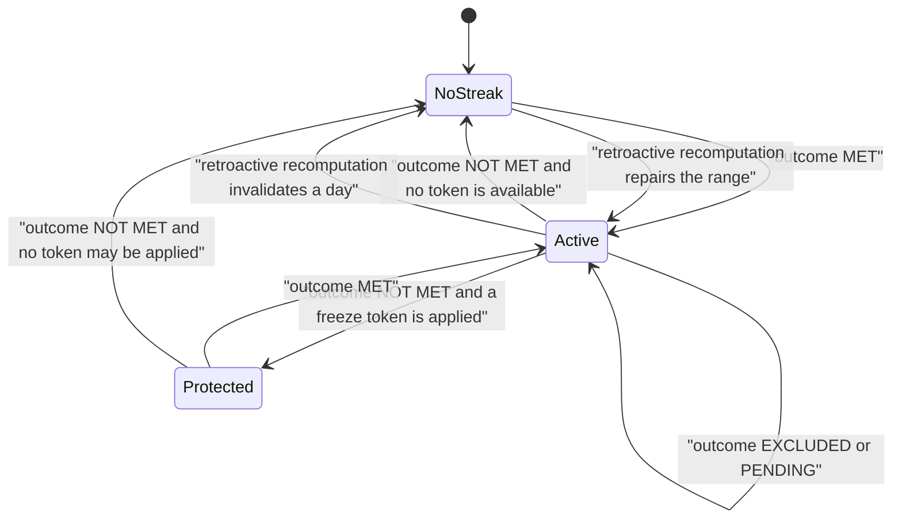
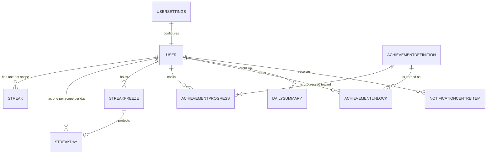

# PlantPal+ — Module Specification: Streaks, Achievements and Gamification (`GAM`)

| Field | Value |
| --- | --- |
| Document | Module Specification — Streaks, Achievements and Gamification |
| Identifier prefix owned | `GAM` (`FR-GAM-nn`, `BR-GAM-nn`; references `US-GAM-nn` and `UC-GAM-nn` owned elsewhere) |
| Version | 1.0 |
| Date | 2026-07-21 |
| Status | Approved for Phase 2 design |
| Owner | Rakshit (Project Lead / sole developer) |
| Parent | [PlantPal+ Software Requirements Specification v1.0](../SRS.md) |

---

## Table of contents

1. [Purpose and scope](#1-purpose-and-scope)
2. [Actors and stakeholders](#2-actors-and-stakeholders)
3. [Capability overview](#3-capability-overview)
4. [Functional requirements](#4-functional-requirements)
5. [Business rules](#5-business-rules)
6. [Data entities touched](#6-data-entities-touched)
7. [External interfaces](#7-external-interfaces)
8. [Edge cases and boundary conditions](#8-edge-cases-and-boundary-conditions)
9. [Deferred and out of scope for v10](#9-deferred-and-out-of-scope-for-v10)
10. [Traceability stub](#10-traceability-stub)

Related documents: [Functional requirements index](../03-functional-requirements.md) · [Non-functional requirements](../04-non-functional-requirements.md) · [User stories — gamification](../user-stories/gamification.md) · [Use cases — gamification](../use-cases/gamification.md) · [Domain model](../07-domain-model.md) · [Glossary](../08-glossary.md) · [Traceability matrix](../10-traceability-matrix.md)

---

## 1. Purpose and scope

### 1.1 Purpose

The `GAM` subsystem is the cross-module motivation layer of PlantPal+. It is the direct realisation of `GOAL-04` — *one global cross-module streak alongside per-module streaks, counting only the modules the user has enabled* — and it is the mechanism by which the consolidation thesis of `GOAL-01` becomes something a user can feel rather than merely read.

`GAM` writes no primary data of its own. It observes the append-only logging events produced by the plant care (`PLT`), fitness (`FIT`) and nutrition (`NUT`) modules and derives, **entirely server-side**, four classes of artefact:

1. **Daily outcome records** — a deterministic per-user, per-scope, per-local-calendar-day outcome, evaluated at the day boundary in the user's own IANA time zone.
2. **Streaks** — four independent scopes, each with a current length, a longest length, a start date, a last-met date and a published, predictable breaking rule.
3. **Achievements** — a catalogue of 46 seeded, versioned, declaratively specified definitions across six categories and four tiers, with progress tracking, strictly idempotent unlocking, a three-channel unlock experience and a trophy gallery.
4. **Weekly recap** — a per-ISO-week cross-module summary generated on Monday morning in the user's local time zone.

Three further capabilities are in scope because they are prerequisites for correctness, not optional polish:

- **Retroactive recomputation.** A log entry created, edited or deleted with a past effective local date triggers a bounded, deterministic rebuild of outcomes, streaks and achievement progress. It must be able both to **repair** a streak (a late offline log arriving after the day boundary, per decision D-04) and to **break** one (a deletion that removes the only reason a day counted).
- **Time-zone and DST correctness.** Every day boundary is a wall-clock boundary in the user's current IANA zone, including 23-hour and 25-hour local days and local midnights that do not exist. This is the mitigation surface for `RSK-05`, the highest-consequence silent-defect class in the product.
- **Anti-cheat and sanity limits.** Back-dating windows, plausibility ceilings on every logged quantity, per-user write rate limits, and the absolute rule that streak and achievement state is computed only on the server and is read-only to every client.

### 1.2 In scope

| # | Capability | Release |
| --- | --- | --- |
| 1 | Per-module daily outcome evaluation with a stored criteria snapshot | v0.5 |
| 2 | Day-boundary rollover pass on a quarter-hour cron sweep, with catch-up after downtime | v0.5 |
| 3 | Four streak scopes with current, longest, start, last-met and last-evaluated attributes | v0.5 |
| 4 | Global streak over enabled **and** applicable modules, with an anti-vacuity guard | v1.0 |
| 5 | Published streak-break rule and non-shaming break notice | v0.5 |
| 6 | Time-zone change handling, including neutralised skipped local dates under quota | v1.0 |
| 7 | Earned, non-purchasable streak freeze tokens | v1.1 |
| 8 | Bounded retroactive recomputation, debounced and coalesced per user | v1.0 |
| 9 | Back-dating window and plausibility validation on every log write | v1.0 |
| 10 | Server-only authority over all derived gamification state | v0.5 |
| 11 | Seeded, versioned achievement catalogue of 46 definitions totalling 1295 points | v0.5 |
| 12 | Definition versioning, retirement and the non-revocation rule | v1.0 |
| 13 | Event-triggered, metric-indexed achievement evaluation | v0.5 |
| 14 | Progress tracking with an integer progress percentage | v1.0 |
| 15 | Idempotent unlocking enforced by a database uniqueness constraint | v0.5 |
| 16 | Three-channel unlock experience: in-app celebration, push request, notification-centre entry | v1.0 |
| 17 | Trophy gallery with three states, filters, counters and secret-achievement masking | v1.0 |
| 18 | Weekly recap generation and delivery fan-out | v1.0 |

### 1.3 Explicitly excluded from this module, with reasons

| Excluded capability | Reason |
| --- | --- |
| Social leaderboards — global, regional or cohort ranking | Ranking requires cross-user disclosure of health-adjacent behaviour. Prohibited by `NFR-PRIV-01` and `NFR-PRIV-02`, and out of reach for a single-developer capstone on free tiers (`CON-01`, `CON-02`). |
| Friend graph, following, friend comparison, head-to-head challenges | Requires a social graph, an invitation flow, abuse reporting and moderation. Incompatible with D-01, `CON-02` and `ASM-20`. |
| Public profiles and shareable public trophy pages | A public URL exposing streak and nutrition behaviour is a data-protection liability, and D-01 fixes privacy depth below a full DPIA. Enforced by BR-GAM-27. |
| Points-for-money, purchasable freeze tokens, any monetised gamification | D-01 and D-06 forbid monetisation; `CON-09` forbids commercial use of the web hosting tier. Freeze tokens are earned only. |
| Competitive weight-loss rewards, calorie-deficit rewards, "you failed" copy, loss-framed streak messaging | D-07 safety. No achievement predicate may reference being under a calorie target and no streak criterion may be conditioned on eating less. Enforced by BR-GAM-26 and `NFR-LEGL-03`. |
| Client-side achievement unlocking or optimistic streak increments | Trivially spoofable in an inspectable React Native or React client; contradicts the server-is-source-of-truth rule of D-04. Enforced by FR-GAM-10. |
| CRDT, last-write-wins or any merge resolution for gamification state | Gamification state is **derived**, never client-authored, so there is nothing to merge (D-04). |
| Retroactive revocation of an already-unlocked achievement | A deliberate asymmetry with streaks, fixed by BR-GAM-21 item 3 and by `BR-ENT-31`. |
| Streak repair purchased or granted on request | No support desk exists (`ASM-20`) and a manual grant would be unauditable. |
| Ownership of push delivery, quiet hours, push-token lifecycle or the notification centre itself | Owned by the `NOT` module. `GAM` supplies content and triggers only. |
| Ownership of the offline write queue, idempotency-key upsert, delta sync, export and account deletion | Owned by the `SYS` module. |
| Ownership of the module-enabled flags, the IANA time-zone preference and the unit preference | Owned by the `SET` module. `GAM` consumes them and supplies the streak length used in the disable-confirmation dialogue. |

### 1.4 Model alignment — normative naming reconciliation

This document is subordinate to the domain model for entity and enumeration names. Where the working vocabulary of the requirements analysis differed from the canonical model, **the canonical model wins** and the mapping below is normative. Implementers must use the right-hand column.

| Analysis working name | Canonical name used throughout this document | Source |
| --- | --- | --- |
| Streak scope `PLANT` | `PLANT_CARE` | `StreakScope` |
| Verdict `MISSED` | Outcome `NOT_MET` | `StreakDayOutcome` |
| Verdict `NOT_APPLICABLE` | Outcome `EXCLUDED` with `exclusion_reason` in `MODULE_DISABLED`, `NO_APPLICABLE_SUBJECT`, `BEFORE_REGISTRATION`, `NO_MODULE_ENABLED`, `CATCHUP_TRUNCATED` | `StreakDayOutcome` |
| Verdict `SKIPPED_TZ` | Outcome `EXCLUDED` with `exclusion_reason = TIMEZONE_SKIP` | `StreakDayOutcome`, whose published meaning already covers "the calendar date does not exist in the user's timeline" |
| Table `daily_module_completion` | Entity `StreakDay` (`ENT-37`) | Domain model, Context C5 |
| Table `streak` | Entity `Streak` (`ENT-36`) | Domain model, Context C5 |
| Table `streak_freeze_token` | Entity `StreakFreeze` (`ENT-38`) | Domain model, Context C5 |
| Table `achievement_definition` | Entity `AchievementDefinition` (`ENT-39`) | Domain model, Context C5 |
| Table `user_achievement_progress` | Entity `AchievementProgress` (`ENT-40`) | Domain model, Context C5 |
| Table `user_achievement` | Entity `AchievementUnlock` (`ENT-41`) | Domain model, Context C5 |

Two further alignment rules:

1. **`PENDING` is a real outcome.** The local day currently in progress carries `StreakDay.outcome = PENDING` and resolves only when that local day ends. No requirement in this document may count a `PENDING` day toward a streak.
2. **`REST_DAY` is reserved, not produced in v1.0.** The `StreakDayOutcome` member `REST_DAY` exists in the canonical enumeration because `ENT-23 RestDay` exists in the fitness module, but no `GAM` v1.0 requirement writes it. Rest-day semantics are deferred (§9).

The `exclusion_reason` discriminator is a `GAM`-local qualifier stored inside `StreakDay.goal_snapshot_json`; it must be registered with the enumeration governance rule `BR-ENT-20` before the v0.5 build starts.

---

## 2. Actors and stakeholders

### 2.1 Actors

| Actor | Type | Role in this module |
| --- | --- | --- |
| Registered User | Human, primary | Produces the domain logs that make days count. Views streaks, the trophy gallery and the weekly recap. Enables and disables modules, changes time zone and goals. Holds and automatically spends freeze tokens from v1.1. **Never writes gamification state directly.** |
| Guest / Unauthenticated Visitor | Human, secondary | Has no gamification state. Every gamification endpoint called without a valid access token returns HTTP 401. |
| Streak and Achievement Scheduler | System — a node-cron worker inside the Node.js and Express backend | Fires the day-boundary rollover pass, the catch-up sweep, the freeze-token application pass and the weekly recap generation pass. |
| Domain Event Publisher | System — internal, inside the backend transaction boundary | Emits gamification outbox rows when `PLT`, `FIT`, `NUT`, `ACC` or `SET` state changes. The sole trigger source for event-driven achievement evaluation. |
| Achievement Evaluator | System — internal service | Reads the outbox, resolves affected metrics, re-evaluates only the definitions indexed by those metrics, writes progress and performs idempotent unlocks. |
| Recomputation Worker | System — internal job runner | Executes bounded retroactive recomputation jobs, serialised per user by a PostgreSQL advisory lock. |
| Notification Dispatch Service | System, owned by `NOT` | Delivers unlock pushes and the weekly recap push or email digest. Owns quiet hours, per-user delivery caps and Expo push-token management. `GAM` only requests delivery. |
| Sync Service | System, owned by `SYS` | Flushes the offline append-only write queue. Each flushed write is an ordinary domain event that may trigger retroactive recomputation. |
| Catalogue Maintainer | Human — Project Lead, out of band | Authors and publishes achievement definition versions through a seed migration. No runtime administration interface exists in v1.0. |
| Keep-Alive Pinger | System — a scheduled GitHub Actions workflow | Wakes the free-tier backend so the cron worker actually ticks. Not a functional actor, but a deployment dependency that FR-GAM-02 relies on (`NFR-PERF-04`, `RSK-01`, `CON-05`). |

### 2.2 Stakeholders and personas served

| Identifier | Interest in this module |
| --- | --- |
| `STK-01` End user | "The streak is never wrongly broken" is one of the five stated success criteria for this stakeholder. Every requirement in §4 exists to make that statement true. |
| `STK-03` Project Lead | Owns the trade-off between motivational richness and the 360-hour budget of `CON-02`; owns the pre-agreed cut of freeze tokens to v1.1. |
| `STK-05` Pilot cohort testers | Supply the evidence for `MET-13` — median longest global streak of at least 5 days. |
| `STK-10` Accessibility reviewers | Gate the celebration experience against `NFR-A11Y-07` reduced motion and `NFR-A11Y-08` non-colour status channels. |
| `PER-01` Aditi Sharma | Primary consumer of the global streak and the trophy gallery; the multi-module daily user the global scope was designed for. |
| `PER-02` Marcus Oyelaran | Single-module plant user; the reason `PLANT_CARE` completion is "nothing is overdue" rather than "something was logged today" (BR-GAM-02). |
| `PER-03` Mia Castellano | Southern-hemisphere and time-zone-sensitive user; owns the travel scenarios behind FR-GAM-06 and the deferred rest-day question. |
| `PER-04` Harold Whitfield | Reduced-motion, screen-reader and plain-copy user; owns the celebration fallback in FR-GAM-16 and the copy rules in BR-GAM-26. |
| `PER-05` Sofia Lindqvist | Offline, metered-connection user; owns the late-sync streak-repair scenarios behind FR-GAM-08. |

---

## 3. Capability overview

```mermaid
flowchart LR
  GAM["GAM Streaks Achievements and Gamification"]

  GAM --> G1["G1 Daily outcome engine"]
  GAM --> G2["G2 Streak engine"]
  GAM --> G3["G3 Rollover and catch-up scheduling"]
  GAM --> G4["G4 Retroactive recomputation"]
  GAM --> G5["G5 Achievement catalogue"]
  GAM --> G6["G6 Achievement evaluation"]
  GAM --> G7["G7 Unlock experience"]
  GAM --> G8["G8 Trophy gallery"]
  GAM --> G9["G9 Weekly recap"]
  GAM --> G10["G10 Integrity and safety"]

  G1 --> G1a["G1.1 Local-day resolution<br/>IANA zone and DST safe"]
  G1 --> G1b["G1.2 Per-module completion predicates"]
  G1 --> G1c["G1.3 Applicability and vacuous-day rules"]
  G1 --> G1d["G1.4 Criteria and goal snapshotting"]
  G1b --> G1b1["G1.2.1 Plant care<br/>zero overdue pending tasks"]
  G1b --> G1b2["G1.2.2 Fitness<br/>qualifying workout or step goal"]
  G1b --> G1b3["G1.2.3 Nutrition<br/>two de-duplicated meal entries"]

  G2 --> G2a["G2.1 Four scopes PLANT CARE FITNESS NUTRITION GLOBAL"]
  G2 --> G2b["G2.2 Global scope over enabled and applicable modules"]
  G2 --> G2c["G2.3 Counters current longest start last met"]
  G2 --> G2d["G2.4 Break rule and reset semantics"]
  G2 --> G2e["G2.5 Freeze tokens - v1.1"]
  G2 --> G2f["G2.6 Module enable and disable semantics"]
  G2 --> G2g["G2.7 Time-zone re-anchoring and neutral skipped days"]

  G3 --> G3a["G3.1 Quarter-hour sweep with 5-minute settle delay"]
  G3 --> G3b["G3.2 Selection of users whose local day just ended"]
  G3 --> G3c["G3.3 Bounded catch-up after downtime"]
  G3 --> G3d["G3.4 Per-user advisory lock and idempotent re-run"]

  G4 --> G4a["G4.1 Trigger set"]
  G4 --> G4b["G4.2 Bounded range and 400-day cap"]
  G4 --> G4c["G4.3 Debounce and coalescing"]
  G4 --> G4d["G4.4 Determinism guarantee"]
  G4 --> G4e["G4.5 Streak restored or broken notice"]

  G5 --> G5a["G5.1 Six categories"]
  G5 --> G5b["G5.2 Four tiers worth 10 25 50 and 100 points"]
  G5 --> G5c["G5.3 Declarative predicate over a fixed metric catalogue"]
  G5 --> G5d["G5.4 46 seeded definitions and 1295 seed points"]
  G5 --> G5e["G5.5 Secret achievements masked until unlocked"]
  G5 --> G5f["G5.6 Versioning retirement and legacy badging"]

  G6 --> G6a["G6.1 Event-driven trigger set and metric index"]
  G6 --> G6b["G6.2 Materialised metric snapshot"]
  G6 --> G6c["G6.3 Progress percentage"]
  G6 --> G6d["G6.4 Idempotent unlock"]
  G6 --> G6e["G6.5 Cascade guard at depth 3"]

  G7 --> G7a["G7.1 In-app celebration at most 2500 ms"]
  G7 --> G7b["G7.2 Push request to NOT"]
  G7 --> G7c["G7.3 Permanent notification-centre entry"]

  G8 --> G8a["G8.1 States LOCKED IN PROGRESS UNLOCKED"]
  G8 --> G8b["G8.2 Grouping filters and deterministic sort"]
  G8 --> G8c["G8.3 Counters and per-category completion"]
  G8 --> G8d["G8.4 First-run and empty states"]

  G9 --> G9a["G9.1 ISO week window in the user time zone"]
  G9 --> G9b["G9.2 Cross-module payload"]
  G9 --> G9c["G9.3 Delivery fan-out"]
  G9 --> G9d["G9.4 Retention of 12 and open tracking"]

  G10 --> G10a["G10.1 Back-dating and future-dating windows"]
  G10 --> G10b["G10.2 Plausibility ceilings"]
  G10 --> G10c["G10.3 Duplicate-entry de-duplication"]
  G10 --> G10d["G10.4 Write rate limiting"]
  G10 --> G10e["G10.5 Server-only authority"]
  G10 --> G10f["G10.6 Non-shaming and non-medical copy rules"]
```



### 3.1 Release map

| Release | Gamification slice that must be demoable |
| --- | --- |
| v0.1 Walking Skeleton | No `GAM` capability. The four `Streak` rows are created at registration with zero lengths so that no later code path handles a missing row. |
| v0.5 Alpha | FR-GAM-01, FR-GAM-02, FR-GAM-03, FR-GAM-05, FR-GAM-10, FR-GAM-11, FR-GAM-13, FR-GAM-15. Demo: a per-module streak advances overnight and one achievement unlocks exactly once. |
| v1.0 MVP | Adds FR-GAM-04, FR-GAM-06, FR-GAM-08, FR-GAM-09, FR-GAM-12, FR-GAM-14, FR-GAM-16, FR-GAM-17, FR-GAM-18. Demo: global streak on the dashboard, trophy gallery with progress, celebration, weekly recap, and a late offline log repairing a broken streak. |
| v1.1 Post-MVP | Adds FR-GAM-07 freeze tokens. Listed as item 3 on the pre-agreed v1.0 cut list, so its absence never blocks the v1.0 gate. |

---

## 4. Functional requirements

Every requirement below is stated once, in the mandatory "The system shall …" form, with exactly one testable capability. Thresholds are absolute and are restated in full in §5 so that no implementer needs a further conversation.

### FR-GAM-01 — Per-module daily outcome evaluation

| Field | Value |
| --- | --- |
| Priority | Must |
| Release | v0.5 |
| Actor | Streak and Achievement Scheduler |
| Verification | Test |
| Traces to | `GOAL-04`, `STK-01`, `PER-01`, `PER-02` · `US-GAM-01`, `US-GAM-02` · `UC-GAM-01` · `NFR-DATA-01`, `NFR-MAIN-03` |

**Requirement.** The system shall evaluate, for each user and for each of the scopes `PLANT_CARE`, `FITNESS` and `NUTRITION`, exactly one `StreakDay` outcome per local calendar day, drawn from the enumeration `MET`, `NOT_MET`, `EXCLUDED`, `FROZEN`, `PENDING`, by applying the predicates defined in BR-GAM-02, BR-GAM-03, BR-GAM-04 and BR-GAM-05.

**Rationale.** Every streak, most consistency achievements and the whole weekly recap read from a single auditable primitive: "did this scope count on this day for this user?". Deriving it once, storing it, and never recomputing it from live tables at read time is what lets the unified dashboard (`DSH`) render streaks in a single aggregate call within the `NFR-PERF-03` budget, and it is what makes retroactive repair tractable rather than open-ended.

**Inputs and validation.**

| Field | Type | Constraints | Required |
| --- | --- | --- | --- |
| `user_id` | UUID | Must reference an existing `User` whose status is not purged | Yes |
| `scope` | enum `StreakScope` | One of `PLANT_CARE`, `FITNESS`, `NUTRITION` — `GLOBAL` is produced by FR-GAM-04, not here | Yes |
| `local_date` | DATE | On or after the user's registration local date and strictly before the user's current local date; a maximum of 400 distinct local dates may be evaluated for one user in one pass | Yes |
| `timezone` | TEXT | A valid IANA zone identifier resolvable in the bundled tz database; falls back to `UTC` per the error flow below | Yes |
| `module_enabled` | BOOLEAN | The enabled flag for that module on that local date, from the `SET`-owned snapshot | Yes |
| `goal_values` | JSON | The effective-dated goal values in force at the **end** of `local_date`, per BR-GAM-11; never the current values | Yes |
| `log_rows` | collection | All `PLT`, `FIT` or `NUT` log rows whose effective instant falls inside the half-open local-day interval of BR-GAM-01 | Yes |

**Processing rules.**

1. Resolve the half-open local-day interval per BR-GAM-01.
2. Determine applicability per BR-GAM-05. If the scope is not applicable, the outcome is `EXCLUDED` and the `exclusion_reason` qualifier records which clause applied.
3. Otherwise apply BR-GAM-02 for `PLANT_CARE`, BR-GAM-03 for `FITNESS` or BR-GAM-04 for `NUTRITION`. De-duplicate candidate log rows per BR-GAM-17 before counting.
4. Persist exactly one `StreakDay` row keyed on `(user_id, scope, local_date)` carrying the outcome, a `goal_snapshot_json` recording every input value used, the `timezone_used`, the `exclusion_reason` where applicable and an integer `evaluation_version` identifying the predicate implementation.
5. Emit one `DAY_EVALUATED` outbox event carrying the outcome, which drives FR-GAM-13.

**Outputs.** One upserted `StreakDay` row per `(user_id, scope, local_date)`; one `DAY_EVALUATED` outbox event per evaluated date; a refreshed `DailySummary` row for that date where the day-met booleans are affected.

**Alternate and error flows.**

| Condition | System response | User-visible message |
| --- | --- | --- |
| The user's IANA time-zone identifier is absent or unresolvable | Evaluate in `UTC`, set `goal_snapshot_json.timezone_fallback = true`, raise a Sentry warning; still produce the outcome | None. The outcome is produced normally; the settings screen already prompts for a time zone. |
| No historical goal value exists for that local date | Use the earliest known goal value for that user and record `goal_snapshot_json.goal_source = "EARLIEST_KNOWN"` | None. |
| A row already exists for the key and the incoming `resolved_at` is earlier or equal | Treat as a no-op; do not rewrite the row | None. |
| A row already exists and the incoming `resolved_at` is later | Overwrite the row and record the previous outcome in the recomputation job diff when the write originates from FR-GAM-08 | Only if the `GLOBAL` current length changed, per FR-GAM-08. |
| The local date is before the user's registration local date | Do not evaluate; write nothing | None. |

---

### FR-GAM-02 — Day-boundary rollover pass

| Field | Value |
| --- | --- |
| Priority | Must |
| Release | v0.5 |
| Actor | Streak and Achievement Scheduler |
| Verification | Test |
| Traces to | `GOAL-04`, `STK-01` · `US-GAM-01` · `UC-GAM-01` · `NFR-PERF-04`, `NFR-RELI-07`, `NFR-SCAL-06`, `NFR-DATA-02` |

**Requirement.** The system shall execute a day-boundary rollover pass every 15 minutes that evaluates the local calendar day which has just ended for every user whose current local wall-clock time lies in the half-open interval 00:05:00 inclusive to 00:20:00 exclusive.

**Rationale.** Streaks must turn over at the user's midnight, not the server's. The IANA database contains zones at 15-, 30- and 45-minute offsets — `Asia/Kolkata` at +05:30, `Asia/Kathmandu` at +05:45, `Pacific/Chatham` at +12:45 — so a quarter-hour sweep is the coarsest schedule that serves every user without special cases. The 5-minute settle delay exists so that offline writes flushed just before midnight land before the day is judged, which is the single largest source of a wrongly broken streak for `PER-05`.

**Inputs and validation.**

| Field | Type | Constraints | Required |
| --- | --- | --- | --- |
| `server_instant` | TIMESTAMPTZ | The UTC instant of the cron tick | Yes |
| `user_id` | UUID | Selected only when the user's account status permits evaluation | Yes |
| `timezone` | TEXT | Valid IANA zone identifier | Yes |
| `last_evaluated_local_date` | DATE | Nullable; when null, evaluation starts at the registration local date | No |
| Pass size | INTEGER | At most 5000 users per pass; the remainder carries to the next tick | Yes |
| Dates per user | INTEGER | At most 400 local dates per user per pass | Yes |

**Processing rules.**

1. Run node-cron with the UTC expression `2,17,32,47 * * * *`.
2. For each candidate user compute the current local wall-clock time and select the user when that time lies in `[00:05:00, 00:20:00)`.
3. Acquire a PostgreSQL advisory lock keyed on `hashtext(user_id)` (BR-GAM-28).
4. Evaluate every local date strictly after `last_evaluated_local_date` and strictly before the current local date, in ascending order, capped at 400 dates (BR-GAM-10 catch-up).
5. For each date invoke FR-GAM-01 for the three module scopes, then FR-GAM-04 for `GLOBAL`, then FR-GAM-03 for all four scopes.
6. Advance `Streak.last_evaluated_local_date` and release the lock.
7. Emit one `ROLLOVER_COMPLETED` outbox event per user per pass.

**Outputs.** Updated `StreakDay` and `Streak` rows; a `ROLLOVER_COMPLETED` outbox event per user; the tick counters required by `NFR-OBSV-06`.

**Alternate and error flows.**

| Condition | System response | User-visible message |
| --- | --- | --- |
| The advisory lock is already held, typically by a recomputation job | Skip the user and retry on the next tick; after 8 consecutive skips raise a Sentry error | None. |
| The process crashes mid-pass | The next pass re-derives the same set from `last_evaluated_local_date`; the pass is idempotent by construction | None. |
| The free-tier host was asleep and one or more ticks were missed | The catch-up path of BR-GAM-10 evaluates every unevaluated local date on the next run; the Keep-Alive Pinger of `NFR-PERF-04` calls the health endpoint every 10 minutes to limit exposure | None. |
| More than 400 local dates are unevaluated for one user | Evaluate the most recent 400; record the remainder as `EXCLUDED` with `exclusion_reason = CATCHUP_TRUNCATED` and require an operator note in the release log | None. |
| More than 5000 users are selectable in one tick | Process 5000 and carry the remainder to the next quarter-hour tick | None. |

---

### FR-GAM-03 — Streak counter maintenance

| Field | Value |
| --- | --- |
| Priority | Must |
| Release | v0.5 |
| Actor | Streak and Achievement Scheduler |
| Verification | Test |
| Traces to | `GOAL-04`, `STK-01`, `MET-13` · `US-GAM-01` · `UC-GAM-02` · `NFR-MAIN-03`, `NFR-MAIN-04` |

**Requirement.** The system shall maintain, for each user and for each streak scope in the enumeration `PLANT_CARE`, `FITNESS`, `NUTRITION`, `GLOBAL`, the attributes current length, longest length, streak start date, last met date and last evaluated date, updating them strictly according to the state-transition table of BR-GAM-07.

**Rationale.** The `Streak` row is the read model that the dashboard and every consistency achievement consume. It must be derivable purely from the ordered sequence of `StreakDay` outcomes, so that any recomputation reproduces it exactly and so that `MET-13` can be measured from the database without re-deriving history.

**Inputs and validation.**

| Field | Type | Constraints | Required |
| --- | --- | --- | --- |
| `scope` | enum `StreakScope` | One of the four members | Yes |
| `outcome_sequence` | ordered collection | `StreakDay` outcomes for that scope, in ascending `local_date` order, with no gaps | Yes |
| `current_length_days` | INTEGER | Non-negative; write ceiling 3650; display cap per BR-GAM-30 | Yes |
| `longest_length_days` | INTEGER | Non-negative; `longest_length_days >= current_length_days` at all times | Yes |
| `current_started_local_date` | DATE | Null if and only if `current_length_days = 0` | No |
| `last_met_local_date` | DATE | Nullable | No |
| `last_evaluated_local_date` | DATE | Advanced on every transition including no-op transitions | Yes |

**Processing rules.**

1. Apply the BR-GAM-07 transition table once per local date, in ascending local-date order, never out of sequence.
2. On `MET`: increment `current_length_days`; if the new value is 1, set `current_started_local_date` to that date; set `last_met_local_date`; if `current_length_days` now exceeds `longest_length_days`, set `longest_length_days` to `current_length_days` and record `longest_started_local_date` and `longest_ended_local_date`.
3. On `FROZEN`, `EXCLUDED` or `PENDING`: change no counter.
4. On `NOT_MET`: apply FR-GAM-05.
5. Advance `last_evaluated_local_date` on every transition.
6. Assert every invariant of BR-GAM-08 after the sequence completes.

**Outputs.** An updated `Streak` row per scope; a `STREAK_UPDATED` outbox event carrying the scope, the previous length and the new length; a `STREAK_BROKEN` outbox event where FR-GAM-05 applied.

**Alternate and error flows.**

| Condition | System response | User-visible message |
| --- | --- | --- |
| The outcome sequence contains a gap — a local date with no `StreakDay` row between two evaluated dates | Treat as an integrity fault: refuse to advance, enqueue a full recomputation for the affected range, raise a Sentry error, set `Streak.stale = true` | "Recalculating your streak" in place of a number. |
| A BR-GAM-08 invariant fails after the sequence | Set `Streak.stale = true`, raise a Sentry error, enqueue a recomputation | "Recalculating your streak". |
| `current_length_days` would exceed 3650 | Clamp the stored value at 3650 and raise a Sentry warning | Rendered per BR-GAM-30 as "9999+" only above 9999; 3650 renders literally. |

---

### FR-GAM-04 — Global streak over enabled and applicable modules

| Field | Value |
| --- | --- |
| Priority | Must |
| Release | v1.0 |
| Actor | Streak and Achievement Scheduler |
| Verification | Test |
| Traces to | `GOAL-01`, `GOAL-04`, `PER-01` · `US-GAM-01`, `US-GAM-09` · `UC-GAM-02` · `NFR-MAIN-03` |

**Requirement.** The system shall assign the `GLOBAL` outcome `MET` for a local day if and only if every module that is enabled for the user and whose outcome for that day is not `EXCLUDED` has the outcome `MET` or `FROZEN`, and at least one such module has the outcome `MET`.

**Rationale.** This is the headline number on the unified daily dashboard and the direct measure behind `MET-13`. It must be honest in two directions at once: it may not be satisfiable by doing nothing, and it must not punish a user for a module they deliberately turned off. The trailing clause is the anti-vacuity guard.

**Inputs and validation.**

| Field | Type | Constraints | Required |
| --- | --- | --- | --- |
| `enabled_modules` | set of enum `ModuleKey` | The snapshotted enabled set for that local date per BR-GAM-14; may be empty, which must be handled deterministically | Yes |
| `module_outcomes` | map | The three per-module `StreakDay` outcomes for that local date; every enabled module must have exactly one | Yes |
| `local_date` | DATE | Strictly before the user's current local date | Yes |

**Processing rules.**

1. Let `E` be the enabled module set for that date and `A = { m in E : outcome(m) != EXCLUDED }`.
2. Evaluate the decision table of BR-GAM-06 exactly as written; no other ordering is permitted, because `FROZEN`-only days must resolve to `FROZEN` rather than `MET`.
3. Persist the result as the `GLOBAL` `StreakDay` row for that date, carrying the same `goal_snapshot_json.enabled_modules` snapshot.

**Outputs.** The `GLOBAL` `StreakDay` row for that local date, consumed by FR-GAM-03 and by the `DSH` dashboard aggregate.

**Alternate and error flows.**

| Condition | System response | User-visible message |
| --- | --- | --- |
| `E` is empty — zero modules enabled | `GLOBAL` outcome is `EXCLUDED` with `exclusion_reason = NO_MODULE_ENABLED`; the streak is neither incremented nor reset | "Enable at least one module to track streaks." |
| `A` is empty — every enabled module is `EXCLUDED` that day | `GLOBAL` outcome is `EXCLUDED` with `exclusion_reason = NO_APPLICABLE_SUBJECT` | "Nothing was due today, so today does not count either way." |
| Every module in `A` is `FROZEN` | `GLOBAL` outcome is `FROZEN`; the streak is preserved but not extended | "Your streak was protected on this day." |
| The enabled-module snapshot for a past date is missing | Use the current enabled set, record `goal_snapshot_json.enabled_source = "CURRENT"`, write an `AuditEvent`; this is the only place a missing snapshot can alter a historical outcome | None. |

---

### FR-GAM-05 — Streak break rule

| Field | Value |
| --- | --- |
| Priority | Must |
| Release | v0.5 |
| Actor | Streak and Achievement Scheduler |
| Verification | Test |
| Traces to | `GOAL-04`, `STK-01`, `PER-04` · `US-GAM-01`, `US-GAM-02` · `UC-GAM-02` · `NFR-USAB-03`, `NFR-LEGL-03` |

**Requirement.** The system shall reset the current length of a streak scope to 0 and clear its streak start date at the conclusion of the rollover evaluation of any local day whose outcome for that scope is `NOT_MET` and to which no freeze token was applied.

**Rationale.** Users must be able to predict exactly when a streak dies. The published rule is: a streak breaks at the moment the rollover pass concludes that a **completed** local day was `NOT_MET` — never at the abstract stroke of midnight, and never because the application was not opened. A rule a user can state back is a rule that does not feel arbitrary when it costs them something.

**Inputs and validation.**

| Field | Type | Constraints | Required |
| --- | --- | --- | --- |
| `outcome` | enum `StreakDayOutcome` | Must be `NOT_MET`; a `PENDING` day can never break a streak | Yes |
| `local_date` | DATE | Must be a day that has fully ended in the user's time zone | Yes |
| `freeze_available` | BOOLEAN | v1.1 only; when true, FR-GAM-07 runs first and may rewrite the outcome to `FROZEN` | No |
| `previous_length` | INTEGER | The `current_length_days` value before the reset, used for the notice threshold | Yes |

**Processing rules.**

1. Set `current_length_days = 0`, `current_started_local_date = NULL`, and record the breaking date.
2. Leave `longest_length_days`, `longest_started_local_date` and `longest_ended_local_date` untouched.
3. Emit `STREAK_BROKEN` carrying the scope and the previous length.
4. Create a `NotificationCentreItem` **only** when the broken streak had a length of 7 or more, phrased per BR-GAM-26 with no shaming or loss-framing language and with a one-tap action to start again.
5. Send no push notification for a broken streak in v1.0.

**Outputs.** An updated `Streak` row; a `STREAK_BROKEN` outbox event; conditionally one `NotificationCentreItem`.

**Alternate and error flows.**

| Condition | System response | User-visible message |
| --- | --- | --- |
| A freeze token is available and every BR-GAM-09 limit passes (v1.1) | FR-GAM-07 rewrites the outcome to `FROZEN` before this requirement executes; no break occurs | "Your streak was protected on 12 March. You have 1 freeze left." |
| The broken streak had a length below 7 | Reset the counters; create no notification-centre entry | None. |
| The broken streak had a length of 7 or more | Create one notification-centre entry using neutral copy | "Your 21-day streak ended on 12 March. Start a new one today." |
| The same day is later re-evaluated as `MET` by a retroactive recomputation | The break is **not** undone in place; FR-GAM-08 rebuilds the streak from the outcome sequence | "Your streak was restored." |

---

### FR-GAM-06 — Time-zone change and skipped local dates

| Field | Value |
| --- | --- |
| Priority | Must |
| Release | v1.0 |
| Actor | Registered User, Streak and Achievement Scheduler |
| Verification | Test |
| Traces to | `GOAL-04`, `PER-03`, `RSK-05`, `ASM-15` · `US-GAM-10` · `UC-GAM-01`, `UC-GAM-03` · `NFR-DATA-01`, `NFR-DATA-02` |

**Requirement.** The system shall record the outcome `EXCLUDED` with `exclusion_reason = TIMEZONE_SKIP` for every local calendar date that is skipped when a user's time-zone change advances their local date by one or more days, and shall treat such dates as neutral so that they neither increment nor reset any streak.

**Rationale.** A user flying from `Pacific/Auckland` to `America/Los_Angeles` experiences the same local date twice; flying the other way they skip a date entirely. Neither event should silently destroy a streak, and neither should hand out a free day. `PER-03` and `RSK-05` make this the defect class most likely to ship unnoticed, so the behaviour is specified rather than left to the date library.

**Inputs and validation.**

| Field | Type | Constraints | Required |
| --- | --- | --- | --- |
| `old_timezone` | TEXT | The IANA identifier in force before the change | Yes |
| `new_timezone` | TEXT | A valid IANA identifier; validated and rejected by `SET` before this module is invoked | Yes |
| `changed_at` | TIMESTAMPTZ | The server instant of the change | Yes |
| `last_evaluated_local_date` | DATE | From the user's `Streak` rows | Yes |
| Skip quota | INTEGER | At most 2 neutralised skips per rolling 90 days per user; beyond the quota, skipped dates are recorded `NOT_MET` | Yes |
| Skip magnitude | INTEGER | A computed skip larger than 2 days is capped at 2 and the remainder is evaluated normally | Yes |

**Processing rules.**

1. Compute the user's local date immediately before and immediately after the change.
2. If the new local date is **later** by `n >= 1` days, insert `EXCLUDED` / `TIMEZONE_SKIP` `StreakDay` rows for the `n` intervening dates for all four scopes, subject to the 90-day quota, and advance `last_evaluated_local_date`.
3. If the new local date is **earlier than or equal to** the old local date, do nothing. Already-finalised dates are never re-bucketed, and the uniqueness constraint on `(user_id, scope, local_date)` makes a second increment for a repeated date impossible.
4. Preserve `StreakDay.timezone_used` on every already-finalised row; a historical outcome is never recomputed under a new time zone.
5. Evaluate the local day currently in progress under the **new** time zone when it ends.

**Outputs.** Zero or more `EXCLUDED` / `TIMEZONE_SKIP` `StreakDay` rows; one `NotificationCentreItem` explaining how many days were skipped and that the streak was preserved; a recomputation job where the earliest skipped date precedes the current local date.

**Alternate and error flows.**

| Condition | System response | User-visible message |
| --- | --- | --- |
| The new time-zone identifier is not a valid IANA zone | `SET` rejects the change; this module is never invoked | Owned by `SET`. |
| The user has already used 2 skip neutralisations in the last 90 days | Record the skipped dates as `NOT_MET`; normal breaking rules apply | "A time-zone change skipped 1 day. Frequent skips are no longer protected." |
| The computed skip exceeds 2 days | Cap at 2 `EXCLUDED` / `TIMEZONE_SKIP` days, evaluate the remainder normally, raise a Sentry warning | "A time-zone change skipped 2 days, which were not counted against your streak." |
| The change moves the local date backwards | Take no action on finalised dates | "Your streak is unchanged." |

---

### FR-GAM-07 — Streak freeze tokens

| Field | Value |
| --- | --- |
| Priority | Should |
| Release | v1.1 |
| Actor | Streak and Achievement Scheduler |
| Verification | Test |
| Traces to | `GOAL-04`, `STK-01`, `OQ-07` · `US-GAM-04` · `UC-GAM-07` · `NFR-MAIN-03` |

**Requirement.** The system shall grant one streak freeze token to a user each time that user's `GLOBAL` current streak length reaches an exact integer multiple of 10, up to a maximum of 3 tokens held simultaneously.

**Rationale.** A single missed day after 60 days is disproportionately demotivating and is the most common reason a habit-tracking user abandons an application. A small, earned, non-purchasable buffer preserves motivation without making the streak meaningless. `OQ-07` records the counter-argument — that a grace mechanism makes the metric less honest — and resolves it by making the mechanism earned, capped, published and auditable, and by deferring it to v1.1 so that the v1.0 gate never depends on it.

**Inputs and validation.**

| Field | Type | Constraints | Required |
| --- | --- | --- | --- |
| `global_current_length` | INTEGER | Evaluated after each `MET` day; a grant fires only at an exact multiple of 10 | Yes |
| `available_balance` | INTEGER | 0 to 3 inclusive; a grant above 3 is discarded, never queued or converted | Yes |
| `missed_local_date` | DATE | Must be no more than 7 days before the current local date | Yes |
| `preceding_outcome` | enum `StreakDayOutcome` | A token may not be applied when the immediately preceding local day's outcome for the same scope is `NOT_MET` or `FROZEN` | Yes |
| Rolling 7-day consumption | INTEGER | At most 1 token consumed per rolling 7 days | Yes |
| Rolling 90-day consumption | INTEGER | At most 5 tokens consumed per rolling 90 days | Yes |
| `earned_after_met_days` | INTEGER | Grant idempotence key together with `user_id`; a repeated evaluation at the same length creates no second token | Yes |

**Processing rules.**

1. Immediately after a `NOT_MET` outcome is written for `GLOBAL`, and **before** FR-GAM-05 executes, the freeze pass selects the oldest token whose state is `EARNED`.
2. Check every limit in BR-GAM-09. If all pass, rewrite the outcome for that local date from `NOT_MET` to `FROZEN` for **every** scope that was `NOT_MET` on that date, so one token protects the global streak and all affected per-module streaks together.
3. Mark the token `CONSUMED` with `consumed_local_date` set to the protected date, and skip the break.
4. If any limit fails, take no action and allow FR-GAM-05 to proceed.
5. A `FROZEN` day never counts toward earning the next token and never satisfies an achievement predicate that requires met days.

**Outputs.** An updated `StreakFreeze` row; rewritten `StreakDay` rows for the protected date; one `NotificationCentreItem` naming the protected date and the remaining balance.

**Alternate and error flows.**

| Condition | System response | User-visible message |
| --- | --- | --- |
| The balance is already 3 when the next multiple of 10 is reached | Discard the grant; do not queue it | "You already hold the maximum of 3 freezes." |
| The preceding local day was `NOT_MET` or `FROZEN` | Apply no token; two consecutive misses always break the streak | "Your streak ended on 12 March. Start a new one today." |
| The missed date is more than 7 days before the current local date | Apply no token | None. |
| Two evaluation paths attempt to consume the same token concurrently | The per-user advisory lock serialises them; the loser re-reads the balance; `UNIQUE (user_id, consumed_local_date)` prevents double consumption for a date | None. |
| A retroactive recomputation later turns the frozen day into a genuine `MET` | Return the token to `EARNED` exactly once, keyed on `consumed_local_date`, so a repaired day gives the token back but a replayed recomputation cannot mint extras | "Your freeze from 10 March was returned." |
| A user requests, purchases or is offered a token by any other route | Not implemented. No endpoint exists | "Freezes are earned by completing 10 days in a row." |

---

### FR-GAM-08 — Retroactive recomputation

| Field | Value |
| --- | --- |
| Priority | Must |
| Release | v1.0 |
| Actor | Recomputation Worker |
| Verification | Test |
| Traces to | `GOAL-04`, `GOAL-05`, `PER-05`, `ASM-02` · `US-GAM-03` · `UC-GAM-03` · `NFR-RELI-04`, `NFR-DATA-01`, `NFR-MAIN-03` |

**Requirement.** The system shall enqueue a bounded recomputation job covering the local date range from the earliest affected local date to the user's current local date, capped at 400 days, whenever a log entry belonging to the `PLT`, `FIT` or `NUT` modules is created, updated or deleted with an effective local date earlier than the user's current local date.

**Rationale.** Decision D-04 permits append-only logging while offline, and those writes can arrive minutes or days after the day they describe. Users also correct mistakes. Without deterministic recomputation, streaks would be wrong in exactly the situations where users care most — which is the failure mode `STK-01` calls out by name.

**Inputs and validation.**

| Field | Type | Constraints | Required |
| --- | --- | --- | --- |
| `change_type` | enum | One of `CREATE`, `UPDATE`, `DELETE` | Yes |
| `old_effective_local_date` | DATE | Present for `UPDATE` and `DELETE` | No |
| `new_effective_local_date` | DATE | Present for `CREATE` and `UPDATE` | No |
| `from_local_date` | DATE | `min(old_effective_local_date, new_effective_local_date)`; clamped so the span never exceeds 400 days, with `clamped = true` recorded on the job | Yes |
| `to_local_date` | DATE | Always the user's current local date | Yes |
| Debounce | INTEGER | 5 seconds per user; overlapping pending jobs coalesce into their union rather than queueing separately | Yes |
| Job concurrency | INTEGER | At most 1 running and 1 pending job per user, enforced by partial unique indexes | Yes |
| Job duration | INTEGER | Target 10 seconds for a 400-day span; hard abort at 30 seconds | Yes |

**Processing rules.**

1. Enqueue on any trigger listed in BR-GAM-12 and debounce for 5 seconds per user, coalescing overlapping ranges into their union.
2. Acquire the per-user advisory lock (BR-GAM-28).
3. Re-run FR-GAM-01 for every local date in the range for the three module scopes, then FR-GAM-04 for `GLOBAL`.
4. Re-derive all four `Streak` rows **from scratch**, starting from the outcome immediately preceding `from_local_date`, applying BR-GAM-07 in ascending local-date order.
5. Refresh the affected achievement metrics and re-run FR-GAM-13 for those metrics. Recomputation may produce new unlocks; it may **never** produce a revocation (BR-GAM-21).
6. Write a job diff recording every changed outcome and every changed streak value, then emit `RECOMPUTE_COMPLETED`.
7. Create one `NotificationCentreItem` only when the `GLOBAL` current length changed by 1 or more as a result.

**Outputs.** Rewritten `StreakDay` rows; rewritten `Streak` rows; a refreshed metric snapshot; zero or more new `AchievementUnlock` rows; a job diff; a `RECOMPUTE_COMPLETED` outbox event; conditionally one notification-centre entry.

**Alternate and error flows.**

| Condition | System response | User-visible message |
| --- | --- | --- |
| A late offline log makes a previously `NOT_MET` day `MET` | The streak is repaired by rebuilding, not by editing the break in place | "Your streak was restored — 10 March now counts." |
| A deletion removes the only reason a day counted | The day becomes `NOT_MET` and the streak is legitimately recalculated from the following day | "Your streak was recalculated after you deleted an entry." |
| The requested span exceeds 400 days | Clamp to the most recent 400 days and set `clamped = true` on the job | None. |
| Four past logs are edited within 3 seconds | The debounce window elapses once; exactly one job runs, over the union of the four ranges | None. |
| The job exceeds 30 seconds | Abort, mark the job `FAILED` with a reason, retry once with exponential backoff per `NFR-RELI-04` | None on the first failure. |
| The retry also fails | Raise a Sentry error and set `Streak.stale = true` | "Recalculating your streak" instead of a number. |
| A full 400-day recomputation disagrees with the incremental rollover path | Contractual failure. The automated property test asserting equivalence fails the build | Not applicable — caught before release. |

---

### FR-GAM-09 — Back-dating window and plausibility validation

| Field | Value |
| --- | --- |
| Priority | Must |
| Release | v1.0 |
| Actor | Registered User |
| Verification | Test |
| Traces to | `GOAL-05`, `ASM-02`, `STK-01` · `US-GAM-03` · `UC-GAM-03` · `NFR-SEC-08`, `NFR-SEC-11`, `NFR-DATA-09`, `NFR-USAB-03`, `NFR-USAB-07` |

**Requirement.** The system shall reject with HTTP 422 any log-write request whose effective timestamp is earlier than 30 days before the server's current instant, later than 10 minutes after the server's current instant, or whose quantity exceeds the plausibility ceiling defined for its field in BR-GAM-16.

**Rationale.** Without limits a user could retro-fill a year of perfect days in one afternoon, which destroys the meaning of every consistency achievement and, more seriously, makes the recomputation range unbounded and the free-tier compute budget of `CON-07` unpredictable. `ASM-02` records the underlying assumption that retroactive entries older than 30 days are rare.

**Inputs and validation.**

| Field | Type | Constraints | Required |
| --- | --- | --- | --- |
| `loggedAt` | TIMESTAMPTZ | `server_now - 30 days <= loggedAt <= server_now + 10 minutes` | Yes |
| `idempotencyKey` | UUID v4 | Canonical lowercase UUID v4 per `NFR-DATA-09`; rejected with 400 and `INVALID_IDEMPOTENCY_KEY` otherwise | Yes |
| Quantity fields | NUMERIC | Each field is bounded by its ceiling in BR-GAM-16 | Conditional |
| Edit window | DATE | An existing log may be edited only while its effective local date is within 30 days of the current local date; older logs are immutable | Yes |
| Delete window | DATE | An existing log may be deleted while its effective local date is within 365 days | Yes |
| Write rate | INTEGER | At most 300 log-write requests per user per rolling hour | Yes |

**Processing rules.**

1. Validate before persistence, using the shared Zod schema mandated by `NFR-SEC-08` and `NFR-MAIN-04`, so that client and server messages cannot diverge.
2. On a replayed offline write whose client timestamp is later than `server_now + 10 minutes`, clamp the effective timestamp to `server_now`, set `timestamp_adjusted = true` on the row, and **accept** the write rather than losing the user's data.
3. On a client timestamp earlier than the 30-day floor, reject; do not clamp.
4. Apply the ceilings of BR-GAM-16 field by field; never silently truncate a value.
5. Apply the rate limit per `NFR-SEC-11` and respond with HTTP 429 and a `Retry-After` header beyond it.

**Outputs.** Either a persisted log row, which then triggers FR-GAM-08, or a structured HTTP 422 body of the form `{ "error": "VALIDATION_FAILED", "details": [ { "field": "loggedAt", "code": "BACKDATE_LIMIT_EXCEEDED", "limitDays": 30 } ] }`.

**Alternate and error flows.**

| Condition | System response | User-visible message |
| --- | --- | --- |
| The effective timestamp is older than 30 days | HTTP 422 with code `BACKDATE_LIMIT_EXCEEDED` | "Entries can only be added up to 30 days in the past." |
| The effective timestamp is more than 10 minutes in the future on a live write | HTTP 422 with code `FUTURE_DATE_NOT_ALLOWED` | "That time is in the future. Check your device clock." |
| A replayed offline write carries a timestamp more than 10 minutes in the future | Clamp to `server_now`, flag `timestamp_adjusted = true`, accept | "Saved. The time was adjusted to match the server clock." |
| A quantity exceeds its BR-GAM-16 ceiling | HTTP 422 with the field-level code from that table | The catalogue message for that code, for example "That step count looks too high to be real. Please check the value." |
| An offline-queued write is rejected with 422 | Remove the item from the queue, surface it as a dismissible failure carrying the reason, and never retry it automatically | "Couldn't save 1 entry — entries can only be added up to 30 days in the past." |
| More than 300 log writes in a rolling hour | HTTP 429 with `Retry-After` and code `RATE_LIMITED`; the offline queue backs off rather than hammering | "Too many entries at once. Try again shortly." |
| An attempt to edit a log older than 30 days | HTTP 422 with code `EDIT_WINDOW_EXPIRED` | "Entries older than 30 days can no longer be edited." |
| An attempt to delete a log older than 365 days | HTTP 422 with code `DELETE_WINDOW_EXPIRED`; the account-wide deletion flow owned by `ACC` and `SYS` remains available | "Entries older than a year can only be removed by deleting your account data." |

---

### FR-GAM-10 — Server-only authority over gamification state

| Field | Value |
| --- | --- |
| Priority | Must |
| Release | v0.5 |
| Actor | Achievement Evaluator, API Server |
| Verification | Inspection, Test |
| Traces to | `GOAL-04`, `RSK-06`, D-04 · `US-GAM-01` · `UC-GAM-04` · `NFR-SEC-08`, `NFR-SEC-14`, `NFR-USAB-07` |

**Requirement.** The system shall compute all streak and achievement state exclusively on the server, and shall ignore any client-supplied value for a streak length, a streak date, an achievement unlock state, an achievement progress value or an achievement points field present in a request body.

**Rationale.** Every client in this product — React Native and React alike — is fully inspectable and modifiable by its user. Any gamification value a client can assert is a value that means nothing. This requirement is also what makes D-04's "no merge algorithm" claim true for gamification: derived state has no client-authored version to merge, so there is nothing to reconcile.

**Inputs and validation.**

| Field | Type | Constraints | Required |
| --- | --- | --- | --- |
| Inbound request body | JSON | Unknown keys are stripped by the `NFR-SEC-08` schema wrapper before any business logic executes | Yes |
| Read-only projections | field list | `currentStreak`, `longestStreak`, `streakStartDate`, `unlocked`, `unlockedAt`, `progressPct`, `points`, `freezeTokens` are never writable | Yes |
| Endpoint surface | route list | `GET /streaks`, `GET /achievements`, `GET /achievements/{code}`, `GET /recaps`, `GET /recaps/{isoYear}/{isoWeek}` and nothing else | Yes |
| Ownership predicate | UUID | Every read is constrained server-side by the authenticated subject identifier from the verified access token, per `NFR-SEC-14` | Yes |

**Processing rules.**

1. Expose no `POST`, `PUT`, `PATCH` or `DELETE` verb on any gamification resource.
2. Strip any read-only field present in an inbound body and increment a counter; under the strict profile enabled for automated tests, reject the request with HTTP 400 and code `READ_ONLY_FIELD_SUPPLIED`.
3. Render only server-returned values on every client. No client may increment a streak optimistically, including while offline.
4. While offline, display the last cached streak value with an explicit "as of" timestamp and, where the offline queue is non-empty, a count of pending items — never a predicted future value.

**Outputs.** Consistent, non-spoofable gamification state; a rejected or sanitised request where a client attempted to assert one.

**Alternate and error flows.**

| Condition | System response | User-visible message |
| --- | --- | --- |
| A client sends `currentStreak` in a request body | Strip the field, increment the counter, process the remainder normally | None in production. |
| The same request arrives under the strict test profile | HTTP 400 with code `READ_ONLY_FIELD_SUPPLIED` | Not applicable — test profile only. |
| A gamification endpoint is called without a valid access token | HTTP 401 | "Sign in to see your streaks." |
| A gamification endpoint is called with another user's identifier | HTTP 404 per `NFR-SEC-14`; existence is never confirmed | "That item is no longer available." |
| The device is offline with queued logs | Render the cached streak with its "as of" timestamp and a pending count | "Streak as of 14:20. 3 entries waiting to sync." |

---

### FR-GAM-11 — Seeded achievement catalogue

| Field | Value |
| --- | --- |
| Priority | Must |
| Release | v0.5 |
| Actor | Catalogue Maintainer |
| Verification | Inspection |
| Traces to | `GOAL-04`, `STK-03`, `CON-13` · `US-GAM-05`, `US-GAM-11` · `UC-GAM-09` · `NFR-DATA-07`, `NFR-I18N-01`, `NFR-MAIN-04` |

**Requirement.** The system shall seed the database with the 46 achievement definitions listed in BR-GAM-19, each carrying a stable code, a category from the enumeration `PLANT`, `FITNESS`, `NUTRITION`, `CONSISTENCY`, `MILESTONE`, `DISCOVERY`, a tier from the enumeration `BRONZE`, `SILVER`, `GOLD`, `PLATINUM`, a point value, a secret flag and a machine-readable unlock predicate.

**Rationale.** Achievements are content, not code. Holding them as data rows with a declarative predicate means a new achievement is a migration rather than a redeployment of new logic, and it makes the whole catalogue reviewable by an academic evaluator in a single table. It also keeps the asset budget at four Lottie files rather than forty-six, which matters under `CON-13`.

**Inputs and validation.**

| Field | Type | Constraints | Required |
| --- | --- | --- | --- |
| `code` | TEXT | Matches `^[A-Z][A-Z0-9_]{3,63}$`; globally unique; never reused, including after retirement | Yes |
| `category` | enum `AchievementCategory` | One of the six members | Yes |
| `tier` | enum `AchievementTier` | One of the four members | Yes |
| `points` | SMALLINT | Exactly 10 for `BRONZE`, 25 for `SILVER`, 50 for `GOLD`, 100 for `PLATINUM` | Yes |
| `predicate_json` | JSONB | Validates against the predicate JSON Schema of BR-GAM-19; nesting depth at most 2 | Yes |
| `metric_keys` | TEXT[] | The flattened set of metric keys the predicate reads; every key must exist in the BR-GAM-19 metric catalogue | Yes |
| `is_secret` | BOOLEAN | Default false; exactly 4 definitions are secret in v1.0 | Yes |
| `title_key`, `description_key` | TEXT | Non-empty locale keys resolving to entries in the English catalogue; no user-facing literal is stored in the database | Yes |
| `icon_key`, `lottie_key` | TEXT | `lottie_key` resolves to one of exactly 4 bundled tier assets, each 150 KB or smaller | Yes |
| `sort_order` | SMALLINT | Unique within a category | Yes |

**Processing rules.**

1. The seed is idempotent: it upserts by `code` using deterministic UUID v5 primary keys per `NFR-DATA-07`, bumps `version` only when the predicate, tier, category or point value actually changes, and never touches an `AchievementUnlock` row.
2. Fail the migration loudly on a duplicate or reused code, an unknown metric key, an out-of-enumeration tier or category, or a predicate that fails schema validation.
3. At service boot, load every `ACTIVE` definition and build the metric-to-definition index consumed by FR-GAM-13.
4. Record a checksum of the versioned seed file in the seed-history table so a mismatch fails the deploy rather than silently re-seeding.

**Outputs.** 46 `AchievementDefinition` rows totalling 1295 points, distributed as `PLANT` 8 definitions and 205 points, `FITNESS` 8 and 190, `NUTRITION` 8 and 205, `CONSISTENCY` 11 and 355, `MILESTONE` 5 and 250, `DISCOVERY` 6 and 90.

**Alternate and error flows.**

| Condition | System response | User-visible message |
| --- | --- | --- |
| The seed migration is executed a second time | No definition is duplicated and no unlock record is altered | None. |
| A definition references an unknown metric key | The migration fails before deployment | Not applicable. |
| A duplicate or previously retired code is introduced | The migration fails with a duplicate-code error | Not applicable. |
| A locale key referenced by a definition is missing from the English catalogue | The CI catalogue-completeness check of `NFR-I18N-01` fails the build | Not applicable. |
| A predicate can never be satisfied by any reachable metric value | Static analysis in CI reports a warning, not an error, so a deliberately aspirational definition remains possible | Not applicable. |

---

### FR-GAM-12 — Definition versioning and non-revocation

| Field | Value |
| --- | --- |
| Priority | Must |
| Release | v1.0 |
| Actor | Catalogue Maintainer |
| Verification | Test |
| Traces to | `GOAL-11`, `STK-13` · `US-GAM-11` · `UC-GAM-09` · `NFR-DATA-04`, `NFR-DATA-06`, `NFR-MAIN-05` |

**Requirement.** The system shall store a version number on every achievement definition, shall record on every user unlock the definition version that was in force at unlock time, and shall never delete or revoke a recorded unlock when a definition is subsequently changed or retired.

**Rationale.** The catalogue will change during the semester and afterwards. A user who earned "Century Club" at 100 workouts must keep it even if the threshold later moves to 150, and must be able to see which version they earned. Taking a badge away from a user who earned it under the old rule is a product decision this specification explicitly rejects, in agreement with `BR-ENT-31`.

**Inputs and validation.**

| Field | Type | Constraints | Required |
| --- | --- | --- | --- |
| `version` | INTEGER | Monotonically increasing, starting at 1; incremented whenever the predicate, threshold, tier, category or point value changes | Yes |
| `is_active` | BOOLEAN | `false` denotes retirement; a retired code is never reactivated and never reused | Yes |
| `change_reason` | TEXT | Free text, mandatory on every version bump, written to the definition history | Yes |
| `definition_version` on unlock | INTEGER | Copied from the definition at the instant of unlock and thereafter immutable | Yes |

**Processing rules.**

1. On a definition change, write the previous row into the definition history with the change timestamp and the change reason, then increment `version`.
2. Leave every existing `AchievementUnlock` row untouched; its recorded `definition_version` is authoritative for what that user earned.
3. If a threshold is **raised**, remove no unlock; the trophy detail view shows the earned version's threshold.
4. If a threshold is **lowered**, the next evaluation may legitimately unlock the definition for more users, producing exactly one celebration each.
5. If a definition is **retired**, hide it from the gallery for users who have not unlocked it and retain it for users who have, marked as legacy. Adjust the gallery denominator per user accordingly.
6. Recompute `AchievementProgress` against the current active version; a user in progress under version 1 who is re-evaluated under version 2 simply has their progress recalculated.

**Outputs.** Versioned `AchievementDefinition` rows; a complete definition change history; unchanged `AchievementUnlock` rows.

**Alternate and error flows.**

| Condition | System response | User-visible message |
| --- | --- | --- |
| A threshold is raised after users unlocked the definition | Every existing unlock is retained with its earned version | "Earned under version 1, at 100 workouts." |
| A definition is retired | Users with an unlock keep it, marked legacy; users without it no longer see it | "Legacy achievement — no longer available to earn." |
| An attempt is made to delete a definition row that has any unlock reference | Blocked by a foreign key with `ON DELETE RESTRICT` per `NFR-DATA-04`; retirement is the only permitted removal | Not applicable. |
| A migration attempts to reuse a retired code | The seed migration fails with a duplicate-code error | Not applicable. |

---

### FR-GAM-13 — Event-triggered achievement evaluation

| Field | Value |
| --- | --- |
| Priority | Must |
| Release | v0.5 |
| Actor | Achievement Evaluator |
| Verification | Test |
| Traces to | `GOAL-04`, `CON-07` · `US-GAM-05`, `US-GAM-07` · `UC-GAM-04` · `NFR-PERF-02`, `NFR-SCAL-05`, `NFR-RELI-04`, `NFR-OBSV-03` |

**Requirement.** The system shall re-evaluate, on receipt of each domain event listed in BR-GAM-18, only those achievement definitions whose predicate references at least one metric affected by that event.

**Rationale.** Evaluating all 46 predicates on every write would be wasteful, and on the free-tier database compute budget of `CON-07` it would be visible in the write-latency budget of `NFR-PERF-02`. Indexing definitions by the metrics they read makes each evaluation touch a handful of rows rather than the whole catalogue.

**Inputs and validation.**

| Field | Type | Constraints | Required |
| --- | --- | --- | --- |
| `event_type` | TEXT | A member of the BR-GAM-18 event enumeration; an unrecognised type is recorded and discarded | Yes |
| `payload` | JSONB | Event-specific; carries no personal data beyond identifiers, per `NFR-PRIV-02` | Yes |
| Cascade depth | INTEGER | At most 3, to stop meta-achievements from triggering one another indefinitely | Yes |
| Unlocks per pass | INTEGER | At most 10; beyond that the pass stops and re-enqueues the remainder | Yes |
| Delivery attempts | SMALLINT | At most 5; the sixth failure moves the event to a dead state | Yes |

**Processing rules.**

1. Resolve the event type to its affected metric keys using the BR-GAM-18 table.
2. Refresh those metric values in the user's metric snapshot.
3. Select the definitions indexed by those keys that the user has not already unlocked.
4. Evaluate each selected predicate against the refreshed snapshot.
5. Write progress per FR-GAM-14 and attempt an unlock per FR-GAM-15 for each satisfied predicate.
6. Mark the outbox row processed **in the same transaction**, so redelivery is a no-op for unlocking and merely rewrites identical progress values.
7. Always run achievement evaluation **after** the relevant `StreakDay` and `Streak` rows are committed, so a streak-based predicate never reads a stale length (BR-GAM-28 item 3).

**Outputs.** A refreshed metric snapshot; updated `AchievementProgress` rows; zero or more `AchievementUnlock` rows; a processed outbox row.

**Alternate and error flows.**

| Condition | System response | User-visible message |
| --- | --- | --- |
| The same outbox row is delivered twice | Unlocking is idempotent per FR-GAM-15; progress values are rewritten identically | None. |
| An event fails processing | Increment `attempts` and retry with the exponential backoff of `NFR-RELI-04` | None. |
| An event fails 5 times | Move it to a dead state with the error text, raise a Sentry error, and continue with the next event rather than blocking the user's whole gamification state | None. |
| A predicate references a metric key that no longer exists | Report progress 0, log the condition, and never crash the pass | The gallery renders that item at 0 percent. |
| One pass would unlock more than 10 achievements | Stop at 10 and re-enqueue the remainder; the combined celebration lists the first batch | "You unlocked 10 new achievements." |
| A cascade would exceed depth 3 | Re-enqueue rather than recurse | None. |

---

### FR-GAM-14 — Achievement progress tracking

| Field | Value |
| --- | --- |
| Priority | Must |
| Release | v1.0 |
| Actor | Achievement Evaluator |
| Verification | Test |
| Traces to | `GOAL-04`, `PER-01` · `US-GAM-05`, `US-GAM-07` · `UC-GAM-04` · `NFR-PERF-01`, `NFR-DATA-08`, `NFR-A11Y-08` |

**Requirement.** The system shall store, for every achievement whose computed progress percentage is greater than or equal to 1 and which the user has not yet unlocked, the user's current metric value, the target value and an integer progress percentage computed by the formula in BR-GAM-20.

**Rationale.** "You are 12 waterings from Rain Maker" is far more motivating than a locked grey square, and it is the difference between a trophy gallery that is browsed once and one that is revisited. Persisting only rows at or above 1 percent bounds the table at roughly the number of achievements a user has actually started, which matters against the 400 MB database budget of `NFR-SCAL-02`.

**Inputs and validation.**

| Field | Type | Constraints | Required |
| --- | --- | --- | --- |
| `current_value` | NUMERIC(14,3) | Non-negative; fixed point per `NFR-DATA-08`, wide enough for cumulative millilitres and step totals | Yes |
| `target_value` | NUMERIC(14,3) | Copied from the definition at evaluation time; a target of 0 or a missing target yields progress 0 and a CI flag | Yes |
| `progress_pct` | SMALLINT | Integer in the closed interval 0 to 100 | Yes |
| Persistence threshold | SMALLINT | Rows are written only while `progress_pct >= 1` and the achievement is not unlocked | Yes |
| `definition_version` | INTEGER | The version the progress was computed against | Yes |

**Processing rules.**

1. Apply the formula of BR-GAM-20, including the composite rules for `all` and `any` predicates and the 0-or-100 rule for non-ordinal boolean predicates.
2. Round with `floor` in every case, so 99.9 percent renders as 99 and only a genuinely satisfied predicate renders as 100.
3. Persist a row only when `progress_pct >= 1`; absent rows are rendered as 0 percent from the definition alone.
4. Lower the stored value honestly when a recomputation reduces a metric, but never animate a decrease in the interface — simply render the new value.
5. Delete the progress row on unlock; the gallery then reports 100 unconditionally.

**Outputs.** `AchievementProgress` rows; the `progressPct` field on every trophy gallery item; the "nearest in-progress achievement" value consumed by the dashboard and by the weekly recap.

**Alternate and error flows.**

| Condition | System response | User-visible message |
| --- | --- | --- |
| Computed progress is below 1 percent | Persist no row; render 0 percent from the definition | "0 percent" with the target restated. |
| A deletion lowers the metric below a previously reported value | Store the lower value; render it without a decreasing animation | The new lower percentage, with no commentary. |
| The predicate's target is zero or missing | Report progress 0 and flag the definition in CI | "0 percent". |
| The achievement is already unlocked | Report 100 percent regardless of the current metric value | "Unlocked — 100 percent." |
| A composite `all` predicate is partially satisfied | Report the floor of the mean of its component percentages and list each component with its own percentage in the detail view | "75 percent — 100 days of 100 account days, 25 of 50 met days." |

---

### FR-GAM-15 — Idempotent unlocking

| Field | Value |
| --- | --- |
| Priority | Must |
| Release | v0.5 |
| Actor | Achievement Evaluator |
| Verification | Test |
| Traces to | `GOAL-04`, `STK-01` · `US-GAM-06` · `UC-GAM-05` · `NFR-RELI-04`, `NFR-DATA-09` |

**Requirement.** The system shall record an achievement unlock at most once per user per achievement code, enforced by a unique database constraint, and shall emit the unlock experience only when the insert created a new row.

**Rationale.** The same logical unlock can be attempted from the rollover pass, from a live domain event and from a retroactive recomputation, sometimes concurrently. Exactly one celebration must result, forever. Delegating that guarantee to a database constraint rather than to application logic is what makes it true under at-least-once outbox delivery.

**Inputs and validation.**

| Field | Type | Constraints | Required |
| --- | --- | --- | --- |
| `user_id` | UUID | The authenticated subject | Yes |
| `achievement_code` | TEXT | Resolves to an `AchievementDefinition` row | Yes |
| `definition_version` | INTEGER | The version in force at the instant of unlock | Yes |
| `unlocked_at` | TIMESTAMPTZ | Server timestamp; never client-supplied | Yes |
| `unlocked_local_date` | DATE | Derived in the user's time zone at unlock time; **never** back-dated to the day the predicate first became true, because that day may itself be recomputed | Yes |
| `achieving_value` | NUMERIC | The metric value that crossed the threshold | Yes |
| `trigger_event` | TEXT | The event type that produced the unlock, for audit | Yes |

**Processing rules.**

1. Perform a conditional insert equivalent to `INSERT … ON CONFLICT DO NOTHING RETURNING id`.
2. Invoke the unlock experience of FR-GAM-16 **if and only if** a row identifier is returned.
3. Participate in the same transaction as the outbox row's processed marker, so a crash between insert and acknowledgement cannot produce a second celebration.
4. Treat a conflict as an expected, non-error outcome; do not log it as a failure and do not raise an alert.

**Outputs.** At most one new `AchievementUnlock` row; at most one `ACHIEVEMENT_UNLOCKED` outbox event.

**Alternate and error flows.**

| Condition | System response | User-visible message |
| --- | --- | --- |
| The achievement is already unlocked and the evaluator reprocesses the same event | No row is created; no celebration, no push and no notification-centre entry are produced | None. |
| Two evaluation paths insert concurrently | The database resolves the race; the loser returns no row and produces nothing | None. |
| A lowered threshold makes the definition satisfiable for an existing user | Exactly one new row and exactly one celebration are produced | "Achievement unlocked — Pantry Builder." |
| A recomputation later makes the predicate false again | The unlock is retained unconditionally per BR-GAM-21 item 3 | "Unlocked on 4 March." |

---

### FR-GAM-16 — Unlock experience

| Field | Value |
| --- | --- |
| Priority | Must |
| Release | v1.0 |
| Actor | Registered User, Notification Dispatch Service |
| Verification | Demonstration, Test |
| Traces to | `GOAL-04`, `PER-04`, `STK-10`, D-10 · `US-GAM-06` · `UC-GAM-05` · `NFR-A11Y-07`, `NFR-A11Y-08`, `NFR-USAB-06`, `NFR-RELI-03`, `NFR-PERF-07` |

**Requirement.** The system shall present each newly created unlock as an in-app celebration of no more than 2500 milliseconds, a request to the notification service for one push notification, and one permanent notification-centre entry.

**Rationale.** An unlock that is not felt is not a reward. Three channels are used deliberately: an immediate in-app moment for the user who is looking, an out-of-app nudge for the user who is not, and a permanent record so that nothing is lost either way. The permanent record is also what makes decision D-10 — no Web Push in v1.0 — a first-class path on web rather than a degraded one.

**Inputs and validation.**

| Field | Type | Constraints | Required |
| --- | --- | --- | --- |
| `ACHIEVEMENT_UNLOCKED` event | JSON | Carries the code, tier, `title_key`, `icon_key` and `lottie_key` | Yes |
| Celebration duration | INTEGER | At most 2500 ms; tap-dismissible at any time; never blocks navigation for more than 300 ms | Yes |
| Reduced motion | BOOLEAN | Read from `AccessibilityInfo.isReduceMotionEnabled` on mobile and `prefers-reduced-motion` on web, with the manual settings override of `NFR-A11Y-07` | Yes |
| Lottie assets | file set | Exactly 4 bundled assets, one per tier, each 150 KB or smaller; never fetched at runtime | Yes |
| Push cap | INTEGER | At most 3 achievement pushes per user per rolling 24 hours; a 4th and subsequent unlocks in that window are coalesced into one push | Yes |
| Notification-centre entries | INTEGER | Exactly one per unlock, never rate-limited, never coalesced, never suppressed | Yes |
| `was_celebrated` | BOOLEAN | Guards the animation so an unlock earned while the client was offline is celebrated exactly once, on the next foreground | Yes |

**Processing rules.**

1. On the currently open screen, or on the next client foreground, render the tier celebration and then set `was_celebrated`.
2. If the operating system reports reduced motion, or the user has disabled celebrations in settings, render a static tier-coloured card with a 300 millisecond fade instead of the Lottie animation. Convey the tier with a text label and an icon shape as well as colour, per `NFR-A11Y-08`.
3. If 3 or more unlocks arrive in one evaluation pass, render one combined celebration listing them rather than a queue of modals.
4. Request the push from `NOT`, which applies quiet hours and per-user caps and may defer delivery. Deferral must never delay the notification-centre entry.
5. Create the notification-centre entry with the deep-link target for the trophy detail view and the `VIEW_ACHIEVEMENT` action.

**Outputs.** A visible celebration; one push request to `NOT`; one `NotificationCentreItem` per unlock carrying a deep link to the trophy detail view.

**Alternate and error flows.**

| Condition | System response | User-visible message |
| --- | --- | --- |
| The device has no valid Expo push token, or the push request fails | Fail silently; the notification-centre entry is the durable channel | None; the entry is visible in the notification centre. |
| Quiet hours are active at unlock time | `NOT` defers the push; the celebration and the notification-centre entry are unaffected | None. |
| Reduced motion is enabled | Render a static tier card with a 300 ms fade; play no Lottie animation | "Achievement unlocked — Century Club, Gold." |
| The Lottie asset fails to load | Fall back to the static card | Same as the reduced-motion case. |
| Four or more unlocks occur within one rolling 24-hour window | Coalesce pushes beyond the third into one; still create one notification-centre entry per unlock | "You unlocked 4 new achievements." |
| The client is on web in v1.0 | No Web Push exists per D-10; rely on the in-app celebration, the notification-centre entry and the optional email digest | None. |

---

### FR-GAM-17 — Trophy gallery

| Field | Value |
| --- | --- |
| Priority | Must |
| Release | v1.0 |
| Actor | Registered User |
| Verification | Demonstration, Test |
| Traces to | `GOAL-04`, `PER-01`, `PER-04` · `US-GAM-05`, `US-GAM-07` · `UC-GAM-06` · `NFR-PERF-11`, `NFR-USAB-06`, `NFR-A11Y-08`, `NFR-I18N-01` |

**Requirement.** The system shall provide a trophy gallery that lists every non-retired achievement definition plus every retired definition the user has unlocked, showing for each one a state from the enumeration `LOCKED`, `IN_PROGRESS`, `UNLOCKED` and an integer progress percentage between 0 and 100 inclusive.

**Rationale.** The gallery is where the catalogue becomes a goal ladder. It must make the next reachable achievement obvious without shaming the user about the thirty they have not earned — which is why the sort order in BR-GAM-23 puts near-misses at the top and earned trophies at the bottom of their group.

**Inputs and validation.**

| Field | Type | Constraints | Required |
| --- | --- | --- | --- |
| Definition set | collection | Every `ACTIVE` definition plus the user's retired-but-earned definitions | Yes |
| `state` | enum `AchievementProgressState` | Derived, never stored on the response as a client-writable field | Yes |
| `progress_pct` | SMALLINT | Integer 0 to 100 inclusive | Yes |
| `category` filter | enum plus `ALL` | Six category values plus `ALL` | No |
| `tier` filter | enum plus `ALL` | Four tier values plus `ALL` | No |
| `state` filter | enum plus `ALL` | Three state values plus `ALL` | No |
| Response size | bytes | The whole gallery is returned in one response; at 46 definitions the payload is bounded at roughly 20 KB, comfortably inside the 256 KB ceiling of `NFR-PERF-11`, so no pagination is specified for v1.0 | Yes |

**Processing rules.**

1. Derive the state: `UNLOCKED` when an `AchievementUnlock` row exists; `IN_PROGRESS` when `1 <= progress_pct <= 99`; `LOCKED` otherwise.
2. Sort per BR-GAM-23 and group by category.
3. Mask secret locked achievements per BR-GAM-24; never disclose the predicate of a masked definition.
4. Compute the header counters: unlocked count over the user's own denominator, points earned over 1295, and per-category completion percentage as `floor(unlocked_in_category / total_in_category * 100)`.
5. Provide a detail view per achievement showing the predicate in human-readable form, the earned version when unlocked, and the unlock date.

**Outputs.** A grouped, filterable gallery response; a per-achievement detail view; the header counters; the "nearest reachable" hint on first run.

**Alternate and error flows.**

| Condition | System response | User-visible message |
| --- | --- | --- |
| The user has zero unlocks and zero progress | Render all 46 items as `LOCKED` plus a first-step hint naming the three easiest non-secret `BRONZE` achievements | "Start here — three achievements within easy reach." |
| A secret achievement is locked | Mask the title and description, replace the icon with a generic locked glyph, force `progress_pct` to 0 and the state to `LOCKED` | "???" |
| A retired definition was unlocked by this user | Show it, marked legacy, and exclude it from the denominator for users who never unlocked it | "Legacy achievement." |
| The gallery request fails and a persisted cache exists | Render the last cached response from the persisted TanStack Query cache with an offline banner | "Showing your last synced achievements." |
| The gallery request fails and no cache exists | Render a retry state, never a blank grid | "Couldn't load your achievements. Retry." |
| A tier and state filter combination matches nothing | Render an empty-result state that keeps the header counters visible | "No gold achievements are locked. Try another filter." |

---

### FR-GAM-18 — Weekly recap

| Field | Value |
| --- | --- |
| Priority | Should |
| Release | v1.0 |
| Actor | Streak and Achievement Scheduler |
| Verification | Test |
| Traces to | `GOAL-01`, `GOAL-04`, `MET-05`, `MET-06`, D-10 · `US-GAM-08` · `UC-GAM-08` · `NFR-LEGL-03`, `NFR-RELI-03`, `NFR-PRIV-04`, `CON-23` |

**Requirement.** The system shall generate one weekly recap per user per ISO-8601 week, containing the cross-module summary fields listed in BR-GAM-25, during the first rollover pass at or after 08:00 local time on the Monday following the summarised week.

**Rationale.** A weekly summary is the highest-value, lowest-cost retention surface available to a solo developer: it reuses data already computed, needs no new interface framework, and gives the product a reason to reach out that is not a nag. It is the principal instrument behind `MET-05` and `MET-06`. It is priced as a `Should` because generation is cheap while delivery fan-out is the risky part, and because it is the safest item to drop if the semester runs short.

**Inputs and validation.**

| Field | Type | Constraints | Required |
| --- | --- | --- | --- |
| `iso_year` | SMALLINT | ISO calendar year, which may differ from the Gregorian year at a year boundary | Yes |
| `iso_week` | SMALLINT | 1 to 53 inclusive; week 53 years are ordinary | Yes |
| `week_start_local_date` | DATE | Monday of the summarised week, in the user's time zone | Yes |
| `week_end_local_date` | DATE | Sunday of the summarised week; the window is Monday 00:00:00 local to the following Monday 00:00:00 local | Yes |
| `payload` | JSONB | All BR-GAM-25 fields present, null-safe and zero-filled rather than omitted | Yes |
| Suppression rule | BOOLEAN | No recap is generated when the summarised week contains zero qualifying log entries across all three modules | Yes |
| Retention | INTEGER | The 12 most recent recaps per user; older payloads are deleted | Yes |
| `late` | BOOLEAN | Set when generation runs after the intended Monday; permitted only for the last 2 ISO weeks | Yes |

**Processing rules.**

1. Build the payload described in BR-GAM-25 from the seven `StreakDay` rows per scope for the week and the underlying `PLT`, `FIT` and `NUT` aggregates for that window.
2. Write one recap row unique on `(user_id, iso_year, iso_week)`.
3. Fan out: always create one `NotificationCentreItem`; request a push on mobile when the `WEEKLY_RECAP` reminder category is enabled; send an email digest on web when the user has opted in, subject to the free-provider cap of `CON-23`.
4. Record `opened_at` on first view, which feeds the `WEEKLY_RECAP_OPENED_TOTAL` metric and the `DIS_RECAP_READER` achievement.
5. Include the not-medical-advice disclaimer locale key whenever nutrition figures are present, per D-07 and `NFR-LEGL-03`.
6. Prune to the 12 most recent recaps per user after each successful generation.

**Outputs.** One recap row; one notification-centre entry; at most one push; at most one email.

**Alternate and error flows.**

| Condition | System response | User-visible message |
| --- | --- | --- |
| The week contains zero qualifying log entries | Generate nothing and send nothing, so a dormant user is never emailed | None. |
| Generation runs late because the free-tier host was asleep | The catch-up sweep generates the missing recap for any of the last 2 ISO weeks and marks it `late = true` | "Your recap for the week of 2 March." |
| The missing week is older than 2 ISO weeks | Never generate it retroactively | None. |
| A second generation is attempted for the same key | Blocked by the uniqueness constraint; treated as a no-op | None. |
| Email delivery fails | Retry twice, then abandon silently; the notification-centre entry remains the durable channel | None. |
| A 13th recap is generated | Delete the oldest payload so exactly 12 remain | None. |

---

## 5. Business rules

Every threshold, formula, multiplier and enumeration used by §4 is written out here in full. A developer implementing Phase 3 needs nothing beyond this section.

### BR-GAM-01 — Definition of a local day, DST-safe

A user's local day `D` is the half-open wall-clock interval `[D 00:00:00, D+1 00:00:00)` evaluated in the user's current IANA time-zone identifier. The following consequences must be implemented, not assumed:

1. A local day may last 23, 24 or 25 hours of elapsed time. Every completion predicate in this module is count-based or goal-based and is **never** scaled by the length of the day.
2. Where a local midnight does not exist because the zone springs forward across it — for example `America/Santiago`, `Asia/Beirut` or `Asia/Amman` in certain years — the day boundary is the **first instant that exists at or after nominal midnight**.
3. Where a local midnight occurs twice because the zone falls back across it, the day boundary is the **first**, earlier occurrence.
4. Conversions use the IANA tz database through a maintained time-zone-aware date library (`DEP-14`). Fixed numeric UTC offsets are forbidden.
5. `local_date` is stored as PostgreSQL `DATE`; instants are stored as `TIMESTAMPTZ` in UTC, per `NFR-DATA-01`.
6. The mandatory test matrix for this rule is `America/New_York`, `Europe/London`, `Australia/Sydney`, `Asia/Kolkata` at +05:30 with no transition, `Asia/Kathmandu` at +05:45 and `Pacific/Chatham` at +12:45.

### BR-GAM-02 — Plant care day-complete predicate

`PLANT_CARE_MET(u, D)` is true if and only if, at the end instant of local day `D`, the count of care tasks belonging to user `u`'s non-archived plants whose due local date is on or before `D` and whose status is `PENDING` equals **0**.

- Care task statuses recognised: `PENDING`, `COMPLETED`, `SKIPPED`. `SKIPPED` counts as resolved and does not block completion, because a legitimately skipped task — the soil was still wet — is correct plant care, not neglect.
- Care task types in scope: `WATERING`, `FERTILISING`, `REPOTTING`, `PRUNING`, `MISTING`, `ROTATION`.
- The predicate is deliberately "nothing is overdue" rather than "something was logged today", because watering intervals across the seeded catalogue range from 2 to 30 days and a daily-log requirement would make a plant streak impossible for `PER-02`.
- Snapshot fields recorded in `goal_snapshot_json`: `overdue_pending_count`, `active_plant_count`, `resolved_today_count`.

### BR-GAM-03 — Fitness day-complete predicate

`FITNESS_MET(u, D)` is true if and only if at least one of the following holds for local day `D`:

1. The user logged at least one workout session whose duration is greater than or equal to **10 minutes**; or
2. The user's recorded step total for `D` is greater than or equal to the user's daily step goal in force at the end of `D`, where the default when the user has never set one is **8000** steps.

- Multiple short workouts do **not** sum for condition 1; the 10-minute floor applies per session. This is deliberate: it prevents a day being satisfied by ten one-minute entries.
- Steps sourced from manual entry and steps sourced from a device import both count. The source is recorded but does not change the predicate.
- Snapshot fields recorded: `max_workout_minutes`, `workout_count`, `steps_total`, `step_goal_used`.

### BR-GAM-04 — Nutrition day-complete predicate

`NUTRITION_MET(u, D)` is true if and only if the count of **de-duplicated** meal entries logged for local day `D` is greater than or equal to **2**.

- De-duplication follows BR-GAM-17.
- Water intake entries never satisfy this predicate on their own; they feed separate metrics and achievements.
- **Safety rule, D-07.** This predicate is intentionally independent of how much the user ate. No streak criterion anywhere in this module may reference being under, over or within a calorie or macronutrient target. The criterion measures *logging*, and every user-facing string must say so — "you logged your day", never "you ate enough" or "you stayed under".
- Snapshot fields recorded: `meal_entry_count_deduped`, `meal_types_present`, `water_ml_total`.

### BR-GAM-05 — Applicability, the vacuous-day rules

A scope's outcome for a local day is `EXCLUDED` when the scope could not possibly be satisfied because the user owns nothing to act on.

| Scope | `EXCLUDED` when | `exclusion_reason` |
| --- | --- | --- |
| `PLANT_CARE` | The user has 0 non-archived plants at the end instant of the local day | `NO_APPLICABLE_SUBJECT` |
| `FITNESS` | Never on applicability grounds. Fitness is always applicable while enabled, because logging a workout or steps requires no prior setup | — |
| `NUTRITION` | Never on applicability grounds. Nutrition is always applicable while enabled | — |
| Any scope | The module is disabled for the user on that local date, per BR-GAM-14 | `MODULE_DISABLED` |
| Any scope | The local date is before the user's registration local date | `BEFORE_REGISTRATION` |
| Any scope | The local date was skipped by a time-zone change, per BR-GAM-13 | `TIMEZONE_SKIP` |
| Any scope | The local date fell outside the 400-date catch-up window, per BR-GAM-10 | `CATCHUP_TRUNCATED` |
| `GLOBAL` | Zero modules are enabled, per BR-GAM-06 | `NO_MODULE_ENABLED` |

`EXCLUDED` days are strictly neutral for the streak: they neither increment `current_length_days` nor reset it, and they never alter `current_started_local_date`. A streak may therefore span a neutral gap.

### BR-GAM-06 — Global streak predicate

Let `E(u, D)` be the set of modules enabled for user `u` on local date `D`, and let `A(u, D) = { m in E(u, D) : outcome(m, D) != EXCLUDED }`.

```text
if E(u,D) is empty                          -> GLOBAL(D) = EXCLUDED  (NO_MODULE_ENABLED)
else if A(u,D) is empty                     -> GLOBAL(D) = EXCLUDED  (NO_APPLICABLE_SUBJECT)
else if every m in A(u,D) has outcome FROZEN
                                            -> GLOBAL(D) = FROZEN
else if every m in A(u,D) has outcome in { MET, FROZEN }
     and at least one m in A(u,D) has outcome MET
                                            -> GLOBAL(D) = MET
else                                        -> GLOBAL(D) = NOT_MET
```

The clause "at least one module has outcome `MET`" is the anti-vacuity guard: a user who archives every plant, disables fitness and disables nutrition cannot accrue a global streak by doing nothing. The clause ordering matters — a day on which every applicable module is `FROZEN` must resolve to `FROZEN`, never to `MET`.

### BR-GAM-07 — Streak state-transition table

Applied per scope, in ascending local-date order, exactly once per date.

| Outcome for date `D` | `current_length_days` | `longest_length_days` | `current_started_local_date` | `last_met_local_date` | Break record |
| --- | --- | --- | --- | --- | --- |
| `MET` | `+1` | `max(longest, current)` | set to `D` when the new `current` is 1, otherwise unchanged | set to `D` | unchanged |
| `FROZEN` | unchanged | unchanged | unchanged | unchanged | unchanged |
| `EXCLUDED` | unchanged | unchanged | unchanged | unchanged | unchanged |
| `PENDING` | unchanged | unchanged | unchanged | unchanged | unchanged |
| `NOT_MET` | set to `0` | unchanged | set to `NULL` | unchanged | set to `D` |

`last_evaluated_local_date` is set to `D` on every transition, including the no-op rows.



### BR-GAM-08 — Longest-streak and start-date invariants

1. `longest_length_days >= current_length_days` at all times.
2. `longest_length_days` is monotonically non-decreasing for a given user and scope, **except** when a retroactive recomputation legitimately reduces it because a log was deleted. Recomputation rebuilds it from the outcome sequence and may therefore lower it. This is the only permitted decrease and it must be recorded in the recomputation job diff.
3. `current_started_local_date IS NULL` if and only if `current_length_days = 0`.
4. When `current_length_days > 0`, its value equals the count of `MET` outcomes in the closed local-date interval `[current_started_local_date, last_evaluated_local_date]` for that scope. `FROZEN`, `EXCLUDED` and `PENDING` outcomes may appear inside that interval and are not counted.
5. All four invariants are asserted after every recomputation. A violation sets `Streak.stale = true` and raises a Sentry error rather than publishing a wrong number.

### BR-GAM-09 — Freeze token economy, v1.1

| Parameter | Value |
| --- | --- |
| Earn trigger | `GLOBAL` `current_length_days` reaches an exact multiple of 10 |
| Earn amount | 1 token per trigger |
| Maximum held | 3 |
| Overflow behaviour | Discarded, neither queued nor converted |
| Maximum consumed per missed day | 1 |
| Maximum consumed per rolling 7 days | 1 |
| Maximum consumed per rolling 90 days | 5 |
| Maximum age of a day a token may protect | 7 days before the current local date |
| Consecutive-miss rule | A token may not be applied to a `NOT_MET` day whose immediately preceding local day's outcome for the same scope is `NOT_MET` or `FROZEN` |
| Effect of a `FROZEN` day on `current_length_days` | Preserved, not incremented |
| Effect of a `FROZEN` day on earning | Does not count toward the next multiple of 10 |
| Effect of a `FROZEN` day on achievement predicates | Never satisfies a predicate that requires met days |
| Purchase, gift or support grant | Forbidden |
| Refund on retroactive repair | The consumed token returns to `EARNED` exactly once, keyed on `consumed_local_date`, if that date later evaluates to a genuine `MET` |
| Token expiry | None in the `GAM` economy; see the divergence note in §6.3 |
| Scope coverage | One token protects **every** scope that was `NOT_MET` on the protected local date |

### BR-GAM-10 — Rollover schedule, selection window and catch-up

| Parameter | Value |
| --- | --- |
| Cron expression, UTC | `2,17,32,47 * * * *` |
| Selection window | user local time in `[00:05:00, 00:20:00)` |
| Settle delay rationale | 5 minutes, so that offline writes flushed just before midnight land before the day is judged |
| Maximum users per pass | 5000; the remainder carries to the next tick |
| Maximum local dates evaluated per user per pass | 400 |
| Concurrency control | PostgreSQL advisory lock keyed on `hashtext(user_id)` |
| Idempotence | Re-running a pass produces identical rows, driven by `last_evaluated_local_date` |
| Catch-up | On each pass, every local date strictly after `last_evaluated_local_date` and strictly before the current local date is evaluated in ascending order |
| Missed-run tolerance | Unlimited in principle, bounded to 400 dates in practice; dates beyond 400 are recorded `EXCLUDED` with `exclusion_reason = CATCHUP_TRUNCATED` |
| Keep-alive | A scheduled GitHub Actions workflow calls `GET /healthz` every 10 minutes so the free-tier host does not sleep through a tick, per `NFR-PERF-04` and `DEP-12` |
| Lock-wait budget | 5 seconds; a longer wait abandons the attempt and re-enqueues, which is safe because the operation is idempotent |

### BR-GAM-11 — Goal snapshotting, the anti-retroactive-goal-gaming rule

Day completion for local date `D` must use the goal values **in force at the end of `D`**, never the current values.

- Goal values that affect completion: the daily step goal, owned by `FIT`. Goal values used by achievements but never by streak completion: the daily calorie goal, the macronutrient targets and the daily water goal, all owned by `NUT`.
- The owning modules must keep effective-dated goal history, per `BR-ENT-19`. This module consumes that history; it does not own it.
- If no historical value exists for `D` — data predating the history table — the **earliest known** value for that user is used and `goal_snapshot_json.goal_source = "EARLIEST_KNOWN"` is recorded.
- Consequence, stated plainly: lowering the step goal to 1 today does not turn last month's missed days into met days.
- Fallback if `FIT` or `NUT` cannot supply effective-dated history in v1.0: day completion must store the goal snapshot at evaluation time and every recomputation must reuse that stored snapshot verbatim rather than re-reading a current goal. This is a hard dependency, not a preference.

### BR-GAM-12 — Recomputation trigger set and bounded range

Recomputation is enqueued when any of the following occurs.

| Trigger | Affected `from_local_date` |
| --- | --- |
| Create of a watering event, care-task event, growth log entry, workout, step entry, meal entry or water intake entry with an effective local date earlier than today | that entry's effective local date |
| Update of any of the above | `min(old effective local date, new effective local date)` |
| Delete of any of the above | that entry's effective local date |
| Plant created, archived, unarchived or deleted | the change's effective local date, or today when unknown |
| Module enabled or disabled | today; never retroactive, per BR-GAM-14 |
| Time-zone change | the earliest skipped local date, or today |
| Offline queue flush completing | the minimum effective local date across the flushed batch |
| Manual operator recompute, a developer-only maintenance command | supplied explicitly |

| Parameter | Value |
| --- | --- |
| Range | `[from_local_date, current_local_date]` |
| Span cap | 400 days; a longer span is clamped to the most recent 400 days with `clamped = true` |
| Debounce | 5 seconds per user |
| Coalescing | Overlapping pending jobs merge into their union rather than queueing separately |
| Job concurrency | At most 1 `RUNNING` plus 1 `PENDING` job per user |
| Target completion | 10 seconds for a 400-day span |
| Hard abort | 30 seconds, then one retry with exponential backoff per `NFR-RELI-04` |

### BR-GAM-13 — Time-zone-change rules

| Situation | Rule |
| --- | --- |
| New local date is later than the old local date by `n >= 1` days | Insert `EXCLUDED` / `TIMEZONE_SKIP` outcomes for the `n` intervening dates, for all four scopes, subject to the quota below |
| New local date is earlier than or equal to the old local date | Do nothing. Finalised dates are never re-bucketed, and the uniqueness constraint on `(user_id, scope, local_date)` prevents a second increment for a repeated date |
| Quota | At most **2** skipped-date neutralisations per rolling 90 days per user |
| Beyond quota | Skipped dates are recorded `NOT_MET` and break streaks normally |
| Computed skip larger than 2 days | Cap at 2 neutralised days, evaluate the remainder normally, raise a Sentry warning |
| Already-finalised days | Retain the outcome computed under the time zone recorded in `StreakDay.timezone_used`; never recomputed under a new zone |
| Day currently in progress | Evaluated under the **new** time zone when it ends |
| Invalid IANA identifier | Rejected by `SET` before this module is invoked |

### BR-GAM-14 — Module enable and disable rules

| Event | Effect |
| --- | --- |
| Module disabled | That scope's `current_length_days` is set to `0` and `current_started_local_date` to `NULL` immediately. `longest_length_days` is preserved. Outcomes for that scope from the disable date forward are `EXCLUDED` with `exclusion_reason = MODULE_DISABLED`. The global streak continues on the remaining enabled modules from the next local day. |
| Confirmation | The disable action must show a confirmation stating, in plain words, that the module's own streak of length N will reset to 0 and that the record of N will be kept. The dialogue is owned by `SET`; this module supplies the number. |
| Module re-enabled | The per-module streak begins again from 0 on the next local day. There is no restoration and no grace period. |
| Retroactivity | Enabling or disabling a module never rewrites past outcomes. The enabled set is snapshotted per date in `goal_snapshot_json.enabled_modules`. |
| Zero enabled modules | Prevented by `SET`, which requires at least one. If the state nevertheless occurs, `GLOBAL` is `EXCLUDED` every day and the dashboard shows "Enable at least one module to track streaks". |
| Rationale for the hard reset | A grace period would make "disable the module on a day I am going to miss, re-enable tomorrow" a reliable exploit. A hard, clearly communicated reset is honest and unexploitable. |

### BR-GAM-15 — Back-dating and future-dating windows

| Operation | Window |
| --- | --- |
| Create a log with a past effective timestamp | up to **30 days** before the server instant |
| Create a log with a future effective timestamp | up to **10 minutes** after the server instant, as clock-skew tolerance |
| Replayed offline write later than `+10 minutes` | Clamped to the server instant, row flagged `timestamp_adjusted = true`, accepted |
| Replayed offline write earlier than the 30-day floor | Rejected with HTTP 422, removed from the queue, surfaced to the user with the reason, never retried automatically |
| Edit an existing log | Permitted only while its effective local date is within **30 days** of the current local date; older logs are immutable |
| Delete an existing log | Permitted while its effective local date is within **365 days** |
| Delete beyond 365 days | Available only through the account-wide data deletion flow owned by `ACC` and `SYS` |
| Maximum recomputation span | **400 days** |
| Log-write rate limit | **300** requests per user per rolling hour, then HTTP 429 with `Retry-After` |

### BR-GAM-16 — Plausibility ceilings

A write whose value exceeds its ceiling is rejected with HTTP 422 and the field-level code shown. Ceilings are deliberately generous: they exist to stop absurd values, not to police athletes.

| Field | Ceiling | Error code |
| --- | --- | --- |
| Steps per local day, single record | 200000 | `STEPS_IMPLAUSIBLE` |
| Workout duration per session | 480 minutes | `WORKOUT_DURATION_IMPLAUSIBLE` |
| Total workout duration per local day | 1440 minutes | `WORKOUT_DAY_TOTAL_IMPLAUSIBLE` |
| Energy per meal entry | 10000 kcal | `MEAL_ENERGY_IMPLAUSIBLE` |
| Total energy per local day | 20000 kcal | `DAY_ENERGY_IMPLAUSIBLE` |
| Water per local day | 20000 mL | `WATER_IMPLAUSIBLE` |
| Watering logs per plant per local day | 5 | `WATERING_FREQUENCY_IMPLAUSIBLE` |
| Growth entries per plant per local day | 10 | `GROWTH_ENTRY_FREQUENCY_IMPLAUSIBLE` |
| Meal entries per local day | 40 | `MEAL_COUNT_IMPLAUSIBLE` |
| Workout sessions per local day | 20 | `WORKOUT_COUNT_IMPLAUSIBLE` |
| Care-task completions per local day | 100 | `CARE_TASK_COUNT_IMPLAUSIBLE` |
| Plants per account | 500 | `PLANT_COUNT_LIMIT` |

A value at the ceiling is accepted; only a value strictly greater than the ceiling is rejected. A rejected value is never silently truncated.

### BR-GAM-17 — Duplicate-entry de-duplication for completion counting

Two log entries of the same type are counted as one for the purposes of BR-GAM-02, BR-GAM-03 and BR-GAM-04 when **all** of the following hold:

1. same user;
2. same referenced entity — `food_id`, `plant_id` or activity type, as applicable;
3. same quantity;
4. same meal type, where the entity has one;
5. `created_at` values within **60 seconds** of each other.

De-duplication affects completion predicates and metric counters only. Both rows remain visible in the user's own log history, because silently hiding a user's data is worse than counting it once. De-duplication is distinct from, and applied after, the idempotency-key upsert of `NFR-DATA-09`, which prevents a replayed offline write from creating a second row at all.

### BR-GAM-18 — Domain events that trigger achievement evaluation, and the metrics each affects

| Event type | Emitted by | Affected metric keys |
| --- | --- | --- |
| `PLANT_CREATED` | `PLT` | `PLANT_CREATED_TOTAL`, `PLANT_ACTIVE_COUNT`, `PLANT_DISTINCT_SPECIES_COUNT` |
| `PLANT_ARCHIVED`, `PLANT_DELETED` | `PLT` | `PLANT_ACTIVE_COUNT`, `PLANT_MAX_AGE_DAYS` |
| `WATERING_LOGGED` | `PLT` | `WATERING_LOG_TOTAL`, `CARE_TASK_COMPLETED_TOTAL` |
| `CARE_TASK_COMPLETED` | `PLT` | `CARE_TASK_COMPLETED_TOTAL` |
| `GROWTH_ENTRY_CREATED` | `PLT` | `GROWTH_ENTRY_TOTAL`, `GROWTH_ENTRY_WITH_PHOTO_TOTAL` |
| `WORKOUT_LOGGED` | `FIT` | `WORKOUT_TOTAL`, `WORKOUT_MINUTES_TOTAL`, `WORKOUT_MAX_SESSION_MINUTES`, `WORKOUT_EARLY_DAYS_TOTAL` |
| `STEPS_RECORDED` | `FIT` | `STEPS_TOTAL`, `STEPS_MAX_SINGLE_DAY`, `STEP_GOAL_MET_DAYS_TOTAL` |
| `MEAL_LOGGED` | `NUT` | `MEAL_ENTRY_TOTAL`, `MEAL_LOGGED_DAYS_TOTAL`, `MACRO_TARGETS_MET_DAYS_TOTAL`, `BARCODE_FOOD_DISTINCT_TOTAL` |
| `WATER_LOGGED` | `NUT` | `WATER_VOLUME_TOTAL_ML`, `WATER_GOAL_MET_DAYS_TOTAL` |
| `CUSTOM_FOOD_CREATED` | `NUT` | `CUSTOM_FOOD_CREATED_TOTAL` |
| `BARCODE_SCAN_RESOLVED` | `NUT` | `BARCODE_FOOD_DISTINCT_TOTAL` |
| `DAY_EVALUATED` | `GAM` | every `*_MODULE_DAYS_MET_TOTAL`, `GLOBAL_DAYS_MET_TOTAL`, `ALL_THREE_MODULES_LOGGED_DAYS_TOTAL`, `ZERO_OVERDUE_CONSECUTIVE_DAYS` |
| `STREAK_UPDATED` | `GAM` | every `*_STREAK_CURRENT` and `*_STREAK_LONGEST`, `GLOBAL_STREAK_CURRENT`, `GLOBAL_STREAK_LONGEST`, `COMEBACK_FLAG` |
| `STREAK_BROKEN` | `GAM` | `COMEBACK_FLAG` |
| `ACHIEVEMENT_UNLOCKED` | `GAM` | `ACHIEVEMENTS_UNLOCKED_TOTAL`, `ACHIEVEMENT_POINTS_TOTAL`, cascade depth capped at 3 |
| `RECOMPUTE_COMPLETED` | `GAM` | every metric, a full refresh for that user |
| `OFFLINE_QUEUE_FLUSHED` | `SYS` | `OFFLINE_QUEUE_SYNCED_TOTAL` |
| `WEEKLY_RECAP_OPENED` | `GAM` | `WEEKLY_RECAP_OPENED_TOTAL` |
| `MODULE_DASHBOARD_VIEWED` | `DSH` | `MODULE_DASHBOARDS_VISITED_MASK` |
| `PROGRESS_CHART_VIEWED` | `FIT`, `NUT` | `PROGRESS_CHART_VIEW_DAYS_TOTAL` |
| `ACCOUNT_DAY_TICK` | `ACC` | `ACCOUNT_AGE_DAYS` |
| `LATE_NIGHT_LOG_RECORDED` | any module | `LATE_NIGHT_LOG_DAYS_TOTAL` |

Exactly four client-originated telemetry events exist: `MODULE_DASHBOARD_VIEWED`, `PROGRESS_CHART_VIEWED`, `WEEKLY_RECAP_OPENED`, and the client half of `LATE_NIGHT_LOG_RECORDED`. They are deliberately few, carry no payload beyond a screen key and a timestamp, drive only `DISCOVERY` achievements, and are sent to no third party. They are therefore not analytics under `NFR-PRIV-07`, and they are deleted with the account under `NFR-PRIV-06`.

**Mapping onto the canonical `AchievementTriggerEvent` enumeration.** The event names in the table above are the `GAM`-local outbox vocabulary written to `GamificationEventOutbox.event_type` (§6.3). They are **not** the values stored in the required `AchievementDefinition.trigger_events` column of `ENT-39`, which is typed by the closed domain-model enumeration `AchievementTriggerEvent`. A seed migration must therefore write the canonical member, and the evaluator resolves an inbound outbox event to its canonical member through this table before selecting definitions. Where the canonical enumeration already carries a member with a different spelling, **the canonical spelling wins in the database and the `GAM` spelling is retained only inside the outbox**.

| `GAM` outbox `event_type` | Canonical `AchievementTriggerEvent` member | Status |
| --- | --- | --- |
| `PLANT_CREATED` | `PLANT_ADDED` | Canonical member exists under a different spelling |
| `WATERING_LOGGED` | `WATERING_LOGGED` | Canonical, identical spelling |
| `CARE_TASK_COMPLETED` | `CARE_TASK_COMPLETED` | Canonical, identical spelling |
| `GROWTH_ENTRY_CREATED` | `GROWTH_ENTRY_LOGGED` | Canonical member exists under a different spelling |
| `WORKOUT_LOGGED` | `WORKOUT_LOGGED` | Canonical, identical spelling |
| `STEPS_RECORDED` | `STEPS_LOGGED` | Canonical member exists under a different spelling |
| `MEAL_LOGGED` | `MEAL_LOGGED` | Canonical, identical spelling |
| `WATER_LOGGED` | `WATER_LOGGED` | Canonical, identical spelling |
| `DAY_EVALUATED` | `DAY_ROLLED_OVER` | Canonical member exists under a different spelling |
| `STREAK_UPDATED` | `STREAK_UPDATED` | Canonical, identical spelling |
| `PLANT_ARCHIVED`, `PLANT_DELETED`, `STREAK_BROKEN`, `ACHIEVEMENT_UNLOCKED`, `RECOMPUTE_COMPLETED`, `CUSTOM_FOOD_CREATED`, `BARCODE_SCAN_RESOLVED`, `OFFLINE_QUEUE_FLUSHED`, `WEEKLY_RECAP_OPENED`, `MODULE_DASHBOARD_VIEWED`, `PROGRESS_CHART_VIEWED`, `ACCOUNT_DAY_TICK`, `LATE_NIGHT_LOG_RECORDED` | No canonical member exists | **Extension requested.** 13 members required by the seeded catalogue and by the cascade rules of FR-GAM-13. Divergence D-GAM-d, §6.3 |

Three canonical members are recognised by the evaluator but read by no v1.0 definition, and are therefore never indexed: `BODY_METRIC_LOGGED`, `RECIPE_CREATED` and `PROFILE_COMPLETED`. A fourth, `MODULE_ENABLED`, triggers recomputation under BR-GAM-12 but no achievement predicate. Recognising them costs nothing and keeps the enumeration closed rather than partially implemented.

### BR-GAM-19 — Metric catalogue, predicate language and the seeded achievement catalogue

#### 5.19.1 Metric catalogue

Each metric is a non-negative number materialised per user in the metric snapshot, so that predicate evaluation is a constant-time lookup rather than an aggregate scan.

| Metric key | Unit or type | Definition |
| --- | --- | --- |
| `PLANT_CREATED_TOTAL` | count | Plants ever created, including archived and deleted |
| `PLANT_ACTIVE_COUNT` | count | Non-archived plants now |
| `PLANT_DISTINCT_SPECIES_COUNT` | count | Distinct species across non-archived plants |
| `PLANT_MAX_AGE_DAYS` | days | Greatest `current_local_date - acquired_local_date` across non-archived plants |
| `WATERING_LOG_TOTAL` | count | De-duplicated watering logs ever |
| `CARE_TASK_COMPLETED_TOTAL` | count | Care tasks with status `COMPLETED` ever |
| `GROWTH_ENTRY_TOTAL` | count | Growth log entries ever |
| `GROWTH_ENTRY_WITH_PHOTO_TOTAL` | count | Growth entries having at least one photo |
| `ZERO_OVERDUE_CONSECUTIVE_DAYS` | days | Longest run of consecutive local days with `PLANT_CARE` outcome `MET` |
| `PLANT_MODULE_DAYS_MET_TOTAL` | days | Count of `PLANT_CARE` outcomes equal to `MET` |
| `PLANT_STREAK_CURRENT`, `PLANT_STREAK_LONGEST` | days | From the `PLANT_CARE` `Streak` row |
| `WORKOUT_TOTAL` | count | Workout sessions ever |
| `WORKOUT_MINUTES_TOTAL` | minutes | Sum of workout durations ever |
| `WORKOUT_MAX_SESSION_MINUTES` | minutes | Longest single session ever |
| `WORKOUT_EARLY_DAYS_TOTAL` | days | Distinct local days with a workout whose start local time is in `[05:00, 07:00)` |
| `STEPS_TOTAL` | count | Sum of daily step records ever |
| `STEPS_MAX_SINGLE_DAY` | count | Greatest single-day step total |
| `STEP_GOAL_MET_DAYS_TOTAL` | days | Distinct local days where steps met the goal in force that day |
| `FITNESS_MODULE_DAYS_MET_TOTAL` | days | Count of `FITNESS` outcomes equal to `MET` |
| `FITNESS_STREAK_CURRENT`, `FITNESS_STREAK_LONGEST` | days | From the `FITNESS` `Streak` row |
| `MEAL_ENTRY_TOTAL` | count | De-duplicated meal entries ever |
| `MEAL_LOGGED_DAYS_TOTAL` | days | Distinct local days with at least one meal entry |
| `MACRO_TARGETS_MET_DAYS_TOTAL` | days | Distinct local days where logged protein, carbohydrate and fat each fell within plus or minus 10 percent of that day's target |
| `WATER_VOLUME_TOTAL_ML` | mL | Sum of water intake ever |
| `WATER_GOAL_MET_DAYS_TOTAL` | days | Distinct local days where water intake met the goal in force that day |
| `BARCODE_FOOD_DISTINCT_TOTAL` | count | Distinct foods first added to a meal through a resolved barcode scan |
| `CUSTOM_FOOD_CREATED_TOTAL` | count | User-created custom food items |
| `NUTRITION_MODULE_DAYS_MET_TOTAL` | days | Count of `NUTRITION` outcomes equal to `MET` |
| `NUTRITION_STREAK_CURRENT`, `NUTRITION_STREAK_LONGEST` | days | From the `NUTRITION` `Streak` row |
| `GLOBAL_STREAK_CURRENT`, `GLOBAL_STREAK_LONGEST` | days | From the `GLOBAL` `Streak` row |
| `GLOBAL_DAYS_MET_TOTAL` | days | Count of `GLOBAL` outcomes equal to `MET` |
| `ALL_THREE_MODULES_LOGGED_DAYS_TOTAL` | days | Distinct local days with at least one log in each of the three modules, regardless of enablement |
| `ACCOUNT_AGE_DAYS` | days | `current_local_date - registration_local_date` |
| `ACHIEVEMENTS_UNLOCKED_TOTAL` | count | Rows in `AchievementUnlock` for that user |
| `ACHIEVEMENT_POINTS_TOTAL` | points | Sum of tier points over unlocked achievements |
| `WEEKLY_RECAP_OPENED_TOTAL` | count | Distinct recaps opened |
| `OFFLINE_QUEUE_SYNCED_TOTAL` | count | Log writes accepted from the offline queue |
| `LATE_NIGHT_LOG_DAYS_TOTAL` | days | Distinct local days with a log created in `[22:00, 24:00)` local |
| `MODULE_DASHBOARDS_VISITED_MASK` | bitmask 0 to 7 | Bit 0 plant care, bit 1 fitness, bit 2 nutrition |
| `PROGRESS_CHART_VIEW_DAYS_TOTAL` | days | Distinct local days on which a progress chart screen was opened |
| `COMEBACK_FLAG` | 0 or 1 | Set to 1 once `GLOBAL_STREAK_CURRENT` reaches 7 after a previous `GLOBAL` streak of length 7 or more was broken |

#### 5.19.2 Predicate language

Predicates are JSON, validated against a JSON Schema at seed time. Operators are `GTE`, `GT` and `EQ`. Composites are `all` for logical AND and `any` for logical OR, with a maximum nesting depth of 2. The `metric_keys` column on the definition row is the flattened set of metric keys the predicate reads, and is what the boot-time evaluation index of FR-GAM-13 is built from.

```json
{ "metric": "WATERING_LOG_TOTAL", "op": "GTE", "value": 150 }
```

```json
{ "all": [ { "metric": "ACCOUNT_AGE_DAYS", "op": "GTE", "value": 100 },
           { "metric": "GLOBAL_DAYS_MET_TOTAL", "op": "GTE", "value": 50 } ] }
```

**Mapping onto the canonical `AchievementPredicateType` enumeration.** The JSON above is the value of the required `AchievementDefinition.predicate_json` column of `ENT-39`. That entity also carries a required `predicate_type` column typed by the closed domain-model enumeration `AchievementPredicateType`, and a required `target_value` column. Neither may be left for the implementer to infer, so every seeded definition carries the type assigned by the following rule, and the seed migration fails when a predicate and its declared type disagree.

| Canonical `AchievementPredicateType` | Assigned when the predicate reads | `target_value` is | v1.0 definitions |
| --- | --- | --- | --- |
| `COUNT_THRESHOLD` | A metric whose unit is `count` — `PLANT_CREATED_TOTAL`, `PLANT_ACTIVE_COUNT`, `WATERING_LOG_TOTAL`, `GROWTH_ENTRY_WITH_PHOTO_TOTAL`, `WORKOUT_TOTAL`, `MEAL_ENTRY_TOTAL`, `CUSTOM_FOOD_CREATED_TOTAL`, `ACHIEVEMENTS_UNLOCKED_TOTAL`, `OFFLINE_QUEUE_SYNCED_TOTAL` | The `value` of the simple predicate | 15 |
| `SUM_THRESHOLD` | A metric that is a lifetime sum of a quantity — `STEPS_TOTAL`, `WATER_VOLUME_TOTAL_ML` and, in v1.1, `WORKOUT_MINUTES_TOTAL` | The `value` of the simple predicate | 2 |
| `STREAK_THRESHOLD` | A `*_STREAK_CURRENT` or `*_STREAK_LONGEST` metric, or `ZERO_OVERDUE_CONSECUTIVE_DAYS`, which is the `PLANT_CARE` longest run by definition | The day count | 12 |
| `DISTINCT_COUNT_THRESHOLD` | A metric counting distinct values or distinct local days — `PLANT_DISTINCT_SPECIES_COUNT`, `BARCODE_FOOD_DISTINCT_TOTAL`, every `*_DAYS_TOTAL` and `*_DAYS_MET_TOTAL` metric, `MODULE_DASHBOARDS_VISITED_MASK`, `WEEKLY_RECAP_OPENED_TOTAL`, `COMEBACK_FLAG` | The distinct count, or 1 for a flag, or 7 for the full dashboard bitmask | 12 |
| `SINGLE_EVENT_THRESHOLD` | A metric that is the maximum over a single occurrence — `STEPS_MAX_SINGLE_DAY`, `WORKOUT_MAX_SESSION_MINUTES` and, inside a composite only, `PLANT_MAX_AGE_DAYS` | The `value` of the simple predicate | 2 |
| `COMPOSITE_ALL` | An `all` composite of two or more sub-predicates | The count of sub-predicates, so that BR-GAM-20's composite formula has a denominator | 3 — `PLANT_ONE_YEAR_SURVIVOR`, `MIL_HUNDRED_DAYS_IN`, `MIL_GRAND_SLAM` |

The six counts total exactly 46, which is the seed-migration assertion that proves every definition carries a declared type: 15 plus 2 plus 12 plus 12 plus 2 plus 3.

Two consequences bind the v1.0 catalogue and must not be worked around:

1. **`COMPOSITE_ANY` does not exist** in the canonical enumeration, which excludes it deliberately: an "any of" achievement is indistinguishable to a user from several separate achievements and its progress display is ambiguous. **No v1.0 seeded definition may use the `any` composite,** and none of the 46 does. The `any` progress formula is nonetheless retained in BR-GAM-20 so that the evaluator's implementation is total rather than partial, and so that a v1.1 definition can use it the moment the enumeration is extended.
2. **Maximum nesting depth is 2** and a composite may not nest another composite, because `COMPOSITE_ALL` is a single flat type with no recursive form in the canonical enumeration.

#### 5.19.3 Seeded catalogue — 46 definitions, 1295 points

Points by tier: `BRONZE` 10, `SILVER` 25, `GOLD` 50, `PLATINUM` 100.

| # | Code | Title | Category | Tier | Points | Secret | Unlock predicate |
| --- | --- | --- | --- | --- | --- | --- | --- |
| 1 | `PLANT_FIRST_SPROUT` | First Sprout | PLANT | BRONZE | 10 | no | `PLANT_CREATED_TOTAL >= 1` |
| 2 | `PLANT_GREEN_THUMB` | Green Thumb | PLANT | SILVER | 25 | no | `PLANT_ACTIVE_COUNT >= 5` |
| 3 | `PLANT_INDOOR_JUNGLE` | Indoor Jungle | PLANT | GOLD | 50 | no | `PLANT_ACTIVE_COUNT >= 15` |
| 4 | `PLANT_HYDRATION_HERO` | Hydration Hero | PLANT | BRONZE | 10 | no | `WATERING_LOG_TOTAL >= 25` |
| 5 | `PLANT_RAIN_MAKER` | Rain Maker | PLANT | SILVER | 25 | no | `WATERING_LOG_TOTAL >= 150` |
| 6 | `PLANT_PHOTO_BOTANIST` | Photo Botanist | PLANT | SILVER | 25 | no | `GROWTH_ENTRY_WITH_PHOTO_TOTAL >= 30` |
| 7 | `PLANT_ONE_YEAR_SURVIVOR` | One-Year Survivor | PLANT | GOLD | 50 | no | `all[ PLANT_MAX_AGE_DAYS >= 365, PLANT_ACTIVE_COUNT >= 1 ]` |
| 8 | `PLANT_ALL_CLEAR` | All Clear | PLANT | BRONZE | 10 | no | `ZERO_OVERDUE_CONSECUTIVE_DAYS >= 7` |
| 9 | `FIT_FIRST_MOVE` | First Move | FITNESS | BRONZE | 10 | no | `WORKOUT_TOTAL >= 1` |
| 10 | `FIT_TEN_SESSIONS` | Ten Sessions | FITNESS | BRONZE | 10 | no | `WORKOUT_TOTAL >= 10` |
| 11 | `FIT_CENTURY_CLUB` | Century Club | FITNESS | GOLD | 50 | no | `WORKOUT_TOTAL >= 100` |
| 12 | `FIT_TEN_K_DAY` | Ten-K Day | FITNESS | BRONZE | 10 | no | `STEPS_MAX_SINGLE_DAY >= 10000` |
| 13 | `FIT_MILLION_STEPS` | Million Steps | FITNESS | GOLD | 50 | no | `STEPS_TOTAL >= 1000000` |
| 14 | `FIT_HOUR_OF_POWER` | Hour of Power | FITNESS | SILVER | 25 | no | `WORKOUT_MAX_SESSION_MINUTES >= 60` |
| 15 | `FIT_GOAL_GETTER` | Goal Getter | FITNESS | SILVER | 25 | no | `STEP_GOAL_MET_DAYS_TOTAL >= 30` |
| 16 | `FIT_EARLY_BIRD` | Early Bird | FITNESS | BRONZE | 10 | yes | `WORKOUT_EARLY_DAYS_TOTAL >= 5` |
| 17 | `NUT_FIRST_BITE` | First Bite | NUTRITION | BRONZE | 10 | no | `MEAL_ENTRY_TOTAL >= 1` |
| 18 | `NUT_LOGGED_WEEK` | Logged Week | NUTRITION | SILVER | 25 | no | `NUTRITION_STREAK_LONGEST >= 7` |
| 19 | `NUT_MACRO_MASTER` | Macro Master | NUTRITION | SILVER | 25 | no | `MACRO_TARGETS_MET_DAYS_TOTAL >= 10` |
| 20 | `NUT_HYDRATED` | Hydrated | NUTRITION | BRONZE | 10 | no | `WATER_GOAL_MET_DAYS_TOTAL >= 7` |
| 21 | `NUT_OCEAN_DRINKER` | Ocean Drinker | NUTRITION | GOLD | 50 | no | `WATER_VOLUME_TOTAL_ML >= 1000000` |
| 22 | `NUT_BARCODE_EXPLORER` | Barcode Explorer | NUTRITION | BRONZE | 10 | no | `BARCODE_FOOD_DISTINCT_TOTAL >= 10` |
| 23 | `NUT_PANTRY_BUILDER` | Pantry Builder | NUTRITION | SILVER | 25 | no | `CUSTOM_FOOD_CREATED_TOTAL >= 25` |
| 24 | `NUT_MEAL_HISTORIAN` | Meal Historian | NUTRITION | GOLD | 50 | no | `MEAL_ENTRY_TOTAL >= 1000` |
| 25 | `CON_THREE_IN_A_ROW` | Three in a Row | CONSISTENCY | BRONZE | 10 | no | `GLOBAL_STREAK_LONGEST >= 3` |
| 26 | `CON_WEEK_WARRIOR` | Week Warrior | CONSISTENCY | BRONZE | 10 | no | `GLOBAL_STREAK_LONGEST >= 7` |
| 27 | `CON_FORTNIGHT` | Fortnight | CONSISTENCY | SILVER | 25 | no | `GLOBAL_STREAK_LONGEST >= 14` |
| 28 | `CON_MONTHLY_MOMENTUM` | Monthly Momentum | CONSISTENCY | SILVER | 25 | no | `GLOBAL_STREAK_LONGEST >= 30` |
| 29 | `CON_QUARTER_MASTER` | Quarter Master | CONSISTENCY | GOLD | 50 | no | `GLOBAL_STREAK_LONGEST >= 90` |
| 30 | `CON_HALF_YEAR_HERO` | Half-Year Hero | CONSISTENCY | GOLD | 50 | no | `GLOBAL_STREAK_LONGEST >= 180` |
| 31 | `CON_YEAR_OF_CARE` | Year of Care | CONSISTENCY | PLATINUM | 100 | no | `GLOBAL_STREAK_LONGEST >= 365` |
| 32 | `CON_COMEBACK` | Comeback | CONSISTENCY | BRONZE | 10 | yes | `COMEBACK_FLAG >= 1` |
| 33 | `CON_PLANT_MONTH` | Steady Gardener | CONSISTENCY | SILVER | 25 | no | `PLANT_STREAK_LONGEST >= 30` |
| 34 | `CON_FITNESS_MONTH` | Steady Mover | CONSISTENCY | SILVER | 25 | no | `FITNESS_STREAK_LONGEST >= 30` |
| 35 | `CON_NUTRITION_MONTH` | Steady Logger | CONSISTENCY | SILVER | 25 | no | `NUTRITION_STREAK_LONGEST >= 30` |
| 36 | `MIL_TRIPLE_THREAT` | Triple Threat | MILESTONE | GOLD | 50 | no | `ALL_THREE_MODULES_LOGGED_DAYS_TOTAL >= 10` |
| 37 | `MIL_HUNDRED_DAYS_IN` | Hundred Days In | MILESTONE | SILVER | 25 | no | `all[ ACCOUNT_AGE_DAYS >= 100, GLOBAL_DAYS_MET_TOTAL >= 50 ]` |
| 38 | `MIL_COLLECTOR` | Collector | MILESTONE | SILVER | 25 | no | `ACHIEVEMENTS_UNLOCKED_TOTAL >= 10` |
| 39 | `MIL_CURATOR` | Curator | MILESTONE | GOLD | 50 | no | `ACHIEVEMENTS_UNLOCKED_TOTAL >= 25` |
| 40 | `MIL_GRAND_SLAM` | Grand Slam | MILESTONE | PLATINUM | 100 | no | `all[ ACHIEVEMENTS_UNLOCKED_TOTAL >= 35, GLOBAL_STREAK_LONGEST >= 100 ]` |
| 41 | `DIS_EXPLORER` | Explorer | DISCOVERY | BRONZE | 10 | no | `MODULE_DASHBOARDS_VISITED_MASK >= 7` |
| 42 | `DIS_SPECIES_SCHOLAR` | Species Scholar | DISCOVERY | SILVER | 25 | no | `PLANT_DISTINCT_SPECIES_COUNT >= 10` |
| 43 | `DIS_CHART_WATCHER` | Chart Watcher | DISCOVERY | BRONZE | 10 | no | `PROGRESS_CHART_VIEW_DAYS_TOTAL >= 5` |
| 44 | `DIS_RECAP_READER` | Recap Reader | DISCOVERY | BRONZE | 10 | no | `WEEKLY_RECAP_OPENED_TOTAL >= 4` |
| 45 | `DIS_NIGHT_OWL` | Night Owl | DISCOVERY | BRONZE | 10 | yes | `LATE_NIGHT_LOG_DAYS_TOTAL >= 5` |
| 46 | `DIS_OFFLINE_NINJA` | Offline Ninja | DISCOVERY | SILVER | 25 | yes | `OFFLINE_QUEUE_SYNCED_TOTAL >= 10` |

**Category totals.** `PLANT` 8 definitions and 205 points; `FITNESS` 8 and 190; `NUTRITION` 8 and 205; `CONSISTENCY` 11 and 355; `MILESTONE` 5 and 250; `DISCOVERY` 6 and 90. Grand total 46 definitions and 1295 points. The four secret definitions are `FIT_EARLY_BIRD`, `CON_COMEBACK`, `DIS_NIGHT_OWL` and `DIS_OFFLINE_NINJA`.

**Safety check against D-07.** No predicate in this catalogue references a calorie deficit, a body-composition target, a weight-loss rate or eating less. `NUT_MACRO_MASTER` measures logging accuracy against a user-set target within a symmetric plus or minus 10 percent band, which is a logging-quality measure and not a restriction incentive.

### BR-GAM-20 — Progress percentage formula

For a simple predicate `{ metric, op, value }` where `value > 0`:

```text
progress_pct = min(100, floor((current_value / value) * 100))
```

Additional rules, all mandatory:

1. For `op = EQ`, and for bitmask or boolean metrics whose satisfaction is not ordinal, `progress_pct` is `0` when unsatisfied and `100` when satisfied — with exactly one exception: `MODULE_DASHBOARDS_VISITED_MASK` reports `floor(popcount(mask) / 3 * 100)`, giving 0, 33, 66 or 100.
2. For `{ all: [p1 … pn] }`: `progress_pct = floor(sum(progress_pct(pi)) / n)`.
3. For `{ any: [p1 … pn] }`: `progress_pct = max(progress_pct(pi))`.
4. Rounding is always `floor`, so 99.9 percent renders as 99 and only a genuinely satisfied predicate renders as 100.
5. An unlocked achievement always reports 100, regardless of the current metric value.
6. Rows are persisted only when `progress_pct >= 1`; an absent row renders as 0.
7. A target of 0, or a missing target, yields `progress_pct = 0` and raises a CI warning against the definition.

Worked examples, which double as the required unit-test fixtures:

| Predicate | Current value | Result |
| --- | --- | --- |
| `WATERING_LOG_TOTAL >= 150` | 75 | 50 |
| `WATERING_LOG_TOTAL >= 150` | 138 | 92 |
| `WATERING_LOG_TOTAL >= 150` | 149.9 | 99 |
| `all[ ACCOUNT_AGE_DAYS >= 100, GLOBAL_DAYS_MET_TOTAL >= 50 ]` | 100 and 25 | 75 |
| `MODULE_DASHBOARDS_VISITED_MASK >= 7` | mask 3, two bits set | 66 |
| `COMEBACK_FLAG >= 1` | 0 | 0 |

### BR-GAM-21 — Idempotent unlocking and the non-revocation rule

1. A unique database constraint is the sole authority on whether an achievement is unlocked. No application-level check may be treated as authoritative.
2. Unlock inserts use `ON CONFLICT DO NOTHING RETURNING id`; the unlock experience fires only on a returned identifier.
3. **An unlocked achievement is never revoked**, under any circumstance: not by deleting the log that earned it, not by a retroactive recomputation, not by a raised threshold, not by retirement of the definition. Revocation is punitive, confusing, and would make every celebration untrustworthy.
4. The asymmetry with streaks — which *are* recomputed and *can* break — is deliberate and must be stated in the user-facing help text so it never reads as a bug.
5. Progress rows, unlike unlocks, are recomputed honestly and may decrease.
6. `unlocked_local_date` is the local date at the instant of unlocking, not the local date on which the predicate first became true, because that day may itself be recomputed.

### BR-GAM-22 — Unlock notification limits, quiet hours and batching

| Parameter | Value |
| --- | --- |
| In-app celebration duration | maximum 2500 ms, tap-dismissible at any time |
| Navigation blocking | never more than 300 ms |
| Reduced-motion fallback | static tier card with a 300 ms fade, no Lottie |
| Combined-celebration threshold | 3 or more unlocks in one evaluation pass render one combined celebration |
| Achievement push cap | 3 per user per rolling 24 hours |
| Overflow behaviour | coalesced into one push reading "You unlocked N new achievements" |
| Quiet hours | honoured by `NOT`; the push is deferred to the next allowed slot |
| Notification-centre entries | one per unlock, never rate-limited, never coalesced, never suppressed |
| Streak-broken notification | notification-centre entry only, and only when the broken streak was 7 days or longer; no push in v1.0 |
| Streak-restored notification | notification-centre entry only |
| Web in v1.0 | no Web Push per D-10; in-app celebration plus notification centre plus the optional email digest |
| Lottie assets | exactly 4, one per tier, each 150 KB or smaller, bundled and never fetched |

### BR-GAM-23 — Trophy gallery states and sort order

State derivation: `UNLOCKED` when an `AchievementUnlock` row exists; otherwise `IN_PROGRESS` when `1 <= progress_pct <= 99`; otherwise `LOCKED`.

Default sort **within a category**, in this exact order:

1. `IN_PROGRESS` items, ordered by `progress_pct` descending, then by `sort_order` ascending as the tie-break.
2. `LOCKED` items, ordered by tier ascending — `BRONZE`, `SILVER`, `GOLD`, `PLATINUM` — then by `sort_order` ascending.
3. `UNLOCKED` items, ordered by `unlocked_at` descending.

Rationale: what the user can nearly reach sits at the top; what they have already earned is celebrated but does not bury the ladder.

Header counters: `unlocked_count` over the user's own denominator, `points_earned` over 1295, and per-category completion percentage computed as `floor(unlocked_in_category / total_in_category * 100)`. The denominator excludes retired definitions the user never unlocked, and includes retired definitions the user did unlock.

### BR-GAM-24 — Secret achievements

A definition with `is_secret = true` and no unlock row for the requesting user is returned with:

- `title` and `description` replaced by the localised placeholder key `achievement.secret.masked`, rendered as "???";
- `icon_key` replaced by a generic locked glyph;
- `progress_pct` forced to `0`;
- `state` forced to `LOCKED`;
- the predicate never disclosed, in the API response or anywhere in the client bundle's rendered output.

On unlock the definition is returned in full and behaves like any other. Secret achievements are excluded from the first-run "next reachable" hint of FR-GAM-17.

### BR-GAM-25 — Weekly recap window, timing, content and retention

| Parameter | Value |
| --- | --- |
| Week definition | ISO-8601, Monday 00:00:00 local to the following Monday 00:00:00 local, in the user's time zone |
| Uniqueness key | `(user_id, iso_year, iso_week)` |
| Generation time | the first rollover pass at or after 08:00 local on the Monday after the week ends |
| Suppression | no recap when the week contains zero qualifying log entries across all three modules |
| Late generation | permitted for the last 2 ISO weeks only, flagged `late = true` |
| Retention | the 12 most recent recaps per user; older payloads are deleted |
| Open tracking | `opened_at` set on first view, feeding `WEEKLY_RECAP_OPENED_TOTAL` |

Payload fields, all present, null-safe and zero-filled rather than omitted:

| Group | Fields |
| --- | --- |
| `plant` | waterings logged, care tasks completed, growth entries added, days with `PLANT_CARE` outcome `MET` out of 7, plants overdue at week end |
| `fitness` | workout count, total workout minutes, total steps, best single-day steps with its local date, days with `FITNESS` outcome `MET` out of 7 |
| `nutrition` | meal entries logged, days with `NUTRITION` outcome `MET` out of 7, average logged daily energy in kcal, total water in mL, days the water goal was met |
| `streaks` | current and longest length for all four scopes at week end, and the signed change in `GLOBAL` current length against the previous week end |
| `achievements` | the list of codes unlocked during the week, plus the single nearest in-progress achievement by `progress_pct` with its code and percentage |
| `highlight` | the local date within the week with the greatest number of scopes `MET`, expressed as a neutral fact and never as a comparison with another user |
| `disclaimer_key` | the locale key for the not-medical-advice notice, always included when nutrition figures are present |

### BR-GAM-26 — Copy and safety rules

1. No user-facing string in this module may shame, blame or use loss-framing about a broken streak. Permitted: "Your 21-day streak ended on 12 March. Start a new one today." Forbidden: "You failed", "Don't lose your progress", "You let your plants down".
2. No achievement, streak criterion, recap field or celebration may reward eating less, a calorie deficit, a weight-loss velocity or any body-composition target.
3. Every recap and every nutrition-adjacent achievement description carries the not-medical-advice disclaimer by locale key, per `NFR-LEGL-03`.
4. Celebration copy is congratulatory and specific — "100 workouts logged" — and never comparative.
5. No hard-coded user-facing strings. Every title, description, celebration line, recap label and notification body is a locale-catalogue key, English-only in v1.0, per `NFR-I18N-01`.
6. Numbers are formatted per the user's unit preference at render time, per `NFR-I18N-03`; all stored values remain metric SI, per `NFR-DATA-03`.
7. Every gamification status is conveyed by a text label or icon shape in addition to colour, per `NFR-A11Y-08`. A streak card must never rely on green versus grey alone.

### BR-GAM-27 — Exclusions restated as enforceable rules

1. No endpoint in this module may return another user's streak, achievement, progress, recap or metric data. Enforced by the server-side ownership predicate of `NFR-SEC-14`.
2. No aggregate that could identify a cohort of fewer than 1000 users may be exposed through any client-reachable endpoint.
3. No public, unauthenticated URL may render gamification state.
4. Any future sharing feature must render an image on the device and must not create a hosted page.

### BR-GAM-28 — Concurrency, ordering and locking

1. Every mutation of gamification state for a user is guarded by a PostgreSQL advisory lock keyed on the user identifier. The rollover pass, the recomputation worker and the event evaluator all contend for the same lock.
2. Within a user, outcomes are always written in ascending local-date order, and streak transitions are applied in that same order and never out of sequence.
3. Achievement evaluation always runs **after** the outcome rows and streak rows are committed for the affected range, so a streak-based predicate never reads a stale streak length.
4. A lock wait longer than 5 seconds abandons the attempt and re-enqueues. Every operation is idempotent, so re-running is always safe.
5. Outbox rows are processed at least once. Idempotence at the unlock layer and at the outcome layer is what makes at-least-once delivery safe.

### BR-GAM-29 — Internationalisation readiness

`AchievementDefinition` stores `title_key`, `description_key`, `icon_key` and `lottie_key` — never literal display text. Locale keys follow `achievement.<code_lowercase>.title` and `achievement.<code_lowercase>.description`. Streak, recap and notification copy use keys under the `gamification.*` namespace. A CI check fails the build when any key referenced by a seeded definition is missing from the English catalogue, and when any literal user-facing string appears in a gamification source file.

### BR-GAM-30 — Display formatting and numeric bounds

| Rule | Value |
| --- | --- |
| Storage type for `current_length_days` and `longest_length_days` | `INTEGER` |
| Write ceiling | 3650 |
| Display cap | a streak length above 9999 renders as "9999+" |
| Progress percentage | rendered as an integer followed by a percent sign |
| Points | rendered as integers, never as a headline "score" |
| Streak dates | rendered in the user's locale short-date format, in the user's time zone, using `Intl` per `NFR-I18N-02` |
| A streak of 0 | rendered as "No active streak" with a call to action, never as a bare "0" |
| A `stale` streak row | rendered as "Recalculating your streak", never as a number the system does not trust |

---

## 6. Data entities touched

Entity names, attribute names and enumeration members below are taken verbatim from the domain model. This module introduces no new attribute on an existing entity without recording it in §6.3.



### 6.1 Entities this module writes

| Entity | Domain model identifier | What this module writes | Key constraint relied upon |
| --- | --- | --- | --- |
| `StreakDay` | `ENT-37` | `outcome`, `goal_snapshot_json` including the `exclusion_reason` and `enabled_modules` qualifiers, `actual_value`, `target_value`, `freeze_id`, `resolved_at` | `UNIQUE (user_id, scope, local_date)` — the guarantee that a repeated local date cannot be counted twice |
| `Streak` | `ENT-36` | `current_length_days`, `current_started_local_date`, `longest_length_days`, `longest_started_local_date`, `longest_ended_local_date`, `last_met_local_date`, `total_met_days`, `freeze_tokens_available`, `last_evaluated_local_date` | `UNIQUE (user_id, scope)`; `CHECK (longest_length_days >= current_length_days)`; `CHECK ((current_length_days = 0) = (current_started_local_date IS NULL))` |
| `StreakFreeze` | `ENT-38` | `state`, `earned_local_date`, `earned_after_met_days`, `consumed_local_date` | Idempotent grant on `(user_id, earned_after_met_days)`; idempotent consumption on `(user_id, consumed_local_date)` |
| `AchievementProgress` | `ENT-40` | `state`, `current_value`, `target_value`, `progress_pct`, `definition_version`, `last_evaluated_at` | `UNIQUE (user_id, achievement_definition_id)` |
| `AchievementUnlock` | `ENT-41` | `definition_version`, `unlocked_at`, `unlocked_local_date`, `achieving_value`, `was_celebrated` | The unlock uniqueness constraint — the sole authority for FR-GAM-15; see §6.3 |
| `AchievementDefinition` | `ENT-39` | Written only by the seed migration of FR-GAM-11 and the version bump of FR-GAM-12, never by a runtime path | `UNIQUE (code)` |
| `NotificationCentreItem` | `ENT-35` | One entry per unlock, per streak break of 7 days or more, per streak restoration, per protected day and per weekly recap. `GAM` supplies `category`, `title_key`, `body_key`, `params_json`, `deep_link_target` and `primary_action`; `NOT` owns the entity | `UNIQUE (user_id, scheduled_reminder_id)` where the reminder identifier is present |
| `DailySummary` | `ENT-49` | The four day-met booleans `plant_care_day_met`, `fitness_day_met`, `nutrition_day_met` and `global_day_met` | `UNIQUE (user_id, local_date)` |

### 6.2 Entities this module reads

| Entity | Domain model identifier | What is read |
| --- | --- | --- |
| `User` | `ENT-01` | Identifier, `status`, registration local date, account age tick |
| `UserSettings` | `ENT-03` | IANA time-zone identifier and its change events, per-module enabled flags and their change events, unit-system preference, celebration preference |
| `Plant` | `ENT-10` | Non-archived count, distinct species, acquisition date, lifecycle status |
| `WateringEvent`, `CareTask`, `CareTaskEvent`, `GrowthLogEntry` | `ENT-11`, `ENT-12`, `ENT-13`, `ENT-14` | Due local dates, task status, completion events, photo presence |
| `Workout`, `StepEntry`, `FitnessGoal`, `RestDay` | `ENT-17`, `ENT-20`, `ENT-22`, `ENT-23` | Session durations and start local times, daily step totals, effective-dated step goal history, rest-day markers reserved for v1.1 |
| `MealEntry`, `WaterIntakeEntry`, `NutritionTarget`, `FoodItem` | `ENT-27`, `ENT-30`, `ENT-31`, `ENT-24` | De-duplicated meal counts, meal types, water volumes, effective-dated calorie, macronutrient and water goal history, custom-food and barcode provenance |
| `ReminderRule` | `ENT-32` | Whether the `ACHIEVEMENT` and `WEEKLY_RECAP` categories are enabled and their channels |
| `ScheduledReminder` | `ENT-33` | The occurrence created by `NOT` for a recap or unlock delivery |
| `SyncOutboxItem` | `ENT-43` | The offline queue flush completion signal and the batch's minimum effective local date |
| `Tombstone` | `ENT-44` | Deletions of the seven log entities, which trigger recomputation |
| `FeatureFlag`, `UserFeatureFlagOverride` | `ENT-45`, `ENT-46` | The `FEATURE_STREAK_FREEZE` flag governing FR-GAM-07 |
| `AuditEvent` | `ENT-48` | Written, not read, when a missing enabled-module snapshot causes a historical outcome to be computed from the current set |

### 6.3 Module-local persistence and recorded divergences

Five persisted artefacts required by §4 have no domain-model entity identifier at the time of writing. They are internal to `GAM`, are never delta-synced to a client, and must be registered with the domain-model author before the v0.5 build starts.

| Working name | Purpose | Key | Retention |
| --- | --- | --- | --- |
| `WeeklyRecap` | The generated recap payload of FR-GAM-18 | `UNIQUE (user_id, iso_year, iso_week)` | 12 most recent per user |
| `UserMetricSnapshot` | Materialised metric values so predicate evaluation is a constant-time lookup | `PK (user_id, metric_key)` | Lifetime of the account |
| `GamificationEventOutbox` | At-least-once evaluation trigger | `PK id`, partial index on the pending status ordered by occurrence instant | Processed rows pruned after 30 days |
| `RecomputeJob` | The bounded recomputation job and its diff | At most one running and one pending row per user, by partial unique index | 30 days |
| `AchievementDefinitionHistory` | Audit of every published definition change | `UNIQUE (code, version)` | Indefinite |

Four divergences between this specification and the domain model are recorded here rather than resolved silently. Each must be closed before the release named.

| # | Divergence | This document | Domain model | Resolution owner and deadline |
| --- | --- | --- | --- | --- |
| D-GAM-a | Freeze token economy | 3 tokens held, one token covers every scope on the protected date, no expiry, earned at every multiple of 10 | `ENT-38` carries a per-scope `scope` attribute, a maximum of 2 held and a mandatory `expires_local_date` of `earned_local_date + 90 days` | Project Lead, before the v1.1 build starts. FR-GAM-07 is a `Should` and is item 3 on the pre-agreed v1.0 cut list, so the conflict blocks nothing at v1.0. |
| D-GAM-b | Unlock uniqueness | FR-GAM-15 requires uniqueness on `(user_id, achievement_code)`, so exactly one unlock and exactly one celebration exist per achievement forever | `ENT-41` specifies `(user_id, achievement_definition_id, definition_version)`, which permits one unlock per version and shows only the highest version in the gallery | Project Lead, before the v0.5 build starts. The narrower key is recommended: the wider key would produce a second celebration for the same trophy after a version bump, which BR-GAM-21 item 2 forbids. |
| D-GAM-c | `exclusion_reason` qualifier | A `GAM`-local discriminator inside `StreakDay.goal_snapshot_json` distinguishing the six reasons a day is `EXCLUDED` | No such enumeration exists in the enumeration registry | Domain-model author, before the v0.5 build starts, under the enumeration governance rule `BR-ENT-20`. |
| D-GAM-d | Trigger-event coverage | BR-GAM-18 requires 13 event types that the closed enumeration `AchievementTriggerEvent` does not contain, among them `ACHIEVEMENT_UNLOCKED` — without which the meta-achievements `MIL_COLLECTOR`, `MIL_CURATOR` and `MIL_GRAND_SLAM` can never fire — and `OFFLINE_QUEUE_FLUSHED`, `BARCODE_SCAN_RESOLVED` and `CUSTOM_FOOD_CREATED`, without which 4 further seeded definitions are unreachable | `AchievementTriggerEvent` has 14 members, 4 of which no v1.0 definition reads | Domain-model author, before the v0.5 build starts. The extension is additive and revokes nothing; the mapping table in BR-GAM-18 is the proposed delta. Until it lands, 7 of the 46 seeded definitions are unreachable, so this is the highest-priority of the four divergences. |

---

## 7. External interfaces

### 7.1 Interfaces provided by this module

| Consumer | Interface | Direction | Contract |
| --- | --- | --- | --- |
| `DSH` unified dashboard | Current and longest length for all four scopes, today's per-scope on-track state, the nearest in-progress achievement, the most recent unlock, the latest recap summary line | Provided, read-only | Delivered inside the single aggregate dashboard payload of `NFR-PERF-03`; never a separate client round trip |
| `NOT` notifications | Unlock notification requests, streak-restored and streak-broken notification-centre content, weekly recap push and email digest requests | Provided, trigger and content only | `NOT` owns quiet hours, the 3-per-24-hours achievement push cap enforcement, Expo push-token management, delivery retries and the notification centre itself |
| `SET` settings | The current per-scope streak length used in the module-disable confirmation dialogue | Provided, read-only | Supplied synchronously when the dialogue is composed |
| `SYS` export | `Streak` rows, the unlock ledger, progress rows, `StreakDay` outcomes and recap payloads | Provided | Included in the machine-readable export of `NFR-PRIV-05` |
| Mobile and web clients | `GET /streaks`, `GET /achievements`, `GET /achievements/{code}`, `GET /recaps`, `GET /recaps/{isoYear}/{isoWeek}` | Provided, read-only | No write verb exists on any gamification resource, per FR-GAM-10 |

### 7.2 Interfaces consumed by this module

| Provider | What is required | Failure behaviour |
| --- | --- | --- |
| `PLT` plant care | Care task rows with due local date and status; non-archived plant counts; species identifiers; watering logs; growth entries with a photo flag; plant acquisition dates. Emits `PLANT_CREATED`, `PLANT_ARCHIVED`, `PLANT_DELETED`, `WATERING_LOGGED`, `CARE_TASK_COMPLETED`, `GROWTH_ENTRY_CREATED` | A missing plant module makes `PLANT_CARE` permanently `EXCLUDED`; nothing else degrades |
| `FIT` fitness | Workout sessions with start local time and duration in minutes; daily step records; **effective-dated daily step goal history**. Emits `WORKOUT_LOGGED`, `STEPS_RECORDED`, `PROGRESS_CHART_VIEWED` | Without goal history, BR-GAM-11's stored-snapshot fallback applies |
| `NUT` nutrition | Meal entries with food identifier, quantity, meal type and creation timestamp; water intake entries; custom-food creations; barcode-resolved foods; **effective-dated calorie, macronutrient and water goal history**. Emits `MEAL_LOGGED`, `WATER_LOGGED`, `CUSTOM_FOOD_CREATED`, `BARCODE_SCAN_RESOLVED`, `PROGRESS_CHART_VIEWED` | As above |
| `ACC` accounts | User identifier, registration local date, the account-age tick, and the account deletion and export hooks. Every gamification endpoint requires a valid access token | Unauthenticated access returns HTTP 401 |
| `SET` settings | IANA time-zone identifier and change events; per-module enabled flags and change events; unit preference; notification and celebration preferences | An absent or unresolvable time zone falls back to `UTC` with a flag, per FR-GAM-01 |
| `SYS` platform and sync | Offline queue flush completion with the batch's effective local dates; the idempotency-key upsert that guarantees a replayed write is one row; delta-sync cursor and tombstones; the export and deletion pipelines. Emits `OFFLINE_QUEUE_FLUSHED` | Without the idempotency guarantee, metrics would double count; this is a hard dependency |

### 7.3 Third-party and platform interfaces

| Interface | Use in this module | Constraint |
| --- | --- | --- |
| node-cron inside the single Express process | The rollover, catch-up, freeze-application and recap passes | `CON-05` and `CON-06`: only one service may be kept warm, so the cron worker shares the API process |
| Scheduled GitHub Actions keep-alive (`DEP-12`) | Calls `GET /healthz` every 10 minutes so the free-tier host does not sleep through a rollover tick | `NFR-PERF-04`; mitigation for `RSK-01` |
| Expo Push (`DEP-06`) | Unlock pushes and the weekly recap push on mobile, requested through `NOT` | `NFR-SCAL-07` batching; D-10 gives web no push in v1.0 |
| Free transactional email provider (`DEP-09`) | The optional weekly recap email digest on web | `CON-23` caps delivery at roughly 100 messages per day; failures are retried twice then abandoned silently |
| Sentry free tier (`DEP-11`) | Poison outbox events, stale streak flags, recomputation job failures, time-zone fallbacks | `CON-12` and `NFR-OBSV-03` budget of 5000 events per month; every alert in this module is de-duplicated by fingerprint |
| IANA tz database through a maintained date library (`DEP-14`) | Every local-day boundary computation of BR-GAM-01 | Fixed numeric UTC offsets are forbidden |
| Lottie plus Reanimated on mobile, Framer Motion on web | The four tier celebration assets | `CON-13` forbids paid assets; each asset is 150 KB or smaller and bundled, never fetched |

**No external gamification service exists.** Every requirement in this module is satisfiable with every integration feature flag disabled, which is the condition D-03 imposes and `NFR-RELI-02` verifies.

---

## 8. Edge cases and boundary conditions

Sixty-six catalogued cases. Each names the required behaviour and the single rule that governs it, so that no case is left to implementer judgement at build time. Cases E-GAM-01 to E-GAM-12 and E-GAM-22 to E-GAM-33 are the highest-consequence group: they are this module's instances of `RSK-05`, and they fail *silently*, producing a wrong number rather than an error. E-GAM-57 is the module's instance of `RSK-06` and is the one case in §8 that a client can attempt deliberately.

### 8.1 Local days, time zones and daylight saving

| # | Case | Required behaviour | Governing rule |
| --- | --- | --- | --- |
| E-GAM-01 | A user flies from `Pacific/Auckland` to `America/Los_Angeles` mid-streak, so the same local calendar date occurs a second time | No second `StreakDay` row can exist for that date: `UNIQUE (user_id, scope, local_date)` refuses the insert, the already-finalised outcome stands under its recorded `timezone_used`, and **no streak day is gained** | FR-GAM-06 processing rule 3, BR-GAM-13 |
| E-GAM-02 | The same user flies back, so their local date advances by 1 day and a calendar date never exists for them | The skipped date is written `EXCLUDED` with `exclusion_reason = TIMEZONE_SKIP` for all four scopes and is strictly neutral, so **no streak day is lost** either | FR-GAM-06, BR-GAM-13, BR-GAM-05 |
| E-GAM-03 | A third neutralised skip is requested inside the same rolling 90 days | The quota of 2 is exhausted; the skipped dates are recorded `NOT_MET` and the ordinary breaking rules apply. The user is told, without loss-framing, that frequent skips are no longer protected | BR-GAM-13 quota row, FR-GAM-06 |
| E-GAM-04 | One time-zone change computes a skip of 4 days | Cap at 2 neutralised dates, evaluate the remaining 2 under the ordinary predicates, raise a Sentry warning | BR-GAM-13 |
| E-GAM-05 | The local day is 23 hours long because the zone sprang forward | Every completion predicate is count-based or goal-based and is never scaled by elapsed hours, so a 23-hour day is judged against exactly the same thresholds as a 24-hour day | BR-GAM-01 clause 1 |
| E-GAM-06 | The local day is 25 hours long because the zone fell back, so the local midnight occurs twice | The day boundary is the **first**, earlier occurrence; the repeated hour belongs to the day that is ending, and logs made inside it count toward that day | BR-GAM-01 clause 3 |
| E-GAM-07 | The local midnight does not exist at all, as in `America/Santiago`, `Asia/Beirut` or `Asia/Amman` in certain years | The boundary is the first instant that exists at or after nominal midnight; no date is skipped and no outcome is lost | BR-GAM-01 clause 2 |
| E-GAM-08 | The user's zone carries a 45-minute offset, such as `Asia/Kathmandu` at +05:45 or `Pacific/Chatham` at +12:45 | The quarter-hour sweep still places that user's local time inside `[00:05:00, 00:20:00)` on exactly one tick, so the day rolls over exactly once with no special case | FR-GAM-02, BR-GAM-10 |
| E-GAM-09 | The stored IANA identifier is absent or is not resolvable in the bundled tz database | Evaluate in `UTC`, set `goal_snapshot_json.timezone_fallback = true`, raise a Sentry warning, and still produce an outcome rather than leaving the day unjudged | FR-GAM-01 error flow, §7.2 |
| E-GAM-10 | The free-tier host slept through 6 consecutive rollover ticks | The next pass evaluates every local date strictly after `last_evaluated_local_date` in ascending order; the 10-minute keep-alive bounds the exposure | BR-GAM-10, `NFR-PERF-04` |
| E-GAM-11 | More than 400 local dates are unevaluated for one user | Evaluate the most recent 400; record the remainder `EXCLUDED` with `exclusion_reason = CATCHUP_TRUNCATED`, and require an operator note in the release log | FR-GAM-02, BR-GAM-10 |
| E-GAM-12 | The dashboard is read at 14:00 local, mid-day | Today carries `PENDING` and is rendered as in progress. A `PENDING` day never increments a streak and never breaks one | §1.4 alignment rule 1, BR-GAM-07 |

### 8.2 Module enablement, applicability and vacuous days

| # | Case | Required behaviour | Governing rule |
| --- | --- | --- | --- |
| E-GAM-13 | A user whose `FITNESS` streak is 26 days and whose `GLOBAL` streak is 26 days disables the fitness module | `FITNESS` `current_length_days` becomes 0 and `current_started_local_date` becomes null immediately, while `longest_length_days` keeps 26. `GLOBAL` is **not** reset; from the next local day it is evaluated over the remaining enabled modules | BR-GAM-14, BR-GAM-06 |
| E-GAM-14 | That user must know what disabling costs before it happens | The `SET` confirmation dialogue states that the module streak of 26 will reset to 0 and that the record of 26 is kept. This module supplies the number synchronously when the dialogue is composed | BR-GAM-14 confirmation row, §7.1 |
| E-GAM-15 | A user disables nutrition at 23:00 on a day they are about to miss and re-enables it at 08:00 the next morning | The per-module streak restarts from 0 on the next local day. There is no grace period and no restoration, so the manoeuvre costs more than the missed day would have | BR-GAM-14 |
| E-GAM-16 | Zero modules are enabled for a whole local day | `SET` prevents the state by requiring at least one `ModuleKey`. If it nevertheless occurs, `GLOBAL` is `EXCLUDED` with `NO_MODULE_ENABLED` for every such day — neither incremented nor reset — and the dashboard shows the enable prompt rather than a zero | FR-GAM-04 error flow, BR-GAM-06, BR-GAM-14 |
| E-GAM-17 | A module is enabled today while yesterday's outcomes are already finalised | Enabling or disabling never rewrites a past outcome. The enabled set is snapshotted per date in `goal_snapshot_json.enabled_modules` | BR-GAM-14 retroactivity row |
| E-GAM-18 | The enabled-module snapshot for a past date is missing | Use the current enabled set, record `goal_snapshot_json.enabled_source = "CURRENT"` and write an `AuditEvent` (`ENT-48`). This is the only path by which a missing snapshot may alter a historical outcome | FR-GAM-04 error flow |
| E-GAM-19 | A user archives every plant while `PLANT_CARE` is their only enabled module | `PLANT_CARE` becomes `EXCLUDED` with `NO_APPLICABLE_SUBJECT`, the applicable set is therefore empty, and `GLOBAL` is `EXCLUDED` too. No global streak can accrue from owning nothing | BR-GAM-05, BR-GAM-06 anti-vacuity clause |
| E-GAM-20 | Every applicable module on a day is `FROZEN` and none is `MET` | `GLOBAL` resolves to `FROZEN`, not `MET`. The clause ordering of the decision table is normative precisely so that a protected day cannot be promoted into an earned day | BR-GAM-06 |
| E-GAM-21 | A local date precedes the user's registration local date | Nothing is evaluated and no row is written; where a catch-up range nevertheless requires a row, it carries `EXCLUDED` with `BEFORE_REGISTRATION` | FR-GAM-01 error flow, BR-GAM-05 |

### 8.3 Retroactive edits, recomputation and freeze tokens

| # | Case | Required behaviour | Governing rule |
| --- | --- | --- | --- |
| E-GAM-22 | An offline workout for a day already judged `NOT_MET` reaches the server 40 hours later | Recomputation re-derives every outcome in the range and rebuilds all four `Streak` rows from the outcome immediately preceding `from_local_date`. The streak is **repaired by rebuilding**, never by editing the break record in place | FR-GAM-08, BR-GAM-07, BR-GAM-12 |
| E-GAM-23 | A user deletes the second of the two meal entries that made day 14 of an intact 30-day streak count | Day 14 becomes `NOT_MET`, the streak is rebuilt from day 15, and `longest_length_days` may legitimately fall. That decrease is the single permitted exception to monotonicity and must appear in the recomputation job diff | FR-GAM-08, BR-GAM-08 clause 2 |
| E-GAM-24 | Four past logs are edited within 3 seconds | The 5-second debounce window elapses once; exactly one job runs, over the union of the four ranges | FR-GAM-08, BR-GAM-12 |
| E-GAM-25 | An edit implies a recomputation range of 700 days | Clamp to the most recent 400 days and set `clamped = true` on the job | BR-GAM-12 |
| E-GAM-26 | A recomputation job passes 30 seconds | Abort, mark the job `FAILED` with a reason, retry once with exponential backoff. A second failure raises a Sentry error and sets `Streak.stale = true` | FR-GAM-08, `NFR-RELI-04` |
| E-GAM-27 | A `Streak` row is flagged `stale` | The client renders "Recalculating your streak" rather than a number the system does not trust. No value is shown that a recomputation might contradict minutes later | BR-GAM-30 |
| E-GAM-28 | The rollover pass and a recomputation job select the same user in the same second | The per-user advisory lock serialises them; the loser retries on the next tick, and 8 consecutive skips raise a Sentry error. Every operation is idempotent, so re-running is always safe | BR-GAM-28, FR-GAM-02 error flow |
| E-GAM-29 | A freeze token protected 10 March, and a late offline log later makes 10 March genuinely `MET` | The outcome becomes `MET`, the streak is rebuilt, and the consumed token returns to `EARNED` **exactly once**, keyed on `consumed_local_date`, so a replayed recomputation cannot mint extra tokens | FR-GAM-07 error flow, BR-GAM-09 refund row |
| E-GAM-30 | A token is a candidate for a `NOT_MET` day whose immediately preceding day was itself `NOT_MET` or `FROZEN` | No token is applied. Two consecutive misses always break the streak, whatever the balance | BR-GAM-09 |
| E-GAM-31 | The balance is already 3 when the `GLOBAL` streak reaches 40 | The grant is discarded — neither queued nor converted — and no token may be purchased, gifted or granted on request | BR-GAM-09, §1.3 |
| E-GAM-32 | A recomputation makes an already-satisfied achievement predicate false again | The unlock is retained unconditionally. Progress rows, unlike unlocks, are recomputed honestly and may fall | BR-GAM-21 items 3 and 5 |
| E-GAM-33 | The outcome sequence for a scope contains a gap between two evaluated dates | Treat as an integrity fault: refuse to advance the counters, enqueue a full recomputation for the range, raise a Sentry error and set `Streak.stale = true` | FR-GAM-03 error flow, BR-GAM-08 clause 5 |

### 8.4 Achievement catalogue, versioning, evaluation and unlocking

| # | Case | Required behaviour | Governing rule |
| --- | --- | --- | --- |
| E-GAM-34 | The `FIT_CENTURY_CLUB` threshold is raised from 100 to 150 workouts after users have already unlocked it | Every existing `AchievementUnlock` is retained with the `definition_version` recorded at unlock time, and the trophy detail view states the threshold of the version that was earned. Nothing is revoked, which is why the version must be stamped on the unlock row rather than read from the definition | FR-GAM-12, BR-GAM-21 item 3, `BR-ENT-31` |
| E-GAM-35 | The same threshold is later lowered to 75 | The next evaluation may legitimately unlock the definition for more users, producing exactly one celebration each and no duplicate for anyone who already holds it | FR-GAM-12 clause 4, FR-GAM-15 |
| E-GAM-36 | A definition is retired | Users holding an unlock keep it, marked legacy; users without it stop seeing it, and the gallery denominator is adjusted per user so nobody is shown an unreachable target | FR-GAM-12 clause 5, BR-GAM-23 |
| E-GAM-37 | A seed migration reuses a retired code | The migration fails with a duplicate-code error before deployment. A code is never reused, including after retirement | FR-GAM-11, FR-GAM-12 |
| E-GAM-38 | An operator attempts to delete an `AchievementDefinition` row that has unlock references | Blocked by the foreign key restriction; setting `is_active = false` is the only permitted removal | FR-GAM-12 error flow, §6.1 |
| E-GAM-39 | Crossing a 7-day `GLOBAL` streak satisfies 5 definitions in one `DAY_EVALUATED` pass | All 5 unlock in that pass. One combined celebration lists them instead of 5 stacked modals; 5 notification-centre entries are created and never coalesced; pushes are capped at 3 per rolling 24 hours and the remainder becomes one coalesced push | FR-GAM-13, FR-GAM-16, BR-GAM-22 |
| E-GAM-40 | One pass would unlock 14 achievements | Stop at 10, re-enqueue the remainder, and let the combined celebration list the first batch | FR-GAM-13 |
| E-GAM-41 | `MIL_COLLECTOR` unlocks because of an unlock, and itself emits `ACHIEVEMENT_UNLOCKED` | The cascade is permitted to depth 3; a deeper cascade is re-enqueued rather than recursed | FR-GAM-13, BR-GAM-18 |
| E-GAM-42 | The same outbox row is delivered twice | The unique constraint makes the second insert a no-op, so no second celebration, push or notification-centre entry exists. Progress values are rewritten identically | FR-GAM-15, BR-GAM-21 items 1 and 2 |
| E-GAM-43 | Two evaluation paths insert the same unlock concurrently | The database resolves the race; the loser returns no row and produces nothing. The conflict is an expected outcome and is neither logged as a failure nor alerted | FR-GAM-15 |
| E-GAM-44 | A secret achievement is locked for the requesting user | Title and description are replaced by the masked placeholder, the icon becomes a generic locked glyph, `progress_pct` is forced to 0, state is forced to `LOCKED`, the predicate is never disclosed anywhere in the response or the rendered client output, and the item is excluded from the first-run hint | BR-GAM-24, FR-GAM-17 |
| E-GAM-45 | An outbox event fails processing 5 times | Move it to a dead state with the error text, raise a Sentry error, and continue with the next event rather than blocking the user's whole gamification state | FR-GAM-13 |
| E-GAM-46 | A predicate reads a metric key that no longer exists | Report progress 0, log the condition, and never crash the pass. The gallery renders that item at 0 percent | FR-GAM-13, FR-GAM-14 |

### 8.5 Back-dating, plausibility, goal snapshotting and numeric bounds

| # | Case | Required behaviour | Governing rule |
| --- | --- | --- | --- |
| E-GAM-47 | A log write carries an effective timestamp 31 days before the server instant | HTTP 422 with `BACKDATE_LIMIT_EXCEEDED`. The value is rejected, never clamped, because clamping would silently move a user's entry to a day they did not choose | FR-GAM-09, BR-GAM-15 |
| E-GAM-48 | A log write carries an effective timestamp exactly 30 days before the server instant | Accepted. The window is inclusive at its floor; only a strictly earlier timestamp is rejected | BR-GAM-15 |
| E-GAM-49 | A replayed offline write carries a client timestamp 3 hours ahead of the server | Clamp to `server_now`, set `timestamp_adjusted = true`, and accept the write. Losing a user's genuine entry to clock skew is the worse outcome | FR-GAM-09 processing rule 2, BR-GAM-15 |
| E-GAM-50 | A live write is 11 minutes in the future | HTTP 422 with `FUTURE_DATE_NOT_ALLOWED`, naming the device clock as the likely cause | BR-GAM-15 |
| E-GAM-51 | An offline-queued write is rejected with HTTP 422 | Remove the item from the queue, surface it as a dismissible failure carrying the reason, and never retry it automatically | FR-GAM-09 |
| E-GAM-52 | An edit is attempted on a log whose effective local date is 31 days old | HTTP 422 with `EDIT_WINDOW_EXPIRED`. Deletion remains available up to 365 days, and beyond that only through the account-wide deletion flow owned by `ACC` and `SYS` | BR-GAM-15 |
| E-GAM-53 | A single-day step record of exactly 200000 is submitted | Accepted. A value **at** a plausibility ceiling is valid; only a strictly greater value is rejected, and a rejected value is never silently truncated | BR-GAM-16 |
| E-GAM-54 | The 301st log write inside a rolling hour arrives | HTTP 429 with a `Retry-After` header and code `RATE_LIMITED`; the offline queue backs off rather than retrying immediately | FR-GAM-09, `NFR-SEC-11` |
| E-GAM-55 | Two identical meal entries are created 45 seconds apart, and two more 90 seconds apart | The first pair counts once toward completion and toward metric counters; the second pair counts twice, because the 60-second de-duplication window is a hard boundary. All four rows stay visible in the user's own log history | BR-GAM-17 |
| E-GAM-56 | A user lowers their daily step goal from 8000 to 1 today | Day completion for a past date uses the goal in force at the **end of that date**, so no previously missed day becomes met. Where no history exists for a date, the earliest known value is used and `goal_source = "EARLIEST_KNOWN"` is recorded | BR-GAM-11 |
| E-GAM-57 | A client sends `currentStreak`, `unlocked` or `points` in a request body, or requests another user's streak by identifier | Read-only fields are stripped and counted in production and rejected with HTTP 400 and `READ_ONLY_FIELD_SUPPLIED` under the strict test profile; a cross-user read returns HTTP 404, identical to a non-existent resource, so existence cannot be probed | FR-GAM-10, BR-GAM-27 item 1, `NFR-SEC-14` |
| E-GAM-58 | `current_length_days` would exceed 3650 | Clamp the stored value at 3650 and raise a Sentry warning. Only a length above 9999 renders as "9999+"; 3650 renders literally | FR-GAM-03, BR-GAM-30 |

### 8.6 Notification, presentation and safety

| # | Case | Required behaviour | Governing rule |
| --- | --- | --- | --- |
| E-GAM-59 | A 21-day `GLOBAL` streak breaks | Exactly one notification-centre entry, phrased with no shaming and no loss-framing, carrying a one-tap action to start again. No push notification is sent for a broken streak in v1.0 | FR-GAM-05, BR-GAM-22, BR-GAM-26 clause 1 |
| E-GAM-60 | A 6-day streak breaks | Counters reset and no notification-centre entry is created at all, because a notice below the 7-day threshold is pressure rather than information | FR-GAM-05 |
| E-GAM-61 | Reduced motion is reported by the operating system, or the user has switched celebrations off, or the Lottie asset fails to load | Render a static tier-coloured card with a 300 ms fade instead of the animation, and convey the tier by text label and icon shape as well as by colour | FR-GAM-16, `NFR-A11Y-07`, `NFR-A11Y-08` |
| E-GAM-62 | An unlock is earned while the client is offline or backgrounded | It is celebrated exactly once, on the next foreground, guarded by `was_celebrated`. Quiet hours may defer the push but never the notification-centre entry | FR-GAM-16, BR-GAM-22 |
| E-GAM-63 | The summarised ISO week contains zero qualifying log entries across all three modules | No recap is generated and nothing is sent, so a dormant user is never emailed | FR-GAM-18, BR-GAM-25 |
| E-GAM-64 | The recap Monday was missed because the host was asleep, and the missing week is now 3 ISO weeks old | Late generation is permitted for the last 2 ISO weeks only, flagged `late = true`. An older week is never generated retroactively | FR-GAM-18, BR-GAM-25 |
| E-GAM-65 | The summarised week falls in an ISO year of 53 weeks, or in a week whose ISO year differs from the Gregorian year | `iso_year` and `iso_week` are stored as ISO-8601 values and `iso_week` accepts 1 to 53. A 53-week year is ordinary and needs no special case | FR-GAM-18, BR-GAM-25 |
| E-GAM-66 | A recap payload carries nutrition figures | The not-medical-advice disclaimer locale key is always included, and no recap field, achievement predicate or celebration line may reward eating less, a calorie deficit or any body-composition target | FR-GAM-18, BR-GAM-26 clauses 2 and 3, `NFR-LEGL-03` |

---

## 9. Deferred and out of scope for v1.0

### 9.1 Deferred within the roadmap, with the requirement or rule that would carry it

| Capability | Reason for deferral | Target release |
| --- | --- | --- |
| Streak freeze tokens — earning, holding and automatic consumption | Priced as a `Should` and placed at item 3 on the pre-agreed v1.0 cut list, so the v1.0 gate never depends on it. `OQ-07` also leaves the honesty question open until the v1.0 build start on 2026-10-12, and shipping a grace mechanism before that question closes would pre-empt a decision the register has reserved | v1.1, as FR-GAM-07 |
| Reconciliation of the freeze economy with `ENT-38` — per-scope tokens, a maximum of 2 held, and a 90-day expiry | Divergence D-GAM-a in §6.3. It blocks nothing at v1.0 because the whole capability is deferred, but it must close before the v1.1 build starts | v1.1, with FR-GAM-07 |
| `REST_DAY` outcome semantics for the `FITNESS` scope | The member exists in `StreakDayOutcome` because `ENT-23 RestDay` exists, but no v1.0 requirement writes it. A planned rest day that preserves a streak needs its own quota, its own anti-gaming argument and its own interaction with BR-GAM-09; none of the three can be validated inside the 360-hour budget of `CON-02` | v1.1 |
| Achievement definitions beyond the seeded 46 | 46 definitions across 6 categories and 4 tiers already populate every tier of the ladder. Adding more is a seed migration rather than new logic, so it can wait for evidence from `MET-13` about which rungs users actually reach | Post-v1.1 |
| A runtime administration interface for the achievement catalogue | v1.0 publishes definitions through a versioned seed migration reviewed in a pull request, which is auditable and needs no authorisation model. A runtime editor would introduce a second privilege tier and enlarge the `RSK-06` attack surface | Post-v1.1 |
| Web Push delivery of unlock and weekly recap notifications | D-10 gives web no Web Push in v1.0. The in-app celebration, the notification-centre entry and the optional email digest are first-class v1.0 channels, not degraded ones | v1.1, owned by `NOT` |
| Weekly recap history beyond the 12 most recent, and recap export as a document | Retention of 12 covers a quarter and bounds the payload table against the 400 MB database budget of `NFR-SCAL-02`. Every recap figure is already reproducible from `StreakDay` rows inside the `SYS` export of `NFR-PRIV-05` | Post-v1.1 |
| Pagination of the trophy gallery | At 46 definitions the payload is roughly 20 KB against the 256 KB ceiling of `NFR-PERF-11`, so a cursor contract would add surface area that no measurement justifies | Post-v1.1, and only once catalogue growth pushes the payload past that ceiling |
| User-configurable streak criteria, for example 3 meal entries instead of 2 | Configurable criteria make streaks incomparable between users and across time, and every historical outcome would then need a criteria version as well as a goal snapshot. The stored snapshot in `StreakDay.goal_snapshot_json` is the groundwork; the capability itself is not v1.0 work | Post-v1.1 |

### 9.2 Permanently out of scope — social, competitive and monetised gamification

| Capability | Reason | Target release |
| --- | --- | --- |
| Social leaderboards, whether global, regional or cohort-based | Ranking requires disclosing one user's health-adjacent behaviour to another. `NFR-PRIV-01` and `NFR-PRIV-02` prohibit it, BR-GAM-27 item 2 forbids any aggregate identifying a cohort of fewer than 1000 users, and D-01 fixes privacy work below a DPIA. It is also unreachable for one developer on free tiers inside `CON-01` and `CON-02` | None. Permanent exclusion |
| A friend graph, following, friend comparison or head-to-head challenges | Requires an invitation flow, a block list, abuse reporting and moderation — a second product. `ASM-20` states there is no support desk and no moderation capacity, and single-user ownership is assumed product-wide | None. Permanent exclusion |
| Public profiles and shareable public trophy pages | A public URL rendering streak and nutrition behaviour is a data-protection liability that D-01 explicitly scopes out. BR-GAM-27 item 3 forbids any unauthenticated URL that renders gamification state | None. Permanent exclusion |
| Competitive ranking of any kind — percentiles, cohort placement, "top 10 percent" badges, streak ladders against other users | The same privacy prohibition as leaderboards, plus a safety one: comparative framing around eating and exercise is exactly the mechanism D-07 rules out when it excludes eating-disorder-adjacent features. BR-GAM-26 clause 4 requires celebration copy to be congratulatory and specific and never comparative | None. Permanent exclusion |
| XP, levels, prestige tiers or any second progression currency | The catalogue already carries one honest score — 1295 points across 4 ordered tiers — and a second currency would restate the same signal while introducing a balancing model that cannot be tuned without live usage data. The Must-hours it would consume belong to streak correctness, which is where `STK-01` places the product's credibility | None for v1.0. Reconsider only if pilot evidence against `MET-13` shows the four-tier ladder is insufficient |
| Seasonal, timed or limited-time challenges and event badges | Every definition in this module is permanent, versioned and non-revocable under BR-GAM-21, so a time-boxed definition would need an entry window, an expiry, a separate evaluation clock and a fairness account for users in other hemispheres and time zones. More decisively, a countdown a user can miss is pressure to log, which the no-dark-patterns rule and BR-GAM-26 exclude | None. Permanent exclusion |
| Shareable achievement cards | Not objectionable in principle, but excluded from v1.0: BR-GAM-27 item 4 requires any future sharing to render an image on the device and forbids creating a hosted page, and an on-device renderer needs its own layout, locale and accessibility pass on two platforms | Post-v1.1, device-rendered image only, never a hosted page |
| Purchasable or gifted freeze tokens, paid achievement packs, any monetised gamification | D-01 and D-06 forbid monetisation, `CON-09` forbids commercial use of the free web-hosting tier, and a purchasable streak repair would make the metric meaningless. Freeze tokens are earned only | None. Permanent exclusion |
| Streak repair granted on request or by support | No support desk exists under `ASM-20`, and a manual grant would be unauditable and unequal between users | None. Permanent exclusion |
| Retroactive revocation of an unlocked achievement | A deliberate asymmetry with streaks, fixed by BR-GAM-21 item 3 and `BR-ENT-31`. Revocation is punitive and would make every celebration untrustworthy | None. Permanent exclusion |
| Client-side unlocking or optimistic streak increments | Trivially spoofable in an inspectable React Native or React client, and contradicts the server-is-source-of-truth rule of D-04. Enforced by FR-GAM-10 | None. Permanent exclusion |

### 9.3 Assumptions this module makes, proposed for the cross-cutting `ASM` register

This module mints no `ASM` identifiers. The following five are submitted to the business-context author for the register.

1. `FIT` and `NUT` supply effective-dated goal history by the v0.5 build, per `BR-ENT-19`. Without it the stored-snapshot fallback of BR-GAM-11 is mandatory rather than optional.
2. A user changes IANA time zone fewer than 3 times in any rolling 90 days, which is what makes the 2-skip neutralisation quota of BR-GAM-13 generous rather than restrictive.
3. Retroactive entries older than 30 days are rare, so the back-dating floor of BR-GAM-15 costs almost no real user anything while keeping the recomputation range bounded.
4. No user accumulates more than 400 unevaluated local dates, so the catch-up cap of BR-GAM-10 truncates nothing in practice and `CATCHUP_TRUNCATED` never appears outside a fault.
5. One combined celebration is preferable to a queue of modals, so a user who unlocks several achievements at once is interrupted once rather than repeatedly.

### 9.4 Risks this module introduces, proposed for the cross-cutting `RSK` register

1. Time-zone and daylight-saving errors are the highest-consequence silent-defect class in this module, which is the product's principal instance of `RSK-05`. **Mitigation:** BR-GAM-01, the mandatory 6-zone test matrix, and the property test asserting that a 400-day recomputation and the incremental rollover path agree exactly.
2. A wrongly broken streak destroys the single property `STK-01` names as a success criterion. **Mitigation:** the 5-minute settle delay of BR-GAM-10, bounded retroactive repair under FR-GAM-08, the `stale` flag that renders "Recalculating your streak" instead of a wrong number, and the BR-GAM-08 invariant assertions after every rebuild.
3. Gamification can become pressure: a streak, a countdown and a push notification are the same mechanism a dark pattern uses. **Mitigation:** BR-GAM-26, the 7-day threshold below which no break notice exists at all, no push for a broken streak in v1.0, and the permanent exclusion of timed challenges and competitive ranking in §9.2.
4. The free-tier host sleeping through a rollover tick would mis-evaluate a day for every affected user at once; this is the module instance of `RSK-01`. **Mitigation:** the 10-minute keep-alive of `NFR-PERF-04`, the catch-up path of BR-GAM-10, and passes that are idempotent by construction.
5. Achievement evaluation runs on every domain write, so a pass that evaluated the whole catalogue would appear directly in the write-latency budget of `NFR-PERF-02`. **Mitigation:** the metric-to-definition index of FR-GAM-13, the ceiling of 10 unlocks per pass, and the cascade depth limit of 3.

### 9.5 Open questions raised by this module, proposed for the `OQ` register

1. Should the freeze economy be per-scope, as `ENT-38` models it, or should one token cover every scope that was `NOT_MET` on the protected date, as BR-GAM-09 specifies? Divergence D-GAM-a; it must close before the v1.1 build starts.
2. Should the unlock uniqueness key be `(user_id, achievement_code)` or `(user_id, achievement_definition_id, definition_version)`? Divergence D-GAM-b. The narrower key is recommended, because the wider one would produce a second celebration for the same trophy after a version bump; it must close before the v0.5 build starts.
3. Should `exclusion_reason` become a first-class enumeration in the domain model rather than a `GAM`-local qualifier inside `goal_snapshot_json`? Divergence D-GAM-c, governed by `BR-ENT-20`.
4. Should the raw streak and the freeze-assisted streak be visible separately, as the recorded resolution of `OQ-07` implies? Both values exist either way; the question is whether the distinction belongs on the dashboard or only inside the weekly recap.
5. Who owns the `PLANT_CARE` day-complete predicate, `GAM` or `PLT`? The plant care module records the same question from its side. This document assumes `GAM` owns it and consumes the `PLT` event stream, and BR-GAM-02 is written on that assumption.
6. Will `AchievementTriggerEvent` be extended by the 13 members BR-GAM-18 requires, or must the seeded catalogue be trimmed to the 14 canonical members? Divergence D-GAM-d. Trimming would remove 7 of the 46 definitions, including all 3 meta-achievements, and would reduce the seed total below 1295 points; extension is strongly recommended and is additive only. It must close before the v0.5 build starts.

---

## 10. Traceability stub

Every functional requirement in this module traces upward to at least one product goal and downward to at least one user story, one use case and one non-functional requirement, satisfying `GOAL-11`. The table below is the authoritative source for this module's rows in the product traceability matrix; every identifier in it is reproduced verbatim from the `Traces to` row of the corresponding requirement in §4, and none is introduced here.

| FR | Title | Goal | User stories | Use cases | Non-functional requirements |
| --- | --- | --- | --- | --- | --- |
| FR-GAM-01 | Per-module daily outcome evaluation | GOAL-04 | US-GAM-01, US-GAM-02 | UC-GAM-01 | NFR-DATA-01, NFR-MAIN-03 |
| FR-GAM-02 | Day-boundary rollover pass | GOAL-04 | US-GAM-01 | UC-GAM-01 | NFR-PERF-04, NFR-RELI-07, NFR-SCAL-06, NFR-DATA-02 |
| FR-GAM-03 | Streak counter maintenance | GOAL-04 | US-GAM-01 | UC-GAM-02 | NFR-MAIN-03, NFR-MAIN-04 |
| FR-GAM-04 | Global streak over enabled and applicable modules | GOAL-01, GOAL-04 | US-GAM-01, US-GAM-09 | UC-GAM-02 | NFR-MAIN-03 |
| FR-GAM-05 | Streak break rule | GOAL-04 | US-GAM-01, US-GAM-02 | UC-GAM-02 | NFR-USAB-03, NFR-LEGL-03 |
| FR-GAM-06 | Time-zone change and skipped local dates | GOAL-04 | US-GAM-10 | UC-GAM-01, UC-GAM-03 | NFR-DATA-01, NFR-DATA-02 |
| FR-GAM-07 | Streak freeze tokens | GOAL-04 | US-GAM-04 | UC-GAM-07 | NFR-MAIN-03 |
| FR-GAM-08 | Retroactive recomputation | GOAL-04, GOAL-05 | US-GAM-03 | UC-GAM-03 | NFR-RELI-04, NFR-DATA-01, NFR-MAIN-03 |
| FR-GAM-09 | Back-dating window and plausibility validation | GOAL-05 | US-GAM-03 | UC-GAM-03 | NFR-SEC-08, NFR-SEC-11, NFR-DATA-09, NFR-USAB-03, NFR-USAB-07 |
| FR-GAM-10 | Server-only authority over gamification state | GOAL-04 | US-GAM-01 | UC-GAM-04 | NFR-SEC-08, NFR-SEC-14, NFR-USAB-07 |
| FR-GAM-11 | Seeded achievement catalogue | GOAL-04 | US-GAM-05, US-GAM-11 | UC-GAM-09 | NFR-DATA-07, NFR-I18N-01, NFR-MAIN-04 |
| FR-GAM-12 | Definition versioning and non-revocation | GOAL-11 | US-GAM-11 | UC-GAM-09 | NFR-DATA-04, NFR-DATA-06, NFR-MAIN-05 |
| FR-GAM-13 | Event-triggered achievement evaluation | GOAL-04 | US-GAM-05, US-GAM-07 | UC-GAM-04 | NFR-PERF-02, NFR-SCAL-05, NFR-RELI-04, NFR-OBSV-03 |
| FR-GAM-14 | Achievement progress tracking | GOAL-04 | US-GAM-05, US-GAM-07 | UC-GAM-04 | NFR-PERF-01, NFR-DATA-08, NFR-A11Y-08 |
| FR-GAM-15 | Idempotent unlocking | GOAL-04 | US-GAM-06 | UC-GAM-05 | NFR-RELI-04, NFR-DATA-09 |
| FR-GAM-16 | Unlock experience | GOAL-04 | US-GAM-06 | UC-GAM-05 | NFR-A11Y-07, NFR-A11Y-08, NFR-USAB-06, NFR-RELI-03, NFR-PERF-07 |
| FR-GAM-17 | Trophy gallery | GOAL-04 | US-GAM-05, US-GAM-07 | UC-GAM-06 | NFR-PERF-11, NFR-USAB-06, NFR-A11Y-08, NFR-I18N-01 |
| FR-GAM-18 | Weekly recap | GOAL-01, GOAL-04 | US-GAM-08 | UC-GAM-08 | NFR-LEGL-03, NFR-RELI-03, NFR-PRIV-04 |

### 10.1 Coverage summary

| Check | Result |
| --- | --- |
| Functional requirements defined by this document | 18, `FR-GAM-01` to `FR-GAM-18`, contiguous with no gaps |
| Functional requirements appearing exactly once in the table above | 18 of 18, 100 percent |
| Functional requirements with at least one linked user story | 18 of 18, 100 percent |
| Functional requirements with at least one linked use case | 18 of 18, 100 percent |
| Functional requirements with at least one linked non-functional requirement | 18 of 18, 100 percent |
| MoSCoW distribution | 16 Must, 2 Should — FR-GAM-07 and FR-GAM-18 — 0 Could, 0 Wont |
| Release distribution | v0.5 Alpha 8 requirements, v1.0 MVP 9, v1.1 Post-MVP 1 |
| Distinct user stories referenced | 11, `US-GAM-01` to `US-GAM-11`, every one referenced at least once |
| Distinct use cases referenced | 9, `UC-GAM-01` to `UC-GAM-09`, every one referenced at least once |
| Distinct non-functional requirements referenced by the table above | 32 |
| Business rules defined by this document and referenced by at least one requirement | `BR-GAM-01` to `BR-GAM-30`, all 30 |
| Product goals served | `GOAL-01`, `GOAL-04`, `GOAL-05`, `GOAL-11` |
| Success metrics measured from this module's data | `MET-05`, `MET-06`, `MET-13` |
| Edge cases catalogued in §8 | 66, `E-GAM-01` to `E-GAM-66`, each carrying a governing rule |

### 10.2 Identifier resolution status

This module **mints no identifier outside the `GAM` prefix**. Every other identifier it cites — `GOAL`, `MET`, `STK`, `PER`, `ASM`, `CON`, `RSK`, `OQ`, `DEP`, `D-nn`, `ENT`, `BR-ENT`, `NFR-*`, `US-GAM-*` and `UC-GAM-*` — is a reference to a register or document owned by another author in the same Phase 1 package, and several of those documents are authored in parallel with this one. Two classes therefore require a confirmation step at package assembly rather than a claim made here about what exists at the moment of writing.

| Identifier class | Extent of use in this module | Owning document | Confirmation required at package assembly |
| --- | --- | --- | --- |
| `US-GAM-01` to `US-GAM-11` | Referenced by all 18 requirements, through the `Traces to` row of each and the table in §10 | `../user-stories/gamification.md` | That each of the 11 exists with the title implied by its citation, and that its own trace list names the requirements that cite it. The 11 were derived from the same analysis as this document, so a mismatch indicates a drift to reconcile, not a missing story |
| `UC-GAM-01` to `UC-GAM-09` | Referenced by all 18 requirements | `../use-cases/gamification.md` | That each of the 9 exists, and that the include and extend relationships asserted in §3 match the use-case model |
| The 32 distinct `NFR-*` identifiers in the table above | §4 `Traces to` rows, §7 and §10 | `../04-non-functional-requirements.md` | That each resolves to a specified requirement. The `PERF`, `SCAL`, `RELI`, `SEC`, `PRIV`, `USAB` and `A11Y` families were baselined before this document was written; the `DATA`, `I18N`, `LEGL`, `MAIN`, `OBSV` and `PORT` families were still being authored, so the 17 identifiers drawn from them are the ones to check first |

The Phase 1 traceability audit that closes `GOAL-11` and measures `MET-19` is the point at which all three confirmations are made. Any citation that fails to resolve is corrected in this document, never by minting a replacement identifier here.

### 10.3 Related documents

- [Stakeholders and personas](../01-stakeholders-and-personas.md)
- [Scope and release plan](../02-scope-and-release-plan.md)
- [Functional requirements index](../03-functional-requirements.md)
- [Non-functional requirements](../04-non-functional-requirements.md)
- [Domain model](../07-domain-model.md)
- [Glossary](../08-glossary.md)
- [Assumptions, constraints and risks](../09-assumptions-constraints-risks.md)
- [Traceability matrix](../10-traceability-matrix.md)
- [User stories — gamification](../user-stories/gamification.md) and [use cases — gamification](../use-cases/gamification.md), both pending per §10.2
- Adjacent modules: [Plant care](plant-care.md), [Fitness](fitness.md), [Nutrition](nutrition.md), [Notifications](notifications.md), [Dashboard and settings](dashboard-and-settings.md), [Platform and sync](platform-and-sync.md), [Accounts](accounts.md)

---

*End of `modules/gamification.md`. Identifier ranges owned by this document are contiguous and complete: `FR-GAM-01` to `FR-GAM-18` and `BR-GAM-01` to `BR-GAM-30`.*


