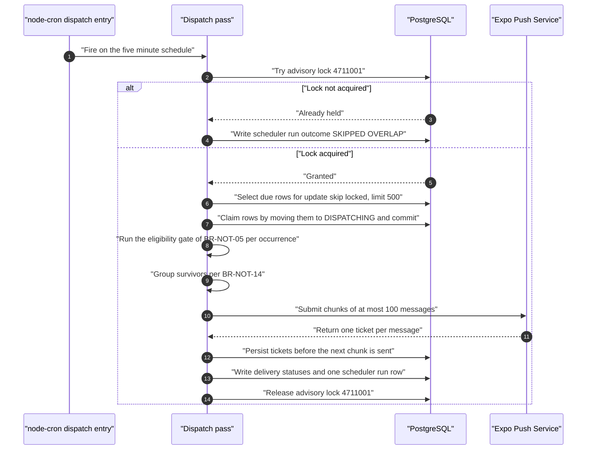
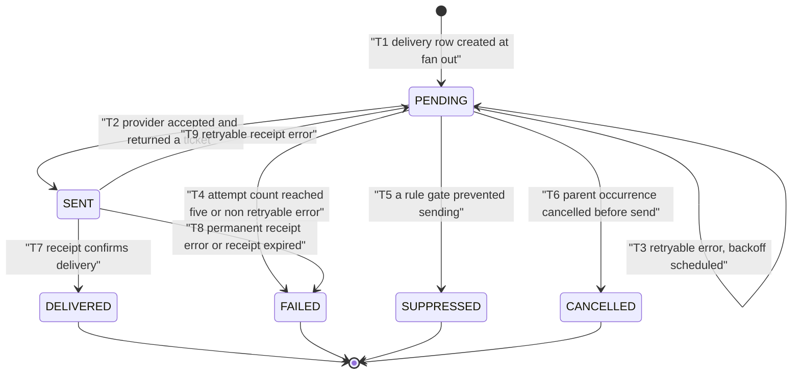
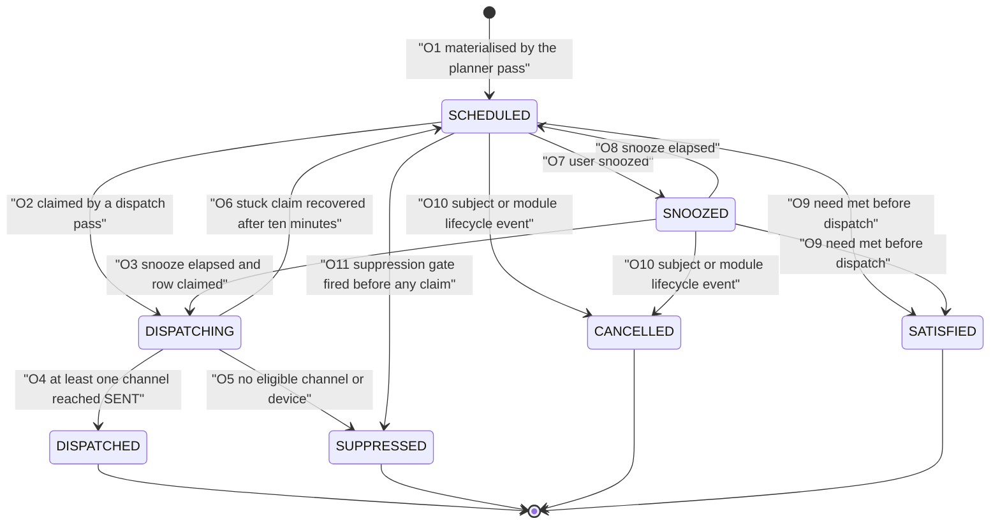
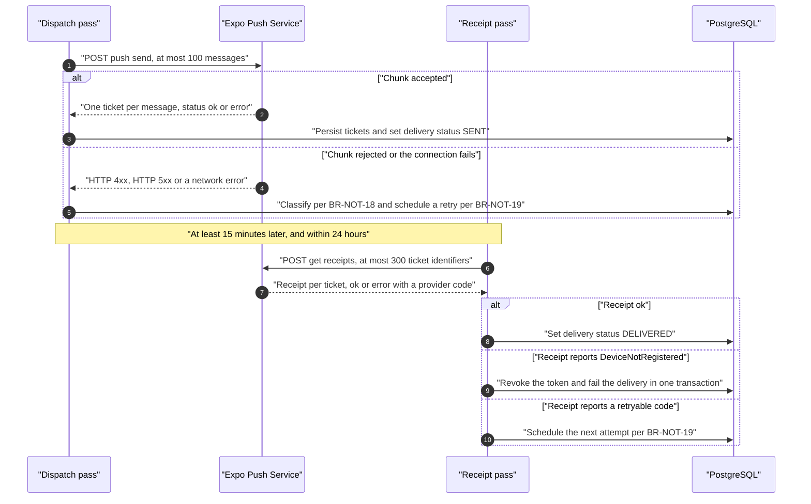

# NOT — Notifications and Reminder Scheduling Engine

| Field | Value |
| --- | --- |
| Document | `modules/notifications.md` — authoritative functional specification for the `NOT` subsystem: the unified reminder scheduling, delivery and notification-centre engine |
| Version | 1.0 |
| Date | 2026-07-21 |
| Status | Approved — baseline for Phase 2 design |
| Owner | Rakshit — Project Lead and sole developer (D-05) |
| Parent | [SRS.md](../SRS.md) — PlantPal+ Software Requirements Specification |

---

## Table of contents

1. [Purpose and scope](#1-purpose-and-scope)
   - [1.1 Purpose](#11-purpose)
   - [1.2 In scope](#12-in-scope)
   - [1.3 Explicitly excluded from this module](#13-explicitly-excluded-from-this-module)
   - [1.4 Governing decisions and constraints](#14-governing-decisions-and-constraints)
   - [1.5 Vocabulary and value alignment with the domain model](#15-vocabulary-and-value-alignment-with-the-domain-model)
2. [Actors and stakeholders](#2-actors-and-stakeholders)
   - [2.1 Actor catalogue](#21-actor-catalogue)
   - [2.2 Stakeholders and personas served](#22-stakeholders-and-personas-served)
3. [Capability overview](#3-capability-overview)
   - [3.1 Feature tree](#31-feature-tree)
   - [3.2 Capability-to-requirement map](#32-capability-to-requirement-map)
   - [3.3 Release allocation](#33-release-allocation)
4. [Functional requirements](#4-functional-requirements)
   - [4.1 How to read a requirement subsection](#41-how-to-read-a-requirement-subsection)
   - [FR-NOT-01 — Reminder dispatch pass](#fr-not-01--reminder-dispatch-pass)
   - [FR-NOT-02 — Planner pass and idempotent materialisation](#fr-not-02--planner-pass-and-idempotent-materialisation)
   - [FR-NOT-03 — Per-channel delivery status machine](#fr-not-03--per-channel-delivery-status-machine)
   - [FR-NOT-04 — Per-category enable and disable](#fr-not-04--per-category-enable-and-disable)
   - [FR-NOT-05 — Preferred local delivery time per category](#fr-not-05--preferred-local-delivery-time-per-category)
   - [FR-NOT-06 — Quiet hours with cross-midnight support](#fr-not-06--quiet-hours-with-cross-midnight-support)
   - [FR-NOT-07 — Global do-not-disturb](#fr-not-07--global-do-not-disturb)
   - [FR-NOT-08 — UTC storage and IANA local-time resolution](#fr-not-08--utc-storage-and-iana-local-time-resolution)
   - [FR-NOT-09 — Timezone-change re-materialisation](#fr-not-09--timezone-change-re-materialisation)
   - [FR-NOT-10 — Staleness cut-off](#fr-not-10--staleness-cut-off)
   - [FR-NOT-11 — Health and scheduler-liveness endpoints](#fr-not-11--health-and-scheduler-liveness-endpoints)
   - [FR-NOT-12 — Daily push cap](#fr-not-12--daily-push-cap)
   - [FR-NOT-13 — Grouped notifications](#fr-not-13--grouped-notifications)
   - [FR-NOT-14 — Device push token registration and refresh](#fr-not-14--device-push-token-registration-and-refresh)
   - [FR-NOT-15 — Device push token revocation and pruning](#fr-not-15--device-push-token-revocation-and-pruning)
   - [FR-NOT-16 — Chunked submission to the push provider](#fr-not-16--chunked-submission-to-the-push-provider)
   - [FR-NOT-17 — Receipt reconciliation pass](#fr-not-17--receipt-reconciliation-pass)
   - [FR-NOT-18 — Retry with exponential backoff](#fr-not-18--retry-with-exponential-backoff)
   - [FR-NOT-19 — Deep links](#fr-not-19--deep-links)
   - [FR-NOT-20 — In-app notification centre](#fr-not-20--in-app-notification-centre)
   - [FR-NOT-21 — Quick actions and snooze](#fr-not-21--quick-actions-and-snooze)
   - [FR-NOT-22 — Lifecycle cancellation](#fr-not-22--lifecycle-cancellation)
   - [FR-NOT-23 — Email digest](#fr-not-23--email-digest)
   - [FR-NOT-24 — Send test notification](#fr-not-24--send-test-notification)
5. [Business rules](#5-business-rules)
6. [Data entities touched](#6-data-entities-touched)
7. [External interfaces](#7-external-interfaces)
8. [Edge cases and boundary conditions](#8-edge-cases-and-boundary-conditions)
9. [Deferred and out of scope for v1.0](#9-deferred-and-out-of-scope-for-v10)
10. [Traceability stub](#10-traceability-stub)

---

## 1. Purpose and scope

### 1.1 Purpose

The `NOT` subsystem is **one** reminder scheduling and delivery engine that serves all three domain modules — plant care, fitness and nutrition — plus the cross-cutting gamification module. It exists because the client brief names "a common notification and scheduling system" as a shared service, and because the architectural claim of [02-scope-and-release-plan.md](../02-scope-and-release-plan.md) is that PlantPal+ is one habit engine with three domain adapters: *schedule, remind, log, streak, reflect*. `NOT` owns the **remind** step for every module.

Specifying the engine once rather than three times is what makes latency, ordering, volume control, quiet hours, timezone correctness, deduplication and auditability provable properties of the product instead of per-module accidents.

This document is the authoritative source for every `FR-NOT-nn` and every `BR-NOT-nn`. It references identifiers owned by other authors (`FR-PLT-*`, `US-NOT-*`, `UC-NOT-*`, `NFR-*`, `ENT-*`, `BR-ENT-*`, `ASM-*`, `CON-*`, `RSK-*`, `DEP-*`, `OQ-*`) but never defines or renumbers them.

### 1.2 In scope

| # | Capability owned by `NOT` | Primary requirements |
| --- | --- | --- |
| 1 | The `node-cron` planner pass that materialises reminder occurrences over a rolling horizon | FR-NOT-02 |
| 2 | The `node-cron` dispatch pass that delivers occurrences that have come due | FR-NOT-01 |
| 3 | The canonical, persisted, deduplicated reminder occurrence record | FR-NOT-02, BR-NOT-03 |
| 4 | The per-channel delivery record and its status machine | FR-NOT-03 |
| 5 | Per-user notification preferences: category toggles, per-category preferred local time, quiet hours, do-not-disturb, volume tier, digest mode | FR-NOT-04, FR-NOT-05, FR-NOT-06, FR-NOT-07, FR-NOT-12, FR-NOT-23 |
| 6 | Timezone and daylight-saving correctness, including the skipped hour, the ambiguous hour and the user-changes-timezone case | FR-NOT-08, FR-NOT-09 |
| 7 | Expo Push transport mechanics: token registration, refresh, reassignment, revocation, pruning, chunking, tickets, receipts, backoff | FR-NOT-14 to FR-NOT-18 |
| 8 | Volume control: the daily push cap, priority ordering under cap overflow, and grouped collapse | FR-NOT-12, FR-NOT-13 |
| 9 | Catch-up and resilience policy after backend downtime or a free-tier cold start, plus the keep-alive and liveness surface | FR-NOT-10, FR-NOT-11 |
| 10 | Deep links: grammar, route table, payload budget and the entity-missing fallback | FR-NOT-19 |
| 11 | The in-app notification centre: history, read state, filters, retention and per-item actions | FR-NOT-20, FR-NOT-21 |
| 12 | The v1.0 web delivery channels required by D-10: the in-app due-reminder surface and the optional email digest | FR-NOT-20, FR-NOT-23 |
| 13 | Diagnostics: the send-test-notification action and the structured dispatch metrics | FR-NOT-24, FR-NOT-11 |
| 14 | The notification copy catalogue: i18n keys, ICU pluralisation, unit-aware rendering and the D-07 safe-language rules | BR-NOT-27 |
| 15 | Reaction to subject and module lifecycle events so that no stale reminder is ever delivered | FR-NOT-22 |

### 1.3 Explicitly excluded from this module

Everything below is real product behaviour that `NOT` depends on or feeds, but does **not** own. It is referenced by identifier only and is never redefined here.

| Excluded concern | Owning prefix | Note |
| --- | --- | --- |
| Computation of a plant's next watering due instant, and the species, season, hemisphere, light, pot-size and pot-material multipliers that produce it | `PLT` | `NOT` consumes the resulting instant. It never computes a schedule. |
| The definition of "overdue" and "critically overdue" for a plant | `PLT` | `NOT` owns only the escalation cadence of the resulting notification, BR-NOT-04. |
| Care-task definitions, recurrence and completion semantics | `PLT` | |
| Workout goals, step goals, rest days and their evaluation | `FIT` | |
| Streak definitions, streak evaluation, achievement definitions and unlock detection | `GAM` | `GAM` raises the unlock event; `NOT` delivers the notification. |
| Calorie, macro and water targets, and the clinically safe floors of D-07 | `NUT` | `NOT` refuses shaming copy, BR-NOT-27; it never evaluates a target. |
| Authentication, JWT issue and rotation, logout, email verification, account deletion | `ACC` | `NOT` reacts to logout and deletion by revoking device push tokens. |
| The settings screen shell, module on/off toggles, unit preference and the timezone field | `SET`, `ACC` | `NOT` owns the notification section's semantics and validation, not its layout. |
| The unified daily dashboard "due today" panel and its layout | `DSH` | `DSH` renders it and is fed by `NOT` occurrence records. |
| The offline write queue, the idempotency-key upsert endpoint and the delta-sync cursor | `SYS` | Write-type quick actions fired from a notification enqueue through the `SYS` path, per D-04. |
| Photo storage, external catalogue enrichment, account export and account delete | `SYS` | |
| Web Push API via service worker and VAPID | Deferred by D-10 | Recorded in [section 9](#9-deferred-and-out-of-scope-for-v10) as a v1.1 deferral, not as a v1.0 requirement. |
| SMS, WhatsApp, Slack, Discord or any other delivery channel | Out of product scope | Violates CON-01 free-tier and CON-03 fixed stack. |

### 1.4 Governing decisions and constraints

| Reference | Effect on this module |
| --- | --- |
| D-02 | Every requirement carries a MoSCoW priority and a target release from `v0.1`, `v0.5`, `v1.0`, `v1.1+`. |
| D-04 | Only append-only logging actions may be queued offline. Write-type quick actions delegate to the `SYS` idempotent write path; every other notification action requires connectivity. |
| D-06, CON-01 | Zero recurring cost. Expo Push, the free transactional email tier and GitHub Actions minutes are the only outbound budgets. |
| D-07, CON-17 | No shaming, threatening or loss-framed copy; no eating-disorder-adjacent pressure; nutrition notifications carry no health advice in the body. |
| D-08, CON-15 | Every user-facing notification string is a locale-catalogue key. No literal copy exists in scheduler or client code. |
| D-09, CON-16 | Quantities in notification bodies render in the user's preferred unit system; the stored value is always metric SI. |
| D-10, CON-22 | Mobile uses Expo Push in v1.0. Web v1.0 uses the in-app notification centre plus an optional email digest. Web Push is a v1.1 deferral. |
| CON-05, CON-06, RSK-01 | The free backend instance sleeps after roughly 15 minutes of inactivity and only one service may be kept permanently awake, so the API and the `node-cron` engine share one process, a keep-alive ping is mandatory and a staleness cut-off is mandatory. |
| CON-23, DEP-09 | The transactional email free tier caps daily volume, so the digest is a `Should`, is capped, and is never the sole channel. |
| DEP-06, RSK-08 | Expo Push is critical for the mobile reminder loop and has no free equivalent inside the fixed stack; the documented degradation is in-app plus email. |
| ASM-15, DEP-14, RSK-05 | Timezone and DST correctness depends on the IANA database through a maintained library; a fixed offset assumption is forbidden. |

### 1.5 Vocabulary and value alignment with the domain model

Entity names, enumeration names and enumeration member names are taken **verbatim** from [07-domain-model.md](../07-domain-model.md). Where this module requires a member the domain registry does not yet carry, that member is registered here under the enumeration-governance rule `BR-ENT-20` and is listed in [section 6.3](#63-enumeration-members-registered-by-this-module).

Where a *value* differs between the domain registry and the reminder-engine analysis, the table below records which value this document treats as normative and why. The rule applied is the domain model's own statement that it records defaults so seed data agrees, while **the `NOT` series owns delivery behaviour**: static defaults follow the domain model, and behavioural thresholds follow this module.

| # | Item | Domain-model value | Value normative in this document | Reason |
| --- | --- | --- | --- | --- |
| A-01 | Reminder category default delivery times | `PLANT_WATERING` 09:00, `PLANT_CARE_TASK` 09:00, `PLANT_OVERDUE` 18:00, `WORKOUT` 17:30, `STEP_GOAL` 19:00, `MEAL_LOG` 12:30, `WATER_INTAKE` 14:00, `STREAK_AT_RISK` 20:30 | Identical, adopted unchanged | Defaults are seed data and the domain registry owns them. |
| A-02 | `MEAL_LOG` and `WATER_INTAKE` slot count | One time per category | Three slots per category, with the domain default retained as slot 2 | The trigger predicates of BR-NOT-04 are per meal slot and per pacing checkpoint; a single time cannot express them. Recorded as an extension, not a contradiction. |
| A-03 | `WEEKLY_RECAP` default | Sunday 18:00 | Monday 08:00 | The `WEEKLY_RECAP` trigger predicate reports the **previous** ISO week, which is only complete after Sunday ends. Flagged for the SRS author; see OQ note in [section 9.3](#93-items-referred-back-to-other-owners). |
| A-04 | Staleness cut-off | Flat 6 hours, `BR-ENT-28` | Per-category table, BR-NOT-12, ranging 1 to 48 hours; 6 hours is the fallback for any category not listed | A water nudge and an achievement unlock have opposite useful lifetimes. Refinement of the same rule. |
| A-05 | Daily notification cap | `UserSettings.daily_notification_cap`, default 12, range 1 to 20 | Same persisted field, exposed as a three-value tier `LOW` 4, `BALANCED` 8, `HIGH` 12, default `BALANCED` 8 | A free-text 1-to-20 spinner is not a usable control. The tier writes the same column, so the domain schema is unchanged. |
| A-06 | Grouping threshold | More than 3 occurrences | 3 or more occurrences | Three banners is already too many; the analysis threshold is the stricter and is adopted. |
| A-07 | Push retry backoff | 30, 120, 600, 3600, 21600 seconds | 0, 60, 300, 900, 3600 seconds with uniform jitter in `[0.5, 1.0]`, BR-NOT-19 | A 6-hour final retry always exceeds every staleness cut-off in BR-NOT-12, so it can never deliver. Maximum attempt count 5 is unchanged. |
| A-08 | Materialisation horizon | 48 hours | 26 hours, BR-NOT-04 | 26 hours is 24 hours of coverage plus 1 hour of DST slack plus 1 hour of planner-outage slack, and it minimises rewrite churn when a plant is watered early. |
| A-09 | Active device push tokens per user | 10, `BR-ENT-23` | 5, BR-NOT-15 | Five covers phone, tablet, a reinstall and two spares at pilot scale, and halves the fan-out cost of every send. The SRS author must publish one number; this module recommends 5. |
| A-10 | Notification centre retention | 365 days or the 500 most recent, `BR-ENT-38` | 90 days, BR-NOT-24 | CON-07 caps the database at roughly 0.5 GB and the privacy policy must state one figure. The stricter value is adopted. |
| A-11 | Occurrence-key `occurrence_index` | 0, incremented only by a same-day snooze | Additionally carries the slot ordinal 1, 2 or 3 for multi-slot categories | Required by A-02; a pure extension of the existing component. |
| A-12 | Channel member name | `EXPO_PUSH` | `EXPO_PUSH` throughout | The analysis working paper writes `PUSH`; the domain member name is used here. |

> **Reading note.** The `NOT` analysis working paper and the sibling documents [user-stories/notifications.md](../user-stories/notifications.md) and [use-cases/notifications.md](../use-cases/notifications.md) may spell a category as `PLANT_WATERING_DUE`, `PLANT_CRITICALLY_OVERDUE`, `WORKOUT_REMINDER`, `STEP_GOAL_AT_RISK`, `MEAL_LOG_REMINDER`, `WATER_INTAKE_NUDGE` or `ACHIEVEMENT_UNLOCKED`. Those are aliases of the `ReminderCategory` members used here; the alias column of [BR-NOT-01](#br-not-01--reminder-category-catalogue) is the authoritative mapping.

---

## 2. Actors and stakeholders

### 2.1 Actor catalogue

| Actor | Type | Role in this module |
| --- | --- | --- |
| Registered User | Human, primary | Configures notification preferences, receives notifications, opens them, acts on them, snoozes them, reads the notification centre and sends a test notification. |
| Guest or Unauthenticated Visitor | Human, secondary | Receives no notifications. May follow a deep link, in which case the link is stored and resumed after login, BR-NOT-21. |
| Reminder Scheduler | System, internal | The `node-cron` planner, dispatcher, receipt reconciler and retention job running inside the single Express process, CON-06. |
| Expo Push Service | External system | Accepts push message batches, returns tickets, later returns receipts, and reports `DeviceNotRegistered` and `MessageRateExceeded`. DEP-06. |
| Transactional Email Provider | External system | Delivers the optional email digest within the free daily allowance. DEP-09, CON-23. |
| Mobile Client, Expo and React Native | System, internal | Requests operating-system notification permission, obtains and refreshes the Expo push token, renders action buttons, and handles deep links including cold-start routing. |
| Web Client, React and Vite | System, internal | Renders the in-app due-reminder surface and the notification centre, polls the unread count and handles deep links. |
| Keep-Alive Pinger | External system | A GitHub Actions scheduled workflow, or an equivalent free uptime monitor from DEP-12, that calls the health endpoint every 10 minutes so the free instance does not suspend and the cron tick keeps firing. |
| Plant Care module | System, internal source | Supplies watering-due instants, care-task due instants and the critically-overdue flag. |
| Fitness module | System, internal source | Supplies the workout-logged-today flag, the step count for the local date and the daily step goal. |
| Nutrition module | System, internal source | Supplies meals logged per slot, water logged in millilitres and the daily water target. |
| Gamification module | System, internal source | Raises achievement-unlocked events and supplies the streak-at-risk flag. |
| Retention Job | System, internal | Nightly maintenance pass that deletes expired history, closes expired tickets and revokes inactive tokens. |

### 2.2 Stakeholders and personas served

| Reference | Interest in this module |
| --- | --- |
| STK-01 End user | Reminders that are correct, timely and few. This module is the single largest determinant of whether the product is trusted or uninstalled. |
| STK-03 Project Lead | The engine must be operable and debuggable by one person on a free tier, which is why FR-NOT-11 and FR-NOT-24 exist. |
| PER-01 Aditi Sharma | Timezone `Asia/Kolkata` at UTC+05:30 with no DST, quiet hours 22:30 to 07:30, will uninstall on notification excess. Exercised by FR-NOT-06, FR-NOT-08 and FR-NOT-12. |
| PER-02 Marcus Oyelaran | Single-module user with many plants; the grouping behaviour of FR-NOT-13 is what keeps his lock screen usable. |
| PER-03 Mia Castellano | Southern-hemisphere user with strict quiet hours; exercises the cross-midnight window of BR-NOT-08. |
| PER-04 Harold Whitfield | Accessibility-first user; requires plain, non-colour-dependent notification-centre states, NFR-A11Y-04 and NFR-A11Y-08, and plain copy, BR-NOT-27. |
| PER-05 Sofia Lindqvist | Offline-heavy, low-end Android device; exercises the queued quick action of FR-NOT-21 and the cached deep-link fallback of BR-NOT-21. |
| GOAL-04 | A cross-module streak is only motivating if the at-risk reminder arrives; MET-09, MET-10 and MET-12 are all measured against this module. |

---

## 3. Capability overview

### 3.1 Feature tree

```mermaid
flowchart LR
  NOT["NOT - Notifications and Reminder Engine"]

  NOT --- ENG["1. Scheduling engine"]
  ENG --- ENG1["1.1 Planner pass - hourly materialisation"]
  ENG --- ENG2["1.2 Dispatch pass - every five minutes"]
  ENG --- ENG3["1.3 Receipt pass - every fifteen minutes"]
  ENG --- ENG4["1.4 Retention pass - nightly"]
  ENG --- ENG5["1.5 Event-driven immediate path"]

  NOT --- PRF["2. Preferences"]
  PRF --- PRF1["2.1 Per-category toggle"]
  PRF --- PRF2["2.2 Preferred local delivery time"]
  PRF --- PRF3["2.3 Quiet hours across midnight"]
  PRF --- PRF4["2.4 Global do-not-disturb"]
  PRF --- PRF5["2.5 Reminder volume tier"]
  PRF --- PRF6["2.6 Email digest mode"]

  NOT --- TIM["3. Temporal correctness"]
  TIM --- TIM1["3.1 UTC storage and IANA evaluation"]
  TIM --- TIM2["3.2 Spring-forward skipped hour"]
  TIM --- TIM3["3.3 Autumn ambiguous hour"]
  TIM --- TIM4["3.4 Frozen occurrence date"]
  TIM --- TIM5["3.5 Timezone-change re-materialisation"]

  NOT --- INT["4. Delivery integrity"]
  INT --- INT1["4.1 Occurrence uniqueness key"]
  INT --- INT2["4.2 Per-channel status machine"]
  INT --- INT3["4.3 Suppression and cancellation reasons"]
  INT --- INT4["4.4 Staleness cut-off"]
  INT --- INT5["4.5 Dispatch-time freshness re-check"]

  NOT --- TRA["5. Transport - Expo Push"]
  TRA --- TRA1["5.1 Token registration and refresh"]
  TRA --- TRA2["5.2 Multi-device fan-out with LRU cap"]
  TRA --- TRA3["5.3 Chunking and bounded concurrency"]
  TRA --- TRA4["5.4 Ticket capture"]
  TRA --- TRA5["5.5 Receipt reconciliation"]
  TRA --- TRA6["5.6 Token pruning"]
  TRA --- TRA7["5.7 Rate-limit backoff and throttle"]

  NOT --- VOL["6. Volume control"]
  VOL --- VOL1["6.1 Daily push cap per local day"]
  VOL --- VOL2["6.2 Priority ordering on overflow"]
  VOL --- VOL3["6.3 Grouped collapse"]

  NOT --- RES["7. Resilience"]
  RES --- RES1["7.1 Catch-up after downtime"]
  RES --- RES2["7.2 Keep-alive health endpoint"]
  RES --- RES3["7.3 Scheduler liveness reporting"]

  NOT --- SUR["8. Surfaces"]
  SUR --- SUR1["8.1 Notification centre"]
  SUR --- SUR2["8.2 Unread badge count"]
  SUR --- SUR3["8.3 Web in-app due-reminder surface"]
  SUR --- SUR4["8.4 Email digest with unsubscribe"]
  SUR --- SUR5["8.5 Deep links with fallback"]

  NOT --- ACT["9. Interaction"]
  ACT --- ACT1["9.1 Per-notification quick actions"]
  ACT --- ACT2["9.2 Bounded snooze"]
  ACT --- ACT3["9.3 Dismiss and mark all read"]

  NOT --- LIF["10. Lifecycle reactions"]
  LIF --- LIF1["10.1 Subject deleted or archived"]
  LIF --- LIF2["10.2 Subject rescheduled"]
  LIF --- LIF3["10.3 Trigger already satisfied"]
  LIF --- LIF4["10.4 Module disabled"]

  NOT --- DIA["11. Diagnostics"]
  DIA --- DIA1["11.1 Send test notification"]
  DIA --- DIA2["11.2 Scheduler health endpoint"]
  DIA --- DIA3["11.3 Structured dispatch metrics"]
```



### 3.2 Capability-to-requirement map

| Capability branch | Requirements | Business rules |
| --- | --- | --- |
| 1. Scheduling engine | FR-NOT-01, FR-NOT-02 | BR-NOT-02, BR-NOT-03, BR-NOT-04, BR-NOT-05 |
| 2. Preferences | FR-NOT-04, FR-NOT-05, FR-NOT-06, FR-NOT-07, FR-NOT-12, FR-NOT-23 | BR-NOT-01, BR-NOT-08, BR-NOT-09, BR-NOT-13, BR-NOT-25 |
| 3. Temporal correctness | FR-NOT-08, FR-NOT-09 | BR-NOT-03, BR-NOT-10, BR-NOT-11 |
| 4. Delivery integrity | FR-NOT-03, FR-NOT-10, FR-NOT-22 | BR-NOT-03, BR-NOT-06, BR-NOT-07, BR-NOT-12 |
| 5. Transport | FR-NOT-14, FR-NOT-15, FR-NOT-16, FR-NOT-17, FR-NOT-18 | BR-NOT-15, BR-NOT-16, BR-NOT-17, BR-NOT-18, BR-NOT-19 |
| 6. Volume control | FR-NOT-12, FR-NOT-13 | BR-NOT-13, BR-NOT-14 |
| 7. Resilience | FR-NOT-10, FR-NOT-11 | BR-NOT-02, BR-NOT-12, BR-NOT-30 |
| 8. Surfaces | FR-NOT-19, FR-NOT-20, FR-NOT-23 | BR-NOT-20, BR-NOT-21, BR-NOT-24, BR-NOT-25, BR-NOT-31 |
| 9. Interaction | FR-NOT-21 | BR-NOT-22, BR-NOT-23 |
| 10. Lifecycle reactions | FR-NOT-22 | BR-NOT-05, BR-NOT-07 |
| 11. Diagnostics | FR-NOT-11, FR-NOT-24 | BR-NOT-26, BR-NOT-29, BR-NOT-30 |

### 3.3 Release allocation

Each release must leave a demoable slice, per D-02 and GOAL-10.

| Release | Requirements delivered | Demoable slice |
| --- | --- | --- |
| v0.1 Walking Skeleton | FR-NOT-01, FR-NOT-02 for `PLANT_WATERING` only, FR-NOT-14, FR-NOT-16, FR-NOT-19 | A plant added on the phone produces a real push notification at its due time that opens the plant detail screen. |
| v0.5 Alpha | FR-NOT-03, FR-NOT-04, FR-NOT-05, FR-NOT-06, FR-NOT-08, FR-NOT-11, FR-NOT-15, FR-NOT-17, FR-NOT-18, FR-NOT-20, FR-NOT-24 | All ten categories materialise; preferences, quiet hours, the notification centre, receipts, token pruning and the test-notification diagnostic all work. |
| v1.0 MVP | FR-NOT-07, FR-NOT-09, FR-NOT-10, FR-NOT-12, FR-NOT-13, FR-NOT-21, FR-NOT-22, FR-NOT-23 | Volume control, grouping, snooze and quick actions, timezone-change correctness, outage catch-up and the web email digest. |
| v1.1 Post-MVP | Nothing in this module; see [section 9](#9-deferred-and-out-of-scope-for-v10) | Web Push, rich push and per-entity mute are deferrals, not requirements. |

---

## 4. Functional requirements

### 4.1 How to read a requirement subsection

Every requirement below is written to ISO/IEC/IEEE 29148:2018 quality rules: one testable capability, a single `shall` sentence, no banned vague adjectives, every threshold written out in full, and a named verification method.

| Column | Meaning |
| --- | --- |
| Priority | MoSCoW value under the policy of [02-scope-and-release-plan.md](../02-scope-and-release-plan.md) section 4. |
| Release | Target release: `v0.1`, `v0.5`, `v1.0` or `v1.1+`. |
| Actor | The component or role accountable for the behaviour. |
| Verification | One of `Test`, `Demonstration`, `Inspection`, `Analysis`. |
| Traces to | Up-trace to a goal or stakeholder need, and down-trace to a story and a use case. |

Verification method definitions are those of [04-non-functional-requirements.md](../04-non-functional-requirements.md): `Test` is an automated repeatable check with a pass or fail assertion; `Demonstration` is an observed execution of the behaviour against a script; `Inspection` is a documented review of an artefact; `Analysis` is a reasoned argument from measurements or a model.

---

### FR-NOT-01 — Reminder dispatch pass

| Field | Value |
| --- | --- |
| Priority | Must |
| Release | v0.1 |
| Actor | Reminder Scheduler |
| Verification | Test |
| Traces to | GOAL-04, STK-01, MET-12 — up. US-NOT-01, US-NOT-12 — story. UC-NOT-02 — use case. NFR-SCAL-06, NFR-RELI-07, NFR-PERF-04 — quality. |

**The system shall execute a reminder dispatch pass on the fixed `node-cron` schedule `*/5 * * * *` evaluated in UTC that selects at most 500 `ScheduledReminder` occurrences whose `state` is `SCHEDULED` or `SNOOZED` and whose effective due instant is at or before the pass start instant.**

**Rationale.** All eleven reminder categories share one delivery path, so latency, ordering, volume control, suppression accounting and auditability are specified once rather than three times. A 5-minute tick makes the worst-case dispatch latency equal to the 5-minute configuration granularity of FR-NOT-05, so a user cannot perceive an error; the cadence justification in full is BR-NOT-02. Because the selection predicate is "due at or before now" rather than "due inside this tick", the same query is simultaneously the normal path and the catch-up path after the free-tier sleep described by CON-05 and RSK-01.

**Inputs and validation.**

| Field | Type | Constraints | Required |
| --- | --- | --- | --- |
| `pass_start_utc` | `timestamptz` | Taken from the database clock through `now()`, never from the Node process clock, per E-41 | Yes |
| `ScheduledReminder.state` | `enum<ScheduledReminderState>` | Selection matches `SCHEDULED` or `SNOOZED` only | Yes |
| `ScheduledReminder.due_at` | `timestamptz` | Selection matches `due_at <= pass_start_utc`; for a `SNOOZED` occurrence the effective instant is `snoozed_until` | Yes |
| `pass_ceiling` | integer | Fixed at 500 occurrences per pass; the remainder stays selectable by the next pass | Yes |
| `send_budget_ms` | integer | Fixed at 30000 milliseconds of provider submission time per pass | Yes |
| `advisory_lock_key` | integer | Fixed at `4711001`; a pass that cannot acquire it exits immediately | Yes |

**Processing rules.**

1. The pass acquires the PostgreSQL advisory lock `4711001`. If the lock is already held, the pass writes the log event `TICK_SKIPPED_OVERLAP`, records `scheduler_run.outcome = SKIPPED_OVERLAP` and exits without processing any occurrence. This is the guarantee that a slow pass cannot be overlapped into a double send, E-01.
2. Candidates are ordered by `priority_weight` ascending, then effective due instant ascending, then `id` ascending, per BR-NOT-13. Ordering is deterministic so that cap overflow is reproducible in a test.
3. Each candidate passes the ordered eligibility gate of **BR-NOT-05**, which resolves it to send, defer, suppress or cancel.
4. Surviving candidates are grouped per **BR-NOT-14**, then fanned out per channel per **BR-NOT-01**.
5. Push submission follows **BR-NOT-16**; status transitions follow **BR-NOT-06**; the daily counter is incremented per **BR-NOT-13**.
6. Each occurrence is committed in its own transaction, so a failure on one occurrence cannot roll back the rest of the pass.
7. Once `send_budget_ms` is exhausted, remaining candidates are left in `SCHEDULED` and are picked up by the following tick.

**Outputs.**

- Zero or more push chunk submissions to the Expo Push Service, each producing `NotificationDelivery.provider_ticket_id` values.
- One `NotificationCentreItem` per occurrence that reached gate 5 or beyond, including suppressed ones, per BR-NOT-24.
- Updated `ScheduledReminder.state` and `NotificationDelivery.status` values.
- One `scheduler_run` row and one structured log line per pass carrying `pass_id`, `started_at`, `duration_ms`, `candidates`, `grouped`, `sent`, `suppressed_by_reason`, `cancelled_by_reason`, `failed`, `tokens_pruned` and `expo_requests`, per BR-NOT-30 and NFR-OBSV-06.

**Alternate and error flows.**

| Condition | System response | User-visible message |
| --- | --- | --- |
| No occurrence is due | The pass logs `candidates = 0`, sets `outcome = OK` and exits in under 200 milliseconds | None |
| A previous pass is still running | The new tick logs `TICK_SKIPPED_OVERLAP` and exits without processing | None |
| A database error occurs on one occurrence | That occurrence's transaction rolls back, the reason is counted, the pass continues, and the event is reported to Sentry per NFR-OBSV-03 | None |
| The database is unreachable for the whole pass | The pass aborts with `outcome = ERROR`, no status is changed, and `/api/v1/health/scheduler` begins to age towards `STALLED` per FR-NOT-11 | None; the next client refresh shows the standard offline or server-unavailable state per NFR-USAB-07 |
| The Expo Push Service returns a retryable error | Affected deliveries are scheduled for retry per BR-NOT-19 and remain non-terminal | None; a single failed push raises no user-facing error |
| The send budget of 30000 milliseconds is exhausted | Remaining candidates stay `SCHEDULED`, `outcome = PARTIAL` is recorded, and the next tick continues | None |

---

### FR-NOT-02 — Planner pass and idempotent materialisation

| Field | Value |
| --- | --- |
| Priority | Must |
| Release | v0.1 for `PLANT_WATERING`; all remaining categories in v0.5 |
| Actor | Reminder Scheduler |
| Verification | Test |
| Traces to | GOAL-04, STK-01 — up. US-NOT-01 — story. UC-NOT-01 — use case. NFR-SCAL-06, NFR-RELI-07, NFR-DATA-02 — quality. |

**The system shall execute a planner pass on the fixed `node-cron` schedule `2 * * * *` that creates at most one `ScheduledReminder` row per unique `(user_id, occurrence_key)` pair for every reminder whose due instant falls within the next 26 hours.**

**Rationale.** Separating planning from dispatch means the expensive per-user predicate evaluation runs 24 times a day instead of 288, which matters against the limited monthly compute hours of the free PostgreSQL tier, CON-07 and DEP-01. It also gives every reminder a stable identity **before** it is ever sent, which is what makes the once-only guarantee of BR-NOT-03 provable rather than hoped for.

**Inputs and validation.**

| Field | Type | Constraints | Required |
| --- | --- | --- | --- |
| `pass_start_utc` | `timestamptz` | Database clock | Yes |
| `horizon_hours` | integer | Fixed at 26: 24 hours of coverage, 1 hour of daylight-saving slack, 1 hour of planner-outage slack | Yes |
| `user_batch_size` | integer | Fixed at 200 users per iteration | Yes |
| `per_user_ceiling` | integer | Fixed at 200 occurrences created per user per pass; excess is logged as `PLANNER_USER_CEILING` | Yes |
| `UserSettings.timezone` | text, IANA identifier | Must be accepted by the runtime IANA database; an unknown or absent value falls back to `UTC` with log event `WARN_TZ_FALLBACK` | Yes |
| `ReminderRule.is_enabled` | boolean | Read for information only; a disabled category is still materialised, because suppression happens at the dispatch gate per FR-NOT-04 | Yes |
| `ReminderRule.preferred_time` | `time` | Local wall clock, 5-minute granularity per FR-NOT-05 | Yes |
| `advisory_lock_key` | integer | Fixed at `4711002` | Yes |

**Processing rules.**

1. For each user in the batch, each category's source subjects are collected and the trigger predicate of **BR-NOT-04** is evaluated. `ACHIEVEMENT` is never planner-driven; it is inserted immediately by the `GAM` module on unlock with `due_at = now()`.
2. `due_local_date` is computed as the calendar date in the user's IANA zone **at the moment of materialisation** and is frozen thereafter. It is never recomputed, including on a timezone change. This freeze is what makes FR-NOT-09 duplicate-proof.
3. The preferred local wall time is resolved to `due_at` through **BR-NOT-10**, which handles the skipped and ambiguous local-time cases.
4. The occurrence key is built per **BR-NOT-03** and the row is inserted with `ON CONFLICT (user_id, occurrence_key) DO NOTHING`.
5. A category whose owning module is disabled in `UserSettings` is not materialised at all, which keeps the write volume proportional to enabled modules.
6. Materialisation writes `payload_json` containing the deep-link target of BR-NOT-20 and the i18n keys and parameters of BR-NOT-27, so dispatch never needs to recompute copy.

**Outputs.**

- New `ScheduledReminder` rows in state `SCHEDULED`.
- A `scheduler_run` row of `pass_type = PLANNER` carrying `candidates`, `created`, `skipped_as_duplicate` and `duration_ms`.

**Alternate and error flows.**

| Condition | System response | User-visible message |
| --- | --- | --- |
| An occurrence key already exists | The insert is skipped, the `skipped_as_duplicate` counter increments, and no second delivery can arise | None |
| The user's IANA timezone is missing or unknown | The zone falls back to `UTC`, `WARN_TZ_FALLBACK` is logged, and the profile screen prompts for a timezone, E-42 | Settings banner using key `notif.settings.timezoneMissing`: "Set your time zone so reminders arrive at the right time." |
| The timezone database lookup throws | The user is skipped for this pass, `ERR_TZ_RESOLUTION` is raised to Sentry, and the next hourly pass retries. No offset is ever guessed | None |
| A source module fails to answer | That category is skipped for this pass and retried next hour; no partial state is written for it | None |
| A user would exceed 200 new occurrences in one pass | Creation stops at 200 for that user, `PLANNER_USER_CEILING` is logged with the user reference, and the remainder is created by the next pass, E-13 | None |
| A whole local calendar day does not exist in the zone, as when a territory crosses the date line | No occurrence is materialised for that date and the next existing date proceeds normally, E-10 | None |

---

### FR-NOT-03 — Per-channel delivery status machine

| Field | Value |
| --- | --- |
| Priority | Must |
| Release | v0.5 |
| Actor | Reminder Scheduler |
| Verification | Test |
| Traces to | GOAL-04, STK-01 — up. US-NOT-12 — story. UC-NOT-02, UC-NOT-04 — use case. NFR-RELI-07, NFR-OBSV-06, NFR-DATA-04 — quality. |

**The system shall persist for every `(ScheduledReminder, DeliveryChannel)` pair a `NotificationDeliveryStatus` value drawn from the closed enumeration `PENDING`, `SENT`, `DELIVERED`, `FAILED`, `SUPPRESSED`, `CANCELLED` and shall reject any transition absent from the transition table of BR-NOT-06 with HTTP 409 and error code `INVALID_STATUS_TRANSITION`.**

**Rationale.** Without a persisted status machine, "never deliver the same reminder twice" is unprovable and every retry risks a duplicate. Holding status **per channel** rather than per occurrence is what lets an occurrence be `SUPPRESSED` on `EXPO_PUSH` while `DELIVERED` on `IN_APP`, which is exactly the behaviour D-10 requires on web and the behaviour that makes the daily cap of FR-NOT-12 non-lossy.

**Inputs and validation.**

| Field | Type | Constraints | Required |
| --- | --- | --- | --- |
| `notification_delivery_id` | uuid | Must exist and belong to the calling scheduler context | Yes |
| `current_status` | `enum<NotificationDeliveryStatus>` | Read inside the same transaction as the side effect | Yes |
| `requested_status` | `enum<NotificationDeliveryStatus>` | Must appear as an allowed target for `current_status` in BR-NOT-06 | Yes |
| `reason_code` | `enum<SuppressionReason>` extended per [section 6.3](#63-enumeration-members-registered-by-this-module) | Required when the target is `SUPPRESSED`, `CANCELLED` or `FAILED`; forbidden otherwise | Conditional |
| `attempt_count` | integer | Range 0 to 5; `FAILED` is terminal only once it reaches 5 | Yes |
| `channel` | `enum<DeliveryChannel>` | One of `EXPO_PUSH`, `IN_APP`, `EMAIL`; `WEB_PUSH` is rejected in v1.0 per D-10 | Yes |

**Processing rules.**

1. The transition is validated against **BR-NOT-06** inside the same transaction as the side effect that motivates it, so a crash cannot leave a status that does not match reality.
2. `DELIVERED`, `SUPPRESSED` and `CANCELLED` are terminal. `FAILED` is terminal only when `attempt_count` has reached 5; below 5 a retryable failure returns the row to `PENDING` with `next_attempt_at` set per BR-NOT-19.
3. The reason code is drawn from the closed registry of **BR-NOT-07**, is stored on the delivery row, is counted in the pass log and is exposed as a counter on the scheduler health surface.
4. The parent `ScheduledReminder.state` follows the occurrence machine of BR-NOT-06 section 2 and is derived from its deliveries: the occurrence is `DISPATCHED` once at least one channel reaches `SENT`.
5. Scheduler-internal transitions are performed by trusted server code and are not exposed on the public REST surface, per BR-NOT-28 rule 6.

**Outputs.**

- Updated `NotificationDelivery` row carrying `status`, `suppression_reason`, `attempt_count`, `next_attempt_at`, `sent_at`, `delivered_at`, `provider_ticket_id`, `provider_receipt_id` and `provider_error_code`.
- Updated `ScheduledReminder.state` and `dispatched_at`.

**Alternate and error flows.**

| Condition | System response | User-visible message |
| --- | --- | --- |
| A transition not present in BR-NOT-06 is requested | The write is rejected with HTTP 409 and code `INVALID_STATUS_TRANSITION`, and a Sentry event is raised because this always indicates a scheduler defect | None; this surface is internal |
| A `SUPPRESSED` or `CANCELLED` row receives a further transition | Rejected as terminal with HTTP 409 `INVALID_STATUS_TRANSITION` | None |
| A reason code outside BR-NOT-07 is supplied | Rejected with HTTP 422 and code `VALIDATION_UNKNOWN_REASON_CODE` | None |
| `attempt_count` would exceed 5 | The row is set to `FAILED` with the provider error code recorded and is not retried again | None for a single failure; three consecutive `FAILED` pushes to the same device raise the settings banner of FR-NOT-18 |
| A `WEB_PUSH` channel row is requested in v1.0 | Rejected with HTTP 422 and code `VALIDATION_CHANNEL_NOT_ENABLED` | None |

---

### FR-NOT-04 — Per-category enable and disable

| Field | Value |
| --- | --- |
| Priority | Must |
| Release | v0.5 |
| Actor | Registered User |
| Verification | Test |
| Traces to | GOAL-04, D-07, PER-01 — up. US-NOT-02 — story. UC-NOT-07, UC-NOT-03 — use case. NFR-SEC-08, NFR-USAB-03 — quality. |

**The system shall allow a Registered User to enable or disable each of the ten user-configurable reminder categories of BR-NOT-01 independently, and shall suppress with reason `CATEGORY_DISABLED` every occurrence whose category is disabled at dispatch time.**

**Rationale.** D-07 forbids nagging, and the single most effective anti-nag control is switching off a whole category. PER-01 states plainly that she will uninstall anything that sends more than a handful of notifications per day. Evaluating the toggle at the dispatch gate rather than at materialisation is what lets a user re-enable a category at 08:50 and still receive the 09:00 reminder.

**Inputs and validation.**

| Field | Type | Constraints | Required |
| --- | --- | --- | --- |
| `category` | `enum<ReminderCategory>` | One of the ten configurable members of BR-NOT-01; `SYSTEM_TEST` is rejected with HTTP 422 `VALIDATION_CATEGORY_NOT_CONFIGURABLE`; an unknown key is rejected with HTTP 422 `VALIDATION_UNKNOWN_CATEGORY` | Yes |
| `is_enabled` | boolean | No default on the wire; the field must be present | Yes |
| `updated_at` | `timestamptz` | Optimistic concurrency token echoed from the last read | Yes |
| Authenticated subject | uuid from the JWT `sub` claim | Server-side only; any `user_id` in the body or query string is ignored, per NFR-SEC-14 | Yes |

Defaults at registration are fixed by BR-NOT-01: plant and gamification and cross categories default **on**, fitness and nutrition categories default **off**.

**Processing rules.**

1. The endpoint is `PATCH /api/v1/notification-preferences` and writes `ReminderRule.is_enabled` for the `(user_id, category)` pair.
2. The toggle is read at gate 6 of **BR-NOT-05**, not at materialisation, so a mid-day re-enable takes effect without waiting for the hourly planner, E-50.
3. Disabling a category does **not** cancel occurrences already in `DISPATCHED`, and does not delete pending occurrences; they are simply suppressed as they come due, so re-enabling before the staleness cut-off still permits delivery.
4. Disabling a category never suppresses the `IN_APP` channel record where the occurrence has already reached gate 5, so the notification centre stays a complete record, BR-NOT-24.

**Outputs.**

- Updated `ReminderRule` row.
- HTTP 200 with the complete preference object, so the client never has to merge a partial response.

**Alternate and error flows.**

| Condition | System response | User-visible message |
| --- | --- | --- |
| An unknown category key is submitted | HTTP 422 with code `VALIDATION_UNKNOWN_CATEGORY` | "That reminder type is not recognised. Refresh the app and try again." |
| `SYSTEM_TEST` is submitted | HTTP 422 with code `VALIDATION_CATEGORY_NOT_CONFIGURABLE` | "Test notifications cannot be switched off." |
| A concurrent update changed the row | HTTP 409 with code `PREFERENCE_CONFLICT`; the client refetches and re-applies | "Your settings changed on another device. We have refreshed them." |
| The request arrives while the device is offline | The write is rejected client-side before submission, because preference edits are not queueable under D-04 | "You are offline. Notification settings need a connection to save." |
| A disabled category's occurrence comes due | The occurrence is suppressed on every channel with reason `CATEGORY_DISABLED`; no `NotificationCentreItem` action prompt is rendered | None |

---

### FR-NOT-05 — Preferred local delivery time per category

| Field | Value |
| --- | --- |
| Priority | Must |
| Release | v0.5 |
| Actor | Registered User |
| Verification | Test |
| Traces to | GOAL-04, PER-01, PER-03 — up. US-NOT-02 — story. UC-NOT-07 — use case. NFR-SEC-08, NFR-USAB-08, NFR-DATA-02 — quality. |

**The system shall allow a Registered User to set, for each reminder category that BR-NOT-01 marks as time-configurable, a preferred local delivery time expressed as `HH:MM` in five-minute increments within the inclusive range `00:00` to `23:55`.**

**Rationale.** One global reminder time cannot serve a morning watering reminder and an evening streak alert. Five-minute granularity is chosen because it exactly matches the dispatch tick of FR-NOT-01, so the configured time and the deliverable time are the same resolution and no user-visible drift exists.

**Inputs and validation.**

| Field | Type | Constraints | Required |
| --- | --- | --- | --- |
| `category` | `enum<ReminderCategory>` | Must be marked time-configurable in BR-NOT-01; `ACHIEVEMENT` and `SYSTEM_TEST` are rejected with HTTP 422 `VALIDATION_TIME_NOT_CONFIGURABLE` | Yes |
| `preferred_time` | `time` as `HH:MM` | Range `00:00` to `23:55`; minute component must be a member of `00, 05, 10, 15, 20, 25, 30, 35, 40, 45, 50, 55`, otherwise HTTP 422 `VALIDATION_TIME_GRANULARITY`; must not fall strictly inside an enabled quiet-hours window, otherwise HTTP 422 `VALIDATION_QUIET_HOURS_CONFLICT` | Yes |
| `preferred_time_slot_2`, `preferred_time_slot_3` | `time` | Accepted only for `MEAL_LOG` and `WATER_INTAKE`; each is validated exactly as `preferred_time`; slot times must be strictly increasing, otherwise HTTP 422 `VALIDATION_SLOT_ORDER` | Conditional |
| `days_of_week` | set of `MON, TUE, WED, THU, FRI, SAT, SUN` | Accepted only for `WORKOUT`; must be a non-empty subset, otherwise HTTP 422 `VALIDATION_EMPTY_DAY_SET` | Conditional |
| `preferred_weekday` | integer 0 to 6, 0 meaning Monday | Accepted only for `WEEKLY_RECAP`; default 0 | Conditional |
| `updated_at` | `timestamptz` | Optimistic concurrency token | Yes |

**Processing rules.**

1. A preferred time that falls strictly inside an enabled quiet-hours window is rejected at write time rather than silently deferred at dispatch time, because a silently deferred reminder reads to the user as a defect, E-07.
2. Changing a preferred time cancels every future `SCHEDULED` occurrence of that category with reason `PREFERENCE_CHANGED` and lets the next planner pass re-materialise them at the new time.
3. An occurrence already due within the next 5 minutes is left untouched, so the change cannot produce a visible flicker or a double banner.
4. Multi-slot categories map their slots to trigger predicates through **BR-NOT-04**: `MEAL_LOG` slot 1 to `BREAKFAST`, slot 2 to `LUNCH`, slot 3 to `DINNER`; `WATER_INTAKE` slots are pacing checkpoints.
5. The slot ordinal is carried in the `occurrence_index` component of the occurrence key per **BR-NOT-03**, so the three daily slots are three distinct, individually deduplicated occurrences.

**Outputs.**

- Updated `ReminderRule` row.
- HTTP 200 with the full preference object plus `rescheduled_count`, the number of pending occurrences re-materialised, returned for transparency.

**Alternate and error flows.**

| Condition | System response | User-visible message |
| --- | --- | --- |
| A time not on a five-minute boundary is submitted | HTTP 422 with code `VALIDATION_TIME_GRANULARITY` | "Choose a time in five-minute steps, for example 08:05 or 08:10." |
| The submitted time falls inside enabled quiet hours | HTTP 422 with code `VALIDATION_QUIET_HOURS_CONFLICT`; the response names the window | "That time is inside your quiet hours of 22:00 to 07:00. Pick another time, or change your quiet hours." |
| A time is submitted for `ACHIEVEMENT` or `SYSTEM_TEST` | HTTP 422 with code `VALIDATION_TIME_NOT_CONFIGURABLE` | "This notification arrives as soon as it happens, so it has no set time." |
| An empty day-of-week set is submitted for `WORKOUT` | HTTP 422 with code `VALIDATION_EMPTY_DAY_SET` | "Choose at least one day for workout reminders." |
| Slot times are not strictly increasing | HTTP 422 with code `VALIDATION_SLOT_ORDER` | "Each reminder time must be later than the one before it." |
| A concurrent update changed the row | HTTP 409 with code `PREFERENCE_CONFLICT` | "Your settings changed on another device. We have refreshed them." |

---

### FR-NOT-06 — Quiet hours with cross-midnight support

| Field | Value |
| --- | --- |
| Priority | Must |
| Release | v0.5 |
| Actor | Registered User |
| Verification | Test |
| Traces to | GOAL-04, D-07, PER-01, PER-03 — up. US-NOT-03 — story. UC-NOT-03, UC-NOT-07 — use case. NFR-DATA-02, NFR-USAB-03 — quality. |

**The system shall evaluate a single per-user quiet-hours window, defined by a local start time and a local end time and supporting a window that crosses local midnight, and shall defer or suppress every `EXPO_PUSH` and `EMAIL` delivery whose dispatch instant falls inside that window according to BR-NOT-08.**

**Rationale.** A watering reminder at 03:00 is the fastest way to lose a user. Cross-midnight support is not an edge case but the common case, because the default window `22:00` to `07:00` is itself a crossing window. Deferral rather than deletion is chosen so a reminder is not silently lost, and the deterministic jitter exists so that a single free-tier instance is not asked to send every user's overnight backlog in one 07:00 tick.

**Inputs and validation.**

| Field | Type | Constraints | Required |
| --- | --- | --- | --- |
| `quiet_hours_mode` | `enum<QuietHoursMode>` | One of `OFF`, `WINDOW`, `ALWAYS`; default `WINDOW` | Yes |
| `quiet_start_time` | `time` as `HH:MM` | Required when mode is `WINDOW`; five-minute granularity; default `22:00` | Conditional |
| `quiet_end_time` | `time` as `HH:MM` | Required when mode is `WINDOW`; five-minute granularity; default `07:00`; must not equal `quiet_start_time`, otherwise HTTP 422 `VALIDATION_QUIET_HOURS_EMPTY` | Conditional |
| Evaluation clock | user local wall time | Derived from `due_at` and `UserSettings.timezone` through BR-NOT-10 | Yes |

The maximum expressible window is 23 hours 55 minutes, which the five-minute granularity rule and the start-not-equal-end rule together guarantee.

**Processing rules.**

1. Membership is computed by the two-case predicate of **BR-NOT-08**: a non-crossing window uses `t >= s AND t < e`, a crossing window uses `t >= s OR t < e`. The end boundary is exclusive, so a reminder due exactly at `07:00` with a window ending at `07:00` is delivered, E-05.
2. A notification landing inside the window is **deferred**, not dropped: `due_at` is rewritten to the next local occurrence of `quiet_end_time` plus a deterministic jitter of `hash(user_id) mod 5` minutes, and the occurrence remains `SCHEDULED`.
3. The occurrence is **suppressed** with reason `QUIET_HOURS` instead of deferred when either the deferred instant would breach the category's staleness cut-off in BR-NOT-12, or the category is same-day-only per BR-NOT-01 note 4 and the deferred instant falls on a later local date.
4. Quiet hours are push- and email-scoped only. The `IN_APP` record is always written, so nothing is lost from history.
5. `QuietHoursMode = ALWAYS` is the global do-not-disturb of FR-NOT-07 and is evaluated at gate 7, before the window test at gate 8.

**Outputs.**

- Either a rewritten `ScheduledReminder.due_at` with `state` still `SCHEDULED`, or a `NotificationDelivery` row with `status = SUPPRESSED` and `suppression_reason = QUIET_HOURS`.
- A `NotificationCentreItem` in either case.

**Alternate and error flows.**

| Condition | System response | User-visible message |
| --- | --- | --- |
| `quiet_start_time` equals `quiet_end_time` | HTTP 422 with code `VALIDATION_QUIET_HOURS_EMPTY`, because the value is ambiguous between "never quiet" and "always quiet" | "Quiet hours need a different start and end time. To silence everything, use Do Not Disturb." |
| A short-lived category is due inside the window | The occurrence is suppressed with reason `QUIET_HOURS` and only the in-app record survives | None at the time; the item appears in the notification centre |
| Two hundred users share a window ending at `07:00` | Deferred instants are spread across `07:00` to `07:04` local by the jitter term | None |
| The user's timezone cannot be resolved | The window is evaluated in `UTC` and `WARN_TZ_FALLBACK` is logged | Settings banner "Set your time zone so reminders arrive at the right time." |
| The user disables quiet hours while occurrences are deferred | Deferred occurrences keep their rewritten `due_at`; no backlog is released early | None |

---

### FR-NOT-07 — Global do-not-disturb

| Field | Value |
| --- | --- |
| Priority | Should |
| Release | v1.0 |
| Actor | Registered User |
| Verification | Test |
| Traces to | GOAL-04, D-07, PER-03 — up. US-NOT-04 — story. UC-NOT-03, UC-NOT-07 — use case. NFR-SEC-08, NFR-USAB-07 — quality. |

**The system shall suppress every `EXPO_PUSH` and `EMAIL` delivery with reason `DO_NOT_DISTURB` while a user's global do-not-disturb state is active, where that state is either indefinite or bounded by an expiry chosen from the enumeration `1_HOUR`, `8_HOURS`, `24_HOURS`, `UNTIL_DATE`.**

**Rationale.** Quiet hours are recurring; a holiday, an exam week or a hospital stay needs a single switch that does not require reconfiguring ten categories. Suppressing rather than cancelling means switching do-not-disturb off never releases a flood of backdated notifications, which is the behaviour users actually expect and the behaviour D-07 requires.

**Inputs and validation.**

| Field | Type | Constraints | Required |
| --- | --- | --- | --- |
| `dnd_enabled` | boolean | Persisted as `QuietHoursMode = ALWAYS` when true and no window is configured, otherwise as a discrete flag alongside the window | Yes |
| `dnd_option` | enum | One of `1_HOUR`, `8_HOURS`, `24_HOURS`, `UNTIL_DATE`, `INDEFINITE` | Yes |
| `dnd_until_utc` | `timestamptz` | Required only when `dnd_option = UNTIL_DATE`; must be strictly later than `now()` and at most 365 days ahead, otherwise HTTP 422 `VALIDATION_DND_RANGE` | Conditional |

Stored expiry per option is fixed by **BR-NOT-09**.

**Processing rules.**

1. The active test is `dnd_enabled = true AND (dnd_until_utc IS NULL OR dnd_until_utc > now())`, evaluated at gate 7 of BR-NOT-05, after the category toggle and before quiet hours.
2. Expiry is lazy: the gate treats an enabled flag with an elapsed `dnd_until_utc` as inactive, and the next preference write clears the flag. No timer, no scheduled job and no additional cron entry is required, which respects CON-06.
3. Do-not-disturb suppresses `EXPO_PUSH` and `EMAIL` only. The `IN_APP` channel always records the notification.
4. Do-not-disturb does not cancel occurrences and does not stop materialisation, so the backlog is suppressed item by item as each comes due rather than accumulating for release.

**Outputs.**

- `NotificationDelivery` rows with `status = SUPPRESSED` and `suppression_reason = DO_NOT_DISTURB`.
- A settings banner on both clients stating the remaining duration or "until you turn it off".

**Alternate and error flows.**

| Condition | System response | User-visible message |
| --- | --- | --- |
| An expiry more than 365 days ahead is submitted | HTTP 422 with code `VALIDATION_DND_RANGE` | "Choose a date within the next year." |
| An expiry in the past is submitted | HTTP 422 with code `VALIDATION_DND_RANGE` | "Choose a date and time in the future." |
| The expiry elapses between two dispatch passes | The next pass treats do-not-disturb as inactive and delivers normally | None |
| The user switches do-not-disturb off | No suppressed notification is re-sent; suppressed items remain visible in the notification centre | "Do Not Disturb is off. Anything you missed is in your notifications list." |
| Do-not-disturb is active when a test notification is requested | The test notification is delivered anyway, per BR-NOT-26 | None |

---

### FR-NOT-08 — UTC storage and IANA local-time resolution

| Field | Value |
| --- | --- |
| Priority | Must |
| Release | v0.5 |
| Actor | Reminder Scheduler |
| Verification | Test |
| Traces to | GOAL-04, RSK-05, ASM-15, PER-01, PER-03 — up. US-NOT-11 — story. UC-NOT-01 — use case. NFR-DATA-01, NFR-DATA-02 — quality. |

**The system shall store every notification timestamp as a UTC `timestamptz` value and shall resolve every user-configured local wall time to a single UTC instant using the user's IANA timezone and the skipped-time and ambiguous-time rules of BR-NOT-10.**

**Rationale.** This is the single highest-consequence silent-defect class in the whole product, recorded as RSK-05: a wrongly timed reminder destroys trust instantly and a wrongly computed local date corrupts streaks. The rules must be stated as a requirement with named test vectors, not left to a library's default behaviour, because different libraries resolve the ambiguous hour differently.

**Inputs and validation.**

| Field | Type | Constraints | Required |
| --- | --- | --- | --- |
| `UserSettings.timezone` | text, IANA identifier | Must be a name accepted by the runtime IANA database, otherwise HTTP 422 `VALIDATION_UNKNOWN_TIMEZONE`; a fixed offset such as `UTC+05:30` is rejected with the same code because it cannot express daylight saving | Yes |
| `local_date` | `date` | The frozen `due_local_date` of the occurrence | Yes |
| `local_time` | `time` | The category's preferred local wall time | Yes |
| Output instant | `timestamptz` | Exactly one instant is returned; the function is total for every input that names an existing local date | Yes |

**Processing rules.**

1. The resolution algorithm is **BR-NOT-10**, in four steps: ask the timezone database for the set of UTC instants that map to the local wall time; return the single member when there is one; return the instant of the forward transition when the set is empty because the clock jumped forward; return the **earlier** instant when the set has two members because the clock fell back.
2. Choosing the earlier instant in the ambiguous case delivers at the first time the wall clock reads the configured time, which matches user expectation, and the occurrence key of BR-NOT-03 guarantees the second pass over the same wall time cannot produce a second delivery, E-09.
3. Half-hour offsets such as `Asia/Kolkata` at UTC+05:30, quarter-hour offsets such as `Pacific/Chatham` at UTC+12:45, and non-one-hour daylight shifts such as `Australia/Lord_Howe` at 30 minutes are handled by delegating to the timezone database. A hard-coded one-hour shift is a defect.
4. The mandatory test vector table of BR-NOT-10 is implemented as unit tests and is a v0.5 exit criterion, consistent with RSK-05 and NFR-DATA-02.
5. All comparisons use the database clock through `now()`, never the Node process clock, so application-to-database clock skew cannot cause early or late dispatch, E-41.

**Outputs.**

- A `timestamptz` stored in `ScheduledReminder.due_at`.
- The frozen `ScheduledReminder.due_local_date`.

**Alternate and error flows.**

| Condition | System response | User-visible message |
| --- | --- | --- |
| The local wall time does not exist because the clock jumped forward | The occurrence resolves to the instant of the forward transition, delivering at the first existing local time at or after the configured one, E-08 | None |
| The local wall time occurs twice because the clock fell back | The occurrence resolves to the earlier instant and the occurrence key prevents a second delivery, E-09 | None |
| The timezone name is not in the IANA database | HTTP 422 with code `VALIDATION_UNKNOWN_TIMEZONE` on the settings write; the planner is never asked to resolve it | "That time zone is not recognised. Pick one from the list." |
| A fixed UTC offset is submitted instead of a zone name | HTTP 422 with code `VALIDATION_UNKNOWN_TIMEZONE` | "Choose a city or region rather than a UTC offset, so daylight saving is handled for you." |
| The timezone database lookup throws at planning time | The user is skipped for that pass, `ERR_TZ_RESOLUTION` is raised, and the next hourly pass retries; no offset is guessed | None |
| The timezone is unset on the account | The zone falls back to `UTC` and `WARN_TZ_FALLBACK` is logged, E-42 | Settings banner "Set your time zone so reminders arrive at the right time." |

---

### FR-NOT-09 — Timezone-change re-materialisation

| Field | Value |
| --- | --- |
| Priority | Must |
| Release | v1.0 |
| Actor | Reminder Scheduler |
| Verification | Test |
| Traces to | GOAL-04, RSK-05, PER-01 — up. US-NOT-11 — story. UC-NOT-01, UC-NOT-07 — use case. NFR-DATA-01, NFR-DATA-02 — quality. |

**The system shall, within 60 seconds of a change to a user's IANA timezone, cancel with reason `TZ_CHANGE` every `SCHEDULED` occurrence for that user whose due instant is in the future and re-create each of them against the new timezone while reusing the stored `due_local_date`.**

**Rationale.** A user who flies from `Europe/London` to `Asia/Tokyo` must receive the 09:00 watering reminder at Tokyo 09:00, not London 09:00, and must not receive it twice. Reusing the frozen `due_local_date` means the occurrence key is unchanged, so the uniqueness constraint itself is the proof that no duplicate can arise — the guarantee does not depend on the correctness of the re-materialisation code.

**Inputs and validation.**

| Field | Type | Constraints | Required |
| --- | --- | --- | --- |
| `old_timezone` | text, IANA identifier | Previous `UserSettings.timezone` | Yes |
| `new_timezone` | text, IANA identifier | Validated by FR-NOT-08 before this requirement runs; an invalid zone is rejected upstream by `ACC` and `SET` and no re-materialisation occurs | Yes |
| Affected set | rows of `ScheduledReminder` | `state = SCHEDULED` and effective due instant strictly greater than `now()`; anything already due, dispatched, suppressed or cancelled is never revisited | Yes |
| Reaction deadline | duration | 60 seconds from the timezone write commit | Yes |

**Processing rules.**

1. The full algorithm is **BR-NOT-11**. Each affected occurrence is cancelled with reason `TZ_CHANGE` and re-created with the **same** `occurrence_key` and the **same** `due_local_date`, with `due_at` recomputed as `resolveLocalToUtc(due_local_date, preferred_time, new_timezone)` through BR-NOT-10.
2. If the recomputed instant is already in the past, the occurrence is dispatched on the next tick when it is inside the category's staleness cut-off, and suppressed with reason `STALE_BEYOND_CUTOFF` when it is not.
3. If the recomputed instant falls inside quiet hours in the new zone, the deferral rule of FR-NOT-06 and BR-NOT-08 applies to it.
4. If the new zone means the local date has already advanced past `due_local_date`, the occurrence is suppressed with reason `STALE_BEYOND_CUTOFF` rather than delivered on a day the user experiences as yesterday, E-12.
5. Two timezone changes in quick succession each cancel and re-create; because the occurrence key is stable, the net effect is that the last change wins with no duplicates, E-11.
6. The 60-second bound is not safety-critical, because gate 4 of BR-NOT-05 re-evaluates freshness immediately before sending.

**Outputs.**

- Rewritten `ScheduledReminder` rows carrying the new `due_at`, the unchanged `occurrence_key` and the unchanged `due_local_date`.
- A cancellation audit trail of the superseded rows with `suppression_reason = TZ_CHANGE`.
- An `AuditEvent` for the timezone change itself, written by `ACC` and `SET`.

**Alternate and error flows.**

| Condition | System response | User-visible message |
| --- | --- | --- |
| Re-materialisation completes normally | Future reminders move to the new local clock and the occurrence date is unchanged | Toast using key `notif.tz.updated`: "Reminder times updated for your new time zone." |
| The recomputed instant is in the past but inside the cut-off | The occurrence is delivered on the next dispatch pass | None |
| The recomputed instant is in the past and outside the cut-off | The occurrence is suppressed with reason `STALE_BEYOND_CUTOFF` and appears in the notification centre as informational history | None |
| The user crosses the date line eastwards so the local date moves backwards | The frozen `due_local_date` prevents re-materialisation of an already-dispatched day, E-12 | None |
| The new zone is invalid | The timezone write is rejected upstream and no occurrence is touched | "That time zone is not recognised. Pick one from the list." |
| The re-materialisation job fails | Occurrences keep their old instants, the failure is reported to Sentry, and gate 4 plus the staleness rule keep the user-visible outcome graceful | None |

---

### FR-NOT-10 — Staleness cut-off

| Field | Value |
| --- | --- |
| Priority | Must |
| Release | v1.0 |
| Actor | Reminder Scheduler |
| Verification | Test |
| Traces to | GOAL-04, D-07, CON-05, RSK-01 — up. US-NOT-12 — story. UC-NOT-03 — use case. NFR-RELI-07, NFR-PERF-04 — quality. |

**The system shall suppress with reason `STALE_BEYOND_CUTOFF` any occurrence whose dispatch is attempted more than the per-category cut-off of BR-NOT-12 after its original due instant, instead of delivering it late.**

**Rationale.** CON-05 states that the free backend instance sleeps after roughly 15 minutes of inactivity and takes 30 to 60 seconds to wake. Without a cut-off, waking after a nine-hour gap would fire nine hours of accumulated water nudges at once, which is useless and is precisely the notification behaviour D-07 forbids. The cut-off converts an outage from a user-visible flood into a silent, recorded degradation.

**Inputs and validation.**

| Field | Type | Constraints | Required |
| --- | --- | --- | --- |
| `now_utc` | `timestamptz` | Database clock | Yes |
| `original_due_at` | `timestamptz` | The instant first assigned at materialisation, never rewritten by deferral or snooze; staleness is always measured from this value so that snoozing cannot indefinitely extend a reminder's life | Yes |
| `category` | `enum<ReminderCategory>` | Determines the cut-off from BR-NOT-12; a category absent from the table uses the domain default of 6 hours | Yes |
| `due_local_date` | `date` | Used for the additional same-day-only bound | Yes |

**Processing rules.**

1. The test is `if (now_utc - original_due_at) > cutoff(category) then SUPPRESSED with reason STALE_BEYOND_CUTOFF`, evaluated at gate 5 of BR-NOT-05.
2. Same-day-only categories carry an additional hard bound: `STEP_GOAL`, `MEAL_LOG`, `WATER_INTAKE` and `STREAK_AT_RISK` are also suppressed once the user's local date has moved past `due_local_date`, because the condition they warn about has already resolved.
3. Gate 5 is push-, email- and in-app-scoped in different ways: the push and email channels are suppressed, while the `IN_APP` record is still written and flagged `was_stale`, so a user who wakes their phone after an outage can see what happened without being interrupted eleven times.
4. Retry scheduling honours the same bound: a retry whose next attempt would fall beyond `original_due_at + cutoff(category)` is abandoned early rather than consuming the remaining attempt budget, BR-NOT-19 and E-44.
5. The cut-off table is the mitigation recorded against RSK-01 and is a stated requirement rather than a deployment footnote.

**Outputs.**

- `NotificationDelivery` rows with `status = SUPPRESSED` and `suppression_reason = STALE_BEYOND_CUTOFF`.
- A `NotificationCentreItem` flagged as stale so the client renders it as history rather than an action prompt.
- A `suppressed_by_reason` counter entry in the pass log.

**Alternate and error flows.**

| Condition | System response | User-visible message |
| --- | --- | --- |
| The backend was unavailable for 25 minutes and a 12-hour-cut-off reminder was due inside it | The reminder is delivered on the first pass after recovery | Normal notification copy |
| The backend was unavailable for 9 hours and a 1-hour-cut-off nudge was due inside it | The occurrence is suppressed as stale and only the in-app record survives, E-03 | None; the item appears in the notification centre marked as missed |
| The local date has rolled past a same-day-only occurrence | The occurrence is suppressed as stale regardless of the elapsed hours | None |
| Every occurrence in a pass is stale | All are suppressed, the counters are recorded, and no push is sent | None |
| A category has no entry in BR-NOT-12 | The domain default of 6 hours applies and a `WARN_UNMAPPED_CUTOFF` event is logged | None |

---

### FR-NOT-11 — Health and scheduler-liveness endpoints

| Field | Value |
| --- | --- |
| Priority | Must |
| Release | v0.5 |
| Actor | Keep-Alive Pinger; Reminder Scheduler |
| Verification | Test |
| Traces to | GOAL-09, CON-05, CON-06, RSK-01, DEP-12 — up. US-NOT-12 — story. UC-NOT-02 — use case. NFR-OBSV-05, NFR-PERF-04, NFR-OBSV-04, NFR-RELI-01 — quality. |

**The system shall report scheduler liveness through the two endpoints specified in BR-NOT-30, returning HTTP 503 with `status = "STALLED"` from the scheduler-liveness endpoint whenever `last_tick_at` is older than 15 minutes.**

**Rationale.** D-06 forces a free host tier and CON-05 states that free tiers suspend idle web services, which stops `node-cron` from firing at all. RSK-01 scores this the highest risk in the project at 20 points. The mitigation therefore has to be a stated, verifiable requirement rather than a deployment note. The liveness endpoint is additionally the only way a single developer can tell the difference between "no reminders were due" and "the engine is dead".

**Inputs and validation.**

| Field | Type | Constraints | Required |
| --- | --- | --- | --- |
| `GET /api/v1/health` | request | Unauthenticated; must respond within 1000 milliseconds; must execute no database query, so a database cold start cannot defeat the keep-alive ping | Yes |
| `GET /api/v1/health/scheduler` | request | Unauthenticated; reads the database; allowed 3000 milliseconds | Yes |
| Ping cadence | cron | `*/10 * * * *` issued externally by a GitHub Actions scheduled workflow or an equivalent free monitor from DEP-12 | Yes |
| Stall threshold | duration | `last_tick_at` older than 15 minutes returns HTTP 503 | Yes |

**Processing rules.**

1. `GET /api/v1/health` returns a static in-process payload only. Excluding the database is deliberate: NFR-OBSV-05 makes the same separation between `/healthz` and `/readyz`, and this module's endpoints are the `NOT`-scoped aliases of that pair.
2. `GET /api/v1/health/scheduler` reads the most recent `scheduler_run` rows and returns `last_tick_at`, `last_planner_at`, `pending_count` and `oldest_pending_age_seconds`.
3. Health bands are fixed by **BR-NOT-30**: healthy, degraded and failed thresholds for tick age, planner age, oldest pending age, push failure rate and receipt backlog.
4. The design does not depend on the ping alone. GitHub Actions scheduled workflows can be delayed under load and are disabled automatically after 60 days of repository inactivity, E-04. Because FR-NOT-01 selects "due at or before now" and FR-NOT-10 bounds lateness, a missed ping window degrades gracefully instead of losing reminders.
5. Neither endpoint returns any personal data, so both are safe to expose unauthenticated, consistent with NFR-OBSV-05 and NFR-PRIV-01.

**Outputs.**

- `GET /api/v1/health` returns HTTP 200 with `status`, `version`, `commit`, `uptimeSeconds` and `checkedAt`.
- `GET /api/v1/health/scheduler` returns HTTP 200 or HTTP 503 with `status`, `last_tick_at`, `last_planner_at`, `pending_count`, `oldest_pending_age_seconds` and `version`.

**Alternate and error flows.**

| Condition | System response | User-visible message |
| --- | --- | --- |
| The last dispatch pass ran more than 15 minutes ago | HTTP 503 with `status = "STALLED"`, which is the signal an uptime monitor alerts on | None; this surface is operational |
| The database is unavailable | `GET /api/v1/health` still returns HTTP 200 because it performs no query; `GET /api/v1/health/scheduler` returns HTTP 503 | None |
| The keep-alive workflow is auto-disabled after 60 days of repository inactivity | The liveness endpoint reports `STALLED` and the runbook step to re-enable the workflow is executed, E-04 | None |
| The scheduler endpoint exceeds 3000 milliseconds | The request returns HTTP 503 and the slow query is reported to Sentry | None |
| An unauthenticated caller requests either endpoint | The request succeeds; no personal data is present in either payload | None |

---

### FR-NOT-12 — Daily push cap

| Field | Value |
| --- | --- |
| Priority | Must |
| Release | v1.0 |
| Actor | Reminder Scheduler |
| Verification | Test |
| Traces to | GOAL-04, D-07, PER-01, PER-02, RSK-08 — up. US-NOT-05 — story. UC-NOT-03 — use case. NFR-SCAL-06, NFR-USAB-03 — quality. |

**The system shall limit `EXPO_PUSH` deliveries to a maximum per user per local calendar day determined by that user's reminder-volume tier, and shall suppress the push channel with reason `DAILY_CAP_REACHED` for every occurrence beyond that limit while still writing the `IN_APP` record.**

**Rationale.** Eleven categories multiplied by many subjects can trivially generate thirty pushes a day, which uninstalls the app. PER-01 states this outcome explicitly. Keying the counter to the user's **local** date rather than to UTC is what makes the cap mean what the user thinks it means, and never decrementing it is what makes the cap tamper-proof.

**Inputs and validation.**

| Field | Type | Constraints | Required |
| --- | --- | --- | --- |
| `volume_tier` | enum | One of `LOW`, `BALANCED`, `HIGH`, mapping to `UserSettings.daily_notification_cap` values 4, 8 and 12; default `BALANCED` | Yes |
| Counter key | composite | `(user_id, due_local_date)`, the user's local date, not UTC | Yes |
| `push_sent_count` | integer | Range 0 to 12; incremented atomically; never decremented | Yes |
| Counter lock timeout | duration | 500 milliseconds; on timeout the cap is treated as reached for that pass, which fails safe towards fewer notifications | Yes |

**Processing rules.**

1. The counter increments by exactly 1 when a push message is accepted by the provider, whether it targets one device or five: multi-device fan-out is one notification, not five.
2. A grouped notification increments the counter by exactly 1 regardless of how many subjects it collapses.
3. `SYSTEM_TEST` notifications never increment the counter, and a retry of a previously counted delivery never increments it again.
4. A snoozed occurrence is counted at eventual delivery, not at snooze time.
5. Within a pass, eligible occurrences are ordered by `priority_weight` ascending, then due instant ascending, then `id` ascending, per **BR-NOT-13**. Higher-priority categories are therefore dispatched first, so the cap is spent on the most important reminders and the water nudge is what is lost.
6. Every capped occurrence still produces a `NotificationCentreItem` that counts towards the unread badge, so nothing is hidden from the user.

**Outputs.**

- `NotificationDelivery` rows on `EXPO_PUSH` with `status = SUPPRESSED` and `suppression_reason = DAILY_CAP_REACHED`.
- An incremented `push_sent_count` for each accepted push.
- Notification-centre records for every capped item.

**Alternate and error flows.**

| Condition | System response | User-visible message |
| --- | --- | --- |
| The cap is reached and a low-priority occurrence is eligible | Its push channel is suppressed with `DAILY_CAP_REACHED`; the in-app record is created and counted as unread, E-32 | None; the item appears in the notification centre |
| The cap is nearly reached and both a high-priority and a low-priority occurrence are eligible in one pass | The high-priority occurrence is sent and the low-priority one is suppressed | None |
| The cap is already reached when a `PLANT_OVERDUE` occurrence appears | The push is suppressed because the counter never decrements; the item is the highest-priority entry in the next local day's ordering and appears in-app immediately, E-33 | None; recorded as an accepted trade-off |
| The user's local date rolls over | The counter for the new local date starts at 0 at local midnight, not UTC midnight | None |
| The counter row cannot be locked within 500 milliseconds | The dispatcher treats the cap as reached for that pass | None |
| A test notification is requested after the cap is reached | It is delivered and the counter is unchanged, BR-NOT-26 | None |

---

### FR-NOT-13 — Grouped notifications

| Field | Value |
| --- | --- |
| Priority | Should |
| Release | v1.0 |
| Actor | Reminder Scheduler |
| Verification | Test |
| Traces to | GOAL-04, PER-02 — up. US-NOT-06 — story. UC-NOT-04 — use case. NFR-I18N-04, NFR-USAB-03 — quality. |

**The system shall collapse into a single grouped notification every set of three or more eligible occurrences that share the same user, the same groupable category and the same dispatch pass, naming at most the first two subjects and rendering the remainder as a count.**

**Rationale.** Eight plants due on the same morning should be one banner, not eight. PER-02 keeps a large collection and is the persona this requirement exists for. A group consumes exactly one unit of the daily cap, so grouping directly buys back cap headroom for other categories.

**Inputs and validation.**

| Field | Type | Constraints | Required |
| --- | --- | --- | --- |
| Eligible occurrence set | list | The set surviving gates 1 to 10 of BR-NOT-05 for one user in one pass | Yes |
| `group_threshold` | integer | Fixed at 3; two eligible occurrences are never grouped | Yes |
| Groupable categories | set | `PLANT_WATERING`, `PLANT_CARE_TASK`, `PLANT_OVERDUE`, `ACHIEVEMENT` only | Yes |
| Named subject limit | integer | At most 2 subject names are rendered; each name is truncated to 24 characters followed by a single ellipsis character | Yes |
| `remainder` | integer | Computed as `count - 2` and rendered through an ICU plural | Yes |

**Processing rules.**

1. Copy templates and the exact body-composition rule are fixed by **BR-NOT-14**, expressed as ICU message keys so that "1 plant" and "3 plants" are one catalogue entry, consistent with NFR-I18N-04.
2. The group produces one push message and one leading record. Each member occurrence still transitions to its dispatched state with `grouped_with_id` set, so per-subject history is preserved and each member remains individually actionable in the notification centre.
3. The group's deep link targets the filtered list route from **BR-NOT-20**, not a single entity, because no single entity is the subject.
4. A group increments the daily counter by exactly 1, per BR-NOT-13.
5. If members drop below 3 between grouping and sending, the group is discarded and the survivors are sent individually within the same pass.

**Outputs.**

- One push message per group, with `groupCount` in the data payload subject to the field budget of BR-NOT-31.
- One leading `NotificationCentreItem` referencing its member occurrence identifiers.
- Member occurrences carrying `grouped_with_id`.

**Alternate and error flows.**

| Condition | System response | User-visible message |
| --- | --- | --- |
| Five plants are due in one pass | One push is sent | Title "5 plants need water"; body "Monstera, Fiddle Leaf Fig and 3 more" |
| Two plants are due in one pass | Two individual pushes are sent; no group is formed | Individual per-plant copy |
| One member's subject is deleted between grouping and sending | The group is rebuilt without it; if fewer than 3 members remain the group degrades to individual notifications in the same pass | Individual copy for the survivors |
| Every member's subject is deleted before sending | The group is discarded and all members are cancelled with reason `SUBJECT_DELETED`, E-34 | None |
| A subject name exceeds 24 characters | The name is truncated to 24 characters plus a single ellipsis character | Truncated name in the body |
| The grouped payload would exceed 4096 bytes | Optional data fields are dropped in the order of BR-NOT-31, starting with `groupCount` | None |

---

### FR-NOT-14 — Device push token registration and refresh

| Field | Value |
| --- | --- |
| Priority | Must |
| Release | v0.1 |
| Actor | Mobile Client; Registered User |
| Verification | Test |
| Traces to | GOAL-04, MET-09, ASM-07, DEP-06 — up. US-NOT-13 — story. UC-NOT-06 — use case. NFR-SEC-14, NFR-SEC-08, NFR-PRIV-01 — quality. |

**The system shall register and refresh a device push token supplied by the Mobile Client, storing at most 5 active `DevicePushToken` rows per user and revoking the least-recently-active row with reason `LRU_EVICTED` when a sixth is registered.**

**Rationale.** No token, no push, and the token can rotate at any application update or reinstall. Multi-device is normal — phone, tablet and a reinstall that has not yet been pruned — so the registry must be a set rather than a single column. The token-reassignment rule exists because a shared or handed-over device must never receive the previous owner's reminders.

**Inputs and validation.**

| Field | Type | Constraints | Required |
| --- | --- | --- | --- |
| `expo_push_token` | text | Must match `ExponentPushToken[...]` or `ExpoPushToken[...]` with a total length of 20 to 200 characters, otherwise HTTP 422 `VALIDATION_BAD_PUSH_TOKEN`; unique across the whole table, not merely per user | Yes |
| `platform` | `enum<ClientPlatform>` | One of `IOS`, `ANDROID`, `WEB`; `WEB` is accepted only when the web-push flag is enabled, which is a v1.1 deferral under D-10 | Yes |
| `client_installation_id` | uuid | Stable per application installation; links the row to `AuthSession` and `DeviceSyncState` | Yes |
| `device_label` | text | Maximum 64 characters; trimmed; may be empty | No |
| `app_version` | text | Maximum 20 characters | No |
| `permission_status` | enum | One of `GRANTED`, `DENIED`, `UNDETERMINED` | Yes |
| `timezone` | text, IANA identifier | Passed through to `ACC` and `SET`; validated by FR-NOT-08 | No |
| Authenticated subject | uuid from the JWT `sub` claim | The row is always written against the token subject; a `user_id` in the body is ignored | Yes |

**Processing rules.**

1. The endpoint is `POST /api/v1/devices`. The client calls it on every cold start, on every foreground after 6 hours, and whenever Expo reports a token change.
2. The server upserts by token string and refreshes `last_seen_at`, so a re-registration updates the existing row rather than inserting a duplicate.
3. If the same token string already belongs to a different user, the previous owner's row is revoked with reason `TOKEN_REASSIGNED` before the new row is created, which makes cross-user delivery impossible after a device handover, E-26.
4. When a sixth token is registered, the row with the oldest `last_seen_at` is revoked with reason `LRU_EVICTED`, E-25.
5. A row whose `permission_status` is `DENIED` is stored but is never targeted by a send, and its presence drives the settings banner of the error-flow table below.
6. The device registry is the `NOT` view of `ENT-07 DevicePushToken`; the constants are fixed by **BR-NOT-15**.

**Outputs.**

- The created or refreshed `DevicePushToken` row identifier.
- The effective active-device list for the calling user, so the settings screen can render it without a second request.

**Alternate and error flows.**

| Condition | System response | User-visible message |
| --- | --- | --- |
| The token does not match the Expo grammar | HTTP 422 with code `VALIDATION_BAD_PUSH_TOKEN` | "Push notifications could not be set up on this device. Try reopening the app." |
| The token already belongs to another account | The previous row is revoked with `TOKEN_REASSIGNED` and the new row is created | None |
| A sixth device registers | The least-recently-active token is revoked with `LRU_EVICTED`; the new device works immediately | Settings list shows the evicted device removed |
| `permission_status` is `DENIED` | The row is stored, the device is never targeted, and pushes for that user are suppressed with reason `PUSH_PERMISSION_DENIED` when no granted device remains | Banner: "Notifications are turned off for this device in your system settings. Open settings to allow them." |
| The user is offline when registration is attempted | Registration is retried on the next foreground; no queue entry is created, because device registration is not an append-only logging action under D-04 | None |
| Permission is granted and later revoked in system settings | The next foreground permission sync, throttled to once per 6 hours, updates `permission_status`, E-24 | Banner as above |

---

### FR-NOT-15 — Device push token revocation and pruning

| Field | Value |
| --- | --- |
| Priority | Must |
| Release | v0.5 |
| Actor | Reminder Scheduler |
| Verification | Test |
| Traces to | GOAL-09, DEP-06, RSK-08, NFR-PRIV-06 — up. US-NOT-13 — story. UC-NOT-05, UC-NOT-06 — use case. NFR-PRIV-04, NFR-PRIV-06, NFR-OBSV-06 — quality. |

**The system shall revoke a device push token when the user logs out of that device, when the account is deleted, when the Expo Push Service reports `DeviceNotRegistered` for that token, when the token is evicted by the device cap, or when the token has not been seen for 90 consecutive days.**

**Rationale.** Sending to dead tokens wastes the free-tier request budget, pollutes the delivery metrics that MET-12 depends on, and is the mechanism by which the reminder loop can quietly stop working, RSK-08. Revoking in the same transaction that records the failure is what stops the next pass repeating the same mistake.

**Inputs and validation.**

| Field | Type | Constraints | Required |
| --- | --- | --- | --- |
| Revocation trigger | enum | One of logout event from `ACC`, account-deletion event from `ACC` and `SYS`, `DeviceNotRegistered` from a ticket or a receipt, LRU eviction, nightly inactivity sweep | Yes |
| `revoke_reason` | enum | One of `USER_LOGOUT`, `ACCOUNT_DELETED`, `DEVICE_NOT_REGISTERED`, `LRU_EVICTED`, `INACTIVE`, `TOKEN_REASSIGNED` | Yes |
| Inactivity threshold | duration | 90 days without a `last_seen_at` refresh | Yes |
| Soft-deleted row retention | duration | 180 days, after which the retention job hard-deletes the row | Yes |

**Processing rules.**

1. Revocation is a soft delete that sets `deregistered_at` and `revoke_reason` and clears `is_active`. The row is retained for 180 days for diagnostics, then hard-deleted by the nightly retention job, consistent with the retention schedule of NFR-PRIV-04.
2. A `DeviceNotRegistered` code seen in either a ticket or a receipt revokes the token in the **same transaction** that marks the delivery `FAILED` with reason `DEVICE_NOT_REGISTERED`, E-27.
3. Account deletion revokes every token with reason `ACCOUNT_DELETED`; the tokens are also de-registered with the provider before hard deletion, in line with NFR-PRIV-06, E-39.
4. The system never sends to a token whose `permission_status` is `DENIED` or whose `deregistered_at` is not null.
5. The nightly sweep runs as part of the retention pass at `15 3 * * *` UTC and emits a `tokens_pruned` counter.

**Outputs.**

- Revoked `DevicePushToken` rows carrying `deregistered_at` and `revoke_reason`.
- A `tokens_pruned` counter in the pass log and in the scheduler metrics.

**Alternate and error flows.**

| Condition | System response | User-visible message |
| --- | --- | --- |
| The user logs out on one device | Only that device's token is revoked with `USER_LOGOUT`; other devices continue to receive notifications | None |
| The provider reports `DeviceNotRegistered` | The token is revoked and the delivery is marked `FAILED` with the same reason, in one transaction | None |
| The user's last active token is revoked | Subsequent push deliveries are suppressed with reason `NO_ACTIVE_DEVICE` and the in-app channel becomes the only channel | Settings state: "Push notifications are off for this account. Open the mobile app and allow notifications to turn them back on." |
| A token has not been seen for 90 days | It is revoked with `INACTIVE` by the nightly sweep | None |
| A revoked row reaches 180 days | It is hard-deleted by the retention job | None |
| The account is deleted | Every token is revoked with `ACCOUNT_DELETED` and every pending occurrence is cancelled with `USER_DELETED`, E-39 | Account deletion confirmation, owned by `ACC` |

---

### FR-NOT-16 — Chunked submission to the push provider

| Field | Value |
| --- | --- |
| Priority | Must |
| Release | v0.1 |
| Actor | Reminder Scheduler |
| Verification | Test |
| Traces to | GOAL-04, DEP-06, CON-06 — up. US-NOT-01 — story. UC-NOT-04 — use case. NFR-SCAL-07, NFR-SCAL-06 — quality. |

**The system shall submit push messages to the Expo Push Service in chunks of at most 100 messages per HTTP request, with at most 6 requests in flight concurrently and a pause of 100 milliseconds between consecutive chunks.**

**Rationale.** The Expo Push API accepts at most 100 messages per request, so ignoring that limit produces hard failures at exactly the moment the product gains users. The concurrency ceiling and the inter-chunk pause are self-imposed and exist to protect the single 0.1 vCPU free instance described by CON-06 and the reference environment of the non-functional requirements. NFR-SCAL-07 states the same batching contract from the capacity side.

**Inputs and validation.**

| Field | Type | Constraints | Required |
| --- | --- | --- | --- |
| Message list | list | The push messages produced by one dispatch pass after grouping | Yes |
| `chunk_size` | integer | At most 100 messages per request, the provider-documented maximum | Yes |
| `max_concurrency` | integer | At most 6 in-flight requests | Yes |
| `inter_chunk_pause_ms` | integer | 100 milliseconds | Yes |
| `send_budget_ms` | integer | 30000 milliseconds per pass; the remainder stays `SCHEDULED` for the next tick | Yes |
| Payload size | bytes | At most 4096 bytes per message including title and body, per BR-NOT-31 | Yes |

**Processing rules.**

1. Messages are chunked using the Expo server SDK's own chunking helper rather than a hand-rolled slice, so the SDK's byte-size accounting applies as well as the count limit. This is an instance where the fixed stack of CON-03 dictates the implementation, and the requirement says so explicitly.
2. Every returned ticket is persisted against its `NotificationDelivery` row **before the next chunk is sent**, so a crash mid-pass cannot orphan more than one chunk's worth of tickets. The residual risk is recorded as E-02.
3. A chunk-level HTTP failure marks every delivery in that chunk retryable and applies **BR-NOT-19**.
4. Constants are fixed by **BR-NOT-16** and are the same constants the analysis budget of BR-NOT-29 is computed against.

**Outputs.**

- One `push ticket` record per message, carrying `expo_ticket_id`, `submitted_at`, the owning `delivery_id` and the target `device_push_token_id`.
- An `expo_requests` counter in the pass log.

**Alternate and error flows.**

| Condition | System response | User-visible message |
| --- | --- | --- |
| A chunk returns HTTP 5xx | Every delivery in the chunk is marked retryable and scheduled per BR-NOT-19 | None |
| A chunk returns HTTP 429 | The `Retry-After` header is honoured when present, otherwise BR-NOT-19 applies | None |
| The process crashes after submission but before ticket persistence | At most one chunk of tickets is orphaned; the occurrence key still prevents a duplicate in-app record and the duplicate push is bounded to one, E-02 | None |
| A single message exceeds 4096 bytes | Optional data fields are dropped per BR-NOT-31, then the body is truncated; a still-oversized message is marked `FAILED` with reason `PAYLOAD_TOO_BIG` and a Sentry event is raised | None |
| The send budget expires mid-pass | Unsent messages remain `SCHEDULED`; `outcome = PARTIAL` is recorded | None |
| The provider is entirely unreachable | Every delivery in the pass is marked retryable; the in-app channel is unaffected, so the notification centre still shows everything, E-29 | None |

---

### FR-NOT-17 — Receipt reconciliation pass

| Field | Value |
| --- | --- |
| Priority | Must |
| Release | v0.5 |
| Actor | Reminder Scheduler; Expo Push Service |
| Verification | Test |
| Traces to | GOAL-04, MET-12, RSK-08, DEP-06 — up. US-NOT-12, US-NOT-13 — story. UC-NOT-05 — use case. NFR-OBSV-06, NFR-SCAL-07, NFR-RELI-03 — quality. |

**The system shall execute a receipt-checking pass on the fixed `node-cron` schedule `*/15 * * * *` that requests receipts for every push ticket at least 15 minutes and at most 24 hours old, in chunks of at most 300 ticket identifiers per request.**

**Rationale.** An Expo ticket only means "accepted for delivery". The receipt is where `DeviceNotRegistered` and `MessageRateExceeded` actually surface, so without this pass dead tokens are never pruned and the delivery success ratio that MET-12 and NFR-OBSV-06 report is measured against acceptance rather than delivery, which would be dishonest.

**Inputs and validation.**

| Field | Type | Constraints | Required |
| --- | --- | --- | --- |
| Ticket selection | query | `receipt_checked_at IS NULL` and `submitted_at <= now() - interval '15 minutes'` and `submitted_at > now() - interval '24 hours'` | Yes |
| `receipt_chunk_size` | integer | At most 300 ticket identifiers per request, the provider-documented maximum | Yes |
| `tickets_per_pass` | integer | At most 3000 tickets examined per pass | Yes |
| Receipt outcome | enum | `OK` or `ERROR`, with a raw provider error code when `ERROR` | Yes |

**Processing rules.**

1. A receipt of `OK` transitions the delivery from `SENT` to `DELIVERED` and stamps `delivered_at`.
2. A receipt of `ERROR` is classified retryable or non-retryable by **BR-NOT-18**, and the corresponding action in that matrix is applied.
3. `DeviceNotRegistered` revokes the target token in the same transaction, per FR-NOT-15.
4. Tickets still unresolved after 24 hours are closed as `FAILED` with reason `RECEIPT_EXPIRED`, because the provider does not retain receipts indefinitely, E-30.
5. The 15-minute minimum age is the settle delay: polling sooner returns undefined receipts and wastes requests against a free-tier budget.
6. Ticket rows are retained for 30 days and are then deleted by the retention job.

**Outputs.**

- Updated `NotificationDelivery.status`, `delivered_at`, `provider_receipt_id` and `provider_error_code`.
- Pruned `DevicePushToken` rows.
- Retry schedules written as `next_attempt_at`.
- A `scheduler_run` row of `pass_type = RECEIPT`.

**Alternate and error flows.**

| Condition | System response | User-visible message |
| --- | --- | --- |
| A receipt is not yet available | The ticket is left unchecked and re-examined on the next pass, bounded by the 24-hour window | None |
| The receipt endpoint itself fails | Tickets are left unchecked and retried next pass; the failure is counted in the receipt backlog metric of BR-NOT-30 | None |
| A ticket exceeds 24 hours unresolved | The delivery is closed as `FAILED` with reason `RECEIPT_EXPIRED` | None |
| A receipt reports `DeviceNotRegistered` | The delivery is `FAILED` with reason `DEVICE_NOT_REGISTERED` and the token is revoked in the same transaction | None |
| A receipt reports `MessageRateExceeded` | BR-NOT-19 backoff is applied, the send loop pauses 30 seconds, and the per-pass send budget is halved for 10 minutes, E-28 | None |
| The receipt backlog exceeds 2000 unchecked tickets | The scheduler health surface reports the failed band per BR-NOT-30 | None |

---

### FR-NOT-18 — Retry with exponential backoff

| Field | Value |
| --- | --- |
| Priority | Must |
| Release | v0.5 |
| Actor | Reminder Scheduler |
| Verification | Test |
| Traces to | GOAL-04, RSK-08, DEP-06 — up. US-NOT-12 — story. UC-NOT-04, UC-NOT-05 — use case. NFR-RELI-04, NFR-OBSV-06 — quality. |

**The system shall retry a push delivery that failed with a retryable error using the backoff schedule of BR-NOT-19 up to a maximum of 5 total attempts, after which it shall set the delivery status to `FAILED`.**

**Rationale.** Transient provider and network failures are normal; retrying forever is not, and on a free tier an unbounded retry loop consumes the instance hours that CON-06 rations. Full-range jitter exists so that a provider outage affecting every user does not produce a synchronised retry stampede when it clears.

**Inputs and validation.**

| Field | Type | Constraints | Required |
| --- | --- | --- | --- |
| `attempt_count` | integer | Range 0 to 5; 5 total attempts means one initial send plus four retries | Yes |
| Error classification | enum | Retryable or non-retryable, decided by the matrix in BR-NOT-18 | Yes |
| Base delay | seconds | Indexed by attempt number: 0, 60, 300, 900, 3600 | Yes |
| Jitter factor | real | Drawn uniformly from the inclusive-exclusive interval 0.5 to 1.0 and multiplied into the base delay | Yes |
| Early-abandonment bound | `timestamptz` | `original_due_at + cutoff(category)` from BR-NOT-12 | Yes |

**Processing rules.**

1. `next_attempt_at = now() + base_delay(attempt) * uniform_random(0.5, 1.0)`, giving a cumulative worst case of about 81 minutes across five attempts.
2. A retry never re-creates the occurrence. It reuses the same `NotificationDelivery` row, so the once-only guarantee of BR-NOT-03 is untouched and the daily counter is not incremented again.
3. `MessageRateExceeded` additionally pauses the current send loop for 30 seconds and halves the per-pass send budget for the following 10 minutes.
4. A retry is abandoned early, without consuming the remaining attempts, if `next_attempt_at` would exceed the early-abandonment bound; the delivery is then suppressed with reason `STALE_BEYOND_CUTOFF`, E-44.
5. `InvalidCredentials` halts further push sending for 5 minutes and raises a high-severity Sentry event, because continuing would burn quota against a misconfiguration.
6. This requirement governs **outbound provider retries**. Client-side and offline-queue retries are governed by NFR-RELI-04 and are owned by `SYS`; the two schedules are deliberately different because they retry different things.

**Outputs.**

- Updated `attempt_count`, `next_attempt_at` and `provider_error_code` on the delivery row.
- A terminal `DELIVERED` or `FAILED` status.
- A `failed` counter in the pass log.

**Alternate and error flows.**

| Condition | System response | User-visible message |
| --- | --- | --- |
| The provider returns HTTP 500 | The delivery is retried up to four more times with increasing delays | None |
| The fifth attempt fails | The delivery becomes `FAILED` with the provider error code recorded | None for a single failure |
| Three consecutive `FAILED` pushes target the same device | A settings banner appears suggesting the test-notification diagnostic of FR-NOT-24 | "We could not reach this device recently. Send a test notification to check it." |
| The next attempt would fall beyond the staleness cut-off | The retry is abandoned and the delivery is suppressed with reason `STALE_BEYOND_CUTOFF` | None |
| The provider returns a non-retryable error | No retry is scheduled; the delivery is `FAILED` immediately with the mapped reason from BR-NOT-18 | None |
| The provider is unavailable for two hours | Deliveries exhaust their attempts within roughly 81 minutes and become `FAILED`; the in-app channel is unaffected, E-29 | None; the notification centre still shows every item |

---

### FR-NOT-19 — Deep links

| Field | Value |
| --- | --- |
| Priority | Must |
| Release | v0.1 |
| Actor | Registered User; Mobile Client; Web Client |
| Verification | Demonstration |
| Traces to | GOAL-02, GOAL-04, MET-10 — up. US-NOT-07 — story. UC-NOT-08 — use case. NFR-USAB-01, NFR-USAB-03, NFR-PORT-04 — quality. |

**The system shall include in every notification payload a deep link conforming to the grammar and route table of BR-NOT-20 that opens the exact screen and entity the notification refers to.**

**Rationale.** A notification that drops the user on the home screen wastes the interruption it just spent, and MET-10 measures exactly that: the percentage of delivered reminders followed by a matching logging action within four hours. GOAL-02 caps every logging action at three taps from the dashboard, and a notification tap is meant to be the shortest of those paths.

**Inputs and validation.**

| Field | Type | Constraints | Required |
| --- | --- | --- | --- |
| `category` | `enum<ReminderCategory>` | Selects the route from BR-NOT-20 | Yes |
| `deep_link_target` | `enum<DeepLinkTarget>` | Closed set; a payload naming anything else is a defect | Yes |
| `subject_type` | `enum<ReminderSubjectType>` | One of `PLANT`, `CARE_TASK`, `FITNESS_GOAL`, `NUTRITION_TARGET`, `STREAK`, `ACHIEVEMENT`, `USER` | Yes |
| `subject_id` | uuid | The entity identifier, or the user's own identifier for user-level categories | Yes |
| `nid` | uuid | The notification identifier, carried as a query parameter so the client can mark the item read on open and attribute the session | Yes |
| `src` | text | Fixed literal `notif`, so engagement attribution needs no extra payload field | Yes |
| Payload size | bytes | The serialised data object plus title and body must not exceed 4096 bytes; the field-drop order is BR-NOT-31 | Yes |

**Processing rules.**

1. Mobile links use the custom scheme registered through the Expo `scheme` configuration; web links use the equivalent HTTPS path on the production web host. Both forms resolve to the same route table, so a link inside an email digest opens the mobile application when it is installed.
2. The route table of **BR-NOT-20** distinguishes the single-subject route from the grouped route for every groupable category, because a group has no single subject.
3. The link is written into `ScheduledReminder.payload_json` at materialisation time and copied to `NotificationCentreItem.deep_link_target` and `deep_link_params_json`, so the notification centre reuses exactly the link the push carried.
4. Fallback behaviour when the target is missing, archived, foreign, unauthenticated, unknown or offline is fixed by **BR-NOT-21**, and every case is defined; the client never crashes and never shows an error dialogue.
5. A request for an entity owned by another user returns HTTP 404 rather than 403, per BR-NOT-28 and NFR-SEC-14, so identifiers cannot be enumerated.

**Outputs.**

- A `deepLink` field in the push data payload.
- `deep_link_target` and `deep_link_params_json` on the notification-centre record.
- On open, a marked-read notification and a navigation to the target route.

**Alternate and error flows.**

| Condition | System response | User-visible message |
| --- | --- | --- |
| The target entity no longer exists | The client navigates to the module's list screen, marks the item read and sets `subject_missing` | Toast using key `notif.deeplink.missingEntity`: "That item is no longer available." |
| The target entity is archived | The client opens the entity in read-only archived mode with an "Archived" badge; no error is shown | Badge only |
| The target entity belongs to another user | The server returns HTTP 404 and the client behaves exactly as for a missing entity | "That item is no longer available." |
| The user is not authenticated | The link is stored for 15 minutes, the login screen opens, and the original target opens after a successful login, E-19 | Standard sign-in screen |
| The route is unknown or malformed | The client opens the notification centre and logs `WARN_UNKNOWN_DEEPLINK` | None |
| The installed application version does not understand the route | The client opens the notification centre and shows the update prompt | "Update PlantPal+ to open this item." |
| The device is offline | The cached entity is rendered from the persisted query cache per D-04; if it is not cached, the standard offline state with a retry action is shown, E-20 | "You are offline. This is the last version we saved." |

---

### FR-NOT-20 — In-app notification centre

| Field | Value |
| --- | --- |
| Priority | Must |
| Release | v0.5 |
| Actor | Registered User |
| Verification | Test |
| Traces to | GOAL-01, GOAL-04, D-10, CON-22 — up. US-NOT-08, US-NOT-10 — story. UC-NOT-10 — use case. NFR-SCAL-04, NFR-PERF-11, NFR-USAB-06, NFR-A11Y-08, NFR-SEC-14 — quality. |

**The system shall provide an in-app notification centre that lists a user's notification history in reverse chronological order using cursor pagination with a default page size of 20 items and a maximum of 50.**

**Rationale.** Push is lossy: the operating system may drop it, the user may swipe it away, and on web in v1.0 there is no push at all under D-10 and CON-22. The centre is therefore the durable record and the primary web reminder surface, which is why CON-22 requires it to be designed as a first-class surface rather than a consolation prize. It is also what makes every suppression non-lossy: a capped, quiet-houred or stale notification still appears here.

**Inputs and validation.**

| Field | Type | Constraints | Required |
| --- | --- | --- | --- |
| `cursor` | text | Opaque base64 encoding of `(created_at, id)` descending, per NFR-SCAL-04 | No |
| `limit` | integer | Default 20, maximum 50; a larger value is clamped to 50 without an error, E-45 | No |
| `unreadOnly` | boolean | Default false | No |
| `module` | enum | One of `PLANT`, `FITNESS`, `NUTRITION`, `GAMIFICATION`, `SYSTEM`; an unknown value returns HTTP 422 `VALIDATION_UNKNOWN_MODULE` | No |
| Authenticated subject | uuid from the JWT `sub` claim | Every query is filtered by it; another user's item returns HTTP 404 | Yes |
| Retention window | duration | 90 days from creation, per BR-NOT-24 | Yes |

**Processing rules.**

1. A `NotificationCentreItem` is written for every occurrence that reaches gate 5 of BR-NOT-05 or beyond, **including suppressed ones**, so the user can always discover what happened and why.
2. Opening a notification, including through a deep link, marks it read automatically.
3. Mark-all-read is bounded to the currently applied filter and returns the number of affected rows, so the operation is a single indexed update even with a large unread backlog, E-46.
4. The unread badge displays `99+` above 99, and the unread-count endpoint is cached for 60 seconds.
5. Status, category and stale state are conveyed with a text label or an icon shape in addition to colour, per NFR-A11Y-08, and every item carries a programmatic accessible name, per NFR-A11Y-04.
6. Retention, page size, cursor form, filters and the empty-state copy key are fixed by **BR-NOT-24**.

**Outputs.**

- A paged list where each item carries `id`, `category`, `title_key`, `body_key`, `params_json`, `deep_link_target`, `created_at`, `read_at`, available actions, `subject_missing`, `was_stale` and `kind`.
- An unread count for the badge.
- An affected-row count from mark-all-read.

**Alternate and error flows.**

| Condition | System response | User-visible message |
| --- | --- | --- |
| The user has no notifications | The empty state renders using key `notif.centre.empty` | "No notifications yet. Reminders will appear here once you add a plant, set a goal, or log a meal." |
| `limit=500` is requested | The value is clamped to 50 and the request succeeds | None |
| Another user's notification identifier is requested | HTTP 404, never 403, so identifiers cannot be enumerated | "That item is no longer available." |
| Mark-all-read is invoked with 10000 unread items | The update is bounded by the applied filter and executed as one indexed statement; the affected count is returned | "Marked 10000 notifications as read." |
| An item passes the 90-day retention boundary | The nightly retention job hard-deletes it | None |
| The device is offline | The last cached page renders from the persisted query cache with the offline indicator of NFR-USAB-07; mark-read is not queued, because it is not an append-only logging action under D-04 | "You are offline. This is the last version we saved." |

---

### FR-NOT-21 — Quick actions and snooze

| Field | Value |
| --- | --- |
| Priority | Should |
| Release | v1.0 |
| Actor | Registered User |
| Verification | Test |
| Traces to | GOAL-02, GOAL-05, MET-10, PER-05 — up. US-NOT-09, US-NOT-10 — story. UC-NOT-09 — use case. NFR-USAB-01, NFR-USAB-04, NFR-DATA-09, NFR-RELI-04, NFR-I18N-03 — quality. |

**The system shall offer on each notification the quick actions defined for its category in BR-NOT-23, including a snooze action whose duration is chosen from the enumeration `15_MIN`, `1_HOUR`, `3_HOURS`, `TOMORROW` and which may be applied at most 3 times to the same occurrence.**

**Rationale.** The highest-value interaction in the whole product is watering a plant without opening the app; GOAL-02 caps logging at three taps and this path costs one. Snooze exists because the alternative to postponing a reminder is dismissing it, and a dismissed reminder is a lost logging event. Bounding snooze at three prevents a reminder from being carried indefinitely past the point where it still means anything.

**Inputs and validation.**

| Field | Type | Constraints | Required |
| --- | --- | --- | --- |
| `notification_id` | uuid | Must belong to the authenticated subject, otherwise HTTP 404 | Yes |
| `action` | `enum<NotificationActionType>` | Must be valid for the notification's category per BR-NOT-23, otherwise HTTP 422 `VALIDATION_ACTION_NOT_ALLOWED` | Yes |
| `duration` | enum | Required when `action = SNOOZE`; one of `15_MIN`, `1_HOUR`, `3_HOURS`, `TOMORROW`; `TOMORROW` is unavailable for same-day-only categories and for `WEEKLY_RECAP` | Conditional |
| `idempotency_key` | uuid version 4, lowercase canonical | Required for every write-type action; uniqueness is enforced over `(user_id, action_type, idempotency_key)` per NFR-DATA-09; a malformed key returns HTTP 400 `INVALID_IDEMPOTENCY_KEY` | Conditional |
| `client_timestamp` | `timestamptz` | Supplied by an offline client; clamped for clock skew by the `SYS` rules | No |
| `snooze_count` | integer | Range 0 to 3; a fourth snooze returns HTTP 409 `SNOOZE_LIMIT_REACHED` | Yes |

**Processing rules.**

1. Write-type actions — `WATER_NOW`, `COMPLETE_CARE_TASK` and `LOG_WATER` — are append-only logging actions and therefore delegate to the owning module through the `SYS` offline-capable idempotent write path, carrying a client-generated UUID idempotency key so that a double tap cannot double-log, E-22.
2. Completing a write-type action cancels any sibling `SCHEDULED` occurrence for the same subject and the same `due_local_date` with reason `ALREADY_SATISFIED`, so the user is not reminded about something they have just done.
3. Snooze rewrites `snoozed_until`, keeps the occurrence in a non-terminal state, increments `snooze_count`, resets `attempt_count` to 0, and re-applies quiet hours to the new instant per BR-NOT-08.
4. Staleness is re-evaluated from `original_due_at`, never from the snoozed instant, so snoozing cannot extend a reminder's life beyond its category cut-off. A snooze duration whose target would breach the cut-off is not offered in the menu at all.
5. `LOG_WATER` respects D-09: the button label renders as "250 ml" for metric users and "8 fl oz" for imperial users, while the stored value is always 250 millilitres.
6. Platform constraint recorded: an Expo notification category may carry action buttons, but iOS renders at most 2 on a collapsed banner and Android at most 3. The first two actions in the display order of BR-NOT-23 are therefore the highest-value ones, and every action remains reachable from the notification centre even when the operating system cannot render its button.
7. Headless write actions require a valid session. If the access token has expired the client refreshes silently; if the refresh token is invalid the action is queued per D-04 and executes after the next successful login.

**Outputs.**

- An updated `ScheduledReminder` and `NotificationCentreItem` carrying `actioned_at`.
- A `notification action` audit row carrying the action, the optional snooze duration, the idempotency key, the server timestamp and the optional client timestamp.
- The owning module's own write result, for example a `WateringEvent` created by `PLT`.

**Alternate and error flows.**

| Condition | System response | User-visible message |
| --- | --- | --- |
| The same action is tapped twice within two seconds | The second request carries the same idempotency key, so exactly one write exists and HTTP 200 returns the original resource | "Watered. Nice one." shown once |
| The subject was deleted between display and action | HTTP 410 with code `SUBJECT_GONE`; the occurrence is cancelled with reason `SUBJECT_DELETED` | "That item is no longer available." |
| An action invalid for the category is submitted | HTTP 422 with code `VALIDATION_ACTION_NOT_ALLOWED` | "That action is not available for this reminder." |
| A fourth snooze is attempted | HTTP 409 with code `SNOOZE_LIMIT_REACHED`; the snooze control is disabled in the interface | "You have snoozed this three times. Open it to deal with it, or dismiss it." |
| A snooze lands inside quiet hours | The new instant is deferred to the end of quiet hours per BR-NOT-08 | "Snoozed until 07:03." |
| The device is offline and a write action is tapped | The write is queued with its idempotency key and the notification is optimistically marked handled; the server applies it exactly once when connectivity returns, E-21 | "Saved. We will sync this when you are back online." |
| A non-write action is tapped while offline | The navigation proceeds against the cached entity, or the standard offline state is shown | "You are offline. This is the last version we saved." |

---

### FR-NOT-22 — Lifecycle cancellation

| Field | Value |
| --- | --- |
| Priority | Must |
| Release | v1.0 |
| Actor | Reminder Scheduler |
| Verification | Test |
| Traces to | GOAL-04, STK-01, RSK-05 — up. US-NOT-10, US-NOT-12 — story. UC-NOT-01, UC-NOT-03 — use case. NFR-DATA-04, NFR-DATA-05, NFR-RELI-07 — quality. |

**The system shall cancel every `SCHEDULED` occurrence within 60 seconds of its subject being deleted, its subject being archived, its subject's schedule changing, its triggering condition being satisfied, or its owning module being disabled, recording the corresponding reason code from BR-NOT-07.**

**Rationale.** The four lifecycle edge cases named in the client brief — snooze then delete, a reminder for an archived plant, a module disabled with pending reminders, and an action completed before the reminder fires — are one requirement, not four: pending work must react to its subject's lifecycle. Delivering a reminder to water a plant the user deleted yesterday is the kind of defect that ends a user's trust in every other reminder.

**Inputs and validation.**

| Field | Type | Constraints | Required |
| --- | --- | --- | --- |
| Domain event | enum | One of `SUBJECT_DELETED`, `SUBJECT_ARCHIVED`, `SUBJECT_RESCHEDULED`, `TRIGGER_SATISFIED`, `MODULE_DISABLED` | Yes |
| Affected set | rows of `ScheduledReminder` | Every row in `state = SCHEDULED` or `SNOOZED` whose subject or owning module matches the event | Yes |
| Reaction deadline | duration | 60 seconds from event commit | Yes |
| Reason code | enum | Mapped one-to-one from the event by BR-NOT-07 | Yes |

**Processing rules.**

1. Each event cancels its matching occurrences with the mapped reason code. Archiving cancels pending work but never deletes history.
2. Disabling a module cancels every `SCHEDULED` occurrence whose category maps to that module per BR-NOT-01 and stops further materialisation. Re-enabling resumes from the next planner pass and **never** backfills missed occurrences, E-16.
3. `GAMIFICATION` and cross-module categories are not affected by module toggles; they are controlled only by their own category toggle, BR-NOT-01 rule 5.
4. The dispatcher independently re-evaluates the trigger predicate immediately before sending, at gate 4 of BR-NOT-05, so a plant watered at 08:59 does not receive a 09:00 "time to water" notification, E-17.
5. Gate 4 is the backstop that makes the 60-second bound non-safety-critical: if a cancellation event is lost entirely, the freshness re-check still prevents the stale delivery.
6. Cancellation writes a tombstone consumable by delta sync, per NFR-DATA-05, so an offline client reconciles its cached due list on reconnect.

**Outputs.**

- Cancelled `ScheduledReminder` rows carrying the reason code.
- `NotificationDelivery` rows moved to `CANCELLED` where they had not yet been sent.
- `cancelled_by_reason` counters in the pass log.

**Alternate and error flows.**

| Condition | System response | User-visible message |
| --- | --- | --- |
| A plant is deleted while a reminder is pending | The occurrence is cancelled with `SUBJECT_DELETED`; a push already in flight lands on the deep-link fallback of BR-NOT-21, E-14 | "That item is no longer available." if the in-flight push is tapped |
| A plant is archived while a reminder is pending | The occurrence is cancelled with `SUBJECT_ARCHIVED`; an already-delivered deep link opens the entity in read-only archived mode, E-15 | "Archived" badge |
| A module is disabled with pending reminders | Every matching occurrence is cancelled with `MODULE_DISABLED` within 60 seconds; history is retained | "Reminders for this module are off. Existing history is kept." |
| The module is re-enabled | Materialisation resumes from the next planner pass; nothing is backfilled | None |
| The user completes the action seconds before dispatch | Gate 4 re-checks the trigger and cancels with `ALREADY_SATISFIED`; no push is sent, E-17 | None |
| The cancellation event is lost | Gate 4 catches it at dispatch time; if both fail, BR-NOT-21 makes the user-visible outcome graceful rather than broken | "That item is no longer available." |

---

### FR-NOT-23 — Email digest

| Field | Value |
| --- | --- |
| Priority | Should |
| Release | v1.0 |
| Actor | Transactional Email Provider; Reminder Scheduler |
| Verification | Demonstration |
| Traces to | GOAL-04, D-10, CON-22, CON-23, DEP-09 — up. US-NOT-08 — story. UC-NOT-04 — use case. NFR-PRIV-04, NFR-LEGL-01, NFR-LEGL-03, NFR-SEC-11 — quality. |

**The system shall send an email digest to a Registered User whose digest mode is `DAILY` or `WEEKLY`, containing the notification items generated for that user in the covered period.**

**Rationale.** D-10 gives web v1.0 no push, so email is the only way a web-only user learns about a due plant while not looking at the app. It is a `Should` rather than a `Must` because CON-23 caps the free provider at roughly 100 messages a day, and RSK-08's mitigation strategy is explicit that email must never be the sole channel.

**Inputs and validation.**

| Field | Type | Constraints | Required |
| --- | --- | --- | --- |
| `digest_mode` | enum | One of `OFF`, `DAILY`, `WEEKLY`; default `OFF` | Yes |
| `digest_time` | `time` | Default `07:30` local, five-minute granularity, validated exactly as FR-NOT-05 | Conditional |
| Weekly schedule | fixed | Monday at the `WEEKLY_RECAP` preferred local time, default `08:00` | Conditional |
| Email verification state | boolean | Owned by `ACC`; an unverified address suppresses the digest with reason `EMAIL_NOT_VERIFIED` | Yes |
| `email_deliverable` | boolean | Set to false by a hard bounce or a spam complaint | Yes |
| Item ceiling | integer | At most 30 items listed, then "and N more" | Yes |
| Global daily ceiling | integer | 100 emails per day across all users in v1.0, held as a configuration value so it can be raised without a code change | Yes |
| Unsubscribe token | HMAC-SHA256 signed token | Valid 90 days; grants exactly one capability, setting `digest_mode = OFF`; no other mutation is possible with it | Yes |

**Processing rules.**

1. A daily digest that would contain zero items is not sent, E-38. A weekly recap is sent only when the user logged at least one event of any kind in the covered ISO week, E-37.
2. Every email carries a one-click unsubscribe link that sets `digest_mode = OFF` without authentication, plus a `List-Unsubscribe` and `List-Unsubscribe-Post` header pair. This is the only unauthenticated mutation in the module, per BR-NOT-28 rule 4.
3. Content obeys the safe-language rules of **BR-NOT-27** and carries the not-medical-advice disclaimer footer required by D-07 and NFR-LEGL-03, plus links to the privacy policy and terms required by NFR-LEGL-01.
4. Overflow beyond the global daily ceiling is deferred to the following day and suppressed with reason `EMAIL_QUOTA_DEFERRED`; push and in-app delivery are unaffected, E-48.
5. Constants and header requirements are fixed by **BR-NOT-25**.

**Outputs.**

- One email per user per covered period.
- `NotificationDelivery` rows on the `EMAIL` channel.
- A confirmation page after a successful unsubscribe.

**Alternate and error flows.**

| Condition | System response | User-visible message |
| --- | --- | --- |
| The digest would contain zero items | No email is sent and no delivery row is created | None |
| The address is unverified | The digest is suppressed with reason `EMAIL_NOT_VERIFIED` | Settings notice: "Verify your email address to receive the digest." |
| A hard bounce or spam complaint is reported | `email_deliverable` is set to false and future digests are suppressed with reason `EMAIL_BOUNCED` | Settings notice: "We could not deliver to your email address. Update it to start the digest again." |
| The global daily ceiling is reached | Remaining digests are deferred to the next day with reason `EMAIL_QUOTA_DEFERRED` | None |
| The unsubscribe link is followed while logged out | `digest_mode` is set to `OFF` and a confirmation page is shown | "You will no longer receive the PlantPal+ digest." |
| The unsubscribe token is replayed after 90 days | The request is rejected and an expired-link page offers a sign-in link, E-47 | "This link has expired. Sign in to change your notification settings." |

---

### FR-NOT-24 — Send test notification

| Field | Value |
| --- | --- |
| Priority | Should |
| Release | v0.5 |
| Actor | Registered User |
| Verification | Demonstration |
| Traces to | STK-01, STK-03, MET-09, RSK-08 — up. US-NOT-13 — story. UC-NOT-11 — use case. NFR-SEC-11, NFR-USAB-03, NFR-OBSV-06 — quality. |

**The system shall provide an authenticated action `POST /api/v1/notifications/test` that immediately sends a diagnostic notification to every active device token of the calling user and returns a per-device result containing the device identifier, an acceptance status and, when applicable, the provider error code.**

**Rationale.** Push failures are opaque to users: nothing arrives and there is no way to tell whether the fault is the account, the device, the operating system permission or the provider. A one-tap diagnostic that names the failing device converts a support conversation the sole developer cannot afford into a self-service fix, which is exactly what STK-03's constraint of one developer requires.

**Inputs and validation.**

| Field | Type | Constraints | Required |
| --- | --- | --- | --- |
| Request body | object | Empty; the endpoint takes no parameter that could target another user, per BR-NOT-28 rule 3 | Yes |
| Authenticated subject | uuid from the JWT `sub` claim | The only source of the target user | Yes |
| Rate limit | counter | 5 calls per hour per user; exceeding returns HTTP 429 with a `Retry-After` header, consistent with NFR-SEC-11 | Yes |
| Active device precondition | count | At least one active `DevicePushToken`, otherwise HTTP 409 `NO_DEVICE_REGISTERED` | Yes |

**Processing rules.**

1. The test notification bypasses category toggles, quiet hours, do-not-disturb and the daily cap, because the user asked for it in the moment. It does **not** bypass device-token existence or the operating-system permission status, because those are the two things it exists to diagnose.
2. It is never grouped and never retried, so the response reflects exactly one attempt per device.
3. It is recorded in the notification centre with category `SYSTEM_TEST` and does not increment the daily counter.
4. A `DeviceNotRegistered` returned here prunes the token immediately and the response names that device as `REJECTED`, which is precisely the diagnostic value, E-49.
5. On web the action additionally renders an in-app toast and, when `digest_mode` is not `OFF`, sends a test email, so a web-only user can verify their own configuration.
6. Copy and constants are fixed by **BR-NOT-26**.

**Outputs.**

- HTTP 200 with an array of `deviceId`, `deviceName`, `platform`, `status` and `providerErrorCode`, where `status` is one of `ACCEPTED` or `REJECTED`.
- A `SYSTEM_TEST` notification-centre record.
- Immediate token pruning where the provider reports the device is gone.

**Alternate and error flows.**

| Condition | System response | User-visible message |
| --- | --- | --- |
| Two devices are registered and both accept | HTTP 200 listing both as `ACCEPTED` | "Sent to 2 devices. Check each one." |
| A device returns `DeviceNotRegistered` | That device is reported `REJECTED` with the provider code and its token is revoked with reason `DEVICE_NOT_REGISTERED` | "One device could not be reached and has been removed. Reopen the app on it to reconnect." |
| No active device token exists | HTTP 409 with code `NO_DEVICE_REGISTERED` | "No device is set up for push yet. Open the PlantPal+ app on your phone and allow notifications." |
| A sixth call is made within one hour | HTTP 429 with a `Retry-After` header | "You have sent a few tests already. Try again in a few minutes." |
| Quiet hours or do-not-disturb are active | The test notification is delivered anyway | None |
| Every device has denied permission at the operating-system level | Every device is reported `REJECTED` | "Notifications are blocked in your device settings. Open settings to allow them." |

## 5. Business rules

Every rule below is normative. Where a rule states a number, that number is the specification and no implementer judgement remains. Rules `BR-NOT-01` to `BR-NOT-31` are contiguous and are each referenced by at least one requirement in [section 4](#4-functional-requirements); the reverse map is [section 3.2](#32-capability-to-requirement-map). The engine is implemented once in the shared package and consumed unchanged by the API, the planner, the dispatcher and both clients, per NFR-MAIN-04, and NFR-MAIN-03 requires at least one automated test per rule identifier.

Three reading conventions apply throughout.

| Convention | Statement |
| --- | --- |
| Clock | Every comparison against "now" uses the PostgreSQL database clock through `now()`. The Node process clock is never used for a scheduling decision, because application-to-database skew would move a dispatch instant, E-41. |
| Instants and dates | Every stored instant is `timestamptz` in UTC. Every calendar comparison uses the user-local date derived through BR-NOT-10, never a UTC date, per BR-ENT-04 and NFR-DATA-01. |
| Terminality | `DISPATCHED`, `SUPPRESSED`, `CANCELLED` and `SATISFIED` are terminal occurrence states. `DELIVERED`, `FAILED`, `SUPPRESSED` and `CANCELLED` are terminal delivery states. A write to a terminal row is rejected, not silently ignored, per FR-NOT-03. |

### BR-NOT-01 — Reminder category catalogue

**Clause 1, the registry.** Eleven categories exist. Ten are the `ReminderCategory` members of the domain model and are user-configurable. The eleventh, `SYSTEM_TEST`, is registered by this module under BR-ENT-20 for the diagnostic of FR-NOT-24 and is not user-configurable. `Weight` is `priority_weight`, ordered **ascending**, so a lower number is dispatched first and survives cap overflow, per BR-NOT-13.

| Category | Alias used in sibling documents | Subject type | Module key | Default enabled | Default local time | Time configurable | Groupable | Same-day only | Weight |
| --- | --- | --- | --- | --- | --- | --- | --- | --- | --- |
| `PLANT_OVERDUE` | `PLANT_CRITICALLY_OVERDUE` | `PLANT` | `PLANT_CARE` | Yes | 18:00 | Yes | Yes | No | 10 |
| `STREAK_AT_RISK` | `STREAK_AT_RISK` | `STREAK` | none | Yes | 20:30 | Yes | No | Yes | 20 |
| `PLANT_WATERING` | `PLANT_WATERING_DUE` | `PLANT` | `PLANT_CARE` | Yes | 09:00 | Yes | Yes | No | 30 |
| `PLANT_CARE_TASK` | `PLANT_CARE_TASK` | `CARE_TASK` | `PLANT_CARE` | Yes | 09:00 | Yes | Yes | No | 40 |
| `WORKOUT` | `WORKOUT_REMINDER` | `USER` | `FITNESS` | No | 17:30 | Yes | No | No | 50 |
| `MEAL_LOG` | `MEAL_LOG_REMINDER` | `USER` | `NUTRITION` | No | 08:00, 12:30, 19:00 | Yes, three slots | No | Yes | 60 |
| `STEP_GOAL` | `STEP_GOAL_AT_RISK` | `USER` | `FITNESS` | No | 19:00 | Yes | No | Yes | 70 |
| `ACHIEVEMENT` | `ACHIEVEMENT_UNLOCKED` | `ACHIEVEMENT` | none | Yes | immediate | No | Yes | No | 80 |
| `WEEKLY_RECAP` | `WEEKLY_RECAP` | `USER` | none | Yes | Monday 08:00 | Yes | No | No | 90 |
| `WATER_INTAKE` | `WATER_INTAKE_NUDGE` | `USER` | `NUTRITION` | No | 11:00, 14:00, 17:00 | Yes, three slots | No | Yes | 100 |
| `SYSTEM_TEST` | none | `USER` | none | Always | immediate | No | No | Yes | not queued |

**Clause 2, the alias column is authoritative.** Any occurrence of an alias string in the `NOT` analysis working paper, in [user-stories/notifications.md](../user-stories/notifications.md) or in [use-cases/notifications.md](../use-cases/notifications.md) resolves to the `Category` column of clause 1. No alias is ever persisted, transmitted on the wire or written into an i18n key. A payload carrying an alias is a defect.

**Clause 3, multi-slot categories.** `MEAL_LOG` and `WATER_INTAKE` carry three preferred times each, recorded as `preferred_time`, `preferred_time_slot_2` and `preferred_time_slot_3` on `ENT-32 ReminderRule`. The domain default is retained as slot 2, per the reconciliation entry A-02 of [section 1.5](#15-vocabulary-and-value-alignment-with-the-domain-model). `MEAL_LOG` slot 1 is `BREAKFAST`, slot 2 is `LUNCH`, slot 3 is `DINNER`. `WATER_INTAKE` slots are the three pacing checkpoints of BR-NOT-04. The slot ordinal 1, 2 or 3 is carried in the `occurrence_index` component of the occurrence key, per BR-NOT-03 clause 3, so the three daily slots are three separately deduplicated occurrences.

**Clause 4, same-day-only categories.** `STEP_GOAL`, `MEAL_LOG`, `WATER_INTAKE`, `STREAK_AT_RISK` and `SYSTEM_TEST` are same-day-only: the condition each warns about resolves at local midnight, so an occurrence is suppressed with reason `STALE_BEYOND_CUTOFF` once the user's local date has advanced past `due_local_date`, irrespective of the elapsed-hours test of BR-NOT-12. This bound is additional to the cut-off, never a replacement for it.

**Clause 5, module toggles reach only three categories' worth of work.** The `Module key` column maps a category to a `ModuleKey` member, one of `PLANT_CARE`, `FITNESS`, `NUTRITION`. Disabling a module suppresses and cancels every occurrence of every category mapped to it, per BR-NOT-07 clause 3. `STREAK_AT_RISK`, `ACHIEVEMENT`, `WEEKLY_RECAP` and `SYSTEM_TEST` carry no module key: they are cross-module or diagnostic and are governed **only** by their own category toggle, never by a module toggle. This is the rule that keeps a cross-module streak alert alive for a user who has switched two of the three modules off.

**Clause 6, defaults at registration.** The ten `ENT-32 ReminderRule` rows are created in the same transaction as `ENT-01 User`. Plant categories and the two gamification categories and `WEEKLY_RECAP` default enabled; the four fitness and nutrition categories default disabled, because a user who has not opted into those modules must never be interrupted by them. `channels` defaults to `[EXPO_PUSH, IN_APP]` on a mobile registration and `[IN_APP]` on a web registration, per `ENT-32`.

**Clause 7, the closed-set rule.** A category value outside clause 1 is rejected at every boundary: HTTP 422 `VALIDATION_UNKNOWN_CATEGORY` on the preference API, and a raised Sentry event plus a skipped occurrence inside the planner. The engine never invents a default category.

### BR-NOT-02 — Cron cadence, due selection and the claim mechanism

**Clause 1, the four cron entries.** The engine runs as four `node-cron` entries inside the single Express process, per CON-06 and D-06. No second always-on service, no durable job queue and no external worker exists.

| Pass | Cron expression, evaluated in UTC | Runs per day | Advisory lock | Justification of the interval |
| --- | --- | --- | --- | --- |
| Planner, FR-NOT-02 | `2 * * * *` | 24 | `4711002` | Per-user predicate evaluation is the expensive work. Running it 24 times rather than 288 times a day cuts that cost by a factor of 12 against the limited monthly compute hours of DEP-01 and CON-07. Minute 2 rather than minute 0 keeps the planner off the top-of-hour tick that every other free-tier tenant also schedules. |
| Dispatch, FR-NOT-01 | `*/5 * * * *` | 288 | `4711001` | Five minutes is exactly the configuration granularity of `preferred_time` fixed by FR-NOT-05, so worst-case dispatch latency equals the smallest interval a user can express and no user-perceptible drift exists. A one-minute tick would multiply database round trips by five and buy nothing, because no user can ask for 09:01. A fifteen-minute tick would make a 09:00 reminder arrive at 09:14, which reads as a defect. |
| Receipt, FR-NOT-17 | `*/15 * * * *` | 96 | `4711003` | Expo receipts are not available immediately. Fifteen minutes is the settle delay of BR-NOT-17 clause 2, so polling on the same period means each ticket is examined at most twice before it resolves. |
| Retention, BR-NOT-24 | `15 3 * * *` | 1 | `4711004` | Deletion work is unbounded in row count and is therefore run once, off-peak, at a minute offset that no other pass occupies. |

**Clause 2, the due-selection query.** A dispatch pass claims exactly the set defined by the following predicate, evaluated against the database clock, and nothing else.

```
state IN ('SCHEDULED', 'SNOOZED')
AND COALESCE(snoozed_until, due_at) <= pass_start_utc
AND user_id NOT IN (accounts in PENDING_DELETION or purged)
ORDER BY priority_weight ASC, COALESCE(snoozed_until, due_at) ASC, id ASC
LIMIT 500
FOR UPDATE SKIP LOCKED
```

The predicate is **"due at or before now"**, never "due inside this tick window". That single choice is what makes the normal path and the outage catch-up path the same code path: a reminder that came due while the free instance of CON-05 was asleep is selected by the first pass after the instance wakes, with no separate recovery job, no replay cursor and no window arithmetic that can be off by one. The consequence is that lateness must be bounded elsewhere, which is BR-NOT-12.

**Clause 3, the claim mechanism, stated as three independent layers.** Two overlapping ticks must never both send the same occurrence. Three mechanisms enforce this, and each one alone is sufficient; they are stacked because the cost of a duplicate push is a user's trust.

| Layer | Mechanism | What it defeats |
| --- | --- | --- |
| L1, pass exclusion | `pg_try_advisory_lock(4711001)` is taken at pass start. A pass that does not acquire it writes `TICK_SKIPPED_OVERLAP`, records `scheduler_run.outcome = SKIPPED_OVERLAP` and exits without touching a row. | A pass that runs longer than 5 minutes being overlapped by the next tick, E-01. |
| L2, row claim | The selection uses `FOR UPDATE SKIP LOCKED` and, in the **same transaction**, transitions each claimed row from `SCHEDULED` or `SNOOZED` to `DISPATCHING` and commits **before** any provider call is made. A row in `DISPATCHING` no longer satisfies the clause 2 predicate. | Two processes, or one process and a manual replay, selecting the same row concurrently. |
| L3, occurrence identity | The unique constraint on `(user_id, occurrence_key)` of BR-NOT-03, plus the unique constraint on `(scheduled_reminder_id, channel, device_push_token_id)` of `ENT-34`, mean a second attempt to materialise or fan out the same occurrence cannot create a second row. | A crash between the claim and the commit, a replayed planner pass, and a cold-start catch-up that re-evaluates a window already processed. |

**Clause 4, the residual duplicate window is bounded and named.** If the process is killed after the provider has accepted a chunk but before the ticket rows are persisted, the affected occurrences remain `DISPATCHING` and are recovered by clause 5. At most one chunk, therefore at most 100 messages, can be delivered twice; no in-app record, no notification-centre item and no daily-cap increment is ever duplicated, because those are written under L3. This is recorded as E-02 and is the honest limit of what a single free-tier process without a durable queue can guarantee.

**Clause 5, stuck-claim recovery.** A row that has been in `DISPATCHING` for more than 10 minutes is returned to `SCHEDULED` by the next dispatch pass and counted as `reclaimed_stuck`. Ten minutes is two dispatch intervals, so a pass that is merely slow is never robbed of its own claim.

**Clause 6, boot behaviour.** On process start the engine performs one catch-up dispatch pass immediately rather than waiting up to 5 minutes for the first scheduled tick, then registers the four cron entries. The catch-up pass is the ordinary pass of clause 2 with no special casing, which is what makes a cold start after the sleep of CON-05 indistinguishable from a normal tick.



### BR-NOT-03 — Occurrence identity and the at-most-once guarantee

**Clause 1, composition.** The occurrence key is the deterministic string identifying one due occurrence of one reminder for one subject on one local date. It is composed by joining five components with the single-character separator `|`, in this fixed order.

| Position | Component | Source | Form | Example |
| --- | --- | --- | --- | --- |
| 1 | `category` | `ENT-33 ScheduledReminder.category` | The `ReminderCategory` member name, upper case | `PLANT_WATERING` |
| 2 | `subject_type` | `ENT-33 ScheduledReminder.subject_type` | The `ReminderSubjectType` member name, upper case | `PLANT` |
| 3 | `subject_id` | `ENT-33 ScheduledReminder.subject_id` | UUID, lower-case canonical form with hyphens | `9f1c2a6e-...` |
| 4 | `due_local_date` | `ENT-33 ScheduledReminder.due_local_date` | `YYYY-MM-DD`, the **user-local** calendar date, frozen at materialisation | `2026-07-21` |
| 5 | `occurrence_index` | Computed | Non-negative integer | `0` |

A complete key is therefore `PLANT_WATERING|PLANT|9f1c2a6e-...|2026-07-21|0`.

**Clause 2, the uniqueness constraint.** `ENT-33 ScheduledReminder` carries a non-partial unique constraint on `(user_id, occurrence_key)`. It is not partial over live rows, so a cancelled or suppressed occurrence continues to occupy its key and can never be re-materialised into a second delivery. Every planner insert is written as `INSERT ... ON CONFLICT (user_id, occurrence_key) DO NOTHING`. This constraint, and not the correctness of any scheduling code, is the proof of the at-most-once guarantee: to deliver a reminder twice the database would have to violate a unique index.

**Clause 3, `occurrence_index` semantics.** The component carries two meanings and exactly two, and both are ordinal rather than arbitrary.

1. For a single-slot category it is `0` for the first occurrence on that local date, and is incremented by exactly 1 by a snooze that lands **later on the same local date**. A snooze that lands on a later local date produces a new key with `occurrence_index` back to `0`, because the date component has already changed.
2. For the multi-slot categories `MEAL_LOG` and `WATER_INTAKE` it carries the slot ordinal `1`, `2` or `3` per BR-NOT-01 clause 3. A same-day snooze of a multi-slot occurrence adds 10 per snooze, giving `11`, `21`, `31` for slot 1, so the two meanings cannot collide.

**Clause 4, the frozen date.** `due_local_date` is computed once, at materialisation, as the calendar date in the user's IANA timezone at that moment, and is never recomputed — not by a deferral, not by a snooze, not by a timezone change, not by a re-materialisation. Freezing it is what makes the key stable, and a stable key is what makes FR-NOT-09 duplicate-proof without depending on the re-materialisation code being correct.

**Clause 5, per-channel identity.** `ENT-34 NotificationDelivery` carries a unique constraint on `(scheduled_reminder_id, channel, device_push_token_id)`. A retry updates that row's `attempt_count`, `status` and `next_attempt_at`; it never inserts a second row. Fan-out to five devices creates five rows and is one notification for every purpose that counts notifications, per BR-NOT-13 clause 3.

**Clause 6, what the key deliberately excludes.** The key contains no timestamp, no tick identifier, no attempt number and no channel. Including any of them would make two ticks produce two keys, which is precisely the defect the key exists to prevent.

### BR-NOT-04 — Trigger predicates, materialisation horizon and overdue escalation

**Clause 1, the horizon.** The planner materialises every occurrence whose due instant falls within **26 hours** of the pass start: 24 hours of coverage, 1 hour of daylight-saving slack so a spring-forward date is never short by an hour, and 1 hour of planner-outage slack so one missed hourly pass cannot leave a gap. The domain-model figure of 48 hours is refined here per the reconciliation entry A-08; a longer horizon means rewriting rows every time a plant is watered early, which is the dominant source of planner churn.

**Clause 2, the trigger predicates.** A category materialises an occurrence for a subject only when its predicate holds at planner time. `NOT` never computes a domain schedule; it reads the published due state named in the source column.

| Category | Source module and published state | Predicate that must hold at planner time |
| --- | --- | --- |
| `PLANT_WATERING` | `PLT` plant due state | The plant is `ACTIVE`, is not vacation-paused, and its `next_due_local_date` equals the candidate local date |
| `PLANT_CARE_TASK` | `PLT` care task due state | The task is enabled, is not seasonally paused, and its `next_due_local_date` equals the candidate local date |
| `PLANT_OVERDUE` | `PLT` urgency tier | The tier is `OVERDUE_MAJOR` or `CRITICALLY_OVERDUE` at planner time, subject to the escalation cadence of clause 3 |
| `WORKOUT` | `FIT` workout-logged-today flag and the configured day set | The candidate local date is in `days_of_week` and no workout is logged for that local date |
| `STEP_GOAL` | `FIT` step count and daily step goal | Steps logged for the candidate local date are below 70 percent of the goal |
| `MEAL_LOG` | `NUT` meals logged per slot | No `MealEntry` exists for the slot's `MealType` on the candidate local date |
| `WATER_INTAKE` | `NUT` water logged and daily target | Water logged is below the pacing checkpoint for that slot, which is 25 percent by slot 1, 55 percent by slot 2 and 80 percent by slot 3 of the daily target |
| `STREAK_AT_RISK` | `GAM` streak-at-risk flag | At least one enabled scope has a current streak of 1 day or more and today is not yet `MET` |
| `ACHIEVEMENT` | `GAM` unlock event | Never planner-driven. `GAM` inserts the occurrence on unlock with `due_at = now()` |
| `WEEKLY_RECAP` | Cross-module | The candidate local date is the configured `preferred_weekday` and the user logged at least one event of any kind in the previous complete ISO week |
| `SYSTEM_TEST` | FR-NOT-24 | Never planner-driven and never persisted as a `SCHEDULED` occurrence |

**Clause 3, overdue escalation cadence.** `PLT` owns the definition of overdue and critically overdue; this module owns only how often the resulting notification repeats. A `PLANT_OVERDUE` occurrence is materialised for a given plant at most once every **48 hours**, counted from the `due_local_date` of the most recent non-cancelled `PLANT_OVERDUE` occurrence for that plant, and at most **4 times** in total for one continuous overdue episode. An episode ends when the plant is watered, skipped, archived or deleted. After the fourth occurrence the plant remains visible in the in-app due surface and in the notification centre but generates no further push, because a fifth identical push is nagging and D-07 forbids it.

**Clause 4, per-user creation ceiling.** At most 200 occurrences are created for one user in one planner pass. Beyond that, creation stops for that user, `PLANNER_USER_CEILING` is logged with the user reference and the remainder is created by the next hourly pass, E-13. The ceiling exists so that one user with 300 plants cannot consume a whole pass.

**Clause 5, disabled modules are not materialised.** A category whose `ModuleKey` is disabled in `ENT-03 UserSettings` produces no rows at all, which keeps write volume proportional to enabled modules. A category that is merely toggled off in `ENT-32 ReminderRule` **is** materialised and is suppressed later at gate 6 of BR-NOT-05, so a user who re-enables it at 08:50 still receives the 09:00 reminder, E-50.

**Clause 6, payload is written at materialisation.** `payload_json` is populated at materialisation with the deep-link target of BR-NOT-20 and the i18n keys and interpolation parameters of BR-NOT-27, so the dispatch pass performs no copy computation and no additional read of the source module.

### BR-NOT-05 — The ordered eligibility gate

**Clause 1, the gate is ordered and total.** Every claimed occurrence passes through the following gates in this exact numeric order. The first gate that fires decides the outcome and evaluation stops. The order is normative because it determines the recorded reason: an occurrence that is both category-disabled and inside quiet hours must be recorded as `CATEGORY_DISABLED`, since that is the reason the user would give.

| Gate | Test | Outcome when the test fires | Reason recorded |
| --- | --- | --- | --- |
| 1 | The owning account is in `PENDING_DELETION` or has been purged | Cancel | `USER_DELETED` |
| 2 | The subject no longer exists | Cancel | `SUBJECT_DELETED` |
| 3 | The subject is archived, vacation-paused or otherwise not `ACTIVE` | Cancel | `SUBJECT_ARCHIVED` |
| 4 | The trigger predicate of BR-NOT-04 clause 2 is re-evaluated and no longer holds | Cancel, and set occurrence state `SATISFIED` where the need was met rather than removed | `ALREADY_SATISFIED` |
| 5 | `now() - original_due_at` exceeds the category cut-off of BR-NOT-12, or the category is same-day-only and the local date has advanced past `due_local_date` | Suppress push and email; still write the in-app record flagged `was_stale` | `STALE_BEYOND_CUTOFF` |
| 6 | The owning `ModuleKey` is disabled | Cancel | `MODULE_DISABLED` |
| 7 | `ENT-32 ReminderRule.is_enabled` is false for the category | Suppress | `CATEGORY_DISABLED` |
| 8 | Do-not-disturb is active per BR-NOT-09 | Suppress push and email | `DO_NOT_DISTURB` |
| 9 | The dispatch instant falls inside the quiet-hours window per BR-NOT-08 | **Defer** by rewriting `due_at`, or suppress where BR-NOT-08 clause 4 applies | `QUIET_HOURS` when suppressed |
| 10 | The daily push cap of BR-NOT-13 is already reached for the user's local date | Suppress the `EXPO_PUSH` channel only | `DAILY_CAP_REACHED` |
| 11 | No active, permission-granted `ENT-07 DevicePushToken` exists for the user | Suppress the `EXPO_PUSH` channel only | `NO_ACTIVE_DEVICE` |
| 12 | None of the above fired | Send | none |

**Clause 2, gate 4 is the backstop of the whole design.** Gates 2, 3, 4 and 6 duplicate work that FR-NOT-22 already performs within 60 seconds of the originating lifecycle event. The duplication is deliberate: re-evaluating immediately before sending means that a lost event, a failed cancellation job or a 59-second race cannot produce a delivered reminder for a deleted plant or for a plant the user watered at 08:59, E-17. Because gate 4 exists, the 60-second bound of FR-NOT-22 and FR-NOT-09 is a quality target and not a safety property.

**Clause 3, channel scoping.** Gates 1 to 7 apply to every channel. Gates 8 and 9 apply to `EXPO_PUSH` and `EMAIL` only. Gates 10 and 11 apply to `EXPO_PUSH` only. The `IN_APP` channel is never suppressed by gates 8 to 11, which is what makes every volume control in this module non-lossy and what makes the web surface of D-10 and CON-22 a complete record rather than a degraded one.

**Clause 4, the notification-centre write.** Every occurrence that reaches gate 5 or beyond produces exactly one `ENT-35 NotificationCentreItem`, including every suppressed one, per BR-NOT-24 clause 1. Occurrences cancelled at gates 1 to 4 produce none, because in those cases there is nothing the user could act on and nothing they need to know.

**Clause 5, one transaction per occurrence.** Each occurrence is evaluated and committed in its own transaction. A failure on one occurrence rolls back only that occurrence, increments a counter and lets the pass continue, so a single malformed row cannot suppress a whole tick.

### BR-NOT-06 — Delivery and occurrence status machines

**Section 1, the per-channel delivery machine.** `ENT-34 NotificationDelivery.status` is drawn from the closed enumeration `PENDING`, `SENT`, `DELIVERED`, `FAILED`, `SUPPRESSED`, `CANCELLED`. The following table is the complete transition set. A transition absent from it is rejected with HTTP 409 and code `INVALID_STATUS_TRANSITION` and raises a Sentry event, because it can only be a scheduler defect, per FR-NOT-03.

| # | From | To | Trigger | Guard | Side effects written in the same transaction |
| --- | --- | --- | --- | --- | --- |
| T1 | — | `PENDING` | The dispatch pass fans an occurrence out to a channel | Gate 12 of BR-NOT-05 was reached for this channel | Row created with `attempt_count = 0` |
| T2 | `PENDING` | `SENT` | The provider accepted the message and returned a ticket | A ticket identifier is present | `sent_at`, `provider_ticket_id`; the daily counter of BR-NOT-13 increments once |
| T3 | `PENDING` | `PENDING` | A retryable provider or transport error, classified by BR-NOT-18 | `attempt_count` is below 5 and `next_attempt_at` is within the bound of BR-NOT-19 clause 4 | `attempt_count` incremented, `next_attempt_at` set, `provider_error_code` recorded |
| T4 | `PENDING` | `FAILED` | `attempt_count` reached 5, or a non-retryable provider error | Reason code from BR-NOT-07 is present | `provider_error_code`; a `DEVICE_NOT_REGISTERED` code additionally revokes the token |
| T5 | `PENDING` | `SUPPRESSED` | A gate of BR-NOT-05 fired for this channel | `suppression_reason` is a member of BR-NOT-07 | `suppression_reason`; a `NotificationCentreItem` is written or updated |
| T6 | `PENDING` | `CANCELLED` | The parent occurrence became `CANCELLED` | The row has never been sent | `suppression_reason` carries the lifecycle reason |
| T7 | `SENT` | `DELIVERED` | A receipt of `OK` was returned by the receipt pass | The receipt belongs to this ticket | `delivered_at`, `provider_receipt_id` |
| T8 | `SENT` | `FAILED` | A receipt reported a permanent error, or the ticket passed 24 hours unresolved | Classified non-retryable by BR-NOT-18, or reason `RECEIPT_EXPIRED` | `provider_receipt_id`, `provider_error_code`; token pruning where applicable |
| T9 | `SENT` | `PENDING` | A receipt reported a retryable error | `attempt_count` is below 5 and the bound of BR-NOT-19 clause 4 is not breached | `attempt_count` incremented, `next_attempt_at` set |

`DELIVERED`, `FAILED`, `SUPPRESSED` and `CANCELLED` are terminal. There is deliberately **no** transition from `SENT` to `SUPPRESSED` or to `CANCELLED`: once the provider has the message, the product cannot honestly claim it was not sent.



**Section 2, the occurrence machine.** `ENT-33 ScheduledReminder.state` is drawn from `SCHEDULED`, `DISPATCHING`, `DISPATCHED`, `SNOOZED`, `SUPPRESSED`, `CANCELLED`, `SATISFIED`. The occurrence state is **derived from its deliveries** rather than set independently: the occurrence becomes `DISPATCHED` once at least one channel reaches `SENT`, and `SUPPRESSED` only when every channel is `SUPPRESSED`.

| # | From | To | Trigger |
| --- | --- | --- | --- |
| O1 | — | `SCHEDULED` | Materialised by the planner pass of FR-NOT-02, or inserted immediately by `GAM` for `ACHIEVEMENT` |
| O2 | `SCHEDULED` | `DISPATCHING` | Claimed by a dispatch pass under BR-NOT-02 clause 3 layer L2 |
| O3 | `SNOOZED` | `DISPATCHING` | The snooze instant elapsed and the row was claimed |
| O4 | `DISPATCHING` | `DISPATCHED` | At least one `NotificationDelivery` reached `SENT` |
| O5 | `DISPATCHING` | `SUPPRESSED` | Every eligible channel was suppressed, or no eligible channel or device exists |
| O6 | `DISPATCHING` | `SCHEDULED` | Stuck-claim recovery after 10 minutes, per BR-NOT-02 clause 5 |
| O7 | `SCHEDULED` | `SNOOZED` | The user snoozed from a notification or from the notification centre, per BR-NOT-22 |
| O8 | `SNOOZED` | `SCHEDULED` | The snooze elapsed without an intervening claim |
| O9 | `SCHEDULED` or `SNOOZED` | `SATISFIED` | Gate 4 of BR-NOT-05, or a quick action that met the need, per FR-NOT-21 processing rule 2 |
| O10 | `SCHEDULED` or `SNOOZED` | `CANCELLED` | Gates 1, 2, 3 or 6 of BR-NOT-05, or a lifecycle event under FR-NOT-22 |
| O11 | `SCHEDULED` or `SNOOZED` | `SUPPRESSED` | Deferral is impossible and a suppression gate fired before any claim, for example the quiet-hours suppression of BR-NOT-08 clause 4 |



**Section 3, transactionality.** A status transition and the side effect that motivates it are written in one transaction. A crash therefore leaves either both or neither, and no row can claim `SENT` for a message that was never submitted or `PENDING` for one that was.

**Section 4, retention.** Terminal `ENT-33` rows are purged 90 days after `updated_at`. `ENT-34` rows are purged 180 days after creation. Both figures are the domain-model values and are adopted unchanged.

### BR-NOT-07 — Closed reason-code registry

**Clause 1, the registry is closed.** A `suppression_reason` outside this table is rejected with HTTP 422 and code `VALIDATION_UNKNOWN_REASON_CODE`. Eleven members are the domain `SuppressionReason` enumeration; ten are registered by this module under BR-ENT-20 and are listed in [section 6.3](#63-enumeration-members-registered-by-this-module).

| Reason | Owner | Set at | Terminal outcome | User-visible consequence |
| --- | --- | --- | --- | --- |
| `QUIET_HOURS` | Domain | Gate 9 | Suppress push and email | In-app record only |
| `DO_NOT_DISTURB` | Domain | Gate 8 | Suppress push and email | In-app record only |
| `CATEGORY_DISABLED` | Domain | Gate 7 | Suppress all channels except in-app | In-app record only |
| `MODULE_DISABLED` | Domain | Gate 6, FR-NOT-22 | Cancel | History retained, nothing new generated |
| `DAILY_CAP_REACHED` | Domain | Gate 10 | Suppress push | In-app record counted as unread |
| `STALE_BEYOND_CUTOFF` | Domain | Gate 5, BR-NOT-19 clause 4 | Suppress push and email | In-app record flagged `was_stale` |
| `SUBJECT_DELETED` | Domain | Gate 2, FR-NOT-22 | Cancel | Deep-link fallback of BR-NOT-21 if a push is already in flight |
| `SUBJECT_ARCHIVED` | Domain | Gate 3, FR-NOT-22 | Cancel | Archived read-only view if a push is already in flight |
| `ALREADY_SATISFIED` | Domain | Gate 4, FR-NOT-21 rule 2 | Cancel, occurrence state `SATISFIED` | None |
| `NO_ACTIVE_DEVICE` | Domain | Gate 11 | Suppress push | Settings state naming the remedy |
| `USER_DELETED` | Domain | Gate 1, account deletion | Cancel | None |
| `PREFERENCE_CHANGED` | This module | FR-NOT-05 rule 2 | Cancel, then re-materialise | None |
| `TZ_CHANGE` | This module | FR-NOT-09, BR-NOT-11 | Cancel, then re-materialise with the same key | Toast `notif.tz.updated` |
| `SUBJECT_RESCHEDULED` | This module | FR-NOT-22 | Cancel, then re-materialise | None |
| `PUSH_PERMISSION_DENIED` | This module | Gate 11 variant | Suppress push | Settings banner naming the system setting |
| `DEVICE_NOT_REGISTERED` | This module | BR-NOT-18 | Fail the delivery and revoke the token | None |
| `RECEIPT_EXPIRED` | This module | BR-NOT-17 clause 4 | Fail the delivery | None |
| `PAYLOAD_TOO_BIG` | This module | BR-NOT-31 clause 4 | Fail the delivery, raise Sentry | None |
| `EMAIL_NOT_VERIFIED` | This module | FR-NOT-23 | Suppress email | Settings notice |
| `EMAIL_BOUNCED` | This module | FR-NOT-23 | Suppress email | Settings notice |
| `EMAIL_QUOTA_DEFERRED` | This module | BR-NOT-25 clause 5 | Defer email to the next day | None |
| `LRU_EVICTED` | This module | BR-NOT-15 clause 4 | Revoke the token | Device disappears from the settings list |

**Clause 2, lifecycle event to reason mapping.** FR-NOT-22 accepts five domain events and maps each to exactly one reason. The mapping is one-to-one and total.

| Domain event | Raised by | Reason recorded | Effect on `SCHEDULED` and `SNOOZED` occurrences |
| --- | --- | --- | --- |
| `SUBJECT_DELETED` | `PLT`, `FIT`, `NUT`, `GAM` | `SUBJECT_DELETED` | Cancel every occurrence whose `subject_id` matches |
| `SUBJECT_ARCHIVED` | `PLT` archive or vacation pause | `SUBJECT_ARCHIVED` | Cancel every occurrence whose `subject_id` matches |
| `SUBJECT_RESCHEDULED` | `PLT` schedule recompute | `SUBJECT_RESCHEDULED` | Cancel, then let the next planner pass re-materialise against the new due state |
| `TRIGGER_SATISFIED` | The owning module, or a quick action | `ALREADY_SATISFIED` | Cancel and set occurrence state `SATISFIED` |
| `MODULE_DISABLED` | `SET` | `MODULE_DISABLED` | Cancel every occurrence of every category mapped to that `ModuleKey` by BR-NOT-01 clause 5, and stop materialisation |

**Clause 3, module disable and re-enable are asymmetric, deliberately.** Disabling cancels pending work and stops materialisation within 60 seconds; history is retained in full. Re-enabling resumes materialisation from the next planner pass and **never** backfills the occurrences that were cancelled, E-16. Backfilling would deliver a burst of reminders about a period the user explicitly opted out of, which is the behaviour D-07 forbids.

**Clause 4, counting.** Every reason increments a named counter in the pass log and is exposed as `suppressed_by_reason` or `cancelled_by_reason` on the scheduler health surface of BR-NOT-30, so a change in suppression mix is visible without a database query.

### BR-NOT-08 — Quiet hours, including the cross-midnight window

**Clause 1, the membership predicate.** Let `t` be the user-local wall time of the candidate dispatch instant, `s` be `quiet_start_time` and `e` be `quiet_end_time`, all at five-minute granularity. `QuietHoursMode` is `OFF`, `WINDOW` or `ALWAYS`.

| Case | Condition on the stored values | Membership test | Worked example |
| --- | --- | --- | --- |
| Non-crossing window | `s < e` | `t >= s AND t < e` | `s = 13:00`, `e = 14:00`: 12:59 delivers, 13:00 is quiet, 13:59 is quiet, 14:00 delivers |
| Cross-midnight window | `e < s` | `t >= s OR t < e` | `s = 22:00`, `e = 07:00`: 21:59 delivers, 22:00 is quiet, 03:00 is quiet, 06:59 is quiet, 07:00 delivers |
| Empty or ambiguous | `s = e` | Rejected at write time with HTTP 422 `VALIDATION_QUIET_HOURS_EMPTY` | Ambiguous between "never quiet" and "always quiet"; the user is directed to do-not-disturb |
| Mode `OFF` | any | Never quiet | — |
| Mode `ALWAYS` | any | Always quiet; this is do-not-disturb and is evaluated at gate 8, before this gate | — |

The start boundary is **inclusive** and the end boundary is **exclusive**. A reminder due at exactly `07:00` against a window ending at `07:00` is therefore delivered, E-05. The maximum expressible window is 23 hours 55 minutes, which follows from the five-minute granularity and the start-not-equal-end rule together.

**Clause 2, deferral rather than deletion.** An occurrence landing inside the window is **deferred, never dropped**. `due_at` is rewritten to the next user-local occurrence of `quiet_end_time`, resolved to UTC through BR-NOT-10, plus a deterministic jitter of `hash(user_id) mod 5` whole minutes. The occurrence stays `SCHEDULED`, keeps its `occurrence_key`, keeps its frozen `due_local_date` and keeps its `original_due_at`.

**Clause 3, why the jitter is deterministic rather than random.** A single free-tier instance under CON-06 must not be asked to send every user's overnight backlog inside one 07:00 tick. Spreading deferred instants across `07:00` to `07:04` local flattens that peak. Making the offset a pure function of `user_id` rather than a random draw means a user's reminders always arrive at the same minute, so the behaviour is stable across restarts and reproducible in a test.

**Clause 4, when deferral becomes suppression.** The occurrence is suppressed with reason `QUIET_HOURS` instead of deferred when either of the following holds. Both are evaluated before the rewrite, so a suppressed occurrence never acquires a misleading future `due_at`.

1. The deferred instant would fall later than `original_due_at` plus the category cut-off of BR-NOT-12. Deferring past the point of usefulness is worse than saying nothing.
2. The category is same-day-only per BR-NOT-01 clause 4 and the deferred instant falls on a later local date. A water-pacing nudge released the following morning is meaningless.

**Clause 5, channel scope.** Quiet hours suppress or defer `EXPO_PUSH` and `EMAIL` only. The `IN_APP` record is always written at the original time, so the notification centre remains a complete and correctly ordered history and nothing is lost.

**Clause 6, write-time conflict rejection.** A `preferred_time` that falls strictly inside an enabled window is rejected at write time with HTTP 422 `VALIDATION_QUIET_HOURS_CONFLICT` naming the window, per FR-NOT-05. Accepting it and silently deferring every occurrence would present as a defect to the user, E-07.

**Clause 7, disabling quiet hours does not release a backlog.** Already-deferred occurrences keep their rewritten `due_at`. Turning the window off changes future evaluation only.

### BR-NOT-09 — Do-not-disturb state and expiry

**Clause 1, expiry values.** `dnd_option` fixes the stored expiry exactly.

| `dnd_option` | Stored `dnd_until_utc` | Settings copy |
| --- | --- | --- |
| `1_HOUR` | `now() + 1 hour` | Remaining duration, rounded down to the minute |
| `8_HOURS` | `now() + 8 hours` | Remaining duration, rounded down to the hour |
| `24_HOURS` | `now() + 24 hours` | Remaining duration, rounded down to the hour |
| `UNTIL_DATE` | The supplied instant; strictly later than `now()` and at most 365 days ahead, otherwise HTTP 422 `VALIDATION_DND_RANGE` | The chosen local date and time |
| `INDEFINITE` | `null` | "until you turn it off" |

**Clause 2, the active test.** `dnd_enabled = true AND (dnd_until_utc IS NULL OR dnd_until_utc > now())`, evaluated at gate 8 of BR-NOT-05.

**Clause 3, expiry is lazy.** No timer, no scheduled job and no fifth cron entry exists. An enabled flag whose `dnd_until_utc` has elapsed is simply treated as inactive by the gate, and the next preference write clears the flag. This respects the one-always-on-service limit of CON-06 and removes a whole class of missed-timer defects.

**Clause 4, suppression is per occurrence and is never released.** Do-not-disturb neither cancels occurrences nor stops materialisation. Each occurrence is suppressed individually as it comes due, so switching do-not-disturb off releases nothing: there is no accumulated queue to release. Suppressed items remain visible in the notification centre.

**Clause 5, the one exception.** A test notification requested under FR-NOT-24 is delivered while do-not-disturb is active, because the user asked for it in that moment and the diagnostic is worthless if the feature it is diagnosing suppresses it, BR-NOT-26 clause 2.

### BR-NOT-10 — Local wall time to UTC instant, including both daylight-saving transitions

**Clause 1, the storage rule.** Every instant is stored as UTC `timestamptz`. The user's zone is an IANA name held in `ENT-03 UserSettings.timezone` and is resolved through the runtime IANA database, per ASM-15 and DEP-14. A fixed UTC offset such as `UTC+05:30` is rejected with HTTP 422 `VALIDATION_UNKNOWN_TIMEZONE`, because an offset cannot express a daylight-saving rule. Arithmetic on offsets is forbidden; every conversion goes through the database.

**Clause 2, the resolution function.** `resolveLocalToUtc(local_date, local_time, zone)` returns exactly one instant, in four steps.

1. Ask the timezone database for the set of UTC instants that map to `local_date` at `local_time` in `zone`.
2. **The set has one member.** Return it. This is the ordinary case, including every zone with no daylight saving.
3. **The set is empty.** The clock jumped forward and that wall time does not exist on that date. **Rule: return the instant of the forward transition itself**, which is the first instant at which the local clock reads a time later than the configured one. The reminder therefore arrives at the first existing local time at or after the one configured, and never on the previous or the following day.
4. **The set has two members.** The clock fell back and that wall time occurs twice. **Rule: return the earlier instant.** The reminder arrives the first time the wall clock reads the configured time, which is what a user means by "09:00". The second pass over the same wall time cannot produce a second delivery, because the occurrence key of BR-NOT-03 is unchanged and the uniqueness constraint refuses the insert, E-09.

Each rule is a single unconditional statement. There is no configuration, no per-category variation and no library default in play; a library whose default differs is wrapped, not trusted.

**Clause 3, mandatory test vectors.** These are implemented as unit tests and are a v0.5 exit criterion, per RSK-05. Transition instants come from the runtime IANA database rather than from constants in test code, so a future rule change updates the expected value rather than breaking the suite silently; a zone that abolishes daylight saving must not require a code change.

| # | Zone | Local date and configured time | Case | Expected UTC instant | Local time actually delivered |
| --- | --- | --- | --- | --- | --- |
| V-01 | `Europe/London` | 2027-03-28 01:30 | Spring forward, wall time does not exist | 2027-03-28T01:00:00Z | 02:00 BST |
| V-02 | `Europe/London` | 2027-10-31 01:30 | Autumn fall back, wall time occurs twice | 2027-10-31T00:30:00Z | 01:30 BST, the earlier pass |
| V-03 | `America/New_York` | 2027-03-14 02:30 | Spring forward | 2027-03-14T07:00:00Z | 03:00 EDT |
| V-04 | `America/New_York` | 2027-11-07 01:30 | Autumn fall back | 2027-11-07T05:30:00Z | 01:30 EDT, the earlier pass |
| V-05 | `Pacific/Auckland` | 2027-09-26 02:30 | Southern-hemisphere spring forward | 2027-09-25T14:00:00Z | 03:00 NZDT |
| V-06 | `Australia/Lord_Howe` | 2027-04-04 01:45 | Fall back by 30 minutes, not by one hour | 2027-04-03T14:45:00Z | 01:45 at UTC+11:00, the earlier pass |
| V-07 | `Asia/Kolkata` | 2027-07-15 09:00 | Half-hour offset, no daylight saving | 2027-07-15T03:30:00Z | 09:00 IST |
| V-08 | `Pacific/Chatham` | 2027-06-15 09:00 | Quarter-hour offset | 2027-06-14T20:15:00Z | 09:00 at UTC+12:45 |
| V-09 | `UTC` | 2027-07-15 09:00 | Fallback zone after `WARN_TZ_FALLBACK` | 2027-07-15T09:00:00Z | 09:00 UTC |

**Clause 4, a quiet-hours window that contains a transition.** The window is evaluated on wall time, not on elapsed time. A `22:00` to `07:00` window on a spring-forward date is 8 hours of elapsed time and on an autumn date is 10 hours; both are correct, because the user configured wall times. A deferral target of `07:00` that itself falls in a skipped hour resolves through clause 2 rule 3 like any other wall time, E-06.

**Clause 5, a local calendar date that does not exist.** Where a territory skips a whole calendar date, as a date-line change does, no occurrence is materialised for that date and the next existing date proceeds normally, E-10. No occurrence is ever moved to a neighbouring date to compensate, because moving it would change `due_local_date` and therefore the occurrence key.

**Clause 6, failure behaviour.** An unknown zone name on a settings write is rejected with HTTP 422 `VALIDATION_UNKNOWN_TIMEZONE`. An absent zone at planner time falls back to `UTC`, logs `WARN_TZ_FALLBACK` and raises the settings banner of FR-NOT-08, E-42. A thrown lookup skips that user for the pass, raises `ERR_TZ_RESOLUTION` and retries on the next hourly pass. An offset is never guessed under any circumstance.

### BR-NOT-11 — Timezone-change re-materialisation

**Clause 1, the trigger and the affected set.** A committed change to `ENT-03 UserSettings.timezone` starts the procedure within 60 seconds. The affected set is every `ENT-33 ScheduledReminder` for that user with `state = SCHEDULED` and effective due instant strictly greater than `now()`. Occurrences already due, dispatching, dispatched, suppressed, cancelled or satisfied are never revisited.

**Clause 2, the procedure.** For each affected occurrence, in one transaction per occurrence:

1. Record the superseded row with `suppression_reason = TZ_CHANGE` for audit.
2. Recompute `due_at` as `resolveLocalToUtc(due_local_date, preferred_time, new_timezone)` through BR-NOT-10, reusing the **frozen** `due_local_date` and the **same** `occurrence_key`.
3. Re-apply BR-NOT-08 to the new instant, because a time that was outside quiet hours in London can be inside them in Tokyo.
4. Leave `original_due_at` unchanged, so the staleness bound of BR-NOT-12 still measures from the instant the reminder was first meant to fire.

**Clause 3, why the key is reused.** Because the key is unchanged, the uniqueness constraint of BR-NOT-03 is itself the proof that re-materialisation cannot duplicate a delivery. The guarantee does not depend on this procedure being implemented correctly, which is the property that matters for a rule exercised only by travelling users.

**Clause 4, outcomes when the recomputed instant is in the past.**

| Situation | Outcome |
| --- | --- |
| Recomputed instant is in the past but within the category cut-off | Delivered on the next dispatch pass, exactly like any other late-but-useful reminder |
| Recomputed instant is in the past and beyond the cut-off | Suppressed with reason `STALE_BEYOND_CUTOFF`; the in-app record survives |
| The new zone means the user's local date has already advanced past `due_local_date` | Suppressed with reason `STALE_BEYOND_CUTOFF`, never delivered on a day the user experiences as yesterday, E-12 |
| Two timezone changes occur in quick succession | Each cancels and re-creates; because the key is stable the last change wins and no duplicate can exist, E-11 |
| The procedure fails entirely | Occurrences keep their old instants, the failure is raised to Sentry, and gate 4 plus the staleness rule keep the user-visible outcome graceful rather than wrong |

**Clause 5, the 60-second bound is a quality target.** It is not a safety property, because gate 4 of BR-NOT-05 re-evaluates freshness immediately before every send.

### BR-NOT-12 — Staleness cut-off and catch-up after downtime

**Clause 1, the problem this rule exists to solve.** CON-05 states that the free backend instance sleeps after approximately 15 minutes without traffic and takes 30 to 60 seconds to wake. RSK-01 scores the resulting missed-tick failure at 20 points, the highest in the project. Because the due-selection predicate of BR-NOT-02 clause 2 is "due at or before now", a wake after a nine-hour gap would otherwise fire nine hours of accumulated reminders in one tick. That is useless to the user and is exactly the behaviour D-07 forbids. The cut-off converts an outage from a user-visible flood into a silent, recorded, measurable degradation.

**Clause 2, the cut-off table.** Staleness is `now() - original_due_at`, always measured from `original_due_at`, never from a deferred or snoozed instant, so neither quiet hours nor snoozing can extend a reminder's life. A category absent from this table uses the domain default of 6 hours and logs `WARN_UNMAPPED_CUTOFF`.

| Category | Cut-off | Reasoning |
| --- | --- | --- |
| `WATER_INTAKE` | 1 hour | A pacing nudge for a checkpoint that has already passed is noise |
| `MEAL_LOG` | 2 hours | Two hours after a meal slot the user has either eaten or moved on |
| `STEP_GOAL` | 3 hours | Useful only while there is still daylight and time to walk |
| `STREAK_AT_RISK` | 3 hours | Must arrive with enough of the local day left to act on it |
| `WORKOUT` | 4 hours | An evening session can still be moved by a few hours |
| `PLANT_WATERING` | 12 hours | A plant watered on the correct calendar day is watered correctly |
| `PLANT_CARE_TASK` | 12 hours | Same-day completion is what matters for a fortnightly task |
| `PLANT_OVERDUE` | 24 hours | The condition persists; a day-late warning is still true and still actionable |
| `WEEKLY_RECAP` | 24 hours | A recap read on Monday evening rather than Monday morning is undiminished |
| `ACHIEVEMENT` | 48 hours | An unlock is a fact about the past and does not decay; 48 hours bounds it only so an outage cannot produce a surprise days later |
| `SYSTEM_TEST` | not applicable | Sent immediately and never queued |

The range is 1 to 48 hours. The single flat 6-hour figure of `BR-ENT-28` is refined here per the reconciliation entry A-04: a water nudge and an achievement unlock have opposite useful lifetimes, and one number cannot serve both.

**Clause 3, what suppression does and does not remove.** Suppression is push- and email-scoped. The `IN_APP` record is still written and is flagged `was_stale`, so a user who wakes their phone after an outage sees a truthful history of what was missed without being interrupted eleven times. The notification centre renders such an item as history with no action prompt.

**Clause 4, the same-day bound.** Same-day-only categories per BR-NOT-01 clause 4 are additionally suppressed once the user's local date has advanced past `due_local_date`, regardless of elapsed hours. A 3-hour cut-off would otherwise let a 23:00 streak alert fire at 01:00 the next day, when the streak it warned about has already been lost.

**Clause 5, catch-up after downtime or a cold start.** There is no separate catch-up job, no replay cursor and no tick ledger. On boot the engine runs one ordinary dispatch pass, then registers its cron entries, per BR-NOT-02 clause 6. Recovery is therefore the same code path as normal operation, which means it is exercised 288 times a day rather than only after an incident.

| Outage length | Category cut-off | Outcome |
| --- | --- | --- |
| 25 minutes | 12 hours, `PLANT_WATERING` | Delivered on the first pass after recovery, roughly 25 minutes late |
| 9 hours overnight | 1 hour, `WATER_INTAKE` | Suppressed as stale; in-app record only, E-03 |
| 9 hours overnight | 12 hours, `PLANT_WATERING` | Delivered on the first pass after recovery |
| 30 hours | 24 hours, `PLANT_OVERDUE` | Suppressed as stale; the next planner pass materialises a fresh occurrence if the plant is still overdue |
| Any length, every occurrence stale | any | All suppressed, counters recorded, no push sent, and the health surface of BR-NOT-30 reports the gap |

**Clause 6, the pass ceiling interacts with catch-up.** A pass claims at most 500 occurrences and spends at most 30000 milliseconds submitting to the provider. After a long outage the remainder stays `SCHEDULED` and is drained by successive ticks at 500 per 5 minutes, which is 6000 occurrences per hour. Draining is therefore bounded and predictable rather than a single unbounded burst.

**Clause 7, retries honour the same bound.** A retry whose `next_attempt_at` would fall beyond `original_due_at` plus the category cut-off is abandoned immediately rather than consuming the remaining attempt budget, and the delivery is suppressed with reason `STALE_BEYOND_CUTOFF`, E-44.

### BR-NOT-13 — Daily push cap, volume tier and priority ordering

**Clause 1, the tier.** The persisted field is `ENT-03 UserSettings.daily_notification_cap`. It is exposed to the user as a three-value control rather than a 1-to-20 spinner, per the reconciliation entry A-05; the stored column and therefore the domain schema are unchanged.

| Tier | Stored cap | Presented as |
| --- | --- | --- |
| `LOW` | 4 | "Only the important ones" |
| `BALANCED`, default | 8 | "A balanced amount" |
| `HIGH` | 12 | "Everything I have turned on" |

**Clause 2, the counter.** The counter key is `(user_id, due_local_date)` using the **user's local date**, not the UTC date, so the cap means what the user thinks it means and resets at their local midnight. The counter is incremented atomically, is never decremented and is never reset by a preference change. Lowering the tier mid-day takes effect immediately for the remainder of that local day.

**Clause 3, what counts as one.** The counter increments by exactly 1 when the provider accepts a push message, under these rules.

1. Multi-device fan-out is **one**: a message accepted for five devices increments the counter once, because the user received one notification.
2. A grouped notification is **one**, regardless of how many subjects it collapses. Grouping therefore directly buys back cap headroom.
3. A retry of an already-counted delivery increments **nothing**.
4. `SYSTEM_TEST` increments **nothing**.
5. A snoozed occurrence is counted at eventual delivery, not at snooze time.
6. Suppressed and cancelled deliveries increment nothing on any channel.
7. `IN_APP` and `EMAIL` deliveries increment nothing; the cap governs interruption, and only push interrupts.

**Clause 4, ordering under overflow.** Within a pass, eligible occurrences are ordered by `priority_weight` ascending, then effective due instant ascending, then `id` ascending. The tie-breakers make cap overflow deterministic and therefore reproducible in a test. The weights of BR-NOT-01 mean the cap is spent on the overdue plant and the at-risk streak, and the water-pacing nudge is what is lost.

**Clause 5, failing safe.** The counter row is locked with a 500-millisecond timeout. On timeout the cap is treated as **reached** for that pass. The bias is deliberately towards sending fewer notifications, because an unsent push is recoverable from the notification centre and an excess push is not recoverable at all.

**Clause 6, nothing is hidden.** Every capped occurrence still produces a `NotificationCentreItem` that counts towards the unread badge. The cap suppresses the interruption, never the information.

**Clause 7, the counter never decrements, and the consequence is accepted.** If the cap is already spent when a `PLANT_OVERDUE` occurrence appears, its push is suppressed even though it outranks everything already sent, E-33. Retro-actively withdrawing a delivered notification is impossible, so the alternative would be a cap that can be exceeded, which is not a cap. The item appears in-app immediately and is the first entry in the next local day's ordering.

### BR-NOT-14 — Grouping and grouped copy composition

**Clause 1, the grouping predicate.** Three or more eligible occurrences that share the same `user_id`, the same **groupable** category and the same dispatch pass collapse into one grouped notification. The threshold is 3, adopted from the analysis rather than the domain model's "more than 3", per the reconciliation entry A-06: three banners on a lock screen is already too many. Two eligible occurrences are never grouped.

**Clause 2, groupable categories.** `PLANT_WATERING`, `PLANT_CARE_TASK`, `PLANT_OVERDUE` and `ACHIEVEMENT` only. Grouping never spans two categories, because "3 plants and 2 achievements" is a notification about nothing, E-36.

**Clause 3, body composition.** At most 2 subject names are rendered. Each name is truncated to 24 characters followed by a single ellipsis character. The remainder is `count - 2` and is rendered through an ICU plural so that "1 more" and "3 more" are one catalogue entry, per NFR-I18N-05 and D-08.

| Category | Title key | Body key | Example title | Example body |
| --- | --- | --- | --- | --- |
| `PLANT_WATERING` | `notif.group.watering.title` | `notif.group.watering.body` | "5 plants need water" | "Monstera, Fiddle Leaf Fig and 3 more" |
| `PLANT_CARE_TASK` | `notif.group.careTask.title` | `notif.group.careTask.body` | "4 care tasks due" | "Monstera, Aloe Vera and 2 more" |
| `PLANT_OVERDUE` | `notif.group.overdue.title` | `notif.group.overdue.body` | "3 plants are overdue" | "Boston Fern, Basil and 1 more" |
| `ACHIEVEMENT` | `notif.group.achievement.title` | `notif.group.achievement.body` | "3 achievements unlocked" | "Green Thumb, Seven Day Streak and 1 more" |

**Clause 4, record keeping.** The group produces one push message and one leading `NotificationCentreItem` that references its member occurrence identifiers. Each member occurrence still transitions to `DISPATCHED` with `grouped_with_id` set to the leading occurrence, so per-subject history is complete and each member stays individually actionable in the notification centre.

**Clause 5, the group deep link.** A group targets the filtered list route of BR-NOT-20 clause 3, never a single entity, because no single entity is the subject.

**Clause 6, late membership changes.** Membership is recomputed immediately before submission. If members drop below 3 between grouping and sending, the group is discarded and the survivors are sent individually **within the same pass**, so nothing waits for the next tick. If every member's subject has gone, the group is discarded and all members are cancelled with reason `SUBJECT_DELETED`, E-34.

**Clause 7, cap interaction.** A group increments the daily counter by exactly 1, per BR-NOT-13 clause 3.

### BR-NOT-15 — Device push token registry constants

| Constant | Value | Reasoning |
| --- | --- | --- |
| Maximum active tokens per user | 5 | Covers phone, tablet, a reinstall and two spares at pilot scale, and halves the fan-out cost of every send against the domain figure of 10. The reconciliation entry A-09 records that the SRS author must publish one number and that this module recommends 5. |
| Eviction policy at the sixth registration | Revoke the row with the oldest `last_seen_at`, reason `LRU_EVICTED` | Deterministic, requires no user decision, and the newly registered device is the one the user is holding, E-25 |
| Token grammar | `ExponentPushToken[...]` or `ExpoPushToken[...]`, total length 20 to 200 characters | Rejecting a malformed token at registration keeps a guaranteed-failing row out of every future send |
| Token uniqueness | Unique across the whole table, not per user | A handed-over device must never receive the previous owner's reminders; a token already owned by another user revokes that row with `TOKEN_REASSIGNED` first, E-26 |
| Registration cadence | Every cold start, every foreground after 6 hours, and on every Expo-reported token change | Balances token freshness against needless writes on a metered connection |
| Permission sync throttle | Once per 6 hours per installation | Catches a permission revoked in system settings without polling, E-24 |
| Inactivity revocation | 90 consecutive days without a `last_seen_at` refresh, reason `INACTIVE` | Sending to a dead token wastes the free-tier budget and corrupts the MET-12 delivery ratio |
| Revoked-row retention | 180 days, then hard-deleted by the retention pass | Diagnostics horizon consistent with NFR-PRIV-04 |
| Never-targeted rows | `permission_status = DENIED`, or `deregistered_at` not null | These two conditions are the only reasons a registered device is skipped |
| Revocation reason set | `USER_LOGOUT`, `ACCOUNT_DELETED`, `DEVICE_NOT_REGISTERED`, `LRU_EVICTED`, `INACTIVE`, `TOKEN_REASSIGNED` | Closed set; registered in [section 6.3](#63-enumeration-members-registered-by-this-module) |

**Clause 1, transactional pruning.** A `DeviceNotRegistered` code seen in a ticket or a receipt revokes the token in the **same transaction** that marks the delivery `FAILED` with reason `DEVICE_NOT_REGISTERED`, E-27. Splitting the two would let the next pass repeat the same failing send.

**Clause 2, account deletion.** Every token is revoked with `ACCOUNT_DELETED` and de-registered with the provider before hard deletion, per NFR-PRIV-06, and every pending occurrence is cancelled with `USER_DELETED`, E-39.

**Clause 3, the last device.** When a user has no active permission-granted token, push deliveries are suppressed with reason `NO_ACTIVE_DEVICE` and the `IN_APP` channel becomes the only channel. This is a supported operating mode, not a failure: it is exactly the web experience mandated by D-10 and CON-22.

### BR-NOT-16 — Chunked submission constants

| Constant | Value | Source of the value |
| --- | --- | --- |
| Messages per HTTP request | at most 100 | Provider-documented maximum, DEP-06 and NFR-SCAL-07 |
| Concurrent in-flight requests | at most 6 | Self-imposed, to protect the 0.1 vCPU and 512 MB instance of CON-06 and BR-SYS-34 |
| Pause between consecutive chunks | 100 milliseconds | Self-imposed smoothing so a large pass does not present as a burst |
| Submission budget per pass | 30000 milliseconds | One tenth of the 5-minute tick, leaving headroom for gate evaluation and database work |
| Maximum payload per message | 4096 bytes including title and body | Field-drop order in BR-NOT-31 |
| Chunking implementation | The Expo server SDK chunking helper | Applies the SDK's byte-size accounting as well as the count limit; a hand-rolled slice applies only the count |

**Clause 1, tickets are persisted before the next chunk is sent.** This bounds the crash window of BR-NOT-02 clause 4 to a single chunk, E-02.

**Clause 2, chunk-level failures are chunk-wide.** An HTTP 5xx or a transport failure marks every delivery in that chunk retryable under BR-NOT-19. An HTTP 429 honours the `Retry-After` header where present and otherwise applies BR-NOT-19.

**Clause 3, budget exhaustion is not an error.** When the 30000-millisecond budget expires, unsent messages remain `SCHEDULED`, the pass records `outcome = PARTIAL`, and the next tick continues. No occurrence is lost and no status is left inconsistent.

### BR-NOT-17 — Receipt reconciliation constants

| Constant | Value | Reasoning |
| --- | --- | --- |
| Pass schedule | `*/15 * * * *` | Matches the settle delay, so each ticket is examined at most twice before it resolves |
| Minimum ticket age | 15 minutes | Polling sooner returns undefined receipts and spends free-tier requests for nothing |
| Maximum ticket age | 24 hours | The provider does not retain receipts indefinitely |
| Ticket identifiers per request | at most 300 | Provider-documented maximum |
| Tickets examined per pass | at most 3000 | Ten requests, bounding the pass against the instance budget of CON-06 |
| Ticket row retention | 30 days | Long enough to investigate a delivery complaint, short enough for the 0.5 GB of CON-07 |
| Backlog alarm threshold | more than 2000 unchecked tickets | Reported as the failed band by BR-NOT-30 |

**Clause 1, receipt outcomes.** `OK` transitions `SENT` to `DELIVERED` and stamps `delivered_at`. `ERROR` is classified by BR-NOT-18 and the matching action applied.

**Clause 2, the settle delay is why the pass exists at all.** An Expo ticket means only "accepted for delivery". `DeviceNotRegistered` and `MessageRateExceeded` surface in the **receipt**, not the ticket. Without this pass, dead tokens are never pruned and the delivery ratio reported for MET-12 and NFR-OBSV-06 would measure acceptance rather than delivery, which would be dishonest.

**Clause 3, unresolved tickets.** A ticket still unresolved at 24 hours closes the delivery as `FAILED` with reason `RECEIPT_EXPIRED`, E-30. A failure of the receipt endpoint itself leaves tickets unchecked for the next pass and increments the backlog metric; it never changes a delivery status on a guess.

### BR-NOT-18 — Provider error classification matrix

**Clause 1, the matrix.** Every provider error code is classified exactly once. An unrecognised code is treated as **retryable**, because a transient failure retried needlessly costs one request while a permanent failure retried needlessly costs at most five.

| Provider code or condition | Class | Action | Additional effect |
| --- | --- | --- | --- |
| `DeviceNotRegistered` | Non-retryable | `FAILED` with reason `DEVICE_NOT_REGISTERED` | Revoke the token in the same transaction, BR-NOT-15 clause 1 |
| `MessageTooBig` | Non-retryable | `FAILED` with reason `PAYLOAD_TOO_BIG` | Raise a Sentry event; this is a copy or payload defect, not a runtime condition |
| `MessageRateExceeded` | Retryable | Backoff per BR-NOT-19 | Pause the send loop 30 seconds and halve the per-pass send budget for 10 minutes, E-28 |
| `MismatchSenderId` | Non-retryable | `FAILED` | Raise a Sentry event; this is a build configuration defect |
| `InvalidCredentials` | Non-retryable | `FAILED` | Halt all push sending for 5 minutes and raise a high-severity Sentry event, so quota is not burned against a misconfiguration |
| `ExpoError` without a specific code | Retryable | Backoff per BR-NOT-19 | none |
| HTTP 429 from the send endpoint | Retryable | Honour `Retry-After` when present, otherwise BR-NOT-19 | none |
| HTTP 5xx from the send endpoint | Retryable | Backoff per BR-NOT-19 | none |
| Network timeout or connection reset | Retryable | Backoff per BR-NOT-19 | none |
| Receipt still absent after 24 hours | Non-retryable | `FAILED` with reason `RECEIPT_EXPIRED` | none |
| Any unrecognised code | Retryable | Backoff per BR-NOT-19 | Log `WARN_UNMAPPED_PROVIDER_CODE` with the raw code so the matrix can be extended |

**Clause 2, the raw code is always stored.** `provider_error_code` records the provider's own string verbatim on every failure, so a classification decision can be audited after the fact and the matrix corrected without guesswork.

### BR-NOT-19 — Retry schedule and early abandonment

**Clause 1, the schedule.** Five total attempts: one initial send plus four retries. `next_attempt_at = now() + base_delay(attempt) * uniform_random(0.5, 1.0)`.

| Attempt | Base delay, seconds | Delay after jitter, seconds | Cumulative worst case |
| --- | --- | --- | --- |
| 1, the initial send | 0 | 0 | 0 |
| 2 | 60 | 30 to 60 | up to 1 minute |
| 3 | 300 | 150 to 300 | up to 6 minutes |
| 4 | 900 | 450 to 900 | up to 21 minutes |
| 5 | 3600 | 1800 to 3600 | up to 81 minutes |

**Clause 2, why this schedule rather than the domain-model schedule.** The domain-model figures of 30, 120, 600, 3600 and 21600 seconds place the final retry 6 hours after the first attempt, which exceeds every cut-off in BR-NOT-12 and therefore can never deliver: attempt 5 would be abandoned by clause 4 in every case. The revised schedule completes inside 81 minutes, which fits under even the 2-hour `MEAL_LOG` cut-off. The maximum attempt count of 5 is unchanged. Recorded as reconciliation entry A-07.

**Clause 3, jitter is multiplicative and bounded.** The factor is drawn uniformly from the inclusive-exclusive interval 0.5 to 1.0. A provider outage affecting every user therefore produces a spread of retry instants rather than a synchronised stampede when it clears.

**Clause 4, early abandonment.** If `next_attempt_at` would exceed `original_due_at` plus the category cut-off of BR-NOT-12, the retry is abandoned immediately without consuming the remaining attempts and the delivery is suppressed with reason `STALE_BEYOND_CUTOFF`, E-44. Spending four retries on a message that can never usefully arrive wastes the free-tier request budget.

**Clause 5, a retry never re-creates anything.** It reuses the same `ENT-34 NotificationDelivery` row per BR-NOT-03 clause 5, so the once-only guarantee is untouched and the daily counter is not incremented a second time.

**Clause 6, the user-visible threshold.** A single failure is never surfaced. Three consecutive `FAILED` pushes to the same device raise the settings banner of FR-NOT-18 pointing at the test-notification diagnostic of FR-NOT-24.

**Clause 7, scope.** This rule governs **outbound provider retries only**. Client-side and offline-queue retries are owned by `SYS` under NFR-RELI-04. The two schedules differ deliberately, because they retry different things against different failure distributions.

### BR-NOT-20 — Deep-link grammar, route table and payload composition

**Clause 1, the grammar.** Two equivalent forms resolve to the same route table.

| Form | Shape | Used by |
| --- | --- | --- |
| Application scheme | `plantpal://<path>?nid=<uuid>&src=notif` | Mobile push payloads and notification-centre items |
| HTTPS | `https://<production-web-host>/<path>?nid=<uuid>&src=notif` | Email digest links and web notification-centre items; opens the mobile application when it is installed |

`nid` is the `ENT-35 NotificationCentreItem` identifier and lets the client mark the item read on open and attribute the session. `src` is the fixed literal `notif`, so engagement attribution needs no extra payload field.

**Clause 2, the single-subject route table.** Targets are drawn from the closed `DeepLinkTarget` enumeration. A payload naming anything else is a defect.

| Category | `DeepLinkTarget` | Path |
| --- | --- | --- |
| `PLANT_WATERING` | `PLANT_DETAIL` | `plantpal://plants/<plant-uuid>` |
| `PLANT_OVERDUE` | `PLANT_DETAIL` | `plantpal://plants/<plant-uuid>` |
| `PLANT_CARE_TASK` | `CARE_TASK_DETAIL` | `plantpal://plants/<plant-uuid>/tasks/<task-uuid>` |
| `WORKOUT` | `WORKOUT_LOG` | `plantpal://fitness/log` |
| `STEP_GOAL` | `FITNESS_DASHBOARD` | `plantpal://fitness` |
| `MEAL_LOG` | `MEAL_LOG` | `plantpal://nutrition/log?meal=<MealType>` |
| `WATER_INTAKE` | `WATER_LOG` | `plantpal://nutrition/water` |
| `STREAK_AT_RISK` | `DASHBOARD` | `plantpal://dashboard` |
| `ACHIEVEMENT` | `ACHIEVEMENT_DETAIL` | `plantpal://achievements/<achievement-uuid>` |
| `WEEKLY_RECAP` | `WEEKLY_RECAP` | `plantpal://recap/<iso-week>` |
| `SYSTEM_TEST` | `NOTIFICATION_CENTRE` | `plantpal://notifications` |

**Clause 3, the grouped route table.** A group has no single subject, so it targets a filtered list.

| Grouped category | `DeepLinkTarget` | Path |
| --- | --- | --- |
| `PLANT_WATERING` | `PLANT_LIST` | `plantpal://plants?filter=due-today` |
| `PLANT_CARE_TASK` | `PLANT_LIST` | `plantpal://plants?filter=tasks-due` |
| `PLANT_OVERDUE` | `PLANT_LIST` | `plantpal://plants?filter=overdue` |
| `ACHIEVEMENT` | `TROPHY_GALLERY` | `plantpal://achievements` |

**Clause 4, composition and storage.** The link is composed at materialisation and written into `ENT-33 ScheduledReminder.payload_json`, then copied to `ENT-35 NotificationCentreItem.deep_link_target` and `deep_link_params_json`. The notification centre therefore reuses byte-for-byte the link the push carried, so an item cannot navigate somewhere different from the notification it records.

**Clause 5, ownership.** A request for an entity owned by another user returns HTTP 404 and never HTTP 403, per BR-NOT-28 clause 5 and NFR-SEC-14, so identifiers cannot be enumerated by probing a deep link.

### BR-NOT-21 — Deep-link fallback matrix

**Clause 1, the matrix is total.** Every failure mode has a defined destination. The client never crashes, never shows an error dialogue and never leaves the user on a blank screen.

| Condition | Destination | Item state | User-visible text |
| --- | --- | --- | --- |
| The target entity no longer exists | The owning module's list screen | Marked read, `subject_missing` set | `notif.deeplink.missingEntity`: "That item is no longer available." |
| The target entity is archived | The entity, opened read-only | Marked read | "Archived" badge only, no error |
| The target entity belongs to another user | The owning module's list screen, identical to the missing case | Marked read, `subject_missing` set | "That item is no longer available." |
| The user is not authenticated | The sign-in screen; the link is stored for 15 minutes and resumed after a successful sign-in | Unchanged until resumed | Standard sign-in screen, E-19 |
| The route is unknown or malformed | The notification centre | Marked read | None; `WARN_UNKNOWN_DEEPLINK` logged |
| The installed application version does not understand the route | The notification centre | Marked read | "Update PlantPal+ to open this item." |
| The device is offline and the entity is cached | The cached entity from the persisted query cache | Marked read on reconnect | "You are offline. This is the last version we saved." |
| The device is offline and the entity is not cached | The standard offline state with a retry action | Unchanged | "You are offline. This is the last version we saved.", E-20 |
| A cold start from a terminated application | The target route after the navigation stack is built, not the home screen | Marked read | None |

**Clause 2, the stored-link window.** An unauthenticated deep link is held for exactly 15 minutes and is discarded after that, so a link followed on a shared device cannot resurface for whoever signs in next.

### BR-NOT-22 — Snooze rules

| Rule | Statement |
| --- | --- |
| Durations | Exactly four: `15_MIN`, `1_HOUR`, `3_HOURS`, `TOMORROW`. `TOMORROW` resolves to the category's preferred local time on the next local date. |
| Availability | `TOMORROW` is not offered for a same-day-only category per BR-NOT-01 clause 4, nor for `WEEKLY_RECAP`, because the occurrence it would move to is meaningless or already superseded, E-23. |
| Menu filtering | A duration whose target instant would breach `original_due_at` plus the category cut-off of BR-NOT-12 is **not offered in the menu at all**. Offering a control that silently does nothing is worse than omitting it. |
| Limit | At most 3 snoozes per occurrence. A fourth returns HTTP 409 `SNOOZE_LIMIT_REACHED` and the control is disabled in the interface. |
| State | Snooze writes `snoozed_until`, increments `snooze_count`, resets `attempt_count` to 0 and leaves the occurrence in the non-terminal state `SNOOZED`. |
| Key effect | A same-day snooze increments `occurrence_index` per BR-NOT-03 clause 3. A snooze to a later local date produces a new key with `occurrence_index` back to 0. |
| Staleness | Always measured from `original_due_at`, never from the snoozed instant, so snoozing can never extend a reminder's life beyond its category cut-off. |
| Quiet hours | The new instant is re-tested against BR-NOT-08 and deferred to the window end where it lands inside quiet hours; the confirmation names the resulting time, for example "Snoozed until 07:03." |
| Cap | A snoozed occurrence is counted against the daily cap at eventual delivery, not at snooze time. |
| Deletion after snooze | If the subject is deleted while an occurrence is `SNOOZED`, the occurrence is cancelled with reason `SUBJECT_DELETED` like any other pending occurrence, and the snooze is discarded, E-18. |

### BR-NOT-23 — Quick action matrix

**Clause 1, the matrix.** Actions are drawn from the closed `NotificationActionType` enumeration. An action not listed for a category is rejected with HTTP 422 `VALIDATION_ACTION_NOT_ALLOWED`.

| Category | Primary action | Secondary action | Further actions in the notification centre | Write type |
| --- | --- | --- | --- | --- |
| `PLANT_WATERING` | `WATER_NOW` | `SNOOZE` | `OPEN_ENTITY`, `DISMISS` | Yes |
| `PLANT_WATERING`, grouped | `WATER_ALL_DUE` | `SNOOZE` | `OPEN_ENTITY`, `DISMISS` | Yes |
| `PLANT_CARE_TASK` | `COMPLETE_CARE_TASK` | `SNOOZE` | `OPEN_ENTITY`, `DISMISS` | Yes |
| `PLANT_OVERDUE` | `WATER_NOW` | `OPEN_ENTITY` | `SNOOZE`, `DISMISS` | Yes |
| `WORKOUT` | `LOG_WORKOUT` | `SNOOZE` | `OPEN_ENTITY`, `DISMISS` | No, navigates |
| `STEP_GOAL` | `LOG_STEPS` | `DISMISS` | `OPEN_ENTITY` | No, navigates |
| `MEAL_LOG` | `LOG_MEAL` | `SNOOZE` | `OPEN_ENTITY`, `DISMISS` | No, navigates |
| `WATER_INTAKE` | `LOG_WATER` | `DISMISS` | `OPEN_ENTITY`, `SNOOZE` | Yes |
| `STREAK_AT_RISK` | `OPEN_ENTITY` | `DISMISS` | none | No |
| `ACHIEVEMENT` | `VIEW_ACHIEVEMENT` | `DISMISS` | none | No |
| `WEEKLY_RECAP` | `VIEW_RECAP` | `DISMISS` | none | No |
| `SYSTEM_TEST` | `DISMISS` | none | none | No |

**Clause 2, the display-order rule and the platform limit.** An Expo notification category may carry action buttons, but iOS renders at most 2 on a collapsed banner and Android at most 3. The `Primary` and `Secondary` columns are therefore ordered so the two highest-value actions are always the two that survive. Every remaining action stays reachable from the notification centre even where the operating system cannot render its button.

**Clause 3, write-type actions.** `WATER_NOW`, `WATER_ALL_DUE`, `COMPLETE_CARE_TASK` and `LOG_WATER` are append-only logging actions. They delegate to the owning module through the `SYS` idempotent write path with a client-generated UUID version 4 idempotency key, are queueable offline under D-04, and are the only actions in this module that are queueable. Every other action requires connectivity.

**Clause 4, sibling cancellation.** Completing a write-type action cancels any sibling `SCHEDULED` occurrence for the same subject and the same `due_local_date` with reason `ALREADY_SATISFIED`, so a user is never reminded about something they have just done.

**Clause 5, unit-aware labels.** `LOG_WATER` renders "250 ml" for a metric user and "8 fl oz" for an imperial user while the stored value is always 250 millilitres, per D-09 and CON-16.

### BR-NOT-24 — Notification centre retention, paging and empty states

| Aspect | Rule |
| --- | --- |
| Write trigger | One `ENT-35 NotificationCentreItem` per occurrence reaching gate 5 of BR-NOT-05 or beyond, **including every suppressed occurrence**. This is what makes every volume control non-lossy. |
| Ordering | Reverse chronological by `created_at`, then `id`, both descending |
| Page size | Default 20, maximum 50. A larger request is clamped to 50 without an error, E-45 |
| Cursor | Opaque base64 encoding of `(created_at, id)` descending, per NFR-SCAL-04 |
| Filters | `unreadOnly` boolean; `module` one of `PLANT`, `FITNESS`, `NUTRITION`, `GAMIFICATION`, `SYSTEM`; an unknown value returns HTTP 422 `VALIDATION_UNKNOWN_MODULE` |
| Read marking | Opening an item, including through a deep link, marks it read automatically |
| Mark all read | Bounded to the currently applied filter, executed as one indexed update, returning the affected row count, E-46 |
| Badge | Unread count, displayed as `99+` above 99; the count endpoint is cached for 60 seconds |
| Retention | 90 days from creation, then hard-deleted by the nightly retention pass |
| Accessibility | Status, category and stale state are conveyed by a text label or an icon shape in addition to colour, per NFR-A11Y-08, and every item carries a programmatic accessible name, per NFR-A11Y-04 |
| Empty state | Key `notif.centre.empty`: "No notifications yet. Reminders will appear here once you add a plant, set a goal, or log a meal." |
| Offline | The last cached page renders from the persisted query cache with the offline indicator of NFR-USAB-07. Mark-read is not queued, because it is not an append-only logging action under D-04 |

**Clause 1, why 90 days rather than the domain figure.** `BR-ENT-38` states 365 days or the 500 most recent. CON-07 caps the database at approximately 0.5 GB and the privacy policy must state exactly one retention figure. The stricter value is adopted here per the reconciliation entry A-10, and the SRS author is asked to align the domain register.

### BR-NOT-25 — Email digest constants

| Constant | Value |
| --- | --- |
| Modes | `OFF` default, `DAILY`, `WEEKLY` |
| Daily send time | `digest_time`, default `07:30` local, five-minute granularity, validated exactly as FR-NOT-05 |
| Weekly send time | Monday at the `WEEKLY_RECAP` preferred local time, default `08:00` |
| Items listed | At most 30, then "and N more" through an ICU plural |
| Empty daily digest | Not sent; no delivery row is created, E-38 |
| Empty weekly recap | Sent only when the user logged at least one event of any kind in the covered ISO week, E-37 |
| Global daily ceiling | 100 emails per day across all users, held as a configuration value so it can be raised without a code change, per CON-23 and DEP-09 |
| Ceiling overflow | Deferred to the following day with reason `EMAIL_QUOTA_DEFERRED`; push and in-app delivery are unaffected, E-48 |
| Preconditions | A verified address, otherwise `EMAIL_NOT_VERIFIED`; `email_deliverable` true, otherwise `EMAIL_BOUNCED` |
| Required headers | `List-Unsubscribe` and `List-Unsubscribe-Post`, plus a visible one-click unsubscribe link |
| Unsubscribe token | HMAC-SHA256 signed, valid 90 days, granting exactly one capability: setting `digest_mode = OFF`. No other mutation is reachable with it, E-47 |
| Required footer | The not-medical-advice disclaimer of D-07 and NFR-LEGL-03, plus links to the privacy policy and terms per NFR-LEGL-01 |
| Never the sole channel | The digest supplements in-app and push delivery and never replaces either, per the RSK-08 mitigation |

**Clause 1, mid-period mode changes.** A change to `digest_mode` takes effect from the next covered period. The period in progress is completed under the mode that was in force when it began, so a user who enables the weekly recap on Thursday receives it the following Monday and not a partial recap the same week, E-40.

### BR-NOT-26 — Test notification rules

| Rule | Statement |
| --- | --- |
| Endpoint | `POST /api/v1/notifications/test`, authenticated, empty body |
| What it bypasses | Category toggles, quiet hours, do-not-disturb and the daily cap, because the user asked for it in that moment |
| What it does not bypass | Device-token existence and operating-system permission status, because those are the two things it exists to diagnose |
| Rate limit | 5 calls per hour per user; exceeding returns HTTP 429 with a `Retry-After` header, per NFR-SEC-11 |
| Precondition | At least one active `ENT-07 DevicePushToken`, otherwise HTTP 409 `NO_DEVICE_REGISTERED` |
| Grouping and retry | Never grouped and never retried, so the response reflects exactly one attempt per device |
| Counting | Never increments the daily counter of BR-NOT-13 |
| Record | Written to the notification centre with category `SYSTEM_TEST` |
| Pruning | A `DeviceNotRegistered` returned here prunes the token immediately and reports that device as `REJECTED`, which is the diagnostic value, E-49 |
| Web behaviour | Additionally renders an in-app toast and, where `digest_mode` is not `OFF`, sends a test email, so a web-only user can verify their own configuration |
| Copy | Title key `notif.test.title`: "Test notification". Body key `notif.test.body`: "If you can see this, notifications are working on this device." |

### BR-NOT-27 — Notification copy catalogue and safe language

**Clause 1, no literal copy in engine or client code.** Every user-facing string is a locale-catalogue key resolved at render time, per D-08, CON-15 and NFR-I18N-01. `ENT-33 ScheduledReminder.payload_json` and `ENT-35 NotificationCentreItem` carry `title_key`, `body_key` and `params_json` only. A literal English string in a scheduler file, a push payload or a component is a defect that fails review.

**Clause 2, key naming.** Keys are `notif.<category-in-lower-camel>.<variant>.title` and `.body`, with `variant` one of `single`, `group`, `escalated` or `empty`. The catalogue is the single place where copy is reviewed for tone.

**Clause 3, ICU pluralisation.** Every count in a body is an ICU plural argument, so "1 plant" and "5 plants" are one catalogue entry and a locale with more than two plural forms needs no code change, per NFR-I18N-05.

**Clause 4, unit-aware rendering.** Quantities render in the user's preferred unit system while the stored value is always metric SI, per D-09 and CON-16. The unit is a formatting parameter passed to the catalogue, never a second key.

**Clause 5, the safe-language rules of D-07 and CON-17.** These are binding on every string in the catalogue and are checked at review.

| Forbidden | Required instead |
| --- | --- |
| Shaming, blaming or judging the user, for example "you failed again" | Neutral statement of fact, for example "Monstera is due for water" |
| Loss framing or threats, for example "you will lose your 40-day streak" | Neutral opportunity framing, for example "Log anything today to keep your streak going" |
| Calorie, weight or body-shape pressure of any kind | A neutral logging prompt with no number and no evaluation in the body |
| Any health, medical, dietary or clinical advice | Nothing. Nutrition notification bodies carry no advice, and every surface that could be mistaken for advice carries the disclaimer of NFR-LEGL-03 |
| Urgency punctuation and capitals, for example "WATER IT NOW" | Sentence case, one sentence, no exclamation mark |
| Colour as the sole carrier of state | A text label or an icon shape in addition to colour, per NFR-A11Y-08 |

**Clause 6, length budget.** A title renders within 40 characters and a body within 120 characters in English, because operating-system banners truncate beyond roughly that length. Truncation for a longer translation is the platform's, not the product's; the catalogue records the budget so a translator can see it.

### BR-NOT-28 — Authorisation and exposure rules

| # | Rule |
| --- | --- |
| 1 | Every read and every write is filtered by the authenticated subject taken from the JWT `sub` claim. A `user_id` supplied in a body, a query string or a header is ignored, never trusted, per NFR-SEC-14. |
| 2 | No endpoint in this module accepts a parameter naming a target user. There is no administrative send path and no impersonation path in v1.0. |
| 3 | `POST /api/v1/notifications/test` takes an empty body specifically so that no parameter exists that could be manipulated to target another user. |
| 4 | The digest unsubscribe token is the **only** unauthenticated mutation in this module. It is HMAC-SHA256 signed, expires after 90 days and grants exactly one capability, setting `digest_mode = OFF`. It can perform no other mutation and reveals no personal data. |
| 5 | A request for a resource owned by another user returns HTTP 404 and never HTTP 403, so ownership cannot be probed and identifiers cannot be enumerated. The response is byte-identical to the response for a non-existent resource. |
| 6 | Scheduler-internal status transitions are performed by trusted server code inside the process and are not exposed on the public REST surface at all. No client can set a delivery status. |
| 7 | Rate limits: 5 test notifications per hour per user; 60 preference writes per hour per user; the notification-centre list and unread-count endpoints follow the standard `SYS` limits of NFR-SEC-11. |
| 8 | `GET /api/v1/health` and `GET /api/v1/health/scheduler` return no personal data of any kind, which is what makes them safe to expose unauthenticated to an external monitor, per NFR-OBSV-05 and NFR-PRIV-01. |
| 9 | A device push token is credential-adjacent: it is never returned in a list response in full, is rendered as the last 6 characters only in the settings device list, and is never written to a log line or a Sentry breadcrumb. |

### BR-NOT-29 — Volume budget and capacity analysis

**Clause 1, the modelled steady state.** The figures below are computed against the constants of BR-NOT-13, BR-NOT-16 and BR-NOT-17 and against the pilot scale assumed by the domain-model volume table.

| Quantity | Value | Derivation |
| --- | --- | --- |
| Pilot users | 30 | Pilot cohort scale, STK-05 |
| Occurrences materialised per user per day | at most 12 | Cap tier `HIGH` plus suppressed occurrences that never reach a channel |
| Push messages per user per day | at most 12 | The cap of BR-NOT-13; grouping reduces this in practice |
| Push messages per day, whole cohort | at most 360 | 30 users at the highest tier |
| Expo requests per day | at most 4 | 360 messages at 100 per request, plus rounding across passes |
| Receipt requests per day | at most 2 | 360 tickets at 300 identifiers per request |
| Dispatch passes per day | 288 | `*/5 * * * *` |
| Passes that find nothing due | typically above 90 percent | Each exits in under 200 milliseconds having run one indexed query |
| Emails per day | at most 30, ceiling 100 | One digest per user per day against the CON-23 allowance |

**Clause 2, headroom.** The cohort consumes roughly 4 of the provider's per-day request capacity and roughly 30 percent of the daily email allowance. The binding constraint at this scale is not the provider but the instance hours of CON-06 and the database compute hours of CON-07, which is why the tick cadence justification of BR-NOT-02 clause 1 is expressed in passes per day rather than in messages per second.

**Clause 3, the scaling trigger.** If the modelled push volume exceeds 5000 messages per day, or receipts exceed 3000 per pass, the chunking constants of BR-NOT-16 and the pass ceiling of FR-NOT-01 must be re-derived before launch rather than discovered under load.

### BR-NOT-30 — Scheduler health bands and structured metrics

**Clause 1, the two endpoints.** `GET /api/v1/health` performs **no database query** and returns a static in-process payload within 1000 milliseconds, so a database cold start cannot defeat the keep-alive ping. `GET /api/v1/health/scheduler` reads the most recent `scheduler_run` rows and is allowed 3000 milliseconds. They are the `NOT`-scoped aliases of the `/healthz` and `/readyz` pair of NFR-OBSV-05 and FR-SYS-25.

**Clause 2, the health bands.**

| Signal | Healthy | Degraded | Failed |
| --- | --- | --- | --- |
| Age of `last_tick_at` | at most 6 minutes | more than 6 and at most 15 minutes | more than 15 minutes, returns HTTP 503 with `status = "STALLED"` |
| Age of `last_planner_at` | at most 70 minutes | more than 70 and at most 180 minutes | more than 180 minutes |
| `oldest_pending_age_seconds` | at most 600 | more than 600 and at most 3600 | more than 3600 |
| Push failure rate over the last 24 hours | below 5 percent | 5 to 20 percent | above 20 percent |
| Unchecked receipt backlog | at most 500 tickets | more than 500 and at most 2000 | more than 2000 |

**Clause 3, the per-pass structured log line.** Every pass emits exactly one structured line carrying `pass_id`, `pass_type`, `started_at`, `duration_ms`, `outcome`, `candidates`, `grouped`, `sent`, `suppressed_by_reason`, `cancelled_by_reason`, `failed`, `reclaimed_stuck`, `tokens_pruned` and `expo_requests`, per NFR-OBSV-06. One line per pass rather than one per occurrence keeps the log readable by one developer and keeps it inside the free logging allowance.

**Clause 4, `outcome` values.** `OK`, `PARTIAL` when the send budget expired, `SKIPPED_OVERLAP` when the advisory lock was held, and `ERROR` when the pass aborted.

**Clause 5, why liveness is a requirement and not a deployment note.** A silent scheduler is indistinguishable from a quiet night. The 15-minute stall threshold is exactly the signal an external monitor alarms on, and it is the only mechanism by which a single developer learns that RSK-01 has materialised.

### BR-NOT-31 — Payload budget and field-drop order

**Clause 1, the budget.** A push message, comprising the serialised data object plus the rendered title and body, must not exceed **4096 bytes** measured in UTF-8.

**Clause 2, the data object.** Fields are listed in the order they are dropped when the budget is exceeded, most droppable first.

| Drop order | Field | Purpose | Required |
| --- | --- | --- | --- |
| 1 | `groupCount` | Member count for a grouped notification | No; the body already states the count |
| 2 | `subjectName` | Pre-resolved subject name for offline rendering | No |
| 3 | `params` | Additional interpolation parameters | No |
| 4 | `categoryKey` | Client-side action-button selection | No; the centre item carries it |
| — | `nid` | Notification identifier for read marking and attribution | Yes, never dropped |
| — | `deepLink` | The link of BR-NOT-20 | Yes, never dropped |
| — | `titleKey`, `bodyKey` | i18n keys | Yes, never dropped |

**Clause 3, after the fields are dropped.** If the message still exceeds the budget, the body is truncated to the length that fits, at a whole grapheme boundary, followed by a single ellipsis character.

**Clause 4, the terminal case.** A message that is still oversized after truncation is marked `FAILED` with reason `PAYLOAD_TOO_BIG` and raises a Sentry event, because at that point the cause is a defect in copy or in a parameter and not a runtime condition.

---

## 6. Data entities touched

Entity names, attribute names and enumeration member names are reused **verbatim** from [`07-domain-model.md`](../07-domain-model.md). The physical PostgreSQL schema belongs to Phase 2. Every entity carries the domain-wide identity and hygiene columns and, alongside any instant used for daily aggregation, the user-local date companion required by BR-ENT-04.

### 6.1 Entity access matrix

`Access` is this module's access, not the entity's owner. `Owned` means `NOT` is the writing owner; `Read and write` means another prefix owns the entity but `NOT` writes named attributes on it; `Read` means `NOT` never writes it.

| Entity | ENT identifier | Access | Requirements that touch it |
| --- | --- | --- | --- |
| `ReminderRule` | `ENT-32` | Owned | FR-NOT-04, FR-NOT-05, FR-NOT-06, FR-NOT-07, FR-NOT-12, FR-NOT-23 |
| `ScheduledReminder` | `ENT-33` | Owned | FR-NOT-01, FR-NOT-02, FR-NOT-03, FR-NOT-06, FR-NOT-09, FR-NOT-10, FR-NOT-13, FR-NOT-21, FR-NOT-22 |
| `NotificationDelivery` | `ENT-34` | Owned | FR-NOT-01, FR-NOT-03, FR-NOT-07, FR-NOT-10, FR-NOT-12, FR-NOT-16, FR-NOT-17, FR-NOT-18, FR-NOT-22, FR-NOT-23 |
| `NotificationCentreItem` | `ENT-35` | Owned | FR-NOT-01, FR-NOT-10, FR-NOT-12, FR-NOT-13, FR-NOT-19, FR-NOT-20, FR-NOT-21, FR-NOT-24 |
| `DevicePushToken` | `ENT-07` | Owned | FR-NOT-14, FR-NOT-15, FR-NOT-16, FR-NOT-17, FR-NOT-24 |
| `UserSettings` | `ENT-03` | Read and write, for the notification section only | FR-NOT-06, FR-NOT-07, FR-NOT-08, FR-NOT-09, FR-NOT-12, FR-NOT-23 |
| `User` | `ENT-01` | Read | FR-NOT-15, FR-NOT-22, and the ownership predicate of BR-NOT-28 |
| `Profile` | `ENT-02` | Read | FR-NOT-23, for the display name used in digest copy |
| `AuthSession` | `ENT-04` | Read | FR-NOT-14, to correlate a token with an installation through `client_installation_id` |
| `Plant` | `ENT-10` | Read | FR-NOT-02, FR-NOT-19, FR-NOT-22, through the `PLT` published due state |
| `CareTask` | `ENT-12` | Read | FR-NOT-02, FR-NOT-19, FR-NOT-22, through the `PLT` published due state |
| `FitnessGoal` | `ENT-22` | Read | FR-NOT-02, through the `FIT` published state |
| `StepEntry` | `ENT-20` | Read | FR-NOT-02, for the `STEP_GOAL` predicate |
| `MealEntry` | `ENT-27` | Read | FR-NOT-02, for the `MEAL_LOG` predicate |
| `WaterIntakeEntry` | `ENT-30` | Read | FR-NOT-02, for the `WATER_INTAKE` predicate |
| `NutritionTarget` | `ENT-31` | Read | FR-NOT-02, for the `WATER_INTAKE` pacing checkpoints |
| `Streak` | `ENT-36` | Read | FR-NOT-02, for the `STREAK_AT_RISK` predicate |
| `AchievementUnlock` | `ENT-41` | Read | FR-NOT-02, as the source of the immediate `ACHIEVEMENT` insert |
| `Tombstone` | `ENT-44` | Write | FR-NOT-22, so an offline client reconciles its cached due list, per NFR-DATA-05 |
| `AuditEvent` | `ENT-48` | Read | FR-NOT-09, which reacts to the timezone-change audit event written by `ACC` and `SET` |
| `DeviceSyncState` | `ENT-50` | Read | FR-NOT-14, for the installation correlation |

### 6.2 Operational tables proposed by this module

Two server-only operational tables are required by this module and have no entry in the domain register. They are `NOT`-owned, carry no user-facing data beyond a user reference, and are proposed to the domain-model author as additive. Neither changes the meaning of an existing entity.

| Table | Purpose | Key columns | Retention |
| --- | --- | --- | --- |
| `scheduler_run` | One row per executed pass, the evidence behind BR-NOT-30 and the source of the liveness answer | `pass_id`, `pass_type`, `started_at`, `duration_ms`, `outcome`, and the counters of BR-NOT-30 clause 3 | 30 days |
| `push_ticket` | One row per submitted push message, linking a provider ticket to its delivery and target device until its receipt resolves | `expo_ticket_id`, `delivery_id`, `device_push_token_id`, `submitted_at`, `receipt_checked_at` | 30 days, per BR-NOT-17 |

One additive attribute is also required: `ENT-33 ScheduledReminder.original_due_at`, a `timestamptz` holding the instant first assigned at materialisation. It is required because BR-NOT-12 measures staleness from the original instant while `due_at` is rewritten by quiet-hours deferral and by snooze, and without it snoozing would extend a reminder's life without bound.

### 6.3 Enumeration members registered by this module

Registered under the enumeration-governance rule `BR-ENT-20`. Every one is additive; none changes the meaning of an existing member.

| Enumeration | Owner | Members added or declared by this module |
| --- | --- | --- |
| `ReminderCategory` | Domain | `SYSTEM_TEST`, non-configurable, used only by FR-NOT-24 |
| `SuppressionReason` | Domain | `PREFERENCE_CHANGED`, `TZ_CHANGE`, `SUBJECT_RESCHEDULED`, `PUSH_PERMISSION_DENIED`, `DEVICE_NOT_REGISTERED`, `RECEIPT_EXPIRED`, `PAYLOAD_TOO_BIG`, `EMAIL_NOT_VERIFIED`, `EMAIL_BOUNCED`, `EMAIL_QUOTA_DEFERRED`, `LRU_EVICTED` |
| `DevicePushTokenRevokeReason` | This module | `USER_LOGOUT`, `ACCOUNT_DELETED`, `DEVICE_NOT_REGISTERED`, `LRU_EVICTED`, `INACTIVE`, `TOKEN_REASSIGNED` |
| `ReminderVolumeTier` | This module | `LOW`, `BALANCED`, `HIGH`, mapping to `daily_notification_cap` values 4, 8 and 12 |
| `DoNotDisturbOption` | This module | `1_HOUR`, `8_HOURS`, `24_HOURS`, `UNTIL_DATE`, `INDEFINITE` |
| `SnoozeDuration` | This module | `15_MIN`, `1_HOUR`, `3_HOURS`, `TOMORROW` |
| `DigestMode` | This module | `OFF`, `DAILY`, `WEEKLY` |
| `NotificationModuleFilter` | This module | `PLANT`, `FITNESS`, `NUTRITION`, `GAMIFICATION`, `SYSTEM`, used only by the notification-centre filter of FR-NOT-20 and distinct from `ModuleKey` |
| `SchedulerPassType` | This module | `PLANNER`, `DISPATCH`, `RECEIPT`, `RETENTION` |
| `SchedulerRunOutcome` | This module | `OK`, `PARTIAL`, `SKIPPED_OVERLAP`, `ERROR` |

### 6.4 Invariants

1. `(user_id, occurrence_key)` is unique and non-partial on `ENT-33`. This single constraint is the at-most-once guarantee.
2. `(scheduled_reminder_id, channel, device_push_token_id)` is unique on `ENT-34`. A retry updates that row and never inserts a second.
3. `due_local_date` is written once at materialisation and is never recomputed by any subsequent operation.
4. `original_due_at` is written once at materialisation and is never rewritten by deferral, snooze or re-materialisation.
5. Every stored instant is UTC, and every calendar comparison uses the user-local date derived through BR-NOT-10.
6. An occurrence in a terminal state has no pending delivery in `PENDING`.
7. A `SUPPRESSED` or `CANCELLED` delivery has a non-null `suppression_reason` drawn from BR-NOT-07; a `SENT` or `DELIVERED` delivery has a null one.
8. `attempt_count` never exceeds 5 and never decreases.
9. A user has at most 5 active `ENT-07 DevicePushToken` rows.
10. `push_sent_count` for a `(user_id, due_local_date)` pair never decreases and never exceeds the user's tier cap.
11. No `ENT-33` or `ENT-34` row is ever created or mutated by a client request; both are `SERVER_ONLY`.
12. Every occurrence reaching gate 5 of BR-NOT-05 has exactly one `ENT-35 NotificationCentreItem`.

---

## 7. External interfaces

This section states every boundary this module crosses: the third-party services it calls, the operating-system facilities it depends on, the REST surface it publishes to its own clients, and the internal contracts it consumes from and publishes to the other subsystem prefixes. Each entry names the requirement that depends on it, the failure mode, and the behaviour the product falls back to, because D-03 and CON-01 both require that PlantPal+ remain functional with every optional external integration disabled.

### 7.1 Interface catalogue

| # | Interface | Kind | Direction | Dependency | Requirements | Behaviour when it is unavailable |
| --- | --- | --- | --- | --- | --- | --- |
| I-01 | Expo Push Service | Third-party HTTPS API | Outbound, plus asynchronous receipt polling | DEP-06 | FR-NOT-01, FR-NOT-14 to FR-NOT-18, FR-NOT-24 | Push deliveries are marked retryable and then `FAILED`. The `IN_APP` channel is unaffected, so the notification centre remains complete, per NFR-RELI-03 and E-29. |
| I-02 | Transactional email provider | Third-party HTTPS API | Outbound | DEP-09, CON-23 | FR-NOT-23 | The digest is skipped and the deliveries are suppressed with `EMAIL_QUOTA_DEFERRED` or `EMAIL_BOUNCED`. Push and in-app delivery are unaffected. The digest is never the sole channel. |
| I-03 | Keep-alive pinger, a GitHub Actions scheduled workflow or an equivalent free uptime monitor | Third-party scheduler | Inbound | DEP-12 | FR-NOT-11 | The instance suspends, `node-cron` stops firing, `/api/v1/health/scheduler` reports `STALLED`, and on the next wake the catch-up selection of FR-NOT-01 plus the staleness cut-off of FR-NOT-10 bound the damage, E-04. |
| I-04 | Operating-system notification permission and delivery, through the Expo notifications module over APNs and FCM | Platform facility | Bidirectional on the device | CON-04, DEP-06 | FR-NOT-14, FR-NOT-19, FR-NOT-21 | Permission denial is recorded as `permission_status = DENIED`, pushes to that device are suppressed with `PUSH_PERMISSION_DENIED`, and the settings banner offers a link to the system settings screen, E-24. |
| I-05 | IANA time-zone database, as shipped with the Node runtime and both client platforms | Platform data | Read | DEP-14, ASM-15 | FR-NOT-08, FR-NOT-09 | The planner skips the affected user for that pass, logs `ERR_TZ_RESOLUTION` and retries the following hour. It never guesses an offset, per BR-NOT-10 clause 6. |
| I-06 | Error reporting, Sentry free tier | Third-party SDK | Outbound | DEP-11, CON-12 | BR-NOT-30, and the terminal cases of BR-NOT-18 and BR-NOT-31 | Errors are still written to the structured log. No scheduling behaviour changes; observability degrades, correctness does not. |
| I-07 | The `NOT` REST surface consumed by the mobile and web clients | First-party HTTPS API | Inbound | — | FR-NOT-04 to FR-NOT-07, FR-NOT-11, FR-NOT-14, FR-NOT-20, FR-NOT-21, FR-NOT-24 | Clients render the cached notification centre from the persisted query cache and show the offline state of NFR-USAB-07, per D-04. |
| I-08 | Internal module contracts with `PLT`, `FIT`, `NUT`, `GAM`, `ACC`, `SET`, `SYS` and `DSH` | In-process module boundary | Bidirectional | — | FR-NOT-02, FR-NOT-21, FR-NOT-22 | A source module that fails to answer is skipped for that planner pass and retried the next hour; no partial occurrence state is written for it. |

No interface outside this catalogue exists. In particular there is no SMS gateway, no chat-platform webhook, no analytics or attribution SDK, and no push provider other than Expo, because each of those would breach either CON-01 free-tier operation, CON-03 fixed stack or NFR-PRIV-07 no-third-party-tracking.

### 7.2 I-01 Expo Push Service

#### 7.2.1 Operations used

| Operation | Method and path | Called from | Requirement |
| --- | --- | --- | --- |
| Send push messages | `POST https://exp.host/--/api/v2/push/send` | The dispatch pass and the test-notification action | FR-NOT-16, FR-NOT-24 |
| Fetch delivery receipts | `POST https://exp.host/--/api/v2/push/getReceipts` | The receipt reconciliation pass | FR-NOT-17 |

Both calls are made through the official Expo server SDK for Node rather than a hand-written HTTP client, so that the SDK's own chunking and byte-size accounting applies, per BR-NOT-16.

#### 7.2.2 Outbound message contract

One message is composed per `(NotificationDelivery, DevicePushToken)` pair. The example below is normative for field names; the values are illustrative.

```json
{
  "to": "ExponentPushToken[xxxxxxxxxxxxxxxxxxxxxx]",
  "title": "Monstera is due for water",
  "body": "It has been 7 days since the last watering.",
  "sound": "default",
  "priority": "high",
  "channelId": "plant-care",
  "categoryId": "PLANT_WATERING",
  "badge": 3,
  "data": {
    "nid": "6f4a1f70-6b1f-4a3a-9a1e-2f1c7d3a0b55",
    "deepLink": "plantpal://plants/9f1c8f52-1f9c-4a17-9b0e-2c1c1f0a44f1?nid=6f4a1f70-6b1f-4a3a-9a1e-2f1c7d3a0b55&src=notif",
    "titleKey": "notif.plantWatering.single.title",
    "bodyKey": "notif.plantWatering.single.body",
    "categoryKey": "PLANT_WATERING",
    "params": { "plantName": "Monstera", "days": 7 },
    "subjectName": "Monstera",
    "groupCount": 1
  }
}
```

| Field | Constraint | Rule |
| --- | --- | --- |
| `to` | A single active, non-revoked token whose `permission_status` is `GRANTED` | BR-NOT-15 |
| `title`, `body` | Rendered from `titleKey` and `bodyKey` at send time against the user's locale and unit preference; 40 and 120 characters respectively | BR-NOT-27 clauses 4 and 6 |
| `priority` | `high` for every category whose `priority_weight` is 40 or lower, that is `PLANT_OVERDUE`, `STREAK_AT_RISK`, `PLANT_WATERING` and `PLANT_CARE_TASK`; `normal` for every other category | BR-NOT-01 |
| `channelId` | The Android notification channel matching the category's module: `plant-care`, `fitness`, `nutrition`, `engagement`, `system` | BR-NOT-01 |
| `categoryId` | The Expo notification category that carries the action buttons of BR-NOT-23 | BR-NOT-23 clause 2 |
| `badge` | The user's current unread notification-centre count, capped at 99 | BR-NOT-24 |
| `data` | Serialised object plus title and body at most 4096 bytes in UTF-8; fields dropped in the order of BR-NOT-31 | BR-NOT-31 |

#### 7.2.3 Provider limits honoured

| Limit | Value | Where it is enforced |
| --- | --- | --- |
| Messages per send request | 100 | BR-NOT-16, FR-NOT-16 |
| Ticket identifiers per receipt request | 300 | BR-NOT-17, FR-NOT-17 |
| Concurrent in-flight send requests | 6 | BR-NOT-16 |
| Pause between consecutive chunks | 100 milliseconds | BR-NOT-16 |
| Provider submission budget per dispatch pass | 30000 milliseconds | FR-NOT-01, BR-NOT-16 |
| Minimum ticket age before the first receipt check | 15 minutes | BR-NOT-17 |
| Maximum ticket age for receipt checking | 24 hours | BR-NOT-17, E-30 |
| Payload ceiling | 4096 bytes | BR-NOT-31 |

#### 7.2.4 Provider response contract

A send returns one ticket per submitted message, positionally aligned with the request array. A ticket carries either `status = "ok"` with an `id`, or `status = "error"` with a `message` and a `details.error` code. A receipt carries the same shape. Every code the provider can return is classified as retryable or non-retryable by the matrix of **BR-NOT-18**. An unrecognised code is treated as **retryable**, because a transient failure retried needlessly costs one request while a permanent failure retried needlessly costs at most five; the raw provider string is stored verbatim in `provider_error_code` and `WARN_UNMAPPED_PROVIDER_CODE` is logged so that the matrix can be extended rather than the code silently mis-handled.

#### 7.2.5 Credentials and secrets

The Expo access token is read from an environment variable at process start and is never committed, never logged and never returned in an API response, per NFR-SEC-12 and BR-NOT-28 clause 9. A device push token is credential-adjacent: it is rendered as its last 6 characters only in the settings device list and never appears in a log line or a Sentry breadcrumb.

#### 7.2.6 Interaction sequence

The exchange below is the provider contract only. The surrounding dispatch logic is specified once in BR-NOT-02 and is not repeated here.



### 7.3 I-02 Transactional email provider

| Aspect | Contract |
| --- | --- |
| Dependency register entry | DEP-09, reached through a single mail-adapter interface so the provider can be exchanged without touching a requirement. The same provider serves the `ACC` verification and password-reset paths |
| Purpose | The optional v1.0 web delivery channel required by D-10 and CON-22: a daily or weekly digest of the notification items generated for that user in the covered period, per FR-NOT-23 |
| Operation | One authenticated HTTPS send per recipient per period, with a plain-text part and an HTML part |
| Data sent | The recipient address, the display name from `ENT-02 Profile`, at most 30 rendered items followed by an ICU-pluralised "and N more", the HTTPS deep-link form of BR-NOT-20 clause 1, the required headers below and the signed unsubscribe token |
| Data received | Per-message acceptance or rejection, plus hard-bounce and spam-complaint signals |
| Free-tier limit | On the order of 100 messages per day and a few thousand per month, per DEP-09 and CON-23. The modelled pilot load is at most 30 messages per day, roughly 30 percent of the allowance, per BR-NOT-29 clause 1 |
| Selection | Any provider whose free tier permanently covers at least 100 messages per day without a payment instrument, per CON-01 and CON-23. The exact provider and its published caps are OQ-03 |
| Credentials | The provider API key is read from a server-side environment variable per NFR-SEC-12 and never appears in either client bundle |
| Sender identity | One verified sending domain or verified single sender, configured once at deployment |
| Required headers | `List-Unsubscribe` and `List-Unsubscribe-Post`, plus a visible one-click unsubscribe link in the body, per BR-NOT-25 |
| Volume control | A global ceiling of 100 messages per day held as a configuration value; overflow is deferred to the following day with reason `EMAIL_QUOTA_DEFERRED`, E-48 |
| Bounce and complaint feedback | A hard bounce or a spam complaint sets `email_deliverable = false` and suppresses future digests with reason `EMAIL_BOUNCED`. Where the provider offers a webhook it is consumed; where it does not, the state is set from the send response |
| Content constraints | The not-medical-advice disclaimer of NFR-LEGL-03, links to the privacy policy and terms per NFR-LEGL-01, no tracking pixel and no click-tracking redirect, per NFR-PRIV-07 |
| Failure behaviour | A send failure marks the `EMAIL` delivery `FAILED` and never blocks the push or in-app channels. Email is a `Should` precisely so that this failure is not a product failure |

### 7.4 I-03 Keep-alive pinger

| Aspect | Contract |
| --- | --- |
| Dependency register entry | DEP-12, a free uptime monitor such as UptimeRobot or cron-job.org. The documented alternative is a scheduled GitHub Actions workflow on DEP-10, at the cost of CI minutes under CON-11 |
| Purpose | Stop the free instance suspending, so that the `node-cron` engine keeps ticking. This is the stated mitigation for RSK-01, the highest-scored risk in the project at 20 points |
| Caller | A GitHub Actions scheduled workflow on cron `*/10 * * * *`, or any equivalent free uptime monitor listed in DEP-12 |
| Target | `GET /api/v1/health`, unauthenticated |
| Data exchanged | The request carries no parameter, which is what makes exposing the endpoint unauthenticated safe. The response carries `status`, `version`, `commit`, `uptimeSeconds` and `checkedAt`, and no personal data of any kind, per BR-NOT-28 clause 8 and NFR-PRIV-01 |
| Free-tier limit | Free monitors at a 1 to 5 minute interval, per DEP-12. GitHub Actions provides unlimited minutes on a public repository and roughly 2000 minutes per month on a private one, per DEP-10 and CON-11; the repository visibility decision is OQ-10 |
| Contract | HTTP 200 within 1000 milliseconds, with no database access, so that a database cold start cannot defeat the ping, per BR-NOT-30 clause 1 |
| Why it exists | CON-05 states the free instance suspends after roughly 15 minutes without inbound traffic, and CON-06 states the API and the `node-cron` engine share one process. A suspended instance does not tick at all, so the ping is a functional requirement and not a deployment note |
| Known fragility | GitHub Actions scheduled workflows can be delayed under load and are disabled automatically after 60 days of repository inactivity, E-04 and RSK-01. The design therefore never depends on the ping alone: FR-NOT-01 selects every occurrence due at or before now, and FR-NOT-10 bounds how late a delivery may be |
| Detection | `GET /api/v1/health/scheduler` returns HTTP 503 with `status = "STALLED"` once `last_tick_at` is older than 15 minutes, which is the signal the external monitor of NFR-OBSV-04 alarms on |

### 7.5 I-04 Operating-system notification interface

| Concern | Contract |
| --- | --- |
| Permission request | The mobile client requests notification permission at a contextual moment, never on first launch, and records the outcome as `GRANTED`, `DENIED` or `UNDETERMINED` on the device row, per FR-NOT-14 |
| Token acquisition | The Expo push token is obtained after permission is granted and is registered through `POST /api/v1/devices` on every cold start, on every foreground after 6 hours, and on any token change reported by the platform |
| Permission drift | The client re-reads the permission status on foreground, throttled to once per 6 hours per installation, so a permission revoked in the system settings is detected without polling, E-24 |
| Action buttons | Registered as Expo notification categories. iOS renders at most 2 buttons on a collapsed banner and Android at most 3, so BR-NOT-23 orders the two highest-value actions first and keeps every remaining action reachable in the notification centre |
| Android channels | One channel per module: `plant-care`, `fitness`, `nutrition`, `engagement`, `system`. A channel muted by the user at the operating-system level is outside the product's control and is surfaced in settings as a diagnostic, not as an error |
| Cold-start routing | A notification tapped from a terminated application must resolve to its deep-link target after the navigation stack is built, never to the home screen, per BR-NOT-21 clause 1 |
| Web | No Web Push in v1.0 under D-10 and CON-22. The web client has no operating-system notification interface and uses the in-app surfaces of FR-NOT-20 |

### 7.6 I-07 REST interface published by this module

All paths are relative to the API base `https://<api-host>/api/v1`. Every authenticated endpoint is filtered by the JWT `sub` claim per BR-NOT-28. Error envelopes and shared error codes are owned by `SYS`.

| Method and path | Auth | Purpose | Requirement | Notable responses |
| --- | --- | --- | --- | --- |
| `GET /notification-preferences` | Bearer | Read the full preference object: category toggles, preferred times, quiet hours, do-not-disturb, volume tier, digest mode | FR-NOT-04 to FR-NOT-07, FR-NOT-12, FR-NOT-23 | 200 |
| `PATCH /notification-preferences` | Bearer | Update any subset of the preference object | FR-NOT-04 to FR-NOT-07, FR-NOT-12, FR-NOT-23 | 200; 409 `PREFERENCE_CONFLICT`; 422 `VALIDATION_UNKNOWN_CATEGORY`, `VALIDATION_TIME_GRANULARITY`, `VALIDATION_TIME_NOT_CONFIGURABLE`, `VALIDATION_QUIET_HOURS_EMPTY`, `VALIDATION_QUIET_HOURS_CONFLICT`, `VALIDATION_DND_RANGE`, `VALIDATION_SLOT_ORDER`, `VALIDATION_EMPTY_DAY_SET` |
| `GET /notifications` | Bearer | Cursor-paged notification-centre history with `cursor`, `limit`, `unreadOnly` and `module` | FR-NOT-20 | 200; 422 `VALIDATION_UNKNOWN_MODULE` |
| `GET /notifications/unread-count` | Bearer | Badge count, cached 60 seconds | FR-NOT-20 | 200 |
| `POST /notifications/{id}/read` | Bearer | Mark one item read | FR-NOT-20 | 200; 404 for another user's item |
| `POST /notifications/read-all` | Bearer | Mark read within the applied filter, returning the affected count | FR-NOT-20 | 200 |
| `POST /notifications/{id}/action` | Bearer | Perform a quick action or a snooze | FR-NOT-21 | 200; 409 `SNOOZE_LIMIT_REACHED`; 410 `SUBJECT_GONE`; 422 `VALIDATION_ACTION_NOT_ALLOWED`; 422 `INVALID_IDEMPOTENCY_KEY` |
| `POST /notifications/test` | Bearer | Send a diagnostic notification to every active device | FR-NOT-24 | 200 with the per-device array; 409 `NO_DEVICE_REGISTERED`; 429 with `Retry-After` |
| `POST /devices` | Bearer | Register or refresh a device push token | FR-NOT-14 | 200 or 201; 422 `VALIDATION_BAD_PUSH_TOKEN` |
| `GET /devices` | Bearer | List the caller's active devices, each token masked to its last 6 characters | FR-NOT-14, FR-NOT-15 | 200 |
| `DELETE /devices/{id}` | Bearer | Revoke one device token with reason `USER_LOGOUT` | FR-NOT-15 | 204; 404 for another user's device |
| `GET /health` | None | Keep-alive and platform liveness; no database access | FR-NOT-11 | 200 within 1000 milliseconds |
| `GET /health/scheduler` | None | Scheduler liveness: `last_tick_at`, `last_planner_at`, `pending_count`, `oldest_pending_age_seconds` | FR-NOT-11 | 200; 503 with `status = "STALLED"` |
| `GET /digest/unsubscribe?token=<signed>` | None, signed token | Set `digest_mode = OFF` in one click | FR-NOT-23 | 200 confirmation page; 410 for an expired token, E-47 |

The scheduler-internal status transitions of BR-NOT-06 are **not** on this surface. No client can create, mutate or cancel a `ScheduledReminder` or a `NotificationDelivery`, per BR-NOT-28 clause 6 and the `SERVER_ONLY` classification in section 6.4.

The scheduler liveness response has the following normative shape:

```json
{
  "status": "OK",
  "lastTickAt": "2026-07-21T09:35:02.117Z",
  "lastPlannerAt": "2026-07-21T09:02:00.904Z",
  "pendingCount": 41,
  "oldestPendingAgeSeconds": 118,
  "version": "1.0.0"
}
```

`status` is one of `OK`, `DEGRADED` or `STALLED`, evaluated against the bands of BR-NOT-30 clause 2. The payload carries no personal data of any kind, which is what makes it safe to expose unauthenticated, per BR-NOT-28 clause 8 and NFR-PRIV-01.

### 7.7 I-08 Internal contracts consumed by this module

| Provider | What `NOT` consumes | Shape of the contract | Requirements |
| --- | --- | --- | --- |
| `ACC` | The verified JWT `sub` claim; the user's IANA timezone; the email-verification state; logout and account-deletion events | Read plus event subscription | FR-NOT-08, FR-NOT-09, FR-NOT-15, FR-NOT-23 |
| `SET` | The notification section of the settings screen renders this module's preference object; module on and off toggles raise the `MODULE_DISABLED` event; the unit-system preference used to render bodies | `SET` hosts the interface, `NOT` owns the semantics and the validation | FR-NOT-04 to FR-NOT-07, FR-NOT-12, FR-NOT-22, FR-NOT-23 |
| `PLT` | Each plant's next watering due instant; care-task due instants; the critically-overdue flag; plant archive and delete events; the log-watering and complete-care-task write endpoints used by quick actions | Read plus event subscription plus a write delegation | FR-NOT-02, FR-NOT-21, FR-NOT-22 |
| `FIT` | The workout-logged-today flag; the step count for the local date and the effective daily step goal | Read | FR-NOT-02 |
| `NUT` | Meals logged per slot; water logged in millilitres and the effective daily water target; the add-water write endpoint used by the one-tap action | Read plus a write delegation | FR-NOT-02, FR-NOT-21 |
| `GAM` | Achievement-unlocked events, which insert an occurrence immediately with the current instant as its due instant; active streaks and the at-risk flag for the evening evaluation | Event push plus read | FR-NOT-02 |
| `SYS` | The offline write queue and its client-UUID idempotency-key upsert path; the `updated_at` delta-sync cursor and tombstones; the account export and delete flows; the error envelope and shared error codes; Sentry reporting | Shared infrastructure | FR-NOT-21, FR-NOT-22, and every endpoint in section 7.6 |
| `DSH` | The dashboard route targeted by the `STREAK_AT_RISK` deep link | Read | FR-NOT-19 |

A source module that fails to answer during a planner pass is skipped for that pass and retried the following hour. No partial occurrence state is written for it, so a failed read can delay a reminder by at most one planner interval and can never produce a wrong one.

### 7.8 Interfaces published by this module

| Consumer | What `NOT` publishes |
| --- | --- |
| `DSH` | The set of a user's occurrences for the current local date, which is the data behind the unified dashboard's due-today surface and, under D-10, the primary web reminder channel |
| `SET` | The full preference object, the masked device list, and the test-notification diagnostic of FR-NOT-24 |
| `GAM` | Delivery of achievement-unlocked notifications, including grouping when several unlock in the same pass |
| `PLT`, `FIT`, `NUT` | The quick-action entry points that produce logging writes attributed to a notification, and the `src=notif` session parameter that lets MET-10 reminder action rate be measured |
| `ACC` | Device-token revocation on logout and on account deletion, which is a precondition of the deletion guarantee in NFR-PRIV-06 |
| `SYS` | `NOT` rows participate in the delta-sync cursor and write tombstones on cancellation, so an offline client can reconcile its cached due list |

### 7.9 I-05 Time-zone data

The tz database shipped with the Node runtime and with both client platforms is the only source of offset and daylight-saving information. A fixed offset such as `UTC+05:30` is rejected at write time with HTTP 422 `VALIDATION_UNKNOWN_TIMEZONE` because it cannot express a transition. Zones with a half-hour or 45-minute offset, and zones whose daylight-saving shift is not one hour, are handled by delegation to the database and never by an arithmetic assumption, per BR-NOT-10. Runtime tz data can lag a political change; the risk is carried in RSK-05 and by DEP-14, and is mitigated by keeping the runtime and the maintained date library current, and by taking every transition instant in the BR-NOT-10 test vectors from the runtime database rather than from a constant in test code, so that a rule change updates the expected value instead of breaking the suite silently.

### 7.10 I-06 Error reporting

Unhandled exceptions in any pass, every illegal status transition, every `PAYLOAD_TOO_BIG` outcome and every `InvalidCredentials` response from the push provider raise a Sentry event on the free tier, per NFR-OBSV-03. Events carry the `pass_id` and the occurrence identifier but never a device push token, never a notification title or body, and never any field classified `PERSONAL` or `SENSITIVE-HEALTH`, per NFR-PRIV-02 and BR-NOT-28 clause 9. CON-12 budgets roughly 5000 events per month, so events are de-duplicated by fingerprint before they are sent.

### 7.11 Shared values that must not drift

These values are used by `NOT` but are conceptually owned elsewhere. A change to any of them requires a joint edit and an update to [10-traceability-matrix.md](../10-traceability-matrix.md).

| Value | Used by `NOT` in | Conceptual owner |
| --- | --- | --- |
| The step-goal at-risk percentage threshold | The `STEP_GOAL` trigger predicate, BR-NOT-04 | `FIT` |
| The water pacing factor and the waking-window bounds | The `WATER_INTAKE` trigger predicate, BR-NOT-04 | `NUT` |
| The meal-slot to meal-type mapping and the look-back window | The `MEAL_LOG` trigger predicate, BR-NOT-04 | `NUT` |
| The definition of "critically overdue" | The `PLANT_OVERDUE` trigger predicate, BR-NOT-04. `NOT` owns only the escalation cadence, which is at most one occurrence per plant every 48 hours and at most 4 in one continuous overdue episode | `PLT` |
| The definition of an active streak and of a qualifying event | The `STREAK_AT_RISK` trigger predicate, BR-NOT-04 | `GAM` |
| The 250 millilitre one-tap water increment | `LOG_WATER`, BR-NOT-23 clause 5 | `NUT` |
| The IANA timezone field and its default | BR-NOT-10, BR-NOT-11 | `ACC` |
| The unit-system preference used to render bodies | BR-NOT-27 clause 4 | `SET`, under D-09 |
| The idempotency-key contract for queued writes | BR-NOT-23 clause 3, E-21, E-22 | `SYS`, under D-04 |
| The retention period stated in the privacy policy | BR-NOT-24 | `SYS` legal documents |
| `UserSettings.daily_notification_cap` | BR-NOT-13 | Domain register, written by this module's tier control |

---

## 8. Edge cases and boundary conditions

Every row below has a defined behaviour. None is left to implementation discretion, and none resolves to "undefined", "best effort" or "log and continue". The identifiers `E-01` to `E-50` are scoped to this document and are referenced from sections 4 and 5; they are contiguous and are not a cross-cutting register. The `Class` column exists so the Phase 3 test plan can select a slice.

| # | Class | Condition | Defined behaviour | Governing rule |
| --- | --- | --- | --- | --- |
| E-01 | Concurrency | Two dispatch passes overlap because one ran longer than 5 minutes | The second pass fails to acquire advisory lock `4711001`, writes `TICK_SKIPPED_OVERLAP`, records `scheduler_run.outcome = SKIPPED_OVERLAP` and exits without touching a row. No occurrence is processed twice | FR-NOT-01, BR-NOT-02 |
| E-02 | Crash safety | The process crashes after a chunk has been submitted to the provider but before its tickets are persisted | At most one chunk, so at most 100 messages, can be delivered twice. No notification-centre item, no in-app record and no daily-cap increment is ever duplicated, because those are written under the occurrence-key constraint. Accepted residual risk, carried in RSK-08 | FR-NOT-16, BR-NOT-16 |
| E-03 | Resilience | The free instance sleeps for 9 hours and a `WATER_INTAKE` nudge with a 1-hour cut-off was due inside that window | The occurrence is suppressed with reason `STALE_BEYOND_CUTOFF`. The notification-centre item is still written with `was_stale` set, so the user sees what happened without being interrupted | FR-NOT-10, BR-NOT-12 |
| E-04 | Resilience | The keep-alive workflow is disabled automatically after 60 days of repository inactivity | `GET /api/v1/health/scheduler` reports `STALLED`, the external monitor of NFR-OBSV-04 alerts, and the runbook step to re-enable the workflow is executed. No reminder is lost, because FR-NOT-01 selects everything due at or before now on the next successful tick | FR-NOT-11, BR-NOT-30 |
| E-05 | Boundary | A reminder falls exactly on the quiet-hours end boundary, for example `07:00` with a window ending at `07:00` | The end boundary is exclusive, so `07:00` is outside the window and the reminder is delivered without deferral | BR-NOT-08 |
| E-06 | Boundary | The quiet-hours deferral target itself falls inside a skipped local hour on a spring-forward morning | The deferral target is resolved through the same local-to-UTC rule as any other wall time and lands on the instant of the forward transition | BR-NOT-08, BR-NOT-10 |
| E-07 | Validation | A preferred delivery time is submitted that falls strictly inside an enabled quiet-hours window | Rejected at write time with HTTP 422 `VALIDATION_QUIET_HOURS_CONFLICT`, naming the window. Accepting it and silently deferring every occurrence would present to the user as a defect | FR-NOT-05, FR-NOT-06 |
| E-08 | Daylight saving | The configured local wall time does not exist because the clock jumped forward | The occurrence resolves to the instant of the forward transition, that is the first existing local time at or after the configured one, and is delivered exactly once | FR-NOT-08, BR-NOT-10 |
| E-09 | Daylight saving | The configured local wall time occurs twice because the clock fell back | The occurrence resolves to the earlier of the two instants, using the pre-transition offset. The second pass over the same wall time cannot produce a second delivery, because the occurrence key is unchanged and the uniqueness constraint refuses the insert | FR-NOT-08, BR-NOT-03, BR-NOT-10 |
| E-10 | Daylight saving | A territory skips an entire local calendar date, as a date-line change does | No occurrence is materialised for the non-existent date and the next existing local date proceeds normally | BR-NOT-10 |
| E-11 | Timezone | A user changes timezone twice within one minute | Each change cancels the affected pending occurrences with reason `TZ_CHANGE` and re-creates them. Because `due_local_date` is frozen and the occurrence key is therefore stable, the last change wins and no duplicate can exist | FR-NOT-09, BR-NOT-11 |
| E-12 | Timezone | A timezone change means the user's local date has already advanced past the occurrence's `due_local_date` | The occurrence is suppressed with reason `STALE_BEYOND_CUTOFF` rather than delivered on a day the user experiences as yesterday | FR-NOT-09, BR-NOT-11 |
| E-13 | Volume | One user has several hundred subjects due on the same morning | Materialisation stops for that user at the per-user planner ceiling, `PLANNER_USER_CEILING` is logged with the user reference, and the remainder is created by the next hourly pass. Grouping then collapses the delivered set into one push | FR-NOT-02, FR-NOT-13 |
| E-14 | Lifecycle | A plant is deleted while a reminder for it is pending | The occurrence is cancelled with reason `SUBJECT_DELETED` within 60 seconds, and the dispatch-time gate is the backstop. A push already in flight lands on the deep-link fallback and shows "That item is no longer available." | FR-NOT-22, BR-NOT-21 |
| E-15 | Lifecycle | A plant is archived while a reminder for it is pending | The occurrence is cancelled with reason `SUBJECT_ARCHIVED`. History is retained. An already-delivered deep link opens the entity read-only with an "Archived" badge and never shows an error | FR-NOT-22, BR-NOT-21 |
| E-16 | Lifecycle | A module is disabled while it has pending reminders | Every `SCHEDULED` occurrence whose category maps to that module is cancelled with reason `MODULE_DISABLED` within 60 seconds and materialisation stops. History is retained in full. Re-enabling resumes from the next planner pass and never backfills the cancelled occurrences | FR-NOT-22, BR-NOT-01 |
| E-17 | Lifecycle | The user satisfies the trigger seconds before the reminder is due, for example watering at 08:59 for a 09:00 reminder | Gate 4 of the eligibility gate re-evaluates the trigger predicate immediately before sending and cancels the occurrence with reason `ALREADY_SATISFIED`. No push is sent | FR-NOT-22, BR-NOT-05 |
| E-18 | Lifecycle | The subject is deleted while its occurrence is in the `SNOOZED` state | The occurrence is cancelled with reason `SUBJECT_DELETED` exactly like any other pending occurrence and the snooze is discarded. It never fires again | FR-NOT-21, FR-NOT-22, BR-NOT-22 |
| E-19 | Deep link | A notification is tapped while the user is signed out | The link is stored for exactly 15 minutes, the sign-in screen opens, and the original target opens after a successful sign-in. After 15 minutes the stored link is discarded, so it cannot resurface for whoever signs in next on a shared device | FR-NOT-19, BR-NOT-21 |
| E-20 | Deep link | A notification is tapped while the device is offline and the target entity is not in the persisted query cache | The standard offline state renders with a retry action and the message "You are offline. This is the last version we saved." The application never crashes and never shows a blank screen | FR-NOT-19, BR-NOT-21 |
| E-21 | Offline | A write-type quick action is tapped while the device is offline | The write is queued through the `SYS` path with a client-generated UUID version 4 idempotency key and a client timestamp, the notification is optimistically marked handled, and the server applies the write exactly once when connectivity returns | FR-NOT-21, BR-NOT-23, D-04 |
| E-22 | Offline | A write-type quick action is double-tapped within two seconds | Both taps carry the same idempotency key, so the server upsert produces exactly one log entry | FR-NOT-21, BR-NOT-23 |
| E-23 | Interaction | The user opens the snooze menu on a same-day-only category, or on `WEEKLY_RECAP` | `TOMORROW` is not offered, and no duration whose target instant would breach the category cut-off is offered. A control that would silently do nothing is omitted rather than disabled | FR-NOT-21, BR-NOT-22 |
| E-24 | Permission | Notification permission is granted and later revoked in the operating-system settings | The next foreground permission sync, throttled to once per 6 hours per installation, updates `permission_status` to `DENIED`. Pushes to that device are suppressed with `PUSH_PERMISSION_DENIED` and settings shows a banner with a link to the system settings screen | FR-NOT-14, BR-NOT-15 |
| E-25 | Device registry | A sixth device is registered for one account | The token with the oldest `last_seen_at` is revoked with reason `LRU_EVICTED`. The decision requires no user input, and the newly registered device is the one the user is holding | FR-NOT-14, BR-NOT-15 |
| E-26 | Device registry | The same physical device is used by two accounts in turn | The token string is unique across the whole table, so registration for the second account revokes the first account's row with reason `TOKEN_REASSIGNED` before creating the new one. Cross-user delivery after a handover is impossible | FR-NOT-14, BR-NOT-15 |
| E-27 | Transport | The provider returns `DeviceNotRegistered` in a send ticket rather than in a receipt | Handled identically: the token is revoked with reason `DEVICE_NOT_REGISTERED` in the same transaction that marks the delivery `FAILED`, so the next pass cannot repeat the mistake | FR-NOT-15, FR-NOT-17, BR-NOT-18 |
| E-28 | Transport | The provider returns `MessageRateExceeded` | The delivery is retried under the backoff schedule, the send loop pauses for 30 seconds, and the per-pass send budget is halved for the following 10 minutes | FR-NOT-18, BR-NOT-18, BR-NOT-19 |
| E-29 | Transport | The push provider is entirely unavailable for two hours | Deliveries exhaust their 5 attempts within roughly 81 minutes and become `FAILED`. The `IN_APP` channel is unaffected, so the notification centre still shows every item, which is the degradation NFR-RELI-03 requires | FR-NOT-18, BR-NOT-19 |
| E-30 | Transport | A receipt never arrives for a submitted ticket | The ticket is closed at 24 hours and the delivery becomes `FAILED` with reason `RECEIPT_EXPIRED`, because the provider does not retain receipts indefinitely | FR-NOT-17, BR-NOT-17 |
| E-31 | Payload | The composed payload exceeds 4096 bytes | Optional data fields are dropped in the order of the field-drop table, then the body is truncated at a whole grapheme boundary with a single ellipsis. A still-oversized message is marked `FAILED` with reason `PAYLOAD_TOO_BIG` and raises a Sentry event, because at that point the cause is a defect in copy | FR-NOT-16, BR-NOT-31 |
| E-32 | Volume | The daily push cap is reached mid-morning | Every later eligible occurrence has its push channel suppressed with reason `DAILY_CAP_REACHED`. The notification-centre item is still created and still counted as unread, so nothing is lost | FR-NOT-12, BR-NOT-13 |
| E-33 | Volume | The cap is already spent when a `PLANT_OVERDUE` occurrence appears | Its push is suppressed even though it outranks everything already sent, because the counter never decrements. The item is the highest-priority entry in the next local day's ordering and appears in-app immediately. Recorded as an accepted trade-off | FR-NOT-12, BR-NOT-13 |
| E-34 | Grouping | Every member's subject is deleted between grouping and sending | The group is discarded entirely and all members are cancelled with reason `SUBJECT_DELETED`. If members merely fall below three, the survivors are sent individually within the same pass rather than waiting for the next tick | FR-NOT-13, BR-NOT-14 |
| E-35 | Grouping | An achievement unlocks during quiet hours | The occurrence is deferred to the end of the quiet window plus the deterministic per-user jitter. Its 48-hour cut-off makes deferral always viable, so a positive notification is never suppressed for timing alone | FR-NOT-06, BR-NOT-08, BR-NOT-12 |
| E-36 | Grouping | Three plant reminders and two achievements are eligible in the same pass | Grouping never spans two categories, so the three plant reminders group and the two achievements are sent individually. A notification reading "3 plants and 2 achievements" is a notification about nothing | FR-NOT-13, BR-NOT-14 |
| E-37 | Digest | A weekly recap falls due for a user who logged nothing in the covered ISO week | The recap is not generated at all. No delivery row and no notification-centre item are created | FR-NOT-23, BR-NOT-25 |
| E-38 | Digest | A brand-new user reaches their first digest time with no notifications generated | The empty daily digest is not sent. The notification centre renders the `notif.centre.empty` copy | FR-NOT-20, FR-NOT-23, BR-NOT-25 |
| E-39 | Account | The user deletes their account | Every device push token is revoked with reason `ACCOUNT_DELETED` and de-registered before hard deletion, and every pending occurrence is cancelled with reason `USER_DELETED`. Notification rows are removed by the `SYS` deletion flow within the window of NFR-PRIV-06 | FR-NOT-15, FR-NOT-22 |
| E-40 | Digest | The user changes `digest_mode` in the middle of a covered period | The change takes effect from the next period. The period in progress completes under the mode in force when it began, so enabling the weekly recap on Thursday produces a full recap the following Monday and not a partial one the same week | FR-NOT-23, BR-NOT-25 |
| E-41 | Correctness | The application server clock and the database clock differ | Every comparison against "now" uses the PostgreSQL database clock through `now()`. The Node process clock is never used for a scheduling decision, so skew cannot cause an early or a late dispatch | FR-NOT-01, BR-NOT-02 |
| E-42 | Correctness | A user has no timezone set, or an unrecognised one | An unrecognised zone is rejected at write time with HTTP 422 `VALIDATION_UNKNOWN_TIMEZONE`. An absent zone at planner time falls back to `UTC`, logs `WARN_TZ_FALLBACK` and raises the profile prompt to set a timezone | FR-NOT-08, BR-NOT-10 |
| E-43 | Interaction | A reminder is snoozed to `TOMORROW` for a subject whose next natural reminder also falls tomorrow | The two occurrence keys differ, so both exist. Grouping collapses them into one push when the threshold is met, and the dispatch-time freshness re-check cancels the snoozed one with `ALREADY_SATISFIED` if the subject is dealt with in between | FR-NOT-21, BR-NOT-03, BR-NOT-22 |
| E-44 | Transport | The next retry would fall beyond the category staleness bound | The retry is abandoned immediately without consuming the remaining attempts and the delivery is suppressed with reason `STALE_BEYOND_CUTOFF`, because a delivery that can no longer be useful must not occupy the attempt budget | FR-NOT-18, BR-NOT-19 |
| E-45 | Paging | The notification centre is requested with `limit=500` | The value is clamped to 50 and the request succeeds. No error is returned, because a clamped page is a correct answer to an over-large request | FR-NOT-20, BR-NOT-24 |
| E-46 | Paging | Mark-all-read is invoked with 10000 unread items | The update is bounded to the currently applied filter, executed as a single indexed statement, and the affected row count is returned | FR-NOT-20, BR-NOT-24 |
| E-47 | Digest | An unsubscribe link is followed more than 90 days after it was issued | The signed token is rejected and an expired-link page is shown with a link to sign in and change the setting directly | FR-NOT-23, BR-NOT-25 |
| E-48 | Digest | The provider's daily free allowance is exhausted | Remaining digests are deferred to the following day with reason `EMAIL_QUOTA_DEFERRED`. Push and in-app delivery are unaffected | FR-NOT-23, BR-NOT-25 |
| E-49 | Diagnostics | A test notification is sent while every registered device has denied permission | Every device is reported `REJECTED` with its provider error code, which is precisely the diagnostic the user needs in order to fix it themselves | FR-NOT-24, BR-NOT-26 |
| E-50 | Preferences | A category is disabled after its occurrence was materialised but before dispatch | The occurrence is suppressed at gate 6 with reason `CATEGORY_DISABLED` and is not deleted, so re-enabling the category before the cut-off still allows delivery. This is why toggles are read at the gate and not at materialisation | FR-NOT-04, BR-NOT-05 |

### 8.1 Boundary values that must appear in the Phase 3 test suite

| Boundary | Values to test | Expected outcome |
| --- | --- | --- |
| Preferred-time granularity | `08:00`, `08:05`, `08:07`, `00:00`, `23:55`, `24:00` | Accept, accept, reject, accept, accept, reject |
| Quiet-hours window membership | Window `22:00` to `07:00` tested at `21:59`, `22:00`, `02:30`, `06:59`, `07:00` | Outside, inside, inside, inside, outside |
| Quiet-hours degenerate input | Start equal to end | Reject with `VALIDATION_QUIET_HOURS_EMPTY` |
| Grouping threshold | 1, 2, 3, 4 eligible occurrences of one groupable category | Individual, individual, grouped, grouped |
| Daily cap at tier `BALANCED` | The 8th and the 9th push of a local day | Sent, then suppressed with `DAILY_CAP_REACHED` |
| Snooze limit | The 3rd and the 4th snooze of one occurrence | Accepted, then HTTP 409 `SNOOZE_LIMIT_REACHED` |
| Device registry | The 5th and the 6th token registered | Accepted, then accepted with an `LRU_EVICTED` revocation |
| Retry budget | Attempts 1 to 5, then attempt 6 | Retried, then terminal `FAILED` |
| Chunk size | 100 and 101 messages in one pass | One request, then two requests |
| Receipt window | A ticket at 14 minutes, at 16 minutes and at 24 hours 1 minute | Not yet polled, polled, closed as `RECEIPT_EXPIRED` |
| Staleness | A `WATER_INTAKE` occurrence 59 minutes and 61 minutes late | Delivered, then suppressed with `STALE_BEYOND_CUTOFF` |
| Page size | `limit` of 20, 50 and 500 | 20, 50, clamped to 50 |
| Payload size | A payload at 4095, 4096 and 4097 bytes | Sent, sent, fields dropped then truncated |
| Unread badge | 99 and 100 unread items | "99", then "99+" |

---

## 9. Deferred and out of scope for v1.0

A deferral recorded with its reason is a decision; a deferral recorded nowhere is a defect discovered later. Every item below was considered, was not selected for v1.0, and carries the reason it was not selected. Nothing here is a `Must`, and nothing here blocks a `Must`.

### 9.1 Deferred to a named release

| Item | Target | Reason for deferral | Consequence accepted in v1.0 |
| --- | --- | --- | --- |
| Web Push API through a service worker with VAPID keys | v1.1 | Deferred by D-10 and CON-22. Web Push needs a service worker, a key pair, a subscription store, a separate delivery path and a second receipt model, all for a platform where the user is usually already looking at the page | A web-only user learns about a due reminder from the in-app notification centre of FR-NOT-20 or from the email digest of FR-NOT-23 |
| Per-plant and per-entity notification mute | v1.1 | The category toggle of FR-NOT-04 already solves the common case. A per-entity mute needs a mute record, a lifecycle, a settings surface on every entity and a rule for what happens when the entity is archived | A user with one problematic plant can only mute the whole category. Recorded as a known coarseness, and raised with `PLT` in section 9.3 |
| Rich push carrying an image, for example a growth-log thumbnail | v1.1 | Adds media bandwidth to the image host on every send, needs platform-specific rendering work on iOS and Android, and buys no logging behaviour | Notifications are text only. Text is also the accessible default under NFR-A11Y-04 |
| An end-of-day summary of notifications withheld by the daily cap | v1.1 | It would itself be a notification, and a summary of suppressed notifications competing for the last cap slot is self-defeating | The unread badge and the notification centre already surface every withheld item, E-32 |
| Live in-app notification delivery over WebSocket or Server-Sent Events | v1.1 | CON-05 means the instance sleeps and CON-06 means one process serves everything, so a long-lived connection per client is exactly the wrong shape for the hosting tier | The unread count endpoint is polled with a 60-second cache, per BR-NOT-24 |
| Localised notification copy in languages other than English | v1.1 | D-08 fixes v1.0 to English. The catalogue keys, the ICU plural forms and the unit-aware formatting are all built now, so adding a locale later is a data task and not a code task | English only, with no hard-coded string anywhere, per BR-NOT-27 clause 1 |
| Google and Apple sign-in affecting device-token ownership | v1.1 | D-11 defers third-party sign-in. The `TOKEN_REASSIGNED` rule of BR-NOT-15 already covers the handover case that federated identity would introduce | No change is needed in this module when D-11 lands |
| A user-visible delivery log showing why each notification was or was not pushed | v1.1 | The reason codes exist and are persisted from v0.5, so the data is already there. The surface is a settings screen that is not needed to prove the engine works | The developer reads reason codes from the structured log and the scheduler metrics of BR-NOT-30 |

### 9.2 Not planned

| Item | Reason it is not planned |
| --- | --- |
| SMS, WhatsApp, Slack or Discord delivery | Every one of them has a metered cost or a business-account requirement, which breaches CON-01 and GOAL-09, and none is in the fixed stack of CON-03 |
| Adaptive or machine-learned send-time optimisation | There is no training data at launch, no way to evaluate it inside one semester, and it would make delivery time non-deterministic, which would make FR-NOT-05 unverifiable |
| A cross-user or administrative broadcast tool | There is no operator or administrator role in v1.0, and introducing one would create the exact cross-tenant send path that BR-NOT-28 clauses 2 and 3 are written to exclude |
| More notification action buttons than the operating system renders | A platform limit, not a product decision. iOS renders at most 2 on a collapsed banner and Android at most 3; the remaining actions live in the notification centre, per BR-NOT-23 clause 2 |
| A category that overrides quiet hours, including `PLANT_OVERDUE` | PlantPal+ is a wellness tracker and not a safety-critical system, per D-07. Overriding quiet hours is the fastest route to an uninstall, and a plant that is critically overdue at 03:00 is still critically overdue at 07:00 |
| Snooze durations beyond `TOMORROW`, or an unlimited snooze count | An unbounded snooze is an undeleted reminder that will eventually fire for a subject the user has forgotten. The bound of 3 snoozes and the staleness measurement from `original_due_at` together guarantee an occurrence has a finite life, BR-NOT-22 |
| Delivery-receipt display to the user, for example "delivered" ticks | The provider receipt confirms hand-off to the platform, not that the user saw anything. Showing it would assert something the system does not know |
| Storing rendered notification text rather than i18n keys and parameters | It would defeat D-08, would make a locale change unable to affect history, and would put user-facing text into a table that BR-ENT-42 requires to hold keys |

### 9.3 Items referred back to other owners

These are not deferrals. Each is a value or a decision this module depends on that another author must publish, and each is listed with the value this document assumes in the meantime.

| Item | Owner | Value assumed here | What the owner must publish |
| --- | --- | --- | --- |
| `WEEKLY_RECAP` default day and time, recorded as reconciliation item A-03 | Domain register with `SRS` | Monday `08:00` local | One value. The recap reports the previous ISO week, which is complete only after Sunday ends, so a Sunday send reports an incomplete week |
| Active device push tokens per user, reconciliation item A-09 | Domain register | 5 | One number. This module recommends 5 because it halves per-send fan-out cost against the domain register's 10 |
| Notification-centre retention, reconciliation item A-10 | `SYS` privacy documents | 90 days | One figure that the privacy policy, the export scope and BR-NOT-24 all state identically |
| The daily notification cap default, reconciliation item A-05 | Domain register | Tier `BALANCED`, that is 8 | Confirmation that the tier control writes `UserSettings.daily_notification_cap` and that its default is 8 rather than 12 |
| The production web host and the mobile bundle identifier | `SYS` deployment | The `plantpal://` application scheme only, until the domain exists | The domain, so that HTTPS universal links and app links can be registered and an email digest link can open the installed application |
| The selected transactional email provider and its exact free daily allowance | `SYS`, DEP-09 | 100 messages per day, held as a configuration value | The provider name and the real figure, so BR-NOT-25 stops being a placeholder |
| The step-goal, water-pacing, meal-slot and streak predicate constants | `FIT`, `NUT`, `GAM` | The values recorded in BR-NOT-04 | Confirmation, so the trigger predicates cannot drift from the module that owns the concept |
| Whether the volume tier control ships in the v1.0 settings screen | `SET` | It ships, as a three-option control | The settings screen scope. If it does not ship, the tier is fixed at `BALANCED` and FR-NOT-12 is unaffected |

### 9.4 Open questions proposed to the cross-cutting register

Offered to the owner of the `OQ` register; the final numbering is theirs. Each carries the default this module applies if the question is never answered, so no open question can block implementation.

| Question | Impact if unresolved | Default applied here |
| --- | --- | --- |
| Should the evening `STREAK_AT_RISK` evaluation time adapt to the user's observed activity pattern? | A fixed evening time may be too early for a night-shift user | Fixed default, user-configurable through FR-NOT-05. No adaptive logic in v1.0 |
| Should the notification centre support server-side text search? | Only affects users with a long history, which the retention rule already bounds | No search in v1.0. The module filter of FR-NOT-20 is sufficient |
| Is a second independent keep-alive source needed? | The keep-alive pinger is a single point of failure for the cron tick, RSK-01 | One source, plus the runbook re-enable step, plus the graceful degradation of FR-NOT-01 and FR-NOT-10 |
| Should a suppressed-by-cap notification be visually distinguished in the centre from a delivered one? | Users may not understand why a push did not arrive | It is distinguished, because BR-NOT-24 already requires a non-colour state label and the reason code is persisted |
| Should the daily cap be per user or per user per module? | A three-module user competes with themselves for cap slots | Per user, ordered by category priority weight. A per-module cap would let a low-value nudge displace a high-value reminder |

---

## 10. Traceability stub

This table is the module-level extract. The authoritative cross-cutting matrix is [10-traceability-matrix.md](../10-traceability-matrix.md), which is the only document permitted to assert coverage across prefixes. Every requirement below traces **up** to at least one product goal or stakeholder need, **down** to at least one user story and one use case, and **across** to the non-functional requirements that constrain it. No `FR-NOT` identifier is unmapped in any direction.

### 10.1 Requirement traceability

| Requirement | Priority | Release | Up-trace | User stories | Use cases | Non-functional constraints | Business rules | Verification |
| --- | --- | --- | --- | --- | --- | --- | --- | --- |
| FR-NOT-01 | Must | v0.1 | GOAL-04, STK-01, MET-12 | US-NOT-01, US-NOT-12 | UC-NOT-02 | NFR-SCAL-06, NFR-RELI-07, NFR-PERF-04, NFR-OBSV-06 | BR-NOT-02, BR-NOT-05, BR-NOT-06, BR-NOT-13, BR-NOT-16 | Test |
| FR-NOT-02 | Must | v0.1 | GOAL-04, STK-01 | US-NOT-01 | UC-NOT-01 | NFR-SCAL-06, NFR-RELI-07, NFR-DATA-02 | BR-NOT-02, BR-NOT-03, BR-NOT-04, BR-NOT-10 | Test |
| FR-NOT-03 | Must | v0.5 | GOAL-04, STK-01 | US-NOT-12 | UC-NOT-02, UC-NOT-04 | NFR-RELI-07, NFR-OBSV-06, NFR-DATA-04 | BR-NOT-06, BR-NOT-07 | Test |
| FR-NOT-04 | Must | v0.5 | GOAL-04, D-07, PER-01 | US-NOT-02 | UC-NOT-03, UC-NOT-07 | NFR-SEC-08, NFR-USAB-03 | BR-NOT-01, BR-NOT-05 | Test |
| FR-NOT-05 | Must | v0.5 | GOAL-04, PER-01, PER-03 | US-NOT-02 | UC-NOT-07 | NFR-SEC-08, NFR-USAB-08, NFR-DATA-02 | BR-NOT-01, BR-NOT-08, BR-NOT-10 | Test |
| FR-NOT-06 | Must | v0.5 | GOAL-04, D-07, PER-01, PER-03 | US-NOT-03 | UC-NOT-03, UC-NOT-07 | NFR-DATA-02, NFR-USAB-03 | BR-NOT-08, BR-NOT-10, BR-NOT-12 | Test |
| FR-NOT-07 | Should | v1.0 | GOAL-04, D-07, PER-03 | US-NOT-04 | UC-NOT-03, UC-NOT-07 | NFR-SEC-08, NFR-USAB-07 | BR-NOT-05, BR-NOT-09 | Test |
| FR-NOT-08 | Must | v0.5 | GOAL-04, RSK-05, ASM-15, PER-01, PER-03 | US-NOT-11 | UC-NOT-01 | NFR-DATA-01, NFR-DATA-02 | BR-NOT-10 | Test |
| FR-NOT-09 | Must | v1.0 | GOAL-04, RSK-05, PER-01 | US-NOT-11 | UC-NOT-01, UC-NOT-07 | NFR-DATA-01, NFR-DATA-02 | BR-NOT-03, BR-NOT-10, BR-NOT-11 | Test |
| FR-NOT-10 | Must | v1.0 | GOAL-04, D-07, CON-05, RSK-01 | US-NOT-12 | UC-NOT-03 | NFR-RELI-07, NFR-PERF-04 | BR-NOT-05, BR-NOT-12 | Test |
| FR-NOT-11 | Must | v0.5 | GOAL-09, CON-05, CON-06, RSK-01, DEP-12 | US-NOT-12 | UC-NOT-02 | NFR-OBSV-05, NFR-OBSV-04, NFR-PERF-04, NFR-RELI-01 | BR-NOT-02, BR-NOT-30 | Test |
| FR-NOT-12 | Must | v1.0 | GOAL-04, D-07, PER-01, PER-02, RSK-08 | US-NOT-05 | UC-NOT-03 | NFR-SCAL-06, NFR-USAB-03 | BR-NOT-01, BR-NOT-13 | Test |
| FR-NOT-13 | Should | v1.0 | GOAL-04, PER-02 | US-NOT-06 | UC-NOT-04 | NFR-I18N-04, NFR-USAB-03 | BR-NOT-01, BR-NOT-14, BR-NOT-20 | Test |
| FR-NOT-14 | Must | v0.1 | GOAL-04, MET-09, ASM-07, DEP-06 | US-NOT-13 | UC-NOT-06 | NFR-SEC-14, NFR-SEC-08, NFR-PRIV-01 | BR-NOT-15, BR-NOT-28 | Test |
| FR-NOT-15 | Must | v0.5 | GOAL-09, DEP-06, RSK-08 | US-NOT-13 | UC-NOT-05, UC-NOT-06 | NFR-PRIV-04, NFR-PRIV-06, NFR-OBSV-06 | BR-NOT-15, BR-NOT-18 | Test |
| FR-NOT-16 | Must | v0.1 | GOAL-04, DEP-06, CON-06 | US-NOT-01 | UC-NOT-04 | NFR-SCAL-07, NFR-SCAL-06 | BR-NOT-16, BR-NOT-31 | Test |
| FR-NOT-17 | Must | v0.5 | GOAL-04, MET-12, RSK-08, DEP-06 | US-NOT-12, US-NOT-13 | UC-NOT-05 | NFR-OBSV-06, NFR-SCAL-07, NFR-RELI-03 | BR-NOT-17, BR-NOT-18 | Test |
| FR-NOT-18 | Must | v0.5 | GOAL-04, RSK-08, DEP-06 | US-NOT-12 | UC-NOT-04, UC-NOT-05 | NFR-RELI-04, NFR-OBSV-06 | BR-NOT-18, BR-NOT-19, BR-NOT-12 | Test |
| FR-NOT-19 | Must | v0.1 | GOAL-02, GOAL-04, MET-10 | US-NOT-07 | UC-NOT-08 | NFR-USAB-01, NFR-USAB-03, NFR-PORT-04 | BR-NOT-20, BR-NOT-21, BR-NOT-31 | Demonstration |
| FR-NOT-20 | Must | v0.5 | GOAL-01, GOAL-04, D-10, CON-22 | US-NOT-08, US-NOT-10 | UC-NOT-10 | NFR-SCAL-04, NFR-PERF-11, NFR-USAB-06, NFR-A11Y-08, NFR-SEC-14 | BR-NOT-24, BR-NOT-27, BR-NOT-28 | Test |
| FR-NOT-21 | Should | v1.0 | GOAL-02, GOAL-05, MET-10, PER-05 | US-NOT-09, US-NOT-10 | UC-NOT-09 | NFR-USAB-01, NFR-USAB-04, NFR-DATA-09, NFR-RELI-04, NFR-I18N-03 | BR-NOT-22, BR-NOT-23 | Test |
| FR-NOT-22 | Must | v1.0 | GOAL-04, STK-01, RSK-05 | US-NOT-10, US-NOT-12 | UC-NOT-01, UC-NOT-03 | NFR-DATA-04, NFR-DATA-05, NFR-RELI-07 | BR-NOT-05, BR-NOT-07 | Test |
| FR-NOT-23 | Should | v1.0 | GOAL-04, D-10, CON-22, CON-23, DEP-09 | US-NOT-08 | UC-NOT-04 | NFR-PRIV-04, NFR-LEGL-01, NFR-LEGL-03, NFR-SEC-11 | BR-NOT-25, BR-NOT-27, BR-NOT-28 | Demonstration |
| FR-NOT-24 | Should | v0.5 | STK-01, STK-03, MET-09, RSK-08 | US-NOT-13 | UC-NOT-11 | NFR-SEC-11, NFR-USAB-03, NFR-OBSV-06 | BR-NOT-26, BR-NOT-28 | Demonstration |

### 10.2 Reverse trace, story to requirement

Every `US-NOT` identifier minted by the story author is covered by at least one requirement in this document. A story with no covering requirement, or a requirement covering no story, is a matrix defect.

| User story | Covering requirements |
| --- | --- |
| US-NOT-01 | FR-NOT-01, FR-NOT-02, FR-NOT-16 |
| US-NOT-02 | FR-NOT-04, FR-NOT-05 |
| US-NOT-03 | FR-NOT-06 |
| US-NOT-04 | FR-NOT-07 |
| US-NOT-05 | FR-NOT-12 |
| US-NOT-06 | FR-NOT-13 |
| US-NOT-07 | FR-NOT-19 |
| US-NOT-08 | FR-NOT-20, FR-NOT-23 |
| US-NOT-09 | FR-NOT-21 |
| US-NOT-10 | FR-NOT-20, FR-NOT-21, FR-NOT-22 |
| US-NOT-11 | FR-NOT-08, FR-NOT-09 |
| US-NOT-12 | FR-NOT-01, FR-NOT-03, FR-NOT-10, FR-NOT-11, FR-NOT-17, FR-NOT-18, FR-NOT-22 |
| US-NOT-13 | FR-NOT-14, FR-NOT-15, FR-NOT-17, FR-NOT-24 |

### 10.3 Reverse trace, use case to requirement

| Use case | Covering requirements |
| --- | --- |
| UC-NOT-01 | FR-NOT-02, FR-NOT-08, FR-NOT-09, FR-NOT-22 |
| UC-NOT-02 | FR-NOT-01, FR-NOT-03, FR-NOT-11 |
| UC-NOT-03 | FR-NOT-04, FR-NOT-06, FR-NOT-07, FR-NOT-10, FR-NOT-12, FR-NOT-22 |
| UC-NOT-04 | FR-NOT-03, FR-NOT-13, FR-NOT-16, FR-NOT-18, FR-NOT-23 |
| UC-NOT-05 | FR-NOT-15, FR-NOT-17, FR-NOT-18 |
| UC-NOT-06 | FR-NOT-14, FR-NOT-15 |
| UC-NOT-07 | FR-NOT-04, FR-NOT-05, FR-NOT-06, FR-NOT-07, FR-NOT-09 |
| UC-NOT-08 | FR-NOT-19 |
| UC-NOT-09 | FR-NOT-21 |
| UC-NOT-10 | FR-NOT-20 |
| UC-NOT-11 | FR-NOT-24 |

### 10.4 Business-rule coverage

Every `BR-NOT` identifier defined in [section 5](#5-business-rules) is invoked by at least one requirement. A business rule invoked by nothing is either dead or is a requirement in disguise.

| Business rule | Invoked by |
| --- | --- |
| BR-NOT-01 | FR-NOT-04, FR-NOT-05, FR-NOT-12, FR-NOT-13, FR-NOT-22 |
| BR-NOT-02 | FR-NOT-01, FR-NOT-02, FR-NOT-11, FR-NOT-17 |
| BR-NOT-03 | FR-NOT-02, FR-NOT-09 |
| BR-NOT-04 | FR-NOT-02, FR-NOT-22 |
| BR-NOT-05 | FR-NOT-01, FR-NOT-04, FR-NOT-07, FR-NOT-10, FR-NOT-22 |
| BR-NOT-06 | FR-NOT-01, FR-NOT-03, FR-NOT-18 |
| BR-NOT-07 | FR-NOT-03, FR-NOT-22 |
| BR-NOT-08 | FR-NOT-05, FR-NOT-06, FR-NOT-21 |
| BR-NOT-09 | FR-NOT-07 |
| BR-NOT-10 | FR-NOT-05, FR-NOT-06, FR-NOT-08, FR-NOT-09 |
| BR-NOT-11 | FR-NOT-09 |
| BR-NOT-12 | FR-NOT-06, FR-NOT-10, FR-NOT-18, FR-NOT-21 |
| BR-NOT-13 | FR-NOT-01, FR-NOT-12, FR-NOT-24 |
| BR-NOT-14 | FR-NOT-13 |
| BR-NOT-15 | FR-NOT-14, FR-NOT-15, FR-NOT-24 |
| BR-NOT-16 | FR-NOT-01, FR-NOT-16 |
| BR-NOT-17 | FR-NOT-17 |
| BR-NOT-18 | FR-NOT-15, FR-NOT-17, FR-NOT-18 |
| BR-NOT-19 | FR-NOT-18 |
| BR-NOT-20 | FR-NOT-13, FR-NOT-19 |
| BR-NOT-21 | FR-NOT-19, FR-NOT-21 |
| BR-NOT-22 | FR-NOT-21 |
| BR-NOT-23 | FR-NOT-21 |
| BR-NOT-24 | FR-NOT-20 |
| BR-NOT-25 | FR-NOT-23 |
| BR-NOT-26 | FR-NOT-24 |
| BR-NOT-27 | FR-NOT-13, FR-NOT-20, FR-NOT-23 |
| BR-NOT-28 | FR-NOT-11, FR-NOT-14, FR-NOT-20, FR-NOT-23, FR-NOT-24 |
| BR-NOT-29 | FR-NOT-01, FR-NOT-16, FR-NOT-23 |
| BR-NOT-30 | FR-NOT-01, FR-NOT-11 |
| BR-NOT-31 | FR-NOT-16, FR-NOT-19 |

### 10.5 Coverage summary

| Dimension | Count | Coverage |
| --- | --- | --- |
| Functional requirements defined here | 24, `FR-NOT-01` to `FR-NOT-24`, contiguous | 100 percent carry a priority, a release, an actor, a verification method and an up-trace |
| Business rules defined here | 31, `BR-NOT-01` to `BR-NOT-31`, contiguous | 100 percent invoked by at least one requirement |
| User stories referenced | 13, `US-NOT-01` to `US-NOT-13` | 100 percent covered by at least one requirement |
| Use cases referenced | 11, `UC-NOT-01` to `UC-NOT-11` | 100 percent covered by at least one requirement |
| Edge cases defined here | 50, `E-01` to `E-50`, contiguous | 100 percent carry a defined behaviour and a governing rule |
| Requirements by priority | 19 Must, 5 Should, 0 Could, 0 Wont | Matches the release plan of D-02 |
| Requirements by release | 5 in v0.1, 11 in v0.5, 8 in v1.0, 0 in v1.1+ | Each release leaves a demoable slice, per section 3.3 |
| Verification methods used | 21 Test, 3 Demonstration | No requirement is verified by inspection alone |

---

*End of `modules/notifications.md`. Identifiers minted by this document: `FR-NOT-01` to `FR-NOT-24` and `BR-NOT-01` to `BR-NOT-31`, both contiguous with no gaps. No identifier outside the `NOT` prefix is defined here; every other identifier is a reference to the document that owns it.*


