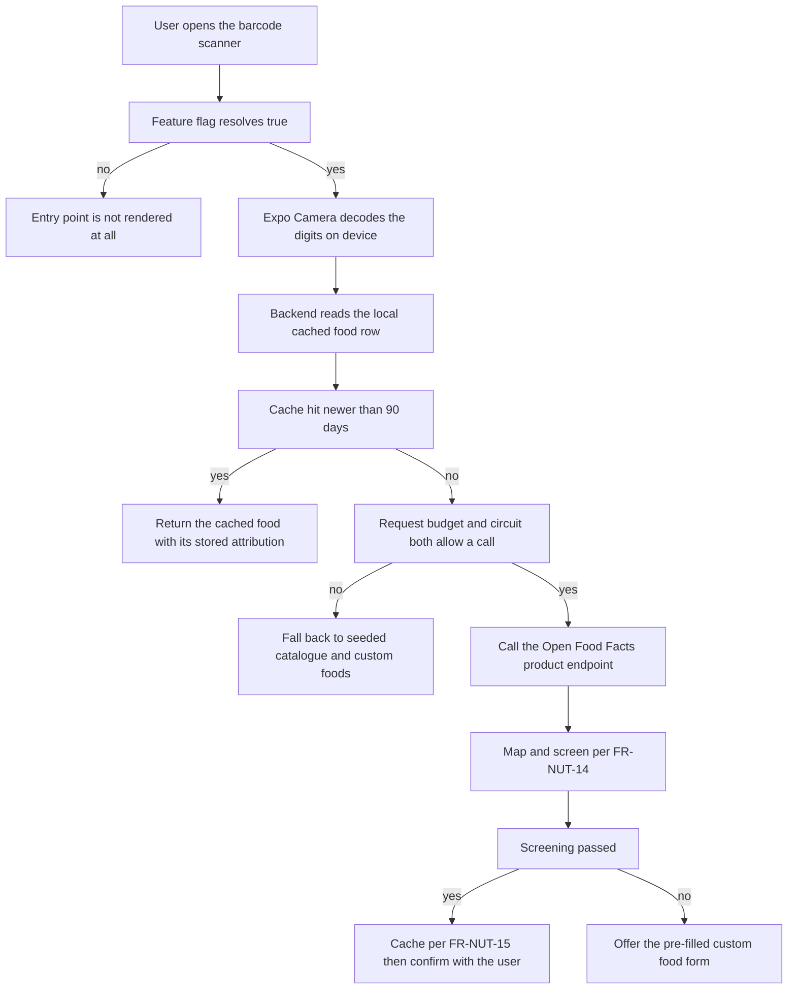

# Module Specification — Calorie and Nutrition (`NUT`)

| Field | Value |
| --- | --- |
| Document | PlantPal+ Module Specification — Calorie and Nutrition |
| Identifier prefix owned | `NUT` |
| Version | 1.0 |
| Date | 2026-07-21 |
| Status | Approved for Phase 2 |
| Owner | Rakshit (Project Lead / sole developer) |
| Parent | [PlantPal+ Software Requirements Specification v1.0](../SRS.md) |
| Related | [03-functional-requirements.md](../03-functional-requirements.md), [04-non-functional-requirements.md](../04-non-functional-requirements.md), [07-domain-model.md](../07-domain-model.md), [user-stories/nutrition.md](../user-stories/nutrition.md), [use-cases/nutrition.md](../use-cases/nutrition.md), [10-traceability-matrix.md](../10-traceability-matrix.md) |
| Contents | 28 functional requirements, 40 business rules, 8 data entities, 52 edge cases |

---

## Table of contents

1. [Purpose and scope](#1-purpose-and-scope)
2. [Actors and stakeholders](#2-actors-and-stakeholders)
3. [Capability overview](#3-capability-overview)
4. [Functional requirements](#4-functional-requirements)
5. [Business rules](#5-business-rules)
6. [Data entities touched](#6-data-entities-touched)
7. [External interfaces](#7-external-interfaces)
8. [Edge cases and boundary conditions](#8-edge-cases-and-boundary-conditions)
9. [Deferred and out of scope for v1.0](#9-deferred-and-out-of-scope-for-v10)
10. [Traceability stub](#10-traceability-stub)

---

## 1. Purpose and scope

### 1.1 Purpose

This document is the authoritative functional specification for the Calorie and Nutrition module of PlantPal+. It defines every capability by which a user records what they eat and drink, every value the product computes from that record, and every rule that keeps those computations correct, safe and reproducible. It is written to be read by an academic evaluator assessing rigour against ISO/IEC/IEEE 29148:2018, and by the engineer implementing Phase 3, who must be able to build from it without asking a further question.

### 1.2 In scope

| Capability area | Summary |
| --- | --- |
| Meal logging | Create, read, edit and delete meal entries. One entry binds one food or one recipe to a quantity, a serving unit, a meal type and a calendar date resolved in the user's IANA timezone. |
| Food catalogue | A curated, seeded, canonical catalogue of at least 300 common foods with per-100-gram energy and macronutrients; private custom foods; per-food serving-unit definitions with grams-equivalent factors; favourites; recently used foods; and search across all of them. |
| Open Food Facts enrichment | Feature-flagged barcode lookup and text search, response mapping, plausibility screening, local caching, licence attribution, request budgeting and a fully specified degradation ladder. |
| Nutrition mathematics | Canonical grams conversion, per-entry nutrition computation, the Atwater identity, Mifflin-St Jeor basal metabolic rate, total daily energy expenditure, calorie target derivation with a rate cap and a clinical floor, and macronutrient split targets. |
| Daily nutrition view | Consumed totals, signed remaining energy, per-macro progress, per-meal-type subtotals, and the fibre, sugar and sodium trio. |
| Water and hydration | Container-preset logging, a body-mass-derived hydration goal, quick-add with undo, and daily progress. |
| Recipes and productivity | Named recipes with per-serving derivation, one-action recipe logging, copy-a-meal and copy-a-day. |
| Trends | Rolling 7, 30 and 90 day mean intake against target, adherence percentage and macro distribution. |
| Cross-module link | An opt-in, default-off exercise-calorie credit with the double-counting hazard quantified and mitigated. |
| Safety and tone | Not-medical-advice framing, refusal of any target below the clinical floor, and a binding non-judgemental copy rule. |
| Offline behaviour | Exactly which nutrition writes may be queued offline, and the idempotency contract they honour. |

### 1.3 Explicitly excluded from this module

These concerns are real, but they belong to another prefix. This document references them by identifier and never redefines them.

| Concern | Owner | Note |
| --- | --- | --- |
| Registration, login, JWT and refresh tokens, session management | `ACC` | `NUT` consumes the authenticated principal only. |
| Profile fields: date of birth, biological sex, height, current body mass, activity level, unit system, IANA timezone, locale | `ACC` | `NUT` reads these as inputs to the nutrition mathematics. It owns neither the field, the editor, nor the field's own validation. |
| Body-mass and body-fat time series | `FIT` | `NUT` reads the latest body-mass observation only. |
| Estimated calories burned per workout and per day | `FIT` | `NUT` reads a daily total only, and only when the user has opted in. |
| Dashboard card layout and cross-module ordering | `DSH` | `NUT` supplies a summary payload; `DSH` decides placement. |
| Preference storage, unit-system toggle, week-start day, feature-flag user interface | `SET` | `NUT` reads resolved preference values. |
| Reminder scheduling, push delivery, quiet hours, notification centre | `NOT` | `NUT` declares which nutrition reminder types exist; `NOT` schedules and delivers them. |
| Streak evaluation, achievement catalogue, unlock detection | `GAM` | `NUT` supplies only the day-met predicate of [BR-NUT-38](#br-nut-38--nutrition-day-met-predicate-supplied-to-gamification). |
| Offline outbox mechanics, delta-sync cursor, tombstone protocol, media pipeline, feature-flag evaluation, global search shell, data export | `SYS` | `NUT` enumerates its participating write actions and syncable entities. |
| Latency budgets, availability, accessibility, retention thresholds | `NFR-*` | `NUT` states functional behaviour; measurable quality attributes are minted by the non-functional author. |

### 1.4 Deliberate non-goals

These are not deferred. They are never built.

1. No diagnosis, no medical or clinical advice, and no interpretation of a user's health status. PlantPal+ is a wellness tracker (D-07, CON-17).
2. No goal, target, preset or nudge capable of driving intake below the clinical floor of [BR-NUT-15](#br-nut-15--clinical-safety-floor-and-clamping).
3. No body-shaming, guilt, punishment, "cheat", "bad food" or user-versus-user comparison anywhere in nutrition copy ([BR-NUT-37](#br-nut-37--non-judgemental-language-and-negative-budget-presentation)).
4. No monetisation, no paid nutrition data provider and no service requiring a payment method (D-06, GOAL-09).
5. No third-party analytics on nutrition content (NFR-PRIV-07).

---

## 2. Actors and stakeholders

### 2.1 Actors

| Actor | Type | Role in this module |
| --- | --- | --- |
| Registered User | Human, primary | Logs meals and water, manages foods and recipes, sets targets, reviews the day and the trends. The only actor who may read or write nutrition data belonging to that account. |
| Guest / Unauthenticated Visitor | Human, secondary | Reaches marketing, legal and help surfaces only. Holds no nutrition capability whatsoever; every `NUT` endpoint requires authentication ([BR-NUT-39](#br-nut-39--data-ownership-and-authorisation)). |
| Nutrition Calculation Engine | Internal system | Server-side component performing grams conversion, per-entry computation, basal metabolic rate, total daily energy expenditure, target derivation, daily aggregation and trend aggregation. Deterministic and pure with respect to its inputs. |
| Food Catalogue Seeder | Internal system, build time | Idempotent migration and seed job loading the catalogue of at least 300 foods and their serving-unit factors. Runs on deploy, never at user request. |
| Open Food Facts API | External system | Optional, feature-flagged source of product records by barcode or text query. Always reached through the PlantPal+ Express backend, never directly from a client. |
| Device Camera | Device capability, supporting | Supplies decoded barcode digits on mobile through Expo Camera. Not present on web in v1.0. |
| Fitness Module | Internal system, supporting | Supplies the daily estimated energy expenditure consumed by the opt-in exercise-calorie credit, and the most recent body-mass observation. |
| Gamification Engine | Internal system, consumer | Consumes the nutrition day-met predicate and reacts to retroactive nutrition edits. |
| Reminder Scheduler | Internal system, supporting | Emits nutrition reminders. Owned by `NOT`. |
| Sync Engine | Internal system, supporting | Flushes queued offline nutrition writes and serves delta-sync reads. Owned by `SYS`. |
| System Clock / Day Roller | Internal system, supporting | Drives local-date rollover, daily summary invalidation and end-of-day evaluation. |

### 2.2 Stakeholders and personas served

| Identifier | Interest in this module |
| --- | --- |
| STK-01 | Primary end users: a nutrition experience that is fast enough to survive contact with a real day. |
| STK-03 | Project Lead: a module deliverable by one developer on free tiers within the semester (D-06, CON-01). |
| STK-05 | Pilot cohort testers: supply the evidence for MET-07 and MET-16. |
| PER-01 Aditi Sharma | Time-poor multi-module professional. Needs FR-NUT-09 quick-add and FR-NUT-27 copy to keep logging under ten seconds. |
| PER-03 Mia Castellano | Body-composition-focused athlete. Primary consumer of FR-NUT-19 macro splits and FR-NUT-22, and the persona who has been burned by exercise-calorie double counting. |
| PER-04 Harold Whitfield | Assistive-technology user. Requires that the remaining-calorie ring never carries meaning by colour or shape alone (NFR-A11Y-05, NFR-A11Y-08). |
| PER-05 Sofia Lindqvist | Budget-device student on a metered connection. Primary persona for FR-NUT-06 offline logging, FR-NUT-10 custom foods and FR-NUT-13 barcode fallbacks. |

### 2.3 Product goals this module realises

| Goal | How `NUT` realises it |
| --- | --- |
| GOAL-01 | Supplies the nutrition section of the unified daily dashboard through FR-NUT-20. |
| GOAL-02 | Two of the seven append-only log actions — log meal and log water intake — are owned here and specified for three-tap reachability (FR-NUT-09, FR-NUT-23, FR-NUT-27). |
| GOAL-05 | Contributes exactly two queueable offline actions with an idempotency contract (FR-NUT-06). |
| GOAL-06 | Realised in full by [BR-NUT-15](#br-nut-15--clinical-safety-floor-and-clamping), [BR-NUT-16](#br-nut-16--manual-override-bounds-and-disclaimer-gate) and [BR-NUT-37](#br-nut-37--non-judgemental-language-and-negative-budget-presentation). |
| GOAL-11 | Every requirement below carries a priority, a release, a verification method and a trace. |

---

## 3. Capability overview

### 3.1 Feature tree

```mermaid
flowchart LR
  NUT["NUT Calorie and Nutrition"]

  F1["1 Meal logging"]
  F2["2 Food catalogue"]
  F3["3 External enrichment<br/>Open Food Facts, flagged"]
  F4["4 Nutrition mathematics"]
  F5["5 Daily view"]
  F6["6 Water and hydration"]
  F7["7 Recipes and composites"]
  F8["8 Trends and review"]
  F9["9 Cross-module link"]
  F10["10 Safety and tone"]

  NUT --- F1
  NUT --- F2
  NUT --- F3
  NUT --- F4
  NUT --- F5
  NUT --- F6
  NUT --- F7
  NUT --- F8
  NUT --- F9
  NUT --- F10

  F1 --- F1a["1.1 Create, read, edit, delete an entry"]
  F1 --- F1b["1.2 Backdated logging inside the 365 day window"]
  F1 --- F1c["1.3 Offline queued logging, append only"]
  F1 --- F1d["1.4 Copy a meal, copy a day, one tap re-log"]

  F2 --- F2a["2.1 Seeded canonical catalogue, 300 foods or more"]
  F2 --- F2b["2.2 Private custom foods"]
  F2 --- F2c["2.3 Serving units with grams factors"]
  F2 --- F2d["2.4 Favourites and recently used"]
  F2 --- F2e["2.5 Ranked search with fuzzy fallback"]
  F2 --- F2f["2.6 Soft delete with history preserved"]

  F3 --- F3a["3.1 Barcode lookup on mobile"]
  F3 --- F3b["3.2 Text product search"]
  F3 --- F3c["3.3 Mapping and plausibility screening"]
  F3 --- F3d["3.4 Local caching for 90 days"]
  F3 --- F3e["3.5 ODbL attribution"]
  F3 --- F3f["3.6 Budget, rate limit and outage ladder"]

  F4 --- F4a["4.1 Canonical grams conversion"]
  F4 --- F4b["4.2 Per entry energy and macros"]
  F4 --- F4c["4.3 Atwater cross check"]
  F4 --- F4d["4.4 Mifflin St Jeor basal metabolic rate"]
  F4 --- F4e["4.5 Total daily energy expenditure"]
  F4 --- F4f["4.6 Target with rate cap and clinical floor"]
  F4 --- F4g["4.7 Manual target override"]
  F4 --- F4h["4.8 Macro split targets"]
  F4 --- F4i["4.9 Effective dated target versioning"]

  F5 --- F5a["5.1 Consumed totals and signed remaining energy"]
  F5 --- F5b["5.2 Per macro progress"]
  F5 --- F5c["5.3 Per meal type subtotals"]
  F5 --- F5d["5.4 Fibre, sugar and sodium with completeness"]
  F5 --- F5e["5.5 Empty and first run states"]

  F6 --- F6a["6.1 Container presets and custom volume"]
  F6 --- F6b["6.2 Quick add and undo"]
  F6 --- F6c["6.3 Hydration goal from body mass"]

  F7 --- F7a["7.1 Define a recipe"]
  F7 --- F7b["7.2 Per serving derivation"]
  F7 --- F7c["7.3 Log servings in one action"]

  F8 --- F8a["8.1 Rolling 7, 30 and 90 day windows"]
  F8 --- F8b["8.2 Mean intake against target"]
  F8 --- F8c["8.3 Adherence percentage"]
  F8 --- F8d["8.4 Macro distribution over time"]

  F9 --- F9a["9.1 Exercise calorie credit, default off"]

  F10 --- F10a["10.1 Not medical advice disclaimer"]
  F10 --- F10b["10.2 Clinical floor enforcement"]
  F10 --- F10c["10.3 Non judgemental copy rule"]
```



### 3.2 Requirement index

| ID | Title | MoSCoW | Release |
| --- | --- | --- | --- |
| [FR-NUT-01](#fr-nut-01--create-a-meal-entry) | Create a meal entry | Must | v0.5 |
| [FR-NUT-02](#fr-nut-02--canonical-grams-conversion) | Canonical grams conversion | Must | v0.5 |
| [FR-NUT-03](#fr-nut-03--per-entry-nutrition-computation-and-snapshot) | Per-entry nutrition computation and snapshot | Must | v0.5 |
| [FR-NUT-04](#fr-nut-04--edit-a-meal-entry) | Edit a meal entry | Must | v0.5 |
| [FR-NUT-05](#fr-nut-05--delete-a-meal-entry) | Delete a meal entry | Must | v0.5 |
| [FR-NUT-06](#fr-nut-06--offline-queued-nutrition-writes) | Offline queued nutrition writes | Must | v1.0 |
| [FR-NUT-07](#fr-nut-07--seeded-food-catalogue) | Seeded food catalogue | Must | v0.5 |
| [FR-NUT-08](#fr-nut-08--food-search) | Food search | Must | v0.5 |
| [FR-NUT-09](#fr-nut-09--favourites-and-recently-used-quick-add) | Favourites and recently used quick-add | Should | v0.5 |
| [FR-NUT-10](#fr-nut-10--create-and-edit-a-custom-food) | Create and edit a custom food | Must | v0.5 |
| [FR-NUT-11](#fr-nut-11--soft-delete-a-food-while-preserving-history) | Soft-delete a food while preserving history | Must | v1.0 |
| [FR-NUT-12](#fr-nut-12--open-food-facts-text-search) | Open Food Facts text search | Could | v1.1 |
| [FR-NUT-13](#fr-nut-13--barcode-lookup) | Barcode lookup | Should | v1.0 |
| [FR-NUT-14](#fr-nut-14--map-and-screen-external-product-data) | Map and screen external product data | Should | v1.0 |
| [FR-NUT-15](#fr-nut-15--cache-and-attribute-external-product-data) | Cache and attribute external product data | Should | v1.0 |
| [FR-NUT-16](#fr-nut-16--basal-metabolic-rate-and-total-daily-energy-expenditure) | Basal metabolic rate and total daily energy expenditure | Must | v0.5 |
| [FR-NUT-17](#fr-nut-17--derive-the-daily-calorie-target) | Derive the daily calorie target | Must | v0.5 |
| [FR-NUT-18](#fr-nut-18--manual-calorie-target-override) | Manual calorie target override | Should | v0.5 |
| [FR-NUT-19](#fr-nut-19--macronutrient-split-targets) | Macronutrient split targets | Must | v0.5 |
| [FR-NUT-20](#fr-nut-20--daily-nutrition-summary) | Daily nutrition summary | Must | v0.5 |
| [FR-NUT-21](#fr-nut-21--micronutrient-totals-for-fibre-sugar-and-sodium) | Micronutrient totals for fibre, sugar and sodium | Should | v1.0 |
| [FR-NUT-22](#fr-nut-22--exercise-calorie-credit-toggle) | Exercise-calorie credit toggle | Should | v1.0 |
| [FR-NUT-23](#fr-nut-23--water-intake-logging) | Water intake logging | Must | v0.5 |
| [FR-NUT-24](#fr-nut-24--hydration-goal) | Hydration goal | Should | v0.5 |
| [FR-NUT-25](#fr-nut-25--define-a-recipe) | Define a recipe | Should | v1.1 |
| [FR-NUT-26](#fr-nut-26--log-a-recipe-in-one-action) | Log a recipe in one action | Should | v1.1 |
| [FR-NUT-27](#fr-nut-27--copy-a-meal-or-a-whole-day) | Copy a meal or a whole day | Should | v1.0 |
| [FR-NUT-28](#fr-nut-28--nutrition-trends) | Nutrition trends | Should | v1.0 |

Release codes follow D-02: **v0.1** Walking Skeleton, **v0.5** Alpha, **v1.0** MVP, **v1.1+** Post-MVP. Verification methods follow ISO/IEC/IEEE 29148:2018: Test, Demonstration, Inspection, Analysis.

**Release alignment note.** No requirement in this module targets v0.1. The approved release plan places the `NUT` prefix as absent at the Walking Skeleton gate and states explicitly that no nutrition domain logic ships there. FR-NUT-01, FR-NUT-02, FR-NUT-03 and FR-NUT-20 — the four requirements that form the thinnest end-to-end nutrition slice, and which an earlier revision of this module proposed for v0.1 — therefore carry a target release of **v0.5**. No identifier was renumbered, no requirement was dropped and no priority changed. The v0.1 gate still exercises the migration and seed pipeline of FR-NUT-07 with a trivially small food seed, which de-risks the catalogue without shipping nutrition behaviour. Where an individual requirement below describes a capability being built up in stages, the staging is stated inside that requirement and never contradicts this table.

---

## 4. Functional requirements

Each requirement below is stated once, as a single testable "shall" sentence. Where the fixed technology stack dictates an implementation choice, that choice is named explicitly and marked as stack-dictated; everywhere else the requirement states what, not how.

### FR-NUT-01 — Create a meal entry

| Attribute | Value |
| --- | --- |
| Priority | Must |
| Release | v0.5 |
| Actor | Registered User |
| Verification | Test |
| Traces to | GOAL-02, STK-01, PER-01, US-NUT-01, UC-NUT-01, BR-NUT-01, BR-NUT-04, BR-NUT-05, BR-NUT-10, BR-NUT-28, NFR-USAB-01, NFR-PERF-02 |

**Requirement. The system shall create a meal entry that records exactly one food reference, one numeric quantity, one serving unit, one meal type from the set BREAKFAST, LUNCH, DINNER, SNACK, and one calendar date resolved in the user's IANA timezone.**

*Rationale.* Meal logging is the atomic act of this module; every other nutrition capability is either a derivation of this act or an accelerator for it. It traces to GOAL-02, which fixes every append-only log action at three taps or fewer and a ten-second median, and to PER-01, for whom logging that takes minutes is logging that stops happening.

**Inputs and validation**

| Field | Type | Constraints | Required |
| --- | --- | --- | --- |
| `food_item_id` | uuid | Must resolve to a `FoodItem` that is seeded, owned by the requesting user, or a cached Open Food Facts record, and that has `deleted_at IS NULL` at creation time | Yes, unless `recipe_id` is supplied per FR-NUT-26 |
| `serving_unit_id` | uuid | Must reference a live `ServingUnit` row belonging to the referenced food; supplies `unit_kind` and `grams_equivalent` | Yes |
| `quantity` | decimal | 0.01 to 10000.00 inclusive, at most 2 decimal places, rounded half-away-from-zero to 2 places before validation | Yes |
| `meal_type` | enum `MealType` | One of BREAKFAST, LUNCH, DINNER, SNACK; default offered per BR-NUT-04 | Yes |
| `logged_local_date` | date, ISO 8601 | `max(account_created_local_date, user_local_today - 365 days) <= value <= user_local_today` | No; defaults to the user's current local date |
| `logged_at` | timestamp, RFC 3339 with offset | Not more than 24 hours ahead of server time | No; defaults to server receipt time |
| `client_tz` | text | Valid IANA timezone identifier, for example `Asia/Kolkata` | Yes when the write originated offline |
| `idempotency_key` | uuid | Canonical lowercase UUID version 4, unique per `user_id` | Yes when the write originated offline |
| `note` | text | 0 to 200 characters after trimming | No |

**Processing rules**

1. Resolve the effective timezone and derive `logged_local_date` per [BR-NUT-01](#br-nut-01--calendar-date-assignment). An explicitly picked date always wins over derivation.
2. Apply FR-NUT-02 to obtain `grams_resolved`, then FR-NUT-03 to obtain the nutrition snapshot.
3. Enforce every limit in [BR-NUT-10](#br-nut-10--quantity-and-entry-validation-limits), including canonical grams within 0.1 g to 5000 g, entry energy at most 20000 kcal, and at most 100 meal entries per user per local date.
4. Apply the retro-window rule of [BR-NUT-28](#br-nut-28--retroactive-edit-window-and-recompute-fan-out).
5. Scope the write to the authenticated principal per [BR-NUT-39](#br-nut-39--data-ownership-and-authorisation).
6. Persist, invalidate the daily summary cache for `(user_id, logged_local_date)`, and emit `nutrition.day.changed` carrying `user_id` and that date for `DSH` and `GAM`.

**Outputs**

- The persisted `MealEntry` with its identifier, `grams_resolved`, the nine snapshot values and the date it landed on.
- The recomputed daily nutrition summary for that date, returned in the same response so the client updates the remaining-calorie ring without a second round trip.

**Alternate and error flows**

| Condition | System response | User-visible message |
| --- | --- | --- |
| `food_item_id` unknown or soft-deleted | HTTP 404, no write | "This food is no longer available. Search for another one." |
| `quantity` exactly 0 | HTTP 422, no write, never coerced | "Enter an amount greater than zero." |
| `quantity` above 10000, or `grams_resolved` above 5000 g | HTTP 422, no write | "That portion is larger than we can record. Split it into more than one entry." |
| Referenced serving unit does not belong to the referenced food | HTTP 422, no write; the unit is not offered in the client at all | "Choose one of the serving sizes available for this food." |
| Computed entry energy above 20000 kcal | HTTP 422, no write | "That entry works out to more energy than we can record. Check the amount." |
| Computed entry energy above 3000 kcal | HTTP 201 after one neutral confirmation step | "Just checking the amount: this entry is about N kcal." |
| `logged_local_date` in the future | HTTP 422, no write | "You cannot log for a future date." |
| `logged_local_date` older than the 365-day window | HTTP 422, no write | "You can log back as far as 365 days." |
| Entry count for the date already 100 | HTTP 422, no write | "You have reached 100 entries for this day." |
| No authenticated principal | HTTP 401 | "Sign in to log a meal." |
| Entry or food owned by another user | HTTP 404, never 403 | "This food is no longer available. Search for another one." |
| Client offline | The entry is queued per FR-NUT-06 and rendered immediately with a pending indicator | "Saved on this device. It will sync when you are back online." |

---

### FR-NUT-02 — Canonical grams conversion

| Attribute | Value |
| --- | --- |
| Priority | Must |
| Release | v0.5 |
| Actor | Nutrition Calculation Engine |
| Verification | Test |
| Traces to | GOAL-02, US-NUT-01, UC-NUT-01, BR-NUT-05, BR-NUT-06, NFR-DATA-03, NFR-DATA-08, NFR-MAIN-04 |

**Requirement. The system shall persist on every meal entry a canonical mass in grams equal to the logged quantity multiplied by the grams-equivalent factor defined for the selected serving unit of the selected food.**

*Rationale.* All nutrition data is stored once, per 100 g. Every consumer of that data — entries, recipes, copies, trends — must resolve to a single canonical mass, otherwise arithmetic diverges between clients and between features. Storing the mass and the factor on the entry also keeps the entry auditable after a serving-unit factor is later corrected.

**Inputs and validation**

| Field | Type | Constraints | Required |
| --- | --- | --- | --- |
| `quantity` | decimal | As validated in FR-NUT-01 | Yes |
| `unit_kind` | enum `ServingUnitKind` | One of GRAM, MILLILITRE, PIECE, CUP, TABLESPOON, SLICE, CUSTOM | Yes |
| `grams_equivalent` | decimal | 0.1 to 2000.0 grams per unit; exactly 1.000 for GRAM; MILLILITRE offered only when the food carries `is_liquid = true` or an explicit density | Yes |
| `custom_label` | text | 1 to 24 characters; required when `unit_kind = CUSTOM`; at most 5 CUSTOM units per food | Conditional |

**Processing rules**

1. Compute `grams_resolved = round(quantity * grams_equivalent, 3)` with half-away-from-zero rounding, per [BR-NUT-06](#br-nut-06--canonical-grams-formula-and-rounding).
2. Reject the result when it falls outside 0.1 g to 5000 g inclusive. A value below 0.1 g is rejected rather than rounded to zero, because a zero-mass entry contributes nothing while still occupying a row.
3. Persist `grams_resolved` and `serving_factor_snapshot = grams_equivalent` on the entry, together with `serving_label_snapshot`, so a later correction to the food's factor cannot silently rewrite history ([BR-NUT-25](#br-nut-25--nutrition-snapshot-immutability)).
4. Availability of each unit kind and its default factor are fixed by [BR-NUT-05](#br-nut-05--serving-unit-enumeration-availability-and-default-grams-factors).

**Outputs**

- `grams_resolved`, stored as `numeric(10,3)`.
- `serving_factor_snapshot`, stored as `numeric(8,3)`.
- `serving_label_snapshot`, stored as text of at most 40 characters.

**Alternate and error flows**

| Condition | System response | User-visible message |
| --- | --- | --- |
| No serving unit of the requested kind exists for the food | The unit is not rendered in the client; a direct API call returns HTTP 422 listing the units that do exist | "Choose one of the serving sizes available for this food." |
| `grams_equivalent` outside 0.1 to 2000.0, reachable only from a corrupt seed or malformed custom unit | HTTP 500, the record flagged for inspection; the seeder asserts these bounds at load time so the state is unreachable in a healthy deployment | "Something went wrong on our side. Try again, and let us know if it keeps happening." |
| `grams_resolved` below 0.1 g | HTTP 422, no write | "Enter an amount greater than zero." |

---

### FR-NUT-03 — Per-entry nutrition computation and snapshot

| Attribute | Value |
| --- | --- |
| Priority | Must |
| Release | v0.5 |
| Actor | Nutrition Calculation Engine |
| Verification | Test |
| Traces to | GOAL-02, US-NUT-01, US-NUT-07, UC-NUT-01, BR-NUT-07, BR-NUT-25, NFR-DATA-08, NFR-MAIN-03 |

**Requirement. The system shall persist on every meal entry, as an immutable snapshot, the energy in kilocalories and the protein, carbohydrate and fat masses in grams computed from that entry's canonical mass and the referenced food's per-100-gram values.**

*Rationale.* A snapshot, rather than a live join to the food record, is what makes historical days stable. Users correct a custom food's macros weeks after logging with it. Without a snapshot, every past day, every past streak and every past achievement silently changes underneath them.

**Inputs and validation**

| Field | Type | Constraints | Required |
| --- | --- | --- | --- |
| `grams_resolved` | decimal | Output of FR-NUT-02, 0.1 to 5000 g | Yes |
| `energy_kcal_per_100g` | decimal | 0 to 900, non-null | Yes |
| `protein_g_per_100g` | decimal | 0 to 100, non-null | Yes |
| `carbohydrate_g_per_100g` | decimal | 0 to 100, non-null | Yes |
| `fat_g_per_100g` | decimal | 0 to 100, non-null | Yes |
| `fibre_g_per_100g` | decimal | 0 to 100, may be null | No |
| `sugar_g_per_100g` | decimal | 0 to 100, may be null, and at most `carbohydrate_g_per_100g + 0.5` | No |
| `sodium_mg_per_100g` | decimal | 0 to 40000, may be null | No |

**Processing rules**

1. For each nutrient `n`, compute `entry_n = n_per_100g * grams_resolved / 100` per [BR-NUT-07](#br-nut-07--per-entry-nutrition-from-per-100-gram-values).
2. Store energy as `numeric(10,2)`, protein, carbohydrate, fat, fibre and sugar as `numeric(10,3)`, and sodium as `numeric(10,2)`. Display rounding is fixed by [BR-NUT-36](#br-nut-36--rounding-precision-and-unit-display).
3. A null per-100-gram value yields a null snapshot value. Null is never coerced to zero, because zero and unknown are different claims and [BR-NUT-40](#br-nut-40--micronutrient-reference-values-and-completeness-labelling) depends on telling them apart.
4. Additionally snapshot `food_name_snapshot`, at most 120 characters, and `food_source_snapshot`, so a deleted or renamed food still renders correctly.
5. The snapshot is immutable except through an explicit edit of the entry itself ([BR-NUT-25](#br-nut-25--nutrition-snapshot-immutability)).

**Outputs**

- Seven numeric snapshot values on the `MealEntry`: `energy_kcal`, `protein_g`, `carbohydrate_g`, `fat_g`, `fibre_g`, `sugar_g`, `sodium_mg`.
- Two textual snapshot values: `food_name_snapshot` and `food_source_snapshot`.

**Alternate and error flows**

| Condition | System response | User-visible message |
| --- | --- | --- |
| Referenced food has a null required nutrient | The food is not loggable and is not offered; the state is unreachable for seeded foods, asserted by the seeder in FR-NUT-07, and for custom foods, asserted by FR-NUT-10 | "This food is missing its nutrition figures. Add them to log it." |
| An external record reached this stage with a missing macro | Rejected earlier by FR-NUT-14 with reason MISSING_MACRO, so no entry is created | "We could not read this product's nutrition. Add it as your own food." |
| Optional nutrient null on the food | Snapshot value stays null; the day's completeness percentage for that nutrient falls accordingly | "Based on N percent of what you logged." |

---

### FR-NUT-04 — Edit a meal entry

| Attribute | Value |
| --- | --- |
| Priority | Must |
| Release | v0.5 |
| Actor | Registered User |
| Verification | Test |
| Traces to | GOAL-02, US-NUT-10, UC-NUT-08, BR-NUT-10, BR-NUT-25, BR-NUT-28, NFR-PERF-02, NFR-SEC-14, NFR-USAB-08 |

**Requirement. The system shall allow the owning user to modify an existing meal entry's quantity, serving unit, meal type, calendar date or referenced food, recomputing and re-persisting that entry's nutrition snapshot from the modified values.**

*Rationale.* People log approximately, then correct. Forcing delete-and-recreate loses the original timestamp, breaks the idempotency-key contract, and fills the sync log with spurious create and delete churn that `GAM` must then reprocess.

**Inputs and validation**

| Field | Type | Constraints | Required |
| --- | --- | --- | --- |
| `entry_id` | uuid | Must resolve to a `MealEntry` owned by the requesting user | Yes |
| `quantity` | decimal | As FR-NUT-01 | No |
| `serving_unit_id` | uuid | As FR-NUT-01, and must belong to the entry's referenced food | No |
| `meal_type` | enum `MealType` | As FR-NUT-01 | No |
| `logged_local_date` | date | Both the current and the proposed date must lie inside the 365-day retro window | No |
| `food_item_id` | uuid | Must resolve to a live, visible food; a soft-deleted food may not be swapped in | No |
| `note` | text | 0 to 200 characters | No |
| Connectivity | precondition | Editing is not a queueable action under D-04 and requires connectivity | Yes |

**Processing rules**

1. Validate every supplied field exactly as in FR-NUT-01. Unsupplied fields are left unchanged.
2. Re-run FR-NUT-02 and FR-NUT-03 against the post-edit values, replacing the snapshot.
3. When `logged_local_date` changes, invalidate the daily summary cache for both the old and the new date and emit `nutrition.day.changed` for both dates.
4. Bump `updated_at` so the `SYS` delta-sync cursor picks the row up on every other device ([BR-NUT-28](#br-nut-28--retroactive-edit-window-and-recompute-fan-out)).
5. Changing the referenced food re-snapshots from the new food's current values; it never merges old and new values.

**Outputs**

- The updated `MealEntry` with its new snapshot.
- The recomputed daily nutrition summary for every affected date, which is two summaries when the entry moved between days.

**Alternate and error flows**

| Condition | System response | User-visible message |
| --- | --- | --- |
| Entry not found or owned by another user | HTTP 404, never 403 | "That entry is no longer here." |
| Client offline | The edit is refused and never queued; the control is disabled with an explanation | "You need to be online to change an entry. Try again when you are back." |
| Proposed date outside the retro window | HTTP 422, no write | "You can log back as far as 365 days." |
| Proposed food is soft-deleted | HTTP 422, the swap refused; quantity and unit of the existing entry may still be edited | "That food is no longer available. Pick a different one." |
| Entry deleted on another device meanwhile | HTTP 404; the client removes the entry from view with a neutral notice | "That entry was removed on another device." |
| Validation failure on any field | HTTP 422 naming the field and its permitted range; all previously entered values are preserved in the form | Field-level message from the catalogue of NFR-USAB-03 |

---

### FR-NUT-05 — Delete a meal entry

| Attribute | Value |
| --- | --- |
| Priority | Must |
| Release | v0.5 |
| Actor | Registered User |
| Verification | Test |
| Traces to | GOAL-02, US-NUT-10, UC-NUT-08, BR-NUT-28, BR-NUT-39, NFR-DATA-05, NFR-USAB-04 |

**Requirement. The system shall delete a meal entry at the owning user's request, recording a tombstone that carries that entry's identifier and its deletion timestamp so that every other signed-in client removes the entry on its next delta sync.**

*Rationale.* Mis-logs happen constantly, most often as a double tap on a quick-add tile. Deletion must be immediate, unconditional and must propagate to every device, or the user's totals disagree between their phone and their laptop.

**Inputs and validation**

| Field | Type | Constraints | Required |
| --- | --- | --- | --- |
| `entry_id` | uuid | Must resolve to a `MealEntry` owned by the requesting user whose `logged_local_date` lies inside the 365-day retro window | Yes |
| Connectivity | precondition | Deletion is not a queueable action under D-04 | Yes |

**Processing rules**

1. Remove the `MealEntry` row and insert a tombstone `(entity_type = 'meal_entry', entity_id, user_id, deleted_at)` in the same transaction. The tombstone protocol itself is owned by `SYS`.
2. Invalidate the daily summary cache for the affected date and emit `nutrition.day.changed` ([BR-NUT-28](#br-nut-28--retroactive-edit-window-and-recompute-fan-out)).
3. Offer a client-side undo for at least 10 seconds, which re-creates the entry with a fresh identifier, a fresh idempotency key and the original values. After that window the deletion is final and the entry is recoverable only by re-logging.
4. Deletion is idempotent: deleting an entry that no longer exists succeeds.

**Outputs**

- HTTP 204 with no body.
- The recomputed daily nutrition summary for the affected date, fetched by the client on the follow-up read.

**Alternate and error flows**

| Condition | System response | User-visible message |
| --- | --- | --- |
| Entry already deleted | HTTP 204, no further write | "Entry removed." |
| Entry owned by another user | HTTP 404, never 403 | "That entry is no longer here." |
| Client offline | Refused, never queued | "You need to be online to remove an entry. Try again when you are back." |
| Undo tapped inside the 10-second window | The entry is re-created with the original values and a new identifier | "Entry restored." |
| Entry's date outside the retro window | HTTP 422, no write | "You can change entries from the last 365 days." |

---

### FR-NUT-06 — Offline queued nutrition writes

| Attribute | Value |
| --- | --- |
| Priority | Must |
| Release | v1.0 |
| Actor | Sync Engine |
| Verification | Test |
| Traces to | GOAL-05, PER-05, US-NUT-06, UC-NUT-12, BR-NUT-27, NFR-DATA-09, NFR-RELI-04, NFR-USAB-07 |

**Requirement. The system shall upsert every meal-entry creation and water-intake creation captured while the client was offline on the unique tuple of user identifier and client-generated UUID idempotency key, so that a replayed request creates no additional record and returns the originally persisted resource.**

*Rationale.* D-04 permits queuing only append-only logging actions. Meal logging and water logging are exactly that: each adds an immutable fact about a moment, so replaying one is conflict-free by construction. This is precisely why no merge algorithm, no CRDT and no last-write-wins policy is specified anywhere in this module.

**Inputs and validation**

| Field | Type | Constraints | Required |
| --- | --- | --- | --- |
| `action_type` | enum | One of `nutrition.meal_entry.create`, `nutrition.water_entry.create`. No other nutrition action is queueable | Yes |
| `idempotency_key` | uuid | Canonical lowercase UUID version 4; unique per `(user_id, action_type)`; retained server-side for 90 days | Yes |
| `client_recorded_at` | timestamp, RFC 3339 with offset | At most 24 hours ahead of server time; at most 30 days in the past | Yes |
| `client_tz` | text | Valid IANA timezone identifier captured on the device at capture time | Yes |
| `payload` | object | The full FR-NUT-01 or FR-NUT-23 request body | Yes |
| Queue depth | precondition | At most 500 items across all modules; the cap and the outbox are owned by `SYS` | Yes |

**Processing rules**

1. Derive `logged_local_date` from `client_recorded_at` interpreted in `client_tz`, never from server receipt time ([BR-NUT-01](#br-nut-01--calendar-date-assignment), [BR-NUT-27](#br-nut-27--idempotency-and-offline-replay-contract)).
2. Upsert on the unique constraint. A conflict returns HTTP 200 with the already-persisted resource and performs no write.
3. Reject a `client_recorded_at` more than 24 hours ahead of server time with HTTP 422 as a clock-skew guard. Accept timestamps up to 30 days in the past.
4. Flush oldest item first. Retry each item at most 5 times with exponential backoff per NFR-RELI-04, after which the item moves to a user-visible needs-attention list carrying its specific reason. No item is ever discarded silently.
5. A queued creation whose referenced food was soft-deleted between capture and flush is still accepted, because the food remains resolvable by primary key and the snapshot is computed from it.

**Outputs**

- The created, or already-existing, `MealEntry` or `WaterIntakeEntry`.
- A per-item flush result the client uses to clear its outbox entry.
- A needs-attention list entry for any item that exhausted its retries or failed validation.

**Alternate and error flows**

| Condition | System response | User-visible message |
| --- | --- | --- |
| Replay of an already-seen idempotency key | HTTP 200 with the existing resource, zero writes | No message; the client simply clears the outbox item |
| `idempotency_key` not a canonical UUID version 4 | HTTP 400 with code `INVALID_IDEMPOTENCY_KEY` | "We could not save that log. Try logging it again." |
| `client_recorded_at` more than 24 hours in the future | HTTP 422; the item moves to needs-attention | "Your device clock looks wrong, so we could not place this log on a day. Check the date and try again." |
| Payload fails validation at flush time | HTTP 422; the item moves to needs-attention with the specific reason | "One saved log needs your attention before it can sync." |
| Account deleted while items were queued | The client receives HTTP 401 and discards the queue | "You are signed out. Sign in again to keep logging." |
| Outbox already holds 500 items | Further queuing is blocked by `SYS`; the nutrition logging control renders the blocked state rather than silently dropping the log | "You have 500 logs waiting to sync. Connect to the internet to send them." |

---

### FR-NUT-07 — Seeded food catalogue

| Attribute | Value |
| --- | --- |
| Priority | Must |
| Release | v0.5 |
| Actor | Food Catalogue Seeder |
| Verification | Inspection |
| Traces to | GOAL-09, ASM-06, US-NUT-02, US-NUT-05, UC-NUT-02, BR-NUT-08, BR-NUT-09, NFR-DATA-07, NFR-RELI-02, NFR-SCAL-02 |

**Requirement. The system shall provide a seeded food catalogue containing at least 300 distinct food records, each carrying a name, a category and non-null per-100-gram values for energy in kilocalories, protein in grams, carbohydrate in grams and fat in grams.**

*Rationale.* D-03 makes the curated catalogue canonical and requires the product to remain fully functional with every external integration disabled. A catalogue of 300 everyday staples covers the majority of ordinary logging (ASM-06) without a single request to a third party, which is what makes the Open Food Facts integration genuinely optional rather than load-bearing.

**Inputs and validation**

| Field | Type | Constraints | Required |
| --- | --- | --- | --- |
| `slug` | text | Stable, version-controlled seed key; drives the deterministic UUID version 5 primary key of NFR-DATA-07 | Yes |
| `name` | text | 1 to 120 characters; unique per `(source, lower(name), lower(brand))` | Yes |
| `brand` | text | 0 to 80 characters | No |
| `category` | enum | One of FRUIT, VEGETABLE, GRAIN, LEGUME, DAIRY, MEAT, FISH, EGG, NUT_SEED, FAT_OIL, BEVERAGE, SNACK, CONDIMENT, COMPOSITE_DISH, OTHER | Yes |
| `energy_kcal_per_100g` | decimal | 0 to 900 | Yes |
| `protein_g_per_100g`, `carbohydrate_g_per_100g`, `fat_g_per_100g` | decimal | Each 0 to 100; the three must sum to at most 100.5 | Yes |
| `fibre_g_per_100g`, `sugar_g_per_100g`, `sodium_mg_per_100g` | decimal | 0 to 100, 0 to 100, 0 to 40000 respectively | No |
| Serving units | rows | At least the implicit GRAM unit; at least 120 catalogue records carry at least one non-GRAM unit | Yes |

**Processing rules**

1. The seeder is idempotent and keyed by `slug`. Re-running it updates values in place and never duplicates a row (NFR-DATA-07).
2. Seeded records have `user_id IS NULL` and `source = SEEDED`. They are visible to every user and are never editable or deletable by a user; a user may only hide one from their own search results.
3. Every record must satisfy the plausibility limits of [BR-NUT-09](#br-nut-09--food-nutrient-plausibility-limits-per-100-grams) and the Atwater cross-check of [BR-NUT-08](#br-nut-08--atwater-energy-from-macros-identity-and-tolerance).
4. Category distribution: at least 10 records in each of FRUIT, VEGETABLE, GRAIN, DAIRY, MEAT and BEVERAGE, so that first-run search is never empty for a common query. At least 30 records are South Asian staples, per the interim default recorded in section 9.
5. The v0.1 Walking Skeleton exercises this same seed and migration pipeline with a trivially small food subset, which proves the pipeline end to end without shipping any nutrition behaviour. The threshold of at least 300 records is met at v0.5, which is this requirement's target release.

**Outputs**

- Rows in `FoodItem` and `ServingUnit`.
- A seed-history row carrying the checksum of each versioned seed file (NFR-DATA-07).

**Alternate and error flows**

| Condition | System response | User-visible message |
| --- | --- | --- |
| A seed record fails validation | The migration aborts and names the offending `slug`; no partial catalogue reaches the environment | Not user-facing; the deploy fails and the failure is reported to the Project Lead |
| Seed file checksum differs from the recorded checksum | The deploy fails rather than silently re-seeding | Not user-facing |
| The seeder runs twice | The second run is a no-op update producing byte-identical rows | Not user-facing |

---

### FR-NUT-08 — Food search

| Attribute | Value |
| --- | --- |
| Priority | Must |
| Release | v0.5 |
| Actor | Registered User |
| Verification | Test |
| Traces to | GOAL-02, PER-01, US-NUT-02, UC-NUT-02, BR-NUT-29, NFR-PERF-01, NFR-SCAL-05 |

**Requirement. The system shall return food search results for a query string of at least one character, ordered by the ranking score of BR-NUT-29, evaluating the match stages exact name, name prefix, word-boundary prefix, substring and trigram similarity of at least 0.30 in that order.**

*Rationale.* Search is the primary path to a food and therefore the primary determinant of whether logging takes eight seconds or forty. Ranking by personal usage matters more than lexical cleverness, because people eat the same thirty foods over and over.

**Inputs and validation**

| Field | Type | Constraints | Required |
| --- | --- | --- | --- |
| `q` | text | 1 to 60 characters after trimming; longer queries are truncated to 60 rather than rejected; matched case-insensitively and accent-insensitively | Yes |
| `category` | enum | One of the 15 category members; filters the candidate set | No |
| `source` | enum `FoodSource` | One of SEEDED, USER_CUSTOM, OPEN_FOOD_FACTS | No |
| `limit` | integer | 1 to 50; default 25 | No |
| `cursor` | text | Opaque keyset cursor per NFR-SCAL-04 | No |

**Processing rules**

1. The candidate set is the union of seeded foods, foods owned by the requesting user, and cached Open Food Facts foods, each with `deleted_at IS NULL` and not hidden by that user.
2. Score every candidate per [BR-NUT-29](#br-nut-29--food-search-ranking-formula) and return the highest `limit` results. Ties break deterministically, which is what makes the ordering testable.
3. A single-character query runs the prefix stages only. Trigram search at that length is both slow and useless.
4. Stack-dictated implementation: PostgreSQL `pg_trgm` with a GIN index on the name, plus the `unaccent` extension. The fixed stack dictates this "how" and the specification states it explicitly.

**Outputs**

An ordered array of food summaries, each carrying identifier, name, brand, `source`, `data_quality`, energy per 100 g, the default serving unit and a favourite flag — enough to log without a second read.

**Alternate and error flows**

| Condition | System response | User-visible message |
| --- | --- | --- |
| Empty query | The quick-add panel of FR-NUT-09 is returned instead of an error | Not an error state |
| Zero results | A neutral empty state offering "create a custom food", and, only when the Open Food Facts flag is enabled and the client is online, "search Open Food Facts" | "No matches. You can add this as your own food." |
| Search exceeds 3000 ms | The prefix-stage results already computed are returned rather than an error | Not user-facing |
| Soft-deleted or user-hidden food matches the query | Excluded from the result set entirely | Not user-facing |
| `limit` above 50 | Clamped to 50 | Not user-facing |

---

### FR-NUT-09 — Favourites and recently used quick-add

| Attribute | Value |
| --- | --- |
| Priority | Should |
| Release | v0.5 |
| Actor | Registered User |
| Verification | Demonstration |
| Traces to | GOAL-02, MET-15, PER-01, US-NUT-03, UC-NUT-02, BR-NUT-04, BR-NUT-29, NFR-USAB-01, NFR-USAB-06 |

**Requirement. The system shall display, before any search query is entered, a quick-add panel containing the user's favourite foods followed by the 20 most recently logged distinct foods, each re-loggable in a single interaction using the quantity and serving unit last used for that food.**

*Rationale.* Repetition dominates food logging. Making the second and every subsequent log of the same food a single tap is the highest-leverage usability decision in this module and the main mechanism by which MET-15 reaches a ten-second median.

**Inputs and validation**

| Field | Type | Constraints | Required |
| --- | --- | --- | --- |
| `food_item_id` | uuid | For the favourite toggle; must reference a live, visible food | Yes for the toggle |
| `is_favourite` | boolean | Target state of the toggle | Yes for the toggle |
| Favourite count | derived | At most 100 `FoodFavourite` rows per user | Enforced |
| Recents window | derived | The 20 distinct `food_item_id` values most recently referenced by that user's meal entries, ordered by latest `logged_at` descending, restricted to foods with `deleted_at IS NULL` | Derived, never user-editable |

**Processing rules**

1. Recents are derived from `MealEntry`, not stored as a separate list, so they are always correct and cost nothing to maintain.
2. Each tile carries the quantity and serving unit from that food's most recent entry for that user, so one tap reproduces the last portion exactly.
3. Meal type for a one-tap add defaults per [BR-NUT-04](#br-nut-04--meal-type-enumeration-and-default-selection) and is always overridable in one interaction.
4. Favourites are listed first; recents follow with favourites de-duplicated out.
5. When the user holds neither favourites nor recents, the panel shows 8 seeded staples drawn from 8 distinct categories rather than an empty area (NFR-USAB-06).

**Outputs**

An ordered list of quick-add tiles, each sufficient to create a meal entry without a further read.

**Alternate and error flows**

| Condition | System response | User-visible message |
| --- | --- | --- |
| Favouriting a soft-deleted food | HTTP 422, no write | "That food is no longer available." |
| Favourite count already 100 | HTTP 422, no write | "You have 100 favourites. Remove one to add another." |
| A food in recents has since been soft-deleted | The tile is filtered out server-side rather than rendered and failing on tap | Not user-facing |
| First run, no favourites and no recents | 8 seeded staples from distinct categories | "Start with one of these, or search for what you ate." |
| Client offline | The panel renders from the persisted cache and taps queue per FR-NUT-06 | "Saved on this device. It will sync when you are back online." |

---

### FR-NUT-10 — Create and edit a custom food

| Attribute | Value |
| --- | --- |
| Priority | Must |
| Release | v0.5 |
| Actor | Registered User |
| Verification | Test |
| Traces to | GOAL-02, ASM-06, PER-05, US-NUT-05, UC-NUT-04, BR-NUT-08, BR-NUT-09, BR-NUT-25, NFR-SEC-08, NFR-USAB-08 |

**Requirement. The system shall allow a user to create and edit a private custom food record carrying a name and per-100-gram values for energy, protein, carbohydrate and fat, and optionally fibre, sugar, sodium and one or more serving-unit factors.**

*Rationale.* No 300-item catalogue covers a user's home cooking, regional dishes or local brands. Custom foods are what keep the product usable when Open Food Facts is disabled, unreachable, or simply does not carry the item — the exact situation PER-05 meets in a campus canteen.

**Inputs and validation**

| Field | Type | Constraints | Required |
| --- | --- | --- | --- |
| `name` | text | 1 to 120 characters; unique, case-insensitively, among that user's non-deleted custom foods | Yes |
| `brand` | text | 0 to 80 characters | No |
| `category` | enum | One of the 15 members; defaults to OTHER | No |
| `energy_kcal_per_100g` | decimal | 0 to 900 | Yes |
| `protein_g_per_100g` | decimal | 0 to 100 | Yes |
| `carbohydrate_g_per_100g` | decimal | 0 to 100 | Yes |
| `fat_g_per_100g` | decimal | 0 to 100; the three macros must sum to at most 100.5 g per 100 g | Yes |
| `fibre_g_per_100g` | decimal | 0 to 100 | No |
| `sugar_g_per_100g` | decimal | 0 to 100 and at most `carbohydrate_g_per_100g + 0.5` | No |
| `sodium_mg_per_100g` | decimal | 0 to 40000 | No |
| `is_liquid` | boolean | Default false; when true a density is required and MILLILITRE becomes available | No |
| Serving units | rows | 0 to 10 rows, each with a `unit_kind`, a label, and a `grams_equivalent` of 0.1 to 2000; at most 5 CUSTOM rows | No |
| Custom food count | derived | At most 500 custom foods per user | Enforced |
| Connectivity | precondition | Food creation is an entity create and is therefore not queueable under D-04 | Yes |

**Processing rules**

1. Enforce the macro-sum limit and the plausibility bounds of [BR-NUT-09](#br-nut-09--food-nutrient-plausibility-limits-per-100-grams).
2. Apply the Atwater cross-check of [BR-NUT-08](#br-nut-08--atwater-energy-from-macros-identity-and-tolerance). A record that fails the cross-check is stored with `data_quality = INCONSISTENT` after a non-blocking confirmation that shows both the declared energy and the macro-derived energy, because sugar alcohols, high-fibre foods and published rounding all diverge legitimately.
3. Set `source = USER_CUSTOM` and `user_id` to the creating user. Custom foods are visible only to their owner.
4. Editing a custom food never rewrites existing meal entries ([BR-NUT-25](#br-nut-25--nutrition-snapshot-immutability)); the editor states this in one sentence.
5. Every food is created with an implicit GRAM serving unit of `grams_equivalent = 1.000`, which cannot be removed, and exactly one unit is marked default.

**Outputs**

The persisted `FoodItem` with its serving units, immediately available to search and quick-add for its owner only.

**Alternate and error flows**

| Condition | System response | User-visible message |
| --- | --- | --- |
| Duplicate name for that user | HTTP 409, offering to open the existing food | "You already have a food with this name. Open it instead?" |
| Macro sum above 100.5 g per 100 g | HTTP 422 naming the conflicting values | "Protein, carbohydrate and fat cannot add up to more than 100 g per 100 g." |
| Any value outside its bound | HTTP 422 naming the field and the permitted range | Field-level message stating the range |
| Atwater cross-check fails | Non-blocking confirmation, then stored with `data_quality = INCONSISTENT` | "These figures look unusual. Energy from the macros works out to N kcal. Save anyway?" |
| Custom food count already 500 | HTTP 422, no write | "You have reached 500 of your own foods." |
| Client offline | Refused, never queued | "You need to be online to add a food. Your meal logs still save on this device." |

---

### FR-NUT-11 — Soft-delete a food while preserving history

| Attribute | Value |
| --- | --- |
| Priority | Must |
| Release | v1.0 |
| Actor | Registered User |
| Verification | Test |
| Traces to | GOAL-08, US-NUT-05, US-NUT-10, UC-NUT-04, BR-NUT-25, BR-NUT-26, NFR-DATA-04, NFR-DATA-05 |

**Requirement. The system shall soft-delete a food record by setting a deletion timestamp, excluding that food from search results, quick-add lists and new entry creation while continuing to render every historical meal entry that references it from that entry's stored nutrition snapshot.**

*Rationale.* This is the single most damaging referential-integrity trap in the module. If deleting a food cascaded to entries, a user tidying their custom foods would silently destroy months of history, every affected day's totals, and every streak and achievement derived from them. A meal entry is never cascade-deleted by a food deletion, under any circumstance.

**Inputs and validation**

| Field | Type | Constraints | Required |
| --- | --- | --- | --- |
| `food_item_id` | uuid | Must reference a `FoodItem` with `source = USER_CUSTOM` owned by the requesting user | Yes |
| Connectivity | precondition | Not a queueable action under D-04 | Yes |

**Processing rules**

1. Set `deleted_at` and `deleted_by`; the row is never removed at delete time. The 30-day purge is governed by NFR-PRIV-04 and NFR-DATA-05.
2. Exclude the food from search, quick-add, favourite lists, recipe-ingredient pickers and all new entry creation.
3. Leave every existing meal entry, recipe-ingredient row and favourite row intact. Historical entries render from their snapshot with a neutral secondary label.
4. Emit a tombstone so every other client drops the food from its catalogue cache.
5. Any recipe referencing the food is flagged `has_unavailable_ingredient = true`, which blocks logging that recipe until the ingredient is replaced, but never deletes the recipe ([BR-NUT-26](#br-nut-26--food-soft-delete-and-referential-integrity)).
6. Seeded and cached Open Food Facts foods are never user-deletable; a user may only hide them from their own search results.

**Outputs**

- HTTP 204.
- A count of historical entries that retain the food, which is the reassurance the user needs at that moment.

**Alternate and error flows**

| Condition | System response | User-visible message |
| --- | --- | --- |
| Attempt to delete a seeded food | HTTP 403 with the alternative offered | "Catalogue foods cannot be deleted. You can hide this one from your searches instead." |
| Food already soft-deleted | HTTP 204, idempotent | "Food removed." |
| Food owned by another user | HTTP 404, never 403 | "That food is no longer available." |
| Food is used by one or more recipes | The deletion proceeds; each affected recipe is flagged and cannot be logged until its ingredient is replaced | "N of your recipes use this food and will need a replacement ingredient." |
| Historical entries exist | The deletion proceeds and the entries are untouched | "Removed. Your N past entries with this food are unchanged." |

---

### FR-NUT-12 — Open Food Facts text search

| Attribute | Value |
| --- | --- |
| Priority | Could |
| Release | v1.1 |
| Actor | Registered User |
| Verification | Test |
| Traces to | DEP-07, ASM-10, US-NUT-02, US-NUT-04, UC-NUT-03, BR-NUT-30, BR-NUT-31, BR-NUT-32, NFR-RELI-02, NFR-SEC-11, NFR-LEGL-04 |

**Requirement. The system shall search Open Food Facts products by text query and present the mapped, screened results as selectable foods whenever the feature flag `integration.openFoodFacts.enabled` evaluates to true.**

*Rationale.* Text search widens coverage to packaged goods when no barcode is to hand. It is a Could for v1.1 because barcode lookup delivers most of the value and the seeded catalogue already covers whole foods; deferring it also keeps the v1.0 external request budget small, which matters under ASM-10.

**Inputs and validation**

| Field | Type | Constraints | Required |
| --- | --- | --- | --- |
| `q` | text | 2 to 60 characters after trimming | Yes |
| `limit` | integer | 1 to 25; default 25 | No |
| Feature flag | precondition | `integration.openFoodFacts.enabled` must resolve to true; resolution is owned by `SYS` | Yes |
| Connectivity | precondition | The client must be online | Yes |
| Budget | precondition | At most 10 text searches per rolling minute per backend instance and at most 20 external lookups per rolling hour per user | Enforced |

**Processing rules**

1. The request is proxied by the PlantPal+ Express backend. No client ever calls Open Food Facts directly, so the flag, the budget, the identifying `User-Agent` header and the cache are enforced in exactly one place ([BR-NUT-31](#br-nut-31--open-food-facts-request-budget-caching-and-degradation-ladder)).
2. Endpoint: `GET https://world.openfoodfacts.org/cgi/search.pl` with `json=1` and `page_size=25`.
3. Every returned product passes through the FR-NUT-14 mapping and screening before it is shown; unscreened data is never rendered.
4. Results are labelled with their Open Food Facts provenance and carry the attribution string of [BR-NUT-32](#br-nut-32--attribution-obligation).
5. Selecting a result persists it locally per FR-NUT-15 and then proceeds to the ordinary FR-NUT-01 logging flow.

**Outputs**

Mapped, screened, provenance-labelled food candidates, each with a `data_quality` value and the attribution string.

**Alternate and error flows**

| Condition | System response | User-visible message |
| --- | --- | --- |
| Feature flag false | The entry point is not rendered at all | Nothing is shown |
| Client offline | The entry point renders disabled | "You need to be online to search Open Food Facts. Your own foods are still searchable." |
| HTTP 429 or budget exhausted | Neutral message with a retry hint and immediate fallback to catalogue search | "Product search is busy right now. Try again in a few minutes, or search your own foods." |
| Timeout after 5000 ms, or upstream 5xx | One retry after 1000 ms, then the same fallback; the failure is reported to the error tracker | "We could not reach the product database. Search your own foods instead." |
| Zero results | The create-a-custom-food path, pre-filled with the query text | "No matches. You can add this as your own food." |

---

### FR-NUT-13 — Barcode lookup

| Attribute | Value |
| --- | --- |
| Priority | Should |
| Release | v1.0 |
| Actor | Registered User |
| Verification | Demonstration |
| Traces to | GOAL-02, DEP-07, PER-05, US-NUT-04, UC-NUT-03, BR-NUT-30, BR-NUT-31, BR-NUT-32, NFR-RELI-02, NFR-PRIV-01, NFR-SEC-06 |

**Requirement. The system shall resolve a barcode captured by the mobile device camera into a single Open Food Facts product record presented for explicit user confirmation before any meal entry is created, whenever the feature flag `integration.openFoodFacts.enabled` evaluates to true.**

*Rationale.* Scanning is the fastest possible path from a packaged product to a logged meal, and it is the headline reason to integrate Open Food Facts at all. Requiring confirmation before the entry exists is what keeps a mis-scan from becoming a silent data-quality defect.

**Inputs and validation**

| Field | Type | Constraints | Required |
| --- | --- | --- | --- |
| `barcode` | text | 8, 12, 13 or 14 digits; symbologies EAN-13, EAN-8, UPC-A, UPC-E and ITF-14 | Yes |
| Camera permission | precondition | Must be granted; only decoded digits leave the device, never an image (NFR-PRIV-01) | Yes for the scan path |
| Platform | precondition | Mobile clients only. Web has no barcode path in v1.0 | Yes |
| Feature flag | precondition | `integration.openFoodFacts.enabled` must resolve to true | Yes |
| Budget | precondition | At most 20 external lookups per rolling hour per user; at most 60 barcode lookups per rolling minute per backend instance | Enforced |

**Processing rules**

1. Expo Camera performs on-device decoding. This is stack-dictated: the fixed stack names Expo, and the module requires that no image is transmitted.
2. The backend first consults the local cache of FR-NUT-15 and returns immediately on a hit less than 90 days old, issuing no external request.
3. On a cache miss it calls `GET https://world.openfoodfacts.org/api/v2/product/{barcode}.json`, maps and screens the response per FR-NUT-14, caches it per FR-NUT-15, and returns it.
4. The mapped food is always presented for explicit confirmation with its name, brand, per-100-gram figures and a portion selector. No entry is ever created by the act of scanning alone.
5. A manual barcode-entry field is always available as an alternative to the camera.

**Outputs**

A single confirmable food candidate carrying name, brand, per-100-gram values, `data_quality`, provenance and attribution — or an explicit not-found state.

**Alternate and error flows**

| Condition | System response | User-visible message |
| --- | --- | --- |
| Camera permission denied | An explanation, a deep link to system settings, and the manual-search alternative | "We need camera access to scan barcodes. You can also search or type the barcode." |
| No readable barcode after 15 seconds | The manual numeric entry field is offered | "Having trouble? Type the barcode instead." |
| Product not found upstream | A neutral state offering a custom-food form pre-filled with the barcode, so a later scan resolves locally | "We could not find that product. Add it as your own food and it will be there next time." |
| Product found but nutrition missing or implausible | The FR-NUT-14 rejection path, which also offers the pre-filled custom-food form | "We could not read this product's nutrition. Add it as your own food." |
| Feature flag false, offline, rate limited or timed out | Exactly as FR-NUT-12 | As FR-NUT-12 |
| Cache hit newer than 90 days | Served from the local record with zero external requests | Not user-facing |

---

### FR-NUT-14 — Map and screen external product data

| Attribute | Value |
| --- | --- |
| Priority | Should |
| Release | v1.0 |
| Actor | Nutrition Calculation Engine |
| Verification | Test |
| Traces to | RSK-09, DEP-07, US-NUT-04, UC-NUT-03, BR-NUT-08, BR-NUT-09, BR-NUT-30, NFR-DATA-08, NFR-RELI-02, NFR-USAB-03 |

**Requirement. The system shall map each Open Food Facts product response into the PlantPal+ food schema using the field mapping of BR-NUT-30, rejecting any mapped record that lacks a per-100-gram energy value, lacks any of the three macronutrients, or violates the plausibility limits of BR-NUT-09.**

*Rationale.* Open Food Facts is crowd-sourced. Its records carry missing fields, wrong units, values stated per serving rather than per 100 g, and outright typos (RSK-09). Ingesting them unscreened would poison the catalogue and every downstream total. Screening is precisely what allows an untrusted source to feed a trusted store.

**Inputs and validation**

| Field | Type | Constraints | Required |
| --- | --- | --- | --- |
| Raw product object | JSON | An Open Food Facts product record as returned by the search or product endpoint | Yes |
| Mapping table | reference | [BR-NUT-30](#br-nut-30--open-food-facts-field-mapping) | Yes |
| Plausibility limits | reference | [BR-NUT-09](#br-nut-09--food-nutrient-plausibility-limits-per-100-grams) | Yes |
| Atwater tolerance | reference | [BR-NUT-08](#br-nut-08--atwater-energy-from-macros-identity-and-tolerance) | Yes |

**Processing rules**

1. Apply the field mapping of BR-NUT-30 in full.
2. Derive energy from kilojoules when kilocalories are absent: `kcal = kj / 4.184`.
3. Derive sodium in milligrams from salt in grams when no direct sodium value is present: `sodium_mg = salt_g * 393`.
4. Reject the record outright when, after mapping, energy is null, any of protein, carbohydrate or fat is null, any value violates BR-NUT-09, or the three macros sum to more than 100.5 g per 100 g. In `FoodDataQuality` terms, only records that map to COMPLETE or INCONSISTENT are admitted in v1.0; UNUSABLE, ENERGY_ONLY and PARTIAL records are rejected, because an entry computed from a missing macro would silently understate a day.
5. Flag but do not reject when only the Atwater cross-check fails: the record is imported with `data_quality = INCONSISTENT` and shown with a neutral "check these figures" hint.
6. Never invent a value. A missing optional nutrient stays null and is never coerced to zero.
7. Discard a `sugar_g_per_100g` that exceeds `carbohydrate_g_per_100g + 0.5` by storing null for sugar, rather than rejecting the whole record.

**Outputs**

- Either a mapped candidate with `data_quality` of COMPLETE or INCONSISTENT,
- or an explicit rejection reason code, one of MISSING_ENERGY, MISSING_MACRO, OUT_OF_RANGE, MACRO_SUM_EXCEEDED.

**Alternate and error flows**

| Condition | System response | User-visible message |
| --- | --- | --- |
| MISSING_ENERGY | Rejected; the product name and barcode are carried into a pre-filled custom-food form | "We could not read this product's nutrition. Add it as your own food." |
| MISSING_MACRO | Rejected; same pre-filled form | "We could not read this product's nutrition. Add it as your own food." |
| OUT_OF_RANGE | Rejected; same pre-filled form | "We could not read this product's nutrition. Add it as your own food." |
| MACRO_SUM_EXCEEDED, typically a per-serving record mislabelled as per 100 g | Rejected; same pre-filled form | "We could not read this product's nutrition. Add it as your own food." |
| Atwater cross-check fails only | Imported with `data_quality = INCONSISTENT` | "These figures look unusual. Check them before you save." |
| Energy present only in kilojoules | Converted by dividing by 4.184; import proceeds | Not user-facing |
| Salt present but sodium absent | Sodium derived as `salt_g * 393` mg | Not user-facing |

---

### FR-NUT-15 — Cache and attribute external product data

| Attribute | Value |
| --- | --- |
| Priority | Should |
| Release | v1.0 |
| Actor | Nutrition Calculation Engine |
| Verification | Test |
| Traces to | DEP-07, CON-20, US-NUT-04, UC-NUT-03, BR-NUT-31, BR-NUT-32, NFR-LEGL-04, NFR-RELI-02, NFR-SCAL-02 |

**Requirement. The system shall persist every Open Food Facts product it retrieves as a local food record carrying `source = OPEN_FOOD_FACTS`, the retrieval timestamp and the Open Database License attribution string, serving every subsequent lookup of the same barcode from that local record for 90 days without issuing a new external request.**

*Rationale.* D-03 requires every external lookup result to be cached in our own database. Caching also collapses repeat scans of a user's regular products to zero external requests, which is what keeps the integration inside a free tier and inside the courtesy limits assumed by ASM-10.

**Inputs and validation**

| Field | Type | Constraints | Required |
| --- | --- | --- | --- |
| Mapped candidate | object | Output of FR-NUT-14 with `data_quality` of COMPLETE or INCONSISTENT | Yes |
| `barcode` | text | 8 to 14 digits; stored as `off_external_id`; unique among records with `source = OPEN_FOOD_FACTS` | Yes |
| `external_fetched_at` | timestamp | Retrieval instant in UTC | Yes |
| `attribution_text` | text | The exact string of [BR-NUT-32](#br-nut-32--attribution-obligation) | Yes |

**Processing rules**

1. Persist as a `FoodItem` row with `user_id = NULL`, so cached products are shared across all users and the cache hit rate multiplies with the pilot cohort.
2. Enforce a unique constraint on `(source, off_external_id)`. A conflict resolves as an update of the existing row's values and `external_fetched_at`, never a duplicate row.
3. A lookup inside the 90-day freshness window issues no external request.
4. A lookup outside the window returns the stale row immediately and refreshes it in the background only if request budget remains. A stale record is never withheld from the user.
5. The attribution string is stored on the record itself, so it survives the feature flag being switched off later while the data remains in use, and it is included in any data export containing such records (NFR-LEGL-04).

**Outputs**

A persistent, offline-readable `FoodItem` row that behaves exactly like a catalogue food from that point onward.

**Alternate and error flows**

| Condition | System response | User-visible message |
| --- | --- | --- |
| Concurrent fetch of the same barcode | The unique constraint resolves to an update; exactly one row exists | Not user-facing |
| Background refresh fails | The stale row is left untouched and the failure is logged | Not user-facing |
| Feature flag switched off after products were cached | Cached records remain fully usable and keep their attribution; only new external lookups stop | Not user-facing |
| Record displayed in detail | The attribution string is rendered on the food detail screen and on the licences screen | "Food data from Open Food Facts, licensed under the Open Database License (ODbL) v1.0." |

---

### FR-NUT-16 — Basal metabolic rate and total daily energy expenditure

| Attribute | Value |
| --- | --- |
| Priority | Must |
| Release | v0.5 |
| Actor | Nutrition Calculation Engine |
| Verification | Test |
| Traces to | GOAL-06, CON-17, US-NUT-08, UC-NUT-07, BR-NUT-11, BR-NUT-12, BR-NUT-13, BR-NUT-19, NFR-LEGL-03, NFR-MAIN-03 |

**Requirement. The system shall compute the user's basal metabolic rate using the Mifflin-St Jeor equation of BR-NUT-11 and the total daily energy expenditure as that basal metabolic rate multiplied by the activity factor of BR-NUT-12 corresponding to the user's recorded activity level.**

*Rationale.* Every personalised calorie target depends on these two numbers. Mifflin-St Jeor is chosen because it is the best-validated predictive equation for the general adult population and needs only fields `ACC` already collects, so nutrition adds no new profile burden.

**Inputs and validation**

| Field | Type | Constraints | Required |
| --- | --- | --- | --- |
| `body_mass_kg` | decimal | 30.0 to 400.0; resolved per [BR-NUT-19](#br-nut-19--input-resolution-order-for-body-mass-and-profile-data) | Yes |
| `height_cm` | decimal | 100.0 to 250.0; read from the `ACC` profile | Yes |
| `age_years` | integer | 16 to 120; whole years elapsed between date of birth and the user's current local date | Yes |
| `biological_sex` | enum | One of MALE, FEMALE, PREFER_NOT_TO_SAY | Yes |
| `activity_level` | enum | One of SEDENTARY, LIGHTLY_ACTIVE, MODERATELY_ACTIVE, VERY_ACTIVE, EXTRA_ACTIVE; defaults to SEDENTARY | Yes |

**Processing rules**

1. Compute the basal metabolic rate per [BR-NUT-11](#br-nut-11--basal-metabolic-rate-mifflin-st-jeor-written-out-in-full), including the explicit PREFER_NOT_TO_SAY path, and round to the nearest whole kilocalorie.
2. Compute total daily energy expenditure per [BR-NUT-13](#br-nut-13--total-daily-energy-expenditure) and round to the nearest whole kilocalorie.
3. Persist both results and the full input snapshot on the `NutritionTarget` version, so any historical target can be explained after the fact.
4. Recompute and open a new version whenever a trigger of [BR-NUT-18](#br-nut-18--target-versioning-and-recomputation-triggers) fires.
5. Every screen presenting a basal metabolic rate or total daily energy expenditure figure displays the not-medical-advice disclaimer at least once per session (NFR-LEGL-03).

**Outputs**

`bmr_kcal_snapshot`, `tdee_kcal_snapshot`, `activity_factor`, and the body mass, height, age, sex and activity level actually used.

**Alternate and error flows**

| Condition | System response | User-visible message |
| --- | --- | --- |
| Any required profile field missing | Neither figure is computed; the user is offered a one-screen prompt to supply the missing fields, then routed to the manual target of FR-NUT-18 | "Add your height, date of birth and weight and we can suggest a daily goal, or set your own." |
| No body mass available from `FIT` or `ACC` | As above; the hydration goal falls back to its 2000 ml default | "Add your weight to get a suggested goal." |
| Age below 16 | Targets are not offered at all, consistent with the `ACC` minimum-age rule of BR-ACC-13 | "Daily calorie goals are not available for this account." |
| Biological sex is PREFER_NOT_TO_SAY | The −78 constant of BR-NUT-11 applies; the feature works with no further prompting | Not user-facing |
| A profile value outside its bound | Rejected at profile edit time by `ACC`, not here | Field-level message owned by `ACC` |

---

### FR-NUT-17 — Derive the daily calorie target

| Attribute | Value |
| --- | --- |
| Priority | Must |
| Release | v0.5 |
| Actor | Nutrition Calculation Engine |
| Verification | Test |
| Traces to | GOAL-06, CON-17, RSK-15, US-NUT-08, US-NUT-16, UC-NUT-07, BR-NUT-14, BR-NUT-15, BR-NUT-18, NFR-LEGL-03, NFR-USAB-03 |

**Requirement. The system shall derive the daily calorie target as the total daily energy expenditure adjusted by the daily energy delta implied by the user's goal direction of LOSE, MAINTAIN or GAIN and the selected weekly rate of body-mass change, clamped upward to the clinical safety floor of BR-NUT-15 whenever the derived value falls below that floor.**

*Rationale.* An arbitrary target is useless and a reckless target is harmful (RSK-15). Deriving it from measured inputs, capping the rate, and enforcing a hard floor is what makes the feature both credible to an academic evaluator and safe under D-07.

**Inputs and validation**

| Field | Type | Constraints | Required |
| --- | --- | --- | --- |
| `tdee_kcal_snapshot` | integer | Output of FR-NUT-16 | Yes |
| `goal_direction` | enum `NutritionGoalDirection` | One of LOSE, MAINTAIN, GAIN; defaults to MAINTAIN | Yes |
| `rate_kg_per_week` | decimal | One of 0.25, 0.50, 0.75, 1.00 for LOSE; one of 0.25, 0.50 for GAIN; ignored for MAINTAIN; defaults to 0.50 | Conditional |
| `biological_sex` | enum | Determines the absolute floor of BR-NUT-15 | Yes |
| `bmr_kcal_snapshot` | integer | Contributes to the effective floor | Yes |

**Processing rules**

1. Compute the daily energy delta per [BR-NUT-14](#br-nut-14--goal-to-daily-energy-delta-with-the-rate-cap), using 7700 kcal per kilogram of body mass.
2. Apply the additional deficit constraint: for LOSE, the delta may not exceed `round(0.25 * TDEE)`.
3. Apply the clinical floor clamp of [BR-NUT-15](#br-nut-15--clinical-safety-floor-and-clamping): `target_kcal = max(raw_target, effective_floor)`.
4. When clamping occurs, recompute `achievable_rate_kg_per_week = round((tdee - target_kcal) / 1100, 2)` and present it in neutral, non-alarming language.
5. Persist the result as a new `NutritionTarget` version per [BR-NUT-18](#br-nut-18--target-versioning-and-recomputation-triggers), effective from the user's current local date forward, never rewriting earlier days.
6. Display the not-medical-advice disclaimer at least once per session on every screen showing a target (NFR-LEGL-03).

**Outputs**

`energy_kcal` (the target), `applied_delta_kcal`, `was_clamped_to_floor`, `effective_floor_kcal` and `achievable_rate_kg_per_week`.

**Alternate and error flows**

| Condition | System response | User-visible message |
| --- | --- | --- |
| Total daily energy expenditure unavailable | The user is routed to the manual target of FR-NUT-18 | "Set your own daily calorie goal, or add your details and we will suggest one." |
| Derived target below the effective floor | Clamped upward, `was_clamped_to_floor` set, achievable rate restated | "Based on your details, a steady rate of about X kg per week is what we can support. Your daily goal is N kcal." |
| Selected deficit exceeds 25 percent of total daily energy expenditure | The delta is reduced to the ceiling and the achievable rate is restated | "We have set a steadier pace of about X kg per week." |
| A rate value outside the permitted set | HTTP 422 listing the permitted values | "Choose a weekly rate of 0.25, 0.5, 0.75 or 1 kg." |
| A GAIN rate above 0.50 kg per week | HTTP 422 with a factual explanation | "Gains are capped at 0.5 kg per week, because a larger surplus is mostly stored as fat." |
| Client offline | Target changes are refused and never queued | "You need to be online to change your goal." |

---

### FR-NUT-18 — Manual calorie target override

| Attribute | Value |
| --- | --- |
| Priority | Should |
| Release | v0.5 |
| Actor | Registered User |
| Verification | Test |
| Traces to | GOAL-06, CON-17, RSK-15, US-NUT-08, US-NUT-16, UC-NUT-07, BR-NUT-15, BR-NUT-16, NFR-LEGL-03, NFR-LEGL-06, NFR-USAB-08 |

**Requirement. The system shall accept a manually entered daily calorie target between the user's effective clinical floor and 6000 kilocalories inclusive, rejecting any value outside that range with a message that states the permitted range.**

*Rationale.* Users arrive with a target from a dietitian, a coach or a previous app. Refusing to honour it drives them away; honouring it without a floor is unsafe. The override is therefore permitted, bounded, and gated behind an explicit acknowledgement.

**Inputs and validation**

| Field | Type | Constraints | Required |
| --- | --- | --- | --- |
| `manual_target_kcal` | integer | `effective_floor <= value <= 6000`; integers only | Yes |
| `effective_floor` | integer | `max(absolute_floor(sex), round_to_nearest_10(bmr))`; degrades to `absolute_floor(sex)` when the basal metabolic rate cannot be computed, and to 1400 when sex is unknown | Derived |
| `disclaimer_ack_at` | timestamp | Required the first time a manual target is set; recorded with the accepted disclaimer version per NFR-LEGL-06 | Yes on first use |

**Processing rules**

1. Store the value as a `NutritionTarget` version with `source = MANUAL`. It supersedes the derived target until the user clears it.
2. Recompute macronutrient gram targets from the manual target using the active split ([BR-NUT-17](#br-nut-17--macro-split-presets-custom-bounds-and-gram-derivation)).
3. Clearing the override restores the derived target at the next recomputation.
4. No path in the product — derived target, manual override, macro split, exercise-credit removal or preset — may ever produce an active target below `effective_floor`.
5. The value is never silently raised to the floor. The user is always told the floor and the reason.

**Outputs**

A new active `NutritionTarget` version with `source = MANUAL`, its floor, its macro gram targets and its acknowledgement timestamp.

**Alternate and error flows**

| Condition | System response | User-visible message |
| --- | --- | --- |
| Value below the effective floor | HTTP 422, no write, value never silently adjusted | "The lowest daily goal we support for you is N kcal. Here is why." |
| Value above 6000 | HTTP 422, no write | "The highest daily goal we support is 6000 kcal." |
| Non-integer value | HTTP 422, no write | "Enter a whole number of kilocalories." |
| Disclaimer not yet acknowledged | The save is blocked until the acknowledgement is given | "This is a wellness estimate, not medical advice. Tap to confirm you understand." |
| Basal metabolic rate not computable | The floor degrades to the sex-based absolute floor, or 1400 when sex is unknown | "The lowest daily goal we support for you is N kcal." |

---

### FR-NUT-19 — Macronutrient split targets

| Attribute | Value |
| --- | --- |
| Priority | Must |
| Release | v0.5 |
| Actor | Registered User |
| Verification | Test |
| Traces to | GOAL-06, PER-03, US-NUT-09, UC-NUT-07, BR-NUT-17, BR-NUT-18, NFR-USAB-08, NFR-MAIN-04 |

**Requirement. The system shall set daily macronutrient targets in grams from the active calorie target and a macronutrient split selected as one of BALANCED, HIGH_PROTEIN, LOW_CARB or CUSTOM, where a CUSTOM split requires three integer percentages that sum to exactly 100.**

*Rationale.* Calories alone under-serve users whose goal is composition rather than mass, which is exactly PER-03. Three presets cover the common cases and a bounded custom split covers the rest without building a nutrition-planning engine.

**Inputs and validation**

| Field | Type | Constraints | Required |
| --- | --- | --- | --- |
| `macro_split_preset` | enum `MacroSplitPreset` | One of BALANCED, HIGH_PROTEIN, LOW_CARB, CUSTOM; defaults to BALANCED | Yes |
| `protein_pct` | integer | 10 to 60 inclusive; required only for CUSTOM | Conditional |
| `carbohydrate_pct` | integer | 5 to 75 inclusive; required only for CUSTOM | Conditional |
| `fat_pct` | integer | 15 to 70 inclusive; required only for CUSTOM | Conditional |
| Sum invariant | derived | `protein_pct + carbohydrate_pct + fat_pct = 100` exactly | Enforced |

**Processing rules**

1. Percentages are percentages of energy, never of mass. Preset values are fixed by [BR-NUT-17](#br-nut-17--macro-split-presets-custom-bounds-and-gram-derivation).
2. Convert to grams with `protein_g = round(target * protein_pct / 100 / 4)`, `carbohydrate_g = round(target * carbohydrate_pct / 100 / 4)` and `fat_g = round(target * fat_pct / 100 / 9)`.
3. Recompute macro gram targets whenever the calorie target changes.
4. Store the split on the `NutritionTarget` version, so a historical day is evaluated against the split that was active on that day.
5. Because each macro is rounded independently, the reconstructed energy may differ from the calorie target by up to 6 kcal. The calorie target is always the displayed authority; the reconstruction is never shown as a total.

**Outputs**

`protein_g`, `carbohydrate_g`, `fat_g`, together with the three percentages and the preset used.

**Alternate and error flows**

| Condition | System response | User-visible message |
| --- | --- | --- |
| CUSTOM percentages sum to other than 100 | HTTP 422 stating the current sum and the difference; the client offers to absorb the remainder into the largest macro | "Your split adds up to N percent. Adjust it to 100." |
| `fat_pct` below 15 | HTTP 422 naming the bound and its reason | "Keep fat at 15 percent or more. Some fat is needed for normal nutrient absorption." |
| `protein_pct` or `carbohydrate_pct` outside its bound | HTTP 422 naming the macro and the bound | "Protein must be between 10 and 60 percent." |
| Calorie target not yet set | Macro targets are not computed and the macro bars render as unset | "Set your daily goal to see macro targets." |

---

### FR-NUT-20 — Daily nutrition summary

| Attribute | Value |
| --- | --- |
| Priority | Must |
| Release | v0.5 |
| Actor | Nutrition Calculation Engine |
| Verification | Test |
| Traces to | GOAL-01, GOAL-06, PER-04, US-NUT-07, UC-NUT-05, UC-NUT-06, BR-NUT-18, BR-NUT-20, BR-NUT-37, NFR-PERF-03, NFR-A11Y-05, NFR-A11Y-08 |

**Requirement. The system shall compute, for a selected calendar date, a daily nutrition summary containing consumed energy, consumed protein, consumed carbohydrate, consumed fat, a subtotal per meal type, the targets active on that date, and the remaining energy expressed as a signed value that is never clamped at zero.**

*Rationale.* This payload sits behind the remaining-calorie ring, the macro bars and the `DSH` nutrition card. Computing it once, server-side, is what guarantees that mobile, web and dashboard agree on the same number, and is what lets NFR-PERF-03 hold the whole dashboard to one client round trip.

**Inputs and validation**

| Field | Type | Constraints | Required |
| --- | --- | --- | --- |
| `local_date` | date | Not in the future; a date before account creation is permitted and returns an empty summary | Yes |
| Authenticated principal | uuid | Every read is scoped server-side to the principal ([BR-NUT-39](#br-nut-39--data-ownership-and-authorisation)) | Yes |

**Processing rules**

1. Sum the snapshot values of every `MealEntry` for `(user_id, local_date)`.
2. Resolve the `NutritionTarget` version active on that date as the row with the greatest `effective_from <= local_date` ([BR-NUT-18](#br-nut-18--target-versioning-and-recomputation-triggers)).
3. Compute remaining energy per [BR-NUT-20](#br-nut-20--remaining-energy-formula). The value is signed and is never clamped to zero.
4. Group entries by meal type and emit four subtotals, including a zero subtotal for a meal type with no entries, so the client renders a stable layout.
5. Include water consumed and the hydration goal for that date, and include the exercise credit only when the FR-NUT-22 toggle is enabled.
6. Cache the result keyed by `(user_id, local_date)` and invalidate it on any entry, target or toggle change affecting that date. The cache is always reconstructible from source rows and is never authoritative.
7. Present a negative remaining value per [BR-NUT-37](#br-nut-37--non-judgemental-language-and-negative-budget-presentation): neutral accent, no alarm styling, no notification.

**Outputs**

A single summary object carrying consumed energy and macros, active targets, signed remaining values, four meal-type subtotals, entry count, water total, hydration goal, exercise credit, `was_clamped_to_floor` and the micronutrient completeness flags needed for honest presentation.

**Alternate and error flows**

| Condition | System response | User-visible message |
| --- | --- | --- |
| No entries on the date | A fully populated summary of zeros plus the quick-add panel; never an error and never a blank screen | "Nothing logged yet today. Start with one of these." |
| No target configured | Consumed totals returned with null targets and null remaining; logging is never blocked | "Set your daily goal to see how much you have left." |
| Date in the future | HTTP 422, no computation | "You cannot log for a future date." |
| Date before account creation | An empty summary rather than an error, so scrolling backwards never hits a wall | "Nothing logged on this day." |
| Remaining energy negative | Rendered as an over-budget indicator in a neutral accent colour with factual copy | "180 kcal over your budget. Tomorrow is a fresh day." |
| Screen reader in use | The ring exposes the text alternative required by NFR-A11Y-05 | "Calories. 1430 of 2150 used. 720 remaining." |

---

### FR-NUT-21 — Micronutrient totals for fibre, sugar and sodium

| Attribute | Value |
| --- | --- |
| Priority | Should |
| Release | v1.0 |
| Actor | Nutrition Calculation Engine |
| Verification | Test |
| Traces to | GOAL-06, US-NUT-07, UC-NUT-05, BR-NUT-07, BR-NUT-40, NFR-A11Y-08, NFR-USAB-03 |

**Requirement. The system shall total the fibre, sugar and sodium content of a day's meal entries, labelling each total with the percentage of that day's logged food mass for which a value of that nutrient was available.**

*Rationale.* These three are the micronutrients users actually act on, they are the three most reliably present in both the seeded catalogue and Open Food Facts, and confining the feature to three is what makes it shippable by a solo developer. A wider panel would be mostly nulls and would mislead by omission.

**Inputs and validation**

| Field | Type | Constraints | Required |
| --- | --- | --- | --- |
| Day's meal entries | rows | The `MealEntry` rows for `(user_id, local_date)` with their optional nutrient snapshots | Yes |
| `micronutrients_enabled` | boolean | Per-user preference; defaults to true | No |
| Tracked nutrients | enum `MicronutrientKey` | Exactly FIBRE_G, SUGAR_G, SODIUM_MG in v1.0 | Fixed |

**Processing rules**

1. Sum only the non-null snapshot values. A null is never treated as a zero.
2. Compute the completeness percentage per nutrient per [BR-NUT-40](#br-nut-40--micronutrient-reference-values-and-completeness-labelling) as the share of the day's total logged grams contributed by entries that carried a value for that nutrient.
3. Display the reference values of BR-NUT-40 as neutral reference lines, explicitly labelled as general adult references and not as personal goals.
4. Never present a micronutrient as a pass, a fail, a warning or a colour-coded judgement (NFR-A11Y-08, [BR-NUT-37](#br-nut-37--non-judgemental-language-and-negative-budget-presentation)).

**Outputs**

`fibre_g`, `sugar_g` and `sodium_mg` for the day, each with its `completeness_pct` and the reference value used.

**Alternate and error flows**

| Condition | System response | User-visible message |
| --- | --- | --- |
| Completeness of 0 percent for a nutrient | The nutrient is shown as unavailable rather than as 0 g, because zero and unknown are different claims | "Not enough data today." |
| Completeness above 0 and below 100 percent | The total is shown with an explicit qualifier | "Based on N percent of what you logged." |
| Completeness of exactly 100 percent | The total is shown unqualified | "Fibre 24 g" |
| `micronutrients_enabled` false | The panel is not rendered; totals are still computed for export | Nothing is shown |
| No entries on the date | The panel renders its empty state | "Log a meal to see fibre, sugar and sodium." |

---

### FR-NUT-22 — Exercise-calorie credit toggle

| Attribute | Value |
| --- | --- |
| Priority | Should |
| Release | v1.0 |
| Actor | Registered User |
| Verification | Test |
| Traces to | GOAL-06, PER-03, RSK-15, US-NUT-15, UC-NUT-05, UC-NUT-07, BR-NUT-20, BR-NUT-21, NFR-LEGL-03, NFR-PRIV-02, NFR-USAB-05 |

**Requirement. The system shall add a credited portion of the Fitness module's estimated daily energy expenditure to the daily calorie budget only while the account-level setting `include_exercise_calories`, which defaults to disabled for every account, is enabled.**

*Rationale.* Users expect a fitness tracker and a calorie tracker in one app to talk to each other. The hazard must be stated rather than hidden: the activity factor inside total daily energy expenditure already includes habitual exercise, so crediting logged workouts on top of a MODERATELY_ACTIVE or higher figure counts the same energy twice. The mitigation is a graded credit factor plus an explicit notice, not a warning buried in help text. PER-03 has been burned by exactly this behaviour in another product.

**Inputs and validation**

| Field | Type | Constraints | Required |
| --- | --- | --- | --- |
| `include_exercise_calories` | boolean | Defaults to false; changeable only by an explicit user action | Yes |
| `exercise_kcal_raw` | integer | The `FIT` estimated energy expenditure for the same `local_date`, 0 or greater | Yes when enabled |
| `activity_level` | enum | Selects the credit factor from the table in [BR-NUT-21](#br-nut-21--exercise-calorie-credit-factors-caps-and-the-double-counting-notice) | Yes when enabled |
| `base_budget_kcal` | integer | The active target for the date | Yes when enabled |

**Processing rules**

1. Compute `credited_exercise_kcal = min(round(credit_factor * exercise_kcal_raw), 1000, round(0.50 * base_budget_kcal))` per BR-NUT-21.
2. Add the credited amount to the day's budget and surface it as its own labelled line in the summary. It is never folded silently into the target, so the user can always see where the extra allowance came from.
3. Macro remaining values are never adjusted by the exercise credit ([BR-NUT-20](#br-nut-20--remaining-energy-formula)).
4. When the toggle is enabled while the activity level is above LIGHTLY_ACTIVE, present a one-time notice recommending SEDENTARY or LIGHTLY_ACTIVE and stating plainly that the workout-energy figure is an estimate with a wide error band.
5. Record `exercise_notice_shown_at` so the notice is shown once rather than repeatedly.
6. The residual double-counting hazard is recorded in the risk register; the mitigation reduces it and does not eliminate it.

**Outputs**

`exercise_kcal_raw`, `exercise_credit_factor`, `exercise_kcal_credited` and the adjusted signed remaining value.

**Alternate and error flows**

| Condition | System response | User-visible message |
| --- | --- | --- |
| Toggle disabled, the default | Credit is 0 and no exercise line is rendered anywhere | Nothing is shown |
| Fitness module disabled for the account | The toggle is hidden entirely | Nothing is shown |
| No workouts recorded on the date | Credit is 0, no error, no empty line | Nothing is shown |
| Activity level EXTRA_ACTIVE | Credit factor is 0.00, so nothing is credited even when the toggle is on | "Your activity level already accounts for daily training, so workouts add nothing here." |
| Toggle enabled above LIGHTLY_ACTIVE | One-time explanatory notice before the first credit is applied | "Your activity level already includes some exercise. To avoid counting it twice, we credit only part of it." |
| A workout backdated after the day rolled over | That date's summary is invalidated and recomputed like any other retroactive edit | Not user-facing |

---

### FR-NUT-23 — Water intake logging

| Attribute | Value |
| --- | --- |
| Priority | Must |
| Release | v0.5 |
| Actor | Registered User |
| Verification | Test |
| Traces to | GOAL-02, GOAL-05, US-NUT-12, UC-NUT-10, BR-NUT-23, BR-NUT-24, BR-NUT-27, NFR-USAB-01, NFR-USAB-04, NFR-DATA-09 |

**Requirement. The system shall record a water-intake entry of a specified volume in millilitres against a calendar date, offering the presets GLASS_250ML at 250 millilitres, BOTTLE_500ML at 500 millilitres, and a custom volume between 1 and 3000 millilitres inclusive.**

*Rationale.* Hydration is the cheapest habit in the product to log and one of the most frequently logged, so it must be a single tap from the daily view. It is append-only, which is what makes it one of the two queueable nutrition actions under D-04.

**Inputs and validation**

| Field | Type | Constraints | Required |
| --- | --- | --- | --- |
| `volume_ml` | integer | 1 to 3000 inclusive; 0 is rejected and never coerced | Yes |
| `container_preset` | enum `WaterContainerPreset` | One of GLASS_250ML, BOTTLE_500ML, CUSTOM | Yes |
| `logged_local_date` | date | Inside the 365-day retro window; never in the future; defaults to the user's current local date | No |
| `logged_at` | timestamp | RFC 3339 with offset; defaults to server receipt time | No |
| `idempotency_key` | uuid | Required when captured offline; unique per user | Conditional |
| Entry cap | derived | At most 100 water entries per user per local date | Enforced |

**Processing rules**

1. GLASS_250ML and BOTTLE_500ML write their fixed volumes. CUSTOM writes the supplied volume and may be remembered as that user's preferred custom size in `remembered_custom_water_ml`.
2. A water entry contributes 0 kcal and 0 g of every macronutrient to every total, on every screen, in every export and in every trend ([BR-NUT-24](#br-nut-24--water-is-never-energy)). Energy-bearing drinks are logged as meal entries against a food.
3. Offer an undo for at least 10 seconds that removes the most recent entry. After the window, entries are removed individually from the day's water list.
4. Recompute the day's water total and hydration progress immediately.
5. Date assignment follows [BR-NUT-01](#br-nut-01--calendar-date-assignment) exactly as for meal entries, including the offline rule that the local date is derived from the client capture timestamp and client timezone.

**Outputs**

The persisted `WaterIntakeEntry`, the day's water total in millilitres, and the hydration progress percentage.

**Alternate and error flows**

| Condition | System response | User-visible message |
| --- | --- | --- |
| `volume_ml` of 0 | HTTP 422, no write | "Enter an amount greater than zero." |
| `volume_ml` above 3000 in one entry | HTTP 422, no write | "Log up to 3000 ml at a time." |
| Daily total passes 6000 ml | The entry is still accepted; one neutral informational note per day; never blocked and never lectured | "That is a lot of water for one day. Just so you know." |
| Entry cap of 100 reached for the date | HTTP 422, no write | "You have reached 100 water entries for this day." |
| Undo tapped inside the window | The most recent entry is removed and the total is recomputed | "Removed." |
| Client offline | Queued per FR-NUT-06 and rendered immediately with a pending indicator | "Saved on this device. It will sync when you are back online." |

---

### FR-NUT-24 — Hydration goal

| Attribute | Value |
| --- | --- |
| Priority | Should |
| Release | v0.5 |
| Actor | Nutrition Calculation Engine |
| Verification | Test |
| Traces to | GOAL-02, US-NUT-12, UC-NUT-06, UC-NUT-07, BR-NUT-19, BR-NUT-22, NFR-DATA-03, NFR-I18N-03 |

**Requirement. The system shall compute the daily hydration goal as 35 millilitres per kilogram of the user's most recent recorded body mass, rounded to the nearest 50 millilitres and clamped to the range 1500 to 5000 millilitres inclusive, overridable by the user with an integer value between 500 and 6000 millilitres inclusive.**

*Rationale.* A goal proportional to body mass is more meaningful than a fixed "eight glasses" and reuses data the product already holds. Clamping prevents an absurd goal at either extreme of the permitted body-mass range.

**Inputs and validation**

| Field | Type | Constraints | Required |
| --- | --- | --- | --- |
| `body_mass_kg` | decimal | 30.0 to 400.0; resolved per [BR-NUT-19](#br-nut-19--input-resolution-order-for-body-mass-and-profile-data) | No; a default applies when absent |
| `manual_goal_ml` | integer | 500 to 6000 inclusive | No |

**Processing rules**

1. `derived_goal_ml = clamp(round_to_nearest_50(35 * body_mass_kg), 1500, 5000)`.
2. When no body mass is known, the goal is 2000 ml and `hydration_goal_source = DEFAULT`, labelled as a default until a body mass is recorded.
3. A manual override sets `hydration_goal_source = MANUAL` and supersedes the derived value until cleared.
4. The goal is stored on the `NutritionTarget` version and is therefore versioned exactly like the calorie target, so a historical day always shows the goal that applied on that day.
5. Progress for the bar is `min(100, round(consumed_ml / goal_ml * 100))`; the numeric total is displayed unclamped, so a user who drank more than the goal sees the real figure.
6. Volumes are stored in millilitres and converted only at display, using `fl oz = ml / 29.5735` for the imperial unit system (D-09, NFR-I18N-03).

**Outputs**

`hydration_goal_ml`, `water_consumed_ml`, `hydration_progress_pct` and `hydration_goal_source` of DERIVED, DEFAULT or MANUAL.

**Alternate and error flows**

| Condition | System response | User-visible message |
| --- | --- | --- |
| Override below 500 or above 6000 ml | HTTP 422, no write | "Set a daily water goal between 500 and 6000 ml." |
| No body mass recorded | The 2000 ml default applies and is labelled | "Using a default goal of 2000 ml. Add your weight for a personal one." |
| Body mass outside 30 to 400 kg | The derived value is not used and the default applies; the value itself is validated by `ACC` and `FIT` | "Using a default goal of 2000 ml." |
| Consumed volume exceeds the goal | The bar caps at 100 percent and the numeric total continues to rise | "2400 of 2150 ml" |

---

### FR-NUT-25 — Define a recipe

| Attribute | Value |
| --- | --- |
| Priority | Should |
| Release | v1.1 |
| Actor | Registered User |
| Verification | Test |
| Traces to | GOAL-02, PER-01, US-NUT-13, UC-NUT-04, BR-NUT-33, BR-NUT-26, NFR-SEC-08, NFR-USAB-08 |

**Requirement. The system shall allow a user to define a named recipe consisting of between 1 and 30 ingredient foods with a serving count between 1 and 50, computing and displaying that recipe's per-serving energy and macronutrients.**

*Rationale.* Home-cooked meals are the single biggest source of logging friction: a stir-fry is eight foods, and re-entering them nightly is what makes people abandon calorie tracking. A recipe collapses that to one action.

**Inputs and validation**

| Field | Type | Constraints | Required |
| --- | --- | --- | --- |
| `name` | text | 1 to 80 characters; unique, case-insensitively, among that user's non-deleted recipes | Yes |
| `serving_count` | integer | 1 to 50 inclusive | Yes |
| Ingredients | rows | 1 to 30 rows, each with a `food_item_id` that is live and visible to the user, a `quantity` and a `serving_unit_id`, validated exactly as a meal entry | Yes |
| `note` | text | 0 to 500 characters | No |
| `visibility` | enum `RecipeVisibility` | PRIVATE only in v1.0 | Yes |
| Recipe count | derived | At most 100 recipes per user | Enforced |

**Processing rules**

1. Resolve each ingredient through FR-NUT-02 and FR-NUT-03, then compute totals and per-serving values per [BR-NUT-33](#br-nut-33--recipe-scaling-and-per-serving-derivation).
2. Recompute whenever an ingredient is added, removed or changed, and store the computed totals on the recipe so listing recipes needs no recomputation.
3. Carry an optional nutrient to the recipe total only when every ingredient supplies it. Otherwise that nutrient is null for the recipe, so a recipe never reports a fibre total that silently omits half its ingredients.
4. A recipe whose ingredient food is later soft-deleted is flagged `has_unavailable_ingredient = true` and cannot be logged until the ingredient is replaced. The recipe itself is never deleted ([BR-NUT-26](#br-nut-26--food-soft-delete-and-referential-integrity)).
5. Recipes may not nest. A recipe ingredient is always a `FoodItem`, never another recipe, which removes any need for cycle detection.

**Outputs**

The persisted `Recipe` with its `RecipeIngredient` rows, its totals, and its per-serving energy, protein, carbohydrate and fat, plus the optional micronutrients where every ingredient supplies them.

**Alternate and error flows**

| Condition | System response | User-visible message |
| --- | --- | --- |
| Zero ingredients | HTTP 422, no write | "Add at least one ingredient." |
| More than 30 ingredients | HTTP 422, no write | "A recipe can hold up to 30 ingredients." |
| `serving_count` of 0 or above 50 | HTTP 422, no write | "Enter how many servings this makes, from 1 to 50." |
| Duplicate recipe name | HTTP 409 offering to open the existing recipe | "You already have a recipe with this name." |
| An ingredient food the user cannot see | HTTP 404 | "One of these foods is no longer available." |
| Recipe count already 100 | HTTP 422, no write | "You have reached 100 recipes." |
| Client offline | Refused, never queued | "You need to be online to save a recipe." |

---

### FR-NUT-26 — Log a recipe in one action

| Attribute | Value |
| --- | --- |
| Priority | Should |
| Release | v1.1 |
| Actor | Registered User |
| Verification | Demonstration |
| Traces to | GOAL-02, MET-15, PER-01, US-NUT-13, UC-NUT-01, BR-NUT-25, BR-NUT-33, NFR-USAB-01 |

**Requirement. The system shall create, in one confirmed user action, a single meal entry representing a chosen number of servings of a saved recipe, storing the resulting nutrition as an immutable snapshot on that entry.**

*Rationale.* A recipe only pays for itself at the moment of logging. One confirmed action, one entry. Snapshotting at that moment is what makes a later recipe edit harmless to history.

**Inputs and validation**

| Field | Type | Constraints | Required |
| --- | --- | --- | --- |
| `recipe_id` | uuid | Owned by the requesting user and not flagged `has_unavailable_ingredient` | Yes |
| `servings_logged` | decimal | 0.25 to 20.00 inclusive, in steps of 0.25 | Yes |
| `meal_type` | enum `MealType` | One of BREAKFAST, LUNCH, DINNER, SNACK | Yes |
| `logged_local_date` | date | Inside the retro window; never in the future | No; defaults to today |
| Connectivity | precondition | A recipe log is a composite create that depends on server-side recipe state, so it is not queueable | Yes |

**Processing rules**

1. Create exactly one `MealEntry` with `recipe_id` set, `food_item_id` null, and `food_name_snapshot` set to the recipe name.
2. Snapshot nutrition as the recipe's per-serving values multiplied by `servings_logged`, rounded per [BR-NUT-33](#br-nut-33--recipe-scaling-and-per-serving-derivation).
3. Set `grams_resolved` to the recipe's total ingredient mass per serving multiplied by `servings_logged`.
4. The resulting entry is thereafter an ordinary meal entry: editable, deletable, copyable, and immune to any later edit of the recipe ([BR-NUT-25](#br-nut-25--nutrition-snapshot-immutability)).
5. Increment `times_logged_count` and set `last_logged_at` on the recipe.

**Outputs**

One `MealEntry` plus the recomputed daily nutrition summary for the affected date.

**Alternate and error flows**

| Condition | System response | User-visible message |
| --- | --- | --- |
| Recipe flagged `has_unavailable_ingredient` | HTTP 409 naming the missing ingredient and offering the recipe editor | "One ingredient in this recipe is no longer available. Replace it to log the recipe." |
| `servings_logged` outside 0.25 to 20.00 or not a multiple of 0.25 | HTTP 422, no write | "Choose a number of servings in steps of 0.25, up to 20." |
| Recipe owned by another user | HTTP 404, never 403 | "That recipe is no longer here." |
| Client offline | Refused, with the queueable alternative offered | "You need to be online to log a recipe. You can log the ingredients individually instead." |
| Recipe edited after this entry was logged | The logged entry is unchanged | Not user-facing |

---

### FR-NUT-27 — Copy a meal or a whole day

| Attribute | Value |
| --- | --- |
| Priority | Should |
| Release | v1.0 |
| Actor | Registered User |
| Verification | Test |
| Traces to | GOAL-02, MET-15, PER-01, US-NUT-11, UC-NUT-09, BR-NUT-28, BR-NUT-34, NFR-PERF-02, NFR-USAB-04 |

**Requirement. The system shall replicate the meal entries of a selected source calendar date into a selected target calendar date, for either one chosen meal type or all four meal types, appending the copies to whatever the target date already contains.**

*Rationale.* Most people eat a near-identical breakfast every weekday. Copy is the second-highest-leverage accelerator after quick-add, and it costs almost nothing to build once entries carry snapshots.

**Inputs and validation**

| Field | Type | Constraints | Required |
| --- | --- | --- | --- |
| `source_date` | date | Inside the retro window; must contain at least one meal entry | Yes |
| `target_date` | date | Inside the retro window; never in the future; must differ from `source_date` | Yes |
| `scope` | enum | One of ONE_MEAL_TYPE, WHOLE_DAY | Yes |
| `meal_type` | enum `MealType` | Required when `scope = ONE_MEAL_TYPE` | Conditional |
| Entry count in scope | derived | At most 50 entries per operation | Enforced |
| Connectivity | precondition | Not a queueable action under D-04 | Yes |

**Processing rules**

1. Each copy is a new `MealEntry` with a new primary key and a new idempotency key. Nothing is moved, linked or referenced back to the original ([BR-NUT-34](#br-nut-34--copy-meal-and-copy-day-semantics)).
2. Carry forward `food_item_id`, `recipe_id`, `quantity`, `serving_unit_id`, `serving_factor_snapshot` and the original nutrition snapshot verbatim, so the copy reproduces what was actually eaten even if the underlying food has since been edited or soft-deleted.
3. Set `logged_local_date` to the target date and `logged_at` to the instant of the copy.
4. Append. Existing entries on the target date are never replaced, merged or removed.
5. State the exact entry count and the total energy being added in the confirmation dialog before anything is written.
6. Invalidate the target date's summary and emit `nutrition.day.changed` for it.

**Outputs**

The created entries and the recomputed daily summary for the target date.

**Alternate and error flows**

| Condition | System response | User-visible message |
| --- | --- | --- |
| Source date holds no entries | HTTP 422, no write | "There is nothing to copy from that day." |
| Source date equals target date | HTTP 422, no write | "Choose a different day to copy into." |
| More than 50 entries in scope | HTTP 422 stating the limit and suggesting a per-meal copy | "That day has more than 50 entries. Copy one meal at a time." |
| Target date in the future | HTTP 422, no write | "You cannot log for a future date." |
| Copied entry references a soft-deleted food | The copy still succeeds and renders from its snapshot | Not user-facing |
| Client offline | Refused, never queued | "You need to be online to copy a day." |

---

### FR-NUT-28 — Nutrition trends

| Attribute | Value |
| --- | --- |
| Priority | Should |
| Release | v1.0 |
| Actor | Registered User |
| Verification | Demonstration |
| Traces to | GOAL-06, PER-03, PER-04, US-NUT-14, UC-NUT-11, BR-NUT-18, BR-NUT-35, BR-NUT-37, NFR-PERF-09, NFR-A11Y-05, NFR-USAB-06 |

**Requirement. The system shall present nutrition trends over rolling windows of 7, 30 and 90 days showing mean daily energy against the target active on each day, the adherence percentage, and the macronutrient distribution across the window.**

*Rationale.* Trends are the reflect step of the habit loop. They are also where the non-judgemental rule matters most, because a weekly summary is exactly where a careless product would say "you failed four of seven days".

**Inputs and validation**

| Field | Type | Constraints | Required |
| --- | --- | --- | --- |
| `window` | integer | One of 7, 30, 90; the window ends on the user's current local date | Yes |
| `metric` | enum | Optional filter over energy, protein, carbohydrate, fat, water | No |
| Week start day | enum | Resolved from `SET`; defaults to Monday per ISO 8601 | Derived |
| Minimum data | derived | At least 3 logged days in the window before any chart is rendered | Enforced |

**Processing rules**

1. A logged day is a local date with at least one meal entry. Days with no entries are excluded from every mean and from the adherence denominator, and the exclusion is stated on screen ([BR-NUT-35](#br-nut-35--trend-aggregation-definitions)).
2. Report both `mean_intake_logged_days` and `mean_intake_all_days`, because reporting only one of them is misleading in opposite directions.
3. `on_target(d)` holds when `abs(consumed_kcal(d) - target_kcal(d)) <= 0.10 * target_kcal(d)`, where `target_kcal(d)` is always the target active on day `d`, never today's target.
4. Compute macro distribution as the mean percentage of energy contributed by each macronutrient across logged days.
5. Downsample any series longer than 365 points to at most 180 plotted buckets (NFR-PERF-09).
6. Stack-dictated rendering: Recharts on web, Victory Native on mobile. Every chart carries the text alternative and accessible data table required by NFR-A11Y-05.
7. No trend surface may frame a result as a failure, a comparison against other users, or praise for an unusually low intake day ([BR-NUT-37](#br-nut-37--non-judgemental-language-and-negative-budget-presentation)).

**Outputs**

A series per metric plus the scalar aggregates `mean_intake_logged_days`, `mean_intake_all_days`, `adherence_pct`, `logged_day_count` and the three macro percentages, in a shape both chart libraries consume without transformation.

**Alternate and error flows**

| Condition | System response | User-visible message |
| --- | --- | --- |
| Fewer than 3 logged days in the window | A neutral empty state instead of a chart | "Log a few more days and your trends will appear here." |
| No target has ever been set | Adherence is omitted rather than computed against zero; the intake series is still shown | "Set a daily goal to see how close you are staying to it." |
| Some days in the window have no entries | Those days are excluded from every mean and the exclusion is labelled | "Based on the N days you logged." |
| A target changed inside the window | Each day is evaluated against the target active on that day | Not user-facing |
| Screen reader or data-table mode | The equivalent accessible table is rendered from the same series | Chart summary sentence per NFR-A11Y-05 |

---

## 5. Business rules

These rules are binding constraints referenced by the requirements above. Every formula, multiplier, threshold, default value and enumeration is written out in full, so that no developer implementing Phase 3 needs to ask a follow-up question. Where a rule restates an enumeration owned by the domain model, the member names are reproduced verbatim from [07-domain-model.md](../07-domain-model.md).

### BR-NUT-01 — Calendar-date assignment

Every meal entry and water entry carries three temporal columns:

| Column | Type | Meaning |
| --- | --- | --- |
| `logged_at` | `timestamptz` | The instant, normalised to UTC |
| `logged_local_date` | `date` | The calendar day the entry counts towards |
| `tz_at_log` | `text` | The IANA timezone identifier in force at the moment of logging, for example `Asia/Kolkata` |

The derivation rule is:

```
logged_local_date = calendarDateOf( logged_at , tz_at_log )
```

1. For an **online** write, `tz_at_log` is the user's profile timezone at the moment the server processes the request.
2. For a **queued offline** write, `tz_at_log` is the `client_tz` captured on the device at capture time and `logged_at` is the `client_recorded_at` captured on the device. Server receipt time is never used.
3. When the user explicitly picks a date in the interface, that picked date wins: `logged_local_date` is set to it directly and `logged_at` retains the actual instant of the action.

### BR-NUT-02 — A timezone change never re-dates existing entries

When a user changes their profile timezone, the system shall not recompute `logged_local_date` for any existing meal entry, water entry or daily summary. Historical days are frozen as they were experienced. Only entries created after the change use the new timezone.

Rationale: a meal eaten at 20:00 in Delhi was a Tuesday dinner. Flying to London must not retroactively make it a Tuesday lunch, and must not silently move a day's totals across a streak boundary. The single visible consequence is stated to the user once, at the moment of the change: "Days you have already logged keep the dates they were logged on."

### BR-NUT-03 — Daylight-saving safety

Because `logged_local_date` is derived from a wall-clock calendar date rather than from an elapsed-hours count, a 23-hour or 25-hour daylight-saving transition day still yields exactly one local date. No entry is lost, duplicated or reassigned. A day that repeats a wall-clock hour maps both occurrences to the same local date, which is correct. No nutrition computation anywhere in this module may assume that a day is 86400 seconds long.

### BR-NUT-04 — Meal type enumeration and default selection

`MealType` is exactly `{ BREAKFAST, LUNCH, DINNER, SNACK }`. Each entry carries exactly one. There is no OTHER member and no user-defined meal type in v1.0. The four are always displayed in that order, regardless of the times at which entries were logged.

The default meal type offered by the logging interface is chosen from the user's current local wall-clock time:

| Local time range | Default meal type |
| --- | --- |
| 04:00:00 to 10:59:59 | BREAKFAST |
| 11:00:00 to 15:59:59 | LUNCH |
| 16:00:00 to 21:59:59 | DINNER |
| 22:00:00 to 03:59:59 | SNACK |

The default is always overridable in one interaction and is never enforced. When the user is logging for a date other than today, the default is SNACK, unless the user entered from a specific meal section, in which case that section's meal type is used.

### BR-NUT-05 — Serving unit enumeration, availability and default grams factors

`ServingUnitKind` is exactly `{ GRAM, MILLILITRE, PIECE, CUP, TABLESPOON, SLICE, CUSTOM }`. A unit is offered for a food only when a grams-equivalent factor exists for that food and that kind. Factor bounds: `0.1 <= grams_equivalent <= 2000` grams per unit.

| Unit kind | Availability | Default factor, grams per 1 unit | Note |
| --- | --- | --- | --- |
| GRAM | Always, for every food | 1.000 | Implicit, cannot be removed or overridden |
| MILLILITRE | Only when `is_liquid = true` or a density is defined | 1.000 | Overridable per food by density, for example olive oil 0.920, whole milk 1.030, honey 1.420 |
| PIECE | Only when defined per food | none, must be supplied | For example medium banana 118, large egg 50, medium apple 182 |
| CUP | Only when defined per food | 240.000 for liquids | The US legal cup is 240 ml. For solids the factor must be supplied per food, for example cooked rice 158, rolled oats 90 |
| TABLESPOON | Only when defined per food | 15.000 for liquids | The US tablespoon is 14.787 ml, rounded to 15.000. For solids supplied per food, for example peanut butter 16, sugar 12.5 |
| SLICE | Only when defined per food | none, must be supplied | For example sandwich bread 30, cheddar 28 |
| CUSTOM | User-defined per food | none, must be supplied | Requires a `custom_label` of 1 to 24 characters; at most 5 CUSTOM units per food |

Each food designates exactly one default serving unit, which is pre-selected in the logging interface. The seeder sets a sensible default per food, for example PIECE for a banana and GRAM for rice.

### BR-NUT-06 — Canonical grams formula and rounding

```
grams_resolved = round( quantity * grams_equivalent , 3 )      rounding half-away-from-zero
```

| Constraint | Value |
| --- | --- |
| Minimum canonical grams | 0.1 g |
| Maximum canonical grams | 5000 g |

A value below 0.1 g is rejected rather than rounded to zero, because a zero-mass entry contributes nothing to a total while still occupying a visible row. Both `grams_resolved` and `serving_factor_snapshot = grams_equivalent` are persisted on the entry.

### BR-NUT-07 — Per-entry nutrition from per-100-gram values

For every nutrient `n` in `{ energy_kcal, protein_g, carbohydrate_g, fat_g, fibre_g, sugar_g, sodium_mg }`:

```
entry_n = n_per_100g * grams_resolved / 100
```

| Value | Storage precision |
| --- | --- |
| `energy_kcal` | `numeric(10,2)` |
| `protein_g`, `carbohydrate_g`, `fat_g`, `fibre_g`, `sugar_g` | `numeric(10,3)` |
| `sodium_mg` | `numeric(10,2)` |

A null `n_per_100g` yields a null `entry_n`. Null is never coerced to zero. Fixed-point `NUMERIC` columns are mandatory; floating-point types are prohibited for nutrition quantities (NFR-DATA-08).

### BR-NUT-08 — Atwater energy-from-macros identity and tolerance

```
energy_from_macros_kcal = (protein_g * 4) + (carbohydrate_g * 4) + (fat_g * 9)
```

Atwater factors used throughout PlantPal+: protein 4 kcal/g, carbohydrate 4 kcal/g, fat 9 kcal/g. Alcohol at 7 kcal/g is explicitly not modelled in v1.0.

Cross-check tolerance. A food record passes when:

```
abs( declared_energy_per_100g - energy_from_macros_per_100g ) <= max( 25 , 0.20 * energy_from_macros_per_100g )
```

Failing the cross-check sets `data_quality = INCONSISTENT`. It never rejects the record, because sugar alcohols, fibre and legitimate rounding in published data all cause genuine divergence. A record that fails is displayed with a neutral "these figures look unusual, check them" hint and is ranked 50 points lower in search ([BR-NUT-29](#br-nut-29--food-search-ranking-formula)).

### BR-NUT-09 — Food nutrient plausibility limits, per 100 grams

| Field | Minimum | Maximum | Required | Rejection reason code |
| --- | --- | --- | --- | --- |
| `energy_kcal_per_100g` | 0 | 900 | Yes | MISSING_ENERGY or OUT_OF_RANGE |
| `protein_g_per_100g` | 0 | 100 | Yes | MISSING_MACRO or OUT_OF_RANGE |
| `carbohydrate_g_per_100g` | 0 | 100 | Yes | MISSING_MACRO or OUT_OF_RANGE |
| `fat_g_per_100g` | 0 | 100 | Yes | MISSING_MACRO or OUT_OF_RANGE |
| `fibre_g_per_100g` | 0 | 100 | No | OUT_OF_RANGE |
| `sugar_g_per_100g` | 0 | 100 | No | OUT_OF_RANGE |
| `sodium_mg_per_100g` | 0 | 40000 | No | OUT_OF_RANGE |

Cross-field limits:

1. `protein_g + carbohydrate_g + fat_g <= 100.5` per 100 g. The 0.5 g allowance absorbs published rounding. Violation yields MACRO_SUM_EXCEEDED.
2. `sugar_g <= carbohydrate_g + 0.5`. Violation discards the sugar value as unreliable and stores null for sugar, rather than rejecting the whole record.
3. The 900 kcal ceiling exists because pure fat is 900 kcal per 100 g; nothing edible exceeds it.
4. The 40000 mg sodium ceiling exists because pure table salt is approximately 38758 mg of sodium per 100 g. A value above 5000 mg is accepted but sets `data_quality = INCONSISTENT`.

### BR-NUT-10 — Quantity and entry validation limits

| Constraint | Value | Behaviour on violation |
| --- | --- | --- |
| Minimum quantity | 0.01 | Reject, HTTP 422, "Enter an amount greater than zero." |
| Maximum quantity | 10000 | Reject, HTTP 422, message states the maximum |
| Quantity decimal places | 2 | Round half-away-from-zero to 2 places before validation |
| Minimum canonical grams | 0.1 g | Reject, HTTP 422 |
| Maximum canonical grams | 5000 g | Reject, HTTP 422, message suggests splitting the entry |
| Maximum entry energy | 20000 kcal | Reject, HTTP 422 |
| Soft-warn entry energy | 3000 kcal | Accept after one neutral confirmation |
| Soft-warn daily energy | 10000 kcal | Accept, one neutral informational note per day, never blocking and never judgemental |
| Maximum meal entries per user per local date | 100 | Reject, HTTP 422, message states the cap |
| Note length | 200 characters | Truncate in the client, reject beyond it in the API |

A quantity of exactly 0 is always rejected and never coerced, because an entry that contributes nothing while occupying a row is a silent data-quality defect.

### BR-NUT-11 — Basal metabolic rate, Mifflin-St Jeor, written out in full

Let `m` be body mass in kilograms, `h` height in centimetres and `a` age in whole years.

```
MALE:               BMR = (10 * m) + (6.25 * h) - (5 * a) + 5
FEMALE:             BMR = (10 * m) + (6.25 * h) - (5 * a) - 161
PREFER_NOT_TO_SAY:  BMR = (10 * m) + (6.25 * h) - (5 * a) - 78
```

The PREFER_NOT_TO_SAY constant of −78 is the arithmetic mean of +5 and −161, that is `(5 + (-161)) / 2 = -78`. This is a defensible, documented and non-intrusive fallback, so that declining to state a biological sex never blocks the feature.

Input bounds: `30 <= m <= 400`, `100 <= h <= 250`, `13 <= a <= 120`. Age is whole years elapsed between the date of birth and the user's current local date. The result is rounded to the nearest whole kilocalorie.

Worked example for verification: female, 62 kg, 165 cm, 29 years gives `620 + 1031.25 - 145 - 161 = 1345.25`, which rounds to **1345 kcal**.

### BR-NUT-12 — Activity factor table, all five factors

| Activity level | Factor | Plain-language definition shown to the user |
| --- | --- | --- |
| SEDENTARY | 1.200 | Little or no deliberate exercise, desk-based day |
| LIGHTLY_ACTIVE | 1.375 | Light exercise or sport 1 to 3 days per week |
| MODERATELY_ACTIVE | 1.550 | Moderate exercise or sport 3 to 5 days per week |
| VERY_ACTIVE | 1.725 | Hard exercise or sport 6 to 7 days per week |
| EXTRA_ACTIVE | 1.900 | Very hard exercise, a physical job, or training twice a day |

The default for a new account is SEDENTARY. The activity level field itself is owned by `ACC`; this table is the nutrition interpretation of it.

### BR-NUT-13 — Total daily energy expenditure

```
TDEE = round( BMR * activity_factor )
```

Worked example: BMR 1345 at LIGHTLY_ACTIVE gives `1345 * 1.375 = 1849.375`, which rounds to **1849 kcal**.

### BR-NUT-14 — Goal to daily energy delta, with the rate cap

The energy equivalent of body mass used throughout PlantPal+ is **7700 kcal per kilogram**, therefore:

```
daily_delta_kcal = round( rate_kg_per_week * 7700 / 7 ) = round( rate_kg_per_week * 1100 )
```

| Rate, kg per week | Daily delta, kcal | Permitted for LOSE | Permitted for GAIN |
| --- | --- | --- | --- |
| 0.25 | 275 | Yes | Yes |
| 0.50 | 550 | Yes, the default | Yes, the maximum |
| 0.75 | 825 | Yes | No |
| 1.00 | 1100 | Yes, the maximum | No |

Goal application:

```
LOSE:      raw_target = TDEE - daily_delta_kcal
MAINTAIN:  raw_target = TDEE                      daily_delta_kcal = 0
GAIN:      raw_target = TDEE + daily_delta_kcal
```

Additional deficit constraint: for LOSE, `daily_delta_kcal <= round(0.25 * TDEE)`. When the selected rate implies a larger deficit, the delta is reduced to that 25 percent ceiling and the user is told the achievable rate in neutral language.

GAIN is capped at 0.50 kg per week because a larger surplus is disproportionately stored as fat rather than lean mass. The message says exactly that, without judgement.

Defaults for a new account: `goal_direction = MAINTAIN`, `rate_kg_per_week = 0.50`.

### BR-NUT-15 — Clinical safety floor and clamping

Absolute floors by biological sex:

| Biological sex | Absolute floor, kcal per day |
| --- | --- |
| MALE | 1500 |
| FEMALE | 1200 |
| PREFER_NOT_TO_SAY | 1400 |

Effective floor and final target:

```
effective_floor = max( absolute_floor(sex) , round_to_nearest_10(BMR) )
target_kcal     = max( raw_target , effective_floor )
was_clamped_to_floor = ( raw_target < effective_floor )
```

When `was_clamped_to_floor` is true, the achievable rate is recomputed and displayed:

```
achievable_rate_kg_per_week = round( (TDEE - target_kcal) / 1100 , 2 )
```

No path in the product — derived target, manual override, macro split, exercise-credit removal or preset — may ever produce an active target below `effective_floor`. Flooring at the basal metabolic rate as well as at the absolute floor is deliberate: a target below resting requirement is not a wellness goal.

Worked example: female, BMR 1345, TDEE 1849, goal LOSE at 1.00 kg per week. The delta would be 1100, but the 25 percent ceiling is `round(0.25 * 1849) = 462`, so the delta becomes 462 and `raw_target = 1387`. The effective floor is `max(1200, 1350) = 1350`. Because `1387 >= 1350`, `target_kcal = 1387`, `was_clamped_to_floor = false`, and the displayed achievable rate is `round((1849 - 1387) / 1100, 2) = 0.42` kg per week.

The absolute ceiling on any target is **6000 kcal per day**.

### BR-NUT-16 — Manual override bounds and disclaimer gate

```
effective_floor <= manual_target_kcal <= 6000        integers only
```

When the basal metabolic rate cannot be computed because profile data is incomplete, `effective_floor` degrades to `absolute_floor(sex)`, and to 1400 when biological sex is unknown.

Setting a manual target for the first time requires an explicit acknowledgement of the not-medical-advice disclaimer (D-07, NFR-LEGL-03). The acknowledgement is recorded as `disclaimer_ack_at` with the accepted disclaimer version, for the audit trail required by NFR-LEGL-06.

A manual target has `source = MANUAL` and supersedes derived targets until cleared. Clearing it restores the derived target at the next recomputation.

### BR-NUT-17 — Macro split presets, custom bounds and gram derivation

Percentages are percentages **of energy**, never of mass. Every split in this document is written in the explicit order protein, carbohydrate, fat, because a bare "40/30/30" is ambiguous.

| Preset | Protein % | Carbohydrate % | Fat % |
| --- | --- | --- | --- |
| BALANCED, the default | 30 | 40 | 30 |
| HIGH_PROTEIN | 40 | 30 | 30 |
| LOW_CARB | 35 | 20 | 45 |
| CUSTOM | user-set | user-set | user-set |

CUSTOM constraints: three integers summing to exactly 100, with `10 <= protein_pct <= 60`, `5 <= carbohydrate_pct <= 75` and `15 <= fat_pct <= 70`. The 15 percent fat minimum is a nutritional safety guard and its validation message states that reason.

Gram derivation from the active target:

```
protein_g      = round( target_kcal * protein_pct      / 100 / 4 )
carbohydrate_g = round( target_kcal * carbohydrate_pct / 100 / 4 )
fat_g          = round( target_kcal * fat_pct          / 100 / 9 )
```

Worked example: a target of 1850 kcal on BALANCED gives carbohydrate `1850 * 0.40 / 4 = 185 g`, protein `1850 * 0.30 / 4 = 138.75`, which rounds to 139 g, and fat `1850 * 0.30 / 9 = 61.67`, which rounds to 62 g.

Because each macro is rounded independently, the reconstructed energy may differ from the calorie target by up to 6 kcal. The displayed target is always the calorie target, never the reconstructed sum.

### BR-NUT-18 — Target versioning and recomputation triggers

`NutritionTarget` rows are effective-dated and append-only. The row active on a given local date is the one with the greatest `effective_from <= local_date`. A historical day is always evaluated against the target that was active on that day, never against today's target. This mirrors the goal-versioning rule used by `FIT`.

A new version is created when any of the following occurs:

1. Biological sex, date of birth or height changes in the `ACC` profile.
2. Activity level changes.
3. Goal direction or weekly rate changes.
4. The macronutrient split changes.
5. A manual target is set or cleared.
6. The most recent recorded body mass differs from the body mass used in the active version by **2.0 kg or more**.
7. 90 days have elapsed since the active version's `effective_from` and none of the above has fired, so that a slowly drifting body mass is eventually reflected.

New versions take effect from the user's current local date forward and never rewrite earlier days. Each version stores the full input snapshot: body mass, height, age, biological sex, activity level, activity factor, goal direction, rate, basal metabolic rate, total daily energy expenditure, effective floor, whether the floor was applied, the target, the split, the three macro gram targets and the hydration goal.

### BR-NUT-19 — Input resolution order for body mass and profile data

The body mass used for a computation dated `D` is resolved in this order, first available value winning:

1. The most recent `FIT` body-metric observation with `measured_at <= D`.
2. The `ACC` profile's current body mass.
3. None available: the basal metabolic rate, total daily energy expenditure and derived calorie target are not computed, the hydration goal falls back to the 2000 ml default, and the user is routed to the manual target path of FR-NUT-18.

Height, date of birth, biological sex, activity level, timezone, locale and unit system are always read from the `ACC` profile. Every value is stored canonically in metric SI per D-09 and NFR-DATA-03, and converted only at the presentation layer.

### BR-NUT-20 — Remaining energy formula

```
base_budget_kcal     = target_kcal
exercise_credit_kcal = include_exercise_calories ? credited_exercise_kcal : 0
total_budget_kcal    = base_budget_kcal + exercise_credit_kcal
consumed_kcal        = SUM( meal_entry.energy_kcal ) for (user_id, local_date)
remaining_kcal       = total_budget_kcal - consumed_kcal
```

`remaining_kcal` is a **signed** value and is never clamped to zero. Per-macro remaining values follow the identical pattern against the macro gram targets; macro remainders are never adjusted by the exercise credit. Water contributes nothing to `consumed_kcal` ([BR-NUT-24](#br-nut-24--water-is-never-energy)).

Ring fill percentage for display:

```
ring_pct = min( 100 , max( 0 , round( consumed_kcal / total_budget_kcal * 100 ) ) )
```

An over-budget indicator is rendered separately whenever `remaining_kcal < 0`; the ring is never allowed to exceed 100 percent fill, and the numeric figures are always shown unclamped.

### BR-NUT-21 — Exercise-calorie credit factors, caps and the double-counting notice

The setting `include_exercise_calories` defaults to **false** for every account and changes only by an explicit user action.

Credit factor by activity level, chosen so that energy already represented inside the total-daily-energy-expenditure activity factor is not counted a second time:

| Activity level | Credit factor | Reasoning shown in the help text |
| --- | --- | --- |
| SEDENTARY | 1.00 | Your activity level assumes no deliberate exercise, so workouts are additional |
| LIGHTLY_ACTIVE | 0.75 | Some exercise is already included in your daily estimate |
| MODERATELY_ACTIVE | 0.50 | Half of typical exercise is already included |
| VERY_ACTIVE | 0.25 | Most exercise is already included |
| EXTRA_ACTIVE | 0.00 | Your activity level already accounts for daily training |

```
credited_exercise_kcal = min( round( credit_factor * exercise_kcal_raw ) ,
                              1000 ,
                              round( 0.50 * base_budget_kcal ) )
```

The credited amount is displayed as its own labelled line and is never folded silently into the target. When the toggle is enabled while the activity level is above LIGHTLY_ACTIVE, a one-time notice recommends SEDENTARY or LIGHTLY_ACTIVE and states plainly that the workout-energy figure is an estimate with a wide error band, consistent with the `FIT` estimation disclaimer. The residual double-counting hazard is mitigated by this rule but is not eliminated by it, and is recorded in the risk register.

### BR-NUT-22 — Hydration goal formula and bounds

```
derived_goal_ml = clamp( round_to_nearest_50( 35 * body_mass_kg ) , 1500 , 5000 )
```

| Situation | Goal | `hydration_goal_source` |
| --- | --- | --- |
| Body mass known | `derived_goal_ml` | DERIVED |
| No body mass known | 2000 ml | DEFAULT |
| User override, integer 500 to 6000 inclusive | The override value | MANUAL |

The goal is stored on the `NutritionTarget` version and is therefore versioned identically to the calorie target, so a historical day always shows the goal that applied on that day.

Worked example: 62 kg gives `35 * 62 = 2170`, rounded to the nearest 50 gives 2150, which is inside the bounds, so the goal is **2150 ml**.

### BR-NUT-23 — Water container presets, limits and undo

| Preset | Volume, ml | Editable |
| --- | --- | --- |
| GLASS_250ML | 250 | No |
| BOTTLE_500ML | 500 | No |
| CUSTOM | User-supplied, 1 to 3000 | Yes, remembered per user in `remembered_custom_water_ml` |

| Limit | Value |
| --- | --- |
| Per-entry volume | Integer, 1 to 3000 ml; 0 is rejected |
| Maximum water entries per user per local date | 100 |
| Daily soft-warning threshold | 6000 ml, one neutral informational note per day, never blocking |
| Undo window | At least 10 seconds from the add, presented as a toast action |

After the undo window closes, entries are removed individually from the day's water list.

### BR-NUT-24 — Water is never energy

A water-intake entry contributes 0 kcal, 0 g protein, 0 g carbohydrate, 0 g fat, 0 g fibre, 0 g sugar and 0 mg sodium to every nutrition total, on every screen, in every export and in every trend. Water totals are reported only against the hydration goal.

Beverages that do carry energy — milk, juice, a sweetened drink — are logged as **meal entries** against a food, never as water entries. The water feature records plain hydration volume only, and the water card states this in one line so the distinction is never a surprise.

### BR-NUT-25 — Nutrition snapshot immutability

Once a meal entry exists, its `energy_kcal`, `protein_g`, `carbohydrate_g`, `fat_g`, `fibre_g`, `sugar_g`, `sodium_mg`, `grams_resolved`, `serving_factor_snapshot`, `serving_label_snapshot`, `food_name_snapshot` and `food_source_snapshot` values change **only** through an explicit edit of that entry under FR-NUT-04. They are never changed by:

1. editing the underlying food's per-100-gram values,
2. correcting a serving-unit grams factor,
3. soft-deleting the food,
4. editing a recipe from which the entry was logged,
5. refreshing a cached Open Food Facts record.

When a user edits a custom food that has historical entries, the editor states in one sentence that past entries keep the values they were logged with. Retroactive recomputation of history is explicitly not offered in v1.0; it is recorded in section 9 as a permanent exclusion.

### BR-NUT-26 — Food soft-delete and referential integrity

A soft-deleted `FoodItem`:

1. is excluded from search results, quick-add tiles, favourite lists, recipe-ingredient pickers and all new entry creation;
2. remains resolvable by primary key, so historical entries render from their snapshot plus a neutral secondary label;
3. retains its favourite rows and recipe-ingredient rows, which are filtered out at read time rather than destroyed;
4. causes any recipe referencing it to be flagged `has_unavailable_ingredient = true`, which blocks logging that recipe until the ingredient is replaced but never deletes the recipe.

Seeded foods (`user_id IS NULL`, `source = SEEDED`) can never be deleted by a user; a user may only hide them from their own search results through a per-user hidden-food row. Cached Open Food Facts foods are shared across users and are likewise not user-deletable.

A meal entry is **never** cascade-deleted by a food deletion, under any circumstance. Any implementation that cascades is a defect, not a design choice.

### BR-NUT-27 — Idempotency and offline replay contract

Queueable nutrition actions, and only these two:

| Action type | Entity created |
| --- | --- |
| `nutrition.meal_entry.create` | `MealEntry` |
| `nutrition.water_entry.create` | `WaterIntakeEntry` |

Everything else in this module — edits, deletes, food creation, recipe management, target changes and copy operations — requires connectivity and shows an actionable offline state instead of queuing (D-04).

Each queued item carries `idempotency_key` (canonical lowercase UUID version 4), `client_recorded_at` (RFC 3339 with offset), `client_tz` (IANA identifier), the action type and the payload. The server enforces uniqueness over `(user_id, action_type, idempotency_key)` and performs an upsert; a replay returns HTTP 200 with the already-persisted resource and writes nothing. Accepted keys are retained for 90 days (NFR-DATA-09).

Because both queueable actions are append-only facts, they are conflict-free by construction. No merge algorithm, no CRDT and no last-write-wins policy exists or is needed anywhere in this module.

| Guard | Rule |
| --- | --- |
| Clock skew | Reject `client_recorded_at` more than 24 hours ahead of server time with HTTP 422; accept up to 30 days in the past |
| Retry | At most 5 attempts per item with exponential backoff per NFR-RELI-04, oldest item first |
| Exhaustion | The item moves to a user-visible needs-attention list with its reason; it is never silently discarded |
| Queue depth | At most 500 items across all modules, owned by `SYS` |

### BR-NUT-28 — Retroactive edit window and recompute fan-out

Meal entries and water entries may be created, edited or deleted for any local date satisfying:

```
max( account_created_local_date , user_local_today - 365 days ) <= local_date <= user_local_today
```

Future dates are always rejected, on every path, including copy and recipe logging. Reading history is unbounded; only writing is windowed, which bounds the cost of downstream recomputation.

Any create, edit, move or delete affecting a date `D` triggers, synchronously for the caller and asynchronously for observers:

1. invalidation of the daily summary cache for `(user_id, D)`, and for both dates when an entry moves between days;
2. a `nutrition.day.changed` event carrying `user_id` and `D`, consumed by `DSH` for card refresh and by `GAM` for streak and achievement re-evaluation of that day and every subsequent day up to today;
3. an `updated_at` bump, so the `SYS` delta-sync cursor picks the row up on every other device.

### BR-NUT-29 — Food search ranking formula

Let `q` be the trimmed, lower-cased, unaccented query. The stage score is that of the first matching stage, evaluated in order:

| Stage | Condition | Base score |
| --- | --- | --- |
| 1 | `lower(unaccent(name))` equals `q` | 1000 |
| 2 | `lower(unaccent(name))` starts with `q` | 800 |
| 3 | any word in the name starts with `q` | 600 |
| 4 | `lower(unaccent(name))` contains `q` | 400 |
| 5 | `similarity(name, q) >= 0.30` using `pg_trgm` | `100 + round(300 * similarity)` |

Personal and provenance bonuses, summed and added to the base score:

| Bonus | Value |
| --- | --- |
| The food is one of this user's favourites | +200 |
| Personal usage | `min( 150 , 10 * times_logged_by_this_user_in_last_90_days )` |
| The food is owned by this user, `source = USER_CUSTOM` | +25 |
| The food is seeded, `source = SEEDED` | +10 |
| The food is a cached Open Food Facts record | +0 |
| The food has `data_quality = INCONSISTENT` | −50 |

Ties break by `times_logged_by_this_user` descending, then by name ascending, which makes the ordering deterministic and therefore testable. Return the top 25 by default and at most 50.

Stack-dictated implementation: PostgreSQL `pg_trgm` with a GIN index on the food name, plus the `unaccent` extension. The fixed stack dictates this "how", and this specification states it explicitly rather than implying it.

### BR-NUT-30 — Open Food Facts field mapping

| PlantPal+ field | Open Food Facts source | Transformation |
| --- | --- | --- |
| `name` | `product_name`, else `product_name_en`, else `generic_name` | Trim, collapse whitespace, truncate to 120 characters |
| `brand` | `brands` | First comma-separated token, trimmed, truncated to 80 characters |
| `off_external_id` | `code` | Digits only |
| `energy_kcal_per_100g` | `nutriments['energy-kcal_100g']`, else `nutriments['energy-kj_100g']` | When only kilojoules are present, `kcal = kj / 4.184` |
| `protein_g_per_100g` | `nutriments['proteins_100g']` | None |
| `carbohydrate_g_per_100g` | `nutriments['carbohydrates_100g']` | None |
| `fat_g_per_100g` | `nutriments['fat_100g']` | None |
| `fibre_g_per_100g` | `nutriments['fiber_100g']` | Optional |
| `sugar_g_per_100g` | `nutriments['sugars_100g']` | Optional |
| `sodium_mg_per_100g` | `nutriments['sodium_100g']` in grams, else `nutriments['salt_100g']` in grams | `sodium_mg = sodium_g * 1000`, else `sodium_mg = salt_g * 393` |
| `is_liquid` | `quantity` or `serving_size` unit suffix of `ml` or `l` | Boolean |
| PIECE serving factor | `serving_size` | Parse a leading decimal followed by `g`; when the unit is `ml` and `is_liquid` is true, treat 1 ml as 1 g; when unparseable, omit the unit entirely rather than guessing |
| `category` | First recognised tag in `categories_tags` | Mapped through a fixed lookup of at most 40 tags to the PlantPal+ category enumeration; anything unmatched becomes OTHER |
| `attribution_text` | Constant | The exact string of [BR-NUT-32](#br-nut-32--attribution-obligation) |
| `source` | Constant | `OPEN_FOOD_FACTS` |
| `data_quality` | Derived | COMPLETE when BR-NUT-08 passes and no downgrade was raised, otherwise INCONSISTENT |

Product images are **not** ingested in v1.0: no hotlinking, no re-hosting and no storage cost.

### BR-NUT-31 — Open Food Facts request budget, caching and degradation ladder

Every call is made server-side from the Express backend, never from a React Native or web client, so that the feature flag, the budget, the cache and the required identifying header are enforced in exactly one place.

Required header: `User-Agent: PlantPalPlus/1.0 (contact: rakshit.spam00@gmail.com)`. Open Food Facts requires a descriptive user agent, and omitting it risks being blocked.

| Budget | Value |
| --- | --- |
| Product lookup by barcode, per backend instance | 60 requests per rolling minute |
| Text product search, per backend instance | 10 requests per rolling minute |
| Per-user, across both endpoint classes | 20 external lookups per rolling hour |
| Timeout | 5000 ms, connect plus read |
| Retry | At most 1 retry on a 5xx response or a timeout, after 1000 ms |
| Cache freshness window | 90 days |

A cache hit inside the freshness window issues no external request. A cache hit outside the window is returned immediately and refreshed in the background only if budget remains, which is a stale-while-revalidate policy. A stale record is never withheld from the user.

Degradation ladder, in order. Every step below leaves the product fully functional:

1. **Feature flag off.** External entry points are not rendered at all. The seeded catalogue and custom foods serve every need. This is the D-03 requirement that the product remain fully functional with every integration disabled.
2. **Client offline.** External entry points render disabled with an explanatory label. The local catalogue and every cached product remain fully searchable.
3. **Budget exhausted or HTTP 429.** A neutral message with a retry hint and an immediate fallback to catalogue search.
4. **Upstream 5xx or timeout.** The identical fallback, with the failure reported to the error tracker.
5. **Product not found.** The pre-filled custom-food form, so the user is one short form away from logging.

### BR-NUT-32 — Attribution obligation

Open Food Facts data is licensed under the Open Database License. Wherever a food record with `source = OPEN_FOOD_FACTS` is displayed in detail, and on the application's licences and attributions screen, the system displays exactly:

> Food data from Open Food Facts, licensed under the Open Database License (ODbL) v1.0.

The attribution string is stored on the cached record, so it survives the feature flag being switched off later while the data remains in use, and it is included in any data export that contains such records. The attribution text is part of the i18n locale catalogue per D-08, but the licence name itself is never translated.

### BR-NUT-33 — Recipe scaling and per-serving derivation

For a recipe with ingredients `i = 1..n` and `serving_count` servings:

```
total_grams   = SUM( grams_resolved(i) )
total_n       = SUM( entry_n(i) )                for each nutrient n
per_serving_n = total_n / serving_count
```

Logging `s` servings creates one meal entry with:

```
entry_n         = round( per_serving_n * s , 3 )        energy to 2 decimal places
grams_resolved  = round( (total_grams / serving_count) * s , 3 )
```

`s` is constrained to `0.25 <= s <= 20.0` in steps of 0.25.

An optional nutrient is carried to the recipe total only when **every** ingredient supplies it. Otherwise the recipe's value for that nutrient is null, so a recipe never reports a fibre total that silently omits half its ingredients.

| Recipe limit | Value |
| --- | --- |
| Ingredients per recipe | 1 to 30 |
| Servings per recipe | 1 to 50 |
| Recipes per user | 100 |
| Recipe name length | 1 to 80 characters |
| Nesting | Forbidden. A recipe ingredient is always a food, never another recipe |

### BR-NUT-34 — Copy-meal and copy-day semantics

A copy operation creates **new** entries. It never moves, links or references the originals.

1. Each copy carries forward `food_item_id`, `recipe_id`, `quantity`, `serving_unit_id`, `serving_factor_snapshot` and the **original nutrition snapshot** verbatim, so a copy reproduces what was actually eaten even if the food has since been edited or soft-deleted.
2. Each copy receives a new primary key, a new idempotency key, `logged_local_date` set to the target date and `logged_at` set to the instant of the copy.
3. Copies are always appended. The target date's existing entries are never replaced, merged or removed.
4. The confirmation dialog states the exact entry count and the total energy being added before anything is written.
5. Limits: at most 50 entries per operation; source and target dates must differ; both must lie inside the retro window of BR-NUT-28.

### BR-NUT-35 — Trend aggregation definitions

A **logged day** is a local date carrying at least one meal entry. Windows are rolling and end on the user's current local date: 7, 30 and 90 days.

```
mean_intake_logged_days = SUM( consumed_kcal(d) ) / count( logged days in window )
mean_intake_all_days    = SUM( consumed_kcal(d) ) / count( days in window )
on_target(d)            = abs( consumed_kcal(d) - target_kcal(d) ) <= 0.10 * target_kcal(d)
adherence_pct           = round( count( logged days where on_target ) / count( logged days ) * 100 )
macro_pct(m)            = round( SUM( macro_energy_kcal(m,d) ) / SUM( consumed_kcal(d) ) * 100 )
```

1. `target_kcal(d)` is always the target active on day `d` per BR-NUT-18, never today's target.
2. Days with no entries are excluded from every mean and from the adherence denominator, and the on-screen label states this explicitly, so a user with gaps is never misled.
3. Both mean figures are reported, because reporting only one of them is misleading in opposite directions.
4. Charts require at least **3** logged days in the window; below that a neutral empty state is shown.
5. Weekly buckets start on the week-start day resolved from `SET`, defaulting to Monday per ISO 8601.

### BR-NUT-36 — Rounding, precision and unit display

| Value | Storage | Display |
| --- | --- | --- |
| Energy | `numeric(10,2)` kcal | Whole kcal, half-away-from-zero |
| Macronutrient mass | `numeric(10,3)` g | 1 decimal place below 10 g, whole grams at or above 10 g |
| Sodium | `numeric(10,2)` mg | Whole mg |
| Canonical grams | `numeric(10,3)` g | 1 decimal place below 10 g, whole grams at or above 10 g |
| Percentages | integer | Whole percent |
| Water volume | integer ml | ml in metric; US fluid ounces in imperial, `fl oz = ml / 29.5735`, 1 decimal place |
| Body mass, read-only in this module | `numeric` kg | kg in metric; pounds in imperial, `lb = kg * 2.20462`, 1 decimal place |

Every value is stored canonically in metric SI per D-09 and NFR-DATA-03 and is converted only at the presentation layer, so changing the unit preference never alters a stored value. Energy is displayed in kilocalories in v1.0; kilojoules, at `kJ = kcal * 4.184`, is a deferred display-layer change recorded in section 9. Every numeric string is produced through the i18n locale catalogue per D-08 and NFR-I18N-02; no number formatting is hard-coded.

### BR-NUT-37 — Non-judgemental language and negative-budget presentation

This rule is binding on every string, chart label, empty state, notification and error message in this module, per D-07, CON-17 and GOAL-06.

**Prohibited vocabulary and framing:** "cheat", "sinful", "guilty", "guilt-free", "bad food", "good food", "junk", "naughty", "burn it off", "earn your food", "you failed", "you overate", "you blew it", "shame"; any comparison of the user against other users; any streak-loss language that assigns blame; any red or alarm styling attached to exceeding a calorie or macro target; and any celebratory reinforcement of an unusually low intake day.

**Required framing when `remaining_kcal < 0`:** the value is shown as, for example, "180 kcal over your budget", in a neutral accent colour that is never the destructive or error colour. The ring renders an over-budget indicator rather than an alert. The accompanying copy is factual and forward-looking, for example "tomorrow is a fresh day". No push notification, badge or dashboard card is ever generated because a user exceeded a target, and `NOT` must honour that constraint.

**Required framing when intake is unusually low:** the product does not congratulate it. A day below 50 percent of the target shows no praise, no badge and no reinforcement.

Every screen presenting a calorie target, a basal metabolic rate figure, a total daily energy expenditure figure or a macro target displays the not-medical-advice disclaimer at least once per session (NFR-LEGL-03).

Verification is by Inspection of the complete English locale catalogue against the prohibited list, executed as a checklist review before each release.

### BR-NUT-38 — Nutrition day-met predicate supplied to gamification

```
nutrition_day_met(user, local_date) = EXISTS( MealEntry WHERE user_id = user AND logged_local_date = local_date )
```

A nutrition day counts when at least one meal entry exists for that local date. The predicate is deliberately **not** conditioned on hitting the calorie target, on staying under it, or on any quality judgement of what was eaten, because rewarding target attainment would create exactly the pressure D-07 forbids. Water entries alone do not satisfy the predicate.

`GAM` owns streak evaluation, the day-boundary job and the retroactive-repair rule. `NUT` owns only this predicate and guarantees that it is recomputable for any historical date.

### BR-NUT-39 — Data ownership and authorisation

1. Every `NUT` endpoint requires an authenticated principal. There is no anonymous nutrition capability of any kind.
2. Every read and every write is scoped server-side to `user_id = principal.user_id`. The scope is applied in the data-access layer and is never inferred from a client-supplied identifier (NFR-SEC-14).
3. A request for a meal entry, water entry, custom food, recipe or target belonging to another user returns HTTP 404, never 403, so that existence is not disclosed.
4. Seeded foods and cached Open Food Facts foods are the only shared-read records in this module and are read-only to every user.
5. There is no administrative, coaching, sharing or family-account read path in v1.0.
6. Nutrition content is classified SENSITIVE-HEALTH alongside body mass for the purposes of NFR-PRIV-02, and is therefore excluded from logs, error payloads and any analytics event (NFR-OBSV-07).

### BR-NUT-40 — Micronutrient reference values and completeness labelling

The tracked micronutrients in v1.0 are exactly `MicronutrientKey = { FIBRE_G, SUGAR_G, SODIUM_MG }`.

Reference values are displayed as neutral reference lines and are explicitly labelled as general adult references, never as personal goals:

| Nutrient | Reference | Basis |
| --- | --- | --- |
| Fibre | 30 g per day | General adult dietary reference |
| Sugar | `round( target_kcal * 0.10 / 4 )` g per day, free sugars | 10 percent of energy |
| Sodium | 2000 mg per day | Widely used general adult upper reference |

Completeness for nutrient `n` on date `D`:

```
completeness_pct(n, D) = round(   SUM( grams_resolved(e) ) for entries e on D where e.n IS NOT NULL
                                / SUM( grams_resolved(e) ) for all entries e on D
                                * 100 )
```

When `completeness_pct` is 0, the nutrient displays "not enough data today" rather than 0, because zero and unknown are different claims. When completeness is above 0 and below 100, the total is labelled "based on N percent of what you logged". No micronutrient is ever presented as a pass, a fail, a warning or a colour-coded judgement.

---

## 6. Data entities touched

Entity names, attribute names and enumeration members below are reproduced **verbatim** from the conceptual domain model, [07-domain-model.md](../07-domain-model.md). The physical PostgreSQL schema is a Phase 2 deliverable and is not decided here. Every entity carries the domain-wide identity and hygiene columns — a UUID primary key, `created_at`, `updated_at`, `deleted_at` in UTC and `sync_seq` — plus the user-local date companion that [BR-NUT-01](#br-nut-01--calendar-date-assignment) requires alongside any instant used for daily aggregation.

The **Access** column states the operations this module actually performs. An operation absent from that column is one that no `NUT` requirement is permitted to perform on that entity.

### 6.1 Entities owned by this module

| Entity | Identifier | Access | `NUT` requirements that touch it |
| --- | --- | --- | --- |
| `FoodItem` | `ENT-24` | Create, read, update, soft-delete | Create: FR-NUT-07, FR-NUT-10, FR-NUT-15. Read: FR-NUT-01, FR-NUT-02, FR-NUT-03, FR-NUT-08, FR-NUT-09, FR-NUT-12, FR-NUT-13, FR-NUT-25. Update: FR-NUT-10, FR-NUT-15. Soft-delete: FR-NUT-11 |
| `ServingUnit` | `ENT-25` | Create, read, update, soft-delete | Create: FR-NUT-07, FR-NUT-10. Read: FR-NUT-01, FR-NUT-02, FR-NUT-08, FR-NUT-25, FR-NUT-27. Update: FR-NUT-10. Soft-delete: FR-NUT-11, cascaded from the parent food |
| `FoodFavourite` | `ENT-26` | Create, read, update, **hard-delete** | Create, update of `sort_order`, and hard-delete: FR-NUT-09. Read: FR-NUT-08 ranking bonus, FR-NUT-09. Never soft-deleted: an unstarred favourite carries no history worth keeping, per the `ENT-26` lifecycle |
| `MealEntry` | `ENT-27` | Create, read, update, **delete with tombstone** | Create: FR-NUT-01, FR-NUT-06, FR-NUT-26, FR-NUT-27. Read: FR-NUT-03, FR-NUT-09, FR-NUT-20, FR-NUT-21, FR-NUT-28, BR-NUT-38. Update: FR-NUT-04. Delete: FR-NUT-05. Never soft-deleted, and never cascade-deleted by a food deletion, per BR-NUT-26 |
| `Recipe` | `ENT-28` | Create, read, update, soft-delete | Create, update and soft-delete: FR-NUT-25. Read: FR-NUT-25, FR-NUT-26. Update of `has_unavailable_ingredient`: FR-NUT-11. Update of `times_logged_count` and `last_logged_at`: FR-NUT-26 |
| `RecipeIngredient` | `ENT-29` | Create, read, update, soft-delete | Create, update and soft-delete with the parent recipe: FR-NUT-25. Read: FR-NUT-25, FR-NUT-26 |
| `WaterIntakeEntry` | `ENT-30` | Create, read, delete | Create: FR-NUT-06, FR-NUT-23. Read: FR-NUT-20, FR-NUT-24. Delete inside the 10-second undo window and individually thereafter: FR-NUT-23. No update path exists: the entry carries one volume and one date, and a correction is a delete plus a new entry |
| `NutritionTarget` | `ENT-31` | Create, read | Create as a new effective-dated version: FR-NUT-16, FR-NUT-17, FR-NUT-18, FR-NUT-19, FR-NUT-24. Read: FR-NUT-20, FR-NUT-21, FR-NUT-22, FR-NUT-28. **Never updated in place and never deleted**: the row is insert-and-close, so a historical day is always evaluated against the target that was active on that day, per BR-NUT-18 |

Eight entities, matching the count declared in the front matter. `ENT-24` and `ENT-28` are aggregate roots; `ENT-25` and `ENT-29` are written only through their parents.

### 6.2 Entities this module reads or contributes to but does not own

| Entity | Identifier | Owner | Access | How this module uses it |
| --- | --- | --- | --- | --- |
| `User` | `ENT-01` | `ACC` | Read | The ownership predicate on every row this module reads or writes, per BR-NUT-39 |
| `Profile` | `ENT-02` | `ACC` | Read | Supplies `height_cm`, date of birth, `biological_sex`, `activity_level` and `current_body_mass_kg` to FR-NUT-16, FR-NUT-17 and FR-NUT-24, resolved in the order fixed by BR-NUT-19 |
| `UserSettings` | `ENT-03` | `SET` | Read | Supplies the IANA timezone for BR-NUT-01, the unit system for BR-NUT-36, the locale for D-08 and the week-start day for BR-NUT-35 |
| `Workout` | `ENT-17` | `FIT` | Read | `estimated_energy_kcal` summed over `started_local_date` is the only fitness input to FR-NUT-22, and only while the opt-in toggle is enabled |
| `BodyMetricEntry` | `ENT-21` | `FIT` | Read | The most recent `BODY_MASS` observation, first in the resolution order of BR-NUT-19 |
| `ReminderRule`, `ScheduledReminder` | `ENT-32`, `ENT-33` | `NOT` | Neither read nor written | `NUT` declares which nutrition reminder types exist; `NOT` owns scheduling, quiet hours and delivery |
| `Streak`, `StreakDay`, `AchievementProgress` | `ENT-36`, `ENT-37`, `ENT-40` | `GAM` | Neither read nor written | `GAM` consumes the day-met predicate of BR-NUT-38 and the `nutrition.day.changed` event; `NUT` never reads a streak or an achievement |
| `SyncOutboxItem` | `ENT-43` | `SYS` | Client-side create | Carries the two queueable actions of BR-NUT-27 while the device is offline |
| `Tombstone` | `ENT-44` | `SYS` | Create | Emitted by FR-NUT-05 for a deleted meal entry and by FR-NUT-11 for a soft-deleted food |
| `FeatureFlag`, `UserFeatureFlagOverride` | `ENT-45`, `ENT-46` | `SYS` | Read | Supply the Open Food Facts flag, default false, evaluated server-side per FR-SYS-15 |
| `ExternalLookupCache` | `ENT-47` | `SYS` | Create, read | Holds the raw provider payload per BR-SYS-24. The durable, user-visible copy of a scanned product is a `FoodItem` row written by FR-NUT-15, not this cache |
| `AuditEvent` | `ENT-48` | `SYS` | Create | Records the disclaimer acknowledgement required by BR-NUT-16 and NFR-LEGL-06 |
| `DailySummary` | `ENT-49` | `SYS`, consumed by `DSH` | Create, update | Receives `meals_logged_count`, `energy_consumed_kcal`, `protein_g`, `carbohydrate_g`, `fat_g`, `energy_target_kcal`, `water_ml`, `water_goal_ml` and `nutrition_day_met`, written by FR-NUT-20 in the same transaction as the log write that affects them |

### 6.3 Cardinalities and cascade rules

| Relationship | Cardinality | Ownership and cascade rule |
| --- | --- | --- |
| `User` to `MealEntry` | 1 to many, at most 100 per local date per BR-NUT-10 | Every entry belongs to exactly one user; account purge hard-deletes |
| `User` to `WaterIntakeEntry` | 1 to many, at most 100 per local date per BR-NUT-23 | Append-only; the same purge rule |
| `User` to `NutritionTarget` | 1 to many, effective ranges never overlapping | Insert-and-close. A new version never rewrites an earlier day |
| `FoodItem` to `ServingUnit` | 1 to 1..11 | The implicit `GRAM` unit always exists and cannot be removed; at most 10 further rows, of which at most 5 are `CUSTOM` |
| `FoodItem` to `MealEntry` | 1 to many | **Never cascades.** A food soft-delete leaves every referencing entry intact, rendered from that entry's own snapshot |
| `FoodItem` to `FoodFavourite` | 1 to 0..1 per user | A soft-deleted food keeps its favourite rows; they are filtered at read time rather than destroyed |
| `FoodItem` to `RecipeIngredient` | 1 to many | A soft-deleted food flags the parent recipe rather than removing the line |
| `Recipe` to `RecipeIngredient` | 1 to 1..30 | Cascaded soft-delete. A recipe is never persisted without at least one ingredient |
| `Recipe` to `MealEntry` | 1 to many | Logging a recipe writes exactly one entry carrying `recipe_id`; a later recipe edit never touches that entry |
| `MealEntry` to `Tombstone` | 1 to 0..1 | One tombstone per deletion, emitted inside the deleting transaction |
| `User` to `DailySummary` | 1 to 1 per local date | Upserted synchronously with the write that affects it; fully rebuildable from source rows |

### 6.4 Attributes and one entity this module requires that the domain model does not yet carry

These are declared here, are `NUT`-owned, and are proposed to the domain-model author as **additive** changes for Phase 2. None of them alters the meaning of an existing attribute.

| Entity | Proposed addition | Type | Why it is required |
| --- | --- | --- | --- |
| `ENT-24 FoodItem` | `external_fetched_at` | timestamptz | FR-NUT-15 clause 3 enforces a 90-day freshness window on a cached product; `ENT-24` carries `off_external_id` but no retrieval instant |
| `ENT-24 FoodItem` | `attribution_text` | text | BR-NUT-32 requires the exact licence string to be stored on the record so it survives the feature flag being switched off later while the data remains in use |
| `ENT-27 MealEntry` | `tz_at_log` | text | BR-NUT-01 stores the IANA identifier in force at log time; without it BR-NUT-02 cannot guarantee that a timezone change never re-dates an existing entry |
| `ENT-27 MealEntry` | `serving_factor_snapshot` | numeric | FR-NUT-02 clause 3. `ENT-27` snapshots the serving *label* but not the *factor*, so a later correction to a grams-equivalent could not be audited |
| `ENT-27 MealEntry` | `food_source_snapshot` | enum `FoodSource` | FR-NUT-03 clause 4, so a deleted or re-sourced food still renders its provenance and its attribution obligation |
| `ENT-30 WaterIntakeEntry` | `tz_at_log` | text | Identical reasoning to `MealEntry`; BR-NUT-01 applies to both entities |
| `ENT-28 Recipe` | `has_unavailable_ingredient` | boolean | BR-NUT-26 clause 4 and FR-NUT-25 clause 4 block logging a recipe whose ingredient food was soft-deleted, without ever deleting the recipe |
| `ENT-31 NutritionTarget` | `source` | enum, `DERIVED` or `MANUAL` | BR-NUT-16. A manual override must be distinguishable from a derived target, because clearing it restores the derived value |
| `ENT-31 NutritionTarget` | `hydration_goal_source` | enum, `DERIVED`, `DEFAULT` or `MANUAL` | The FR-NUT-24 output that labels a 2000 ml default as a default rather than as a personal goal |
| `ENT-31 NutritionTarget` | `disclaimer_ack_at`, `disclaimer_version` | timestamptz, text | The audit trail BR-NUT-16 and NFR-LEGL-06 require before a manual target may be saved |
| `ENT-03 UserSettings` | `include_exercise_calories`, `exercise_notice_shown_at`, `micronutrients_enabled`, `remembered_custom_water_ml` | boolean, timestamptz, boolean, integer | FR-NUT-22, FR-NUT-21 and BR-NUT-23. All four are account-level preferences and therefore belong to the `SET`-owned settings entity rather than to a nutrition entity |
| New entity | `HiddenFoodItem`, keyed on `(user_id, food_item_id)` | — | BR-NUT-26 permits a user to hide a seeded or provider-cached food from their own search results without deleting a shared row. No entity in the domain model expresses this, so the capability is deferred in section 9.1 until the entity exists |

### 6.5 Invariants

1. Every `MealEntry` carries a complete, immutable nutrition snapshot. No read path in this module joins live to `FoodItem` for energy or macronutrients.
2. `grams_resolved` always lies within 0.1 g to 5000 g inclusive, and is always the product of `quantity` and the `serving_factor_snapshot` stored on the same row.
3. A null nutrient value means "the source did not supply it", never zero, and is excluded from a total rather than coerced into one.
4. `protein_pct + carbohydrate_pct + fat_pct` equals exactly 100 on every `NutritionTarget` row.
5. No active `NutritionTarget` row ever carries an `energy_kcal` below the effective floor of BR-NUT-15, whatever path produced it.
6. `NutritionTarget` effective ranges for one user never overlap, and every local date inside the retro window resolves to at most one active row.
7. `idempotency_key` is unique over `(user_id, action_type, idempotency_key)` on `MealEntry` and `WaterIntakeEntry`, which is what makes offline replay safe without any merge algorithm.
8. Every stored instant is UTC and is accompanied by the local date computed in the user's timezone at write time; that local date is immutable thereafter.
9. `logged_local_date` never exceeds the user's current local date on any write path.
10. A `WaterIntakeEntry` contributes exactly zero to every energy and macronutrient total, everywhere.
11. Derived values — remaining energy, completeness percentages, adherence, the day-met predicate — are never accepted from a client; they exist only as engine output.
12. The daily summary cache is always reconstructible from source rows and is never authoritative.

### 6.6 Divergences from the domain model requiring reconciliation

The limits in sections 4 and 5 of this document and the limits in `07-domain-model.md` disagree on the following values. Both documents are Phase 1 deliverables and neither silently overrides the other; the pair is submitted to the domain-model author for reconciliation before the Phase 2 schema is cut. No implementation may proceed on the assumption that either figure is already settled.

| Value | This document | `07-domain-model.md` |
| --- | --- | --- |
| `MealEntry` rows per user per local date | 100, BR-NUT-10 | 60, `ENT-27` lifecycle |
| `WaterIntakeEntry` rows per user per local date | 100, BR-NUT-23 | 40, `ENT-30` lifecycle |
| `MealEntry.quantity` maximum | 10000, BR-NUT-10 | 1000.00, `ENT-27` |
| `MealEntry.grams_resolved` maximum | 5000 g, BR-NUT-06 | 10000.00 g, `ENT-27` |
| `ServingUnit.grams_equivalent` maximum | 2000 g, BR-NUT-05 | 5000.00 g, `ENT-25` |
| `sodium_mg_per_100g` maximum | 40000 mg, BR-NUT-09 | 100000 mg, `ENT-24` |
| `WaterContainerPreset.CUSTOM` volume | 1 to 3000 ml, BR-NUT-23 | 1 to 5000 ml, §6.5 |
| Recipe ingredient lines | 1 to 30, BR-NUT-33 | 50, `ENT-29` lifecycle |
| Recipe `serving_count` | 1 to 50, FR-NUT-25 | 0.25 to 100.00, `ENT-28` |
| Atwater cross-check tolerance | the greater of 25 kcal and 20 percent, BR-NUT-08 | the greater of 20 kcal and 20 percent, `FoodDataQuality` |
| Macro-sum limit per 100 g | 100.5 g, BR-NUT-09 | 100.00 g, `ENT-24` macro-sum invariant |
| Note length on a meal entry | 200 characters, BR-NUT-10 | 280 characters, `ENT-27` |
| Rows written when a recipe is logged | Exactly **one** `MealEntry`, carrying `recipe_id`, a `food_item_id` of null and a nutrition snapshot equal to the per-serving values scaled by the servings logged, FR-NUT-26 and BR-NUT-33 | **One `MealEntry` per ingredient**, each carrying `recipe_id`, `ENT-27` lifecycle |

The final row is the only **semantic** divergence in the list; the eleven above it are numeric. It matters more than its size suggests, so the trade-off is recorded here rather than settled unilaterally. One entry per recipe keeps a logged recipe editable as a single unit, keeps the day list readable, and costs one row against the per-day entry cap instead of up to thirty. One entry per ingredient makes a later correction to a single ingredient behave naturally and keeps macronutrient totals exact rather than pre-aggregated. This document specifies the one-entry form throughout, because FR-NUT-26 is a `Should` for v1.1 and the reading surfaces of FR-NUT-20 and FR-NUT-28 are specified against it. If the domain-model author retains the per-ingredient form, FR-NUT-26, BR-NUT-33, the `Recipe` to `MealEntry` row of section 6.3 and edge case E-18 change together, and nothing else in this module is affected.

---

## 7. External interfaces

### 7.1 The absence guarantee

**This module must remain fully functional with every external integration disabled.** That is decision D-03, not an aspiration, and it is verified by NFR-RELI-02, which requires 100 percent of catalogue-dependent journeys to complete using only seeded PostgreSQL data with every integration switched off.

Concretely: with the Open Food Facts flag resolving to false, with no camera present or camera permission denied, and with the `FIT` module disabled for the account, a user can still search the seeded catalogue of at least 300 foods (FR-NUT-08), create and edit private custom foods (FR-NUT-10), log, edit, delete and copy meal entries (FR-NUT-01, FR-NUT-04, FR-NUT-05, FR-NUT-27), log water (FR-NUT-23), obtain a derived or a manual calorie target with macronutrient splits (FR-NUT-16 to FR-NUT-19), read the complete daily summary and micronutrient totals (FR-NUT-20, FR-NUT-21) and read trends (FR-NUT-28). Every one of this module's 15 `Must` requirements is reachable in that configuration. **No interface in sections 7.2 to 7.5 is load-bearing for any `Must` requirement**, and any implementation in which one becomes load-bearing is a defect.

### 7.2 Open Food Facts — text product search

| Attribute | Value |
| --- | --- |
| Requirement | FR-NUT-12, priority `Could`, release v1.1 |
| Provider and dependency identifier | Open Food Facts, **DEP-07**, classified in the register as optional by design |
| Purpose | Widen coverage to packaged goods when no barcode is to hand, without adding a paid data provider |
| Feature flag | `integration.openFoodFacts.enabled`, default false, resolved server-side, evaluation owned by `SYS` |
| Direction | PlantPal+ Express backend to provider. No React Native client and no web client ever calls the provider directly, so the flag, the budget, the identifying header and the cache are enforced in exactly one place |
| Endpoint | `GET https://world.openfoodfacts.org/cgi/search.pl` with `json=1` and `page_size=25` |
| Data sent | The trimmed query string of 2 to 60 characters, the page size, and the required header `User-Agent: PlantPalPlus/1.0 (contact: rakshit.spam00@gmail.com)`. No user identifier, no account data, no device identifier and no location is ever sent |
| Data received | Product records. Only the fields in the BR-NUT-30 mapping table are read, and every mapped record passes FR-NUT-14 screening before it is rendered. Product images are not ingested in v1.0: no hotlinking, no re-hosting, no storage cost |
| Rate limits and budget | 10 text searches per rolling minute per backend instance; 20 external lookups per rolling hour per user, counted across this operation and 7.3 together |
| Timeout and retry | 5000 ms connect plus read; at most 1 retry on a 5xx response or a timeout, after 1000 ms |
| Caching | A selected result is persisted as a local `FoodItem` row by FR-NUT-15 and served from that row for 90 days with no further external request. Outside the window the stale row is returned immediately and refreshed in the background only if budget remains. A stale record is never withheld from the user |
| Failure behaviour | The degradation ladder of BR-NUT-31, in order: flag off, the entry point is not rendered at all; client offline, the entry point renders disabled with an explanatory label; budget exhausted or HTTP 429, a neutral message with a retry hint and immediate fallback to catalogue search; upstream 5xx or timeout, the identical fallback with the failure reported to the error tracker; product not found, the pre-filled custom-food form. Every step leaves the product fully functional |
| Attribution and licensing | Open Database Licence v1.0. The exact string of BR-NUT-32 is displayed wherever a record with `source = OPEN_FOOD_FACTS` is shown in detail, on the licences and attributions screen, and inside any data export containing such records. The string is stored on the record itself so it survives the flag being switched off. Bulk redistribution of the database is never performed. Fair-use request rates and the identifying `User-Agent` are contractual obligations under DEP-07, not optimisations |
| Offline fallback | The seeded catalogue of at least 300 foods (FR-NUT-07), the user's own custom foods (FR-NUT-10) and every previously cached product remain fully searchable through FR-NUT-08 |
| Absence test | NFR-RELI-02, executed with the flag forced false in a deployment holding no API credentials of any kind |

### 7.3 Open Food Facts — barcode product lookup

| Attribute | Value |
| --- | --- |
| Requirement | FR-NUT-13, priority `Should`, release v1.0 |
| Provider and dependency identifier | Open Food Facts, **DEP-07** |
| Purpose | Resolve a scanned or typed barcode into one confirmable product, which is the shortest path from a packaged product to a logged meal |
| Feature flag | `integration.openFoodFacts.enabled`, default false, resolved server-side |
| Direction | Backend to provider, as 7.2 |
| Endpoint | `GET https://world.openfoodfacts.org/api/v2/product/{barcode}.json` |
| Data sent | The barcode digits only, 8 to 14 of them, plus the identifying `User-Agent`. No image, no frame, no user identifier and no location |
| Data received | One product record, mapped and screened per FR-NUT-14 before anything is shown. The mapped food is always presented for explicit confirmation with its name, brand, per-100-gram figures and a portion selector: **no meal entry is ever created by the act of scanning alone** |
| Rate limits and budget | 60 barcode lookups per rolling minute per backend instance; the same 20 external lookups per rolling hour per user shared with 7.2 |
| Timeout and retry | 5000 ms; at most 1 retry after 1000 ms |
| Caching | The backend consults the local cache first and returns immediately on a hit less than 90 days old, issuing no external request. On a miss it maps, screens, persists per FR-NUT-15 under a unique `(source, off_external_id)` constraint, and returns. A repeat scan of the user's regular products therefore costs zero external requests, which is what keeps the integration inside a free tier |
| Failure behaviour | As 7.2 for flag, offline, rate limit and timeout. Product not found upstream: a neutral state offering a custom-food form pre-filled with the barcode, so a later scan of the same product resolves locally. Product found but nutrition missing or implausible: the FR-NUT-14 rejection path, which offers the same pre-filled form |
| Attribution and licensing | Identical to 7.2 and discharged by the same stored string |
| Offline fallback | Cached products stay searchable; the seeded catalogue and custom foods carry the journey. A manual barcode-entry field is always available as an alternative to the camera |
| Absence test | NFR-RELI-02 |

**Flag-key note.** The `SYS` feature-flag registry of BR-SYS-22 restricts keys to the pattern `^[a-z][a-z0-9_.]{2,63}$` and registers this flag in lower case as `integration.openfoodfacts.enabled`. FR-NUT-12 and FR-NUT-13 spell it `integration.openFoodFacts.enabled`. These are the same flag. The `SYS` registry owns the key, so the lower-case form is authoritative; the reconciliation is recorded in section 9.6.



### 7.4 Device camera — barcode capture

| Attribute | Value |
| --- | --- |
| Requirement | FR-NUT-13, scan path only |
| Provider and dependency identifier | Expo Camera, part of the Expo SDK. The nearest register entry is **DEP-13**, the open-source package ecosystem, which names the Expo SDK maintainers explicitly. The register contains no entry for a device capability, and none is invented here; a dedicated entry is proposed to the register author in section 9.6 |
| Purpose | Turn a printed barcode into digits on the device, so the user is not typing 13 digits by hand |
| Feature flag | None of its own. The scanner entry point is rendered only when the Open Food Facts flag is true, because decoded digits with no lookup service have no use |
| Platform | Mobile clients only. Web has no barcode path in v1.0 |
| Direction | Device to client only. The capture never crosses the network boundary |
| Data sent | Nothing. **No image, frame or preview buffer ever leaves the device** (NFR-PRIV-01) |
| Data received | The decoded digit string and its symbology, one of EAN-13, EAN-8, UPC-A, UPC-E or ITF-14, plus the camera permission state |
| Rate limits and budget | None. Decoding is local and costs no external request and no free-tier quota |
| Caching | Not applicable. Nothing is retained from a scan except the digits the user goes on to confirm |
| Failure behaviour | Permission denied: an explanation, a deep link to the system settings screen and the manual-search alternative. No readable barcode within 15 seconds: the manual numeric entry field is offered. Neither state blocks logging, and neither is presented as an error |
| Attribution and licensing | Nothing is owed to a third party for the capture itself. The Expo SDK licence notice is discharged by the generated dependency licence inventory of DEP-13 and NFR-LEGL-05 |
| Offline fallback | Decoding still works offline, but the lookup it feeds cannot run, so the entry point renders disabled with an explanatory label while the seeded catalogue and custom foods remain fully searchable |
| Absence test | With no camera hardware, with permission denied, or on web, every food-logging journey completes through FR-NUT-08 search, FR-NUT-09 quick-add and FR-NUT-10 custom foods |

### 7.5 Cross-module link — Fitness energy expenditure raising the daily budget

| Attribute | Value |
| --- | --- |
| Requirement | FR-NUT-22, priority `Should`, release v1.0 |
| Provider and dependency identifier | Internal. `FIT` is a PlantPal+ module and not a third party, so **no `DEP` identifier applies and none is invented**. The register DEP-01 to DEP-17 contains only external services and must not be made to carry an internal module |
| Purpose | Optionally raise the day's calorie budget by a credited portion of the energy `FIT` estimates the user expended, so a user who trained hard is not held to a sedentary budget |
| Setting | `include_exercise_calories`, account level, **defaults to false for every account**, changed only by an explicit user action. It is a setting, not a feature flag, and `SYS` does not evaluate it |
| Direction | `NUT` reads from `FIT`. `NUT` never writes fitness data of any kind |
| Data sent | Nothing |
| Data received | One integer per local date: the sum of `ENT-17 Workout.estimated_energy_kcal` over workouts whose `started_local_date` equals that date, produced by FR-FIT-05 and governed by BR-FIT-07. Separately and unconditionally, the most recent `ENT-21 BodyMetricEntry` body-mass observation, first in the resolution order of BR-NUT-19 |
| Computation | `credited_exercise_kcal = min(round(credit_factor * exercise_kcal_raw), 1000, round(0.50 * base_budget_kcal))`, with the credit factor graded by activity level from 1.00 at `SEDENTARY` to 0.00 at `EXTRA_ACTIVE`, per BR-NUT-21. The credited amount is always displayed as its own labelled line and is never folded silently into the target |
| Rate limits and budget | None. The read is a local database aggregate, not a network call, and consumes no third-party quota |
| Caching | The credit is folded into the daily summary cache keyed by `(user_id, local_date)` and invalidated by any workout create, edit or delete on that date, exactly like any other retroactive edit. The cache is always reconstructible from source rows and is never authoritative |
| Failure behaviour | `FIT` disabled for the account: the toggle is hidden entirely. No workouts on the date: the credit is 0, with no error and no empty line. Activity level `EXTRA_ACTIVE`: the credit factor is 0.00, so nothing is credited even with the toggle on. Body mass unknown, so `estimated_energy_kcal` is null: that workout contributes 0 and the day's budget is the base budget alone. Macronutrient remaining values are never adjusted by the credit, under any of these conditions |
| Attribution and licensing | None. No third-party data is involved at any point |
| Offline fallback | The credit is computed server-side inside the daily summary; offline the client renders the last persisted summary, and the two queueable nutrition writes of BR-NUT-27 do not depend on the credit in any way |
| Double-counting hazard | The activity factor inside total daily energy expenditure already includes habitual exercise, so crediting logged workouts on top of a `MODERATELY_ACTIVE` or higher figure counts the same energy twice. The graded credit factor and the one-time notice reduce the hazard; they do not eliminate it. The residual is recorded against RSK-15 and is stated to the user rather than hidden in help text |
| Absence test | With the setting at its default of false, or with `FIT` disabled for the account, the credit is 0, no exercise line is rendered anywhere in the module, and every other nutrition requirement behaves exactly as specified |

### 7.6 Interfaces this module consumes from other PlantPal+ modules

| Interface | Provider | Direction | Contract and failure posture |
| --- | --- | --- | --- |
| Authenticated principal, JWT and refresh handling | `ACC`, NFR-SEC-14 | Consumed | `NUT` consumes the principal only. Every endpoint requires it; there is no anonymous nutrition capability (BR-NUT-39 clause 1) |
| Profile fields: height, date of birth, biological sex, activity level, current body mass | `ACC`, `ENT-02` | Read | Inputs to BR-NUT-11, BR-NUT-12 and BR-NUT-19. A missing field suppresses derivation and routes the user to FR-NUT-18 rather than producing a guess |
| Timezone, unit system, locale, week-start day | `SET`, `ENT-03` | Read | Inputs to BR-NUT-01, BR-NUT-35 and BR-NUT-36. An unrecognised timezone identifier is an `ACC` validation failure, never silently defaulted here |
| Body-mass observations | `FIT`, `ENT-21` | Read | BR-NUT-19 clause 1. Absence is a specified state, not an error |
| Estimated energy expenditure per local date | `FIT`, FR-FIT-05, BR-FIT-07 | Read, opt-in only | Section 7.5 |
| Offline outbox, idempotency-key transport, delta-sync cursor, tombstones | `SYS`, FR-SYS-02, FR-SYS-03, BR-SYS-03, BR-SYS-14 | Consumed | BR-NUT-27 declares exactly two queueable actions; the mechanism is `SYS` |
| Feature-flag evaluation | `SYS`, FR-SYS-15, BR-SYS-22 | Consumed | One flag, default false |
| External call policy, circuit breaker and response cache | `SYS`, FR-SYS-16, BR-SYS-23, BR-SYS-24 | Consumed | BR-NUT-31 states this module's budgets; where the two documents disagree on timeout and cache window, see section 9.6 |
| Provenance labelling and the attributions screen | `SYS`, FR-SYS-17 | Consumed | The surface on which the BR-NUT-32 string is discharged once per application |
| REST conventions, error envelope, keyset pagination, rate limits, request-size limits | `SYS`, FR-SYS-18 to FR-SYS-21 | Consumed | Every HTTP status named in section 4 is carried inside that envelope |
| Account data export | `SYS`, FR-SYS-24, NFR-PRIV-05 | Consumed | Custom foods, recipes, entries and targets are exported; cached provider rows are exported with their attribution string |
| Cross-module search | `SYS`, FR-SYS-23 | Consumed | Food names and recipe names are contributed to the shared index |
| IANA timezone database through a maintained date library | DEP-14 | Consumed | Critical. BR-NUT-01 and BR-NUT-03 depend on it entirely. Fixed numeric UTC offsets are forbidden |
| Chart components, Recharts on web and Victory Native on mobile | Fixed stack | Consumed | FR-NUT-28 states the capability; the component choice is already fixed and is not re-litigated here |
| Locale catalogue | `SYS`, NFR-I18N-01, D-08 | Consumed | Every message, label, empty state and number format in this module resolves from a stable key; no literal appears in a component |

### 7.7 Interfaces this module publishes

| Published | Consumed by | Shape |
| --- | --- | --- |
| `nutrition.day.changed` | `DSH`, `GAM` | `user_id` and the affected `local_date`, emitted on every create, edit, move or delete, and for both dates when an entry moves between days (BR-NUT-28 clause 2) |
| Nutrition day-met predicate | `GAM` | `nutrition_day_met(user, local_date)`, true when at least one meal entry exists for that local date. Deliberately not conditioned on hitting, staying under, or otherwise qualifying against a target (BR-NUT-38) |
| Daily nutrition summary payload | `DSH` | Consumed energy and macronutrients, active targets, signed remaining values, four meal-type subtotals, entry count, water total, hydration goal, exercise credit, `was_clamped_to_floor` and the micronutrient completeness flags. `DSH` decides card placement; `NUT` decides content |
| Nutrition counters on `ENT-49 DailySummary` | `SYS`, `DSH`, `GAM` | `meals_logged_count`, `energy_consumed_kcal`, `protein_g`, `carbohydrate_g`, `fat_g`, `energy_target_kcal`, `water_ml`, `water_goal_ml`, `nutrition_day_met` |
| Nutrition reminder types | `NOT` | The declared set only. `NOT` owns scheduling, quiet hours and delivery, and must honour the BR-NUT-37 constraint that no notification is ever generated because a user exceeded a target |
| Searchable nutrition text | `SYS` cross-module search | Custom food names and brands, recipe names |
| Nutrition export payload | `ACC`, `SYS`, NFR-PRIV-05 | Every entity in section 6.1 belonging to the requesting user, with the attribution string carried on any provider-sourced row |

---

## 8. Edge cases and boundary conditions

Fifty-two catalogued cases, matching the count declared in the front matter. Each names the required behaviour and the requirement or rule that governs it, so no case is left to implementer judgement. Cases E-01 to E-14 are the highest-risk group, because they are the module-level instance of RSK-05: a timezone or retroactive-edit defect is invisible until it has already broken a streak. E-30 to E-36 correspond to RSK-09 and E-37 to E-47 to RSK-15.

### 8.1 The day boundary, timezone changes and daylight saving

| # | Case | Required behaviour | Governing requirement or rule |
| --- | --- | --- | --- |
| E-01 | An entry is logged at 23:58 local time and reaches the server at 00:02 the next UTC day | `logged_local_date` is the user's local date at the moment of the action, never the server receipt date, so the entry counts on the day it was eaten | BR-NUT-01 clause 1 |
| E-02 | An entry is captured offline at 23:50 in `Asia/Kolkata` and flushed 14 hours later from `Europe/London` | The local date is derived from `client_recorded_at` interpreted in the captured `client_tz`. Server receipt time is never used for date assignment | BR-NUT-01 clause 2, BR-NUT-27 |
| E-03 | The user flies from `Asia/Kolkata` to `Europe/London` and changes their profile timezone | No existing meal entry, water entry or daily summary is re-dated. Only entries created after the change use the new timezone, and the single consequence is stated to the user once, at the moment of the change | BR-NUT-02 |
| E-04 | The timezone change moves the user backwards across a local midnight, so the same wall-clock day appears to occur twice | Every entry keeps the local date it was written with; no day's totals are recomputed and no day's totals move across a streak boundary | BR-NUT-02, BR-NUT-38 |
| E-05 | A meal is logged on a 23-hour spring-forward day | The day still yields exactly one local date. No entry is lost, duplicated or reassigned, because the date is a calendar date and not an elapsed-hours count. No computation in this module may assume a day is 86400 seconds long | BR-NUT-03 |
| E-06 | A meal is logged inside the repeated wall-clock hour of a 25-hour autumn-fallback day | Both occurrences of the hour map to the same local date, which is correct | BR-NUT-03 |
| E-07 | The user explicitly picks a date in the logging interface that differs from the derived date | The picked date wins and is written to `logged_local_date`; `logged_at` still records the actual instant of the action | BR-NUT-01 clause 3 |
| E-08 | The device clock is 30 hours ahead of server time and a queued entry is flushed | Rejected with HTTP 422 as a clock-skew guard, and the item moves to the user-visible needs-attention list carrying its specific reason. It is never silently discarded | FR-NUT-06 clause 3, BR-NUT-27 |

### 8.2 Editing a past day, and the cascade onto streaks and achievements

| # | Case | Required behaviour | Governing requirement or rule |
| --- | --- | --- | --- |
| E-09 | A meal entry on a date 40 days in the past is edited | The entry re-snapshots from the edited values through FR-NUT-02 and FR-NUT-03, that date's summary cache is invalidated, `updated_at` is bumped for the delta-sync cursor, and `nutrition.day.changed` is emitted for that date | FR-NUT-04, BR-NUT-28 clauses 1 and 3 |
| E-10 | That edit removes the last remaining entry on the past day | The day-met predicate for that date becomes false and `GAM` re-evaluates the streak for that date and every subsequent date up to today. `NUT` supplies the predicate and never decides the streak | FR-NUT-05, BR-NUT-38, BR-NUT-28 clause 2 |
| E-11 | An entry is moved from one past date to another | Both the old and the new date have their summary invalidated, both receive a `nutrition.day.changed` event, and two recomputed summaries are returned in the same response | FR-NUT-04 clause 3, BR-NUT-28 clause 1 |
| E-12 | A retroactive edit would unlock, or would invalidate, an achievement | `NUT` re-emits the day-met predicate for the affected date and every subsequent date up to today. Unlock detection and the non-revocation rule belong to `GAM` and are never decided here | BR-NUT-38, BR-NUT-28 clause 2, FR-GAM-08 |
| E-13 | A write is attempted for a local date 400 days in the past | Rejected with HTTP 422. Reading history stays unbounded; only writing is windowed, which is what bounds the cost of the downstream recompute fan-out | BR-NUT-28 |
| E-14 | A write is attempted for tomorrow through the entry form, a copy operation or a recipe log | Rejected with HTTP 422 on every path. No path in this module accepts a future date, including copy and recipe logging | BR-NUT-28, FR-NUT-27, FR-NUT-26 |

### 8.3 Deleting a food that historical entries reference

| # | Case | Required behaviour | Governing requirement or rule |
| --- | --- | --- | --- |
| E-15 | A custom food referenced by 200 historical meal entries is deleted | The food is **soft-deleted** by setting `deleted_at` and `deleted_by`; the row is never removed at delete time. All 200 entries survive intact and render from their own stored snapshots with a neutral secondary label | FR-NUT-11, BR-NUT-26 clause 2 |
| E-16 | An implementation cascades that delete to the referencing entries | This is a defect, not a design choice. A meal entry is never cascade-deleted by a food deletion under any circumstance | BR-NUT-26 |
| E-17 | The soft-deleted food still has favourite rows and recipe-ingredient rows | Both are retained and filtered out at read time rather than destroyed, so restoring the food restores its relationships | BR-NUT-26 clause 3 |
| E-18 | A recipe references the soft-deleted food | The recipe is flagged `has_unavailable_ingredient = true` and cannot be logged until the ingredient is replaced. The recipe itself is never deleted | BR-NUT-26 clause 4, FR-NUT-25 clause 4 |
| E-19 | The user edits a custom food's per-100-gram macros six weeks after logging with it | Every existing entry keeps the values it was logged with, and the editor states this in one sentence. Retroactive recomputation of history is not offered | BR-NUT-25, FR-NUT-10 clause 4 |
| E-20 | The user attempts to delete a seeded food, or a cached Open Food Facts food | Refused. Seeded and provider-cached rows are shared across users and are read-only; a user may only hide one from their own search results | BR-NUT-26 |
| E-21 | A queued offline entry references a food that was soft-deleted between capture and flush | The entry is still accepted, because the food remains resolvable by primary key and the snapshot is computed from it | FR-NUT-06 clause 5 |

### 8.4 Quantity, serving units and canonical grams

| # | Case | Required behaviour | Governing requirement or rule |
| --- | --- | --- | --- |
| E-22 | A quantity of exactly 0 is submitted | Rejected with HTTP 422 and **never coerced** to a minimum. An entry that contributes nothing while occupying a visible row is a silent data-quality defect | BR-NUT-10, FR-NUT-01 |
| E-23 | A quantity of 250000 is submitted | Rejected with HTTP 422 at the ceiling of 10000; the message states the maximum rather than failing silently | BR-NUT-10 |
| E-24 | A plausible quantity resolves to 8400 g of canonical mass | Rejected at the 5000 g ceiling with a message suggesting the entry be split into more than one | FR-NUT-02 clause 2, BR-NUT-06 |
| E-25 | A quantity resolves to 0.04 g of canonical mass | Rejected rather than rounded to zero, for the same reason as E-22 | BR-NUT-06, FR-NUT-02 clause 2 |
| E-26 | The user asks for a `CUP` serving of a food that has no grams-equivalent factor for `CUP` | The unit is not rendered in the client at all, and a direct API call returns HTTP 422 listing the units that do exist for that food. A factor is never guessed, because a cup of rice and a cup of spinach differ by roughly a factor of six | BR-NUT-05, FR-NUT-02 |
| E-27 | A `MILLILITRE` serving is requested for a food that is not liquid and carries no density | `MILLILITRE` is not offered for that food. Only unit kinds with a defined per-food factor are selectable | BR-NUT-05 |
| E-28 | A serving-unit grams factor is corrected on the food after entries were logged against it | Existing entries keep `serving_factor_snapshot` and `serving_label_snapshot`, so the correction cannot silently rewrite history | FR-NUT-02 clause 3, BR-NUT-25 clause 2 |
| E-29 | A single entry computes to 24000 kcal, and a second computes to 3200 kcal | The first is rejected with HTTP 422 at the 20000 kcal ceiling. The second is accepted after exactly one neutral confirmation step that states the figure, because a large entry is often correct | BR-NUT-10, FR-NUT-01 |

### 8.5 External product data that is missing, implausible or contradictory

| # | Case | Required behaviour | Governing requirement or rule |
| --- | --- | --- | --- |
| E-30 | An Open Food Facts product carries energy but no protein, no carbohydrate or no fat | Rejected outright with reason `MISSING_MACRO`. No food row and no meal entry is created; the product name and barcode are carried into a pre-filled custom-food form. An entry computed from a missing macro would silently understate a day | FR-NUT-14 clause 4, BR-NUT-09 |
| E-31 | A product states 4300 kcal per 100 g, or macros summing to 180 g per 100 g — typically a per-serving record mislabelled as per 100 g | Rejected with reason `OUT_OF_RANGE` or `MACRO_SUM_EXCEEDED`, with the same pre-filled form offered. Nothing edible exceeds 900 kcal per 100 g | BR-NUT-09, FR-NUT-14 clause 4 |
| E-32 | A product's stated energy differs from its macro-derived energy by more than the tolerance | Imported with `data_quality = INCONSISTENT`, shown with a neutral "check these figures" hint, and ranked 50 points lower in search. It is **never** rejected on this ground alone, because sugar alcohols, fibre and published rounding all diverge legitimately | BR-NUT-08, BR-NUT-29, FR-NUT-14 clause 5 |
| E-33 | A product reports more sugar than carbohydrate | The sugar value alone is discarded and stored as null. The whole record is not rejected over one unreliable optional field | BR-NUT-09 clause 2, FR-NUT-14 clause 7 |
| E-34 | A product supplies energy only in kilojoules, or salt but no sodium | Energy is derived as `kj / 4.184` and sodium as `salt_g * 393` mg. No value is ever invented, and a missing optional nutrient stays null rather than becoming zero | BR-NUT-30, FR-NUT-14 clauses 2, 3 and 6 |
| E-35 | The same barcode is looked up concurrently by two users | The unique constraint on `(source, off_external_id)` resolves the conflict as an update of the existing row; exactly one row exists afterwards | FR-NUT-15 clause 2 |
| E-36 | The feature flag is switched off after products were cached | Cached records remain fully usable and keep their stored attribution string; only new external lookups stop | FR-NUT-15 clause 5, BR-NUT-32 |

### 8.6 Targets, the clinical floor, the macro split and missing body mass

| # | Case | Required behaviour | Governing requirement or rule |
| --- | --- | --- | --- |
| E-37 | The user has no body-mass observation in `FIT` and no body mass in the `ACC` profile, so the basal metabolic rate cannot be computed | Neither the basal metabolic rate, the total daily energy expenditure nor a derived target is computed at all. The hydration goal falls back to 2000 ml explicitly labelled as a default, and the user is routed to the manual target path of FR-NUT-18. **Logging is never blocked**: consumed totals are returned with null targets and null remaining values | BR-NUT-19 clause 3, FR-NUT-16, FR-NUT-24 clause 2, FR-NUT-20 |
| E-38 | Height or date of birth is missing while body mass is present | Neither figure is computed. A one-screen prompt offers to supply the missing fields, with the manual target always available as the alternative | FR-NUT-16 |
| E-39 | Biological sex is `PREFER_NOT_TO_SAY` | The documented −78 constant of BR-NUT-11 applies, being the arithmetic mean of +5 and −161. The feature works with no further prompting, so declining to state a biological sex never blocks it | BR-NUT-11 |
| E-40 | A `LOSE` goal at 1.00 kg per week implies a deficit larger than 25 percent of total daily energy expenditure | The delta is reduced to the 25 percent ceiling and the achievable rate is recomputed and stated in neutral language | BR-NUT-14, FR-NUT-17 clause 2 |
| E-41 | The derived target still falls below `max(absolute_floor(sex), round_to_nearest_10(BMR))` | Clamped upward to that effective floor, `was_clamped_to_floor` is set, and `achievable_rate_kg_per_week` is recomputed and displayed. Flooring at the basal metabolic rate as well as at the absolute floor is deliberate: a target below resting requirement is not a wellness goal | BR-NUT-15, FR-NUT-17 clause 3 |
| E-42 | A manual target below the effective floor is submitted | Rejected with HTTP 422 and no write. The value is **never silently raised** to the floor; the floor and the reason for it are always stated | BR-NUT-16, FR-NUT-18 clause 5 |
| E-43 | The basal metabolic rate cannot be computed, so the effective floor has no basal component | The floor degrades to the absolute floor for that biological sex, and to 1400 kcal when biological sex is unknown. No path — derived target, manual override, macro split, exercise-credit removal or preset — may produce an active target below it | BR-NUT-16, FR-NUT-18 clause 4 |
| E-44 | A `CUSTOM` macro split of 35, 30 and 30 percent is submitted, summing to 95 | Rejected with HTTP 422 stating the current sum and the difference; the client offers to absorb the remainder into the largest macro. The three percentages must sum to exactly 100, and they are percentages of energy, never of mass | BR-NUT-17, FR-NUT-19 |
| E-45 | A `CUSTOM` split places fat below 15 percent | Rejected with a message naming the bound and stating its reason: some fat is needed for normal nutrient absorption. The message states the reason because a bound without a reason reads as arbitrary | BR-NUT-17, FR-NUT-19 |

### 8.7 The daily view, a negative budget and micronutrients

| # | Case | Required behaviour | Governing requirement or rule |
| --- | --- | --- | --- |
| E-46 | Consumed energy exceeds the day's budget by 180 kcal | `remaining_kcal` is a signed −180 and is **never clamped to zero**. It is shown as "180 kcal over your budget" in a neutral accent colour that is never the destructive or error colour; the ring renders an over-budget indicator and never exceeds 100 percent fill; the numeric figures are always shown unclamped; and no push notification, badge or dashboard card is generated because a target was exceeded | BR-NUT-20, BR-NUT-37, FR-NUT-20 clause 7 |
| E-47 | A day's intake falls below 50 percent of the target | No praise, no badge, no streak reinforcement and no celebratory copy of any kind. The product does not congratulate an unusually low intake day | BR-NUT-37 |
| E-48 | Every entry on a day lacks a fibre value | Fibre is shown as "not enough data today" rather than as 0 g, because zero and unknown are different claims. Completeness of 0 percent is a distinct state from a genuine zero total | BR-NUT-40, FR-NUT-21 |
| E-49 | Some entries on a day carry sodium and some do not | The total is labelled with the completeness percentage computed over the day's logged grams, for example "based on 62 percent of what you logged". No micronutrient is ever presented as a pass, a fail, a warning or a colour-coded judgement | BR-NUT-40, FR-NUT-21 |
| E-50 | The three macro gram targets, each rounded independently, reconstruct to 6 kcal more than the calorie target | The calorie target is always the displayed authority and the reconstructed sum is never shown as a total. Display rounding follows the fixed precision table, and every numeric string is produced through the locale catalogue | BR-NUT-17, BR-NUT-36 |

### 8.8 Water, offline replay and platform

| # | Case | Required behaviour | Governing requirement or rule |
| --- | --- | --- | --- |
| E-51 | A queued meal creation is replayed three times after a flaky reconnection | Exactly one entry exists. Each replay returns HTTP 200 with the already-persisted resource and writes nothing, because both queueable actions are append-only facts and are therefore conflict-free by construction | FR-NUT-06 clause 2, BR-NUT-27 |
| E-52 | A user logs 3 litres of water and expects it to count towards energy or macronutrients | Water contributes 0 kcal and 0 g of every macronutrient on every screen, in every export and in every trend. Energy-bearing drinks are logged as meal entries against a food, and the water card states this distinction in one line so it is never a surprise | BR-NUT-24, FR-NUT-23 clause 2 |

---

## 9. Deferred and out of scope for v1.0

### 9.1 Deferred to a later release

| Capability | Reason | Target release |
| --- | --- | --- |
| Open Food Facts text product search | Barcode lookup delivers most of the value and the seeded catalogue already covers whole foods. Deferring also keeps the v1.0 external request budget small, which matters under ASM-10 and the fair-use posture of DEP-07 | v1.1, already specified as FR-NUT-12 |
| Recipes: define a recipe and log it in one action | A composite create with its own scaling arithmetic, its own unavailable-ingredient state and its own connectivity rule. None of this module's 15 `Must` requirements depends on it, and copy-a-meal covers much of the same friction at a fraction of the build | v1.1, already specified as FR-NUT-25 and FR-NUT-26 |
| Barcode scanning on the web client | No camera path is specified for web in v1.0. The manual barcode-entry field covers the case at zero build cost, and D-10 already defers web-only platform work | v1.1 or later |
| Kilojoule display alongside kilocalories | Storage is already canonical in metric SI, so this is a presentation-layer change only. It waits on the locale work that D-08 defers, and shipping a second energy unit without the catalogue behind it would hard-code a format | v1.1, recorded here by forward reference from BR-NUT-36 |
| Micronutrient tracking beyond fibre, sugar and sodium | Neither the seeded catalogue nor Open Food Facts supplies reliable values for a wider panel, so the extra columns would be predominantly null and would mislead by omission. `MicronutrientKey` is fixed at `FIBRE_G`, `SUGAR_G` and `SODIUM_MG` for v1.0 | v1.1 at the earliest, and only if a keyless free source of complete micronutrient data exists |
| Alcohol modelled as a fourth energy-bearing macronutrient at 7 kcal per gram | Modelling it correctly means a fourth macro target, a fourth progress bar, a fourth rounding path and a fourth split percentage across every nutrition surface, for a nutrient the seeded catalogue does not carry | v1.1 or later, recorded by forward reference from BR-NUT-08 |
| Per-user hidden-food rows for seeded and provider-cached foods | BR-NUT-26 permits hiding a shared food from one's own search results, but the domain model carries no entity for it. The capability waits on the additive entity proposed in section 6.4 | v1.1 |
| Meal planning: assigning foods to future dates | Every write path in this module rejects a future date by design (BR-NUT-28). Planning is therefore not a small extension of logging but a second, forward-looking data model with its own reconciliation rules against what was actually eaten, its own edit semantics and its own effect on the day-met predicate | v1.1 at the earliest |
| Grocery lists generated from recipes or plans | Depends entirely on meal planning, which is itself deferred. It also adds a shopping surface with no relationship to the daily habit loop the product exists to serve, which is exactly the shape RSK-02 warns about | Post-v1.1, and only after meal planning ships |
| Restaurant and chain menu databases | Every candidate source is a paid commercial API. D-06 and CON-01 permit free tiers only, and no free menu database exists with usable coverage and a licence permitting the redistribution this feature would require. Custom foods plus copy-a-meal cover the repeat-restaurant case at zero cost | Post-v1.1, and only if a genuinely free, licence-compatible source appears |
| Per-meal photographs attached to a meal entry | The 500-photo and 150 MB per-user storage quota is already committed to the plant growth log, and photo storage is the only unbounded cost in the product (RSK-19). This is storage cost, not recognition — see 9.2 | v1.1, subject to measured storage headroom |

### 9.2 Permanently out of scope

Nothing in this table is deferred. None of it is built.

| Capability | Reason | Target release |
| --- | --- | --- |
| Meal-photo recognition: identifying food and estimating portions from an image | Requires a paid vision API or a model that cannot be hosted on a free tier, against D-06 and CON-01. Accuracy on mixed and regional dishes is also poor enough that a confidently presented wrong estimate would be worse for the user than no estimate at all, which engages D-07 as well as cost | Never |
| Any clinical or diagnostic feature: nutrient-deficiency detection, eating-disorder screening, condition-specific or therapeutic diets, supplement or dosage guidance, or interpretation of a user's health status | PlantPal+ is a wellness tracker and is not a medical device. D-07 and CON-17 exclude diagnosis and advice outright, and NFR-LEGL-03 requires the not-medical-advice disclaimer wherever a derived figure is shown. This exclusion is the reason the module derives numbers and never interprets them | Never |
| Retroactive recomputation of historical meal entries when a food is later edited | Snapshot immutability is what makes historical days, streaks and achievements stable. Offering recomputation would make every past day, and every award derived from it, silently mutable underneath the user | Never, recorded here by forward reference from BR-NUT-25 |
| Any goal, target, preset, challenge or nudge capable of driving intake below the clinical floor | GOAL-06 and D-07. No path in the product may produce an active target below the effective floor of BR-NUT-15, and the automated test asserting this is a release gate under RSK-15 | Never |
| Body-shaming, guilt or punishment framing: "cheat", "sinful", "guilt-free", "bad food", "junk", "burn it off", "earn your food", "you failed", or any comparison of one user against another | The prohibited vocabulary and framing are enumerated in full in BR-NUT-37 and verified by Inspection of the complete English locale catalogue before each release | Never |
| Celebration, badging or streak reinforcement of an unusually low intake day | The same reasoning. A day below 50 percent of the target receives no praise, no badge and no reinforcement, because rewarding restriction is the failure mode D-07 exists to prevent | Never |
| Any paid nutrition data provider | D-06 and GOAL-09 fix the product on free tiers with no payment method. The seeded catalogue is canonical precisely so that no paid provider is ever needed | Never |
| Third-party analytics on nutrition content | Nutrition content is classified SENSITIVE-HEALTH alongside body mass and is excluded from logs, error payloads and every analytics event | Never, per NFR-PRIV-07 and NFR-OBSV-07 |
| Sharing, coaching, family or administrative read access to another account's nutrition data | ASM-03 assumes single-user ownership product-wide. Every endpoint returns HTTP 404 rather than 403 for a foreign identifier, so existence is not disclosed, and adding a second reader would multiply the RSK-06 surface | Never in v1.0 |

### 9.3 Interim defaults recorded here by forward reference

1. **Seeded catalogue regional composition.** FR-NUT-07 clause 4 defers to this section. The interim default is that, of the at least 300 seeded records, **at least 30 are South Asian staples**. The reason is that the pilot cohort of STK-05 is drawn from the Project Lead's own institution, and a catalogue that cannot answer a first search for a staple dish fails at exactly the moment first impressions are formed. This is an interim default and not a locked decision; it is proposed to the scope author for confirmation before the v0.5 seed file is frozen.
2. **Category floor.** At least 10 records in each of `FRUIT`, `VEGETABLE`, `GRAIN`, `DAIRY`, `MEAT` and `BEVERAGE`, so that first-run search is never empty for a common query. This is a hard requirement of FR-NUT-07 and is restated here only because the two rules are read together.

### 9.4 Assumptions this module makes, proposed for the cross-cutting `ASM` register

This module does not mint `ASM` identifiers. The following are submitted to the business-context author.

1. A curated catalogue of about 300 everyday foods, plus private custom foods, covers the majority of ordinary logging without any external request — the assumption that makes the Open Food Facts integration genuinely optional rather than load-bearing.
2. Mifflin-St Jeor is acceptable accuracy for a wellness tracker, and the product does not claim clinical precision for any figure it derives.
3. Users log approximately and correct afterwards, which is why editing is a first-class requirement rather than a convenience.
4. Repetition dominates food logging, so favourites, recents and copy carry more of the usability load than search ranking does.
5. A user who enables the exercise-calorie credit understands, after the one-time notice, that the credited figure is an estimate with a wide error band.

### 9.5 Risks this module introduces, proposed for the cross-cutting `RSK` register

1. **Residual exercise-calorie double counting.** The graded credit factor of BR-NUT-21 reduces the hazard and does not remove it, because the activity factor and the workout estimate are both approximations of the same energy. *Mitigation:* default-off, a graded factor, a hard cap at the lesser of 1000 kcal and half the base budget, a one-time notice, and a separately labelled line that is never folded into the target. Module-level instance of RSK-15.
2. **Crowd-sourced food data poisoning the catalogue.** Open Food Facts records carry missing fields, wrong units and per-serving values mislabelled as per 100 g. *Mitigation:* the FR-NUT-14 screening gate, the plausibility limits of BR-NUT-09, the Atwater cross-check of BR-NUT-08, and the rule that only `COMPLETE` and `INCONSISTENT` records are admitted at all. Module-level instance of RSK-09.
3. **Timezone and retroactive-edit defects corrupting streaks.** A day assigned to the wrong local date is invisible until a streak breaks. *Mitigation:* calendar-date arithmetic through DEP-14, the captured `tz_at_log`, the never-re-date rule of BR-NUT-02, and a bounded, explicit recompute fan-out. Module-level instance of RSK-05.
4. **Copy tone drift.** Every one of the roughly 90 user-visible strings in this module is a place where judgemental framing could enter, and a single one would breach GOAL-06. *Mitigation:* BR-NUT-37 is binding on every string and is verified by Inspection of the whole locale catalogue as a release checklist, not by spot review.
5. **Snapshot storage growth.** Nine snapshot columns per meal entry, at up to 100 entries per day per user, is the fastest-growing table this module owns. *Mitigation:* the NFR-SCAL-02 database-size ceiling and alerting, and the 365-day write window that bounds the recompute cost even as the table grows. Module-level instance of RSK-19.

### 9.6 Open questions raised by this module, proposed for the `OQ` register

1. **Flag-key spelling.** BR-SYS-22 registers `integration.openfoodfacts.enabled` in lower case; FR-NUT-12 and FR-NUT-13 spell it `integration.openFoodFacts.enabled`. The `SYS` registry owns the key namespace, so the lower-case form should win, but the correction belongs to a coordinated edit across both documents rather than a unilateral one here.
2. **External call policy reconciliation.** BR-NUT-31 specifies a 5000 ms timeout, one retry after 1000 ms and a 90-day cache window; BR-SYS-23 and BR-SYS-24 specify 3000 ms, one retry after 500 ms, a 30-day fresh window for barcode products and a circuit breaker this module does not restate. `SYS` owns the call policy, so its figures should govern, and BR-NUT-31 should be reduced to the budgets and the degradation ladder that are genuinely nutrition-specific.
3. **A dependency identifier for device capabilities.** The camera of section 7.4 has no `DEP` entry, because DEP-01 to DEP-17 enumerate external services rather than device capabilities. Either a new entry is minted, or the register states explicitly that device capabilities are out of its scope. This document deliberately cites DEP-13 as the nearest existing entry rather than inventing one.
4. **Entity limit reconciliation.** The twelve divergences of section 6.6 must be settled before the Phase 2 schema is cut. Most are harmless in either direction, but the `MealEntry.grams_resolved` and macro-sum pair are not: the domain model would admit records this module's plausibility limits reject.
5. **Who owns the nutrition day-met predicate at the boundary?** This module supplies BR-NUT-38 and `GAM` supplies BR-GAM-04. The two definitions agree today. The pair must be reconciled once, in writing, so they cannot drift apart silently.

---

## 10. Traceability stub

Every functional requirement in this module traces downward to at least one user story and one use case, and upward to a product goal wherever section 4 declares one, satisfying GOAL-11 and MET-19. Full bidirectional traceability is the traceability matrix author's deliverable; the table below is the authoritative source for this module's rows and reproduces the `Traces to` declarations of section 4 **exactly**, without addition.

| FR | Title | Goal | User stories | Use cases | Non-functional requirements |
| --- | --- | --- | --- | --- | --- |
| FR-NUT-01 | Create a meal entry | GOAL-02 | US-NUT-01 | UC-NUT-01 | NFR-USAB-01, NFR-PERF-02 |
| FR-NUT-02 | Canonical grams conversion | GOAL-02 | US-NUT-01 | UC-NUT-01 | NFR-DATA-03, NFR-DATA-08, NFR-MAIN-04 |
| FR-NUT-03 | Per-entry nutrition computation and snapshot | GOAL-02 | US-NUT-01, US-NUT-07 | UC-NUT-01 | NFR-DATA-08, NFR-MAIN-03 |
| FR-NUT-04 | Edit a meal entry | GOAL-02 | US-NUT-10 | UC-NUT-08 | NFR-PERF-02, NFR-SEC-14, NFR-USAB-08 |
| FR-NUT-05 | Delete a meal entry | GOAL-02 | US-NUT-10 | UC-NUT-08 | NFR-DATA-05, NFR-USAB-04 |
| FR-NUT-06 | Offline queued nutrition writes | GOAL-05 | US-NUT-06 | UC-NUT-12 | NFR-DATA-09, NFR-RELI-04, NFR-USAB-07 |
| FR-NUT-07 | Seeded food catalogue | GOAL-09 | US-NUT-02, US-NUT-05 | UC-NUT-02 | NFR-DATA-07, NFR-RELI-02, NFR-SCAL-02 |
| FR-NUT-08 | Food search | GOAL-02 | US-NUT-02 | UC-NUT-02 | NFR-PERF-01, NFR-SCAL-05 |
| FR-NUT-09 | Favourites and recently used quick-add | GOAL-02 | US-NUT-03 | UC-NUT-02 | NFR-USAB-01, NFR-USAB-06 |
| FR-NUT-10 | Create and edit a custom food | GOAL-02 | US-NUT-05 | UC-NUT-04 | NFR-SEC-08, NFR-USAB-08 |
| FR-NUT-11 | Soft-delete a food while preserving history | GOAL-08 | US-NUT-05, US-NUT-10 | UC-NUT-04 | NFR-DATA-04, NFR-DATA-05 |
| FR-NUT-12 | Open Food Facts text search | — | US-NUT-02, US-NUT-04 | UC-NUT-03 | NFR-RELI-02, NFR-SEC-11, NFR-LEGL-04 |
| FR-NUT-13 | Barcode lookup | GOAL-02 | US-NUT-04 | UC-NUT-03 | NFR-RELI-02, NFR-PRIV-01, NFR-SEC-06 |
| FR-NUT-14 | Map and screen external product data | — | US-NUT-04 | UC-NUT-03 | NFR-DATA-08, NFR-RELI-02, NFR-USAB-03 |
| FR-NUT-15 | Cache and attribute external product data | — | US-NUT-04 | UC-NUT-03 | NFR-LEGL-04, NFR-RELI-02, NFR-SCAL-02 |
| FR-NUT-16 | Basal metabolic rate and total daily energy expenditure | GOAL-06 | US-NUT-08 | UC-NUT-07 | NFR-LEGL-03, NFR-MAIN-03 |
| FR-NUT-17 | Derive the daily calorie target | GOAL-06 | US-NUT-08, US-NUT-16 | UC-NUT-07 | NFR-LEGL-03, NFR-USAB-03 |
| FR-NUT-18 | Manual calorie target override | GOAL-06 | US-NUT-08, US-NUT-16 | UC-NUT-07 | NFR-LEGL-03, NFR-LEGL-06, NFR-USAB-08 |
| FR-NUT-19 | Macronutrient split targets | GOAL-06 | US-NUT-09 | UC-NUT-07 | NFR-USAB-08, NFR-MAIN-04 |
| FR-NUT-20 | Daily nutrition summary | GOAL-01, GOAL-06 | US-NUT-07 | UC-NUT-05, UC-NUT-06 | NFR-PERF-03, NFR-A11Y-05, NFR-A11Y-08 |
| FR-NUT-21 | Micronutrient totals for fibre, sugar and sodium | GOAL-06 | US-NUT-07 | UC-NUT-05 | NFR-A11Y-08, NFR-USAB-03 |
| FR-NUT-22 | Exercise-calorie credit toggle | GOAL-06 | US-NUT-15 | UC-NUT-05, UC-NUT-07 | NFR-LEGL-03, NFR-PRIV-02, NFR-USAB-05 |
| FR-NUT-23 | Water intake logging | GOAL-02, GOAL-05 | US-NUT-12 | UC-NUT-10 | NFR-USAB-01, NFR-USAB-04, NFR-DATA-09 |
| FR-NUT-24 | Hydration goal | GOAL-02 | US-NUT-12 | UC-NUT-06, UC-NUT-07 | NFR-DATA-03, NFR-I18N-03 |
| FR-NUT-25 | Define a recipe | GOAL-02 | US-NUT-13 | UC-NUT-04 | NFR-SEC-08, NFR-USAB-08 |
| FR-NUT-26 | Log a recipe in one action | GOAL-02 | US-NUT-13 | UC-NUT-01 | NFR-USAB-01 |
| FR-NUT-27 | Copy a meal or a whole day | GOAL-02 | US-NUT-11 | UC-NUT-09 | NFR-PERF-02, NFR-USAB-04 |
| FR-NUT-28 | Nutrition trends | GOAL-06 | US-NUT-14 | UC-NUT-11 | NFR-PERF-09, NFR-A11Y-05, NFR-USAB-06 |

### 10.1 Coverage summary

| Check | Result |
| --- | --- |
| Functional requirements listed exactly once | 28 of 28 |
| Functional requirements with at least one linked user story | 28 of 28, 100 percent |
| Functional requirements with at least one linked use case | 28 of 28, 100 percent |
| Functional requirements with at least one linked non-functional requirement | 28 of 28, 100 percent |
| Functional requirements with at least one linked product goal | 25 of 28. FR-NUT-12, FR-NUT-14 and FR-NUT-15 declare no goal in section 4; a goal is **not** invented here and the gap is referred to the traceability-matrix author |
| User stories in this module referenced by at least one requirement | US-NUT-01 to US-NUT-16, all 16 |
| Use cases in this module referenced by at least one requirement | UC-NUT-01 to UC-NUT-12, all 12 |
| Business rules referenced by at least one requirement `Traces to` row | 36 of 40. BR-NUT-02, BR-NUT-03, BR-NUT-36 and BR-NUT-38 are reached from requirement processing rules, from the cross-module contracts of section 7 and from the edge cases of section 8 rather than from a `Traces to` row |
| MoSCoW distribution across the 28 requirements | 15 `Must`, 12 `Should`, 1 `Could`, 0 `Wont` |
| Release distribution | v0.1: none, per the release alignment note in section 3.2. v0.5, 16 requirements: FR-NUT-01 to FR-NUT-05, FR-NUT-07 to FR-NUT-10, FR-NUT-16 to FR-NUT-20, FR-NUT-23, FR-NUT-24. v1.0, 9 requirements: FR-NUT-06, FR-NUT-11, FR-NUT-13, FR-NUT-14, FR-NUT-15, FR-NUT-21, FR-NUT-22, FR-NUT-27, FR-NUT-28. v1.1, 3 requirements: FR-NUT-12, FR-NUT-25, FR-NUT-26 |

### 10.2 Status of the referenced story and use-case identifiers

At the date of this revision, `../user-stories/nutrition.md` and `../use-cases/nutrition.md` have not been authored, so every `US-NUT` and `UC-NUT` identifier above is **declared by this document and not yet defined by its owning document**. The identifiers reproduced in the table are exactly those already carried in the `Traces to` rows of section 4; none has been invented, renumbered or reassigned here. They resolve as soon as the two documents exist, and no requirement above carries a placeholder in place of a real identifier.

### 10.3 Related documents

- [Stakeholders and personas](../01-stakeholders-and-personas.md)
- [Scope and release plan](../02-scope-and-release-plan.md)
- [Non-functional requirements](../04-non-functional-requirements.md)
- [Domain model](../07-domain-model.md)
- [Glossary](../08-glossary.md)
- [Assumptions, constraints and risks](../09-assumptions-constraints-risks.md)
- Adjacent modules: [Plant Care](plant-care.md), [Fitness](fitness.md), [Gamification](gamification.md), [Notifications](notifications.md), [Dashboard and settings](dashboard-and-settings.md), [Accounts](accounts.md), [Platform and sync](platform-and-sync.md)
- Not yet authored at the date of this revision, and therefore cited by identifier only: `../SRS.md`, `../03-functional-requirements.md`, `../10-traceability-matrix.md`, `../user-stories/nutrition.md`, `../use-cases/nutrition.md`

---

*End of `modules/nutrition.md`. Identifier ranges owned by this document are contiguous and complete: `FR-NUT-01` to `FR-NUT-28` and `BR-NUT-01` to `BR-NUT-40`. Entity, edge-case and rule counts match the front matter: 28 functional requirements, 40 business rules, 8 data entities, 52 edge cases.*


