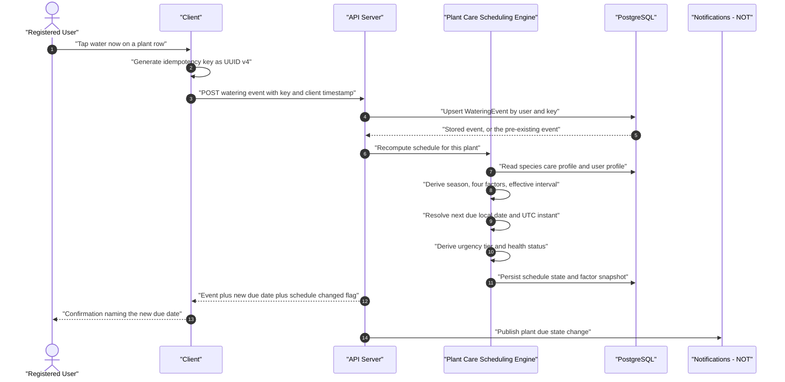
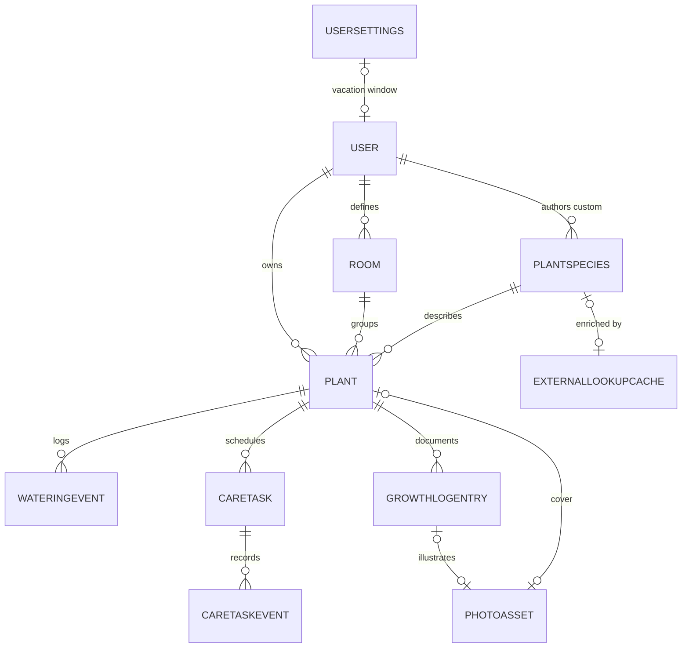

# Module Specification — Plant Care (PLT)

| Field | Value |
| --- | --- |
| Document | PlantPal+ Module Specification — Plant Care |
| Version | 1.0 |
| Date | 2026-07-21 |
| Status | Baselined for Phase 1 sign-off |
| Owner | Rakshit — Project Lead and sole developer (STK-03) |
| Parent | [PlantPal+ Software Requirements Specification v1.0](../SRS.md) |
| Owned identifier prefix | `PLT` — `FR-PLT-nn`, `BR-PLT-nn`. Referenced only: `US-PLT-nn`, `UC-PLT-nn` |
| Standards basis | IEEE 830-1998 section structure, ISO/IEC/IEEE 29148:2018 requirement-quality rules |
| Counts | 28 functional requirements, 38 business rules, 58 catalogued edge cases |

---

## Table of contents

1. [Purpose and scope](#1-purpose-and-scope)
2. [Actors and stakeholders](#2-actors-and-stakeholders)
3. [Capability overview](#3-capability-overview)
4. [Functional requirements](#4-functional-requirements)
5. [Business rules](#5-business-rules)
6. [Data entities touched](#6-data-entities-touched)
7. [External interfaces](#7-external-interfaces)
8. [Edge cases and boundary conditions](#8-edge-cases-and-boundary-conditions)
9. [Deferred and out of scope for v1.0](#9-deferred-and-out-of-scope-for-v10)
10. [Traceability stub](#10-traceability-stub)

---

## 1. Purpose and scope

### 1.1 Purpose

This document is the authoritative functional specification for the **Plant Care** module of PlantPal+, identifier prefix `PLT`. It owns everything from "what species is this plant" through "when must it next be watered" to "how has it grown over a year".

Plant Care is the module that carries GOAL-03: *the product shall compute each plant's next watering date from species, season, hemisphere, light exposure, pot size, pot material and indoor climate rather than from a fixed period*. That computation — specified in full in [BR-PLT-04](#br-plt-04--season-factor-f_season) through [BR-PLT-09](#br-plt-09--anchor-next-due-date-and-dst-correctness) — is the product's signature differentiator and the single most heavily specified item in this document. Every threshold, multiplier and rounding rule is written out so that a Phase 3 implementer needs no further clarification and an academic evaluator can verify the model without inference.

The document is written for two audiences simultaneously: an academic evaluator checking rigour and traceability, and an engineer implementing the module in Phase 3.

### 1.2 Scope — capabilities owned by this module

| # | In-scope capability | One-line definition | Primary requirements |
| --- | --- | --- | --- |
| S-01 | Species catalogue | A seeded, canonical catalogue of at least 60 species with a complete quantified care profile, searchable and browsable. | FR-PLT-01, FR-PLT-02 |
| S-02 | Custom species | User-authored private species records used when the seeded catalogue does not contain the plant. | FR-PLT-03 |
| S-03 | Perenual enrichment | Optional, feature-flagged, cached supplementary species content that never overrides canonical seeded numbers. | FR-PLT-04 |
| S-04 | Plant records | Creating, editing, viewing and listing the user's own plant instances with placement and pot context. | FR-PLT-05, FR-PLT-06 |
| S-05 | Smart watering algorithm | The deterministic computation of an effective watering interval and a next-due instant from species, season, light, pot and environment. | FR-PLT-07, FR-PLT-08, FR-PLT-09 |
| S-06 | Watering actions | Water now, back-dated watering, snooze, skip with reason, bulk water, correct or delete a logged watering. | FR-PLT-10 to FR-PLT-15 |
| S-07 | Urgency and health derivation | Ordered urgency tiers and the derived plant health status. | FR-PLT-16, FR-PLT-17 |
| S-08 | Non-watering care tasks | Fertilise, repot, prune, rotate, mist and pest check, each with its own cadence and season sensitivity. | FR-PLT-18, FR-PLT-19 |
| S-09 | Growth log | Dated entries with optional photo, height, leaf count, note and health rating. | FR-PLT-20 |
| S-10 | Photo timeline and comparison | Chronological scrubbing of growth photos and a before-and-after comparison of any two entries. | FR-PLT-21, FR-PLT-22 |
| S-11 | Plant history charts | Height, leaf count and actual watering-gap time series per plant. | FR-PLT-23 |
| S-12 | Adherence measurement | A per-plant watering adherence percentage over a selectable window. | FR-PLT-24 |
| S-13 | Vacation mode | A date-range pause of plant reminders with a defined catch-up rule. | FR-PLT-26 |
| S-14 | Lifecycle management | Archive with a reason, restore, and soft then hard delete with defined data retention. | FR-PLT-27 |
| S-15 | Discovery surfaces | Plant list search, filter, sort, grid or list view, and every empty and first-run state. | FR-PLT-28 |
| S-16 | Contextual care tips | Species care guidance surfaced at the moment it is relevant. | FR-PLT-25 |
| S-17 | Temporal correctness | Correct behaviour across timezone changes, hemisphere changes, DST transitions and retroactive edits. | BR-PLT-09, BR-PLT-34 |

### 1.3 Explicitly excluded from this module

Each exclusion names the owning subsystem so that nothing falls between modules. Items marked *product-level Wont* carry MoSCoW `Wont` for v1.0 across the whole product.

| # | Excluded | Reason and owner |
| --- | --- | --- |
| X-01 | Push notification delivery, quiet hours, digest batching, device token management, retry of failed sends | Owned by Notifications, prefix `NOT`. Plant Care publishes due state and consumes nothing back. |
| X-02 | The node-cron tick, the scheduler horizon and per-tick throughput | Owned by `NOT`. Plant Care defines only what "due" means. |
| X-03 | Cross-module daily dashboard composition and ordering | Owned by `DSH`. Plant Care supplies a due-today plant collection. |
| X-04 | Streak counting, achievement definitions and unlock logic | Owned by `GAM`. Plant Care emits watering and care-task events. |
| X-05 | Photo upload pipeline, resize, compression, EXIF stripping, signed URLs, CDN delivery, thumbnails, orphan cleanup, storage quota | Owned by `SYS`. Plant Care states only the plant-specific limits and failure behaviour, in BR-PLT-25. |
| X-06 | Offline queue mechanics, idempotency-key transport, delta-sync cursor and tombstones | Owned by `SYS`. Plant Care states only which of its actions are queueable, in BR-PLT-37. |
| X-07 | User hemisphere, IANA timezone, unit system, locale, week start and preferred reminder time as stored profile fields | Owned by `ACC` and `SET`. Plant Care consumes them as inputs. |
| X-08 | Authentication, session handling and the ownership-enforcement mechanism | Owned by `ACC` and NFR-SEC-14. Plant Care restates the ownership rule as BR-PLT-36 but does not define the mechanism. |
| X-09 | Account-wide JSON export and account erasure | Owned by `ACC` and `SYS`, satisfying NFR-PRIV-05 and NFR-PRIV-06. Plant Care states only what its rows contribute. |
| X-10 | The feature-flag mechanism itself | Owned by `SYS`. Plant Care declares one flag name, `PLT_PERENUAL_ENRICHMENT`. |
| X-11 | Soil-moisture sensors, smart pots, Bluetooth or IoT hardware | Product-level Wont. No budget (CON-01, CON-13), no device, and not achievable by a solo developer in one semester (CON-02). |
| X-12 | Plant identification from a photo, and plant-disease diagnosis from a photo | Product-level Wont. Requires a paid vision API or a model that cannot be hosted on a free tier, and disease diagnosis carries an advice-safety burden the project deliberately avoids under D-07. |
| X-13 | Weather- or rainfall-driven schedule adjustment | Product-level Wont for v1.0. Every candidate API with a usable free tier requires a key and location data, conflicting with CON-01 and NFR-PRIV-01. Recorded as deferred in section 9. |
| X-14 | Shared or household plants, multiple carers, delegation | Product-level Wont. Single-user ownership is assumed product-wide (ASM-03). |
| X-15 | A social feed, plant swapping or a marketplace | Product-level Wont. |
| X-16 | Automatic pot-size detection, augmented-reality measurement of plant height | Product-level Wont. |
| X-17 | A fertiliser product catalogue, dosage calculators or chemical guidance | Product-level Wont for v1.0. A fertilise task records only that fertilising happened. |

### 1.4 Terminology used in this document

| Term | Meaning in this module |
| --- | --- |
| Plant | One instance owned by one user — entity `ENT-10 Plant`. Never a species. |
| Species | A catalogue record — entity `ENT-08 PlantSpecies` — either seeded and global, or custom and private. |
| Care profile | The quantified numeric part of a species record consumed by the watering engine. |
| Watering event | An append-only record, `ENT-11 WateringEvent`, that a watering, skip or snooze happened at a point in time. |
| Anchor | The single watering event whose local date the current schedule is computed from: always the latest non-deleted event with `action = WATERED`. |
| Cycle | The interval between the anchor and the next due date. |
| Effective interval | The clamped, rounded output of the smart watering algorithm for a given plant at a given moment, in whole days. |
| Urgency tier | A derived, module-owned classification of how close to or past due a plant is. |
| Health status | The derived `PlantHealthStatus` of a plant, one of `THRIVING`, `NEEDS_ATTENTION`, `CRITICAL`, `DORMANT`. |
| Lifecycle status | The persisted `PlantLifecycleStatus`, one of `ACTIVE`, `VACATION_PAUSED`, `ARCHIVED`, `DELETED`. |
| Local date | The calendar date in the user's IANA timezone, stored alongside every UTC instant per BR-ENT-04 and NFR-DATA-01. |

### 1.5 Release allocation summary

Per D-02 every requirement carries a MoSCoW priority and a target release, and every release leaves a demoable slice. The module is partial at v0.1 and v0.5 and complete at v1.0, matching the product release plan.

| Release | Plant Care content | Requirements |
| --- | --- | --- |
| v0.1 Walking Skeleton | Create a plant against a stub species, log a watering, see a next due date. | FR-PLT-05, FR-PLT-10 |
| v0.5 Alpha | The seeded catalogue, species search, plant editing, the full watering algorithm, urgency tiers and the plant list. | FR-PLT-01, FR-PLT-02, FR-PLT-06, FR-PLT-07, FR-PLT-08, FR-PLT-09, FR-PLT-16, FR-PLT-28 |
| v1.0 MVP | Custom species, back-dating, snooze, skip, bulk water, corrections, health status, care tasks, growth log, timeline, charts, adherence, tips, vacation mode and archiving. | FR-PLT-03, FR-PLT-11 to FR-PLT-15, FR-PLT-17 to FR-PLT-21, FR-PLT-23 to FR-PLT-27 |
| v1.1 Post-MVP | Perenual enrichment and the before-and-after comparison. | FR-PLT-04, FR-PLT-22 |

MoSCoW distribution across the 28 requirements: **14 Must, 12 Should, 2 Could, 0 Wont**. The 14 Musts alone constitute a shippable plant tracker — a user can hold a catalogue-backed plant, receive a correctly computed due date, log a watering, see urgency and health, keep a growth log, find plants in a list and retire a plant.

---

## 2. Actors and stakeholders

### 2.1 Actors

| Actor | Type | Role in this module |
| --- | --- | --- |
| Registered User | Primary, human | Owns plants, performs every care action, reads every view. The only human actor with write access to plant data. |
| First-run User | Primary, human, specialisation of Registered User | A registered user holding zero plants. Distinguished because every empty and first-run state is a stated requirement (BR-PLT-30 clause 6, NFR-USAB-06). |
| Plant Care Scheduling Engine | Internal, system | The deterministic component that recomputes the effective interval, next due instant, urgency tier and health status. Invoked synchronously after every mutating action and by the nightly recompute job. |
| Nightly Recompute Job | Secondary, system | A once-per-user-local-day job that re-evaluates season, urgency and health for every non-archived plant, so a plant whose state changes only because the date changed is still correct without user action. |
| Reminder Scheduler | Secondary, system, owned by `NOT` | Reads plant due state on each cron tick and generates reminders. Never mutates plant data. |
| Media Service | Secondary, system, owned by `SYS` | Issues signed upload URLs and stores cover photos and growth photos. Failure of this actor must never lose a growth entry. |
| Perenual API | External, third party, feature-flagged | Supplies optional supplementary species content (DEP-08). The product must be fully functional with this actor absent. |
| Seed Data Loader | Secondary, system, developer-operated | Loads and versions the canonical species catalogue at deploy time, deterministically per NFR-DATA-07. |
| Gamification Engine | Secondary, system, owned by `GAM` | Consumes watering and care-task events to advance streaks and achievements. |
| Dashboard Aggregator | Secondary, system, owned by `DSH` | Consumes the due-today, overdue and critically-overdue collections. |
| Offline Sync Queue | Secondary, system, owned by `SYS` | Replays queued append-only plant care writes with their idempotency keys. |

### 2.2 Stakeholders with an interest in this module

| Stakeholder | Interest in Plant Care |
| --- | --- |
| STK-01 End user | Reminders that are correct, and logging that costs almost no attention. Persona PER-02 Marcus Oyelaran is the plant-first hobbyist and the primary persona for this module. |
| STK-02 Project supervisor and academic evaluator | The watering algorithm is the module most likely to be read closely for rigour; every multiplier is therefore tabulated and every worked example is a normative test vector. |
| STK-03 Project Lead | Must build the whole module alone within CON-02, which is why every capability here is bounded by an explicit quota or ceiling. |
| STK-05 Pilot cohort testers | Supply MET-14, median per-plant watering adherence. |
| STK-08 Third-party data providers | Perenual attribution obligations under NFR-LEGL-04, satisfied by BR-PLT-32 clause 6. |
| STK-10 Accessibility reviewers | Urgency tier and health status must never be carried by colour alone (NFR-A11Y-08), and every chart needs a text alternative (NFR-A11Y-05). |

### 2.3 Personas most affected

| Persona | Relationship to this module |
| --- | --- |
| PER-02 Marcus Oyelaran, plant-first hobbyist | Primary. Drives the species catalogue, the growth log, the photo timeline, room grouping and the plant list. |
| PER-01 Aditi Sharma, time-poor multi-module professional | Drives the one-tap water action and bulk watering. |
| PER-03 Mia Castellano, Southern-hemisphere athlete | Drives hemisphere-correct season derivation (BR-PLT-03) and the hemisphere-change rule (BR-PLT-34). |
| PER-04 Harold Whitfield, assistive-technology user | Drives non-colour urgency cues, chart text alternatives and plain, non-alarming status copy. |
| PER-05 Sofia Lindqvist, budget device on a metered connection | Drives the offline queueable set (BR-PLT-37), photo deferral (BR-PLT-25 clause 5) and list virtualisation. |

---

## 3. Capability overview

### 3.1 Feature tree

```mermaid
flowchart TD
  ROOT["Plant Care - PLT"]

  ROOT --> K["1 Species knowledge"]
  K --> K1["1.1 Seeded canonical catalogue, at least 60 species - FR-PLT-01"]
  K --> K2["1.2 Catalogue search, filter and detail view - FR-PLT-02"]
  K --> K3["1.3 Custom species authoring - FR-PLT-03"]
  K --> K4["1.4 Perenual enrichment behind a feature flag - FR-PLT-04"]

  ROOT --> P["2 Plant records"]
  P --> P1["2.1 Create a plant with optional cover photo - FR-PLT-05"]
  P --> P2["2.2 Edit a plant with schedule-affecting field detection - FR-PLT-06"]
  P --> P3["2.3 Archive, restore, soft delete, hard delete - FR-PLT-27"]

  ROOT --> E["3 Smart watering engine"]
  E --> E1["3.1 Season derivation from hemisphere and date - BR-PLT-03"]
  E --> E2["3.2 Four multiplier factors, season light pot environment - BR-PLT-04 to BR-PLT-07"]
  E --> E3["3.3 Effective interval, rounding and clamping - FR-PLT-07"]
  E --> E4["3.4 Next due instant in the user timezone, DST safe - FR-PLT-08"]
  E --> E5["3.5 Recompute triggers and the nightly job - FR-PLT-09"]

  ROOT --> W["4 Watering actions"]
  W --> W1["4.1 Water now, offline queueable - FR-PLT-10"]
  W --> W2["4.2 Back-dated watering - FR-PLT-11"]
  W --> W3["4.3 Snooze one to seven days - FR-PLT-12"]
  W --> W4["4.4 Skip this cycle with a reason - FR-PLT-13"]
  W --> W5["4.5 Bulk water up to fifty plants - FR-PLT-14"]
  W --> W6["4.6 Correct or delete a logged watering - FR-PLT-15"]

  ROOT --> S["5 Status derivation"]
  S --> S1["5.1 Watering urgency tiers - FR-PLT-16"]
  S --> S2["5.2 Plant health status - FR-PLT-17"]

  ROOT --> C["6 Care tasks beyond watering"]
  C --> C1["6.1 Task catalogue, cadence, per-plant enablement - FR-PLT-18"]
  C --> C2["6.2 Complete or skip an occurrence - FR-PLT-19"]
  C --> C3["6.3 Winter dormancy suppression of fertilising - BR-PLT-22"]

  ROOT --> G["7 Growth log and visual history"]
  G --> G1["7.1 Create a growth entry - FR-PLT-20"]
  G --> G2["7.2 Photo timeline with chronological scrubbing - FR-PLT-21"]
  G --> G3["7.3 Before and after comparison - FR-PLT-22"]
  G --> G4["7.4 Metric time-series chart - FR-PLT-23"]

  ROOT --> I["8 Insight and guidance"]
  I --> I1["8.1 Watering adherence percentage - FR-PLT-24"]
  I --> I2["8.2 Contextual care tips and light mismatch advisory - FR-PLT-25"]

  ROOT --> D["9 Continuity and discovery"]
  D --> D1["9.1 Vacation mode and catch-up - FR-PLT-26"]
  D --> D2["9.2 Plant list, search, filter, sort, view mode, empty states - FR-PLT-28"]
```



### 3.2 The one flow every reader must understand

Every mutating action in this module funnels through one deterministic recomputation. That single funnel is why the module has no place where two code paths can disagree about a due date, and it is the property NFR-MAIN-04 requires — the rule is implemented exactly once inside the shared package and consumed unchanged by the API, the web client and the mobile client.



---

## 4. Functional requirements

Every requirement below is stated once as a single testable `shall` sentence, carries exactly one MoSCoW priority, one target release, one responsible actor and one verification method, and traces upward to a goal and downward to a user story and a use case.

**Verification methods.** *Test* — an automated unit or integration test. *Demonstration* — a scripted manual run-through on a reference device or browser. *Inspection* — review of code, data, configuration or document. *Analysis* — calculation or model-based argument.

**Error codes.** Every code named below is carried inside the standard `SYS` JSON error envelope. User-visible messages are shown in English for readability; per D-08 and NFR-I18N-01 each is resolved from the locale catalogue by a stable key and no literal appears in a component.

### 4.1 FR-PLT-01 — Seeded species catalogue

| Attribute | Value |
| --- | --- |
| Priority | Must |
| Release | v0.5 Alpha |
| Actor | Seed Data Loader |
| Verification | Inspection |
| Traces to | GOAL-03, ASM-05, D-03 · US-PLT-02 · UC-PLT-05 · NFR-DATA-07, NFR-RELI-02 |

**Requirement.** The system shall provide a seeded species catalogue containing at least 60 `ENT-08 PlantSpecies` records with `source = SEEDED`, each populated with every mandatory care-profile field defined in BR-PLT-01 clause 2.

**Rationale.** Decision D-03 requires the product to remain fully functional with every external integration disabled, so the seeded catalogue is canonical and Perenual is decoration. Without quantified per-species numbers the signature watering algorithm has no input at all. ASM-05 assumes 60 curated species cover at least 80 percent of the plants a typical hobbyist owns.

**Inputs and validation**

| Field | Type | Constraints | Required |
| --- | --- | --- | --- |
| Seed file | Version-tagged data file loaded by a migration | At least 60 rows; category composition exactly as BR-PLT-01 clause 3 | Yes |
| `slug` | string | 3 to 60 characters, lower kebab case, globally unique among rows where `user_id IS NULL` | Yes |
| `common_name` | string | 1 to 80 characters | Yes |
| `botanical_name` | string | 1 to 120 characters, unique case-insensitively across seeded rows | Yes |
| `family` | string | 1 to 60 characters | Yes |
| `category` | enum `SpeciesCategory` | One of the 11 members in BR-PLT-01 clause 3 | Yes |
| `base_interval_days` | integer, days | 1 to 120 | Yes |
| `min_interval_days` | integer, days | 1 to 120, strictly less than `base_interval_days` | Yes |
| `max_interval_days` | integer, days | 2 to 365, strictly greater than `base_interval_days` | Yes |
| `overdue_tolerance_days` | integer, days | 1 to 21 | Yes |
| `preferred_light` | enum `LightExposure` | One of `LOW`, `MEDIUM`, `BRIGHT_INDIRECT`, `DIRECT_SUN` | Yes |
| `humidity_preference_level` | integer | 1 to 5 | Yes |
| `is_winter_dormant` | boolean | `true` or `false` | Yes |
| `care_difficulty` | enum `CareDifficulty` | `BEGINNER`, `INTERMEDIATE`, `ADVANCED` | Yes |
| `toxicity` | enum `ToxicityFlag` | `NON_TOXIC`, `TOXIC_TO_PETS`, `TOXIC_TO_HUMANS`, `TOXIC_TO_BOTH`, `UNKNOWN` | Yes |
| `care_tip_keys` | array of locale keys | 3 to 6 entries, each resolving to text of 20 to 200 characters | Yes |
| `fertilise_interval_days` | integer, days | 1 to 730, defaulted from BR-PLT-21 clause 2 | Yes |
| `repot_interval_days` | integer, days | 30 to 1095, defaulted from BR-PLT-21 clause 3 | Yes |
| `data_completeness_pct` | decimal, percent | 0.00 to 100.00 | Yes |
| `catalogue_version` | string | Semantic version of the seed file | Yes |

**Processing rules.** Loading is idempotent and keyed by `slug` with deterministic UUID version 5 primary keys per NFR-DATA-07, so re-running a deploy cannot duplicate or renumber rows. The loader validates every invariant of BR-PLT-01 before writing anything. Seeded rows are created with `user_id = NULL` and `source = SEEDED` and are never writable through the API (BR-PLT-36 clause 2). The 30 archetype rows of BR-PLT-01 clause 4 must appear verbatim.

**Outputs.** Global, read-only `ENT-08 PlantSpecies` rows and their associated `care_tip_keys`, plus a recorded `catalogue_version`.

**Alternate and error flows**

| Condition | System response | User-visible message |
| --- | --- | --- |
| Any seed row fails an invariant of BR-PLT-01 | The whole load aborts inside its transaction, the previous catalogue version remains in place, and the offending `slug` and field name are written to the deploy log | None — this is a deploy-time failure with no user surface |
| The migration is re-run against an already-seeded database | Rows are upserted by `slug` with identical content, producing zero changes and zero duplicates | None |
| A migration must be rolled back | The down script restores the previous catalogue version, proving reversibility per NFR-DATA-06 | None |
| A seeded species is referenced by a user plant when the catalogue version changes | The species row is updated in place; every plant referencing it is queued for recompute per BR-PLT-10 trigger T14 | "We refreshed our care data. Some watering dates have been updated." |

---

### 4.2 FR-PLT-02 — Species catalogue search

| Attribute | Value |
| --- | --- |
| Priority | Must |
| Release | v0.5 Alpha |
| Actor | Registered User |
| Verification | Test |
| Traces to | GOAL-02, GOAL-03 · US-PLT-02 · UC-PLT-05 · NFR-PERF-01, NFR-SCAL-05 |

**Requirement.** The system shall return species catalogue results matching a user-supplied query of 1 to 60 characters against `common_name`, `botanical_name` and `family`, ranked by the ordering defined in BR-PLT-30 clause 2.

**Rationale.** Sixty species is too many to scroll during the add-plant flow, which is the most abandonment-prone screen in the module. Search is what keeps FR-PLT-05 inside the 3-tap budget of GOAL-02 and NFR-USAB-01.

**Inputs and validation**

| Field | Type | Constraints | Required |
| --- | --- | --- | --- |
| `q` | string | 1 to 60 characters after trimming and Unicode NFKC normalisation | Yes |
| `category` | array of enum `SpeciesCategory` | Zero or more members; multiple values are OR-ed | No |
| `care_difficulty` | array of enum `CareDifficulty` | Zero or more members | No |
| `toxicity` | array of enum `ToxicityFlag` | Zero or more members | No |
| `preferred_light` | array of enum `LightExposure` | Zero or more members | No |
| `include_custom` | boolean | Default `true` | No |
| `limit` | integer | 1 to 50, default 25 | No |
| `cursor` | opaque string | Keyset cursor per NFR-SCAL-04 | No |

**Processing rules.** Matching is case-insensitive and accent-insensitive across `common_name`, `botanical_name` and `family`. Ranking follows BR-PLT-30 clause 2 exactly: exact match, then prefix match on `common_name`, then prefix match on any secondary field, then substring match, then remaining matches; ties break on the caller's own custom species before seeded species, then alphabetically by `common_name`; results are additionally boosted by the count of the caller's plants referencing that species. The caller's `USER_CUSTOM` species are included when `include_custom` is `true` and are never visible to any other user (BR-PLT-36 clause 3). The client debounces keystrokes by 250 ms.

**Outputs.** A cursor-paginated, ranked array of species summaries, each carrying `id`, `common_name`, `botanical_name`, `category`, `base_interval_days`, `care_difficulty`, `toxicity` and `source`.

**Alternate and error flows**

| Condition | System response | User-visible message |
| --- | --- | --- |
| Zero results | HTTP 200 with an empty array; the client renders the no-species empty state offering the create-custom-species action pre-filled with `q` | "We do not have that one yet. Create it as your own species?" |
| `q` shorter than 1 character after trimming | Rejected with `PLT_QUERY_TOO_SHORT` | "Type at least one character to search." |
| `q` longer than 60 characters | Rejected with `PLT_QUERY_TOO_LONG` | "Search terms can be up to 60 characters." |
| `limit` above 50 | Rejected with `PLT_PAGE_SIZE_TOO_LARGE` | None — client-side defect, not a user surface |
| The device is offline | The last cached result set for the same query is served from the persisted TanStack Query cache with a stale indicator; a query with no cached result shows the offline state | "You are offline. Showing your last saved results." |

---

### 4.3 FR-PLT-03 — Create a custom species

| Attribute | Value |
| --- | --- |
| Priority | Should |
| Release | v1.0 MVP |
| Actor | Registered User |
| Verification | Test |
| Traces to | GOAL-03, ASM-05 · US-PLT-03 · UC-PLT-05 · NFR-SEC-08, NFR-SEC-14 |

**Requirement.** The system shall create an `ENT-08 PlantSpecies` record with `source = USER_CUSTOM` and `user_id` set to the requesting user, readable and writable only by that user, subject to the field limits and quotas in BR-PLT-31.

**Rationale.** Sixty species cannot cover a real collection; ASM-05 claims only 80 percent coverage. Without this capability the user must mislabel a plant, which silently corrupts its watering schedule and destroys trust in every date the app shows.

**Inputs and validation**

| Field | Type | Constraints | Required |
| --- | --- | --- | --- |
| `common_name` | string | 1 to 80 characters after trimming; unique case-insensitively among that user's live custom species | Yes |
| `botanical_name` | string | 0 to 120 characters | No |
| `family` | string | 0 to 60 characters | No |
| `category` | enum `SpeciesCategory` | One of the 11 members; default `OTHER` | Yes |
| `base_interval_days` | integer, days | 1 to 120 | Yes |
| `min_interval_days` | integer, days | 1 to 120, strictly less than `base_interval_days`; defaulted per BR-PLT-31 clause 2 when blank | No |
| `max_interval_days` | integer, days | 2 to 365, strictly greater than `base_interval_days`; defaulted per BR-PLT-31 clause 2 when blank | No |
| `overdue_tolerance_days` | integer, days | 1 to 21; defaulted per BR-PLT-31 clause 2 when blank | No |
| `preferred_light` | enum `LightExposure` | One of the 4 members | Yes |
| `humidity_preference_level` | integer | 1 to 5; default 3 | No |
| `is_winter_dormant` | boolean | Default `false` | No |
| `care_difficulty` | enum `CareDifficulty` | Default `INTERMEDIATE` | No |
| `toxicity` | enum `ToxicityFlag` | Default `UNKNOWN`; never rendered as safe | No |
| `care_tip_keys` | array | 0 to 6 user-authored tips of up to 200 characters each | No |

**Processing rules.** The record is stored with `source = USER_CUSTOM`, `user_id` set and `slug` null, and is immediately selectable in the create-plant flow. Blank numeric fields are filled by the defaults of BR-PLT-31 clause 2 before validation of the strict ordering invariant `min_interval_days < base_interval_days < max_interval_days`. `data_completeness_pct` is computed as the percentage of populated optional care-profile fields and drives `schedule_confidence` per BR-PLT-11 clause 4. Editing a custom species recomputes every plant referencing it, per BR-PLT-10 trigger T5. A custom species is never enriched from Perenual and never included in aggregate catalogue statistics.

**Outputs.** The created private species record with a complete care profile, plus, on edit, the count of plants whose schedule was recomputed.

**Alternate and error flows**

| Condition | System response | User-visible message |
| --- | --- | --- |
| A live custom species of the same user already has this `common_name`, case-insensitively | Rejected with `PLT_SPECIES_NAME_DUPLICATE`; nothing is created | "You already have a species called that." |
| `min_interval_days` is not strictly less than `base_interval_days`, or `base_interval_days` is not strictly less than `max_interval_days` | Rejected with `PLT_SPECIES_INTERVAL_INVALID` | "The shortest interval must be less than the usual interval, which must be less than the longest." |
| The user already holds 100 live custom species | Rejected with `PLT_CUSTOM_SPECIES_QUOTA_EXCEEDED` | "You have reached the limit of 100 custom species. Delete one you no longer use to add another." |
| Deletion is requested while any plant, including an archived plant, references the species | Deletion is refused; soft hiding from the picker is offered instead, preserving referential integrity per BR-PLT-31 clause 5 | "3 plants still use this species. We can hide it from the picker instead." |
| The device is offline | The action is refused, the entered form values are preserved in full per NFR-USAB-08, and the offline state names the reason | "Creating a species needs a connection. Your details are saved on this screen." |

---

### 4.4 FR-PLT-04 — Perenual species enrichment

| Attribute | Value |
| --- | --- |
| Priority | Could |
| Release | v1.1 Post-MVP |
| Actor | Perenual API |
| Verification | Test |
| Traces to | D-03, DEP-08, OQ-04 · US-PLT-02 · UC-PLT-05 · NFR-RELI-02, NFR-RELI-04, NFR-LEGL-04 |

**Requirement.** The system shall, when the feature flag `PLT_PERENUAL_ENRICHMENT` is enabled, retrieve supplementary species content from the Perenual API and persist it in the `ENT-47 ExternalLookupCache` under the rules in BR-PLT-32.

**Rationale.** Enrichment adds photography and richer prose the project cannot author for 60 species, at zero monetary cost, without ever becoming load-bearing. D-03 requires that every external lookup result is cached in our own database and that the product remains fully functional with the integration disabled.

**Inputs and validation**

| Field | Type | Constraints | Required |
| --- | --- | --- | --- |
| `PLT_PERENUAL_ENRICHMENT` | boolean feature flag | Default `false`, evaluated server-side | Yes |
| `species_id` | UUID | Must resolve to a species with `source = SEEDED` | Yes |
| Lookup key | string | The species `botanical_name`, normalised to lower case | Yes |
| Request timeout | integer, milliseconds | Exactly 3000 | Yes |
| Retry policy | — | Exactly 1 retry after 500 ms, per NFR-RELI-04 | Yes |
| Circuit breaker | — | Opens after 5 consecutive failures, stays open 15 minutes | Yes |
| Daily request budget | integer | 90 requests per UTC day against the 100-per-day free tier | Yes |
| Cache time to live | integer, days | 90 | Yes |

**Processing rules.** A call is made only when the flag is on, only for a seeded species, only on the species detail view, and only when no cache row exists or the cached row is older than 90 days. Enrichment may write only the presentational fields `description`, `image_url`, `image_attribution`, `sunlight_text`, `propagation_text` and `origin_text`. It must never write `base_interval_days`, `min_interval_days`, `max_interval_days`, `overdue_tolerance_days` or `is_winter_dormant`; any such write is a defect. Every displayed enrichment field carries a visible provider label, and the licence obligation is discharged once on the species detail view and once in the in-app Data Sources screen per NFR-LEGL-04.

**Outputs.** A cached row in `ENT-47 ExternalLookupCache` carrying `provider = PERENUAL`, the provider reference, the raw payload, `fetched_at`, `expires_at` and `attribution_text`, and the enriched presentational fields on the species detail view.

**Alternate and error flows**

| Condition | System response | User-visible message |
| --- | --- | --- |
| The flag is off | No call is ever made and no user-interface surface references the provider | None — the surface is identical to the enriched case minus the extra content |
| Request timeout at 3000 ms, a non-200 response, or a malformed payload | One retry after 500 ms, then silent degradation to seeded content; the failure is logged for NFR-OBSV-03 | None — silent by design |
| 5 consecutive failures | The circuit breaker opens for 15 minutes and no further calls are attempted | None |
| The daily budget of 90 requests is exhausted | No call is made until 00:00 UTC; seeded content is shown | None |
| Perenual returns a care interval contradicting the seed | The value is discarded before persistence; only presentational fields are written | None |

---

### 4.5 FR-PLT-05 — Create a plant

| Attribute | Value |
| --- | --- |
| Priority | Must |
| Release | v0.1 Walking Skeleton |
| Actor | Registered User |
| Verification | Test |
| Traces to | GOAL-01, GOAL-03 · US-PLT-01 · UC-PLT-01 · NFR-PERF-02, NFR-USAB-02, NFR-USAB-08 |

**Requirement.** The system shall create an `ENT-10 Plant` record owned by the requesting user from the attribute set and validation limits defined in BR-PLT-38 clause 1, and shall compute that plant's initial watering schedule before returning a response.

**Rationale.** This is the first write of the walking skeleton and the entry point to every other capability in the module. Computing the schedule synchronously, before the response, is what lets the confirmation screen name a real due date rather than a spinner, which is what makes the 90-second onboarding budget of NFR-USAB-02 achievable.

**Inputs and validation**

| Field | Type | Constraints | Required |
| --- | --- | --- | --- |
| `nickname` | string | 1 to 60 characters after trimming; duplicates permitted with a non-blocking warning | Yes |
| `species_id` | UUID | Must resolve to a species with `source = SEEDED`, or a `USER_CUSTOM` species owned by the caller | Yes |
| `room_id` | UUID | Must resolve to an `ENT-09 Room` owned by the caller; may be created inline | No |
| `placement` | enum `PlacementType` | `INDOOR` or `OUTDOOR`; default `INDOOR` | Yes |
| `light_exposure` | enum `LightExposure` | `LOW`, `MEDIUM`, `BRIGHT_INDIRECT`, `DIRECT_SUN`; pre-filled from the species `preferred_light` | Yes |
| `pot_diameter_cm` | decimal, centimetres | 2.0 to 200.0, one decimal place; null means the diameter factor is 1.000 | No |
| `pot_material` | enum `PotMaterial` | `TERRACOTTA`, `PLASTIC`, `CERAMIC_GLAZED`, `METAL`, `CONCRETE`, `FABRIC`, `OTHER`; null means the material factor is 1.000 | No |
| `pot_material_other` | string | 1 to 40 characters; required when `pot_material = OTHER` | Conditional |
| `has_drainage` | boolean | Null means unknown and is treated as `true` for the factor | No |
| `soil_type` | enum `SoilType` | `STANDARD_POTTING`, `CACTUS_SUCCULENT`, `ORCHID_BARK`, `PEAT_BASED`, `COCO_COIR`, `SEMI_HYDRO_LECA`, `GARDEN_SOIL`, `OTHER`; null means the soil factor is 1.000 | No |
| `soil_type_other` | string | 1 to 40 characters; required when `soil_type = OTHER` | Conditional |
| `indoor_climate` | enum `IndoorClimate` | `NONE`, `HEATED_DRY_WINTER`, `AIR_CONDITIONED`, `HUMID_ROOM`; default `NONE` | No |
| `acquired_on` | local date | Not before 1900-01-01 and not after the user's local today | No |
| `note` | string | 0 to 500 characters | No |
| `cover_photo_id` | UUID | Must resolve to an `ENT-42 PhotoAsset` owned by the caller | No |
| `last_watered_answer` | enum | `TODAY`, `YESTERDAY`, `DAYS_AGO`, `UNKNOWN`; default `TODAY` | Yes |
| `last_watered_days_ago` | integer, days | 0 to 30; required when `last_watered_answer = DAYS_AGO` | Conditional |

**Processing rules.** The plant is created with `lifecycle_status = ACTIVE`, or with `VACATION_PAUSED` when an account vacation window covers the user's local today per BR-PLT-28 clause 7. The anchor and `schedule_confidence` are established from `last_watered_answer` per BR-PLT-11 clause 2, creating a seed `ENT-11 WateringEvent` with `origin = SEED_ON_CREATE` for every answer except `UNKNOWN`. The scheduling engine then runs synchronously per FR-PLT-07 and FR-PLT-08 so the response already carries `effective_interval_days`, `next_due_local_date`, `next_due_at`, the urgency tier, `health_status` and the four-factor explanation snapshot. Creation requires connectivity per D-04 and BR-PLT-37 clause 2.

**Outputs.** The created plant with its computed schedule state, its factor snapshot, its derived urgency tier and health status, and any `ENT-12 CareTask` rows auto-created from the species `default_care_task_types`.

**Alternate and error flows**

| Condition | System response | User-visible message |
| --- | --- | --- |
| `nickname` empty after trimming | Rejected with `PLT_NICKNAME_REQUIRED`; the message is attached to the nickname field | "Give your plant a name." |
| `species_id` does not resolve, or resolves to another user's custom species | Rejected with `PLT_SPECIES_NOT_FOUND`, identically in both cases so ownership cannot be probed | "We could not find that species. Choose another or create your own." |
| `acquired_on` later than the user's local today | Rejected with `PLT_ACQUISITION_DATE_FUTURE` | "The date you got this plant cannot be in the future." |
| `pot_diameter_cm` outside 2.0 to 200.0 | Rejected with `PLT_POT_DIAMETER_OUT_OF_RANGE` | "Pot width should be between 2 cm and 200 cm." |
| `pot_material = OTHER` with no `pot_material_other` | Rejected with `PLT_POT_MATERIAL_OTHER_REQUIRED` | "Tell us what the pot is made of." |
| The user already holds 300 non-archived plants | Rejected with `PLT_PLANT_QUOTA_EXCEEDED`, offering archiving as the remedy | "You have reached 300 plants. Archive one you no longer care for to add another." |
| A new `room_id` would be the 51st distinct room | Rejected with `PLT_ROOM_QUOTA_EXCEEDED`, listing existing rooms | "You can have up to 50 rooms. Pick an existing one or rename another." |
| The species care profile is incomplete | The category fallback profile of BR-PLT-02 is applied, `schedule_confidence` is set to `LOW`, and the plant is still created | "This schedule uses a general profile. You can adjust the interval any time." |
| The device is offline | Creation is refused, every entered value is preserved on screen per NFR-USAB-08, and the offline state names the reason and the remedy | "Adding a plant needs a connection. We have kept everything you typed." |

---

### 4.6 FR-PLT-06 — Edit a plant

| Attribute | Value |
| --- | --- |
| Priority | Must |
| Release | v0.5 Alpha |
| Actor | Registered User |
| Verification | Test |
| Traces to | GOAL-03 · US-PLT-10 · UC-PLT-01, UC-PLT-09 · NFR-PERF-02, NFR-SEC-14 |

**Requirement.** The system shall update the attributes of an existing `ENT-10 Plant` owned by the requesting user and shall recompute that plant's watering schedule when, and only when, any attribute listed in BR-PLT-10 clause 1 trigger T4 has actually changed.

**Rationale.** Repotting, moving a plant to a new window, or correcting a wrong species must change the schedule, otherwise the algorithm quietly becomes wrong and the user has no way to tell. Equally, renaming a plant must not move its due date, because an unexplained date change reads as a defect and destroys trust in every future date.

**Inputs and validation**

| Field | Type | Constraints | Required |
| --- | --- | --- | --- |
| `plant_id` | UUID | Must resolve to a plant owned by the caller with `lifecycle_status` of `ACTIVE` or `VACATION_PAUSED` | Yes |
| Any subset of the FR-PLT-05 attributes | — | Identical limits to FR-PLT-05 and BR-PLT-38 clause 1 | No |
| `species_id` | UUID | May be changed to any species the caller can see | No |

**Processing rules.** The server compares each submitted value against the stored value and recomputes only when a schedule-affecting attribute — `species_id`, `light_exposure`, `pot_material`, `pot_diameter_cm`, `has_drainage`, `soil_type`, `placement`, `indoor_climate` — has actually changed. The anchor is never changed by an edit. When the recomputed `next_due_local_date` falls before the user's local today, it is set to the user's local today per BR-PLT-10 clause 4, because a profile-driven change must never manufacture retrospective lateness. The response reports the old and the new due date so the client can state the change explicitly.

**Outputs.** The updated plant, the recomputed schedule state and factor snapshot, and a boolean `schedule_changed` accompanied by `previous_next_due_local_date` and `next_due_local_date`.

**Alternate and error flows**

| Condition | System response | User-visible message |
| --- | --- | --- |
| Only schedule-neutral fields changed, for example `nickname`, `note` or `room_id` | The plant is updated, no recompute runs, `schedule_changed` is `false` and the due date is byte-identical | "Saved." |
| A schedule-affecting field changed | The schedule recomputes and both dates are returned | "Next watering moved from 24 July to 21 July." |
| The plant is archived | Rejected with `PLT_PLANT_ARCHIVED` | "This plant is archived. Restore it before editing." |
| The plant belongs to another user, or does not exist | Rejected with `PLT_PLANT_NOT_FOUND` in both cases identically, per BR-PLT-36 clause 3 | "We could not find that plant." |
| Any FR-PLT-05 validation limit is breached | The corresponding FR-PLT-05 error code is returned and no field is written | As FR-PLT-05 |
| The device is offline | The edit is refused and entered values are preserved | "Editing a plant needs a connection. We have kept your changes on this screen." |

---

### 4.7 FR-PLT-07 — Effective watering interval computation

| Attribute | Value |
| --- | --- |
| Priority | Must |
| Release | v0.5 Alpha |
| Actor | Plant Care Scheduling Engine |
| Verification | Test |
| Traces to | GOAL-03, MET-21 · US-PLT-10 · UC-PLT-09 · NFR-MAIN-03, NFR-MAIN-04, NFR-PORT-05 |

**Requirement.** The system shall compute a plant's effective watering interval in whole days as the species `base_interval_days` multiplied by the season factor, the light factor, the pot factor and the environment factor, rounded and clamped exactly as defined in BR-PLT-08.

**Rationale.** This is the requirement that differentiates PlantPal+ from a fixed-period reminder and satisfies GOAL-03. It is the requirement an academic evaluator will read most closely, so it is fully determined by written tables with no implementer judgement remaining. Per NFR-MAIN-04 and NFR-PORT-05 it is implemented exactly once as a pure function in the shared package, so mobile, web and server cannot diverge; NFR-MAIN-03 requires at least one test per business rule identifier and MET-21 targets at least 90 percent line coverage of that package.

**Inputs and validation**

| Field | Type | Constraints | Required |
| --- | --- | --- | --- |
| `base_interval_days` | integer, days | 1 to 120 from the species record, or the BR-PLT-02 fallback | Yes |
| `min_interval_days`, `max_interval_days` | integer, days | The species clamp bounds, or the BR-PLT-02 fallback | Yes |
| `hemisphere` | enum `Hemisphere` | `NORTHERN`, `SOUTHERN`, `EQUATORIAL`, read from the user profile | Yes |
| Evaluation local date | local date | The user's local date in the user's IANA timezone | Yes |
| `light_exposure` | enum `LightExposure` | One of the 4 members | Yes |
| `pot_material` | enum `PotMaterial` | One of the 7 members, or null | No |
| `pot_diameter_cm` | decimal, centimetres | 2.0 to 200.0, or null | No |
| `has_drainage` | boolean | Null is treated as `true` | No |
| `placement` | enum `PlacementType` | `INDOOR` or `OUTDOOR` | Yes |
| `soil_type` | enum `SoilType` | One of the 8 members, or null | No |
| `indoor_climate` | enum `IndoorClimate` | One of the 4 members; forced to `NONE` when `placement = OUTDOOR` | Yes |

Every factor input has a defined default, so the computation is total and can never fail for missing data.

**Processing rules.** `raw_interval = base_interval_days x f_season x f_light x f_pot x f_env`, where the four factors come from BR-PLT-04, BR-PLT-05, BR-PLT-06 and BR-PLT-07 respectively. All multiplication is performed in IEEE 754 double precision in the stated left-to-right order with no intermediate rounding, then rounded once half-up to an integer, then clamped to `[min_interval_days, max_interval_days]` and finally floored at 1 (BR-PLT-08 clauses 1 and 2). The six worked examples of BR-PLT-08 clause 5 are normative test vectors and must pass unchanged.

**Outputs.** `effective_interval_days` as a positive integer, plus the factor snapshot object of BR-PLT-08 clause 4 holding every factor, every sub-factor, the raw value, the rounded value, any clamp marker and the `algorithm_version`, persisted so the detail view can explain the number without recomputation and so adherence can later use the interval that was in force at the time.

**Alternate and error flows**

| Condition | System response | User-visible message |
| --- | --- | --- |
| The species care profile is missing or incomplete | The BR-PLT-02 category fallback profile is applied, the computation proceeds, and `schedule_confidence` is set to `LOW` | "This schedule is based on a general profile for this kind of plant." |
| The computed value is below `min_interval_days` | Clamped up to `min_interval_days`; the snapshot records `clamped: MIN` | "We keep this plant to a minimum of 2 days between waterings for its safety." |
| The computed value is above `max_interval_days` | Clamped down to `max_interval_days`; the snapshot records `clamped: MAX` | "We cap this plant at 60 days between waterings so it is never forgotten." |
| The rounded value is below 1 | Raised to 1 by the absolute floor | None — invisible; the clamp message above applies instead |
| The published multiplier tables change on deploy | `algorithm_version` increments, an Architecture Decision Record is added per NFR-MAIN-05, and every non-archived plant is recomputed per BR-PLT-10 trigger T14; historical snapshots are never rewritten | "We improved our watering model. Some dates have shifted slightly." |

---

### 4.8 FR-PLT-08 — Next watering due instant

| Attribute | Value |
| --- | --- |
| Priority | Must |
| Release | v0.5 Alpha |
| Actor | Plant Care Scheduling Engine |
| Verification | Test |
| Traces to | GOAL-03, RSK-05, ASM-15, DEP-14 · US-PLT-04 · UC-PLT-09 · NFR-DATA-01, NFR-DATA-02 |

**Requirement.** The system shall compute a plant's next watering due instant as the anchor local date plus the effective interval in calendar days, resolved to the user's preferred reminder time in the user's IANA timezone using the daylight-saving rules in BR-PLT-09 clause 3.

**Rationale.** A reminder that fires at 03:00 because the server did UTC arithmetic is the single most common defect class in reminder applications, and daylight-saving transitions make naive arithmetic wrong twice a year. RSK-05 records timezone and DST correctness as the highest-consequence silent-defect class in the whole product, and NFR-DATA-02 requires a reminder set for a given local wall-clock time to fire at that same local time across a transition.

**Inputs and validation**

| Field | Type | Constraints | Required |
| --- | --- | --- | --- |
| Anchor local date | local date | The `performed_local_date` of the anchor event, or the synthetic anchor of BR-PLT-11 | Yes |
| `effective_interval_days` | integer, days | 1 to 365, the FR-PLT-07 output | Yes |
| IANA timezone | string | A valid IANA zone identifier from the user profile | Yes |
| Preferred reminder time | local hour and minute | 00:00 to 23:59, default 09:00, owned by `SET` | Yes |

**Processing rules.** `next_due_local_date = add_calendar_days(anchor_local_date, effective_interval_days)`, performed on a civil date so that a day of 23 or 25 hours still counts as exactly one day. Adding a multiple of 86 400 seconds to an instant is explicitly forbidden. `next_due_at` is then obtained by resolving `next_due_local_date` together with the preferred reminder time through the IANA timezone database via the maintained date library named in DEP-14. The spring-forward gap and the autumn-fallback overlap are resolved by BR-PLT-09 clause 3 and never by hand-rolled offset arithmetic.

**Outputs.** `next_due_local_date` as a date, `next_due_at` as a UTC instant, and `computed_from_tz` recording the timezone identifier used, all persisted for reproducibility and audit.

**Alternate and error flows**

| Condition | System response | User-visible message |
| --- | --- | --- |
| The wall-clock time formed by the due date and the preferred reminder time does not exist because of a spring-forward gap | The due instant becomes the first valid instant after the gap, normally the requested time shifted forward by 60 minutes | None |
| The wall-clock time occurs twice because of an autumn-fallback overlap | The earlier of the two occurrences is used | None |
| The user's timezone identifier is unknown or empty | The engine falls back to UTC, raises an observability warning per NFR-OBSV-01, and still schedules the plant; the plant is never left unscheduled | None — the user surface is unchanged |
| The computed `next_due_at` is already in the past on the same local date | The due date stands and `NOT` delivers promptly; the module never silently pushes a due date to tomorrow to avoid a late send | "Due today." |
| A daylight-saving transition falls inside a cycle | The due calendar date does not move; only the resolved UTC instant shifts by the offset change | None |

---

### 4.9 FR-PLT-09 — Schedule recomputation triggers

| Attribute | Value |
| --- | --- |
| Priority | Must |
| Release | v0.5 Alpha |
| Actor | Plant Care Scheduling Engine |
| Verification | Test |
| Traces to | GOAL-03 · US-PLT-04, US-PLT-13 · UC-PLT-09 · NFR-PERF-02, NFR-SCAL-06, NFR-OBSV-06, NFR-RELI-07 |

**Requirement.** The system shall recompute a plant's stored schedule state within 2 000 milliseconds of any event in the trigger list defined in BR-PLT-10 clause 1, measured server-side from request receipt to transaction commit and excluding the client round trip.

**Rationale.** Derived state that is not refreshed at the right moments becomes stale, and stale urgency is indistinguishable from a defect to the user. The nightly trigger exists specifically because season, urgency and health can change with nothing but the passage of time and no user action at all.

**Inputs and validation**

| Field | Type | Constraints | Required |
| --- | --- | --- | --- |
| Trigger | enum | Exactly one of the 14 triggers T1 to T14 in BR-PLT-10 clause 1 | Yes |
| `plant_id` | UUID | Required for triggers T1 to T7 and T12 | Conditional |
| `user_id` | UUID | Required for triggers T8 to T11 and T13 | Conditional |
| Batch page size | integer | Exactly 500 plants for the nightly job | Conditional |

**Processing rules.** Recompute runs synchronously inside the mutating request for user-initiated triggers and in pages of 500 for the nightly job. It is a pure function of stored inputs and is idempotent: two consecutive runs with no intervening change produce byte-identical schedule state, which is the property the unit tests assert. A single plant recompute performs no network call and at most 3 database reads, keeping the nightly job inside the free-tier compute budget of CON-06 and CON-07 for 1 000 users holding 20 plants each.

**Outputs.** Updated `effective_interval_days`, `next_due_local_date`, `next_due_at`, urgency tier, `health_status`, `health_reason_code` and factor snapshot. The nightly job additionally emits the counters `plantsEvaluated`, `urgencyTierChanged`, `healthStatusChanged` and `durationMs` per NFR-OBSV-06.

**Alternate and error flows**

| Condition | System response | User-visible message |
| --- | --- | --- |
| One plant fails during the nightly batch | The batch continues, the failure is logged with the plant identifier per NFR-OBSV-01, and that plant is retried on the next run | None |
| The nightly job is interrupted by a process restart | It resumes from its persisted cursor and processes a catch-up window of at most 24 hours per NFR-RELI-07 | None |
| A recompute would produce a `next_due_local_date` before the user's local today, driven by triggers T4, T5, T8, T13 or T14 | The due date is set to the user's local today per BR-PLT-10 clause 4 | "Due today." |
| A recompute driven by trigger T2 or T3 produces a due date in the past | The past date stands and the plant is shown as genuinely overdue at its correct tier | "3 days late." |
| Recompute exceeds the 2 000 ms budget | The request still completes; the breach is recorded as a latency sample against NFR-PERF-02 | None |

---

### 4.10 FR-PLT-10 — Log a watering now

| Attribute | Value |
| --- | --- |
| Priority | Must |
| Release | v0.1 Walking Skeleton |
| Actor | Registered User |
| Verification | Test |
| Traces to | GOAL-02, GOAL-05, MET-07, MET-15 · US-PLT-04 · UC-PLT-02 · NFR-USAB-01, NFR-USAB-04, NFR-DATA-09 |

**Requirement.** The system shall record an `ENT-11 WateringEvent` with `action = WATERED` for a plant at the current instant when the user performs the water-now action, deduplicating by the client-supplied `idempotency_key` so that any number of replays of one key produce exactly one stored event.

**Rationale.** This is the most-used action in the module. GOAL-02 and NFR-USAB-01 require it to be reachable and committable in 3 taps or fewer from the dashboard with a median completion time of 10 seconds or less, and D-04 requires it to work with no signal at all. MET-07 counts it as one of the seven append-only logging actions.

**Inputs and validation**

| Field | Type | Constraints | Required |
| --- | --- | --- | --- |
| `plant_id` | UUID | Must resolve to a plant owned by the caller with `lifecycle_status` of `ACTIVE` or `VACATION_PAUSED` | Yes |
| `idempotency_key` | UUID version 4 | Canonical lower-case UUID v4; generated by the client before any network attempt; unique per `(user_id, action_type, idempotency_key)` per NFR-DATA-09 | Yes |
| `client_recorded_at` | ISO 8601 instant with offset | Subject to the clock-skew clamp of BR-PLT-14 clause 1 | Yes |
| `volume_ml` | integer, millilitres | 0 to 5 000; never consumed by the scheduling algorithm in v1.0 | No |
| `note` | string | 0 to 500 characters | No |

**Processing rules.** The server upserts by `(user_id, WATERING_EVENT, idempotency_key)`. `performed_at` is the server receipt instant for an online action and the client timestamp for a replayed queued action, clamped so it never exceeds server receipt time by more than 5 minutes of skew, with `time_was_clamped` set when the clamp fires. Before the schedule moves, the event snapshots `interval_days_used` and the pre-action due date, so BR-PLT-27 adherence and the FR-PLT-23 drift chart remain computable later without replaying history. `performed_local_date` is derived in the user's timezone at write time per BR-ENT-04. The engine then recomputes per FR-PLT-09, and `snooze_count_current_cycle` resets to 0.

**Outputs.** The created event, the recomputed schedule state, and confirmation copy naming the new due date. A 10-second inline undo is offered per NFR-USAB-04.

**Alternate and error flows**

| Condition | System response | User-visible message |
| --- | --- | --- |
| A second request carries the same `idempotency_key` with identical content | HTTP 200 returning the original event; no second row is created | "Already logged." |
| A request carries the same `idempotency_key` with different content | Rejected with `IDEMPOTENCY_KEY_CONFLICT`, because it indicates a client defect rather than a legitimate edit | None — logged, not surfaced |
| The plant is archived | Rejected with `PLT_PLANT_ARCHIVED` | "This plant is archived. Restore it to keep logging waterings." |
| `volume_ml` outside 0 to 5 000 | Rejected with `PLT_AMOUNT_OUT_OF_RANGE` | "Enter an amount between 0 ml and 5 000 ml." |
| The client clock is more than 5 minutes ahead of the server | `performed_at` is clamped to server receipt time and `time_was_clamped` is set to `true`; the write succeeds | None |
| An existing event for the same plant is less than 6 hours old | The client requires an explicit confirmation naming the time of the previous watering; the server always accepts the write, because rejecting a queued replay would lose data | "You watered this 2 hours ago. Log another watering?" |
| The device is offline | The action is queued with its key, the row shows a pending indicator, and it is confirmed automatically on reconnection | "Saved. We will sync this when you are back online." |

---

### 4.11 FR-PLT-11 — Log a back-dated watering

| Attribute | Value |
| --- | --- |
| Priority | Must |
| Release | v1.0 MVP |
| Actor | Registered User |
| Verification | Test |
| Traces to | GOAL-03, ASM-02 · US-PLT-05 · UC-PLT-02 · NFR-DATA-01, NFR-SEC-08 |

**Requirement.** The system shall record an `ENT-11 WateringEvent` at a user-supplied past instant that lies within the acceptance window defined in BR-PLT-13, and shall reject any instant outside that window with error code `PLT_BACKDATE_OUT_OF_RANGE`.

**Rationale.** People water plants and log later. If the log cannot express that, the schedule drifts and the user stops trusting every date the application shows. ASM-02 assumes retroactive entries older than 30 days are rare, which is what makes a bounded window acceptable; bounding it is also what closes the retroactive streak-gaming vector identified by `GAM`.

**Inputs and validation**

| Field | Type | Constraints | Required |
| --- | --- | --- | --- |
| `plant_id` | UUID | As FR-PLT-10 | Yes |
| `performed_at` | ISO 8601 instant with offset | No later than server now plus 5 minutes; no earlier than the later of the plant's `acquired_on` at 00:00 local and 30 calendar days before the user's local today | Yes |
| `idempotency_key` | UUID version 4 | As FR-PLT-10 | Yes |
| `volume_ml` | integer, millilitres | 0 to 5 000 | No |
| `note` | string | 0 to 500 characters | No |

**Processing rules.** When the supplied instant is later than the current anchor, the new event becomes the anchor and the schedule is recomputed from it, which is what makes a retroactive entry move the current due date. When it is earlier than the current anchor, the event is stored as history only and the schedule is untouched. A back-dated event whose date falls inside a vacation window is accepted and stored and does not un-pause the window. A back-dated event dated other than today is excluded from the same-day duplicate advisory of BR-PLT-14 clause 3.

**Outputs.** The stored event, a boolean `became_anchor`, and the resulting schedule state.

**Alternate and error flows**

| Condition | System response | User-visible message |
| --- | --- | --- |
| `performed_at` earlier than 30 days before the user's local today | Rejected with `PLT_BACKDATE_OUT_OF_RANGE`; nothing is written | "You can log waterings up to 30 days in the past." |
| `performed_at` earlier than the plant's `acquired_on` | Rejected with `PLT_BACKDATE_BEFORE_ACQUISITION`, naming the acquisition date | "You got this plant on 3 May, so it cannot have been watered before then." |
| `performed_at` more than 5 minutes in the future | Rejected with `PLT_TIMESTAMP_IN_FUTURE` | "That date is in the future." |
| The event becomes the anchor and the recomputed due date is already past | The plant is immediately shown as overdue at its correct tier and is never reset to a fresh cycle | "4 days late." |
| The event is earlier than the current anchor | Stored as history; `became_anchor` is `false` and the due date does not move | "Added to this plant's history. Your next watering date has not changed." |
| The device is offline | The action is queued with its key and client timestamp, and is replayed subject to the same acceptance window | "Saved. We will sync this when you are back online." |

---

### 4.12 FR-PLT-12 — Snooze a watering

| Attribute | Value |
| --- | --- |
| Priority | Should |
| Release | v1.0 MVP |
| Actor | Registered User |
| Verification | Test |
| Traces to | GOAL-03, MET-10 · US-PLT-06 · UC-PLT-03 · NFR-USAB-03 |

**Requirement.** The system shall defer a plant's `next_due_local_date` by a user-selected whole number of days from 1 to 7 inclusive when the user snoozes, recording an `ENT-11 WateringEvent` with `action = SNOOZED` without changing the anchor.

**Rationale.** The honest answer to a reminder is often "the soil is still damp, ask me tomorrow". Forcing the user to either lie by logging a watering or ignore the reminder trains them to ignore reminders permanently, which is the fastest route to failing MET-10, the reminder action rate.

**Inputs and validation**

| Field | Type | Constraints | Required |
| --- | --- | --- | --- |
| `plant_id` | UUID | Must resolve to a plant owned by the caller whose urgency tier is `DUE_SOON`, `DUE_TODAY`, `OVERDUE_MINOR`, `OVERDUE_MAJOR` or `CRITICALLY_OVERDUE` | Yes |
| `snooze_days` | integer, days | 1 to 7 inclusive; default 1. The domain enumeration permits 1 to 30; this module narrows it to 7 so a snooze can never approach a full cycle | Yes |

**Processing rules.** `next_due_local_date` is increased by `snooze_days` and `next_due_at` is re-resolved in the user's timezone per BR-PLT-09 clause 3. The anchor, `last_watered_at` and `effective_interval_days` are untouched, so the cycle after the eventual watering is still measured from the real watering and snoozes can never compound into a permanently drifting schedule. `snooze_count_current_cycle` increments and resets to 0 when a `WATERED` event becomes the new anchor. A maximum of 3 snoozes may be applied within one cycle. Snoozed days count as lateness for BR-PLT-27 adherence, and the copy says so neutrally. Snooze requires connectivity per BR-PLT-37 clause 3, because it mutates the schedule directly rather than appending a conflict-free log entry.

**Outputs.** The stored snooze event, the new due date, and the remaining snooze allowance for the current cycle.

**Alternate and error flows**

| Condition | System response | User-visible message |
| --- | --- | --- |
| A fourth snooze is attempted within one cycle | Rejected with `PLT_SNOOZE_LIMIT_REACHED`; the client then offers only water or skip | "You have snoozed this three times. Water it or skip this cycle." |
| `snooze_days` outside 1 to 7 | Rejected with `PLT_SNOOZE_DAYS_OUT_OF_RANGE` | "Choose between 1 and 7 days." |
| The plant's urgency tier is `NOT_DUE` | Rejected with `PLT_SNOOZE_NOT_DUE`; the action is not offered in the interface either | "This plant is not due yet." |
| The snooze pushes the due date beyond the species maximum interval measured from the anchor | The snooze is still accepted, but tier evaluation continues to use the species tolerance, so the plant can still reach `CRITICALLY_OVERDUE` | "Snoozed to 30 July. This plant may still show as overdue." |
| The device is offline | Refused with a clear, actionable offline state; the reminder is left exactly as it was | "Snoozing needs a connection. Your reminder has not changed." |

---

### 4.13 FR-PLT-13 — Skip a watering cycle with a reason

| Attribute | Value |
| --- | --- |
| Priority | Should |
| Release | v1.0 MVP |
| Actor | Registered User |
| Verification | Test |
| Traces to | GOAL-03, D-07 · US-PLT-07 · UC-PLT-03 · NFR-USAB-03 |

**Requirement.** The system shall defer a plant's `next_due_local_date` by the half-cycle deferral defined in BR-PLT-16 clause 1 when the user skips the current cycle, recording an `ENT-11 WateringEvent` with `action = SKIPPED` carrying exactly one `skip_reason` from the `WateringSkipReason` enumeration.

**Rationale.** Rain, dormancy, a recent repot or a still-wet pot are legitimate reasons not to water. Recording the reason is what allows adherence to be fair rather than punitive, which matters directly under D-07, and it is also what makes the rainfall case tractable without the weather integration excluded by X-13.

**Inputs and validation**

| Field | Type | Constraints | Required |
| --- | --- | --- | --- |
| `plant_id` | UUID | Urgency tier must be `DUE_SOON`, `DUE_TODAY`, `OVERDUE_MINOR`, `OVERDUE_MAJOR` or `CRITICALLY_OVERDUE` | Yes |
| `skip_reason` | enum `WateringSkipReason` | Exactly one of `SOIL_STILL_MOIST`, `PLANT_DORMANT`, `RECENTLY_REPOTTED`, `AWAY_FROM_HOME`, `RAINFALL`, `OTHER` | Yes |
| `skip_reason_note` | string | 1 to 200 characters; required only when `skip_reason = OTHER` | Conditional |

**Processing rules.** `next_due_local_date = local_today + max(1, round(effective_interval_days / 2))`, then reduced if necessary so that `next_due_local_date - anchor_local_date` never exceeds `max_interval_days`. A half cycle is used rather than a full cycle because a skipped cycle should shorten the wait for the next check, not double the plant's exposure to drought. The anchor is unchanged, so the plant is not treated as watered by this or any other rule. The event is written so that BR-PLT-27 can classify the cycle: `SOIL_STILL_MOIST`, `RAINFALL`, `PLANT_DORMANT` and `RECENTLY_REPOTTED` are environmental and are excluded from both the numerator and the denominator, while `AWAY_FROM_HOME` and `OTHER` count as a missed cycle. Skip requires connectivity per BR-PLT-37 clause 3.

**Outputs.** The stored skip event, the new due date, and the adherence treatment applied.

**Alternate and error flows**

| Condition | System response | User-visible message |
| --- | --- | --- |
| No `skip_reason` supplied | Rejected with `PLT_SKIP_REASON_REQUIRED` | "Tell us why you are skipping so we can keep your history accurate." |
| `skip_reason = OTHER` with an empty note | Rejected with `PLT_SKIP_NOTE_REQUIRED` | "Add a short note about why you skipped." |
| The plant's urgency tier is `NOT_DUE` | Rejected with `PLT_SKIP_NOT_DUE`; the action is not offered in the interface | "This plant is not due yet, so there is nothing to skip." |
| Three consecutive skips with `skip_reason = SOIL_STILL_MOIST` | The interval-too-short advisory of BR-PLT-12 clause 3 is surfaced on the plant detail view with a one-tap route to editing the plant. No automatic change is made | "The soil keeps being damp. This plant may need water less often than we think." |
| The device is offline | Refused with a clear, actionable offline state | "Skipping needs a connection. Your reminder has not changed." |

---

### 4.14 FR-PLT-14 — Bulk water selected plants

| Attribute | Value |
| --- | --- |
| Priority | Should |
| Release | v1.0 MVP |
| Actor | Registered User |
| Verification | Test |
| Traces to | GOAL-02, MET-15 · US-PLT-09 · UC-PLT-04 · NFR-PERF-11, NFR-RELI-06 |

**Requirement.** The system shall record an individual `ENT-11 WateringEvent` for each plant in a user-selected set of between 2 and 50 plants in a single bulk-water request and shall return a per-plant success or failure result for every plant in the set.

**Rationale.** Watering day is a batch activity. Logging fifteen plants one at a time is the fastest route to abandoning the application, and it is exactly the interaction cost MET-15 measures. Per-plant atomicity rather than batch atomicity is chosen so that one archived or missing plant cannot roll back fourteen legitimate waterings.

**Inputs and validation**

| Field | Type | Constraints | Required |
| --- | --- | --- | --- |
| `items` | array of objects | 2 to 50 entries; plant identifiers must be distinct | Yes |
| `items[].plant_id` | UUID | Must resolve to a plant owned by the caller with `lifecycle_status` of `ACTIVE` or `VACATION_PAUSED` | Yes |
| `items[].idempotency_key` | UUID version 4 | One distinct key per plant, not one per batch | Yes |
| `items[].volume_ml` | integer, millilitres | 0 to 5 000 | No |

**Processing rules.** Each plant is validated for ownership and lifecycle status independently and is then processed independently, producing its own watering event, its own interval snapshot and its own recompute, so a bulk action is exactly equivalent to N individual FR-PLT-10 actions. Partial success is a success at the transport level: the response is HTTP 200 carrying per-item statuses inside the standard `SYS` envelope, consistent with the partial-result posture of NFR-RELI-06. The client pre-selects, by default, every plant whose urgency tier is `DUE_TODAY`, `OVERDUE_MINOR`, `OVERDUE_MAJOR` or `CRITICALLY_OVERDUE`, and lets the user deselect any of them. `GAM` is notified once per plant, not once per batch, so streak logic sees no special case.

**Outputs.** An array of per-plant results, each carrying `plant_id`, `status`, and either the new `next_due_local_date` or an error code, plus a summary object holding `succeeded` and `failed` counts.

**Alternate and error flows**

| Condition | System response | User-visible message |
| --- | --- | --- |
| More than 50 plants submitted | The whole request is rejected with `PLT_BULK_TOO_MANY` before any write | "You can water up to 50 plants at once." |
| Fewer than 2 plants submitted | Rejected with `PLT_BULK_TOO_FEW`; the single-plant action should be used | None — client-side defect |
| The same `plant_id` appears twice | Rejected with `PLT_BULK_DUPLICATE_PLANT` before any write | None — client-side defect |
| One plant was archived on another device seconds earlier | That item fails with `PLT_PLANT_ARCHIVED` while every other item succeeds | "Watered 7 plants. Monty is archived, so we skipped it." |
| One plant belongs to another user or does not exist | That item fails with `PLT_PLANT_NOT_FOUND` while every other item succeeds | "Watered 7 plants. We could not find 1 of them." |
| The device is offline | The action is expanded client-side into N independent queued writes, each with its own key, so a partial replay is safe and produces no duplicates | "Saved 8 waterings. We will sync them when you are back online." |

---

### 4.15 FR-PLT-15 — Correct or delete a watering event

| Attribute | Value |
| --- | --- |
| Priority | Should |
| Release | v1.0 MVP |
| Actor | Registered User |
| Verification | Test |
| Traces to | GOAL-03 · US-PLT-05 · UC-PLT-02 · NFR-DATA-05, NFR-USAB-04 |

**Requirement.** The system shall allow a Registered User to correct the `performed_at` of, or soft-delete, any `ENT-11 WateringEvent` that user owns, and shall recompute the affected plant's schedule from the resulting latest surviving `WATERED` event.

**Rationale.** Double taps and wrong-plant logs are common. Without a correction path the schedule is permanently wrong and the user has no way to repair it, which destroys trust in every future date the module produces.

**Inputs and validation**

| Field | Type | Constraints | Required |
| --- | --- | --- | --- |
| `event_id` | UUID | Must resolve to a watering event owned by the caller and not already soft-deleted; must be at most 365 calendar days old per BR-ENT-12 `EDIT_MAX_DAYS` | Yes |
| `operation` | enum | `CORRECT_TIMESTAMP` or `DELETE` | Yes |
| `performed_at` | ISO 8601 instant with offset | Required when `operation = CORRECT_TIMESTAMP`; must satisfy the BR-PLT-13 acceptance window | Conditional |

**Processing rules.** Watering events are append-only with respect to the offline queue, so a deletion is a soft delete that sets `deleted_at` and emits an `ENT-44 Tombstone` for delta sync per NFR-DATA-05. Both operations require connectivity per BR-ENT-13. After either operation the anchor is recomputed as the latest surviving event with `action = WATERED`, and the schedule follows. When no `WATERED` event survives, the plant reverts to the no-history state of BR-PLT-11 clause 3 with `schedule_confidence = LOW`. `GAM` is notified so that a streak day earned only by the removed event can be recalculated; Plant Care itself never decides streak outcomes. Events created by a bulk action are individually correctable and deletable exactly like any other event.

**Outputs.** The updated or tombstoned event, the recomputed schedule state, and a boolean `anchor_changed`.

**Alternate and error flows**

| Condition | System response | User-visible message |
| --- | --- | --- |
| The event does not exist, or belongs to another user | Rejected with `PLT_EVENT_NOT_FOUND` in both cases identically | "We could not find that entry." |
| The event is already soft-deleted | Rejected with `PLT_EVENT_ALREADY_DELETED` | "That entry has already been removed." |
| A replacement timestamp falls outside the acceptance window | Rejected with `PLT_BACKDATE_OUT_OF_RANGE`; the stored event is unchanged | "You can move an entry up to 30 days into the past." |
| The event is older than 365 days | Rejected with `PLT_EVENT_TOO_OLD_TO_EDIT` | "Entries older than a year can no longer be changed." |
| The deleted event was the anchor | The previous surviving watering becomes the anchor and the schedule recomputes from it | "Next watering moved to 26 July." |
| Every watering event for the plant is deleted | The plant returns to the no-history state with `schedule_confidence = LOW` and is asked to confirm when it was last watered | "We no longer know when this was last watered. Log a watering to restart the schedule." |
| The device is offline | Refused with a clear, actionable offline state; the event is left unchanged | "Editing an entry needs a connection." |

---

### 4.16 FR-PLT-16 — Watering urgency tier

| Attribute | Value |
| --- | --- |
| Priority | Must |
| Release | v0.5 Alpha |
| Actor | Plant Care Scheduling Engine |
| Verification | Test |
| Traces to | GOAL-01, GOAL-03 · US-PLT-08 · UC-PLT-06, UC-PLT-09 · NFR-A11Y-08, NFR-I18N-01 |

**Requirement.** The system shall classify every non-archived plant into exactly one watering urgency tier from the enumeration `NOT_DUE`, `DUE_SOON`, `DUE_TODAY`, `OVERDUE_MINOR`, `OVERDUE_MAJOR`, `CRITICALLY_OVERDUE`, `PAUSED` by evaluating the ordered rules in BR-PLT-19, where the first matching rule wins.

**Rationale.** The dashboard, the plant list, the notification copy and the health status all need one shared, unambiguous definition of how late a plant is. Ordered evaluation with a first-match-wins rule is what makes it impossible for two tiers to be simultaneously true, which is the defect an unordered rule set inevitably produces.

**Inputs and validation**

| Field | Type | Constraints | Required |
| --- | --- | --- | --- |
| `next_due_local_date` | local date | The FR-PLT-08 output; null only mid-migration | Yes |
| User local today | local date | Derived in the user's IANA timezone, never the server date | Yes |
| `overdue_tolerance_days` | integer, days | 1 to 21 from the species record | Yes |
| Vacation window state | boolean | Whether the user's local today falls within `vacation_start_date` and `vacation_end_date` inclusive | Yes |

**Processing rules.** Let `D = local_today - next_due_local_date` in whole calendar days, positive when overdue, and `TOL = overdue_tolerance_days`. The seven ordered rules of BR-PLT-19 are applied in sequence and the first match wins. `D` is a whole-day difference between civil dates, never an hour count, so a daylight-saving day still counts as exactly one day. Rule 5, `D > TOL`, is deliberately evaluated before the minor and major rules so that a species with `TOL = 1` such as Boston Fern or Basil reaches `CRITICALLY_OVERDUE` at 2 days late, which is correct for a fern and would be wrong for a cactus.

**Outputs.** A tier value, `days_overdue` as a signed integer, and a stable display-string key resolved from the locale catalogue per NFR-I18N-01. Per NFR-A11Y-08 every tier is presented with an icon shape and a text label in addition to colour, never by colour alone.

**Alternate and error flows**

| Condition | System response | User-visible message |
| --- | --- | --- |
| The plant is inside an active vacation window | Tier `PAUSED`; the plant contributes nothing to due totals and does not escalate | "Paused while you are away." |
| `next_due_local_date` is null, possible only mid-migration | Reported as `NOT_DUE` and the plant is enqueued for recompute | None |
| The species tolerance is 1 day and the plant is 2 days late | Tier `CRITICALLY_OVERDUE`, not `OVERDUE_MINOR` | "Needs water urgently — 2 days late." |
| The species tolerance is 14 days and the plant is 4 days late | Tier `OVERDUE_MAJOR` | "4 days late." |
| A client submits a tier value | The field is ignored; the tier exists only as engine output per BR-PLT-36 | None |

---

### 4.17 FR-PLT-17 — Plant health status derivation

| Attribute | Value |
| --- | --- |
| Priority | Must |
| Release | v1.0 MVP |
| Actor | Plant Care Scheduling Engine |
| Verification | Test |
| Traces to | GOAL-01, D-07 · US-PLT-13 · UC-PLT-06, UC-PLT-09 · NFR-A11Y-08, NFR-USAB-05 |

**Requirement.** The system shall derive every non-archived plant's `health_status` as exactly one member of `PlantHealthStatus` — `THRIVING`, `NEEDS_ATTENTION`, `CRITICAL` or `DORMANT` — by evaluating the ordered rules in BR-PLT-20, where the first matching rule wins.

**Rationale.** Users think in terms of "is my plant all right", not in overdue day counts. One derived status is also what the list colour-codes, what the filter selects on and what `GAM` can celebrate. Making it derived rather than user-set means it can never contradict the schedule.

**Inputs and validation**

| Field | Type | Constraints | Required |
| --- | --- | --- | --- |
| Urgency tier | enum | The FR-PLT-16 output | Yes |
| Current season | enum `Season` | The BR-PLT-03 output | Yes |
| `is_winter_dormant` | boolean | From the species record | Yes |
| Latest `health_rating` | integer | 1 to 5 from the most recent `ENT-14 GrowthLogEntry`, with its age in days | No |
| Overdue care task count | integer | Count of enabled `ENT-12 CareTask` rows overdue by 7 or more days | Yes |
| Adherence percentage | integer | The FR-PLT-24 output over the trailing 90 days, or null | No |
| `schedule_confidence` | enum | `LOW` or `NORMAL` | Yes |

**Processing rules.** The nine ordered rules of BR-PLT-20 are applied in sequence: `CRITICAL` takes precedence over `DORMANT`, `DORMANT` over `NEEDS_ATTENTION`, and `NEEDS_ATTENTION` over `THRIVING`. A dormant plant that is critically overdue is still `CRITICAL`, because dormancy is not immunity to drought. A plant whose lifecycle status is `VACATION_PAUSED` is evaluated with the watering-related and adherence-related rules skipped, so a holiday can never make a healthy plant look neglected. Health status is recomputed on every recompute and is never writable through the API. All copy is neutral and non-shaming per D-07 and NFR-USAB-05.

**Outputs.** A `PlantHealthStatus` value plus a machine-readable `health_reason_code` from the fixed set `WATERING_CRITICAL`, `USER_RATED_POOR`, `SEASONAL_DORMANCY`, `WATERING_LATE`, `CARE_TASK_OVERDUE`, `USER_RATED_FAIR`, `LOW_ADHERENCE`, `UNCONFIRMED_SCHEDULE`, `OK`, so the interface can explain the status without recomputing it.

**Alternate and error flows**

| Condition | System response | User-visible message |
| --- | --- | --- |
| No growth entry exists, so no `health_rating` is available | The rating-dependent rules are skipped; the derivation remains total and cannot throw | None |
| A dormant species is 1 day late in a local winter | Status `DORMANT` with reason `SEASONAL_DORMANCY`, not `NEEDS_ATTENTION`, because winter lateness is horticulturally harmless for a dormant species | "Resting for winter." |
| A dormant species is critically overdue in a local winter | Status `CRITICAL` with reason `WATERING_CRITICAL` | "Needs water urgently." |
| The plant is archived | No health status is derived; the list shows the archive reason instead | "Archived — gifted." |
| A client submits `health_status` | The field is ignored; the value exists only as engine output | None |
| The growth entry supplying the current rating is deleted | The next most recent entry supplies the rating and health is re-derived | None |

---

### 4.18 FR-PLT-18 — Care task types, cadence and per-plant enablement

| Attribute | Value |
| --- | --- |
| Priority | Should |
| Release | v1.0 MVP |
| Actor | Registered User |
| Verification | Test |
| Traces to | GOAL-03 · US-PLT-14 · UC-PLT-10 · NFR-USAB-03 |

**Requirement.** The system shall offer, per plant, the `CareTaskType` members listed in BR-PLT-21 clause 1 with their default cadence pre-filled, and shall allow each task type to be independently activated, deactivated or given an `interval_days` value of 1 to 730.

**Rationale.** Watering is not the whole of plant care, and fertilising a dormant plant in January is actively harmful, so cadence must be season-aware rather than a fixed period. Modelling tasks as `ENT-12 CareTask` rows rather than as columns on the plant lets a user deactivate one or change its cadence without a schema change.

**Inputs and validation**

| Field | Type | Constraints | Required |
| --- | --- | --- | --- |
| `plant_id` | UUID | Must resolve to a non-archived plant owned by the caller | Yes |
| `task_type` | enum `CareTaskType` | `FERTILISE`, `REPOT`, `PRUNE`, `ROTATE`, `MIST`, `PEST_CHECK`, `CUSTOM`. `FERTILISE` and `PEST_CHECK` ship in v1.0; the remainder are release-gated to v1.1 | Yes |
| `custom_label` | string | 1 to 40 characters; required when `task_type = CUSTOM` | Conditional |
| `is_active` | boolean | Default `true` on creation | Yes |
| `interval_days` | integer, days | 1 to 730; defaulted from the species category tables of BR-PLT-21 clauses 2 and 3 | Yes |
| `is_season_sensitive` | boolean | Defaulted from the task type table of BR-PLT-21 clause 1 | Yes |
| `pauses_in_winter` | boolean | Default `true` for `FERTILISE`, `false` otherwise | Yes |
| `reminder_enabled` | boolean | Default `true` | Yes |

**Processing rules.** Tasks are auto-created from the species `default_care_task_types` when a plant is added. Defaults come from the species category tables of BR-PLT-21 clauses 2 and 3. Activating a task schedules its first occurrence at `local_today + effective_cadence_days`, never immediately, so activating six tasks does not produce six instant reminders. Deactivating a task removes its future occurrence but preserves every completed `ENT-13 CareTaskEvent`, so history and any `GAM` contribution survive. Seasonal cadence multipliers are applied per BR-PLT-21 clause 4 and fertilise dormancy suppression per BR-PLT-22. A plant may hold at most 10 care tasks. Care task reminders are batched by `NOT` into a single daily plant care digest; this module guarantees at most one care task due event per plant per task type per local day.

**Outputs.** The task configuration with its computed `next_due_at`, its derived occurrence state, and a flag stating whether the cadence currently in force is the seasonal value or the base value.

**Alternate and error flows**

| Condition | System response | User-visible message |
| --- | --- | --- |
| `task_type` is not a member of `CareTaskType` | Rejected with `PLT_TASK_TYPE_UNKNOWN` | None — client-side defect |
| `interval_days` outside 1 to 730 | Rejected with `PLT_TASK_CADENCE_OUT_OF_RANGE` | "Choose between 1 and 730 days." |
| A v1.1 task type is requested while its release gate is closed | Rejected with `PLT_TASK_NOT_AVAILABLE_IN_RELEASE`; the type is not offered in the interface either | "Repotting reminders are coming in a later update." |
| The plant already holds 10 care tasks | Rejected with `PLT_CARE_TASK_QUOTA_EXCEEDED` | "A plant can have up to 10 care tasks." |
| `task_type = CUSTOM` with an empty `custom_label` | Rejected with `PLT_TASK_LABEL_REQUIRED` | "Give this task a name." |
| The species is winter-dormant and the current season is `WINTER` for a `FERTILISE` task | The task is created, but its current occurrence is `CANCELLED` with pause reason `SEASONAL_DORMANCY`, generating no reminder | "Paused until spring." |
| The device is offline | Configuration is refused with a clear offline state; completing an occurrence, however, remains queueable per FR-PLT-19 | "Changing a care schedule needs a connection." |

---

### 4.19 FR-PLT-19 — Complete or skip a care task occurrence

| Attribute | Value |
| --- | --- |
| Priority | Should |
| Release | v1.0 MVP |
| Actor | Registered User |
| Verification | Test |
| Traces to | GOAL-02, GOAL-05, MET-07 · US-PLT-14 · UC-PLT-10 · NFR-USAB-01, NFR-DATA-09 |

**Requirement.** The system shall record an `ENT-13 CareTaskEvent` with `outcome` of `COMPLETED` or `SKIPPED` for an active care task on a plant and shall schedule the next occurrence of that task using the rules in BR-PLT-23.

**Rationale.** Without a completion record there is no cadence, no history and nothing for the fertilise or pest-check reminder to reset against. Care task completion is one of the seven append-only logging actions of D-04 and MET-07, so it must be queueable offline and reachable in 3 taps.

**Inputs and validation**

| Field | Type | Constraints | Required |
| --- | --- | --- | --- |
| `care_task_id` | UUID | Must resolve to an active care task on a non-archived plant owned by the caller | Yes |
| `outcome` | enum `CareTaskOccurrenceState` | Constrained to `COMPLETED` or `SKIPPED` in v1.0; `SNOOZED` is release-gated to v1.1 | Yes |
| `performed_at` | ISO 8601 instant with offset | Not more than 5 minutes in the future and not earlier than 30 calendar days before the user's local today | Yes |
| `note` | string | 0 to 500 characters | No |
| `idempotency_key` | UUID version 4 | As FR-PLT-10 | Yes |

**Processing rules.** On `COMPLETED`, `last_completed_at` moves to `performed_at` and `next_due_at` becomes `performed_local_date + effective_cadence_days`, where the effective cadence is evaluated with the season in force on the occurrence date. On `SKIPPED`, `next_due_at` moves to `local_today + max(1, round(effective_cadence_days / 2))` and `last_completed_at` is unchanged. Fertilise occurrences that would fall inside a suppressed dormancy window are relocated per BR-PLT-22 rather than generated. The event snapshots `task_type_snapshot`, `cadence_days_at_event` and `next_due_at_after`, so history survives deletion of the task itself. A user may complete a fertilise task manually during a suppressed window; the system records it without warning and simply resets the cadence from that date, because the user is never blocked from caring for their own plant.

**Outputs.** The stored care task event and the task's new `next_due_at`, plus the derived occurrence state.

**Alternate and error flows**

| Condition | System response | User-visible message |
| --- | --- | --- |
| The task is not active | Rejected with `PLT_TASK_DISABLED` | "This care task is turned off for this plant." |
| `performed_at` earlier than 30 days before local today | Rejected with `PLT_BACKDATE_OUT_OF_RANGE` | "You can log care up to 30 days in the past." |
| A duplicate `idempotency_key` with identical content | HTTP 200 returning the original event unchanged; no second row | "Already logged." |
| A duplicate `idempotency_key` with different content | Rejected with `IDEMPOTENCY_KEY_CONFLICT` | None — logged, not surfaced |
| The completion falls inside a suppressed fertilise dormancy window | Accepted and recorded without warning; the cadence resets from that date | "Logged. We will remind you again in the spring." |
| The device is offline | The action is queued with its key and client timestamp and replayed on reconnection | "Saved. We will sync this when you are back online." |

---

### 4.20 FR-PLT-20 — Create a growth log entry

| Attribute | Value |
| --- | --- |
| Priority | Must |
| Release | v1.0 MVP |
| Actor | Registered User |
| Verification | Test |
| Traces to | GOAL-02, GOAL-05, MET-07 · US-PLT-11 · UC-PLT-07 · NFR-USAB-01, NFR-PERF-10, NFR-PRIV-03 |

**Requirement.** The system shall create an `ENT-14 GrowthLogEntry` for a plant containing a local entry date and at least one of `height_cm`, `leaf_count`, `note`, `health_rating` or a photo, subject to the validation limits in BR-PLT-24.

**Rationale.** The photo timeline is the emotional payoff of the module and the reason a user keeps a plant record for a year rather than a week. Persisting the entry before the photo, and never rolling the entry back because of a photo failure, is what makes the feature survivable on a metered connection for persona PER-05.

**Inputs and validation**

| Field | Type | Constraints | Required |
| --- | --- | --- | --- |
| `plant_id` | UUID | Must resolve to a plant owned by the caller | Yes |
| `logged_at` | ISO 8601 instant with offset | Not more than 5 minutes in the future; not earlier than the later of `acquired_on` at 00:00 local and 30 calendar days before the user's local today | Yes |
| `height_cm` | decimal, centimetres | 0.1 to 1000.0, one decimal place; plausibility warning above 400.0 | No |
| `leaf_count` | integer | 0 to 10 000; plausibility warning above 2 000 | No |
| `note` | string | 0 to 500 characters after trimming | No |
| `health_rating` | integer | 1 to 5, with the labels 1 Struggling, 2 Poor, 3 Stable, 4 Healthy, 5 Thriving | No |
| `photo_id` | UUID | Must resolve to an `ENT-42 PhotoAsset` owned by the caller | No |
| `idempotency_key` | UUID version 4 | As FR-PLT-10 | Yes |

At least one of `height_cm`, `leaf_count`, `note`, `health_rating` and `photo_id` must be present.

**Processing rules.** The entry is created idempotently by `idempotency_key`. `logged_local_date` is derived in the user's timezone at write time and drives the timeline ordering. The photo travels through the `SYS` media pipeline — client downscale to a longest edge of 1280 px at JPEG quality 0.7, all EXIF including GPS stripped before upload per NFR-PRIV-03, complete within 8 000 ms at the 95th percentile per NFR-PERF-10 — and is referenced by asset identifier. The derived `photo_status` moves through `NONE`, `UPLOADING`, `READY`, `FAILED`. Offline, the entry is queued without its photo per D-04 and BR-PLT-25 clause 5. A plant accepts at most 5 entries per local date and at most 1 000 entries in total. Setting or editing `health_rating` re-triggers the FR-PLT-17 derivation.

**Outputs.** The stored entry, its derived `photo_status`, and the refreshed latest-rating input to FR-PLT-17.

**Alternate and error flows**

| Condition | System response | User-visible message |
| --- | --- | --- |
| No content field present | Rejected with `PLT_GROWTH_ENTRY_EMPTY` | "Add a measurement, a note, a rating or a photo." |
| `logged_at` outside its acceptance window | Rejected with `PLT_GROWTH_DATE_OUT_OF_RANGE` | "You can add entries up to 30 days in the past." |
| The plant already holds 1 000 entries | Rejected with `PLT_GROWTH_ENTRY_QUOTA_EXCEEDED` | "This plant has reached 1 000 growth entries." |
| A sixth entry is submitted for the same plant on the same local date | Rejected with `PLT_GROWTH_DAILY_LIMIT` | "You can add up to 5 entries per plant per day." |
| The photo upload fails after the entry is stored | The entry survives with `photo_status = FAILED` and a visible retry action; the entry is never rolled back | "Your entry is saved. The photo did not upload — tap to retry." |
| The account photo quota of 500 is reached | The entry is still created and only the photo is rejected with `PLT_PHOTO_QUOTA_EXCEEDED` | "Your entry is saved. You have reached your 500-photo limit." |
| A source image larger than 10 MB is chosen | Rejected on the client before any network use | "That photo is too large. Choose one under 10 MB." |
| `height_cm` differs from the previous entry by more than 100 percent and the entries are less than 14 days apart | The client asks for confirmation before saving; the value is never rejected, because bamboo and monstera genuinely do that | "That is a big jump from 20 cm. Is 60 cm correct?" |
| The device is offline with a photo attached | The entry is queued without the photo; the image is retained locally for 7 days and the user is prompted to attach it on the next successful connection | "We will save your entry now and add the photo when you are back online." |

---

### 4.21 FR-PLT-21 — Growth photo timeline

| Attribute | Value |
| --- | --- |
| Priority | Should |
| Release | v1.0 MVP |
| Actor | Registered User |
| Verification | Demonstration |
| Traces to | GOAL-01, MET-06 · US-PLT-12 · UC-PLT-08 · NFR-PERF-08, NFR-USAB-06 |

**Requirement.** The system shall present a plant's growth entries whose `photo_status` is `READY` in ascending `logged_local_date` order in a timeline that the user can scrub to any single entry in that ordered set.

**Rationale.** Chronological scrubbing turns a folder of photographs into a visible growth story. It is the module's most shareable moment and its strongest long-term retention hook, which is why it is the capability MET-06 day-30 retention most depends on.

**Inputs and validation**

| Field | Type | Constraints | Required |
| --- | --- | --- | --- |
| `plant_id` | UUID | Must resolve to a plant owned by the caller | Yes |
| Entry filter | — | `photo_status = READY` and `deleted_at IS NULL` | Yes |
| Ordering | — | Strictly ascending by `logged_local_date`, then ascending by `created_at` for same-day ties | Yes |
| Frame position | integer | 0 to the count of qualifying entries minus 1 | Yes |

**Processing rules.** The client prefetches 320 px thumbnails and loads the full-size derivative only for the frame in view, so mobile data use and free-tier content-delivery egress stay inside DEP-02. Each frame is labelled with its entry date and the plant's age in days measured from `acquired_on`, or from the first entry date when `acquired_on` is null. The collection is virtualised whenever it can exceed 50 items per NFR-PERF-08.

**Outputs.** An ordered, scrubbable frame set with a position indicator, each frame carrying its image, entry date and plant age in days.

**Alternate and error flows**

| Condition | System response | User-visible message |
| --- | --- | --- |
| The plant has zero entries at all | The no-growth-history empty state is rendered, explaining the timeline pay-off | "Record your first entry and watch this plant change over the year." |
| The plant has entries but none with a ready photo | The no-photos empty state is rendered | "Add a photo to your next entry to start the timeline." |
| A single photo fails to load | A placeholder is shown for that frame and scrubbing continues to work | "This photo could not be loaded." |
| An entry's photo is still uploading | The frame is omitted from the timeline until `photo_status` becomes `READY` | None |
| The device is offline | Frames already in the persisted cache remain scrubbable; uncached frames show the placeholder | "You are offline. Showing the photos saved on this device." |

---

### 4.22 FR-PLT-22 — Before-and-after comparison

| Attribute | Value |
| --- | --- |
| Priority | Could |
| Release | v1.1 Post-MVP |
| Actor | Registered User |
| Verification | Demonstration |
| Traces to | GOAL-01 · US-PLT-12 · UC-PLT-08 · NFR-A11Y-05, NFR-I18N-03 |

**Requirement.** The system shall display any two user-selected growth entries of the same plant side by side together with the elapsed days, the height difference in centimetres and the leaf-count difference between them.

**Rationale.** Side by side is where growth becomes obvious, and it costs almost nothing to build once the timeline exists, which is why it is a Could deferred to v1.1 rather than a cut.

**Inputs and validation**

| Field | Type | Constraints | Required |
| --- | --- | --- | --- |
| `entry_id_a`, `entry_id_b` | UUID | Two distinct entries of the same plant, both owned by the caller, both with `photo_status = READY` | Yes |

**Processing rules.** The earlier entry, by `logged_local_date` then `created_at`, is always presented on the left or as the base layer regardless of selection order, so the comparison always reads chronologically. Deltas are computed only for metrics present in both entries. Values are stored in metric per D-09 and converted to the user's display unit system at render time per NFR-I18N-03.

**Outputs.** Two images, the elapsed days between them, the height delta in the user's display unit and the leaf-count delta, plus a text alternative naming both dates and both values per NFR-A11Y-05.

**Alternate and error flows**

| Condition | System response | User-visible message |
| --- | --- | --- |
| Fewer than two photo-bearing entries exist | The comparison action is not offered; a direct request is rejected with `PLT_COMPARE_NEEDS_TWO_ENTRIES` | "Add one more photo entry to compare two moments." |
| The same entry is selected twice | Rejected with `PLT_COMPARE_SAME_ENTRY` | "Choose two different entries." |
| A metric is missing from either entry | That delta renders as an em dash, never as zero, per BR-ENT-16 | "Height change — not recorded" |
| The two entries belong to different plants | Rejected with `PLT_COMPARE_DIFFERENT_PLANTS` | None — client-side defect |
| The user's unit system is imperial | Height deltas are shown in inches to one decimal place; storage remains metric | "Grew 4.7 in in 181 days." |

---

### 4.23 FR-PLT-23 — Plant history chart

| Attribute | Value |
| --- | --- |
| Priority | Should |
| Release | v1.0 MVP |
| Actor | Registered User |
| Verification | Demonstration |
| Traces to | GOAL-03 · US-PLT-11 · UC-PLT-08 · NFR-PERF-09, NFR-A11Y-05, NFR-I18N-03 |

**Requirement.** The system shall render a time-series chart for one plant of a user-selected metric from the enumeration `HEIGHT_CM`, `LEAF_COUNT`, `WATERING_GAP_DAYS` over a user-selected window from the shared `ChartRange` members `DAYS_30`, `DAYS_90`, `ALL_TIME`.

**Rationale.** One chart component with a metric selector satisfies growth tracking and watering-history review without building three separate screens, which is decisive for a solo developer's budget under CON-02. The `WATERING_GAP_DAYS` metric with its scheduled-interval reference series is what makes schedule drift visible to the user without any additional analytics.

**Inputs and validation**

| Field | Type | Constraints | Required |
| --- | --- | --- | --- |
| `plant_id` | UUID | Must resolve to a plant owned by the caller | Yes |
| `metric` | enum | `HEIGHT_CM`, `LEAF_COUNT` or `WATERING_GAP_DAYS` | Yes |
| `range` | enum `ChartRange` | `DAYS_30`, `DAYS_90` or `ALL_TIME`; `DAYS_7` is not offered because plant metrics are not measured weekly | Yes |
| Minimum points | integer | At least 2 points are required to draw a series | Yes |

**Processing rules.** `HEIGHT_CM` and `LEAF_COUNT` are plotted from `ENT-14 GrowthLogEntry` rows at their `logged_local_date`. `WATERING_GAP_DAYS` is plotted from consecutive surviving `ENT-11 WateringEvent` rows with `action = WATERED` as the actual gap in whole days, with the `interval_days_used` snapshot drawn as a second reference series so drift between plan and reality is visible. Gaps are never interpolated; the line connects only the points that exist, so marker density communicates data sparsity honestly. Windows are measured back from the user's local today. Values are converted to the user's display units at render time only; storage stays metric per D-09. A series exceeding 365 points is downsampled to at most 180 points per NFR-PERF-09. Charts render from data already held in the persisted query cache wherever possible so the view works from cached reads while offline. The fixed stack dictates the components: Recharts on web and Victory Native on mobile.

**Outputs.** A rendered chart plus the text alternative required by NFR-A11Y-05, stating the metric, the period, the first value, the last value, the minimum, the maximum and the direction of change, together with a control that switches to a tabular view of the same series.

**Alternate and error flows**

| Condition | System response | User-visible message |
| --- | --- | --- |
| Fewer than 2 data points in the selected window | The not-enough-data empty state is rendered instead of an empty axis, naming how many more entries are needed | "Add 1 more entry to see this chart." |
| The plant has no growth entries at all and `HEIGHT_CM` is selected | The no-growth-history empty state is rendered | "Record a height to start tracking growth." |
| The plant has fewer than 2 watering events and `WATERING_GAP_DAYS` is selected | The not-enough-data empty state is rendered | "Log 1 more watering to see the gap between waterings." |
| A series exceeds 365 points | It is downsampled to at most 180 points before rendering, and the text alternative states the point count actually plotted | None |
| The user's unit system is imperial | Heights are plotted and labelled in inches to one decimal place | None |
| The device is offline | The chart renders from cached data with a stale indicator | "You are offline. This chart may not include your newest entries." |

---

### 4.24 FR-PLT-24 — Watering adherence percentage

| Attribute | Value |
| --- | --- |
| Priority | Should |
| Release | v1.0 MVP |
| Actor | Registered User |
| Verification | Test |
| Traces to | GOAL-03, MET-14, D-07 · US-PLT-07 · UC-PLT-06 · NFR-USAB-05, NFR-A11Y-08 |

**Requirement.** The system shall compute and display a watering adherence percentage per plant as an integer from 0 to 100 over a user-selected window using the formula in BR-PLT-27 clause 4, and shall display the label `Not enough data` when fewer than 3 classifiable cycles fall in that window.

**Rationale.** One honest number tells the user whether the schedule is actually working for them, and it is the direct source of MET-14, the median per-plant watering adherence target of at least 65 percent. Returning null rather than zero for absent data matters because a displayed zero reads as failure, which D-07 forbids.

**Inputs and validation**

| Field | Type | Constraints | Required |
| --- | --- | --- | --- |
| `plant_id` | UUID | Must resolve to a plant owned by the caller | Yes |
| `range` | enum `ChartRange` | `DAYS_30`, `DAYS_90` or `ALL_TIME`; default `DAYS_90` | No |
| Minimum classifiable cycles | integer | At least 3 | Yes |

**Processing rules.** Exactly the formula in BR-PLT-27 clause 4 is applied, counting only completed cycles between consecutive surviving `WATERED` events, using `interval_days_used` as the target for each cycle, with the grace band of BR-PLT-27 clause 2. Cycles overlapping an active vacation window by at least one day are excluded from both numerator and denominator. Cycles closed by a skip whose reason is environmental — `SOIL_STILL_MOIST`, `RAINFALL`, `PLANT_DORMANT` or `RECENTLY_REPOTTED` — are likewise excluded. Cycles closed by a skip with reason `AWAY_FROM_HOME` or `OTHER` count as missed. An early watering is classified `ON_TIME` and counted separately as `early_count`, because punishing attentiveness would be perverse. Snoozed days count as lateness. Per D-07 the presentation carries neutral labels only, with no red styling, no streak-breaking language and no comparison against other users.

**Outputs.** An integer from 0 to 100 or null, the numerator and denominator behind it, `early_count`, and a neutral descriptive label from the fixed set `On track` for 85 to 100, `Mostly on track` for 60 to 84, `Often late` for 0 to 59.

**Alternate and error flows**

| Condition | System response | User-visible message |
| --- | --- | --- |
| Fewer than 3 classifiable cycles in the window | Null is returned with the label `Not enough data`; the value 0 is never returned for absence of data | "Not enough data yet — log a couple more waterings." |
| Every cycle in the window was excluded by a vacation window | Null is returned with the same label | "Not enough data yet — your holiday covered this period." |
| The plant was archived for part of the window | Cycles overlapping the archived period are excluded | None |
| Adherence falls below 60 percent with at least 3 classifiable cycles | The label `Often late` is shown in neutral styling and health status rule 7 sets `NEEDS_ATTENTION` with reason `LOW_ADHERENCE` | "Often late. Would a longer interval suit this plant better?" |
| Three consecutive cycles were watered at least half a cycle early | The interval-too-short advisory of BR-PLT-12 clause 3 is surfaced with a one-tap route to editing the plant | "You water this earlier than we suggest. Shorten the interval?" |

---

### 4.25 FR-PLT-25 — Contextual species care tip

| Attribute | Value |
| --- | --- |
| Priority | Should |
| Release | v1.0 MVP |
| Actor | Registered User |
| Verification | Demonstration |
| Traces to | GOAL-03, D-07, D-08 · US-PLT-10 · UC-PLT-05 · NFR-I18N-01, NFR-LEGL-03 |

**Requirement.** The system shall display, on the plant detail view, exactly one care tip drawn from the plant's species record, selected by the contextual precedence rules in BR-PLT-33 clause 2.

**Rationale.** Advice at the moment of relevance is the cheapest way to make the application feel expert. Because every tip is seeded, human-authored text addressed by a stable locale key, there is no generated-advice risk under D-07 and no translation debt under D-08.

**Inputs and validation**

| Field | Type | Constraints | Required |
| --- | --- | --- | --- |
| `care_tip_keys` | array of locale keys | 3 to 6 for a seeded species, 0 to 6 for a custom species | Yes |
| Urgency tier | enum | The FR-PLT-16 output | Yes |
| Current season | enum `Season` | The BR-PLT-03 output | Yes |
| Light mismatch flag | boolean | True when `light_exposure` differs from the species `preferred_light` by 2 or more ordinal positions on the ordered `LightExposure` scale | Yes |
| Next fertilise due date | local date | From the plant's `FERTILISE` care task, when active | No |
| Tip category | enum | `WATERING`, `LIGHT`, `HUMIDITY`, `FEEDING`, `SEASONAL`, `PEST`, `REPOTTING`, `TOXICITY` | Yes |

**Processing rules.** The seven ordered rules of BR-PLT-33 clause 2 are applied and the first match wins: a critical-overdue recovery tip outranks a light-mismatch advisory, which outranks a seasonal tip, which outranks a feeding prompt, a humidity prompt, a once-only toxicity notice and finally the daily rotation keyed on day-of-year modulo the tip count so the tip is stable within a day. Exactly one tip occupies the plant detail header at a time; the complete tip list remains available on the species detail view. Care numbers and tips are presented as general horticultural guidance, never as authoritative botanical advice, consistent with the disclaimer posture of D-07 and NFR-LEGL-03.

**Outputs.** One tip with its category and its stable locale-catalogue key, plus, for the light-mismatch case, a one-tap action that opens the plant edit form focused on the light field.

**Alternate and error flows**

| Condition | System response | User-visible message |
| --- | --- | --- |
| The species has zero tips, possible only for a custom species | The tip surface is suppressed entirely rather than rendering an empty card | None |
| The plant's light exposure is 2 or more positions from the species preference | The light mismatch advisory is shown, naming both values and offering a one-tap edit; it is informational and never blocking | "Calathea Orbifolia prefers medium light. This plant is set to direct sun." |
| The plant has no drainage hole | The root-rot advisory from the tip catalogue is available in the plant's tip list | "No drainage hole. Water sparingly to avoid root rot." |
| The species is toxic and the toxicity tip has already been shown once for this plant | The toxicity rule is skipped and evaluation falls through to the next matching rule | None |
| A tip originates from Perenual-enriched content | The provider attribution string is displayed wherever the content appears, per NFR-LEGL-04 | "Image and description via Perenual." |

---

### 4.26 FR-PLT-26 — Vacation mode

| Attribute | Value |
| --- | --- |
| Priority | Should |
| Release | v1.0 MVP |
| Actor | Registered User |
| Verification | Test |
| Traces to | GOAL-03, MET-10 · US-PLT-15 · UC-PLT-11 · NFR-USAB-03, NFR-RELI-03 |

**Requirement.** The system shall suppress watering and care task due-date escalation for the plants in scope of a user-defined vacation window between its `vacation_start_date` and `vacation_end_date` inclusive, and shall apply the catch-up rule of BR-PLT-28 clause 5 on the first local date after the window ends.

**Rationale.** Two weeks of accumulating overdue notifications during a holiday is how users uninstall a plant application, and the catch-up behaviour afterwards is what stops the return home from being overwhelming. The window is stored account-level on `ENT-03 UserSettings`, matching the domain model, and `NOT` suppresses the actual notification send for the same period.

**Inputs and validation**

| Field | Type | Constraints | Required |
| --- | --- | --- | --- |
| `vacation_start_date` | local date | On or after the user's local today | Yes |
| `vacation_end_date` | local date | On or after `vacation_start_date`; window length 1 to 90 calendar days inclusive | Yes |
| `scope` | enum | `ALL_PLANTS` in v1.0. `SELECTED` is release-gated to v1.1 because it requires a per-plant scope entity the domain model does not define for v1.0 | Yes |
| `plant_ids` | array of UUID | 1 to 200 entries; accepted only when `scope = SELECTED` | Conditional |

At most one window with status `SCHEDULED` or `ACTIVE` may exist per user at any time, and windows may not overlap.

**Processing rules.** While the window is active, every scoped plant carries `lifecycle_status = VACATION_PAUSED`, reports urgency tier `PAUSED`, generates no due event for `NOT`, is excluded from `DSH` due counts, does not escalate through the overdue tiers, and contributes no cycles to adherence. Schedule arithmetic continues to run so that catch-up is deterministic. Care task occurrences inside the window are suppressed and rescheduled by the same catch-up rule. From 2 days before the start date the client lists every scoped plant whose due date falls within the first 3 days of the window and offers a bulk-water action, so the collection starts the holiday fully watered. On the first local date after the end date, every scoped plant whose `next_due_local_date` is on or before the end date has that date set to the first day back; no artificial staggering is applied, because a stagger would silently tell the user that a thirsty plant can wait. A plant created while an `ALL_PLANTS` window is active is included automatically; archiving a plant removes it from scope and restoring it does not re-add it.

**Outputs.** The window record, the paused plant count, the pre-departure watering suggestion list and, on the first day back, the catch-up list grouped into a single dashboard card with a bulk-water affordance.

**Alternate and error flows**

| Condition | System response | User-visible message |
| --- | --- | --- |
| A window already exists with status `SCHEDULED` or `ACTIVE` | Rejected with `PLT_VACATION_OVERLAP` | "You already have a holiday booked from 1 August. Cancel it first." |
| The window is longer than 90 days | Rejected with `PLT_VACATION_TOO_LONG` | "Holidays can be up to 90 days." |
| `vacation_start_date` is before the user's local today | Rejected with `PLT_VACATION_START_IN_PAST` | "Choose today or a future date." |
| `vacation_end_date` is before `vacation_start_date` | Rejected with `PLT_VACATION_END_BEFORE_START` | "The return date must be on or after the start date." |
| `scope = SELECTED` while its release gate is closed | Rejected with `PLT_VACATION_SCOPE_NOT_AVAILABLE`; the option is not offered in the interface | "Holiday mode covers all your plants for now." |
| More than 200 plant identifiers are supplied with `scope = SELECTED` | Rejected with `PLT_VACATION_SCOPE_TOO_LARGE`; `ALL_PLANTS` is offered instead | "Select up to 200 plants, or choose all plants." |
| The user cancels early | The window status becomes `CANCELLED`, the pause ends immediately, and the same catch-up rule is applied using the cancellation date as the end date | "Welcome back. 22 plants need water today." |
| The device is offline | Starting or cancelling a window is refused with a clear offline state | "Changing holiday mode needs a connection." |

---

### 4.27 FR-PLT-27 — Archive, restore and delete a plant

| Attribute | Value |
| --- | --- |
| Priority | Must |
| Release | v1.0 MVP |
| Actor | Registered User |
| Verification | Test |
| Traces to | GOAL-08, D-01 · US-PLT-16 · UC-PLT-12 · NFR-USAB-04, NFR-DATA-05, NFR-PRIV-04 |

**Requirement.** The system shall archive a plant with exactly one `PlantArchiveReason` from `DIED`, `GIFTED`, `SOLD`, `LOST`, `OTHER`, retaining all of that plant's watering, care task and growth history, and shall exclude archived plants from reminders, due counts and default list results.

**Rationale.** Plants die. Being forced to either delete a year of history or keep receiving reminders for a dead plant is a genuinely upsetting failure mode and an easy one to avoid. Archive is presented as the primary action and delete as the secondary, because the module's value grows with retained history.

**Inputs and validation**

| Field | Type | Constraints | Required |
| --- | --- | --- | --- |
| `plant_id` | UUID | Must resolve to a non-archived plant owned by the caller | Yes |
| `operation` | enum | `ARCHIVE`, `RESTORE` or `DELETE` | Yes |
| `archive_reason` | enum `PlantArchiveReason` | Exactly one of `DIED`, `GIFTED`, `SOLD`, `LOST`, `OTHER`; required when `operation = ARCHIVE` | Conditional |
| `archive_reason_note` | string | 1 to 200 characters; required when `archive_reason = OTHER` | Conditional |
| `last_watered_answer` | enum | `TODAY`, `YESTERDAY`, `DAYS_AGO`, `UNKNOWN`; requested when `operation = RESTORE` | Conditional |
| Explicit confirmation | boolean | Required for `DELETE` | Conditional |

**Processing rules.** On archive, `lifecycle_status` becomes `ARCHIVED` and `archived_at` is set. All watering events, care task events, growth entries, photos, the schedule state at the moment of archiving and the archive reason are retained; nothing is deleted. Schedule state is frozen and the urgency tier is reported as not applicable. Archived plants are excluded from reminders, due counts, dashboard collections, streak eligibility, bulk-water selection, adherence recomputation and default list results, and remain reachable through the archived filter. On restore, `lifecycle_status` returns to `ACTIVE`, the archive reason moves into an archive history record, the anchor is set from the confirmed last-watered answer exactly as in BR-PLT-11, and `schedule_confidence` is set to `LOW`. Delete is a distinct, explicitly confirmed action that soft-deletes the plant and all of its child rows in one transaction, emits an `ENT-44 Tombstone` for each, and starts a 30-day self-service recovery window per NFR-USAB-04 and NFR-PRIV-04, after which the `SYS` purge job hard-deletes the rows and the orphan-cleanup job removes the photo assets. Deleting a plant never deletes its species record, including a custom species, because other plants may reference it.

**Outputs.** The updated plant with its new lifecycle status, confirmation copy naming exactly what was preserved or what will be lost, and a 10-second inline undo.

**Alternate and error flows**

| Condition | System response | User-visible message |
| --- | --- | --- |
| `operation = ARCHIVE` with no reason | Rejected with `PLT_ARCHIVE_REASON_REQUIRED` | "Tell us what happened to this plant." |
| `archive_reason = OTHER` with an empty note | Rejected with `PLT_ARCHIVE_NOTE_REQUIRED` | "Add a short note." |
| The plant is already archived | Rejected with `PLT_PLANT_ALREADY_ARCHIVED` | "This plant is already archived." |
| `operation = DELETE` without explicit confirmation | Rejected with `PLT_DELETE_CONFIRMATION_REQUIRED`; the confirmation names the plant, states the counts to be lost, and offers the account-level export | "Delete Monty? This removes 12 waterings and 8 photos. Export your data first?" |
| Undo is tapped within 10 seconds of a delete | The plant and all of its child rows are restored intact | "Monty is back." |
| A restore is requested more than 30 days after deletion | Rejected with `PLT_PLANT_PURGED`; the rows no longer exist | "That plant was permanently removed after 30 days." |
| The device is offline | All three operations are refused with a clear offline state | "Archiving a plant needs a connection." |

---

### 4.28 FR-PLT-28 — Plant list with search, filter and sort

| Attribute | Value |
| --- | --- |
| Priority | Must |
| Release | v0.5 Alpha |
| Actor | Registered User |
| Verification | Test |
| Traces to | GOAL-01, GOAL-02 · US-PLT-08 · UC-PLT-06 · NFR-PERF-01, NFR-PERF-08, NFR-SCAL-04, NFR-USAB-06 |

**Requirement.** The system shall return the requesting user's plant list filtered by any combination of room, health status, species and needs-water-today, sorted by one member of `PlantListSortKey`, and shall render the matching empty state defined in BR-PLT-30 clause 6 when the result set is empty.

**Rationale.** The list is the module's home screen. Search, filter and sort make a forty-plant collection usable, and the eight distinct empty states make a zero-plant collection survivable — which is precisely what NFR-USAB-06 requires of every collection screen with zero records.

**Inputs and validation**

| Field | Type | Constraints | Required |
| --- | --- | --- | --- |
| `q` | string | 0 to 60 characters after trimming; matched against nickname, species common name, species botanical name and room name | No |
| `room_id` | array of UUID | Multi-value; values are OR-ed | No |
| `health_status` | array of enum `PlantHealthStatus` | Multi-value over `THRIVING`, `NEEDS_ATTENTION`, `CRITICAL`, `DORMANT` | No |
| `species_id` | array of UUID | Multi-value | No |
| `needs_water_today` | boolean | Selects urgency tiers `DUE_TODAY`, `OVERDUE_MINOR`, `OVERDUE_MAJOR`, `CRITICALLY_OVERDUE` | No |
| `include_archived` | boolean | Default `false` | No |
| `sort` | enum `PlantListSortKey` | `NEXT_DUE_ASC`, `NAME_ASC`, `RECENTLY_ADDED_DESC`, `HEALTH_STATUS_DESC`, `ROOM_ASC`; default `NEXT_DUE_ASC` | No |
| `view_mode` | enum `PlantListViewMode` | `GRID` or `LIST`; persisted per user by `SET` | No |
| `limit` | integer | 1 to 100, default 20 per NFR-PERF-11 | No |
| `cursor` | opaque string | Keyset cursor per NFR-SCAL-04 | No |

**Processing rules.** Matching is case-insensitive and accent-insensitive substring matching. `NEXT_DUE_ASC` places overdue plants first in ascending due order, then plants due today, then future dates ascending, with a stable secondary sort on nickname ascending. Multiple values within one filter are OR-ed and different filters are AND-ed. `GRID` and `LIST` views consume an identical response payload; only the presentation differs. Lists capable of exceeding 50 items are virtualised at a sustained 55 frames per second or better per NFR-PERF-08. The response must stay within the 256 KB uncompressed budget of NFR-PERF-11.

**Outputs.** A cursor-paginated page of plant summaries carrying `plant_id`, `nickname`, species common name, cover thumbnail, room name, urgency tier, `health_status`, `next_due_local_date` and `days_overdue`, plus a total count and the identifier of the empty state to render when the page is empty.

**Alternate and error flows**

| Condition | System response | User-visible message |
| --- | --- | --- |
| The user has zero plants ever | The first-run state is rendered with one explanatory sentence of at most 140 characters, a primary add action and 3 suggested `BEGINNER` species drawn from the seeded catalogue | "Add your first plant and we will work out when it needs water." |
| Filters or a query match nothing | The no-results state is rendered with the active filter summary and a one-tap clear action | "No plants match these filters." |
| Every plant is archived | The all-archived state is rendered | "All your plants are archived. View the archive or add a new one." |
| Nothing is due today on the due-today surface | The nothing-due state is rendered, naming the next upcoming due date | "Nothing needs water today. Next up: Monty on 24 July." |
| `limit` above 100 | Rejected with `PLT_PAGE_SIZE_TOO_LARGE` | None — client-side defect |
| An offset-based page beyond position 1 000 is requested | Rejected per NFR-SCAL-04 | None — client-side defect |
| The device is offline | The last cached page is served from the persisted query cache with a stale indicator, and the offline queue count is shown per NFR-USAB-07 | "You are offline. 2 actions waiting to sync." |

---

## 5. Business rules

Every rule below is normative. Where a rule states a number, that number is the specification and no implementer judgement remains. Rules are consumed by the shared package exactly once per NFR-MAIN-04, and NFR-MAIN-03 requires at least one test per business rule identifier.

### 5.0 Enumeration and attribute reconciliation

The conceptual domain model (`07-domain-model.md`, prefix `ENT`) is authoritative for every entity name, attribute name and enumeration member. This module reuses them verbatim. Four enumerations required by the watering algorithm have no member list in the domain registry and are therefore **owned by this module**; they are declared here in full and are proposed to the domain model as additive `PLT`-scoped enumerations.

| Enumeration | Owner | Members |
| --- | --- | --- |
| `PlantLifecycleStatus` | Domain | `ACTIVE`, `VACATION_PAUSED`, `ARCHIVED`, `DELETED` |
| `PlantHealthStatus` | Domain | `THRIVING`, `NEEDS_ATTENTION`, `CRITICAL`, `DORMANT` |
| `PlantArchiveReason` | Domain | `DIED`, `GIFTED`, `SOLD`, `LOST`, `OTHER` |
| `PlacementType` | Domain | `INDOOR`, `OUTDOOR` |
| `LightExposure` | Domain | `LOW`, `MEDIUM`, `BRIGHT_INDIRECT`, `DIRECT_SUN` — ordered from least to most light |
| `PotMaterial` | Domain | `TERRACOTTA`, `PLASTIC`, `CERAMIC_GLAZED`, `METAL`, `CONCRETE`, `FABRIC`, `OTHER` |
| `SoilType` | Domain | `STANDARD_POTTING`, `CACTUS_SUCCULENT`, `ORCHID_BARK`, `PEAT_BASED`, `COCO_COIR`, `SEMI_HYDRO_LECA`, `GARDEN_SOIL`, `OTHER` |
| `Season` | Domain | `SPRING`, `SUMMER`, `AUTUMN`, `WINTER`, `YEAR_ROUND` |
| `Hemisphere` | Domain | `NORTHERN`, `SOUTHERN`, `EQUATORIAL` |
| `WateringActionType` | Domain | `WATERED`, `SKIPPED`, `SNOOZED` |
| `WateringSkipReason` | Domain | `SOIL_STILL_MOIST`, `PLANT_DORMANT`, `RECENTLY_REPOTTED`, `AWAY_FROM_HOME`, `RAINFALL`, `OTHER` |
| `CareTaskType` | Domain | `FERTILISE`, `REPOT`, `PRUNE`, `ROTATE`, `MIST`, `PEST_CHECK`, `CUSTOM` |
| `CareTaskOccurrenceState` | Domain | `SCHEDULED`, `DUE`, `OVERDUE`, `COMPLETED`, `SKIPPED`, `SNOOZED`, `CANCELLED` |
| `SpeciesSource` | Domain | `SEEDED`, `USER_CUSTOM`, `PERENUAL_CACHED` |
| `CareDifficulty` | Domain | `BEGINNER`, `INTERMEDIATE`, `ADVANCED` |
| `ToxicityFlag` | Domain | `NON_TOXIC`, `TOXIC_TO_PETS`, `TOXIC_TO_HUMANS`, `TOXIC_TO_BOTH`, `UNKNOWN` |
| `PlantListSortKey` | Domain | `NEXT_DUE_ASC`, `NAME_ASC`, `RECENTLY_ADDED_DESC`, `HEALTH_STATUS_DESC`, `ROOM_ASC` |
| `PlantListViewMode` | Domain | `GRID`, `LIST` |
| `ChartRange` | Domain | `DAYS_7`, `DAYS_30`, `DAYS_90`, `ALL_TIME` — this module offers `DAYS_30`, `DAYS_90` and `ALL_TIME` only |
| `SpeciesCategory` | **This module** | `FOLIAGE`, `SUCCULENT`, `CACTUS`, `FLOWERING`, `HERB`, `FERN`, `PALM`, `ORCHID`, `TREE_SHRUB`, `VEGETABLE`, `OTHER` |
| `IndoorClimate` | **This module** | `NONE`, `HEATED_DRY_WINTER`, `AIR_CONDITIONED`, `HUMID_ROOM` |
| `WateringUrgencyTier` | **This module** | `NOT_DUE`, `DUE_SOON`, `DUE_TODAY`, `OVERDUE_MINOR`, `OVERDUE_MAJOR`, `CRITICALLY_OVERDUE`, `PAUSED` |
| `ScheduleConfidence` | **This module** | `LOW`, `NORMAL` |

Three module-local derived values are not enumerations in the domain registry and are declared here: `WateringEventOrigin` with members `MANUAL_NOW`, `MANUAL_BACKDATED`, `BULK`, `SEED_ON_CREATE`, `OFFLINE_REPLAY`; `GrowthPhotoStatus` with members `NONE`, `UPLOADING`, `READY`, `FAILED`; and `CareTaskPauseReason` with the single member `SEASONAL_DORMANCY`.

### BR-PLT-01 — Species record and care profile

**Clause 1, purpose.** An `ENT-08 PlantSpecies` record is the canonical source of the numeric inputs to the watering algorithm. Every `ENT-10 Plant` references exactly one species and never carries its own species knowledge.

**Clause 2, mandatory fields.**

| Field | Type and unit | Required | Range or enumeration | Default |
| --- | --- | --- | --- | --- |
| `slug` | string | Seeded rows only | 3 to 60 characters, lower kebab case, unique among rows where `user_id IS NULL` | none |
| `user_id` | UUID | Custom rows only | A valid user; null means a global row | null |
| `source` | enum `SpeciesSource` | Yes | `SEEDED`, `USER_CUSTOM`, `PERENUAL_CACHED` | `SEEDED` |
| `common_name` | string | Yes | 1 to 80 characters | none |
| `botanical_name` | string | Yes for seeded, optional for custom | 0 to 120 characters | null |
| `family` | string | Yes for seeded | 0 to 60 characters | null |
| `category` | enum `SpeciesCategory` | Yes | The 11 members of clause 3 | `OTHER` |
| `base_interval_days` | integer, days | Yes | 1 to 120 | none |
| `min_interval_days` | integer, days | Yes | 1 to 120, strictly less than `base_interval_days` | BR-PLT-31 clause 2 |
| `max_interval_days` | integer, days | Yes | 2 to 365, strictly greater than `base_interval_days` | BR-PLT-31 clause 2 |
| `overdue_tolerance_days` | integer, days | Yes | 1 to 21 | `min(21, max(2, round(0.5 x base_interval_days)))` |
| `preferred_light` | enum `LightExposure` | Yes | The 4 members | `BRIGHT_INDIRECT` |
| `humidity_preference_level` | integer | Yes | 1 arid tolerant to 5 needs high humidity | 3 |
| `is_winter_dormant` | boolean | Yes | `true`, `false` | `false` |
| `care_difficulty` | enum `CareDifficulty` | Yes | `BEGINNER`, `INTERMEDIATE`, `ADVANCED` | `INTERMEDIATE` |
| `toxicity` | enum `ToxicityFlag` | Yes | The 5 members | `UNKNOWN` |
| `care_tip_keys` | array of locale keys | Yes for seeded | 3 to 6 entries, each resolving to 20 to 200 characters | empty |
| `fertilise_interval_days` | integer, days | Yes | 1 to 730 | Clause 2 of BR-PLT-21 |
| `repot_interval_days` | integer, days | Yes | 30 to 1095 | Clause 3 of BR-PLT-21 |
| `default_care_task_types` | array of enum `CareTaskType` | Yes | Which tasks to create when a plant of this species is added | `[FERTILISE, PEST_CHECK]` |
| `data_completeness_pct` | decimal, percent | Yes | 0.00 to 100.00 | computed |
| `catalogue_version` | string | Yes for seeded | Semantic version of the seed file | none |

**Clause 3, category enumeration and the composition of the 60 seeded species.** The `SpeciesCategory` members are `FOLIAGE`, `SUCCULENT`, `CACTUS`, `FLOWERING`, `HERB`, `FERN`, `PALM`, `ORCHID`, `TREE_SHRUB`, `VEGETABLE`, `OTHER`. The seeded set contains exactly: 18 `FOLIAGE`, 9 `SUCCULENT`, 5 `CACTUS`, 8 `FLOWERING`, 6 `HERB`, 4 `FERN`, 4 `PALM`, 2 `ORCHID`, 2 `TREE_SHRUB` and 2 `VEGETABLE`, totalling 60. The mix is chosen so that every branch of every multiplier table has at least one realistic species exercising it, which is what makes the algorithm demonstrable at the v0.5 gate.

**Clause 4, the canonical care-profile values for the 30 archetype species.** These 30 rows are normative and must appear verbatim in the seed file. The remaining 30 rows follow the same schema and the composition of clause 3 and are enumerated in the Phase 2 seed data file. `Base`, `Min`, `Max` and `Tol` are whole days; `Hum` is `humidity_preference_level` on the 1 to 5 scale; `Dorm` is `is_winter_dormant`.

| # | Common name | Botanical name | Family | Category | Base | Min | Max | Tol | Dorm | Preferred light | Hum | Difficulty | Toxicity |
| --- | --- | --- | --- | --- | --- | --- | --- | --- | --- | --- | --- | --- | --- |
| 1 | Monstera | Monstera deliciosa | Araceae | `FOLIAGE` | 7 | 4 | 14 | 4 | no | `BRIGHT_INDIRECT` | 3 | `BEGINNER` | `TOXIC_TO_BOTH` |
| 2 | Snake Plant | Dracaena trifasciata | Asparagaceae | `SUCCULENT` | 21 | 10 | 45 | 14 | yes | `MEDIUM` | 2 | `BEGINNER` | `TOXIC_TO_BOTH` |
| 3 | Golden Pothos | Epipremnum aureum | Araceae | `FOLIAGE` | 7 | 4 | 14 | 5 | no | `MEDIUM` | 3 | `BEGINNER` | `TOXIC_TO_BOTH` |
| 4 | ZZ Plant | Zamioculcas zamiifolia | Araceae | `FOLIAGE` | 18 | 10 | 35 | 12 | yes | `LOW` | 2 | `BEGINNER` | `TOXIC_TO_BOTH` |
| 5 | Peace Lily | Spathiphyllum wallisii | Araceae | `FLOWERING` | 5 | 3 | 10 | 2 | no | `MEDIUM` | 5 | `INTERMEDIATE` | `TOXIC_TO_BOTH` |
| 6 | Fiddle Leaf Fig | Ficus lyrata | Moraceae | `TREE_SHRUB` | 8 | 5 | 14 | 3 | no | `BRIGHT_INDIRECT` | 3 | `ADVANCED` | `TOXIC_TO_PETS` |
| 7 | Rubber Plant | Ficus elastica | Moraceae | `TREE_SHRUB` | 9 | 5 | 16 | 4 | no | `BRIGHT_INDIRECT` | 3 | `BEGINNER` | `TOXIC_TO_PETS` |
| 8 | Spider Plant | Chlorophytum comosum | Asparagaceae | `FOLIAGE` | 6 | 3 | 12 | 4 | no | `BRIGHT_INDIRECT` | 3 | `BEGINNER` | `NON_TOXIC` |
| 9 | Aloe Vera | Aloe barbadensis | Asphodelaceae | `SUCCULENT` | 18 | 10 | 40 | 12 | yes | `DIRECT_SUN` | 2 | `BEGINNER` | `TOXIC_TO_PETS` |
| 10 | Jade Plant | Crassula ovata | Crassulaceae | `SUCCULENT` | 20 | 12 | 45 | 14 | yes | `DIRECT_SUN` | 2 | `BEGINNER` | `TOXIC_TO_PETS` |
| 11 | Echeveria | Echeveria elegans | Crassulaceae | `SUCCULENT` | 16 | 9 | 35 | 12 | yes | `DIRECT_SUN` | 2 | `BEGINNER` | `NON_TOXIC` |
| 12 | Golden Barrel Cactus | Echinocactus grusonii | Cactaceae | `CACTUS` | 28 | 14 | 60 | 21 | yes | `DIRECT_SUN` | 2 | `BEGINNER` | `NON_TOXIC` |
| 13 | Christmas Cactus | Schlumbergera bridgesii | Cactaceae | `CACTUS` | 12 | 7 | 25 | 7 | no | `BRIGHT_INDIRECT` | 3 | `INTERMEDIATE` | `NON_TOXIC` |
| 14 | Boston Fern | Nephrolepis exaltata | Nephrolepidaceae | `FERN` | 3 | 2 | 7 | 1 | no | `MEDIUM` | 5 | `ADVANCED` | `NON_TOXIC` |
| 15 | Maidenhair Fern | Adiantum raddianum | Pteridaceae | `FERN` | 2 | 1 | 5 | 1 | no | `MEDIUM` | 5 | `ADVANCED` | `NON_TOXIC` |
| 16 | Calathea Orbifolia | Goeppertia orbifolia | Marantaceae | `FOLIAGE` | 5 | 3 | 9 | 2 | no | `MEDIUM` | 5 | `ADVANCED` | `NON_TOXIC` |
| 17 | Chinese Money Plant | Pilea peperomioides | Urticaceae | `FOLIAGE` | 7 | 4 | 14 | 4 | no | `BRIGHT_INDIRECT` | 3 | `BEGINNER` | `NON_TOXIC` |
| 18 | Areca Palm | Dypsis lutescens | Arecaceae | `PALM` | 5 | 3 | 10 | 3 | no | `BRIGHT_INDIRECT` | 3 | `INTERMEDIATE` | `NON_TOXIC` |
| 19 | Parlour Palm | Chamaedorea elegans | Arecaceae | `PALM` | 7 | 4 | 14 | 4 | no | `LOW` | 3 | `BEGINNER` | `NON_TOXIC` |
| 20 | Moth Orchid | Phalaenopsis amabilis | Orchidaceae | `ORCHID` | 8 | 5 | 14 | 4 | no | `BRIGHT_INDIRECT` | 5 | `INTERMEDIATE` | `NON_TOXIC` |
| 21 | African Violet | Streptocarpus ionanthus | Gesneriaceae | `FLOWERING` | 6 | 4 | 10 | 3 | no | `BRIGHT_INDIRECT` | 3 | `INTERMEDIATE` | `NON_TOXIC` |
| 22 | Basil | Ocimum basilicum | Lamiaceae | `HERB` | 2 | 1 | 4 | 1 | no | `DIRECT_SUN` | 3 | `INTERMEDIATE` | `NON_TOXIC` |
| 23 | Mint | Mentha spicata | Lamiaceae | `HERB` | 3 | 1 | 6 | 1 | no | `MEDIUM` | 3 | `BEGINNER` | `NON_TOXIC` |
| 24 | Rosemary | Salvia rosmarinus | Lamiaceae | `HERB` | 8 | 4 | 16 | 5 | no | `DIRECT_SUN` | 2 | `INTERMEDIATE` | `NON_TOXIC` |
| 25 | English Lavender | Lavandula angustifolia | Lamiaceae | `FLOWERING` | 10 | 6 | 21 | 7 | yes | `DIRECT_SUN` | 2 | `INTERMEDIATE` | `NON_TOXIC` |
| 26 | Cherry Tomato | Solanum lycopersicum | Solanaceae | `VEGETABLE` | 2 | 1 | 4 | 1 | no | `DIRECT_SUN` | 3 | `INTERMEDIATE` | `TOXIC_TO_PETS` |
| 27 | Chilli Pepper | Capsicum annuum | Solanaceae | `VEGETABLE` | 3 | 1 | 6 | 2 | no | `DIRECT_SUN` | 3 | `INTERMEDIATE` | `TOXIC_TO_PETS` |
| 28 | String of Pearls | Curio rowleyanus | Asteraceae | `SUCCULENT` | 14 | 8 | 30 | 10 | yes | `BRIGHT_INDIRECT` | 2 | `INTERMEDIATE` | `TOXIC_TO_BOTH` |
| 29 | Heartleaf Philodendron | Philodendron hederaceum | Araceae | `FOLIAGE` | 7 | 4 | 14 | 5 | no | `MEDIUM` | 3 | `BEGINNER` | `TOXIC_TO_BOTH` |
| 30 | Anthurium | Anthurium andraeanum | Araceae | `FLOWERING` | 6 | 3 | 12 | 3 | no | `BRIGHT_INDIRECT` | 5 | `INTERMEDIATE` | `TOXIC_TO_BOTH` |

**Clause 5, provenance and safety.** Care numbers are horticultural rules of thumb aggregated from public general-horticulture guidance, are labelled as guidance in the interface, and are never presented as authoritative botanical advice. Toxicity values are informational only and carry the same disclaimer posture as D-07 and NFR-LEGL-03. `UNKNOWN` toxicity must never be rendered as "safe".

### BR-PLT-02 — Fallback care profile for unknown or incomplete species data

1. When a species record is missing `base_interval_days`, the fallback base is taken from the category table below. When `category` is also missing, the base is **7 days**.
2. When `min_interval_days` is missing it becomes `max(1, round(0.50 x base_interval_days))`. When `max_interval_days` is missing it becomes `min(365, round(2.50 x base_interval_days))`.
3. When `overdue_tolerance_days` is missing it becomes `min(21, max(2, round(0.5 x base_interval_days)))`.
4. When `preferred_light` is missing it becomes `BRIGHT_INDIRECT`. When `humidity_preference_level` is missing it becomes 3. When `is_winter_dormant` is missing it becomes `false`. When `toxicity` is missing it becomes `UNKNOWN`.
5. Whenever any fallback in this rule is applied, the plant's `schedule_confidence` is set to `LOW`, `data_completeness_pct` records how much of the care profile was populated, and the plant detail view states that the schedule is based on a general profile and invites the user to adjust the interval.

| Category | Fallback base interval, days | Category | Fallback base interval, days |
| --- | --- | --- | --- |
| `FOLIAGE` | 7 | `FERN` | 3 |
| `SUCCULENT` | 18 | `PALM` | 6 |
| `CACTUS` | 28 | `ORCHID` | 8 |
| `FLOWERING` | 6 | `TREE_SHRUB` | 9 |
| `HERB` | 3 | `VEGETABLE` | 2 |
| `OTHER` | 7 | | |

### BR-PLT-03 — Season derivation from hemisphere and date

1. The hemisphere is read from the user profile field owned by `ACC` and is one member of `Hemisphere`: `NORTHERN`, `SOUTHERN` or `EQUATORIAL`.
2. The evaluation month is the calendar month of the **user's local date in the user's IANA timezone**, never the server month.
3. Month-to-season mapping:

| Month | `NORTHERN` | `SOUTHERN` | `EQUATORIAL` |
| --- | --- | --- | --- |
| January | `WINTER` | `SUMMER` | `YEAR_ROUND` |
| February | `WINTER` | `SUMMER` | `YEAR_ROUND` |
| March | `SPRING` | `AUTUMN` | `YEAR_ROUND` |
| April | `SPRING` | `AUTUMN` | `YEAR_ROUND` |
| May | `SPRING` | `AUTUMN` | `YEAR_ROUND` |
| June | `SUMMER` | `WINTER` | `YEAR_ROUND` |
| July | `SUMMER` | `WINTER` | `YEAR_ROUND` |
| August | `SUMMER` | `WINTER` | `YEAR_ROUND` |
| September | `AUTUMN` | `SPRING` | `YEAR_ROUND` |
| October | `AUTUMN` | `SPRING` | `YEAR_ROUND` |
| November | `AUTUMN` | `SPRING` | `YEAR_ROUND` |
| December | `WINTER` | `SUMMER` | `YEAR_ROUND` |

4. `EQUATORIAL` users always resolve to the single season `YEAR_ROUND`, which carries a flat factor of 1.00, because meteorological seasonality near the equator does not follow the temperate four-season model.
5. The mapping is whole-month meteorological, not astronomical. The boundary is deliberately coarse because the underlying horticultural guidance is coarse, and because a whole-month rule is trivially testable at exactly twelve points per hemisphere without an ephemeris.
6. A plant with `placement = OUTDOOR` uses the same mapping. No separate outdoor season model exists in v1.0.
7. This mapping is shared with `GAM` for seasonal achievement predicates, so it must be implemented once in the shared package and never duplicated.

### BR-PLT-04 — Season factor `f_season`

| Season | `f_season` | Meaning |
| --- | --- | --- |
| `SPRING` | 0.95 | Growth resuming, slightly more thirst than the baseline |
| `SUMMER` | 0.80 | Peak transpiration, water most often |
| `AUTUMN` | 1.15 | Growth slowing, water less often |
| `WINTER` | 1.40 | Dormancy or near-dormancy, water least often |
| `YEAR_ROUND` | 1.00 | Equatorial, no seasonal adjustment |

A factor below 1.00 shortens the interval and a factor above 1.00 lengthens it. Winter over-watering is the single most common houseplant killer, which is why `WINTER` carries the largest deviation from the baseline.

### BR-PLT-05 — Light exposure factor `f_light`

| `light_exposure` | `f_light` | Definition presented to the user |
| --- | --- | --- |
| `LOW` | 1.25 | More than 2 m from a window, or a north-facing room with no direct sky view |
| `MEDIUM` | 1.10 | Bright room, no direct sun on the plant at any point in the day |
| `BRIGHT_INDIRECT` | 1.00 | Within 1 m of a bright window, filtered or reflected light for most of the day |
| `DIRECT_SUN` | 0.85 | Direct sunlight on the foliage for 4 or more hours per day |

The reference point is `BRIGHT_INDIRECT` at 1.00 because every seeded `base_interval_days` is stated for that condition.

### BR-PLT-06 — Pot factor `f_pot`

`f_pot = f_material x f_diameter x f_drainage`

**Clause 1, material.**

| `pot_material` | `f_material` | Reasoning |
| --- | --- | --- |
| `FABRIC` | 0.75 | Highly porous, dries fastest of all |
| `TERRACOTTA` | 0.80 | Porous, loses water through the wall |
| `CONCRETE` | 0.90 | Semi-porous |
| `CERAMIC_GLAZED` | 1.00 | Non-porous, the reference material |
| `OTHER` | 1.00 | Neutral, because the material is unknown to the model |
| null, not supplied | 1.00 | Neutral |
| `METAL` | 1.05 | Non-porous and heats in sun, slightly retentive at the root ball |
| `PLASTIC` | 1.10 | Non-porous, retains moisture longest of the common materials |

**Clause 2, diameter.**

| `pot_diameter_cm` | `f_diameter` |
| --- | --- |
| less than 10.0 | 0.80 |
| 10.0 to 14.9 | 0.90 |
| 15.0 to 19.9 | 1.00 |
| 20.0 to 29.9 | 1.15 |
| 30.0 to 39.9 | 1.30 |
| 40.0 or more | 1.45 |
| null, not supplied | 1.00 |

The bands are deliberately coarse rather than continuous, because this module assumes users estimate pot diameter approximately rather than measure it; that assumption is listed in section 9.3 for the cross-cutting `ASM` register.

**Clause 3, drainage.**

| `has_drainage` | `f_drainage` |
| --- | --- |
| `true` | 1.00 |
| null, unknown | 1.00 |
| `false` | 1.15 |

A pot with no drainage hole retains water at its base, so the interval lengthens. The interface additionally offers a one-line root-rot advisory for such a plant, drawn from the tip catalogue per BR-PLT-33.

### BR-PLT-07 — Environment factor `f_env`

`f_env = f_placement x f_soil x f_climate`

**Clause 1, placement.**

| `placement` | `f_placement` |
| --- | --- |
| `INDOOR` | 1.00 |
| `OUTDOOR` | 0.85 |

Outdoor pots dry faster from wind and unfiltered sun. Rainfall is not modelled in v1.0; the user handles rain with the skip action and the `RAINFALL` reason, which is deliberately simpler than a weather integration and costs nothing against CON-01.

**Clause 2, soil type.**

| `soil_type` | `f_soil` |
| --- | --- |
| `ORCHID_BARK` | 0.75 |
| `CACTUS_SUCCULENT` | 0.85 |
| `GARDEN_SOIL` | 0.95 |
| `STANDARD_POTTING` | 1.00 |
| `OTHER` | 1.00 |
| null, not supplied | 1.00 |
| `PEAT_BASED` | 1.10 |
| `COCO_COIR` | 1.10 |
| `SEMI_HYDRO_LECA` | 1.30 |

**Clause 3, indoor climate.**

| `indoor_climate` | `f_climate` |
| --- | --- |
| `HEATED_DRY_WINTER` | 0.85 |
| `AIR_CONDITIONED` | 0.90 |
| `NONE` | 1.00 |
| `HUMID_ROOM` | 1.20 |

`HUMID_ROOM` covers bathrooms and kitchens. When `placement = OUTDOOR`, `f_climate` is forced to 1.00 regardless of the stored value, because an indoor microclimate cannot apply outdoors.

### BR-PLT-08 — Effective watering interval, formula, rounding and clamping

**Clause 1, formula.**

```text
raw_interval  = base_interval_days
              x f_season        (BR-PLT-04)
              x f_light         (BR-PLT-05)
              x f_pot           (BR-PLT-06, = f_material x f_diameter x f_drainage)
              x f_env           (BR-PLT-07, = f_placement x f_soil x f_climate)

rounded       = round_half_up(raw_interval)                                   // whole days
clamped       = min(max(rounded, min_interval_days), max_interval_days)
effective     = max(clamped, 1)                                               // absolute floor
```

**Clause 2, arithmetic precision.** All multiplication is performed in IEEE 754 double precision in the exact left-to-right order shown, then rounded once at the end. Intermediate values are never rounded, so the result is bit-for-bit reproducible across the mobile, web and server consumers of the same shared function, satisfying NFR-MAIN-04 and BR-ENT-15.

**Clause 3, clamping and reporting.** When the clamp changes the value, the factor snapshot records `clamped: "MIN"` or `clamped: "MAX"`. Clamping to the species safe minimum protects against over-watering caused by stacked shortening factors; clamping to the maximum protects against a plant being forgotten for months because stacked lengthening factors compounded. The interface states which limit applied, never that "the calculation was adjusted".

**Clause 4, the factor snapshot.** Every computation persists the following object alongside the plant so that the interface can explain the number without recomputation, and so that adherence can later use the interval that was actually in force.

```json
{
  "base_interval_days": 7,
  "f_season": 0.80, "season": "SUMMER",
  "f_light": 1.10, "light_exposure": "MEDIUM",
  "f_pot": 0.80, "f_material": 0.80, "f_diameter": 1.00, "f_drainage": 1.00,
  "f_env": 1.00, "f_placement": 1.00, "f_soil": 1.00, "f_climate": 1.00,
  "raw_interval": 4.928,
  "rounded": 5,
  "clamped": null,
  "effective_interval_days": 5,
  "computed_at": "2026-07-21T09:00:00Z",
  "computed_from_tz": "Europe/London",
  "computed_from_hemisphere": "NORTHERN",
  "algorithm_version": "1.0.0"
}
```

**Clause 5, worked examples.** These six examples are **normative test vectors**. An implementation that does not reproduce every one of them exactly is non-conformant.

| # | Species and inputs | Arithmetic | Result |
| --- | --- | --- | --- |
| E1 typical | Monstera base 7; `NORTHERN` July so `SUMMER` 0.80; `MEDIUM` 1.10; `TERRACOTTA` 0.80 x 17.0 cm 1.00 x drainage 1.00; `INDOOR` 1.00 x `STANDARD_POTTING` 1.00 x `NONE` 1.00 | 7 x 0.80 x 1.10 x 0.80 x 1.00 = 4.928 | rounds to 5, inside 4 to 14 → **5 days** |
| E2 stacked lengthening | Snake Plant base 21; `NORTHERN` January so `WINTER` 1.40; `LOW` 1.25; `PLASTIC` 1.10 x 24.0 cm 1.15 x no drainage 1.15 = 1.45475; `INDOOR` 1.00 x `CACTUS_SUCCULENT` 0.85 x `HEATED_DRY_WINTER` 0.85 = 0.7225 | 21 x 1.40 x 1.25 x 1.45475 x 0.7225 = 38.6263 | rounds to 39, inside 10 to 45 → **39 days** |
| E3 clamp at MAX | Golden Barrel Cactus base 28; `SOUTHERN` July so `WINTER` 1.40; `DIRECT_SUN` 0.85; `PLASTIC` 1.10 x 32.0 cm 1.30 x no drainage 1.15 = 1.6445; `INDOOR` 1.00 x `SEMI_HYDRO_LECA` 1.30 x `NONE` 1.00 = 1.30 | 28 x 1.40 x 0.85 x 1.6445 x 1.30 = 71.2332 | rounds to 71, above max 60 → **60 days, clamped MAX** |
| E4 clamp at MIN | Boston Fern base 3; `NORTHERN` July so `SUMMER` 0.80; `DIRECT_SUN` 0.85; `TERRACOTTA` 0.80 x 9.0 cm 0.80 x drainage 1.00 = 0.64; `OUTDOOR` 0.85 x `GARDEN_SOIL` 0.95 x forced 1.00 = 0.8075 | 3 x 0.80 x 0.85 x 0.64 x 0.8075 = 1.0543 | rounds to 1, below min 2 → **2 days, clamped MIN** |
| E5 equatorial | Heartleaf Philodendron base 7; `EQUATORIAL` so `YEAR_ROUND` 1.00; `BRIGHT_INDIRECT` 1.00; `CERAMIC_GLAZED` 1.00 x 15.0 cm 1.00 x drainage 1.00; `INDOOR` 1.00 x `STANDARD_POTTING` 1.00 x `NONE` 1.00 | 7 x 1.00 x 1.00 x 1.00 x 1.00 = 7.0000 | **7 days**, the unmodified base |
| E6 rounding boundary | Peace Lily base 5; `NORTHERN` April so `SPRING` 0.95; `BRIGHT_INDIRECT` 1.00; `CERAMIC_GLAZED` 1.00 x 20.0 cm 1.15 x drainage 1.00 = 1.15; `INDOOR` 1.00 x `STANDARD_POTTING` 1.00 x `NONE` 1.00 | 5 x 0.95 x 1.00 x 1.15 x 1.00 = 5.4625 | rounds to 5, inside 3 to 10 → **5 days** |

**Clause 6, algorithm versioning.** The multiplier tables carry `algorithm_version`, initially `1.0.0`. Changing any published multiplier increments the minor version, is recorded as an Architecture Decision Record per NFR-MAIN-05, and triggers a full recompute of every non-archived plant on deploy per trigger T14. Historical factor snapshots are never rewritten, so past adherence figures stay meaningful.

### BR-PLT-09 — Anchor, next due date and DST correctness

**Clause 1, the anchor.** The anchor is the single latest non-deleted `ENT-11 WateringEvent` for the plant with `action = WATERED`, compared by `performed_at`. Its `performed_local_date`, computed in the user's timezone at the moment the event was stored, is the arithmetic base for the schedule. Events with `action = SKIPPED` or `action = SNOOZED` are never anchors. There is exactly one anchor at any time, or none for a plant with no watering history.

**Clause 2, next due date.**

```text
next_due_local_date = add_calendar_days(anchor.performed_local_date, effective_interval_days)
next_due_at         = to_utc(next_due_local_date, user.preferred_reminder_time, user.iana_timezone)
```

`add_calendar_days` operates on a civil date, so a day that is 23 or 25 hours long still counts as exactly one day. Adding `N x 86400` seconds to an instant is explicitly forbidden anywhere in this module.

**Clause 3, DST resolution.**
1. **Spring-forward gap.** When the local wall-clock time formed by `next_due_local_date` and the preferred reminder time does not exist, the due instant is the first valid instant after the gap, which equals the requested local time shifted forward by the gap length, normally 60 minutes.
2. **Autumn-fallback overlap.** When the local wall-clock time occurs twice, the due instant is the first, earlier occurrence.
3. Both rules are applied by the IANA timezone database through the maintained platform date library of DEP-14, never by hand-rolled offset arithmetic.
4. Because interval arithmetic is performed on civil dates, a DST transition inside a cycle does not shift the due calendar date. Only the resolved UTC instant moves, by the offset change.

**Clause 4, preferred reminder time.** The preferred reminder time is a user profile field owned by `SET`, expressed as a local hour and minute, default 09:00. This module consumes it and never stores its own copy.

**Clause 5, past due instants.** When a recompute produces a `next_due_at` that has already passed on the same local date, the due date stands and `NOT` is responsible for delivering the reminder promptly rather than dropping it. This module never silently pushes a due date to tomorrow in order to avoid a late send.

### BR-PLT-10 — Schedule recomputation triggers

**Clause 1, the trigger list.** A plant's schedule state is recomputed on every one of the following, and on nothing else.

| # | Trigger | Effect on the anchor |
| --- | --- | --- |
| T1 | Plant created | Anchor set per BR-PLT-11 |
| T2 | Watering event created — now, back-dated, bulk or replayed from the offline queue | Anchor moves only when the new event has `action = WATERED` and is later than the current anchor |
| T3 | Watering event timestamp corrected, or event soft-deleted | Anchor recomputed as the latest surviving `WATERED` event |
| T4 | Any of `species_id`, `light_exposure`, `pot_material`, `pot_diameter_cm`, `has_drainage`, `soil_type`, `placement`, `indoor_climate` changed on the plant | Unchanged |
| T5 | The referenced custom species care profile edited | Unchanged, for every plant referencing it |
| T6 | Snooze applied | Unchanged; the due date is shifted directly |
| T7 | Skip applied | Unchanged; the due date is shifted directly |
| T8 | User hemisphere changed | Unchanged |
| T9 | User IANA timezone changed | Unchanged; see BR-PLT-34 clause 1 |
| T10 | User preferred reminder time changed | Unchanged; only the due instant moves |
| T11 | Vacation window starts, ends or is cancelled | Unchanged |
| T12 | Plant archived or restored | On restore, the anchor is set per BR-PLT-29 clause 4 |
| T13 | Nightly recompute job, once per user local day | Unchanged |
| T14 | Watering algorithm version increased on deploy | Unchanged |

**Clause 2, the nightly job.** The nightly recompute runs once per user local day, scheduled by the `NOT` cron engine, and re-evaluates season, effective interval, urgency tier and health status for every plant whose `lifecycle_status` is `ACTIVE` or `VACATION_PAUSED`, for every user. It exists because season, urgency and health can change with nothing but the passage of time. It evaluates each user against **that user's own local date**, never the server date.

**Clause 3, idempotency.** Recompute is a pure function of stored inputs. Two consecutive runs with no intervening change must produce identical output. This is the property the unit tests assert, and it is what makes the nightly job safe to re-run after a partial failure.

**Clause 4, the never-schedule-in-the-past rule.** When a recompute driven by T4, T5, T8, T13 or T14 produces a `next_due_local_date` earlier than the user's local today, the due date is set to the user's local today. Recomputes driven by T2 and T3 do **not** apply this rule, because a genuinely overdue plant must be shown as overdue rather than quietly reset.

**Clause 5, performance envelope.** A single plant recompute performs no network call and at most 3 database reads. The nightly job processes plants in pages of 500 and is designed to complete for 1 000 users holding 20 plants each inside the free-tier compute budget of CON-06 and CON-07, using at most 3 database connections per NFR-SCAL-06.

### BR-PLT-11 — New plant with no watering history, and schedule confidence

**Clause 1, the last-watered question.** The create-plant form asks "when did you last water this plant" with the answers `TODAY`, `YESTERDAY`, `DAYS_AGO` with an integer 0 to 30, and `UNKNOWN`. `TODAY` is pre-selected.

**Clause 2, resulting anchor.**

| Answer | Anchor local date | Seed event created | `schedule_confidence` |
| --- | --- | --- | --- |
| `TODAY` | The user's local today | Yes, `origin = SEED_ON_CREATE` | `NORMAL` |
| `YESTERDAY` | Local today minus 1 day | Yes, `origin = SEED_ON_CREATE` | `NORMAL` |
| `DAYS_AGO` n, where n is 0 to 30 | Local today minus n days | Yes, `origin = SEED_ON_CREATE` | `NORMAL` |
| `UNKNOWN` | The user's local today, synthetic | No event created | `LOW` |

**Clause 3, the UNKNOWN case.** With no seed event the plant still receives a due date of `local_today + effective_interval_days`, but `schedule_confidence = LOW`, the plant detail view states "this schedule is an estimate until the first watering is logged", and the plant is presented as `NEEDS_ATTENTION` rather than `CRITICAL`, because the application has no evidence of neglect. The first real watering event sets confidence to `NORMAL`.

**Clause 4, `schedule_confidence` enumeration.** `LOW` when a BR-PLT-02 fallback profile was used, or when `data_completeness_pct` is below 50.00, or when the anchor is synthetic because the answer was `UNKNOWN`, or when zero watering events exist. `NORMAL` otherwise. Confidence is displayed, never hidden, because an honest estimate is more trustworthy than a confident wrong date.

**Clause 5, acquisition date interaction.** When `acquired_on` is supplied and is later than the derived anchor date, the anchor is raised to `acquired_on`, because a plant cannot have been watered by this user before they owned it.

### BR-PLT-12 — Early and late watering: adjust rather than reset

**Clause 1, the core rule.** The next due date is always `anchor local date + effective interval`. It is never `previous due date + effective interval`. Therefore:
- Watering 3 days early moves the next due date 3 days earlier than it would otherwise have been.
- Watering 2 days late moves the next due date 2 days later than it would otherwise have been.
- The cycle length itself never changes as a consequence of being early or late; only its start moves.

**Clause 2, the deviation record.** Every watering event stores `interval_days_used`, the pre-action due date, and `days_deviation`, defined as `performed_local_date - scheduled_due_local_date` in whole days, negative for early and positive for late. This is what makes BR-PLT-27 adherence and the FR-PLT-23 drift chart computable without recomputing history.

**Clause 3, the early-watering advisory.** When `days_deviation <= -ceil(0.5 x interval_days_used)` on three consecutive cycles, the plant detail view surfaces a neutral advisory stating that the schedule may be longer than the plant actually needs, with a one-tap action that opens the plant edit form. No automatic change is made in v1.0. The same advisory is raised by three consecutive skips with reason `SOIL_STILL_MOIST` per BR-PLT-16 clause 6.

**Clause 4, adaptive personal drift factor, deferred to v1.1 and off by default.** When enabled, a fifth multiplier `f_user` is applied after the four factors and before rounding, where `f_user = clamp(mean_actual_gap_days / mean_scheduled_interval_days, 0.70, 1.30)`, computed over the last 5 completed cycles within the last 180 days, requiring at least 5 such cycles, recomputed after each watering event, and displayed in the explanation snapshot as an explicit line item. It is not part of v1.0 because it interacts with adherence measurement in ways a solo developer cannot validate inside one semester under CON-02.

### BR-PLT-13 — Back-dated watering acceptance window and anchoring

1. **Accepted range.** `performed_at` must be no later than server now plus 5 minutes of clock skew, and no earlier than the later of the plant's `acquired_on` at 00:00 local and **30 calendar days** before the user's local today. The 30-day figure is `BACKDATE_MAX_DAYS` from BR-ENT-12 and applies uniformly to every append-only log entity in the product.
2. The bound exists because unlimited back-dating is the primary streak-gaming vector identified by `GAM`, and because adherence windows and the growth chart are themselves bounded. ASM-02 records that retroactive entries older than 30 days are rare.
3. When the event is later than the current anchor it becomes the new anchor and the schedule recomputes from it. When it is earlier it is stored for history only and the schedule is untouched.
4. When the back-dated event becomes the anchor and the resulting `next_due_local_date` is already in the past, the plant is immediately shown as overdue at its correct tier rather than reset to today. This is the intended behaviour of the retroactive-edit edge case, not a defect.
5. A back-dated event whose date falls inside a vacation window is accepted and stored; it does not un-pause the window.
6. Back-dated events dated other than today are excluded from the same-day duplicate advisory of BR-PLT-14 clause 3.
7. **Editing** an existing event is permitted online within `EDIT_MAX_DAYS` of 365 days, a deliberately wider window than creation: a user may correct last year's entry, but they may not fabricate one.

### BR-PLT-14 — Duplicate, same-day and implausible watering handling

1. **Idempotency.** Two requests carrying the same `idempotency_key` with identical content produce exactly one stored event; the second returns the first with HTTP 200. A request carrying the same key with different content is rejected with `IDEMPOTENCY_KEY_CONFLICT`, because it indicates a client defect rather than a legitimate edit. This is the only deduplication mechanism; there is no content-based deduplication anywhere.
2. **Distinct events on the same day.** Two watering events with different keys on the same local date are both stored, because events are append-only and conflict-free by construction per D-04. The anchor is the later of the two, so the schedule is computed once, not twice.
3. **Same-day advisory.** When a water-now action is submitted within 6 hours of an existing event for the same plant, the client shows a confirmation naming the time of the previous watering and requires an explicit confirm. This is a **client-side guard only**; the server always accepts the write, because rejecting a queued replay would lose data.
4. **Over-watering signal.** When 3 or more watering events occur for one plant inside a period shorter than `0.5 x effective_interval_days`, the plant detail view shows a neutral, non-alarming information message about the risk of over-watering, drawn from the tip catalogue. No action is blocked and no judgemental language is used, per D-07.
5. **Implausible volume.** `volume_ml` outside 0 to 5 000 is rejected with `PLT_AMOUNT_OUT_OF_RANGE`. The field is optional and is never consumed by the scheduling algorithm in v1.0.
6. **Clock skew.** A client timestamp more than 5 minutes but at most 24 hours ahead of server now is clamped to server now with `time_was_clamped = true`; more than 24 hours ahead is rejected with `TIMESTAMP_IN_FUTURE`, per BR-ENT-11.

### BR-PLT-15 — Snooze rules

1. Allowed snooze lengths are the whole numbers **1 to 7 days**. The default offered is 1 day. The `ENT-11 WateringEvent.snooze_days` attribute permits 1 to 30; this module narrows the accepted range so that a snooze can never approach or exceed a full cycle.
2. `next_due_local_date` increases by the chosen number of days and `next_due_at` is re-resolved under BR-PLT-09 clause 3.
3. The anchor, `last_watered_at` and `effective_interval_days` are unchanged, so a snooze can never compound into a permanently drifting schedule.
4. A maximum of **3 snoozes** may be applied within one cycle. `snooze_count_current_cycle` resets to 0 when a `WATERED` event becomes the new anchor. On the fourth attempt the server returns `PLT_SNOOZE_LIMIT_REACHED` and the client offers only water or skip.
5. Snoozed days count as lateness for BR-PLT-27 adherence. A snooze is a deferral, not an excuse, and the copy states this neutrally.
6. A snooze that pushes the due date beyond `anchor + max_interval_days` is still accepted, but urgency tier evaluation continues to use the species tolerance, so the plant can still become `CRITICALLY_OVERDUE`.
7. Snooze requires connectivity per BR-PLT-37 clause 3.

### BR-PLT-16 — Skip rules

1. **Deferral.** `next_due_local_date = local_today + max(1, round(effective_interval_days / 2))`, then reduced if necessary so that `next_due_local_date - anchor_local_date` never exceeds `max_interval_days`. A half cycle is used rather than a full cycle because a skipped cycle should shorten the wait for the next check, not double the plant's exposure to drought.
2. **Reason enumeration**, exactly one required, from `WateringSkipReason`: `SOIL_STILL_MOIST`, `PLANT_DORMANT`, `RECENTLY_REPOTTED`, `AWAY_FROM_HOME`, `RAINFALL`, `OTHER`. A `skip_reason_note` of 1 to 200 characters is mandatory only for `OTHER`.
3. **Anchor.** Unchanged. A skip is not a watering, and the plant is not treated as watered by any other rule.
4. **Adherence treatment.** `SOIL_STILL_MOIST`, `RAINFALL`, `PLANT_DORMANT` and `RECENTLY_REPOTTED` are environmental and are excluded from both the numerator and the denominator of BR-PLT-27. `AWAY_FROM_HOME` and `OTHER` count as a missed cycle.
5. **Availability.** Skip is offered only when the urgency tier is `DUE_SOON`, `DUE_TODAY`, `OVERDUE_MINOR`, `OVERDUE_MAJOR` or `CRITICALLY_OVERDUE`. Skipping a plant that is `NOT_DUE` returns `PLT_SKIP_NOT_DUE`.
6. **Repeated skips.** Three consecutive skips with reason `SOIL_STILL_MOIST` raise the same interval-too-short advisory as BR-PLT-12 clause 3.
7. Skip requires connectivity per BR-PLT-37 clause 3.

### BR-PLT-17 — Bulk watering rules

1. Between **2 and 50** distinct plant identifiers per request. The upper bound is set by the free-tier request-size and execution-time budget of CON-05 and NFR-PERF-11 and is enforced server-side.
2. Every plant is validated independently for ownership and lifecycle status. Failures are reported per plant and never abort the batch.
3. Each plant receives its own `ENT-11 WateringEvent` with its own `idempotency_key`, its own interval snapshot and its own recompute, so a bulk action is exactly equivalent to N individual actions.
4. The client pre-selects, by default, every plant whose urgency tier is `DUE_TODAY`, `OVERDUE_MINOR`, `OVERDUE_MAJOR` or `CRITICALLY_OVERDUE`, and lets the user deselect.
5. A bulk action performed offline is queued as N independent writes, so a partial replay is safe.
6. `GAM` is notified once per plant, not once per batch, so streak and achievement logic sees no special case.

### BR-PLT-18 — Watering event correction and deletion

1. Only the event owner may correct or delete an event. Ownership is enforced server-side on every request, never only in the client.
2. A corrected `performed_at` must satisfy the BR-PLT-13 acceptance window, and the event itself must be at most 365 days old.
3. Deletion is soft: `deleted_at` is set, the row remains for delta sync, and an `ENT-44 Tombstone` is emitted with the `SYS` retention window.
4. After correction or deletion the anchor is recomputed as the latest surviving `WATERED` event, and the schedule follows. When no such event survives, BR-PLT-11 clause 3 applies and `schedule_confidence` returns to `LOW`.
5. Corrections and deletions notify `GAM` so that a streak day earned only by the removed event can be recalculated. This module never itself decides streak outcomes.
6. Events created by a bulk action are individually correctable and deletable, exactly like any other event.
7. Correction and deletion require connectivity per BR-ENT-13; they are never queueable offline.

### BR-PLT-19 — Watering urgency tier, ordered evaluation

Let `D = local_today - next_due_local_date` in whole calendar days, positive when overdue. Let `TOL = species.overdue_tolerance_days`. Rules are evaluated in the order shown and **the first match wins**.

| Order | Condition | Tier | Typical presentation |
| --- | --- | --- | --- |
| 1 | The plant is inside an active vacation window | `PAUSED` | Neutral paused badge; contributes nothing to due totals |
| 2 | `D <= -2` | `NOT_DUE` | No badge |
| 3 | `D == -1` | `DUE_SOON` | Subtle "tomorrow" hint, used by the `DSH` dashboard preview |
| 4 | `D == 0` | `DUE_TODAY` | Primary call to action |
| 5 | `D > TOL` | `CRITICALLY_OVERDUE` | Strongest treatment, always with a non-colour cue |
| 6 | `1 <= D <= 2` | `OVERDUE_MINOR` | "1 day late" or "2 days late" |
| 7 | otherwise, meaning `3 <= D <= TOL` | `OVERDUE_MAJOR` | "N days late" |

**Notes.** Rule 5 is deliberately evaluated before rules 6 and 7 so that a species with `TOL = 1`, such as Boston Fern, Maidenhair Fern, Basil, Mint or Cherry Tomato, reaches `CRITICALLY_OVERDUE` at 2 days late — which is correct for a fern and would be wrong for a cactus. When `TOL >= 3` the tiers read in the natural order minor, major, critical. Per NFR-A11Y-08 colour is never the sole carrier of tier: every tier also carries an icon shape and a text label.

### BR-PLT-20 — Plant health status derivation, ordered evaluation

Rules are evaluated in the order shown and **the first match wins**. `R` is the most recent `health_rating` for the plant and `R_age` is its age in whole days.

| Order | Condition | `health_status` | `health_reason_code` |
| --- | --- | --- | --- |
| 1 | Urgency tier is `CRITICALLY_OVERDUE` | `CRITICAL` | `WATERING_CRITICAL` |
| 2 | `R <= 2` and `R_age <= 14` | `CRITICAL` | `USER_RATED_POOR` |
| 3 | Species `is_winter_dormant` is `true`, the current season is `WINTER`, and the urgency tier is not `OVERDUE_MAJOR` | `DORMANT` | `SEASONAL_DORMANCY` |
| 4 | Urgency tier is `OVERDUE_MINOR` or `OVERDUE_MAJOR` | `NEEDS_ATTENTION` | `WATERING_LATE` |
| 5 | Any active care task is overdue by 7 or more days | `NEEDS_ATTENTION` | `CARE_TASK_OVERDUE` |
| 6 | `R == 3` and `R_age <= 30` | `NEEDS_ATTENTION` | `USER_RATED_FAIR` |
| 7 | Adherence over the trailing 90 days is below 60 percent with at least 3 classifiable cycles | `NEEDS_ATTENTION` | `LOW_ADHERENCE` |
| 8 | `schedule_confidence` is `LOW` and no watering event has ever been logged | `NEEDS_ATTENTION` | `UNCONFIRMED_SCHEDULE` |
| 9 | otherwise | `THRIVING` | `OK` |

**Notes.**
1. A dormant plant that is critically overdue is still `CRITICAL`, because dormancy is not immunity to drought. That is precisely why rule 1 precedes rule 3.
2. A dormant plant that is merely one or two days late is `DORMANT` rather than `NEEDS_ATTENTION`, because winter lateness is horticulturally harmless for a dormant species.
3. The `health_rating` scale, shared with `ENT-14 GrowthLogEntry`, is 1 Struggling, 2 Poor, 3 Stable, 4 Healthy, 5 Thriving.
4. A plant whose `lifecycle_status` is `VACATION_PAUSED` is evaluated with rules 1, 4, 5 and 7 skipped, so a holiday can never make a healthy plant look neglected.
5. An `ARCHIVED` plant has no health status; the plant list shows its archive reason instead.
6. Health status is derived on every recompute and is never writable through the API.

### BR-PLT-21 — Care task catalogue, cadence and season sensitivity

**Clause 1, task types, defaults and priority.** Watering is deliberately **not** a `CareTaskType` member; it has its own engine, and giving it a generic cadence field would be misleading. The generic care task framework covers exactly these seven types.

| Task type | Default cadence source | Season sensitivity | MoSCoW | Release | Rationale for the priority |
| --- | --- | --- | --- | --- | --- |
| `FERTILISE` | Species `fertilise_interval_days`, seeded from the category table in clause 2 | Yes — suspended in winter for dormant species, tripled interval in winter otherwise, doubled interval in autumn | Should | v1.0 | The only non-watering task with a real horticultural consequence if mistimed, and the one users ask for most. |
| `PEST_CHECK` | 14 days, halved to 7 days in `SUMMER` | Yes | Should | v1.0 | Cheap to implement, high value, and it catches infestations early. |
| `ROTATE` | 14 days | No | Could | v1.1 | Useful but low stakes; nothing bad happens if it slips. |
| `PRUNE` | 90 days, suspended in `WINTER` | Yes | Could | v1.1 | Species-specific in reality, so a generic cadence is only a rough prompt. |
| `MIST` | 3 days, offered only when species `humidity_preference_level >= 4`, suppressed when `indoor_climate = HUMID_ROOM` | No | Could | v1.1 | Contested horticulturally, and a 3-day cadence risks notification fatigue, so it is opt-in and late. |
| `REPOT` | Species `repot_interval_days`, seeded from the category table in clause 3; scheduled only inside the local `SPRING` window | Yes — spring only | Could | v1.1 | An annual cadence, so deferring it costs a user almost nothing in v1.0. |
| `CUSTOM` | User-defined `interval_days` with a `custom_label` | User-defined | Could | v1.1 | The extension point; not offered in v1.0 because the six named types cover every validated need. |

Explicitly not offered and recorded as product-level Wont: `PROPAGATE`, `HARVEST`, any pest-treatment task carrying a chemical dosage, and any disease-diagnosis task. The first two are collection-management features beyond the daily-habit loop; the last two carry an advice-safety burden the project avoids under D-07.

**Clause 2, default fertilise cadence in the growing season, by species category, in days.**

| Category | Days | Category | Days |
| --- | --- | --- | --- |
| `FOLIAGE` | 30 | `FERN` | 30 |
| `SUCCULENT` | 60 | `PALM` | 45 |
| `CACTUS` | 60 | `ORCHID` | 14 |
| `FLOWERING` | 21 | `TREE_SHRUB` | 45 |
| `HERB` | 21 | `VEGETABLE` | 14 |
| `OTHER` | 30 | | |

**Clause 3, default repot cadence, by species category, in months.**

| Category | Months | Category | Months |
| --- | --- | --- | --- |
| `FOLIAGE` | 24 | `FERN` | 18 |
| `SUCCULENT` | 30 | `PALM` | 30 |
| `CACTUS` | 36 | `ORCHID` | 24 |
| `FLOWERING` | 18 | `TREE_SHRUB` | 30 |
| `HERB` | 12 | `VEGETABLE` | not offered |
| `OTHER` | 24 | | |

**Clause 4, seasonal cadence multipliers.** The effective cadence is `max(1, round(interval_days x m))`, where `m` is taken from this table. This is a separate and deliberately coarser mechanism than the watering multipliers, because task timing is far less sensitive than watering.

| Task type | `SPRING` | `SUMMER` | `AUTUMN` | `WINTER` | `YEAR_ROUND` |
| --- | --- | --- | --- | --- | --- |
| `FERTILISE` | 1.00 | 1.00 | 2.00 | suspended when `is_winter_dormant`, otherwise 3.00 | 1.00 |
| `PEST_CHECK` | 1.00 | 0.50 | 1.00 | 1.50 | 1.00 |
| `PRUNE` | 1.00 | 1.00 | 1.50 | suspended | 1.00 |
| `ROTATE` | 1.00 | 1.00 | 1.00 | 1.00 | 1.00 |
| `MIST` | 1.00 | 1.00 | 1.00 | 1.00 | 1.00 |
| `REPOT` | scheduled | not scheduled | not scheduled | not scheduled | scheduled |
| `CUSTOM` | 1.00 | 1.00 | 1.00 | 1.00 | 1.00 |

**Clause 5, cadence override.** A per-plant `interval_days` of 1 to 730 replaces the category default. Seasonal multipliers still apply to an overridden cadence unless the user also sets `is_season_sensitive = false`, which is available per task and defaults to the task-type value in clause 1.

**Clause 6, notification budget.** Care task reminders are batched by `NOT` into a single daily plant care digest. This module guarantees at most one care task due event per plant per task type per local day, which is what keeps the module inside the 12-deliveries-per-user-per-day cap of BR-ENT-23.

**Clause 7, capacity.** A plant may hold at most 10 `ENT-12 CareTask` rows.

### BR-PLT-22 — Fertilise dormancy suppression and resumption

1. Suppression applies when the species has `is_winter_dormant = true`, the care task has `pauses_in_winter = true`, and the plant's derived season is `WINTER`. During suppression no `FERTILISE` occurrence is generated; the current occurrence state is `CANCELLED` with `CareTaskPauseReason = SEASONAL_DORMANCY` and the interface reads "paused until spring".
2. For a species with `is_winter_dormant = false`, winter fertilising is not suppressed but its cadence is tripled per BR-PLT-21 clause 4.
3. Resumption is automatic on the first local date whose derived season is `SPRING`. The next occurrence is scheduled for that date **plus 7 days**, so the user is not asked to fertilise on the exact day the season flips.
4. `EQUATORIAL` users never enter `WINTER`, so suppression never applies to them and their cadence multiplier is always 1.00.
5. A user may fertilise manually during a suppressed window by logging a completion. The system records it, does not warn, and simply resets the cadence from that date. The user is never blocked from caring for their own plant.
6. Suppression is evaluated by the nightly recompute, so a plant crossing a season boundary changes status without any user action.

### BR-PLT-23 — Care task occurrence completion, skip and rescheduling

1. A completion carries `performed_at`, defaulting to the user's local now, back-datable by at most 30 calendar days per BR-ENT-12, and never more than 5 minutes in the future.
2. On `COMPLETED`: `last_completed_at = performed_at` and `next_due_at` resolves from `performed_local_date + effective_cadence_days`, where the effective cadence is evaluated with the season in force **on the occurrence date**, not on the request date.
3. On `SKIPPED`: `next_due_at` resolves from `local_today + max(1, round(effective_cadence_days / 2))` and `last_completed_at` is unchanged.
4. Activating a task for the first time schedules its first occurrence at `local_today + effective_cadence_days`, never immediately, so activating six tasks does not produce six instant reminders.
5. Deactivating a task removes its future occurrence but preserves every completed `ENT-13 CareTaskEvent`, so history and any `GAM` contribution survive. `task_type_snapshot` on the event ensures history survives deletion of the task row itself.
6. Care task events are idempotent by `idempotency_key` and are offline queueable per D-04.
7. A care task occurrence is `OVERDUE` when `local_today > next_due_local_date`. There are no severity tiers for care tasks in v1.0; a single overdue flag plus the day count is sufficient and keeps the model small.
8. `SNOOZED` is a valid `CareTaskOccurrenceState` member but is not offered by this module in v1.0; it is release-gated to v1.1.

### BR-PLT-24 — Growth log entry validation, editing and deletion

1. **Required content.** At least one of `height_cm`, `leaf_count`, `note`, `health_rating` or `photo_id` must be present, otherwise `PLT_GROWTH_ENTRY_EMPTY`. A note alone is a legitimate observation.
2. **Field limits.** `logged_at` no more than 5 minutes in the future and no earlier than the later of `acquired_on` and 30 calendar days before the user's local today; `height_cm` 0.1 to 1000.0 stored to one decimal place in centimetres, with a plausibility confirmation above 400.0; `leaf_count` integer 0 to 10 000 with a plausibility confirmation above 2 000; `note` up to 500 characters after trimming; `health_rating` integer 1 to 5 with the labels of BR-PLT-20 note 3.
3. **Volume limits.** At most **5 entries per plant per local date** and at most **1 000 entries per plant**. The daily limit prevents accidental duplicate submissions from a flaky connection consuming the photo quota.
4. **Editing.** Every field of an entry may be edited by its owner within its stated limits, online only, within 365 days. Editing `health_rating` re-triggers the FR-PLT-17 derivation. Editing `logged_at` re-derives `logged_local_date` and re-sorts the timeline.
5. **Deletion.** Soft delete with a tombstone. The photo asset moves to `DELETED` status and its binary is removed from object storage after 30 days. Deleting the entry that supplied the current health rating causes the next most recent entry to be used.
6. **Implausible growth advisory.** When a new entry's `height_cm` differs from the previous entry's by more than 100 percent and the entries are less than 14 days apart, the client asks the user to confirm the value before saving. The value is never rejected, because bamboo and monstera genuinely do that.
7. **Duplicate dates.** Multiple entries on one local date are permitted and are ordered by `created_at`; the timeline shows all of them.

### BR-PLT-25 — Photo rules, quotas and upload failure

1. **Where photos appear.** One optional cover photo per plant, referenced by `Plant.cover_photo_id`, and one optional photo per growth log entry, referenced by `GrowthLogEntry.photo_id`. No galleries and no multi-photo entries in v1.0.
2. **Client-side constraints**, delegated to the `SYS` media pipeline but restated here as the plant-care contract: accepted MIME types `image/jpeg`, `image/png`, `image/webp`, `image/heic` with HEIC transcoded to JPEG on the client; maximum original file 10 MB, rejected before any network use; resized so the longest edge is at most **1280 px** at JPEG quality **0.7**; thumbnail at 320 px, quality 0.6, target at most 40 KB; all EXIF metadata including GPS stripped on the client before upload per NFR-PRIV-03, with EXIF orientation applied to the pixels first so the stored image is upright.
3. **Quota.** This module contributes against the account-wide cap of 500 `ENT-42 PhotoAsset` rows and 150 MB per user. When the account quota is reached, a growth entry is still created and only its photo is rejected with `PLT_PHOTO_QUOTA_EXCEEDED`.
4. **Upload failure.** The growth entry is always persisted first, then the photo is attached. The derived `GrowthPhotoStatus` values are `NONE`, `UPLOADING`, `READY`, `FAILED`. A failure leaves the entry intact with status `FAILED`, a visible retry action and a plain explanation. **An entry is never rolled back because of a photo failure.**
5. **Offline.** Photo upload requires connectivity per D-04. When a photo is attached offline the client explains this and offers to save the entry now and attach the photo later. The pending image is retained in local storage for **7 days** and the user is prompted to attach it on the next successful connection. Retention beyond 7 days, or across a reinstall, is explicitly not guaranteed; this is a documented product limitation, not a defect.
6. **Cover photo.** Setting a cover photo replaces the previous one, which is marked orphaned and removed by the daily `SYS` cleanup job 24 hours later. A plant with no cover photo displays a species-derived placeholder illustration, never an empty box.
7. **Attribution.** Any species image originating from Perenual carries its attribution string wherever it is displayed, per NFR-LEGL-04.

### BR-PLT-26 — History chart rules

1. **Metrics.** `HEIGHT_CM` and `LEAF_COUNT` from `ENT-14 GrowthLogEntry`; `WATERING_GAP_DAYS` from consecutive surviving `WATERED` events.
2. **Windows.** The shared `ChartRange` members `DAYS_30`, `DAYS_90` and `ALL_TIME`, all measured back from the user's local today. `DAYS_7` is not offered for plant metrics because growth is not measured weekly.
3. A minimum of **2 points** is required to draw a series; with 0 or 1 point the empty state is rendered instead of an axis.
4. Points are plotted at their local date. Gaps are never interpolated; the line connects only the points that exist, so marker density communicates data sparsity honestly.
5. For `WATERING_GAP_DAYS` a second reference series plots `interval_days_used` from the same events, so the user can see the difference between the plan and reality.
6. Units follow the user's display preference per BR-PLT-35, converted at render time only.
7. Every chart carries a text alternative naming the metric, the period, the first value, the last value, the minimum, the maximum, the direction of change and the number of points, plus a control that switches to a tabular view, satisfying NFR-A11Y-05.
8. Charts render from data already held in the persisted query cache wherever possible, so the view works from cached reads while offline per D-04.
9. A series exceeding 365 points is downsampled to at most 180 points before rendering, per NFR-PERF-09.

### BR-PLT-27 — Watering adherence percentage

**Clause 1, unit of measurement.** A *cycle* is the interval between two consecutive surviving `WATERED` events for one plant, ordered by `performed_at`. A plant with `n` such events in the window yields at most `n - 1` cycles.

**Clause 2, classification.** For a cycle ending in event `e`, with `target = e.interval_days_used` and `gap = e.performed_local_date - previous_event.performed_local_date` in whole days:

```text
grace_days = min(5, max(1, round(0.25 x target)))

ON_TIME  when gap <= target + grace_days
LATE     when gap  > target + grace_days
```

An early watering, meaning `gap < target - grace_days`, is classified `ON_TIME` for adherence and is counted separately as `early_count`, because punishing attentiveness would be perverse.

**Clause 3, exclusions.** A cycle is excluded from both the numerator and the denominator when any of the following is true: it overlaps an active vacation window by at least one day; it was closed by a skip whose `skip_reason` is `SOIL_STILL_MOIST`, `RAINFALL`, `PLANT_DORMANT` or `RECENTLY_REPOTTED`; the plant was `ARCHIVED` for any part of it.

**Clause 4, formula.**

```text
classifiable_cycles = on_time_cycles + late_cycles + missed_cycles
adherence_percent   = round_half_up(100 x on_time_cycles / classifiable_cycles)
```

A *missed cycle* is one closed by a skip with `skip_reason` of `AWAY_FROM_HOME` or `OTHER`.

**Clause 5, minimum data.** When `classifiable_cycles < 3` the result is **null** and the label is `Not enough data`. Zero is never returned for absence of data, because a displayed zero reads as failure.

**Clause 6, presentation.** Neutral labels only: 85 to 100 `On track`, 60 to 84 `Mostly on track`, 0 to 59 `Often late`. No red styling, no streak-breaking language and no comparison against other users. This is a direct consequence of D-07 and of NFR-PRIV-02's structural guarantee that no attribute anywhere renders a judgement of the user.

**Clause 7, worked example.** Target 7, so `grace_days = min(5, max(1, round(1.75))) = 2`. Gaps of 6, 7, 9, 10 and 12 days classify as `ON_TIME`, `ON_TIME`, `ON_TIME`, `LATE`, `LATE`, giving 3 on time out of 5 classifiable cycles, so adherence is **60 percent** with the label `Mostly on track`.

### BR-PLT-28 — Vacation mode

1. **Definition.** A vacation window is held account-level on `ENT-03 UserSettings` as `vacation_start_date` and `vacation_end_date`, both user-local dates, with a scope of `ALL_PLANTS` in v1.0 and a status of `SCHEDULED`, `ACTIVE`, `ENDED` or `CANCELLED`.
2. **Limits.** Length 1 to 90 calendar days inclusive; the start may be today or later; at most one window with status `SCHEDULED` or `ACTIVE` per user at a time; windows may not overlap.
3. **Effect while `ACTIVE`.** Every scoped plant carries `lifecycle_status = VACATION_PAUSED`, reports urgency tier `PAUSED`, generates no due event for `NOT`, is excluded from `DSH` due counts, does not escalate through the overdue tiers, and contributes no cycles to adherence. Schedule arithmetic continues to run so that catch-up is deterministic. Care task occurrences inside the window are suppressed and rescheduled by the same catch-up rule.
4. **Pre-departure suggestion.** From 2 days before the start date, the client lists every scoped plant whose due date falls within the first 3 days of the window and offers a bulk-water action, so the collection starts the holiday fully watered.
5. **Catch-up rule.** On the first local date after `vacation_end_date`, for every scoped plant whose `next_due_local_date` is on or before the end date, `next_due_local_date` is set to that first day back and `next_due_at` is re-resolved. Formally, `next_due_at = max(next_due_at, first_local_day_back at the preferred reminder time)`. The plants therefore all surface together as due, are grouped into one dashboard card, and are offered as a single bulk-water action. **No artificial staggering is applied**, because a stagger would silently tell the user that a thirsty plant can wait.
6. **Cancellation.** Cancelling early sets the status to `CANCELLED`, ends the pause immediately, and applies clause 5 using the cancellation date as the end date.
7. **New plants.** A plant created while an `ALL_PLANTS` window is `ACTIVE` is included in that window automatically.
8. **Interaction with archiving.** Archiving a plant removes it from the scope. Restoring it does not re-add it.

### BR-PLT-29 — Archive, restore and delete semantics

1. **Archive reasons.** Exactly one `PlantArchiveReason` from `DIED`, `GIFTED`, `SOLD`, `LOST`, `OTHER`. `OTHER` requires an `archive_reason_note` of 1 to 200 characters. The first four are the reasons named in the product brief; `OTHER` exists so the user is never forced into a false statement about a plant they cared about.
2. **What archiving preserves.** All watering events, care task configurations and events, growth entries, photos, the schedule state at the moment of archiving, and the archive reason and timestamp. Nothing is deleted.
3. **What archiving suppresses.** Reminders, due counts, dashboard collections, streak and achievement eligibility, default plant list results, bulk-water selection and adherence recomputation.
4. **Restore.** An archived plant may be restored at any time. On restore the lifecycle status returns to `ACTIVE`, the archive reason and timestamp move into an archive history record, the anchor is set from the user's confirmed last-watered answer exactly as in BR-PLT-11, `schedule_confidence` is set to `LOW`, and the schedule is recomputed.
5. **Delete.** Deleting a plant is a distinct, explicitly confirmed action. It soft-deletes the plant and all of its child rows in one transaction, emits an `ENT-44 Tombstone` for each, and starts a **30-day** self-service recovery window in the application. After 30 days the `SYS` purge job hard-deletes the rows and the orphan-cleanup job removes the photo assets, satisfying NFR-PRIV-04.
6. **Delete confirmation.** The confirmation dialogue names the plant, states the counts that will be lost — for example "12 waterings and 8 photos" — offers the account-level export owned by `ACC`, and requires an explicit confirm. A 10-second inline undo is offered after the action per NFR-USAB-04.
7. **Archive is the recommended path.** The interface presents archive as the primary action and delete as the secondary, because the module's value grows with retained history.
8. **Cascade.** Deleting a plant never deletes the species record, including a custom species, because other plants may reference it. A species with plants can never be hard-deleted.

### BR-PLT-30 — Plant list and species search behaviour

**Clause 1, plant search matching.** Case-insensitive and accent-insensitive substring match against `nickname`, species `common_name`, species `botanical_name` and room `name`. Query length 1 to 60 characters after trimming and Unicode NFKC normalisation. Client debounce 250 ms.

**Clause 2, ranking.** For both plant search and species search, in order: exact match; prefix match on the primary name; prefix match on any secondary field; substring match; all remaining matches. Ties break first on the user's own custom species before seeded species, then alphabetically by `common_name`. Species results are additionally boosted by the count of the user's plants referencing that species, so a returning user sees their own species first.

**Clause 3, filters.** `room_id` multi-value; `health_status` multi-value over `THRIVING`, `NEEDS_ATTENTION`, `CRITICAL`, `DORMANT`; `species_id` multi-value; `needs_water_today` boolean meaning urgency tier in `DUE_TODAY`, `OVERDUE_MINOR`, `OVERDUE_MAJOR`, `CRITICALLY_OVERDUE`; and `include_archived` defaulting to `false`. Multiple values within one filter are OR-ed; different filters are AND-ed.

**Clause 4, sort orders.** `NEXT_DUE_ASC`, the default, orders overdue plants first by ascending due date, then plants due today, then future dates ascending, with a stable secondary sort on nickname ascending. `NAME_ASC` sorts case-insensitively by nickname. `RECENTLY_ADDED_DESC` sorts by `created_at` descending. `HEALTH_STATUS_DESC` orders `CRITICAL`, `NEEDS_ATTENTION`, `DORMANT`, `THRIVING`. `ROOM_ASC` sorts by room name ascending with unassigned plants last.

**Clause 5, pagination and presentation.** Keyset cursor pagination with a default page size of 20 and a maximum of 100, per NFR-PERF-11 and NFR-SCAL-04. `GRID` and `LIST` view modes consume the same response; the choice is persisted per user by `SET`. Collections capable of exceeding 50 items are virtualised per NFR-PERF-08.

**Clause 6, empty and first-run states.** Exactly one state is rendered, chosen by cause. Each carries an explanatory sentence of at most 140 characters and exactly one primary call to action, per NFR-USAB-06.

| Cause | State | Content |
| --- | --- | --- |
| The user has zero plants ever | First run | One sentence explaining the module, a primary "Add your first plant" action, and 3 suggested `BEGINNER` species drawn from the seeded catalogue |
| Filters or a query match nothing | No results | The active filter summary and a one-tap "Clear filters" action |
| Every plant is archived | All archived | A prompt to view the archive or add a new plant |
| No plant is due today, on the due-today surface | Nothing due | A neutral confirmation that nothing needs water today, naming the next upcoming due date |
| Species search matches nothing | No species | A "Create a custom species" action pre-filled with the query as the common name |
| A plant has no growth entries | No growth history | A prompt to record the first entry, explaining the timeline pay-off |
| A plant has growth entries but none with a ready photo | No photos | A prompt to add a photo to the next entry |
| Fewer than 2 chart points | Not enough data | A statement of exactly how many more entries are needed |

### BR-PLT-31 — Custom species rules

1. Quota **100 custom species per user**. `common_name` is unique case-insensitively within one user's live custom species.
2. **Defaults when the user leaves a field blank.** `min_interval_days = max(1, round(0.50 x base_interval_days))`; `max_interval_days = min(365, round(2.50 x base_interval_days))`; `overdue_tolerance_days = min(21, max(2, round(0.5 x base_interval_days)))`; `humidity_preference_level = 3`; `is_winter_dormant = false`; `care_difficulty = INTERMEDIATE`; `toxicity = UNKNOWN`; `category = OTHER`; `default_care_task_types = [FERTILISE, PEST_CHECK]`.
3. A custom species is private. It is never returned to another user, never enriched from Perenual, and never included in aggregate catalogue statistics.
4. Editing a custom species recomputes every plant referencing it per trigger T5, and the client tells the user exactly how many plants were affected.
5. A custom species may not be deleted while any plant, including an archived plant, references it. Soft hiding from the picker is offered instead, which preserves referential integrity.
6. A custom species may be created inline from the add-plant flow and from the empty state of a species search, pre-filled with the query text.
7. Custom species inherit the same validation and the same BR-PLT-02 fallback rules as seeded species, so no code path can ever encounter a species without a usable care profile.

### BR-PLT-32 — Perenual enrichment, caching and degradation

1. Flag `PLT_PERENUAL_ENRICHMENT`, default `false`, evaluated server-side through the `SYS` feature-flag mechanism on `ENT-45 FeatureFlag`. With the flag off, no call is ever made and no interface surface references the provider.
2. Enrichment is requested only for species with `source = SEEDED`, only on the species detail view, and only when no cache row exists or the cached row is older than 90 days.
3. **Network policy.** Timeout 3 000 ms; exactly one retry after 500 ms; circuit breaker opens after 5 consecutive failures and stays open 15 minutes; a hard daily budget of 90 requests against the 100-per-day free tier, tracked in the database and reset at 00:00 UTC. The exact free-tier quota is tracked as OQ-04.
4. Every response is cached in `ENT-47 ExternalLookupCache` keyed by species with `fetched_at`, `expires_at` at `fetched_at` plus 90 days, the raw payload, the provider reference and the attribution text, satisfying the D-03 rule that every external lookup result is cached in our own database.
5. Enrichment may write only `description`, `image_url`, `image_attribution`, `sunlight_text`, `propagation_text` and `origin_text`. It must never write any care-profile number or the dormancy flag. Any such write is a defect.
6. Every enrichment-sourced field displays a provider label. Attribution and licence obligations are stated once on the species detail view and once in the in-app Data Sources screen and `ATTRIBUTIONS.md`, per NFR-LEGL-04.
7. **Degradation is silent.** On any failure the seeded content is shown with no error surface, and the failure is logged for NFR-OBSV-03. The user experience with the flag off and with the provider down must be indistinguishable, which is exactly what NFR-RELI-02 requires.

### BR-PLT-33 — Care tip selection and the light mismatch advisory

1. **Tip categories.** `WATERING`, `LIGHT`, `HUMIDITY`, `FEEDING`, `SEASONAL`, `PEST`, `REPOTTING`, `TOXICITY`.
2. **Selection precedence for the single contextual slot, first match wins.**

| Order | Condition | Tip category chosen |
| --- | --- | --- |
| 1 | Urgency tier is `CRITICALLY_OVERDUE` | `WATERING` — the drought-recovery tip |
| 2 | `light_exposure` differs from the species `preferred_light` by 2 or more positions on the ordered `LightExposure` scale | `LIGHT` — the mismatch advisory |
| 3 | Species `is_winter_dormant` is `true` and the season is `WINTER` | `SEASONAL` |
| 4 | A `FERTILISE` occurrence is due within 3 days | `FEEDING` |
| 5 | Species `humidity_preference_level >= 4` and `indoor_climate` is `HEATED_DRY_WINTER` or `AIR_CONDITIONED` | `HUMIDITY` |
| 6 | Species `toxicity` is `TOXIC_TO_PETS`, `TOXIC_TO_HUMANS` or `TOXIC_TO_BOTH`, and the tip has not previously been shown for this plant | `TOXICITY`, shown exactly once |
| 7 | otherwise | Rotate daily through the remaining tips, keyed on day-of-year modulo the tip count, so the tip is stable within a day |

3. The light mismatch advisory is informational and never blocking. It names the species preference and the current setting — for example "Calathea Orbifolia prefers medium light, this plant is set to direct sun" — and offers a one-tap edit. The 2-position threshold is used so that an adjacent setting, which is within normal tolerance, does not produce a permanent nag.
4. Tips are seeded content addressed by a stable locale key so they can be translated later without code changes, per D-08 and NFR-I18N-01.
5. The species detail view always shows the complete tip list; this precedence rule governs only the single contextual slot on the plant detail header.
6. A species with zero tips suppresses the surface entirely rather than rendering an empty card.

### BR-PLT-34 — Timezone and hemisphere changes mid-schedule

1. **Timezone change.** `next_due_local_date` is preserved **exactly**. Only `next_due_at` is recomputed, by re-resolving the preserved local date and the preferred reminder time in the new timezone. A user flying from London to Tokyo does not find their plants suddenly due a day earlier.
2. When the recomputed instant for today has already passed in the new timezone, the plant remains due today and `NOT` delivers the reminder promptly rather than dropping it.
3. **Hemisphere change.** Every plant whose lifecycle status is `ACTIVE` or `VACATION_PAUSED` is recomputed. The season factor changes, so `effective_interval_days` changes, and `next_due_local_date` is recomputed as `anchor local date + new effective interval`. When that lands before the user's local today it is set to the user's local today per BR-PLT-10 clause 4.
4. The client shows a one-time summary after a hemisphere change stating how many plants had their schedule adjusted, because a silent change to every date would look like a defect.
5. **Equatorial transitions.** Moving to or from `EQUATORIAL` is handled by the same rule; the season factor simply becomes, or ceases to be, a flat 1.00.
6. **Historical data.** Past events keep the `performed_local_date` computed at the time they were stored. History is never rewritten by a profile change, so charts and adherence stay stable.
7. **DST.** Covered entirely by BR-PLT-09 clause 3 and requires no user-visible behaviour of its own.

### BR-PLT-35 — Units, precision and rounding

1. Canonical storage is metric SI per D-09 and BR-ENT-14: `height_cm` in centimetres to one decimal place, `pot_diameter_cm` in centimetres to one decimal place, `volume_ml` in millilitres as an integer, `temperature_min_celsius` and `temperature_max_celsius` in degrees Celsius to one decimal place.
2. Display conversion when the user's `UnitSystem` is `IMPERIAL`: centimetres to inches by multiplying by 0.3937008, shown to one decimal place; millilitres to US fluid ounces by multiplying by 0.0338140, shown to one decimal place.
3. Conversion happens at the presentation boundary only. No API endpoint in this module ever accepts or returns an imperial value.
4. Intervals, cadences and day counts are always whole days and are never converted between unit systems.
5. Rounding of the effective interval is half-up per BR-PLT-08 clause 1. Percentages are rounded half-up to an integer. All intermediate arithmetic is performed at full stored precision and rounded exactly once, at the end.
6. Input supplied in imperial units is converted to metric on submission using the same constants, then validated against the metric limits.
7. Visible quantities re-render within the budget of NFR-I18N-03 when the user changes unit system.

### BR-PLT-36 — Authorisation and ownership

1. Every `ENT-10 Plant`, `ENT-11 WateringEvent`, `ENT-12 CareTask`, `ENT-13 CareTaskEvent`, `ENT-14 GrowthLogEntry`, `ENT-09 Room` and custom `ENT-08 PlantSpecies` belongs to exactly one user and is readable and writable only by that user. The check is enforced server-side on every endpoint with a predicate on the authenticated subject taken from the verified access token, never only in the client, per NFR-SEC-14.
2. Seeded species and seeded care tips are globally readable and are never writable through the API.
3. A request for a resource owned by another user returns exactly the same response as a request for a non-existent resource, so ownership cannot be probed.
4. Bulk operations validate ownership per item before any write.
5. Photo assets inherit the plant's ownership and are served through the `SYS` media access rules.
6. Client-supplied values for `health_status`, `effective_interval_days`, `next_due_at` and the urgency tier are ignored; all four are engine output only.

### BR-PLT-37 — Offline behaviour of plant care actions

1. **Queueable while offline**, per D-04, each carrying a client-generated UUID version 4 idempotency key and a client timestamp: log a watering including a bulk water expanded into individual writes; log a care task completion or skip; create a growth log entry **without** its photo.
2. **Requires connectivity:** create a plant, edit a plant, archive, restore or delete a plant, create or edit a custom species, upload any photo, edit or delete any existing event, start or cancel vacation mode, snooze and skip.
3. Snooze and skip require connectivity because both mutate the schedule directly rather than appending a conflict-free log entry, and D-04 deliberately excludes anything needing merge semantics.
4. Every connectivity-requiring action shows a clear, actionable offline state naming the action, why it needs a connection and what the user can do instead. Entered form data is preserved in full, per NFR-USAB-07 and NFR-USAB-08.
5. Cached reads are available for the plant list, plant detail, species detail, growth entries and charts, served from the TanStack Query cache persisted to AsyncStorage or MMKV on mobile and IndexedDB on web.
6. Replayed queued writes are stamped with the client timestamp, clamped by BR-PLT-14 clause 6 and validated against the BR-PLT-13 acceptance window, and each triggers a normal recompute on arrival.
7. Because every queued action in this module is an append-only insert, **there is no merge algorithm, no CRDT and no last-write-wins resolution anywhere in this module**, by explicit design under D-04.

### BR-PLT-38 — Capacity limits and quotas

**Clause 1, plant attribute limits, normative for FR-PLT-05 and FR-PLT-06.**

| Attribute | Type | Required | Limits | Default |
| --- | --- | --- | --- | --- |
| `nickname` | string | Yes | 1 to 60 characters after trimming; duplicates permitted with a soft warning | none |
| `species_id` | UUID | Yes | Must resolve to a `SEEDED` species or a `USER_CUSTOM` species owned by the caller | none |
| `room_id` | UUID | No | Must resolve to an `ENT-09 Room` owned by the caller | null, shown as Unassigned |
| `placement` | enum `PlacementType` | Yes | `INDOOR`, `OUTDOOR` | `INDOOR` |
| `light_exposure` | enum `LightExposure` | Yes | The 4 members | The species `preferred_light` |
| `pot_diameter_cm` | decimal | No | 2.0 to 200.0, one decimal place | null, treated as `f_diameter = 1.00` |
| `pot_material` | enum `PotMaterial` | No | The 7 members | null, treated as `f_material = 1.00` |
| `pot_material_other` | string | Conditional | 1 to 40 characters when `pot_material = OTHER` | null |
| `has_drainage` | boolean | No | `true`, `false` | null, treated as `true` |
| `soil_type` | enum `SoilType` | No | The 8 members | null, treated as `f_soil = 1.00` |
| `soil_type_other` | string | Conditional | 1 to 40 characters when `soil_type = OTHER` | null |
| `indoor_climate` | enum `IndoorClimate` | No | The 4 members | `NONE` |
| `acquired_on` | local date | No | 1900-01-01 to the user's local today | null |
| `note` | string | No | 0 to 500 characters | null |
| `cover_photo_id` | UUID | No | An `ENT-42 PhotoAsset` owned by the caller | null |

**Clause 2, per-user and per-plant quotas.** These figures are taken from BR-ENT-23 and BR-ENT-24 and are restated here as the plant-care contract.

| Quantity | Limit | Behaviour at the limit |
| --- | --- | --- |
| Non-archived plants per user | 300 | `PLT_PLANT_QUOTA_EXCEEDED`, with archiving offered as the remedy |
| Archived plants per user | 300 | Hard stop with the same error |
| Rooms per user | 50 | `PLT_ROOM_QUOTA_EXCEEDED`, with the existing rooms offered |
| Custom species per user | 100 | `PLT_CUSTOM_SPECIES_QUOTA_EXCEEDED` |
| Care tasks per plant | 10 | `PLT_CARE_TASK_QUOTA_EXCEEDED` |
| Growth entries per plant | 1 000 | `PLT_GROWTH_ENTRY_QUOTA_EXCEEDED` |
| Growth entries per plant per local date | 5 | `PLT_GROWTH_DAILY_LIMIT` |
| Photos per user, account-wide | 500, within 150 MB | Entry saved, photo rejected with `PLT_PHOTO_QUOTA_EXCEEDED` |
| Watering events per plant per local date | Unlimited; advisory at 2 | Advisory only, never blocked |
| Plants per bulk-water request | 50 | `PLT_BULK_TOO_MANY` |
| Vacation window length | 90 days | `PLT_VACATION_TOO_LONG` |
| Plants per `SELECTED` vacation scope, v1.1 | 200 | `PLT_VACATION_SCOPE_TOO_LARGE` |

**Clause 3, rationale.** These ceilings are set by the free-tier PostgreSQL storage of CON-07, the object-storage quota of CON-08, and by what a single developer can index and test under CON-02. A user at every limit generates on the order of 300 plants, 300 000 growth entries and 500 photos, which stays inside the free tiers with margin; ASM-21 records that realistic pilot-scale volumes are an order of magnitude smaller.

---

## 6. Data entities touched

Entity names, attribute names and enumeration members are reused **verbatim** from the conceptual domain model, [`07-domain-model.md`](../07-domain-model.md). The physical PostgreSQL schema belongs to Phase 2. Every entity carries the domain-wide identity and hygiene columns — a UUID primary key, `created_at`, `updated_at`, `deleted_at` in UTC, and `sync_seq` — plus the user-local date companion required alongside any instant used for daily aggregation.

### 6.1 Entities owned by this module

| Entity | Role in Plant Care | Written by | Read by |
| --- | --- | --- | --- |
| `ENT-08 PlantSpecies` | The canonical care profile referenced by every plant. Hybrid catalogue: seeded global rows, user-custom private rows, and Perenual-cached rows. | FR-PLT-01, FR-PLT-03, FR-PLT-04 | FR-PLT-02, FR-PLT-07, FR-PLT-16, FR-PLT-17, FR-PLT-25 |
| `ENT-09 Room` | A named location in the user's home; grouping, filtering and a proxy for micro-climate. Maximum 50 per user; a deleted room sets `Plant.room_id` to null and the plant shows as Unassigned. | FR-PLT-05, FR-PLT-06 | FR-PLT-28 |
| `ENT-10 Plant` | The aggregate root: one plant instance owned by one user, holding the physical facts that modify the species base interval and the derived schedule and health state. | FR-PLT-05, FR-PLT-06, FR-PLT-09, FR-PLT-27 | Every requirement in this module |
| `ENT-11 WateringEvent` | The append-only, offline-queueable record of a watering, skip or snooze. Recording all three in one ordered stream is what makes adherence and the history chart computable. | FR-PLT-10 to FR-PLT-15 | FR-PLT-07, FR-PLT-23, FR-PLT-24 |
| `ENT-12 CareTask` | The recurring non-watering care schedule for one plant, one row per `CareTaskType`. | FR-PLT-18 | FR-PLT-17, FR-PLT-19, FR-PLT-25 |
| `ENT-13 CareTaskEvent` | The append-only, offline-queueable record of a completed or skipped care task occurrence. | FR-PLT-19 | FR-PLT-17, FR-PLT-18 |
| `ENT-14 GrowthLogEntry` | A dated observation of a plant, optionally with a photo. The emotional core of the module. | FR-PLT-20 | FR-PLT-17, FR-PLT-21, FR-PLT-22, FR-PLT-23 |

### 6.2 Entities referenced but owned elsewhere

| Entity | Owner | How this module uses it |
| --- | --- | --- |
| `ENT-01 User` | `ACC` | Ownership predicate on every row this module writes. |
| `ENT-02 Profile` | `ACC` | Supplies `hemisphere` for BR-PLT-03 and BR-PLT-34. |
| `ENT-03 UserSettings` | `SET` | Supplies the IANA timezone, `preferred_reminder_time`, `unit_system`, `locale`, `PlantListViewMode`, and holds `vacation_start_date` and `vacation_end_date` for FR-PLT-26. |
| `ENT-33 ScheduledReminder` | `NOT` | Materialised from this module's published due state; never written here. |
| `ENT-36 Streak`, `ENT-37 StreakDay`, `ENT-40 AchievementProgress` | `GAM` | Consume the watering and care task event streams this module emits. |
| `ENT-42 PhotoAsset` | `SYS` | Referenced by `Plant.cover_photo_id` and `GrowthLogEntry.photo_id`. This module never writes the asset itself. |
| `ENT-43 SyncOutboxItem` | `SYS` | Carries this module's three queueable actions while the device is offline. |
| `ENT-44 Tombstone` | `SYS` | Emitted on every soft delete performed by this module. |
| `ENT-45 FeatureFlag` | `SYS` | Supplies `PLT_PERENUAL_ENRICHMENT`, default `false`. |
| `ENT-47 ExternalLookupCache` | `SYS` | Caches every Perenual response per D-03 and BR-PLT-32 clause 4. |
| `ENT-49 DailySummary` | `SYS` | Receives the per-local-date plant care counters used by `DSH` and `GAM`. |

### 6.3 Relationships and cardinalities



| Relationship | Cardinality | Ownership and cascade rule |
| --- | --- | --- |
| `User` to `Plant` | 1 to many, 0 to 600 including archived | Every plant belongs to exactly one user; account purge cascades a hard delete |
| `PlantSpecies` to `Plant` | 1 to many | A seeded species may be referenced by many plants of many users; a custom species by one user only. A species with plants can never be hard-deleted |
| `Room` to `Plant` | 0 or 1 to many | Deleting a room sets `Plant.room_id` to null; plants become Unassigned |
| `Plant` to `WateringEvent` | 1 to many, 0 to unbounded | Append-only; children soft-deleted with the plant and a tombstone emitted for each |
| `Plant` to `CareTask` | 1 to 0..10 | One row per `CareTaskType`, plus custom rows in v1.1 |
| `CareTask` to `CareTaskEvent` | 1 to many | Append-only; `task_type_snapshot` preserves history if the task row is removed |
| `Plant` to `GrowthLogEntry` | 1 to many, 0 to 1 000 | Soft-deletable; deletion moves the photo asset to `DELETED` |
| `GrowthLogEntry` to `PhotoAsset` | 0 or 1 | Asset owned by `SYS` |
| `Plant` to `PhotoAsset` as cover | 0 or 1 | Asset owned by `SYS` |
| `PlantSpecies` to `ExternalLookupCache` | 1 to 0 or 1 | Cache only; never load-bearing |

### 6.4 Proposed additive attributes

Four values this module requires are not present in the current domain-model attribute lists. They are declared here, are `PLT`-owned, and are proposed to the domain-model author as **additive** attributes for Phase 2. None of them changes an existing attribute's meaning.

| Entity | Proposed attribute | Type | Why it is required |
| --- | --- | --- | --- |
| `ENT-10 Plant` | `indoor_climate` | enum `IndoorClimate` | Required by BR-PLT-07 clause 3 to compute `f_climate`. GOAL-03 names indoor climate explicitly as an algorithm input. |
| `ENT-10 Plant` | `next_due_local_date` | date, user-local | The civil-date companion of `next_due_at`, required because BR-PLT-09 clause 2 forbids instant arithmetic and BR-PLT-19 compares whole calendar dates. |
| `ENT-10 Plant` | `schedule_factor_snapshot` | JSON | The BR-PLT-08 clause 4 explanation object, required by FR-PLT-07 so the detail view can explain the interval without recomputation. |
| `ENT-11 WateringEvent` | `origin` | enum `WateringEventOrigin` | Distinguishes `SEED_ON_CREATE` from a genuine user watering, required by BR-PLT-11 clause 2 and by the FR-PLT-24 adherence exclusions. |

Two further module-scoped derived values are computed rather than stored and need no schema change: `WateringUrgencyTier`, derived from `next_due_local_date`, the user's local today and the species tolerance; and `GrowthPhotoStatus`, derived from `GrowthLogEntry.photo_id` and the referenced `PhotoAsset` status.

### 6.5 Invariants

1. Exactly one anchor per plant, defined as the latest non-deleted `WateringEvent` with `action = WATERED`. A plant with zero such events has no anchor and carries `schedule_confidence = LOW`.
2. `min_interval_days` is strictly less than `base_interval_days`, which is strictly less than `max_interval_days`, for every species including every custom one.
3. `effective_interval_days` always lies within the species clamp bounds and is always at least 1.
4. `next_due_local_date` is always greater than or equal to the anchor local date.
5. A plant whose `lifecycle_status` is `ARCHIVED` or `DELETED` never appears in a due collection, a reminder or a streak input.
6. `idempotency_key` is unique over `(user_id, action_type, idempotency_key)` on each append-only event entity, which is what makes offline replay safe.
7. Every stored instant is UTC and is accompanied by the local date computed in the user's timezone at write time.
8. `health_status` and the urgency tier are never accepted from a client; they exist only as engine output.
9. A `NULL` numeric attribute means "the user has not told us", never zero, and is excluded from averages rather than coerced.

---

## 7. External interfaces

### 7.1 Interfaces this module consumes

| Interface | Provider | Direction | Contract and failure posture |
| --- | --- | --- | --- |
| User profile: hemisphere | `ACC`, `ENT-02 Profile` | Read | Inputs to BR-PLT-03 and BR-PLT-34. A change is recompute trigger T8. Default `NORTHERN`. |
| User settings: IANA timezone, preferred reminder time, unit system, locale, list view mode, vacation dates | `SET`, `ENT-03 UserSettings` | Read and, for vacation dates, write | Inputs to BR-PLT-09, BR-PLT-34 and BR-PLT-35. Changes are triggers T9, T10 and T11. An unknown timezone falls back to UTC with a logged warning. |
| Server-side ownership enforcement | `ACC` and NFR-SEC-14 | Consumed on every endpoint | BR-PLT-36 restates the rule; the mechanism is not defined here. |
| Reminder scheduling and delivery, quiet hours, digest batching, push tokens, delivery retry | `NOT` | This module publishes, never sends | This module supplies due state and a daily plant care digest payload. Vacation mode must suppress the send as well as the due escalation. |
| The node-cron tick driving the nightly recompute | `NOT` | Consumed | BR-PLT-10 clause 2 requires a per-user-local-day trigger. NFR-RELI-07 governs resume behaviour. |
| Media pipeline: signed upload URLs, resize, EXIF and GPS stripping, thumbnails, CDN delivery, orphan cleanup, storage quota | `SYS`, DEP-02 | Consumed | BR-PLT-25 states the plant-care contract. A media failure must never lose a growth entry. |
| Offline queue, idempotency-key transport, delta-sync cursor, tombstones | `SYS`, `ENT-43`, `ENT-44` | Consumed | BR-PLT-37 declares which actions are queueable; the mechanism is `SYS`. |
| Feature-flag evaluation | `SYS`, `ENT-45 FeatureFlag` | Consumed | Supplies `PLT_PERENUAL_ENRICHMENT`, default `false`. |
| Seed data management and reversible migrations | `SYS`, NFR-DATA-06, NFR-DATA-07 | Consumed | FR-PLT-01 depends on a deterministic, idempotent, version-tagged seed loader. |
| REST API conventions: `/api/v1` naming, the JSON error envelope, keyset pagination, filter and sort syntax, rate limits, request-size limits | `SYS`, NFR-PERF-11, NFR-SCAL-04, NFR-SEC-11 | Consumed | Every error code named in this document is carried inside that envelope. |
| Locale catalogue | `SYS`, NFR-I18N-01 | Consumed | Every tier label, tip, empty state and error message here is addressed by a stable key; no literal appears in a component. |
| Chart components, Recharts on web and Victory Native on mobile | Fixed stack, Phase 2 UI layer | Consumed | FR-PLT-23 states the capability; the component choice is already fixed and is not re-litigated here. |
| IANA timezone database via a maintained date library | DEP-14 | Consumed | Critical. BR-PLT-09 clause 3 depends on it entirely. |

### 7.2 The one third-party interface this module calls

| Attribute | Value |
| --- | --- |
| Provider | Perenual (DEP-08) |
| Purpose | Optional, presentational species enrichment: description, image, sunlight text, propagation text, origin text |
| Feature flag | `PLT_PERENUAL_ENRICHMENT`, default `false`, server-side |
| Authentication | A free-tier developer API key held in an environment variable per NFR-SEC-12; never committed |
| Rate posture | Timeout 3 000 ms, 1 retry after 500 ms, circuit breaker after 5 consecutive failures held open 15 minutes, hard budget of 90 requests per UTC day |
| Caching | Every response persisted to `ENT-47 ExternalLookupCache` with a 90-day time to live, per D-03 |
| Fields it may write | `description`, `image_url`, `image_attribution`, `sunlight_text`, `propagation_text`, `origin_text` — and nothing else, ever |
| Fields it may never write | `base_interval_days`, `min_interval_days`, `max_interval_days`, `overdue_tolerance_days`, `is_winter_dormant`, and every other care-profile number |
| Failure behaviour | Silent degradation to seeded content, no user-visible error, failure logged for NFR-OBSV-03 |
| Attribution | Displayed on every enriched field, on the species detail view, in the in-app Data Sources screen and in `ATTRIBUTIONS.md`, per NFR-LEGL-04 |
| Absence test | NFR-RELI-02 requires 100 percent of catalogue-dependent journeys to complete using only seeded PostgreSQL data with every integration disabled |

### 7.3 Interfaces this module publishes

| Published | Consumed by | Shape |
| --- | --- | --- |
| Plant due state per user | `NOT`, `DSH` | `plant_id`, `nickname`, `next_due_local_date`, `next_due_at`, urgency tier, paused flag |
| Care task due state per user | `NOT`, `DSH` | `plant_id`, `task_type`, `next_due_local_date`, seasonal-pause flag |
| Watering event stream | `GAM` | `user_id`, `plant_id`, `performed_local_date`, `event_id`, and whether the event was created, corrected or deleted |
| Care task event stream | `GAM` | `user_id`, `plant_id`, `task_type`, `performed_local_date`, `outcome` |
| Plant collection summary | `DSH` | Counts by urgency tier and by `health_status`, plus the total non-archived plant count |
| Searchable plant text | `SYS` cross-module search | `nickname`, species common and botanical name, room name, growth note text |
| Plant care export payload | `ACC`, `SYS`, NFR-PRIV-05 | Every entity in section 6.1 owned by the requesting user, plus a photo manifest |

---

## 8. Edge cases and boundary conditions

Fifty-eight catalogued cases. Each names the required behaviour and the rule that governs it, so no case is resolved by implementer judgement. Cases E-01 to E-12, E-51 and E-53 are the highest-risk group, because they correspond to RSK-05 and RSK-06.

### 8.1 Time, timezone and daylight saving

| # | Case | Required behaviour | Governing rule |
| --- | --- | --- | --- |
| E-01 | The user flies from `Europe/London` to `Asia/Tokyo` and their timezone changes | `next_due_local_date` is preserved exactly; only `next_due_at` is recomputed | BR-PLT-34 clause 1 |
| E-02 | The recomputed due instant for today has already passed in the new timezone | The plant stays due today and `NOT` delivers promptly; the reminder is never dropped | BR-PLT-34 clause 2, BR-PLT-09 clause 5 |
| E-03 | Spring-forward: the preferred reminder time of 02:30 does not exist on the due date | The due instant becomes the first valid instant after the gap | BR-PLT-09 clause 3.1 |
| E-04 | Autumn-fallback: 01:30 occurs twice on the due date | The earlier occurrence is used | BR-PLT-09 clause 3.2 |
| E-05 | A cycle spans a daylight-saving transition | The due calendar date does not move; only the resolved instant shifts by the offset change | BR-PLT-09 clause 2 |
| E-06 | The user moves from `NORTHERN` to `SOUTHERN` in July | Every non-archived plant recomputes, summer factors become winter factors, and a one-time summary states how many schedules changed | BR-PLT-34 clauses 3 and 4 |
| E-07 | The user moves to `EQUATORIAL` | The season factor becomes a flat 1.00 for every plant | BR-PLT-03 clause 4 |
| E-08 | A recompute produces a due date before today because the interval lengthened | The due date is set to today for profile-driven recomputes and is left in the past for event-driven ones | BR-PLT-10 clause 4 |
| E-09 | The client clock is 3 hours ahead of the server | The watering timestamp is clamped to server receipt time and `time_was_clamped` is set | BR-PLT-14 clause 6 |
| E-10 | A queued offline watering is replayed 4 days later | The stored timestamp is the client timestamp, subject to the acceptance window; it becomes the anchor when it is the latest | BR-PLT-37 clause 6 |
| E-11 | The user's timezone identifier is unrecognised or empty | The engine falls back to UTC, logs a warning, and still schedules the plant | FR-PLT-08 |
| E-12 | The nightly recompute runs while a user is mid-day in a distant timezone | The job evaluates each user against that user's own local date, never the server date | BR-PLT-03 clause 2, BR-PLT-10 clause 2 |

### 8.2 Watering, anchors and retroactive edits

| # | Case | Required behaviour | Governing rule |
| --- | --- | --- | --- |
| E-13 | A plant is watered twice in one day with two different keys | Both events are stored; the anchor is the later; a client confirmation is shown within a 6-hour window | BR-PLT-14 clauses 2 and 3 |
| E-14 | The same queued action replays three times | Exactly one event exists; replays return the original with HTTP 200 | BR-PLT-14 clause 1 |
| E-15 | A back-dated watering is earlier than the current anchor | Stored as history; the schedule is unchanged | BR-PLT-13 clause 3 |
| E-16 | A back-dated watering is later than the current anchor and pushes the due date into the past | The plant is shown as overdue at its correct tier, never reset to a fresh cycle | BR-PLT-13 clause 4 |
| E-17 | The anchor event is deleted | The previous surviving `WATERED` event becomes the anchor and the schedule recomputes | BR-PLT-18 clause 4 |
| E-18 | Every watering event for a plant is deleted | The plant returns to the no-history state with `schedule_confidence = LOW` | BR-PLT-11 clause 3 |
| E-19 | A watering is logged 30 days late on a fern with a 1-day tolerance | The tier is `CRITICALLY_OVERDUE` until the watering lands, then the cycle restarts from the watering date | BR-PLT-19, BR-PLT-12 clause 1 |
| E-20 | Three snoozes then no action for a week | The due date stands, the tier escalates normally, and no further snooze is offered | BR-PLT-15 clauses 4 and 6 |
| E-21 | A skip is issued on a plant that is not due | Rejected with `PLT_SKIP_NOT_DUE` | BR-PLT-16 clause 5 |
| E-22 | A bulk water includes a plant archived on another device seconds earlier | That plant fails with its own error while the rest succeed | BR-PLT-17 clause 2 |
| E-23 | A watering amount of 50 000 ml is submitted | Rejected with `PLT_AMOUNT_OUT_OF_RANGE`; the field never affects the schedule | BR-PLT-14 clause 5 |
| E-24 | The same idempotency key is replayed with different content | Rejected with `IDEMPOTENCY_KEY_CONFLICT`, because it indicates a client defect | BR-PLT-14 clause 1 |

### 8.3 Species and care data

| # | Case | Required behaviour | Governing rule |
| --- | --- | --- | --- |
| E-25 | A species has no care numbers at all | The category fallback profile applies and `schedule_confidence` drops to `LOW` with a visible explanation | BR-PLT-02 |
| E-26 | A custom species is created with base 1 and min and max blank | Min becomes 1 and max becomes 3 by the documented defaults, satisfying the strict-ordering invariant | BR-PLT-31 clause 2 |
| E-27 | A custom species is edited while 40 plants reference it | All 40 recompute and the user is told exactly how many changed | BR-PLT-31 clause 4 |
| E-28 | A custom species is deleted while a plant references it | Deletion is refused; soft hiding from the picker is offered instead | BR-PLT-31 clause 5 |
| E-29 | Perenual returns a care interval that contradicts the seed | The value is discarded before persistence; enrichment may never write a care number | BR-PLT-32 clause 5 |
| E-30 | Perenual is down, or the daily budget is spent | Silent degradation to seeded content, with no user-visible error | BR-PLT-32 clause 7 |
| E-31 | The seed file fails validation on deploy | The load aborts, the previous catalogue version remains, and the migration is reversible | FR-PLT-01 |
| E-32 | A plant references a species whose category is missing | The base interval falls back to 7 days | BR-PLT-02 clause 1 |
| E-33 | A species has `toxicity = UNKNOWN` | It is rendered as unknown and never as safe | BR-PLT-01 clause 5 |

### 8.4 Growth log, photos and media

| # | Case | Required behaviour | Governing rule |
| --- | --- | --- | --- |
| E-34 | The photo upload fails after the entry is created | The entry survives with photo status `FAILED` and a retry action | BR-PLT-25 clause 4 |
| E-35 | A photo is attached while offline | The user is offered to save the entry now and attach the photo on reconnection, with a stated 7-day local retention limit | BR-PLT-25 clause 5 |
| E-36 | The account photo quota of 500 is exhausted | The entry is still created; only the photo is rejected | BR-PLT-25 clause 3 |
| E-37 | A 25 MB HEIC photo is chosen | Rejected on the client before upload against the 10 MB pre-processing limit, with an actionable message | BR-PLT-25 clause 2 |
| E-38 | A growth entry is submitted with only a date | Rejected with `PLT_GROWTH_ENTRY_EMPTY` | BR-PLT-24 clause 1 |
| E-39 | Height jumps from 20 cm to 60 cm in 5 days | The client asks for confirmation but never rejects the value | BR-PLT-24 clause 6 |
| E-40 | Six growth entries are submitted for one plant on one local date | The sixth is rejected with `PLT_GROWTH_DAILY_LIMIT` | BR-PLT-38 clause 2 |
| E-41 | The entry supplying the current health rating is deleted | The next most recent entry supplies the rating and health is re-derived | BR-PLT-24 clause 5 |
| E-42 | Two entries share the same local date | Both appear in the timeline, ordered by creation time | BR-PLT-24 clause 7 |
| E-43 | A photo contains GPS EXIF data | All EXIF including GPS is stripped on the client before upload, and again on the server | BR-PLT-25 clause 2, NFR-PRIV-03 |

### 8.5 Lifecycle, vacation and capacity

| # | Case | Required behaviour | Governing rule |
| --- | --- | --- | --- |
| E-44 | A plant is archived while a vacation window covers it | It is removed from the window scope and generates nothing | BR-PLT-28 clause 8 |
| E-45 | A plant is created while an `ALL_PLANTS` window is active | It is automatically included in that window | BR-PLT-28 clause 7 |
| E-46 | A vacation window ends and 22 plants become due at once | All 22 are due on the first day back, grouped in one card with a bulk-water action, with no artificial staggering | BR-PLT-28 clause 5 |
| E-47 | A vacation window is cancelled on day 3 of 14 | The pause ends immediately and the same catch-up rule applies from the cancellation date | BR-PLT-28 clause 6 |
| E-48 | An archived plant is restored after 8 months | The anchor is set from the confirmed last-watered answer, confidence is `LOW`, and the schedule is recomputed | BR-PLT-29 clause 4 |
| E-49 | A plant is deleted by mistake | A 10-second undo restores it, and a 30-day recovery window remains after that | BR-PLT-29 clauses 5 and 6 |
| E-50 | The 301st non-archived plant is created | Rejected with `PLT_PLANT_QUOTA_EXCEEDED`, with archiving offered as the remedy | BR-PLT-38 clause 2 |
| E-51 | The 51st distinct room is created | Rejected with `PLT_ROOM_QUOTA_EXCEEDED`, with the existing rooms offered | BR-PLT-38 clause 2 |
| E-52 | Adherence is requested for a plant with 2 cycles | Returns null with the label `Not enough data`, never 0 | BR-PLT-27 clause 5 |
| E-53 | A user with zero plants opens every plant care surface | Each surface renders its specific empty state; none renders a blank screen or a spinner that never resolves | BR-PLT-30 clause 6 |

### 8.6 Authorisation, integrity and platform

| # | Case | Required behaviour | Governing rule |
| --- | --- | --- | --- |
| E-54 | A user requests another user's plant by identifier | The response is identical to that for a non-existent resource, so ownership cannot be probed | BR-PLT-36 clause 3 |
| E-55 | A client submits `health_status` or an urgency tier | Both fields are ignored; both are engine-derived only | BR-PLT-36 clause 6, invariant 8 |
| E-56 | The free backend instance is cold when a watering is logged | The action succeeds within the cold-start budget, the keep-alive of NFR-PERF-04 minimises the case, and the client shows progress rather than failing | CON-05, RSK-01, NFR-PERF-04 |
| E-57 | The nightly recompute fails for one plant | The batch continues, the plant is retried on the next run, and the failure is logged with its identifier | FR-PLT-09 |
| E-58 | A list of 300 plants is rendered on a low-end phone | The list is virtualised above 50 items and sustains at least 55 frames per second at the 95th percentile | BR-PLT-30 clause 5, NFR-PERF-08 |

Two further platform cases are governed entirely outside this module and are recorded for completeness: the algorithm version being bumped on deploy, which recomputes every non-archived plant while preserving historical snapshots unchanged (BR-PLT-08 clause 6); and a locale other than English being requested in v1.0, where English strings are served from the locale catalogue with no hard-coded text anywhere in the module (D-08, NFR-I18N-01).

---

## 9. Deferred and out of scope for v1.0

### 9.1 Deferred to v1.1, with the requirement or rule that would carry it

| Item | Reason for deferral | Where it lands |
| --- | --- | --- |
| Perenual species enrichment | Not load-bearing under D-03, and every free-tier integration adds failure modes a solo developer must then test. Its absence is indistinguishable from its presence with the flag off. | FR-PLT-04, v1.1 |
| Before-and-after growth comparison | Pure delight layered on top of the timeline; costs almost nothing once FR-PLT-21 exists, so it is a Could rather than a cut. | FR-PLT-22, v1.1 |
| `REPOT`, `PRUNE`, `ROTATE` and `MIST` care tasks | Annual or low-stakes cadences. Deferring them costs the user very little, whereas shipping four more reminder types in v1.0 risks the notification-fatigue failure recorded as a module risk in section 9.4. | BR-PLT-21 clause 1, v1.1 |
| `CUSTOM` care task type with a user-defined label | The six named types cover every validated need; the extension point can wait until real usage justifies it. | BR-PLT-21 clause 1, v1.1 |
| `SNOOZED` outcome for care task occurrences | Watering snooze is the case users actually asked for; a care task can simply be skipped. | BR-PLT-23 clause 8, v1.1 |
| Adaptive personal drift factor `f_user` | It interacts with adherence measurement in ways that cannot be validated inside one semester under CON-02, and a wrong `f_user` would silently corrupt the signature feature. | BR-PLT-12 clause 4, v1.1 |
| Per-plant manual interval override, `Plant.custom_interval_days` | The attribute is reserved in the domain model and remains null throughout v1.0. Exposing it would bypass the four factors entirely, weakening the signature feature and adding a branch to every explanation surface. The user can already achieve the same outcome through a custom species. | Reserved attribute, v1.1 |
| `SELECTED` scope for vacation mode | v1.0 stores the window account-level on `ENT-03 UserSettings`; a per-plant scope needs its own entity, which the domain model does not define for v1.0. | FR-PLT-26, v1.1 |
| Timeline slideshow playback and export as video or GIF | Encoding cost and storage cost on a free tier, against CON-01 and CON-08. | v1.1 or later |
| Plant care templates, for example applying one pot and light setup to 10 plants | Only valuable to large collections, which the module assumes are rare. | v1.1 |
| More than one photo per growth entry | The 500-photo, 150 MB per-user storage quota of BR-ENT-24 says no for v1.0. Revisit after measuring real storage use. | v1.1 |
| Rainfall-aware outdoor scheduling | Needs a weather API key and location data, conflicting with CON-01 and with the no-precise-geolocation rule of NFR-PRIV-01. The skip action with reason `RAINFALL` covers the case at zero cost. | Post-v1.1, only if a genuinely keyless free source exists |
| Species-level community averages, for example "most users water this every 6 days" | Requires cross-user aggregation and a privacy review that D-01 explicitly scopes out. | Post-v1.1 |

### 9.2 Product-level Wont for v1.0, with reasons

| Item | Reason |
| --- | --- |
| Soil-moisture sensors, smart pots, Bluetooth or IoT hardware | No budget under CON-01 and CON-13, no device, and not achievable by one developer in one semester under CON-02. |
| Plant identification from a photo | Requires a paid vision API or a model that cannot be trained or hosted on a free tier. |
| Plant-disease diagnosis from a photo | The same cost problem, plus an advice-safety burden the project deliberately avoids under D-07 and CON-17. |
| Shared or household plants, multiple carers, delegation | Single-user ownership is assumed product-wide under ASM-03, and multi-user authorisation would multiply the RSK-06 attack surface. |
| A social feed, plant swapping or a marketplace | Outside the daily-habit loop and inconsistent with the no-monetisation posture of D-01 and CON-09. |
| Automatic pot-size detection or augmented-reality height measurement | No budget, no time, and the banded diameter factor of BR-PLT-06 clause 2 deliberately tolerates an approximate input anyway. |
| A fertiliser product catalogue, dosage calculators or chemical guidance | Dosage guidance is advice with a real safety consequence, which D-07 and CON-17 exclude. A fertilise task records only that fertilising happened. |
| Hemisphere-specific base intervals for outdoor plants | An outdoor lavender in Spain and in Norway are not comparable, but the single `f_placement` factor is the honest limit of what can be seeded without a climate data source. |

### 9.3 Assumptions this module makes, proposed for the cross-cutting `ASM` register

This module does not mint `ASM` identifiers. The following are submitted to the business-context author for the register.

1. The user profile supplies a valid IANA timezone, a hemisphere and a preferred reminder time by the time the first plant is created; the `ACC` onboarding wizard guarantees this.
2. Horticultural rules of thumb are acceptable accuracy for a wellness tracker, and the product does not claim botanical authority.
3. A typical user holds fewer than 30 plants, so the 300-plant ceiling is generous rather than restrictive.
4. Users understand pot diameter well enough to enter it approximately; the diameter factor is banded rather than continuous precisely because the input is approximate.
5. A single daily digest is an acceptable notification cadence for plant care, so this module never needs a per-plant real-time push.

### 9.4 Risks this module introduces, proposed for the cross-cutting `RSK` register

1. The multiplier tables are judgement-based. If a stacked combination produces an obviously wrong interval for a real plant, user trust in the signature feature collapses. **Mitigation:** the clamp bounds of BR-PLT-08, the six published worked examples as test vectors, and the always-visible explanation surface.
2. Timezone and daylight-saving correctness is the most likely source of subtle defects here, and such defects are invisible until a user is in the wrong hemisphere or in a transition week. This is the module-level instance of RSK-05. **Mitigation:** civil-date arithmetic, an explicit DST rule, and dedicated test vectors at both transitions.
3. Photo storage is the only unbounded cost in the module and the most likely route to exceeding the free tier, connecting to RSK-19. **Mitigation:** hard per-user quotas, client-side resizing to 1280 px, and the daily orphan-cleanup job.
4. Care tasks could double the notification volume and drive opt-outs, threatening MET-09 and MET-10. **Mitigation:** a single daily digest, cautious MoSCoW placement with four of the seven types deferred, and per-task opt-in.
5. Scope creep around plant identification and disease diagnosis is likely, because users ask for it constantly. This is the module-level instance of RSK-02. **Mitigation:** both are recorded as product-level Wont with a written reason in section 9.2.

### 9.5 Open questions raised by this module, proposed for the `OQ` register

1. Should the `CRITICALLY_OVERDUE` tier trigger a distinct notification channel or escalation, or is one daily digest sufficient? The decision belongs to `NOT`, but the boundary condition originates in BR-PLT-19.
2. Should `health_status` feed the `DSH` dashboard as a single collection-level score, for example "18 of 20 plants thriving"? It is attractive, but it risks becoming a shaming metric, which D-07 discourages in the nutrition context and which the same reasoning arguably extends to here.
3. Who owns the plant care streak definition, `GAM` or `PLT`? This module assumes `GAM` owns it and consumes the watering event stream; the exact definition of a qualifying plant care day must be settled between the two before the v1.0 build.
4. Is the 30-day back-dating window of BR-ENT-12 correct for growth log entries specifically, given that a user importing a year of plant photographs would be blocked? A wider window for `GrowthLogEntry` alone would not create a streak-gaming vector, because growth entries do not advance a watering streak.

---

## 10. Traceability stub

Every functional requirement in this module traces upward to at least one product goal and downward to at least one user story and one use case, satisfying GOAL-11 and MET-19. Full bidirectional traceability lives in [`10-traceability-matrix.md`](../10-traceability-matrix.md); the table below is the authoritative source for this module's rows. User stories are specified in [`../user-stories/plant-care.md`](../user-stories/plant-care.md) and use cases in [`../use-cases/plant-care.md`](../use-cases/plant-care.md).

| FR | Title | Goal | User stories | Use cases | Non-functional requirements |
| --- | --- | --- | --- | --- | --- |
| FR-PLT-01 | Seeded species catalogue | GOAL-03 | US-PLT-02 | UC-PLT-05 | NFR-DATA-07, NFR-RELI-02, NFR-MAIN-05 |
| FR-PLT-02 | Species catalogue search | GOAL-02, GOAL-03 | US-PLT-02 | UC-PLT-05 | NFR-PERF-01, NFR-SCAL-04, NFR-SCAL-05 |
| FR-PLT-03 | Create a custom species | GOAL-03 | US-PLT-03 | UC-PLT-05 | NFR-SEC-08, NFR-SEC-14, NFR-USAB-08 |
| FR-PLT-04 | Perenual species enrichment | GOAL-03, GOAL-09 | US-PLT-02 | UC-PLT-05 | NFR-RELI-02, NFR-RELI-04, NFR-LEGL-04, NFR-OBSV-03 |
| FR-PLT-05 | Create a plant | GOAL-01, GOAL-03 | US-PLT-01 | UC-PLT-01 | NFR-PERF-02, NFR-USAB-02, NFR-USAB-08, NFR-SEC-08 |
| FR-PLT-06 | Edit a plant | GOAL-03 | US-PLT-10 | UC-PLT-01, UC-PLT-09 | NFR-PERF-02, NFR-SEC-14, NFR-USAB-03 |
| FR-PLT-07 | Effective watering interval computation | GOAL-03 | US-PLT-01, US-PLT-10 | UC-PLT-01, UC-PLT-09 | NFR-MAIN-03, NFR-MAIN-04, NFR-PORT-05, NFR-DATA-03 |
| FR-PLT-08 | Next watering due instant | GOAL-03 | US-PLT-01, US-PLT-04 | UC-PLT-01, UC-PLT-09 | NFR-DATA-01, NFR-DATA-02, NFR-MAIN-04 |
| FR-PLT-09 | Schedule recomputation triggers | GOAL-03 | US-PLT-04, US-PLT-13 | UC-PLT-09 | NFR-PERF-02, NFR-SCAL-06, NFR-RELI-07, NFR-OBSV-06 |
| FR-PLT-10 | Log a watering now | GOAL-02, GOAL-05 | US-PLT-04 | UC-PLT-02 | NFR-USAB-01, NFR-USAB-04, NFR-USAB-07, NFR-DATA-09 |
| FR-PLT-11 | Log a back-dated watering | GOAL-03, GOAL-05 | US-PLT-05 | UC-PLT-02 | NFR-DATA-01, NFR-SEC-08 |
| FR-PLT-12 | Snooze a watering | GOAL-03 | US-PLT-06 | UC-PLT-03 | NFR-USAB-03, NFR-USAB-07 |
| FR-PLT-13 | Skip a watering cycle with a reason | GOAL-03, GOAL-06 | US-PLT-07 | UC-PLT-03 | NFR-USAB-03, NFR-USAB-05 |
| FR-PLT-14 | Bulk water selected plants | GOAL-02 | US-PLT-09 | UC-PLT-04 | NFR-PERF-11, NFR-RELI-06, NFR-DATA-09 |
| FR-PLT-15 | Correct or delete a watering event | GOAL-03 | US-PLT-05 | UC-PLT-02 | NFR-DATA-05, NFR-USAB-04, NFR-SEC-14 |
| FR-PLT-16 | Watering urgency tier | GOAL-01, GOAL-03 | US-PLT-08, US-PLT-13 | UC-PLT-06, UC-PLT-09 | NFR-A11Y-08, NFR-I18N-01 |
| FR-PLT-17 | Plant health status derivation | GOAL-01, GOAL-06 | US-PLT-13 | UC-PLT-06, UC-PLT-09 | NFR-A11Y-08, NFR-USAB-05, NFR-PRIV-02 |
| FR-PLT-18 | Care task types, cadence and enablement | GOAL-03 | US-PLT-14 | UC-PLT-10 | NFR-USAB-03, NFR-SEC-08 |
| FR-PLT-19 | Complete or skip a care task occurrence | GOAL-02, GOAL-05 | US-PLT-14 | UC-PLT-10 | NFR-USAB-01, NFR-DATA-09, NFR-USAB-07 |
| FR-PLT-20 | Create a growth log entry | GOAL-02, GOAL-05 | US-PLT-11 | UC-PLT-07 | NFR-USAB-01, NFR-PERF-10, NFR-PRIV-03, NFR-SCAL-08 |
| FR-PLT-21 | Growth photo timeline | GOAL-01 | US-PLT-12 | UC-PLT-08 | NFR-PERF-08, NFR-USAB-06, NFR-SCAL-08 |
| FR-PLT-22 | Before-and-after comparison | GOAL-01 | US-PLT-12 | UC-PLT-08 | NFR-A11Y-05, NFR-I18N-03 |
| FR-PLT-23 | Plant history chart | GOAL-03 | US-PLT-11 | UC-PLT-08 | NFR-PERF-09, NFR-A11Y-05, NFR-I18N-03 |
| FR-PLT-24 | Watering adherence percentage | GOAL-03, GOAL-06 | US-PLT-07 | UC-PLT-06 | NFR-USAB-05, NFR-A11Y-08, NFR-PRIV-02 |
| FR-PLT-25 | Contextual species care tip | GOAL-03, GOAL-06 | US-PLT-10 | UC-PLT-05 | NFR-I18N-01, NFR-LEGL-03, NFR-LEGL-04 |
| FR-PLT-26 | Vacation mode | GOAL-03 | US-PLT-15 | UC-PLT-11 | NFR-USAB-03, NFR-RELI-03 |
| FR-PLT-27 | Archive, restore and delete a plant | GOAL-08 | US-PLT-16 | UC-PLT-12 | NFR-USAB-04, NFR-DATA-05, NFR-PRIV-04, NFR-PRIV-06 |
| FR-PLT-28 | Plant list with search, filter and sort | GOAL-01, GOAL-02 | US-PLT-01, US-PLT-08 | UC-PLT-06 | NFR-PERF-01, NFR-PERF-08, NFR-SCAL-04, NFR-USAB-06 |

### 10.1 Coverage summary

| Check | Result |
| --- | --- |
| Functional requirements with at least one linked user story | 28 of 28, 100 percent |
| Functional requirements with at least one linked use case | 28 of 28, 100 percent |
| Functional requirements with at least one linked non-functional requirement | 28 of 28, 100 percent |
| Must-priority requirements with a linked acceptance criterion | 14 of 14, via the stories listed above |
| User stories in this module referenced by at least one requirement | US-PLT-01 to US-PLT-16, all 16 |
| Use cases in this module referenced by at least one requirement | UC-PLT-01 to UC-PLT-12, all 12 |
| Business rules referenced by at least one requirement | BR-PLT-01 to BR-PLT-38, all 38 |

### 10.2 Related documents

- [SRS master document](../SRS.md)
- [Stakeholders and personas](../01-stakeholders-and-personas.md)
- [Scope and release plan](../02-scope-and-release-plan.md)
- [Functional requirements index](../03-functional-requirements.md)
- [Non-functional requirements](../04-non-functional-requirements.md)
- [User stories — Plant Care](../user-stories/plant-care.md)
- [Use cases — Plant Care](../use-cases/plant-care.md)
- [Domain model](../07-domain-model.md)
- [Glossary](../08-glossary.md)
- [Assumptions, constraints and risks](../09-assumptions-constraints-risks.md)
- [Traceability matrix](../10-traceability-matrix.md)
- Adjacent modules: [Notifications](notifications.md), [Dashboard and settings](dashboard-and-settings.md), [Gamification](gamification.md), [Platform and sync](platform-and-sync.md), [Accounts](accounts.md)

---

*End of `modules/plant-care.md`. Identifier ranges owned by this document are contiguous and complete: `FR-PLT-01` to `FR-PLT-28` and `BR-PLT-01` to `BR-PLT-38`.*


