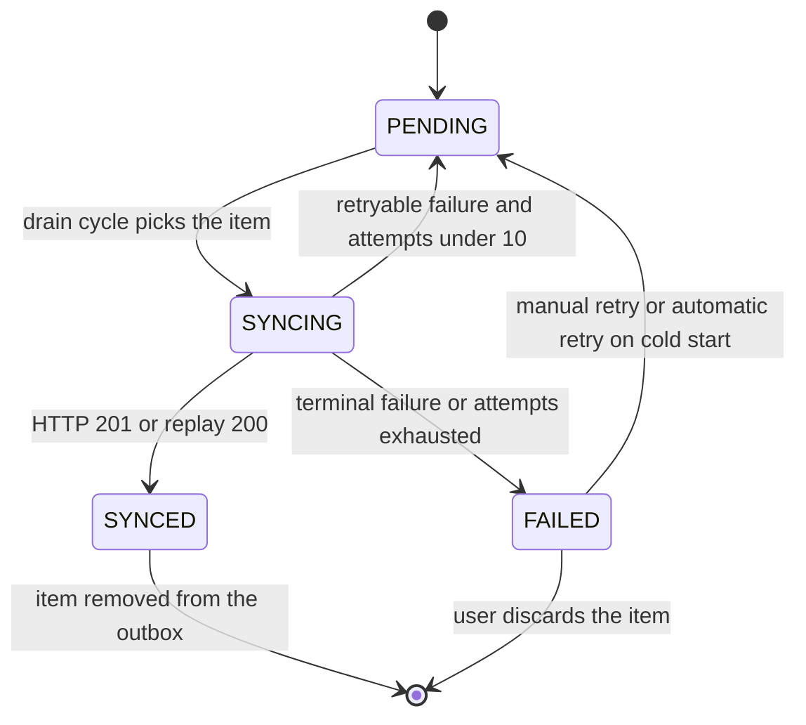

# Module Specification — Platform, Offline and Sync Services (`SYS`)

| Field | Value |
| --- | --- |
| Document | `modules/platform-and-sync.md` — authoritative functional specification for the cross-cutting platform, offline and synchronisation services |
| Version | 1.0 |
| Date | 2026-07-21 |
| Status | Approved for Phase 2 design |
| Owner | Rakshit — Project Lead / sole developer |
| Parent | [PlantPal+ Software Requirements Specification v1.0](../SRS.md) |
| Owned prefix | `SYS` — `FR-SYS-nn`, `BR-SYS-nn`; references `US-SYS-nn` and `UC-SYS-nn` owned by other authors |
| Requirement count | 26 functional requirements, 35 business rules |
| Source decisions | D-01 … D-11, with D-03, D-04, D-06, D-08 and D-09 as primary drivers |

---

## Table of contents

1. [Purpose and scope](#1-purpose-and-scope)
2. [Actors and stakeholders](#2-actors-and-stakeholders)
3. [Capability overview](#3-capability-overview)
4. [Functional requirements](#4-functional-requirements)
   - [FR-SYS-01 Persistent local read cache](#fr-sys-01--persistent-local-read-cache)
   - [FR-SYS-02 Offline write outbox](#fr-sys-02--offline-write-outbox)
   - [FR-SYS-03 Idempotent server-side upsert](#fr-sys-03--idempotent-server-side-upsert)
   - [FR-SYS-04 Outbox drain ordering, triggers and concurrency](#fr-sys-04--outbox-drain-ordering-triggers-and-concurrency)
   - [FR-SYS-05 Retry, backoff and failure classification](#fr-sys-05--retry-backoff-and-failure-classification)
   - [FR-SYS-06 Visible sync state and the needs-attention queue](#fr-sys-06--visible-sync-state-and-the-needs-attention-queue)
   - [FR-SYS-07 Connectivity-required operation guardrails](#fr-sys-07--connectivity-required-operation-guardrails)
   - [FR-SYS-08 Delta synchronisation endpoint](#fr-sys-08--delta-synchronisation-endpoint)
   - [FR-SYS-09 Full resynchronisation](#fr-sys-09--full-resynchronisation)
   - [FR-SYS-10 Client-side image transform](#fr-sys-10--client-side-image-transform)
   - [FR-SYS-11 Signed upload URL and finalisation](#fr-sys-11--signed-upload-url-and-finalisation)
   - [FR-SYS-12 Storage layout, variants and delivery](#fr-sys-12--storage-layout-variants-and-delivery)
   - [FR-SYS-13 Orphan and deleted-entity media cleanup](#fr-sys-13--orphan-and-deleted-entity-media-cleanup)
   - [FR-SYS-14 Media storage quota enforcement](#fr-sys-14--media-storage-quota-enforcement)
   - [FR-SYS-15 Feature-flag registry and client configuration](#fr-sys-15--feature-flag-registry-and-client-configuration)
   - [FR-SYS-16 External integration call policy and caching](#fr-sys-16--external-integration-call-policy-and-caching)
   - [FR-SYS-17 Graceful degradation, provenance and attribution](#fr-sys-17--graceful-degradation-provenance-and-attribution)
   - [FR-SYS-18 API surface conventions and request identity](#fr-sys-18--api-surface-conventions-and-request-identity)
   - [FR-SYS-19 Uniform error envelope](#fr-sys-19--uniform-error-envelope)
   - [FR-SYS-20 Pagination, filtering and sorting](#fr-sys-20--pagination-filtering-and-sorting)
   - [FR-SYS-21 Rate limits and request size limits](#fr-sys-21--rate-limits-and-request-size-limits)
   - [FR-SYS-22 Data hygiene invariants](#fr-sys-22--data-hygiene-invariants)
   - [FR-SYS-23 Cross-module search](#fr-sys-23--cross-module-search)
   - [FR-SYS-24 Account data export](#fr-sys-24--account-data-export)
   - [FR-SYS-25 Health, readiness and keep-alive](#fr-sys-25--health-readiness-and-keep-alive)
   - [FR-SYS-26 Migrations and seed data](#fr-sys-26--migrations-and-seed-data)
5. [Business rules](#5-business-rules)
6. [Data entities touched](#6-data-entities-touched)
7. [External interfaces](#7-external-interfaces)
8. [Edge cases and boundary conditions](#8-edge-cases-and-boundary-conditions)
9. [Deferred and out of scope for v1.0](#9-deferred-and-out-of-scope-for-v10)
10. [Traceability stub](#10-traceability-stub)

---

## 1. Purpose and scope

### 1.1 Purpose

`SYS` specifies the horizontal machinery on which every vertical module of PlantPal+ is built. The three habit modules (`PLT`, `FIT`, `NUT`) and the four supporting modules (`ACC`, `SET`, `DSH`, `NOT`, `GAM`) all read, write, cache, synchronise, paginate and fail through the mechanisms defined here. Where a module specification says "the log entry is queued while offline" or "the photo is uploaded", the behaviour it is relying upon is defined in this document and nowhere else.

This module is the direct realisation of decision **D-04 (offline-light)** and of the "works with every integration disabled" half of decision **D-03**. It is also where the free-tier operating envelope of decision **D-06** becomes a set of testable, numeric guards rather than an aspiration.

### 1.2 In scope

| # | Capability | Requirements |
| --- | --- | --- |
| 1 | Persistent local read cache with an explicit freshness, eviction and purge policy | FR-SYS-01 |
| 2 | Offline write outbox restricted to the seven append-only logging actions of D-04 | FR-SYS-02 |
| 3 | Server-side idempotent upsert, and the designed absence of conflict resolution | FR-SYS-03 |
| 4 | Drain ordering, triggers, concurrency control, retry, backoff and failure classification | FR-SYS-04, FR-SYS-05 |
| 5 | The four-state visible sync surface and the failed-item recovery queue | FR-SYS-06 |
| 6 | Guardrails for operations that require connectivity | FR-SYS-07 |
| 7 | Cursor-based delta synchronisation, tombstones and full resynchronisation | FR-SYS-08, FR-SYS-09 |
| 8 | The plant-photo media pipeline: client transform, signed upload, finalisation, variants, cleanup, quota | FR-SYS-10 … FR-SYS-14 |
| 9 | Feature flags, external integration policy, caching, degradation, provenance and attribution | FR-SYS-15 … FR-SYS-17 |
| 10 | API-wide conventions: versioning, request identity, error envelope, pagination, rate limits | FR-SYS-18 … FR-SYS-21 |
| 11 | Data hygiene invariants including UTC storage and immutable `local_date` derivation | FR-SYS-22 |
| 12 | Cross-module search and full account data export | FR-SYS-23, FR-SYS-24 |
| 13 | Health, readiness, keep-alive, migrations and idempotent seeding | FR-SYS-25, FR-SYS-26 |

### 1.3 Explicitly excluded

This module deliberately does **not** own the following. Reference these concerns by identifier only; never renumber or restate them here.

| Excluded concern | Owning area | Where to look |
| --- | --- | --- |
| Registration, sign-in, JWT access and refresh token lifecycle, password reset, account deletion execution | `ACC` | [modules/accounts.md](accounts.md) |
| Unit-system, timezone, theme, notification and locale preferences | `SET` | [modules/dashboard-and-settings.md](dashboard-and-settings.md) |
| Composition of the unified daily dashboard and its widgets | `DSH` | [modules/dashboard-and-settings.md](dashboard-and-settings.md) |
| Plant species catalogue content, watering-interval formulas, growth-log semantics | `PLT` | [modules/plant-care.md](plant-care.md) |
| Workout, step, body-metric and goal semantics, progress charts | `FIT` | [modules/fitness.md](fitness.md) |
| Food catalogue content, macro arithmetic, BMR and calorie targets, water goal | `NUT` | [modules/nutrition.md](nutrition.md) |
| Reminder scheduling rules, quiet hours, Expo Push delivery, email digest content | `NOT` | [modules/notifications.md](notifications.md) |
| Streak calculation, achievement definitions and unlock rules | `GAM` | [modules/gamification.md](gamification.md) |
| Quality-attribute budgets (latency, availability, security controls, accessibility, privacy) | `NFR-*` | [04-non-functional-requirements.md](../04-non-functional-requirements.md) |
| Assumptions, constraints, risks, external dependencies, open questions | `ASM`, `CON`, `RSK`, `DEP`, `OQ` | [09-assumptions-constraints-risks.md](../09-assumptions-constraints-risks.md) |

**The dividing line.** `SYS` requirements state *behaviour*; the `NFR` category states *budgets*. Where this document names a number that is really a quality attribute — for example the 1500 ms cache-rehydration budget in FR-SYS-01 — the number is stated here so that no developer has to hunt for it, and the matching `NFR-` identifier is named in the traceability table of section 10.

### 1.4 Deliberate non-goals of v1.0

1. **No conflict-resolution algorithm of any kind.** BR-SYS-11 records this as a designed absence with a proof sketch, not as an omission.
2. **No offline creation, editing or deletion of entities**, no offline photo upload, and no offline retroactive edit of an already-synced log row (BR-SYS-12).
3. **No background synchronisation while the application is terminated** — no Service Worker Background Sync, no iOS background fetch.
4. **No multi-region storage, no edge image transformation and no search engine outside PostgreSQL.**

---

## 2. Actors and stakeholders

### 2.1 Actors

| Actor | Type | Role in this module |
| --- | --- | --- |
| Registered User | Human, primary | Logs events while offline, watches the sync indicator, resolves failed items, uploads plant photos, searches, requests an export |
| Mobile Client | System, primary | React Native / Expo application. Holds the persisted TanStack Query cache in MMKV, holds the outbox, performs the client-side image transform, drains the queue |
| Web Client | System, primary | React + Vite application. Holds the persisted cache in IndexedDB, holds the outbox when persistence is available, performs the image transform through Canvas |
| API Service | System, primary | Node.js + Express + TypeScript. Enforces the API conventions, performs idempotent upserts, serves delta sync, issues signed upload URLs, enforces quotas and rate limits |
| Sync Service | System, logical component of the API Service | Owns `GET /api/v1/sync/changes`, cursor validation, tombstone emission and full-resync directives |
| Media Service | System, logical component of the API Service | Owns signed-URL issue, upload finalisation, variant generation and quota accounting |
| Maintenance Scheduler | System, secondary | In-process `node-cron`. Runs orphan cleanup, tombstone purge, external-cache purge, export reaping, storage recount and the Supabase keep-touch |
| Keep-Alive Pinger | External system | A scheduled GitHub Actions workflow calling `GET /healthz` every 10 minutes so the Render free instance never sleeps and the cron engine keeps ticking |
| Object Storage and CDN | External system | Supabase Storage, with Cloudinary as the documented alternative. Accepts the direct signed `PUT`, stores variants, serves signed read URLs |
| Open Food Facts | External system, flag-gated | Barcode and food text lookup enrichment. Disabled by default |
| Perenual | External system, flag-gated | Plant species enrichment. Disabled by default |
| Error Monitor | External system | Sentry free tier. Receives structured errors carrying `request_id` |
| Maintainer / Operator | Human, secondary | Rakshit. Flips feature flags, runs migrations and seeds, reads `/readyz`, responds to quota alarms |

### 2.2 Stakeholders with a direct interest in this module

| Stakeholder | Identifier | Why this module matters to them |
| --- | --- | --- |
| End user, the Registered User | STK-01 | A queued log that silently disappears destroys trust in the whole product; GOAL-05 is delivered entirely by this module |
| Project supervisor and academic evaluator | STK-02 | The offline outbox, the idempotency argument and the designed absence of conflict resolution are the most academically defensible parts of the architecture |
| Rakshit, Project Lead and sole developer | STK-03 | This module contains the three largest engineering items in the project and consumes the free-tier budget of GOAL-09 |
| Infrastructure providers | STK-07 | Every quota guard, keep-alive ping and rate limit in this document exists to keep the project inside a permanently free tier |
| Third-party data providers | STK-08 | BR-SYS-23, BR-SYS-24 and BR-SYS-26 are the request-rate and attribution obligations owed to Open Food Facts and Perenual |
| Future maintainer | STK-13 | Reproducible migrations and idempotent seeds (FR-SYS-26) are what make the system rebuildable from an empty database |

### 2.3 Personas whose journeys depend on this module

| Persona | Dependency |
| --- | --- |
| PER-01 Aditi Sharma | Logs breakfast on the metro where the connection drops mid-request; needs the queue and the `local_date` rule that files a 00:10 dinner on the correct day |
| PER-02 Marcus Oyelaran | Photographs plants weekly; needs the media pipeline, the storage quota meter and metadata stripping |
| PER-04 Harold Whitfield | Needs every sync state to carry an accessible text label and a distinct icon, never colour alone |
| PER-05 Sofia Lindqvist | Budget device on a metered connection; needs the image transform to shrink a 4 MB photo before it costs her data, and needs cached reads so the app is usable with no signal |

---

## 3. Capability overview

`SYS` decomposes into nine capability groups. Every leaf in the tree below is realised by at least one `FR-SYS-nn` in section 4.

```mermaid
flowchart TD
  ROOT["SYS Cross-cutting platform services"]

  ROOT --> C1["1. Offline-light client runtime"]
  ROOT --> C2["2. Server sync services"]
  ROOT --> C3["3. Media pipeline"]
  ROOT --> C4["4. Integration layer"]
  ROOT --> C5["5. API conventions"]
  ROOT --> C6["6. Data hygiene"]
  ROOT --> C7["7. Cross-module search"]
  ROOT --> C8["8. Account data export"]
  ROOT --> C9["9. Free-tier operability"]

  C1 --> C1A["1.1 Persistent read cache<br/>FR-SYS-01"]
  C1 --> C1B["1.2 Write outbox, seven actions<br/>FR-SYS-02"]
  C1 --> C1C["1.3 Drain engine<br/>FR-SYS-04 and FR-SYS-05"]
  C1 --> C1D["1.4 Visible sync state<br/>FR-SYS-06"]
  C1 --> C1E["1.5 Connectivity guardrails<br/>FR-SYS-07"]

  C2 --> C2A["2.1 Idempotent upsert<br/>FR-SYS-03"]
  C2 --> C2B["2.2 Delta sync with cursor<br/>FR-SYS-08"]
  C2 --> C2C["2.3 Tombstones and full resync<br/>FR-SYS-09"]

  C3 --> C3A["3.1 Client transform and metadata strip<br/>FR-SYS-10"]
  C3 --> C3B["3.2 Signed upload and finalisation<br/>FR-SYS-11"]
  C3 --> C3C["3.3 Storage layout and variants<br/>FR-SYS-12"]
  C3 --> C3D["3.4 Orphan cleanup<br/>FR-SYS-13"]
  C3 --> C3E["3.5 Per-user and global quota<br/>FR-SYS-14"]

  C4 --> C4A["4.1 Feature-flag registry<br/>FR-SYS-15"]
  C4 --> C4B["4.2 Timeout, retry, breaker, cache<br/>FR-SYS-16"]
  C4 --> C4C["4.3 Degradation, provenance, attribution<br/>FR-SYS-17"]

  C5 --> C5A["5.1 Versioning and request identity<br/>FR-SYS-18"]
  C5 --> C5B["5.2 Uniform error envelope<br/>FR-SYS-19"]
  C5 --> C5C["5.3 Pagination, filter, sort<br/>FR-SYS-20"]
  C5 --> C5D["5.4 Rate and body size limits<br/>FR-SYS-21"]

  C6 --> C6A["6.1 UUID keys and audit columns<br/>FR-SYS-22"]
  C6 --> C6B["6.2 UTC instants and immutable local date<br/>FR-SYS-22"]

  C7 --> C7A["7.1 Unified ranked search<br/>FR-SYS-23"]

  C8 --> C8A["8.1 Asynchronous JSON export<br/>FR-SYS-24"]

  C9 --> C9A["9.1 Health, readiness, keep-alive<br/>FR-SYS-25"]
  C9 --> C9B["9.2 Migrations and idempotent seeds<br/>FR-SYS-26"]
```



### 3.1 Requirement index

| ID | Title | Priority | Release |
| --- | --- | --- | --- |
| FR-SYS-01 | Persistent local read cache | Must | v0.5 Alpha |
| FR-SYS-02 | Offline write outbox | Must | v0.5 Alpha |
| FR-SYS-03 | Idempotent server-side upsert | Must | v0.5 Alpha |
| FR-SYS-04 | Outbox drain ordering, triggers and concurrency | Must | v0.5 Alpha |
| FR-SYS-05 | Retry, backoff and failure classification | Must | v0.5 Alpha |
| FR-SYS-06 | Visible sync state and the needs-attention queue | Must | v0.5 Alpha |
| FR-SYS-07 | Connectivity-required operation guardrails | Must | v1.0 MVP |
| FR-SYS-08 | Delta synchronisation endpoint | Must | v1.0 MVP |
| FR-SYS-09 | Full resynchronisation | Must | v1.0 MVP |
| FR-SYS-10 | Client-side image transform | Must | v0.5 Alpha |
| FR-SYS-11 | Signed upload URL and finalisation | Must | v0.5 Alpha |
| FR-SYS-12 | Storage layout, variants and delivery | Must | v1.0 MVP |
| FR-SYS-13 | Orphan and deleted-entity media cleanup | Should | v1.0 MVP |
| FR-SYS-14 | Media storage quota enforcement | Must | v1.0 MVP |
| FR-SYS-15 | Feature-flag registry and client configuration | Must | v0.5 Alpha |
| FR-SYS-16 | External integration call policy and caching | Should | v1.0 MVP |
| FR-SYS-17 | Graceful degradation, provenance and attribution | Must | v1.0 MVP |
| FR-SYS-18 | API surface conventions and request identity | Must | v0.1 Walking Skeleton |
| FR-SYS-19 | Uniform error envelope | Must | v0.1 Walking Skeleton |
| FR-SYS-20 | Pagination, filtering and sorting | Must | v0.5 Alpha |
| FR-SYS-21 | Rate limits and request size limits | Should | v1.0 MVP |
| FR-SYS-22 | Data hygiene invariants | Must | v0.1 Walking Skeleton |
| FR-SYS-23 | Cross-module search | Should | v1.0 MVP |
| FR-SYS-24 | Account data export | Must | v1.0 MVP |
| FR-SYS-25 | Health, readiness and keep-alive | Must | v0.1 Walking Skeleton |
| FR-SYS-26 | Migrations and seed data | Must | v0.1 Walking Skeleton |

---

## 4. Functional requirements

Every requirement below uses the mandatory form "The system shall …". Priority uses MoSCoW per D-02. Releases are `v0.1 Walking Skeleton`, `v0.5 Alpha`, `v1.0 MVP` and `v1.1+ Post-MVP`. Verification is one of Test, Demonstration, Inspection or Analysis.

---

### FR-SYS-01 — Persistent local read cache

| Field | Value |
| --- | --- |
| Priority | Must |
| Release | v0.5 Alpha |
| Actor | Mobile Client, Web Client |
| Verification | Test |
| Traces to | GOAL-05, D-04, STK-01, PER-05 → US-SYS-02 → UC-SYS-05 → NFR-PERF-05, NFR-USAB-07, NFR-PORT-02 |

**Requirement.** The system shall maintain on each client a persistent local read cache that is written through on every successful server read, rehydrated at application start and served for read-only screens when the device has no network connectivity, applying the freshness policy of BR-SYS-01 and the eviction policy of BR-SYS-02.

**Rationale.** D-04 promises "cached reads everywhere". Without persistence across cold starts that promise breaks the moment the user force-quits the application, which is exactly the moment PER-05 opens PlantPal+ on a train with no signal. The fixed stack dictates the *how*: TanStack Query with a persister, backed by MMKV on mobile and IndexedDB on web.

**Inputs and validation.**

| Field | Type | Constraints | Required |
| --- | --- | --- | --- |
| `query_key` | string array | The TanStack Query key of the response being cached | Yes |
| `response_body` | JSON | Persisted only for HTTP 2xx JSON responses; a body larger than 262 144 bytes is held in memory only | Yes |
| `resource_class` | enum | One of: `SEEDED_CATALOGUE`, `USER_ENTITY_LIST`, `TODAY_AGGREGATE`, `HISTORICAL_LOG`, `ACCOUNT_SETTINGS`, `DUE_REMINDERS`, `EXTERNAL_LOOKUP`, `SEARCH_RESULT`, `SIGNED_MEDIA_URL`, `FEATURE_CONFIG` | Yes |
| `stamp.user_id` | uuid | Must equal the authenticated user at rehydration, otherwise the whole blob is discarded | Yes |
| `stamp.schema_version` | integer | Must equal the current build value, otherwise the whole blob is discarded | Yes |
| `stamp.app_data_version` | integer | Must equal the current build value, otherwise the whole blob is discarded | Yes |
| `stamp.persisted_at` | ISO-8601 UTC | Blob discarded when older than 30 days | Yes |
| `cache_budget_bytes` | integer | 8 388 608 on mobile, 20 971 520 on web | Yes |

**Processing rules.**

1. Persistence is write-through on cache commit, debounced at 1000 ms so that a burst of reads does not thrash the MMKV or IndexedDB writer.
2. Rehydration runs before the first render of any authenticated screen and is budgeted at 1500 ms; on expiry the application renders with skeleton placeholders and hydrates late queries as they arrive (BR-SYS-01 rule 4).
3. `staleTime` and `gcTime` per resource class are exactly the values tabulated in **BR-SYS-01**. A stale value is rendered immediately and refreshed in the background when online.
4. Eviction is least-recently-used down to 80 percent of the budget, per **BR-SYS-02**. The outbox namespace is never evicted.
5. Purge on sign-out, account switch, account deletion, or any stamp mismatch, per **BR-SYS-02** rule 2.
6. Signed media read URLs and search results are never persisted (**BR-SYS-01** rule 2).

**Outputs.**

1. Rendered read-only screens served from cache while offline.
2. An "Updated `<relative time>`" label whenever the served value is past its `staleTime`.
3. An "Offline — showing data from `<absolute time>`" banner whenever the device reports no connectivity.
4. A `cache_meta` record carrying the stamp and the serialised byte count.

**Alternate and error flows.**

| Condition | System response | User-visible message |
| --- | --- | --- |
| Persistence layer unavailable (Safari private browsing blocks IndexedDB, MMKV write fails on a full device) | Fall back to an in-memory cache, emit `PERSISTENCE_UNAVAILABLE` telemetry, disable offline queueing per FR-SYS-02 | "Offline mode is not available in this browser or on this device. You can still use PlantPal+ while connected." |
| Persistence quota error | Evict the oldest 25 percent of entries once and retry; on a second failure disable persistence for the session | "We freed up some space on your device to keep PlantPal+ working." |
| Stamp mismatch on `user_id`, `schema_version` or `app_data_version` at rehydration | Discard the entire persisted blob, preserve the outbox, trigger a full resync per BR-SYS-15 trigger 4 or 5 | "Getting your data ready…" with determinate progress from the second page |
| Persisted blob older than 30 days | Discard the blob and refetch | "Refreshing your data…" |
| Rehydration exceeds the 1500 ms budget | Render skeleton placeholders and continue hydrating in the background | No message; skeletons only |
| A screen has no cached entry and the device is offline | Render the `OFFLINE_NO_CACHE` empty state with a retry control | "This screen needs a connection the first time you open it." |

---

### FR-SYS-02 — Offline write outbox

| Field | Value |
| --- | --- |
| Priority | Must |
| Release | v0.5 Alpha |
| Actor | Mobile Client, Web Client, Registered User |
| Verification | Test |
| Traces to | GOAL-05, D-04, STK-01, PER-01, PER-05 → US-SYS-01 → UC-SYS-01 → NFR-RELI-04, NFR-USAB-07, NFR-DATA-09 |

**Requirement.** The system shall queue, while the client has no connectivity, only the seven append-only logging actions enumerated in BR-SYS-03, storing each as an outbox item conforming to the envelope of BR-SYS-04 and respecting the capacity limits of BR-SYS-09.

**Rationale.** D-04 restricts offline writes to append-only logging precisely so that no merge algorithm is needed. A wider offline surface would force conflict handling that a solo developer cannot specify, build and test inside one semester. Restricting the queue to a closed, enumerated set of seven actions is what makes BR-SYS-11 provable rather than hopeful.

**Inputs and validation.**

| Field | Type | Constraints | Required |
| --- | --- | --- | --- |
| `action` | enum | One of: `LOG_WATERING`, `LOG_CARE_TASK`, `LOG_WORKOUT`, `LOG_STEPS`, `LOG_MEAL`, `LOG_WATER_INTAKE`, `LOG_GROWTH_ENTRY` (BR-SYS-03). Any other value is rejected before enqueue | Yes |
| `payload` | JSON | Must pass the same client-side Zod schema used for the online path; at most 16 384 bytes serialised | Yes |
| `occurred_at` | ISO-8601 UTC | The instant the user states the event happened; may be back-dated; must lie in `[now − 365 days, now + 24 hours]` | Yes |
| `client_timestamp` | ISO-8601 UTC | Device clock at the moment the user confirmed the action | Yes |
| `client_timezone` | IANA identifier | Must be a recognised tzdata zone, for example `Asia/Kolkata` | Yes |
| `client_local_date` | `YYYY-MM-DD` | Computed on the device; the server recomputes its own value and keeps this one for diagnostics only | Yes |
| `idempotency_key` | UUIDv4 | Minted on the client at enqueue, never reused, never regenerated on retry | Yes |
| `enqueued_seq` | integer | Monotonic per device, never reset except on an outbox clear | Yes |
| `device_id` | UUIDv4 | Stable per installation; regenerated only on reinstall | Yes |
| `schema_version` | integer | Envelope version understood by this build | Yes |
| `media_id` | uuid | Must be absent for a queued `LOG_GROWTH_ENTRY`; photos cannot be attached offline in v1.0 (BR-SYS-03 rule 2) | No |

**Processing rules.**

1. The payload is validated locally **before** enqueue. An invalid payload is rejected at the form and is never queued (**BR-SYS-09**).
2. The client mints the UUIDv4 `idempotency_key`, assembles the envelope of **BR-SYS-04**, and writes the item and an optimistic local row in one transaction. The optimistic row uses `idempotency_key` as its temporary primary key until the server-assigned UUID arrives.
3. The optimistic row is immediately visible in module screens and in today's totals, carrying the `PENDING` badge of **BR-SYS-10**.
4. If the device reports connectivity at enqueue, a drain is attempted immediately (**BR-SYS-06** trigger 1).
5. Capacity is bounded by **BR-SYS-09**: at most 200 items, at most 2 MB in total, at most 16 KB per payload, and an item older than 30 days is retained and flagged, never dropped.
6. Queueing is refused outright when the client has no working persistence layer (**BR-SYS-02** rule 4), because a queue that cannot survive a reload is a data-loss trap.
7. No queueable action may modify or delete an existing row (**BR-SYS-03** rule 4).

**Outputs.**

1. One `SyncOutboxItem` in the client-local outbox store.
2. One optimistic local row visible in module screens and daily aggregates.
3. A `PENDING` per-record badge and an incremented global "N waiting to sync" count.

**Alternate and error flows.**

| Condition | System response | User-visible message |
| --- | --- | --- |
| Outbox already holds 200 items or 2 MB | Refuse the new action with a blocking dialog; evict nothing | "You have 200 entries waiting to sync. Connect to the internet so PlantPal+ can save them before adding more." |
| Payload exceeds 16 384 bytes | Reject at the form and identify the oversized field | "That note is too long to save offline. Please shorten it to continue." |
| Local persistence write fails (`LOCAL_STORAGE_FULL`) | Abort the enqueue, preserve the form contents in memory | "Your device is out of storage, so this entry could not be saved. Free up space and try again." |
| Persistence layer unavailable for this session | Disable offline queueing and treat the action as connectivity-required per FR-SYS-07 | "Offline saving is not available in this browser. Reconnect to log this entry." |
| User selects a photo for a growth entry while offline | Offer to save the text entry now and attach the photo later; never discard the selection silently | "You can save this entry now and add the photo when you are back online." |
| An action outside the seven codes is attempted offline | Block it under FR-SYS-07; nothing is added to the outbox | "This action needs an internet connection." |
| `client_timezone` is not a recognised IANA identifier | Fall back to the profile timezone, then to `UTC`, and record the event for the error monitor | No message; the entry is saved with the fallback zone |

---

### FR-SYS-03 — Idempotent server-side upsert

| Field | Value |
| --- | --- |
| Priority | Must |
| Release | v0.5 Alpha |
| Actor | API Service |
| Verification | Test |
| Traces to | GOAL-05, D-04, STK-01 → US-SYS-01 → UC-SYS-02 → NFR-DATA-09, NFR-RELI-04, NFR-SEC-14 |

**Requirement.** The system shall persist each queued logging action exactly once server-side by upserting on the unique key `(user_id, idempotency_key)`, and shall apply no merge, CRDT, operational-transform, vector-clock or last-write-wins conflict-resolution algorithm, as ruled by BR-SYS-05 and BR-SYS-11.

**Rationale.** At-least-once delivery is unavoidable, because a response can be lost after the server has already committed. An idempotency key converts at-least-once into effectively-once with no distributed coordination. Because the seven queueable actions only ever append immutable rows, two devices can never contradict each other, so no merge policy is required. This is the single most important simplification in the entire architecture and it is what makes an offline-capable product tractable for one developer.

**Inputs and validation.**

| Field | Type | Constraints | Required |
| --- | --- | --- | --- |
| `Idempotency-Key` (header) | UUIDv4 string | Must match the canonical lowercase UUID version 4 pattern, else HTTP 400 `INVALID_IDEMPOTENCY_KEY`; absent on a log endpoint yields HTTP 400 `IDEMPOTENCY_KEY_REQUIRED` | Yes |
| `X-Client-Timestamp` (header) | ISO-8601 UTC | Must lie in `[now − 365 days, now + 24 hours]`, else HTTP 422 `CLIENT_CLOCK_INVALID` | Yes |
| `X-Client-Timezone` (header) | IANA identifier | Must be recognised, else HTTP 422 `INVALID_TIMEZONE` | Yes |
| `X-Request-Id` (header) | string | Accepted when it matches `^[A-Za-z0-9-]{8,64}$`, otherwise replaced by a generated UUIDv4 | No |
| Request body | JSON | Validated against the endpoint's Zod schema; unknown fields rejected with `VALIDATION_FAILED` | Yes |
| `user_id` | uuid | Taken from the verified access token only; never read from the body or query string | Yes |

**Processing rules.**

1. Each of the seven log tables carries `idempotency_key uuid NOT NULL` and `payload_hash char(64) NOT NULL` with a partial unique index on `(user_id, idempotency_key)` (**BR-SYS-05** rule 1). There is no separate idempotency table.
2. `payload_hash` is the SHA-256 of the canonical JSON body: keys sorted lexicographically, no insignificant whitespace, numbers in shortest round-trip form, UTF-8 NFC (**BR-SYS-05** rule 2).
3. The write executes `INSERT … ON CONFLICT (user_id, idempotency_key) DO NOTHING RETURNING *`. When zero rows are returned, the server selects the stored row and compares `payload_hash`.
4. Outcomes are exactly the five rows of the **BR-SYS-05** outcome table: 201 on first write, 200 with `Idempotent-Replay: true` on a matching replay, 409 `IDEMPOTENCY_KEY_CONFLICT` on a hash mismatch, 400 on a malformed key, 400 on an absent key.
5. Clock handling follows **BR-SYS-05** rule 5: a `client_timestamp` in `(now + 5 minutes, now + 24 hours]` is clamped to server receipt time and `client_clock_skew_ms` is recorded on the row.
6. `local_date` and `tz_at_capture` are derived server-side per **BR-SYS-31**; the client-supplied `client_local_date` is retained for diagnostics only.
7. Two devices logging the same real-world event produce two distinct keys and therefore two rows. Cross-device semantic de-duplication is explicitly not performed by `SYS` (**BR-SYS-05** rule 6).

**Outputs.**

1. HTTP 201 with the created resource on first write.
2. HTTP 200 with the byte-identical stored resource and header `Idempotent-Replay: true` on a replay.
3. A bumped `sync_seq` on the created row, making it visible to the next delta sync.
4. A recorded `client_clock_skew_ms` where clamping occurred.

**Alternate and error flows.**

| Condition | System response | User-visible message |
| --- | --- | --- |
| Key already seen, `payload_hash` identical | HTTP 200 with the stored row and `Idempotent-Replay: true`; the stored row is never modified | No message; the item shows as synced |
| Key already seen, `payload_hash` different | HTTP 409 `IDEMPOTENCY_KEY_CONFLICT`; the stored row is never modified; the event is reported to the error monitor as a client defect | "This entry could not be saved because of an app error. Please retry or discard it." |
| Malformed idempotency key | HTTP 400 `INVALID_IDEMPOTENCY_KEY`; item classified TERMINAL by BR-SYS-08 | "This entry could not be saved. Please discard it and log it again." |
| Idempotency key absent on a log endpoint | HTTP 400 `IDEMPOTENCY_KEY_REQUIRED` | "This entry could not be saved. Please discard it and log it again." |
| `client_timestamp` more than 24 hours ahead or more than 365 days behind | HTTP 422 `CLIENT_CLOCK_INVALID`; item classified TERMINAL | "Your device clock was wrong when this was saved on `<captured time>`. Check your clock and log it again." |
| Parent entity (plant, goal) no longer exists | HTTP 404 `PARENT_NOT_FOUND`; item classified TERMINAL with Discard as the primary action | "The plant this entry belongs to was deleted." |
| Any HTTP 5xx | The item remains queued; the retry is safe by construction | No message; the sync indicator continues to show the item as waiting |

---

### FR-SYS-04 — Outbox drain ordering, triggers and concurrency

| Field | Value |
| --- | --- |
| Priority | Must |
| Release | v0.5 Alpha |
| Actor | Mobile Client, Web Client |
| Verification | Test |
| Traces to | GOAL-05, D-04 → US-SYS-01 → UC-SYS-02 → NFR-RELI-04, NFR-PERF-02 |

**Requirement.** The system shall drain the outbox in ascending order of `client_timestamp` then `enqueued_seq`, under a single-flight mutex, in batches of at most 25 items, on each of the six triggers listed in BR-SYS-06.

**Rationale.** Deterministic replay order makes streak evaluation and daily-total computation reproducible, which `GAM` and `DSH` both depend upon. Single-flight execution prevents the duplicate-request storm that occurs when connectivity flaps, and the persisted lock stamp prevents two browser tabs of the same account draining simultaneously.

**Inputs and validation.**

| Field | Type | Constraints | Required |
| --- | --- | --- | --- |
| Outbox contents | list of `SyncOutboxItem` | Items with `next_attempt_at > now` are skipped, not blocked on | Yes |
| `connectivity_state` | enum | One of: `ONLINE`, `OFFLINE`. Derived from the platform reachability API and confirmed by the last request outcome, never trusted blindly | Yes |
| `lifecycle_event` | enum | One of: `ENQUEUE`, `CONNECTIVITY_RESTORED`, `APP_FOREGROUND`, `AUTH_SUCCESS`, `PERIODIC_TIMER`, `USER_SYNC_NOW` | Yes |
| `auth_state` | enum | One of: `AUTHENTICATED`, `TOKEN_EXPIRED`, `SIGNED_OUT`. A drain runs only when `AUTHENTICATED` | Yes |
| `drain_lock_until` | ISO-8601 UTC | Persisted stamp of `now + 60 s`, refreshed every 15 s while a cycle runs | Yes |
| `batch_size` | integer | Fixed at 25 items per cycle, followed by a 500 ms yield | Yes |

**Processing rules.**

1. Items are sorted ascending by `(client_timestamp, enqueued_seq)` and dispatched sequentially, one HTTP request per item (**BR-SYS-06**).
2. Exactly one drain cycle runs per client at any instant, enforced by an in-memory mutex plus the persisted `drain_lock_until` stamp (**BR-SYS-06** concurrency rule 1).
3. The six triggers and their debounce windows are exactly those tabulated in **BR-SYS-06**: enqueue while online (immediate), offline-to-online transition (2000 ms), application foreground (500 ms), sign-in or token refresh (immediate), a 60-second periodic timer while online with a non-empty queue, and the user tapping "Sync now" (immediate, bypassing the debounce but not the mutex).
4. A `TERMINAL` failure on one item does **not** stop the cycle, because append-only items are mutually independent. The single exception is an `AUTH` failure, which pauses the entire cycle until the token is refreshed (**BR-SYS-08**).
5. After a cycle in which at least one item reached `SYNCED`, the client invokes delta sync (FR-SYS-08) so that server-derived values — streaks, achievement unlocks, recomputed watering schedules — are pulled back (**BR-SYS-06** rule 4).
6. At start-up, any item observed in `SYNCING` for more than 60 seconds is reset to `PENDING`, which is safe because of FR-SYS-03.

**Outputs.**

1. Updated per-item states and an updated aggregate sync state.
2. An updated `last_successful_sync_at` timestamp.
3. A delta-sync invocation after a successful cycle.
4. A structured client log entry per cycle recording items attempted, succeeded, retried and failed.

**Alternate and error flows.**

| Condition | System response | User-visible message |
| --- | --- | --- |
| A second tab or a second trigger attempts a drain while one is running | The mutex and `drain_lock_until` stamp reject the second attempt; it is retried after the current cycle | No message |
| The process is killed mid-cycle | Items stranded in `SYNCING` for more than 60 seconds are reset to `PENDING` at next start and retried | No message |
| One item fails terminally mid-batch | The cycle continues with the remaining items; the failed item moves to the needs-attention list | "1 entry needs your attention" |
| HTTP 401 during a cycle | The cycle pauses, the token is refreshed once, and the cycle resumes; if the refresh fails every item stays `PENDING` | "Please sign in again to finish saving your entries." |
| Connectivity is lost mid-cycle | The in-flight item returns to `PENDING`, the cycle ends cleanly, and the next offline-to-online transition restarts it | "Waiting for a connection to save N entries." |
| The queue is empty when a trigger fires | The cycle exits immediately without a network call | "All changes saved" |
| A batch of 25 completes with items remaining | The client yields for 500 ms and starts the next batch | "Syncing…" |

---

### FR-SYS-05 — Retry, backoff and failure classification

| Field | Value |
| --- | --- |
| Priority | Must |
| Release | v0.5 Alpha |
| Actor | Mobile Client, Web Client |
| Verification | Test |
| Traces to | GOAL-05, D-04, D-06 → US-SYS-01, US-SYS-04 → UC-SYS-02, UC-SYS-03 → NFR-RELI-04, NFR-OBSV-03 |

**Requirement.** The system shall retry a failed outbox item at most 10 times using the exponential backoff schedule with jitter defined in BR-SYS-07, classifying every failure as `RETRYABLE`, `AUTH` or `TERMINAL` per BR-SYS-08.

**Rationale.** Unbounded immediate retries would burn the 0.1 CPU allocation of the Render free instance and the user's battery, and would violate D-06 by pushing the deployment toward a paid plan. An unbounded attempt count would hide a genuinely broken payload forever. A bounded schedule with an honest terminal state is the only design that both self-heals and stays visible.

**Inputs and validation.**

| Field | Type | Constraints | Required |
| --- | --- | --- | --- |
| `transport_outcome` | enum | One of: `NETWORK_UNREACHABLE`, `DNS_FAILURE`, `TLS_FAILURE`, `TIMEOUT`, `HTTP_RESPONSE` | Yes |
| `http_status` | integer | Present when `transport_outcome` is `HTTP_RESPONSE`; classified per BR-SYS-08 | No |
| `error_code` | string | The `code` from the BR-SYS-28 error envelope; drives TERMINAL classification | No |
| `Retry-After` (header) | integer seconds | Honoured on HTTP 429 and 503 when larger than the computed delay | No |
| `attempt_count` | integer | 0 to 10 inclusive; at 10 the item becomes `FAILED` | Yes |
| `next_attempt_at` | ISO-8601 UTC | Persisted with the item so backoff survives an application restart | No |

**Processing rules.**

1. Delay is `delay_ms(n) = min(3 600 000, 2000 × 2^(n−1)) × jitter` with `jitter` uniform in `[0.8, 1.2]`, producing the nominal ladder 2 s, 4 s, 8 s, 16 s, 32 s, 64 s, 128 s, 256 s, 512 s (**BR-SYS-07**). The nominal total automatic retry window is approximately 17 minutes of connected time.
2. Classification is exactly the table of **BR-SYS-08**. `RETRYABLE` schedules attempt `n+1`; `AUTH` pauses the cycle, refreshes the token once and resumes; `TERMINAL` moves the item straight to `FAILED` without consuming further attempts.
3. After the tenth `RETRYABLE` failure the item becomes `FAILED` and is listed in the needs-attention screen of FR-SYS-06.
4. A `FAILED` item is automatically re-attempted at most once per application cold start and at most once per 24 hours, and each such re-attempt resets `attempt_count` to 0 (**BR-SYS-07** rule 3), so a transient backend outage self-heals with no user action while a genuinely bad payload stays visible.
5. `attempt_count`, `next_attempt_at`, `last_error_code` and `last_error_message` are persisted on the item and surfaced in the failure detail sheet.

**Outputs.**

1. An updated item state, `attempt_count` and `next_attempt_at`.
2. `last_error_code` and a plain-English `last_error_message` for the needs-attention list.
3. An error-monitor event for any `TERMINAL` classification that indicates a client defect, specifically `IDEMPOTENCY_KEY_CONFLICT`, `VALIDATION_FAILED` and `OUTBOX_SCHEMA_UNSUPPORTED`.

**Alternate and error flows.**

| Condition | System response | User-visible message |
| --- | --- | --- |
| Network unreachable, DNS, TLS or timeout failure | Classified `RETRYABLE`; backoff scheduled | "Waiting for a connection to save this entry." |
| HTTP 408, 425, 429, 500, 502, 503 or 504 | Classified `RETRYABLE`; `Retry-After` honoured when larger than the computed delay | "PlantPal+ will keep trying to save this entry." |
| HTTP 401 `TOKEN_EXPIRED` or `UNAUTHENTICATED` | Classified `AUTH`; the cycle pauses and one refresh is attempted | "Please sign in again to finish saving your entries." |
| HTTP 403 `FORBIDDEN` | Classified `TERMINAL` | "This account is not allowed to make that change." |
| HTTP 400 `VALIDATION_FAILED`, `MALFORMED_JSON` or `INVALID_IDEMPOTENCY_KEY` | Classified `TERMINAL`; the offending field is shown | "This entry could not be saved because `<field>` was not valid." |
| HTTP 404 `PARENT_NOT_FOUND` | Classified `TERMINAL`; Discard becomes the primary action | "The plant this entry belongs to was deleted." |
| HTTP 422 `CLIENT_CLOCK_INVALID` | Classified `TERMINAL`; the captured time is displayed | "Your device clock was wrong when this was saved on `<captured time>`." |
| Tenth `RETRYABLE` failure | Item becomes `FAILED` and is listed in needs-attention | "1 entry needs your attention" |
| Backend recovers after the item failed | The item is retried automatically on the next cold start, `attempt_count` reset to 0 | No message; the entry silently reaches `SYNCED` |

---

### FR-SYS-06 — Visible sync state and the needs-attention queue

| Field | Value |
| --- | --- |
| Priority | Must |
| Release | v0.5 Alpha |
| Actor | Mobile Client, Web Client, Registered User |
| Verification | Demonstration |
| Traces to | GOAL-05, GOAL-07, STK-01, PER-04 → US-SYS-03, US-SYS-04 → UC-SYS-02, UC-SYS-03 → NFR-USAB-07, NFR-USAB-03, NFR-A11Y-08 |

**Requirement.** The system shall display the sync state of every locally originated log entry and an aggregate sync state for the application using exactly the four states `SYNCED`, `PENDING`, `SYNCING` and `FAILED` with the transitions and display precedence of BR-SYS-10, and shall list every `FAILED` item in a "Needs attention" screen offering Retry, Discard and Copy details.

**Rationale.** Offline systems lose user trust the moment a write disappears silently. Showing exactly four states, with counts and an explicit recovery path, is the minimum honest contract. Four states is also the maximum a user can hold in their head; the six internal `OutboxItemState` values are therefore mapped onto them rather than exposed.

**Inputs and validation.**

| Field | Type | Constraints | Required |
| --- | --- | --- | --- |
| `item_states` | list of enum | Internal states mapped onto exactly one of: `SYNCED`, `PENDING`, `SYNCING`, `FAILED`. No fifth state may be shown | Yes |
| `in_flight_request` | boolean | True while a drain cycle or a delta sync is dispatching | Yes |
| `last_successful_sync_at` | ISO-8601 UTC | Rendered as a relative time in the aggregate indicator | No |
| `failed_item_count` | integer | 0 to 200; drives the needs-attention badge | Yes |
| `pending_item_count` | integer | 0 to 200 | Yes |
| `accessible_label` | string | Mandatory for every state; state may never be conveyed by colour alone | Yes |

**Processing rules.**

1. The four states, their guards and their side effects are exactly the state machine of **BR-SYS-10**.
2. Aggregate display precedence is `FAILED`, then `SYNCING`, then `PENDING`, then `SYNCED` (**BR-SYS-10**).
3. Aggregate label strings are exactly "All changes saved", "Syncing…", "N waiting to sync" and "N need your attention".
4. Every locally originated row renders an inline per-record badge; the application shell renders one aggregate indicator that also exposes "Last synced `<relative time>`" and a "Sync now" action mapping to **BR-SYS-06** trigger 6.
5. The needs-attention screen lists every `FAILED` item with its module, a human-readable summary, the capture time, the failure reason in plain English, and the actions Retry, Discard and Copy details. "Copy details" yields the raw envelope JSON for support.
6. Every state carries an accessible text label and a distinct icon shape, satisfying NFR-A11Y-08.
7. Discard is the only path that destroys queued user data and it must be explicitly user-initiated and confirmed.

**Outputs.**

1. A per-record inline badge on every locally originated log row.
2. One aggregate indicator in the application shell with a relative "Last synced" time and a "Sync now" control.
3. A needs-attention list with a badge count on the settings entry point.
4. A copyable JSON envelope per failed item.

**Alternate and error flows.**

| Condition | System response | User-visible message |
| --- | --- | --- |
| Outbox empty and the last delta sync succeeded | Aggregate state `SYNCED` | "All changes saved" |
| At least one item queued while offline | Aggregate state `PENDING` with a count | "4 waiting to sync" |
| A drain cycle or delta sync is in flight | Aggregate state `SYNCING` with an activity animation honouring the reduce-motion preference | "Syncing…" |
| At least one item `FAILED` while others are pending | Aggregate state `FAILED` by precedence | "1 needs your attention" |
| User taps Retry on a failed item | The item returns to `PENDING` with `attempt_count` reset to 0 and is sent on the next cycle | "Retrying…" |
| User taps Discard | A confirmation names exactly what will be lost; removal happens only after confirmation | "Discard this 250 ml water entry from 21 July? This cannot be undone." |
| User signs out with items still queued | A dialog offers "Sign out and keep them for next time" as the default, or "Sign out and discard" | "You have 4 entries waiting to sync. Keep them for next time?" |
| An item has been queued for more than 30 days | The item is retained and flagged in the needs-attention list | "Saved 30+ days ago and still not synced" |
| Reduce-motion preference is enabled | The syncing animation is replaced by a static icon plus the text label | "Syncing…" |

---

### FR-SYS-07 — Connectivity-required operation guardrails

| Field | Value |
| --- | --- |
| Priority | Must |
| Release | v1.0 MVP |
| Actor | Mobile Client, Web Client |
| Verification | Demonstration |
| Traces to | GOAL-05, D-04, STK-01, PER-05 → US-SYS-05 → UC-SYS-01 → NFR-USAB-07, NFR-USAB-08, NFR-USAB-03 |

**Requirement.** The system shall block every operation listed in BR-SYS-12 while the client has no connectivity by disabling the submit control, displaying the reason and offering a retry action, and shall not fail such an operation silently.

**Rationale.** D-04 confines offline behaviour to appends; everything else needs the server as the single source of truth. The specific failure mode this requirement exists to prevent is a form that appears to save and then evaporates — the behaviour that destroys trust faster than any outage.

**Inputs and validation.**

| Field | Type | Constraints | Required |
| --- | --- | --- | --- |
| `operation_id` | string | Must resolve against the blocked set of BR-SYS-12; anything outside the seven queueable actions of BR-SYS-03 is blocked | Yes |
| `connectivity_state` | enum | One of: `ONLINE`, `OFFLINE`. Derived from the platform reachability API and corroborated by the outcome of the last request, never trusted blindly | Yes |
| `draft_form_state` | object | Retained in memory for the lifetime of the screen so that no typed input is lost | Yes |
| `retry_affordance` | boolean | Always present on a blocked control; re-checks connectivity on activation | Yes |

**Processing rules.**

1. The blocked set is exactly **BR-SYS-12**: authentication operations, profile and server-persisted preference edits, entity create, edit and delete, edit or delete of any previously created log row, photo selection and upload, barcode lookup and external enrichment, export request and download, account deletion, achievement claim or share, and cross-module search beyond the degraded local mode.
2. Creating a back-dated log offline **is** allowed; changing an existing log offline is not (**BR-SYS-12** rule 4).
3. Purely presentational device-local preferences such as theme may change while offline (**BR-SYS-12** rule 2).
4. When offline, the submit control is disabled, an inline explanation states which action needs a connection and why, and a "Try again" affordance re-checks connectivity.
5. Draft form input is retained in memory so the user loses nothing when connectivity returns; on restoration the control becomes enabled without the user re-typing anything (NFR-USAB-08).
6. A request that fails at the network layer while connectivity was reported as available produces the same explanatory state and is **not** queued.

**Outputs.**

1. A disabled submit control with a visible, programmatically associated explanation.
2. A retry affordance that re-evaluates connectivity.
3. A preserved draft form state.

**Alternate and error flows.**

| Condition | System response | User-visible message |
| --- | --- | --- |
| User opens "Add a plant" while offline | Save is disabled; the reason is shown inline | "Adding a plant needs an internet connection. Your details are saved here until you reconnect." |
| User edits an already-synced log row while offline | Save is disabled; the entry remains unchanged | "Editing a saved entry needs an internet connection." |
| User attempts a photo upload while offline | Photo attachment is blocked; the text entry may still be saved | "You can save this entry now and add the photo when you are back online." |
| Connectivity returns while a blocked form is open | The control becomes enabled and the retained draft is unchanged | "You are back online." |
| Connectivity is reported as available but the request fails at the network layer | An explicit error with a retry control; the form is not cleared and nothing is queued | "We could not reach PlantPal+. Your details are still here — try again." |
| User attempts an export or account deletion while offline | The action is blocked with an explanation | "Requesting your data export needs an internet connection." |
| User taps "Try again" and is still offline | The same explanatory state is redisplayed with the check timestamp updated | "Still no connection. We will keep checking." |

---

### FR-SYS-08 — Delta synchronisation endpoint

| Field | Value |
| --- | --- |
| Priority | Must |
| Release | v1.0 MVP |
| Actor | Sync Service, Mobile Client, Web Client |
| Verification | Test |
| Traces to | GOAL-01, GOAL-05, D-04, STK-01, PER-01 → US-SYS-11 → UC-SYS-04 → NFR-DATA-05, NFR-SCAL-04, NFR-PERF-11, NFR-SEC-14 |

**Requirement.** The system shall expose `GET /api/v1/sync/changes` returning every row of the authenticated user created, updated or soft-deleted after the supplied opaque cursor, ordered ascending by `(updated_at, sync_seq)`, paginated per BR-SYS-13 and including tombstone records per BR-SYS-14.

**Rationale.** Cloud sync across mobile and web is a headline product promise (GOAL-01). Refetching every collection on every launch would exhaust Neon's free compute-hour budget and violate D-06. A cursor built on `(updated_at, sync_seq)` gives a strict total order without depending on server clock resolution, because `sync_seq` comes from a single global PostgreSQL sequence.

**Inputs and validation.**

| Field | Type | Constraints | Required |
| --- | --- | --- | --- |
| `since` | string | base64url of `{ v: 1, u: "<updated_at ISO-8601 UTC>", s: <sync_seq> }`; the literal `"0"` means from the beginning; unparsable yields HTTP 400 `INVALID_CURSOR`; older than 90 days yields HTTP 410 `CURSOR_EXPIRED` | Yes |
| `collections` | comma-separated string | Optional filter over the 16 synced collections of BR-SYS-13 rule 4; an unknown collection name yields HTTP 400 `UNKNOWN_QUERY_PARAM` | No |
| `limit` | integer | Default 200, maximum 500; the page is additionally truncated so the serialised body does not exceed 1 MB | No |
| `user_id` | uuid | Taken from the verified access token only; the endpoint accepts no user parameter | Yes |

**Processing rules.**

1. Rows are selected across the synced tables where `(updated_at, sync_seq) > cursor` and ordered ascending by the same tuple (**BR-SYS-13** rules 1 and 2).
2. `sync_seq` is drawn from one global `BIGSERIAL` bumped by an `AFTER INSERT OR UPDATE` trigger on every synced table, which removes millisecond-collision ambiguity and yields a strict total order across tables.
3. The 16 synced collections in v1.0 are exactly those listed in **BR-SYS-13** rule 4. Seeded catalogues sync separately using `catalogue_version`, not the user cursor.
4. Rows with a non-null `deleted_at` are emitted as tombstones rather than as data (**BR-SYS-14** rule 2).
5. Every query filters on `user_id = <token subject>`; a row belonging to another user is never emitted (**BR-SYS-13** rule 8, NFR-SEC-14).
6. The client applies each page inside a single local transaction and advances the stored cursor only after that transaction commits, so a crash mid-page simply re-applies the page. Re-application is harmless because rows are upserted by primary key (**BR-SYS-13** rules 6 and 7).
7. The endpoint sits in the `SYNC` rate-limit class of **BR-SYS-30**: 60 requests per minute per user, 256 KB body limit.

**Outputs.**

```json
{
  "data": { "plants": [], "meal_entries": [] },
  "tombstones": [ { "collection": "plants", "id": "...", "deleted_at": "...", "sync_seq": 12345 } ],
  "next_cursor": "eyJ2IjoxLCJ1IjoiMjAyNi0wNy0yMVQwNDoxMjowNy4zMzFaIiwicyI6MTIzNDV9",
  "has_more": true,
  "server_time": "2026-07-21T04:12:09.114Z"
}
```

**Alternate and error flows.**

| Condition | System response | User-visible message |
| --- | --- | --- |
| Cursor cannot be decoded or has an unknown version field | HTTP 400 `INVALID_CURSOR`; the client triggers a full resync per BR-SYS-15 trigger 3 | "Getting your data ready…" |
| Cursor `updated_at` older than the 90-day tombstone window | HTTP 410 `CURSOR_EXPIRED`; the client triggers a full resync per BR-SYS-15 trigger 2 | "Refreshing everything so your devices match." |
| Page body would exceed 1 MB | The page is truncated below `limit` and `has_more` remains `true` | No message |
| A tombstone arrives for a row the client has never seen | Applied as a no-op without error | No message |
| The application is killed after applying a page but before persisting the cursor | The page is re-applied on next launch; upserts by primary key make this idempotent | No message |
| A row was updated and then deleted between two pages | The final emitted version wins, because ordering is by `(updated_at, sync_seq)` | No message |
| `limit` above 500 | HTTP 400 `VALIDATION_FAILED` naming `limit` | "Something went wrong syncing your data. Please try again." |
| Delta sync fails with a non-retryable error | The aggregate state becomes `FAILED` per BR-SYS-10 | "Sync failed. Tap to try again." |

---

### FR-SYS-09 — Full resynchronisation

| Field | Value |
| --- | --- |
| Priority | Must |
| Release | v1.0 MVP |
| Actor | Sync Service, Mobile Client, Web Client |
| Verification | Test |
| Traces to | GOAL-05, D-04 → US-SYS-11 → UC-SYS-05 → NFR-DATA-05, NFR-PERF-11 |

**Requirement.** The system shall perform a full resynchronisation whenever any trigger in BR-SYS-15 occurs, purging the local cache and replica while preserving the outbox, and refetching from cursor `"0"` with resumable paging.

**Rationale.** Any replica can drift — an expired cursor, a device restored from a backup, a local schema change. A cheap, correct, total reset is the escape hatch that removes the need for repair logic altogether, which is a decisive simplification for a solo developer. Preserving the outbox is non-negotiable: a resync must never destroy a write the user believes is saved.

**Inputs and validation.**

| Field | Type | Constraints | Required |
| --- | --- | --- | --- |
| `trigger` | enum | One of the eight triggers of BR-SYS-15: `NO_STORED_CURSOR`, `CURSOR_EXPIRED`, `INVALID_CURSOR`, `LOCAL_SCHEMA_VERSION_LOW`, `APP_DATA_VERSION_BUMPED`, `USER_RESET_LOCAL_DATA`, `ACCOUNT_SWITCH`, `INTEGRITY_CHECK_FAILED` | Yes |
| `drain_in_progress` | boolean | A resync is refused while a drain cycle is running and is queued behind it | Yes |
| `resync_count_this_hour` | integer | At most 3 per device per hour; beyond that the client reports `RESYNC_LOOP_DETECTED` and waits | Yes |
| `resync_cursor` | string | Persisted between pages under a `resync_in_progress` marker so the operation resumes across restarts | No |
| `page_size` | integer | Fixed at 200 rows per page for a resync | Yes |

**Processing rules.**

1. The eight triggers are exactly those tabulated in **BR-SYS-15**, including the nightly integrity check that compares local row counts per collection against the server's reported counts with a 2 percent tolerance.
2. The procedure is: acquire the drain mutex, purge the persisted query cache and the local replica, **preserve the outbox and the local preferences**, page from cursor `"0"` at 200 rows per page, persist the `resync_in_progress` marker between pages, then release the mutex and drain the outbox.
3. Determinate progress is shown from the second page onward.
4. The operation is resumable: if the application is killed, the marker persists and paging continues from the stored `resync_cursor` on next launch.
5. A maximum of 3 full resyncs per device per hour guards against a reset loop (**BR-SYS-15**).
6. On completion the client records `last_full_resync_at` and immediately drains the outbox.

**Outputs.**

1. A rebuilt local replica and persisted query cache.
2. A fresh cursor and a `last_full_resync_at` timestamp.
3. A preserved, undamaged outbox.
4. A `RESYNC_LOOP_DETECTED` error-monitor event when the hourly ceiling is reached.

**Alternate and error flows.**

| Condition | System response | User-visible message |
| --- | --- | --- |
| A drain cycle is in progress when a resync is triggered | The resync is queued behind the drain and starts when the mutex is released | "Finishing saving your entries first…" |
| The resync fails midway | The `resync_in_progress` marker persists; the application retries on next launch and serves the rows already landed | "Partly synced — we will finish this next time you open the app." |
| More than 3 resyncs occur in one hour on one device | Automatic resyncs stop; `RESYNC_LOOP_DETECTED` is reported to the error monitor | "Sync is having trouble. Please try again later." |
| The user taps "Reset local data" in settings | A confirmation is required, then the resync proceeds; the outbox is preserved | "This clears the copy on this device and downloads it again. Entries waiting to sync are kept." |
| An account switch occurs on the same device | The previous account's cache is purged; the outbox is retained only if it belongs to the same `user_id` | "Loading `<display name>`'s data…" |
| The first page is still loading | An indeterminate indicator is shown; determinate progress begins at page two | "Getting your data ready…" |
| Local storage fills during a resync | Eviction runs once, then persistence is disabled for the session and the resync continues in memory | "We could not store all your data on this device." |

---

### FR-SYS-10 — Client-side image transform

| Field | Value |
| --- | --- |
| Priority | Must |
| Release | v0.5 Alpha |
| Actor | Mobile Client, Web Client |
| Verification | Test |
| Traces to | GOAL-09, D-01, D-06, STK-01, PER-02, PER-05 → US-SYS-06 → UC-SYS-06 → NFR-PRIV-03, NFR-PERF-10 |

**Requirement.** The system shall transform every user-selected image on the client before upload by applying EXIF orientation to pixels, resizing the longest edge to at most 1600 px, re-encoding to JPEG using the quality ladder of BR-SYS-16 and removing all EXIF, IPTC and XMP metadata including GPS coordinates per BR-SYS-17, rejecting any input outside the MIME allowlist or the size ceiling.

**Rationale.** A 12-megapixel phone photograph is roughly 4 MB. Uploading it untouched on a rural 3G connection is slow, costs PER-05 real money on a metered plan, and would consume the entire 1 GB Supabase free bucket in about 250 photographs. Transforming on the client also removes GPS coordinates *before they ever leave the device*, which is the strongest possible privacy posture and costs nothing. The fixed stack dictates the *how*: `expo-image-manipulator` on mobile, a Canvas re-encode on web.

**Inputs and validation.**

| Field | Type | Constraints | Required |
| --- | --- | --- | --- |
| `source_image` | binary | Chosen from camera or gallery on mobile, or from a file input or drag-and-drop on web | Yes |
| `input_mime` | enum | One of: `image/jpeg`, `image/png`, `image/heic`, `image/heif`, `image/webp`. Anything else is rejected with `UNSUPPORTED_MEDIA_TYPE` | Yes |
| `input_bytes` | integer | At most 15 728 640 bytes (15 MB) | Yes |
| `decoded_longest_edge_px` | integer | At least 200 px | Yes |
| `output_longest_edge_px` | integer | At most 1600 px; never upscaled | Yes |
| `output_bytes` | integer | Target at most 819 200 bytes (800 KB); hard ceiling 2 097 152 bytes (2 MB), else `MEDIA_TOO_LARGE` | Yes |
| `photos_per_growth_entry` | integer | Exactly 1 in v1.0 | Yes |

**Processing rules.**

1. The algorithm, in strict order, is that of **BR-SYS-16**: decode, apply EXIF orientation to the pixels, resize to at most 1600 px on the longest edge, encode at quality 0.75, if still above 800 KB encode at 0.65, if still above 800 KB encode at 0.55, if still above 800 KB resize to 1280 px and repeat the ladder, and if still above 2 MB fail with `MEDIA_TOO_LARGE`.
2. Output MIME is `image/jpeg` only; output colour space is sRGB.
3. Metadata removal follows **BR-SYS-17**: the output JPEG contains no `APP1` segment, and the named GPS, camera, software and authorship tags are never transmitted.
4. Capture time is never taken from EXIF. The growth-entry `occurred_at` comes from the user or from the device clock at capture (**BR-SYS-17** rule 3).
5. Metadata stripping happens on the client as the primary control and is re-verified and re-applied on the server at finalisation as defence in depth (**BR-SYS-17** rule 4).
6. The requirement is verified by inspecting the output bytes for an `APP1` marker, not by trusting that re-encoding drops metadata as a side effect.

**Outputs.**

1. A JPEG blob at most 2 MB with a longest edge at most 1600 px.
2. Its byte length, width, height and SHA-256 checksum, passed to FR-SYS-11.
3. Zero EXIF, IPTC or XMP metadata in the output bytes.

**Alternate and error flows.**

| Condition | System response | User-visible message |
| --- | --- | --- |
| Input MIME outside the allowlist | Reject before any processing with `UNSUPPORTED_MEDIA_TYPE` | "PlantPal+ accepts JPEG, PNG, HEIC and WebP images." |
| Input larger than 15 MB | Reject before decoding | "That image is larger than the 15 MB limit. Please choose a smaller one." |
| Decoded longest edge below 200 px | Reject | "That image is too small to add to your growth log." |
| HEIC fails to decode on this platform | Reject with `UNSUPPORTED_MEDIA_TYPE` and guidance | "This device cannot read that HEIC file. Please save it as a JPEG and try again." |
| The file is removed between selection and upload | Abort with `MEDIA_SOURCE_UNAVAILABLE` | "That photo is no longer available on your device." |
| Output cannot be brought under 2 MB after the full ladder | Abort with `MEDIA_TOO_LARGE` | "We could not compress that photo enough. Please choose a different image." |
| The user selects a photo while offline | Photo handling is blocked per FR-SYS-07; the text entry may still be saved | "You can save this entry now and add the photo when you are back online." |

---

### FR-SYS-11 — Signed upload URL and finalisation

| Field | Value |
| --- | --- |
| Priority | Must |
| Release | v0.5 Alpha |
| Actor | Media Service, Mobile Client, Web Client |
| Verification | Test |
| Traces to | GOAL-09, D-01, D-06, PER-02 → US-SYS-06 → UC-SYS-06 → NFR-PRIV-03, NFR-SEC-14, NFR-PERF-10 |

**Requirement.** The system shall require the client to obtain a single-use signed upload URL scoped to one storage key, `image/jpeg` content type and a 2 MB size ceiling with a 300 second expiry, and shall validate content type, byte length, decoded dimensions and absence of EXIF metadata at finalisation, rejecting any non-compliant object per BR-SYS-18.

**Rationale.** Routing image bytes through the Express process on a 512 MB Render free instance would risk out-of-memory kills and waste the 0.1 CPU allocation, both of which threaten D-06. A direct-to-storage signed `PUT` is cheaper and faster. Finalisation is the trust boundary at which the server verifies what actually landed rather than what the client claimed.

**Inputs and validation.**

| Field | Type | Constraints | Required |
| --- | --- | --- | --- |
| `owner_type` | enum | One of: `PLANT_COVER`, `GROWTH_LOG_ENTRY`, `USER_AVATAR`. `USER_AVATAR` is deferred to v1.1 | Yes |
| `owner_id` | uuid | The caller must own it, otherwise HTTP 404 — never 403, so object existence cannot be probed | Yes |
| `content_length` | integer | Declared; at most 2 097 152 bytes | Yes |
| `sha256` | string | 64 lowercase hexadecimal characters, computed by FR-SYS-10 | Yes |
| `width` | integer | Declared decoded width; 200 to 1600 px | Yes |
| `height` | integer | Declared decoded height; 200 to 1600 px | Yes |
| `media_id` (finalise) | uuid | Server-generated at issue; a second finalise for the same id returns the existing `STORED` record | Yes |

**Processing rules.**

1. Quota is checked **first**, per FR-SYS-14 and **BR-SYS-21** rule 1, so a user is never made to spend mobile data on an upload that will be refused.
2. The Media Service creates a `PhotoAsset` row in status `PENDING_UPLOAD` with a server-generated `media_id` and returns `{ media_id, upload_url, method, headers, storage_key, expires_at }`.
3. Signed-URL parameters are exactly those of **BR-SYS-18**: 300 second expiry, `PUT` only, `Content-Type: image/jpeg` only, body at most 2 MB, single use enforced by the `PENDING_UPLOAD` to `STORED` transition, issue endpoint `POST /api/v1/media/uploads`, finalise endpoint `POST /api/v1/media/{mediaId}/finalize`.
4. Finalisation validates, in order: the object exists, content type is `image/jpeg`, byte length is within ±5 percent of the declared value and at most 2 MB, the image decodes, the longest edge is between 200 px and 1600 px, and there is no `APP1` segment (**BR-SYS-18**).
5. On success the server strips any residual metadata by re-writing the object, generates the variants of FR-SYS-12, sets status `STORED` and increments the user's storage counters.
6. Finalisation is idempotent: a second call for the same `media_id` returns the existing `STORED` record.
7. Server-side detection of residual metadata is logged as `MEDIA_METADATA_STRIPPED_SERVER_SIDE` so that a client-side regression becomes visible (**BR-SYS-17** rule 4).

**Outputs.**

1. `{ media_id, upload_url, method, headers, storage_key, expires_at }` at issue.
2. A `PhotoAsset` in status `STORED` with its variant descriptors and signed read URLs at finalisation.
3. Incremented `storage_usage.bytes_used` and `photo_count` for the user.

**Alternate and error flows.**

| Condition | System response | User-visible message |
| --- | --- | --- |
| Caller does not own `owner_id` | HTTP 404 `NOT_FOUND`, never 403 | "That plant could not be found." |
| Quota already reached at issue | HTTP 422 `QUOTA_EXCEEDED` with the usage figures; no URL is issued and no bytes are sent | "You have used all 60 MB of photo storage. Delete some photos to add more." |
| The signed URL expires before the `PUT` completes | HTTP 422 `UPLOAD_URL_EXPIRED`; a new URL is issued without the user re-selecting the photo | "That took longer than expected. Retrying the upload…" |
| Byte length outside the ±5 percent tolerance | The object is deleted, the row marked `FAILED`, HTTP 422 `MEDIA_VALIDATION_FAILED` | "That photo could not be saved. Please try again." |
| The uploaded object does not decode as an image | Object deleted, row `FAILED`, HTTP 422 `MEDIA_VALIDATION_FAILED` | "That file is not a valid image." |
| Residual EXIF detected server-side | The object is re-written stripped, the upload succeeds, and the regression is logged | No message |
| A second finalise for the same `media_id` | The existing `STORED` record is returned | No message |
| The upload succeeds but finalise is never called | The row is cleaned up by FR-SYS-13 after 24 hours | No message |
| Global bucket guard tripped | HTTP 503 `STORAGE_CAPACITY_REACHED`; existing photos remain readable | "Photo uploads are temporarily unavailable. Your existing photos are safe." |

---

### FR-SYS-12 — Storage layout, variants and delivery

| Field | Value |
| --- | --- |
| Priority | Must |
| Release | v1.0 MVP |
| Actor | Media Service, Object Storage and CDN |
| Verification | Test |
| Traces to | GOAL-09, D-06, PER-02, PER-05 → US-SYS-06 → UC-SYS-06 → NFR-PERF-10, NFR-SCAL-08, NFR-SEC-05 |

**Requirement.** The system shall store every accepted photo under the deterministic key layout of BR-SYS-19 as exactly three variants named `orig`, `md` and `th`, and shall deliver them through time-limited signed read URLs carrying immutable CDN cache headers.

**Rationale.** A deterministic, user-scoped key layout makes cleanup, quota accounting and account deletion trivial single-prefix operations rather than table scans. Content-addressed immutability lets the CDN cache an object forever, which keeps the free-tier bandwidth budget intact. Exactly three variants is the point at which additional variants stop buying perceived speed and start multiplying storage against the 1 GB quota.

**Inputs and validation.**

| Field | Type | Constraints | Required |
| --- | --- | --- | --- |
| `user_id` | uuid | Owner; forms the first key segment | Yes |
| `owner_type` | enum | One of: `PLANT_COVER`, `GROWTH_LOG_ENTRY`, `USER_AVATAR` | Yes |
| `owner_id` | uuid | Forms the middle key segment | Yes |
| `media_id` | uuid | Forms the leaf key segment; keys are content-addressed by it and never mutated in place | Yes |
| `variant` | enum | Exactly one of: `orig` at at most 1600 px, `md` at 1024 px, `th` at 320 px, each at JPEG quality 0.75 | Yes |
| `signed_read_url_ttl_s` | integer | 3600 seconds; cached client-side for 45 minutes and refreshed on demand | Yes |

**Processing rules.**

1. The key layout is exactly that of **BR-SYS-19**, all lower case, all identifiers UUIDs.
2. Variants are generated server-side with `sharp` during finalisation. Storage-provider image transformation is not used because it is not on the Supabase free tier (**BR-SYS-19** rule 1).
3. Objects are written with `Cache-Control: public, max-age=31536000, immutable`.
4. The bucket is private. Reads are served exclusively through signed URLs with a 3600 second expiry; there are no publicly guessable object URLs.
5. Variant selection by surface: timeline grids, lists and dashboard cards request `th`; the photo detail screen and timeline hero request `md`; `orig` is fetched only for full-screen zoom and for the export manifest.
6. Signed read URLs are never persisted in the client cache (**BR-SYS-01** rule 2), because a stored expired URL is worse than no URL.
7. Storage budget per photograph across all three variants is approximately 1.03 MB worst case and 0.55 MB typical, which is the basis of the quota arithmetic in **BR-SYS-21**.

**Outputs.**

1. Three stored objects per photograph under the deterministic prefix.
2. Variant descriptors `{ variant, key, width, height, bytes }` recorded on the `PhotoAsset`.
3. Signed read URLs valid for 3600 seconds.

**Alternate and error flows.**

| Condition | System response | User-visible message |
| --- | --- | --- |
| Variant generation partially fails | The asset is marked `STORED` with the variants that succeeded and `VARIANT_GENERATION_PARTIAL` is recorded | No message; the client falls back to the next larger available variant |
| A requested variant does not exist | The client falls back to the next larger variant, and ultimately to `orig` | No message |
| A signed read URL has expired | The client requests a fresh URL transparently | No message |
| The storage provider is unreachable when signing | HTTP 503 `SERVICE_UNAVAILABLE`; the image placeholder is shown with a retry control | "Photos could not be loaded. Tap to retry." |
| An object is requested for a soft-deleted entity within the 90-day window | The object still exists, so an undo remains possible | No message |
| A client requests a variant name outside the three | HTTP 400 `VALIDATION_FAILED` naming `variant` | "Something went wrong loading that photo." |

---

### FR-SYS-13 — Orphan and deleted-entity media cleanup

| Field | Value |
| --- | --- |
| Priority | Should |
| Release | v1.0 MVP |
| Actor | Maintenance Scheduler |
| Verification | Test |
| Traces to | GOAL-09, D-06, STK-07 → US-SYS-07 → UC-SYS-07 → NFR-PRIV-04, NFR-SCAL-08 |

**Requirement.** The system shall run a scheduled cleanup job that deletes storage objects with no corresponding `STORED` media row, media rows left in `PENDING_UPLOAD` for more than 24 hours, and all variants belonging to entities whose `deleted_at` is older than the 90-day tombstone retention window, per BR-SYS-20.

**Rationale.** Every failed upload, abandoned form and deleted plant leaves bytes behind. On a 1 GB free quota, uncollected garbage is an outage waiting to happen, and an outage caused by garbage is the least defensible kind of outage in an academic assessment.

**Inputs and validation.**

| Field | Type | Constraints | Required |
| --- | --- | --- | --- |
| `schedule` | cron expression | Nightly at 03:20 UTC | Yes |
| `object_grace_period_h` | integer | 24 hours; no object younger than this is ever deleted, which prevents a race with an in-flight upload | Yes |
| `max_objects_per_run` | integer | 500, to stay inside the free instance's CPU allocation | Yes |
| `tombstone_retention_days` | integer | 90 days, matching BR-SYS-14 | Yes |
| `advisory_lock` | string | A PostgreSQL advisory lock held for the whole run so overlapping runs cannot both delete | Yes |

**Processing rules.**

1. The job performs the five passes of **BR-SYS-20** in order: expire `PENDING_UPLOAD` rows older than 24 hours and delete any uploaded object; delete storage objects under `users/` with no matching media row and a last-modified time more than 24 hours ago; delete all variants of media whose owning entity has `deleted_at` older than 90 days and hard-delete the row; delete export objects older than 7 days and mark the `export_job` `EXPIRED`; recompute `storage_usage.bytes_used` and `photo_count` for every user touched.
2. The job is idempotent and safe to run twice.
3. Storage API failures are retried on the next scheduled run rather than by an inner retry loop, so a provider outage cannot consume the CPU allocation.
4. Counts of objects and rows deleted and bytes reclaimed are written to the structured log and exposed in `/readyz` diagnostics.
5. The job records its completion in `scheduler_heartbeat.last_job_run`, which FR-SYS-25 reads.

**Outputs.**

1. Reclaimed storage bytes and hard-deleted media rows.
2. Recomputed `storage_usage` counters for every affected user.
3. A structured log record with `objects_deleted`, `rows_deleted`, `bytes_reclaimed` and `duration_ms`.

**Alternate and error flows.**

| Condition | System response | User-visible message |
| --- | --- | --- |
| A second run starts while one is in progress | The advisory lock causes the second run to exit immediately | No message |
| The storage API is unreachable | The pass is abandoned and retried on the next nightly run | No message |
| More than 500 candidate objects exist | The run processes 500 and the remainder is picked up the following night | No message |
| An object is younger than 24 hours | It is skipped, protecting an in-flight upload | No message |
| `storage_usage` has drifted from actual usage | Pass 5 recomputes it authoritatively | No message; the settings meter corrects itself |
| The scheduler did not tick because the instance slept | `/readyz` reports `degraded` on a heartbeat older than 180 seconds and the operator is alerted | No message |

---

### FR-SYS-14 — Media storage quota enforcement

| Field | Value |
| --- | --- |
| Priority | Must |
| Release | v1.0 MVP |
| Actor | Media Service, Registered User |
| Verification | Test |
| Traces to | GOAL-09, D-06, STK-07, PER-02 → US-SYS-07 → UC-SYS-06 → NFR-SCAL-08, NFR-USAB-03 |

**Requirement.** The system shall refuse to issue a signed upload URL when the requesting user has reached the per-user storage quota of 60 MB or 150 photos, or when total bucket usage has reached the global guard of 850 MB, and shall surface consumption notices at 80 percent and 95 percent of the per-user quota per BR-SYS-21.

**Rationale.** D-06 forbids anything requiring a paid plan. One enthusiastic user with 900 photographs would consume the entire free bucket and break the product for every other user. Checking before the URL is issued rather than after the bytes have arrived is the difference between an honest refusal and a wasted upload on a metered connection.

**Inputs and validation.**

| Field | Type | Constraints | Required |
| --- | --- | --- | --- |
| `storage_usage.bytes_used` | integer | Per-user limit 62 914 560 bytes (60 MB) | Yes |
| `storage_usage.photo_count` | integer | Per-user limit 150 photos | Yes |
| `global_bucket_bytes` | integer | Global guard 891 289 600 bytes (850 MB) of the 1024 MB free allowance | Yes |
| `warning_threshold_1` | integer | 80 percent — 48 MB or 120 photos — informational notice | Yes |
| `warning_threshold_2` | integer | 95 percent — 57 MB or 143 photos — warning with a link to photo management | Yes |

**Processing rules.**

1. The check runs **before** a signed URL is issued, never after the bytes have been uploaded (**BR-SYS-21** rule 1).
2. Either limit reached first — bytes or photo count — refuses the upload.
3. Usage is maintained incrementally at finalisation and at deletion, and reconciled nightly by FR-SYS-13 pass 5 so drift cannot accumulate.
4. Deleting a photograph returns its bytes to the user's allowance immediately at soft delete; the objects themselves are removed by FR-SYS-13 (**BR-SYS-21** rule 2).
5. At the global guard, new uploads are refused for every user with HTTP 503 `STORAGE_CAPACITY_REACHED` and an operator alert is raised through the error monitor; existing photographs remain readable.
6. A refusal returns `{ bytes_used, bytes_limit, photo_count, photo_limit }` so the client can render a precise message and a shortcut to a photo-management screen.

**Outputs.**

1. Either a signed upload URL, or HTTP 422 `QUOTA_EXCEEDED` with the four usage figures.
2. A storage meter in settings showing bytes used against 60 MB and photos used against 150.
3. An operator alert when the global guard trips.

**Alternate and error flows.**

| Condition | System response | User-visible message |
| --- | --- | --- |
| Usage reaches 80 percent | An informational notice is shown once per threshold crossing | "You have used 48 MB of your 60 MB photo storage." |
| Usage reaches 95 percent | A warning with a link to photo management | "You are nearly out of photo storage. Review your photos to free up space." |
| Per-user byte limit reached | HTTP 422 `QUOTA_EXCEEDED` before any bytes are sent | "You have used all 60 MB of photo storage. Delete some photos to add more." |
| Per-user photo count reached | HTTP 422 `QUOTA_EXCEEDED` before any bytes are sent | "You have reached the 150 photo limit. Delete some photos to add more." |
| Global bucket guard reached | HTTP 503 `STORAGE_CAPACITY_REACHED`; operator alerted; reads unaffected | "Photo uploads are temporarily unavailable. Your existing photos are safe." |
| The user deletes a photo while at the limit | Usage drops immediately at soft delete and uploads are permitted again | "Freed 0.6 MB. You can add photos again." |
| Quota is reached between issuing the URL and finalising | Finalisation still succeeds, because the quota was reserved at issue and the reservation expires with the URL | No message |
| A user with zero photos opens the storage screen | A zeroed meter is rendered rather than a blank panel | "0 MB of 60 MB used — 0 of 150 photos" |

---

### FR-SYS-15 — Feature-flag registry and client configuration

| Field | Value |
| --- | --- |
| Priority | Must |
| Release | v0.5 Alpha |
| Actor | API Service, Mobile Client, Web Client, Maintainer |
| Verification | Test |
| Traces to | GOAL-09, D-03, D-06, STK-03, STK-07 → US-SYS-08 → UC-SYS-08 → NFR-RELI-02, NFR-PORT-06 |

**Requirement.** The system shall read every optional behaviour from a server-owned feature-flag registry exposed at `GET /api/v1/config`, shall default every external-integration flag to disabled, and shall remain fully functional with every such flag disabled, per BR-SYS-22.

**Rationale.** D-03 requires the product to work fully with every external integration disabled. A flag registry makes that claim testable rather than aspirational, and it gives the solo developer a kill switch when a free-tier quota is exhausted in the middle of a demonstration — which is precisely the scenario RSK entries about provider quotas describe.

**Inputs and validation.**

| Field | Type | Constraints | Required |
| --- | --- | --- | --- |
| `flag_key` | string | Matches `^[a-z][a-z0-9_.]{2,63}$`; an unknown key resolves to the compiled-in default rather than an error | Yes |
| `enabled` | boolean | Default `false` for every external-integration flag; no flag may gate a `Must`-priority v1.0 capability off by default | Yes |
| `env_override` | string | Environment variable `FF_<UPPER_SNAKE_KEY>` beats the database table, which beats the compiled-in default | No |
| `rollout_percent` | integer | 0 to 100; evaluated against a stable hash of `user_id`. Unused in v1.0 but present in the registry | No |
| `client_cache_ttl_s` | integer | 900 seconds; `Cache-Control: max-age=900` | Yes |

**Processing rules.**

1. The nine v1.0 flags, their defaults and their effect-when-disabled are exactly the table of **BR-SYS-22**.
2. Precedence is environment variable, then the `FeatureFlag` table, then the compiled-in default, so an incident can be handled by a redeploy even when the database is unhealthy.
3. `GET /api/v1/config` returns the client-safe flag map plus the client-relevant constants `page_size_default`, `page_size_max`, `image_max_edge_px`, `image_quality`, `media_max_bytes`, `quota_bytes`, `quota_photos`, `outbox_max_items`, `catalogue_version` and `min_supported_app_version` (**BR-SYS-22** rule 2).
4. Flags are read at request time on the server, never captured in module scope, so a flip takes effect without a redeploy (**BR-SYS-22** rule 3).
5. Clients cache the configuration for 15 minutes, use the last known values while offline, and fall back to compiled-in defaults on first run.
6. `/config` returns only client-safe flags; operational flags and provider API keys are never exposed.

**Outputs.**

1. A flag map and a constants map, cacheable for 900 seconds.
2. Gated code paths that consult the resolved map rather than scattered environment reads.

**Alternate and error flows.**

| Condition | System response | User-visible message |
| --- | --- | --- |
| `/config` is unreachable | The client proceeds with cached or compiled-in defaults and never blocks the interface on it | No message |
| A client requests an unknown flag key | The compiled-in default is returned rather than an error | No message |
| A flag is disabled while a request that depends on it is in flight | The in-flight result is served; the next request degrades per FR-SYS-17 | "Online lookup is off — showing our built-in catalogue." |
| An integration flag is off | The corresponding entry point is hidden or falls back per the BR-SYS-22 effect column | "Barcode scanning is turned off. You can search our catalogue instead." |
| `export.enabled` is off | The export button is hidden with an explanatory note | "Data export is temporarily unavailable." |
| A malformed flag key is present in the table | The row is ignored and the event is logged for the operator | No message |

---

### FR-SYS-16 — External integration call policy and caching

| Field | Value |
| --- | --- |
| Priority | Should |
| Release | v1.0 MVP |
| Actor | API Service, Open Food Facts, Perenual |
| Verification | Test |
| Traces to | GOAL-09, D-03, D-06, STK-08 → US-SYS-08 → UC-SYS-08 → NFR-RELI-02, NFR-OBSV-03 |

**Requirement.** The system shall bound every outbound call to an external provider with the timeout, retry count, circuit-breaker thresholds and cache time-to-live defined in BR-SYS-23, shall persist every successful lookup result in PostgreSQL per BR-SYS-24, and shall serve a cached result without a network call whenever a live entry exists.

**Rationale.** Free third-party APIs are slow and occasionally unavailable. Without a bounded timeout, one hanging call would occupy the event loop of the only free instance and stall the reminder engine, which is the highest-severity technical risk in the product. Caching every result in our own database is a direct D-03 requirement and simultaneously keeps the project inside Open Food Facts' published request-rate expectations, honouring the obligation owed to STK-08.

**Inputs and validation.**

| Field | Type | Constraints | Required |
| --- | --- | --- | --- |
| `provider` | enum | One of: `OPEN_FOOD_FACTS`, `PERENUAL` for lookups; `EXPO_PUSH`, `EMAIL_PROVIDER`, `SUPABASE_STORAGE`, `CLOUDINARY` for the remaining rows of BR-SYS-23 | Yes |
| `resource_type` | enum | One of: `PRODUCT_BY_BARCODE`, `PRODUCT_SEARCH`, `SPECIES_BY_ID`, `SPECIES_SEARCH` | Yes |
| `lookup_key` | string | Barcode must match `^[0-9]{8,14}$`; a search term is trimmed, lowercased, NFC-normalised, internal whitespace collapsed and truncated at 64 characters; a species key is a slug | Yes |
| `circuit_state` | enum | One of: `CLOSED`, `OPEN`, `HALF_OPEN`; persisted so state survives a Render cold start | Yes |
| `timeout_ms` | integer | Exactly the value in the BR-SYS-23 row for this provider and operation | Yes |
| `User-Agent` (header) | string | `PlantPalPlus/1.0 (contact: <maintainer email>)` — required by the Open Food Facts terms | Yes |

**Processing rules.**

1. Every lookup consults the `ExternalLookupCache` first. A live entry is returned with no network call whatsoever.
2. On a cache miss the circuit is consulted. While `OPEN`, no call is made, the caller receives `CIRCUIT_OPEN` immediately and degradation under FR-SYS-17 applies (**BR-SYS-23** rule 2).
3. Otherwise the call is made with an `AbortController` at the configured timeout, sending the mandatory `User-Agent` and `Accept: application/json` headers; one retry is permitted after 500 ms for lookup providers.
4. Successful results are written to `ExternalLookupCache` with `fetched_at`, `expires_at` and `stale_until` per the TTL table of **BR-SYS-24**. Not-found results are negative-cached — 7 days for barcodes, 1 day for text searches, 30 days for species.
5. Failures increment the breaker failure window; the thresholds, open durations and half-open probe counts are exactly those of **BR-SYS-23**. A single successful half-open probe closes the circuit and resets the window.
6. A per-user ceiling of 60 externally backed lookups per hour applies; beyond it, only cached and seeded results are served (**BR-SYS-23** rule 4).
7. Between `expires_at` and `stale_until` a cached entry is served **only** when the live call fails or the circuit is open, and it is labelled stale.
8. A malformed HTTP 200 response counts as a failure toward the breaker and is negative-cached for 1 hour to prevent hammering a broken provider.

**Outputs.**

1. A normalised domain object plus provenance metadata, or a documented degradation.
2. An `ExternalLookupCache` row carrying `provider`, `resource_type`, `external_key`, `payload_json`, `http_status`, `fetched_at`, `expires_at`, `is_negative` and `hit_count`.
3. An updated `integration_circuit` state.

**Alternate and error flows.**

| Condition | System response | User-visible message |
| --- | --- | --- |
| A live cache entry exists | Return it with zero network calls and increment `hit_count` | No message |
| Provider exceeds its timeout | HTTP 504 `UPSTREAM_TIMEOUT` internally; degradation per FR-SYS-17 within 3 seconds | "Showing our built-in catalogue." |
| 5 failures within 60 seconds | The circuit opens for the configured duration; no calls are made | "Showing our built-in catalogue." |
| Circuit is `OPEN` | `CIRCUIT_OPEN` returned immediately; no network call | "Showing our built-in catalogue." |
| Provider returns HTTP 200 with malformed JSON | Counted as a breaker failure; negative-cached for 1 hour; reported to the error monitor at most once per hour | "Showing our built-in catalogue." |
| Barcode not present at the provider | Negative-cached for 7 days; manual entry offered pre-filled with the scanned code | "We could not find that barcode. You can add it yourself." |
| Per-user hourly lookup ceiling reached | Only cached and seeded results are served for the rest of the window | "Showing our built-in catalogue." |
| Perenual daily key budget exhausted | Species enrichment degrades silently to the curated 60-species catalogue | No message |
| An entry is past `expires_at` but inside `stale_until` and the live call fails | The stale entry is served and labelled | "Last updated `<date>`." |

---

### FR-SYS-17 — Graceful degradation, provenance and attribution

| Field | Value |
| --- | --- |
| Priority | Must |
| Release | v1.0 MVP |
| Actor | API Service, Mobile Client, Web Client |
| Verification | Demonstration |
| Traces to | GOAL-09, D-03, STK-08, STK-12 → US-SYS-08 → UC-SYS-08 → NFR-RELI-02, NFR-LEGL-04 |

**Requirement.** The system shall fall back to the seeded PostgreSQL catalogues whenever an integration is disabled, its circuit is open or its call fails, shall label every catalogue-like record returned to a client with a provenance value of exactly one of `CURATED`, `EXTERNAL` or `USER` per BR-SYS-25, and shall display the attribution and licence text required by BR-SYS-26 on any screen showing `EXTERNAL` data.

**Rationale.** The curated catalogues seeded into PostgreSQL are canonical per D-03; external data is a bonus. A user must always be able to tell where a number came from, because a surprising calorie value is only defensible if its source is visible. Open Food Facts' ODbL 1.0 licence imposes an attribution obligation that is a legal requirement, not a cosmetic one, and STK-08 judges the project on exactly this.

**Inputs and validation.**

| Field | Type | Constraints | Required |
| --- | --- | --- | --- |
| `integration_flag_state` | boolean | Resolved through FR-SYS-15 | Yes |
| `circuit_state` | enum | One of: `CLOSED`, `OPEN`, `HALF_OPEN` | Yes |
| `provenance` | enum | Exactly one of: `USER`, `CURATED`, `EXTERNAL`. Precedence `USER` over `CURATED` over `EXTERNAL` | Yes |
| `source` | string | Present when `provenance` is `EXTERNAL`; one of `Open Food Facts`, `Perenual` | Conditional |
| `source_license` | string | Present when `provenance` is `EXTERNAL`; for example `ODbL 1.0` | Conditional |
| `source_url` | string | Present when `provenance` is `EXTERNAL` | Conditional |
| `fetched_at` | ISO-8601 UTC | Present when `provenance` is `EXTERNAL`; rendered on the detail screen | Conditional |

**Processing rules.**

1. When an integration is disabled or unavailable, the request falls back to catalogue search and the client shows a non-blocking notice.
2. Barcode scanning specifically falls back to manual entry pre-filled with the scanned code, so the scan is never wasted.
3. Provenance precedence is `USER` over `CURATED` over `EXTERNAL` (**BR-SYS-25** rule 2); where the same food or species exists in more than one source, the higher-precedence record wins for display and for every calculation.
4. No screen may present `EXTERNAL` data without its attribution line (**BR-SYS-26**).
5. `EXTERNAL` records are advisory. Module calculations owned by `NUT` and `PLT` must state which provenance they used, so a user can understand a surprising number.
6. The Open Food Facts attribution line is exactly "Food data from Open Food Facts, licensed under ODbL 1.0" with a link to `https://openfoodfacts.org`; the Perenual line is "Plant species data from Perenual" (**BR-SYS-26**).
7. Open Food Facts product photographs are **not displayed or stored at all** in v1.0, because their CC-BY-SA per-image attribution burden is disproportionate (**BR-SYS-26** rule 2).
8. An "Attributions and licences" screen lists every third-party data source, its licence and a link, reachable from settings, and is present whether or not the flags are enabled at runtime because cached data persists.

**Outputs.**

1. Results labelled with `provenance`, and where `EXTERNAL` also `source`, `source_url`, `source_license` and `fetched_at`.
2. Attribution lines rendered on every screen showing `EXTERNAL` data.
3. An "Attributions and licences" settings screen.

**Alternate and error flows.**

| Condition | System response | User-visible message |
| --- | --- | --- |
| Integration disabled by flag | Catalogue-only search with a non-blocking notice | "Online lookup is off — showing our built-in catalogue." |
| Circuit open or call failed | Identical catalogue-only fallback | "Showing our built-in catalogue." |
| A barcode scan cannot be resolved | Manual entry pre-filled with the scanned code | "We could not find that barcode. You can add it yourself." |
| Neither catalogue nor integration yields a result | An explicit empty state offering manual creation, which produces a `USER`-provenance record | "No matches. Create your own food, exercise or plant?" |
| A record exists as both `CURATED` and `EXTERNAL` | The `CURATED` record wins for display and calculation | No message |
| A user edits a `CURATED` record into their own | A `USER`-provenance copy is created; the catalogue row is untouched | No message |
| `EXTERNAL` data is shown | The attribution line and licence link are rendered on the detail screen | "Food data from Open Food Facts, licensed under ODbL 1.0" |

---

### FR-SYS-18 — API surface conventions and request identity

| Field | Value |
| --- | --- |
| Priority | Must |
| Release | v0.1 Walking Skeleton |
| Actor | API Service |
| Verification | Inspection |
| Traces to | GOAL-10, GOAL-12, STK-03, STK-13 → US-SYS-12 → UC-SYS-01 … UC-SYS-10 → NFR-OBSV-02, NFR-PORT-04, NFR-SEC-08 |

**Requirement.** The system shall expose all backend endpoints under the `/api/v1` prefix using the resource naming, HTTP verb, JSON field-casing and date-format conventions of BR-SYS-27, and shall accept or generate an `X-Request-Id` on every request, echo it on every response and include it in every log record and error payload.

**Rationale.** One consistent surface is what makes a two-client, one-backend monorepo maintainable by one person, and it is a precondition for the single OpenAPI contract required by NFR-PORT-04. `X-Request-Id` is the thread that ties a user complaint to a Sentry event to a log line, which is the only affordable form of support on a zero-budget deployment.

**Inputs and validation.**

| Field | Type | Constraints | Required |
| --- | --- | --- | --- |
| `X-Request-Id` (header) | string | Accepted only when it matches `^[A-Za-z0-9-]{8,64}$`; otherwise a fresh UUIDv4 is generated | No |
| Path | string | Mounted under `/api/v1`; resources plural and lower kebab-case; nesting at most one level; trailing slashes rejected with HTTP 404 | Yes |
| Path identifiers | uuid | Every path segment naming a resource is a UUID | Yes |
| JSON body fields | `snake_case` | Matches PostgreSQL column names; unknown fields rejected with `VALIDATION_FAILED` naming the field | Yes |
| Timestamps | ISO-8601 | Milliseconds plus a `Z` suffix, always UTC | Yes |
| Dates | `YYYY-MM-DD` | Used for `local_date` values; never carries a time component | Yes |
| Content type | string | `application/json; charset=utf-8` on every request and response | Yes |

**Processing rules.**

1. Conventions are exactly the table of **BR-SYS-27**, including the rule that `PUT` is used only against the storage-provider signed URL and never against the PlantPal+ API.
2. Only three action-style sub-resources are permitted: `/media/{id}/finalize`, `/account/export` and `/sync/changes`.
3. `DELETE` performs a soft delete per FR-SYS-22; it never removes a row.
4. Durations are integer seconds with field names ending `_s`; volumes `_ml`; masses `_g`; distances `_m`; all metric per D-09.
5. The request identifier is stored in async-local context and attached to every log record, every error envelope and every error-monitor event.
6. A breaking change requires `/api/v2`; additive changes are permitted in place. Deprecated fields carry a `Deprecation` header plus a `Sunset` date and live for at least 90 days.
7. `gzip` response compression is enabled above 1 KB.

**Outputs.**

1. A predictable, uniformly shaped REST surface described by one OpenAPI 3.1 document.
2. An `X-Request-Id` echoed on every response and present in every log line and error payload.
3. Correlated telemetry across the API, the error monitor and both clients.

**Alternate and error flows.**

| Condition | System response | User-visible message |
| --- | --- | --- |
| Inbound `X-Request-Id` fails the pattern or is oversized | It is discarded and a fresh UUIDv4 is generated | No message |
| A request arrives at an unversioned path | HTTP 404 `NOT_FOUND` with a `Link` header pointing at the versioned equivalent | "Something went wrong. Please update PlantPal+." |
| A request carries a trailing slash | HTTP 404 rather than a redirect | "Something went wrong. Please try again." |
| A body contains an unknown field | HTTP 400 `VALIDATION_FAILED` listing the unknown field | "Please update PlantPal+ to continue." |
| A deprecated field is requested | The response is served with `Deprecation` and `Sunset` headers | No message |
| A `PUT` is attempted against the PlantPal+ API | HTTP 405 with `code: NOT_FOUND` semantics per the router configuration | "Something went wrong. Please try again." |

---

### FR-SYS-19 — Uniform error envelope

| Field | Value |
| --- | --- |
| Priority | Must |
| Release | v0.1 Walking Skeleton |
| Actor | API Service |
| Verification | Test |
| Traces to | GOAL-10, D-08, STK-01, STK-13 → US-SYS-12 → UC-SYS-01 … UC-SYS-10 → NFR-USAB-03, NFR-I18N-01, NFR-OBSV-02, NFR-SEC-08 |

**Requirement.** The system shall return every error response as the single JSON envelope defined in BR-SYS-28 containing a stable machine-readable `code`, a human-readable `message`, an i18n `message_key`, an optional `details` array, the `request_id` and a UTC `timestamp`.

**Rationale.** Two clients, i18n readiness under D-08 and a solo developer all demand that error handling be written once. Machine-readable codes let a client decide behaviour — retry, re-authenticate, show a field error — without parsing English, which is exactly what FR-SYS-05 depends on for its classification table.

**Inputs and validation.**

| Field | Type | Constraints | Required |
| --- | --- | --- | --- |
| `code` | string | SCREAMING_SNAKE_CASE, drawn only from the closed registry of BR-SYS-28, stable for the life of `/api/v1`, never repurposed | Yes |
| `message` | string | English only in v1.0; never contains a stack trace, SQL text or a raw upstream body | Yes |
| `message_key` | string | Dot-namespaced i18n key, always present, so the locale catalogue can be filled later with no server change | Yes |
| `details` | array | Present only for validation failures; at most 50 entries; each entry names the offending field and the issue | No |
| `request_id` | string | The value from FR-SYS-18 | Yes |
| `timestamp` | ISO-8601 UTC | Server time at error construction | Yes |

**Processing rules.**

1. A terminal Express error middleware maps known error classes to codes and maps any unknown throw to HTTP 500 `INTERNAL_ERROR`.
2. Stack traces, SQL text and upstream provider payloads are never leaked to a client; the full context is forwarded to the error monitor with the request identifier.
3. Clients branch on `code` only, never on `message` (**BR-SYS-28**).
4. The registry of 38 codes across HTTP 400, 401, 403, 404, 409, 410, 413, 415, 422, 429, 500, 502, 503 and 504 is exactly the table in **BR-SYS-28**.
5. Every `code` maps to a client-side message catalogue entry stating what happened, why, and one concrete recovery action (NFR-USAB-03).

**Outputs.**

```json
{
  "error": {
    "code": "VALIDATION_FAILED",
    "message": "volume_ml must be between 1 and 5000",
    "message_key": "errors.validation_failed",
    "details": [ { "field": "volume_ml", "issue": "out_of_range", "min": 1, "max": 5000 } ],
    "request_id": "5f1a9a2c-2c56-4a2e-9f0a-6a1c7b23dd10",
    "timestamp": "2026-07-21T04:12:07.331Z"
  }
}
```

**Alternate and error flows.**

| Condition | System response | User-visible message |
| --- | --- | --- |
| An unknown exception reaches the terminal middleware | HTTP 500 `INTERNAL_ERROR` with no internal detail; full context sent to the error monitor | "Something went wrong on our side. Please try again." |
| Serialising the envelope itself fails | A static minimal JSON body carrying `INTERNAL_ERROR` is returned so a client never receives an HTML error page | "Something went wrong on our side. Please try again." |
| A validation failure with more than 50 field issues | The first 50 entries are returned and the array is marked truncated | "Please check the highlighted fields." |
| A client receives a `code` it does not recognise | The client falls back to a documented generic message keyed by HTTP status | "Something went wrong. Please try again." |
| An upstream provider returns an error | HTTP 502 `UPSTREAM_ERROR` with no upstream body echoed | "Showing our built-in catalogue." |
| An error occurs before the request identifier is assigned | A UUIDv4 is generated at envelope construction so `request_id` is never absent | No message |

---

### FR-SYS-20 — Pagination, filtering and sorting

| Field | Value |
| --- | --- |
| Priority | Must |
| Release | v0.5 Alpha |
| Actor | API Service |
| Verification | Test |
| Traces to | GOAL-09, D-06, STK-03 → US-SYS-12 → UC-SYS-04, UC-SYS-09 → NFR-SCAL-04, NFR-PERF-11 |

**Requirement.** The system shall paginate every collection endpoint with opaque cursors using a default page size of 25 and a maximum of 100, shall accept the filter and sort grammar of BR-SYS-29, and shall reject unknown query parameters, unsupported sort keys and invalid cursors with HTTP 400.

**Rationale.** Offset pagination drifts when rows are inserted during traversal, which is very likely here because logs are appended constantly, and deep offsets are slower on Neon's free compute. A single grammar across every list endpoint is what makes one shared, generated TypeScript client possible for both platforms.

**Inputs and validation.**

| Field | Type | Constraints | Required |
| --- | --- | --- | --- |
| `limit` | integer | Default 25, maximum 100; `/sync/changes` uses default 200 and maximum 500; `/search` is fixed at 40 | No |
| `cursor` | string | base64url of the JSON sort tuple, opaque to clients; unparsable yields HTTP 400 `INVALID_CURSOR` | No |
| `sort` | string | For example `-occurred_at,name`; a leading `-` means descending; keys must be on the endpoint allowlist; `id` is always appended as the final tiebreaker | No |
| `filter[field]` or `filter[field][op]` | string | `op` is one of: `eq`, `gt`, `gte`, `lt`, `lte`, `in`, `like` | No |
| `in` values | comma-separated | At most 50 values | No |
| `like` value | string | Prefix match only, at most 64 characters, `%` and `_` escaped | No |
| Date range | date pair | At most 366 days between `gte` and `lte`, else HTTP 400 `RANGE_TOO_LARGE` | No |
| `include_deleted` | boolean | Accepted only on endpoints that document it; soft-deleted rows are excluded by default | No |

**Processing rules.**

1. Pagination is cursor-only, never offset (**BR-SYS-29**).
2. Cursors are base64url-encoded JSON of the sort tuple; the server requests `limit + 1` rows in order to compute `has_more`.
3. Unknown query parameters are rejected rather than ignored, because silently ignoring them hides client defects until production.
4. Sort keys must appear on the per-endpoint allowlist, and `id` is always appended as the final tiebreaker so ordering is total.
5. Collection responses use the envelope `{ "data": [ … ], "page": { "next_cursor": …, "has_more": … } }` (**BR-SYS-27**).
6. Response bodies are additionally capped by NFR-PERF-11, which may reduce a page below `limit`.

**Outputs.**

1. `{ "data": [ … ], "page": { "next_cursor": "…", "has_more": true } }`.
2. A stable, drift-free traversal even while rows are being appended.

**Alternate and error flows.**

| Condition | System response | User-visible message |
| --- | --- | --- |
| Cursor cannot be decoded | HTTP 400 `INVALID_CURSOR` naming `cursor` in `details` | "Something went wrong loading more items. Pull to refresh." |
| Sort key not on the allowlist | HTTP 400 `INVALID_SORT_KEY` naming the key | "Something went wrong. Please update PlantPal+." |
| Unknown query parameter supplied | HTTP 400 `UNKNOWN_QUERY_PARAM` naming the parameter | "Something went wrong. Please update PlantPal+." |
| Date range exceeds 366 days | HTTP 400 `RANGE_TOO_LARGE` | "Please choose a shorter date range — up to one year." |
| `limit` above the endpoint maximum | HTTP 400 `VALIDATION_FAILED` naming `limit` | "Something went wrong. Please try again." |
| More than 50 values in an `in` filter | HTTP 400 `VALIDATION_FAILED` naming the filter | "Please select fewer items." |
| A page returns zero rows | HTTP 200 with an empty `data` array and `has_more: false` | The relevant empty state from the `EmptyStateKey` set |

---

### FR-SYS-21 — Rate limits and request size limits

| Field | Value |
| --- | --- |
| Priority | Should |
| Release | v1.0 MVP |
| Actor | API Service |
| Verification | Test |
| Traces to | GOAL-09, D-06, STK-07 → US-SYS-12 → UC-SYS-02 → NFR-SEC-11, NFR-RELI-08 |

**Requirement.** The system shall enforce the per-endpoint-class token-bucket rate limits and JSON body size limits of BR-SYS-30, returning HTTP 429 with `Retry-After` and `X-RateLimit-*` headers when a bucket is exhausted and HTTP 413 when a body exceeds its class limit.

**Rationale.** One free instance with a 0.1 CPU allocation is trivially exhausted by a runaway client loop, and unlimited sign-in attempts are an invitation to credential stuffing. The limits must nevertheless be generous enough that a legitimate 25-item outbox burst never trips them, which is why the `WRITE_LOG` tier is set at 120 per minute — almost five times the batch size.

**Inputs and validation.**

| Field | Type | Constraints | Required |
| --- | --- | --- | --- |
| `subject` | string | The authenticated `user_id` when present, otherwise the client IP taken from the trusted proxy header | Yes |
| `endpoint_class` | enum | One of: `AUTH_SENSITIVE`, `WRITE_LOG`, `WRITE_ENTITY`, `READ`, `SYNC`, `MEDIA`, `SEARCH`, `EXPORT`, `PUBLIC` | Yes |
| `body_bytes` | integer | At most the class limit: 8 KB `AUTH_SENSITIVE`, 16 KB `WRITE_LOG`, 100 KB `WRITE_ENTITY`, 256 KB `SYNC`, 8 KB `MEDIA`, 2 KB `EXPORT` | Yes |
| `Retry-After` (response header) | integer seconds | Present on every HTTP 429 | Yes |
| Multipart bodies | — | Rejected outright; images never traverse the API | Yes |

**Processing rules.**

1. The nine tiers, their endpoint membership, their limits and their body caps are exactly the table of **BR-SYS-30**.
2. Buckets are token buckets keyed by `(subject, class)` held in process memory, which is correct because exactly one instance runs under **BR-SYS-34**. If a second instance is ever added this rule must be revisited.
3. Every response carries `X-RateLimit-Limit`, `X-RateLimit-Remaining` and `X-RateLimit-Reset`; a 429 additionally carries `Retry-After` in seconds.
4. `WRITE_LOG` at 120 per minute deliberately exceeds the 25-item drain batch by a wide margin, so a legitimate outbox flush is never throttled.
5. `/healthz`, `/readyz` and `/config` sit in the `PUBLIC` tier and the keep-alive source is exempt, so a keep-alive ping can never be throttled.
6. A 429 encountered during an outbox drain is classified `RETRYABLE` by **BR-SYS-08** and honours `Retry-After`, so limits degrade throughput without ever losing data.

**Outputs.**

1. Normal responses carrying the three `X-RateLimit-*` headers.
2. HTTP 429 `RATE_LIMITED` with `Retry-After` when a bucket is exhausted.
3. HTTP 413 `PAYLOAD_TOO_LARGE` when a body exceeds its class limit.

**Alternate and error flows.**

| Condition | System response | User-visible message |
| --- | --- | --- |
| `WRITE_LOG` bucket exhausted mid-drain | HTTP 429 with `Retry-After`; the item is classified `RETRYABLE` and rescheduled | "PlantPal+ will keep trying to save your entries." |
| `AUTH_SENSITIVE` bucket exhausted | HTTP 429 with `Retry-After`; a progressive delay is applied rather than a permanent lock | "Too many attempts. Please wait `<n>` seconds and try again." |
| A body exceeds its class limit | HTTP 413 `PAYLOAD_TOO_LARGE`; the item is classified `TERMINAL` | "That entry is too large to save. Please shorten it." |
| A multipart body is submitted | Rejected outright with HTTP 415 `UNSUPPORTED_MEDIA_TYPE` | "Something went wrong. Please try again." |
| The keep-alive pinger calls `/healthz` | Exempt from the authenticated tiers; never throttled | No message |
| An anonymous client with no token | The bucket is keyed by the client IP from the trusted proxy header | No message |
| `EXPORT` bucket exhausted | HTTP 429 `EXPORT_RATE_LIMITED` with `next_allowed_at` | "You can request your next export after `<time>`." |

---

### FR-SYS-22 — Data hygiene invariants

| Field | Value |
| --- | --- |
| Priority | Must |
| Release | v0.1 Walking Skeleton |
| Actor | API Service, PostgreSQL Database |
| Verification | Inspection |
| Traces to | GOAL-04, GOAL-05, D-04, D-09, STK-13 → US-SYS-12 → UC-SYS-04 → NFR-DATA-01, NFR-DATA-03, NFR-DATA-04, NFR-DATA-05, NFR-DATA-08 |

**Requirement.** The system shall create every persisted table with a server-assigned UUID primary key and the columns `created_at`, `updated_at`, `deleted_at` and `sync_seq`, shall store every instant as a UTC `timestamptz`, shall exclude rows with a non-null `deleted_at` from all read paths, and shall store `local_date` and `tz_at_capture` on every event and daily-aggregate table per BR-SYS-31.

**Rationale.** These invariants are what make delta sync, soft delete, export, account deletion and daily aggregates all work without special cases. Getting `local_date` right is specifically the difference between a streak that survives a flight to another timezone and one that silently breaks — the exact frustration recorded for PER-01, who once lost a 60-day streak because a 00:10 dinner was filed under the wrong day.

**Inputs and validation.**

| Field | Type | Constraints | Required |
| --- | --- | --- | --- |
| `id` | uuid | `PRIMARY KEY DEFAULT gen_random_uuid()`, always server-assigned; clients never supply primary keys | Yes |
| `user_id` | uuid | Present on every user-owned table; every query filters on it | Yes (user-owned) |
| `created_at` | timestamptz | `NOT NULL DEFAULT now()`, UTC | Yes |
| `updated_at` | timestamptz | `NOT NULL DEFAULT now()`, maintained by trigger | Yes |
| `deleted_at` | timestamptz | Nullable; a non-null value excludes the row from every read path | No |
| `sync_seq` | bigint | `NOT NULL`, from one global sequence, bumped by trigger on insert, update and soft delete | Yes |
| `local_date` | date | `NOT NULL` on every event and daily-aggregate table; immutable once written | Yes (events) |
| `tz_at_capture` | text | `NOT NULL` IANA identifier; unrecognised values yield HTTP 422 `INVALID_TIMEZONE` | Yes (events) |
| `time_adjusted` | boolean | Default `false`; set `true` when a DST spring-forward gap forced a shift | Yes (events) |

**Processing rules.**

1. All invariants are exactly the table of **BR-SYS-31**, including partial unique indexes `WHERE deleted_at IS NULL` and foreign keys declared `ON DELETE RESTRICT` with cascading removal happening only through the soft-delete purge job.
2. `local_date = (occurred_at AT TIME ZONE tz_at_capture)::date`, where `tz_at_capture` is the client-supplied IANA zone, else the profile zone owned by `SET`, else `UTC`.
3. `local_date` is **immutable**. Changing a timezone preference never rewrites history; only rows created afterwards use the new zone. A user who moves from `Asia/Kolkata` to `Europe/London` keeps every past day intact.
4. A retroactive wall-clock time inside a DST spring-forward gap is shifted forward by the gap length and the row records `time_adjusted = true`. An ambiguous wall-clock time inside a fall-back overlap resolves to the earlier, pre-transition offset.
5. Numeric storage is canonical metric SI per D-09, using `numeric` rather than binary floats for any user-visible total.
6. Enumerations are stored as PostgreSQL text with a `CHECK` constraint rather than native enum types, so adding a value is a non-blocking migration.
7. User text is NFC-normalised and trimmed; notes at most 2000 characters, names at most 120 characters.

**Outputs.**

1. Rows that are sortable, syncable, soft-deletable and aggregable by local day with no special cases.
2. A `local_date` that is correct across DST transitions, timezone changes, leap days and year boundaries.
3. A `sync_seq` that gives delta sync a strict total order independent of clock resolution.

**Alternate and error flows.**

| Condition | System response | User-visible message |
| --- | --- | --- |
| An unrecognised IANA identifier is supplied | HTTP 422 `INVALID_TIMEZONE`; the client falls back to the profile timezone and reports the event | "We could not read your device time zone. Using your profile setting instead." |
| A retroactive wall-clock time falls inside a spring-forward gap | The instant is shifted forward by the gap length and `time_adjusted = true` is recorded | "That time does not exist on this date because the clocks changed. Saved as `<adjusted time>`." |
| A wall-clock time falls inside a fall-back overlap | The earlier, pre-transition offset is used | No message |
| A user changes their timezone preference | Only rows created afterwards use the new zone; history is never recomputed | "Your new time zone applies from now on. Past days are unchanged." |
| A client attempts to supply a primary key | The value is stripped by schema validation and a server-generated UUID is used | No message |
| A read path is written without the `deleted_at IS NULL` filter | Caught by the automated referential and soft-delete audit in CI; the build fails | Not user-visible |
| A 00:45 local entry in `Asia/Kolkata` on 1 March | Stored as `2026-02-28T19:15:00.000Z` with `local_date = 2026-03-01`; counted in the 1 March total | No message |

---

### FR-SYS-23 — Cross-module search

| Field | Value |
| --- | --- |
| Priority | Should |
| Release | v1.0 MVP |
| Actor | API Service, Registered User |
| Verification | Test |
| Traces to | GOAL-01, GOAL-02, STK-01, PER-01 → US-SYS-09 → UC-SYS-09 → NFR-PERF-01, NFR-SCAL-05, NFR-SEC-10 |

**Requirement.** The system shall provide a single search endpoint that returns matching plants, catalogue and custom foods, catalogue and custom exercises, and user notes for the authenticated user, ranked by the formula in BR-SYS-32, grouped by type and capped at 10 results per type and 40 results overall.

**Rationale.** Three modules inside one application create a discovery problem: a user must otherwise remember which module holds what. One search box is the cheapest way to make the product feel unified, which is the entire thesis behind GOAL-01, and PostgreSQL delivers it with `pg_trgm` and `tsvector` at no cost and with no additional service, satisfying D-06.

**Inputs and validation.**

| Field | Type | Constraints | Required |
| --- | --- | --- | --- |
| `q` | string | At least 2 and at most 64 characters after trimming; `%` and `_` escaped; never interpolated into SQL | Yes |
| `types` | comma-separated string | Subset of: `plants`, `foods`, `exercises`, `notes`. Defaults to all four | No |
| `user_id` | uuid | From the verified access token; search never crosses user boundaries | Yes |
| `limit` | integer | Fixed at 40 overall, 10 per type | No |
| `debounce_ms` | integer | 300 ms on the client, with in-flight request cancellation | Yes |

**Processing rules.**

1. Ranking is exactly the formula of **BR-SYS-32**: `score = 100 × exact_match + 80 × prefix_match + 60 × trigram_similarity + 40 × ts_rank_normalised + 5 × recency_bonus`, sorted descending, with ties broken by `updated_at DESC` then `id ASC`.
2. `exact_match` and `prefix_match` are 1 or 0, evaluated case-insensitively and diacritic-insensitively using `unaccent`.
3. Searched surfaces are exactly those listed in **BR-SYS-32**: plant nickname, species common name and species scientific name; catalogue food name, brand and custom food name; catalogue exercise name and custom exercise name; growth-entry note, workout note and meal note.
4. Soft-deleted rows and other users' rows are always excluded; only the shared catalogues are global.
5. Each result carries `type`, `id`, `title`, `subtitle`, `provenance` and a deep-link `route`.
6. Server latency budget is a 95th percentile of at most 400 ms excluding cold start.
7. Offline degraded mode searches the local cache across plants and the most recent 200 foods and 100 exercises using a case-insensitive substring match, and labels the panel explicitly.

**Outputs.**

1. Results grouped by type, capped at 10 per type and 40 overall.
2. A deep-link route per result taking the user directly to the item's detail screen.
3. A `provenance` label per result, feeding the attribution obligation of FR-SYS-17.

**Alternate and error flows.**

| Condition | System response | User-visible message |
| --- | --- | --- |
| Query shorter than 2 characters after trimming | An empty result set with `hint: "type_more"` and HTTP 200 — never an error | "Keep typing to search." |
| Query longer than 64 characters | Truncated at 64 characters and executed | No message |
| Query contains `%`, `_` or emoji | Wildcards escaped, text NFC-normalised, four-byte characters handled | No message |
| No matches in any type | The `NO_SEARCH_RESULTS` empty state with creation shortcuts | "No matches. Create your own food, exercise or plant?" |
| The device is offline | Degraded local-cache search over plants and recent items, explicitly labelled | "Offline results — limited to recent items" |
| `search.global.enabled` flag is off | The unified search entry point is hidden | No message |
| The `SEARCH` rate-limit bucket is exhausted | HTTP 429 `RATE_LIMITED` with `Retry-After` | "Too many searches. Please wait a moment." |
| A new keystroke arrives while a request is in flight | The in-flight request is cancelled and the new one is debounced by 300 ms | No message |

---

### FR-SYS-24 — Account data export

| Field | Value |
| --- | --- |
| Priority | Must |
| Release | v1.0 MVP |
| Actor | API Service, Registered User |
| Verification | Test |
| Traces to | GOAL-08, D-01, STK-01, STK-11 → US-SYS-10 → UC-SYS-10 → NFR-PRIV-05, NFR-SEC-14 |

**Requirement.** The system shall produce, on request and at most once per 24 hours per user, a complete machine-readable JSON export of that user's account data together with a photo manifest of time-limited signed download URLs, made available through a signed link that expires 7 days after generation, per BR-SYS-33.

**Rationale.** D-01 requires GDPR-style portability at good-practice depth and GOAL-08 commits to it explicitly. An export is also the honest answer to the question a pilot tester will reasonably ask: "what happens to my data if this student project shuts down?"

**Inputs and validation.**

| Field | Type | Constraints | Required |
| --- | --- | --- | --- |
| `include_deleted` | boolean | Default `false`; when `true`, soft-deleted rows within the 90-day window are included | No |
| `user_id` | uuid | From the verified access token; an export contains only the requester's data | Yes |
| Rate | — | 1 per 24 hours per user; the counter resets early if the previous export has already expired | Yes |
| Concurrency | — | 1 job per user; a second request returns the in-flight job rather than an error | Yes |
| `job_timeout_s` | integer | 120 seconds wall clock | Yes |
| `size_guard_bytes` | integer | 52 428 800 bytes (50 MB), above which the job fails with `EXPORT_TOO_LARGE`; gzipped above 5 MB | Yes |

**Processing rules.**

1. `POST /api/v1/account/export` returns HTTP 202 with `{ export_id, status }`. `GET /api/v1/account/export/{exportId}` returns one of `REQUESTED`, `PROCESSING`, `READY`, `FAILED` or `EXPIRED`.
2. The job streams each collection to a storage object rather than buffering the whole document, which matters on a 512 MB instance (**BR-SYS-33**).
3. Photo binaries are never embedded. A `photos` manifest lists `media_id`, owning entity, capture time, byte length, SHA-256 and a signed download URL valid for 24 hours.
4. The package structure is exactly that of **BR-SYS-33**, covering the user record, settings, all seven log collections, plants, goals, streaks, achievements, reminders, custom foods and exercises, counts and attributions.
5. Absolute exclusions: password hashes, password reset tokens, refresh tokens, push tokens, session records, other users' data, internal server configuration and feature-flag values.
6. The export object is deleted 7 days after generation by FR-SYS-13 pass 4, at which point the status becomes `EXPIRED`.
7. At boot, any job left `PROCESSING` for more than 10 minutes is marked `FAILED` with `EXPORT_INTERRUPTED` and may be re-requested immediately without consuming the daily allowance.

**Outputs.**

1. HTTP 202 with `{ export_id, status }` at request.
2. A single UTF-8 JSON document, gzipped when larger than 5 MB, named `plantpal-export-<user_id>-<YYYYMMDD>.json`.
3. A signed download URL valid for 3600 seconds, re-issuable while the object exists.
4. A photo manifest with 24-hour signed download URLs.

**Alternate and error flows.**

| Condition | System response | User-visible message |
| --- | --- | --- |
| A second export is requested inside 24 hours | HTTP 429 `EXPORT_RATE_LIMITED` with `next_allowed_at` | "You can request your next export after `<time>`." |
| An export is requested while one is running | The in-flight job is returned rather than an error | "Your export is already being prepared." |
| The process restarts mid-job | At boot the job is marked `FAILED` with `EXPORT_INTERRUPTED`; a re-request does not consume the daily allowance | "That export did not finish. You can request it again now." |
| The package exceeds 50 MB | The job fails with `EXPORT_TOO_LARGE` and guidance is offered | "Your export is too large. Try deleting some photos, or contact the maintainer." |
| The download link is opened after 7 days | Status `EXPIRED`; an immediate re-request is permitted | "That export has expired. You can request a new one now." |
| A user requests an export while offline | Blocked by FR-SYS-07 | "Requesting your data export needs an internet connection." |
| `export.enabled` flag is off | The export entry point is hidden with an explanatory note | "Data export is temporarily unavailable." |
| The job exceeds its 120 second wall clock | The job is marked `FAILED`; the daily allowance is not consumed | "That export did not finish. You can request it again now." |

---

### FR-SYS-25 — Health, readiness and keep-alive

| Field | Value |
| --- | --- |
| Priority | Must |
| Release | v0.1 Walking Skeleton |
| Actor | API Service, Keep-Alive Pinger, Maintainer |
| Verification | Test |
| Traces to | GOAL-09, GOAL-10, D-06, STK-03, STK-07 → US-SYS-12 → UC-SYS-07 → NFR-OBSV-05, NFR-PERF-04, NFR-RELI-01, NFR-OBSV-04 |

**Requirement.** The system shall expose an unauthenticated `GET /healthz` liveness endpoint that performs no dependency call and an unauthenticated `GET /readyz` readiness endpoint that checks database, storage, migration, seed and scheduler-heartbeat status, and shall be kept warm by an external scheduled ping every 10 minutes per BR-SYS-34.

**Rationale.** A Render free instance sleeps after 15 minutes of inactivity, and a sleeping instance runs no `node-cron` ticks, which means no reminders. That is the single largest technical risk to the product's core promise, and it is mitigated entirely by this requirement plus the `NOT` rule that the reminder engine queries for due-and-unsent rather than trusting tick punctuality.

**Inputs and validation.**

| Field | Type | Constraints | Required |
| --- | --- | --- | --- |
| `/healthz` dependency calls | — | Exactly zero; the endpoint must respond in under 50 ms while the process is alive | Yes |
| `/readyz` database check | — | `SELECT 1` with a 2000 ms timeout | Yes |
| `/readyz` storage check | — | Reachability, cached for 60 seconds | Yes |
| `/readyz` migration check | — | Applied-migration count equals the count expected by this build | Yes |
| `/readyz` seed check | — | At least 60 plant species and at least 300 foods present | Yes |
| `/readyz` scheduler check | — | `scheduler_heartbeat.last_tick_at` newer than 180 seconds | Yes |
| Keep-alive cadence | integer | Every 10 minutes from a scheduled GitHub Actions workflow | Yes |
| Storage keep-touch | integer | One storage request per week, preventing a Supabase project pause | Yes |

**Processing rules.**

1. `/healthz` returns `{ status, version, commit, uptime_s }` and always returns HTTP 200 while the process is alive.
2. `/readyz` may take up to 3 seconds, returns HTTP 200 for `ready` or `degraded` and HTTP 503 when the database is unreachable, and returns a per-check array so a partial failure is diagnosable.
3. Neither endpoint requires authentication, neither is counted against user rate limits, and both are excluded from error-monitor sampling.
4. Both clients call `GET /healthz` once on application start, which warms the instance ahead of the user's first real request (**BR-SYS-34** keep-alive rule 2).
5. The housekeeping job issues one storage request per week so the Supabase project is not paused for inactivity.
6. Cold-start user experience is contracted in **BR-SYS-34**: the client shows a waking state after 3000 ms, the first request timeout is 60 seconds, subsequent requests time out at 15 seconds, and one automatic retry is performed.
7. A stale scheduler heartbeat marks readiness `degraded` and alerts the operator without taking the API down, because serving reads is better than serving nothing.

**Outputs.**

1. `{ status, version, commit, uptime_s }` from `/healthz`.
2. A per-check status array from `/readyz` covering database, storage, migrations, seed integrity and the scheduler heartbeat.
3. A permanently warm instance and therefore a continuously ticking `node-cron` engine.

**Alternate and error flows.**

| Condition | System response | User-visible message |
| --- | --- | --- |
| The database is unreachable | `/readyz` returns HTTP 503; `/healthz` still returns HTTP 200 so the keep-alive ping is unaffected | "PlantPal+ is having trouble. Please try again shortly." |
| The scheduler heartbeat is older than 180 seconds | `/readyz` reports `degraded`; the operator is alerted; the API keeps serving | No message |
| A seed count is below its minimum | `/readyz` reports `degraded` while the API keeps serving | No message |
| The instance was asleep when the user opened the app | The first request may take up to 60 seconds; a waking state is shown after 3000 ms and one retry is performed | "Waking the server up — this can take up to a minute." |
| The Neon database has autosuspended | The first query may take up to 5 seconds; the readiness check warms the pool | No message |
| The GitHub Actions workflow is delayed or disabled | A heartbeat gap greater than 15 minutes is reported by `/readyz` and the operator is alerted | No message |
| The keep-alive source calls `/healthz` | Exempt from every authenticated rate-limit tier | No message |

---

### FR-SYS-26 — Migrations and seed data

| Field | Value |
| --- | --- |
| Priority | Must |
| Release | v0.1 Walking Skeleton |
| Actor | API Service, Maintainer, CI/CD Pipeline |
| Verification | Test |
| Traces to | GOAL-09, GOAL-10, GOAL-12, D-03, STK-02, STK-13 → US-SYS-12 → UC-SYS-07 → NFR-DATA-06, NFR-DATA-07, NFR-MAIN-07 |

**Requirement.** The system shall apply database schema changes only through timestamp-versioned migration files that each declare an `up` and a `down` script, executed under a PostgreSQL advisory lock before the process accepts traffic, and shall load catalogue seed data idempotently by stable natural key per BR-SYS-35.

**Rationale.** Reproducibility is both an assessment criterion for STK-02 and a survival trait for STK-03: the developer must be able to rebuild the entire database from an empty Neon branch with one command, and roll a bad change back in the middle of an assessment window. Idempotent seeds are what make the "at least 60 species, at least 300 foods" promise of D-03 verifiable rather than asserted.

**Inputs and validation.**

| Field | Type | Constraints | Required |
| --- | --- | --- | --- |
| Migration file name | string | Matches `^\d{14}_[a-z0-9_]+\.sql$`, for example `20260721093000_add_sync_seq.sql` | Yes |
| Migration sections | text | Every file declares both `-- up` and `-- down`; an irreversible data backfill must state `-- irreversible: <reason>` | Yes |
| Advisory lock | string | `hashtext('plantpal_migrations')`, held for the whole run | Yes |
| Ledger row | record | `schema_migration(version, name, checksum, applied_at)` | Yes |
| Seed key | string | A stable natural key: species slug, food slug or barcode, exercise slug | Yes |
| Minimum seed counts | integer | At least 60 plant species with care profiles and at least 300 foods with per-100 g macros | Yes |
| `catalogue_version` | record | `(name, version, row_count, seeded_at)`; bumped whenever seed content changes | Yes |

**Processing rules.**

1. On boot the process acquires the advisory lock, applies pending migrations in filename order with each migration inside its own transaction, records `{version, name, checksum, applied_at}`, and only then binds the HTTP listener — so no request is ever served against a half-migrated schema (**BR-SYS-35**).
2. A checksum mismatch on an already-applied migration aborts boot with `MIGRATION_CHECKSUM_MISMATCH` rather than diverging silently.
3. A failed migration rolls back its transaction and the process exits non-zero, so the hosting platform retains the previous deployment.
4. Destructive column changes follow expand-then-contract across two releases: add the new column and dual-write in release N, drop the old column in release N+1.
5. `down` scripts are exercised in continuous integration on every pull request against a scratch database, satisfying NFR-DATA-06.
6. Seeding runs as `INSERT … ON CONFLICT (slug) DO UPDATE` restricted to catalogue-owned columns, never touching user-owned rows, and bumps `catalogue_version`.
7. Re-running seeds produces zero row differences, which is the acceptance test asserted in CI.
8. `/readyz` reports `degraded` when a seed count is below its minimum or `catalogue_version` is behind the build's expectation, without failing the whole service.

**Outputs.**

1. A versioned schema with a complete ledger of applied migrations.
2. A versioned catalogue with a bumped `catalogue_version` used as the client's catalogue sync cursor.
3. A readiness signal confirming both are current.

**Alternate and error flows.**

| Condition | System response | User-visible message |
| --- | --- | --- |
| A checksum mismatch on an applied migration | Boot aborts with `MIGRATION_CHECKSUM_MISMATCH`; the previous deployment is retained | Not user-visible |
| A migration fails | Its transaction rolls back and the process exits non-zero | Not user-visible |
| Two instances boot simultaneously | The advisory lock serialises them; the second waits and finds nothing pending | Not user-visible |
| Seeds are run twice | Zero row differences are produced | Not user-visible |
| A seed would overwrite a user-owned row | The row is skipped; only catalogue-owned columns are ever updated | Not user-visible |
| A seed count falls below its minimum | `/readyz` reports `degraded`; the API keeps serving | Not user-visible |
| A migration must be rolled back | The `down` script restores the previous version; CI has already proven it runs | Not user-visible |

---

## 5. Business rules

Every threshold, formula, multiplier, enumeration and default in this section is normative. A developer implementing Phase 3 should need no further clarification from any of these rules. Values marked `[calibrated]` are judgement calls whose reasoning is stated so an evaluator can see they were chosen, not guessed.

### BR-SYS-01 — Cache freshness matrix

`staleTime` is how long a cached value is served without a background refetch. `gcTime` is how long an unused value survives in the cache. Both apply identically to the persisted cache on mobile and on web.

| Resource class | Examples | `staleTime` | `gcTime` | Persisted |
| --- | --- | --- | --- | --- |
| Seeded catalogue | plant species, foods, exercises | 24 hours | 30 days | Yes |
| User entity lists | plants, goals, custom foods, custom exercises | 5 minutes | 7 days | Yes |
| Today aggregates | dashboard totals, today's logs, streak counters | 60 seconds | 7 days | Yes |
| Historical logs and charts | any range ending before today | 15 minutes | 30 days | Yes |
| Account and settings | profile, preferences | 5 minutes | 30 days | Yes |
| Due reminders list | today's due items | 60 seconds | 7 days | Yes |
| External lookup results | Open Food Facts or Perenual responses proxied by our API | 24 hours | 7 days | Yes |
| Search results | `/search` responses | 0 seconds | 10 minutes | No |
| Signed media read URLs | variant URLs | 45 minutes | 60 minutes | No |
| Feature-flag config | `/config` | 15 minutes | 30 days | Yes |

1. The whole persisted cache is discarded when any of `schema_version`, `app_data_version` or `user_id` differs from the stored stamp, or when the stamp is older than 30 days.
2. Signed media read URLs are never persisted, because a stored expired URL is worse than no URL.
3. A stale value is always rendered immediately and refreshed in the background when online (stale-while-revalidate). A value older than its `staleTime` while offline is rendered with an explicit "as of" label.
4. The rehydration budget is 1500 ms; screens render with empty-state skeletons if it is exceeded.

### BR-SYS-02 — Cache size caps and eviction

| Client | Store | Cache budget | Eviction | Image disk cache |
| --- | --- | --- | --- | --- |
| Mobile | MMKV | 8 MB serialised | Least-recently-used query entries evicted until usage is at most 80 percent of budget | 100 MB, LRU, 30-day time-to-live |
| Web | IndexedDB | 20 MB serialised | Same LRU rule | Browser HTTP cache only |

1. The outbox is stored in a separate namespace and is **never** subject to eviction, size trimming or the 30-day cache expiry.
2. On sign-out, account switch or account deletion the entire persisted cache and image disk cache for that user are purged. The outbox is retained only if it belongs to the same `user_id` and the user did not choose "Sign out and discard".
3. If the persistence layer throws a quota error, the client evicts the oldest 25 percent of entries once, retries, and on a second failure disables persistence for the session and reports `PERSISTENCE_UNAVAILABLE`.
4. When persistence is unavailable, offline queueing is disabled and the user is told so, because a queue that cannot survive a reload is a data-loss trap.

### BR-SYS-03 — The seven queueable actions (closed set)

Exactly these seven append-only actions may be queued while offline. Every other operation is governed by BR-SYS-12.

| # | Action code | Endpoint | Module owner | Creates | Notes |
| --- | --- | --- | --- | --- | --- |
| 1 | `LOG_WATERING` | `POST /api/v1/plants/{plantId}/waterings` | PLT | `WateringEvent` | Triggers server-side schedule recomputation |
| 2 | `LOG_CARE_TASK` | `POST /api/v1/plants/{plantId}/care-events` | PLT | `CareTaskEvent` | Fertilise, repot, prune, rotate and similar |
| 3 | `LOG_WORKOUT` | `POST /api/v1/workouts` | FIT | `Workout` plus its `WorkoutExerciseSet` children in one payload | Duration, type, intensity |
| 4 | `LOG_STEPS` | `POST /api/v1/step-entries` | FIT | `StepEntry` | Append-only increment, never an absolute daily overwrite |
| 5 | `LOG_MEAL` | `POST /api/v1/meal-entries` | NUT | `MealEntry` | One of `BREAKFAST`, `LUNCH`, `DINNER`, `SNACK` |
| 6 | `LOG_WATER_INTAKE` | `POST /api/v1/water-entries` | NUT | `WaterIntakeEntry` | Volume in millilitres |
| 7 | `LOG_GROWTH_ENTRY` | `POST /api/v1/plants/{plantId}/growth-entries` | PLT | `GrowthLogEntry` | Text and measurements only when queued offline; a photo cannot be attached offline in v1.0 |

1. Steps are modelled as append-only increments rather than an absolute daily value precisely so that queued steps remain conflict-free. Daily step totals are the sum of entries for a `local_date`. **This is a binding modelling constraint on `FIT`.**
2. `LOG_GROWTH_ENTRY` queued offline carries no `media_id`. If the user selects a photo while offline, the client offers "Save the entry now and add the photo when you are back online" and does not silently drop the selection; the photo is not persisted locally in v1.0.
3. Each action carries an explicit `occurred_at` instant plus `client_timezone`, so back-dating within the queue is supported — for example logging yesterday's workout while offline today.
4. No queueable action may modify or delete an existing row. Retroactive edits and deletions are online-only.

### BR-SYS-04 — Outbox item envelope

```json
{
  "idempotency_key": "3f6b1c2e-9a1d-4e6b-8f0a-2b7d5c4e91aa",
  "action": "LOG_WATER_INTAKE",
  "method": "POST",
  "path": "/api/v1/water-entries",
  "payload": { "volume_ml": 250, "occurred_at": "2026-07-21T04:12:07.331Z" },
  "client_timestamp": "2026-07-21T04:12:07.331Z",
  "client_timezone": "Asia/Kolkata",
  "client_local_date": "2026-07-21",
  "enqueued_seq": 118,
  "device_id": "b41d3c60-77aa-4b0a-9d54-7b0d6f2a1c33",
  "schema_version": 1,
  "app_version": "1.0.0",
  "state": "PENDING",
  "attempt_count": 0,
  "next_attempt_at": null,
  "last_error_code": null,
  "last_error_message": null,
  "size_bytes": 214,
  "created_at": "2026-07-21T04:12:07.340Z"
}
```

| Field | Type | Rule |
| --- | --- | --- |
| `idempotency_key` | UUIDv4 string | Generated on the client at enqueue, sent as the `Idempotency-Key` header, never reused, never regenerated on retry |
| `action` | enum | One of the seven codes of BR-SYS-03 |
| `method` | string | Always `POST` in v1.0, because every queueable action is a create |
| `path` | string | The `/api/v1` path from BR-SYS-03 |
| `payload` | JSON | The full request body, self-contained; at most 16 384 bytes |
| `client_timestamp` | ISO-8601 UTC | Device clock at the moment the user confirmed the action |
| `client_timezone` | IANA identifier | Sent as `X-Client-Timezone`; used to derive `local_date` server-side |
| `client_local_date` | `YYYY-MM-DD` | Computed on device; the server recomputes and uses its own value, keeping the client value only for diagnostics |
| `enqueued_seq` | integer | Monotonic per device, never reset except on an outbox clear; breaks `client_timestamp` ties |
| `device_id` | UUIDv4 | Stable per installation, regenerated only on reinstall |
| `schema_version` | integer | Envelope version; an item whose `schema_version` is unknown to the current build is moved to `FAILED` with `OUTBOX_SCHEMA_UNSUPPORTED` rather than being dropped |
| `state` | enum | One of: `PENDING`, `SYNCING`, `SYNCED`, `FAILED` as displayed; mapped from the internal `OutboxItemState` |
| `attempt_count` | integer | 0 to 10 |
| `next_attempt_at` | ISO-8601 UTC or null | Persisted so backoff survives an application restart |
| `size_bytes` | integer | At most 16 384 |

### BR-SYS-05 — Idempotency semantics

1. Each of the seven log tables carries `idempotency_key uuid NOT NULL` and `payload_hash char(64) NOT NULL`, with `UNIQUE (user_id, idempotency_key)`. There is no separate idempotency table, which keeps the solo-developer implementation to one column pair and one index per table.
2. `payload_hash` is the SHA-256 of the canonical JSON body: keys sorted lexicographically, no insignificant whitespace, numbers in shortest round-trip form, UTF-8 NFC.
3. Outcomes:

| Situation | HTTP | Body | Header |
| --- | --- | --- | --- |
| Key unseen | 201 | Created resource | — |
| Key seen, `payload_hash` identical | 200 | The stored resource, unmodified | `Idempotent-Replay: true` |
| Key seen, `payload_hash` different | 409 | Error `IDEMPOTENCY_KEY_CONFLICT` | — |
| Key malformed | 400 | Error `INVALID_IDEMPOTENCY_KEY` | — |
| Header absent on a log endpoint | 400 | Error `IDEMPOTENCY_KEY_REQUIRED` | — |

4. Idempotency records live as long as the row itself, therefore at least as long as the 30-day maximum outbox item age plus the 90-day tombstone window. Keys are never garbage-collected while the row exists.
5. Clock rules: a `client_timestamp` outside `[now − 365 days, now + 24 hours]` is rejected with HTTP 422 `CLIENT_CLOCK_INVALID`; a value in `(now + 5 minutes, now + 24 hours]` is clamped to server receipt time and `client_clock_skew_ms` is recorded.
6. Two devices logging the same real-world event produce two distinct keys and therefore two rows. Cross-device semantic de-duplication is explicitly **not** performed by `SYS`; modules may warn about same-minute duplicates in their own interfaces.

### BR-SYS-06 — Drain ordering, triggers and concurrency

Ordering is ascending `(client_timestamp, enqueued_seq)`. Items whose `next_attempt_at` is in the future are skipped, not blocked on.

| # | Trigger | Debounce |
| --- | --- | --- |
| 1 | Enqueue while the device reports connectivity | immediate |
| 2 | Connectivity transition from offline to online | 2000 ms |
| 3 | Application moves to foreground | 500 ms |
| 4 | Successful sign-in or access-token refresh | immediate |
| 5 | Periodic timer while online and the queue is non-empty | every 60 seconds |
| 6 | User taps "Sync now" | immediate, bypasses the debounce but not the mutex |

Concurrency:

1. One in-memory mutex per client, plus a persisted `drain_lock_until` stamp of `now + 60 s` refreshed every 15 seconds, so two browser tabs of the same account cannot drain in parallel.
2. Batch size is 25 items per cycle, then a 500 ms yield, then the next batch until the queue is drained or a batch fails wholesale.
3. `AUTH` classification pauses the whole cycle; every other classification affects only its own item.
4. After a cycle in which at least one item reached `SYNCED`, the client invokes delta sync so server-derived values are pulled back.

### BR-SYS-07 — Retry backoff schedule

`delay_ms(n) = min(3 600 000, 2000 × 2^(n−1)) × jitter`, where `jitter` is uniform in `[0.8, 1.2]` and `n` is the number of attempts already made.

| Attempt just failed | Nominal delay before the next attempt |
| --- | --- |
| 1 | 2 seconds |
| 2 | 4 seconds |
| 3 | 8 seconds |
| 4 | 16 seconds |
| 5 | 32 seconds |
| 6 | 64 seconds |
| 7 | 128 seconds |
| 8 | 256 seconds |
| 9 | 512 seconds |
| 10 | no further automatic attempt — the item becomes `FAILED` |

1. The nominal total automatic retry window is approximately 17 minutes of connected time.
2. A `Retry-After` header on HTTP 429 or 503 overrides the computed delay when it is larger.
3. A `FAILED` item is automatically re-attempted at most once per application cold start and at most once per 24 hours; each such re-attempt resets `attempt_count` to 0 so a recovered backend heals the queue without user action.
4. `attempt_count`, `next_attempt_at` and `last_error_*` are persisted with the item so backoff survives an application restart.

### BR-SYS-08 — Failure classification

| Outcome | Class | Handling |
| --- | --- | --- |
| Network unreachable, DNS failure, TLS failure, request timeout | RETRYABLE | Backoff per BR-SYS-07 |
| HTTP 408, 425, 429, 500, 502, 503, 504 | RETRYABLE | Backoff; honour `Retry-After` |
| HTTP 401 with `TOKEN_EXPIRED` or `UNAUTHENTICATED` | AUTH | Pause the cycle, refresh once, resume; if the refresh fails, all items stay `PENDING` and sign-in is prompted |
| HTTP 403 `FORBIDDEN` | TERMINAL | `FAILED`, reason "This account is not allowed to make that change" |
| HTTP 400 `VALIDATION_FAILED`, `MALFORMED_JSON`, `INVALID_IDEMPOTENCY_KEY` | TERMINAL | `FAILED`, reason names the offending field |
| HTTP 404 `PARENT_NOT_FOUND` | TERMINAL | `FAILED`, reason "The plant this entry belongs to was deleted", Discard offered as the primary action |
| HTTP 409 `IDEMPOTENCY_KEY_CONFLICT` | TERMINAL | `FAILED`, treated as a client defect and reported to the error monitor |
| HTTP 413 `PAYLOAD_TOO_LARGE`, HTTP 415 `UNSUPPORTED_MEDIA_TYPE` | TERMINAL | `FAILED` |
| HTTP 422 `CLIENT_CLOCK_INVALID` | TERMINAL | `FAILED`, reason "Your device clock was wrong when this was saved", with the captured time shown |
| HTTP 200 with `Idempotent-Replay: true` | SUCCESS | `SYNCED` |
| HTTP 201 | SUCCESS | `SYNCED` |

### BR-SYS-09 — Outbox capacity and item limits

| Limit | Value | Behaviour at the limit |
| --- | --- | --- |
| Maximum items | 200 per device per user | New offline log actions are refused with a blocking dialog naming the count; nothing is evicted |
| Maximum total bytes | 2 MB | As above |
| Maximum item payload | 16 KB | Enqueue refused; the action is rejected at the form |
| Maximum item age | 30 days | The item is retained and flagged "Saved 30+ days ago and still not synced" in the needs-attention list |
| Maximum `FAILED` items retained | 200, shared with the item cap | The user must Retry or Discard to make room |

1. Queued data is never discarded automatically. The only deletion paths are a successful sync, an explicit user Discard, "Sign out and discard", and uninstalling the application.
2. `[calibrated]` 200 items is roughly two weeks of heavy logging at about 14 entries a day and about 40 KB of storage, which is far inside the MMKV and IndexedDB budgets while still bounding the worst-case replay to roughly 8 batches.

### BR-SYS-10 — Sync state machine



| Transition | Guard | Side effect |
| --- | --- | --- |
| `PENDING` to `SYNCING` | online, `next_attempt_at` at or before now, mutex held | request dispatched |
| `SYNCING` to `SYNCED` | HTTP 201, or HTTP 200 with the replay header | the local optimistic row is rewritten with the server UUID and the item is deleted from the outbox |
| `SYNCING` to `PENDING` | classification RETRYABLE and `attempt_count` under 10 | `attempt_count` incremented, `next_attempt_at` set |
| `SYNCING` to `FAILED` | classification TERMINAL, or `attempt_count` equal to 10 | the item is listed in the needs-attention screen |
| `SYNCING` to `PENDING` (crash recovery) | the item was observed in `SYNCING` for more than 60 seconds at start-up | `attempt_count` unchanged |
| `FAILED` to `PENDING` | user retry, cold-start retry, or the 24-hour automatic retry | `attempt_count` reset to 0 |

Aggregate display precedence is `FAILED`, then `SYNCING`, then `PENDING`, then `SYNCED`. The aggregate label strings are exactly "All changes saved", "Syncing…", "N waiting to sync" and "N need your attention". Every state additionally exposes an accessible text label and a distinct icon, never colour alone.

### BR-SYS-11 — No conflict resolution (designed absence)

1. The system implements **no** merge algorithm, **no** CRDT, **no** operational transform, **no** vector clocks, **no** last-write-wins comparison and **no** user-facing conflict dialog.
2. Justification: the only writes that can originate offline are appends of immutable rows (BR-SYS-03). Two appends never contradict each other; their union is the correct result regardless of arrival order. Duplicate delivery of the *same* append is neutralised by the idempotency key (BR-SYS-05). Therefore the set of conflicting states is empty by construction.
3. Every other mutation requires connectivity and is applied on the server, which is the single source of truth; the client then converges by delta sync. A client value can therefore never be "newer" than the server value.
4. This rule is verified by **Inspection**: a code search for merge, conflict, resolve, CRDT and last-write-wins strategies inside the sync package must return no implementation.
5. Consequence for module owners: any future feature that needs offline mutation of an existing row is out of scope for v1.0 and must re-open this rule through the change-control policy.

### BR-SYS-12 — Operations that require connectivity

Each of the following is blocked while offline, with a disabled control, a stated reason and a retry affordance.

| # | Blocked operation | Owning area |
| --- | --- | --- |
| 1 | Registration, sign-in, sign-out that revokes tokens, password change, password reset, email verification | ACC |
| 2 | Profile edits and any server-persisted preference change including units, timezone and notification preferences. Purely presentational device-local preferences such as theme may change offline | ACC, SET |
| 3 | Create, edit or delete of any entity: plant, goal, custom food, custom exercise, meal template, reminder rule | PLT, FIT, NUT, NOT |
| 4 | Edit or delete of any previously created log row, including retroactive corrections. Creating a back-dated log **is** allowed offline; changing an existing one is not | PLT, FIT, NUT |
| 5 | Photo selection, upload, replacement and deletion | SYS, PLT |
| 6 | Barcode lookup and any external enrichment | SYS, NUT, PLT |
| 7 | Account data export request and download | SYS, ACC |
| 8 | Account deletion | ACC |
| 9 | Achievement claim or share, and any leaderboard-style read that is not cached | GAM |
| 10 | Cross-module search beyond the degraded local-cache mode of BR-SYS-32 | SYS |

### BR-SYS-13 — Delta sync cursor and paging

1. Cursor payload: `base64url(JSON.stringify({ v: 1, u: "<updated_at ISO-8601 UTC>", s: <sync_seq> }))`. The literal string `"0"` is accepted as "from the beginning".
2. Ordering key: `(updated_at ASC, sync_seq ASC)`. `sync_seq` is drawn from one global `BIGSERIAL` sequence bumped by an `AFTER INSERT OR UPDATE` trigger on every synced table, which removes millisecond-collision ambiguity and gives a strict total order across tables.
3. Page size: default 200, maximum 500, additionally truncated so the serialised body does not exceed 1 MB.
4. The 16 synced collections in v1.0 are exactly: `plants`, `waterings`, `care_events`, `growth_entries`, `media_assets`, `workouts`, `step_entries`, `meal_entries`, `water_entries`, `goals`, `streaks`, `achievements_unlocked`, `custom_foods`, `custom_exercises`, `reminders`, `settings`. Seeded catalogues sync separately using `catalogue_version`, not the user cursor.
5. Response shape: `{ "data": { "<collection>": [ ... ] }, "tombstones": [ { "collection": "...", "id": "...", "deleted_at": "...", "sync_seq": 12345 } ], "next_cursor": "...", "has_more": true, "server_time": "..." }`.
6. The client applies one page inside a single local transaction and persists `next_cursor` only on commit.
7. Rows are upserted by primary key, so re-applying a page is harmless.
8. Sync is user-scoped: every query filters `user_id = <authenticated user>`, a row belonging to another user is never emitted, and the endpoint accepts no user parameter.

### BR-SYS-14 — Tombstones and retention

1. Deletion is always soft: `deleted_at` is set, `updated_at` is refreshed and `sync_seq` is bumped. Rows are never hard-deleted by a user action.
2. Delta sync emits any row with a non-null `deleted_at` as a tombstone entry rather than as data.
3. The tombstone retention window is **90 days**. A nightly purge job hard-deletes rows whose `deleted_at` is older than 90 days, along with their media objects.
4. A cursor whose `updated_at` is older than `now − 90 days` is rejected with HTTP 410 `CURSOR_EXPIRED`, because the tombstones that would have told the client about deletions may already be gone.
5. A tombstone for a row the client has never seen is applied as a no-op without error.
6. `[calibrated]` 90 days is chosen to exceed the 30-day outbox age limit by a factor of three and to comfortably cover a semester-length gap between demonstrations, while keeping deleted rows from accumulating against Neon's 0.5 GB free storage allowance.

### BR-SYS-15 — Full resync triggers

| # | Trigger | Detected by |
| --- | --- | --- |
| 1 | First launch after install, or first sign-in on this device | absence of a stored cursor |
| 2 | HTTP 410 `CURSOR_EXPIRED` from `/sync/changes` | server |
| 3 | HTTP 400 `INVALID_CURSOR` from `/sync/changes` | server |
| 4 | Local `schema_version` lower than the version the current build requires | client at start-up |
| 5 | `app_data_version` bumped by a release that changes local storage shape | client at start-up |
| 6 | User taps "Reset local data" in settings | user |
| 7 | Account switch on the same device | client |
| 8 | Integrity check failure — a local row count for a collection differs from the server's reported count by more than 2 percent during the nightly verification | client |

Procedure: acquire the drain mutex, purge the persisted query cache and local replica, **preserve the outbox and local preferences**, page from cursor `"0"` at 200 rows per page with a `resync_in_progress` marker persisted between pages, show determinate progress from the second page onward, then release the mutex and drain the outbox. A maximum of 3 full resyncs per device per hour applies; beyond that the client reports `RESYNC_LOOP_DETECTED` to the error monitor and waits.

### BR-SYS-16 — Image transform parameters

| Parameter | Value |
| --- | --- |
| Accepted input MIME types | `image/jpeg`, `image/png`, `image/heic`, `image/heif`, `image/webp` |
| Rejected input | everything else, with `UNSUPPORTED_MEDIA_TYPE` |
| Maximum input file size | 15 MB |
| Minimum decoded longest edge | 200 px |
| Maximum output longest edge | 1600 px, never upscaled |
| Output MIME type | `image/jpeg` only |
| Output colour space | sRGB |
| Quality ladder | 0.75, then 0.65, then 0.55 |
| Target output size | at most 800 KB |
| Second-pass resize | longest edge 1280 px if still above 800 KB after quality 0.55 |
| Hard output ceiling | 2 MB, else `MEDIA_TOO_LARGE` |
| Photos per growth-log entry | exactly 1 in v1.0 |
| Orientation | EXIF orientation applied to the pixels, then discarded |

Algorithm, in strict order: decode, apply orientation, resize to at most 1600 px longest edge, encode at 0.75, if over 800 KB encode at 0.65, if over 800 KB encode at 0.55, if over 800 KB resize to 1280 px and repeat the ladder, if still over 2 MB fail.

### BR-SYS-17 — Metadata stripping

1. All EXIF, IPTC, XMP and vendor maker-note blocks are removed. The rule is absolute: the output JPEG contains no `APP1` segment.
2. Explicitly removed and never transmitted: `GPSLatitude`, `GPSLongitude`, `GPSAltitude`, `GPSTimestamp`, `GPSDateStamp`, `DateTimeOriginal`, `Make`, `Model`, `LensModel`, `BodySerialNumber`, `Software`, `Artist`, `Copyright`, `UserComment`.
3. Capture time is never taken from EXIF. The growth-entry `occurred_at` comes from the user or from the device clock at capture, which keeps the privacy surface at zero and the data model simple.
4. Stripping happens on the client as the primary control and is re-verified and re-applied on the server at finalisation as defence in depth. A server-side detection of residual metadata results in a re-write of the object, and the event is logged with `MEDIA_METADATA_STRIPPED_SERVER_SIDE` so a client regression is visible.
5. This rule exists to satisfy the privacy posture of D-01 and is cross-referenced from NFR-PRIV-03.

### BR-SYS-18 — Signed upload URL parameters

| Parameter | Value |
| --- | --- |
| Expiry | 300 seconds |
| Method allowed | `PUT` only |
| Content type allowed | `image/jpeg` only |
| Maximum body | 2 MB |
| Uses | single use, enforced by the `PENDING_UPLOAD` to `STORED` state transition |
| Unfinalised row expiry | 24 hours, then cleaned up by BR-SYS-20 |
| Issue endpoint | `POST /api/v1/media/uploads` |
| Finalise endpoint | `POST /api/v1/media/{mediaId}/finalize` |
| Byte-length tolerance at finalisation | the declared value ±5 percent |
| Ownership check | the requester must own `owner_id`, otherwise HTTP 404 — never 403, to prevent enumeration |

Finalisation validates, in order: the object exists, the content type is `image/jpeg`, the byte length is within tolerance and at most 2 MB, the image decodes, the longest edge is between 200 px and 1600 px, and there is no `APP1` segment. Any failure deletes the object, marks the row `FAILED` and returns HTTP 422 `MEDIA_VALIDATION_FAILED`.

### BR-SYS-19 — Storage layout, variants and delivery

Key layout, all lower case, all identifiers UUIDs:

```
users/{user_id}/plants/{plant_id}/growth/{media_id}/orig.jpg
users/{user_id}/plants/{plant_id}/growth/{media_id}/md.jpg
users/{user_id}/plants/{plant_id}/growth/{media_id}/th.jpg
users/{user_id}/avatar/{media_id}/av.jpg          (v1.1, deferred)
exports/{user_id}/{export_id}/plantpal-export.json[.gz]
```

| Variant | Longest edge | Quality | Typical size | Used by |
| --- | --- | --- | --- | --- |
| `orig` | 1600 px | 0.75 | 350 to 800 KB | full-screen view, export |
| `md` | 1024 px | 0.75 | 120 to 250 KB | photo detail, timeline hero |
| `th` | 320 px | 0.75 | 15 to 40 KB | timeline grid, lists, dashboard |

1. Variants are generated server-side with `sharp` during finalisation. Storage-provider image transformation is not used because it is not available on the Supabase free tier.
2. Objects are written with `Cache-Control: public, max-age=31536000, immutable`; keys are content-addressed by `media_id` so an object is never mutated in place.
3. The bucket is private. Reads use signed URLs with a 3600 second expiry, cached client-side for 45 minutes and refreshed on demand.
4. The storage budget per photograph across all three variants is approximately 1.03 MB worst case and approximately 0.55 MB typical. This is the basis of the quota arithmetic in BR-SYS-21.

### BR-SYS-20 — Media lifecycle and orphan cleanup

Lifecycle: `PENDING_UPLOAD` to `UPLOADING` to `STORED`; `PENDING_UPLOAD` to `FAILED`; unreferenced after 24 hours becomes `ORPHANED`; `STORED` to `DELETED` on owner deletion; hard-deleted after the retention window.

Nightly job at 03:20 UTC, at most 500 objects per run, holding a PostgreSQL advisory lock:

| Pass | Selection | Action |
| --- | --- | --- |
| 1 | media rows in `PENDING_UPLOAD` older than 24 hours | delete any uploaded object, mark the row `FAILED`, then soft-delete |
| 2 | storage objects under `users/` with no matching media row, last modified more than 24 hours ago | delete the object |
| 3 | media whose owning entity has `deleted_at` older than 90 days | delete all variants and hard-delete the row |
| 4 | export objects older than 7 days | delete the object, mark the `export_job` `EXPIRED` |
| 5 | every user touched by passes 1 to 4 | recompute `storage_usage.bytes_used` and `photo_count` |

The 24-hour grace period prevents a race with a slow in-flight upload. The job is idempotent and safe to re-run.

### BR-SYS-21 — Storage quota

| Scope | Limit | Threshold behaviour |
| --- | --- | --- |
| Per user, bytes | 60 MB across all variants | 80 percent (48 MB) shows an informational notice; 95 percent (57 MB) shows a warning with a link to photo management; 100 percent refuses new signed URLs with HTTP 422 `QUOTA_EXCEEDED` |
| Per user, photo count | 150 photos | the same threshold behaviour at 120 and 143 photos |
| Per photo | 2 MB hard, 800 KB target for `orig` | enforced by BR-SYS-16 and BR-SYS-18 |
| Global bucket | 850 MB of the 1024 MB free allowance | at 850 MB every new upload is refused with HTTP 503 `STORAGE_CAPACITY_REACHED` and an operator alert is raised; existing photos remain readable |

1. Quota is checked before the signed URL is issued, never after upload.
2. Deleting a photo returns its bytes to the user's allowance immediately at soft delete; the objects are removed by BR-SYS-20.
3. `[calibrated]` 60 MB per user is approximately 110 typical photographs or 58 worst-case photographs. At an expected 20 to 50 registered accounts for a capstone and portfolio deployment, and an observed average well below the cap, the 1 GB free bucket holds comfortably; the global guard is the backstop if that assumption proves wrong.

### BR-SYS-22 — Feature-flag registry

Key pattern `^[a-z][a-z0-9_.]{2,63}$`. Precedence: the environment variable `FF_<UPPER_SNAKE_KEY>` beats the `FeatureFlag` table, which beats the compiled-in default.

| Flag key | Default | Scope | Effect when disabled |
| --- | --- | --- | --- |
| `integration.openfoodfacts.enabled` | `false` | global | Barcode scan falls back to manual entry; food search uses the seeded catalogue only |
| `integration.perenual.enabled` | `false` | global | The species picker uses the seeded 60-species catalogue only |
| `integration.email.enabled` | `false` | global | No transactional email or web digest is sent |
| `media.uploads.enabled` | `true` | global | Photo attachment is hidden; growth entries remain text only |
| `sync.delta.enabled` | `true` | global | Clients fall back to a full fetch on launch |
| `search.global.enabled` | `true` | global | The unified search entry point is hidden |
| `export.enabled` | `true` | global | The export button is hidden with an explanatory note |
| `sync.outbox.enabled` | `true` | global | Offline queueing is disabled and every write requires connectivity |
| `web.push.enabled` | `false` | global | Deferred to v1.1 per D-10 |

1. Every external-integration flag defaults to `false`, so a clean deployment with no API keys is fully functional (D-03).
2. `GET /api/v1/config` returns the client-safe flags plus the constants `page_size_default`, `page_size_max`, `image_max_edge_px`, `image_quality`, `media_max_bytes`, `quota_bytes`, `quota_photos`, `outbox_max_items`, `catalogue_version` and `min_supported_app_version`, with `Cache-Control: max-age=900`.
3. Flags are read at request time on the server, never cached in module scope, so a flip takes effect without a redeploy.
4. No flag may gate a `Must`-priority v1.0 capability off by default.

### BR-SYS-23 — Integration call policy

| Provider and operation | Timeout | Retries | Retry delay | Breaker opens at | Open duration | Half-open probes | Provider rate ceiling |
| --- | --- | --- | --- | --- | --- | --- | --- |
| Open Food Facts barcode product | 3000 ms | 1 | 500 ms | 5 failures in 60 s | 300 s | 1 | 60 requests per minute globally |
| Open Food Facts text search | 3000 ms | 1 | 500 ms | 5 failures in 60 s | 300 s | 1 | 10 requests per minute globally |
| Perenual species detail | 3000 ms | 1 | 500 ms | 5 failures in 60 s | 600 s | 1 | 90 requests per day globally |
| Expo Push send | 10 000 ms | 2 | 1 s then 4 s | 10 failures in 300 s | 120 s | 1 | provider default |
| Transactional email send | 10 000 ms | 2 | 1 s then 4 s | 10 failures in 300 s | 300 s | 1 | provider free-tier daily cap |
| Object storage sign | 5000 ms | 1 | 1 s | 10 failures in 60 s | 60 s | 1 | not applicable |
| Object storage delete or stat | 15 000 ms | 1 | 1 s | 10 failures in 60 s | 60 s | 1 | not applicable |

1. Circuit states are `CLOSED`, `OPEN` and `HALF_OPEN`, persisted in `integration_circuit` so state survives a Render cold start.
2. While `OPEN`, no network call is made; the caller receives `CIRCUIT_OPEN` immediately and degradation applies.
3. A single successful half-open probe closes the circuit and resets the failure window.
4. Per-user ceiling on externally backed lookups: 60 per hour. Beyond it, only cached and seeded results are served.
5. Every outbound request sends `User-Agent: PlantPalPlus/1.0 (contact: <maintainer email>)`, which the Open Food Facts terms require, and `Accept: application/json`.
6. Perenual's free key allows roughly 100 requests per day; the ceiling of 90 leaves headroom, and the cache TTLs are set long enough that the 60 seeded species never need it.

### BR-SYS-24 — External response cache

| Provider and resource | Fresh TTL | Stale-on-error window | Negative cache TTL |
| --- | --- | --- | --- |
| Open Food Facts product by barcode | 30 days | 90 days | 7 days for "not found" |
| Open Food Facts text search results | 7 days | 30 days | 1 day |
| Perenual species detail | 90 days | 180 days | 30 days |
| Malformed or unparsable upstream response | not cached as a success | not applicable | 1 hour |

1. Every external result is written to `ExternalLookupCache` with `provider`, `resource_type`, `external_key`, `payload_json`, `http_status`, `source_url`, `source_license`, `fetched_at`, `expires_at`, `stale_until`, `hit_count` and `is_negative`.
2. `external_key` normalisation: barcodes keep digits only and must match `^[0-9]{8,14}$`; search terms are trimmed, lowercased, NFC-normalised, internal whitespace collapsed and truncated at 64 characters; species keys are slugs.
3. A request inside the fresh TTL never touches the network. Between `expires_at` and `stale_until` the cache is used only if the live call fails or the circuit is open, and the result is labelled stale.
4. A cached entry that a user promotes into their own data — for example saving a scanned product as a custom food — is copied into the user's own row with provenance `USER`, so a later cache purge cannot remove user data.
5. A nightly purge removes rows past `stale_until`.

### BR-SYS-25 — Provenance labelling

| Value | Meaning | Precedence |
| --- | --- | --- |
| `USER` | Created or edited by the account owner | 1, highest |
| `CURATED` | Seeded catalogue row maintained by the project | 2 |
| `EXTERNAL` | Sourced from Open Food Facts or Perenual and cached | 3 |

1. Every catalogue-like record returned to a client carries `provenance`, and where `provenance` is `EXTERNAL` also `source`, `source_url`, `source_license` and `fetched_at`.
2. When the same food or species exists in more than one source, the higher-precedence record wins both for display and for calculations.
3. `EXTERNAL` records are advisory. Module calculations owned by `NUT` and `PLT` must state which provenance they used, so a user can understand a surprising number.
4. Mapping onto the domain-model enumerations: `CURATED` corresponds to `SEEDED` in `SpeciesSource`, `FoodSource` and `CatalogueSource`; `USER` corresponds to `USER_CUSTOM`; `EXTERNAL` corresponds to `PERENUAL_CACHED` in `SpeciesSource` and `OPEN_FOOD_FACTS` in `FoodSource`. The `provenance` field is the API-level, catalogue-agnostic projection of those three enumerations.

### BR-SYS-26 — Attribution and licensing obligations

**Open Food Facts.**

1. Product data is licensed under the Open Database License 1.0 (ODbL). Any screen that displays `EXTERNAL` food data must show the attribution line "Food data from Open Food Facts, licensed under ODbL 1.0" with a link to `https://openfoodfacts.org`.
2. Individual product photographs on Open Food Facts are under CC-BY-SA and impose a per-image attribution burden. v1.0 therefore **does not display or store Open Food Facts product images at all**. This is a deliberate scope decision recorded here so it is not accidentally reversed.
3. The application identifies itself with the custom `User-Agent` of BR-SYS-23 as the Open Food Facts terms require, and respects their published request-rate guidance through the ceilings in that table.
4. PlantPal+ caches individual product records for its own users' convenience and does not redistribute, republish or bulk-export the Open Food Facts database. Account exports under FR-SYS-24 include cached external records only where they are attached to the user's own log entries, each carrying its `source_license` field.
5. An "Attributions and licences" screen lists every third-party data source, its licence and a link, and is reachable from settings.

**Perenual.** Species enrichment is used under Perenual's free API terms with the attribution "Plant species data from Perenual" shown on any species detail screen sourced externally, with the request ceiling of BR-SYS-23 respected and the API key held server-side only, never shipped in a client bundle.

**General.** No third-party data is presented as PlantPal+'s own. The not-medical-advice disclaimer required by D-07 is owned by `NUT` and by NFR-LEGL-03, and is unaffected by provenance.

### BR-SYS-27 — API surface conventions

| Convention | Rule |
| --- | --- |
| Base path | `/api/v1`. A breaking change requires `/api/v2`; additive changes are allowed in place |
| Resource naming | plural, lower kebab-case: `/plants`, `/growth-entries`, `/meal-entries`, `/water-entries`, `/step-entries`, `/workouts`, `/food-items`, `/exercises`, `/reminders`, `/achievements` |
| Nesting | at most one level: `/plants/{plantId}/waterings` |
| Action sub-resources | only three permitted: `/media/{id}/finalize`, `/account/export`, `/sync/changes` |
| Verbs | `GET` read, `POST` create, `PATCH` partial update, `DELETE` soft delete. `PUT` is used only against the storage-provider signed URL, never against our API |
| Identifier format | a UUID in every path segment that names a resource |
| JSON casing | `snake_case` in every request and response body, matching PostgreSQL column names; TypeScript clients map to camelCase in one shared adapter |
| Timestamps | ISO-8601 with milliseconds and a `Z` suffix, always UTC |
| Dates | `YYYY-MM-DD` for `local_date` values, never with a time component |
| Durations | integer seconds, field names ending `_s`; volumes `_ml`; masses `_g`; distances `_m`; all metric per D-09 |
| Booleans | `true` and `false` only, never `0`, `1` or `"yes"` |
| Collections | `{ "data": [ ... ], "page": { "next_cursor": ..., "has_more": ... } }` |
| Single resources | `{ "data": { ... } }` |
| Errors | `{ "error": { ... } }` per BR-SYS-28 |
| Request identity | `X-Request-Id` accepted if it matches `^[A-Za-z0-9-]{8,64}$`, otherwise a UUIDv4 is generated; always echoed and always logged |
| Deprecation | a `Deprecation` header plus a `Sunset` date; deprecated fields live at least 90 days |
| Content type | `application/json; charset=utf-8` for every request and response |
| Compression | `gzip` response compression enabled above 1 KB |
| Trailing slashes | rejected with HTTP 404 rather than redirected |
| Unknown fields in a body | rejected with `VALIDATION_FAILED`, listing the unknown field |

### BR-SYS-28 — Error envelope and code registry

```json
{
  "error": {
    "code": "VALIDATION_FAILED",
    "message": "volume_ml must be between 1 and 5000",
    "message_key": "errors.validation_failed",
    "details": [ { "field": "volume_ml", "issue": "out_of_range", "min": 1, "max": 5000 } ],
    "request_id": "5f1a9a2c-2c56-4a2e-9f0a-6a1c7b23dd10",
    "timestamp": "2026-07-21T04:12:07.331Z"
  }
}
```

| HTTP | `code` | Meaning |
| --- | --- | --- |
| 400 | `VALIDATION_FAILED` | Body or query failed schema validation |
| 400 | `MALFORMED_JSON` | Body is not parsable JSON |
| 400 | `INVALID_CURSOR` | A pagination or sync cursor could not be decoded |
| 400 | `INVALID_SORT_KEY` | Sort key not on the endpoint allowlist |
| 400 | `UNKNOWN_QUERY_PARAM` | Query parameter not recognised |
| 400 | `RANGE_TOO_LARGE` | Date range exceeds 366 days |
| 400 | `INVALID_IDEMPOTENCY_KEY` | Header is not a UUIDv4 |
| 400 | `IDEMPOTENCY_KEY_REQUIRED` | Header missing on a log-write endpoint |
| 401 | `UNAUTHENTICATED` | No or invalid credentials |
| 401 | `TOKEN_EXPIRED` | Access token past expiry; the client must refresh |
| 403 | `FORBIDDEN` | Authenticated but not permitted |
| 403 | `EMAIL_NOT_VERIFIED` | Action requires a verified email address |
| 404 | `NOT_FOUND` | Resource absent or not owned by the caller |
| 404 | `PARENT_NOT_FOUND` | The parent entity of a queued log no longer exists |
| 409 | `CONFLICT` | Generic state conflict |
| 409 | `DUPLICATE_RESOURCE` | Unique constraint violated |
| 409 | `IDEMPOTENCY_KEY_CONFLICT` | Key reused with a different payload |
| 410 | `CURSOR_EXPIRED` | Cursor older than the 90-day tombstone window |
| 413 | `PAYLOAD_TOO_LARGE` | Body exceeds the class limit |
| 413 | `MEDIA_TOO_LARGE` | Image exceeds 2 MB after transform |
| 415 | `UNSUPPORTED_MEDIA_TYPE` | MIME type not on the allowlist |
| 422 | `CLIENT_CLOCK_INVALID` | `client_timestamp` outside the accepted window |
| 422 | `INVALID_TIMEZONE` | Not a recognised IANA identifier |
| 422 | `QUOTA_EXCEEDED` | Per-user storage or photo-count limit reached |
| 422 | `MEDIA_VALIDATION_FAILED` | Finalisation checks failed |
| 422 | `UPLOAD_URL_EXPIRED` | Signed URL expired before the upload completed |
| 422 | `EXPORT_ALREADY_RUNNING` | An export job for this user is in flight |
| 429 | `RATE_LIMITED` | Token bucket exhausted; `Retry-After` present |
| 429 | `EXPORT_RATE_LIMITED` | Fewer than 24 hours since the last export |
| 500 | `INTERNAL_ERROR` | Unhandled server fault |
| 502 | `UPSTREAM_ERROR` | External provider returned an error |
| 503 | `SERVICE_UNAVAILABLE` | Dependency unavailable |
| 503 | `INTEGRATION_DISABLED` | Feature flag is off |
| 503 | `CIRCUIT_OPEN` | Breaker open for this provider |
| 503 | `STORAGE_CAPACITY_REACHED` | Global bucket guard tripped |
| 504 | `UPSTREAM_TIMEOUT` | External provider exceeded its timeout |

Codes are SCREAMING_SNAKE_CASE, stable for the life of `/api/v1`, and never repurposed. Clients branch on `code` only. `message` is English-only in v1.0 while `message_key` exists so the locale catalogue can be filled later without a server change (D-08). Stack traces, SQL text and raw upstream bodies are never included.

### BR-SYS-29 — Pagination, filtering and sorting grammar

| Aspect | Rule |
| --- | --- |
| Pagination style | cursor only, never offset |
| Parameters | `limit`, `cursor` |
| `limit` default and maximum | 25 and 100, except `/sync/changes` at 200 and 500 and `/search` fixed at 40 |
| Cursor encoding | base64url of the JSON sort tuple; opaque to clients |
| `has_more` | computed by requesting `limit + 1` rows |
| Sorting | `sort=-occurred_at,name` where a leading `-` means descending; keys must be on the endpoint allowlist; `id` is always appended as the final tiebreaker |
| Filtering | `filter[field]=value` for equality, or `filter[field][op]=value` where `op` is one of `eq`, `gt`, `gte`, `lt`, `lte`, `in`, `like` |
| `in` | comma-separated, at most 50 values |
| `like` | prefix match only, at most 64 characters, `%` and `_` escaped |
| Date ranges | at most 366 days between `gte` and `lte` |
| Unknown parameters | rejected with `UNKNOWN_QUERY_PARAM` |
| Soft-deleted rows | excluded unless the endpoint documents `include_deleted=true` |

### BR-SYS-30 — Rate-limit tiers and body size limits

Token bucket keyed by `(subject, class)`, where `subject` is the authenticated `user_id` or, when anonymous, the client IP taken from the trusted proxy header.

| Class | Endpoints | Limit | Body limit |
| --- | --- | --- | --- |
| `AUTH_SENSITIVE` | sign-in, register, password reset, token refresh, email verify | 10 per 15 minutes per IP and 5 per 15 minutes per email address | 8 KB |
| `WRITE_LOG` | the seven endpoints of BR-SYS-03 | 120 per minute per user | 16 KB |
| `WRITE_ENTITY` | entity create, update, delete | 60 per minute per user | 100 KB |
| `READ` | all `GET` endpoints not listed elsewhere | 300 per minute per user | not applicable |
| `SYNC` | `/sync/changes` | 60 per minute per user | 256 KB |
| `MEDIA` | `/media/uploads`, `/media/{id}/finalize` | 60 per hour per user | 8 KB |
| `SEARCH` | `/search` | 30 per minute per user, of which at most 10 per minute may reach an external provider | not applicable |
| `EXPORT` | `/account/export` | 1 per 24 hours per user | 2 KB |
| `PUBLIC` | `/healthz`, `/readyz`, `/config` | 60 per minute per IP, and exempt for the keep-alive source | not applicable |

1. `WRITE_LOG` at 120 per minute deliberately exceeds the 25-item drain batch by a wide margin so a legitimate outbox flush is never throttled.
2. Every response carries `X-RateLimit-Limit`, `X-RateLimit-Remaining` and `X-RateLimit-Reset`; a 429 additionally carries `Retry-After` in seconds.
3. Buckets are held in process memory, which is correct because exactly one instance runs (BR-SYS-34). If a second instance is ever added, this rule must be revisited.
4. Multipart bodies are rejected outright; images never traverse the API.

### BR-SYS-31 — Data hygiene invariants

| Invariant | Rule |
| --- | --- |
| Primary key | `id uuid PRIMARY KEY DEFAULT gen_random_uuid()`, always server-assigned |
| Client identifiers | clients supply `idempotency_key` and `device_id` only, never primary keys |
| Timestamps | `created_at timestamptz NOT NULL DEFAULT now()`, `updated_at timestamptz NOT NULL DEFAULT now()` maintained by trigger |
| Soft delete | `deleted_at timestamptz NULL`; every read filters `deleted_at IS NULL` |
| Sync ordering | `sync_seq bigint NOT NULL` from one global sequence, bumped by trigger on insert, update and soft delete |
| Time zone storage | every instant is `timestamptz` in UTC; no column ever stores a local wall-clock time |
| Local day | event and daily-aggregate tables carry `local_date date NOT NULL` and `tz_at_capture text NOT NULL` |
| Local day derivation | `local_date = (occurred_at AT TIME ZONE tz_at_capture)::date`, where `tz_at_capture` is the client-supplied IANA zone, else the profile zone owned by SET, else `UTC` |
| Local day immutability | `local_date` is written once and never recomputed; changing a timezone preference affects only rows created afterwards |
| DST gap | a retroactive wall-clock time inside a spring-forward gap is shifted forward by the gap length and the row records `time_adjusted = true` |
| DST overlap | an ambiguous wall-clock time inside a fall-back overlap resolves to the earlier, pre-transition offset |
| Unique indexes | always partial: `... WHERE deleted_at IS NULL` |
| Foreign keys | `ON DELETE RESTRICT`; cascading removal happens through the soft-delete purge job only |
| Text normalisation | user text is NFC-normalised and trimmed; notes at most 2000 characters; names at most 120 characters |
| Numeric storage | metric SI canonical per D-09; `numeric` for values needing exactness, never binary floats for user-visible totals |
| Enumerations | stored as PostgreSQL text with a `CHECK` constraint rather than native enums, so adding a value is a non-blocking migration |
| Row-level scoping | every user-owned table carries `user_id uuid NOT NULL` and every query filters on it |

**Worked timezone example.** A user in `Asia/Kolkata` logs 250 ml of water at 2026-03-01 00:45 local time. The stored instant is `2026-02-28T19:15:00.000Z`, `tz_at_capture` is `Asia/Kolkata`, and `local_date` is `2026-03-01`. The daily water total for 1 March counts it, even though its UTC date is 28 February. If the same user flies to `Europe/London` and changes their preference on 5 March, the 1 March row is untouched.

### BR-SYS-32 — Search behaviour

Endpoint `GET /api/v1/search?q=<term>&types=plants,foods,exercises,notes`.

| Aspect | Rule |
| --- | --- |
| Minimum query length | 2 characters after trimming; shorter returns an empty result set with `hint: "type_more"`, not an error |
| Maximum query length | 64 characters, truncated |
| Client debounce | 300 ms, with in-flight request cancellation |
| Searched surfaces | plants (nickname, species common name, species scientific name), foods (catalogue name, brand, custom food name), exercises (catalogue name, custom exercise name), notes (growth-entry note, workout note, meal note) |
| Result caps | 10 per type, 40 overall |
| Index technique | `pg_trgm` GIN indexes on short text, `tsvector` generated columns with `unaccent` on note text |
| Exclusions | soft-deleted rows, other users' rows |
| Escaping | `%` and `_` escaped; the query is never interpolated into SQL |
| Server latency budget | 95th percentile at most 400 ms excluding cold start |

Ranking score, computed per candidate and sorted descending:

```
score = 100 * exact_match
      +  80 * prefix_match
      +  60 * trigram_similarity          -- similarity() in [0,1]
      +  40 * ts_rank_normalised           -- ts_rank in [0,1], notes only
      +   5 * recency_bonus                -- 1 if updated within 30 days, else 0
```

`exact_match` and `prefix_match` are 1 or 0 and are evaluated case-insensitively and diacritic-insensitively. Ties break by `updated_at DESC`, then `id ASC`. Each result carries `type`, `id`, `title`, `subtitle`, `provenance` and `route`.

**Offline degraded mode.** The client searches its local cache across plants and the most recent 200 foods and 100 exercises only, using a case-insensitive substring match, and labels the panel "Offline results — limited to recent items".

### BR-SYS-33 — Export package

| Aspect | Rule |
| --- | --- |
| Request | `POST /api/v1/account/export`, optional `include_deleted` (default `false`) |
| Response | HTTP 202 with `{ export_id, status }` |
| Poll | `GET /api/v1/account/export/{exportId}` returning `REQUESTED`, `PROCESSING`, `READY`, `FAILED` or `EXPIRED` |
| Rate | 1 per 24 hours per user; the counter resets early if the previous export has already expired |
| Concurrency | 1 job per user; a second request returns the in-flight job rather than an error |
| Job timeout | 120 seconds wall clock |
| Format | one UTF-8 JSON document, gzipped when larger than 5 MB |
| Object name | `plantpal-export-<user_id>-<YYYYMMDD>.json` |
| Size guard | 50 MB, above which the job fails with `EXPORT_TOO_LARGE` |
| Link | signed download URL valid 3600 seconds, re-issuable while the object exists |
| Retention | the object is deleted 7 days after generation, then the status becomes `EXPIRED` |
| Streaming | collections are streamed to storage in chunks, never assembled fully in memory |

Package structure:

```json
{
  "export_version": 1,
  "generated_at": "2026-07-21T05:00:00.000Z",
  "app_version": "1.0.0",
  "user": { "id": "...", "email": "...", "display_name": "...", "created_at": "..." },
  "settings": { "unit_system": "METRIC", "timezone": "Asia/Kolkata", "locale": "en" },
  "plants": [], "waterings": [], "care_events": [], "growth_entries": [],
  "workouts": [], "step_entries": [],
  "meal_entries": [], "water_entries": [], "custom_foods": [], "custom_exercises": [],
  "goals": [], "streaks": [], "achievements_unlocked": [], "reminders": [],
  "photos": [
    {
      "media_id": "...", "owner_type": "GROWTH_LOG_ENTRY", "owner_id": "...",
      "captured_at": "...", "variant": "orig", "bytes": 612344,
      "sha256": "...", "download_url": "...", "url_expires_at": "..."
    }
  ],
  "counts": { "plants": 7, "waterings": 214, "photos": 33 },
  "attributions": [ { "source": "Open Food Facts", "license": "ODbL 1.0", "url": "https://openfoodfacts.org" } ]
}
```

**Exclusions, absolute.** Password hashes, password reset tokens, refresh tokens, push tokens, session records, other users' data, internal server configuration and feature-flag values. Photo binaries are referenced by a signed URL valid for 24 hours and are never base64-embedded, because embedding would breach both the 50 MB size guard and the 512 MB process memory ceiling.

### BR-SYS-34 — Free-tier operating budget

| Resource | Free-tier limit | Design budget | Guard or mitigation |
| --- | --- | --- | --- |
| Render web service | 512 MB RAM, 0.1 CPU, sleeps after 15 minutes idle, 750 instance-hours per month | exactly **one** always-on service, approximately 730 hours per month | no second worker service; `node-cron` runs in-process; keep-alive every 10 minutes |
| Cold start after sleep | up to 60 seconds | expected zero sleeps while keep-alive runs | the client shows "Waking the server up, this can take up to a minute" after 3000 ms; first request timeout 60 s, subsequent 15 s, one automatic retry |
| Neon PostgreSQL | 0.5 GB storage, approximately 191.9 compute-hours per month, autosuspend after 5 minutes idle | at most 350 MB, at most 0.75 MB per user | pooled connection string, pool max 5, idle timeout 30 s, 3 connection retries; the first query after autosuspend may take up to 5 s |
| Supabase Storage | 1 GB, project paused after 7 days of inactivity | at most 850 MB | per-user 60 MB quota, global guard, one keep-touch storage request per week |
| Expo Push | free, provider throughput limits | at most 100 notifications per user per month | batched sends, owned by NOT |
| Sentry | 5000 errors per month | 100 percent error sampling, 10 percent trace sampling | health and readiness endpoints excluded; noisy client network errors filtered |
| GitHub Actions | unlimited minutes on public repositories, 2000 minutes per month on private | keep-alive every 10 minutes is approximately 4320 runs per month | the repository is **public**; otherwise per-run minute rounding would consume roughly 4320 minutes and exceed the private allowance. If the repository must be private, keep-alive moves to a free external uptime monitor |
| Vercel or Netlify | 100 GB bandwidth per month | static bundle under 2 MB gzipped | images served from the storage CDN, not the web host |
| Expo EAS | 30 builds per month | at most 10 per month | local development builds preferred |

**Keep-alive strategy.**

1. A scheduled GitHub Actions workflow calls `GET /healthz` every 10 minutes. Scheduled workflows can be delayed by 5 to 15 minutes at peak and are disabled after 60 days of repository inactivity — both are accepted risks recorded in the `RSK` register.
2. Both clients call `GET /healthz` once on application start, which warms the instance ahead of the user's first real request.
3. The weekly storage keep-touch prevents a Supabase project pause.
4. The reminder engine owned by `NOT` must not depend on tick punctuality: it queries for reminders that are due and not yet sent, so a missed tick is recovered by the next one rather than lost.

### BR-SYS-35 — Migrations and seed data

| Aspect | Rule |
| --- | --- |
| Location | `packages/db/migrations` |
| File name | `^\d{14}_[a-z0-9_]+\.sql$`, for example `20260721093000_add_sync_seq.sql` |
| Sections | every file declares `-- up` and `-- down`; a migration with no meaningful `down` must state `-- down` with an explicit `-- irreversible: <reason>` comment and is only allowed for pure data backfills |
| Transactionality | each migration runs inside its own transaction |
| Locking | PostgreSQL advisory lock `hashtext('plantpal_migrations')` held for the whole run |
| Ordering | filename ascending |
| Ledger | `schema_migration(version, name, checksum, applied_at)`; a checksum mismatch on an applied migration aborts boot with `MIGRATION_CHECKSUM_MISMATCH` |
| Boot gate | the HTTP listener binds only after migrations complete, so no request meets a half-migrated schema |
| Destructive change | expand-then-contract across two releases: add the new column and dual-write in release N, drop the old column in release N+1 |
| Rollback | `down` scripts are exercised in continuous integration on every pull request against a scratch database; in production the preferred recovery is redeploying the previous image plus running the single `down` |
| Seed location | `packages/seed-data/*.json`, version-controlled and human-reviewable |
| Seed keys | stable natural keys — species slug, food slug or barcode, exercise slug |
| Seed idempotency | `INSERT … ON CONFLICT (slug) DO UPDATE` restricted to catalogue-owned columns; user-owned rows are never touched |
| Seed verification | re-running seeds produces zero row differences, asserted by a continuous-integration test |
| Minimum seed counts | at least 60 plant species with care profiles (PLT) and at least 300 foods with per-100 g macros (NUT); the exercise catalogue minimum is owned by FIT |
| Catalogue version | `catalogue_version(name, version, seeded_at, row_count)`, bumped whenever seed content changes, and used as the client's catalogue sync cursor |
| Readiness link | `/readyz` reports `degraded` when a seed count is below its minimum or `catalogue_version` is behind the build's expectation, without failing the whole service |

---

## 6. Data entities touched

Entity names, attribute names and enumeration members below are taken verbatim from [07-domain-model.md](../07-domain-model.md). This module owns some of them and merely imposes columns on the rest.

### 6.1 Entities owned by `SYS`

| Entity | Ownership | What `SYS` does with it |
| --- | --- | --- |
| `ENT-42 PhotoAsset` | Owned by SYS, also written by PLT and ACC | The whole media pipeline: `status`, `storage_provider`, `storage_path`, `thumbnail_path`, `content_type`, `byte_size`, `width_px`, `height_px`, `exif_stripped`, `upload_error_code`. FR-SYS-11 … FR-SYS-14 |
| `ENT-43 SyncOutboxItem` | Owned by SYS, `CLIENT_ONLY` — never exists on the server | The offline queue: `idempotency_key`, `action_type`, `payload_json`, `target_entity_id`, `state`, `queued_at`, `client_recorded_at`, `attempt_count`, `next_attempt_at`, `last_error_code`, `expires_at`. FR-SYS-02, FR-SYS-04, FR-SYS-05, FR-SYS-06 |
| `ENT-44 Tombstone` | Owned by SYS, written by every soft delete | Delta-sync deletion propagation: `entity_type`, `entity_id`, `user_id`, `deleted_at`, `sync_seq`. FR-SYS-08, FR-SYS-09 |
| `ENT-45 FeatureFlag` | Owned by SYS, `GLOBAL_CATALOGUE` | The flag registry: `key`, `label_key`, `description_key`, `default_enabled`, `is_user_overridable`, `kill_switch`, `minimum_release`. FR-SYS-15 |
| `ENT-47 ExternalLookupCache` | Owned by SYS, `GLOBAL_CATALOGUE` | Mandatory caching of every external lookup: `provider`, `resource_type`, `external_key`, `payload_json`, `is_negative`, `http_status`, `fetched_at`, `expires_at`, `hit_count`. FR-SYS-16, FR-SYS-17 |
| `ENT-48 AuditEvent` | Owned by SYS, written by ACC and SET | Correlation through `request_id`; append-only, deleted 365 days after `occurred_at`. FR-SYS-18 |
| `ENT-49 DailySummary` | Owned by SYS, written by every log write | The `local_date`-keyed rollup that FR-SYS-22 makes correct across DST and timezone changes |
| `ENT-50 DeviceSyncState` | Owned by SYS | The server's record of what a client has seen: `client_installation_id`, `platform`, `app_version`, `last_cursor_updated_at`, `last_cursor_sync_seq`, `last_synced_at`, `full_resync_required`, `full_resync_reason`. FR-SYS-08, FR-SYS-09 |

### 6.2 Entities read or constrained by `SYS` but owned elsewhere

| Entity | Owner | The `SYS` interaction |
| --- | --- | --- |
| `ENT-01 User` | ACC | Every user-owned table carries `user_id`; account purge removes the storage prefix `users/{user_id}/` |
| `ENT-03 UserSettings` | SET | Supplies the profile timezone used as the second fallback in the `local_date` derivation of BR-SYS-31 |
| `ENT-46 UserFeatureFlagOverride` | SET | Read by `SYS` when resolving a flag; the resolution order is the override, then `FeatureFlag.default_enabled`, with the `FF_` environment variable and `kill_switch` taking precedence |
| `ENT-11 WateringEvent` | PLT | Created by `LOG_WATERING`; carries `idempotency_key` and `payload_hash` |
| `ENT-13 CareTaskEvent` | PLT | Created by `LOG_CARE_TASK` |
| `ENT-14 GrowthLogEntry` | PLT | Created by `LOG_GROWTH_ENTRY`; links to `PhotoAsset` only when created online |
| `ENT-17 Workout` and `ENT-18 WorkoutExerciseSet` | FIT | Created together by `LOG_WORKOUT` in a single payload |
| `ENT-20 StepEntry` | FIT | Created by `LOG_STEPS`; **must** be modelled as an append-only increment, never an overwritable daily total (BR-SYS-03 rule 1) |
| `ENT-27 MealEntry` | NUT | Created by `LOG_MEAL` |
| `ENT-30 WaterIntakeEntry` | NUT | Created by `LOG_WATER_INTAKE` |
| `ENT-08 PlantSpecies` and `ENT-24 FoodItem` | PLT, NUT | Hybrid catalogues whose `source` values map onto the `provenance` projection of BR-SYS-25 |

### 6.3 Columns `SYS` imposes on every module-owned table

Every persisted table: `id uuid`, `user_id uuid` (where user-owned), `created_at timestamptz`, `updated_at timestamptz`, `deleted_at timestamptz NULL`, `sync_seq bigint`.

Additionally, on each of the seven log tables of BR-SYS-03: `idempotency_key uuid`, `payload_hash char(64)`, `occurred_at timestamptz`, `local_date date`, `tz_at_capture text`, `client_clock_skew_ms integer NULL`, `time_adjusted boolean DEFAULT false`, and `source text` with the value set `ONLINE` or `OFFLINE_REPLAY`.

### 6.4 Server-side supporting records

These are operational records rather than domain entities. They carry no `ENT-` identifier because the domain model deliberately excludes infrastructure bookkeeping.

| Record | Key attributes | Consumed by |
| --- | --- | --- |
| `storage_usage` | `user_id` (primary key), `bytes_used`, `photo_count`, `recomputed_at`, `updated_at` | FR-SYS-13, FR-SYS-14 |
| `integration_circuit` | `provider` (primary key), `state`, `failure_count`, `window_started_at`, `opened_at`, `next_probe_at`, `updated_at` | FR-SYS-16 |
| `export_job` | `id`, `user_id`, `status`, `include_deleted`, `requested_at`, `started_at`, `completed_at`, `storage_key`, `bytes`, `sha256`, `expires_at`, `error_code` | FR-SYS-24, FR-SYS-13 |
| `scheduler_heartbeat` | single row: `last_tick_at`, `ticks_total`, `last_job_run` | FR-SYS-13, FR-SYS-25 |
| `schema_migration` | `version`, `name`, `checksum`, `applied_at` | FR-SYS-26 |
| `catalogue_version` | `name` in `PLANT_SPECIES`, `FOODS`, `EXERCISES`; `version`, `row_count`, `seeded_at` | FR-SYS-26, FR-SYS-15 |
| Global `sync_seq` sequence | one PostgreSQL `BIGSERIAL`, plus a `sync_seq bigint` column on every synced table | FR-SYS-08, FR-SYS-22 |

### 6.5 Client-local records

These never exist on the server.

| Record | Key attributes |
| --- | --- |
| `sync_state` | `user_id`, `device_id`, `cursor`, `last_delta_sync_at`, `last_full_resync_at`, `resync_in_progress`, `resync_cursor`, `local_schema_version`, `app_data_version` |
| `cache_meta` | `stamp_user_id`, `stamp_schema_version`, `stamp_app_data_version`, `persisted_at`, `bytes_used` |
| `drain_lock` | `holder_tab_id`, `drain_lock_until` |

### 6.6 Enumerations reused verbatim from the domain model

| Enumeration | Members |
| --- | --- |
| `OutboxActionType` | `LOG_WATERING`, `LOG_CARE_TASK`, `LOG_WORKOUT`, `LOG_STEPS`, `LOG_MEAL`, `LOG_WATER_INTAKE`, `LOG_GROWTH_ENTRY` |
| `OutboxItemState` (internal, on device) | `QUEUED`, `SENDING`, `SYNCED`, `FAILED_RETRYABLE`, `FAILED_PERMANENT`, `DISCARDED` |
| `SyncStatusIndicator` (user-visible) | `SYNCED`, `PENDING`, `SYNCING`, `FAILED`, with precedence `FAILED` over `SYNCING` over `PENDING` over `SYNCED` |
| `PhotoOwnerType` | `PLANT_COVER`, `GROWTH_LOG_ENTRY`, `USER_AVATAR` |
| `PhotoAssetStatus` | `PENDING_UPLOAD`, `UPLOADING`, `STORED`, `FAILED`, `ORPHANED`, `DELETED` |
| `StorageProvider` | `SUPABASE_STORAGE`, `CLOUDINARY` |
| `IntegrationProvider` | `OPEN_FOOD_FACTS`, `PERENUAL`, `EXPO_PUSH`, `SUPABASE_STORAGE`, `CLOUDINARY`, `EMAIL_PROVIDER`, `SENTRY` |
| `ExternalResourceType` | `PRODUCT_BY_BARCODE`, `PRODUCT_SEARCH`, `SPECIES_BY_ID`, `SPECIES_SEARCH` |
| `DataExportStatus` | `REQUESTED`, `PROCESSING`, `READY`, `EXPIRED`, `FAILED` |
| `ClientPlatform` | `IOS`, `ANDROID`, `WEB` |
| `CatalogueSource` | `SEEDED`, `USER_CUSTOM` |
| `SpeciesSource` | `SEEDED`, `USER_CUSTOM`, `PERENUAL_CACHED` |
| `FoodSource` | `SEEDED`, `USER_CUSTOM`, `OPEN_FOOD_FACTS` |
| `UnitSystem` | `METRIC`, `IMPERIAL` — display only; storage is always canonical metric per D-09 |
| `ReleaseTag` | `V0_1`, `V0_5`, `V1_0`, `V1_1` |

### 6.7 Reconciliation notes for the SRS editor

Three deliberate reconciliations were applied while writing this document. They are recorded so a reviewer can see they were decisions rather than drift.

1. **Internal versus displayed outbox state.** The domain model defines six internal `OutboxItemState` members; this module displays exactly four `SyncStatusIndicator` states. BR-SYS-10 is the authoritative mapping, and no fifth state may ever be surfaced.
2. **Provenance projection.** The domain model models catalogue provenance with three separate enumerations (`CatalogueSource`, `SpeciesSource`, `FoodSource`). The API-level `provenance` field of BR-SYS-25 is the catalogue-agnostic projection of those three onto `USER`, `CURATED` and `EXTERNAL`; the mapping is written out in BR-SYS-25 rule 4.
3. **Numeric ceilings.** Where the domain model and this module state different working figures for outbox capacity, retry counts or media quota, **the figures in this document are authoritative for `SYS` behaviour**, because they are derived from the free-tier budget of BR-SYS-34. Specifically: 200 outbox items, 10 retry attempts, the BR-SYS-07 backoff ladder, a 30-day outbox item age, 60 MB and 150 photos per user, and an 850 MB global bucket guard.

---

## 7. External interfaces

### 7.1 Interfaces this module exposes

| Interface | Consumer | Contract |
| --- | --- | --- |
| `GET /api/v1/sync/changes` | Mobile Client, Web Client | FR-SYS-08. Opaque cursor, 16 collections, tombstones, `SYNC` rate class, 256 KB body limit |
| `POST /api/v1/media/uploads` | Mobile Client, Web Client | FR-SYS-11. Returns a 300-second single-use signed `PUT` URL after a quota check |
| `POST /api/v1/media/{mediaId}/finalize` | Mobile Client, Web Client | FR-SYS-11. Validates and promotes the asset to `STORED`; idempotent |
| `GET /api/v1/config` | Mobile Client, Web Client | FR-SYS-15. Client-safe flag map plus ten constants, `Cache-Control: max-age=900` |
| `GET /api/v1/search` | Mobile Client, Web Client | FR-SYS-23. Grouped, ranked results capped at 10 per type and 40 overall |
| `POST /api/v1/account/export` and `GET /api/v1/account/export/{exportId}` | Mobile Client, Web Client | FR-SYS-24. Asynchronous job with status polling |
| `GET /healthz` | Keep-Alive Pinger, Uptime Monitor, both clients | FR-SYS-25. No dependency call, under 50 ms, always HTTP 200 while alive |
| `GET /readyz` | Maintainer, hosting platform | FR-SYS-25. Per-check array over database, storage, migrations, seeds and scheduler heartbeat |
| The seven log endpoints of BR-SYS-03 | Mobile Client, Web Client | FR-SYS-03. Require `Idempotency-Key`, `X-Client-Timestamp` and `X-Client-Timezone` headers |

### 7.2 External services this module consumes

| Service | Purpose | Flag | Policy | Failure behaviour |
| --- | --- | --- | --- | --- |
| Supabase Storage (Cloudinary as the documented alternative) | Private bucket for photo variants and export objects | `media.uploads.enabled` | BR-SYS-18 for the signed `PUT` at 300 s and BR-SYS-19 for the signed `GET` at 3600 s; BR-SYS-23 sign timeout 5000 ms, delete or stat timeout 15 000 ms | HTTP 503 `SERVICE_UNAVAILABLE`; existing photos remain readable; retry on the next housekeeping run |
| Open Food Facts | Barcode and food text lookup enrichment | `integration.openfoodfacts.enabled`, default `false` | BR-SYS-23, BR-SYS-24; 3000 ms timeout, 1 retry, breaker at 5 failures in 60 s, mandatory `User-Agent` | Fall back to the seeded 300-food catalogue with a non-blocking notice; ODbL attribution obligation persists because cached data persists |
| Perenual | Plant species enrichment | `integration.perenual.enabled`, default `false` | BR-SYS-23, BR-SYS-24; 3000 ms timeout, 90 requests per day ceiling, 90-day fresh TTL | Fall back to the seeded 60-species catalogue; the API key is server-side only and never shipped in a client bundle |
| Expo Push | Reminder delivery, owned by `NOT` | — | BR-SYS-23 row: 10 000 ms timeout, 2 retries at 1 s then 4 s, breaker at 10 failures in 300 s | Owned by `NOT`; `SYS` supplies only the call policy |
| Transactional email provider | Web digest and export-ready notice, owned by `NOT` | `integration.email.enabled`, default `false` | BR-SYS-23 row: 10 000 ms timeout, 2 retries, breaker at 10 failures in 300 s | Owned by `NOT`; the provider choice is an open question in the `OQ` register |
| Sentry (free tier) | Error monitoring | — | BR-SYS-34: 5000 events per month, 100 percent error sampling, 10 percent trace sampling; `/healthz` and `/readyz` excluded | Errors are dropped silently rather than blocking a request |
| GitHub Actions | Keep-alive pinger and CI | — | BR-SYS-34: `GET /healthz` every 10 minutes; requires a public repository | A heartbeat gap greater than 15 minutes marks `/readyz` `degraded` and alerts the operator |

### 7.3 Client-side platform interfaces

| Interface | Platform | Used by |
| --- | --- | --- |
| MMKV | Mobile | Persisted query cache and outbox store, 8 MB budget (BR-SYS-02) |
| IndexedDB | Web | Persisted query cache and outbox store, 20 MB budget (BR-SYS-02) |
| `expo-image-manipulator` | Mobile | EXIF orientation, resize and JPEG re-encode (FR-SYS-10) |
| Canvas 2D re-encode | Web | The same transform pipeline (FR-SYS-10) |
| Platform reachability API | Mobile and Web | Connectivity state, corroborated by the last request outcome, never trusted blindly (FR-SYS-04, FR-SYS-07) |
| `sharp` | Server | Variant generation at finalisation (FR-SYS-12) |

---

## 8. Edge cases and boundary conditions

Every row below has a defined, testable behaviour. None is left to implementation discretion.

### 8.1 Offline capture and queueing

| # | Condition | Defined behaviour | Governed by |
| --- | --- | --- | --- |
| E-01 | Airplane mode is toggled mid-request | The request fails at the transport layer, the item returns to `PENDING`, and the eventual retry is neutralised by the idempotency key. No duplicate row | FR-SYS-03, FR-SYS-05 |
| E-02 | The server committed but the response was lost | The retry returns HTTP 200 with `Idempotent-Replay: true`. Exactly one row exists | BR-SYS-05 |
| E-03 | The process is killed while an item is `SYNCING` | Any item in `SYNCING` for more than 60 seconds at start-up is reset to `PENDING` | BR-SYS-10 |
| E-04 | The device clock is wrong | More than 5 minutes fast is clamped to server time; more than 24 hours fast or more than 365 days slow is rejected with `CLIENT_CLOCK_INVALID` and shown with the captured time | BR-SYS-05 rule 5 |
| E-05 | The user double-taps a log button | Each tap would mint a new key, so the control is debounced for 1000 ms and disabled while the optimistic write commits. Modules may additionally warn about same-minute duplicates | FR-SYS-02 |
| E-06 | Two devices log the same real-world event | Two rows, by design. No cross-device semantic de-duplication is performed | BR-SYS-05 rule 6 |
| E-07 | The parent entity was deleted elsewhere while a log was queued | HTTP 404 `PARENT_NOT_FOUND`; the item becomes `FAILED` with Discard offered as the primary action | BR-SYS-08 |
| E-08 | The user signs out with items still pending | A dialog states the count and offers "Sign out and keep them for next time" as the default or "Sign out and discard". The outbox is keyed by `user_id` and survives sign-out | BR-SYS-02 rule 2 |
| E-09 | The refresh token expired after a long offline period | Every item stays `PENDING`; after re-authentication the drain resumes and idempotency keys prevent duplicates | BR-SYS-08 |
| E-10 | A token refresh race occurs during a drain | A single refresh is performed under the drain mutex; other items wait rather than each triggering their own refresh | BR-SYS-06 |
| E-11 | The outbox reaches 200 items | New offline logging is refused with an explicit dialog. Nothing is evicted | BR-SYS-09 |
| E-12 | Local storage is full | Enqueue fails with `LOCAL_STORAGE_FULL`; the form content is preserved and the user is told | FR-SYS-02 |
| E-13 | IndexedDB is unavailable, for example in Safari private browsing | Offline queueing is disabled for that browser session and the user is told; reads fall back to an in-memory cache | BR-SYS-02 rules 3 and 4 |
| E-14 | An outbox item arrives from a future application version, for example a device restored from a newer backup | The unknown `schema_version` moves the item to `FAILED` with `OUTBOX_SCHEMA_UNSUPPORTED`. It is never dropped | BR-SYS-04 |
| E-15 | A rate limit is hit mid-drain | HTTP 429 is `RETRYABLE` and honours `Retry-After`. Throughput degrades; data does not | BR-SYS-08, BR-SYS-30 |
| E-16 | The clock moves backwards between enqueue and drain | Ordering uses the stored `client_timestamp` plus `enqueued_seq`, so replay order stays stable | BR-SYS-06 |

### 8.2 Synchronisation

| # | Condition | Defined behaviour | Governed by |
| --- | --- | --- | --- |
| E-17 | The cursor is older than 90 days | HTTP 410 `CURSOR_EXPIRED`, then a full resync | BR-SYS-14 rule 4 |
| E-18 | A cursor from a newer client arrives after a downgrade | The unparsable version field yields HTTP 400 `INVALID_CURSOR`, then a full resync | BR-SYS-15 trigger 3 |
| E-19 | A delta page is applied and the application is killed before the cursor advances | The page is re-applied; row-level upserts make this idempotent | BR-SYS-13 rules 6 and 7 |
| E-20 | An enormous delta arrives after 60 days offline | Paging plus determinate progress plus resumability; the 1 MB body cap protects the free instance's memory | FR-SYS-09 |
| E-21 | A tombstone arrives for a row the client never had | Applied as a no-op | BR-SYS-14 rule 5 |
| E-22 | A row is updated and then deleted between two pages | The final emitted version wins, because ordering is by `(updated_at, sync_seq)` | BR-SYS-13 rule 2 |
| E-23 | A full-resync loop develops | More than 3 resyncs per device per hour trips `RESYNC_LOOP_DETECTED` and the client stops retrying automatically | BR-SYS-15 |
| E-24 | Clock skew exists between server rows and the cursor | Not possible: `sync_seq` is a database sequence, so ordering never depends on server clock resolution | BR-SYS-13 rule 2 |

### 8.3 Timezone, DST and dates

| # | Condition | Defined behaviour | Governed by |
| --- | --- | --- | --- |
| E-25 | Local midnight differs from UTC midnight | A 00:45 local entry in `Asia/Kolkata` belongs to the local date, not the UTC date | BR-SYS-31 worked example |
| E-26 | The user changes their timezone | History is never rewritten; only new rows use the new zone | BR-SYS-31 |
| E-27 | A retroactive entry falls inside a spring-forward gap | Shift forward by the gap length and set `time_adjusted = true` | BR-SYS-31 |
| E-28 | A retroactive entry falls inside a fall-back overlap | Resolve to the earlier, pre-transition offset | BR-SYS-31 |
| E-29 | A leap day is involved | `local_date` is a real date column; 29 February is stored and aggregated normally | BR-SYS-31 |
| E-30 | A year boundary is crossed | Streak and daily-aggregate queries use `local_date` ranges, never `EXTRACT(doy)` | BR-SYS-31 |
| E-31 | An unrecognised IANA identifier arrives from an old device tzdata | HTTP 422 `INVALID_TIMEZONE`; the client falls back to the profile timezone and reports the event | FR-SYS-22 |

### 8.4 Media

| # | Condition | Defined behaviour | Governed by |
| --- | --- | --- | --- |
| E-32 | A HEIC file will not decode on a given platform | `UNSUPPORTED_MEDIA_TYPE` with guidance to retry as JPEG | BR-SYS-16 |
| E-33 | The file is removed between selection and upload | `MEDIA_SOURCE_UNAVAILABLE` | FR-SYS-10 |
| E-34 | The signed URL expires mid-upload | `UPLOAD_URL_EXPIRED`; a new URL is issued without the user re-selecting the photo | BR-SYS-18 |
| E-35 | The upload succeeds but finalise is never called, for example the application is killed | The 24-hour cleanup pass removes the object and the row | BR-SYS-20 pass 1 |
| E-36 | Finalise is called twice | The existing `STORED` record is returned; finalisation is idempotent | FR-SYS-11 |
| E-37 | The bytes on storage do not match the declared length | Outside the ±5 percent tolerance the object is deleted and `MEDIA_VALIDATION_FAILED` is returned | BR-SYS-18 |
| E-38 | Residual EXIF is detected server-side | The object is re-written stripped and the client regression is logged as `MEDIA_METADATA_STRIPPED_SERVER_SIDE` | BR-SYS-17 rule 4 |
| E-39 | The quota is reached between issuing the URL and finalising | Finalisation still succeeds, because the quota was reserved at issue; the reservation expires with the URL | BR-SYS-21 |
| E-40 | Variant generation partially fails | The asset is `STORED` with the variants that succeeded; clients fall back to the next larger variant | FR-SYS-12 |
| E-41 | The global bucket guard trips mid-demonstration | Uploads are refused with `STORAGE_CAPACITY_REACHED`; every existing photo remains viewable | BR-SYS-21 |
| E-42 | The owning growth entry of a photo is deleted | Variants survive until the 90-day purge, so an undo within the tombstone window is possible | BR-SYS-20 pass 3 |

### 8.5 Integrations

| # | Condition | Defined behaviour | Governed by |
| --- | --- | --- | --- |
| E-43 | The provider returns HTTP 200 with malformed JSON | Counted as a failure toward the breaker and negative-cached for 1 hour | BR-SYS-24 |
| E-44 | A barcode is not present in Open Food Facts | Negative-cached for 7 days; the user is offered manual entry pre-filled with the scanned code | BR-SYS-24 |
| E-45 | The circuit is open | No network call at all; immediate fallback to seeded data | BR-SYS-23 rule 2 |
| E-46 | A flag is flipped off while a request is in flight | The in-flight result is served, and the next request degrades | FR-SYS-15 |
| E-47 | The provider rate ceiling is reached | Only cached and seeded results are served for the remainder of the window | BR-SYS-23 rule 4 |
| E-48 | The Perenual daily key budget is exhausted | Species enrichment degrades silently to the curated 60-species catalogue | BR-SYS-23 rule 6 |
| E-49 | The provider changes its response shape | Schema validation on the response rejects it, treats it as a failure, and the error monitor receives at most one event per hour | FR-SYS-16 |

### 8.6 API, search and export

| # | Condition | Defined behaviour | Governed by |
| --- | --- | --- | --- |
| E-50 | An unknown query parameter is supplied | HTTP 400 `UNKNOWN_QUERY_PARAM` naming it, which catches client defects early | BR-SYS-29 |
| E-51 | A search query is one character long | An empty result plus a hint, not an error | BR-SYS-32 |
| E-52 | A search contains `%`, `_` or emoji | Wildcards escaped, text NFC-normalised, four-byte characters handled | BR-SYS-32 |
| E-53 | A search is performed offline | Degraded local-cache search, explicitly labelled | BR-SYS-32 |
| E-54 | An export is requested twice within 24 hours | HTTP 429 `EXPORT_RATE_LIMITED` with `next_allowed_at` | BR-SYS-33 |
| E-55 | An export is requested while one is running | The in-flight job is returned rather than an error | BR-SYS-33 |
| E-56 | The process restarts mid-export | Jobs `PROCESSING` for more than 10 minutes are marked `FAILED` with `EXPORT_INTERRUPTED` at boot and may be re-requested without consuming the daily allowance | FR-SYS-24 |
| E-57 | An export exceeds 50 MB | `EXPORT_TOO_LARGE`, with guidance to delete photos or contact the maintainer | BR-SYS-33 |
| E-58 | An export link has expired | Status `EXPIRED` with an immediate re-request allowed | BR-SYS-33 |
| E-59 | `X-Request-Id` is spoofed or oversized | Rejected by pattern and replaced with a generated UUIDv4 | BR-SYS-27 |
| E-60 | Empty and first-run states | An empty outbox reads "All changes saved"; first launch shows a determinate first-sync progress screen; an empty search offers creation shortcuts; a user with zero photos sees a zeroed storage meter rather than a blank panel | FR-SYS-06, FR-SYS-09, FR-SYS-14, FR-SYS-23 |

### 8.7 Free-tier operations

| # | Condition | Defined behaviour | Governed by |
| --- | --- | --- | --- |
| E-61 | The instance is asleep when the user opens the application | The first request may take up to 60 seconds; the client shows a waking state after 3000 ms and retries once | BR-SYS-34 |
| E-62 | The instance is asleep when reminders are due | Mitigated by keep-alive; the residual risk is covered because the `NOT` reminder engine queries for due-and-unsent rather than relying on tick punctuality | BR-SYS-34 keep-alive rule 4 |
| E-63 | Neon autosuspends | The first query may take up to 5 seconds; the readiness check warms the pool | BR-SYS-34 |
| E-64 | The Supabase project is paused after 7 days of inactivity | Prevented by the weekly keep-touch | BR-SYS-34 keep-alive rule 3 |
| E-65 | The GitHub Actions scheduled workflow is delayed, or disabled after 60 days of repository inactivity | Detected by a heartbeat gap greater than 15 minutes reported by `/readyz` | FR-SYS-25 |
| E-66 | Two instances accidentally run at once | In-memory rate limiting and in-process cron would both double up; advisory locks protect migrations and housekeeping, and BR-SYS-34 forbids a second instance | BR-SYS-30 rule 3, BR-SYS-35 |
| E-67 | A migration checksum mismatch occurs | Boot aborts rather than diverging silently | BR-SYS-35 |
| E-68 | A seed count is below its minimum | `/readyz` reports `degraded` while the API keeps serving | BR-SYS-35 |

### 8.8 Authorisation edges

| # | Condition | Defined behaviour | Governed by |
| --- | --- | --- | --- |
| E-69 | Any `SYS` endpoint is called without a token | Every endpoint except `/healthz`, `/readyz` and `/config` requires a valid access token | FR-SYS-18, NFR-SEC-14 |
| E-70 | A client supplies a user parameter to delta sync | The parameter is rejected as unknown; sync filters on the token subject only | BR-SYS-13 rule 8 |
| E-71 | A signed upload URL is requested for an `owner_id` the caller does not own | HTTP 404, never 403, so object existence cannot be probed | BR-SYS-18 |
| E-72 | An export is requested | It contains only the requester's data and is downloadable only through a signed, expiring URL | BR-SYS-33 |
| E-73 | `/config` is called | Only client-safe flags are returned; operational flags and provider keys are never exposed | FR-SYS-15 |
| E-74 | A search is performed | It never crosses user boundaries; only the shared catalogues are global | BR-SYS-32 |

---

## 9. Deferred and out of scope for v1.0

Each item below is priority `Wont` for v1.0. Reopening any of them is a change-control event.

| # | Deferred item | Target | Reason |
| --- | --- | --- | --- |
| DF-01 | Web Push through a service worker and VAPID | v1.1 | Already deferred by decision D-10. Web v1.0 gets in-app due-reminder surfaces plus an optional email digest instead |
| DF-02 | Background synchronisation while the application is terminated — Service Worker Background Sync on web, background fetch on iOS and Android | v1.1+ | Three separate platform implementations with three separate failure modes, none of which can be tested reliably inside the semester budget of 360 developer hours |
| DF-03 | Offline photo capture with deferred upload, and therefore multi-photo growth entries | v1.1+ | Requires a durable local binary store, a second queue with different semantics from the outbox, and its own quota model. BR-SYS-03 rule 2 defines the honest v1.0 alternative |
| DF-04 | Any conflict-resolution mechanism, including offline editing or deletion of existing rows | v1.1+ | BR-SYS-11 proves conflicts are impossible by construction under D-04. Reopening this reopens the entire offline architecture |
| DF-05 | Per-collection sync cursors and selective synchronisation | v1.1+ | One global cursor is sufficient at capstone data volumes; revisit only if a page routinely exceeds 500 rows |
| DF-06 | Client-side full-text search over the local replica | v1.1+ | The degraded substring search of BR-SYS-32 covers the offline case honestly; a client-side index would duplicate the ranking formula in two languages |
| DF-07 | Image transformation at the CDN edge, and WebP or AVIF output | v1.1+ | Storage-provider transformation is not on the Supabase free tier, which decision D-06 forbids paying to change |
| DF-08 | A dedicated background worker service or a durable job queue | v1.1+ | BR-SYS-34 permits exactly one Render service within the 750 free instance-hours; v1.0 therefore uses in-process `node-cron` |
| DF-09 | Incremental or delta exports, and scheduled recurring exports | v1.1+ | A full export at 1 per 24 hours satisfies the GDPR-style portability depth required by D-01 |
| DF-10 | Open Food Facts product images | v1.1+ | Their CC-BY-SA licence imposes a per-image attribution burden that is disproportionate to the benefit. Recorded in BR-SYS-26 rule 2 so it is not accidentally reversed |
| DF-11 | Additional locales | v1.1+ | D-08 fixes v1.0 as English-only; the `message_key` field of BR-SYS-28 and the locale catalogue make adding one a client-only change |
| DF-12 | Multi-region storage, read replicas, or any paid-tier capability | Not planned | Forbidden by decision D-06. A requirement that needs a paid plan is invalid |
| DF-13 | A public developer API, third-party API keys, or webhooks | Not planned | No stakeholder need exists, and it would multiply the authorisation surface for zero assessment value |
| DF-14 | Server-side rendering, or an installable offline-capable web application beyond the cached read shell | v1.1+ | The persisted IndexedDB cache of FR-SYS-01 already delivers the offline read promise of D-04 on web |
| DF-15 | A "recently deleted" recovery screen over the 90-day tombstone window | v1.1 | The data is retained by BR-SYS-14, so the capability is additive later; the user-facing flow is not required by any v1.0 goal |
| DF-16 | `USER_AVATAR` media | v1.1 | The storage key layout in BR-SYS-19 reserves the prefix, but no v1.0 goal requires an avatar |
| DF-17 | Outbox survival across a full application uninstall through a cloud backup | Not planned | iOS and Android backups may restore MMKV data alongside stale tokens; restored items are validated and fail safely rather than being trusted |
| DF-18 | Recomputation of `local_date` when a user proves their timezone was wrong for a period | Not planned | Immutability is the rule (BR-SYS-31). Recomputation would retroactively alter historical streaks owned by `GAM` |

---

## 10. Traceability stub

This table is the source for the `SYS` rows of [10-traceability-matrix.md](../10-traceability-matrix.md). Story and use-case identifiers are owned by [user-stories/platform-and-sync.md](../user-stories/platform-and-sync.md) and [use-cases/platform-and-sync.md](../use-cases/platform-and-sync.md); this module references them only.

| FR | Title | Traces up to | User stories | Use cases | NFRs | Business rules |
| --- | --- | --- | --- | --- | --- | --- |
| FR-SYS-01 | Persistent local read cache | GOAL-05, D-04, STK-01, PER-05 | US-SYS-02 | UC-SYS-05 | NFR-PERF-05, NFR-USAB-07, NFR-PORT-02 | BR-SYS-01, BR-SYS-02 |
| FR-SYS-02 | Offline write outbox | GOAL-05, D-04, STK-01, PER-01, PER-05 | US-SYS-01 | UC-SYS-01 | NFR-RELI-04, NFR-USAB-07, NFR-DATA-09 | BR-SYS-03, BR-SYS-04, BR-SYS-09 |
| FR-SYS-03 | Idempotent server-side upsert | GOAL-05, D-04, STK-01 | US-SYS-01 | UC-SYS-02 | NFR-DATA-09, NFR-RELI-04, NFR-SEC-14 | BR-SYS-05, BR-SYS-11 |
| FR-SYS-04 | Drain ordering, triggers and concurrency | GOAL-05, D-04 | US-SYS-01 | UC-SYS-02 | NFR-RELI-04, NFR-PERF-02 | BR-SYS-06, BR-SYS-10 |
| FR-SYS-05 | Retry, backoff and failure classification | GOAL-05, D-04, D-06 | US-SYS-01, US-SYS-04 | UC-SYS-02, UC-SYS-03 | NFR-RELI-04, NFR-OBSV-03 | BR-SYS-07, BR-SYS-08 |
| FR-SYS-06 | Visible sync state and needs-attention queue | GOAL-05, GOAL-07, STK-01, PER-04 | US-SYS-03, US-SYS-04 | UC-SYS-02, UC-SYS-03 | NFR-USAB-07, NFR-USAB-03, NFR-A11Y-08 | BR-SYS-10 |
| FR-SYS-07 | Connectivity-required guardrails | GOAL-05, D-04, STK-01, PER-05 | US-SYS-05 | UC-SYS-01 | NFR-USAB-07, NFR-USAB-08, NFR-USAB-03 | BR-SYS-12 |
| FR-SYS-08 | Delta synchronisation endpoint | GOAL-01, GOAL-05, D-04, PER-01 | US-SYS-11 | UC-SYS-04 | NFR-DATA-05, NFR-SCAL-04, NFR-PERF-11, NFR-SEC-14 | BR-SYS-13, BR-SYS-14 |
| FR-SYS-09 | Full resynchronisation | GOAL-05, D-04 | US-SYS-11 | UC-SYS-05 | NFR-DATA-05, NFR-PERF-11 | BR-SYS-15 |
| FR-SYS-10 | Client-side image transform | GOAL-09, D-01, D-06, PER-02, PER-05 | US-SYS-06 | UC-SYS-06 | NFR-PRIV-03, NFR-PERF-10 | BR-SYS-16, BR-SYS-17 |
| FR-SYS-11 | Signed upload URL and finalisation | GOAL-09, D-01, D-06, PER-02 | US-SYS-06 | UC-SYS-06 | NFR-PRIV-03, NFR-SEC-14, NFR-PERF-10 | BR-SYS-17, BR-SYS-18 |
| FR-SYS-12 | Storage layout, variants and delivery | GOAL-09, D-06, PER-02, PER-05 | US-SYS-06 | UC-SYS-06 | NFR-PERF-10, NFR-SCAL-08, NFR-SEC-05 | BR-SYS-19 |
| FR-SYS-13 | Orphan and deleted-entity media cleanup | GOAL-09, D-06, STK-07 | US-SYS-07 | UC-SYS-07 | NFR-PRIV-04, NFR-SCAL-08 | BR-SYS-20 |
| FR-SYS-14 | Media storage quota enforcement | GOAL-09, D-06, STK-07, PER-02 | US-SYS-07 | UC-SYS-06 | NFR-SCAL-08, NFR-USAB-03 | BR-SYS-21 |
| FR-SYS-15 | Feature-flag registry and client configuration | GOAL-09, D-03, D-06, STK-03 | US-SYS-08 | UC-SYS-08 | NFR-RELI-02, NFR-PORT-06 | BR-SYS-22 |
| FR-SYS-16 | External integration call policy and caching | GOAL-09, D-03, D-06, STK-08 | US-SYS-08 | UC-SYS-08 | NFR-RELI-02, NFR-OBSV-03 | BR-SYS-23, BR-SYS-24 |
| FR-SYS-17 | Graceful degradation, provenance and attribution | GOAL-09, D-03, STK-08, STK-12 | US-SYS-08 | UC-SYS-08 | NFR-RELI-02, NFR-LEGL-04 | BR-SYS-25, BR-SYS-26 |
| FR-SYS-18 | API surface conventions and request identity | GOAL-10, GOAL-12, STK-03, STK-13 | US-SYS-12 | UC-SYS-01 … UC-SYS-10 | NFR-OBSV-02, NFR-PORT-04, NFR-SEC-08 | BR-SYS-27 |
| FR-SYS-19 | Uniform error envelope | GOAL-10, D-08, STK-01, STK-13 | US-SYS-12 | UC-SYS-01 … UC-SYS-10 | NFR-USAB-03, NFR-I18N-01, NFR-OBSV-02, NFR-SEC-08 | BR-SYS-28 |
| FR-SYS-20 | Pagination, filtering and sorting | GOAL-09, D-06, STK-03 | US-SYS-12 | UC-SYS-04, UC-SYS-09 | NFR-SCAL-04, NFR-PERF-11 | BR-SYS-29 |
| FR-SYS-21 | Rate limits and request size limits | GOAL-09, D-06, STK-07 | US-SYS-12 | UC-SYS-02 | NFR-SEC-11, NFR-RELI-08 | BR-SYS-30, BR-SYS-34 |
| FR-SYS-22 | Data hygiene invariants | GOAL-04, GOAL-05, D-04, D-09, STK-13 | US-SYS-12 | UC-SYS-04 | NFR-DATA-01, NFR-DATA-03, NFR-DATA-04, NFR-DATA-05, NFR-DATA-08 | BR-SYS-31 |
| FR-SYS-23 | Cross-module search | GOAL-01, GOAL-02, STK-01, PER-01 | US-SYS-09 | UC-SYS-09 | NFR-PERF-01, NFR-SCAL-05, NFR-SEC-10 | BR-SYS-32 |
| FR-SYS-24 | Account data export | GOAL-08, D-01, STK-01, STK-11 | US-SYS-10 | UC-SYS-10 | NFR-PRIV-05, NFR-SEC-14 | BR-SYS-33 |
| FR-SYS-25 | Health, readiness and keep-alive | GOAL-09, GOAL-10, D-06, STK-03, STK-07 | US-SYS-12 | UC-SYS-07 | NFR-OBSV-05, NFR-PERF-04, NFR-RELI-01, NFR-OBSV-04 | BR-SYS-34 |
| FR-SYS-26 | Migrations and seed data | GOAL-09, GOAL-10, GOAL-12, D-03, STK-02, STK-13 | US-SYS-12 | UC-SYS-07 | NFR-DATA-06, NFR-DATA-07, NFR-MAIN-07 | BR-SYS-35 |

### 10.1 Coverage checks

| Check | Result |
| --- | --- |
| Every `FR-SYS-nn` from FR-SYS-01 to FR-SYS-26 appears exactly once, with no gaps | Pass — 26 of 26 |
| Every `BR-SYS-nn` from BR-SYS-01 to BR-SYS-35 is defined in section 5 and referenced by at least one FR | Pass — 35 of 35 |
| Every FR carries a MoSCoW priority, a target release, an actor and a verification method | Pass |
| Every FR traces up to at least one `GOAL-nn` or locked decision, and down to at least one `US-SYS-nn` and one `UC-SYS-nn` | Pass |
| Every FR names at least one `NFR-` identifier that carries its quality budget | Pass |
| Every user story `US-SYS-01` … `US-SYS-12` is referenced by at least one FR | Pass — 12 of 12 |
| Every use case `UC-SYS-01` … `UC-SYS-10` is referenced by at least one FR | Pass — 10 of 10 |

### 10.2 What this module provides to other modules

| Consumer | What `SYS` provides |
| --- | --- |
| `ACC` | UUID identity conventions, soft delete and tombstones for account deletion, the export package structure, `X-Request-Id` correlation, the `AUTH_SENSITIVE` rate-limit tier, and the rule that the outbox is keyed by `user_id` and survives sign-out |
| `SET` | The `/config` constants endpoint, the timezone value consumed by the `local_date` derivation, and the metric-canonical storage rule of D-09 |
| `DSH` | Cached reads for the daily dashboard, the placement of the aggregate sync indicator, and `local_date` as the only correct grouping key for "today" |
| `PLT` | Two of the seven queueable actions plus growth entries, the entire media pipeline, Perenual gating and species provenance |
| `FIT` | Two queueable actions, and the binding constraint that step data is modelled as append-only increments summed by `local_date`, never as an overwritable daily total |
| `NUT` | Two queueable actions, Open Food Facts gating, the external cache and attribution obligations, and the seeded 300-food catalogue contract |
| `NOT` | The keep-alive guarantee that the single instance stays awake so `node-cron` ticks, the `scheduler_heartbeat` contract, the integration policy for Expo Push and email, and the requirement that the reminder engine query due-and-unsent rather than trust tick punctuality |
| `GAM` | Deterministic replay order and `local_date` immutability, both of which streak calculation depends on, and the rule that a queued log affects a streak only once it is `SYNCED` server-side |

### 10.3 What this module depends on from other modules

| Dependency | Owner | Nature |
| --- | --- | --- |
| Access and refresh token lifecycle, and the HTTP 401 and refresh contract used by BR-SYS-08 | `ACC` | Blocking for FR-SYS-05 |
| User timezone and unit preference used by BR-SYS-31 | `SET`, `ACC` | Blocking for FR-SYS-22 |
| The exact request and response schemas of the seven log endpoints | `PLT`, `FIT`, `NUT` | Blocking for FR-SYS-02 and FR-SYS-03 |
| Seed content for 60 species and 300 foods, and the exercise catalogue | `PLT`, `NUT`, `FIT` | Blocking for FR-SYS-26 |
| Reminder due-list semantics that tolerate missed cron ticks | `NOT` | Blocking for FR-SYS-25 |
| Streak recomputation triggered by replayed logs | `GAM` | Consumes FR-SYS-04 |
| Latency, availability, security, privacy, accessibility and maintainability budgets | `NFR-*` | Mirrors the numbers stated in this document |

---

*End of `modules/platform-and-sync.md`. Version 1.0, 2026-07-21, owned by Rakshit.*


