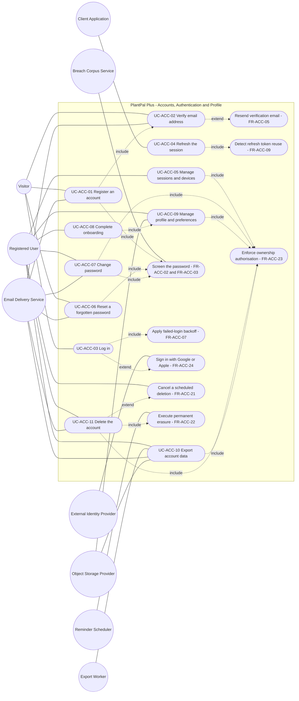
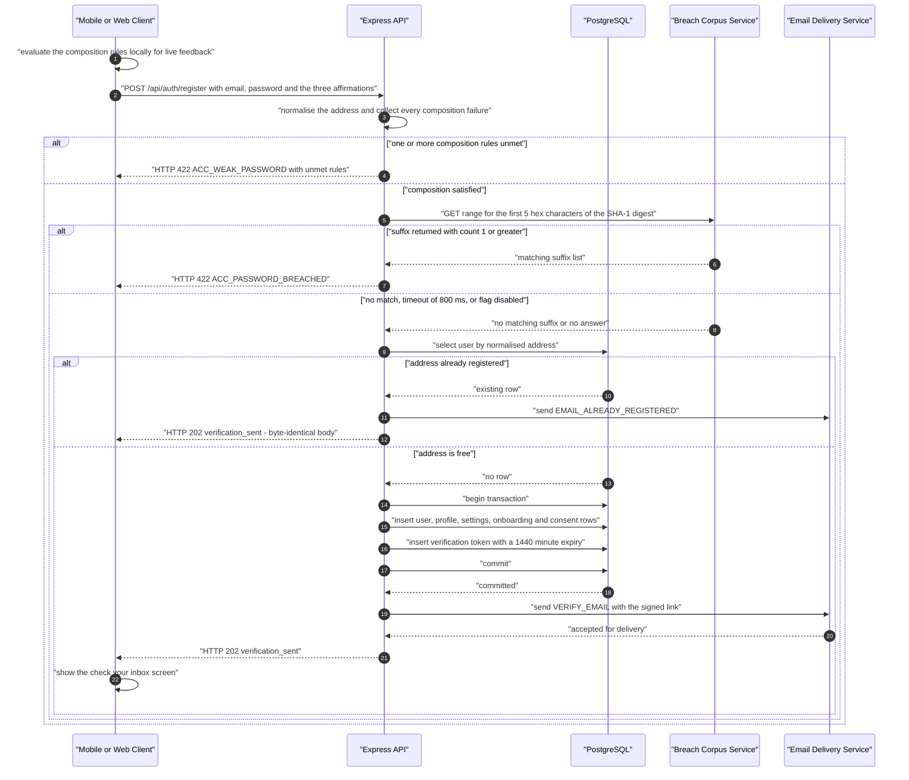
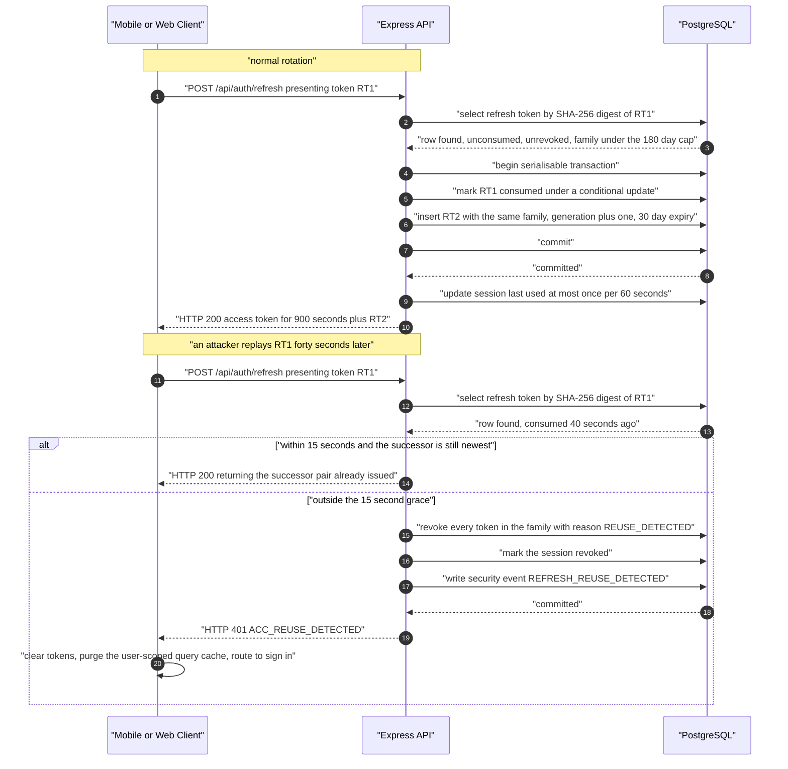
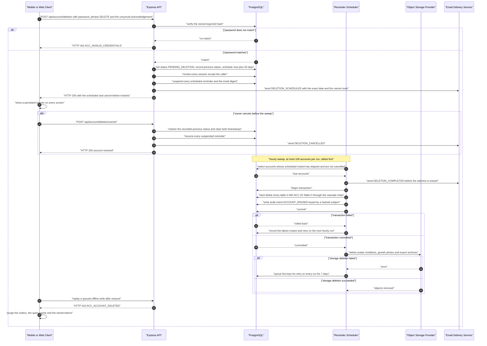

# Use-Case Model — Accounts, Authentication and Profile (ACC)

| Field | Value |
| --- | --- |
| Document | `use-cases/accounts.md` — use-case model for the ACC subsystem |
| Version | 1.0 |
| Date | 2026-07-21 |
| Status | Baselined for Phase 1 sign-off |
| Owner | Rakshit — Project Lead / sole developer (STK-03) |
| Parent | [PlantPal+ Software Requirements Specification v1.0](../SRS.md) |

---

## Table of contents

1. [Module use-case diagram](#1-module-use-case-diagram)
2. [Actor roles](#2-actor-roles)
3. [Use-case specifications](#3-use-case-specifications)
   - [UC-ACC-01 — Register an account](#uc-acc-01--register-an-account)
   - [UC-ACC-02 — Verify email address](#uc-acc-02--verify-email-address)
   - [UC-ACC-03 — Log in](#uc-acc-03--log-in)
   - [UC-ACC-04 — Refresh the session](#uc-acc-04--refresh-the-session)
   - [UC-ACC-05 — Manage sessions and devices](#uc-acc-05--manage-sessions-and-devices)
   - [UC-ACC-06 — Reset a forgotten password](#uc-acc-06--reset-a-forgotten-password)
   - [UC-ACC-07 — Change password](#uc-acc-07--change-password)
   - [UC-ACC-08 — Complete onboarding](#uc-acc-08--complete-onboarding)
   - [UC-ACC-09 — Manage profile and preferences](#uc-acc-09--manage-profile-and-preferences)
   - [UC-ACC-10 — Export account data](#uc-acc-10--export-account-data)
   - [UC-ACC-11 — Delete the account](#uc-acc-11--delete-the-account)
4. [Sequence diagrams for the most complex use cases](#4-sequence-diagrams-for-the-most-complex-use-cases)
5. [Include and extend relationship catalogue](#5-include-and-extend-relationship-catalogue)
6. [Use-case to requirement coverage](#6-use-case-to-requirement-coverage)

Related documents: [modules/accounts.md](../modules/accounts.md) · [user-stories/accounts.md](../user-stories/accounts.md) · [03-functional-requirements.md](../03-functional-requirements.md) · [04-non-functional-requirements.md](../04-non-functional-requirements.md) · [06-use-case-model.md](../06-use-case-model.md) · [10-traceability-matrix.md](../10-traceability-matrix.md)

---

## 1. Module use-case diagram

Eleven numbered use cases, `UC-ACC-01` through `UC-ACC-11`, contiguous with no gaps. The stadium nodes carrying no `UC-ACC-nn` identifier are **included or extending behaviours** of those eleven; they are named after the functional requirement that realises them and are catalogued in [section 5](#5-include-and-extend-relationship-catalogue). They are deliberately not given identifiers of their own, because the ACC use-case series is closed at eleven and every `Traces to` field in [modules/accounts.md](../modules/accounts.md) references only those eleven.

---

## 2. Actor roles

| Actor | Type | Goals in this module |
| --- | --- | --- |
| Visitor | Primary — human, unauthenticated | Create an account, prove control of the mailbox, obtain a session, recover access after forgetting the password |
| Registered User | Primary — human, authenticated account owner | Maintain profile, body metrics and preferences; complete setup; see and revoke devices; change the password; export everything held; delete the account |
| Client Application | Primary — system, React Native (Expo) mobile app and React (Vite) web app | Keep a session alive without user interaction, store tokens per the platform rule of BR-ACC-07 clause 7, purge local state when the server says the account is gone |
| Reminder Scheduler | Time — system, node-cron worker | Execute the hourly deletion sweep, expire stale tokens and export archives, age out login-attempt rows |
| Export Worker | System — node-cron job on the same worker process | Build the JSON archive and the photo manifest asynchronously and publish a signed download URL |
| Email Delivery Service | Secondary — external, free transactional tier | Deliver the ten account messages enumerated in BR-ACC-26 |
| Breach Corpus Service | Secondary — external, Have I Been Pwned range API, free and keyless | Answer a 5-character SHA-1 prefix query with candidate suffixes and counts |
| External Identity Provider | Secondary — external, Google and Apple | Assert a verified email address and a stable subject identifier for FR-ACC-24, v1.1 |
| Object Storage Provider | Secondary — external, Supabase Storage or Cloudinary | Hold avatar renditions and export archives and issue time-limited signed URLs |

Three notes bind every use case below.

1. **There is no Administrator actor in v1.0.** No flow may depend on an operator resetting a password, unlocking an account or reading a user's data. Every lockout self-expires and every blocked path has a self-service repair route.
2. **`Client Application` is an actor, not part of the system boundary**, because token storage differs by platform and that difference is a stated constraint rather than an implementation detail.
3. **Connectivity rule (D-04).** Every ACC use case except the cached read paths of UC-ACC-05 requires connectivity. No ACC action is ever placed in the offline write queue, because only append-only logging actions may be queued and ACC owns none of them.

---

## 3. Use-case specifications

Every use case states observable actor and system behaviour only. Where a numbered step names a value — a duration, a status, a count — that value is the one fixed by the requirement or business rule cited in the metadata table, and is repeated here so the scenario is executable as a test script without a second lookup.

---

### UC-ACC-01 — Register an account

| Field | Value |
| --- | --- |
| Primary actor | Visitor |
| Secondary actors | Breach Corpus Service, Email Delivery Service |
| Level | User-goal |
| Priority | Must |
| Release | v0.1 Walking Skeleton |
| Frequency of use | Once per account; at most 1 per person for the product's lifetime |
| Preconditions | The visitor is not authenticated. The device has network connectivity. The terms-of-service and privacy-policy documents exist at a known version. |
| Trigger | The visitor submits the registration form. |
| Success guarantee | An account exists with status `PENDING_VERIFICATION`, together with its profile record, its preference record defaulted per BR-ACC-22 Table D, its onboarding record at step 1 and one consent record per accepted document. A single-use verification token has been issued and a `VERIFY_EMAIL` message dispatched. |
| Minimal guarantee | No partially written account exists, because every insert happens in one transaction. The response body and status disclose nothing about whether the submitted address was already registered. Nothing the visitor typed is lost from the form. |
| Related FRs | FR-ACC-01, FR-ACC-02, FR-ACC-03 |
| Related USs | US-ACC-01 |

**Main success scenario**

1. The visitor opens the registration screen.
2. The system displays a form requesting an email address, a password, affirmation of the terms of service, affirmation of the privacy policy and self-attestation of being 16 or older, and marks all five as required.
3. The visitor types a candidate password.
4. The system evaluates the eight composition rules of BR-ACC-01 on the device and shows, for each rule, whether it is currently met, without transmitting the password.
5. The visitor completes the remaining fields, affirms the three checkboxes and submits the form.
6. The system normalises the address to `lower(trim(email))`, re-evaluates every composition rule server-side and collects every failure rather than stopping at the first.
7. The system sends the first 5 hexadecimal characters of the password's SHA-1 digest to the Breach Corpus Service and compares the returned suffixes locally.
8. The system creates, in one transaction, the account with status `PENDING_VERIFICATION`, the profile with the display name defaulted to the email local part truncated to 40 characters, the preference record with the defaults of BR-ACC-22 Table D, the onboarding record at step 1, and one consent record per accepted document.
9. The system issues a single-use verification token valid for 1440 minutes and asks the Email Delivery Service to deliver the `VERIFY_EMAIL` message to the submitted address.
10. The system responds with HTTP 202 and a body containing only the submitted status and the echoed address, and displays a confirmation screen naming that address.
11. The visitor opens the mailbox and continues into UC-ACC-02.

**Extensions**

| Step | Condition | Handling |
| --- | --- | --- |
| 2a | The device has no network connectivity | 2a1 The system disables the submit control and displays an offline state naming account creation as an action that needs a connection. 2a2 The system preserves every value already typed. 2a3 The system does not place the request in the offline queue, per D-04. Use case ends. |
| 4a | The password meets fewer than 3 of the 4 character classes, or is shorter than 12 code points | 4a1 The system marks the unmet rules on the device. 4a2 The submit control stays enabled, because the client evaluation is advisory and the server decision is authoritative. |
| 6a | The email address fails BR-ACC-02 | 6a1 The system responds HTTP 422 with code `ACC_EMAIL_INVALID`. 6a2 No account is created. 6a3 The visitor corrects the address and the scenario resumes at step 5. |
| 6b | The password violates one or more composition rules | 6b1 The system responds HTTP 422 with code `ACC_WEAK_PASSWORD` and an `unmet_rules` array drawn from `MIN_LENGTH`, `MAX_LENGTH`, `CHARACTER_CLASSES`, `COMMON_PASSWORD`, `CONTAINS_EMAIL`, `CONTAINS_DISPLAY_NAME`, `WHITESPACE_ONLY`, `REPEATED_CHARACTERS`. 6b2 The system renders one line per unmet rule. 6b3 The scenario resumes at step 3. |
| 6c | The terms, the privacy policy or the age attestation is not affirmed | 6c1 The system responds HTTP 422 with code `ACC_TERMS_NOT_ACCEPTED`. 6c2 No consent record is written. 6c3 The scenario resumes at step 5. |
| 7a | The Breach Corpus Service returns the password's digest suffix with a count of 1 or greater | 7a1 The system responds HTTP 422 with code `ACC_PASSWORD_BREACHED` and never discloses the count. 7a2 The scenario resumes at step 3. |
| 7b | The Breach Corpus Service does not answer within 800 ms, answers with a non-200 status, or the feature flag `integration.breach_check.enabled` is `false` | 7b1 The system treats the password as not breached. 7b2 The system increments the counter `acc.breach_check.fail_open`. 7b3 The scenario continues at step 8. |
| 8a | An account already exists for the normalised address | 8a1 The system creates no row. 8a2 The system asks the Email Delivery Service to deliver `EMAIL_ALREADY_REGISTERED` to that address, carrying a sign-in link and a reset link. 8a3 The system returns the step 10 response byte-identically, so the visitor cannot distinguish this branch. Use case ends. |
| 9a | The Email Delivery Service rejects or fails the send | 9a1 The account remains created. 9a2 The system records the delivery failure for the operator log. 9a3 The step 10 response is unchanged. 9a4 The visitor recovers through the resend path of UC-ACC-02. |

**Exception flows**

| Ref | Exception | Detection | System response | Recovery |
| --- | --- | --- | --- | --- |
| E1 | More than 5 registrations in a rolling hour, or more than 20 in a rolling 24 hours, from one truncated IP prefix | Rate-limit counter of BR-ACC-25 | HTTP 429 with code `ACC_RATE_LIMITED` and a `Retry-After` header in seconds | The visitor waits the stated interval; no account state changed |
| E2 | The transaction of step 8 fails after one or more inserts | Database error inside the transaction | The whole transaction is rolled back; HTTP 500 with a generic code; no orphan profile, preference or consent row survives | The visitor resubmits the unchanged form |
| E3 | The submitted password exceeds 128 code points | Composition check `MAX_LENGTH` | HTTP 422 with `ACC_WEAK_PASSWORD`; the input is rejected and never silently truncated | The visitor shortens the password |
| E4 | The common-password asset is missing at runtime | Asset load failure at boot | The `COMMON_PASSWORD` clause is treated as passed and the degradation is logged | Operator restores the asset; no user-visible effect |

**Special requirements**

- NFR-SEC-03 password storage and composition; the password is never trimmed, logged, echoed or included in any telemetry or Sentry payload (NFR-OBSV-07).
- NFR-SEC-08 transport and input handling for the unauthenticated surface.
- NFR-SEC-02 third-party credential screening, with the fail-open behaviour of step 7b.
- NFR-RELI-02 the product stays fully functional with the breach integration disabled (D-03).
- NFR-LEGL-02 and NFR-LEGL-06 consent capture with document type and version at the `REGISTRATION` surface.
- NFR-USAB-03 and NFR-USAB-08 every error names the field and the corrective action in plain English.
- NFR-A11Y-01 the form is completable by keyboard alone and every control carries a programmatic label.
- NFR-I18N-01 every message in this flow, including both email templates, resolves from the locale catalogue by message identifier.
- NFR-MAIN-04 the composition rules of steps 4 and 6 come from one shared validation package, not two implementations.

---

### UC-ACC-02 — Verify email address

| Field | Value |
| --- | --- |
| Primary actor | Visitor |
| Secondary actors | Email Delivery Service |
| Level | User-goal |
| Priority | Must |
| Release | v0.5 Alpha |
| Frequency of use | Once per account, plus at most 3 resends per rolling hour and 10 per rolling 24 hours |
| Preconditions | An account exists with status `PENDING_VERIFICATION`. At least one verification token has been issued for its address. |
| Trigger | The visitor opens the verification link from the email, or presses the resend control. |
| Success guarantee | `email_verified_at` is set, the account status becomes `ACTIVE`, the token is marked consumed, and a `WELCOME` message is dispatched. |
| Minimal guarantee | An invalid, expired, superseded or already-consumed token changes no account state, and the response always offers the self-service resend route. |
| Related FRs | FR-ACC-04, FR-ACC-05 |
| Related USs | US-ACC-02 |

**Main success scenario**

1. The visitor opens the `VERIFY_EMAIL` message and selects the verification link.
2. The system verifies the token's signature, that its type is `email_verify`, that its issuer is `plantpal-plus`, that its audience is `account-verification`, and that its expiry is in the future allowing 60 seconds of clock skew.
3. The system locates the companion token record by its identifier and confirms that it is neither consumed nor invalidated.
4. The system marks the token consumed, sets `email_verified_at` to the current instant, and sets the account status to `ACTIVE`, all in one transaction.
5. The system asks the Email Delivery Service to deliver the `WELCOME` message.
6. The system responds HTTP 200 with a verified status and directs the visitor to sign in, because verification deliberately creates no session.
7. The visitor continues into UC-ACC-03.

**Extensions**

| Step | Condition | Handling |
| --- | --- | --- |
| 1a | The visitor cannot find the email, or the link has expired | 1a1 The visitor presses the resend control. 1a2 The system applies the extending behaviour "resend verification email" described below. |
| 2a | The signature, type, issuer or audience does not validate | 2a1 The system responds HTTP 400 with code `ACC_TOKEN_INVALID`. 2a2 The page offers a one-press resend. Use case ends. |
| 2b | The expiry is more than 60 seconds in the past | 2b1 The system responds HTTP 410 with code `ACC_TOKEN_EXPIRED` and a resend affordance in the body. 2b2 The scenario resumes at extension 1a. |
| 3a | The token was consumed within the previous 10 minutes | 3a1 The system responds HTTP 200 with an already-verified status rather than an error, because mail clients and link scanners routinely fetch a link twice. 3a2 The visitor sees a confirmation, not a failure. Use case ends successfully. |
| 3b | The token was consumed more than 10 minutes ago | 3b1 The system responds HTTP 409 with code `ACC_TOKEN_CONSUMED`. 3b2 The page states that the address is already confirmed and offers sign-in. Use case ends. |
| 3c | The token was invalidated because a newer verification email was sent | 3c1 The system responds HTTP 400 with code `ACC_TOKEN_INVALID`. 3c2 The message instructs the visitor to open the most recent email. Use case ends. |
| 4a | The account was already `ACTIVE` | 4a1 The system sets `email_verified_at` if it was null and leaves the status unchanged. 4a2 The scenario continues at step 5. |
| 6a | The visitor is already signed in on a mobile device | 6a1 The system does not create a second session. 6a2 The client refreshes the profile so the unverified banner disappears. |

**Extending behaviour — resend verification email (FR-ACC-05)**

| Step | Condition | Handling |
| --- | --- | --- |
| R1 | The visitor requests a new verification email | R1a The system counts verification tokens issued to that normalised address in the preceding 60 seconds, 60 minutes and 24 hours, counting the send performed by registration itself. R1b When no threshold is met, the system invalidates every previously issued unconsumed verification token for the address, issues a fresh one and dispatches `VERIFY_EMAIL`. R1c The system responds HTTP 202 with a body identical whether the address exists, does not exist, or is already verified. |
| R2 | Fewer than 60 seconds have passed since the previous send | R2a The system responds HTTP 429 with code `ACC_RATE_LIMITED`, a `Retry-After` header and the remaining seconds. |
| R3 | More than 3 sends have occurred in the rolling hour, or more than 10 in the rolling 24 hours for that address, or more than 20 in the rolling hour for that truncated IP prefix | R3a The system responds HTTP 429 with code `ACC_RATE_LIMITED` and the wait expressed in minutes or hours. |
| R4 | The visitor afterwards opens a link from an older email | R4a The system responds HTTP 400 with code `ACC_TOKEN_INVALID` and tells the visitor to use the newest email. |

**Exception flows**

| Ref | Exception | Detection | System response | Recovery |
| --- | --- | --- | --- | --- |
| E1 | The account was erased between issuance and use | Account row absent | HTTP 410 with code `ACC_ACCOUNT_DELETED` | The visitor may register the address again as a brand-new account |
| E2 | The 168-hour unverified grace window has elapsed and the visitor tries to sign in instead | Grace-window check in UC-ACC-03 | HTTP 403 with code `ACC_EMAIL_UNVERIFIED` and `resend_available` set true | The visitor uses the resend path R1 |
| E3 | The Email Delivery Service is unavailable during a resend | Provider error or timeout | The send is retried per BR-ACC-26 clause 2; the HTTP 202 response is unchanged | The visitor retries after the 60-second minimum interval |
| E4 | A link scanner fetches the link before the visitor does | Token consumed with no human interaction | The 10-minute replay window of extension 3a returns success to the human visitor | None needed |

**Special requirements**

- NFR-SEC-01 the token is a signed, single-use artefact with a bounded 1440-minute lifetime and a dedicated signing secret used for no other purpose.
- NFR-SEC-11 abuse control on the resend endpoint, which is the module's email-bombing vector.
- NFR-USAB-03 the expired-link page offers the repair action in one press rather than sending the visitor back to a form.
- NFR-A11Y-02 the verification result page announces its outcome to assistive technology.
- NFR-I18N-01 both `VERIFY_EMAIL` and `WELCOME` resolve from the locale catalogue.

---

### UC-ACC-03 — Log in

| Field | Value |
| --- | --- |
| Primary actor | Visitor |
| Secondary actors | External Identity Provider (v1.1 extension only) |
| Level | User-goal |
| Priority | Must |
| Release | v0.1 Walking Skeleton for the password path; v1.1 Post-MVP for the external-identity extension |
| Frequency of use | Once per device per 30 days under normal use, because UC-ACC-04 keeps the session alive; higher after a password change or a device change |
| Preconditions | An account exists whose status is `ACTIVE`, or `PENDING_VERIFICATION` within 168 hours of creation, or `PENDING_DELETION`. The device has connectivity. |
| Trigger | The visitor submits the sign-in form, or selects an external identity provider button. |
| Success guarantee | One session record and one first-generation refresh token in a new token family exist; an access token with a 900-second lifetime and a refresh token with a 30-day lifetime have been delivered to the client by the platform-correct channel; the consecutive-failure counter for the address is reset and `last_login_at` is updated. |
| Minimal guarantee | A failed attempt discloses nothing about whether the address has an account, issues no token, and is recorded as a login attempt so that the backoff schedule of FR-ACC-07 can be computed. |
| Related FRs | FR-ACC-06, FR-ACC-07, FR-ACC-24 |
| Related USs | US-ACC-03, US-ACC-04, US-ACC-05 |

**Main success scenario**

1. The visitor opens the sign-in screen and submits an email address and a password.
2. The system looks the account up by normalised address and evaluates the backoff state of the included behaviour "apply failed-login backoff" before touching the password.
3. The system verifies the password against the stored Argon2id hash.
4. The system creates one session record and one first-generation refresh token carrying a new token-family identifier, resets the consecutive-failure counter to 0 and sets `last_login_at`.
5. The system issues an access token with a 900-second lifetime carrying the account's current token version, and delivers the refresh token in the response body on mobile or as an `HttpOnly` cookie scoped to the authentication path on web.
6. The system returns the account summary and whether onboarding is complete.
7. The client stores the tokens per the platform rule and routes the visitor to the unified daily dashboard, or into UC-ACC-08 when onboarding is not complete.

**Extensions**

| Step | Condition | Handling |
| --- | --- | --- |
| 1a | The visitor selects Google or Apple instead of typing a password (v1.1) | 1a1 The extending behaviour "sign in with Google or Apple" runs an authorisation-code flow with PKCE. 1a2 On a verified provider email the system authenticates or links the account and issues the same token pair as step 5. 1a3 On an unverified provider email the system responds HTTP 409 with code `ACC_OAUTH_EMAIL_UNVERIFIED` and directs the visitor to sign in with a password first. |
| 2a | The address has no account | 2a1 The system still performs an Argon2id verification against a fixed dummy hash generated at boot. 2a2 The system pads the response to a floor of 250 ms. 2a3 The system responds HTTP 401 with code `ACC_INVALID_CREDENTIALS`, byte-identical to the wrong-password response. Use case ends. |
| 2b | The address has 5 or more consecutive failures and the backoff window has not elapsed | 2b1 The system responds HTTP 429 with code `ACC_ACCOUNT_LOCKED` and the remaining seconds. 2b2 The attempt is recorded with outcome `LOCKED_OUT` and does not extend the window. 2b3 The screen offers the password-reset route of UC-ACC-06 as the documented self-service unlock. Use case ends. |
| 2c | The requesting IP prefix has exceeded 50 failed attempts in the rolling hour | 2c1 The system refuses every authentication endpoint for that prefix for 60 minutes with HTTP 429. Use case ends. |
| 3a | The password does not match | 3a1 The system records a login attempt with outcome `BAD_PASSWORD`. 3a2 The system responds HTTP 401 with code `ACC_INVALID_CREDENTIALS`. 3a3 On the 5th consecutive failure the system writes a `LOCKOUT_TRIGGERED` security event and the next attempt follows extension 2b. Use case ends. |
| 3b | The stored hash uses parameters weaker than current policy | 3b1 The system rehashes the verified password with current parameters inside the same request. 3b2 The scenario continues at step 4. |
| 4a | The account status is `PENDING_VERIFICATION` and creation was less than 168 hours ago | 4a1 The scenario proceeds normally. 4a2 The response carries a countdown banner payload stating the days remaining. |
| 4b | The account status is `PENDING_VERIFICATION` and creation was 168 hours ago or more | 4b1 The system responds HTTP 403 with code `ACC_EMAIL_UNVERIFIED` and `resend_available` set true. 4b2 The visitor is routed to the resend path of UC-ACC-02. Use case ends. |
| 4c | The account status is `PENDING_DELETION` | 4c1 The scenario proceeds normally. 4c2 The response carries the pending-deletion flag and the scheduled date so the client can offer the cancellation route of UC-ACC-11. |
| 5a | The client is a web browser | 5a1 The refresh token is set as an `HttpOnly`, `Secure`, `SameSite=None` cookie limited to the authentication path with a 2 592 000-second maximum age. 5a2 The system also issues the double-submit CSRF value required by BR-ACC-07 clause 9. |
| 5b | The client is the mobile app | 5b1 The refresh token is returned in the response body. 5b2 The client stores it in the platform secure store, never in plain application storage. |

**Exception flows**

| Ref | Exception | Detection | System response | Recovery |
| --- | --- | --- | --- | --- |
| E1 | The account was erased | Account row absent | HTTP 401 with code `ACC_INVALID_CREDENTIALS`, indistinguishable from a non-existent address | The visitor may register the address again |
| E2 | The device is offline | Client connectivity check | The request is not sent and not queued; the screen states that signing in needs a connection and preserves the typed address | The visitor retries when connectivity returns |
| E3 | The device clock is more than 60 seconds from server time | Clock-skew check of BR-ACC-17 | The session is still issued; the client adopts the server time offset for all expiry arithmetic | None needed |
| E4 | The `X-PlantPal-Device` header carries control characters or exceeds 120 characters | Header sanitisation of BR-ACC-18 clause 1 | The value is stripped of control characters, whitespace-collapsed and truncated; it is never used for any security decision | None needed |

**Special requirements**

- NFR-SEC-04 session and token lifecycle: 900-second access token, 30-day rotating refresh token, 180-day absolute family cap.
- NFR-SEC-15 platform-correct token storage — secure store on mobile, `HttpOnly` cookie on web, never `localStorage`.
- NFR-SEC-11 the backoff schedule and the per-IP ceiling.
- NFR-PRIV-04 login attempts store only a truncated IP prefix, retained 90 days.
- NFR-PERF-01 and NFR-PERF-04 the authenticated response budget, measured with the deliberate 250 ms floor of extension 2a excluded from the percentile calculation and stated as such.
- NFR-USAB-08 the failure message names no field, because naming one would disclose account existence.

---

### UC-ACC-04 — Refresh the session

| Field | Value |
| --- | --- |
| Primary actor | Client Application |
| Secondary actors | None |
| Level | Subfunction |
| Priority | Must |
| Release | v0.5 Alpha |
| Frequency of use | Automatic; approximately once per 15 minutes of active use per device, and once at every cold start |
| Preconditions | The client holds a refresh token that is unconsumed, unrevoked and within its 30-day lifetime, whose family is within its 180-day absolute cap. |
| Trigger | The access token is within 60 seconds of expiry, an API call returns HTTP 401 with code `ACC_UNAUTHENTICATED`, or the application returns to the foreground. |
| Success guarantee | The presented refresh token is marked consumed, a successor token in the same family is issued with a fresh 30-day expiry and a generation one higher, and a new 900-second access token carrying the account's current token version is returned. The user is not prompted. |
| Minimal guarantee | A refresh that cannot be honoured returns a machine-readable reason that lets the client distinguish an ordinary expiry from a security revocation, and never leaves the client holding a token it believes is valid. |
| Related FRs | FR-ACC-08, FR-ACC-09 |
| Related USs | US-ACC-03, US-ACC-05 |

**Main success scenario**

1. The Client Application presents its refresh token, in the request body on mobile or through the `HttpOnly` cookie plus a double-submit CSRF value on web.
2. The system hashes the presented value with SHA-256 and locates the stored digest, confirming that the raw token was never stored.
3. The system confirms the token is unconsumed, unrevoked, unexpired, that its family is younger than 180 days, and that the owning account is not erased.
4. The system marks the presented token consumed and inserts a successor in the same family with the presented token as its parent, a generation one higher and an expiry 30 days in the future, in one serialisable transaction.
5. The system updates the session's last-used timestamp, writing at most once per 60 seconds per session.
6. The system issues a new access token with a 900-second lifetime carrying the account's current token version, and returns the successor refresh token by the platform-correct channel.
7. The Client Application replaces both stored tokens and retries the request that prompted the refresh.

**Extensions**

| Step | Condition | Handling |
| --- | --- | --- |
| 1a | Two requests from the same client attempt a refresh concurrently | 1a1 The client is required to single-flight refreshes, holding all other pending requests until one completes. 1a2 Any race that still occurs is absorbed by the 15-second replay grace of extension 3c. |
| 1b | The client is a web browser and the double-submit CSRF value is missing or does not match | 1b1 The platform CSRF guard responds HTTP 403. 1b2 The client refetches the CSRF value and retries once. |
| 2a | The presented value resolves to no stored digest | 2a1 The system responds HTTP 401 with code `ACC_TOKEN_INVALID`. 2a2 The client clears its tokens and routes to UC-ACC-03. Use case ends. |
| 3a | The token is past its 30-day expiry | 3a1 The system responds HTTP 401 with code `ACC_TOKEN_EXPIRED` and a reason of `refresh_expired`. 3a2 The client routes to UC-ACC-03 without alarming copy, because this is ordinary. Use case ends. |
| 3b | The family is older than its 180-day absolute cap | 3b1 The system responds HTTP 401 with code `ACC_TOKEN_EXPIRED` and a reason of `family_cap`. 3b2 The client routes to UC-ACC-03. Use case ends. |
| 3c | The token is already consumed, the presentation is within 15 seconds of that consumption, and its direct successor is still the newest generation in the family | 3c1 The system returns the successor pair already issued, without revoking anything, because this pattern is overwhelmingly a mobile network retry. 3c2 The scenario ends successfully. |
| 3d | The token is already consumed and extension 3c does not apply | 3d1 The included behaviour "detect refresh token reuse" revokes every token in the family with reason `REUSE_DETECTED` and marks the session revoked. 3d2 The system writes a `REFRESH_REUSE_DETECTED` security event carrying the family identifier, the presented and newest generations, the truncated IP prefix and the device label, retained 90 days. 3d3 The system responds HTTP 401 with code `ACC_REUSE_DETECTED`. 3d4 The client clears its tokens, purges its persisted query cache for user-scoped keys and routes to UC-ACC-03 with an explanation. 3d5 Other families of the same account are deliberately left untouched. Use case ends. |
| 3e | The session was revoked by UC-ACC-05 or by a credential change | 3e1 The system responds HTTP 401 with code `ACC_SESSION_REVOKED`. 3e2 The client routes to UC-ACC-03. Use case ends. |
| 3f | The account's token version no longer matches the value the client last saw | 3f1 The system responds HTTP 401 with code `ACC_UNAUTHENTICATED`. 3f2 The client attempts exactly one refresh, which succeeds only if its refresh token belongs to a surviving session. Use case ends. |
| 3g | The account has been erased | 3g1 The system responds HTTP 410 with code `ACC_ACCOUNT_DELETED`. 3g2 The client purges its offline outbox, its persisted query cache and its stored tokens, per BR-ACC-21 clause 4. Use case ends. |
| 6a | The profile changed since the client's freshness hint | 6a1 The system includes the full profile in the response so the client stays in step without a second request. |

**Exception flows**

| Ref | Exception | Detection | System response | Recovery |
| --- | --- | --- | --- | --- |
| E1 | The rotation transaction fails after consuming the presented token but before inserting the successor | Transaction failure | The transaction is rolled back so the presented token remains unconsumed and usable | The client retries the refresh |
| E2 | The security-event write of extension 3d fails | Write error | The revocation still commits, and the failure is logged at error level | Operator reviews the log; the security outcome is unaffected |
| E3 | The device is offline when the access token expires | Client connectivity check | Cached reads continue to be served from the persisted query cache; writes that require connectivity show the offline state | The refresh is retried on the next connectivity event |
| E4 | The refresh succeeds but the retried request fails again with HTTP 401 | Second consecutive 401 | The client stops retrying and routes to UC-ACC-03, so no refresh loop is possible | The user signs in again |

**Special requirements**

- NFR-SEC-04 rotation, reuse detection and family revocation are the module's primary defence against a stolen long-lived credential.
- NFR-SEC-15 the successor token is written to the same platform-correct store the predecessor occupied.
- NFR-PERF-01 the refresh must complete inside the interactive response budget, because every cold start pays for it.
- NFR-OBSV-01 the reuse-detection counter and the `acc.refresh.*` counters are exported for the observability dashboard.
- NFR-PRIV-04 the security event stores a truncated IP prefix and an escaped device label, never a full address and never a geolocation.

---

### UC-ACC-05 — Manage sessions and devices

| Field | Value |
| --- | --- |
| Primary actor | Registered User |
| Secondary actors | None |
| Level | User-goal |
| Priority | Must for signing out of this device and signing out everywhere; Should for listing sessions and revoking a single session |
| Release | v0.1 Walking Skeleton for sign out of this device; v0.5 Alpha for sign out everywhere; v1.0 MVP for the session list and single-session revocation |
| Frequency of use | Rare — a few times per account per year, concentrated around a lost device or a suspicious sign-in |
| Preconditions | The user holds a valid access token. For the listing, the account has at least one non-revoked session, which is always true for the caller. |
| Trigger | The user opens the devices screen, presses sign out, presses sign out everywhere, or presses sign out beside one listed device. |
| Success guarantee | The requested revocation is recorded server-side: one family for a single session, or every session plus an incremented token version for sign out everywhere. The devices list reflects the change immediately. |
| Minimal guarantee | Signing out never fails from the user's point of view — local tokens and caches are cleared even when the server call cannot be made — and a session identifier belonging to another account is indistinguishable from one that does not exist. |
| Related FRs | FR-ACC-10, FR-ACC-11, FR-ACC-18, FR-ACC-19, FR-ACC-23 |
| Related USs | US-ACC-03, US-ACC-07, US-ACC-11 |

**Main success scenario**

1. The user opens the devices screen.
2. The system, applying the included behaviour "enforce ownership authorisation", returns the caller's non-revoked, unexpired sessions ordered by last-used descending and limited to 50 rows, each carrying a device label, a platform, a creation timestamp, a last-used timestamp, a truncated IP prefix and a flag marking the current device.
3. The user selects a device that is not the current one and presses sign out.
4. The system resolves that session identifier scoped to the caller, revokes every refresh token in its family with reason `USER_REVOKED_SESSION`, marks the session revoked and writes a `SESSION_REVOKED` security event.
5. The system responds HTTP 204 and the row remains listed for 24 hours marked as revoked, so the user can see the action took effect.
6. The system states plainly that the revoked device loses access within 15 minutes, because the access token already issued to it is not denylisted.
7. The user closes the screen.

**Extensions**

| Step | Condition | Handling |
| --- | --- | --- |
| 2a | The listing would exceed the 50-row bound | 2a1 The system returns the 50 most recently used. 2a2 The screen states that the 50 most recent devices are shown. 2a3 The bound is defensive rather than routinely reachable, because the concurrent-session cap of BR-ACC-07 holds non-revoked sessions at 10 or fewer; the reachable case is an eleventh sign-in, which revokes the least recently used session and its token family with `revoke_reason = FAMILY_CAP_REACHED`. |
| 2b | No device header was supplied when a session was created | 2b1 The label is the literal `Unknown device`. 2b2 The label is always rendered as escaped text, because the source header is attacker-controllable. |
| 2c | The device is offline | 2c1 The system serves the last downloaded list from the persisted query cache with a staleness note. 2c2 Revocation controls are disabled, because revocation requires connectivity and is never queued. |
| 2d | A session was revoked more than 24 hours ago | 2d1 The row is omitted from the listing. 2d2 The underlying record is pruned after 90 days. |
| 3a | The user presses sign out on the current device | 3a1 The system revokes the presented token's family with reason `USER_LOGOUT`, marks the session revoked, and on web clears the refresh cookie by setting an empty value with a zero maximum age. 3a2 The client discards its in-memory access token and purges every persisted query-cache entry under a user-scoped key. 3a3 The system responds HTTP 204. Use case ends. |
| 3b | The user presses sign out everywhere | 3b1 The system increments the account's token version by 1, which invalidates every outstanding access token including the caller's. 3b2 The system revokes every non-revoked refresh token and session with reason `USER_LOGOUT_ALL` and writes a `LOGOUT_ALL` security event. 3b3 When `keep_current_session` is true, which is the default, the system creates a new session and first-generation refresh token for the calling device and returns a fresh access token, so the user is not signed out of the device in their hand. 3b4 The system returns the count of revoked sessions. 3b5 Push registrations are deliberately not deleted; whether a revoked device stops receiving pushes is decided by the NOT series. |
| 3c | The user needs the revocation to take effect immediately | 3c1 The screen offers sign out everywhere as the only instant-effect control, because it is the only one that increments the token version. |
| 4a | The session identifier does not exist, or exists but belongs to another account | 4a1 The system responds HTTP 404 with code `ACC_SESSION_NOT_FOUND`, using one byte-identical body for both cases so that no endpoint discloses another user's records. Use case ends. |
| 4b | The session is already revoked | 4b1 The system responds HTTP 204 and changes nothing. |

**Exception flows**

| Ref | Exception | Detection | System response | Recovery |
| --- | --- | --- | --- | --- |
| E1 | The user presses sign out while offline | Client connectivity check | Local tokens and caches are cleared immediately; the revocation call is retried on the next connectivity event; the screen says so plainly | The revocation completes when connectivity returns |
| E2 | No valid access token is presented | Token verification | HTTP 401 with code `ACC_UNAUTHENTICATED` | The user signs in again through UC-ACC-03 |
| E3 | The web client omits the double-submit CSRF value on sign out | CSRF guard | HTTP 403; the client refetches the value and retries once | Automatic retry |
| E4 | More than 60 listings are requested in a rolling hour | Rate limit of BR-ACC-25 | HTTP 429 with code `ACC_RATE_LIMITED` | The user waits the stated interval |
| E5 | The last-used timestamp is up to 60 seconds stale | Amortised write of BR-ACC-18 clause 3 | The stored value is returned unchanged and rendered in relative minutes, so the lag is not observable | None needed |

**Special requirements**

- NFR-SEC-04 revocation semantics, and the explicit statement that an already-issued access token survives at most 15 minutes.
- NFR-SEC-14 the ownership predicate is applied on resolution, not after it, and the cross-tenant response is HTTP 404.
- NFR-PRIV-04 IPv4 is shown as a /24 prefix and IPv6 as a /48 prefix; no geolocation is derived or displayed in v1.0, because no free, reliable, privacy-acceptable source exists inside the fixed stack.
- NFR-PERF-01 the listing is a single indexed query bounded at 50 rows.
- NFR-USAB-04 the interface states the 15-minute residual validity rather than implying instant effect.

---

### UC-ACC-06 — Reset a forgotten password

| Field | Value |
| --- | --- |
| Primary actor | Visitor |
| Secondary actors | Email Delivery Service, Breach Corpus Service |
| Level | User-goal |
| Priority | Must |
| Release | v0.5 Alpha |
| Frequency of use | Rare per user; at most 3 requests per rolling hour per address |
| Preconditions | The visitor has access to the mailbox for the address. The device has connectivity. |
| Trigger | The visitor presses the forgotten-password control, or follows the reset link offered by a lockout response. |
| Success guarantee | The stored password hash is replaced, `password_changed_at` is set, the reset token is consumed, the token version is incremented, every session is revoked with reason `PASSWORD_CHANGED`, the consecutive-failure counter is cleared so any lockout ends immediately, and a `PASSWORD_CHANGED` security notification is dispatched. |
| Minimal guarantee | The response to the request step is identical whether or not the address has an account, no session is created by the reset itself, and a failed reset leaves the existing credential and every existing session untouched. |
| Related FRs | FR-ACC-12, FR-ACC-13, FR-ACC-02, FR-ACC-03 |
| Related USs | US-ACC-06 |

**Main success scenario**

1. The visitor submits the email address on the forgotten-password screen.
2. The system looks the address up, invalidates any outstanding unconsumed reset token for that account, issues a new single-use token expiring 60 minutes after issuance, and asks the Email Delivery Service to deliver the `PASSWORD_RESET` message.
3. The system responds HTTP 202 with a body stating that a reset link has been sent if an account exists, which is identical in every branch.
4. The visitor opens the message and selects the reset link.
5. The system verifies the token's signature, that its type is `password_reset`, that its audience is `account-reset`, that it is unconsumed, and that its 60-minute expiry has not passed.
6. The visitor submits a new password.
7. The system applies the included behaviour "screen the password", checking every composition rule and the breach corpus, and rejects a new password identical to the current one.
8. The system, in one transaction, writes the new Argon2id hash, sets `password_changed_at`, marks the token consumed, invalidates every other outstanding reset token for the account, increments the token version, revokes every refresh token and session with reason `PASSWORD_CHANGED`, and clears the consecutive-failure counter.
9. The system dispatches the `PASSWORD_CHANGED` notification stating the local time of the change in the account's timezone and the device label that performed it, and writes a `PASSWORD_RESET_COMPLETED` security event.
10. The system responds HTTP 200 with no session, and directs the visitor to sign in with the new password.
11. The visitor continues into UC-ACC-03.

**Extensions**

| Step | Condition | Handling |
| --- | --- | --- |
| 2a | The address has no account | 2a1 The system performs an equivalent amount of work, dispatches nothing and returns the step 3 response byte-identically. Use case ends. |
| 2b | The account status is `PENDING_VERIFICATION` | 2b1 The reset proceeds. 2b2 A successful reset deliberately does **not** set `email_verified_at`, because the token proves mailbox control only at the moment of use and conflating the two would let a mistyped address self-verify. |
| 2c | The account status is `PENDING_DELETION` | 2c1 The reset proceeds. 2c2 The scheduled deletion is not cancelled, because cancellation is always an explicit authenticated act in UC-ACC-11. |
| 2d | More than 3 requests in the rolling hour for that address, or more than 10 for that truncated IP prefix | 2d1 The system responds HTTP 429 with code `ACC_RATE_LIMITED`. Use case ends. |
| 5a | The signature, type or audience does not validate | 5a1 The system responds HTTP 400 with code `ACC_TOKEN_INVALID` and offers a fresh request. Use case ends. |
| 5b | The token is older than 60 minutes | 5b1 The system responds HTTP 410 with code `ACC_TOKEN_EXPIRED`. 5b2 The scenario resumes at step 1. |
| 5c | The token was already consumed | 5c1 The system responds HTTP 409 with code `ACC_TOKEN_CONSUMED`. 5c2 The 10-minute replay grace of the verification token deliberately does not apply to reset tokens. Use case ends. |
| 5d | A newer reset was requested, superseding this token | 5d1 The system responds HTTP 400 with code `ACC_TOKEN_INVALID` and instructs the visitor to use the newest email. Use case ends. |
| 7a | The new password violates a composition rule | 7a1 The system responds HTTP 422 with code `ACC_WEAK_PASSWORD` and the full `unmet_rules` array. 7a2 The token remains unconsumed so the visitor can try again. 7a3 The scenario resumes at step 6. |
| 7b | The new password is present in the breach corpus | 7b1 The system responds HTTP 422 with code `ACC_PASSWORD_BREACHED`. 7b2 The scenario resumes at step 6. |
| 7c | The new password equals the current password | 7c1 The system responds HTTP 422 with code `ACC_PASSWORD_UNCHANGED`. 7c2 The scenario resumes at step 6. |
| 8a | The account was locked out by the backoff schedule | 8a1 The counter is cleared as part of the same transaction, so the account is immediately usable. 8a2 This is the documented self-service unlock path, and it is the only one, because no operator role exists. |

**Exception flows**

| Ref | Exception | Detection | System response | Recovery |
| --- | --- | --- | --- | --- |
| E1 | The account was erased between request and use | Account row absent | HTTP 410 with code `ACC_ACCOUNT_DELETED` | The visitor may register the address again |
| E2 | The Email Delivery Service is unavailable | Provider error or timeout | The send is retried per BR-ACC-26 clause 2 and the HTTP 202 response is unchanged, so delivery state is never disclosed | The visitor requests again after the rate-limit interval |
| E3 | The transaction of step 8 fails | Database error | The whole transaction is rolled back; the old credential and every session survive; the token stays unconsumed | The visitor resubmits the new password |
| E4 | The visitor reaches the reset form while offline | Client connectivity check | The submit control is disabled with an offline state; nothing is queued | The visitor retries within the 60-minute token lifetime |

**Special requirements**

- NFR-SEC-01 single-use, signed, 60-minute token with a dedicated audience value.
- NFR-SEC-03 the replacement hash uses the current Argon2id parameters.
- NFR-SEC-04 a completed reset revokes every session, which is what makes reset a security control rather than a convenience.
- NFR-SEC-11 request-side rate limits per address and per truncated IP prefix.
- NFR-USAB-03 and NFR-USAB-08 the expired-link page repairs itself in one press, and every rejection names the corrective action.
- NFR-I18N-01 `PASSWORD_RESET` and `PASSWORD_CHANGED` resolve from the locale catalogue.

---

### UC-ACC-07 — Change password

| Field | Value |
| --- | --- |
| Primary actor | Registered User |
| Secondary actors | Email Delivery Service, Breach Corpus Service |
| Level | User-goal |
| Priority | Must |
| Release | v0.5 Alpha |
| Frequency of use | Rare; at most 5 accepted changes per rolling hour per account |
| Preconditions | The user holds a valid access token and knows the current password, or holds a provider re-authentication no older than 5 minutes for an account created purely from an external identity. The device has connectivity. |
| Trigger | The user submits the change-password form in settings. |
| Success guarantee | The stored hash is replaced, `password_changed_at` is set, the token version is incremented, every session except the calling one is revoked with reason `PASSWORD_CHANGED`, the calling session is rotated and reissued, and a `PASSWORD_CHANGED` notification and security event are written. |
| Minimal guarantee | A wrong current password changes no credential and no session, and is counted toward the backoff schedule of FR-ACC-07 so that an unattended unlocked device cannot be used to guess the password. |
| Related FRs | FR-ACC-14, FR-ACC-02, FR-ACC-03, FR-ACC-23 |
| Related USs | US-ACC-07 |

**Main success scenario**

1. The user opens the change-password form and submits the current password and a new password.
2. The system verifies the current password against the stored hash, because holding a valid access token is deliberately not sufficient re-authentication for this action.
3. The system applies the included behaviour "screen the password" to the new value and rejects a new password equal to the current one.
4. The system writes the new Argon2id hash and sets `password_changed_at`.
5. The system increments the account's token version by 1.
6. The system revokes every session except the calling session with reason `PASSWORD_CHANGED`, rotates the calling session's token family rather than revoking it, and reissues its access token carrying the new token version.
7. The system dispatches the `PASSWORD_CHANGED` notification and writes a `PASSWORD_CHANGED` security event.
8. The system returns the count of revoked sessions together with the reissued access token, and the user remains signed in on the device in hand.

**Extensions**

| Step | Condition | Handling |
| --- | --- | --- |
| 1a | The account holds no password because it was created purely from an external identity (v1.1) | 1a1 The form behaves as "set a password" and omits the current-password field. 1a2 The system instead requires a provider re-authentication no older than 5 minutes. 1a3 When that re-authentication is stale, the system responds HTTP 401 with code `ACC_UNAUTHENTICATED`. |
| 2a | The current password does not match | 2a1 The system responds HTTP 401 with code `ACC_INVALID_CREDENTIALS`. 2a2 The attempt counts toward the account's consecutive-failure counter. 2a3 The scenario resumes at step 1. |
| 2b | Wrong current-password attempts reach 5 consecutively | 2b1 The system responds HTTP 429 with code `ACC_ACCOUNT_LOCKED` and the remaining seconds. 2b2 The lockout self-expires on the schedule of BR-ACC-09 clause 2. Use case ends. |
| 3a | The new password violates a composition rule | 3a1 The system responds HTTP 422 with code `ACC_WEAK_PASSWORD` and the full `unmet_rules` array. 3a2 The scenario resumes at step 1. |
| 3b | The new password is present in the breach corpus | 3b1 The system responds HTTP 422 with code `ACC_PASSWORD_BREACHED`. 3b2 The scenario resumes at step 1. |
| 3c | The new password equals the current password | 3c1 The system responds HTTP 422 with code `ACC_PASSWORD_UNCHANGED`. 3c2 The scenario resumes at step 1. |
| 6a | Another device holds an unexpired access token | 6a1 That token fails the token-version check on its next call and receives HTTP 401. 6a2 That device routes to UC-ACC-03. |
| 6b | Another device is mid-refresh when the change commits | 6b1 Its refresh token has been revoked with reason `PASSWORD_CHANGED`, so the refresh returns HTTP 401 with code `ACC_SESSION_REVOKED`. 6b2 That device routes to UC-ACC-03. |
| 8a | More than 5 accepted changes occur in a rolling hour | 8a1 The system responds HTTP 429 with code `ACC_RATE_LIMITED`. |

**Exception flows**

| Ref | Exception | Detection | System response | Recovery |
| --- | --- | --- | --- | --- |
| E1 | The device is offline | Client connectivity check | The request is refused and never queued; the form states that changing the password needs a connection | The user retries when connectivity returns |
| E2 | The transaction fails after the hash is written but before sessions are revoked | Transaction failure | The whole transaction is rolled back; the old credential and every session survive | The user resubmits |
| E3 | The `PASSWORD_CHANGED` email cannot be delivered | Provider error | The change still commits and the delivery failure is logged; the user sees no failure, because the password really did change | Operator reviews the delivery log |
| E4 | The user changes the password on one device while a second device is offline with queued logging writes | Offline outbox state | The queued writes still replay successfully once that device signs in again, because idempotency keys are account-scoped and unaffected by credential changes | The user signs in on the second device |

**Special requirements**

- NFR-SEC-03 re-authentication with the current password is mandatory and is not satisfied by a valid access token.
- NFR-SEC-04 every other session dies, while the calling session is rotated rather than destroyed.
- NFR-SEC-14 the acting user is taken only from the token subject; no identifier in the body is honoured.
- NFR-USAB-08 every rejection names exactly what to change and preserves the rest of the form.
- NFR-I18N-01 the notification and every validation message resolve from the locale catalogue.

---

### UC-ACC-08 — Complete onboarding

| Field | Value |
| --- | --- |
| Primary actor | Registered User |
| Secondary actors | None |
| Level | User-goal |
| Priority | Must |
| Release | v1.0 MVP |
| Frequency of use | Once per account, plus voluntary re-entry from settings |
| Preconditions | The user holds a valid access token. An onboarding record exists at step 1, created by UC-ACC-01. |
| Trigger | The first sign-in after registration, or the user selecting "run setup again" in settings. |
| Success guarantee | Every step is recorded as either completed or skipped, `completed_at` is set, the `onboarding.completed` event is emitted, and every field a skipped step would have set holds the default from BR-ACC-22 Table D. |
| Minimal guarantee | Progress is stored server-side after every step, so an interrupted wizard resumes at the first step that is neither completed nor skipped, on any device. The dashboard is reachable at any time; onboarding is never a hard gate. |
| Related FRs | FR-ACC-17, FR-ACC-15, FR-ACC-16 |
| Related USs | US-ACC-08 |

**Main success scenario**

1. The user signs in for the first time and the client routes to the wizard at the stored current step.
2. The system presents step 1 `WELCOME_UNITS`, pre-filled with the auto-detected timezone, the locale and the unit system, with a target of 10 seconds.
3. The user confirms and continues.
4. The system records the step as completed, applies the values through the same validation the standalone preference endpoint uses, and advances to step 2 `MODULE_SELECT` with all three modules pre-checked, target 10 seconds.
5. The user confirms the module selection and continues.
6. The system records the step and advances to step 3 `PROFILE_BASICS`, requesting display name, date of birth, biological sex, height, body mass and activity level, target 30 seconds.
7. The user completes the fields they wish to and continues.
8. The system validates them through the included behaviour of UC-ACC-09 and advances to step 4 `GOALS_QUICKSET`, requesting a daily step goal, a daily calorie goal and a daily water goal, target 20 seconds.
9. The user accepts or edits the pre-filled goals and continues.
10. The system records the step and advances to step 5 `FIRST_PLANT`, offering the 12 most common seeded species, target 15 seconds.
11. The user adds one plant or skips.
12. The system records the step and advances to step 6 `NOTIFICATIONS`, requesting the operating-system push permission and a default reminder hour, target 5 seconds.
13. The user grants or declines the permission and finishes.
14. The system finds no step remaining in neither list, sets `completed_at`, emits `onboarding.completed`, and returns a progress payload whose completion percentage is 100.
15. The client routes the user to the unified daily dashboard.

**Extensions**

| Step | Condition | Handling |
| --- | --- | --- |
| 1a | The stored onboarding record has a version lower than the current step set | 1a1 The wizard restarts at the first incomplete step of the new order. 1a2 The screen states that a step has been added since the user last visited setup. |
| 1b | The user reaches the wizard from settings after having completed it | 1b1 The system clears `completed_at` and pre-fills every previously captured value. 1b2 The scenario proceeds from step 2. |
| 2a | The user presses "skip all" | 2a1 The system marks every remaining step skipped in one request. 2a2 The system applies the defaults of BR-ACC-22 Table D for every field those steps would have set. 2a3 The system sets `completed_at` and returns the finished progress payload. 2a4 The skip-everything path must be reachable in at most 3 interactions and 20 seconds. Use case ends successfully. |
| 3a | The user skips a single step | 3a1 The system records it in the skipped list, applies the Table D defaults, and always advances. 3a2 The screen states that the setting can be changed later in Settings. |
| 7a | A submitted profile field fails validation | 7a1 The system responds HTTP 422 with code `ACC_VALIDATION_FAILED` and per-field messages. 7a2 The step is **not** advanced, because the action was `COMPLETE` rather than `SKIP`. 7a3 The scenario resumes at step 7. |
| 7b | The user leaves date of birth, height or body mass blank | 7b1 The step still completes. 7b2 The derived energy block is null and the nutrition module shows the default 2 000 kcal goal until the metrics are supplied. |
| 9a | The user's profile metrics are complete | 9a1 The daily calorie goal is pre-filled with the rounded total daily energy expenditure clamped to the clinically safe floor. 9a2 The screen carries the not-medical-advice disclaimer required by D-07. |
| 11a | The user adds a plant | 11a1 The plant is created through the PLT series, which owns species selection and the watering schedule. 11a2 Failure to create it does not block the wizard; the step is recorded as skipped. |
| 13a | The user declines the push permission | 13a1 The step is recorded as completed. 13a2 The account keeps in-app due-reminder surfaces, per D-10. 13a3 The system never re-prompts inside the wizard. |
| 14a | The user abandons the wizard at any step | 14a1 The progress recorded so far is retained server-side. 14a2 A wizard begun on mobile resumes at the same step on web. 14a3 The dashboard remains reachable in the meantime. |
| 14b | Onboarding was fully skipped | 14b1 Every enabled module renders its own first-run empty state with exactly one primary call to action, each of at most 140 characters. |

**Exception flows**

| Ref | Exception | Detection | System response | Recovery |
| --- | --- | --- | --- | --- |
| E1 | An unknown step identifier is submitted | Enumeration check | HTTP 422 with code `ACC_STEP_UNKNOWN` | The client restarts the wizard from the stored current step |
| E2 | The device goes offline mid-wizard | Client connectivity check | The current step cannot be submitted and states that setup needs a connection; nothing is queued | The user resumes at the same step when connectivity returns |
| E3 | The user signs out mid-wizard | Session revoked | Progress recorded so far survives, because it is stored server-side and not in client state | The user resumes after signing in |
| E4 | Two devices submit the same step concurrently | Duplicate step append | The step appears once in the completed list; the operation is idempotent per step identifier | None needed |

**Special requirements**

- NFR-USAB-02 the median completion time for a user who completes every step is at most 90 seconds, and the skip-everything path is at most 3 interactions and 20 seconds; measured by MET-03.
- NFR-USAB-06 every module renders a first-run empty state of at most 140 characters with exactly one primary action.
- NFR-MAIN-04 the wizard reuses the validation schemas of FR-ACC-15, FR-ACC-16 and the FIT and NUT goal requirements, and never introduces a second validation regime.
- NFR-A11Y-01 every step is completable by keyboard alone, and progress is announced to assistive technology at each transition.
- NFR-LEGL-04 the calorie pre-fill of extension 9a carries the not-medical-advice disclaimer.

---

### UC-ACC-09 — Manage profile and preferences

| Field | Value |
| --- | --- |
| Primary actor | Registered User |
| Secondary actors | Object Storage Provider (avatar reference only) |
| Level | User-goal |
| Priority | Must |
| Release | v0.5 Alpha |
| Frequency of use | Occasional — a few times per month; bounded at 60 profile writes and 60 preference writes per rolling hour per account |
| Preconditions | The user holds a valid access token. The device has connectivity. |
| Trigger | The user saves the profile form or a preference control. |
| Success guarantee | The submitted fields are validated and persisted in canonical metric SI, the derived energy block is recomputed on read, and preference changes that alter the day boundary or the hemisphere take effect immediately without rewriting any historical local date. |
| Minimal guarantee | An out-of-range value is rejected rather than clamped, no field is partially written, and nothing already stored is lost by a rejected submission. |
| Related FRs | FR-ACC-15, FR-ACC-16, FR-ACC-23 |
| Related USs | US-ACC-09, US-ACC-10 |

**Main success scenario**

1. The user opens the profile or preferences screen.
2. The system, applying the included behaviour "enforce ownership authorisation", returns the caller's own profile and preference records together with the derived energy block.
3. The user edits one or more fields and saves.
4. The system validates each submitted field against its stated range and enumeration, treating absent keys as unchanged and an explicit null as clearing an optional field.
5. The system persists the accepted values in canonical metric SI, because the unit system is a display transform only.
6. The system emits `profile.energy_inputs_changed` when date of birth, biological sex, height, body mass or activity level changed, so that the nutrition and fitness modules can react.
7. The system returns the complete record plus the recomputed derived block containing age in years, basal metabolic rate, total daily energy expenditure, the formula identifier, the minimum safe calorie value and the disclaimer identifier.
8. The client re-renders every affected surface using the user's unit system.

**Extensions**

| Step | Condition | Handling |
| --- | --- | --- |
| 3a | The user changes the timezone | 3a1 The system validates the value as an identifier present in the runtime tz database, rejecting three-letter aliases and the literal `Local`. 3a2 The system counts accepted timezone changes in the rolling 7 days and refuses the fourth with HTTP 429 and code `ACC_TIMEZONE_CHANGE_LIMIT`, because a timezone hop is the cheapest way to fabricate an extra day boundary. 3a3 The system recomputes today's day boundary immediately and leaves every historical local date untouched. 3a4 When the offset delta is 4 hours or more, the system writes a `TIMEZONE_CHANGED_SIGNIFICANT` audit event. 3a5 When the hemisphere source is `AUTO`, the system re-derives the hemisphere from the seeded zone-to-latitude lookup; when it is `USER`, the system leaves it unchanged. |
| 3b | The user sets the hemisphere explicitly | 3b1 The system accepts one of `NORTHERN`, `SOUTHERN`, `EQUATORIAL` and sets the hemisphere source to `USER`, so no later timezone change overwrites the choice. |
| 3c | The user disables a module | 3c1 The system hides that module's surfaces, suspends its reminders and excludes it from streak evaluation, and deletes nothing. 3c2 Re-enabling restores the data unchanged. |
| 3d | The user attempts to disable all three modules | 3d1 The system responds HTTP 422 with code `ACC_NO_MODULE_ENABLED`, because an account with nothing enabled is not a product. |
| 3e | The user selects a locale outside the accepted set | 3e1 The system responds HTTP 422 with code `ACC_LOCALE_UNSUPPORTED`, because v1.0 ships English only while remaining i18n-ready. |
| 3f | The user changes the unit system | 3f1 The system re-renders every displayed number in the chosen system. 3f2 No stored value is mutated, because storage is always canonical metric SI. |
| 3g | The user sets or clears the avatar | 3g1 The system accepts a photo-asset identifier owned by the caller, or an explicit null to remove it. 3g2 The system responds HTTP 404 with code `ACC_ASSET_NOT_FOUND` for an asset that is missing or owned by another account. 3g3 The upload pipeline itself belongs to the SYS series and is out of scope here. |
| 4a | A value falls outside its stated range | 4a1 The system responds HTTP 422 with code `ACC_VALIDATION_FAILED` and one message per field naming the expected range and unit. 4a2 The value is rejected, never clamped, so that a unit-confusion typo such as a height of `5.9` is caught rather than silently stored. |
| 4b | The submitted date of birth implies an age below 16 | 4b1 The system responds HTTP 422 with code `ACC_UNDERAGE`, per the minimum age of BR-ACC-13. 4b2 The field is not written. |
| 4c | The payload carries an imperial field name such as height in inches or mass in pounds | 4c1 The system responds HTTP 422 with code `ACC_VALIDATION_FAILED`, stating that height must be sent in centimetres and mass in kilograms. |
| 4d | Body mass is submitted while the fitness module is enabled | 4d1 The system responds HTTP 422 with code `ACC_VALIDATION_FAILED`, because the profile field mirrors the most recent dated body-mass entry owned by the fitness module. 4d2 When the fitness module is disabled, the profile field is authoritative and directly editable. |
| 7a | Any of date of birth, height or body mass is missing | 7a1 Every derived value in the energy block is null. 7a2 The screen invites the user to complete the profile for a personalised estimate. |
| 7b | The timezone moved backwards across local midnight | 7b1 The existing local day is reopened and entries merge by upsert on the day key. 7b2 The screen states that today has been reopened. |
| 7c | The timezone moved forwards across local midnight | 7c1 The skipped date is treated as a no-activity day. 7c2 The gamification series decides whether a streak freeze applies. |

**Exception flows**

| Ref | Exception | Detection | System response | Recovery |
| --- | --- | --- | --- | --- |
| E1 | The device is offline | Client connectivity check | The form is disabled with an offline state, the typed values are preserved, and nothing is queued, because profile and preference edits are never append-only logging actions | The user saves when connectivity returns |
| E2 | More than 60 profile or preference writes occur in a rolling hour | Rate limit of BR-ACC-25 | HTTP 429 with code `ACC_RATE_LIMITED` | The user waits the stated interval |
| E3 | A request supplies a user identifier in the body or query string | Ownership binding | The supplied value is ignored for authorisation and the request proceeds under the token subject | None needed |
| E4 | The runtime tz database lacks a zone the client reported | Timezone validation | HTTP 422 with code `ACC_TIMEZONE_INVALID` and a picker of recognised zones | The user selects from the list |

**Special requirements**

- NFR-DATA-01 and NFR-DATA-02 canonical metric SI storage with imperial as a presentation transform, and one canonical record read by three modules.
- NFR-DATA-03 and NFR-DATA-08 range validation and the rejection rather than clamping of out-of-range values.
- NFR-SEC-14 every read and write is filtered by the acting user identifier taken from the token subject.
- NFR-PRIV-02 body metrics are collected only where a module needs them and are erased with the account.
- NFR-I18N-02 and NFR-I18N-03 locale and unit rendering resolve from the locale catalogue with no hard-coded user-facing strings.
- NFR-USAB-07 unit-confusion errors suggest the plausible corrected value rather than only stating the range.
- NFR-LEGL-03 the derived energy block carries the not-medical-advice disclaimer identifier on every response.

---

### UC-ACC-10 — Export account data

| Field | Value |
| --- | --- |
| Primary actor | Registered User |
| Secondary actors | Export Worker, Object Storage Provider, Email Delivery Service |
| Level | User-goal |
| Priority | Must |
| Release | v1.0 MVP |
| Frequency of use | Rare; at most 1 completed export per rolling 24 hours per account, and at most 1 concurrent job |
| Preconditions | The user holds a valid access token and the account's email address is verified. No export job for the account is `QUEUED` or `RUNNING`, and none completed within the preceding 24 hours. |
| Trigger | The user presses "download my data" in settings. |
| Success guarantee | A single UTF-8 JSON archive exists containing every record owned by the account in the fixed key order of BR-ACC-19 clause 3 plus a photo manifest, reachable through an unguessable job-bound signed URL for 7 days, and the user has been notified in-app and by the `EXPORT_READY` message. |
| Minimal guarantee | No archive ever contains a password hash, a refresh-token digest, an email-token digest, a CSRF secret, an internal security-event row or anything owned by another account, and a failed job leaves no partial archive reachable. |
| Related FRs | FR-ACC-20, FR-ACC-23 |
| Related USs | US-ACC-12 |

**Main success scenario**

1. The user presses "download my data".
2. The system confirms, through the included behaviour "enforce ownership authorisation", that the caller owns the account and that the address is verified, then creates an export job with status `QUEUED` and writes an `EXPORT_REQUESTED` security event.
3. The system responds HTTP 202 with the job identifier, the status and an estimated readiness of 15 minutes.
4. The Export Worker picks the job up, sets status `RUNNING`, and streams every user-scoped table in the fixed key order into one UTF-8 JSON document without loading the whole result set into memory.
5. The Export Worker writes a photo manifest entry for each owned asset carrying its manifest identifier, entity type, entity identifier, original filename, content type, byte count, SHA-256 checksum, capture timestamp and a signed URL valid for 24 hours, and embeds no photo binaries.
6. The Export Worker writes the archive to the Object Storage Provider under an unguessable path and records an expiry 7 days after completion.
7. The system sets status `READY`, raises an in-app notification and asks the Email Delivery Service to deliver `EXPORT_READY`.
8. The user polls or opens the notification and the system returns the status, the signed download URL, the expiry, the size in bytes, the part count and the schema version.
9. The user downloads the archive.

**Extensions**

| Step | Condition | Handling |
| --- | --- | --- |
| 2a | An export completed within the preceding 24 hours | 2a1 The system responds HTTP 429 with code `ACC_EXPORT_THROTTLED` and the remaining seconds. Use case ends. |
| 2b | A job for the account is already `QUEUED` or `RUNNING` | 2b1 The system responds HTTP 409 with code `ACC_EXPORT_IN_PROGRESS` and states that a notification will follow. Use case ends. |
| 2c | The account's email address is not verified | 2c1 The system responds HTTP 403 with code `ACC_EMAIL_UNVERIFIED`. 2c2 The user is routed to the resend path of UC-ACC-02. Use case ends. |
| 2d | The user requests the export without photo URLs | 2d1 The manifest is still emitted with every descriptive field, and the signed URLs are omitted. |
| 4a | The archive exceeds 100 MiB | 4a1 The worker splits it into sequentially numbered parts, each stating the total part count. 4a2 The screen tells the user how many files to download. |
| 4b | The worker fails on its first attempt | 4b1 The job is retried once automatically and the status remains `RUNNING`. |
| 4c | The worker fails a second time | 4c1 The system sets status `FAILED` with code `ACC_EXPORT_FAILED`. 4c2 No partial archive is published. 4c3 The user may request a fresh export. Use case ends. |
| 8a | The job identifier belongs to another account | 8a1 The system responds HTTP 404 with code `ACC_NOT_FOUND`, byte-identical to a genuinely missing job. Use case ends. |
| 8b | The archive is opened more than 7 days after completion | 8b1 The status is `EXPIRED` and the stored object has been deleted by the scheduler. 8b2 The user is invited to request a fresh export. Use case ends. |
| 9a | A signed photo URL is opened more than 24 hours after archive completion | 9a1 The Object Storage Provider refuses the request. 9a2 The archive itself remains readable, and the user is told that photo links must be refreshed by requesting a new export. |
| 9b | The account is deleted while an archive is still within its 7 days | 9b1 The archive object and the job row are erased with the account by UC-ACC-11. Use case ends. |

**Exception flows**

| Ref | Exception | Detection | System response | Recovery |
| --- | --- | --- | --- | --- |
| E1 | The free-tier worker container approaches its 512 MiB memory ceiling | Streaming write with a bounded buffer | The archive is streamed rather than buffered, so memory use is independent of account size | None needed |
| E2 | The Object Storage Provider rejects the upload | Provider error | The job follows the single automatic retry of extension 4b, then `FAILED` | The user requests a fresh export |
| E3 | The `EXPORT_READY` email cannot be delivered | Provider error | The in-app notification still fires and the job stays `READY`; the delivery failure is logged | The user finds the archive in settings |
| E4 | The device is offline when the user opens the export screen | Client connectivity check | The last known job status is served from the persisted query cache with a staleness note; requesting a new export is disabled | The user retries when connectivity returns |

**Special requirements**

- NFR-PRIV-05 the archive is a complete, machine-readable copy of everything the product holds about the account, and the exclusion list of BR-ACC-19 clause 10 is enforced by construction.
- NFR-SEC-14 the download URL is unguessable and job-bound, and the job is user-bound.
- NFR-SCAL-08 the worker streams rather than buffers, so the job fits the free-tier memory envelope.
- NFR-PERF-11 the archive reaches `READY` within 15 minutes of the request for an account holding up to 10 000 user-owned rows.
- NFR-OBSV-01 job duration, size and per-table row counts are exported as structured log lines.

---

### UC-ACC-11 — Delete the account

| Field | Value |
| --- | --- |
| Primary actor | Registered User |
| Secondary actors | Reminder Scheduler, Object Storage Provider, Email Delivery Service |
| Level | User-goal |
| Priority | Must |
| Release | v1.0 MVP |
| Frequency of use | At most once per account; at most 3 deletion requests per rolling 24 hours per account |
| Preconditions | The user holds a valid access token and can supply the current password, or a provider re-authentication no older than 5 minutes for an external-identity account. The account status is not already `PENDING_DELETION`. |
| Trigger | The user confirms deletion on the delete-account screen. |
| Success guarantee | The account status becomes `PENDING_DELETION` with a scheduled instant exactly 30 days later; every session except the calling one is revoked; every reminder and the email digest are suspended; `DELETION_SCHEDULED` is dispatched; and, when the 30 days elapse without cancellation, every record classified as hard-delete in BR-ACC-20 Table H is permanently erased and `DELETION_COMPLETED` is dispatched before the address itself is erased. |
| Minimal guarantee | Nothing is erased before the scheduled instant, the decision is reversible by the owner at any point before the sweep completes, and a failed sweep rolls back entirely and is retried on the next hourly run rather than leaving a half-deleted account. |
| Related FRs | FR-ACC-21, FR-ACC-22, FR-ACC-23 |
| Related USs | US-ACC-13 |

**Main success scenario**

1. The user opens the delete-account screen.
2. The system states what will be erased, states the 30-day grace period, states the count of unsynchronised queued writes held by this device, and states plainly that queues on other devices cannot be counted.
3. The user supplies the current password, types the literal confirmation phrase `DELETE`, optionally selects a reason, and confirms.
4. The system verifies the password before anything else.
5. The system sets the status to `PENDING_DELETION`, records the previous status so it can be restored, sets the requested instant to now and the scheduled instant to now plus 30 days.
6. The system revokes every session except the calling one, so the decision cannot be made on one device and silently ignored on another.
7. The system suspends every scheduled reminder and the optional email digest for the duration of the grace period.
8. The system dispatches `DELETION_SCHEDULED` stating the exact date and the cancellation route, and writes a `DELETION_REQUESTED` security event.
9. The system returns the new status, the scheduled instant and the cancel-before instant, and the client shows a persistent banner on every screen.
10. Thirty days pass with no cancellation.
11. The Reminder Scheduler, running hourly, selects at most 100 accounts whose scheduled instant has elapsed, oldest first.
12. The included behaviour "execute permanent erasure" dispatches `DELETION_COMPLETED` first, because it is the last message that address will ever receive.
13. The included behaviour hard-deletes every row enumerated in BR-ACC-20 Table H in one transaction through the declared cascade chain, and enqueues every owned object-storage key for deletion.
14. The included behaviour writes one audit event of type `ACCOUNT_ERASED` whose subject is a keyed hash of the user identifier rather than the identifier itself, carrying only a timestamp and per-table row counts, retained 24 months.
15. The email address becomes free to register again, and any new account created from it shares nothing with the erased one.

**Extensions**

| Step | Condition | Handling |
| --- | --- | --- |
| 2a | The device holds unsynchronised queued writes | 2a1 The screen states the count and requires the user either to sync first or to acknowledge that those writes will be lost. 2a2 Confirmation is blocked until the acknowledgement is given. |
| 3a | The typed phrase is not exactly `DELETE` | 3a1 The system responds HTTP 422 with code `ACC_CONFIRMATION_MISMATCH`. 3a2 The scenario resumes at step 3. |
| 3b | The user supplies a free-text reason | 3b1 The system accepts at most 500 characters. 3b2 At erasure the text is discarded if it contains an `@` or a run of 6 or more digits, so it cannot smuggle an identifier past the deletion. |
| 4a | The password is wrong | 4a1 The system responds HTTP 401 with code `ACC_INVALID_CREDENTIALS` and changes no state. 4a2 The scenario resumes at step 3. |
| 4b | The account holds no password because it was created purely from an external identity | 4b1 The system requires a provider re-authentication no older than 5 minutes. 4b2 A stale re-authentication yields HTTP 401 with code `ACC_UNAUTHENTICATED`. |
| 5a | The account is already `PENDING_DELETION` | 5a1 The system responds HTTP 409 with code `ACC_ALREADY_PENDING_DELETION` and states the existing scheduled date. Use case ends. |
| 5b | More than 3 deletion requests occur in a rolling 24 hours | 5b1 The system responds HTTP 429 with code `ACC_RATE_LIMITED`. Use case ends. |
| 9a | The user signs in during the grace period | 9a1 Sign-in succeeds normally and the response carries the pending-deletion flag and the scheduled date. 9a2 The account remains fully usable and every record stays intact. |
| 9b | The user cancels before the sweep completes — extending behaviour "cancel a scheduled deletion" | 9b1 The system restores the recorded previous status, so an account that was `PENDING_VERIFICATION` returns to `PENDING_VERIFICATION` and not to `ACTIVE`. 9b2 The system clears both deletion timestamps and resumes every suspended reminder. 9b3 The system dispatches `DELETION_CANCELLED` and writes a `DELETION_CANCELLED` security event. 9b4 The user finds every record exactly as it was. Use case ends without erasure. |
| 9c | A queued offline write arrives during the grace period | 9c1 The write is accepted normally, because the account is still fully usable. 9c2 The deletion is **not** cancelled, because cancellation is always an explicit authenticated act. |
| 11a | More than 100 accounts are due in one tick | 11a1 The oldest 100 are processed. 11a2 The remainder are processed on the next hourly run. |
| 13a | A queued write bearing an idempotency key arrives after erasure | 13a1 The system responds HTTP 410 with code `ACC_ACCOUNT_DELETED`. 13a2 The client purges its offline outbox, its persisted query cache and its stored tokens, and routes to the signed-out state with an explanation. |
| 13b | Seeded catalogue rows are referenced by the erased data | 13b1 The approximately 60 plant species and approximately 300 foods are global, never user-owned, and are untouched. |
| 14a | The account had security-event rows | 14a1 They are retained for 90 days with the user identifier replaced by a keyed hash and the email removed, so cross-account abuse investigation remains possible without holding personal data. 14a2 Nothing listed in BR-ACC-20 clause 7 is retained in any form. |

**Exception flows**

| Ref | Exception | Detection | System response | Recovery |
| --- | --- | --- | --- | --- |
| E1 | The erasure transaction fails partway | Transaction failure | The whole transaction is rolled back, a failure instant is recorded with the error, and other accounts in the same run are unaffected | The sweep retries the account on the next hourly run |
| E2 | Object-storage deletion fails after the rows are erased | Verification on the next run | The deletion is retried on every subsequent run for 7 days, then an alert is raised to the Project Lead | Manual removal by the Project Lead if the retries are exhausted |
| E3 | The scheduler process restarts mid-run | Persisted cursor | The job resumes from the cursor and is idempotent, so no account is erased twice and none is skipped | None needed |
| E4 | `DELETION_COMPLETED` cannot be delivered | Provider error | The erasure still proceeds, because delivery is best-effort and the address is about to cease to exist; the failure is logged | None available, and the specification says so rather than implying a guarantee |
| E5 | The same address registers again after erasure | Registration flow | A brand-new empty account is created with no link whatsoever to the erased one | None needed |

**Special requirements**

- NFR-PRIV-06 erasure is mechanically executed rather than promised, and the retained set is exactly BR-ACC-20 Table I.
- NFR-PRIV-04 the retained security events carry a keyed hash instead of the user identifier and a truncated IP prefix.
- NFR-DATA-04 the cascade is declared at the schema level so that erasure is one delete plus an object-storage sweep.
- NFR-RELI-07 the sweep is idempotent, resumable after a crash and bounded at 100 accounts per hourly run.
- NFR-USAB-04 the confirmation states exactly what is lost, when, and how to reverse it, with no shaming or dark-pattern copy.
- NFR-LEGL-01 the 30-day grace period, the cancellation route and the retention table are the documented good-practice erasure position under D-01.
- NFR-OBSV-01 each run emits the run identifier, the account count, per-table row counts and the duration.

---

## 4. Sequence diagrams for the most complex use cases

Three use cases carry the module's real complexity: registration, because it fans out to two external services and must stay enumeration-safe; session refresh, because rotation and reuse detection are the security core; and deletion, because it spans a 30-day gap, a scheduler, object storage and a point of no return. Each diagram shows the client, the Express API, the PostgreSQL database and every external service involved.

### 4.1 UC-ACC-01 — Register an account

### 4.2 UC-ACC-04 — Refresh the session, including reuse detection

### 4.3 UC-ACC-11 — Delete the account and execute permanent erasure

---

## 5. Include and extend relationship catalogue

An **include** relationship means the base use case always performs the included behaviour; the base is incomplete without it. An **extend** relationship means the extending behaviour runs only when its stated condition holds, and the base use case is complete without it.

| # | Type | Base use case | Included or extending behaviour | Realised by | Condition or point of insertion |
| --- | --- | --- | --- | --- | --- |
| R-01 | include | UC-ACC-01 Register an account | Screen the password | FR-ACC-02, FR-ACC-03 | Always, at main step 6 and step 7, before any row is written |
| R-02 | include | UC-ACC-06 Reset a forgotten password | Screen the password | FR-ACC-02, FR-ACC-03 | Always, at main step 7, before the hash is replaced |
| R-03 | include | UC-ACC-07 Change password | Screen the password | FR-ACC-02, FR-ACC-03 | Always, at main step 3, after the current password is verified |
| R-04 | include | UC-ACC-01 Register an account | UC-ACC-02 Verify email address | FR-ACC-04 | Always, as the mandatory follow-on that moves the account out of `PENDING_VERIFICATION` |
| R-05 | extend | UC-ACC-02 Verify email address | Resend verification email | FR-ACC-05 | Only when the visitor cannot find the message, or the token is expired, invalid or superseded |
| R-06 | include | UC-ACC-03 Log in | Apply failed-login backoff | FR-ACC-07 | Always, at main step 2, evaluated before the password is verified |
| R-07 | extend | UC-ACC-03 Log in | Sign in with Google or Apple | FR-ACC-24 | Only when the visitor selects an external identity provider instead of typing a password; v1.1 Post-MVP |
| R-08 | include | UC-ACC-04 Refresh the session | Detect refresh token reuse | FR-ACC-09 | Always evaluated; it acts only when the presented token is already consumed and outside the 15-second replay grace |
| R-09 | include | UC-ACC-05 Manage sessions and devices | Enforce ownership authorisation | FR-ACC-23 | Always, on every listing and every revocation |
| R-10 | include | UC-ACC-07 Change password | Enforce ownership authorisation | FR-ACC-23 | Always, before the credential is read or written |
| R-11 | include | UC-ACC-09 Manage profile and preferences | Enforce ownership authorisation | FR-ACC-23 | Always, on every read and every write |
| R-12 | include | UC-ACC-10 Export account data | Enforce ownership authorisation | FR-ACC-23 | Always, on job creation and on every poll of the job status |
| R-13 | include | UC-ACC-11 Delete the account | Enforce ownership authorisation | FR-ACC-23 | Always, on the deletion request and on the cancellation |
| R-14 | include | UC-ACC-08 Complete onboarding | UC-ACC-09 Manage profile and preferences | FR-ACC-15, FR-ACC-16 | Always, at wizard steps 1, 2 and 3, which are a different presentation of the same validated writes |
| R-15 | extend | UC-ACC-11 Delete the account | Cancel a scheduled deletion | FR-ACC-21 | Only when the authenticated owner cancels at any point before the sweep completes |
| R-16 | include | UC-ACC-11 Delete the account | Execute permanent erasure | FR-ACC-22 | Always, once the scheduled instant elapses without cancellation; performed by the Reminder Scheduler |

Two notes on the catalogue.

1. **"Enforce ownership authorisation" is universal.** It is drawn against UC-ACC-05, UC-ACC-07, UC-ACC-09, UC-ACC-10 and UC-ACC-11 in this module, but every authenticated use case in every prefix includes it. It is specified once in FR-ACC-23 and BR-ACC-23 and referenced everywhere else rather than restated, which is why other modules' diagrams do not repeat the node.
2. **The unnumbered behaviours are not new use cases.** They carry no `UC-ACC-nn` identifier because the ACC use-case series is closed at eleven. Each is fully specified by the functional requirement named in the "Realised by" column, and appears in this document only inside the base use case that includes or is extended by it.

---

## 6. Use-case to requirement coverage

Every functional requirement of [modules/accounts.md](../modules/accounts.md) is realised by at least one use case, and every use case realises at least one functional requirement. This table is the ACC input to [10-traceability-matrix.md](../10-traceability-matrix.md).

| FR | Realised by | Related user stories | Release |
| --- | --- | --- | --- |
| FR-ACC-01 | UC-ACC-01 | US-ACC-01 | v0.1 |
| FR-ACC-02 | UC-ACC-01, UC-ACC-06, UC-ACC-07 | US-ACC-01, US-ACC-06, US-ACC-07 | v0.1 |
| FR-ACC-03 | UC-ACC-01, UC-ACC-06, UC-ACC-07 | US-ACC-01, US-ACC-06, US-ACC-07 | v1.0 |
| FR-ACC-04 | UC-ACC-02 | US-ACC-02 | v0.5 |
| FR-ACC-05 | UC-ACC-02 | US-ACC-02 | v0.5 |
| FR-ACC-06 | UC-ACC-03 | US-ACC-03 | v0.1 |
| FR-ACC-07 | UC-ACC-03, UC-ACC-07 | US-ACC-05 | v0.5 |
| FR-ACC-08 | UC-ACC-04 | US-ACC-03 | v0.5 |
| FR-ACC-09 | UC-ACC-04 | US-ACC-05 | v0.5 |
| FR-ACC-10 | UC-ACC-05 | US-ACC-03 | v0.1 |
| FR-ACC-11 | UC-ACC-05 | US-ACC-07, US-ACC-11 | v0.5 |
| FR-ACC-12 | UC-ACC-06 | US-ACC-06 | v0.5 |
| FR-ACC-13 | UC-ACC-06 | US-ACC-06 | v0.5 |
| FR-ACC-14 | UC-ACC-07 | US-ACC-07 | v0.5 |
| FR-ACC-15 | UC-ACC-09, UC-ACC-08 | US-ACC-09 | v0.5 |
| FR-ACC-16 | UC-ACC-09, UC-ACC-08 | US-ACC-10 | v0.5 |
| FR-ACC-17 | UC-ACC-08 | US-ACC-08 | v1.0 |
| FR-ACC-18 | UC-ACC-05 | US-ACC-11 | v1.0 |
| FR-ACC-19 | UC-ACC-05 | US-ACC-11 | v1.0 |
| FR-ACC-20 | UC-ACC-10 | US-ACC-12 | v1.0 |
| FR-ACC-21 | UC-ACC-11 | US-ACC-13 | v1.0 |
| FR-ACC-22 | UC-ACC-11 | US-ACC-13 | v1.0 |
| FR-ACC-23 | UC-ACC-05, UC-ACC-07, UC-ACC-09, UC-ACC-10, UC-ACC-11 | US-ACC-05 | v0.1 |
| FR-ACC-24 | UC-ACC-03 (extension) | US-ACC-04 | v1.1 |

**Use-case release summary.**

| Use case | Level | Priority | Release |
| --- | --- | --- | --- |
| UC-ACC-01 Register an account | User-goal | Must | v0.1 |
| UC-ACC-02 Verify email address | User-goal | Must | v0.5 |
| UC-ACC-03 Log in | User-goal | Must | v0.1, external-identity extension v1.1 |
| UC-ACC-04 Refresh the session | Subfunction | Must | v0.5 |
| UC-ACC-05 Manage sessions and devices | User-goal | Must for logout, Should for the device list | v0.1, v0.5, v1.0 |
| UC-ACC-06 Reset a forgotten password | User-goal | Must | v0.5 |
| UC-ACC-07 Change password | User-goal | Must | v0.5 |
| UC-ACC-08 Complete onboarding | User-goal | Must | v1.0 |
| UC-ACC-09 Manage profile and preferences | User-goal | Must | v0.5 |
| UC-ACC-10 Export account data | User-goal | Must | v1.0 |
| UC-ACC-11 Delete the account | User-goal | Must | v1.0 |

