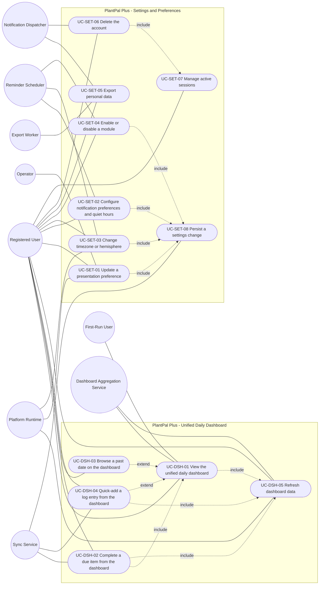
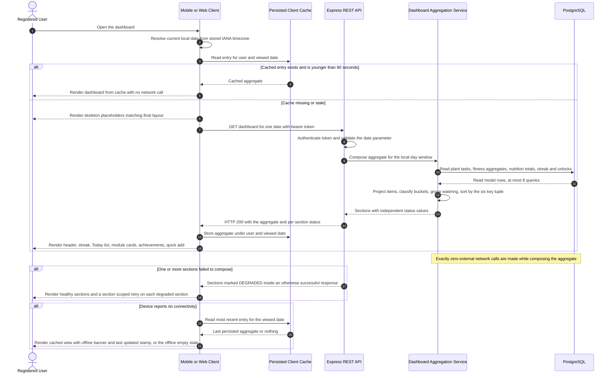
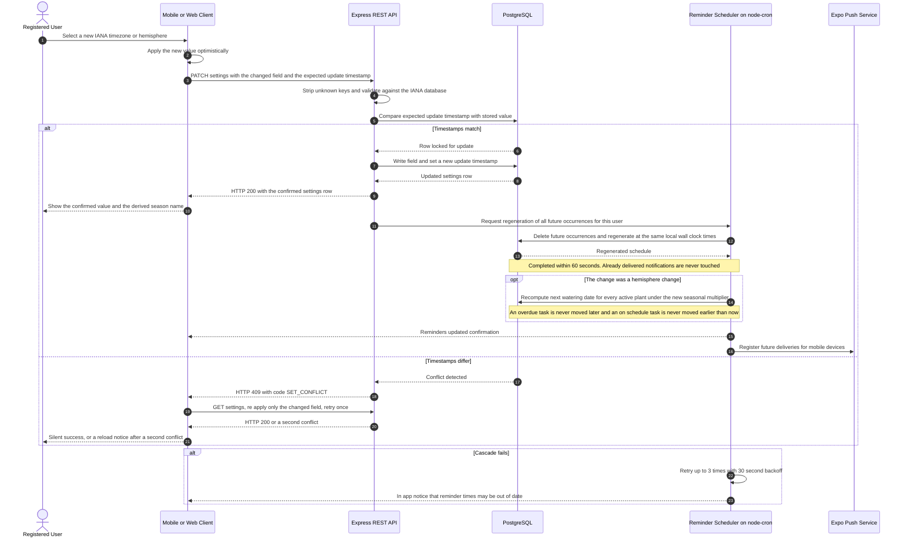
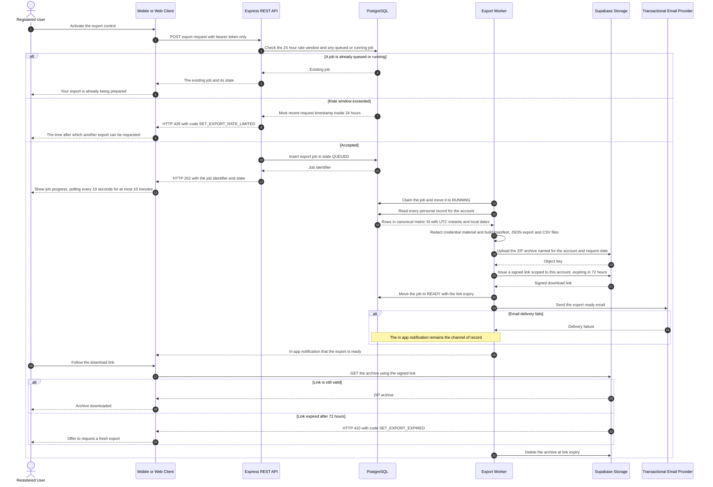

# Use-Case Model — Unified Daily Dashboard and Settings

| Field | Value |
| --- | --- |
| Document | `docs/requirements/use-cases/dashboard-and-settings.md` — the complete use-case model for the Unified Daily Dashboard (`DSH`) and Settings and Preferences (`SET`) subsystems |
| Version | 1.0 |
| Date | 2026-07-21 |
| Status | Baselined for Phase 1 sign-off |
| Owner | Rakshit — Project Lead / sole developer (D-05) |
| Parent | [`../06-use-case-model.md`](../06-use-case-model.md) — PlantPal+ actor catalogue and use-case model |
| Specification | [`../modules/dashboard-and-settings.md`](../modules/dashboard-and-settings.md) — the authoritative functional specification this document realises |
| User stories | [`../user-stories/dashboard-and-settings.md`](../user-stories/dashboard-and-settings.md) |
| Owned identifiers | `UC-DSH-01` … `UC-DSH-05`, `UC-SET-01` … `UC-SET-08` (13 use cases) |
| Conformance | IEEE 830-1998 section structure, ISO/IEC/IEEE 29148:2018 requirement-quality rules, Cockburn use-case template |

---

## Table of contents

1. [Module use-case diagram](#1-module-use-case-diagram)
2. [Actor roles for this module](#2-actor-roles-for-this-module)
3. [Use-case specifications](#3-use-case-specifications)
   - [UC-DSH-01 — View the unified daily dashboard](#uc-dsh-01--view-the-unified-daily-dashboard)
   - [UC-DSH-02 — Complete a due item from the dashboard](#uc-dsh-02--complete-a-due-item-from-the-dashboard)
   - [UC-DSH-03 — Browse a past date on the dashboard](#uc-dsh-03--browse-a-past-date-on-the-dashboard)
   - [UC-DSH-04 — Quick-add a log entry from the dashboard](#uc-dsh-04--quick-add-a-log-entry-from-the-dashboard)
   - [UC-DSH-05 — Refresh dashboard data](#uc-dsh-05--refresh-dashboard-data)
   - [UC-SET-01 — Update a presentation preference](#uc-set-01--update-a-presentation-preference)
   - [UC-SET-02 — Configure notification preferences and quiet hours](#uc-set-02--configure-notification-preferences-and-quiet-hours)
   - [UC-SET-03 — Change timezone or hemisphere](#uc-set-03--change-timezone-or-hemisphere)
   - [UC-SET-04 — Enable or disable a module](#uc-set-04--enable-or-disable-a-module)
   - [UC-SET-05 — Export personal data](#uc-set-05--export-personal-data)
   - [UC-SET-06 — Delete the account](#uc-set-06--delete-the-account)
   - [UC-SET-07 — Manage active sessions](#uc-set-07--manage-active-sessions)
   - [UC-SET-08 — Persist a settings change](#uc-set-08--persist-a-settings-change)
4. [Sequence diagrams for the most complex use cases](#4-sequence-diagrams-for-the-most-complex-use-cases)
5. [Include and extend relationship catalogue](#5-include-and-extend-relationship-catalogue)

---

## 1. Module use-case diagram

Every use case owned by this document appears exactly once below. Actors are drawn as circles, use cases as stadium nodes, actor associations as plain lines, and `include` and `extend` relationships as dotted labelled arrows. Use cases owned by other modules are referenced by identifier in section 5 and are deliberately not drawn here, because this document does not own them.

---

## 2. Actor roles for this module

The actor catalogue below is the module-local view of the product-wide catalogue in [`../06-use-case-model.md`](../06-use-case-model.md). Types are drawn from the closed set `primary`, `secondary`, `system` and `time`. A primary actor initiates a use case to obtain a goal; a secondary actor is called upon by the system during a use case; a system actor is an autonomous software component of PlantPal+ or an external service; a time actor is a temporal trigger.

| Actor | Type | Goals in this module |
| --- | --- | --- |
| Registered User | Primary (human) | See every due item, streak and module summary for one local date in one screen load; act on an item without leaving the dashboard; browse and retro-log a past date; change any preference and see it applied immediately; export or delete personal data; review and revoke signed-in devices. |
| First-Run User | Primary (human, specialisation of Registered User) | Understand what to do on day one through the first-run checklist and the module empty states rather than through an empty screen. Account age under 24 hours with zero domain entities. |
| Dashboard Aggregation Service | System (backend) | Compose the single-round-trip dashboard aggregate from the `PLT`, `FIT`, `NUT` and `GAM` read models within the query, latency and payload budgets of `BR-DSH-14`, degrading per section rather than failing the whole response. |
| Sync Service | System (backend and client) | Replay queued append-only writes originating from dashboard actions, invalidate the affected date's cache key, delta-sync the settings row to every other signed-in device, and detect settings write conflicts. |
| Reminder Scheduler | System (node-cron on the backend, owned by `NOT`) | Read the notification preferences, quiet hours and default reminder times owned by `SET`, and regenerate every future scheduled occurrence within 60 seconds of a committed change. |
| Export Worker | System (backend job, owned by `SYS`) | Build the export archive specified in `BR-SET-12`, publish a signed download link valid for 72 hours, and delete the archive at link expiry. |
| Notification Dispatcher | Secondary (Expo Push and transactional email, owned by `NOT`) | Deliver the export-ready notice, the deletion-scheduled confirmation and the three-day pre-purge reminder. |
| Platform Runtime | System (iOS, Android, browser) | Supply the OS colour scheme, the reduce-motion signal, the dynamic-type scale, the network reachability signal, the application-foreground event and the device IANA timezone. |
| Operator | Secondary (human, the sole developer in an operational role) | Control the server-side feature flags that gate the user-facing integration toggles, and publish new legal document versions that arm the re-consent gate. |
| System Clock and IANA Timezone Database | Time | Provide the current instant and the offset rules from which the local date, the day boundary and every DST transition are derived. Triggers the local-date rollover check. |
| Open Food Facts | System (external) | Provide optional barcode and food enrichment while its user flag and server flag are both enabled and it is not in provider cooldown. Never required for correct operation (`D-03`). |
| Perenual | System (external) | Provide optional species enrichment under the same gating. Never required for correct operation (`D-03`). |

---

## 3. Use-case specifications

Each specification below states observable actor and system behaviour only. Internal composition strategy, query plans, component structure and storage mechanics are deliberately absent; they belong to the module specification and to Phase 3. Step numbering follows the standard extension notation, in which `3a` is an alternative at step 3 and `3a1` is the first step of that alternative.

### UC-DSH-01 — View the unified daily dashboard

| Attribute | Value |
| --- | --- |
| Primary actor | Registered User (also First-Run User) |
| Secondary actors | Dashboard Aggregation Service, System Clock and IANA Timezone Database |
| Level | User-goal |
| Priority | Must |
| Release | v0.1 Walking Skeleton for the aggregate contract; v0.5 Alpha for the header, Today list and module cards; v1.0 MVP for the achievements strip, empty states, first-run checklist, degraded rendering and responsive layout |
| Frequency of use | 1 to 6 times per day per active user; the single most frequently executed use case in the product |
| Preconditions | The user holds a valid unexpired access token. At least one module is enabled (`FR-SET-12`). A stored IANA timezone exists (`FR-SET-07`). |
| Trigger | The user opens the application, completes sign-in, selects the Dashboard destination, or follows a deep link from a push notification or an email digest. |
| Success guarantee | The dashboard for the resolved local date is rendered in full: header with greeting and date label, global streak indicator, the ordered merged Today list with its counts, one summary card per enabled module, the recent-achievements strip when non-empty, the quick-add set, and the first-run checklist when applicable. No control belonging to a disabled module is present. |
| Minimal guarantee | The user is never shown a blank screen. Either the last persisted cache entry for the date is rendered with an offline banner and a last-updated stamp, or every section that composed successfully is rendered with the failed sections marked `DEGRADED` and offered a section-scoped retry, or the offline empty state naming the most recent cached date is rendered. No data is created, modified or deleted by this use case. |
| Related FRs | `FR-DSH-01`, `FR-DSH-02`, `FR-DSH-03`, `FR-DSH-04`, `FR-DSH-05`, `FR-DSH-06`, `FR-DSH-08`, `FR-DSH-09`, `FR-DSH-14`, `FR-DSH-15`, `FR-DSH-16`, `FR-DSH-17`, `FR-DSH-18`, `FR-DSH-19`, `FR-DSH-20`, `FR-DSH-22`, `FR-DSH-24` |
| Related USs | `US-DSH-01`, `US-DSH-03`, `US-DSH-04`, `US-DSH-05`, `US-DSH-06`, `US-DSH-07`, `US-DSH-08` |

**Main success scenario.**

1. The user opens the dashboard.
2. The system determines the current local date from the user's stored IANA timezone, treating the day as the half-open local interval from midnight to the following midnight, and resolves the viewed date to that current local date.
3. The system displays placeholder skeleton elements matching the final position of the header, the Today list and every module card, and requests the dashboard aggregate for the viewed date in one round trip.
4. The system returns, in that single response, the header content, the streak value, the enabled-module set, one summary card per enabled module, the ordered Today list with its open, done and overdue counts, the recent achievement unlocks, the quick-add set and the onboarding state, each section carrying its own status.
5. The system displays the header showing the time-of-day greeting selected from the current local time, the user's first name, and the full weekday-and-date label for the viewed date.
6. The system displays the global streak indicator as a day count with a text label, conveying its state through at least one non-colour channel and using neutral wording.
7. The system displays the merged Today list, in which items from every enabled module are interleaved in one deterministic order, two or more open plant-watering items appear as a single grouped entry labelled with the count of plants, and each item shows its title, its subtitle, its status and its single primary action.
8. The system displays one summary card per enabled module, each showing a progress ring, the uncapped current-versus-target numeric pair in the user's selected unit system, a caption and exactly one primary action control.
9. The system displays the achievements unlocked in the seven local dates ending on the viewed date, newest first, limited to three tiles.
10. The system displays the quick-add control set filtered to the enabled modules.
11. The user reads the screen, and the use case ends.

**Extensions.**

| Step | Condition | Handling |
| --- | --- | --- |
| 2a | The application was backgrounded across the local midnight boundary | 2a1. The system detects the rollover on return to the foreground. 2a2. The system moves the viewed date to the new current local date and announces the change. |
| 2b | The viewed date is carried by an inbound deep link | 2b1. The system opens the dashboard at the date carried by the link. 2b2. The system visually highlights the referenced Today item for 3 seconds, replacing the highlight animation with a static outline when effective reduced motion is `ON`. 2b3. The scenario resumes at step 3. |
| 2c | The local day is 23 or 25 hours long because of a daylight-saving transition | 2c1. The system resolves the day window on local wall-clock boundaries, resolving a non-existent local time forward to the first valid instant and an ambiguous local time to the earlier occurrence. 2c2. The scenario resumes at step 3. |
| 3a | A cached entry for the viewed date exists and is younger than 60 seconds | 3a1. The system renders the cached entry immediately and issues no network request. 3a2. The scenario resumes at step 5. |
| 3b | A cached entry exists and is older than 60 seconds | 3b1. The system renders the cached entry immediately. 3b2. The system performs `UC-DSH-05` in the background and re-renders on success. |
| 3c | The device reports no network connectivity | 3c1. The system renders the most recently cached response for the date. 3c2. The system displays a persistent offline banner and the last-updated timestamp, showing no age marker below 15 minutes, a relative last-updated label from 15 minutes to 24 hours, and an out-of-date marker beyond 24 hours. 3c3. The system disables every control that requires connectivity and labels each with its reason. |
| 4a | One or more sections fail to compose | 4a1. The system returns the successfully composed sections and marks each failed section `DEGRADED`. 4a2. The system renders the healthy sections normally and renders each degraded section as a frame carrying a section-scoped retry control, never as a zero value. |
| 5a | The display name is unavailable or resolves to whitespace only | 5a1. The system renders the greeting with the literal fallback `there` and raises no error. |
| 5b | The viewed date is not the current local date | 5b1. The system omits the greeting line entirely and renders the date label alone. 5b2. `UC-DSH-03` governs the remainder of the rendering. |
| 6a | The streak value is zero | 6a1. The system renders a neutral start-your-streak state rather than hiding the indicator. |
| 6b | The streak is reported at risk and the viewed date is today | 6b1. The system renders a neutral at-risk affordance carrying no loss framing, no countdown pressure and no shaming language. |
| 7a | The assembled list contains zero items while every enabled module holds at least one record | 7a1. The system renders the all-caught-up state naming the viewed date, rather than a first-run empty state. |
| 7b | An enabled module holds no qualifying record for the viewed date | 7b1. The system renders that module's specific empty state with exactly one primary call to action. |
| 7c | More than 20 items are present | 7c1. The system renders the first 20 items and a control that expands the remainder in place. 7c2. When three or more completed items exist, the system collapses them behind a closed-by-default disclosure. |
| 7d | The composed list exceeds 200 items | 7d1. The system truncates the list at 200 items, marks the response truncated and states that the first 200 items for the day are shown. |
| 8a | A module's ring denominator is zero because no goal is set | 8a1. The system renders the plant ring at 100 percent with the all-caught-up caption, or the fitness or nutrition ring at 0 percent with a goal-setting call to action, and performs no division. |
| 8b | The current value exceeds the goal | 8b1. The system fills the ring to 100 percent, displays the uncapped values and shows a neutral over-goal badge with no alarm colour, warning icon or judgemental wording. |
| 9a | No achievement was unlocked in the selection window | 9a1. The system hides the entire strip including its heading. |
| 10a | Only one module is enabled | 10a1. The system renders at most three quick-add entries inline on mobile rather than behind a floating action button. |
| 10b | The account is younger than seven days, the checklist is undismissed and at least one applicable step is incomplete | 10b1. The system renders the first-run checklist with its completed-of-total caption above the module cards. 10b2. The user may dismiss the checklist permanently. |
| 11a | The viewport is 768 pixels wide or more | 11a1. The system lays the dashboard out in two columns from 768 to 1279 pixels and in three columns at 1280 pixels and above, with no horizontal page scroll at any width from 320 to 2560 pixels. |

**Exception flows.**

| Reference | Exception | System response | User-visible outcome |
| --- | --- | --- | --- |
| E1 | The requested date fails the date pattern or is not a real calendar date | Reject the request with code `DSH_DATE_MALFORMED` and compose nothing | The user is returned to the current local date with an explanatory message |
| E2 | The requested date is later than the current local date | Reject the request with code `DSH_DATE_IN_FUTURE` | The user is told that future days cannot be opened yet and is clamped to today |
| E3 | The requested date is earlier than the account creation local date | Reject the request with code `DSH_DATE_BEFORE_ACCOUNT` | The user is told the date on which their history starts and is clamped to it |
| E4 | The access token is missing, invalid or expired | Reject the request with code `AUTH_REQUIRED` | The user is asked to sign in again and is routed to the `ACC` sign-in surface |
| E5 | Every module projection fails to compose | Mark the Today list `DEGRADED` while still rendering the header, streak and cards | The user is told the Today list could not be loaded and is offered a retry |
| E6 | The device is offline and no cached entry exists for the date | Render the offline empty state | The user is told there is no offline data for the day and is offered a jump to the most recent cached date |
| E7 | The database is completely unavailable | Return a service-unavailable response carrying a retry-after value of 5 seconds | The user is told the service is waking up and the client retries automatically |

**Special requirements.** `NFR-PERF-03` and `NFR-PERF-11` bound the aggregate response time at the 95th and 99th percentiles. `NFR-PERF-06` and `NFR-PERF-07` bound first contentful paint and the skeleton-to-content transition, and `FR-DSH-18` forbids layout shift on resolve. `NFR-SCAL-05` bounds the request to at most 8 database queries and exactly 0 external network calls. `NFR-RELI-06` requires section-level degradation instead of whole-response failure. `NFR-PERF-08` bounds the render cost of a 200-item list. `NFR-A11Y-04` and `NFR-A11Y-08` forbid conveying streak or ring status by colour alone. `NFR-A11Y-07` requires the reduced-motion substitutions of `BR-SET-15`. `NFR-A11Y-06` and `NFR-I18N-05` require the layout to hold at a 150 percent text scale and under longer translated strings. `NFR-USAB-03`, `NFR-USAB-05`, `NFR-USAB-06` and `NFR-USAB-07` govern state clarity, label consistency, single-call-to-action empty states and offline honesty. `NFR-I18N-02` and `NFR-I18N-03` require locale-catalogue sourcing of the greeting and date label and unit-aware number formatting. `NFR-PORT-03` requires identical behaviour on iOS, Android and web. `NFR-OBSV-02` and `NFR-OBSV-03` require each degraded section to be reported to the error monitor with its section name. `NFR-MAIN-03` and `NFR-MAIN-04` require the ordering to be asserted by an automated test against the emitted sort key.

### UC-DSH-02 — Complete a due item from the dashboard

| Attribute | Value |
| --- | --- |
| Primary actor | Registered User |
| Secondary actors | Sync Service, Dashboard Aggregation Service |
| Level | User-goal |
| Priority | Must |
| Release | v1.0 MVP |
| Frequency of use | 1 to 15 times per day per active user; the core habit loop of the product |
| Preconditions | `UC-DSH-01` has rendered a Today list for the viewed date. The item carries an inline-completable primary action, which is true for the categories `PLANT_WATERING`, `PLANT_CARE` and `WATER_INTAKE`. The viewed date is today or within the 30-day retroactive window. |
| Trigger | The user activates the primary action control on a Today item. |
| Success guarantee | Exactly one append-only log record exists for the action, carrying the client-generated idempotency key and the client timestamp. The item shows status `DONE`, the owning module's ring is recomputed, the affected date's cache entry is invalidated, and the streak indicator reflects the action on the next successful aggregate fetch. The user has not left the dashboard. |
| Minimal guarantee | Either the write is committed on the server, or it is durably queued on the device for replay, or the optimistic state is reverted and the user is offered a retry naming the failed action. A duplicate record is never created, and a partially completed group is never rolled back. |
| Related FRs | `FR-DSH-07`, `FR-DSH-06`, `FR-DSH-04`, `FR-DSH-08`, `FR-DSH-13`, `FR-DSH-23`, `FR-SET-18` |
| Related USs | `US-DSH-02`, `US-DSH-01`, `US-DSH-07` |

**Main success scenario.**

1. The user activates the primary action control on a Today item.
2. The system immediately shows the item as completed, updates the open, done and overdue counts, and recomputes the owning module card's ring locally.
3. The system submits the completion to the owning module together with a client-generated idempotency key and the client timestamp taken at the moment of the tap.
4. The system records the log entry against the item's local date and confirms the write.
5. The system confirms the completed state, moves the item into the completed bucket, and offers an undo affordance for at least 10 seconds.
6. The system invalidates the cached dashboard entry for the affected local date and, when the action can change streak state, for the current local date as well, performing `UC-DSH-05` for the viewed date.
7. The system re-renders the Today list, the module card and the streak indicator from the refreshed data, and the use case ends.

**Extensions.**

| Step | Condition | Handling |
| --- | --- | --- |
| 1a | The item is a grouped plant-watering or plant-care entry | 1a1. The user may expand the group to see member rows ordered by days overdue descending then plant name ascending. 1a2. Activating the group's primary action submits one individual write per member rather than a single compound write. 1a3. The scenario resumes at step 2 for the group as a whole. |
| 1b | The item's category requires user-supplied detail, namely `MEAL_SLOT`, `WORKOUT` or `STEPS` | 1b1. The system opens the owning module's create form pre-filled with the viewed date. 1b2. This use case ends and the owning module's create use case takes over. |
| 1c | The item is a water-intake item | 1c1. The system increments the day's water total by the stored glass volume, which is an integer from 100 to 1000 millilitres in steps of 10 and defaults to 250. |
| 1d | The viewed date is in the past but within 30 days | 1d1. The system performs the write against the viewed date rather than today, and labels the control accordingly. |
| 3a | The device reports no network connectivity | 3a1. The system enqueues the write with its idempotency key and client timestamp. 3a2. The system badges the item as pending and states that it will sync when connectivity returns. 3a3. On reconnection the Sync Service replays the queued write and the scenario resumes at step 4. |
| 4a | The same idempotency key has already been recorded | 4a1. The system returns the original record and creates no duplicate. 4a2. The item simply remains completed and no message is shown. |
| 5a | The user activates undo within the offered window | 5a1. The system reverses the log entry, returns the item to its open bucket and re-invalidates the affected cache entry. |
| 6a | A subset of a group's member writes fails | 6a1. The system keeps the succeeded members completed. 6a2. The system re-renders the failed members as open with an inline retry and states how many of how many were saved. |

**Exception flows.**

| Reference | Exception | System response | User-visible outcome |
| --- | --- | --- | --- |
| E1 | The server rejects the write with a client error | Revert the optimistic state to its previous value | The user is told the specific action could not be saved and is offered a retry |
| E2 | The server returns a server error or the network fails mid-request | Retain the write in the queue and retry under the replay policy | The user is told the entry is saved on the device and will sync automatically |
| E3 | The write targets a local date earlier than 30 days before today | Reject the write with code `SYS_RETRO_WINDOW_EXCEEDED` and revert the optimistic state | The user is told that entries older than 30 days cannot be changed |
| E4 | The referenced entity is not owned by the authenticated user | Reject the request without disclosing whether the entity exists | The user is shown a not-found outcome and the item is removed on the next refresh |
| E5 | A queued write is replayed against an account that has since been purged | Reject the replay and instruct the client to discard it | The user is told the account no longer exists |

**Special requirements.** `NFR-USAB-01` requires the completed action to be reachable within the three-tap budget from application open. `NFR-USAB-04` requires the undo affordance to remain available for at least 10 seconds. `NFR-RELI-04` requires the queued write to survive application termination and device restart. `NFR-DATA-09` requires the idempotency key to make replay safe, so that no duplicate record can be created by any number of retries. `NFR-A11Y-04` requires the pending, completed and failed states to be distinguishable without colour. `NFR-PERF-07` bounds the delay between the tap and the optimistic state change.

### UC-DSH-03 — Browse a past date on the dashboard

| Attribute | Value |
| --- | --- |
| Primary actor | Registered User |
| Secondary actors | Dashboard Aggregation Service, System Clock and IANA Timezone Database |
| Level | User-goal |
| Priority | Must |
| Release | v1.0 MVP |
| Frequency of use | 1 to 5 times per week per active user |
| Preconditions | `UC-DSH-01` has rendered the dashboard. The account creation local date is earlier than the current local date, so at least one past date is navigable. |
| Trigger | The user activates the previous-day control, swipes horizontally on mobile, picks a date from the date picker, or follows a deep link carrying a past date. |
| Success guarantee | The dashboard is fully re-rendered for the requested past date with the per-widget read-only matrix applied, the greeting suppressed, the streak shown as it stood at the end of that date, the achievements strip collapsed to that date alone, and the Today control visible. Within 30 days, append-only logging controls remain usable and pre-filled with that date. |
| Minimal guarantee | The viewed date always remains inside the navigable range from the account creation local date to the current local date inclusive. No control is silently inert: every disabled control carries both a visual disabled state and a programmatic accessible explanation. |
| Related FRs | `FR-DSH-11`, `FR-DSH-12`, `FR-DSH-13`, `FR-DSH-02`, `FR-DSH-03`, `FR-DSH-09`, `FR-DSH-10`, `FR-DSH-14` |
| Related USs | `US-DSH-04`, `US-DSH-02` |

**Main success scenario.**

1. The user selects a target date earlier than the current local date.
2. The system verifies that the target date lies within the navigable range from the account creation local date to the current local date inclusive.
3. The system requests the dashboard aggregate for the target date, retaining the previously viewed date's cached response.
4. The system re-renders the dashboard for the target date, omits the greeting line and renders the date label alone.
5. The system displays the streak value as it stood at the end of that local date, without any at-risk affordance.
6. The system displays the Today items and module cards for that date, with the rings computed for that date and shown read-only.
7. The system displays the achievements strip limited to unlocks on that date alone, hides the first-run checklist, and hides every reminder-lifecycle control such as snooze, dismiss and remind later.
8. The system displays the Today control, keeps the scroll position at the top of the list and announces the new date to assistive technology through a polite live region.
9. The user reads or retro-logs the day, and the use case ends.

**Extensions.**

| Step | Condition | Handling |
| --- | --- | --- |
| 1a | The user is at the lower bound of the navigable range | 1a1. The system renders the previous-day control disabled with an explanation that the account history starts on that date. |
| 1b | The user is viewing the current local date | 1b1. The system renders the next-day control disabled, and the date picker disallows selection of any future date. |
| 3a | A cached entry exists for the target date | 3a1. The system renders it immediately and refetches in the background when it is older than 60 seconds. |
| 3b | The device is offline and a cached entry exists | 3b1. The system renders the cached entry with the offline banner and the last-updated stamp. |
| 6a | The target date is within 30 days of the current local date | 6a1. The system keeps append-only logging controls usable, pre-fills them with the target date, and relabels the module card primary action to name that date. 6a2. Quick-add entries default to 12:00 local on the target date. |
| 6b | The target date is more than 30 days before the current local date | 6b1. The system renders every write control read-only with a reason label stating that entries older than 30 days cannot be changed. |
| 8a | The user activates the Today control | 8a1. The system returns the dashboard to the current local date, restores full interactivity and refetches when the cached entry for today is stale. 8a2. The system hides the Today control while the current local date is viewed. |
| 8b | The local date rolls over while the user is browsing | 8b1. The system re-evaluates the navigable range and clamps the viewed date if it has become invalid. 8b2. The system states the new current date. |

**Exception flows.**

| Reference | Exception | System response | User-visible outcome |
| --- | --- | --- | --- |
| E1 | A date outside the navigable range reaches the server, for example through a hand-crafted deep link | Reject the request and instruct the client to clamp to the nearest valid date | The user is told the day is outside their history and is shown the clamped date |
| E2 | The requested date has no cached entry and the device is offline | Render the offline empty state for that date | The user is offered a jump to the most recent cached date |
| E3 | The return to the current local date fails to refetch | Render the cached response for today with the offline or degraded treatment | The user is told they are seeing the last saved view of today and is never stranded on a past date |
| E4 | A retroactive write is attempted against a date beyond the 30-day window by a stale client | Reject the write with code `SYS_RETRO_WINDOW_EXCEEDED` | The user is told entries older than 30 days cannot be changed |

**Special requirements.** `NFR-A11Y-04` requires each disabled control to expose a programmatic explanation of why it is disabled. `NFR-A11Y-10` requires the date change to be announced through a polite live region and the date navigation to be operable by keyboard on web. `NFR-USAB-03` requires the historical state of the screen to be unambiguous, which the suppressed greeting, the visible Today control and the read-only rings jointly provide. `NFR-DATA-01` and `NFR-DATA-02` require the stored local date of every record to remain immutable, so that browsing history never re-buckets past data.

### UC-DSH-04 — Quick-add a log entry from the dashboard

| Attribute | Value |
| --- | --- |
| Primary actor | Registered User |
| Secondary actors | Sync Service |
| Level | User-goal |
| Priority | Must |
| Release | v1.0 MVP |
| Frequency of use | 1 to 10 times per day per active user |
| Preconditions | `UC-DSH-01` has rendered the dashboard. At least one module is enabled. The viewed date is today or within the 30-day retroactive window. |
| Trigger | The user activates the quick-add control set, presented as a floating action button expanding to a bottom sheet on mobile and as a horizontal control row above the Today list on web. |
| Success guarantee | The chosen log entry exists for the viewed date, the cached dashboard entry for that date is invalidated, and a success confirmation carrying an undo affordance is shown for at least 10 seconds. The user has performed at most two taps from the dashboard for the direct-write action. |
| Minimal guarantee | Only quick-add actions belonging to enabled modules are ever offered, capped at five entries in fixed catalogue order. No entry is created outside the retroactive window. An action that cannot be queued while offline is blocked at submission with a clear explanation rather than failing silently. |
| Related FRs | `FR-DSH-10`, `FR-DSH-15`, `FR-DSH-13`, `FR-DSH-23`, `FR-SET-18`, `FR-SET-11` |
| Related USs | `US-DSH-02`, `US-DSH-05`, `US-DSH-07` |

**Main success scenario.**

1. The user activates the quick-add control set.
2. The system displays the quick-action catalogue filtered to enabled modules, preserved in catalogue order and capped at five entries.
3. The user selects the water quick action.
4. The system writes one glass of water for the viewed date using the stored glass volume, with no intermediate screen.
5. The system shows a success confirmation carrying an undo affordance for at least 10 seconds.
6. The system invalidates the cached dashboard entry for the viewed date and performs `UC-DSH-05`, re-rendering the nutrition card, its water sub-meter and the Today list.
7. The use case ends.

**Extensions.**

| Step | Condition | Handling |
| --- | --- | --- |
| 2a | Only one module is enabled | 2a1. The system renders at most three entries inline on mobile rather than behind a floating action button. |
| 3a | The user selects the meal, workout or steps quick action | 3a1. The system opens the owning module's create form pre-filled with the viewed date, and for a meal with the time-appropriate slot. 3a2. This use case hands over to that module's create use case, which returns to the dashboard on completion. |
| 3b | The user selects the water-a-plant quick action | 3b1. The system opens a plant picker. 3b2. On selection the system performs a direct write for the chosen plant. 3b3. The scenario resumes at step 5. |
| 4a | The viewed date is in the past and within 30 days | 4a1. The system pre-fills the entry at 12:00 local on the viewed date and states which day is being logged. |
| 4b | The device reports no network connectivity and the selected action is queueable | 4b1. The system enqueues the write with its idempotency key and badges it as pending. 4b2. The system states that the entry will sync when connectivity returns. |
| 5a | The user activates undo within the offered window | 5a1. The system reverses the entry and re-invalidates the affected cache entry. |

**Exception flows.**

| Reference | Exception | System response | User-visible outcome |
| --- | --- | --- | --- |
| E1 | The viewed date lies outside the 30-day retroactive window | Render every quick-add control disabled with a reason label | The user is told that entries older than 30 days cannot be added |
| E2 | The device is offline and the selected action cannot be queued until submitted | Open the form but block submission | The user is told the action needs internet, and the entered detail is preserved |
| E3 | The server rejects the direct write | Revert the optimistic state | The user is offered a retry naming the failed action |
| E4 | The owning module is disabled between render and activation, for example by another device | Remove the action from the set on the next aggregate fetch | The user is told the module is no longer enabled |

**Special requirements.** `NFR-USAB-01` bounds the direct water action at two taps from the dashboard. `NFR-A11Y-03` requires every quick-add control to present a minimum 44 by 44 pixel touch target and an accessible name distinct from its icon. `NFR-USAB-04` requires the undo affordance. `NFR-RELI-04` requires queued quick-add writes to survive application termination. `NFR-DATA-09` requires the idempotency key on every queued write.

### UC-DSH-05 — Refresh dashboard data

| Attribute | Value |
| --- | --- |
| Primary actor | Registered User |
| Secondary actors | Dashboard Aggregation Service, Sync Service, Platform Runtime |
| Level | Subfunction |
| Priority | Must |
| Release | v1.0 MVP |
| Frequency of use | Several times per session; also executed automatically on focus and after every mutation that affects the viewed date |
| Preconditions | A dashboard is rendered for a viewed date. The user holds a valid access token. |
| Trigger | A pull-to-refresh gesture on mobile, activation of the refresh control on web, a window or application focus event while the cached entry is older than 60 seconds, or invalidation following a successful create, update or delete affecting the viewed date. |
| Success guarantee | The cached entry for the viewed date is replaced by a newly composed aggregate, the last-updated timestamp is advanced, and the scroll position and expanded-group state are preserved. |
| Minimal guarantee | Previously rendered data is never cleared before a replacement arrives, the screen is never blanked, and no more than one network request is issued per 5 000 millisecond manual-refresh window. |
| Related FRs | `FR-DSH-21`, `FR-DSH-23`, `FR-DSH-01`, `FR-DSH-19` |
| Related USs | `US-DSH-08`, `US-DSH-07` |

**Main success scenario.**

1. The user performs the refresh gesture or control activation, or the system detects focus with a stale cache entry, or a mutation invalidates the viewed date's cache entry.
2. The system animates the refresh indicator for at least 400 milliseconds so that the gesture is acknowledged.
3. The system requests the dashboard aggregate for the currently viewed date only.
4. The system returns the freshly composed aggregate.
5. The system replaces the cached entry, re-renders the screen, and preserves the scroll position and any expanded group state.
6. The system updates the last-updated timestamp, and the use case ends.

**Extensions.**

| Step | Condition | Handling |
| --- | --- | --- |
| 1a | The trigger is a mutation on a record that can change streak state | 1a1. The system additionally invalidates the current local date's cache entry, so that the streak indicator cannot go stale. |
| 1b | The trigger is a focus event and the cache entry is younger than 60 seconds | 1b1. The system performs no refetch and the use case ends. |
| 2a | Fewer than 5 000 milliseconds have elapsed since the previous refresh completed | 2a1. The system animates the indicator for 400 milliseconds, issues no network call, shows no message, and the use case ends. |
| 5a | The response marks one or more sections `DEGRADED` | 5a1. The system keeps the previous content of those sections where available and offers a section-scoped retry. |

**Exception flows.**

| Reference | Exception | System response | User-visible outcome |
| --- | --- | --- | --- |
| E1 | The refresh request fails | Leave the previously rendered data intact and never blank the screen | The user is told the refresh failed and that the last update is still shown |
| E2 | Three consecutive refreshes fail within 60 seconds | Suppress automatic refetch for 5 minutes while leaving manual refresh available | The user is told automatic refresh is paused for a few minutes |
| E3 | The device is offline when the refresh is triggered | Issue no network call and keep the cached entry | The offline banner and the last-updated stamp remain visible |
| E4 | The access token has expired | Obtain a new access token through the `ACC` refresh flow and retry once | The refresh completes transparently, or the user is asked to sign in again |

**Special requirements.** `NFR-SCAL-01` requires the throttle to bound the request rate against a free-tier backend with a small connection pool. `NFR-RELI-08` requires the failure-suppression window so that a failing backend is not amplified by automatic refetch. `NFR-SCAL-02` bounds the persisted cache to today plus the seven most recently viewed dates with least-recently-used eviction. `NFR-USAB-07` requires the last-updated stamp to state honestly how old the displayed data is. `NFR-A11Y-07` requires the refresh indicator, which conveys state rather than decoration, to be retained under reduced motion.

### UC-SET-01 — Update a presentation preference

| Attribute | Value |
| --- | --- |
| Primary actor | Registered User |
| Secondary actors | Sync Service, Platform Runtime, Operator |
| Level | User-goal |
| Priority | Must |
| Release | v0.5 Alpha for the hub and the profile entry point; v1.0 MVP for the unit system, theme, week start, glass size, accessibility preferences, language placeholder, About and legal surfaces; v1.1 Post-MVP for the integration toggles |
| Frequency of use | 1 to 10 times in the first week per user, then rarely |
| Preconditions | The user is signed in and the device has connectivity, because settings are excluded from the offline write queue. |
| Trigger | The user opens the settings hub and changes one control in the Preferences, Integrations, Accessibility or About and legal sections. |
| Success guarantee | The changed preference is stored on the server as part of the single authoritative settings record, is applied to the running application immediately, and is propagated to every other signed-in device on its next delta sync. |
| Minimal guarantee | The client never shows a value the server has not accepted: on rejection the control returns to the last server-confirmed value and the failure names the setting that could not be saved. No stored measurement is ever converted, migrated or rewritten by a unit-system change. |
| Related FRs | `FR-SET-01`, `FR-SET-02`, `FR-SET-03`, `FR-SET-04`, `FR-SET-05`, `FR-SET-06`, `FR-SET-18`, `FR-SET-19`, `FR-SET-25`, `FR-SET-26`, `FR-SET-27`, `FR-SET-28`, `FR-SET-29`, `FR-SET-30` |
| Related USs | `US-SET-01`, `US-SET-02`, `US-SET-09` |

**Main success scenario.**

1. The user opens the settings hub from the dashboard.
2. The system displays the nine sections `Profile`, `Preferences`, `Modules`, `Notifications`, `Integrations`, `Accessibility`, `Your data`, `Security` and `About and legal`, each reachable in at most two taps from the dashboard, and each showing its current value.
3. The user opens a section and changes exactly one control, for example selecting the imperial unit system.
4. The system applies the new value to the running application immediately, without a page reload or an application restart.
5. The system performs `UC-SET-08` to persist the single changed field.
6. The system confirms the change and displays the control at its new value.
7. The system re-renders every affected surface, converting displayed measurements for presentation only and leaving every stored canonical metric value untouched.
8. The use case ends.

**Extensions.**

| Step | Condition | Handling |
| --- | --- | --- |
| 2a | The user selects the Profile section | 2a1. The system navigates to the profile editing surface owned by `ACC` and performs no field validation of its own. |
| 2b | Every control in a section is inapplicable to the current platform | 2b1. The system hides that section entirely rather than rendering it empty. |
| 3a | The user changes the theme | 3a1. The system applies the chosen theme through the shared theme context within 200 milliseconds, resolving the system option against the OS colour scheme and falling back to the light theme when the OS signal is unavailable. 3a2. The system mirrors the selection to local storage so the first paint after a cold launch shows no light-to-dark flash. |
| 3b | The user changes the week start day | 3b1. The system re-labels weekly chart axes and weekly streak windows on the next render and never alters any stored local date. |
| 3c | The user changes the glass volume | 3c1. The system accepts only an integer from 100 to 1000 millilitres in steps of 10. 3c2. The water quick action and the nutrition water sub-meter adopt the new volume on the next render. |
| 3d | The user changes an accessibility preference | 3d1. The system applies reduced motion, the text scale from the closed set 100, 115, 130 and 150, or high contrast immediately. 3d2. When effective reduced motion resolves to on, the system replaces celebratory animation with static badges carrying identical information, renders progress rings at their final value with no fill transition, and disables skeleton shimmer while retaining state-conveying motion. |
| 3e | The user opens an integration toggle | 3e1. The system renders the toggle unavailable while the Operator has disabled the corresponding server-side flag or while the provider is in its 30-minute cooldown after 5 consecutive failures, without modifying the stored user preference. 3e2. The system states that the integration is temporarily unavailable. |
| 3f | The user opens the language selector | 3f1. The system displays the single entry for English in a disabled state, because version 1.0 ships English only while remaining internationalisation-ready. |
| 3g | The user opens the About screen | 3g1. The system displays the semantic version, build number, seven-character commit hash, environment name and API base host, and offers a control that copies those five values to the clipboard as plain text. |
| 3h | The user opens a legal document | 3h1. The system displays the privacy policy, terms of service, not-medical-advice disclaimer or open-source licence list from bundled content, requiring no network request. |
| 4a | The stored accepted version of the privacy policy or the terms of service is lower than the currently published version | 4a1. The system presents a blocking re-consent sheet that permits only reading the documents, accepting them, or signing out. 4a2. On acceptance the system records the document type, the version, the acceptance timestamp and the acceptance surface, and the scenario resumes. |

**Exception flows.**

| Reference | Exception | System response | User-visible outcome |
| --- | --- | --- | --- |
| E1 | The submitted value is not a declared member of the field's enumeration | Reject the change with code `SET_INVALID_ENUM` and revert the control | The user is told the value could not be saved |
| E2 | The glass volume is out of range or off the step of 10 | Reject the change with code `SET_GLASS_SIZE_RANGE` | The control returns to its previous value and states the allowed range |
| E3 | The settings write conflicts with a change made on another device | `UC-SET-08` handles the conflict: refetch, re-apply the single changed field and retry once | The user sees no message on the first attempt; a second conflict reloads the screen with an explanation |
| E4 | The device is offline | Disable every settings control and keep current values readable from cache | Each control is labelled as needing internet |
| E5 | The server returns any other client or server error | Revert the optimistic value | The user is told which setting failed and is offered a retry |

**Special requirements.** `NFR-USAB-01` and `NFR-USAB-05` require every section to be reachable within two taps and every label to match the vocabulary used elsewhere in the product. `NFR-PERF-07` bounds the theme application at 200 milliseconds. `NFR-A11Y-02` requires both resolved themes and the high-contrast variant to meet the stated contrast ratios. `NFR-A11Y-06` requires no clipping or truncation at a 150 percent text scale. `NFR-A11Y-07` requires the reduced-motion substitutions. `NFR-A11Y-08` requires ring status to carry a value label or pattern in addition to colour. `NFR-DATA-03` and `NFR-DATA-08` require canonical metric storage and presentation-only conversion. `NFR-I18N-01`, `NFR-I18N-02`, `NFR-I18N-03` and `NFR-I18N-04` require every user-facing string to come from a locale catalogue and every number, date and unit to be formatted through the locale layer. `NFR-LEGL-01`, `NFR-LEGL-02`, `NFR-LEGL-03` and `NFR-LEGL-06` govern the legal surfaces and the re-consent gate. `NFR-OBSV-05` and `NFR-PRIV-02` require the diagnostics values to be copyable without exposing personal data. `NFR-RELI-02` requires the product to pass its full acceptance suite with both integrations disabled.

### UC-SET-02 — Configure notification preferences and quiet hours

| Attribute | Value |
| --- | --- |
| Primary actor | Registered User |
| Secondary actors | Reminder Scheduler, Sync Service, Platform Runtime |
| Level | User-goal |
| Priority | Must |
| Release | v1.0 MVP |
| Frequency of use | 2 to 6 times in the first month per user, then rarely |
| Preconditions | The user is signed in and the device has connectivity. At least one module is enabled, so at least one notification category is applicable. |
| Trigger | The user opens the Notifications section of the settings hub. |
| Success guarantee | The master switch, the per-category enable states, the per-channel preferences, the quiet-hours configuration and every default reminder time are stored on the server, and all future scheduled reminder occurrences are regenerated from the new values within 60 seconds. |
| Minimal guarantee | A configuration that would be ambiguous is refused at write time rather than stored, specifically a quiet-hours start equal to its end and any time that is not on a 5-minute boundary. Already-delivered notifications are never altered and no occurrence is ever fired retroactively. |
| Related FRs | `FR-SET-14`, `FR-SET-15`, `FR-SET-16`, `FR-SET-17`, `FR-SET-10`, `FR-SET-30` |
| Related USs | `US-SET-03`, `US-SET-04` |

**Main success scenario.**

1. The user opens the Notifications section.
2. The system displays the master notification switch, the eleven user-togglable notification categories with their independent enable states and default local times, the channel preferences for push, in-app and email digest, and the quiet-hours configuration.
3. The user changes one preference, for example moving the plant-watering default reminder time or setting the quiet-hours window.
4. The system validates the value against the 5-minute time granularity and, for quiet hours, against the rule that the start must not equal the end.
5. The system performs `UC-SET-08` to persist the changed field.
6. The system asks the Reminder Scheduler to delete and regenerate every future scheduled occurrence for the user from the new preferences.
7. The Reminder Scheduler regenerates the schedule within 60 seconds, leaving already-delivered notifications untouched and rescheduling to the next matching local time any occurrence whose recomputed time has already passed.
8. The system confirms on the settings screen that reminders have been updated, and the use case ends.

**Extensions.**

| Step | Condition | Handling |
| --- | --- | --- |
| 2a | The client is a web client | 2a1. The system does not offer the push channel, and offers in-app due-reminder surfaces and the optional email digest instead. |
| 2b | The account has no verified email address | 2b1. The system renders the email digest channel unavailable with an explanation and a link to the `ACC` email verification surface. |
| 2c | A module is disabled | 2c1. The system hides that module's notification categories from the matrix. |
| 3a | The user turns the master switch off | 3a1. The system retains every per-category value and suppresses all delivery while the master switch is off, so the previous configuration is restored intact when it is turned back on. |
| 3b | The user configures the water-intake category | 3b1. The system accepts a delivery window and an interval of 1 to 6 whole hours instead of a single time, and caps delivery at 5 occurrences per day. |
| 3c | The user sets a quiet-hours window that wraps midnight | 3c1. The system accepts the window and evaluates membership as at or after the start or before the end. |
| 3d | The user selects the deferring quiet-hours behaviour, which is the default | 3d1. The system reschedules an occurrence falling inside the window to the window end on the same local day, or to the window end on the next local day when the window wraps. 3d2. The system releases at most 10 deferred notifications at the window end and collapses more than 3 pending notifications into one summary notification. |
| 3e | The user selects the suppressing quiet-hours behaviour | 3e1. The system cancels the occurrence and records the reason, except for achievement-unlock notifications, which are always deferred and never suppressed. |
| 6a | The settings write did not commit | 6a1. The system does not run the recomputation cascade at all. |

**Exception flows.**

| Reference | Exception | System response | User-visible outcome |
| --- | --- | --- | --- |
| E1 | A submitted time is not on a 5-minute boundary | Reject the change with code `SET_TIME_GRANULARITY` | The control reverts and states the allowed granularity |
| E2 | The quiet-hours start equals the quiet-hours end | Reject the change with code `SET_QUIET_HOURS_EQUAL` | The user is told the window must not be empty |
| E3 | The water-intake interval is outside 1 to 6 hours | Reject the change with code `SET_WATER_INTERVAL_RANGE` | The control reverts and states the allowed range |
| E4 | The operating system has denied notification permission | Keep every preference editable and store it normally | A persistent banner explains that the OS is blocking delivery and offers a shortcut to the OS settings screen |
| E5 | The recomputation cascade fails | Retry up to 3 times with a 30-second backoff, report the failure to the error monitor and raise an in-app notice | The user is told that reminder times may be out of date until the next sync |

**Special requirements.** `NFR-SCAL-06` requires the 5-minute granularity that bounds the scheduler fan-out to 288 slots per day and keeps the reminder engine inside the free-tier compute budget. `NFR-DATA-02` requires every stored time to be interpreted as local wall-clock time in the stored IANA timezone. `NFR-RELI-03` requires the in-app channel to remain the channel of record when push or email delivery is unavailable. `NFR-RELI-07` requires the cascade to complete or to fail loudly, never silently. `NFR-PORT-04` requires the channel matrix to adapt to the platform without hiding the fact that a channel exists elsewhere. `NFR-USAB-03` requires each unavailable channel to state why it is unavailable.

### UC-SET-03 — Change timezone or hemisphere

| Attribute | Value |
| --- | --- |
| Primary actor | Registered User |
| Secondary actors | Reminder Scheduler, Sync Service, Platform Runtime, System Clock and IANA Timezone Database |
| Level | User-goal |
| Priority | Must for the timezone and hemisphere selections and their cascades; Should for the drift prompt, which is v1.1 |
| Release | v0.5 Alpha for timezone selection; v1.0 MVP for hemisphere selection and the cascade; v1.1 Post-MVP for the drift prompt |
| Frequency of use | Once at account creation, then on travel or relocation only; typically fewer than 3 times per year |
| Preconditions | The user is signed in and the device has connectivity. A stored timezone already exists, defaulted at account creation to the device-reported timezone. |
| Trigger | The user opens the Preferences section and changes the timezone or hemisphere, or the Platform Runtime reports a device timezone that differs from the stored timezone. |
| Success guarantee | The new timezone or hemisphere is stored, the dashboard day boundary follows it from the next render, all future scheduled reminder occurrences are regenerated at the same local wall-clock times within 60 seconds, and on a hemisphere change every active plant's next watering date is recomputed for the new growing season within 60 seconds. |
| Minimal guarantee | Every historical local date is immutable and is never re-bucketed, so charts, history and streaks never shift under the user. An already-overdue plant task is never moved later, and a task not yet due is never moved earlier than the current instant. |
| Related FRs | `FR-SET-07`, `FR-SET-08`, `FR-SET-09`, `FR-SET-10`, `FR-SET-30`, `FR-DSH-14` |
| Related USs | `US-SET-05`, `US-SET-04` |

**Main success scenario.**

1. The user opens the Preferences section and selects the timezone control.
2. The system displays a searchable list of IANA timezone identifiers with the stored value selected.
3. The user selects a different timezone.
4. The system validates the identifier against the IANA timezone database.
5. The system performs `UC-SET-08` to persist the new timezone.
6. The system recomputes the current local date and the navigable date range from the new timezone, and applies the new day boundary to the dashboard on its next render.
7. The system asks the Reminder Scheduler to regenerate every future scheduled occurrence at the same local wall-clock times.
8. The Reminder Scheduler completes the regeneration within 60 seconds and leaves every already-delivered notification untouched.
9. The system confirms that reminders have been updated and displays the derived season name for the resolved hemisphere.
10. The use case ends.

**Extensions.**

| Step | Condition | Handling |
| --- | --- | --- |
| 1a | The Platform Runtime reports a device timezone differing from the stored timezone | 1a1. The system prompts the user at most once per 24 hours to adopt the device timezone. 1a2. If the user accepts, the scenario resumes at step 4 with the device timezone. 1a3. If the user declines, the system suppresses the prompt for 30 days. |
| 3a | The user changes the hemisphere instead of the timezone | 3a1. The system accepts exactly one of northern, southern or automatic, with automatic as the default. 3a2. The system resolves the automatic option through the seeded timezone-to-hemisphere map, in which every Australian, Argentine and Antarctic zone and the enumerated southern African, South American, Indian Ocean and Pacific zones resolve to southern and every other zone resolves to northern. 3a3. An explicit northern or southern selection always overrides the map. |
| 3b | The stored timezone is not present in the hemisphere map | 3b1. The system resolves the hemisphere to northern and displays a hint inviting a manual selection. |
| 6a | The new local today is one day behind the previously viewed today | 6a1. The system clamps the viewed date to the new current local date. |
| 8a | A recomputed occurrence time has already passed in the new timezone | 8a1. The system reschedules it to the next matching local time and never fires it retroactively. |
| 9a | The change was a hemisphere change | 9a1. The system recomputes the next watering date for every active plant within 60 seconds using the seasonal multiplier for the new hemisphere. 9a2. The system never moves an already-overdue task later and never moves a task not yet due earlier than the current instant. 9a3. Growth-log entries, watering history and streaks are left untouched. |

**Exception flows.**

| Reference | Exception | System response | User-visible outcome |
| --- | --- | --- | --- |
| E1 | The submitted timezone identifier does not exist in the IANA database | Reject the change with code `SET_TIMEZONE_UNKNOWN` | The control reverts to the stored value and states that the timezone was not recognised |
| E2 | The recomputation cascade fails | Retry up to 3 times with a 30-second backoff, report the failure to the error monitor and raise an in-app notice | The user is told that reminder times may be out of date until the next sync |
| E3 | The plant recomputation fails after the timezone change committed | Keep the committed setting, retry the recomputation and report the failure | The user is told that watering dates may be out of date until the next sync |
| E4 | The device is offline | Disable the timezone and hemisphere controls | Each control is labelled as needing internet, and the stored values remain readable |
| E5 | A daylight-saving transition falls inside the recomputed schedule | Evaluate every occurrence on local wall-clock time, resolving a non-existent local time forward and an ambiguous local time to the earlier occurrence | No user-visible error; the reminder arrives at the expected wall-clock time |

**Special requirements.** `NFR-DATA-01` requires every stored log record to carry both its UTC instant and its immutable local date. `NFR-DATA-02` forbids any rule in the product from assuming 86 400 seconds per day, and requires the server and both clients to agree on local-date derivation across a fixture set spanning at least `America/New_York`, `Europe/London`, `Australia/Sydney`, `Asia/Kolkata` and `Pacific/Chatham`. `NFR-SCAL-06` bounds the regeneration cost. `NFR-RELI-07` requires the cascade to report failure rather than fail silently. `NFR-USAB-03` requires the derived season name to be shown so the user can confirm the outcome of an automatic hemisphere resolution.

### UC-SET-04 — Enable or disable a module

| Attribute | Value |
| --- | --- |
| Primary actor | Registered User |
| Secondary actors | Reminder Scheduler, Sync Service |
| Level | User-goal |
| Priority | Must |
| Release | v1.0 MVP |
| Frequency of use | 1 to 3 times in the first month per user, then rarely |
| Preconditions | The user is signed in and the device has connectivity. At least one module is currently enabled. |
| Trigger | The user opens the Modules section of the settings hub and toggles plant care, fitness or nutrition. |
| Success guarantee | The module's enablement flag is stored, the dashboard card, Today items, quick actions and navigation destination for that module are hidden or shown accordingly, future scheduled occurrences for that module's notification categories are cancelled or regenerated, and all of the module's records are retained. |
| Minimal guarantee | At least one module remains enabled at all times, enforced both by a client guard and by a database constraint. No record is deleted. Local dates before the change keep their previously recorded outcome, so disabling a module can never retroactively break an existing streak. |
| Related FRs | `FR-SET-11`, `FR-SET-12`, `FR-SET-13`, `FR-SET-10`, `FR-SET-30`, `FR-DSH-15` |
| Related USs | `US-SET-06`, `US-DSH-05` |

**Main success scenario.**

1. The user opens the Modules section.
2. The system displays the three modules with their current enablement states.
3. The user turns one module off.
4. The system displays a confirmation dialog stating in plain, non-shaming language that existing data is retained and naming the modules that will continue to qualify for the global streak.
5. The user confirms.
6. The system performs `UC-SET-08` to persist the enablement flag and records the change against the effective local date.
7. The system asks the Reminder Scheduler to cancel every future scheduled occurrence belonging to that module's notification categories.
8. The system hides the module's dashboard card, its Today items, its quick actions and its navigation destination from the effective local date forward.
9. The system confirms the change, and the use case ends.

**Extensions.**

| Step | Condition | Handling |
| --- | --- | --- |
| 3a | The module being turned off is the only one currently enabled | 3a1. The system refuses the change before submission and explains that at least one module must remain enabled. 3a2. The use case ends with settings unchanged. |
| 3b | The user turns a previously disabled module back on | 3b1. The system restores the module's retained records, card, Today items, quick actions and navigation destination. 3b2. The system regenerates that module's future scheduled occurrences from the stored notification preferences. 3b3. Contribution to the streak resumes from the effective local date forward and nothing is backfilled. |
| 4a | The user cancels the confirmation dialog | 4a1. The system leaves the toggle in its previous state and the use case ends. |
| 8a | The dashboard is currently open on another device | 8a1. That device adopts the new enabled-module set on its next delta sync or aggregate fetch, and renders no control belonging to the disabled module. |
| 8b | The disabled module was the only source of the current day's qualifying action | 8b1. The system states in the confirmation copy which modules will keep the streak alive from the effective date forward, using no loss framing. |

**Exception flows.**

| Reference | Exception | System response | User-visible outcome |
| --- | --- | --- | --- |
| E1 | A request that would leave zero modules enabled reaches the server | Reject it with code `SET_LAST_MODULE_REQUIRED` and leave the stored settings unchanged | The user is told that at least one module must stay enabled |
| E2 | The cancellation of the module's future occurrences fails | Retry up to 3 times with a 30-second backoff and report the failure to the error monitor | The user is told that reminders for the disabled module may still arrive until the next sync |
| E3 | The settings write conflicts with a change made on another device | `UC-SET-08` refetches, re-applies the single changed flag and retries once | The user sees no message on the first attempt; a second conflict reloads the screen |
| E4 | The device is offline | Disable the module toggles | Each toggle is labelled as needing internet |

**Special requirements.** `NFR-SEC-08` requires the at-least-one-module invariant to be enforced server-side and at the database level, never only in the client. `NFR-DATA-05` requires all records of a disabled module to be retained, to remain in exports and to be restored intact on re-enable. `NFR-USAB-03` and `NFR-USAB-04` require the confirmation dialog to state the consequence plainly and to be cancellable. `NFR-USAB-06` requires the dashboard to remain coherent for each of the seven non-empty subsets of the module set. `NFR-PORT-03` requires the same adaptation on iOS, Android and web.

### UC-SET-05 — Export personal data

| Attribute | Value |
| --- | --- |
| Primary actor | Registered User |
| Secondary actors | Export Worker, Notification Dispatcher |
| Level | User-goal |
| Priority | Must for the request and the delivery; Could for the import counterpart, which is v1.1 |
| Release | v1.0 MVP for request and delivery; v1.1 Post-MVP for import |
| Frequency of use | At most once per user per 24 hours; typically fewer than 3 times per year |
| Preconditions | The user is signed in with a valid access token and the device has connectivity. No export job for the account is currently queued or running. |
| Trigger | The user activates the export control in the Your data section of the settings hub. |
| Success guarantee | A single ZIP archive containing the manifest, the canonical JSON export, every per-entity CSV file and the column dictionary is generated, and the user is notified in-app and by email that a signed download link valid for 72 hours is available. |
| Minimal guarantee | At most one export job per user is queued or running at any time, and a failed job does not consume the daily allowance. No credential material is ever placed in an archive: password hashes, refresh-token hashes and any other secret are replaced by the literal `REDACTED`. |
| Related FRs | `FR-SET-20`, `FR-SET-21`, `FR-SET-22` |
| Related USs | `US-SET-07` |

**Main success scenario.**

1. The user opens the Your data section and activates the export control.
2. The system verifies that the account has made no export request in the preceding 24 hours and that no job is already queued or running.
3. The system creates an export job in the queued state and confirms acceptance to the user with the job identifier and its current state.
4. The system displays the job state on the settings screen, polling at 10-second intervals for at most 10 minutes and relying on the completion notification thereafter.
5. The Export Worker assembles the archive named for the account and the request date, containing the manifest, the canonical metric export document, the per-entity CSV files for profile, settings, plant care, fitness, nutrition and gamification data, the photo index carrying signed photograph links valid for 7 days, and the column dictionary.
6. The Export Worker publishes a signed download link scoped to the requesting account and expiring 72 hours after issue, and marks the job ready.
7. The Notification Dispatcher raises an in-app notification and sends an email stating that the export is ready.
8. The user downloads the archive through the signed link.
9. The system deletes the archive from storage at link expiry, and the use case ends.

**Extensions.**

| Step | Condition | Handling |
| --- | --- | --- |
| 2a | A job for the account is already queued or running | 2a1. The system returns the existing job instead of creating a duplicate and states that the export is already being prepared. |
| 4a | The user leaves the settings screen while the job is running | 4a1. The system stops polling and relies on the completion notification. |
| 5a | The user's data includes photographs | 5a1. The system represents each photograph by a signed link valid for 7 days rather than embedding the binary, so the archive stays inside the free-tier storage and egress limits. |
| 5b | The archive is being encoded | 5b1. The system encodes every CSV file as UTF-8 with a byte-order mark, comma-delimited, with RFC 4180 quoting, and keeps every value in canonical metric SI regardless of the user's display unit system. |
| 7a | The transactional email cannot be sent | 7a1. The system still raises the in-app notification, which is the channel of record. |
| 8a | The download is interrupted part-way | 8a1. The system permits retry until link expiry and does not regenerate the job. |
| 8b | The user later imports a previously exported archive, from v1.1 onward | 8b1. The system matches records on their original identifier, skips those already present, reports per-entity counts of created, skipped and rejected records, and executes the whole import in a single transaction. |

**Exception flows.**

| Reference | Exception | System response | User-visible outcome |
| --- | --- | --- | --- |
| E1 | A second export is requested inside the 24-hour window | Reject the request with code `SET_EXPORT_RATE_LIMITED` and state when a new request becomes possible | The user is told the time after which another export can be requested |
| E2 | The job exceeds 10 minutes of runtime or 100 megabytes of output | Mark the job failed with a user-visible reason and do not consume the daily allowance | The user is told the export could not be completed and that they may try again now |
| E3 | The download link is presented after 72 hours | Reject the download with code `SET_EXPORT_EXPIRED` | The user is told the link expired and is offered a fresh export |
| E4 | A different account presents the download link | Reject the request as not found, disclosing nothing about the job | The user sees a not-found outcome |
| E5 | The device is offline | Disable the export request control | The control is labelled as needing internet |
| E6 | An import archive carries an unsupported schema version or exceeds 25 megabytes | Reject it with code `SET_IMPORT_UNSUPPORTED` and write nothing | The user is told the archive cannot be imported and that nothing was changed |

**Special requirements.** `NFR-PRIV-05` requires the export to contain every personal record the product holds for the account, in a portable, documented format. `NFR-SEC-11` requires the download link to be signed, single-account scoped and expiring. `NFR-SEC-14` requires the exporting subject to be taken from the verified access token and any user identifier in the request body or query string to be ignored. `NFR-SCAL-08` bounds the job at 10 minutes of runtime and 100 megabytes of output so that it fits the free-tier worker budget. `NFR-DATA-09` requires the import counterpart to be idempotent on the original record identifier. `NFR-SEC-08` requires every imported record to be validated before it is written.

### UC-SET-06 — Delete the account

| Attribute | Value |
| --- | --- |
| Primary actor | Registered User |
| Secondary actors | Notification Dispatcher, Reminder Scheduler |
| Level | User-goal |
| Priority | Must |
| Release | v1.0 MVP |
| Frequency of use | At most once per account lifetime |
| Preconditions | The user is signed in, knows the account password, and the device has connectivity. The account is in the active state. |
| Trigger | The user activates the delete-account control in the Your data section of the settings hub. |
| Success guarantee | The account is placed in the pending-deletion state with the request timestamp recorded and the purge scheduled for 30 calendar days later, every refresh-token family is revoked, every session is signed out, every future scheduled notification is cancelled, and a confirmation email plus an in-app notice are raised. At the scheduled instant all personal rows and all stored photographs are permanently erased. |
| Minimal guarantee | No state changes unless both the password verifies and the confirmation string matches the literal `DELETE` exactly, including case. The user may cancel throughout the 30-day grace period by signing in and accepting the restore prompt. Purge retains only a non-identifying audit record containing a surrogate identifier, the request timestamp and the purge timestamp. |
| Related FRs | `FR-SET-23`, `FR-SET-27`, `FR-SET-24`, `FR-SET-20` |
| Related USs | `US-SET-08`, `US-SET-07` |

**Main success scenario.**

1. The user opens the Your data section and activates the delete-account control.
2. The system states that the purge is irreversible, that it takes place 30 calendar days after the request, and prompts the user to export their data first.
3. The user re-authenticates by entering the account password.
4. The user types the literal string `DELETE` and makes a deliberate confirming action distinct from the typed string.
5. The system verifies the password and the exact confirmation string.
6. The system places the account in the pending-deletion state, records the request timestamp and schedules the purge 30 calendar days later.
7. The system revokes every refresh-token family, performs `UC-SET-07` to sign out every session including the current one, and cancels every future scheduled notification.
8. The Notification Dispatcher sends a confirmation email and raises an in-app notice stating the scheduled purge date.
9. The Notification Dispatcher sends a reminder email 3 days before the scheduled purge.
10. At the scheduled instant the system permanently deletes all personal rows and all stored photographs, retaining only the non-identifying audit record, and the use case ends.

**Extensions.**

| Step | Condition | Handling |
| --- | --- | --- |
| 2a | The user has never exported their data | 2a1. The system offers a direct route to `UC-SET-05` before the deletion can proceed, without making the export mandatory. |
| 4a | The user abandons the flow at any point before confirmation | 4a1. The system changes no state and the use case ends. |
| 7a | The user signs in during the 30-day grace period | 7a1. The system presents a restore prompt. 7a2. On acceptance the system returns the account to the active state and re-arms notifications from the stored preferences. 7a3. The use case ends with no data lost. |
| 10a | The purge instant is reached while the account is still pending deletion | 10a1. The system performs the erasure and the account identifier can never be restored. |

**Exception flows.**

| Reference | Exception | System response | User-visible outcome |
| --- | --- | --- | --- |
| E1 | The typed confirmation string is not exactly `DELETE`, for example lower case | Refuse the request; the match is case sensitive | The user is told to type `DELETE` exactly to confirm |
| E2 | The password does not verify | Reject with code `SET_DELETE_CONFIRMATION_INVALID` and change no state | The user is told the password did not match |
| E3 | The scheduled purge job fails | Retry daily and alert the operator, keeping the account inaccessible throughout | The user never perceives a reversal of the deletion |
| E4 | A queued offline write arrives for a purged account | Reject the replay and instruct the client to discard it locally | The user is told the account no longer exists |
| E5 | The device is offline | Disable the delete-account control | The control is labelled as needing internet |
| E6 | The confirmation email cannot be sent | Still raise the in-app notice, which is the channel of record | The user still learns the scheduled purge date in the application |

**Special requirements.** `NFR-PRIV-04` requires a self-service deletion path that needs no contact with support. `NFR-PRIV-06` requires the purge to remove every personal row and every stored photograph, leaving only a non-identifying audit record. `NFR-SEC-04` requires password re-authentication before a destructive account-level action and immediate revocation of every token family. `NFR-USAB-04` requires the grace period and the restore prompt, which together make the action recoverable for 30 days. `NFR-LEGL-02` requires the deletion contract to match the published privacy policy.

### UC-SET-07 — Manage active sessions

| Attribute | Value |
| --- | --- |
| Primary actor | Registered User |
| Secondary actors | none |
| Level | User-goal |
| Priority | Should |
| Release | v1.0 MVP |
| Frequency of use | Rarely; typically after losing a device or signing in on a shared computer |
| Preconditions | The user is signed in with a valid access token and the device has connectivity. |
| Trigger | The user opens the Security section of the settings hub, or `UC-SET-06` invokes session revocation as part of account deletion. |
| Success guarantee | Every active session for the account is listed with its platform, device label, creation timestamp and last-seen timestamp, ordered by last-seen descending, and any revocation the user requests takes effect immediately by invalidating the whole token family of the revoked session. |
| Minimal guarantee | The current session is always identified and can never be revoked from this screen. No IP address and no geolocation are displayed or collected. Revoking a session that has already expired succeeds without error. |
| Related FRs | `FR-SET-24`, `FR-SET-01` |
| Related USs | `US-SET-10` |

**Main success scenario.**

1. The user opens the Security section.
2. The system lists every active session for the account, ordered by last-seen timestamp descending, each showing its platform from the closed set iOS, Android and web, its device label, its creation timestamp and its last-seen timestamp.
3. The system marks the current session and renders its revoke control unavailable, directing the user to the sign-out action owned by `ACC` instead.
4. The user selects a session and requests its revocation.
5. The system asks the user to confirm.
6. The user confirms.
7. The system invalidates the entire token family of the revoked session immediately, so that a leaked refresh token cannot be rotated.
8. The system removes the session from the list and confirms that the device is signed out.
9. The use case ends.

**Extensions.**

| Step | Condition | Handling |
| --- | --- | --- |
| 2a | The account holds only the current session | 2a1. The system states that the account is signed in on this device only and offers no revoke control. |
| 2b | The account holds the maximum of 10 concurrent token families | 2b1. The system displays that limit and the rule that the least recently used family is evicted on the eleventh sign-in, without enforcing it here. |
| 4a | The user chooses to sign out all other devices | 4a1. The system revokes every token family except the current one in a single action. 4a2. The scenario resumes at step 8. |
| 4b | The use case was invoked by `UC-SET-06` | 4b1. The system revokes every family including the current one, without asking for a further confirmation, because the deletion confirmation already covered it. |

**Exception flows.**

| Reference | Exception | System response | User-visible outcome |
| --- | --- | --- | --- |
| E1 | The selected session has already expired | Succeed idempotently and remove the row | The user is told the device is signed out |
| E2 | The revocation request fails | Leave the list unchanged and offer a retry | The user is told the device could not be signed out and is offered a retry |
| E3 | The device is offline | Render the list from cache and disable every revoke control | Each control is labelled as needing internet |
| E4 | A session identifier belonging to another account is submitted | Reject the request as not found, disclosing nothing | The user sees a not-found outcome |

**Special requirements.** `NFR-SEC-04` requires revocation to invalidate the whole token family rather than a single token. `NFR-SEC-15` requires revocation to take effect immediately rather than at the next token rotation. `NFR-PRIV-01` forbids displaying or collecting IP address and geolocation, which the product does not otherwise need. `NFR-USAB-03` requires the current session to be visually and programmatically distinguishable from every other session.

### UC-SET-08 — Persist a settings change

| Attribute | Value |
| --- | --- |
| Primary actor | Sync Service |
| Secondary actors | Registered User, Reminder Scheduler |
| Level | Subfunction |
| Priority | Must |
| Release | v0.5 Alpha |
| Frequency of use | Once per settings control change; included by `UC-SET-01`, `UC-SET-02`, `UC-SET-03` and `UC-SET-04` |
| Preconditions | A settings control has been changed by the user. The device has connectivity, because settings are excluded from the offline write queue. |
| Trigger | Any settings control change committed by the user in `UC-SET-01`, `UC-SET-02`, `UC-SET-03` or `UC-SET-04`. |
| Success guarantee | The single authoritative settings record carries the new value with a new update timestamp, the client shows the confirmed value, and every other signed-in device adopts the change on its next delta sync. |
| Minimal guarantee | The client never diverges silently from the server: on any rejection it reverts to the last server-confirmed value and names the setting that failed. No merge algorithm, no conflict-free replicated data type and no last-write-wins resolver is involved, because the record is a single row owned by exactly one user. |
| Related FRs | `FR-SET-30`, `FR-SET-01`, `FR-SET-10` |
| Related USs | `US-SET-01`, `US-SET-02` |

**Main success scenario.**

1. The client applies the changed value to the running application immediately.
2. The client submits only the changed field together with the update timestamp it believes the server holds.
3. The system strips any unknown key from the submission before any business logic executes.
4. The system validates the field against its allowed values, range, enumeration membership and granularity rule.
5. The system compares the submitted expected update timestamp with the stored one and finds them equal.
6. The system writes the field, sets a new update timestamp and returns the updated settings record.
7. The client marks the value confirmed.
8. Every other signed-in device adopts the change on its next delta sync, which advances on the update timestamp.
9. When the changed field affects scheduling, the system triggers the reminder recomputation cascade after, and only after, the write has committed.
10. The use case ends.

**Extensions.**

| Step | Condition | Handling |
| --- | --- | --- |
| 5a | The submitted expected update timestamp does not match the stored one | 5a1. The system rejects the write with code `SET_CONFLICT`. 5a2. The client refetches the server record, re-applies only the field the user just changed, and retries once. 5a3. On success the scenario resumes at step 6 with no message shown to the user. |
| 5b | Two devices change settings within the same second | 5b1. The second write receives the conflict response and follows the single-retry path above. |
| 9a | The changed field does not affect scheduling | 9a1. The system triggers no cascade. |

**Exception flows.**

| Reference | Exception | System response | User-visible outcome |
| --- | --- | --- | --- |
| E1 | A second conflict occurs on the retry | Abandon the retry and reload the settings screen from the server | The user is told their settings changed on another device and that the screen has been reloaded |
| E2 | The field fails validation | Reject with the field's specific error code and change no stored value | The client reverts the control and states why the value was refused |
| E3 | Any other client or server error is returned | Revert the optimistic value | The user is told which setting could not be saved and is offered a retry |
| E4 | The device is offline | Do not queue the write, because queuing is restricted to the seven append-only logging actions | Every settings control is disabled and labelled as needing internet, and current values stay readable from cache |
| E5 | The access token has expired mid-submission | Obtain a new access token through the `ACC` refresh flow and retry the patch once | The change completes transparently, or the user is asked to sign in again |

**Special requirements.** `NFR-DATA-05` requires the server row to be the single source of truth for every preference read by the reminder engine. `NFR-RELI-04` requires the optimistic apply to be reverted cleanly on any rejection, leaving no divergence between client and server. `NFR-USAB-07` requires the offline state of every settings control to be explicit rather than a silently failing tap. `NFR-SEC-08` requires unknown keys to be stripped before business logic executes, so that a crafted payload cannot set a field the surface does not expose.

---

## 4. Sequence diagrams for the most complex use cases

Three use cases in this module carry materially more interaction complexity than the rest: `UC-DSH-01`, because it composes four subsystems inside one round trip and must degrade per section; `UC-SET-03`, because a single preference change cascades into the reminder engine and the plant-care schedule under a 60-second deadline; and `UC-SET-05`, because it spans an asynchronous worker, object storage and two delivery channels. Each diagram shows the client, the REST API, the database and every external service involved.

### 4.1 UC-DSH-01 — Composing and rendering the dashboard aggregate

### 4.2 UC-SET-03 — Timezone or hemisphere change and its recomputation cascade

### 4.3 UC-SET-05 — Export request, generation and delivery

---

## 5. Include and extend relationship catalogue

An `include` relationship means the base use case always executes the included behaviour as part of its own flow; removing the included use case would leave the base incomplete. An `extend` relationship means the extending use case adds behaviour under a stated condition; the base use case is complete and valid without it.

### 5.1 Relationships between use cases owned by this document

| # | Source use case | Relationship | Target use case | Condition or extension point | Justification |
| --- | --- | --- | --- | --- | --- |
| 1 | `UC-DSH-01` | include | `UC-DSH-05` | Extension point *stale cache*, at main-scenario step 3 | Rendering the dashboard always resolves data freshness. When the persisted entry is older than 60 seconds the refresh behaviour executes as part of viewing, so it is factored out rather than duplicated. |
| 2 | `UC-DSH-02` | include | `UC-DSH-01` | Unconditional, at main-scenario steps 1 and 7 | Completing an item begins from a rendered Today list and ends by re-rendering that list, its counts, the owning module card and the streak indicator. The viewing behaviour is part of the completion flow, not merely a precondition. |
| 3 | `UC-DSH-02` | include | `UC-DSH-05` | Unconditional, at main-scenario step 6 | Every successful completion invalidates the cached entry for the affected local date, and additionally for the current local date when streak state can change, which is exactly the refresh behaviour of `FR-DSH-23`. |
| 4 | `UC-DSH-04` | include | `UC-DSH-05` | Unconditional, at main-scenario step 6 | A quick-add write invalidates the affected date's cache entry under the same rule, so the refresh behaviour is shared with `UC-DSH-02` rather than restated. |
| 5 | `UC-DSH-03` | extend | `UC-DSH-01` | Extension point *date selection*, when the selected date is earlier than the current local date | The dashboard is complete and useful for today alone. Browsing history adds the read-only matrix, the suppressed greeting, the historical streak value and the collapsed achievements window on top of the base flow. |
| 6 | `UC-DSH-04` | extend | `UC-DSH-01` | Extension point *quick-add activation*, when the user creates a record not driven by a Today item | Quick-add is an optional creation affordance layered on the rendered dashboard; the dashboard is valid without it, as it is when only a single module is enabled and the set is rendered inline. |
| 7 | `UC-SET-01` | include | `UC-SET-08` | Unconditional, at main-scenario step 5 | Every presentation preference change is written through the single authoritative settings record with the optimistic-apply, conflict-detect and revert contract of `FR-SET-30`. |
| 8 | `UC-SET-02` | include | `UC-SET-08` | Unconditional, at main-scenario step 5 | Notification preferences, quiet hours and default reminder times live in the same authoritative record and follow the identical persistence contract. |
| 9 | `UC-SET-03` | include | `UC-SET-08` | Unconditional, at main-scenario step 5 | The timezone and hemisphere fields are part of the same record; the cascade of `FR-SET-10` runs only after this included write has committed. |
| 10 | `UC-SET-04` | include | `UC-SET-08` | Unconditional, at main-scenario step 6 | Module enablement flags are part of the same record, and the last-module guard of `FR-SET-12` is enforced on this write path. |
| 11 | `UC-SET-06` | include | `UC-SET-07` | Unconditional, at main-scenario step 7 | Entering the pending-deletion state revokes every refresh-token family and signs out every session, which is the revocation behaviour specified by `UC-SET-07`, executed here without a further confirmation. |

### 5.2 Relationships to use cases owned by other modules

These relationships are recorded for traceability only. This document references the target by identifier and never defines, numbers or renumbers it.

| # | Source use case | Relationship | Target, owned elsewhere | Owning module | Condition |
| --- | --- | --- | --- | --- | --- |
| 12 | `UC-DSH-02` | include | The append-only logging use cases for watering, care tasks and water intake | `PLT`, `NUT` | Whenever an inline-completable item is completed; the write itself is owned by the module that owns the record. |
| 13 | `UC-DSH-02` | include | The queued-write replay use case | `SYS` | While the device is offline; the queue, the idempotency-key upsert and the replay policy are owned by `SYS`. |
| 14 | `UC-DSH-02` | extend | The streak and achievement evaluation use cases | `GAM` | After a successful write, when the action changes streak state or unlocks an achievement. |
| 15 | `UC-DSH-04` | include | The meal, workout, step-entry and plant-watering create use cases | `NUT`, `FIT`, `PLT` | For every quick action other than the direct water write, which needs no intermediate screen. |
| 16 | `UC-DSH-01` | extend | The deep-link delivery use cases for push notifications and the email digest | `NOT` | When the dashboard is opened from an inbound deep link carrying a date and a focus item. |
| 17 | `UC-SET-01` | include | The profile editing use case | `ACC` | When the user selects the Profile section, which is an entry point only and duplicates no validation. |
| 18 | `UC-SET-02` | include | The reminder schedule regeneration use case | `NOT` | After a committed change to any notification preference, quiet-hours field or default reminder time. |
| 19 | `UC-SET-03` | include | The reminder schedule regeneration use case | `NOT` | After a committed timezone or hemisphere change. |
| 20 | `UC-SET-03` | include | The watering schedule recomputation use case | `PLT` | After a committed hemisphere change only, because the seasonal multiplier changes. |
| 21 | `UC-SET-04` | include | The reminder schedule regeneration use case | `NOT` | After a committed module enablement change, to cancel or regenerate that module's occurrences. |
| 22 | `UC-SET-05` | include | The export worker job use case | `SYS` | For every accepted export request; this document owns the user-facing request and delivery contract only. |
| 23 | `UC-SET-05` | extend | The notification delivery use cases for in-app and email channels | `NOT` | When the archive becomes available. |
| 24 | `UC-SET-06` | include | The password re-authentication use case | `ACC` | Before the account may enter the pending-deletion state. |
| 25 | `UC-SET-06` | include | The token-family revocation use case | `ACC` | Immediately on entering the pending-deletion state. |
| 26 | `UC-SET-06` | extend | The purge job use case | `SYS` | At the scheduled purge instant, 30 calendar days after the request. |
| 27 | `UC-SET-07` | include | The token-family revocation use case | `ACC` | On every revocation; this document owns the presentation and the revocation request, never the token mechanics. |
| 28 | `UC-SET-08` | include | The delta-sync cursor use case | `SYS` | For propagation of the new update timestamp to every other signed-in device. |

### 5.3 Coverage check

| Use case | Appears in the diagram of section 1 | Has a specification in section 3 | References at least one module FR | Participates in section 5 |
| --- | --- | --- | --- | --- |
| `UC-DSH-01` | Yes | Yes | `FR-DSH-01` and 16 others | Rows 1, 2, 5, 6, 16 |
| `UC-DSH-02` | Yes | Yes | `FR-DSH-07` and 6 others | Rows 2, 3, 12, 13, 14 |
| `UC-DSH-03` | Yes | Yes | `FR-DSH-11` and 7 others | Row 5 |
| `UC-DSH-04` | Yes | Yes | `FR-DSH-10` and 5 others | Rows 4, 6, 15 |
| `UC-DSH-05` | Yes | Yes | `FR-DSH-21` and 3 others | Rows 1, 3, 4 |
| `UC-SET-01` | Yes | Yes | `FR-SET-01` and 13 others | Rows 7, 17 |
| `UC-SET-02` | Yes | Yes | `FR-SET-14` and 5 others | Rows 8, 18 |
| `UC-SET-03` | Yes | Yes | `FR-SET-07` and 5 others | Rows 9, 19, 20 |
| `UC-SET-04` | Yes | Yes | `FR-SET-11` and 5 others | Rows 10, 21 |
| `UC-SET-05` | Yes | Yes | `FR-SET-20`, `FR-SET-21`, `FR-SET-22` | Rows 22, 23 |
| `UC-SET-06` | Yes | Yes | `FR-SET-23` and 3 others | Rows 11, 24, 25, 26 |
| `UC-SET-07` | Yes | Yes | `FR-SET-24`, `FR-SET-01` | Rows 11, 27 |
| `UC-SET-08` | Yes | Yes | `FR-SET-30`, `FR-SET-01`, `FR-SET-10` | Rows 7, 8, 9, 10, 28 |

Every functional requirement in [`../modules/dashboard-and-settings.md`](../modules/dashboard-and-settings.md) is realised by at least one use case above, and the mapping matches the use-case column of that document's traceability stub in section 10.

---

*End of `docs/requirements/use-cases/dashboard-and-settings.md`. Version 1.0, baselined 2026-07-21.*

