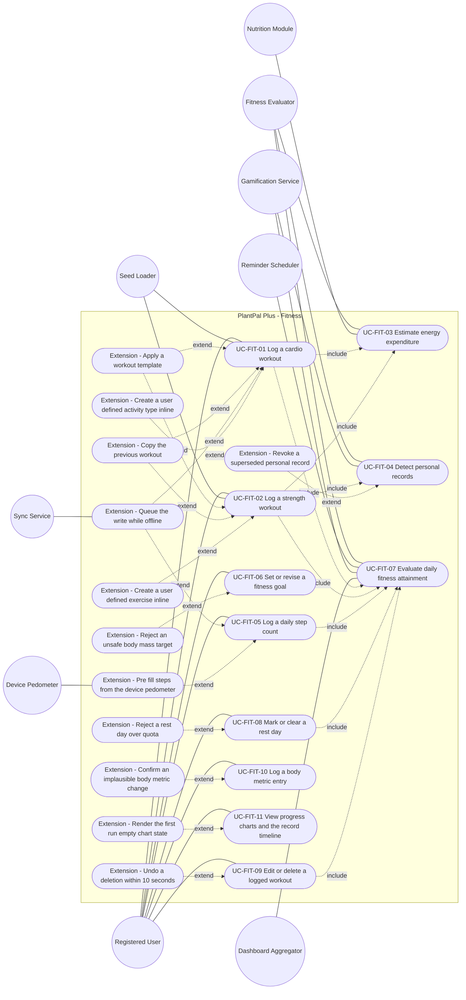
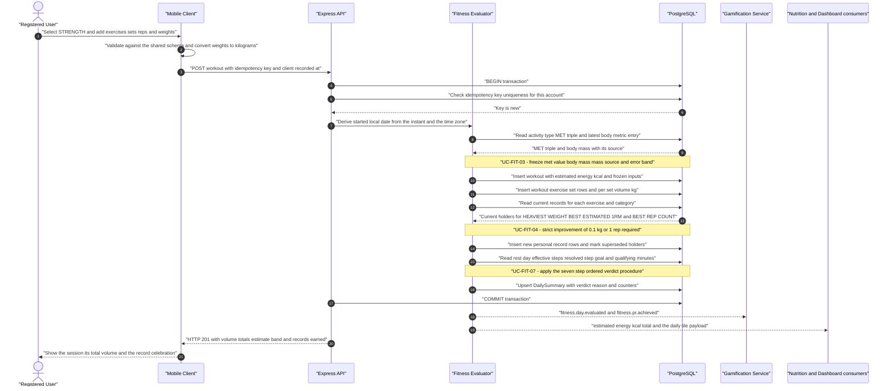
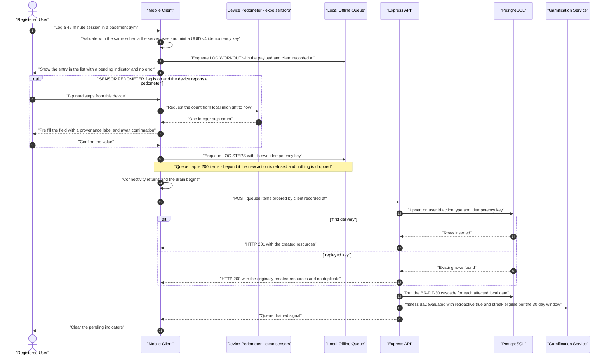
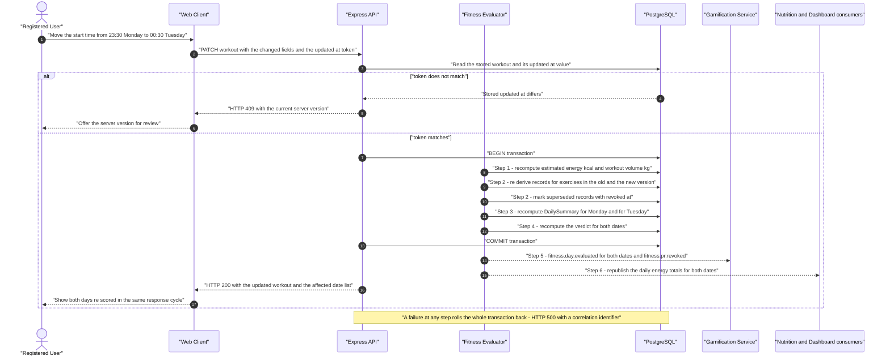

# Use-Case Model — Fitness (`FIT`)

| Field | Value |
| --- | --- |
| Document | `use-cases/fitness.md` — authoritative use-case model for the Fitness module |
| Version | 1.0 |
| Date | 2026-07-21 |
| Status | Approved for Phase 2 design |
| Owner | Rakshit — Project Lead / sole developer (STK-03) |
| Parent | [PlantPal+ Software Requirements Specification v1.0](../SRS.md) |
| Specification aligned to | [modules/fitness.md](../modules/fitness.md) v1.0 |
| Owned prefix | `UC-FIT` — `UC-FIT-01` … `UC-FIT-11`. `FR-FIT`, `BR-FIT`, `US-FIT`, `NFR-*`, `ENT-*`, `GOAL-*`, `ASM-*`, `CON-*`, `DEP-*`, `RSK-*`, `OQ-*`, `STK-*` and `PER-*` identifiers are referenced only, never minted here |
| Use-case count | 11 use cases, 3 sequence diagrams, 8 modelled `include` edges and 12 modelled extension points |
| Standards basis | IEEE 830-1998 section structure, ISO/IEC/IEEE 29148:2018 requirement-quality rules, Cockburn use-case levels |
| Source decisions | D-01 … D-11, with D-02, D-03, D-04, D-06, D-07 and D-09 as primary drivers |

---

## Table of contents

1. [Module use-case diagram](#1-module-use-case-diagram)
2. [Actor roles for this module](#2-actor-roles-for-this-module)
3. [Use-case specifications](#3-use-case-specifications)
   - [UC-FIT-01 — Log a cardio workout](#uc-fit-01--log-a-cardio-workout)
   - [UC-FIT-02 — Log a strength workout](#uc-fit-02--log-a-strength-workout)
   - [UC-FIT-03 — Estimate energy expenditure](#uc-fit-03--estimate-energy-expenditure)
   - [UC-FIT-04 — Detect personal records](#uc-fit-04--detect-personal-records)
   - [UC-FIT-05 — Log a daily step count](#uc-fit-05--log-a-daily-step-count)
   - [UC-FIT-06 — Set or revise a fitness goal](#uc-fit-06--set-or-revise-a-fitness-goal)
   - [UC-FIT-07 — Evaluate daily fitness attainment](#uc-fit-07--evaluate-daily-fitness-attainment)
   - [UC-FIT-08 — Mark or clear a rest day](#uc-fit-08--mark-or-clear-a-rest-day)
   - [UC-FIT-09 — Edit or delete a logged workout](#uc-fit-09--edit-or-delete-a-logged-workout)
   - [UC-FIT-10 — Log a body-metric entry](#uc-fit-10--log-a-body-metric-entry)
   - [UC-FIT-11 — View progress charts and the record timeline](#uc-fit-11--view-progress-charts-and-the-record-timeline)
4. [Sequence diagrams for the most complex use cases](#4-sequence-diagrams-for-the-most-complex-use-cases)
5. [Include and extend relationship catalogue](#5-include-and-extend-relationship-catalogue)
6. [Coverage and traceability checks](#6-coverage-and-traceability-checks)

---

## 1. Module use-case diagram

Every use case specified in section 3 appears below. A dotted edge labelled `include` points **from the base use case to the included use case**. A dotted edge labelled `extend` points **from the extending behaviour to the base use case**, which is the UML 2.5 direction. The twelve extension nodes deliberately carry **no `UC-FIT` identifier**: each is a sub-flow specified inside the Extensions table of its base use case, and section 5.1 records where each one is realised.

**Reading note for the evaluator.** Eight of the eleven use cases are user-goal level with the Registered User as primary actor. Three are subfunctions whose primary actor is a system component: `UC-FIT-03`, `UC-FIT-04` and `UC-FIT-07`. `UC-FIT-07` is the convergence point of the module — every mutating flow reaches it, which is exactly the property that lets `GAM` remain a pure consumer of `fitness.day.evaluated` under exclusion X-5 of [modules/fitness.md](../modules/fitness.md). `UC-FIT-09` reaches `UC-FIT-03` and `UC-FIT-04` transitively through the recomputation cascade of `BR-FIT-30` rather than by re-specifying either, so that an edit and a create can never diverge. `UC-FIT-11` is read-only and therefore includes nothing.

---

## 2. Actor roles for this module

| Actor | Type | Goals in this module |
| --- | --- | --- |
| Registered User | Primary (human) | Record a cardio session in under 20 seconds and a strength session without retyping a routine; understand a calorie figure as an estimate rather than a fact; see volume and personal records instead of only time spent; keep step, workout, active-minute, distance and body-mass targets that match how a week is actually planned; take a planned rest without being punished; backfill a forgotten session; correct or delete a wrong entry and have every derived number follow; watch real progress over 7, 30 and 90 days; log at a basement gym with no signal |
| Unauthenticated Visitor | Secondary (human), negative role | Has no reachable goal in this module. Every fitness route is authentication-gated per `BR-FIT-01`; the actor exists so that the authorisation negative tests of NFR-SEC-14 are traceable to a modelled actor rather than to nothing |
| Fitness Evaluator | Primary (system) for UC-FIT-03, UC-FIT-04 and UC-FIT-07; secondary elsewhere | Freeze the energy estimate and its four audit inputs at write time; derive the three personal-record categories deterministically and revoke superseded ones; apply the seven-step ordered verdict procedure of `BR-FIT-22`; remain a pure, idempotent, fully rebuildable function over stored rows per `BR-ENT-41` and NFR-MAIN-04 |
| Reminder Scheduler — `NOT` | Primary (time) for the nightly close-out path of UC-FIT-07; secondary elsewhere | Wake the Fitness Evaluator at 00:15 local time in each represented IANA time zone so that a day closes correctly with no user action, and read fitness-derived reminder trigger conditions. Never mutates fitness data |
| Sync Service — `SYS` | Secondary (system) | Hold the two queue-eligible fitness actions `LOG_WORKOUT` and `LOG_STEPS` with their client-minted UUID version 4 idempotency keys and client timestamps, and replay them exactly once per key on reconnection per D-04 and `BR-FIT-29` |
| Gamification Service — `GAM` | Secondary (system) | Consume `fitness.day.evaluated`, `fitness.pr.achieved` and `fitness.pr.revoked`. Owns every streak, badge and revocation-display decision; owns none of the verdict logic |
| Nutrition Module — `NUT` | Secondary (system) | Consume `estimated_energy_kcal_total` per user and local date with the maximum contributing `error_band_pct`, and decide independently whether it affects any calorie budget, subject to `BR-FIT-07` and its 1000 kcal per day cap |
| Dashboard Aggregator — `DSH` | Secondary (system) | Consume the fitness daily tile payload: workout count, active minutes, effective steps against the resolved target, estimated energy with its band, rest-day flag, latest body mass and weekly goal progress |
| Device Pedometer | External (device sensor, flag-gated) | Return one integer step count for the interval from local midnight to now, on the mobile client only, in the foreground only, behind the `SENSOR_PEDOMETER` flag whose default is false (FR-FIT-17, v1.1+). The experience with the flag off must be complete, per NFR-RELI-02 |
| Seed Loader | Secondary (system, build time) | Load the nine-row activity-type catalogue with its MET table and the 40-row exercise catalogue deterministically at migration time per NFR-DATA-07, so that the module is fully functional with every external integration disabled (D-03) |
| Accounts and Settings — `ACC`, `SET` | Secondary (system) | Supply the authenticated subject, the IANA time zone, the account creation local date, the profile height and body mass, the unit system, the week-start day and the locale, which this module consumes but never owns |

---

## 3. Use-case specifications

Every use case below references at least one `FR-FIT-nn` from [modules/fitness.md](../modules/fitness.md) and at least one `US-FIT-nn` from [../user-stories/fitness.md](../user-stories/fitness.md). Steps describe observable actor and system behaviour only, never implementation internals. Every numeric threshold quoted in a step is normative in the business rule named beside it and is the value a tester must observe.

---

### UC-FIT-01 — Log a cardio workout

| Field | Value |
| --- | --- |
| Primary actor | Registered User |
| Secondary actors | Fitness Evaluator; Seed Loader as the origin of the activity-type catalogue; Sync Service when the device has no connectivity; Gamification Service, Nutrition Module and Dashboard Aggregator as downstream consumers |
| Level | User-goal |
| Priority | Must |
| Release | v0.5 Alpha for FR-FIT-01 and FR-FIT-03 per alignment note ALN-3; overlap detection FR-FIT-09, offline queueing FR-FIT-10, user-defined activity types FR-FIT-02, templates FR-FIT-25 and copy-previous FR-FIT-26 complete at v1.0 MVP |
| Frequency of use | The most-executed action in the module. Estimated 3 to 10 times per week per active user; an estimated 5 to 15 percent of executions are captured with no connectivity, which is the PER-05 case |
| Preconditions | The user is authenticated; the seeded activity-type catalogue holds its nine rows `WALK`, `RUN`, `CYCLE`, `SWIM`, `STRENGTH`, `YOGA`, `HIIT`, `SPORT`, `OTHER`; the client has minted a UUID version 4 `idempotency_key` before any network attempt; the user's IANA time zone resolves, or UTC is used as the recorded fallback |
| Trigger | The user activates the add-workout action from the fitness tab, from the `DSH` dashboard, from a template or from the copy-previous affordance |
| Success guarantee | Exactly one `ENT-17 Workout` owned by the caller exists for the submitted `idempotency_key`, carrying a frozen `started_local_date` derived per `BR-FIT-08`, a frozen `met_value_used`, `body_mass_kg_used`, `mass_source` and `error_band_pct`, a computed `estimated_energy_kcal`, and a persisted `overlaps_existing` flag; the `ENT-49 DailySummary` row for that date is recomputed and `fitness.day.evaluated` is emitted; the response names the energy estimate with its low-to-high band |
| Minimal guarantee | Either exactly one workout exists for that key, or nothing is created and every value the user entered is still on screen per NFR-USAB-08. A partial cascade is never committed (`BR-FIT-30`) |
| Related FRs | FR-FIT-01, FR-FIT-02, FR-FIT-03, FR-FIT-04, FR-FIT-09, FR-FIT-10, FR-FIT-25, FR-FIT-26; FR-FIT-05 and FR-FIT-06 through the included UC-FIT-03; FR-FIT-21 through the included UC-FIT-07 |
| Related USs | US-FIT-01, US-FIT-09, US-FIT-13, US-FIT-14 |

**Main success scenario**

| # | Actor action | System response |
| --- | --- | --- |
| 1 | The Registered User activates the add-workout action. | — |
| 2 | — | The system renders the workout form with the activity type unset, `started_at` defaulted to the current instant truncated to the minute, `intensity` pre-selected as `MODERATE`, and the distance and note fields empty. |
| 3 | The user selects an activity type from the nine seeded rows or from the labelled `Your activities` group beneath them. | — |
| 4 | — | The system shows or hides the distance field according to the `supports_distance` flag of the selected type, and states the error band that will apply to the energy estimate. |
| 5 | The user enters a duration in whole minutes between 1 and 600. | — |
| 6 | — | The system validates the value inline against `BR-FIT-10` and enables the save control. |
| 7 | The user optionally adjusts `started_at`, changes `intensity` to `LOW` or `VIGOROUS`, enters a distance of 0.01 to 500.00 km, and adds a note of at most 500 characters. | — |
| 8 | — | The system validates each field as it is entered and marks any breach on its own field rather than in a summary banner. |
| 9 | The user saves the workout. | — |
| 10 | — | The system derives `started_local_date` from the submitted instant and the user's time zone in force at write time, and freezes it (`BR-FIT-08`). |
| 11 | — | The system computes and freezes the energy estimate — **include UC-FIT-03**. |
| 12 | — | The system evaluates overlap against the user's non-deleted workouts on absolute UTC instants and persists `overlaps_existing` on the new entry (FR-FIT-09, `BR-FIT-12`). |
| 13 | — | The system recomputes the daily aggregates and the fitness-day verdict for `started_local_date` inside the same transaction — **include UC-FIT-07**. |
| 14 | — | The system returns HTTP 201 with the created workout, its estimate, its low-to-high band and the not-medical-advice disclaimer, and publishes the refreshed daily total to `NUT` and the refreshed tile to `DSH`. |
| 15 | The user reads the confirmation. | — |
| 16 | — | The system places the entry at the top of today's history list and updates the weekly goal-progress figure in the same client response cycle. |

**Extensions**

| Step | Condition | Handling |
| --- | --- | --- |
| 1a | The user activates the copy-previous action instead of the blank form. | 1a1 The system pre-fills a draft from the most recent non-deleted workout with activity type, duration, intensity and, for strength, the full set structure, and sets `started_at` to the current instant truncated to the minute. 1a2 `distance_m` and `note` are deliberately left empty (`BR-FIT-28`). 1a3 Flow resumes at step 7. |
| 1b | The user applies a saved template. | 1b1 The system opens a draft pre-filled with the template activity type, `default_duration_seconds` and `default_intensity`, increments `times_used_count` and sets `last_used_at` (`BR-FIT-27`). 1b2 Nothing is stored until the user saves. 1b3 Flow resumes at step 7. |
| 1c | The account holds no previous workout. | 1c1 The copy-previous action is hidden rather than disabled, and the first-run empty state offers a single primary action to log the first workout (FR-FIT-26, NFR-USAB-06). |
| 3a | The user's activity is absent from the nine seeded types. | 3a1 The user creates a user-defined activity type with a name of 1 to 40 characters and a `base_met` of 1.0 to 20.0, defaulting to 4.5 (FR-FIT-02). 3a2 The system derives and stores `met_moderate = base_met`, `met_low = round(base_met x 0.7, 1)` and `met_vigorous = round(base_met x 1.4, 1)`, each clamped to 1.0 to 23.0, and fixes `error_band_pct` at 35 (`BR-FIT-03`). 3a3 The new type is immediately selectable and flow returns to step 4. |
| 3b | The account already holds 20 user-defined activity types. | 3b1 Creation is refused with `activity_type.limit_reached` and the counter `n of 20 used` is shown with a route to delete an unused type. |
| 7a | A distance is entered for an activity type whose `supports_distance` is false. | 7a1 The field is not rendered by either client, and a distance submitted by any client is rejected with `distance.not_supported` (FR-FIT-03). |
| 7b | The implied speed `distance_km / (duration_min / 60)` exceeds the warn threshold of the activity type — `WALK` 12.0, `RUN` 30.0, `CYCLE` 80.0, `SWIM` 10.0, `SPORT` 45.0, `OTHER` 80.0 km/h. | 7b1 A dismissible confirmation names the computed speed. 7b2 On confirmation the workout is stored with `implausible_flag = true` (`BR-FIT-11`). |
| 9a | The device reports no connectivity. | 9a1 The client validates against the same shared schema used server-side and writes the payload to the Sync Service queue with its `idempotency_key` and `client_recorded_at`. 9a2 The entry appears in the list with a pending indicator and no error state (FR-FIT-10). 9a3 On reconnection the item is replayed; a first delivery returns HTTP 201 and a replay of the same key returns HTTP 200 with the originally created workout. 9a4 The cascade of `BR-FIT-30` runs at replay time, with `retroactive` set per `BR-FIT-24`. |
| 9b | The client queue already holds 200 pending fitness items. | 9b1 The new action is refused at enqueue time with an explanatory message and no queued item is dropped (`BR-FIT-29`). |
| 12a | The candidate interval intersects an existing non-deleted workout by 60 seconds or more. | 12a1 A dismissible warning names the conflicting workout by its activity display name and local start time. 12a2 On confirmation the save proceeds with `overlaps_existing = true` and the history row is badged by text as well as by icon. 12a3 If the user chooses to amend, focus returns to the start-time field with the conflicting interval shown. |
| 12b | The intersection is 59 seconds or less. | 12b1 No warning is shown and no flag is set (`BR-FIT-12`). |
| 13a | The workout is attributed to a past local date. | 13a1 The verdict for that date is re-evaluated with `retroactive = true`. 13a2 `streak_eligible` is true when the date is within 30 days of the user's current local date and false beyond it (`BR-FIT-24`). |
| 13b | The workout crosses local midnight. | 13b1 The whole duration is attributed to the local date of the start instant and is never split (`BR-FIT-08`). |

**Exception flows**

| Condition | System behaviour | Outcome |
| --- | --- | --- |
| No valid access token is presented | HTTP 401; the draft is preserved locally and the user is routed to sign-in | Nothing created; no entered value is lost |
| `duration_min` is 0, negative, or 601 or greater | HTTP 422 naming the 1-to-600-minute bound, with every other violated field reported in the same response | Nothing created; the form retains its values |
| `started_at` is earlier than now minus 1825 days, or later than now plus 15 minutes | HTTP 422 naming the 5-year backfill limit or the 15-minute forward tolerance | Nothing created |
| Implied speed exceeds 150.0 km/h for any activity type | HTTP 422; the value is never storable, not even on confirmation | Nothing created |
| `idempotency_key` is absent or is not a UUID version 4 | HTTP 400 with `idempotency_key.invalid` | Nothing created; treated as a client defect |
| The account exceeds 300 fitness write requests in a rolling hour | HTTP 429 with a `Retry-After` header per NFR-SEC-11 | Nothing created; the queued item is retried after the stated delay |
| The activity-type catalogue returns zero rows | A blocking data-seed error state replaces the picker and an `error`-level line carrying the request identifier is logged | Nothing created; the failure is attributed to the system, not to the user |
| The user's IANA time-zone identifier is unknown or empty | UTC is used, the substitution is recorded as an `ENT-48 AuditEvent`, and the workout is still attributed to a date | The workout is never left unattributed |

**Special requirements**

| Reference | Obligation carried by this use case |
| --- | --- |
| NFR-USAB-01 | A cardio workout is committable in 3 interactions or fewer from the fitness tab, which is what makes the sub-20-second target of US-FIT-01 reachable |
| NFR-USAB-03 | Every rejection names the breached bound and the permitted range in the message itself |
| NFR-USAB-07 | The offline state names the two actions that still work offline, so the message is actionable rather than merely informative |
| NFR-USAB-08 | Entered values survive validation failure, a 429, and a change of connectivity |
| NFR-SEC-08 | Every field is validated server-side against `BR-FIT-10`, never only in the client |
| NFR-SEC-14 | Ownership of the referenced activity type and template is enforced on the authenticated subject; a foreign row returns HTTP 404, never 403 |
| NFR-DATA-01 | `started_local_date` is stored alongside the absolute `started_at` instant and the `tz_at_write` identifier |
| NFR-DATA-09 | The queued write is durable across process termination and idempotent on replay |
| NFR-A11Y-08 | The overlap badge and the pending-sync indicator are conveyed by text as well as by icon and colour |
| NFR-I18N-01 | Every message in this flow resolves from the locale catalogue by a stable key |

---

### UC-FIT-02 — Log a strength workout

| Field | Value |
| --- | --- |
| Primary actor | Registered User |
| Secondary actors | Fitness Evaluator; Seed Loader as the origin of the 40-row exercise catalogue; Sync Service when the device has no connectivity; Gamification Service as the consumer of record events |
| Level | User-goal |
| Priority | Must |
| Release | v0.5 Alpha for FR-FIT-11 and FR-FIT-13; total volume FR-FIT-14, personal records FR-FIT-15 and user-defined exercises FR-FIT-12 complete at v1.0 MVP |
| Frequency of use | Estimated 2 to 6 times per week for PER-03, the body-composition-focused persona. The most field-heavy screen in the product, and therefore the one that most depends on the template and copy-previous accelerators |
| Preconditions | The user is authenticated; the seeded exercise catalogue holds at least 40 rows with a primary muscle group drawn from `CHEST`, `BACK`, `SHOULDERS`, `BICEPS`, `TRICEPS`, `FOREARMS`, `CORE`, `GLUTES`, `QUADRICEPS`, `HAMSTRINGS`, `CALVES`, `FULL_BODY`; the client has minted a UUID version 4 `idempotency_key`; the selected activity type is `STRENGTH` or a user-defined type |
| Trigger | The user selects activity type `STRENGTH` on the workout form, applies a strength template, or copies a previous strength session |
| Success guarantee | An `ENT-17 Workout` exists with 0 to 30 exercises, each holding 1 to 20 `ENT-18 WorkoutExerciseSet` rows stored individually rather than as a JSON blob; per-set `volume_kg`, per-exercise subtotals and `workout_volume_kg` are computed per `BR-FIT-14`; every non-warm-up set has been evaluated for the three record categories; the day's verdict is recomputed and published |
| Minimal guarantee | Either the whole workout with its complete set structure is stored, or nothing is stored and the entered structure remains on screen. A workout is never persisted with a partial set list |
| Related FRs | FR-FIT-01, FR-FIT-03, FR-FIT-04, FR-FIT-09, FR-FIT-11, FR-FIT-12, FR-FIT-13, FR-FIT-14, FR-FIT-25, FR-FIT-26; FR-FIT-05 and FR-FIT-06 through the included UC-FIT-03; FR-FIT-15 through the included UC-FIT-04; FR-FIT-21 through the included UC-FIT-07 |
| Related USs | US-FIT-01, US-FIT-03, US-FIT-04, US-FIT-11, US-FIT-13, US-FIT-14, US-FIT-15 |

**Main success scenario**

| # | Actor action | System response |
| --- | --- | --- |
| 1 | The Registered User selects activity type `STRENGTH` on the workout form. | — |
| 2 | — | The system hides the distance field, renders the exercise section, and keeps the duration, start-instant and intensity fields of UC-FIT-01. |
| 3 | The user searches the exercise catalogue by name or filters it by primary muscle group and by equipment tag. | — |
| 4 | — | The system returns matching seeded exercises followed by the user's own exercises in a labelled group. |
| 5 | The user adds an exercise to the workout. | — |
| 6 | — | The system assigns `order_index` from the array position and snapshots the exercise display name onto the workout row so that a later rename cannot rewrite history. |
| 7 | The user enters, for each set, a repetition count of 1 to 100, a weight of 0.00 to 500.00 kg in the active unit system, and a warm-up flag defaulting to false. | — |
| 8 | — | The system assigns `set_index` from the array position starting at 1, converts the weight to kilograms using the exact constants of `BR-FIT-25`, and shows the running per-exercise subtotal as `sum of reps x weight_kg`. |
| 9 | The user repeats steps 5 to 8 for up to 30 exercises and up to 20 sets per exercise. | — |
| 10 | — | The system shows the workout total volume rounded half-up to one decimal place, with warm-up sets included (`BR-FIT-14`, alignment note ALN-1). |
| 11 | The user saves the workout. | — |
| 12 | — | The system computes and freezes the energy estimate for the session duration — **include UC-FIT-03**. |
| 13 | — | The system evaluates every non-warm-up set against the three record categories `HEAVIEST_WEIGHT`, `BEST_ESTIMATED_1RM` and `BEST_REP_COUNT` — **include UC-FIT-04**. |
| 14 | — | The system recomputes the daily aggregates and the fitness-day verdict for `started_local_date` — **include UC-FIT-07**. |
| 15 | The user reads the confirmation. | — |
| 16 | — | The system returns HTTP 201 with the persisted exercise and set structure ordered by `order_index` then `set_index`, the per-exercise subtotals, the workout total volume, the energy estimate with its 35 percent band, and any personal record earned. |

**Extensions**

| Step | Condition | Handling |
| --- | --- | --- |
| 1a | The user applies a strength template. | 1a1 The system pre-fills the exercise list with its target sets, reps and weights, up to 30 exercises and 20 target sets each (`BR-FIT-27`). 1a2 Nothing is written until an explicit save. 1a3 Flow resumes at step 7. |
| 1b | The template references a user-defined exercise that has since been soft-deleted. | 1b1 The remaining exercises pre-fill and a warning names the dropped exercise. 1b2 The application is never failed as a whole. |
| 1c | The user copies the previous workout and that workout was a strength session. | 1c1 The complete structure of exercises, sets, reps and weights is copied with warm-up flags preserved; `distance_m`, `note` and every derived field are not copied (`BR-FIT-28`). |
| 3a | The exercise is absent from the seeded catalogue. | 3a1 The user creates a user-defined exercise with a name of 1 to 60 characters, exactly one primary muscle group, at most 3 secondary groups excluding the primary, and a bodyweight flag (FR-FIT-12). 3a2 It participates in volume and record detection exactly as a seeded exercise does, and keeps its own record history keyed by its own reference. 3a3 Flow returns to step 5. |
| 3b | The account already holds 100 user-defined exercises. | 3b1 Creation is refused with the cap named and a route to delete an unused exercise. |
| 3c | The proposed custom name collides case-insensitively with a seeded display name. | 3c1 Creation is refused with HTTP 409 and the seeded entry is offered for selection instead. |
| 7a | A set weight above 300.00 kg and at most 500.00 kg is entered. | 7a1 A dismissible confirmation asks the user to check the value. 7a2 On confirmation the set is stored with `implausible_flag = true` (`BR-FIT-10`). |
| 7b | A set is recorded at 0.00 kg. | 7b1 The set is accepted and labelled `Bodyweight` rather than as zero weight, so the figure is not read as a data error. 7b2 It contributes 0.0 to volume, is excluded from `HEAVIEST_WEIGHT` and `BEST_ESTIMATED_1RM`, and remains eligible for `BEST_REP_COUNT`. |
| 7c | The user marks a set as a warm-up. | 7c1 The set still counts toward volume and is excluded from all three record categories (ALN-1). |
| 9a | The workout is saved with zero exercises. | 9a1 It is accepted as a duration-only session with `workout_volume_kg = 0.0` and a non-blocking hint offering to add exercises, because partial logging beats abandonment. |
| 11a | The device reports no connectivity. | 11a1 The whole workout including its set structure is queued as a single `LOG_WORKOUT` item under one `idempotency_key`, so a replay can never produce a half-written session (extension 9a of UC-FIT-01). |
| 11b | The user saves the session as a named template of 1 to 60 characters. | 11b1 The template stores activity type, duration, intensity and the exercise list with target sets, reps and weights, up to 50 templates per account (FR-FIT-25). 11b2 Editing the template later never alters this workout, and editing this workout never alters the template. |
| 13a | A non-warm-up set establishes a new maximum in any category. | 13a1 A record row is written and `fitness.pr.achieved` is emitted to `GAM`. 13a2 An in-app celebration is shown once per record, without the Lottie animation when the device reduce-motion preference is on (NFR-A11Y-07). |

**Exception flows**

| Condition | System behaviour | Outcome |
| --- | --- | --- |
| More than 30 exercises are submitted | HTTP 422 naming the 30-exercise cap | Nothing created; the entered structure is retained |
| An exercise carries zero sets or more than 20 sets | HTTP 422 naming the 1-to-20-set bound | Nothing created |
| `reps` lies outside 1 to 100 | HTTP 422 naming the bound | Nothing created |
| `weight_kg` exceeds 500.00 | HTTP 422; the value is not storable even on confirmation | Nothing created |
| The referenced exercise is a custom exercise owned by another account | HTTP 404, never 403, so identifiers cannot be enumerated (`BR-FIT-01`) | Nothing created |
| The exercise catalogue returns zero rows at runtime | A blocking data-seed error state replaces the picker, mirroring FR-FIT-01 | Nothing created |
| A single request would exceed the payload ceiling of NFR-PERF-11 | The request is refused before parsing and the client is told to split the session | Nothing created; the free-tier write budget of D-06 is protected |

**Special requirements**

| Reference | Obligation carried by this use case |
| --- | --- |
| NFR-SCAL-05 | Sets are stored as individual indexed rows so that record queries stay indexable as the set count grows |
| NFR-PERF-11 | The 30-exercise and 20-set caps bound the request payload of the heaviest write in the module |
| NFR-USAB-06 | The exercise picker is searchable by name and filterable by primary muscle group and equipment tag, so a 40-row catalogue stays navigable |
| NFR-USAB-08 | The entered set structure survives a validation failure of any single field |
| NFR-SEC-08 | Every set-level bound is enforced server-side, not only in the client |
| NFR-I18N-03 | Weights are entered and displayed in the user's unit system while storage stays kilograms per D-09 |
| NFR-A11Y-07 | The record celebration honours the device reduce-motion preference |
| NFR-A11Y-08 | The bodyweight label and the warm-up marker are conveyed by text, never by colour alone |

---

### UC-FIT-03 — Estimate energy expenditure

| Field | Value |
| --- | --- |
| Primary actor | Fitness Evaluator (system) |
| Secondary actors | Registered User as the reader of the result; Nutrition Module as the consumer of the daily total; Accounts as the source of the profile body mass |
| Level | Subfunction |
| Priority | Must |
| Release | v0.5 Alpha |
| Frequency of use | Once per workout create, and again on any edit that changes activity type, intensity or duration. Bounded above by the 300 fitness writes per account per rolling hour of `BR-FIT-29` |
| Preconditions | A workout is being written or recomputed; its activity type resolves to a MET triple, either the seeded triple of `BR-FIT-02` or the derived triple of `BR-FIT-03`; the transaction of `BR-FIT-30` is open |
| Trigger | Invoked unconditionally by UC-FIT-01 step 11, UC-FIT-02 step 12, and step 1 of the cascade invoked by UC-FIT-09 |
| Success guarantee | `estimated_energy_kcal` is persisted on the workout together with the four audit inputs `met_value_used`, `body_mass_kg_used`, `mass_source` and `error_band_pct`; every surface that renders the figure renders the low-to-high band and the not-medical-advice disclaimer |
| Minimal guarantee | The stored value is never negative and never null. A data fault floors the value at 0 and raises an `error`-level log line carrying the workout identifier |
| Related FRs | FR-FIT-05, FR-FIT-06 |
| Related USs | US-FIT-02 |

**Main success scenario**

| # | Actor action | System response |
| --- | --- | --- |
| 1 | The calling use case supplies the activity type, the perceived intensity and the duration in minutes. | — |
| 2 | — | The system selects `met_value_used` from the MET triple of that activity type by the perceived intensity, within the permitted range 1.0 to 23.0. |
| 3 | — | The system resolves the body mass by the precedence chain of `BR-FIT-05`: the `body_mass_kg` of the most recent non-deleted body-metric entry dated on or before the workout local date; otherwise the profile body mass owned by `ACC`; otherwise the constant `DEFAULT_BODY_MASS_KG = 70.0`. |
| 4 | — | The system records `mass_source` as `BODY_METRIC`, `PROFILE` or `DEFAULT` accordingly. |
| 5 | — | The system computes `energy_kcal_raw = met_value_used x body_mass_kg_used x duration_min / 60`. |
| 6 | — | The system stores `estimated_energy_kcal` as `energy_kcal_raw` rounded half-up to a whole number, floored at 0, and raised to 1 when `energy_kcal_raw` lies strictly between 0.5 and 1.0. |
| 7 | — | The system copies `error_band_pct` from the activity type — 25, 30 or 35 for seeded types and always 35 for user-defined types — and freezes all four inputs onto the workout row. |
| 8 | The Registered User opens the workout detail screen. | — |
| 9 | — | The system displays the point estimate, the range `display_low = floor(kcal x (100 - band) / 100)` to `display_high = ceil(kcal x (100 + band) / 100)`, the word `estimate`, and the disclaimer sentence resolved from locale key `fitness.energy.disclaimer`. |
| 10 | — | The system adds the point estimate to `estimated_energy_kcal_total` for that local date and publishes that total, with the maximum contributing `error_band_pct`, to `NUT` and `DSH`. |

Worked example that a tester must reproduce: `RUN` at `MODERATE` for 45 minutes at 72.00 kg gives `9.8 x 72.0 x 0.75 = 529.2`, stored as 529, displayed as 529 kcal with a range of 396 to 662 kcal at the 25 percent band of `RUN`.

**Extensions**

| Step | Condition | Handling |
| --- | --- | --- |
| 3a | No body-metric entry and no profile body mass exist. | 3a1 `DEFAULT_BODY_MASS_KG = 70.0` is used with `mass_source = DEFAULT`. 3a2 The client surfaces a one-tap prompt to record a real body mass, worded neutrally per `BR-FIT-31`. |
| 3b | A newer body mass is recorded after the workout was saved. | 3b1 The frozen `body_mass_kg_used` is not recomputed, so a historical figure never silently changes (`BR-FIT-05`, `BR-FIT-32`). |
| 2a | The activity type is user-defined. | 2a1 The stored derived triple of `BR-FIT-03` is used and `error_band_pct` is 35. |
| 7a | A migration later revises a seeded MET value. | 7a1 Existing workouts keep their frozen `met_value_used`; only workouts written after the migration use the new value (FR-FIT-01). |
| 9a | `error_band_pct` is missing on the row for any reason. | 9a1 The client falls back to 35 and still renders both the range and the disclaimer. The disclaimer is never suppressed. |
| 9b | The locale key fails to resolve. | 9b1 The English source string is rendered and a `warn`-level line records the missing key. |
| 9c | The figure shown is an aggregate over several workouts. | 9c1 Point estimates are summed and a single aggregate band equal to the maximum contributing `error_band_pct` is displayed. A week containing a `RUN` at 25 and a `HIIT` at 35 therefore shows 35 (`BR-FIT-06`). |
| 10a | The user preference `add_exercise_calories_to_budget` is enabled in `SET`. | 10a1 This module still publishes the plain total; `NUT` decides the budget effect and enforces the 1000 kcal per day cap of `BR-FIT-07`. This module makes no budget decision. |

**Exception flows**

| Condition | System behaviour | Outcome |
| --- | --- | --- |
| The computed value would be negative through a data fault | The value is floored at 0 and an `error`-level line carrying the workout identifier is emitted | The workout is still stored; no negative energy is ever persisted |
| The resolved body mass falls outside 20.00 to 500.00 kg | The resolution falls through to the next source in the precedence chain and the substitution is recorded | The estimate is always computable |
| A step entry exists for the same date | Steps contribute exactly 0 kcal, so a walk logged both as steps and as a `WALK` workout is never double counted (`BR-FIT-18`) | Totals stay defensible |
| The disclaimer surface fails to render | The energy figure is withheld rather than shown without its disclaimer, because D-07 forbids presenting the number as fact | No unqualified figure is ever displayed |

**Special requirements**

| Reference | Obligation carried by this use case |
| --- | --- |
| NFR-LEGL-03 | The not-medical-advice disclaimer is visible without interaction on workout detail and reachable within one interaction from any aggregated burn figure |
| NFR-A11Y-08 | The band is conveyed by text as well as by any visual treatment |
| NFR-I18N-01 | The disclaimer sentence lives in the locale catalogue under `fitness.energy.disclaimer` and is never hard-coded |
| NFR-DATA-03 | Duration is stored in seconds and mass in kilograms; the estimate is derived from canonical SI values |
| NFR-MAIN-04 | The formula exists in exactly one shared module used by both clients and the server, so no two surfaces can compute different numbers |

---

### UC-FIT-04 — Detect personal records

| Field | Value |
| --- | --- |
| Primary actor | Fitness Evaluator (system) |
| Secondary actors | Registered User as the recipient of the celebration; Gamification Service as the consumer of `fitness.pr.achieved` and `fitness.pr.revoked` |
| Level | Subfunction |
| Priority | Should |
| Release | v1.0 MVP |
| Frequency of use | Once per strength workout save and once per edit or delete touching a strength workout. Zero to three new records per exercise per save |
| Preconditions | The saved or recomputed workout holds at least one non-warm-up set belonging to a non-deleted workout; the existing record set for the same `user_id` and exercise reference is readable; the transaction of `BR-FIT-30` is open |
| Trigger | Invoked unconditionally by UC-FIT-02 step 13 and by step 2 of the cascade invoked by UC-FIT-09 |
| Success guarantee | Each of the three categories `HEAVIEST_WEIGHT`, `BEST_ESTIMATED_1RM` and `BEST_REP_COUNT` reflects the true maximum over all qualifying sets of that user and exercise; every new record has emitted exactly one `fitness.pr.achieved`; every superseded record carries `revoked_at` and has emitted exactly one `fitness.pr.revoked` |
| Minimal guarantee | Detection is idempotent. Re-running it over unchanged data produces no new record row and emits no event. The projection is fully rebuildable from `ENT-18 WorkoutExerciseSet` at any time per `BR-ENT-41` |
| Related FRs | FR-FIT-15; FR-FIT-13 as the source of the qualifying sets; FR-FIT-24 as the consumer of the resulting timeline |
| Related USs | US-FIT-04 |

**Main success scenario**

| # | Actor action | System response |
| --- | --- | --- |
| 1 | The calling use case supplies every set of the saved workout. | — |
| 2 | — | The system discards warm-up sets and sets belonging to a tombstoned workout, leaving the qualifying set collection. |
| 3 | — | For each qualifying set the system computes `e1rm_kg` by the Epley rule of `BR-FIT-15`: `weight_kg x (1 + reps / 30)` for `reps` above 1, and exactly `weight_kg` for `reps` equal to 1, rounded half-up to one decimal place. |
| 4 | — | The system reads the current record for the same `user_id` and exercise reference in each of the three categories. |
| 5 | — | The system records a `HEAVIEST_WEIGHT` record when a qualifying set exceeds the current holder by at least 0.1 kg. |
| 6 | — | The system records a `BEST_ESTIMATED_1RM` record when a qualifying set of 1 to 12 repetitions with a weight above 0.00 kg exceeds the current holder by at least 0.1 kg. |
| 7 | — | The system records a `BEST_REP_COUNT` record when a qualifying set at any weight, bodyweight included, exceeds the current holder by at least 1 repetition. |
| 8 | — | Each new record row stores `achieved_at` equal to the workout `started_at`, the originating set reference, and `is_current = true`; the previous holder is marked superseded. |
| 9 | — | The system emits one `fitness.pr.achieved` per new record carrying `user_id`, the exercise reference, `pr_type`, `value`, `unit` and `achieved_at`. |
| 10 | The Registered User sees the celebration. | — |
| 11 | — | The system shows the celebration once per record and adds the record to the timeline data source of FR-FIT-24. |

Worked example that a tester must reproduce: 100.0 kg for 5 repetitions gives `100.0 x (1 + 5 / 30) = 116.7` kg, which becomes a `BEST_ESTIMATED_1RM` record against a previous holder of 105.0 kg.

**Extensions**

| Step | Condition | Handling |
| --- | --- | --- |
| 3a | The set carries 13 or more repetitions. | 3a1 An estimate is still displayed and labelled low confidence, and the set is excluded from `BEST_ESTIMATED_1RM` detection. 3a2 A `BEST_REP_COUNT` record remains possible. |
| 3b | The set carries a weight of exactly 0.00 kg. | 3b1 `e1rm_kg` is 0.0 and the set is excluded from `HEAVIEST_WEIGHT` and `BEST_ESTIMATED_1RM`. 3b2 A `BEST_REP_COUNT` record remains possible. |
| 5a | The set exactly ties the current holder. | 5a1 No record is created, no event is emitted, and the original achievement date is retained (`BR-FIT-16`). |
| 8a | The set that held a current record is edited away or its workout is deleted. | 8a1 The category is re-derived over the remaining qualifying sets. 8a2 The superseded row is marked with `revoked_at` and `fitness.pr.revoked` is emitted. 8a3 The visual treatment of a revoked achievement is a `GAM` policy decision, not a fitness one (exclusion X-5). |
| 8b | Re-derivation finds no remaining qualifying set for a category. | 8b1 The category holds no current record and the timeline shows it as absent rather than as zero. |
| 9a | The exercise is a user-defined exercise whose name matches a seeded one. | 9a1 The two keep entirely separate record histories, because records are keyed by the exercise reference and not by its display name. |
| 10a | The device reduce-motion preference is on. | 10a1 The celebration renders as text without the Lottie animation, per NFR-A11Y-07. |

**Exception flows**

| Condition | System behaviour | Outcome |
| --- | --- | --- |
| The same workout is saved twice through an idempotency replay | Detection runs over unchanged data and produces no second record and no second event | Exactly one record per genuine achievement |
| A cascade step after detection fails | The whole transaction rolls back, so no record row and no emitted event survives a failed cascade (`BR-FIT-30`) | Records never disagree with the sets they were derived from |
| The record projection is found to disagree with the underlying sets | The projection is rebuilt from `ENT-18 WorkoutExerciseSet`, which is always authoritative | Divergence is repairable without data loss |

**Special requirements**

| Reference | Obligation carried by this use case |
| --- | --- |
| NFR-SCAL-05 | Record lookups are served by the index on `user_id`, the exercise reference and `pr_type`, so detection cost does not grow with training history |
| NFR-A11Y-07 | The celebration honours the reduce-motion preference and remains fully readable without animation |
| NFR-MAIN-04 | The Epley rule and the three thresholds exist in exactly one shared module |
| NFR-DATA-05 | Revocation is expressed by `revoked_at` rather than by deletion, so a record's history remains inspectable |

---

### UC-FIT-05 — Log a daily step count

| Field | Value |
| --- | --- |
| Primary actor | Registered User |
| Secondary actors | Fitness Evaluator; Sync Service when the device has no connectivity; Device Pedometer as the flag-gated pre-fill source from v1.1 |
| Level | User-goal |
| Priority | Must |
| Release | v0.5 Alpha for FR-FIT-16; offline queueing FR-FIT-10 completes at v1.0 MVP; the foreground pedometer pre-fill of FR-FIT-17 is v1.1+ Post-MVP behind a flag whose default is false |
| Frequency of use | Estimated once per day for a user who keeps a `DAILY_STEPS` goal, plus occasional back-dated corrections. The lowest-effort path to a `COMPLETE` day for PER-01, who often has no time for a workout |
| Preconditions | The user is authenticated; the target `local_date` is not later than the user's current local date and not earlier than today minus 1825 days; the client has minted a UUID version 4 `idempotency_key` |
| Trigger | The user opens the step-entry surface from the fitness tab or from the `DSH` dashboard step tile |
| Success guarantee | Exactly one `ENT-20 StepEntry` row exists for the tuple of user, `local_date` and `source`, holding the newly submitted value rather than a sum; the `ENT-49 DailySummary` row for that date carries `step_count` and the resolved `step_goal`; `fitness.day.evaluated` has been re-emitted for that date |
| Minimal guarantee | The previous value is replaced only when the new write succeeds. A failed write leaves the stored value untouched and the entered value on screen |
| Related FRs | FR-FIT-16, FR-FIT-10, FR-FIT-17, FR-FIT-18; FR-FIT-21 through the included UC-FIT-07 |
| Related USs | US-FIT-05, US-FIT-14 |

**Main success scenario**

| # | Actor action | System response |
| --- | --- | --- |
| 1 | The Registered User opens the step-entry surface. | — |
| 2 | — | The system shows the currently stored count for today, or an empty field when no row exists, together with the informational line resolved from locale key `fitness.steps.manualOnly` stating that step counts are entered by the user and that no health platform is read (FR-FIT-18). |
| 3 | The user optionally selects a different local date within the permitted window. | — |
| 4 | — | The system shows the stored value for that date and the `DAILY_STEPS` target that was in force on it, resolved per FR-FIT-20. |
| 5 | The user enters a whole-number step count between 0 and 200000. | — |
| 6 | — | The system validates the value inline against `BR-FIT-10`. |
| 7 | The user saves the entry. | — |
| 8 | — | The system upserts on the tuple of `user_id`, `local_date` and `source = MANUAL`, replacing any previous manual value for that date rather than adding to it. |
| 9 | — | The system re-evaluates the fitness-day verdict for that date inside the same transaction — **include UC-FIT-07**. |
| 10 | The user reads the confirmation. | — |
| 11 | — | The system shows the stored count, the progress against the resolved target, and the refreshed dashboard tile. |

**Extensions**

| Step | Condition | Handling |
| --- | --- | --- |
| 2a | The `SENSOR_PEDOMETER` flag is on, the client is the mobile client, and `Pedometer.isAvailableAsync` returns true. | 2a1 A read-from-device action is rendered. 2a2 On activation the system requests motion permission if it has not been granted, never on screen entry. 2a3 The device returns one integer count for the interval from local midnight to the current instant, and nothing else crosses the boundary. 2a4 The value pre-fills the field with a visible provenance label and is stored only after explicit confirmation, with `source = DEVICE_PEDOMETER` (FR-FIT-17). |
| 2b | The flag is off, the device reports no pedometer, permission is denied, or the native call throws. | 2b1 The flow degrades silently to plain manual entry with one explanatory line and no error state. 2b2 A thrown call is reported to Sentry per NFR-OBSV-03. 2b3 A denied permission is not re-prompted for 30 days. |
| 2c | The client is the web client. | 2c1 The read action is not rendered at all; manual entry is unaffected. |
| 5a | The entered count is above 100000 and at most 200000. | 5a1 A dismissible confirmation names the value. 5a2 On confirmation the row is stored with `implausible_flag = true`. |
| 5b | The entered count is exactly 0. | 5b1 The value is stored as a recorded fact and not as an absence, which can legitimately make the day `INCOMPLETE` (`BR-FIT-18`, `BR-ENT-16`). |
| 7a | The device reports no connectivity. | 7a1 The entry is queued as a `LOG_STEPS` item with its `idempotency_key` and `client_recorded_at`, shown with a pending indicator and no error state (FR-FIT-10). 7a2 On replay a first delivery returns HTTP 201 and a repeat of the same key returns HTTP 200 with the original row. |
| 7b | A queued step event is replayed after a newer manual edit for the same date and source. | 7b1 The later `client_recorded_at` wins and no duplicate row is created (`BR-FIT-18`). |
| 8a | A row already exists for that date and source. | 8a1 The stored value is replaced, never summed. Entering 12000 over an existing 9000 yields 12000 and not 21000. |
| 8b | From v1.1, both a `MANUAL` and a `DEVICE_PEDOMETER` row exist for the same date. | 8b1 The effective count is the greater of the two values and the interface labels which source won. Values from different sources are never summed and never averaged (`BR-FIT-18`). |
| 9a | The date being written is in the past. | 9a1 The verdict is re-emitted with `retroactive = true`, and `streak_eligible` true within the 30-day backfill window and false beyond it (`BR-FIT-24`). |

**Exception flows**

| Condition | System behaviour | Outcome |
| --- | --- | --- |
| `local_date` is later than the user's current local date | HTTP 422: future step counts cannot be logged | Nothing stored |
| `local_date` is more than 1825 days in the past | HTTP 422 naming the 5-year limit | Nothing stored |
| `step_count` is negative or above 200000 | HTTP 422 naming the 0-to-200,000 bound | Nothing stored |
| `idempotency_key` is absent or is not a UUID version 4 | HTTP 400 with `idempotency_key.invalid` | Nothing stored; treated as a client defect |
| A queued step item fails validation on replay | The item moves to a user-visible failed-items list and is never silently dropped | The user can fix and retry rather than lose the datum |
| The account exceeds 300 fitness writes in a rolling hour | HTTP 429 with `Retry-After` per NFR-SEC-11 | The queue retries after the stated delay |

**Special requirements**

| Reference | Obligation carried by this use case |
| --- | --- |
| NFR-DATA-01 | The entry is keyed by local calendar date, stored alongside the instant at which it was recorded |
| NFR-DATA-09 | The queued write is durable across process termination and idempotent on replay |
| NFR-USAB-07 | The offline state is clear and actionable and names the two actions that still work offline |
| NFR-PRIV-01 | The pedometer read exchanges one pair of instants outbound and one integer inbound — no identifier, no location, no health record and no historical series |
| NFR-RELI-02 | Every step-related journey completes with the `SENSOR_PEDOMETER` flag off, which is the default and the state the automated suite runs in |
| NFR-OBSV-03 | A thrown native call is reported with its correlation identifier and never surfaced as a user-facing error |
| NFR-SEC-13 | The dependency manifest contains no health-platform package, which is the inspection that verifies FR-FIT-18 |
| NFR-I18N-01 | The manual-only explanation resolves from locale key `fitness.steps.manualOnly` |

---

### UC-FIT-06 — Set or revise a fitness goal

| Field | Value |
| --- | --- |
| Primary actor | Registered User |
| Secondary actors | Fitness Evaluator as the resolver of historical versions; Accounts as the source of the profile height used by the body-mass safety floor; Dashboard Aggregator as the consumer of goal progress |
| Level | User-goal |
| Priority | Must |
| Release | v1.0 MVP |
| Frequency of use | Estimated 1 to 3 times in the first session and fewer than once per month thereafter. Low frequency, high consequence: every historical verdict depends on the version algebra this use case creates |
| Preconditions | The user is authenticated; the device reports connectivity, because a goal change is a state change and is therefore not queue-eligible under D-04; the user's current local date resolves |
| Trigger | The user opens the goals surface from the fitness tab, from the dashboard, or from a `UNSET` prompt shown on a day with no covering version |
| Success guarantee | A new immutable `ENT-22 FitnessGoal` version exists with `effective_from` equal to the user's current local date and a null `effective_to`; the previously open version has been closed at the same date, exclusive, leaving no overlap and no gap; the target is stored in canonical metric units; only the current local date's verdict has been re-evaluated |
| Minimal guarantee | At most one open version per user and goal type exists at all times, and versions never overlap. A rejected change leaves the previous version open and unaltered |
| Related FRs | FR-FIT-19, FR-FIT-20 |
| Related USs | US-FIT-06, US-FIT-07 |

**Main success scenario**

| # | Actor action | System response |
| --- | --- | --- |
| 1 | The Registered User opens the goals surface. | — |
| 2 | — | The system lists the five goal types `DAILY_STEPS`, `WEEKLY_WORKOUT_COUNT`, `WEEKLY_ACTIVE_MINUTES`, `WEEKLY_DISTANCE` and `BODY_MASS_TARGET` with the currently open target for each, or a neutral invitation where the type resolves to `UNSET`. |
| 3 | The user selects a goal type. | — |
| 4 | — | The system offers the default for that type — 8000 steps, 3 workouts, 150 active minutes, 15.00 km, and no default for `BODY_MASS_TARGET` — and states the permitted range. Nothing is stored until the user confirms. |
| 5 | The user enters a target within the permitted range for that type. | — |
| 6 | — | The system converts the entered value from the active unit system to canonical metric storage using the exact constants of `BR-FIT-25` and validates it against the bounds of `BR-FIT-19`. |
| 7 | The user confirms the change. | — |
| 8 | — | The system closes the open version by setting its `effective_to` to the user's current local date, exclusive, and inserts a new version with `effective_from` equal to that date and a null `effective_to` (`BR-FIT-20`). |
| 9 | — | The system re-evaluates the verdict for the current local date only — **include UC-FIT-07** — leaving every historical date judged against the version that was in force on it. |
| 10 | The user reads the confirmation. | — |
| 11 | — | The system shows the new target, the progress against it for the current period, and the refreshed dashboard tile. |

**Extensions**

| Step | Condition | Handling |
| --- | --- | --- |
| 3a | The selected type is `BODY_MASS_TARGET`. | 3a1 The screen carries the not-medical-advice disclaimer adapted to weight guidance. 3a2 No body-mass index category label and no population comparison appears anywhere on it (`BR-FIT-21`). |
| 5a | The selected type is `BODY_MASS_TARGET` and the user supplies an optional `target_date`. | 5a1 The date must be later than `effective_from`. 5a2 The implied rate `abs(current_mass_kg - target_kg) / max(1, days_to_target / 7)` is evaluated against the 1.0 kg per week limit before the version is written. |
| 7a | The user changes the same goal type a second time on the same local date. | 7a1 The version created that day is updated in place, so repeated same-day edits never create a zero-length version (`BR-FIT-20`). |
| 7b | The user deletes a goal. | 7b1 The open version is closed with `effective_to = D + 1 day` and no successor is inserted, so today still resolves and later dates resolve to `UNSET`. 7b2 The confirmation states plainly that days from tomorrow will not be scored against that target. |
| 8a | The type is a weekly goal and the week is in progress. | 8a1 Progress is displayed as `n of target` and the week is never rendered as failed while it is still open (`BR-FIT-09`). |
| 9a | A historical date is later viewed. | 9a1 It is evaluated exclusively against the version whose `effective_from` is on or before it and whose `effective_to` is absent or after it. A goal of 8000 set on 1 June and raised to 10000 on 15 June leaves 10 June with 8500 steps `COMPLETE` (FR-FIT-20). |
| 9b | A date has no covering version. | 9b1 It resolves to the sentinel `UNSET`, is excluded from both success and failure counts, and is rendered as a neutral invitation rather than as a failure. |

**Exception flows**

| Condition | System behaviour | Outcome |
| --- | --- | --- |
| `DAILY_STEPS` below 1000 or above 50000 | HTTP 422 naming the applicable bound | No version written; the open version is unchanged |
| `WEEKLY_WORKOUT_COUNT` outside 1 to 21, `WEEKLY_ACTIVE_MINUTES` outside 30 to 1500, or `WEEKLY_DISTANCE` outside 0.50 to 500.00 km | HTTP 422 naming the applicable bound | No version written |
| `BODY_MASS_TARGET` below the absolute floor of 40.0 kg | HTTP 422 naming the floor and offering the nearest permitted value, with no comment on the user's body | No version written |
| `BODY_MASS_TARGET` implies a body-mass index below 18.5 for the recorded height | HTTP 422 naming the minimum permitted target, computed as `18.5 x height_m x height_m` rounded up to one decimal place — 56.7 kg at 175 cm | No version written |
| `target_date` implies a rate above 1.0 kg per week | HTTP 422 naming the computed rate and the limit, and inviting a later date | No version written |
| The profile height is absent | The body-mass-index clause is skipped and the absolute floor of 40.0 kg still applies | The safety posture of D-07 degrades gracefully rather than failing open |
| More than one version matches a resolution query | HTTP 500 with a correlation identifier and a Sentry event, because overlap means data corruption and silently choosing one would produce an irreproducible number | No verdict is fabricated |
| The device is offline | The action is blocked before submission with a retry affordance | Nothing written; no local mutation is applied |

**Special requirements**

| Reference | Obligation carried by this use case |
| --- | --- |
| NFR-LEGL-03 | Every body-mass goal surface carries the not-medical-advice disclaimer |
| NFR-USAB-03 | Every rejection names the applicable floor or bound and offers the nearest permitted value |
| NFR-USAB-05 | No rejection message comments on the user's body and none uses the vocabulary forbidden by `BR-FIT-31` |
| NFR-SEC-08 | Ranges and safety floors are enforced server-side, never only in the client |
| NFR-SCAL-05 | Version resolution is served by the index on `user_id`, `goal_type` and `effective_from` |
| NFR-OBSV-03 | An overlapping-version fault raises an `error`-level line and a Sentry event rather than degrading silently |
| NFR-DATA-01 | Effective dating is expressed in local calendar dates, which is what makes a historical judgement reproducible |
| NFR-I18N-03 | A target entered as 165 lb stores as 74.84 kg and re-displays as 165 lb; a unit switch never creates a new version |

---

### UC-FIT-07 — Evaluate daily fitness attainment

| Field | Value |
| --- | --- |
| Primary actor | Fitness Evaluator (system); Reminder Scheduler (time) for the nightly close-out path |
| Secondary actors | Gamification Service and Dashboard Aggregator as consumers of `fitness.day.evaluated`; Nutrition Module as the consumer of the republished daily energy total; Accounts as the source of the account creation local date |
| Level | Subfunction |
| Priority | Must |
| Release | v1.0 MVP |
| Frequency of use | Once per fitness write, once per affected date on any edit or delete, and once per user per day at 00:15 local time in each represented IANA time zone. The single highest-frequency system operation in the module |
| Preconditions | The user's IANA time zone and account creation local date are readable; the rest-day flag, the effective step count, the resolved `DAILY_STEPS` target and the union of qualifying workout intervals for the date are all derivable from stored rows |
| Trigger | Any create, edit, delete, undelete or replayed offline event that touches data attributed to a local date, or the nightly close-out tick at 00:15 local time |
| Success guarantee | An `ENT-49 DailySummary` row exists for the user and date carrying `fitness_day_met` from `COMPLETE`, `INCOMPLETE`, `NEUTRAL`, a reason from `STEPS`, `WORKOUT`, `REST`, `NONE`, `is_rest_day` and the counters used to reach the verdict; exactly one `fitness.day.evaluated` event has been emitted carrying `user_id`, `local_date`, `state`, `reason`, `retroactive` and `streak_eligible` |
| Minimal guarantee | Evaluation is idempotent and total. Every date in range receives exactly one verdict, and an unchanged verdict is still emitted so that consumers can be replayed safely |
| Related FRs | FR-FIT-21, FR-FIT-20; FR-FIT-22 as the source of the rest-day flag; FR-FIT-16 as the source of the effective step count |
| Related USs | US-FIT-06, US-FIT-07, US-FIT-08, US-FIT-09 |

**Main success scenario**

| # | Actor action | System response |
| --- | --- | --- |
| 1 | A calling use case or the Reminder Scheduler supplies a `user_id` and a `local_date`. | — |
| 2 | — | The system reads the rest-day flag for the date, the effective step count per `BR-FIT-18`, the `DAILY_STEPS` target resolved for that exact date per FR-FIT-20, and the account creation local date. |
| 3 | — | The system computes `qual_minutes` as the length of the union of the intervals of that date's workouts whose intensity is `MODERATE` or `VIGOROUS`, so that overlapping entries cannot inflate the figure (`BR-FIT-12`, `BR-FIT-13`). |
| 4 | — | The system applies the seven-step ordered procedure of `BR-FIT-22`, first match wins, with `MIN_QUALIFYING_WORKOUT_MINUTES` fixed at 20. |
| 5 | — | Step 1: a date later than the user's current local date yields `NEUTRAL` with reason `NONE`. |
| 6 | — | Step 2: a date earlier than the account creation local date yields `NEUTRAL` with reason `NONE`. |
| 7 | — | Step 3: `qual_minutes >= 20` yields `COMPLETE` with reason `WORKOUT`. |
| 8 | — | Step 4: a resolved target that is not `UNSET`, a present step count, and `steps >= target` yields `COMPLETE` with reason `STEPS`. |
| 9 | — | Step 5: a marked rest day yields `COMPLETE` with reason `REST`. |
| 10 | — | Step 6: an `UNSET` target with no workout, no step entry and no rest day yields `NEUTRAL` with reason `NONE`, which is the first-run rule that stops a new account reading as a wall of failures. |
| 11 | — | Step 7: everything else yields `INCOMPLETE` with reason `NONE`. |
| 12 | — | The system upserts the `ENT-49 DailySummary` row and emits `fitness.day.evaluated`. |
| 13 | The Gamification Service consumes the event. | — |
| 14 | — | `GAM` recomputes streaks and achievements; this module makes no streak decision and defines no badge (exclusion X-5). |
| 15 | — | The system republishes `estimated_energy_kcal_total` for the date to `NUT` and the refreshed tile payload to `DSH`. |

**Extensions**

| Step | Condition | Handling |
| --- | --- | --- |
| 1a | The invocation comes from the nightly close-out rather than from a write. | 1a1 The Reminder Scheduler wakes the evaluator at 00:15 local time in each represented time zone, driven by the shared `node-cron` engine owned by `NOT`. 1a2 The just-closed local date is evaluated for every affected user. |
| 1b | The invocation is retroactive, arising from an edit, a delete or a replayed queued item. | 1b1 `retroactive` is set to true. 1b2 `streak_eligible` is true when the affected date is within `BACKFILL_WINDOW_DAYS = 30` of the user's current local date and false beyond it (`BR-FIT-24`). |
| 3a | Two qualifying workouts of 30 minutes each overlap by 15 minutes. | 3a1 `qual_minutes` is 45 and not 60; the workout count remains 2 and the energy total remains the plain sum of both estimates (`BR-FIT-12`). |
| 3b | The only workout of the date was logged as `LOW` intensity. | 3b1 It contributes to workout count, distance and energy but contributes 0 to `qual_minutes`, so it cannot on its own make the day `COMPLETE` by reason `WORKOUT` (`BR-FIT-13`). |
| 7a | The date qualifies through both a workout and steps. | 7a1 `COMPLETE` with reason `WORKOUT` is recorded, because the ordered procedure gives the stronger reason precedence. |
| 9a | A rest day is marked on a date that already qualifies through a workout. | 9a1 The reason remains `WORKOUT` and the rest-day row is retained for the user's own reference (`BR-FIT-23`). |
| 12a | The recomputed verdict equals the stored one. | 12a1 The row is still written and the event is still emitted, so a consumer that missed an earlier event can be replayed safely. |
| 12b | The local day is 23 or 25 hours long because of a daylight-saving transition. | 12b1 The evaluation is unaffected: a local day is defined by its calendar date and no rule in this module assumes a fixed 86400-second day (`BR-FIT-08`). |

**Exception flows**

| Condition | System behaviour | Outcome |
| --- | --- | --- |
| Two overlapping goal versions are found for the date | Evaluation aborts with HTTP 500 and a correlation identifier rather than silently choosing one | No verdict is fabricated from corrupt data |
| The nightly close-out misses a tick because the free instance was asleep or the process restarted | The engine resumes from its persisted cursor and processes the catch-up window per NFR-RELI-07 | No local date is ever left unevaluated |
| A cascade step after evaluation fails | The whole transaction rolls back and the client receives HTTP 500 with a correlation identifier | No partial cascade is ever committed (`BR-FIT-30`) |
| The user's IANA time-zone identifier is unresolvable | UTC is used as the fallback, the substitution is recorded as an `ENT-48 AuditEvent`, and evaluation still runs | A day is never left unscored because of a settings fault |
| A consumer is temporarily unavailable when an event is emitted | The verdict remains stored and the event is re-emitted on the next evaluation of that date | Consumer availability never corrupts fitness state |

**Special requirements**

| Reference | Obligation carried by this use case |
| --- | --- |
| NFR-DATA-02 | The nightly close-out runs at 00:15 in each represented user time zone rather than at a single server-local hour |
| NFR-RELI-07 | The scheduler resumes from a persisted cursor and processes its catch-up window after a restart, which is mandatory because the free hosting instance sleeps under CON-05 |
| NFR-SCAL-06 | Re-evaluation cost is bounded by the 30-day backfill window, so one write can never force an unbounded recomputation on a free-tier database |
| NFR-SCAL-05 | The verdict read model is the materialised `ENT-49 DailySummary`, so the dashboard and the charts never aggregate raw rows at read time |
| NFR-A11Y-08 | The verdict and its reason are conveyed by text on every surface, never by colour alone |
| NFR-USAB-05 | An `INCOMPLETE` day is rendered factually — `No activity logged` or `Goal not reached` — with no red fill, no downward arrow and none of the vocabulary forbidden by `BR-FIT-31` |
| NFR-MAIN-04 | The seven-step procedure exists in exactly one place, so a change to what counts as an active day is a one-place change |

---

### UC-FIT-08 — Mark or clear a rest day

| Field | Value |
| --- | --- |
| Primary actor | Registered User |
| Secondary actors | Fitness Evaluator; Gamification Service and Dashboard Aggregator as downstream consumers of the re-emitted verdict |
| Level | User-goal |
| Priority | Should |
| Release | v1.0 MVP |
| Frequency of use | Estimated 0 to 2 times per week, bounded by the quota itself. Low frequency, high emotional weight: it is the D-07 measure that removes the incentive to fake a workout in order to protect a streak |
| Preconditions | The user is authenticated; the device reports connectivity, because a rest day is a state toggle and is therefore not queue-eligible under D-04; the candidate date lies in the inclusive interval from today minus 7 days to today plus 7 days in the user's time zone |
| Trigger | The user activates the rest-day toggle from the fitness calendar, from a day detail view, or from a `INCOMPLETE` day surfaced on the dashboard |
| Success guarantee | A non-deleted `ENT-23 RestDay` row exists for the user and date, or has been cleared; the quota of at most 2 rest days in every 7-consecutive-date window containing that date still holds, as does the annual cap of 104 per rolling 365 days; the verdict for that date has been recomputed and re-emitted |
| Minimal guarantee | The quota is never exceeded. A rejected marking leaves no row and names the two dates that already occupy the window |
| Related FRs | FR-FIT-22; FR-FIT-21 through the included UC-FIT-07 |
| Related USs | US-FIT-08 |

**Main success scenario**

| # | Actor action | System response |
| --- | --- | --- |
| 1 | The Registered User selects a local calendar date within the permitted window. | — |
| 2 | — | The system shows the date's current verdict, whether a rest day is already marked, and how many of the 2 permitted rest days remain in the windows containing that date. |
| 3 | The user activates the mark-rest-day action. | — |
| 4 | — | The system offers a reason from `PLANNED_REST`, `ILLNESS`, `INJURY`, `TRAVEL`, `OTHER`, pre-selecting `PLANNED_REST`, and an optional note of at most 200 characters. |
| 5 | The user confirms the reason and any note. | — |
| 6 | — | The system evaluates all 7 rolling 7-date windows that contain the candidate date and confirms that none would hold more than 2 non-deleted rest days (`BR-FIT-23`). |
| 7 | — | The system writes the rest-day row, enforcing uniqueness on the pair of `user_id` and `local_date` among non-deleted rows. |
| 8 | — | The system recomputes the verdict for that date — **include UC-FIT-07** — which yields `COMPLETE` with reason `REST` unless the date already qualifies through a workout or steps. |
| 9 | The user reads the confirmation. | — |
| 10 | — | The system badges the date on the calendar and history surfaces by text as well as by colour, and re-emits `fitness.day.evaluated`. |

**Extensions**

| Step | Condition | Handling |
| --- | --- | --- |
| 3a | The date already carries a rest day and the user activates the toggle again. | 3a1 The row is cleared, which is always permitted regardless of quota. 3a2 The verdict is recomputed, which may return the date to `INCOMPLETE`. |
| 4a | The user selects reason `OTHER`. | 4a1 A note of 1 to 200 characters becomes required before submission. |
| 5a | The user marks a date up to 7 days in the future. | 5a1 The marking is accepted, and when that date arrives with no activity it evaluates to `COMPLETE` with reason `REST`. 5a2 No reminder nags the user to train on a planned rest day, a condition this module declares to `NOT` without owning its delivery. |
| 6a | The quota of 2 in any containing window would be exceeded. | 6a1 The request is rejected with HTTP 422 naming the quota and the two dates that already occupy the window. 6a2 Nothing is written. |
| 6b | The annual cap of 104 non-deleted rest days per rolling 365 days would be exceeded. | 6b1 The request is rejected with HTTP 422 naming the cap. |
| 8a | The date already qualifies through a workout of 20 or more active minutes. | 8a1 The stronger reason `WORKOUT` is retained and the rest-day row is kept for the user's own reference (`BR-FIT-22`, `BR-FIT-23`). |
| 8b | A qualifying workout is logged later on a date already marked as rest. | 8b1 The completion reason becomes `WORKOUT` on the next evaluation. 8b2 The rest-day row is untouched, and a rest day never suppresses workout logging. |

**Exception flows**

| Condition | System behaviour | Outcome |
| --- | --- | --- |
| The candidate date is more than 7 days ahead | HTTP 422: rest days can be planned up to 7 days ahead | Nothing written |
| The candidate date is more than 7 days in the past | HTTP 422: rest days can be marked up to 7 days back | Nothing written |
| Reason is `OTHER` and no note is supplied | HTTP 422 with `reason_note.required` | Nothing written |
| The device is offline | The action is blocked before submission with a retry affordance and a message naming the two actions that do work offline | Nothing written; no local mutation is applied |
| A rest-day row already exists for that date | The request is idempotent; no second row is created | Exactly one row per user and date |

**Special requirements**

| Reference | Obligation carried by this use case |
| --- | --- |
| NFR-USAB-05 | Every message in the flow is factual and encouraging; the quota rejection explains the rule rather than judging the user |
| NFR-USAB-07 | The offline state names the reason, the remedy and the actions that still work without connectivity |
| NFR-A11Y-08 | The rest-day badge carries a text label and an icon shape, never colour alone |
| NFR-I18N-01 | Every reason label and every quota message resolves from the locale catalogue by a stable key |

---

### UC-FIT-09 — Edit or delete a logged workout

| Field | Value |
| --- | --- |
| Primary actor | Registered User |
| Secondary actors | Fitness Evaluator running the cascade of `BR-FIT-30`; Gamification Service as the consumer of re-emitted verdicts and record events; Nutrition Module and Dashboard Aggregator as consumers of the republished totals |
| Level | User-goal |
| Priority | Must |
| Release | v1.0 MVP |
| Frequency of use | Estimated 1 to 3 corrections per 20 logged workouts, plus occasional deletions. Rare in absolute terms and disproportionately important, because an uncorrectable mistake discredits every aggregate downstream of it |
| Preconditions | The user is authenticated; the target workout is non-tombstoned and owned by the caller; the device reports connectivity, because editing and deleting are not queue-eligible under D-04; the client holds the current `updated_at` value of its copy as an optimistic-concurrency token |
| Trigger | The user opens a workout from the history list, from a chart tooltip or from the day detail view and activates edit or delete |
| Success guarantee | For an edit: the workout carries the new field values, and within the same transaction the energy estimate, the workout total volume, the personal records of every affected exercise, and the `ENT-49 DailySummary` and verdict of every affected local date have all been recomputed in the order of `BR-FIT-30`. For a delete: `deleted_at` is set, an `ENT-44 Tombstone` is visible to the delta-sync cursor, the row is excluded from every aggregate and every record candidate set, and the same cascade has run |
| Minimal guarantee | The cascade is all-or-nothing. A failure at any step rolls the whole transaction back and no partial recomputation is ever committed. A rejected edit leaves the stored workout and every derived value exactly as they were |
| Related FRs | FR-FIT-07, FR-FIT-08; FR-FIT-04 and FR-FIT-09 as the re-applied validation and overlap rules; FR-FIT-05 and FR-FIT-15 through the cascade; FR-FIT-21 through the included UC-FIT-07 |
| Related USs | US-FIT-10 |

**Main success scenario**

| # | Actor action | System response |
| --- | --- | --- |
| 1 | The Registered User opens a past workout and activates edit. | — |
| 2 | — | The system renders the form pre-filled with the stored values, including the full strength structure where one exists, and carries the current `updated_at` token. |
| 3 | The user changes any subset of activity type, start instant, duration, intensity, distance, note and the strength structure. | — |
| 4 | — | The system validates every changed field against the same shared schema that governs creation, so an edit cannot introduce a value that a create would refuse (FR-FIT-04). |
| 5 | The user saves the change. | — |
| 6 | — | The system verifies that the supplied `updated_at` equals the stored value, then opens one database transaction. |
| 7 | — | Cascade step 1: the system recomputes `estimated_energy_kcal` when activity type, intensity or duration changed, using the already-frozen `body_mass_kg_used`, and recomputes `workout_volume_kg` when sets changed. |
| 8 | — | Cascade step 2: the system re-derives the three record categories for every exercise present in either the pre-change or the post-change version — **include the behaviour of UC-FIT-04** — marking superseded rows with `revoked_at`. |
| 9 | — | Cascade step 3: the system recomputes `ENT-49 DailySummary` for the union of the pre-change and post-change `started_local_date` values. |
| 10 | — | Cascade step 4: the system recomputes the fitness-day verdict for those dates — **include UC-FIT-07**. |
| 11 | — | Cascade step 5: the system emits `fitness.day.evaluated` for each affected date and `fitness.pr.achieved` or `fitness.pr.revoked` for each record change. |
| 12 | — | Cascade step 6: the system republishes `estimated_energy_kcal_total` for the affected dates to `NUT` and `DSH`, then commits. |
| 13 | The user reads the result. | — |
| 14 | — | The system returns HTTP 200 with the updated workout, its recomputed derived fields and the list of affected local dates, and the client shows the refreshed day totals and weekly progress in the same response cycle. |

**Extensions**

| Step | Condition | Handling |
| --- | --- | --- |
| 1a | The user activates delete rather than edit. | 1a1 The system sets `deleted_at` to the current server instant, retains the row and emits an `ENT-44 Tombstone` for the delta-sync cursor. 1a2 The workout and all of its sets are excluded from every aggregate and every record candidate set from that instant. 1a3 The same cascade runs for the workout's `started_local_date`. 1a4 HTTP 204 is returned with no body. |
| 1b | The user deletes an already-tombstoned workout. | 1b1 The request is idempotent: HTTP 204, no second tombstone and no second cascade. |
| 1c | The user activates undo within 10 seconds of a deletion. | 1c1 `deleted_at` is cleared, the tombstone is superseded and the cascade reruns, returning every derived value to its previous state. |
| 1d | The user attempts undo after 10 seconds. | 1d1 The affordance is gone and the entry must be logged again; the confirmation copy states this before the deletion, per NFR-USAB-04. |
| 3a | The edit moves the start instant across local midnight. | 3a1 The affected-date set is the union of the old and the new `started_local_date`, so two dates are re-evaluated and two verdicts are re-emitted. |
| 3b | The edit reduces duration below the 20-minute qualifying threshold. | 3b1 The day may fall from `COMPLETE` with reason `WORKOUT` to `INCOMPLETE`, unless steps or a rest day still qualify it. 3b2 The change is surfaced factually, with no shaming copy (`BR-FIT-31`). |
| 3c | The edit moves the start instant so that the entry now intersects another workout by 60 seconds or more. | 3c1 `overlaps_existing` is recomputed inside the cascade and the entry is badged; the save is never blocked (FR-FIT-09). |
| 8a | The edit or deletion removes the set that held a current record. | 8a1 The category is re-derived over the remaining qualifying sets. 8a2 The superseded row is marked with `revoked_at` and `fitness.pr.revoked` is emitted to `GAM`, whose display policy for a revoked achievement is its own decision. |
| 10a | An affected date is within 30 days of the user's current local date. | 10a1 The event carries `retroactive = true` and `streak_eligible = true`, and `GAM` recomputes the streak forward from that date (`BR-FIT-24`). |
| 10b | An affected date is more than 30 days in the past. | 10b1 The event carries `streak_eligible = false`: history, records and charts update, but streak history is not rewritten. |

**Exception flows**

| Condition | System behaviour | Outcome |
| --- | --- | --- |
| The supplied `updated_at` does not match the stored value | HTTP 409, with the current server version offered for review | Nothing changed; the user chooses which version to keep |
| The workout is owned by another account or is tombstoned | HTTP 404, never 403, so identifiers cannot be enumerated | Nothing changed |
| Any edited field breaches a limit of `BR-FIT-10` | HTTP 422 listing every violation in one response | Nothing changed; the form retains its values |
| Any cascade step fails | The whole transaction rolls back and the client receives HTTP 500 with a correlation identifier | No partial cascade is committed; derived values never disagree with their sources |
| The device is offline | The action is blocked before submission with a clear offline state and no local mutation is applied | Nothing changed; the two queue-eligible actions are named in the message |
| The account exceeds 300 fitness writes in a rolling hour | HTTP 429 with `Retry-After` | Nothing changed |

**Special requirements**

| Reference | Obligation carried by this use case |
| --- | --- |
| NFR-PERF-02 | The whole cascade completes server-side inside the write-latency budget, so the response names the corrected numbers rather than a spinner |
| NFR-DATA-05 | Deletion is a tombstone, never a physical row removal, so other devices learn about the removal through the delta-sync cursor |
| NFR-SEC-14 | Ownership is enforced on the authenticated subject for both edit and delete |
| NFR-USAB-04 | The 10-second undo window is offered on deletion and its expiry is stated in the confirmation copy |
| NFR-USAB-08 | Entered values survive a 409, a 422 and a 500 |
| NFR-OBSV-03 | A rolled-back cascade emits a correlation identifier that ties the client message to the server trace |
| NFR-A11Y-08 | A revoked record and a downgraded day are conveyed by text, never by colour alone |

---

### UC-FIT-10 — Log a body-metric entry

| Field | Value |
| --- | --- |
| Primary actor | Registered User |
| Secondary actors | Fitness Evaluator as the consumer of the value for future energy estimates; Accounts as the holder of the profile body-mass cache; Dashboard Aggregator as the consumer of the latest value |
| Level | User-goal |
| Priority | Must |
| Release | v0.5 Alpha |
| Frequency of use | Estimated 1 to 7 times per week for PER-03 and near zero for users who do not track mass. The most privacy-sensitive surface in the module |
| Preconditions | The user is authenticated; the device reports connectivity, because this write is not append-only and is therefore not queue-eligible under D-04; the target `local_date` is not in the future and not more than 1825 days in the past |
| Trigger | The user opens the body-metric surface from the fitness tab, from the dashboard body-mass tile, or from the inline prompt shown when an energy estimate fell back to the default body mass |
| Success guarantee | Exactly one non-deleted `ENT-21 BodyMetricEntry` exists for the tuple of user, `metric_type` and `local_date`, holding a body mass of 20.00 to 500.00 kg and an optional body-fat percentage of 3.0 to 70.0; the seven-day moving average and the neutral trend indicator have been recomputed; the `ACC`-owned current-body-mass cache reflects the latest entry |
| Minimal guarantee | No stored workout energy estimate changes as a result of this write, because `body_mass_kg_used` is frozen per `BR-FIT-05`. A rejected entry leaves the previous value untouched |
| Related FRs | FR-FIT-23; FR-FIT-05 as the downstream consumer of the value; FR-FIT-24 as the renderer of the trend |
| Related USs | US-FIT-12 |

**Main success scenario**

| # | Actor action | System response |
| --- | --- | --- |
| 1 | The Registered User opens the body-metric surface. | — |
| 2 | — | The system shows the latest non-deleted entry, the seven-day moving average where one is emittable, and the trend indicator, all in neutral, factual copy with no body-mass index category label and no population comparison. |
| 3 | The user selects a local calendar date, defaulting to today. | — |
| 4 | — | The system shows any existing entry for that date so that the user knows a save will replace rather than add. |
| 5 | The user enters a body mass in the active unit system. | — |
| 6 | — | The system converts the value to kilograms using the exact constants of `BR-FIT-25` and validates it against the 20.00-to-500.00 kg bound. |
| 7 | The user optionally enters a body-fat percentage of 3.0 to 70.0 and a note of at most 280 characters. | — |
| 8 | — | The system validates each optional value and leaves an omitted body-fat percentage absent rather than rendering it as zero. |
| 9 | The user saves the entry. | — |
| 10 | — | The system upserts on the tuple of `user_id`, `metric_type` and `local_date`, preserving `created_at` and updating `updated_at` (`BR-FIT-32`). |
| 11 | — | The system recomputes the seven-day moving average as the arithmetic mean of all entries in the inclusive interval from `D - 6 days` to `D`, emitting a point only when that window holds at least 3 entries. |
| 12 | — | The system refreshes the `ACC`-owned current-body-mass cache and the dashboard tile. |
| 13 | The user reads the confirmation. | — |
| 14 | — | The system shows the stored value, the refreshed trend, and progress against any `BODY_MASS_TARGET` goal, worded neutrally. |

**Extensions**

| Step | Condition | Handling |
| --- | --- | --- |
| 4a | An entry already exists for that date and metric. | 4a1 A save replaces it rather than duplicating it, and the confirmation says so plainly. |
| 6a | The new value differs from the previous entry by more than 5.0 kg within 7 days. | 6a1 A dismissible confirmation names the difference and asks the user to check the value. 6a2 On confirmation the entry is stored with `implausible_flag = true`. 6a3 The prompt never comments on the direction of the change. |
| 9a | The user deletes a body-metric entry. | 9a1 A tombstone is written rather than the row being removed. 9a2 When the deleted entry was the most recent, the `ACC` cache is recomputed from the next most recent entry, or nulled when none remains. |
| 10a | A workout already exists that used the default body mass of 70.0 kg. | 10a1 That workout's estimate is not recomputed; `body_mass_kg_used` stays frozen (`BR-FIT-05`). 10a2 Only workouts written after this entry resolve to the new mass. |
| 11a | Fewer than 3 entries fall in the seven-day window. | 11a1 Raw points are still drawn and no moving-average point is emitted for that window; nothing is rendered as zero (`BR-FIT-26`). |
| 11b | A moving-average point exists both now and 30 days earlier. | 11b1 The trend indicator is their difference, shown with a neutral sign and no evaluative language. |
| 14a | A `BODY_MASS_TARGET` goal is open. | 14a1 The latest non-deleted `BODY_MASS` entry is the value compared against it (`BR-FIT-32`). 14a2 The not-medical-advice disclaimer remains visible on the surface. |

**Exception flows**

| Condition | System behaviour | Outcome |
| --- | --- | --- |
| Body mass falls outside 20.00 to 500.00 kg | HTTP 422 stating the bound only, with no comment on the user's body | Nothing stored |
| Body-fat percentage falls outside 3.0 to 70.0 | HTTP 422 naming the bound | Nothing stored |
| `local_date` is in the future | HTTP 422: measurements can only be recorded up to today | Nothing stored |
| `local_date` is more than 1825 days in the past | HTTP 422 naming the 5-year limit | Nothing stored |
| The device is offline | The action is blocked before submission with a clear offline state | Nothing stored; no local mutation is applied |
| A crash report or log line would contain a body-mass or body-fat value | The value is excluded from the payload, because body-metric data is classified `SENSITIVE-HEALTH` | No health value ever leaves the database in telemetry |

**Special requirements**

| Reference | Obligation carried by this use case |
| --- | --- |
| NFR-PRIV-02 | Body-metric data is classified sensitive health data and is handled under the stricter rules that classification carries |
| NFR-OBSV-07 | No body-mass or body-fat value appears in any log line, breadcrumb or Sentry event |
| NFR-USAB-05 | Every message on the surface is factual; the vocabulary forbidden by `BR-FIT-31` appears nowhere, and no body-mass index category label is ever rendered |
| NFR-LEGL-03 | The not-medical-advice disclaimer is present on the surface and on any goal comparison shown there |
| NFR-I18N-03 | Mass is entered and displayed in the user's unit system while storage stays kilograms; a unit switch never rewrites a stored value |
| NFR-DATA-05 | Deletion writes a tombstone so that other devices learn about the removal |

---

### UC-FIT-11 — View progress charts and the record timeline

| Field | Value |
| --- | --- |
| Primary actor | Registered User |
| Secondary actors | Fitness Evaluator as the producer of the materialised daily rollups the series are read from |
| Level | User-goal |
| Priority | Must |
| Release | v1.0 MVP |
| Frequency of use | Estimated 2 to 10 times per week. The retention mechanism of the module and the surface PER-04 depends on most, because a chart without a text alternative is unusable with assistive technology |
| Preconditions | The user is authenticated; the account creation local date is known, because it bounds which dates may legitimately be plotted |
| Trigger | The user opens the progress surface from the fitness tab, from the dashboard, or from a personal-record celebration |
| Success guarantee | A series is returned as an array of buckets each carrying `bucket_start`, `value` and `sample_count`, computed server-side so that Recharts on web and Victory Native on mobile render identical numbers; the series carries a text alternative stating metric, period, first value, last value, minimum and maximum; the record timeline is returned ordered by `achieved_at` descending with current and superseded records visually and textually distinguished |
| Minimal guarantee | No fabricated data is ever drawn. Dates before the account creation date are omitted rather than returned as zero, and a range with no data renders a first-run empty state rather than empty axes |
| Related FRs | FR-FIT-24; FR-FIT-14 and FR-FIT-15 as the sources of the volume series and the record timeline; FR-FIT-16 as the source of the step series |
| Related USs | US-FIT-04, US-FIT-11, US-FIT-12, US-FIT-15 |

**Main success scenario**

| # | Actor action | System response |
| --- | --- | --- |
| 1 | The Registered User opens the progress surface. | — |
| 2 | — | The system offers the metrics `DURATION_MIN`, `VOLUME_KG`, `DISTANCE_KM`, `ENERGY_KCAL`, `STEPS` and `BODY_MASS`, and the ranges `DAYS_7`, `DAYS_30`, `DAYS_90` and `ALL_TIME`. |
| 3 | The user selects a metric and a range. | — |
| 4 | — | The system derives the bucket granularity rather than asking for it: `DAYS_7` and `DAYS_30` are `DAILY`, `DAYS_90` is `WEEKLY`, and `ALL_TIME` is `WEEKLY` when the span is 730 days or fewer and `MONTHLY` otherwise (`BR-FIT-26`). |
| 5 | — | The system builds the series from the materialised daily rollups, labelling weekly buckets by the calendar date of the week-start day resolved from the user's `week_start_day` preference (`BR-FIT-09`). |
| 6 | — | The system returns an explicit zero for a date inside the range that has no data, and omits entirely any date earlier than the account creation date. |
| 7 | — | The system converts values for display per the active unit system while leaving stored values untouched. |
| 8 | The user reads the chart. | — |
| 9 | — | The system renders the series together with a text alternative stating the metric, the period, the first value, the last value, the minimum and the maximum, and encodes every series by shape or label as well as by colour. |
| 10 | The user opens the personal-record timeline. | — |
| 11 | — | The system lists records newest first with exercise name, category, value, unit and achievement date, distinguishing current records from superseded ones by text as well as by treatment. |

**Extensions**

| Step | Condition | Handling |
| --- | --- | --- |
| 3a | The selected metric is `BODY_MASS`. | 3a1 The chart plots raw entries plus a seven-day moving average, emitted only where the window holds at least 3 entries. 3a2 A neutral trend indicator is shown as the difference between the latest moving-average point and the point 30 days earlier, with no evaluative language. |
| 3b | The selected metric is `ENERGY_KCAL`. | 3b1 Every axis label and tooltip carries the estimate wording, and the full disclaimer is reachable within one interaction from the aggregate (`BR-FIT-06`, FR-FIT-06). |
| 4a | The computed series would exceed 365 points. | 4a1 The range is re-bucketed to `MONTHLY` before the response is built, per NFR-PERF-09. |
| 6a | The account is younger than the selected range. | 6a1 Only dates from the account creation date onward are plotted and the surface states how many days are being shown. |
| 6b | The range contains zero data points. | 6b1 A first-run empty state is rendered with one sentence and a single primary action. 6b2 No axes and no fabricated zero series are drawn. |
| 7a | The unit preference is imperial. | 7a1 Distances render in miles to two decimal places and masses in pounds to one decimal place, while the stored data remains in metres and kilograms. |
| 9a | The chart component fails to render. | 9a1 The surface degrades to the text alternative rather than to an empty area, so the information is never lost. |
| 11a | A record has been revoked. | 11a1 It is listed as superseded with its `revoked_at` date, because a revocation is part of the history rather than an erasure. |
| 11b | No record exists for an exercise category. | 11b1 The category is shown as absent rather than as a zero value. |

**Exception flows**

| Condition | System behaviour | Outcome |
| --- | --- | --- |
| An unknown metric or range value is requested | HTTP 422 naming the permitted enumeration members | No series returned; no partial chart drawn |
| The materialised rollup for a date is missing | The series is served from a rebuild of that rollup, which is always derivable from the underlying rows per `BR-ENT-41` | A gap in a read model never becomes a gap in a chart |
| A series is requested for another account's data | HTTP 404, never 403 | No cross-account read is possible |
| The chart endpoint exceeds its latency budget | The request is served from the materialised rollups rather than by aggregating raw rows, which is the design that makes the budget reachable on free-tier compute | The budget of NFR-PERF-09 holds without a paid plan |

**Special requirements**

| Reference | Obligation carried by this use case |
| --- | --- |
| NFR-PERF-09 | At most 365 points per series, served from materialised rollups rather than from raw aggregation |
| NFR-A11Y-05 | Every chart carries a text alternative naming metric, period, first, last, minimum and maximum |
| NFR-A11Y-08 | Every series is distinguishable without colour |
| NFR-USAB-06 | The empty state carries one sentence and one primary action, and draws no axes |
| NFR-I18N-03 | Values render in the user's unit system while storage stays canonical metric per D-09 |
| NFR-LEGL-03 | The estimate framing and the disclaimer accompany every energy figure shown on a chart |

---

## 4. Sequence diagrams for the most complex use cases

Three flows carry materially more interaction than the rest and are drawn here: the strength save that fans out into two included subfunctions and three consumers, the offline capture and replay that is the only fitness path with a client-side store of record, and the edit cascade whose six ordered steps must all commit or none. Each diagram shows the client, the API, the Fitness Evaluator, PostgreSQL and every consumer or external service that participates.

### 4.1 UC-FIT-02 — Log a strength workout, online

This is the widest fan-out in the module: one user action produces a frozen energy estimate, up to three personal records per exercise, a recomputed day verdict and three published payloads, all inside one transaction.

### 4.2 UC-FIT-01 and UC-FIT-05 — Offline capture and idempotent replay

The only two fitness actions that D-04 permits to be queued are drawn together, because they share one envelope, one idempotency contract and one drain. The Device Pedometer appears as the flag-gated pre-fill of the step value; nothing it returns is stored without explicit confirmation.

### 4.3 UC-FIT-09 — Edit a logged workout and run the recomputation cascade

The six steps of `BR-FIT-30` execute in one transaction. A start-time change that crosses local midnight makes the affected-date set a union of two dates, which is the case drawn here.

---

## 5. Include and extend relationship catalogue

### 5.1 Modelled relationships

Twenty-three edges are drawn in the diagram of section 1: eight `include` edges and fifteen `extend` edges realising twelve extension points, three of which extend two base use cases each. In every row, **Direction** states the arrow drawn in that diagram.

| # | Base use case | Relationship | Related behaviour | Direction drawn | Condition or extension point | Rationale for modelling it this way |
| --- | --- | --- | --- | --- | --- | --- |
| R-01 | UC-FIT-01 Log a cardio workout | `include` | UC-FIT-03 Estimate energy expenditure | UC-FIT-01 → UC-FIT-03 | Invoked unconditionally at UC-FIT-01 step 11 | Every workout carries an estimate, so the behaviour is mandatory rather than optional. Modelling it once stops the create, edit and replay paths each re-specifying the formula |
| R-02 | UC-FIT-01 Log a cardio workout | `include` | UC-FIT-07 Evaluate daily fitness attainment | UC-FIT-01 → UC-FIT-07 | Invoked unconditionally at UC-FIT-01 step 13, inside the same transaction | A workout that did not re-score its day would leave the dashboard, the streak and the tile disagreeing with the database until the nightly tick |
| R-03 | UC-FIT-02 Log a strength workout | `include` | UC-FIT-03 Estimate energy expenditure | UC-FIT-02 → UC-FIT-03 | Invoked unconditionally at UC-FIT-02 step 12 | A strength session has a duration and therefore an estimate, computed by exactly the same rule as a cardio session |
| R-04 | UC-FIT-02 Log a strength workout | `include` | UC-FIT-04 Detect personal records | UC-FIT-02 → UC-FIT-04 | Invoked unconditionally at UC-FIT-02 step 13 over every non-warm-up set | Detection has no independent trigger and no independent actor goal; it is part of finishing a strength save |
| R-05 | UC-FIT-02 Log a strength workout | `include` | UC-FIT-07 Evaluate daily fitness attainment | UC-FIT-02 → UC-FIT-07 | Invoked unconditionally at UC-FIT-02 step 14 | As R-02 |
| R-06 | UC-FIT-05 Log a daily step count | `include` | UC-FIT-07 Evaluate daily fitness attainment | UC-FIT-05 → UC-FIT-07 | Invoked unconditionally at UC-FIT-05 step 9 | Steps are one of the two ways a day becomes `COMPLETE`, so a step write must re-score its date |
| R-07 | UC-FIT-08 Mark or clear a rest day | `include` | UC-FIT-07 Evaluate daily fitness attainment | UC-FIT-08 → UC-FIT-07 | Invoked unconditionally at UC-FIT-08 step 8, on both marking and clearing | Rest is the third completion reason; clearing must be able to take a day back to `INCOMPLETE` |
| R-08 | UC-FIT-09 Edit or delete a logged workout | `include` | UC-FIT-07 Evaluate daily fitness attainment | UC-FIT-09 → UC-FIT-07 | Invoked at UC-FIT-09 step 10 for every date in the union of the pre-change and post-change `started_local_date` values | An edit that crosses midnight must re-score two dates, which is exactly why the inclusion is expressed over a set of dates rather than over one |
| R-09 | UC-FIT-01 and UC-FIT-02 | `extend` | Apply a workout template | E1 → UC-FIT-01, E1 → UC-FIT-02 | Extension point: the user opens the form from the template picker, at UC-FIT-01 extension 1b and UC-FIT-02 extension 1a. FR-FIT-25, `Should`, v1.0 | The base flow is complete without it. Applying a template only pre-fills a draft and never writes a workout, so it is genuinely optional additional behaviour |
| R-10 | UC-FIT-01 and UC-FIT-02 | `extend` | Copy the previous workout | E2 → UC-FIT-01, E2 → UC-FIT-02 | Extension point: the copy action at UC-FIT-01 extension 1a and UC-FIT-02 extension 1c; hidden entirely when the account has no previous workout. FR-FIT-26, `Should`, v1.0 | Same reasoning as R-09, and the copied draft is still subject to the full validation and overlap detection of the base flow |
| R-11 | UC-FIT-01 and UC-FIT-05 | `extend` | Queue the write while offline | E3 → UC-FIT-01, E3 → UC-FIT-05 | Extension point: the device reports no connectivity, at UC-FIT-01 extension 9a and UC-FIT-05 extension 7a. FR-FIT-10, `Must`, v1.0. These two actions are exactly the queue-eligible set of D-04 | Connectivity is a condition on an otherwise unchanged goal, not a different goal. Modelling it as an extension keeps the online flow readable and makes the replay contract independently testable |
| R-12 | UC-FIT-01 | `extend` | Create a user-defined activity type inline | E4 → UC-FIT-01 | Extension point: the user's activity is absent from the nine seeded types, at UC-FIT-01 extension 3a. FR-FIT-02, `Should`, v1.0; capped at 20 per account | Optional, connectivity-required and rarely taken. It also has its own management surface, so folding it into the logging goal would overstate its frequency |
| R-13 | UC-FIT-02 | `extend` | Create a user-defined exercise inline | E5 → UC-FIT-02 | Extension point: the exercise is absent from the seeded catalogue, at UC-FIT-02 extension 3a. FR-FIT-12, `Should`, v1.0; capped at 100 per account | As R-12. The custom exercise keeps its own record history, which is a property of the exercise and not of the logging flow |
| R-14 | UC-FIT-05 | `extend` | Pre-fill steps from the device pedometer | E6 → UC-FIT-05 | Extension point: the `SENSOR_PEDOMETER` flag is on, the client is mobile and the device reports a pedometer, at UC-FIT-05 extension 2a. FR-FIT-17, `Should`, v1.1+ | The base goal is complete and shippable with the flag off, which is its default and the state NFR-RELI-02 requires the suite to run in. That is precisely what makes it an extension rather than an inclusion |
| R-15 | UC-FIT-04 | `extend` | Revoke a superseded personal record | E7 → UC-FIT-04 | Extension point: the set that held a current record is edited away or its workout is deleted, at UC-FIT-04 extension 8a. `BR-FIT-16`, reached through the cascade of UC-FIT-09 | Revocation happens only on a destructive change, so the common detection path must not carry it. `GAM` owns how a revoked achievement is displayed |
| R-16 | UC-FIT-06 | `extend` | Reject an unsafe body-mass target | E8 → UC-FIT-06 | Extension point: a `BODY_MASS_TARGET` breaches one of the three tests of `BR-FIT-21`, at UC-FIT-06 extensions 3a and 5a and its exception flows. Required by D-07 | It applies to one of five goal types only. Isolating it makes the D-07 safety obligation independently inspectable rather than buried in a shared validation step |
| R-17 | UC-FIT-08 | `extend` | Reject a rest day over quota | E9 → UC-FIT-08 | Extension point: any of the 7 rolling windows containing the candidate date would hold a third rest day, or the annual cap of 104 would be exceeded, at UC-FIT-08 extensions 6a and 6b | The quota is what stops rest becoming a way to hold a streak indefinitely without training, so it deserves its own traceable node |
| R-18 | UC-FIT-09 | `extend` | Undo a deletion within 10 seconds | E10 → UC-FIT-09 | Extension point: the user activates undo inside the 10-second window, at UC-FIT-09 extension 1c. NFR-USAB-04 | An undo is optional recovery behaviour with a human actor and a hard time bound; the deletion goal completes correctly without it |
| R-19 | UC-FIT-10 | `extend` | Confirm an implausible body-metric change | E11 → UC-FIT-10 | Extension point: the value differs from the previous entry by more than 5.0 kg within 7 days, at UC-FIT-10 extension 6a | A warn-level plausibility band is conditional additional behaviour that still stores the value on confirmation, which is different in kind from a rejection |
| R-20 | UC-FIT-11 | `extend` | Render the first-run empty chart state | E12 → UC-FIT-11 | Extension point: the selected range contains zero data points, at UC-FIT-11 extension 6b. `BR-FIT-26`, NFR-USAB-06 | The empty state is a distinct rendering contract — one sentence, one primary action, no axes and no fabricated series — and stating it as an extension makes it testable on its own |

### 5.2 Capabilities realised inside use cases rather than as use cases of their own

Recorded here so that a traceability reviewer does not read their absence from the diagram as a coverage gap.

| Capability | Owning FR | Where it is realised | Why it is not a separate use case |
| --- | --- | --- | --- |
| Seeded activity-type catalogue and MET table | FR-FIT-01 | UC-FIT-01 steps 3 and 4 and its catalogue-empty exception; UC-FIT-03 step 2 | Its actor is the deployment pipeline and it is verified by Inspection of a migration. Nobody sets out to "load a catalogue" as a goal |
| Seeded strength-exercise catalogue | FR-FIT-11 | UC-FIT-02 steps 3 and 4 and its catalogue-empty exception | As above |
| Workout validation limits and plausibility bands | FR-FIT-04 | UC-FIT-01 steps 6 and 8 with extensions 7a and 7b; UC-FIT-02 extension 7a; UC-FIT-09 step 4 | A guard on three existing goals, enforced by one shared schema. Modelling it separately would duplicate every logging flow |
| Overlap detection and the active-minute union | FR-FIT-09 | UC-FIT-01 step 12 and extensions 12a and 12b; UC-FIT-02 through the shared save path; UC-FIT-07 step 3; UC-FIT-09 extension 3c | It is never a goal in itself and never blocks a save; it is a flag computed during a save and a de-duplication applied during evaluation |
| Total training volume | FR-FIT-14 | UC-FIT-02 steps 8 and 10; UC-FIT-09 cascade step 1; UC-FIT-11 as the `VOLUME_KG` series | A derived value of the strength save, stored denormalised so that chart queries never aggregate set rows |
| Historical goal resolution | FR-FIT-20 | UC-FIT-06 extensions 9a and 9b; UC-FIT-07 step 2; UC-FIT-05 step 4 | A pure lookup function with no actor and no trigger of its own, called wherever a date must be judged |
| Health-platform exclusion notice | FR-FIT-18 | UC-FIT-05 step 2 and NFR-SEC-13 in its special requirements | A documented `Wont`. It exists to make the exclusion traceable and inspectable, not to describe behaviour with a trigger |
| Estimate presentation and the not-medical-advice disclaimer | FR-FIT-06 | UC-FIT-03 steps 9 and 10 and extensions 9a to 9c; UC-FIT-11 extension 3b | A presentation obligation attached to every surface that shows an energy figure, verified by Demonstration across surfaces rather than as one flow |

---

## 6. Coverage and traceability checks

| Check | Result |
| --- | --- |
| Every `UC-FIT-nn` from UC-FIT-01 to UC-FIT-11 is specified exactly once, contiguously, with no gaps | Pass — 11 of 11 |
| Every use case in section 3 appears in the module diagram of section 1 | Pass — 11 of 11 |
| Every use case names at least one real `FR-FIT-nn` from [modules/fitness.md](../modules/fitness.md) | Pass — 11 of 11 |
| Every use case names at least one `US-FIT-nn` | Pass — 11 of 11 |
| Every use case carries a primary actor, secondary actors, level, priority, release, frequency, preconditions, trigger, success guarantee and minimal guarantee | Pass — 11 of 11 |
| Every use case carries a main success scenario, an extensions table using `3a` and `3a1` step notation, an exception-flow table and a special-requirements table naming `NFR-` identifiers | Pass — 11 of 11 |
| Every `FR-FIT-nn` from FR-FIT-01 to FR-FIT-26 is referenced by at least one use case | Pass — 26 of 26. FR-FIT-01 in UC-FIT-01 and UC-FIT-02; FR-FIT-02 in UC-FIT-01; FR-FIT-03 and FR-FIT-04 in UC-FIT-01 and UC-FIT-02; FR-FIT-05 and FR-FIT-06 in UC-FIT-03; FR-FIT-07 and FR-FIT-08 in UC-FIT-09; FR-FIT-09 in UC-FIT-01, UC-FIT-02 and UC-FIT-09; FR-FIT-10 in UC-FIT-01 and UC-FIT-05; FR-FIT-11 in UC-FIT-02; FR-FIT-12 in UC-FIT-02; FR-FIT-13 in UC-FIT-02 and UC-FIT-04; FR-FIT-14 in UC-FIT-02 and UC-FIT-11; FR-FIT-15 in UC-FIT-04 and UC-FIT-11; FR-FIT-16 in UC-FIT-05, UC-FIT-07 and UC-FIT-11; FR-FIT-17 and FR-FIT-18 in UC-FIT-05; FR-FIT-19 in UC-FIT-06; FR-FIT-20 in UC-FIT-06 and UC-FIT-07; FR-FIT-21 in UC-FIT-07, reached by inclusion from UC-FIT-01, UC-FIT-02, UC-FIT-05, UC-FIT-08 and UC-FIT-09; FR-FIT-22 in UC-FIT-08 and UC-FIT-07; FR-FIT-23 in UC-FIT-10; FR-FIT-24 in UC-FIT-11 and UC-FIT-10; FR-FIT-25 and FR-FIT-26 in UC-FIT-01 and UC-FIT-02 |
| Every `US-FIT-nn` from US-FIT-01 to US-FIT-15 is referenced by at least one use case | Pass — 15 of 15. US-FIT-01 in UC-FIT-01 and UC-FIT-02; US-FIT-02 in UC-FIT-03; US-FIT-03 in UC-FIT-02; US-FIT-04 in UC-FIT-02, UC-FIT-04 and UC-FIT-11; US-FIT-05 in UC-FIT-05; US-FIT-06 in UC-FIT-06 and UC-FIT-07; US-FIT-07 in UC-FIT-06 and UC-FIT-07; US-FIT-08 in UC-FIT-07 and UC-FIT-08; US-FIT-09 in UC-FIT-01 and UC-FIT-07; US-FIT-10 in UC-FIT-09; US-FIT-11 in UC-FIT-02 and UC-FIT-11; US-FIT-12 in UC-FIT-10 and UC-FIT-11; US-FIT-13 in UC-FIT-01 and UC-FIT-02; US-FIT-14 in UC-FIT-01, UC-FIT-02 and UC-FIT-05; US-FIT-15 in UC-FIT-02 and UC-FIT-11 |
| The `FR → UC` direction agrees with section 10 of [modules/fitness.md](../modules/fitness.md) | Pass — every pairing in the module traceability stub is reproduced here. Where this document names an additional use case for an FR, it is because a step of that use case makes the FR observable; no pairing recorded in the module stub is contradicted or removed |
| Every include and extend edge drawn in section 1 appears in the catalogue of section 5.1 with its condition or extension point | Pass — 8 `include` edges and 15 `extend` edges across 12 extension points, 20 catalogue rows |
| Every use case reaches at least one `NFR-` identifier through its special requirements | Pass — 11 of 11, spanning the categories PERF, SCAL, RELI, SEC, PRIV, USAB, A11Y, MAIN, OBSV, DATA, I18N and LEGL |
| Every business rule referenced by a use-case step exists in [modules/fitness.md](../modules/fitness.md) | Pass — `BR-FIT-01` to `BR-FIT-32` are referenced only, never redefined |
| No identifier outside the owned `UC-FIT` prefix is minted in this document | Pass — verified by inspection |
| Every use case whose primary actor is a system is explicitly labelled subfunction rather than user-goal | Pass — UC-FIT-03, UC-FIT-04 and UC-FIT-07 |
| Every release value is one of v0.1 Walking Skeleton, v0.5 Alpha, v1.0 MVP or v1.1+ Post-MVP, and none contradicts alignment note ALN-3 | Pass — no fitness use case claims a v0.1 capability |

**Note for the traceability-matrix author.** The use-case column of section 10 of [modules/fitness.md](../modules/fitness.md) is the authority for the `FR → UC` direction and this document does not contradict it. Three additions are made deliberately and are listed here so they can be checked rather than discovered: FR-FIT-09 is additionally named in UC-FIT-09, because an edit recomputes the overlap flag inside the cascade; FR-FIT-16 is additionally named in UC-FIT-07 and UC-FIT-11, because the effective step count is an input to the verdict and a plotted series; and FR-FIT-24 is additionally named in UC-FIT-10, because the seven-day moving average and the trend indicator are rendered on the body-metric surface. In each case the module stub's row remains correct and this document adds a use case in which that requirement is observable.

---

*End of `use-cases/fitness.md`. Version 1.0, 2026-07-21, owned by Rakshit. Aligned to `modules/fitness.md` v1.0. Owned identifier range: `UC-FIT-01` to `UC-FIT-11`, contiguous and complete.*
