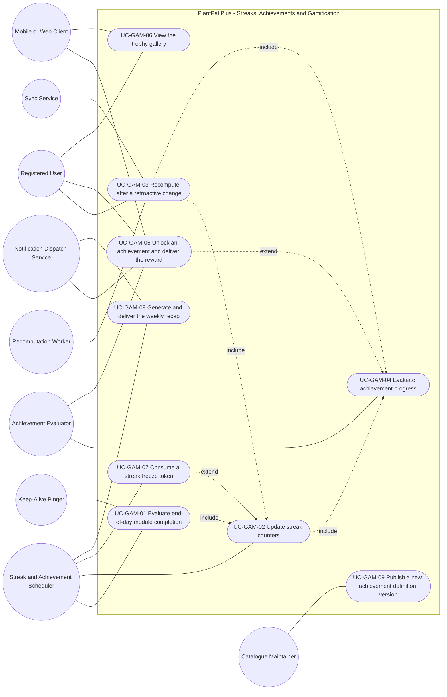
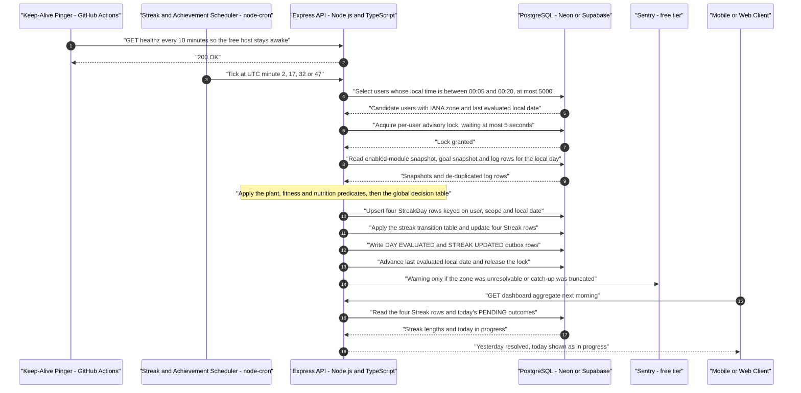
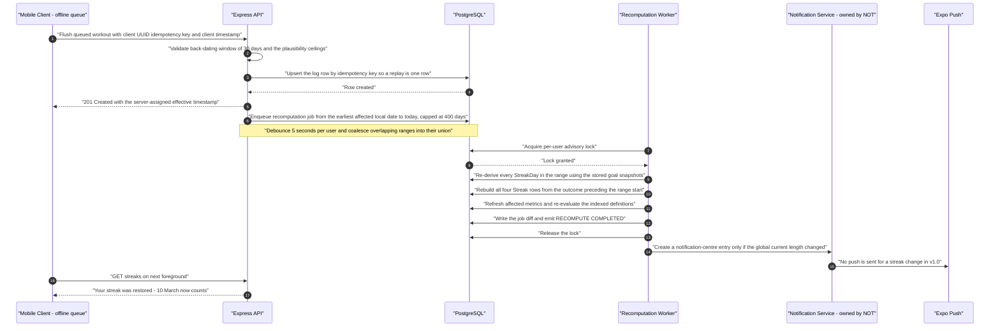
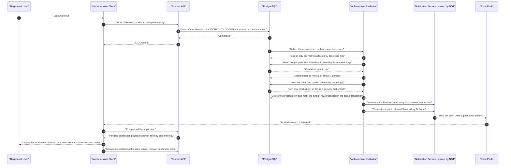

# Use-Case Model — Streaks, Achievements and Gamification (`GAM`)

| Field | Value |
| --- | --- |
| Document | `use-cases/gamification.md` — authoritative use-case model for the cross-module motivation layer |
| Version | 1.0 |
| Date | 2026-07-21 |
| Status | Approved for Phase 2 design |
| Owner | Rakshit — Project Lead / sole developer |
| Parent | [PlantPal+ Software Requirements Specification v1.0](../SRS.md) |
| Specification aligned to | [modules/gamification.md](../modules/gamification.md) v1.0 |
| Owned prefix | `UC-GAM` — `UC-GAM-01` … `UC-GAM-09`. `FR-GAM`, `BR-GAM`, `US-GAM`, `NFR-*`, `GOAL-*`, `STK-*`, `PER-*`, `ENT-*` and `E-GAM-*` identifiers are referenced only, never minted here |
| Use-case count | 9 use cases, 3 sequence diagrams, 6 modelled include and extend relationships |
| Source decisions | D-01 … D-11, with D-04 offline-light, D-07 safety, D-08 i18n-readiness and D-10 push channels as the primary drivers |
| Canonical vocabulary | `StreakScope` is `PLANT_CARE`, `FITNESS`, `NUTRITION`, `GLOBAL`. `StreakDayOutcome` is `MET`, `NOT_MET`, `EXCLUDED`, `FROZEN`, `PENDING`. Both are fixed by §1.4 of the module specification and are used verbatim throughout this document |

---

## Table of contents

1. [Module use-case diagram](#1-module-use-case-diagram)
2. [Actor roles for this module](#2-actor-roles-for-this-module)
3. [Use-case specifications](#3-use-case-specifications)
   - [UC-GAM-01 — Evaluate end-of-day module completion](#uc-gam-01--evaluate-end-of-day-module-completion)
   - [UC-GAM-02 — Update streak counters](#uc-gam-02--update-streak-counters)
   - [UC-GAM-03 — Recompute streaks and achievements after a retroactive change](#uc-gam-03--recompute-streaks-and-achievements-after-a-retroactive-change)
   - [UC-GAM-04 — Evaluate achievement progress for a domain event](#uc-gam-04--evaluate-achievement-progress-for-a-domain-event)
   - [UC-GAM-05 — Unlock an achievement and deliver the reward](#uc-gam-05--unlock-an-achievement-and-deliver-the-reward)
   - [UC-GAM-06 — View the trophy gallery](#uc-gam-06--view-the-trophy-gallery)
   - [UC-GAM-07 — Consume a streak freeze token](#uc-gam-07--consume-a-streak-freeze-token)
   - [UC-GAM-08 — Generate and deliver the weekly recap](#uc-gam-08--generate-and-deliver-the-weekly-recap)
   - [UC-GAM-09 — Publish a new achievement definition version](#uc-gam-09--publish-a-new-achievement-definition-version)
4. [Sequence diagrams for the most complex use cases](#4-sequence-diagrams-for-the-most-complex-use-cases)
5. [Include and extend relationship catalogue](#5-include-and-extend-relationship-catalogue)
6. [Coverage and traceability checks](#6-coverage-and-traceability-checks)

---

## 1. Module use-case diagram

Every use case specified in section 3 appears in the diagram below. A dotted edge labelled `include` points **from the base use case to the included use case**. A dotted edge labelled `extend` points **from the extending use case to the base use case**, which is the UML 2.5 direction and the direction used by every use-case document in this package.

**Reading note for the evaluator.** Only two of the nine use cases carry a human primary actor: `UC-GAM-06`, where a user browses the trophy gallery, and `UC-GAM-09`, where the Project Lead publishes a catalogue version out of band. The other seven are driven by a time actor or by an internal system actor. That asymmetry is not an accident of modelling — it is the direct visible consequence of **FR-GAM-10**, which forbids any client from writing gamification state. A user of PlantPal+ never *performs* a streak increment or an unlock; they perform a plant, fitness or nutrition action owned by another module, and this module observes the consequence. Modelling the observation as first-class system behaviour is what makes the correctness obligations of `STK-01` — "the streak is never wrongly broken" — testable rather than aspirational.

---

## 2. Actor roles for this module

| Actor | Type | Goals in this module |
| --- | --- | --- |
| Registered User | Primary (human) | Know the current and longest length of all four streaks without asking why; understand exactly why a day did or did not count; keep a streak that a late offline log deserves to keep; browse a trophy gallery that shows what is nearly within reach; feel one unmissable moment when something unlocks; receive one honest weekly summary; change time zone or disable a module without losing what was earned |
| Guest / Unauthenticated Visitor | Secondary (human) | Has no gamification state whatsoever. Every gamification endpoint called without a valid access token answers HTTP 401, and a call carrying another user's identifier answers HTTP 404 so existence cannot be probed |
| Streak and Achievement Scheduler | Time (in-process `node-cron` worker inside the single Express process) | Fire the quarter-hour rollover sweep at UTC minutes 2, 17, 32 and 47; select the users whose local day has just ended; run the catch-up pass after downtime; run the freeze-application pass from v1.1; generate the weekly recap on Monday morning local time |
| Domain Event Publisher | System (internal, inside the backend transaction boundary) | Write one `GamificationEventOutbox` row for every `PLT`, `FIT`, `NUT`, `ACC` or `SET` state change listed in BR-GAM-18, in the same transaction as the change itself, so that no domain write can succeed without its evaluation trigger |
| Achievement Evaluator | System (internal service) | Resolve an outbox event to its affected metric keys; refresh only those metrics; evaluate only the definitions indexed by them; write progress at or above 1 percent; attempt an idempotent unlock; mark the outbox row processed in the same transaction |
| Recomputation Worker | System (internal job runner) | Execute bounded retroactive recomputation jobs serialised per user by a PostgreSQL advisory lock; rebuild outcomes and streaks from scratch over the affected range; guarantee that a 400-day rebuild and the incremental rollover path agree exactly |
| PostgreSQL Database — Neon or Supabase | System (secondary) | Hold `StreakDay`, `Streak`, `StreakFreeze`, `AchievementDefinition`, `AchievementProgress`, `AchievementUnlock` and the module-local recap, metric-snapshot, outbox and job tables; enforce the uniqueness constraints that carry the idempotence guarantees of FR-GAM-15 and FR-GAM-01; grant and release the per-user advisory lock |
| Notification Dispatch Service — owned by `NOT` | System (secondary) | Accept unlock push requests, weekly recap push and email digest requests, and the notification-centre content this module composes. Owns quiet hours, the achievement push cap of 3 per rolling 24 hours, Expo push-token lifecycle and delivery retries. This module requests delivery and never performs it |
| Sync Service — owned by `SYS` | System (secondary) | Flush the offline append-only write queue and emit `OFFLINE_QUEUE_FLUSHED` with the batch's minimum effective local date, which is the trigger that lets a late log repair a streak under D-04 |
| Mobile Client — React Native / Expo | System (secondary) | Render server-returned streak and achievement values only; play or suppress the tier celebration according to the reduced-motion setting; hold the persisted TanStack Query cache that keeps the gallery readable offline; set `was_celebrated` so one unlock is celebrated exactly once |
| Web Client — React + Vite | System (secondary) | The same obligations as the Mobile Client, with IndexedDB as the persistence target and no Web Push in v1.0 per D-10, so the in-app celebration, the notification-centre entry and the optional email digest carry the whole experience |
| Catalogue Maintainer — Rakshit, out of band | Secondary (human) | Author a versioned seed migration that adds, amends or retires an achievement definition; never revoke or rewrite an earned unlock. No runtime administration interface exists in v1.0 |
| Keep-Alive Pinger — scheduled GitHub Actions workflow | Time | Call `GET /healthz` every 10 minutes so the Render free instance never sleeps through a rollover tick. Not a functional participant in any flow, but the deployment dependency on which the punctuality of `UC-GAM-01` rests |
| Error Monitor — Sentry free tier | System (external) | Receive the de-duplicated alerts this module raises: time-zone fallbacks, catch-up truncation, 8 consecutive lock skips, streak-invariant violations, poison outbox events and failed recomputation jobs |

---

## 3. Use-case specifications

Every use case below references at least one `FR-GAM-nn` from [modules/gamification.md](../modules/gamification.md) and at least one `US-GAM-nn`. Steps describe observable actor and system behaviour only. Every numeric threshold quoted in a step is the value a tester must observe, and each is normative in the business rule named beside it.

---

### UC-GAM-01 — Evaluate end-of-day module completion

| Field | Value |
| --- | --- |
| Primary actor | Streak and Achievement Scheduler (time actor) |
| Secondary actors | PostgreSQL Database; Keep-Alive Pinger as the deployment dependency that keeps the tick alive; Registered User as the eventual beneficiary, never as a participant |
| Level | User-goal — judge one completed local day for one user |
| Priority | Must |
| Release | v0.5 Alpha for the three module scopes of FR-GAM-01 and the sweep of FR-GAM-02; the `GLOBAL` scope and the time-zone-skip behaviour of FR-GAM-06 complete at v1.0 MVP |
| Frequency of use | The sweep runs 96 times per day. Each user is selected on exactly one tick per local day, so exactly once per user per day under normal operation, and once per unevaluated date up to 400 dates after downtime |
| Preconditions | The user's account status permits evaluation; a `Streak` row exists for all four scopes, created at registration with zero lengths so no code path handles a missing row; the user's IANA time-zone identifier is readable from `UserSettings`, or the `UTC` fallback applies; `last_evaluated_local_date` is earlier than the user's current local date |
| Trigger | A `node-cron` tick on the UTC expression `2,17,32,47 * * * *` at which the user's current local wall-clock time lies in the half-open interval 00:05:00 inclusive to 00:20:00 exclusive |
| Success guarantee | Exactly one `StreakDay` row exists for every `(user_id, scope, local_date)` in the evaluated range, each carrying its outcome, its `goal_snapshot_json`, its `timezone_used` and its `evaluation_version`; the `DailySummary` day-met booleans for those dates are refreshed; one `DAY_EVALUATED` event exists per evaluated date; `Streak.last_evaluated_local_date` has advanced; the advisory lock is released |
| Minimal guarantee | No partially evaluated date is observable: either all four scopes are written for a date or none is, and `last_evaluated_local_date` never advances past a date that was not fully written. The advisory lock is released on every exit path, including abnormal termination, through the 5-second lock-wait budget of BR-GAM-10 |
| Related FRs | FR-GAM-01, FR-GAM-02, FR-GAM-04, FR-GAM-06 |
| Related USs | US-GAM-01, US-GAM-02, US-GAM-10 |

**Main success scenario**

| # | Actor action | System response |
| --- | --- | --- |
| 1 | The Streak and Achievement Scheduler fires at a UTC minute of 2, 17, 32 or 47. | — |
| 2 | — | The system computes the current local wall-clock time of every candidate user from their IANA identifier and selects those whose local time lies in `[00:05:00, 00:20:00)`, taking at most 5000 users in this pass. |
| 3 | The scheduler presents one selected user. | — |
| 4 | — | The system acquires the PostgreSQL advisory lock keyed on `hashtext(user_id)`, waiting no longer than 5 seconds. |
| 5 | — | The system enumerates every local date strictly after `last_evaluated_local_date` and strictly before the user's current local date, in ascending order, taking at most 400 dates. |
| 6 | — | For the earliest unevaluated date the system resolves the half-open local-day interval `[D 00:00:00, D+1 00:00:00)` in the user's current IANA zone, per BR-GAM-01. |
| 7 | — | The system reads the enabled-module set snapshotted for that date and the goal values in force at the **end** of that date, never the current values, per BR-GAM-11. |
| 8 | — | The system de-duplicates the candidate log rows per BR-GAM-17, then applies BR-GAM-02 to `PLANT_CARE`, BR-GAM-03 to `FITNESS` and BR-GAM-04 to `NUTRITION`, producing one outcome per scope from `MET`, `NOT_MET`, `EXCLUDED` or `FROZEN`. |
| 9 | — | The system applies the decision table of BR-GAM-06 in its written clause order to produce the `GLOBAL` outcome for that date. |
| 10 | — | The system persists exactly four `StreakDay` rows keyed on `(user_id, scope, local_date)`, each carrying `goal_snapshot_json` with every input value used, `timezone_used`, the `exclusion_reason` where applicable and an integer `evaluation_version`, and refreshes the four day-met booleans on `DailySummary` for that date. |
| 11 | — | The system emits one `DAY_EVALUATED` event for that date and invokes **UC-GAM-02** for the four scopes of that date. |
| 12 | — | The system repeats steps 6 to 11 for each remaining date in ascending order, never out of sequence. |
| 13 | — | The system advances `Streak.last_evaluated_local_date` to the last fully written date, emits one `ROLLOVER_COMPLETED` event for the user, increments the pass counters required by `NFR-OBSV-06`, and releases the advisory lock. |
| 14 | The Registered User opens the application later that morning. | — |
| 15 | — | The system renders the four streak values from the stored `Streak` rows inside the single dashboard aggregate, with yesterday resolved and today shown as in progress. |

**Extensions**

| Step | Condition | Handling |
| --- | --- | --- |
| 2a | The user's current local time lies outside the selection window on this tick. | 2a1 The user is not selected. 2a2 The zone offset guarantees exactly one tick per local day places them inside the window, including the 45-minute zones `Asia/Kathmandu` at +05:45 and `Pacific/Chatham` at +12:45, per E-GAM-08. |
| 2b | More than 5000 users are selectable on one tick. | 2b1 The system processes 5000 and carries the remainder to the next quarter-hour tick. 2b2 No user is dropped, because selection is re-derived from `last_evaluated_local_date` on every tick. |
| 4a | The advisory lock is already held, typically by a recomputation job. | 4a1 The system skips the user and retries on the next tick. 4a2 After 8 consecutive skips for the same user the system raises a Sentry error. |
| 4b | The lock wait exceeds the 5-second budget. | 4b1 The system abandons the attempt and re-enqueues it, which is safe because the whole pass is idempotent by construction, per BR-GAM-28 rule 4. |
| 5a | Zero local dates are unevaluated. | 5a1 The system releases the lock and writes nothing. 5a2 No `ROLLOVER_COMPLETED` event is emitted for that user on that tick. |
| 5b | More than 400 local dates are unevaluated for the user. | 5b1 The system evaluates the most recent 400. 5b2 It records every earlier unevaluated date as `EXCLUDED` with `exclusion_reason = CATCHUP_TRUNCATED`. 5b3 It requires an operator note in the release log, per E-GAM-11. |
| 6a | The local date precedes the user's registration local date. | 6a1 The system evaluates nothing and writes nothing. 6a2 Where a catch-up range nevertheless requires a row, the row carries `EXCLUDED` with `exclusion_reason = BEFORE_REGISTRATION`. |
| 6b | Local midnight does not exist because the zone sprang forward across it. | 6b1 The system takes the boundary as the first instant that exists at or after nominal midnight, per BR-GAM-01 clause 2. 6b2 No date is skipped and no outcome is lost. |
| 6c | Local midnight occurs twice because the zone fell back across it. | 6c1 The system takes the **first**, earlier occurrence as the boundary. 6c2 Logs made inside the repeated hour count toward the day that is ending, per E-GAM-06. |
| 6d | The user's time zone changed since the previous pass and advanced their local date by one or more days. | 6d1 The system writes `EXCLUDED` with `exclusion_reason = TIMEZONE_SKIP` for each intervening date across all four scopes, subject to the quota of 2 neutralisations per rolling 90 days. 6d2 Those dates are strictly neutral, so no streak day is gained or lost, per FR-GAM-06. 6d3 A computed skip larger than 2 days is capped at 2 and the remainder is evaluated normally with a Sentry warning. |
| 7a | No historical goal value exists for that local date. | 7a1 The system uses the earliest known goal value for that user and records `goal_snapshot_json.goal_source = "EARLIEST_KNOWN"`. 7a2 No user-visible message is produced. |
| 7b | The enabled-module snapshot for that past date is missing. | 7b1 The system uses the current enabled set, records `goal_snapshot_json.enabled_source = "CURRENT"` and writes an `AuditEvent`. 7b2 This is the only path by which a missing snapshot may alter a historical outcome, per E-GAM-18. |
| 8a | The user holds zero non-archived plants at the end instant of the local date. | 8a1 `PLANT_CARE` is `EXCLUDED` with `exclusion_reason = NO_APPLICABLE_SUBJECT`. 8a2 The date is strictly neutral for that scope, so a streak may span it. |
| 8b | A module was disabled for the user on that local date. | 8b1 That scope is `EXCLUDED` with `exclusion_reason = MODULE_DISABLED`. 8b2 Enabling or disabling never rewrites an already-finalised outcome, per BR-GAM-14. |
| 9a | Zero modules are enabled for the user on that date. | 9a1 `GLOBAL` is `EXCLUDED` with `exclusion_reason = NO_MODULE_ENABLED`. 9a2 The streak is neither incremented nor reset, and the dashboard shows "Enable at least one module to track streaks." |
| 9b | Every module in the applicable set is `EXCLUDED` on that date. | 9b1 `GLOBAL` is `EXCLUDED` with `exclusion_reason = NO_APPLICABLE_SUBJECT` and the user is told "Nothing was due today, so today does not count either way." |
| 9c | Every module in the applicable set is `FROZEN` and none is `MET`. | 9c1 `GLOBAL` resolves to `FROZEN`, never to `MET`. 9c2 The clause ordering of BR-GAM-06 is normative precisely so that a protected day cannot be promoted into an earned day, per E-GAM-20. |
| 10a | A `StreakDay` row already exists for the key and the incoming `resolved_at` is earlier than or equal to the stored one. | 10a1 The system treats the write as a no-op and does not rewrite the row. |
| 10b | A `StreakDay` row already exists for the key and the incoming `resolved_at` is later. | 10b1 The system overwrites the row. 10b2 Where the write originates from **UC-GAM-03**, the previous outcome is recorded in that job's diff. |

**Exception flows**

| Condition | System behaviour | Outcome |
| --- | --- | --- |
| The stored IANA identifier is absent or is not resolvable in the bundled tz database | The system evaluates in `UTC`, sets `goal_snapshot_json.timezone_fallback = true` and raises a de-duplicated Sentry warning | An outcome is still produced. A day is never left unjudged because a preference is missing |
| The Express process terminates mid-pass | The next pass re-derives exactly the same date set from `last_evaluated_local_date`, which was never advanced past an unwritten date | The pass is idempotent by construction and no date is evaluated twice with a different result |
| The free-tier host slept through several consecutive ticks | The catch-up path evaluates every date strictly after `last_evaluated_local_date` on the next run, and the Keep-Alive Pinger bounds the exposure to roughly one 10-minute window | The user observes a correct streak, not a broken one, per E-GAM-10 |
| The database is unavailable for the whole pass | The pass aborts before writing, `last_evaluated_local_date` does not advance, and the attempt is retried on the next tick | No partial state is published |
| The user has already used 2 skip neutralisations inside the last rolling 90 days | The skipped dates are recorded `NOT_MET` and the ordinary breaking rules apply | "A time-zone change skipped 1 day. Frequent skips are no longer protected." — stated without loss-framing, per BR-GAM-26 clause 1 |
| The local day currently in progress is read by a client mid-pass | Today carries `PENDING` and is rendered as in progress; a `PENDING` day never increments and never breaks a streak | The dashboard never shows a number that the day boundary is about to contradict, per E-GAM-12 |

**Special requirements**

| Reference | Obligation carried by this use case |
| --- | --- |
| NFR-PERF-04 | The 10-minute keep-alive ping is what makes a quarter-hour cron schedule reliable on a free tier that would otherwise sleep |
| NFR-RELI-07 | A missed tick degrades to a catch-up evaluation, never to a lost day |
| NFR-SCAL-06 | The pass is bounded at 5000 users and 400 dates per user so that one tick cannot exhaust the free compute budget |
| NFR-DATA-01 | Instants are stored as `TIMESTAMPTZ` in UTC and `local_date` as `DATE`; every boundary is computed through the IANA database, never through a fixed numeric offset |
| NFR-DATA-02 | `goal_snapshot_json`, `timezone_used` and `evaluation_version` make every historical outcome auditable and reproducible |
| NFR-MAIN-03 | The outcome primitive is derived once, stored, and never recomputed from live tables at read time |
| NFR-OBSV-06 | Per-tick counters for users selected, dates evaluated and locks skipped are emitted on every pass |
| NFR-OBSV-03 | Every alert this use case raises is de-duplicated by fingerprint against the 5000-event monthly Sentry budget |

---

### UC-GAM-02 — Update streak counters

| Field | Value |
| --- | --- |
| Primary actor | Streak and Achievement Scheduler (time actor); the Recomputation Worker drives the identical flow when invoked from UC-GAM-03 |
| Secondary actors | PostgreSQL Database; Notification Dispatch Service for the break notice; Registered User as the beneficiary |
| Level | Subfunction — included by UC-GAM-01 and by UC-GAM-03, and extended by UC-GAM-07 |
| Priority | Must |
| Release | v0.5 Alpha for the three module scopes and the break rule; the `GLOBAL` scope of FR-GAM-04 completes at v1.0 MVP |
| Frequency of use | Four scope transitions per user per evaluated local date, so 4 per user per day under normal operation and up to 1600 during a full 400-date catch-up or rebuild |
| Preconditions | Every `StreakDay` row for the date under transition is committed for all four scopes; the per-user advisory lock is held by the caller; the outcome sequence for each scope has no gap between the previous evaluated date and this one |
| Trigger | Invocation from UC-GAM-01 step 11 or from UC-GAM-03 step 6, once per local date, in ascending local-date order |
| Success guarantee | All four `Streak` rows carry a `current_length_days`, `longest_length_days`, `current_started_local_date`, `last_met_local_date` and `last_evaluated_local_date` that are exactly reproducible from the ordered outcome sequence; every invariant of BR-GAM-08 holds; one `STREAK_UPDATED` event exists per changed scope; UC-GAM-04 has been invoked |
| Minimal guarantee | No counter is advanced on a sequence containing a gap. Where the invariants cannot be satisfied the row is flagged `stale = true` and the clients render "Recalculating your streak" rather than a number the system does not trust |
| Related FRs | FR-GAM-03, FR-GAM-04, FR-GAM-05 |
| Related USs | US-GAM-01, US-GAM-02, US-GAM-09 |

**Main success scenario**

| # | Actor action | System response |
| --- | --- | --- |
| 1 | The caller presents the four committed outcomes for one local date. | — |
| 2 | — | The system verifies that the outcome sequence for each scope is contiguous from `last_evaluated_local_date` to the presented date. |
| 3 | — | For an outcome of `MET` the system increments `current_length_days`, sets `current_started_local_date` to that date when the new value is 1, and sets `last_met_local_date` to that date. |
| 4 | — | Where `current_length_days` now exceeds `longest_length_days`, the system raises `longest_length_days` to the new value and records `longest_started_local_date` and `longest_ended_local_date`. |
| 5 | — | For an outcome of `FROZEN`, `EXCLUDED` or `PENDING` the system changes no counter, so a streak may span a neutral gap. |
| 6 | — | For an outcome of `NOT_MET` to which no freeze token was applied, the system sets `current_length_days` to 0, sets `current_started_local_date` to null, records the breaking date and leaves `longest_length_days` untouched. |
| 7 | — | The system advances `last_evaluated_local_date` to that date on every scope, including the scopes whose counters did not change. |
| 8 | — | The system asserts all four invariants of BR-GAM-08 for each scope. |
| 9 | — | The system emits one `STREAK_UPDATED` event per scope carrying the scope, the previous length and the new length, and one `STREAK_BROKEN` event for each scope that reset. |
| 10 | — | The system invokes **UC-GAM-04** for the metrics affected by those events, after the `StreakDay` and `Streak` writes are committed, so no streak-based predicate reads a stale length. |
| 11 | The Registered User opens the dashboard. | — |
| 12 | — | The system renders each scope with its text label and icon shape as well as its colour, renders a length of 0 as "No active streak" with a call to action, and renders any length above 9999 as "9999+". |

**Extensions**

| Step | Condition | Handling |
| --- | --- | --- |
| 2a | The outcome sequence contains a gap — a local date with no `StreakDay` row between two evaluated dates. | 2a1 The system refuses to advance any counter. 2a2 It enqueues a full recomputation for the affected range through **UC-GAM-03**. 2a3 It raises a Sentry error and sets `Streak.stale = true`. 2a4 The clients render "Recalculating your streak" in place of a number, per E-GAM-33. |
| 4a | `current_length_days` would exceed the write ceiling of 3650. | 4a1 The system clamps the stored value at 3650 and raises a Sentry warning. 4a2 The value 3650 renders literally, because only a length above 9999 renders as "9999+", per E-GAM-58. |
| 6a | A freeze token is available and every limit of BR-GAM-09 passes, from v1.1. | 6a1 **UC-GAM-07** runs first as an extension and rewrites the outcome from `NOT_MET` to `FROZEN` for every scope that was `NOT_MET` on that date. 6a2 Step 6 does not execute and no break occurs. |
| 6b | The broken streak had a length below 7. | 6b1 The system resets the counters and creates no notification-centre entry at all, because a notice below that threshold is pressure rather than information, per E-GAM-60. |
| 6c | The broken streak had a length of 7 or more. | 6c1 The system creates exactly one `NotificationCentreItem` using neutral copy — "Your 21-day streak ended on 12 March. Start a new one today." — with a one-tap action to start again. 6c2 No push notification is sent for a broken streak in v1.0. |
| 6d | The same date is later re-evaluated as `MET` by a retroactive recomputation. | 6d1 The break is never undone in place. 6d2 **UC-GAM-03** rebuilds the streak from the outcome sequence and the user is told "Your streak was restored." |
| 8a | A BR-GAM-08 invariant fails after the sequence completes. | 8a1 The system sets `Streak.stale = true`, raises a Sentry error and enqueues a recomputation. 8a2 No value is published that a rebuild might contradict minutes later. |
| 9a | A module was disabled by the user rather than missed. | 9a1 That scope's `current_length_days` becomes 0 and `current_started_local_date` becomes null immediately, while `longest_length_days` is preserved. 9a2 `GLOBAL` is **not** reset; from the next local day it is evaluated over the remaining enabled modules, per E-GAM-13. |
| 9b | The user is about to disable a module. | 9b1 This module supplies the current length synchronously to the `SET` confirmation dialogue, which states that the streak of N will reset to 0 and that the record of N is kept, per E-GAM-14. |

**Exception flows**

| Condition | System behaviour | Outcome |
| --- | --- | --- |
| Two callers attempt a transition for the same user concurrently | The per-user advisory lock serialises them; the loser retries and re-reads the sequence | Transitions are always applied once, in ascending local-date order, per BR-GAM-28 rules 1 and 2 |
| A transition is presented out of local-date order | The system refuses the transition and treats it as an integrity fault identical to a gap | A streak length can never depend on the order in which dates arrived |
| The `Streak` row is missing for a scope | Cannot occur: all four rows are created at registration with zero lengths, which is the sole purpose of the v0.1 Walking Skeleton slice | No code path handles a missing row |
| `longest_length_days` legitimately falls during a rebuild because a log was deleted | The decrease is permitted only inside a recomputation, and is recorded in the job diff | This is the single exception to the monotonicity invariant of BR-GAM-08 clause 2, per E-GAM-23 |
| The break notice copy is under review | No user-facing string is stored in code: every label is a locale key under the `gamification.*` namespace, English-only in v1.0 | Copy can be corrected without a deployment of new logic, per BR-GAM-29 |

**Special requirements**

| Reference | Obligation carried by this use case |
| --- | --- |
| NFR-MAIN-03 | The `Streak` row is a read model derivable purely from the ordered outcome sequence, so a rebuild reproduces it exactly |
| NFR-MAIN-04 | The transition table of BR-GAM-07 is implemented once and shared by the incremental and the rebuild paths |
| NFR-USAB-03 | A user can state the breaking rule back: a streak breaks when the rollover concludes that a **completed** local day was `NOT_MET` |
| NFR-LEGL-03 | Break copy carries no shaming, no loss-framing and no medical claim |
| NFR-A11Y-08 | Every streak state is conveyed by a text label or icon shape as well as by colour; a streak card never relies on green versus grey alone |
| NFR-I18N-02 | Streak dates are rendered in the user's locale short-date format, in the user's time zone, through `Intl` |

---

### UC-GAM-03 — Recompute streaks and achievements after a retroactive change

| Field | Value |
| --- | --- |
| Primary actor | Recomputation Worker (system) |
| Secondary actors | Registered User, whose back-dated create, edit or delete triggers the job; Sync Service, whose queue flush triggers it after an offline period; PostgreSQL Database; Notification Dispatch Service for the restored or recalculated notice |
| Level | User-goal — restore or correct the user's streak state after the facts changed |
| Priority | Must |
| Release | v1.0 MVP |
| Frequency of use | An estimated 0 to 3 jobs per active user per week; concentrated in users who log offline, for whom `PER-05` is the reference persona |
| Preconditions | The triggering write already passed the back-dating window and plausibility validation of FR-GAM-09; the user has at most 1 running and 1 pending job; the affected range is computable as `[from_local_date, current_local_date]` |
| Trigger | Any trigger listed in BR-GAM-12: a create, update or delete of a watering event, care-task event, growth log entry, workout, step entry, meal entry or water intake entry with an effective local date earlier than today; a plant created, archived, unarchived or deleted; a module toggled; a time-zone change; an offline queue flush completing; or an explicit operator recompute |
| Success guarantee | Every `StreakDay` row in the range has been re-derived; all four `Streak` rows have been rebuilt from the outcome immediately preceding `from_local_date`; the affected metrics are refreshed and re-evaluated; a job diff records every changed outcome and every changed streak value; `RECOMPUTE_COMPLETED` is emitted; the user is notified only when the `GLOBAL` current length changed by 1 or more |
| Minimal guarantee | The job never leaves a partially rebuilt streak visible. A job that fails twice sets `Streak.stale = true`, which renders as "Recalculating your streak" rather than as a wrong number, and no unlock is ever revoked whatever the rebuild concludes |
| Related FRs | FR-GAM-08, FR-GAM-09, FR-GAM-06 |
| Related USs | US-GAM-03, US-GAM-10 |

**Main success scenario**

| # | Actor action | System response |
| --- | --- | --- |
| 1 | The Registered User logs a workout for the previous day, or the Sync Service flushes an offline batch containing one. | — |
| 2 | — | The system validates the effective timestamp against the window `server_now - 30 days` to `server_now + 10 minutes` and the quantity against its BR-GAM-16 ceiling, then persists the log row. |
| 3 | — | The system computes `from_local_date` as the earliest affected local date and `to_local_date` as the user's current local date, and enqueues one job for that range. |
| 4 | — | The system debounces for 5 seconds per user, coalescing any overlapping pending range into its union rather than queueing a second job. |
| 5 | — | The Recomputation Worker acquires the per-user advisory lock. |
| 6 | — | The system re-runs the evaluation of **UC-GAM-01** for every local date in the range for `PLANT_CARE`, `FITNESS` and `NUTRITION`, then for `GLOBAL`, reusing the stored goal snapshot for each date verbatim rather than reading a current goal. |
| 7 | — | The system invokes **UC-GAM-02** to rebuild all four `Streak` rows **from scratch**, starting from the outcome immediately preceding `from_local_date` and applying BR-GAM-07 in ascending local-date order. |
| 8 | — | The system refreshes every affected achievement metric and invokes **UC-GAM-04** for those metrics. |
| 9 | — | The system writes a job diff recording every changed outcome and every changed streak value, emits `RECOMPUTE_COMPLETED`, and releases the lock. |
| 10 | — | Where the `GLOBAL` current length changed by 1 or more, the system creates exactly one `NotificationCentreItem`. |
| 11 | The user opens the application. | — |
| 12 | — | The system shows the corrected streak and the notice "Your streak was restored — 10 March now counts." |

**Extensions**

| Step | Condition | Handling |
| --- | --- | --- |
| 2a | The effective timestamp is earlier than 30 days before the server instant. | 2a1 The system answers HTTP 422 with code `BACKDATE_LIMIT_EXCEEDED` and the message "Entries can only be added up to 30 days in the past." 2a2 The value is rejected, never clamped, because clamping would silently move the entry to a day the user did not choose. 2a3 No job is enqueued. |
| 2b | A replayed offline write carries a client timestamp more than 10 minutes ahead of the server. | 2b1 The system clamps the effective timestamp to `server_now`, sets `timestamp_adjusted = true` and accepts the write. 2b2 The user is told "Saved. The time was adjusted to match the server clock." 2b3 Losing a genuine entry to clock skew is the worse outcome, per E-GAM-49. |
| 2c | A live write is more than 10 minutes in the future. | 2c1 HTTP 422 with code `FUTURE_DATE_NOT_ALLOWED` and the message "That time is in the future. Check your device clock." |
| 2d | A quantity exceeds its plausibility ceiling. | 2d1 HTTP 422 with the field-level code from BR-GAM-16, for example `STEPS_IMPLAUSIBLE` above 200000 steps. 2d2 A value **at** the ceiling is accepted; only a strictly greater value is rejected, and a rejected value is never silently truncated. |
| 2e | An edit is attempted on a log whose effective local date is older than 30 days, or a delete on one older than 365 days. | 2e1 HTTP 422 with `EDIT_WINDOW_EXPIRED` or `DELETE_WINDOW_EXPIRED`. 2e2 The account-wide deletion flow owned by `ACC` and `SYS` remains available. |
| 2f | The user exceeds 300 log writes in a rolling hour. | 2f1 HTTP 429 with a `Retry-After` header and code `RATE_LIMITED`. 2f2 The offline queue backs off rather than hammering the endpoint. |
| 3a | The computed span exceeds 400 days. | 3a1 The system clamps to the most recent 400 days and sets `clamped = true` on the job. 3a2 No user-visible message is produced. |
| 4a | Four past logs are edited within 3 seconds. | 4a1 The debounce window elapses once and exactly one job runs, over the union of the four ranges, per E-GAM-24. |
| 4b | A job is already running for that user and a second is already pending. | 4b1 The system merges the new range into the pending job rather than creating a third, enforced by partial unique indexes. |
| 6a | A deletion removed the only reason a day counted. | 6a1 That day becomes `NOT_MET`. 6a2 The streak is legitimately recalculated from the following day and the user is told "Your streak was recalculated after you deleted an entry." 6a3 `longest_length_days` may fall, which is the one permitted decrease and appears in the job diff. |
| 6b | The change is a time-zone change that skipped one or more local dates. | 6b1 `from_local_date` is the earliest skipped date. 6b2 Those dates carry `EXCLUDED` with `exclusion_reason = TIMEZONE_SKIP` and are strictly neutral. |
| 7a | A freeze token had protected a date that now evaluates to a genuine `MET`. | 7a1 The consumed token returns to `EARNED` exactly once, keyed on `consumed_local_date`. 7a2 A replayed recomputation cannot mint extra tokens, per E-GAM-29. |
| 8a | The rebuild makes an already-satisfied achievement predicate false again. | 8a1 The unlock is retained unconditionally, per BR-GAM-21 item 3. 8a2 Progress rows, unlike unlocks, are recomputed honestly and may fall, and the interface renders the lower value without animating a decrease. |
| 8b | The rebuild satisfies a predicate for the first time. | 8b1 A new unlock is produced through **UC-GAM-04** and **UC-GAM-05**, with exactly one celebration. |
| 10a | The `GLOBAL` current length did not change. | 10a1 No notification-centre entry is created, so a silent correction stays silent. |

**Exception flows**

| Condition | System behaviour | Outcome |
| --- | --- | --- |
| The job passes the 30-second hard abort | The job is aborted, marked `FAILED` with a reason, and retried once with the exponential backoff of `NFR-RELI-04` | No user-visible message on the first failure |
| The retry also fails | The system raises a Sentry error and sets `Streak.stale = true` | The clients render "Recalculating your streak" instead of a number, per E-GAM-27 |
| An offline-queued write is rejected with HTTP 422 | The item is removed from the queue, surfaced as a dismissible failure carrying the reason, and never retried automatically | "Couldn't save 1 entry — entries can only be added up to 30 days in the past." The queue never spins forever, per E-GAM-51 |
| The rollover pass and this job select the same user in the same second | The advisory lock serialises them; the rollover skips that user and retries on the next tick | Every operation is idempotent, so re-running is always safe, per E-GAM-28 |
| A full 400-day rebuild disagrees with the incremental rollover path | The automated property test asserting their equivalence fails the build | Contractual failure, caught before release rather than in production |
| The user changes goal values after the fact and expects past days to change | Day completion for a past date uses the goal in force at the **end** of that date | Lowering the step goal to 1 today does not turn last month's missed days into met days, per E-GAM-56 |

**Special requirements**

| Reference | Obligation carried by this use case |
| --- | --- |
| NFR-RELI-04 | Debounce, coalescing, one retry with exponential backoff, and the idempotency that makes replay safe |
| NFR-DATA-01 | Every re-derived boundary uses the same IANA-based local-day rule as the original evaluation |
| NFR-MAIN-03 | Determinism is contractual: the rebuild path and the incremental path share one implementation of the transition table |
| NFR-SEC-08 | The shared validation schema means the client and the server cannot disagree about what a valid back-dated write is |
| NFR-SEC-11 | The 300-writes-per-hour rate limit bounds how fast history can be rewritten |
| NFR-DATA-09 | The client-minted UUID idempotency key guarantees a replayed offline write becomes one row, so metrics cannot double count |
| NFR-USAB-03 | The user is told what changed and why, in plain words, and only when something they can see actually changed |
| NFR-USAB-07 | A rejected queued entry is surfaced with its reason and never silently discarded |

---

### UC-GAM-04 — Evaluate achievement progress for a domain event

| Field | Value |
| --- | --- |
| Primary actor | Achievement Evaluator (system) |
| Secondary actors | Domain Event Publisher, which writes the outbox row inside the originating transaction; PostgreSQL Database; Registered User as the eventual beneficiary, never as a participant |
| Level | Subfunction — included by UC-GAM-02 and by UC-GAM-03, and extended by UC-GAM-05 |
| Priority | Must |
| Release | v0.5 Alpha for the metric-indexed evaluation of FR-GAM-13 and the server-only authority of FR-GAM-10; the persisted progress rows of FR-GAM-14 complete at v1.0 MVP |
| Frequency of use | Once per outbox event. An estimated 5 to 40 events per active user per day, plus one full-refresh event per completed recomputation job |
| Preconditions | An unprocessed `GamificationEventOutbox` row exists whose `event_type` is a member of the BR-GAM-18 enumeration; the metric-to-definition index was built at service boot from the `ACTIVE` definition set; where the event is `DAY_EVALUATED` or `STREAK_UPDATED`, the `StreakDay` and `Streak` rows for the affected range are already committed |
| Trigger | Delivery of one unprocessed outbox row to the evaluator, at least once |
| Success guarantee | Every metric key affected by the event carries a refreshed value in the user's metric snapshot; every not-yet-unlocked definition indexed by those keys has been evaluated exactly once against that snapshot; an `AchievementProgress` row exists for every evaluated definition whose progress percentage is at least 1; UC-GAM-05 has been invoked for every satisfied predicate; the outbox row is marked processed in the same transaction |
| Minimal guarantee | No partially applied evaluation is observable: either the metric refresh, the progress writes and the processed marker all commit, or none does. A redelivered event never produces a second unlock, because the guarantee lives in the database constraint of FR-GAM-15 rather than in this flow |
| Related FRs | FR-GAM-13, FR-GAM-14, FR-GAM-10 |
| Related USs | US-GAM-05, US-GAM-07, US-GAM-01 |

**Main success scenario**

| # | Actor action | System response |
| --- | --- | --- |
| 1 | The Registered User logs a watering, a workout, a meal or a water intake through the owning module, or the scheduler emits `DAY_EVALUATED` or `STREAK_UPDATED`. | — |
| 2 | — | The Domain Event Publisher writes exactly one outbox row carrying the event type, the user identifier and a payload containing identifiers only, inside the same transaction as the originating write. |
| 3 | The Achievement Evaluator picks up the unprocessed row. | — |
| 4 | — | The system resolves the event type to its affected metric keys through the BR-GAM-18 table and to its canonical `AchievementTriggerEvent` member. |
| 5 | — | The system recomputes only those metric values and writes them to the user's metric snapshot with an `as_of_local_date`. |
| 6 | — | The system selects, from the boot-time index, every `ACTIVE` definition that reads at least one of those metric keys and that the user has not already unlocked. |
| 7 | — | The system evaluates each selected predicate against the refreshed snapshot, resolving `all` and `any` composites to their component results. |
| 8 | — | For each unsatisfied predicate the system computes the progress percentage by BR-GAM-20, rounding with `floor` in every case. |
| 9 | — | The system writes an `AchievementProgress` row carrying the current value, the target value, the integer percentage and the definition version, for every definition whose percentage is at least 1, and writes no row below that threshold. |
| 10 | — | For each satisfied predicate the system invokes **UC-GAM-05**, at most 10 times in one pass. |
| 11 | — | The system marks the outbox row processed in the same transaction as the progress writes and the unlock attempts. |
| 12 | The Registered User opens the trophy gallery or the dashboard. | — |
| 13 | — | The system renders the refreshed percentages and the nearest in-progress achievement from server-returned values only, ignoring any client-supplied progress, unlock or points field per FR-GAM-10. |

**Extensions**

| Step | Condition | Handling |
| --- | --- | --- |
| 2a | The originating domain write is rolled back after the outbox row was staged. | 2a1 The outbox row rolls back with it, because both live in one transaction. 2a2 No evaluation can be triggered by a write that did not happen. |
| 4a | The event type is not a member of the BR-GAM-18 enumeration. | 4a1 The system records the unrecognised type and discards the row. 4a2 The pass continues with the next event rather than stalling. |
| 4b | The event is `RECOMPUTE_COMPLETED`. | 4b1 The system refreshes every metric for that user rather than a subset, because a rebuild may have moved any of them. |
| 6a | No definition reads any affected metric key. | 6a1 The system writes no progress row, attempts no unlock and marks the row processed. 6a2 The cost of an irrelevant event is one index lookup. |
| 7a | The predicate is a composite `all`. | 7a1 The percentage is the floor of the mean of its component percentages. 7a2 The detail view lists each component with its own percentage, for example "75 percent — 100 days of 100 account days, 25 of 50 met days". |
| 7b | The predicate is a composite `any`. | 7b1 The percentage is the maximum of its component percentages. |
| 7c | The predicate is a non-ordinal boolean or an equality test. | 7c1 The percentage is 0 when unsatisfied and 100 when satisfied. 7c2 The single exception is `MODULE_DASHBOARDS_VISITED_MASK`, which reports 0, 33, 66 or 100 from its set-bit count. |
| 8a | The predicate's target is 0 or is missing. | 8a1 The system reports progress 0 and raises a CI warning against the definition. 8a2 The pass never crashes on a malformed target. |
| 9a | A rebuild lowered a metric below a previously reported value. | 9a1 The system stores the lower value honestly. 9a2 The interface renders the new percentage without animating a decrease, per FR-GAM-14 processing rule 4. |
| 9b | The definition is already unlocked. | 9b1 The progress row is deleted on unlock and the gallery reports 100 unconditionally thereafter. |
| 10a | The pass would unlock more than 10 achievements. | 10a1 The system stops at 10 and re-enqueues the remainder. 10a2 The combined celebration lists the first batch, per E-GAM-40. |
| 10b | An unlock emits `ACHIEVEMENT_UNLOCKED`, which itself satisfies a meta-achievement. | 10b1 The cascade is permitted to depth 3. 10b2 A deeper cascade is re-enqueued rather than recursed, per E-GAM-41. |
| 11a | The same outbox row is delivered a second time. | 11a1 Unlocking is idempotent, so no second unlock, celebration, push or notification-centre entry is produced. 11a2 The progress values are rewritten identically, per E-GAM-42. |

**Exception flows**

| Condition | System behaviour | Outcome |
| --- | --- | --- |
| A predicate reads a metric key that no longer exists in the catalogue | The system reports progress 0 for that definition, logs the condition and completes the pass | The gallery renders that item at 0 percent and the pass never crashes, per E-GAM-46 |
| Processing an event fails once | The system increments `attempts` and retries with the exponential backoff of `NFR-RELI-04` | No user-visible effect |
| Processing the same event fails 5 times | The system moves it to a dead state with the error text, raises a Sentry error and continues with the next event | One poison event never blocks the user's whole gamification state, per E-GAM-45 |
| Evaluation is attempted before the `Streak` rows for the affected date are committed | Cannot occur: BR-GAM-28 rule 3 orders achievement evaluation strictly after the outcome and streak writes commit | A streak-based predicate never reads a stale length |
| A request body carries `progressPct`, `unlocked` or `points` | The field is stripped and counted in production, and rejected with HTTP 400 and `READ_ONLY_FIELD_SUPPLIED` under the strict test profile | Gamification resources expose read verbs only, per E-GAM-57 |
| A client requests another user's progress by identifier | HTTP 404, identical to a non-existent resource | Existence cannot be probed, per `NFR-SEC-14` |

**Special requirements**

| Reference | Obligation carried by this use case |
| --- | --- |
| NFR-PERF-02 | Metric indexing keeps each evaluation to a handful of rows, so the achievement pipeline stays inside the write-latency budget |
| NFR-SCAL-05 | The materialised metric snapshot makes predicate evaluation a constant-time lookup rather than an aggregate scan over the log tables |
| NFR-RELI-04 | At-least-once outbox delivery with bounded retries and a dead state, made safe by idempotence at both the outcome layer and the unlock layer |
| NFR-OBSV-03 | Dead events, unknown metric keys and cascade truncations are alerted, de-duplicated by fingerprint against the monthly Sentry budget |
| NFR-PERF-01 | Persisting only rows at or above 1 percent bounds the progress table to the achievements a user has actually started |
| NFR-DATA-08 | `current_value` and `target_value` are fixed-point `NUMERIC`, wide enough for cumulative millilitres and step totals |
| NFR-A11Y-08 | Every progress value is conveyed as a text percentage as well as by a bar, so no state depends on colour or length alone |
| NFR-PRIV-02 | Event payloads carry identifiers only and are never forwarded to a third party |
| NFR-SEC-08 | The shared validation schema strips unknown and read-only keys before any business logic executes |
| NFR-SEC-14 | Every read is constrained server-side by the authenticated subject identifier |

---

### UC-GAM-05 — Unlock an achievement and deliver the reward

| Field | Value |
| --- | --- |
| Primary actor | Achievement Evaluator (system) |
| Secondary actors | PostgreSQL Database, whose uniqueness constraint is the sole authority on whether an unlock happened; Notification Dispatch Service owned by `NOT`; Mobile Client and Web Client, which render the celebration; Registered User as the recipient |
| Level | User-goal — turn a satisfied predicate into exactly one felt reward, forever |
| Priority | Must |
| Release | v0.5 Alpha for the idempotent unlock record of FR-GAM-15; the three-channel experience of FR-GAM-16 completes at v1.0 MVP |
| Frequency of use | An estimated 46 times in total per user over the product's lifetime, concentrated in the first weeks; at most 10 in one evaluation pass and at most 3 pushes per rolling 24 hours |
| Preconditions | A predicate evaluated true inside UC-GAM-04 for a definition the user does not already hold; the definition is `ACTIVE`, or was `ACTIVE` at the moment of evaluation; the definition's version, tier, `title_key`, `icon_key` and `lottie_key` are readable |
| Trigger | Extension of UC-GAM-04 step 10, once per satisfied predicate |
| Success guarantee | Exactly one `AchievementUnlock` row exists for the pair of user and achievement code, stamped with the definition version in force, the server unlock instant, the derived local date, the achieving metric value and the triggering event type; exactly one notification-centre entry exists; at most one push has been requested; the in-app celebration has been rendered exactly once and `was_celebrated` is set |
| Minimal guarantee | The unlock record survives even when every delivery channel fails. A conflicting insert produces nothing at all — no row, no celebration, no push, no entry — and is not treated as an error |
| Related FRs | FR-GAM-15, FR-GAM-16 |
| Related USs | US-GAM-06, US-GAM-05 |

**Main success scenario**

| # | Actor action | System response |
| --- | --- | --- |
| 1 | The Achievement Evaluator presents a satisfied predicate for a definition the user does not hold. | — |
| 2 | — | The system performs a conditional insert into the unlock ledger that does nothing on conflict and returns the new row identifier when one was created. |
| 3 | — | The system records on that row the definition version in force, the server unlock instant, the local date derived in the user's time zone at that instant, the metric value that crossed the threshold and the triggering event type. |
| 4 | — | The system deletes the definition's `AchievementProgress` row, so the gallery reports 100 percent unconditionally from now on. |
| 5 | — | The system creates exactly one `NotificationCentreItem` carrying the achievement title key, the tier and a deep link to the trophy detail view with the `VIEW_ACHIEVEMENT` action. |
| 6 | — | The system requests one push from the Notification Dispatch Service, which applies quiet hours and the cap of 3 achievement pushes per rolling 24 hours. |
| 7 | — | The system emits one `ACHIEVEMENT_UNLOCKED` event and marks the originating outbox row processed in the same transaction. |
| 8 | The Registered User has the application open, or foregrounds it later. | — |
| 9 | — | The client renders the tier celebration for no more than 2500 milliseconds, dismissible by tap at any moment and never blocking navigation for more than 300 milliseconds. |
| 10 | — | The client sets `was_celebrated` on the unlock row, so the same unlock is never celebrated a second time. |
| 11 | The user taps the celebration or the notification-centre entry. | — |
| 12 | — | The system opens the trophy detail view showing the human-readable predicate, the tier, the point value, the earned definition version and the unlock date in the user's locale short-date format. |

**Extensions**

| Step | Condition | Handling |
| --- | --- | --- |
| 2a | An unlock row already exists for that user and code. | 2a1 The insert returns no identifier. 2a2 No celebration, no push and no notification-centre entry is produced, and the conflict is neither logged as a failure nor alerted, per E-GAM-42. |
| 2b | Two evaluation paths insert the same unlock concurrently. | 2b1 The database resolves the race. 2b2 The loser returns no row and produces nothing, per E-GAM-43. |
| 2c | A threshold was lowered so an existing user now satisfies the definition. | 2c1 Exactly one new row and exactly one celebration are produced. 2c2 A user who already held it gets nothing, per E-GAM-35. |
| 3a | The definition was retired between evaluation and insert. | 3a1 The unlock is recorded normally and is marked legacy in the gallery. 3a2 No unlock is ever refused because the catalogue changed, per FR-GAM-12 clause 5. |
| 5a | Three or more unlocks arrive in one evaluation pass. | 5a1 One combined celebration lists them, rather than a queue of stacked modals. 5a2 One notification-centre entry per unlock is still created, never coalesced and never suppressed, per E-GAM-39. |
| 6a | A fourth or later push falls inside the same rolling 24-hour window. | 6a1 The pushes beyond the third are coalesced into one reading "You unlocked N new achievements". 6a2 The notification-centre entries remain one per unlock. |
| 6b | Quiet hours are active at the unlock instant. | 6b1 `NOT` defers the push to the next allowed slot. 6b2 The celebration and the notification-centre entry are unaffected, per E-GAM-62. |
| 9a | The operating system reports reduced motion, or the user switched celebrations off in settings. | 9a1 The client renders a static tier-coloured card with a 300 millisecond fade and plays no animation. 9a2 The tier is conveyed by a text label and an icon shape as well as by colour, per E-GAM-61. |
| 9b | The unlock was earned while the client was offline or backgrounded. | 9b1 The celebration is queued and rendered on the next foreground. 9b2 `was_celebrated` guarantees it happens exactly once, per E-GAM-62. |
| 9c | The client is the web client in v1.0. | 9c1 No Web Push exists per D-10. 9c2 The in-app celebration, the notification-centre entry and the optional email digest carry the whole experience, at the same 2500 millisecond budget and the same four tier assets. |
| 12a | The unlocked definition is secret. | 12a1 It is returned in full from the moment of unlock and behaves like any other definition thereafter. |

**Exception flows**

| Condition | System behaviour | Outcome |
| --- | --- | --- |
| The device holds no valid Expo push token, or the push request fails | The failure is silent to the user and is not retried by this module | The notification-centre entry is the durable channel and is always present |
| The bundled Lottie asset fails to load | The client falls back to the static tier card with a 300 millisecond fade | The reward is still felt and the celebration budget is still honoured |
| The process crashes between the insert and the acknowledgement of the outbox row | Both live in one transaction, so either the unlock and the processed marker commit together or neither does | A crash can never produce a second celebration |
| A later recomputation makes the predicate false again | The unlock is retained unconditionally; only progress rows are recomputed honestly | The asymmetry with streaks is deliberate and is stated in the user-facing help text so it never reads as a bug, per BR-GAM-21 items 3 and 4 |
| Celebration copy is challenged for tone | Every celebration line is a locale key under the `gamification.*` namespace, congratulatory and specific, never comparative and never loss-framed | Copy is correctable without a deployment, per BR-GAM-26 clauses 4 and 5 |

**Special requirements**

| Reference | Obligation carried by this use case |
| --- | --- |
| NFR-RELI-04 | At-least-once delivery is made safe by delegating uniqueness to a database constraint rather than to application logic |
| NFR-DATA-09 | The unlock ledger is keyed so that a replayed evaluation is a no-op, in the same spirit as the client-minted idempotency key on log writes |
| NFR-A11Y-07 | Reduced motion is honoured from the platform setting and from the manual override, with a static fallback of 300 milliseconds |
| NFR-A11Y-08 | Tier is conveyed by text label and icon shape as well as by colour, so no reward depends on colour perception |
| NFR-USAB-06 | The celebration is dismissible at any moment and never blocks navigation for more than 300 milliseconds |
| NFR-PERF-07 | The four bundled tier assets are 150 KB or smaller each and are never fetched at runtime |
| NFR-RELI-03 | Push delivery is best-effort; the durable channel is the notification-centre entry, which is never rate-limited or suppressed |
| NFR-I18N-01 | Titles, descriptions and celebration lines resolve from the locale catalogue; no user-facing literal is stored in the database |

---

### UC-GAM-06 — View the trophy gallery

| Field | Value |
| --- | --- |
| Primary actor | Registered User (human) |
| Secondary actors | Mobile Client or Web Client, which holds the persisted query cache; PostgreSQL Database; the API server, which derives every state server-side |
| Level | User-goal — see what has been earned and what is nearly within reach |
| Priority | Must |
| Release | v1.0 MVP; the seeded catalogue it renders exists from v0.5 Alpha |
| Frequency of use | An estimated 1 to 4 openings per active user per week, rising sharply in the 24 hours after an unlock |
| Preconditions | The request carries a valid access token; the seeded catalogue of 46 definitions is present; the user's unlock and progress rows are readable, and either may legitimately be empty |
| Trigger | The user opens the trophy gallery from the dashboard, from a notification-centre entry or from an unlock celebration |
| Success guarantee | Every `ACTIVE` definition plus every retired definition this user unlocked is listed exactly once, each with a state of `LOCKED`, `IN_PROGRESS` or `UNLOCKED` and an integer percentage between 0 and 100; secret locked definitions are masked; the list is grouped by category and ordered by BR-GAM-23; the header counters show unlocked over the user's own denominator, points earned over 1295 and per-category completion |
| Minimal guarantee | The user never sees a blank grid. Where the request fails, either the last persisted cache is rendered with an explicit offline banner or a retry state is shown. No masked definition ever discloses its predicate |
| Related FRs | FR-GAM-17, FR-GAM-14, FR-GAM-10 |
| Related USs | US-GAM-05, US-GAM-07 |

**Main success scenario**

| # | Actor action | System response |
| --- | --- | --- |
| 1 | The user opens the trophy gallery. | — |
| 2 | — | The system authenticates the request and resolves the subject identifier from the verified access token. |
| 3 | — | The system assembles every `ACTIVE` definition plus every retired definition for which this user holds an unlock, and joins the user's unlock and progress rows. |
| 4 | — | The system derives each state: `UNLOCKED` where an unlock row exists, `IN_PROGRESS` where the percentage is between 1 and 99 inclusive, and `LOCKED` otherwise. |
| 5 | — | The system masks every secret definition the user has not unlocked, replacing title and description with the masked placeholder, replacing the icon with a generic locked glyph, forcing the percentage to 0 and the state to `LOCKED`. |
| 6 | — | The system orders each category by BR-GAM-23: `IN_PROGRESS` first by descending percentage, then `LOCKED` by ascending tier, then `UNLOCKED` by most recently earned. |
| 7 | — | The system computes the header counters and returns the whole gallery in one response of roughly 20 KB, with no pagination. |
| 8 | — | The client renders the grouped list, each item carrying its state as a text label and icon shape as well as a colour, and each percentage as an integer followed by a percent sign. |
| 9 | The user applies a category, tier or state filter. | — |
| 10 | — | The client filters the already-returned set without a further round trip and keeps the header counters visible. |
| 11 | The user opens one achievement. | — |
| 12 | — | The system shows the detail view: the predicate in human-readable form, the tier, the point value, the current value against the target where in progress, and the earned version and unlock date where unlocked. |

**Extensions**

| Step | Condition | Handling |
| --- | --- | --- |
| 3a | The user holds a retired definition. | 3a1 The item is shown, marked legacy. 3a2 It counts in that user's denominator, while a retired definition the user never unlocked is excluded from it entirely, per E-GAM-36. |
| 4a | A definition is unlocked. | 4a1 Its percentage is reported as 100 unconditionally, whatever the current metric value, because progress rows are deleted on unlock. |
| 4b | A definition has no progress row. | 4b1 It renders as 0 percent from the definition alone, with the target restated so the user can see what it would take. |
| 5a | A secret definition has been unlocked by this user. | 5a1 It is returned in full and behaves like any ordinary definition. |
| 5b | The first-run hint would name a secret definition. | 5b1 Secret definitions are excluded from the hint, so the hint never leaks a masked target, per BR-GAM-24. |
| 7a | The user has zero unlocks and zero progress. | 7a1 The system renders all items `LOCKED` plus a first-step hint naming the three easiest non-secret bronze achievements. 7a2 It never renders an empty screen and never leads with a "0 percent" headline. |
| 9a | A filter combination matches nothing. | 9a1 The client renders an empty-result state that keeps the header counters visible and names the filter that excluded everything, for example "No gold achievements are locked. Try another filter." |
| 10a | The user is offline and a persisted cache exists. | 10a1 The client renders the last synced response from the persisted query cache with an offline banner reading "Showing your last synced achievements." 10a2 States and percentages are the last synced values and are labelled as such, per D-04 cached reads. |
| 12a | The achievement is in progress under a composite `all` predicate. | 12a1 The detail view lists each component with its own percentage as well as the combined value, per FR-GAM-14. |
| 12b | The achievement was earned under an older definition version. | 12b1 The detail view states the threshold of the version that was earned, not the current one, per E-GAM-34. |

**Exception flows**

| Condition | System behaviour | Outcome |
| --- | --- | --- |
| The request carries no valid access token | HTTP 401 | "Sign in to see your streaks." A guest holds no gamification state of any kind |
| The request carries another user's identifier | HTTP 404, identical to a non-existent resource | Existence is never confirmed, per `NFR-SEC-14` and BR-GAM-27 item 1 |
| The gallery request fails and no persisted cache exists | The client renders a retry state | "Couldn't load your achievements. Retry." Never a blank grid, per FR-GAM-17 |
| A definition reads a metric key that no longer exists | That item renders at 0 percent and the condition is logged | The gallery still renders in full, per E-GAM-46 |
| A client sends `unlocked`, `progressPct` or `points` in a body | The field is stripped and counted, and rejected with HTTP 400 under the strict test profile | Gallery state is a read-only projection, per E-GAM-57 |
| A future release adds a public sharing link | Forbidden. No public, unauthenticated URL may render gamification state, and any sharing feature must render an image on the device | BR-GAM-27 items 3 and 4 |

**Special requirements**

| Reference | Obligation carried by this use case |
| --- | --- |
| NFR-PERF-11 | The whole gallery is one response bounded at roughly 20 KB, comfortably inside the payload ceiling, so v1.0 specifies no pagination |
| NFR-USAB-06 | The sort order puts what is nearly reachable at the top of each category and never leads with what has not been earned |
| NFR-A11Y-08 | Every state and percentage is conveyed by text and icon shape as well as by colour, and the masked state is announced as such |
| NFR-I18N-01 | Titles, descriptions and the masked placeholder resolve from the locale catalogue by key |
| NFR-I18N-02 | Unlock dates render in the user's locale short-date format, in the user's time zone |
| NFR-SEC-14 | Every read is constrained server-side by the authenticated subject identifier |
| NFR-PRIV-01 | No item in the response references any other user, and no ranking or comparison exists anywhere in the gallery |

---

### UC-GAM-07 — Consume a streak freeze token

| Field | Value |
| --- | --- |
| Primary actor | Streak and Achievement Scheduler (time actor) |
| Secondary actors | PostgreSQL Database, whose uniqueness constraints make both granting and consumption idempotent; Notification Dispatch Service for the notification-centre entry; Registered User as the beneficiary, who never requests, buys or is offered a token |
| Level | Subfunction — extends UC-GAM-02 at the point where a break would otherwise be applied |
| Priority | Should |
| Release | v1.1 Post-MVP. Listed as item 3 on the pre-agreed v1.0 cut list, so its absence never blocks the v1.0 gate |
| Frequency of use | At most 1 consumption per rolling 7 days and at most 5 per rolling 90 days per user; grants occur at global streak lengths of 10, 20, 30 and every further multiple of 10 |
| Preconditions | A `NOT_MET` `GLOBAL` outcome has been written for a completed local date; the user holds at least one `StreakFreeze` in state `EARNED`; the per-user advisory lock is held by the caller; every limit of BR-GAM-09 is evaluable |
| Trigger | The freeze pass runs immediately after a `NOT_MET` `GLOBAL` outcome is written and strictly before the break rule of FR-GAM-05 executes |
| Success guarantee | The outcome for that local date is `FROZEN` for every scope that was `NOT_MET` on it; exactly one token is marked consumed with that protected local date; no streak was reset; exactly one notification-centre entry names the protected date and the remaining balance |
| Minimal guarantee | Where any limit fails, nothing is written at all and the ordinary break of FR-GAM-05 proceeds untouched. A token can never be consumed twice for the same local date, and a `FROZEN` day never counts as an earned day anywhere in the product |
| Related FRs | FR-GAM-07, FR-GAM-05, FR-GAM-03 |
| Related USs | US-GAM-04, US-GAM-01 |

**Main success scenario**

| # | Actor action | System response |
| --- | --- | --- |
| 1 | The scheduler writes a `NOT_MET` `GLOBAL` outcome for a completed local date. | — |
| 2 | — | The system selects the oldest token in state `EARNED` for that user. |
| 3 | — | The system checks that the protected date is no more than 7 days before the user's current local date. |
| 4 | — | The system checks that the immediately preceding local day's outcome for the same scope is neither `NOT_MET` nor `FROZEN`, so two consecutive misses always break the streak. |
| 5 | — | The system checks that no token has been consumed inside the last rolling 7 days and that fewer than 5 have been consumed inside the last rolling 90 days. |
| 6 | — | With every limit satisfied, the system rewrites the outcome for that local date from `NOT_MET` to `FROZEN` for every scope that was `NOT_MET` on it, so one token protects the global streak and each affected per-module streak together. |
| 7 | — | The system marks the token consumed, stamping the protected local date, which the uniqueness constraint on that pair makes idempotent. |
| 8 | — | The system suppresses the break, so `current_length_days` and `current_started_local_date` are preserved and not incremented. |
| 9 | — | The system creates exactly one notification-centre entry naming the protected date and the remaining balance. |
| 10 | The Registered User opens the application. | — |
| 11 | — | The system shows the intact streak, the protected day marked in the streak history with a text label as well as an icon shape, and the message "Your streak was protected on 12 March. You have 1 freeze left." |
| 12 | The user later completes 10 further global-met days. | — |
| 13 | — | The system grants one new token at that exact multiple of 10, idempotently keyed on the streak length it was earned for. |

**Extensions**

| Step | Condition | Handling |
| --- | --- | --- |
| 2a | The user holds no token in state `EARNED`. | 2a1 Nothing is written. 2a2 The break of FR-GAM-05 proceeds untouched. |
| 3a | The missed date is more than 7 days before the current local date. | 3a1 No token is applied and no message is produced. 3a2 A token protects a recent lapse, never an old one recovered by an archaeology of the log. |
| 4a | The immediately preceding local day was `NOT_MET` or `FROZEN`. | 4a1 No token is applied, whatever the balance. 4a2 The user is told "Your streak ended on 12 March. Start a new one today.", per E-GAM-30. |
| 5a | A token was already consumed inside the last rolling 7 days, or 5 inside the last rolling 90 days. | 5a1 No token is applied and the break proceeds. 5a2 The published limits are what keep the streak metric honest under `OQ-07`. |
| 6a | Only the `FITNESS` scope was `NOT_MET` while `GLOBAL` was also `NOT_MET`. | 6a1 Both are rewritten to `FROZEN` by the one token. 6a2 Scopes that were already `MET` or `EXCLUDED` are untouched. |
| 8a | The protected day is later evaluated for achievement predicates. | 8a1 A `FROZEN` day never satisfies a predicate that requires met days and never counts toward the next multiple of 10. 8a2 Protection preserves a streak; it does not manufacture progress. |
| 13a | The balance is already 3 when the next multiple of 10 is reached. | 13a1 The grant is discarded, neither queued nor converted. 13a2 The user is told "You already hold the maximum of 3 freezes.", per E-GAM-31. |
| 13b | The same streak length is evaluated a second time. | 13b1 The uniqueness key on the user and the earned length makes the grant idempotent, so no second token is minted. |

**Exception flows**

| Condition | System behaviour | Outcome |
| --- | --- | --- |
| Two evaluation paths attempt to consume the same token concurrently | The per-user advisory lock serialises them and the loser re-reads the balance; the uniqueness constraint on the user and the protected date prevents double consumption | Exactly one consumption exists for any local date, per E-GAM-29 |
| A retroactive recomputation later makes the protected date a genuine `MET` | The token returns to state `EARNED` exactly once, keyed on the protected local date | A repaired day gives the token back, while a replayed recomputation cannot mint extras, per E-GAM-29 |
| A user asks support, or any endpoint, for a token | No such route exists. Tokens are earned only, never purchased, gifted or granted on request | "Freezes are earned by completing 10 days in a row." Monetised gamification is forbidden by D-01 and D-06 |
| The v1.1 slice is cut for schedule | The v1.0 behaviour is the unconditional break of FR-GAM-05, which is complete and correct without this use case | The v1.0 gate never depends on this flow |
| Copy for the protected day is challenged for tone | The entry states a fact and a remaining balance, with no loss-framing and no implication of failure | BR-GAM-26 clause 1 |

**Special requirements**

| Reference | Obligation carried by this use case |
| --- | --- |
| NFR-MAIN-03 | The token economy is expressed entirely in BR-GAM-09 parameters, so a limit changes in one place |
| NFR-RELI-04 | Grant and consumption are both idempotent under replay, enforced by database uniqueness rather than by application logic |
| NFR-USAB-03 | Every limit is published in the help text, so a user can predict exactly when protection will and will not apply |
| NFR-A11Y-08 | The protected day carries a text label as well as an icon shape in the streak history |
| NFR-LEGL-03 | The protection notice carries no shaming, no loss-framing and no medical claim |

---

### UC-GAM-08 — Generate and deliver the weekly recap

| Field | Value |
| --- | --- |
| Primary actor | Streak and Achievement Scheduler (time actor) |
| Secondary actors | PostgreSQL Database; Notification Dispatch Service owned by `NOT`, which owns the push and the email digest; the free transactional email provider; Registered User as the reader |
| Level | User-goal — give the user one honest cross-module summary of the week that ended |
| Priority | Should |
| Release | v1.0 MVP |
| Frequency of use | At most once per user per ISO week, and not at all for a week in which the user logged nothing |
| Preconditions | The summarised ISO week has fully ended in the user's time zone; the user's current local time is at or after 08:00 on the following Monday; no recap row exists for that user, ISO year and ISO week; the seven `StreakDay` rows per scope for the week are finalised |
| Trigger | The first rollover pass at or after 08:00 local time on the Monday following the summarised week |
| Success guarantee | Exactly one recap row exists for the user, ISO year and ISO week, carrying every BR-GAM-25 payload field, zero-filled rather than omitted; exactly one notification-centre entry exists; at most one push and at most one email have been requested; the user holds no more than the 12 most recent recaps |
| Minimal guarantee | A dormant user is never contacted. Where every delivery channel fails, the recap row and the notification-centre entry still exist, so nothing the user earned is lost |
| Related FRs | FR-GAM-18 |
| Related USs | US-GAM-08 |

**Main success scenario**

| # | Actor action | System response |
| --- | --- | --- |
| 1 | The scheduler reaches a tick at which the user's local time is at or after 08:00 on a Monday. | — |
| 2 | — | The system resolves the summarised ISO week as Monday 00:00:00 local to the following Monday 00:00:00 local, and derives its ISO year and ISO week number. |
| 3 | — | The system confirms that the week contains at least one qualifying log entry across the three modules. |
| 4 | — | The system aggregates the plant group: waterings logged, care tasks completed, growth entries added, days with the `PLANT_CARE` outcome `MET` out of 7, and plants overdue at week end. |
| 5 | — | The system aggregates the fitness group: workout count, total workout minutes, total steps, best single-day step count with its local date, and days with the `FITNESS` outcome `MET` out of 7. |
| 6 | — | The system aggregates the nutrition group: meal entries logged, days with the `NUTRITION` outcome `MET` out of 7, average logged daily energy in kilocalories, total water in millilitres, and days the water goal was met. |
| 7 | — | The system aggregates the streak group for all four scopes at week end, together with the signed change in the `GLOBAL` current length against the previous week end, and the achievement group of codes unlocked during the week plus the single nearest in-progress achievement. |
| 8 | — | The system selects the highlight day, being the local date within the week on which the greatest number of scopes were `MET`, stated as a neutral fact and never as a comparison with another user. |
| 9 | — | The system includes the not-medical-advice disclaimer locale key because nutrition figures are present. |
| 10 | — | The system writes exactly one recap row, unique on the user, ISO year and ISO week. |
| 11 | — | The system creates one notification-centre entry, requests a push on mobile where the weekly-recap reminder category is enabled, and requests an email digest on web where the user opted in. |
| 12 | — | The system prunes the user's recaps to the 12 most recent. |
| 13 | The Registered User opens the recap. | — |
| 14 | — | The system records the first-view instant, emits `WEEKLY_RECAP_OPENED`, and renders every figure in the user's unit preference from values stored canonically in metric SI. |

**Extensions**

| Step | Condition | Handling |
| --- | --- | --- |
| 2a | The summarised week falls in an ISO year of 53 weeks, or its ISO year differs from the Gregorian year. | 2a1 The ISO week number is accepted in the range 1 to 53 and the ISO year is stored rather than the Gregorian one. 2a2 No special case is required, per E-GAM-65. |
| 3a | The week contains zero qualifying log entries across all three modules. | 3a1 No recap row is written and no channel is contacted. 3a2 A dormant user is never emailed, per E-GAM-63. |
| 4a | The user has the plant module disabled for the whole week. | 4a1 The plant group is zero-filled rather than omitted, so the payload shape never varies. 4a2 The rendered recap omits the disabled group from the reading experience. |
| 7a | The user unlocked nothing during the week. | 7a1 The achievement list is empty and the nearest in-progress achievement is still reported, so the recap always points forward. |
| 8a | Two dates tie on the number of scopes `MET`. | 8a1 The earlier local date is selected, so the choice is deterministic and reproducible. |
| 11a | The user has the weekly-recap reminder category disabled on mobile. | 11a1 No push is requested. 11a2 The notification-centre entry is still created, because it is never suppressed. |
| 11b | The user is on web in v1.0 and has not opted into the digest. | 11b1 No email is sent. 11b2 The in-app notification-centre entry is the whole delivery, which D-10 makes a first-class path rather than a degraded one. |
| 11c | Generation runs late because the free-tier host was asleep. | 11c1 The catch-up sweep generates the missing recap for any of the last 2 ISO weeks and flags it late. 11c2 A week older than 2 ISO weeks is never generated retroactively, per E-GAM-64. |
| 12a | A thirteenth recap is generated. | 12a1 The oldest payload is deleted so exactly 12 remain. |
| 14a | The user opens the same recap a second time. | 14a1 The first-view instant is not overwritten, so the open metric counts readers rather than openings. |

**Exception flows**

| Condition | System behaviour | Outcome |
| --- | --- | --- |
| A second generation is attempted for the same user, ISO year and ISO week | Blocked by the uniqueness constraint and treated as a no-op | Exactly one recap can exist for a week, whatever the catch-up path did |
| Email delivery fails | Retried twice, then abandoned silently | The notification-centre entry remains the durable channel, per FR-GAM-18 |
| The free email provider's daily cap is reached | Remaining digests for that day are abandoned silently rather than queued indefinitely | `CON-23` caps delivery at roughly 100 messages per day, and the recap is a `Should` for exactly this reason |
| A recap field would compare the user to another user | Forbidden. No aggregate identifying a cohort may be exposed and no ranking exists | BR-GAM-27 item 2, `NFR-PRIV-01` |
| A recap field would reward eating less or a body-composition target | Forbidden. The nutrition group measures logging, never adequacy of intake | BR-GAM-26 clause 2, D-07, per E-GAM-66 |

**Special requirements**

| Reference | Obligation carried by this use case |
| --- | --- |
| NFR-LEGL-03 | The not-medical-advice disclaimer accompanies every recap carrying nutrition figures |
| NFR-RELI-03 | Delivery is best-effort across push and email; the notification-centre entry is the durable channel |
| NFR-PRIV-04 | The payload contains only this user's own data and is deleted with the account |
| NFR-DATA-02 | Retention is bounded at the 12 most recent recaps per user, with older payloads deleted |
| NFR-I18N-01 | Every recap label is a locale key, English-only in v1.0 |
| NFR-I18N-03 | Figures render in the user's unit preference while remaining stored in metric SI |
| NFR-A11Y-08 | Every recap figure is readable as text; no value is conveyed by a chart colour alone |

---

### UC-GAM-09 — Publish a new achievement definition version

| Field | Value |
| --- | --- |
| Primary actor | Catalogue Maintainer — Rakshit, Project Lead, out of band (human) |
| Secondary actors | PostgreSQL Database; the GitHub Actions deployment pipeline that runs the migration and its validation checks; Registered User as the party whose earned trophies must survive the change |
| Level | User-goal — change the catalogue without revoking, re-labelling or invalidating anything a user already earned |
| Priority | Must |
| Release | v0.5 Alpha for the initial seed of FR-GAM-11; the versioning, retirement and non-revocation rules of FR-GAM-12 complete at v1.0 MVP |
| Frequency of use | Rare and deliberate. An estimated 1 to 4 publications over the life of the project, each attached to a deployment |
| Preconditions | A versioned seed migration exists containing the full definition set; every predicate validates against the predicate JSON Schema at a nesting depth of at most 2; every referenced metric key exists in the BR-GAM-19 catalogue; every referenced locale key exists in the English catalogue |
| Trigger | The seed migration executes during a deployment |
| Success guarantee | The catalogue reflects the published set; every changed definition has been archived into the definition history with a change reason and has had its version incremented; no `AchievementUnlock` row was read, rewritten or deleted; the boot-time metric-to-definition index has been rebuilt; the seed checksum is recorded |
| Minimal guarantee | An invalid publication fails the migration before deployment and leaves the live catalogue exactly as it was. No partially applied catalogue is ever served |
| Related FRs | FR-GAM-11, FR-GAM-12 |
| Related USs | US-GAM-11, US-GAM-05 |

**Main success scenario**

| # | Actor action | System response |
| --- | --- | --- |
| 1 | The Catalogue Maintainer authors a seed migration adding, amending or retiring definitions and commits it. | — |
| 2 | — | The pipeline validates every code against the pattern for an uppercase code of 4 to 64 characters, and checks that no code duplicates or reuses an existing or retired one. |
| 3 | — | The pipeline validates every predicate against the JSON Schema and every metric key against the catalogue, and checks that each tier carries exactly its fixed point value of 10, 25, 50 or 100. |
| 4 | — | The pipeline checks that every title and description locale key resolves in the English catalogue and that no user-facing literal string is present in the definition rows. |
| 5 | The maintainer merges and the deployment runs. | — |
| 6 | — | The system upserts by code using deterministic primary keys, so re-running the seed duplicates nothing. |
| 7 | — | For each definition whose predicate, tier, category or point value actually changed, the system writes the previous row into the definition history with the change timestamp and the mandatory change reason, then increments the version. |
| 8 | — | The system leaves every existing unlock row untouched, so each user keeps the version they earned. |
| 9 | — | The system recomputes outstanding progress rows against the current active version. |
| 10 | — | The system records the checksum of the seed file, then rebuilds the metric-to-definition index at boot from the `ACTIVE` set. |
| 11 | A Registered User opens the trophy gallery afterwards. | — |
| 12 | — | The system shows a raised-threshold definition the user already earned as unlocked, with the trophy detail view stating the threshold of the version that was earned. |

**Extensions**

| Step | Condition | Handling |
| --- | --- | --- |
| 2a | The migration reuses a code that was retired earlier. | 2a1 The migration fails with a duplicate-code error before deployment. 2a2 A code is never reused, including after retirement, per E-GAM-37. |
| 3a | A predicate references a metric key that is not in the catalogue. | 3a1 The migration fails before deployment. 3a2 At runtime an unknown key would report progress 0 rather than crash, but the CI gate is the intended defence, per E-GAM-46. |
| 3b | A predicate can never be satisfied by any reachable metric value. | 3b1 Static analysis reports a warning rather than an error, so a deliberately aspirational definition remains possible. |
| 4a | A referenced locale key is missing from the English catalogue. | 4a1 The catalogue-completeness check fails the build, per `NFR-I18N-01`. |
| 6a | The seed is executed a second time with no change. | 6a1 No definition is duplicated, no version is bumped and no unlock record is altered. 6a2 Idempotence is what makes the seed safe to run on every deployment. |
| 7a | A threshold is raised after users unlocked the definition. | 7a1 Every unlock is retained with its recorded version. 7a2 The detail view states "Earned under version 1, at 100 workouts.", per E-GAM-34. |
| 7b | A threshold is lowered. | 7b1 The next evaluation may legitimately unlock the definition for more users, producing exactly one celebration each through UC-GAM-04 and UC-GAM-05, per E-GAM-35. |
| 7c | A definition is retired. | 7c1 Users holding an unlock keep it, marked legacy. 7c2 Users without it stop seeing it and the gallery denominator adjusts per user, so nobody is shown an unreachable target, per E-GAM-36. |
| 9a | A user was in progress under the previous version. | 9a1 Their progress is simply recalculated against the current version; nothing is lost and nothing is celebrated prematurely. |

**Exception flows**

| Condition | System behaviour | Outcome |
| --- | --- | --- |
| An operator attempts to delete a definition row that has unlock references | Blocked by the foreign-key restriction; retirement is the only permitted removal | An earned trophy can never be orphaned, per E-GAM-38 |
| A version bump omits the change reason | The migration fails, because the change reason is mandatory on every bump | The definition history is always readable as a narrative, not just as a diff |
| The recorded seed checksum does not match the deployed file | The deployment fails rather than silently re-seeding | A catalogue drift is caught at deploy time, per FR-GAM-11 processing rule 4 |
| A runtime administration interface is requested | None exists in v1.0. Publication is a migration authored out of band by the Project Lead | No unaudited catalogue change is possible, and `ASM-20` records that no support desk exists |
| A change would revoke an unlock | Forbidden under every circumstance: not by a raised threshold, not by retirement, not by a rebuild | Revocation is punitive and would make every celebration untrustworthy, per BR-GAM-21 item 3 |

**Special requirements**

| Reference | Obligation carried by this use case |
| --- | --- |
| NFR-DATA-07 | Deterministic primary keys make the seed idempotent across environments |
| NFR-DATA-04 | The foreign-key restriction is what physically prevents an earned trophy from being deleted |
| NFR-DATA-06 | Every published change is archived with its timestamp and reason, so the catalogue's history is auditable |
| NFR-MAIN-04 | The predicate schema is validated by one shared definition, so CI and runtime cannot disagree about what is valid |
| NFR-MAIN-05 | A new achievement is a migration rather than a redeployment of new logic |
| NFR-I18N-01 | No user-facing literal is stored in the database; every string is a locale key checked in CI |

---

## 4. Sequence diagrams for the most complex use cases

Three flows carry the module's real difficulty: the day-boundary rollover, which must be punctual on a host that sleeps; the retroactive rebuild, which must repair or break a streak deterministically; and the unlock delivery, which must produce exactly one felt reward across three channels. Each diagram below shows the client, the Express API, the PostgreSQL database and every external participant involved.

### 4.1 UC-GAM-01 — Day-boundary rollover, catch-up and streak update

### 4.2 UC-GAM-03 — Late offline log repairs a streak by rebuilding

### 4.3 UC-GAM-05 — Idempotent unlock across three delivery channels

---

## 5. Include and extend relationship catalogue

An `include` is unconditional: the base use case cannot complete without the included behaviour. An `extend` is conditional: the base use case is complete on its own, and the extending behaviour occurs only when its condition holds at a named extension point. The direction convention used throughout this package is stated in section 1.

| # | Relationship | From | To | Direction and meaning | Extension point or invocation step | Condition | Governing rule |
| --- | --- | --- | --- | --- | --- | --- | --- |
| 1 | include | UC-GAM-01 Evaluate end-of-day module completion | UC-GAM-02 Update streak counters | UC-GAM-01 includes UC-GAM-02 | UC-GAM-01 step 11, once per evaluated local date | Unconditional. A judged day that never reaches the counters would leave the read model permanently behind the outcome primitive | FR-GAM-01 processing rule 5, FR-GAM-02 processing rule 5 |
| 2 | include | UC-GAM-02 Update streak counters | UC-GAM-04 Evaluate achievement progress for a domain event | UC-GAM-02 includes UC-GAM-04 | UC-GAM-02 step 10, after the `StreakDay` and `Streak` writes commit | Unconditional. Streak-based predicates exist, so every counter change must be offered to the evaluator | FR-GAM-13 processing rule 7, BR-GAM-28 rule 3 |
| 3 | include | UC-GAM-03 Recompute streaks and achievements after a retroactive change | UC-GAM-02 Update streak counters | UC-GAM-03 includes UC-GAM-02 | UC-GAM-03 step 7 | Unconditional. The rebuild reuses the identical transition table, which is what makes the two paths provably equivalent | FR-GAM-08 processing rule 4, BR-GAM-07 |
| 4 | include | UC-GAM-03 Recompute streaks and achievements after a retroactive change | UC-GAM-04 Evaluate achievement progress for a domain event | UC-GAM-03 includes UC-GAM-04 | UC-GAM-03 step 8 | Unconditional. A rebuild may move any metric, so the affected definitions must be re-evaluated; it may create unlocks and may never revoke one | FR-GAM-08 processing rule 5, BR-GAM-21 item 3 |
| 5 | extend | UC-GAM-05 Unlock an achievement and deliver the reward | UC-GAM-04 Evaluate achievement progress for a domain event | UC-GAM-05 extends UC-GAM-04 | Extension point at UC-GAM-04 step 10, at most 10 times per pass | Conditional on a predicate evaluating true for a definition the user does not already hold. Most evaluations write progress only and never reach this extension | FR-GAM-13, FR-GAM-15 |
| 6 | extend | UC-GAM-07 Consume a streak freeze token | UC-GAM-02 Update streak counters | UC-GAM-07 extends UC-GAM-02 | Extension point at UC-GAM-02 step 6, before the break is applied | Conditional on a `NOT_MET` outcome, an available token and every BR-GAM-09 limit passing. Absent from v1.0 entirely, which is why UC-GAM-02 is complete without it | FR-GAM-07 processing rules 1 and 2, BR-GAM-09 |

**Relationships deliberately not modelled.**

| Candidate | Why it is not an include or extend |
| --- | --- |
| UC-GAM-01 to UC-GAM-04 directly | The path runs through UC-GAM-02, because achievement evaluation must observe committed streak rows rather than committed outcomes alone. Modelling a direct edge would permit an implementation that reads a stale streak length |
| UC-GAM-06 to anything | The trophy gallery is a pure read. It derives state from committed rows and triggers no evaluation, which is the visible consequence of FR-GAM-10 |
| UC-GAM-08 to UC-GAM-04 | The weekly recap reads the nearest in-progress achievement; it never causes an evaluation. Reading a value is not an include |
| UC-GAM-09 to UC-GAM-04 | Publishing a catalogue version rebuilds the metric index and recomputes progress at boot, but it does not itself run an evaluation pass for any user. The next ordinary domain event does |
| UC-GAM-05 to the `NOT` notification use cases | `GAM` requests delivery and composes content; it owns neither. The relationship is a provided interface across a module boundary, catalogued in section 7.1 of the module specification, not an include inside this model |

---

## 6. Coverage and traceability checks

### 6.1 Use case to functional requirement coverage

| Use case | Level | Primary actor | Related FRs | Release |
| --- | --- | --- | --- | --- |
| UC-GAM-01 Evaluate end-of-day module completion | User-goal | Streak and Achievement Scheduler | FR-GAM-01, FR-GAM-02, FR-GAM-04, FR-GAM-06 | v0.5, completed at v1.0 |
| UC-GAM-02 Update streak counters | Subfunction | Streak and Achievement Scheduler | FR-GAM-03, FR-GAM-04, FR-GAM-05 | v0.5, completed at v1.0 |
| UC-GAM-03 Recompute streaks and achievements after a retroactive change | User-goal | Recomputation Worker | FR-GAM-06, FR-GAM-08, FR-GAM-09 | v1.0 |
| UC-GAM-04 Evaluate achievement progress for a domain event | Subfunction | Achievement Evaluator | FR-GAM-10, FR-GAM-13, FR-GAM-14 | v0.5, completed at v1.0 |
| UC-GAM-05 Unlock an achievement and deliver the reward | User-goal | Achievement Evaluator | FR-GAM-15, FR-GAM-16 | v0.5, completed at v1.0 |
| UC-GAM-06 View the trophy gallery | User-goal | Registered User | FR-GAM-10, FR-GAM-14, FR-GAM-17 | v1.0 |
| UC-GAM-07 Consume a streak freeze token | Subfunction | Streak and Achievement Scheduler | FR-GAM-03, FR-GAM-05, FR-GAM-07 | v1.1 |
| UC-GAM-08 Generate and deliver the weekly recap | User-goal | Streak and Achievement Scheduler | FR-GAM-18 | v1.0 |
| UC-GAM-09 Publish a new achievement definition version | User-goal | Catalogue Maintainer | FR-GAM-11, FR-GAM-12 | v0.5, completed at v1.0 |

### 6.2 Functional requirement to use case coverage

| FR | Use cases that realise it | FR | Use cases that realise it |
| --- | --- | --- | --- |
| FR-GAM-01 | UC-GAM-01 | FR-GAM-10 | UC-GAM-04, UC-GAM-06 |
| FR-GAM-02 | UC-GAM-01 | FR-GAM-11 | UC-GAM-09 |
| FR-GAM-03 | UC-GAM-02, UC-GAM-07 | FR-GAM-12 | UC-GAM-09 |
| FR-GAM-04 | UC-GAM-01, UC-GAM-02 | FR-GAM-13 | UC-GAM-04 |
| FR-GAM-05 | UC-GAM-02, UC-GAM-07 | FR-GAM-14 | UC-GAM-04, UC-GAM-06 |
| FR-GAM-06 | UC-GAM-01, UC-GAM-03 | FR-GAM-15 | UC-GAM-05 |
| FR-GAM-07 | UC-GAM-07 | FR-GAM-16 | UC-GAM-05 |
| FR-GAM-08 | UC-GAM-03 | FR-GAM-17 | UC-GAM-06 |
| FR-GAM-09 | UC-GAM-03 | FR-GAM-18 | UC-GAM-08 |

### 6.3 User story coverage

| User story | Use cases that carry it |
| --- | --- |
| US-GAM-01 See my streaks at a glance | UC-GAM-01, UC-GAM-02, UC-GAM-04, UC-GAM-07 |
| US-GAM-02 Understand why a day did or did not count | UC-GAM-01, UC-GAM-02 |
| US-GAM-03 Keep my streak when a log arrives late | UC-GAM-03 |
| US-GAM-04 Protect a missed day with an earned freeze | UC-GAM-07 |
| US-GAM-05 Browse the trophy gallery | UC-GAM-04, UC-GAM-05, UC-GAM-06, UC-GAM-09 |
| US-GAM-06 Feel the moment I unlock something | UC-GAM-05 |
| US-GAM-07 See what I am closest to earning | UC-GAM-04, UC-GAM-06 |
| US-GAM-08 Receive a weekly recap | UC-GAM-08 |
| US-GAM-09 Turn a module off without confusing my streaks | UC-GAM-02 |
| US-GAM-10 Travel without losing my streak | UC-GAM-01, UC-GAM-03 |
| US-GAM-11 Change an achievement definition without punishing anyone | UC-GAM-09 |

### 6.4 Completeness summary

| Check | Result |
| --- | --- |
| Use cases specified by this document | 9, `UC-GAM-01` to `UC-GAM-09`, contiguous with no gaps |
| Use cases appearing in the module diagram of section 1 | 9 of 9, 100 percent |
| Use cases referencing at least one `FR-GAM` identifier | 9 of 9, 100 percent |
| Use cases referencing at least one `US-GAM` identifier | 9 of 9, 100 percent |
| Functional requirements of the module realised by at least one use case | 18 of 18, `FR-GAM-01` to `FR-GAM-18`, 100 percent |
| User stories of the module carried by at least one use case | 11 of 11, `US-GAM-01` to `US-GAM-11`, 100 percent |
| Use cases carrying a main success scenario, an extensions table, an exception table and a special-requirements table | 9 of 9, 100 percent |
| Include and extend relationships modelled | 6, all catalogued in section 5 with their condition and governing rule |
| Sequence diagrams | 3, covering UC-GAM-01, UC-GAM-03 and UC-GAM-05 |
| Level distribution | 6 user-goal, 3 subfunction — UC-GAM-02, UC-GAM-04 and UC-GAM-07 |
| Primary-actor distribution | 4 Streak and Achievement Scheduler, 2 Achievement Evaluator, 1 Recomputation Worker, 1 Registered User, 1 Catalogue Maintainer |
| Release distribution | 5 use cases begin at v0.5 Alpha, 3 at v1.0 MVP, 1 at v1.1 Post-MVP |
| Identifiers minted by this document | `UC-GAM-01` to `UC-GAM-09` only. Every other identifier is a reference |

### 6.5 Related documents

- [Module specification — gamification](../modules/gamification.md)
- [User stories — gamification](../user-stories/gamification.md)
- [Use-case model index](../06-use-case-model.md)
- [Functional requirements index](../03-functional-requirements.md)
- [Non-functional requirements](../04-non-functional-requirements.md)
- [Domain model](../07-domain-model.md) · [Glossary](../08-glossary.md) · [Traceability matrix](../10-traceability-matrix.md)
- Adjacent use-case models: [notifications](notifications.md), [dashboard and settings](dashboard-and-settings.md), [platform and sync](platform-and-sync.md), [plant care](plant-care.md), [fitness](fitness.md), [nutrition](nutrition.md), [accounts](accounts.md)

---

*End of `use-cases/gamification.md`. Identifier range owned by this document is contiguous and complete: `UC-GAM-01` to `UC-GAM-09`.*
