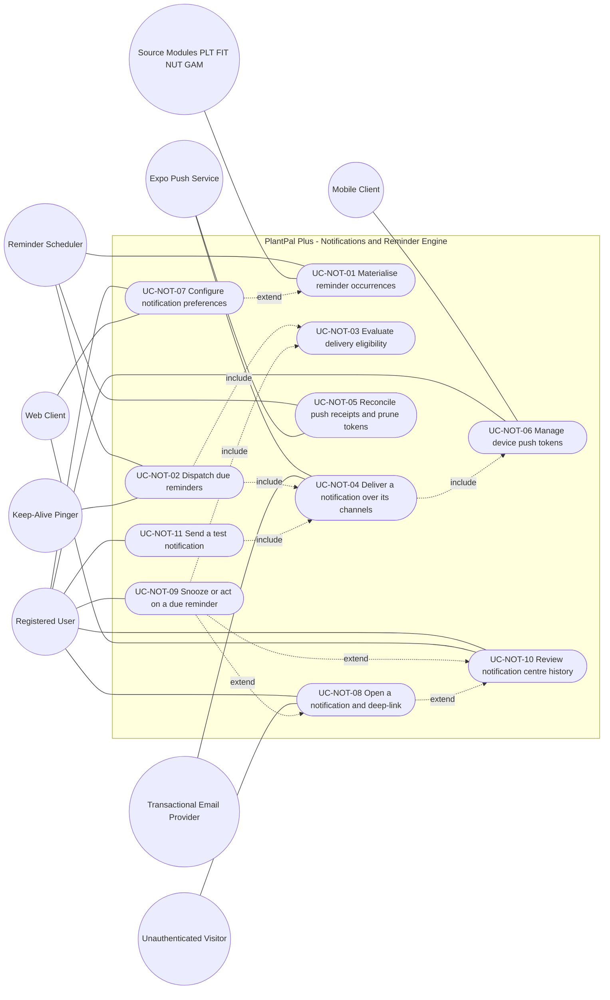
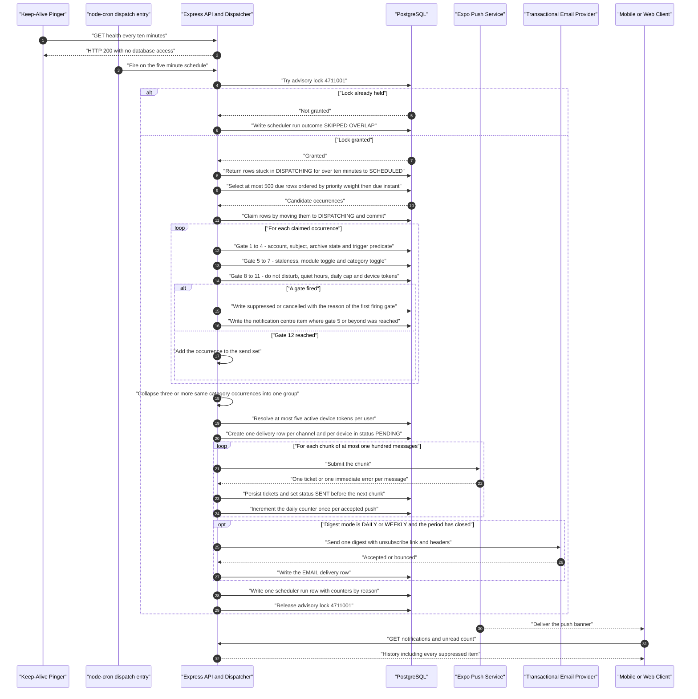
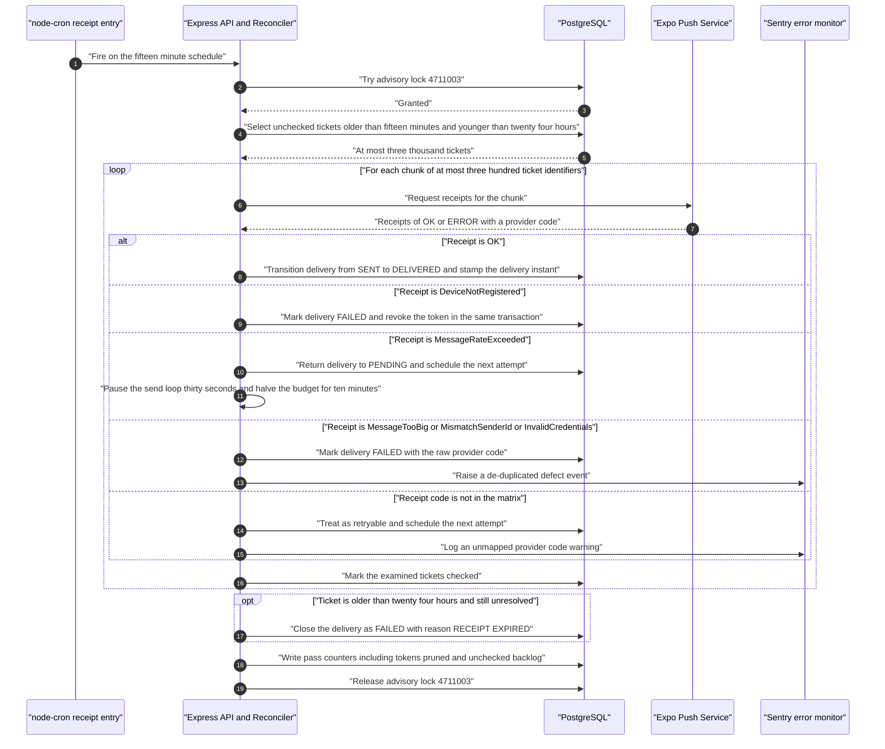
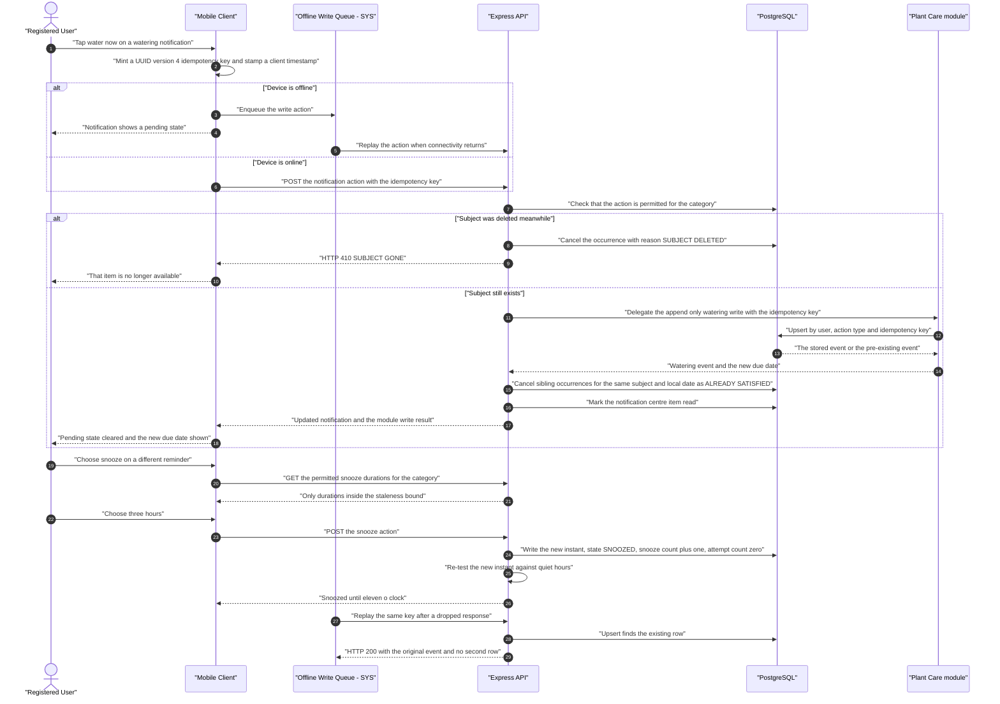

# Use-Case Model — Notifications and the Reminder Scheduling Engine (`NOT`)

| Field | Value |
| --- | --- |
| Document | `use-cases/notifications.md` — authoritative use-case model for the unified reminder scheduling, delivery and notification-centre engine |
| Version | 1.0 |
| Date | 2026-07-21 |
| Status | Approved for Phase 2 design |
| Owner | Rakshit — Project Lead / sole developer (D-05) |
| Parent | [PlantPal+ Software Requirements Specification v1.0](../SRS.md) |
| Specification aligned to | [modules/notifications.md](../modules/notifications.md) v1.0 |
| Owned prefix | `UC-NOT` — `UC-NOT-01` … `UC-NOT-11`. `FR-NOT`, `BR-NOT`, `US-NOT`, `E-nn`, `NFR-*`, `GOAL-*`, `MET-*`, `STK-*`, `PER-*`, `ENT-*`, `ASM-*`, `CON-*`, `RSK-*` and `DEP-*` identifiers are referenced only, never minted or renumbered here |
| Use-case count | 11 use cases, 3 sequence diagrams, 9 modelled include and extend relationships |
| Source decisions | D-01 … D-11, with D-04 offline-light, D-06 free tier, D-07 safety, D-08 i18n-readiness, D-09 units and D-10 push channels as the primary drivers |
| Canonical vocabulary | Reminder categories are the eleven `ReminderCategory` members of BR-NOT-01 clause 1: `PLANT_OVERDUE`, `STREAK_AT_RISK`, `PLANT_WATERING`, `PLANT_CARE_TASK`, `WORKOUT`, `MEAL_LOG`, `STEP_GOAL`, `ACHIEVEMENT`, `WEEKLY_RECAP`, `WATER_INTAKE`, `SYSTEM_TEST`. Aliases such as `PLANT_WATERING_DUE` are never used in this document, per BR-NOT-01 clause 2. Channels are `EXPO_PUSH`, `IN_APP`, `EMAIL`. Occurrence states are `SCHEDULED`, `DISPATCHING`, `DISPATCHED`, `SNOOZED`, `SUPPRESSED`, `CANCELLED`, `SATISFIED`. Delivery statuses are `PENDING`, `SENT`, `DELIVERED`, `FAILED`, `SUPPRESSED`, `CANCELLED` |

---

## Table of contents

1. [Module use-case diagram](#1-module-use-case-diagram)
2. [Actor roles for this module](#2-actor-roles-for-this-module)
3. [Use-case specifications](#3-use-case-specifications)
   - [UC-NOT-01 — Materialise reminder occurrences](#uc-not-01--materialise-reminder-occurrences)
   - [UC-NOT-02 — Dispatch due reminders](#uc-not-02--dispatch-due-reminders)
   - [UC-NOT-03 — Evaluate delivery eligibility for one occurrence](#uc-not-03--evaluate-delivery-eligibility-for-one-occurrence)
   - [UC-NOT-04 — Deliver a notification over its channels](#uc-not-04--deliver-a-notification-over-its-channels)
   - [UC-NOT-05 — Reconcile push receipts and prune tokens](#uc-not-05--reconcile-push-receipts-and-prune-tokens)
   - [UC-NOT-06 — Manage device push tokens](#uc-not-06--manage-device-push-tokens)
   - [UC-NOT-07 — Configure notification preferences](#uc-not-07--configure-notification-preferences)
   - [UC-NOT-08 — Open a notification and deep-link to its subject](#uc-not-08--open-a-notification-and-deep-link-to-its-subject)
   - [UC-NOT-09 — Snooze or act on a due reminder](#uc-not-09--snooze-or-act-on-a-due-reminder)
   - [UC-NOT-10 — Review notification centre history](#uc-not-10--review-notification-centre-history)
   - [UC-NOT-11 — Send a test notification](#uc-not-11--send-a-test-notification)
4. [Sequence diagrams for the most complex use cases](#4-sequence-diagrams-for-the-most-complex-use-cases)
5. [Include and extend relationship catalogue](#5-include-and-extend-relationship-catalogue)
6. [Coverage and traceability checks](#6-coverage-and-traceability-checks)

---

## 1. Module use-case diagram

Every use case specified in section 3 appears in the diagram below. A dotted edge labelled `include` points **from the base use case to the included use case**: the base cannot complete without it. A dotted edge labelled `extend` points **from the extending use case to the base use case**, which is the UML 2.5 direction and the direction used by every use-case document in this package.

**Reading note for the evaluator.** Five of the eleven use cases — `UC-NOT-01` through `UC-NOT-05` — carry a time actor or an internal system actor as their primary actor, and only six carry a human. That asymmetry is the visible consequence of BR-NOT-28 clause 6: **no client may create, mutate or cancel a `ScheduledReminder` or a `NotificationDelivery`**. A user of PlantPal+ never *performs* a dispatch; they configure a preference, register a device, open a notification, act on it or read their history, and the engine does the rest on a `node-cron` schedule inside the single Express process permitted by CON-06. Modelling the engine's own passes as first-class use cases is what makes the correctness obligations that matter to STK-01 — a reminder arrives once, at the right local time, and never for a plant that has already been watered — reviewable and testable rather than buried inside an implementation note.

The second thing the diagram records is that `UC-NOT-03` and `UC-NOT-04` are **subfunction-level** use cases with no actor edge of their own. They exist because the same eligibility decision and the same channel fan-out are reached from three different bases — the dispatch pass, a snooze that reschedules an occurrence, and the user-initiated diagnostic — and specifying them once is what stops three copies of the quiet-hours rule drifting apart.

---

## 2. Actor roles for this module

| Actor | Type | Goals in this module |
| --- | --- | --- |
| Registered User | Primary (human) | Be reminded once, at the right local wall-clock time, about something that is genuinely still outstanding; never be woken at night; never be flooded; switch any category off; pause everything for a holiday; act on a reminder in one tap; postpone one without losing it; read a complete history of what the app decided to tell them; and diagnose, without help, why push is not arriving on a particular device |
| Unauthenticated Visitor | Secondary (human) | Receives no notification of any kind and holds no preference state. May only follow a deep link, which stores the target for exactly 15 minutes and resumes it after a successful sign-in, per BR-NOT-21 clause 2. Every `NOT` endpoint called without a valid access token answers HTTP 401, and the single unauthenticated mutation in the module is the signed digest unsubscribe token of BR-NOT-28 clause 4 |
| Reminder Scheduler | Time (four in-process `node-cron` entries inside the single Express process, CON-06) | Fire the planner on `2 * * * *`, the dispatcher on `*/5 * * * *`, the receipt reconciler on `*/15 * * * *` and the retention pass on `15 3 * * *`; hold advisory locks `4711002`, `4711001`, `4711003` and `4711004` respectively; run one ordinary catch-up dispatch pass on boot so a cold start after a free-tier sleep is indistinguishable from a normal tick |
| Source Modules — `PLT`, `FIT`, `NUT`, `GAM` | System (internal, source) | Publish the due state this module reads at planner time and re-reads at gate 4: watering and care-task due instants and the overdue tier from `PLT`; the workout-logged flag, step count and step goal from `FIT`; meals logged per slot, water logged in millilitres and the daily target from `NUT`; the streak-at-risk flag and the achievement-unlocked event from `GAM`. This module never computes a domain schedule and never evaluates a domain goal |
| Expo Push Service | System (external, secondary) — DEP-06 | Accept chunks of at most 100 messages, return one ticket per message, return a receipt per ticket after a settle delay of roughly 15 minutes, and report `DeviceNotRegistered`, `MessageRateExceeded`, `MessageTooBig`, `MismatchSenderId` and `InvalidCredentials` |
| Transactional Email Provider | System (external, secondary) — DEP-09, CON-23 | Deliver the optional daily or weekly digest inside a permanently free allowance of roughly 100 messages per day, honour the `List-Unsubscribe` and `List-Unsubscribe-Post` headers, and report bounces and complaints so `email_deliverable` can be cleared |
| PostgreSQL Database — Neon or Supabase | System (secondary) | Hold `ENT-32 ReminderRule`, `ENT-33 ScheduledReminder`, `ENT-34 NotificationDelivery`, `ENT-35 NotificationCentreItem`, `ENT-07 DevicePushToken` and the module-local ticket and `scheduler_run` tables; enforce the unique constraint on `(user_id, occurrence_key)` that **is** the at-most-once guarantee of BR-NOT-03 clause 2; supply the single authoritative clock through `now()`, per E-41; grant and release the four advisory locks |
| Mobile Client — React Native and Expo | System (secondary) | Request the operating-system notification permission; obtain, refresh and re-register the Expo push token on every cold start, on every foreground after 6 hours and on every provider-reported token change; register Expo notification categories so the two highest-value action buttons of BR-NOT-23 render; route a tapped notification to its deep-link target including from a terminated application; queue write-type quick actions through the `SYS` offline path under D-04 |
| Web Client — React and Vite | System (secondary) | Render the in-app due-reminder surface and the notification centre, which under D-10 and CON-22 are the **whole** of the v1.0 web reminder experience; poll the unread badge against a 60-second cached count; resolve HTTPS deep links; render the notification preference form whose semantics and validation this module owns and whose layout `SET` owns |
| Keep-Alive Pinger — scheduled GitHub Actions workflow, DEP-12 | Time (external) | Call `GET /api/v1/health` every 10 minutes so the free instance of CON-05 does not suspend and the cron entries keep firing. Not a functional participant in any flow, but the deployment dependency on which the punctuality of `UC-NOT-02` rests, and the actor whose failure E-04 describes |
| Offline Write Queue — owned by `SYS` | System (secondary) | Accept a write-type quick action tapped without connectivity, carry its client-minted UUID version 4 idempotency key and client timestamp, and replay it exactly once when connectivity returns, per D-04 and BR-NOT-23 clause 3 |
| Retention Job | Time (the nightly `15 3 * * *` entry) | Hard-delete notification-centre items older than 90 days, delete ticket rows older than 30 days, hard-delete revoked device tokens older than 180 days, and revoke tokens unseen for 90 consecutive days |
| Error Monitor — Sentry free tier, CON-12 | System (external) | Receive the de-duplicated events this module raises: every illegal status transition, every `PAYLOAD_TOO_BIG`, every `InvalidCredentials`, every `ERR_TZ_RESOLUTION` and every aborted pass, carrying `pass_id` and occurrence identifiers but never a push token, a title or a body, per BR-NOT-28 clause 9 |

---

## 3. Use-case specifications

Every use case below references at least one `FR-NOT-nn` from [modules/notifications.md](../modules/notifications.md) and at least one `US-NOT-nn` from [user-stories/notifications.md](../user-stories/notifications.md). Steps describe observable actor and system behaviour only; no step names a table, a function or a library. Every numeric threshold quoted in a step is a value a tester must observe, and each is normative in the business rule named beside it.

---

### UC-NOT-01 — Materialise reminder occurrences

| Field | Value |
| --- | --- |
| Primary actor | Reminder Scheduler (time actor — the planner entry on `2 * * * *`) |
| Secondary actors | PostgreSQL Database; Source Modules `PLT`, `FIT`, `NUT` and `GAM`; Registered User as the eventual beneficiary, never as a participant |
| Level | User-goal — produce exactly one pending occurrence for every reminder that becomes due inside the planning horizon |
| Priority | Must |
| Release | v0.1 Walking Skeleton for `PLANT_WATERING` only; the remaining nine user-configurable categories at v0.5 Alpha; the timezone-change re-materialisation of FR-NOT-09 at v1.0 MVP |
| Frequency of use | 24 planner passes per day. Additionally once per committed timezone change per user, and once per achievement unlock through the event-driven path, which bypasses the planner entirely |
| Preconditions | The Express process is running and holds no planner advisory lock; the user's account is not in `PENDING_DELETION`; the ten `ENT-32 ReminderRule` rows created at registration exist; the user's IANA timezone resolves in the runtime tz database, or the `UTC` fallback of BR-NOT-10 clause 6 applies |
| Trigger | The `node-cron` planner entry fires on the UTC expression `2 * * * *`. Two alternate triggers exist: a committed change to `UserSettings.timezone`, which starts the re-materialisation procedure of BR-NOT-11 within 60 seconds; and an achievement-unlocked event raised by `GAM`, which inserts one occurrence immediately with `due_at = now()` |
| Success guarantee | For every subject whose BR-NOT-04 clause 2 trigger predicate holds and whose due instant falls inside the 26-hour horizon, exactly one `ENT-33 ScheduledReminder` exists in state `SCHEDULED`, carrying a frozen `due_local_date`, a `due_at` resolved to UTC through BR-NOT-10, the `occurrence_key` of BR-NOT-03, and a `payload_json` already holding the deep link of BR-NOT-20 and the i18n keys and parameters of BR-NOT-27. No second row exists for any key |
| Minimal guarantee | No partially materialised occurrence is observable. Every insert is conditional on the unique constraint over `(user_id, occurrence_key)`, so a replayed pass, an overlapping pass and a cold-start catch-up all converge on the same row set. A source module that fails to answer has nothing written for it at all |
| Related FRs | FR-NOT-02, FR-NOT-08, FR-NOT-09, FR-NOT-19, FR-NOT-22 |
| Related USs | US-NOT-01, US-NOT-02, US-NOT-11, US-NOT-12 |

**Main success scenario**

| # | Actor action | System response |
| --- | --- | --- |
| 1 | The Reminder Scheduler fires the planner entry at minute 2 of the hour. | — |
| 2 | — | The system acquires the planner advisory lock `4711002`. |
| 3 | — | The system reads the pass start instant from the database clock and fixes the horizon as that instant plus 26 hours, being 24 hours of coverage, 1 hour of daylight-saving slack and 1 hour of planner-outage slack, per BR-NOT-04 clause 1. |
| 4 | — | The system selects users in batches of 200 and processes one batch at a time. |
| 5 | — | For one user the system reads the IANA timezone, the ten reminder rules with their enabled flags and preferred local times, and the enabled module set. |
| 6 | — | For each category whose owning `ModuleKey` is enabled, the system asks the owning source module for its published due state and evaluates the trigger predicate of BR-NOT-04 clause 2 against the candidate local date. |
| 7 | — | For each subject whose predicate holds, the system computes `due_local_date` as the calendar date in the user's zone at this moment and freezes it, so that no later deferral, snooze, timezone change or re-materialisation can move it, per BR-NOT-03 clause 4. |
| 8 | — | The system resolves the category's preferred local wall time on that date to a single UTC instant through the four-step function of BR-NOT-10 clause 2, and stores it as both `due_at` and `original_due_at`. |
| 9 | — | The system composes the occurrence key by joining category, subject type, subject identifier, `due_local_date` and `occurrence_index` with a single vertical-bar separator, per BR-NOT-03 clause 1, using slot ordinal 1, 2 or 3 as the index for the multi-slot categories `MEAL_LOG` and `WATER_INTAKE`. |
| 10 | — | The system composes `payload_json` with the deep-link target of the BR-NOT-20 route table, the `title_key`, the `body_key` and the interpolation parameters, so that the dispatch pass performs no copy computation and reads no source module a second time. |
| 11 | — | The system inserts the occurrence in state `SCHEDULED` conditionally on the unique constraint over `(user_id, occurrence_key)`, taking no action where the key already exists. |
| 12 | — | The system repeats steps 6 to 11 until either every category is processed or 200 occurrences have been created for this user in this pass. |
| 13 | — | The system repeats steps 5 to 12 for every user in every batch. |
| 14 | — | The system writes one `scheduler_run` row and one structured log line carrying the pass identifier, duration, users processed, occurrences created and occurrences skipped as duplicates, then releases advisory lock `4711002`. |
| 15 | The Registered User opens the application at their preferred time. | — |
| 16 | — | The system shows the due-today surface built from the occurrences materialised by this pass, per the interface published to `DSH`. |

**Extensions**

| Step | Condition | Handling |
| --- | --- | --- |
| 2a | The planner advisory lock is already held because the previous pass has not finished. | 2a1 The pass writes `outcome = SKIPPED_OVERLAP` and exits without creating a row. 2a2 The 26-hour horizon means one entirely missed hourly pass leaves no gap, so no recovery action is required. |
| 5a | The user's stored timezone is absent. | 5a1 The system evaluates the user in `UTC`, logs `WARN_TZ_FALLBACK` and raises the profile prompt to set a timezone, per E-42. 5a2 Materialisation still proceeds, because a reminder in the wrong zone is recoverable and a missing reminder is not. |
| 5b | The user's stored timezone is a fixed offset such as `UTC+05:30` rather than an IANA name. | 5b1 The value can never have been stored, because it is rejected at write time with HTTP 422 `VALIDATION_UNKNOWN_TIMEZONE`. 5b2 Should one be present from a data import, it is treated as absent and 5a applies. |
| 6a | The trigger predicate does not hold — the plant is not due, the workout is already logged, the meal slot is already recorded. | 6a1 No occurrence is created for that subject on that date. 6a2 Nothing is written and no counter beyond the pass total is incremented. |
| 6b | A source module does not answer within the pass. | 6b1 That category is skipped for this pass for every user in the batch and is retried on the next hourly pass. 6b2 No partial occurrence state is written, so a failed read can delay a reminder by at most one planner interval and can never produce a wrong one. |
| 6c | The category is `ACHIEVEMENT`. | 6c1 The planner creates nothing. 6c2 `GAM` inserts the occurrence directly on unlock with `due_at = now()`, so the celebration is immediate rather than delayed by up to an hour. |
| 6d | The category is `PLANT_OVERDUE` and a non-cancelled occurrence for that plant exists with a `due_local_date` less than 48 hours old, or four occurrences already exist in the current continuous overdue episode. | 6d1 No occurrence is created. 6d2 The plant remains visible in the due surface and in the notification centre but generates no further push, because a fifth identical push is nagging and D-07 forbids it, per BR-NOT-04 clause 3. |
| 7a | The configured local wall time does not exist on that date because the clock jumped forward. | 7a1 The system resolves it to the instant of the forward transition, which is the first existing local time at or after the configured one, per BR-NOT-10 clause 2 rule 3 and E-08. 7a2 The reminder is never moved to the previous or the following local date. |
| 7b | The configured local wall time occurs twice on that date because the clock fell back. | 7b1 The system resolves it to the **earlier** of the two instants, per BR-NOT-10 clause 2 rule 4. 7b2 The second pass over the same wall time creates nothing, because the occurrence key is unchanged and the uniqueness constraint refuses the insert, per E-09. |
| 7c | The user's territory skips an entire local calendar date, as a date-line change does. | 7c1 No occurrence is materialised for the non-existent date and the next existing local date proceeds normally, per E-10. 7c2 No occurrence is moved to a neighbouring date, because moving it would change the frozen `due_local_date` and therefore the key. |
| 11a | The occurrence key already exists in any state, including `CANCELLED` or `SUPPRESSED`. | 11a1 The insert takes no action and the pass counts one skipped duplicate. 11a2 The constraint is deliberately not partial over live rows, so a cancelled occurrence keeps occupying its key and can never be re-materialised into a second delivery. |
| 12a | The per-user ceiling of 200 occurrences in one pass is reached. | 12a1 Creation stops for that user, `PLANNER_USER_CEILING` is logged with the user reference, and the remainder is created by the next hourly pass, per E-13. 12a2 Grouping later collapses the delivered set into one push, so the user experience of a 300-plant collection is one banner and not two hundred. |
| 12b | The category's own toggle is off but its module is enabled. | 12b1 The occurrence **is** materialised. 12b2 It is suppressed later at gate 7 of the eligibility gate, which is what lets a user who re-enables the category at 08:50 still receive the 09:00 reminder, per E-50. |
| 12c | The category's owning module is disabled in settings. | 12c1 No occurrence is created at all, which keeps write volume proportional to the modules the user actually uses, per BR-NOT-04 clause 5. |
| 13a | A committed timezone change is detected rather than a scheduled tick. | 13a1 The system selects every `SCHEDULED` occurrence for that user whose effective due instant is strictly in the future. 13a2 It records each superseded row with `suppression_reason = TZ_CHANGE`, recomputes `due_at` from the **frozen** `due_local_date` and the **same** occurrence key against the new zone, re-applies the quiet-hours test, and leaves `original_due_at` untouched. 13a3 The client shows the confirmation "Reminder times updated for your new time zone". 13a4 Because the key is stable, the uniqueness constraint itself proves no duplicate can arise, per BR-NOT-11 clause 3. |
| 13b | The recomputed instant after a timezone change already lies in the past but within the category cut-off. | 13b1 The occurrence is delivered on the next dispatch pass exactly like any other late-but-useful reminder. |
| 13c | The recomputed instant lies beyond the category cut-off, or the new zone has already advanced the user's local date past `due_local_date`. | 13c1 The occurrence is suppressed with reason `STALE_BEYOND_CUTOFF` and is never delivered on a day the user experiences as yesterday, per E-12. 13c2 The notification-centre record survives. |
| 13d | The user changes timezone twice within one minute. | 13d1 Each change cancels and re-creates against the same stable key, so the last change wins and no duplicate can exist, per E-11. |

**Exception flows**

| Condition | System behaviour | Outcome |
| --- | --- | --- |
| The timezone database lookup throws for one user | The system skips that user for the pass, raises `ERR_TZ_RESOLUTION` to the error monitor and retries on the next hourly pass. An offset is never guessed under any circumstance | A reminder is delayed by at most one hour rather than delivered at a wrong local time |
| The database is unreachable for the whole pass | The pass aborts before any insert, records `outcome = ERROR` and changes nothing | No partial horizon is published, and the next pass re-derives the identical candidate set from the same predicates |
| The process is killed mid-pass | The occurrences already committed remain; the rest are created by the next pass, which finds the committed ones already present and skips them | The pass is idempotent by construction, so recovery needs no bookkeeping of its own |
| The re-materialisation procedure after a timezone change fails entirely | Occurrences keep their old instants, the failure is raised to the error monitor, and gate 4 of the eligibility gate plus the staleness rule keep the user-visible outcome graceful | A travelling user may receive a reminder at the old local time once; they never receive it twice and never receive one for a plant already watered |
| A category is present in the enumeration but absent from the trigger-predicate table | The planner skips the category, logs a warning and raises a de-duplicated error-monitor event | The engine never invents a default predicate, per BR-NOT-01 clause 7 |

**Special requirements**

| Reference | Obligation carried by this use case |
| --- | --- |
| NFR-DATA-01 | Every instant is stored in UTC and every calendar comparison uses the user-local date derived through the IANA database, never a UTC date and never a numeric offset |
| NFR-DATA-02 | The frozen `due_local_date`, the retained `original_due_at` and the composed `payload_json` make every materialisation decision auditable after the fact |
| NFR-SCAL-06 | The pass is bounded at 200 users per batch and 200 occurrences per user, so one collection cannot exhaust the free compute budget of CON-07 |
| NFR-RELI-07 | A missed planner hour degrades to a shorter effective horizon, never to a lost reminder, because the horizon carries an hour of deliberate slack |
| NFR-I18N-01 | `payload_json` carries locale-catalogue keys and parameters only. A literal user-facing string written here is a defect that fails review, per D-08 and BR-NOT-27 clause 1 |
| NFR-MAIN-03 | At least one automated test exists per business rule identifier exercised by this pass, and the nine daylight-saving vectors of BR-NOT-10 clause 3 are a v0.5 exit criterion |
| NFR-OBSV-06 | One structured log line per pass carries users processed, occurrences created and duplicates skipped |

---

### UC-NOT-02 — Dispatch due reminders

| Field | Value |
| --- | --- |
| Primary actor | Reminder Scheduler (time actor — the dispatch entry on `*/5 * * * *`) |
| Secondary actors | PostgreSQL Database; Expo Push Service; Transactional Email Provider; Keep-Alive Pinger as the deployment dependency that keeps the tick alive; Registered User as the recipient |
| Level | User-goal — deliver every occurrence whose due instant has passed, exactly once, or record precisely why it was not delivered |
| Priority | Must |
| Release | v0.1 Walking Skeleton |
| Frequency of use | 288 passes per day, plus one ordinary catch-up pass immediately on every process boot. Above 90 percent of passes find nothing due and exit in under 200 milliseconds having run one indexed query |
| Preconditions | The Express process is running; the dispatch advisory lock `4711001` is free; at least one occurrence is in state `SCHEDULED` or `SNOOZED` with an effective due instant at or before the pass start |
| Trigger | The `node-cron` dispatch entry fires on the UTC expression `*/5 * * * *`, or the process boots and runs one catch-up pass before registering its cron entries, per BR-NOT-02 clause 6 |
| Success guarantee | Every claimed occurrence has reached a defined outcome — sent on at least one channel, deferred with a rewritten due instant, suppressed with a reason code, or cancelled with a reason code. Every occurrence that reached gate 5 or beyond has exactly one notification-centre item. One `scheduler_run` row records the pass. The advisory lock is released |
| Minimal guarantee | No occurrence is processed twice, guaranteed by three independent layers: the pass-level advisory lock, the row claim that commits the transition to `DISPATCHING` before any provider call, and the occurrence-key uniqueness constraint. An occurrence whose own transaction fails is left untouched and is reselected by the next pass |
| Related FRs | FR-NOT-01, FR-NOT-03, FR-NOT-11 |
| Related USs | US-NOT-01, US-NOT-12 |

**Main success scenario**

| # | Actor action | System response |
| --- | --- | --- |
| 1 | The Reminder Scheduler fires the dispatch entry, or the Keep-Alive Pinger's 10-minute call has kept the instance awake so that the entry can fire at all. | — |
| 2 | — | The system attempts to take advisory lock `4711001` and proceeds only on success. |
| 3 | — | The system reads the pass start instant from the database clock, never from the application process clock, per E-41. |
| 4 | — | The system returns to `SCHEDULED` every occurrence that has been in `DISPATCHING` for more than 10 minutes and counts them as reclaimed, per BR-NOT-02 clause 5. |
| 5 | — | The system selects at most 500 occurrences in state `SCHEDULED` or `SNOOZED` whose effective due instant is at or before the pass start, excluding accounts in `PENDING_DELETION`, ordered by category priority weight ascending, then effective due instant ascending, then identifier ascending, skipping any row locked by another transaction. |
| 6 | — | In the same transaction the system transitions each claimed row to `DISPATCHING` and commits, so a claimed row no longer satisfies the selection predicate. |
| 7 | — | For each claimed occurrence the system performs **UC-NOT-03**, which resolves it to send, defer, suppress or cancel. |
| 8 | — | The system collapses into one grouped notification each set of three or more surviving occurrences that share a user, a groupable category and this pass, per BR-NOT-14. |
| 9 | — | For each survivor and each group the system performs **UC-NOT-04**, which fans the notification out over `EXPO_PUSH`, `IN_APP` and `EMAIL` as the category and the gate outcome permit. |
| 10 | — | The system transitions each occurrence to `DISPATCHED` once at least one channel reached `SENT`, and to `SUPPRESSED` where every eligible channel was suppressed. |
| 11 | — | The system increments the daily push counter once per user per accepted push message, keyed on the user's local date, per BR-NOT-13 clause 2. |
| 12 | — | The system writes one `scheduler_run` row and one structured log line carrying candidates, grouped, sent, suppressed by reason, cancelled by reason, failed, reclaimed and provider request counts, then releases advisory lock `4711001`. |
| 13 | The Registered User's device shows the notification banner. | — |
| 14 | — | The system holds the matching notification-centre item, already unread, so the same information survives a dismissed banner. |

**Extensions**

| Step | Condition | Handling |
| --- | --- | --- |
| 2a | The advisory lock is already held because the previous pass is still running. | 2a1 The pass logs `TICK_SKIPPED_OVERLAP`, records `outcome = SKIPPED_OVERLAP` and exits without touching a row, per E-01. 2a2 Nothing is lost, because the selection predicate is "due at or before now" and the next pass reselects the same rows. |
| 4a | No occurrence is stuck in `DISPATCHING`. | 4a1 The reclaim step writes nothing and the pass continues. |
| 5a | No occurrence is due. | 5a1 The pass records `candidates = 0`, sets `outcome = OK` and exits in under 200 milliseconds. 5a2 No provider request is made and no log noise is produced beyond the single pass line. |
| 5b | More than 500 occurrences are due, typically after a free-tier sleep. | 5b1 The pass claims 500 and leaves the remainder in `SCHEDULED`. 5b2 Successive ticks drain the backlog at 500 per 5 minutes, being 6000 per hour, which is bounded and predictable rather than one unbounded burst, per BR-NOT-12 clause 6. |
| 7a | The eligibility gate cancels or suppresses the occurrence. | 7a1 The occurrence is removed from the send set, its reason code is counted in the pass log, and the notification-centre write of gate 5 onwards still happens where the gate reached that far. |
| 7b | The eligibility gate defers the occurrence because it falls inside quiet hours. | 7b1 The occurrence returns to `SCHEDULED` with a rewritten due instant at the end of the quiet window plus the user's deterministic jitter. 7b2 It keeps its occurrence key and its frozen `due_local_date`, so the deferral cannot produce a second occurrence. |
| 8a | Exactly two occurrences of one groupable category are eligible. | 8a1 They are sent individually. The grouping threshold is 3 and is never met by 2, per BR-NOT-14 clause 1. |
| 8b | Three plant reminders and two achievements are eligible in the same pass for one user. | 8b1 The three plant reminders group and the two achievements are sent individually, because grouping never spans categories, per E-36. |
| 8c | Membership drops below three between grouping and submission. | 8c1 The group is discarded and the survivors are sent individually **within the same pass**, so nothing waits for the next tick, per E-34. |
| 9a | The provider submission budget of 30000 milliseconds is exhausted. | 9a1 Unsent occurrences remain `SCHEDULED`, the pass records `outcome = PARTIAL`, and the next tick continues. 9a2 No status is left inconsistent, because tickets are persisted before each subsequent chunk is submitted. |
| 9b | The provider returns a retryable error for a chunk. | 9b1 Every delivery in that chunk is scheduled for retry under the backoff schedule and remains non-terminal. 9b2 No user-visible error is raised for a single failed push. |
| 11a | The daily counter row cannot be locked within 500 milliseconds. | 11a1 The cap is treated as **reached** for that pass, biasing deliberately towards sending fewer notifications, per BR-NOT-13 clause 5. |
| 12a | The health endpoint is called by the Keep-Alive Pinger during the pass. | 12a1 `GET /api/v1/health` answers within 1000 milliseconds without touching the database, so a database cold start cannot defeat the ping. 12a2 `GET /api/v1/health/scheduler` reports `last_tick_at`, `last_planner_at`, `pending_count` and `oldest_pending_age_seconds`, and answers HTTP 503 with `status = "STALLED"` once `last_tick_at` is older than 15 minutes, per E-04. |

**Exception flows**

| Condition | System behaviour | Outcome |
| --- | --- | --- |
| A database error occurs while processing one occurrence | Only that occurrence's transaction rolls back, its reason is counted, the pass continues, and the event is reported to the error monitor | One malformed row cannot suppress a whole tick |
| The database is unreachable for the whole pass | The pass aborts with `outcome = ERROR`, no status changes, and the scheduler health surface begins ageing towards `STALLED` | The next client refresh shows the standard server-unavailable state; no reminder is lost, because everything due is reselected later |
| The free-tier instance slept through many ticks | The boot catch-up pass runs the ordinary selection, which is "due at or before now", so recovery uses the same code path exercised 288 times a day | Reminders inside their category cut-off are delivered late; those beyond it are suppressed as stale with an in-app record, per E-03 |
| The process is killed after a chunk was accepted by the provider but before its tickets were persisted | At most one chunk, so at most 100 messages, can be delivered twice. No notification-centre item, no in-app record and no daily-cap increment is duplicated, because those are written under the occurrence-key constraint | Accepted residual risk, named and bounded in E-02 and carried in RSK-08. It is the honest limit of one free-tier process with no durable queue |
| The Keep-Alive Pinger workflow is disabled after 60 days of repository inactivity | The scheduler health endpoint reports `STALLED`, the external monitor alerts, and the runbook step re-enables the workflow | No reminder is lost; lateness is bounded by the staleness cut-off rather than by the ping, per E-04 |

**Special requirements**

| Reference | Obligation carried by this use case |
| --- | --- |
| NFR-PERF-04 | Worst-case dispatch latency equals the 5-minute configuration granularity of the preferred-time control, so no user-perceptible drift exists |
| NFR-RELI-07 | Outage recovery is the normal code path, not a separate job, so it is exercised continuously rather than only after an incident |
| NFR-SCAL-06 | A pass is bounded at 500 occurrences and 30000 milliseconds of provider submission time |
| NFR-OBSV-05 | The unauthenticated health pair carries no personal data of any kind, which is what makes it safe to expose to an external monitor |
| NFR-OBSV-06 | Exactly one structured line per pass, not one per occurrence, keeps the log readable by one developer and inside the free logging allowance |
| NFR-OBSV-03 | Every alert raised by a pass is de-duplicated by fingerprint against the 5000-event monthly budget of CON-12 |
| NFR-RELI-01 | The engine and the API share one process by necessity under CON-06, so the health surface is the only signal that distinguishes a stalled scheduler from a quiet night |

---

### UC-NOT-03 — Evaluate delivery eligibility for one occurrence

| Field | Value |
| --- | --- |
| Primary actor | Reminder Scheduler (system actor) |
| Secondary actors | PostgreSQL Database; Source Modules `PLT`, `FIT`, `NUT` and `GAM` for the freshness re-check; Registered User as the party whose preferences decide the outcome |
| Level | **Subfunction** — included by UC-NOT-02 and by UC-NOT-09; it has no independent trigger and no actor edge of its own |
| Priority | Must |
| Release | v0.5 Alpha for gates 1, 2, 3, 4, 6, 7, 9, 11 and 12; the staleness gate 5 of FR-NOT-10, the do-not-disturb gate 8 of FR-NOT-07 and the daily-cap gate 10 of FR-NOT-12 complete at v1.0 MVP |
| Frequency of use | Once per claimed occurrence, so up to 500 times per dispatch pass and once more per snooze that reschedules an occurrence |
| Preconditions | The occurrence has been claimed and committed in state `DISPATCHING` by its caller, or is being re-tested after a snooze; the caller holds the pass advisory lock; the user's preference row and reminder rules are readable |
| Trigger | Invocation from UC-NOT-02 step 7, or from UC-NOT-09 when a snooze produces a new instant that must be re-tested against quiet hours and the staleness bound |
| Success guarantee | Exactly one outcome is recorded for the occurrence — send, defer, suppress or cancel — together with the reason code of the **first** gate that fired, and the outcome is scoped correctly per channel: gates 1 to 7 apply to every channel, gates 8 and 9 to `EXPO_PUSH` and `EMAIL` only, gates 10 and 11 to `EXPO_PUSH` only |
| Minimal guarantee | The `IN_APP` channel is never suppressed by gates 8 to 11, so every volume control in this module is non-lossy and the notification centre remains a complete record. The occurrence and its evaluation are committed in one transaction, so a failure leaves the occurrence reselectable rather than half-decided |
| Related FRs | FR-NOT-04, FR-NOT-06, FR-NOT-07, FR-NOT-10, FR-NOT-12, FR-NOT-22 |
| Related USs | US-NOT-02, US-NOT-03, US-NOT-04, US-NOT-05, US-NOT-12 |

**Main success scenario**

| # | Actor action | System response |
| --- | --- | --- |
| 1 | The caller presents one claimed occurrence together with the pass start instant. | — |
| 2 | — | **Gate 1.** The system confirms that the owning account is neither in `PENDING_DELETION` nor purged. |
| 3 | — | **Gate 2.** The system confirms that the subject named by the occurrence still exists. |
| 4 | — | **Gate 3.** The system confirms that the subject is neither archived nor vacation-paused nor otherwise inactive. |
| 5 | — | **Gate 4.** The system re-reads the source module's published state and re-evaluates the trigger predicate that caused materialisation, immediately before sending. |
| 6 | — | **Gate 5.** The system confirms that the elapsed time from `original_due_at` to now is within the category's staleness cut-off, which ranges from 1 hour for `WATER_INTAKE` to 48 hours for `ACHIEVEMENT`, and that a same-day-only category has not rolled past its `due_local_date`. |
| 7 | — | **Gate 6.** The system confirms that the category's owning module is enabled. |
| 8 | — | **Gate 7.** The system confirms that the category's own toggle is enabled. |
| 9 | — | **Gate 8.** The system confirms that do-not-disturb is not active, testing `dnd_enabled` together with an expiry that is either absent or still in the future. |
| 10 | — | **Gate 9.** The system computes the user's local wall time for the candidate instant and confirms that it is outside the quiet-hours window, applying the crossing test where the window's end time is earlier than its start time. |
| 11 | — | **Gate 10.** The system confirms that the user's daily push counter for the occurrence's local date is below the tier cap of 4, 8 or 12. |
| 12 | — | **Gate 11.** The system confirms that at least one active device token with permission status `GRANTED` exists for the user. |
| 13 | — | **Gate 12.** No gate fired, so the system marks the occurrence eligible on every channel configured for its category and returns it to the caller. |
| 14 | — | The system writes exactly one notification-centre item for the occurrence, as it has reached gate 5 or beyond. |

**Extensions**

| Step | Condition | Handling |
| --- | --- | --- |
| 2a | The account is in `PENDING_DELETION` or has been purged. | 2a1 The occurrence is cancelled with reason `USER_DELETED`. 2a2 No notification-centre item is written, because there is no user left to read it. |
| 3a | The subject no longer exists. | 3a1 The occurrence is cancelled with reason `SUBJECT_DELETED`. 3a2 No notification-centre item is written. 3a3 A push already in flight lands on the deep-link fallback and reads "That item is no longer available.", per E-14. |
| 4a | The subject is archived or vacation-paused. | 4a1 The occurrence is cancelled with reason `SUBJECT_ARCHIVED`. 4a2 History is retained in full, and an already-delivered link opens the entity read-only with an "Archived" badge rather than an error, per E-15. |
| 5a | The predicate no longer holds because the user satisfied it, for example by watering at 08:59 for a 09:00 reminder. | 5a1 The occurrence is cancelled with reason `ALREADY_SATISFIED` and its state becomes `SATISFIED`. 5a2 No push is sent. 5a3 This gate is the backstop that makes the 60-second lifecycle-cancellation bound a quality target rather than a safety property, per E-17. |
| 6a | The elapsed time exceeds the category cut-off. | 6a1 `EXPO_PUSH` and `EMAIL` are suppressed with reason `STALE_BEYOND_CUTOFF`. 6a2 The in-app record is still written and is flagged `was_stale`, so the notification centre renders it as history with no action prompt, per E-03. |
| 6b | The category is same-day-only and the user's local date has advanced past `due_local_date`. | 6b1 The occurrence is suppressed with reason `STALE_BEYOND_CUTOFF` irrespective of elapsed hours, because a 23:00 streak alert fired at 01:00 warns about a day that has already resolved, per BR-NOT-12 clause 4. |
| 7a | The owning module has been disabled. | 7a1 The occurrence is cancelled with reason `MODULE_DISABLED`. 7a2 Re-enabling the module resumes materialisation from the next planner pass and never backfills, per E-16. |
| 8a | The category toggle is off. | 8a1 Every channel except `IN_APP` is suppressed with reason `CATEGORY_DISABLED`. 8a2 The occurrence is **not** deleted, so re-enabling the category before the cut-off still allows delivery, per E-50. |
| 9a | Do-not-disturb is active. | 9a1 `EXPO_PUSH` and `EMAIL` are suppressed with reason `DO_NOT_DISTURB`. 9a2 The in-app record is written, so nothing is lost from history. 9a3 Switching do-not-disturb off releases no backlog, because each occurrence was suppressed individually as it came due, per BR-NOT-09 clause 4. |
| 9b | Do-not-disturb is enabled but its expiry has passed. | 9b1 The gate treats it as inactive without any timer or scheduled job, and the next preference write clears the flag, per BR-NOT-09 clause 3. |
| 10a | The candidate instant falls inside the quiet-hours window. | 10a1 The occurrence is **deferred, not dropped**: the due instant is rewritten to the next local occurrence of the window's end time plus a deterministic jitter of the user identifier hash modulo 5 whole minutes. 10a2 The occurrence keeps state `SCHEDULED`, its key and its frozen `due_local_date`. 10a3 The jitter spreads an overnight backlog across five minutes so one free-tier instance is not asked to send every user's queue in a single tick. |
| 10b | The deferred instant would fall beyond `original_due_at` plus the category cut-off, or the category is same-day-only and the deferred instant falls on a later local date. | 10b1 The occurrence is suppressed with reason `QUIET_HOURS` instead of deferred, so it never acquires a misleading future due instant, per BR-NOT-08 clause 4. |
| 10c | The candidate instant is exactly the quiet-hours end time. | 10c1 The end boundary is exclusive, so the instant is outside the window and the reminder is delivered without deferral, per E-05. |
| 10d | The deferral target itself falls inside a skipped local hour on a spring-forward morning. | 10d1 It is resolved through the same local-to-UTC rule as any other wall time and lands on the instant of the forward transition, per E-06. |
| 11a | The daily push counter has reached the tier cap. | 11a1 Only `EXPO_PUSH` is suppressed, with reason `DAILY_CAP_REACHED`. 11a2 The notification-centre item is still created and still counts towards the unread badge, per E-32. |
| 11b | The cap is already spent when a high-priority `PLANT_OVERDUE` occurrence appears. | 11b1 Its push is suppressed even though it outranks everything already sent, because the counter never decrements. 11b2 The item appears in-app immediately and is the first entry in the next local day's ordering. Recorded as an accepted trade-off in E-33. |
| 12a | No active, permission-granted device token exists. | 12a1 Only `EXPO_PUSH` is suppressed, with reason `NO_ACTIVE_DEVICE`, or with `PUSH_PERMISSION_DENIED` where a token exists but the operating-system permission is denied. 12a2 `IN_APP` becomes the only channel, which is a supported operating mode and is exactly the web experience mandated by D-10, per BR-NOT-15 clause 3. |
| 13a | Two gates would fire for the same occurrence, for example a disabled category inside quiet hours. | 13a1 Evaluation stops at the **first** gate in numeric order and records `CATEGORY_DISABLED`, because that is the reason the user would give. 13a2 The order is normative precisely so that the recorded reason is reproducible, per BR-NOT-05 clause 1. |

**Exception flows**

| Condition | System behaviour | Outcome |
| --- | --- | --- |
| A source module cannot be reached for the gate 4 freshness re-check | The occurrence is left in `DISPATCHING` for this pass and is returned to `SCHEDULED` by the stuck-claim recovery after 10 minutes | The system prefers a reminder delayed by one tick over a reminder sent about a state it could not verify |
| The user's timezone cannot be resolved during gate 9 | The window is evaluated in `UTC` and `WARN_TZ_FALLBACK` is raised | Quiet hours are still honoured approximately rather than skipped entirely |
| A suppression reason outside the closed registry is attempted | The write is rejected with HTTP 422 `VALIDATION_UNKNOWN_REASON_CODE` and an error-monitor event is raised | The reason registry stays closed, so the suppression mix reported on the health surface is always interpretable |
| The evaluation transaction fails | The occurrence is left untouched and is reselected by the next pass; a counter is incremented | No occurrence is left half-decided, per BR-NOT-05 clause 5 |

**Special requirements**

| Reference | Obligation carried by this use case |
| --- | --- |
| NFR-SEC-08 | Preferences are read from the authenticated owner's rows only; no gate accepts a user identifier from a request |
| NFR-USAB-03 | Every suppression the user could notice has a plain-language explanation available in the notification centre and in settings |
| NFR-DATA-02 | The reason code of the firing gate is persisted, so any "why did I not get this" question is answerable from data rather than from reasoning |
| NFR-DATA-04 | Suppression is push-scoped and email-scoped; the in-app record is the durable record and is never suppressed by a volume control |
| NFR-RELI-07 | Gate 4 duplicates work that lifecycle cancellation already did, deliberately, so a lost event cannot produce a wrong delivery |
| NFR-A11Y-08 | A stale or suppressed item is conveyed in the centre by a text label or icon shape as well as by colour |
| NFR-MAIN-04 | The gate is implemented once in the shared package and consumed unchanged by the dispatcher and by the snooze path |

---

### UC-NOT-04 — Deliver a notification over its channels

| Field | Value |
| --- | --- |
| Primary actor | Reminder Scheduler (system actor) |
| Secondary actors | Expo Push Service; Transactional Email Provider; PostgreSQL Database; Mobile Client and Web Client as the eventual renderers |
| Level | **Subfunction** — included by UC-NOT-02 and by UC-NOT-11; includes the token-resolution segment of UC-NOT-06 |
| Priority | Must |
| Release | v0.1 Walking Skeleton for the `EXPO_PUSH` and `IN_APP` channels of a single-subject notification; grouping under FR-NOT-13 and the `EMAIL` digest of FR-NOT-23 at v1.0 MVP |
| Frequency of use | Once per eligible occurrence or per group, so up to 500 times per dispatch pass, plus once per test notification |
| Preconditions | The occurrence reached gate 12 for at least one channel; `payload_json` carries a deep link, a title key, a body key and its parameters; for the push channel at least one active permission-granted device token exists |
| Trigger | Invocation from UC-NOT-02 step 9, or from UC-NOT-11 for a user-initiated diagnostic |
| Success guarantee | One `ENT-34 NotificationDelivery` row exists per channel and, for push, per device, each carrying its status, attempt count and provider identifiers; the push message was submitted in a chunk of at most 100 with its ticket persisted before the next chunk; exactly one notification-centre item exists for the occurrence; the daily counter incremented exactly once per accepted push |
| Minimal guarantee | A retry never creates a second delivery row and never increments the counter a second time. A failure on one channel never prevents another channel: a push suppressed by a volume control still leaves the in-app record, which is what makes the web experience of D-10 complete rather than degraded |
| Related FRs | FR-NOT-03, FR-NOT-13, FR-NOT-16, FR-NOT-18, FR-NOT-19, FR-NOT-23 |
| Related USs | US-NOT-01, US-NOT-06, US-NOT-08, US-NOT-12 |

**Main success scenario**

| # | Actor action | System response |
| --- | --- | --- |
| 1 | The caller presents one eligible occurrence, or one group and its members. | — |
| 2 | — | The system reads the channel set configured for the category and removes any channel the eligibility gate suppressed. |
| 3 | — | The system resolves the user's active device tokens through **UC-NOT-06**, excluding revoked tokens and tokens whose permission status is `DENIED`, and taking at most 5. |
| 4 | — | The system renders the title and body from their catalogue keys and parameters, applying ICU pluralisation for any count and the user's preferred unit system for any quantity, while the stored value stays metric SI. |
| 5 | — | The system composes the push message with the deep link, the notification identifier and the fixed source marker, and verifies that the serialised payload with title and body is at most 4096 bytes in UTF-8. |
| 6 | — | The system creates one delivery row per channel, and per device for push, each in status `PENDING` with attempt count 0. |
| 7 | — | The system submits push messages in chunks of at most 100 per request, with at most 6 requests in flight and a 100-millisecond pause between consecutive chunks, using the provider SDK's own chunking helper so its byte-size accounting applies as well as the count limit. |
| 8 | — | The system persists every returned ticket against its delivery row **before** submitting the next chunk, and transitions those rows to `SENT`. |
| 9 | — | The system increments the user's daily push counter by exactly 1 for that local date, regardless of how many devices received the message and regardless of how many subjects a group collapsed. |
| 10 | — | The system writes exactly one notification-centre item carrying the category, the rendered keys, the deep link, the permitted actions and the unread state, and for a group also the member occurrence identifiers. |
| 11 | — | The system marks each grouped member `DISPATCHED` with a reference to the leading occurrence, so per-subject history is complete and each member remains individually actionable. |
| 12 | — | Where the user's digest mode is `DAILY` or `WEEKLY` and the covered period has closed, the system composes one email listing at most 30 items, adds the one-click unsubscribe link, the unsubscribe headers, the not-medical-advice footer and the policy links, and submits it to the email provider. |
| 13 | The Registered User receives the banner, the in-app entry or the email. | — |

**Extensions**

| Step | Condition | Handling |
| --- | --- | --- |
| 3a | The user has more than 5 registered tokens. | 3a1 The registry never holds more than 5 active tokens, because a sixth registration evicts the least recently seen with reason `LRU_EVICTED`, per E-25. |
| 3b | The user has no active token. | 3b1 The push channel was already suppressed at gate 11 with reason `NO_ACTIVE_DEVICE`. 3b2 Delivery proceeds on `IN_APP`, and on `EMAIL` where the digest applies. |
| 4a | The occurrence is a group of three or more. | 4a1 The system renders at most 2 subject names, each truncated to 24 characters with a single ellipsis, and renders the remainder as a count through an ICU plural, giving copy such as "5 plants need water" and "Monstera, Fiddle Leaf Fig and 3 more". |
| 4b | The user's unit preference is imperial. | 4b1 A quantity renders as "8 fl oz" while the stored value remains 250 millilitres, per D-09 and BR-NOT-23 clause 5. |
| 5a | The composed payload exceeds 4096 bytes. | 5a1 The system drops optional data fields in the fixed order group count, subject name, parameters, category key. 5a2 It then truncates the body at a whole grapheme boundary with a single ellipsis. 5a3 The notification identifier, the deep link and the two catalogue keys are never dropped, per BR-NOT-31. |
| 5b | The message is still oversized after truncation. | 5b1 The delivery is marked `FAILED` with reason `PAYLOAD_TOO_BIG` and an error-monitor event is raised, because at that point the cause is a defect in copy or in a parameter and not a runtime condition, per E-31. |
| 7a | A chunk returns an HTTP 429 with a `Retry-After` header. | 7a1 The header is honoured. 7a2 Otherwise the exponential backoff schedule applies. |
| 7b | The provider returns `MessageRateExceeded`. | 7b1 The delivery is retried under the backoff schedule, the send loop pauses for 30 seconds and the per-pass submission budget is halved for the following 10 minutes, per E-28. |
| 7c | The provider returns `DeviceNotRegistered` in the ticket rather than in a receipt. | 7c1 The token is revoked with reason `DEVICE_NOT_REGISTERED` in the **same transaction** that marks the delivery `FAILED`, so the next pass cannot repeat the failing send, per E-27. |
| 7d | The provider returns `InvalidCredentials`. | 7d1 All push sending halts for 5 minutes and a high-severity error-monitor event is raised, so free-tier quota is not burned against a misconfiguration. |
| 8a | A retryable transport failure occurs. | 8a1 The delivery stays `PENDING`, its attempt count increments and the next attempt is scheduled at 60, 300, 900 or 3600 seconds multiplied by a jitter factor drawn uniformly from 0.5 up to 1.0, for a maximum of 5 total attempts. 8a2 The same delivery row is reused, so the once-only guarantee and the daily counter are untouched. |
| 8b | The next attempt would fall beyond `original_due_at` plus the category cut-off. | 8b1 The retry is abandoned immediately without consuming the remaining attempts and the delivery is suppressed with reason `STALE_BEYOND_CUTOFF`, per E-44. |
| 8c | Five attempts have failed. | 8c1 The delivery becomes terminal `FAILED` with the provider's raw error code recorded. 8c2 A single failure is never surfaced; three consecutive failures to the same device raise a settings banner pointing at the test-notification diagnostic. |
| 10a | A member's subject vanished between grouping and submission. | 10a1 The group is rebuilt without it; below three members the survivors are sent individually within the same pass, per E-34. |
| 12a | The daily digest would contain zero items. | 12a1 No email is sent and no delivery row is created, per E-38. |
| 12b | The weekly recap falls due for a user who logged nothing in the covered ISO week. | 12b1 The recap is not generated at all, per E-37. |
| 12c | The user's email address is unverified, or the address previously hard-bounced. | 12c1 The email channel is suppressed with reason `EMAIL_NOT_VERIFIED` or `EMAIL_BOUNCED` and a settings notice explains the state. |
| 12d | The global free allowance of 100 emails per day is exhausted. | 12d1 Remaining digests are deferred to the following day with reason `EMAIL_QUOTA_DEFERRED`; push and in-app delivery are unaffected, per E-48. |

**Exception flows**

| Condition | System behaviour | Outcome |
| --- | --- | --- |
| The push provider is entirely unavailable for two hours | Deliveries exhaust their five attempts within roughly 81 minutes and become `FAILED`. The `IN_APP` channel is unaffected | The notification centre still shows every item, which is the graceful degradation NFR-RELI-03 requires, per E-29 |
| A status transition not present in the transition table is attempted | The write is rejected with HTTP 409 `INVALID_STATUS_TRANSITION` and an error-monitor event is raised, because it can only be a scheduler defect | No row can claim `SENT` for a message that was never submitted, nor `PENDING` for one that was |
| The process crashes between chunks | Tickets already persisted are intact; the affected occurrences stay `DISPATCHING` and are recovered after 10 minutes | The duplicate exposure is bounded at one chunk and is recorded as E-02 |
| The email provider reports a complaint or a hard bounce | `email_deliverable` is cleared on the account and future digests are suppressed with reason `EMAIL_BOUNCED` | The state is visible in settings rather than silent |

**Special requirements**

| Reference | Obligation carried by this use case |
| --- | --- |
| NFR-SCAL-07 | Provider limits are honoured exactly: 100 messages per request, 6 concurrent requests, a 100-millisecond inter-chunk pause |
| NFR-RELI-03 | A total push outage degrades to in-app and email, never to silence with no record |
| NFR-RELI-04 | Outbound provider retries follow this module's schedule; client and offline-queue retries are owned by `SYS` and deliberately differ |
| NFR-I18N-01, NFR-I18N-05 | Bodies are composed from catalogue keys with ICU plural arguments, so no count and no language variant requires a code change |
| NFR-LEGL-01, NFR-LEGL-03 | Every digest email carries the not-medical-advice disclaimer of D-07 and links to the privacy policy and terms |
| NFR-PRIV-02 | No push token, title or body is ever written to a log line or an error-monitor breadcrumb |
| NFR-USAB-03 | Copy follows the safe-language rules: no shaming, no loss framing, no urgency capitals, one sentence, sentence case |

---

### UC-NOT-05 — Reconcile push receipts and prune tokens

| Field | Value |
| --- | --- |
| Primary actor | Reminder Scheduler (time actor — the receipt entry on `*/15 * * * *`) |
| Secondary actors | Expo Push Service; PostgreSQL Database; Registered User as the beneficiary of a pruned dead token |
| Level | User-goal — establish what actually happened to every submitted push and remove the tokens that can never receive one |
| Priority | Must |
| Release | v0.5 Alpha |
| Frequency of use | 96 passes per day. At pilot scale roughly 2 provider requests per day suffice for the whole cohort |
| Preconditions | At least one ticket exists that is at least 15 minutes and at most 24 hours old and has not yet been checked; the receipt advisory lock `4711003` is free |
| Trigger | The `node-cron` receipt entry fires on the UTC expression `*/15 * * * *` |
| Success guarantee | Every checked ticket has resolved its delivery to `DELIVERED`, to `FAILED` with the provider's raw error code, or to a scheduled retry; every `DeviceNotRegistered` has revoked its token in the same transaction that failed the delivery; unchecked ticket backlog and pruned-token counts are reported |
| Minimal guarantee | A delivery status is never changed on a guess. A receipt endpoint failure leaves tickets unchecked for the next pass and changes nothing, bounded only by the 24-hour provider retention window after which a ticket is closed as `FAILED` with reason `RECEIPT_EXPIRED` |
| Related FRs | FR-NOT-15, FR-NOT-17, FR-NOT-18, FR-NOT-03 |
| Related USs | US-NOT-12, US-NOT-13 |

**Main success scenario**

| # | Actor action | System response |
| --- | --- | --- |
| 1 | The Reminder Scheduler fires the receipt entry. | — |
| 2 | — | The system acquires advisory lock `4711003`. |
| 3 | — | The system selects unchecked tickets at least 15 minutes and at most 24 hours old, taking at most 3000 per pass. |
| 4 | — | The system requests receipts in chunks of at most 300 ticket identifiers per request. |
| 5 | The Expo Push Service returns a receipt per resolved ticket. | — |
| 6 | — | For a receipt of `OK` the system transitions the delivery from `SENT` to `DELIVERED` and stamps the delivery instant. |
| 7 | — | For a receipt reporting an error the system records the provider's raw code verbatim and classifies it against the closed error matrix. |
| 8 | — | For a non-retryable classification the system transitions the delivery to `FAILED` with the matching reason code. |
| 9 | — | For a `DeviceNotRegistered` classification the system additionally revokes the device token with reason `DEVICE_NOT_REGISTERED` in the same transaction. |
| 10 | — | For a retryable classification the system returns the delivery to `PENDING`, increments its attempt count and schedules the next attempt under the backoff schedule. |
| 11 | — | The system marks every examined ticket as checked and records the pass counters, including the unchecked backlog and the number of tokens pruned. |
| 12 | — | The system releases advisory lock `4711003`. |
| 13 | The Registered User opens notification settings after repeated failures. | — |
| 14 | — | The system shows the banner raised after three consecutive failed pushes to one device, pointing at the test-notification diagnostic. |

**Extensions**

| Step | Condition | Handling |
| --- | --- | --- |
| 3a | No ticket is eligible. | 3a1 The pass records zero candidates and exits. |
| 3b | A ticket is younger than 15 minutes. | 3b1 It is not selected. Polling sooner returns undefined receipts and spends free-tier requests for nothing, per BR-NOT-17 clause 2. |
| 3c | A ticket has passed 24 hours without a resolved receipt. | 3c1 Its delivery is closed as `FAILED` with reason `RECEIPT_EXPIRED`, because the provider does not retain receipts indefinitely, per E-30. |
| 3d | More than 3000 tickets are eligible. | 3d1 The pass examines 3000 and leaves the remainder for the next pass. 3d2 A backlog above 2000 unchecked tickets is reported as the failed band on the health surface. |
| 5a | A receipt is not yet available for a selected ticket. | 5a1 The ticket is left unchecked for the next pass, still inside its 24-hour window. |
| 7a | The provider returns `MessageRateExceeded` in a receipt. | 7a1 The delivery is retried under the backoff schedule and the global send throttle of E-28 is applied. |
| 7b | The provider returns `MessageTooBig`. | 7b1 The delivery is failed with reason `PAYLOAD_TOO_BIG` and an error-monitor event is raised, because it is a copy or payload defect. |
| 7c | The provider returns `MismatchSenderId`. | 7c1 The delivery is failed and an error-monitor event is raised, because it is a build configuration defect that no retry can fix. |
| 7d | The provider returns a code absent from the matrix. | 7d1 The code is treated as **retryable** and `WARN_UNMAPPED_PROVIDER_CODE` is logged with the raw code, so the matrix can be extended from evidence. 7d2 A transient failure retried needlessly costs one request; a permanent failure retried needlessly costs at most five. |
| 10a | The scheduled next attempt would fall beyond the category staleness bound. | 10a1 The retry is abandoned and the delivery is suppressed with reason `STALE_BEYOND_CUTOFF`, per E-44. |
| 11a | The nightly retention pass runs. | 11a1 Ticket rows older than 30 days are deleted, device tokens unseen for 90 consecutive days are revoked with reason `INACTIVE`, revoked rows older than 180 days are hard-deleted, and notification-centre items older than 90 days are hard-deleted. |

**Exception flows**

| Condition | System behaviour | Outcome |
| --- | --- | --- |
| The receipt endpoint itself fails | Tickets are left unchecked for the next pass, the backlog counter increments, and no delivery status is changed | The system never converts an unknown into a `DELIVERED`, so the delivery ratio reported for MET-12 measures delivery and not acceptance |
| The advisory lock is held by a still-running pass | The tick exits without work | Receipts have a 24-hour window, so one skipped pass is immaterial |
| A revocation and its delivery failure cannot be committed together | The whole transaction rolls back and the ticket stays unchecked | Splitting the two would let the next pass repeat the same failing send, which is exactly what BR-NOT-15 clause 1 forbids |
| The database is unreachable for the whole pass | The pass aborts, changes nothing and retries in 15 minutes | Ticket state is never partially reconciled |

**Special requirements**

| Reference | Obligation carried by this use case |
| --- | --- |
| NFR-OBSV-06 | Delivered, failed, pruned and backlog counts are emitted per pass and feed the health bands |
| NFR-RELI-03 | Dead tokens are removed continuously, so a degraded push channel does not silently consume the free-tier request budget |
| NFR-PRIV-04 | Revoked token rows are retained for 180 days for diagnostics and then hard-deleted |
| NFR-PRIV-06 | Token revocation on account deletion is a precondition of the deletion guarantee, and this pass is where provider-reported deaths are reconciled |
| NFR-SCAL-07 | 300 identifiers per request and 3000 tickets per pass are honoured exactly |
| NFR-SEC-14 | A device push token is credential-adjacent and is never logged, never returned in full and never attached to an error-monitor event |

---

### UC-NOT-06 — Manage device push tokens

| Field | Value |
| --- | --- |
| Primary actor | Registered User, acting through the Mobile Client |
| Secondary actors | PostgreSQL Database; Expo Push Service as the issuer of the token; Reminder Scheduler as the consumer of the registry and as the actor that revokes on provider evidence; `ACC` as the raiser of the logout and account-deletion events |
| Level | User-goal for registration, refresh and manual revocation; the **subfunction** segment that resolves a user's active tokens is included by UC-NOT-04 |
| Priority | Must |
| Release | v0.1 Walking Skeleton for registration and refresh under FR-NOT-14; revocation, reassignment, LRU eviction and inactivity pruning under FR-NOT-15 at v0.5 Alpha |
| Frequency of use | Once per cold start, once per foreground after 6 hours, and once per provider-reported token change, so a handful of times per device per day; token resolution runs once per push delivery |
| Preconditions | The caller holds a valid access token; for registration the Mobile Client has obtained an Expo push token from the operating system, which requires the notification permission to have been requested |
| Trigger | The Mobile Client registers or refreshes a token; or the user removes a device in settings; or `ACC` raises a logout or account-deletion event; or the provider reports `DeviceNotRegistered`; or the nightly retention pass finds a token unseen for 90 days |
| Success guarantee | The user has at most 5 active tokens, each unique across the whole table, each carrying its platform, device name, application version, permission status and last-seen instant; every revocation records both `revoked_at` and a reason drawn from the closed set `USER_LOGOUT`, `ACCOUNT_DELETED`, `DEVICE_NOT_REGISTERED`, `LRU_EVICTED`, `INACTIVE`, `TOKEN_REASSIGNED` |
| Minimal guarantee | A token string can belong to exactly one account at a time, so a handed-over device can never receive the previous owner's reminders. Revocation is a soft delete, so a diagnostic history survives for 180 days |
| Related FRs | FR-NOT-14, FR-NOT-15 |
| Related USs | US-NOT-13 |

**Main success scenario**

| # | Actor action | System response |
| --- | --- | --- |
| 1 | The Registered User opens the mobile application for the first time and is asked for notification permission by the operating system. | — |
| 2 | The user grants permission. | — |
| 3 | The Mobile Client obtains an Expo push token and submits it with the platform, the device name, the application version, the permission status and the device's timezone. | — |
| 4 | — | The system validates the token against the provider grammar and a total length of 20 to 200 characters, validates the platform as one of `IOS`, `ANDROID` or `WEB`, the permission status as one of `GRANTED`, `DENIED` or `UNDETERMINED`, and caps the device name at 64 characters. |
| 5 | — | The system upserts the row keyed on the token string and refreshes the last-seen instant. |
| 6 | — | The system returns the device identifier and the caller's effective active-device list, each token masked to its last 6 characters. |
| 7 | The user later opens the application after more than 6 hours. | — |
| 8 | — | The system accepts the refresh, updates the last-seen instant and records any change of permission status. |
| 9 | The Reminder Scheduler prepares a push delivery. | — |
| 10 | — | The system resolves the user's active tokens, excluding revoked rows and rows whose permission status is `DENIED`, and fans the message out to at most 5 devices as one notification for every purpose that counts notifications. |
| 11 | The user removes a device from the settings device list, or signs out on it. | — |
| 12 | — | The system revokes that row with reason `USER_LOGOUT`, stops targeting it immediately, and removes it from the device list. |

**Extensions**

| Step | Condition | Handling |
| --- | --- | --- |
| 2a | The user denies permission. | 2a1 The client still registers the token with permission status `DENIED`. 2a2 The server never targets that device. 2a3 Settings shows a banner explaining that push is off for this device and offering a link to the system notification settings. |
| 2b | Permission is granted and later revoked in the operating-system settings. | 2b1 The next foreground permission sync, throttled to once per 6 hours per installation, updates the stored status to `DENIED`. 2b2 Pushes to that device are suppressed with reason `PUSH_PERMISSION_DENIED`, per E-24. |
| 4a | The token string does not match the provider grammar. | 4a1 The request fails with HTTP 422 `VALIDATION_BAD_PUSH_TOKEN`. 4a2 Rejecting a malformed token at registration keeps a guaranteed-failing row out of every future send. |
| 5a | The token string already belongs to a different account, because the device was handed over. | 5a1 The previous owner's row is revoked with reason `TOKEN_REASSIGNED` **before** the new row is created. 5a2 Cross-user delivery after a handover is therefore impossible, per E-26. |
| 5b | The user registers a sixth token. | 5b1 The row with the oldest last-seen instant is revoked with reason `LRU_EVICTED`. 5b2 The decision requires no user input, and the newly registered device is the one the user is holding, per E-25. |
| 9a | The provider reports `DeviceNotRegistered` for a token, in a ticket or in a receipt. | 9a1 The token is revoked with reason `DEVICE_NOT_REGISTERED` in the same transaction that marks the delivery `FAILED`. |
| 10a | The user has no active permission-granted token at all. | 10a1 Push deliveries are suppressed with reason `NO_ACTIVE_DEVICE` and `IN_APP` becomes the only channel. 10a2 Settings states plainly that push notifications are off for this account and how to switch them on. 10a3 This is a supported operating mode, not a failure: it is exactly the v1.0 web experience of D-10. |
| 11a | The account is deleted. | 11a1 Every token is revoked with reason `ACCOUNT_DELETED` and de-registered with the provider before hard deletion, and every pending occurrence is cancelled with reason `USER_DELETED`, per E-39. |
| 11b | A token has not been refreshed for 90 consecutive days. | 11b1 The nightly retention pass revokes it with reason `INACTIVE`, because sending to a dead token wastes the free-tier budget and corrupts the delivery ratio reported for MET-12. |
| 12a | The user requests a device that belongs to another account. | 12a1 The request answers HTTP 404 and never HTTP 403, so ownership cannot be probed. |

**Exception flows**

| Condition | System behaviour | Outcome |
| --- | --- | --- |
| The operating system never returns a token, for example on an unsupported simulator | The client stores no token, registers nothing and shows the push-unavailable state in settings | The application remains fully usable; the in-app centre carries the whole experience |
| A device list is requested | Tokens are rendered as their last 6 characters only, are never returned in full and are never logged | A credential-adjacent value cannot leak through a diagnostic surface, per BR-NOT-28 clause 9 |
| A registration arrives while the same token is being reassigned by a concurrent request | The unique constraint on the token string serialises the two, so exactly one owner results | No interleaving can leave a token owned twice |
| Registration is attempted without a valid access token | The request answers HTTP 401 and nothing is written | No unauthenticated path can populate the push registry |

**Special requirements**

| Reference | Obligation carried by this use case |
| --- | --- |
| NFR-SEC-14 | Ownership is taken from the access token's subject claim; a user identifier in a body, query or header is ignored |
| NFR-SEC-08 | The registry is writable only by its owner; there is no administrative or impersonation path in v1.0 |
| NFR-PRIV-01 | The device name and application version are the only device metadata stored, and neither is exposed outside the owner's own settings |
| NFR-PRIV-04 | Revoked rows are retained for exactly 180 days and then hard-deleted |
| NFR-PRIV-06 | Revocation and provider de-registration are preconditions of the account-deletion guarantee |
| NFR-USAB-03 | Every reason a device cannot receive push — denied permission, revoked token, no token at all — has a plain-language settings state naming the remedy |

---

### UC-NOT-07 — Configure notification preferences

| Field | Value |
| --- | --- |
| Primary actor | Registered User |
| Secondary actors | Web Client and Mobile Client, which host the settings surface owned by `SET`; PostgreSQL Database; Reminder Scheduler, which re-materialises after a change |
| Level | User-goal — make the engine fit the user's routine instead of interrupting it |
| Priority | Must |
| Release | v0.5 Alpha for category toggles, preferred times and quiet hours under FR-NOT-04, FR-NOT-05 and FR-NOT-06; do-not-disturb under FR-NOT-07, the volume tier under FR-NOT-12 and the digest mode under FR-NOT-23 at v1.0 MVP |
| Frequency of use | Several times in the first session, then rarely — typically after an unwanted notification. Rate limited to 60 preference writes per hour per user |
| Preconditions | The caller holds a valid access token; the ten reminder rules created at registration exist; connectivity is available, because a preference change is not an append-only logging action and is therefore never queued offline under D-04 |
| Trigger | The user opens the notification section of settings and changes a control |
| Success guarantee | The preference change is persisted and echoed back in full; future occurrences of the affected category are evaluated against the new value; where a preferred time changed, future pending occurrences of that category are cancelled with reason `PREFERENCE_CHANGED` and re-materialised by the next planner pass; the number of rescheduled occurrences is reported to the user |
| Minimal guarantee | An invalid value is rejected with a named error code and an actionable message, and nothing is partially applied. A change never retro-actively alters an already-sent delivery and never releases a backlog of previously suppressed notifications |
| Related FRs | FR-NOT-04, FR-NOT-05, FR-NOT-06, FR-NOT-07, FR-NOT-09, FR-NOT-12, FR-NOT-23 |
| Related USs | US-NOT-02, US-NOT-03, US-NOT-04, US-NOT-05, US-NOT-08, US-NOT-11 |

**Main success scenario**

| # | Actor action | System response |
| --- | --- | --- |
| 1 | The Registered User opens the notification section of settings. | — |
| 2 | — | The system returns the full preference object: the ten category toggles with their current state, the preferred local time or times per category, the quiet-hours window, the do-not-disturb state with any remaining duration, the reminder volume tier and the digest mode. |
| 3 | The user switches a category off, for example `WATER_INTAKE`. | — |
| 4 | — | The system persists the toggle and echoes the full preference object. Occurrences already materialised for that category are left in place and are suppressed at gate 7 when they come due, with reason `CATEGORY_DISABLED`. |
| 5 | The user sets the preferred local time for `PLANT_WATERING` to 19:30. | — |
| 6 | — | The system validates the value as a five-minute increment in the range 00:00 to 23:55, confirms that it does not fall strictly inside an enabled quiet-hours window, and persists it. |
| 7 | — | The system cancels future pending occurrences of that category with reason `PREFERENCE_CHANGED`, leaves alone any occurrence already due within the next 5 minutes so the user sees no flicker, and returns the count of rescheduled occurrences. |
| 8 | — | The next planner pass re-materialises those occurrences at the new local time through **UC-NOT-01**. |
| 9 | The user sets quiet hours from 22:00 to 07:00. | — |
| 10 | — | The system accepts the crossing window, stores it, and from that point defers any push or email landing inside it to the window's end plus the user's deterministic jitter. |
| 11 | The user activates do-not-disturb with the option `8_HOURS`. | — |
| 12 | — | The system stores the expiry as eight hours from now and shows a banner stating the remaining duration rounded down to the hour. Push and email are suppressed with reason `DO_NOT_DISTURB` while it is active; in-app records continue to be written. |
| 13 | The user lowers the reminder volume tier from `BALANCED` to `LOW`. | — |
| 14 | — | The system stores the cap of 4 and applies it immediately for the remainder of the current local day. |
| 15 | The user sets the digest mode to `DAILY`. | — |
| 16 | — | The system stores the mode with a default send time of 07:30 local and confirms that the first digest covers the next complete period. |

**Extensions**

| Step | Condition | Handling |
| --- | --- | --- |
| 3a | The submitted category key is not one of the ten user-configurable members. | 3a1 The request fails with HTTP 422 `VALIDATION_UNKNOWN_CATEGORY`. 3a2 `SYSTEM_TEST` is not toggleable and is rejected the same way. |
| 4a | The user re-enables a category at 08:50 for a 09:00 occurrence. | 4a1 The occurrence is delivered, because toggles are read at the gate and not at materialisation, per E-50. |
| 4b | A brand-new user opens settings for the first time. | 4b1 The three plant categories, `STREAK_AT_RISK`, `ACHIEVEMENT` and `WEEKLY_RECAP` are enabled; `WORKOUT`, `STEP_GOAL`, `MEAL_LOG` and `WATER_INTAKE` are disabled, because an unrequested "you have not logged lunch" push to a new user is exactly the pressure D-07 forbids. |
| 6a | The submitted time's minute component is not a multiple of five. | 6a1 The request fails with HTTP 422 `VALIDATION_TIME_GRANULARITY`. |
| 6b | The submitted time falls strictly inside an enabled quiet-hours window. | 6b1 The request fails with HTTP 422 `VALIDATION_QUIET_HOURS_CONFLICT` and the message names the window, for example "22:00 to 07:00". 6b2 Accepting it and silently deferring every occurrence would present to the user as a defect, per E-07. |
| 6c | The category is `ACHIEVEMENT`, which is event-driven. | 6c1 Any time value is rejected with HTTP 422 `VALIDATION_TIME_NOT_CONFIGURABLE`. |
| 6d | The category is `WORKOUT` and the day-of-week set is empty. | 6d1 The request fails with HTTP 422 `VALIDATION_EMPTY_DAY_SET`; the set must be a non-empty subset of the seven weekday members. |
| 6e | The category is `MEAL_LOG` or `WATER_INTAKE` and the three slot times are not in ascending order. | 6e1 The request fails with HTTP 422 `VALIDATION_SLOT_ORDER`. 6e2 The three slots are three separately deduplicated occurrences, distinguished by the slot ordinal in the occurrence key. |
| 7a | A concurrent preference write has already advanced the row. | 7a1 The request fails with HTTP 409 `PREFERENCE_CONFLICT` and the client refetches before retrying. |
| 9a | The submitted quiet-hours start equals its end. | 9a1 The request fails with HTTP 422 `VALIDATION_QUIET_HOURS_EMPTY`, because the value is ambiguous between "never quiet" and "always quiet", and the user is directed to do-not-disturb instead. |
| 9b | The user disables quiet hours while occurrences are already deferred. | 9b1 The deferred occurrences keep their rewritten instants. Turning the window off changes future evaluation only, per BR-NOT-08 clause 7. |
| 11a | The user selects `UNTIL_DATE` with an instant more than 365 days ahead, or in the past. | 11a1 The request fails with HTTP 422 `VALIDATION_DND_RANGE`. |
| 11b | The user switches do-not-disturb off after it suppressed several notifications. | 11b1 Nothing is re-sent, because each occurrence was suppressed individually as it came due and no queue accumulated. 11b2 Every suppressed item remains visible in the notification centre. |
| 12a | The stored expiry has already passed. | 12a1 The gate treats do-not-disturb as inactive with no timer of any kind, and the next preference write clears the flag. |
| 13a | The user lowers the tier after the day's pushes have already been sent. | 13a1 The counter is never decremented and never reset by a preference change, so the lower cap binds only what remains of that local day. |
| 15a | The user changes digest mode in the middle of a covered period. | 15a1 The change takes effect from the next period; the period in progress completes under the mode in force when it began, per E-40. |
| 16a | The user's timezone is changed on the profile rather than in this section. | 16a1 The re-materialisation procedure of **UC-NOT-01** extension 13a starts within 60 seconds and the client confirms "Reminder times updated for your new time zone". |

**Exception flows**

| Condition | System behaviour | Outcome |
| --- | --- | --- |
| The device is offline when a preference change is submitted | The change is refused with the standard offline state and an actionable retry, and is **not** queued, because only append-only logging actions are queueable under D-04 | The user is never shown a preference that the server does not hold |
| More than 60 preference writes are made in one hour | The request answers HTTP 429 with a `Retry-After` header | A rapid toggle loop cannot exhaust the free-tier request budget |
| A submitted timezone name is not in the IANA database, or is a fixed offset | The request is rejected upstream with HTTP 422 `VALIDATION_UNKNOWN_TIMEZONE` and no re-materialisation runs | An offset cannot express a daylight-saving rule and is never accepted as a substitute |
| The re-materialisation triggered by a preferred-time change fails | The old occurrences remain cancelled and the next planner pass creates the replacements | The worst outcome is one missed reminder cycle, never a duplicate, because the occurrence key is unchanged |

**Special requirements**

| Reference | Obligation carried by this use case |
| --- | --- |
| NFR-SEC-08 | Preferences are read and written only for the authenticated subject; no endpoint accepts a parameter naming another user |
| NFR-SEC-11 | The 60-writes-per-hour limit is enforced server-side, not by the client |
| NFR-USAB-03 | Every rejection names the offending value and the rule it broke, in plain words, and states what to do instead |
| NFR-USAB-08 | The volume control is a three-value tier rather than a numeric spinner, because a 1-to-20 field is not a usable control |
| NFR-DATA-02 | A preference change that reschedules occurrences reports how many were affected, so the effect is observable rather than implied |
| NFR-A11Y-04 | Every control in the notification section carries a programmatic accessible name |
| NFR-I18N-03 | Times render in the user's locale format while being stored as five-minute local wall-clock values |

---

### UC-NOT-08 — Open a notification and deep-link to its subject

| Field | Value |
| --- | --- |
| Primary actor | Registered User |
| Secondary actors | Mobile Client and Web Client, which resolve the route; Unauthenticated Visitor as the degenerate case; PostgreSQL Database |
| Level | User-goal — reach the exact screen and entity the notification refers to, or a defined fallback, in one tap |
| Priority | Must |
| Release | v0.1 Walking Skeleton |
| Frequency of use | Once per opened notification. MET-10 reminder action rate is measured against this use case through the fixed source marker carried in every link |
| Preconditions | A notification exists that carries a deep link, either as a delivered push, as an item in the notification centre, or as a link inside a digest email |
| Trigger | The user taps a push notification, taps an item in the notification centre, or follows a link in a digest email |
| Success guarantee | The client opens the exact route named by the link, the notification is marked read, and the session is attributed to a notification origin |
| Minimal guarantee | The client never crashes, never shows an error dialogue and never leaves the user on a blank screen. Every failure mode in the fallback matrix has a named destination and named user-visible copy |
| Related FRs | FR-NOT-19, FR-NOT-20 |
| Related USs | US-NOT-07 |

**Main success scenario**

| # | Actor action | System response |
| --- | --- | --- |
| 1 | The Registered User taps a watering notification for a specific plant. | — |
| 2 | — | The client parses the link, which carries the route path, the notification identifier and the fixed source marker. |
| 3 | — | The client resolves the route against the closed target table — plant detail, care-task detail, workout log, fitness dashboard, meal log, water log, dashboard, achievement detail, weekly recap or the notification centre. |
| 4 | — | The client builds the navigation stack so that a back gesture leads to the owning list rather than out of the application. |
| 5 | — | The client requests the target entity for the authenticated user. |
| 6 | — | The system returns the entity and the client renders the target screen. |
| 7 | — | The client marks the notification-centre item read using the identifier carried in the link, and the unread badge decrements. |
| 8 | The user performs the action the reminder was about, or leaves. | — |

**Extensions**

| Step | Condition | Handling |
| --- | --- | --- |
| 1a | The notification is a grouped one collapsing three or more subjects. | 1a1 The link targets a filtered list rather than a single entity — plants filtered to due today, to tasks due or to overdue, or the trophy gallery — because no single entity is the subject. 1a2 Each collapsed member remains individually actionable in the notification centre. |
| 1b | The user follows the link from a digest email on a device where the mobile application is installed. | 1b1 The HTTPS form resolves to the same route table and opens the application. 1b2 Where the application is absent, the web route renders the same screen. |
| 2a | The application is not running and is launched cold by the tap. | 2a1 The target route opens after the navigation stack is built, never the home screen, per BR-NOT-21 clause 1. |
| 5a | The target entity no longer exists. | 5a1 The client opens the owning module's list screen, shows "That item is no longer available." and flags the item as having a missing subject. 5a2 The item is still marked read. |
| 5b | The target entity is archived. | 5b1 The entity opens read-only with an "Archived" badge and no error is shown. |
| 5c | The target entity belongs to another user. | 5c1 The request answers HTTP 404, byte-identical to the response for a non-existent resource, and the missing-entity fallback of 5a applies. 5c2 Identifiers therefore cannot be enumerated by probing a link, per NFR-SEC-14. |
| 5d | The device is offline and the entity is in the persisted query cache. | 5d1 The cached entity renders with the offline indicator and the message "You are offline. This is the last version we saved." 5d2 The read marking is applied when connectivity returns. |
| 5e | The device is offline and the entity is not cached. | 5e1 The standard offline state renders with a retry action, per E-20. |
| 6a | The route is unknown or malformed. | 6a1 The client opens the notification centre, marks the item read and logs `WARN_UNKNOWN_DEEPLINK` with no user-visible error. |
| 6b | The installed application version does not understand a newer route. | 6b1 The client opens the notification centre and shows "Update PlantPal+ to open this item." |
| 7a | The user is signed out when the link is followed. | 7a1 The sign-in screen opens and the link is stored for exactly 15 minutes. 7a2 After a successful sign-in inside that window the original target opens. 7a3 After 15 minutes the stored link is discarded, so it cannot resurface for whoever signs in next on a shared device, per E-19. |
| 8a | The user acts on the notification rather than only viewing it. | 8a1 **UC-NOT-09** extends this use case at that point. |
| 8b | The item was opened from the notification centre rather than from a banner. | 8b1 This use case extends **UC-NOT-10** at its open-item extension point; the resolution behaviour is identical, because the centre reuses byte-for-byte the link the push carried. |

**Exception flows**

| Condition | System behaviour | Outcome |
| --- | --- | --- |
| The link is missing its notification identifier | The route still resolves and the screen still opens; only the automatic read marking and the attribution are skipped | The identifier and the link are the two fields never dropped from a payload, so this can arise only from a corrupted external copy |
| The push payload arrives without a deep link at all | The client opens the notification centre | The user always lands somewhere meaningful, never nowhere |
| Two notifications for the same subject are opened in quick succession | Both are marked read; the second navigation replaces the first | Read marking is idempotent |
| The entity request fails with a server error | The standard server-unavailable state renders with a retry action and the item is not marked read | A transient failure does not silently consume the unread signal |

**Special requirements**

| Reference | Obligation carried by this use case |
| --- | --- |
| NFR-USAB-01 | The intended action is reachable in one tap from the notification, which is the whole justification for spending the interruption |
| NFR-USAB-03 | Every fallback states plainly what happened; none shows a raw error or a technical code |
| NFR-USAB-07 | The offline states are the standard product-wide offline states, not bespoke copy |
| NFR-PORT-04 | The application scheme and the HTTPS form resolve to one route table, so mobile, web and email links behave identically |
| NFR-SEC-14 | Another user's entity answers 404 rather than 403, so ownership cannot be probed through a link |
| NFR-A11Y-04 | The opened screen announces its title programmatically so a screen-reader user knows where the tap landed |

---

### UC-NOT-09 — Snooze or act on a due reminder

| Field | Value |
| --- | --- |
| Primary actor | Registered User |
| Secondary actors | Mobile Client and Web Client; Offline Write Queue owned by `SYS`; the owning source module `PLT` or `NUT` that performs the delegated write; PostgreSQL Database |
| Level | User-goal — complete the underlying task, or postpone the reminder without losing it |
| Priority | Should |
| Release | v1.0 MVP |
| Frequency of use | Several times a day for an engaged user with plants; MET-10 measures the proportion of delivered reminders that reach this use case |
| Preconditions | The notification exists and is not terminal for the purposes of the requested action; the action is listed for the notification's category in the closed action matrix; for a snooze the occurrence has been snoozed fewer than 3 times |
| Trigger | The user chooses an action button on a notification banner, or chooses an action on an item in the notification centre |
| Success guarantee | For a write-type action the owning module has recorded exactly one log entry carrying the client-minted idempotency key, any sibling pending occurrence for the same subject and local date is cancelled with reason `ALREADY_SATISFIED`, and the notification is marked read. For a snooze the occurrence is in state `SNOOZED` with a new instant, an incremented snooze count and a reset attempt count, and the confirmation names the resulting local time |
| Minimal guarantee | A double tap produces exactly one log entry, because both taps carry the same idempotency key. An action against a subject that has since been deleted fails with a named error and cancels the occurrence rather than leaving it to fire later |
| Related FRs | FR-NOT-21, FR-NOT-22, FR-NOT-19 |
| Related USs | US-NOT-09, US-NOT-10 |

**Main success scenario**

| # | Actor action | System response |
| --- | --- | --- |
| 1 | The Registered User sees a watering notification for one plant. | — |
| 2 | — | The client renders the two highest-value actions for that category as buttons, being the primary action and the secondary action of the matrix, and keeps every remaining action reachable in the notification centre. |
| 3 | The user chooses the primary write action, for example water now. | — |
| 4 | — | The client mints a UUID version 4 idempotency key, stamps a client timestamp and submits the action. |
| 5 | — | The system confirms that the action is permitted for that notification's category. |
| 6 | — | The system delegates the write to the owning module through the shared idempotent write path, which upserts by the key so a replay produces no second row. |
| 7 | — | The system cancels any sibling pending occurrence for the same subject and the same local date with reason `ALREADY_SATISFIED`, so the user is never reminded about something they have just done. |
| 8 | — | The system marks the notification read and returns the module's own write result alongside the updated notification. |
| 9 | The user instead chooses to postpone a different reminder. | — |
| 10 | — | The client offers only those snooze durations whose target instant stays inside the category's staleness bound, drawn from 15 minutes, 1 hour, 3 hours and tomorrow. |
| 11 | The user chooses 3 hours. | — |
| 12 | — | The system writes the new instant, moves the occurrence to state `SNOOZED`, increments the snooze count, resets the attempt count to 0 and re-tests the new instant against quiet hours through **UC-NOT-03**. |
| 13 | — | The system confirms the outcome by naming the resulting local time, for example "Snoozed until 11:00." |
| 14 | The snooze elapses. | — |
| 15 | — | The occurrence becomes claimable again and is delivered by the next dispatch pass, counting against the daily cap at that moment rather than at snooze time. |

**Extensions**

| Step | Condition | Handling |
| --- | --- | --- |
| 2a | The notification is a grouped watering notification. | 2a1 The primary action is water all due rather than water now, and it delegates one write per member subject through the same idempotent path. |
| 2b | The category is `STREAK_AT_RISK`, `ACHIEVEMENT` or `WEEKLY_RECAP`. | 2b1 No snooze action is offered at all, because postponing a notice about a day that ends tonight is meaningless. |
| 2c | The operating system renders fewer buttons than the category defines — at most 2 on a collapsed iOS banner and at most 3 on Android. | 2c1 The primary and secondary actions are ordered so the two highest-value ones always survive; the rest stay reachable in the notification centre. |
| 3a | The action is a navigate-type action such as log a workout or log a meal. | 3a1 No write is delegated. The client opens the target screen through **UC-NOT-08** and the user completes the entry there. |
| 3b | The action is add water. | 3b1 The button is labelled "250 ml" for a metric user and "8 fl oz" for an imperial user, while the stored value is always 250 millilitres. |
| 4a | The device is offline. | 4a1 The write is queued through the shared offline path with its idempotency key and client timestamp, the notification is optimistically marked handled, and the server applies the write exactly once when connectivity returns, per E-21. 4a2 Only write-type actions may be queued; a snooze, a dismiss and a mark-read are not append-only logging actions and require connectivity. |
| 4b | The user double-taps the action within two seconds. | 4b1 Both taps carry the same idempotency key, so exactly one log entry results, per E-22. |
| 5a | The action is not listed for that category. | 5a1 The request fails with HTTP 422 `VALIDATION_ACTION_NOT_ALLOWED`. |
| 5b | The idempotency key is missing or malformed. | 5b1 The request fails with HTTP 422 `INVALID_IDEMPOTENCY_KEY` and nothing is written. |
| 6a | The subject was deleted between display and action. | 6a1 The request fails with HTTP 410 `SUBJECT_GONE`, the occurrence is cancelled with reason `SUBJECT_DELETED`, and the client shows the missing-item toast. |
| 10a | The category's cut-off would be breached by a duration. | 10a1 That duration is **not offered in the menu at all**, because a control that silently does nothing is worse than an absent one, per E-23. |
| 10b | The category is same-day-only, or is `WEEKLY_RECAP`. | 10b1 The duration "tomorrow" is not offered. |
| 11a | The occurrence has already been snoozed three times. | 11a1 The control is disabled in the interface, and a request nevertheless submitted fails with HTTP 409 `SNOOZE_LIMIT_REACHED`. |
| 12a | The snoozed instant lands inside quiet hours. | 12a1 It is deferred to the end of the window plus the user's deterministic jitter and the confirmation names the resulting time, for example "Snoozed until 07:03." |
| 12b | The snooze lands later on the same local date. | 12b1 The occurrence index of the key increments, so the snoozed occurrence and any natural sibling remain distinct rows. 12b2 A snooze onto a later local date produces a key whose index returns to 0, because the date component has already changed. |
| 14a | The subject is deleted while the occurrence is snoozed. | 14a1 The occurrence is cancelled with reason `SUBJECT_DELETED` exactly like any other pending occurrence and never fires again, per E-18. |
| 14b | The user satisfies the trigger before the snooze elapses. | 14b1 Gate 4 cancels the occurrence with reason `ALREADY_SATISFIED` at the next claim, per E-43. |

**Exception flows**

| Condition | System behaviour | Outcome |
| --- | --- | --- |
| Staleness is measured after several snoozes | Staleness is always measured from `original_due_at`, never from the snoozed instant | Snoozing can never extend a reminder's life beyond its category cut-off |
| The delegated module write fails with a server error | The notification is not marked read, the failure is surfaced with a retry, and no sibling occurrence is cancelled | The user is never told an action succeeded when it did not |
| A queued offline action is rejected on replay, for example because the plant was deleted meanwhile | The queued entry is surfaced with its reason and never silently discarded | The optimistic state is reconciled honestly, per NFR-USAB-07 |
| The same notification is actioned from two devices | The idempotency key differs per device, so the module's own same-day de-duplication decides; the occurrence is cancelled once with reason `ALREADY_SATISFIED` | No second reminder results, and the log reflects the module's own rules rather than this module guessing |

**Special requirements**

| Reference | Obligation carried by this use case |
| --- | --- |
| NFR-USAB-01 | The highest-value interaction — logging a watering without opening the application — costs exactly one tap |
| NFR-USAB-04 | Confirmation copy names the concrete outcome, including the resulting local time after a snooze |
| NFR-DATA-09 | The client-minted UUID idempotency key guarantees that a replayed or double-tapped write becomes exactly one row |
| NFR-RELI-04 | Offline queue retry behaviour is owned by `SYS` and deliberately differs from this module's provider retry schedule |
| NFR-I18N-03 | Action labels are catalogue keys; the water increment renders in the user's unit system while storing metric SI |
| NFR-USAB-07 | An offline action shows a pending state and a rejected replay shows its reason |
| NFR-A11Y-04 | Every action button carries a programmatic accessible name, because notification actions are frequently reached by assistive technology |

---

### UC-NOT-10 — Review notification centre history

| Field | Value |
| --- | --- |
| Primary actor | Registered User |
| Secondary actors | Web Client, for which this surface is the whole of the v1.0 reminder experience under D-10; Mobile Client; PostgreSQL Database |
| Level | User-goal — see everything the engine decided, including what it deliberately did not send |
| Priority | Must |
| Release | v0.5 Alpha |
| Frequency of use | Daily for an engaged user; on every visit for a web-only user, for whom it replaces push entirely |
| Preconditions | The caller holds a valid access token |
| Trigger | The user opens the notification centre, or taps the unread badge |
| Success guarantee | The user sees their own items in reverse chronological order, 20 per page and at most 50, each carrying its category, rendered title and body, deep link, creation instant, read state, permitted actions, missing-subject flag, stale flag and whether it is a group |
| Minimal guarantee | Every occurrence that reached gate 5 or beyond has exactly one item here, **including every suppressed one**, which is what makes every volume control in this module non-lossy. A request for another user's item answers HTTP 404 |
| Related FRs | FR-NOT-20, FR-NOT-10, FR-NOT-12, FR-NOT-19 |
| Related USs | US-NOT-08, US-NOT-10 |

**Main success scenario**

| # | Actor action | System response |
| --- | --- | --- |
| 1 | The Registered User opens the notification centre. | — |
| 2 | — | The system returns the first page of 20 items in reverse chronological order by creation instant then identifier, with an opaque cursor for the next page. |
| 3 | — | The system renders each item with its category label, title, body, relative time, read state and the actions permitted for its category. |
| 4 | The user scrolls to the end of the page. | — |
| 5 | — | The system returns the next page using the cursor, with no duplicate and no skipped item across the boundary. |
| 6 | The user filters to unread only, or to one module. | — |
| 7 | — | The system applies the filter, where the module value is one of `PLANT`, `FITNESS`, `NUTRITION`, `GAMIFICATION` or `SYSTEM`, and returns the filtered page. |
| 8 | The user opens an item. | — |
| 9 | — | The system marks it read automatically and the client resolves its link through **UC-NOT-08**. |
| 10 | The user chooses mark all read. | — |
| 11 | — | The system marks read every item inside the currently applied filter as one indexed update and returns the number affected. |
| 12 | — | The system recomputes the unread badge, rendering any value above 99 as "99+", against a count cached for 60 seconds. |

**Extensions**

| Step | Condition | Handling |
| --- | --- | --- |
| 2a | The user has no notifications at all. | 2a1 The empty state renders "No notifications yet. Reminders will appear here once you add a plant, set a goal, or log a meal." |
| 2b | A requested page size exceeds 50. | 2b1 The value is clamped to 50 and the request succeeds without an error, because a clamped page is a correct answer to an over-large request, per E-45. |
| 3a | An item was suppressed by the daily cap, by do-not-disturb, by quiet hours or by a disabled category. | 3a1 It still appears, carrying a plain explanation of why it was not pushed. 3a2 A capped item still counts towards the unread badge. |
| 3b | An item was suppressed as stale after an outage. | 3b1 It renders as history with no action prompt, flagged stale, so the user learns what was missed without being interrupted eleven times, per E-03. |
| 3c | An item is a group. | 3c1 It renders as a leading item whose member subjects each remain individually actionable. |
| 3d | An item's subject has since been deleted. | 3d1 It renders with its missing-subject flag and its action opens the owning list with "That item is no longer available." |
| 6a | The submitted module filter is not a member of the closed set. | 6a1 The request fails with HTTP 422 `VALIDATION_UNKNOWN_MODULE`. |
| 8a | The user chooses an action rather than opening the item. | 8a1 **UC-NOT-09** extends this use case at that point. |
| 10a | 10000 items are unread. | 10a1 The update is bounded to the applied filter, executed as a single indexed statement, and the affected count is returned, per E-46. |
| 11a | The device is offline. | 11a1 The last cached page renders from the persisted query cache with the offline indicator. 11a2 Mark-read is **not** queued, because it is not an append-only logging action under D-04. |
| 12a | An item passes 90 days of age. | 12a1 The nightly retention pass hard-deletes it. The single 90-day figure is what the privacy policy states, so the two can never disagree. |

**Exception flows**

| Condition | System behaviour | Outcome |
| --- | --- | --- |
| An item identifier belonging to another user is requested | The request answers HTTP 404, never 403 | Identifiers cannot be enumerated by probing |
| The cursor is malformed or was issued against a deleted item | The system returns the first page rather than an error | Paging degrades to a correct answer rather than a dead end |
| The unread count endpoint is called more often than the cache window | The cached value is returned for up to 60 seconds | Badge polling cannot become the dominant load on a free-tier instance |
| The database is unreachable | The persisted cache renders with the standard offline indicator and a retry action | A web-only user still sees their most recent reminders, which under D-10 is their whole reminder channel |

**Special requirements**

| Reference | Obligation carried by this use case |
| --- | --- |
| NFR-SCAL-04 | Paging is cursor-based over creation instant and identifier, never offset-based, so deep pages stay constant-cost |
| NFR-PERF-11 | The first page and the badge count render inside the product-wide list latency budget |
| NFR-USAB-06 | The centre is the durable record: a swiped-away banner, a dropped push and a capped notification are all still discoverable here |
| NFR-A11Y-08 | Read state, category and stale state are conveyed by a text label or icon shape as well as by colour |
| NFR-A11Y-04 | Every item carries a programmatic accessible name |
| NFR-SEC-14 | Every read and every write is filtered by the authenticated subject claim |
| NFR-PRIV-04 | Retention is exactly 90 days, matching the figure published in the privacy policy |

---

### UC-NOT-11 — Send a test notification

| Field | Value |
| --- | --- |
| Primary actor | Registered User |
| Secondary actors | Expo Push Service; Mobile Client and Web Client; PostgreSQL Database; Transactional Email Provider where a digest mode is set |
| Level | User-goal — find out, without help, which device is failing and why |
| Priority | Should |
| Release | v0.5 Alpha |
| Frequency of use | Rare — typically once, immediately after push appears not to work. Rate limited to 5 calls per hour per user |
| Preconditions | The caller holds a valid access token and has at least one active device push token; connectivity is available |
| Trigger | The user chooses send a test notification in the notification section of settings |
| Success guarantee | Every active device receives one attempt and the response names each device with its acceptance status and, where applicable, the provider's error code; the test is recorded in the notification centre with category `SYSTEM_TEST` |
| Minimal guarantee | The diagnostic bypasses category toggles, quiet hours, do-not-disturb and the daily cap, because the user asked for it in that moment, and it never increments the daily counter. It does **not** bypass device-token existence or operating-system permission status, because those are the two things it exists to diagnose |
| Related FRs | FR-NOT-24, FR-NOT-14, FR-NOT-15 |
| Related USs | US-NOT-13 |

**Main success scenario**

| # | Actor action | System response |
| --- | --- | --- |
| 1 | The Registered User opens the notification section of settings and sees that push does not seem to be arriving. | — |
| 2 | The user chooses send a test notification. | — |
| 3 | — | The system confirms that the caller has at least one active device push token. |
| 4 | — | The system composes the diagnostic message from the catalogue keys "Test notification" and "If you can see this, notifications are working on this device." |
| 5 | — | The system performs **UC-NOT-04** for the push channel only, with no grouping and no retry, so the response reflects exactly one attempt per device. |
| 6 | The Expo Push Service returns one ticket or one immediate error per device. | — |
| 7 | — | The system returns HTTP 200 with an array naming each device identifier, device name, platform, an acceptance status of `ACCEPTED` or `REJECTED`, and the provider error code where one was returned. |
| 8 | — | The system writes one notification-centre item with category `SYSTEM_TEST` and does not increment the daily push counter. |
| 9 | The user reads the per-device result and fixes the failing device. | — |

**Extensions**

| Step | Condition | Handling |
| --- | --- | --- |
| 3a | The caller has no active device push token. | 3a1 The request fails with HTTP 409 `NO_DEVICE_REGISTERED`. 3a2 The message tells the user to open the mobile application once and allow notifications. |
| 3b | Every registered device has permission status `DENIED`. | 3b1 Every device is reported `REJECTED` with its provider error code, which is precisely the diagnostic the user needs in order to fix it themselves, per E-49. |
| 5a | Quiet hours or do-not-disturb are active right now. | 5a1 The test is delivered anyway, because a diagnostic suppressed by the feature it is diagnosing is worthless, per BR-NOT-09 clause 5. |
| 5b | The daily push cap is already reached. | 5b1 The test is delivered and the counter stays where it was. |
| 6a | The provider returns `DeviceNotRegistered` for one device. | 6a1 That token is revoked immediately with reason `DEVICE_NOT_REGISTERED` and the device is reported `REJECTED` in the response. |
| 6b | The provider returns a transport error. | 6b1 The device is reported `REJECTED` with the raw code and **no retry is scheduled**, because the response must describe exactly one attempt. |
| 7a | The caller is using the web client. | 7a1 The system additionally renders an in-app toast and, where the digest mode is not `OFF`, sends a test email, so a web-only user can verify their own configuration end to end. |
| 8a | The user sends a sixth test within one hour. | 8a1 The request fails with HTTP 429 carrying a `Retry-After` header. |
| 8b | The user has three consecutive failed pushes to one device. | 8b1 The settings banner raised by the delivery use case points the user at this diagnostic, which is how a support conversation becomes a self-service fix. |

**Exception flows**

| Condition | System behaviour | Outcome |
| --- | --- | --- |
| The request carries a body naming another user | The endpoint accepts an empty body only, so no parameter exists that could be manipulated to target another user | There is no administrative send path and no impersonation path in v1.0, per BR-NOT-28 clauses 2 and 3 |
| The push provider is entirely unavailable | Every device is reported `REJECTED` with the transport error and the notification-centre item is still written | The user learns that the outage is the provider and not their device |
| The device is offline when the button is pressed | The request is refused with the standard offline state; nothing is queued | A diagnostic that cannot reach the server has nothing to diagnose |
| The response would expose a full push token | Tokens are masked to their last 6 characters in every response and are never logged | A credential-adjacent value cannot leak through the diagnostic surface |

**Special requirements**

| Reference | Obligation carried by this use case |
| --- | --- |
| NFR-SEC-11 | The 5-per-hour limit is enforced server-side and returns a `Retry-After` header |
| NFR-SEC-14 | The endpoint takes an empty body specifically so that no target-user parameter exists |
| NFR-USAB-03 | The result names the device and the failure in plain words, and states the next step |
| NFR-OBSV-06 | The per-device outcome is recorded, so a support question is answerable from data |
| NFR-PRIV-01 | The response carries no personal data beyond the caller's own device names |
| NFR-A11Y-04 | The per-device result list is a semantic list with programmatic names, not a colour-coded grid |

---

## 4. Sequence diagrams for the most complex use cases

Three flows carry this module's real complexity. The dispatch pass, because it is the only flow that composes a claim, an ordered gate, a grouping decision and a chunked external submission inside one bounded tick. The receipt pass, because it is the only flow whose entire purpose is to learn the truth about something that was already reported as accepted, and the only one that revokes a credential-adjacent value as a side effect. The quick-action flow, because it is the only flow that must be correct while completely disconnected and then replayed. Each diagram names the client, the API, the database and any external service, exactly as the shared conventions require. Every other use case in this module is a simpler composition of these three shapes.

### 4.1 UC-NOT-02 — Dispatch due reminders, including UC-NOT-03 and UC-NOT-04

### 4.2 UC-NOT-05 — Reconcile push receipts and prune tokens

### 4.3 UC-NOT-09 — Act on a reminder with no connectivity, then replay, and snooze

---

## 5. Include and extend relationship catalogue

`include` is unconditional: the base use case cannot complete without the included behaviour, and the arrow points from the base to the included use case. `extend` is conditional: the base is complete without it, and the arrow points from the extending behaviour to the base at a named extension point. The extension points below carry no `UC-NOT` identifier of their own because each is specified inside the Extensions table of its base use case; the "Realised in" column names exactly where.

### 5.1 Include relationships

| # | Base use case | Included use case | Type | Why it is unconditional | Realised in |
| --- | --- | --- | --- | --- | --- |
| I-1 | UC-NOT-02 Dispatch due reminders | UC-NOT-03 Evaluate delivery eligibility | `include` | No occurrence may be submitted to any channel without an outcome from the ordered gate of BR-NOT-05, and the gate is total: every occurrence resolves to send, defer, suppress or cancel | UC-NOT-02 main scenario step 7 |
| I-2 | UC-NOT-02 Dispatch due reminders | UC-NOT-04 Deliver a notification over its channels | `include` | Dispatch is defined by FR-NOT-01 as selection plus delivery; a pass that selected and evaluated but never emitted would satisfy no requirement | UC-NOT-02 main scenario step 9 |
| I-3 | UC-NOT-04 Deliver a notification over its channels | UC-NOT-06 Manage device push tokens | `include` | The `EXPO_PUSH` channel cannot address anything without the active-token resolution and the `DeviceNotRegistered` revocation specified by FR-NOT-14 and FR-NOT-15. Only the registry-resolution segment of UC-NOT-06 is included; the user-facing registration and removal flows are not part of a delivery | UC-NOT-04 main scenario step 3, and extension 7c for the revocation half |
| I-4 | UC-NOT-11 Send a test notification | UC-NOT-04 Deliver a notification over its channels | `include` | FR-NOT-24 requires the diagnostic to travel the **same** delivery path as a real notification, because a diagnostic that used a separate code path would not diagnose the path in use | UC-NOT-11 main scenario step 5 |
| I-5 | UC-NOT-09 Snooze or act on a due reminder | UC-NOT-03 Evaluate delivery eligibility | `include` | A snooze produces a new instant that must be re-tested against quiet hours and against the staleness bound measured from `original_due_at`; without the re-test a snooze could place a reminder inside the night or beyond its own usefulness | UC-NOT-09 main scenario step 12 |

### 5.2 Extend relationships

| # | Extension point | Extends | Type | Condition under which it runs | Requirement realised | Release | Realised in |
| --- | --- | --- | --- | --- | --- | --- | --- |
| X-1 | Act on the notification instead of only opening it | UC-NOT-08 | `extend` | The user chooses a quick action or a snooze from the banner rather than tapping the body of the notification | FR-NOT-21 | v1.0 MVP | UC-NOT-08 extension 8a, and UC-NOT-09 main scenario |
| X-2 | Act on an item from the history list | UC-NOT-10 | `extend` | The user chooses an action on an item already in the notification centre, including a member of a group or an action the operating system could not render as a button | FR-NOT-21, BR-NOT-23 clause 2 | v1.0 MVP | UC-NOT-10 extension 8a, and UC-NOT-09 main scenario step 2 |
| X-3 | Open an item from the history list | UC-NOT-10 | `extend` | The user opens an item in the centre rather than acting on it; resolution is byte-identical to a banner tap because the centre reuses the link the push carried | FR-NOT-19, FR-NOT-20 | v0.5 Alpha | UC-NOT-10 main scenario step 9, and UC-NOT-08 extension 8b |
| X-4 | Force re-materialisation after a preference or timezone change | UC-NOT-01 | `extend` | A preferred delivery time changes, or the user's IANA timezone changes; future pending occurrences are cancelled with `PREFERENCE_CHANGED` or `TZ_CHANGE` and re-created against the same frozen local date and the same occurrence key | FR-NOT-05 processing rule 2, FR-NOT-09, BR-NOT-11 | v0.5 Alpha for the preference case, v1.0 MVP for the timezone case | UC-NOT-01 extensions 13a to 13d, and UC-NOT-07 main scenario steps 7 and 8 |

### 5.3 Relationships deliberately not modelled

| Candidate | Decision | Reason |
| --- | --- | --- |
| UC-NOT-05 includes UC-NOT-06 | Not modelled as an include | The receipt pass writes the token registry only as a side effect of a `DeviceNotRegistered` classification, and that revocation must occur in the **same transaction** as the delivery failure. Modelling it as a separate included use case would suggest a separable step that BR-NOT-15 clause 1 explicitly forbids. It is specified inline as UC-NOT-05 main scenario step 9 |
| UC-NOT-01 includes UC-NOT-03 | Not modelled | The planner deliberately does **not** evaluate preferences, quiet hours or caps. Evaluating them at materialisation would break E-50, where a category re-enabled at 08:50 must still deliver at 09:00. The gate belongs at dispatch time and nowhere else |
| UC-NOT-04 includes UC-NOT-08 | Not modelled | Delivery composes the deep link; it never resolves it. Resolution happens on a client, minutes or hours later, and may never happen at all |
| A separate use case for the retention pass | Not modelled | The nightly pass performs no goal a stakeholder holds; its four deletions are specified as extension 11a of UC-NOT-05 and in BR-NOT-24, so the reader finds them beside the data they bound |
| A separate use case for the email digest | Not modelled | FR-NOT-23 is a channel of the delivery use case, not an independent goal. Splitting it would duplicate the suppression, quota and unsubscribe rules in two places |
| A generalisation from Unauthenticated Visitor to Registered User | Documented, not drawn | The only behaviour the visitor reaches is the stored-link resume of BR-NOT-21 and the signed unsubscribe token of BR-NOT-28 clause 4. Both are specified in the relevant Extensions tables; drawing a generalisation would add an edge that changes no behaviour |
| An administrative "send notification to user" use case | Rejected in the module specification | No endpoint in this module accepts a parameter naming a target user, and no impersonation path exists in v1.0, per BR-NOT-28 clauses 2 and 3 |

---

## 6. Coverage and traceability checks

### 6.1 Use case to requirement and story coverage

| Use case | Level | Priority | Release | Functional requirements | User stories |
| --- | --- | --- | --- | --- | --- |
| UC-NOT-01 Materialise reminder occurrences | User-goal | Must | v0.1 for `PLANT_WATERING`, v0.5 for the rest, v1.0 for timezone re-materialisation | FR-NOT-02, FR-NOT-08, FR-NOT-09, FR-NOT-19, FR-NOT-22 | US-NOT-01, US-NOT-02, US-NOT-11, US-NOT-12 |
| UC-NOT-02 Dispatch due reminders | User-goal | Must | v0.1 | FR-NOT-01, FR-NOT-03, FR-NOT-11 | US-NOT-01, US-NOT-12 |
| UC-NOT-03 Evaluate delivery eligibility | **Subfunction** | Must | v0.5, with gates 5, 8 and 10 at v1.0 | FR-NOT-04, FR-NOT-06, FR-NOT-07, FR-NOT-10, FR-NOT-12, FR-NOT-22 | US-NOT-02, US-NOT-03, US-NOT-04, US-NOT-05, US-NOT-12 |
| UC-NOT-04 Deliver a notification over its channels | **Subfunction** | Must | v0.1 for push and in-app, v1.0 for grouping and email | FR-NOT-03, FR-NOT-13, FR-NOT-16, FR-NOT-18, FR-NOT-19, FR-NOT-23 | US-NOT-01, US-NOT-06, US-NOT-08, US-NOT-12 |
| UC-NOT-05 Reconcile push receipts and prune tokens | User-goal | Must | v0.5 | FR-NOT-15, FR-NOT-17, FR-NOT-18, FR-NOT-03 | US-NOT-12, US-NOT-13 |
| UC-NOT-06 Manage device push tokens | User-goal, with a subfunction segment | Must | v0.1 for registration, v0.5 for revocation and pruning | FR-NOT-14, FR-NOT-15 | US-NOT-13 |
| UC-NOT-07 Configure notification preferences | User-goal | Must | v0.5, with do-not-disturb, volume tier and digest at v1.0 | FR-NOT-04, FR-NOT-05, FR-NOT-06, FR-NOT-07, FR-NOT-09, FR-NOT-12, FR-NOT-23 | US-NOT-02, US-NOT-03, US-NOT-04, US-NOT-05, US-NOT-08, US-NOT-11 |
| UC-NOT-08 Open a notification and deep-link | User-goal | Must | v0.1 | FR-NOT-19, FR-NOT-20 | US-NOT-07 |
| UC-NOT-09 Snooze or act on a due reminder | User-goal | Should | v1.0 | FR-NOT-21, FR-NOT-22, FR-NOT-19 | US-NOT-09, US-NOT-10 |
| UC-NOT-10 Review notification centre history | User-goal | Must | v0.5 | FR-NOT-20, FR-NOT-10, FR-NOT-12, FR-NOT-19 | US-NOT-08, US-NOT-10 |
| UC-NOT-11 Send a test notification | User-goal | Should | v0.5 | FR-NOT-24, FR-NOT-14, FR-NOT-15 | US-NOT-13 |

### 6.2 Requirement to use case coverage, the reverse direction

Every one of the 24 requirements of [modules/notifications.md](../modules/notifications.md) appears at least once in the table above. The mapping below is the authoritative reverse index for this document and agrees with the "Traces to" line of each requirement in the module specification.

| Requirement | Owning use case | Also exercised by |
| --- | --- | --- |
| FR-NOT-01 Reminder dispatch pass | UC-NOT-02 | Every use case reached through include I-1 and I-2 |
| FR-NOT-02 Planner pass and idempotent materialisation | UC-NOT-01 | UC-NOT-07 through extension X-4 |
| FR-NOT-03 Per-channel delivery status machine | UC-NOT-04 | UC-NOT-02, UC-NOT-05 |
| FR-NOT-04 Per-category enable and disable | UC-NOT-07 | UC-NOT-03 gate 7 |
| FR-NOT-05 Preferred local delivery time per category | UC-NOT-07 | UC-NOT-01 step 8, which resolves the configured time to an instant |
| FR-NOT-06 Quiet hours with cross-midnight support | UC-NOT-03 gate 9 | UC-NOT-07, UC-NOT-09 through include I-5 |
| FR-NOT-07 Global do-not-disturb | UC-NOT-07 | UC-NOT-03 gate 8, UC-NOT-11 which bypasses it deliberately |
| FR-NOT-08 UTC storage and IANA local-time resolution | UC-NOT-01 | UC-NOT-03 gate 9, which evaluates the window on local wall time |
| FR-NOT-09 Timezone-change re-materialisation | UC-NOT-01 extensions 13a to 13d | UC-NOT-07 extension 16a |
| FR-NOT-10 Staleness cut-off | UC-NOT-03 gate 5 | UC-NOT-02 outage recovery, UC-NOT-10 which renders stale items as history |
| FR-NOT-11 Health and scheduler-liveness endpoints | UC-NOT-02 | — |
| FR-NOT-12 Daily push cap | UC-NOT-03 gate 10 | UC-NOT-04 counting rules, UC-NOT-07 tier control, UC-NOT-10 unread badge |
| FR-NOT-13 Grouped notifications | UC-NOT-04 | UC-NOT-02 step 8, UC-NOT-08 extension 1a for the group route |
| FR-NOT-14 Device push token registration and refresh | UC-NOT-06 | UC-NOT-04 through include I-3, UC-NOT-11 precondition |
| FR-NOT-15 Device push token revocation and pruning | UC-NOT-06 | UC-NOT-05 step 9, UC-NOT-11 extension 6a |
| FR-NOT-16 Chunked submission to the push provider | UC-NOT-04 | UC-NOT-02 send budget |
| FR-NOT-17 Receipt reconciliation pass | UC-NOT-05 | — |
| FR-NOT-18 Retry with exponential backoff | UC-NOT-04 extensions 8a to 8c | UC-NOT-05 retryable classification |
| FR-NOT-19 Deep links | UC-NOT-08 | UC-NOT-01 step 10 composes it, UC-NOT-04 carries it, UC-NOT-10 reuses it |
| FR-NOT-20 In-app notification centre | UC-NOT-10 | UC-NOT-08 read marking |
| FR-NOT-21 Quick actions and snooze | UC-NOT-09 | UC-NOT-08 extension 8a, UC-NOT-10 extension 8a |
| FR-NOT-22 Lifecycle cancellation | UC-NOT-03 gates 2, 3, 4 and 6 | UC-NOT-01 cancellation before re-materialisation, UC-NOT-09 sibling cancellation |
| FR-NOT-23 Email digest | UC-NOT-04 step 12 | UC-NOT-07 digest mode, UC-NOT-11 web behaviour |
| FR-NOT-24 Send test notification | UC-NOT-11 | UC-NOT-04 through include I-4 |

### 6.3 Story to use case coverage

| User story | Reached by |
| --- | --- |
| US-NOT-01 Receive a watering reminder at the right local time | UC-NOT-01, UC-NOT-02, UC-NOT-04 |
| US-NOT-02 Configure which reminders I get and when | UC-NOT-07, UC-NOT-03, UC-NOT-01 |
| US-NOT-03 Not be woken up at night | UC-NOT-07, UC-NOT-03 |
| US-NOT-04 Pause everything for a while | UC-NOT-07, UC-NOT-03 |
| US-NOT-05 Not be flooded on a busy day | UC-NOT-03, UC-NOT-07, UC-NOT-04 |
| US-NOT-06 One notification for many due plants | UC-NOT-04, UC-NOT-02 |
| US-NOT-07 Tap a notification and land exactly where I need to be | UC-NOT-08 |
| US-NOT-08 See what I would have been told, on the web | UC-NOT-10, UC-NOT-04, UC-NOT-07 |
| US-NOT-09 Act straight from the notification | UC-NOT-09 |
| US-NOT-10 Postpone a reminder without losing it | UC-NOT-09, UC-NOT-10 |
| US-NOT-11 Correct reminders when I travel or the clocks change | UC-NOT-01, UC-NOT-07 |
| US-NOT-12 Trust the system after an outage | UC-NOT-02, UC-NOT-03, UC-NOT-05, UC-NOT-01 |
| US-NOT-13 Diagnose why notifications are not arriving | UC-NOT-11, UC-NOT-06, UC-NOT-05 |

### 6.4 Edge-case coverage

Every edge case `E-01` to `E-50` of [modules/notifications.md](../modules/notifications.md) section 8 is realised in an Extensions or Exception-flows row of this document. The index below is the reverse map.

| Use case | Edge cases realised |
| --- | --- |
| UC-NOT-01 | E-08, E-09, E-10, E-11, E-12, E-13, E-42, and E-50 as the reason materialisation ignores the category toggle |
| UC-NOT-02 | E-01, E-02, E-04, E-41 |
| UC-NOT-03 | E-03, E-05, E-06, E-14, E-15, E-16, E-17, E-32, E-33, E-50 |
| UC-NOT-04 | E-27, E-28, E-29, E-31, E-34, E-35, E-36, E-37, E-38, E-40, E-44, E-48 |
| UC-NOT-05 | E-30, E-44 and the nightly retention deletions of BR-NOT-24 |
| UC-NOT-06 | E-24, E-25, E-26, E-27, E-39 |
| UC-NOT-07 | E-07, E-40, E-50 |
| UC-NOT-08 | E-19, E-20 |
| UC-NOT-09 | E-18, E-21, E-22, E-23, E-43 |
| UC-NOT-10 | E-03, E-32, E-45, E-46 |
| UC-NOT-11 | E-47 through the unsubscribe counterpart, E-49 |

### 6.5 Completeness checks

| Check | Result |
| --- | --- |
| Use cases specified in section 3 | 11 of 11, `UC-NOT-01` to `UC-NOT-11`, contiguous with no gaps |
| Use cases appearing in the section 1 diagram | 11 of 11 |
| Use cases referencing at least one real `FR-NOT` identifier | 11 of 11, 100 percent |
| Use cases referencing at least one `US-NOT` identifier | 11 of 11, 100 percent |
| Use cases carrying a metadata table, a Main success scenario, an Extensions table, an Exception flows table and Special requirements | 11 of 11 |
| Module requirements covered by at least one use case | 24 of 24, `FR-NOT-01` to `FR-NOT-24` |
| Module user stories reached by at least one use case | 13 of 13, `US-NOT-01` to `US-NOT-13` |
| `include` edges specified and drawn | 5 of 5 |
| `extend` extension points specified and drawn | 4 of 4 |
| Sequence diagrams | 3, each naming the client, the API, the database and any external service |
| Category names used | The eleven canonical `ReminderCategory` members only; no alias appears anywhere in this document, per BR-NOT-01 clause 2 |
| Identifiers minted by this document | `UC-NOT-01` to `UC-NOT-11` only; every other identifier is referenced, never renumbered |

### 6.6 Related documents

- [Module specification — Notifications and the Reminder Scheduling Engine](../modules/notifications.md)
- [User stories — Notifications](../user-stories/notifications.md)
- [Use-case model index and actor catalogue](../06-use-case-model.md)
- [Functional requirements index](../03-functional-requirements.md)
- [Non-functional requirements](../04-non-functional-requirements.md)
- [Domain model](../07-domain-model.md)
- [Glossary](../08-glossary.md)
- [Assumptions, constraints and risks](../09-assumptions-constraints-risks.md)
- [Traceability matrix](../10-traceability-matrix.md)
- [SRS master document](../SRS.md)

---

*End of `use-cases/notifications.md`. The identifier range owned by this document, `UC-NOT-01` to `UC-NOT-11`, is contiguous and complete.*

