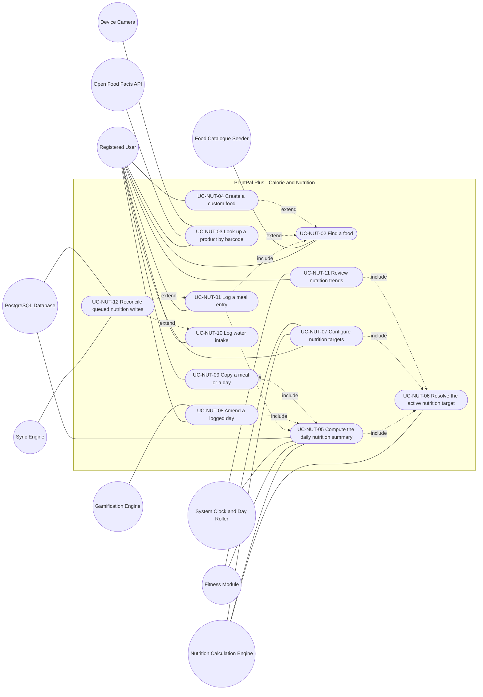
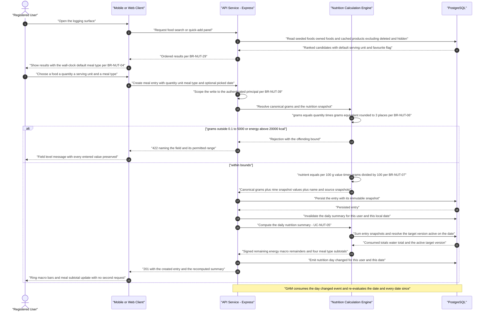
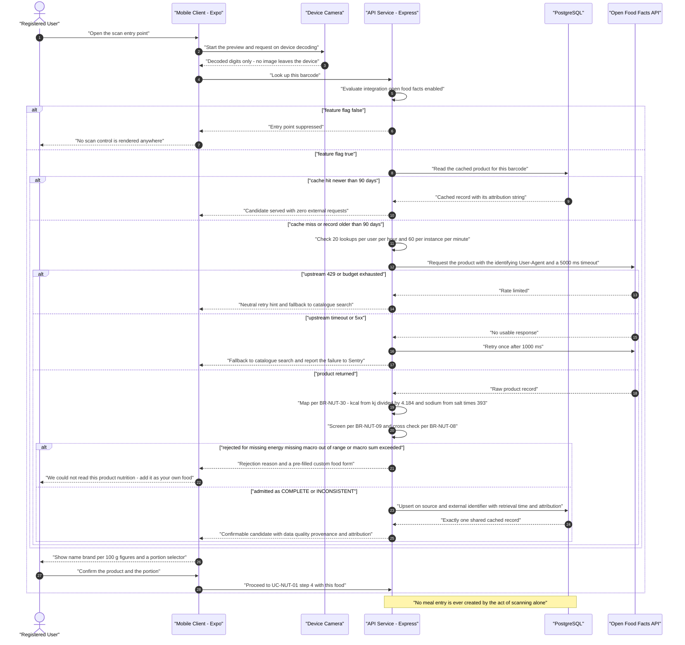
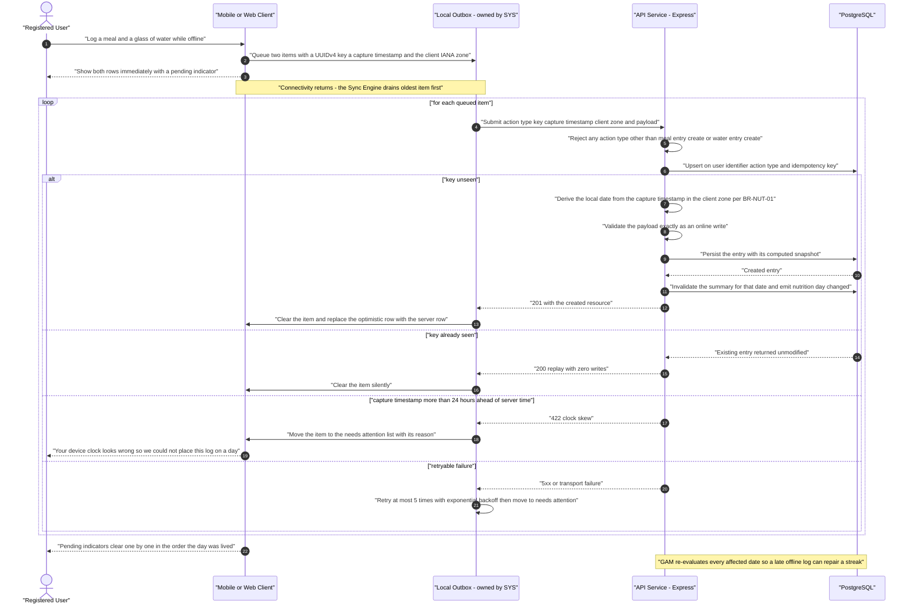

# Use-Case Model — Calorie and Nutrition (`NUT`)

| Field | Value |
| --- | --- |
| Document | `use-cases/nutrition.md` — authoritative use-case model for the calorie and nutrition module |
| Version | 1.0 |
| Date | 2026-07-21 |
| Status | Approved for Phase 2 design |
| Owner | Rakshit — Project Lead / sole developer |
| Parent | [PlantPal+ Software Requirements Specification v1.0](../SRS.md) |
| Specification aligned to | [modules/nutrition.md](../modules/nutrition.md) v1.0 |
| Owned prefix | `UC-NUT` — `UC-NUT-01` … `UC-NUT-12`. `FR-NUT`, `BR-NUT`, `US-NUT`, `NFR-*`, `GOAL-*`, `STK-*`, `PER-*`, `ASM-*`, `CON-*`, `RSK-*`, `DEP-*` and `MET-*` identifiers are referenced only, never minted or renumbered here |
| Use-case count | 12 use cases, 3 sequence diagrams, 11 modelled include and extend relationships |
| Source decisions | D-01 … D-11, with D-03 hybrid data sources, D-04 offline-light, D-06 free tiers, D-07 safety, D-08 i18n-readiness and D-09 dual units as the primary drivers |
| Canonical vocabulary | `MealType` is `BREAKFAST`, `LUNCH`, `DINNER`, `SNACK`. `ServingUnitKind` is `GRAM`, `MILLILITRE`, `PIECE`, `CUP`, `TABLESPOON`, `SLICE`, `CUSTOM`. `FoodSource` is `SEEDED`, `USER_CUSTOM`, `OPEN_FOOD_FACTS`. `WaterContainerPreset` is `GLASS_250ML`, `BOTTLE_500ML`, `CUSTOM`. `NutritionGoalDirection` is `LOSE`, `MAINTAIN`, `GAIN`. `MacroSplitPreset` is `BALANCED`, `HIGH_PROTEIN`, `LOW_CARB`, `CUSTOM`. All are fixed by [modules/nutrition.md](../modules/nutrition.md) and are used verbatim throughout this document |

---

## Table of contents

1. [Module use-case diagram](#1-module-use-case-diagram)
2. [Actor roles for this module](#2-actor-roles-for-this-module)
3. [Use-case specifications](#3-use-case-specifications)
   - [UC-NUT-01 — Log a meal entry](#uc-nut-01--log-a-meal-entry)
   - [UC-NUT-02 — Find a food](#uc-nut-02--find-a-food)
   - [UC-NUT-03 — Look up a product by barcode](#uc-nut-03--look-up-a-product-by-barcode)
   - [UC-NUT-04 — Create a custom food](#uc-nut-04--create-a-custom-food)
   - [UC-NUT-05 — Compute the daily nutrition summary](#uc-nut-05--compute-the-daily-nutrition-summary)
   - [UC-NUT-06 — Resolve the active nutrition target](#uc-nut-06--resolve-the-active-nutrition-target)
   - [UC-NUT-07 — Configure nutrition targets](#uc-nut-07--configure-nutrition-targets)
   - [UC-NUT-08 — Amend a logged day](#uc-nut-08--amend-a-logged-day)
   - [UC-NUT-09 — Copy a meal or a day](#uc-nut-09--copy-a-meal-or-a-day)
   - [UC-NUT-10 — Log water intake](#uc-nut-10--log-water-intake)
   - [UC-NUT-11 — Review nutrition trends](#uc-nut-11--review-nutrition-trends)
   - [UC-NUT-12 — Reconcile queued nutrition writes](#uc-nut-12--reconcile-queued-nutrition-writes)
4. [Sequence diagrams for the most complex use cases](#4-sequence-diagrams-for-the-most-complex-use-cases)
5. [Include and extend relationship catalogue](#5-include-and-extend-relationship-catalogue)
6. [Coverage and traceability checks](#6-coverage-and-traceability-checks)

---

## 1. Module use-case diagram

Every use case specified in section 3 appears in the diagram below. A dotted edge labelled `include` points **from the base use case to the included use case**. A dotted edge labelled `extend` points **from the extending use case to the base use case**, which is the UML 2.5 direction and the direction used by every use-case document in this package.

**Reading note for the evaluator.** Nine of the twelve use cases carry the Registered User as primary actor, which is the correct shape for a module whose whole purpose is a repeated manual act. The three that do not — `UC-NUT-05`, `UC-NUT-06` and `UC-NUT-12` — are modelled as first-class use cases rather than folded into their callers for a specific reason. `UC-NUT-05` and `UC-NUT-06` are the only places where the arithmetic of FR-NUT-20 and the effective-dated target selection of BR-NUT-18 are specified, and both are reached from four different bases; specifying them once is what guarantees that a meal log, a day amendment, a copy and a trend query all agree on the same number. `UC-NUT-12` has the Sync Engine as its actor because under D-04 the user's observable act ends the moment the entry appears with a pending indicator, and everything after that is system behaviour the user must never have to think about.

Two further modelling notes. First, `UC-NUT-01` **includes** `UC-NUT-02`, because no meal entry can be created without a resolved food, and it **includes** `UC-NUT-05`, because FR-NUT-01 requires the recomputed daily summary to be returned in the same response as the created entry. Second, `UC-NUT-03` and `UC-NUT-04` **extend** `UC-NUT-02` rather than being included by it: catalogue search is complete and useful on its own with every external integration disabled, which is the D-03 obligation, and both the barcode path and the custom-food path are additional behaviour reached from an extension point in the search result surface.

---

## 2. Actor roles for this module

| Actor | Type | Goals in this module |
| --- | --- | --- |
| Registered User | Primary (human) | Log what was eaten and drunk in as few interactions as the act deserves; find the intended food on the first attempt; keep logging when there is no signal; know how much of the day's budget remains without doing arithmetic; obtain a calorie and macro target that is derived rather than guessed; correct a day that was logged in a hurry; reproduce a repeated meal without re-entering it; review a week without being judged for it |
| Guest / Unauthenticated Visitor | Secondary (human) | Holds no nutrition capability of any kind. Every `NUT` endpoint requires an authenticated principal; a call without a valid access token answers HTTP 401 and a call carrying another user's identifier answers HTTP 404 so that existence cannot be probed, per BR-NUT-39 |
| Nutrition Calculation Engine | Primary for UC-NUT-05 and UC-NUT-06, system elsewhere (internal, server-side) | Convert a logged quantity to canonical grams; compute the per-entry nutrition snapshot; compute basal metabolic rate, total daily energy expenditure and the derived calorie target; resolve the target version in force on a date; aggregate the day; aggregate a 7, 30 or 90 day window. Deterministic and pure with respect to its inputs, so the same inputs always yield the same figures on mobile, on web and in an export |
| Food Catalogue Seeder | System (internal, build time) | Load and re-load, idempotently and keyed by `slug`, at least 300 curated food records and their serving-unit factors on every deploy, asserting the plausibility bounds of BR-NUT-09 and the Atwater cross-check of BR-NUT-08 at load time. Never invoked at user request |
| Open Food Facts API | External system (secondary) | Answer a barcode lookup or a text product query when `integration.openFoodFacts.enabled` resolves to true. Always reached from the Express backend, never from a client, so the feature flag, the request budget of BR-NUT-31, the identifying `User-Agent` header and the cache are enforced in exactly one place |
| Device Camera — Expo Camera on mobile | Device capability (secondary) | Decode a barcode symbol on device and surface only the decoded digits. No image ever leaves the device, per NFR-PRIV-01. Absent on web in v1.0 |
| Fitness Module — owned by `FIT` | System (secondary) | Supply the estimated daily energy expenditure figure that the opt-in credit of FR-NUT-22 consumes, and the most recent body-mass observation that BR-NUT-19 resolves first. This module reads both and owns neither |
| Gamification Engine — owned by `GAM` | System (secondary, consumer) | Consume the `nutrition.day.changed` event and the day-met predicate of BR-NUT-38, and re-evaluate streaks and achievements for the affected date and every date since. This module supplies the predicate and never evaluates a streak |
| Reminder Scheduler — owned by `NOT` | System (secondary) | Deliver the nutrition reminder types this module declares. Owns quiet hours, scheduling and delivery. BR-NUT-37 binds it: no notification is ever generated by the fact that a user exceeded a calorie or macro target |
| Sync Engine — owned by `SYS` | Primary for UC-NUT-12, system elsewhere | Hold the offline outbox, flush queued `nutrition.meal_entry.create` and `nutrition.water_entry.create` items oldest first, and serve delta-sync reads with an `updated_at` cursor plus tombstones. Owns the outbox mechanics; this module owns only the two participating action types and the idempotency contract of BR-NUT-27 |
| System Clock / Day Roller | Time | Drive local-date rollover in the user's IANA zone, invalidate the daily summary cache at the boundary, and end the rolling window on which every trend in UC-NUT-11 is computed |
| PostgreSQL Database — Neon or Supabase free tier | System (secondary) | Hold `FoodItem`, `ServingUnit`, `MealEntry`, `WaterIntakeEntry`, `NutritionTarget`, `Recipe`, `RecipeIngredient` and `FoodFavourite`; enforce the `(user_id, action_type, idempotency_key)` uniqueness that carries the replay guarantee of FR-NUT-06 and the `(source, off_external_id)` uniqueness that carries the cache guarantee of FR-NUT-15; provide the `pg_trgm` and `unaccent` extensions that BR-NUT-29 requires |
| Mobile Client — React Native / Expo | System (secondary) | Render the quick-add panel, the remaining-calorie ring and the macro bars from server-returned values; hold the TanStack Query cache persisted to AsyncStorage or MMKV so the day remains readable offline; capture the client timestamp and IANA timezone at the moment of an offline log; host the only barcode entry point in v1.0 |
| Web Client — React + Vite | System (secondary) | The same obligations as the Mobile Client with IndexedDB as the persistence target, and no barcode path in v1.0 per FR-NUT-13 |
| Error Monitor — Sentry free tier | System (external) | Receive the de-duplicated failures this module raises: upstream Open Food Facts 5xx and timeouts, background cache-refresh failures, and any record that reaches the arithmetic layer with a bound violation that the seeder should have made unreachable |

---

## 3. Use-case specifications

Every use case below references at least one `FR-NUT-nn` from [modules/nutrition.md](../modules/nutrition.md) and at least one `US-NUT-nn` from [user-stories/nutrition.md](../user-stories/nutrition.md). Steps describe observable actor and system behaviour only; no step names a table, a column, an endpoint or a class. Every numeric threshold quoted in a step is the value a tester must observe, and each is normative in the business rule named beside it.

---

### UC-NUT-01 — Log a meal entry

| Field | Value |
| --- | --- |
| Primary actor | Registered User |
| Secondary actors | Nutrition Calculation Engine; PostgreSQL Database; Mobile or Web Client; Gamification Engine as the eventual consumer of the emitted day-changed event; Sync Engine when the client is offline |
| Level | User-goal — record one food, one portion and one meal type against one calendar date |
| Priority | Must |
| Release | v0.5 Alpha for the whole flow of FR-NUT-01, FR-NUT-02 and FR-NUT-03; the offline extension of FR-NUT-06 completes at v1.0 MVP; the recipe extension of FR-NUT-26 arrives at v1.1 Post-MVP |
| Frequency of use | The highest-frequency write in the product. 3 to 8 times per active user per day, concentrated around the four meal windows of BR-NUT-04 |
| Preconditions | The user holds a valid access token; the food catalogue of FR-NUT-07 is seeded in the environment; the target local date lies inside the retro window of BR-NUT-28; fewer than 100 meal entries already exist for the user on that local date |
| Trigger | The user opens a nutrition logging surface, from the dashboard nutrition card, the day view, a meal-type section, or a quick-add tile |
| Success guarantee | Exactly one meal entry exists carrying one food or recipe reference, a quantity, a serving unit, one `MealType`, a `logged_local_date` resolved per BR-NUT-01, a canonical mass in grams, and the nine immutable snapshot values of FR-NUT-03; the daily summary cache for that date is invalidated; one `nutrition.day.changed` event carrying the user and that date has been emitted; the recomputed summary is returned in the same response |
| Minimal guarantee | No partially written entry is observable. Either the entry and its complete snapshot are committed together or nothing is written, and the user is told which of the two happened. A rejected entry preserves every value the user already typed |
| Related FRs | FR-NUT-01, FR-NUT-02, FR-NUT-03, FR-NUT-09, FR-NUT-26 |
| Related USs | US-NUT-01, US-NUT-03, US-NUT-13 |

**Main success scenario**

| # | Actor action | System response |
| --- | --- | --- |
| 1 | The Registered User opens the logging surface. | — |
| 2 | — | The system presents the quick-add panel of FR-NUT-09, a search field, and a meal-type selector pre-set from the user's current local wall-clock time using the four bands of BR-NUT-04, namely BREAKFAST from 04:00:00 to 10:59:59, LUNCH from 11:00:00 to 15:59:59, DINNER from 16:00:00 to 21:59:59 and SNACK from 22:00:00 to 03:59:59. |
| 3 | The user identifies the food, either by tapping a quick-add tile or by performing **UC-NUT-02**. | — |
| 4 | — | The system presents the food with its per-100-gram energy, its serving units, and the default unit designated for that food, offering only unit kinds for which a grams-equivalent factor exists per BR-NUT-05. |
| 5 | The user accepts or changes the quantity, the serving unit and the meal type, and confirms. | — |
| 6 | — | The system validates the quantity as a decimal from 0.01 to 10000.00 inclusive with at most 2 decimal places, and validates that the chosen serving unit belongs to the chosen food. |
| 7 | — | The system computes the canonical mass as the quantity multiplied by the grams-equivalent factor, rounded half-away-from-zero to 3 decimal places per BR-NUT-06, and checks it against the range 0.1 g to 5000 g inclusive. |
| 8 | — | The system computes each nutrient as the per-100-gram value multiplied by the canonical mass divided by 100, per BR-NUT-07, leaving a null per-100-gram value as a null snapshot value rather than coercing it to zero. |
| 9 | — | The system resolves the calendar date the entry counts towards per BR-NUT-01, using the date the user explicitly picked when one was picked, and otherwise the local date of the logging instant in the user's timezone. |
| 10 | — | The system persists the entry with its canonical mass, its serving-factor and serving-label snapshots, its nine nutrition snapshot values, and the food name and provenance snapshots that keep the row renderable after the food is renamed or removed. |
| 11 | — | The system invalidates the daily summary for that user and that date and emits one `nutrition.day.changed` event carrying the user and the date, which `DSH` consumes to refresh its card and `GAM` consumes to re-evaluate that date and every date since. |
| 12 | — | The system invokes **UC-NUT-05** and returns the created entry together with the recomputed daily summary in the same response, so the client updates the remaining-calorie ring without a second request. |
| 13 | — | The client renders the new entry under its meal-type section and updates the ring, the three macro bars and that meal type's subtotal. |
| 14 | The user reads the updated remaining figure and closes the surface. | — |

**Extensions**

| Step | Condition | Handling |
| --- | --- | --- |
| 2a | The user has neither favourites nor recent entries, the genuine first-run state. | 2a1 The panel shows 8 seeded staples drawn from 8 distinct categories rather than an empty area. 2a2 The copy reads "Start with one of these, or search for what you ate." |
| 2b | The user is logging for a date other than today. | 2b1 The default meal type is SNACK rather than the wall-clock default, unless the user entered from a specific meal section, in which case that section's meal type is used, per BR-NUT-04. |
| 2c | The client is offline. | 2c1 The panel renders from the persisted local cache. 2c2 The entry is captured with a client-generated UUID version 4 idempotency key, the client capture timestamp and the client IANA timezone, and is queued through **UC-NUT-12**. 2c3 The entry appears immediately with a pending indicator and the message "Saved on this device. It will sync when you are back online." |
| 3a | The user's search returns no result. | 3a1 The empty state offers "create a custom food", which starts **UC-NUT-04**. 3a2 It offers "search Open Food Facts" only when the feature flag is enabled and the client is online. |
| 3b | The user chooses to scan a packaged product on mobile. | 3b1 **UC-NUT-03** runs and returns a confirmed food candidate. 3b2 The flow resumes at step 4 with that food selected. |
| 3c | The user chooses a saved recipe instead of a food, from v1.1. | 3c1 The user selects a number of servings from 0.25 to 20.00 in steps of 0.25. 3c2 The system creates exactly one entry whose snapshot is the recipe's per-serving values multiplied by the servings logged, per FR-NUT-26 and BR-NUT-33, and whose canonical mass is the recipe's per-serving ingredient mass multiplied by the same figure. 3c3 The flow resumes at step 10. |
| 4a | The selected food carries no factor for a unit kind, for example CUP for a solid. | 4a1 That unit is not offered at all. 4a2 A direct request naming it is refused with a message listing the units that do exist for that food. |
| 5a | The user taps a quick-add tile rather than opening the food. | 5a1 The system pre-fills the quantity and serving unit from that user's most recent entry for that food, so one interaction reproduces the last portion exactly. 5a2 The flow proceeds directly to step 6. |
| 6a | The quantity is exactly 0. | 6a1 The entry is refused, the value is never coerced upward, and the message reads "Enter an amount greater than zero." |
| 6b | The quantity exceeds 10000.00. | 6b1 The entry is refused with "That portion is larger than we can record. Split it into more than one entry." |
| 7a | The canonical mass falls below 0.1 g. | 7a1 The entry is refused rather than rounded to zero, because a zero-mass row contributes nothing while still occupying a visible line. |
| 7b | The canonical mass exceeds 5000 g. | 7b1 The entry is refused with the same split-it-up message as 6b1. |
| 8a | The computed entry energy exceeds 3000 kcal. | 8a1 The system presents one neutral confirmation step reading "Just checking the amount: this entry is about N kcal." 8a2 On confirmation the entry is created normally. |
| 8b | The computed entry energy exceeds 20000 kcal. | 8b1 The entry is refused outright with "That entry works out to more energy than we can record. Check the amount." |
| 9a | The user picked a date in the future. | 9a1 The entry is refused with "You cannot log for a future date." on every path, including quick-add and copy. |
| 9b | The user picked a date older than the retro window. | 9b1 The entry is refused with "You can log back as far as 365 days." 9b2 The window is `max( account creation local date , today minus 365 days )` per BR-NUT-28, so a young account is bounded by its own creation date. |
| 10a | The user already holds 100 meal entries on that local date. | 10a1 The entry is refused with "You have reached 100 entries for this day." |
| 10b | The referenced food was soft-deleted between selection and confirmation. | 10b1 An online create is refused with "This food is no longer available. Search for another one." 10b2 A queued create captured before the deletion is still accepted at flush time, because the food remains resolvable and the snapshot is computed from it. |
| 12a | The daily summary cannot be recomputed within its budget. | 12a1 The entry is still committed and returned. 12a2 The client falls back to a follow-up summary read rather than showing the user a failure for a write that succeeded. |

**Exception flows**

| Condition | System behaviour | Outcome |
| --- | --- | --- |
| No authenticated principal | The request is refused with HTTP 401 and nothing is written | "Sign in to log a meal." There is no anonymous logging path anywhere in this module, per BR-NUT-39 |
| The referenced food or entry belongs to another user | The request answers HTTP 404, never HTTP 403 | Existence is never disclosed. The user sees the ordinary "no longer available" copy |
| The user double-taps a quick-add tile | Each tap is a distinct append-only fact and both entries are created; the second is removable in one interaction from the day list | Deliberate. The idempotency key of BR-NUT-27 de-duplicates a **replayed transmission**, never a repeated human action, and conflating the two would silently drop a genuine second helping |
| Connectivity is lost between confirmation and response | The client cannot distinguish a lost request from a lost response, so it re-sends the identical payload with the identical idempotency key | The server upsert returns the already-persisted entry and writes nothing, so exactly one entry exists |
| The database is unavailable | Nothing is written, no event is emitted, and the daily summary is left untouched | The user is told the log did not save and the values remain in the form for one retry |
| A food reaches the arithmetic layer with a null required nutrient | The food is not loggable and is not offered; the seeder assertion of FR-NUT-07, the validation of FR-NUT-10 and the screening of FR-NUT-14 together make this unreachable in a healthy deployment | The condition is reported to the error monitor rather than shown as a user-facing failure |

**Special requirements**

| Reference | Obligation carried by this use case |
| --- | --- |
| NFR-USAB-01 | The whole flow is reachable in three interactions or fewer from the dashboard for a food already in favourites or recents, which is the mechanism behind MET-15 |
| NFR-PERF-02 | The create-and-summarise round trip is a single request, because FR-NUT-01 returns the recomputed summary with the created entry |
| NFR-DATA-03 | Mass is stored canonically in grams and volume in millilitres; the imperial display of D-09 is applied at the presentation layer only and never alters a stored value |
| NFR-DATA-08 | The snapshot makes the entry reproducible after the referenced food is edited, renamed or soft-deleted |
| NFR-DATA-09 | The client-minted UUID version 4 idempotency key is retained server-side for 90 days, which is what bounds the replay guarantee |
| NFR-SEC-14 | Every read and write is scoped server-side to the authenticated principal and never to a client-supplied identifier |
| NFR-USAB-03 | Every refusal names the field and its permitted range and preserves the values already entered |
| NFR-I18N-02 | Every string and every formatted number in this flow is produced through the locale catalogue; nothing user-facing is hard-coded, per D-08 |

---

### UC-NUT-02 — Find a food

| Field | Value |
| --- | --- |
| Primary actor | Registered User |
| Secondary actors | Food Catalogue Seeder as the origin of the canonical catalogue; PostgreSQL Database; Mobile or Web Client |
| Level | User-goal when performed on its own; subfunction when included by UC-NUT-01 step 3 |
| Priority | Must |
| Release | v0.5 Alpha for the full five-stage ranking of FR-NUT-08 and the quick-add panel of FR-NUT-09; the seeded catalogue threshold of at least 300 records in FR-NUT-07 is also met at v0.5, the v0.1 gate exercising only the seed pipeline with a trivially small subset |
| Frequency of use | 2 to 5 times per active user per day, falling as the user's favourites and recents accumulate, which is the intended trajectory |
| Preconditions | The user holds a valid access token; the catalogue is seeded; the query string is between 1 and 60 characters after trimming, longer input being truncated rather than refused |
| Trigger | The user opens a food picker, types into the search field, or opens the logging surface with no query at all |
| Success guarantee | An ordered result set is returned in which every candidate is a seeded food, a food owned by the requesting user or a cached Open Food Facts record, none is soft-deleted, none is hidden by that user, and the order is exactly that of the ranking formula of BR-NUT-29 with its deterministic tie-break |
| Minimal guarantee | The user is never left at a dead end. A zero-result query always offers the custom-food path, and a query that exceeds its time budget returns the prefix-stage results already computed rather than an error |
| Related FRs | FR-NUT-07, FR-NUT-08, FR-NUT-09 |
| Related USs | US-NUT-02, US-NUT-03, US-NUT-05 |

**Main success scenario**

| # | Actor action | System response |
| --- | --- | --- |
| 1 | The Registered User opens the food picker without typing anything. | — |
| 2 | — | The system returns the quick-add panel: the user's favourites first, then the 20 most recently logged distinct foods with favourites de-duplicated out, each tile carrying the quantity and serving unit from that food's most recent entry for that user. |
| 3 | The user types a query of one or more characters. | — |
| 4 | — | The system trims the query, lower-cases it and removes accents, truncating anything beyond 60 characters rather than refusing it. |
| 5 | — | The system assembles the candidate set as the union of seeded foods, foods owned by the requesting user and cached Open Food Facts records, excluding every soft-deleted food and every food the user has hidden. |
| 6 | — | The system assigns each candidate the score of the first matching stage, evaluated in order: exact name match scores 1000, name prefix scores 800, word-boundary prefix scores 600, substring scores 400, and trigram similarity of at least 0.30 scores 100 plus 300 times the similarity. |
| 7 | — | The system adds the personal and provenance bonuses of BR-NUT-29: 200 for one of the user's favourites, 10 per log in the last 90 days capped at 150, 25 for a food the user owns, 10 for a seeded food, 0 for a cached external record, and minus 50 for a record whose data quality is INCONSISTENT. |
| 8 | — | The system orders by total score descending, breaking ties by the user's own log count descending and then by name ascending, and returns at most the requested limit, defaulting to 25 and clamped at 50. |
| 9 | — | Each result carries its name, brand, provenance, data quality, per-100-gram energy, default serving unit and favourite flag, which is enough to log it without a second read. |
| 10 | The user selects a result, or toggles its favourite control. | — |
| 11 | — | On selection the system hands the food to the caller, which is **UC-NUT-01** step 4 when this use case was included. On a favourite toggle the system records the change and the food ranks higher in that user's subsequent searches. |

**Extensions**

| Step | Condition | Handling |
| --- | --- | --- |
| 2a | The user holds neither favourites nor recents. | 2a1 The panel returns 8 seeded staples drawn from 8 distinct categories, so a first-run screen is never blank. |
| 2b | A food in the recents list has since been soft-deleted. | 2b1 The tile is filtered out server-side rather than rendered and then failing on tap. |
| 2c | The user toggles a favourite while already holding 100 favourites. | 2c1 The toggle is refused with "You have 100 favourites. Remove one to add another." |
| 2d | The user tries to favourite a soft-deleted food. | 2d1 The toggle is refused with "That food is no longer available." |
| 4a | The query is a single character. | 4a1 Only the prefix stages run. 4a2 Trigram matching is skipped at that length because it is both slow and useless, per FR-NUT-08. |
| 4b | The query is empty after trimming. | 4b1 The quick-add panel of step 2 is returned instead of an error, because an empty query is a state, not a mistake. |
| 5a | The user has hidden a seeded food from their own searches. | 5a1 That food is excluded from this user's candidate set only, and remains visible to every other user, per FR-NUT-07. |
| 6a | Every stage fails for every candidate, so the result set is empty. | 6a1 A neutral empty state is returned reading "No matches. You can add this as your own food." 6a2 It offers **UC-NUT-04**. 6a3 It offers the Open Food Facts path of **UC-NUT-03** only when the feature flag is enabled and the client is online. |
| 8a | The requested limit exceeds 50. | 8a1 The limit is clamped to 50 without an error, because a clamped page is a better answer than a refusal. |
| 8b | The result set is larger than one page. | 8b1 The system returns an opaque keyset cursor and the caller pages forward with it. |
| 9a | A result carries data quality INCONSISTENT. | 9a1 It is still returned, ranked 50 points lower, and labelled with a neutral "check these figures" hint rather than being hidden, because hiding it would silently narrow the catalogue. |
| 9b | A result is a cached Open Food Facts record. | 9b1 It carries its provenance label and the Open Database License attribution string of BR-NUT-32 wherever it is displayed in detail. |

**Exception flows**

| Condition | System behaviour | Outcome |
| --- | --- | --- |
| The search exceeds 3000 ms | The prefix-stage results already computed are returned | The user gets a usable, if shorter, list instead of a spinner or an error, per FR-NUT-08 |
| The client is offline | The persisted query cache serves the last results for repeated queries and the quick-add panel renders in full | Logging a familiar food remains possible with no connectivity at all, which is the point of the D-04 cached-reads rule |
| The catalogue has not been seeded in the environment | The deploy that produced that environment failed by construction, because a seed record failing validation aborts the migration and names the offending `slug` | A partial catalogue can never reach a running environment, per FR-NUT-07 |
| The `pg_trgm` or `unaccent` extension is unavailable | Stages 1 to 4 still function and stage 5 is skipped | Search degrades to exact and prefix matching rather than failing, and the condition is reported to the error monitor |
| The user queries a food belonging to another user | It is not in the candidate set at all, so it cannot appear | Custom foods are private to their owner, per BR-NUT-39 clause 2 |

**Special requirements**

| Reference | Obligation carried by this use case |
| --- | --- |
| NFR-PERF-01 | Ranked results are returned inside the interactive search budget, which is what keeps a log to a ten-second median |
| NFR-SCAL-05 | The stack-dictated `pg_trgm` GIN index on the food name plus the `unaccent` extension is what makes stage 5 affordable on a free-tier database |
| NFR-SCAL-04 | Paging is by opaque keyset cursor, never by offset, so deep pages cost the same as shallow ones |
| NFR-DATA-07 | The seeder is idempotent and keyed by `slug`, and a re-run produces byte-identical rows |
| NFR-USAB-06 | The empty state and the first-run state are both specified as designed screens, not as absences |
| NFR-RELI-02 | The whole use case functions with every external integration disabled, which is the D-03 obligation |

---

### UC-NUT-03 — Look up a product by barcode

| Field | Value |
| --- | --- |
| Primary actor | Registered User |
| Secondary actors | Device Camera through Expo Camera; Open Food Facts API; Nutrition Calculation Engine for mapping and screening; PostgreSQL Database as the cache; Error Monitor |
| Level | User-goal — turn a physical package into a confirmable food |
| Priority | Should |
| Release | v1.0 MVP for the barcode path of FR-NUT-13 with the mapping of FR-NUT-14 and the cache of FR-NUT-15; the text-search path of FR-NUT-12 is a Could deferred to v1.1 Post-MVP |
| Frequency of use | 0 to 3 times per active user per day, concentrated among users who eat packaged food, and falling sharply for any individual product once it is cached |
| Preconditions | The user holds a valid access token; the client is a mobile client, because web has no barcode path in v1.0; camera permission is granted for the scan path; `integration.openFoodFacts.enabled` resolves to true; the client is online for a cache miss |
| Trigger | The user opens the scan entry point from the food picker, or types a barcode into the manual barcode field |
| Success guarantee | A single mapped, screened food candidate is presented for explicit confirmation with its name, brand, per-100-gram figures, data quality, provenance and attribution; the record is persisted locally with `source = OPEN_FOOD_FACTS`, its retrieval timestamp and the exact Open Database License string; a subsequent lookup of the same barcode inside 90 days issues no external request |
| Minimal guarantee | No meal entry is ever created by the act of scanning alone. Every failure path — flag off, offline, not found, rate limited, timed out, or rejected by screening — lands the user on a working alternative, never on a dead end |
| Related FRs | FR-NUT-12, FR-NUT-13, FR-NUT-14, FR-NUT-15 |
| Related USs | US-NUT-04, US-NUT-05, US-NUT-02 |

**Main success scenario**

| # | Actor action | System response |
| --- | --- | --- |
| 1 | The Registered User opens the scan entry point on a mobile client. | — |
| 2 | — | The system opens the camera preview and states that only the decoded digits leave the device. |
| 3 | The user points the camera at the package. | — |
| 4 | — | The Device Camera decodes the symbol on device and yields 8, 12, 13 or 14 digits from the symbologies EAN-13, EAN-8, UPC-A, UPC-E or ITF-14. No image is transmitted. |
| 5 | The client submits the decoded digits. | — |
| 6 | — | The system consults its own cached product records first and returns immediately, with no external request, on a record retrieved less than 90 days ago. |
| 7 | — | On a cache miss the system checks the feature flag, the per-user budget of at most 20 external lookups per rolling hour and the per-instance budget of at most 60 barcode lookups per rolling minute, then issues one server-side request carrying the identifying `User-Agent` header, with a 5000 ms timeout. |
| 8 | — | The system maps the response into the PlantPal+ food schema per BR-NUT-30, deriving energy from kilojoules by dividing by 4.184 when kilocalories are absent, and deriving sodium in milligrams from salt in grams by multiplying by 393 when no direct sodium value is present. |
| 9 | — | The system screens the mapped record against the plausibility limits of BR-NUT-09, rejecting it when energy is null, when any of protein, carbohydrate or fat is null, or when the three macros sum to more than 100.5 g per 100 g. |
| 10 | — | The system applies the Atwater cross-check of BR-NUT-08, marking a record that fails only that check as INCONSISTENT and admitting it, because sugar alcohols, high-fibre foods and published rounding diverge legitimately. |
| 11 | — | The system persists the screened record with its provenance, its retrieval timestamp and the exact attribution string, sharing one row across all users so that the cache hit rate multiplies across the pilot cohort. |
| 12 | — | The system presents the candidate for explicit confirmation with its name, brand, per-100-gram figures, data-quality label, provenance, attribution and a portion selector. |
| 13 | The user confirms the product and the portion. | — |
| 14 | — | The system hands the food to **UC-NUT-01** at step 4 and the ordinary logging flow completes. |

**Extensions**

| Step | Condition | Handling |
| --- | --- | --- |
| 1a | The feature flag is false. | 1a1 The scan entry point is not rendered anywhere in the product. 1a2 Catalogue search and custom foods serve every need, which is the D-03 obligation that the product remain fully functional with every integration disabled. |
| 1b | The client is a web client. | 1b1 No barcode entry point exists in v1.0. 1b2 The user is offered catalogue search and the custom-food path instead. |
| 1c | The client is offline. | 1c1 The scan entry point renders disabled with "You need to be online to scan. Your own foods are still searchable." 1c2 Cached products remain fully searchable through **UC-NUT-02**. |
| 2a | Camera permission is denied. | 2a1 The system shows an explanation, a deep link to system settings, and the manual-search alternative. 2a2 The manual barcode field remains available and does not require the camera at all. |
| 4a | No readable symbol is decoded after 15 seconds of scanning. | 4a1 The system offers the manual numeric barcode field with "Having trouble? Type the barcode instead." |
| 4b | The decoded string is not 8, 12, 13 or 14 digits. | 4b1 The scan is discarded and scanning continues, because a partial decode is a camera event, not a user error. |
| 6a | A cached record exists but was retrieved more than 90 days ago. | 6a1 The stale record is returned immediately. 6a2 A background refresh is attempted only if budget remains, and a failed refresh leaves the stale record untouched. 6a3 A stale record is never withheld from the user. |
| 7a | The per-user hourly budget or the per-instance minute budget is exhausted, or the upstream answers HTTP 429. | 7a1 A neutral message with a retry hint is shown. 7a2 The user is returned to catalogue search rather than to a dead end. |
| 7b | The upstream times out at 5000 ms or answers 5xx. | 7b1 The system retries once after 1000 ms. 7b2 On a second failure it falls back to catalogue search and reports the failure to the error monitor. |
| 7c | The product is not found upstream. | 7c1 The system offers a custom-food form pre-filled with the barcode, so that a later scan of the same product resolves locally. 7c2 The copy reads "We could not find that product. Add it as your own food and it will be there next time." |
| 9a | Screening rejects the record for MISSING_ENERGY, MISSING_MACRO, OUT_OF_RANGE or MACRO_SUM_EXCEEDED. | 9a1 No food is created and no entry is created. 9a2 The product name and barcode are carried into the same pre-filled custom-food form, so the user is one short form away from logging. 9a3 The reason code is recorded for analysis but the user-facing copy is identical in all four cases. |
| 9b | The mapped sugar value exceeds the carbohydrate value by more than 0.5 g per 100 g. | 9b1 Sugar is stored as null rather than the whole record being rejected, because one bad optional field should not cost the user the whole product. |
| 11a | Two lookups of the same barcode arrive concurrently. | 11a1 The uniqueness constraint on provenance plus external identifier resolves the second as an update of the existing row. 11a2 Exactly one row exists for that barcode. |
| 12a | The record is INCONSISTENT. | 12a1 It is presented with a neutral "check these figures" hint and the macro-derived energy alongside the declared energy. 12a2 The user may still confirm it. |
| 13a | The user declines the candidate. | 13a1 Nothing is logged. 13a2 The cached record is retained, because it was legitimately retrieved and discarding it would waste the external request. |

**Exception flows**

| Condition | System behaviour | Outcome |
| --- | --- | --- |
| A client attempts to call Open Food Facts directly | Impossible by construction: every call is made server-side from the Express backend | The feature flag, the budget, the identifying header and the cache are enforced in exactly one place, per BR-NUT-31 |
| The feature flag is switched off after products were cached | Cached records remain fully usable and keep their stored attribution; only new external lookups stop | Data already in use never loses its licence notice, per FR-NUT-15 and NFR-LEGL-04 |
| Product images are returned by the upstream | They are not ingested, not hotlinked and not re-hosted in v1.0 | Zero storage cost and zero licensing exposure for imagery, per BR-NUT-30 |
| The upstream is unreachable for a prolonged period | Every step of the degradation ladder of BR-NUT-31 leaves the product fully functional on the seeded catalogue and custom foods | The integration is genuinely optional rather than load-bearing, which is what D-03 requires |
| The decoded digits identify a product in a foreign category vocabulary | The category maps through a fixed lookup of at most 40 tags, and anything unmatched becomes OTHER | An unknown category never blocks an otherwise valid product |

**Special requirements**

| Reference | Obligation carried by this use case |
| --- | --- |
| NFR-PRIV-01 | Only decoded digits leave the device. No camera image is transmitted, stored or logged at any point |
| NFR-SEC-06 | Camera permission is requested at the moment of use with a stated purpose, never at first launch |
| NFR-SEC-11 | Every external response is treated as untrusted input and is mapped and screened before it reaches any store or any screen |
| NFR-RELI-02 | The five-step degradation ladder is specified in full, and every step leaves the product usable |
| NFR-LEGL-04 | The exact Open Database License attribution string is stored on the record, displayed on the food detail and licences screens, and included in any export containing such records |
| NFR-SCAL-02 | Cached records are shared across users, so the free-tier request budget scales with distinct products rather than with users |
| NFR-USAB-03 | Every rejection reason resolves to the same actionable next step rather than to a technical code |

---

### UC-NUT-04 — Create a custom food

| Field | Value |
| --- | --- |
| Primary actor | Registered User |
| Secondary actors | Nutrition Calculation Engine for the Atwater cross-check; PostgreSQL Database; Sync Engine only to the extent that it must refuse to queue this action |
| Level | User-goal — add, correct or retire a food the catalogue does not hold |
| Priority | Must |
| Release | v0.5 Alpha for creation and editing under FR-NUT-10; the soft-delete lifecycle of FR-NUT-11 completes at v1.0 MVP; recipe definition under FR-NUT-25 arrives at v1.1 Post-MVP |
| Frequency of use | Bursty. 3 to 10 records in the first fortnight as a user encodes their regular home cooking, then fewer than 1 per week |
| Preconditions | The user holds a valid access token; the client is online, because a food is an entity create and is therefore not queueable under D-04; the user holds fewer than 500 custom foods |
| Trigger | The user selects "create a custom food" from a zero-result search, from a rejected external product, or from the food-management surface |
| Success guarantee | A private food record exists carrying a name unique among that user's non-deleted foods, non-null per-100-gram energy, protein, carbohydrate and fat, its optional micronutrients, an implicit GRAM serving unit of factor 1.000 that cannot be removed, exactly one designated default unit, and a data-quality value of COMPLETE or INCONSISTENT; it is immediately searchable by its owner and by nobody else |
| Minimal guarantee | Nothing is written on a validation failure and every value already typed is preserved. No edit and no deletion of a food ever alters or removes a meal entry that references it |
| Related FRs | FR-NUT-10, FR-NUT-11, FR-NUT-25 |
| Related USs | US-NUT-05, US-NUT-10, US-NUT-13 |

**Main success scenario**

| # | Actor action | System response |
| --- | --- | --- |
| 1 | The Registered User opens the custom-food form. | — |
| 2 | — | The system presents the form, pre-filled with the search query, the product name or the barcode when this use case was reached from **UC-NUT-02** or **UC-NUT-03**, and states in one sentence that editing this food later will not change entries already logged with it. |
| 3 | The user supplies a name of 1 to 120 characters and the per-100-gram values for energy, protein, carbohydrate and fat. | — |
| 4 | The user optionally supplies a brand, a category, fibre, sugar, sodium, a liquid flag and up to 10 serving-unit rows. | — |
| 5 | — | The system validates energy in the range 0 to 900 kcal, each macro in the range 0 to 100 g, fibre and sugar in the range 0 to 100 g, sodium in the range 0 to 40000 mg, and each serving-unit factor in the range 0.1 to 2000 g per unit. |
| 6 | — | The system checks that protein, carbohydrate and fat together do not exceed 100.5 g per 100 g, and that sugar does not exceed carbohydrate by more than 0.5 g per 100 g. |
| 7 | — | The system computes the macro-derived energy and compares it with the declared energy under the Atwater tolerance of BR-NUT-08. |
| 8 | — | The system creates the record as private to its owner, with an implicit GRAM unit of factor 1.000 that cannot be removed and exactly one unit marked default. |
| 9 | — | The system returns the food, immediately available to that user's search and quick-add. |
| 10 | The user selects the new food and logs it through **UC-NUT-01**. | — |

**Extensions**

| Step | Condition | Handling |
| --- | --- | --- |
| 2a | The client is offline. | 2a1 The form is refused with "You need to be online to add a food. Your meal logs still save on this device." 2a2 The action is never queued, because it is an entity create rather than an append-only log, per D-04 and BR-NUT-27. |
| 3a | The name duplicates one of that user's non-deleted foods, compared case-insensitively. | 3a1 The save is refused with "You already have a food with this name. Open it instead?" and a one-tap route to the existing record. |
| 5a | Any value falls outside its bound. | 5a1 The save is refused with a message naming the field and its permitted range. 5a2 Every other value the user typed is preserved. |
| 6a | The three macros sum to more than 100.5 g per 100 g. | 6a1 The save is refused with "Protein, carbohydrate and fat cannot add up to more than 100 g per 100 g." and the conflicting values are named. |
| 7a | The declared energy diverges from the macro-derived energy beyond the Atwater tolerance. | 7a1 A non-blocking confirmation shows both figures and reads "These figures look unusual. Energy from the macros works out to N kcal. Save anyway?" 7a2 On confirmation the record is stored with data quality INCONSISTENT and is never silently corrected. |
| 8a | The user already holds 500 custom foods. | 8a1 The save is refused with "You have reached 500 of your own foods." |
| 8b | The user marks the food as a liquid. | 8b1 A density is required and the MILLILITRE unit becomes available for it, defaulting to a factor of 1.000 g per ml and overridable per food. |
| 8c | The user defines a CUSTOM serving unit. | 8c1 A label of 1 to 24 characters is required. 8c2 At most 5 CUSTOM units may exist per food. |
| 9a | The user later edits the food's macros. | 9a1 The record is updated and the editor restates that entries already logged keep the values they were logged with, per BR-NUT-25. 9a2 No historical entry, day total, streak or achievement changes. |
| 9b | The user later soft-deletes the food, from v1.0. | 9b1 A deletion timestamp is set and the row is retained. 9b2 The food is excluded from search, quick-add, favourites, recipe-ingredient pickers and all new entry creation. 9b3 Every existing meal entry renders unchanged from its own snapshot with a neutral secondary label. 9b4 The response states how many historical entries retain the food, which is the reassurance the user needs at that moment. |
| 9c | The food to be deleted is a seeded or cached external record. | 9c1 Deletion is refused with "Catalogue foods cannot be deleted. You can hide this one from your searches instead." 9c2 Hiding affects only that user. |
| 9d | The food is referenced by one or more saved recipes. | 9d1 The deletion still proceeds. 9d2 Each affected recipe is flagged as having an unavailable ingredient and cannot be logged until the ingredient is replaced. 9d3 No recipe is ever deleted by a food deletion. |
| 10a | The user assembles the food into a recipe, from v1.1. | 10a1 The user names a recipe, adds 1 to 30 ingredient foods each with a quantity and serving unit, and states a serving count from 1 to 50. 10a2 The system computes the recipe totals and per-serving values per BR-NUT-33, carrying an optional nutrient to the total only when every ingredient supplies it. 10a3 Recipes may not nest, so no cycle detection is required. |

**Exception flows**

| Condition | System behaviour | Outcome |
| --- | --- | --- |
| The user attempts to read or edit another user's custom food | The request answers HTTP 404, never HTTP 403 | Custom foods are strictly private and existence is never disclosed, per BR-NUT-39 |
| A food deletion is attempted while historical entries reference it | The deletion proceeds and every entry is untouched | A meal entry is never cascade-deleted by a food deletion, under any circumstance. This is the single most damaging referential-integrity trap in the module and FR-NUT-11 exists to close it |
| A soft-deleted food is referenced by a queued offline entry captured before the deletion | The queued entry is still accepted at flush time | The food remains resolvable and the snapshot is computed from it, so an offline log is never lost to a later tidy-up |
| The same food is edited concurrently from two devices | The last write wins on the food record only, and no meal entry is affected either way | Foods are mutable reference data; entries are immutable facts. The distinction is what removes any need for a merge policy in this module |
| A user tries to hide a seeded food from every user | Not possible: hiding is per user and never global | The canonical catalogue is identical for every account, which is what makes FR-NUT-07 verifiable by Inspection |

**Special requirements**

| Reference | Obligation carried by this use case |
| --- | --- |
| NFR-SEC-08 | Every free-text field is length-bounded and escaped on output, and a custom food name is rendered as text and never as markup |
| NFR-DATA-04 | A soft delete sets a timestamp and retains the row; the 30-day purge is governed by the retention rules and never by this flow |
| NFR-DATA-05 | A tombstone is emitted so every other signed-in client drops the food from its catalogue cache on the next delta sync |
| NFR-USAB-08 | The consequence of an edit is stated in the editor, before the edit, in one sentence — not in help text discovered afterwards |
| NFR-PRIV-04 | Custom food names are user content classified alongside nutrition data and are excluded from logs, error payloads and analytics |
| NFR-I18N-02 | Every label, bound message and confirmation string comes from the locale catalogue |

---

### UC-NUT-05 — Compute the daily nutrition summary

| Field | Value |
| --- | --- |
| Primary actor | Nutrition Calculation Engine (internal system actor) |
| Secondary actors | Registered User as the beneficiary, never as a participant; PostgreSQL Database; Fitness Module when the exercise credit is enabled; System Clock / Day Roller at the local-date boundary; Mobile or Web Client as the renderer |
| Level | Subfunction — included by UC-NUT-01, UC-NUT-08 and UC-NUT-09, and read directly whenever a day view or a dashboard card is opened |
| Priority | Must |
| Release | v0.5 Alpha for the whole of FR-NUT-20; the micronutrient trio of FR-NUT-21 and the exercise credit of FR-NUT-22 complete at v1.0 MVP |
| Frequency of use | The most-read computation in the module. Once per day view open, once per dashboard load, and once per meal, water, edit, delete or copy write, so roughly 15 to 40 times per active user per day |
| Preconditions | The authenticated principal is resolved; the requested local date is not in the future; the meal entries, water entries and target versions for that date are committed |
| Trigger | A day view or dashboard read, or an invocation from UC-NUT-01 step 12, UC-NUT-08 step 8 or UC-NUT-09 step 8 |
| Success guarantee | One summary object exists for the requested date carrying consumed energy, consumed protein, consumed carbohydrate and consumed fat, four meal-type subtotals including zero subtotals, the targets active on that date, a signed remaining energy value that has not been clamped at zero, per-macro remaining values, entry count, water consumed, the hydration goal that applied on that date, the exercise credit when and only when the toggle is enabled, and the micronutrient completeness figures |
| Minimal guarantee | The summary is always reconstructible from the source rows and the cache is never authoritative. A cache miss, a stale cache or a cold start produces the identical figures, so mobile, web and the dashboard can never disagree |
| Related FRs | FR-NUT-20, FR-NUT-21, FR-NUT-22 |
| Related USs | US-NUT-07, US-NUT-09, US-NUT-15 |

**Main success scenario**

| # | Actor action | System response |
| --- | --- | --- |
| 1 | A caller requests the summary for one user and one local date. | — |
| 2 | — | The system scopes the request to the authenticated principal and verifies that the requested date is not in the future. |
| 3 | — | The system sums the immutable snapshot values of every meal entry carrying that user and that local date, producing consumed energy, protein, carbohydrate and fat. |
| 4 | — | The system invokes **UC-NUT-06** to resolve the target version in force on that date, which supplies the calorie target, the three macro gram targets, the macronutrient split and the hydration goal that applied on that day. |
| 5 | — | The system reads the water entries for that date and totals their volumes, contributing 0 kcal and 0 g of every macronutrient, per BR-NUT-24. |
| 6 | — | Where the account-level exercise-credit setting is enabled, the system reads the Fitness module's estimated energy expenditure for the same local date, multiplies it by the credit factor for the user's activity level — 1.00 at SEDENTARY, 0.75 at LIGHTLY_ACTIVE, 0.50 at MODERATELY_ACTIVE, 0.25 at VERY_ACTIVE and 0.00 at EXTRA_ACTIVE — and caps the result at 1000 kcal and at 50 percent of the base target, whichever is lower. |
| 7 | — | The system computes the total budget as the calorie target plus the credited exercise energy, and the remaining energy as the total budget minus consumed energy. The value is signed and is never clamped to zero. |
| 8 | — | The system computes each macro remainder against its gram target by the identical pattern, never adjusting a macro remainder by the exercise credit. |
| 9 | — | The system groups entries by meal type and emits exactly four subtotals in the fixed order BREAKFAST, LUNCH, DINNER, SNACK, emitting a zero subtotal for a meal type with no entries so the client layout is stable. |
| 10 | — | The system totals fibre, sugar and sodium from the non-null snapshot values only, and computes each nutrient's completeness as the share of the day's total logged grams contributed by entries that carried a value for that nutrient. |
| 11 | — | The system computes the ring fill as consumed energy divided by total budget, expressed as a whole percentage and bounded to the range 0 to 100, while every numeric figure is returned unclamped. |
| 12 | — | The system caches the result under that user and that date and returns it. |
| 13 | The client renders the ring, the three macro bars, the four subtotals, the water progress and the micronutrient panel. | — |

**Extensions**

| Step | Condition | Handling |
| --- | --- | --- |
| 2a | The requested date is in the future. | 2a1 The request is refused with "You cannot log for a future date." and nothing is computed. |
| 2b | The requested date precedes the account creation date. | 2b1 An empty summary is returned rather than an error, so scrolling backwards through history never hits a wall. 2b2 The copy reads "Nothing logged on this day." |
| 3a | No meal entries exist on the date. | 3a1 A fully populated summary of zeros is returned together with the quick-add panel. 3a2 The copy reads "Nothing logged yet today. Start with one of these." 3a3 This is never an error and never a blank screen. |
| 4a | No target has ever been configured. | 4a1 Consumed totals are returned with null targets and a null remaining value. 4a2 Logging is never blocked. 4a3 The copy reads "Set your daily goal to see how much you have left." |
| 4b | The user changed their target today and is viewing a past day. | 4b1 The past day is evaluated against the target version active on that day, never today's target, per BR-NUT-18. |
| 6a | The exercise-credit setting is disabled, which is the default for every account. | 6a1 The credit is 0 and no exercise line is rendered anywhere in the product. 6a2 The total budget equals the calorie target exactly. |
| 6b | The user's activity level is EXTRA_ACTIVE. | 6b1 The credit factor is 0.00 so nothing is credited even with the toggle enabled. 6b2 The explanation reads "Your activity level already accounts for daily training, so workouts add nothing here." |
| 6c | The Fitness module records no workouts on the date. | 6c1 The credit is 0, with no error and no empty line. |
| 6d | The Fitness module is disabled for the account. | 6d1 The toggle is hidden entirely and the credit path is not evaluated. |
| 7a | Remaining energy is negative. | 7a1 The value is rendered as, for example, "180 kcal over your budget" in a neutral accent colour that is never the destructive or error colour. 7a2 The accompanying copy is factual and forward-looking. 7a3 No push notification, badge or dashboard card is ever generated because a user exceeded a target, and `NOT` is bound by the same rule, per BR-NUT-37. |
| 7b | Consumed energy is below 50 percent of the target. | 7b1 No praise, badge or reinforcement of any kind is shown, because celebrating an unusually low intake day is exactly the pressure D-07 forbids. |
| 10a | A nutrient's completeness is 0 percent. | 10a1 The nutrient displays "Not enough data today." rather than 0 g, because zero and unknown are different claims. |
| 10b | A nutrient's completeness is above 0 and below 100 percent. | 10b1 The total is shown with the explicit qualifier "Based on N percent of what you logged." |
| 10c | The micronutrient preference is disabled. | 10c1 The panel is not rendered. 10c2 The totals are still computed so that an export remains complete. |
| 12a | A write for that date lands while the summary is cached. | 12a1 The cache entry for that user and date is invalidated immediately. 12a2 When an entry moved between two dates, both dates are invalidated. |

**Exception flows**

| Condition | System behaviour | Outcome |
| --- | --- | --- |
| The cache is unavailable or cold | The summary is recomputed from the source rows | The cache is an optimisation and is never authoritative, so a cache failure changes latency and never a figure |
| The local date rolls over while a client holds a summary | The System Clock / Day Roller invalidates the boundary and the next read returns the new day | A user who leaves the app open overnight sees the new day, not yesterday's totals presented as today's |
| A macro gram target reconstructs to a slightly different energy than the calorie target | The displayed authority is always the calorie target; the reconstruction is never shown as a total | Independent rounding of three macros can differ by up to 6 kcal, which is disclosed in BR-NUT-17 and never surfaced as an inconsistency |
| A screen reader is in use | The ring exposes its text alternative, for example "Calories. 1430 of 2150 used. 720 remaining." | No figure in this summary carries meaning by colour or by shape alone, which is the obligation PER-04 depends on |
| Nutrition figures would otherwise reach a log or an analytics event | Nutrition content is classified SENSITIVE-HEALTH and is excluded from logs, error payloads and every analytics event | Observability never becomes a privacy incident, per BR-NUT-39 clause 6 |

**Special requirements**

| Reference | Obligation carried by this use case |
| --- | --- |
| NFR-PERF-03 | The summary is computed server-side once and returned whole, which is what lets the dashboard hold to a single client round trip |
| NFR-A11Y-05 | The ring and every bar carry a text alternative that states the consumed value, the target and the remainder |
| NFR-A11Y-08 | No state in this summary is signalled by colour alone, including the over-budget state |
| NFR-MAIN-03 | The arithmetic exists in exactly one place, so mobile, web, the dashboard card and an export cannot diverge |
| NFR-PRIV-02 | Nutrition content is treated as sensitive health data throughout |
| NFR-OBSV-07 | No nutrition value is written to a log line, an error payload or an analytics event |

---

### UC-NUT-06 — Resolve the active nutrition target

| Field | Value |
| --- | --- |
| Primary actor | Nutrition Calculation Engine (internal system actor) |
| Secondary actors | PostgreSQL Database; `ACC` profile and `FIT` body-metric series as the input sources resolved by BR-NUT-19 |
| Level | Subfunction — included by UC-NUT-05, UC-NUT-07 and UC-NUT-11 |
| Priority | Must |
| Release | v0.5 Alpha, alongside FR-NUT-20 and FR-NUT-24, because no daily summary can be produced without it |
| Frequency of use | Once per summary computation and once per trend day evaluated, so up to 90 resolutions in a single 90-day trend request |
| Preconditions | The authenticated principal is resolved; at least zero target versions exist, the zero case being explicitly handled rather than an error |
| Trigger | Invocation from UC-NUT-05 step 4, UC-NUT-07 step 2 or UC-NUT-11 step 4 |
| Success guarantee | Exactly one target version is selected for the requested local date — the version with the greatest effective-from date that is less than or equal to that date — and it supplies the calorie target, the three macro gram targets, the split percentages, the effective floor, whether the floor was applied, the hydration goal and the full input snapshot that produced them |
| Minimal guarantee | A historical date is never evaluated against a target that did not exist on it. Where no version applies, the caller receives an explicit "no target" result rather than a zero, a default or an error |
| Related FRs | FR-NUT-20, FR-NUT-24 |
| Related USs | US-NUT-07, US-NUT-08, US-NUT-09 |

**Main success scenario**

| # | Actor action | System response |
| --- | --- | --- |
| 1 | A caller requests the target in force for one user on one local date. | — |
| 2 | — | The system selects the target version whose effective-from date is the greatest among those less than or equal to the requested date. |
| 3 | — | The system returns that version's calorie target, its protein, carbohydrate and fat gram targets, its split percentages and preset, its effective floor, its floor-applied flag, its hydration goal and its hydration-goal source. |
| 4 | — | The system also returns the input snapshot stored on that version — body mass, height, age, biological sex, activity level, activity factor, goal direction, weekly rate, basal metabolic rate and total daily energy expenditure — so that any historical target can be explained after the fact. |
| 5 | The caller evaluates the day against exactly that version. | — |

**Extensions**

| Step | Condition | Handling |
| --- | --- | --- |
| 2a | No target version has an effective-from date on or before the requested date. | 2a1 An explicit "no target" result is returned. 2a2 The caller renders consumed totals with null targets and a "set your daily goal" call to action. 2a3 Logging is never blocked by the absence of a target. |
| 2b | Several versions share the same effective-from date, which can occur when a user changes goal and split within one local day. | 2b1 The most recently created of those versions wins. 2b2 The selection is therefore total and deterministic, which is what makes it testable. |
| 3a | The active version carries a manual target. | 3a1 It supersedes any derived target until the user clears it. 3a2 Its source is reported as MANUAL so the day view can explain where the figure came from. |
| 3b | The active version was clamped to the clinical floor. | 3b1 The floor-applied flag is returned true together with the effective floor and the achievable weekly rate. 3b2 The caller states this in neutral language and never presents it as a failure. |
| 3c | The hydration goal on the version has no body mass behind it. | 3c1 The goal is 2000 ml with source DEFAULT and is labelled as a default until a body mass is recorded. |
| 4a | The requested date predates every version, which happens for a day logged before the user first configured a goal. | 4a1 The "no target" result of 2a applies. 4a2 A target set today never retroactively applies to that day, because versions take effect from the current local date forward and never rewrite earlier days. |

**Exception flows**

| Condition | System behaviour | Outcome |
| --- | --- | --- |
| A new version is created while a resolution is in flight | Versions are append-only and effective-dated, so an in-flight resolution reads a consistent row and the new version simply applies from its own effective-from date onward | No historical figure can ever be rewritten by a later configuration change |
| The user's body mass drifts without any explicit change | A new version opens automatically once the most recent recorded body mass differs from the version's stored body mass by 2.0 kg or more, and in any case after 90 days | A slowly drifting body mass is eventually reflected without the user having to remember to act |
| The user's timezone changes | Existing entries are never re-dated and existing versions are never re-dated | A flight across time zones cannot silently move a day's totals across a streak boundary, per BR-NUT-02 |
| A profile field required by the derivation is missing | The version stores the manual target path instead, and the input snapshot records which inputs were unavailable | The reason a target is what it is remains explainable months later, which is the whole purpose of storing the snapshot |

**Special requirements**

| Reference | Obligation carried by this use case |
| --- | --- |
| NFR-MAIN-04 | Target selection is defined once, as a single rule, and every consumer uses it rather than reimplementing it |
| NFR-DATA-03 | Body mass, height and hydration volumes are read in canonical metric SI and converted only at display |
| NFR-DATA-08 | The stored input snapshot makes every historical target reproducible and auditable |
| NFR-I18N-03 | Imperial display of body mass and volume is a presentation concern applied after resolution, never a stored variant |

---

### UC-NUT-07 — Configure nutrition targets

| Field | Value |
| --- | --- |
| Primary actor | Registered User |
| Secondary actors | Nutrition Calculation Engine; `ACC` profile as the source of height, date of birth, biological sex, activity level and timezone; Fitness Module as the first source of body mass under BR-NUT-19; PostgreSQL Database |
| Level | User-goal — obtain a daily calorie and macronutrient target the user can act on |
| Priority | Must |
| Release | v0.5 Alpha for FR-NUT-16, FR-NUT-17, FR-NUT-19 and the hydration goal of FR-NUT-24, with the manual override of FR-NUT-18 also at v0.5; the exercise-credit toggle of FR-NUT-22 completes at v1.0 MVP |
| Frequency of use | Rare and deliberate. 1 to 3 times in the first week, then a handful of times per year, plus automatic recomputations the user does not initiate |
| Preconditions | The user holds a valid access token; the client is online, because a target change is not a queueable action under D-04; the user is 16 years of age or older |
| Trigger | The user opens goal setup from onboarding, from nutrition settings, or from the "set your daily goal" call to action on an unconfigured day view |
| Success guarantee | A new append-only target version exists, effective from the user's current local date forward, carrying a calorie target at or above the effective clinical floor and at or below 6000 kcal, three macro gram targets derived from the active split, the hydration goal, the effective floor, the floor-applied flag and the complete input snapshot; no earlier day is rewritten |
| Minimal guarantee | No path in the product can produce an active target below the effective floor. A value below the floor is refused with the floor stated and the reason given, and is never silently raised without telling the user |
| Related FRs | FR-NUT-16, FR-NUT-17, FR-NUT-18, FR-NUT-19, FR-NUT-22, FR-NUT-24 |
| Related USs | US-NUT-08, US-NUT-09, US-NUT-12, US-NUT-15, US-NUT-16 |

**Main success scenario**

| # | Actor action | System response |
| --- | --- | --- |
| 1 | The Registered User opens goal setup. | — |
| 2 | — | The system invokes **UC-NUT-06** to show the target currently in force, and reads body mass, height, age, biological sex and activity level, resolving body mass from the most recent Fitness observation first and from the profile second. |
| 3 | — | The system computes the basal metabolic rate as 10 times body mass in kilograms, plus 6.25 times height in centimetres, minus 5 times age in whole years, plus 5 for MALE, minus 161 for FEMALE, or minus 78 for PREFER_NOT_TO_SAY, rounded to the nearest whole kilocalorie. |
| 4 | — | The system computes the total daily energy expenditure as the basal metabolic rate multiplied by the activity factor — 1.200 SEDENTARY, 1.375 LIGHTLY_ACTIVE, 1.550 MODERATELY_ACTIVE, 1.725 VERY_ACTIVE, 1.900 EXTRA_ACTIVE — rounded to the nearest whole kilocalorie. |
| 5 | — | The system displays both figures alongside the exact inputs that produced them, and the not-medical-advice disclaimer at least once in the session. |
| 6 | The user selects a goal direction of LOSE, MAINTAIN or GAIN and, for LOSE or GAIN, a weekly rate. | — |
| 7 | — | The system converts the rate to a daily energy delta at 1100 kcal per 0.25 kg per week, that is 275 kcal at 0.25, 550 at 0.50, 825 at 0.75 and 1100 at 1.00, subtracting it for LOSE and adding it for GAIN. |
| 8 | — | For LOSE the system caps the delta at 25 percent of the total daily energy expenditure, and for GAIN it refuses any rate above 0.50 kg per week. |
| 9 | — | The system computes the effective floor as the greater of the absolute floor for the user's biological sex — 1500 kcal MALE, 1200 kcal FEMALE, 1400 kcal PREFER_NOT_TO_SAY — and the basal metabolic rate rounded to the nearest 10, then clamps the target upward to that floor. |
| 10 | The user selects a macronutrient split of BALANCED, HIGH_PROTEIN, LOW_CARB or CUSTOM. | — |
| 11 | — | The system applies the preset percentages in the explicit order protein, carbohydrate, fat — 30/40/30 BALANCED, 40/30/30 HIGH_PROTEIN, 35/20/45 LOW_CARB — and converts them to grams by dividing the protein and carbohydrate shares by 4 kcal per gram and the fat share by 9 kcal per gram. |
| 12 | — | The system computes the hydration goal as 35 ml per kilogram of the resolved body mass, rounded to the nearest 50 ml and clamped to the range 1500 to 5000 ml. |
| 13 | The user reviews the proposed target, the macro grams and the hydration goal, and confirms. | — |
| 14 | — | The system writes a new append-only target version effective from the user's current local date, storing every input, the floor, the floor-applied flag and the achievable weekly rate, and never rewriting an earlier day. |
| 15 | — | The system returns the new target and the day view recomputes through **UC-NUT-05**. |

**Extensions**

| Step | Condition | Handling |
| --- | --- | --- |
| 2a | A required profile field is missing. | 2a1 Neither the basal metabolic rate nor the total daily energy expenditure is computed. 2a2 The user is offered a one-screen prompt to supply the missing fields. 2a3 On decline, the user is routed to the manual target path of extension 13a. |
| 2b | No body mass is available from either source. | 2b1 The derived target is not computed. 2b2 The hydration goal falls back to 2000 ml labelled as a default. |
| 2c | The user is under 16 years of age. | 2c1 Targets are not offered at all, consistent with the `ACC` minimum-age rule of BR-ACC-13. 2c2 The copy reads "Daily calorie goals are not available for this account." |
| 3a | Biological sex is PREFER_NOT_TO_SAY. | 3a1 The constant of minus 78, the arithmetic mean of plus 5 and minus 161, is used. 3a2 The feature works with no further prompting, so declining to state a sex never blocks it. |
| 8a | The selected LOSE rate implies a deficit above 25 percent of the total daily energy expenditure. | 8a1 The delta is reduced to that ceiling. 8a2 The achievable rate is restated as "We have set a steadier pace of about X kg per week." |
| 8b | The user selects a GAIN rate above 0.50 kg per week. | 8b1 The rate is refused with the factual explanation that a larger surplus is mostly stored as fat, phrased without judgement. |
| 8c | The selected rate is not one of the permitted values. | 8c1 The request is refused with "Choose a weekly rate of 0.25, 0.5, 0.75 or 1 kg." |
| 9a | The derived target falls below the effective floor. | 9a1 The target is clamped upward to the floor and the floor-applied flag is set. 9a2 The achievable weekly rate is recomputed as the difference between the total daily energy expenditure and the final target, divided by 1100, to two decimal places. 9a3 The user is told this in neutral language: "Based on your details, a steady rate of about X kg per week is what we can support. Your daily goal is N kcal." |
| 11a | The user selects CUSTOM. | 11a1 Three integers are required, summing to exactly 100, with protein from 10 to 60, carbohydrate from 5 to 75 and fat from 15 to 70. 11a2 A sum other than 100 is refused with the current sum and the shortfall stated, and the client offers to absorb the remainder into the largest macro. 11a3 A fat share below 15 percent is refused with the reason stated: some fat is needed for normal nutrient absorption. |
| 12a | The user overrides the hydration goal. | 12a1 An integer from 500 to 6000 ml is accepted and the goal source becomes MANUAL. 12a2 A value outside that range is refused with "Set a daily water goal between 500 and 6000 ml." |
| 13a | The user enters a manual calorie target instead of accepting the derived one. | 13a1 An integer from the effective floor to 6000 kcal inclusive is accepted. 13a2 A value below the floor is refused with the floor stated and the reason linked, and is never silently raised. 13a3 A value above 6000 is refused with the ceiling stated. 13a4 The first manual target ever set requires an explicit acknowledgement of the not-medical-advice disclaimer, recorded with its timestamp and the accepted disclaimer version. |
| 13b | The user clears a manual target. | 13b1 The derived target is restored at the next recomputation. 13b2 A new version is written; the manual version is never edited in place. |
| 13c | The basal metabolic rate cannot be computed at all. | 13c1 The effective floor degrades to the absolute floor for the user's biological sex, and to 1400 kcal when sex is unknown. |
| 14a | The user enables the exercise-calorie credit, from v1.0. | 14a1 The setting is account-level and defaults to disabled for every account. 14a2 When it is enabled while the activity level is above LIGHTLY_ACTIVE, a one-time notice is shown reading "Your activity level already includes some exercise. To avoid counting it twice, we credit only part of it." 14a3 The notice timestamp is recorded so it appears once rather than repeatedly. |
| 14b | A recomputation trigger fires without any user action — a profile change, an activity-level change, a body-mass change of 2.0 kg or more, or 90 days elapsing. | 14b1 A new version is written effective from the current local date. 14b2 No earlier day changes. |

**Exception flows**

| Condition | System behaviour | Outcome |
| --- | --- | --- |
| The client is offline | Target changes are refused and never queued | "You need to be online to change your goal." A target is derived state, not an append-only fact, so queuing it would be a merge problem this module deliberately does not have |
| A caller attempts to write a target below the effective floor by any route | Every route — derived target, manual override, split change, exercise-credit removal and preset selection — enforces the same clamp | There is no path in the product that produces an active target below the floor, which is the whole of GOAL-06 in this module |
| A profile value arrives outside its bound | It is rejected at profile edit time by `ACC`, not here | This module reads profile fields and owns neither the field, the editor nor its validation |
| The user changes goal and split twice within one local day | Each change writes a new version; the most recently created version with today's effective-from date wins | Configuration is append-only, so the sequence of decisions remains auditable |
| The disclaimer has not been acknowledged | The manual-target save is blocked until the acknowledgement is given | "This is a wellness estimate, not medical advice. Tap to confirm you understand." |

**Special requirements**

| Reference | Obligation carried by this use case |
| --- | --- |
| NFR-LEGL-03 | Every screen presenting a target, a basal metabolic rate or a total daily energy expenditure figure displays the not-medical-advice disclaimer at least once per session |
| NFR-LEGL-06 | The first manual-target acknowledgement is recorded with its timestamp and the accepted disclaimer version, for the audit trail |
| NFR-USAB-03 | Every refusal states the permitted range and the reason, and the fat-minimum message states its nutritional basis explicitly |
| NFR-USAB-05 | The exercise-credit hazard is stated at the toggle, at the moment of the decision, and never buried in help text |
| NFR-USAB-08 | The consequence of a clamp is explained before the user leaves the screen |
| NFR-MAIN-03 | Every formula in this flow lives in the calculation engine and is exercised by the worked examples of BR-NUT-11 through BR-NUT-17 |

---

### UC-NUT-08 — Amend a logged day

| Field | Value |
| --- | --- |
| Primary actor | Registered User |
| Secondary actors | Nutrition Calculation Engine; PostgreSQL Database; Gamification Engine as the consumer of the emitted day-changed events; Sync Engine as the propagator of the tombstone |
| Level | User-goal — make an already-logged day accurate |
| Priority | Must |
| Release | v0.5 Alpha for the edit of FR-NUT-04 and the delete of FR-NUT-05 |
| Frequency of use | 1 to 3 times per active user per week, spiking after any quick-add double tap |
| Preconditions | The user holds a valid access token; the entry is owned by the requesting user; the entry's current local date and, for a move, the proposed local date both lie inside the retro window of BR-NUT-28; the client is online, because neither an edit nor a delete is queueable under D-04 |
| Trigger | The user opens an existing entry from the day view, or swipes or long-presses it to delete |
| Success guarantee | The entry carries a nutrition snapshot recomputed from its post-edit values, or the entry no longer exists and a tombstone carrying its identifier and deletion timestamp does; the daily summary cache is invalidated for every affected date, which is two dates when the entry moved between days; one day-changed event exists per affected date; the update timestamp is bumped so every other device picks the change up on its next delta sync |
| Minimal guarantee | An entry is never left half-edited. A refused edit changes nothing and preserves every value in the form. A deletion is offered as undoable for at least 10 seconds before it becomes final |
| Related FRs | FR-NUT-04, FR-NUT-05 |
| Related USs | US-NUT-10, US-NUT-06, US-NUT-05 |

**Main success scenario**

| # | Actor action | System response |
| --- | --- | --- |
| 1 | The Registered User opens an existing meal entry. | — |
| 2 | — | The system presents the entry's current quantity, serving unit, meal type, calendar date, referenced food and note, together with the nutrition values it was logged with. |
| 3 | The user changes any subset of quantity, serving unit, meal type, calendar date, referenced food and note, and confirms. | — |
| 4 | — | The system validates every supplied field exactly as at creation, leaves unsupplied fields unchanged, and confirms that both the current and the proposed dates lie inside the retro window. |
| 5 | — | The system recomputes the canonical mass from the post-edit quantity and factor and re-derives the whole nutrition snapshot from the post-edit values, replacing rather than merging the previous snapshot. |
| 6 | — | The system persists the entry and bumps its update timestamp. |
| 7 | — | Where the calendar date changed, the system invalidates the daily summary for both the old and the new date and emits one day-changed event for each; otherwise it invalidates and emits for the single affected date. |
| 8 | — | The system invokes **UC-NUT-05** for every affected date and returns the recomputed summaries. |
| 9 | — | The Gamification Engine consumes the day-changed events and re-evaluates streaks and achievements for those dates and every date since, using the day-met predicate that holds when at least one meal entry exists on the date. |
| 10 | The user reads the corrected totals for the affected day or days. | — |

**Extensions**

| Step | Condition | Handling |
| --- | --- | --- |
| 1a | The client is offline. | 1a1 The edit and delete controls are disabled with an explanation. 1a2 Nothing is queued, because only creations are queueable under D-04. 1a3 The copy reads "You need to be online to change an entry. Try again when you are back." |
| 3a | The user deletes the entry rather than editing it. | 3a1 The system removes the entry and records a tombstone carrying its identifier and deletion timestamp in the same transaction. 3a2 A client-side undo is offered for at least 10 seconds, which re-creates the entry with the original values, a fresh identifier and a fresh idempotency key. 3a3 After that window the deletion is final and the entry is recoverable only by logging it again. 3a4 Every other signed-in client removes the entry on its next delta sync. |
| 3b | The user swaps the referenced food. | 3b1 The snapshot is re-derived entirely from the new food's current values and never merges old and new values. 3b2 A soft-deleted food may not be swapped in. |
| 4a | The proposed date lies outside the retro window. | 4a1 The edit is refused with "You can log back as far as 365 days." 4a2 The entry itself remains readable, because reading history is unbounded and only writing is windowed. |
| 4b | Any field fails validation. | 4b1 The edit is refused with a message naming the field and its permitted range. 4b2 Every value already entered is preserved in the form. |
| 4c | The proposed food is soft-deleted. | 4c1 The swap is refused with "That food is no longer available. Pick a different one." 4c2 The quantity, unit, meal type and date of the existing entry may still be edited, so an entry referencing a removed food is never frozen. |
| 5a | The entry was logged from a recipe that has since been edited. | 5a1 The entry keeps the snapshot it was logged with. 5a2 Only an explicit edit of this entry changes its values, per BR-NUT-25. |
| 7a | The entry moves from one day to another. | 7a1 Two summaries are invalidated, two day-changed events are emitted, and two summaries are returned. 7a2 Both days are re-evaluated for streaks, so neither an unearned day is kept nor an earned day is lost. |
| 9a | The amendment changes whether the source day had any meal entry at all. | 9a1 The day-met predicate for that date flips and the Gamification Engine recomputes the streak from that date forward. 9a2 This module supplies the predicate and never evaluates the streak itself. |
| 10a | The user deletes the last remaining entry on a date. | 10a1 The summary for that date returns to its zero state with the neutral empty copy, never an error. |

**Exception flows**

| Condition | System behaviour | Outcome |
| --- | --- | --- |
| The entry was deleted on another device in the meantime | The request answers HTTP 404 and the client removes the entry from view with a neutral notice | "That entry was removed on another device." No error styling and no lost work, because nothing was in flight |
| The entry belongs to another user | The request answers HTTP 404, never HTTP 403 | Existence is never disclosed, per BR-NUT-39 clause 3 |
| The same entry is deleted twice | The second deletion succeeds and writes nothing further | Deletion is idempotent, so a retried delete is never an error |
| A user later corrects the macros of a custom food used by this entry | The entry is unchanged and still shows the values it was logged with | The food editor stated this in one sentence before the correction was made, so the behaviour is never a surprise |
| An edit is attempted on an entry whose food was purged after its retention window | The entry still renders and still edits from its own snapshot | The snapshot, not the food row, is what makes history durable |

**Special requirements**

| Reference | Obligation carried by this use case |
| --- | --- |
| NFR-PERF-02 | The recomputed summary for every affected date is returned with the amendment, so a correction costs one round trip |
| NFR-SEC-14 | Ownership is enforced server-side in the data-access layer and never inferred from a client-supplied identifier |
| NFR-DATA-05 | A tombstone carries the deletion to every other signed-in client on its next delta sync |
| NFR-USAB-04 | A destructive action is undoable for at least 10 seconds before it becomes final |
| NFR-USAB-08 | The consequence of moving an entry between days — that both days are recomputed and both are re-evaluated for streaks — is stated where the move is made |
| NFR-MAIN-03 | The edit path reuses the identical conversion and snapshot logic as the create path, so the two cannot diverge |

---

### UC-NUT-09 — Copy a meal or a day

| Field | Value |
| --- | --- |
| Primary actor | Registered User |
| Secondary actors | Nutrition Calculation Engine; PostgreSQL Database; Gamification Engine as the consumer of the day-changed event for the target date |
| Level | User-goal — reproduce a previously logged meal or day onto another date without re-entering it |
| Priority | Should |
| Release | v1.0 MVP for the whole of FR-NUT-27 |
| Frequency of use | 3 to 10 times per week for a user with a repetitive weekday breakfast, which is the pattern this use case exists to serve |
| Preconditions | The user holds a valid access token; the client is online, because a copy is a bulk create and is not queueable under D-04; the source date holds at least one meal entry; the source and target dates differ and both lie inside the retro window |
| Trigger | The user selects "copy this meal" or "copy this day" from a day view, a meal-type section header, or the day-picker overflow |
| Success guarantee | Between 1 and 50 new meal entries exist on the target date, each carrying a new identifier, a new idempotency key, the target date, the instant of the copy, and the original food reference, quantity, serving unit, serving factor and nutrition snapshot verbatim; the target date's existing entries are untouched; the target date's summary is invalidated and one day-changed event has been emitted for it |
| Minimal guarantee | Nothing is written until the user confirms a dialog that states the exact entry count and the exact total energy being added. A refused copy writes nothing at all, and no partial copy is ever observable |
| Related FRs | FR-NUT-27 |
| Related USs | US-NUT-11, US-NUT-01, US-NUT-10 |

**Main success scenario**

| # | Actor action | System response |
| --- | --- | --- |
| 1 | The Registered User selects a source date and a scope of either one meal type or the whole day. | — |
| 2 | — | The system reads the meal entries on the source date within that scope and counts them. |
| 3 | The user selects the target date. | — |
| 4 | — | The system validates that the target date differs from the source date, is not in the future, and lies inside the retro window. |
| 5 | — | The system presents a confirmation dialog stating the exact number of entries and the exact total energy that will be added to the target date. |
| 6 | The user confirms. | — |
| 7 | — | The system creates one new entry per source entry, carrying forward the food or recipe reference, the quantity, the serving unit, the serving-factor snapshot and the original nutrition snapshot verbatim, and assigning each a new identifier, a new idempotency key, the target date and the instant of the copy. |
| 8 | — | The system appends the copies to whatever the target date already contains, invalidates that date's summary, emits one day-changed event for it, and invokes **UC-NUT-05**. |
| 9 | — | The system returns the created entries and the recomputed summary for the target date. |
| 10 | The user reads the target day, now carrying both its previous entries and the copies. | — |

**Extensions**

| Step | Condition | Handling |
| --- | --- | --- |
| 2a | The source date holds no entries in the selected scope. | 2a1 The copy is refused with "There is nothing to copy from that day." 2a2 Nothing is written. |
| 2b | The scope is one meal type. | 2b1 Only the entries of that meal type are copied, and they land under the same meal type on the target date. |
| 2c | More than 50 entries fall inside the scope. | 2c1 The copy is refused with "That day has more than 50 entries. Copy one meal at a time." 2c2 The per-meal alternative is offered directly from the message. |
| 4a | The target date equals the source date. | 4a1 The copy is refused with "Choose a different day to copy into." |
| 4b | The target date is in the future. | 4b1 The copy is refused with "You cannot log for a future date." |
| 4c | The target date lies outside the retro window. | 4c1 The copy is refused with the window stated, exactly as for a direct log. |
| 5a | The target date already holds entries. | 5a1 The dialog states that the copies will be added to what is already there. 5a2 Existing entries are never replaced, merged or removed. |
| 7a | A source entry references a food that has since been soft-deleted. | 7a1 The copy still succeeds, because it carries the original snapshot rather than re-reading the food. 7a2 It renders with the neutral "removed from your foods" secondary label. |
| 7b | A source entry was itself logged from a recipe. | 7b1 The copy carries the recipe reference and the original snapshot. 7b2 A later edit of that recipe changes neither the original nor the copy. |
| 7c | The target date would exceed 100 entries once the copies land. | 7c1 The copy is refused before anything is written, with the per-day entry cap stated. |
| 8a | The copy lands on a date that previously had no entries at all. | 8a1 The day-met predicate for that date becomes true. 8a2 The Gamification Engine re-evaluates that date and every date since. |

**Exception flows**

| Condition | System behaviour | Outcome |
| --- | --- | --- |
| The client is offline | The action is refused and never queued | "You need to be online to copy a day." A copy reads server-side state for many rows, so it is not the append-only single fact that D-04 permits to queue |
| The user copies the same meal twice by accident | Both copies exist and each is individually removable | A copy is an explicit confirmed action with a stated entry count, so a repeat is treated as intent and not silently de-duplicated |
| A source entry is deleted while the confirmation dialog is open | That entry is simply absent from the copy and the count in the result reflects what was actually created | No copy operation ever resurrects a deleted entry |
| The write fails partway | The whole operation is refused and nothing is written | No partial copy is observable, so a retry can never double up half a meal |
| A user attempts to copy from another user's day | The request answers HTTP 404 | Every read and write in this use case is scoped server-side to the authenticated principal |

**Special requirements**

| Reference | Obligation carried by this use case |
| --- | --- |
| NFR-PERF-02 | Up to 50 entries and the recomputed summary are returned in a single round trip |
| NFR-USAB-04 | The confirmation states the exact entry count and total energy before anything is written, so the user is never surprised by the size of the change |
| NFR-DATA-08 | Carrying the original snapshot verbatim is what makes a copy an accurate record of what was actually eaten, even after the underlying food changed |
| NFR-SEC-14 | Source and target are both scoped to the authenticated principal in the data-access layer |
| NFR-I18N-02 | The entry count and the energy figure in the confirmation are formatted through the locale catalogue |

---

### UC-NUT-10 — Log water intake

| Field | Value |
| --- | --- |
| Primary actor | Registered User |
| Secondary actors | Nutrition Calculation Engine for the hydration goal; PostgreSQL Database; Sync Engine when the client is offline; Mobile or Web Client |
| Level | User-goal — record a volume of water against a calendar date and see hydration progress |
| Priority | Must |
| Release | v0.5 Alpha for the logging of FR-NUT-23 and the goal of FR-NUT-24; the offline extension of FR-NUT-06 completes at v1.0 MVP |
| Frequency of use | The second-highest-frequency write in the product. 4 to 10 times per active user per day |
| Preconditions | The user holds a valid access token; the target local date lies inside the retro window; fewer than 100 water entries already exist for the user on that local date |
| Trigger | The user taps a water preset or the custom-volume control on the day view, the dashboard water card, or the hydration section |
| Success guarantee | Exactly one water-intake entry exists carrying a volume from 1 to 3000 ml, its container preset, and a local date resolved by the same rule as a meal entry; the day's water total and hydration progress are recomputed; the entry contributes 0 kcal and 0 g of every macronutrient to every total, on every screen, in every export and in every trend |
| Minimal guarantee | A volume of 0 is refused and never coerced. Every add is undoable for at least 10 seconds. No hydration figure ever blocks the user or lectures them |
| Related FRs | FR-NUT-23, FR-NUT-24 |
| Related USs | US-NUT-12, US-NUT-06, US-NUT-07 |

**Main success scenario**

| # | Actor action | System response |
| --- | --- | --- |
| 1 | The Registered User opens a surface carrying the water control. | — |
| 2 | — | The system presents the two fixed presets, GLASS_250ML at 250 ml and BOTTLE_500ML at 500 ml, a custom-volume control, the day's running total, and the hydration goal that applies on that date. |
| 3 | The user taps a preset. | — |
| 4 | — | The system records an entry of that preset's fixed volume against the user's current local date, resolved by the same rule as a meal entry. |
| 5 | — | The system recomputes the day's water total and the hydration progress as the consumed volume divided by the goal, expressed as a whole percentage bounded at 100, while the numeric total is displayed unclamped so a user who drank more than the goal sees the real figure. |
| 6 | — | The system presents an undo action for at least 10 seconds that removes the most recent entry. |
| 7 | — | The client updates the water progress indicator immediately. |
| 8 | The user reads the updated progress. | — |

**Extensions**

| Step | Condition | Handling |
| --- | --- | --- |
| 2a | No body mass is known for the user. | 2a1 The goal is 2000 ml with source DEFAULT and is labelled as a default. 2a2 The copy reads "Using a default goal of 2000 ml. Add your weight for a personal one." |
| 2b | A body mass is known. | 2b1 The goal is 35 ml per kilogram, rounded to the nearest 50 ml and clamped to the range 1500 to 5000 ml, so 62 kg yields 2150 ml. |
| 2c | The user has set a manual hydration goal. | 2c1 That value, an integer from 500 to 6000 ml, supersedes the derived goal until cleared, with source MANUAL. |
| 2d | The unit system preference is imperial. | 2d1 Volumes are displayed in US fluid ounces at 29.5735 ml per fluid ounce, to one decimal place. 2d2 The stored value remains millilitres, per D-09. |
| 3a | The user chooses a custom volume. | 3a1 An integer from 1 to 3000 ml is accepted. 3a2 The value may be remembered as that user's preferred custom size for one-tap reuse. |
| 3b | The custom volume is 0. | 3b1 The entry is refused with "Enter an amount greater than zero." and the value is never coerced. |
| 3c | The custom volume exceeds 3000 ml in a single entry. | 3c1 The entry is refused with "Log up to 3000 ml at a time." |
| 4a | The user is logging for a past date inside the retro window. | 4a1 The entry lands on the picked date. 4a2 A future date is refused on this path exactly as on every other. |
| 4b | The client is offline. | 4b1 The entry is captured with a client-generated UUID version 4 idempotency key, the client capture timestamp and the client IANA timezone, and is queued through **UC-NUT-12**. 4b2 It renders immediately with a pending indicator and the message "Saved on this device. It will sync when you are back online." |
| 5a | The day's total passes 6000 ml. | 5a1 The entry is still accepted and is never blocked. 5a2 Exactly one neutral informational note is shown for that day: "That is a lot of water for one day. Just so you know." |
| 5b | The user already holds 100 water entries on that date. | 5b1 The entry is refused with "You have reached 100 water entries for this day." |
| 6a | The user taps undo inside the window. | 6a1 The most recent entry is removed and the total reverts. 6a2 The copy reads "Removed." |
| 6b | The undo window has closed. | 6b1 Entries are removed individually from the day's water list. 6b2 A removal after the window follows the ordinary online-only deletion rule. |
| 7a | The user logs a drink that carries energy, such as milk or juice. | 7a1 It is logged as a meal entry against a food through **UC-NUT-01**, never as a water entry. 7a2 The water card states this distinction in one line so it is never a surprise. |

**Exception flows**

| Condition | System behaviour | Outcome |
| --- | --- | --- |
| A water entry is expected to contribute energy | It never does. Water contributes 0 kcal, 0 g protein, 0 g carbohydrate, 0 g fat, 0 g fibre, 0 g sugar and 0 mg sodium everywhere | Water totals are reported only against the hydration goal, per BR-NUT-24 |
| The same water add is transmitted twice by a network retry | The upsert on the user and idempotency key returns the already-persisted entry and writes nothing | Exactly one entry exists, which is the same guarantee meal logging carries |
| The user's body mass changes | A new target version opens once the change reaches 2.0 kg, carrying the recomputed hydration goal | A historical day always shows the goal that applied on that day, never today's |
| The hydration goal would be absurd at an extreme body mass | The derived value is clamped to the range 1500 to 5000 ml | Neither extreme of the permitted body-mass range can produce a meaningless goal |
| A user drinks well beyond the goal | The progress bar caps at 100 percent and the numeric total continues to rise, for example "2400 of 2150 ml" | The user is shown the truth without the interface implying a failure or a warning |

**Special requirements**

| Reference | Obligation carried by this use case |
| --- | --- |
| NFR-USAB-01 | A water log is one interaction from the day view and from the dashboard water card |
| NFR-USAB-04 | Every add is undoable for at least 10 seconds through a toast action |
| NFR-DATA-03 | Volume is stored canonically in millilitres and converted to fluid ounces only at display |
| NFR-DATA-09 | The idempotency key is retained server-side for 90 days, which bounds the replay guarantee for the second queueable action |
| NFR-I18N-03 | The imperial conversion and its one-decimal presentation are locale-catalogue concerns, not stored variants |

---

### UC-NUT-11 — Review nutrition trends

| Field | Value |
| --- | --- |
| Primary actor | Registered User |
| Secondary actors | Nutrition Calculation Engine; PostgreSQL Database; System Clock / Day Roller as the source of the window's end date; Mobile or Web Client as the chart renderer |
| Level | User-goal — understand a week, a month or a quarter of intake without being judged for it |
| Priority | Should |
| Release | v1.0 MVP for the whole of FR-NUT-28 |
| Frequency of use | 1 to 3 times per week, typically at a weekend or at the start of a week |
| Preconditions | The user holds a valid access token; the requested window is 7, 30 or 90 days and ends on the user's current local date; at least 3 logged days exist in the window before any chart is rendered |
| Trigger | The user opens the nutrition trends surface, or changes the window selector |
| Success guarantee | A series per requested metric is returned together with the mean intake over logged days, the mean intake over all days in the window, the adherence percentage, the count of logged days and the three macro percentages, each day evaluated against the target that was active on that day |
| Minimal guarantee | No chart is rendered from fewer than 3 logged days. No aggregate silently mixes logged and unlogged days. No surface frames any result as a failure, as a comparison against another user, or as praise for an unusually low intake day |
| Related FRs | FR-NUT-28 |
| Related USs | US-NUT-14, US-NUT-16, US-NUT-09 |

**Main success scenario**

| # | Actor action | System response |
| --- | --- | --- |
| 1 | The Registered User opens the trends surface. | — |
| 2 | — | The system resolves the window as 7, 30 or 90 days ending on the user's current local date, defaulting to 7. |
| 3 | — | The system identifies the logged days in the window, a logged day being a local date carrying at least one meal entry. |
| 4 | — | For each logged day the system reads the consumed energy and macros, and invokes **UC-NUT-06** to resolve the target that was active on that day. |
| 5 | — | The system computes the mean intake over logged days and the mean intake over all days in the window, and reports both, because reporting only one of them is misleading in opposite directions. |
| 6 | — | The system marks a day on target when the absolute difference between consumed energy and that day's target is at most 10 percent of that day's target, and computes adherence as the share of logged days that are on target, expressed as a whole percentage. |
| 7 | — | The system computes the macro distribution as the mean percentage of energy contributed by protein, carbohydrate and fat across the logged days. |
| 8 | — | The system downsamples any series longer than 365 points to at most 180 plotted buckets. |
| 9 | — | The system returns the series and the scalar aggregates in a shape both chart libraries consume without transformation, and labels every aggregate with the number of days it was computed from. |
| 10 | — | The client renders the charts and the equivalent accessible data table from the same series. |
| 11 | The user reads the trend and closes the surface. | — |

**Extensions**

| Step | Condition | Handling |
| --- | --- | --- |
| 2a | The user selects a metric filter. | 2a1 The series is restricted to energy, protein, carbohydrate, fat or water. 2a2 The scalar aggregates are unaffected by the filter. |
| 3a | Fewer than 3 logged days exist in the window. | 3a1 No chart is rendered. 3a2 A neutral empty state reads "Log a few more days and your trends will appear here." 3a3 A misleading chart is never drawn from one or two points. |
| 3b | Some days in the window carry no entries. | 3b1 Those days are excluded from every mean and from the adherence denominator. 3b2 The exclusion is stated on screen as "Based on the N days you logged." |
| 4a | No target has ever been set. | 4a1 Adherence is omitted rather than computed against zero. 4a2 The intake series is still shown. 4a3 The copy reads "Set a daily goal to see how close you are staying to it." |
| 4b | The target changed inside the window. | 4b1 Each day is evaluated against the target active on that day, never today's target. 4b2 This is not surfaced as a caveat because it is simply correct. |
| 6a | A day's intake is far below its target. | 6a1 It is reported factually and is neither praised nor rewarded. 6a2 No badge, no streak credit and no reinforcement follows from a low intake day. |
| 6b | A day's intake exceeds its target. | 6b1 It is reported factually in a neutral accent. 6b2 No copy anywhere frames it as a failure or assigns blame. |
| 7a | Consumed energy across the window is 0 despite entries existing, which can occur when every entry is a zero-energy food. | 7a1 The macro percentages are reported as unavailable rather than as a division by zero. |
| 8a | The window is 90 days and the user logged every day. | 8a1 The series is at most 90 points and no downsampling is required. 8a2 The 180-bucket ceiling exists for exports and longer historical views. |
| 10a | The user is using a screen reader or has selected data-table mode. | 10a1 The equivalent accessible table is rendered from the same series. 10a2 A chart summary sentence accompanies it. |

**Exception flows**

| Condition | System behaviour | Outcome |
| --- | --- | --- |
| A trend string is reviewed against the prohibited vocabulary | No string in this surface may contain any word from the prohibited list of BR-NUT-37, nor any comparison against other users | Verification is by Inspection of the complete English locale catalogue, executed as a checklist review before each release |
| The window spans a daylight-saving transition | Each local date still resolves to exactly one calendar day, because dates are derived from wall-clock calendar dates and never from an elapsed-hours count | No day is lost, duplicated or reassigned, per BR-NUT-03 |
| The user changed timezone inside the window | Existing entries keep the dates they were logged on | A trend never silently re-buckets history because the user travelled, per BR-NUT-02 |
| The 90-day aggregation exceeds its compute budget | The series is downsampled and the scalar aggregates are computed from the underlying days regardless | The aggregates stay exact even when the plotted series is reduced |
| A day's entries were amended after the trend was cached | The affected summaries were invalidated by UC-NUT-08 and the next trend read reflects them | Trends are derived from the same day summaries as the day view, so the two can never disagree |

**Special requirements**

| Reference | Obligation carried by this use case |
| --- | --- |
| NFR-PERF-09 | A series longer than 365 points is downsampled to at most 180 plotted buckets before it reaches a client |
| NFR-A11Y-05 | Every chart carries a text alternative and an equivalent accessible data table generated from the same series |
| NFR-USAB-06 | The fewer-than-three-days state is a designed empty state, not a blank chart area |
| NFR-MAIN-04 | The trend aggregation reuses the same day summaries and the same target resolution as the day view |
| NFR-I18N-02 | Every axis label, aggregate label and day-count sentence is produced through the locale catalogue |

---

### UC-NUT-12 — Reconcile queued nutrition writes

| Field | Value |
| --- | --- |
| Primary actor | Sync Engine — owned by `SYS` (internal system actor) |
| Secondary actors | Registered User as the beneficiary and as the resolver of a needs-attention item; PostgreSQL Database; Nutrition Calculation Engine for the snapshot computed at flush time; Mobile or Web Client as the holder of the outbox |
| Level | Subfunction — extends UC-NUT-01 and UC-NUT-10 at their offline extension points |
| Priority | Must |
| Release | v1.0 MVP for the whole of FR-NUT-06 |
| Frequency of use | Once per connectivity restoration that finds a non-empty outbox. For PER-05 on a metered connection this may be several times per day; for a user with constant connectivity it may be never |
| Preconditions | One or more items of type `nutrition.meal_entry.create` or `nutrition.water_entry.create` are held in the outbox; each carries a canonical lowercase UUID version 4 idempotency key, a client capture timestamp with offset, a client IANA timezone identifier and the full request payload; the outbox holds at most 500 items across all modules; the access token is valid |
| Trigger | Connectivity is restored, or the Sync Engine's drain trigger fires with a non-empty outbox |
| Success guarantee | Every queued item has been applied exactly once. Each created entry carries a local date derived from the client capture timestamp interpreted in the client timezone, never from server receipt time. A replayed item returns the already-persisted resource and writes nothing. Each affected date's summary is invalidated and its day-changed event emitted |
| Minimal guarantee | No queued item is ever silently discarded. An item that exhausts its retries or fails validation moves to a user-visible needs-attention list carrying its specific reason, from which the user may retry or discard it deliberately |
| Related FRs | FR-NUT-06, FR-NUT-01, FR-NUT-23 |
| Related USs | US-NUT-06, US-NUT-01, US-NUT-12 |

**Main success scenario**

| # | Actor action | System response |
| --- | --- | --- |
| 1 | The Sync Engine detects restored connectivity with a non-empty outbox. | — |
| 2 | — | The system takes the items in oldest-first order, so a user's day reconstructs in the order it was lived. |
| 3 | The Sync Engine submits one item carrying its action type, its idempotency key, its client capture timestamp, its client timezone and its payload. | — |
| 4 | — | The system verifies that the action type is one of `nutrition.meal_entry.create` or `nutrition.water_entry.create`, these being the only two queueable nutrition actions. |
| 5 | — | The system checks the idempotency key for uniqueness against that user and that action type. |
| 6 | — | On a key not seen before, the system derives the local date from the client capture timestamp interpreted in the client timezone, never from server receipt time. |
| 7 | — | The system validates the payload exactly as it would an online write, computes the canonical mass and the nutrition snapshot for a meal item, and persists the entry. |
| 8 | — | The system invalidates the affected date's summary and emits one day-changed event for it. |
| 9 | — | The system returns the created resource, and the client clears that outbox item and replaces its optimistic row with the server's. |
| 10 | — | The system repeats steps 3 to 9 for each remaining item, in the same oldest-first order. |
| 11 | The Registered User sees the pending indicators clear one by one. | — |

**Extensions**

| Step | Condition | Handling |
| --- | --- | --- |
| 2a | The outbox already holds 500 items across all modules. | 2a1 Further queuing is blocked by `SYS`. 2a2 The nutrition logging control renders the blocked state rather than silently dropping the log. 2a3 The copy reads "You have 500 logs waiting to sync. Connect to the internet to send them." |
| 4a | An item names any other nutrition action type. | 4a1 It is refused. 4a2 Edits, deletes, food creation, recipe management, target changes and copy operations require connectivity and show an actionable offline state rather than queuing, per D-04 and BR-NUT-27. |
| 5a | The idempotency key has been seen before for that user and action type. | 5a1 The system returns the already-persisted resource with a status indicating a replay and performs zero writes. 5a2 The client simply clears the outbox item with no message to the user. 5a3 Exactly one entry exists regardless of how many times the item was transmitted. |
| 5b | The idempotency key is not a canonical lowercase UUID version 4. | 5b1 The item is refused with an invalid-key code. 5b2 The copy reads "We could not save that log. Try logging it again." |
| 6a | The client capture timestamp is more than 24 hours ahead of server time. | 6a1 The item is refused as a clock-skew guard and moves to the needs-attention list. 6a2 The copy reads "Your device clock looks wrong, so we could not place this log on a day. Check the date and try again." |
| 6b | The client capture timestamp is more than 30 days in the past. | 6b1 The item is refused and moves to the needs-attention list with its specific reason. |
| 6c | The user crossed a timezone between capture and flush — for example logging at 21:00 in one zone and syncing at 09:00 the next day in another. | 6c1 The local date is derived from the captured timestamp and captured timezone, so the entry lands on the day it was actually eaten. 6c2 Server receipt time is never used for date assignment. |
| 7a | The payload fails validation at flush time. | 7a1 The item moves to the needs-attention list carrying the specific reason. 7a2 It is never silently dropped and never retried indefinitely. |
| 7b | The referenced food was soft-deleted between capture and flush. | 7b1 The item is still accepted, because the food remains resolvable by its identifier and the snapshot is computed from it. 7b2 The entry renders with the neutral "removed from your foods" label. |
| 7c | The item's local date has since fallen outside the 365-day retro window. | 7c1 The item is refused and moves to the needs-attention list, because the write window is enforced identically on every path. |
| 8a | Several queued items land on the same local date. | 8a1 The summary for that date is invalidated once for the batch and one day-changed event carries the date. 8a2 The Gamification Engine re-evaluates that date and every date since, which is how a late offline log repairs a streak. |
| 10a | An individual item fails with a retryable condition. | 10a1 It is retried at most 5 times with exponential backoff. 10a2 The remaining items continue to flush; one bad item never blocks the queue. 10a3 On the sixth failure it moves to the needs-attention list. |
| 11a | The user opens the needs-attention list. | 11a1 Each item shows what it was and why it could not be applied. 11a2 The user may retry it or discard it deliberately. 11a3 Nothing is discarded on the user's behalf. |

**Exception flows**

| Condition | System behaviour | Outcome |
| --- | --- | --- |
| An item is transmitted twice because of a network retry | The upsert on the user, action type and idempotency key returns the existing resource and writes nothing | Exactly one entry exists. This is why no merge algorithm, no CRDT and no last-write-wins policy exists anywhere in this module: both queueable actions are append-only facts and are conflict-free by construction |
| The account was deleted while items were queued | The client receives HTTP 401 and discards the queue | "You are signed out. Sign in again to keep logging." |
| The access token expired while items were queued | The refresh flow owned by `ACC` runs first and the drain resumes | An expired token delays a flush and never loses one |
| The application is terminated mid-flush | The outbox is durable and the remaining items flush on the next drain; already-applied items replay harmlessly | The idempotency key makes an interrupted flush indistinguishable from a completed one, from the data's point of view |
| An idempotency key is presented after its 90-day retention has lapsed | The key is no longer recognised and a second entry would be created | The retention window is documented precisely so that the guarantee has a stated boundary rather than an implied one. An outbox item cannot legitimately survive 90 days, because the 30-day capture-age limit refuses it first |

**Special requirements**

| Reference | Obligation carried by this use case |
| --- | --- |
| NFR-DATA-09 | Accepted idempotency keys are retained server-side for 90 days, which is what bounds the exactly-once guarantee |
| NFR-RELI-04 | Each item is retried at most 5 times with exponential backoff, oldest item first, before it becomes a needs-attention item |
| NFR-USAB-07 | A rejected queued item is surfaced with its specific reason and is never silently discarded |
| NFR-USAB-01 | The offline path costs the user no extra interactions: the entry appears immediately with a pending indicator and the reconciliation is invisible |
| NFR-SEC-14 | Every flushed write is scoped server-side to the authenticated principal, exactly as an online write is |
| NFR-MAIN-03 | A flushed write runs the identical validation, conversion and snapshot logic as an online write, so the two paths cannot produce different figures |

---

## 4. Sequence diagrams for the most complex use cases

Three flows carry enough interaction between the client, the API, the database and an external service to justify a sequence view. They are the three flows a Phase 3 engineer is most likely to get subtly wrong: the one that must return two things in one round trip, the one that must never let an untrusted source reach the store, and the one that must be safe to replay.

### 4.1 UC-NUT-01 — Log a meal entry, online, with the summary returned in the same response

### 4.2 UC-NUT-03 — Look up a product by barcode, cache first, screening before storage

### 4.3 UC-NUT-12 — Reconcile queued nutrition writes after connectivity returns

---

## 5. Include and extend relationship catalogue

### 5.1 Modelled relationships

Eleven relationships are modelled in the diagram of section 1. In every row, **Direction** states the arrow drawn in that diagram.

| # | Base use case | Relationship | Related use case | Direction drawn | Condition or extension point | Rationale for modelling it this way |
| --- | --- | --- | --- | --- | --- | --- |
| R-01 | UC-NUT-01 Log a meal entry | `include` | UC-NUT-02 Find a food | UC-NUT-01 → UC-NUT-02 | Invoked unconditionally at UC-NUT-01 step 3. The inclusion is satisfied without a search when the user taps a quick-add tile, because the tile is the panel that UC-NUT-02 returns at its own step 2 | No meal entry can exist without a resolved food. Modelling resolution once means the ranking formula, the favourites bonus and the soft-delete exclusion are specified in exactly one place and cannot drift between the search field and the quick-add panel |
| R-02 | UC-NUT-01 Log a meal entry | `include` | UC-NUT-05 Compute the daily nutrition summary | UC-NUT-01 → UC-NUT-05 | Invoked unconditionally at UC-NUT-01 step 12, because FR-NUT-01 requires the recomputed summary to be returned in the same response as the created entry | The obligation is a performance contract, not a convenience: without it the ring costs a second round trip on the single most frequent write in the product |
| R-03 | UC-NUT-02 Find a food | `extend` | UC-NUT-03 Look up a product by barcode | UC-NUT-03 → UC-NUT-02 | Extension point: the scan entry point on the food picker, and the "search Open Food Facts" affordance in the zero-result state at UC-NUT-02 extension 6a. The extension is unreachable when the feature flag is false, when the client is offline, or on web in v1.0 | Catalogue search is complete and correct with every external integration disabled, which is exactly what D-03 demands. Modelling barcode as an extension rather than an inclusion is what makes that claim structural rather than aspirational |
| R-04 | UC-NUT-02 Find a food | `extend` | UC-NUT-04 Create a custom food | UC-NUT-04 → UC-NUT-02 | Extension point: the "create a custom food" affordance in the zero-result state at UC-NUT-02 extension 6a, and the pre-filled form offered by every rejection path of UC-NUT-03 | Authoring a food is a separate goal with its own preconditions — it requires connectivity, which search does not — and it is reached far more often from a failed lookup than from a deliberate decision to curate |
| R-05 | UC-NUT-05 Compute the daily nutrition summary | `include` | UC-NUT-06 Resolve the active nutrition target | UC-NUT-05 → UC-NUT-06 | Invoked unconditionally at UC-NUT-05 step 4. UC-NUT-06 returns an explicit "no target" result rather than an error when no version applies, so the inclusion never fails | A day's remaining energy is meaningless without the target that was in force on that day. Separating resolution is what makes "a historical day is evaluated against the target active then" a single testable rule instead of a caveat repeated in four places |
| R-06 | UC-NUT-07 Configure nutrition targets | `include` | UC-NUT-06 Resolve the active nutrition target | UC-NUT-07 → UC-NUT-06 | Invoked at UC-NUT-07 step 2 to display the target currently in force before any change is proposed | The user must see what they are changing from. Reusing the same resolution rule guarantees that the "before" figure on the settings screen is the same figure the day view shows |
| R-07 | UC-NUT-08 Amend a logged day | `include` | UC-NUT-05 Compute the daily nutrition summary | UC-NUT-08 → UC-NUT-05 | Invoked at UC-NUT-08 step 8, once per affected date, which is two invocations when an entry moved between days | An amendment whose totals do not visibly update is indistinguishable from an amendment that failed. The inclusion is also what makes the two-date case explicit rather than an implementation detail |
| R-08 | UC-NUT-09 Copy a meal or a day | `include` | UC-NUT-05 Compute the daily nutrition summary | UC-NUT-09 → UC-NUT-05 | Invoked at UC-NUT-09 step 8 for the target date only. The source date is read but never written, so its summary is untouched | A copy can add up to 50 entries at once, which is the largest single change to a day's totals the product permits. Returning the recomputed target-date summary in the same response keeps that change to one round trip |
| R-09 | UC-NUT-11 Review nutrition trends | `include` | UC-NUT-06 Resolve the active nutrition target | UC-NUT-11 → UC-NUT-06 | Invoked at UC-NUT-11 step 4, once per logged day in the window, so up to 90 times in a single 90-day request | Adherence is defined against the target active on each individual day. Any other reading would make a user who raised their goal yesterday appear to have failed every day of the previous month |
| R-10 | UC-NUT-01 Log a meal entry | `extend` | UC-NUT-12 Reconcile queued nutrition writes | UC-NUT-12 → UC-NUT-01 | Extension point: UC-NUT-01 extension 2c, where the client is offline and the creation is captured with an idempotency key, a client capture timestamp and a client timezone | The base flow is complete and correct online. Offline capture and later reconciliation is genuinely additional behaviour with a different primary actor, which is precisely what `extend` means. Only creations extend this way; edits and deletes are refused outright under D-04 |
| R-11 | UC-NUT-10 Log water intake | `extend` | UC-NUT-12 Reconcile queued nutrition writes | UC-NUT-12 → UC-NUT-10 | Extension point: UC-NUT-10 extension 4b, on the identical terms as R-10 | Water logging is the second and last queueable nutrition action. Both are append-only facts, which is the whole reason this module specifies no merge algorithm, no CRDT and no last-write-wins policy anywhere |

### 5.2 Capabilities realised inside use cases rather than as use cases of their own

Recorded here so that a traceability reviewer does not read their absence from the diagram as a coverage gap.

| Capability | Owning FR | Where it is realised | Why it is not a separate use case |
| --- | --- | --- | --- |
| Canonical grams conversion | FR-NUT-02 | UC-NUT-01 step 7 and extensions 7a and 7b; re-run at UC-NUT-08 step 5; carried verbatim at UC-NUT-09 step 7 | It has no independent actor goal. Nobody sets out to "convert to grams"; it is the arithmetic that makes a portion comparable |
| Per-entry nutrition snapshot | FR-NUT-03 | UC-NUT-01 step 8; re-derived at UC-NUT-08 step 5; carried verbatim at UC-NUT-09 step 7; computed at flush time at UC-NUT-12 step 7 | It is a property of every entry-creating path rather than a goal, and specifying it once is what guarantees the four paths cannot diverge |
| Seeded food catalogue | FR-NUT-07 | UC-NUT-02 steps 5 and 6, extension 5a, and the exception row covering an unseeded environment | Its actor is the deployment pipeline. It is verified by Inspection of the seed file plus an automated assertion, not by exercising a user flow |
| Favourites and recently used quick-add | FR-NUT-09 | UC-NUT-02 steps 2 and 10 and extensions 2a to 2d; consumed at UC-NUT-01 extensions 2a and 5a | It is the zero-query state of finding a food, not a distinct goal. Modelling it separately would split one user intention across two use cases |
| Map and screen external product data | FR-NUT-14 | UC-NUT-03 steps 8 to 10 and extensions 9a and 9b | It is invisible to the actor by design. The observable goal is "get a usable product, or a documented fallback", never "screen a record" |
| Cache and attribute external product data | FR-NUT-15 | UC-NUT-03 steps 6 and 11, extensions 6a and 11a, and the flag-off exception row | Caching is a budget and licence obligation attached to the lookup goal, not a goal a user pursues |
| Soft-delete a food while preserving history | FR-NUT-11 | UC-NUT-04 extensions 9b, 9c and 9d and its exception rows | It is the retirement step of the food-authoring lifecycle. Its critical property — that no meal entry is ever cascade-deleted — is a guarantee on that lifecycle, not a separate goal |
| Define a recipe | FR-NUT-25 | UC-NUT-04 extension 10a; logged through UC-NUT-01 extension 3c | A recipe is a composite food authored on the same surface and governed by the same privacy, uniqueness and soft-delete rules. It arrives at v1.1 and does not warrant a twelfth diagram node |
| Log a recipe in one action | FR-NUT-26 | UC-NUT-01 extension 3c | It is a variant of the logging goal that produces exactly one ordinary meal entry. Once created, the entry is indistinguishable from any other |
| Micronutrient totals and completeness labelling | FR-NUT-21 | UC-NUT-05 step 10 and extensions 10a to 10c | It is one panel of the daily summary, computed from the same entries in the same pass |
| Exercise-calorie credit | FR-NUT-22 | UC-NUT-05 step 6 and extensions 6a to 6d; the toggle and its one-time notice at UC-NUT-07 extension 14a | The credit is an input to the budget; the toggle is a configuration decision. Both belong to goals that already exist |
| Basal metabolic rate and total daily energy expenditure | FR-NUT-16 | UC-NUT-07 steps 3 and 4 and extensions 2a to 3a | Nobody's goal is "compute a BMR". The goal is a target they can act on, and these are two steps toward it |
| Manual calorie target override | FR-NUT-18 | UC-NUT-07 extensions 13a, 13b and 13c | It is the alternative path through the same goal, sharing the floor, the ceiling and the disclaimer gate |
| Hydration goal | FR-NUT-24 | UC-NUT-06 extension 3c, UC-NUT-07 step 12 and extension 12a, and UC-NUT-10 extensions 2a to 2c | The goal is versioned identically to the calorie target and is read wherever water progress is shown |

---

## 6. Coverage and traceability checks

| Check | Result |
| --- | --- |
| Every `UC-NUT-nn` from UC-NUT-01 to UC-NUT-12 is specified exactly once, contiguously, with no gaps | Pass — 12 of 12 |
| Every use case in section 3 appears in the module diagram of section 1 | Pass — 12 of 12 |
| Every use case names at least one real `FR-NUT-nn` from [modules/nutrition.md](../modules/nutrition.md) | Pass — 12 of 12 |
| Every use case names at least one `US-NUT-nn` | Pass — 12 of 12 |
| Every use case carries a primary actor, secondary actors, level, priority, release, frequency of use, preconditions, trigger, success guarantee and minimal guarantee | Pass — 12 of 12 |
| Every use case carries a numbered main success scenario alternating actor action and system response, an extensions table using `3a` and `3a1` step notation, an exception-flow table and a special-requirements table naming `NFR-` identifiers | Pass — 12 of 12 |
| Every `FR-NUT-nn` from FR-NUT-01 to FR-NUT-28 is referenced by at least one use case | Pass — 28 of 28. FR-NUT-01 in UC-NUT-01 and UC-NUT-12; FR-NUT-02 and FR-NUT-03 in UC-NUT-01; FR-NUT-04 and FR-NUT-05 in UC-NUT-08; FR-NUT-06 in UC-NUT-12; FR-NUT-07 and FR-NUT-08 in UC-NUT-02; FR-NUT-09 in UC-NUT-01 and UC-NUT-02; FR-NUT-10 and FR-NUT-11 in UC-NUT-04; FR-NUT-12 to FR-NUT-15 in UC-NUT-03; FR-NUT-16 to FR-NUT-19 in UC-NUT-07; FR-NUT-20 in UC-NUT-05 and UC-NUT-06; FR-NUT-21 in UC-NUT-05; FR-NUT-22 in UC-NUT-05 and UC-NUT-07; FR-NUT-23 in UC-NUT-10 and UC-NUT-12; FR-NUT-24 in UC-NUT-06, UC-NUT-07 and UC-NUT-10; FR-NUT-25 in UC-NUT-04; FR-NUT-26 in UC-NUT-01; FR-NUT-27 in UC-NUT-09; FR-NUT-28 in UC-NUT-11 |
| Every `US-NUT-nn` from US-NUT-01 to US-NUT-16 is referenced by at least one use case | Pass — 16 of 16. US-NUT-01 in UC-NUT-01, UC-NUT-09 and UC-NUT-12; US-NUT-02 in UC-NUT-02 and UC-NUT-03; US-NUT-03 in UC-NUT-01 and UC-NUT-02; US-NUT-04 in UC-NUT-03; US-NUT-05 in UC-NUT-02, UC-NUT-03, UC-NUT-04 and UC-NUT-08; US-NUT-06 in UC-NUT-08, UC-NUT-10 and UC-NUT-12; US-NUT-07 in UC-NUT-05, UC-NUT-06 and UC-NUT-10; US-NUT-08 in UC-NUT-06 and UC-NUT-07; US-NUT-09 in UC-NUT-05, UC-NUT-06, UC-NUT-07 and UC-NUT-11; US-NUT-10 in UC-NUT-04, UC-NUT-08 and UC-NUT-09; US-NUT-11 in UC-NUT-09; US-NUT-12 in UC-NUT-07, UC-NUT-10 and UC-NUT-12; US-NUT-13 in UC-NUT-01 and UC-NUT-04; US-NUT-14 in UC-NUT-11; US-NUT-15 in UC-NUT-05 and UC-NUT-07; US-NUT-16 in UC-NUT-07 and UC-NUT-11 |
| Every include and extend edge drawn in section 1 appears in the catalogue of section 5.1 with its condition or extension point | Pass — 11 of 11 |
| Every use case reaches at least one `NFR-` identifier through its special requirements | Pass — 12 of 12 |
| Every business rule quoted numerically in a step matches the value written in [modules/nutrition.md](../modules/nutrition.md) | Pass — verified by inspection against BR-NUT-01 to BR-NUT-40 |
| No identifier outside the owned `UC-NUT` prefix is minted in this document | Pass — verified by inspection |
| No use-case step names a table, a column, an endpoint, a class or a library | Pass — implementation vocabulary appears only inside sequence diagrams, special-requirement rows and exception rows, where it records a stack-dictated obligation rather than a step |

**Note for the traceability-matrix author.** The `Traces to` row of each requirement in [modules/nutrition.md](../modules/nutrition.md) is the authority for the `FR → UC` direction and this document does not contradict it. Two rows deserve an explicit remark. First, FR-NUT-25 and FR-NUT-11 both trace to `UC-NUT-04`, which this document specifies as "Create a custom food"; their behaviour is realised in the extension steps of that use case, and section 5.2 records where. Second, FR-NUT-01 and FR-NUT-23 trace primarily to `UC-NUT-01` and `UC-NUT-10` respectively, and are additionally exercised inside `UC-NUT-12`, because a queued creation is applied through the identical validation, conversion and snapshot logic as an online one — that reuse is the guarantee, not a duplication.

**Note for the Phase 2 designer.** Three interface obligations follow directly from the shapes above and should not be rediscovered during design. One, the meal-logging response must carry both the created entry and the recomputed summary, because R-02 is an unconditional inclusion. Two, the offline pending state is a first-class visual state on both meal rows and water rows, because R-10 and R-11 are the only two extension points in the module that a user can reach without any deliberate action. Three, the over-budget state must be a distinct neutral treatment with a text alternative, never the destructive colour and never a colour alone, because BR-NUT-37, NFR-A11Y-08 and PER-04 all converge on it.

---

*End of `use-cases/nutrition.md`. Version 1.0, 2026-07-21, owned by Rakshit. Aligned to `modules/nutrition.md` v1.0.*

