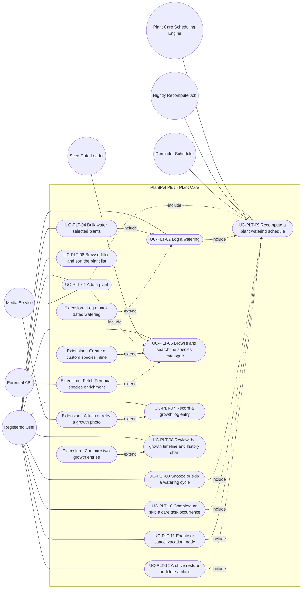
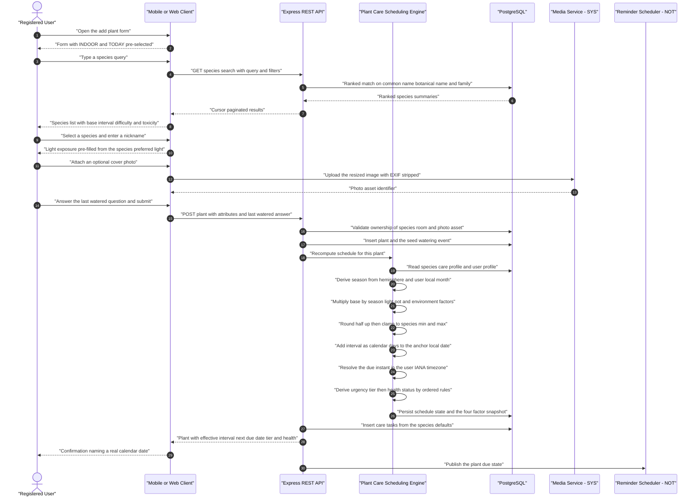
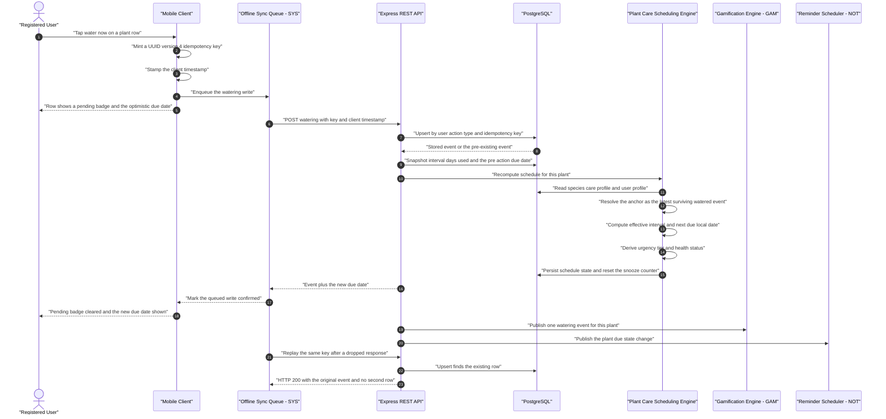
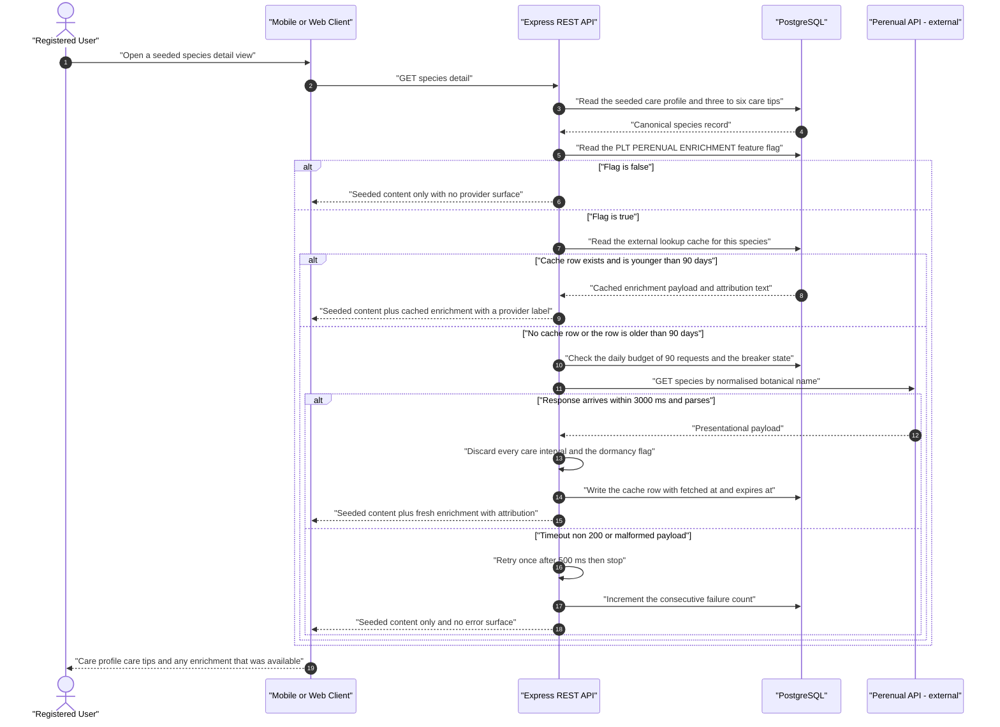

# Use-Case Model — Plant Care (`PLT`)

| Field | Value |
| --- | --- |
| Document | `use-cases/plant-care.md` — authoritative use-case model for the Plant Care module |
| Version | 1.0 |
| Date | 2026-07-21 |
| Status | Approved for Phase 2 design |
| Owner | Rakshit — Project Lead / sole developer (STK-03) |
| Parent | [PlantPal+ Software Requirements Specification v1.0](../SRS.md) |
| Specification aligned to | [modules/plant-care.md](../modules/plant-care.md) v1.0 |
| Owned prefix | `UC-PLT` — `UC-PLT-01` … `UC-PLT-12`. `FR-PLT`, `BR-PLT`, `US-PLT`, `NFR-*`, `ENT-*`, `GOAL-*`, `MET-*`, `ASM-*`, `CON-*`, `DEP-*`, `RSK-*`, `OQ-*`, `STK-*` and `PER-*` identifiers are referenced only, never minted here |
| Use-case count | 12 use cases, 3 sequence diagrams, 8 modelled `include` edges and 5 modelled `extend` extension points |
| Standards basis | IEEE 830-1998 section structure, ISO/IEC/IEEE 29148:2018 requirement-quality rules, Cockburn use-case levels |
| Source decisions | D-01 … D-11, with D-02, D-03, D-04, D-07 and D-09 as primary drivers |

---

## Table of contents

1. [Module use-case diagram](#1-module-use-case-diagram)
2. [Actor roles for this module](#2-actor-roles-for-this-module)
3. [Use-case specifications](#3-use-case-specifications)
   - [UC-PLT-01 — Add a plant](#uc-plt-01--add-a-plant)
   - [UC-PLT-02 — Log a watering](#uc-plt-02--log-a-watering)
   - [UC-PLT-03 — Snooze or skip a watering cycle](#uc-plt-03--snooze-or-skip-a-watering-cycle)
   - [UC-PLT-04 — Bulk water selected plants](#uc-plt-04--bulk-water-selected-plants)
   - [UC-PLT-05 — Browse and search the species catalogue](#uc-plt-05--browse-and-search-the-species-catalogue)
   - [UC-PLT-06 — Browse, filter and sort the plant list](#uc-plt-06--browse-filter-and-sort-the-plant-list)
   - [UC-PLT-07 — Record a growth log entry](#uc-plt-07--record-a-growth-log-entry)
   - [UC-PLT-08 — Review the growth timeline and history chart](#uc-plt-08--review-the-growth-timeline-and-history-chart)
   - [UC-PLT-09 — Recompute a plant watering schedule](#uc-plt-09--recompute-a-plant-watering-schedule)
   - [UC-PLT-10 — Complete or skip a care task occurrence](#uc-plt-10--complete-or-skip-a-care-task-occurrence)
   - [UC-PLT-11 — Enable or cancel vacation mode](#uc-plt-11--enable-or-cancel-vacation-mode)
   - [UC-PLT-12 — Archive, restore or delete a plant](#uc-plt-12--archive-restore-or-delete-a-plant)
4. [Sequence diagrams for the most complex use cases](#4-sequence-diagrams-for-the-most-complex-use-cases)
5. [Include and extend relationship catalogue](#5-include-and-extend-relationship-catalogue)
6. [Coverage and traceability checks](#6-coverage-and-traceability-checks)

---

## 1. Module use-case diagram

Every use case specified in section 3 appears below. A dotted edge labelled `include` points **from the base use case to the included use case**. A dotted edge labelled `extend` points **from the extending behaviour to the base use case**, which is the UML 2.5 direction. The five extension nodes deliberately carry **no `UC-PLT` identifier**: they are sub-flows specified inside the Extensions table of their base use case, and section 5 states where each one is realised.

**Reading note for the evaluator.** Nine of the twelve use cases are user-goal level with the Registered User as primary actor. `UC-PLT-09` is the single subfunction of the module and is the only one whose primary actor is a system: every mutating flow funnels through it, which is exactly the property section 3.2 of [modules/plant-care.md](../modules/plant-care.md) asserts and NFR-MAIN-04 requires. `UC-PLT-06` and `UC-PLT-08` are read-only goals and therefore include nothing. `UC-PLT-04` reaches the engine transitively, through its inclusion of `UC-PLT-02`, because a bulk water is specified as exactly N independent single waterings (BR-PLT-17 rule 3) and must not become a second code path.

---

## 2. Actor roles for this module

| Actor | Type | Goals in this module |
| --- | --- | --- |
| Registered User | Primary (human) | Hold a catalogue-backed plant record; receive a watering date derived from the plant's real conditions rather than a fixed period; log a watering in 3 taps or fewer, online or offline; defer honestly by snoozing or skipping; water a whole collection in one action; understand why a date is what it is; keep a dated, photographic growth history; know at a glance which plant needs attention; pause everything for a holiday; retire a plant without losing its story |
| First-run User | Primary (human), specialisation of Registered User | Reach a first created plant with a real due date inside the 90-second onboarding budget of NFR-USAB-02, starting from the zero-plant first-run state of BR-PLT-30 clause 6 |
| Plant Care Scheduling Engine | Primary (system) for UC-PLT-09, secondary elsewhere | Derive `effective_interval_days`, `next_due_local_date`, `next_due_at`, the watering urgency tier, `health_status` and the factor snapshot deterministically from stored inputs; remain a pure, idempotent function implemented exactly once in the shared package |
| Nightly Recompute Job | Primary (time) for UC-PLT-09 | Re-evaluate season, effective interval, urgency tier and health status once per user local day for every `ACTIVE` and `VACATION_PAUSED` plant, so that state which changes only with the passage of time is still correct with no user action |
| Reminder Scheduler — `NOT` | Secondary (system) | Read plant due state on each `node-cron` tick and generate reminders; never mutate plant data. Consumes the due-today, overdue and critically-overdue collections this module publishes |
| Dashboard Aggregator — `DSH` | Secondary (system) | Consume the due-today, overdue and critically-overdue plant collections for the unified daily dashboard, and the vacation catch-up card |
| Gamification Engine — `GAM` | Secondary (system) | Consume watering and care-task events to advance streaks and achievements; be notified once per plant on a bulk action and on every correction or deletion so a streak day can be recalculated |
| Media Service — `SYS` | Secondary (system) | Issue signed upload URLs and store plant cover photos and growth photos; never cause the loss of a growth entry when an upload fails |
| Offline Sync Queue — `SYS` | Secondary (system) | Hold the queued append-only plant-care writes with their client-minted UUID version 4 idempotency keys and client timestamps, and replay them safely on reconnection |
| Seed Data Loader | Secondary (system, developer-operated) | Load and version the canonical catalogue of at least 60 `ENT-08 PlantSpecies` rows deterministically at deploy time per NFR-DATA-07, so the module is fully functional with every external integration disabled |
| Perenual API | External (third party, flag-gated) | Supply optional presentational species enrichment when `PLT_PERENUAL_ENRICHMENT` is `true` (DEP-08); the user experience with the flag off and with the provider down must be indistinguishable |
| Accounts and Settings — `ACC`, `SET` | Secondary (system) | Supply the authenticated subject, the IANA timezone, the hemisphere, the unit system, the locale and the preferred reminder time that this module consumes but never stores |

---

## 3. Use-case specifications

Every use case below references at least one `FR-PLT-nn` from [modules/plant-care.md](../modules/plant-care.md) and at least one `US-PLT-nn` from [../user-stories/plant-care.md](../user-stories/plant-care.md). Steps describe observable actor and system behaviour only. Every numeric threshold quoted in a step is normative in the business rule named beside it, and is the value a tester must observe.

---

### UC-PLT-01 — Add a plant

| Field | Value |
| --- | --- |
| Primary actor | Registered User, specialising to First-run User for the first plant of an account |
| Secondary actors | Plant Care Scheduling Engine; Media Service for an optional cover photo; Reminder Scheduler and Dashboard Aggregator as downstream consumers of the resulting due state |
| Level | User-goal |
| Priority | Must |
| Release | v0.1 Walking Skeleton for FR-PLT-05 against a stub species; the species picker completes at v0.5 Alpha; the inline custom-species extension at v1.0 MVP |
| Frequency of use | Estimated 1 to 12 times in the first session, then fewer than 4 times per month per user; the highest-abandonment screen in the module and therefore the one held to the 3-tap and 90-second budgets |
| Preconditions | The user is authenticated; the account holds fewer than 300 non-archived plants and fewer than 300 archived plants (BR-PLT-38 clause 2); the seeded catalogue is loaded at a known `catalogue_version`; the device reports connectivity, because creation is a connectivity-required action under BR-PLT-37 clause 2 |
| Trigger | The user activates the add-plant action from the plant list, from the zero-plant first-run state, or from the `DSH` dashboard |
| Success guarantee | An `ENT-10 Plant` owned by the caller exists with `lifecycle_status` of `ACTIVE`, or `VACATION_PAUSED` when an account vacation window covers the user's local today; an anchor and `schedule_confidence` are set per BR-PLT-11 clause 2; `effective_interval_days`, `next_due_local_date`, `next_due_at`, the urgency tier, `health_status` and the four-factor snapshot are persisted before the response is returned; `ENT-12 CareTask` rows are created from the species `default_care_task_types`; the confirmation names a real calendar date |
| Minimal guarantee | Either a plant with a complete schedule exists, or nothing at all is created and every value the user entered is still on screen, per NFR-USAB-08 |
| Related FRs | FR-PLT-05, FR-PLT-07, FR-PLT-08, FR-PLT-16, FR-PLT-17, FR-PLT-18, FR-PLT-02 through the included UC-PLT-05, FR-PLT-03 through extension 3a |
| Related USs | US-PLT-01, US-PLT-02, US-PLT-03, US-PLT-10 |

**Main success scenario**

| # | Actor action | System response |
| --- | --- | --- |
| 1 | The Registered User activates the add-plant action. | — |
| 2 | — | The system renders the add-plant form with `placement = INDOOR`, `indoor_climate = NONE`, `last_watered_answer = TODAY` pre-selected, and every other optional field empty. |
| 3 | The user opens the species picker and selects a species — **include UC-PLT-05**. | — |
| 4 | — | The system pre-fills `light_exposure` from the species `preferred_light`, and displays the species base interval in days, care difficulty and toxicity flag alongside the selection. |
| 5 | The user enters a `nickname` of 1 to 60 characters after trimming. | — |
| 6 | — | The system validates the length inline and enables the submit control. |
| 7 | The user optionally sets room, `pot_diameter_cm` from 2.0 to 200.0, `pot_material`, `has_drainage`, `soil_type`, `indoor_climate`, `acquired_on`, a `note` of up to 500 characters and a cover photo. | — |
| 8 | — | The system validates each value against BR-PLT-38 clause 1 as it is entered and marks any breach on its own field. |
| 9 | The user answers "when did you last water this plant" with `TODAY`, `YESTERDAY`, `DAYS_AGO` with an integer 0 to 30, or `UNKNOWN`. | — |
| 10 | — | The system states, for the chosen answer, the anchor date it will use. |
| 11 | The user submits the form. | — |
| 12 | — | The system creates the plant, establishes the anchor and `schedule_confidence` per BR-PLT-11 clause 2 — creating a seed `ENT-11 WateringEvent` with `origin = SEED_ON_CREATE` for every answer except `UNKNOWN` — invokes **UC-PLT-09** synchronously within the 2 000 ms budget of FR-PLT-09, and auto-creates the species `default_care_task_types` as `ENT-12 CareTask` rows. |
| 13 | The user reads the confirmation. | — |
| 14 | — | The system names the computed next watering date, places the plant in the list at its `NEXT_DUE_ASC` position, and publishes the plant's due state for the Reminder Scheduler and the Dashboard Aggregator. |

**Extensions**

| Step | Condition | Handling |
| --- | --- | --- |
| 3a | The species search returns no match. | 3a1 The system renders the no-species empty state of BR-PLT-30 clause 6. 3a2 The user creates a custom species inline, pre-filled with the query as `common_name` — the extension of UC-PLT-05 realising FR-PLT-03. 3a3 The new species is immediately selectable and flow returns to step 4. |
| 3b | The user opens a species detail view before selecting. | 3b1 The system shows the full care profile and 3 to 6 care tips. 3b2 When `PLT_PERENUAL_ENRICHMENT` is `true` the enrichment extension of UC-PLT-05 may add presentational content with its provider label. |
| 5a | The nickname duplicates an existing plant of the same user. | 5a1 The system shows a non-blocking warning and permits the value, per BR-PLT-38 clause 1. |
| 7a | `pot_material = OTHER` is selected. | 7a1 The system requires `pot_material_other` of 1 to 40 characters before submission. |
| 7b | `soil_type = OTHER` is selected. | 7b1 The system requires `soil_type_other` of 1 to 40 characters before submission. |
| 7c | The user creates a new room inline that would be the 51st distinct room. | 7c1 The system rejects with `PLT_ROOM_QUOTA_EXCEEDED` and lists the existing rooms for selection or renaming. |
| 7d | The user attaches a cover photo. | 7d1 The Media Service accepts the transformed image per BR-PLT-25 clause 2. 7d2 On upload failure the plant is still created and a species-derived placeholder illustration is shown, never an empty box. |
| 9a | The answer is `UNKNOWN`. | 9a1 No seed event is created. 9a2 The due date becomes `local_today + effective_interval_days`, `schedule_confidence` is set to `LOW`, and the detail view states that the schedule is an estimate until the first watering is logged. 9a3 The plant is presented as `NEEDS_ATTENTION`, never `CRITICAL`, because the system has no evidence of neglect. |
| 9b | The answer is `DAYS_AGO` with n from 0 to 30. | 9b1 The anchor becomes `local_today - n` days and a seed event is created with `origin = SEED_ON_CREATE`. |
| 9c | `acquired_on` is later than the derived anchor date. | 9c1 The anchor is raised to `acquired_on` per BR-PLT-11 clause 5, because a plant cannot have been watered by this user before they owned it. |
| 12a | The species care profile is incomplete. | 12a1 The BR-PLT-02 category fallback profile is applied, `schedule_confidence` is set to `LOW`, and the plant is still created. 12a2 The detail view invites the user to adjust the interval. |
| 12b | An `ALL_PLANTS` vacation window is `ACTIVE` on the user's local today. | 12b1 The plant is created with `lifecycle_status = VACATION_PAUSED` and reports urgency tier `PAUSED`, per BR-PLT-28 rule 7. |
| 12c | The computed interval is clamped to the species minimum or maximum. | 12c1 The factor snapshot records `clamped: MIN` or `clamped: MAX`, and the schedule explanation names which limit applied. |

**Exception flows**

| Condition | System behaviour | Outcome |
| --- | --- | --- |
| `nickname` is empty after trimming | Rejected with `PLT_NICKNAME_REQUIRED`, the message attached to the nickname field: "Give your plant a name." | Nothing created; the form is intact |
| `species_id` does not resolve, or resolves to another user's custom species | Rejected with `PLT_SPECIES_NOT_FOUND` — the identical response in both cases, so ownership cannot be probed per BR-PLT-36 rule 3 | Nothing created |
| `acquired_on` is later than the user's local today | Rejected with `PLT_ACQUISITION_DATE_FUTURE`: "The date you got this plant cannot be in the future." | Nothing created |
| `pot_diameter_cm` lies outside 2.0 to 200.0 | Rejected with `PLT_POT_DIAMETER_OUT_OF_RANGE` | Nothing created |
| The account already holds 300 non-archived plants | Rejected with `PLT_PLANT_QUOTA_EXCEEDED`, offering archiving as the remedy | Nothing created; UC-PLT-12 is offered as the route forward |
| The device is offline | Creation is refused with a clear, actionable offline state naming the reason and the remedy; every entered value is preserved on screen | Nothing created; no draft is lost |
| The user's IANA timezone identifier is unknown or empty | The engine falls back to UTC, raises an observability warning per NFR-OBSV-01, and still schedules the plant | The plant is never left unscheduled |

**Special requirements**

| Reference | Obligation carried by this use case |
| --- | --- |
| NFR-USAB-02 | A first-run user reaches a created plant with a real due date within 90 seconds |
| NFR-USAB-08 | Draft input survives validation failure, quota rejection and loss of connectivity |
| NFR-USAB-06 | The zero-plant first-run state carries one sentence of at most 140 characters, one primary action and 3 suggested `BEGINNER` species |
| NFR-PERF-02 | The synchronous recompute completes inside 2 000 ms server-side, so the response names a date rather than a spinner |
| NFR-SEC-08 | Every field is validated server-side against BR-PLT-38 clause 1, never only in the client |
| NFR-SEC-14 | Ownership of the species, room and photo asset is enforced server-side on the authenticated subject |
| NFR-DATA-01 | `performed_local_date` and `next_due_local_date` are stored alongside their UTC instants |
| NFR-A11Y-08 | The resulting urgency tier and health status carry an icon shape and a text label, never colour alone |
| NFR-I18N-01 | Every message in this flow resolves from the locale catalogue by a stable key |

---

### UC-PLT-02 — Log a watering

| Field | Value |
| --- | --- |
| Primary actor | Registered User |
| Secondary actors | Plant Care Scheduling Engine; Offline Sync Queue when the device has no connectivity; Gamification Engine and Reminder Scheduler as downstream consumers |
| Level | User-goal |
| Priority | Must |
| Release | v0.1 Walking Skeleton for FR-PLT-10; the back-dating extension and the correction flow at v1.0 MVP |
| Frequency of use | The most-used action in the module. Estimated 3 to 20 times per week for a collection of 10 to 30 plants; an estimated 5 to 15 percent of executions are captured with no connectivity |
| Preconditions | The user is authenticated; the target plant is owned by the caller with `lifecycle_status` of `ACTIVE` or `VACATION_PAUSED`; the client has minted a UUID version 4 `idempotency_key` before any network attempt |
| Trigger | The user activates the water action from the plant list row, the plant detail view, a push notification action, or the `DSH` dashboard |
| Success guarantee | Exactly one `ENT-11 WateringEvent` with `action = WATERED` exists for that key; the event snapshots `interval_days_used` and the pre-action due date before the schedule moves; the anchor, `next_due_local_date`, `next_due_at`, the urgency tier and `health_status` are recomputed; `snooze_count_current_cycle` is reset to 0; the confirmation names the new due date and offers a 10-second undo |
| Minimal guarantee | Any number of replays of one `idempotency_key` produce exactly one stored event; an action captured offline is either durably queued or the user is told explicitly that it was not saved |
| Related FRs | FR-PLT-10, FR-PLT-11, FR-PLT-15, FR-PLT-08, FR-PLT-09 |
| Related USs | US-PLT-04, US-PLT-05 |

**Main success scenario**

| # | Actor action | System response |
| --- | --- | --- |
| 1 | The Registered User activates the water action on a plant. | — |
| 2 | — | The system mints a UUID version 4 `idempotency_key`, captures `client_recorded_at` as an ISO 8601 instant with offset, and optimistically updates the row. |
| 3 | The user optionally enters `volume_ml` from 0 to 5 000 and a `note` of up to 500 characters. | — |
| 4 | — | The system validates both against FR-PLT-10 and submits the event with its key. |
| 5 | The client transmits the event. | The system upserts by `(user_id, WATERING_EVENT, idempotency_key)`, sets `performed_at` to the server receipt instant, derives `performed_local_date` in the user's timezone per BR-ENT-04, and snapshots `interval_days_used` and the pre-action due date before any schedule change. |
| 6 | — | The system invokes **UC-PLT-09**, which makes the new event the anchor because it is the latest surviving `WATERED` event, and recomputes the schedule from it. |
| 7 | The user reads the confirmation. | — |
| 8 | — | The system names the new due date, resets `snooze_count_current_cycle` to 0, offers a 10-second inline undo per NFR-USAB-04, and notifies the Gamification Engine and the Reminder Scheduler. |

**Extensions**

| Step | Condition | Handling |
| --- | --- | --- |
| 1a | The user chooses "I watered this earlier" — the back-dated watering extension realising FR-PLT-11. | 1a1 The user supplies `performed_at`. 1a2 The system accepts it only inside the BR-PLT-13 acceptance window: no later than server now plus 5 minutes, and no earlier than the later of `acquired_on` at 00:00 local and 30 calendar days before the user's local today. 1a3 When the instant is later than the current anchor it becomes the new anchor, `became_anchor` is `true`, and flow continues at step 6. 1a4 When it is earlier it is stored as history only, `became_anchor` is `false`, and the due date does not move. |
| 1b | The back-dated event becomes the anchor and the recomputed due date is already past. | 1b1 The plant is shown immediately as overdue at its correct tier and is never reset to a fresh cycle, per BR-PLT-13 rule 4. |
| 1c | The user opens the watering history to correct or remove an entry — FR-PLT-15. | 1c1 The user chooses `CORRECT_TIMESTAMP` within the BR-PLT-13 window, or `DELETE`. 1c2 A deletion is soft, sets `deleted_at` and emits an `ENT-44 Tombstone`. 1c3 The anchor is recomputed as the latest surviving `WATERED` event and the schedule follows. 1c4 The Gamification Engine is notified so a streak day earned only by the removed event can be recalculated. |
| 1d | Every watering event for the plant has been deleted. | 1d1 The plant returns to the no-history state of BR-PLT-11 clause 3 with `schedule_confidence = LOW` and is asked to confirm when it was last watered. |
| 2a | The device reports no connectivity. | 2a1 The action is queued with its key and client timestamp. 2a2 The row shows a pending indicator and the aggregate offline-queue count is displayed per NFR-USAB-07. 2a3 On reconnection the item is replayed and the server applies the same upsert, so no duplicate can exist. |
| 4a | An existing event for the same plant is less than 6 hours old. | 4a1 The client requires an explicit confirmation naming the time of the previous watering. 4a2 The server always accepts the write regardless, because rejecting a queued replay would lose data — BR-PLT-14 rule 3 makes this a client-side guard only. |
| 5a | The client clock is more than 5 minutes but at most 24 hours ahead of server now. | 5a1 `performed_at` is clamped to server receipt time and `time_was_clamped` is set to `true`. 5a2 The write succeeds with no user-visible message. |
| 6a | The plant was watered earlier than the previous due date. | 6a1 The next due date is `anchor local date + effective interval`, so watering 3 days early moves the next date 3 days earlier; the cycle length itself never changes, per BR-PLT-12 clause 1. |
| 6b | Three consecutive cycles show `days_deviation <= -ceil(0.5 x interval_days_used)`. | 6b1 The detail view surfaces the neutral interval-too-short advisory of BR-PLT-12 clause 3 with a one-tap route into UC-PLT-01's edit form. 6b2 No automatic change is made in v1.0. |
| 8a | Three or more events occur for one plant inside a period shorter than `0.5 x effective_interval_days`. | 8a1 A neutral, non-alarming over-watering information message from the tip catalogue is shown. 8a2 No action is blocked and no judgemental language is used, per D-07. |

**Exception flows**

| Condition | System behaviour | Outcome |
| --- | --- | --- |
| A second request carries the same `idempotency_key` with identical content | HTTP 200 returning the original event: "Already logged." | Exactly one row; safe replay |
| A request carries the same `idempotency_key` with different content | Rejected with `IDEMPOTENCY_KEY_CONFLICT` and logged, because it indicates a client defect rather than a legitimate edit | Not surfaced to the user |
| The plant is archived | Rejected with `PLT_PLANT_ARCHIVED`: "This plant is archived. Restore it to keep logging waterings." | No event stored; UC-PLT-12 restore is offered |
| `volume_ml` lies outside 0 to 5 000 | Rejected with `PLT_AMOUNT_OUT_OF_RANGE` | No event stored |
| A back-dated `performed_at` is earlier than 30 days before local today | Rejected with `PLT_BACKDATE_OUT_OF_RANGE`: "You can log waterings up to 30 days in the past." | No event stored |
| A back-dated `performed_at` is earlier than the plant's `acquired_on` | Rejected with `PLT_BACKDATE_BEFORE_ACQUISITION`, naming the acquisition date | No event stored |
| `performed_at` is more than 24 hours in the future | Rejected with `PLT_TIMESTAMP_IN_FUTURE` per BR-PLT-14 rule 6 | No event stored |
| A correction targets an event older than 365 days | Rejected with `PLT_EVENT_TOO_OLD_TO_EDIT`: "Entries older than a year can no longer be changed." | The stored event is unchanged |
| A correction or deletion is attempted offline | Refused with a clear offline state; only creation is queueable, per BR-PLT-37 rules 1 and 2 | The event is left unchanged |

**Special requirements**

| Reference | Obligation carried by this use case |
| --- | --- |
| NFR-USAB-01 | Reachable and committable in 3 taps or fewer from the dashboard, with a median completion time of 10 seconds or less |
| NFR-USAB-04 | A 10-second inline undo follows the write |
| NFR-USAB-07 | The offline state and the count of actions awaiting sync are visible on every screen used in this flow |
| NFR-DATA-09 | The queued item is durable across process termination and its key is unique per `(user_id, action_type, idempotency_key)` |
| NFR-DATA-01 | The UTC instant and the user-local date are both stored |
| NFR-DATA-05 | Deletion is soft and emits a tombstone for delta sync |
| NFR-PERF-02 | The recompute completes within 2 000 ms server-side |
| NFR-SEC-14 | Ownership is enforced server-side on every request |
| NFR-RELI-04 | The client-minted idempotency key is what makes the replay safe |

---

### UC-PLT-03 — Snooze or skip a watering cycle

| Field | Value |
| --- | --- |
| Primary actor | Registered User |
| Secondary actors | Plant Care Scheduling Engine; Reminder Scheduler as the downstream consumer of the shifted due date |
| Level | User-goal |
| Priority | Should |
| Release | v1.0 MVP |
| Frequency of use | Estimated 1 to 5 times per week across a collection; snoozing is expected to be roughly three times more common than skipping |
| Preconditions | The user is authenticated; the plant is owned by the caller; its urgency tier is `DUE_SOON`, `DUE_TODAY`, `OVERDUE_MINOR`, `OVERDUE_MAJOR` or `CRITICALLY_OVERDUE`; the device has connectivity, because both actions mutate the schedule directly and are excluded from the offline-queueable set by BR-PLT-37 rule 3 |
| Trigger | The user activates snooze or skip from the plant row, the plant detail view or a reminder action |
| Success guarantee | For a snooze: an `ENT-11 WateringEvent` with `action = SNOOZED` is stored, `next_due_local_date` has moved forward by the chosen 1 to 7 days, `snooze_count_current_cycle` has incremented, and the anchor is untouched. For a skip: an event with `action = SKIPPED` carrying exactly one `skip_reason` is stored, the due date has moved by the half-cycle deferral, and the anchor is untouched |
| Minimal guarantee | The anchor, `last_watered_at` and `effective_interval_days` are never changed by either action, so neither can compound into a permanently drifting schedule; on any rejection the reminder is left exactly as it was |
| Related FRs | FR-PLT-12, FR-PLT-13, FR-PLT-09, FR-PLT-24 |
| Related USs | US-PLT-06, US-PLT-07 |

**Main success scenario**

| # | Actor action | System response |
| --- | --- | --- |
| 1 | The Registered User opens the actions for a due or overdue plant. | — |
| 2 | — | The system offers water, snooze and skip, and states the remaining snooze allowance for the current cycle out of a maximum of 3. |
| 3 | The user chooses snooze and selects a whole number of days from 1 to 7, defaulting to 1. | — |
| 4 | — | The system stores an event with `action = SNOOZED`, increases `next_due_local_date` by the chosen number of days, and invokes **UC-PLT-09** to re-resolve `next_due_at` in the user's timezone under BR-PLT-09 clause 3. |
| 5 | The user reads the outcome. | — |
| 6 | — | The system names the new due date and the remaining snooze allowance, and states neutrally that snoozed days still count as lateness for adherence. |

**Extensions**

| Step | Condition | Handling |
| --- | --- | --- |
| 3a | The user chooses skip instead of snooze. | 3a1 The system requires exactly one `skip_reason` from `SOIL_STILL_MOIST`, `PLANT_DORMANT`, `RECENTLY_REPOTTED`, `AWAY_FROM_HOME`, `RAINFALL` or `OTHER`. 3a2 It sets `next_due_local_date = local_today + max(1, round(effective_interval_days / 2))`, then reduces it if necessary so that `next_due_local_date - anchor_local_date` never exceeds `max_interval_days`. 3a3 It invokes **UC-PLT-09** and reports the new due date and the adherence treatment applied. |
| 3b | `skip_reason = OTHER` is chosen. | 3b1 A `skip_reason_note` of 1 to 200 characters is mandatory before the action is accepted. |
| 3c | The reason is `SOIL_STILL_MOIST`, `RAINFALL`, `PLANT_DORMANT` or `RECENTLY_REPOTTED`. | 3c1 The cycle is excluded from both the numerator and the denominator of the BR-PLT-27 adherence calculation, so an environmental reason is never punitive. |
| 3d | The reason is `AWAY_FROM_HOME` or `OTHER`. | 3d1 The cycle counts as missed in the adherence calculation, stated in neutral wording. |
| 4a | The snooze pushes the due date beyond `anchor + max_interval_days`. | 4a1 The snooze is still accepted. 4a2 Tier evaluation continues to use the species tolerance, so the plant can still reach `CRITICALLY_OVERDUE`, and the copy says so. |
| 6a | This is the third consecutive skip with reason `SOIL_STILL_MOIST`. | 6a1 The interval-too-short advisory of BR-PLT-12 clause 3 is surfaced on the plant detail view with a one-tap route to the plant edit form. 6a2 No automatic change is made. |
| 6b | The user subsequently waters the plant. | 6b1 The next cycle is measured from the real watering date, so the snooze does not compound, and `snooze_count_current_cycle` resets to 0. |

**Exception flows**

| Condition | System behaviour | Outcome |
| --- | --- | --- |
| A fourth snooze is attempted within one cycle | Rejected with `PLT_SNOOZE_LIMIT_REACHED`; the client then offers only water or skip | The due date is unchanged |
| `snooze_days` lies outside 1 to 7 | Rejected with `PLT_SNOOZE_DAYS_OUT_OF_RANGE`: "Choose between 1 and 7 days." | The due date is unchanged |
| The plant's urgency tier is `NOT_DUE` | Snooze is rejected with `PLT_SNOOZE_NOT_DUE` and skip with `PLT_SKIP_NOT_DUE`; neither action is offered in the interface | Nothing to defer, so nothing changes |
| No `skip_reason` is supplied | Rejected with `PLT_SKIP_REASON_REQUIRED` | No event stored |
| `skip_reason = OTHER` with an empty note | Rejected with `PLT_SKIP_NOTE_REQUIRED` | No event stored |
| The device is offline | Both actions are refused with a clear, actionable offline state naming why a connection is needed | The reminder is left exactly as it was |
| The plant is archived | Rejected with `PLT_PLANT_ARCHIVED` | No event stored |

**Special requirements**

| Reference | Obligation carried by this use case |
| --- | --- |
| NFR-USAB-03 | Snooze, skip and water are reachable from the same control group, so the honest answer is never harder than the dishonest one |
| NFR-USAB-05 | All copy is neutral and non-shaming, per D-07 |
| NFR-USAB-07 | The offline refusal names the action, the reason and the alternative |
| NFR-A11Y-08 | The resulting tier change is announced with a text label and an icon shape, not colour alone |
| NFR-I18N-01 | Skip reasons and their labels resolve from the locale catalogue by stable keys |
| NFR-PERF-02 | The re-resolution of the due instant completes within 2 000 ms server-side |

---
### UC-PLT-04 — Bulk water selected plants

| Field | Value |
| --- | --- |
| Primary actor | Registered User |
| Secondary actors | Plant Care Scheduling Engine, once per plant; Gamification Engine, notified once per plant rather than once per batch; Offline Sync Queue when the batch is captured with no connectivity |
| Level | User-goal |
| Priority | Should |
| Release | v1.0 MVP |
| Frequency of use | Estimated 1 to 3 times per week for a collection of 10 or more plants; it is the interaction whose cost MET-15 measures |
| Preconditions | The user is authenticated; at least 2 plants owned by the caller have `lifecycle_status` of `ACTIVE` or `VACATION_PAUSED`; the client has minted one distinct UUID version 4 `idempotency_key` per plant, not one per batch |
| Trigger | The user activates bulk water from the plant list, the `DSH` dashboard due-today card, or the vacation catch-up card produced by UC-PLT-11 |
| Success guarantee | One `ENT-11 WateringEvent`, one interval snapshot and one recompute exist per plant that succeeded; the response carries a per-plant result for every plant submitted, plus `succeeded` and `failed` counts |
| Minimal guarantee | Per-plant atomicity, never batch atomicity: one archived, missing or foreign plant cannot roll back the other results, and every submitted plant receives an explicit outcome |
| Related FRs | FR-PLT-14, FR-PLT-10 through the included UC-PLT-02, FR-PLT-16 for the default selection |
| Related USs | US-PLT-09, US-PLT-15 |

**Main success scenario**

| # | Actor action | System response |
| --- | --- | --- |
| 1 | The Registered User activates bulk water. | — |
| 2 | — | The system pre-selects every plant whose urgency tier is `DUE_TODAY`, `OVERDUE_MINOR`, `OVERDUE_MAJOR` or `CRITICALLY_OVERDUE`, and shows the count selected. |
| 3 | The user deselects any plant and may add any other non-archived plant, keeping the set between 2 and 50 distinct plants. | — |
| 4 | — | The system enforces the 2 to 50 bound before any write and mints one distinct `idempotency_key` per selected plant. |
| 5 | The user confirms. | — |
| 6 | — | For each plant independently the system validates ownership and lifecycle status, then performs **include UC-PLT-02**, producing that plant's own event, its own snapshot and its own recompute. |
| 7 | The user reads the summary. | — |
| 8 | — | The system returns HTTP 200 with a per-plant status and either the new `next_due_local_date` or an error code, plus the `succeeded` and `failed` counts, and notifies the Gamification Engine once per plant. |

**Extensions**

| Step | Condition | Handling |
| --- | --- | --- |
| 2a | Nothing is due or overdue. | 2a1 The system renders the nothing-due state of BR-PLT-30 clause 6, naming the next upcoming due date, and does not open an empty selection. |
| 2b | The trigger was the vacation catch-up card of UC-PLT-11. | 2b1 The pre-selected set is exactly the catch-up group produced by BR-PLT-28 rule 5, presented as one card with no artificial staggering. |
| 3a | The user selects more than 50 plants. | 3a1 The client caps the selection and states the limit before any request is sent. 3a2 A direct request above 50 is rejected server-side with `PLT_BULK_TOO_MANY` before any write. |
| 5a | The device reports no connectivity. | 5a1 The action is expanded client-side into N independent queued writes, each carrying its own key, per BR-PLT-17 rule 5. 5a2 A partial replay is therefore safe and produces no duplicates. |
| 6a | One selected plant was archived on another device seconds earlier. | 6a1 That item fails with `PLT_PLANT_ARCHIVED` while every other item succeeds. 6a2 The summary names the plant that was skipped and why. |
| 6b | One selected plant belongs to another user or no longer exists. | 6b1 That item fails with `PLT_PLANT_NOT_FOUND` — the identical response in both cases — while every other item succeeds. |
| 8a | The user notices one plant should not have been included. | 8a1 Each event created by the batch is individually correctable and deletable through UC-PLT-02 extension 1c, exactly like any other event, per BR-PLT-18 rule 6. |

**Exception flows**

| Condition | System behaviour | Outcome |
| --- | --- | --- |
| Fewer than 2 plants are submitted | The whole request is rejected with `PLT_BULK_TOO_FEW`; the single-plant action should be used | Client-side defect, not surfaced |
| The same `plant_id` appears twice in one request | Rejected with `PLT_BULK_DUPLICATE_PLANT` before any write | No partial batch is committed |
| One `idempotency_key` is reused across two plants in one request | The upsert makes the second a replay of the first, so the second plant receives no event; the response reports it as failed and the defect is logged | No silent double-write |
| The batch is replayed after a lost response | Each item converges on its own single stored row through its own key | Exactly N events for N plants |
| Every item in the batch fails validation | HTTP 200 is still returned with `succeeded = 0` and a per-item error code for each, consistent with the partial-result posture of NFR-RELI-06 | The user sees precisely what happened |

**Special requirements**

| Reference | Obligation carried by this use case |
| --- | --- |
| NFR-PERF-11 | The request and the response stay inside the free-tier payload budget, which is what fixes the upper bound at 50 plants |
| NFR-RELI-06 | Partial success is reported as success at the transport level with per-item statuses in the standard `SYS` envelope |
| NFR-DATA-09 | One distinct idempotency key per plant, unique per `(user_id, action_type, idempotency_key)` |
| NFR-SEC-14 | Ownership is validated per item before any write, per BR-PLT-36 rule 4 |
| NFR-USAB-01 | Fifteen plants are logged in one confirmation rather than fifteen |
| NFR-A11Y-08 | The per-plant outcome is conveyed by text, not by row colour alone |

---

### UC-PLT-05 — Browse and search the species catalogue

| Field | Value |
| --- | --- |
| Primary actor | Registered User |
| Secondary actors | Seed Data Loader as the origin of the canonical rows; Perenual API through the enrichment extension only |
| Level | User-goal when entered directly; subfunction when included by UC-PLT-01 |
| Priority | Must for FR-PLT-01 and FR-PLT-02; Should for the custom-species extension; Could for the enrichment extension |
| Release | v0.5 Alpha for the catalogue and search; v1.0 MVP for custom species; v1.1 Post-MVP for Perenual enrichment |
| Frequency of use | Every execution of UC-PLT-01, plus occasional standalone browsing; estimated 2 to 15 searches per new plant added |
| Preconditions | The user is authenticated; the seeded catalogue holds at least 60 `ENT-08 PlantSpecies` rows with `source = SEEDED` at a known `catalogue_version` |
| Trigger | The user opens the species picker from the add-plant form, or opens the species catalogue directly |
| Success guarantee | A ranked, cursor-paginated result set is displayed, or the no-species empty state is displayed with a pre-filled route to authoring a custom species; a species detail view shows the base interval, light preference, difficulty, toxicity and 3 to 6 care tips |
| Minimal guarantee | The catalogue is fully usable with `PLT_PERENUAL_ENRICHMENT` set to `false` and with the provider unreachable; the two experiences are indistinguishable, as NFR-RELI-02 requires |
| Related FRs | FR-PLT-01, FR-PLT-02, FR-PLT-03, FR-PLT-04, FR-PLT-25 |
| Related USs | US-PLT-02, US-PLT-03, US-PLT-10 |

**Main success scenario**

| # | Actor action | System response |
| --- | --- | --- |
| 1 | The Registered User opens the species catalogue or the species picker. | — |
| 2 | — | The system lists species from the seeded catalogue with the caller's own `USER_CUSTOM` species included, ordered per BR-PLT-30 clause 2. |
| 3 | The user types a query `q` of 1 to 60 characters. | — |
| 4 | — | The system debounces keystrokes by 250 ms, matches case-insensitively and accent-insensitively across `common_name`, `botanical_name` and `family`, and returns a ranked page of at most 25 results by default and 50 at most. |
| 5 | The user optionally filters by `category`, `care_difficulty`, `toxicity` or `preferred_light`. | — |
| 6 | — | The system OR-s values within one filter and AND-s different filters, and re-ranks: exact match, then prefix match on `common_name`, then prefix match on a secondary field, then substring match, then the remainder, with the caller's own species before seeded species at equal score and a boost by the count of the caller's plants referencing that species. |
| 7 | The user opens a species detail view. | — |
| 8 | — | The system shows `base_interval_days`, `preferred_light`, `care_difficulty`, `toxicity` and the complete list of 3 to 6 care tips, labelled as general horticultural guidance and never as authoritative botanical advice, per NFR-LEGL-03. |
| 9 | The user selects the species. | — |
| 10 | — | The system returns the selection to the calling flow, normally UC-PLT-01 step 4. |

**Extensions**

| Step | Condition | Handling |
| --- | --- | --- |
| 4a | The query matches nothing. | 4a1 The system returns HTTP 200 with an empty array and renders the no-species empty state. 4a2 It offers the create-custom-species action pre-filled with `q` as `common_name`. |
| 4b | The device is offline. | 4b1 The last cached result set for the same query is served from the persisted query cache with a stale indicator. 4b2 A query with no cached result shows the offline state. |
| 6a | The user has plants of a matching species. | 6a1 That species ranks above an equally matching species the user does not own, per BR-PLT-30 clause 2. |
| 7a | `PLT_PERENUAL_ENRICHMENT` is `true`, the species has `source = SEEDED`, and no cache row exists or the cached row is older than 90 days — the enrichment extension realising FR-PLT-04. | 7a1 The system requests the provider with a 3 000 ms timeout and exactly one retry after 500 ms. 7a2 It writes only `description`, `image_url`, `image_attribution`, `sunlight_text`, `propagation_text` and `origin_text` into `ENT-47 ExternalLookupCache` with `expires_at` at `fetched_at` plus 90 days. 7a3 Every enriched field displays its provider label and the licence obligation is discharged on this view and in the in-app Data Sources screen, per NFR-LEGL-04. |
| 7b | The provider returns a care interval or a dormancy flag. | 7b1 The value is discarded before persistence; only the six presentational fields are ever written, and any other write is a defect. |
| 9a | The user authors a custom species — the extension realising FR-PLT-03. | 9a1 The system requires `common_name`, `category`, `base_interval_days` from 1 to 120 and `preferred_light`. 9a2 Blank numeric fields are filled by the BR-PLT-31 clause 2 defaults — `min_interval_days = max(1, round(0.50 x base_interval_days))`, `max_interval_days = min(365, round(2.50 x base_interval_days))`, `overdue_tolerance_days = min(21, max(2, round(0.5 x base_interval_days)))` — before the strict ordering invariant is validated. 9a3 The record is stored with `source = USER_CUSTOM`, is private to that user, and is immediately selectable. |
| 9b | The user edits a custom species already referenced by plants. | 9b1 Every referencing plant is recomputed under **UC-PLT-09** trigger T5. 9b2 The response states exactly how many plants had their schedule updated. |
| 9c | The user attempts to delete a custom species that any plant, including an archived plant, references. | 9c1 Deletion is refused and hiding it from the picker is offered instead, preserving referential integrity per BR-PLT-31 rule 5. |
| 10a | The catalogue version changed since the plant was created. | 10a1 The seeded row is updated in place and every plant referencing it is queued for recompute under trigger T14. 10a2 The user is told that care data was refreshed and some dates moved. |

**Exception flows**

| Condition | System behaviour | Outcome |
| --- | --- | --- |
| `q` is shorter than 1 character after trimming | Rejected with `PLT_QUERY_TOO_SHORT` | No search is performed |
| `q` is longer than 60 characters | Rejected with `PLT_QUERY_TOO_LONG` | No search is performed |
| `limit` above 50 is requested | Rejected with `PLT_PAGE_SIZE_TOO_LARGE` | Client-side defect, not surfaced |
| A custom species duplicates an existing `common_name` of the same user, case-insensitively | Rejected with `PLT_SPECIES_NAME_DUPLICATE`: "You already have a species called that." | Nothing created |
| `min_interval_days` is not strictly less than `base_interval_days`, or `base_interval_days` is not strictly less than `max_interval_days` | Rejected with `PLT_SPECIES_INTERVAL_INVALID` | Nothing created |
| The user already holds 100 live custom species | Rejected with `PLT_CUSTOM_SPECIES_QUOTA_EXCEEDED` | Nothing created |
| The provider times out at 3 000 ms, returns a non-200 response, or returns a malformed payload | One retry after 500 ms, then silent degradation to seeded content; the failure is logged for NFR-OBSV-03 | No error surface at all, by design |
| Five consecutive provider failures occur | The circuit breaker opens for 15 minutes and no further calls are attempted | Seeded content only |
| The daily budget of 90 provider requests is exhausted | No call is made until 00:00 UTC | Seeded content only |
| A custom species is created while the device is offline | Refused with a clear offline state; the entered form values are preserved in full | Nothing created; no draft lost |

**Special requirements**

| Reference | Obligation carried by this use case |
| --- | --- |
| NFR-PERF-01 | A search result page returns inside the read-latency budget with a 250 ms client debounce |
| NFR-SCAL-04 | Keyset cursor pagination, never offset paging beyond position 1 000 |
| NFR-SCAL-05 | Ranking is served from an index that holds at the seeded catalogue size plus per-user custom rows |
| NFR-RELI-02 | The product is fully functional with every external integration disabled, which is why the seeded rows are canonical |
| NFR-RELI-04 | Timeout, single retry, circuit breaker and budget are the integration's entire failure contract |
| NFR-LEGL-04 | Provider attribution appears wherever enriched content appears, plus once in the Data Sources screen |
| NFR-LEGL-03 | Care numbers and tips are labelled as general guidance, never as authoritative botanical advice |
| NFR-DATA-07 | Seeding is deterministic and idempotent, keyed by `slug` with version 5 UUID primary keys |
| NFR-SEC-14 | A custom species is never returned to any user other than its owner |
| NFR-I18N-01 | Every care tip is addressed by a stable locale key, never a literal in a component |

---

### UC-PLT-06 — Browse, filter and sort the plant list

| Field | Value |
| --- | --- |
| Primary actor | Registered User |
| Secondary actors | Plant Care Scheduling Engine as the origin of the tier and health values displayed; Dashboard Aggregator, which consumes the same collections |
| Level | User-goal |
| Priority | Must |
| Release | v0.5 Alpha; the health filter and the adherence surface complete at v1.0 MVP |
| Frequency of use | The module's home screen. Estimated 1 to 10 openings per active user per day |
| Preconditions | The user is authenticated. No plant is required: the zero-plant case is a specified outcome, not an error |
| Trigger | The user opens the Plants tab, follows a link from the `DSH` dashboard, or changes a filter, a sort key or the view mode |
| Success guarantee | A cursor-paginated page of plant summaries is displayed, each carrying nickname, species common name, cover thumbnail, room, urgency tier, `health_status`, `next_due_local_date` and `days_overdue`, ordered by the selected `PlantListSortKey`; or exactly one empty state chosen by cause |
| Minimal guarantee | Exactly one of the eight empty and first-run states of BR-PLT-30 clause 6 is rendered when the page is empty; a blank screen is never shown |
| Related FRs | FR-PLT-28, FR-PLT-16, FR-PLT-17, FR-PLT-24 |
| Related USs | US-PLT-08, US-PLT-13, US-PLT-01 |

**Main success scenario**

| # | Actor action | System response |
| --- | --- | --- |
| 1 | The Registered User opens the plant list. | — |
| 2 | — | The system returns the first page of at most 20 summaries sorted `NEXT_DUE_ASC`, which places overdue plants first in ascending due order, then plants due today, then future dates ascending, with a stable secondary sort on nickname. |
| 3 | The user reads a row. | — |
| 4 | — | The system presents the urgency tier and `health_status` with an icon shape and a text label as well as colour, and states lateness in whole days, for example "1 day late". |
| 5 | The user applies any combination of room, health status, species and needs-water-today filters, or types a query of up to 60 characters. | — |
| 6 | — | The system OR-s values within one filter, AND-s different filters, matches the query case-insensitively and accent-insensitively against nickname, species common name, species botanical name and room name, and returns the filtered page. |
| 7 | The user changes the sort key or switches between `GRID` and `LIST`. | — |
| 8 | — | The system serves the identical response payload for both view modes, persists the view-mode choice per user through `SET`, and virtualises any collection capable of exceeding 50 items. |
| 9 | The user scrolls to the end of the page. | — |
| 10 | — | The system fetches the next keyset page and appends it without re-ordering the rows already displayed. |

**Extensions**

| Step | Condition | Handling |
| --- | --- | --- |
| 2a | The user has never created a plant. | 2a1 The first-run state is rendered with one sentence of at most 140 characters, a primary "Add your first plant" action, and 3 suggested `BEGINNER` species drawn from the seeded catalogue. |
| 2b | Every plant the user owns is archived. | 2b1 The all-archived state is rendered, offering the archive view or a new plant. |
| 4a | A plant is inside an active vacation window. | 4a1 Its tier is `PAUSED`, it contributes nothing to due totals, and it carries a neutral paused badge rather than a lateness count. |
| 4b | The species `overdue_tolerance_days` is 1 and the plant is 2 days late. | 4b1 The tier is `CRITICALLY_OVERDUE`, not `OVERDUE_MINOR`, because BR-PLT-19 rule 5 is evaluated before rules 6 and 7. |
| 4c | The species `overdue_tolerance_days` is 14 and the plant is 4 days late. | 4c1 The tier is `OVERDUE_MAJOR`. |
| 4d | A plant is a winter-dormant species in a local winter and is 1 day late. | 4d1 `health_status` is `DORMANT` with reason `SEASONAL_DORMANCY`, not `NEEDS_ATTENTION`. |
| 6a | The filters or the query match nothing. | 6a1 The no-results state is rendered with the active filter summary and a one-tap clear action. |
| 6b | The needs-water-today filter is applied and nothing matches. | 6b1 The nothing-due state is rendered, naming the next upcoming due date. |
| 6c | `include_archived` is set to `true`. | 6c1 Archived plants appear with their archive reason in place of a health status and are never counted as due. |
| 8a | The user opens a plant detail view from a row. | 8a1 The detail view shows the schedule explanation — the species base interval and each of the season, light, pot and environment factors — the single contextual care tip selected by BR-PLT-33 clause 2, and the watering adherence percentage or the label `Not enough data`. |
| 8b | Adherence is below 60 percent with at least 3 classifiable cycles. | 8b1 The neutral label `Often late` is shown with no red styling, no streak-breaking language and no comparison against other users, per D-07. |

**Exception flows**

| Condition | System behaviour | Outcome |
| --- | --- | --- |
| `limit` above 100 is requested | Rejected with `PLT_PAGE_SIZE_TOO_LARGE` | Client-side defect, not surfaced |
| An offset-based page beyond position 1 000 is requested | Rejected per NFR-SCAL-04 | Keyset paging is the only supported path |
| The device is offline | The last cached page is served from the persisted query cache with a stale indicator and the count of actions awaiting sync | The list is always readable |
| A plant has a null `next_due_local_date`, possible only mid-migration | It is reported as `NOT_DUE` and enqueued for recompute under UC-PLT-09 | No row is ever missing from the list |
| A client submits a value for the urgency tier or `health_status` | The field is ignored; both exist only as engine output, per BR-PLT-36 rule 6 | Derived state cannot be forged |
| The response would exceed the 256 KB uncompressed payload budget | The page size is reduced before serialisation | NFR-PERF-11 is never breached |

**Special requirements**

| Reference | Obligation carried by this use case |
| --- | --- |
| NFR-PERF-01 | The first page meets the read-latency budget on a mid-range device |
| NFR-PERF-08 | Collections capable of exceeding 50 items are virtualised at 55 frames per second or better |
| NFR-PERF-11 | The response stays within 256 KB uncompressed at the default page size of 20 |
| NFR-SCAL-04 | Keyset cursor pagination with a maximum page size of 100 |
| NFR-USAB-06 | Every empty and first-run state carries one sentence of at most 140 characters and one primary action |
| NFR-A11Y-08 | Urgency tier and health status are never carried by colour alone |
| NFR-USAB-05 | Adherence copy is neutral and never shaming |
| NFR-I18N-01 | Tier labels, health labels and empty-state copy resolve from the locale catalogue |

---

### UC-PLT-07 — Record a growth log entry

| Field | Value |
| --- | --- |
| Primary actor | Registered User |
| Secondary actors | Media Service for the optional photograph; Offline Sync Queue when the entry is captured with no connectivity; Plant Care Scheduling Engine, because a `health_rating` re-triggers the FR-PLT-17 derivation |
| Level | User-goal |
| Priority | Must |
| Release | v1.0 MVP |
| Frequency of use | Estimated 1 to 4 entries per plant per month for an engaged user; it is the capability MET-06 day-30 retention most depends on |
| Preconditions | The user is authenticated; the plant is owned by the caller; the plant holds fewer than 1 000 entries and fewer than 5 entries on the target local date; the client has minted a UUID version 4 `idempotency_key` |
| Trigger | The user activates the add-growth-entry action from the plant detail view or from the growth timeline |
| Success guarantee | An `ENT-14 GrowthLogEntry` exists carrying `logged_at`, its derived `logged_local_date` and at least one of `height_cm`, `leaf_count`, `note`, `health_rating` or `photo_id`; when a photograph was attached its `photo_status` is `READY`, or `FAILED` with a visible retry action; the entry appears in the timeline at its chronological position |
| Minimal guarantee | **An entry is never rolled back because of a photo failure.** The entry is persisted first and the photograph is attached afterwards, so a measurement and a note always survive a broken connection |
| Related FRs | FR-PLT-20, FR-PLT-17, FR-PLT-21 as the consuming surface |
| Related USs | US-PLT-11, US-PLT-12, US-PLT-13 |

**Main success scenario**

| # | Actor action | System response |
| --- | --- | --- |
| 1 | The Registered User activates the add-growth-entry action. | — |
| 2 | — | The system renders the form with `logged_at` defaulted to the user's local now and every content field empty. |
| 3 | The user enters any combination of `height_cm` from 0.1 to 1000.0 to one decimal place, `leaf_count` from 0 to 10 000, a `note` of up to 500 characters and a `health_rating` from 1 to 5 with the labels 1 Struggling, 2 Poor, 3 Stable, 4 Healthy, 5 Thriving. | — |
| 4 | — | The system validates each field against BR-PLT-24 clause 2 and confirms that at least one content field is present. |
| 5 | The user optionally attaches one photograph — the photo extension. | — |
| 6 | — | The client applies EXIF orientation to the pixels, resizes so the longest edge is at most 1280 px, encodes JPEG at quality 0.7 and strips all EXIF metadata including GPS before any byte leaves the device, per NFR-PRIV-03. |
| 7 | The user submits. | — |
| 8 | — | The system creates the entry idempotently by `idempotency_key`, derives `logged_local_date` in the user's timezone, and returns the stored entry with `photo_status` of `NONE` or `UPLOADING`. |
| 9 | The client uploads the image through the Media Service. | The system moves `photo_status` to `READY` on success, within the 8 000 ms 95th-percentile budget of NFR-PERF-10, and the frame becomes available to UC-PLT-08. |
| 10 | The user reads the confirmation. | — |
| 11 | — | The system shows the entry in the plant history and, when a `health_rating` was supplied, re-derives `health_status` through **UC-PLT-09** so the plant's status reflects the new rating immediately. |

**Extensions**

| Step | Condition | Handling |
| --- | --- | --- |
| 3a | `height_cm` exceeds 400.0, or `leaf_count` exceeds 2 000. | 3a1 The client asks for a plausibility confirmation. 3a2 The value is never rejected, because these figures are legitimate for a mature plant. |
| 3b | `height_cm` differs from the previous entry by more than 100 percent and the entries are less than 14 days apart. | 3b1 The client asks "That is a big jump from 20 cm. Is 60 cm correct?" before saving. 3b2 On confirmation the value is stored unchanged, because bamboo and monstera genuinely do that. |
| 3c | `health_rating` of 1 or 2 is recorded. | 3c1 Provided the rating is at most 14 days old, BR-PLT-20 rule 2 sets `health_status` to `CRITICAL` with reason `USER_RATED_POOR`. |
| 5a | The device reports no connectivity and a photograph is attached. | 5a1 The system offers to save the entry now and attach the photograph later. 5a2 The entry is queued without its photo, per BR-PLT-37 rule 1. 5a3 The pending image is retained in local storage for 7 days and the user is prompted to attach it on the next successful connection; retention beyond 7 days or across a reinstall is a documented product limitation, not a defect. |
| 7a | The user back-dates `logged_at`. | 7a1 The instant is accepted only when it is no more than 5 minutes in the future and no earlier than the later of `acquired_on` at 00:00 local and 30 calendar days before the user's local today. |
| 9a | The photo upload fails after the entry is stored. | 9a1 The entry survives intact with `photo_status = FAILED`. 9a2 A visible retry action is offered — the retry extension. 9a3 The entry is never rolled back. |
| 9b | The account photo quota of 500 assets or 150 MB is reached. | 9b1 The entry is still created and only the photograph is rejected with `PLT_PHOTO_QUOTA_EXCEEDED`. |
| 11a | The user edits or deletes an entry. | 11a1 Editing is permitted online within 365 days and within the same field limits; editing `health_rating` re-triggers the FR-PLT-17 derivation and editing `logged_at` re-derives `logged_local_date` and re-sorts the timeline. 11a2 Deletion is soft with a tombstone, the photo asset moves to `DELETED` and its binary is removed after 30 days, and the next most recent entry supplies the health rating. |

**Exception flows**

| Condition | System behaviour | Outcome |
| --- | --- | --- |
| No content field is present | Rejected with `PLT_GROWTH_ENTRY_EMPTY`: "Add a measurement, a note, a rating or a photo." | Nothing stored |
| `logged_at` falls outside its acceptance window | Rejected with `PLT_GROWTH_DATE_OUT_OF_RANGE`: "You can add entries up to 30 days in the past." | Nothing stored |
| The plant already holds 1 000 entries | Rejected with `PLT_GROWTH_ENTRY_QUOTA_EXCEEDED` | Nothing stored |
| A sixth entry is submitted for the same plant on the same local date | Rejected with `PLT_GROWTH_DAILY_LIMIT`: "You can add up to 5 entries per plant per day." | Nothing stored |
| A source image larger than 10 MB is chosen | Rejected on the client before any network use | No metered data is spent |
| A duplicate `idempotency_key` with identical content arrives | HTTP 200 returning the original entry unchanged | Exactly one entry |
| A duplicate `idempotency_key` with different content arrives | Rejected with `IDEMPOTENCY_KEY_CONFLICT` and logged | Client defect, not surfaced |
| The Media Service is unreachable for the whole retry budget | `photo_status` remains `FAILED` with a retry affordance; the entry and its measurements are untouched | The emotional payoff is delayed, never lost |

**Special requirements**

| Reference | Obligation carried by this use case |
| --- | --- |
| NFR-USAB-01 | The entry is committable in 3 taps or fewer from the plant detail view |
| NFR-PERF-10 | The photo upload completes within 8 000 ms at the 95th percentile on the reference connection |
| NFR-PRIV-03 | All EXIF metadata, including GPS, is stripped on the client before upload |
| NFR-DATA-09 | The queued entry is durable across process termination and idempotent on replay |
| NFR-SCAL-08 | The per-plant and per-day entry ceilings keep object storage inside the free tier of CON-08 |
| NFR-USAB-08 | Entered measurements survive a validation failure and a connectivity change |
| NFR-A11Y-08 | `photo_status` is conveyed by text and icon, never by colour alone |
| NFR-I18N-03 | Heights are entered and displayed in the user's unit system while storage stays metric per D-09 |

---
### UC-PLT-08 — Review the growth timeline and history chart

| Field | Value |
| --- | --- |
| Primary actor | Registered User |
| Secondary actors | Media Service, which serves the 320 px thumbnails and the full-size derivatives; no other actor participates, because this use case is read-only |
| Level | User-goal |
| Priority | Should for the timeline and the chart; Could for the comparison extension |
| Release | v1.0 MVP for FR-PLT-21 and FR-PLT-23; the comparison extension realising FR-PLT-22 is deferred to v1.1 Post-MVP |
| Frequency of use | Estimated 1 to 4 times per plant per month, rising sharply once a plant holds more than 6 photo-bearing entries; the module's most shareable moment |
| Preconditions | The user is authenticated; the plant is owned by the caller. No entry is required: every zero-data outcome is a specified empty state, not an error |
| Trigger | The user opens the growth timeline or the history chart from the plant detail view |
| Success guarantee | Every `ENT-14 GrowthLogEntry` of the plant whose `photo_status` is `READY` and whose `deleted_at` is null is presented in strictly ascending `logged_local_date` order, then ascending `created_at` for same-day ties, scrubbable to any single frame, each frame labelled with its entry date and the plant age in days; or a time-series chart of the selected metric and range is rendered together with its text alternative |
| Minimal guarantee | Nothing is mutated. When the qualifying data is insufficient, exactly one of the no-growth-history, no-photos or not-enough-data states of BR-PLT-30 clause 6 is rendered, and a failed image never breaks scrubbing |
| Related FRs | FR-PLT-21, FR-PLT-23, FR-PLT-22 through extension 5a, FR-PLT-20 as the producing use case |
| Related USs | US-PLT-12, US-PLT-11 |

**Main success scenario**

| # | Actor action | System response |
| --- | --- | --- |
| 1 | The Registered User opens the growth timeline for a plant. | — |
| 2 | — | The system returns the ordered set of entries whose `photo_status` is `READY`, ascending by `logged_local_date` then by `created_at`, and prefetches the 320 px thumbnail of every frame. |
| 3 | The user scrubs to a frame position between 0 and the qualifying entry count minus 1. | — |
| 4 | — | The system loads the full-size derivative for the frame in view only, and labels the frame with its entry date and the plant age in whole days measured from `acquired_on`, or from the first entry date when `acquired_on` is null. |
| 5 | The user switches to the history chart. | — |
| 6 | — | The system offers the metric selector `HEIGHT_CM`, `LEAF_COUNT`, `WATERING_GAP_DAYS` and the range selector `DAYS_30`, `DAYS_90`, `ALL_TIME`, measured back from the user's local today. |
| 7 | The user selects a metric and a range. | — |
| 8 | — | The system plots the series, connecting only the points that exist and never interpolating a gap, converts values to the user's display unit system at render time while storage stays metric, and publishes the text alternative naming the metric, the period, the first value, the last value, the minimum, the maximum and the direction of change. |
| 9 | The user selects the tabular view of the same series. | — |
| 10 | — | The system presents the identical data points as a table, so the information is reachable without reading the graphic. |

**Extensions**

| Step | Condition | Handling |
| --- | --- | --- |
| 2a | The plant has zero growth entries of any kind. | 2a1 The no-growth-history state is rendered, explaining the timeline pay-off in at most 140 characters with one primary action. |
| 2b | The plant has entries but none whose `photo_status` is `READY`. | 2b1 The no-photos state is rendered, prompting the user to add a photograph to the next entry. |
| 2c | An entry's photograph is still `UPLOADING`. | 2c1 That frame is omitted from the ordered set until `photo_status` becomes `READY`, so the position indicator never counts a frame the user cannot see. |
| 3a | The qualifying set can exceed 50 frames. | 3a1 The collection is virtualised per NFR-PERF-08 and only the frames within the viewport plus a bounded prefetch margin are held in memory. |
| 4a | A single image fails to load. | 4a1 A placeholder is shown for that frame with the message "This photo could not be loaded." 4a2 Scrubbing continues to work across the whole set. |
| 5a | The user selects two distinct photo-bearing entries to compare — **the comparison extension realising FR-PLT-22, v1.1**. | 5a1 The earlier entry by `logged_local_date` then `created_at` is always presented on the left or as the base layer regardless of selection order, so the comparison always reads chronologically. 5a2 The system shows the elapsed days, the height difference and the leaf-count difference. 5a3 A metric absent from either entry renders as an em dash, never as zero. 5a4 A text alternative names both dates and both values. |
| 7a | `WATERING_GAP_DAYS` is selected. | 7a1 The series is plotted from consecutive surviving `ENT-11 WateringEvent` rows with `action = WATERED` as the actual gap in whole days. 7a2 The `interval_days_used` snapshot taken at each event is drawn as a second reference series, so drift between the planned interval and reality is visible without any further analytics. |
| 7b | The selected series exceeds 365 points. | 7b1 It is downsampled to at most 180 points before rendering per NFR-PERF-09, and the text alternative states the point count actually plotted. |
| 7c | The user's `UnitSystem` is `IMPERIAL`. | 7c1 Heights are plotted and labelled in inches to one decimal place using the factor 0.3937008 of BR-PLT-35 rule 2; the stored values remain centimetres. |

**Exception flows**

| Condition | System behaviour | Outcome |
| --- | --- | --- |
| Fewer than 2 data points fall in the selected window | The not-enough-data state is rendered instead of an empty axis, naming exactly how many more entries are needed | No misleading axis is drawn |
| `HEIGHT_CM` is selected and the plant has no growth entries at all | The no-growth-history state is rendered: "Record a height to start tracking growth." | Nothing is plotted |
| `WATERING_GAP_DAYS` is selected and fewer than 2 surviving watering events exist | The not-enough-data state is rendered: "Log 1 more watering to see the gap between waterings." | Nothing is plotted |
| Fewer than two photo-bearing entries exist and the comparison is requested directly | Rejected with `PLT_COMPARE_NEEDS_TWO_ENTRIES`; the action is not offered in the interface either | Nothing is compared |
| The same entry is selected twice for comparison | Rejected with `PLT_COMPARE_SAME_ENTRY`: "Choose two different entries." | Nothing is compared |
| The two selected entries belong to different plants | Rejected with `PLT_COMPARE_DIFFERENT_PLANTS` | Client-side defect, not surfaced |
| The device is offline | Frames already in the persisted cache remain scrubbable and the chart renders from cached data with a stale indicator | The visual history is always readable offline |

**Special requirements**

| Reference | Obligation carried by this use case |
| --- | --- |
| NFR-PERF-08 | Frame collections capable of exceeding 50 items are virtualised at 55 frames per second or better |
| NFR-PERF-09 | A series is downsampled to at most 180 points before rendering |
| NFR-A11Y-05 | Every chart and every comparison carries a text alternative and a tabular equivalent |
| NFR-A11Y-08 | Trend direction is stated in words, never carried by colour alone |
| NFR-USAB-06 | Each of the three zero-data outcomes renders its own named empty state |
| NFR-I18N-03 | Heights render in the user's unit system while storage stays metric per D-09 |
| NFR-SCAL-08 | Thumbnail-first loading keeps content-delivery egress inside the free tier of DEP-02 |
| NFR-I18N-01 | Frame labels, axis labels and empty-state copy resolve from the locale catalogue |

---

### UC-PLT-09 — Recompute a plant watering schedule

| Field | Value |
| --- | --- |
| Primary actor | Plant Care Scheduling Engine for triggers T1 to T12 and T14; Nightly Recompute Job, a time actor, for trigger T13 |
| Secondary actors | Registered User as the indirect beneficiary; Reminder Scheduler and Dashboard Aggregator as consumers of the resulting due state; `ACC` and `SET` as the source of hemisphere, IANA timezone and preferred reminder time |
| Level | **Subfunction** — the only subfunction in this module. It is never invoked directly by a human and has no user interface of its own |
| Priority | Must |
| Release | v0.5 Alpha for the full algorithm; a stub producing `base_interval_days` unmodified exists at v0.1 Walking Skeleton |
| Frequency of use | Once per mutating action on a plant, plus once per plant per user local day from the nightly job. For 1 000 users holding 20 plants each this is 20 000 nightly evaluations, processed in pages of 500 |
| Preconditions | The plant exists with `lifecycle_status` of `ACTIVE` or `VACATION_PAUSED`; a species record is resolvable, or the BR-PLT-02 category fallback applies; the user profile supplies a hemisphere and an IANA timezone, or the documented UTC fallback applies |
| Trigger | Exactly one of the fourteen triggers T1 to T14 enumerated in BR-PLT-10 clause 1, and nothing else |
| Success guarantee | `effective_interval_days`, `next_due_local_date`, `next_due_at`, `computed_from_tz`, the watering urgency tier, `health_status`, `health_reason_code`, `schedule_confidence` and the four-factor snapshot are persisted in one transaction; the snapshot records every factor, every sub-factor, the raw value, the rounded value, any clamp marker and the `algorithm_version` |
| Minimal guarantee | The plant is never left unscheduled and the derivation never throws: every factor input has a defined default, a missing species falls back to BR-PLT-02, and an unknown timezone falls back to UTC with an observability warning. A failure on one plant inside the nightly batch never aborts the batch |
| Related FRs | FR-PLT-07, FR-PLT-08, FR-PLT-09, FR-PLT-16, FR-PLT-17, FR-PLT-06 as a calling requirement |
| Related USs | US-PLT-04, US-PLT-10, US-PLT-13, US-PLT-08 |

**Main success scenario**

| # | Actor action | System response |
| --- | --- | --- |
| 1 | A trigger from the BR-PLT-10 clause 1 list fires for one plant. | — |
| 2 | — | The system reads the plant, its species care profile and the owning user's hemisphere, IANA timezone and preferred reminder time, in at most 3 database reads and with no network call. |
| 3 | — | The system derives the season from the hemisphere and the calendar month of the **user's** local date, never the server date, per BR-PLT-03. |
| 4 | — | The system computes the season factor, the light factor, the pot factor and the environment factor from the published tables of BR-PLT-04 to BR-PLT-07. |
| 5 | — | The system multiplies `base_interval_days` by the four factors in that left-to-right order with no intermediate rounding, rounds once half-up to an integer, clamps the result to the species `min_interval_days` and `max_interval_days`, and applies the absolute floor of 1 day. |
| 6 | — | The system resolves the anchor as the latest non-deleted `ENT-11 WateringEvent` with `action = WATERED`, or the synthetic anchor of BR-PLT-11 when no such event exists. |
| 7 | — | The system computes `next_due_local_date` by adding the effective interval to the anchor local date **as calendar days**, so a 23-hour or 25-hour day still counts as exactly one day. |
| 8 | — | The system resolves `next_due_local_date` together with the preferred reminder time to a UTC instant through the IANA timezone database, and records `computed_from_tz`. |
| 9 | — | The system evaluates the seven ordered urgency rules of BR-PLT-19, first match wins, producing one tier and a signed `days_overdue`. |
| 10 | — | The system evaluates the nine ordered health rules of BR-PLT-20, first match wins, producing one `health_status` and one `health_reason_code`. |
| 11 | — | The system persists the schedule state and the factor snapshot in one transaction, within the 2 000 ms server-side budget of FR-PLT-09 measured from request receipt to commit. |
| 12 | — | The system publishes the resulting due state for the Reminder Scheduler and the Dashboard Aggregator, and returns the new state to the calling use case. |

**Extensions**

| Step | Condition | Handling |
| --- | --- | --- |
| 1a | The trigger is T13, the nightly recompute. | 1a1 The job runs once per **user** local day and evaluates each user against that user's own local date. 1a2 Plants are processed in pages of exactly 500 using at most 3 database connections. 1a3 The counters `plantsEvaluated`, `urgencyTierChanged`, `healthStatusChanged` and `durationMs` are emitted per NFR-OBSV-06. |
| 1b | The trigger is T2 or T3, a watering event created, corrected or deleted. | 1b1 The never-schedule-in-the-past rule is deliberately **not** applied, so a genuinely overdue plant is shown as overdue rather than quietly reset. |
| 1c | The trigger is T4, T5, T8, T13 or T14. | 1c1 When the recomputed `next_due_local_date` falls before the user's local today it is set to the user's local today per BR-PLT-10 clause 4, because a profile-driven change must never manufacture retrospective lateness. |
| 1d | The trigger is T9, the user's IANA timezone changed. | 1d1 `next_due_local_date` is preserved exactly and only `next_due_at` is re-resolved, so a user flying from London to Tokyo does not find their plants due a day earlier. |
| 1e | The trigger is T8, the user's hemisphere changed. | 1e1 Every `ACTIVE` and `VACATION_PAUSED` plant is recomputed because the season factor changes. 1e2 The client shows a one-time summary stating how many plants had their schedule adjusted, because a silent change to every date would read as a defect. |
| 3a | The user's hemisphere is `EQUATORIAL`. | 3a1 The season resolves to the single member `YEAR_ROUND` and the season factor is a flat 1.00. |
| 5a | The rounded value falls below `min_interval_days`. | 5a1 It is clamped up and the snapshot records `clamped: MIN`, so the explanation can name which limit applied. |
| 5b | The rounded value exceeds `max_interval_days`. | 5b1 It is clamped down and the snapshot records `clamped: MAX`. |
| 6a | The plant has no surviving `WATERED` event. | 6a1 The synthetic anchor of BR-PLT-11 clause 3 is used, the due date becomes `local_today + effective_interval_days`, and `schedule_confidence` is set to `LOW`. |
| 8a | The wall-clock time formed by the due date and the preferred reminder time does not exist because of a spring-forward gap. | 8a1 The due instant becomes the first valid instant after the gap, normally the requested time shifted forward by 60 minutes. |
| 8b | The same wall-clock time occurs twice because of an autumn-fallback overlap. | 8b1 The earlier of the two occurrences is used. |
| 8c | A daylight-saving transition falls inside a cycle. | 8c1 The due calendar date does not move; only the resolved UTC instant shifts by the offset change. |
| 9a | The plant is inside an active vacation window. | 9a1 Rule 1 of BR-PLT-19 matches and the tier is `PAUSED`; the plant contributes nothing to due totals and does not escalate. |
| 10a | The plant's `lifecycle_status` is `VACATION_PAUSED`. | 10a1 Health rules 1, 4, 5 and 7 are skipped, so a holiday can never make a healthy plant look neglected. |
| 11a | Two consecutive recomputes run with no intervening change. | 11a1 They produce byte-identical schedule state, which is the idempotency property the unit tests assert and what makes the nightly job safe to re-run after a partial failure. |

**Exception flows**

| Condition | System behaviour | Outcome |
| --- | --- | --- |
| The species care profile is missing or incomplete | The BR-PLT-02 category fallback profile is applied, the computation proceeds and `schedule_confidence` becomes `LOW` | The engine never fails for missing data |
| The user's IANA timezone identifier is unknown or empty | The engine falls back to UTC and raises an observability warning per NFR-OBSV-01 | The plant is still scheduled, never skipped |
| One plant fails during the nightly batch | The batch continues, the failure is logged with the plant identifier, and that plant is retried on the next run | 499 of 500 plants in the page are unaffected |
| The nightly job is interrupted by a process restart | It resumes from its persisted cursor and processes a catch-up window of at most 24 hours per NFR-RELI-07 | No user local day is skipped |
| A single recompute exceeds the 2 000 ms budget | The request still completes and the breach is recorded as a latency sample against NFR-PERF-02 | Correctness is never traded for latency |
| The published multiplier tables change on deploy | `algorithm_version` increments, an Architecture Decision Record is added per NFR-MAIN-05, and trigger T14 recomputes every non-archived plant; historical snapshots are never rewritten | Past charts and past adherence stay stable |
| A client submits `effective_interval_days`, `next_due_at`, the urgency tier or `health_status` | All four fields are ignored, because they exist only as engine output per BR-PLT-36 rule 6 | Derived state cannot be forged |

**Special requirements**

| Reference | Obligation carried by this use case |
| --- | --- |
| NFR-MAIN-04 | The rule set is implemented exactly once as a pure function in the shared package and consumed unchanged by the API, the web client and the mobile client |
| NFR-MAIN-03 | At least one automated test exists per `BR-PLT` identifier, and the six worked examples of BR-PLT-08 clause 5 are normative test vectors |
| NFR-PORT-05 | The same pure function produces identical output on Node.js, on the browser and on React Native |
| NFR-PERF-02 | Recompute completes within 2 000 ms server-side from request receipt to transaction commit |
| NFR-SCAL-06 | The nightly job uses at most 3 database connections and pages of 500 plants |
| NFR-RELI-07 | The job resumes from a persisted cursor after interruption |
| NFR-OBSV-01 | Every fallback and every per-plant failure is logged with the plant identifier |
| NFR-OBSV-06 | The nightly job emits `plantsEvaluated`, `urgencyTierChanged`, `healthStatusChanged` and `durationMs` |
| NFR-DATA-01 | Every local date is stored alongside its UTC instant |
| NFR-DATA-02 | A reminder set for a local wall-clock time fires at that same local time across a daylight-saving transition |
| NFR-DATA-03 | The factor snapshot is retained so a past interval can be explained without recomputation |

---

### UC-PLT-10 — Complete or skip a care task occurrence

| Field | Value |
| --- | --- |
| Primary actor | Registered User |
| Secondary actors | Plant Care Scheduling Engine, because a completion refreshes `health_status`; Offline Sync Queue when the completion is captured with no connectivity; Gamification Engine and Reminder Scheduler as downstream consumers |
| Level | User-goal |
| Priority | Should |
| Release | v1.0 MVP for `FERTILISE` and `PEST_CHECK`; `REPOT`, `PRUNE`, `ROTATE`, `MIST` and `CUSTOM` are release-gated to v1.1 Post-MVP |
| Frequency of use | Estimated 1 to 3 times per plant per month, concentrated in the growing season and near zero in a local winter for a dormant species |
| Preconditions | The user is authenticated; the plant is non-archived and owned by the caller; the target `ENT-12 CareTask` exists with `is_active = true`; the plant holds at most 10 care tasks; the client has minted a UUID version 4 `idempotency_key` |
| Trigger | The user marks a care task occurrence complete or skipped from the plant detail view, from the daily plant care digest, or from the `DSH` dashboard |
| Success guarantee | An `ENT-13 CareTaskEvent` exists with `outcome` of `COMPLETED` or `SKIPPED`, carrying `performed_at`, `task_type_snapshot`, `cadence_days_at_event` and `next_due_at_after`; the task's `next_due_at` is rescheduled by BR-PLT-23; `health_status` is re-derived through UC-PLT-09 |
| Minimal guarantee | Either the occurrence is recorded exactly once and the cadence advances, or nothing is written and the existing schedule is untouched. Any number of replays of one `idempotency_key` produce exactly one stored event |
| Related FRs | FR-PLT-19, FR-PLT-18, FR-PLT-17 through the included UC-PLT-09 |
| Related USs | US-PLT-14, US-PLT-13 |

**Main success scenario**

| # | Actor action | System response |
| --- | --- | --- |
| 1 | The Registered User opens the plant's care tasks. | — |
| 2 | — | The system lists each active task with its `task_type`, its effective cadence in days, a flag stating whether the cadence currently in force is the seasonal value or the base value, and its `next_due_at`. |
| 3 | The user marks an occurrence `COMPLETED`, optionally back-dating `performed_at`. | — |
| 4 | — | The system validates that the task is active, that `performed_at` is no more than 5 minutes in the future and no earlier than 30 calendar days before the user's local today, and that the `idempotency_key` is new for this user and action type. |
| 5 | — | The system stores the `ENT-13 CareTaskEvent`, snapshotting `task_type_snapshot` and `cadence_days_at_event` so history survives deletion of the task row itself. |
| 6 | — | The system sets `last_completed_at` to `performed_at` and resolves the next occurrence at `performed_local_date` plus the effective cadence, evaluated with the season in force **on the occurrence date**, not on the request date. |
| 7 | — | The system invokes **UC-PLT-09** so `health_status` reflects the cleared care-task backlog immediately. |
| 8 | The user reads the confirmation. | — |
| 9 | — | The system names the next occurrence date and notifies the Gamification Engine, which decides any streak or achievement outcome; this module never decides one. |

**Extensions**

| Step | Condition | Handling |
| --- | --- | --- |
| 2a | The task type is `FERTILISE`, the species has `is_winter_dormant = true` and the derived season is `WINTER`. | 2a1 No occurrence is generated. 2a2 The current occurrence state is `CANCELLED` with `CareTaskPauseReason = SEASONAL_DORMANCY` and the interface reads "Paused until spring." 2a3 Resumption is automatic on the first local date whose derived season is `SPRING`, and the next occurrence is scheduled for that date **plus 7 days**, so the user is not asked to fertilise on the exact day the season flips. |
| 2b | The task type is `FERTILISE` and the species has `is_winter_dormant = false`. | 2b1 Winter fertilising is not suppressed but the cadence is tripled by the 3.00 winter multiplier of BR-PLT-21 clause 4; autumn doubles it with 2.00. |
| 2c | The task type is `PEST_CHECK` and the season is `SUMMER`. | 2c1 The effective cadence is halved by the 0.50 multiplier, giving 7 days rather than the base 14. |
| 2d | The user's hemisphere is `EQUATORIAL`. | 2d1 The season is always `YEAR_ROUND`, so no suppression ever applies and every cadence multiplier is 1.00. |
| 3a | The user marks the occurrence `SKIPPED`. | 3a1 `next_due_at` resolves from `local_today + max(1, round(effective_cadence_days / 2))`. 3a2 `last_completed_at` is unchanged, so the plant is not recorded as cared for. |
| 3b | The user completes a `FERTILISE` occurrence manually inside a suppressed dormancy window. | 3b1 The system records it without any warning and resets the cadence from that date, because the user is never blocked from caring for their own plant. |
| 3c | The device reports no connectivity. | 3c1 The completion or skip is queued with its `idempotency_key` and client timestamp per BR-PLT-37 rule 1 and replayed on reconnection. 3c2 Changing a task's configuration, however, requires connectivity and is refused with a clear offline state. |
| 4a | The user activates a task type for the first time. | 4a1 The first occurrence is scheduled at `local_today + effective_cadence_days`, never immediately, so activating six tasks does not produce six instant reminders. |
| 4b | The user deactivates a task. | 4b1 The future occurrence is removed and every completed `ENT-13 CareTaskEvent` is preserved, so history and any `GAM` contribution survive. |
| 4c | The user sets a per-plant `interval_days` override between 1 and 730. | 4c1 The override replaces the category default. 4c2 Seasonal multipliers still apply unless the user also sets `is_season_sensitive = false`. |
| 6a | Two or more tasks on one plant become due on the same local day. | 6a1 The module guarantees at most one care task due event per plant per task type per local day, and `NOT` batches them into a single daily plant care digest. |

**Exception flows**

| Condition | System behaviour | Outcome |
| --- | --- | --- |
| The task is not active | Rejected with `PLT_TASK_DISABLED`: "This care task is turned off for this plant." | Nothing stored |
| `performed_at` is earlier than 30 calendar days before the user's local today | Rejected with `PLT_BACKDATE_OUT_OF_RANGE`: "You can log care up to 30 days in the past." | Nothing stored |
| A duplicate `idempotency_key` arrives with identical content | HTTP 200 returning the original event unchanged; no second row and no second cadence advance | Exactly one occurrence |
| A duplicate `idempotency_key` arrives with different content | Rejected with `IDEMPOTENCY_KEY_CONFLICT`, logged and not surfaced | Client defect |
| `interval_days` outside 1 to 730 is configured | Rejected with `PLT_TASK_CADENCE_OUT_OF_RANGE`: "Choose between 1 and 730 days." | Configuration unchanged |
| A v1.1 task type is requested while its release gate is closed | Rejected with `PLT_TASK_NOT_AVAILABLE_IN_RELEASE`; the type is not offered in the interface either | Configuration unchanged |
| The plant already holds 10 care tasks | Rejected with `PLT_CARE_TASK_QUOTA_EXCEEDED`: "A plant can have up to 10 care tasks." | Nothing created |
| `task_type = CUSTOM` is configured with an empty `custom_label` | Rejected with `PLT_TASK_LABEL_REQUIRED`: "Give this task a name." | Nothing created |
| The plant is archived | The task surface is read-only; occurrences are neither generated nor loggable | History remains visible |

**Special requirements**

| Reference | Obligation carried by this use case |
| --- | --- |
| NFR-USAB-01 | A completion is committable in 3 taps or fewer from the digest or the plant detail view |
| NFR-USAB-03 | Every deferral path — skip, seasonal pause and deactivation — is reachable without leaving the plant |
| NFR-DATA-09 | The queued completion is durable across process termination and idempotent on replay |
| NFR-USAB-07 | The offline state names the action, the reason connectivity is needed and what the user can do instead |
| NFR-SEC-08 | Cadence, outcome and timestamp are validated server-side, never only in the client |
| NFR-SEC-14 | Task ownership is enforced server-side on the authenticated subject |
| NFR-A11Y-08 | Overdue status is carried by an icon and a text label, never by colour alone |
| NFR-I18N-01 | Task names, cadence labels and pause copy resolve from the locale catalogue |

---
### UC-PLT-11 — Enable or cancel vacation mode

| Field | Value |
| --- | --- |
| Primary actor | Registered User |
| Secondary actors | Plant Care Scheduling Engine, which continues to run schedule arithmetic so catch-up is deterministic; Nightly Recompute Job, which detects the window opening and closing; Reminder Scheduler, which suppresses the send for the same period; Dashboard Aggregator, which renders the catch-up card |
| Level | User-goal |
| Priority | Should |
| Release | v1.0 MVP with `scope = ALL_PLANTS`; `scope = SELECTED` is release-gated to v1.1 Post-MVP because it requires a per-plant scope entity the v1.0 domain model does not define |
| Frequency of use | Estimated 1 to 4 windows per user per year, but the single highest-consequence flow for uninstall risk, because two weeks of accumulating overdue notifications is how a plant application is abandoned |
| Preconditions | The user is authenticated; no window with status `SCHEDULED` or `ACTIVE` already exists for this user; the device reports connectivity, because starting and cancelling a window are connectivity-required actions under BR-PLT-37 rule 2 |
| Trigger | The user opens holiday mode from settings or from the plant list overflow, or cancels an existing window; or the Nightly Recompute Job reaches the first local date after `vacation_end_date` |
| Success guarantee | A vacation window is stored on `ENT-03 UserSettings` with `vacation_start_date`, `vacation_end_date`, a scope and a status of `SCHEDULED`, `ACTIVE`, `ENDED` or `CANCELLED`; while `ACTIVE` every scoped plant carries `lifecycle_status = VACATION_PAUSED`, reports urgency tier `PAUSED`, generates no due event for `NOT` and contributes no cycles to adherence; on the first local date after the window every scoped plant whose `next_due_local_date` fell on or before the end date is due that day, grouped into a single card with a bulk-water action |
| Minimal guarantee | Either the window is stored with valid, non-overlapping dates, or nothing changes and the user's existing reminders are untouched. Schedule arithmetic never stops running, so no plant can be lost from the catch-up set |
| Related FRs | FR-PLT-26, FR-PLT-16, FR-PLT-24, FR-PLT-14 for the catch-up and pre-departure bulk actions |
| Related USs | US-PLT-15, US-PLT-09 |

**Main success scenario**

| # | Actor action | System response |
| --- | --- | --- |
| 1 | The Registered User opens holiday mode. | — |
| 2 | — | The system shows the current window when one exists, or an empty form defaulting `vacation_start_date` to the user's local today. |
| 3 | The user selects a start date on or after the user's local today and an end date on or after the start date. | — |
| 4 | — | The system validates the window length as 1 to 90 calendar days inclusive and confirms that no window with status `SCHEDULED` or `ACTIVE` already exists. |
| 5 | The user confirms with `scope = ALL_PLANTS`. | — |
| 6 | — | The system stores the window with status `SCHEDULED`, states the number of plants that will be paused, and names the exact dates on which the pause starts and ends. |
| 7 | — | From 2 days before the start date the system lists every scoped plant whose due date falls within the first 3 days of the window and offers a bulk-water action, so the collection starts the holiday fully watered. |
| 8 | — | On `vacation_start_date` the status becomes `ACTIVE`, every scoped plant moves to `lifecycle_status = VACATION_PAUSED`, reports urgency tier `PAUSED`, generates no due event, is excluded from `DSH` due counts, does not escalate through the overdue tiers and contributes no cycles to adherence. Schedule arithmetic continues to run through **UC-PLT-09** so catch-up is deterministic. |
| 9 | — | On the first local date after `vacation_end_date` the status becomes `ENDED`, every scoped plant whose `next_due_local_date` is on or before the end date has that date set to the first day back, and `next_due_at` is re-resolved at the preferred reminder time. |
| 10 | The user returns and opens the application. | — |
| 11 | — | The system presents the catch-up set as one grouped dashboard card with a single bulk-water affordance, with **no artificial staggering**, because a stagger would silently tell the user that a thirsty plant can wait. |
| 12 | The user activates the bulk-water action on the catch-up card. | — |
| 13 | — | The system performs **UC-PLT-04** over the catch-up set and returns a per-plant result. |

**Extensions**

| Step | Condition | Handling |
| --- | --- | --- |
| 3a | The user selects `vacation_start_date` equal to the user's local today. | 3a1 The window is accepted and its status becomes `ACTIVE` immediately rather than `SCHEDULED`. |
| 5a | The user selects `scope = SELECTED` while its release gate is closed. | 5a1 Rejected with `PLT_VACATION_SCOPE_NOT_AVAILABLE`; the option is not offered in the interface either: "Holiday mode covers all your plants for now." |
| 7a | No scoped plant is due within the first 3 days of the window. | 7a1 The pre-departure suggestion is suppressed entirely rather than shown empty. |
| 8a | A plant is created while an `ALL_PLANTS` window is `ACTIVE`. | 8a1 It is included in the window automatically and is created with `lifecycle_status = VACATION_PAUSED`, per BR-PLT-28 rule 7. |
| 8b | A plant is archived while the window is `ACTIVE`. | 8b1 It is removed from the scope. 8b2 Restoring it later does not re-add it to the window. |
| 8c | A care task occurrence falls inside the window. | 8c1 It is suppressed and rescheduled by the same catch-up rule as watering. |
| 8d | A watering is logged for a scoped plant during the window, online or from the offline queue. | 8d1 The event is accepted normally, becomes the anchor when it is the latest `WATERED` event, and removes that plant from the catch-up set because its due date moves past the end date. |
| 8e | A back-dated watering dated inside the window is logged. | 8e1 It is accepted and stored and does **not** un-pause the window. |
| 9a | Health status is derived for a `VACATION_PAUSED` plant. | 9a1 Health rules 1, 4, 5 and 7 are skipped, so a holiday can never make a healthy plant look neglected. |
| 9b | Adherence is computed over a window that overlaps the holiday. | 9b1 Every cycle overlapping the vacation window by at least one day is excluded from both the numerator and the denominator. 9b2 When that leaves fewer than 3 classifiable cycles, null is returned with the label `Not enough data`, never the value 0. |
| 10a | The user returns early and cancels the window. | 10a1 The status becomes `CANCELLED`, the pause ends immediately, and the identical catch-up rule is applied using the cancellation date as the end date. |
| 11a | The catch-up set exceeds 50 plants. | 11a1 The bulk-water affordance is offered in batches of at most 50, because FR-PLT-14 caps one request at 50 plants. |

**Exception flows**

| Condition | System behaviour | Outcome |
| --- | --- | --- |
| A window with status `SCHEDULED` or `ACTIVE` already exists | Rejected with `PLT_VACATION_OVERLAP`: "You already have a holiday booked from 1 August. Cancel it first." | The existing window is untouched |
| The requested window is longer than 90 calendar days | Rejected with `PLT_VACATION_TOO_LONG`: "Holidays can be up to 90 days." | Nothing stored |
| `vacation_start_date` is before the user's local today | Rejected with `PLT_VACATION_START_IN_PAST`: "Choose today or a future date." | Nothing stored |
| `vacation_end_date` is before `vacation_start_date` | Rejected with `PLT_VACATION_END_BEFORE_START`: "The return date must be on or after the start date." | Nothing stored |
| More than 200 plant identifiers are supplied with `scope = SELECTED` | Rejected with `PLT_VACATION_SCOPE_TOO_LARGE`; `ALL_PLANTS` is offered instead | Nothing stored |
| The device is offline | Starting or cancelling a window is refused with a clear, actionable offline state: "Changing holiday mode needs a connection." | Existing reminders are unchanged |
| The nightly job does not run on the first day back because of an outage | The catch-up rule is applied on the next run within the 24-hour catch-up window of NFR-RELI-07, and no plant is dropped from the set | Catch-up is delayed, never lost |

**Special requirements**

| Reference | Obligation carried by this use case |
| --- | --- |
| NFR-USAB-03 | The whole window is configurable from one screen and cancellable in a single action |
| NFR-RELI-03 | Window state transitions survive a process restart and are re-evaluated idempotently |
| NFR-RELI-07 | A missed nightly evaluation is recovered inside a 24-hour catch-up window |
| NFR-USAB-05 | Return-home copy is neutral and never implies neglect |
| NFR-USAB-07 | The connectivity-required refusal names the action and the remedy |
| NFR-A11Y-08 | The `PAUSED` tier carries an icon and a text label, never colour alone |
| NFR-SEC-14 | The window belongs to exactly one authenticated subject and can be read or written by no one else |
| NFR-I18N-01 | Every date and every message in this flow resolves through the locale catalogue |

---

### UC-PLT-12 — Archive, restore or delete a plant

| Field | Value |
| --- | --- |
| Primary actor | Registered User |
| Secondary actors | Plant Care Scheduling Engine on restore; Gamification Engine, which recalculates any streak day earned by a removed plant; Media Service, whose orphan-cleanup job removes the photo binaries after the recovery window; Reminder Scheduler and Dashboard Aggregator, which must stop counting the plant |
| Level | User-goal |
| Priority | Must |
| Release | v1.0 MVP |
| Frequency of use | Estimated 0 to 3 times per user per year. Rare, emotionally significant and unforgiving of a wrong outcome, which is why archive is the primary action and delete the secondary |
| Preconditions | The user is authenticated; the plant is owned by the caller; for `ARCHIVE` the plant is not already archived; the device reports connectivity, because all three operations are connectivity-required under BR-PLT-37 rule 2 |
| Trigger | The user activates archive, restore or delete from the plant detail view, from the plant list row overflow, or from the archived filter |
| Success guarantee | For `ARCHIVE`: `lifecycle_status` becomes `ARCHIVED`, `archived_at` is set, exactly one `PlantArchiveReason` is recorded, and every watering event, care task configuration and event, growth entry, photograph and the schedule state at the moment of archiving is retained. For `RESTORE`: `lifecycle_status` returns to `ACTIVE`, the anchor is set from the confirmed last-watered answer, `schedule_confidence` becomes `LOW` and the schedule is recomputed. For `DELETE`: the plant and all of its child rows are soft-deleted in one transaction, a tombstone is emitted for each, and a 30-day self-service recovery window opens |
| Minimal guarantee | Nothing is ever hard-deleted inside the confirmation flow. A 10-second inline undo is offered after every one of the three operations, and no history is lost by archiving |
| Related FRs | FR-PLT-27, FR-PLT-16, FR-PLT-17 and FR-PLT-09 through the included UC-PLT-09 on restore, FR-PLT-28 for the archived filter |
| Related USs | US-PLT-16, US-PLT-08 |

**Main success scenario**

| # | Actor action | System response |
| --- | --- | --- |
| 1 | The Registered User activates the retire action on a plant. | — |
| 2 | — | The system presents archive as the primary action and delete as the secondary, and states in one sentence what each one keeps and what each one removes. |
| 3 | The user chooses archive and selects exactly one reason from `DIED`, `GIFTED`, `SOLD`, `LOST`, `OTHER`. | — |
| 4 | — | The system requires an `archive_reason_note` of 1 to 200 characters when, and only when, the reason is `OTHER`. |
| 5 | The user confirms. | — |
| 6 | — | The system sets `lifecycle_status` to `ARCHIVED`, sets `archived_at`, freezes the schedule state, reports the urgency tier as not applicable, and retains every watering event, care task event, growth entry and photograph. |
| 7 | — | The system excludes the plant from reminders, due counts, dashboard collections, streak and achievement eligibility, bulk-water selection, adherence recomputation and default plant list results, and keeps it reachable through the archived filter. |
| 8 | The user reads the confirmation. | — |
| 9 | — | The system names exactly what was preserved and offers a 10-second inline undo. |

**Extensions**

| Step | Condition | Handling |
| --- | --- | --- |
| 2a | The user reached this flow from the `PLT_PLANT_QUOTA_EXCEEDED` rejection of UC-PLT-01. | 2a1 Archiving is presented as the direct remedy that frees a slot against the 300 non-archived plant limit. |
| 3a | The user chooses restore on an archived plant. | 3a1 The system asks the user to confirm when the plant was last watered using the same `TODAY`, `YESTERDAY`, `DAYS_AGO`, `UNKNOWN` question as UC-PLT-01. 3a2 `lifecycle_status` returns to `ACTIVE`, the archive reason and timestamp move into an archive history record, the anchor is set exactly as in BR-PLT-11, `schedule_confidence` is set to `LOW`, and **UC-PLT-09** recomputes the schedule. 3a3 A restored plant is not re-added to a vacation window it left when it was archived. |
| 3b | The user chooses delete. | 3b1 The confirmation names the plant, states the counts that will be lost — for example "12 waterings and 8 photos" — offers the account-level JSON export owned by `ACC`, and requires an explicit confirm. 3b2 On confirmation the plant and all of its child rows are soft-deleted in one transaction, an `ENT-44 Tombstone` is emitted for each so every other device converges, and a 30-day self-service recovery window opens. 3b3 A 10-second inline undo restores the plant and all of its history intact. 3b4 After 30 days the `SYS` purge job hard-deletes the rows and the orphan-cleanup job removes the photo assets, satisfying NFR-PRIV-04. |
| 6a | The plant referenced a custom species. | 6a1 The species record is never deleted by archiving or by deleting a plant, because other plants may reference it, and a species with plants can never be hard-deleted. |
| 6b | The archived plant contributed watering events to a streak. | 6b1 `GAM` is notified so any affected streak day can be recalculated; this module never decides a streak outcome. |
| 7a | Every plant the user owns is now archived. | 7a1 The plant list renders the all-archived state of BR-PLT-30 clause 6, offering the archive view or a new plant. |
| 7b | The archived plant is opened through the archived filter. | 7b1 Its full watering, care task and growth history is displayed read-only, with the archive reason shown in place of a health status. |
| 9a | The user activates undo within 10 seconds. | 9a1 The plant returns to its previous `lifecycle_status` with every child row intact: "Monty is back." |

**Exception flows**

| Condition | System behaviour | Outcome |
| --- | --- | --- |
| `operation = ARCHIVE` with no reason supplied | Rejected with `PLT_ARCHIVE_REASON_REQUIRED`: "Tell us what happened to this plant." | Nothing changes |
| `archive_reason = OTHER` with an empty note | Rejected with `PLT_ARCHIVE_NOTE_REQUIRED`: "Add a short note." | Nothing changes |
| The plant is already archived | Rejected with `PLT_PLANT_ALREADY_ARCHIVED`: "This plant is already archived." | Nothing changes |
| `operation = DELETE` without explicit confirmation | Rejected with `PLT_DELETE_CONFIRMATION_REQUIRED` | Nothing is deleted |
| A restore is requested more than 30 days after deletion | Rejected with `PLT_PLANT_PURGED`: "That plant was permanently removed after 30 days." | The rows no longer exist |
| The plant belongs to another user, or does not exist | Rejected with `PLT_PLANT_NOT_FOUND`, the identical response in both cases so ownership cannot be probed | Nothing changes |
| The account already holds 300 archived plants | Rejected with `PLT_PLANT_QUOTA_EXCEEDED`; deletion is offered as the only remaining remedy | Nothing changes |
| A watering, care task or growth write is attempted against an archived plant | Rejected with `PLT_PLANT_ARCHIVED`: "This plant is archived. Restore it to keep logging waterings." | History stays read-only |
| The device is offline | All three operations are refused with a clear, actionable offline state: "Archiving a plant needs a connection." | Nothing changes |

**Special requirements**

| Reference | Obligation carried by this use case |
| --- | --- |
| NFR-USAB-04 | A 10-second inline undo follows every one of the three operations |
| NFR-DATA-05 | Deletion is a soft delete with a tombstone for every affected row, so delta sync converges on every device |
| NFR-PRIV-04 | Hard deletion and photo-asset removal occur after the stated 30-day recovery window |
| NFR-PRIV-06 | The delete confirmation offers the account-level export before data is removed |
| NFR-USAB-05 | Confirmation copy is factual and non-judgemental, including for `archive_reason = DIED` |
| NFR-SEC-14 | Ownership is enforced server-side on the authenticated subject for all three operations |
| NFR-USAB-06 | The resulting all-archived collection renders its own named empty state |
| NFR-I18N-01 | Reasons, counts and confirmation copy resolve from the locale catalogue |

---
## 4. Sequence diagrams for the most complex use cases

Three flows carry the module's real complexity: the create-plant path, because it is the only flow that composes an included search, an optional external media write and a synchronous engine run before a single response; the watering path, because it is the only flow that must be correct while completely disconnected and then replayed; and the species enrichment path, because it is the only flow that touches a third-party service and must be indistinguishable from the flag-off case when that service fails. Each diagram names the client, the API, the database and any external service, exactly as the shared conventions require. Every other use case is a simpler composition of these three shapes.

### 4.1 UC-PLT-01 — Add a plant, including UC-PLT-05 and UC-PLT-09

### 4.2 UC-PLT-02 — Log a watering with no connectivity, then replay

### 4.3 UC-PLT-05 — Species detail with flag-gated Perenual enrichment

**Why these three.** Diagram 4.1 proves that a plant is never returned without a computed date, which is what makes the 90-second onboarding budget of NFR-USAB-02 reachable. Diagram 4.2 proves that a replayed key produces exactly one row, which is the whole of the D-04 offline contract for this module and the reason no merge algorithm is specified anywhere in it. Diagram 4.3 proves that the flag-off path, the cache-hit path and the provider-failure path all terminate in the same seeded content, which is exactly what NFR-RELI-02 and D-03 require.

---

## 5. Include and extend relationship catalogue

`include` is unconditional: the base use case cannot complete without the included behaviour, and the arrow points from the base to the included use case. `extend` is conditional: the base use case is complete without it, and the arrow points from the extending behaviour to the base at a named extension point. The five extension points below carry no `UC-PLT` identifier of their own because each is specified inside the Extensions table of its base use case; the "Realised in" column names exactly where.

### 5.1 Include relationships

| # | Base use case | Included use case | Type | Why it is unconditional | Realised in |
| --- | --- | --- | --- | --- | --- |
| I-1 | UC-PLT-01 Add a plant | UC-PLT-05 Browse and search the species catalogue | `include` | `species_id` is a required attribute of `ENT-10 Plant` and must resolve to a `SEEDED` species or a `USER_CUSTOM` species owned by the caller, so no plant can be created without selecting one | UC-PLT-01 main scenario step 3 |
| I-2 | UC-PLT-01 Add a plant | UC-PLT-09 Recompute a plant watering schedule | `include` | FR-PLT-05 requires the initial schedule to be computed **before** the response is returned, so the confirmation names a date rather than a spinner | UC-PLT-01 main scenario step 12 |
| I-3 | UC-PLT-02 Log a watering | UC-PLT-09 Recompute a plant watering schedule | `include` | Trigger T2 of BR-PLT-10 clause 1; the anchor moves whenever the new event is a later `WATERED` event, so the due date cannot be left stale | UC-PLT-02 main scenario, engine invocation step |
| I-4 | UC-PLT-03 Snooze or skip a watering cycle | UC-PLT-09 Recompute a plant watering schedule | `include` | Triggers T6 and T7; both shift `next_due_local_date` directly and both require the urgency tier and health status to be re-derived from the new date | UC-PLT-03 main scenario, engine invocation step |
| I-5 | UC-PLT-04 Bulk water selected plants | UC-PLT-02 Log a watering | `include` | BR-PLT-17 specifies a bulk water as exactly N independent single waterings with per-plant atomicity, so it must not become a second code path; the engine is therefore reached transitively through I-3 | UC-PLT-04 main scenario, per-item processing step |
| I-6 | UC-PLT-10 Complete or skip a care task occurrence | UC-PLT-09 Recompute a plant watering schedule | `include` | Clearing or adding an overdue care task changes health rule 5 of BR-PLT-20, so `health_status` must be re-derived | UC-PLT-10 main scenario step 7 |
| I-7 | UC-PLT-11 Enable or cancel vacation mode | UC-PLT-09 Recompute a plant watering schedule | `include` | Trigger T11; the window opening, ending or being cancelled changes the urgency tier of every scoped plant and drives the deterministic catch-up rule | UC-PLT-11 main scenario steps 8 and 9 |
| I-8 | UC-PLT-12 Archive, restore or delete a plant | UC-PLT-09 Recompute a plant watering schedule | `include` | Trigger T12; on restore the anchor is re-established from the confirmed last-watered answer and a fresh schedule is computed | UC-PLT-12 extension 3a2 |

### 5.2 Extend relationships

| # | Extension point | Extends | Type | Condition under which it runs | Requirement realised | Release | Realised in |
| --- | --- | --- | --- | --- | --- | --- | --- |
| X-1 | Create a custom species inline | UC-PLT-05 | `extend` | The species search returns zero results, or the user explicitly chooses to author a species from the add-plant flow, and the user holds fewer than 100 live custom species | FR-PLT-03 | v1.0 MVP | UC-PLT-05 Extensions, and UC-PLT-01 extension 3a |
| X-2 | Fetch Perenual species enrichment | UC-PLT-05 | `extend` | `PLT_PERENUAL_ENRICHMENT` is `true`, the species has `source = SEEDED`, the species detail view is open, and no cache row younger than 90 days exists | FR-PLT-04 | v1.1 Post-MVP | UC-PLT-05 Extensions, and section 4.3 |
| X-3 | Log a back-dated watering | UC-PLT-02 | `extend` | The user supplies a `performed_at` other than now, inside the BR-PLT-13 acceptance window of at most 5 minutes in the future and at most 30 calendar days in the past | FR-PLT-11 | v1.0 MVP | UC-PLT-02 Extensions |
| X-4 | Attach or retry a growth photo | UC-PLT-07 | `extend` | The user attaches a photograph to a growth entry, or retries an upload whose `photo_status` is `FAILED` | FR-PLT-20, with the pipeline owned by `SYS` | v1.0 MVP | UC-PLT-07 main scenario step 5 and extensions 5a and 9a |
| X-5 | Compare two growth entries | UC-PLT-08 | `extend` | The plant holds at least two distinct entries whose `photo_status` is `READY` and the user selects two of them | FR-PLT-22 | v1.1 Post-MVP | UC-PLT-08 extension 5a |

### 5.3 Relationships deliberately not modelled

| Candidate | Decision | Reason |
| --- | --- | --- |
| UC-PLT-06 includes UC-PLT-09 | Not modelled | The plant list **reads** the tier and health values the engine already persisted. Recomputing on read would make a read path mutating and would break the idempotency property of BR-PLT-10 clause 3. |
| UC-PLT-07 includes UC-PLT-09 | Not modelled as an include | The engine runs only when a `health_rating` is supplied, which is optional, so the relationship is conditional and is documented as a main-scenario consequence rather than an unconditional include. |
| Correct or delete a watering event as a separate use case | Not modelled | FR-PLT-15 is specified inside UC-PLT-02, because it operates on the same entity, reaches the same trigger T3 and shares the same anchor-resolution rule. Splitting it would duplicate the anchor rule in two places. |
| A generalisation from First-run User to Registered User | Documented, not drawn | The specialisation is stated in the actor table and in UC-PLT-01; drawing it would add an edge that changes no behaviour and would crowd the diagram on a phone screen. |
| Watering as a `CareTaskType` | Rejected in the module specification | Watering has its own engine. Giving it a generic cadence field would be misleading, per BR-PLT-21 clause 1. |

---

## 6. Coverage and traceability checks

### 6.1 Use case to requirement and story coverage

| Use case | Level | Priority | Release | Functional requirements | User stories |
| --- | --- | --- | --- | --- | --- |
| UC-PLT-01 Add a plant | User-goal | Must | v0.1 | FR-PLT-05, FR-PLT-07, FR-PLT-08, FR-PLT-16, FR-PLT-17, FR-PLT-18 | US-PLT-01, US-PLT-02, US-PLT-03, US-PLT-10 |
| UC-PLT-02 Log a watering | User-goal | Must | v0.1 | FR-PLT-10, FR-PLT-11, FR-PLT-15 | US-PLT-04, US-PLT-05 |
| UC-PLT-03 Snooze or skip a watering cycle | User-goal | Should | v1.0 | FR-PLT-12, FR-PLT-13 | US-PLT-06, US-PLT-07 |
| UC-PLT-04 Bulk water selected plants | User-goal | Should | v1.0 | FR-PLT-14 | US-PLT-09, US-PLT-15 |
| UC-PLT-05 Browse and search the species catalogue | User-goal | Must | v0.5 | FR-PLT-01, FR-PLT-02, FR-PLT-03, FR-PLT-04, FR-PLT-25 | US-PLT-02, US-PLT-03, US-PLT-10 |
| UC-PLT-06 Browse, filter and sort the plant list | User-goal | Must | v0.5 | FR-PLT-28, FR-PLT-16, FR-PLT-17, FR-PLT-24 | US-PLT-08, US-PLT-13, US-PLT-01 |
| UC-PLT-07 Record a growth log entry | User-goal | Must | v1.0 | FR-PLT-20, FR-PLT-17 | US-PLT-11, US-PLT-12, US-PLT-13 |
| UC-PLT-08 Review the growth timeline and history chart | User-goal | Should | v1.0 | FR-PLT-21, FR-PLT-22, FR-PLT-23 | US-PLT-12, US-PLT-11 |
| UC-PLT-09 Recompute a plant watering schedule | **Subfunction** | Must | v0.5 | FR-PLT-07, FR-PLT-08, FR-PLT-09, FR-PLT-16, FR-PLT-17, FR-PLT-06 | US-PLT-04, US-PLT-10, US-PLT-13, US-PLT-08 |
| UC-PLT-10 Complete or skip a care task occurrence | User-goal | Should | v1.0 | FR-PLT-18, FR-PLT-19 | US-PLT-14, US-PLT-13 |
| UC-PLT-11 Enable or cancel vacation mode | User-goal | Should | v1.0 | FR-PLT-26, FR-PLT-16, FR-PLT-24 | US-PLT-15, US-PLT-09 |
| UC-PLT-12 Archive, restore or delete a plant | User-goal | Must | v1.0 | FR-PLT-27, FR-PLT-28 | US-PLT-16, US-PLT-08 |

### 6.2 Requirement to use case coverage, the reverse direction

Every one of the 28 requirements of [modules/plant-care.md](../modules/plant-care.md) appears at least once in the table above. The mapping below is the authoritative reverse index for this document and agrees with section 10 of the module specification.

| Requirement | Owning use case | Also exercised by |
| --- | --- | --- |
| FR-PLT-01 Seeded species catalogue | UC-PLT-05 | UC-PLT-01 through include I-1 |
| FR-PLT-02 Species catalogue search | UC-PLT-05 | UC-PLT-01 through include I-1 |
| FR-PLT-03 Create a custom species | UC-PLT-05 extension X-1 | UC-PLT-01 extension 3a |
| FR-PLT-04 Perenual species enrichment | UC-PLT-05 extension X-2 | UC-PLT-01 extension 3b |
| FR-PLT-05 Create a plant | UC-PLT-01 | — |
| FR-PLT-06 Edit a plant | UC-PLT-09 | UC-PLT-01, whose form and validation limits it reuses in full |
| FR-PLT-07 Effective watering interval computation | UC-PLT-09 | UC-PLT-01 |
| FR-PLT-08 Next watering due instant | UC-PLT-09 | UC-PLT-01, UC-PLT-02 |
| FR-PLT-09 Schedule recomputation triggers | UC-PLT-09 | Every use case with an include edge to UC-PLT-09 |
| FR-PLT-10 Log a watering now | UC-PLT-02 | UC-PLT-04 through include I-5, UC-PLT-11 catch-up |
| FR-PLT-11 Log a back-dated watering | UC-PLT-02 extension X-3 | — |
| FR-PLT-12 Snooze a watering | UC-PLT-03 | — |
| FR-PLT-13 Skip a watering cycle with a reason | UC-PLT-03 | UC-PLT-06, which surfaces the resulting adherence treatment |
| FR-PLT-14 Bulk water selected plants | UC-PLT-04 | UC-PLT-11 pre-departure and catch-up affordances |
| FR-PLT-15 Correct or delete a watering event | UC-PLT-02 | UC-PLT-09 through trigger T3 |
| FR-PLT-16 Watering urgency tier | UC-PLT-09 | UC-PLT-06, UC-PLT-11 |
| FR-PLT-17 Plant health status derivation | UC-PLT-09 | UC-PLT-06, UC-PLT-07, UC-PLT-10 |
| FR-PLT-18 Care task types, cadence and enablement | UC-PLT-10 | UC-PLT-01, which auto-creates the species default tasks |
| FR-PLT-19 Complete or skip a care task occurrence | UC-PLT-10 | — |
| FR-PLT-20 Create a growth log entry | UC-PLT-07 | UC-PLT-08 as the consuming surface |
| FR-PLT-21 Growth photo timeline | UC-PLT-08 | UC-PLT-07 |
| FR-PLT-22 Before-and-after comparison | UC-PLT-08 extension X-5 | — |
| FR-PLT-23 Plant history chart | UC-PLT-08 | — |
| FR-PLT-24 Watering adherence percentage | UC-PLT-06 | UC-PLT-03, UC-PLT-11 |
| FR-PLT-25 Contextual species care tip | UC-PLT-05 | UC-PLT-06 extension 8a |
| FR-PLT-26 Vacation mode | UC-PLT-11 | UC-PLT-01 extension 12b, UC-PLT-12 extension 8b |
| FR-PLT-27 Archive, restore and delete a plant | UC-PLT-12 | UC-PLT-01, which offers archiving as the quota remedy |
| FR-PLT-28 Plant list with search, filter and sort | UC-PLT-06 | UC-PLT-12 for the archived filter |

### 6.3 Completeness checks

| Check | Result |
| --- | --- |
| Use cases specified in section 3 | 12 of 12, `UC-PLT-01` to `UC-PLT-12`, contiguous with no gaps |
| Use cases appearing in the section 1 diagram | 12 of 12, plus the 5 extension nodes |
| Use cases referencing at least one real `FR-PLT` identifier | 12 of 12, 100 percent |
| Use cases referencing at least one `US-PLT` identifier | 12 of 12, 100 percent |
| Use cases carrying a Main success scenario, an Extensions table, an Exception flows table and Special requirements | 12 of 12 |
| Module requirements covered by at least one use case | 28 of 28, `FR-PLT-01` to `FR-PLT-28` |
| Module user stories reached by at least one use case | 16 of 16, `US-PLT-01` to `US-PLT-16` |
| `include` edges specified and drawn | 8 of 8 |
| `extend` extension points specified and drawn | 5 of 5 |
| Sequence diagrams | 3, each naming the client, the API, the database and any external service |
| Identifiers minted by this document | `UC-PLT-01` to `UC-PLT-12` only; every other identifier is referenced, never renumbered |

### 6.4 Related documents

- [Module specification — Plant Care](../modules/plant-care.md)
- [User stories — Plant Care](../user-stories/plant-care.md)
- [Use-case model index and actor catalogue](../06-use-case-model.md)
- [Functional requirements index](../03-functional-requirements.md)
- [Non-functional requirements](../04-non-functional-requirements.md)
- [Domain model](../07-domain-model.md)
- [Glossary](../08-glossary.md)
- [Assumptions, constraints and risks](../09-assumptions-constraints-risks.md)
- [Traceability matrix](../10-traceability-matrix.md)
- [SRS master document](../SRS.md)

---

*End of `use-cases/plant-care.md`. The identifier range owned by this document, `UC-PLT-01` to `UC-PLT-12`, is contiguous and complete.*
