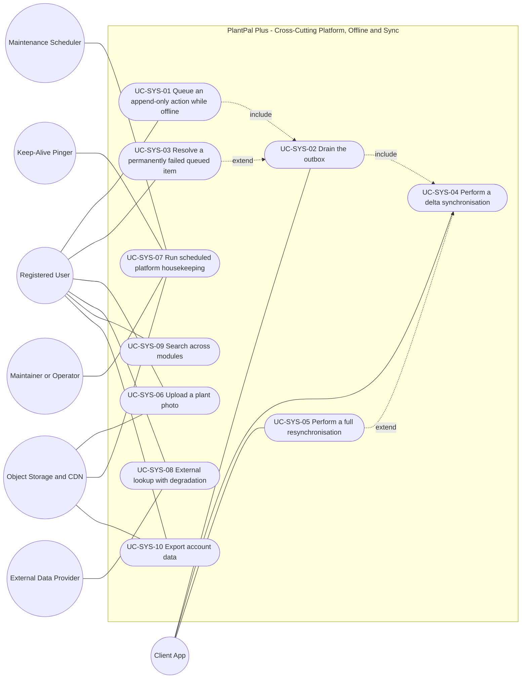
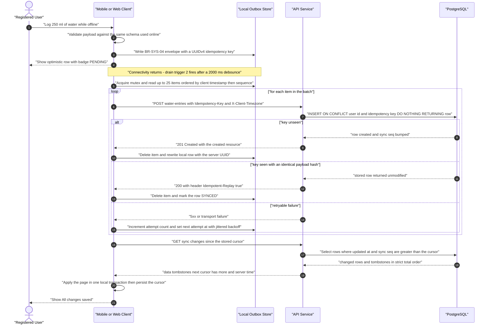
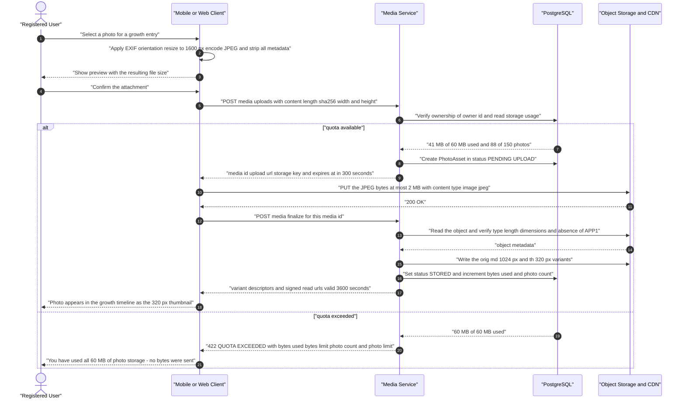
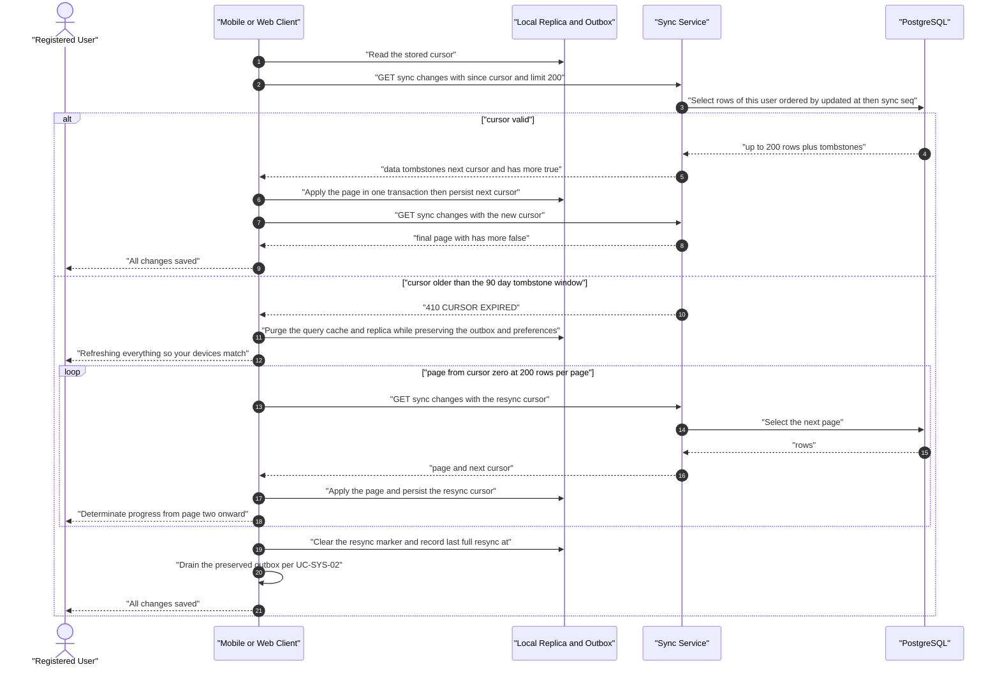

# Use-Case Model — Platform, Offline and Sync Services (`SYS`)

| Field | Value |
| --- | --- |
| Document | `use-cases/platform-and-sync.md` — authoritative use-case model for the cross-cutting platform, offline and synchronisation services |
| Version | 1.0 |
| Date | 2026-07-21 |
| Status | Approved for Phase 2 design |
| Owner | Rakshit — Project Lead / sole developer |
| Parent | [PlantPal+ Software Requirements Specification v1.0](../SRS.md) |
| Specification aligned to | [modules/platform-and-sync.md](../modules/platform-and-sync.md) v1.0 |
| Owned prefix | `UC-SYS` — `UC-SYS-01` … `UC-SYS-10`. `FR-SYS`, `BR-SYS`, `US-SYS`, `NFR-*`, `GOAL-*`, `STK-*` and `PER-*` identifiers are referenced only, never minted here |
| Use-case count | 10 use cases, 3 sequence diagrams, 4 modelled include/extend relationships |
| Source decisions | D-01 … D-11, with D-03, D-04, D-06 and D-09 as primary drivers |

---

## Table of contents

1. [Module use-case diagram](#1-module-use-case-diagram)
2. [Actor roles for this module](#2-actor-roles-for-this-module)
3. [Use-case specifications](#3-use-case-specifications)
   - [UC-SYS-01 — Queue an append-only action while offline](#uc-sys-01--queue-an-append-only-action-while-offline)
   - [UC-SYS-02 — Drain the outbox](#uc-sys-02--drain-the-outbox)
   - [UC-SYS-03 — Resolve a permanently failed queued item](#uc-sys-03--resolve-a-permanently-failed-queued-item)
   - [UC-SYS-04 — Perform a delta synchronisation](#uc-sys-04--perform-a-delta-synchronisation)
   - [UC-SYS-05 — Perform a full resynchronisation](#uc-sys-05--perform-a-full-resynchronisation)
   - [UC-SYS-06 — Upload a plant photo](#uc-sys-06--upload-a-plant-photo)
   - [UC-SYS-07 — Run scheduled platform housekeeping](#uc-sys-07--run-scheduled-platform-housekeeping)
   - [UC-SYS-08 — Look up data from an external provider with degradation](#uc-sys-08--look-up-data-from-an-external-provider-with-degradation)
   - [UC-SYS-09 — Search across modules](#uc-sys-09--search-across-modules)
   - [UC-SYS-10 — Export account data](#uc-sys-10--export-account-data)
4. [Sequence diagrams for the most complex use cases](#4-sequence-diagrams-for-the-most-complex-use-cases)
5. [Include and extend relationship catalogue](#5-include-and-extend-relationship-catalogue)
6. [Coverage and traceability checks](#6-coverage-and-traceability-checks)

---

## 1. Module use-case diagram

Every use case specified in section 3 appears in the diagram below. A dotted edge labelled `include` points **from the base use case to the included use case**. A dotted edge labelled `extend` points **from the extending use case to the base use case**, which is the UML 2.5 direction.

**Reading note for the evaluator.** Six of the ten use cases are user-goal level and carry a human primary actor. Four are system-driven: `UC-SYS-02`, `UC-SYS-04` and `UC-SYS-05` are driven by the Client App as an autonomous system actor, and `UC-SYS-07` is driven by a time actor. This asymmetry is deliberate and is the direct consequence of decision **D-04**: the offline-light contract makes durability and convergence machinery visible as first-class behaviour rather than hiding it inside the modules that consume it.

---

## 2. Actor roles for this module

| Actor | Type | Goals in this module |
| --- | --- | --- |
| Registered User | Primary (human) | Capture a log entry regardless of connectivity; know at a glance whether the entry is saved to the cloud; recover an entry that could not be sent; attach a plant photograph without leaking location or waiting on a slow connection; find any item from one search box; take a complete copy of personal data away from the service |
| Mobile Client — React Native / Expo | Primary (system) | Persist the read cache in MMKV; hold and drain the outbox; perform the client-side image transform; page a delta sync; rebuild the replica on a full resync; render the four sync states with accessible labels |
| Web Client — React + Vite | Primary (system) | The same goals as the Mobile Client, with IndexedDB as the persistence target and a Canvas re-encode as the image transform |
| API Service — Node.js + Express | System (secondary) | Enforce the API conventions of BR-SYS-27 and the error envelope of BR-SYS-28; perform the idempotent upsert of BR-SYS-05; apply rate and body-size limits; resolve feature flags; run cross-module search and the export job |
| Sync Service | System (logical component of the API Service) | Own `GET /api/v1/sync/changes`, validate the opaque cursor, emit tombstones, and issue the `CURSOR_EXPIRED` directive that forces a full resynchronisation |
| Media Service | System (logical component of the API Service) | Check quota before issuing anything; issue single-use signed upload URLs; validate and finalise uploads; generate the three variants; maintain storage counters |
| PostgreSQL Database — Neon or Supabase | System (secondary) | Hold the canonical state, the global `sync_seq` sequence, the seeded catalogues, the external lookup cache and the migration ledger |
| Maintenance Scheduler — in-process `node-cron` | Time | Reclaim orphaned media, purge expired tombstones, caches and export objects, recompute storage usage, and keep the storage provider warm |
| Keep-Alive Pinger — scheduled GitHub Actions workflow | Time | Call `GET /healthz` every 10 minutes so the Render free instance never sleeps and the in-process reminder engine keeps ticking |
| Object Storage and CDN — Supabase Storage, Cloudinary documented as the alternative | System (external) | Accept the direct signed `PUT`, store the `orig`, `md` and `th` variants and the export objects, and serve time-limited signed read URLs |
| Open Food Facts | System (external, flag-gated) | Supply barcode and food text enrichment when `integration.openfoodfacts.enabled` is true; disabled by default per D-03 |
| Perenual | System (external, flag-gated) | Supply plant species enrichment when `integration.perenual.enabled` is true; disabled by default per D-03 |
| Error Monitor — Sentry free tier | System (external) | Receive structured errors carrying `request_id`, plus the `RESYNC_LOOP_DETECTED`, `IDEMPOTENCY_KEY_CONFLICT` and quota-guard alerts |
| Maintainer / Operator — Rakshit | Secondary (human) | Flip feature flags without a redeploy; run migrations and seeds; read `/readyz`; respond to the storage and provider quota alarms |

---

## 3. Use-case specifications

Every use case below references at least one `FR-SYS-nn` from [modules/platform-and-sync.md](../modules/platform-and-sync.md) and at least one `US-SYS-nn`. Steps describe observable actor and system behaviour only; the numeric thresholds quoted in a step are the ones a tester must observe, and each is normative in the business rule named beside it.

---

### UC-SYS-01 — Queue an append-only action while offline

| Field | Value |
| --- | --- |
| Primary actor | Registered User |
| Secondary actors | Mobile Client or Web Client as the local runtime under discussion; no external actor participates while offline |
| Level | User-goal |
| Priority | Must |
| Release | v0.5 Alpha for the queueing behaviour of FR-SYS-02; the guardrail behaviour of FR-SYS-07 completes at v1.0 MVP |
| Frequency of use | Up to 20 logging actions per active user per day across the three habit modules; an estimated 5 to 15 percent of those are captured with no connectivity |
| Preconditions | The user is authenticated on this device; a working persistence layer is available — MMKV on mobile, IndexedDB on web; the outbox holds fewer than 200 items and fewer than 2 MB in total; the `sync.outbox.enabled` flag resolves to `true` |
| Trigger | The user confirms one of the seven append-only logging actions enumerated in BR-SYS-03 while the device reports `connectivity_state = OFFLINE` |
| Success guarantee | A `SyncOutboxItem` conforming to the BR-SYS-04 envelope, carrying a client-minted UUIDv4 `idempotency_key`, exists in durable local storage; an optimistic local row is visible in its module screen and in today's totals with the `PENDING` badge; the aggregate indicator reads "N waiting to sync" |
| Minimal guarantee | Either the entry is durably queued, or the user is told explicitly that it was not saved and the form contents are preserved in memory. No entry is ever accepted by the interface and then silently discarded |
| Related FRs | FR-SYS-02, FR-SYS-07, FR-SYS-01, FR-SYS-06, FR-SYS-22 |
| Related USs | US-SYS-01, US-SYS-05, US-SYS-03 |

**Main success scenario**

| # | Actor action | System response |
| --- | --- | --- |
| 1 | The Registered User opens the logging screen for one of the seven actions of BR-SYS-03 — for example water intake. | — |
| 2 | — | The system renders the form from the persisted read cache and displays the banner "Offline — showing data from `<absolute time>`". |
| 3 | The user enters the values, optionally back-dating `occurred_at` to any instant within `[now − 365 days, now + 24 hours]`, and confirms. | — |
| 4 | — | The system validates the payload against the same client-side schema used on the online path, mints a UUIDv4 `idempotency_key`, and writes the BR-SYS-04 envelope together with an optimistic local row in one local transaction. The envelope records `occurred_at`, `client_timestamp`, `client_timezone`, `client_local_date`, `enqueued_seq`, `device_id` and `schema_version`. |
| 5 | The user observes the new entry in the module list and in today's totals. | — |
| 6 | — | The system displays the `PENDING` badge on that row, with its accessible text label and its distinct icon shape, and increments the aggregate "N waiting to sync" indicator. |
| 7 | The user continues working or closes the application. | — |
| 8 | — | The system retains the outbox item across process termination and restart, and invokes **UC-SYS-02** at the next drain trigger of BR-SYS-06. |

**Extensions**

| Step | Condition | Handling |
| --- | --- | --- |
| 2a | The screen has no cached entry and the device is offline. | 2a1 The system renders the `OFFLINE_NO_CACHE` empty state with the message "This screen needs a connection the first time you open it." and a retry control. 2a2 The use case ends without an enqueue. |
| 3a | The user selects a photograph for a growth entry. | 3a1 The system offers "You can save this entry now and add the photo when you are back online." 3a2 On acceptance the text entry is queued with `media_id` absent, per BR-SYS-03 rule 2. 3a3 The selection is never discarded silently. |
| 4a | Local schema validation fails. | 4a1 The system marks the offending field inline and nothing is enqueued. 4a2 Flow returns to step 3. |
| 4b | The serialised payload exceeds 16 384 bytes. | 4b1 The system rejects the action at the form and identifies the oversized field with "That note is too long to save offline. Please shorten it to continue." |
| 4c | The outbox already holds 200 items or 2 MB. | 4c1 The system shows a blocking dialog reading "You have 200 entries waiting to sync. Connect to the internet so PlantPal+ can save them before adding more." 4c2 No queued item is evicted to make room, per BR-SYS-09 rule 1. |
| 4d | `client_timezone` is not a recognised IANA identifier. | 4d1 The system falls back to the profile timezone and then to `UTC`, records the event for the error monitor, and saves the entry with no user-visible message. |
| 4e | The device reports connectivity at the moment of enqueue. | 4e1 The system enqueues exactly as in step 4 and immediately invokes **UC-SYS-02** under BR-SYS-06 trigger 1. |
| 7a | The user signs out while items are still queued. | 7a1 The system offers "You have N entries waiting to sync. Keep them for next time?" with "Sign out and keep them" as the default. 7a2 The outbox is retained scoped to `user_id`. |

**Exception flows**

| Condition | System behaviour | Outcome |
| --- | --- | --- |
| The local persistence write fails with `LOCAL_STORAGE_FULL` | The enqueue is aborted and the form contents are preserved in memory: "Your device is out of storage, so this entry could not be saved. Free up space and try again." | No item queued; no data lost from the form |
| The persistence layer is unavailable for the session — Safari private browsing blocks IndexedDB, or an MMKV write fails | Offline queueing is disabled for the session per BR-SYS-02 rule 4 and the action is treated as connectivity-required under FR-SYS-07: "Offline saving is not available in this browser. Reconnect to log this entry." | The user is never given a queue that cannot survive a reload |
| The user attempts an action outside the seven codes of BR-SYS-03 while offline | The submit control is disabled with a programmatically associated explanation and a "Try again" affordance, per FR-SYS-07: "This action needs an internet connection." | Nothing is added to the outbox |
| The `sync.outbox.enabled` flag resolves to `false` | Every write requires connectivity, per BR-SYS-22 | The offline path is switched off cleanly rather than failing |
| `occurred_at` lies outside `[now − 365 days, now + 24 hours]` | The form rejects the value before enqueue and names the permitted range | The item never reaches the server to be rejected with `CLIENT_CLOCK_INVALID` |
| The application is terminated between the optimistic row write and the outbox write | Both writes are in one local transaction, so neither is observable alone | The replica and the outbox cannot diverge |

**Special requirements**

| Reference | Obligation carried by this use case |
| --- | --- |
| NFR-USAB-07 | The offline state and the capture time of the served data are visible on every screen used in this flow |
| NFR-USAB-08 | Draft input is preserved through validation failure, storage failure and connectivity change |
| NFR-USAB-01 | Queueing must not add a step: the offline path uses the same confirm control as the online path |
| NFR-RELI-04 | The client-minted idempotency key is what makes the later replay safe |
| NFR-A11Y-08 | The `PENDING` state carries a text label and a distinct icon shape, never colour alone |
| NFR-DATA-09 | Durability of the queued item across process termination |
| NFR-PERF-02 | The optimistic row appears without waiting on any network call |

---

### UC-SYS-02 — Drain the outbox

| Field | Value |
| --- | --- |
| Primary actor | Mobile Client or Web Client, acting autonomously |
| Secondary actors | API Service, PostgreSQL Database, Registered User as observer of the aggregate indicator |
| Level | Subfunction — included by UC-SYS-01 and additionally started by five autonomous triggers of BR-SYS-06 |
| Priority | Must |
| Release | v0.5 Alpha |
| Frequency of use | On each of the six triggers of BR-SYS-06; in practice 10 to 60 cycles per device per day, plus a 60-second periodic timer while online with a non-empty queue |
| Preconditions | `auth_state = AUTHENTICATED`; `connectivity_state = ONLINE`; the in-memory mutex is free and the persisted `drain_lock_until` stamp lies in the past |
| Trigger | Any of the six triggers of BR-SYS-06: enqueue while online, an offline-to-online transition debounced at 2000 ms, application foreground debounced at 500 ms, successful sign-in or token refresh, the 60-second periodic timer, or the user tapping "Sync now" |
| Success guarantee | Every eligible item reached `SYNCED` exactly once server-side; `last_successful_sync_at` is updated; UC-SYS-04 has been invoked when at least one item reached `SYNCED`; the mutex is released |
| Minimal guarantee | No queued item is lost; no item produces more than one server row, because the upsert is keyed on `(user_id, idempotency_key)`; every item state is persisted; the mutex and `drain_lock_until` stamp are released even on abnormal termination through the 60-second lock expiry |
| Related FRs | FR-SYS-04, FR-SYS-03, FR-SYS-05, FR-SYS-06, FR-SYS-21, FR-SYS-19, FR-SYS-18 |
| Related USs | US-SYS-01, US-SYS-03, US-SYS-04 |

**Main success scenario**

| # | Actor action | System response |
| --- | --- | --- |
| 1 | The Client App observes a BR-SYS-06 trigger, acquires the single-flight mutex, persists `drain_lock_until = now + 60 s` and selects at most 25 eligible items ordered ascending by `(client_timestamp, enqueued_seq)`, skipping any item whose `next_attempt_at` is in the future. | — |
| 2 | — | The system marks the first item `SYNCING` and renders the aggregate state "Syncing…" with its accessible label, honouring the reduce-motion preference. |
| 3 | The Client App sends the item as one HTTP `POST` to the BR-SYS-03 endpoint for its action, carrying the `Idempotency-Key`, `X-Client-Timestamp`, `X-Client-Timezone` and `X-Request-Id` headers. | — |
| 4 | — | The API Service validates the headers and body, derives `local_date` and `tz_at_capture` server-side per BR-SYS-31, executes `INSERT … ON CONFLICT (user_id, idempotency_key) DO NOTHING RETURNING *`, bumps `sync_seq`, and returns HTTP 201 with the created resource. |
| 5 | The Client App rewrites the optimistic local row with the server-assigned UUID, deletes the outbox item and records the item as `SYNCED`. | — |
| 6 | — | The system decrements the pending count and re-renders that row's per-record badge as `SYNCED`. |
| 7 | The Client App repeats steps 3 to 6 for the remaining items of the batch, then yields for 500 ms before starting the next batch of at most 25. | — |
| 8 | — | The system updates `last_successful_sync_at` and renders "All changes saved" once the outbox is empty. |
| 9 | The Client App invokes **UC-SYS-04** so that server-derived values — recomputed watering schedules, streaks and achievement unlocks — are pulled back. | — |
| 10 | — | The system releases the mutex, clears `drain_lock_until`, and writes a structured client log entry recording items attempted, succeeded, retried and failed. |

**Extensions**

| Step | Condition | Handling |
| --- | --- | --- |
| 1a | A second trigger, or a second browser tab of the same account, attempts a drain while one is running. | 1a1 The in-memory mutex and the persisted `drain_lock_until` stamp reject the second attempt. 1a2 It is retried after the current cycle, with no user-visible message. |
| 1b | `auth_state` is `TOKEN_EXPIRED` or `SIGNED_OUT`. | 1b1 The cycle exits before any network call. 1b2 Items remain `PENDING`. |
| 1c | The queue is empty when the trigger fires. | 1c1 The cycle exits immediately with no network call and the indicator reads "All changes saved". |
| 1d | An item was observed in `SYNCING` for more than 60 seconds at start-up. | 1d1 The system resets it to `PENDING` with `attempt_count` unchanged, which is safe by construction because of FR-SYS-03. |
| 4a | The key has been seen before and `payload_hash` is identical. | 4a1 The API Service returns HTTP 200 with the byte-identical stored row and the header `Idempotent-Replay: true`. 4a2 The stored row is never modified. 4a3 The item is classified `SUCCESS` and reaches `SYNCED`. |
| 4b | The API Service returns HTTP 408, 425, 429, 500, 502, 503 or 504, or the transport fails with `NETWORK_UNREACHABLE`, `DNS_FAILURE`, `TLS_FAILURE` or `TIMEOUT`. | 4b1 The item is classified `RETRYABLE` per BR-SYS-08. 4b2 `next_attempt_at` is set from `delay_ms(n) = min(3 600 000, 2000 × 2^(n−1)) × jitter`, jitter uniform in `[0.8, 1.2]`. 4b3 A `Retry-After` header on 429 or 503 overrides the computed delay when it is larger. |
| 4c | The API Service returns HTTP 401 with `TOKEN_EXPIRED` or `UNAUTHENTICATED`. | 4c1 The item is classified `AUTH`; the whole cycle pauses. 4c2 One token refresh is attempted and the cycle resumes. 4c3 If the refresh fails, every item stays `PENDING` and the user is prompted: "Please sign in again to finish saving your entries." |
| 4d | The failure is classified `TERMINAL` per BR-SYS-08. | 4d1 The item moves straight to `FAILED` without consuming further attempts. 4d2 The cycle continues with the remaining items, because append-only items are mutually independent. 4d3 The extension point for **UC-SYS-03** is reached and the indicator reads "1 needs your attention". |
| 7a | Connectivity is lost mid-cycle. | 7a1 The in-flight item returns to `PENDING`, the cycle ends cleanly, and the next offline-to-online transition restarts it: "Waiting for a connection to save N entries." |
| 7b | A batch of 25 completes with items still queued. | 7b1 The client yields for 500 ms and starts the next batch, keeping the "Syncing…" state visible. |
| 9a | No item reached `SYNCED` during the cycle. | 9a1 UC-SYS-04 is not invoked, sparing a needless request against the Neon free compute budget. |

**Exception flows**

| Condition | System behaviour | Outcome |
| --- | --- | --- |
| The process is killed mid-cycle | Items stranded in `SYNCING` for more than 60 seconds are reset to `PENDING` at next start and retried; the replay is safe because of the idempotency key | No duplicate rows, no lost items |
| The tenth `RETRYABLE` failure occurs on one item | The item becomes `FAILED` and is listed in the needs-attention screen with `last_error_code` and a plain-English `last_error_message` | Approximately 17 minutes of connected retry time has elapsed |
| HTTP 409 `IDEMPOTENCY_KEY_CONFLICT` — the key was seen with a different `payload_hash` | The stored row is never modified; the item is `TERMINAL` and the event is reported to the error monitor as a client defect | "This entry could not be saved because of an app error. Please retry or discard it." |
| HTTP 422 `CLIENT_CLOCK_INVALID` | `TERMINAL`; the captured time is shown to the user | "Your device clock was wrong when this was saved on `<captured time>`." |
| HTTP 404 `PARENT_NOT_FOUND` — the plant or goal was deleted on another device | `TERMINAL`, with Discard offered as the primary action in UC-SYS-03 | "The plant this entry belongs to was deleted." |
| The item's `schema_version` is unknown to this build | The item moves to `FAILED` with `OUTBOX_SCHEMA_UNSUPPORTED` and is retained, never dropped | The user is advised to update the application |
| Any HTTP 5xx | The item remains queued and the retry is safe by construction | The indicator continues to show the item as waiting |
| The `LOG_WRITE` rate-limit bucket is exhausted | HTTP 429 with `Retry-After`; classified `RETRYABLE`; throughput degrades but nothing is lost | The tier of BR-SYS-30 is sized so a legitimate burst of 25 never trips it |

**Special requirements**

| Reference | Obligation carried by this use case |
| --- | --- |
| NFR-RELI-04 | Bounded retry, jittered backoff and idempotent replay are the whole substance of this use case |
| NFR-PERF-02 | Warm write latency budget for each individual `POST` in step 3 |
| NFR-OBSV-02 | `X-Request-Id` is generated or forwarded on every request in step 3 and appears in every log record |
| NFR-OBSV-03 | `TERMINAL` classifications that indicate a client defect are reported to the error monitor |
| NFR-SEC-11 | The drain must remain inside the `LOG_WRITE` rate-limit tier |
| NFR-RELI-08 | Sequential dispatch, one request per item, keeps the connection pool inside its bounds |
| NFR-A11Y-07 | The "Syncing…" activity animation is replaced by a static icon plus text when reduce-motion is enabled |
| NFR-USAB-07 | The aggregate state is visible throughout the cycle |

---

### UC-SYS-03 — Resolve a permanently failed queued item

| Field | Value |
| --- | --- |
| Primary actor | Registered User |
| Secondary actors | Mobile Client or Web Client; API Service on a retry; Error Monitor |
| Level | User-goal |
| Priority | Must |
| Release | v0.5 Alpha |
| Frequency of use | Rare by design — expected fewer than 1 occurrence per user per month; the automatic cold-start retry of BR-SYS-07 rule 3 resolves most transient cases with no user action at all |
| Preconditions | At least one outbox item is in state `FAILED`; the user is authenticated on this device |
| Trigger | The user opens the "Needs attention" screen, reached from the aggregate indicator reading "N need your attention" or from the badged settings entry point |
| Success guarantee | Every item the user acts on has either returned to `PENDING` with `attempt_count` reset to 0 and been scheduled for the next drain cycle, or been removed after an explicit confirmation that named exactly what would be lost |
| Minimal guarantee | No queued item is removed without an explicit, user-initiated confirmation; the raw BR-SYS-04 envelope remains copyable for support; an item the user does not act on stays in the list indefinitely, including past 30 days |
| Related FRs | FR-SYS-06, FR-SYS-05, FR-SYS-19 |
| Related USs | US-SYS-04, US-SYS-03 |

**Main success scenario**

| # | Actor action | System response |
| --- | --- | --- |
| 1 | The Registered User taps the aggregate indicator reading "N need your attention". | — |
| 2 | — | The system opens the needs-attention screen listing every `FAILED` item with its owning module, a human-readable summary, the capture time, and the failure reason in plain English. |
| 3 | The user selects one item. | — |
| 4 | — | The system shows the failure detail sheet carrying `last_error_code`, `last_error_message`, `attempt_count`, the captured instant, and the actions Retry, Discard and Copy details. |
| 5 | The user taps Retry. | — |
| 6 | — | The system returns the item to `PENDING`, resets `attempt_count` to 0, clears `next_attempt_at`, schedules it for the next cycle of **UC-SYS-02**, and displays "Retrying…". |
| 7 | The user observes the item reach `SYNCED` and leave the list. | — |
| 8 | — | The system re-renders the aggregate indicator, which reads "All changes saved" once no `FAILED` and no `PENDING` items remain, and clears the settings badge count. |

**Extensions**

| Step | Condition | Handling |
| --- | --- | --- |
| 2a | An item has been queued for more than 30 days. | 2a1 The system retains it and flags it "Saved 30+ days ago and still not synced", per BR-SYS-09. 2a2 It is never removed automatically. |
| 2b | A `FAILED` item self-heals through the automatic cold-start retry before the user acts. | 2b1 The item reaches `SYNCED` silently and leaves the list with no user action, per BR-SYS-07 rule 3. |
| 2c | The outbox holds 200 `FAILED` items, which is the shared item cap. | 2c1 New offline logging is refused under UC-SYS-01 extension 4c until the user resolves some items. |
| 5a | The user taps Discard. | 5a1 The system shows a confirmation naming exactly what will be lost — for example "Discard this 250 ml water entry from 21 July? This cannot be undone." 5a2 Only after confirmation are the outbox item and its optimistic local row removed. 5a3 On cancellation nothing changes. |
| 5b | The user taps Copy details. | 5b1 The system copies the raw BR-SYS-04 envelope JSON to the clipboard for support, including `idempotency_key`, `last_error_code` and `request_id`. |
| 5c | The failure reason is HTTP 404 `PARENT_NOT_FOUND`. | 5c1 Discard is presented as the primary action, because a retry cannot succeed: "The plant this entry belongs to was deleted." |
| 6a | The device is offline when Retry is tapped. | 6a1 The item stays `PENDING` and is dispatched at the next connectivity-restored trigger of BR-SYS-06. |
| 6b | The retry fails terminally again. | 6b1 The item returns to `FAILED` with an updated reason and remains in the list. |

**Exception flows**

| Condition | System behaviour | Outcome |
| --- | --- | --- |
| The reason is `IDEMPOTENCY_KEY_CONFLICT` | The item is presented as an application defect and the event has already been reported to the error monitor | "This entry could not be saved because of an app error. Please retry or discard it." |
| The reason is `CLIENT_CLOCK_INVALID` | The captured instant is displayed so the user can judge whether the entry is worth re-creating | "Your device clock was wrong when this was saved on `<captured time>`." |
| The reason is `OUTBOX_SCHEMA_UNSUPPORTED` | The item is retained and the user is advised to update the application; it is never dropped | The entry survives an application downgrade |
| The user signs out with `FAILED` items present | "Sign out and keep them for next time" is offered as the default, with "Sign out and discard" as the explicit alternative | Queued data is destroyed only by deliberate choice |
| The clipboard is unavailable on this platform | The envelope JSON is displayed in a selectable, scrollable field instead | Support information remains obtainable |

**Special requirements**

| Reference | Obligation carried by this use case |
| --- | --- |
| NFR-USAB-03 | Every reason string in step 2 and step 4 comes from the actionable error-message catalogue; no raw error code is shown alone |
| NFR-USAB-04 | Discard is a destructive action and requires a confirmation that names the specific entry |
| NFR-A11Y-08 | The `FAILED` state carries a text label and a distinct icon shape, never colour alone |
| NFR-A11Y-10 | The transition to "Retrying…" and the emptying of the list are announced to assistive technology |
| NFR-I18N-01 | Reasons are rendered from `message_key` values so the locale catalogue can be populated without a server change |
| NFR-OBSV-03 | `request_id` is present in the copied envelope so a user report can be tied to a server log line |

---

### UC-SYS-04 — Perform a delta synchronisation

| Field | Value |
| --- | --- |
| Primary actor | Mobile Client or Web Client, acting autonomously |
| Secondary actors | Sync Service, PostgreSQL Database |
| Level | Subfunction — included by UC-SYS-02 and additionally started on foreground, on pull-to-refresh and on the periodic timer |
| Priority | Must |
| Release | v1.0 MVP |
| Frequency of use | Approximately 20 to 100 cycles per device per day; each cycle is one or more pages of at most 200 rows |
| Preconditions | The user is authenticated; a stored cursor exists for this `(user_id, device_id)` pair; the `sync.delta.enabled` flag resolves to `true`; the device reports connectivity |
| Trigger | Application foreground, completion of a drain cycle in which at least one item reached `SYNCED`, a user pull-to-refresh, or the periodic timer |
| Success guarantee | The local replica contains every row of that user created, updated or soft-deleted after the stored cursor, tombstoned rows have been removed from the replica and from the persisted read cache, and the stored cursor has advanced to the `next_cursor` of the last committed page |
| Minimal guarantee | The cursor advances only after a page transaction commits, so a crash mid-page re-applies that page rather than skipping it; the outbox is never touched; no row belonging to another user is ever applied |
| Related FRs | FR-SYS-08, FR-SYS-22, FR-SYS-20, FR-SYS-01, FR-SYS-19 |
| Related USs | US-SYS-11, US-SYS-02 |

**Main success scenario**

| # | Actor action | System response |
| --- | --- | --- |
| 1 | The Client App reads the stored cursor and issues `GET /api/v1/sync/changes` with `since`, an optional `collections` filter and `limit` of 200. | — |
| 2 | — | The Sync Service verifies the access token, decodes the base64url cursor `{ v, u, s }`, and selects rows of that user across the 16 synced collections of BR-SYS-13 where `(updated_at, sync_seq) > cursor`, ordered ascending by the same tuple. |
| 3 | The Client App receives one page containing `data`, `tombstones`, `next_cursor`, `has_more` and `server_time`. | — |
| 4 | — | The system truncates the page below `limit` whenever the serialised body would exceed 1 MB, leaving `has_more` set to `true`. |
| 5 | The Client App applies the page inside a single local transaction, upserting rows by primary key and removing every tombstoned row from the replica and from the persisted read cache. | — |
| 6 | — | The system persists `next_cursor` only after that transaction commits. |
| 7 | The Client App repeats steps 1 to 6 while `has_more` is `true`. | — |
| 8 | — | The system records `last_delta_sync_at`, refreshes the affected screens from the updated cache, and renders "All changes saved". |

**Extensions**

| Step | Condition | Handling |
| --- | --- | --- |
| 1a | No cursor is stored for this device. | 1a1 The client raises trigger `NO_STORED_CURSOR` and **UC-SYS-05** runs instead of this use case. |
| 1b | `limit` above 500 is requested. | 1b1 The Sync Service returns HTTP 400 `VALIDATION_FAILED` naming `limit`. |
| 1c | The `sync.delta.enabled` flag resolves to `false`. | 1c1 The client falls back to a full collection fetch on launch, per BR-SYS-22. |
| 2a | The cursor cannot be decoded or carries an unknown `v` field. | 2a1 HTTP 400 `INVALID_CURSOR`. 2a2 The client raises trigger `INVALID_CURSOR` and **UC-SYS-05** runs: "Getting your data ready…". |
| 2b | The cursor `updated_at` is older than the 90-day tombstone window. | 2b1 HTTP 410 `CURSOR_EXPIRED`, because the tombstones that would have announced deletions may already be purged. 2b2 The client raises trigger `CURSOR_EXPIRED` and **UC-SYS-05** runs: "Refreshing everything so your devices match." |
| 2c | An unknown collection name is supplied in `collections`. | 2c1 HTTP 400 `UNKNOWN_QUERY_PARAM` naming the offending value. |
| 3a | A tombstone arrives for a row the client has never seen. | 3a1 It is applied as a no-op without error. |
| 5a | The application is killed after applying a page but before persisting the cursor. | 5a1 The page is re-applied on next launch; upserting by primary key makes re-application harmless. |
| 5b | A row was updated and then soft-deleted between two pages. | 5b1 The final emitted version wins, because ordering is by `(updated_at, sync_seq)` and `sync_seq` is a strict total order. |
| 8a | The device is offline when a trigger fires. | 8a1 No cycle starts; cached reads continue to be served under FR-SYS-01 with the offline banner. |

**Exception flows**

| Condition | System behaviour | Outcome |
| --- | --- | --- |
| The `SYNC` rate-limit bucket of 60 requests per minute per user is exhausted | HTTP 429 `RATE_LIMITED` with `Retry-After`, which the client honours | Paging resumes; no data is lost |
| The access token expires mid-paging | One refresh is attempted and paging resumes from the stored cursor | At most one page is re-requested |
| The database is unreachable | HTTP 503 in the uniform envelope; the aggregate state becomes `FAILED` | "Sync failed. Tap to try again." |
| Local storage fills while applying a page | Eviction runs once down to 80 percent of budget; on a second failure persistence is disabled for the session | The session continues in memory rather than failing |
| A row belonging to another user would be emitted | Impossible by construction: every query filters `user_id = <token subject>` and the endpoint accepts no user parameter | Enforced by NFR-SEC-14 |
| A page is applied twice because of a duplicated response | Upsert by primary key makes the second application a no-op | Convergence is unaffected |

**Special requirements**

| Reference | Obligation carried by this use case |
| --- | --- |
| NFR-DATA-05 | Convergence of the local replica with the server, which is the source of truth |
| NFR-SCAL-04 | Keyset pagination on `(updated_at, sync_seq)`, never offset pagination |
| NFR-PERF-11 | The 1 MB per-page body cap that protects a metered mobile connection |
| NFR-SEC-14 | The server-side ownership predicate on every synced collection |
| NFR-PERF-01 | Warm read latency for each page request |
| NFR-RELI-08 | Paging must not saturate the connection pool of the single free instance |

---

### UC-SYS-05 — Perform a full resynchronisation

| Field | Value |
| --- | --- |
| Primary actor | Mobile Client or Web Client, acting autonomously |
| Secondary actors | Sync Service, Registered User as observer of the progress indicator, Error Monitor |
| Level | Subfunction — extends UC-SYS-04 |
| Priority | Must |
| Release | v1.0 MVP |
| Frequency of use | Rare — first launch on a device, account switch, cursor expiry or a local schema bump; expected fewer than 5 occurrences per device per year, with a hard ceiling of 3 per device per hour |
| Preconditions | The user is authenticated; one of the eight triggers of BR-SYS-15 has fired; fewer than 3 full resyncs have run on this device in the last hour |
| Trigger | Any BR-SYS-15 trigger: `NO_STORED_CURSOR`, `CURSOR_EXPIRED`, `INVALID_CURSOR`, `LOCAL_SCHEMA_VERSION_LOW`, `APP_DATA_VERSION_BUMPED`, `USER_RESET_LOCAL_DATA`, `ACCOUNT_SWITCH` or `INTEGRITY_CHECK_FAILED` |
| Success guarantee | The local replica and persisted query cache are rebuilt from cursor `"0"`; the outbox and device-local preferences are intact; a fresh cursor and `last_full_resync_at` are recorded; the outbox is drained afterwards |
| Minimal guarantee | The outbox is never purged under any trigger or failure path; a partially completed resync leaves a persisted `resync_in_progress` marker and resumes at the next launch; rows already applied remain readable and are labelled as partially synced |
| Related FRs | FR-SYS-09, FR-SYS-08, FR-SYS-01, FR-SYS-02 |
| Related USs | US-SYS-11, US-SYS-02 |

**Main success scenario**

| # | Actor action | System response |
| --- | --- | --- |
| 1 | The Client App detects a BR-SYS-15 trigger and requests the drain mutex. | — |
| 2 | — | The system grants the mutex once any running drain cycle has completed. |
| 3 | The Client App purges the persisted query cache and the local replica while explicitly preserving the outbox and the device-local preferences, and writes the `resync_in_progress` marker. | — |
| 4 | — | The system displays "Getting your data ready…" with an indeterminate indicator. |
| 5 | The Client App pages from cursor `"0"` at 200 rows per page, persisting `resync_cursor` after each committed page. | — |
| 6 | — | The system displays determinate progress from the second page onward, so the user can see how much remains. |
| 7 | The Client App applies the final page, clears the `resync_in_progress` marker, records `last_full_resync_at` and releases the mutex. | — |
| 8 | — | The system invokes **UC-SYS-02** to drain the preserved outbox and then renders "All changes saved". |

**Extensions**

| Step | Condition | Handling |
| --- | --- | --- |
| 1a | A drain cycle is already in progress. | 1a1 The resync is queued behind it and starts when the mutex is released: "Finishing saving your entries first…". |
| 1b | More than 3 full resyncs have already run on this device within the hour. | 1b1 Automatic resyncs stop. 1b2 `RESYNC_LOOP_DETECTED` is reported to the error monitor: "Sync is having trouble. Please try again later." |
| 3a | The trigger is `ACCOUNT_SWITCH`. | 3a1 The previous account's cache is purged. 3a2 The outbox is retained only when it belongs to the same `user_id`: "Loading `<display name>`'s data…". |
| 3b | The trigger is `USER_RESET_LOCAL_DATA`. | 3b1 An explicit confirmation is required first: "This clears the copy on this device and downloads it again. Entries waiting to sync are kept." |
| 3c | The trigger is `INTEGRITY_CHECK_FAILED`, raised by the nightly comparison of local per-collection row counts against the server counts outside a 2 percent tolerance. | 3c1 The resync is scheduled for the next application foreground rather than run immediately. |
| 5a | The application is killed mid-resync. | 5a1 The marker persists and paging continues from the stored `resync_cursor` at the next launch. |
| 5b | Local storage fills during the resync. | 5b1 Eviction runs once. 5b2 Persistence is then disabled for the session and the resync continues in memory: "We could not store all your data on this device." |
| 6a | The first page is still loading. | 6a1 An indeterminate indicator is shown; determinate progress begins at page two. |

**Exception flows**

| Condition | System behaviour | Outcome |
| --- | --- | --- |
| The resync fails midway | The `resync_in_progress` marker persists, the application retries at next launch, and the rows already landed continue to be served | "Partly synced — we will finish this next time you open the app." |
| Connectivity is lost mid-resync | Paging pauses and resumes at the next connectivity-restored trigger of BR-SYS-06 from the stored `resync_cursor` | No page is re-downloaded unnecessarily |
| The access token expires mid-resync | One refresh is attempted and paging resumes; on refresh failure the marker persists and sign-in is prompted | The outbox and the partial replica both survive |
| A cursor error is returned while paging from `"0"` | Treated as a hard integrity error, reported to the error monitor with `request_id`, and the marker is retained | Cannot recur through the normal path, because `"0"` is always valid |
| The device is restored from a backup carrying a stale replica | `LOCAL_SCHEMA_VERSION_LOW` or `APP_DATA_VERSION_BUMPED` fires at start-up and this use case rebuilds the replica | Drift is repaired by total reset rather than by repair logic |
| A user signs out during a resync | The resync is abandoned, the cache is purged and the outbox is retained scoped to `user_id` | Queued writes survive the sign-out |

**Special requirements**

| Reference | Obligation carried by this use case |
| --- | --- |
| NFR-DATA-05 | A correct, total reset is the escape hatch that removes any need for replica repair logic |
| NFR-PERF-11 | The 200-row page size and the 1 MB body cap bound the data cost of a rebuild |
| NFR-USAB-07 | Determinate progress from the second page, so a long rebuild never looks like a hang |
| NFR-A11Y-10 | Progress and completion are announced to assistive technology, not conveyed by animation alone |
| NFR-RELI-04 | Resumability across process termination |
| NFR-OBSV-03 | `RESYNC_LOOP_DETECTED` gives the operator visibility of a reset loop |

---

### UC-SYS-06 — Upload a plant photo

| Field | Value |
| --- | --- |
| Primary actor | Registered User |
| Secondary actors | Media Service, Object Storage and CDN, Error Monitor |
| Level | User-goal |
| Priority | Must |
| Release | v0.5 Alpha for the client transform and the signed upload of FR-SYS-10 and FR-SYS-11; v1.0 MVP for the variants, delivery and quota of FR-SYS-12 and FR-SYS-14 |
| Frequency of use | 1 to 5 photographs per active user per week, bounded absolutely by the per-account ceiling of 150 photographs and 60 MB |
| Preconditions | The user is authenticated and the device reports connectivity; the `media.uploads.enabled` flag resolves to `true`; the growth-log entry or plant the photograph attaches to already exists server-side; the user is below 60 MB and 150 photographs; global bucket usage is below 850 MB |
| Trigger | The user selects an image from the camera, the gallery, a web file input or a drag-and-drop |
| Success guarantee | A `PhotoAsset` in status `STORED` exists with the `orig`, `md` and `th` variants under the deterministic BR-SYS-19 key layout, the stored bytes contain no EXIF, IPTC or XMP metadata and no GPS coordinates, `storage_usage.bytes_used` and `photo_count` are incremented, and the photograph is visible in the growth timeline |
| Minimal guarantee | No image bytes leave the device before the quota check has passed; no partially validated object is ever exposed to a read path; a failed or abandoned upload leaves no counted storage and is reclaimed by UC-SYS-07 within 24 hours |
| Related FRs | FR-SYS-10, FR-SYS-11, FR-SYS-12, FR-SYS-14, FR-SYS-07 |
| Related USs | US-SYS-06, US-SYS-07 |

**Main success scenario**

| # | Actor action | System response |
| --- | --- | --- |
| 1 | The Registered User selects an image from the camera, the gallery, a file input or a drag-and-drop. | — |
| 2 | — | The system validates the input MIME against `image/jpeg`, `image/png`, `image/heic`, `image/heif` and `image/webp` and the 15 728 640 byte input ceiling, applies EXIF orientation to the pixels, resizes the longest edge to at most 1600 px without upscaling, re-encodes to JPEG along the quality ladder 0.75 then 0.65 then 0.55 of BR-SYS-16, strips all EXIF, IPTC and XMP metadata, and shows a preview with the resulting byte size. |
| 3 | The user confirms the attachment to the growth-log entry. | — |
| 4 | — | The Media Service verifies that the caller owns `owner_id`, checks the per-user and global quota **before** issuing anything, creates a `PhotoAsset` in status `PENDING_UPLOAD`, and returns `media_id`, `upload_url`, `method`, `headers`, `storage_key` and `expires_at` for a single-use `PUT` restricted to `image/jpeg` and 2 097 152 bytes, valid for 300 seconds. |
| 5 | The user watches an upload progress indicator and is free to navigate to other screens. | — |
| 6 | — | The client uploads the JPEG directly to Object Storage with one `PUT`, so no image byte ever passes through the API process, and then calls `POST /api/v1/media/{mediaId}/finalize` with the declared `sha256`, `content_length`, `width` and `height`. |
| 7 | The user returns to the growth timeline. | — |
| 8 | — | The Media Service verifies at finalisation that the object exists, the content type is `image/jpeg`, the byte length is within ±5 percent of the declared value and at most 2 MB, the image decodes, the longest edge lies between 200 px and 1600 px, and no `APP1` segment is present; generates the `orig`, `md` at 1024 px and `th` at 320 px variants at JPEG quality 0.75; sets status `STORED`; increments the storage counters; and returns the variant descriptors with signed read URLs valid for 3600 seconds. |
| 9 | The user sees the photograph in the growth timeline. | — |
| 10 | — | The system renders the 320 px `th` variant in grids and lists and the 1024 px `md` variant on the detail screen, and updates the storage meter in settings. |

**Extensions**

| Step | Condition | Handling |
| --- | --- | --- |
| 1a | The input MIME is outside the allowlist. | 1a1 Rejected before any processing with `UNSUPPORTED_MEDIA_TYPE`: "PlantPal+ accepts JPEG, PNG, HEIC and WebP images." |
| 1b | The input file is larger than 15 MB. | 1b1 Rejected before decoding: "That image is larger than the 15 MB limit. Please choose a smaller one." |
| 1c | The decoded longest edge is below 200 px. | 1c1 Rejected: "That image is too small to add to your growth log." |
| 1d | A HEIC file cannot be decoded on this platform. | 1d1 Rejected with `UNSUPPORTED_MEDIA_TYPE` plus guidance: "This device cannot read that HEIC file. Please save it as a JPEG and try again." |
| 1e | The file is removed from the device between selection and upload. | 1e1 Aborted with `MEDIA_SOURCE_UNAVAILABLE`: "That photo is no longer available on your device." |
| 2a | The output cannot be brought under 2 MB after the full ladder including the second pass at 1280 px. | 2a1 Aborted with `MEDIA_TOO_LARGE`: "We could not compress that photo enough. Please choose a different image." |
| 4a | The per-user quota of 60 MB or 150 photographs is already reached. | 4a1 HTTP 422 `QUOTA_EXCEEDED` carrying `bytes_used`, `bytes_limit`, `photo_count` and `photo_limit`. 4a2 No URL is issued and no byte is sent. 4a3 A shortcut to the photo-management screen is offered. |
| 4b | Usage crosses 80 percent — 48 MB or 120 photographs — or 95 percent — 57 MB or 143 photographs. | 4b1 An informational notice, then a warning with a link to photo management, each shown once per threshold crossing. |
| 4c | The caller does not own `owner_id`. | 4c1 HTTP 404 `NOT_FOUND`, never 403, so object existence cannot be probed: "That plant could not be found." |
| 4d | Global bucket usage has reached the 850 MB guard. | 4d1 HTTP 503 `STORAGE_CAPACITY_REACHED` and an operator alert. 4d2 Existing photographs remain readable: "Photo uploads are temporarily unavailable. Your existing photos are safe." |
| 6a | The signed URL expires before the `PUT` completes. | 6a1 HTTP 422 `UPLOAD_URL_EXPIRED`. 6a2 A fresh URL is issued and the upload is retried without the user re-selecting the photograph: "That took longer than expected. Retrying the upload…". |
| 8a | The byte length falls outside the ±5 percent tolerance, or the object does not decode as an image. | 8a1 The object is deleted, the row is marked `FAILED`, and HTTP 422 `MEDIA_VALIDATION_FAILED` is returned: "That photo could not be saved. Please try again." |
| 8b | Residual EXIF is detected server-side. | 8b1 The object is re-written stripped, the upload succeeds, and `MEDIA_METADATA_STRIPPED_SERVER_SIDE` is logged so a client-side regression becomes visible. |
| 8c | A second finalise arrives for the same `media_id`. | 8c1 The existing `STORED` record is returned, making finalisation idempotent. |
| 8d | Variant generation partially fails. | 8d1 The asset is marked `STORED` with the variants that succeeded and `VARIANT_GENERATION_PARTIAL` is recorded. 8d2 The client falls back to the next larger available variant and ultimately to `orig`. |
| 10a | A signed read URL has expired. | 10a1 The client requests a fresh URL transparently; signed read URLs are never persisted in the local cache. |

**Exception flows**

| Condition | System behaviour | Outcome |
| --- | --- | --- |
| The device is offline at step 1 | Photo handling is blocked by FR-SYS-07; the text growth entry may still be queued under UC-SYS-01 | "You can save this entry now and add the photo when you are back online." |
| The `media.uploads.enabled` flag resolves to `false` | The attachment entry point is hidden and growth entries remain text-only | The product stays fully usable with the flag off |
| The upload succeeds but finalise is never called | The `PENDING_UPLOAD` row and its object are reclaimed by UC-SYS-07 pass 1 after 24 hours | No orphaned bytes accumulate against the 1 GB free quota |
| The storage provider is unreachable when signing a read URL | HTTP 503 `SERVICE_UNAVAILABLE`; a placeholder with a retry control is shown | "Photos could not be loaded. Tap to retry." |
| The user deletes a photograph | The bytes return to the allowance immediately at soft delete; the objects are removed by UC-SYS-07 pass 3 after the retention window | "Freed 0.6 MB. You can add photos again." |
| The quota is reached between issuing the URL and finalising | Finalisation still succeeds, because the quota was reserved at issue and the reservation expires with the URL | The user never loses an upload already paid for in mobile data |
| A client requests a variant name outside `orig`, `md` and `th` | HTTP 400 `VALIDATION_FAILED` naming `variant` | "Something went wrong loading that photo." |

**Special requirements**

| Reference | Obligation carried by this use case |
| --- | --- |
| NFR-PRIV-03 | GPS and all other metadata are removed on the device before any byte leaves it, and re-verified server-side as defence in depth |
| NFR-PERF-10 | End-to-end photo upload time budget on the reference connection |
| NFR-SEC-05 | The direct `PUT` and every read URL are transport-secured |
| NFR-SEC-14 | Ownership of `owner_id` is checked server-side, and a failure returns 404 rather than 403 |
| NFR-SCAL-08 | The 60 MB and 150-photograph per-user quota and the 850 MB global guard |
| NFR-USAB-03 | Every refusal names the limit, the current usage and the next action |
| NFR-A11Y-10 | Upload progress and completion are announced, and every photograph carries an accessible name |

---

### UC-SYS-07 — Run scheduled platform housekeeping

| Field | Value |
| --- | --- |
| Primary actor | Maintenance Scheduler — in-process `node-cron` (time actor) |
| Secondary actors | Keep-Alive Pinger, Object Storage and CDN, PostgreSQL Database, Error Monitor, Maintainer / Operator |
| Level | User-goal, at the operational goal level of the Maintainer |
| Priority | Must for the health, keep-alive, migration and seed duties of FR-SYS-25 and FR-SYS-26; Should for the media and cache cleanup passes of FR-SYS-13 |
| Release | v0.1 Walking Skeleton for the health, keep-alive, migration and seed duties; v1.0 MVP for the cleanup passes |
| Frequency of use | Keep-alive ping every 10 minutes, approximately 4320 runs per month; the cleanup job nightly at 03:20 UTC; the storage keep-touch once per week; migrations on every deployment |
| Preconditions | The API process is running with all migrations applied; the `scheduler_heartbeat` record exists; the PostgreSQL advisory lock for the housekeeping job is free |
| Trigger | The 03:20 UTC `node-cron` schedule, the 10-minute scheduled GitHub Actions keep-alive workflow, the weekly storage keep-touch, or a deployment boot |
| Success guarantee | Orphaned objects, expired media, expired export objects and expired external-cache rows are removed within their retention windows; `storage_usage` is recomputed for every affected user; the instance never sleeps for 15 consecutive minutes so the reminder engine keeps ticking; `/readyz` reports `ready` |
| Minimal guarantee | No storage object younger than 24 hours is ever deleted; no user-owned row is destroyed inside its 90-day retention window; two overlapping runs can never both delete, because the advisory lock serialises them; a failed pass is retried on the next scheduled run rather than in an inner loop |
| Related FRs | FR-SYS-13, FR-SYS-25, FR-SYS-26, FR-SYS-14, FR-SYS-16, FR-SYS-24 |
| Related USs | US-SYS-07, US-SYS-12 |

**Main success scenario**

| # | Actor action | System response |
| --- | --- | --- |
| 1 | The Keep-Alive Pinger calls `GET /healthz` every 10 minutes. | — |
| 2 | — | The system returns HTTP 200 with `status`, `version`, `commit` and `uptime_s` in under 50 ms, performing zero dependency calls, which keeps the Render free instance awake and the in-process `node-cron` engine ticking. |
| 3 | The Maintenance Scheduler fires the 03:20 UTC housekeeping job and acquires the PostgreSQL advisory lock for the whole run. | — |
| 4 | — | The system runs pass 1, expiring media rows left in `PENDING_UPLOAD` for more than 24 hours, deleting any object that was uploaded, marking the row `FAILED` and then soft-deleting it. |
| 5 | The Maintenance Scheduler continues with pass 2. | — |
| 6 | — | The system deletes storage objects under `users/` that have no matching media row and whose last-modified time is more than 24 hours old, processing at most 500 objects per run to stay inside the 0.1 CPU allocation. |
| 7 | The Maintenance Scheduler continues with passes 3 and 4. | — |
| 8 | — | The system deletes all variants of media whose owning entity has `deleted_at` older than 90 days and hard-deletes the row, deletes export objects older than 7 days and marks the `export_job` `EXPIRED`, and purges `ExternalLookupCache` rows past `stale_until`. |
| 9 | The Maintenance Scheduler runs pass 5 and, once per week, the storage keep-touch. | — |
| 10 | — | The system recomputes `storage_usage.bytes_used` and `photo_count` for every user touched, issues one storage request so the Supabase project is not paused for inactivity, writes `objects_deleted`, `rows_deleted`, `bytes_reclaimed` and `duration_ms` to the structured log, updates `scheduler_heartbeat.last_job_run` and releases the advisory lock. |
| 11 | The Maintainer calls `GET /readyz`. | — |
| 12 | — | The system returns a per-check array covering the database `SELECT 1` within a 2000 ms timeout, storage reachability cached for 60 seconds, the applied-migration count against the count this build expects, seed integrity of at least 60 plant species and at least 300 foods, and a `scheduler_heartbeat.last_tick_at` newer than 180 seconds, with HTTP 200 for `ready` or `degraded` and HTTP 503 when the database is unreachable. |

**Extensions**

| Step | Condition | Handling |
| --- | --- | --- |
| 1a | The scheduled GitHub Actions workflow is delayed by 5 to 15 minutes at peak. | 1a1 Accepted; a heartbeat gap greater than 15 minutes is reported by `/readyz` and the operator is alerted. |
| 1b | The keep-alive workflow is disabled after 60 days of repository inactivity. | 1b1 The gap is detected by `/readyz`, the operator is alerted, and keep-alive moves to a free external uptime monitor. |
| 3a | A second housekeeping run starts while one is in progress. | 3a1 The advisory lock causes the second run to exit immediately with no deletion. |
| 6a | More than 500 candidate objects exist. | 6a1 The run processes 500 and the remainder is picked up the following night. |
| 6b | A candidate object is younger than 24 hours. | 6b1 It is skipped, which prevents a race with a slow in-flight upload. |
| 10a | `storage_usage` has drifted from actual usage. | 10a1 Pass 5 recomputes it authoritatively, so the settings meter corrects itself without user action. |
| 11a | The deployment boots with pending migrations. | 11a1 The process acquires `hashtext('plantpal_migrations')`, applies pending migrations in filename order with each inside its own transaction, records `{version, name, checksum, applied_at}`, and binds the HTTP listener only afterwards. 11a2 Seeding then runs as an idempotent upsert by natural key and bumps `catalogue_version`. |
| 12a | `scheduler_heartbeat.last_tick_at` is older than 180 seconds. | 12a1 `/readyz` reports `degraded` and the operator is alerted, while the API keeps serving, because serving reads is better than serving nothing. |
| 12b | A seed count is below its minimum, or `catalogue_version` is behind the build's expectation. | 12b1 `/readyz` reports `degraded` without failing the whole service. |

**Exception flows**

| Condition | System behaviour | Outcome |
| --- | --- | --- |
| The storage API is unreachable during a pass | The pass is abandoned and retried on the next nightly run rather than in an inner retry loop | A provider outage cannot consume the CPU allocation |
| A checksum mismatch is found on an already-applied migration | Boot aborts with `MIGRATION_CHECKSUM_MISMATCH` and the hosting platform retains the previous deployment | The schema can never diverge silently |
| A migration fails | Its transaction rolls back and the process exits non-zero | No request is ever served against a half-migrated schema |
| Two instances boot simultaneously | The advisory lock serialises them; the second waits and finds nothing pending | Migration is safe under a rolling deploy |
| Seeds are run twice | Zero row differences are produced, which is the acceptance test asserted in continuous integration | Rebuild from an empty database is deterministic |
| A seed would overwrite a user-owned row | The row is skipped; only catalogue-owned columns are ever updated | User data is never clobbered by a seed |
| The database is unreachable | `/readyz` returns HTTP 503 while `/healthz` still returns HTTP 200, so the keep-alive ping is unaffected | The instance stays awake through an outage |
| The Neon database has autosuspended | The first query may take up to 5 seconds; the readiness check warms the pool | No user-visible failure |
| The job exceeds its nightly window | Remaining candidates are processed on the next run; the job is idempotent and safe to re-run | Cleanup converges over nights rather than failing |

**Special requirements**

| Reference | Obligation carried by this use case |
| --- | --- |
| NFR-OBSV-04 | The scheduler heartbeat is the observable signal that the in-process cron engine is alive |
| NFR-OBSV-05 | `/healthz` and `/readyz` are the health and readiness contract, and both are excluded from error-monitor sampling |
| NFR-PERF-04 | The cold-start and keep-alive budget, including the 50 ms `/healthz` ceiling |
| NFR-RELI-01 | Monthly availability depends entirely on the instance not sleeping |
| NFR-RELI-07 | Scheduler recovery: a missed tick is recovered by the next one rather than lost |
| NFR-PRIV-04 | The retention schedule that this job enforces: 24-hour orphan grace, 90-day tombstone window, 7-day export retention |
| NFR-SCAL-08 | Storage reclamation keeps the deployment inside the 1 GB free bucket |
| NFR-DATA-06, NFR-DATA-07 | Reversible migrations exercised in continuous integration, and reproducible seeds |
| NFR-MAIN-07 | One-command rebuild of the whole database from an empty branch |

---

### UC-SYS-08 — Look up data from an external provider with degradation

| Field | Value |
| --- | --- |
| Primary actor | Registered User |
| Secondary actors | API Service, Open Food Facts, Perenual, PostgreSQL Database, Error Monitor |
| Level | User-goal |
| Priority | Must for the flag registry, the degradation path and the attribution obligation of FR-SYS-15 and FR-SYS-17; Should for the outbound call policy of FR-SYS-16 |
| Release | v0.5 Alpha for the flag registry; v1.0 MVP for the call policy, caching, degradation and attribution |
| Frequency of use | Up to 10 barcode scans and 30 food or species searches per active user per day, bounded by the per-user ceiling of 60 externally backed lookups per hour |
| Preconditions | The user is authenticated; the seeded catalogues of at least 60 plant species and at least 300 foods are present; the device reports connectivity for an externally backed lookup |
| Trigger | The user scans a barcode, types a food search term, or opens the plant species picker |
| Success guarantee | The user receives a result labelled with a provenance of exactly one of `CURATED`, `EXTERNAL` or `USER`; where the provenance is `EXTERNAL` the attribution line and licence link are rendered; every successful external result is written to `ExternalLookupCache` in PostgreSQL |
| Minimal guarantee | No journey is blocked: the request always resolves within 3 seconds to a catalogue result, a cached result, or an explicit empty state that offers manual creation. No outbound call is made while the integration flag is off or the circuit is `OPEN`. The product is fully functional with every integration disabled, per D-03 |
| Related FRs | FR-SYS-15, FR-SYS-16, FR-SYS-17 |
| Related USs | US-SYS-08 |

**Main success scenario**

| # | Actor action | System response |
| --- | --- | --- |
| 1 | The Registered User scans a barcode or types a food or species search term. | — |
| 2 | — | The system resolves `integration.openfoodfacts.enabled` or `integration.perenual.enabled` from the configuration map cached for 900 seconds, normalises the lookup key — digits only matching `^[0-9]{8,14}$` for a barcode, or trimmed, lowercased, NFC-normalised and truncated at 64 characters for a search term — and queries `ExternalLookupCache`. |
| 3 | The user waits, for at most 3 seconds, while the search indicator is displayed. | — |
| 4 | — | The system finds no live cache entry, confirms the circuit state is `CLOSED`, and issues one outbound call bounded by a 3000 ms `AbortController` timeout, sending `User-Agent: PlantPalPlus/1.0 (contact: <maintainer email>)` and `Accept: application/json`, with one retry permitted after 500 ms. |
| 5 | The user is shown the merged result list. | — |
| 6 | — | The system writes the successful result to `ExternalLookupCache` with `fetched_at`, `expires_at` and `stale_until` per the TTL table of BR-SYS-24, labels it `EXTERNAL` with `source`, `source_url`, `source_license` and `fetched_at`, merges it behind any `USER` or `CURATED` record of the same identity per the precedence of BR-SYS-25, and renders the attribution line "Food data from Open Food Facts, licensed under ODbL 1.0" with its link. |
| 7 | The user selects a result and logs it, or saves it as a custom food. | — |
| 8 | — | The system copies the selected record into the user's own row with provenance `USER` when it is saved, so a later cache purge can never remove the user's own data. |

**Extensions**

| Step | Condition | Handling |
| --- | --- | --- |
| 2a | The integration flag resolves to `false`, which is the default for every external integration. | 2a1 The request falls back to catalogue search only. 2a2 A non-blocking notice is shown: "Online lookup is off — showing our built-in catalogue." |
| 2b | A live cache entry exists inside its fresh TTL. | 2b1 The entry is returned with zero network calls and `hit_count` is incremented. |
| 4a | The circuit is `OPEN`. | 4a1 `CIRCUIT_OPEN` is returned immediately with no network call, and the degradation of FR-SYS-17 applies: "Showing our built-in catalogue." |
| 4b | The provider exceeds its 3000 ms timeout. | 4b1 `UPSTREAM_TIMEOUT` is recorded internally and degradation completes within 3 seconds. 4b2 The failure increments the breaker window. |
| 4c | Five failures occur within 60 seconds. | 4c1 The circuit opens for 300 seconds for Open Food Facts and 600 seconds for Perenual. 4c2 A single successful half-open probe closes it and resets the window. |
| 4d | The provider returns HTTP 200 with malformed JSON. | 4d1 Counted as a breaker failure. 4d2 Negative-cached for 1 hour to prevent hammering a broken provider. 4d3 Reported to the error monitor at most once per hour. |
| 4e | The barcode is not present at the provider. | 4e1 Negative-cached for 7 days. 4e2 Manual entry is offered pre-filled with the scanned code, so the scan is never wasted: "We could not find that barcode. You can add it yourself." |
| 4f | The entry is past `expires_at` but inside `stale_until`, and the live call fails. | 4f1 The stale entry is served and labelled: "Last updated `<date>`." |
| 4g | The per-user ceiling of 60 externally backed lookups per hour is reached. | 4g1 Only cached and seeded results are served for the remainder of the window: "Showing our built-in catalogue." |
| 4h | The Perenual daily key budget of 90 requests is exhausted. | 4h1 Species enrichment degrades silently to the curated 60-species catalogue, with no user-visible message. |
| 6a | The same food or species exists as both `CURATED` and `EXTERNAL`. | 6a1 The `CURATED` record wins for display and for every calculation, per the precedence `USER` over `CURATED` over `EXTERNAL`. |
| 6b | Neither the catalogue nor the integration yields a result. | 6b1 An explicit empty state offers manual creation, producing a `USER`-provenance record: "No matches. Create your own food, exercise or plant?" |

**Exception flows**

| Condition | System behaviour | Outcome |
| --- | --- | --- |
| The device is offline | The externally backed lookup is blocked by FR-SYS-07 and only the degraded local search of UC-SYS-09 is available | "This action needs an internet connection." |
| No provider API key is configured | The flag stays `false` and the product remains fully functional on the seeded catalogues alone | A clean deployment with no third-party credentials passes the whole test suite, which is the D-03 acceptance condition |
| The provider returns an HTML error page instead of JSON | Treated exactly as a malformed 200: breaker failure, 1-hour negative cache, degradation | The event loop of the single free instance is never occupied by an unbounded parse |
| An Open Food Facts product image is present in the response | It is neither displayed nor stored in v1.0, because the per-image CC-BY-SA attribution burden is disproportionate | A deliberate scope decision recorded in BR-SYS-26 rule 2 |
| An `EXTERNAL` record is rendered without its attribution line | A defect against NFR-LEGL-04 and the ODbL 1.0 obligation; caught by the demonstration verification of FR-SYS-17 | Attribution is a legal obligation, not a cosmetic one |
| A flag is disabled while a request that depends on it is in flight | The in-flight result is served; the next request degrades | No partially applied state |
| `GET /api/v1/config` is unreachable | The client proceeds with cached values, then with compiled-in defaults, and never blocks the interface | Configuration is never on the critical path |

**Special requirements**

| Reference | Obligation carried by this use case |
| --- | --- |
| NFR-RELI-02 | Full function with every integration disabled, verified end to end across plant care, fitness and nutrition |
| NFR-OBSV-03 | Circuit transitions and malformed-response events are reported with `request_id` |
| NFR-LEGL-04 | The ODbL 1.0 attribution obligation for Open Food Facts and the Perenual attribution line |
| NFR-PERF-01 | The 3-second ceiling from user action to a displayed result, degraded or not |
| NFR-PORT-06 | Every gated code path reads the resolved flag map rather than a scattered environment variable |
| NFR-SEC-12 | Provider API keys are held server-side only and never shipped in a client bundle |

---

### UC-SYS-09 — Search across modules

| Field | Value |
| --- | --- |
| Primary actor | Registered User |
| Secondary actors | API Service, PostgreSQL Database |
| Level | User-goal |
| Priority | Should |
| Release | v1.0 MVP |
| Frequency of use | 2 to 10 searches per active user per day, each debounced at 300 ms so a 10-character term produces one request rather than ten |
| Preconditions | The user is authenticated; the `search.global.enabled` flag resolves to `true`; the seeded catalogues and the `pg_trgm` and `tsvector` indexes are present |
| Trigger | The user types at least 2 characters into the unified search input |
| Success guarantee | Results are returned grouped by type — plants, foods, exercises and notes — ranked by the BR-SYS-32 formula, capped at 10 per type and 40 overall, each carrying `type`, `id`, `title`, `subtitle`, `provenance` and a deep-link `route` |
| Minimal guarantee | A query shorter than the minimum never produces an error; no row belonging to another user and no soft-deleted row is ever returned; the query is parameterised and its `%` and `_` characters are escaped, so it is never interpolated into SQL |
| Related FRs | FR-SYS-23, FR-SYS-20, FR-SYS-17, FR-SYS-01 |
| Related USs | US-SYS-09 |

**Main success scenario**

| # | Actor action | System response |
| --- | --- | --- |
| 1 | The Registered User opens the unified search input and types a term. | — |
| 2 | — | The system debounces the input by 300 ms, cancels any in-flight request, trims the term, escapes `%` and `_`, and issues `GET /api/v1/search` with the optional `types` filter. |
| 3 | The user waits while the query executes. | — |
| 4 | — | The system ranks candidates by `score = 100 × exact_match + 80 × prefix_match + 60 × trigram_similarity + 40 × ts_rank_normalised + 5 × recency_bonus`, evaluating exact and prefix matching case-insensitively and diacritic-insensitively through `unaccent`, breaking ties by `updated_at DESC` then `id ASC`, excluding soft-deleted rows and other users' rows, and returning at most 10 results per type and 40 overall within a 95th-percentile budget of 400 ms excluding cold start. |
| 5 | The user scans the grouped results across plants, foods, exercises and notes. | — |
| 6 | — | The system renders each result with its title, subtitle, provenance label and group heading, searching plant nickname, species common name and scientific name; catalogue food name, brand and custom food name; catalogue and custom exercise name; and growth-entry, workout and meal notes. |
| 7 | The user selects a result. | — |
| 8 | — | The system navigates directly to that item's detail screen using the deep-link `route` carried on the result. |

**Extensions**

| Step | Condition | Handling |
| --- | --- | --- |
| 2a | The query is shorter than 2 characters after trimming. | 2a1 HTTP 200 with an empty result set and `hint: "type_more"` — never an error: "Keep typing to search." |
| 2b | The query is longer than 64 characters. | 2b1 It is truncated at 64 characters and executed. |
| 2c | The query contains `%`, `_` or emoji. | 2c1 Wildcards are escaped, the text is NFC-normalised, and four-byte characters are handled without error. |
| 2d | The device is offline. | 2d1 A degraded search runs against the local cache over plants and the most recent 200 foods and 100 exercises using a case-insensitive substring match. 2d2 The panel is labelled "Offline results — limited to recent items". |
| 2e | A new keystroke arrives while a request is in flight. | 2e1 The in-flight request is cancelled and the new one is debounced by 300 ms. |
| 4a | A `types` filter is supplied. | 4a1 Only the named subset of `plants`, `foods`, `exercises` and `notes` is searched; the default is all four. |
| 4b | No candidate matches in any type. | 4b1 The `NO_SEARCH_RESULTS` empty state is rendered with creation shortcuts: "No matches. Create your own food, exercise or plant?" |
| 6a | A result has provenance `EXTERNAL`. | 6a1 The attribution obligation of FR-SYS-17 applies on the detail screen the result deep-links to. |
| 8a | The deep-link target was deleted on another device. | 8a1 The tombstone applied by UC-SYS-04 removes it from the replica and the detail screen renders a "no longer available" state rather than an error. |

**Exception flows**

| Condition | System behaviour | Outcome |
| --- | --- | --- |
| The `SEARCH` rate-limit bucket is exhausted | HTTP 429 `RATE_LIMITED` with `Retry-After` | "Too many searches. Please wait a moment." |
| The `search.global.enabled` flag resolves to `false` | The unified search entry point is hidden, with no error surface | Per-module search remains available |
| An unknown value appears in `types` | HTTP 400 `UNKNOWN_QUERY_PARAM` naming the offending value in `details` | Clients branch on `code`, never on `message` |
| The database is unreachable | The uniform error envelope of BR-SYS-28 is returned with a retry control | "Something went wrong. Please try again." |
| A search term matches thousands of catalogue rows | The 10-per-type and 40-overall caps bound the response, and index scans are guaranteed by the required index set | The Neon free compute budget is protected |

**Special requirements**

| Reference | Obligation carried by this use case |
| --- | --- |
| NFR-PERF-01 | Warm read latency, with a 95th-percentile server budget of 400 ms excluding cold start |
| NFR-SCAL-05 | The `pg_trgm` GIN and `tsvector` indexes that guarantee an index scan rather than a sequential scan |
| NFR-SEC-10 | Parameterised database access; the term is never interpolated into SQL |
| NFR-SEC-08 | Schema validation of `q`, `types` and `limit` before the query runs |
| NFR-USAB-06 | The short-query hint and the no-results empty state are first-run-quality states, not error screens |
| NFR-A11Y-10 | Result counts and group headings are announced, and the result list is keyboard-operable on web |
| NFR-I18N-01 | Hints and empty-state copy come from the locale catalogue |

---

### UC-SYS-10 — Export account data

| Field | Value |
| --- | --- |
| Primary actor | Registered User |
| Secondary actors | API Service, Object Storage and CDN, PostgreSQL Database |
| Level | User-goal |
| Priority | Must |
| Release | v1.0 MVP |
| Frequency of use | Rare — at most 1 export per user per 24 hours, with an expected handful over the lifetime of an account |
| Preconditions | The user is authenticated and the device reports connectivity; the `export.enabled` flag resolves to `true`; no export has completed for this user in the last 24 hours unless the previous one has already expired |
| Trigger | The user taps "Download my data" in settings and confirms |
| Success guarantee | A single UTF-8 JSON document following the BR-SYS-33 package structure — user record, settings, all seven log collections, plants, goals, streaks, achievements, reminders, custom foods and exercises, counts and attributions — plus a `photos` manifest of 24-hour signed download URLs, is downloadable through a signed link for 7 days |
| Minimal guarantee | No password hash, password reset token, refresh token, push token, session record, other user's data, internal server configuration or feature-flag value is ever included; a failed or interrupted job does not consume the daily allowance; photo binaries are referenced, never embedded |
| Related FRs | FR-SYS-24, FR-SYS-12, FR-SYS-07, FR-SYS-19 |
| Related USs | US-SYS-10 |

**Main success scenario**

| # | Actor action | System response |
| --- | --- | --- |
| 1 | The Registered User taps "Download my data" in settings and confirms, optionally setting `include_deleted`. | — |
| 2 | — | The system accepts `POST /api/v1/account/export`, creates the job and returns HTTP 202 with `{ export_id, status }`, telling the user the export is being prepared and that they may leave the screen. |
| 3 | The user leaves the screen and continues using the application. | — |
| 4 | — | The system streams each collection to a storage object rather than buffering the whole document, builds the `photos` manifest carrying `media_id`, `owner_type`, `owner_id`, `captured_at`, `variant`, `bytes`, `sha256`, a signed `download_url` valid for 24 hours and its `url_expires_at`, gzips the package when it exceeds 5 MB, and sets the status to `READY`. |
| 5 | The user returns to the export screen. | — |
| 6 | — | The system reports `READY` through `GET /api/v1/account/export/{exportId}` and offers a signed download link valid for 3600 seconds, re-issuable while the object exists. |
| 7 | The user downloads the file named `plantpal-export-<user_id>-<YYYYMMDD>.json`. | — |
| 8 | — | The system serves the object and retains it for 7 days, after which UC-SYS-07 pass 4 deletes it and the status becomes `EXPIRED`. |

**Extensions**

| Step | Condition | Handling |
| --- | --- | --- |
| 1a | A second export is requested inside 24 hours. | 1a1 HTTP 429 `EXPORT_RATE_LIMITED` carrying `next_allowed_at`: "You can request your next export after `<time>`." 1a2 The counter resets early when the previous export has already expired. |
| 1b | An export job for this user is already running. | 1b1 The in-flight job is returned rather than an error: "Your export is already being prepared." |
| 1c | The `export.enabled` flag resolves to `false`. | 1c1 The entry point is hidden with an explanatory note: "Data export is temporarily unavailable." |
| 1d | The device is offline. | 1d1 The action is blocked by FR-SYS-07 with a disabled control and a retry affordance: "Requesting your data export needs an internet connection." |
| 4a | `include_deleted` is `true`. | 4a1 Soft-deleted rows still inside the 90-day retention window are included, each carrying its `deleted_at`. |
| 4b | The assembled package would exceed 50 MB. | 4b1 The job fails with `EXPORT_TOO_LARGE` and guidance is offered: "Your export is too large. Try deleting some photos, or contact the maintainer." |
| 4c | The job exceeds its 120-second wall clock. | 4c1 The job is marked `FAILED` and the daily allowance is not consumed: "That export did not finish. You can request it again now." |
| 6a | The download link is opened more than 7 days after generation. | 6a1 Status `EXPIRED` is reported and an immediate re-request is permitted: "That export has expired. You can request a new one now." |
| 6b | A photo manifest URL has expired after 24 hours. | 6b1 The status is re-polled and the manifest is re-issued with fresh signed URLs while the export object still exists. |

**Exception flows**

| Condition | System behaviour | Outcome |
| --- | --- | --- |
| The process restarts mid-job | At boot, any job left `PROCESSING` for more than 10 minutes is marked `FAILED` with `EXPORT_INTERRUPTED` and may be re-requested immediately without consuming the daily allowance | A free-tier restart never costs the user their daily export |
| Object storage is unreachable during streaming | The job is marked `FAILED` and the allowance is not consumed | The user may retry at once |
| The account is deleted while an export is in flight | The job is cancelled and the object deleted; account deletion itself is owned by `ACC` | No export outlives the account it describes |
| A signed download URL is shared with a third party | The export link expires after 3600 seconds and each manifest URL after 24 hours; the bucket is private with no publicly guessable object URL | Exposure is time-bounded by design |
| The package would contain a secret field | Password hashes, reset tokens, refresh tokens, push tokens, session records, other users' data, server configuration and flag values are excluded absolutely, and this is verified by inspection of the produced document | The exclusion list is a test, not an intention |
| Memory pressure on the 512 MB instance | Collections are streamed in chunks and never assembled fully in memory; photo binaries are referenced by URL | The job cannot cause an out-of-memory kill |

**Special requirements**

| Reference | Obligation carried by this use case |
| --- | --- |
| NFR-PRIV-05 | GDPR-style data portability at the good-practice depth required by D-01 |
| NFR-PRIV-01 | Data minimisation: the export mirrors the personal-data field register exactly, with the absolute exclusions applied |
| NFR-SEC-14 | The export contains only the requesting user's data, enforced by the server-side ownership predicate |
| NFR-SEC-12 | No server-side secret or feature-flag value is ever serialised into the package |
| NFR-USAB-03 | Every refusal — rate limit, size guard, interruption, expiry — states the next action and, where relevant, the time it becomes available |
| NFR-OBSV-02 | The job carries a `request_id` from request through to completion for support correlation |

---

## 4. Sequence diagrams for the most complex use cases

The three interactions below are the ones with the most participants, the most branching and the highest implementation risk in Phase 3. Each shows the client, the API and its logical components, the database, and any external service involved.

### 4.1 UC-SYS-01 into UC-SYS-02 into UC-SYS-04 — offline capture, idempotent replay and delta pull

This is the single most important interaction in the product, because it is where decision **D-04** becomes observable behaviour. Note that the client never needs to know whether the server had already committed a lost response: the `Idempotency-Key` makes both branches converge on exactly one stored row.

### 4.2 UC-SYS-06 — plant photo transform, quota check, direct signed upload and finalisation

The critical property to read off this diagram is that no image byte reaches the API process and no byte leaves the device before the quota decision has been made.

### 4.3 UC-SYS-04 extended by UC-SYS-05 — delta synchronisation escalating to a full resynchronisation

This diagram shows the escape hatch of decision **D-04** in full: when the cursor can no longer be trusted, the client rebuilds rather than repairs, and the outbox is carried through untouched.

---

## 5. Include and extend relationship catalogue

### 5.1 Modelled relationships

Four relationships are modelled in the diagram of section 1. In every row, **Direction** states the arrow drawn in that diagram.

| # | Base use case | Relationship | Related use case | Direction drawn | Condition or extension point | Rationale for modelling it this way |
| --- | --- | --- | --- | --- | --- | --- |
| R-01 | UC-SYS-01 Queue an append-only action while offline | `include` | UC-SYS-02 Drain the outbox | UC-SYS-01 → UC-SYS-02 | Invoked unconditionally at UC-SYS-01 step 8, and immediately at extension 4e when the device already reports connectivity. UC-SYS-02 exits at its own extension 1c without a network call when the queue is empty or the client is offline | Capture and delivery are separable concerns with different actors and different failure modes. Modelling delivery once, as an included subfunction, is what prevents the seven module-owned logging flows from each re-specifying retry and idempotency |
| R-02 | UC-SYS-02 Drain the outbox | `include` | UC-SYS-04 Perform a delta synchronisation | UC-SYS-02 → UC-SYS-04 | Invoked at UC-SYS-02 step 9. Guarded by BR-SYS-06 rule 4: the inclusion is skipped by extension 9a when no item reached `SYNCED`, purely to spare a request against the Neon free compute budget | A successful append changes server-derived state that the client did not compute — a recomputed watering schedule, a streak increment, an achievement unlock. Pulling those back is part of finishing a drain, not a separate user goal |
| R-03 | UC-SYS-02 Drain the outbox | `extend` | UC-SYS-03 Resolve a permanently failed queued item | UC-SYS-03 → UC-SYS-02 | Extension point: a `TERMINAL` classification, or a tenth `RETRYABLE` failure, at UC-SYS-02 extension 4d moves an item to `FAILED` and populates the needs-attention list | The base flow completes correctly without it — the remaining items still sync. Human recovery is genuinely optional additional behaviour with a human primary actor, which is exactly what `extend` means |
| R-04 | UC-SYS-04 Perform a delta synchronisation | `extend` | UC-SYS-05 Perform a full resynchronisation | UC-SYS-05 → UC-SYS-04 | Extension points: UC-SYS-04 extension 1a `NO_STORED_CURSOR`, extension 2a HTTP 400 `INVALID_CURSOR`, extension 2b HTTP 410 `CURSOR_EXPIRED`. UC-SYS-05 is additionally started directly by the five remaining triggers of BR-SYS-15 | A full rebuild is the exceptional path that replaces the normal one when the cursor cannot be trusted. Modelling it as an extension keeps the common flow readable and makes the rebuild independently testable |

### 5.2 Capabilities realised inside use cases rather than as use cases of their own

Recorded here so that a traceability reviewer does not read their absence from the diagram as a coverage gap.

| Capability | Owning FR | Where it is realised | Why it is not a separate use case |
| --- | --- | --- | --- |
| Media storage quota check | FR-SYS-14 | UC-SYS-06 step 4 and extensions 4a, 4b and 4d; recomputation in UC-SYS-07 step 10 | It has no independent actor goal — nobody sets out to "check a quota". It is a guard on the upload goal |
| External lookup cache read and circuit-breaker consultation | FR-SYS-16 | UC-SYS-08 steps 2, 4 and 6, and extensions 4a to 4h | It is invisible to the actor by design; the observable goal is "get a result, or a documented degradation" |
| Persistent local read cache | FR-SYS-01 | UC-SYS-01 step 2, UC-SYS-04 steps 5 and 8, UC-SYS-05 step 3, UC-SYS-09 extension 2d | It is a property of every read in the product, not a goal a user pursues |
| API conventions, request identity, error envelope, pagination, rate limits and data hygiene | FR-SYS-18, FR-SYS-19, FR-SYS-20, FR-SYS-21, FR-SYS-22 | Every use case in this document, and every use case in every other module | These are cross-cutting invariants verified by Inspection and by contract tests, not behaviours with a trigger |
| Migrations and idempotent seeding | FR-SYS-26 | UC-SYS-07 extension 11a and its exception flows | Its actor is the deployment pipeline; it is folded into the operational housekeeping goal rather than duplicated |

---

## 6. Coverage and traceability checks

| Check | Result |
| --- | --- |
| Every `UC-SYS-nn` from UC-SYS-01 to UC-SYS-10 is specified exactly once, contiguously, with no gaps | Pass — 10 of 10 |
| Every use case in section 3 appears in the module diagram of section 1 | Pass — 10 of 10 |
| Every use case names at least one real `FR-SYS-nn` from [modules/platform-and-sync.md](../modules/platform-and-sync.md) | Pass — 10 of 10 |
| Every use case names at least one `US-SYS-nn` | Pass — 10 of 10 |
| Every use case carries a primary actor, level, priority, release, frequency, preconditions, trigger, success guarantee and minimal guarantee | Pass — 10 of 10 |
| Every use case carries a main success scenario, an extensions table using `3a` and `3a1` step notation, an exception-flow table and a special-requirements table naming `NFR-` identifiers | Pass — 10 of 10 |
| Every `FR-SYS-nn` from FR-SYS-01 to FR-SYS-26 is referenced by at least one use case | Pass — 26 of 26. FR-SYS-01 in UC-SYS-01, UC-SYS-04, UC-SYS-05, UC-SYS-09; FR-SYS-02 in UC-SYS-01, UC-SYS-05; FR-SYS-03 to FR-SYS-05 in UC-SYS-02; FR-SYS-06 in UC-SYS-02 and UC-SYS-03; FR-SYS-07 in UC-SYS-01, UC-SYS-06, UC-SYS-10; FR-SYS-08 in UC-SYS-04 and UC-SYS-05; FR-SYS-09 in UC-SYS-05; FR-SYS-10 to FR-SYS-12 in UC-SYS-06; FR-SYS-13 in UC-SYS-07; FR-SYS-14 in UC-SYS-06 and UC-SYS-07; FR-SYS-15 to FR-SYS-17 in UC-SYS-08; FR-SYS-18 and FR-SYS-19 across UC-SYS-02, UC-SYS-03, UC-SYS-04, UC-SYS-09 and UC-SYS-10; FR-SYS-20 in UC-SYS-04 and UC-SYS-09; FR-SYS-21 in UC-SYS-02; FR-SYS-22 in UC-SYS-01, UC-SYS-02 and UC-SYS-04; FR-SYS-23 in UC-SYS-09; FR-SYS-24 in UC-SYS-07 and UC-SYS-10; FR-SYS-25 and FR-SYS-26 in UC-SYS-07 |
| Every `US-SYS-nn` from US-SYS-01 to US-SYS-12 is referenced by at least one use case | Pass — 12 of 12. US-SYS-01 in UC-SYS-01 and UC-SYS-02; US-SYS-02 in UC-SYS-01, UC-SYS-04 and UC-SYS-05; US-SYS-03 in UC-SYS-01, UC-SYS-02 and UC-SYS-03; US-SYS-04 in UC-SYS-02 and UC-SYS-03; US-SYS-05 in UC-SYS-01; US-SYS-06 and US-SYS-07 in UC-SYS-06; US-SYS-07 also in UC-SYS-07; US-SYS-08 in UC-SYS-08; US-SYS-09 in UC-SYS-09; US-SYS-10 in UC-SYS-10; US-SYS-11 in UC-SYS-04 and UC-SYS-05; US-SYS-12 in UC-SYS-07 |
| Every include and extend edge drawn in section 1 appears in the catalogue of section 5.1 with its condition or extension point | Pass — 4 of 4 |
| Every use case reaches at least one `NFR-` identifier through its special requirements | Pass — 10 of 10 |
| No identifier outside the owned `UC-SYS` prefix is minted in this document | Pass — verified by inspection |

**Note for the traceability-matrix author.** The use-case column of section 10 of [modules/platform-and-sync.md](../modules/platform-and-sync.md) is the authority for the `FR → UC` direction and this document does not contradict it. Where this document names a use case for an FR that the module traceability stub records as "UC-SYS-01 … UC-SYS-10" — namely FR-SYS-18 and FR-SYS-19 — the specific use cases listed in the row above are the ones whose steps make that FR observable, and the module stub's blanket reference remains correct.

---

*End of `use-cases/platform-and-sync.md`. Version 1.0, 2026-07-21, owned by Rakshit. Aligned to `modules/platform-and-sync.md` v1.0.*

