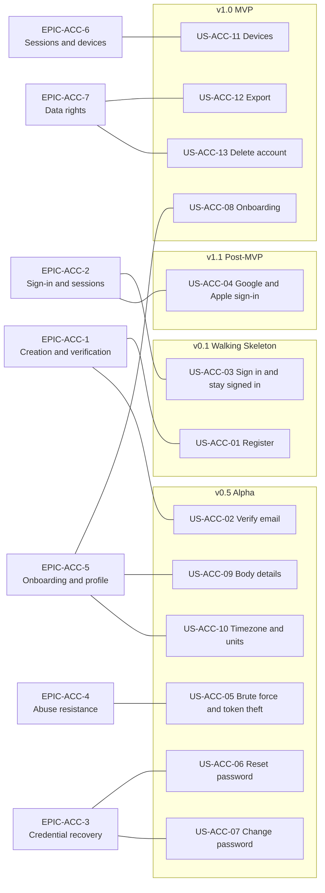

# User Stories — Accounts, Authentication and Profile (ACC)

| Field | Value |
| --- | --- |
| Document | `user-stories/accounts.md` — agile view of the ACC subsystem: epics, user stories, acceptance criteria and Definition of Done |
| Version | 1.0 |
| Date | 2026-07-21 |
| Status | Baselined for Phase 1 sign-off |
| Owner | Rakshit — Project Lead / sole developer (STK-03) |
| Parent | [PlantPal+ Software Requirements Specification v1.0](../SRS.md) |

---

## Table of contents

1. [Epics for this module](#1-epics-for-this-module)
2. [User stories](#2-user-stories)
   - [US-ACC-01 — Register with email and password](#us-acc-01--register-with-email-and-password)
   - [US-ACC-02 — Verify my email address](#us-acc-02--verify-my-email-address)
   - [US-ACC-03 — Sign in once and stay signed in](#us-acc-03--sign-in-once-and-stay-signed-in)
   - [US-ACC-04 — Sign in with Google or Apple](#us-acc-04--sign-in-with-google-or-apple)
   - [US-ACC-05 — Be protected from brute force and stolen tokens](#us-acc-05--be-protected-from-brute-force-and-stolen-tokens)
   - [US-ACC-06 — Reset a forgotten password](#us-acc-06--reset-a-forgotten-password)
   - [US-ACC-07 — Change my password and sign other devices out](#us-acc-07--change-my-password-and-sign-other-devices-out)
   - [US-ACC-08 — Get set up in under 90 seconds](#us-acc-08--get-set-up-in-under-90-seconds)
   - [US-ACC-09 — Give body details for a personalised energy estimate](#us-acc-09--give-body-details-for-a-personalised-energy-estimate)
   - [US-ACC-10 — Set my timezone, hemisphere and units correctly](#us-acc-10--set-my-timezone-hemisphere-and-units-correctly)
   - [US-ACC-11 — See and revoke my signed-in devices](#us-acc-11--see-and-revoke-my-signed-in-devices)
   - [US-ACC-12 — Export everything the product holds about me](#us-acc-12--export-everything-the-product-holds-about-me)
   - [US-ACC-13 — Delete my account, with a chance to change my mind](#us-acc-13--delete-my-account-with-a-chance-to-change-my-mind)
3. [Story index](#3-story-index)
4. [Story point totals](#4-story-point-totals)

Related documents: [modules/accounts.md](../modules/accounts.md) · [use-cases/accounts.md](../use-cases/accounts.md) · [01-stakeholders-and-personas.md](../01-stakeholders-and-personas.md) · [02-scope-and-release-plan.md](../02-scope-and-release-plan.md) · [05-user-stories.md](../05-user-stories.md) · [10-traceability-matrix.md](../10-traceability-matrix.md)

---

## 0. How to read this document

This document is the agile face of [`modules/accounts.md`](../modules/accounts.md). It mints **no** functional requirement, business rule, use case or non-functional requirement. It owns exactly one identifier range: `US-ACC-01` through `US-ACC-13`, reserved for it by the module specification's traceability stub. Every threshold, formula, enumeration member, HTTP status and error code quoted below is copied verbatim from that specification; where a number appears here it is a restatement, never a new decision.

Three conventions apply throughout.

1. **`AC-n` is scoped to its story.** `AC-3` of `US-ACC-01` and `AC-3` of `US-ACC-07` are unrelated. This follows the identifier convention in the Phase 1 brief.
2. **`EPIC-ACC-n` is a local grouping label, not a register entry.** Epics exist to organise the backlog for Phase 3 sprint planning. They mint nothing, appear in no cross-document register, and are never referenced by any requirement.
3. **Priority and release are inherited, never invented.** A story's MoSCoW priority is the highest priority among the functional requirements it covers, and its release is the earliest release at which that story becomes demoable end to end. Where a story spans requirements in more than one release, the metadata table names the later increments explicitly.

Acceptance criteria are written in Gherkin. Each scenario is objectively testable: it names a status code, a state value, an enumeration member, a count, a duration or a stored value, never a subjective quality. Verbs such as "quickly", "clearly" and "correctly" do not appear inside a Then clause.

---

## 1. Epics for this module

Seven epics group the thirteen ACC stories. The grouping mirrors capability areas C1 to C9 of [`modules/accounts.md` section 3](../modules/accounts.md#3-capability-overview), so an implementer can move between the two documents without a mapping table.

| Epic | Name | Goal | Stories |
| --- | --- | --- | --- |
| EPIC-ACC-1 | Account creation and email verification | Turn a visitor into a verified account holder without an operator ever intervening, and make every self-service repair path work | US-ACC-01, US-ACC-02 |
| EPIC-ACC-2 | Sign-in and session lifecycle | Establish a session on any device and keep it alive for 30 days without re-entering a password, using the token shapes fixed by decision D-11 | US-ACC-03, US-ACC-04 |
| EPIC-ACC-3 | Credential recovery and change | Let an account holder regain access after forgetting a password and rotate a known password, with the correct session consequences in both cases | US-ACC-06, US-ACC-07 |
| EPIC-ACC-4 | Abuse resistance and authorisation | Make online password guessing uneconomic, make a stolen refresh token self-limiting, and guarantee that no principal ever reads another principal's row | US-ACC-05 |
| EPIC-ACC-5 | Onboarding, profile and preferences | Capture in under 90 seconds the minimum data that makes all three trackers useful, and hold the canonical profile and preference record every other module reads | US-ACC-08, US-ACC-09, US-ACC-10 |
| EPIC-ACC-6 | Sessions and devices | Give the account holder visibility of where the account is signed in, and a targeted way to remove one device | US-ACC-11 |
| EPIC-ACC-7 | Data rights | Deliver GDPR-style portability and erasure at the good-practice depth fixed by decision D-01, including the interaction with the offline write queue | US-ACC-12, US-ACC-13 |

### 1.1 Story map by release



---

## 2. User stories

---

### US-ACC-01 — Register with email and password

| Field | Value |
| --- | --- |
| Epic | EPIC-ACC-1 Account creation and email verification |
| Persona | PER-01 Aditi Sharma |
| Priority | Must |
| Release | v0.1 Walking Skeleton. The breached-password screen of FR-ACC-03 is a Should that lands at v1.0; AC-5 and AC-6 are therefore verified from v1.0 onward |
| Estimate | 8 points |
| Related FRs | FR-ACC-01, FR-ACC-02, FR-ACC-03 |
| Related UCs | UC-ACC-01 |

**Story.** As **Aditi Sharma**, I want to create a PlantPal+ account with my email address and a password, so that my plants, workouts and meals are saved to one account and reach both my phone and the web client at my desk.

**Acceptance criteria.**

```gherkin
AC-1  Scenario: A visitor registers successfully
  Given I am not signed in
  And no account exists for the address "aditi@example.com"
  When I submit "aditi@example.com" with the password "Sprout-Garden-2026"
  And I set accepted_terms, accepted_privacy and minimum_age_confirmed all to true
  Then the response is HTTP 202 with a body of exactly two keys, status equal to "verification_sent" and email equal to "aditi@example.com"
  And the response body contains no user identifier and no token
  And one account row exists with status "PENDING_VERIFICATION", role "USER" and token_version 0
  And a profile row, a settings row seeded from the BR-ACC-22 Table D defaults, an onboarding row at step "WELCOME_UNITS" and two consent rows of document_type "TERMS_OF_SERVICE" and "PRIVACY_POLICY" with acceptance_surface "REGISTRATION" are created in the same transaction
  And exactly one email using template "VERIFY_EMAIL" is dispatched to "aditi@example.com"

AC-2  Scenario: The submitted password fails more than one composition rule
  Given I am on the registration form
  When I submit the password "plant123"
  Then the response is HTTP 422 with code "ACC_WEAK_PASSWORD"
  And the unmet_rules array contains both "MIN_LENGTH" and "CHARACTER_CLASSES"
  And no account row is created
  And no part of the submitted password appears in the response body, the server log or the Sentry payload

AC-3  Scenario: Registering an address that already has an account does not disclose that fact
  Given an account already exists for "aditi@example.com"
  When I submit "aditi@example.com" with a password that satisfies every rule of BR-ACC-01
  Then the response is HTTP 202 with a body byte-identical to the body returned in AC-1
  And the total number of account rows is unchanged
  And exactly one email using template "EMAIL_ALREADY_REGISTERED" is dispatched to "aditi@example.com"
  And no email using template "VERIFY_EMAIL" is dispatched

AC-4  Scenario: Terms, privacy or the age attestation are not affirmed
  Given I am on the registration form
  When I submit a valid email and a valid password with minimum_age_confirmed set to false
  Then the response is HTTP 422 with code "ACC_TERMS_NOT_ACCEPTED"
  And no account row is created

AC-5  Scenario: A password present in the public breach corpus is refused
  Given the feature flag "integration.breach_check.enabled" is true
  And the breach-corpus range lookup returns the SHA-1 suffix of my password with a count of 1 or greater
  When I submit that password
  Then the response is HTTP 422 with code "ACC_PASSWORD_BREACHED"
  And the response body states no occurrence count
  And no account row is created

AC-6  Scenario: The breach-corpus service does not answer inside its budget
  Given the breach-corpus endpoint does not return a response within 800 milliseconds
  When I submit a password that satisfies every rule of BR-ACC-01
  Then registration completes with HTTP 202
  And the counter "acc.breach_check.fail_open" is incremented by exactly 1
  And no retry request is sent to the breach-corpus endpoint

AC-7  Scenario: Registration is refused, and never queued, while the device is offline
  Given my device reports no network connectivity
  When I submit the registration form
  Then the client displays an offline state naming registration as an action that requires a connection
  And the request is not written to the offline outbox
  And every value I typed is still present in the form when connectivity returns

AC-8  Scenario: Too many registrations from one connection
  Given 5 registration requests have been accepted from my truncated IP prefix within the past rolling hour
  When I submit a 6th registration request from that prefix
  Then the response is HTTP 429 with code "ACC_RATE_LIMITED"
  And a Retry-After header states the remaining wait in whole seconds
```

**Definition of Done.**

- [ ] Registration endpoint implemented with the exact transaction of FR-ACC-01 processing rule 4, so that a failure at any step leaves zero rows behind.
- [ ] Argon2id hashing wired at the parameters of BR-ACC-01 clause 9, with the password excluded from every log sink, telemetry event and error report.
- [ ] The shared password-policy validator is published as one package and consumed by the server, the web client and the mobile client, satisfying NFR-MAIN-04.
- [ ] Automated tests cover AC-1 to AC-8, including a byte-comparison assertion between the fresh-registration and duplicate-address response bodies.
- [ ] A test asserts that the breach-check fail-open path adds no more than 800 milliseconds to the request.
- [ ] Every form control carries a programmatic label; validation errors are associated with their control and announced through an accessibility live region, verified with VoiceOver and TalkBack.
- [ ] The form is operable at 200 percent text scale with no clipping and with all touch targets at least 44 by 44 dp, and is fully keyboard-navigable on web with a visible focus indicator.
- [ ] Every user-facing string, including all eight validation messages and the two email templates, resolves from the locale catalogue by message identifier, with no inline literal.
- [ ] The API contract, the request and response examples, and the error catalogue rows for `ACC_EMAIL_INVALID`, `ACC_WEAK_PASSWORD`, `ACC_PASSWORD_BREACHED`, `ACC_TERMS_NOT_ACCEPTED` and `ACC_RATE_LIMITED` are documented.
- [ ] The traceability matrix row linking US-ACC-01 to FR-ACC-01, FR-ACC-02, FR-ACC-03 and UC-ACC-01 is present and resolves.

---

### US-ACC-02 — Verify my email address

| Field | Value |
| --- | --- |
| Epic | EPIC-ACC-1 Account creation and email verification |
| Persona | PER-02 Marcus Oyelaran |
| Priority | Must |
| Release | v0.5 Alpha |
| Estimate | 5 points |
| Related FRs | FR-ACC-04, FR-ACC-05 |
| Related UCs | UC-ACC-02 |

**Story.** As **Marcus Oyelaran**, I want to confirm my email address by opening a link, and to request a fresh link whenever the one I have stops working, so that I can recover my password later and keep my account past the first week without asking anyone for help.

**Acceptance criteria.**

```gherkin
AC-1  Scenario: Verifying with a valid, unconsumed link
  Given I registered 10 minutes ago and my account status is "PENDING_VERIFICATION"
  And my verification token is unexpired, unconsumed and not invalidated
  When I open the verification link from my email
  Then the response is HTTP 200 with status "verified"
  And my account status becomes "ACTIVE"
  And email_verified_at is set to the server instant of consumption
  And the token row records consumed_at in the same transaction
  And exactly one email using template "WELCOME" is dispatched
  And no session and no token pair are created by this request

AC-2  Scenario: A mail client prefetches the same link a second time
  Given I opened my verification link 3 minutes ago
  When the identical token is presented again
  Then the response is HTTP 200 with status "already_verified"
  And no error is displayed
  And email_verified_at retains the value it was first given

AC-3  Scenario: The same link is presented long after it was used
  Given I consumed my verification token 45 minutes ago
  When I present that token again
  Then the response is HTTP 409 with code "ACC_TOKEN_CONSUMED"
  And the page offers a sign-in action

AC-4  Scenario: The link has expired
  Given my verification token was issued 25 hours ago and has never been consumed
  When I open the verification link
  Then the response is HTTP 410 with code "ACC_TOKEN_EXPIRED"
  And the response body carries a resend affordance
  And my account status is still "PENDING_VERIFICATION"

AC-5  Scenario: An older link stops working once a newer one is issued
  Given I requested a new verification email 1 minute ago
  When I open the link from the previous email
  Then the response is HTTP 400 with code "ACC_TOKEN_INVALID"
  And the message directs me to the most recent email

AC-6  Scenario: Resending is refused inside the minimum interval
  Given a verification email was sent to my address 20 seconds ago
  When I request another one
  Then the response is HTTP 429 with code "ACC_RATE_LIMITED"
  And retry_after_seconds equals 40
  And a Retry-After header carries the same value

AC-7  Scenario: Resending is refused after three sends in the rolling hour
  Given 3 verification emails have been sent to my address within the past 60 minutes
  And more than 60 seconds have passed since the most recent send
  When I request another one
  Then the response is HTTP 429 with code "ACC_RATE_LIMITED"
  And no fourth email is dispatched

AC-8  Scenario: A resend request for an unknown or already verified address is indistinguishable
  Given no account exists for "nobody@example.com"
  When I request a verification resend for "nobody@example.com"
  Then the response is HTTP 202 with body status "verification_sent"
  And that body is byte-identical to the body returned for an address that does have an unverified account
  And no email is dispatched

AC-9  Scenario: Signing in during the unverified grace window
  Given I registered 72 hours ago and have not verified
  When I sign in with the correct password
  Then the response is HTTP 200 and a session is created
  And the response carries a countdown payload stating 4 whole days remaining

AC-10  Scenario: The unverified grace window has lapsed
  Given I registered 169 hours ago and have not verified
  When I sign in with the correct password
  Then the response is HTTP 403 with code "ACC_EMAIL_UNVERIFIED"
  And the body contains resend_available equal to true
  And no session is created
  And every row I created during the grace window is still stored
```

**Definition of Done.**

- [ ] Verification token issued as a compact HS256 JWS with `typ` equal to `email_verify`, `aud` equal to `account-verification` and an expiry of exactly 1440 minutes, signed with a secret used for no other purpose.
- [ ] The companion token row enforces single use through a conditional update on `consumed_at IS NULL`, and issuing a new token sets `invalidated_at` on every previous unconsumed token for that address.
- [ ] Resend throttling implemented as PostgreSQL rolling-window counts at all four thresholds of BR-ACC-05, with the registration send counted.
- [ ] The verification link works from both the web URL and the `plantpalplus://verify` deep link on iOS and Android.
- [ ] Automated tests cover AC-1 to AC-10, including boundary tests at exactly 10 minutes after consumption and exactly 168 hours after `created_at`.
- [ ] The grace-window banner is a persistent, dismissible surface rather than a timed toast, is announced by the screen reader, and conveys urgency in words as well as colour.
- [ ] The resend control announces its disabled state and the remaining wait in seconds to assistive technology rather than silently rejecting a tap.
- [ ] All email copy and all six error messages resolve from the locale catalogue; both email templates ship with a plain-text alternative body.
- [ ] The token lifecycle, the four resend thresholds and the 10-minute replay window are documented in the API reference.
- [ ] The traceability matrix row linking US-ACC-02 to FR-ACC-04, FR-ACC-05 and UC-ACC-02 is present and resolves.

---

### US-ACC-03 — Sign in once and stay signed in

| Field | Value |
| --- | --- |
| Epic | EPIC-ACC-2 Sign-in and session lifecycle |
| Persona | PER-01 Aditi Sharma |
| Priority | Must |
| Release | v0.1 Walking Skeleton for FR-ACC-06 and FR-ACC-10; refresh rotation FR-ACC-08 lands at v0.5 Alpha, so AC-4 and AC-5 are verified from v0.5 onward |
| Estimate | 13 points |
| Related FRs | FR-ACC-06, FR-ACC-08, FR-ACC-10 |
| Related UCs | UC-ACC-03, UC-ACC-04, UC-ACC-05 |

**Story.** As **Aditi Sharma**, I want to sign in once on my phone and stay signed in for a month without retyping my password, so that logging a watering on the metro or a meal at my desk costs seconds rather than a full authentication.

**Acceptance criteria.**

```gherkin
AC-1  Scenario: Successful sign-in on an active account
  Given my account status is "ACTIVE"
  When I sign in with the correct email and password
  Then the response is HTTP 200
  And expires_in equals 900
  And token_type equals "Bearer"
  And the access token carries the claims sub, sid, jti, ver, iat, exp, iss equal to "plantpal-plus", aud equal to "plantpal-api" and rol equal to "USER"
  And a refresh token valid for 2592000 seconds is issued as generation 1 of a new token family
  And one session row is created carrying the device label, the client platform and the truncated IP prefix
  And failed_login_count is reset to 0 and last_login_at is set
  And the body carries onboarding_completed as a boolean

AC-2  Scenario: The refresh token is stored per the platform constraint on mobile
  Given I am using the React Native Expo client
  When a refresh token is issued to me
  Then it is written to expo-secure-store with accessibility "WHEN_UNLOCKED_THIS_DEVICE_ONLY"
  And it is never written to AsyncStorage, MMKV, IndexedDB or the persisted TanStack Query cache
  And the access token is held in memory only and is absent after an app restart

AC-3  Scenario: The refresh token is stored per the platform constraint on web
  Given I am using the React and Vite client
  When a refresh token is issued to me
  Then it is set as a cookie with the attributes HttpOnly, Secure, SameSite=None, Path=/api/auth and Max-Age=2592000
  And no token of either kind is written to localStorage, sessionStorage or IndexedDB
  And the refresh and logout endpoints additionally require a double-submit CSRF token and an Origin header on the configured allow-list

AC-4  Scenario: Silent refresh keeps me signed in without a sign-in screen
  Given my access token expired 1 second ago
  And my refresh token is unconsumed, unrevoked and unexpired
  When the app issues any authenticated request
  Then the client performs exactly one refresh request for that session
  And the original request is retried and completes
  And no sign-in screen is displayed
  And the presented refresh token is marked consumed and a successor of generation 2 is issued in the same family

AC-5  Scenario: The token family reaches its absolute cap
  Given my token family was created 181 days ago and has been rotated continuously since
  When the client presents the current refresh token
  Then the response is HTTP 401 with code "ACC_TOKEN_EXPIRED" and reason "refresh_expired"
  And the client routes me to the sign-in screen

AC-6  Scenario: A wrong password is indistinguishable from an unknown address
  Given an account exists for "aditi@example.com"
  When I sign in with "aditi@example.com" and an incorrect password
  Then the response is HTTP 401 with code "ACC_INVALID_CREDENTIALS"
  And that response body is byte-identical to the response for an address that has no account
  And both responses take at least 250 milliseconds

AC-7  Scenario: Signing out of the current session
  Given I am signed in on this device
  When I sign out
  Then the response is HTTP 204
  And every refresh token sharing my token family is revoked with revoke_reason "USER_LOGOUT"
  And the session row is marked revoked
  And the client discards the in-memory access token and purges every user-scoped key from the persisted query cache
  And on web the refresh cookie is cleared with Max-Age=0

AC-8  Scenario: Signing out is idempotent and never fails
  Given my refresh token has already been revoked
  When I sign out again with that token, with an unknown token, or with no token at all
  Then the response is HTTP 204 in all three cases
  And no error is displayed

AC-9  Scenario: Signing in on an account scheduled for deletion
  Given my account status is "PENDING_DELETION" with deletion_scheduled_at 12 days in the future
  When I sign in with the correct password
  Then the response is HTTP 200 and a session is created
  And the body carries account_pending_deletion equal to true and deletion_scheduled_at
  And the client displays a persistent banner offering to keep the account

AC-10  Scenario: Reading the dashboard while offline with a valid cached session
  Given I signed in successfully 2 hours ago and my device is now offline
  When I open the app
  Then the dashboard renders from the persisted read cache
  And an offline banner is displayed
  And I am not signed out and I am not shown the sign-in screen
```

**Definition of Done.**

- [ ] Access token issued as HS256 with a lifetime of exactly 900 seconds; refresh token issued as an opaque 32-byte CSPRNG value rendered base64url, with only its SHA-256 digest stored.
- [ ] Rotation implemented as a conditional update inside a serialisable transaction so that one token can never mint two successors.
- [ ] Client-side single-flight refresh implemented on both platforms: at most one refresh request in flight per session, with all other pending requests awaiting its result.
- [ ] The 180-day absolute family cap and the timing-equalisation floor of 250 milliseconds are both implemented and covered by tests.
- [ ] Automated tests cover AC-1 to AC-10, including a static assertion that no token value is ever written to a prohibited storage location on either client.
- [ ] The sign-in form, the offline banner and the pending-deletion banner are screen-reader announced, operable at 200 percent text scale and fully keyboard-navigable on web.
- [ ] The error message shown after a failed sign-in is identical for both the wrong-password and unknown-address branches, and resolves from the locale catalogue.
- [ ] The token structure table, the per-platform storage constraints and the CSRF requirement are documented for Phase 3 implementers.
- [ ] An architecture decision record explains why the refresh token is opaque rather than a JWT.
- [ ] The traceability matrix row linking US-ACC-03 to FR-ACC-06, FR-ACC-08, FR-ACC-10, UC-ACC-03, UC-ACC-04 and UC-ACC-05 is present and resolves.

---

### US-ACC-04 — Sign in with Google or Apple

| Field | Value |
| --- | --- |
| Epic | EPIC-ACC-2 Sign-in and session lifecycle |
| Persona | PER-05 Sofia Lindqvist |
| Priority | Should |
| Release | v1.1 Post-MVP |
| Estimate | 8 points |
| Related FRs | FR-ACC-24 |
| Related UCs | UC-ACC-03 |

**Story.** As **Sofia Lindqvist**, I want to sign in with the Google account already on my phone instead of inventing and remembering another password, so that starting to use PlantPal+ costs one tap and I never lose access because I forgot a credential.

**Acceptance criteria.**

```gherkin
AC-1  Scenario: A new account is created from a verified provider email
  Given no account exists for the email asserted by the provider
  And the provider asserts email_verified equal to true
  When I complete the provider sign-in through the authorisation-code flow with PKCE
  Then an account is created with status "ACTIVE" and email_verified_at set to the server instant
  And no password hash is stored for that account
  And the settings row is seeded from the BR-ACC-22 Table D defaults
  And the response carries is_new_account equal to true and linked_to_existing equal to false
  And I am routed to onboarding step "WELCOME_UNITS"

AC-2  Scenario: The identity is linked to an existing password account
  Given an account exists for "sofia@example.com" with a stored password hash
  And the provider asserts "sofia@example.com" with email_verified equal to true
  When I complete the provider sign-in
  Then an identity row keyed by provider and provider_subject is linked to that existing account
  And the response carries linked_to_existing equal to true
  And every plant, workout and meal already owned by that account is readable in the resulting session
  And a security event of type "OAUTH_LINKED" is written

AC-3  Scenario: The provider will not vouch for the email address
  Given the provider asserts email_verified equal to false
  When I complete the provider sign-in
  Then the response is HTTP 409 with code "ACC_OAUTH_EMAIL_UNVERIFIED"
  And no account is created and no identity is linked
  And the message directs me to sign in with a password and link the provider from settings

AC-4  Scenario: An Apple private-relay address never auto-links
  Given an account already exists for my real address "sofia@example.com"
  And the provider asserts an address ending "@privaterelay.appleid.com"
  When I complete the provider sign-in
  Then a separate new account is created with status "ACTIVE"
  And the two accounts are not merged and share no rows
  And the message explains that the existing account can be linked from settings

AC-5  Scenario: Provider profile fields other than the three permitted claims are ignored
  Given the provider asserts a name and a picture alongside sub, email and email_verified
  When the account is created
  Then display_name equals the email local part truncated to 40 characters
  And avatar_photo_id is null
  And no provider-supplied name or picture is stored

AC-6  Scenario: Unlinking cannot leave me without any credential
  Given my account has one linked Google identity and no stored password hash
  When I request to unlink Google
  Then the response is HTTP 409 with code "ACC_OAUTH_LAST_CREDENTIAL"
  And the identity remains linked
  And I am offered the option to set a password first

AC-7  Scenario: The provider key material cannot be reached
  Given the provider JWKS endpoint is unreachable and the cached keys are older than 24 hours
  When I attempt provider sign-in
  Then the response is HTTP 503
  And the message offers password sign-in as the alternative
  And password sign-in continues to work unchanged

AC-8  Scenario: A replayed or forged callback is refused
  Given the state value returned to the callback does not match the value the server issued for this attempt
  When the callback is processed
  Then the response is HTTP 401 with code "ACC_OAUTH_TOKEN_INVALID"
  And no account is created and no identity is linked
```

**Definition of Done.**

- [ ] Authorisation-code flow with PKCE implemented with server-side code exchange; `state` and `nonce` validated on every callback; provider JWKS cached for 24 hours.
- [ ] Only `sub`, `email` and `email_verified` are read from the provider assertion; a test asserts that no other claim reaches persistence.
- [ ] The private-relay rule is implemented as an explicit suffix check on `@privaterelay.appleid.com` with its own test.
- [ ] Security events of type `OAUTH_LINKED` and `OAUTH_UNLINKED` are written and retained per BR-ACC-20 Table I.
- [ ] Automated tests cover AC-1 to AC-8, including a forged-`state` case and a forged-`nonce` case.
- [ ] The provider buttons carry accessible names, are reachable by keyboard on web, and are announced with the provider name rather than as an unlabelled image.
- [ ] Every message, including the two linking-guidance messages, resolves from the locale catalogue with the provider name interpolated rather than concatenated.
- [ ] The BR-ACC-24 clause 10 budget caveat is recorded in the release notes: Apple sign-in ships only if an Apple Developer Program membership already exists for the Expo EAS iOS build, otherwise Google ships alone and the Apple button is absent rather than disabled.
- [ ] The linking rules and the four OAuth error codes are documented in the API reference.
- [ ] The traceability matrix row linking US-ACC-04 to FR-ACC-24 and UC-ACC-03 as an extension is present and resolves.

---

### US-ACC-05 — Be protected from brute force and stolen tokens

| Field | Value |
| --- | --- |
| Epic | EPIC-ACC-4 Abuse resistance and authorisation |
| Persona | PER-03 Mia Castellano |
| Priority | Must |
| Release | v0.5 Alpha for FR-ACC-07 and FR-ACC-09; the ownership anchor FR-ACC-23 lands at v0.1 Walking Skeleton, so AC-8 and AC-9 are verified from v0.1 onward |
| Estimate | 13 points |
| Related FRs | FR-ACC-07, FR-ACC-09, FR-ACC-23 |
| Related UCs | UC-ACC-03, UC-ACC-04, UC-ACC-05 |

**Story.** As **Mia Castellano**, I want repeated guessing at my password to be slowed to a stop and a stolen session to be cut off automatically, so that my body-mass history and my nutrition log cannot be reached by anyone guessing credentials or replaying a token.

**Acceptance criteria.**

```gherkin
AC-1  Scenario: Backoff begins at the fifth consecutive failure
  Given 4 consecutive authentication attempts for my address have failed
  When a 5th attempt fails
  Then subsequent attempts are refused with HTTP 429 and code "ACC_ACCOUNT_LOCKED"
  And retry_after_seconds equals 60
  And the refusal begins at last_failure_at and ends 60 seconds later

AC-2  Scenario: Backoff doubles then caps at thirty minutes
  Given 9 consecutive attempts for my address have failed
  When a 10th attempt fails
  Then retry_after_seconds equals 1800
  And a 15th consecutive failure still yields retry_after_seconds equal to 1800

AC-3  Scenario: An attacker cannot extend my lockout indefinitely
  Given my address is inside a 1800-second backoff window that began at 10:00:00
  When failed attempts continue to arrive every second until 10:20:00
  Then each of those attempts is refused with HTTP 429
  And the window still ends at 10:30:00
  And a correct password at 10:30:01 authenticates successfully

AC-4  Scenario: A correct password clears the counter
  Given 3 consecutive attempts for my address have failed
  When I sign in with the correct password
  Then the response is HTTP 200
  And the consecutive-failure count for my address becomes 0

AC-5  Scenario: Lockout cannot be used to discover whether an account exists
  Given no account exists for "nobody@example.com"
  When 5 consecutive authentication attempts are made for "nobody@example.com"
  Then the 6th attempt returns HTTP 429 with code "ACC_ACCOUNT_LOCKED"
  And that response is byte-identical to the response produced for an address that does have an account

AC-6  Scenario: A replayed refresh token revokes only the affected family
  Given my refresh token was rotated 5 minutes ago and I hold two other independent sessions
  When the consumed token is presented again
  Then the response is HTTP 401 with code "ACC_REUSE_DETECTED"
  And every refresh token sharing that token_family_id is revoked with revoke_reason "REUSE_DETECTED"
  And the session owning that family is marked revoked
  And a security event of type "REFRESH_REUSE_DETECTED" carrying token_family_id, presented_generation, newest_generation, ip_prefix and device_label is written
  And my two other sessions remain usable

AC-7  Scenario: A lost-response network retry inside the grace window is not treated as theft
  Given my refresh token was consumed 4 seconds ago by a request whose response never reached the client
  And the direct successor is still the newest unconsumed generation in the family
  When the same token is presented again
  Then the successor pair already issued for that rotation is returned with HTTP 200
  And no token in the family is revoked
  And no security event is written

AC-8  Scenario: A record belonging to another account is not distinguishable from a missing one
  Given account A and account B both exist and account B owns a plant with a known identifier
  When account A requests that plant by its identifier with a valid access token
  Then the response is HTTP 404 with code "ACC_NOT_FOUND"
  And that response body is byte-identical to the response for an identifier that exists nowhere

AC-9  Scenario: An owner identifier supplied by the caller is ignored
  Given I hold a valid access token whose sub claim identifies account A
  When I send a request whose body, query string and path all name account B as the owner
  Then the request is executed against account A only
  And no row owned by account B is read, written or deleted

AC-10  Scenario: A global sign-out invalidates tokens issued before it
  Given the account token_version is 4 and I hold an access token whose ver claim is 4
  When token_version is incremented to 5
  Then my next request with that access token returns HTTP 401 with code "ACC_UNAUTHENTICATED"
  And the client displays a message stating that I was signed out
```

**Definition of Done.**

- [ ] Backoff implemented exactly as `lock_seconds = min(60 * 2^(failures - 5), 1800)` measured from `last_failure_at`, with a table-driven test asserting every row of the BR-ACC-09 clause 2 schedule from 5 through 11 consecutive failures.
- [ ] The per-IP rule of 50 failed attempts per rolling 60 minutes is implemented and covered.
- [ ] Failure counters are maintained for addresses that have no account, and a byte-comparison test proves the anti-oracle property.
- [ ] Reuse detection implemented with the 15-second replay grace window and the newest-generation condition; a concurrency test proves that two simultaneous redemptions of one token produce exactly one successor.
- [ ] Every repository function touching a user-scoped table takes the acting `user_id` as a mandatory argument so that omitting it fails to compile.
- [ ] The cross-tenant IDOR test fixture creates two accounts and asserts HTTP 404 on every user-scoped endpoint accessed with the other account's identifiers.
- [ ] The inspection checklist confirming that no route handler queries a user-scoped table without the ownership predicate is completed and recorded.
- [ ] Lockout and reuse messages state the remaining wait in words and are announced by the screen reader; no meaning is carried by colour alone.
- [ ] The backoff schedule, the anti-oracle rule and the deliberate decision to revoke only the affected family are documented, the last as an architecture decision record.
- [ ] The traceability matrix row linking US-ACC-05 to FR-ACC-07, FR-ACC-09, FR-ACC-23, UC-ACC-03, UC-ACC-04 and UC-ACC-05 is present and resolves.

---

### US-ACC-06 — Reset a forgotten password

| Field | Value |
| --- | --- |
| Epic | EPIC-ACC-3 Credential recovery and change |
| Persona | PER-04 Harold "Hal" Whitfield |
| Priority | Must |
| Release | v0.5 Alpha |
| Estimate | 8 points |
| Related FRs | FR-ACC-12, FR-ACC-13 |
| Related UCs | UC-ACC-06 |

**Story.** As **Harold "Hal" Whitfield**, I want an emailed link that lets me set a new password in plain, unhurried steps, so that I can get back into my account on my own, because there is no support desk to contact.

**Acceptance criteria.**

```gherkin
AC-1  Scenario: Requesting a reset for an address that has an account
  Given an account exists for "hal@example.com" and its status is not "DELETED"
  When I request a password reset for "hal@example.com"
  Then the response is HTTP 202 with body status "reset_email_sent_if_account_exists"
  And every previously issued unconsumed reset token for that account is invalidated
  And exactly one email using template "PASSWORD_RESET" carrying a link that expires 60 minutes after issuance is dispatched

AC-2  Scenario: Requesting a reset for an address that has no account
  Given no account exists for "nobody@example.com"
  When I request a password reset for "nobody@example.com"
  Then the response is HTTP 202 with a body byte-identical to the body returned in AC-1
  And no email is dispatched
  And the response takes at least 250 milliseconds

AC-3  Scenario: Completing the reset with a valid token
  Given I hold a reset token that is validly signed, issued 10 minutes ago, unconsumed and not invalidated
  And I am signed in on two other devices
  When I submit a new password that satisfies every rule of BR-ACC-01
  Then the response is HTTP 200 with body status "password_reset"
  And no session and no token pair are returned by this request
  And the stored password hash is replaced and password_changed_at is set
  And token_version is incremented by 1
  And every refresh token and every session of the account, including both other devices, is revoked with revoke_reason "PASSWORD_CHANGED"
  And exactly one email using template "PASSWORD_CHANGED" stating the local time in my account timezone and the device label is dispatched

AC-4  Scenario: Completing a reset clears an active lockout
  Given my address is inside a 1800-second backoff window from failed sign-ins
  When I complete a password reset
  Then the consecutive-failure count for my address becomes 0
  And an immediate sign-in with the new password returns HTTP 200

AC-5  Scenario: A reset token cannot be used twice
  Given I already consumed my reset token
  When I submit the same token again
  Then the response is HTTP 409 with code "ACC_TOKEN_CONSUMED"
  And the stored password hash is unchanged

AC-6  Scenario: The reset link has expired
  Given my reset token was issued 61 minutes ago
  When I submit it with a new password
  Then the response is HTTP 410 with code "ACC_TOKEN_EXPIRED"
  And the page offers to request a new link
  And the stored password hash is unchanged

AC-7  Scenario: The new password repeats the current one
  Given I hold a valid reset token
  When I submit a new password identical to my current password
  Then the response is HTTP 422 with code "ACC_PASSWORD_UNCHANGED"
  And the stored password hash is unchanged

AC-8  Scenario: A reset does not verify my email address
  Given my account status is "PENDING_VERIFICATION" and email_verified_at is null
  When I complete a password reset
  Then my account status is still "PENDING_VERIFICATION"
  And email_verified_at is still null

AC-9  Scenario: Reset requests are rate limited per address
  Given 3 reset requests have been made for "hal@example.com" within the past rolling hour
  When a 4th request is made for that address
  Then the response is HTTP 429 with code "ACC_RATE_LIMITED"
  And a Retry-After header states the remaining wait in whole seconds

AC-10  Scenario: The reset form is opened while offline
  Given my device reports no network connectivity
  When I open the password reset form and submit it
  Then the client displays an offline state naming password reset as an action that requires a connection
  And the request is not written to the offline outbox
```

**Definition of Done.**

- [ ] Reset token issued as a compact HS256 JWS with `typ` equal to `password_reset`, `aud` equal to `account-reset` and an expiry of exactly 60 minutes; the 10-minute replay grace of the verification token is explicitly not applied.
- [ ] The completion path performs all seven post-conditions of FR-ACC-13 processing rule 4 inside one transaction.
- [ ] Automated tests cover AC-1 to AC-10, including a byte-comparison of the existing-address and unknown-address request responses and a boundary test at exactly 60 minutes.
- [ ] The reset request response is padded to the 250-millisecond response-time floor on both branches.
- [ ] The reset form and every one of its error states are operable by screen reader and keyboard, at 200 percent text scale, with error text associated with its field and announced through a live region.
- [ ] Confirmation of a completed reset is a persistent surface, not a timed toast, so that a slow reader is never left uncertain whether the change took effect.
- [ ] All copy uses plain language, resolves from the locale catalogue, and conveys the outcome in words rather than by colour or icon alone.
- [ ] The reason a completed reset does not verify the email address is documented as an architecture decision record.
- [ ] The `PASSWORD_RESET` and `PASSWORD_CHANGED` templates ship with plain-text alternative bodies and state the account address they were sent to.
- [ ] The traceability matrix row linking US-ACC-06 to FR-ACC-12, FR-ACC-13 and UC-ACC-06 is present and resolves.

---

### US-ACC-07 — Change my password and sign other devices out

| Field | Value |
| --- | --- |
| Epic | EPIC-ACC-3 Credential recovery and change |
| Persona | PER-01 Aditi Sharma |
| Priority | Must |
| Release | v0.5 Alpha |
| Estimate | 5 points |
| Related FRs | FR-ACC-11, FR-ACC-14 |
| Related UCs | UC-ACC-05, UC-ACC-07 |

**Story.** As **Aditi Sharma**, I want to change my password and have every other device signed out while the device in my hand stays signed in, so that I can respond to a suspected compromise without losing the session I am working in.

**Acceptance criteria.**

```gherkin
AC-1  Scenario: Changing the password from an authenticated session
  Given I am signed in on my phone and on my work laptop
  And I am making this request from my phone
  When I submit my correct current password together with a new password satisfying every rule of BR-ACC-01
  Then the response is HTTP 200 carrying revoked_sessions, a fresh access token and expires_in equal to 900
  And the stored password hash is replaced and password_changed_at is set
  And token_version is incremented by 1
  And the laptop session is revoked with revoke_reason "PASSWORD_CHANGED"
  And my phone session family is rotated rather than revoked and remains usable
  And exactly one email using template "PASSWORD_CHANGED" is dispatched

AC-2  Scenario: Holding a valid access token is not sufficient re-authentication
  Given I am signed in with a valid access token
  When I submit a new password without supplying the correct current password
  Then the response is HTTP 401 with code "ACC_INVALID_CREDENTIALS"
  And the stored password hash is unchanged
  And the attempt is counted toward the FR-ACC-07 backoff schedule for my account

AC-3  Scenario: Repeated wrong current passwords trigger the backoff
  Given 4 consecutive password-change attempts with a wrong current password have failed
  When a 5th attempt fails
  Then the response is HTTP 429 with code "ACC_ACCOUNT_LOCKED"
  And retry_after_seconds equals 60

AC-4  Scenario: The new password must differ from the current one
  Given I supply my correct current password
  When the new password is identical to the current password
  Then the response is HTTP 422 with code "ACC_PASSWORD_UNCHANGED"
  And the stored password hash is unchanged

AC-5  Scenario: The security email states when and where the change happened
  Given my password was changed from a device whose label is "Pixel 8 - Android 15"
  And my account timezone is "Asia/Kolkata"
  When the "PASSWORD_CHANGED" email is rendered
  Then it states the change time expressed in "Asia/Kolkata"
  And it states the device label "Pixel 8 - Android 15" rendered as escaped text
  And it carries a link to the password-reset flow introduced by an "if this was not you" sentence

AC-6  Scenario: Signing out of all devices while keeping the current one
  Given I am signed in on three devices and I am making this request from the third
  When I request sign-out from all devices with keep_current_session equal to true
  Then the response is HTTP 200 carrying revoked_sessions equal to 3, a fresh access token and expires_in equal to 900
  And token_version is incremented by 1
  And every access token issued before this request, including my own previous one, is refused with HTTP 401
  And the two other devices are signed out on their next request

AC-7  Scenario: Signing out of all devices including the current one
  Given I am signed in on two devices
  When I request sign-out from all devices with keep_current_session equal to false
  Then the response is HTTP 204
  And no new token pair is issued
  And the current device is routed to the sign-in screen

AC-8  Scenario: A change is refused, and never queued, while offline
  Given my device reports no network connectivity
  When I submit the password change form
  Then the client displays an offline state naming a password change as an action that requires a connection
  And the request is not written to the offline outbox

AC-9  Scenario: Another device mid-request after the version bump
  Given my laptop issues an authenticated request whose access token carries the previous token_version
  When that request reaches the server after the change completes
  Then the response is HTTP 401 with code "ACC_UNAUTHENTICATED"
  And the laptop displays a message stating that it was signed out
```

**Definition of Done.**

- [ ] Current-password re-authentication enforced independently of the access token, with the OAuth-only variant requiring a provider re-authentication no older than 5 minutes.
- [ ] The calling session's family is rotated and reissued rather than revoked, so that the requesting device stays signed in.
- [ ] `keep_current_session` implemented with a default of `true` and both branches covered by tests.
- [ ] Automated tests cover AC-1 to AC-9, including an assertion that an access token minted before the version bump is refused on the very next request.
- [ ] The rate limit of 5 password changes per rolling hour per user is enforced.
- [ ] The change form, its error states and the sign-out-everywhere confirmation dialog are keyboard-operable, screen-reader announced, and readable at 200 percent text scale; the dialog returns focus to the control that opened it on dismissal.
- [ ] The device label rendered in the email and in the interface is escaped, because `X-PlantPal-Device` is attacker-controllable and is never used for a security decision.
- [ ] All copy resolves from the locale catalogue; the local time in the email is formatted from the account timezone and locale rather than the server default.
- [ ] The difference in session consequences between a reset and an authenticated change is documented side by side in the API reference.
- [ ] The traceability matrix row linking US-ACC-07 to FR-ACC-11, FR-ACC-14, UC-ACC-05 and UC-ACC-07 is present and resolves.

---

### US-ACC-08 — Get set up in under 90 seconds

| Field | Value |
| --- | --- |
| Epic | EPIC-ACC-5 Onboarding, profile and preferences |
| Persona | PER-02 Marcus Oyelaran |
| Priority | Must |
| Release | v1.0 MVP. The preference persistence of FR-ACC-16 that the wizard writes through lands at v0.5 Alpha |
| Estimate | 8 points |
| Related FRs | FR-ACC-17, FR-ACC-16 |
| Related UCs | UC-ACC-08 |

**Story.** As **Marcus Oyelaran**, I want a short guided setup that makes the trackers I actually care about useful straight away, and that I can skip or abandon without penalty, so that I see value on day one instead of facing empty screens I have to configure myself.

**Acceptance criteria.**

```gherkin
AC-1  Scenario: Completing every step of the wizard
  Given I have just verified my account and onboarding completed_at is null
  When I complete all six steps in the canonical order WELCOME_UNITS, MODULE_SELECT, PROFILE_BASICS, GOALS_QUICKSET, FIRST_PLANT and NOTIFICATIONS
  Then the response after the sixth step carries current_step equal to null and percent_complete equal to 100
  And completed_at is set to the server instant
  And the event "onboarding.completed" is emitted
  And the dashboard renders one card for each enabled module

AC-2  Scenario: Skipping the whole wizard still leaves a usable product
  Given I am on step "WELCOME_UNITS"
  When I submit skip_all equal to true
  Then the response is HTTP 200 with completed_at set and percent_complete equal to 100
  And every field named in BR-ACC-22 Table D is written with its stated default, including activity_level "LIGHTLY_ACTIVE", biological_sex "PREFER_NOT_TO_SAY", a daily step goal of 8000, a daily water goal of 2000 mL, a default reminder hour of 09:00 local and quiet hours of 22:00 to 07:00 local
  And plant_care_enabled, fitness_enabled and nutrition_enabled are all true
  And each enabled module renders its first-run empty state with exactly one primary call to action whose label is at most 140 characters
  And the skip-everything path is reachable in at most 3 interactions

AC-3  Scenario: Resuming an interrupted wizard on a different device
  Given I completed steps "WELCOME_UNITS" and "MODULE_SELECT" on my phone and closed the app
  When I sign in on the web client
  Then the wizard opens at step "PROFILE_BASICS"
  And completed_steps contains exactly "WELCOME_UNITS" and "MODULE_SELECT"
  And the values I supplied in those two steps are pre-filled

AC-4  Scenario: Choosing which modules to use
  Given I am on step "MODULE_SELECT" with all three modules pre-checked
  When I set fitness_enabled and nutrition_enabled to false
  Then the response is HTTP 200
  And only plant care surfaces appear on the dashboard
  And no fitness reminder and no nutrition reminder is scheduled
  And no fitness row and no nutrition row is deleted

AC-5  Scenario: At least one module must remain enabled
  Given I am on step "MODULE_SELECT"
  When I set all three module flags to false
  Then the response is HTTP 422 with code "ACC_NO_MODULE_ENABLED"
  And the previously stored module selection is retained unchanged

AC-6  Scenario: A step completed with an invalid payload does not advance
  Given I am on step "PROFILE_BASICS"
  When I submit action "COMPLETE" with a height_cm value of 5.9
  Then the response is HTTP 422 with code "ACC_VALIDATION_FAILED"
  And current_step is still "PROFILE_BASICS"
  And the field-level message appears beside the height control

AC-7  Scenario: A skipped step always advances
  Given I am on step "GOALS_QUICKSET"
  When I submit action "SKIP"
  Then the response is HTTP 200
  And "GOALS_QUICKSET" appears in skipped_steps
  And current_step becomes "FIRST_PLANT"
  And the Table D defaults for the daily step, calorie and water goals are applied

AC-8  Scenario: The dashboard is never gated on onboarding
  Given onboarding completed_at is null and current_step is "PROFILE_BASICS"
  When I navigate directly to the dashboard
  Then the dashboard renders
  And no modal blocks navigation away from the wizard

AC-9  Scenario: Re-entering setup from settings
  Given I completed onboarding 7 days ago
  When I open "run setup again" from settings
  Then completed_at is cleared
  And the wizard opens at step "WELCOME_UNITS"
  And every previously captured value is pre-filled

AC-10  Scenario: A step is submitted while offline
  Given my device reports no network connectivity
  When I submit any onboarding step
  Then the client displays an offline state naming setup as an action that requires a connection
  And the step is not written to the offline outbox
  And my answers on the current step are still present when connectivity returns
```

**Definition of Done.**

- [ ] The wizard writes through the same shared validation schemas as the standalone profile, preference, fitness-goal and nutrition-goal endpoints, so that no second validation regime exists.
- [ ] Progress persisted server-side as `{ version, current_step, completed_steps[], skipped_steps[], started_at, completed_at }` with `version` equal to 1.
- [ ] Every default in BR-ACC-22 Table D is applied by a single shared defaults module used by both the skip path and the registration path.
- [ ] Automated tests cover AC-1 to AC-10; a demonstration script records the median completion time for the full path and the interaction count for the skip path, feeding MET-03 and NFR-USAB-02.
- [ ] Each step is announced with its position and total, focus moves to the step heading on advance, and no step contains a keyboard trap.
- [ ] Every step, including the push-permission step, is operable at 200 percent text scale with touch targets of at least 44 by 44 dp, and the wizard is completable end to end with VoiceOver and with TalkBack.
- [ ] Every step title, help text, skip label and empty-state string resolves from the locale catalogue.
- [ ] The step table, the defaults table and the version-bump restart rule are documented for Phase 3.
- [ ] The per-module first-run empty states are documented with their single primary action each.
- [ ] The traceability matrix row linking US-ACC-08 to FR-ACC-17, FR-ACC-16 and UC-ACC-08 is present and resolves.

---

### US-ACC-09 — Give body details for a personalised energy estimate

| Field | Value |
| --- | --- |
| Epic | EPIC-ACC-5 Onboarding, profile and preferences |
| Persona | PER-03 Mia Castellano |
| Priority | Must |
| Release | v0.5 Alpha |
| Estimate | 8 points |
| Related FRs | FR-ACC-15 |
| Related UCs | UC-ACC-09 |

**Story.** As **Mia Castellano**, I want to record my height, body mass, date of birth and activity level while being free to decline to state my biological sex, so that my daily energy estimate follows my body as it changes without forcing me to disclose something I would rather not.

**Acceptance criteria.**

```gherkin
AC-1  Scenario: The estimate with a stated biological sex
  Given my date of birth makes age_years equal to 30 on today's local date in my account timezone
  And height_cm is 175.0 and current_body_mass_kg is 70.00
  And biological_sex is "MALE" and activity_level is "MODERATELY_ACTIVE"
  When I read my profile
  Then energy_formula equals "MIFFLIN_ST_JEOR_MALE"
  And bmr_kcal equals 1649
  And tdee_kcal equals 2556
  And minimum_safe_kcal equals 1500

AC-2  Scenario: The estimate when I decline to state my biological sex
  Given the same age, height, body mass and activity level as AC-1
  And biological_sex is "PREFER_NOT_TO_SAY"
  When I read my profile
  Then energy_formula equals "MIFFLIN_ST_JEOR_UNSPECIFIED"
  And bmr_kcal equals 1566
  And minimum_safe_kcal equals 1200
  And the help text states that the constant minus 78 is the arithmetic mean of the male constant plus 5 and the female constant minus 161

AC-3  Scenario: An incomplete profile yields a null estimate without blocking anything
  Given height_cm is null
  When I read my profile
  Then bmr_kcal, tdee_kcal and age_years are all null
  And the nutrition module remains usable against the default daily calorie goal of 2000 kcal
  And the interface invites rather than requires me to complete my profile

AC-4  Scenario: The clinically safe floor is exposed with the estimate
  Given my profile is complete and biological_sex is "FEMALE"
  When I read my profile
  Then minimum_safe_kcal equals 1200
  And no surface anywhere in the product offers or accepts a daily calorie goal below 1200

AC-5  Scenario: The not-medical-advice disclaimer accompanies every estimate
  Given any screen displays bmr_kcal, tdee_kcal or a calorie goal derived from them
  When that screen is rendered
  Then the message identified by "legal.not_medical_advice" is displayed on the same screen
  And it is present in the accessibility tree, not only as a decorative image

AC-6  Scenario: An out-of-range value is rejected rather than clamped
  Given my stored height_cm is 175.3
  When I submit height_cm equal to 5.9
  Then the response is HTTP 422 with code "ACC_VALIDATION_FAILED"
  And the message names the accepted range of 50.0 to 272.0 cm
  And the stored height_cm is still 175.3

AC-7  Scenario: Imperial entry round-trips to the same displayed value
  Given unit_system is "IMPERIAL"
  When I enter 5 feet 9 inches and 154.0 pounds
  Then the client submits height_cm equal to 175.3 and current_body_mass_kg equal to 69.85
  And the profile screen redisplays 5 feet 9 inches and 154.0 pounds

AC-8  Scenario: An imperial field name in the payload is refused
  When I submit a payload containing height_ft, height_in, body_mass_lb or body_mass_st
  Then the response is HTTP 422 with code "ACC_VALIDATION_FAILED"
  And the message states that height is sent in centimetres and mass in kilograms

AC-9  Scenario: A partial update leaves untouched fields alone
  Given my stored display_name is "Mia" and my stored activity_level is "VERY_ACTIVE"
  When I submit a payload containing only activity_level equal to "MODERATELY_ACTIVE"
  Then display_name is still "Mia"
  And activity_level becomes "MODERATELY_ACTIVE"
  And submitting date_of_birth explicitly as null clears that field

AC-10  Scenario: The minimum age of 16 is enforced exactly at the boundary
  Given today's local date in my account timezone is the day before my sixteenth birthday
  When I submit that date_of_birth, which implies an age of 15 years and 364 days
  Then the response is HTTP 422 with code "ACC_UNDERAGE"
  And the stored date_of_birth is unchanged
  And the same date_of_birth submitted one day later, when it implies an age of exactly 16, is accepted with HTTP 200 and stored

AC-11  Scenario: Body mass is read-only while the fitness module is enabled
  Given fitness_enabled is true
  When I submit current_body_mass_kg through the profile endpoint
  Then the response is HTTP 422 with code "ACC_VALIDATION_FAILED"
  And the message directs me to record weight in the Fitness module

AC-12  Scenario: A profile edit is refused, and never queued, while offline
  Given my device reports no network connectivity
  When I submit the profile form
  Then the client displays an offline state naming profile editing as an action that requires a connection
  And the request is not written to the offline outbox
  And the values I typed remain in the form
```

**Definition of Done.**

- [ ] Mifflin-St Jeor implemented for all three formula identifiers, with intermediate arithmetic at full precision and half-up rounding to whole kilocalories applied only at presentation.
- [ ] The derived energy block is computed on read and never stored, so it cannot go stale relative to the profile.
- [ ] Range validation rejects rather than clamps, at exactly 50.0 to 272.0 cm and 20.00 to 635.00 kg, with boundary tests at each endpoint.
- [ ] The exact conversion factors 1 in equal to 2.54 cm, 1 ft equal to 30.48 cm and 1 lb equal to 0.45359237 kg are implemented in one shared module, with a property test proving imperial round-trip stability across the whole accepted range.
- [ ] The domain event `profile.energy_inputs_changed` is emitted whenever any of the five energy inputs changes, and NUT and FIT consume it.
- [ ] Automated tests cover AC-1 to AC-12, including the worked values 1649, 2556 and 1566 as literal assertions.
- [ ] `PREFER_NOT_TO_SAY` is presented as an equal, non-penalised option with no asterisk, no warning styling and no additional friction.
- [ ] Every numeric input carries a programmatic label naming its unit; error messages are associated with their field and announced; the form is usable at 200 percent text scale and one-handed with touch targets of at least 44 by 44 dp.
- [ ] The disclaimer surface is a text element in the accessibility tree on every screen that shows an estimate, and carries no shaming or judgemental language anywhere.
- [ ] The formula table, the activity multipliers, the safe floors and the fallback derivation are documented verbatim in the developer reference.
- [ ] The traceability matrix row linking US-ACC-09 to FR-ACC-15 and UC-ACC-09 is present and resolves.

---

### US-ACC-10 — Set my timezone, hemisphere and units correctly

| Field | Value |
| --- | --- |
| Epic | EPIC-ACC-5 Onboarding, profile and preferences |
| Persona | PER-03 Mia Castellano |
| Priority | Must |
| Release | v0.5 Alpha |
| Estimate | 8 points |
| Related FRs | FR-ACC-16 |
| Related UCs | UC-ACC-09 |

**Story.** As **Mia Castellano**, I want my day boundary, my seasonal plant advice and my units to follow where I actually live and work, so that a rotating shift or a flight never breaks a streak and my succulents are not put on a Northern-hemisphere winter schedule in a New Zealand November.

**Acceptance criteria.**

```gherkin
AC-1  Scenario: Hemisphere is derived automatically from the timezone
  Given I register with client_timezone equal to "Pacific/Auckland"
  When my settings row is created
  Then hemisphere equals "SOUTHERN"
  And hemisphere_source equals "AUTO"

AC-2  Scenario: An equatorial timezone disables the seasonal multiplier
  Given my timezone is "Asia/Singapore"
  When my settings row is evaluated
  Then hemisphere equals "EQUATORIAL"
  And the plant care module applies no seasonal watering multiplier for any of my plants

AC-3  Scenario: A manual hemisphere override survives a later timezone change
  Given I set hemisphere explicitly to "NORTHERN"
  And hemisphere_source is therefore "USER"
  When I later change my timezone to "America/Sao_Paulo"
  Then hemisphere is still "NORTHERN"
  And hemisphere_source is still "USER"

AC-4  Scenario: Changing timezone does not rewrite history
  Given I logged a meal yesterday whose stored local_date is "2026-07-20"
  When I change my timezone from "Asia/Kolkata" to "America/New_York"
  Then that meal still carries local_date "2026-07-20"
  And the response carries today_local_date computed in "America/New_York"
  And the dashboard day boundary uses "America/New_York" from that instant onward

AC-5  Scenario: A repeated local date merges into the existing day
  Given the timezone change moves my local date backwards to "2026-07-20", a date I have already recorded
  When I log a workout
  Then it is attached to the existing day keyed by user and local_date "2026-07-20"
  And no second day row for "2026-07-20" is created

AC-6  Scenario: A skipped local date is a no-activity day, not a free day
  Given the timezone change moves my local date forwards so that "2026-07-21" is never experienced
  When streaks are evaluated
  Then "2026-07-21" is treated as a day with no activity
  And no streak day is awarded for it by the accounts module

AC-7  Scenario: Timezone changes are rate limited
  Given 3 timezone changes have been accepted for my account within the past rolling 7 days
  When I submit a 4th change
  Then the response is HTTP 429 with code "ACC_TIMEZONE_CHANGE_LIMIT"
  And the message states the date on which a further change becomes available
  And the stored timezone is unchanged

AC-8  Scenario: A large offset change is audited
  Given my timezone is "Pacific/Auckland"
  When I change it to "Europe/London", an offset delta of 4 hours or more at the moment of change
  Then the change is accepted with HTTP 200
  And an audit event of type "TIMEZONE_CHANGED_SIGNIFICANT" is written

AC-9  Scenario: An invalid timezone identifier is refused
  When I submit a timezone of "EST" or "Local"
  Then the response is HTTP 422 with code "ACC_TIMEZONE_INVALID"
  And the stored timezone is unchanged

AC-10  Scenario: An unsupported locale is refused after registration
  Given my account already exists
  When I submit locale equal to "sv-SE"
  Then the response is HTTP 422 with code "ACC_LOCALE_UNSUPPORTED"
  And the stored locale is unchanged

AC-11  Scenario: The unit system changes presentation only
  Given my stored height_cm is 175.3 and current_body_mass_kg is 63.40
  When I change unit_system from "METRIC" to "IMPERIAL"
  Then the stored height_cm is still 175.3 and the stored current_body_mass_kg is still 63.40
  And no goal and no derived estimate changes value
  And the profile screen redisplays those figures in feet, inches and pounds

AC-12  Scenario: A daylight-saving transition does not move my reminder hour
  Given my timezone is "Pacific/Auckland" and my default reminder hour is 09:00 local
  When New Zealand enters or leaves daylight saving time
  Then my reminder still fires at 09:00 local on the following day
  And the stored schedule instant in UTC changes by exactly the offset delta

AC-13  Scenario: A wrong device clock is surfaced rather than trusted
  Given my device clock differs from the server Date header by 121 seconds or more
  When the client receives any API response
  Then a non-blocking warning about the device clock is displayed with a link to the device date-and-time settings
  And every stored timestamp still uses server time
  And the computed offset is applied only when rendering relative times

AC-14  Scenario: A preference change is refused, and never queued, while offline
  Given my device reports no network connectivity
  When I change any preference
  Then the client displays an offline state naming settings changes as an action that requires a connection
  And the request is not written to the offline outbox
```

**Definition of Done.**

- [ ] Timezone validated by constructing an `Intl.DateTimeFormat`, with three-letter aliases and the literal `Local` rejected.
- [ ] The seeded zone-to-latitude lookup implements the hemisphere rule at exactly plus 10.0 and minus 10.0 degrees, with `NORTHERN` as the fallback for an absent zone.
- [ ] Every dated user event across the product stores both `occurred_at` and `local_date`, with `local_date` computed at write time and never rewritten.
- [ ] All daily aggregates are keyed on user and `local_date` and upserted, so a repeated local date can never create a duplicate day row.
- [ ] Day-range queries are constructed by converting local midnight boundaries to instants, never by adding 86400 seconds, and tests cover 23-hour, 24-hour and 25-hour local days.
- [ ] Non-existent spring-forward times resolve forward and ambiguous fall-back times resolve to the earlier instant, each with a dedicated test.
- [ ] Automated tests cover AC-1 to AC-14, including the rolling 7-day change cap and the 120-second skew threshold.
- [ ] The timezone picker is searchable, keyboard-operable, screen-reader labelled and usable at 200 percent text scale; the clock-skew warning is non-blocking and dismissible without losing the message.
- [ ] All copy, including the interpolated zone name and the next-available date, resolves from the locale catalogue and is formatted using the account locale.
- [ ] The immutability-of-the-past decision, the repeated-day rule and the skipped-day rule are documented as an architecture decision record so that no reviewer reads them as an oversight.
- [ ] The traceability matrix row linking US-ACC-10 to FR-ACC-16 and UC-ACC-09 is present and resolves.

---

### US-ACC-11 — See and revoke my signed-in devices

| Field | Value |
| --- | --- |
| Epic | EPIC-ACC-6 Sessions and devices |
| Persona | PER-01 Aditi Sharma |
| Priority | Should |
| Release | v1.0 MVP |
| Estimate | 5 points |
| Related FRs | FR-ACC-18, FR-ACC-19 |
| Related UCs | UC-ACC-05 |

**Story.** As **Aditi Sharma**, I want to see every device signed in to my account and sign out any single one of them, so that I can remove access from a laptop I no longer use without changing my password or disturbing the phone in my hand.

**Acceptance criteria.**

```gherkin
AC-1  Scenario: Listing the devices signed in to my account
  Given I am signed in on my phone and on a laptop browser
  When I open the devices screen
  Then the response is HTTP 200 with 2 entries ordered by last_used_at descending
  And each entry carries session_id, device_label, platform, created_at, last_used_at, ip_prefix, is_current and revoked
  And the entry whose session_id equals the sid claim of my access token carries is_current equal to true
  And each ip_prefix is an IPv4 /24 prefix or an IPv6 /48 prefix, never a full address
  And no geolocation is present in the response

AC-2  Scenario: Revoking a single other device
  Given my laptop session appears in the list and is not the current session
  When I revoke that session_id
  Then the response is HTTP 204 with no body
  And every refresh token sharing that session's family is revoked with revoke_reason "USER_REVOKED_SESSION"
  And a security event of type "SESSION_REVOKED" is written
  And token_version is not incremented
  And the laptop is signed out on its next refresh attempt

AC-3  Scenario: The interface is honest about when access actually ends
  Given I have just revoked a session
  When the confirmation is displayed
  Then it states that the device loses access within 15 minutes
  And it offers sign-out from all devices as the immediate alternative

AC-4  Scenario: Another account's session identifier is indistinguishable from a missing one
  Given a session_id that belongs to a different account
  When I request revocation of that session_id
  Then the response is HTTP 404 with code "ACC_SESSION_NOT_FOUND"
  And that response body is byte-identical to the response for a session_id that exists nowhere

AC-5  Scenario: Revoking an already revoked session is harmless
  Given the laptop session was revoked 5 minutes ago
  When I revoke the same session_id again
  Then the response is HTTP 204
  And no additional security event is written

AC-6  Scenario: Revoking my own current session behaves as sign-out
  Given the session_id I submit equals the sid claim of my access token
  When I revoke it
  Then the response is HTTP 204
  And my refresh token family is revoked
  And the client routes me to the sign-in screen

AC-7  Scenario: A session created without the device header still has a usable label
  Given a client signed in without sending the X-PlantPal-Device header
  When I open the devices screen
  Then that entry's device_label is the literal "Unknown device"

AC-8  Scenario: A hostile device label is rendered as text, never as markup
  Given a client signed in with a device header containing markup and control characters
  When that entry is rendered on web and on mobile
  Then the label is displayed as escaped text of at most 120 characters
  And no markup is interpreted
  And the label is used for no security decision

AC-9  Scenario: A revoked session stays visible long enough to be believed
  Given I revoked a session 2 hours ago
  When I open the devices screen
  Then that entry is still listed with revoked equal to true
  And an entry revoked more than 24 hours ago is absent from the list

AC-10  Scenario: The devices screen while offline
  Given my device reports no network connectivity
  When I open the devices screen
  Then the last downloaded list renders from the persisted query cache with a staleness note
  And the revoke controls are disabled with a message naming revocation as an action that requires a connection

AC-11  Scenario: The concurrent-session cap, not the 50-row listing bound, is what I meet
  Given 10 non-revoked sessions exist for my account, which is the concurrent-session cap
  When I sign in on an eleventh device
  Then the least recently used session and its token family are revoked with revoke_reason "FAMILY_CAP_REACHED"
  And the devices screen returns my 10 non-revoked entries, the most recently seen first
  And the evicted entry is still listed with revoked equal to true for 24 hours
  And the 50-row listing bound is never reached, because at most 10 sessions are non-revoked at once
```

**Definition of Done.**

- [ ] Listing returns at most 50 non-revoked, unexpired sessions ordered by `last_used_at` descending, with `is_current` derived from the access token `sid` claim.
- [ ] `last_used_at` writes are amortised to at most one per 60 seconds per session, and the interface renders the value in relative minutes so the lag is not observable.
- [ ] IP addresses are truncated at write time to a /24 or /48 prefix and retained for 90 days; full addresses are never stored.
- [ ] Single-session revocation resolves the session with the ownership predicate applied, never by identifier alone, and returns HTTP 404 for a cross-tenant identifier.
- [ ] Automated tests cover AC-1 to AC-11, including the cross-tenant byte-comparison and a label containing markup and control characters.
- [ ] The list is a semantic list with each entry exposing its label, platform and relative last-seen time to the screen reader; the current device is identified in text as well as by styling.
- [ ] Revoke controls are keyboard-reachable with a visible focus indicator, have touch targets of at least 44 by 44 dp, and open a confirmation dialog that returns focus to the invoking control on dismissal.
- [ ] The 15-minute residual-access statement is present in the interface copy and resolves from the locale catalogue.
- [ ] The residual-risk note explaining why an outstanding access token survives up to 15 minutes, and why the alternative is FR-ACC-11 rather than a denylist, is documented.
- [ ] The traceability matrix row linking US-ACC-11 to FR-ACC-18, FR-ACC-19 and UC-ACC-05 is present and resolves.

---

### US-ACC-12 — Export everything the product holds about me

| Field | Value |
| --- | --- |
| Epic | EPIC-ACC-7 Data rights |
| Persona | PER-04 Harold "Hal" Whitfield |
| Priority | Must |
| Release | v1.0 MVP |
| Estimate | 8 points |
| Related FRs | FR-ACC-20 |
| Related UCs | UC-ACC-10 |

**Story.** As **Harold "Hal" Whitfield**, I want one machine-readable file containing everything stored about me, with links to my photos, so that I can keep my own copy, move elsewhere if I choose, and see plainly what this product actually knows.

**Acceptance criteria.**

```gherkin
AC-1  Scenario: Requesting an export
  Given my email address is verified
  And no export for my account is QUEUED or RUNNING and none completed within the past 24 hours
  When I request an export
  Then the response is HTTP 202 carrying export_job_id, status equal to "QUEUED" and estimated_ready_within_minutes equal to 15
  And a security event of type "EXPORT_REQUESTED" is written

AC-2  Scenario: The completed archive contains every module I use
  Given my export job status is "READY"
  When I open the JSON archive
  Then schema_version equals 1
  And the top-level keys appear in the fixed order defined by BR-ACC-19 clause 3
  And it contains the account, profile, preferences and onboarding blocks
  And it contains plants, plant care events and growth log entries
  And it contains workouts, step entries and body measurement entries
  And it contains meal entries, meal items and water intake entries
  And it contains goals, streak state and achievement grants
  And every record it contains is owned by my account

AC-3  Scenario: Photos are referenced rather than embedded
  Given my export job status is "READY" and include_photos was true
  When I read photo_manifest
  Then every photo I own appears exactly once with a checksum, a byte count and a signed URL
  And each signed URL is valid for 24 hours from archive completion
  And no photo binary is embedded in the JSON document

AC-4  Scenario: Secrets are never exported
  Given my export job status is "READY"
  When I search the archive
  Then it contains no password hash, no refresh token digest, no email token digest, no CSRF secret and no security event row

AC-5  Scenario: Export is throttled to once per rolling day
  Given an export for my account completed 2 hours ago
  When I request another export
  Then the response is HTTP 429 with code "ACC_EXPORT_THROTTLED"
  And retry_after_seconds states the remaining wait in whole seconds

AC-6  Scenario: A second request while one is in flight
  Given an export for my account has status "RUNNING"
  When I request another export
  Then the response is HTTP 409 with code "ACC_EXPORT_IN_PROGRESS"
  And no second job row is created

AC-7  Scenario: The archive expires after seven days
  Given my export completed 8 days ago
  When I open the download link
  Then the job status is "EXPIRED" and download_url is null
  And the stored archive object has been deleted
  And I am invited to request a fresh export

AC-8  Scenario: An unverified address cannot export
  Given email_verified_at is null on my account
  When I request an export
  Then the response is HTTP 403 with code "ACC_EMAIL_UNVERIFIED"
  And no export job row is created

AC-9  Scenario: A job identifier belonging to another account
  Given an export_job_id owned by a different account
  When I poll that export_job_id
  Then the response is HTTP 404 with code "ACC_NOT_FOUND"
  And that response body is byte-identical to the response for an export_job_id that exists nowhere

AC-10  Scenario: A large archive is split into numbered parts
  Given my archive would exceed 100 MiB
  When the export completes
  Then the archive is emitted as sequentially numbered parts
  And part_count states the total
  And each part states the same total part count

AC-11  Scenario: A worker failure is retried once before it is reported
  Given the export worker fails on its first attempt
  When the job is retried automatically
  Then the status remains "RUNNING" during the retry
  And a second failure sets the status to "FAILED" with code "ACC_EXPORT_FAILED"

AC-12  Scenario: A brand-new account exports an empty but well-formed archive
  Given I registered today and have logged nothing
  When my export completes
  Then the archive is valid JSON with schema_version equal to 1
  And every module block is present as an empty array
  And photo_manifest is an empty array
```

**Definition of Done.**

- [ ] The export worker streams every user-scoped table into a single UTF-8 JSON document without loading the whole result set into memory, so that the job fits the 512 MiB free-tier container.
- [ ] Archive objects are written under an unguessable path, carry `expires_at` equal to `completed_at` plus 7 days, and are swept when they expire.
- [ ] The exclusion list of BR-ACC-19 clause 10 is enforced by an allow-list of exported columns rather than a deny-list, and a test asserts that no secret column can be added by accident.
- [ ] Automated tests cover AC-1 to AC-12, including a schema-validation test of the archive against the fixed key order and an empty-account case.
- [ ] The export status surface is a persistent screen rather than a toast, announces status changes through a live region, and is readable at 200 percent text scale.
- [ ] The download control has an accessible name that states the file name and the expiry date rather than the word "download" alone.
- [ ] The `EXPORT_READY` email ships with a plain-text alternative body stating the expiry date, and all copy resolves from the locale catalogue.
- [ ] The archive structure, the fixed key order, `schema_version` 1 and the two URL lifetimes of 7 days and 24 hours are documented in the data-rights section of the developer reference.
- [ ] The privacy policy names the export capability, its throttle and its retention window.
- [ ] The traceability matrix row linking US-ACC-12 to FR-ACC-20 and UC-ACC-10 is present and resolves.

---

### US-ACC-13 — Delete my account, with a chance to change my mind

| Field | Value |
| --- | --- |
| Epic | EPIC-ACC-7 Data rights |
| Persona | PER-05 Sofia Lindqvist |
| Priority | Must |
| Release | v1.0 MVP |
| Estimate | 13 points |
| Related FRs | FR-ACC-21, FR-ACC-22 |
| Related UCs | UC-ACC-11 |

**Story.** As **Sofia Lindqvist**, I want to delete my account and everything in it after a grace period in which I can still undo it, so that leaving is genuinely possible and one frustrated tap on a bad day does not destroy months of history.

**Acceptance criteria.**

```gherkin
AC-1  Scenario: Requesting deletion
  Given I am signed in and my account status is "ACTIVE"
  When I confirm deletion with my correct password and the confirmation phrase "DELETE"
  Then the response is HTTP 200 carrying state "PENDING_DELETION", deletion_scheduled_at and cancel_before
  And deletion_scheduled_at equals the request instant plus 2592000 seconds
  And state_before_deletion records "ACTIVE"
  And every session except the calling one is revoked
  And every scheduled reminder and the optional email digest are suspended
  And exactly one email using template "DELETION_SCHEDULED" stating the exact date and the cancellation route is dispatched
  And a security event of type "DELETION_REQUESTED" is written

AC-2  Scenario: The confirmation phrase must match exactly
  Given I am on the deletion confirmation screen
  When I submit the phrase "delete"
  Then the response is HTTP 422 with code "ACC_CONFIRMATION_MISMATCH"
  And my account status is unchanged

AC-3  Scenario: The password must be re-entered
  Given I am signed in with a valid access token
  When I confirm deletion with an incorrect password
  Then the response is HTTP 401 with code "ACC_INVALID_CREDENTIALS"
  And my account status is unchanged

AC-4  Scenario: The account remains fully usable during the grace period
  Given my account status is "PENDING_DELETION" with 12 days remaining
  When I open the app
  Then every plant, workout, meal and photo I own is present and usable
  And a persistent banner states the deletion date and offers a cancel action
  And no reminder notification is delivered to me

AC-5  Scenario: Cancelling restores the previous state, not a guessed one
  Given my account status is "PENDING_DELETION" and state_before_deletion records "PENDING_VERIFICATION"
  When I cancel the deletion
  Then my account status becomes "PENDING_VERIFICATION"
  And deletion_requested_at and deletion_scheduled_at are cleared
  And my reminders resume
  And exactly one email using template "DELETION_CANCELLED" is dispatched
  And a security event of type "DELETION_CANCELLED" is written

AC-6  Scenario: I am told how many unsynchronised writes this device holds
  Given my device holds 3 queued writes in the offline outbox
  When I open the deletion confirmation screen
  Then it states that 3 entries on this device are not yet saved to the cloud
  And it states that queues on other devices cannot be counted
  And confirmation is refused until acknowledge_unsynced is true

AC-7  Scenario: A queued write arriving during the grace period is accepted and changes nothing
  Given my account status is "PENDING_DELETION"
  When my phone flushes a queued workout log
  Then the write is accepted normally
  And my account status is still "PENDING_DELETION"
  And deletion_scheduled_at is unchanged

AC-8  Scenario: Erasure after the grace period elapses
  Given my deletion_scheduled_at has passed and I did not cancel
  When the hourly deletion sweep runs
  Then the "DELETION_COMPLETED" email is dispatched before my address is erased
  And every table listed in BR-ACC-20 Table H is emptied of my rows in one transaction
  And every object-storage key I owned, including my avatar, every growth photo and every export archive, is enqueued for deletion
  And one audit event of type "ACCOUNT_ERASED" is written whose subject is an HMAC-SHA256 of my user identifier rather than the identifier itself

AC-9  Scenario: Only non-personal traces survive erasure
  Given my erasure has completed
  When the retained data is inspected
  Then security event rows carry a salted one-way hash in place of my user identifier and are retained for 90 days
  And the ACCOUNT_ERASED audit event carries only a timestamp and per-table row counts and is retained for 24 months
  And no email address, display name, avatar, date of birth, biological sex, height, body mass, timezone, photo, log entry or note text of mine remains anywhere

AC-10  Scenario: The sweep is idempotent and bounded
  Given 150 accounts are due for erasure in one tick
  When the sweep runs
  Then the 100 oldest by deletion_scheduled_at are processed in that run
  And the remaining 50 are processed on the next hourly run
  And a scheduler restart mid-run erases no account twice

AC-11  Scenario: Queued writes replayed after erasure are rejected and cleaned up
  Given my phone holds 3 queued workout logs and my account has been erased
  When my phone reconnects and replays them
  Then each replay is answered HTTP 410 with code "ACC_ACCOUNT_DELETED"
  And the client purges its offline outbox, its persisted query cache and its stored tokens
  And the client routes to the signed-out state with an explanation

AC-12  Scenario: Registering again with the same address
  Given my account was erased yesterday
  When I register again with the same email address
  Then a brand-new account is created in state "PENDING_VERIFICATION"
  And it shares no row with the erased account
  And none of my previous data is visible

AC-13  Scenario: A deletion request while offline
  Given my device reports no network connectivity
  When I open the deletion confirmation screen
  Then the confirm control is disabled with a message naming account deletion as an action that requires a connection
  And the request is not written to the offline outbox
```

**Definition of Done.**

- [ ] The grace period is implemented as exactly 2592000 seconds from `deletion_requested_at`, with `state_before_deletion` recorded and restored on cancellation.
- [ ] The cascade is declared as `ON DELETE CASCADE` on `user_id` for every user-scoped table, so that erasure is a single delete plus the object-storage sweep.
- [ ] The sweep runs hourly, processes at most 100 accounts per run oldest first, is idempotent, and resumes from a persisted cursor after a crash.
- [ ] Object-storage deletions are retried on every subsequent run for 7 days before an alert is raised, and removal is verified on the following run.
- [ ] Automated tests cover AC-1 to AC-13, including an assertion that after erasure no row anywhere in the schema references the erased `user_id` and that the retained rows carry only the salted hash.
- [ ] The unsynchronised-writes count shown at confirmation is read from the local outbox, and the copy states plainly that other devices cannot be counted.
- [ ] The confirmation flow requires a typed phrase and a password, contains no dark-pattern styling that biases toward or against deletion, and the destructive action is not the default focus target.
- [ ] The pending-deletion banner and the confirmation dialog are screen-reader announced, keyboard-operable, readable at 200 percent text scale, and convey the deletion date in words rather than by colour.
- [ ] All copy, including the confirmation phrase and the three deletion emails, resolves from the locale catalogue; each email ships with a plain-text alternative body.
- [ ] The hard-delete and anonymised-retention tables, the never-retained list and the offline-queue interaction are documented in the privacy policy and in the developer reference.
- [ ] The traceability matrix row linking US-ACC-13 to FR-ACC-21, FR-ACC-22 and UC-ACC-11 is present and resolves.

---

## 3. Story index

Thirteen stories, `US-ACC-01` through `US-ACC-13`, contiguous with no gaps. The release column names the release at which the story first becomes demoable end to end; where a story also covers a requirement scheduled later or earlier, its own metadata table records that fact.

| ID | Title | Epic | Persona | Priority | Release | Points | Related FRs |
| --- | --- | --- | --- | --- | --- | --- | --- |
| US-ACC-01 | Register with email and password | EPIC-ACC-1 | PER-01 Aditi Sharma | Must | v0.1 | 8 | FR-ACC-01, FR-ACC-02, FR-ACC-03 |
| US-ACC-02 | Verify my email address | EPIC-ACC-1 | PER-02 Marcus Oyelaran | Must | v0.5 | 5 | FR-ACC-04, FR-ACC-05 |
| US-ACC-03 | Sign in once and stay signed in | EPIC-ACC-2 | PER-01 Aditi Sharma | Must | v0.1 | 13 | FR-ACC-06, FR-ACC-08, FR-ACC-10 |
| US-ACC-04 | Sign in with Google or Apple | EPIC-ACC-2 | PER-05 Sofia Lindqvist | Should | v1.1 | 8 | FR-ACC-24 |
| US-ACC-05 | Be protected from brute force and stolen tokens | EPIC-ACC-4 | PER-03 Mia Castellano | Must | v0.5 | 13 | FR-ACC-07, FR-ACC-09, FR-ACC-23 |
| US-ACC-06 | Reset a forgotten password | EPIC-ACC-3 | PER-04 Harold "Hal" Whitfield | Must | v0.5 | 8 | FR-ACC-12, FR-ACC-13 |
| US-ACC-07 | Change my password and sign other devices out | EPIC-ACC-3 | PER-01 Aditi Sharma | Must | v0.5 | 5 | FR-ACC-11, FR-ACC-14 |
| US-ACC-08 | Get set up in under 90 seconds | EPIC-ACC-5 | PER-02 Marcus Oyelaran | Must | v1.0 | 8 | FR-ACC-17, FR-ACC-16 |
| US-ACC-09 | Give body details for a personalised energy estimate | EPIC-ACC-5 | PER-03 Mia Castellano | Must | v0.5 | 8 | FR-ACC-15 |
| US-ACC-10 | Set my timezone, hemisphere and units correctly | EPIC-ACC-5 | PER-03 Mia Castellano | Must | v0.5 | 8 | FR-ACC-16 |
| US-ACC-11 | See and revoke my signed-in devices | EPIC-ACC-6 | PER-01 Aditi Sharma | Should | v1.0 | 5 | FR-ACC-18, FR-ACC-19 |
| US-ACC-12 | Export everything the product holds about me | EPIC-ACC-7 | PER-04 Harold "Hal" Whitfield | Must | v1.0 | 8 | FR-ACC-20 |
| US-ACC-13 | Delete my account, with a chance to change my mind | EPIC-ACC-7 | PER-05 Sofia Lindqvist | Must | v1.0 | 13 | FR-ACC-21, FR-ACC-22 |

### 3.1 Requirement coverage check

Every one of the twenty-four requirements owned by [`modules/accounts.md`](../modules/accounts.md) is covered by at least one story, and every story references at least one requirement that exists in that document.

| FR | Covered by | FR | Covered by |
| --- | --- | --- | --- |
| FR-ACC-01 | US-ACC-01 | FR-ACC-13 | US-ACC-06 |
| FR-ACC-02 | US-ACC-01 | FR-ACC-14 | US-ACC-07 |
| FR-ACC-03 | US-ACC-01 | FR-ACC-15 | US-ACC-09 |
| FR-ACC-04 | US-ACC-02 | FR-ACC-16 | US-ACC-10, US-ACC-08 |
| FR-ACC-05 | US-ACC-02 | FR-ACC-17 | US-ACC-08 |
| FR-ACC-06 | US-ACC-03 | FR-ACC-18 | US-ACC-11 |
| FR-ACC-07 | US-ACC-05 | FR-ACC-19 | US-ACC-11 |
| FR-ACC-08 | US-ACC-03 | FR-ACC-20 | US-ACC-12 |
| FR-ACC-09 | US-ACC-05 | FR-ACC-21 | US-ACC-13 |
| FR-ACC-10 | US-ACC-03 | FR-ACC-22 | US-ACC-13 |
| FR-ACC-11 | US-ACC-07 | FR-ACC-23 | US-ACC-05 |
| FR-ACC-12 | US-ACC-06 | FR-ACC-24 | US-ACC-04 |

| Check | Result |
| --- | --- |
| Stories defined by this document | 13, `US-ACC-01` to `US-ACC-13`, contiguous with no gaps |
| Requirements covered by at least one story | 24 of 24, 100 percent |
| Stories referencing at least one real requirement identifier | 13 of 13, 100 percent |
| Stories referencing at least one use case identifier | 13 of 13, 100 percent |
| Stories naming a persona verbatim from the persona register | 13 of 13, 100 percent |
| Acceptance criteria written across all stories | 137 |
| MoSCoW distribution | 11 Must, 2 Should, 0 Could, 0 Wont |
| Personas exercised | PER-01 on 4 stories, PER-02 on 2, PER-03 on 3, PER-04 on 2, PER-05 on 2 |

---

## 4. Story point totals

Estimates use the Fibonacci scale 1, 2, 3, 5, 8, 13. A point is a relative measure of size for the single developer named in D-05, combining implementation, test, accessibility and documentation effort as defined by each story's Definition of Done. No point value implies a duration.

### 4.1 Totals per epic

| Epic | Name | Stories | Points |
| --- | --- | --- | --- |
| EPIC-ACC-1 | Account creation and email verification | 2 | 13 |
| EPIC-ACC-2 | Sign-in and session lifecycle | 2 | 21 |
| EPIC-ACC-3 | Credential recovery and change | 2 | 13 |
| EPIC-ACC-4 | Abuse resistance and authorisation | 1 | 13 |
| EPIC-ACC-5 | Onboarding, profile and preferences | 3 | 24 |
| EPIC-ACC-6 | Sessions and devices | 1 | 5 |
| EPIC-ACC-7 | Data rights | 2 | 21 |
| **Total** | | **13** | **110** |

### 4.2 Totals per release

| Release | Stories | Points | Share of the module | Demoable slice this release leaves |
| --- | --- | --- | --- | --- |
| v0.1 Walking Skeleton | US-ACC-01, US-ACC-03 | 21 | 19.1 percent | A visitor registers, signs in, receives a token pair, reads only their own rows, and signs out |
| v0.5 Alpha | US-ACC-02, US-ACC-05, US-ACC-06, US-ACC-07, US-ACC-09, US-ACC-10 | 47 | 42.7 percent | The account becomes durable: verified address, self-expiring lockout, rotating refresh with reuse detection, both password paths, and the profile and preference record every other module reads |
| v1.0 MVP | US-ACC-08, US-ACC-11, US-ACC-12, US-ACC-13 | 34 | 30.9 percent | The account becomes complete: guided setup, device inventory, and the two data rights of export and erasure |
| v1.1 Post-MVP | US-ACC-04 | 8 | 7.3 percent | One-tap sign-in with Google, and with Apple if a developer membership already exists |
| **Total** | **13** | **110** | **100 percent** | |

### 4.3 Totals per MoSCoW priority

| Priority | Stories | Points | Share of the module |
| --- | --- | --- | --- |
| Must | 11 | 97 | 88.2 percent |
| Should | 2 | 13 | 11.8 percent |
| Could | 0 | 0 | 0 percent |
| Wont | 0 | 0 | 0 percent |
| **Total** | **13** | **110** | **100 percent** |

The eleven Must stories, worth 97 of the 110 points, constitute a shippable account subsystem on their own: a person can register, verify, sign in, stay signed in across devices for a month, survive an attacker guessing at their password, recover a forgotten password, rotate a known one, hold a profile and a preference set that three other modules read, complete or skip a guided setup, export everything and delete everything — with every read and every write authorised server-side against the token subject.

---

*End of `user-stories/accounts.md`. The identifier range owned by this document is contiguous and complete: `US-ACC-01` to `US-ACC-13`. This document mints no `FR`, `BR`, `UC`, `NFR` or register identifier, and the `EPIC-ACC-n` labels in section 1 are local grouping labels scoped to this file alone.*
