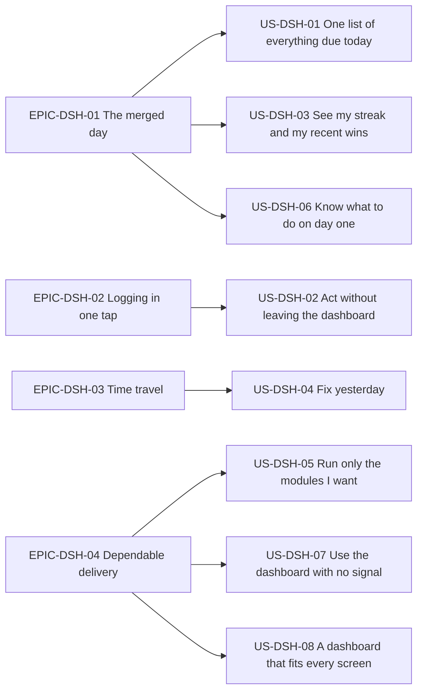
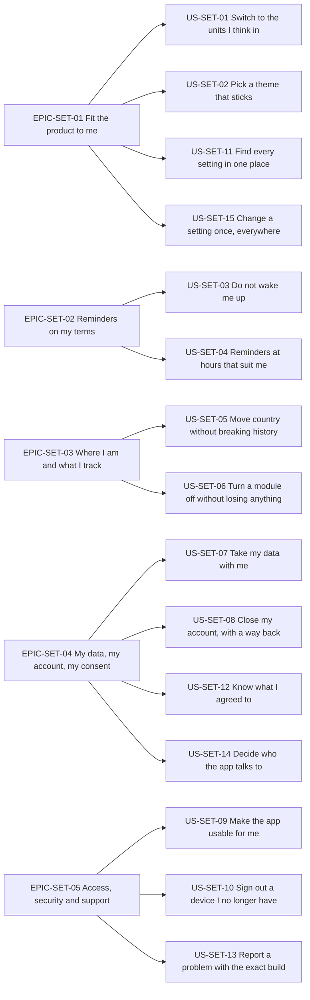

# User Stories — Unified Daily Dashboard and Settings

| Field | Value |
| --- | --- |
| Document | `docs/requirements/user-stories/dashboard-and-settings.md` — epics, user stories and acceptance criteria for the Unified Daily Dashboard (`DSH`) and Settings and Preferences (`SET`) subsystems |
| Version | 1.0 |
| Date | 2026-07-21 |
| Status | Baselined for Phase 1 sign-off |
| Owner | Rakshit — Project Lead / sole developer (D-05) |
| Parent | [`../05-user-stories.md`](../05-user-stories.md) — epics and master story index |
| Specification | [`../modules/dashboard-and-settings.md`](../modules/dashboard-and-settings.md) — the authoritative functional specification this document realises |
| Use cases | [`../use-cases/dashboard-and-settings.md`](../use-cases/dashboard-and-settings.md) |
| Owned prefixes | `US-DSH` (8 stories), `US-SET` (15 stories) |
| Conformance | INVEST for every story; strict Gherkin `Given / When / Then / And` for every acceptance criterion; ISO/IEC/IEEE 29148:2018 verifiability |

---

## Table of contents

- [Reading guide](#reading-guide)
- [1. Epics](#1-epics)
- [2. User stories](#2-user-stories)
  - [2.1 Dashboard stories — `US-DSH`](#21-dashboard-stories--us-dsh)
  - [2.2 Settings stories — `US-SET`](#22-settings-stories--us-set)
- [3. Story index](#3-story-index)
- [4. Story point totals](#4-story-point-totals)

---

## Reading guide

### R.1 What this document is

This document decomposes the 54 functional requirements of [`../modules/dashboard-and-settings.md`](../modules/dashboard-and-settings.md) into 23 user stories grouped under 9 epics. Every functional requirement in that specification is covered by at least one story, and every story references at least one requirement identifier that exists there. The specification remains authoritative for behaviour; this document is authoritative for *scope slicing, prioritisation and acceptance*.

### R.2 Persona names

Persona names are canonical and are used verbatim, exactly as defined in [`../01-stakeholders-and-personas.md`](../01-stakeholders-and-personas.md).

| ID | Persona | One-line profile relevant to this module |
| --- | --- | --- |
| `PER-01` | Aditi Sharma | Time-poor engineer in `Asia/Kolkata`, all three modules enabled, phone plus web client, lives on the merged Today list and the streak. |
| `PER-02` | Marcus Oyelaran | Plant-first hobbyist in `Europe/London` with 38 plants, plant module only at first, back-dates waterings, medium technology comfort. |
| `PER-03` | Mia Castellano | Rotating-shift athlete in `Pacific/Auckland`, Southern hemisphere, fitness and nutrition, quiet hours across night shifts. |
| `PER-04` | Harold "Hal" Whitfield | Assistive-technology user in `Europe/London`, VoiceOver and 200 percent text, fitness module disabled, imperial body mass and height. |
| `PER-05` | Sofia Lindqvist | Budget-Android student in `Europe/Warsaw` on a metered connection, frequently offline, cost-sensitive and storage-sensitive. |

### R.3 Estimation scale

Estimates are story points on the Fibonacci scale `1, 2, 3, 5, 8, 13, 21`. One point is calibrated as "one focused half-day for the sole developer, including tests". A story estimated above 13 must be split before it enters a sprint; no story in this document exceeds 13.

### R.4 How a story is assigned to a release

Releases are `v0.1 Walking Skeleton`, `v0.5 Alpha`, `v1.0 MVP`, `v1.1 Post-MVP` (`D-02`).

1. A story's **Release** is the release in which the story first delivers its stated benefit end to end, so that each release leaves a demoable slice.
2. Where a story carries an acceptance criterion whose governing functional requirement is scheduled for a **later** release, that criterion is tagged with the release in square brackets in its scenario name, for example `[v1.1]`. The story is not fully accepted until that later release.
3. Story points are counted exactly once, in the story's stated release, so the totals in section 4 sum to the grand total without double counting.

### R.5 How a story's MoSCoW priority is derived

A story's MoSCoW priority is the strongest priority carried by any of its constituent functional requirements: a story containing at least one `Must` requirement is a `Must`. Priorities are never invented at story level.

### R.6 Resolution of the provisional traces marked `†` in the specification

Section 10 of the module specification marks six traces with `†`, meaning the requirement is real but its user story was provisional and a dedicated story was recommended to the owner of this document. Those recommendations are accepted and resolved as follows. No existing identifier has been renumbered; the resolution only adds new, contiguous identifiers.

| Requirement | Provisional trace in the specification | Resolved in this document to | New story added |
| --- | --- | --- | --- |
| `FR-SET-02` | `US-SET-01` † | `US-SET-11` | Yes |
| `FR-SET-06` | `US-SET-01` † | `US-SET-11` | Yes |
| `FR-SET-19` | `US-SET-01` † | `US-SET-14` | Yes |
| `FR-SET-25` | `US-SET-01` † | `US-SET-11` | Yes |
| `FR-SET-26` | `US-SET-01` † | `US-SET-13` | Yes |
| `FR-SET-27` | `US-SET-08` † | `US-SET-12` | Yes |

One further story, `US-SET-15`, is added without a `†` prompt. `FR-SET-30` remains traced to `US-SET-01` exactly as the specification states, and `US-SET-15` supplements that trace with a dedicated cross-device persistence story, because the optimistic-write, conflict and offline-blocked behaviour of `FR-SET-30` is exercised by every settings control and cannot be accepted inside a single preference story. Adding a second covering story never invalidates the first.

### R.7 Acceptance-criterion conventions

- Criteria are numbered `AC-1`, `AC-2`, … and are scoped inside their own story.
- Every criterion is written in strict Gherkin with at least one `Given`, one `When` and one `Then`, using `And` where a step repeats.
- Every criterion is objectively testable. Quantities, enumerations, error codes, HTTP statuses and literal user-facing strings are written out in full. No criterion uses a subjective adjective.
- Each story covers, at minimum, one happy path, one alternate path and one validation or error path, plus an offline, timezone or empty-state path wherever the specification defines one.
- Literal strings shown in double quotes inside a scenario are the exact strings defined in the business rules of the module specification and are sourced from the locale catalogue required by `FR-SET-25`.

### R.8 Definition of Done

Every story carries its own Definition of Done checklist covering implementation, tests, accessibility and documentation. In addition, the following applies to every story in this document without being repeated in each checklist: the change is merged through a pull request that passes the GitHub Actions pipeline, contains no user-facing string literal outside the locale catalogue (`D-08`), stores every measurement in canonical metric SI (`D-09`), and runs entirely on free-tier infrastructure (`D-06`).

---

## 1. Epics

| Epic | Name | Goal | Stories |
| --- | --- | --- | --- |
| `EPIC-DSH-01` | The merged day | Prove the product thesis by presenting one prioritised, actionable and honest view of everything due on one local date across all enabled modules. | `US-DSH-01`, `US-DSH-03`, `US-DSH-06` |
| `EPIC-DSH-02` | Logging in one tap | Remove the navigation cost from the daily habit loop so that the commonest logging actions complete inside the dashboard. | `US-DSH-02` |
| `EPIC-DSH-03` | Time travel | Let a user inspect and repair the recent past without the streak mechanic becoming punitive, and keep the day boundary correct in every timezone. | `US-DSH-04` |
| `EPIC-DSH-04` | Dependable delivery | Render the dashboard correctly on any supported viewport, on any connection quality, and under partial backend failure. | `US-DSH-05`, `US-DSH-07`, `US-DSH-08` |
| `EPIC-SET-01` | Fit the product to me | Let a user set how the product presents itself — units, theme, week start, glass size, language — and have every choice persist authoritatively across devices. | `US-SET-01`, `US-SET-02`, `US-SET-11`, `US-SET-15` |
| `EPIC-SET-02` | Reminders on my terms | Give the user complete control over which reminders arrive, on which channel and at which local hours, so that notifications are kept on rather than muted. | `US-SET-03`, `US-SET-04` |
| `EPIC-SET-03` | Where I am and what I track | Keep the day boundary, reminder schedule and growing season correct for the user's actual location, and let the user run only the modules they want. | `US-SET-05`, `US-SET-06` |
| `EPIC-SET-04` | My data, my account, my consent | Deliver the good-practice data rights fixed by `D-01` — export, deletion with a grace period, informed consent and control over external lookups. | `US-SET-07`, `US-SET-08`, `US-SET-12`, `US-SET-14` |
| `EPIC-SET-05` | Access, security and support | Make the product operable by an assistive-technology user, let a user revoke a lost device, and make a support report actionable. | `US-SET-09`, `US-SET-10`, `US-SET-13` |

### 1.1 Dashboard epic-to-story map



### 1.2 Settings epic-to-story map



---

## 2. User stories

### 2.1 Dashboard stories — `US-DSH`

#### US-DSH-01 — One list of everything due today

| Attribute | Value |
| --- | --- |
| Epic | `EPIC-DSH-01` The merged day |
| Persona | `PER-01` Aditi Sharma |
| Priority | Must |
| Release | v0.5 Alpha |
| Estimate | 13 story points |
| Related FRs | `FR-DSH-01`, `FR-DSH-04`, `FR-DSH-05`, `FR-DSH-06`, `FR-DSH-08` |
| Related UCs | `UC-DSH-01` |

**Story.** As **Aditi Sharma**, a registered user running the plant, fitness and nutrition modules together, I want every item that is due today merged into one prioritised list with a summary card per module, so that I can see my whole day in a single glance instead of opening three separate trackers.

**Release note.** The `GET /api/v1/dashboard` endpoint of `FR-DSH-01` ships first as the `v0.1 Walking Skeleton` slice, returning `meta`, `header` and an empty `todayItems` array. The story's points are counted once, at `v0.5 Alpha`, where the merged list and the module cards become demoable. `AC-6` and `AC-7` depend on `FR-DSH-06`, scheduled for `v1.0 MVP`.

**Acceptance criteria.**

**AC-1 — Items from every enabled module appear in one list.**

```gherkin
Scenario: A merged Today list is composed from all three enabled modules
  Given my enabled module set is exactly PLANT, FITNESS and NUTRITION
  And 3 of my plants have an open watering task due on the viewed date
  And my daily step goal for the viewed date is not met
  And I have not logged a meal in the BREAKFAST slot for the viewed date
  When I open the dashboard for the viewed date
  Then the Today list contains exactly 1 item of category "PLANT_WATERING"
  And the Today list contains exactly 1 item of category "STEPS"
  And the Today list contains exactly 1 item of category "MEAL_SLOT" whose subtitle names the BREAKFAST slot
  And the Today list contains 0 items of category "SNACK"
```

**AC-2 — The whole screen arrives in one network round trip.**

```gherkin
Scenario: The dashboard renders from a single aggregate response
  Given I am authenticated with a valid access token
  When the dashboard for the viewed date is loaded
  Then exactly 1 HTTP GET request is issued to "/api/v1/dashboard"
  And the response carries the sections meta, header, streak, modules, moduleCards, todayItems, todayCounts, achievements, quickActions and onboarding
  And the server executes at most 8 database queries for that request
  And the server makes exactly 0 external network calls for that request
  And the uncompressed response body is at most 120 kilobytes for a seeded profile of 60 plants, 20 workouts per week and 8 meals per day
```

**AC-3 — Overdue work sorts above work due today.**

```gherkin
Scenario: Bucket and overdue keys dominate the ordering
  Given one plant watering task is 2 days overdue on the viewed date
  And one MEAL_SLOT item is due on the viewed date at 13:00 local time
  When the Today list is ordered
  Then the plant watering item carries bucket 0
  And the meal item carries a bucket greater than 0
  And the plant watering item is positioned above the meal item
```

**AC-4 — Two identical loads produce an identical sequence.**

```gherkin
Scenario: Ordering is deterministic across repeated loads
  Given no record contributing to the viewed date has changed between the two loads
  When I load the dashboard for the viewed date twice
  Then the sequence of itemId values is identical in both responses
  And the sortKey string of every item is identical in both responses
  And each sortKey has the form bucket, daysOverdue, categoryWeight, effectiveTime, titleFoldedCase and itemId joined by a vertical bar
```

**AC-5 — Completed work sinks to the bottom and collapses.**

```gherkin
Scenario: Done items occupy the last bucket
  Given I have completed 3 items for the viewed date
  And at least 1 item remains open for the viewed date
  When the Today list is rendered
  Then every completed item carries bucket 3
  And every completed item is positioned below every open item
  And the completed items are collapsed behind a disclosure control labelled "Done" followed by the count 3
  And that disclosure control is closed on first render
```

**AC-6 — `[v1.0]` Two or more open waterings become one grouped row.**

```gherkin
Scenario: Plant watering items aggregate into a single row
  Given 3 of my plants have an open watering task for the viewed date
  And the most overdue of those tasks is 2 days overdue
  When the Today list is rendered
  Then exactly 1 item titled "Water 3 plants" is shown
  And that item carries the itemId "grp-plant-watering"
  And that item carries memberCount 3
  And that item carries daysOverdue 2
  And expanding that item lists the 3 plants ordered by daysOverdue descending then plant name ascending
```

**AC-7 — `[v1.0]` A single open watering is never grouped.**

```gherkin
Scenario: One due plant renders as itself
  Given exactly 1 of my plants has an open watering task for the viewed date
  When the Today list is rendered
  Then the item title contains that plant's own name
  And the item title contains no plant count
  And the item displays that plant's thumbnail
```

**AC-8 — Module cards state progress as a ring and as numbers.**

```gherkin
Scenario: Each enabled module renders one card with one primary action
  Given my enabled module set is exactly PLANT, FITNESS and NUTRITION
  And I have consumed 1 200 kilocalories against a daily goal of 2 000 kilocalories
  When the dashboard is rendered
  Then exactly 3 module summary cards are shown
  And the nutrition card ring shows 60 percent
  And the nutrition card shows the numeric pair "1 200 of 2 000 kcal"
  And the nutrition card exposes exactly 1 primary action control
```

**AC-9 — An over-goal day is presented without alarm.**

```gherkin
Scenario: Exceeding a goal fills the ring and stays neutral
  Given I have consumed 2 340 kilocalories against a daily goal of 2 000 kilocalories
  When the nutrition card is rendered
  Then the ring shows 100 percent
  And the numeric pair reads "2 340 of 2 000 kcal"
  And a badge reads "340 kcal over"
  And no red alarm colour, warning icon or judgemental wording is present
```

**AC-10 — A zero denominator is never divided by.**

```gherkin
Scenario: A module with no goal invites the user to set one
  Given my daily kilocalorie goal is absent
  And 4 of my 4 plant tasks for the viewed date are complete
  When the dashboard is rendered
  Then the nutrition ring shows 0 percent with the caption "Set a daily goal"
  And the plant ring shows 100 percent with the caption "All caught up"
  And no division by zero is performed
```

**AC-11 — A failed module projection degrades that module only.**

```gherkin
Scenario: One failing section never fails the screen
  Given the fitness read model fails to compose for the viewed date
  When the dashboard is rendered
  Then the HTTP status of the aggregate response is 200
  And the fitness section carries status "DEGRADED"
  And the fitness card frame shows a section-scoped retry control
  And the fitness card shows no progress ring value
  And the plant and nutrition cards and their Today items render normally
```

**AC-12 — The list is capped and the cap is disclosed.**

```gherkin
Scenario: A very large day truncates predictably
  Given 240 qualifying items exist for the viewed date
  When the Today list is composed
  Then the response contains exactly 200 items
  And the response meta carries truncated true
  And the client renders the first 20 items
  And a control reading "Show 180 more" expands the remainder in place
```

**Definition of Done.**

- [ ] `GET /api/v1/dashboard` composes all ten sections and returns them in one response.
- [ ] The bucket classifier, the six-key comparator and the watering aggregator are implemented as pure functions with no I/O, so they are unit-testable in isolation.
- [ ] The comparator emits a `sortKey` per item and the server-side and client-side comparators are the same shared TypeScript module.
- [ ] Unit tests cover every row of the category weight table and every bucket boundary condition.
- [ ] A property-based test asserts that shuffling the input array produces an identical output sequence over at least 200 generated cases.
- [ ] An integration test asserts the query count is at most 8 and the external call count is exactly 0.
- [ ] A payload-size test asserts at most 120 kilobytes uncompressed against the seeded reference profile.
- [ ] Every Today row exposes an accessible name that states the category, the title and the overdue state, and the ring exposes its percentage as text, so no status depends on colour alone.
- [ ] Every ring and every numeric pair remains legible with `text_scale` set to 150 with no clipping.
- [ ] The aggregate response contract is documented in the API reference with a worked example matching `BR-DSH-14`.
- [ ] The ordering rule is documented in the developer guide with the worked `sortKey` example from `BR-DSH-03`.

#### US-DSH-02 — Act without leaving the dashboard

| Attribute | Value |
| --- | --- |
| Epic | `EPIC-DSH-02` Logging in one tap |
| Persona | `PER-01` Aditi Sharma |
| Priority | Must |
| Release | v1.0 MVP |
| Estimate | 8 story points |
| Related FRs | `FR-DSH-07`, `FR-DSH-10`, `FR-SET-18` |
| Related UCs | `UC-DSH-02`, `UC-DSH-04` |

**Story.** As **Aditi Sharma**, a registered user with two free minutes while the kettle boils, I want to complete a watering, a care task or a glass of water directly from the dashboard and to start any other log entry from a quick-add control, so that logging a habit costs one tap rather than a navigation journey.

**Acceptance criteria.**

**AC-1 — An inline completion updates the row and the card immediately.**

```gherkin
Scenario: One tap completes an inline-completable item
  Given a Today item of category "PLANT_WATERING" is in status "OPEN"
  And my device has network connectivity
  When I activate that item's primary action
  Then the item enters status "DONE" within 200 milliseconds of the tap
  And the plant card ring recomputes without a page reload or screen navigation
  And a confirmation toast offers an undo control for at least 10 seconds
```

**AC-2 — The water quick action writes the configured glass size.**

```gherkin
Scenario: Logging one glass writes the stored glass volume
  Given my glass_size_ml setting is 300
  And my water intake for the viewed date is 600 millilitres
  When I activate the quick action "Log water +1 glass"
  Then a water intake record of 300 millilitres is written for the viewed date
  And no intermediate screen is presented
  And the nutrition card water sub-meter reads 3 glasses logged
```

**AC-3 — A navigating action opens a pre-filled form.**

```gherkin
Scenario: Categories that need detail open their own form
  Given a Today item of category "MEAL_SLOT" for the BREAKFAST slot is in status "OPEN"
  When I activate that item's primary action
  Then the nutrition meal creation form opens
  And the form date field is pre-filled with the viewed date
  And the form meal slot field is pre-filled with "BREAKFAST"
```

**AC-4 — The quick-add set contains only enabled modules, in catalogue order, capped at five.**

```gherkin
Scenario: The quick-add catalogue is filtered and capped
  Given my enabled module set is exactly PLANT, FITNESS and NUTRITION
  When the quick-add control set is rendered
  Then it contains exactly 5 actions
  And the actions appear in the order "Log water +1 glass", "Log a meal", "Log a workout", "Water a plant", "Log steps"
  And no action belonging to a disabled module is present
```

**AC-5 — A single-module user gets an inline set, not a floating button.**

```gherkin
Scenario: The quick-add presentation adapts to a one-module account
  Given my enabled module set is exactly PLANT
  When the quick-add control set is rendered on a mobile client
  Then it contains at most 3 actions
  And the actions are rendered inline rather than behind a floating action button
```

**AC-6 — A server rejection reverts the optimistic change.**

```gherkin
Scenario: A 4xx response restores the previous state
  Given a Today item of category "PLANT_WATERING" is in status "OPEN"
  And the owning module endpoint will respond with HTTP 422
  When I activate that item's primary action
  Then the item returns to status "OPEN"
  And an error message names the action that failed and offers a retry control
  And no watering record exists for that plant on the viewed date
```

**AC-7 — An offline completion is queued and badged.**

```gherkin
Scenario: An append-only action is accepted with no connectivity
  Given my device has no network connectivity
  And a Today item of category "WATER_INTAKE" is in status "OPEN"
  When I activate that item's primary action
  Then the item is marked with a queued badge
  And the write is stored with a client-generated lowercase UUID version 4 idempotency key and a client timestamp
  And the write is transmitted automatically when connectivity returns
```

**AC-8 — A replayed write never double counts.**

```gherkin
Scenario: An idempotency key makes replay safe
  Given a queued watering write carrying idempotency key K has already been accepted by the server
  When the client replays the same write with idempotency key K
  Then the server returns the originally created record
  And the number of watering records for that plant on that local date remains 1
  And the item remains in status "DONE"
```

**AC-9 — A partial group completion is never rolled back.**

```gherkin
Scenario: A grouped watering with a failing member keeps the successes
  Given a grouped Today item covers 3 open plant watering tasks
  And the write for the third member will fail
  When I complete the group
  Then the first 2 members remain in status "DONE"
  And the third member is re-rendered in status "OPEN" with an inline retry control
  And a message states that 2 of 3 were saved
```

**AC-10 — Writing outside the retroactive window is refused with a reason.**

```gherkin
Scenario: A 31-day-old date rejects an inline completion
  Given the viewed date is 31 local days before the current local date
  When the Today list is rendered
  Then every inline completion control is disabled
  And each disabled control exposes a programmatic explanation
  And a stale client that posts the write anyway receives HTTP 422 with code "SYS_RETRO_WINDOW_EXCEEDED"
```

**Definition of Done.**

- [ ] Inline completion is implemented for `PLANT_WATERING`, `PLANT_CARE` and `WATER_INTAKE`, and only for those three categories.
- [ ] Every inline write carries a client-generated UUID idempotency key and a client timestamp, and the server upserts by that key.
- [ ] Optimistic mutation, rollback on 4xx and queue-on-5xx-or-offline are implemented through a single shared TanStack Query mutation wrapper.
- [ ] Unit tests cover optimistic apply, revert on 4xx, queue on network failure and replay with a duplicate key.
- [ ] An integration test proves that replaying a queued write leaves the daily aggregate unchanged.
- [ ] A test asserts the quick-add catalogue for all seven non-empty module subsets.
- [ ] Every action control has a touch target of at least 44 by 44 device-independent pixels and an accessible name that states the action and its target.
- [ ] The queued badge and the undo toast are announced through a polite live region and the toast persists for at least 10 seconds.
- [ ] The inline-action contract and the idempotency-key format are documented in the API reference.

#### US-DSH-03 — See my streak and my recent wins on the landing screen

| Attribute | Value |
| --- | --- |
| Epic | `EPIC-DSH-01` The merged day |
| Persona | `PER-01` Aditi Sharma |
| Priority | Must |
| Release | v0.5 Alpha |
| Estimate | 3 story points |
| Related FRs | `FR-DSH-03`, `FR-DSH-09` |
| Related UCs | `UC-DSH-01` |

**Story.** As **Aditi Sharma**, a registered user motivated by visible progress, I want my current streak and my most recent achievement unlocks shown on the landing screen, so that the reinforcement reaches me without a single extra tap.

**Release note.** `AC-5` and `AC-6` depend on `FR-DSH-09`, scheduled for `v1.0 MVP`. The streak indicator itself is accepted at `v0.5 Alpha`.

**Acceptance criteria.**

**AC-1 — The current streak is visible on load.**

```gherkin
Scenario: The header states the streak in days
  Given my current global streak is 12 days
  And the viewed date is the current local date
  When the dashboard is rendered
  Then the header displays the integer 12
  And the indicator exposes the accessible label "Current streak: 12 days"
  And activating the indicator navigates to the streak detail screen
```

**AC-2 — A zero streak is an invitation, never a failure.**

```gherkin
Scenario: A streak of zero renders a neutral start state
  Given my current global streak is 0 days
  When the dashboard is rendered
  Then the streak indicator is visible
  And it displays the caption "Start your streak today"
  And no wording implies loss, failure or shame
```

**AC-3 — A past date shows the historical value only.**

```gherkin
Scenario: History is honest about being history
  Given my streak stood at 11 days at the end of 20 July 2026
  When I navigate the dashboard to 20 July 2026
  Then the indicator displays the value 11
  And the indicator is rendered read only
  And no at-risk affordance is rendered
```

**AC-4 — A degraded streak section never fabricates a value.**

```gherkin
Scenario: An unavailable streak shows a placeholder, not a zero
  Given the streak section carries status "DEGRADED"
  When the dashboard is rendered
  Then the indicator displays a dash placeholder
  And the accessible label reads "Streak unavailable"
  And a retry control is offered
  And the value 0 is not displayed
```

**AC-5 — `[v1.0]` Recent unlocks appear newest first, limited to three.**

```gherkin
Scenario: The achievements strip selects and orders correctly
  Given 5 achievements were unlocked within the 7 local dates ending on the current local date
  And the viewed date is the current local date
  When the dashboard is rendered
  Then exactly 3 achievement tiles are shown
  And the tiles are ordered by unlockedAt descending then achievementCode ascending
  And each tile shows an icon, a title and a relative day label from the set "Today", "Yesterday" and "{n} days ago"
```

**AC-6 — `[v1.0]` An empty result hides the strip and its heading.**

```gherkin
Scenario: A brand-new account is not shown an empty trophy shelf
  Given no achievement has been unlocked within the selection window
  When the dashboard is rendered
  Then no achievement tile is rendered
  And the achievements heading is not rendered
  And no empty-state placeholder is rendered in its place
```

**Definition of Done.**

- [ ] The streak indicator and the achievements strip read the `streak` and `achievements` sections of the aggregate and compute nothing locally.
- [ ] The historical streak value for a past date is served by the aggregate, not derived on the client.
- [ ] Unit tests cover the zero streak, the at-risk state, the past-date state and the degraded state.
- [ ] A test asserts the 7-day window, the descending order, the tiebreak on `achievementCode` and the limit of 3.
- [ ] A test asserts that an empty achievement result removes both the tiles and the heading from the accessibility tree.
- [ ] Status is conveyed by a text label or icon shape in addition to colour, and the indicator meets a contrast ratio of at least 4.5 to 1 in both resolved themes.
- [ ] With effective reduced motion `ON`, any unlock celebration is replaced by a static badge carrying identical information.
- [ ] Copy for every streak state is reviewed against `D-07` and recorded in the locale catalogue.

#### US-DSH-04 — Fix yesterday

| Attribute | Value |
| --- | --- |
| Epic | `EPIC-DSH-03` Time travel |
| Persona | `PER-02` Marcus Oyelaran |
| Priority | Must |
| Release | v1.0 MVP |
| Estimate | 8 story points |
| Related FRs | `FR-DSH-02`, `FR-DSH-11`, `FR-DSH-12`, `FR-DSH-13`, `FR-DSH-14` |
| Related UCs | `UC-DSH-01`, `UC-DSH-03` |

**Story.** As **Marcus Oyelaran**, a registered user who watered two plants on Friday but only opened the app on Sunday, I want to move the dashboard to an earlier date and log what I actually did, so that my history and my streak reflect reality rather than my memory of opening the app.

**Acceptance criteria.**

**AC-1 — Navigating to a past date re-renders the whole screen for that date.**

```gherkin
Scenario: The previous-day control moves the whole dashboard
  Given the current local date is 21 July 2026 and I am viewing it
  When I activate the previous-day control
  Then the date label reads "Yesterday · Monday, 20 July 2026"
  And every module card ring is computed for 20 July 2026
  And the Today list contains only items whose due local date is on or before 20 July 2026
  And the new date is announced through a polite live region
```

**AC-2 — The greeting is suppressed on a past date.**

```gherkin
Scenario: A historical view drops the personal greeting
  Given the current local time is 09:15 in my stored timezone
  And I am viewing a date earlier than the current local date
  When the header is rendered
  Then no greeting line is rendered
  And the date label alone is rendered
```

**AC-3 — The greeting band follows the current time, not the viewed date.**

```gherkin
Scenario: The greeting reads the clock, not the calendar
  Given my display name is "Rakshit"
  And the current local time is 09:15 in my stored timezone
  And the viewed date is the current local date
  When the header is rendered
  Then the greeting line reads "Good morning, Rakshit"
  And the date label reads "Today · Tuesday, 21 July 2026"
```

**AC-4 — Retroactive logging is permitted up to and including 30 days.**

```gherkin
Scenario: A ten-day-old date accepts a retroactive entry
  Given the viewed date is 10 local days before the current local date
  When I use a quick-add action on that date
  Then the created record carries that local date
  And the entry defaults to 12:00 local time on that date
  And the module card for that date recomputes
  And the streak state for the affected dates is re-evaluated
```

**AC-5 — Retroactive logging is refused beyond 30 days, visibly.**

```gherkin
Scenario: A 45-day-old date is read only
  Given the viewed date is 45 local days before the current local date
  When the dashboard is rendered
  Then every quick-add control is disabled
  And every inline completion control is disabled
  And the label "Entries older than 30 days cannot be added" is displayed
  And each disabled control exposes a programmatic explanation
```

**AC-6 — Future dates are unreachable through every entry point.**

```gherkin
Scenario: Tomorrow cannot be opened
  Given I am viewing the current local date
  Then the next-day control is disabled
  And the date picker disallows selection of any date after the current local date
  When a hand-crafted deep link requests the following calendar date
  Then the server responds with HTTP 422 and code "DSH_DATE_IN_FUTURE"
  And the client clamps the view to the current local date
```

**AC-7 — Dates before the account exist are unreachable.**

```gherkin
Scenario: History cannot start before the account did
  Given my account was created on 1 July 2026 in my stored timezone
  And I am viewing 1 July 2026
  Then the previous-day control is disabled
  When a request for 30 June 2026 reaches the server
  Then the server responds with HTTP 422 and code "DSH_DATE_BEFORE_ACCOUNT"
```

**AC-8 — Reminder lifecycle controls are hidden in the past.**

```gherkin
Scenario: Controls that act on the future do not appear in history
  Given I am viewing a date earlier than the current local date
  When the Today list is rendered
  Then no snooze control is rendered on any item
  And no dismiss control is rendered on any item
  And no remind-later control is rendered on any item
  And the first-run checklist is not rendered
```

**AC-9 — The Today control returns to the live screen and then disappears.**

```gherkin
Scenario: One deterministic route back to today
  Given I am viewing a date earlier than the current local date
  And the Today control is displayed
  When I activate the Today control
  Then the dashboard displays the current local date
  And full interactivity is restored
  And the Today control is no longer rendered
```

**AC-10 — The day boundary follows the stored timezone across a DST transition.**

```gherkin
Scenario: A 23-hour local day is still one day
  Given my stored timezone is "Europe/London"
  And the viewed date is 29 March 2026, on which the local day is 23 hours long
  When the dashboard aggregate is composed
  Then the day window is the half-open interval from 29 March 2026 at 00:00 local time to 30 March 2026 at 00:00 local time
  And a record whose stored local_date is 29 March 2026 is included
  And a record whose stored local_date is 30 March 2026 is excluded
  And no computation assumes a day of 86 400 seconds
```

**AC-11 — A rollover while the app is backgrounded moves the user forward.**

```gherkin
Scenario: Midnight arrives while the app is in the background
  Given the application was backgrounded at 23:58 local time
  And I was viewing the then-current local date
  When the application returns to the foreground at 00:03 local time the next day
  Then the dashboard displays the new current local date
  And the navigable range is recomputed against the new current local date
```

**Definition of Done.**

- [ ] Local-date derivation uses `date-fns-tz` on both clients and `AT TIME ZONE` on the server, and a shared fixture set proves the two agree.
- [ ] The fixture set covers at least `America/New_York`, `Europe/London`, `Australia/Sydney`, `Asia/Kolkata` and `Pacific/Chatham`, including one spring-forward and one fall-back date in each.
- [ ] The read-only matrix of `BR-DSH-11` is implemented as one declarative table consumed by every widget, not as scattered conditionals.
- [ ] Tests cover the retroactive boundary at exactly 30 days and at exactly 31 days.
- [ ] Tests cover both server-side rejection codes and the client clamp behaviour for each.
- [ ] Every disabled control carries both a visual disabled state and an accessible explanation, verified by an automated accessibility assertion.
- [ ] The date change is announced through a polite live region and the horizontal swipe gesture has a keyboard and screen-reader equivalent.
- [ ] The 30-day retroactive window and the day-boundary rule are documented in the user-facing help content and in the developer guide.

#### US-DSH-05 — Run only the modules I want

| Attribute | Value |
| --- | --- |
| Epic | `EPIC-DSH-04` Dependable delivery |
| Persona | `PER-02` Marcus Oyelaran |
| Priority | Must |
| Release | v1.0 MVP |
| Estimate | 5 story points |
| Related FRs | `FR-DSH-08`, `FR-DSH-15`, `FR-SET-11` |
| Related UCs | `UC-DSH-01`, `UC-SET-04` |

**Story.** As **Marcus Oyelaran**, a registered user who cares about plants and nothing else, I want the dashboard, the quick-add set and the navigation to contain no trace of fitness or nutrition, so that the product feels built for me rather than padded with features I will never use.

**Acceptance criteria.**

**AC-1 — A disabled module leaves no trace on the dashboard.**

```gherkin
Scenario: A plant-only account sees only plant surfaces
  Given my enabled module set is exactly PLANT
  When the dashboard is rendered
  Then exactly 1 module summary card is shown
  And no Today item belongs to the FITNESS or NUTRITION modules
  And the quick-add set contains only actions owned by the PLANT module
  And no navigation destination for FITNESS or NUTRITION is present
```

**AC-2 — All seven non-empty module subsets render correctly.**

```gherkin
Scenario Outline: Every enabled-module subset produces a coherent layout
  Given my enabled module set is <subset>
  When the dashboard is rendered
  Then the number of module summary cards equals <cardCount>
  And the layout contains no empty card slot
  And no control belonging to a module outside <subset> is present

  Examples:
    | subset                          | cardCount |
    | PLANT                           | 1         |
    | FITNESS                         | 1         |
    | NUTRITION                       | 1         |
    | PLANT, FITNESS                  | 2         |
    | PLANT, NUTRITION                | 2         |
    | FITNESS, NUTRITION              | 2         |
    | PLANT, FITNESS, NUTRITION       | 3         |
```

**AC-3 — Re-enabling a module restores it with its data intact.**

```gherkin
Scenario: Nothing is lost while a module is off
  Given the NUTRITION module has been disabled for 10 local dates
  And 40 meal records existed before it was disabled
  When I re-enable the NUTRITION module and return to the dashboard
  Then the nutrition card is rendered again
  And all 40 meal records remain retrievable
  And no missed local date is backfilled
```

**AC-4 — A deep link into a disabled module is handled, not dropped.**

```gherkin
Scenario: An inbound link to a switched-off module offers a way forward
  Given the FITNESS module is disabled
  When I open a deep link addressed to a fitness screen
  Then the module settings section is displayed
  And a control to enable the FITNESS module is offered
  And no fitness screen is rendered
```

**AC-5 — A disabled module contributes nothing to the aggregate.**

```gherkin
Scenario: The server marks disabled sections rather than omitting them silently
  Given my enabled module set is exactly PLANT and NUTRITION
  When the dashboard aggregate is composed
  Then the modules object reports fitness false
  And the fitness module card section carries status "DISABLED"
  And no fitness quick action is present in quickActions
```

**Definition of Done.**

- [ ] The enabled-module set is read from the authoritative settings record on the server and echoed in the aggregate `modules` object.
- [ ] Module-scoped rendering is driven by that one set; no screen re-derives enablement from the presence of data.
- [ ] A parameterised test covers all seven non-empty subsets on both mobile and web.
- [ ] A test asserts that a deep link to a disabled module routes to the module settings section.
- [ ] The one-, two- and three-card layouts are verified at each responsive breakpoint with no empty slot and no horizontal page scroll.
- [ ] Card and quick-action counts remain correct with `text_scale` at 150, and the reduced card set keeps a logical focus order for keyboard and screen-reader users.
- [ ] The module-subset matrix is recorded in the test plan as an explicit seven-case matrix.

#### US-DSH-06 — Know what to do on day one

| Attribute | Value |
| --- | --- |
| Epic | `EPIC-DSH-01` The merged day |
| Persona | `PER-02` Marcus Oyelaran |
| Priority | Must |
| Release | v1.0 MVP |
| Estimate | 5 story points |
| Related FRs | `FR-DSH-16`, `FR-DSH-17` |
| Related UCs | `UC-DSH-01` |

**Story.** As **Marcus Oyelaran**, a registered user who has just installed the app and owns no records yet, I want every empty area of the dashboard to tell me exactly what to do next, so that I am never left looking at a blank screen wondering what the product is for.

**Acceptance criteria.**

**AC-1 — Every enabled module shows a constructive empty state.**

```gherkin
Scenario: A brand-new account gets three specific invitations
  Given my account was created 10 minutes ago
  And my enabled module set is exactly PLANT, FITNESS and NUTRITION
  And I own 0 plants, 0 workouts and 0 meals
  When the dashboard is rendered
  Then the plant card displays the headline "No plants yet" with the call to action "Add a plant"
  And the fitness card displays the headline "No workouts logged" with the call to action "Log a workout"
  And the nutrition card displays the headline "No meals logged"
  And each empty state exposes exactly 1 primary call to action
```

**AC-2 — The nutrition call to action follows the time of day.**

```gherkin
Scenario Outline: The meal invitation matches the clock
  Given I own 0 meal records
  And the current local time is <time>
  When the nutrition empty state is rendered
  Then its call to action reads <label>

  Examples:
    | time  | label            |
    | 08:30 | "Log breakfast"  |
    | 12:15 | "Log lunch"      |
    | 18:45 | "Log dinner"     |
    | 23:10 | "Log a meal"     |
```

**AC-3 — A day with data but nothing outstanding is celebrated, not emptied.**

```gherkin
Scenario: All caught up is distinct from empty
  Given every enabled module holds at least 1 record
  And 0 open Today items exist for the viewed date
  When the dashboard is rendered
  Then the headline "All caught up" is displayed
  And no module-level empty state is displayed
```

**AC-4 — A module with data but nothing on this date says so precisely.**

```gherkin
Scenario: An idle date is distinguished from an empty account
  Given I own 12 plants
  And no plant task is due on the viewed date
  When the plant card is rendered
  Then the headline "Nothing to water today" is displayed
  And the body names the next watering date
  And the call to action reads "View plants"
```

**AC-5 — The setup checklist appears and tracks progress.**

```gherkin
Scenario: The first-run checklist counts completed steps
  Given my account is 2 days old
  And my enabled module set is exactly PLANT, FITNESS and NUTRITION
  And no setup step is complete
  When the dashboard is rendered
  Then a checklist card displays the caption "0 of 4 done"
  When I add my first plant
  Then the checklist card displays the caption "1 of 4 done"
```

**AC-6 — The checklist stops appearing when it is finished, dismissed or outgrown.**

```gherkin
Scenario Outline: Three independent conditions each hide the checklist
  Given the checklist condition is <condition>
  When the dashboard is rendered
  Then no checklist card is rendered

  Examples:
    | condition                                          |
    | every applicable step is complete                  |
    | the checklist has been dismissed                   |
    | the account is 7 or more days old                  |
```

**AC-7 — Dismissal is stored server-side and propagates.**

```gherkin
Scenario: Dismissing on one device dismisses everywhere
  Given my account is 2 days old and the checklist is displayed
  When I dismiss the checklist on the mobile client
  Then a dismissal timestamp is stored on the server
  And opening the dashboard on the web client renders no checklist card
```

**AC-8 — A degraded section never shows an empty state.**

```gherkin
Scenario: Failure and emptiness are never confused
  Given the fitness section carries status "DEGRADED"
  When the dashboard is rendered
  Then the fitness card displays a retry control
  And the fitness card does not display the headline "No workouts logged"
```

**Definition of Done.**

- [ ] The empty-state catalogue of `BR-DSH-10` is implemented as one data table, and every row is rendered from it rather than hard-coded per screen.
- [ ] Checklist step completion is derived from lifetime record counts at read time and is never stored.
- [ ] Only the dismissal timestamp is persisted, and it is persisted server-side on the settings record.
- [ ] Tests cover all eight empty-state rows, all four time bands of the meal call to action and the three checklist hide conditions.
- [ ] A test asserts that a `DEGRADED` section suppresses the empty state.
- [ ] Every empty-state body sentence is at most 140 characters and is sourced from the locale catalogue.
- [ ] Each empty state exposes its headline as a heading in the accessibility tree and its call to action as a labelled control.
- [ ] The checklist is reachable and dismissible by keyboard alone and remains legible at `text_scale` 150.

#### US-DSH-07 — Use the dashboard with no signal

| Attribute | Value |
| --- | --- |
| Epic | `EPIC-DSH-04` Dependable delivery |
| Persona | `PER-05` Sofia Lindqvist |
| Priority | Must |
| Release | v1.0 MVP |
| Estimate | 8 story points |
| Related FRs | `FR-DSH-19`, `FR-DSH-23` |
| Related UCs | `UC-DSH-01`, `UC-DSH-05` |

**Story.** As **Sofia Lindqvist**, a registered user logging breakfast on a tram with no signal, I want the dashboard to open with my most recent data and still accept my log entries, so that a poor connection never blocks a daily habit or loses what I typed.

**Acceptance criteria.**

**AC-1 — Cached data renders offline with an honest banner.**

```gherkin
Scenario: The last good response is shown rather than a spinner
  Given I loaded the dashboard for the current local date 10 minutes ago
  And my device now reports no network connectivity
  When I open the dashboard
  Then the cached response is rendered
  And a persistent offline banner is displayed
  And the banner states when the data was last updated
  And no indefinite loading indicator is displayed
```

**AC-2 — Cache age is disclosed in three defined bands.**

```gherkin
Scenario Outline: The staleness marker matches the cache age
  Given my device reports no network connectivity
  And the cached response for the viewed date is <age> old
  When the dashboard is rendered
  Then the staleness presentation is <marker>

  Examples:
    | age          | marker                                        |
    | 5 minutes    | no staleness marker                           |
    | 4 hours      | the relative label "Last updated 4 hours ago" |
    | 30 hours     | the amber marker "Data may be out of date"    |
```

**AC-3 — Append-only actions stay available and everything else states why it cannot.**

```gherkin
Scenario: The offline capability boundary is explicit
  Given my device reports no network connectivity
  When the dashboard for the current local date is rendered
  Then the water intake, plant watering and plant care completion controls are enabled
  And the entity create, edit and delete controls are disabled
  And each disabled control displays the label "Needs internet"
  And each disabled control exposes a programmatic explanation
```

**AC-4 — A date with no cached entry offers a recovery route.**

```gherkin
Scenario: An uncached date does not dead-end
  Given I am offline
  And no cached response exists for the target date
  When I navigate the dashboard to that date
  Then the headline "No offline data for this day" is displayed
  And a control offering to return to my most recently cached date is displayed
```

**AC-5 — Queued writes replay in order when connectivity returns.**

```gherkin
Scenario: Two offline glasses of water both arrive
  Given I logged 2 glasses of water while offline
  And both writes are held in the outbox with distinct idempotency keys
  When network connectivity returns
  Then both writes are transmitted
  And the dashboard for the affected local date is refetched
  And the nutrition card water sub-meter reflects both glasses
```

**AC-6 — A mutation invalidates exactly the dates it affects.**

```gherkin
Scenario: Logging elsewhere updates the dashboard without a manual refresh
  Given I am viewing the current local date
  And I log a meal from the nutrition module for that same local date
  When I return to the dashboard
  Then the cache key for that user and that local date is invalidated
  And the nutrition card reflects the new meal without a manual refresh
  And a mutation that can change streak state additionally invalidates the current local date key
```

**AC-7 — Cached responses are fresh for 60 seconds and bounded on disk.**

```gherkin
Scenario: Cache freshness and retention are bounded
  Given a cached response for the viewed date is 30 seconds old
  When the window regains focus
  Then no refetch is issued
  Given a cached response for the viewed date is 90 seconds old
  When the window regains focus
  Then exactly 1 refetch is issued
  And the persisted cache retains at most the current local date plus the 7 most recently viewed dates
```

**Definition of Done.**

- [ ] The TanStack Query cache is persisted to AsyncStorage or MMKV on mobile and to IndexedDB on web, keyed by user identifier and local date.
- [ ] `staleTime` is 60 seconds and `gcTime` is 24 hours, set in one shared configuration module.
- [ ] Least-recently-used eviction keeps at most 8 dashboard entries per user, and a test asserts the bound.
- [ ] Only the seven append-only logging actions of `D-04` are queueable; every other write is blocked offline with the `Needs internet` label.
- [ ] Tests cover all three staleness bands, the uncached-date recovery state and the replay of two queued writes.
- [ ] An integration test asserts that a mutation for local date `D` invalidates the `D` cache key and, when streak-affecting, the current-date key.
- [ ] The offline banner and every queued badge are announced through a polite live region and do not rely on colour alone.
- [ ] The offline capability boundary is documented in the user-facing help content so that the restriction is discoverable before it is hit.

#### US-DSH-08 — A dashboard that fits every screen and stays current

| Attribute | Value |
| --- | --- |
| Epic | `EPIC-DSH-04` Dependable delivery |
| Persona | `PER-05` Sofia Lindqvist |
| Priority | Must |
| Release | v1.0 MVP |
| Estimate | 8 story points |
| Related FRs | `FR-DSH-01`, `FR-DSH-18`, `FR-DSH-20`, `FR-DSH-21`, `FR-DSH-22`, `FR-DSH-24` |
| Related UCs | `UC-DSH-01`, `UC-DSH-05` |

**Story.** As **Sofia Lindqvist**, a registered user moving between a budget phone and a shared library computer, I want the dashboard to use whatever space is available, to load without jumping about, and to refresh predictably, so that it behaves like one product on both devices and never wastes my data allowance.

**Acceptance criteria.**

**AC-1 — The layout changes at the three defined breakpoints.**

```gherkin
Scenario Outline: Column count follows viewport width
  Given the viewport width is <width> CSS pixels
  When the dashboard is rendered
  Then the layout uses <columns> columns
  And the page does not scroll horizontally

  Examples:
    | width | columns |
    | 320   | 1       |
    | 767   | 1       |
    | 768   | 2       |
    | 1279  | 2       |
    | 1280  | 3       |
    | 2560  | 3       |
```

**AC-2 — Skeletons match the final layout and cause no shift.**

```gherkin
Scenario: The first paint of a cold load is a faithful placeholder
  Given no cached response exists for the viewed date
  When the dashboard request is in flight
  Then skeleton placeholders are rendered for the header, for 3 Today rows and for each enabled module card
  When the response arrives
  Then the cumulative layout shift caused by the swap is at most 0.1
```

**AC-3 — A failed section degrades alone and can be retried alone.**

```gherkin
Scenario: Partial composition failure keeps the screen usable
  Given the nutrition read model fails to compose
  And the plant and fitness read models compose successfully
  When the dashboard is rendered
  Then the aggregate response status is HTTP 200
  And the nutrition section carries status "DEGRADED"
  And the plant and fitness cards render normally
  And a retry control scoped to the nutrition section is displayed
  And the failure is reported to the error-monitoring service with the section name
```

**AC-4 — Refresh is throttled but always acknowledged.**

```gherkin
Scenario: A second refresh inside five seconds issues no request
  Given a refresh completed 2 000 milliseconds ago
  When I trigger a refresh again
  Then no additional HTTP request is issued
  And the refresh indicator animates for at least 400 milliseconds before returning
  Given a refresh completed 6 000 milliseconds ago
  When I trigger a refresh again
  Then exactly 1 additional HTTP request is issued
```

**AC-5 — Repeated failures back off without trapping the user.**

```gherkin
Scenario: Three consecutive failures suppress automatic refetch only
  Given 3 consecutive refresh attempts have failed within 60 seconds
  When the window regains focus within the following 5 minutes
  Then no automatic refetch is issued
  And the manual refresh control remains enabled
```

**AC-6 — A notification deep link opens the right date and focuses the right item.**

```gherkin
Scenario: A watering reminder lands exactly where it points
  Given a push notification carries a deep link to local date 2026-07-21 and item identifier "grp-plant-watering"
  When I activate that notification
  Then the dashboard opens at 2026-07-21
  And the item with identifier "grp-plant-watering" is scrolled into view
  And that item is visually highlighted for 3 seconds
```

**AC-7 — A deep link to an unknown item still opens the date.**

```gherkin
Scenario: A stale link degrades to a plain date view
  Given a deep link carries an item identifier that no longer exists for the linked date
  When I activate that link
  Then the dashboard opens at the linked date
  And no highlight is applied
  And no error dialog is displayed
```

**AC-8 — Reduced motion replaces the highlight animation.**

```gherkin
Scenario: A motion-sensitive user gets a static focus treatment
  Given my effective reduced-motion preference resolves to ON
  When a deep link focuses a Today item
  Then a static outline is applied to that item instead of an animated highlight
  And the skeleton shimmer animation is not rendered
```

**Definition of Done.**

- [ ] The responsive grid is implemented once as a shared layout primitive and consumed by both the web and mobile shells.
- [ ] Skeleton components reuse the dimensions of the real components so the swap causes no reflow.
- [ ] Section status handling is table-driven from the `OK`, `EMPTY`, `DEGRADED` and `DISABLED` enumeration.
- [ ] The throttle, the minimum indicator duration and the failure back-off are implemented in one refresh controller with unit tests for each threshold.
- [ ] Tests cover all six viewport widths listed in `AC-1`, both deep-link cases and the reduced-motion variant.
- [ ] Degraded sections are reported to the free-tier error-monitoring service with the section name and no personal data.
- [ ] No horizontal page scroll occurs from 320 to 2560 CSS pixels, and any wide element scrolls inside its own container.
- [ ] Server response time is measured against the 800 millisecond 95th-percentile and 1 500 millisecond 99th-percentile budgets on a warm free-tier instance, and the measurement is recorded in the test report.
- [ ] The deep-link URL scheme and its parameters are documented for the notification and email-digest authors.

### 2.2 Settings stories — `US-SET`

#### US-SET-01 — Switch to the units I think in

| Attribute | Value |
| --- | --- |
| Epic | `EPIC-SET-01` Fit the product to me |
| Persona | `PER-04` Harold "Hal" Whitfield |
| Priority | Must |
| Release | v1.0 MVP |
| Estimate | 8 story points |
| Related FRs | `FR-SET-03`, `FR-SET-04`, `FR-SET-18`, `FR-SET-30` |
| Related UCs | `UC-SET-01`, `UC-SET-08` |

**Story.** As **Harold "Hal" Whitfield**, a registered user who thinks about body mass in pounds and about a glass of water in the size of the glass on my own shelf, I want to choose the unit system and the glass volume the product uses, so that I never have to convert a number in my head before I understand it.

**Acceptance criteria.**

**AC-1 — Switching the unit system converts every displayed measurement.**

```gherkin
Scenario: Imperial display is applied across the product
  Given my unit_system is "METRIC"
  And my body mass is stored as 70.000 kilograms
  And my stored height is 175.0 centimetres
  When I set unit_system to "IMPERIAL"
  Then my body mass is displayed as "154.3 lb"
  And my height is displayed as "5 ft 9 in"
  And workout distances at or above 160.934 metres are displayed in miles to 2 decimal places
  And energy remains displayed in kcal and macronutrients remain displayed in g
```

**AC-2 — No stored value is rewritten by a display change.**

```gherkin
Scenario: Conversion happens at render time only
  Given I hold 50 stored workout records
  And my unit_system is "METRIC"
  When I set unit_system to "IMPERIAL"
  Then no stored distance value changes
  And no stored body mass value changes
  And no data migration runs
  And no audit entry is written against any domain record
```

**AC-3 — A value typed in imperial is stored canonically in metric.**

```gherkin
Scenario: Round-trip tolerance is bounded and never re-stored
  Given my unit_system is "IMPERIAL"
  When I enter a body mass of 154 lb
  Then the stored canonical value is 69.853 kilograms
  And the redisplayed value differs from 154 lb by at most 0.05 lb
  And the stored value is not rewritten to remove that difference
```

**AC-4 — The export stays metric whatever the display setting says.**

```gherkin
Scenario: Portability is independent of presentation
  Given my unit_system is "IMPERIAL"
  When I open export.json from my data export
  Then every measurement is expressed in canonical metric SI
  And every CSV unit column states the canonical unit rather than the display unit
```

**AC-5 — Glass size is constrained to a defined range and step.**

```gherkin
Scenario: A valid glass volume is accepted and used
  Given my glass_size_ml is 250
  When I set glass_size_ml to 330
  Then the value 330 is stored
  And the nutrition card water sub-meter recomputes glasses as the whole number of 330 millilitre units
  And the quick action "Log water +1 glass" writes 330 millilitres
```

**AC-6 — An out-of-range or off-step glass size is rejected with a code.**

```gherkin
Scenario Outline: Invalid glass volumes are refused
  Given my stored glass_size_ml is 250
  When I submit glass_size_ml as <value>
  Then the server responds with HTTP 422 and code "SET_GLASS_SIZE_RANGE"
  And the displayed value reverts to the last server-confirmed value

  Examples:
    | value |
    | 50    |
    | 1050  |
    | 255   |
```

**AC-7 — A rejected change reverts to the last server-confirmed value.**

```gherkin
Scenario: Optimistic display never outlives a server rejection
  Given my unit_system is "METRIC"
  And the server will reject the next settings patch
  When I select "IMPERIAL"
  Then the control shows "IMPERIAL" immediately
  And on rejection the control returns to "METRIC"
  And an error message states that the change was not saved
```

**AC-8 — Unit controls are unavailable offline and say so.**

```gherkin
Scenario: Settings are never queued
  Given my device reports no network connectivity
  When I open the preferences section
  Then the current values are readable from cache
  And the unit system control is disabled
  And the glass size control is disabled
  And each disabled control displays the label "Needs internet"
```

**Definition of Done.**

- [ ] Conversion and rounding are implemented once in a shared package consumed by web, mobile and any server-rendered output.
- [ ] Every dimension in the conversion table is implemented with the stated factor and rounding, using half-up rounding throughout.
- [ ] Unit tests cover every dimension, both directions, and the `12 inches` carry rule for height.
- [ ] A round-trip property test asserts the tolerance bound for body mass, distance and volume over at least 200 generated values.
- [ ] An integration test asserts that switching the unit system issues no `UPDATE` against any domain table.
- [ ] Glass-size validation is enforced on the server as well as the client, returning `SET_GLASS_SIZE_RANGE` with HTTP 422.
- [ ] Every value is announced with its unit by the screen reader, and unit abbreviations are marked so they are not read as words.
- [ ] The round-trip tolerance is explained in the About screen's units help text.

#### US-SET-02 — Pick a theme that sticks

| Attribute | Value |
| --- | --- |
| Epic | `EPIC-SET-01` Fit the product to me |
| Persona | `PER-01` Aditi Sharma |
| Priority | Must |
| Release | v1.0 MVP |
| Estimate | 3 story points |
| Related FRs | `FR-SET-05` |
| Related UCs | `UC-SET-01` |

**Story.** As **Aditi Sharma**, a registered user who logs dinner in a dark room and lunch at a bright desk, I want to choose light, dark or the system setting and have that choice applied instantly on every device, so that the product is comfortable to read whenever I open it.

**Acceptance criteria.**

**AC-1 — A theme change applies without a reload.**

```gherkin
Scenario: The running application re-themes in place
  Given my theme is "LIGHT"
  When I select "DARK"
  Then the interface renders in the dark theme within 200 milliseconds
  And no page reload occurs
  And no screen loses its scroll position
  And no component tree remounts
```

**AC-2 — The system option follows the operating system live.**

```gherkin
Scenario: SYSTEM tracks the platform signal without a restart
  Given my theme is "SYSTEM"
  And the device colour scheme is light
  When the device colour scheme changes to dark
  Then the application renders in the dark theme
  And the application is not reopened
  And the stored theme value remains "SYSTEM"
```

**AC-3 — The choice follows the account to another device.**

```gherkin
Scenario: Theme is a server-side preference
  Given I select "DARK" on the mobile client
  When I sign in on the web client
  Then the web client renders in the dark theme
```

**AC-4 — A cold start paints the correct theme first.**

```gherkin
Scenario: No flash of the wrong theme
  Given my resolved theme is dark
  When I cold start the application
  Then the first painted frame uses the dark theme
  And no light-themed frame is painted before it
```

**AC-5 — An absent platform signal resolves deterministically.**

```gherkin
Scenario: A missing colour-scheme signal falls back to light
  Given my theme is "SYSTEM"
  And the platform colour-scheme signal is unavailable
  When the application renders
  Then the resolved theme is light
```

**AC-6 — An invalid theme value is refused.**

```gherkin
Scenario: The enumeration is closed
  Given my stored theme is "SYSTEM"
  When I submit a theme value that is not "LIGHT", "DARK" or "SYSTEM"
  Then the server responds with HTTP 422 and code "SET_INVALID_ENUM"
  And the stored theme value is unchanged
```

**Definition of Done.**

- [ ] The resolved theme is provided through one shared context and consumed by every component; no component reads the raw preference.
- [ ] The selection is mirrored to local storage or MMKV so the pre-hydration paint uses the correct theme.
- [ ] Unit tests cover all three stored values and the missing-signal fallback.
- [ ] A test asserts that the theme swap completes within 200 milliseconds on the reference low-end device profile.
- [ ] Both resolved themes meet a text contrast ratio of at least 4.5 to 1, verified by an automated contrast assertion over the design tokens.
- [ ] Theme selection is operable by keyboard alone and each option announces its selected state.
- [ ] The theme resolution rule is documented in the design-system notes for the Phase 2 UI authors.

#### US-SET-03 — Do not wake me up

| Attribute | Value |
| --- | --- |
| Epic | `EPIC-SET-02` Reminders on my terms |
| Persona | `PER-03` Mia Castellano |
| Priority | Must |
| Release | v1.0 MVP |
| Estimate | 8 story points |
| Related FRs | `FR-SET-14`, `FR-SET-15`, `FR-SET-16` |
| Related UCs | `UC-SET-02` |

**Story.** As **Mia Castellano**, a registered user who sleeps during the day after a night shift, I want to hold reminders inside my own quiet hours and to switch off individual reminder types and channels, so that I keep notifications turned on instead of muting the whole product.

**Acceptance criteria.**

**AC-1 — Quiet hours are on by default with defined bounds.**

```gherkin
Scenario: A new account is protected without configuration
  Given my account has just been created
  When I open the notification preferences
  Then quiet_hours_enabled is true
  And quiet_hours_start is 22:00 local time
  And quiet_hours_end is 07:00 local time
  And quiet_hours_behaviour is "DEFER"
```

**AC-2 — A reminder inside an overnight window is deferred, not lost.**

```gherkin
Scenario: The wrapping window defers to its end
  Given quiet hours run from 22:00 to 07:00 with behaviour "DEFER"
  And a reminder occurrence is scheduled for 23:15 local time
  When that occurrence is evaluated
  Then it is not delivered at 23:15
  And it is delivered at 07:00 local time on the following local date
```

**AC-3 — A suppressing window cancels and records the reason.**

```gherkin
Scenario: SUPPRESS discards the occurrence deliberately
  Given quiet hours run from 22:00 to 07:00 with behaviour "SUPPRESS"
  And a reminder occurrence is scheduled for 23:15 local time
  When that occurrence is evaluated
  Then the occurrence is cancelled
  And the cancellation reason is recorded
  And no notification is delivered for that occurrence
```

**AC-4 — Many deferred reminders collapse into one.**

```gherkin
Scenario: The end of quiet hours is not a notification avalanche
  Given 5 reminder occurrences have been deferred to the end of the quiet-hours window
  When the window ends
  Then exactly 1 notification is delivered
  And its title reads "You have 5 reminders"
  And at most 10 deferred occurrences are released in total
```

**AC-5 — Equal start and end times are rejected.**

```gherkin
Scenario: A zero-length or full-day window is refused
  Given my stored quiet hours run from 22:00 to 07:00
  When I submit quiet_hours_start as 22:00 and quiet_hours_end as 22:00
  Then the server responds with HTTP 422 and code "SET_QUIET_HOURS_EQUAL"
  And the stored quiet-hours values are unchanged
  And the message states that the start and end must differ
```

**AC-6 — Times off the five-minute grid are rejected.**

```gherkin
Scenario: Granularity is enforced server-side
  Given my stored quiet hours run from 22:00 to 07:00
  When I submit quiet_hours_start as 22:03
  Then the server responds with HTTP 422 and code "SET_TIME_GRANULARITY"
  And the stored quiet-hours values are unchanged
```

**AC-7 — Turning off one category leaves the others untouched.**

```gherkin
Scenario: The category matrix is independent per row
  Given all 11 user-togglable notification categories are enabled
  When I disable only the category "FITNESS_STEPS"
  Then no step reminder is delivered
  And plant watering reminders continue to be delivered
  And the enabled state of the other 9 categories is unchanged
```

**AC-8 — The master switch preserves per-category state.**

```gherkin
Scenario: A global mute is reversible without data loss
  Given the category "FITNESS_STEPS" is disabled and the category "PLANT_WATERING" is enabled
  When I set notifications_master_enabled to false
  Then no notification of any category is delivered
  When I set notifications_master_enabled to true
  Then the category "FITNESS_STEPS" is still disabled
  And the category "PLANT_WATERING" is still enabled
```

**AC-9 — Channels are offered only where they can work.**

```gherkin
Scenario Outline: Channel availability is platform and account dependent
  Given I am using the <client> client
  And my email address verification state is <verified>
  When the channel preferences are rendered
  Then the PUSH channel row is <push>
  And the EMAIL_DIGEST channel row is <digest>
  And the IN_APP channel row is always present and always enabled

  Examples:
    | client | verified | push        | digest      |
    | mobile | verified | present     | present     |
    | mobile | unverified | present   | not present |
    | web    | verified | not present | present     |
```

**AC-10 — Achievement notifications are deferred but never suppressed.**

```gherkin
Scenario: Positive reinforcement survives quiet hours
  Given quiet hours run from 22:00 to 07:00 with behaviour "SUPPRESS"
  And an occurrence of category "ACHIEVEMENT_UNLOCK" falls at 23:40 local time
  When that occurrence is evaluated
  Then it is deferred rather than cancelled
  And it is delivered at 07:00 local time on the following local date
```

**Definition of Done.**

- [ ] The 11 user-togglable categories plus the channel-scoped `DAILY_DIGEST_EMAIL` row are implemented exactly as enumerated, with no extra or missing rows.
- [ ] Quiet-hours evaluation implements the non-wrapping, wrapping and equal cases, and the equal case is rejected at write time.
- [ ] Time validation uses the five-minute regular expression on the server and a five-minute picker on the client.
- [ ] Unit tests cover the wrapping window, the non-wrapping window, the release cap of 10 and the collapse threshold of more than 3.
- [ ] A test asserts that toggling the master switch off and on restores every per-category value.
- [ ] A test asserts the channel availability matrix for mobile and web with verified and unverified email.
- [ ] The category matrix is navigable by keyboard, each row announces its category name and state, and state is not conveyed by colour alone.
- [ ] Every notification preference and its default is documented in the user-facing help content.

#### US-SET-04 — Reminders at hours that suit me

| Attribute | Value |
| --- | --- |
| Epic | `EPIC-SET-02` Reminders on my terms |
| Persona | `PER-03` Mia Castellano |
| Priority | Must |
| Release | v1.0 MVP |
| Estimate | 5 story points |
| Related FRs | `FR-SET-10`, `FR-SET-17` |
| Related UCs | `UC-SET-02` |

**Story.** As **Mia Castellano**, a registered user who eats dinner at 21:40 after a late shift, I want to move each reminder category to a time that suits me, so that a reminder arrives when the action is actually possible rather than when someone else assumed it was.

**Acceptance criteria.**

**AC-1 — Defaults are pre-populated from the catalogue.**

```gherkin
Scenario: Every category opens with its documented default time
  Given my account has just been created and no reminder time has been changed
  When I open the reminder times screen for the first time
  Then the category "PLANT_WATERING" shows 09:00
  And the category "PLANT_CARE" shows 09:30
  And the category "MEAL_BREAKFAST" shows 08:00
  And the category "MEAL_LUNCH" shows 13:00
  And the category "MEAL_DINNER" shows 19:30
  And the category "FITNESS_WORKOUT" shows 18:00
  And the category "FITNESS_STEPS" shows 20:00
  And the category "STREAK_RISK" shows 20:30
```

**AC-2 — Changing a time reschedules future occurrences within 60 seconds.**

```gherkin
Scenario: The reminder engine picks up the new time quickly
  Given the category "MEAL_DINNER" is set to 19:30
  When I change it to 21:00
  Then the change is committed to the settings record
  And every future scheduled occurrence of "MEAL_DINNER" is regenerated at 21:00 local time within 60 seconds
  And already-delivered notifications are unchanged
```

**AC-3 — An off-grid time is refused with a code.**

```gherkin
Scenario: Five-minute granularity is enforced
  Given the stored reminder time for the category "MEAL_DINNER" is 19:30
  When I submit a reminder time of 19:33 for the category "MEAL_DINNER"
  Then the server responds with HTTP 422 and code "SET_TIME_GRANULARITY"
  And the stored reminder time for "MEAL_DINNER" remains 19:30
```

**AC-4 — A per-plant override outranks the category default.**

```gherkin
Scenario: A specific setting beats a general one
  Given the category default for "PLANT_WATERING" is 09:00
  And one plant carries a per-plant reminder time of 07:00
  When that plant's watering reminder is scheduled
  Then it is scheduled for 07:00 local time
  And every other plant's watering reminder is scheduled for 09:00 local time
```

**AC-5 — The water reminder window and interval are bounded.**

```gherkin
Scenario: Water reminders cannot become spam
  Given the category "WATER_INTAKE" has a window from 09:00 to 21:00
  When I set the water reminder interval to 1 hour
  Then at most 5 water reminder notifications are delivered on that local date
  When I submit a water reminder interval of 7 hours
  Then the server responds with HTTP 422 and code "SET_WATER_INTERVAL_RANGE"
```

**AC-6 — Disabling a module cancels its future occurrences.**

```gherkin
Scenario: The recomputation cascade is triggered by module changes too
  Given the NUTRITION module is enabled and meal reminders are scheduled
  When I disable the NUTRITION module
  Then every future scheduled occurrence for nutrition categories is cancelled within 60 seconds
  And occurrences for the remaining enabled modules are unchanged
```

**AC-7 — An occurrence whose recomputed time has already passed is not fired retroactively.**

```gherkin
Scenario: Rescheduling never back-fires a notification
  Given the current local time is 20:00
  And the category "MEAL_DINNER" is set to 21:00
  When I change "MEAL_DINNER" to 19:00
  Then no notification is delivered for the already-passed 19:00 slot on the current local date
  And the next occurrence is scheduled for 19:00 local time on the following local date
```

**Definition of Done.**

- [ ] Default reminder times are seeded from the category catalogue at account creation, not hard-coded in the client.
- [ ] The recomputation cascade is triggered by a committed change to timezone, hemisphere, quiet hours, any reminder time, any category toggle or any module flag.
- [ ] A test measures the elapsed time from commit to regenerated schedule and asserts it is at most 60 seconds.
- [ ] Unit tests cover the five-minute validation, the interval bounds of 1 to 6 hours and the maximum of 5 water deliveries per day.
- [ ] A test asserts that a per-plant override wins over the category default.
- [ ] A test asserts that a recomputed occurrence in the past is skipped rather than fired.
- [ ] Every time control is operable by keyboard and by screen reader, and announces the selected time in the user's 24-hour or 12-hour convention.
- [ ] The category catalogue with its defaults is published in the user-facing help content and in the developer guide.

#### US-SET-05 — Move to another country without breaking my history

| Attribute | Value |
| --- | --- |
| Epic | `EPIC-SET-03` Where I am and what I track |
| Persona | `PER-03` Mia Castellano |
| Priority | Must |
| Release | v1.0 MVP |
| Estimate | 13 story points |
| Related FRs | `FR-SET-07`, `FR-SET-08`, `FR-SET-09`, `FR-SET-10`, `FR-DSH-14` |
| Related UCs | `UC-SET-03`, `UC-DSH-01` |

**Story.** As **Mia Castellano**, a registered user who relocated from London to Auckland, I want the product to adjust my day boundary, my reminder times and my growing season, so that my schedule becomes correct for where I now live without my recorded history shifting underneath me.

**Release note.** `AC-2` and `AC-3` depend on `FR-SET-08`, scheduled for `v1.1 Post-MVP`. Every other criterion is accepted at `v1.0 MVP`; until `FR-SET-08` ships, the timezone is changed manually through the settings screen.

**Acceptance criteria.**

**AC-1 — The timezone is selectable from the IANA database and defaults from the device.**

```gherkin
Scenario: A new account starts in the right zone
  Given my device reports the timezone "Pacific/Auckland" at account creation
  Then my stored timezone is "Pacific/Auckland"
  When I open the locale settings and select "Europe/London"
  Then my stored timezone is "Europe/London"
  When I submit a timezone identifier that does not exist in the IANA database
  Then the server responds with HTTP 422 and code "SET_TIMEZONE_UNKNOWN"
```

**AC-2 — `[v1.1]` A stale timezone is offered a one-tap correction.**

```gherkin
Scenario: The product notices that I have moved
  Given my stored timezone is "Europe/London"
  And my device reports the timezone "Pacific/Auckland"
  When I open the application
  Then a prompt offers to update my stored timezone to "Pacific/Auckland"
  And the prompt is shown at most once in any 24-hour period
```

**AC-3 — `[v1.1]` Declining the prompt silences it for 30 days.**

```gherkin
Scenario: A deliberate decline is respected
  Given I decline the timezone update prompt
  When I open the application on each of the following 29 local dates
  Then no timezone update prompt is shown
```

**AC-4 — Reminder times are preserved as local wall-clock times.**

```gherkin
Scenario: 19:30 stays 19:30 after a move
  Given my dinner reminder time is 19:30 and my stored timezone is "Europe/London"
  When I change my stored timezone to "Pacific/Auckland"
  Then my dinner reminder time is still 19:30
  And future dinner occurrences are scheduled at 19:30 in "Pacific/Auckland"
  And the regeneration completes within 60 seconds
```

**AC-5 — Historical local dates never move.**

```gherkin
Scenario: A timezone change is not a data migration
  Given a workout is recorded with local_date 2026-07-10
  When I change my stored timezone from "Europe/London" to "Pacific/Auckland"
  Then that workout still carries local_date 2026-07-10
  And no stored local_date value in any table changes
  And my streak history is unchanged
```

**AC-6 — Hemisphere resolves automatically from the timezone.**

```gherkin
Scenario: AUTO derives the growing season from where I am
  Given my hemisphere_mode is "AUTO"
  When my stored timezone becomes "Pacific/Auckland"
  Then the resolved hemisphere is "SOUTHERN"
  And the settings screen displays the derived season name for the current local date
  And every active plant's next watering date is recomputed within 60 seconds
```

**AC-7 — An explicit hemisphere choice always overrides the map.**

```gherkin
Scenario: The user beats the lookup table
  Given my stored timezone is "Pacific/Auckland"
  When I set hemisphere_mode to "NORTHERN"
  Then the resolved hemisphere is "NORTHERN"
  And the seasonal multipliers for the northern hemisphere are applied
```

**AC-8 — An unmapped timezone resolves to northern and says so.**

```gherkin
Scenario: An unknown zone fails safe and invites correction
  Given my hemisphere_mode is "AUTO"
  And my stored timezone is absent from the timezone-to-hemisphere map
  When the hemisphere is resolved
  Then the resolved hemisphere is "NORTHERN"
  And a hint inviting manual hemisphere selection is displayed
```

**AC-9 — Recomputation never pushes an overdue task further away.**

```gherkin
Scenario: A season change cannot hide work the user already owes
  Given a plant watering task is already 3 local days overdue
  When the resolved hemisphere changes
  Then that task's due date is not moved later
  And a task that is not yet due is not moved earlier than the current instant
```

**AC-10 — The viewed date is clamped when the local today moves backwards.**

```gherkin
Scenario: Travelling west can make today become yesterday
  Given I am viewing the current local date under my previous timezone
  When my stored timezone changes such that the new current local date is one day earlier
  Then the navigable range is recomputed
  And the viewed date is clamped to the new current local date
  And a message states the new current date
```

**Definition of Done.**

- [ ] The timezone selector is backed by the IANA database and validated on the server against the same database.
- [ ] The timezone-to-hemisphere map is seeded into PostgreSQL as data, not embedded in application code, and covers every zone listed in the business rule.
- [ ] The recomputation cascade is idempotent, so a repeated trigger produces the same schedule.
- [ ] Tests cover a London-to-Auckland move, an Auckland-to-London move, an unmapped zone and an explicit hemisphere override.
- [ ] A test asserts that no stored `local_date` value changes during any timezone change.
- [ ] A test asserts the overdue-task and not-yet-due-task guards on recomputation.
- [ ] A DST fixture set proves the day boundary is correct for a 23-hour and a 25-hour local day in at least three zones.
- [ ] The derived season name and the recomputation outcome are announced to assistive technology after the change completes.
- [ ] The relocation behaviour, including what does and does not move, is documented in the user-facing help content.

#### US-SET-06 — Turn a module off without losing anything

| Attribute | Value |
| --- | --- |
| Epic | `EPIC-SET-03` Where I am and what I track |
| Persona | `PER-04` Harold "Hal" Whitfield |
| Priority | Must |
| Release | v1.0 MVP |
| Estimate | 5 story points |
| Related FRs | `FR-SET-11`, `FR-SET-12`, `FR-SET-13` |
| Related UCs | `UC-SET-04` |

**Story.** As **Harold "Hal" Whitfield**, a registered user who walks but does not wish to be measured, I want to switch the fitness module off while keeping my records and my streak, so that the product stops asking me for something I have decided not to track without punishing me for the decision.

**Acceptance criteria.**

**AC-1 — Disabling a module is confirmed with its consequences in plain words.**

```gherkin
Scenario: The confirmation states what is kept and what continues
  Given my current global streak is 12 days
  And my enabled module set is exactly PLANT, FITNESS and NUTRITION
  When I choose to disable the FITNESS module
  Then a confirmation dialog is displayed before the change is committed
  And the dialog states that existing fitness data is retained
  And the dialog names the PLANT and NUTRITION modules as continuing to qualify for the global streak
  And the dialog contains no loss framing and no shaming wording
```

**AC-2 — A disabled module disappears from every surface.**

```gherkin
Scenario: Disabling removes the module from the running product
  Given I have confirmed disabling the FITNESS module
  When the dashboard is rendered
  Then no fitness module card is shown
  And no Today item of category "WORKOUT" or "STEPS" is shown
  And no fitness quick action is offered
  And no fitness navigation destination is present
```

**AC-3 — A disabled module stops generating reminders.**

```gherkin
Scenario: Notifications follow module enablement
  Given the FITNESS module has been disabled
  When the reminder engine next evaluates occurrences
  Then no occurrence of category "FITNESS_WORKOUT" is delivered
  And no occurrence of category "FITNESS_STEPS" is delivered
  And the cancellation completes within 60 seconds of the change
```

**AC-4 — Disabling can never retroactively break a streak.**

```gherkin
Scenario: History keeps the outcome it already recorded
  Given my 12-day streak was sustained only by fitness logging
  When I disable the FITNESS module
  Then my current global streak still reads 12 days
  And every local date before the change keeps its previously recorded outcome
```

**AC-5 — The last enabled module cannot be disabled.**

```gherkin
Scenario: The at-least-one invariant is enforced on both sides
  Given my enabled module set is exactly PLANT
  When I attempt to disable the PLANT module
  Then the client refuses the action before any request is sent
  And a stale client that sends the request anyway receives HTTP 422 with code "SET_LAST_MODULE_REQUIRED"
  And the stored module flags are unchanged
```

**AC-6 — Re-enabling restores the module and backfills nothing.**

```gherkin
Scenario: Data survives and history stays honest
  Given the FITNESS module has been disabled for 10 local dates
  When I re-enable the FITNESS module on local date E
  Then all previously logged fitness records are visible
  And the module contributes to the daily-active test from local date E forward
  And no local date between the disable and the re-enable is backfilled
```

**Definition of Done.**

- [ ] The at-least-one invariant is enforced by a client guard, a server validation returning `SET_LAST_MODULE_REQUIRED`, and a PostgreSQL `CHECK` constraint.
- [ ] Disabling a module cancels its future scheduled occurrences and never deletes a record.
- [ ] Tests cover disabling each of the three modules, the last-module refusal and the re-enable path.
- [ ] A test asserts that a streak sustained only by the disabled module keeps its current value.
- [ ] A test asserts that no fitness control appears anywhere in the product while the module is disabled.
- [ ] The confirmation dialog is reviewed against `D-07`, is dismissible by keyboard, and returns focus to the control that opened it.
- [ ] The confirmation copy and the streak consequence are recorded in the locale catalogue and in the user-facing help content.

#### US-SET-07 — Take my data with me

| Attribute | Value |
| --- | --- |
| Epic | `EPIC-SET-04` My data, my account, my consent |
| Persona | `PER-01` Aditi Sharma |
| Priority | Must |
| Release | v1.0 MVP |
| Estimate | 8 story points |
| Related FRs | `FR-SET-20`, `FR-SET-21`, `FR-SET-22` |
| Related UCs | `UC-SET-05` |

**Story.** As **Aditi Sharma**, a registered user who has put a year of records into this product, I want to download everything it holds about me in an open format, so that I own my record and could leave without losing it.

**Release note.** `AC-8` depends on `FR-SET-22`, a `Could` requirement scheduled for `v1.1 Post-MVP`. Export request and delivery are accepted at `v1.0 MVP` without it.

**Acceptance criteria.**

**AC-1 — An export request is accepted and its state is visible.**

```gherkin
Scenario: Requesting an export creates a tracked job
  Given I have not requested an export in the previous 24 hours
  When I request a data export
  Then an export job is created in state "QUEUED"
  And the screen displays the current job state
  And the job state moves through "RUNNING" to "READY"
```

**AC-2 — A ready export is announced on two channels.**

```gherkin
Scenario: The user does not have to keep checking
  Given I have requested a data export
  When my export job reaches state "READY"
  Then an in-app notification is delivered
  And an email is sent to my verified email address
  And the notification and the email each contain a working download link
```

**AC-3 — The archive contains the documented entries.**

```gherkin
Scenario: The bundle is complete and self-describing
  Given my export job has reached state "READY" and I have downloaded the archive
  When I open the downloaded archive
  Then the archive is named in the form "plantpal-export-{userId}-{YYYYMMDD}.zip"
  And it contains manifest.json, export.json and README.txt
  And it contains one CSV file per exported entity
  And manifest.json states the schema version, the generation instant in UTC, the per-entity record counts and the application version
  And every CSV file is UTF-8 encoded with a byte-order mark and RFC 4180 quoting
```

**AC-4 — No credential material leaves the system.**

```gherkin
Scenario: Secrets are redacted, not exported
  Given I have downloaded a completed export archive
  When I inspect export.json and every CSV file in the archive
  Then no password hash is present
  And no refresh-token hash is present
  And every such field carries the literal value "REDACTED"
```

**AC-5 — A second request inside 24 hours is rate limited with a code.**

```gherkin
Scenario: One export per user per day
  Given I requested an export 2 hours ago
  When I request another export
  Then the server responds with HTTP 429 and code "SET_EXPORT_RATE_LIMITED"
  And the screen states the instant at which my next request will be allowed
  And no second job is created
```

**AC-6 — The download link expires after 72 hours.**

```gherkin
Scenario: An expired link fails clearly and offers a way forward
  Given my export became ready 73 hours ago
  When I open the download link
  Then the server responds with HTTP 410 and code "SET_EXPORT_EXPIRED"
  And a control to request a new export is offered
  And the stored archive has been deleted from storage
```

**AC-7 — A failed job is reported, not silently dropped.**

```gherkin
Scenario: A job that exceeds its budget fails visibly
  Given I have requested a data export
  When the export job exceeds a runtime of 10 minutes or an output size of 100 megabytes
  Then the job enters state "FAILED"
  And the screen displays the failed state with a retry control
  And the failed attempt does not consume my daily request allowance
```

**AC-8 — `[v1.1]` An archive can be re-imported with a per-entity report.**

```gherkin
Scenario: Import reports exactly what it did
  Given I hold a previously exported PlantPal+ archive of at most 25 megabytes
  When I import that archive
  Then the system reports, for each entity, the count of created, skipped and rejected records
  When I import an archive whose schema version is not supported
  Then the server responds with HTTP 422 and code "SET_IMPORT_UNSUPPORTED"
```

**Definition of Done.**

- [ ] The export request endpoint enforces one request per user per 24 hours and returns `SET_EXPORT_RATE_LIMITED` with HTTP 429 beyond it.
- [ ] The archive contains every entry listed in the bundle contents rule, and a test asserts the entry list byte for byte against the expected manifest.
- [ ] A test asserts that no credential field escapes redaction, run over a fixture account containing every entity type.
- [ ] Signed download links expire 72 hours after issue and the stored archive is deleted at expiry by a scheduled job.
- [ ] Job states are exactly `QUEUED`, `RUNNING`, `READY`, `FAILED` and `EXPIRED`, and the state machine is unit tested.
- [ ] The 10-minute runtime and 100-megabyte archive limits are enforced and tested against the seeded reference profile.
- [ ] Job state is announced through a polite live region and the download control is reachable by keyboard alone.
- [ ] README.txt documents every CSV column, states that all values are canonical metric SI, and explains the re-import path.

#### US-SET-08 — Close my account for good, with a way back

| Attribute | Value |
| --- | --- |
| Epic | `EPIC-SET-04` My data, my account, my consent |
| Persona | `PER-05` Sofia Lindqvist |
| Priority | Must |
| Release | v1.0 MVP |
| Estimate | 8 story points |
| Related FRs | `FR-SET-23` |
| Related UCs | `UC-SET-06` |

**Story.** As **Sofia Lindqvist**, a registered user who has finished the semester and no longer wants this account, I want a deletion process that is deliberate, reversible for a while and then final, so that I can leave permanently but never by accident.

**Acceptance criteria.**

**AC-1 — Deletion requires both re-authentication and an exact typed confirmation.**

```gherkin
Scenario: Two independent barriers guard the action
  Given I am signed in and my account state is "ACTIVE"
  When I request account deletion without re-entering my account password
  Then the server responds with HTTP 422 and code "SET_DELETE_CONFIRMATION_INVALID"
  When I re-enter my password correctly and type the confirmation string "delete"
  Then the server responds with HTTP 422 and code "SET_DELETE_CONFIRMATION_INVALID"
  And my account state remains "ACTIVE"
```

**AC-2 — A correct confirmation schedules deletion and closes every session.**

```gherkin
Scenario: Confirming has immediate, visible effects
  Given I re-enter my password correctly and type the confirmation string "DELETE"
  When I submit the deletion request
  Then my account state becomes "PENDING_DELETION"
  And deletion_scheduled_at is set to 30 calendar days after the request
  And every refresh-token family for my account is revoked
  And every future scheduled notification for my account is cancelled
  And a confirmation email is sent
```

**AC-3 — The user is prompted to export before confirming.**

```gherkin
Scenario: The irreversible step offers the reversible one first
  Given my account state is "ACTIVE"
  When I open the account deletion screen
  Then the screen states that the purge is permanent and irreversible
  And the screen offers a control that starts a data export
```

**AC-4 — Signing in during the grace period offers restore.**

```gherkin
Scenario: A change of mind is honoured
  Given my account state is "PENDING_DELETION" with 20 calendar days remaining
  When I sign in successfully
  Then a restore prompt is displayed
  When I accept the restore prompt
  Then my account state returns to "ACTIVE"
  And my notification schedule is re-armed from my stored preferences
```

**AC-5 — A reminder email precedes the purge.**

```gherkin
Scenario: The user is warned before the point of no return
  Given my account state is "PENDING_DELETION"
  And 3 calendar days remain before deletion_scheduled_at
  When the scheduled job runs
  Then a reminder email stating that deletion is imminent is sent to my address
```

**AC-6 — The purge removes personal data and photographs permanently.**

```gherkin
Scenario: Deletion means deletion
  Given 30 calendar days have elapsed since my deletion request
  And I have not cancelled the request
  When the purge job runs
  Then every personal record belonging to my account is deleted
  And every stored photograph belonging to my account is deleted
  And only a non-identifying audit record containing a surrogate identifier, the request timestamp and the purge timestamp remains
  And my account state becomes "PURGED"
```

**AC-7 — A pending account cannot be used as a live account.**

```gherkin
Scenario: The grace period is not business as usual
  Given my account state is "PENDING_DELETION"
  When I sign in and decline the restore prompt
  Then I am signed out
  And no dashboard data is rendered
```

**Definition of Done.**

- [ ] The confirmation string comparison is case-sensitive and exact, verified by tests for `DELETE`, `delete`, `Delete` and a leading or trailing space.
- [ ] Password re-authentication is delegated to the `ACC` subsystem and is never re-implemented here.
- [ ] The purge job is a node-cron task that is idempotent and safe to run twice.
- [ ] Tests cover the schedule, the restore path, the reminder email at 3 days and the purge at 30 days, using a clock fixture rather than real elapsed time.
- [ ] A test asserts that after the purge no row in any personal table references the deleted account identifier.
- [ ] The confirmation dialog traps focus, is dismissible by keyboard, and announces the irreversible consequence as text rather than by colour or icon alone.
- [ ] The deletion lifecycle, the 30-day grace period and the contents of the retained audit record are documented in the privacy policy.

#### US-SET-09 — Make the app usable for me

| Attribute | Value |
| --- | --- |
| Epic | `EPIC-SET-05` Access, security and support |
| Persona | `PER-04` Harold "Hal" Whitfield |
| Priority | Should |
| Release | v1.0 MVP |
| Estimate | 5 story points |
| Related FRs | `FR-SET-28`, `FR-SET-29` |
| Related UCs | `UC-SET-01` |

**Story.** As **Harold "Hal" Whitfield**, a registered user with macular degeneration and motion sensitivity, I want larger text, higher contrast and no decorative animation, so that I can use the product comfortably and safely rather than abandoning it on the first screen that moves.

**Acceptance criteria.**

**AC-1 — The accessibility section exposes exactly three preferences with defined values.**

```gherkin
Scenario: The preference surface is closed and defaulted
  Given my account has just been created and no accessibility preference has been changed
  When I open the accessibility section
  Then exactly 3 preferences are exposed
  And reducedMotion offers exactly the values "OFF", "ON" and "SYSTEM" and defaults to "SYSTEM"
  And textScale offers exactly the values 100, 115, 130 and 150 and defaults to 100
  And highContrast offers exactly the values "OFF" and "ON" and defaults to "OFF"
```

**AC-2 — Reduced motion removes decorative animation.**

```gherkin
Scenario: Motion is suppressed where it is decorative
  Given my reducedMotion preference is "ON"
  When an achievement unlocks
  Then a static badge carrying identical information is displayed instead of an animated celebration
  And every progress ring renders at its final value with no fill transition
  And the skeleton shimmer animation is not rendered
  And screen and list transitions are limited to opacity changes of at most 100 milliseconds
```

**AC-3 — State-conveying motion is retained.**

```gherkin
Scenario: Suppression does not remove necessary feedback
  Given my reducedMotion preference is "ON"
  When I trigger a manual refresh
  Then the refresh indicator still animates to acknowledge the gesture
```

**AC-4 — Reduced motion can follow the operating system.**

```gherkin
Scenario: SYSTEM defers to the platform without overwriting the stored value
  Given my reducedMotion preference is "SYSTEM"
  And the platform reduce-motion signal is on
  When the application renders
  Then decorative animation is suppressed
  And my stored reducedMotion value remains "SYSTEM"
  Given the platform reduce-motion signal is unavailable
  Then the effective reduced-motion value resolves to off
```

**AC-5 — Larger text never clips or hides content.**

```gherkin
Scenario: The layout survives 150 percent type
  Given my textScale preference is 150
  When I open the dashboard, the Today list and the settings hub
  Then no text is truncated
  And no text overlaps another element
  And every interactive control remains reachable by scrolling and by keyboard
```

**AC-6 — High contrast meets the stated ratios in both themes.**

```gherkin
Scenario: Contrast is measurable, not impressionistic
  Given my highContrast preference is "ON"
  When the interface is rendered in the light theme and in the dark theme
  Then body text contrast against its background is at least 7 to 1 in both themes
  And control boundary contrast against its background is at least 3 to 1 in both themes
```

**AC-7 — Status is never conveyed by colour alone.**

```gherkin
Scenario: Every colour-coded state has a second channel
  Given my highContrast preference is "ON"
  When any progress ring, streak indicator or section status is rendered
  Then each displays a numeric value, a text label or a pattern alongside its colour
```

**AC-8 — An invalid text scale is refused.**

```gherkin
Scenario: The scale enumeration is closed
  Given my stored textScale value is 100
  When I submit a textScale value of 175
  Then the server responds with HTTP 422 and code "SET_INVALID_ENUM"
  And my stored textScale value is unchanged
```

**Definition of Done.**

- [ ] The three preferences are stored on the authoritative settings record and read through one shared accessibility context.
- [ ] Effective reduced motion resolves from the stored value and the platform signal in one function, unit tested for all six combinations.
- [ ] Every animation in this module is routed through a motion wrapper that honours the effective value; no component animates directly.
- [ ] Automated accessibility checks run in the pipeline against the dashboard, the Today list and the settings hub at `textScale` 100 and 150.
- [ ] Contrast ratios are asserted programmatically over the design tokens for both resolved themes with high contrast on and off.
- [ ] A manual screen-reader pass on the dashboard and the settings hub is recorded in the test report for VoiceOver and NVDA.
- [ ] Every progress ring and status indicator carries a text alternative, verified by a test that reads the accessibility tree.
- [ ] The accessibility preferences and their effects are documented in the user-facing help content.

#### US-SET-10 — Sign out a device I no longer have

| Attribute | Value |
| --- | --- |
| Epic | `EPIC-SET-05` Access, security and support |
| Persona | `PER-01` Aditi Sharma |
| Priority | Should |
| Release | v1.0 MVP |
| Estimate | 3 story points |
| Related FRs | `FR-SET-24` |
| Related UCs | `UC-SET-07` |

**Story.** As **Aditi Sharma**, a registered user who has just lost a phone that was signed in, I want to see every active session and revoke the ones I no longer trust, so that a 30-day refresh token cannot be used against my account.

**Acceptance criteria.**

**AC-1 — Sessions are listed with enough detail to identify them.**

```gherkin
Scenario: The security section lists every active session
  Given my account holds 3 active refresh-token families
  When I open the security section
  Then 3 sessions are listed
  And each session shows its platform, its device label, its creation timestamp and its last-seen timestamp
  And my current session is marked as current
  And no IP address and no geolocation is displayed for any session
```

**AC-2 — Revoking a session invalidates its whole token family.**

```gherkin
Scenario: Revocation cannot be defeated by rotation
  Given a session other than my current session is listed
  When I revoke that session
  Then a refresh attempt using any token from that family fails
  And that device is signed out at its next request
  And the session disappears from the list
```

**AC-3 — The current session cannot be revoked from this list.**

```gherkin
Scenario: The list cannot be used to lock the user out of itself
  Given my account holds 3 active sessions and I am signed in on one of them
  When the session list is rendered
  Then the revoke control on my current session is disabled
  And the disabled control explains that signing out is the action to use instead
  And a link to the sign-out action is offered
```

**AC-4 — Signing out all other devices leaves this one signed in.**

```gherkin
Scenario: A bulk revocation spares the current session
  Given my account holds 4 active sessions including my current one
  When I choose to sign out all other devices
  Then the other 3 sessions are revoked
  And my current session remains valid
  And the list then contains exactly 1 session
```

**AC-5 — The session cap is disclosed when it evicts.**

```gherkin
Scenario: An eleventh sign-in evicts the least recently used session
  Given my account already holds 10 active refresh-token families
  When I sign in on an eleventh device
  Then the least recently used session is revoked
  And the session list contains exactly 10 sessions
```

**Definition of Done.**

- [ ] The session list reads `AuthSession` records and never issues, rotates or validates a token itself.
- [ ] Revocation calls the `ACC` family-revocation operation and is verified by an integration test that attempts a refresh afterwards.
- [ ] Tests cover single revocation, bulk revocation, the disabled current-session control and the eviction at the eleventh session.
- [ ] A test asserts that no IP address or geolocation field appears in the session response payload.
- [ ] Each session row exposes an accessible name combining the platform, the device label and the last-seen time, and the current session is announced as such rather than shown only by colour.
- [ ] The session limits, the token lifetimes and the revocation semantics are documented in the security notes of the user-facing help content.

#### US-SET-11 — Find every setting in one place

| Attribute | Value |
| --- | --- |
| Epic | `EPIC-SET-01` Fit the product to me |
| Persona | `PER-02` Marcus Oyelaran |
| Priority | Must |
| Release | v0.5 Alpha |
| Estimate | 5 story points |
| Related FRs | `FR-SET-01`, `FR-SET-02`, `FR-SET-06`, `FR-SET-25` |
| Related UCs | `UC-SET-01` |

**Story.** As **Marcus Oyelaran**, a registered user who is confident with consumer apps but not with software, I want one predictable settings hub that names its sections plainly and reaches my profile in a couple of taps, so that I can change something without hunting for it.

**Release note.** The hub and the profile entry point of `FR-SET-01` and `FR-SET-02` are accepted at `v0.5 Alpha`. `AC-4`, `AC-5` and `AC-6` depend on `FR-SET-06` and `FR-SET-25`, scheduled for `v1.0 MVP`.

**Acceptance criteria.**

**AC-1 — The hub presents exactly nine named sections in a fixed order.**

```gherkin
Scenario: The section catalogue is closed and ordered
  Given I am authenticated and my settings record has loaded successfully
  When I open the settings hub
  Then exactly 9 sections are listed
  And the sections appear in the order "Profile", "Preferences", "Modules", "Notifications", "Integrations", "Accessibility", "Your data", "Security", "About and legal"
  And no listed section is empty of controls
```

**AC-2 — Every section is reachable within two taps of the dashboard.**

```gherkin
Scenario Outline: Navigation depth is bounded
  Given I am on the dashboard
  When I navigate to the section <section>
  Then the number of taps required is at most 2

  Examples:
    | section          |
    | Profile          |
    | Preferences      |
    | Modules          |
    | Notifications    |
    | Integrations     |
    | Accessibility    |
    | Your data        |
    | Security         |
    | About and legal  |
```

**AC-3 — A section with no applicable control on this platform is hidden entirely.**

```gherkin
Scenario: Empty sections are removed, not shown empty
  Given every control in a section is inapplicable to the current platform
  When the settings hub is rendered
  Then that section is not listed
  And no empty section placeholder is rendered
```

**AC-4 — The profile entry point delegates rather than duplicates.**

```gherkin
Scenario: Profile editing belongs to the accounts subsystem
  Given I open the "Profile" section
  When I activate the profile editing entry point
  Then the profile editing surface owned by the accounts subsystem is displayed
  And no profile field validation rule is re-implemented inside the settings hub
```

**AC-5 — `[v1.0]` The week start day is selectable and defaults to Monday.**

```gherkin
Scenario: The week start preference changes weekly boundaries only
  Given my week_start_day is "MONDAY"
  When I set week_start_day to "SUNDAY"
  Then weekly chart buckets begin on Sunday
  And weekly streak windows begin on Sunday
  And no stored local_date value changes
  When I submit a week_start_day value other than "MONDAY" or "SUNDAY"
  Then the server responds with HTTP 422 and code "SET_INVALID_ENUM"
```

**AC-6 — `[v1.0]` The language selector states the single supported language and is disabled.**

```gherkin
Scenario: Language is honest about v1.0 scope
  Given my stored language value is "en"
  When I open the "Preferences" section
  Then a language selector is displayed
  And it contains exactly 1 entry reading "English (en)"
  And the selector is disabled
  And every user-facing string on the screen is resolved from the locale catalogue rather than from a literal in application code
```

**Definition of Done.**

- [ ] The nine sections are defined as one ordered data structure consumed by both clients, so the order cannot diverge between platforms.
- [ ] Section visibility is derived from whether any contained control is applicable on the current platform.
- [ ] The profile entry point navigates to the `ACC` surface and contains no duplicated validation.
- [ ] Tests assert the section order, the two-tap depth for all nine sections and the hidden-empty-section rule.
- [ ] A static check fails the build when a user-facing string literal appears outside the locale catalogue.
- [ ] The hub is fully navigable by keyboard with a visible focus indicator at every stop, and each section row announces its name and that it opens a subsection.
- [ ] The settings information architecture is documented with a screen map for the Phase 2 UI authors.

#### US-SET-12 — Know what I agreed to before I keep using the app

| Attribute | Value |
| --- | --- |
| Epic | `EPIC-SET-04` My data, my account, my consent |
| Persona | `PER-04` Harold "Hal" Whitfield |
| Priority | Must |
| Release | v1.0 MVP |
| Estimate | 5 story points |
| Related FRs | `FR-SET-27` |
| Related UCs | `UC-SET-06` |

**Story.** As **Harold "Hal" Whitfield**, a registered user who reads what he signs, I want the privacy policy, the terms, the not-medical-advice disclaimer and the licence list available offline and re-presented whenever they change, so that my consent is informed rather than assumed.

**Acceptance criteria.**

**AC-1 — All four documents are readable with no network request.**

```gherkin
Scenario: Legal content is bundled, not fetched
  Given my device reports no network connectivity
  When I open the "About and legal" section
  Then the privacy policy is readable in full
  And the terms of service are readable in full
  And the not-medical-advice disclaimer is readable in full
  And the open-source licence list is readable in full
  And 0 network requests are issued to render any of them
```

**AC-2 — The disclaimer states the required facts.**

```gherkin
Scenario: The wellness boundary is explicit
  Given I have opened the "About and legal" section
  When I read the not-medical-advice disclaimer
  Then it states that PlantPal+ is a wellness tracker and not a medical device
  And it states that calorie and basal metabolic rate figures are estimates
  And it advises consulting a qualified professional before changing diet or exercise
```

**AC-3 — A version increment blocks use until the user responds.**

```gherkin
Scenario: Re-consent is a gate, not a banner
  Given my accepted privacy policy version is 1
  And the currently published privacy policy version is 2
  When I launch the application
  Then a blocking sheet is displayed
  And the only available actions are reading the documents, accepting them, or signing out
  And no dashboard data is rendered until one of those actions completes
```

**AC-4 — Acceptance is recorded with enough detail to audit.**

```gherkin
Scenario: Consent leaves an evidence trail
  Given the re-consent sheet is displayed
  When I accept the updated documents
  Then a consent record is written containing the document type, the accepted version, the acceptance timestamp and the acceptance surface
  And the blocking sheet is dismissed
  And the dashboard is rendered
```

**AC-5 — Declining ends the session rather than degrading it.**

```gherkin
Scenario: Refusal is a supported outcome
  Given the re-consent sheet is displayed
  When I choose to sign out
  Then my session ends
  And no consent record is written
  And the sheet is displayed again at my next sign-in while the versions still differ
```

**AC-6 — The licence list is generated, never hand-maintained.**

```gherkin
Scenario: Licences match the shipped dependencies
  Given I have opened the "About and legal" section
  When I open the open-source licence list
  Then it lists one entry for every production dependency in the build manifest
  And the list is read only
```

**Definition of Done.**

- [ ] All four documents ship as bundled assets and are rendered from the bundle with no network request.
- [ ] The licence list is generated at build time from the dependency manifest by a pipeline step.
- [ ] The re-consent gate compares the stored accepted version with the published version for both consent-bearing documents on every launch.
- [ ] Tests cover a version bump on each consent-bearing document, acceptance, sign-out, and the unchanged-version case where no sheet appears.
- [ ] A test asserts that the consent record contains all four required fields.
- [ ] The blocking sheet traps focus, is fully readable by screen reader, and remains usable at `textScale` 150.
- [ ] Document versions and their publication dates are recorded in the repository so a reviewer can reproduce which text a given consent row refers to.

#### US-SET-13 — Report a problem with the exact build I am running

| Attribute | Value |
| --- | --- |
| Epic | `EPIC-SET-05` Access, security and support |
| Persona | `PER-05` Sofia Lindqvist |
| Priority | Should |
| Release | v1.0 MVP |
| Estimate | 2 story points |
| Related FRs | `FR-SET-26` |
| Related UCs | `UC-SET-01` |

**Story.** As **Sofia Lindqvist**, a registered user reporting a bug from a shared library computer, I want one screen that shows exactly which build I am on and lets me copy those details, so that my report is actionable instead of a guess.

**Acceptance criteria.**

**AC-1 — The About screen shows five identifying values.**

```gherkin
Scenario: The build is identified unambiguously
  Given the running build was produced by the release pipeline with every build constant injected
  When I open the About screen
  Then the application semantic version is displayed
  And the build number is displayed
  And a seven-character commit hash is displayed
  And the environment name is displayed
  And the API base host is displayed
```

**AC-2 — One control copies all five values as plain text.**

```gherkin
Scenario: Diagnostics are one tap away
  Given the About screen is displayed
  When I activate the copy control
  Then the clipboard contains all 5 values as plain text
  And a confirmation is announced through a polite live region
```

**AC-3 — No personal data is included in the copied text.**

```gherkin
Scenario: Diagnostics are not a data leak
  Given I have activated the copy control on the About screen
  When I inspect the copied text
  Then it contains no email address
  And it contains no display name
  And it contains no access token and no refresh token
  And it contains no user identifier
```

**AC-4 — The screen works with no connectivity.**

```gherkin
Scenario: Diagnostics are available exactly when they are needed
  Given my device reports no network connectivity
  When I open the About screen
  Then all 5 values are displayed
  And 0 network requests are issued
```

**Definition of Done.**

- [ ] The five values are injected at build time by the GitHub Actions pipeline and are not read from a server endpoint.
- [ ] A test asserts that the copied string contains exactly the five values and no personal field.
- [ ] A test asserts that the screen renders with no network access.
- [ ] The copy control is reachable by keyboard, has an accessible name, and its success is announced as text.
- [ ] The About screen also links to the units help text required by `US-SET-01`.
- [ ] The diagnostic value list is documented in the support section of the repository README.

#### US-SET-14 — Decide whether the app talks to outside services

| Attribute | Value |
| --- | --- |
| Epic | `EPIC-SET-04` My data, my account, my consent |
| Persona | `PER-05` Sofia Lindqvist |
| Priority | Should |
| Release | v1.1 Post-MVP |
| Estimate | 3 story points |
| Related FRs | `FR-SET-19` |
| Related UCs | `UC-SET-01` |

**Story.** As **Sofia Lindqvist**, a registered user on a metered data plan who cares where her queries go, I want to see and control whether the product uses Open Food Facts and Perenual, so that I can keep the product fully working while choosing not to send lookups outside it.

**Acceptance criteria.**

**AC-1 — Each integration has an independent user toggle, off by default.**

```gherkin
Scenario: The integrations section exposes two independent switches
  Given the server-side feature flag for each integration is enabled
  When I open the "Integrations" section
  Then a toggle for Open Food Facts is displayed
  And a toggle for Perenual is displayed
  And both toggles default to off
  And changing one toggle does not change the other
```

**AC-2 — A server-disabled integration is shown as unavailable.**

```gherkin
Scenario: The operator flag wins over the user flag
  Given the server-side feature flag for Perenual is disabled
  When I open the "Integrations" section
  Then the Perenual toggle is rendered as unavailable
  And it cannot be switched on
  And my stored user preference for Perenual is unchanged
```

**AC-3 — Repeated provider failures place the integration in cooldown.**

```gherkin
Scenario: A failing provider is backed off automatically
  Given the Open Food Facts integration is effectively enabled
  When 5 consecutive lookups fail with an HTTP 5xx status, an HTTP 429 status or a timeout beyond 4 000 milliseconds
  Then the integration enters cooldown for 30 minutes
  And the settings row displays "Temporarily unavailable"
  And my stored user preference is unchanged
  And a single successful lookup resets the failure counter
```

**AC-4 — The product works fully with both integrations disabled.**

```gherkin
Scenario: External services are never on the critical path
  Given both integration toggles are off
  When I use the food search, the barcode entry path and the plant species picker
  Then every capability resolves against the seeded catalogues in PostgreSQL
  And no external network request is issued
  And no error state is displayed
```

**AC-5 — Previously cached results survive disabling the integration.**

```gherkin
Scenario: Cached lookups are first-party data
  Given a food record was previously retrieved from Open Food Facts and cached
  When I switch the Open Food Facts toggle off
  Then that cached record remains searchable and usable
  And the cache entry remains valid until its 30-day time to live expires
```

**Definition of Done.**

- [ ] Effective enablement is computed on the server as the conjunction of the server flag, the user flag and the absence of cooldown, and the client never decides it alone.
- [ ] Cooldown counts exactly the three failure classes listed and lasts 30 minutes, with the counter resetting on any success.
- [ ] Every successful external lookup is written to the first-party cache table with a 30-day time to live.
- [ ] The full acceptance suite is executed with both integrations disabled and passes without modification.
- [ ] Tests cover the server-disabled state, cooldown entry, cooldown expiry and cache survival after disabling.
- [ ] The unavailable and cooldown states are conveyed by text as well as by control state, and the toggle announces its current state to assistive technology.
- [ ] The integration policy, including what leaves the product and what is cached, is documented in the privacy policy.

#### US-SET-15 — Change a setting once and have every device agree

| Attribute | Value |
| --- | --- |
| Epic | `EPIC-SET-01` Fit the product to me |
| Persona | `PER-01` Aditi Sharma |
| Priority | Must |
| Release | v0.5 Alpha |
| Estimate | 5 story points |
| Related FRs | `FR-SET-30` |
| Related UCs | `UC-SET-08`, `UC-SET-01` |

**Story.** As **Aditi Sharma**, a registered user who uses the phone on the metro and the web client at a desk, I want a setting changed anywhere to become the single truth everywhere, so that I never have to remember which device holds the version I meant.

**Acceptance criteria.**

**AC-1 — A change is applied optimistically and confirmed by the server.**

```gherkin
Scenario: The control responds immediately and then settles
  Given my device has network connectivity
  When I change any settings control
  Then the control reflects the new value immediately
  And a PATCH request carrying only the changed field and expectedUpdatedAt is sent
  And on HTTP 200 the control retains the new value
  And the stored updated_at advances
```

**AC-2 — A rejected change reverts and explains itself.**

```gherkin
Scenario: The client never keeps a value the server refused
  Given the server will reject the next settings patch with HTTP 422
  When I change a settings control
  Then the control returns to the last server-confirmed value
  And an error message is displayed
  And the error message names the setting that failed
```

**AC-3 — A stale write is detected rather than silently overwritten.**

```gherkin
Scenario: Concurrent edits from two devices are caught
  Given my settings row was updated on another device after my current client loaded it
  When I submit a patch carrying my stale expectedUpdatedAt
  Then the server responds with HTTP 409 and code "SET_CONFLICT"
  And the client refetches the settings row
  And the client re-applies only the field I just changed
  And the client retries the patch exactly once
```

**AC-4 — A second conflict stops retrying and reloads.**

```gherkin
Scenario: The retry loop is bounded at one
  Given a settings patch has already been retried once after an HTTP 409 conflict
  When that single retry also responds with HTTP 409 and code "SET_CONFLICT"
  Then no further retry is attempted
  And an error message is displayed
  And the settings screen reloads from the server
```

**AC-5 — Another device picks the change up through delta sync.**

```gherkin
Scenario: Propagation uses the existing sync cursor
  Given I change my theme on the mobile client
  When the web client next runs a delta sync using its updated_at cursor
  Then the web client receives the updated settings row
  And the web client applies the new theme without a manual refresh
```

**AC-6 — Settings are never queued while offline.**

```gherkin
Scenario: The offline queue is reserved for append-only logging
  Given my device reports no network connectivity
  When I open any settings screen
  Then every settings control is disabled
  And each disabled control displays the label "Needs internet"
  And the current values remain readable from cache
  And no settings write is placed in the offline outbox
```

**Definition of Done.**

- [ ] Settings writes are `PATCH` requests carrying only changed fields plus `expectedUpdatedAt`, implemented once in a shared settings mutation hook.
- [ ] The server compares `expectedUpdatedAt` with the stored `updated_at` and returns `SET_CONFLICT` with HTTP 409 on mismatch.
- [ ] The client retry-on-conflict path retries exactly once and is unit tested for the success, single-conflict and double-conflict cases.
- [ ] A test asserts that no settings write ever enters the offline outbox.
- [ ] An integration test changes a setting on one client and asserts that a second client observes it after one delta-sync cycle.
- [ ] Every disabled offline control carries a programmatic explanation, and the revert after a rejection is announced through a polite live region.
- [ ] The settings write contract, including `expectedUpdatedAt` and the conflict code, is documented in the API reference.

---

## 3. Story index

### 3.1 Master index for this module

| ID | Title | Epic | Persona | Priority | Release | Points | Related FRs |
| --- | --- | --- | --- | --- | --- | --- | --- |
| `US-DSH-01` | One list of everything due today | `EPIC-DSH-01` | `PER-01` Aditi Sharma | Must | v0.5 Alpha | 13 | `FR-DSH-01`, `FR-DSH-04`, `FR-DSH-05`, `FR-DSH-06`, `FR-DSH-08` |
| `US-DSH-02` | Act without leaving the dashboard | `EPIC-DSH-02` | `PER-01` Aditi Sharma | Must | v1.0 MVP | 8 | `FR-DSH-07`, `FR-DSH-10`, `FR-SET-18` |
| `US-DSH-03` | See my streak and my recent wins on the landing screen | `EPIC-DSH-01` | `PER-01` Aditi Sharma | Must | v0.5 Alpha | 3 | `FR-DSH-03`, `FR-DSH-09` |
| `US-DSH-04` | Fix yesterday | `EPIC-DSH-03` | `PER-02` Marcus Oyelaran | Must | v1.0 MVP | 8 | `FR-DSH-02`, `FR-DSH-11`, `FR-DSH-12`, `FR-DSH-13`, `FR-DSH-14` |
| `US-DSH-05` | Run only the modules I want | `EPIC-DSH-04` | `PER-02` Marcus Oyelaran | Must | v1.0 MVP | 5 | `FR-DSH-08`, `FR-DSH-15`, `FR-SET-11` |
| `US-DSH-06` | Know what to do on day one | `EPIC-DSH-01` | `PER-02` Marcus Oyelaran | Must | v1.0 MVP | 5 | `FR-DSH-16`, `FR-DSH-17` |
| `US-DSH-07` | Use the dashboard with no signal | `EPIC-DSH-04` | `PER-05` Sofia Lindqvist | Must | v1.0 MVP | 8 | `FR-DSH-19`, `FR-DSH-23` |
| `US-DSH-08` | A dashboard that fits every screen and stays current | `EPIC-DSH-04` | `PER-05` Sofia Lindqvist | Must | v1.0 MVP | 8 | `FR-DSH-01`, `FR-DSH-18`, `FR-DSH-20`, `FR-DSH-21`, `FR-DSH-22`, `FR-DSH-24` |
| `US-SET-01` | Switch to the units I think in | `EPIC-SET-01` | `PER-04` Harold "Hal" Whitfield | Must | v1.0 MVP | 8 | `FR-SET-03`, `FR-SET-04`, `FR-SET-18`, `FR-SET-30` |
| `US-SET-02` | Pick a theme that sticks | `EPIC-SET-01` | `PER-01` Aditi Sharma | Must | v1.0 MVP | 3 | `FR-SET-05` |
| `US-SET-03` | Do not wake me up | `EPIC-SET-02` | `PER-03` Mia Castellano | Must | v1.0 MVP | 8 | `FR-SET-14`, `FR-SET-15`, `FR-SET-16` |
| `US-SET-04` | Reminders at hours that suit me | `EPIC-SET-02` | `PER-03` Mia Castellano | Must | v1.0 MVP | 5 | `FR-SET-10`, `FR-SET-17` |
| `US-SET-05` | Move to another country without breaking my history | `EPIC-SET-03` | `PER-03` Mia Castellano | Must | v1.0 MVP | 13 | `FR-SET-07`, `FR-SET-08`, `FR-SET-09`, `FR-SET-10`, `FR-DSH-14` |
| `US-SET-06` | Turn a module off without losing anything | `EPIC-SET-03` | `PER-04` Harold "Hal" Whitfield | Must | v1.0 MVP | 5 | `FR-SET-11`, `FR-SET-12`, `FR-SET-13` |
| `US-SET-07` | Take my data with me | `EPIC-SET-04` | `PER-01` Aditi Sharma | Must | v1.0 MVP | 8 | `FR-SET-20`, `FR-SET-21`, `FR-SET-22` |
| `US-SET-08` | Close my account for good, with a way back | `EPIC-SET-04` | `PER-05` Sofia Lindqvist | Must | v1.0 MVP | 8 | `FR-SET-23` |
| `US-SET-09` | Make the app usable for me | `EPIC-SET-05` | `PER-04` Harold "Hal" Whitfield | Should | v1.0 MVP | 5 | `FR-SET-28`, `FR-SET-29` |
| `US-SET-10` | Sign out a device I no longer have | `EPIC-SET-05` | `PER-01` Aditi Sharma | Should | v1.0 MVP | 3 | `FR-SET-24` |
| `US-SET-11` | Find every setting in one place | `EPIC-SET-01` | `PER-02` Marcus Oyelaran | Must | v0.5 Alpha | 5 | `FR-SET-01`, `FR-SET-02`, `FR-SET-06`, `FR-SET-25` |
| `US-SET-12` | Know what I agreed to before I keep using the app | `EPIC-SET-04` | `PER-04` Harold "Hal" Whitfield | Must | v1.0 MVP | 5 | `FR-SET-27` |
| `US-SET-13` | Report a problem with the exact build I am running | `EPIC-SET-05` | `PER-05` Sofia Lindqvist | Should | v1.0 MVP | 2 | `FR-SET-26` |
| `US-SET-14` | Decide whether the app talks to outside services | `EPIC-SET-04` | `PER-05` Sofia Lindqvist | Should | v1.1 Post-MVP | 3 | `FR-SET-19` |
| `US-SET-15` | Change a setting once and have every device agree | `EPIC-SET-01` | `PER-01` Aditi Sharma | Must | v0.5 Alpha | 5 | `FR-SET-30` |

### 3.2 Requirement coverage check

Every functional requirement owned by the module specification appears at least once below, so coverage is complete by construction and can be verified by inspection.

| Requirement | Covered by | Requirement | Covered by |
| --- | --- | --- | --- |
| `FR-DSH-01` | `US-DSH-01`, `US-DSH-08` | `FR-SET-01` | `US-SET-11` |
| `FR-DSH-02` | `US-DSH-04` | `FR-SET-02` | `US-SET-11` |
| `FR-DSH-03` | `US-DSH-03` | `FR-SET-03` | `US-SET-01` |
| `FR-DSH-04` | `US-DSH-01` | `FR-SET-04` | `US-SET-01` |
| `FR-DSH-05` | `US-DSH-01` | `FR-SET-05` | `US-SET-02` |
| `FR-DSH-06` | `US-DSH-01` | `FR-SET-06` | `US-SET-11` |
| `FR-DSH-07` | `US-DSH-02` | `FR-SET-07` | `US-SET-05` |
| `FR-DSH-08` | `US-DSH-01`, `US-DSH-05` | `FR-SET-08` | `US-SET-05` |
| `FR-DSH-09` | `US-DSH-03` | `FR-SET-09` | `US-SET-05` |
| `FR-DSH-10` | `US-DSH-02` | `FR-SET-10` | `US-SET-04`, `US-SET-05` |
| `FR-DSH-11` | `US-DSH-04` | `FR-SET-11` | `US-DSH-05`, `US-SET-06` |
| `FR-DSH-12` | `US-DSH-04` | `FR-SET-12` | `US-SET-06` |
| `FR-DSH-13` | `US-DSH-04` | `FR-SET-13` | `US-SET-06` |
| `FR-DSH-14` | `US-DSH-04`, `US-SET-05` | `FR-SET-14` | `US-SET-03` |
| `FR-DSH-15` | `US-DSH-05` | `FR-SET-15` | `US-SET-03` |
| `FR-DSH-16` | `US-DSH-06` | `FR-SET-16` | `US-SET-03` |
| `FR-DSH-17` | `US-DSH-06` | `FR-SET-17` | `US-SET-04` |
| `FR-DSH-18` | `US-DSH-08` | `FR-SET-18` | `US-DSH-02`, `US-SET-01` |
| `FR-DSH-19` | `US-DSH-07` | `FR-SET-19` | `US-SET-14` |
| `FR-DSH-20` | `US-DSH-08` | `FR-SET-20` | `US-SET-07` |
| `FR-DSH-21` | `US-DSH-08` | `FR-SET-21` | `US-SET-07` |
| `FR-DSH-22` | `US-DSH-08` | `FR-SET-22` | `US-SET-07` |
| `FR-DSH-23` | `US-DSH-07` | `FR-SET-23` | `US-SET-08` |
| `FR-DSH-24` | `US-DSH-08` | `FR-SET-24` | `US-SET-10` |
| — | — | `FR-SET-25` | `US-SET-11` |
| — | — | `FR-SET-26` | `US-SET-13` |
| — | — | `FR-SET-27` | `US-SET-12` |
| — | — | `FR-SET-28` | `US-SET-09` |
| — | — | `FR-SET-29` | `US-SET-09` |
| — | — | `FR-SET-30` | `US-SET-01`, `US-SET-15` |

**Coverage summary.** 24 of 24 `FR-DSH` requirements and 30 of 30 `FR-SET` requirements are covered, giving 54 of 54. No story references a requirement identifier that does not exist in the module specification. Two requirements owned by this module are additionally referenced from a story in the sibling prefix — `FR-SET-11` from `US-DSH-05` and `FR-SET-18` from `US-DSH-02` — exactly as the module specification's own trace table records.

### 3.3 Persona coverage check

| Persona | Stories owned | Story identifiers |
| --- | --- | --- |
| `PER-01` Aditi Sharma | 7 | `US-DSH-01`, `US-DSH-02`, `US-DSH-03`, `US-SET-02`, `US-SET-07`, `US-SET-10`, `US-SET-15` |
| `PER-02` Marcus Oyelaran | 4 | `US-DSH-04`, `US-DSH-05`, `US-DSH-06`, `US-SET-11` |
| `PER-03` Mia Castellano | 3 | `US-SET-03`, `US-SET-04`, `US-SET-05` |
| `PER-04` Harold "Hal" Whitfield | 4 | `US-SET-01`, `US-SET-06`, `US-SET-09`, `US-SET-12` |
| `PER-05` Sofia Lindqvist | 5 | `US-DSH-07`, `US-DSH-08`, `US-SET-08`, `US-SET-13`, `US-SET-14` |

The three persona obligations recorded in the stakeholder analysis are satisfied within this module: `PER-04` Harold "Hal" Whitfield owns a dedicated accessibility story in `US-SET-09`; `PER-05` Sofia Lindqvist owns a dedicated offline and degraded-connectivity story in `US-DSH-07`; and `PER-03` Mia Castellano owns a dedicated Southern-hemisphere and timezone story in `US-SET-05`.

---

## 4. Story point totals

### 4.1 Totals per epic

| Epic | Name | Stories | Story points | Share of module |
| --- | --- | --- | --- | --- |
| `EPIC-DSH-01` | The merged day | 3 | 21 | 14.6 percent |
| `EPIC-DSH-02` | Logging in one tap | 1 | 8 | 5.6 percent |
| `EPIC-DSH-03` | Time travel | 1 | 8 | 5.6 percent |
| `EPIC-DSH-04` | Dependable delivery | 3 | 21 | 14.6 percent |
| **`DSH` subtotal** | | **8** | **58** | **40.3 percent** |
| `EPIC-SET-01` | Fit the product to me | 4 | 21 | 14.6 percent |
| `EPIC-SET-02` | Reminders on my terms | 2 | 13 | 9.0 percent |
| `EPIC-SET-03` | Where I am and what I track | 2 | 18 | 12.5 percent |
| `EPIC-SET-04` | My data, my account, my consent | 4 | 24 | 16.7 percent |
| `EPIC-SET-05` | Access, security and support | 3 | 10 | 6.9 percent |
| **`SET` subtotal** | | **15** | **86** | **59.7 percent** |
| **Module total** | | **23** | **144** | **100 percent** |

### 4.2 Totals per release

Story points are counted once, in the release stated in the story's metadata table, per the rule in `R.4`. Criteria tagged with a later release inside a story do not move that story's points.

| Release | Stories | Story points | Cumulative points | Story identifiers |
| --- | --- | --- | --- | --- |
| v0.1 Walking Skeleton | 0 | 0 | 0 | none; see the note below |
| v0.5 Alpha | 4 | 26 | 26 | `US-DSH-01`, `US-DSH-03`, `US-SET-11`, `US-SET-15` |
| v1.0 MVP | 18 | 115 | 141 | `US-DSH-02`, `US-DSH-04`, `US-DSH-05`, `US-DSH-06`, `US-DSH-07`, `US-DSH-08`, `US-SET-01`, `US-SET-02`, `US-SET-03`, `US-SET-04`, `US-SET-05`, `US-SET-06`, `US-SET-07`, `US-SET-08`, `US-SET-09`, `US-SET-10`, `US-SET-12`, `US-SET-13` |
| v1.1 Post-MVP | 1 | 3 | 144 | `US-SET-14` |
| **Total** | **23** | **144** | **144** | |

**Note on v0.1 Walking Skeleton.** No story in this module is *completed* at `v0.1`. The walking skeleton nevertheless carries a demoable slice from this module, as `D-02` requires: the `GET /api/v1/dashboard` endpoint of `FR-DSH-01` returns the `meta` and `header` sections with an empty `todayItems` array, proving the authenticated request path end to end from client to Neon and back. That work is inside `US-DSH-01`, whose points are counted once at `v0.5 Alpha` so that no point is double counted.

### 4.3 Totals per release and prefix

| Release | `US-DSH` stories | `US-DSH` points | `US-SET` stories | `US-SET` points | Total points |
| --- | --- | --- | --- | --- | --- |
| v0.1 Walking Skeleton | 0 | 0 | 0 | 0 | 0 |
| v0.5 Alpha | 2 | 16 | 2 | 10 | 26 |
| v1.0 MVP | 6 | 42 | 12 | 73 | 115 |
| v1.1 Post-MVP | 0 | 0 | 1 | 3 | 3 |
| **Total** | **8** | **58** | **15** | **86** | **144** |

### 4.4 Totals per MoSCoW priority

| Priority | Stories | Story points | Share of points |
| --- | --- | --- | --- |
| Must | 19 | 131 | 91.0 percent |
| Should | 4 | 13 | 9.0 percent |
| Could | 0 | 0 | 0 percent |
| Wont | 0 | 0 | 0 percent |
| **Total** | **23** | **144** | **100 percent** |

No story in this module carries the `Could` or `Wont` priority. `FR-SET-22`, the only `Could` requirement in the module specification, is carried as a single release-tagged acceptance criterion inside `US-SET-07` rather than as a story of its own, because it has no standalone user value without the export capability it reverses.

---

*End of `docs/requirements/user-stories/dashboard-and-settings.md`. 23 user stories, 169 acceptance criteria, 9 epics, 144 story points. `US-DSH` runs contiguously from 01 to 08 and `US-SET` from 01 to 15, with no gaps. Every identifier belonging to another subsystem is referenced by identifier only and is never redefined or renumbered here.*


