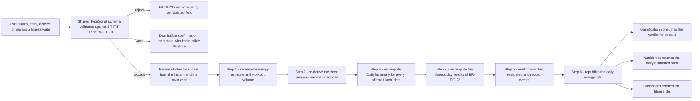

# User Stories — Fitness (`FIT`)

| Field | Value |
| --- | --- |
| Document | `user-stories/fitness.md` — agile story layer for the Fitness module |
| Version | 1.0 |
| Date | 2026-07-21 |
| Status | Approved for Phase 2 design |
| Owner | Rakshit — Project Lead / sole developer (STK-03) |
| Parent | [PlantPal+ Software Requirements Specification v1.0](../SRS.md) |
| Specification of record | [modules/fitness.md](../modules/fitness.md) — 26 functional requirements, 32 business rules |
| Owned identifiers | `US-FIT-01` … `US-FIT-15` and the epic identifiers `EPIC-FIT-01` … `EPIC-FIT-06`. All `FR-FIT`, `BR-FIT`, `UC-FIT`, `ENT-*`, `NFR-*`, `PER-*`, `STK-*`, `GOAL-*` and `MET-*` identifiers are referenced only, never renumbered |
| Story count | 15 user stories, 120 acceptance criteria |
| Total estimate | 134 story points |
| Source decisions | D-01, D-02, D-03, D-04, D-06, D-07, D-08, D-09 |

Related documents: [modules/fitness.md](../modules/fitness.md), [03-functional-requirements.md](../03-functional-requirements.md), [04-non-functional-requirements.md](../04-non-functional-requirements.md), [05-user-stories.md](../05-user-stories.md), [use-cases/fitness.md](../use-cases/fitness.md), [07-domain-model.md](../07-domain-model.md), [08-glossary.md](../08-glossary.md), [10-traceability-matrix.md](../10-traceability-matrix.md).

---

## Table of contents

1. [Epics for this module](#1-epics-for-this-module)
   - [1.1 Epic register](#11-epic-register)
   - [1.2 Story map](#12-story-map)
   - [1.3 The write-and-recompute flow these stories describe](#13-the-write-and-recompute-flow-these-stories-describe)
   - [1.4 How to read a story in this document](#14-how-to-read-a-story-in-this-document)
   - [1.5 Canonical vocabulary used in every acceptance criterion](#15-canonical-vocabulary-used-in-every-acceptance-criterion)
2. [User stories](#2-user-stories)
   - [US-FIT-01 — Log a cardio session in under twenty seconds](#us-fit-01--log-a-cardio-session-in-under-twenty-seconds)
   - [US-FIT-02 — Understand my calorie burn as an estimate](#us-fit-02--understand-my-calorie-burn-as-an-estimate)
   - [US-FIT-03 — Log a strength session with sets, reps and weight](#us-fit-03--log-a-strength-session-with-sets-reps-and-weight)
   - [US-FIT-04 — Be told when I hit a personal record](#us-fit-04--be-told-when-i-hit-a-personal-record)
   - [US-FIT-05 — Record my daily steps by hand](#us-fit-05--record-my-daily-steps-by-hand)
   - [US-FIT-06 — Set a daily step goal that judges each day fairly](#us-fit-06--set-a-daily-step-goal-that-judges-each-day-fairly)
   - [US-FIT-07 — Set weekly training and body-mass targets](#us-fit-07--set-weekly-training-and-body-mass-targets)
   - [US-FIT-08 — Take a planned rest day without losing my streak](#us-fit-08--take-a-planned-rest-day-without-losing-my-streak)
   - [US-FIT-09 — Backfill a forgotten workout and repair my streak](#us-fit-09--backfill-a-forgotten-workout-and-repair-my-streak)
   - [US-FIT-10 — Correct or remove a mistaken entry](#us-fit-10--correct-or-remove-a-mistaken-entry)
   - [US-FIT-11 — See my progress over time](#us-fit-11--see-my-progress-over-time)
   - [US-FIT-12 — Track body mass with a smoothed trend](#us-fit-12--track-body-mass-with-a-smoothed-trend)
   - [US-FIT-13 — Reuse a routine instead of retyping it](#us-fit-13--reuse-a-routine-instead-of-retyping-it)
   - [US-FIT-14 — Log at the gym with no signal](#us-fit-14--log-at-the-gym-with-no-signal)
   - [US-FIT-15 — Work in the units I think in](#us-fit-15--work-in-the-units-i-think-in)
3. [Story index and coverage](#3-story-index-and-coverage)
   - [3.1 Story index](#31-story-index)
   - [3.2 Functional-requirement coverage check](#32-functional-requirement-coverage-check)
   - [3.3 Use-case coverage check](#33-use-case-coverage-check)
   - [3.4 Persona coverage check](#34-persona-coverage-check)
4. [Story point totals](#4-story-point-totals)
   - [4.1 Totals per epic](#41-totals-per-epic)
   - [4.2 Totals per release](#42-totals-per-release)
   - [4.3 Totals per MoSCoW priority](#43-totals-per-moscow-priority)
   - [4.4 Estimation basis](#44-estimation-basis)

---

## 1. Epics for this module

### 1.1 Epic register

Epic identifiers are scoped to the `FIT` prefix owned by this document. An epic is a delivery grouping only: it mints no requirement, it is never referenced by an `FR-FIT-nn`, and it carries no acceptance criteria of its own.

| Epic ID | Name | Goal | Stories it contains | Points |
| --- | --- | --- | --- | --- |
| EPIC-FIT-01 | Workout capture and correction | Turn a session into a stored, date-attributed, validated row in under 20 seconds, and give the user a correction path that repairs every derived value in one transaction rather than leaving a half-corrected history | US-FIT-01, US-FIT-09, US-FIT-10 | 34 |
| EPIC-FIT-02 | Honest energy estimation | Quantify effort from the seeded MET table and the user's own body mass, freeze the three inputs onto the row so a historical figure never silently changes, and present every figure with its error band and the not-medical-advice disclaimer required by D-07 | US-FIT-02 | 8 |
| EPIC-FIT-03 | Strength detail and personal records | Record sets, reps and weight at the fidelity that makes volume and progression meaningful, and detect the three record categories automatically so the user never keeps a parallel spreadsheet | US-FIT-03, US-FIT-04 | 21 |
| EPIC-FIT-04 | Steps, goals and the fitness-day verdict | Capture the one universally available activity signal, let the user version a target over time, and derive exactly one authoritative verdict per local calendar date for `GAM` and `DSH` to consume | US-FIT-05, US-FIT-06, US-FIT-07, US-FIT-08 | 29 |
| EPIC-FIT-05 | Reflection: body metrics and progress analytics | Convert stored history into charts and a smoothed body-mass trend that are identical on both clients, readable by a screen reader, and free of every evaluative or shaming framing | US-FIT-11, US-FIT-12 | 21 |
| EPIC-FIT-06 | Friction removal: repeats, offline and units | Remove the three reasons a real user abandons a tracker — retyping the same routine, losing a session to a basement gym, and reading numbers in units they do not think in | US-FIT-13, US-FIT-14, US-FIT-15 | 21 |

### 1.2 Story map

```mermaid
flowchart TD
  ROOT["FIT user stories - 15 stories, 134 points"]

  ROOT --> E1["EPIC-FIT-01<br/>Workout capture and correction"]
  ROOT --> E2["EPIC-FIT-02<br/>Honest energy estimation"]
  ROOT --> E3["EPIC-FIT-03<br/>Strength detail and personal records"]
  ROOT --> E4["EPIC-FIT-04<br/>Steps, goals and the fitness-day verdict"]
  ROOT --> E5["EPIC-FIT-05<br/>Reflection: body metrics and analytics"]
  ROOT --> E6["EPIC-FIT-06<br/>Friction removal"]

  E1 --> S1["US-FIT-01 Log a cardio session in 20 seconds<br/>Must, v1.0 MVP, 13 points"]
  E1 --> S9["US-FIT-09 Backfill a forgotten workout<br/>Must, v1.0 MVP, 8 points"]
  E1 --> S10["US-FIT-10 Correct or remove an entry<br/>Must, v1.0 MVP, 13 points"]

  E2 --> S2["US-FIT-02 Calorie burn as an estimate<br/>Must, v0.5 Alpha, 8 points"]

  E3 --> S3["US-FIT-03 Strength sets, reps and weight<br/>Must, v1.0 MVP, 13 points"]
  E3 --> S4["US-FIT-04 Personal records<br/>Should, v1.0 MVP, 8 points"]

  E4 --> S5["US-FIT-05 Manual daily steps<br/>Must, v1.0 MVP, 8 points"]
  E4 --> S6["US-FIT-06 Daily step goal<br/>Must, v1.0 MVP, 8 points"]
  E4 --> S7["US-FIT-07 Weekly and body-mass targets<br/>Must, v1.0 MVP, 8 points"]
  E4 --> S8["US-FIT-08 Planned rest days<br/>Must, v1.0 MVP, 5 points"]

  E5 --> S11["US-FIT-11 Progress charts<br/>Must, v1.0 MVP, 13 points"]
  E5 --> S12["US-FIT-12 Body mass with a trend<br/>Must, v1.0 MVP, 8 points"]

  E6 --> S13["US-FIT-13 Templates and copy-previous<br/>Should, v1.0 MVP, 8 points"]
  E6 --> S14["US-FIT-14 Log offline at the gym<br/>Must, v1.0 MVP, 8 points"]
  E6 --> S15["US-FIT-15 Metric and imperial units<br/>Must, v1.0 MVP, 5 points"]
```



### 1.3 The write-and-recompute flow these stories describe

Every step below is owned by a requirement in [modules/fitness.md](../modules/fitness.md). The diagram is a reading aid across the epic set, not a new specification.



### 1.4 How to read a story in this document

| Element | Rule applied here |
| --- | --- |
| Persona names | Copied verbatim from the persona register `PER-01` … `PER-05`. The four personas this module serves are PER-01 Aditi Sharma, PER-03 Mia Castellano, PER-04 Harold Whitfield and PER-05 Sofia Lindqvist, exactly as section 2.2 of the module specification records |
| Priority | MoSCoW per D-02. A story carries the highest MoSCoW value among the requirements it realises. One documented exception is `US-FIT-04`, which realises only the personal-record slice of the `Must` requirement `FR-FIT-24`; that requirement's `Must` status is carried by `US-FIT-11`, so `US-FIT-04` is recorded as `Should` and the reason is repeated in its own metadata table |
| Release | The release at which **every** non-deferred acceptance criterion of the story passes. Where an earlier release already delivers a demoable subset, that subset is named as *First slice*, so the D-02 rule that every release leaves a demoable slice stays auditable. Where a single criterion is deliberately later than the story, it is named in a *Deferred criteria* row |
| Estimate | Story points on the Fibonacci scale 1, 2, 3, 5, 8, 13, 21. The reference point is defined in [section 4.4](#44-estimation-basis) |
| Acceptance criteria | Strict Gherkin. `AC-n` numbering restarts inside every story. Every criterion is decidable from an observable value: an enumerated member, an integer, a decimal to a stated precision, an HTTP status, a field error code, a row count or an exact user-facing string. No criterion uses the words fast, easy, user-friendly, efficient, robust or appropriate |
| Definition of Done | A task list covering implementation, automated tests, accessibility and documentation, identical in shape across every story so a reviewer can compare them at a glance |
| Traceability | Every story names the `FR-FIT-nn` requirements it realises, the `BR-FIT-nn` rules that govern it and the `UC-FIT-nn` use cases that execute it. No story exists without a real functional requirement, and all 26 functional requirements of the module are covered — see [section 3.2](#32-functional-requirement-coverage-check) |

### 1.5 Canonical vocabulary used in every acceptance criterion

Section 1.4 of the module specification reconciles the fitness working vocabulary with the domain model, and **the domain model wins**. Every criterion in this document therefore uses the right-hand column only. A criterion that wrote `WEEKLY_WORKOUTS`, `BODY_MASS_KG`, `E1RM`, `QUADS`, `7D` or the rest reason `RECOVERY` would be a defect in this document, not a synonym.

| Concept | Canonical term used here | Permitted values |
| --- | --- | --- |
| Activity type code | `ActivityTypeKey` | `WALK`, `RUN`, `CYCLE`, `SWIM`, `STRENGTH`, `YOGA`, `HIIT`, `SPORT`, `OTHER` |
| Perceived intensity | `Intensity` | `LOW`, `MODERATE`, `VIGOROUS`; default `MODERATE` |
| Goal type | `FitnessGoalType` | `DAILY_STEPS`, `WEEKLY_WORKOUT_COUNT`, `WEEKLY_ACTIVE_MINUTES`, `WEEKLY_DISTANCE`, `BODY_MASS_TARGET` |
| Fitness-day verdict | `fitness_day_met` state | `COMPLETE`, `INCOMPLETE`, `NEUTRAL` |
| Completion reason | verdict reason | `STEPS`, `WORKOUT`, `REST`, `NONE` |
| Personal-record category | `PersonalRecordType` | `HEAVIEST_WEIGHT`, `BEST_ESTIMATED_1RM`, `BEST_REP_COUNT` |
| Rest-day reason | `RestDayReason` | `PLANNED_REST`, `ILLNESS`, `INJURY`, `TRAVEL`, `OTHER` |
| Chart range | `ChartRange` | `DAYS_7`, `DAYS_30`, `DAYS_90`, `ALL_TIME` |
| Bucket granularity | `ChartAggregation` | `DAILY`, `WEEKLY`, `MONTHLY` |
| Step source | `StepEntrySource` | `MANUAL` in v1.0; `DEVICE_PEDOMETER` from v1.1+; `IMPORTED` reserved and unused |
| Body-mass source on a workout | `mass_source` | `BODY_METRIC`, `PROFILE`, `DEFAULT` |
| Muscle group | `MuscleGroup` | `CHEST`, `BACK`, `SHOULDERS`, `BICEPS`, `TRICEPS`, `FOREARMS`, `CORE`, `GLUTES`, `QUADRICEPS`, `HAMSTRINGS`, `CALVES`, `FULL_BODY`, `CARDIO` |
| Exercise identity | seeded `slug` | Lowercase hyphenated, for example `barbell-back-squat`, `barbell-bench-press`, `push-up` |
| Canonical storage units | per `BR-FIT-25` and D-09 | Mass in kilograms, distance in metres, duration in seconds, height in centimetres |

Three constants appear repeatedly and are stated once here: `MIN_QUALIFYING_WORKOUT_MINUTES` is 20, `BACKFILL_WINDOW_DAYS` is 30, and `DEFAULT_BODY_MASS_KG` is 70.0.

---

## 2. User stories

### US-FIT-01 — Log a cardio session in under twenty seconds

| Field | Value |
| --- | --- |
| Epic | EPIC-FIT-01 Workout capture and correction |
| Persona | PER-01 Aditi Sharma (primary), PER-05 Sofia Lindqvist (secondary) |
| Priority | Must |
| Release | v1.0 MVP |
| First slice | v0.5 Alpha — the seeded catalogue, the create form and the full validation table are demoable end to end on both clients; user-defined activity types (`FR-FIT-02`) and overlap detection (`FR-FIT-09`) arrive at v1.0 |
| Estimate | 13 story points |
| Related FRs | FR-FIT-01, FR-FIT-02, FR-FIT-03, FR-FIT-04, FR-FIT-09 |
| Related UCs | UC-FIT-01, UC-FIT-02 |
| Related BRs | BR-FIT-02, BR-FIT-03, BR-FIT-08, BR-FIT-10, BR-FIT-11, BR-FIT-12 |
| Traces up to | GOAL-01, GOAL-02, GOAL-11, STK-01, MET-01, D-02, D-03 |
| Verification | Test, Inspection |

**As** PER-01 Aditi Sharma, a time-poor multi-module professional,
**I want** to record a walk, run, ride or swim by choosing an activity, a duration and an intensity and nothing else,
**so that** logging the session never costs more effort or attention than the session itself.

**Acceptance criteria**

```gherkin
Scenario AC-1: The form opens with the defaults that make a three-field save possible
  Given I am signed in and the fitness module is enabled in my settings
  When I open the add-workout form
  Then the activity picker lists exactly the 9 seeded activity types WALK, RUN, CYCLE, SWIM, STRENGTH, YOGA, HIIT, SPORT and OTHER in ascending sort_order
  And the start time is pre-filled with the current instant truncated to the minute
  And the intensity field is pre-selected as MODERATE
  And the only fields I must supply to save are activity type and duration in whole minutes

Scenario AC-2: A minimal cardio entry is stored and attributed to the correct local date
  Given the form is open and my IANA time zone is "Asia/Kolkata"
  When I select RUN, enter a duration of 30 minutes and save
  Then the server responds HTTP 201
  And exactly one Workout row exists with duration_seconds 1800 and intensity MODERATE
  And started_local_date equals the calendar date of the start instant evaluated in "Asia/Kolkata"
  And the workout appears as the first item under today in the history list
  And no further mandatory field is requested before the entry is stored

Scenario AC-3: Distance is offered only where the activity type supports it
  Given the form is open
  When I select STRENGTH
  Then no distance field is rendered
  And a request that nevertheless supplies distance_km is rejected with HTTP 422 and the field code "distance.not_supported"
  And when I instead select RUN the distance field is rendered and accepts values from 0.01 to 500.00 km

Scenario AC-4: Every breached validation limit is reported in one response
  Given the form is open
  When I submit a duration of 1441 minutes together with a note of 640 characters
  Then the response is HTTP 422
  And the errors array contains exactly 2 entries, one with field "duration_min" and code "duration.out_of_range" and one with field "note"
  And the duration message names the maximum of 600 minutes
  And every value I entered is still present in the form after the rejection

Scenario AC-5: An implausible implied speed warns but does not block
  Given the form is open and I have selected RUN
  When I enter a distance of 45.00 km and a duration of 60 minutes, giving an implied speed of 45.0 km/h
  Then a dismissible confirmation is shown because 45.0 exceeds the RUN warn threshold of 30.0 km/h
  And on confirmation the workout is stored with implausible_flag true
  And a distance and duration implying more than 150.0 km/h is rejected with HTTP 422 instead

Scenario AC-6: An overlapping session is flagged, never blocked
  Given I already have a non-deleted RUN from 07:00 to 07:45 local time today
  When I save a second workout starting at 07:30 with a duration of 30 minutes
  Then a dismissible warning names the conflicting workout by its activity display name and its local start time of 07:00
  And on confirmation the entry is stored with overlaps_existing true
  And the earlier workout is left unchanged with overlaps_existing false
  And an intersection of 59 seconds or less produces no warning and no flag

Scenario AC-7: A user-defined activity type is creatable, capped and immediately selectable
  Given my account holds 19 non-deleted user-defined activity types
  When I create one named "Trail run" with a base MET of 6.0
  Then met_low is stored as 4.2, met_moderate as 6.0 and met_vigorous as 8.4
  And error_band_pct is stored as 35
  And the type appears in the picker under a group headed "Your activities" and the counter reads "20 of 20 used"
  And a further creation attempt is rejected with HTTP 422 and the code "activity_type.limit_reached"

Scenario AC-8: The first-run state explains the entity rather than showing an empty list
  Given my account has zero non-deleted workouts
  When I open the fitness tab
  Then a first-run empty state describes what a workout entry records
  And exactly 1 primary action is offered, which opens the add-workout form
  And no chart axes and no zero-valued series are drawn
```

**Definition of Done**

- [ ] Implementation: the `ENT-15 ActivityType` seed migration loads exactly 9 rows with `source = SEEDED` and `user_id = NULL`, and aborts the deployment on a missing code, a duplicate slug, a MET outside 1.0 to 23.0 or a non-monotonic MET triple.
- [ ] Implementation: one shared TypeScript validation schema module in the monorepo is imported by the Express route, the React web form and the React Native form, so client and server limits cannot drift.
- [ ] Implementation: `started_local_date` and `started_timezone` are frozen server-side at write time per `BR-FIT-08`; no client-supplied local date is trusted.
- [ ] Implementation: overlap is evaluated on half-open UTC intervals with a 60-second threshold and persisted as `overlaps_existing` on the newer entry only.
- [ ] Tests: unit tests cover every `Reject` and `Warn` row of `BR-FIT-10` at the boundary value and at boundary plus or minus one.
- [ ] Tests: an integration test asserts that a payload violating three limits returns three error entries in a single HTTP 422 response.
- [ ] Tests: a timezone test asserts correct attribution for a workout starting at 23:50 local time and for both `America/New_York` instants of the 2026-11-01 fall-back hour.
- [ ] Accessibility: every form control has a programmatic label, the intensity selector is operable by keyboard and by screen reader, all touch targets are at least 44 by 44 dp, and each validation error is associated with its field and announced through a live region per NFR-A11Y-05.
- [ ] Documentation: the activity-type seed file, its MET provenance note and the error-code list are recorded in the repository alongside the migration.

---

### US-FIT-02 — Understand my calorie burn as an estimate

| Field | Value |
| --- | --- |
| Epic | EPIC-FIT-02 Honest energy estimation |
| Persona | PER-03 Mia Castellano (primary), PER-01 Aditi Sharma (secondary) |
| Priority | Must |
| Release | v0.5 Alpha |
| Estimate | 8 story points |
| Related FRs | FR-FIT-05, FR-FIT-06 |
| Related UCs | UC-FIT-03 |
| Related BRs | BR-FIT-04, BR-FIT-05, BR-FIT-06, BR-FIT-07, BR-FIT-31 |
| Traces up to | GOAL-01, GOAL-06, STK-01, STK-02, D-07, D-08 |
| Verification | Test, Demonstration |

**As** PER-03 Mia Castellano, an athlete in a deliberate body-recomposition block,
**I want** to see roughly how much energy a session used and to be told plainly how rough that number is,
**so that** I am informed by the figure without being misled into treating it as measurement.

**Acceptance criteria**

```gherkin
Scenario AC-1: The estimate follows the published formula exactly
  Given my most recent BodyMetricEntry of type BODY_MASS is 72.00 kg dated on or before the workout start date
  When I save a RUN at MODERATE intensity for 45 minutes
  Then estimated_energy_kcal is stored as 529, being 9.8 multiplied by 72.0 multiplied by 0.75 and rounded half-up
  And met_value_used is stored as 9.8, body_mass_kg_used as 72.00, mass_source as BODY_METRIC and error_band_pct as 25

Scenario AC-2: The range and the disclaimer are visible without interaction
  Given that workout is stored with 529 kcal and an error band of 25 percent
  When I open its detail screen
  Then the point estimate reads 529 kcal
  And the range reads "396 to 662", being floor of 529 times 0.75 and ceiling of 529 times 1.25
  And the word "estimate" appears beside the figure
  And the sentence "Calorie burn is an estimate based on average values. It is not medical advice and should not be used to diagnose, treat or manage any health condition." is rendered without any further interaction

Scenario AC-3: A missing body mass falls back to a stated default and prompts once
  Given I have no BodyMetricEntry of type BODY_MASS and my profile holds no body mass
  When I save any workout
  Then body_mass_kg_used is stored as 70.00 and mass_source as DEFAULT
  And the detail screen states that the estimate uses an average body mass of 70 kg
  And exactly 1 one-tap action to record my own body mass is offered
  And the prompt contains none of the words fat, obese, ideal weight, guilty or lazy

Scenario AC-4: A later body-mass entry never rewrites a stored estimate
  Given a workout saved last month stored body_mass_kg_used of 68.00 and estimated_energy_kcal of 500
  When I record a new body mass of 75.00 kg today
  Then that workout still stores body_mass_kg_used of 68.00 and estimated_energy_kcal of 500
  And no recomputation job touches any workout row

Scenario AC-5: An aggregate shows the widest contributing band
  Given the current ISO week contains one RUN with error_band_pct 25 and one HIIT with error_band_pct 35
  When I view the weekly energy total
  Then the total is the plain arithmetic sum of the two point estimates
  And the displayed aggregate band is 35 percent
  And the disclaimer sentence is reachable from the aggregate within 1 interaction

Scenario AC-6: A zero estimate still carries the band and the disclaimer
  Given a stored workout whose estimated_energy_kcal is 0
  When I open its detail screen
  Then the range renders as "0 to 0 kcal"
  And the disclaimer sentence is still rendered in full

Scenario AC-7: The disclaimer is never suppressed by a missing locale key or a missing band
  Given the locale catalogue lookup for the key "fitness.energy.disclaimer" fails
  When any energy figure is rendered
  Then the English source sentence is rendered in place of the resolved string
  And a warn-level log line records the missing key
  And when error_band_pct is absent on the row the client uses 35 and still renders both the range and the disclaimer

Scenario AC-8: Steps contribute no energy anywhere
  Given I logged 12000 steps for today and one WALK workout of 30 minutes for today
  When the daily estimated energy total for today is computed
  Then the total equals the point estimate of the WALK workout alone
  And the step entry contributes exactly 0 kcal to that total
```

**Definition of Done**

- [ ] Implementation: `estimated_energy_kcal`, `met_value_used`, `body_mass_kg_used`, `mass_source` and `error_band_pct` are written once at create time and are excluded from every rebuild routine per invariant 4 of the module specification.
- [ ] Implementation: the body-mass precedence chain `BODY_METRIC`, then `PROFILE`, then the constant 70.0 is a single server-side resolver used by no other code path.
- [ ] Implementation: the disclaimer sentence exists only in the locale catalogue under `fitness.energy.disclaimer`; no hard-coded copy of it exists in either client per D-08.
- [ ] Tests: a table-driven unit test asserts the rounding rule at raw values 0.4, 0.6, 0.9, 1.4 and 1.5, including the raise-to-1 clause for raw values strictly between 0.5 and 1.0.
- [ ] Tests: a regression test asserts that inserting a new body-mass entry leaves every existing workout row byte-identical.
- [ ] Tests: a lint or unit check fails the build when any surface renders an energy figure without the estimate framing.
- [ ] Accessibility: the range and the band are conveyed as text and not by colour or width alone, and the disclaimer is part of the reading order rather than a hover-only affordance, per NFR-A11Y-08.
- [ ] Documentation: the MET provenance, the gross-versus-net note and the worked example of 529 kcal are recorded next to the formula in the developer notes.

---

### US-FIT-03 — Log a strength session with sets, reps and weight

| Field | Value |
| --- | --- |
| Epic | EPIC-FIT-03 Strength detail and personal records |
| Persona | PER-03 Mia Castellano (primary) |
| Priority | Must |
| Release | v1.0 MVP |
| First slice | v0.5 Alpha — the 40-row seeded catalogue and set-level capture are demoable; user-defined exercises (`FR-FIT-12`) and the denormalised volume total (`FR-FIT-14`) arrive at v1.0 |
| Estimate | 13 story points |
| Related FRs | FR-FIT-04, FR-FIT-11, FR-FIT-12, FR-FIT-13, FR-FIT-14 |
| Related UCs | UC-FIT-02 |
| Related BRs | BR-FIT-10, BR-FIT-14, BR-FIT-17 |
| Traces up to | GOAL-01, GOAL-02, GOAL-09, STK-01, STK-05, D-03 |
| Verification | Test, Inspection |

**As** PER-03 Mia Castellano, an athlete who lifts to a written programme,
**I want** to record each exercise with its individual sets, repetitions and weights,
**so that** I can see training volume and progression rather than only the time I spent in the gym.

**Acceptance criteria**

```gherkin
Scenario AC-1: The exercise section appears only for strength work and is searchable
  Given the add-workout form is open
  When I select the activity type STRENGTH
  Then an exercise section is rendered
  And the seeded catalogue returns at least 40 exercises
  And searching "squat" matches case-insensitively and diacritic-insensitively
  And filtering by the primary muscle group QUADRICEPS returns only exercises whose primary_muscle_group is QUADRICEPS

Scenario AC-2: Volume is computed per set, per exercise and per workout
  Given I added the seeded exercise "barbell-back-squat" to a STRENGTH workout
  When I enter 3 sets of 5 repetitions at 100.00 kg each and save
  Then each set stores volume_kg of 500.0
  And the per-exercise subtotal reads 1500.0 kg
  And workout_volume_kg is stored as 1500.0, rounded half-up to one decimal place
  And the same three numbers are returned by the API to the web client and the mobile client from one server computation

Scenario AC-3: A warm-up set counts toward volume and is excluded from records
  Given a STRENGTH workout holds one set flagged is_warmup true at 60.00 kg for 10 repetitions and one working set at 100.00 kg for 5 repetitions
  When I save the workout
  Then workout_volume_kg is 1100.0, which includes the warm-up set
  And the warm-up set is excluded from all 3 personal-record categories

Scenario AC-4: Set-level limits reject or warn at the stated boundaries
  Given a STRENGTH workout draft is open
  When I enter a set weight of 501.00 kg
  Then the request is rejected with HTTP 422 and a message naming the 500.0 kg maximum
  And a set weight of 320.00 kg instead produces a dismissible confirmation and is stored on confirmation with implausible_flag true
  And a repetition count of 0 or of 101 is rejected with HTTP 422
  And a 21st set on one exercise, a 31st exercise on one workout, or a 201st set across the workout is rejected with HTTP 422, the last carrying the field code "sets.workout_limit_reached"

Scenario AC-5: A custom exercise is creatable, capped and behaves like a seeded one
  Given the catalogue search for "hack squat" returns no match
  When I create a custom exercise named "Hack squat" with primary_muscle_group QUADRICEPS
  Then it is selectable in the current draft without a reload
  And it participates in volume computation and in personal-record detection exactly as a seeded exercise does
  And its records are kept separately from those of any similarly named seeded exercise
  And creating a 101st custom exercise is rejected with HTTP 422 naming the cap of 100

Scenario AC-6: A name that collides with a seeded exercise is refused with a pointer
  Given the seeded catalogue contains "Barbell back squat"
  When I try to create a custom exercise named "barbell back squat"
  Then the response is HTTP 409
  And the message names the seeded entry and states that using it keeps my records together
  And no Exercise row is created

Scenario AC-7: A bodyweight set is labelled as bodyweight rather than as zero
  Given I added the seeded exercise "push-up" to a STRENGTH workout
  When I record 3 sets of 20 repetitions at 0.00 kg and save
  Then each set is labelled "Bodyweight" rather than as a zero weight
  And workout_volume_kg is stored as 0.0 rather than null
  And a BEST_REP_COUNT record remains possible for that exercise

Scenario AC-8: A strength workout with no exercises is accepted rather than refused
  Given I selected STRENGTH and entered a duration of 45 minutes
  When I save without adding any exercise
  Then the workout is stored with workout_volume_kg of 0.0
  And a non-blocking hint offers to add exercises at any time
  And no error state is presented
```

**Definition of Done**

- [ ] Implementation: the `ENT-16 Exercise` seed migration loads the 40 rows of `BR-FIT-17` and aborts below 40 rows, on a duplicate slug or on a `primary_muscle_group` outside the enumeration.
- [ ] Implementation: sets are stored as individual `ENT-18 WorkoutExerciseSet` rows with server-assigned `order_index` and `set_index`, never as a JSON blob, so record queries can be indexed per NFR-SCAL-05.
- [ ] Implementation: `workout_volume_kg` is denormalised onto `ENT-17 Workout` and recomputed inside the `BR-FIT-30` cascade whenever any set changes.
- [ ] Implementation: `exercise_name_snapshot` is copied onto every set at write time so a later soft delete of a custom exercise leaves history readable.
- [ ] Tests: unit tests assert the volume formula including warm-up inclusion, bodyweight zero contribution and half-up rounding to one decimal place.
- [ ] Tests: integration tests assert all four cardinality caps — 30 exercises, 20 sets per exercise, 200 sets per workout and 100 custom exercises per account.
- [ ] Tests: a seed-inspection test asserts that repeated execution against a clean database produces byte-identical rows per NFR-DATA-07.
- [ ] Accessibility: the set grid is navigable by keyboard with a visible focus ring, each numeric input is labelled with its exercise and set index for a screen reader, and the bodyweight label is text rather than an icon alone.
- [ ] Documentation: the 40-row seed list, the muscle-group and equipment enumerations, and the isometric logging convention for `plank` are recorded in the repository.

---

### US-FIT-04 — Be told when I hit a personal record

| Field | Value |
| --- | --- |
| Epic | EPIC-FIT-03 Strength detail and personal records |
| Persona | PER-03 Mia Castellano (primary), PER-04 Harold Whitfield (secondary, for the non-animated path) |
| Priority | Should |
| Release | v1.0 MVP |
| Priority note | `FR-FIT-15` is `Should`. This story realises only the personal-record slice of the `Must` requirement `FR-FIT-24`, whose `Must` status is carried by `US-FIT-11`, so the story as a whole is `Should` |
| Estimate | 8 story points |
| Related FRs | FR-FIT-15, FR-FIT-24 |
| Related UCs | UC-FIT-04, UC-FIT-11 |
| Related BRs | BR-FIT-15, BR-FIT-16 |
| Traces up to | GOAL-01, GOAL-04, STK-01, MET-13, D-07 |
| Verification | Test, Demonstration |

**As** PER-03 Mia Castellano, an athlete tracking progression per exercise,
**I want** the system to notice by itself when a set beats everything I have lifted before on that exercise,
**so that** my progress is visible without me maintaining a separate spreadsheet beside the app.

**Acceptance criteria**

```gherkin
Scenario AC-1: A heavier working set creates a HEAVIEST_WEIGHT record once
  Given my current HEAVIEST_WEIGHT record on "barbell-bench-press" is 90.00 kg
  When I save a non-warm-up set of 92.50 kg for 3 repetitions
  Then exactly 1 new HEAVIEST_WEIGHT record row is created with value 92.50 and is_current true
  And achieved_at equals the started_at of that workout
  And exactly 1 fitness.pr.achieved event is emitted carrying user_id, the exercise reference, pr_type, value, unit and achieved_at
  And the in-app celebration surface is shown exactly once for that record

Scenario AC-2: The estimated one-repetition maximum uses the Epley formula
  Given my current BEST_ESTIMATED_1RM record on "barbell-back-squat" is 105.0 kg
  When I save a non-warm-up set of 100.00 kg for 5 repetitions
  Then the computed estimate is 116.7 kg, being 100.0 multiplied by 1 plus 5 divided by 30, rounded half-up to one decimal place
  And a new BEST_ESTIMATED_1RM record of 116.7 is created
  And a single-repetition set stores the estimate as the set weight exactly, with no inflation applied

Scenario AC-3: An exact tie never displaces the earlier holder
  Given my current BEST_REP_COUNT record on "push-up" is 30 repetitions, achieved on 2026-05-04
  When I save a non-warm-up set of exactly 30 repetitions
  Then no new record row is created
  And the stored achieved_at remains 2026-05-04
  And no fitness.pr.achieved event is emitted

Scenario AC-4: Category eligibility rules are enforced per set
  Given a strength workout is being saved
  When it contains a non-warm-up set of 60.00 kg for 20 repetitions
  Then no BEST_ESTIMATED_1RM record is created because the repetition count exceeds the validity limit of 12
  And a BEST_REP_COUNT record remains possible from that set
  And a set at 0.00 kg is excluded from HEAVIEST_WEIGHT and from BEST_ESTIMATED_1RM while remaining eligible for BEST_REP_COUNT

Scenario AC-5: Detection is idempotent across repeated evaluation
  Given a workout has already been evaluated and produced 2 records
  When the same unchanged workout is re-evaluated by a replay or by a rebuild of the projection
  Then the record row count for that user and exercise is unchanged
  And no additional fitness.pr.achieved event is emitted

Scenario AC-6: A destructive edit revokes a record it no longer supports
  Given my current HEAVIEST_WEIGHT record on "barbell-bench-press" came from a set of 92.50 kg
  When I delete the workout that contained that set
  Then the category is re-derived over the remaining qualifying sets
  And the superseded row is marked with revoked_at
  And exactly 1 fitness.pr.revoked event is emitted to the gamification consumer

Scenario AC-7: The record timeline lists records newest first with their state
  Given my account holds 7 personal-record rows across 3 exercises
  When I open the personal-record timeline
  Then records are ordered by achieved_at descending
  And each row shows the exercise name, the PersonalRecordType member, the value with its unit and whether it is current or superseded
  And the current-or-superseded state is conveyed by text as well as by any visual treatment

Scenario AC-8: The celebration honours the reduce-motion preference
  Given my device reports the reduce-motion preference as enabled
  When a new personal record is detected
  Then no Lottie animation is played
  And a static confirmation is rendered stating the category, the value and the exercise name
  And the same confirmation is announced through an accessibility live region
```

**Definition of Done**

- [ ] Implementation: the personal-record projection is derived from `ENT-18 WorkoutExerciseSet` filtered to non-warm-up sets of non-deleted workouts, and is fully rebuildable from those rows per `BR-ENT-41`.
- [ ] Implementation: the strict-improvement thresholds are 0.1 kg for `HEAVIEST_WEIGHT` and `BEST_ESTIMATED_1RM` and 1 repetition for `BEST_REP_COUNT`, applied in one shared comparator.
- [ ] Implementation: `fitness.pr.achieved` and `fitness.pr.revoked` are emitted from step 5 of the `BR-FIT-30` cascade only, never from a client.
- [ ] Tests: unit tests cover the Epley formula at 1, 2, 12 and 13 repetitions and at 0.00 kg.
- [ ] Tests: an idempotency test re-runs detection over an unchanged dataset 3 times and asserts zero new rows and zero events.
- [ ] Tests: an integration test deletes the record-holding workout and asserts one `revoked_at` write and one revocation event.
- [ ] Accessibility: the celebration path is fully operable and comprehensible with animation suppressed, and the timeline distinguishes current from superseded records without relying on colour, per NFR-A11Y-07 and NFR-A11Y-08.
- [ ] Documentation: the three v1.0 categories, the deferred categories and the tie-break rule are recorded in the developer notes with the worked example of 116.7 kg.

---

### US-FIT-05 — Record my daily steps by hand

| Field | Value |
| --- | --- |
| Epic | EPIC-FIT-04 Steps, goals and the fitness-day verdict |
| Persona | PER-01 Aditi Sharma (primary), PER-05 Sofia Lindqvist (secondary) |
| Priority | Must |
| Release | v1.0 MVP |
| First slice | v0.5 Alpha — per-date manual entry with replace semantics and the full validation table |
| Deferred criteria | AC-7 is deferred to v1.1+ Post-MVP with `FR-FIT-17`; the story passes without it because the pedometer is an accelerator and never a source of record |
| Estimate | 8 story points |
| Related FRs | FR-FIT-16, FR-FIT-17, FR-FIT-18 |
| Related UCs | UC-FIT-05 |
| Related BRs | BR-FIT-10, BR-FIT-18 |
| Traces up to | GOAL-02, GOAL-09, STK-01, D-03, D-06 |
| Verification | Test, Demonstration, Inspection |

**As** PER-01 Aditi Sharma, a multi-module user whose ordinary weekday activity is walking,
**I want** to type my step count in against a chosen date and to know exactly why the app does not read it for me,
**so that** step goals work on every device I own without depending on a health platform the project cannot integrate.

**Acceptance criteria**

```gherkin
Scenario AC-1: A first step entry for a date is stored against that date
  Given today has no StepEntry row
  When I enter 9000 and save
  Then exactly 1 StepEntry row exists for today with step_count 9000 and source MANUAL
  And the step figure on the dashboard tile reads 9000

Scenario AC-2: A second entry for the same date replaces rather than accumulates
  Given today already holds a StepEntry of 9000 steps
  When I enter 12000 for today and save
  Then the stored step_count for today is 12000 and not 21000
  And exactly 1 live StepEntry row exists for the key of my user, today and source MANUAL

Scenario AC-3: A past date is accepted and re-evaluates that day
  Given today is 2026-07-21
  When I select 2026-07-18 and save a step count of 11000
  Then the row is stored against 2026-07-18
  And the fitness-day verdict for 2026-07-18 is recomputed inside the same transaction
  And a fitness.day.evaluated event for 2026-07-18 is emitted with retroactive true and streak_eligible true

Scenario AC-4: Future dates and out-of-range counts are rejected at the stated bounds
  Given the step form is open
  When I select tomorrow's date and save
  Then the response is HTTP 422 with a message stating that steps can only be logged up to today
  And a date more than 1825 days in the past is rejected with a message naming the 5-year limit
  And a step count of 200001 or of a negative number is rejected with a message naming the range 0 to 200,000

Scenario AC-5: A very high but permitted count warns rather than rejects
  Given the step form is open
  When I enter 120000 steps
  Then a dismissible confirmation asks me to check the value
  And on confirmation the row is stored with implausible_flag true
  And on dismissal nothing is stored

Scenario AC-6: A count of zero is a recorded fact, not an absence
  Given today has no StepEntry row
  When I enter 0 and save
  Then a StepEntry row exists for today with step_count 0
  And that day is treated as having a recorded step value rather than as unrecorded
  And a date with no row at all is reported as unrecorded and is never rendered as 0 in an average

Scenario AC-7: The device read pre-fills but never stores by itself
  Given the SENSOR_PEDOMETER feature flag resolves to enabled for my account and the device reports pedometer availability
  When I tap the read-from-device action and grant the motion permission
  Then the step field is pre-filled with the device count for the interval from my local midnight to now
  And a provenance label names the device as the source
  And nothing is stored until I explicitly confirm
  And when the flag is off, the device reports no pedometer, the permission is denied or the native call throws, the screen degrades to plain manual entry with one explanatory line and no error state

Scenario AC-8: The manual-only explanation is present on the step screen
  Given I open the step-entry screen
  When it renders
  Then the sentence "Step counts are entered by you. PlantPal Plus does not read Apple Health, Google Fit or Health Connect in this version." is displayed
  And no dependency in the mobile or backend workspace manifest references Apple HealthKit, Google Fit or Health Connect
  And a request carrying the StepEntrySource member IMPORTED is rejected at the API boundary
```

**Definition of Done**

- [ ] Implementation: the write upserts on `(user_id, local_date, source)` and replaces the previous value, and the fitness-day verdict for that date is recomputed in the same transaction.
- [ ] Implementation: `client_recorded_at` is stored on `ENT-20 StepEntry` so a replayed offline event arriving after a newer edit resolves by the later capture time per `BR-FIT-18`.
- [ ] Implementation: steps contribute exactly 0 kcal to `estimated_energy_kcal_total` and are not converted to a distance in v1.0.
- [ ] Implementation: the pedometer path sits behind the `SENSOR_PEDOMETER` flag whose default is off, and every failure mode degrades to manual entry.
- [ ] Tests: unit tests assert replace-not-accumulate semantics, the 0-versus-absent distinction and every boundary of `BR-FIT-10` for `step_count` and the step `local_date`.
- [ ] Tests: an inspection test asserts that the dependency manifests contain no health-platform package, satisfying the `Wont` of `FR-FIT-18`.
- [ ] Tests: a flag-off suite run proves every step journey completes with `SENSOR_PEDOMETER` disabled, per NFR-RELI-02.
- [ ] Accessibility: the numeric field accepts keyboard entry, the confirmation dialog is dismissible by Escape and returns focus to its trigger, and the manual-only sentence is part of the reading order rather than placeholder text.
- [ ] Documentation: the reason of record for the health-platform exclusion is repeated in the README of the fitness feature folder so a future maintainer does not re-open it by accident.

---

### US-FIT-06 — Set a daily step goal that judges each day fairly

| Field | Value |
| --- | --- |
| Epic | EPIC-FIT-04 Steps, goals and the fitness-day verdict |
| Persona | PER-05 Sofia Lindqvist (primary), PER-01 Aditi Sharma (secondary) |
| Priority | Must |
| Release | v1.0 MVP |
| Estimate | 8 story points |
| Related FRs | FR-FIT-19, FR-FIT-20, FR-FIT-21 |
| Related UCs | UC-FIT-06, UC-FIT-07 |
| Related BRs | BR-FIT-19, BR-FIT-20, BR-FIT-22, BR-FIT-24 |
| Traces up to | GOAL-01, GOAL-04, GOAL-11, STK-01, STK-02, D-07 |
| Verification | Test |

**As** PER-05 Sofia Lindqvist, a student who keeps a walking streak rather than a gym habit,
**I want** a daily step target that is remembered as it was on each past day,
**so that** an ordinary day without a gym session still counts and raising my target never rewrites my history.

**Acceptance criteria**

```gherkin
Scenario AC-1: The default target is offered but never stored without confirmation
  Given I have no goal version of type DAILY_STEPS
  When I open the goals screen
  Then a DAILY_STEPS target of 8000 is offered as the default value
  And no FitnessGoal row exists until I confirm
  And the permitted range shown is 1000 to 50000

Scenario AC-2: Reaching the target completes the day with reason STEPS
  Given I set a DAILY_STEPS target of 8000 today and today holds no qualifying workout and no rest day
  When I record 8200 steps for today
  Then the verdict for today is COMPLETE with reason STEPS
  And a fitness.day.evaluated event for today carries state COMPLETE and reason STEPS

Scenario AC-3: A historical day is judged against the version that was in force
  Given I set DAILY_STEPS to 8000 effective from 2026-06-01 and to 10000 effective from 2026-06-15
  When the verdict for 2026-06-10, which holds 8500 steps, is computed
  Then the resolved target for that date is 8000
  And the verdict for 2026-06-10 is COMPLETE with reason STEPS
  And the verdict for a 2026-06-20 date holding 8500 steps is INCOMPLETE with reason NONE

Scenario AC-4: Out-of-range targets are rejected at the stated bounds
  Given the goals screen is open
  When I submit a DAILY_STEPS target of 500
  Then the response is HTTP 422 and the message names the minimum of 1,000 steps
  And a target of 50001 is rejected with a message naming the maximum of 50,000

Scenario AC-5: Repeated same-day edits never create a zero-length version
  Given I set DAILY_STEPS to 9000 earlier today
  When I change it to 9500 and then to 10000 on the same local date
  Then exactly 1 goal version exists with effective_from equal to today
  And its target_value is 10000
  And no version exists whose effective_from equals its effective_to

Scenario AC-6: A day with no goal and no data is neutral, never a failure
  Given I have never set any fitness goal and have logged no workout, no steps and no rest day
  When I view the 7 local dates before today
  Then the verdict for each of those dates is NEUTRAL with reason NONE
  And none of those dates is rendered in a failure treatment, with no red fill, no downward arrow and no exclamation mark
  And the word "failed" does not appear on the screen

Scenario AC-7: A deleted goal leaves later dates unscored rather than failed
  Given I have an open DAILY_STEPS version and today is 2026-07-21
  When I delete the goal
  Then the open version is closed with effective_to of 2026-07-22
  And no successor version is inserted
  And the resolution for 2026-07-25 returns the sentinel UNSET and is rendered as a neutral invitation to set a goal

Scenario AC-8: Ambiguous goal data fails loudly rather than guessing
  Given two goal versions of type DAILY_STEPS were somehow stored with overlapping effective ranges
  When a verdict for a date covered by both is requested
  Then the request fails with HTTP 500 and a correlation identifier
  And an error-level log line and a Sentry event are raised
  And no verdict is written for that date
```

**Definition of Done**

- [ ] Implementation: `ENT-22 FitnessGoal` uses `effective_from` inclusive and `effective_to` exclusive, with a database exclusion constraint that makes two overlapping versions unstorable.
- [ ] Implementation: the resolver is a pure function of stored rows, selects on `effective_from <= local_date AND (effective_to IS NULL OR effective_to > local_date)`, and asserts the single-match invariant rather than trusting it.
- [ ] Implementation: setting a goal re-evaluates the current local date only; historical dates keep the version that was in force.
- [ ] Implementation: the ordered seven-step decision procedure of `BR-FIT-22` is one server-side function, and `MIN_QUALIFYING_WORKOUT_MINUTES` is a named constant equal to 20.
- [ ] Tests: unit tests drive the resolver across a date before the first version, on a boundary date, between two versions, after a deletion and after a re-creation.
- [ ] Tests: a property test asserts that every date of a synthetic 120-day history resolves to exactly zero or one version.
- [ ] Tests: an integration test asserts that three same-day target changes leave exactly one version row.
- [ ] Accessibility: the target input announces its permitted range, the `UNSET` state is announced as text rather than as an empty control, and the neutral day treatment is distinguishable without colour per NFR-A11Y-08.
- [ ] Documentation: the goal-version algebra and its three invariants are recorded in the developer notes with a worked timeline.

---

### US-FIT-07 — Set weekly training and body-mass targets

| Field | Value |
| --- | --- |
| Epic | EPIC-FIT-04 Steps, goals and the fitness-day verdict |
| Persona | PER-03 Mia Castellano (primary) |
| Priority | Must |
| Release | v1.0 MVP |
| Estimate | 8 story points |
| Related FRs | FR-FIT-19, FR-FIT-20 |
| Related UCs | UC-FIT-06, UC-FIT-07 |
| Related BRs | BR-FIT-09, BR-FIT-13, BR-FIT-19, BR-FIT-21, BR-FIT-31 |
| Traces up to | GOAL-04, GOAL-06, STK-01, STK-02, D-07, D-09 |
| Verification | Test, Inspection |

**As** PER-03 Mia Castellano, an athlete who plans training by the week rather than by the day,
**I want** weekly workout, active-minute and distance targets plus an optional body-mass target,
**so that** my goals match how I actually plan, and the app refuses to help me set a target that is unsafe.

**Acceptance criteria**

```gherkin
Scenario AC-1: Weekly progress reads as progress, never as failure mid-week
  Given I set WEEKLY_WORKOUT_COUNT to 3 and the current ISO week holds 2 logged workouts
  When I view the goal progress
  Then the progress reads "2 of 3"
  And the current week is not marked as failed while it is still in progress
  And no proration is applied to a partial first week of account history

Scenario AC-2: Only moderate and vigorous work contributes to active minutes
  Given I set WEEKLY_ACTIVE_MINUTES to 150
  When I log a YOGA session of 60 minutes at intensity LOW
  Then the weekly active-minute progress is unchanged
  And the workout still contributes to workout count, to distance where applicable and to the energy total
  And a subsequent 60-minute session at MODERATE increases weekly active minutes by exactly 60

Scenario AC-3: Overlapping sessions cannot inflate the active-minute total
  Given two qualifying workouts of 30 minutes each intersect for 15 minutes on the same local date
  When the weekly active-minute total is computed
  Then that date contributes 45 active minutes, being the length of the union of the two intervals
  And the workout count for that date is 2
  And the energy total for that date is the plain sum of both point estimates

Scenario AC-4: The week boundary follows the configured week-start day
  Given my week_start_day is MONDAY and my local time zone is "Pacific/Auckland"
  When I log a workout on Sunday at 23:50 local time
  Then it counts toward the ISO week that is ending, not the week that starts the next day
  And when week_start_day is SUNDAY the same rule applies shifted by one day

Scenario AC-5: A body-mass target below a safety floor is refused with the floor named
  Given my profile height is recorded as 175 cm
  When I set a BODY_MASS_TARGET of 55.0 kg
  Then the response is HTTP 422
  And the message names 56.7 kg as the minimum permitted target, being 18.5 multiplied by 1.75 squared and rounded up to one decimal place
  And a target below the absolute floor of 40.0 kg is refused even when no height is recorded

Scenario AC-6: A target date implying an unsafe rate is refused with the rate named
  Given my most recent body mass is 90.0 kg
  When I set a BODY_MASS_TARGET of 80.0 kg with a target date 28 days away
  Then the response is HTTP 422
  And the message states that the implied rate is 2.5 kg per week and that the supported maximum is 1.0 kg per week
  And a target date of 70 days or more for the same pair of values is accepted

Scenario AC-7: Every rejection message stays factual and non-evaluative
  Given any body-mass goal rejection is rendered
  When the message is displayed
  Then it names only the applicable bound and the nearest permitted value
  And it contains none of the words overweight, obese, fat, ideal weight, failed, guilty, shame or lazy
  And no body-mass index category label and no comparison against any population appears on the screen
  And the not-medical-advice disclaimer is visible on the body-mass goal screen

Scenario AC-8: Each goal type stores its canonical metric unit and its period
  Given I set WEEKLY_DISTANCE to 15.00 km and WEEKLY_ACTIVE_MINUTES to 150 minutes
  When the versions are stored
  Then the distance target is persisted in metres and the active-minute target in seconds
  And the stored GoalPeriod is DAY for DAILY_STEPS, WEEK for the three weekly types and NONE for BODY_MASS_TARGET
  And each of the 5 goal types can be active independently, with none of them mandatory
```

**Definition of Done**

- [ ] Implementation: the three safety tests of `BR-FIT-21` run server-side before any `BODY_MASS_TARGET` version is written, in the order absolute floor, body-mass-index floor, then rate cap.
- [ ] Implementation: weekly aggregation uses the ISO week rule of `BR-FIT-09` evaluated in the user's own time zone, with the week-start day read from `ENT-03 UserSettings`.
- [ ] Implementation: active minutes are the union length of qualifying intervals, stored as `active_seconds` on `ENT-49 DailySummary` and displayed as whole minutes rounded down.
- [ ] Tests: unit tests assert each of the five goal ranges at minimum, maximum, minimum minus one and maximum plus one.
- [ ] Tests: a test asserts the 56.7 kg worked example at 175 cm and the 2.5 kg per week worked example from 90.0 kg to 80.0 kg over 28 days.
- [ ] Tests: a locale-catalogue inspection test fails the build if any forbidden word from `BR-FIT-31` appears in a fitness string.
- [ ] Accessibility: weekly progress is announced as "2 of 3 workouts" rather than as a ring percentage alone, and the disclaimer is in the reading order of the goal screen.
- [ ] Documentation: the goal range table, the safety floors and their D-07 justification are copied into the developer notes so no implementer has to infer a bound.

---

### US-FIT-08 — Take a planned rest day without losing my streak

| Field | Value |
| --- | --- |
| Epic | EPIC-FIT-04 Steps, goals and the fitness-day verdict |
| Persona | PER-03 Mia Castellano (primary) |
| Priority | Must |
| Release | v1.0 MVP |
| Estimate | 5 story points |
| Related FRs | FR-FIT-21, FR-FIT-22 |
| Related UCs | UC-FIT-07, UC-FIT-08 |
| Related BRs | BR-FIT-22, BR-FIT-23, BR-FIT-31 |
| Traces up to | GOAL-04, GOAL-06, STK-01, STK-05, D-04, D-07 |
| Verification | Test |

**As** PER-03 Mia Castellano, an athlete for whom recovery is part of the programme,
**I want** to mark a date as a planned rest day within a stated quota,
**so that** a well-planned training week does not read as a failed one and I am never tempted to fake a workout to protect a streak.

**Acceptance criteria**

```gherkin
Scenario AC-1: A marked rest day completes the day with reason REST
  Given today holds no qualifying workout, and either no DAILY_STEPS target or a target that is not met
  When I mark today as a rest day with reason PLANNED_REST
  Then the verdict for today is COMPLETE with reason REST
  And exactly 1 live RestDay row exists for my user and today
  And a fitness.day.evaluated event for today carries state COMPLETE and reason REST

Scenario AC-2: The rolling quota is enforced across all seven containing windows
  Given I already hold non-deleted rest days on 2026-07-12 and 2026-07-15
  When I try to mark 2026-07-17 as a rest day
  Then the response is HTTP 422
  And the message names the quota of 2 rest days in any 7 days and names both 12 and 15 July
  And no RestDay row is created

Scenario AC-3: The date window is enforced in both directions
  Given today is 2026-07-21 in my own time zone
  When I try to mark 2026-07-29 as a rest day
  Then the response is HTTP 422 with a message stating that rest days can be planned up to 7 days ahead
  And an attempt to mark 2026-07-13 is rejected with a message stating that rest days can be marked up to 7 days back
  And 2026-07-28 and 2026-07-14 are both accepted, subject to the quota

Scenario AC-4: A planned future rest day is honoured when that date arrives
  Given I marked next Tuesday as a rest day and next Tuesday has arrived
  When that date holds no workout and no met step target
  Then its verdict is COMPLETE with reason REST
  And no workout reminder for that date is requested from the notification engine

Scenario AC-5: A workout on a rest day upgrades the reason and keeps the row
  Given today is marked as a rest day
  When I log a RUN of 40 minutes at MODERATE intensity today
  Then the verdict for today is COMPLETE with reason WORKOUT
  And the RestDay row for today is retained and still visible to me
  And the message shown contains no reprimand and none of the words cheat, guilty, lazy or failed

Scenario AC-6: A reason of OTHER requires a note
  Given the rest-day form is open
  When I select the reason OTHER and submit with no note
  Then the response is HTTP 422 with the field code "reason_note.required"
  And a note longer than 200 characters is rejected
  And the permitted reasons offered are exactly PLANNED_REST, ILLNESS, INJURY, TRAVEL and OTHER

Scenario AC-7: Clearing a rest day re-runs the verdict truthfully
  Given today is COMPLETE with reason REST
  When I clear the rest day
  Then the RestDay row is soft-deleted
  And the verdict for today is recomputed and becomes INCOMPLETE with reason NONE when no other qualifying data exists
  And clearing is permitted at any time regardless of the quota

Scenario AC-8: Marking a rest day requires connectivity and says so
  Given my device is offline
  When I try to mark or clear a rest day
  Then the action is blocked before submission and no local state changes
  And the message states that marking a rest day needs a connection and that logging a workout and logging steps still work offline
  And a retry affordance is offered
```

**Definition of Done**

- [ ] Implementation: the quota check evaluates all 7 rolling 7-date windows containing the candidate date, plus the annual cap of 104 rest days per rolling 365 days.
- [ ] Implementation: uniqueness is enforced on `(user_id, local_date)` among non-deleted `ENT-23 RestDay` rows, and clearing writes a tombstone rather than editing the row.
- [ ] Implementation: rest days are excluded from the offline outbox because they are a state toggle rather than an append-only event under D-04.
- [ ] Tests: unit tests place the candidate date at each of the 7 positions within a window that already holds 2 rest days.
- [ ] Tests: an integration test asserts the reason upgrade from `REST` to `WORKOUT` and the retention of the rest-day row.
- [ ] Tests: a copy test asserts that no rest-day string in the locale catalogue contains a word forbidden by `BR-FIT-31`.
- [ ] Accessibility: the rest-day badge on the calendar and history surfaces is conveyed by text as well as by colour, and the quota error names both conflicting dates in the announced message.
- [ ] Documentation: the quota rationale, the window and the annual cap are recorded with the alignment note ALN-2 that narrows the domain-model bound.

---

### US-FIT-09 — Backfill a forgotten workout and repair my streak

| Field | Value |
| --- | --- |
| Epic | EPIC-FIT-01 Workout capture and correction |
| Persona | PER-01 Aditi Sharma (primary), PER-05 Sofia Lindqvist (secondary) |
| Priority | Must |
| Release | v1.0 MVP |
| Estimate | 8 story points |
| Related FRs | FR-FIT-03, FR-FIT-21 |
| Related UCs | UC-FIT-01, UC-FIT-07 |
| Related BRs | BR-FIT-08, BR-FIT-10, BR-FIT-22, BR-FIT-24 |
| Traces up to | GOAL-04, GOAL-05, STK-01, MET-13, D-02, D-06 |
| Verification | Test |

**As** PER-01 Aditi Sharma, a user who sometimes finishes a session and forgets to open the app,
**I want** to add a session against the date it actually happened,
**so that** an accurate history is rewarded rather than penalised, and a streak broken by my forgetfulness can be repaired.

**Acceptance criteria**

```gherkin
Scenario AC-1: A backfilled workout completes the past day and re-emits its verdict
  Given yesterday's verdict is INCOMPLETE with reason NONE
  When I log a CYCLE workout of 50 minutes at MODERATE intensity with yesterday's start instant
  Then yesterday's verdict becomes COMPLETE with reason WORKOUT
  And a fitness.day.evaluated event for yesterday is emitted with retroactive true and streak_eligible true
  And the DailySummary row for yesterday reflects the new workout count, active seconds and energy total

Scenario AC-2: A repair inside the backfill window reaches the streak engine
  Given my fitness streak was broken by that missing day and the day lies 1 day before today
  When the retroactive event is consumed by the gamification service
  Then the streak is recomputed forward from that date by that service
  And this module writes no streak value itself
  And the repaired value is what the dashboard subsequently renders

Scenario AC-3: A backfill beyond the window is stored but cannot rewrite streak history
  Given today is 2026-07-21
  When I log a workout whose start instant falls on 2026-06-06, which is 45 days earlier
  Then the workout is stored and appears in the history list
  And it is included in the DAYS_90 chart bucket that covers that date
  And the emitted fitness.day.evaluated event carries streak_eligible false
  And no streak value changes as a result of the write

Scenario AC-4: The five-year backfill limit is enforced
  Given the add-workout form is open
  When I set a start instant 6 years in the past
  Then the response is HTTP 422
  And the message names the limit of 5 years, being 1825 days
  And a start instant exactly 1825 days in the past is accepted

Scenario AC-5: Device clock skew inside the tolerance is accepted
  Given my device clock is 8 minutes ahead of the server clock
  When I log a workout with a start instant of the device's current time
  Then the workout is accepted, because the forward tolerance is 15 minutes
  And a start instant 16 minutes ahead of the server clock is rejected with HTTP 422 and a message about the device clock

Scenario AC-6: A session that crosses midnight is attributed wholly to its start date
  Given my local time zone is "Pacific/Auckland"
  When I log a workout starting at 23:30 local time with a duration of 60 minutes
  Then all 60 minutes are attributed to the local date of the start instant
  And no duration, distance or energy value is split across two calendar dates
  And only the start date's verdict is recomputed

Scenario AC-7: A workout below the qualifying threshold does not complete the day
  Given a date holds no steps target met and no rest day
  When I backfill a single workout of 15 minutes at MODERATE intensity for that date
  Then the qualifying active minutes for that date are 15, which is below the threshold of 20
  And the verdict for that date is INCOMPLETE with reason NONE
  And adding a second qualifying workout of 10 minutes on the same date raises the union to 25 minutes and the verdict to COMPLETE with reason WORKOUT

Scenario AC-8: The per-date workout cap is enforced
  Given a single local date already holds 20 non-deleted workouts for my account
  When I try to log a 21st workout for that date
  Then the response is HTTP 422
  And the message names the limit of 20 workouts for one date
  And the existing 20 rows are unchanged
```

**Definition of Done**

- [ ] Implementation: `BACKFILL_WINDOW_DAYS` is a named constant equal to 30, and `streak_eligible` is computed from it on every retroactive emission.
- [ ] Implementation: the affected-date set for a create is the single frozen `started_local_date`; no rule assumes a fixed 86400-second day.
- [ ] Implementation: the per-date cap of 20 workouts adopted from `ENT-17` is enforced server-side with its own field error code.
- [ ] Tests: unit tests cover start instants at now minus 1825 days, now minus 1826 days, now plus 15 minutes and now plus 16 minutes.
- [ ] Tests: an integration test asserts `streak_eligible` true at 30 days and false at 31 days.
- [ ] Tests: a DST test asserts that both `America/New_York` instants of the ambiguous 2026-11-01 hour attribute to 2026-11-01.
- [ ] Accessibility: the date and time pickers are keyboard operable with no focus trap, and the resulting attributed local date is stated as text before the save is confirmed.
- [ ] Documentation: the interaction between the 1825-day entry window and the 30-day streak window, recorded as variance V-6, is repeated in the developer notes so the difference is not read as a defect.

---

### US-FIT-10 — Correct or remove a mistaken entry

| Field | Value |
| --- | --- |
| Epic | EPIC-FIT-01 Workout capture and correction |
| Persona | PER-01 Aditi Sharma (primary), PER-03 Mia Castellano (secondary) |
| Priority | Must |
| Release | v1.0 MVP |
| Estimate | 13 story points |
| Related FRs | FR-FIT-07, FR-FIT-08 |
| Related UCs | UC-FIT-09 |
| Related BRs | BR-FIT-16, BR-FIT-24, BR-FIT-30 |
| Traces up to | GOAL-02, GOAL-05, GOAL-08, STK-01, D-04 |
| Verification | Test |

**As** PER-01 Aditi Sharma, a user who occasionally mistypes a duration or picks the wrong activity,
**I want** to edit or delete an entry and have every number derived from it corrected in the same operation,
**so that** my totals, records and charts stay trustworthy instead of inheriting my typo forever.

**Acceptance criteria**

```gherkin
Scenario AC-1: An edit recomputes every derived value in one response
  Given a stored workout of 90 minutes should have been 45 minutes
  When I edit duration_min to 45 and save
  Then the response is HTTP 200 and carries the updated workout
  And estimated_energy_kcal is recomputed from the same frozen body_mass_kg_used
  And the DailySummary row for that date and the weekly active-minute progress both reflect 45 minutes in the same response cycle
  And workout_volume_kg is unchanged because no set changed

Scenario AC-2: An edit that crosses midnight re-evaluates both dates
  Given a workout starts at 23:30 local time on Monday
  When I move its start instant to 00:30 local time on Tuesday and save
  Then the affected-date set is the union of Monday and Tuesday
  And a DailySummary row is recomputed for each of the 2 dates
  And exactly 2 fitness.day.evaluated events are emitted, one per affected date

Scenario AC-3: Deletion is a tombstone, not a row removal
  Given a stored workout exists
  When I delete it
  Then the response is HTTP 204
  And the row is retained with deleted_at set and a Tombstone record is emitted for the delta-sync cursor
  And the workout is excluded from every aggregate and from every personal-record candidate set from that instant
  And deleting the same workout again returns HTTP 204 with no second tombstone and no second cascade

Scenario AC-4: A deletion that removes a record revokes it and says so
  Given the deleted workout held my current HEAVIEST_WEIGHT record on an exercise
  When the delete completes
  Then that category is re-derived over the remaining qualifying sets
  And the superseded record row is marked with revoked_at
  And exactly 1 fitness.pr.revoked event is emitted
  And the message shown names the exercise and states that the record was updated, using no reprimanding wording

Scenario AC-5: Undo within ten seconds restores every derived value
  Given I deleted a workout 4 seconds ago
  When I tap the undo affordance
  Then deleted_at is cleared and the tombstone is superseded
  And the full cascade re-runs so the day verdict, the day totals and the personal records return to their pre-deletion values
  And after 10 seconds the undo affordance is no longer offered and the message states that the entry can be logged again

Scenario AC-6: A stale concurrency token is refused with the current version
  Given another device changed the same workout after my copy was loaded
  When I submit my edit with the stale updated_at value
  Then the response is HTTP 409
  And the body carries the current server version of the workout
  And no field of the stored workout is changed

Scenario AC-7: A failing cascade step commits nothing
  Given step 3 of the recomputation cascade fails during an edit
  When the transaction is evaluated
  Then the whole transaction is rolled back
  And the response is HTTP 500 with a correlation identifier
  And the workout, its sets, its personal records and every DailySummary row are exactly as they were before the request

Scenario AC-8: Editing and deleting require connectivity and mutate nothing locally
  Given my device is offline
  When I try to edit or delete a workout
  Then the action is blocked before submission
  And no local mutation is applied and no optimistic row is displayed
  And the message states that changes need a connection and that logging a workout and logging steps still work offline
  And a request for a workout owned by another account returns HTTP 404 rather than HTTP 403
```

**Definition of Done**

- [ ] Implementation: the six steps of `BR-FIT-30` execute in the stated order inside one database transaction, and a partial cascade is never committed.
- [ ] Implementation: `body_mass_kg_used` stays frozen on an edit; only the MET-derived part of the estimate is recomputed when activity type, intensity or duration changes.
- [ ] Implementation: soft deletion emits an `ENT-44 Tombstone` and never hard-deletes a row from any fitness table.
- [ ] Implementation: optimistic concurrency uses the stored `updated_at` as the token and returns the current server version on mismatch.
- [ ] Tests: an integration test forces a failure at each of the six cascade steps and asserts a full rollback each time.
- [ ] Tests: a test asserts that a midnight-crossing edit produces exactly two affected dates and two verdict events.
- [ ] Tests: a test asserts that undo restores the personal-record projection to a state identical to a full rebuild from raw set rows.
- [ ] Accessibility: the undo affordance persists for its full 10 seconds without a hover requirement, is reachable by keyboard, and is announced through a live region rather than as a transient toast only, per NFR-USAB-04.
- [ ] Documentation: the cascade order diagram and the affected-date union rule are reproduced in the developer notes for the edit and delete endpoints.

---

### US-FIT-11 — See my progress over time

| Field | Value |
| --- | --- |
| Epic | EPIC-FIT-05 Reflection: body metrics and progress analytics |
| Persona | PER-03 Mia Castellano (primary), PER-04 Harold Whitfield (secondary) |
| Priority | Must |
| Release | v1.0 MVP |
| Estimate | 13 story points |
| Related FRs | FR-FIT-14, FR-FIT-24 |
| Related UCs | UC-FIT-11 |
| Related BRs | BR-FIT-09, BR-FIT-14, BR-FIT-25, BR-FIT-26 |
| Traces up to | GOAL-01, GOAL-03, STK-01, STK-10, MET-13, D-08, D-09 |
| Verification | Test, Demonstration |

**As** PER-03 Mia Castellano, an athlete midway through a twelve-week block,
**I want** charts of duration, volume, distance, energy and steps over four fixed ranges,
**so that** I can judge whether the block is working from the data rather than from how I feel today.

**Acceptance criteria**

```gherkin
Scenario AC-1: A thirty-day range renders daily buckets with explicit zeros
  Given my account holds 40 days of history
  When I select the range DAYS_30 with the metric DURATION_MIN
  Then the aggregation is DAILY and exactly 30 buckets are returned
  And each bucket carries bucket_start, value and sample_count
  And a date inside the range with no workout returns an explicit value of 0 rather than being omitted

Scenario AC-2: A ninety-day range switches to weekly buckets labelled by week start
  Given my account holds more than 90 days of history and my week_start_day is MONDAY
  When I select the range DAYS_90
  Then the aggregation is WEEKLY
  And each bucket is labelled with the calendar date of its week-start day per the ISO week rule
  And selecting ALL_TIME over a span greater than 730 days returns the aggregation MONTHLY

Scenario AC-3: Dates before the account existed are omitted rather than zeroed
  Given my account was created 5 local days ago
  When I select the range ALL_TIME
  Then exactly 5 buckets are plotted
  And no bucket exists for any date before the account creation date
  And the screen states that 5 days are shown since I joined

Scenario AC-4: The volume series reads from the denormalised workout total
  Given the current week holds 3 strength workouts whose stored workout_volume_kg values are 1500.0, 2400.0 and 0.0
  When I select the metric VOLUME_KG for the range DAYS_7
  Then the sum for that week is 3900.0 kg
  And the query reads the denormalised workout column and does not aggregate individual set rows
  And the workout with no sets contributes 0.0 rather than creating a gap in the series

Scenario AC-5: An empty range renders a first-run state, not an empty chart
  Given my account holds zero fitness records
  When I open the charts screen
  Then a first-run empty state is shown with exactly 1 primary action
  And no axes are drawn
  And no fabricated zero-valued series is drawn

Scenario AC-6: Imperial display converts presentation only
  Given my unit preference is imperial
  When I view the metric DISTANCE_KM
  Then values are displayed in miles to 2 decimal places using the constant 1 km equals 0.621371192 mi
  And a stored value of 5.00 km displays as 3.11 mi
  And no stored value is rewritten by the unit preference

Scenario AC-7: Every chart carries a text alternative with six stated values
  Given a chart is rendered for the metric DURATION_MIN over the range DAYS_30
  When a screen reader reaches the chart
  Then a text alternative is announced that states the metric, the period, the first value, the last value, the minimum and the maximum
  And no information in the chart is conveyed by colour alone
  And the announced alternative is available to both the web client and the mobile client

Scenario AC-8: The series length is bounded before the response is built
  Given a selected range would produce more than 365 points
  When the series is built
  Then the aggregation is reduced to MONTHLY before the response is returned
  And the returned series holds at most 365 points
  And the same numbers are produced for the web client and the mobile client from one server computation
```

**Definition of Done**

- [ ] Implementation: series are computed server-side and returned pre-bucketed, so Recharts on web and Victory Native on mobile render identical numbers from one implementation, which is the fixed stack dictating the how.
- [ ] Implementation: bucket selection follows the `BR-FIT-26` table exactly, including the 730-day threshold between `WEEKLY` and `MONTHLY` for `ALL_TIME`.
- [ ] Implementation: chart queries read `ENT-49 DailySummary` and the denormalised workout columns, never the set rows, so NFR-PERF-09 stays reachable on a free-tier database.
- [ ] Tests: unit tests assert bucket counts and boundaries for all four ranges, including an account younger than the range and a span either side of 730 days.
- [ ] Tests: a test asserts the zero-inside-range and omitted-before-creation rules on the same dataset.
- [ ] Tests: a conversion test asserts the imperial round-trip tolerance of 0.02 km and 0.05 kg from `BR-FIT-25`.
- [ ] Accessibility: an automated scan reports zero critical violations on the charts screen, a manual VoiceOver and TalkBack pass confirms the text alternative, and the screen reflows without clipping at 200 percent text scale, per NFR-A11Y-05 and NFR-A11Y-08.
- [ ] Documentation: the bucket table, the empty-state rule and the text-alternative sentence template are recorded next to the chart endpoint contract.

---

### US-FIT-12 — Track body mass with a smoothed trend

| Field | Value |
| --- | --- |
| Epic | EPIC-FIT-05 Reflection: body metrics and progress analytics |
| Persona | PER-03 Mia Castellano (primary) |
| Priority | Must |
| Release | v1.0 MVP |
| First slice | v0.5 Alpha — per-date entry with replace semantics and validation, which is what `FR-FIT-05` needs as an input; the moving average and the trend chart arrive with `FR-FIT-24` at v1.0 |
| Estimate | 8 story points |
| Related FRs | FR-FIT-23, FR-FIT-24 |
| Related UCs | UC-FIT-10, UC-FIT-11 |
| Related BRs | BR-FIT-05, BR-FIT-26, BR-FIT-31, BR-FIT-32 |
| Traces up to | GOAL-06, STK-01, STK-10, D-07, D-09 |
| Verification | Test, Inspection |

**As** PER-03 Mia Castellano, an athlete whose daily body mass swings by up to a kilogram for reasons unrelated to progress,
**I want** to log my weight and read a smoothed seven-day trend rather than the raw daily number,
**so that** normal fluctuation does not mislead me and no screen ever passes judgement on the value.

**Acceptance criteria**

```gherkin
Scenario AC-1: A body-mass entry is stored against a local date and becomes the latest value
  Given today has no BodyMetricEntry of type BODY_MASS
  When I record 78.40 kg for today
  Then exactly 1 BodyMetricEntry row exists for the key of my user, BODY_MASS and today
  And 78.4 kg is shown as the latest value on the fitness tile
  And the profile cache of current body mass is refreshed from that entry

Scenario AC-2: A second entry for the same date replaces the first
  Given today already holds a BODY_MASS entry of 78.40 kg
  When I record 77.90 kg for today
  Then the stored value for today is 77.90
  And exactly 1 live row exists for that key
  And created_at is preserved while updated_at advances

Scenario AC-3: The moving average is withheld until the window holds three entries
  Given the inclusive window from 6 days before a date to that date holds exactly 2 entries
  When the body-metric chart is rendered
  Then raw points are drawn for those entries
  And no moving-average point is emitted for that window
  And the screen states that more weigh-ins are needed before a trend line appears

Scenario AC-4: The moving average is the arithmetic mean of the window
  Given the window from 6 days before a date to that date holds exactly 5 entries
  When the chart is rendered
  Then a moving-average point is emitted for that date
  And its value equals the arithmetic mean of those 5 entries
  And the trend indicator equals the difference between the latest moving-average point and the moving-average point 30 days earlier

Scenario AC-5: A large change warns and is stored on confirmation
  Given my previous entry 3 days ago was 78.4 kg
  When I record 84.4 kg, a change of 6.0 kg
  Then a dismissible confirmation asks me to check the value
  And on confirmation the row is stored with implausible_flag true
  And on dismissal nothing is stored

Scenario AC-6: Range and date bounds are enforced factually
  Given the body-metric form is open
  When I submit a body mass of 19.99 kg or of 500.01 kg
  Then the response is HTTP 422 and the message states only the bound of 20.0 to 500.0 kg
  And a body-fat percentage outside 3.0 to 70.0 is rejected with the equivalent factual message
  And a date in the future is rejected with a message stating that measurements can only be recorded up to today
  And an omitted body-fat percentage is stored as absent and is never rendered as 0

Scenario AC-7: A new body-mass entry never rewrites a stored energy estimate
  Given a workout stored last month used body_mass_kg_used of 68.00
  When I record a new body mass today
  Then that workout row is unchanged
  And only workouts created after this entry resolve their mass through the BODY_METRIC precedence step

Scenario AC-8: No body-metric surface evaluates the user
  Given any body-metric entry screen, chart or error message is rendered
  When it is inspected against the locale catalogue
  Then no body-mass index category label appears
  And no comparison against any population or any other account appears
  And none of the words fat, obese, ideal weight, overweight, guilty, shame, lazy or failed appears
  And body-metric values are absent from every log line and every crash report
```

**Definition of Done**

- [ ] Implementation: the write upserts on `(user_id, metric_type, local_date)`; deletion writes a tombstone and recomputes the profile body-mass cache from the next most recent entry.
- [ ] Implementation: body-metric data is classified `SENSITIVE-HEALTH` and is excluded from logs, breadcrumbs and Sentry payloads per NFR-OBSV-07 and NFR-PRIV-02.
- [ ] Implementation: the moving-average function emits a point only when the inclusive 7-day window holds at least 3 entries, and never substitutes zero for a missing entry.
- [ ] Tests: unit tests cover windows holding 0, 2, 3 and 5 entries and assert emission or omission at each.
- [ ] Tests: a regression test asserts that a new body-mass entry leaves every existing workout row byte-identical.
- [ ] Tests: an inspection test scans the locale catalogue for the `BR-FIT-31` forbidden vocabulary and fails the build on any match.
- [ ] Accessibility: the trend line has a text alternative stating the first, last, minimum and maximum values and the direction as a signed number, and the chart carries no colour-only meaning.
- [ ] Documentation: the sensitivity classification, the moving-average definition and the non-shaming rule are recorded together in the developer notes for this surface.

---

### US-FIT-13 — Reuse a routine instead of retyping it

| Field | Value |
| --- | --- |
| Epic | EPIC-FIT-06 Friction removal: repeats, offline and units |
| Persona | PER-01 Aditi Sharma (primary), PER-03 Mia Castellano (secondary) |
| Priority | Should |
| Release | v1.0 MVP |
| Estimate | 8 story points |
| Related FRs | FR-FIT-25, FR-FIT-26 |
| Related UCs | UC-FIT-01, UC-FIT-02 |
| Related BRs | BR-FIT-27, BR-FIT-28 |
| Traces up to | GOAL-02, STK-01, MET-01, D-02 |
| Verification | Test |

**As** PER-01 Aditi Sharma, a user whose gym sessions repeat the same four exercises every week,
**I want** to save a session once as a named template and to copy my most recent workout with one action,
**so that** a repeat session costs a few taps rather than a full re-entry of eight fields.

**Acceptance criteria**

```gherkin
Scenario AC-1: A workout is saved as a template with its full exercise plan
  Given a STRENGTH workout holding 6 exercises is open
  When I save it as a template named "Push day"
  Then a WorkoutTemplate row is created holding the activity type, default_duration_seconds, default_intensity and all 6 exercises with their target sets, repetitions and weights
  And a second template named "push day" is rejected with HTTP 409 because names are unique per account case-insensitively
  And a 51st template is rejected with HTTP 422 naming the cap of 50

Scenario AC-2: Applying a template opens a draft and writes nothing
  Given the template "Push day" exists
  When I apply it
  Then a pre-filled unsaved draft opens with started_at set to the current instant truncated to the minute
  And no Workout row exists until I explicitly save
  And times_used_count is incremented and last_used_at is set, even if I never save the draft
  And the template list is ordered by last_used_at descending

Scenario AC-3: Template and workout are independent after creation
  Given a workout was created from the template "Push day"
  When I later change the template's target weights
  Then that previously created workout is unchanged
  And editing that workout does not change the template
  And the workout retains its template_id for provenance even after the template is soft-deleted

Scenario AC-4: Copy-previous copies the session shape and nothing session-specific
  Given my most recent non-deleted workout is a RUN of 30 minutes at MODERATE intensity with a distance of 5.00 km and a note
  When I use the copy-previous action
  Then the draft carries the activity type, the duration of 30 minutes and the intensity MODERATE
  And the distance field and the note field are empty
  And a fresh idempotency_key is generated at save time
  And the copied draft is subject to the full validation of the create path when I save it

Scenario AC-5: Copy-previous is hidden rather than disabled when there is nothing to copy
  Given my account holds zero non-deleted workouts
  When I open the fitness tab
  Then the copy-previous action is not rendered at all
  And the empty state offers logging a first workout as its single primary action

Scenario AC-6: Copy-previous works after a long break and states the source date
  Given my most recent non-deleted workout started on 2026-06-03 and today is 2026-07-21
  When I use the copy-previous action
  Then the draft is pre-filled from that workout unchanged
  And the screen names the source session date as 3 June

Scenario AC-7: A dropped custom exercise is named rather than failing the whole application
  Given the template "Push day" references a custom exercise that I have since soft-deleted
  When I apply the template
  Then the remaining exercises are pre-filled into the draft
  And a warning names the dropped exercise
  And the application does not fail and no partial draft error state is shown

Scenario AC-8: Template writes need connectivity while applying a cached template does not
  Given my device is offline
  When I try to create or edit a template
  Then the action is blocked before submission with a message stating that saving a template needs a connection
  And applying a template that is already in the local cache still opens a draft
  And saving the resulting workout is queued offline, because the workout write is queue-eligible
```

**Definition of Done**

- [ ] Implementation: `ENT-19 WorkoutTemplate` stores the exercise plan with the caps of 50 templates per account, 30 exercises per template and 20 target sets per exercise.
- [ ] Implementation: applying a template writes no `ENT-17 Workout` row; the draft exists only on the client until an explicit save.
- [ ] Implementation: copy-previous selects the most recent non-deleted workout by `started_at` descending and copies exactly the fields listed in `BR-FIT-28`, and no others.
- [ ] Tests: a test asserts that editing a template leaves previously created workouts byte-identical.
- [ ] Tests: a test asserts that `distance_m`, `note`, `idempotency_key`, `overlaps_existing` and every derived field are absent from a copied draft.
- [ ] Tests: a test applies a template referencing a soft-deleted custom exercise and asserts a successful draft plus one named warning.
- [ ] Accessibility: the template list rows expose their name and last-used date to a screen reader, the apply action has an explicit label rather than an icon alone, and the dropped-exercise warning is announced rather than shown only visually.
- [ ] Documentation: the template semantics, the cap table and the deliberate non-copied field list are recorded in the developer notes.

---

### US-FIT-14 — Log at the gym with no signal

| Field | Value |
| --- | --- |
| Epic | EPIC-FIT-06 Friction removal: repeats, offline and units |
| Persona | PER-05 Sofia Lindqvist (primary), PER-03 Mia Castellano (secondary) |
| Priority | Must |
| Release | v1.0 MVP |
| Estimate | 8 story points |
| Related FRs | FR-FIT-02, FR-FIT-03, FR-FIT-10, FR-FIT-12, FR-FIT-16 |
| Related UCs | UC-FIT-01, UC-FIT-05 |
| Related BRs | BR-FIT-29, BR-FIT-30 |
| Traces up to | GOAL-05, STK-01, STK-05, MET-01, D-04, D-06 |
| Verification | Test |

**As** PER-05 Sofia Lindqvist, a student on a budget device who is frequently out of coverage,
**I want** logging a workout and logging steps to succeed while I am offline and to reconcile exactly once when I reconnect,
**so that** I never lose a session to a basement gym or a tram tunnel, and I am never shown a duplicate.

**Acceptance criteria**

```gherkin
Scenario AC-1: An offline workout save succeeds locally with no error state
  Given my device reports no connectivity
  When I save a workout
  Then the entry is written to the local outbox with an idempotency_key that is a UUID version 4 and a client_recorded_at instant with offset
  And the entry appears in the history list with a pending indicator
  And no error state and no blocking spinner is presented

Scenario AC-2: A queued item is accepted once on the first delivery
  Given exactly 1 queued workout exists in the outbox
  When connectivity returns and the outbox flushes
  Then the server responds HTTP 201
  And exactly 1 Workout row exists for that idempotency_key
  And the pending indicator clears
  And the full BR-FIT-30 cascade runs for the affected local date

Scenario AC-3: A replayed key never creates a second row
  Given the same queued item is sent twice because the first response was lost
  When the server receives the second request with the same idempotency_key
  Then the response is HTTP 200 carrying the originally created resource
  And exactly 1 Workout row exists for that key
  And no second fitness.day.evaluated event is emitted for a verdict that did not change value

Scenario AC-4: Only the two queue-eligible actions are offered offline
  Given my device is offline
  When I try to create a custom activity type, create a custom exercise, edit a goal, mark a rest day, record a body metric, edit a workout or delete a workout
  Then each action is blocked before submission with a message stating that only logging a workout and logging steps work offline
  And no local mutation is applied for any of them
  And logging a workout and logging steps remain available throughout

Scenario AC-5: An item that fails validation on replay is surfaced, never dropped
  Given a queued workout fails server validation on replay
  When the flush completes
  Then the item is moved to a user-visible failed-items list
  And a message offers to fix and retry it
  And the item is not silently discarded and no other queued item is affected

Scenario AC-6: A long-pending item is promoted to a needs-attention list
  Given a queued item has been pending for more than 30 days
  When the client evaluates the queue
  Then the item is moved to a needs-attention list
  And it is not discarded
  And a message names the workout and its waiting time

Scenario AC-7: Queue and rate caps refuse the new action rather than dropping an old one
  Given my client outbox already holds 200 pending fitness items
  When I try to log another workout
  Then the action is refused at enqueue time with a message naming the cap of 200 items
  And no queued item is dropped
  And when my account exceeds 300 fitness write requests in a rolling hour the server responds HTTP 429 with a Retry-After header

Scenario AC-8: A replayed step event resolves against a newer edit by capture time
  Given a step entry for 2026-07-20 was queued offline at 18:00 local time
  And I later edited the step count for 2026-07-20 online at 19:00 local time
  When the queued item replays after the edit
  Then the value with the later client_recorded_at is the stored value
  And exactly 1 live StepEntry row exists for that user, date and source
  And no merge, conflict-resolution or last-write-wins algorithm beyond this capture-time comparison is invoked
```

**Definition of Done**

- [ ] Implementation: the enqueue path accepts exactly the action types `LOG_WORKOUT` and `LOG_STEPS`, and refuses every other fitness action at enqueue time.
- [ ] Implementation: the server enforces uniqueness over `(user_id, action_type, idempotency_key)` and returns 201 on first delivery and 200 on replay.
- [ ] Implementation: the server clock is authoritative for `created_at`; `client_recorded_at` is used only for ordering, display and the step capture-time comparison.
- [ ] Tests: an integration test replays the same key 5 times and asserts exactly one row and one create-time event.
- [ ] Tests: a test asserts refusal at the 201st queued item with no loss of the existing 200.
- [ ] Tests: a test asserts HTTP 429 with `Retry-After` at the 301st fitness write in a rolling hour.
- [ ] Accessibility: the pending, synced, failed and needs-attention states are conveyed by text as well as by icon or colour, and each state change is announced through a live region.
- [ ] Documentation: the note that no merge algorithm, CRDT or last-write-wins rule exists — because these writes are append-only and conflict-free by construction — is repeated in the developer notes so its absence reads as a decision.

---

### US-FIT-15 — Work in the units I think in

| Field | Value |
| --- | --- |
| Epic | EPIC-FIT-06 Friction removal: repeats, offline and units |
| Persona | PER-03 Mia Castellano (primary), PER-04 Harold Whitfield (secondary) |
| Priority | Must |
| Release | v1.0 MVP |
| Estimate | 5 story points |
| Related FRs | FR-FIT-13, FR-FIT-23, FR-FIT-24 |
| Related UCs | UC-FIT-02, UC-FIT-10, UC-FIT-11 |
| Related BRs | BR-FIT-25 |
| Traces up to | GOAL-07, STK-01, D-08, D-09 |
| Verification | Test |

**As** PER-03 Mia Castellano, an athlete whose training programme is written in pounds while she reads distance in kilometres,
**I want** to enter and read every fitness value in my chosen unit system,
**so that** the numbers mean something to me without the stored data ever diverging between my two clients.

**Acceptance criteria**

```gherkin
Scenario AC-1: The set editor accepts and displays the chosen unit
  Given my unit preference is imperial
  When I open the strength set editor
  Then weights are labelled and entered in pounds
  And the underlying stored value remains in kilograms
  And the same set displays in kilograms immediately after I switch the preference to metric

Scenario AC-2: Imperial input converts to canonical storage exactly
  Given my unit preference is imperial
  When I enter a set weight of 225.0 lb
  Then the stored weight_kg is 102.06, computed with the constant 1 kg equals 2.20462262 lb and rounded to the stored precision of 2 decimal places
  And no imperial value is persisted anywhere in the database

Scenario AC-3: Stored metric redisplays to the same imperial value
  Given a set is stored as 102.06 kg
  When it is displayed with an imperial preference
  Then it reads 225.0 lb, computed as kilograms multiplied by 2.20462262 and rounded to 1 decimal place
  And re-entering that displayed value changes the stored value by no more than 0.05 kg

Scenario AC-4: Switching preference rewrites presentation only
  Given my account holds 30 historical workouts and 20 body-metric entries
  When I switch from metric to imperial
  Then no stored value in any fitness table changes
  And no updated_at column on any fitness row advances
  And every historical figure displays converted rather than recomputed

Scenario AC-5: A goal entered in imperial is stored metric and is not re-versioned by a switch
  Given I entered a BODY_MASS_TARGET of 165 lb
  When I switch my unit preference to metric
  Then the goal displays as 74.84 kg
  And exactly 1 goal version exists for BODY_MASS_TARGET
  And no new goal version is created by the unit switch

Scenario AC-6: Distance follows the stated constant and precision
  Given my unit preference is imperial
  When I view a workout whose stored distance_m is 5000
  Then the displayed distance is 3.11 mi, computed with the constant 1 km equals 0.621371192 mi and rounded to 2 decimal places
  And re-entering that displayed value changes the stored distance by no more than 0.02 km

Scenario AC-7: Body-metric entry honours the preference in both directions
  Given my unit preference is imperial
  When I record a body mass of 172.8 lb
  Then the stored value is 78.38 kg
  And the entry redisplays as 172.8 lb
  And the 20.0 to 500.0 kg validation bound is applied to the converted metric value, and its rejection message is expressed in my active unit system

Scenario AC-8: Charts and aggregates use the same conversion as the forms
  Given my unit preference is imperial
  When I view the VOLUME_KG series and the DISTANCE_KM series
  Then volume is displayed in pounds and distance in miles using the same two constants
  And the web client and the mobile client display identical converted values for the same stored data
  And every unit label is resolved from the locale catalogue rather than hard-coded
```

**Definition of Done**

- [ ] Implementation: one shared conversion module in the monorepo holds the three constants of `BR-FIT-25` and is the only code path that converts a fitness quantity.
- [ ] Implementation: conversion happens at the presentation boundary and at the input boundary only; every fitness column is written in its canonical metric unit.
- [ ] Implementation: unit labels and number formats are resolved from the locale catalogue per D-08, with no hard-coded user-facing unit string in either client.
- [ ] Tests: round-trip property tests assert the tolerances of 0.05 kg and 0.02 km across the full permitted ranges.
- [ ] Tests: a test asserts the worked examples of 225.0 lb to 102.06 kg, 165 lb to 74.84 kg and 5.00 km to 3.11 mi.
- [ ] Tests: a test switches the preference and asserts that no fitness row's `updated_at` advances.
- [ ] Accessibility: unit labels are announced with each value rather than implied by a column header alone, and numeric inputs declare their expected unit programmatically.
- [ ] Documentation: the conversion constants, the storage precisions and the round-trip tolerance are recorded once in the developer notes and referenced from every screen contract that shows a mass or a distance.

---

## 3. Story index and coverage

### 3.1 Story index

| ID | Title | Epic | Persona | Priority | Release | Points | Related FRs |
| --- | --- | --- | --- | --- | --- | --- | --- |
| US-FIT-01 | Log a cardio session in under twenty seconds | EPIC-FIT-01 | PER-01 Aditi Sharma | Must | v1.0 MVP | 13 | FR-FIT-01, FR-FIT-02, FR-FIT-03, FR-FIT-04, FR-FIT-09 |
| US-FIT-02 | Understand my calorie burn as an estimate | EPIC-FIT-02 | PER-03 Mia Castellano | Must | v0.5 Alpha | 8 | FR-FIT-05, FR-FIT-06 |
| US-FIT-03 | Log a strength session with sets, reps and weight | EPIC-FIT-03 | PER-03 Mia Castellano | Must | v1.0 MVP | 13 | FR-FIT-04, FR-FIT-11, FR-FIT-12, FR-FIT-13, FR-FIT-14 |
| US-FIT-04 | Be told when I hit a personal record | EPIC-FIT-03 | PER-03 Mia Castellano | Should | v1.0 MVP | 8 | FR-FIT-15, FR-FIT-24 |
| US-FIT-05 | Record my daily steps by hand | EPIC-FIT-04 | PER-01 Aditi Sharma | Must | v1.0 MVP | 8 | FR-FIT-16, FR-FIT-17, FR-FIT-18 |
| US-FIT-06 | Set a daily step goal that judges each day fairly | EPIC-FIT-04 | PER-05 Sofia Lindqvist | Must | v1.0 MVP | 8 | FR-FIT-19, FR-FIT-20, FR-FIT-21 |
| US-FIT-07 | Set weekly training and body-mass targets | EPIC-FIT-04 | PER-03 Mia Castellano | Must | v1.0 MVP | 8 | FR-FIT-19, FR-FIT-20 |
| US-FIT-08 | Take a planned rest day without losing my streak | EPIC-FIT-04 | PER-03 Mia Castellano | Must | v1.0 MVP | 5 | FR-FIT-21, FR-FIT-22 |
| US-FIT-09 | Backfill a forgotten workout and repair my streak | EPIC-FIT-01 | PER-01 Aditi Sharma | Must | v1.0 MVP | 8 | FR-FIT-03, FR-FIT-21 |
| US-FIT-10 | Correct or remove a mistaken entry | EPIC-FIT-01 | PER-01 Aditi Sharma | Must | v1.0 MVP | 13 | FR-FIT-07, FR-FIT-08 |
| US-FIT-11 | See my progress over time | EPIC-FIT-05 | PER-03 Mia Castellano | Must | v1.0 MVP | 13 | FR-FIT-14, FR-FIT-24 |
| US-FIT-12 | Track body mass with a smoothed trend | EPIC-FIT-05 | PER-03 Mia Castellano | Must | v1.0 MVP | 8 | FR-FIT-23, FR-FIT-24 |
| US-FIT-13 | Reuse a routine instead of retyping it | EPIC-FIT-06 | PER-01 Aditi Sharma | Should | v1.0 MVP | 8 | FR-FIT-25, FR-FIT-26 |
| US-FIT-14 | Log at the gym with no signal | EPIC-FIT-06 | PER-05 Sofia Lindqvist | Must | v1.0 MVP | 8 | FR-FIT-02, FR-FIT-03, FR-FIT-10, FR-FIT-12, FR-FIT-16 |
| US-FIT-15 | Work in the units I think in | EPIC-FIT-06 | PER-03 Mia Castellano | Must | v1.0 MVP | 5 | FR-FIT-13, FR-FIT-23, FR-FIT-24 |

The persona column names the primary persona only; secondary personas are recorded in each story's own metadata table.

### 3.2 Functional-requirement coverage check

All 26 functional requirements of [modules/fitness.md](../modules/fitness.md) are covered by at least one story, and every story references at least one requirement that exists in that document.

| FR | Title | Priority | Covered by |
| --- | --- | --- | --- |
| FR-FIT-01 | Seeded activity-type catalogue | Must | US-FIT-01 |
| FR-FIT-02 | User-defined activity types | Should | US-FIT-01, US-FIT-14 |
| FR-FIT-03 | Create a workout entry | Must | US-FIT-01, US-FIT-09, US-FIT-14 |
| FR-FIT-04 | Workout validation limits | Must | US-FIT-01, US-FIT-03 |
| FR-FIT-05 | Energy-expenditure estimate | Must | US-FIT-02 |
| FR-FIT-06 | Estimate presentation and disclaimer | Must | US-FIT-02 |
| FR-FIT-07 | Edit a logged workout | Must | US-FIT-10 |
| FR-FIT-08 | Delete a logged workout | Must | US-FIT-10 |
| FR-FIT-09 | Overlap detection | Should | US-FIT-01 |
| FR-FIT-10 | Offline append-only fitness writes | Must | US-FIT-14 |
| FR-FIT-11 | Seeded strength-exercise catalogue | Must | US-FIT-03 |
| FR-FIT-12 | User-defined exercises | Should | US-FIT-03, US-FIT-14 |
| FR-FIT-13 | Strength set logging | Must | US-FIT-03, US-FIT-15 |
| FR-FIT-14 | Total training volume | Must | US-FIT-03, US-FIT-11 |
| FR-FIT-15 | Personal-record detection | Should | US-FIT-04 |
| FR-FIT-16 | Manual daily step entry | Must | US-FIT-05, US-FIT-14 |
| FR-FIT-17 | Foreground pedometer read | Should | US-FIT-05 |
| FR-FIT-18 | Health-platform synchronisation excluded | Wont | US-FIT-05 |
| FR-FIT-19 | Versioned fitness goals | Must | US-FIT-06, US-FIT-07 |
| FR-FIT-20 | Historical goal resolution | Must | US-FIT-06, US-FIT-07 |
| FR-FIT-21 | Daily fitness-day verdict | Must | US-FIT-06, US-FIT-08, US-FIT-09 |
| FR-FIT-22 | Rest days | Should | US-FIT-08 |
| FR-FIT-23 | Body-metric entries | Must | US-FIT-12, US-FIT-15 |
| FR-FIT-24 | Progress charts and personal-record timeline | Must | US-FIT-04, US-FIT-11, US-FIT-12, US-FIT-15 |
| FR-FIT-25 | Workout templates | Should | US-FIT-13 |
| FR-FIT-26 | Copy the previous workout | Should | US-FIT-13 |

Coverage: 26 of 26 requirements, no gaps. The `Wont` requirement `FR-FIT-18` is covered by AC-8 of `US-FIT-05`, which is the criterion that makes the exclusion testable by inspection rather than merely asserted.

### 3.3 Use-case coverage check

| UC | Covered by |
| --- | --- |
| UC-FIT-01 | US-FIT-01, US-FIT-09, US-FIT-13, US-FIT-14 |
| UC-FIT-02 | US-FIT-01, US-FIT-03, US-FIT-13, US-FIT-15 |
| UC-FIT-03 | US-FIT-02 |
| UC-FIT-04 | US-FIT-04 |
| UC-FIT-05 | US-FIT-05, US-FIT-14 |
| UC-FIT-06 | US-FIT-06, US-FIT-07 |
| UC-FIT-07 | US-FIT-06, US-FIT-08, US-FIT-09 |
| UC-FIT-08 | US-FIT-08 |
| UC-FIT-09 | US-FIT-10 |
| UC-FIT-10 | US-FIT-12, US-FIT-15 |
| UC-FIT-11 | US-FIT-04, US-FIT-11, US-FIT-12, US-FIT-15 |

### 3.4 Persona coverage check

| Persona | Primary in | Secondary in |
| --- | --- | --- |
| PER-01 Aditi Sharma | US-FIT-01, US-FIT-05, US-FIT-09, US-FIT-10, US-FIT-13 | US-FIT-02, US-FIT-06 |
| PER-03 Mia Castellano | US-FIT-02, US-FIT-03, US-FIT-04, US-FIT-07, US-FIT-08, US-FIT-11, US-FIT-12, US-FIT-15 | US-FIT-10, US-FIT-13, US-FIT-14 |
| PER-04 Harold Whitfield | none | US-FIT-04, US-FIT-11, US-FIT-15 |
| PER-05 Sofia Lindqvist | US-FIT-06, US-FIT-14 | US-FIT-01, US-FIT-05, US-FIT-09 |

PER-02 Marcus Oyelaran appears in no fitness story because his persona record has the fitness module disabled at first use; when he enables it in month two he exercises the same stories as PER-01. PER-04 Harold Whitfield is secondary rather than primary throughout because his persona record also has fitness disabled, but his accessibility requirements are binding on every fitness chart, celebration and status surface, which is why he is named in three stories.

---

## 4. Story point totals

### 4.1 Totals per epic

| Epic | Stories | Points | Share of module |
| --- | --- | --- | --- |
| EPIC-FIT-01 Workout capture and correction | 3 | 34 | 25.4 percent |
| EPIC-FIT-02 Honest energy estimation | 1 | 8 | 6.0 percent |
| EPIC-FIT-03 Strength detail and personal records | 2 | 21 | 15.7 percent |
| EPIC-FIT-04 Steps, goals and the fitness-day verdict | 4 | 29 | 21.6 percent |
| EPIC-FIT-05 Reflection: body metrics and analytics | 2 | 21 | 15.7 percent |
| EPIC-FIT-06 Friction removal | 3 | 21 | 15.7 percent |
| **Total** | **15** | **134** | **100 percent** |

Shares are rounded to one decimal place and therefore sum to 100.1 rather than exactly 100.

### 4.2 Totals per release

Points are attributed to the release in which the work is performed, so a story with a *First slice* has its estimate split across two releases. The story-completion release remains the one recorded in each story's metadata table.

| Release | Points performed | Stories completed in this release | Stories partially delivered |
| --- | --- | --- | --- |
| v0.1 Walking Skeleton | 0 | none | none — per alignment note ALN-3, the release plan gates v0.1 on a single plant-care vertical slice and counts 0 fitness capabilities there |
| v0.5 Alpha | 32 | US-FIT-02 | US-FIT-01 (8 of 13), US-FIT-03 (8 of 13), US-FIT-05 (3 of 8), US-FIT-12 (5 of 8) |
| v1.0 MVP | 99 | US-FIT-01, US-FIT-03, US-FIT-04, US-FIT-05, US-FIT-06, US-FIT-07, US-FIT-08, US-FIT-09, US-FIT-10, US-FIT-11, US-FIT-12, US-FIT-13, US-FIT-14, US-FIT-15 | none |
| v1.1+ Post-MVP | 3 | none | US-FIT-05 AC-7 only, the foreground pedometer of `FR-FIT-17` |
| **Total** | **134** | **15** | — |

Release split by story:

| Story | Total | v0.5 Alpha | v1.0 MVP | v1.1+ Post-MVP |
| --- | --- | --- | --- | --- |
| US-FIT-01 | 13 | 8 | 5 | 0 |
| US-FIT-02 | 8 | 8 | 0 | 0 |
| US-FIT-03 | 13 | 8 | 5 | 0 |
| US-FIT-04 | 8 | 0 | 8 | 0 |
| US-FIT-05 | 8 | 3 | 2 | 3 |
| US-FIT-06 | 8 | 0 | 8 | 0 |
| US-FIT-07 | 8 | 0 | 8 | 0 |
| US-FIT-08 | 5 | 0 | 5 | 0 |
| US-FIT-09 | 8 | 0 | 8 | 0 |
| US-FIT-10 | 13 | 0 | 13 | 0 |
| US-FIT-11 | 13 | 0 | 13 | 0 |
| US-FIT-12 | 8 | 5 | 3 | 0 |
| US-FIT-13 | 8 | 0 | 8 | 0 |
| US-FIT-14 | 8 | 0 | 8 | 0 |
| US-FIT-15 | 5 | 0 | 5 | 0 |
| **Total** | **134** | **32** | **99** | **3** |

### 4.3 Totals per MoSCoW priority

| Priority | Stories | Points | Share |
| --- | --- | --- | --- |
| Must | 13 | 118 | 88.1 percent |
| Should | 2 | 16 | 11.9 percent |
| Could | 0 | 0 | 0 percent |
| Wont | 0 | 0 | 0 percent |
| **Total** | **15** | **134** | **100 percent** |

No story is `Could` or `Wont`. The single `Wont` requirement of the module, `FR-FIT-18`, is an exclusion that is verified inside a `Must` story rather than a story of its own, because there is no user-visible capability to build.

### 4.4 Estimation basis

Points are relative effort for one developer working alone on the fixed stack, covering the Express route, the PostgreSQL migration, both clients and the automated tests, but excluding visual design.

| Points | Reference meaning | Story at this size |
| --- | --- | --- |
| 1 | A single copy or configuration change with one test | none in this module |
| 2 | One field on an existing form plus its validation | none in this module |
| 3 | One endpoint over one existing table, one screen, no derived value | none in this module |
| 5 | One endpoint, one screen and one derived value, with a small rule set | US-FIT-08, US-FIT-15 |
| 8 | One entity with its own rules, a server-side computation, and both clients | US-FIT-02, US-FIT-04, US-FIT-05, US-FIT-06, US-FIT-07, US-FIT-09, US-FIT-12, US-FIT-13, US-FIT-14 |
| 13 | A seeded catalogue or a multi-step transactional cascade, several screens, and a large boundary-test surface | US-FIT-01, US-FIT-03, US-FIT-10, US-FIT-11 |
| 21 | Not used; anything reaching this size was split into two stories before this document was written | none |

Three consequences of the estimate distribution are worth stating for the Phase 3 planner:

1. `EPIC-FIT-01` carries a quarter of the module because the recomputation cascade of `BR-FIT-30` is exercised by all three of its stories, and that cascade is the single riskiest piece of fitness engineering.
2. `EPIC-FIT-02` is small in points and large in obligation: it is the only epic whose failure mode is a D-07 safety breach rather than a wrong number.
3. The v0.5 Alpha share of 32 points exists so the release leaves a genuinely demoable fitness slice — a seeded catalogue, a stored workout, an honest energy estimate, a set-level strength log, a step entry and a body-mass entry — which is exactly what D-02 requires of every release gate.


