# User Stories — Streaks, Achievements and Gamification (`GAM`)

| Field | Value |
| --- | --- |
| Document | `user-stories/gamification.md` — agile story layer for the cross-module motivation engine |
| Version | 1.0 |
| Date | 2026-07-21 |
| Status | Approved for Phase 2 design |
| Owner | Rakshit — Project Lead / sole developer |
| Parent | [PlantPal+ Software Requirements Specification v1.0](../SRS.md) |
| Specification of record | [modules/gamification.md](../modules/gamification.md) — 18 functional requirements, 30 business rules |
| Owned identifiers | `US-GAM-01` … `US-GAM-11` and the epic identifiers `EPIC-GAM-01` … `EPIC-GAM-05`. All `FR-GAM`, `BR-GAM`, `UC-GAM`, `NFR-*`, `PER-*`, `STK-*`, `GOAL-*` and `MET-*` identifiers are referenced only, never renumbered |
| Story count | 11 user stories, 83 acceptance criteria |
| Total estimate | 86 story points |
| Source decisions | D-01, D-02, D-04, D-07, D-08, D-09, D-10 |

---

## Table of contents

1. [Epics for this module](#1-epics-for-this-module)
   - [1.1 Epic register](#11-epic-register)
   - [1.2 Story map](#12-story-map)
   - [1.3 The day-boundary flow these stories describe](#13-the-day-boundary-flow-these-stories-describe)
   - [1.4 How to read a story in this document](#14-how-to-read-a-story-in-this-document)
   - [1.5 Canonical vocabulary used in every acceptance criterion](#15-canonical-vocabulary-used-in-every-acceptance-criterion)
2. [User stories](#2-user-stories)
   - [US-GAM-01 — See my streaks at a glance](#us-gam-01--see-my-streaks-at-a-glance)
   - [US-GAM-02 — Understand why a day did or did not count](#us-gam-02--understand-why-a-day-did-or-did-not-count)
   - [US-GAM-03 — Keep my streak when a log arrives late](#us-gam-03--keep-my-streak-when-a-log-arrives-late)
   - [US-GAM-04 — Protect a missed day with an earned freeze](#us-gam-04--protect-a-missed-day-with-an-earned-freeze)
   - [US-GAM-05 — Browse the trophy gallery](#us-gam-05--browse-the-trophy-gallery)
   - [US-GAM-06 — Feel the moment I unlock something](#us-gam-06--feel-the-moment-i-unlock-something)
   - [US-GAM-07 — See what I am closest to earning](#us-gam-07--see-what-i-am-closest-to-earning)
   - [US-GAM-08 — Receive a weekly recap](#us-gam-08--receive-a-weekly-recap)
   - [US-GAM-09 — Turn a module off without confusing my streaks](#us-gam-09--turn-a-module-off-without-confusing-my-streaks)
   - [US-GAM-10 — Travel without losing my streak](#us-gam-10--travel-without-losing-my-streak)
   - [US-GAM-11 — Change an achievement definition without punishing anyone](#us-gam-11--change-an-achievement-definition-without-punishing-anyone)
3. [Story index and coverage](#3-story-index-and-coverage)
   - [3.1 Story index](#31-story-index)
   - [3.2 Functional-requirement coverage check](#32-functional-requirement-coverage-check)
   - [3.3 Use-case coverage check](#33-use-case-coverage-check)
   - [3.4 Persona coverage check](#34-persona-coverage-check)
4. [Story point totals](#4-story-point-totals)
   - [4.1 Totals per epic](#41-totals-per-epic)
   - [4.2 Totals per release](#42-totals-per-release)
   - [4.3 Totals per MoSCoW priority](#43-totals-per-moscow-priority)
   - [4.4 Estimation basis](#44-estimation-basis)

---

## 1. Epics for this module

### 1.1 Epic register

Epic identifiers are scoped to the `GAM` prefix owned by this document. An epic is a delivery grouping only: it mints no requirement, it is never referenced by an `FR-GAM-nn`, and it carries no acceptance criteria of its own.

| Epic ID | Name | Goal | Stories it contains | Points |
| --- | --- | --- | --- | --- |
| EPIC-GAM-01 | Daily outcome and streak engine | Derive one auditable outcome per user, per scope, per local calendar day, turn that sequence into four streak counters, and make both the number and the rule behind it legible to the user | US-GAM-01, US-GAM-02, US-GAM-09 | 23 |
| EPIC-GAM-02 | Streak integrity across time and connectivity | Guarantee that a streak is never wrongly broken by a late offline write, a time-zone change, a daylight-saving transition or a single human bad day, and never wrongly extended by any of them either | US-GAM-03, US-GAM-04, US-GAM-10 | 29 |
| EPIC-GAM-03 | Achievement catalogue, evaluation and progress | Hold 46 achievements as versioned data rather than code, evaluate only the definitions an event can affect, and turn the catalogue into a visible goal ladder with per-item progress | US-GAM-05, US-GAM-07, US-GAM-11 | 18 |
| EPIC-GAM-04 | Unlock experience | Make an unlock felt exactly once through three channels — an in-app moment, an out-of-app nudge and a permanent record — with a full non-animated path | US-GAM-06 | 8 |
| EPIC-GAM-05 | Weekly reflection | Give the user one cross-module summary per ISO week that reuses data already computed, reaches out without nagging, and never shames | US-GAM-08 | 8 |

### 1.2 Story map

```mermaid
flowchart TD
  ROOT["GAM user stories - 11 stories, 86 points"]

  ROOT --> E1["EPIC-GAM-01<br/>Daily outcome and streak engine"]
  ROOT --> E2["EPIC-GAM-02<br/>Streak integrity across time and connectivity"]
  ROOT --> E3["EPIC-GAM-03<br/>Achievement catalogue and progress"]
  ROOT --> E4["EPIC-GAM-04<br/>Unlock experience"]
  ROOT --> E5["EPIC-GAM-05<br/>Weekly reflection"]

  E1 --> S1["US-GAM-01 See my streaks at a glance<br/>Must, v1.0 MVP, 13 points"]
  E1 --> S2["US-GAM-02 Understand why a day counted<br/>Must, v1.0 MVP, 5 points"]
  E1 --> S9["US-GAM-09 Turn a module off safely<br/>Must, v1.0 MVP, 5 points"]

  E2 --> S3["US-GAM-03 Keep my streak when a log arrives late<br/>Must, v1.0 MVP, 13 points"]
  E2 --> S10["US-GAM-10 Travel without losing my streak<br/>Must, v1.0 MVP, 8 points"]
  E2 --> S4["US-GAM-04 Protect a missed day with a freeze<br/>Should, v1.1 Post-MVP, 8 points"]

  E3 --> S5["US-GAM-05 Browse the trophy gallery<br/>Must, v1.0 MVP, 8 points"]
  E3 --> S7["US-GAM-07 See what I am closest to earning<br/>Should, v1.0 MVP, 5 points"]
  E3 --> S11["US-GAM-11 Change a definition safely<br/>Must, v1.0 MVP, 5 points"]

  E4 --> S6["US-GAM-06 Feel the moment I unlock something<br/>Must, v1.0 MVP, 8 points"]

  E5 --> S8["US-GAM-08 Receive a weekly recap<br/>Should, v1.0 MVP, 8 points"]
```



### 1.3 The day-boundary flow these stories describe

Every numbered step below is owned by a requirement in [modules/gamification.md](../modules/gamification.md). The diagram is a reading aid for the whole epic set, not a new specification.

```mermaid
flowchart LR
  A["Quarter-hour cron tick at UTC minutes 2, 17, 32 and 47"] --> B["Select users whose local time is at or after 00:05:00 and before 00:20:00"]
  B --> C["Take the per-user advisory lock"]
  C --> D["Evaluate one outcome per scope for the local day that just ended"]
  D --> E["Derive the GLOBAL outcome from the enabled and applicable scopes"]
  E --> F["Apply the streak transition table in ascending local-date order"]
  F -->|"outcome MET"| G["Increment current length and raise longest length"]
  F -->|"outcome NOT MET"| H["Reset current length to zero and record the break"]
  F -->|"outcome EXCLUDED or FROZEN or PENDING"| I["Change no counter"]
  G --> J["Emit DAY EVALUATED and STREAK UPDATED to the outbox"]
  H --> J
  I --> J
  J --> K["Evaluate only the achievement definitions indexed by the affected metrics"]
  K --> L["Insert the unlock once and fire the three-channel unlock experience"]
  M["A past-dated log is created, edited or deleted"] --> N["Debounce 5 seconds and coalesce into one bounded job"]
  N --> C
```



### 1.4 How to read a story in this document

| Element | Rule applied here |
| --- | --- |
| Persona names | Copied verbatim from the persona register `PER-01` … `PER-05`. `US-GAM-11` names the stakeholder `STK-03` instead, because the beneficiary is the Catalogue Maintainer and no persona represents that role |
| Priority | MoSCoW per D-02. A story is `Must` when at least one functional requirement it realises is `Must`; it is `Should` only when every requirement it realises is `Should` |
| Release | The release in which **every** acceptance criterion of the story passes, which is the latest release among the requirements the story realises. Where an earlier release already delivers a demoable subset, that subset is named as *First slice*, so the D-02 rule that every release leaves a demoable slice stays auditable |
| Estimate | Story points on the Fibonacci scale 1, 2, 3, 5, 8, 13, 21. The reference point is defined in [section 4.4](#44-estimation-basis) |
| Acceptance criteria | Strict Gherkin. `AC-n` numbering restarts inside every story. Every criterion is objectively decidable from an observable value: an enumerated outcome, a row count, an integer counter, an HTTP status, an error code, a millisecond budget or an exact user-facing string |
| Definition of Done | A task list covering implementation, automated tests, accessibility and documentation, identical in shape across every story so a reviewer can compare them at a glance |
| Traceability | Every story names the `FR-GAM-nn` requirements it realises and the `UC-GAM-nn` use cases that execute it. No story exists without a real functional requirement, and no functional requirement of the module is left uncovered — see [section 3.2](#32-functional-requirement-coverage-check) |

### 1.5 Canonical vocabulary used in every acceptance criterion

Section 1.4 of the module specification reconciles the working vocabulary of the analysis with the domain model, and **the domain model wins**. Every criterion in this document therefore uses the right-hand column only. A criterion that used `MISSED`, `NOT_APPLICABLE`, `SKIPPED_TZ` or the scope name `PLANT` would be a defect in this document, not a synonym.

| Concept | Canonical term used here | Permitted values |
| --- | --- | --- |
| Streak scope | `StreakScope` | `PLANT_CARE`, `FITNESS`, `NUTRITION`, `GLOBAL` |
| Per-day outcome | `StreakDay.outcome` | `MET`, `NOT_MET`, `EXCLUDED`, `FROZEN`, `PENDING` |
| Why a day was excluded | `exclusion_reason` | `MODULE_DISABLED`, `NO_APPLICABLE_SUBJECT`, `BEFORE_REGISTRATION`, `NO_MODULE_ENABLED`, `TIMEZONE_SKIP`, `CATCHUP_TRUNCATED` |
| Gallery state | `AchievementProgressState` | `LOCKED`, `IN_PROGRESS`, `UNLOCKED` |
| Tier and points | `AchievementTier` | `BRONZE` 10, `SILVER` 25, `GOLD` 50, `PLATINUM` 100 |
| Freeze token state | `StreakFreeze.state` | `EARNED`, `CONSUMED` |

---

## 2. User stories

### US-GAM-01 — See my streaks at a glance

| Field | Value |
| --- | --- |
| Epic | EPIC-GAM-01 Daily outcome and streak engine |
| Persona | PER-01 Aditi Sharma (primary), PER-05 Sofia Lindqvist (secondary) |
| Priority | Must |
| Release | v1.0 MVP |
| First slice | v0.5 Alpha — the three per-module streaks advance overnight and are rendered read-only; the `GLOBAL` scope and the offline provenance label arrive in v1.0 |
| Estimate | 13 story points |
| Related FRs | FR-GAM-01, FR-GAM-02, FR-GAM-03, FR-GAM-04, FR-GAM-05, FR-GAM-10 |
| Related UCs | UC-GAM-01, UC-GAM-02, UC-GAM-04 |
| Related BRs | BR-GAM-01, BR-GAM-06, BR-GAM-07, BR-GAM-08, BR-GAM-10, BR-GAM-26, BR-GAM-30 |
| Traces up to | GOAL-01, GOAL-04, STK-01, MET-13, D-04 |
| Verification | Test, Demonstration |

**As** PER-01 Aditi Sharma, a registered user who keeps three habits alive at once,
**I want** one global streak and one streak per enabled module, each showing its current and longest length and each updated only by the server at my own midnight,
**so that** I can answer "am I still on track" in a single glance and trust the number I am looking at.

**Acceptance criteria**

```gherkin
Scenario AC-1: Current and longest lengths are rendered for every enabled scope
  Given I am signed in and the PLANT_CARE, FITNESS and NUTRITION modules are all enabled
  And my Streak rows hold GLOBAL current 12 and longest 30, PLANT_CARE current 12 and longest 30, FITNESS current 5 and longest 22, NUTRITION current 12 and longest 30
  When I open the daily dashboard
  Then the global streak chip reads "12 days"
  And the longest global streak is shown as "30 days"
  And exactly 3 per-module streak values are rendered, reading 12, 5 and 12 days
  And every streak value on the screen was read from the server response and no value was computed on the client

Scenario AC-2: The rollover pass advances the streak at my local midnight, not the server's
  Given my IANA time zone is "Asia/Kolkata" and my GLOBAL current length is 12
  And every enabled module has the outcome MET for my local date 2026-11-23
  When the rollover pass runs on the first cron tick at which my local wall-clock time is at or after 00:05:00 and before 00:20:00 on 2026-11-24
  Then exactly one GLOBAL StreakDay row exists for 2026-11-23 with outcome MET
  And my GLOBAL current_length_days is 13
  And my GLOBAL longest_length_days is 30
  And Streak.last_evaluated_local_date is 2026-11-23

Scenario AC-3: A disabled module contributes no streak and no empty card
  Given the NUTRITION module is disabled in my settings
  When I open the daily dashboard
  Then no NUTRITION streak value is rendered anywhere on the screen
  And the global streak card names PLANT_CARE and FITNESS as the contributing scopes
  And the global streak card names no other scope

Scenario AC-4: The day in progress is never counted before it ends
  Given my local wall-clock time is 14:00 and every enabled module already has the outcome PENDING for today
  When I open the daily dashboard
  Then today is labelled "on track" and today is not included in the streak count
  And the StreakDay row for today carries the outcome PENDING for every enabled scope
  And a hint states that the day is counted after midnight in my own time zone

Scenario AC-5: A streak of zero is framed as a starting point
  Given my GLOBAL current_length_days is 0
  When I open the daily dashboard
  Then the streak card reads "No active streak" and offers a one-tap action to log something today
  And the card does not render the bare numeral "0" as the streak value
  And the words "failed", "lost" and "broken" do not appear anywhere on the card

Scenario AC-6: Offline reads show cached values with explicit provenance
  Given my device is offline
  And my last successful streak read completed at 14:20 local time and returned a GLOBAL current length of 12
  And my offline queue holds 3 unsent log entries
  When I open the daily dashboard
  Then the global streak is rendered as 12
  And the card is labelled "Streak as of 14:20" using the last successful read timestamp
  And the card states that 3 entries are waiting to sync
  And the rendered streak value does not change while the device remains offline

Scenario AC-7: A client-asserted streak value is never trusted
  Given I am signed in
  When a request body sent to any endpoint contains the fields "currentStreak", "longestStreak", "streakStartDate", "progressPct" or "points"
  Then those fields are stripped before any business logic executes and the stored streak values are unchanged
  And under the strict test profile the same request is rejected with HTTP 400 and the code "READ_ONLY_FIELD_SUPPLIED"
  And no gamification resource exposes a POST, PUT, PATCH or DELETE verb

Scenario AC-8: A completed day with the outcome NOT_MET resets the current length only
  Given my GLOBAL current_length_days is 21 and my GLOBAL longest_length_days is 30
  And the local day 2026-03-12 has fully ended and its GLOBAL outcome is NOT_MET with no freeze token applied
  When the rollover pass concludes for 2026-03-12
  Then my GLOBAL current_length_days is 0
  And my GLOBAL current_started_local_date is null
  And my GLOBAL longest_length_days is still 30
  And exactly one notification-centre entry is created reading "Your 21-day streak ended on 12 March. Start a new one today."
  And no push notification is sent for the break

Scenario AC-9: A streak the system does not trust is never displayed as a number
  Given a BR-GAM-08 invariant failed for my FITNESS scope and Streak.stale is true
  When I open the daily dashboard
  Then the FITNESS streak position renders the text "Recalculating your streak"
  And no numeric FITNESS streak value is rendered
  And a recomputation job for my account exists in the PENDING or RUNNING state
```

**Definition of Done**

- [ ] Implementation: the `StreakDay` upsert keyed on `(user_id, scope, local_date)`, the four `Streak` rows created at registration with zero lengths, and the BR-GAM-07 transition table are implemented server-side only.
- [ ] Implementation: the node-cron expression `2,17,32,47 * * * *` selects users in the local window `[00:05:00, 00:20:00)`, takes the advisory lock on `hashtext(user_id)`, and is idempotent on re-run.
- [ ] Implementation: `GET /streaks` returns all four scopes in one response; no gamification route exposes a write verb; the read-only field list of FR-GAM-10 is stripped by the shared schema wrapper.
- [ ] Tests: unit tests drive the transition table across every outcome value and assert all four BR-GAM-08 invariants after each sequence.
- [ ] Tests: integration tests cover `Asia/Kolkata` at +05:30, `Asia/Kathmandu` at +05:45 and `Pacific/Chatham` at +12:45 and assert exactly one rollover per local day.
- [ ] Tests: a test asserts that a request carrying `currentStreak` leaves the stored value unchanged in the production profile and returns HTTP 400 under the strict profile.
- [ ] Accessibility: the streak chip conveys its state with a text label and an icon shape as well as colour per BR-GAM-26 item 7, is announced by VoiceOver and TalkBack as "Global streak, 12 days", and remains unclipped at 200 percent text scale.
- [ ] Accessibility: the "No active streak" and "Recalculating your streak" states are announced as text and are not conveyed by colour or by an empty ring alone.
- [ ] Documentation: the published streak-break rule is written in the in-app help text in the exact words of FR-GAM-05 and is linked from the streak card.
- [ ] Documentation: the traceability matrix rows for FR-GAM-01, FR-GAM-02, FR-GAM-03, FR-GAM-04, FR-GAM-05 and FR-GAM-10 reference this story.

---

### US-GAM-02 — Understand why a day did or did not count

| Field | Value |
| --- | --- |
| Epic | EPIC-GAM-01 Daily outcome and streak engine |
| Persona | PER-02 Marcus Oyelaran (primary), PER-04 Harold Whitfield (secondary) |
| Priority | Must |
| Release | v1.0 MVP |
| First slice | v0.5 Alpha — the `goal_snapshot_json` criteria snapshot is already written by FR-GAM-01, so the explanation surface is a read over data that exists from v0.5 |
| Estimate | 5 story points |
| Related FRs | FR-GAM-01, FR-GAM-05 |
| Related UCs | UC-GAM-01, UC-GAM-02 |
| Related BRs | BR-GAM-02, BR-GAM-03, BR-GAM-04, BR-GAM-05, BR-GAM-11, BR-GAM-17, BR-GAM-26 |
| Traces up to | GOAL-04, STK-01, D-07, NFR-USAB-03 |
| Verification | Test, Demonstration |

**As** PER-02 Marcus Oyelaran, a registered user who does not want to guess at the rules,
**I want** each day in my streak history to state, in plain words, exactly which criterion it met or missed and with which numbers,
**so that** a streak that breaks feels like a consequence I understand rather than an arbitrary punishment.

**Acceptance criteria**

```gherkin
Scenario AC-1: The criteria for the day in progress are visible before the day ends
  Given the FITNESS module is enabled and my step goal in force today is 8000
  And I have logged 0 workout sessions and 3200 steps today
  When I open the streak detail view for today
  Then the fitness criterion is stated as one workout session of at least 10 minutes or a step total of at least 8000
  And my current progress is stated as 3200 of 8000 steps
  And today's FITNESS outcome is shown as PENDING

Scenario AC-2: A met day names the criterion that satisfied it
  Given yesterday I logged one workout session of 25 minutes and a step total of 1000
  When I open yesterday in the streak history
  Then yesterday's FITNESS outcome is MET
  And the stated reason is that a workout session of at least 10 minutes was logged
  And the snapshot values max_workout_minutes 25, workout_count 1, steps_total 1000 and step_goal_used 8000 are shown

Scenario AC-3: A day with nothing to act on is explained rather than blamed
  Given the PLANT_CARE module is enabled and I have 0 non-archived plants at the end of the local day
  When I open that day in the streak history
  Then the PLANT_CARE outcome is EXCLUDED with exclusion_reason NO_APPLICABLE_SUBJECT
  And the explanation states that plant care needs at least one active plant to be assessed
  And my PLANT_CARE current_length_days is unchanged from the previous day
  And the day is not described using the words "missed" or "failed"

Scenario AC-4: A not-met day states exactly what was missing
  Given the NUTRITION module was enabled yesterday and I logged 1 de-duplicated meal entry
  When I open yesterday in the streak history
  Then yesterday's NUTRITION outcome is NOT_MET
  And the explanation states that 2 de-duplicated meal entries were needed and 1 was logged
  And the snapshot value meal_entry_count_deduped is 1

Scenario AC-5: De-duplicated entries are shown as counted once and are never hidden
  Given I logged two meal entries with the same food_id, the same quantity and the same meal_type within 40 seconds of each other
  When I open that day in the streak history
  Then meal_entry_count_deduped counts those two entries as 1
  And both entries remain visible in my own meal log for that day

Scenario AC-6: Nutrition criteria never reference how much I ate
  When I open the nutrition streak criteria on any day
  Then the criteria reference only the count of de-duplicated meal entries logged
  And no criterion references calories consumed, a calorie deficit, a macronutrient target or a body-mass target
  And the copy reads "you logged your day" rather than "you ate enough" or "you stayed under"

Scenario AC-7: A past day is judged against the goal that was in force then
  Given my daily step goal was 10000 on 2026-03-10 and I changed it to 1000 on 2026-03-20
  And I recorded 6000 steps and no workout on 2026-03-10
  When I open 2026-03-10 in the streak history after the goal change
  Then the FITNESS outcome for 2026-03-10 is still NOT_MET
  And the displayed step_goal_used for that day is 10000

Scenario AC-8: The global explanation lists the scopes that decided the day
  Given the PLANT_CARE and NUTRITION modules are enabled for the local day 2026-03-11
  And PLANT_CARE has the outcome MET and NUTRITION has the outcome NOT_MET for that day
  When I open 2026-03-11 in the streak history
  Then the GLOBAL outcome is NOT_MET
  And the explanation lists PLANT_CARE as MET and NUTRITION as NOT_MET
  And the explanation states that every applicable enabled module must be MET or FROZEN for the day to count
```

**Definition of Done**

- [ ] Implementation: `goal_snapshot_json` persists `overdue_pending_count`, `active_plant_count`, `resolved_today_count`, `max_workout_minutes`, `workout_count`, `steps_total`, `step_goal_used`, `meal_entry_count_deduped`, `meal_types_present`, `water_ml_total`, `timezone_used`, `exclusion_reason` and `evaluation_version` for every evaluated day.
- [ ] Implementation: the streak history view renders one row per local date with its outcome, its reason and the snapshot values that produced it, sourced from the stored snapshot and never re-derived from live tables.
- [ ] Tests: unit tests cover each of BR-GAM-02, BR-GAM-03 and BR-GAM-04 at the boundary — 0 versus 1 overdue pending task, a 9-minute versus a 10-minute session, 7999 versus 8000 steps, and 1 versus 2 de-duplicated meal entries.
- [ ] Tests: a test asserts that lowering a goal today does not change any historical outcome, per BR-GAM-11.
- [ ] Tests: a copy-lint test fails the build when any `gamification.*` locale value contains a term from the forbidden list of BR-GAM-26 item 1 or references a calorie or body-composition target.
- [ ] Accessibility: each history row is a single screen-reader stop announcing the date, the outcome word and the reason; the outcome is never conveyed by colour alone.
- [ ] Accessibility: the criteria text passes a 4.5 to 1 contrast ratio and reflows to one column at 200 percent text scale.
- [ ] Documentation: the three completion predicates are published verbatim in the in-app help text and in the glossary entry for "day complete".
- [ ] Documentation: the traceability matrix rows for FR-GAM-01 and FR-GAM-05 reference this story.

---

### US-GAM-03 — Keep my streak when a log arrives late

| Field | Value |
| --- | --- |
| Epic | EPIC-GAM-02 Streak integrity across time and connectivity |
| Persona | PER-05 Sofia Lindqvist (primary), PER-02 Marcus Oyelaran (secondary) |
| Priority | Must |
| Release | v1.0 MVP |
| First slice | None. Both requirements it realises are v1.0; the offline queue it depends on is delivered by `SYS` in v0.5 |
| Estimate | 13 story points |
| Related FRs | FR-GAM-08, FR-GAM-09 |
| Related UCs | UC-GAM-03 |
| Related BRs | BR-GAM-08, BR-GAM-12, BR-GAM-15, BR-GAM-16, BR-GAM-21, BR-GAM-28 |
| Traces up to | GOAL-04, GOAL-05, STK-01, ASM-02, D-04, RSK-05 |
| Verification | Test |

**As** PER-05 Sofia Lindqvist, a registered user who logs on a tram with no signal,
**I want** my streak rebuilt deterministically whenever a past-dated entry is created, edited or deleted,
**so that** a bad connection never costs me a streak I actually earned, and a correction I make is reflected honestly in both directions.

**Acceptance criteria**

```gherkin
Scenario AC-1: A late offline log repairs a broken streak
  Given my GLOBAL streak broke on the local date 2026-03-10 because no meal entry had synced
  And two meal entries with effective local date 2026-03-10 are still in my offline queue
  And my current local date is 2026-03-12
  When the offline queue flushes successfully and both entries are accepted
  Then exactly one recomputation job runs over the local date range 2026-03-10 to 2026-03-12
  And the NUTRITION outcome for 2026-03-10 is rewritten from NOT_MET to MET
  And the GLOBAL outcome for 2026-03-10 is rewritten to MET
  And my GLOBAL current_length_days again includes 2026-03-10
  And exactly one notification-centre entry is created reading "Your streak was restored - 10 March now counts."

Scenario AC-2: A deletion may legitimately break a streak
  Given the local date 2026-03-10 has the FITNESS outcome MET only because of one workout entry
  And FITNESS is my only enabled module
  When I delete that workout entry on 2026-03-12
  Then exactly one recomputation job runs over the local date range 2026-03-10 to 2026-03-12
  And the FITNESS outcome for 2026-03-10 becomes NOT_MET
  And my FITNESS current_length_days is rebuilt from 2026-03-11 onward
  And one notification-centre entry is created reading "Your streak was recalculated after you deleted an entry."

Scenario AC-3: Recomputation is deterministic against the incremental path
  Given a fixture account with 400 consecutive local days of logs across all three modules
  When the full 400-day range is recomputed from scratch
  Then every StreakDay outcome is identical to the outcome produced by the incremental rollover path for the same date and scope
  And every Streak attribute for all four scopes is identical to the value produced by the incremental path
  And the property test asserting this equivalence is part of the CI build

Scenario AC-4: An already-unlocked achievement is never revoked by a recomputation
  Given I unlocked FIT_TEN_SESSIONS when WORKOUT_TOTAL reached 10
  When I delete 3 workout entries so that WORKOUT_TOTAL is 7
  Then the AchievementUnlock row for FIT_TEN_SESSIONS still exists
  And FIT_TEN_SESSIONS is still shown as UNLOCKED at 100 percent in the trophy gallery
  And my streak rows are still rebuilt and may change

Scenario AC-5: A write older than the back-dating window is rejected with a specific reason
  Given the server instant is 2026-03-12T09:00:00Z
  When I submit a meal entry whose effective timestamp is 2026-01-20T19:00:00Z
  Then the response is HTTP 422 with the body error "VALIDATION_FAILED" and the detail code "BACKDATE_LIMIT_EXCEEDED" carrying limitDays 30
  And no log row is created
  And no recomputation job is enqueued
  And the message "Entries can only be added up to 30 days in the past." is displayed

Scenario AC-6: A rejected offline-queue item leaves the queue instead of retrying forever
  Given an offline-queued meal entry is rejected with HTTP 422 and the code "BACKDATE_LIMIT_EXCEEDED"
  When the queue processes the rejection
  Then that item is removed from the offline queue
  And it is surfaced as a dismissible failure carrying the reason text
  And it is not retried automatically on any later flush

Scenario AC-7: Rapid successive edits are debounced into one job
  Given I edit four past log entries within 3 seconds, affecting the local dates 2026-03-02, 2026-03-05, 2026-03-07 and 2026-03-09
  And my current local date is 2026-03-12
  When the 5-second debounce window elapses
  Then exactly 1 recomputation job runs
  And its range is 2026-03-02 to 2026-03-12, which is the union of the four affected ranges
  And at most 1 RUNNING job and 1 PENDING job exist for my account at any instant

Scenario AC-8: An implausible quantity is rejected and never silently truncated
  Given the plausibility ceiling for a single-day step record is 200000
  When I submit a step record of 200001 for today
  Then the response is HTTP 422 with the detail code "STEPS_IMPLAUSIBLE"
  And no step record is stored
  And a subsequent submission of exactly 200000 is accepted

Scenario AC-9: A range longer than the cap is clamped rather than refused
  Given a trigger computes a from_local_date 500 days before my current local date
  When the recomputation job is enqueued
  Then the job range covers the most recent 400 local dates only
  And the job records clamped equal to true
  And local dates outside that window keep their existing outcomes

Scenario AC-10: A repeatedly failing job never publishes a wrong number
  Given a recomputation job exceeds 30 seconds and is aborted
  And the single retry with exponential backoff also fails
  When the failure is recorded
  Then the job status is FAILED with a stored reason
  And Streak.stale is set to true for that user
  And the clients render "Recalculating your streak" in place of every affected streak value
```

**Definition of Done**

- [ ] Implementation: the trigger set of BR-GAM-12, the 5-second per-user debounce, range coalescing into the union, the 400-day clamp and the partial unique indexes enforcing one `RUNNING` plus one `PENDING` job per user.
- [ ] Implementation: the worker takes the advisory lock, re-runs FR-GAM-01 then FR-GAM-04 across the range, rebuilds all four `Streak` rows from scratch from the outcome preceding `from_local_date`, refreshes metrics, re-runs evaluation, and writes a job diff of every changed outcome and streak value.
- [ ] Implementation: the shared Zod schema enforces the 30-day back-date floor, the 10-minute future tolerance with clamping and `timestamp_adjusted`, every BR-GAM-16 ceiling and the 300-writes-per-rolling-hour limit returning HTTP 429 with `Retry-After`.
- [ ] Tests: a property test asserts full-recomputation and incremental-path equivalence over a generated 400-day history including DST transitions.
- [ ] Tests: integration tests cover repair, break, the 400-day clamp, debounce coalescing of four edits, and the non-revocation rule of BR-GAM-21 item 3.
- [ ] Tests: a table-driven test asserts each BR-GAM-16 ceiling accepts the ceiling value and rejects the ceiling value plus one with the exact error code.
- [ ] Accessibility: the "Couldn't save" failure item is focusable, announces its reason text in full, and is dismissible from the keyboard on web.
- [ ] Accessibility: the "Recalculating your streak" state is announced through a live region and is not conveyed by a spinner alone.
- [ ] Documentation: an architecture decision record explains why gamification state needs no merge algorithm, and why streaks are recomputed while unlocks are not.
- [ ] Documentation: the traceability matrix rows for FR-GAM-08 and FR-GAM-09 reference this story.

---

### US-GAM-04 — Protect a missed day with an earned freeze

| Field | Value |
| --- | --- |
| Epic | EPIC-GAM-02 Streak integrity across time and connectivity |
| Persona | PER-01 Aditi Sharma (primary), PER-03 Mia Castellano (secondary) |
| Priority | Should |
| Release | v1.1 Post-MVP |
| First slice | None. This story is item 3 on the pre-agreed v1.0 cut list, so its absence never blocks the v1.0 gate |
| Estimate | 8 story points |
| Related FRs | FR-GAM-07 |
| Related UCs | UC-GAM-07 |
| Related BRs | BR-GAM-07, BR-GAM-09, BR-GAM-26, BR-GAM-28 |
| Traces up to | GOAL-04, STK-01, OQ-07, D-06 |
| Verification | Test |

**As** PER-01 Aditi Sharma, a registered user with a long streak and an occasional impossible day,
**I want** a small number of freeze tokens that I earn by being consistent and that are spent for me automatically,
**so that** one bad day does not erase months of consistency, without the streak becoming meaningless.

**Acceptance criteria**

```gherkin
Scenario AC-1: A token is earned at every exact multiple of ten
  Given my GLOBAL current_length_days is 19 and my StreakFreeze balance in state EARNED is 1
  When the rollover pass records the outcome MET for the local day that takes my GLOBAL current_length_days to 20
  Then my StreakFreeze balance in state EARNED is 2
  And exactly one StreakFreeze row was created with the idempotence key formed from my user identifier and the earned length 20
  And one notification-centre entry explains that freezes are earned by completing 10 days in a row

Scenario AC-2: A token is applied automatically before the break rule executes
  Given my GLOBAL current_length_days is 43 and my StreakFreeze balance in state EARNED is 2
  And the local day 2026-03-12 has fully ended with the outcome NOT_MET for GLOBAL, FITNESS and NUTRITION
  And the local day 2026-03-11 has the outcome MET for those scopes
  When the rollover pass evaluates 2026-03-12
  Then the outcome for 2026-03-12 is rewritten to FROZEN for GLOBAL, FITNESS and NUTRITION
  And my GLOBAL current_length_days is still 43 and was not incremented
  And my StreakFreeze balance in state EARNED is 1
  And the consumed row records consumed_local_date 2026-03-12
  And one notification-centre entry reads "Your streak was protected on 12 March. You have 1 freeze left."

Scenario AC-3: Two consecutive unmet days always break the streak
  Given the local day 2026-03-12 has the outcome FROZEN and my StreakFreeze balance in state EARNED is 2
  And the local day 2026-03-13 has fully ended with the outcome NOT_MET for GLOBAL
  When the rollover pass evaluates 2026-03-13
  Then no token is consumed for 2026-03-13
  And my StreakFreeze balance in state EARNED is still 2
  And my GLOBAL current_length_days is 0
  And the notification-centre entry uses the neutral wording "Your streak ended on 13 March. Start a new one today."

Scenario AC-4: The hold cap discards rather than queues
  Given my StreakFreeze balance in state EARNED is 3
  When my GLOBAL current_length_days reaches the next exact multiple of 10
  Then my StreakFreeze balance in state EARNED is still 3
  And no token is queued, banked or converted
  And the message "You already hold the maximum of 3 freezes." is displayed in the freeze help screen

Scenario AC-5: The rolling consumption limits are enforced
  Given I consumed a token 4 days ago
  And a further local day has fully ended with the outcome NOT_MET for GLOBAL
  When the rollover pass evaluates that day
  Then no token is consumed, because at most 1 token may be consumed per rolling 7 days
  And the streak break proceeds under FR-GAM-05
  And no token is consumed when 5 tokens have already been consumed in the preceding rolling 90 days

Scenario AC-6: A day older than seven days cannot be protected
  Given my current local date is 2026-03-20 and my StreakFreeze balance in state EARNED is 3
  When a recomputation produces the outcome NOT_MET for the local date 2026-03-10
  Then no token is applied to 2026-03-10
  And my StreakFreeze balance in state EARNED is still 3

Scenario AC-7: Tokens cannot be bought, gifted or requested
  When I open the freeze token help screen
  Then the only stated way to obtain a token is completing 10 consecutive days
  And no purchase, gift, advertisement or support-request control is present
  And no API route exists that creates a StreakFreeze row from a client request

Scenario AC-8: A repaired day returns the token exactly once
  Given a token was consumed on the local date 2026-03-10 and my StreakFreeze balance in state EARNED is 1
  When a late offline log makes 2026-03-10 evaluate to a genuine MET
  Then the consumed token returns to the state EARNED and my balance is 2
  And repeating the same recomputation leaves the balance at 2
  And one notification-centre entry reads "Your freeze from 10 March was returned."
```

**Definition of Done**

- [ ] Implementation: the `StreakFreeze` entity with the states `EARNED` and `CONSUMED`, the grant idempotence key on `(user_id, earned_after_met_days)` and the uniqueness constraint on `(user_id, consumed_local_date)`.
- [ ] Implementation: the freeze pass runs after the `NOT_MET` outcome is written for `GLOBAL` and strictly before FR-GAM-05, rewrites every `NOT_MET` scope on the protected date to `FROZEN`, and takes the per-user advisory lock.
- [ ] Implementation: every BR-GAM-09 limit — hold cap 3, 1 per missed day, 1 per rolling 7 days, 5 per rolling 90 days, maximum protected age 7 days, consecutive-miss rule.
- [ ] Tests: unit tests cover each limit at its boundary, including the exact multiples 10, 20 and 30 and the discard at a balance of 3.
- [ ] Tests: a concurrency test drives two evaluation paths at the same token and asserts exactly one consumption.
- [ ] Tests: a test asserts that a `FROZEN` day neither increments `current_length_days`, nor counts toward the next multiple of 10, nor satisfies any achievement predicate requiring met days.
- [ ] Accessibility: the freeze balance is announced as text, and the protected-day marker in the streak history carries a text label as well as an icon shape.
- [ ] Accessibility: the freeze help screen is fully keyboard navigable on web and reflows at 200 percent text scale.
- [ ] Documentation: the earned-only, capped, published and auditable design is recorded against `OQ-07` with the counter-argument it resolves.
- [ ] Documentation: the traceability matrix row for FR-GAM-07 references this story, and the v1.0 cut list records it as item 3.

---

### US-GAM-05 — Browse the trophy gallery

| Field | Value |
| --- | --- |
| Epic | EPIC-GAM-03 Achievement catalogue, evaluation and progress |
| Persona | PER-01 Aditi Sharma (primary), PER-04 Harold Whitfield (secondary) |
| Priority | Must |
| Release | v1.0 MVP |
| First slice | v0.5 Alpha — the 46 definitions are seeded and one achievement unlocks exactly once; the gallery surface, its filters and its progress percentages arrive with FR-GAM-17 and FR-GAM-14 in v1.0 |
| Estimate | 8 story points |
| Related FRs | FR-GAM-11, FR-GAM-13, FR-GAM-14, FR-GAM-17 |
| Related UCs | UC-GAM-06, UC-GAM-09 |
| Related BRs | BR-GAM-19, BR-GAM-20, BR-GAM-23, BR-GAM-24, BR-GAM-26 |
| Traces up to | GOAL-04, STK-03, PER-01, PER-04, CON-13 |
| Verification | Demonstration, Test |

**As** PER-01 Aditi Sharma, a registered user who responds to a visible goal ladder,
**I want** one gallery listing everything I can earn, grouped by category, with my state and my progress on each item,
**so that** I always know what to aim for next instead of guessing what the app rewards.

**Acceptance criteria**

```gherkin
Scenario AC-1: All three states are derived and rendered from one response
  Given I have 4 AchievementUnlock rows and 6 AchievementProgress rows whose progress_pct is between 1 and 99 inclusive
  And no definition is retired
  When I open the trophy gallery
  Then 4 items are rendered in the state UNLOCKED
  And 6 items are rendered in the state IN_PROGRESS
  And the remaining 36 items are rendered in the state LOCKED
  And the whole gallery was returned in exactly 1 HTTP response

Scenario AC-2: The progress percentage follows the published formula
  Given my WATERING_LOG_TOTAL is 75 and PLANT_RAIN_MAKER requires 150
  When I open the trophy gallery
  Then PLANT_RAIN_MAKER shows the integer 50 as its progress percentage
  And when my WATERING_LOG_TOTAL is 149 the same item shows the integer 99
  And no item ever shows a value below 0 or above 100

Scenario AC-3: Header counters state the catalogue totals exactly
  Given I have unlocked 4 achievements worth 85 points in total
  And no retired definition applies to me
  When I open the trophy gallery
  Then the header shows an unlocked count of 4 out of 46
  And the header shows 85 points out of 1295
  And each category header shows its completion as floor of unlocked in category divided by total in category multiplied by 100

Scenario AC-4: Secret achievements are masked until they are earned
  Given DIS_NIGHT_OWL has is_secret true and I hold no unlock row for it
  When I open the trophy gallery
  Then DIS_NIGHT_OWL renders the masked title "???" and no description
  And its progress percentage is forced to 0 and its state is forced to LOCKED
  And its predicate text appears nowhere in the response body or in the rendered output
  And after I unlock it the same item renders its real title, description, icon and the value 100

Scenario AC-5: Sort order puts the nearest item first within each category
  Given within the FITNESS category I have FIT_GOAL_GETTER at 82 percent, FIT_TEN_K_DAY at 40 percent, two LOCKED items at 0 percent and FIT_FIRST_MOVE unlocked
  When the FITNESS category renders with the default sort
  Then FIT_GOAL_GETTER is listed before FIT_TEN_K_DAY
  And both IN_PROGRESS items are listed before both LOCKED items
  And the LOCKED items are ordered by tier ascending from BRONZE to PLATINUM
  And FIT_FIRST_MOVE is listed last within that category

Scenario AC-6: First run shows a ladder rather than an empty screen
  Given I registered 2 minutes ago, hold 0 unlock rows and hold 0 progress rows
  When I open the trophy gallery
  Then all 46 items render in the state LOCKED
  And a first-step hint names exactly 3 non-secret BRONZE achievements
  And no secret achievement appears in that hint
  And no blank grid, no zero-percent headline and no error state is rendered

Scenario AC-7: Filters narrow the list without hiding the totals, and offline reads still render
  Given I apply the tier filter GOLD together with the state filter LOCKED
  When the list renders
  Then only items whose tier is GOLD and whose state is LOCKED are listed
  And the header still shows my unlocked count out of 46 and my points out of 1295
  And where that combination matches 0 items an empty-result message is rendered with the header counters still visible
  And where the request fails while a persisted cache exists the last cached gallery is rendered with the label "Showing your last synced achievements."
```

**Definition of Done**

- [ ] Implementation: the seed migration creates exactly 46 `AchievementDefinition` rows totalling 1295 points, is idempotent on re-run, and fails loudly on a duplicate code, an unknown metric key or a predicate that fails schema validation.
- [ ] Implementation: `GET /achievements` returns the whole gallery in one response under the 256 KB payload ceiling, with state derived per BR-GAM-23 and secret items masked per BR-GAM-24 server-side, never client-side.
- [ ] Implementation: the three filters `category`, `tier` and `state`, each accepting its enumerated values plus `ALL`, and the deterministic sort of BR-GAM-23.
- [ ] Tests: a test asserts the seed produces 46 rows and 1295 points, and that a second run changes no row and no unlock.
- [ ] Tests: unit tests cover every BR-GAM-20 worked example, including the composite `all` case at 75 and the bitmask case at 66.
- [ ] Tests: a test asserts that a masked secret item discloses neither its title, its description nor its predicate anywhere in the serialised response.
- [ ] Accessibility: each gallery item announces its title, tier, state word and progress percentage as text; state is never conveyed by colour or opacity alone; the grid reflows to a single column at 200 percent text scale.
- [ ] Accessibility: filter controls are reachable and operable by keyboard on web, with a visible focus ring and no keyboard trap.
- [ ] Documentation: the full 46-definition catalogue with codes, categories, tiers, points and predicates is published in the module specification and linked from the gallery help text.
- [ ] Documentation: the traceability matrix rows for FR-GAM-11, FR-GAM-13, FR-GAM-14 and FR-GAM-17 reference this story.

---

### US-GAM-06 — Feel the moment I unlock something

| Field | Value |
| --- | --- |
| Epic | EPIC-GAM-04 Unlock experience |
| Persona | PER-01 Aditi Sharma (primary), PER-04 Harold Whitfield (secondary) |
| Priority | Must |
| Release | v1.0 MVP |
| First slice | v0.5 Alpha — idempotent unlocking under FR-GAM-15 is provable from the database without any celebration surface; the three-channel experience of FR-GAM-16 completes the story in v1.0 |
| Estimate | 8 story points |
| Related FRs | FR-GAM-15, FR-GAM-16 |
| Related UCs | UC-GAM-05 |
| Related BRs | BR-GAM-21, BR-GAM-22, BR-GAM-26 |
| Traces up to | GOAL-04, STK-01, STK-10, PER-04, D-10 |
| Verification | Demonstration, Test |

**As** PER-01 Aditi Sharma, a registered user who is often not looking at the screen when the milestone lands,
**I want** an unlock to arrive as a short in-app moment, a push notification and a permanent record,
**so that** the reward registers exactly once whether I am watching, away from the app, or using the web client that has no push.

**Acceptance criteria**

```gherkin
Scenario AC-1: A single unlock produces exactly one celebration and one permanent record
  Given I log my 100th workout session while the mobile app is in the foreground
  And FIT_CENTURY_CLUB is not yet unlocked for me
  When the server inserts the AchievementUnlock row and returns its identifier
  Then an in-app celebration is rendered for no more than 2500 milliseconds
  And the celebration is dismissible by tap at any point and blocks navigation for no more than 300 milliseconds
  And exactly 1 notification-centre entry is created with a deep link to the FIT_CENTURY_CLUB detail view
  And exactly 1 push notification is requested from the notification service

Scenario AC-2: The same unlock never fires twice
  Given FIT_CENTURY_CLUB already has an AchievementUnlock row for me
  When the achievement evaluator reprocesses the same outbox event
  Then the conditional insert returns no identifier
  And no additional AchievementUnlock row exists
  And no celebration, no push request and no notification-centre entry is produced
  And the conflict is not recorded as an error and raises no alert

Scenario AC-3: Reduced motion replaces the animation without removing the reward
  Given the operating system reports that reduce motion is enabled, or I have disabled celebrations in settings
  When an achievement unlocks
  Then a static tier card is rendered with a 300 millisecond fade
  And no Lottie animation is played
  And the card states the achievement title and the tier word as text as well as by colour
  And the unlock is announced to the screen reader as "Achievement unlocked. Consistency, Bronze."

Scenario AC-4: Several unlocks in one pass are combined rather than queued
  Given a recomputation unlocks 4 achievements in a single evaluation pass
  When the client next comes to the foreground
  Then exactly 1 combined celebration is rendered listing all 4 titles
  And exactly 4 notification-centre entries exist, one per unlock
  And no modal is queued behind another modal

Scenario AC-5: The push channel may fail without losing the record
  Given my device holds no valid Expo push token
  When an achievement unlocks
  Then the push request fails without any user-visible error
  And the notification-centre entry is still created and is visible in the notification centre
  And the in-app celebration still renders on the next foreground

Scenario AC-6: Quiet hours and the push cap never suppress the durable channel
  Given I have already received 3 achievement pushes in the preceding rolling 24 hours
  And my quiet hours are active
  When a 4th achievement unlocks in that window
  Then the push is coalesced into one push reading "You unlocked 1 new achievement" and is deferred by the notification service to the next allowed slot
  And the notification-centre entry for that unlock is created immediately and is not rate-limited, coalesced or suppressed

Scenario AC-7: An unlock earned while the client was away is celebrated once, on return
  Given an achievement unlocked while my device was offline and the app was closed
  And the stored was_celebrated flag for that unlock is false
  When I next bring the app to the foreground and it reconnects
  Then the celebration renders exactly once and was_celebrated is set to true
  And bringing the app to the foreground again renders no further celebration for that unlock
  And on the web client in v1.0 the same unlock is delivered by the in-app celebration and the notification-centre entry alone, because no Web Push exists
```

**Definition of Done**

- [ ] Implementation: the unique constraint on the pair of user identifier and achievement code, the `ON CONFLICT DO NOTHING RETURNING id` insert, and the rule that the unlock experience fires only on a returned identifier.
- [ ] Implementation: the insert and the outbox processed marker share one transaction, so a crash between them cannot produce a second celebration.
- [ ] Implementation: exactly 4 bundled Lottie assets, one per tier, each 150 KB or smaller, never fetched at runtime, plus the static-card fallback path.
- [ ] Tests: a test replays the same unlock event 5 times and asserts exactly 1 unlock row, 1 celebration invocation, 1 push request and 1 notification-centre entry.
- [ ] Tests: a test drives 4 unlocks in one pass and asserts 1 combined celebration and 4 notification-centre entries.
- [ ] Tests: a test asserts the celebration duration never exceeds 2500 milliseconds and navigation is never blocked for more than 300 milliseconds.
- [ ] Accessibility: the reduced-motion path is verified against both `AccessibilityInfo.isReduceMotionEnabled` and `prefers-reduced-motion`, and against the manual settings override.
- [ ] Accessibility: the unlock is announced through a live region as text, tier is conveyed by label and icon shape as well as colour, and the celebration is dismissible without a timed interaction.
- [ ] Documentation: the three-channel model and the reason the notification-centre entry is the durable channel are recorded in the notifications integration note.
- [ ] Documentation: the traceability matrix rows for FR-GAM-15 and FR-GAM-16 reference this story.

---

### US-GAM-07 — See what I am closest to earning

| Field | Value |
| --- | --- |
| Epic | EPIC-GAM-03 Achievement catalogue, evaluation and progress |
| Persona | PER-03 Mia Castellano (primary), PER-01 Aditi Sharma (secondary) |
| Priority | Should |
| Release | v1.0 MVP |
| First slice | v0.5 Alpha — event-triggered evaluation under FR-GAM-13 already refreshes metrics; the stored progress percentage and the "nearest" surface arrive with FR-GAM-14 in v1.0 |
| Estimate | 5 story points |
| Related FRs | FR-GAM-13, FR-GAM-14, FR-GAM-17 |
| Related UCs | UC-GAM-04, UC-GAM-06 |
| Related BRs | BR-GAM-19, BR-GAM-20, BR-GAM-23 |
| Traces up to | GOAL-04, PER-01, PER-03, CON-07 |
| Verification | Test, Demonstration |

**As** PER-03 Mia Castellano, a registered user who works to concrete targets,
**I want** the app to tell me which achievement I am nearest to unlocking and exactly how much is left,
**so that** the catalogue gives me a next step rather than a wall of grey squares.

**Acceptance criteria**

```gherkin
Scenario AC-1: The nearest non-secret achievement is surfaced first
  Given my highest progress percentage on a non-secret, not-yet-unlocked achievement is 82 on FIT_GOAL_GETTER
  When I open the trophy gallery
  Then FIT_GOAL_GETTER is the first item in the in-progress group of its category
  And the same code is returned as the single nearest in-progress achievement in the dashboard aggregate response

Scenario AC-2: The remaining amount is expressed as a concrete quantity
  Given PLANT_RAIN_MAKER requires a WATERING_LOG_TOTAL of 150 and my current value is 138
  When I open the PLANT_RAIN_MAKER detail view
  Then the view states the current value 138 and the target value 150
  And the view states that 12 more waterings are needed
  And the progress percentage shown is 92

Scenario AC-3: A composite predicate reports combined and component progress
  Given MIL_HUNDRED_DAYS_IN requires ACCOUNT_AGE_DAYS of at least 100 and GLOBAL_DAYS_MET_TOTAL of at least 50
  And my ACCOUNT_AGE_DAYS is 100 and my GLOBAL_DAYS_MET_TOTAL is 25
  When I open the MIL_HUNDRED_DAYS_IN detail view
  Then the combined progress shown is 75
  And both components are listed, the first at 100 and the second at 50
  And for an any-composite predicate the value shown is the greatest component percentage

Scenario AC-4: Progress is stored honestly but never animated downward
  Given my progress on NUT_MEAL_HISTORIAN was 64 percent
  When I delete meal entries so that the recomputed value is 58 percent
  Then the stored progress percentage is 58
  And the gallery renders 58 without a decreasing animation and without any commentary about the decrease
  And the achievement remains in the state IN_PROGRESS

Scenario AC-5: An unlocked item always reads one hundred percent
  Given I unlocked PLANT_GREEN_THUMB when my PLANT_ACTIVE_COUNT was 5
  And I have since archived 2 plants so that my PLANT_ACTIVE_COUNT is 3
  When I open PLANT_GREEN_THUMB
  Then it is shown in the state UNLOCKED at 100 percent
  And its AchievementProgress row has been deleted
  And its unlock date is unchanged

Scenario AC-6: Progress below one percent is rendered without storing a row
  Given my WATERING_LOG_TOTAL is 1 and PLANT_RAIN_MAKER requires 150
  When the evaluator runs
  Then no AchievementProgress row is written, because the computed percentage is 0
  And the gallery renders PLANT_RAIN_MAKER at 0 percent with its target restated
  And the item is in the state LOCKED rather than IN_PROGRESS

Scenario AC-7: A brand-new account sees a defined starting ladder, and a broken metric never breaks the screen
  Given I registered today and every metric in my snapshot is 0
  When I open the trophy gallery
  Then every item renders 0 percent with its target restated and none renders a blank or null value
  And where a definition references a metric key that no longer exists, that item renders 0 percent, the condition is logged, and the rest of the gallery renders normally
```

**Definition of Done**

- [ ] Implementation: the metric-to-definition index built at boot, so each event evaluates only the definitions indexed by the affected metric keys, never all 46.
- [ ] Implementation: the BR-GAM-20 formula with `floor` rounding, the composite `all` and `any` rules, the bitmask exception, the persistence threshold at 1 percent and the deletion of the progress row on unlock.
- [ ] Implementation: the "nearest in-progress achievement" projection consumed by the dashboard aggregate and by the weekly recap payload.
- [ ] Tests: unit tests reproduce every worked example in the BR-GAM-20 table, including 149.9 rendering as 99 and a target of 0 yielding 0.
- [ ] Tests: a test asserts that a deletion lowers the stored percentage and that the item remains selectable and correctly stated.
- [ ] Tests: a test asserts the evaluation cascade stops at depth 3 and that a pass unlocking more than 10 achievements stops at 10 and re-enqueues.
- [ ] Accessibility: every progress indicator carries a text alternative in the form "current of target, percent"; progress is never conveyed by a ring or bar alone.
- [ ] Accessibility: the detail view is operable by keyboard on web and readable at 200 percent text scale without truncation of the target sentence.
- [ ] Documentation: the progress formula, including the composite and bitmask rules, is published in the gallery help text in plain language.
- [ ] Documentation: the traceability matrix rows for FR-GAM-13, FR-GAM-14 and FR-GAM-17 reference this story.

---

### US-GAM-08 — Receive a weekly recap

| Field | Value |
| --- | --- |
| Epic | EPIC-GAM-05 Weekly reflection |
| Persona | PER-03 Mia Castellano (primary), PER-04 Harold Whitfield (secondary) |
| Priority | Should |
| Release | v1.0 MVP |
| First slice | None. FR-GAM-18 is a single v1.0 requirement; it is also the safest item to drop if the semester runs short, which is why it is priced `Should` |
| Estimate | 8 story points |
| Related FRs | FR-GAM-18 |
| Related UCs | UC-GAM-08 |
| Related BRs | BR-GAM-01, BR-GAM-25, BR-GAM-26, BR-GAM-27 |
| Traces up to | GOAL-01, GOAL-04, MET-05, MET-06, D-07, D-10, CON-23 |
| Verification | Test, Demonstration |

**As** PER-03 Mia Castellano, a registered user who thinks in weeks rather than days,
**I want** one Monday summary of my plants, my training and my nutrition for the week that just ended,
**so that** I can see the pattern across all three habits that no single day ever shows me.

**Acceptance criteria**

```gherkin
Scenario AC-1: The recap covers the ISO week in my own time zone
  Given my IANA time zone is "Asia/Kolkata"
  And the ISO week running from 2026-03-02 to 2026-03-08 has ended
  When the first rollover pass at or after 08:00 local on 2026-03-09 runs for my account
  Then exactly 1 recap row exists for ISO year 2026 and ISO week 10
  And its window is 2026-03-02 00:00:00 local to 2026-03-09 00:00:00 local
  And a second generation attempt for the same key creates no second row

Scenario AC-2: The payload covers all three modules and both derived layers
  When I open my weekly recap
  Then a plant section states waterings logged, care tasks completed, growth entries added, days with the PLANT_CARE outcome MET out of 7, and plants overdue at week end
  And a fitness section states workout count, total workout minutes, total steps, best single-day steps with its local date, and days with the FITNESS outcome MET out of 7
  And a nutrition section states meal entries logged, days with the NUTRITION outcome MET out of 7, average logged daily energy, total water in millilitres, and days the water goal was met
  And a streaks section states the current and longest length for all 4 scopes at week end and the signed change in GLOBAL current length against the previous week end
  And an achievements section lists the codes unlocked during the week and the single nearest in-progress achievement with its percentage
  And every field is present and zero-filled rather than omitted

Scenario AC-3: A dormant week produces nothing at all
  Given the summarised week contains 0 qualifying log entries across all three modules
  When the generation pass runs
  Then no recap row is created
  And no notification-centre entry, no push notification and no email is produced

Scenario AC-4: Copy is neutral and carries the required disclaimer
  Given my recap contains nutrition figures
  When I open that recap
  Then the not-medical-advice disclaimer is displayed from its locale key
  And no sentence attributes blame for a day that was NOT_MET
  And no figure is compared with any other user, cohort, rank or average
  And the highlight field states the local date with the greatest number of scopes MET as a neutral fact

Scenario AC-5: Delivery fans out to the channels the user has enabled
  Given a recap has been generated for me
  When the fan-out runs
  Then exactly 1 notification-centre entry is created unconditionally
  And exactly 1 push is requested on mobile when my WEEKLY_RECAP reminder category is enabled, and none is requested when it is disabled
  And exactly 1 email digest is sent when I have opted in on web, and none is sent when I have not
  And when email delivery fails it is retried twice and then abandoned without any user-visible error, the notification-centre entry remaining the durable channel

Scenario AC-6: Late generation is bounded to two ISO weeks
  Given the backend was asleep and the Monday generation pass did not run
  When the catch-up sweep runs 3 days later
  Then the missing recap is generated and flagged late
  And a recap for a week that ended more than 2 ISO weeks ago is never generated retroactively

Scenario AC-7: Retention is capped at twelve, and an unopened recap has a defined state
  Given I have 12 stored recaps and a 13th is generated
  When generation completes
  Then the oldest recap payload is deleted and exactly 12 recaps remain
  And opening a recap for the first time sets its opened_at timestamp exactly once
  And the recap list renders a defined empty state naming the date of my first recap when I have 0 recaps
```

**Definition of Done**

- [ ] Implementation: ISO-8601 week resolution in the user's time zone, including week 53 years and an ISO year that differs from the Gregorian year at a boundary, with the uniqueness key on user, ISO year and ISO week.
- [ ] Implementation: the full BR-GAM-25 payload, null-safe and zero-filled, built from the stored `StreakDay` rows and the `PLT`, `FIT` and `NUT` aggregates for the window.
- [ ] Implementation: the delivery fan-out with the suppression rule, the late flag bounded to 2 ISO weeks, the retention prune to 12 and the `opened_at` write-once behaviour.
- [ ] Tests: a test generates recaps across a year boundary and asserts the correct ISO year and ISO week for a week-53 case.
- [ ] Tests: a test asserts that a zero-activity week produces no row and no delivery on any channel.
- [ ] Tests: a test asserts that generating a 13th recap leaves exactly 12 and deletes the oldest payload.
- [ ] Accessibility: every recap figure has a text alternative and no chart conveys meaning by colour alone; the recap is readable end to end by screen reader in a logical order.
- [ ] Accessibility: the disclaimer is part of the reading order rather than a decorative footer, and the recap reflows to one column at 200 percent text scale.
- [ ] Documentation: the recap payload contract and the email opt-in behaviour are recorded for the notifications module, and the free-provider send cap is referenced.
- [ ] Documentation: the traceability matrix row for FR-GAM-18 references this story, and `MET-05` and `MET-06` name the recap as their measurement source.

---

### US-GAM-09 — Turn a module off without confusing my streaks

| Field | Value |
| --- | --- |
| Epic | EPIC-GAM-01 Daily outcome and streak engine |
| Persona | PER-02 Marcus Oyelaran (primary), PER-03 Mia Castellano (secondary) |
| Priority | Must |
| Release | v1.0 MVP |
| First slice | v0.5 Alpha — per-module outcomes already record `EXCLUDED` with `exclusion_reason = MODULE_DISABLED`; the `GLOBAL` consequences and the confirmation dialogue arrive with FR-GAM-04 in v1.0 |
| Estimate | 5 story points |
| Related FRs | FR-GAM-04 |
| Related UCs | UC-GAM-02 |
| Related BRs | BR-GAM-05, BR-GAM-06, BR-GAM-14, BR-GAM-26 |
| Traces up to | GOAL-01, GOAL-04, PER-01, PER-02, STK-01 |
| Verification | Test, Demonstration |

**As** PER-02 Marcus Oyelaran, a registered user who runs one module now and may run two later,
**I want** the exact streak consequence of enabling or disabling a module stated before I confirm it and applied predictably afterwards,
**so that** I can shape the app around my life without discovering a surprise in my streak a week later.

**Acceptance criteria**

```gherkin
Scenario AC-1: Disabling states the exact consequence before I confirm
  Given my FITNESS current_length_days is 24 and my FITNESS longest_length_days is 40
  When I open the confirmation dialogue to disable the fitness module
  Then the dialogue states that my 24-day fitness streak will reset to 0
  And the dialogue states that my longest fitness streak of 40 days will be kept
  And cancelling the dialogue leaves both values unchanged

Scenario AC-2: The global streak continues on the modules that remain
  Given PLANT_CARE, FITNESS and NUTRITION are enabled and my GLOBAL current_length_days is 30
  When I disable FITNESS today and both PLANT_CARE and NUTRITION have the outcome MET tomorrow
  Then tomorrow's GLOBAL outcome is MET
  And my GLOBAL current_length_days is 31
  And tomorrow's FITNESS outcome is EXCLUDED with exclusion_reason MODULE_DISABLED

Scenario AC-3: Disabling never rewrites history
  Given every FITNESS outcome last week was MET
  When I disable FITNESS today
  Then every FITNESS outcome for last week is still MET
  And my FITNESS longest_length_days is unchanged
  And no StreakDay row with a local date before today is modified

Scenario AC-4: Re-enabling starts a new run from zero
  Given I disabled NUTRITION 3 days ago and my NUTRITION current_length_days became 0
  When I re-enable NUTRITION today and the NUTRITION outcome for tomorrow is MET
  Then my NUTRITION current_length_days is 1
  And my NUTRITION current_started_local_date is tomorrow's local date
  And my NUTRITION longest_length_days is unchanged by the re-enablement itself

Scenario AC-5: A day with nothing applicable is neutral, never a break
  Given PLANT_CARE is my only enabled module and I have archived all of my plants
  When the day-boundary evaluation runs for that local day
  Then the PLANT_CARE outcome is EXCLUDED with exclusion_reason NO_APPLICABLE_SUBJECT
  And the GLOBAL outcome is EXCLUDED with exclusion_reason NO_APPLICABLE_SUBJECT
  And my GLOBAL current_length_days is neither incremented nor reset
  And the message "Nothing was due today, so today does not count either way." is displayed for that day

Scenario AC-6: Zero enabled modules is handled deterministically
  Given 0 modules are enabled for me on a local date
  When the day-boundary evaluation runs for that date
  Then the GLOBAL outcome is EXCLUDED with exclusion_reason NO_MODULE_ENABLED
  And my GLOBAL current_length_days is unchanged
  And the message "Enable at least one module to track streaks." is displayed

Scenario AC-7: A day on which every applicable module is frozen resolves to frozen, not met
  Given PLANT_CARE and NUTRITION are enabled and applicable on a local date
  And both scopes have the outcome FROZEN for that date
  When the GLOBAL outcome is derived for that date
  Then the GLOBAL outcome is FROZEN and is not MET
  And my GLOBAL current_length_days is preserved and is not incremented
  And the message "Your streak was protected on this day." is displayed for that day
```

**Definition of Done**

- [ ] Implementation: the enabled-module set is snapshotted per local date and is read from that snapshot when a past date is evaluated; a missing snapshot falls back to the current set, records the fallback and writes an audit event.
- [ ] Implementation: the BR-GAM-06 decision table is implemented in the exact clause order given, so an all-frozen day can never resolve to `MET`.
- [ ] Implementation: the disable confirmation dialogue reads the current and longest lengths from the `Streak` row and states both consequences before the change is applied.
- [ ] Tests: a truth-table test drives every combination of enabled set and per-module outcome through BR-GAM-06 and asserts the expected `GLOBAL` outcome and exclusion reason.
- [ ] Tests: a test asserts that disabling a module modifies no `StreakDay` row with a local date earlier than the change.
- [ ] Tests: a test asserts that re-enabling a module produces a current length of 1 on the next `MET` day and leaves the longest length untouched.
- [ ] Accessibility: the confirmation dialogue is announced in full, is dismissible with the Escape key on web, and returns focus to the control that opened it.
- [ ] Accessibility: the neutral-day and no-module-enabled messages are rendered as text in the day detail view, not as colour-only states.
- [ ] Documentation: the enable and disable semantics, including that history is never rewritten, are published in the settings help text and in the glossary.
- [ ] Documentation: the traceability matrix row for FR-GAM-04 references this story alongside US-GAM-01.

---

### US-GAM-10 — Travel without losing my streak

| Field | Value |
| --- | --- |
| Epic | EPIC-GAM-02 Streak integrity across time and connectivity |
| Persona | PER-03 Mia Castellano (primary), PER-01 Aditi Sharma (secondary) |
| Priority | Must |
| Release | v1.0 MVP |
| First slice | v0.5 Alpha — every day boundary is already resolved through the IANA database under BR-GAM-01, so DST correctness is demoable before the skip-neutralisation logic of FR-GAM-06 lands in v1.0 |
| Estimate | 8 story points |
| Related FRs | FR-GAM-06 |
| Related UCs | UC-GAM-01, UC-GAM-03 |
| Related BRs | BR-GAM-01, BR-GAM-05, BR-GAM-13, BR-GAM-26 |
| Traces up to | GOAL-04, PER-03, RSK-05, ASM-15 |
| Verification | Test |

**As** PER-03 Mia Castellano, a registered user who changes time zone and lives with daylight saving twice a year,
**I want** my streak to behave predictably when my local date jumps forward, repeats or shortens,
**so that** crossing the date line neither destroys my record nor hands me a day I did not earn.

**Acceptance criteria**

```gherkin
Scenario AC-1: A skipped local date is neutral in both directions
  Given my GLOBAL current_length_days is 40
  And I change my time zone from "America/Los_Angeles" to "Pacific/Auckland" so that my local date advances by 1 day
  When the change is applied
  Then exactly 1 StreakDay row per scope is written for the skipped local date with the outcome EXCLUDED and exclusion_reason TIMEZONE_SKIP
  And my GLOBAL current_length_days is still 40 and was neither incremented nor reset
  And exactly 1 notification-centre entry states how many days were skipped and that the streak was preserved

Scenario AC-2: A repeated local date can never be counted twice
  Given I change my time zone from "Pacific/Auckland" to "America/Los_Angeles" so that my local date repeats
  When the day-boundary evaluation runs
  Then no second StreakDay row is created for that local date and scope, because the key is unique
  And my streak increases by at most 1 for that local date
  And the message "Your streak is unchanged." is displayed

Scenario AC-3: Skip neutralisation is quota-limited
  Given I have already had 2 skip neutralisations in the preceding rolling 90 days
  When a third time-zone change skips a local date
  Then that date is recorded with the outcome NOT_MET rather than EXCLUDED
  And the normal break rule applies to it
  And the message "A time-zone change skipped 1 day. Frequent skips are no longer protected." is displayed

Scenario AC-4: A skip larger than two days is capped rather than trusted
  Given a time-zone change computes a skip of 4 local dates
  When the change is applied
  Then exactly 2 dates are recorded EXCLUDED with exclusion_reason TIMEZONE_SKIP
  And the remaining dates are evaluated under the normal predicates
  And the message "A time-zone change skipped 2 days, which were not counted against your streak." is displayed

Scenario AC-5: Daylight-saving transitions change no threshold
  Given my time zone observes a spring-forward transition producing a 23-hour local day
  And I satisfy every enabled module's predicate on that day
  When that day is evaluated
  Then its outcome is MET for every enabled scope
  And no completion threshold is scaled by the length of the day
  And the equivalent 25-hour autumn day is likewise evaluated with the same thresholds

Scenario AC-6: A local midnight that does not exist still produces exactly one boundary
  Given my time zone skips local midnight because it springs forward across it
  When the local day boundary is resolved
  Then the boundary is the first instant that exists at or after nominal midnight
  And where local midnight occurs twice the boundary is the earlier occurrence
  And exactly 1 StreakDay row exists for that local date and scope

Scenario AC-7: History keeps the time zone it was judged in
  Given a local day was evaluated while my time zone was "Europe/London"
  When I later change my time zone to "Asia/Tokyo"
  Then that day's outcome is unchanged
  And its recorded timezone_used is still "Europe/London"
  And the local day currently in progress is evaluated under "Asia/Tokyo" when it ends
```

**Definition of Done**

- [ ] Implementation: every local-day boundary is resolved through the IANA tz database using a maintained time-zone-aware date library; no fixed numeric UTC offset appears anywhere in the gamification code.
- [ ] Implementation: the skip detection, the 2-per-90-days quota, the 2-day cap, the neutral `EXCLUDED` rows for all four scopes and the preservation of `timezone_used` on already-finalised rows.
- [ ] Implementation: a backward or equal local-date movement takes no action on finalised dates, and the uniqueness key makes a double increment impossible.
- [ ] Tests: an integration matrix covers `America/New_York`, `Europe/London`, `Australia/Sydney`, `Asia/Kolkata`, `Asia/Kathmandu` and `Pacific/Chatham`, including a 23-hour day, a 25-hour day and a non-existent local midnight.
- [ ] Tests: a test drives a westward and an eastward change and asserts neutrality in one direction and no double count in the other.
- [ ] Tests: a test asserts the third skip within 90 days is recorded `NOT_MET` and breaks the streak under the normal rule.
- [ ] Accessibility: the skip explanation and the quota-exhausted message are rendered as text in the notification centre and the day detail view, with no colour-only signal.
- [ ] Accessibility: dates are announced in the user's locale format with the month named rather than numeric, so a screen reader never reads an ambiguous numeric date.
- [ ] Documentation: an architecture decision record records the day-boundary rule, the skip quota and the reason a historical outcome is never recomputed under a new time zone, as the standing mitigation for `RSK-05`.
- [ ] Documentation: the traceability matrix row for FR-GAM-06 references this story.

---

### US-GAM-11 — Change an achievement definition without punishing anyone

| Field | Value |
| --- | --- |
| Epic | EPIC-GAM-03 Achievement catalogue, evaluation and progress |
| Persona | STK-03 Rakshit, Project Lead and sole developer, acting as the Catalogue Maintainer. No `PER` persona represents this role, because it is an out-of-band maintenance role with no runtime interface in v1.0 |
| Priority | Must |
| Release | v1.0 MVP |
| First slice | v0.5 Alpha — the idempotent seed of FR-GAM-11 is provable from the migration alone; versioning, retirement and legacy badging under FR-GAM-12 complete the story in v1.0 |
| Estimate | 5 story points |
| Related FRs | FR-GAM-11, FR-GAM-12 |
| Related UCs | UC-GAM-09 |
| Related BRs | BR-GAM-19, BR-GAM-21, BR-GAM-29 |
| Traces up to | GOAL-11, STK-03, STK-13, D-01 |
| Verification | Test, Inspection |

**As** STK-03 Rakshit, the Project Lead maintaining the achievement catalogue,
**I want** to revise, retire and re-seed achievement definitions through versioned migrations,
**so that** the catalogue can improve over the life of the product while every user who already earned a trophy keeps it and can see the version they earned it under.

**Acceptance criteria**

```gherkin
Scenario AC-1: Raising a threshold revokes nothing
  Given 12 users hold an AchievementUnlock row for FIT_CENTURY_CLUB earned at a threshold of 100 workouts under version 1
  When the threshold is raised to 150 and the definition version is incremented to 2
  Then all 12 unlock rows still exist and are still rendered as UNLOCKED
  And each unlock row still records definition_version 1
  And the detail view states "Earned under version 1, at 100 workouts."
  And the previous definition row is written to the definition history with its change timestamp and a non-empty change reason

Scenario AC-2: Lowering a threshold unlocks for more users, exactly once each
  Given NUT_PANTRY_BUILDER requires a CUSTOM_FOOD_CREATED_TOTAL of 25 and my current value is 18
  When the threshold is lowered to 15 and the version is incremented
  Then the next evaluation for me creates exactly 1 AchievementUnlock row for NUT_PANTRY_BUILDER
  And exactly 1 celebration and exactly 1 notification-centre entry are produced
  And re-running the same evaluation creates no second row and no second celebration

Scenario AC-3: Retiring a definition preserves what was earned and adjusts the denominator
  Given DIS_CHART_WATCHER is retired by setting its active flag to false
  When users open the trophy gallery
  Then a user who holds an unlock row for it still sees it, marked as legacy, and it counts in that user's denominator
  And a user who holds no unlock row for it no longer sees it, and it is excluded from that user's denominator
  And the message "Legacy achievement - no longer available to earn." is displayed on its detail view

Scenario AC-4: A code is never reused and a definition with unlocks is never deleted
  When a seed migration introduces a new definition using the code of a retired definition
  Then the migration fails with a duplicate-code error before deployment
  And an attempt to delete an AchievementDefinition row that has any unlock reference is blocked by the foreign key restriction
  And retirement remains the only permitted form of removal

Scenario AC-5: Re-running the seed is safe and validated
  Given the seed migration has already run and produced 46 definitions totalling 1295 points
  When the same seed runs again
  Then no definition row is duplicated and the total is still 46 definitions and 1295 points
  And no AchievementUnlock row is created, altered or deleted
  And the version is bumped only for definitions whose predicate, tier, category or point value actually changed

Scenario AC-6: An invalid definition fails the build rather than reaching users
  Given a candidate definition references a metric key that is not in the metric catalogue
  When the migration runs in continuous integration
  Then the migration fails with an unknown-metric-key error
  And a definition whose title key or description key is missing from the English locale catalogue also fails the build
  And a definition whose predicate can never be satisfied is reported as a warning rather than an error, so a deliberately aspirational definition remains possible
```

**Definition of Done**

- [ ] Implementation: the monotonically increasing `version` starting at 1, the mandatory change reason on every bump, the definition history table, and the immutable `definition_version` copied onto every unlock.
- [ ] Implementation: retirement by flag with legacy badging and a per-user denominator, plus the foreign key restriction that blocks deletion of a definition that has unlocks.
- [ ] Implementation: the idempotent seed with deterministic primary keys, a checksum recorded in the seed history, and hard failure on a duplicate code, an unknown metric key or an out-of-enumeration tier or category.
- [ ] Tests: a test raises a threshold and asserts that no unlock row is removed and that the earned version is still readable.
- [ ] Tests: a test lowers a threshold and asserts exactly one new unlock and exactly one celebration per affected user.
- [ ] Tests: a test runs the seed twice and asserts 46 definitions, 1295 points and zero changes to unlock rows.
- [ ] Accessibility: the legacy marker is conveyed by a text label as well as a visual treatment, and the earned-version sentence is part of the reading order on the detail view.
- [ ] Accessibility: the gallery denominator change on retirement is announced as text so a screen-reader user is never left with a silently changed total.
- [ ] Documentation: the non-revocation rule and the deliberate asymmetry with recomputed streaks are stated in the user-facing help text so the behaviour never reads as a defect.
- [ ] Documentation: the traceability matrix rows for FR-GAM-11 and FR-GAM-12 reference this story.

---

## 3. Story index and coverage

### 3.1 Story index

| ID | Title | Epic | Persona | Priority | Release | Points | Related FRs |
| --- | --- | --- | --- | --- | --- | --- | --- |
| US-GAM-01 | See my streaks at a glance | EPIC-GAM-01 | PER-01 Aditi Sharma | Must | v1.0 MVP | 13 | FR-GAM-01, FR-GAM-02, FR-GAM-03, FR-GAM-04, FR-GAM-05, FR-GAM-10 |
| US-GAM-02 | Understand why a day did or did not count | EPIC-GAM-01 | PER-02 Marcus Oyelaran | Must | v1.0 MVP | 5 | FR-GAM-01, FR-GAM-05 |
| US-GAM-03 | Keep my streak when a log arrives late | EPIC-GAM-02 | PER-05 Sofia Lindqvist | Must | v1.0 MVP | 13 | FR-GAM-08, FR-GAM-09 |
| US-GAM-04 | Protect a missed day with an earned freeze | EPIC-GAM-02 | PER-01 Aditi Sharma | Should | v1.1 Post-MVP | 8 | FR-GAM-07 |
| US-GAM-05 | Browse the trophy gallery | EPIC-GAM-03 | PER-01 Aditi Sharma | Must | v1.0 MVP | 8 | FR-GAM-11, FR-GAM-13, FR-GAM-14, FR-GAM-17 |
| US-GAM-06 | Feel the moment I unlock something | EPIC-GAM-04 | PER-01 Aditi Sharma | Must | v1.0 MVP | 8 | FR-GAM-15, FR-GAM-16 |
| US-GAM-07 | See what I am closest to earning | EPIC-GAM-03 | PER-03 Mia Castellano | Should | v1.0 MVP | 5 | FR-GAM-13, FR-GAM-14, FR-GAM-17 |
| US-GAM-08 | Receive a weekly recap | EPIC-GAM-05 | PER-03 Mia Castellano | Should | v1.0 MVP | 8 | FR-GAM-18 |
| US-GAM-09 | Turn a module off without confusing my streaks | EPIC-GAM-01 | PER-02 Marcus Oyelaran | Must | v1.0 MVP | 5 | FR-GAM-04 |
| US-GAM-10 | Travel without losing my streak | EPIC-GAM-02 | PER-03 Mia Castellano | Must | v1.0 MVP | 8 | FR-GAM-06 |
| US-GAM-11 | Change an achievement definition without punishing anyone | EPIC-GAM-03 | STK-03 Rakshit, Catalogue Maintainer | Must | v1.0 MVP | 5 | FR-GAM-11, FR-GAM-12 |

The persona column names the **primary** persona only. Secondary personas are recorded in each story's own metadata table and are counted in [section 3.4](#34-persona-coverage-check).

### 3.2 Functional-requirement coverage check

Every one of the 18 functional requirements in [modules/gamification.md](../modules/gamification.md) is realised by at least one story, and every story realises at least one real requirement. The mapping below is identical in both directions to the module specification's own traceability table, so no drift exists between the two documents.

| FR | Title | Realised by | Story count |
| --- | --- | --- | --- |
| FR-GAM-01 | Per-module daily outcome evaluation | US-GAM-01, US-GAM-02 | 2 |
| FR-GAM-02 | Day-boundary rollover pass | US-GAM-01 | 1 |
| FR-GAM-03 | Streak counter maintenance | US-GAM-01 | 1 |
| FR-GAM-04 | Global streak over enabled and applicable modules | US-GAM-01, US-GAM-09 | 2 |
| FR-GAM-05 | Streak break rule | US-GAM-01, US-GAM-02 | 2 |
| FR-GAM-06 | Time-zone change and skipped local dates | US-GAM-10 | 1 |
| FR-GAM-07 | Streak freeze tokens | US-GAM-04 | 1 |
| FR-GAM-08 | Retroactive recomputation | US-GAM-03 | 1 |
| FR-GAM-09 | Back-dating window and plausibility validation | US-GAM-03 | 1 |
| FR-GAM-10 | Server-only authority over gamification state | US-GAM-01 | 1 |
| FR-GAM-11 | Seeded achievement catalogue | US-GAM-05, US-GAM-11 | 2 |
| FR-GAM-12 | Definition versioning and non-revocation | US-GAM-11 | 1 |
| FR-GAM-13 | Event-triggered achievement evaluation | US-GAM-05, US-GAM-07 | 2 |
| FR-GAM-14 | Achievement progress tracking | US-GAM-05, US-GAM-07 | 2 |
| FR-GAM-15 | Idempotent unlocking | US-GAM-06 | 1 |
| FR-GAM-16 | Unlock experience | US-GAM-06 | 1 |
| FR-GAM-17 | Trophy gallery | US-GAM-05, US-GAM-07 | 2 |
| FR-GAM-18 | Weekly recap | US-GAM-08 | 1 |

| Check | Result |
| --- | --- |
| Functional requirements in the module | 18 |
| Functional requirements covered by at least one story | 18 of 18, 100 percent |
| Stories referencing at least one real `FR-GAM-nn` identifier | 11 of 11, 100 percent |
| Stories referencing an identifier that does not exist in the module | 0 |
| Identifiers minted by this document | `US-GAM-01` to `US-GAM-11` and the epic labels `EPIC-GAM-01` to `EPIC-GAM-05`; nothing else |

### 3.3 Use-case coverage check

| Use case | Exercised by |
| --- | --- |
| UC-GAM-01 Evaluate end-of-day module completion | US-GAM-01, US-GAM-02, US-GAM-10 |
| UC-GAM-02 Update the streak counters | US-GAM-01, US-GAM-02, US-GAM-09 |
| UC-GAM-03 Recompute retroactively | US-GAM-03, US-GAM-10 |
| UC-GAM-04 Evaluate achievements from a domain event | US-GAM-01, US-GAM-07 |
| UC-GAM-05 Unlock an achievement and celebrate it | US-GAM-06 |
| UC-GAM-06 Browse the trophy gallery | US-GAM-05, US-GAM-07 |
| UC-GAM-07 Apply a streak freeze token | US-GAM-04 |
| UC-GAM-08 Generate and deliver the weekly recap | US-GAM-08 |
| UC-GAM-09 Publish an achievement definition version | US-GAM-05, US-GAM-11 |

All 9 use cases owned by the gamification use-case model are exercised by at least one story.

### 3.4 Persona coverage check

| Persona or stakeholder | Primary in | Secondary in | Total |
| --- | --- | --- | --- |
| PER-01 Aditi Sharma | US-GAM-01, US-GAM-04, US-GAM-05, US-GAM-06 | US-GAM-07, US-GAM-10 | 6 |
| PER-02 Marcus Oyelaran | US-GAM-02, US-GAM-09 | US-GAM-03 | 3 |
| PER-03 Mia Castellano | US-GAM-07, US-GAM-08, US-GAM-10 | US-GAM-04, US-GAM-09 | 5 |
| PER-04 Harold Whitfield | — | US-GAM-02, US-GAM-05, US-GAM-06, US-GAM-08 | 4 |
| PER-05 Sofia Lindqvist | US-GAM-03 | US-GAM-01 | 2 |
| STK-03 Rakshit, Catalogue Maintainer | US-GAM-11 | — | 1 |

`PER-04` Harold Whitfield appears as a secondary persona in four stories rather than as a primary in any, which is deliberate: no gamification capability exists solely for him, but the reduced-motion path, the non-colour status channel and the plain-copy rule are acceptance criteria in every surface he touches.

---

## 4. Story point totals

### 4.1 Totals per epic

| Epic | Stories | Points | Share of the module |
| --- | --- | --- | --- |
| EPIC-GAM-01 Daily outcome and streak engine | US-GAM-01, US-GAM-02, US-GAM-09 | 23 | 27 percent |
| EPIC-GAM-02 Streak integrity across time and connectivity | US-GAM-03, US-GAM-04, US-GAM-10 | 29 | 34 percent |
| EPIC-GAM-03 Achievement catalogue, evaluation and progress | US-GAM-05, US-GAM-07, US-GAM-11 | 18 | 21 percent |
| EPIC-GAM-04 Unlock experience | US-GAM-06 | 8 | 9 percent |
| EPIC-GAM-05 Weekly reflection | US-GAM-08 | 8 | 9 percent |
| **Total** | **11 stories** | **86** | **100 percent** |

Percentages are rounded to the nearest whole number and therefore sum to 100 only after rounding.

### 4.2 Totals per release

| Release | Stories completed in that release | Points | Cumulative |
| --- | --- | --- | --- |
| v0.1 Walking Skeleton | none | 0 | 0 |
| v0.5 Alpha | none completed; first slices of US-GAM-01, US-GAM-02, US-GAM-05, US-GAM-06, US-GAM-07, US-GAM-09, US-GAM-10 and US-GAM-11 are demoable | 0 | 0 |
| v1.0 MVP | US-GAM-01, US-GAM-02, US-GAM-03, US-GAM-05, US-GAM-06, US-GAM-07, US-GAM-08, US-GAM-09, US-GAM-10, US-GAM-11 | 78 | 78 |
| v1.1 Post-MVP | US-GAM-04 | 8 | 86 |

A story is counted in the release in which **every** acceptance criterion passes, which is why v0.5 carries 0 completed points even though eight stories have a demoable first slice there. The v0.5 gate is met by requirement-level evidence — FR-GAM-01, FR-GAM-02, FR-GAM-03, FR-GAM-05, FR-GAM-10, FR-GAM-11, FR-GAM-13 and FR-GAM-15 — demonstrated as "a per-module streak advances overnight and one achievement unlocks exactly once". Counting a story as done only when it is wholly done keeps the burn-down honest; counting the first slices would inflate v0.5 by roughly 45 points of partial work.

### 4.3 Totals per MoSCoW priority

| Priority | Stories | Points |
| --- | --- | --- |
| Must | US-GAM-01, US-GAM-02, US-GAM-03, US-GAM-05, US-GAM-06, US-GAM-09, US-GAM-10, US-GAM-11 | 65 |
| Should | US-GAM-04, US-GAM-07, US-GAM-08 | 21 |
| Could | none | 0 |
| Wont | none | 0 |
| **Total** | **11** | **86** |

Every Must story is scheduled for v1.0 or earlier. The only story outside v1.0 is US-GAM-04, which is a `Should` and is item 3 on the pre-agreed v1.0 cut list, so the v1.0 gate never depends on it.

### 4.4 Estimation basis

Estimates are relative, not hours. The reference story is **US-GAM-02 at 5 points**: one read-only surface over data that another requirement already persists, with eight acceptance criteria, no scheduling, no concurrency and no new table.

| Points | Meaning in this module | Stories |
| --- | --- | --- |
| 5 | One surface or one policy over existing data; no new background worker; boundary tests only | US-GAM-02, US-GAM-07, US-GAM-09, US-GAM-11 |
| 8 | One new subsystem with its own state, scheduling or asset pipeline, plus cross-cutting accessibility work | US-GAM-04, US-GAM-05, US-GAM-06, US-GAM-08, US-GAM-10 |
| 13 | Multiple requirements, a background worker, concurrency control and a contractual property test | US-GAM-01, US-GAM-03 |

Nothing in this module is estimated at 21 points. Any story that grew to 21 would be split before it entered a release, because a single-developer capstone under `CON-02` cannot absorb a two-week story that is opaque until it lands.

---

*End of `user-stories/gamification.md`. Identifiers owned by this document: `US-GAM-01` to `US-GAM-11`, contiguous with no gaps, plus the delivery-grouping labels `EPIC-GAM-01` to `EPIC-GAM-05`. Every `FR-GAM`, `BR-GAM`, `UC-GAM`, `NFR`, `PER`, `STK`, `GOAL`, `MET`, `ASM`, `CON`, `RSK` and `OQ` identifier appearing above is a reference to a register owned elsewhere in the Phase 1 package and is never renumbered here.*
