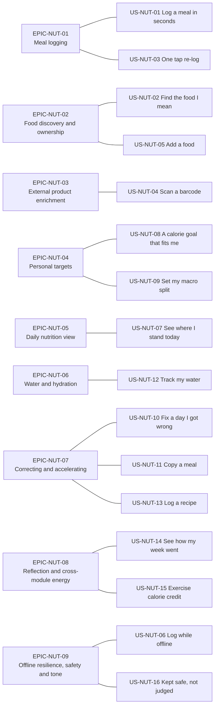

# User Stories — Calorie and Nutrition (`NUT`)

| Field | Value |
| --- | --- |
| Document | PlantPal+ User Stories — Calorie and Nutrition |
| Identifier prefix owned | `US-NUT` only |
| Version | 1.0 |
| Date | 2026-07-21 |
| Status | Approved for Phase 2 |
| Owner | Rakshit (Project Lead / sole developer) |
| Parent | [PlantPal+ Software Requirements Specification v1.0](../SRS.md) |
| Related | [modules/nutrition.md](../modules/nutrition.md), [use-cases/nutrition.md](../use-cases/nutrition.md), [05-user-stories.md](../05-user-stories.md), [01-stakeholders-and-personas.md](../01-stakeholders-and-personas.md), [03-functional-requirements.md](../03-functional-requirements.md), [10-traceability-matrix.md](../10-traceability-matrix.md) |
| Contents | 9 epics, 16 user stories, 205 acceptance criteria, 125 story points |

---

## Table of contents

1. [Epics](#1-epics)
2. [User stories](#2-user-stories)
   - [US-NUT-01 — Log a meal in seconds](#us-nut-01--log-a-meal-in-seconds)
   - [US-NUT-02 — Find the food I mean](#us-nut-02--find-the-food-i-mean)
   - [US-NUT-03 — Re-log what I always eat with one tap](#us-nut-03--re-log-what-i-always-eat-with-one-tap)
   - [US-NUT-04 — Scan a barcode](#us-nut-04--scan-a-barcode)
   - [US-NUT-05 — Add a food that is not in the catalogue](#us-nut-05--add-a-food-that-is-not-in-the-catalogue)
   - [US-NUT-06 — Log while offline](#us-nut-06--log-while-offline)
   - [US-NUT-07 — See where I stand today](#us-nut-07--see-where-i-stand-today)
   - [US-NUT-08 — Get a calorie goal that fits me](#us-nut-08--get-a-calorie-goal-that-fits-me)
   - [US-NUT-09 — Set my macro split](#us-nut-09--set-my-macro-split)
   - [US-NUT-10 — Fix a day I got wrong](#us-nut-10--fix-a-day-i-got-wrong)
   - [US-NUT-11 — Copy a meal I have eaten before](#us-nut-11--copy-a-meal-i-have-eaten-before)
   - [US-NUT-12 — Track my water](#us-nut-12--track-my-water)
   - [US-NUT-13 — Log a meal I cook regularly](#us-nut-13--log-a-meal-i-cook-regularly)
   - [US-NUT-14 — See how my week went](#us-nut-14--see-how-my-week-went)
   - [US-NUT-15 — Count my workouts towards my food budget, carefully](#us-nut-15--count-my-workouts-towards-my-food-budget-carefully)
   - [US-NUT-16 — Be kept safe and not judged](#us-nut-16--be-kept-safe-and-not-judged)
3. [Story index](#3-story-index)
4. [Story point totals](#4-story-point-totals)

---

## 1. Epics

Epic identifiers use the compound form `EPIC-NUT-nn`. They are scoped inside the `NUT` prefix this document owns and are not a new global register; they exist only to group the sixteen `US-NUT` stories for planning. Every functional requirement of [modules/nutrition.md](../modules/nutrition.md) is reachable from exactly one epic.

| Epic ID | Name | Goal | Stories |
| --- | --- | --- | --- |
| EPIC-NUT-01 | Meal logging | Make the atomic act of recording one food against one day cost three taps or fewer and produce a correct, snapshotted, date-stable entry. | US-NUT-01, US-NUT-03 |
| EPIC-NUT-02 | Food discovery and ownership | Let a user reach the right food from a seeded catalogue of at least 300 records, from ranked search, or by creating and maintaining their own private food records. | US-NUT-02, US-NUT-05 |
| EPIC-NUT-03 | External product enrichment | Turn a scanned barcode or a product query into a screened, cached, attributed food candidate while the product stays fully functional with the integration disabled. | US-NUT-04 |
| EPIC-NUT-04 | Personal targets and nutrition mathematics | Derive a credible, versioned, floor-protected daily calorie target and its macronutrient gram targets from profile data the product already holds. | US-NUT-08, US-NUT-09 |
| EPIC-NUT-05 | The daily nutrition view | Compute one server-side daily summary that mobile, web and the dashboard all agree on, including micronutrient totals with honest completeness labelling. | US-NUT-07 |
| EPIC-NUT-06 | Water and hydration | Record water intake in a single interaction against a body-mass-derived daily goal, contributing zero energy to every total. | US-NUT-12 |
| EPIC-NUT-07 | Correcting and accelerating the log | Let a user repair a past day and reproduce a previous day's eating without re-entering it, without ever damaging history. | US-NUT-10, US-NUT-11, US-NUT-13 |
| EPIC-NUT-08 | Reflection and cross-module energy | Show rolling intake trends against the target active on each day, and offer an opt-in, default-off exercise-calorie credit with the double-counting hazard quantified. | US-NUT-14, US-NUT-15 |
| EPIC-NUT-09 | Offline resilience, safety and tone | Capture append-only nutrition logs without connectivity and replay them exactly once, and hold every nutrition surface to the clinical floor and the non-judgemental copy rule. | US-NUT-06, US-NUT-16 |

### 1.1 Epic to story map

### 1.2 How to read a story

Every story below carries a metadata table, the canonical story sentence, a numbered `AC-n` list in strict Gherkin, and a Definition of Done. Priorities are MoSCoW per D-02. Releases are v0.1 Walking Skeleton, v0.5 Alpha, v1.0 MVP, v1.1+ Post-MVP. Estimates use the Fibonacci scale 1, 2, 3, 5, 8, 13, 21 and are relative, not hours. Where a story's functional requirements span more than one release the metadata table names the staging explicitly, so the release plan is never inferred from the story alone.

Acceptance criteria are objectively testable. Every threshold quoted in an `AC` is copied verbatim from the business rule that owns it in [modules/nutrition.md](../modules/nutrition.md); no story invents a value.

---

## 2. User stories

### US-NUT-01 — Log a meal in seconds

| Field | Value |
| --- | --- |
| Epic | EPIC-NUT-01 Meal logging |
| Persona | PER-01 Aditi Sharma |
| Priority | Must |
| Release | v0.5 |
| Estimate | 8 points |
| Related FRs | FR-NUT-01, FR-NUT-02, FR-NUT-03 |
| Related UCs | UC-NUT-01, UC-NUT-02 |

**As Aditi Sharma, the time-poor multi-module professional, I want to log a food with a quantity, a serving unit and a meal type in three taps or fewer, so that the cost of logging never becomes the reason I stop tracking.**

#### Acceptance criteria

1. **AC-1** — Given I am signed in and viewing the nutrition logging screen, When I select a food, accept the pre-filled quantity and serving unit, choose a meal type from BREAKFAST, LUNCH, DINNER or SNACK and confirm, Then exactly one meal entry is created against my current local date, And the recomputed daily nutrition summary for that date is returned in the same HTTP response.
2. **AC-2** — Given my current local wall-clock time is 08:30, When the meal-type selector renders, Then BREAKFAST is pre-selected, And I can change the selection to any of the other three meal types in one interaction.
3. **AC-3** — Given I am logging against a date that is not today, When the meal-type selector renders and I did not enter from a specific meal section, Then SNACK is pre-selected.
4. **AC-4** — Given a food whose selected serving unit has a grams-equivalent factor of 118.000, When I log a quantity of 2, Then the persisted `grams_resolved` is 236.000, And `serving_factor_snapshot` is persisted as 118.000 on the entry.
5. **AC-5** — Given a food with `energy_kcal_per_100g` of 89, `protein_g_per_100g` of 1.1, `carbohydrate_g_per_100g` of 22.8 and `fat_g_per_100g` of 0.3, When I log 236.000 g of it, Then the entry snapshot records 210.04 kcal, 2.596 g protein, 53.808 g carbohydrate and 0.708 g fat.
6. **AC-6** — Given the selected food carries no grams-equivalent factor for the unit kind CUP, When the serving-unit selector renders, Then CUP is not offered, And only unit kinds with a defined factor for that food are listed.
7. **AC-7** — Given I enter a quantity of exactly 0, When I confirm, Then the request is rejected with HTTP 422 and the message "Enter an amount greater than zero.", And no meal entry is created, And the quantity is never coerced to a non-zero value.
8. **AC-8** — Given a quantity and serving unit that resolve to a canonical mass above 5000 g, When I confirm, Then the request is rejected with HTTP 422 and a message that states the maximum and suggests splitting the amount across more than one entry, And no meal entry is created.
9. **AC-9** — Given the computed entry energy is above 3000 kcal and at or below 20000 kcal, When I confirm, Then a single neutral confirmation step is shown stating the computed kilocalorie figure, And confirming it creates the entry with HTTP 201.
10. **AC-10** — Given I select a calendar date later than my current local date, When I confirm, Then the request is rejected with HTTP 422 and the message "You cannot log for a future date.", And no meal entry is created.
11. **AC-11** — Given I already hold 100 meal entries for the selected local date, When I confirm another, Then the request is rejected with HTTP 422 and the message "You have reached 100 entries for this day.", And no meal entry is created.
12. **AC-12** — Given the referenced food was soft-deleted before I confirmed, When I confirm, Then the request is rejected with HTTP 404 and the message "This food is no longer available. Search for another one.", And no meal entry is created.

#### Definition of Done

- [ ] `POST /nutrition/meal-entries` implements FR-NUT-01 field validation, FR-NUT-02 canonical grams conversion and FR-NUT-03 snapshot persistence in a single transaction.
- [ ] The response body carries both the created entry and the recomputed daily summary, so the client updates the remaining-calorie ring without a second round trip.
- [ ] The daily summary cache for `(user_id, logged_local_date)` is invalidated and `nutrition.day.changed` is emitted for `DSH` and `GAM`.
- [ ] Unit tests cover the grams formula, the per-nutrient formula, half-away-from-zero rounding at 3 decimal places, and each of the four meal-type default time bands including the 22:00 to 03:59 band that crosses midnight.
- [ ] Integration tests cover every row of the FR-NUT-01 alternate and error flow table, asserting the exact HTTP status and the exact user-visible string.
- [ ] The happy path is measured on both clients and completes in three interactions or fewer from the nutrition screen.
- [ ] Accessibility: every control on the logging form has a programmatic label; the quantity field announces its permitted range; validation errors are exposed through an accessible live region and are also associated with their field; touch targets are at least 44 by 44 dp; the form is completable end to end with VoiceOver, TalkBack and keyboard only.
- [ ] All user-facing strings resolve through the `en` locale catalogue with no hard-coded literals, per D-08.
- [ ] [modules/nutrition.md](../modules/nutrition.md) FR-NUT-01 to FR-NUT-03, [use-cases/nutrition.md](../use-cases/nutrition.md) UC-NUT-01 and the traceability matrix rows are updated and consistent.

---

### US-NUT-02 — Find the food I mean

| Field | Value |
| --- | --- |
| Epic | EPIC-NUT-02 Food discovery and ownership |
| Persona | PER-01 Aditi Sharma |
| Priority | Must |
| Release | v0.5 |
| Estimate | 8 points |
| Related FRs | FR-NUT-07, FR-NUT-08, FR-NUT-12 |
| Related UCs | UC-NUT-02, UC-NUT-03, UC-NUT-04 |

**As Aditi Sharma, the time-poor multi-module professional, I want search to return the food I meant even when I type it imprecisely, so that I never abandon a log because the catalogue could not find "yoghurt".**

*Staging note.* FR-NUT-07 and FR-NUT-08 ship at v0.5 and fully satisfy this story. The conditional "search Open Food Facts" affordance named in AC-7 is rendered only once FR-NUT-12 ships at v1.1; before that release the flag resolves to false and the branch is permanently hidden, which AC-8 asserts.

#### Acceptance criteria

1. **AC-1** — Given the seeded catalogue has been loaded, When I inspect it, Then it holds at least 300 distinct food records, And every record carries a name, a category and non-null per-100-gram values for energy, protein, carbohydrate and fat, And at least 10 records exist in each of FRUIT, VEGETABLE, GRAIN, DAIRY, MEAT and BEVERAGE.
2. **AC-2** — Given the catalogue contains a food named "Greek yoghurt, plain", When I search for "greek yog", Then that food is returned within the first five results.
3. **AC-3** — Given two foods match my query at the same stage score, And I have logged the first of them 11 times in the last 90 days and the second zero times, When the results are ordered, Then the first food ranks above the second, because the personal-usage bonus of `min(150, 10 * times_logged)` applies.
4. **AC-4** — Given two foods match my query at the same stage score and I have logged neither, And I have favourited the first of them, When the results are ordered, Then the favourited food ranks above the other, because the favourite bonus of +200 applies.
5. **AC-5** — Given the catalogue contains a food named "Yoghurt", When I search for "yoghrt" and the `pg_trgm` similarity between the query and the name is at least 0.30, Then that food is returned in the result set.
6. **AC-6** — Given I search with a query of exactly one character, When the search executes, Then only the exact-name, name-prefix and word-boundary-prefix stages are evaluated, And no trigram stage is executed.
7. **AC-7** — Given my query returns zero results, And the flag `integration.openFoodFacts.enabled` resolves to true, And I am online, When the empty state renders, Then it offers both "create a custom food" and "search Open Food Facts".
8. **AC-8** — Given my query returns zero results, And the flag `integration.openFoodFacts.enabled` resolves to false, When the empty state renders, Then it offers only "create a custom food", And no Open Food Facts affordance is present anywhere in the rendered output.
9. **AC-9** — Given a food has been soft-deleted, or I have hidden it from my own results, When I search for its exact name, Then it is absent from the result set.
10. **AC-10** — Given I submit a query of 84 characters, When the search executes, Then the query is truncated to its first 60 characters and executed, And the request is not rejected.
11. **AC-11** — Given I request a `limit` of 90, When the search executes, Then the returned result count is at most 50.
12. **AC-12** — Given search execution reaches 3000 ms, When the budget is exhausted, Then the prefix-stage results already computed are returned with HTTP 200, And no error is surfaced to me.

#### Definition of Done

- [ ] The seed job for FR-NUT-07 is idempotent, keyed by `slug`, asserts every plausibility bound and the Atwater cross-check at load time, and aborts the migration naming the offending `slug` on any failure.
- [ ] `GET /nutrition/foods/search` implements the five FR-NUT-08 stages and the BR-NUT-29 bonus and tie-break rules on PostgreSQL with `pg_trgm` GIN indexing and `unaccent`.
- [ ] Deterministic ranking tests assert a fixed expected ordering for a fixed fixture catalogue, including both tie-break levels.
- [ ] Seed-file inspection evidence records the record count, the per-category distribution and the count of records carrying a non-GRAM serving unit.
- [ ] Tests cover the single-character path, the truncation path, the `limit` clamp, the soft-deleted exclusion, the hidden-food exclusion and the 3000 ms degradation path.
- [ ] Accessibility: the search field has a visible persistent label, results are announced as a live-region count on change, each result row is a single focusable control with an accessible name that includes name, brand and energy per 100 g, and the empty state is reachable and readable by screen reader.
- [ ] All strings, including the empty state and the truncation behaviour, resolve through the locale catalogue.
- [ ] Documentation: the seed data provenance note and the ranking formula worked example are recorded alongside FR-NUT-07 and BR-NUT-29.

---

### US-NUT-03 — Re-log what I always eat with one tap

| Field | Value |
| --- | --- |
| Epic | EPIC-NUT-01 Meal logging |
| Persona | PER-01 Aditi Sharma |
| Priority | Should |
| Release | v0.5 |
| Estimate | 5 points |
| Related FRs | FR-NUT-09 |
| Related UCs | UC-NUT-02, UC-NUT-01 |

**As Aditi Sharma, the time-poor multi-module professional, I want my favourite and recently logged foods on screen before I type anything, so that the second and every later log of the same food costs one tap.**

#### Acceptance criteria

1. **AC-1** — Given I have logged at least one food before, When I open the logging screen and before I enter any query, Then a quick-add panel is rendered showing my favourites first, followed by the 20 most recently logged distinct foods ordered by latest `logged_at` descending, And any food present in both lists appears only in the favourites section.
2. **AC-2** — Given a quick-add tile for a food whose most recent entry used a quantity of 1 and the serving unit PIECE, When I tap that tile, Then a meal entry is created with a quantity of 1 and the serving unit PIECE.
3. **AC-3** — Given I tap a quick-add tile at 12:40 local time, When the entry is created, Then its meal type is LUNCH, And I can change it to any other meal type in one interaction.
4. **AC-4** — Given I have never logged a food and hold no favourites, When the quick-add panel renders, Then it shows exactly 8 seeded staple foods drawn from 8 distinct categories, And no empty region is rendered in place of the panel.
5. **AC-5** — Given I tap the favourite control on a food, When the request succeeds, Then the food appears in my favourites list, And a subsequent search matching that food ranks it above equally-scoring non-favourited foods.
6. **AC-6** — Given I already hold 100 favourite foods, When I attempt to favourite another, Then the request is rejected with HTTP 422 and the message "You have 100 favourites. Remove one to add another.", And no favourite row is created.
7. **AC-7** — Given I attempt to favourite a food that has been soft-deleted, When the request is processed, Then it is rejected with HTTP 422 and the message "That food is no longer available.", And no favourite row is created.
8. **AC-8** — Given a food in my recents has been soft-deleted since I last logged it, When the quick-add panel renders, Then no tile for that food is present in the response, And no tile fails on tap.
9. **AC-9** — Given I am offline, When I open the logging screen, Then the quick-add panel renders from the persisted read cache, And tapping a tile queues the entry per FR-NUT-06 with the message "Saved on this device. It will sync when you are back online."

#### Definition of Done

- [ ] Recents are derived from `MealEntry` at read time and are never persisted as a separate user-editable list.
- [ ] Each tile payload carries enough data — food identifier, name, last quantity, last serving unit, energy per 100 g — to create an entry with no further read.
- [ ] The favourite toggle enforces the 100-row cap server-side, not only in the client.
- [ ] Tests cover the de-duplication of favourites out of recents, the 20-item recents window, the eight-staple first-run panel, the 100-favourite cap, the soft-deleted filter and the offline queue path.
- [ ] The panel is persisted to the offline read cache: AsyncStorage or MMKV on mobile, IndexedDB on web.
- [ ] Accessibility: each tile is a single control whose accessible name states the food name, the quantity and unit that will be logged, and the meal type that will be applied; the favourite toggle exposes its pressed state; no tile conveys favourite status by colour or icon alone.
- [ ] All strings resolve through the locale catalogue.
- [ ] Documentation: the first-run staple selection is recorded as a versioned list in the seed data, not chosen at runtime.

---

### US-NUT-04 — Scan a barcode

| Field | Value |
| --- | --- |
| Epic | EPIC-NUT-03 External product enrichment |
| Persona | PER-05 Sofia Lindqvist |
| Priority | Should |
| Release | v1.0 for FR-NUT-13, FR-NUT-14 and FR-NUT-15; v1.1 for FR-NUT-12 |
| Estimate | 13 points |
| Related FRs | FR-NUT-13, FR-NUT-14, FR-NUT-15, FR-NUT-12 |
| Related UCs | UC-NUT-03, UC-NUT-02, UC-NUT-04 |

**As Sofia Lindqvist, the budget-device student on a metered connection, I want to scan a packaged product's barcode with my phone camera, so that I do not have to type a brand name and its macronutrients into a form in a supermarket aisle.**

*Staging note.* The barcode path of FR-NUT-13 with the mapping of FR-NUT-14 and the cache of FR-NUT-15 lands at v1.0. The text-search path of FR-NUT-12 is a Could deferred to v1.1 and is covered by AC-12 alone; every other criterion is satisfied at v1.0.

#### Acceptance criteria

1. **AC-1** — Given `integration.openFoodFacts.enabled` resolves to true, I am online, camera permission is granted and I am on a mobile client, When I scan a valid EAN-13 barcode for a product that exists upstream, Then the mapped food is presented for explicit confirmation showing its name, brand, per-100-gram energy and macronutrients and a portion selector, And no meal entry exists until I confirm.
2. **AC-2** — Given I scanned a barcode and its record was cached fewer than 90 days ago, When I scan the same barcode again, Then the food is served from the local `FoodItem` row, And zero external HTTP requests are issued.
3. **AC-3** — Given a cached record for a barcode is older than 90 days, When I scan that barcode, Then the stale record is returned to me immediately, And a background refresh is attempted only if request budget remains, And a failed refresh leaves the stored values unchanged.
4. **AC-4** — Given an upstream product whose mapped `energy_kcal_per_100g` is null, When mapping completes, Then the record is rejected with reason code MISSING_ENERGY, And I am shown the message "We could not read this product's nutrition. Add it as your own food." with a custom-food form pre-filled with the product name and the barcode.
5. **AC-5** — Given an upstream product whose mapped protein, carbohydrate and fat sum to more than 100.5 g per 100 g, When mapping completes, Then the record is rejected with reason code MACRO_SUM_EXCEEDED, And no `FoodItem` row is created for it.
6. **AC-6** — Given an upstream product that supplies energy only in kilojoules, When mapping completes, Then `energy_kcal_per_100g` is computed as the kilojoule value divided by 4.184, And the import proceeds.
7. **AC-7** — Given an upstream product that supplies salt in grams but no sodium value, When mapping completes, Then `sodium_mg_per_100g` is computed as the salt value multiplied by 393.
8. **AC-8** — Given an upstream product that maps cleanly but fails only the Atwater cross-check, When mapping completes, Then it is imported with `data_quality = INCONSISTENT`, And it is displayed with the neutral hint "These figures look unusual. Check them before you save.", And it is not rejected.
9. **AC-9** — Given a product record is persisted from an external lookup, When I inspect the stored row, Then it carries `source = OPEN_FOOD_FACTS`, `user_id` null, the barcode as `off_external_id`, an `external_fetched_at` timestamp and the exact attribution string "Food data from Open Food Facts, licensed under the Open Database License (ODbL) v1.0.", And that attribution renders on the food detail screen and on the licences screen.
10. **AC-10** — Given camera permission is denied, When I open the scanner, Then I see an explanation, a deep link to system settings and a manual barcode-entry field, And catalogue search remains reachable from the same screen.
11. **AC-11** — Given no readable barcode has been decoded after 15 seconds of scanning, When the timeout elapses, Then a manual numeric barcode-entry field is offered.
12. **AC-12** — Given `integration.openFoodFacts.enabled` resolves to false, When I open the logging screen, Then neither the scan entry point nor the Open Food Facts text-search entry point is rendered anywhere in the client.
13. **AC-13** — Given I am offline, When I open the logging screen, Then the scan entry point is rendered in a disabled state with an explanation that connectivity is required, And seeded-catalogue search and custom-food search continue to work.
14. **AC-14** — Given the upstream service returns HTTP 429, or my per-user budget of 20 external lookups per rolling hour is exhausted, When I scan, Then I see a neutral message with a retry hint, And I am returned to catalogue search rather than to a dead end.
15. **AC-15** — Given the upstream product is not found, When the lookup completes, Then I see the message "We could not find that product. Add it as your own food and it will be there next time.", And the offered custom-food form is pre-filled with the scanned barcode.
16. **AC-16** — Given the scanner is running, When a barcode is decoded, Then only the decoded digits are transmitted to the PlantPal+ backend, And no captured image leaves the device, And no client issues a request to Open Food Facts directly.

#### Definition of Done

- [ ] Expo Camera performs on-device decoding for symbologies EAN-13, EAN-8, UPC-A, UPC-E and ITF-14; barcode lengths of 8, 12, 13 and 14 digits are accepted.
- [ ] All external calls are proxied by the Express backend, which owns the feature flag check, the identifying `User-Agent` header, the per-user and per-instance budgets, the 5000 ms timeout with one retry after 1000 ms, and the cache.
- [ ] The mapping of BR-NUT-30 and the screening of FR-NUT-14 are implemented as a pure function with a fixture-driven test suite covering all four rejection reason codes and both accepted `data_quality` values.
- [ ] A unique constraint on `(source, off_external_id)` guarantees at most one cached row per barcode; a concurrent-fetch test asserts an update rather than a duplicate.
- [ ] A test asserts the product remains fully functional with the flag disabled: catalogue search, custom foods, logging and the daily summary all pass with the integration off, per D-03.
- [ ] Accessibility: the scanner screen offers a keyboard-and-screen-reader-reachable manual entry alternative at all times; the confirmation sheet exposes every per-100-gram figure as text; the `data_quality` hint is conveyed as words, never by colour alone.
- [ ] The attribution string is included in any account data export containing cached external records.
- [ ] Documentation: the licences screen lists Open Food Facts and its ODbL terms; the degradation ladder is recorded against BR-NUT-31.

---

### US-NUT-05 — Add a food that is not in the catalogue

| Field | Value |
| --- | --- |
| Epic | EPIC-NUT-02 Food discovery and ownership |
| Persona | PER-05 Sofia Lindqvist |
| Priority | Must |
| Release | v1.0 overall; FR-NUT-10 at v0.5, FR-NUT-11 at v1.0 |
| Estimate | 8 points |
| Related FRs | FR-NUT-10, FR-NUT-11, FR-NUT-07 |
| Related UCs | UC-NUT-04, UC-NUT-02 |

**As Sofia Lindqvist, the budget-device student on a metered connection, I want to create and maintain my own private food records with their per-100-gram values, so that the product stays useful for campus canteen food that no catalogue and no external service will ever contain.**

#### Acceptance criteria

1. **AC-1** — Given I supply a name and per-100-gram values for energy, protein, carbohydrate and fat, When I save, Then the food is created with `source = USER_CUSTOM` and my user identifier, And it is immediately returned by my own searches, And it is never returned by any other account's searches.
2. **AC-2** — Given every new food, When it is created, Then it carries an implicit GRAM serving unit with `grams_equivalent` of 1.000 that cannot be removed, And exactly one of its serving units is marked default.
3. **AC-3** — Given I add a PIECE serving unit with a `grams_equivalent` of 118, When I later log 2 pieces of that food, Then the entry's `grams_resolved` is 236.000.
4. **AC-4** — Given my protein, carbohydrate and fat values sum to more than 100.5 g per 100 g, When I save, Then the save is rejected with HTTP 422 and the message "Protein, carbohydrate and fat cannot add up to more than 100 g per 100 g.", And no food record is created.
5. **AC-5** — Given my declared energy diverges from the Atwater-derived energy beyond the tolerance of BR-NUT-08, When I save, Then a non-blocking confirmation is shown stating both the declared figure and the macro-derived figure, And confirming stores the record with `data_quality = INCONSISTENT`, And the save is not blocked.
6. **AC-6** — Given I enter a name that duplicates one of my existing non-deleted custom foods, ignoring case, When I save, Then the save is rejected with HTTP 409 and an option to open the existing food, And no second record is created.
7. **AC-7** — Given I already own 500 custom foods, When I attempt to create another, Then the save is rejected with HTTP 422 and the message "You have reached 500 of your own foods.", And no record is created.
8. **AC-8** — Given I edit the macronutrient values of a custom food I have already logged with, When the edit is saved, Then every existing meal entry referencing that food retains the snapshot values it was logged with, And the editor stated this in one sentence before I saved.
9. **AC-9** — Given I soft-delete one of my custom foods, When the deletion completes, Then the food is excluded from search, quick-add, favourite lists, recipe-ingredient pickers and all new entry creation, And every historical meal entry referencing it still renders from its own snapshot with a neutral secondary label, And the response states how many historical entries retain the food.
10. **AC-10** — Given I attempt to delete a seeded catalogue food, When the request is processed, Then it is rejected with HTTP 403 and the message "Catalogue foods cannot be deleted. You can hide this one from your searches instead.", And the hide alternative is offered in the same response.
11. **AC-11** — Given a soft-deleted food is referenced by one or more of my saved recipes, When the deletion completes, Then each affected recipe is flagged `has_unavailable_ingredient = true`, And no recipe is deleted, And I am told how many recipes need a replacement ingredient.
12. **AC-12** — Given I am offline, When I attempt to create, edit or delete a custom food, Then the action is refused with the message "You need to be online to add a food. Your meal logs still save on this device.", And nothing is added to the offline outbox.

#### Definition of Done

- [ ] Custom foods are scoped to the owning user on every read and write path; a cross-account request returns HTTP 404 and never HTTP 403.
- [ ] Soft delete sets `deleted_at` and `deleted_by`, emits a tombstone for `SYS` delta sync, and never removes the row at delete time.
- [ ] A regression test asserts that deleting a food never cascade-deletes, alters or hides a meal entry, and that the affected day's totals are byte-identical before and after the deletion.
- [ ] Tests cover the macro-sum limit, every field bound, the case-insensitive duplicate-name rule, the 500-food cap, the Atwater non-blocking path, the seeded-food refusal and the offline refusal.
- [ ] Accessibility: the per-100-gram form groups its fields under a programmatic heading, states units in each field label, keeps every field's error message associated with that field, and remains usable at 200 percent text scale with no clipping or overlap.
- [ ] The one-sentence statement that editing a food never changes past entries is present in the editor and resolves through the locale catalogue.
- [ ] Documentation: BR-NUT-25 snapshot immutability and BR-NUT-26 referential integrity are cross-linked from the food editor's help copy.

---

### US-NUT-06 — Log while offline

| Field | Value |
| --- | --- |
| Epic | EPIC-NUT-09 Offline resilience, safety and tone |
| Persona | PER-05 Sofia Lindqvist |
| Priority | Must |
| Release | v1.0 |
| Estimate | 8 points |
| Related FRs | FR-NUT-06 |
| Related UCs | UC-NUT-12, UC-NUT-01, UC-NUT-10 |

**As Sofia Lindqvist, the budget-device student on a metered connection, I want my meal and water logs captured on a tram with no signal and synchronised exactly once when I reach Wi-Fi, so that I never lose a log and never see a duplicate.**

#### Acceptance criteria

1. **AC-1** — Given I am offline, When I log a meal, Then the entry is rendered immediately in my day with a pending indicator, And my local daily totals update, And the item is written to the outbox with a client-generated canonical lowercase UUID version 4 idempotency key, a `client_recorded_at` RFC 3339 timestamp with offset and a valid IANA `client_tz`.
2. **AC-2** — Given I am offline, When I log a water intake, Then it is queued under the action type `nutrition.water_entry.create` with the same idempotency contract as a meal entry.
3. **AC-3** — Given the outbox holds three pending nutrition items, When connectivity returns, Then they are transmitted oldest first, And each pending indicator clears only when that item's flush result is received.
4. **AC-4** — Given a queued item is transmitted twice because a response was lost and the client retried, When the server processes the replay, Then it matches the existing `(user_id, action_type, idempotency_key)` tuple, performs zero writes, returns HTTP 200 with the already-persisted resource, And exactly one entry exists.
5. **AC-5** — Given I logged at 21:00 with `client_tz` of `Europe/Warsaw` and the item flushes at 09:00 the next day while my device reports a different timezone, When the server assigns `logged_local_date`, Then it derives the date from `client_recorded_at` interpreted in the captured `client_tz`, And never from server receipt time.
6. **AC-6** — Given a queued item whose `client_recorded_at` is more than 24 hours ahead of server time, When it is flushed, Then it is rejected with HTTP 422, And it moves to the needs-attention list with the message "Your device clock looks wrong, so we could not place this log on a day. Check the date and try again."
7. **AC-7** — Given a queued item whose `client_recorded_at` is up to 30 days in the past, When it is flushed, Then it is accepted.
8. **AC-8** — Given a queued item fails at flush time, When it has been retried 5 times with exponential backoff, Then it moves to a user-visible needs-attention list showing its specific reason and offering retry or discard, And it is never discarded silently.
9. **AC-9** — Given a queued meal entry whose referenced food was soft-deleted between capture and flush, When it is flushed, Then it is accepted, And its snapshot is computed from the food resolved by primary key.
10. **AC-10** — Given I am offline, When I attempt to edit an entry, delete an entry, create a custom food, save a target, copy a day or log a recipe, Then the action is refused with a clear actionable offline state, And nothing is added to the outbox, because only `nutrition.meal_entry.create` and `nutrition.water_entry.create` are queueable.
11. **AC-11** — Given the shared outbox already holds 500 items across all modules, When I attempt another nutrition log, Then the logging control renders the blocked state with the message "You have 500 logs waiting to sync. Connect to the internet to send them.", And no log is silently dropped.
12. **AC-12** — Given queued items exist and my account is deleted, When a flush is attempted, Then the client receives HTTP 401 and discards the queue with the message "You are signed out. Sign in again to keep logging."

#### Definition of Done

- [ ] The server enforces a unique constraint on `(user_id, action_type, idempotency_key)` and retains the key for 90 days.
- [ ] An idempotency test transmits the identical payload 10 times concurrently and asserts exactly one persisted row and 10 identical HTTP 200 responses.
- [ ] A timezone test captures an entry at 21:00 in `Europe/Warsaw`, flushes it while the process clock reports `UTC`, and asserts the local date matches the capture timezone.
- [ ] Retry backoff, the 5-attempt ceiling and the needs-attention transition are covered by tests that assert no item is ever removed without an explicit user action.
- [ ] A negative test asserts that each of the six non-queueable actions in AC-10 is refused and leaves the outbox unchanged.
- [ ] The pending, syncing, synced and needs-attention states are all visible in the client and are distinguishable without colour.
- [ ] Accessibility: sync state is announced as text through an accessible live region on transition; the pending badge has a text equivalent; the needs-attention list is reachable by keyboard and screen reader and states the reason in plain language.
- [ ] Documentation: this story records why no merge algorithm, no CRDT and no last-write-wins policy exists in `NUT`, per D-04.

---

### US-NUT-07 — See where I stand today

| Field | Value |
| --- | --- |
| Epic | EPIC-NUT-05 The daily nutrition view |
| Persona | PER-04 Harold "Hal" Whitfield |
| Priority | Must |
| Release | v1.0 overall; FR-NUT-03 and FR-NUT-20 at v0.5, FR-NUT-21 at v1.0 |
| Estimate | 8 points |
| Related FRs | FR-NUT-20, FR-NUT-21, FR-NUT-03 |
| Related UCs | UC-NUT-05, UC-NUT-06 |

**As Harold "Hal" Whitfield, the assistive-technology user, I want one screen that states in words what I have eaten, what remains and how my macronutrients are tracking, so that I can decide what to eat next without reading a colour.**

#### Acceptance criteria

1. **AC-1** — Given I have logged entries today, When I open the nutrition day view, Then it shows consumed energy, signed remaining energy, consumed and target protein, carbohydrate and fat, and a subtotal for each of BREAKFAST, LUNCH, DINNER and SNACK.
2. **AC-2** — Given a meal type has no entries on the selected date, When the breakdown renders, Then that meal type is present with a subtotal of 0 kcal, And it is not omitted, so the layout is stable across days.
3. **AC-3** — Given I have logged nothing today, When I open the day view, Then it shows a fully populated summary of zeros, a neutral empty state and the quick-add panel, And it returns HTTP 200 rather than any error.
4. **AC-4** — Given no calorie target is configured for me, When I open the day view, Then consumed totals are returned with null targets and null remaining values, And a "set your daily goal" call to action is shown, And logging remains available.
5. **AC-5** — Given my consumed energy exceeds my budget by 180 kcal, When the summary is computed, Then the remaining value is exactly −180 and is never clamped to zero, And the surface reads "180 kcal over your budget." in a neutral accent colour that is not the destructive or error colour, And no push notification, badge or dashboard alert is generated by the fact of exceeding the budget.
6. **AC-6** — Given I navigate to yesterday, When the summary loads, Then it is computed against the `NutritionTarget` version with the greatest `effective_from` less than or equal to yesterday's date, And not against today's target.
7. **AC-7** — Given I navigate to a date before my account was created, When the summary loads, Then an empty summary is returned with the message "Nothing logged on this day.", And no error is returned.
8. **AC-8** — Given I request a date later than my current local date, When the request is processed, Then it is rejected with HTTP 422 and the message "You cannot log for a future date.", And no summary is computed.
9. **AC-9** — Given every entry on the date carries a non-null fibre value, When the micronutrient panel renders, Then the fibre total is shown with a completeness of 100 percent and no qualifier.
10. **AC-10** — Given entries carrying a fibre value account for 62 percent of the day's total logged grams, When the micronutrient panel renders, Then the fibre total is shown with the qualifier "Based on 62 percent of what you logged.", And null values are summed as null and never as zero.
11. **AC-11** — Given no entry on the date carries a sodium value, When the micronutrient panel renders, Then sodium is shown as unavailable with the message "Not enough data today.", And it is not shown as 0 mg.
12. **AC-12** — Given fibre, sugar or sodium is displayed, When it renders, Then the reference value of BR-NUT-40 is presented as a neutral reference line explicitly labelled a general adult reference, And no pass, fail, warning or colour-coded judgement is applied.
13. **AC-13** — Given I am using a screen reader, When the remaining-calorie ring renders, Then it exposes a text alternative in the form "Calories. 1430 of 2150 used. 720 remaining.", And every macro bar exposes its consumed value, its target value and its unit as text, And no state in this view is conveyed by colour or shape alone.
14. **AC-14** — Given an entry is created, edited, deleted or moved on a date, or a target or the exercise toggle changes for that date, When the change commits, Then the cached summary for `(user_id, local_date)` is invalidated, And the next read returns values reconstructed from source rows.

#### Definition of Done

- [ ] `GET /nutrition/summary?date=` returns a single object carrying consumed energy and macros, active targets, signed remaining values, four meal-type subtotals, entry count, water total, hydration goal, exercise credit, `was_clamped_to_floor` and per-micronutrient completeness percentages.
- [ ] The summary is computed server-side once so that mobile, web and the `DSH` card cannot disagree, and it is the payload `DSH` consumes for the nutrition module card.
- [ ] The cache is keyed by `(user_id, local_date)`, is invalidated by every mutation listed in AC-14, and is always reconstructible from source rows.
- [ ] Tests cover the negative-remaining path, the null-target path, the empty-date path, the pre-account-creation path, the future-date rejection, and completeness at 0, 62 and 100 percent.
- [ ] A copy-inspection test asserts no string in this view appears in the prohibited vocabulary of BR-NUT-37.
- [ ] Accessibility: the ring and every chart carry the NFR-A11Y-05 text alternative and an accessible data table; the view reflows to a single column at 200 percent text scale with no clipping; contrast of every text element is at least 4.5 to 1; the over-budget state is announced with the word "over" as well as any visual treatment.
- [ ] All strings, including the completeness qualifier with its interpolated percentage, resolve through the locale catalogue with locale-aware number formatting.
- [ ] Documentation: BR-NUT-20 remaining-energy formula and BR-NUT-40 completeness labelling are cross-linked from this view's specification.

---

### US-NUT-08 — Get a calorie goal that fits me

| Field | Value |
| --- | --- |
| Epic | EPIC-NUT-04 Personal targets and nutrition mathematics |
| Persona | PER-03 Mia Castellano |
| Priority | Must |
| Release | v0.5 |
| Estimate | 13 points |
| Related FRs | FR-NUT-16, FR-NUT-17, FR-NUT-18 |
| Related UCs | UC-NUT-07, UC-NUT-06 |

**As Mia Castellano, the body-composition-focused athlete, I want the product to derive a daily calorie target from my own measurements and my stated goal, so that I train against a number I can trust rather than one I guessed.**

#### Acceptance criteria

1. **AC-1** — Given my profile holds body mass, height, date of birth, biological sex and activity level, When I open goal setup, Then I see my basal metabolic rate, my total daily energy expenditure and the proposed target, each shown with the input values that produced it.
2. **AC-2** — Given I am FEMALE, 62 kg, 165 cm and 29 years old, When the basal metabolic rate is computed, Then it equals 1345 kcal.
3. **AC-3** — Given my basal metabolic rate is 1345 kcal and my activity level is LIGHTLY_ACTIVE, When the total daily energy expenditure is computed, Then it equals 1849 kcal, using the activity factor 1.375 and rounding to the nearest whole kilocalorie.
4. **AC-4** — Given my biological sex is PREFER_NOT_TO_SAY, When the basal metabolic rate is computed, Then the constant −78 is applied, And the feature completes with no further prompt and no blocking dialog.
5. **AC-5** — Given my total daily energy expenditure is 1849 kcal and I select LOSE at 1.00 kg per week, When the target is derived, Then the daily delta is reduced from 1100 to 462 by the 25 percent ceiling, And the target is 1387 kcal, And the achievable weekly rate of 0.42 kg per week is displayed.
6. **AC-6** — Given a derived raw target below my effective floor of `max(absolute_floor(sex), round_to_nearest_10(BMR))`, When the target is saved, Then it is raised to that floor, And `was_clamped_to_floor` is true, And the achievable weekly rate is restated in neutral language, And no subsequent path in the product accepts a lower active target.
7. **AC-7** — Given I select GAIN with a weekly rate above 0.50 kg, When I save, Then the request is rejected with HTTP 422 and the message "Gains are capped at 0.5 kg per week, because a larger surplus is mostly stored as fat.", And no target version is created.
8. **AC-8** — Given I select a weekly rate that is not one of 0.25, 0.50, 0.75 or 1.00 for LOSE, When I save, Then the request is rejected with HTTP 422 listing the permitted values.
9. **AC-9** — Given my profile is missing a date of birth, When I open goal setup, Then neither figure is computed, And I am offered a one-screen prompt to supply the missing field, And declining routes me to the manual target path rather than to a dead end.
10. **AC-10** — Given I enter a manual target inside the range from my effective floor to 6000 kcal inclusive, When I save, Then a `NutritionTarget` version with `source = MANUAL` is created, And it supersedes the derived target until I clear it, And macronutrient gram targets are recomputed from it using my active split.
11. **AC-11** — Given I enter a manual target below my effective floor, When I save, Then the request is rejected with HTTP 422 stating the floor and the reason, And the value is never silently raised, And no target version is created.
12. **AC-12** — Given I enter a manual target above 6000 kcal, or a non-integer value, When I save, Then the request is rejected with HTTP 422 stating the ceiling or the integer requirement respectively.
13. **AC-13** — Given I am setting a manual target for the first time, When I save, Then the save is blocked until I explicitly acknowledge the not-medical-advice disclaimer, And `disclaimer_ack_at` is recorded with the accepted disclaimer version.
14. **AC-14** — Given a calorie target, a basal metabolic rate or a total daily energy expenditure figure is displayed, When the screen renders, Then the not-medical-advice disclaimer is visible at least once in that session.
15. **AC-15** — Given I change my goal today, When I open a day from last week, Then that day is evaluated against the target version whose `effective_from` was in force on that day, And no earlier day is rewritten.
16. **AC-16** — Given I am offline, When I attempt to save any target change, Then the action is refused with the message "You need to be online to change your goal.", And nothing is queued.

#### Definition of Done

- [ ] Mifflin-St Jeor, the five activity factors, the goal-to-delta conversion at 7700 kcal per kilogram, the 25 percent deficit ceiling and the clinical floor clamp are implemented as pure deterministic functions.
- [ ] The worked examples of BR-NUT-11 and BR-NUT-15 are encoded verbatim as unit tests, including the 1345, 1849, 462, 1387 and 0.42 values.
- [ ] `NutritionTarget` rows are effective-dated and append-only; no update path rewrites a past version.
- [ ] Property-based tests assert the invariant that no combination of goal, rate, manual override, macro split or exercise-credit change can produce an active target below `effective_floor`.
- [ ] Every input snapshot — body mass, height, age, sex, activity level, activity factor — is persisted alongside its result so a historical target can be explained after the fact.
- [ ] Accessibility: each numeric input states its permitted range in its label; the floor-clamp explanation is text, not an icon; the disclaimer acknowledgement is a real focusable control with an accessible name; the goal-setup flow completes with screen reader and keyboard only.
- [ ] Copy for the clamp, the deficit ceiling and the gain cap is reviewed against BR-NUT-37 and resolves through the locale catalogue.
- [ ] Documentation: the derivation is documented end to end with its worked example, and the disclaimer version register is recorded per NFR-LEGL-06.

---

### US-NUT-09 — Set my macro split

| Field | Value |
| --- | --- |
| Epic | EPIC-NUT-04 Personal targets and nutrition mathematics |
| Persona | PER-03 Mia Castellano |
| Priority | Must |
| Release | v0.5 |
| Estimate | 5 points |
| Related FRs | FR-NUT-19 |
| Related UCs | UC-NUT-07, UC-NUT-06 |

**As Mia Castellano, the body-composition-focused athlete, I want protein, carbohydrate and fat targets in grams derived from my calorie target, so that I can train for composition rather than for a single calorie number.**

#### Acceptance criteria

1. **AC-1** — Given my calorie target is 1850 kcal and I select BALANCED, When the gram targets are computed, Then protein is 139 g, carbohydrate is 185 g and fat is 62 g, using 30 percent protein, 40 percent carbohydrate and 30 percent fat of energy.
2. **AC-2** — Given I select HIGH_PROTEIN, When the percentages are applied, Then they are 40 percent protein, 30 percent carbohydrate and 30 percent fat of energy.
3. **AC-3** — Given I select LOW_CARB, When the percentages are applied, Then they are 35 percent protein, 20 percent carbohydrate and 45 percent fat of energy.
4. **AC-4** — Given I select CUSTOM and enter percentages summing to 95, When I save, Then the save is rejected with HTTP 422 stating the current sum and the difference, And the client offers to absorb the remainder into the largest macronutrient, And no split is persisted.
5. **AC-5** — Given I select CUSTOM and enter a fat percentage of 10, When I save, Then the save is rejected with HTTP 422 and the message "Keep fat at 15 percent or more. Some fat is needed for normal nutrient absorption.", And no split is persisted.
6. **AC-6** — Given I select CUSTOM and enter a protein percentage of 65 or a carbohydrate percentage of 80, When I save, Then the save is rejected with HTTP 422 naming the macronutrient and its permitted bound of 10 to 60 or 5 to 75 respectively.
7. **AC-7** — Given my calorie target changes, When the change commits, Then the macronutrient gram targets are recomputed from the new target using the split active on the same target version.
8. **AC-8** — Given I change my split today, When I open a day from last week, Then that day's macro bars are evaluated against the split stored on the target version active on that day.
9. **AC-9** — Given no calorie target has been set, When the macro section renders, Then the macro bars render in an unset state with the message "Set your daily goal to see macro targets.", And no gram targets are computed.
10. **AC-10** — Given my macro targets are set, When I log a meal, Then each macro bar updates with its consumed value and its remaining value in the same response.
11. **AC-11** — Given the three gram targets are reconstructed back into energy, When they differ from the calorie target by up to 6 kcal because each macronutrient is rounded independently, Then the calorie target remains the displayed authority, And the reconstructed sum is never displayed as a total.

#### Definition of Done

- [ ] The three preset percentage triples and the CUSTOM bounds are implemented exactly as BR-NUT-17 states, in the explicit order protein, carbohydrate and fat.
- [ ] Gram derivation uses 4 kcal per gram for protein and carbohydrate and 9 kcal per gram for fat, with independent rounding per macronutrient.
- [ ] The BR-NUT-17 worked example of 1850 kcal on BALANCED is encoded verbatim as a unit test.
- [ ] The split is stored on the `NutritionTarget` version, never on the user row, so historical evaluation is correct by construction.
- [ ] Tests cover the sum-to-100 invariant, each of the three bound violations, the unset-target state and the recomputation trigger.
- [ ] Accessibility: each percentage input announces its permitted range and its current value; the sum is exposed as text and announced on change through an accessible live region; the fat-minimum message states the nutritional reason in words; macro bars carry text alternatives naming consumed, target and unit.
- [ ] All validation messages resolve through the locale catalogue and are reviewed against BR-NUT-37.
- [ ] Documentation: the up-to-6-kcal reconstruction difference is recorded so a future maintainer does not treat it as a defect.

---

### US-NUT-10 — Fix a day I got wrong

| Field | Value |
| --- | --- |
| Epic | EPIC-NUT-07 Correcting and accelerating the log |
| Persona | PER-01 Aditi Sharma |
| Priority | Must |
| Release | v1.0 overall; FR-NUT-04 and FR-NUT-05 at v0.5, FR-NUT-11 at v1.0 |
| Estimate | 8 points |
| Related FRs | FR-NUT-04, FR-NUT-05, FR-NUT-11 |
| Related UCs | UC-NUT-08, UC-NUT-05 |

**As Aditi Sharma, the time-poor multi-module professional, I want to correct, move or remove an entry including on a past day, so that my history stays accurate after I have logged in a hurry on a metro platform.**

#### Acceptance criteria

1. **AC-1** — Given an entry logged three days ago, When I change its quantity, Then its canonical mass and its nutrition snapshot are recomputed from the modified values and re-persisted, And that date's daily summary reflects the new totals.
2. **AC-2** — Given I change the referenced food on an entry, When the edit commits, Then the snapshot is recomputed entirely from the new food's current values, And no value from the previous food is retained or merged.
3. **AC-3** — Given I move an entry from yesterday to today, When the move commits, Then the summaries for both dates are invalidated and recomputed, And `nutrition.day.changed` is emitted for both dates, And both dates are re-evaluated by `GAM`.
4. **AC-4** — Given I edit any field of an entry, When the edit commits, Then `updated_at` is bumped so the `SYS` delta-sync cursor propagates the row to my other signed-in devices.
5. **AC-5** — Given an entry whose current date or proposed date lies outside the 365-day retro window, When I attempt the edit, Then it is rejected with HTTP 422 and the message "You can log back as far as 365 days.", And the entry remains readable.
6. **AC-6** — Given I attempt to swap in a food that has been soft-deleted, When the request is processed, Then the swap is rejected with HTTP 422 and the message "That food is no longer available. Pick a different one.", And the entry's quantity, unit, meal type and date remain editable.
7. **AC-7** — Given I delete an entry, When the deletion commits, Then the row is removed and a tombstone carrying the entry identifier, my user identifier and the deletion timestamp is written in the same transaction, And every other signed-in client removes the entry on its next delta sync.
8. **AC-8** — Given I have just deleted an entry, When I tap undo within 10 seconds, Then the entry is re-created with the original values, a fresh identifier and a fresh idempotency key, And the day's totals revert.
9. **AC-9** — Given I delete an entry that has already been deleted, When the request is processed, Then it returns HTTP 204 and performs no further write.
10. **AC-10** — Given an entry belonging to another account, When I attempt to read, edit or delete it, Then the response is HTTP 404 and never HTTP 403, so the existence of the entry is not confirmed.
11. **AC-11** — Given an entry was deleted on another device since my client last synced, When I submit an edit for it, Then the response is HTTP 404, And my client removes the entry from view with the neutral notice "That entry was removed on another device."
12. **AC-12** — Given I am offline, When I attempt to edit or delete an entry, Then the action is refused with an explanation and a retry suggestion, And nothing is added to the offline outbox.
13. **AC-13** — Given I edit or delete an entry on a past day, When the change commits, Then every streak and achievement affected by that day is re-evaluated by `GAM` for that day and for every day since.
14. **AC-14** — Given I later correct the macronutrient values of a custom food, When I open an entry logged before that correction, Then the entry still displays the values it was logged with.

#### Definition of Done

- [ ] `PATCH` and `DELETE` on `/nutrition/meal-entries/{id}` implement FR-NUT-04 and FR-NUT-05, validating every supplied field exactly as FR-NUT-01 does and leaving unsupplied fields unchanged.
- [ ] Deletion writes the row removal and the tombstone in one transaction; a failure of either rolls back both.
- [ ] The undo window is at least 10 seconds and re-creates rather than restores, so the idempotency-key contract is never violated.
- [ ] Tests cover the two-date invalidation on a move, the retro-window boundary at exactly 365 days, the soft-deleted-food swap refusal, the cross-account 404, the concurrent-delete 404 and the offline refusal.
- [ ] A snapshot-immutability test edits a custom food after logging with it and asserts the historical entry is byte-identical before and after.
- [ ] Accessibility: edit and delete are reachable as labelled controls rather than gesture-only affordances; the undo control persists for at least 10 seconds, is focusable, and is announced through an accessible live region rather than as a transient toast alone.
- [ ] All strings resolve through the locale catalogue.
- [ ] Documentation: the recompute fan-out to `DSH`, `GAM` and `SYS` is recorded against BR-NUT-28.

---

### US-NUT-11 — Copy a meal I have eaten before

| Field | Value |
| --- | --- |
| Epic | EPIC-NUT-07 Correcting and accelerating the log |
| Persona | PER-01 Aditi Sharma |
| Priority | Should |
| Release | v1.0 |
| Estimate | 5 points |
| Related FRs | FR-NUT-27 |
| Related UCs | UC-NUT-09, UC-NUT-05 |

**As Aditi Sharma, the time-poor multi-module professional, I want to copy one meal or a whole day from a previous date, so that I do not re-enter the same four breakfast items every weekday morning.**

#### Acceptance criteria

1. **AC-1** — Given yesterday's BREAKFAST holds three entries, When I copy BREAKFAST from yesterday to today, Then exactly three new entries are created under today's BREAKFAST, each with a new primary key and a new idempotency key, And yesterday's three entries are unchanged.
2. **AC-2** — Given today's BREAKFAST already holds one entry, When the copy commits, Then the copies are appended, And the pre-existing entry is not replaced, merged or removed.
3. **AC-3** — Given a source entry whose referenced food has since been soft-deleted, When the copy is created, Then it carries the original nutrition snapshot verbatim, And it renders with a neutral secondary label indicating the food was removed, And the copy operation succeeds.
4. **AC-4** — Given I copy with `scope = WHOLE_DAY`, When the copy commits, Then entries from all four meal types are copied and each retains its original meal type.
5. **AC-5** — Given the source date holds more than 50 entries in the selected scope, When I attempt the copy, Then it is rejected with HTTP 422 and the message "That day has more than 50 entries. Copy one meal at a time.", And no entry is created.
6. **AC-6** — Given a copy is about to be written, When the confirmation dialog renders, Then it states the exact number of entries and the exact total energy in kilocalories that will be added, And nothing is written until I confirm.
7. **AC-7** — Given the source date holds no entries in the selected scope, When I attempt the copy, Then it is rejected with HTTP 422 and the message "There is nothing to copy from that day.", And no entry is created.
8. **AC-8** — Given I select the same date as both source and target, When I attempt the copy, Then it is rejected with HTTP 422 and the message "Choose a different day to copy into.", And no entry is created.
9. **AC-9** — Given I select a target date later than my current local date, When I attempt the copy, Then it is rejected with HTTP 422 and the message "You cannot log for a future date.", And no entry is created.
10. **AC-10** — Given the copy commits, When the response returns, Then the target date's summary cache is invalidated, `nutrition.day.changed` is emitted for the target date, And the recomputed summary for the target date is returned.
11. **AC-11** — Given I am offline, When I attempt a copy, Then it is refused with the message "You need to be online to copy a day.", And nothing is added to the offline outbox.

#### Definition of Done

- [ ] `POST /nutrition/meal-entries/copy` accepts `source_date`, `target_date`, `scope` of ONE_MEAL_TYPE or WHOLE_DAY, and a conditional `meal_type`.
- [ ] Each copy carries forward `food_item_id`, `recipe_id`, `quantity`, `serving_unit_id`, `serving_factor_snapshot` and the full nutrition snapshot verbatim; nothing links back to the source entry.
- [ ] `logged_local_date` is set to the target date and `logged_at` to the instant of the copy.
- [ ] The whole operation is transactional: a rejection at any point writes zero entries.
- [ ] Tests cover the append semantics, the 50-entry ceiling, the empty-source rejection, the same-date rejection, the future-date rejection, the soft-deleted-food copy and the offline refusal.
- [ ] Accessibility: the confirmation dialog states the entry count and total energy as text, traps focus correctly, closes on Escape, and returns focus to the control that opened it.
- [ ] All strings, including the interpolated entry count and energy total, resolve through the locale catalogue with locale-aware number formatting.
- [ ] Documentation: BR-NUT-34 copy semantics are cross-linked from the copy control's help copy.

---

### US-NUT-12 — Track my water

| Field | Value |
| --- | --- |
| Epic | EPIC-NUT-06 Water and hydration |
| Persona | PER-01 Aditi Sharma |
| Priority | Must |
| Release | v0.5 |
| Estimate | 5 points |
| Related FRs | FR-NUT-23, FR-NUT-24 |
| Related UCs | UC-NUT-10, UC-NUT-06 |

**As Aditi Sharma, the time-poor multi-module professional, I want one-tap water logging against a goal sized to my body, so that the last item on my evening list costs two taps rather than a form.**

#### Acceptance criteria

1. **AC-1** — Given I tap the GLASS_250ML preset, When the entry is created, Then 250 ml is added to the selected date's water total, And the hydration progress indicator updates in the same response.
2. **AC-2** — Given I tap the BOTTLE_500ML preset, When the entry is created, Then 500 ml is added to the selected date's water total.
3. **AC-3** — Given I enter a custom volume of 330 ml, When the entry is created, Then 330 ml is recorded with `container_preset = CUSTOM`, And 330 may be remembered as my preferred custom size.
4. **AC-4** — Given my most recent recorded body mass is 62 kg, When my hydration goal is computed, Then it equals 2150 ml, And `hydration_goal_source` is DERIVED.
5. **AC-5** — Given no body mass is recorded for me, When my hydration goal is computed, Then it equals 2000 ml, And `hydration_goal_source` is DEFAULT, And the goal is labelled as a default with an invitation to add a weight.
6. **AC-6** — Given a body mass that would derive a goal below 1500 ml or above 5000 ml, When the goal is computed, Then it is clamped to 1500 ml or 5000 ml respectively.
7. **AC-7** — Given I override my hydration goal with an integer between 500 and 6000 ml inclusive, When I save, Then `hydration_goal_source` becomes MANUAL, And the override supersedes the derived value until I clear it.
8. **AC-8** — Given I override my hydration goal with a value below 500 or above 6000 ml, When I save, Then the request is rejected with HTTP 422 and the message "Set a daily water goal between 500 and 6000 ml.", And no override is stored.
9. **AC-9** — Given I have just added a water entry, When I tap undo within 10 seconds, Then that entry is removed, And the day's total and progress revert.
10. **AC-10** — Given I enter a custom volume of 0, When I confirm, Then it is rejected with HTTP 422 and the message "Enter an amount greater than zero.", And no entry is created.
11. **AC-11** — Given I enter a single custom volume above 3000 ml, When I confirm, Then it is rejected with HTTP 422 and the message "Log up to 3000 ml at a time.", And no entry is created.
12. **AC-12** — Given my daily water total passes 6000 ml, When the entry is saved, Then it is still accepted, And exactly one neutral informational note is shown for that day, And the entry is never blocked.
13. **AC-13** — Given I already hold 100 water entries for the selected date, When I attempt another, Then it is rejected with HTTP 422 and the message "You have reached 100 water entries for this day."
14. **AC-14** — Given I log water, When my nutrition totals are computed for that day, Then the water entry contributes 0 kcal and 0 g of protein, carbohydrate and fat to every total, on every screen, in every export and in every trend.
15. **AC-15** — Given my consumed volume exceeds my goal, When the progress bar renders, Then the bar caps at 100 percent, And the numeric total continues to display the real unclamped figure, for example "2400 of 2150 ml".
16. **AC-16** — Given my unit system preference is imperial, When a volume renders, Then it is converted at display time using `fl oz = ml / 29.5735` to one decimal place, And the stored value remains an integer number of millilitres.
17. **AC-17** — Given I am offline, When I tap a water preset, Then the entry is queued per FR-NUT-06 and rendered immediately with a pending indicator, And its local date is derived from the client capture timestamp and client timezone.

#### Definition of Done

- [ ] `POST /nutrition/water-entries` accepts `volume_ml`, `container_preset`, an optional `logged_local_date` and `logged_at`, and a conditional `idempotency_key`.
- [ ] The hydration goal is stored on the `NutritionTarget` version so a historical day always shows the goal that applied on that day.
- [ ] A test asserts that water contributes zero energy and zero macronutrients across the daily summary, the trends aggregation and the account data export.
- [ ] Tests cover the 62 kg to 2150 ml derivation, both clamp boundaries, the 2000 ml default, both override bounds, the zero and 3000 ml validation limits, the 6000 ml daily note, the 100-entry cap and the undo window.
- [ ] The imperial conversion is applied only at the presentation layer; a unit-preference change never alters a stored value.
- [ ] Accessibility: preset controls have accessible names that state the volume they will add; the progress indicator carries a text alternative stating consumed, goal and unit; the undo control persists for at least 10 seconds and is focusable; no state relies on colour alone.
- [ ] All strings and all numbers resolve through the locale catalogue with locale-aware formatting.
- [ ] Documentation: BR-NUT-22 hydration formula and BR-NUT-24 water-is-never-energy are cross-linked from the hydration surface.

---

### US-NUT-13 — Log a meal I cook regularly

| Field | Value |
| --- | --- |
| Epic | EPIC-NUT-07 Correcting and accelerating the log |
| Persona | PER-01 Aditi Sharma |
| Priority | Should |
| Release | v1.1 |
| Estimate | 13 points |
| Related FRs | FR-NUT-25, FR-NUT-26 |
| Related UCs | UC-NUT-04, UC-NUT-01 |

**As Aditi Sharma, the time-poor multi-module professional, I want to save a recipe once and log a serving of it in one action, so that an eight-ingredient dinner is not an eight-entry chore every time I cook it.**

#### Acceptance criteria

1. **AC-1** — Given I create a recipe with six ingredient foods and a serving count of 4, When I save, Then the recipe is persisted with its total energy and macronutrients and its per-serving energy and macronutrients, And each per-serving value equals the corresponding total divided by 4.
2. **AC-2** — Given a saved recipe, When I log 1.5 servings against DINNER, Then exactly one meal entry is created with `recipe_id` set, `food_item_id` null and `food_name_snapshot` set to the recipe name, And its nutrition snapshot equals 1.5 times the per-serving values.
3. **AC-3** — Given I log 1.5 servings of a recipe whose per-serving ingredient mass is 320 g, When the entry is created, Then `grams_resolved` is 480.000.
4. **AC-4** — Given I later change a recipe's ingredients or serving count, When I open a meal entry logged before that change, Then the entry's nutrition and mass are unchanged.
5. **AC-5** — Given only four of six ingredients carry a non-null fibre value, When the recipe totals are computed, Then the recipe's fibre value is null, And it is not reported as an understated total.
6. **AC-6** — Given an ingredient food is soft-deleted after the recipe was saved, When I attempt to log the recipe, Then the request is rejected with HTTP 409 naming the missing ingredient and linking to the recipe editor, And the recipe itself is not deleted.
7. **AC-7** — Given I attempt to log 0.1 servings, or any value that is not a multiple of 0.25, or a value outside 0.25 to 20.00 inclusive, When I confirm, Then the request is rejected with HTTP 422 and the message "Choose a number of servings in steps of 0.25, up to 20.", And no entry is created.
8. **AC-8** — Given I attempt to save a recipe with zero ingredients, or with more than 30 ingredients, When I save, Then the request is rejected with HTTP 422 stating the permitted range, And no recipe is created.
9. **AC-9** — Given I attempt to save a recipe with a serving count of 0 or above 50, When I save, Then the request is rejected with HTTP 422 and the message "Enter how many servings this makes, from 1 to 50.", And no recipe is created.
10. **AC-10** — Given I enter a recipe name that duplicates one of my existing non-deleted recipes, ignoring case, When I save, Then the request is rejected with HTTP 409 offering to open the existing recipe.
11. **AC-11** — Given I already own 100 recipes, When I attempt to create another, Then the request is rejected with HTTP 422 and the message "You have reached 100 recipes."
12. **AC-12** — Given a meal entry created from a recipe, When I edit, delete or copy it, Then it behaves exactly as any other meal entry, And no later edit to the source recipe alters it.
13. **AC-13** — Given I am offline, When I attempt to save a recipe or log a recipe, Then the action is refused with a message that offers logging the ingredients individually instead, And nothing is added to the offline outbox.
14. **AC-14** — Given a recipe ingredient is being selected, When the ingredient picker renders, Then only `FoodItem` records are selectable, And no recipe is selectable as an ingredient of another recipe.

#### Definition of Done

- [ ] `Recipe` and `RecipeIngredient` are persisted with computed totals stored on the recipe, so listing recipes performs no recomputation.
- [ ] Totals are recomputed whenever an ingredient is added, removed or changed, and whenever the serving count changes.
- [ ] Optional nutrients propagate to a recipe total only when every ingredient supplies a non-null value; otherwise the recipe value is null.
- [ ] Logging a recipe increments `times_logged_count` and sets `last_logged_at` on the recipe.
- [ ] Tests cover per-serving derivation, the 1.5-serving scaling, snapshot immunity to a later recipe edit, the unavailable-ingredient block, all four servings-validation cases, both count ceilings and the nesting prohibition.
- [ ] Accessibility: the ingredient list is a semantically marked list where each row exposes food name, quantity and unit as text; add and remove controls carry accessible names naming the ingredient; the servings stepper announces its current value and its step of 0.25; the editor is usable at 200 percent text scale.
- [ ] All strings resolve through the locale catalogue.
- [ ] Documentation: BR-NUT-33 recipe scaling and the deliberate no-nesting decision are recorded so a future maintainer does not add cycle detection that is not needed.

---

### US-NUT-14 — See how my week went

| Field | Value |
| --- | --- |
| Epic | EPIC-NUT-08 Reflection and cross-module energy |
| Persona | PER-03 Mia Castellano |
| Priority | Should |
| Release | v1.0 |
| Estimate | 8 points |
| Related FRs | FR-NUT-28 |
| Related UCs | UC-NUT-11, UC-NUT-06 |

**As Mia Castellano, the body-composition-focused athlete, I want rolling 7, 30 and 90 day views of my intake against the target that applied on each day, so that I can judge a training block by its trend rather than by any single day.**

#### Acceptance criteria

1. **AC-1** — Given I have logged at least 3 days in the selected window, When I open trends, Then I see `mean_intake_logged_days`, `mean_intake_all_days` and the target line for each day in the window.
2. **AC-2** — Given I have logged 5 days in a 7 day window and 3 of those days satisfy `abs(consumed_kcal − target_kcal) <= 0.10 * target_kcal`, When adherence is computed, Then it reads 60 percent, And the surface states that unlogged days are excluded from the denominator.
3. **AC-3** — Given I have logged fewer than 3 days in the selected window, When I open trends, Then a neutral empty state is shown with the message "Log a few more days and your trends will appear here.", And no chart is rendered.
4. **AC-4** — Given my target changed on a date inside the window, When each day is evaluated, Then it uses the `NutritionTarget` version active on that day, And never today's target.
5. **AC-5** — Given some days in the window carry no meal entries, When the means are computed, Then those days are excluded from `mean_intake_logged_days` and from the adherence denominator, And the on-screen label states "Based on the N days you logged."
6. **AC-6** — Given I open the 90 day window, When macro distribution renders, Then it shows the mean percentage of energy contributed by protein, by carbohydrate and by fat across logged days.
7. **AC-7** — Given no target has ever been set for me, When I open trends, Then the adherence figure is omitted rather than computed against zero, And the intake series is still rendered, And I am invited to set a daily goal.
8. **AC-8** — Given a series longer than 365 points, When it is prepared for rendering, Then it is downsampled to at most 180 plotted buckets.
9. **AC-9** — Given I select the window control, When I choose between 7, 30 and 90 days, Then each window ends on my current local date, And no other window value is offered.
10. **AC-10** — Given any trend copy, label, tooltip or empty state renders, When it is inspected against the prohibited vocabulary of BR-NUT-37, Then no prohibited term is present, And no comparison against other users is present, And no praise is attached to an unusually low intake day.
11. **AC-11** — Given a trend chart renders, When I use a screen reader, Then a text alternative states the window, the metric, the mean values and the direction of change, And an equivalent accessible data table exposes every plotted point.
12. **AC-12** — Given I have reduce-motion enabled, When a chart renders or updates, Then no entry or transition animation plays.

#### Definition of Done

- [ ] `GET /nutrition/trends?window=` implements every formula of BR-NUT-35 exactly, reporting both mean figures rather than one.
- [ ] Per-day target resolution reuses the same effective-dated lookup as the daily summary, so trends and the day view cannot disagree.
- [ ] Rendering is Recharts on web and Victory Native on mobile, consuming one response shape with no client-side transformation.
- [ ] Tests cover the 3-logged-day threshold at 2 and at 3 days, the 60 percent adherence example, the mid-window target change, the null-target case and the 180-bucket downsampling.
- [ ] A copy-inspection check over the complete `en` catalogue for this surface is part of the release checklist and is recorded as evidence.
- [ ] Accessibility: every chart carries the NFR-A11Y-05 text alternative and an accessible data table; series are distinguishable without colour; focus order matches reading order; reduce-motion is honoured.
- [ ] All strings and numbers resolve through the locale catalogue with locale-aware formatting.
- [ ] Documentation: the definition of a logged day and the exclusion rule are stated on the surface itself, not only in the specification.

---

### US-NUT-15 — Count my workouts towards my food budget, carefully

| Field | Value |
| --- | --- |
| Epic | EPIC-NUT-08 Reflection and cross-module energy |
| Persona | PER-03 Mia Castellano |
| Priority | Should |
| Release | v1.0 |
| Estimate | 5 points |
| Related FRs | FR-NUT-22 |
| Related UCs | UC-NUT-05, UC-NUT-07 |

**As Mia Castellano, the body-composition-focused athlete, I want the option to credit part of my logged exercise energy to my daily food budget, so that a heavy training day is reflected without the double counting that made me abandon another product.**

#### Acceptance criteria

1. **AC-1** — Given a newly created account, When I open nutrition settings, Then `include_exercise_calories` is disabled, And it can be changed only by an explicit action of mine.
2. **AC-2** — Given `include_exercise_calories` is enabled and my activity level is SEDENTARY, When 600 kcal of workouts are recorded for today, Then 600 kcal is credited, using the credit factor 1.00.
3. **AC-3** — Given `include_exercise_calories` is enabled and my activity level is MODERATELY_ACTIVE, When 600 kcal of workouts are recorded for today, Then 300 kcal is credited, using the credit factor 0.50, And the reason for the factor is shown on screen.
4. **AC-4** — Given `include_exercise_calories` is enabled and my activity level is EXTRA_ACTIVE, When any amount of workout energy is recorded, Then 0 kcal is credited, using the credit factor 0.00, And the message "Your activity level already accounts for daily training, so workouts add nothing here." is shown.
5. **AC-5** — Given `include_exercise_calories` is enabled, my activity level is SEDENTARY, my base budget is 1800 kcal and 3000 kcal of workouts are recorded, When the credit is computed, Then it is 900 kcal, being the minimum of 3000, the absolute cap of 1000 and 50 percent of the base budget.
6. **AC-6** — Given I enable the toggle while my activity level is above LIGHTLY_ACTIVE, When the toggle is saved, Then a one-time notice is shown recommending SEDENTARY or LIGHTLY_ACTIVE and stating that the workout energy figure is an estimate with a wide error band, And `exercise_notice_shown_at` is recorded so the notice is not repeated.
7. **AC-7** — Given the credit is applied, When the daily summary renders, Then the credited amount appears as its own labelled line, And it is never folded silently into the calorie target.
8. **AC-8** — Given the credit is applied, When macronutrient remaining values are computed, Then they are unchanged by the exercise credit.
9. **AC-9** — Given `include_exercise_calories` is disabled, When I view any nutrition screen, Then no exercise line appears anywhere, And my budget equals my active target exactly.
10. **AC-10** — Given the Fitness module is disabled for my account, When I open nutrition settings, Then the exercise-credit toggle is not rendered at all.
11. **AC-11** — Given no workouts are recorded for the selected date, When the summary is computed, Then the credit is 0, And no empty exercise line and no error is rendered.
12. **AC-12** — Given I backdate a workout to a previous date, When it is saved, Then that date's nutrition summary is invalidated and recomputed like any other retroactive change.

#### Definition of Done

- [ ] `include_exercise_calories` defaults to false in the database schema, not only in the client.
- [ ] The credit formula `min(round(credit_factor * exercise_kcal_raw), 1000, round(0.50 * base_budget_kcal))` and the five-row credit-factor table are implemented exactly as BR-NUT-21 states.
- [ ] The daily summary returns `exercise_kcal_raw`, `exercise_credit_factor` and `exercise_kcal_credited` as separate fields so the credit is always attributable.
- [ ] Tests cover each of the five activity levels, both caps, the macro-invariance rule, the disabled-default state, the hidden-toggle state and the backdated-workout invalidation.
- [ ] The residual double-counting hazard is recorded in the risk register with this mitigation named, since the mitigation reduces rather than eliminates it.
- [ ] Accessibility: the toggle exposes its on and off state programmatically; the one-time notice is a focusable dismissible surface rather than a transient toast; the exercise line in the summary is exposed as text with its label and value.
- [ ] All strings, including the per-activity-level reasoning text, resolve through the locale catalogue.
- [ ] Documentation: the help text explaining why the credit is partial is written for a non-technical reader and is reachable from the toggle.

---

### US-NUT-16 — Be kept safe and not judged

| Field | Value |
| --- | --- |
| Epic | EPIC-NUT-09 Offline resilience, safety and tone |
| Persona | PER-03 Mia Castellano |
| Priority | Must |
| Release | v0.5 |
| Estimate | 5 points |
| Related FRs | FR-NUT-17, FR-NUT-18 |
| Related UCs | UC-NUT-07, UC-NUT-05 |

**As Mia Castellano, the body-composition-focused athlete in a deliberate deficit block, I want the product to refuse an unsafe target and to speak to me without judgement, so that tracking supports the training block instead of harming me.**

#### Acceptance criteria

1. **AC-1** — Given I manually enter a daily calorie target below my effective floor, When I save, Then the request is rejected with HTTP 422 stating the minimum figure and the reason in neutral language, And the entered value is never silently raised, And no target version is created.
2. **AC-2** — Given any combination of goal direction, weekly rate, manual override, macronutrient split change or exercise-credit removal, When an active target is resolved, Then it is never below `max(absolute_floor(sex), round_to_nearest_10(BMR))`, where `absolute_floor` is 1500 for MALE, 1200 for FEMALE and 1400 for PREFER_NOT_TO_SAY.
3. **AC-3** — Given my basal metabolic rate cannot be computed and my biological sex is unknown, When my effective floor is resolved, Then it is 1400 kcal.
4. **AC-4** — Given I exceed my calorie budget on a day, When the day view renders, Then the copy is factual and forward-looking, the styling uses a neutral accent that is not the destructive or error colour, And no push notification, badge or dashboard card is generated by the fact of exceeding the budget.
5. **AC-5** — Given my intake on a day is below 50 percent of my target, When the day view renders, Then no praise, badge, celebration or reinforcement is presented for that day.
6. **AC-6** — Given the complete `en` locale catalogue for the `NUT` module, When the release checklist inspection is executed, Then no string contains any term from the prohibited vocabulary of BR-NUT-37, And no string compares me against another user, And no string assigns blame for a broken streak.
7. **AC-7** — Given a calorie target, a basal metabolic rate figure, a total daily energy expenditure figure or a macronutrient target is displayed, When the screen renders, Then the not-medical-advice disclaimer is visible at least once in that session.
8. **AC-8** — Given I set a manual calorie target for the first time, When I save, Then I must explicitly acknowledge the not-medical-advice disclaimer before the save proceeds, And the acknowledgement is recorded with a timestamp and the accepted disclaimer version.
9. **AC-9** — Given a micronutrient total is shown, When it renders, Then it is presented as a neutral reference comparison labelled a general adult reference, And never as a pass, a fail or a warning.
10. **AC-10** — Given the weight-loss rate selector renders, When I inspect the offered values, Then no value above 1.00 kg per week is offered for LOSE and no value above 0.50 kg per week is offered for GAIN, And no free-text field permits a higher rate.
11. **AC-11** — Given the floor rejection message is shown, When I read it, Then it states the numeric floor, states why the floor exists, and links to the safety note, And it contains no alarm styling and no prohibited term.

#### Definition of Done

- [ ] A single server-side guard resolves the effective floor and is the only path by which any active target is produced, so no endpoint can bypass it.
- [ ] Property-based tests assert the floor invariant across randomised combinations of goal, rate, override, split and exercise-credit state.
- [ ] The prohibited-vocabulary inspection is automated as a checklist step over the complete `en` catalogue and its result is retained as release evidence.
- [ ] A test asserts that no notification, badge or dashboard card is emitted when `remaining_kcal` becomes negative, and `NOT` honours the same constraint.
- [ ] Disclaimer acknowledgements are stored with their version per NFR-LEGL-06 and are included in the account data export.
- [ ] Accessibility: the over-budget state is announced with the word "over" and is not conveyed by colour alone; the disclaimer is real focusable text rather than an image; the acknowledgement control has an accessible name that states what is being acknowledged.
- [ ] Every string in this story's scope resolves through the locale catalogue, so the tone rule survives future translation.
- [ ] Documentation: BR-NUT-15, BR-NUT-16 and BR-NUT-37 are cross-linked from the safety note, and the not-medical-advice disclaimer text is version-controlled.

---

## 3. Story index

| ID | Title | Epic | Persona | Priority | Release | Points | Related FRs |
| --- | --- | --- | --- | --- | --- | --- | --- |
| US-NUT-01 | Log a meal in seconds | EPIC-NUT-01 | PER-01 Aditi Sharma | Must | v0.5 | 8 | FR-NUT-01, FR-NUT-02, FR-NUT-03 |
| US-NUT-02 | Find the food I mean | EPIC-NUT-02 | PER-01 Aditi Sharma | Must | v0.5 | 8 | FR-NUT-07, FR-NUT-08, FR-NUT-12 |
| US-NUT-03 | Re-log what I always eat with one tap | EPIC-NUT-01 | PER-01 Aditi Sharma | Should | v0.5 | 5 | FR-NUT-09 |
| US-NUT-04 | Scan a barcode | EPIC-NUT-03 | PER-05 Sofia Lindqvist | Should | v1.0 | 13 | FR-NUT-12, FR-NUT-13, FR-NUT-14, FR-NUT-15 |
| US-NUT-05 | Add a food that is not in the catalogue | EPIC-NUT-02 | PER-05 Sofia Lindqvist | Must | v1.0 | 8 | FR-NUT-07, FR-NUT-10, FR-NUT-11 |
| US-NUT-06 | Log while offline | EPIC-NUT-09 | PER-05 Sofia Lindqvist | Must | v1.0 | 8 | FR-NUT-06 |
| US-NUT-07 | See where I stand today | EPIC-NUT-05 | PER-04 Harold "Hal" Whitfield | Must | v1.0 | 8 | FR-NUT-03, FR-NUT-20, FR-NUT-21 |
| US-NUT-08 | Get a calorie goal that fits me | EPIC-NUT-04 | PER-03 Mia Castellano | Must | v0.5 | 13 | FR-NUT-16, FR-NUT-17, FR-NUT-18 |
| US-NUT-09 | Set my macro split | EPIC-NUT-04 | PER-03 Mia Castellano | Must | v0.5 | 5 | FR-NUT-19 |
| US-NUT-10 | Fix a day I got wrong | EPIC-NUT-07 | PER-01 Aditi Sharma | Must | v1.0 | 8 | FR-NUT-04, FR-NUT-05, FR-NUT-11 |
| US-NUT-11 | Copy a meal I have eaten before | EPIC-NUT-07 | PER-01 Aditi Sharma | Should | v1.0 | 5 | FR-NUT-27 |
| US-NUT-12 | Track my water | EPIC-NUT-06 | PER-01 Aditi Sharma | Must | v0.5 | 5 | FR-NUT-23, FR-NUT-24 |
| US-NUT-13 | Log a meal I cook regularly | EPIC-NUT-07 | PER-01 Aditi Sharma | Should | v1.1 | 13 | FR-NUT-25, FR-NUT-26 |
| US-NUT-14 | See how my week went | EPIC-NUT-08 | PER-03 Mia Castellano | Should | v1.0 | 8 | FR-NUT-28 |
| US-NUT-15 | Count my workouts towards my food budget, carefully | EPIC-NUT-08 | PER-03 Mia Castellano | Should | v1.0 | 5 | FR-NUT-22 |
| US-NUT-16 | Be kept safe and not judged | EPIC-NUT-09 | PER-03 Mia Castellano | Must | v0.5 | 5 | FR-NUT-17, FR-NUT-18 |

### 3.1 Functional-requirement coverage check

Every one of the 28 functional requirements in [modules/nutrition.md](../modules/nutrition.md) is covered by at least one story. No story references an identifier that does not exist in that document.

| FR | Covered by | FR | Covered by |
| --- | --- | --- | --- |
| FR-NUT-01 | US-NUT-01 | FR-NUT-15 | US-NUT-04 |
| FR-NUT-02 | US-NUT-01 | FR-NUT-16 | US-NUT-08 |
| FR-NUT-03 | US-NUT-01, US-NUT-07 | FR-NUT-17 | US-NUT-08, US-NUT-16 |
| FR-NUT-04 | US-NUT-10 | FR-NUT-18 | US-NUT-08, US-NUT-16 |
| FR-NUT-05 | US-NUT-10 | FR-NUT-19 | US-NUT-09 |
| FR-NUT-06 | US-NUT-06 | FR-NUT-20 | US-NUT-07 |
| FR-NUT-07 | US-NUT-02, US-NUT-05 | FR-NUT-21 | US-NUT-07 |
| FR-NUT-08 | US-NUT-02 | FR-NUT-22 | US-NUT-15 |
| FR-NUT-09 | US-NUT-03 | FR-NUT-23 | US-NUT-12 |
| FR-NUT-10 | US-NUT-05 | FR-NUT-24 | US-NUT-12 |
| FR-NUT-11 | US-NUT-05, US-NUT-10 | FR-NUT-25 | US-NUT-13 |
| FR-NUT-12 | US-NUT-02, US-NUT-04 | FR-NUT-26 | US-NUT-13 |
| FR-NUT-13 | US-NUT-04 | FR-NUT-27 | US-NUT-11 |
| FR-NUT-14 | US-NUT-04 | FR-NUT-28 | US-NUT-14 |

---

## 4. Story point totals

### 4.1 Per epic

| Epic ID | Name | Stories | Points |
| --- | --- | --- | --- |
| EPIC-NUT-01 | Meal logging | 2 | 13 |
| EPIC-NUT-02 | Food discovery and ownership | 2 | 16 |
| EPIC-NUT-03 | External product enrichment | 1 | 13 |
| EPIC-NUT-04 | Personal targets and nutrition mathematics | 2 | 18 |
| EPIC-NUT-05 | The daily nutrition view | 1 | 8 |
| EPIC-NUT-06 | Water and hydration | 1 | 5 |
| EPIC-NUT-07 | Correcting and accelerating the log | 3 | 26 |
| EPIC-NUT-08 | Reflection and cross-module energy | 2 | 13 |
| EPIC-NUT-09 | Offline resilience, safety and tone | 2 | 13 |
| **Total** | | **16** | **125** |

### 4.2 Per release

| Release | Stories | Points | Share of module |
| --- | --- | --- | --- |
| v0.1 Walking Skeleton | 0 | 0 | 0 percent |
| v0.5 Alpha | US-NUT-01, US-NUT-02, US-NUT-03, US-NUT-08, US-NUT-09, US-NUT-12, US-NUT-16 | 49 | 39 percent |
| v1.0 MVP | US-NUT-04, US-NUT-05, US-NUT-06, US-NUT-07, US-NUT-10, US-NUT-11, US-NUT-14, US-NUT-15 | 63 | 50 percent |
| v1.1 Post-MVP | US-NUT-13 | 13 | 10 percent |
| **Total** | **16** | **125** | **100 percent** |

The release column reports the release at which a story is fully satisfied. Where a story's functional requirements span more than one release the staging is named in that story's metadata table: US-NUT-02 is complete at v0.5 with the FR-NUT-12 affordance arriving at v1.1; US-NUT-04 delivers the barcode path at v1.0 with FR-NUT-12 text search at v1.1; US-NUT-05, US-NUT-07 and US-NUT-10 each begin at v0.5 and complete at v1.0. No `NUT` story targets v0.1, consistent with the release-alignment note in [modules/nutrition.md](../modules/nutrition.md).

### 4.3 Per priority

| Priority | Stories | Points |
| --- | --- | --- |
| Must | US-NUT-01, US-NUT-02, US-NUT-05, US-NUT-06, US-NUT-07, US-NUT-08, US-NUT-09, US-NUT-10, US-NUT-12, US-NUT-16 | 78 |
| Should | US-NUT-03, US-NUT-04, US-NUT-11, US-NUT-13, US-NUT-14, US-NUT-15 | 47 |
| Could | none | 0 |
| Wont | none | 0 |
| **Total** | **16** | **125** |

### 4.4 Per persona

| Persona | Stories | Points |
| --- | --- | --- |
| PER-01 Aditi Sharma | US-NUT-01, US-NUT-02, US-NUT-03, US-NUT-10, US-NUT-11, US-NUT-12, US-NUT-13 | 52 |
| PER-03 Mia Castellano | US-NUT-08, US-NUT-09, US-NUT-14, US-NUT-15, US-NUT-16 | 36 |
| PER-04 Harold "Hal" Whitfield | US-NUT-07 | 8 |
| PER-05 Sofia Lindqvist | US-NUT-04, US-NUT-05, US-NUT-06 | 29 |
| **Total** | **16** | **125** |

PER-02 Marcus Oyelaran is deliberately absent: he is the plant-first hobbyist and enables Plant care and later Fitness, not Nutrition. Recording the absence explicitly prevents a reviewer reading it as an omission.

