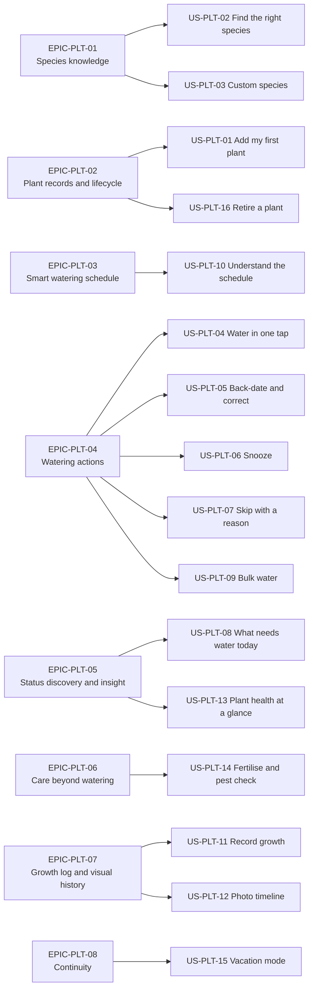

# User Stories — Plant Care (PLT)

| Field | Value |
| --- | --- |
| Document | PlantPal+ User Stories — Plant Care |
| Version | 1.0 |
| Date | 2026-07-21 |
| Status | Baselined for Phase 1 sign-off |
| Owner | Rakshit — Project Lead and sole developer (STK-03) |
| Parent | [PlantPal+ User Stories — epics and master index](../05-user-stories.md) |
| Specification of record | [Module Specification — Plant Care](../modules/plant-care.md) |
| Owned identifier prefix | `US-PLT-nn`. Referenced only, never minted here: `FR-PLT-nn`, `BR-PLT-nn`, `UC-PLT-nn`, `NFR-*`, `PER-nn`, `GOAL-nn` |
| Standards basis | IEEE 830-1998 section structure, ISO/IEC/IEEE 29148:2018 requirement-quality rules, INVEST story quality, Gherkin acceptance criteria |
| Counts | 8 epics, 16 user stories, 159 acceptance criteria, 107 story points |

---

## Table of contents

1. [Epics](#1-epics)
2. [User stories](#2-user-stories)
   - [US-PLT-01 — Add my first plant](#us-plt-01--add-my-first-plant)
   - [US-PLT-02 — Find the right species quickly](#us-plt-02--find-the-right-species-quickly)
   - [US-PLT-03 — Track a plant the catalogue does not know](#us-plt-03--track-a-plant-the-catalogue-does-not-know)
   - [US-PLT-04 — Water a plant in one tap](#us-plt-04--water-a-plant-in-one-tap)
   - [US-PLT-05 — Log a watering I did yesterday, and repair a mistake](#us-plt-05--log-a-watering-i-did-yesterday-and-repair-a-mistake)
   - [US-PLT-06 — Snooze when the soil is still damp](#us-plt-06--snooze-when-the-soil-is-still-damp)
   - [US-PLT-07 — Skip a cycle because it rained, and still be judged fairly](#us-plt-07--skip-a-cycle-because-it-rained-and-still-be-judged-fairly)
   - [US-PLT-08 — See what needs water today](#us-plt-08--see-what-needs-water-today)
   - [US-PLT-09 — Water everything in one go](#us-plt-09--water-everything-in-one-go)
   - [US-PLT-10 — Understand why a plant is on this schedule](#us-plt-10--understand-why-a-plant-is-on-this-schedule)
   - [US-PLT-11 — Record how a plant is growing](#us-plt-11--record-how-a-plant-is-growing)
   - [US-PLT-12 — Watch a year of growth in ten seconds](#us-plt-12--watch-a-year-of-growth-in-ten-seconds)
   - [US-PLT-13 — Know at a glance whether a plant is doing well](#us-plt-13--know-at-a-glance-whether-a-plant-is-doing-well)
   - [US-PLT-14 — Keep up with fertilising and pest checks](#us-plt-14--keep-up-with-fertilising-and-pest-checks)
   - [US-PLT-15 — Go on holiday without coming home to chaos](#us-plt-15--go-on-holiday-without-coming-home-to-chaos)
   - [US-PLT-16 — Retire a plant without losing its story](#us-plt-16--retire-a-plant-without-losing-its-story)
3. [Story index](#3-story-index)
4. [Story point totals](#4-story-point-totals)

---

## 1. Epics

An **epic** in this document is a grouping device for reading and sprint planning only. `EPIC-PLT-nn` is a local label owned by this file; it is not one of the numbered product registers of the shared identifier convention and nothing outside this document may depend on it. The registers that carry traceability weight remain `FR-PLT-nn`, `US-PLT-nn` and `UC-PLT-nn`.

### 1.1 Epic table

| Epic | Name | Goal — the outcome the epic delivers | Stories | Points |
| --- | --- | --- | --- | --- |
| EPIC-PLT-01 | Species knowledge | The user can always name what they own, whether it is one of the 60 seeded species or a plant the catalogue has never heard of, so that the watering engine always has a real care profile to work from. | US-PLT-02, US-PLT-03 | 10 |
| EPIC-PLT-02 | Plant records and lifecycle | The user can create a plant that has a correct schedule from its first second, and retire it later without losing a year of history. | US-PLT-01, US-PLT-16 | 13 |
| EPIC-PLT-03 | Smart watering schedule | The user can see, in plain numbers, why the app chose this interval and which single setting to change to move it — the module's signature differentiator, GOAL-03. | US-PLT-10 | 13 |
| EPIC-PLT-04 | Watering actions | The user can tell the truth about what they actually did — watered now, watered on Friday, not yet, not this cycle, or all fifteen at once — in three taps or fewer, online or offline. | US-PLT-04, US-PLT-05, US-PLT-06, US-PLT-07, US-PLT-09 | 29 |
| EPIC-PLT-05 | Status, discovery and insight | The user can open one screen and know instantly which plants need attention first, without reading day counts and without relying on colour. | US-PLT-08, US-PLT-13 | 13 |
| EPIC-PLT-06 | Care beyond watering | The user is prompted to fertilise and pest-check at horticulturally correct moments, and is never prompted to fertilise a dormant plant in January. | US-PLT-14 | 8 |
| EPIC-PLT-07 | Growth log and visual history | The user accumulates a dated, photographic and numeric record of each plant, and can replay it — the module's retention hook and emotional payoff. | US-PLT-11, US-PLT-12 | 13 |
| EPIC-PLT-08 | Continuity | The user can be away for up to 90 days and return to one grouped catch-up list rather than a wall of accumulated overdue guilt. | US-PLT-15 | 8 |

### 1.2 Epic-to-story map

### 1.3 How to read a story

Every story below satisfies INVEST: it is **I**ndependent of the others at the level of a demoable slice, **N**egotiable in its wording but not in its acceptance criteria, **V**aluable to a named persona, **E**stimable because every threshold it depends on is written out in the module specification, **S**mall enough to fit one developer inside a single iteration, and **T**estable because every acceptance criterion names an observable input and an observable output.

Acceptance criteria are strict Gherkin. Every quantity appearing in a criterion — every interval, tolerance, quota, error code and enumeration member — is copied verbatim from [`modules/plant-care.md`](../modules/plant-care.md) and is normative there, not here. Where a criterion states a computed number, the arithmetic that produces it is the arithmetic of BR-PLT-04 through BR-PLT-08 and the criterion doubles as a test vector.

Personas are named verbatim from the stakeholder and persona register: **PER-01 Aditi Sharma**, **PER-02 Marcus Oyelaran**, **PER-03 Mia Castellano**, **PER-04 Harold "Hal" Whitfield**, **PER-05 Sofia Lindqvist**.

---

## 2. User stories

### US-PLT-01 — Add my first plant

| Field | Value |
| --- | --- |
| Epic | EPIC-PLT-02 Plant records and lifecycle |
| Persona | PER-02 Marcus Oyelaran, the plant-first hobbyist |
| Priority | Must |
| Release | v0.1 Walking Skeleton |
| Estimate | 8 points |
| Related FRs | FR-PLT-05, FR-PLT-07, FR-PLT-08, FR-PLT-28 |
| Related UCs | UC-PLT-01, UC-PLT-05, UC-PLT-09 |
| Key business rules | BR-PLT-02, BR-PLT-08, BR-PLT-09, BR-PLT-11, BR-PLT-30 clause 6, BR-PLT-37, BR-PLT-38 |

> **As** Marcus Oyelaran, a newly registered user holding zero plants,
> **I want** to add my first plant and immediately be told the date it will next need water,
> **so that** I can see the app doing real work for me before I have invested any effort in it.

**Acceptance criteria**

1. **AC-1 — First-run empty state.**
   - **Given** I am authenticated and I own zero plants, ever,
   - **When** I open the plant list,
   - **Then** the first-run state defined in BR-PLT-30 clause 6 is rendered,
   - **And** it shows exactly one explanatory sentence of at most 140 characters, exactly one primary action labelled "Add your first plant", and exactly 3 suggested species whose `care_difficulty` is `BEGINNER` drawn from the seeded catalogue.

2. **AC-2 — Happy path, defaults accepted.**
   - **Given** I am on the add-plant form and my profile holds hemisphere `NORTHERN`, timezone `Europe/London` and preferred reminder time 09:00,
   - **And** today's local date is 2026-07-21,
   - **When** I enter the nickname "Monty", select the seeded species Monstera, set `light_exposure` to `MEDIUM`, set `pot_material` to `TERRACOTTA` and `pot_diameter_cm` to 17.0, leave every other field at its default, and submit,
   - **Then** exactly one `ENT-10 Plant` is created with `lifecycle_status = ACTIVE`,
   - **And** the response body carries `effective_interval_days = 5`, computed as 7 x 0.80 x 1.10 x 0.80 x 1.00 = 4.928 rounded half-up to 5 and inside the species bounds of 4 to 14,
   - **And** the response body carries `next_due_local_date = 2026-07-26`,
   - **And** the confirmation screen names that date in words rather than displaying a loading indicator.

3. **AC-3 — Species default pre-fills the light field.**
   - **Given** the add-plant form is open,
   - **When** I select the seeded species Monstera,
   - **Then** the `light_exposure` field is pre-selected to `BRIGHT_INDIRECT`, which is that species' `preferred_light`,
   - **And** the field remains editable to any of the 4 `LightExposure` members.

4. **AC-4 — Validation path, missing nickname.**
   - **Given** I am on the add-plant form with a species selected,
   - **When** I submit with the nickname field empty after trimming,
   - **Then** the request is rejected with error code `PLT_NICKNAME_REQUIRED`,
   - **And** the message "Give your plant a name." is attached to the nickname field,
   - **And** zero `ENT-10 Plant` rows are created.

5. **AC-5 — Validation path, future acquisition date.**
   - **Given** my local today is 2026-07-21,
   - **When** I submit the form with `acquired_on` set to 2026-07-22,
   - **Then** the request is rejected with error code `PLT_ACQUISITION_DATE_FUTURE`,
   - **And** zero `ENT-10 Plant` rows are created.

6. **AC-6 — Alternate path, last watering unknown.**
   - **Given** I am on the add-plant form,
   - **When** I answer `UNKNOWN` to the last-watered question and submit,
   - **Then** the plant is created with `schedule_confidence = LOW` and no seed `ENT-11 WateringEvent` is written,
   - **And** `next_due_local_date` equals my local today plus `effective_interval_days`,
   - **And** the plant detail view states that the schedule is an estimate until the first watering is logged.

7. **AC-7 — Alternate path, quota reached.**
   - **Given** I already hold 300 non-archived plants,
   - **When** I submit a valid add-plant form,
   - **Then** the request is rejected with error code `PLT_PLANT_QUOTA_EXCEEDED`,
   - **And** the message names 300 as the limit and offers archiving as the remedy.

8. **AC-8 — Offline path.**
   - **Given** my device has no network connection,
   - **When** I submit the add-plant form,
   - **Then** the request is refused because creating a plant requires connectivity per BR-PLT-37 clause 2,
   - **And** every value I entered remains visible and editable on screen,
   - **And** the offline state names the action, the reason a connection is needed, and what I can do instead.

**Definition of Done**

- [ ] The create-plant endpoint accepts and validates every attribute of BR-PLT-38 clause 1 against its stated limits and rejects each violation with its documented error code.
- [ ] The scheduling engine runs synchronously inside the create transaction so the response carries `effective_interval_days`, `next_due_local_date`, `next_due_at`, the urgency tier, `health_status` and the factor snapshot.
- [ ] `ENT-12 CareTask` rows are auto-created from the species `default_care_task_types`.
- [ ] Unit tests cover AC-2 as a normative arithmetic vector, every anchor branch of BR-PLT-11 clause 2, and every error code in AC-4, AC-5 and AC-7.
- [ ] An integration test proves the plant, the seed watering event and the schedule state are written in one transaction that rolls back as a unit.
- [ ] The form is completable end to end with VoiceOver and with TalkBack; every input carries a programmatic label and every validation message is associated with its field and announced through a live region (NFR-A11Y).
- [ ] The form and the confirmation screen reflow without clipping or overlap at 200 percent text scale, and every touch target measures at least 44 by 44 dp.
- [ ] Every user-facing string is resolved from the `en` locale catalogue by a stable key, with no literal in any component (D-08, NFR-I18N-01).
- [ ] The offline state of AC-8 preserves entered values across an app backgrounding and foregrounding cycle.
- [ ] FR-PLT-05 is linked to this story in `10-traceability-matrix.md`, and the add-plant flow is documented in `06-use-case-model.md` as UC-PLT-01.

---

### US-PLT-02 — Find the right species quickly

| Field | Value |
| --- | --- |
| Epic | EPIC-PLT-01 Species knowledge |
| Persona | PER-02 Marcus Oyelaran, the plant-first hobbyist |
| Priority | Must — with a Could extension for AC-8, which covers FR-PLT-04 |
| Release | v0.5 Alpha — AC-8 is release-gated to v1.1 Post-MVP |
| Estimate | 5 points |
| Related FRs | FR-PLT-01, FR-PLT-02, FR-PLT-04 |
| Related UCs | UC-PLT-05 |
| Key business rules | BR-PLT-01, BR-PLT-30 clause 2, BR-PLT-30 clause 6, BR-PLT-32 |

> **As** Marcus Oyelaran, a user adding a plant to a collection of 38,
> **I want** to search the species catalogue by common name, botanical name or family,
> **so that** I never have to scroll through sixty species to find the one in my hands.

**Acceptance criteria**

1. **AC-1 — Happy path, common-name prefix match.**
   - **Given** the seeded catalogue holds at least 60 species with `source = SEEDED`,
   - **And** the species picker is open,
   - **When** I type the query "mon" and stop typing,
   - **Then** the species Monstera appears in the result list within 500 milliseconds of my final keystroke, comprising the 250 millisecond client debounce plus the server response,
   - **And** each result carries `common_name`, `botanical_name`, `category`, `base_interval_days`, `care_difficulty`, `toxicity` and `source`.

2. **AC-2 — Alternate path, botanical-name match.**
   - **Given** the species picker is open,
   - **When** I type the query "Monstera deliciosa",
   - **Then** the same species is returned, matched on `botanical_name`,
   - **And** matching is case-insensitive and accent-insensitive.

3. **AC-3 — Alternate path, ranking favours species I already own.**
   - **Given** I own 2 plants of the species Golden Pothos,
   - **And** another catalogue species matches my query with an equal match score,
   - **When** the results are returned,
   - **Then** Golden Pothos is ordered above that species, because BR-PLT-30 clause 2 boosts a species by the count of the caller's plants referencing it.

4. **AC-4 — Empty-state path, zero results.**
   - **Given** the species picker is open,
   - **When** I type the query "Hoya kerrii" and the catalogue contains no match,
   - **Then** the response is HTTP 200 carrying an empty array,
   - **And** the no-species empty state of BR-PLT-30 clause 6 is rendered,
   - **And** it offers a "Create a custom species" action with the common-name field pre-filled with "Hoya kerrii".

5. **AC-5 — Validation path, query too long.**
   - **Given** the species picker is open,
   - **When** I submit a query of 61 characters after trimming,
   - **Then** the request is rejected with error code `PLT_QUERY_TOO_LONG`,
   - **And** the message states that search terms can be up to 60 characters.

6. **AC-6 — Species detail view.**
   - **Given** a seeded species,
   - **When** I open its detail view,
   - **Then** I see `base_interval_days`, `preferred_light`, `care_difficulty`, `toxicity` and between 3 and 6 care tips,
   - **And** the care numbers are labelled as general horticultural guidance and not as authoritative botanical advice.

7. **AC-7 — Offline path.**
   - **Given** my device has no network connection,
   - **And** the same query was executed successfully while online,
   - **When** I repeat that query,
   - **Then** the cached result set is served from the persisted TanStack Query cache with a stale indicator,
   - **And** a query with no cached result renders the offline state rather than an indefinite loading indicator.

8. **AC-8 — Enrichment path, release-gated to v1.1.**
   - **Given** the feature flag `PLT_PERENUAL_ENRICHMENT` is `false`, which is its default,
   - **When** I open any species detail view,
   - **Then** no request is made to the Perenual API and no surface anywhere in the interface references that provider,
   - **And** given the flag is `true` and a cache row younger than 90 days exists, the enriched `description` and `image_url` are rendered together with a visible provider attribution label.

**Definition of Done**

- [ ] The seed loader writes at least 60 species with the exact category composition of BR-PLT-01 clause 3, is idempotent by `slug`, uses deterministic UUID version 5 primary keys, and aborts the whole transaction on any invariant breach.
- [ ] The 30 archetype rows of BR-PLT-01 clause 4 appear verbatim in the seed file and are asserted by an inspection test.
- [ ] The search endpoint implements the five-stage ranking of BR-PLT-30 clause 2 with its documented tie-breaks, verified by a table-driven test.
- [ ] Keystroke debounce is 250 milliseconds and the endpoint uses keyset pagination with a default page size of 25 and a maximum of 50.
- [ ] Unit tests cover AC-3 ranking, AC-4 empty state selection and AC-5 validation.
- [ ] Search results are navigable by keyboard on web with a visible focus ring at every stop, and each result announces its common name and botanical name to a screen reader.
- [ ] The result list is virtualised and sustains at least 55 frames per second while scrolling on the reference low-end Android device.
- [ ] Every string is resolved from the locale catalogue by a stable key.
- [ ] The Perenual attribution obligation is discharged on the species detail view and on the in-app Data Sources screen before AC-8 ships.
- [ ] The catalogue provenance note required by BR-PLT-01 clause 5 is present in `08-glossary.md` and on the Data Sources screen.

---

### US-PLT-03 — Track a plant the catalogue does not know

| Field | Value |
| --- | --- |
| Epic | EPIC-PLT-01 Species knowledge |
| Persona | PER-02 Marcus Oyelaran, the plant-first hobbyist |
| Priority | Should |
| Release | v1.0 MVP |
| Estimate | 5 points |
| Related FRs | FR-PLT-03 |
| Related UCs | UC-PLT-05, UC-PLT-01 |
| Key business rules | BR-PLT-02, BR-PLT-31, BR-PLT-36, BR-PLT-37 |

> **As** Marcus Oyelaran, a hobbyist who owns several plants no sixty-species catalogue will ever contain,
> **I want** to author my own private species with my own watering numbers,
> **so that** I can track every plant I own instead of mislabelling one and silently corrupting its schedule.

**Acceptance criteria**

1. **AC-1 — Happy path, inline creation from a failed search.**
   - **Given** the species search returned zero results for the query "Hoya kerrii",
   - **When** I tap "Create a custom species",
   - **Then** the create-species form opens with `common_name` pre-filled with "Hoya kerrii",
   - **And** given I then choose the category `FOLIAGE`, enter `base_interval_days` of 12, choose `preferred_light` of `BRIGHT_INDIRECT` and save,
   - **Then** a species is created with `source = USER_CUSTOM` and `user_id` set to me, and it is immediately selectable in the add-plant form.

2. **AC-2 — Alternate path, blank numeric fields take documented defaults.**
   - **Given** I am creating a custom species with `base_interval_days` of 12,
   - **When** I leave `min_interval_days`, `max_interval_days` and `overdue_tolerance_days` blank and save,
   - **Then** `min_interval_days` is stored as 6, being `max(1, round(0.50 x 12))`,
   - **And** `max_interval_days` is stored as 30, being `min(365, round(2.50 x 12))`,
   - **And** `overdue_tolerance_days` is stored as 6, being `min(21, max(2, round(0.5 x 12)))`,
   - **And** `humidity_preference_level` is 3, `is_winter_dormant` is `false`, `care_difficulty` is `INTERMEDIATE` and `toxicity` is `UNKNOWN`.

3. **AC-3 — Validation path, duplicate name.**
   - **Given** I already own a live custom species whose `common_name` is "Hoya",
   - **When** I try to create another whose `common_name` is "hoya",
   - **Then** the request is rejected with error code `PLT_SPECIES_NAME_DUPLICATE`,
   - **And** zero species rows are created.

4. **AC-4 — Validation path, interval ordering.**
   - **Given** I am creating a custom species,
   - **When** I submit `min_interval_days` of 10, `base_interval_days` of 8 and `max_interval_days` of 30,
   - **Then** the request is rejected with error code `PLT_SPECIES_INTERVAL_INVALID`,
   - **And** the message states that the shortest interval must be less than the usual interval, which must be less than the longest.

5. **AC-5 — Alternate path, editing recomputes dependent plants.**
   - **Given** a custom species I own is referenced by exactly 4 of my plants,
   - **When** I change its `base_interval_days` and save,
   - **Then** all 4 plants are recomputed under trigger T5,
   - **And** the confirmation states that 4 plants had their schedule updated.

6. **AC-6 — Validation path, quota reached.**
   - **Given** I already own 100 live custom species,
   - **When** I submit a valid create-species form,
   - **Then** the request is rejected with error code `PLT_CUSTOM_SPECIES_QUOTA_EXCEEDED`,
   - **And** the message names 100 as the limit.

7. **AC-7 — Alternate path, deletion is refused while referenced.**
   - **Given** a custom species I own is referenced by 3 plants, of which 1 is archived,
   - **When** I request its deletion,
   - **Then** the deletion is refused,
   - **And** the message names 3 as the referencing plant count and offers to hide the species from the picker instead.

8. **AC-8 — Privacy path.**
   - **Given** another registered user searches the species catalogue,
   - **When** their query exactly matches the `common_name` of my custom species,
   - **Then** my species is absent from their results,
   - **And** a direct request by identifier returns the same response as a request for a non-existent species, so ownership cannot be probed.

9. **AC-9 — Offline path.**
   - **Given** my device has no network connection,
   - **When** I submit the create-species form,
   - **Then** the action is refused because creating a species requires connectivity per BR-PLT-37 clause 2,
   - **And** every value I entered remains on screen.

**Definition of Done**

- [ ] The create and edit endpoints apply every default of BR-PLT-31 clause 2 before validating the strict ordering invariant, verified by a table-driven test over blank-field combinations.
- [ ] `data_completeness_pct` is computed on write and drives `schedule_confidence` per BR-PLT-11 clause 4.
- [ ] The ownership predicate of BR-PLT-36 is asserted server-side on every custom-species endpoint, and a negative test proves AC-8 returns an identical response for "not yours" and "does not exist".
- [ ] Editing a custom species triggers recompute T5 for every referencing plant, including archived plants, and returns the affected count.
- [ ] Unit tests cover AC-2 defaults, AC-3 case-insensitive duplication, AC-4 ordering, AC-6 quota and AC-7 referential refusal.
- [ ] The form is completable with a screen reader, numeric inputs declare their unit in their accessible name, and every validation message is associated with its field.
- [ ] The form reflows without clipping at 200 percent text scale.
- [ ] Every string is resolved from the locale catalogue by a stable key.
- [ ] The 100-species quota and the referential-integrity refusal are documented in `09-assumptions-constraints-risks.md` as accepted product limitations.

---

### US-PLT-04 — Water a plant in one tap

| Field | Value |
| --- | --- |
| Epic | EPIC-PLT-04 Watering actions |
| Persona | PER-01 Aditi Sharma, the time-poor multi-module professional |
| Priority | Must |
| Release | v0.1 Walking Skeleton |
| Estimate | 5 points |
| Related FRs | FR-PLT-10, FR-PLT-08, FR-PLT-09 |
| Related UCs | UC-PLT-02, UC-PLT-09 |
| Key business rules | BR-PLT-09, BR-PLT-10, BR-PLT-12, BR-PLT-14, BR-PLT-37 |

> **As** Aditi Sharma, who has ninety seconds between the kettle boiling and leaving the flat,
> **I want** to log a watering directly from the plant list row without opening the plant,
> **so that** logging costs me almost no attention on a busy morning and works even on the metro with no signal.

**Acceptance criteria**

1. **AC-1 — Happy path, one tap from the list.**
   - **Given** a plant on my list has urgency tier `DUE_TODAY`,
   - **When** I tap the water action on its row,
   - **Then** exactly one `ENT-11 WateringEvent` with `action = WATERED` is stored,
   - **And** the row updates in place to show the new `next_due_local_date` without a full page reload,
   - **And** the action is committed in 3 taps or fewer counted from the dashboard.

2. **AC-2 — Happy path, due date arithmetic.**
   - **Given** a plant whose `effective_interval_days` is 7, whose timezone is `Europe/London` and whose preferred reminder time is 09:00,
   - **When** I log a watering on my local date 2026-07-21,
   - **Then** `next_due_local_date` is 2026-07-28, computed by adding 7 calendar days to the anchor local date,
   - **And** `next_due_at` resolves 2026-07-28 at 09:00 in `Europe/London` through the IANA timezone database,
   - **And** the interval is never added as a multiple of 86 400 seconds.

3. **AC-3 — Alternate path, watering early adjusts rather than resets.**
   - **Given** a plant whose `effective_interval_days` is 7 and whose `next_due_local_date` is 2026-07-24,
   - **When** I log a watering on 2026-07-21,
   - **Then** `next_due_local_date` becomes 2026-07-28, being the anchor local date plus the interval,
   - **And** it is not 2026-07-31, because the next due date is never computed from the previous due date.

4. **AC-4 — Offline path, queued write.**
   - **Given** my device has no network connection,
   - **When** I tap the water action,
   - **Then** the action is accepted immediately and written to the offline outbox with a client-generated UUID version 4 `idempotency_key` and a client timestamp,
   - **And** the row shows a pending sync indicator,
   - **And** the write is flushed and confirmed automatically on the next successful connection.

5. **AC-5 — Idempotency path.**
   - **Given** a queued watering carrying `idempotency_key` K,
   - **When** the sync engine replays that request any number of times with identical content,
   - **Then** exactly one `ENT-11 WateringEvent` exists for key K,
   - **And** every replay after the first returns HTTP 200 carrying the original event.

6. **AC-6 — Error path, conflicting idempotency key.**
   - **Given** an event already exists for `idempotency_key` K,
   - **When** a request arrives carrying key K with different content,
   - **Then** it is rejected with error code `IDEMPOTENCY_KEY_CONFLICT`,
   - **And** the existing event is not modified.

7. **AC-7 — Alternate path, same-day duplicate advisory.**
   - **Given** I logged a watering for this plant 2 hours ago,
   - **When** I tap the water action again while online,
   - **Then** the client requires an explicit confirmation naming the time of the previous watering,
   - **And** if I confirm, the write is accepted, because the server never rejects a watering on duplication grounds.

8. **AC-8 — Error path, archived plant.**
   - **Given** a plant whose `lifecycle_status` is `ARCHIVED`,
   - **When** a water-now request is submitted for it,
   - **Then** it is rejected with error code `PLT_PLANT_ARCHIVED`,
   - **And** the message offers restoring the plant as the remedy.

9. **AC-9 — Undo path.**
   - **Given** I have just logged a watering,
   - **When** I tap undo within 10 seconds,
   - **Then** the event is removed and the plant's schedule returns to its previous state.

**Definition of Done**

- [ ] The endpoint upserts by `(user_id, WATERING_EVENT, idempotency_key)` and enforces the unique constraint at the database level, not only in application code.
- [ ] `performed_at` uses server receipt time when online and the client timestamp when replayed, clamped at 5 minutes of skew with `time_was_clamped` recorded.
- [ ] The event snapshots `interval_days_used` and the pre-action due date before the schedule moves, so adherence and the drift chart remain computable.
- [ ] The recompute completes within 2 000 milliseconds server-side, measured from request receipt to transaction commit, and a latency test asserts the budget.
- [ ] Unit tests cover AC-2 and AC-3 as arithmetic vectors, AC-5 replay idempotency and AC-6 conflict detection.
- [ ] An end-to-end test exercises the AC-4 offline queue with an ordered flush and a forced retry.
- [ ] The water action announces a text confirmation naming the new due date through an accessibility live region; the confirmation is not a toast that disappears before it can be read.
- [ ] The row action carries a programmatic label that names the plant, and a touch target of at least 44 by 44 dp.
- [ ] Every string is resolved from the locale catalogue by a stable key.
- [ ] The 3-tap budget is measured and recorded against NFR-USAB-01 in the usability test script.

---

### US-PLT-05 — Log a watering I did yesterday, and repair a mistake

| Field | Value |
| --- | --- |
| Epic | EPIC-PLT-04 Watering actions |
| Persona | PER-02 Marcus Oyelaran, the plant-first hobbyist |
| Priority | Must |
| Release | v1.0 MVP |
| Estimate | 8 points |
| Related FRs | FR-PLT-11, FR-PLT-15 |
| Related UCs | UC-PLT-02, UC-PLT-09 |
| Key business rules | BR-PLT-09, BR-PLT-11 clause 3, BR-PLT-13, BR-PLT-18, BR-PLT-37 |

> **As** Marcus Oyelaran, who waters on Friday evening and opens the app on Sunday morning,
> **I want** to record a watering at the date it really happened, and to correct or remove an entry I got wrong,
> **so that** my schedule and my history stay truthful and I never stop trusting the dates the app shows me.

**Acceptance criteria**

1. **AC-1 — Happy path, back-dated entry becomes the anchor.**
   - **Given** a plant whose `effective_interval_days` is 7 and whose latest surviving `WATERED` event is dated 2026-07-14,
   - **And** my local today is 2026-07-19,
   - **When** I log a watering with `performed_at` on 2026-07-17,
   - **Then** the event is stored, `became_anchor` is `true`,
   - **And** `next_due_local_date` is recomputed as 2026-07-24.

2. **AC-2 — Alternate path, an earlier entry is history only.**
   - **Given** a plant whose current anchor is dated 2026-07-17,
   - **When** I log a watering with `performed_at` on 2026-07-15,
   - **Then** the event is stored and appears in the plant's history,
   - **And** `became_anchor` is `false`,
   - **And** `next_due_local_date` is byte-identical to its value before the request.

3. **AC-3 — Alternate path, a retroactive entry can make a plant overdue.**
   - **Given** a plant whose `effective_interval_days` is 7 and whose `next_due_local_date` is my local today,
   - **When** I log a watering back-dated 4 days before my local today and it becomes the anchor,
   - **Then** the recomputed `next_due_local_date` is 3 days before my local today,
   - **And** the plant is immediately presented at its correct overdue tier rather than being reset to a fresh cycle.

4. **AC-4 — Validation path, outside the back-dating window.**
   - **Given** my local today is 2026-07-21,
   - **When** I submit `performed_at` dated 2026-06-15, which is more than 30 calendar days in the past,
   - **Then** the request is rejected with error code `PLT_BACKDATE_OUT_OF_RANGE`,
   - **And** the message states that waterings can be logged up to 30 days in the past.

5. **AC-5 — Validation path, before acquisition.**
   - **Given** a plant whose `acquired_on` is 2026-05-03,
   - **When** I submit `performed_at` dated 2026-05-01,
   - **Then** the request is rejected with error code `PLT_BACKDATE_BEFORE_ACQUISITION`,
   - **And** the message names 3 May as the acquisition date.

6. **AC-6 — Validation path, future timestamp.**
   - **Given** an active plant I own,
   - **When** I submit `performed_at` more than 5 minutes after server now,
   - **Then** the request is rejected with error code `PLT_TIMESTAMP_IN_FUTURE`,
   - **And** zero events are stored.

7. **AC-7 — Correction path, deleting the anchor.**
   - **Given** a plant with surviving `WATERED` events dated 2026-07-10 and 2026-07-17, of which the later is the anchor,
   - **When** I delete the 2026-07-17 event,
   - **Then** that event is soft-deleted with `deleted_at` set and a tombstone emitted,
   - **And** the 2026-07-10 event becomes the anchor, `anchor_changed` is `true`, and the schedule recomputes from it.

8. **AC-8 — Empty-history path.**
   - **Given** a plant whose only surviving `WATERED` event is deleted,
   - **When** the deletion completes,
   - **Then** the plant returns to the no-history state of BR-PLT-11 clause 3 with `schedule_confidence = LOW`,
   - **And** the plant detail view asks me to confirm when it was last watered.

9. **AC-9 — Error path, event too old to edit.**
   - **Given** a watering event whose `performed_at` is 400 days before now,
   - **When** I request a timestamp correction or a deletion,
   - **Then** the request is rejected with error code `PLT_EVENT_TOO_OLD_TO_EDIT`,
   - **And** the message states that entries older than a year can no longer be changed.

10. **AC-10 — Offline path, asymmetric.**
    - **Given** my device has no network connection,
    - **When** I log a back-dated watering,
    - **Then** the action is queued with its idempotency key and client timestamp and is validated against the same acceptance window on replay,
    - **And** when I instead attempt to correct or delete an existing event, the action is refused with a clear offline state, because corrections require connectivity per BR-PLT-18 clause 7.

**Definition of Done**

- [ ] The acceptance window of BR-PLT-13 clause 1 is enforced identically on the create path and on the correction path.
- [ ] The anchor is always recomputed as the latest surviving event with `action = WATERED`, and `SKIPPED` and `SNOOZED` events are provably never selected as anchors.
- [ ] Deletion is soft, emits an `ENT-44 Tombstone` for delta sync, and notifies `GAM` so a streak day earned only by the removed event can be recalculated.
- [ ] Unit tests cover AC-1 through AC-3 anchoring, every error code in AC-4 to AC-6 and AC-9, and the AC-8 empty-history reversion.
- [ ] A property test asserts that for any ordered set of events the anchor is the maximum surviving `WATERED` event by `performed_at`.
- [ ] The date picker is operable by keyboard on web with no focus trap, and Escape closes it returning focus to the control that opened it.
- [ ] The history list announces each entry as date, action and whether it is the current anchor, without relying on colour.
- [ ] Every string is resolved from the locale catalogue by a stable key.
- [ ] The 30-day creation window and the 365-day edit window are recorded in `08-glossary.md` as `BACKDATE_MAX_DAYS` and `EDIT_MAX_DAYS`.
- [ ] The asymmetry in AC-10 is documented in the offline behaviour section of the README reading guide.

---

### US-PLT-06 — Snooze when the soil is still damp

| Field | Value |
| --- | --- |
| Epic | EPIC-PLT-04 Watering actions |
| Persona | PER-02 Marcus Oyelaran, the plant-first hobbyist |
| Priority | Should |
| Release | v1.0 MVP |
| Estimate | 3 points |
| Related FRs | FR-PLT-12 |
| Related UCs | UC-PLT-03, UC-PLT-09 |
| Key business rules | BR-PLT-15, BR-PLT-19, BR-PLT-27, BR-PLT-37 |

> **As** Marcus Oyelaran, who checks the soil before he waters,
> **I want** to postpone a due reminder by a day or two without pretending I watered,
> **so that** I never over-water a plant just because the app asked me to, and I never learn to ignore reminders.

**Acceptance criteria**

1. **AC-1 — Happy path.**
   - **Given** a plant whose urgency tier is `DUE_TODAY` and whose `next_due_local_date` is 2026-07-21,
   - **When** I snooze it by 2 days,
   - **Then** `next_due_local_date` becomes 2026-07-23 and `next_due_at` is re-resolved at my preferred reminder time in my timezone,
   - **And** an `ENT-11 WateringEvent` with `action = SNOOZED` is stored,
   - **And** no event with `action = WATERED` is created.

2. **AC-2 — Invariance path, snoozes never compound.**
   - **Given** a plant whose `effective_interval_days` is 7, whose anchor local date is 2026-07-14, and which I have snoozed twice for a total of 3 days,
   - **When** I later log a watering on 2026-07-24,
   - **Then** the new anchor is 2026-07-24 and `next_due_local_date` becomes 2026-07-31,
   - **And** the accumulated snooze days do not appear anywhere in that arithmetic,
   - **And** `snooze_count_current_cycle` resets to 0.

3. **AC-3 — Validation path, snooze limit.**
   - **Given** I have snoozed the current cycle of a plant 3 times,
   - **When** I attempt a fourth snooze in the same cycle,
   - **Then** the request is rejected with error code `PLT_SNOOZE_LIMIT_REACHED`,
   - **And** the client offers only the water action and the skip action.

4. **AC-4 — Validation path, out-of-range length.**
   - **Given** a plant whose urgency tier is `DUE_TODAY`,
   - **When** I submit `snooze_days` of 8,
   - **Then** the request is rejected with error code `PLT_SNOOZE_DAYS_OUT_OF_RANGE`,
   - **And** the message states that the allowed range is 1 to 7 days.

5. **AC-5 — Validation path, plant not due.**
   - **Given** a plant whose urgency tier is `NOT_DUE`,
   - **When** a snooze request is submitted for it,
   - **Then** it is rejected with error code `PLT_SNOOZE_NOT_DUE`,
   - **And** the snooze action is absent from that plant's action list in the interface.

6. **AC-6 — Alternate path, snooze beyond the species maximum.**
   - **Given** a snooze that pushes `next_due_local_date` beyond the anchor plus the species `max_interval_days`,
   - **When** I confirm it,
   - **Then** the snooze is accepted,
   - **And** urgency tier evaluation continues to use the species `overdue_tolerance_days`, so the plant can still reach `CRITICALLY_OVERDUE`,
   - **And** the confirmation states the new date and that the plant may still show as overdue.

7. **AC-7 — Adherence path, neutral wording.**
   - **Given** a cycle in which I snoozed 2 days before watering,
   - **When** adherence is recalculated for that plant,
   - **Then** the snoozed days count towards the gap and therefore towards lateness,
   - **And** the copy describing the result contains no judgemental, shaming or streak-breaking language.

8. **AC-8 — Offline path.**
   - **Given** my device has no network connection,
   - **When** I attempt to snooze,
   - **Then** the action is refused because a snooze mutates the schedule directly and is not queueable per BR-PLT-37 clause 3,
   - **And** the reminder and the due date are left exactly as they were,
   - **And** the offline state names the action and why it needs a connection.

**Definition of Done**

- [ ] The endpoint enforces the 1-to-7 range and the 3-per-cycle ceiling server-side, and `snooze_count_current_cycle` resets only when a `WATERED` event becomes the new anchor.
- [ ] The anchor, `last_watered_at` and `effective_interval_days` are provably untouched by a snooze, asserted by a test that snapshots and compares all three.
- [ ] Unit tests cover AC-2 non-compounding across three consecutive snoozes, plus every error code in AC-3 to AC-5.
- [ ] The snooze picker exposes each option as an individually labelled control rather than a slider without a text value, and is operable by screen reader and by keyboard.
- [ ] The result confirmation names the new date in text, not only by moving a badge.
- [ ] The offline refusal of AC-8 is visually and programmatically distinguishable from a network error.
- [ ] Every string is resolved from the locale catalogue by a stable key.
- [ ] The rule that snoozed days count as lateness is stated in the in-app adherence explanation and in `08-glossary.md`.

---

### US-PLT-07 — Skip a cycle because it rained, and still be judged fairly

| Field | Value |
| --- | --- |
| Epic | EPIC-PLT-04 Watering actions |
| Persona | PER-02 Marcus Oyelaran, the plant-first hobbyist |
| Priority | Should |
| Release | v1.0 MVP |
| Estimate | 8 points |
| Related FRs | FR-PLT-13, FR-PLT-24 |
| Related UCs | UC-PLT-03, UC-PLT-06, UC-PLT-09 |
| Key business rules | BR-PLT-12 clause 3, BR-PLT-16, BR-PLT-27, BR-PLT-37 |

> **As** Marcus Oyelaran, whose balcony plants are outdoors from May to September,
> **I want** to skip a due watering and record why I skipped it,
> **so that** my history explains itself later and rain is never scored against me as neglect.

**Acceptance criteria**

1. **AC-1 — Happy path, half-cycle deferral.**
   - **Given** an outdoor plant whose urgency tier is `DUE_TODAY` and whose `effective_interval_days` is 10,
   - **And** my local today is 2026-07-21,
   - **When** I skip the cycle with `skip_reason = RAINFALL`,
   - **Then** `next_due_local_date` becomes 2026-07-26, computed as local today plus `max(1, round(10 / 2))`,
   - **And** an `ENT-11 WateringEvent` with `action = SKIPPED` carrying that reason is stored,
   - **And** the anchor is unchanged, so the plant is not treated as watered by any rule.

2. **AC-2 — Boundary path, the deferral is capped by the species maximum.**
   - **Given** a plant whose anchor local date plus the species `max_interval_days` falls before local today plus the half-cycle deferral,
   - **When** I skip the cycle,
   - **Then** `next_due_local_date` is reduced so that `next_due_local_date` minus the anchor local date does not exceed `max_interval_days`.

3. **AC-3 — Validation path, missing reason.**
   - **Given** a plant whose urgency tier is `DUE_TODAY`,
   - **When** I submit a skip with no `skip_reason`,
   - **Then** the request is rejected with error code `PLT_SKIP_REASON_REQUIRED`,
   - **And** the due date is unchanged.

4. **AC-4 — Validation path, OTHER without a note.**
   - **Given** a plant whose urgency tier is `DUE_TODAY`,
   - **When** I submit a skip with `skip_reason = OTHER` and an empty `skip_reason_note`,
   - **Then** the request is rejected with error code `PLT_SKIP_NOTE_REQUIRED`,
   - **And** the message asks for a short note of 1 to 200 characters.

5. **AC-5 — Validation path, nothing to skip.**
   - **Given** a plant whose urgency tier is `NOT_DUE`,
   - **When** a skip request is submitted for it,
   - **Then** it is rejected with error code `PLT_SKIP_NOT_DUE`,
   - **And** the skip action is absent from that plant's action list.

6. **AC-6 — Adherence path, environmental reasons are excluded.**
   - **Given** a plant with 5 classifiable cycles in the selected window,
   - **When** one further cycle is closed by a skip whose reason is `RAINFALL`, `SOIL_STILL_MOIST`, `PLANT_DORMANT` or `RECENTLY_REPOTTED`,
   - **Then** that cycle is excluded from both the numerator and the denominator of the adherence calculation,
   - **And** the denominator remains 5.

7. **AC-7 — Adherence path, absence counts as missed.**
   - **Given** a cycle closed by a skip whose reason is `AWAY_FROM_HOME` or `OTHER`,
   - **When** adherence is recalculated,
   - **Then** that cycle is counted in the denominator as a missed cycle and contributes 0 to the numerator.

8. **AC-8 — Adherence path, the published worked example.**
   - **Given** a plant whose `interval_days_used` is 7 for every cycle, so `grace_days` is `min(5, max(1, round(0.25 x 7))) = 2`,
   - **And** five consecutive cycles with gaps of 6, 7, 9, 10 and 12 days,
   - **When** adherence is computed,
   - **Then** the classifications are `ON_TIME`, `ON_TIME`, `ON_TIME`, `LATE`, `LATE`,
   - **And** the returned value is 60,
   - **And** the label is "Mostly on track".

9. **AC-9 — Empty-state path, not enough data.**
   - **Given** a plant with fewer than 3 classifiable cycles in the selected window,
   - **When** adherence is requested,
   - **Then** the value returned is null and the label is "Not enough data",
   - **And** the value 0 is never returned to indicate absence of data.

10. **AC-10 — Advisory path, repeated damp-soil skips.**
    - **Given** I have skipped the same plant 3 consecutive times with `skip_reason = SOIL_STILL_MOIST`,
    - **When** I open that plant's detail view,
    - **Then** the interval-too-short advisory is displayed with neutral wording and a one-tap route to the plant edit form,
    - **And** no automatic change is made to `effective_interval_days`.

11. **AC-11 — Offline path.**
    - **Given** my device has no network connection,
    - **When** I attempt to skip a cycle,
    - **Then** the action is refused per BR-PLT-37 clause 3,
    - **And** the due date and the reminder are unchanged.

**Definition of Done**

- [ ] The skip endpoint enforces the reason enumeration exactly, requires a note only for `OTHER`, and applies the cap of BR-PLT-16 clause 1.
- [ ] The adherence calculation implements BR-PLT-27 clauses 1 to 5 exactly, including the grace band, the vacation exclusion and the archived-period exclusion.
- [ ] Unit tests reproduce AC-8 as a normative vector and cover each exclusion branch of AC-6 and AC-7 independently.
- [ ] A test asserts that adherence returns null rather than 0 whenever `classifiable_cycles` is below 3.
- [ ] Adherence presentation carries no red styling, no comparative language and no reference to other users, verified by an inspection of the copy against D-07.
- [ ] The adherence figure and its label are announced as text by a screen reader, and the accompanying visual indicator carries a text label as well as colour.
- [ ] The reason picker is operable one-handed with touch targets of at least 44 by 44 dp.
- [ ] Every string is resolved from the locale catalogue by a stable key.
- [ ] The classification rules are summarised in the in-app "how this is calculated" surface so the number is never unexplained.

---

### US-PLT-08 — See what needs water today

| Field | Value |
| --- | --- |
| Epic | EPIC-PLT-05 Status, discovery and insight |
| Persona | PER-02 Marcus Oyelaran, the plant-first hobbyist |
| Priority | Must |
| Release | v0.5 Alpha |
| Estimate | 8 points |
| Related FRs | FR-PLT-16, FR-PLT-28 |
| Related UCs | UC-PLT-06, UC-PLT-09 |
| Key business rules | BR-PLT-19, BR-PLT-30 |

> **As** Marcus Oyelaran, who owns 38 plants across five rooms and a balcony,
> **I want** one list that shows me which plants need water and exactly how late each one is,
> **so that** I can start watering without opening thirty-eight plant detail views.

**Acceptance criteria**

1. **AC-1 — Happy path, default ordering.**
   - **Given** I own plants in the tiers `CRITICALLY_OVERDUE`, `OVERDUE_MAJOR`, `DUE_TODAY`, `DUE_SOON` and `NOT_DUE`,
   - **When** I open the plant list with the default sort `NEXT_DUE_ASC`,
   - **Then** overdue plants appear first in ascending `next_due_local_date` order, then plants due today, then future dates ascending,
   - **And** ties are broken by nickname ascending, so the order is stable between requests.

2. **AC-2 — Tier boundary, short tolerance.**
   - **Given** a Boston Fern whose species `overdue_tolerance_days` is 1,
   - **And** its `next_due_local_date` is 2 days before my local today,
   - **When** its urgency tier is evaluated,
   - **Then** the tier is `CRITICALLY_OVERDUE`, because rule 5 of BR-PLT-19 is evaluated before rules 6 and 7.

3. **AC-3 — Tier boundary, long tolerance.**
   - **Given** a Snake Plant whose species `overdue_tolerance_days` is 14,
   - **And** its `next_due_local_date` is 4 days before my local today,
   - **When** its urgency tier is evaluated,
   - **Then** the tier is `OVERDUE_MAJOR`, not `CRITICALLY_OVERDUE`.

4. **AC-4 — Tier boundary, exactly due and one day early.**
   - **Given** a plant whose `next_due_local_date` equals my local today,
   - **When** its tier is evaluated,
   - **Then** the tier is `DUE_TODAY`,
   - **And** given the same plant with `next_due_local_date` exactly one day after my local today, the tier is `DUE_SOON`,
   - **And** given `next_due_local_date` two or more days after my local today, the tier is `NOT_DUE`.

5. **AC-5 — Accessibility path, no colour-only meaning.**
   - **Given** a plant that is 1 day past its `next_due_local_date`,
   - **When** its row renders,
   - **Then** it carries the text "1 day late" and a distinct icon shape in addition to any colour,
   - **And** the row's accessible name includes the tier as a word.

6. **AC-6 — Filter path.**
   - **Given** I own plants in several rooms and several health statuses,
   - **When** I apply the room filter "Bedroom" together with the `needs_water_today` filter,
   - **Then** the result contains only plants in that room whose urgency tier is one of `DUE_TODAY`, `OVERDUE_MINOR`, `OVERDUE_MAJOR` or `CRITICALLY_OVERDUE`,
   - **And** multiple values inside one filter are OR-ed while different filters are AND-ed.

7. **AC-7 — Empty-state path, nothing due.**
   - **Given** I apply the `needs_water_today` filter and no plant matches,
   - **When** the list renders,
   - **Then** the nothing-due state of BR-PLT-30 clause 6 is rendered,
   - **And** it names the next upcoming due date and the plant it belongs to.

8. **AC-8 — Empty-state path, filters match nothing.**
   - **Given** I own at least one plant,
   - **When** a combination of filters or a query matches zero plants,
   - **Then** the no-results state is rendered with a summary of the active filters and a one-tap "Clear filters" action.

9. **AC-9 — Persistence path, view mode.**
   - **Given** I switch the plant list from `LIST` to `GRID`,
   - **When** I leave the screen and return to it later in the same or a later session,
   - **Then** the `GRID` view mode is still in effect, because the choice is persisted per user by `SET`,
   - **And** both view modes consume an identical response payload.

10. **AC-10 — Validation path, page size.**
    - **Given** I own at least one plant,
    - **When** a request supplies `limit` of 101,
    - **Then** it is rejected with error code `PLT_PAGE_SIZE_TOO_LARGE`,
    - **And** no partial page is returned.

11. **AC-11 — Offline path.**
    - **Given** my device has no network connection and 2 writes are waiting in the outbox,
    - **When** I open the plant list,
    - **Then** the last cached page is served from the persisted query cache with a stale indicator,
    - **And** the count of 2 pending actions is shown.

**Definition of Done**

- [ ] The seven ordered rules of BR-PLT-19 are implemented as an ordered, first-match-wins evaluation in the shared package and consumed unchanged by the API, the web client and the mobile client.
- [ ] `D` is computed as a whole-day difference between civil dates and never as an hour count, proven by a test that crosses a daylight-saving transition and still yields exactly one day.
- [ ] A table-driven test covers every tier for at least three species tolerances, including `TOL = 1`, `TOL = 4` and `TOL = 14`.
- [ ] The list endpoint uses keyset cursor pagination with a default page size of 20 and a maximum of 100, and the response stays within the 256 KB uncompressed budget.
- [ ] Lists capable of exceeding 50 items are virtualised and sustain at least 55 frames per second on the reference low-end Android device.
- [ ] An automated accessibility scan reports zero critical violations on the plant list in both view modes, and a manual VoiceOver and TalkBack pass confirms AC-5.
- [ ] The list is fully keyboard navigable on web with a visible focus ring at every stop and a logical focus order.
- [ ] Every string, including each tier label, is resolved from the locale catalogue by a stable key.
- [ ] All four list empty states of BR-PLT-30 clause 6 are implemented and each carries exactly one primary action.

---

### US-PLT-09 — Water everything in one go

| Field | Value |
| --- | --- |
| Epic | EPIC-PLT-04 Watering actions |
| Persona | PER-01 Aditi Sharma, the time-poor multi-module professional |
| Priority | Should |
| Release | v1.0 MVP |
| Estimate | 5 points |
| Related FRs | FR-PLT-14 |
| Related UCs | UC-PLT-04, UC-PLT-02, UC-PLT-09 |
| Key business rules | BR-PLT-17, BR-PLT-36 clause 4, BR-PLT-37 |

> **As** Aditi Sharma, who waters both due plants while the kettle boils,
> **I want** to log several waterings in a single confirmed action,
> **so that** logging eight plants costs me one interaction instead of eight.

**Acceptance criteria**

1. **AC-1 — Happy path, pre-selection.**
   - **Given** exactly 8 of my plants carry urgency tier `DUE_TODAY`, `OVERDUE_MINOR`, `OVERDUE_MAJOR` or `CRITICALLY_OVERDUE`,
   - **When** I open the bulk-water action,
   - **Then** all 8 of those plants are pre-selected and no other plant is,
   - **And** I can deselect any of them before confirming.

2. **AC-2 — Happy path, per-plant results.**
   - **Given** 8 plants are selected, each carrying its own distinct `idempotency_key`,
   - **When** I confirm the bulk water,
   - **Then** exactly 8 `ENT-11 WateringEvent` rows are stored, one per plant,
   - **And** each plant receives its own interval snapshot and its own recompute,
   - **And** the response carries a per-plant result naming `plant_id`, `status` and the new `next_due_local_date`, plus a summary object holding `succeeded` and `failed` counts.

3. **AC-3 — Partial-failure path.**
   - **Given** 8 plants are selected and 1 of them was archived on another device moments earlier,
   - **When** I confirm the bulk water,
   - **Then** the response is HTTP 200,
   - **And** 7 items carry status success while the archived item carries error code `PLT_PLANT_ARCHIVED`,
   - **And** the confirmation names the count watered and identifies the plant that was skipped and why.

4. **AC-4 — Partial-failure path, unknown plant.**
   - **Given** one selected identifier belongs to another user or does not exist,
   - **When** I confirm the bulk water,
   - **Then** that item alone fails with error code `PLT_PLANT_NOT_FOUND`, identically in both cases,
   - **And** every other item succeeds.

5. **AC-5 — Validation path, too many plants.**
   - **Given** I own more than 50 non-archived plants,
   - **When** a bulk-water request carries 51 plants,
   - **Then** the whole request is rejected with error code `PLT_BULK_TOO_MANY` before any write occurs,
   - **And** the message states that up to 50 plants can be watered at once.

6. **AC-6 — Validation path, too few plants and duplicates.**
   - **Given** I own at least 2 non-archived plants,
   - **When** a bulk-water request carries 1 plant,
   - **Then** it is rejected with error code `PLT_BULK_TOO_FEW`,
   - **And** given the same `plant_id` appears twice in one request, it is rejected with error code `PLT_BULK_DUPLICATE_PLANT` before any write occurs.

7. **AC-7 — Offline path.**
   - **Given** my device has no network connection,
   - **When** I confirm a bulk water of 8 plants,
   - **Then** the client expands the action into 8 independent queued writes, each carrying its own idempotency key,
   - **And** on reconnection each is replayed independently,
   - **And** a partial replay produces no duplicate events.

8. **AC-8 — Equivalence path.**
   - **Given** the same 8 plants,
   - **When** I water them once by bulk action and, in a separately seeded scenario, once by 8 individual water-now actions,
   - **Then** the resulting stored events, schedule states and `GAM` notifications are equivalent in both scenarios,
   - **And** `GAM` is notified once per plant, never once per batch.

**Definition of Done**

- [ ] Ownership and lifecycle status are validated per item before any write, per BR-PLT-36 clause 4.
- [ ] Each item produces its own event, its own snapshot and its own recompute inside its own unit of work, so one failure cannot roll back the others.
- [ ] The 2-to-50 bound is enforced server-side and the request is rejected wholesale before any write when it is breached.
- [ ] Unit tests cover AC-3 and AC-4 partial failure, and AC-5 and AC-6 request-level rejection.
- [ ] An integration test proves AC-8 equivalence by comparing the stored rows produced by both paths.
- [ ] The selection screen supports select-all and clear-all, and each row's checkbox carries an accessible name naming its plant.
- [ ] The result summary is announced as text through a live region and names both the success count and each failure reason.
- [ ] The screen reflows without clipping at 200 percent text scale with 50 rows present.
- [ ] Every string is resolved from the locale catalogue by a stable key.
- [ ] The 50-plant ceiling and its free-tier rationale are recorded in `09-assumptions-constraints-risks.md`.

---

### US-PLT-10 — Understand why a plant is on this schedule

| Field | Value |
| --- | --- |
| Epic | EPIC-PLT-03 Smart watering schedule |
| Persona | PER-03 Mia Castellano, the Southern-hemisphere user |
| Priority | Must |
| Release | v1.0 MVP — the underlying computation ships at v0.5 Alpha with FR-PLT-07 |
| Estimate | 13 points |
| Related FRs | FR-PLT-07, FR-PLT-06, FR-PLT-25 |
| Related UCs | UC-PLT-09, UC-PLT-01, UC-PLT-05 |
| Key business rules | BR-PLT-02, BR-PLT-03, BR-PLT-04, BR-PLT-05, BR-PLT-06, BR-PLT-07, BR-PLT-08, BR-PLT-10, BR-PLT-33, BR-PLT-34 |

> **As** Mia Castellano, who lives in the Southern hemisphere and has been told by three plant apps that December is winter,
> **I want** to see exactly which factors produced this plant's interval and what each one contributed,
> **so that** I can trust the date, and know which single setting to change when I disagree with it.

**Acceptance criteria**

1. **AC-1 — Happy path, the explanation names every factor.**
   - **Given** a plant whose computed `effective_interval_days` is 5,
   - **When** I open its schedule explanation,
   - **Then** I see the species `base_interval_days`, and each of `f_season`, `f_light`, `f_pot` and `f_env` with its numeric value and the input that produced it,
   - **And** I see `raw_interval`, the rounded value and `algorithm_version`.

2. **AC-2 — Arithmetic path, the normative typical vector.**
   - **Given** a Monstera with `base_interval_days` of 7, hemisphere `NORTHERN` on a July local date so the season is `SUMMER` with `f_season` 0.80, `light_exposure` of `MEDIUM` with `f_light` 1.10, a `TERRACOTTA` pot of 17.0 cm with drainage so `f_pot` is 0.80, and `INDOOR` placement with `STANDARD_POTTING` soil and `indoor_climate` of `NONE` so `f_env` is 1.00,
   - **When** the interval is computed,
   - **Then** `raw_interval` is 4.928 and `effective_interval_days` is 5,
   - **And** `clamped` is null.

3. **AC-3 — Arithmetic path, hemisphere correctness.**
   - **Given** a Golden Barrel Cactus with `base_interval_days` of 28 and hemisphere `SOUTHERN` on a July local date,
   - **When** the season is derived,
   - **Then** the season is `WINTER` with `f_season` 1.40, not `SUMMER`,
   - **And** given `light_exposure` of `DIRECT_SUN` at 0.85, a `PLASTIC` pot of 32.0 cm with no drainage giving `f_pot` 1.6445, and `SEMI_HYDRO_LECA` soil indoors giving `f_env` 1.30, `raw_interval` is 71.2332,
   - **And** the rounded value of 71 is clamped down to the species maximum of 60 with `clamped` recorded as `MAX`.

4. **AC-4 — Clamp path, minimum.**
   - **Given** a Boston Fern with `base_interval_days` of 3, `SUMMER` at 0.80, `DIRECT_SUN` at 0.85, `f_pot` of 0.64 and `f_env` of 0.8075,
   - **When** the interval is computed,
   - **Then** `raw_interval` is 1.0543 and the rounded value is 1,
   - **And** the result is clamped up to the species minimum of 2 with `clamped` recorded as `MIN`,
   - **And** the explanation states that the interval was limited by the species safe minimum, not that "the calculation was adjusted".

5. **AC-5 — Equatorial path.**
   - **Given** a Heartleaf Philodendron with `base_interval_days` of 7 and hemisphere `EQUATORIAL`,
   - **When** the season is derived on any date of the year,
   - **Then** the season is `YEAR_ROUND` with `f_season` 1.00,
   - **And** with every other factor at 1.00 the `effective_interval_days` is 7, the unmodified base.

6. **AC-6 — Edit path, a schedule-affecting change moves the date.**
   - **Given** a plant whose `pot_material` is `PLASTIC` with `f_material` 1.10 and whose `next_due_local_date` is 2026-07-24,
   - **When** I change `pot_material` to `TERRACOTTA` with `f_material` 0.80 and save,
   - **Then** `effective_interval_days` decreases,
   - **And** the response carries `schedule_changed` as `true` together with `previous_next_due_local_date` and `next_due_local_date`,
   - **And** the confirmation names both dates explicitly.

7. **AC-7 — Edit path, a schedule-neutral change does not.**
   - **Given** a plant with a computed schedule,
   - **When** I change only the `nickname`, the `note` or the `room_id` and save,
   - **Then** no recompute runs, `schedule_changed` is `false`,
   - **And** `next_due_local_date` and `next_due_at` are byte-identical to their values before the request.

8. **AC-8 — Edit path, a change never manufactures retrospective lateness.**
   - **Given** an edit to a schedule-affecting attribute whose recomputed `next_due_local_date` would fall before my local today,
   - **When** the recompute completes,
   - **Then** `next_due_local_date` is set to my local today,
   - **And** the plant is presented as due today rather than as overdue.

9. **AC-9 — Advisory path, light mismatch.**
   - **Given** a plant of a species whose `preferred_light` is `MEDIUM` and whose `light_exposure` is set to `DIRECT_SUN`, a difference of 2 positions on the ordered `LightExposure` scale,
   - **When** I open the plant detail view,
   - **Then** the light-mismatch advisory occupies the single contextual tip slot, naming both the species preference and my current setting,
   - **And** it offers a one-tap action opening the plant edit form focused on the light field,
   - **And** it never blocks any action.

10. **AC-10 — Fallback path, incomplete species data.**
    - **Given** a plant whose species care profile is missing `base_interval_days`,
    - **When** the interval is computed,
    - **Then** the BR-PLT-02 category fallback base is applied, the computation succeeds rather than erroring,
    - **And** `schedule_confidence` is `LOW`,
    - **And** the plant detail view states that the schedule is based on a general profile and invites me to adjust the interval.

11. **AC-11 — Temporal path, timezone change.**
    - **Given** a plant whose `next_due_local_date` is 2026-07-28,
    - **When** my profile timezone changes from `Pacific/Auckland` to `Europe/London`,
    - **Then** `next_due_local_date` remains exactly 2026-07-28,
    - **And** only `next_due_at` is recomputed by re-resolving that local date and my preferred reminder time in the new timezone.

12. **AC-12 — Temporal path, hemisphere change.**
    - **Given** I own 12 non-archived plants,
    - **When** my profile hemisphere changes from `NORTHERN` to `SOUTHERN`,
    - **Then** every one of those 12 plants is recomputed with the new season factor,
    - **And** a one-time summary states how many plants had their schedule adjusted,
    - **And** past events retain the `performed_local_date` computed when they were stored, so history is never rewritten.

13. **AC-13 — Temporal path, daylight saving.**
    - **Given** a plant whose cycle spans the `Europe/London` transition out of British Summer Time,
    - **When** the schedule is evaluated across that transition,
    - **Then** `next_due_local_date` does not move,
    - **And** `next_due_at` shifts by exactly the offset change,
    - **And** the reminder still corresponds to the same local wall-clock time.

**Definition of Done**

- [ ] The interval computation is implemented exactly once as a pure function in the shared package and is consumed unchanged by the API, the web client and the mobile client, with no second implementation anywhere in the repository.
- [ ] All six worked examples of BR-PLT-08 clause 5 pass as automated normative test vectors, and AC-2 to AC-5 above are four of them.
- [ ] Multiplication is performed in IEEE 754 double precision in the documented left-to-right order with exactly one rounding at the end, asserted by a bit-comparison test across the three consumers.
- [ ] The factor snapshot of BR-PLT-08 clause 4 is persisted on every computation with every field populated, including `clamped` and `algorithm_version`.
- [ ] Schedule-affecting field detection covers exactly the eight attributes of trigger T4, verified by a test that edits each schedule-neutral field and asserts a byte-identical due date.
- [ ] Line coverage of the shared scheduling package is at least 90 percent, and at least one test exists per business rule identifier referenced by this story.
- [ ] The explanation surface is readable by screen reader as a structured list of factor name, value and cause, and is not conveyed by a chart alone.
- [ ] The explanation and the light-mismatch advisory reflow without clipping at 200 percent text scale.
- [ ] Every string, including every factor label and every clamp message, is resolved from the locale catalogue by a stable key.
- [ ] An Architecture Decision Record documents `algorithm_version` 1.0.0 and the recompute-on-deploy behaviour of trigger T14.

---

### US-PLT-11 — Record how a plant is growing

| Field | Value |
| --- | --- |
| Epic | EPIC-PLT-07 Growth log and visual history |
| Persona | PER-05 Sofia Lindqvist, the budget-device student on a metered connection |
| Priority | Must |
| Release | v1.0 MVP |
| Estimate | 8 points |
| Related FRs | FR-PLT-20, FR-PLT-23 |
| Related UCs | UC-PLT-07, UC-PLT-08 |
| Key business rules | BR-PLT-24, BR-PLT-25, BR-PLT-26, BR-PLT-35, BR-PLT-37, BR-PLT-38 |

> **As** Sofia Lindqvist, on a three-year-old Android phone with a limited data allowance,
> **I want** to log a height, a leaf count, a note, a rating and a photo against a date,
> **so that** I build a record worth looking back at — and never lose the measurement because the photo failed to upload.

**Acceptance criteria**

1. **AC-1 — Happy path.**
   - **Given** a plant I own and a working connection,
   - **When** I add a growth entry with `height_cm` of 42.5 and one photo,
   - **Then** exactly one `ENT-14 GrowthLogEntry` is stored with `logged_local_date` equal to my local today,
   - **And** the entry appears at the end of that plant's ascending timeline,
   - **And** the photo is downscaled on the device to a longest edge of at most 1280 px at JPEG quality 0.7 with all EXIF metadata including GPS stripped before upload.

2. **AC-2 — Validation path, empty entry.**
   - **Given** a plant I own,
   - **When** I submit a growth entry with `height_cm`, `leaf_count`, `note`, `health_rating` and `photo_id` all absent,
   - **Then** the request is rejected with error code `PLT_GROWTH_ENTRY_EMPTY`,
   - **And** the message asks for a measurement, a note, a rating or a photo.

3. **AC-3 — Validation path, date out of range.**
   - **Given** my local today is 2026-07-21,
   - **When** I submit `logged_at` dated 2026-06-15, which is more than 30 calendar days in the past,
   - **Then** the request is rejected with error code `PLT_GROWTH_DATE_OUT_OF_RANGE`,
   - **And** the message states that entries can be added up to 30 days in the past.

4. **AC-4 — Validation path, daily limit.**
   - **Given** a plant that already holds 5 entries on my local today,
   - **When** I submit a sixth entry for the same plant on the same local date,
   - **Then** the request is rejected with error code `PLT_GROWTH_DAILY_LIMIT`,
   - **And** the message states the limit of 5 entries per plant per day.

5. **AC-5 — Failure path, the photo fails and the entry survives.**
   - **Given** a growth entry carrying `height_cm` of 42.5 and a note,
   - **When** the photo upload fails after the entry has been stored,
   - **Then** the entry remains stored with its height and note intact,
   - **And** its derived `photo_status` is `FAILED`,
   - **And** a retry action is visible on the entry,
   - **And** the entry is never rolled back because of the photo failure.

6. **AC-6 — Quota path, photo rejected but entry kept.**
   - **Given** my account already holds 500 `ENT-42 PhotoAsset` rows,
   - **When** I add a growth entry with a photo,
   - **Then** the entry is created,
   - **And** only the photo is rejected with error code `PLT_PHOTO_QUOTA_EXCEEDED`,
   - **And** the message states that the entry is saved and names the 500-photo limit.

7. **AC-7 — Offline path.**
   - **Given** my device has no network connection,
   - **When** I add a growth entry with a photo attached,
   - **Then** the entry is queued without its photo, carrying its idempotency key and client timestamp,
   - **And** the client states plainly that photos need a connection and offers to attach the photo later,
   - **And** the pending image is retained in local storage for 7 days.

8. **AC-8 — Plausibility path.**
   - **Given** the previous entry for this plant recorded `height_cm` of 20.0 five days ago,
   - **When** I enter `height_cm` of 60.0 today, a difference of more than 100 percent within 14 days,
   - **Then** the client asks me to confirm the value before saving,
   - **And** on confirmation the value is stored unchanged, because the value is never rejected.

9. **AC-9 — Derivation path, rating drives health.**
   - **Given** I set `health_rating` to 2 on an entry dated today,
   - **When** the plant's health status is derived,
   - **Then** `health_status` is `CRITICAL` with `health_reason_code` of `USER_RATED_POOR`,
   - **And** the wording shown to me contains no shaming or judgemental language.

10. **AC-10 — Chart path, happy.**
    - **Given** a plant with 6 growth entries carrying `height_cm` inside the selected window,
    - **When** I open the history chart with `metric = HEIGHT_CM` and `range = DAYS_90`,
    - **Then** the series is plotted at each entry's local date with no interpolation between points,
    - **And** a text alternative states the metric, the period, the first value, the last value, the minimum, the maximum, the direction of change and the number of points,
    - **And** a control switches the same series to a tabular view.

11. **AC-11 — Chart empty-state path.**
    - **Given** a plant with exactly 1 growth entry carrying `height_cm` inside the selected window,
    - **When** I open the history chart for that metric,
    - **Then** the not-enough-data state is rendered instead of an empty axis,
    - **And** it states exactly how many more entries are needed.

12. **AC-12 — Units path.**
    - **Given** my unit system is `IMPERIAL`,
    - **When** the entry and the chart render,
    - **Then** heights are displayed in inches to one decimal place, converted by multiplying centimetres by 0.3937008,
    - **And** the stored value remains in centimetres, because no endpoint in this module accepts or returns an imperial value.

**Definition of Done**

- [ ] The entry is persisted before the photo is attached, in a separate unit of work, so a photo failure can never roll the entry back.
- [ ] Every limit of BR-PLT-24 clause 2 and every quota of BR-PLT-38 clause 2 is enforced server-side with its documented error code.
- [ ] The client media pipeline downscales to 1280 px at quality 0.7, produces a 320 px thumbnail of at most 40 KB, applies EXIF orientation to the pixels and strips all remaining EXIF including GPS before upload.
- [ ] Entry creation is idempotent by `idempotency_key`, verified by a replay test.
- [ ] Unit tests cover AC-2 to AC-4 and AC-6, and an integration test forces the AC-5 photo failure and asserts the entry survives with `photo_status = FAILED`.
- [ ] The chart carries the full text alternative of BR-PLT-26 clause 7 and a tabular equivalent, and conveys no information by colour alone.
- [ ] The entry form and the chart reflow without clipping at 200 percent text scale, and every numeric input declares its unit in its accessible name.
- [ ] The 7-day local retention of a deferred photo, and the fact that it is not guaranteed across a reinstall, are documented as a product limitation rather than a defect.
- [ ] Every string is resolved from the locale catalogue by a stable key.
- [ ] Chart rendering uses Recharts on web and Victory Native on mobile, as the fixed stack dictates, with the series derivation shared between both.

---

### US-PLT-12 — Watch a year of growth in ten seconds

| Field | Value |
| --- | --- |
| Epic | EPIC-PLT-07 Growth log and visual history |
| Persona | PER-02 Marcus Oyelaran, the plant-first hobbyist |
| Priority | Should for AC-1 to AC-5, which cover FR-PLT-21 · Could for AC-6 to AC-9, which cover FR-PLT-22 |
| Release | v1.0 MVP for AC-1 to AC-5 · v1.1 Post-MVP for AC-6 to AC-9 |
| Estimate | 5 points, of which 3 fall in v1.0 and 2 in v1.1 |
| Related FRs | FR-PLT-21, FR-PLT-22 |
| Related UCs | UC-PLT-08 |
| Key business rules | BR-PLT-25, BR-PLT-30 clause 6, BR-PLT-35 |

> **As** Marcus Oyelaran, who has photographed the same monstera every month for a year,
> **I want** to scrub through its photographs in date order and place any two of them side by side,
> **so that** I can see how far it has come, which is the reason I keep the record at all.

**Acceptance criteria**

1. **AC-1 — Happy path, ordered scrubbing.**
   - **Given** a plant with 12 growth entries whose `photo_status` is `READY`,
   - **When** I open the photo timeline,
   - **Then** exactly 12 frames are presented in strictly ascending `logged_local_date` order, with same-day ties ordered by ascending `created_at`,
   - **And** I can scrub directly to any single frame in that ordered set,
   - **And** a position indicator states which frame of 12 is in view.

2. **AC-2 — Frame labelling.**
   - **Given** a plant whose `acquired_on` is 2025-07-21 and a frame whose entry date is 2026-07-21,
   - **When** that frame is in view,
   - **Then** it is labelled with its entry date and a plant age of 365 days,
   - **And** given `acquired_on` is null, the age is measured from the first entry date instead.

3. **AC-3 — Empty-state path.**
   - **Given** a plant with zero growth entries,
   - **When** I open the timeline,
   - **Then** the no-growth-history state of BR-PLT-30 clause 6 is rendered, explaining the timeline pay-off,
   - **And** given the plant has entries but none whose `photo_status` is `READY`, the no-photos state is rendered instead.

4. **AC-4 — Degradation path, one image fails to load.**
   - **Given** a timeline of 12 frames in which one image cannot be retrieved,
   - **When** the timeline renders,
   - **Then** a placeholder occupies that frame with an explanatory caption,
   - **And** scrubbing to and past that frame continues to work.

5. **AC-5 — Offline path.**
   - **Given** my device has no network connection,
   - **When** I open the timeline,
   - **Then** every frame already held in the persisted cache remains scrubbable,
   - **And** uncached frames show the placeholder,
   - **And** the surface states that only photos saved on this device are being shown.

6. **AC-6 — Comparison happy path, release-gated to v1.1.**
   - **Given** a plant with ready photo entries dated 2026-01-01 and 2026-07-01,
   - **When** I select those two entries to compare,
   - **Then** both images are displayed side by side with the earlier entry always on the left regardless of my selection order,
   - **And** the elapsed period is stated as 181 days,
   - **And** the height difference in centimetres and the leaf-count difference are stated.

7. **AC-7 — Comparison missing-metric path, release-gated to v1.1.**
   - **Given** two compared entries of which one records no `height_cm`,
   - **When** the comparison renders,
   - **Then** the height difference is displayed as an em dash,
   - **And** it is never displayed as zero.

8. **AC-8 — Comparison validation path, release-gated to v1.1.**
   - **Given** a plant with fewer than two entries whose `photo_status` is `READY`,
   - **When** the comparison is requested directly,
   - **Then** it is rejected with error code `PLT_COMPARE_NEEDS_TWO_ENTRIES`,
   - **And** the comparison action is absent from the interface for that plant,
   - **And** given the same entry is selected twice, the request is rejected with error code `PLT_COMPARE_SAME_ENTRY`.

9. **AC-9 — Comparison units path, release-gated to v1.1.**
   - **Given** my unit system is `IMPERIAL`,
   - **When** a comparison renders a height delta of 12.0 cm,
   - **Then** it is displayed as 4.7 in, to one decimal place,
   - **And** the stored value remains in centimetres.

**Definition of Done**

- [ ] The timeline query filters to `photo_status = READY` and `deleted_at IS NULL` and orders by `logged_local_date` then `created_at`, verified by a test containing same-day entries.
- [ ] The client prefetches 320 px thumbnails and loads the full-size derivative only for the frame in view, keeping content-delivery egress inside the free-tier budget.
- [ ] Collections capable of exceeding 50 frames are virtualised.
- [ ] Unit tests cover AC-2 age computation with and without `acquired_on`, and AC-8 both rejection codes.
- [ ] A test forces an image-retrieval failure and asserts AC-4, that scrubbing is unaffected.
- [ ] The timeline is operable without a drag gesture: previous-frame and next-frame controls exist, are keyboard operable on web, and carry accessible names.
- [ ] Each frame exposes its date, its plant age and any recorded metrics as text to a screen reader, so the timeline is not an image-only surface.
- [ ] The comparison carries the text alternative required for non-visual use, naming both dates and both values.
- [ ] Reduced-motion preferences are honoured: no automatic animation plays when the user has requested reduced motion.
- [ ] Every string is resolved from the locale catalogue by a stable key.

---

### US-PLT-13 — Know at a glance whether a plant is doing well

| Field | Value |
| --- | --- |
| Epic | EPIC-PLT-05 Status, discovery and insight |
| Persona | PER-04 Harold "Hal" Whitfield, the assistive-technology user |
| Priority | Must |
| Release | v1.0 MVP |
| Estimate | 5 points |
| Related FRs | FR-PLT-17, FR-PLT-16 |
| Related UCs | UC-PLT-06, UC-PLT-09 |
| Key business rules | BR-PLT-19, BR-PLT-20, BR-PLT-28 clause 3 |

> **As** Harold "Hal" Whitfield, who reads the app with VoiceOver and at the largest text size,
> **I want** one plainly worded status per plant rather than a day count I have to interpret,
> **so that** I know which plant to look at first without decoding a colour I cannot reliably see.

**Acceptance criteria**

1. **AC-1 — Happy path.**
   - **Given** a plant whose urgency tier is `NOT_DUE`, whose most recent `health_rating` is 5 recorded 3 days ago, with no overdue care task, adherence at or above 60 percent and `schedule_confidence` of `NORMAL`,
   - **When** its health status is derived,
   - **Then** `health_status` is `THRIVING` and `health_reason_code` is `OK`.

2. **AC-2 — Precedence path, critical outranks dormant.**
   - **Given** a plant of a species whose `is_winter_dormant` is `true`, in a local `WINTER`, whose urgency tier is `CRITICALLY_OVERDUE`,
   - **When** its health status is derived,
   - **Then** `health_status` is `CRITICAL` with `health_reason_code` of `WATERING_CRITICAL`,
   - **And** it is not `DORMANT`, because rule 1 of BR-PLT-20 precedes rule 3.

3. **AC-3 — Precedence path, dormancy outranks minor lateness.**
   - **Given** a Snake Plant, whose `is_winter_dormant` is `true`, in a `NORTHERN` January so the season is `WINTER`,
   - **And** its `next_due_local_date` is 1 day before my local today so its urgency tier is `OVERDUE_MINOR`,
   - **When** its health status is derived,
   - **Then** `health_status` is `DORMANT` with `health_reason_code` of `SEASONAL_DORMANCY`,
   - **And** it is not `NEEDS_ATTENTION`.

4. **AC-4 — Care-task path.**
   - **Given** a plant with no watering problem and one active care task overdue by 9 days,
   - **When** its health status is derived,
   - **Then** `health_status` is `NEEDS_ATTENTION` with `health_reason_code` of `CARE_TASK_OVERDUE`.

5. **AC-5 — Adherence path.**
   - **Given** a plant with at least 3 classifiable cycles in the trailing 90 days and adherence of 55 percent, with no higher-precedence rule matching,
   - **When** its health status is derived,
   - **Then** `health_status` is `NEEDS_ATTENTION` with `health_reason_code` of `LOW_ADHERENCE`.

6. **AC-6 — Vacation path.**
   - **Given** a plant whose `lifecycle_status` is `VACATION_PAUSED` and whose watering is overdue on paper,
   - **When** its health status is derived,
   - **Then** rules 1, 4, 5 and 7 of BR-PLT-20 are skipped,
   - **And** the plant is not presented as neglected,
   - **And** its urgency tier is reported as `PAUSED` and it contributes nothing to due totals.

7. **AC-7 — Empty-data path.**
   - **Given** a plant with no growth entry and therefore no `health_rating`,
   - **When** its health status is derived,
   - **Then** the rating-dependent rules are skipped and the derivation returns a value without throwing,
   - **And** given zero watering events have ever been logged and `schedule_confidence` is `LOW`, the result is `NEEDS_ATTENTION` with `health_reason_code` of `UNCONFIRMED_SCHEDULE`.

8. **AC-8 — Accessibility path.**
   - **Given** any derived health status,
   - **When** it is displayed on the plant list or the plant detail view,
   - **Then** it carries a text label and a distinct icon shape in addition to any colour,
   - **And** its accessible name states the status and the reason in words,
   - **And** the wording contains no shaming or judgemental language.

9. **AC-9 — Integrity path.**
   - **Given** a client request that includes a `health_status` value in its body,
   - **When** the request is processed,
   - **Then** the submitted value is ignored,
   - **And** the stored value is the engine's own derivation.

**Definition of Done**

- [ ] The nine ordered rules of BR-PLT-20 are implemented as a first-match-wins evaluation in the shared package, and a table-driven test covers each rule including the precedence pairs of AC-2 and AC-3.
- [ ] The derivation is total: every input has a defined default and a fuzz test over missing inputs proves it cannot throw.
- [ ] `health_status` and `health_reason_code` are recomputed on every recompute and are rejected as client input on every endpoint.
- [ ] The vacation skip-list of BR-PLT-20 note 4 is implemented and tested independently of the vacation window logic itself.
- [ ] An automated accessibility scan reports zero critical violations on both surfaces that display health status.
- [ ] A manual VoiceOver and TalkBack pass confirms AC-8 announces status and reason as words.
- [ ] Status presentation passes a text-contrast ratio of at least 4.5 to 1 and remains legible at 200 percent text scale.
- [ ] Every status label and reason string is resolved from the locale catalogue by a stable key.
- [ ] The reason-code enumeration is documented in `08-glossary.md` so the UI copy and the API contract cannot drift apart.
- [ ] The copy for every status is reviewed against D-07 for non-shaming, non-alarming wording before release.

---

### US-PLT-14 — Keep up with fertilising and pest checks

| Field | Value |
| --- | --- |
| Epic | EPIC-PLT-06 Care beyond watering |
| Persona | PER-02 Marcus Oyelaran, the plant-first hobbyist |
| Priority | Should |
| Release | v1.0 MVP |
| Estimate | 8 points |
| Related FRs | FR-PLT-18, FR-PLT-19 |
| Related UCs | UC-PLT-10, UC-PLT-09 |
| Key business rules | BR-PLT-21, BR-PLT-22, BR-PLT-23, BR-PLT-37, BR-PLT-38 |

> **As** Marcus Oyelaran, who knows that feeding a dormant plant in January does harm,
> **I want** reminders for care beyond watering that follow the season,
> **so that** I feed through the growing season, stop in winter, and check for pests more often in summer.

**Acceptance criteria**

1. **AC-1 — Happy path, activation schedules forward.**
   - **Given** a plant of a `FOLIAGE` species whose default fertilise cadence is 30 days,
   - **And** my local today is 2026-04-15, a `NORTHERN` `SPRING` date whose fertilise multiplier is 1.00,
   - **When** I activate the `FERTILISE` task,
   - **Then** the first occurrence is scheduled for 2026-05-15, being local today plus 30 days,
   - **And** no occurrence is scheduled for today, so activating several tasks produces no immediate reminders.

2. **AC-2 — Seasonal path, summer pest checking.**
   - **Given** a plant with an active `PEST_CHECK` task whose base cadence is 14 days,
   - **And** the derived season is `SUMMER`, whose `PEST_CHECK` multiplier is 0.50,
   - **When** the effective cadence is evaluated,
   - **Then** it is 7 days, computed as `max(1, round(14 x 0.50))`.

3. **AC-3 — Dormancy path, suppression.**
   - **Given** a plant of a species whose `is_winter_dormant` is `true`, with an active `FERTILISE` task whose `pauses_in_winter` is `true`,
   - **And** the derived season is `WINTER` on a `NORTHERN` December date,
   - **When** the task is evaluated,
   - **Then** the current occurrence state is `CANCELLED` with pause reason `SEASONAL_DORMANCY`,
   - **And** no reminder is generated,
   - **And** the interface reads "Paused until spring."

4. **AC-4 — Dormancy path, automatic resumption.**
   - **Given** the plant of AC-3,
   - **When** the nightly recompute runs on the first local date whose derived season is `SPRING`,
   - **Then** the task resumes automatically with no user action,
   - **And** its next occurrence is scheduled for that date plus 7 days.

5. **AC-5 — Dormancy path, the user is never blocked.**
   - **Given** a `FERTILISE` task inside a suppressed dormancy window,
   - **When** I log a completion for it manually,
   - **Then** the completion is recorded without any warning,
   - **And** the cadence resets from that date.

6. **AC-6 — Completion path, back-dated.**
   - **Given** an active `FERTILISE` task whose effective cadence is 30 days,
   - **And** my local today is 2026-06-10,
   - **When** I record a completion with `performed_at` on 2026-06-09,
   - **Then** `last_completed_at` becomes that instant,
   - **And** the next occurrence is 2026-07-09, measured from the occurrence date and not from the request date,
   - **And** the cadence is evaluated with the season in force on the occurrence date.

7. **AC-7 — Skip path.**
   - **Given** an active care task whose effective cadence is 14 days,
   - **When** I record an occurrence with `outcome = SKIPPED` on my local today,
   - **Then** the next occurrence moves to local today plus 7 days, being `max(1, round(14 / 2))`,
   - **And** `last_completed_at` is unchanged.

8. **AC-8 — Deactivation path, history survives.**
   - **Given** a plant with a `PEST_CHECK` task holding 4 completed `ENT-13 CareTaskEvent` rows,
   - **When** I deactivate that task,
   - **Then** its future occurrence is removed and it generates no further reminders,
   - **And** all 4 completed events remain visible in the plant's history.

9. **AC-9 — Validation path, cadence and quota.**
   - **Given** a non-archived plant I own with a care task open for configuration,
   - **When** I submit an `interval_days` of 731,
   - **Then** the request is rejected with error code `PLT_TASK_CADENCE_OUT_OF_RANGE` naming the range 1 to 730,
   - **And** given the plant already holds 10 care tasks, a further task is rejected with error code `PLT_CARE_TASK_QUOTA_EXCEEDED`.

10. **AC-10 — Release-gate path.**
    - **Given** the v1.1 release gate for `REPOT`, `PRUNE`, `ROTATE`, `MIST` and `CUSTOM` is closed,
    - **When** a request activates one of those task types,
    - **Then** it is rejected with error code `PLT_TASK_NOT_AVAILABLE_IN_RELEASE`,
    - **And** those types are absent from the interface, so only `FERTILISE` and `PEST_CHECK` are offered in v1.0.

11. **AC-11 — Idempotency path.**
    - **Given** a care task completion carrying `idempotency_key` K,
    - **When** the request is replayed with identical content,
    - **Then** exactly one `ENT-13 CareTaskEvent` exists for key K,
    - **And** the replay returns HTTP 200 carrying the original event.

12. **AC-12 — Offline path, asymmetric.**
    - **Given** my device has no network connection,
    - **When** I record a care task completion or skip,
    - **Then** the action is queued with its idempotency key and client timestamp per BR-PLT-37 clause 1,
    - **And** when I instead attempt to activate, deactivate or re-cadence a task, the action is refused with a clear offline state.

**Definition of Done**

- [ ] The task catalogue, the category cadence tables of BR-PLT-21 clauses 2 and 3, and the seasonal multiplier table of clause 4 are implemented as data, not as branching code.
- [ ] Suppression and resumption of BR-PLT-22 are evaluated by the nightly recompute, so a season crossing changes state without any user action.
- [ ] The event snapshots `task_type_snapshot`, `cadence_days_at_event` and `next_due_at_after`, so history survives deletion of the task row.
- [ ] Unit tests cover AC-1 to AC-7 arithmetic and each error code in AC-9 and AC-10.
- [ ] A replay test proves AC-11 idempotency, and an end-to-end test proves the AC-12 offline queue.
- [ ] This module guarantees at most one care-task due event per plant per task type per local day, asserted by a test, so `NOT` can batch them into one daily digest.
- [ ] Every task control is operable by screen reader and by keyboard, with an accessible name naming the task and the plant.
- [ ] The task list reflows without clipping at 200 percent text scale with 10 tasks present.
- [ ] Every string, including "Paused until spring", is resolved from the locale catalogue by a stable key.
- [ ] The release gating of the five v1.1 task types is recorded in `02-scope-and-release-plan.md`.

---

### US-PLT-15 — Go on holiday without coming home to chaos

| Field | Value |
| --- | --- |
| Epic | EPIC-PLT-08 Continuity |
| Persona | PER-02 Marcus Oyelaran, the plant-first hobbyist |
| Priority | Should |
| Release | v1.0 MVP |
| Estimate | 8 points |
| Related FRs | FR-PLT-26 |
| Related UCs | UC-PLT-11, UC-PLT-09, UC-PLT-04 |
| Key business rules | BR-PLT-19 rule 1, BR-PLT-27 clause 3, BR-PLT-28, BR-PLT-37 |

> **As** Marcus Oyelaran, who is away for the whole of half term,
> **I want** to pause my plant reminders for a date range and receive one grouped catch-up list when I return,
> **so that** I am not buried under two weeks of accumulated overdue notifications the moment I land.

**Acceptance criteria**

1. **AC-1 — Happy path, an active window pauses everything.**
   - **Given** my local today is 2026-07-30 and I create a vacation window from 2026-08-01 to 2026-08-14 with `scope = ALL_PLANTS`,
   - **When** the window becomes `ACTIVE` on 2026-08-01,
   - **Then** every scoped plant carries `lifecycle_status = VACATION_PAUSED` and reports urgency tier `PAUSED`,
   - **And** no plant due event is generated for `NOT`,
   - **And** no plant escalates through the overdue tiers,
   - **And** the paused plant count is reported back to me.

2. **AC-2 — Pre-departure path.**
   - **Given** a window scheduled to start on 2026-08-01 and my local today is 2026-07-30, which is 2 days before the start,
   - **When** I open the app,
   - **Then** every scoped plant whose `next_due_local_date` falls between 2026-08-01 and 2026-08-03 inclusive is listed,
   - **And** a bulk-water action is offered for that list.

3. **AC-3 — Catch-up path.**
   - **Given** a window that ended on 2026-08-14 and my local today is 2026-08-15,
   - **When** I open the app,
   - **Then** every scoped plant whose `next_due_local_date` was on or before 2026-08-14 has that date set to 2026-08-15,
   - **And** all such plants are presented together in one grouped card with a single bulk-water action,
   - **And** no artificial staggering is applied across subsequent days.

4. **AC-4 — Adherence path.**
   - **Given** a watering cycle that overlaps an active vacation window by at least one day,
   - **When** adherence is recalculated for that plant,
   - **Then** that cycle is excluded from both the numerator and the denominator,
   - **And** given every cycle in the window was excluded, the returned value is null with the label "Not enough data".

5. **AC-5 — Early cancellation path.**
   - **Given** an `ACTIVE` window scheduled to end on 2026-08-14 and I return on 2026-08-09,
   - **When** I cancel the window and confirm,
   - **Then** its status becomes `CANCELLED` and the pause ends immediately,
   - **And** the catch-up rule of AC-3 is applied using 2026-08-09 as the end date.

6. **AC-6 — Validation path, window too long.**
   - **Given** I hold no vacation window whose status is `SCHEDULED` or `ACTIVE`,
   - **When** I submit a window of 120 calendar days,
   - **Then** the request is rejected with error code `PLT_VACATION_TOO_LONG`,
   - **And** the message states the maximum length of 90 days.

7. **AC-7 — Validation path, overlap and ordering.**
   - **Given** I already hold a window whose status is `SCHEDULED` or `ACTIVE`,
   - **When** I submit another window,
   - **Then** it is rejected with error code `PLT_VACATION_OVERLAP` naming the existing window's start date,
   - **And** given `vacation_start_date` before my local today, the request is rejected with error code `PLT_VACATION_START_IN_PAST`,
   - **And** given `vacation_end_date` before `vacation_start_date`, it is rejected with error code `PLT_VACATION_END_BEFORE_START`.

8. **AC-8 — Release-gate path, scope.**
   - **Given** the v1.1 release gate for `scope = SELECTED` is closed,
   - **When** I submit a window with that scope,
   - **Then** it is rejected with error code `PLT_VACATION_SCOPE_NOT_AVAILABLE`,
   - **And** the option is absent from the interface, so v1.0 offers `ALL_PLANTS` only.

9. **AC-9 — Membership path.**
   - **Given** an `ACTIVE` window whose scope is `ALL_PLANTS`,
   - **When** I create a new plant during that window,
   - **Then** the plant is included in the window automatically and is created with `lifecycle_status = VACATION_PAUSED`,
   - **And** given I archive a scoped plant, it is removed from the window scope and restoring it does not re-add it.

10. **AC-10 — Transparency path.**
    - **Given** I am about to confirm a vacation window,
    - **When** the confirmation is shown,
    - **Then** it states in words that no watering reminders will fire during the range, that plants which become due will be presented once as a grouped catch-up on the first day back, and that affected cycles are excluded from adherence.

11. **AC-11 — Offline path.**
    - **Given** my device has no network connection,
    - **When** I attempt to start or cancel a vacation window,
    - **Then** the action is refused with a clear offline state per BR-PLT-37 clause 2,
    - **And** the existing window state is unchanged.

**Definition of Done**

- [ ] The window is stored account-level on `ENT-03 UserSettings` with its status lifecycle of `SCHEDULED`, `ACTIVE`, `ENDED` and `CANCELLED`, and the at-most-one-open-window invariant is enforced by a database constraint.
- [ ] Schedule arithmetic continues to run inside the window so the catch-up of AC-3 is deterministic and reproducible.
- [ ] The catch-up rule implements `next_due_at = max(next_due_at, first_local_day_back at the preferred reminder time)` exactly, with no staggering.
- [ ] Care task occurrences inside the window are suppressed and rescheduled by the same catch-up rule.
- [ ] Unit tests cover AC-3 catch-up, AC-4 adherence exclusion, AC-5 early cancellation, and every error code in AC-6 to AC-8.
- [ ] A date-boundary test proves the window is inclusive of both its start and end local dates in a timezone that observes daylight saving.
- [ ] The confirmation copy of AC-10 is present and is announced as text by a screen reader rather than shown only as an illustration.
- [ ] The paused badge carries a text label as well as any colour, and the catch-up card is keyboard operable on web.
- [ ] Every string is resolved from the locale catalogue by a stable key.
- [ ] The interaction between vacation mode, `NOT` send suppression and `GAM` streak neutrality is documented in `10-traceability-matrix.md` as a cross-module dependency.

---

### US-PLT-16 — Retire a plant without losing its story

| Field | Value |
| --- | --- |
| Epic | EPIC-PLT-02 Plant records and lifecycle |
| Persona | PER-04 Harold "Hal" Whitfield, the assistive-technology user |
| Priority | Must |
| Release | v1.0 MVP |
| Estimate | 5 points |
| Related FRs | FR-PLT-27 |
| Related UCs | UC-PLT-12, UC-PLT-09 |
| Key business rules | BR-PLT-11, BR-PLT-29, BR-PLT-37, BR-PLT-38 |

> **As** Harold "Hal" Whitfield, whose plants were inherited and matter to him personally,
> **I want** to retire a plant with a reason and keep everything I ever recorded about it,
> **so that** I stop receiving reminders for a plant that is gone without erasing a year of photographs to do it.

**Acceptance criteria**

1. **AC-1 — Happy path, archive.**
   - **Given** an active plant with 12 watering events and 8 growth entries,
   - **When** I archive it with `archive_reason = DIED`,
   - **Then** its `lifecycle_status` becomes `ARCHIVED` and `archived_at` is set,
   - **And** all 12 watering events, all 8 growth entries, every care task event, every photo and the schedule state at the moment of archiving are retained,
   - **And** the confirmation names exactly what was preserved.

2. **AC-2 — Suppression path.**
   - **Given** an archived plant,
   - **When** reminders, due counts, dashboard collections, streak eligibility, bulk-water selection, adherence recomputation and the default plant list are evaluated,
   - **Then** the plant is absent from every one of them,
   - **And** no urgency tier is reported for it.

3. **AC-3 — Retrieval path.**
   - **Given** an archived plant,
   - **When** I open the plant list with `include_archived` set to `true`,
   - **Then** the plant is listed with its archive reason,
   - **And** its full watering, care task and growth history remains readable.

4. **AC-4 — Restore path.**
   - **Given** an archived plant,
   - **When** I restore it,
   - **Then** I am asked to confirm when it was last watered using the same `TODAY`, `YESTERDAY`, `DAYS_AGO`, `UNKNOWN` question as plant creation,
   - **And** `lifecycle_status` returns to `ACTIVE`, the anchor is set from my answer, `schedule_confidence` is set to `LOW`, and the schedule is recomputed,
   - **And** the previous archive reason and timestamp are moved into an archive history record.

5. **AC-5 — Validation path, missing reason.**
   - **Given** an active plant I own,
   - **When** I submit an archive request with no `archive_reason`,
   - **Then** it is rejected with error code `PLT_ARCHIVE_REASON_REQUIRED`,
   - **And** given `archive_reason = OTHER` with an empty note, it is rejected with error code `PLT_ARCHIVE_NOTE_REQUIRED` asking for 1 to 200 characters.

6. **AC-6 — Validation path, already archived.**
   - **Given** a plant whose `lifecycle_status` is already `ARCHIVED`,
   - **When** an archive request is submitted for it,
   - **Then** it is rejected with error code `PLT_PLANT_ALREADY_ARCHIVED`.

7. **AC-7 — Delete confirmation path.**
   - **Given** a plant with 12 watering events and 8 photos,
   - **When** I choose delete rather than archive,
   - **Then** the confirmation names the plant, states that 12 waterings and 8 photos will be removed, and offers the account-level data export,
   - **And** without an explicit confirmation the request is rejected with error code `PLT_DELETE_CONFIRMATION_REQUIRED`.

8. **AC-8 — Undo path.**
   - **Given** I have just deleted a plant,
   - **When** I tap undo within 10 seconds,
   - **Then** the plant and every one of its child rows are restored intact.

9. **AC-9 — Recovery-window path.**
   - **Given** a deleted plant,
   - **When** I request its restoration 29 days after the deletion,
   - **Then** the plant and its child rows are restored,
   - **And** given the request is made more than 30 days after the deletion, it is rejected with error code `PLT_PLANT_PURGED`.

10. **AC-10 — Cascade path.**
    - **Given** a plant referencing a custom species that I own,
    - **When** I delete the plant,
    - **Then** the species record is not deleted,
    - **And** any other plant referencing that species is unaffected.

11. **AC-11 — Offline path.**
    - **Given** my device has no network connection,
    - **When** I attempt to archive, restore or delete a plant,
    - **Then** all three operations are refused with a clear offline state per BR-PLT-37 clause 2,
    - **And** the plant is unchanged.

**Definition of Done**

- [ ] Archive is presented as the primary action and delete as the secondary on every surface that offers both.
- [ ] Delete soft-deletes the plant and all child rows in one transaction, emits an `ENT-44 Tombstone` for each, and starts the 30-day self-service recovery window.
- [ ] The `SYS` purge job hard-deletes the rows after 30 days and the orphan-cleanup job removes the photo assets, verified by a scheduled-job test at an accelerated clock.
- [ ] Restore re-establishes the anchor from the confirmed last-watered answer exactly as BR-PLT-11 clause 2 specifies, and sets `schedule_confidence` to `LOW`.
- [ ] Unit tests cover every error code in AC-5, AC-6, AC-7 and AC-9, and an integration test proves AC-1 retains every child row.
- [ ] The delete confirmation dialogue is keyboard operable, has no focus trap, closes on Escape, and returns focus to the control that opened it.
- [ ] The confirmation counts and the undo affordance are announced as text through a live region; the undo is not a colour-only or icon-only control.
- [ ] The undo affordance remains available for the full 10 seconds and is not dismissed by an unrelated interaction, so a screen-reader user can reach it.
- [ ] Every string, including each archive reason label, is resolved from the locale catalogue by a stable key.
- [ ] The 30-day recovery window is documented in the privacy policy and in `09-assumptions-constraints-risks.md`.

---

## 3. Story index

| ID | Title | Epic | Persona | Priority | Release | Points | ACs | Related FRs |
| --- | --- | --- | --- | --- | --- | --- | --- | --- |
| US-PLT-01 | Add my first plant | EPIC-PLT-02 | PER-02 Marcus Oyelaran | Must | v0.1 Walking Skeleton | 8 | 8 | FR-PLT-05, FR-PLT-07, FR-PLT-08, FR-PLT-28 |
| US-PLT-02 | Find the right species quickly | EPIC-PLT-01 | PER-02 Marcus Oyelaran | Must · Could for AC-8 | v0.5 Alpha · v1.1 for AC-8 | 5 | 8 | FR-PLT-01, FR-PLT-02, FR-PLT-04 |
| US-PLT-03 | Track a plant the catalogue does not know | EPIC-PLT-01 | PER-02 Marcus Oyelaran | Should | v1.0 MVP | 5 | 9 | FR-PLT-03 |
| US-PLT-04 | Water a plant in one tap | EPIC-PLT-04 | PER-01 Aditi Sharma | Must | v0.1 Walking Skeleton | 5 | 9 | FR-PLT-10, FR-PLT-08, FR-PLT-09 |
| US-PLT-05 | Log a watering I did yesterday, and repair a mistake | EPIC-PLT-04 | PER-02 Marcus Oyelaran | Must | v1.0 MVP | 8 | 10 | FR-PLT-11, FR-PLT-15 |
| US-PLT-06 | Snooze when the soil is still damp | EPIC-PLT-04 | PER-02 Marcus Oyelaran | Should | v1.0 MVP | 3 | 8 | FR-PLT-12 |
| US-PLT-07 | Skip a cycle because it rained, and still be judged fairly | EPIC-PLT-04 | PER-02 Marcus Oyelaran | Should | v1.0 MVP | 8 | 11 | FR-PLT-13, FR-PLT-24 |
| US-PLT-08 | See what needs water today | EPIC-PLT-05 | PER-02 Marcus Oyelaran | Must | v0.5 Alpha | 8 | 11 | FR-PLT-16, FR-PLT-28 |
| US-PLT-09 | Water everything in one go | EPIC-PLT-04 | PER-01 Aditi Sharma | Should | v1.0 MVP | 5 | 8 | FR-PLT-14 |
| US-PLT-10 | Understand why a plant is on this schedule | EPIC-PLT-03 | PER-03 Mia Castellano | Must | v1.0 MVP | 13 | 13 | FR-PLT-07, FR-PLT-06, FR-PLT-25 |
| US-PLT-11 | Record how a plant is growing | EPIC-PLT-07 | PER-05 Sofia Lindqvist | Must | v1.0 MVP | 8 | 12 | FR-PLT-20, FR-PLT-23 |
| US-PLT-12 | Watch a year of growth in ten seconds | EPIC-PLT-07 | PER-02 Marcus Oyelaran | Should · Could for AC-6 to AC-9 | v1.0 MVP · v1.1 for AC-6 to AC-9 | 5 | 9 | FR-PLT-21, FR-PLT-22 |
| US-PLT-13 | Know at a glance whether a plant is doing well | EPIC-PLT-05 | PER-04 Harold "Hal" Whitfield | Must | v1.0 MVP | 5 | 9 | FR-PLT-17, FR-PLT-16 |
| US-PLT-14 | Keep up with fertilising and pest checks | EPIC-PLT-06 | PER-02 Marcus Oyelaran | Should | v1.0 MVP | 8 | 12 | FR-PLT-18, FR-PLT-19 |
| US-PLT-15 | Go on holiday without coming home to chaos | EPIC-PLT-08 | PER-02 Marcus Oyelaran | Should | v1.0 MVP | 8 | 11 | FR-PLT-26 |
| US-PLT-16 | Retire a plant without losing its story | EPIC-PLT-02 | PER-04 Harold "Hal" Whitfield | Must | v1.0 MVP | 5 | 11 | FR-PLT-27 |

### 3.1 Reverse coverage — every module requirement is claimed by at least one story

| FR | Covering story or stories | FR | Covering story or stories |
| --- | --- | --- | --- |
| FR-PLT-01 | US-PLT-02 | FR-PLT-15 | US-PLT-05 |
| FR-PLT-02 | US-PLT-02 | FR-PLT-16 | US-PLT-08, US-PLT-13 |
| FR-PLT-03 | US-PLT-03 | FR-PLT-17 | US-PLT-13 |
| FR-PLT-04 | US-PLT-02 | FR-PLT-18 | US-PLT-14 |
| FR-PLT-05 | US-PLT-01 | FR-PLT-19 | US-PLT-14 |
| FR-PLT-06 | US-PLT-10 | FR-PLT-20 | US-PLT-11 |
| FR-PLT-07 | US-PLT-01, US-PLT-10 | FR-PLT-21 | US-PLT-12 |
| FR-PLT-08 | US-PLT-01, US-PLT-04 | FR-PLT-22 | US-PLT-12 |
| FR-PLT-09 | US-PLT-04 | FR-PLT-23 | US-PLT-11 |
| FR-PLT-10 | US-PLT-04 | FR-PLT-24 | US-PLT-07 |
| FR-PLT-11 | US-PLT-05 | FR-PLT-25 | US-PLT-10 |
| FR-PLT-12 | US-PLT-06 | FR-PLT-26 | US-PLT-15 |
| FR-PLT-13 | US-PLT-07 | FR-PLT-27 | US-PLT-16 |
| FR-PLT-14 | US-PLT-09 | FR-PLT-28 | US-PLT-01, US-PLT-08 |

All 28 functional requirements of the module specification are covered. No story references a requirement identifier that does not exist in that document.

### 3.2 Persona coverage

| Persona | Stories where the persona is the story's protagonist | Count |
| --- | --- | --- |
| PER-01 Aditi Sharma | US-PLT-04, US-PLT-09 | 2 |
| PER-02 Marcus Oyelaran | US-PLT-01, US-PLT-02, US-PLT-03, US-PLT-05, US-PLT-06, US-PLT-07, US-PLT-08, US-PLT-12, US-PLT-14, US-PLT-15 | 10 |
| PER-03 Mia Castellano | US-PLT-10 | 1 |
| PER-04 Harold "Hal" Whitfield | US-PLT-13, US-PLT-16 | 2 |
| PER-05 Sofia Lindqvist | US-PLT-11 | 1 |

PER-02 Marcus Oyelaran dominates because he is the primary persona for this module. The distribution is intentional and matches the persona register, which names him the plant-first hobbyist and the persona this module exists to serve.

---

## 4. Story point totals

Estimation uses the Fibonacci scale 1, 2, 3, 5, 8, 13. One point is calibrated as roughly half a working day for the sole developer, including tests and accessibility work, so a 13-point story is roughly one full working week and is the largest item the plan permits without splitting.

### 4.1 Totals per epic

| Epic | Name | Stories | Points | Share of module |
| --- | --- | --- | --- | --- |
| EPIC-PLT-01 | Species knowledge | 2 | 10 | 9.3 percent |
| EPIC-PLT-02 | Plant records and lifecycle | 2 | 13 | 12.1 percent |
| EPIC-PLT-03 | Smart watering schedule | 1 | 13 | 12.1 percent |
| EPIC-PLT-04 | Watering actions | 5 | 29 | 27.1 percent |
| EPIC-PLT-05 | Status, discovery and insight | 2 | 13 | 12.1 percent |
| EPIC-PLT-06 | Care beyond watering | 1 | 8 | 7.5 percent |
| EPIC-PLT-07 | Growth log and visual history | 2 | 13 | 12.1 percent |
| EPIC-PLT-08 | Continuity | 1 | 8 | 7.5 percent |
| **Total** | | **16** | **107** | **100 percent** |

Watering actions carry more than a quarter of the module's effort, which is correct: the water, back-date, snooze, skip and bulk paths are where every offline, idempotency and anchoring rule is exercised, and they are the actions a user performs hundreds of times.

### 4.2 Totals per release

| Release | Stories delivered or started | Points | Cumulative | Demoable slice at the end of the release |
| --- | --- | --- | --- | --- |
| v0.1 Walking Skeleton | US-PLT-01, US-PLT-04 | 13 | 13 | A user creates a plant against a seeded species, logs a watering, and sees a real next-due date computed and stored. |
| v0.5 Alpha | US-PLT-02, US-PLT-08 | 13 | 26 | The seeded catalogue is searchable, the full four-factor watering algorithm and the urgency tiers are live, and the plant list sorts, filters and shows every empty state. |
| v1.0 MVP | US-PLT-03, US-PLT-05, US-PLT-06, US-PLT-07, US-PLT-09, US-PLT-10, US-PLT-11, US-PLT-12 partial, US-PLT-13, US-PLT-14, US-PLT-15, US-PLT-16 | 79 | 105 | The complete plant tracker: custom species, back-dating and correction, snooze, skip, bulk water, the schedule explanation, health status, care tasks, the growth log with its chart, the photo timeline, adherence, vacation mode and archiving. |
| v1.1 Post-MVP | US-PLT-02 AC-8 and US-PLT-12 AC-6 to AC-9 | 2 | 107 | Perenual enrichment behind its flag, and the before-and-after comparison of any two growth entries. |
| **Total** | | **107** | | |

**Note on the two split stories.** US-PLT-02 and US-PLT-12 each carry one release-gated extension, so their points are allocated by release rather than wholly to the release of their first acceptance criterion. US-PLT-02 contributes all 5 of its points at v0.5 Alpha because AC-8's v1.1 branch is a configuration and attribution surface with negligible additional effort; its zero-cost v1.0 behaviour, that the flag is off and no provider surface exists, is testable from v0.5. US-PLT-12 contributes 3 points at v1.0 MVP for the timeline and 2 points at v1.1 Post-MVP for the comparison. Every other story falls wholly inside a single release.

### 4.3 Totals per MoSCoW priority

| Priority | Stories | Points | Share of module |
| --- | --- | --- | --- |
| Must | US-PLT-01, US-PLT-02, US-PLT-04, US-PLT-05, US-PLT-08, US-PLT-10, US-PLT-11, US-PLT-13, US-PLT-16 | 62 | 57.9 percent |
| Should | US-PLT-03, US-PLT-06, US-PLT-07, US-PLT-09, US-PLT-12 timeline, US-PLT-14, US-PLT-15 | 43 | 40.2 percent |
| Could | US-PLT-02 AC-8, US-PLT-12 comparison | 2 | 1.9 percent |
| Wont | none | 0 | 0 percent |
| **Total** | | **107** | **100 percent** |

The Must set alone constitutes a shippable plant tracker: a user can hold a catalogue-backed plant, receive a correctly computed and explainable due date, log a watering online or offline, see urgency and health without relying on colour, keep a growth log, find any plant in a list and retire a plant without losing its history. That is the same claim the module specification makes about its 14 Must requirements, and the two statements are consistent by construction.

---

*End of document. Master story index: [`../05-user-stories.md`](../05-user-stories.md). Requirement source of record: [`../modules/plant-care.md`](../modules/plant-care.md). Use cases: [`../use-cases/plant-care.md`](../use-cases/plant-care.md). Traceability: [`../10-traceability-matrix.md`](../10-traceability-matrix.md).*

