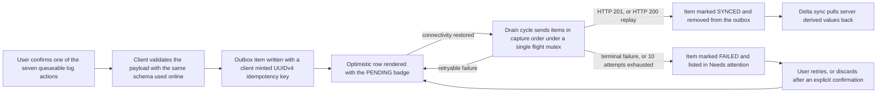

# User Stories — Platform, Offline and Sync Services (`SYS`)

| Field | Value |
| --- | --- |
| Document | `user-stories/platform-and-sync.md` — agile story layer for the cross-cutting platform, offline and synchronisation services |
| Version | 1.0 |
| Date | 2026-07-21 |
| Status | Approved for Phase 2 design |
| Owner | Rakshit — Project Lead / sole developer |
| Parent | [PlantPal+ Software Requirements Specification v1.0](../SRS.md) |
| Specification of record | [modules/platform-and-sync.md](../modules/platform-and-sync.md) — 26 functional requirements, 35 business rules |
| Owned identifiers | `US-SYS-01` … `US-SYS-12` and the epic identifiers `EPIC-SYS-01` … `EPIC-SYS-07`. All `FR-SYS`, `BR-SYS`, `UC-SYS`, `NFR-*`, `PER-*` and `STK-*` identifiers are referenced only, never renumbered |
| Story count | 12 user stories, 99 acceptance criteria |
| Total estimate | 102 story points |
| Source decisions | D-01 … D-11, with D-03, D-04, D-06, D-08 and D-09 as primary drivers |

---

## Table of contents

1. [Epics for this module](#1-epics-for-this-module)
   - [1.1 Epic register](#11-epic-register)
   - [1.2 Story map](#12-story-map)
   - [1.3 The offline capture and replay flow these stories describe](#13-the-offline-capture-and-replay-flow-these-stories-describe)
   - [1.4 How to read a story in this document](#14-how-to-read-a-story-in-this-document)
2. [User stories](#2-user-stories)
   - [US-SYS-01 — Log while offline](#us-sys-01--log-while-offline)
   - [US-SYS-02 — Read my data with no connection](#us-sys-02--read-my-data-with-no-connection)
   - [US-SYS-03 — See what is synced](#us-sys-03--see-what-is-synced)
   - [US-SYS-04 — Recover a failed entry](#us-sys-04--recover-a-failed-entry)
   - [US-SYS-05 — Understand what needs a connection](#us-sys-05--understand-what-needs-a-connection)
   - [US-SYS-06 — Add a plant photo without waiting or leaking my location](#us-sys-06--add-a-plant-photo-without-waiting-or-leaking-my-location)
   - [US-SYS-07 — Know my photo storage position](#us-sys-07--know-my-photo-storage-position)
   - [US-SYS-08 — Keep working when an external service is off or down](#us-sys-08--keep-working-when-an-external-service-is-off-or-down)
   - [US-SYS-09 — Find anything from one search box](#us-sys-09--find-anything-from-one-search-box)
   - [US-SYS-10 — Export everything I have recorded](#us-sys-10--export-everything-i-have-recorded)
   - [US-SYS-11 — Pick up on another device](#us-sys-11--pick-up-on-another-device)
   - [US-SYS-12 — Keep the free-tier backend healthy and reproducible](#us-sys-12--keep-the-free-tier-backend-healthy-and-reproducible)
3. [Story index and coverage](#3-story-index-and-coverage)
   - [3.1 Story index](#31-story-index)
   - [3.2 Functional-requirement coverage check](#32-functional-requirement-coverage-check)
   - [3.3 Use-case coverage check](#33-use-case-coverage-check)
   - [3.4 Persona coverage check](#34-persona-coverage-check)
4. [Story point totals](#4-story-point-totals)
   - [4.1 Totals per epic](#41-totals-per-epic)
   - [4.2 Totals per release](#42-totals-per-release)
   - [4.3 Totals per MoSCoW priority](#43-totals-per-moscow-priority)
   - [4.4 Estimation basis](#44-estimation-basis)

---

## 1. Epics for this module

### 1.1 Epic register

Epic identifiers are scoped to the `SYS` prefix owned by this document. An epic is a delivery grouping only; it mints no requirement and is never referenced by an `FR-SYS-nn`.

| Epic ID | Name | Goal | Stories it contains | Points |
| --- | --- | --- | --- | --- |
| EPIC-SYS-01 | Offline capture and durable replay | Guarantee that the seven append-only logging actions of BR-SYS-03 can be captured with no connectivity and reach the server exactly once, with no data loss and no merge algorithm | US-SYS-01, US-SYS-02, US-SYS-05 | 24 |
| EPIC-SYS-02 | Sync transparency and recovery | Make the state of every locally originated write visible in four states, and give the user a first-class, confirmed path out of a permanent failure | US-SYS-03, US-SYS-04 | 10 |
| EPIC-SYS-03 | Cross-device convergence | Keep the mobile client and the web client in agreement through a cursor-based delta sync, tombstones and a resumable full resynchronisation escape hatch | US-SYS-11 | 13 |
| EPIC-SYS-04 | Plant photo media pipeline | Move a photograph from the camera to private object storage cheaply, privately and inside a permanently free storage quota | US-SYS-06, US-SYS-07 | 18 |
| EPIC-SYS-05 | Integration independence, provenance and attribution | Keep every core journey working with every external integration disabled, and label and attribute every record that did come from outside | US-SYS-08 | 8 |
| EPIC-SYS-06 | Unified discovery and data portability | Make three modules feel like one product through a single search box, and let the user take every byte of their history with them | US-SYS-09, US-SYS-10 | 16 |
| EPIC-SYS-07 | Platform foundations and free-tier operability | Provide the API conventions, error envelope, pagination, limits, data-hygiene invariants, health surface, migrations and seeds that every other module is built on, inside a zero-cost operating envelope | US-SYS-12 | 13 |

### 1.2 Story map

```mermaid
flowchart TD
  ROOT["SYS user stories - 12 stories, 102 points"]

  ROOT --> E1["EPIC-SYS-01<br/>Offline capture and durable replay"]
  ROOT --> E2["EPIC-SYS-02<br/>Sync transparency and recovery"]
  ROOT --> E3["EPIC-SYS-03<br/>Cross-device convergence"]
  ROOT --> E4["EPIC-SYS-04<br/>Plant photo media pipeline"]
  ROOT --> E5["EPIC-SYS-05<br/>Integration independence"]
  ROOT --> E6["EPIC-SYS-06<br/>Discovery and portability"]
  ROOT --> E7["EPIC-SYS-07<br/>Platform foundations"]

  E1 --> S1["US-SYS-01 Log while offline<br/>Must, v0.5 Alpha, 13 points"]
  E1 --> S2["US-SYS-02 Read my data with no connection<br/>Must, v0.5 Alpha, 8 points"]
  E1 --> S5["US-SYS-05 Understand what needs a connection<br/>Must, v1.0 MVP, 3 points"]

  E2 --> S3["US-SYS-03 See what is synced<br/>Must, v0.5 Alpha, 5 points"]
  E2 --> S4["US-SYS-04 Recover a failed entry<br/>Must, v0.5 Alpha, 5 points"]

  E3 --> S11["US-SYS-11 Pick up on another device<br/>Must, v1.0 MVP, 13 points"]

  E4 --> S6["US-SYS-06 Add a plant photo<br/>Must, v1.0 MVP, 13 points"]
  E4 --> S7["US-SYS-07 Know my photo storage position<br/>Must, v1.0 MVP, 5 points"]

  E5 --> S8["US-SYS-08 Keep working when a service is off<br/>Must, v1.0 MVP, 8 points"]

  E6 --> S9["US-SYS-09 Find anything from one search box<br/>Should, v1.0 MVP, 8 points"]
  E6 --> S10["US-SYS-10 Export everything I have recorded<br/>Must, v1.0 MVP, 8 points"]

  E7 --> S12["US-SYS-12 Keep the backend healthy and reproducible<br/>Must, v1.0 MVP, 13 points"]
```



### 1.3 The offline capture and replay flow these stories describe

This is the single behaviour that EPIC-SYS-01 and EPIC-SYS-02 exist to deliver. Every numbered step is owned by a requirement in [modules/platform-and-sync.md](../modules/platform-and-sync.md); the diagram is a reading aid, not a new specification.



### 1.4 How to read a story in this document

| Element | Rule applied here |
| --- | --- |
| Persona names | Copied verbatim from the persona register `PER-01` … `PER-05`. Where the beneficiary is the operator rather than an end user, the stakeholder identifier `STK-03` is named instead, because no persona represents the maintainer |
| Priority | MoSCoW per D-02. A story is `Must` when at least one of its functional requirements is `Must`; it is `Should` only when every requirement it covers is `Should` |
| Release | The release in which **every** acceptance criterion of the story passes. Where an earlier release already delivers a demoable subset, that subset is named in the story metadata as *First slice*, so the D-02 rule that each release leaves a demoable slice remains auditable |
| Estimate | Story points on the Fibonacci scale 1, 2, 3, 5, 8, 13, 21. The reference point is defined in [section 4.4](#44-estimation-basis) |
| Acceptance criteria | Strict Gherkin. `AC-n` numbering restarts inside every story. Every criterion is objectively decidable from an observable value: an HTTP status, a named header, an enumerated state, a byte count, a millisecond budget, a row count or an exact string |
| Definition of Done | A task list covering implementation, automated tests, accessibility and documentation. It is identical in shape across every story so that a reviewer can compare stories at a glance |
| Traceability | Every story names the `FR-SYS-nn` requirements it realises and the `UC-SYS-nn` use cases that execute it. No story exists without at least one real functional requirement, and no functional requirement of the module is left uncovered — see [section 3.2](#32-functional-requirement-coverage-check) |

---

## 2. User stories

### US-SYS-01 — Log while offline

| Field | Value |
| --- | --- |
| Epic | EPIC-SYS-01 Offline capture and durable replay |
| Persona | PER-01 Aditi Sharma (primary), PER-05 Sofia Lindqvist (secondary) |
| Priority | Must |
| Release | v0.5 Alpha |
| Estimate | 13 story points |
| Related FRs | FR-SYS-02, FR-SYS-03, FR-SYS-04, FR-SYS-05 |
| Related UCs | UC-SYS-01, UC-SYS-02 |
| Related BRs | BR-SYS-03, BR-SYS-04, BR-SYS-05, BR-SYS-06, BR-SYS-07, BR-SYS-09, BR-SYS-11 |
| Traces up to | GOAL-05, D-04, STK-01 |
| Verification | Test |

**As** PER-01 Aditi Sharma, a registered user whose connection drops in the middle of a metro journey,
**I want** my watering, care-task, workout, step, meal, water-intake and growth entries to be stored on my device and sent automatically when a connection returns,
**so that** a bad connection never costs me a day of tracking or a streak I actually earned.

**Acceptance criteria**

```gherkin
Scenario AC-1: A queueable logging action is captured while the device is offline
  Given I am signed in on the mobile client
  And the client connectivity state is OFFLINE
  And the outbox holds 0 items
  When I log a water intake of 250 ml
  Then the entry is visible in today's water total on the same screen with no network request attempted
  And the entry row displays the sync state PENDING together with its accessible text label
  And the outbox holds exactly 1 item whose action is LOG_WATER_INTAKE
  And that item carries a UUIDv4 idempotency_key, a client_timestamp, a client_timezone of "Asia/Kolkata" and an enqueued_seq
  And no error message is displayed

Scenario AC-2: The outbox drains in capture order when connectivity returns
  Given the outbox holds 3 items in state PENDING
  And their client_timestamp values are 08:10:05Z, 08:10:41Z and 08:12:19Z
  When the client connectivity state changes from OFFLINE to ONLINE
  Then a drain cycle starts after a debounce of 2000 milliseconds
  And the 3 items are dispatched sequentially in ascending order of client_timestamp then enqueued_seq
  And each item answered with HTTP 201 moves to state SYNCED and is deleted from the outbox
  And the aggregate sync indicator reads "All changes saved"

Scenario AC-3: A retried request never creates a duplicate row
  Given the server committed an entry but its HTTP response was lost in transit
  And the item remains in the outbox in state PENDING with attempt_count equal to 1
  When the client retries the item with the identical Idempotency-Key header value
  Then the server responds HTTP 200 with the response header "Idempotent-Replay: true"
  And the response body is byte-identical to the resource stored on the first attempt
  And exactly 1 row exists in the target table for that idempotency_key

Scenario AC-4: A back-dated entry captured offline is filed against the correct local date
  Given the client connectivity state is OFFLINE
  And my device timezone is "Asia/Kolkata"
  When I log a 40 minute workout with occurred_at set to 19:30 local time on the previous day
  Then the queued item carries that occurred_at value and the client_timezone "Asia/Kolkata"
  And after the outbox drains the stored row has a local_date equal to the previous calendar day in "Asia/Kolkata"
  And the workout is counted in the previous day's totals and is not counted in today's totals

Scenario AC-5: An action outside the seven queueable codes is never enqueued
  Given the client connectivity state is OFFLINE
  And the outbox holds 2 items
  When I attempt to rename an existing plant
  Then the save control is disabled
  And the message "This action needs an internet connection." is displayed and programmatically associated with that control
  And the outbox still holds exactly 2 items

Scenario AC-6: The outbox refuses a new item at capacity and discards nothing
  Given the outbox holds 200 items
  And the client connectivity state is OFFLINE
  When I attempt to log a meal
  Then the action is refused with a blocking dialog
  And the dialog states that 200 entries are waiting to sync and instructs me to reconnect
  And no existing outbox item is evicted, modified or deleted
  And the outbox still holds exactly 200 items

Scenario AC-7: A retryable failure is rescheduled on the documented backoff ladder
  Given the outbox holds 1 item in state PENDING with attempt_count equal to 0
  When the drain attempt for that item returns HTTP 503
  Then the item returns to state PENDING with attempt_count equal to 1
  And next_attempt_at is set to the current instant plus 2000 milliseconds multiplied by a jitter factor between 0.8 and 1.2 inclusive
  And next_attempt_at is still present and honoured after the application is force-quit and restarted

Scenario AC-8: Queueing is refused when the device has no durable local store
  Given the client could not open its persistence layer and has recorded PERSISTENCE_UNAVAILABLE
  And the client connectivity state is OFFLINE
  When I attempt to log a meal
  Then no outbox item is created
  And the message "Offline saving is not available in this browser. Reconnect to log this entry." is displayed
  And the form contents I typed remain on screen
```

**Definition of Done**

- [ ] Implementation: the outbox store, the BR-SYS-04 envelope, the client-minted UUIDv4 idempotency key, the optimistic local row and the drain engine with its six triggers, single-flight mutex and batch of 25 are implemented on both clients from one shared TypeScript package.
- [ ] Implementation: each of the seven log endpoints carries `idempotency_key` and `payload_hash` columns with a partial unique index on `(user_id, idempotency_key)` and returns 201, 200 with `Idempotent-Replay: true`, 409, 400 or 422 exactly per BR-SYS-05.
- [ ] Tests: unit tests cover payload validation before enqueue, envelope serialisation, ordering by `(client_timestamp, enqueued_seq)` and the backoff formula including jitter bounds.
- [ ] Tests: integration tests replay the same idempotency key 5 times and assert exactly one row, and assert a 409 on a mutated payload with the stored row unchanged.
- [ ] Tests: an end-to-end test drives airplane mode on, logs one entry per queueable action, restores connectivity and asserts all 7 reach SYNCED with the correct `local_date`.
- [ ] Tests: a crash-recovery test kills the process mid-cycle and asserts items stranded in `SYNCING` for more than 60 seconds return to `PENDING` and complete without duplication.
- [ ] Accessibility: the `PENDING` badge exposes a text label and a distinct icon shape, is announced by VoiceOver and TalkBack, and remains legible at 200 percent text scale without clipping.
- [ ] Accessibility: the capacity-limit dialog is focus-trapped, dismissible with Escape on web, and returns focus to the control that opened it.
- [ ] Documentation: the outbox envelope, the seven action codes and the idempotency contract are documented in the OpenAPI description and in an architecture decision record explaining why no merge algorithm exists.
- [ ] Documentation: the traceability matrix row for FR-SYS-02, FR-SYS-03, FR-SYS-04 and FR-SYS-05 is updated to reference this story.

---

### US-SYS-02 — Read my data with no connection

| Field | Value |
| --- | --- |
| Epic | EPIC-SYS-01 Offline capture and durable replay |
| Persona | PER-05 Sofia Lindqvist (primary), PER-01 Aditi Sharma (secondary) |
| Priority | Must |
| Release | v0.5 Alpha |
| Estimate | 8 story points |
| Related FRs | FR-SYS-01 |
| Related UCs | UC-SYS-05 |
| Related BRs | BR-SYS-01, BR-SYS-02 |
| Traces up to | GOAL-05, D-04, STK-01 |
| Verification | Test |

**As** PER-05 Sofia Lindqvist, a student on a tram with no signal and a budget device with limited storage,
**I want** to open PlantPal+ and still see my plants, my recent logs and today's totals,
**so that** the application is useful during exactly the parts of my day when I have no network.

**Acceptance criteria**

```gherkin
Scenario AC-1: Cached screens render with no connectivity
  Given I used the application while online within the last 7 days
  And the persisted cache stamp matches the current user_id, schema_version and app_data_version
  When I cold-start the application with connectivity state OFFLINE
  Then the dashboard, the plant list and the recent-logs screen render from the persisted cache
  And cache rehydration completes within 1500 milliseconds on the reference device
  And each screen displays the banner "Offline — showing data from" followed by the absolute capture time

Scenario AC-2: Rehydration that exceeds its budget never blocks the first paint
  Given the persisted cache is at its 8 MB mobile budget
  When rehydration has not completed after 1500 milliseconds
  Then the screen renders skeleton placeholders instead of an empty screen
  And each query is populated as its cached value becomes available
  And no blocking spinner is shown

Scenario AC-3: Stale data is labelled rather than hidden
  Given the cached today-aggregate value was captured 3 hours ago
  And its staleTime for the TODAY_AGGREGATE resource class is 60 seconds
  When I view the dashboard while offline
  Then the cached values are rendered immediately
  And the screen displays "Updated" followed by the relative capture time
  And a background refetch is issued as soon as connectivity state becomes ONLINE

Scenario AC-4: An uncached screen explains itself instead of failing
  Given I have never opened the achievements screen on this device
  When I open it with connectivity state OFFLINE
  Then the OFFLINE_NO_CACHE empty state is rendered with the text "This screen needs a connection the first time you open it."
  And a retry control is present that re-evaluates connectivity when activated
  And no error dialog and no infinite spinner are shown

Scenario AC-5: Signing out purges the cache but never the outbox
  Given I am signed in with a populated persisted cache
  And the outbox holds 4 items in state PENDING
  When I sign out and choose "Sign out and keep them for next time"
  Then no cached query data for that account remains in MMKV or IndexedDB
  And the image disk cache for that account is purged
  And the outbox still holds exactly 4 items scoped to the same user_id

Scenario AC-6: A stamp mismatch discards the blob wholesale and triggers a rebuild
  Given the persisted cache carries an app_data_version lower than the current build value
  When the application starts and rehydration runs
  Then the entire persisted blob is discarded rather than partially reused
  And the outbox is preserved untouched
  And a full resynchronisation is triggered per FR-SYS-09
  And the message "Getting your data ready…" is displayed

Scenario AC-7: Cache eviction protects the budget and never touches the queue
  Given the persisted cache on mobile has reached its 8 MB serialised budget
  When a new response is written through to the cache
  Then least-recently-used query entries are evicted until usage is at most 80 percent of the budget
  And no entry in the outbox namespace is evicted, trimmed or expired

Scenario AC-8: Volatile values are never written to durable storage
  Given I have opened a photo detail screen and performed a search while online
  When I inspect the persisted cache contents
  Then no signed media read URL is present
  And no /search response is present
  And responses larger than 262144 bytes are absent from the persisted store while remaining available in memory
```

**Definition of Done**

- [ ] Implementation: TanStack Query is wired to a persister backed by MMKV on mobile and IndexedDB on web, with write-through debounced at 1000 milliseconds and the BR-SYS-01 `staleTime` and `gcTime` values applied per resource class.
- [ ] Implementation: the cache stamp carries `user_id`, `schema_version`, `app_data_version` and `persisted_at`, and any mismatch or an age above 30 days discards the blob while preserving the outbox namespace.
- [ ] Tests: unit tests assert the freshness matrix values for all 10 resource classes and assert that `SIGNED_MEDIA_URL` and `SEARCH_RESULT` are never persisted.
- [ ] Tests: an integration test fills the cache to its budget and asserts least-recently-used eviction to 80 percent with the outbox namespace untouched.
- [ ] Tests: an end-to-end test cold-starts in airplane mode and asserts the dashboard, plant list and recent logs render from cache with the offline banner and a capture time.
- [ ] Tests: a Safari private-browsing simulation asserts the in-memory fallback path, the `PERSISTENCE_UNAVAILABLE` telemetry event and the disabling of offline queueing.
- [ ] Accessibility: the offline banner and the "Updated" freshness label are announced by the screen reader, are not conveyed by colour alone, and survive 200 percent text scale without truncation.
- [ ] Accessibility: skeleton placeholders expose a busy state to assistive technology and do not animate when the reduce-motion preference is enabled.
- [ ] Documentation: the freshness and eviction policy is summarised in the developer README of the shared data package with a link to BR-SYS-01 and BR-SYS-02.
- [ ] Documentation: the traceability matrix row for FR-SYS-01 is updated to reference this story.

---

### US-SYS-03 — See what is synced

| Field | Value |
| --- | --- |
| Epic | EPIC-SYS-02 Sync transparency and recovery |
| Persona | PER-01 Aditi Sharma (primary), PER-04 Harold "Hal" Whitfield (secondary) |
| Priority | Must |
| Release | v0.5 Alpha |
| Estimate | 5 story points |
| Related FRs | FR-SYS-06 |
| Related UCs | UC-SYS-02, UC-SYS-03 |
| Related BRs | BR-SYS-10 |
| Traces up to | GOAL-05, GOAL-07, STK-01, PER-04 |
| Verification | Demonstration |

**As** PER-01 Aditi Sharma, a registered user who has lost a streak to a tracker that silently dropped an entry,
**I want** an unambiguous indicator of whether each entry and the application as a whole are saved to the cloud,
**so that** I can trust PlantPal+ with a history I am not willing to lose.

**Acceptance criteria**

```gherkin
Scenario AC-1: Everything is saved
  Given the outbox holds 0 items
  And the most recent delta sync completed successfully
  When I look at the aggregate sync indicator
  Then it reads exactly "All changes saved"
  And it exposes "Last synced" followed by the relative time of last_successful_sync_at
  And a "Sync now" control is present

Scenario AC-2: Items are waiting
  Given the outbox holds 4 items in state PENDING
  And the client connectivity state is OFFLINE
  When I look at the aggregate sync indicator
  Then it reads exactly "4 waiting to sync"
  And each of the 4 corresponding rows in its module list displays the PENDING badge

Scenario AC-3: A sync is in progress
  Given a drain cycle is dispatching an item
  When I look at the aggregate sync indicator
  Then it reads exactly "Syncing…"
  And an activity animation is shown
  And the four displayed states remain limited to SYNCED, PENDING, SYNCING and FAILED with no fifth state visible

Scenario AC-4: Failures take display precedence over every other state
  Given 1 outbox item is in state FAILED
  And 3 outbox items are in state PENDING
  When I look at the aggregate sync indicator
  Then it reads exactly "1 needs your attention", the aggregate label "N need your attention" resolved through the locale plural rule for N equal to 1
  And activating it opens the Needs attention screen
  And the settings entry point displays a badge with the count 1

Scenario AC-5: State is never conveyed by colour alone
  Given any of the four sync states is displayed
  When I inspect the indicator with an accessibility inspector
  Then the state carries a non-empty accessible text label
  And the state carries an icon whose shape differs from the icons of the other three states
  And the rendering remains distinguishable when the display is rendered in greyscale

Scenario AC-6: The syncing animation honours the reduce-motion preference
  Given the operating-system reduce-motion preference is enabled
  And a drain cycle is dispatching an item
  When I look at the aggregate sync indicator
  Then no looping animation is played
  And a static icon is shown together with the text "Syncing…"

Scenario AC-7: Signing out with queued items asks before it risks anything
  Given the outbox holds 4 items in state PENDING
  When I choose to sign out
  Then a dialog states "You have 4 entries waiting to sync. Keep them for next time?"
  And the default action is "Sign out and keep them for next time"
  And choosing the default preserves all 4 items
  And choosing "Sign out and discard" removes them only after that explicit choice

Scenario AC-8: An empty first run shows the saved state rather than a blank surface
  Given I have just completed registration and have logged nothing
  And the outbox holds 0 items
  When I open the dashboard
  Then the aggregate sync indicator reads exactly "All changes saved"
  And no per-record sync badge is rendered anywhere
  And no error state is shown
```

**Definition of Done**

- [ ] Implementation: one shared sync-state selector maps the internal `OutboxItemState` values onto exactly the four displayed states and applies the precedence FAILED, SYNCING, PENDING, SYNCED.
- [ ] Implementation: the application shell renders one aggregate indicator with the four exact label strings, a relative "Last synced" time and a "Sync now" control bound to drain trigger 6.
- [ ] Tests: unit tests assert every transition of the BR-SYS-10 state machine and assert the aggregate precedence for all 15 non-empty combinations of item states.
- [ ] Tests: a snapshot test asserts the four label strings exactly, so a copy change cannot pass silently.
- [ ] Tests: an end-to-end test queues items offline, restores connectivity and asserts the indicator passes through PENDING, SYNCING and SYNCED in that order.
- [ ] Tests: an automated accessibility scan of the shell reports zero critical violations on the indicator and its badge.
- [ ] Accessibility: every state exposes a text label and a distinct icon shape, satisfying NFR-A11Y-08, and is verified manually with VoiceOver and TalkBack.
- [ ] Accessibility: the sign-out dialog is keyboard operable, focus-trapped and closes on Escape returning focus to the sign-out control.
- [ ] Documentation: the four states, their labels and their precedence are recorded in the design-system documentation for the status badge component.
- [ ] Documentation: the traceability matrix row for FR-SYS-06 is updated to reference this story.

---

### US-SYS-04 — Recover a failed entry

| Field | Value |
| --- | --- |
| Epic | EPIC-SYS-02 Sync transparency and recovery |
| Persona | PER-05 Sofia Lindqvist (primary), PER-02 Marcus Oyelaran (secondary) |
| Priority | Must |
| Release | v0.5 Alpha |
| Estimate | 5 story points |
| Related FRs | FR-SYS-05, FR-SYS-06 |
| Related UCs | UC-SYS-02, UC-SYS-03 |
| Related BRs | BR-SYS-07, BR-SYS-08, BR-SYS-10 |
| Traces up to | GOAL-05, D-04, D-06, STK-01 |
| Verification | Test |

**As** PER-05 Sofia Lindqvist, a registered user whose entry could not be saved after every automatic attempt,
**I want** to see in plain English why it failed and to choose whether to retry it or discard it,
**so that** nothing I recorded ever disappears without my knowledge and my decision.

**Acceptance criteria**

```gherkin
Scenario AC-1: A permanently failed item is listed with a plain-English reason
  Given a queued watering failed with HTTP 404 and the error code PARENT_NOT_FOUND
  When I open the Needs attention screen
  Then the item is listed with its module name, a human-readable summary and its capture time
  And the reason reads "The plant this entry belongs to was deleted."
  And the actions Retry, Discard and Copy details are all available on that item

Scenario AC-2: Manual retry returns the item to the queue with a clean attempt count
  Given an item is in state FAILED after 10 retryable failures
  When I activate Retry on that item
  Then the item moves to state PENDING with attempt_count reset to 0
  And the item is dispatched during the next drain cycle
  And the aggregate indicator no longer counts that item as needing attention

Scenario AC-3: Discarding requires an explicit confirmation that names the data
  Given a failed water-intake item of 250 ml captured on 21 July is listed
  When I activate Discard
  Then a confirmation states "Discard this 250 ml water entry from 21 July? This cannot be undone."
  And the item is still present while the confirmation is open
  And the item is removed only after I confirm
  And cancelling the confirmation leaves the item in state FAILED

Scenario AC-4: A transient backend outage heals itself with no user action
  Given an item reached state FAILED while the backend was returning HTTP 503
  And the backend has since recovered
  When I next cold-start the application
  Then the item is re-attempted automatically with attempt_count reset to 0
  And the item reaches state SYNCED with no interaction from me
  And no notification or dialog is shown for the recovery

Scenario AC-5: Nothing is ever discarded automatically
  Given an item has been in the outbox for 45 days
  When every scheduled client process has run
  Then the item is still present in the Needs attention screen
  And it is flagged with the text "Saved 30+ days ago and still not synced"
  And no automatic process has modified or deleted its payload

Scenario AC-6: Failure detail is copyable for support
  Given an item is in state FAILED
  When I activate Copy details
  Then the device clipboard contains the raw outbox envelope as JSON
  And that JSON includes idempotency_key, action, client_timestamp, attempt_count, last_error_code and last_error_message
  And it includes the request_id returned by the server on the last attempt

Scenario AC-7: An authentication failure pauses the cycle instead of failing items
  Given the outbox holds 5 items in state PENDING
  When the first dispatch returns HTTP 401 with the code TOKEN_EXPIRED
  Then the drain cycle pauses and exactly one access-token refresh is attempted
  And no item is moved to state FAILED by that response
  And if the refresh fails all 5 items remain in state PENDING
  And the message "Please sign in again to finish saving your entries." is displayed

Scenario AC-8: The needs-attention screen has an honest empty state
  Given no outbox item is in state FAILED
  When I open the Needs attention screen
  Then the empty state reads that no entries need attention
  And no badge is rendered on the settings entry point
  And the Retry, Discard and Copy details controls are absent rather than disabled
```

**Definition of Done**

- [ ] Implementation: the BR-SYS-08 classification table is implemented as one pure function mapping transport outcome, HTTP status and error code onto RETRYABLE, AUTH or TERMINAL, and is the only place that decision is made.
- [ ] Implementation: the Needs attention screen lists every FAILED item with module, summary, capture time, plain-English reason and the three actions, and the 24-hour plus cold-start automatic re-attempt is implemented.
- [ ] Tests: unit tests cover every row of the classification table, including 408, 425, 429, 500, 502, 503, 504, 401, 403, 400, 404, 413 and 422.
- [ ] Tests: an integration test drives 10 consecutive retryable failures and asserts the item reaches FAILED after the tenth with no eleventh automatic attempt.
- [ ] Tests: an end-to-end test asserts that Discard removes an item only after confirmation and that Cancel leaves it untouched.
- [ ] Tests: a regression test asserts that no code path deletes an outbox item without an explicit user confirmation.
- [ ] Accessibility: each list item announces its state, its reason and its available actions; the confirmation dialog is focus-trapped and Escape-dismissible.
- [ ] Accessibility: the reason text avoids error codes in the visible string while exposing the code through Copy details, keeping the copy readable at 200 percent text scale.
- [ ] Documentation: the plain-English message catalogue keyed by error code is documented in the shared i18n catalogue so no user-facing string is hard-coded, satisfying D-08.
- [ ] Documentation: the traceability matrix rows for FR-SYS-05 and FR-SYS-06 are updated to reference this story.

---

### US-SYS-05 — Understand what needs a connection

| Field | Value |
| --- | --- |
| Epic | EPIC-SYS-01 Offline capture and durable replay |
| Persona | PER-05 Sofia Lindqvist (primary), PER-01 Aditi Sharma (secondary) |
| Priority | Must |
| Release | v1.0 MVP |
| Estimate | 3 story points |
| Related FRs | FR-SYS-07 |
| Related UCs | UC-SYS-01 |
| Related BRs | BR-SYS-03, BR-SYS-12 |
| Traces up to | GOAL-05, D-04, STK-01, PER-05 |
| Verification | Demonstration |

**As** PER-05 Sofia Lindqvist, a registered user on a campus network that works in some buildings and not others,
**I want** PlantPal+ to tell me plainly and in advance when an action needs the internet,
**so that** I never lose typed work to a form that looks as if it saved and then evaporates.

**Acceptance criteria**

```gherkin
Scenario AC-1: A connectivity-required action is disabled and explained before I commit to it
  Given the client connectivity state is OFFLINE
  When I open the "Add a plant" form
  Then the Save control is disabled
  And an inline explanation states that adding a plant needs an internet connection
  And that explanation is programmatically associated with the Save control
  And a "Try again" affordance is present

Scenario AC-2: Draft input survives the outage
  Given the client connectivity state is OFFLINE
  And I have typed the nickname "Kitchen Pothos" into the add-plant form
  When the client connectivity state changes to ONLINE
  Then the value "Kitchen Pothos" is still present in the field
  And the Save control becomes enabled with no further input from me
  And no navigation, reload or re-entry is required

Scenario AC-3: A network failure while reported online is explained and never queued
  Given the client connectivity state is reported as ONLINE
  And the request fails at the network layer
  When I submit a connectivity-required form
  Then an explicit error with a retry control is displayed
  And the form retains every value I entered
  And no item is added to the outbox

Scenario AC-4: Offline photo selection offers a path forward instead of a dead end
  Given the client connectivity state is OFFLINE
  And I am composing a growth entry with a height and a note
  When I attempt to attach a photo
  Then the message "You can save this entry now and add the photo when you are back online." is displayed
  And the text entry can still be queued as a LOG_GROWTH_ENTRY item with no media_id
  And my photo selection is not silently discarded without that message

Scenario AC-5: Creating a back-dated log offline is allowed while editing an existing one is blocked
  Given the client connectivity state is OFFLINE
  When I create a watering entry dated 2 days ago
  Then the entry is queued in the outbox
  And when I instead attempt to edit a watering entry that has already synced
  Then the save control for that edit is disabled with a stated reason
  And nothing is added to the outbox for the edit

Scenario AC-6: A device-local presentational preference still works offline
  Given the client connectivity state is OFFLINE
  When I change the theme from light to dark
  Then the theme changes immediately
  And no request is attempted and no blocking message is shown
  And a server-persisted preference such as the unit system remains disabled with its stated reason

Scenario AC-7: The retry affordance re-evaluates connectivity rather than guessing
  Given a blocked control is displaying its offline explanation
  And connectivity has been restored without a platform reachability event firing
  When I activate "Try again"
  Then the client re-evaluates connectivity by issuing a request
  And the control becomes enabled when that request succeeds
  And the control remains disabled with the same explanation when it does not
```

**Definition of Done**

- [ ] Implementation: one shared `useConnectivityGuard` primitive drives every blocked control, resolving the BR-SYS-12 blocked set and exposing a disabled state, a reason string and a retry callback.
- [ ] Implementation: connectivity state is derived from the platform reachability API and corroborated by the outcome of the last request, never trusted blindly, and draft form state is retained in memory for the lifetime of the screen.
- [ ] Tests: unit tests assert that each of the 10 blocked operation classes of BR-SYS-12 resolves to blocked and that each of the 7 queueable actions of BR-SYS-03 resolves to allowed.
- [ ] Tests: an end-to-end test types into a form offline, restores connectivity and asserts the typed value survives and the control enables without a reload.
- [ ] Tests: a negative test asserts that a failed connectivity-required request never creates an outbox item.
- [ ] Tests: a test asserts that theme changes offline while the unit-system preference stays blocked.
- [ ] Accessibility: the disabled control keeps a visible focus ring, the explanation is exposed through `aria-describedby` on web and an accessibility hint on mobile, and the reason is announced when the control receives focus.
- [ ] Accessibility: no blocked state relies on colour or opacity alone to communicate that it is unavailable.
- [ ] Documentation: the blocked-operation set is published in the developer handbook as the single list every module must consult, with a link to BR-SYS-12.
- [ ] Documentation: the traceability matrix row for FR-SYS-07 is updated to reference this story.

---

### US-SYS-06 — Add a plant photo without waiting or leaking my location

| Field | Value |
| --- | --- |
| Epic | EPIC-SYS-04 Plant photo media pipeline |
| Persona | PER-02 Marcus Oyelaran (primary), PER-05 Sofia Lindqvist (secondary) |
| Priority | Must |
| Release | v1.0 MVP |
| First slice | v0.5 Alpha delivers FR-SYS-10 and FR-SYS-11, giving a working single-variant upload; FR-SYS-12 completes the story at v1.0 MVP |
| Estimate | 13 story points |
| Related FRs | FR-SYS-10, FR-SYS-11, FR-SYS-12 |
| Related UCs | UC-SYS-06 |
| Related BRs | BR-SYS-16, BR-SYS-17, BR-SYS-18, BR-SYS-19 |
| Traces up to | GOAL-09, D-01, D-06, PER-02, PER-05 |
| Verification | Test |

**As** PER-02 Marcus Oyelaran, a registered user photographing 38 plants for a growth timeline,
**I want** each upload to be small, quick and free of any location metadata,
**so that** it completes on a weak connection and never reveals where I live.

**Acceptance criteria**

```gherkin
Scenario AC-1: A large photograph is transformed before a single byte is uploaded
  Given I select a JPEG of 4194304 bytes measuring 4032 by 3024 pixels
  When the client prepares it for upload
  Then the prepared file is encoded as image/jpeg
  And its longest edge is at most 1600 pixels
  And its size is at most 819200 bytes
  And the transform is applied before any signed upload URL is requested

Scenario AC-2: Location and camera metadata never leave the device
  Given I select a photograph whose EXIF contains GPS latitude, GPS longitude, camera make and camera model
  When the client prepares it for upload
  Then the prepared bytes contain no APP1 segment
  And the prepared bytes contain no GPS, camera, software or authorship tag
  And the growth entry's occurred_at is taken from the user or the device clock and never from EXIF

Scenario AC-3: An unsupported or oversized file is refused with an actionable message
  Given I select a file whose MIME type is application/pdf
  When the client validates it
  Then the file is refused with the code UNSUPPORTED_MEDIA_TYPE
  And the message "PlantPal+ accepts JPEG, PNG, HEIC and WebP images." is displayed
  And when I instead select an image of 20971520 bytes
  Then it is refused before decoding with the message "That image is larger than the 15 MB limit. Please choose a smaller one."

Scenario AC-4: A photograph that cannot be compressed enough fails honestly
  Given the transform ladder has run quality 0.75, then 0.65, then 0.55, then a resize to 1280 pixels and the ladder again
  And the output is still larger than 2097152 bytes
  When the client evaluates the result
  Then the upload is aborted with the code MEDIA_TOO_LARGE
  And the message "We could not compress that photo enough. Please choose a different image." is displayed
  And no signed upload URL is requested

Scenario AC-5: An expired signed URL is recovered without re-selecting the photograph
  Given a signed upload URL was issued with a 300 second expiry
  And the upload did not complete before it expired
  When the client retries the upload
  Then the server responds HTTP 422 with the code UPLOAD_URL_EXPIRED
  And a new single-use signed URL is issued for the same media_id
  And the upload completes without me choosing the photo again

Scenario AC-6: Finalisation is the trust boundary and is idempotent
  Given the object has been uploaded with the signed URL
  When the client calls the finalise endpoint for that media_id
  Then the server verifies content type image/jpeg, a byte length within 5 percent of the declared value, a decodable image, a longest edge between 200 and 1600 pixels, and the absence of an APP1 segment
  And the asset status becomes STORED
  And a second finalise call for the same media_id returns the existing STORED record with no duplicate variants created

Scenario AC-7: Variants are delivered by surface, from a private bucket
  Given a photograph has been finalised
  When I open the growth timeline grid
  Then the client requests the th variant at 320 pixels
  And when I open the photo detail screen the client requests the md variant at 1024 pixels
  And every read is served through a signed URL with a 3600 second expiry
  And no publicly reachable object URL exists for the bucket

Scenario AC-8: A partially generated variant set degrades instead of failing
  Given variant generation produced orig and th but failed for md
  When I open the photo detail screen
  Then the client falls back to the next larger available variant
  And the asset remains usable in the timeline
  And VARIANT_GENERATION_PARTIAL is recorded for the operator

Scenario AC-9: Photo upload while offline is refused rather than queued
  Given the client connectivity state is OFFLINE
  When I attempt to attach a photograph to a growth entry
  Then no bytes are stored locally for later upload
  And the message "You can save this entry now and add the photo when you are back online." is displayed
  And the text-only growth entry can still be queued in the outbox
```

**Definition of Done**

- [ ] Implementation: the BR-SYS-16 transform ladder is implemented once behind a shared interface, using `expo-image-manipulator` on mobile and a Canvas re-encode on web, with the MIME allowlist and the 15 MB input ceiling enforced before decoding.
- [ ] Implementation: the media service issues single-use signed URLs with the BR-SYS-18 parameters, validates at finalisation, re-strips metadata server-side, generates the three variants with `sharp` and writes them under the BR-SYS-19 key layout with immutable cache headers.
- [ ] Tests: a byte-level test asserts the absence of an APP1 marker in the transformed output for a fixture image known to contain GPS coordinates, on both clients.
- [ ] Tests: unit tests assert the quality ladder produces an output at most 819200 bytes for a 4032 by 3024 fixture and that a 15 MB-plus input is rejected before decoding.
- [ ] Tests: integration tests assert HTTP 404 rather than 403 for a non-owned `owner_id`, idempotent finalisation, and rejection of an object whose byte length is outside the 5 percent tolerance.
- [ ] Tests: an end-to-end test uploads a photograph, asserts the timeline requests the `th` variant, and asserts the bucket returns an error for an unsigned object URL.
- [ ] Accessibility: the upload control, its progress state and its error states expose text labels; progress is announced without a looping animation when reduce-motion is enabled.
- [ ] Accessibility: every rendered photograph carries an alternative text value derived from the plant nickname and the capture date, and the timeline grid is fully keyboard navigable on web.
- [ ] Documentation: the media pipeline is documented end to end in an architecture decision record explaining the direct-to-storage upload and the client-side metadata strip as a privacy control.
- [ ] Documentation: the traceability matrix rows for FR-SYS-10, FR-SYS-11 and FR-SYS-12 are updated to reference this story.

---

### US-SYS-07 — Know my photo storage position

| Field | Value |
| --- | --- |
| Epic | EPIC-SYS-04 Plant photo media pipeline |
| Persona | PER-02 Marcus Oyelaran (primary), PER-05 Sofia Lindqvist (secondary) |
| Priority | Must |
| Release | v1.0 MVP |
| Estimate | 5 story points |
| Related FRs | FR-SYS-13, FR-SYS-14 |
| Related UCs | UC-SYS-06, UC-SYS-07 |
| Related BRs | BR-SYS-20, BR-SYS-21 |
| Traces up to | GOAL-09, D-06, STK-07, PER-02 |
| Verification | Test |

**As** PER-02 Marcus Oyelaran, a registered user who photographs plants every Sunday,
**I want** to see exactly how much photo storage I have used and to be warned before I run out,
**so that** an upload is never refused as a surprise after I have already spent mobile data on it.

**Acceptance criteria**

```gherkin
Scenario AC-1: Consumption is visible against both limits
  Given I have used 31457280 bytes across 54 photographs
  When I open the photo storage screen in settings
  Then the meter shows bytes used against a limit of 60 MB
  And the meter shows 54 photographs used against a limit of 150 photographs
  And both figures are also available as text for a screen reader

Scenario AC-2: An informational notice appears at 80 percent
  Given my usage has just crossed 50331648 bytes, which is 80 percent of the per-user byte quota
  When I open the application
  Then an informational notice reads "You have used 48 MB of your 60 MB photo storage."
  And the notice is shown once for that threshold crossing rather than on every launch
  And it does not block any action

Scenario AC-3: A warning with a route to act appears at 95 percent
  Given my usage has crossed 95 percent of either the byte quota or the 150 photograph count
  When I open the application
  Then a warning reads "You are nearly out of photo storage. Review your photos to free up space."
  And the warning links directly to the photo management screen

Scenario AC-4: An upload at the limit is refused before any bytes are sent
  Given my usage has reached the per-user limit of 62914560 bytes
  When I request an upload
  Then the server responds HTTP 422 with the code QUOTA_EXCEEDED
  And the response body contains bytes_used, bytes_limit, photo_count and photo_limit
  And no signed upload URL is issued and no image bytes are transmitted
  And the message "You have used all 60 MB of photo storage. Delete some photos to add more." is displayed with a shortcut to photo management

Scenario AC-5: The photograph-count limit is enforced independently of the byte limit
  Given I have stored 150 photographs totalling 20971520 bytes
  When I request an upload
  Then the server responds HTTP 422 with the code QUOTA_EXCEEDED
  And the message "You have reached the 150 photo limit. Delete some photos to add more." is displayed

Scenario AC-6: Deleting a photograph frees the allowance immediately
  Given I am at my per-user byte limit
  When I delete a photograph of 629145 bytes
  Then the soft delete returns those bytes to my allowance immediately
  And the meter in settings reflects the new figure without waiting for the nightly job
  And a subsequent upload request is accepted

Scenario AC-7: The empty state is a zeroed meter, not a blank panel
  Given I have never uploaded a photograph
  When I open the photo storage screen
  Then the meter reads "0 MB of 60 MB used — 0 of 150 photos"
  And an explanation of what counts towards the quota is displayed
  And no error is shown

Scenario AC-8: The nightly cleanup reclaims garbage and corrects drift
  Given 3 media rows have been in PENDING_UPLOAD for more than 24 hours
  And 2 storage objects under the users prefix have no corresponding media row and are older than 24 hours
  And one user's storage_usage has drifted from actual usage
  When the scheduled cleanup job runs at 03:20 UTC
  Then the 3 expired rows and their objects are removed
  And the 2 orphaned objects are deleted
  And storage_usage is recomputed for every user touched
  And no object younger than 24 hours is deleted
  And the run records objects_deleted, rows_deleted, bytes_reclaimed and duration_ms in the structured log

Scenario AC-9: The global guard protects every user and keeps reads working
  Given total bucket usage has reached 891289600 bytes
  When any user requests an upload
  Then the server responds HTTP 503 with the code STORAGE_CAPACITY_REACHED
  And an operator alert is raised through the error monitor
  And every existing photograph remains readable
```

**Definition of Done**

- [ ] Implementation: quota is evaluated before a signed URL is issued, maintained incrementally at finalisation and at soft delete, and reconciled by pass 5 of the nightly cleanup job.
- [ ] Implementation: the cleanup job runs the five BR-SYS-20 passes under a PostgreSQL advisory lock, processes at most 500 objects per run, and never deletes an object younger than 24 hours.
- [ ] Tests: unit tests assert refusal at each of the four boundaries — byte limit, photograph count, 80 percent notice and 95 percent warning.
- [ ] Tests: an integration test asserts that no signed URL is issued when the quota is exhausted and that the response carries all four usage figures.
- [ ] Tests: a job test seeds orphaned objects, stale `PENDING_UPLOAD` rows and drifted counters, runs the job twice and asserts identical results, proving idempotency.
- [ ] Tests: a test asserts that a soft delete restores the allowance before the nightly job runs.
- [ ] Accessibility: the storage meter has a text alternative stating both figures, is not conveyed by colour alone, and the threshold notices are announced through a live region rather than a timed toast.
- [ ] Accessibility: the photo management shortcut is reachable by keyboard and by screen-reader rotor navigation.
- [ ] Documentation: the quota arithmetic, the per-photograph storage budget and the global guard are documented with their calibration reasoning from BR-SYS-21.
- [ ] Documentation: the traceability matrix rows for FR-SYS-13 and FR-SYS-14 are updated to reference this story.

---

### US-SYS-08 — Keep working when an external service is off or down

| Field | Value |
| --- | --- |
| Epic | EPIC-SYS-05 Integration independence, provenance and attribution |
| Persona | PER-05 Sofia Lindqvist (primary), PER-02 Marcus Oyelaran (secondary) |
| Priority | Must |
| Release | v1.0 MVP |
| First slice | v0.5 Alpha delivers FR-SYS-15, proving the product runs with every integration flag disabled; FR-SYS-16 and FR-SYS-17 complete the story at v1.0 MVP |
| Estimate | 8 story points |
| Related FRs | FR-SYS-15, FR-SYS-16, FR-SYS-17 |
| Related UCs | UC-SYS-08 |
| Related BRs | BR-SYS-22, BR-SYS-23, BR-SYS-24, BR-SYS-25, BR-SYS-26 |
| Traces up to | GOAL-09, D-03, D-06, STK-08, STK-12 |
| Verification | Test |

**As** PER-05 Sofia Lindqvist, a registered user scanning a barcode in a supermarket,
**I want** PlantPal+ to keep working when barcode lookup or species enrichment is switched off, slow or broken,
**so that** an outage somewhere else never blocks the tracking I came to do.

**Acceptance criteria**

```gherkin
Scenario AC-1: Every core journey completes with all integrations disabled
  Given integration.openfoodfacts.enabled is false
  And integration.perenual.enabled is false
  And no external API key is configured
  When I complete a plant-care, a fitness and a nutrition journey end to end
  Then every journey completes using only the seeded catalogues
  And at least 60 plant species and at least 300 foods are available for selection
  And no request is made to any external provider

Scenario AC-2: A slow provider never stalls the interface
  Given integration.openfoodfacts.enabled is true
  And the provider does not respond within its 3000 millisecond timeout
  When I scan a barcode
  Then the outbound request is aborted at 3000 milliseconds
  And within 3 seconds of my scan I am shown seeded catalogue results and a manual-entry option
  And the manual-entry form is pre-filled with the scanned code

Scenario AC-3: Repeated failures open the circuit and stop further calls
  Given the provider has returned 5 failures within 60 seconds
  When I scan another barcode
  Then no external network call is made
  And the caller receives CIRCUIT_OPEN immediately
  And the seeded catalogue fallback is shown with the notice "Showing our built-in catalogue."
  And no external call is attempted for the next 300 seconds

Scenario AC-4: A cached result is reused without touching the network
  Given a barcode was looked up successfully 3 days ago
  And its cache entry is inside the 30 day fresh time-to-live
  When I scan the same barcode again
  Then the result is served from the ExternalLookupCache
  And no external network call is made
  And the cache row's hit_count is incremented

Scenario AC-5: A not-found result is negatively cached and never dead-ends
  Given the provider returns no product for the scanned barcode
  When the lookup completes
  Then the not-found result is cached for 7 days
  And the message "We could not find that barcode. You can add it yourself." is displayed
  And a manual-entry form pre-filled with the scanned code is offered
  And saving that form creates a record with provenance USER

Scenario AC-6: Attribution is displayed wherever external data is shown
  Given a food record has provenance EXTERNAL with source "Open Food Facts"
  When I open its detail screen
  Then the line "Food data from Open Food Facts, licensed under ODbL 1.0" is displayed
  And a link to https://openfoodfacts.org is present
  And the record's fetched_at value is displayed
  And no Open Food Facts product image is displayed or stored

Scenario AC-7: Provenance precedence is applied consistently
  Given the same food exists as a CURATED catalogue row and as an EXTERNAL cached row
  When the food is displayed and used in a calculation
  Then the CURATED record is used for both
  And when a USER record also exists for that food the USER record is used for both
  And the record's provenance value is visible on the detail screen

Scenario AC-8: A missing configuration endpoint never blocks the application
  Given the /api/v1/config endpoint is unreachable
  When the application starts
  Then the client proceeds with its cached configuration, or with compiled-in defaults on a first run
  And no blocking dialog or spinner is shown
  And every flag whose value is unknown resolves to its compiled-in default rather than an error
```

**Definition of Done**

- [ ] Implementation: the feature-flag registry, the environment-variable override precedence and the `/api/v1/config` endpoint with its 900 second cache header are implemented, with all nine v1.0 flags and their documented defaults.
- [ ] Implementation: every outbound provider call goes through one client wrapper enforcing the BR-SYS-23 timeout, single retry, circuit breaker and mandatory `User-Agent`, and writes every result to `ExternalLookupCache` with the BR-SYS-24 time-to-live values.
- [ ] Tests: an end-to-end suite runs the full regression pack with every integration flag disabled and asserts zero outbound provider requests and zero failed journeys.
- [ ] Tests: unit tests assert the circuit-breaker transitions CLOSED to OPEN at 5 failures in 60 seconds, OPEN to HALF_OPEN after the open duration, and HALF_OPEN to CLOSED on one successful probe.
- [ ] Tests: integration tests assert a cache hit performs no network call, a not-found is negatively cached for 7 days, and a malformed HTTP 200 counts as a breaker failure and is negatively cached for 1 hour.
- [ ] Tests: a rendering test asserts that no screen can display an `EXTERNAL` record without its attribution line.
- [ ] Accessibility: the degradation notice is a non-blocking, screen-reader announced element rather than a timed toast, and the attribution line and its link are keyboard reachable with a visible focus ring.
- [ ] Accessibility: the provenance label is text, never a colour-only chip, and remains readable at 200 percent text scale.
- [ ] Documentation: the "Attributions and licences" screen content, the ODbL obligation and the deliberate exclusion of Open Food Facts product images are recorded in the legal notes and in an architecture decision record.
- [ ] Documentation: the traceability matrix rows for FR-SYS-15, FR-SYS-16 and FR-SYS-17 are updated to reference this story.

---

### US-SYS-09 — Find anything from one search box

| Field | Value |
| --- | --- |
| Epic | EPIC-SYS-06 Unified discovery and data portability |
| Persona | PER-01 Aditi Sharma (primary), PER-04 Harold "Hal" Whitfield (secondary) |
| Priority | Should |
| Release | v1.0 MVP |
| Estimate | 8 story points |
| Related FRs | FR-SYS-23 |
| Related UCs | UC-SYS-09 |
| Related BRs | BR-SYS-32 |
| Traces up to | GOAL-01, GOAL-02, STK-01, PER-01 |
| Verification | Test |

**As** PER-01 Aditi Sharma, a registered user who keeps plants, workouts and meals in one application,
**I want** a single search box that finds a plant, a food, an exercise or a note wherever it lives,
**so that** I never have to remember which module holds the thing I am looking for.

**Acceptance criteria**

```gherkin
Scenario AC-1: A query below the minimum length is answered rather than rejected
  Given I am signed in and the client connectivity state is ONLINE
  When I submit the query " p " which trims to 1 character
  Then the server responds HTTP 200 with an empty result set and the hint "type_more"
  And no error envelope is returned
  And the panel displays "Keep typing to search."

Scenario AC-2: Results are grouped by type, capped, and directly navigable
  Given my account holds 14 plants whose nickname contains "pot"
  And the catalogue holds foods and exercises matching the same term
  When I submit the query "pot"
  Then the results are grouped under the types plants, foods, exercises and notes
  And at most 10 results are returned for any single type
  And at most 40 results are returned in total
  And every result carries type, id, title, subtitle, provenance and route
  And activating a plant result opens that plant's detail screen directly

Scenario AC-3: Ranking is deterministic and puts the exact match first
  Given my account holds a plant nicknamed "Pothos", a plant nicknamed "Pothos shelf" and a growth note containing the word pothos
  When I submit the query "pothos"
  Then each candidate is scored as 100 × exact_match + 80 × prefix_match + 60 × trigram_similarity + 40 × ts_rank_normalised + 5 × recency_bonus
  And "Pothos" is ranked above "Pothos shelf", which is ranked above the note
  And two candidates with an identical score are ordered by updated_at descending and then by id ascending

Scenario AC-4: Matching ignores case and accents and treats wildcards as literal text
  Given my account holds a plant nicknamed "Aloë Vera"
  When I submit the query "aloe"
  Then that plant is returned
  And a query containing % or _ has those characters escaped before it reaches the database
  And the query text is never interpolated into SQL
  And a query of 80 characters is truncated to 64 characters and executed without an error

Scenario AC-5: Search never crosses a user boundary and never resurrects a deleted row
  Given another user owns a plant nicknamed "Monstera"
  And I have soft-deleted my own plant nicknamed "Monstera"
  When I submit the query "monstera"
  Then neither row is returned
  And the shared catalogues remain searchable
  And the request carries no user parameter, the user identity being taken from the verified access token

Scenario AC-6: Typing does not flood the server
  Given I am typing continuously in the search box
  When I enter 6 characters within 900 milliseconds
  Then a request is dispatched only after 300 milliseconds have elapsed with no further keystroke
  And any request still in flight when a new keystroke arrives is cancelled
  And the 95th percentile server response time excluding cold start is at most 400 milliseconds

Scenario AC-7: Offline search degrades to the local cache and says so
  Given the client connectivity state is OFFLINE
  When I submit the query "oats"
  Then the client searches its local cache across my plants, the most recent 200 foods and the most recent 100 exercises using a case-insensitive substring match
  And the panel is labelled "Offline results — limited to recent items"
  And no error dialog is shown

Scenario AC-8: No matches offers a way to create the missing thing
  Given no plant, food, exercise or note matches the query "zzzz"
  When the search completes
  Then HTTP 200 is returned rather than an error
  And the NO_SEARCH_RESULTS empty state is displayed with the text "No matches. Create your own food, exercise or plant?"
  And shortcuts to create a food, an exercise and a plant are present
```

**Definition of Done**

- [ ] Implementation: one `GET /api/v1/search` endpoint implements the BR-SYS-32 ranking formula over the listed surfaces, backed by `pg_trgm` GIN indexes on short text and `unaccent`-backed `tsvector` generated columns on note text, capped at 10 per type and 40 overall.
- [ ] Implementation: one shared search component on both clients provides the 300 millisecond debounce, in-flight cancellation, grouped rendering, deep-link routes and the offline degraded panel, and the entry point is hidden when `search.global.enabled` is off.
- [ ] Tests: unit tests assert the ranking formula and the tie-break order across a fixture set covering exact, prefix, trigram and note matches.
- [ ] Tests: integration tests assert that soft-deleted rows and another user's rows are never returned and that `%` and `_` are escaped rather than interpreted.
- [ ] Tests: a performance test asserts a 95th percentile server response time at or below 400 milliseconds excluding cold start, satisfying NFR-PERF-01.
- [ ] Tests: an end-to-end test searches offline and asserts the degraded panel, its exact label and the absence of any network request.
- [ ] Accessibility: the search field carries a programmatic label, results are exposed as a list, and the result count is announced through a live region rather than a timed toast.
- [ ] Accessibility: the type grouping is conveyed by a text heading rather than colour, every result is keyboard reachable on web and rotor reachable on mobile, and titles are not truncated at 200 percent text scale.
- [ ] Documentation: the ranking formula, the searched surfaces and the offline degraded behaviour are documented in the OpenAPI description and in the developer handbook.
- [ ] Documentation: the traceability matrix row for FR-SYS-23 is updated to reference this story.

---

### US-SYS-10 — Export everything I have recorded

| Field | Value |
| --- | --- |
| Epic | EPIC-SYS-06 Unified discovery and data portability |
| Persona | PER-02 Marcus Oyelaran (primary), PER-01 Aditi Sharma (secondary) |
| Priority | Must |
| Release | v1.0 MVP |
| Estimate | 8 story points |
| Related FRs | FR-SYS-24 |
| Related UCs | UC-SYS-10 |
| Related BRs | BR-SYS-33 |
| Traces up to | GOAL-08, D-01, STK-01, STK-11 |
| Verification | Test |

**As** PER-02 Marcus Oyelaran, a registered user with two years of plant history and a large photo timeline,
**I want** one machine-readable file containing everything I have recorded, with my photographs downloadable,
**so that** my history stays mine even if PlantPal+ stops running tomorrow.

**Acceptance criteria**

```gherkin
Scenario AC-1: Requesting an export returns immediately and reports its progress
  Given I have not requested an export in the last 24 hours
  When I POST to /api/v1/account/export
  Then the server responds HTTP 202 with an export_id and the status REQUESTED
  And polling /api/v1/account/export/{exportId} reports PROCESSING and then READY
  And the READY response carries a signed download URL valid for 3600 seconds
  And the stored object is named plantpal-export-<user_id>-<YYYYMMDD>.json

Scenario AC-2: The package contains every collection and its own count check
  Given my account holds 7 plants, 214 waterings and 33 stored photographs
  When the export reaches READY and I download it
  Then the document carries export_version, generated_at and app_version
  And it carries the user record, the settings record and each of plants, waterings, care_events, growth_entries, workouts, step_entries, meal_entries, water_entries, custom_foods, custom_exercises, goals, streaks, achievements_unlocked and reminders
  And the counts block reports plants 7, waterings 214 and photos 33, each equal to the number of rows actually serialised
  And the attributions array names every external source used with its licence and its URL

Scenario AC-3: Photographs are referenced, never embedded
  Given my account holds 33 stored photographs
  When I inspect the photos array of the export
  Then each entry carries media_id, owner_type, owner_id, captured_at, variant, bytes, sha256, download_url and url_expires_at
  And no photograph is base64-encoded anywhere in the document
  And each download_url is a signed URL valid for 24 hours
  And downloading one returns bytes whose SHA-256 equals the manifest value

Scenario AC-4: The export excludes everything it must never contain
  Given a completed export document
  When I search it for excluded material
  Then it contains no password hash, no password reset token, no refresh token, no push token and no session record
  And it contains no row belonging to another user
  And it contains no internal server configuration value and no feature-flag value
  And soft-deleted rows are absent unless I requested include_deleted

Scenario AC-5: One export per day, and a second request never starts a second job
  Given I completed an export 2 hours ago and it has not expired
  When I request another export
  Then the server responds HTTP 429 with the code EXPORT_RATE_LIMITED and a next_allowed_at value
  And the message "You can request your next export after <time>." is displayed
  And when a job is already running a further request returns that in-flight job rather than an error

Scenario AC-6: An interrupted job fails honestly and costs me nothing
  Given a job has been in state PROCESSING for more than 10 minutes when the process restarts
  When the service boots
  Then the job is marked FAILED with the code EXPORT_INTERRUPTED
  And the message "That export did not finish. You can request it again now." is displayed
  And an immediate re-request is accepted and does not consume my daily allowance

Scenario AC-7: The link expires after 7 days and can be replaced at once
  Given my export was generated 8 days ago
  When I open the stored download link
  Then the reported status is EXPIRED
  And the storage object has already been deleted by the nightly cleanup job
  And the message "That export has expired. You can request a new one now." is displayed
  And a new request is accepted immediately

Scenario AC-8: An oversized package fails inside its budget rather than exhausting the instance
  Given my serialised package would exceed 52428800 bytes
  When the job runs
  Then each collection is streamed to the storage object rather than assembled in memory
  And the job fails with the code EXPORT_TOO_LARGE within its 120 second wall clock
  And the message "Your export is too large. Try deleting some photos, or contact the maintainer." is displayed
  And a package larger than 5 MB that is within the guard is delivered gzipped
```

**Definition of Done**

- [ ] Implementation: `POST /api/v1/account/export` and `GET /api/v1/account/export/{exportId}` are implemented with the five-state lifecycle, one job per user, the 24-hour allowance and the 120 second wall clock.
- [ ] Implementation: the job streams every collection of the BR-SYS-33 package to a storage object, builds the photo manifest with SHA-256 digests and 24-hour signed URLs, gzips above 5 MB, and registers the object for deletion by pass 4 of the FR-SYS-13 cleanup job.
- [ ] Tests: a golden-file test asserts the package structure key by key against BR-SYS-33 and asserts that the counts block equals the serialised row counts.
- [ ] Tests: a negative test scans a completed package for password hashes, tokens, session records, other users' rows and feature-flag values and fails if any is present.
- [ ] Tests: an integration test asserts HTTP 429 `EXPORT_RATE_LIMITED` on a second request inside 24 hours and asserts that a concurrent request returns the in-flight job rather than an error.
- [ ] Tests: a job test kills the process mid-export and asserts the job is marked `FAILED` with `EXPORT_INTERRUPTED` at boot without consuming the daily allowance.
- [ ] Accessibility: export status changes are announced through a live region rather than a timed toast, and the download control carries a text label naming the file and its expiry.
- [ ] Accessibility: the export screen states the daily limit and the 7-day retention in plain language, conveys status by text rather than colour, and remains readable at 200 percent text scale.
- [ ] Documentation: the package structure, the absolute exclusion list and the photo-manifest contract are documented in the privacy notes and in the OpenAPI description.
- [ ] Documentation: the traceability matrix row for FR-SYS-24 is updated to reference this story.

---

### US-SYS-11 — Pick up on another device

| Field | Value |
| --- | --- |
| Epic | EPIC-SYS-03 Cross-device convergence |
| Persona | PER-01 Aditi Sharma (primary), PER-03 Mia Castellano (secondary) |
| Priority | Must |
| Release | v1.0 MVP |
| Estimate | 13 story points |
| Related FRs | FR-SYS-08, FR-SYS-09 |
| Related UCs | UC-SYS-04, UC-SYS-05 |
| Related BRs | BR-SYS-13, BR-SYS-14, BR-SYS-15, BR-SYS-31 |
| Traces up to | GOAL-01, GOAL-05, D-04, STK-01, PER-01 |
| Verification | Test |

**As** PER-01 Aditi Sharma, a registered user who logs on her phone during the day and reviews on the web in the evening,
**I want** both clients to show the same plants, logs and totals without my doing anything,
**so that** the two halves of my day are one history rather than two.

**Acceptance criteria**

```gherkin
Scenario AC-1: A device with no cursor rebuilds itself from the beginning
  Given I sign in on the web client for the first time
  And no sync cursor is stored for this device
  When the client starts
  Then a full resynchronisation runs with the trigger NO_STORED_CURSOR
  And paging begins from the cursor "0" at 200 rows per page
  And an indeterminate indicator is shown for the first page and determinate progress from the second page onward
  And on completion last_full_resync_at is recorded and the outbox is drained

Scenario AC-2: A delta pull returns only what changed, in a strict total order
  Given my stored cursor was issued 40 minutes ago
  And 3 waterings and 1 plant have been updated on another device since then
  When the client calls GET /api/v1/sync/changes with that cursor
  Then exactly those 4 rows are returned, ordered ascending by (updated_at, sync_seq)
  And no row belonging to another user is present in the response
  And the response carries next_cursor, has_more and server_time
  And the stored cursor is advanced only after the page has been committed in a single local transaction

Scenario AC-3: A crash between applying a page and storing its cursor costs nothing
  Given a page of 200 rows has been applied locally
  And the process is killed before next_cursor is persisted
  When the application restarts
  Then the same page is requested again with the previous cursor
  And every row is upserted by primary key with no duplicate created
  And the local row count for each collection is unchanged by the re-application

Scenario AC-4: A deletion on one device removes the row on the other
  Given I soft-delete a plant on the mobile client
  When the web client performs its next delta sync
  Then the plant is returned in the tombstones array with its collection, id, deleted_at and sync_seq
  And the row disappears from every list on the web client
  And a tombstone for a row this client has never seen is applied as a no-op with no error

Scenario AC-5: A cursor older than the tombstone window forces a clean rebuild
  Given my stored cursor carries an updated_at older than 90 days
  When the client calls GET /api/v1/sync/changes
  Then the server responds HTTP 410 with the code CURSOR_EXPIRED
  And a full resynchronisation runs with the trigger CURSOR_EXPIRED
  And the message "Refreshing everything so your devices match." is displayed

Scenario AC-6: A cursor the server cannot read is a rebuild, not an error screen
  Given my stored cursor cannot be decoded or carries an unknown version field
  When the client calls GET /api/v1/sync/changes
  Then the server responds HTTP 400 with the code INVALID_CURSOR
  And a full resynchronisation runs with the trigger INVALID_CURSOR
  And the message "Getting your data ready…" is displayed
  And no error dialog is shown

Scenario AC-7: A rebuild never destroys work that is waiting to be saved
  Given the outbox holds 6 items in state PENDING
  And a full resynchronisation is triggered while a drain cycle is running
  When the resynchronisation proceeds
  Then it waits until the drain mutex is released before it starts
  And the persisted query cache and the local replica are purged
  And the outbox still holds exactly 6 items and my local preferences are unchanged
  And the outbox is drained as soon as the resynchronisation completes

Scenario AC-8: A rebuild resumes where it stopped and refuses to loop
  Given a full resynchronisation is interrupted after 4 pages
  When the application is restarted
  Then the resync_in_progress marker is still present and paging continues from the stored resync_cursor
  And the rows already landed remain readable while the remainder arrive
  And when a 4th full resynchronisation is triggered on this device within one hour the automatic resynchronisations stop
  And RESYNC_LOOP_DETECTED is reported to the error monitor

Scenario AC-9: A day belongs to the zone it was captured in, on every device
  Given I logged a meal at 00:45 local time on 1 March while my device timezone was "Asia/Kolkata"
  When that row reaches a second device whose timezone is "Pacific/Auckland"
  Then the row arrives with its stored local_date of 2026-03-01 and its tz_at_capture of "Asia/Kolkata"
  And the second device counts it in the 1 March total rather than recomputing the date from its own zone
  And changing my timezone preference does not rewrite local_date on any existing row
```

**Definition of Done**

- [ ] Implementation: `GET /api/v1/sync/changes` is implemented across the 16 synced collections with the BR-SYS-13 cursor, ordering by `(updated_at, sync_seq)` from one global `BIGSERIAL` trigger, a default page of 200, a maximum of 500 and truncation below the 1 MB body ceiling.
- [ ] Implementation: the client applies each page inside one local transaction, persists `next_cursor` only on commit, and implements all eight BR-SYS-15 resync triggers with a resumable `resync_in_progress` marker and the ceiling of 3 resyncs per device per hour.
- [ ] Tests: an integration test asserts that a row updated and then deleted between two pages arrives as a tombstone and that ordering is total across collections.
- [ ] Tests: a test asserts HTTP 410 `CURSOR_EXPIRED` for a cursor older than 90 days and HTTP 400 `INVALID_CURSOR` for an undecodable one, each raising the matching resync trigger.
- [ ] Tests: a crash test kills the client after a page is applied and before its cursor is persisted, then asserts idempotent re-application with no duplicate rows.
- [ ] Tests: an end-to-end test logs an entry on one client, syncs on the other, and asserts convergence of both the row set and the today-aggregate values within one delta cycle.
- [ ] Accessibility: resynchronisation progress is announced through a live region, is determinate from the second page onward, and does not animate when the reduce-motion preference is enabled.
- [ ] Accessibility: the "Reset local data" control states in plain language that entries waiting to sync are kept, and its confirmation dialog is focus-trapped and Escape-dismissible.
- [ ] Documentation: the cursor format, the 16 synced collections, the 90-day tombstone window and the eight resync triggers are documented in the OpenAPI description and in an architecture decision record explaining why a total rebuild replaces repair logic.
- [ ] Documentation: the traceability matrix rows for FR-SYS-08 and FR-SYS-09 are updated to reference this story.

---

### US-SYS-12 — Keep the free-tier backend healthy and reproducible

| Field | Value |
| --- | --- |
| Epic | EPIC-SYS-07 Platform foundations and free-tier operability |
| Persona | STK-03 Rakshit, Project Lead and sole developer (primary), STK-13 Future maintainer (secondary) |
| Priority | Must |
| Release | v1.0 MVP |
| First slice | v0.1 Walking Skeleton delivers FR-SYS-18, FR-SYS-19, FR-SYS-22, FR-SYS-25 and FR-SYS-26; v0.5 Alpha adds FR-SYS-20; FR-SYS-21 completes the story at v1.0 MVP |
| Estimate | 13 story points |
| Related FRs | FR-SYS-18, FR-SYS-19, FR-SYS-20, FR-SYS-21, FR-SYS-22, FR-SYS-25, FR-SYS-26 |
| Related UCs | UC-SYS-02, UC-SYS-04, UC-SYS-07, UC-SYS-09 |
| Related BRs | BR-SYS-27, BR-SYS-28, BR-SYS-29, BR-SYS-30, BR-SYS-31, BR-SYS-34, BR-SYS-35 |
| Traces up to | GOAL-09, GOAL-10, GOAL-12, D-03, D-06, STK-03, STK-13 |
| Verification | Test |

**As** STK-03 Rakshit, the sole developer who has to operate this system on free tiers and hand it over intelligibly,
**I want** one API convention, one error envelope, one pagination grammar, enforced data-hygiene invariants, a health surface and reproducible migrations and seeds,
**so that** every other module is built on the same foundation and the whole database can be rebuilt from empty with one command.

**Acceptance criteria**

```gherkin
Scenario AC-1: Every endpoint follows one surface convention
  Given the API service is running
  When I inspect any endpoint of the deployed service
  Then it is mounted under /api/v1 with plural lower-kebab-case resources nested at most one level deep
  And every JSON body field is snake_case and every timestamp is ISO-8601 with milliseconds and a Z suffix
  And a request carrying a trailing slash returns HTTP 404 rather than a redirect
  And a body containing an unknown field returns HTTP 400 VALIDATION_FAILED naming that field

Scenario AC-2: Every request is traceable end to end
  Given I send a request with the header X-Request-Id set to "abc12345"
  When the response is returned
  Then the same value is echoed in the X-Request-Id response header
  And that value appears in the structured log record for the request
  And that value appears as request_id in any error envelope produced by the request
  And an inbound value that does not match ^[A-Za-z0-9-]{8,64}$ is discarded and a fresh UUIDv4 is generated

Scenario AC-3: Every error is the same shape and leaks nothing
  Given a request fails validation on the field volume_ml
  When the response is returned
  Then the body is one error object carrying code, message, message_key, details, request_id and timestamp
  And code is SCREAMING_SNAKE_CASE and is drawn only from the closed registry of BR-SYS-28
  And an unhandled exception reaching the terminal middleware returns HTTP 500 INTERNAL_ERROR
  And no stack trace, SQL text or upstream provider body appears in any response
  And a validation failure with more than 50 field issues returns the first 50 entries marked as truncated

Scenario AC-4: Collections page by cursor and reject what they do not understand
  Given a collection endpoint holds 60 rows
  When I request it with no query parameters
  Then 25 rows are returned in the envelope { "data": [ … ], "page": { "next_cursor": …, "has_more": … } }
  And a limit of 200 on that endpoint returns HTTP 400 VALIDATION_FAILED naming limit
  And an unknown query parameter returns HTTP 400 UNKNOWN_QUERY_PARAM naming the parameter
  And a sort key absent from the endpoint allowlist returns HTTP 400 INVALID_SORT_KEY
  And a date filter spanning more than 366 days returns HTTP 400 RANGE_TOO_LARGE

Scenario AC-5: Limits protect the instance without ever losing an entry
  Given the outbox drains a batch of 25 items in the WRITE_LOG class
  When the batch is dispatched
  Then no request is throttled, the WRITE_LOG tier being 120 requests per minute
  And every response carries X-RateLimit-Limit, X-RateLimit-Remaining and X-RateLimit-Reset
  And an exhausted bucket returns HTTP 429 RATE_LIMITED with Retry-After in seconds and the item is classified RETRYABLE
  And a body above its class limit returns HTTP 413 PAYLOAD_TOO_LARGE and a multipart body returns HTTP 415 UNSUPPORTED_MEDIA_TYPE

Scenario AC-6: Every table carries the invariants the rest of the system depends on
  Given the schema has been migrated to the version this build expects
  When I inspect any persisted user-owned table
  Then it has a server-assigned uuid primary key and the columns created_at, updated_at, deleted_at and sync_seq
  And every instant is stored as a UTC timestamptz
  And a row with a non-null deleted_at is excluded from every read path
  And every event and daily-aggregate table additionally carries a non-null local_date and tz_at_capture

Scenario AC-7: A local day is computed once and never rewritten
  Given I log a meal at 00:45 local time on 1 March with tz_at_capture "Asia/Kolkata"
  When the row is stored
  Then occurred_at is 2026-02-28T19:15:00.000Z and local_date is 2026-03-01
  And changing my timezone preference to "Europe/London" afterwards leaves that row's local_date unchanged
  And a retroactive time inside a spring-forward gap is shifted forward by the gap length with time_adjusted set to true
  And an unrecognised IANA identifier returns HTTP 422 INVALID_TIMEZONE

Scenario AC-8: The instance stays awake and reports how it is
  Given the service is running
  When GET /healthz is called
  Then it performs no dependency call and responds within 50 milliseconds with status, version, commit and uptime_s
  And GET /readyz returns a per-check array covering database, storage, migrations, seed integrity and the scheduler heartbeat
  And a scheduler heartbeat older than 180 seconds reports degraded while the API keeps serving
  And an unreachable database returns HTTP 503 from /readyz while /healthz still returns HTTP 200
  And the scheduled keep-alive calls /healthz every 10 minutes and is exempt from every authenticated rate-limit tier

Scenario AC-9: The database can be rebuilt from empty, twice, with the same result
  Given an empty database
  When the service boots
  Then pending migrations are applied in filename order under the advisory lock hashtext('plantpal_migrations'), each inside its own transaction
  And the HTTP listener binds only after every pending migration has completed
  And the seed load leaves at least 60 plant species with care profiles and at least 300 foods with per-100 g macros
  And running the seed command a second time produces zero row differences
  And a checksum mismatch on an already-applied migration aborts boot with MIGRATION_CHECKSUM_MISMATCH
```

**Definition of Done**

- [ ] Implementation: the BR-SYS-27 surface conventions, the `X-Request-Id` middleware backed by async-local context, the terminal error middleware over the closed BR-SYS-28 code registry and the BR-SYS-29 cursor pagination grammar are implemented once as shared middleware and consumed by every module.
- [ ] Implementation: the nine BR-SYS-30 rate-limit tiers, the BR-SYS-31 hygiene invariants including the global `sync_seq` trigger and the `local_date` derivation, the `/healthz` and `/readyz` endpoints, the 10-minute keep-alive workflow and the BR-SYS-35 migration and seed pipeline are implemented and wired into boot.
- [ ] Tests: a contract test asserts that every route sits under `/api/v1`, uses `snake_case` fields, rejects trailing slashes and rejects unknown body fields.
- [ ] Tests: a test enumerates the error registry and asserts that every code returns the full envelope and that no response body contains a stack trace, SQL text or an upstream payload.
- [ ] Tests: unit tests assert every pagination rejection and assert `local_date` across a spring-forward gap, a fall-back overlap, a leap day, a year boundary and a timezone change.
- [ ] Tests: a boot test migrates an empty scratch database, exercises every `down` script, re-runs the seeds asserting zero row differences, and asserts that the listener does not bind while a migration is pending.
- [ ] Accessibility: every error code maps to a plain-language client message stating what happened and one recovery action, with no code string in the visible text and no truncation at 200 percent text scale.
- [ ] Accessibility: the cold-start waking state is announced through a live region after 3000 milliseconds instead of a colour-only spinner, per the BR-SYS-34 cold-start contract.
- [ ] Documentation: the API conventions, the error-code registry, the pagination grammar and the rate-limit tiers are published in one OpenAPI 3.1 document, and the free-tier operating budget of BR-SYS-34 is recorded with each of its guards.
- [ ] Documentation: the traceability matrix rows for FR-SYS-18, FR-SYS-19, FR-SYS-20, FR-SYS-21, FR-SYS-22, FR-SYS-25 and FR-SYS-26 are updated to reference this story.

---

## 3. Story index and coverage

### 3.1 Story index

One row per story defined in [section 2](#2-user-stories), in identifier order. Persona entries name the primary owner first; the `(p)` and `(s)` markers reproduce the primary and secondary roles recorded in each story's metadata table. Every `FR-SYS` identifier cited here is taken verbatim from that story's **Related FRs** row.

| ID | Title | Epic | Persona | Priority (MoSCoW) | Release | Points | Related FRs |
| --- | --- | --- | --- | --- | --- | --- | --- |
| US-SYS-01 | Log while offline | EPIC-SYS-01 | PER-01 (p), PER-05 (s) | Must | v0.5 Alpha | 13 | FR-SYS-02, FR-SYS-03, FR-SYS-04, FR-SYS-05 |
| US-SYS-02 | Read my data with no connection | EPIC-SYS-01 | PER-05 (p), PER-01 (s) | Must | v0.5 Alpha | 8 | FR-SYS-01 |
| US-SYS-03 | See what is synced | EPIC-SYS-02 | PER-01 (p), PER-04 (s) | Must | v0.5 Alpha | 5 | FR-SYS-06 |
| US-SYS-04 | Recover a failed entry | EPIC-SYS-02 | PER-05 (p), PER-02 (s) | Must | v0.5 Alpha | 5 | FR-SYS-05, FR-SYS-06 |
| US-SYS-05 | Understand what needs a connection | EPIC-SYS-01 | PER-05 (p), PER-01 (s) | Must | v1.0 MVP | 3 | FR-SYS-07 |
| US-SYS-06 | Add a plant photo without waiting or leaking my location | EPIC-SYS-04 | PER-02 (p), PER-05 (s) | Must | v1.0 MVP | 13 | FR-SYS-10, FR-SYS-11, FR-SYS-12 |
| US-SYS-07 | Know my photo storage position | EPIC-SYS-04 | PER-02 (p), PER-05 (s) | Must | v1.0 MVP | 5 | FR-SYS-13, FR-SYS-14 |
| US-SYS-08 | Keep working when an external service is off or down | EPIC-SYS-05 | PER-05 (p), PER-02 (s) | Must | v1.0 MVP | 8 | FR-SYS-15, FR-SYS-16, FR-SYS-17 |
| US-SYS-09 | Find anything from one search box | EPIC-SYS-06 | PER-01 (p), PER-04 (s) | Should | v1.0 MVP | 8 | FR-SYS-23 |
| US-SYS-10 | Export everything I have recorded | EPIC-SYS-06 | PER-02 (p), PER-01 (s) | Must | v1.0 MVP | 8 | FR-SYS-24 |
| US-SYS-11 | Pick up on another device | EPIC-SYS-03 | PER-01 (p), PER-03 (s) | Must | v1.0 MVP | 13 | FR-SYS-08, FR-SYS-09 |
| US-SYS-12 | Keep the free-tier backend healthy and reproducible | EPIC-SYS-07 | STK-03 (p), STK-13 (s) | Must | v1.0 MVP | 13 | FR-SYS-18, FR-SYS-19, FR-SYS-20, FR-SYS-21, FR-SYS-22, FR-SYS-25, FR-SYS-26 |
| **Total** | **12 stories** | 7 epics | — | 11 Must, 1 Should | — | **102** | 26 distinct FRs |

Two stories complete at a later release than their first demoable slice, exactly as the reading rule in [section 1.4](#14-how-to-read-a-story-in-this-document) requires. US-SYS-06 lands FR-SYS-10 and FR-SYS-11 at v0.5 Alpha, and US-SYS-08 lands FR-SYS-15 at v0.5 Alpha; US-SYS-12 lands FR-SYS-18, FR-SYS-19, FR-SYS-22, FR-SYS-25 and FR-SYS-26 at v0.1 Walking Skeleton and FR-SYS-20 at v0.5 Alpha. The Release column above records the release at which **every** acceptance criterion of the story passes, which is why those slices do not move the totals in [section 4.2](#42-totals-per-release).

### 3.2 Functional-requirement coverage check

Every one of the 26 functional requirements of [modules/platform-and-sync.md](../modules/platform-and-sync.md) is realised by at least one story, and every story realises at least one requirement. No requirement is orphaned and no story is decorative.

| FR | Title | Covered by | Status |
| --- | --- | --- | --- |
| FR-SYS-01 | Persistent local read cache | US-SYS-02 | Covered |
| FR-SYS-02 | Offline write outbox | US-SYS-01 | Covered |
| FR-SYS-03 | Idempotent server-side upsert | US-SYS-01 | Covered |
| FR-SYS-04 | Outbox drain ordering, triggers and concurrency | US-SYS-01 | Covered |
| FR-SYS-05 | Retry, backoff and failure classification | US-SYS-01, US-SYS-04 | Covered |
| FR-SYS-06 | Visible sync state and the needs-attention queue | US-SYS-03, US-SYS-04 | Covered |
| FR-SYS-07 | Connectivity-required operation guardrails | US-SYS-05 | Covered |
| FR-SYS-08 | Delta synchronisation endpoint | US-SYS-11 | Covered |
| FR-SYS-09 | Full resynchronisation | US-SYS-11 | Covered |
| FR-SYS-10 | Client-side image transform | US-SYS-06 | Covered |
| FR-SYS-11 | Signed upload URL and finalisation | US-SYS-06 | Covered |
| FR-SYS-12 | Storage layout, variants and delivery | US-SYS-06 | Covered |
| FR-SYS-13 | Orphan and deleted-entity media cleanup | US-SYS-07 | Covered |
| FR-SYS-14 | Media storage quota enforcement | US-SYS-07 | Covered |
| FR-SYS-15 | Feature-flag registry and client configuration | US-SYS-08 | Covered |
| FR-SYS-16 | External integration call policy and caching | US-SYS-08 | Covered |
| FR-SYS-17 | Graceful degradation, provenance and attribution | US-SYS-08 | Covered |
| FR-SYS-18 | API surface conventions and request identity | US-SYS-12 | Covered |
| FR-SYS-19 | Uniform error envelope | US-SYS-12 | Covered |
| FR-SYS-20 | Pagination, filtering and sorting | US-SYS-12 | Covered |
| FR-SYS-21 | Rate limits and request size limits | US-SYS-12 | Covered |
| FR-SYS-22 | Data hygiene invariants | US-SYS-12 | Covered |
| FR-SYS-23 | Cross-module search | US-SYS-09 | Covered |
| FR-SYS-24 | Account data export | US-SYS-10 | Covered |
| FR-SYS-25 | Health, readiness and keep-alive | US-SYS-12 | Covered |
| FR-SYS-26 | Migrations and seed data | US-SYS-12 | Covered |

**Result: 26 of 26 requirements covered.** The mapping above is identical in both directions to the traceability matrix of [modules/platform-and-sync.md](../modules/platform-and-sync.md); a divergence between the two is a defect in this document, not in the specification of record.

### 3.3 Use-case coverage check

| UC | Title | Executed by | Status |
| --- | --- | --- | --- |
| UC-SYS-01 | Queue an append-only action while offline | US-SYS-01, US-SYS-05 | Covered |
| UC-SYS-02 | Drain the outbox | US-SYS-01, US-SYS-03, US-SYS-04, US-SYS-12 | Covered |
| UC-SYS-03 | Resolve a permanently failed queued item | US-SYS-03, US-SYS-04 | Covered |
| UC-SYS-04 | Perform a delta synchronisation | US-SYS-11, US-SYS-12 | Covered |
| UC-SYS-05 | Perform a full resynchronisation | US-SYS-02, US-SYS-11 | Covered |
| UC-SYS-06 | Upload a plant photo | US-SYS-06, US-SYS-07 | Covered |
| UC-SYS-07 | Run scheduled platform housekeeping | US-SYS-07, US-SYS-12 | Covered |
| UC-SYS-08 | Look up data from an external provider with degradation | US-SYS-08 | Covered |
| UC-SYS-09 | Search across modules | US-SYS-09, US-SYS-12 | Covered |
| UC-SYS-10 | Export account data | US-SYS-10 | Covered |

**Result: 10 of 10 use cases covered.** The conventions of FR-SYS-18 and FR-SYS-19 apply across UC-SYS-01 … UC-SYS-10; the rows above name only the use cases whose steps make a requirement of US-SYS-12 directly observable.

### 3.4 Persona coverage check

| Persona or stakeholder | Primary in | Secondary in | Binding rule satisfied |
| --- | --- | --- | --- |
| PER-01 Aditi Sharma | US-SYS-01, US-SYS-03, US-SYS-09, US-SYS-11 | US-SYS-02, US-SYS-05, US-SYS-10 | Cross-module, two-client day is represented |
| PER-02 Marcus Oyelaran | US-SYS-06, US-SYS-07, US-SYS-10 | US-SYS-04, US-SYS-08 | Deep single-module use with many entities and photographs is represented |
| PER-03 Mia Castellano | — | US-SYS-11 | Owns the timezone-sensitive story of this module, US-SYS-11 AC-9 |
| PER-04 Harold "Hal" Whitfield | — | US-SYS-03, US-SYS-09 | Owns an accessibility-focused story in this module, US-SYS-03 |
| PER-05 Sofia Lindqvist | US-SYS-02, US-SYS-04, US-SYS-05, US-SYS-08 | US-SYS-01, US-SYS-06, US-SYS-07 | Owns the offline and degraded-connectivity stories of this module |
| STK-03 Rakshit, Project Lead | US-SYS-12 | — | Named in place of a persona because the beneficiary is the operator, per [section 1.4](#14-how-to-read-a-story-in-this-document) |
| STK-13 Future maintainer | — | US-SYS-12 | Reproducibility and hand-over are owned by a named stakeholder |

Twelve primary roles and twelve secondary roles are recorded across twelve stories, one of each per story.

---

## 4. Story point totals

Estimates use the Fibonacci scale 1, 2, 3, 5, 8, 13, 21. The three tables below partition the same twelve stories three different ways, so all three must — and do — reconcile to the same grand total of **102 points**.

### 4.1 Totals per epic

| Epic | Name | Stories | Points |
| --- | --- | --- | --- |
| EPIC-SYS-01 | Offline capture and durable replay | 3 | 24 |
| EPIC-SYS-02 | Sync transparency and recovery | 2 | 10 |
| EPIC-SYS-03 | Cross-device convergence | 1 | 13 |
| EPIC-SYS-04 | Plant photo media pipeline | 2 | 18 |
| EPIC-SYS-05 | Integration independence, provenance and attribution | 1 | 8 |
| EPIC-SYS-06 | Unified discovery and data portability | 2 | 16 |
| EPIC-SYS-07 | Platform foundations and free-tier operability | 1 | 13 |
| **Total** | — | **12** | **102** |

These figures are identical to the Points column of the epic register in [section 1.1](#11-epic-register). The epic register and this table are the same arithmetic viewed from two directions, and a mismatch between them is a defect.

### 4.2 Totals per release

| Release | Stories | Points | Share of module |
| --- | --- | --- | --- |
| v0.1 Walking Skeleton | 0 | 0 | 0 percent |
| v0.5 Alpha | 4 | 31 | 30 percent |
| v1.0 MVP | 8 | 71 | 70 percent |
| v1.1+ Post-MVP | 0 | 0 | 0 percent |
| **Total** | **12** | **102** | **100 percent** |

No `SYS` story *completes* at v0.1 Walking Skeleton, yet five requirements — FR-SYS-18, FR-SYS-19, FR-SYS-22, FR-SYS-25 and FR-SYS-26 — are v0.1 scope. They are carried by US-SYS-12, whose remaining criteria only pass at v1.0 MVP, so the whole 13 points are counted once, at v1.0 MVP. The same single-counting rule applies to the v0.5 Alpha slices of US-SYS-06 and US-SYS-08. Nothing in this module is scheduled for v1.1+ Post-MVP.

### 4.3 Totals per MoSCoW priority

| Priority | Stories | Points | Share of module |
| --- | --- | --- | --- |
| Must | 11 | 94 | 92 percent |
| Should | 1 | 8 | 8 percent |
| Could | 0 | 0 | 0 percent |
| Won't (this release) | 0 | 0 | 0 percent |
| **Total** | **12** | **102** | **100 percent** |

The single `Should` is US-SYS-09, which covers only FR-SYS-23, itself a `Should`. Every other story covers at least one `Must` requirement and is therefore a `Must`, per the priority rule in [section 1.4](#14-how-to-read-a-story-in-this-document). US-SYS-09 is consequently the module's natural first cut if the schedule slips.

### 4.4 Estimation basis

Points are relative, not hours. The reference point of this document is **US-SYS-03 — See what is synced, at 5 points**: one shared selector, one component in the application shell, four displayed states and their tests, no new persistence and no new endpoint. Everything else is sized against it.

| Points | Reference story | What that size means here |
| --- | --- | --- |
| 3 | US-SYS-05 | One shared primitive plus its states, consumed by existing screens, no server change |
| 5 | US-SYS-03 | One selector or one endpoint, one surface, no new durable store |
| 8 | US-SYS-02, US-SYS-08, US-SYS-09, US-SYS-10 | One subsystem on both clients, or one endpoint with a policy — caching, degradation, ranking or packaging — behind it |
| 13 | US-SYS-01, US-SYS-06, US-SYS-11, US-SYS-12 | A durable subsystem spanning both clients and the server, with correctness guarantees that need dedicated crash, replay or rebuild tests |

The module totals **102 story points across 12 stories**. The planning assumption used here is a solo-developer velocity of **12 story points per week**, which is roughly 1.25 hours of focused implementation per point against the 15 hours per week of capacity baselined in [section 5.1 of the release plan](../02-scope-and-release-plan.md#51-baseline-capacity-and-fixed-milestone-dates). At that velocity the indicative duration for this module is **102 ÷ 12 ≈ 8.5 weeks of solo effort**.

That figure is an assumption for planning arithmetic, not a commitment. It is unvalidated until the v0.1 Walking Skeleton and v0.5 Alpha windows produce a measured throughput, and it should be re-derived from actuals at each release gate rather than defended. Nor is it a contiguous block of calendar time: `SYS` work is deliberately spread across the v0.1, v0.5 and v1.0 windows and interleaved with the other modules, so the authoritative schedule remains the stage timeline and the fixed milestone dates in [02-scope-and-release-plan.md](../02-scope-and-release-plan.md). Where this document and the release plan disagree about a date, the release plan wins.

---

*End of `user-stories/platform-and-sync.md`. Version 1.0, 2026-07-21, owned by Rakshit. Aligned to `modules/platform-and-sync.md` v1.0.*
